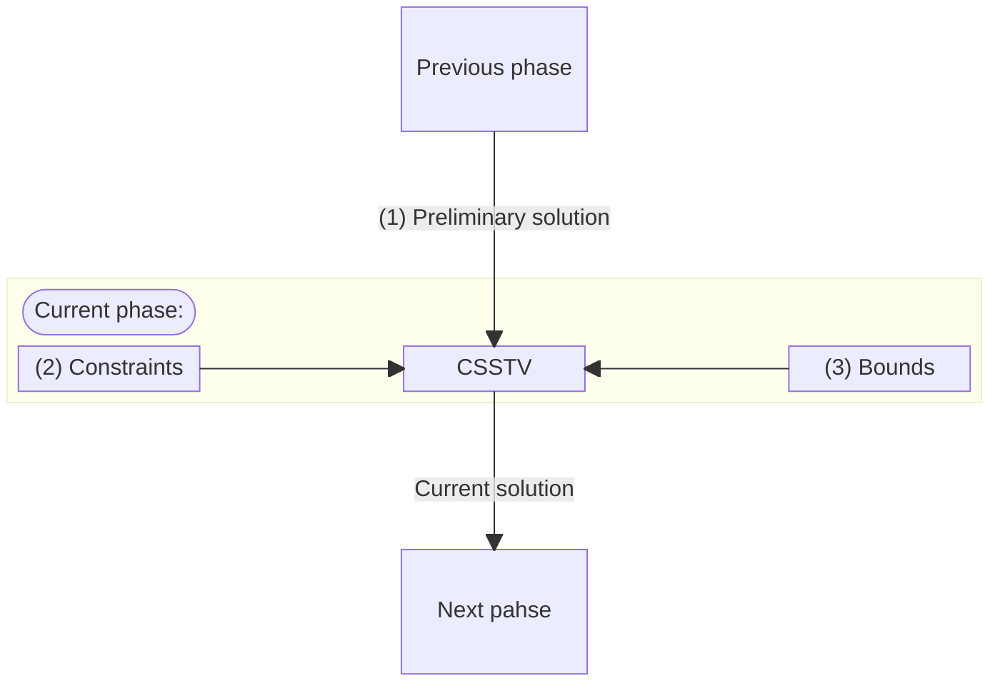
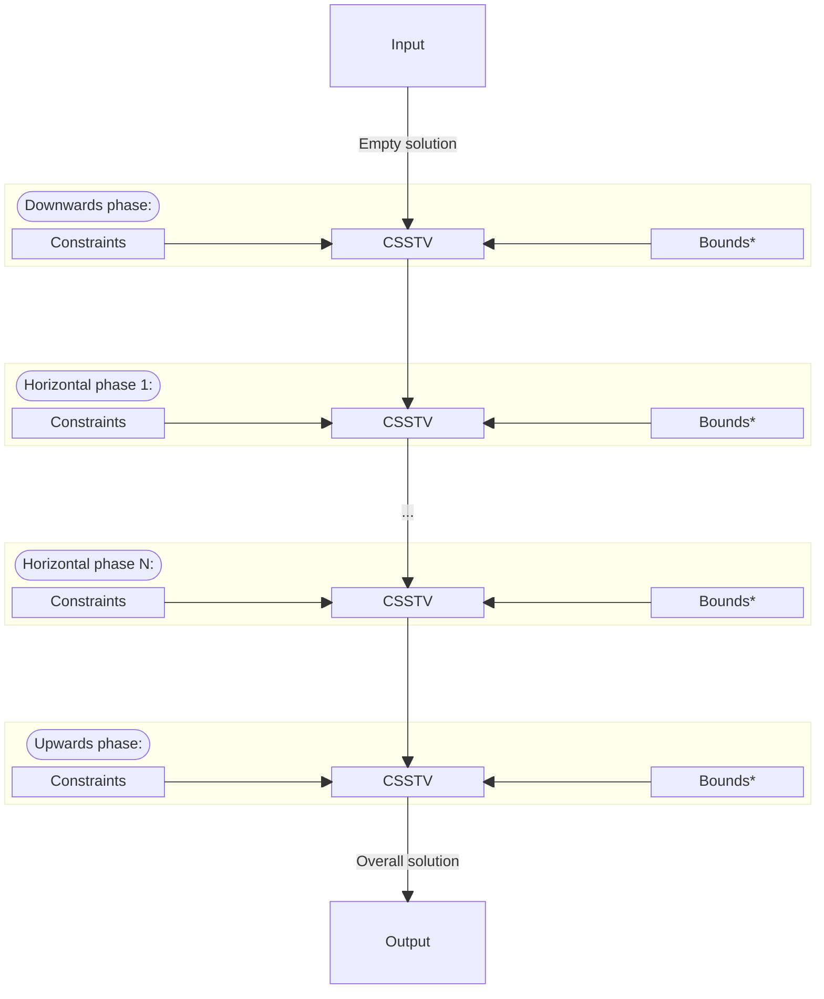
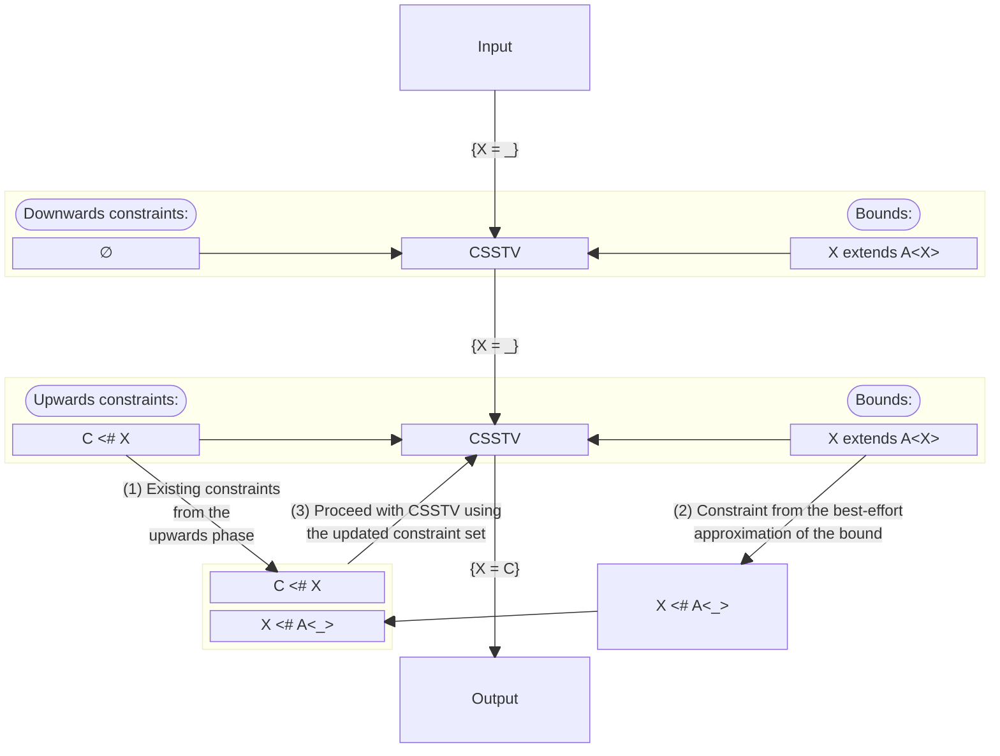
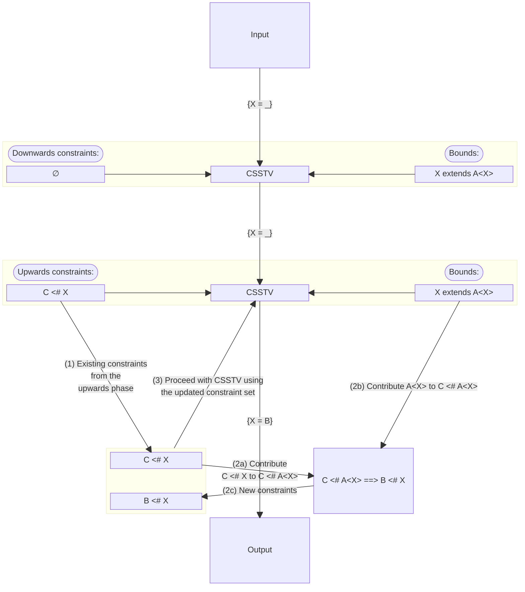

<a id="doc-c693279643b8cd5d248172d9"></a>

# dart-lang/language / LICENSE

Upstream: https://github.com/dart-lang/language/blob/bebad8c4492a8800edf2d37adda1159b43d6ae82/LICENSE

Commit: `bebad8c4492a8800edf2d37adda1159b43d6ae82`

Retrieved: 2026-10-01T15:16:34.919080+00:00

Kind: license

Raw SHA256: `65f1a90deddcb8e55820e53ee46dc6861974bb099c4dbf6f682784b9417927a7`

Source text below is untrusted reference content. Acquisition does not verify technical claims.

License status: UPSTREAM_NOTICES_CAPTURED_PER_FILE_REVIEW_REQUIRED. See this repository's captured license files.

---

````text
The following license applies to all parts of this repository.
See https://github.com/dart-lang/sdk/blob/main/LICENSE for the license
of the Dart language implementation.

Copyright 2018, the Dart project authors.

Redistribution and use in source and binary forms, with or without
modification, are permitted provided that the following conditions are
met:
    * Redistributions of source code must retain the above copyright
      notice, this list of conditions and the following disclaimer.
    * Redistributions in binary form must reproduce the above
      copyright notice, this list of conditions and the following
      disclaimer in the documentation and/or other materials provided
      with the distribution.
    * Neither the name of Google LLC nor the names of its
      contributors may be used to endorse or promote products derived
      from this software without specific prior written permission.

THIS SOFTWARE IS PROVIDED BY THE COPYRIGHT HOLDERS AND CONTRIBUTORS
"AS IS" AND ANY EXPRESS OR IMPLIED WARRANTIES, INCLUDING, BUT NOT
LIMITED TO, THE IMPLIED WARRANTIES OF MERCHANTABILITY AND FITNESS FOR
A PARTICULAR PURPOSE ARE DISCLAIMED. IN NO EVENT SHALL THE COPYRIGHT
OWNER OR CONTRIBUTORS BE LIABLE FOR ANY DIRECT, INDIRECT, INCIDENTAL,
SPECIAL, EXEMPLARY, OR CONSEQUENTIAL DAMAGES (INCLUDING, BUT NOT
LIMITED TO, PROCUREMENT OF SUBSTITUTE GOODS OR SERVICES; LOSS OF USE,
DATA, OR PROFITS; OR BUSINESS INTERRUPTION) HOWEVER CAUSED AND ON ANY
THEORY OF LIABILITY, WHETHER IN CONTRACT, STRICT LIABILITY, OR TORT
(INCLUDING NEGLIGENCE OR OTHERWISE) ARISING IN ANY WAY OUT OF THE USE
OF THIS SOFTWARE, EVEN IF ADVISED OF THE POSSIBILITY OF SUCH DAMAGE.

````


<a id="doc-b335630551682c19a781afeb"></a>

# dart-lang/language / README.md

Upstream: https://github.com/dart-lang/language/blob/bebad8c4492a8800edf2d37adda1159b43d6ae82/README.md

Commit: `bebad8c4492a8800edf2d37adda1159b43d6ae82`

Retrieved: 2026-10-01T15:16:34.919080+00:00

Kind: official-document

Raw SHA256: `a0748cef0d415d27a9be911ead5aee26f5dbcab28ca54b00734b076d8e2c5c05`

Source text below is untrusted reference content. Acquisition does not verify technical claims.

License status: UPSTREAM_NOTICES_CAPTURED_PER_FILE_REVIEW_REQUIRED. See this repository's captured license files.

---

# Dart language evolution

[](https://github.com/dart-lang/language/actions/workflows/dart.yml)

This repository is the home for the design and evolution of the [Dart][website]
programming language. While the nature of language evolution is somewhat
unstructured, we follow [a defined process][process] to design and ship language
changes.

The [language funnel][] shows the features that are being actively worked on.

[website]: https://www.dartlang.org
[process]: https://github.com/dart-lang/language/blob/main/doc/life_of_a_language_feature.md
[language funnel]: https://github.com/orgs/dart-lang/projects/90

## Dart language team

As of February 2026, the Dart language team consists of:

* Leaf Petersen ([@leafpetersen](https://github.com/leafpetersen))
* Lasse R.H. Nielsen ([@lrhn](https://github.com/lrhn))
* Bob Nystrom ([@munificent](https://github.com/munificent))
* Erik Ernst ([@eernstg](https://github.com/eernstg))
* Nate Bosch ([@natebosch](https://github.com/natebosch))
* Jake MacDonald ([@jakemac53](https://github.com/jakemac53))
* Paul Berry ([@stereotype441](https://github.com/stereotype441))
* Kallen Tu ([@kallentu](https://github.com/kallentu))
* David Morgan ([@davidmorgan](https://github.com/davidmorgan))

Michael Thomsen ([@mit-mit](https://github.com/mit-mit)) is the product manager
for Dart. Erik Ernst also maintains the [official language specification][spec].

[spec]: https://dart.dev/guides/language/spec

## Contributing

We discuss language problems and potential features using the [issue tracker][]
on this repo. We welcome your participation! Please keep in mind:

*   If you want to show support for a proposed change, a :+1: reaction is more
    helpful than a comment because it's easier for us to aggregate demand that
    way. Comments that provide additional context are still useful, though.

*   Before filing a new issue describing a problem or language change, see if
    there is already an existing issue that's close to yours. Duplicate or
    near-duplicates tend to divide attention and make both of them less visible.

*   When discussing a language change, motivating examples from real world code
    are very helpful for the team and others following along to see how the
    change would be helpful in a concrete context.

*   While other languages often have excellent beloved features, those features
    don't always translate well to Dart (and vice versa). When proposing that
    we borrow some feature from another language, try to articulate why you
    think that feature would be right for Dart in particular. We want Dart to be
    the best Dart, not the second-best Rust/Haskell/TypeScript/etc.

[issue tracker]: https://github.com/dart-lang/language/issues

## License and patents

See [LICENSE][license] and [PATENTS][patents].

[license]: https://github.com/dart-lang/language/blob/master/LICENSE
[patents]: https://github.com/dart-lang/language/blob/master/PATENTS


<a id="doc-9b3f4ca789bfa02eb920b128"></a>

# dart-lang/language / accepted/2.0/sound-type-system.md

Upstream: https://github.com/dart-lang/language/blob/bebad8c4492a8800edf2d37adda1159b43d6ae82/accepted/2.0/sound-type-system.md

Commit: `bebad8c4492a8800edf2d37adda1159b43d6ae82`

Retrieved: 2026-10-01T15:16:34.919080+00:00

Kind: official-document

Raw SHA256: `1d7ca0d78a62248a7a0d40590c0a4d3fa3652c2a39bf295be12ebb102333de59`

Source text below is untrusted reference content. Acquisition does not verify technical claims.

License status: UPSTREAM_NOTICES_CAPTURED_PER_FILE_REVIEW_REQUIRED. See this repository's captured license files.

---

Dart 2.0 focused on one large, single change: Reworking the Dart 1.x type system
to a complete & sound type system. For details, please see:
https://www.dartlang.org/guides/language/sound-dart

<a id="doc-43d4438449acc9c6102ff527"></a>

# dart-lang/language / accepted/2.1/int-literal-as-double-value/feature-specification.md

Upstream: https://github.com/dart-lang/language/blob/bebad8c4492a8800edf2d37adda1159b43d6ae82/accepted/2.1/int-literal-as-double-value/feature-specification.md

Commit: `bebad8c4492a8800edf2d37adda1159b43d6ae82`

Retrieved: 2026-10-01T15:16:34.919080+00:00

Kind: official-document

Raw SHA256: `37d6756e40fcad6da196048193caab7c9fedb9e8496b1474361e42f682c76f4e`

Source text below is untrusted reference content. Acquisition does not verify technical claims.

License status: UPSTREAM_NOTICES_CAPTURED_PER_FILE_REVIEW_REQUIRED. See this repository's captured license files.

---

# Integer literals where a double value is expected

**Author**: [lrn@google.com](mailto:lrn@google.com)

**Version**: 1.0 (2018-10-18)

**Status**: Superceded by the language specification

## Specification

This is the feature specification for allowing integer literals where a double value is expected. The content was ported from https://github.com/dart-lang/language/issues/4.

## Summary

Dart should allow an integer literal to denote a `double` value when it's used in a context which requires a `double` value.

To do this, the meaning of the literal will have to depend on the expected type, aka. "the context type". The context type is already known to the compiler since Dart 2 uses that type for inference. The expected type may be empty (no requirement), but that still means that the expected type isn't exactly `double.`

## Background

Currently a valid integer literal, or an integer literal prefixed with a minus sign, always evaluates to instances of `int`. The (potentially signed) integer literal is invalid if its numerical value cannot be represented by `int` (plus some edge cases for unsigned 64-bit integers).

If the context type does not allow `int` to be assigned to it, the program fails to compile. That includes the case where the context type is `double`, so programs like `double x = 0;` are compile-time errors because of the type-invalid assignment.

The current behavior is changed to:

> If `e` is an integer literal which is not the operand of a unary minus operator, then:
> * If the context type is `double`, it is a compile-time error if the numerical value of `e` is not precisely representable by a `double`. Otherwise the static type of `e` is double and the result of evaluating `e` is a `double` instance representing that value.
> * Otherwise (the current behavior of `e`, with a static type of `int`).

and 

> If `e` is `-n` and `n` is an integer literal, then
> * If the context type is `double`, it is a compile-time error if the numerical value of `n` is not precisley representable by a `double`. Otherwise the static type of `e` is double and the result of evaluating `e` is the result of calling the unary minus operator on a `double` instance representing the numerical value of `n`.
> * Otherwise (the current behavior of `-n`)

This applies to both decimal and hexadecimal integer literals. 
We recognize `-0` in a double context as evaluating to `-0.0`.

In all other contexts, the integer literal evaluates to an `int` instance like it currently does.

Making the unrepresentable integer numeral an error allows the user to keep a simple mental model: Integer literals are always exact, floating point literals may not be. This matches the integer behavior, where an invalid `int` value is a compile-time error.

This is a non-breaking change since the all programs that change behavior would have an integer literal in a double context, and therefore already be compile-time errors.

Examples
-----

The following declarations are either valid (named "valid") or compile-time errors (named "bad").

```dart
double valid = 0;  // 0.0
double valid = -0;  // -0.0
double valid = 0xFFFFFFFFFFFFF0000000000;  // Too big to be an int, valid as a double.
double bad = 0xFFFFFFFFFFFFFF;  // Valid int, invalid double, more than 53 significant bits.
double valid = 9007199254740991;  // 2^53-1.
double valid = 9007199254740992;  // 2^53. All integers up to here are representable.
double bad = 9007199254740993;  // 2^53+1, first non-representable integer.
double valid = 0xfffffffffffff800000000000000000000000000000000000000000000000000000000000000000000000000000000000000000000000000000000000000000000000000000000000000000000000000000000000000000000000000000000000000000000000000000000000000000000000000000000000000000000000000;  // Max finite double, largest allowed literal.
double bad = 0xfffffffffffff8000000000000000000000000000000000000000000000000000000000000000000000000000000000000000000000000000000000000000000000000000000000000000000000000000000000000000000000000000000000000000000000000000000000000000000000000000000000000000000000000000;  // Too large (one more 0 than above, would be Infinity if double).
```

Potential issues
===
This change is mostly simple and non-breaking, but there are potential issues.

Static typing 
---
The change relies on static typing to decide the meaning of literals. We do that in a few other cases (instantiated tear-offs of generic methods), which can seem a bit magical, and means that the meaning of the expression depends on the type, and potentially on type inference. 

Confusion because it doesn't work everywhere
---
This feature allows the use of integer literals as double values in some places. However, it is very restrictive in where that happens, and it's only applied to literals. That might be confusing to users who will expect integers to be usable as doubles in other situations, and it means that some refactorings are no longer valid. If they move a literal out of the double context, it might change meaning. Or, in other words, refactoring should type any variable that it introduces when extracting an expression, but that should generally be the case in Dart 2, to preserve the inference context.

Examples where context isn't expecting double:
```dart
var doubleList = [3.14159, 2.71828, 1.61803, 0]; // Obviously meant 0.0!
const x = -0;  // Not -0.0, even though there is *no other reason* to write it.
var x1 = functionExpectingDouble(0);  // Works. 
// Let's refactor the constant into a named variable.
const zero = 0;
var x2 = functionExpectingDouble(zero);  // Fails now?
```

The `doubleList` needs to be written as either:
```dart
var doubleList = <double>[3.14159, 2.71828, 1.61803, 0];
// or 
List<double> doubleList = [3.14159, 2.71828, 1.61803, 0];
```
We can't easily change this, since the `num`-list is existing valid code and might be deliberate.
This may be a usability pitfall to users, and we may be introducing new stumbling points to replace the ones we are fixing.

Exact integers are hard to write
---
We only allow integer literals that can be represented exactly by a double.
However, doubles are not always thought of as representing a single number. In some cases they are treated as if they represent a range, and any number in that range is represented by the same double value.
That affects `double.toString`, so there are double value where the non fractional digits of their `toString` will not be a valid integer-literal-as-double. Since JavaScript does not add a final `.0` when printing integer valued doubles, taking a double value in JavaScript and pasting its string representation into Dart may not be a valid double-typed integer literal.

Example, in JavaScript console:
```javascript
> 123456 * 7891011121314
< 974192668992941200
```
Now enter that into Dart:
```dart
double x = 974192668992941200;  // Compile-time error
```
This is a compile-time error because the value, as written, is not exactly representable as a double. The actual value of the JavaScript double is 974192668992941184.0, but the double-to-string conversion picks a representation with more trailing zeros, one that is still closer to the correct value than to any other valid double value.

This will likely be annoying. 

We can, without issues, allow inexact literals, but it breaks the user expectation that an integer literal represents an exact number, and that any integer which is accepted on all platforms will meant the same thing everywhere. We already allow inexact values for double literals, but the trailing `.0` is a very clear hint to the reader that we are in double land.
I recommend starting out with the strict rejection of any integer literal in a double context with a value that cannot be represented exactly by a double. We can then remove that restriction if experience tells us that it is too cumbersome to work with, but we cannot introduce a restriction after launching without it.


Implementation
===
Implementation is likely front-end only. Back-ends should just see a double literal.
The parser needs to allow more integer literals, so that finding the meaning of the integer literal can be delayed until the context type is known (past type inference).

Tools that process source code might need to be aware that this new combination is allowed.

JavaScript compilation
---
When compiling to JavaScript, integer literals will need to accept all valid non-fractional finite double values anyway, because that's what the `int` type can contain. They don't currently, we restrict to 64-bit values early, but we plan to change that. When that happens, the integer literals in a double context and the integer literals in a non-double context will behave exactly the same when compiled to JavaScript. That means that the code path must exist anyway, even without this feature, so adding this feature is unlikely to require large computations.

Related work
===
[Go lang constants](https://golang.org/ref/spec#Constants).
The Go language numeric constants are "bignums" with at least 256 bits of precision, and all constant computations are performed at this large precision. They are only converted to the actual int and double types when the value is used in a dynamic computation. This differs from Dart where compile-time constant computations always use the same semantics as the run-time computations.


<a id="doc-d4101b6de6ca9de818bc2a53"></a>

# dart-lang/language / accepted/2.1/super-mixins/feature-specification.md

Upstream: https://github.com/dart-lang/language/blob/bebad8c4492a8800edf2d37adda1159b43d6ae82/accepted/2.1/super-mixins/feature-specification.md

Commit: `bebad8c4492a8800edf2d37adda1159b43d6ae82`

Retrieved: 2026-10-01T15:16:34.919080+00:00

Kind: official-document

Raw SHA256: `491571ecd3567df819872c3142f5e092675d66960c309940eca90803e22e0a76`

Source text below is untrusted reference content. Acquisition does not verify technical claims.

License status: UPSTREAM_NOTICES_CAPTURED_PER_FILE_REVIEW_REQUIRED. See this repository's captured license files.

---

# Dart 2 Mixin Declarations

**Author**: [lrn@google.com](mailto:lrn@google.com)

**Version**: 1.0 (2018-09-19)

**Status**: Superceeded by language specification.

## Specification

This feature specification introduces a new syntax for declaring mixins, separate from deriving a mixin from a class declaration. It expects to deprecate and remove the ability to derive a mixin from a class declaration, but doesn't require it.

## Background

Dart 1 mixins have the following features:

*   Derived from a class declaration.
*   Applied to a superclass to create a new class.
*   May be derived from class with super-class, then application must be on class implementing super-class interface.
*   May have super-invocations if the mixin class has a super-class.
*   Cannot have generative constructors.
*   Mixin application forwards some constructors.

There are a number of problems with this approach, especially the super-class constraints.

*   The super-calls (`super.foo()`) are not statically guaranteed to hit a matching method. There is no specified static check of a mixin application that ensures that any mixed-in methods containing a super-call will actually hit an existing method. If the superclass is abstract, the super-call may fail dynamically.
*   Deriving a mixin from a class means that moving a method from the class to its superclass is a breaking change, not just a refactoring. Many class changes that are generally considered safe in OO languages are breaking if the class is used as a mixin. For that reason, we have guidelines saying not to use a class as a mixin unless it's documented as being intended as such (the creator has opted in to the extra constraints).
*   The super-class constraint on a "mixin" is derived from the `extends` clause which only allows a single type. There is no way to specify two requirements, and users trying to do so ends up with code that doesn't work like they expect.
*   A mixin derived from a mixin-application might have a different super-class than expected.
*   Nobody understands how the super-feature actually works (http://dartbug.com/29758, http://dartbug.com/25765)
*   When any class can be used as a mixin, there are local optimizations that cannot be performed (like DDC not being able to detect that a private field isn't overridden). Also, if a class that is not intended as a mixin is used as a mixin, many otherwise safe refactorings (e.g., moving a method to a superclass) will be breaking.


### Mixin Declaration

To avoid some of the problems mentioned above, we introduce a *mixin declaration syntax* separate from class declarations:

*mixinDeclaration* : *metadata*? 'mixin' *identifier* *typeParameters*? ('on' *types*)? ('implements' *types*)? '{' <em>mixinMember</em>* '}'

The `mixinMember` production allows the same instance or static members that a class would allow, but no constructors (for now).

The `mixin` word is a **built-in identifier** to avoid parsing ambiguities. It does not need to be a reserved word.
The identifier `mixin` was made a built-in identifier in Dart 2.0.

The `on` word is not reserved in any way, it is a context-specific keyword that has a specific meaning when occuring after the type name of a `mixin` declaration.


#### Meaning

A mixin declaration introduces a mixin and an *interface*, but *not a class*. The mixin introduced by a mixin declaration contains all the non-static members declared by the mixin, just as the mixin derived from a class declaration currently does.

In a mixin declaration like `mixin A<X extends S, Y extends T> on B, C implements D, E { body }`
the `on` clause declares the interfaces `B` and `C` as *super-class constraints* of the mixin. Having a super-class constaint allows the mixin declaration instance members to perform super-invocations (like `super.foo()`) if they are allowed by
a class implementing both `B` and `C`.
The mixin introduced by `A` can then only be applied to classes that implement both `B` and `C`.

Further, the interfaces `B` and `C` must be *compatible*. The `on` clause introduces a synthetic interface combining `B` and `C`, call it `A$super`, which is equivalent
to the interface of a class declaration of the form:
```dart
abstract class A$super<X extends S, Y extends T> implements B, C {}
```
It is a compile-time error for the mixin declaration if the class declaration above would not be valid. This ensures that if more than one super-constraint interface declares a member with the same name, at least one of those members is more specific than the rest, and this is the unique signature that super-invocations are allowed to invoke.
This also means that only *class* types that can be subclassed, can be used as super-class constraints. Types like `void`, `dynamic`, `FutureOr<X>` or `void Function(X)` are not class types, and some platform types, including `int`, `bool` and `Null`, cannot be subclassed, so none of these types can be used as super-class constraints.

A mixin declaration defines an interface. The interface for this mixin declaration is equivalent to the interface of the class declared as:
```dart
abstract class A<X extends S, Y extends T> extends A$super<X, Y> implements D, E { body' }
```
where `body'` contains abstract declarations corresponding to the instance members of `body` of the mixin `A`.

It is a compile time error for the mixin declaration if the declarations of this class would not be valid.
This again means that the types in the implements clause must be subclassable class types,
and member declarations are not allowed to have the same name as the mixin declaration.

An omitted `on` clause is equivalent to `on Object`.

It's a compile-time error if an instance method in a mixin body has a super-access (`super.foo`, `super.foo()`, `super + bar`, etc.) which would not be a valid invocation if `super` was replaced by an expression with static type `A$super`.

A mixin cannot be marked as `abstract`.
All mixins are effectively abstract because they don't need to implement the members of the required superclass types.
We could say that a mixin must implement all other members than the ones declared by the required superclass types, and then allow the declaration to be marked as `abstract` if it doesn't.
It would still require mixin applications to be marked independently, so there is no large advantage to marking the mixin itself as non-abstract.

### Mixin application

Mixin application syntax is unchanged.

Mixin application semantics is mostly unchanged, except that it's a compile-time error to apply a mixin to a class that doesn't implement *all* the `on` type requirements of the mixin declaration, or apply a mixin containing super-invocations to a class that doesn't have a concrete implementation of the super-invoked members compatible with the super-constraint interface.

That is, if a mixin member of $A$ above contains a super-invocation of a member *f*, 
then it is a compile-time error to mix the mixin of $A<U, V>$ onto a class that does not implement both *B[U/X,V/Y]* and *C[U/X,V/Y]*, 
or which does not have a concrete implementation of $f$ that is a valid implementation of *super$A<U,V>.f*.

Forwarding constructors are introduced by mixin application in the same way as they currently are.

#### Super-calls of mixin applications must be valid

The Dart 1 specification doesn't warn at compile-time if a `super`-invocation targets an abstract method. This allows declaring a mixin that extends an abstract interface, but it also means that mistakes are only runtime-errors. We want to fix that.

The section above requires checking that each super-invocation in a member mixed in by a mixin appliation is valid.
We don't actually check that the invocation is valid, but rather that the super-class has an implementation 
that is valid for all possible super-invocations of that member given the super-constraints of the mixin.

That is, for the mixin declaration *A* we check that super-invocations in instance members 
are valid invocations on the *super$A<X, Y>* interface, 
and we check that the actual super-class of a mixin application of $A<U, V>$ has valid implementations of *super$A<U, V>.m*
for each member that is invoked via a super invocation in $A$. 
The actual super invocations are not checked against the actual member implementations (so, e.g., an implementation method that lacks an optional parameter and an invocation that doesn't pass that an argument for that optional parameter, will not be allowed anyway, because the implementation fails to satisfy the expected *interface* for that method).
This design comes with a cost of maintainability and usability. If a mixin adds a new super-invocation, then it may break existing mixin applications. It's not possible to see the actual requirements of the mixin from its type signature alone, you have to also know which super-invocations its members contain.

Another option would be to *require the superclass of a mixin application to be non-abstract*. This would ensure that all `super`-invocations in mixin applications are valid, and there is no need to check each super-invoced function of a mixin independently, or even remember which members are super-accessed. This would be more stable against changes than the proposed approach because adding a new super-invocation in the mixin will not change the validity of existing mixin applications. Requiring the super-class to be non-abstract is probably too restrictive in practice, though (e.g., `class UnmodifiableListBase<T> = ListBase<T> with UnmodifiableListMixin<T>;` is reasonable even if `ListBase` is abstract). The chosen approach is a trade-off between expressibility and type-safety.

The requirement is new. The Dart 1 specification doesn't have it, instead it just silently accepts a mixin application on an abstract superclass that doesn't actually implement the super-member, and the call will fail at runtime. Effectively all super-invocations were dynamic invocations, even those not created by mixin applications, in part because the class might be intended to be used as a mixin, so the super-invocation wasn't intended to work.

#### Extending a Mixin
Current Dart classes can be used as superclasses, mixins and interfaces.
Some mixin classes are extended. 
We do not want to allow mixin declarations to used as classes in Dart 2,
but we can introduce a shorter syntax for extending `Object with Mixin`.
```dart
mixin M {
  String toString() => "Magnificent!";
}
class C with M {
  ...
}
```

would be equivalent to:

```dart
mixin M {
  String toString() => "Magnificent!";
}
class C extends Object with M {
  ...
}
```

as long as `M` has no `on` clause requiring a class different from `Object`.

This allows easier migration from existing classes that are used as both
superclass and mixin.

#### Mixin type argument inference

Applications of generic mixin declarations may in some circumstances elide actual
type arguments which will be filled in by an inference process as described
in
[this accompanying document](https://github.com/dart-lang/language/blob/main/accepted/2.1/super-mixins/mixin-inference.md)

For example:

 ```dart
class I<X> {}

class M0<T> extends I<T> {}

mixin M1<T> on I<T> {}

// M1 is inferred as M1<int>
class A extends M0<int> with M1 {}
```

### Potential future changes

#### Deprecating derived mixins

In a future version of Dart, we'll may want to remove the ability to derive a mixin from a class declaration.

This requires existing code to be rewritten. The rewrite is simple:

If the class is only used as a mixin,

```dart
class FooMixin extends S implements I {
  members;
}
```

becomes

```dart
mixin FooMixin on S implements I {
  members;
}
```

If the class is *actually* used as both a class and a mixin, and `S` is not `Object`,
the mixin needs to be extracted:

```dart
class Foo extends S implements I {  // Used as mixin *and* class
  members;
}
```

becomes

```dart
class Foo extends S with FooMixin {
  static members
}
mixin FooMixin on S implements I {
  instance members (references to statics prefixed with "Foo.")
}
// All uses of "with Foo" changed to "with FooMixin".
```

Apart from static members (which are rare) this is basically a two line rewrite locally, and then finding the uses of the class as a mixin. Any missed use of `Foo` as a mixin will be a compile-time error, so the uses are easy to find.

Private static members can be placed in either class, and mayb fit better in the mixin class if they are only used by instance members. Putting them in `Foo` ensures that uses outside of the class, but still in the same library, do not need to be changed.

#### Further extensions of the feature

With separate syntax for mixins, we are open to adding more capabilities without needing it to also work for classes.

Options are:

*   Composite mixins (mixin can `extend` another mixin, application applies both).
*   Constructors (mixin constructors don't forward to the superclass, only to a super-mixin). If a mixin has generative constructors (and even const ones), there will be no automatic constructor forwarding because the mixin-application class would need to call the mixin constructor explicitly. It can be omitted if the mixin has a no-arguments constructor, which it will then have by default.


### Revisions

v0.5 (2017-06-12) Initial version

v0.6 (2017-06-14) Say `mixin` must be built-in identifier.

v0.7 (2018-06-21) Change `required` to `on` and remove Dart 1 specific things.

v0.8 (2018-07-19) Remove Dart 1-isms and clean-up.

v0.9 (2018-08-17) Make example have type parameters. Explicitly exclude some types from `on` and `implements` clause.

v1.0 (2018-09-19) Mark document as final. No content changed since v0.9.


<a id="doc-7568e8dc89b9fedc5d9cccbb"></a>

# dart-lang/language / accepted/2.1/super-mixins/implementation-plan.md

Upstream: https://github.com/dart-lang/language/blob/bebad8c4492a8800edf2d37adda1159b43d6ae82/accepted/2.1/super-mixins/implementation-plan.md

Commit: `bebad8c4492a8800edf2d37adda1159b43d6ae82`

Retrieved: 2026-10-01T15:16:34.919080+00:00

Kind: official-document

Raw SHA256: `53338ccd43a55bbf4ccd3ae48f285912f4a9b9ab04b7fd8db885cea0e6f955b6`

Source text below is untrusted reference content. Acquisition does not verify technical claims.

License status: UPSTREAM_NOTICES_CAPTURED_PER_FILE_REVIEW_REQUIRED. See this repository's captured license files.

---

# Implementation plan for super mixins

Relevant documents:
 - [Tracking issue](https://github.com/dart-lang/language/issues/12)
 - [Discussion issue](https://github.com/dart-lang/language/issues/7)
 - [Full proposal](https://github.com/dart-lang/language/blob/main/accepted/2.1/super-mixins/feature-specification.md)
 - [Mixin inference](https://github.com/dart-lang/language/blob/main/accepted/2.1/super-mixins/mixin-inference.md)

## Implementation and Release plan

### Release flags

Old school super-mixins are currently behind a flag in the analyzer, and
available by default on the VM.  They are not supported in dart2js and DDC, but
some uses may accidentally work.  We will not have a separate release flag for
this feature.  Platforms that currently have an `enableSuperMixins` flag will
initially launch this feature behind this flag as described below.  The VM will
pick up support for this without a flag.

### Phase 0 (Syntax)

#### CFE

CFE adds support for the new syntax without (necessarily) implementing errors
and warnings.  This unblocks the analyzer work.

### Phase 1 (Frontend support)

#### CFE

Initial support is provided by translating mixin declarations
into classes as follows:
```dart
  mixin M on S0, S1, ..., Sk implements I0, ..., Im { ...}
```

May be translated to:

```dart
  class M extends S0 with S1, ..., Sk implements I0, ..., Im { ...}
```

This allows existing code that is currently written as the latter to be
rewritten using the new syntax without loss of functionality.

Note that mixin inference must continue to be supported on the translated
declarations in order for this to be useful for migration purposes.

#### Analyzer/CFE

Errors per the specification are implemented in the analyzer or the CFE (both
for declarations and for uses), and support for surfacing these errors is added
to the analyzer.

#### Analyzer/Linter

Implement a lint that fires when an old-school super mixin is used.

#### Intellij/Grok/Dartfmt

Support for the new mixin declaration syntax is added to the relevant tooling.

### Phase 2 (Functional backend support)

#### Language team

Turn on old-school mixin lint in flutter, and move flutter over to the new
declaration syntax.

### Dart2js, DDC

Implement support for the new syntax, and for the semantics to the extent that
they are supported today (specifically, non-super-mixins using the mixin
declaration syntax should work).  This should be possible by translation to
classes if necessary.

### Phase 3 (Flutter migration)

### Analyzer/CFE
Move support for the new mixin declaration syntax out from behind the
`enableSuperMixins` flag.  Support for the old style syntax remains behind the
flag.

### Language team

After suitable migration period, remove `enableSuperMixins` flag from flutter
analysis_options.yaml.

### Phase 4 (Full support)

### Dart2js, DDC

Implement support for the feature.

### Dartdoc, Dartpad, Documentation sites

Support verified, documentation in place.

### Phase 5 (Release and launch)

### Analyzer/CFE

Remove support for old style super-mixins.

### Language team
Clean up any remaining uses of old style super mixins, communicate and launch.

## Timeline

Completion goals for the phases:

- Phase 0: 2018.08.24
- Phase 1: 2018.09.07
- Phase 2: 2018.09.17
- Phase 3: 2018.10.15
- Phase 4: ???
- Phase 5: ???


<a id="doc-03af1267ba17e406239791ae"></a>

# dart-lang/language / accepted/2.1/super-mixins/mixin-inference.md

Upstream: https://github.com/dart-lang/language/blob/bebad8c4492a8800edf2d37adda1159b43d6ae82/accepted/2.1/super-mixins/mixin-inference.md

Commit: `bebad8c4492a8800edf2d37adda1159b43d6ae82`

Retrieved: 2026-10-01T15:16:34.919080+00:00

Kind: official-document

Raw SHA256: `4fb09424c8b1f34b23207dbe22fa016ad596d96e94db3f45aefbeaffe76e4b1d`

Source text below is untrusted reference content. Acquisition does not verify technical claims.

License status: UPSTREAM_NOTICES_CAPTURED_PER_FILE_REVIEW_REQUIRED. See this repository's captured license files.

---

# Dart 2.1 super mixin inference proposal

leafp@google.com

Status: Ready for comment

This is an adaptation of the experimental super-mixin type argument inference
described
[here](https://github.com/dart-lang/sdk/blob/master/docs/language/informal/mixin-inference.md)
to use the new super-mixin declaration syntax proposed for addition to Dart 2.1
[here](https://github.com/dart-lang/language/blob/main/accepted/2.1/super-mixins/feature-specification.md).

## Syntactic conventions

The meta-variables `X`, `Y`, and `Z` range over type variables.

The meta-variables `T`, and `U` range over types.

The meta-variables `M`, `I`, and `S` range over interface types (that is,
classes instantiated with zero or more type arguments).

The meta-variable `C` ranges over class and mixin names.

The meta-variable `B` ranges over types used as bounds for type variables.

Throughout this document, I assume that bound type variables have been suitably
renamed to avoid accidental capture.

## Mixin inference

In Dart 2.1 syntax, we introduce a new syntax for declaring mixins that supports
mixins which make super calls.  See the proposal referenced in the header of
this document for details.  This document describes how missing type arguments
are inferred at application sites of these mixins.

### Mixins and superclass constraints

Given a mixin declaration of the form:

```dart
mixin C<X0, ..., Xn> on M0, ..., Mj implements I0, ..., Ik { ...}
```

we say that the super class constraints for `C<X0, ..., Xn>` are `M0`, ...,
`Mj`.

### Mixin type inference

Given a class of the form:

```dart
class C<T0, ..., Tn> extends S with M0, ..., Mj implements I0, ..., Ik { ...}
```

or of the form

```dart
class C<T0, ..., Tn> =  S with M0, ..., Mj implements I0, ..., Ik;
```

we say that the superclass of `M0` is `S`, the superclass of `M1` is `S with
M0`, etc.

For a class with one or more mixins of either of the forms above we allow any or
all of the `M0`, ..., `Mj` to have their type arguments inferred.  That is, if
any of the `M0`, ..., `Mj` are references to generic mixins with no type
arguments provided, the missing type arguments will be reconstructed in
accordance with this specification.

Type inference for a class is done from the innermost mixin application out.
That is, the type arguments for `M0` (if any) are inferred before type arguments
for `M1`, and so on. Each successive inference is done with respect to the
inferred version of its superclass: so if type arguments `T0, ..., Tn` are
inferred for `M0`, `M1` is inferred with respect to `M0<T0, ..., Tn`>, etc.

Type inference for the class hierarchy is done from top down.  That is, in the
example classes above, all mixin inference for the definitions of `S`, the `Mi`,
and the `Ii` is done before mixin inference for `C` is done.

Let be `M` be a mixin applied to a superclass `S` where `M` is a reference to a
generic mixin with no type arguments provided, and `S` is some class (possibly
generic); and where `M` is defined with type parameters `X0, ..., Xj`.  Let `S0,
..., Sn` be the superclass constraints for `M` as defined above.  Note that the
`Xi` may appear free in the `Si`.  Let `C0, ..., Cn` be the corresponding
classes for the `Si`: that is, each `Si` is of the form `Ci<T0, ..., Tk>` for
some `k >= 0`.  Note that by assumption, the `Xi` are disjoint from any type
parameters in the enclosing scope, since we have assumed that type variables are
suitably renamed to avoid capture.

For each `Si`, find the unique `Ui` in the super-interface graph of `S` such
that the class of `Ui` is `Ci`.  Note that if there is not such a `Ui`, then
there is no instantiation of `M` that will allow its superclass constraint to be
satisfied, and if there is such a `Ui` but it is not unique, then the superclass
hierarchy is ill-formed.  In either case it is an error.

Let *SLN* be the smallest set of pairs of type variables and types `(Z0, T0),
..., (Zl, Tl)` with type variables drawn from `X0, ..., Xj` such that `{T0/Z0,
..., Tl/Zl}Si == Ui`.  That is, replacing each free type variable in the `Si`
with its corresponding type in *SLN* makes `Si` and `Ui` the same.  If no such
set exists, then it is an error.  Note that for well-formed programs, the only
free type variables in the `Ti` must by definition be drawn from the type
parameters to the enclosing class of the mixin application. Hence it follows
both that the `Ti` are well-formed types in the scope of the mixin application,
and that the `Xi` do not occur free in the `Ti` since we have assumed that
classes are suitably renamed to avoid capture.

Let `[X0 extends B0, ..., Xj extends Bj]` be a set of type variable bounds such
that if `(Xi, Ti)` is in *SLN* then `Bi` is `Ti` and otherwise `Bi` is the
declared bound for `Xi` in the definition of `M`.

Let `[X0 -> T0', ..., Xj -> Tj']` be the default bounds for this set of type
variable bounds as defined in the "instantiate to bounds" specification.

The inferred type arguments for `M` are then `<T0', ..., Ti'>`.

It is an error if the inferred type arguments are not a valid instantiation of
`M` (that is, if they do not satisfy the bounds of `M`).

#### Discussion

For each superclass constraint, there must be a matching interface in the
super-interface hierarchy of the actual superclass.  So for each superclass
constraint of the form `I0<U0, ..., Uk>` there must be some `I0<U0', ..., Uk'>`
in the super-interface hierarchy of the actual superclass `S` (if not, there is
an error in the super class hierarchy, or in the mixin application).  Note that
the `Ui` may have free occurrences of the type variables for which we are
solving, but the `Ui'` may not.  A simple equality traversal comparing `Ui` and
`Ui'` will find all of the type variables which must be equated in order to make
the two interfaces equal.  Once a type variable is solved via such a traversal,
subsequent occurrences must be constrained to an equal type, otherwise there is
no solution.  Type variables which do not appear in any of the superclass
constraints are not constrained by the mixin application.  Some or all of the
type variables may be unconstrained in this manner.  We choose a solution for
these type variables using the instantiate to bounds algorithm.  We construct a
synthetic set of bounds using the chosen constraints for the constrained
variables, and use instantiate to bounds to produce the remaining results.
Since instantiate to bounds may produce a super-bounded type, we must check that
the result satisfies the bounds (or else define a version of instantiate to
bounds which issues an error rather than approximates).

Note that we do not take into account information from later mixins when solving
the constraints: nor from implemented interfaces.  The approach specified here
may therefore fail to find valid instantiations.  We may consider relaxing this
in the future.  Note however that fully using information from other positions
will result in equality constraint queries in which type variables being solved
for appear on both sides of the query, hence leading to a full unification
problem.

The approach specified here is a simplification of the subtype matching
algorithm used in expression level type inference.  In the case that there is no
solution to the declarative specification above, subtype matching may still find
a solution which does not satisfy the property that no generic interface may
occur twice in the class hierarchy with different type arguments.  A valid
implementation of the approach specified here should be to run the subtype
matching algorithm, and then to subsequently check that no generic interface has
been introduced at incompatible type.

## Tests and illustrative examples.

Some examples illustrating key points.

### Inference proceeds outward

 ```dart
class I<X> {}

class M0<T> extends I<T> {}

mixin M1<T> on I<T> {}

// M1 is inferred as M1<int>
class A extends M0<int> with M1 {}
```

```dart
class I<X> {}

class M0<T> extends I<T> {}

mixin M1<T> on I<T> {}

mixin M2<T> on I<T> {}

// M1 is inferred as M1<int>
// M2 is inferred as M1<int>
class A extends M0<int> with M1, M2 {}
```

```dart
class I<X> {}

mixin M0<T> implements I<T> {}

mixin M1<T> on I<T> {}

// M0 is inferred as M0<dynamic>
// Error since class hierarchy is inconsistent
class A with M0, M1<int> {}
```

```dart
class I<X> {}

mixin M0<T> implements I<T> {}

mixin M1<T> on I<T> {}

// M0 is inferred as M0<dynamic> (unconstrained)
// M1 is inferred as M1<dynamic> (constrained by inferred argument to M0)
// Error since class hierarchy is inconsistent
class A with M0, M1 implements I<int> {}
```

### Multiple superclass constraints
```dart
class I<X> {}

class J<X> {}

mixin M0<X, Y> on I<X>, J<Y> {}

class M1 implements I<int> {}
class M2 extends M1 implements J<double> {}

// M0 is inferred as M0<int, double>
class A extends M2 with M0 {}
```

### Instantiate to bounds
```dart
class I<X> {}

mixin M0<X, Y extends String> on I<X> {}

class M1 implements I<int> {}

// M0 is inferred as M0<int, String>
class A extends M1 with M0 {}
```

```dart
class I<X> {}

mixin M0<X, Y extends X> on I<X> {}

class M1 implements I<int> {}

// M0 is inferred as M0<int, int>
class A extends M1 with M0 {}
```

```dart
class I<X> {}

mixin M0<X, Y extends Comparable<Y>> on I<X> {}

class M1 implements I<int> {}

// M0 is inferred as M0<int, Comparable<dynamic>>
// Error since super-bounded type not allowed
class A extends M1 with M0 {}
```

### Non-trivial constraints

```dart
class I<X> {}

mixin M0<T> on I<List<T>> {}

class M1<T> extends I<List<T>> {}

class M2<T> extends M1<Map<T, T>> {}

// M0 is inferred as M0<Map<int, int>>
class A extends M2<int> with M0 {}
```

### Unification
These examples are not inferred given the strategy in this proposal, and suggest
some tricky cases to consider if we consider a broader approach.


```dart
class I<X, Y> {}

mixin M0<T> implements I<T, int> {}

mixin M1<T> implements I<String, T> {}

// M0 inferred as M0<String>
// M1 inferred as M1<int>
class A with M0, M1 {}
```


```dart
class I<X, Y> {}

mixin M0<T> implements I<T, List<T>> {}

mixin M1<T> implements I<List<T>, T> {}

// No solution, even with unification, since solution
// requires that I<List<U0>, U0> == I<U1, List<U1>>
// for some U0, U1, and hence that:
// U0 = List<U1>
// U1 = List<U0>
// which has no finite solution
class A with M0, M1 {}
```


<a id="doc-5974bd2448fa5739b32ee9aa"></a>

# dart-lang/language / accepted/2.12/abstract-external-fields/feature-specification.md

Upstream: https://github.com/dart-lang/language/blob/bebad8c4492a8800edf2d37adda1159b43d6ae82/accepted/2.12/abstract-external-fields/feature-specification.md

Commit: `bebad8c4492a8800edf2d37adda1159b43d6ae82`

Retrieved: 2026-10-01T15:16:34.919080+00:00

Kind: official-document

Raw SHA256: `92811c431ffa8c695771aa8bd2c99caf1ce09159459dfd8f5440d314d5f1bc7e`

Source text below is untrusted reference content. Acquisition does not verify technical claims.

License status: UPSTREAM_NOTICES_CAPTURED_PER_FILE_REVIEW_REQUIRED. See this repository's captured license files.

---

# External Variable Declarations and Abstract Variable Declarations

Authors: lrn@google.com, eernst@google.com<br>
Version: 1.1

## Background and Motivation

Dart allows abstract instance methods, getters and setters to be declared
in classes and mixins. It allows external functions, methods, getters, and
setters to be declared as top-level, static or instance declarations, and
it allows external constructors to be declared in classes.

Abstract declarations add members to a class interface, allowing statically
checked usage of different implementations provided in subclasses.
External declarations add members to a namespace (such as a class interface
or a library namespace), also allowing statically checked usage of
implementations that are not known statically; the declarations are
associated with implementations via an implementation specific mechanism.

Dart does not allow variables of any kind to be abstract or external. This
may seem obvious because variables are either storage locations (locals) or
a combination of a storage location and an implicitly induced getter and
possibly setter (all non-local variables), so they always have an
implementation.

However, the need for an abstract or external getter and possibly setter
may arise, and a non-local variable declaration is a concise and
non-redundant way to specify the desired signatures.

This need came up in connection with `dart:ffi`, where users write Dart
classes in order to specify a native memory layout. All instances of the
interface will be backed by native (external) code. Currently, `dart:ffi`
developers use a regular instance variable declaration, like `int foo;`,
and add metadata to this declaration in order to specify the corresponding
foreign language representation.

What is actually needed is an external getter and possible setter, but if
`dart:ffi` commits to using that then there will be a large amount of
client code that declares getter/setter pairs with a non-trivial amount of
redundancy: The name is specified twice, the type is specified twice, and
there might be a need for two copies of metadata specifying the native
representation. So `dart:ffi` uses regular instance variable declarations
today.

Similarly, a class can of course declare an abstract getter/setter pair if
needed, but this again causes the name and type to be specified twice.

As a workaround, it is possible to use a concrete instance variable as a
replacement for an abstract getter and possibly setter, by simply ignoring
the implementation. The concrete variable declaration will add the
implicitly induced getter and possible setter to the interface of the
enclosing class (let us call it `C`). Any concrete subtypes (`class D
implements C ..`) will be required to implement said accessors. So far, it
just works.

However, if `D` is a _subclass_ of `C` then `D` is not required to
implement the accessors. Instead, `D` tacity inherits the implementation of
the concrete variable. This may be a bug, because `C` is designed for having
these accessors overridden to do specific things that the concrete variable
will not do. Also, if `D` _does_ override the accessors with a getter and
setter as intended, the storage reserved for the concrete instance variable
will be a space leak (it is unused).

Finally, if null-safety is enabled then a concrete instance variable
declaration (say, `int foo;`) is a compile-time error if the type of the
variable is non-nullable, unless the variable is initialized in the
initializer list of each generative constructor of the class. This problem
arises both in connection with `dart:ffi` and for a an instance variable
which is used as a replacement for an abstract getter and possibly setter.

So the existing workaround of using a concrete instance variable to emulate
an abstract instance variable is inconvenient, error prone, and confusing
for a reader of the code, and for a writer of a subclass, and similar
problems exist when a regular variable is used as a replacement for an
external getter and possibly setter.


## Design Idea

In response to the issues above, this document introduces abstract and
external variable declarations.

The basic idea is that an abstract variable is syntactic sugar for an
abstract getter and possibly an abstract setter. Similarly, an external
variable is syntactic sugar for an external getter and possibly an external
setter. In both cases there is no storage and no implementation backing
the getter and possible setter, they merely have the same interface getter
and setter signatures as would be induced by a concrete variable
declaration.

The next section is the normative text which specifies the syntax and
semantics that realize this idea.


## Feature Specification

An _abstract instance variable declaration_ is an instance variable
declaration prefixed by the modifier `abstract`. The declaration must not
be late, and it cannot have an initializer expression.

An _external variable declaration_ is a non-local, non-parameter variable
declaration prefixed by the modifier `external`. The declaration must not
be abstract, const, or late, and it cannot have an initializer expression.

The syntax and behavior of these constructs are specified in the following
sections.


### Syntax

The grammar is modified as follows:

```
<topLevelDefinition> ::=
  ... |
  // New alternative.
  'external' <finalVarOrType> <identifierList> ';'

<finalVarOrType> ::= // New rule.
  'final' <type>? |
  <varOrType>

<declaration> ::=
  ... |
  // New alternative.
  'external' ('static'? <finalVarOrType> | 'covariant' <varOrType>)
      <identifierList> |
  // New alternative.
  'abstract' (<finalVarOrType> | 'covariant' <varOrType>) <identifierList>
```


### Static Analysis

The features specified in this document are syntactic sugar, that is, they
are specified in terms of a small program transformation that eliminates
the usages of these features by replacing them with a different syntactic
construct. This fully determines the further static analysis (including
errors and warnings), and the dynamic semantics. The transformations are as
follows:

An abstract instance variable declaration _D_ is treated as an abstract
getter declaration and possibly an abstract setter declaration. The setter
is included if and only if _D_ is non-final. The return type of the getter
and the parameter type of the setter, if present, is the type of _D_
(*which may be declared explicitly, obtained by override inference, or
defaulted to `dynamic`*). The parameter of the setter, if present, has the
modifier `covariant` if and only if _D_ has the modifier `covariant`. _For
example:_

```dart
abstract class A {
  // Abstract instance variables.
  abstract int i1, i2;
  abstract var x;
  abstract final int fi;
  abstract final fx;
  abstract covariant num cn;
  abstract covariant var cx;

  // Desugared meaning of the above.
  int get i1;
  void set i1(int _);
  int get i2;
  void set i2(int _);
  dynamic get x;
  void set x(dynamic _);
  int get fi;
  dynamic get fx;
  num get cn;
  void cn(covariant num _);
  dynamic get cx;
  void set cx(covariant dynamic _);
}
```

An external variable declaration _D_ is treated as an external getter
declaration and possibly an external setter declaration. The setter is
included if and only if _D_ is non-final. The return type of the getter and
the parameter type of the setter, if present, is the type of _D_ (*which
may be declared explicitly, obtained by override inference, or defaulted to
`dynamic`*). The parameter of the setter, if present, has the modifier
`covariant` if and only if _D_ has the modifier `covariant` (*the grammar
only allows this modifier on external instance variables*). _For example:_

```dart
// External top level variables. PS: Covariance not supported at top level.
external int i1; // ...
external final fx;

// Desugared meaning of the above.
external int get i1;
external void set i1(int _); // ...
external dynamic get fx;

class A {
  // External instance variables.
  external int i1; // ...
  external covariant var cx;

  // Desugared meaning of external instance variables.
  external int get i1;
  external void set i1(int _); // ...
  external dynamic get cx;
  external void set cx(covariant dynamic _);

  // External static variables. PS: Covariance not supported with static.
  external static int i1; // ...
  external static final fx;

  // Desugared meaning of external static variables.
  external static int get i1;
  external static void set i1(int _); // ...
  external static dynamic get fx;
}
```

Metadata on an abstract or external variable declaration _D_ is associated
with both the getter and the setter, if present, that arise by desugaring
of _D_.


### Dynamic Semantics

There are no changes to the dynamic semantics, because abstract and
external variables are eliminated by desugaring at compile time.


## Discussion

It could be claimed that `final` should not be supported, because this
feature is motivated by the ability to express certain declarations more
concisely than their desugared meaning, and `abstract final int i;` is
actually longer than the desugared form `int get i;`. However, the ability
to declare multiple abstract or external variables together allows
developers to avoid repeating the type and properties (including `final`),
if they are identical for several declared variables.

Similarly, even in the case where the long modifier `external` makes a
declaration just as verbose as its desugared form, the ability to avoid
duplication of the name and type and metadata may be an improvement in
terms of the code maintainability.


<a id="doc-29fa3901786babbd54333aae"></a>

# dart-lang/language / accepted/2.12/abstract-external-fields/implementation-plan.md

Upstream: https://github.com/dart-lang/language/blob/bebad8c4492a8800edf2d37adda1159b43d6ae82/accepted/2.12/abstract-external-fields/implementation-plan.md

Commit: `bebad8c4492a8800edf2d37adda1159b43d6ae82`

Retrieved: 2026-10-01T15:16:34.919080+00:00

Kind: official-document

Raw SHA256: `b2b3e3f0eb355771c86eed4fedf26e805cc0a9cb17534bfb76a3f5636a7df952`

Source text below is untrusted reference content. Acquisition does not verify technical claims.

License status: UPSTREAM_NOTICES_CAPTURED_PER_FILE_REVIEW_REQUIRED. See this repository's captured license files.

---

# Implementation Plan for "External and Abstract Variables"

Owner: eernst@google.com ([@eernstg](https://github.com/lrhn/) on GitHub)

Relevant links:

* [Tracking issue](https://github.com/dart-lang/sdk/issues/42560)
* [Feature specification](https://github.com/dart-lang/language/blob/main/accepted/2.12/abstract-external-fields/feature-specification.md)

## Phase 0 (Preliminary steps)

### Experimental flag

The implementation of this feature is hidden behind an
[experiment flag][].
The flag `--enable-experiment=non-nullable`
must be passed to tools in order to enable the feature.

[experiment flag]: https://github.com/dart-lang/sdk/blob/main/docs/process/experimental-flags.md

This means that the feature is considered to be part of the null-safety
feature bundle, and it will be enabled by default along with null-safety.

### Tests

The language team adds
[tests](https://github.com/dart-lang/sdk/tree/main/tests/language/external_abstract_fields)
for the feature. The Co19 team adds tests for the specification.

## Phase 1 (Front End Implementation)

### CFE

The CFE implements parsing the new syntax, detecting static errors, and
performing the transformations that turns the new variable declarations into
external or abstract getters and/or setters.

### Analyzer

The analyzer implements parsing the new syntax and checking for static
errors. Based on input from Paul Berry, this is unlikely to rely on
desugaring, and approximately the following changes will be needed in the
analyzer:

- Modify the AST and summary representations to include support for
  `abstract` and `external` keywords on variables.
- Modify the mechanism for building element models to mark abstract fields
  as abstract, and external fields as external.
- Modify the error generation logic to suppress 'uninitialized field'
  errors for abstract and external fields.
- Modify the error generation logic to report errors if an abstract or
  external field is initialized.
- There may be a need for changes to ensure that an appropriate error is
  reported if a concrete class fails to implement a getter or setter which
  was introduced by an abstract variable.
- There may be a need to change the constant evaluator to avoid computing
  a value for an abstract/external variable.

## Phase 2 (Remaining Implementation)

### dart2js, DDC, VM

The feature is expected to be desugared, which means that it will not
exist in kernel code, and backends need not implement anything.

### Dartfmt

Define and implement formatting rules for the new syntax.
Add formatting tests.

### Formal specification

Add a formal specification of this feature to the language specification.

### Cider, DartPad

Cider and DartPad syntax highlighting uses codemirror, which should
be updated to support the new syntax:
https://github.com/codemirror/CodeMirror/blob/master/mode/dart/dart.js.

### IntelliJ

Update the IntelliJ parser to support the new syntax.

### Grok

Update Grok to handle the new AST.

### Analysis server

Code completion may need to change in order to include
new syntax.

### Update github syntax highlighting

Github's syntax highlighting should support the new syntax:
https://github.com/dart-lang/dart-syntax-highlight/tree/master/grammars.

When the grammar is updated, please create an issue on the
Dart-Code/Dart-Code repository, such that the grammar can be
copied and used with VS Code as well.

### VS Code

The grammar mentioned in the section about github is used with
VS Code as well. An issue should be created on Dart-Code/Dart-Code
when the grammar has been updated.

### Dartdoc

Dartdoc implements support for the new syntax.

### Co19 tests

The co19 team can start implementing tests early using the experimental flag.
Those tests should not be run by default until the feature has been released.

### Other Tools

Validate that build systems, code generators, Angular compiler all
work and are updated.

## Phase 3 (Release)

### Enabling

The language team enables the experimental flag
`external-abstract-variables` by default and releases this update in the
next stable Dart release.

### Use

This feature, in particular external instance variables, is expected to be
used heavily by the FFI team.

### Documentation

The language team adds the feature to the CHANGELOG. They write an
announcement and publish it.

## Phase 4 (Clean-up)

### Remove flag

The experiment flag `external-abstract-variable` and all code that depends
on it may be removed when the feature has been released. When all SDK tools
have done this, the flag is removed from the experiments flag definition
file.

## Timeline

Completion goals for the phases:

*   Phase 0 (Preliminary steps): TODO
*   Phase 1 (Front End Implementation): TODO
*   Phase 2 (Remaining Implementation): TODO
*   Phase 3 (Release): TODO
*   Phase 4 (Clean-up): TODO


<a id="doc-754e2470ed430da6a5e9db8b"></a>

# dart-lang/language / accepted/2.12/nnbd/feature-specification.md

Upstream: https://github.com/dart-lang/language/blob/bebad8c4492a8800edf2d37adda1159b43d6ae82/accepted/2.12/nnbd/feature-specification.md

Commit: `bebad8c4492a8800edf2d37adda1159b43d6ae82`

Retrieved: 2026-10-01T15:16:34.919080+00:00

Kind: official-document

Raw SHA256: `a1c93c03afb1c353a740e0deadb4a6d1c9e2e9cad57570ae79fc3c6d435acf59`

Source text below is untrusted reference content. Acquisition does not verify technical claims.

License status: UPSTREAM_NOTICES_CAPTURED_PER_FILE_REVIEW_REQUIRED. See this repository's captured license files.

---

# Null safety: Sound non-nullable types by default with incremental migration

Author: leafp@google.com

Status: Draft

## CHANGELOG

2026.07.22
  - Remove the compile-time error for a getter/setter pair where the return type
    of the getter is not a subtype of the parameter type of the setter.

2025.06.16
  - Add an exception for extension members in the error about nullable
    receivers.

2021.07.28
  - Allow a constant factory constructor in a class with a late final instance
    variable.

2020.12.30
  - Remove the warning for overrides with different default values.
  - Specify canonicalization of type literals.
  - Specify the unsound mode legacy rewrite of type arguments to const
    constructors and literals.
  - Specify that constant object canonicalization is done with respect to normal
    forms of generic type arguments.

2020.11.09
  - Change terminology to use sound or unsound null checking rather than
    weak or strong mode.

2020.10.14
  - Include selector `!` among the null-shorting constructs.

2020.10.12
  - Clarify that operators not mentioned explicitly in the rules
    do not participate in the null-shorting transformation.

2020.10.09
  - Clarify that `main` cannot be a getter.

2020.10.05
  - Specify that a null-aware static member access (e.g., `C?.staticMethod()`)
    is a warning.

2020.09.21
  - Specify that when a variable inferred from an initializer with intersection
    type is immediately promoted, the intersection type is a type of interest.

2020.09.10
  - Specify updates to super-bounded type rules for null safety.

2020.08.12
  - Specify constraints on the `main` function.

2020.08.06
  - Specify error for uninitialized final instance variable in class
    with no generative constructors.

2020.07.09
  - Specify combined member signature and spread element typing
    with null safety.

2020.06.02
  - Fix the diff to the spec for potentially constant instance checks
  - Specify that extensions do not apply to values of type `Never`
  - Specify the treatment of typedefs from legacy libraries

2020.05.20
  - Turn new references to `CastError` into being dynamic type errors.

2020.07.21
  - **CHANGE** Changes to definite assignment for local variables.

2020.05.14
  - **CHANGE** Strong mode is auto-opted in when the "main" file is opted in.
  - **CHANGE** Specify weak mode/strong mode flag.
  - **CHANGE** Specify that it is an error to run in strong mode if any library
    is opted out.
  - **CHANGE** Weak mode does not demote static errors to warnings.

2020.04.30
  - **CHANGE** (by overriding rules in the language specification): Change
    static rules for return statements, and dynamic semantics of return in
    asynchronous non-generators.
  - Add rule that the use of expressions of type `void*` is restricted in
    the same way as the use of expressions of type `void`.

2020.04.30
  - Specify static analysis of `e1 == e2`.

2020.04.20
  - **CHANGE** (by adding a rule that overrides an existing rule in the language
    specification). Specify that it is a compile-time error to await an
    expression whose static type is `void`.

2020.04.13
  - **CHANGE** The default type of the error variable in a catch clause is
    `Object`.

2020.04.08
  - **CHANGE** `NNBD_TOP_MERGE` resolves all conflicting top types to `Object?`.

2020.04.07
  - Clarify semantics of boolean conditional checks in strong and weak mode.

2020.04.02
  - Clarify that legacy class override checks are done with respect to the
    direct super-interfaces.

2020.04.01
  - Adjust mixed-mode inheritance rules to express a consolidated model
    where legacy types prevail in some additional cases; also state
    that mitigated interfaces are used for dynamic instance checks as
    well as for static subtype checks.

2020.03.05
  - Update grammar for null aware subscript.
  - Fix reversed subtype order in assignability.
  - Fix inconsistent uses of `null` and `Null` in instance checks.

2020.02.28
  - Specify that a `covariant late final x;` is an allowed instance variable which
    introduces a setter.

2020.01.31
  - Specify that mixins must not have uninitialized potentially non-nullable
    non-late fields, and nor must classes with no generative constructors.
  - Remove reference to `CastError`. A failed `!` check is just a
    "dynamic type error" like the `as` check in the current language specification.

2020.01.29
  - **CHANGE** Relax the exhaustiveness check on switches.
  - Specify the type of throw expressions.
  - Specify the override inference exception for operator==.
  - **CHANGE** Specify that instantiate to bounds uses `Never` instead of `Null`.
  - **CHANGE** Specify that least and greatest closure uses `Never` instead of
    `Null`.
  - Specify that type variable elimination is performed on constants using least
    closure.
  - Clarify extension method resolution on nullable types.
  - **CHANGE** Add missing cases to `NNBD_TOP_MERGE` and specify its behavior
    on `covariant` parameters.
  - Fix the definition of `NORM` for un-promoted type variables
  - Change the notion of type equality for generic function bounds to mutual
    subtyping.
  - **CHANGE** Specify that debug assertions are added to methods in strong
    mode.

2020.01.27
  - **CHANGE** Change to specification of weak and strong mode instance checks
    to make them behave uniformly across legacy and opted-in libraries.

2020.01.21
  - Clarify that method inheritance checking is done relative to the
    consolidated super-interface signature.

2019.12.27
  - Update errors for switch statements.
  - Make it an error entirely to use the default `List` constructor in opted-in
    code.
  - Clarify that setter/getter assignability uses subtyping instead of
    assignability.

2019.12.17
  - Specify errors around definitely (un)assigned late variables.

2019.12.08
  - Allow elision of default value in abstract methods
  - **CHANGE** Allow operations on `Never` and specify the typing
  - Specify the type signature for calling Object methods on nullable types
  - Specify implicit conversion behavior
  - Allow potentially constant type variables in instance checks and casts
  - Specify the error thrown by the null check operator
  - Specify `fromEnvironment` and `Iterator.current` library breaking changes
  - Fix definition of strictly non-nullable

2019.12.03:
  - Change warnings around null aware operators to account for legacy types.

2019.11.25:
  - Specified implicitly induced getters/setters for late variables.

2019.11.22
  - Additional errors and warnings around late variables

2019.11.21
  - Clarify runtime instance checks and casts.

2019.10.08
  - Warning to call null check operator on non-nullable expression
  - Factory constructors may not return null
  - Fix discussion of legacy `is` check
  - Specify flatten

2019.04.23:
  - Added specification of short-circuiting null
  - Added `e1?.[e2]` operator syntax

## Summary

This is the proposed specification for [sound non-nullable by default types](http://github.com/dart-lang/language/issues/110).
Discussion of this proposal should take place in [Issue 110](http://github.com/dart-lang/language/issues/110).

Discussion issues on specific topics related to this proposal are [here](https://github.com/dart-lang/language/issues?utf8=%E2%9C%93&q=is%3Aissue+label%3Annbd+)

The motivations for the feature along with the migration plan and strategy are
discussed in more detail in
the
[roadmap](https://github.com/dart-lang/language/blob/main/accepted/2.12/nnbd/roadmap.md).

This proposal draws on the proposal that Patrice Chalin wrote
up [here](https://github.com/dart-archive/dart_enhancement_proposals/issues/30),
and on the proposal that Bob Nystrom wrote
up
[here](https://github.com/dart-lang/language/blob/main/resources/old-non-nullable-types.md).


## Syntax

The precise changes to the syntax are given in an accompanying set of
modifications to the grammar in the formal specification.  This section
summarizes in prose the grammar changes associated with this feature.

The grammar of types is extended to allow any type to be suffixed with a `?`
(e.g. `int?`) indicating the nullable version of that type.

A new primitive type `Never`.  This type is denoted by the built-in type
declaration `Never` declared in `dart:core`.

The grammar of expressions is extended to allow any expression to be suffixed
with a `!`.

The modifier `late` is added as a built-in identifier.  The grammar of top level
variables, static fields, instance fields, and local variables is extended to
allow any declaration to include the modifer `late`.

The modifier `required` is added as a built-in identifier.  The grammar of
function types is extended to allow any named parameter declaration to be
prefixed by the `required` modifier (e.g. `int Function(int, {int?  y, required
int z})`.

The grammar of selectors is extended to allow null-aware subscripting using the
syntax `e1?[e2]` which evaluates to `null` if `e1` evaluates to `null` and
otherwise evaluates as `e1[e2]`.

The grammar of cascade sequences is extended to allow the first cascade of a
sequence to be written as `?..` indicating that the cascade is null-shorting.

All of the syntax changes for this feature have been incorporated into
the
[formal grammar](https://github.com/dart-lang/language/blob/main/specification/dartLangSpec.tex),
which serves as the canonical reference for the grammatical changes.

### Grammatical ambiguities and clarifications.

#### Nested nullable types

The grammar for types does not allow multiple successive `?` operators on a
type.  That is, the grammar for types is nominally equivalent to:

```
type' ::= functionType
          | qualified typeArguments?

type ::= type' `?`?
```

#### Conditional expression ambiguities

Conditional expressions inside of braces are ambiguous between sets and maps.
That is, `{ a as bool ? - 3 : 3 }` can be parsed as a set literal `{ (a as bool)
? - 3 : 3 }` or as a map literal `{ (a as bool ?) - 3 : 3 }`.  Parsers will
prefer the former parse over the latter.

The same is true for `{ a is int ? - 3 : 3 }`.

The same is true for `{ int ? - 3 : 3 }` if we allow this.

#### Null aware subscript

Certain uses of null aware subscripts in conditional expressions are ambiguous.
For example, `{ a?[b]:c }` can be parsed either as a set literal or a map
literal, depending on whether the `?` is interpreted as part of a null aware
subscript or as part of a conditional expression.  Whenever there is a sequence
of tokens which may be parsed either as a conditional expression or as two
expressions separated by a colon, the first of which is a null aware
subscript, parsers shall choose to parse as a conditional expression.


## Static semantics

### Legacy types

The internal representation of types is extended with a type `T*` for every type
`T` to represent legacy pre-NNBD types.  This is discussed further in the legacy
library section below.

### Subtyping

We modify the subtyping rules to account for nullability and legacy types as
specified
[here](https://github.com/dart-lang/language/blob/main/resources/type-system/subtyping.md).
We write `S <: T` to mean that the type `S` is a subtype of `T` according to the
rules specified there.


We define `LEGACY_SUBTYPE(S, T)` to be true iff `S` would be a subtype of `T`
in a modification of the rules above in which all `?` on types were ignored, `*`
was added to each type, and `required` parameters were treated as optional.
This has the effect of treating `Never` as equivalent to `Null`, restoring
`Null` to the bottom of the type hierarchy, treating `Object` as nullable, and
ignoring `required` on named parameters.  This is intended to provide the same
subtyping results as pre-nnbd Dart.

Where potentially ambiguous, we sometimes write `NNBD_SUBTYPE(S, T)` to mean
the full subtyping relation without the legacy exceptions defined in the
previous paragraph.

### Upper and lower bounds

We modify the upper and lower bound rules to account for nullability and legacy
types as
specified
[here](https://github.com/dart-lang/language/blob/main/resources/type-system/upper-lower-bounds.md).

### Type normalization

We define a normalization procedure on types which defines a canonical
representation for otherwise equivalent
types
[here](https://github.com/dart-lang/language/blob/main/resources/type-system/normalization.md).
This defines a procedure **NORM(`T`)** such that **NORM(`T`)** is syntactically
equal to **NORM(`S`)** modulo replacement of primitive top types iff `S <: T`
and `T <: S`.

### Future flattening

The **flatten** function is modified as follows:

**flatten**(`T`) is defined by cases on `T`:
  - if `T` is `S?` then **flatten**(`T`) = **flatten**(`S`)`?`
  - otherwise if `T` is `S*` then **flatten**(`T`) = **flatten**(`S`)`*`
  - otherwise if `T` is `FutureOr<S>` then **flatten**(`T`) = `S`
  - otherwise if `T <: Future` then let `S` be a type such that `T <: Future<S>`
and for all `R`, if `T <: Future<R>` then `S <: R`; then **flatten**(`T`) = `S`
  - otherwise **flatten**(`T`) = `T`

### The future value type of an asynchronous non-generator function

_We specify a concept which corresponds to the static type of objects which may
be contained in the Future object returned by an async function with a given
declared return type._

Let _f_ be an asynchronous non-generator function with declared return type
`T`. Then the **future value type** of _f_ is **futureValueType**(`T`).
The function **futureValueType** is defined as follows:

- **futureValueType**(`S?`) = **futureValueType**(`S`), for all `S`.
- **futureValueType**(`S*`) = **futureValueType**(`S`), for all `S`.
- **futureValueType**(`Future<S>`) = `S`, for all `S`.
- **futureValueType**(`FutureOr<S>`) = `S`, for all `S`.
- **futureValueType**(`void`) = `void`.
- **futureValueType**(`dynamic`) = `dynamic`.
- Otherwise, for all `S`, **futureValueType**(`S`) = `Object?`.

_Note that it is a compile-time error unless the return type of an asynchronous
non-generator function is a supertype of `Future<Never>`, which means that
the last case will only be applied when `S` is `Object` or a top type._

### Return statements

The static analysis of return statements is changed in the following
way, where `$T$` is the declared return type and `$S$` is the static type of
the expression `e`.

At [this location](https://github.com/dart-lang/language/blob/65b8267be0ebb9b3f0849e2061e6132021a4827d/specification/dartLangSpec.tex#L15477)
about synchronous non-generator functions, the text is changed as follows:

```
It is a compile-time error if $s$ is \code{\RETURN{} $e$;},
$T$ is neither \VOID{} nor \DYNAMIC,
and $S$ is \VOID.
```

_Comparing to Dart before null-safety, this means that it is no longer allowed
to return a void expression in a regular function if the return type is
`Null`._

At [this location](https://github.com/dart-lang/language/blob/65b8267be0ebb9b3f0849e2061e6132021a4827d/specification/dartLangSpec.tex#L15507)
about an asynchronous non-generator function with future value type `$T_v$`,
the text is changed as follows:

```
It is a compile-time error if $s$ is \code{\RETURN{};},
unless $T_v$
is \VOID, \DYNAMIC, or \code{Null}.
%
It is a compile-time error if $s$ is \code{\RETURN{} $e$;},
$T_v$ is \VOID,
and \flatten{S} is neither \VOID, \DYNAMIC, \code{Null}.
%
It is a compile-time error if $s$ is \code{\RETURN{} $e$;},
$T_v$ is neither \VOID{} nor \DYNAMIC,
and \flatten{S} is \VOID.
%
It is a compile-time error if $s$ is \code{\RETURN{} $e$;},
\flatten{S} is not \VOID,
$S$ is not assignable to $T_v$,
and flatten{S} is not a subtype of $T_v$.
```

_Comparing to Dart before null-safety, this means that it is no longer allowed
to return an expression whose flattened static type is `void` in an `async`
function with future value type `Null`; nor is it allowed, in an `async`
function with future value type `void`, to return an expression whose flattened
static type is not `void`, `void*`, `dynamic`, or `Null`. Conversely, it is
allowed to return a future when the future value type is a suitable future;
for instance, we can have `return Future<int>.value(42)` in an `async` function
with declared return type `Future<Future<int>>`. Finally, let `S` be
`Future<dynamic>` or `FutureOr<dynamic>`; it is then no longer allowed to
return an expression with static type `S`, unless the future value type is a
supertype of `S`. This differs from Dart before null-safety in that it was
allowed to return an expression of these types with a declared return type
of the form `Future<T>` for any `T`._

The dynamic semantics specified at
[this location](https://github.com/dart-lang/language/blob/65b8267be0ebb9b3f0849e2061e6132021a4827d/specification/dartLangSpec.tex#L15597)
is changed as follows, where `$f$` is the enclosing function with declared
return type `$T$`, and `$e$` is the returned expression:

```
When $f$ is a synchronous non-generator, evaluation proceeds as follows:
The expression $e$ is evaluated to an object $o$.
A dynamic error occurs unless the dynamic type of $o$ is a subtype of
the actual return type of $f$
(\ref{actualTypes}).
Then the return statement $s$ completes returning $o$
(\ref{statementCompletion}).

\commentary{%
The case where the evaluation of $e$ throws is covered by the general rule
which propagates the throwing completion from $e$ to $s$ to the function body.%
}

When $f$ is an asynchronous non-generator with future value type $T_v$
(\ref{functions}), evaluation proceeds as follows:
The expression $e$ is evaluated to an object $o$.
If the run-time type of $o$ is a subtype of \code{Future<$T_v$>},
let \code{v} be a fresh variable bound to $o$ and
evaluate \code{\AWAIT{} v} to an object $r$;
otherwise let $r$ be $o$.
A dynamic error occurs unless the dynamic type of $r$
is a subtype of the actual value of $T_v$
(\ref{actualTypes}).
Then the return statement $s$ completes returning $r$
(\ref{statementCompletion}).

\commentary{%
The cases where $f$ is a generator cannot occur,
because in that case $s$ is a compile-time error.%
}
```

### Static errors
#### Nullability definitions

We say that a type `T` is **nullable** if `Null <: T` and not `T <: Object`.
This is equivalent to the syntactic criterion that `T` is any of:
  - `Null`
  - `S?` for some `S`
  - `S*` for some `S` where `S` is nullable
  - `FutureOr<S>` for some `S` where `S` is nullable
  - `dynamic`
  - `void`

Nullable types are types which are definitively known to be nullable, regardless
of instantiation of type variables, and regardless of any choice of replacement
for the `*` positions (with `?` or nothing).

We say that a type `T` is **non-nullable** if `T <: Object`.
This is equivalent to the syntactic criterion that `T` is any of:
  - `Never`
  - Any function type (including `Function`)
  - Any interface type except `Null`.
  - `S*` for some `S` where `S` is non-nullable
  - `FutureOr<S>` where `S` is non-nullable
  - `X extends S` where `S` is non-nullable
  - `X & S` where `S` is non-nullable

Non-nullable types are types which are either definitively known to be
non-nullable regardless of instantiation of type variables, or for which
replacing the `*` positions with nothing will result in a non-nullable type.

Note that there are types which are neither nullable nor non-nullable.  For
example `X extends T` where `T` is nullable is neither nullable nor
non-nullable.

We say that a type `T` is **strictly non-nullable** if `T <: Object` and not
`Null <: T`.  This is equivalent to the syntactic criterion that `T` is any of:
  - `Never`
  - Any function type (including `Function`)
  - Any interface type except `Null`.
  - `FutureOr<S>` where `S` is strictly non-nullable
  - `X extends S` where `S` is strictly non-nullable
  - `X & S` where `S` is strictly non-nullable

We say that a type `T` is **potentially nullable** if `T` is not non-nullable.
Note that this is different from saying that `T` is nullable.  For example, a
type variable `X extends Object?` is a type which is potentially nullable but
not nullable.  Note that `T*` is potentially nullable by this definition if `T`
is potentially nullable - so `int*` is not potentially nullable, but `X*` where
`X extends int?` is.  The potentially nullable types include all of the types
which are either definitely nullable, potentially instantiable to a nullable
type, or for which any migration results in a potentially nullable type.

We say that a type `T` is **potentially non-nullable** if `T` is not nullable.
Note that this is different from saying that `T` is non-nullable.  For example,
a type variable `X extends Object?` is a type which is potentially non-nullable
but not non-nullable.  Note that `T*` is potentially non-nullable by this
definition if `T` is potentially non-nullable.


#### Reachability

A number of errors and warnings are updated to take reachability of statements
into account.  Computation of code reachability
is
[specified separately](https://github.com/dart-lang/language/blob/main/resources/type-system/flow-analysis.md).

We say that a statement **may complete normally** if the specified control flow
analysis determines that any control flow path may reach the end of the
statement without returning, throwing an exception not caught within the
statement, breaking to a location outside of the statement, or continuing to a
location outside of the statement.

#### Errors and Warnings

It is an error to call a method, setter, getter or operator on an expression
whose type is potentially nullable and not `dynamic`, except for the methods,
setters, getters, and operators on `Object`, and except when said member is an
extension member or the receiver type is an extension type.

It is an error to read a field or tear off a method from an expression whose
type is potentially nullable and not `dynamic`, except for the methods and
fields on `Object`.

It is an error to call an expression whose type is potentially nullable and not
`dynamic`.

It is an error if a top level variable or static variable with a non-nullable
type has no initializer expression unless the variable is marked with a `late`
or `external` modifier.

It is an error if a class declaration declares an instance variable with a
potentially non-nullable type and no initializer expression, and the class has a
generative constructor where the variable is not initialized via an initializing
formal or an initializer list entry, unless the variable is marked with a
`late`, `abstract`, or `external` modifier.

It is an error if a mixin declaration or a class declaration with no generative
constructors declares an instance variable without an initializing expression
which is final or whose type is potentially non-nullable, unless the variable is
marked with a `late`, `abstract`, or `external` modifier.

It is an error to derive a mixin from a class declaration which contains an
instance variable with a potentially non-nullable type and no initializer
expression unless the variable is marked with the `late` modifier.

It is an error if the body of a method, function, getter, or function expression
with a potentially non-nullable return type **may complete normally**.

It is an error if an optional parameter (named or otherwise) with no default
value has a potentially non-nullable type **except** in the parameter list of an
abstract method declaration.

It is an error if a required named parameter has a default value.

It is an error if a required named parameter is not bound to an argument at a
call site.

It is an error to call the default `List` constructor.

For the purposes of errors and warnings, the null aware operators `?.`, `?..`,
and `?[]` are checked as if the receiver of the operator had non-nullable type.
More specifically, if the type of the receiver of a null aware operator is `T`,
then the operator is checked as if the receiver had type **NonNull**(`T`) (see
definition below).

It is an error for a class to extend, implement, or mixin a type of the form
`T?` for any `T`.

It is an error for a class to extend, implement, or mixin the type `Never`.

It is not an error to call or tear-off a method, setter, or getter, or to read
or write a field, on a receiver of static type `Never`.  Implementations that
provide feedback about dead or unreachable code are encouraged to indicate that
any arguments to the invocation are unreachable.

It is not an error to apply an expression of type `Never` in the function
position of a function call. Implementations that provide feedback about dead or
unreachable code are encouraged to indicate that any arguments to the call are
unreachable.

It is an error if the static type of `e` in the expression `throw e` is not
assignable to `Object`.

It is not an error for the initializing expression of a `late` instance 
variable to reference `this`.

It is an error for a variable to be declared as `late` in any of the following
positions: in a formal parameter list of any kind; in a catch clause; in the
variable binding section of a c-style `for` loop, a `for in` loop, an `await
for` loop, or a `for element` in a collection literal.

It is an error for the initializer expression of a `late` local variable to use
a prefix `await` expression that is not nested inside of another function
expression.

It is an error for a class with a generative `const` constructor to have a
`late final` instance variable.

*It is not a compile-time error to write to a `final` non-local or instance
variable if that variable is declared `late` and does not have an initializer.
For local variables, see the section below.*

It is an error if the object being iterated over by a `for-in` loop has a static
type which is not `dynamic`, and is not a subtype of `Iterable<dynamic>`.

It is an error if the type of the value returned from a factory constructor is
not a subtype of the class type associated with the class in which it is defined
(specifically, it is an error to return a nullable type from a factory
constructor for any class other than `Null`).

It is an error if any case of a switch statement except the last case (the
default case if present) **may complete normally**.  The previous syntactic
restriction requiring the last statement of each case to be one of an enumerated
list of statements (break, continue, return, throw, or rethrow) is removed.

Given a switch statement which switches over an expression `e` of type `T`,
where the cases are dispatched based on expressions `e0`...`ek`:
  - It is no longer required that the `ei` evaluate to instances of the same
    class.
  - It is an error if any of the `ei` evaluate to a value whose static type is
    not a subtype of `T`.
  - It is an error if any of the `ei` evaluate to constants for which equality
    is not primitive.
  - If `T` is an enum type, it is a warning if the switch does not handle all
    enum cases, either explicitly or via a default.
  - If `T` is `Q?` where `Q` is an enum type, it is a warning if the switch does
    not handle all enum cases and `null`, either explicitly or via a default.

If the static type of `e` is `void`, the expression `await e` is a compile-time
error. *This implies that
[this](https://github.com/dart-lang/language/blob/780cd5a8be92e88e8c2c74ed282785a2e8eda393/specification/dartLangSpec.tex#L18281)
list item will be removed from the language specification.*

A compile-time error occurs if an expression has static type `void*`, and it
does not occur in any of the ways specified in
[this list](https://github.com/dart-lang/language/blob/780cd5a8be92e88e8c2c74ed282785a2e8eda393/specification/dartLangSpec.tex#L18238).
*This implies that `void*` is treated the same as `void`.*

Let `C` be a type literal denoting a class, mixin, or extension. It is a warning
to use a null aware member access with receiver `C`. *E.g., `C?.staticMethod()`
is a warning.*

It is a warning to use a null aware operator (`?.`, `?[]`, `?..`, `??`, `??=`, or
`...?`) on an expression of type `T` if `T` is **strictly non-nullable**.

It is a warning to use the null check operator (`!`) on an expression of type
`T` if `T` is **strictly non-nullable** .

It is no longer a warning to override a method which has a default value for a
parameter with a method with a different default value for the corresponding
parameter.

### Local variables and definite (un)assignment.

As part of the null safety release, errors for local variables are specified to
take into account **definite assignment** and **definite unassignment** (see the
section on Definite Assignment below).  We say that a variable is **potentially
assigned** if it is not **definitely unassigned**, and that a variable is
**potentially unassigned** if it is not **definitely assigned**.

In all cases in this section, errors that are described as occurring on reads of
a variable are intended to apply to all form of reads, including indirectly as
part of compound assignment operators, as well as via pre and post-fix
operators.  Similarly, errors that are described as occurring on writes of a
variable are intended to apply to all form of writes.

It is a compile time error to assign a value to a `final`, non-`late` local
variable which is **potentially assigned**.  Thus, it is *not* a compile time
error to assign to a **definitely unassigned** `final` local variable.

It is a compile time error to assign a value to a `final`, `late` local variable
if it is **definitely assigned**. Thus, it is *not* a compile time error to
assign to a **potentially unassigned** `final`, `late` local variable.

*Note that a variable is always considered **definitely assigned** and not
**definitely unassigned** if it has an explicit initializer, or an implicit
initializer as part of a larger construct (e.g. the loop variable in a `for in`
construct).*

It is a compile time error to read a local variable when the variable is
**definitely unassigned** unless the variable is non-`final`, and non-`late`,
and has nullable type.

It is a compile time error to read a local variable when the variable is
**potentially unassigned** unless the variable is non-`final` and has nullable
type, or is `late`.

The errors specified above are summarized in the following table, where `int` is
used as an example of an arbitrary **potentially non-nullable** type, `int?` is
used as an example of an arbitrary **nullable** type, and `T` is used to stand
for a type of any nullability.  A variable which has an initializer (explicit or
implicit) is always considered definitely assigned, and is never considered
definitely unassigned.


Read Behavior:

| Declaration form  | Def. Assigned | Neither           | Def. Unassigned |
| ----------------- | ------------- | ----------------- | --------------- |
| var x;            | Ok            | Ok                | Ok              |
| final x;          | Ok            | Error             | Error           |
| int x;            | Ok            | Error             | Error           |
| int? x;           | Ok            | Ok                | Ok              |
| final T x;        | Ok            | Error             | Error           |
| late var x;       | Ok            | Ok                | Error           |
| late final x;     | Ok            | Ok                | Error           |
| late T x;         | Ok            | Ok                | Error           |
| late final T x;   | Ok            | Ok                | Error           |

Write Behavior:

| Declaration form  | Def. Assigned | Neither             | Def. Unassigned |
| ----------------- | ------------- | ------------------- | --------------- |
| var x;            | Ok            | Ok                  | Ok              |
| final x;          | Error         | Error               | Ok              |
| int x;            | Ok            | Ok                  | Ok              |
| int? x;           | Ok            | Ok                  | Ok              |
| final T x;        | Error         | Error               | Ok              |
| late var x;       | Ok            | Ok                  | Ok              |
| late final x;     | Error         | Ok                  | Ok              |
| late T x;         | Ok            | Ok                  | Ok              |
| late final T x;   | Error         | Ok                  | Ok              |

### Local variables and inference

Local variables with explicitly written types are given the declared types as
written.  The declared type of the variable is considered a "type of interest"
in the sense defined in the flow analysis specification.  If the variable has an
initializer (explicit or implicit) and is not `final`, then the declaration is
treated as an assignment for the purposes of promotion.

*Treating the declared type of the variable as a "type of interest" implies that
if the variable has a nullable type, then the non-nullable version of that type
is also a type of interest.  Treating the initialization as an assignment for
the purposes of promotion means that initializing a mutable variable declared at
type `T?` with a value of non-nullable type `T` immediately promotes the
variable to the non-nullable type.*

```dart
void test() {
  int? x = 3; // x is declared at `int?`
  x.isEven; // Valid, x has been promoted to `int`
  x = null; // Valid, demotes to the declared type.
}
```

Local variables with no explicitly written type but with an initializer are
given an inferred type equal to the type of their initializer, unless that type
is `Null`, in which case the inferred type of the variable shall be `dynamic`.
The inferred type of the variable is considered a "type of interest" in the
sense defined in the flow analysis specification.  In the case that the type of
the initializer is a promoted type variable `X & T`, the inferred type of the
variable shall be `X`, but `X & T` shall be considered as a type of interest and
the initialization treated as an assignment for the purposes of promotion.
Consequently, such a variable shall be treated as immediately promoted to `X &
T`.

### Expression typing

It is permitted to invoke or tear-off a method, setter, getter, or operator that
is defined on `Object` on potentially nullable type.  The type used for static
analysis of such an invocation or tear-off shall be the type declared on the
relevant member on `Object`.  For example, given a receiver `o` of type `T?`,
invoking an `Object` member on `o` shall use the type of the member as declared
on `Object`, regardless of the type of the member as declared on `T` (note that
the type as declared on `T` must be a subtype of the type on `Object`, and so
choosing the `Object` type is a sound choice.  The opposite choice is not
sound).

_Note that evaluation of an expression `e` of the form `e1 == e2` is not an
invocation of `operator ==`, it includes special treatment of null. The
precise rules are specified later in this section._

Calling a method (including an operator) or getter on a receiver of static type
`Never` is treated by static analysis as producing a result of type `Never`.
Tearing off a method from a receiver of static type `Never` produces a value of
type `Never`.  Applying an expression of type `Never` in the function position
of a function call produces a result of type `Never`.

The static type of a `throw e` expression is `Never`.

Consider an expression `e` of the form `e1 == e2` where the static type of
`e1` is `T1` and the static type of `e2` is `T2`. Let `S` be the type of the
formal parameter of `operator ==` in the interface of **NonNull**(`T1`).
It is a compile-time error unless `T2` is assignable to `S?`.

Similarly, consider an expression `e` of the form `super == e2` that occurs in a
class whose superclass is `C`, where the static type of `e2` is `T2`. Let `S` be
the formal parameter type of the concrete declaration of `operator ==` found by
method lookup in `C` (_if that search succeeds, otherwise it is a compile-time
error_).  It is a compile-time error unless `T2` is assignable to `S?`.

_Even if the static type of `e1` is potentially nullable, the parameter type
of the `operator ==` of the corresponding non-null type is taken into account,
because that instance method will not be invoked when `e1` is null. Similarly,
it is not a compile-time error for the static type of `e2` to be potentially
nullable, even when the parameter type of said `operator ==` is non-nullable.
This is again safe, because the instance method will not be invoked when `e2`
is null._

In legacy mode, an override of `operator ==` with no explicit parameter type
inherits the parameter type of the overridden method if any override of
`operator ==` between the overriding method and `Object.==` has an explicit
parameter type.  Otherwise, the parameter type of the overriding method is
`dynamic`.

Top level variable and local function inference is performed
as
[specified separately](https://github.com/dart-lang/language/blob/main/resources/type-system/inference.md).
Method body inference is not yet specified.

If no type is specified in a catch clause, then the default type of the error
variable is `Object`, instead of `dynamic` as was the case in pre-null safe
Dart.

#### Spread element typing

In a collection literal in Dart before null-safety, the inferred element
type of a spread element of the form `...?e` where `e` has static type
`Null` is `Null`, and so are the inferred key type and value type.

With null-safety, when the static type of `e` is `Null` or a potentially
nullable subtype thereof, the inferred element, key, and value type
of `...?e` is `Never`.

Similarly, when the static type of `e` is a subtype of `Never`,
the element, key, and value type of `...e` and `...?e` is `Never`.

*When the static type _S_ of `e` is strictly non-nullable, such as when _S_
is `Never`, `...?e` is a warning, but it may still occur.*

### Instantiation to bound

The computation of instantiation to bound is changed to substitute `Never` for
type variables appearing in contravariant positions instead of `Null`.

### Super-bounded types

Null safety requires three changes to the section 'Super-Bounded Types' in
the language specification.

The definition of a top type is changed: _T_ is a top type if and only if
`Object?` is a subtype of _T_. Note that the helper predicate **TOP**
provides a syntactic characterization of the same concept.

The definition of a super-bounded type is changed such that occurrences of
`Null` are replaced by types involving `Never`, and `Object` is replaced by
`Object?`. Moreover, top types in invariant positions and in positions that
have no variance (*unused type parameters in a type alias*) are given the
same treatment as top types in covariant positions. This causes one
sentence to change, with the following result:

Let _T'_ be the result of replacing every occurrence in _T_ of a type _S_
in a contravariant position where _S <: Never_ by `Object?`, and every
occurrence in _T_ of a top type in a position which is not contravariant by
`Never`.

### Least and greatest closure

The definitions of least and greatest closure are changed in null safe libraries
to substitute `Never` in positions where previously `Null` would have been
substituted, and `Object?` in positions where previously `Object` or `dynamic`
would have been substituted.

### Const type variable elimination

If performing inference on a const value of a generic class results in
inferred type arguments to the generic class which contain free type variables
from an enclosing generic class or method, the free type variables shall be
eliminated by taking the least closure of the inferred type with respect to the
free type variables.  Note that free type variables which are explicitly used as
type arguments in const generic instances are still considered erroneous.

```dart
class G<T> {
  void foo() {
    const List<T> c = <T>[]; // Error
    const List<T> d = [];    // The list literal is inferred as <Never>[]
  }
}
```

### Extension method resolution

For the purposes of extension method resolution, there is no special treatment
of nullable types with respect to what members are considered accessible.  That
is, the only members of a nullable type that are considered accessible
(and hence which take precedence over extensions) are the members on `Object`.

For the purposes of extension method resolution, the type `Never` is considered
to implement all members, and hence no extension may apply to an expression of
type `Never`.

### Assignability

The definition of assignability is changed as follows.

A type `T` is **assignable** to a type `S` if `T` is `dynamic`, or if `T` is a
subtype of `S`.

### Generics

The default bound of generic type parameters is treated as `Object?`.

### Combined member signatures

[This section](https://github.com/dart-lang/language/blob/9e12517922c1f0021aead2af163c3b502497f312/specification/dartLangSpec.tex#L4241)
in the language specification defines the notion of a _combined member
signature_. In Dart before null-safety it is based on the textually first
superinterface that has a most specific signature. With null-safety it
is changed such that the all the most specific signatures are merged.

This is achieved by changing
[this paragraph](https://github.com/dart-lang/language/blob/9e12517922c1f0021aead2af163c3b502497f312/specification/dartLangSpec.tex#L4373)
to the following:

"Let _m<sub>all</sub>_ be the result of applying `NNBD_TOP_MERGE` to
the elements in _M<sub>all</sub>_, ordered according to the interface
_I<sub>1</sub> .. I<sub>k</sub>_ that each signature came from."

Moreover, the occurrence of _m<sub>i</sub>_ in the next paragraph is
changed to _m<sub>all</sub>_.

### Implicit conversions

The implicit conversion of integer literals to double literals is performed when
the context type is `double` or `double?`.

The implicit tear-off conversion which converts uses of instances of classes
with call methods to the tear-off of their `.call` method is performed when the
context type is a function type, or the nullable version of a function type.

Implicit tear-off conversion is *not* performed on objects of nullable type,
regardless of the context type.  For example:

```dart
class C {
  int call() {}
}
void main() {
  int Function()? c0 = new C(); // Ok
  int Function()? c0 = (null as C?); // static error
  int Function()  c1 = (null as C?); // static error
}
```

### Const objects

The definition of potentially constant expressions is extended to include type
casts and instance checks on potentially constant types, as follows.

We change the following specification text:

```
\item An expression of the form \code{$e$\,\,as\,\,$T$} is potentially constant
  if $e$ is a potentially constant expression
  and $T$ is a constant type expression,
  and it is further constant if $e$ is constant.
```

to

```
\item An expression of the form \code{$e$\,\,as\,\,$T$} or
  \code{$e$\,\,is\,\,$T$} is potentially constant
  if $e$ is a potentially constant expression
  and $T$ is a potentially constant type expression,
  and it is further constant if $e$ is constant.
```

where the definition of a "potentially constant type expression" is the same as
the current definition for a "constant type expression" with the addition that a
type variable is allowed as a "potentially constant type expression".

This is motivated by the requirement to make downcasts explicit as part of the
NNBD release.  Current constant evaluation is permitted to evaluate implicit
downcasts involving type variables.  Without this change, it is difficult to
change such implicit downcasts to an explicit form.  For example this class is
currently valid Dart code, but is invalid after the NNBD restriction on implicit
downcasts because of the implied downcast on the initialization of `w`:


```dart
const num three = 3;

class ConstantClass<T extends num> {
  final T w;
  const ConstantClass() : w = three /* as T */;
}

void main() {
  print(const ConstantClass<int>());
}
```

With this change, the following is a valid migration of this code:

```dart
const num three = 3;

class ConstantClass<T extends num> {
  final T w;
  const ConstantClass() : w = three as T;
}

void main() {
  print(const ConstantClass<int>());
}
```

### Null promotion

The machinery of type promotion is extended to promote the type of variables
based on nullability checks subject to the same set of restrictions as normal
promotion.  The relevant checks and the types they are considered to promote to
are as follows.

A check of the form `e == null` or of the form `e is Null` where `e` has static
type `T` promotes the type of `e` to `Null` in the `true` continuation, and to
**NonNull**(`T`) in the
`false` continuation.

A check of the form `e != null` or of the form `e is T` where `e` has static
type `T?` promotes the type of `e` to `T` in the `true` continuation, and to
`Null` in the `false` continuation.

The static type of an expression `e!` is **NonNull**(`T`) where `T` is the
static type of `e`.

The **NonNull** function defines the null-promoted version of a type, and is
defined as follows.

- **NonNull**(Null) = Never
- **NonNull**(_C_<_T_<sub>1</sub>, ... , _T_<sub>_n_</sub>>) = _C_<_T_<sub>1</sub>, ... , _T_<sub>_n_</sub>>  for class *C* other than Null (including Object).
- **NonNull**(FutureOr<_T_>) = FutureOr<_T_>
- **NonNull**(_T_<sub>0</sub> Function(...)) = _T_<sub>0</sub> Function(...)
- **NonNull**(Function) = Function
- **NonNull**(Never) = Never
- **NonNull**(dynamic) = dynamic
- **NonNull**(void) = void
- **NonNull**(_X_) = X & **NonNull**(B), where B is the bound of X.
- **NonNull**(_X_ & T) = X & **NonNull**(T)
- **NonNull**(_T_?) = **NonNull**(_T_)
- **NonNull**(_T_\*) = **NonNull**(_T_)

#### Extended Type promotion, Definite Assignment, and Reachability

These are extended as
per
[separate proposal](https://github.com/dart-lang/language/blob/main/resources/type-system/flow-analysis.md).

## Helper predicates

The following helper predicates are used to classify types. They are syntactic
in nature such that termination is obvious. In particular, they do not rely on
subtyping.

The **TOP** predicate is true for any type which is in the equivalence class of
top types.

- **TOP**(`T?`) is true iff **TOP**(`T`) or **OBJECT**(`T`)
- **TOP**(`T*`) is true iff **TOP**(`T`) or **OBJECT**(`T`)
- **TOP**(`dynamic`) is true
- **TOP**(`void`) is true
- **TOP**(`FutureOr<T>`) is **TOP**(T)
- **TOP**(T) is false otherwise

**TOP**(`T`) is true if and only if `T` is a supertype of `Object?`.

The **OBJECT** predicate is true for any type which is in the equivalence class
of `Object`.

- **OBJECT**(`Object`) is true
- **OBJECT**(`FutureOr<T>`) is **OBJECT**(T)
- **OBJECT**(`T`) is false otherwise

**OBJECT**(`T`) is true if and only if `T` is a subtype and a supertype of
`Object`.

The **BOTTOM** predicate is true for things in the equivalence class of `Never`.

- **BOTTOM**(`Never`) is true
- **BOTTOM**(`X&T`) is true iff **BOTTOM**(`T`)
- **BOTTOM**(`X extends T`) is true iff **BOTTOM**(`T`)
- **BOTTOM**(`T`) is false otherwise

**BOTTOM**(`T`) is true if and only if `T` is a subtype of `Never`.

The **NULL** predicate is true for things in the equivalence class of `Null`

- **NULL**(`Null`) is true
- **NULL**(`T?`) is true iff **NULL**(`T`) or **BOTTOM**(`T`)
- **NULL**(`T*`) is true iff **NULL**(`T`) or **BOTTOM**(`T`)
- **NULL**(`T`) is false otherwise

**NULL**(`T`) is true if and only if `T` is a subtype and a supertype of `Null`.

The **MORETOP** predicate defines a total order on top and `Object` types.

- **MORETOP**(`void`, `T`) = true
- **MORETOP**(`T`, `void`) = false
- **MORETOP**(`dynamic`, `T`) = true
- **MORETOP**(`T`, `dynamic`) = false
- **MORETOP**(`Object`, `T`) = true
- **MORETOP**(`T`, `Object`) = false
- **MORETOP**(`T*`, `S*`) = **MORETOP**(`T`, `S`)
- **MORETOP**(`T`, `S*`) = true
- **MORETOP**(`T*`, `S`) = false
- **MORETOP**(`T?`, `S?`) = **MORETOP**(`T`, `S`)
- **MORETOP**(`T`, `S?`) = true
- **MORETOP**(`T?`, `S`) = false
- **MORETOP**(`FutureOr<T>`, `FutureOr<S>`) = **MORETOP**(T, S)

The **MOREBOTTOM** predicate defines an (almost) total order on bottom and
`Null` types.  This does not currently consistently order two different type
variables with the same bound.

- **MOREBOTTOM**(`Never`, `T`) = true
- **MOREBOTTOM**(`T`, `Never`) = false
- **MOREBOTTOM**(`Null`, `T`) = true
- **MOREBOTTOM**(`T`, `Null`) = false
- **MOREBOTTOM**(`T?`, `S?`) = **MOREBOTTOM**(`T`, `S`)
- **MOREBOTTOM**(`T`, `S?`) = true
- **MOREBOTTOM**(`T?`, `S`) = false
- **MOREBOTTOM**(`T*`, `S*`) = **MOREBOTTOM**(`T`, `S`)
- **MOREBOTTOM**(`T`, `S*`) = true
- **MOREBOTTOM**(`T*`, `S`) = false
- **MOREBOTTOM**(`X&T`, `Y&S`) = **MOREBOTTOM**(`T`, `S`)
- **MOREBOTTOM**(`X&T`, `S`) = true
- **MOREBOTTOM**(`S`, `X&T`) = false
- **MOREBOTTOM**(`X extends T`, `Y extends S`) = **MOREBOTTOM**(`T`, `S`)

### The main function

The section 'Scripts' in the language specification is replaced by the
following:

Let _L_ be a library that exports a declaration _D_ named `main`.  It is a
compile-time error unless _D_ is a non-getter function declaration.  It is a
compile-time error if _D_ declares more than two required positional
parameters, or if there are any required named parameters.  It is a
compile-time error if _D_ declares at least one positional parameter, and
the first positional parameter has a type which is not a supertype of
`List<String>`.

Implementations are free to impose any additional restrictions on the
signature of `main`.

A _script_ is a library that exports a declaration named `main`.
A script _L_ is executed as follows:

First, _L_ is compiled as a library as specified above.
Then, the top-level function defined by `main`
in the exported namespace of _L_ is invoked as follows:

If `main` can be called with two positional arguments,
it is invoked with the following two actual arguments:

- An object whose run-time type implements `List<String>`.
- An object specified when the current isolate _i_ was created,
  for example through the invocation of `Isolate.spawnUri` that spawned _i_,
  or the null object if no such object was supplied.
  A dynamic error occurs if the run-time type of this object is not a
  subtype of the declared type of the corresponding parameter of `main`.

If `main` cannot be called with two positional arguments, but it can be
called with one positional argument, it is invoked with an object whose
run-time type implements `List<String>` as the only argument.

If `main` cannot be called with one or two positional arguments, it is
invoked with no arguments.

In each of the above three cases, an implementation is free to provide
additional arguments allowed by the signature of `main` (*the above rules
ensure that the corresponding parameters are optional*).  But the
implementation must ensure that a dynamic error occurs if an actual
argument does not have a run-time type which is a subtype of the declared
type of the parameter.

A Dart program will typically be executed by executing a script.  The
procedure whereby this script is chosen is implementation specific.

## Runtime semantics

### Unsound and sound semantics

To allow the null safety feature to be rolled out incrementally, we define two
modes of compilation and execution.

**Unsound null checking** mode largely ignores the nullability of types at
runtime, as defined below.  Unmigrated programs or programs consisting of a
mix of migrated and unmigrated code are expected to run without encountering
new nullability related errors at runtime.  **This mode is unsound** in the
sense that variables marked as non-nullable may still be null at runtime.

**Sound null checking** mode respects the nullability of types at runtime in
casts and instance checks, as defined below.  Unmigrated programs or programs
consisting of a mix of migrated and unmigrated code may not be compiled or run
with sound null checking, and it is a compile time error if unmigrated
code is attempted to be compiled with sound null checking enabled.

Unsound vs sound null checking can be controlled at runtime via the
`--[no-]sound-null-safety` flag, where the negated version of the flag implies
unsound null checking and the unnegated version implies sound null checking.

In the absence of an explicit value for the flag, the mode of execution depends
on migrated status of the program entry point.  If the entry point of the
program (`main`) is in an opted-in library, then the program is compiled and run
as if `--sound-null-safety` were specified on the command line.  Otherwise,
the program is run as if `--no-sound-null-safety` were specified on the
command line.

Compilers may (and are encouraged to) print a warning indicating that sound null
checking has been disabled when compiling a program that contains migrated
libraries with unsound null checking.

### Runtime type equality operator

Two objects `T1` and `T2` which are instances of `Type` (that is, runtime type
objects) are considered equal if and only if the runtime type objects `T1` and
`T2` corresponds to the types `S1` and `S2` respectively, and the normal forms
**NORM(`S1`)** and **NORM(`S2`)** are syntactically equal up to equivalence of
bound variables and **ignoring `*` modifiers on types**.  So for example, the
runtime type objects corresponding to `List<int>` and `List<int*>` are
considered equal.  Note that we do not equate primitive top types.  `List<void>`
and `List<dynamic>` are still considered distinct runtime type objects.  Note
that we also do not equate `Never` and `Null`, and we do not equate function
types which differ in the placement of `required` on parameter types.  Because
of this, the equality described here is not equivalent to syntactic equality on
the `LEGACY_ERASURE` of the types.


### Const evaluation and canonicalization

Const evaluation is modified so that both type literals and legacy and opted-in
instances canonicalize more consistently as defined below.

#### Type literals

Two constant type literals `T1` and `T2` compare as identical if they
are equal using the definition of runtime type equality specified above.

The effect of this definition is to ensure that constant type literals which
look identical in the source syntax but which may differ by the presence of
legacy type modifiers are canonicalized consistently in the sense that any two
type literals which would compare equal via the definition of runtime type
equality given above will compare as identical.  For runtime implementations
which implement identity by choosing a canonical representative for the
equivalence class of equal instances, the choice of what type object to
canonicalize to is arbitrary in that placement of legacy modifiers in type
literals is not otherwise observable in the language.

Note that the choice of canonicalization for type literals does not depend
directly on whether sound or unsound null checking is in use.

#### Constant instances

In both sound and unsound null checking, and in both opted in and opted out
code, comparison of constant instances for identity is defined such that any two
instances which are otherwise identical except for their generic type arguments
shall be considered identical if those generic type arguments compare equal
using the definition of runtime type object equality defined above.  That is,
comparison (or canonicalization) of constant instances of generic classes is
performed relative to the normal forms of their generic type arguments, and
ignoring legacy type annotations as described above.  Hence, an instance of
`C<T0>` compares identical to `C<T1>` if `T0` and `T1` have the same normal form
(up to the identity of bound variables), and the objects are otherwise
identical.

Implementations of the Dart runtime semantics rely on canonicalization of
constant objects to allow the identity semantics specified above to be
implemented as fast pointer equality checks on the reference to the canonical
form.  The definition above defines equivalence classes of constant objects for
which we must choose the canonical representative.  The choice of this
representative is observable in mixed mode programs, since instances with
different degrees of "legacy-ness" in their type arguments are considered
identical, but may contain operations which perform casts and instance checks
which will evaluate differently depending on whether a legacy type or a
non-legacy type is used in the canonical representative.  For example:

```dart
// null safe code.
class C<T> {
  final T x;
  void test(Object? o) {
    o as T;
  }
  const C(Object? o) : x = o as T;
}

// If the canonical instance uses `int`, this is a compile time error
// If the canonical instance uses `int*`, this is not a compile time error
const c1 = C<int>(null);

// If the canonical instance uses `int`, this throws
// If the canonical instance uses `int*`, this does not throw
void test1() => c1.test(null);


// Opted out code

// If the canonical instance uses `int`, this is a compile time error
// If the canonical instance uses `int*`, this is not a compile time error
const c2 = C<int>(null);

// If the canonical instance uses `int`, this throws
// If the canonical instance uses `int*`, this does not throw
void test1() => c2.test(null);
```

We therefore define the choice of the canonical instance representing an
equivalence class of constant objects as follows.

With sound null checking, all generic const constructors and generic const
literals are evaluated using the type arguments provided, and canonicalization
is performed with respect to the normal form of the type arguments.  This
ensures that with sound null checking, the final consistent semantics are
obeyed, since it is not observable which instance is chosen as the canonical
representative in sound mode.

With unsound null checking, all generic constant object expressions are
additionally treated as if all type arguments passed to them were legacy types
regardless of whether the constructed class was defined in a legacy library or
not, and regardless of whether the constructor invocation or literal occured in
a legacy library or not.  Specifically, a constant object expression with
generic type parameters `Ti` is treated as if the parameters were
**CONST_CANONICAL_TYPE**('Ti') as defined below.  This ensures that const
objects which appear identical in the syntax continue to canonicalize
consistently across legacy and opted-in libraries.

The Dart static analysis tool does not distinguish between sound and unsound
checking mode, and hence it is expected that there will be some small level of
infidelity in the constant evaluation semantics in the analyzer.  Identity
semantics for constant objects can be faithfully modeled in the analyzer using
the existing strategy of implementing identity directly, rather than via
choosing a canonical representative for each equivalence class.  However, the
lack of a canonical representative is observable at compile time in rare cases,
such as the example shown above.  We propose that the analyzer should choose to
evaluate those constants in opted in libraries using sound mode semantics, and
to evaluate those in opted out libraries using unsound mode semantics.  Hence in
the example above, the definition of `c1` would be a compile time error, but the
definition of `c2` would not.

The **CONST_CANONICAL_TYPE**(`T`) erasure operation on types `T` used above is
defined as follows.

- **CONST_CANONICAL_TYPE**(`T`) = `T` if `T` is `dynamic`, `void`, `Null`
- **CONST_CANONICAL_TYPE**(`T`) = `T*` if `T` is `Never` or `Object`
- **CONST_CANONICAL_TYPE**(`FutureOr<T>`) = `FutureOr<S>*`
  - where `S` is **CONST_CANONICAL_TYPE**(`T`)
- **CONST_CANONICAL_TYPE**(`T?`) =
  - let `S` be **CONST_CANONICAL_TYPE**(`T`)
  - if `S` is `R*` then `R?`
  - else `S?`
- **CONST_CANONICAL_TYPE**(`T*`) = **CONST_CANONICAL_TYPE**(`T`)
- **CONST_CANONICAL_TYPE**(`X extends T`) = `X*`
- **CONST_CANONICAL_TYPE**(`X & T`) =
  - This case should not occur, since intersection types are not permitted as
    generic arguments.
- **CONST_CANONICAL_TYPE**(`C<T0, ..., Tn>`) = `C<R0, ..., Rn>*`
  - where `Ri` is **CONST_CANONICAL_TYPE**(`Ti`)
  - Note this includes the case of an interface type with no generic parameters
    (e.g `int`).
- **CONST_CANONICAL_TYPE**(`R Function<X extends B>(S)`) = `F*`
  - where `F = R1 Function<X extends B1>(S1)`
  - and `R1` = **CONST_CANONICAL_TYPE**(`R`)
  - and `B1` = **CONST_CANONICAL_TYPE**(`B`)
  - and `S1` = **CONST_CANONICAL_TYPE**(`S`)
  - Note, this generalizes to arbitrary number of type and term parameters.

Note that if `T` is a normal form type, then **CONST_CANONICAL_TYPE**(`T`) is
also a normal form type.


### Null check operator

When evaluating an expression of the form `e!`,
where `e` evaluates to a value `v`,
a dynamic type error occurs if `v` is `null`,
and otherwise the expression evaluates to `v`.

### Null aware operator

The semantics of the null aware operator `?.` are defined via a source to source
translation of expressions into Dart code extended with a let binding construct.
The translation is defined using meta-level functions over syntax.  We use the
notation `fn[x : Exp] : Exp => E` to define a meta-level function of type `Exp
-> Exp` (that is, a function from expressions to expressions), and similarly
`fn[k : Exp -> Exp] : Exp => E` to define a meta-level function of type `Exp ->
Exp -> Exp`.  Where obvious from context, we elide the parameter and return
types on the meta-level functions.  The meta-variables `F` and `G` are used to
range over meta-level functions.  Application of a meta-level function is
written as `F[p]` where `p` is the argument.

The null-shorting translation of an expression `e` is meta-level function `F` of
type `(Exp -> Exp) -> Exp` which takes as an argument the continuation of `e` and
produces an expression semantically equivalent to `e` with all occurrences of
`?.` eliminated in favor of explicit sequencing using a `let` construct.

Let `ID` be the identity function `fn[x : Exp] : Exp => x`.

The expression translation of an expression `e` is the result of applying the
null-shorting translation of `e` to `ID`.  That is, if `e` translates to `F`,
then `F[ID]` is the expression translation of `e`.

We use `EXP(e)` as a shorthand for the expression translation of `e`.  That is,
if the null-shorting translation of `e` is `F`, then `EXP(e)` is `F[ID]`.

We extend the expression translation to argument lists in the obvious way, using
`ARGS(args)` to denote the result of applying the expression translation
pointwise to the arguments in the argument list `args`.

We use three combinators to express the translation.

The null-aware shorting combinator `SHORT` is defined as:
```
  SHORT = fn[r : Exp, c : Exp -> Exp] =>
              fn[k : Exp -> Exp] : Exp =>
                let x = r in x == null ? null : k[c[x]]
```

where `x` is a fresh object level variable.  The `SHORT` combinator is used to
give semantics to uses of the `?.` operator.  It is parameterized over the
receiver of the conditional property access (`r`) and a meta-level function
(`c`) which given an object-level variable (`x`) bound to the result of
evaluating the receiver, produces the final expression.  The result is
parameterized over the continuation of the expression being translated.  The
continuation is only called in the case that the result of evaluating the
receiver is non-null.

The shorting propagation combinator `PASSTHRU` is defined as:
```
  PASSTHRU = fn[F : (Exp -> Exp) -> Exp, c : Exp -> Exp] =>
               fn[k : Exp -> Exp] : Exp => F[fn[x] => k[c[x]]]
```

The `PASSTHRU` combinator is used to give semantics to expression forms which
propagate null-shorting behavior.  It is parameterized over the translation `F`
of the potentially null-shorting expression, and over a meta-level function `c`
which given an expression which denotes the value of the translated
null-shorting expression produces the final expression being translated.  The
result is parameterized over the continuation of the expression being
translated, which is called unconditionally.

The null-shorting termination combinator TERM is defined as:
```
  TERM = fn[r : Exp] => fn[k : Exp -> Exp] : Exp => k[r]
```

The `TERM` combinator is used to give semantics to expressions which neither
short-circuit nor propagate null-shorting behavior.  It is parameterized over
the translated expression, and simply passes on the expression to its
continuation.

- A property access `e?.f` translates to:
  - `SHORT[EXP(e), fn[x] => x.f]`
- If `e` translates to `F` then `e.f` translates to:
  - `PASSTHRU[F, fn[x] => x.f]`
- A null aware method call `e?.m(args)` translates to:
  - `SHORT[EXP(e), fn[x] => x.m(ARGS(args))]`
- If `e` translates to `F` then `e.m(args)` translates to:
  - `PASSTHRU[F, fn[x] => x.m(ARGS(args))]`
- If `e` translates to `F` then `e(args)` translates to:
  - `PASSTHRU[F, fn[x] => x(ARGS(args))]`
- If `e1` translates to `F` then `e1?[e2]` translates to:
  - `SHORT[EXP(e1), fn[x] => x[EXP(e2)]]`
- If `e1` translates to `F` then `e1[e2]` translates to:
  - `PASSTHRU[F, fn[x] => x[EXP(e2)]]`
- If `e` translates to `F` then `e!` translates to:
  - `PASSTHRU[F, fn[x] => x!]`
- The assignment `e1?.f = e2` translates to:
  - `SHORT[EXP(e1), fn[x] => x.f = EXP(e2)]`
- The other assignment operators are handled equivalently.
- If `e1` translates to `F` then `e1.f = e2` translates to:
  - `PASSTHRU[F, fn[x] => x.f = EXP(e2)]`
- The other assignment operators are handled equivalently.
- If `e1` translates to `F` then `e1?[e2] = e3` translates to:
  - `SHORT[EXP(e1), fn[x] => x[EXP(e2)] = EXP(e3)]`
- The other assignment operators are handled equivalently.
- If `e1` translates to `F` then `e1[e2] = e3` translates to:
  - `PASSTHRU[F, fn[x] => x[EXP(e2)] = EXP(e3)]`
- The other assignment operators are handled equivalently.
- A cascade expression `e..s` translates as follows, where `F` is the
    translation of `e` and  `x` and `y` are fresh object level variables:
    ```
        fn[k : Exp -> Exp] : Exp =>
           F[fn[r : Exp] : Exp => let x = r in
                                  let y = EXP(x.s)
                                  in k[x]
           ]
    ```
- A null-shorting cascade expression `e?..s` translates as follows, where `x`
    and `y` are fresh object level variables.
    ```
       fn[k : Exp -> Exp] : Exp =>
           let x = EXP(e) in x == null ? null : let y = EXP(x.s) in k(x)
    ```
- All other expressions are translated compositionally using the `TERM`
  combinator.  Examples:
  - An identifier `x` translates to `TERM[x]`
  - A list literal `[e1, ..., en]` translates to `TERM[ [EXP(e1), ..., EXP(en)] ]`
  - A parenthesized expression `(e)` translates to `TERM[(EXP(e))]`

The language specification specifies that an invocation of any of several
operators is considered equivalent to a member access (this applies to
relational expressions, bitwise expressions, shift expressions, additive
expressions, multiplicative expressions, and unary expressions).

*For example, `a + b` is specified as equivalent to `a.plus(b)`,
where `plus` is assumed to be a method with the same behavior as `+`.
Similarly, `-e` is equivalent to `e.unaryMinus()`.*

This equivalence is not applicable in the above rules, so operators not
mentioned specifically in a rule are handled in the case for 'other'
expressions, not in the case for `e.m(args)`.

*This means that the null-shorting transformation stops at operators. For
instance, `e?.f + b` is a compile-time error because `e?.f` can be null, it is
not an expression where both `.f` and `+ b` will be skipped if `e` is null.
Similarly, both `-a?.f` and `~a?.f` are errors, and do not null-short like
`a?.f.op()`.*

### Late fields and variables

A non-local `late` variable declaration _D_ implicitly induces a getter
into the enclosing scope.  It also induces an implicit setter iff one of the
following conditions is satisfied:

  - _D_ is non-final.
  - _D_ is late, final, and has no initializing expression.

The late final variable declaration with no initializer is permitted, and
introduces a variable which may be assigned to so long as the variable is not
known to be definitely assigned.  The property that the variable is never
mutated after initialization is enforced dynamically rather than statically.

An instance variable declaration may be declared `covariant` iff it introduces
an implicit setter.

A read of a field or variable which is marked as `late` which has not yet been
written to causes the initializer expression of the variable to be evaluated to
a value, assigned to the variable or field, and returned as the value of the
read.
  - If there is no initializer expression, the read causes a runtime error to be
    thrown.
  - Evaluating the initializer expression may validly cause a write to the field
    or variable, assuming that the field or variable is not final.  In this
    case, the variable assumes the written value.  The final value of the
    initializer expression overwrites any intermediate written values.
  - Evaluating the initializer expression may cause an exception to be thrown.
    If the variable was written to before the exception was thrown, the value of
    the variable on subsequent reads is the last written value.  If the variable
    was not written before the exception was thrown, then the next read attempts
    to evaluate the initializer expression again.
  - If a variable or field is read from during the process of evaluating its own
    initializer expression, and no write to the variable has occurred, the read
    is treated as a first read and the initializer expression is evaluated
    again.

Let _D_ be a `late` and `final` non-local variable declaration named `v`
without an initializing expression.
It is a run-time error, to invoke the setter `v=` which is
implicitly induced by _D_ if a value has previously been assigned to `v`
(which could be due to an initializing formal or a constructor initializer
list, or due to an invocation of the setter).

Let _D_ be a `late` and `final` local variable declaration named `v`.  It is a
run-time error, to assign a value to `v` if a value has previously
been assigned to `v`.

Note that this includes the implicit initializing writes induced by
evaluating the initializer during a read.  Hence, the following program
terminates with an error.

```dart
int i = 0;
late final int x = i++ == 0 ? x + 1 : 0;
void main() {
  print(x);
}
```

A toplevel or static variable with an initializer is evaluated as if it
was marked `late`.  Note that this is a change from pre-NNBD semantics in that:
  - Throwing an exception during initializer evaluation no longer sets the
    variable to `null`
  - Reading the variable during initializer evaluation is no longer checked for,
    and does not cause an error.

### Boolean conditional evaluation.

The requirement that the condition in a boolean conditional control expression
(e.g. the a conditional statement, conditional element, `while` loop, etc) be
assignable to `bool` is unchanged from pre null-safe Dart.  The change in
assignability means that the static type of the condition may only be `dynamic`,
`Never`, or `bool`.  In full null-safe Dart, an expression of type `Never` will
always diverge and an expression of type `bool` will never evaluate to a value
other than `true` or `false`, and hence no conversion is required in these
cases.  A conditional expression of type `dynamic` may evaluated to any value,
and hence must be implicitly downcast to `bool`, after which no further check is
required.

During unsound null checking execution, values of type `Never` and `bool` may
evaluate to `null`, and so a boolean conversion check must be performed in
addition to any implicit downcasts implied.  The full semantics then are given
as follows.

Given a boolean conditional expression `e` where `e` has type `S`, it is a
static error if `S` is not assignable to `bool`.  Otherwise:

With sound null checking, evaluation proceeds as follows:
  - First `e` is implicitly cast to `bool` if required.
    - This cast may fail, and if so it is a TypeError.
  - If the cast does not fail, then the result is known to be a non-null
    boolean, and evaluation of the enclosing conditional proceeds as usual.

With unsound null checking, evaluation proceeds as follows:
  - First `e` is implicitly cast to `bool` if required (using
    `LEGACY_SUBTYPE(e.runtimeType, bool)`)
    - This cast may fail, and if so it is a TypeError.
  - If the cast does not fail, then the result may still be `null`, and so the
  result must be checked against `null`.
    - If the `null` check fails, it is an AssertionError, otherwise evaluation
      of the enclosing conditional proceeds as usual.


## Core library changes

Certain core libraries APIs will have a change in specified behavior only when
interacting with opted in code.  These changes are as follows.

Calling the `.length` setter on a `List` with element type `E` with an argument
greater than the current length of the list is a runtime error unless `Null <:
E`.

The `Iterator.current` getter is given an non-nullable return type, and is
changed such that the behavior if it is called before calling
`Iterator.moveNext` or after `Iterator.moveNext` has returned `false` is
unspecified and implementation defined.  In most core library implementations,
the implemented behavior will to return `null` if the element type is
`nullable`, and otherwise to throw an error.

### Legacy breaking changes

We will make a small set of minimally breaking changes to the core library APIs
that apply to legacy code as well.  These changes are as follows.

The `String.fromEnvironment` and `int.fromEnvironment` contructors have default
values for their optional parameters.

## Migration features

For migration, we support incremental adoption of non-nullability as described
at a high level in
the
[roadmap](https://github.com/dart-lang/language/blob/main/accepted/2.12/nnbd/roadmap.md).

### Opted in libraries.

Libraries and packages must opt into the feature as described elsewhere.  An
opted-in library may depend on un-opted-in libraries, and vice versa.

### Errors as warnings

An earlier version of this proposal specified that null safety related static
errors in opted-in code should be demoted to warnings when running with
unsound null checking.  This behavior has been eliminated based on early
feedback.  Null safety related errors in opted-in code behave as usual
independently of the compilation mode, subject to differences in const
evaluation and the usual suppression of errors when interacting with legacy
(opted-out) code (see below).

### Legacy libraries

Static checking for a library which has not opted into this feature (a *legacy*
library) is done using the semantics as of the last version of the language
before this feature ships (or the last version to which it has opted in, if that
is different).  All opted-in libraries upstream from the legacy library are
viewed by the legacy library with nullability related features erased from their
APIs.  In particular:
  - All types of the form `T?` in the opted-in API are treated as `T`.
  - All required named parameters are treated as optional named parameters.
  - The type `Never` is treated as the type `Null`

In a legacy library, none of the new syntax introduced by this proposal is
available, and it is a static error if it is used.

### Importing legacy libraries from opted-in libraries

The type system is extended with a notion of a legacy type operator.  For every
type `T`, there is an additional type `T*` which is the legacy version of the
type.  There is no surface syntax for legacy types, and implementations should
display the legacy type `T*` in the same way that they would display the type
`T`, except in so far as it is useful to communicate to programmers for the
purposes of error messages that the type originates in legacy code.

When static checking is done in an opted-in library, types which are imported
from legacy libraries are seen as legacy types.  However, type inference in
the opted-in library "erases" legacy types.  That is, if a missing type
parameter, local variable type, or closure type is inferred to be a type `T`,
all occurrences of `S*` in `T` shall be replaced with `S`.  As a result, legacy
types will never appear as type annotations in opted-in libraries, nor will they
appear in reified positions.

### Typedefs defined in legacy libraries used in opted-in libraries

A typedef which is define in a legacy library and used in an opted-in library is
treated as defining a function type, all of the components of which are
legacy. The function type itself is treated as non-nullable (and not legacy) at
the top level.  Hence given the following program, it is an error to assign a
nullable value to a variable of type `F` in an opted-in library, but any
function which is compatible with a legacy function of type `int*
Function(int*)` may be assigned to such a variable.

```dart
// Opted-out library "opted_out.dart".
typedef F = int Function(int);

// Opted-in library "main.dart"
import "opted_out.dart";

int? f1(int x) => x;

void test() {
    F f = null; // Static error
    f = f1;  // No error
}
```

### Exports

If a legacy library re-exports an opted-in library, the re-exported symbols
retain their opted-in status (that is, downstream migrated libraries will see
their nnbd-aware types).

It is an error for an opted-in library to re-export symbols which are defined in
a legacy library (note that a symbol which is defined in an opted-in library and
then exported from a legacy library is accepted for re-export from a third
opted-in library since the symbol is not **defined** in the legacy library which
first exports it).

### Super-interface and member type computation with legacy types.

A class defined in a legacy library may have in its set of super-interfaces both
legacy and opted-in interfaces, and hence may have members which are derived
from either, or both.  Similarly, a class defined in an opted-in library may
have in its set of super-interfaces both legacy and opted-in interfaces, and
hence may have members which are derived from either, or both.  We define the
super-interface and member signature computation for such classes as follows.

#### Classes defined in legacy libraries

The legacy erasure of a type `T` denoted `LEGACY_ERASURE(T)` is `T` with all
occurrences of `?` removed, `Never` replaced with `Null`, `required` removed
from all parameters, and all types marked as legacy types.

A direct super-interface of a class defined in a legacy library (that is, an
interface which is listed in the `extends`, `implements` or `with` clauses of
the class) has all generic arguments (and all sub-components of the generic
arguments) marked as legacy types.

If a class `C` in a legacy library implements the same generic class `I` more
than once, it is an error if the `LEGACY_ERASURE` of all such super-interfaces
are not all syntactically equal.

When `C` implements `I` once, and also when `C` implements `I` more than once
without error, `C` is considered to implement the canonical signature given by
`LEGACY_ERASURE` of the super-interfaces in question. This determines the
outcome of dynamic instance checks applied to instances of `C`, as well as
static subtype checks on expressions of type `C`.

A member which is defined in a class in a legacy library (whether concrete or
abstract), is given a signature in which every type is a legacy type.  It is an
error if the signature of a member is not a correct override of all members of
the same name in the direct super-interfaces of the class, using the legacy
subtyping rules.

Using the legacy erasure for checking super-interfaces accounts for opted-out
classes which depend on both opted-in and opted-out versions of the same generic
interface. For example:

```dart
//opted in
class I<T> {}

// opted in
class A implements I<int?> {}

// opted out
class B implements I<int> {}

// opted out
class C extends A implements B {}
```

The class `C` is not considered erroneous, despite implementing both `I<int?>`
and `I<int*>`, since legacy erasure makes both of those interfaces equal.  The
interface which `C` is considered to implement is `I<int*>`.


#### Classes defined in legacy libraries as seen from opted-in libraries

Members inherited in a class in an opted-in library, which are inherited via a
class or mixin defined in a legacy library are viewed with their erased legacy
signature, even if they were original defined in an opted-in library.  Note that
if a class which is defined in a legacy library inherits a member with the same
name from multiple super-interfaces, then error checking is done as usual using
the legacy typing rules which ignore nullability.  This means that it is valid
for a legacy class to inherit the same member signature with contradictory
nullability information. For the purposes of member lookup within a legacy
library, nullability information is ignored, and so it is valid to simply erase
the nullability information within the legacy library. When referenced from an
opted-in library, the same erasure is performed, and the member is seen at its
legacy type.

We use legacy subtyping when checking inherited member signature coherence in
classes because opted out libraries may bring together otherwise incompatible
member signatures without causing an error.

```dart
// opted_in.dart
class A {
  int? foo(int? x) {}
}
class B {
  int foo(int x) {}
}
```
```dart
// opted_out.dart
// @dart = 2.6
import 'opted_in.dart';

class C extends A implements B {}
```

The class `C` is accepted, since the versions of `foo` inherited from `A` and
`B` are compatible.

If the class `C` is now used within an opted-in library, we must decide what
signature to ascribe to `foo`.  The `LEGACY_ERASURE` function computes a legacy
signature for `foo` which drops the nullability information producing a single
signature, in this case `int* Function(int*)`.  Consequently, the following code
is accepted:

```dart
//opted in
import 'opted_out.dart';
void test() {
  new C().foo(null).isEven;
}
```

#### Classes defined in opted-in libraries

The `NNBD_TOP_MERGE` of two types `T` and `S` is the unique type `R` defined
as:
 - `NNBD_TOP_MERGE(Object?, Object?)  = Object?`
 - `NNBD_TOP_MERGE(dynamic, dynamic)  = dynamic`
 - `NNBD_TOP_MERGE(void, void)  = void`
 - `NNBD_TOP_MERGE(Object?, void)  = Object?`
   - And the reverse
 - `NNBD_TOP_MERGE(dynamic, void)  = Object?`
   - And the reverse
 - `NNBD_TOP_MERGE(Object?, dynamic)  = Object?`
   - And the reverse
 - `NNBD_TOP_MERGE(Object*, void)  = Object?`
   - And the reverse
 - `NNBD_TOP_MERGE(Object*, dynamic)  = Object?`
   - And the reverse
 - `NNBD_TOP_MERGE(Never*, Null)  = Null`
   - And the reverse
 - `NNBD_TOP_MERGE(T?, S?) = NNBD_TOP_MERGE(T, S)?`
 - `NNBD_TOP_MERGE(T?, S*) = NNBD_TOP_MERGE(T, S)?`
 - `NNBD_TOP_MERGE(T*, S?) = NNBD_TOP_MERGE(T, S)?`
 - `NNBD_TOP_MERGE(T*, S*) = NNBD_TOP_MERGE(T, S)*`
 - `NNBD_TOP_MERGE(T*, S)  = NNBD_TOP_MERGE(T, S)`
 - `NNBD_TOP_MERGE(T, S*)  = NNBD_TOP_MERGE(T, S)`

 - And for all other types, recursively applying the transformation over the
   structure of the type
   - e.g. `NNBD_TOP_MERGE(C<T>, C<S>)  = C<NNBD_TOP_MERGE(T, S)>`

 - When computing the `NNBD_TOP_MERGE` of two method parameters at least one of
   which is marked as covariant, the following algorithm is used to compute the
   canonical parameter type.
   - Given two corresponding parameters of type `T1` and `T2` where at least
      one of the parameters has a `covariant` declaration:
     - if `T1 <: T2` and `T2 <: T1` then the result is `NNBD_TOP_MERGE(T1, T2)`,
     and it is covariant.
     - otherwise, if `T1 <: T2` then the result is `T2` and it is covariant
     - otherwise the result is `T1` and it is covariant

In other words, `NNBD_TOP_MERGE` takes two types which are structurally equal
except for the placement `*` types, and the particular choice of top types, and
finds a single canonical type to represent them by replacing `?` with `*` or
adding `*` as required.. The `NNBD_TOP_MERGE` of two types is not defined for
types which are not otherwise structurally equal.

The `NNBD_TOP_MERGE` of more than two types is defined by taking the
`NNBD_TOP_MERGE` of the first two, and then recursively taking the
`NNBD_TOP_MERGE` of the rest.

A direct super-interface of a class defined in an opted-in library (that is, an
interface which is listed in the `extends`, `implements` or `with` clauses of
the class) has all generic arguments (and all sub-components of the generic
arguments) marked as nullable or non-nullable as written.

If a class `C` in an opted-in library implements the same generic class `I` more
than once as `I0, .., In`, and at least one of the `Ii` is not syntactically
equal to the others, then it is an error if `NNBD_TOP_MERGE(S0, ..., Sn)` is not
defined where `Si` is **NORM(`Ii`)**.  Otherwise, `C` is considered to
implement the canonical interface given by `NNBD_TOP_MERGE(S0, ..., Sn)`.  This
determines the outcome of dynamic instance checks applied to instances of `C`,
as well as static subtype checks on expressions of type `C`.

If a class `C` in an opted-in library overrides a member, it is an error if its
signature is not a subtype of the types of all overriden members from all
direct super-interfaces (whether legacy or opted-in).  This implies that
override checks for a member `m` may succeed due to a legacy member signature
for `m` in a direct super-interface, even in the case where an indirect
super-interface has a member signature for `m` where the override would be a
compile-time error. For example:

```dart
// opted_in.dart
class A {
  int foo(int? x) {}
}
```
```dart
// opted_out.dart
// @dart = 2.6
import 'opted_in.dart';

class B extends A {}
```

```dart
// opted_in.dart
class C extends B {
  // Override checking is done against the legacy signature of B.foo.
  int? foo(int x) {}
}
```

It is difficult to predict the outcome of migrating `B` in such situations, but
lints or hints may be used by tools to communicate to developers that `C` may
need to be changed again when `B` is migrated.

If a class `C` in an opted-in library inherits a member `m` with the same name
from multiple direct super-interfaces (whether legacy or opted-in), let `T0,
..., Tn` be the signatures of the inherited members.  If there is exactly one
`Ti` such that `NNBD_SUBTYPE(Ti, Tk)` for all `k` in `0...n`, then the signature
of `m` is considered to be `Ti`.  If there are more than one such `Ti`, then it
is an error if the `NNBD_TOP_MERGE` of `S0, ..., Sn` does not exist, where `Si`
is **NORM(`Ti`)**.  Otherwise, the signature of `m` for the purposes of member
lookup is the `NNBD_TOP_MERGE` of the `Si`.

Note that when a member `m` is inherited from multiple indirect super-interfaces
**via** a single direct super-interface, override checking is only performed
against the signature of the direct super-interface which mediates the
inheritance as described above.  Hence the following example is not an error,
since the direct super-interface `C` of `D` mediates the conflicting inherited
signatures of `foo` as `C.foo` with signature `int* Function(int*)`.

```dart
// opted_in.dart
class A {
  int? foo(int? x) {}
}
class B {
  int foo(int x) {}
}
```
```dart
// opted_out.dart
// @dart = 2.6
import 'opted_in.dart';

class C extends A implements B {}

```
```dart
//opted in
import 'opted_out.dart';
class D extends C {}
void test() {
  new D().foo(null).isEven;
}
```

### Type reification

All types reified in legacy libraries are reified as legacy types.  Runtime
subtyping checks treat them according to the subtyping rules specified
separately.

### Runtime checks and unsound null checking

With unsound null checking, runtime type tests (including explicit and
implicit casts) shall succeed whenever the runtime type test would have
succeeded if all `?` on types were ignored, `*` was added to each type, and
`required` parameters were treated as optional.  This has the effect of treating
`Never` as equivalent to `Null`, restoring `Null` to the bottom of the type
hierarchy, treating `Object` as nullable, and ignoring `required` on named
parameters.  This is intended to provide the same subtyping results as pre-nnbd
Dart.

Instance checks (`e is T`) and casts (`e as T`) behave differently when run
with sound vs unsound null checking.


We define the instance tests with unsound null checking and sound null
checking as follows:

**With unsound null checking**: if `e` evaluates to a value `v` and `v` has runtime
type `S`, an instance check `e is T` occurring in a **legacy library** or an
**opted-in library** is evaluated as follows:
  - If `v` is `null` and `T` is a legacy type, return `LEGACY_SUBTYPE(T, Null)
    || LEGACY_SUBTYPE(Object, T)`
  - If `v` is `null` and `T` is not a legacy type, return `NNBD_SUBTYPE(Null,
    T)`
  - Otherwise return `LEGACY_SUBTYPE(S, T)`

A type is a legacy type if it is of the form `R*` for some `R` after normalizing
away nested nullability annotations - e.g. `int*` is a legacy type, but `int?*`
is not, since the normal form of the latter is `int?`.

Note that except in the case that `T` is of the form `X` or `X*` for some type
variable `X`, it is statically decidable which of the first two clauses apply in
the case that `v` is `null`.

**With sound null checking**: if `e` evaluates to a value `v` and `v` has
runtime type `S`, an instance check `e is T` occurring in an **opted-in
library** is evaluated as follows:
  - Return `NNBD_SUBTYPE(S, T)`

Note that it is an error to run a program containing legacy libraries with
sound null checking.

Note that given the definitions above, the result of an instance check may vary
depending on whether it is run with sound or unsound null checking.  However,
in the specific case that the value being checked is `null`, instance checks
will always return the same result regardless of mode, and regardless of
whether the check occurs in an opted in or opted out library.

| T            | Any mode |
| -------- | ------------- |
| Never     |  false               |
| Never*     |  true               |
| Never?     |  true               |
| Null         | true                |
| int           | false               |
| int*         | false                |
| int?         | true                |
| Object    | false                 |
| Object*  | true                 |
| Object?  | true                 |
| dynamic | true                 |


We define casts with unsound null checking and sound null checking as follows:

**With unsound null checking**: if `e` evaluates to a value `v` and `v` has
runtime type `S`, a cast `e as T` **whether textually occurring in a legacy or
opted-in library** is evaluated as follows:
  - if `LEGACY_SUBTYPE(S, T)` then `e as T` evaluates to `v`.  Otherwise a
    dynamic type error occurs.

**With sound null checking**: if `e` evaluates to a value `v` and `v` has
runtime type `S`, a cast `e as T` **whether textually occurring in a legacy or
opted-in library** is evaluated as follows:
  - if `NNBD_SUBTYPE(S, T)` then `e as T` evaluates to `v`.  Otherwise a
    dynamic type error occurs.

With unsound null checking, we ensure that opted-in libraries do not break
downstream clients by continuing to evaluate instance checks and casts with
the same semantics as in pre-nnbd Dart.  All runtime subtype checks are done
using the legacy subtyping, and instance checks maintain the pre-nnbd behavior
on `null` instances.  With sound null checking, we use the specified nnbd
subtyping for all instance checks and casts.

When developers enable sound null checking in their tests and applications, new
runtime cast failures may arise.  The process of migrating libraries and
applications will require users to track down these changes in behavior.
Development platforms are encouraged to provide facilities to help users
understand these changes: for example, by providing a debugging option in which
instance checks or casts which would result in a different outcome if run with
sound null checking vs unsound null checking are flagged for the developer by
logging a warning or breaking to the debugger.

### Automatic debug assertion insertion

When running with unsound null checking, implementations may insert code
equivalent to `assert(x != null)` in the prelude of every method or function
defined in an opted-in library for each parameter `x` which has a non-nullable
type.  When compiling a program with sound null checking, these assertions will
never fire and should be elided, but during the migration when mixed mode code
is being executed it is possible for opted-out libraries to cause the
invariants of the null safety checking to be violated.


<a id="doc-8930c0d8f7b51ed728ffb4eb"></a>

# dart-lang/language / accepted/2.12/nnbd/number-operation-typing.md

Upstream: https://github.com/dart-lang/language/blob/bebad8c4492a8800edf2d37adda1159b43d6ae82/accepted/2.12/nnbd/number-operation-typing.md

Commit: `bebad8c4492a8800edf2d37adda1159b43d6ae82`

Retrieved: 2026-10-01T15:16:34.919080+00:00

Kind: official-document

Raw SHA256: `b301846e350eeba6932eea2984928cf0e0b84ad9534debca2811ab9e6abc1ada`

Source text below is untrusted reference content. Acquisition does not verify technical claims.

License status: UPSTREAM_NOTICES_CAPTURED_PER_FILE_REVIEW_REQUIRED. See this repository's captured license files.

---

# Dart Null Safe Numbers

Author: lrn@google.com<br>Version: 1.4

## Background

Most Dart number operations behave such that if all operand are integers, the result is an integer, and if any operand is a double, the result is a double.

That's not something the general Dart type system can capture, so Dart special-cases number operators in the type system specification so that, for example, `1 + 1` can has static type `int` even though `int.operator+` actually has the signature `num Function(num)`.

The special-cased typing works because the language enforces that the only subclasses of `num` is `int` and `double`, and those cannot have subclasses at all. Even though operators are otherwise virtual, the only two `+` operations that can possibly be in play for `numValue + something`  are the `int.operator+` and `double.operator+`  which have known behavior compatible with the special typing, and `intValue + something` is known to call the `int.operator+` method. (This is also the reason those operators can be used in constant expressions: Their behavior is known at compile-time.).

The original Dart 2.0 rules do not cover all integer operations, or any double operations, and this means that a few operations have the default type of `num` inherited from the `num` interface. That has so far not been a serious problem since Dart has had *implicit downcasts* which allows `num` to be assigned to both `int` and `double`. Some static checking my be lacking, but it still runs.

With Null Safety, we remove implicit downcasts from the language. This causes some existing, functioning code to become invalid, and currently the only workaround is adding an explicit cast.

This behavior also interacts with type inference because the inference doesn't take the special rules for numbers into account, leading to users being surprised when `double x = 1 + await Future(() => 2.5);` fails to recognize that the result is a `double`.

See [language#971][], [language#597][], [sdk#41559][], [sdk#39652][], [sdk#32645][], [sdk#28249][].

## Concrete issues

### Some methods are not special-cased

The special-case typing rules only apply to arithmetic *operators* (`+`, `-`, `*`, `%`). They do not apply to `int.remainder`, even though it is otherwise equivalent to `%`,and they do not apply to `num.clamp`. These are the two remaining members of `int` which have a return type of `num`.

This has caused issues before, but now those issues become compile-time errors because of the lack of [implicit downcasts][sdk#39652].

### Rules do not work with type variables

An operation like `T add<T extends num>(T a, T b) => a + b;` becomes invalid with Null Safety because the type of `a + b` is `num`, not `T`, and the implicit down-cast from `num` to `T` is no longer valid.

### No special case for `num op double`

We recognize that `int + int` is an `int`  and that `int + double` is a `double`, but not that `num + double` is a `double`, even though it always is. That missing case has generally been saved by implicit downcast because the result is `num` and `num`  can be assigned to `double` (and because there are very few members on `double` that are not also members of `num`). It can happen accidentally, for example:

```dart
int n = …, m = …;
var x = n.remainder(m); // Type is `num` because `remainder` isn't special-cased.
var y = x * 2.5;  // Type of y is `num`, not `double`.
expectsDouble(y); // Used to be implicit downcast, now a compile-time error.
```

### Inference doesn't know special rules

Code like `int n = …; double y = n * 2;` is a compile-time error. The type context for `2` is `num`. The author expected `2` to be a double literal, and it's possible to recognize that *making* it a double literal would make the code correct. Not all instances of this problem are as obvious as this one, for example: `double y = n * await Future(() => 2.0);` will infer the future to be a `Future<num>` independently of the operation.

## Solution goal

This document specifies new rules that solves the problems mentioned above. The *goal* is to allow code that users will naturally write and expect to work, to actually work. The users expected mental model for arithmetic operations can be summarized 

> If all operands are integers, the result is and integer, and if any operand is a double, the result is a double.

Users understand that both `int` and `double` are sealed types and that all `num` objects are really either an `int` or a `double`. They also understand type promotion, so checking that something is a an `int`  should make it work like an `int` where possible.

This means that a value of type `T extends num`  should act like `num` and  `T & int` should act like `int`.

Such a user would expect the following code to work:

```dart
double lerp(num start, num end, double y) => start + (end - start) * y;
```

because any attempt to plug in actual values will give sound results. 

They will expect `x += 1;` to work no matter which numeric type `x` has. We will not  try to make it work for type variables with bounds or promotions to numeric types.

Users also understand that `clamp` will return either the receiver or one of the arguments. If those all have the same numeric type, the result will have that type.

## Solution

### Extended Rules

We extend the special-casing rules of `+`, `-`, `*` and `%` to also cover calls of the `remainder` method, and to also work with type parameters which extend `num` , `int` or `double`. Finally, if the second operand is a `double` and the first is a `num`, the result is guaranteed to be a `double`.

Let `e` be an expression of one of the forms `e1 + e2`, `e1 - e2`, `e1 * e2`, `e1 % e2` or `e1.remainder(e2)`, where the static type of `e1` is a non-`Never` type *T* and *T* <: `num`, and where the static type of `e2` is *S* and *S* is assignable to `num`. Then:

* If *T* <: `double` then the static type of `e` is `double`. _This includes *S* being `dynamic` or `Never`._
* If *S* <: `double` and not *S* <:`Never`, then the static type of `e` is `double`.
* If *T* <: `int` ,  *S* <: `int` and not *S* <: `Never`, then the static type of `e` is `int`.
* Otherwise the static type of *e* is `num`.

We also special-case the `clamp` method.

Let `e` be a normal invocation of the form `e1.clamp(e2, e3)`, where the static types of `e1`, `e2` and `e3` are *T*<sub>1</sub>, *T*<sub>2</sub> and *T*<sub>3</sub> respectively, and where  *T*<sub>1</sub>, *T*<sub>2</sub>, and *T*<sub>3</sub> are all non-`Never` subtypes of `num`. Then:

* If *T*<sub>1</sub>, *T*<sub>2</sub> and *T*<sub>3</sub> are all subtypes of `int`, the static type of `e` is `int`.
* If *T*<sub>1</sub>, *T*<sub>2</sub> and *T*<sub>3</sub> are all subtypes of `double`, the static type of `e` is `double`.
* Otherwise the static type of `e` is `num`.

With these typing rules, we cover all the instance members of `int` which has a return type of `num`, and we ensure that a using operands with the *same* type gives a result of that type, even if that type is a type variable (like `X extends int`) or promoted type variable (like `X & int`).

There are no special rules for `/` and `~/` because their return type is not `num`, and the return value's type is independent of the argument types. A `/` operation always returns a `double` and a `~/` operation always returns an `int`.

The rules for the binary operators can be summarized (non-normatively) as:


|  *T* \\ *S*   | <: int | <: double | <: num | dynamic |
| :-----------: | ------ | --------- | ------ | ------- |
|  **<: int**   | int    | double    | num    | num     |
| **<: double** | double | double    | double | double  |
|  **<: num**   | num    | double    | num    | num     |

where `<: num` here represents a subtype of `num` which is *not* also a subtype of `int` or `double`.

### Improved context type

We extend type inference to take the special typing rules into account.

If `e` is an expression of the form  `e1 + e2`, `e1 - e2`, `e1 * e2`, `e1 % e2` or `e1.remainder(e2)`, where *C* is the context type of `e` and *T* is the static type of `e1`, and where *T* is a non-`Never` subtype of `num`, then:

* If `int` <: *C*, not `num` <: *C*, and *T* <: `int`, then the context type of `e2` is `int`. 
* If `double` <: *C*, not `num` <: *C*, and not *T* <: `double`, then the context type of `e2` is `double`.
* Otherwise, the context type of `e2` is `num`.

*(It is not necessarily a compile-time error if the static type of `e2` is not a subtype of _C_, but it is still a compile-time error if the static type of `e2` is not assignable to the actual parameter type,`num`.)*

If `e` is an expression of the form `e1.clamp(e2, e3)` where *C* is the context type of `e` and *T* is the static type of `e1` where *T* is a non-`Never` subtype of `num`, then:

* If `int` <: *C*, not `num` <: *C*, and *T* <: `int`, then the context type of `e2` and `e3` is `int`. 
* If `double` <: *C*, not `num` <: *C*, and *T* <: `double`, then the context type of `e2` and `e3` is `double`. 
* Otherwise the context type of `e2` an `e3` is `num`

*(It is not necessarily a compile-time error if the static type of `e2` or `e3` is not a subtype of the expression's context type, but it is still a compile-time error if the static type of `e2` or `e3` is not assignable to the actual parameter type,`num`.)*

These rules emphasize the inherent non-symmetry of Dart operators: The first operand is a receiver which is always evaluated with no type context, and is then used to resolve the operator method against, and the second operand is an argument to that method. We need to fully resolve the first operand and the operator before we can even begin with the second operand.

For the binary operators, the context type of the second operand, based on the first operand and the context type of the entire operation, can be summarized (non-normatively) as:

|  *C* \\ *T*   | <: int | <: double       | <: num          |
| :-----------: | ------ | --------------- | --------------- |
|  **<: int**   | int    | num<sup>*</sup> | num<sup>*</sup> |
| **<: double** | double | num             | double          |
|  **<: num**   | num    | num             | num             |

where `<: num` here represents a subtype of `num` which is *not* also a subtype of `int` or `double`.

The cases marked with <sup>\*</sup> are inherently invalid. There is no valid second operand which can make the operation satisfy the context type.

### Compound Operations

These extensions also carry over to the compound assignment operators and increment/decrement operators.

#### Compound Assignment Operators

An `lhs += e` expression is roughly equivalent to `lhs = lhs + e` except that subexpressions of `lhs` are only evaluated once. The static typing rules that apply to `lhs + e` also applies to `lhs += e`, and similarly for the other binary operators that are special cased.

The static type of `lhs += e` is the static type of `lhs + e`.

In general the static type of `x + integer` is the same as the static type of `x` when the type is a one of `int`, `double` or  `num`, exactly to allow compound assignment to work no matter which number type is on the left-hand side.

If the type of `x` is, say, `T extends int`, then `x += 1` will not work without a cast because the static type of `x + 1` is `int`, not `T`. The result must be cast to `T` as `x = (x + 1) as T;`. There is no simple workaround if the type of `x` is `T&int`.

*It's possible to have a setter with a less specific argument type than the type of the corresponding getter, like `set foo(num x); int get foo;`. That is not a problem for these rules, it merely means that for `foo += e`, equivalent to `foo = foo + e`, the context type might not be the same as the type of  reading `x`. The typing and context rules are compatible with this.*

### Increment/Decrement Operators

The prefix and suffix increment and decrement operators (`++x`, `x++`, `--x` and `x--`) are roughly equivalent to expressions containing `x + 1` or `x - 1`, and assignments of that back to `x` (the only difference is whether the result value is the value of `x` before or after the assignment). 

*If `e` is an assignable expression with a static type T which is one of `int`, `double` or`num`, then the static type of `e++`, `e--`, `++e` and `--e` is always T. This follows from the current semantics where the type of `e++` and `e--` is the static type of `e`, and `++e` and `--e` are equivalent to `e += 1` or `e -= 1`.*

## Summary

These changes to the special-casing type rules for numbers will ensure that commonly used operations behave nicely. 

The changes cover *all the listed issued*:

* [language#971][] is fixed by including `remainder`.
* [language#597][] is fixed by the improved context type inference.
* [sdk#28249][] is fixed by including `clamp`.
* [sdk#32645][] is fixed by including `remainder`.
* [sdk#39652][] is fixed by including `clamp`.
* [sdk#41559][] is fixed by improved context type inference.

These changes will remove some common pitfalls introduced (or worsened) by removing implicit downcasts with Null Safety.

[language#597]: https://github.com/dart-lang/language/issues/597
[language#971]: https://github.com/dart-lang/language/issues/971
[sdk#28249]: https://github.com/dart-lang/sdk/issues/28249
[sdk#32645]: https://github.com/dart-lang/sdk/issues/32645
[sdk#39652]: https://github.com/dart-lang/sdk/issues/39652
[sdk#41559]: https://github.com/dart-lang/sdk/issues/41559

## Revisions

1.0 – Initial draft version.

1.1 – Addressed initial comments.

1.2 – Initial published version.

1.3 – Simplified rules and fixed unsound edge cases.

1.4 – Only infer static types of `int`, `double`  or `num`, not type variables extending those.


<a id="doc-05a9adeb1e9c2b624c1e786d"></a>

# dart-lang/language / accepted/2.12/nnbd/roadmap.md

Upstream: https://github.com/dart-lang/language/blob/bebad8c4492a8800edf2d37adda1159b43d6ae82/accepted/2.12/nnbd/roadmap.md

Commit: `bebad8c4492a8800edf2d37adda1159b43d6ae82`

Retrieved: 2026-10-01T15:16:34.919080+00:00

Kind: official-document

Raw SHA256: `572936b206dd38159c46d3d6f56f2c418ead06a5b76530fba0b170dc97e6d58d`

Source text below is untrusted reference content. Acquisition does not verify technical claims.

License status: UPSTREAM_NOTICES_CAPTURED_PER_FILE_REVIEW_REQUIRED. See this repository's captured license files.

---

# Null Safety
## Sound non-nullable (by default) types with incremental migration 

Note: the current draft spec is [here](feature-specification.md)

Author: leafp@google.com

This document proposes a roadmap for implementing a sound null tracking type
system in Dart similar to what has been
explored [previously](https://github.com/dart-lang/sdk/pull/28619/files).  The
purpose of this document is not to describe the technical details of a proposal,
but instead to argue for a specific set of high-level goals and design choices
that define the key properties of the final system, and of the migration path to
get there.  Specifically, we propose to aim for a system which allows for an
incremental opt-in migration, and which is fully sound once all code in a
program has opted in.

## Motivation for non-nullability in Dart.

This has been fairly well explored previously, so just in brief.  This is one of
the most requested features in developer surveys, and one of the thing that
developers most frequently mention missing from other languages.  Kotlin, Swift,
C#, Typescript, and numerous other languages now have, or are adding, support
for non-nullability.  Since Dart also has no primitive types or value types, it
is possible that non-nullability could provide performance benefits as well.

## Summary of proposed goals

We propose to set the following goals for nullability tracking in Dart.

- Code can be migrated incrementally. A program can run and
have well-defined semantics when some parts have been migrated to non-nullable
types and others have not. We don't guarantee full safety in programs which mix
migrated and unmigrated code.  That is, when not all code has opted in, it is
possible that a non-nullably typed value will receive null.

- When a program has been fully migrated to non-nullable types, it
uses only the subset of the type system that is sound. No null errors (returning
null from an expression whose type is not nullable, calling methods on null that
the Null class does not support) will occur.

- During the migration, if a package opts in after all of the packages it
depends on have already opted in (or if it correctly predicts and codes against
the post-migration API of the packages it depends on) it can migrate completely
in one step.

- Migration should be minimally breaking for unmigrated packages.  Migrating a
  package should never cause compilation to fail for unmigrated downstream
  dependencies, and as much as is possible should not introduce new runtime
  failures.

- Packages can migrate before their upstream dependencies have migrated.  In so
  far as a packages is able to correctly predict how its upstream dependencies
  will eventually null-annotate their code, it should not have to re-migrate
  after those packages opt in.

## Proposed roadmap

### Summary

Non-nullable types will be rolled out as an opt-in feature.  At some point in
the indefinite future, this may become the default in a future major release of
Dart.  Until then, packages can opt in whenever they want.  Opting in will not
break other downstream packages or apps that have not yet migrated.

In order to facilitate the migration, there will be two levels of null checking:
weak null checking and strong null checking.  Until all of the code in a program
has opted in to strong null checking, only a subset of null errors will be
caught, and it will still be possible to get unexpected null exceptions at
runtime.

In addition to the technology for incremental migration, the Dart team will
build a tool to help modify code to be null-safe.  This tool will be run from
the command line or the IDE, and will suggest fixes to a package to make it work
with non-null types.  We don't anticipate that the tool will be able to fix all
issues for the programmer, but hope to be able to automate the bulk of the
migration.

#### Weak null checking

Weak null checking will turn on static null checks, and also add some automatic
runtime null assertions.  It will not guarantee that users won't get unexpected
null errors, since other libraries in the program may not have opted in yet.
Any null safety violations are only warnings with weak null checking.  That is,
static errors that arise only because of nullability annotations will only
appear as warnings at this level.  Similarly, runtime cast failures which only
fail because of nullability annotations may only be surfaced as warnings at this
level as well.

Weak null checking will also cause the compiler to insert checked-mode style
null checks on assignments to variables, parameters, and return values of
non-nullable type.  These null checks will not be warnings: they will behave as
if the programmer had written the corresponding "assert" statement in the code.
This is intended to allow programmers to remove their null assertions when they
migrate their code without losing assertion checking in the period until all
code in the program has migrated.  Once all code in the program has migrated,
these checks should be provably redundant and do not need to be inserted.

Concretely, opting in to weak null checking will proceed as follows:
- The programmer opts into the weak null checks by marking their package as
  opted in.
- This will cause warnings about null-safety violations within the package (only).
  - If the opted-in code uses other packages that have opted in, then the
    programmer will see null-safety warnings from any misuses of the opted in
    APIs from the other packages.
  - If the opted-in code uses other packages that have not opted in, the
    programmer will not see any null-safety warnings from uses of those APIs.
    They are free to treat those APIs as being null-accepting or
    non-null-accepting as appropriate.
- If the programmer runs the migration tool, it will suggest fixes to get rid of
  null safety warnings as best it can.
- Any remaining warnings should be dealt with by the programmer.  However, the
  program can still be run with null-safety warnings.
- The compiler will add null assertions to code in opted-in packages whenever a
  value is assigned to a variable or parameter of non-nullable type, or is
  returned from a function with non-nullable return type.
- The compiler will warn at runtime if code casts between incompatible nullable
  types that are otherwise compatible.

#### Strong null checking

Strong null checking is turned on globally for a program on a per-compile
basis. Turning on strong null checking turns all null-safety violations into
errors.  A programmer may turn on strong null checking before all code in their
program has opted in and still run their program, provided that they have fixed
all of the null-safety errors in the opted-in portion of their program.  They
may however see new runtime errors from non-opted in code if it misuses opted-in
APIs.  Turning on strong null-checking will provide stronger protection from
null-safety violations, but still doesn't guarantee null-safety until all
libraries in the program have been opted in.  Consequently, the compiler will
still insert null assertions in opted-in code to catch null-safety violations.
With strong null checking enabled, the programmer may also encounter runtime
cast failures if their code casts between incompatible nullable types (such as
casting a `List<int?>` to a `List<int>`).

Once all of the code in a program has opted in to strong null checking, the
compiler will stop adding null assertions, and has the option of generating
better code using the static guarantees of the type system.

#### Migration

External migration will begin by releasing a stable release of Dart with
non-nullability available ("the NNBD release").  This release will contain a
migrated SDK along with full static and runtime support for non-nullable types.
Once this is released, package migration will begin, both under the auspices of
the Dart team, and independently by package authors.  Packages required for
Flutter will be migrated, and a Flutter SDK incorporating a Dart NNBD enabled
SDK and a migrated Flutter framework will be released (subject to agreement and
buy-in from the Flutter team).

The suggested process for migrating an external library published on Pub is to
opt the package in to weak null checking, and then verify that all tests for the
package run with strong null checking turned on.  This makes it more likely that
downstream packages will be able to run with strong null checking on as well
without encountering runtime cast failures in their upstream dependencies.  The
package author may publish the opted-in package as a minor version release,
since opting in will not break any downstream packages.  The published package
must specify an SDK lower bound greater than or equal to the NNBD release of
Dart.

The process for migrating an app is similar: opt the app code in, fix all of the
warnings, and get the app running with strong null checking on.

For both apps and packages, opting in after all upstream dependencies have
opted in minimizes the chances of having to make subsequent fixes.  When an
upstream dependencies opts in, new warnings may appear in opted-in downstream
code.  However, to avoid packages and apps being blocked on slow to upgrade
upstream dependencies, we plan to fully support opting in and running before
upstream dependencies have done so.

Once all code in a program has opted in, the code will be fully null safe: the
only null safety errors at runtime will be from dynamic invocations, and the
compiler will be able to take advantage of non-nullability to produce smaller
and faster code.


### Opting in

Non-nullable types will be controlled by a language opt-in as
described [elsewhere](https://github.com/dart-lang/language/issues/93).  In
short, a library may opt in via syntax in the code, or a package may opt in in
entirety.  Opting in applies only to the library or package so marked.

Within an opted-in library, unmarked types are interpreted as non-nullable, and
only types suffixed with `?` are considered nullable (with the possible
exceptions of the top types, and of course `Null` itself).  Additional syntax
and semantics are enabled for null assertions, definite assignment analysis,
type promotion.  Additional static errors and warnings are enabled.  If we
choose to move forward as proposed in this roadmap, the details of this will be
worked out by the language team over the next quarter, drawing heavily on
previous proposals.

### Reification

Nullable (and non-nullable) types are reified, and hence have a runtime effect.
So for example, casts and instance checks can distinguish between `List<int>`
and `List<int?>`.  Without runtime reification, nullability is relegated to an
odd and inconsistent state with respect to the rest of the Dart type system,
which is uniformly reified.  Null-soundness is also almost certainly impossible
to achieve in Dart without reification, and without null-soundness we can
neither derive performance benefits in our compilers, nor deliver complete
protection from null pointer errors to developers.

### Soundness

When all libraries in a program have opted in to non-nullability, the type
system is sound and both compilers and programmers can benefit from a robust
guarantee that no non-nullably typed value may be observed to be null (and hence
dynamic calls will be the only source of noSuchMethod errors on null receivers).
We believe that a sound type system provides the most value to Dart programmers
and brings us to parity with competing languages.  Specifically, we make the
following arguments.

First, Kotlin and Swift both provide the experience of a null-sound
system. Kotlin makes a couple of small exceptions to soundness discussed in
detail below.  The key point is that these exceptions are not made in the
interest of reducing implementation effort, nor because they feeel that sound
null-checking is too painful for the programmer, but rather because of
limitations of the JVM.  The overall programmer experience is of a sound null
checking system.  As a result, from an implementation standpoint in Dart, the
implementation effort required to achieve parity in the developer experience
without soundness is not noticeably less than the implementation effort required
for a fully sound system.  Put another way, we can only save implementation
effort by compromising on the developer experience relative to Kotlin and Swift.

Second, the languages that have chosen to take an unsound path (C# and
Typescript) largely seem to have been forced to do so by legacy reasons that are
less applicable to Dart.

Third, we believe that null-soundness can be leveraged by our compilers to
generate better code.  This is especially important for Dart. Languages like
Java and C# have primitive types which are implicitly soundly non-nullable. You
never pay a price for null when you use `int` in C#. In Dart, even "primitive"
types are nullable.


Soundness is discussed in more detail below, including detailed comparisons to
other languages.

### Incremental unsoundness and dynamic checking

During the migration period, null-soundness is not guaranteed.  Opted-in code
that interacts with non-opted-in code may observe null values flowing from a
non-nullably typed location.  We propose to specify some set of migration period
dynamic checks so that opted-in code can safely remove null assertions before
the migration is complete.  Depending on the measured performance impact of
these checks, we may choose to make these dynamic checks something that are
inserted in a debug mode only (either when assertions are turned on, or perhaps
controlled by a separate flag).  These dynamic checks are orthogonal to any
dynamic checking specified as part of the core feature, and will not be required
when all packages in a program have opted in.  These checks may not be
sufficient to recover full null-soundness during the migration period: that is,
even with the debug mode null guards in place, it may still be possible to see a
null pointer error in opted-in code because of interactions with non-opted-in
code.  Consider this code.

```dart
library opted_in;

void takesListNonNull(List<int> l) {
  print(l[0].isEven);
}

library opted_out;

import "opted_in.dart" as oi;

oi.takesListNonNull(<int>[null]);
```

This proposal does not allow the call to `takesListNonNulll` to be statically
rejected (since the caller has not opted in), and we believe that it is better
to allow the call to be dynamically accepted (since most working code will not
be passing null to unexpected locations).  This implies that the read from `l`
might return null (as it does in this case).  We could require a null-assertion
on every single non-nullable expression: this would "catch" this error exactly
at the point of the method call (which is where the null pointer error would
happen anyway).  But it is likely that this would be prohibitively expensive to
little benefit, and so we might choose to only insert debug mode null checks on
variables, parameters, and return values (much as was done with checked mode in
Dart 1).

### Migration path

We don't necessarily need to require users to follow a "waterfall migration" in
which a library cannot opt in until after the transitive closure of its imports
have. Instead, we could support a model in which libraries can opt in whenever
they want, independently of the state of libraries they import or that import
them.

In the waterfall model, our proposal has the property that it is mostly
non-breaking for a library to opt in.  By this we mean that opting in will never
cause static errors in any non-opted-in library, and that the behavior of a
library should be the same whether it is used from an opted-in client or a
non-opted-in client.  Any new runtime errors that are caused by opting in will
either reflect an actual violation of the nullability contract (that is, a
failure of an automatically inserted dynamic null-check), or by a runtime
interaction between two opted-in libraries mediated by a non-opted-in library
(for example, reading a `List<int?>` from opted-in library A, treating it as a
`List<int>` in a non-opted in library, and then passing it on to another
opted-in library which tries to cast it to a `List<int>`).

In the package ecosystem, we likely will want to bump major version numbers of
packages that opt in despite the "mostly non-breaking" property.

In the unconstrained model, packages may choose to opt in before their upstream
dependencies.  However, when an upstream dependency opts in, they may have to
re-migrate to accommodate the breaking change.  An advantage of the
unconstrained model is that apps can migrate without having to wait for all of
their transitive dependencies to migrate.  This makes it easier for pieces of
the ecosystem to migrate, and hopefully increases the velocity of adoption.
While it may be desireable to follow a "mostly-waterfall" model, the ability to
opt in arbitrary packages avoids the issue where a single unmaintained (or hard
to migrate) package far upstream can block an arbitrary chunk of the ecosystem
from migrating.

### Language support for migration

Implicit in both of the above models (waterfall and unconstrained) is an
assumption of language support.  While in opted-in code we propose to treat
unmarked types (e.g. `int`) as non-nullable, we propose that in non-opted-in
code, unmarked types be treated as "assumed-non-nullable", both in the static
and in the reified type system.  Static nullability checking is essentially
turned off for these "assumed-non-nullable" types, both at compile time and at
runtime.

#### Why not just treat un-opted-in types as nullable?

Firstly, in the unconstrained case, this forces you to make all of the wrong
assumptions about the APIs that you use.  You must treat them as entirely
nullable, even though it is highly likely that eventually most of the types in
them will become non-nullable.  Moreover, treating them as nullable, while
safer, makes the unmigrated APIs much more painful to use.

```dart
// not_opted_in.dart
int getInt() => 3;

// opted_in.dart
import "no_opted_in.dart";

main() {
  getInt().abs(); // Error. Can't call abs() on `int?`.
}
```

Secondly, in both the waterfall and the unconstrained case, you must decide how
to deal with un-opted-in downstream dependencies.

You could choose to treat them as having been opted in (with implicitly nullable
types) by virtue of being in the same program as an opted-in package.  Either
this is massively breaking (since the package is almost certain to mis-use the
opted-in APIs), or else you treat nullability violations in the un-opted-in
packages as warnings and allow the compile to continue.  However, you still run
into the problem of runtime breakage.

```dart
library opted_in;
void test(Object f) {
    // Assert that f maps non-null ints to non-null ints
   assert(f is int Function(int)); 
   print(f(4));
}

library opted_out;
import "opted_in.dart" as oi;

// Interpreted as having type int? Function(int?)
int f(int x) => 3;
oi.test(f);
```

Before the migration of library `opted_in`, this code worked.  After migration,
it fails the assertion.

To avoid this, you could choose to turn off runtime reification of nullability
if any package in the program is not opted-in (or equivalently, have a separate
opt-in for the runtime component that requires all packages to have opted in).
The implication of this is that when runtime reification is turned on, you can
see new runtime failures, despite all packages having migrated already.

#### Why not just treat un-opted-in types as non-nullable.

This is the approach that C# takes (see more discussion of this below).

This allows code that migrates before its upstream dependencies have migrated to
make less pessimistic (but still sometimes incorrect) assumptions about the API
of its upstream dependencies.  This means that in an unconstrained migration,
multiple migrations may be necessary.

The same issues with runtime behavior changes apply in this option.

### Migration tooling

It could be extremely valuable to provide a nullability inference tool which
does best effort inference to add nullability annotations and required
null-checks to make code pass the checker.

## How do C# and Typescript deal with migration?

If nullability violations are only warnings, and there is no runtime component,
then it is possible to compile against other libraries that have not migrated
without any language support.  You may get spurious warnings, and you may have
to re-migrate your code once the libraries you depend on migrate, but you can
continue to make progress.  Moreover, it is possible for libraries to decorate
their APIs without properly migrating their internals.

Typescript and C# more or less take this approach, supporting unconstrained
library opt-in, while providing no language support for the migration.  The
warnings are all or nothing, but libraries can be provided with an interface
file (in Typescript), or can simply be worked with as if they were de-facto
non-nullable (C#). A key part of this is that nullability violations are
warnings, and they can always be suppressed or ignored.

The C# commentary calls out all of the issues with this:

> But of course you’ll be depending on libraries. Those libraries are unlikely
> to add nullable annotations at exactly the same time as you. If they do so
> before you turn the feature on, then great: once you turn it on you will start
> getting useful warnings from their annotations as well as from your own.
>
> If they add anotations after you, however, then the situation is more
> annoying. Before they do, you will “wrongly” interpret some of their inputs
> and outputs as non-null. You’ll get warnings you didn’t “deserve”, and miss
> warnings you should have had. ...
>
> After the library owners get around to adding ?s to their signatures, updating
> to their new version may “break” you in the sense that you now get new and
> different warnings from before ...

But ultimately they decided to simply go with this:

> We spent a large amount of time thinking about mechanisms that could lessen
> the “blow” of this situation. But at the end of the day we think it’s probably
> not worth it. We base this in part on the experience from TypeScript, which
> added a similar feature recently.

This path is probably not feasible if there is a runtime component of types,
since in that case the runtime behavior of libraries depends on whether or not
you compile them with the flag on or off.  This would be more feasible if we
chose to go with a static only type system, with all of the attendant
limitations.


## Why (or why not) null-soundness?  What do other languages do?

A sound type system is one in which the type of a location is guaranteed to be a
conservative approximation of the set of values which may flow there.
Concretely for nullability tracking, in a sound nullable type system a location
with a non-nullable type can never be observed to be null.  This is in contrast
to an unsound system in which some level of effort is made to stop null values
from reaching non-nullable locations, but no guarantees are provided.

```dart
void noNull(String x) { // String is non-nullable
    // In a sound system, this property access is guaranteed not to
    // cause a null pointer exception, but in an unsound system it
    // might
    x.length; 
}
```

Note that in most cases, interop can fairly abitrarily violate the static and
dynamic guarantees of the system, so we leave the question of interop on the
side.

### Why soundness?

Benefits of soundness fall into two categories: tooling benefits and
programmability benefits.

Compilers can leverage sound non-nullability to generate better code.  Null
checks can be eliminated, and better representations can potentially be chosen
for values in locations that are guaranteed to be non-null.  For example, under
suitable assumptions about the class hierarchy above it, a method which returns
a non-nullable int can be compiled to return it unboxed if it is guaranteed to
never return null.

Programmers benefit from soundness because the checking is robust.  In the
absence of soundness, they either must choose to behave as if the system is
sound and never check for null at the risk of getting unexpected nulls flowing
into their code, or else defensively check for null despite the purported
"non-nullability" provided by the type system.  Compiler inserted null checking
can help to lighten this burden, but only at the cost of performance.

### Why not soundness?

Costs of soundness also fall into two categories: tooling costs and
programmability costs.  Unsoundness is a continuum ranging from very unsound
systems which provide limited benefit to mostly sound systems that provide much
of the benefit.  Where exactly one lands on this spectrum defines the tradeoff
between tooling cost and programmer cost/benefit.  In general, making the system
"sounder" requires either more programmer effort to satisfy the static analysis,
or more tooling effort to make the static analysis understand more idioms.

Unsound systems are generally lower cost for tools because rather than doing
more difficult analysis to understand programmer idioms (e.g. definite
assignment analysis), they can choose to simply allow the potential unsoundness.
Consider this code:
```dart
int test() {
  int x; // non-nullable
  if (something) {
    x = 3;
  } else {
    x = 4;
  }
  return x;
}
```
In a sound system, either we must reject this code (at the programmer's expense)
or we must implement a suitably sophisticated analysis to understand that `x` is
always initialized before it is used.  In an unsound system, we can simply
accept this code on the assumption that the programmer knows what they are
doing.  The downside of this of course is that if the programmer fails to
initialize the variable on some path, they may get an unexpected null pointer
error somewhere else in the program.

Unsound systems can also require less effort from the programmer, since idioms
which are difficult to understand in the static analysis can simply be allowed
unsoundly.  If the programmer finds that the static analysis cannot determine
the safety of their code, they can simply opt-out.

### Soundness in other languages

It's worth considering how other languages deal with null safety, and in
particular with the question of soundness.  Here we briefly examine how Kotlin,
Swift, C# and Typescript deal with nullability.

#### [Kotlin](https://kotlinlang.org/docs/reference/null-safety.html)

Kotlin in general aims to have a sound type system.  Interop with Java can
subvert this, but the core language experience is intended to be that types can
be relied on.  There are two small exceptions to this which mean that Kotlin
cannot actually provide full null soundness.

First, Kotlin provides an unsafe cast operator that can be used to escape the type
system. This primarily arises because Kotlin is implemented over the JVM and
hence have no way to implement the reification necessary for safe casts at
composite types.
```kotlin
var nnf : (String) -> Int = { s -> s.length};
var nf : (String ?) -> Int = nnf as (String?) -> Int; // Compiler warning.
nf(null);  // Will cause a NPE
```
The compiler will emit a warning on the unsafe cast.

Secondly, the Java constructor semantics make it very difficult to provide a
good experience for programmers in constructors, since `this` can leak or
virtual methods can be called before the instance is initialized.  Rather than
cripple constructors, Kotlin has chosen to allow potential nullability
violations to be
introduced
[via constructors](https://kotlinlang.org/docs/reference/null-safety.html#nullable-types-and-non-null-types).

In general though, from the tooling and programmer standpoint, the intention
seems to be to present the experience of a sound system.  Kotlin does not seem
to have compromised on issues like the soundness of "smart casts" (its version
of type promotion) and definite assignment analysis.

```kotlin
class B {
    var f : String? = null;
}
void test() {
    var b : B = B();
    if (b.f != null) {
        // They do not promote b.f to a non-nullable type, since to do so
        // would be unsound.
        b.f.length; // Error, failed promotion
    }

    var ns : String? = null;
    if (ns != null) {
      // This promotion succeeds, since it is sound
      ns.length;
    }
    ns.length; // Error, possibly null
    ns = "hello";
    ns.length;  // No error, definite assignment has promoted it
}
```

In general, Kotlin seems to have chosen to be unsound **only** in places where
the limitations of the JVM leave them with no good alternatives.  Notably,
Kotlin does not seem to have done so in order to save tooling effort (since it
has in general specified quite strong static analysis rules), and it does not
seem to have done so out of concern that statisfying the static analysis would
be too burdensome to programmers (since the Kotlin system is sound even in
places where it might be considered inconvenient, such as failing to promote on
fields).

Since Dart does not share the same limitations as Kotlin in terms of living over
the JVM, we should not expect to need to be unsound in the places where it is
unsound because of JVM limitations.  The success of the Kotlin approach provides
good evidence that a sound system can be attractive to programmers since almost
the entire experience of programming in Kotlin is that of programming in a sound
system.

#### [Swift](https://developer.apple.com/documentation/swift/optional)

Swift non-nullability appears to be sound, again
excepting
[interoperation with Objective C](https://developer.apple.com/swift/blog/?id=25).
Unlike Kotlin, I have not been able to find any exceptions to this.  This is
perhaps unsurprising since as with Dart, Swift does not have to live within the
constraints of running on the JVM.

Technically, Swift takes a somewhat different approach than most object-oriented
languages in that Swift "nullable" values are actually instances of the built-in
`Optional` type.  This is observable in that the type `T??` is different from
`T?`.

```swift
let maybeMaybeString : String?? = Optional.some(nil)
let maybeString : String? = maybeMaybeString // Error
```
The swift syntax for the most part hides this distinction by building in close
syntactic support for nullable values.  The result is a system that largely
feels to the programmer like a more standard language with `null` values
inhabiting every nullable type.

As with Kotlin, Swift provides a rich set of operators for dealing
with
[nullable types conveniently](https://docs.swift.org/swift-book/LanguageGuide/OptionalChaining.html).
However, Swift takes a slightly different approach to tackling the problem of
exposing to the static analysis the results of runtime checks and operations.
Kotlin primarily deals with this by allowing definite assignment analysis and
null checks to "promote" or smart cast the type of variables.  Swift on the
other hand seems to primarily deal with this via additional language constructs
making it easy to reflect the results of runtime tests into the program.


Definite assignment does not promote from nullable type to a non-nullable type
in Swift.
```swift
var str : String?;
str = "Hello, playground"
str.sorted() // Error
```

Even guarding a use with a null check doesn't promote the type.
```swift
if str != nil {
  str.sorted() // Error
}
```

Instead, Swift provides convenient ways to both check that a value is non-nil
and bind the value to a new variable in one step.  The simplest version is the
`if let` construct.
```swift
var str : String?;
// Execute the body if `str` is non-null, binding a new variable (also named
// str here) in the inner scope with a non-nullable type
if let str = str {
  str.sorted() // Ok
}
str.sorted() // Still an error
```

This is not always convenient, since the new variable goes out of scope after
the body of the `if`, so Swift also provides a guard construct.
```swift
var str : String?;
guard let nnstr = str else {
  return;  // Must exit the enclosing scope in some way
}
nnstr.sorted() // No error
```

Swift does do some amount of definite assignment analysis in order to allow late
initialization patterns.
```swift
var str : String? = "test"
var nnstr : String;
if (str != nil) {
    nnstr = "hello"
} else {
    nnstr = "world"
}
nnstr.sorted() // No error
```

Finally, Swift provides an explicit way to mark a variable as "trusted"
non-null, which means that an implicit null-check is done on each reference.
```swift
var nnstr : String!;
nnstr.sorted();
nnstr = nil;
nnstr.sorted();
```

Swift's approach then is to provide a sound type system based around optional
values, with heavy investment in additional language constructs to make working
with potentially null values convenient to the programmer, but less investment
in sophisticated static analysis.  Swift also provides a convenient mechanism
for falling back to runtime checking with low syntactic overhead where needed.

#### [C#](https://blogs.msdn.microsoft.com/dotnet/2017/11/15/nullable-reference-types-in-csharp/)

C# recently added a prototype for non-nullability for default.  Unlike Swift and
Kotlin, C# explicitly does not aim for soundness.

> There is no guaranteed null safety, even if you react to and eliminate all the
> warnings. There are many holes in the analysis by necessity, and also some by
> choice."

There reasoning behind this is sketched out
in
[this blog post](https://blogs.msdn.microsoft.com/dotnet/2017/11/15/nullable-reference-types-in-csharp/).
The high level point is that the C# designers want to avoid a "sea of errors" on
existing code.  They are open to at some point providing a stronger option to
give sound checking, but don't believe that this is the right default for them.

I believe there are three issues in play here for C#:
- In general, they cannot achieve soundness and backwards compatibility, so
clearly they need to support unsound code at least initially.  Moreover, because
of the binary installed code base, it's not clear that they ever could get away
from having to deal with unsoundness.
- Some very common constructs in C# do not play with will non-nullability, and
would result in pervasive errors in existing code.
- They feel that some programming idioms are too painful to work around if
  checked soundly.

On the first issue, there is a massive installed base of C# code, a fair bit
of it seems to be only available in a compiled form.  This is essentially the
interop problem, but at a much larger scale both because of the large user base,
and because of the large installed base.

On the second issue, the main constructs that they call out are arrays allocated
with uninitialized elements and default constructors of structs, which leave
things uninitialized.

On the third issue, they specifically call out promoting a nullably typed field
to a non-nullable type based on a null check as an unsound pattern that they
feel is too painful to disallow.


The first of these is mostly not an issue for Dart at this point.

On the second point, arrays are likely to be much less of an issue for Dart,
since the structure of the `List` API encourages incremental building, whereas
the core `C#` `Array` type does not support this.  Default constructors may be a
place where some amount of Dart code will need to be modified, but Dart
programming style encourages objects that are initialized in
constructors, and provides good support for doing so.

This leaves the third issue.  On the face of it, this flies in the face of the
experience of other languages which have simply chosen to take the sound route
on this with apparently no repercussions (Kotlin programmers seem to live fine
with this, for example).  It's possible that their sense was that this made the
migration story of large amounts of existing C# code easier, or that they simply
felt that since they were unsound elsewhere, they might as well be here.  The
migration story may come into play for Dart, but the scale of the problem is
much smaller.

#### [Java](https://blogs.oracle.com/java-platform-group/java-8s-new-type-annotations)

Java provides nullability annotations that can be used by external tools to
provide
[sound or near-sound checking](https://checkerframework.org/manual/#nullness-checker).
The annotations are not interpreted with the language at all.  The Java
documentation
[suggests](https://blogs.oracle.com/java-platform-group/java-8s-new-type-annotations) not
relying on nullability annotations, saying "Optional Type Annotations are not a
substitute for runtime validation".

#### [Typescript](https://www.typescriptlang.org/docs/handbook/release-notes/typescript-2-0.html)

Typescript is unsound by design.  In addition to the core unsoundness of the
type system, it specifically allows unsound nullable promotion of dotted paths.

```typescript
class Ref<T> {
  v : T;
  constructor(_v : T) {this.v = _v;}
}

function main() {
	var rn: Ref<Ref<number | null>> = new Ref(new Ref(3));
	var rn2 = rn;

	if (rn.v.v != null) {
		rn2.v.v = null;
		var x : number = rn.v.v;  // Assigns null to a non-nullable type
	}
}
```

As with other languages, Typescript provides an assertion operator `e!.foo`
which asserts that `e` is non-null.  Unlike Swift and Kotlin, this operator is
not dynamically checked.

Typescript also provides an option to do definite assignment analysis in
constructors to help enforce proper object construction.

```typescript
class IntRef {
  v : number; // Error, not definitely assigned in constructor
	constructor(_v: number) { }
}
```

As with Kotlin and Swift, Typescript does not seem to have skimped on the static
analysis work, but instead has invested fairly heavily in providing robust
checking.  Since the Typescript type system is unsound there is essentially no
way for them to provide null-soundness.  As with C# however, Typescript does
seem to have chosen to be unsound in a few places out of choice in addition to
necessity, to relieve the programmer of some of the burden of proving safety to
the type checker.  Since Typescript is purely a static layer on top of
Javascript, there is also no performance benefit to null-soundness for it.

## Issues affecting migration paths

In any of the possible paths, we have to consider what happens in the following
scenarios.

### Runtime type tests

The essential questions that needs to be answered in any proposal are the
following:
  - How are the runtime types of objects from opted-in libraries viewed in
  non-opted-in libraries?
  - How are the runtime types of objects from non-opted-in libraries viewed in
    opted-in libraries?

The following examples illustrate this question.

Consider an opted in library with the following code:

```dart
library opted_in;
// A function taking and returning a non-null int
int f(int x) => x;

void test(Object f) {
  print(f is int Function(int?));
}
test(f);
```

In a post-migration world where nullable types are reified, this should return
false.  Any migration path must decide what to do about this code.

 - Return false?
 - Return true during the migration, then switch to false later?
    - If so, then there are two migration steps
 - Don't allow the question?  Difficult in the presence of implicit checks.

In either a waterfall or an unconstrained model, we need to consider what
happens with the following:


```dart
library opted_out;

import "opted_in.dart" as oi;


// A function taking a non-null int and return null
int f(int x) {
  assert(x != null);
  return null;
}

// prints true or false?
oi.test(f);
// prints true or false?
print(oi.f is int Function(int));
```

In an unconstrained model, we must also consider the following.

```dart
library not_converted;
// A function taking a non-null int and return null
int f(int x) {
  assert(x != null);
  return null;
}

library opted_in;
import "not_converted.dart" as nc;

void test(Object f) {
  print(f is int Function(int?));
}
// Prints true or false?
test(nc.f);
```

### Cross library static checks

Consider an opted in library with the following code:

```dart
library opted_in;

int Function(int) fnn;
int Function(int?) fyn;
int? Function(int) fny;
int? Function(int?) fyy;

// A non-null top level variable
int x = 3;
// A nullable top level variable
int? y = null;
```

In a waterfall model, an un-opted-in client of this library that worked before
conversion should still work after the library has converted.  In particular,
the following code would have been statically allowed pre-conversion, and hence
should still be statically allowed posts-conversion (and should arguably
dynamically continue to work at least as well as it did pre-conversion).

```dart
library opted_out;

import "opted_in.dart" as oi;

int f(int x) => null;

void test() {
  // Assigning between nullable and non-nullable fields
  oi.x = null;
  int y = oi.y;
  oi.x = oi.y;
  oi.y = oi.x;

  // Calling methods on nullable fields
  oi.y.isEven;


  oi.fnn(null);
  int _ = oi.fny(3);

  // Assigning between higher order objects with nullable types embedded
  oi.fnn = f;
  oi.fyn = f;
  oi.fny = f;
  oi.fyy = f;
  f = oi.fnn;
  f = oi.fyn;
  f = oi.fny;
  f = oi.fyy;
}
```

In an unconstrained model, we must also consider opted-in libraries that import
non-opted-in libraries.


```dart
library not_converted;

int f(int x) => null;

int x = null;
}
```

```dart
library opted_in;

import "not_converted.dart" as nc;

int Function(int) fnn;
int Function(int?) fyn;
int? Function(int) fny;
int? Function(int?) fyy;

// A non-null top level variable
int x = 3;
// A nullable top level variable
int? y = null;

void test() {

  nc.x = null;
  nc.x = 3;
  x = nc.x;

  int y = nc.y;
  nc.x = y;

  nc.x.isEven;

  nc.f(null);
  int _ = nc.f(3);

  // Assigning between higher order objects with nullable types embedded
  fnn = nc.f;
  fyn = nc.f;
  fny = nc.f;
  fyy = nc.f;
  nc.f = fnn;
  nc.f = fyn;
  nc.f = fny;
  nc.f = fyy;
}
```


<a id="doc-e9f602afcf5831e0f32faed1"></a>

# dart-lang/language / accepted/2.13/nonfunction-type-aliases/feature-specification.md

Upstream: https://github.com/dart-lang/language/blob/bebad8c4492a8800edf2d37adda1159b43d6ae82/accepted/2.13/nonfunction-type-aliases/feature-specification.md

Commit: `bebad8c4492a8800edf2d37adda1159b43d6ae82`

Retrieved: 2026-10-01T15:16:34.919080+00:00

Kind: official-document

Raw SHA256: `b61380f21fbc656304ccae3abb6e23cf9f9995eb14a9916dd0f739aceb8faf18`

Source text below is untrusted reference content. Acquisition does not verify technical claims.

License status: UPSTREAM_NOTICES_CAPTURED_PER_FILE_REVIEW_REQUIRED. See this repository's captured license files.

---

# Design Document for Generalized Type Aliases 2018.

Author: eernst@google.com (@eernstg).

Status: Superceded by the language specification.

Version: 0.4.

## Motivation and Scope

Parameterized types in Dart can be verbose. An example is here:

```dart
Map<ScaffoldFeatureController<SnackBar, SnackBarClosedReason>,
    SnackBar>
```

Such verbose types may be needed repeatedly, and there may also be a need
for several different variants of them, only differing in
specific subterms. For instance, we might also need this one:

```dart
Map<ScaffoldFeatureController<SandwichBar, SandwichBarClosedReason>,
    SandwichBar>
```

This type is unlikely to work as intended if the second type argument of
`Map` is changed to `SnackBar`, but such mistakes could easily happen
during development. It may not even be easy to detect exactly where the
mistake occurred, in cases where the erroneous type is used in some
declaration, and expressions whose types depend on that declaration
unexpectedly get flagged as compile-time errors, or the IDE completions
in such expressions fail to list some of the expected choices.

This document describes how type aliases are generalized in Dart 2.2
to make such verbose types more concise and consistent.


## Feature Specification

The precise definition of the changes is given in the language
specification, with a proposed form in
[this CL](https://dart-review.googlesource.com/c/sdk/+/81414).
The following sections summarize the changes.


### Syntax

The grammar is modified as follows in order to support this feature:

```
typeAlias ::=
  metadata 'typedef' typeAliasBody |
  metadata 'typedef' identifier typeParameters? '=' type ';' // CHANGED
```

*The modification is that a type alias declaration of the form that uses
`=` can define the type alias to denote any type, not just a function
type.*

When we refer to the _body_ of a type alias of the form that includes `=`,
it refers to the `type` to the right of `=`. When we refer to the body of a
type alias of the form that does not include `=`, it refers to the function
type which is expressed by substituting `Function` for the name of the type
alias in the given `typeAliasBody`.


### Static Analysis 

There is no change in the treatment of existing syntax, so we describe only
the treatment of syntactic forms that can be new when this feature is added.

The effect of a non-generic type alias declaration of the form that uses
`=` with name `F` is to bind the name `F` in the library scope of the
enclosing library to the type denoted by the right hand side of `=` in that
declaration.

*This is not new, but it applies to a larger set of situations now that the
right hand side can be any type. Let us call that type on the right hand
side `T`. This means that `F` can be used as a type annotation, and the
entity which is given type `F` is considered to have type `T`, with the
same meaning as in the declaration of `F` (even if some declaration in the
current library gives a new meaning to an identifier in `T`).*

The effect of a generic type alias declaration of the form

```dart
typedef F<X1 extends B1 .. Xk extends Bk> = T;
```

where metadata is omitted but may be present, is to bind the name `F` in
the library scope of the enclosing library to a mapping from type argument
lists to types, such that a parameterized type of the form `F<T1..Tk>` is
an application of that mapping that denotes the type `[T1/X1 .. Tk/Xk]T`.

Let _F_ be a generic type alias of the form that uses `=` with type
parameter declarations
_X<sub>1</sub> extends B<sub>1</sub> .. X<sub>k</sub> extends B<sub>k</sub>_.
It is a compile-time error unless satisfaction of the declared bounds
_B<sub>1</sub> .. B<sub>k</sub>_ implies that the right hand side is
regular-bounded, and all types that occur as subterms of the right hand
side are well-bounded.
Any self reference in a type alias, either directly or recursively via another
type alias, is a compile-time error.

Let `F<T1..Tn>` be a parameterized type where `F` denotes a declaration of
the form
```dart
typedef F<X1 extends B1 .. Xk extends Bk> = T;
```
where metadata is omitted but may be present. It is a compile-time error if
`n != k` and it is a compile-time error if `F<T1..Tn>` is not well-bounded.

*These errors are not new, but they apply to a larger set of situations now
that the right hand side can be any type.*

When a `typeName` (*that is, `identifier` or `identifier.identifier`*)
that resolves to a generic type alias declaration is used as a type or
evaluated as an expression, it is subject to instantiation to bound.

*This treatment of generic type aliases is again the same as it was
previously, but it involves a larger set of types.*

A type alias application _A_ of the form _F_ or the form
_F&lt;T<sub>1</sub>..T<sub>k</sub>&gt;_ can be used as a type annotation,
as a type argument, as part of a function type or a function signature, as
a type literal, in an `on` clause of a `try` statement, in a type test
(`e is A`), and in a type cast (`e as A`).

A type alias application of the form _F_ or the form
_F&lt;T<sub>1</sub>..T<sub>k</sub>&gt;_ denoting a class can be used in a
position where a class is expected: in the `extends`, `with`, `implements`,
and `on` clause of a class or mixin declaration; and in an instance
creation expression (*e.g., `new F()`, `const F<String>.named('Hello!')`*).

A type alias application of the form _F_ (*that is, not
_F&lt;T<sub>1</sub>..T<sub>k</sub>&gt;_*) denoting a class _C_ or a
parameterized type _C&lt;S<sub>1</sub>..S<sub>m</sub>&gt;_
can be used to access the member _m_,
when _C_ is a class that declares a static member _m_.

*For instance, an expression like `F.m(42)` can be used to invoke `m` when
`F` denotes `C<String>` where `C` is some generic class that declares a
static method named `m`, even though it would have been a compile-time
error to invoke it with `C<String>.m(42)`. Other kinds of access are also
possible, such as an invocation of a getter or a setter, or a tear-off of a
method. Of course, the invocation must pass a suitable number of parameters
with suitable types, the only "permitted error" is the indirect ability to
pass type arguments to the class. However, `G<int>.m()` is a compile-time
error when `G<int>` is a type alias application that denotes a class `C` or
a parameterized type like `C<String, int>`, even in the case where `C`
declares a static method named `m`.*

We say that `F` _expands to a type variable_ if `F` is a type alias whose
body is a type variable, or if the body of `F` is a (possibly qualified)
identifier `G` denoting a type alias that expands to a type variable, or
the body of `F` is a parameterized type `G<T1, .. Tk>` where `G` denotes a
type alias that expands to a type variable.

It is a compile-time error for an instance creation `C<T1, .. Tk>(...)` or 
`C<T1, .. Tk>.name()` (where `k` may be zero, which means that the type
argument list is absent) if `C` denotes a type alias that expands to a type
variable.

*The rationale for this error is that Dart does not support instance 
creation for types (say, `new X()` where `X` is a type variable, or
`new (dynamic Function())()`), and a type argument is a type rather than
a class.*

It is a compile-time error for a redirecting factory constructor to have a
body which is a type alias that expands to a type variable, or a body which
is a parameterized type of the form `F<T1, .. Tk>`, where `F` is a type
alias that expands to a type variable.


### Dynamic Semantics

*The dynamic semantics relies on elaborations on the program performed
during compilation. In particular, instantiation to bound has occurred, and
hence some `typeName`s in the source code have been transformed into
parameterized types, even when a type is used as an expression such that it
would be a syntax error to actually add the type arguments explicitly in
the source program. This means that every generic type alias receives
actual type arguments at all locations where it is used. At run time it is
also known that the program has no compile-time errors.*

For dynamic type checks, type tests, and expression evaluations, an
identifier `F` resolving to a non-generic type alias and a parameterized
type `F<T1..Tk>` where `F` resolves to a generic type alias are treated
identically to the same type checks and type tests performed with the type
denoted by that identifier or parameterized type, and the evaluation of `F`
respectively `F<T1..Tk>` as an expression works the same as evaluation of a
fresh type variable bound to the denoted type.


## Versions

* Dec 10th, 2020, version 0.4: Specifying a compile-time error when a type
  alias that expands to a type variable is used in an instance creation.

* Nov 29th, 2018, version 0.3: Allowing type aliases to be used as classes,
  including for invocation of static methods.

* Nov 8th, 2018, version 0.2: Marking the design decision of where to allow
  usages of type aliases denoting classes as under discussion.

* Nov 6th, 2018, version 0.1: Initial version of this document.


<a id="doc-b0f64bfbeb2907d8953766e0"></a>

# dart-lang/language / accepted/2.13/nonfunction-type-aliases/implementation-plan.md

Upstream: https://github.com/dart-lang/language/blob/bebad8c4492a8800edf2d37adda1159b43d6ae82/accepted/2.13/nonfunction-type-aliases/implementation-plan.md

Commit: `bebad8c4492a8800edf2d37adda1159b43d6ae82`

Retrieved: 2026-10-01T15:16:34.919080+00:00

Kind: official-document

Raw SHA256: `c7c77ed31959def9fcdf9ed6db03f2d6e3e6b0427fc885098c64cb4e43136b97`

Source text below is untrusted reference content. Acquisition does not verify technical claims.

License status: UPSTREAM_NOTICES_CAPTURED_PER_FILE_REVIEW_REQUIRED. See this repository's captured license files.

---

# Implementation Plan for the Q1 2019 Generalized Type Alias Feature

Relevant documents:
 - [Tracking issue](https://github.com/dart-lang/language/issues/115)
 - [Feature specification](https://github.com/dart-lang/language/blob/main/accepted/2.13/nonfunction-type-aliases/feature-specification.md)

## Implementation and Release plan

This feature is non-breaking, because it is concerned with the introduction of
support for new syntactic forms.
Still, we will introduce it using an
[experiments flag](https://github.com/dart-lang/sdk/blob/main/docs/process/experimental-flags.md)
in order to enable a controlled deployment.


### Phase 0 (Preliminaries)

#### Release Flag

The flag
`--enable-experiment=nonfunction-type-aliases`
must be passed for the changes to be enabled.
In this phase, support for that flag is added to all tools.

#### Tests

The language team adds a set of tests for the new feature, in terms of
declarations and usages in the following situations:

- A type alias with and without type arguments is used
  - as a type annotation for a variable of various kinds.
  - as a type argument of a class or another type alias.
  - as part of a function type.
  - in a function declaration as return type or parameter type.
  - as an expression.
  - as the type in an `on` clause.
  - in a type test (`is`).
  - in a type cast (`as`).
- A type alias whose body is a class with or without type arguments, is used in
  - the `extends` clause of a class.
  - the `with` clause of a class.
  - the `implements` clause of a class or mixin.
  - the `on` clause of a mixin.
  - instance creation expressions, constant and non-constant.
  - an invocation of a static method, getter, setter, and a tear-off of a
    static method; note that the provision of type arguments
    (`F<int>.m()`) is an error here.

The co19 team start creating tests early, such that those tests can be
used during implementation as well.

### Phase 1 (Analyzer and CFE Implementation)

All tools implement syntactic support for type aliases of the form

```dart
typedef F<TypeArguments> = type;
```

where `type` can be any type, rather than just a function type.

All tools implement support for using such type aliases, in all situations
mentioned under phase 0.

### Phase 2 (IDE tooling and Documentation)

IDEs and other tools which consume/display Dart code should be updated to handle
the new syntax.

IDE support for any desired quick fixes, refactors, go-to-definition, etc should
be implemented and validated as necessary.

Dartdoc support validated.

Dart format support validated.

Documentation landed.

### Phase 3 (Core libraries and frameworks)

Validate that frameworks (Angular) work correctly with generalized typedefs.

Consider whether we wish to add any typedefs to the core libraries and/or
Flutter at release.


### Phase 4 (Release)

This feature is currently targetted to be released at the start of Q2.

Prior to release, all tests relying on the experiment flag should be passing (or
known to be incorrect tests).

After the flag is flipped, all tests using the flag should have the flag
removed.


<a id="doc-a76b887a905dd2fe0b05ac0a"></a>

# dart-lang/language / accepted/2.14/small-features-21Q1/feature-specification.md

Upstream: https://github.com/dart-lang/language/blob/bebad8c4492a8800edf2d37adda1159b43d6ae82/accepted/2.14/small-features-21Q1/feature-specification.md

Commit: `bebad8c4492a8800edf2d37adda1159b43d6ae82`

Retrieved: 2026-10-01T15:16:34.919080+00:00

Kind: official-document

Raw SHA256: `b7a682866137f7bd8ca0c077589cd946b720ec3a1cef12aada05b97461ce8620`

Source text below is untrusted reference content. Acquisition does not verify technical claims.

License status: UPSTREAM_NOTICES_CAPTURED_PER_FILE_REVIEW_REQUIRED. See this repository's captured license files.

---

# Dart "Small Features" 21Q1

## Changelog

- 2021-02-03: Initial version

## Specification
We have a [list](https://github.com/dart-lang/language/issues/1077) of smaller language enhancement features which are expected to be:

* Non-breaking.
* Localized (no expected cross-cutting concerns with other features).
* Already designed to a point where we expect no surprises.
* Fairly easy and cheap to implement (little-to-no back-end work expected).

For the first quarter of 2021, we schedule three of these:

1. Allow type arguments on annotations ([#1297](https://github.com/dart-lang/language/issues/1297)).
2. Allow generic function types as type arguments and bounds ([#496](https://github.com/dart-lang/language/issues/496)).
3. Allow `>>>` as an overridable operator ([#120](https://github.com/dart-lang/language/issues/120)).

Allowing type arguments for annotations removes an unnecessary historical restriction on annotation syntax, and the VM team have a vested interest in the feature for use in `dart:ffi`. This feature was chosen because of a pressing need for it.

Allowing generic functions as type arguments and bounds is a restriction originally introduced as a precautionary measure, because it wasn't clear that the type system wouldn't become undecidable without it. We don't *think* that's a problem, and it's been a tripwire for people writing, e.g., lists of generic functions, where the type inference would infer a type argument that the compiler then reported as invalid. This feature was chosen because it is related to the previous change, and is expected to be very minor in scope.

Reintroducing the `>>>` operator was intended for Dart 2.0, but was repeatedly postponed as not important. We do want it for the unsigned shift of integers, and it's been mostly implemented on some of our platforms already. This feature was chosen because it is already half-way implemented.

**Nothing new!** All the chosen changes remove non-orthogonal restrictions on existing features or introduce features analog to other existing features, which means that we do not expect to need a lot of new documentation or educational material. That leaves those who'd write such resources free to deal with the launch of null safety instead.

The changes, in more detail, are detailed below.

## Allow type arguments on annotations

We currently allow metadata to be a call to a constant constructor:

```dart
@Deprecated("Do not use this thing")
```

However, it is not possible to pass type arguments to the constructor invocation:

```dart
@TypeHelper<int>(42, "The meaning")
```

There is no technical reason for this restriction. It was just simpler, and probably didn't seem necessary at the time metadata was introduced. It does now.

There is no change in the current grammar, it already allows the type arguments,
and we just need to stop reporting those type arguments as an error:

```
<metadatum> ::=
  <identifier> | <qualifiedName> | <constructorDesignation> <arguments>

<constructorDesignation> ::= ... |
  <typeName> <typeArguments> (‘.’ <identifier>)?
```

The constructed constant, if accessible in any way, will contain the provided type arguments, exactly like if it had been created by a <code>\`const' \<constructorDesignation> \<argumentPart></code> production, and is canonicalized correspondingly.

The largest expected effort for this implementation is the analyzer adding a place to store the type arguments to its public AST. The remaining changes should be using existing functionality.

If type arguments are allowed and omitted, the types are inferred from the types of the arguments to the constructor, as for any other constant invocation. This already happens (checked in VM with `dart:mirrors`), so no change is necessary.

## Allow generic function types as type arguments and bounds

The language disallows generic function types as type arguments and bounds.

```dart
late List<T Function<T>(T)> idFunctions; // INVALID.
var callback = [foo<T>(T value) => value]; // Inferred as above, then invalid.
late S Function<S extends T Function<T>(T)>(S) f; // INVALID.
```

We remove that restriction, so a type argument and a bound *can* be a generic function type.

This requires no new syntax, and in some cases only the removal of a single check. There might be some platforms where the implementation currently assumes that generic function types cannot occur as the value of type variables (an proof-of-concept attempt hit an assert in the VM). Such assumptions will need to be flushed out with tests and fixed.

Because we already infer `List<T Function<T>(T)>` in the code above, this change will not affect type inference, it will just make the inferred type not be an error afterwards.

We do not expect the removal of this restriction to affect the feasibility of type inference. After all, it's already possible to have a generic function type occurring covariantly in a type argument, like `List<T Function<T>(T) Function()>`.

## Allow `>>>` as overridable operator

We reintroduce the `>>>` operator where it originally occurred in the Dart grammar (it's`\gtgtgt`):

```latex
<shiftOperator> ::= `\ltlt'
  \alt `\gtgtgt'
  \alt `\gtgt'
```

Because this makes `>>>` an `<operator>` and a `<binaryOpartor>`, it directly enables `#>>>` to be written a `Symbol` literal, and it allows declaring `operator >>>` as an instance member with a single positional argument. As for any other `<operator>`, you can do composite assignment as `x >>>= y`.

Further, the `Symbol` constructor must accept the string `">>>"` as argument and create a symbol equal to `#>>>` (identical if `const` invoked).

Some tests have already been committed, and the feature is currently under the `triple-shift` experiment flag.

Very little actual change is expected since the `>>>` operator behaves equivalently to `>>` and `<<`, so the same code paths should apply as soon as we are past lexical analysis.

When the operator has been enabled, we'll quickly (in the same dev-release series if possible, possibly early Q2) introduce:

```dart
int operator >>>(int shift);
```

on the `int` class, which will work similarly to `>>`, but will zero-extend instead of sign-extend. 

At that point, the `>>>` operator on `int` must be **valid in constant and potentially constant expressions**, so `0x40 >>> 3` is a compile-time constant expression with the value `8`, and `const C(int x) : y = 0xFFFFFFFF >>> x;` is valid (although potentially throwing if `x > 63`) as a constant constructor.

Backends may want to optimize this to use available bitwise shift operations (like `>>>` in JavaScript), and intrinsify the function if possible. This can be done at any later time, though.

## Mixed Mode Programs

Libraries using a language version prior to the introduction of these features (opted out libraries) 
interact with libraries using those features (opted in libraries) as follows.

In an opted out library:
* It is a compile-time error to declare an operator method named `>>>`, or to have `e1 >>> e2` as an expression.
* It is a compile-time error for an annotation constructor invocation to have an explicity type argument.
* It is a compile-time error to declare a type parameter with a generic function type (GFT) as bound.
* It is a compile-time error to use a GFT as a type argument anywhere. This includes:
    * Inferred types.
    * The implicit type arguments of an instantiated tear-off.
    * Types produced by instantiate to bounds.
    * Types produced by expanding references to type aliases into their aliased type.
    * The corresponding explicit extension invocation for an implicit extension invocation.
* It is *not* an error to refer to or use a symbol from an opted in library which uses a GFT as a type argument or bound.
  (That is, it's not an error to simply have an expression with a static type which includes GFT as a type argument or bound.)
* It is *not* an error to export a symbol from an opted in library which uses a GFT as a type argument or bound.

That is, there is no new expressiveness in an opted out library due to these features. 
Everything which was previously an error to write, explicitly or implicity, is still an error.

This does mean, since type parameter bounds are invariant, that if a class in an opted in library declares an instance
member with a GFT-bounded type parameter, an opted out library cannot implement that interface.
No existing classes declares such a bound, and changing the bound is a breaking change no matter what it's changed to, 
so that is not expected to be an issue. We have no plans to add GFT-bounds to existing platform library interfaces.


<a id="doc-7c8831d87b3c8923ba52f4fc"></a>

# dart-lang/language / accepted/2.14/small-features-21Q1/implementation-plan.md

Upstream: https://github.com/dart-lang/language/blob/bebad8c4492a8800edf2d37adda1159b43d6ae82/accepted/2.14/small-features-21Q1/implementation-plan.md

Commit: `bebad8c4492a8800edf2d37adda1159b43d6ae82`

Retrieved: 2026-10-01T15:16:34.919080+00:00

Kind: official-document

Raw SHA256: `94b23dbc5c75a62c7be09007e806bae79e88399e218fe6eba9bb36cdeb29ac93`

Source text below is untrusted reference content. Acquisition does not verify technical claims.

License status: UPSTREAM_NOTICES_CAPTURED_PER_FILE_REVIEW_REQUIRED. See this repository's captured license files.

---

# Implementation Plan for "Small Features 21Q1"

Owner: lrn@google.com ([@lrhn](https://github.com/lrhn/) on GitHub)

Relevant links:

* [Implementation issue](https://github.com/dart-lang/sdk/issues/44911)
* [Proposal](https://github.com/dart-lang/language/blob/main/accepted/2.14/small-features-21q1/feature-specification.md)

## Phase 0 (Prerequisite)

### "generic-metadata" Experimental flag

The implementation of parts of this feature ("generic metadata" and "generic function type arguments") should be developed behind an [experiment
flag][]. Tools must be passed the flag
`--enable-experiment=generic-metadata` to enable those features.

[experiment flag]: https://github.com/dart-lang/sdk/blob/main/docs/process/experimental-flags.md

While this feature is under development, individual tools may have incomplete or
changing implementations behind the flag. When all tools have completely
implemented the feature, the feature will be enabled by default, and the
flag removed in a stable release.

### "triple-shift" Experimental flag

The existing "triple-shift" experiment flag is already used for the partly implemented `>>>` operator. The flag is retained until we release the feature.

### Tests

The language team adds tests for the feature.

## Phase 1 (Foundation)

### CFE

The CFE implements parsing the new syntax, type checking it, and compiling it to
Kernel. Since the CFE performs constant evaluation, it also
implements the evaluation of metadata annotations.

The generic metadata feature can likely be implemented entirely in the front end and analyzer, with no back-end
support needed. Since the front-end already evaluates the constants, and might infer type arguments, back-ends are likely used to seeing the filled-in result anyway. The analyzer deals with *source*, and must be able to make the distinction between an omitted-and-inferred type argument and an explicit type argument on a metadata constructor invocation.

The generic function type argument feature can likely be *implemented* entirely in the front-end, by not disallowing generic function types as type arguments, but back-ends might need to find places where they assume that a type argument cannot be a generic function type.

The `>>>` feature is already implemented in the CFE.

### Analyzer

For generic metadata, the analyzer needs to represent the *source*, and therefore must be able to make the distinction between an omitted-and-inferred type argument and an explicit type argument on a metadata constructor invocation. This is important for other source-manipulating tools like the formatter. The AST for metadata invocations need to have a place to store the type arguments, which isn't there now.

If the analyzer assumes, and relies on the assumption, that type arguments cannot be generic function types, then it might need to fix that.

The analyzer also needs to support `const Symbol(">>>")`, but otherwise seems to support the `>>>` feature (`operator>>>`  and `#>>>` works).

Otherwise the analyzer is unlikely to need significant change for any of the features.

## Phase 2 (Tool Implementation)

### dart2js

If the feature is handled by the front end, there may be no dart2js work.
Otherwise, dart2js may need to handle any Kernel changes 

Dart2js supports `>>>` except for `new Symbol(">>>")`. This can be fixed by a single RegExp update.

### Dartfmt

The only new syntax is metadata type arguments. They need to be supported, but should likely be treated like any other constructor invocation. Define and implement formatting rules for the new syntax. Add formatting tests.

### DDC

If these features can be implemented entirely in the front end with no Kernel
changes, then no DDC changes may be needed.
Otherwise, DDC may need to handle any Kernel changes or otherwise add support
for this.

### IntelliJ

Update the IntelliJ parser to support the new syntax forms.

### Grok

Update Grok to handle the new AST.

### Analysis server

Update to use the latest analyzer with support for the feature. 

The analyzer should likely recognize the grammar even without the experiment flag, and report errors stating that the feature is not available yet, rather than trying to parse `>>>` as `>>` followed by `>`, which is never valid as an operator.

There are no new quick-fixes needed.

### VS Code and Github grammar

Update the (syntax highlighting grammar)[https://github.com/dart-lang/dart-syntax-highlight] to support the new syntax.

### VM

If the feature is handled by the front end, there may be no VM work. The VM already fully supports `>>>`, but it is possible that generic functions as type arguments may trigger some unused code paths.

### Co19 tests

The co19 team can start implementing tests early using the experimental flags.
Those tests should not be run by default until the feature has been released.

### Usability validation

No usability testing is planned. There is nothing *new* in these features (deliberately), just allowing existing syntax in new places, or one more operators which also exist in other languages.

## Phase 3 (Release)

### Enabling

The language team updates the experimental flags `generic-metadata` and `triple-shift` to
always be enabled and no longer be available to users, and releases this update
in the next stable Dart release.

### Use

The Dart library team introduces `int.operator>>>` as soon as possible.

### Documentation

The language team adds the feature to the CHANGELOG. They write some sort of
announcement email or blog post.

The language tour needs to be updated to mention `>>>` as a user definable
operator.

## Phase 4 (Clean-up)

### Remove flag

All tools may now remove the dependencies on the flag in the experiments flag
definition file. When all SDK tools have done so, the flag is removed from the
experiments flag definition file.

## Timeline

Completion goals for the phases:

*   Phase 0 (Prerequisite): Mostly done, tests by end of January.
*   Phase 1 (Foundation): Early February 2021.
*   Phase 2 (Tool Implementation): Mid March, 2021
*   Phase 3 (Release): TODO
*   Phase 4 (Clean-up): TODO


<a id="doc-b3194b99c7572fa12e8bd70e"></a>

# dart-lang/language / accepted/2.14/triple-shift-operator/feature-specification.md

Upstream: https://github.com/dart-lang/language/blob/bebad8c4492a8800edf2d37adda1159b43d6ae82/accepted/2.14/triple-shift-operator/feature-specification.md

Commit: `bebad8c4492a8800edf2d37adda1159b43d6ae82`

Retrieved: 2026-10-01T15:16:34.919080+00:00

Kind: official-document

Raw SHA256: `1e2c7fdf7a18d02996fcd0b809e71ac3d898b9074313aa789649114c9dd59cb0`

Source text below is untrusted reference content. Acquisition does not verify technical claims.

License status: UPSTREAM_NOTICES_CAPTURED_PER_FILE_REVIEW_REQUIRED. See this repository's captured license files.

---

# The `>>>` Operator

**Author**: [lrn@google.com](mailto:lrn@google.com)

**Version**: 1.0 (2018-11-30)

## Feature Specification

See [Issue #120](http://github.com/dart-lang/language/issues/120).

The `>>>` operator is reintroduced as a user-implementable operator.
It works exactly as all other user-implementable operators.
It has the same precedence as the `>>` and `<<` operators.

That also means that `>>>=` assignment must work 
and `#>>>` and `const Symbol(">>>")` must be valid symbols.
The `>>>` operator should work in all the same places that `>>` currently does.

The `int` class implements `>>>` as a logical right-shift operation,
defined as:
```dart
/// Shifts the bits of this integer down by [count] bits, fills with zeros.
///
/// Performs a *logical shift* down of the bits representing this number,
/// which shifts *out* the low [count] bits, shifts the remaining (if any)
/// bits *down* to the least significant bit positions,
/// and shifts *in* zeros as the most significant bits.
/// This differs from [operator >>] which shifts in copies of the most
/// significant bit as the new most significant bits.
///
/// The [count] must be non-negative. If [count] is greater than or equal to
/// the number of bits in the representation of the integer, the result is
/// always zero (all bits shifted out).
/// If [count] is greater than zero, the result is always positive.
///
/// For a *non-negative* integers `n` and `k`,
/// `n >>> k` is equivalent to truncating division of `n` by 2<sup>k</sup>,
/// or `n ~/ (1 << k)`.
int operator >>>(int count);
```

The JavaScript implementation of `int`'s `>>>` operator must be decided 
and implemented by the JavaScript platforms. It likely works like `>>`
except that it doesn't "sign-extend" the most significant bit.

## Background

When Dart chose arbitrary size integers as its `int` type, it also removed
the `>>>` operator, not just from `int`, but from the language.

Now that Dart has chosen to use signed 64-bit integers as its `int` type,
there is again need for a logical right shift operator on `int`,
and so we reintroduce the `>>>` operator in the language.

This was decided before Dart 2 was released, and `>>>` was put into the
current language specification document, but it was not implemented by
the language tools for Dart 2.0 due to other priorities.


<a id="doc-e2bd93aee27016874c81ddbc"></a>

# dart-lang/language / accepted/2.14/triple-shift-operator/implementation-plan.md

Upstream: https://github.com/dart-lang/language/blob/bebad8c4492a8800edf2d37adda1159b43d6ae82/accepted/2.14/triple-shift-operator/implementation-plan.md

Commit: `bebad8c4492a8800edf2d37adda1159b43d6ae82`

Retrieved: 2026-10-01T15:16:34.919080+00:00

Kind: official-document

Raw SHA256: `50286dc0cbe7a7dec4b47cb68f25b123746d8250e89e7624c2d891430d30f360`

Source text below is untrusted reference content. Acquisition does not verify technical claims.

License status: UPSTREAM_NOTICES_CAPTURED_PER_FILE_REVIEW_REQUIRED. See this repository's captured license files.

---

# Implementation Plan for the `>>>` operator.

Relevant documents:
- [Feature specification](https://github.com/dart-lang/language/blob/main/accepted/2.14/triple-shift-operator/feature-specification.md)
## Implementation and Release plan

### Phase 0 (Preliminaries)

#### Specification

The language specification already specifies `>>>` as a user-implementable
operator.

The `int` operator will act as documented in the feature specification
when added.

#### Tests

The language team adds a set of tests for the new feature,
both the general implementable operator,
and the specific `int.operator>>>` implementation

The co19 team start creating tests early, such that those tests can be
used during implementation as well.

The language specification is already updated with this feature.

### Phase 1 (Implementation)

All tools implement syntactic support for the `>>>` operator.
The syntax is guarded by the experiments flag `triple-shift`,
so to enable the syntax, the tools need to be passed a flag
like `--enable-experiments=triple-shift`.

This also includes all derived syntax required by the specification, 
including the `>>>=` assignment oprator and the `#>>>` symbol.
The `Symbol` constructor must also accept `>>>` as an argument.

### Phase 2 (Use)

The library team implements `int.operator>>>`.
This likely needs to be implemented as a branch
which enables the experiments flag by default.
As such, it can only be tested on that branch.
Backends are free to optimize this operation further at any point.

It is possible to delay the `int` operator until a later release,
but it would be a better user experience to get it out as soon as possible.

(It is not yet clear what semantics JS compilers will choose for `int.>>>`,
this will also have to be decided).

### Phase 3 (Release)

The feature is released as part of the next stable Dart release.

## Timeline

Completion goals for the phases:
- Phase 0: (TODO)
- Phase 1: (TODO)
- Phase 2: (TODO)
- Phase 3: (TODO)


<a id="doc-663c92a2551fc6c774bdb17f"></a>

# dart-lang/language / accepted/2.15/constructor-tearoffs/faq.md

Upstream: https://github.com/dart-lang/language/blob/bebad8c4492a8800edf2d37adda1159b43d6ae82/accepted/2.15/constructor-tearoffs/faq.md

Commit: `bebad8c4492a8800edf2d37adda1159b43d6ae82`

Retrieved: 2026-10-01T15:16:34.919080+00:00

Kind: official-document

Raw SHA256: `071fe8119f9a6968454ef5c00a1f831b9d15ef2e9149b5ddd9c1d4fd08125137`

Source text below is untrusted reference content. Acquisition does not verify technical claims.

License status: UPSTREAM_NOTICES_CAPTURED_PER_FILE_REVIEW_REQUIRED. See this repository's captured license files.

---

# Dart Constructor Tearoffs Feature FAQ

Author: lrn@google.com<br>Version: 1.0

This is a short summary of the _Constructor Tearoffs_ feature. This document is not intended as a specification, look at the feature specification for that. Instead it hopes to be a brief *introduction* to the feature set that we intend to release, and to answer some of the questions that it is hard to find short answers for in the specification.

## What are the new features?

In short:

* Named constructor tear-off (`C.name` is a valid expression).
* Named unnamed constructor (`C.new` is a constructor name, refers to the same constructor as "unnamed" `C` constructor).
* Function value instantiation (you can instantiate function *values*, not just tear-offs).
* Explicit instantiation (`List<int>` and `Future.then<int>` are valid type- and function-expressions).

## Named constructor tear-off

If *C* refers to a class, and *C* has a constructor *C*.*name*, then <code>*C*.*name*</code> can now be an expression which evaluates to a function with the same function signature as the constructor, and which, when called, does the same thing as the constructor.

Example:

```dart
// Has type: DateTime Function(int, [int, int, int, int, int, int, int])
var makeUtcDate = DateTime.utc; 
```

**Q:** What if the class is generic?

**A:** Then the function is also generic, with the same type arguments as the class.

Example:

```dart
// Has type: List<T> Function<T>(int, T)
var makeList = List.filled;
// Has type: Map<K, V> Function<K, V>(Iterable<MapEntry<K, V>>)
var makeMap = Map.fromEntries;
```

**Q:** Can I tear it off at a specific type argument?

**A:** Yes. Just like the current function tear-offs, the context type can be used to specify a type argument. It's really like the constructor tear-off is tearing off a generic function.

Example:

```dart
List<String> Function(int, String) makeList = List.filled; // Works!
```

**Q:** Can I write the type on the class, `List<int>.filled`, just like when calling?

**A:** *Yes*!

Example:

```dart
// Has type: List<String> Function(int, String) makeList
var makeList = List<String>.filled; // Works!
```

**Q:** Can I tear off an unnamed constructor too, as `var makeLocalDate = DateTime;`?

**A:** No, not like that. The expression `DateTime` still evaluates to a `Type` object. You have to use the "named unnamed constructor" feature and write it as `var makeLocalDate = DateTime.new;`. More on that later.

**Q:** What about `var makeSet = HashSet<int>;`?

**A:** No. With the "explicit instantiation" feature, `HashSet<int>` is also a `Type` object. More on that later.

**Q:** Can I write `List.filled<String>` instead of `List<String>.filled`?

**A:** No. We reserve type arguments at that location in case we later want to introduce [generic constructors](https://github.com/dart-lang/language/issues/647).

**Q:** I can call a constructor through a type alias, like `typedef MyMap<X> = Map<X, X>; … MyMap<int>.from(…) …`. Can I also tear off a constructor through an alias?

**A:** Yes! The goal is that if you can call a constructor, <code>*C*\<typeArgs>.*name*</code>, with arguments, you can tear off the constructor using the same syntax, and then call it later with the same arguments. That also applies to calls through type aliases. If the *alias* is generic, the tear-off will be a generic function (unless it's an instantiated tear-off) and will have the same type parameters as the *alias*. So, `MyMap.from` would have type `Map<X, X> Function<X>(Map<X, X>)`. 

**Q:** Is the tear-off of a `const` constructor a `const` value?

**A:** Yes, but really, all uninstantiated constructor tear-offs are constant values (just like all uninstantiated static/top-level method tear-offs). It doesn't matter whether the constructor is `const` or not. An *instantiated* tear-off (like `List<String> Function(int, String) makeList = List.filled;`) will be constant if the inferred type arguments are constant types, which they are if they contain no type variables (again, just as for static function tear-offs).

**Q:** Can I do a `const` invocation of a torn-off `const` constructor?

**A:** No. When you tear off a constructor, `const` or not, it results in a function value. At that point, all the language knows about it is its function type. You can only invoke constructors with `const` (or `new`), not arbitrary functions, and that value is not a constructor (it's a function which calls a constructor). To create a new constant value, you must specify the constant constructor directly in the `const` constructor invocation.

**Q:** Are tear-offs canonicalized? When are they equal?

**A:** Constant tear-offs are canonicalized. Non-constant tear-offs do try to be equal when they refer to the same constructor, and if type-instantiated, the same constructor with "the same" type arguments. There are complications when going through type aliases, so try to avoid that.

## Named unnamed constructor

A class name, like `DateTime`, evaluates to a `Type` object, which means we have no way to tear off the "unnamed constructor". To allow that, we allow you to refer to the unnamed constructor as `DateTime.new` *as well*.

Everywhere you can currently refer to an unnamed constructor, you will also be able write the same name followed by `.new`. It means exactly the same thing as the unnamed constructor. Everywhere you can use a named constructor, you can use `.new` to refer to the unnamed constructor as if it was named.

Example:

```dart
class C<T> {
  const C.new();
  C.named() : this.new();
  /// Calls [C.new].
  factory C.otherNamed() = C<T>.new;  
}
class D {
  D() : super.new();
}
void main() {
  var cs = [C<int>.new(), const C<int>.new(), new C<int>.new()];
  var tearoff = C.new; // New!
  var explicitlyTypedTearoff = C<int>.new; // New!
}
```

Everywhere except the tear-offs, you can remove the `.new`  and it means the same thing. The tearoff is the only place which *requires* the `.new`.

**Q:** Should I use `.new` or not. What does the style guide say?

**A:** The style guide says nothing yet. As with most language features, we are deliberately avoiding making any style recommendations early on so that we can see what kind of a style the community as a whole prefers, and see the consequences of people's stylistic choices. Once the feature has been in use for a while, we'll settle on some specific stylistic recommendations. _Just don't ever write `new Foo.new()`, please!_

**Q:** Why introduce this everywhere when it's only supposed to be used for tear-offs. Couldn't it just work for tear-offs?

**A:** For consistency *and* because it's expected to be useful for other things too, like generic constructors where we'll also need a way to add type arguments to both the class and the constructor. We'd rather introduce a full feature once than a partial feature now and then having to add another part to it later.

**Q:** Can I declare both `C` and `C.new` in the same class?

**A:** No. The *name* of the constructor is still `C`, the `C.new` is just another syntax for declaring a constructor named `C`, and you still can't declare two constructors with the same name.

**Q:** Will `dart:mirrors` be able to see the `.new` on a constructor declaration?

**A:** Most likely not. There are no plans to change the `dart:mirrors` library, and it's just different syntax for the same declaration. The constructor name is still going to be just the class name, and that's what `dart:mirrors` expose.

## Function value instantiation

Until now you could only instantiate *tear-offs* of function declarations or instance methods. You could write:

```dart
T id<T>(T value) => value;
int Function(int) intId = id; // implicitly instantiated with <int>.
```

but you couldn't instantiate function *values* with a type argument:

```dart
T Function<T>(T) id = <T>(T value) => value;
int Function(int) intId = id; // INVALID
```

There were reasons for this, mainly worries about implementations not being able to be efficient. The implementors have told us that it's not a problem, so we now remove that restriction and allow you to instantiate any function-typed expression. The `INVALID` above becomes valid and well-typed.

_This is not actually part of the constructor tear-off feature, it's considered a bug-fix because some (but not all) compilers already supported the feature, and it will be available in older language versions too. See language issue [#1812](https://github.com/dart-lang/language/pull/1812) for details. This feature-fix will still very likely ship at the same time as constructor tear-offs, and it's affecting the explicit instantiation feature, so we include it here._

This also applies to *callable objects* (objects that have an interface type with a `call` method), which we treat like function values in most places.

**Q:** Where does that even matter?

**A:** If you have a generic function *value*, it's usually something you've received as a parameter at some point (if you knew which value it was, you'd just refer directly to a function declaration). It's probably going to be fairly rare to then need to instantiate that function to a specific type, instead of keeping it generic until it's called. It can happen. It makes explicit instantiation easier to explain too!

Hypothetical example:

```dart
// Not a clue, mate. You tell me.
```

**Q:** Couldn't I just instantiate the `call` method using method instantiation anyway?

**A:** Yes and no. You could for callable objects, and we'd even add the `.call` implicitly for you (we do that for any callable object in a function-typed context, before checking whether the types actually work). It just didn't work for *real* function values. Dart2js never implemented instantiated tear-off of the `call` method of function values because that would be equivalent to instantiating the function value itself, which wasn't a supported feature (until now), so your code would just crash. We recognized this and initially planned to disallow doing a instantiated tear-off of a function's `call` method. Instead it turned out we can just support it consistently.

**Q:** Are function value instantiations canonicalized? Or equal?

**A:** Since function value instantiations are never constants, they won't be canonicalized. They may be equal if the underlying instantiated functions are equal and the type arguments are the same, but they are not required to. In general, do not rely on equality of instantiated function values.

## Explicit instantiation

So far, you've been able to *implicitly* instantiate tear-offs. You can instantiate a *class* both implicitly *and explicitly* when doing a constructor tear-off as `List<int>.filled`. We extend that to all the other places where we currently only allow implicit instantiation. That closes a hole in the language where some type arguments could *only* be introduced by inference, but couldn't be explicitly written if you weren't satisfied with the inference result.

Examples:

```dart
Type intListType = List<int>; // Explicit type literal instantiation.

T id<T>(T value) => value; // Our standard generic function example.
var idValue = id; // A function *value*.

var intId = id<int>; // Explicit instantiation, saves on writing the function type.
var intId2 = idValue<int>; // Still works!
var intId3 = (id)<int>; // Still works!

var makeList = (List.filled)<String>; // List<String> Function(int, String)
```

The last example shows the generality of the feature, because the `(List.filled)` tear-off is a generic function value, you can instantiate it. *Don't even write that*, always use `List<String>.filled` instead!

In short, we allow you to use `<typeArguments>` as a *selector*, like `.name` and `[expr]`, which you can chain after an expression. Previously we only allowed type arguments to occur before an argument list (`<typeArguments>(arguments)`) or after a class name in a constructor invocation (`ClassName<typeArguments>.name(arguments)`). Now we allow it after any expression, and with the same precedence as other selectors like argument lists, `.name` and `[expr]`.

Whenever such a type argument list is followed by an argument list, it exactly means the same as it used to. No change there.

**Q:** Doesn't that make the grammar, like, totally ambiguous?

**A:** Yes! *Thank you* for noticing! And that is a problem. With Dart 2.0 we introduced generic function invocations, and had to decide how to parse `f(a<b,c>(d))`. The argument(s) to `f` could be either two comparison operator expressions or a single generic function invocation. We decided on always choosing the latter when `b` and `c` can be parsed as types and the `>` is followed by a `(`. (We have to decide while we parse the program, long before we can even begin to figure out what `b` and `c` actually refer to, so the choice is entirely grammar based.) We now have even more similar ambiguous cases. For example `f(a<b,c>-d)` is ambiguous because `-` can both be a prefix operator after a greater-than operator, or an infix operator after an explicit type-instantiation. Our choice is to be very restrictive in when we parse `expr <` as starting a type argument. We only do so when the following tokens *can* be parsed as a type argument list, and the only if the *next token* after the final `>` of the type arguments is one of:

> `)`, `}`, `]`, `;`, `:`, `,`,`(`, `.`, `==`, or `!=`

If the next token is *any other token*, then the `<` is parsed as a less-than operator.

In practice, we believe the parser will just do the right thing without any effort on your part. In the unlikely event that it doesn't, you can force the interpretation you want by adding parentheses:

```dart
f((a < b), c > -d)
// or
f((a<b, c>) - d)
```

**Q:** Can I call a static method from `List` on `List<int>`.

**A:** No. You can write `List.copyRange` but not `List<int>.copyRange`. This is a grammar based restriction. Even if you have a type alias like `typedef Stupid<X> = int;`, where `Stupid<void>` just means `int`, you can't do `Stupid<void>.parseInt`. The only thing you can access through an instantiated type literal is constructors. (So `Stupid<void>.fromEnvironment` is valid, just please don't do it.)

**Q:** What if I want to call an extension method defined on `Type` on a `List<int>`?

**A:** Then you need parentheses, just like now. Writing `List<int>.filled` *only works for constructors*. If you write `.something` after an explicitly instantiated type literal, it tries to do a constructor lookup. If you write `.something` after a raw type literal, it tries to do a static member or constructor lookup (that's what you can do now). If you want to call instance or extension members on `Type`, whether an extension or just `.toString()`, you need to write `(List<int>).toString()`.

**Q:** If I can instantiate a generic function, and `List.filled` is a generic function tear-off, why is `List.filled<int>` invalid?

**A:** Because we say so. We could make it mean `(List.filled)<int>`, but we prefer to reserve the syntax for if/when we add proper generic constructors. And you *can* write the parentheses, just please don't. Prefer `List<int>.filled` if that's what you mean&mdash;and if it's not what you mean, you probably can't yet do what you mean.

**Q:** So where can I write an explicit type argument instantiation.

**A:** In short, after any expression which can actually use type arguments. The meaning depends on what generic thing is being instantiated.

- If the expression denotes a generic class, mixin, or type alias, it just supplies type parameters to the type, e.g., `Type t = List<int>;` If the type is then followed by a constructor name, then it's a constructor tear-off, e.g., `var f = List<int>.filled;`. Otherwise it's a `Type` literal.
- If the expression is a generic function, it instantiates it, e.g., `var f = [1.0].map<int>;`.
- If the expression is a callable object with a generic `call` method, it instantiates the `call` method, e.g., if `foo.call` is a generic method, then `var f = foo<int>;` is equivalent to `var f = foo.call<int>;`.

In all other cases, it's an error. You can only instantiate something which is generic.

**Q:** Can I do an explicit instantiation on a `dynamic` value?

**A:** No. We do allow you to *invoke* a `dynamic` value *v* as <code>*v*\<typeArgs>(args)</code>, but we do *not* allow <code>*v*\<typeArgs></code> as a dynamic instantiation. It's not one of the cases above because they all require or imply having a non-`dynamic` static type. (Same for expressions with static type `Function` or `Never`). In short, we need to know the static type of the type arguments before we will try to instantiate them.

**Q:** If `<typeArgs>` is a selector, can't I write `foo<int><int>`?

**A:** Nice try, but no. Since the token after the first `<int>` is `<`, and not one of the tokens listed above, the first `<` is parsed as a less-than operator, and then parsing will fail glamorously when it reaches the `>`. You could of course try doing `(foo<int>)<int>` but there's no way that would work in practice, because the result of `foo<int>` would no longer be generic.

**Q:** If `<typeArgs>` is a selector, can I use it in cascades?

**A:** Yes. It's unlikely to be *useful*, but it is *allowed*. You can instantiate an instance member and the result is a non-generic function. The only selector which can follow that instantiation, other than an argument list which would make it an invocation, not an instantiation, is `.someName`. Any other selector would make the `<` parse as a less than operator and break the cascade. You *can* do `.someName` on that function value &hellip; it's just that there aren't really any useful members on a function value except `call`, but then you can, and should, just call the method directly.

Example:

```dart
object..someFuture.then<int>.call((_) => 42); // Don't do this!
object..someFuture.then<int>.doWith((f) => f((_) => 42));
```

(The latter just requires an extension method to be valid, and it's still not particularly useful.)

**Q:** Are explicitly instantiated functions and types canonicalized? Are they equal?

**A:** Explicitly instantiated tear-offs work exactly like implicitly instantiated tear-offs, they just don't need to infer the types from the context first. For instantiated type literals, they will be constant and canonicalized if the type arguments are constant (contains no type variables), and otherwise equal if the same type is instantiated with "the same" type arguments.

## Versions

1.0: Initial version


<a id="doc-1333af34cb922396bb7f7684"></a>

# dart-lang/language / accepted/2.15/constructor-tearoffs/feature-specification.md

Upstream: https://github.com/dart-lang/language/blob/bebad8c4492a8800edf2d37adda1159b43d6ae82/accepted/2.15/constructor-tearoffs/feature-specification.md

Commit: `bebad8c4492a8800edf2d37adda1159b43d6ae82`

Retrieved: 2026-10-01T15:16:34.919080+00:00

Kind: official-document

Raw SHA256: `a50ba177065c86db5581e1da99d59230eabd128b417f7eed6f62faaa47400bb6`

Source text below is untrusted reference content. Acquisition does not verify technical claims.

License status: UPSTREAM_NOTICES_CAPTURED_PER_FILE_REVIEW_REQUIRED. See this repository's captured license files.

---

# Dart Constructor Tear-offs

Author: lrn@google.com<br>Version: 2.18

Dart allows you to tear off (aka. closurize) methods instead of just calling them. It does not allow you to tear off *constructors*, even though they are just as callable as methods (and for factory methods, the distinction is mainly philosophical).

It's an annoying shortcoming. We want to allow constructors to be torn off, and users have requested it repeatedly ([#216](https://github.com/dart-lang/language/issues/216), [#1429](https://github.com/dart-lang/language/issues/1429)).

This is a proposal for constructor tear-offs which introduces new syntax for the unnamed constructor, for constructor tear-offs, and for explicit instantiation of generic functions tear-offs in general.

## Goal

The goal is that you can always tear off a constructor, then invoke the torn off function and get the same result as invoking the constructor directly. For a named constructor it means that

```dart
var v1 = C.name(args);
var v2 = (C.name)(args);

// and

var v3 = C<typeArgs>.name(args);
var v4 = (C<typeArgs>.name)(args);
var v5 = (C.name)<typeArgs>(args);
```

should always give equivalent values for `v1` and `v2`, and for `v3`, `v4` and `v5`.

We also want a consistent and useful *identity* and *equality* of the torn off functions, with the tear-off expression being a constant expression where possible. It should match what we already do for static function tear-off where that makes sense.

## Proposal

This proposal combines a number of separate-but-related language features, which are described in more detail below. The features are:

* Named constructor tear-off (examples: `var mkAnyList = List.filled`, `List<String> Function(int, String) mkStringList = List.filled`.)
  * Directly and through (some) type aliases.
* Named unnamed constructor (`C.new` is a name for the "unnamed" `C` constructor).
  * Which then allows for tear-off without conflicting with type literal syntax.
* Explicit instantiation of:
  * Type literals (Example: `Type intList = List<int>;`)
  * Function tear-offs (Example: `var intId = id<int>;`)
* Implicit and explicit instantiation of function values (not just at tear-off).
  * `var id = <T>(T value) => value; int Function(int) intId = id;` (implicit).
  * `var intId = id<int>;` (explicit).

The new syntax causes some ambiguities in the grammar, which we resolve by a one-token lookahead after a potential type argument list.

### Named constructor tear-off

We allow tearing off named constructors.

If *C* denotes a class declaration (it's an identifier or qualified identifier which resolves to the class declaration) and *C.name* is the name of a constructor of that class, we allow you to tear off that constructors as:

* <code>*C*.*name*</code>, or
* <code>*C*\<*typeArgs*>.*name*</code>

just as you can currently invoke the constructor as <code>*C*.*name*(*args*)</code>, or <code>*C*\<*typeArgs*>.*name*(*args*)</code>.

_These expressions can be constant, as specified in the section about constant expressions._

_The syntax without type arguments is currently allowed by the language grammar, but is rejected by the static semantics as not being a valid expression when denoting a constructor. The syntax with type arguments is not currently grammatically an expression. Both can occur as part of a constructor invocation, but cannot be expressions by themselves because they have no values. We introduce a static and dynamic expression semantics for such a *named constructor tear-off expression*, which makes them valid expressions._

A named constructor tear-off expression of one of the forms above evaluates to a function value which could be created by tearing off a *corresponding constructor function*, which would be a static function defined on the class denoted by *C*, with a fresh name here represented by adding `$tearoff`:

> <code>static *C*\<*typeArgs*> *name*$tearoff\<*typeParams*>(*params*) => *C*\<*typeArgs*>.*name*(*args*);</code>

If *C* is not generic, then <code>\<*typeParams*\></code> and <code>\<*typeArgs*\></code> are omitted. Otherwise <code>\<*typeParams*\></code> are exactly the same type parameters as those of the class declaration of *C* (including bounds), and <code>\<*typeArgs*></code> applies those type parameter variables directly as type arguments to *C*.

Similarly, <code>*params*</code> is *almost* exactly the same parameter list as the constructor *C*.*name*, with the one exception that *initializing formals* are represented by normal parameters with the same name and type. All remaining properties of the parameters are the same as for the corresponding constructor parameter, including any default values, and *args* is an argument list passing those parameters to `C.name` directly as they are received.

For example, `Uri.http` evaluates to an expression which could have been created by tearing off a corresponding static function declaration:

```dart
static Uri http$tearoff(String authority, String unencodedPath, [Map<String, dynamic>? queryParameters]) =>
    Uri.http(authority, unencodedPath, queryParameters);
```

and a constructor of a generic class, like `List.filled`, would be:

```6dart
static List<E> filled$tearoff<E>(int count, E fill) => List<E>.filled(count, fill);
```

When tearing off a *constructor of a generic class* using <code>*C*.*name*</code>, the type arguments may be implicitly instantiated, just as for a normal generic method tear-off of the corresponding static function. The instantiation is based on the context-type at the tear-off position. If the context types allows a generic function, the tear-off is not instantiated and the result is a generic function.

When tearing off a constructor of a generic class using <code>*C*\<*typeArgs*>.*name*</code>, the torn off method is *always* instantiated to the provided type arguments (which must be valid type arguments for the class/corresponding function). It otherwise behaves as an implicitly instantiated function tear-off.

The constant-ness, identity and equality of the torn-off constructor functions behave exactly the same as if they were tear-offs of the corresponding static function. This means that a non-generic class constructor always tears off to the *same* function value, as does an uninstantiated tear off of a generic class constructor. An instantiated tear-off is constant and canonicalized if the instantiating types are constant, and behaves like any other static method tear-off when the types are not constant.

The static type of the named constructor tear-off expression is the same as the static type of the corresponding constructor function tear-off.

_We effectively desugar constructor tear-off into static method tear-off of a corresponding static function, which ensures that the behavior of constructor tear-offs is consistent with the behavior of static method tear-offs._

The new syntactic options introduce an **ambiguity** in the grammar. If `List.filled` is a valid expression, then `List.filled(4, 4)` can both be a constructor invocation *and* a tear-off followed by a function invocation, and `List.filled<int>(4, 4)` can *only* be valid as a tear-off followed by a function invocation.
This is similar to the existing possible ambiguity for an instance method invocation like `o.m(arg)`, and we resolve it the same way, by always preferring the direct invocation over doing a tear-off and a function invocation.

We do not allow a constructor invocation of the form `List.filled<int>(4, 4)` at all.  We could allow it, it's syntactically similar to a getter invocation like `o.getter<int>(4)`, which we do handle without issues, but allowing that syntax, which would necessarily then be a constructor tear-off as the function of a function value invocation, could interfere with a possible later introduction of *generic constructors*. We only do constructor tear-off when the constructor reference is *not* followed by a *typeArguments* or *arguments* production. If it is followed by those, then it's a constructor *invocation*, and it's currently an error if a named constructor invocation includes type arguments after the name. That is, the  expression `List.filled<int>(4, 4)` is *invalid*, it's not interpreted as a constructor tear-off followed by a function invocation, but always as a constructor invocation&mdash;and the `List.filled` constructor is not a generic construct (no constructor is, yet). You can write `(List.filled)<int>(4, 4)` to do the tear-off or `List<int>.filled(4, 4)` to do the invocation.

#### Tearing off constructors from type aliases

*With generalized type-aliases*, it's possible to declare a class-alias like `typedef IntList = List<int>;`. We allow calling constructors on such a type alias, so we will also allow tearing off those constructors.

Example class aliases:

```dart
typedef IntList                   = List<int>; // Non-generic alias.
typedef NumList<T extends num>    = List<T>;   // Generic alias.
typedef MyList<T extends dynamic> = List<T>;   // Generic alias *and* "proper rename" of List.
```

When a type alias aliases a class (or a mixin, if or when we choose to allow factory constructors in mixin declarations), we can introduce a corresponding constructor function for the alias for each constructor of the class. Those corresponding constructor functions are declared next to the alias (a top-level declaration) and with a fresh name. If an alias has the form <code>typedef *A*\<*typeParams*> = *C*\<*typeArgs*>;</code>, and *C* declares a constructor <code>*C*.*name*(params) &hellip;</code>, then the *alias* has a corresponding constructor function

```dart
C<typeArgs> A$name$tearoff<typeParams>(params) => C<typeArgs>.name(args);
```

where *args* passes the parameters *params* directly to as arguments to *C.name* in the same order they are received. As usual, if *A* is not generic, the \<*typeParams*> are omitted, and if *C* is not generic, \<*typeArgs*> are going to be absent. This constructor function is *only* used for *generic* tear-offs of the constructor, and only if the alias is not a "proper rename", as defined below. In all other cases, a tear-off of a constructor through an alias will use the corresponding constructor function of the aliased class directly.

For the example aliases above, the constructor functions corresponding to `List.filled` would be:

```dart
List<int> IntList$filled$tearoff(int length, int value) =>
    List<int>.filled(length, value);
List<T> NumList$filled$tearoff<T extends num>(int length, T value) =>
    List<T>.filled(length, value);
List<T> MyList$filled$tearoff<T extends dynamic>(int length, T value) =>
    List<T>.filled(length, value);
```

However, those constructor functions are not necessarily all *used*, because we prefer to use the constructor functions of the class where possible. This reduces the number of functions the compiler actually has to introduce.

For static typing and type inference, the tear-off of a constructor from an alias is always equivalent to tearing off the corresponding constructor function of the alias. The static type of the tear-off expression is the static type of that function tear-off. Inferred type arguments that would be applied to that function tear-off are then applied to the alias in order to decide the run-time semantics. Example:

```dart
List<int> Function(int, int) f = NumList.filled;
// equivalent for inference:   = NumList$filled$tearoff;
// Infers type argument <int>: = NumList$filled$tearoff<int>;
// equivalent to writing:      = NumList<int>.filled;
```

For the run-time semantics we may tear off *either* the corresponding constructor function of the alias *or*, preferably, the corresponding constructor function of the class when we know that it has a compatible type and behavior. The choices are as follows:

**Tearing off a constructor from a non-generic alias for a class is equivalent to tearing off the constructor from the aliased class (which is instantiated by the alias if the class is generic).**

A *non-generic* type alias is always expanded to its aliased type, then the tear-off happens at that type. Tearing off `IntList.filled` will act like tearing off `List<int>.filled`, which uses the corresponding constructor function of `List`. It's constant and canonicalized to the same function as `List<int>.filled`. _In other words, the alias is treated as an actual alias for the type it aliases._ The `IntList$filled$tearoff` constructor is never used for anything because the alias is non-generic.

Example:

```dart
var f = IntList.filled; // Equivalent to `List<int>.filled` or `List.filled$tearoff<int>`
```

**Tearing off a constructor from an instantiated generic alias for a class is equivalent to tearing off the constructor from the aliased class (which is instantiated by the instantiated alias if the class is generic, which it probably is since otherwise the alias doesn't use its type parameter).**

A *generic* type alias is not an alias for *one* type, but for a family of types. If the type alias is *instantiated* (implicitly or explicitly) before the tear-off, then the result is still the same as tearing the constructor off the aliased type directly, using the corresponding constructor function of the class, and it's constant and canonicalized if the instantiating type arguments are compile-time constant types.

Example:

```dart
// Equivalent to `List<int>.filled` or `List.filled$tearoff<int>`
var makeIntList = NumList<int>.filled;
// Same as `List<double>.filled` after inference.
List<double> Function(int, double) makeDoubleList = NumList.filled;
```

Here `NumList<int>` is a single type (`List<int>`), and the tear-off happens from that type.

Notice that whether an alias expansion is constant depends on the parameters, not the result. Example:

```dart
typedef Ignore2<T, S> = List<T>;
void foo<X>() {
  var c = Ignore2<int, X>.filled; // Aka. List<int>.filled, but is *not constant*.
}
```

In this example, `Ignore2<int, X>.filled` is treated exactly like `List<Y>.filled` where `Y` happens to be bound to `int` when the expression is evaluated. There is no canonicalization. Such a situation, where a type alias has parameters it does not use, is expected to be extremely rare.

**If the generic alias is not a proper rename for the class it aliases, then tearing off a constructor from the uninstantiated alias is equivalent to tearing off the corresponding constructor function of the alias, which is a generic function. The result always a generic function, and is always a compile-time constant.**

If the generic alias is *not* instantiated before the constructor is torn off, then the tear-off abstracts over the type parameters *of the alias*, and tearing off a constructor works equivalently to tearing off the corresponding constructor function *of the alias* (where the generics match the type alias, not the underlying class). This is where we use the corresponding constructor function of the alias&mdash;except when the alias is a *proper rename*, as defined below.

Example:

```dart
var makeNumList = NumList.filled;  // Equivalent to NumList$filled$tearoff
```

Since this is equivalent to the uninstantiated tear-off of a static/top-level function, it's always constant and canonicalized.

Example:

```dart
typedef ListList<T> = List<List<T>>;
// Corresponding factory function
List<List<T>> ListList$filled$tearoff<T>(int length, List<T> value) =>
  List<List<T>>.filled(length, value);
var f = ListList.filled; // Equivalent to `= ListList$filled$tearoff;`
```

**If a generic alias is a proper rename for a class, then tearing off a constructor from the uninstantiated alias is equivalent to tearing off the corresponding constructor function of the *class*. This is always a generic function, and is always a compile-time constant.**

An alias is considered a *proper rename* of a class if the type alias aliases the class, its has the same number of type parameters as the class, the type parameters have the same bounds as the corresponding parameter of the class, and the type parameters are directly passed as type arguments to the class in the order they are declared. More formally:

A type alias of the form <code>typedef *A*\<*X*<sub>1</sub> extends *P*<sub>1</sub>, &hellip;,  *X*<sub>*n*</sub> extends *P*<sub>*n*</sub>\> = *C*<*x*<sub>1</sub>, &hellip;, *x*<sub>*n*</sub>\></code> is a *proper rename* of a class <code>class C \<*Y*<sub>1</sub> extends *Q*<sub>1</sub>, &hellip;,  *Y*<sub>*m*</sub> extends *Q*<sub>*m*</sub>\> &hellip;</code> iff:

* <code>*C*</code> denotes the class declaration of `C`,
* *n* = *m*.
* *P*<sub>*i*</sub>[*X*<sub>1</sub>&mapsto;*Y*<sub>1</sub>, &hellip; *X*<sub>*n*</sub>&mapsto;*Y*<sub>*n*</sub>] and *Q*<sub>*i*</sub> are mutual subtypes for all 1 &le; *i* &le; *n*.

That is, an alias is not a proper rename if it accepts different type parameters than the class it aliases, whether it be the bounds, the order, or even the number of type parameters.

Example:

```dart
class C<T1 extends num, T2 extends Object?> {}
// Proper rename, bounds are mutual subtypes:
typedef A1<X extends num, Y extends dynamic> = C<X, Y>;
// Not proper rename! Different bound:
typedef A1<X extends num, Y extends num> = C<X, Y>;
// Not proper rename! Different order:
typedef A1<X extends Object?, Y extends num> = C<Y, X>;
// Not proper rename! Different count:
typedef A1<X extends num> = C<X, Object?>;
```

If *A* is a proper rename for *C*, then a constructor tear-off <code>*A.name*</code> tears off the corresponding constructor function for <code>*C.name*</code> instead of the one for <code>*A.name*</code>. The static type is still the same as it would be for <code>*A.name*</code>, the only difference is the identity of the resulting function and the actual reified type parameter bounds, which are only guaranteed to be equivalent up to mutual subtyping, which may be visible if someone does `toString` on the runtime type of something containing those types. _The requirements of a proper rename ensures that the run-time behavior of the function will be nigh indistinguishable from the corresponding constructor function of the alias._

Example :

```dart
var f = MyList.filled; // Equivalent to `List.filled` or `List.filled$tearoff`

// Instantiated type aliases use the aliased type,
// and are constant and canonicalized when the type is constant.
print(identical(MyList<int>.filled, NumList<int>.filled)); // true
print(identical(MyList<int>.filled, List<int>.filled)); // true
print(identical(NumList<int>.filled, List<int>.filled)); // true

// Non-instantiated type aliases have their own generic function.
print(identical(MyList.filled, MyList.filled)); // true
print(identical(NumList.filled, NumList.filled)); // true
print(identical(MyList.filled, NumList.filled)); // false
print(identical(MyList.filled, List.filled)); // true (proper rename!)

// Implicitly instantiated tear-off.
List<int> Function(int, int) myList = MyList.filled;
List<int> Function(int, int) numList = NumList.filled;

// Same as `MyList<int>.filled` vs `NumList<int>.filled`.
print(identical(myList, numList)); // true
```

The static type of a proper-rename alias constructor tear-off may differ from its runtime type, because the static type is taken from the alias, the runtime type is taken from the aliased class.

Example:

```dart
class C<T extends Object?> {
  C.name();
  List<T> createList() => <T>[];
}
// Proper rename, different, but equivalent, bound.
typedef A<T extends dynamic> = C<T>;
void main() {
  // Static type : C<T> Function<T extends Object?>()
  // Runtime type: C<T> Function<T extends Object?>()
  var cf = C.name;
  // Static type : C<T> Function<T extends dynamic>()
  // Runtime type: C<T> Function<T extends Object?>()
  var af = A.name;
  var co = (cf as dynamic)();
  var ao = (af as dynamic)();
  // Dynamic instantiate to bounds uses actual bounds.
  print(co.runtimeType); // C<Object?>
  print(ao.runtimeType); // C<Object?>
}
```

### Unnamed constructor tear-off

If *C* denotes a class, an expression of *C* by itself already has a meaning, it evaluates to a `Type` object representing the class, so it cannot also denote the unnamed constructor.

Because of that, we introduce a *new* syntax that can be used to denote the unnamed constructor: <code>*C*.new</code>. It can be used in every place where a named constructor can be referenced, but will instead denote the unnamed constructor, *and* it can be used to tear off the unnamed constructor without interfering with using the class name to denote the `Type` object.

```dart
class C {
  final int x;
  const C.new(this.x); // declaration.
}
class D extend C {
  D(int x) : super.new(x * 2); // super constructor reference.
}
void main() {
  D.new(1); // normal invocation.
  const C.new(1); // const invocation.
  new C.new(1); // explicit new invocation.
  var f = C.new; // tear-off.
  f(1);
}
```

Apart from the tear-off, this code will mean exactly the same thing as the same code without the `.new`. The tear-off cannot be performed without the `.new` because that expression already means something else.

*With regard to tear-offs, <code>C.new</code> works exactly as if it had been a named constructor, with a corresponding constructor function named <code>C.new$tearoff</code>.*

We probably want to support `[C.new]` as a constructor link in DartDoc as well. In `dart:mirrors`, the name of the constructor is still just `C`, not `C.new` (we don't want to break existing reflection using code).

The grammar will be changed to allow ``<identifier> |`new'`` anywhere we currently denote a named constructor name, and we make it a `<primary>` expression to tear-off an unnamed constructor as `classRef.new`.

You cannot have both a `C` and a `C.new` constructor declaration in the same class, they denote the same constructor, so we ensure that by adding (in appropriate places):

> A constructor declaration with declared name <code>*C*.new</code> declares a constructor named <code>*C*</code>.

and

> If *C* denotes a class, <code>*C*.new</code> denotes a constructor named *C* of that class.

The `.new` is entirely *syntax* for denoting an unnamed constructor, it is not a new *name* in the program.

It's still not allowed to have two constructor declarations with the same name, so declarations of <code>*C*</code> and <code>*C*.new</code> introduce a conflict because both constructors have the same name, *C*.

It is a compile-time error if an expression of the form <code>*e*.new</code> or <code>*e*\<typeArguments>.new</code> occurs, unless <code>*e*</code> is an expression that denotes a class named <code>*C*</code> that declares a constructor named <code>*C*</code>, or <code>*e*</code> is a type alias denoting such a class. *This expression may be followed by actual arguments and/or other selectors. E.g., `foo.new(42)` is an error if `foo` is, say, a local variable.*

It is a compile-time error if an expression of the form <code>*e*.new \<typeArguments></code> occurs. *This expression may again be followed by zero or more selectors, e.g., `C<int>.new<String>` is an error.*

### Explicitly instantiated classes and functions

The above named constructor tear-off feature allows you to explicitly instantiate a constructor tear-off as `List<int>.filled`. We do not have a similar ability to explicitly instantiate function tear-offs. Currently you have to provide a context type and rely on *implicit instantiation* if you want to tear off an instantiated version of a generic function.

We can also use type aliases to define instantiated interface types, but we cannot do the same thing in-line.

Example:

```dart
T id<T>(T value) => value;
int Function(int) idInt = id; // Implicitly instantiated tear-off.
// and
typedef IntList = List<int>;
Type intList = IntList;
```

This feature introduces syntax to explicitly instantiate a generic function object or tear-off and a type literal for a generic type. The former for consistency with constructor tear-offs, the latter to introduce in-line types without needing a `typedef`, like we did for in-line function types originally. We introduce both now because they share the same grammar productions.

Example:

```dart
T id<T>(T value) => value;
var idInt = id<int>; // Explicitly instantiated tear-off, saves on function types.
// and
Type intList = List<int>; // In-line instantiated type literal.
```

These grammar changes allow *type parameters* without following parenthesized arguments in places where we previously did not allow that. This means that `<typeArguments>` becomes a *selector* by itself, not just when followed by arguments.

Explicit instantiation applies to any function value, whether tear-offs of instance methods or local, static and top-level function declarations, or first-class function values.

For an expression of the form <code>*e*\<*typeArgs*></code>, which is not followed by an argument list (that would turn it into a generic function invocation), the meaning of <code>*e*\<typeArgs></code> depends on the expression *e*:

* If *e* denotes a class, mixin or type alias declaration (which means that *e* is an identifier, possibly a qualified identifier, which resolves to the class, mixin or type alias declaration), then <code>*e*\<*typeArgs*></code> is a type literal. _If followed by <code>.*id*</code> then that *id* must denote a constructor, which can then be either torn off or invoked. If followed by `==` or `!=` or any "stop-token", the expression evaluates to a `Type` object._
* If *e* denotes a top-level, static or local function declaration (again *e* is an identifier or qualified identifier) then <code>*e*\<*typeArgs*></code> performs an explicitly instantiated function tear-off, which works just like the current implicitly instantiated function tear-off except that the types are provided instead of inferred.
* If *e* denotes an instance method (*e* has the form <code>*r*.*name*</code> and *r* has a static type which is an interface type that has a method named *name*), then <code>*e*\<*typeArgs*></code> performs an explicitly instantiated method tear-off, which works just like the current implicitly instantiated method tear-off, except that the types are provided instead of inferred.
* If *e* has a static type which is a callable object type (an interface type with a method named `call`), then <code>*e*\<*typeArgs*></code> is equivalent to the instantiated method tear-off <code>*e*.call\<*typeArgs*></code>.
* If *e* has an accessible and applicable extension method named `call` then <code>*e*\<*typeArgs*></code> is equivalent to the instantiated extension method tearoff <code>*e*.call\<*typeArgs*></code>.
* If *e* has a static type which is a function type, then <code>*e*\<*typeArgs*></code> is equivalent to the instantiated method-tear off <code>*e*.call\<*typeArgs*></code>.
* Otherwise the expression is a compile-time error.
  * This includes *e* having the static type `dynamic` or `Function`. We do not support implicit or explicit instantiation of functions where we do not know the number and bounds of the type parameters at compile-time.
  * It also includes *e* denoting a constructor. _(We reserve this syntax for denoting instantiation of generic constructors, should the language add [generic constructors](https://github.com/dart-lang/language/issues/647) in the future. Instead just write <code>(*C*.*name*)\<*typeArgs*\></code> or <code>*C*\<typeArgs\>.*name*</code>.)_

_Note that each of the cases before the last one may also give rise to a compile-time error. For instance, the given function is not generic, or it accepts a different number of type arguments than the ones provided in <code>\<*typeArgs*></code>, or the given type arguments do not satisfy the declared bounds, etc._

Cascades can contain explicitly instantiated tearoffs, because they can contain any selector and instantiation is now a selector, e.g., `receiver..foo()..instanceMethod<int>..bar`. _Note that this example is allowed for consistency, but it will compute a value and discard it. Instantiation without immediate invocation is expected to be primarily used in places where the value of that instantiation will be stored for later use, and using it in a cascade is outside of that usage pattern. One example where it could be useful would be as a receiver for an extension method on function types, like  `receiver..foo()..bar<int>.apply(argList)`. The first selector of a cascade section must still be one of `..identifier` or `..[index]`, it cannot be `..<typeArgs>` any more than it can be `..(argumentList)`._

```dart
class A {
  List<X> m<X>(X x) => [x];
}

extension FunctionApplier on Function {
  void applyAndPrint(List<Object?> positionalArguments) =>
      print(Function.apply(this, positionalArguments, const {}));
}

void main() {
  A()
    ..m<int>.applyAndPrint([2])
    ..m<String>.applyAndPrint(['three']);
}
```

The static type of the explicitly instantiated tear-offs are the same as if the type parameter had been inferred, but no longer depends on the context type. Missing type arguments in implicit instantiation expressions can now be considered "filled in" by type inference, as if they had been written explicitly, just as for other inferred type arguments.

The static type of the instantiated type literal is `Type`. This feature also satisfies issue [#123](https://github.com/dart-lang/language/issues/123).

As mentioned above, we **do not allow** *dynamic* explicit instantiation. If an expression `e` has type `dynamic` (or `Never` or `Function` ), then <code>e\<typeArgs></code> is a **compile-time error**. It's not possible to do implicit instantiation without knowing the member signature to some extent, and we also don't allow explicit instantiation. _(Possible alternative: Allow it, and handle it all at run-time, including any errors from having the wrong number or types of arguments, or just not existing at all. We won't do this for now.)_

We **now allow** both implicit and explicit instantiation of *callable objects* (objects with an interface type which has a `call` method) when their `call` method is generic.

Previously, the following code was invalid:

```dart
class Id {
  T call<T>(T value) => value;
}
int Function(int) intId = Id();
```

We disallowed this code because callable objects were treated like function *objects*, and we did not allow implicit instantiation of function objects, only tear-offs. Even if `call` is an instance method, and we allowed implicit instantiation of instance methods tear-offs, we chose to ignore that here and treat the callable object as a function object. _(We also implicitly allowed instantiating the `call` method of actual function values, but it didn't work on all our implementations.)_

We now allow instantiating function objects, and therefore we do not need to restrict callable objects either.

The variable initialization above will, after type inference, be

```dart
int Function(int) intId = Id().call<int>;
```

Also, we allow explicitly instantiating a callable object:

```dart
var intId = Id()<int>;
```

is also type-inferred to the same initialization.

**That is**, given an expression of the form <code>*e*\<*typeArgs*></code>, if *e* has a static type which is a callable object, the expression is equivalent to <code>*e*\.call<*typeArgs*></code>. Since no object with an interface type can otherwise support type-instantiation, this coercion turns an error into useful code, and allows a typed callable object to be consistently treated like a function object equivalent to its `call` method.

### Grammar Ambiguities

This new syntax also introduces **new ambiguities** in the grammar, similar to the one we introduced with generic functions. Examples include:

```dart
f(a<b,c>(d)); // Existing ambiguity, resolved to a generic method call.
f(x.a<b,c>[d]); // f((x.a<b, c>)[d]) or f((x.a < b), (c > [d]))
f(x.a<b,c>-d);  // f((x.a<b, c>)-d) or f((x.a < b), (c > -d]))
```

The `x.a<b,c>` can be an explicitly instantiated generic function tear-off or an explicitly instantiated type literal named using a prefix, which is new. While neither type objects nor functions declare `operator-` or `operator[]`, such could be added using extension methods.

We will disambiguate such situations *heuristically* based on the token following the `>` that matches the `<` we are ambiguous about. In the existing ambiguity we treat `(` as a sign that the `<` starts a generic invocation. We extend the number of tokens which, when following a potential type argument list, makes us choose to parse the previous tokens as that type argument list.

There is a number of tokens which very consistently *end* an expression, and we include all those:

> `)`, `}`, `]`, `;`, `:`, `,`

Then we include tokens which we *predict* will continue a generic instantiation:

>  `(`  `.`  `==`  `!=`

The first six are tokens which cannot possibly start an expression, and therefore cannot occur after a greater-than infix operator. The last four tokens can continue an expression, and of those only `(` can also start an expression, and we already decided how to disambiguate that).

There are many other tokens which *currently* cannot continue an expression (and therefore cannot validly follow a type argument list) or which cannot *start* an expression (and therefore cannot validly follow a greater-than operator), but in the service of keeping our future options open, we choose a design that does not rely on those restrictions. For example we omit most infix operators from being "continuation tokens", even though they *currently* cannot start a new expression, and therefore cannot follow a `>` infix operator. This leaves us open to allowing some of those operators as prefix operators in the future, like we currently allow the `-` operator.

In all cases, if a grammatically ambiguous instantiation needs to be followed by a character other than the ones above, the author can wrap the instantiation in parentheses.

Grammatically, we restrict the productions for the less-than operator and the type arguments selector as follows:

> ```ebnf
> <relationalOperator> ::= `>='
>   | `>'
>   | `<='
>   | `<' NEGATIVE_LOOKAHEAD(<typeList> `>' (<continuationToken> | <stopToken>))
>
> <selector> ::=
>       '!'
>   |   assignableSelector
>   |   argumentPart
>   |   typeArguments LOOKAHEAD(<continuationToken> | <stopToken>)
>
> <continuationToken> ::= `(' | `.' | `==' | `!='
> <stopToken> ::= `)' | `]' | `}' | `;' | `:' | `,'
> ```

That is, if a `<` occurs where it could potentially be either a type arguments list or a less than operator, absent any knowledge of the rest of the program, the parser can first try to parse it as a type argument list, then look at the following token, and if that token is one of the ones listed above, it *must* be a type argument list, because the relational less-than operator cannot possibly match due to its negative lookahead on exactly the thing that was just matched.

If the next token is not one of those characters, then the compiler can backtrack and try parsing as a relational less-than operator because the type arguments selector cannot possibly match. (If the compiler can somehow peek at the token following the matching `>` of a type arguments list before parsing the list, then it can potentially skip parsing as a type argument list entirely if the following token is not one of the chosen ones. It will have to try parsing as a type argument list for the cases where *that* part could fail to match, and thereby satisfy the negative lookahead of the relational operator, like `f(2 < 3, 4 > (5))` where the `2` and `3` are not valid type productions.

**Identity and equality** is not affected by explicit instantiation, it works exactly like if the same types had been inferred.

#### Static invocations

A static member invocation still only works on an *uninstantiated* type literal. You can write `List.copyRange`, but not `List<int>.copyRange`.

Allowing `List<int>.copyRange` is confusing. The invocation will not have access to the type parameter anyway, so allowing it is not going to help anyone. The occurrence of `List` in `List.copyRange` refers to the class *declaration*, treated as a namespace, not the class itself.

This goes for type aliases too. We can declare `typedef MyList<T> = List<T>;` and `typedef IntList = List<int>;` and do `MyList.copyRange` or `IntList.copyRange` to access the static member of *the declaration* of the type being aliased. This is specially introduced semantics for aliases of class or mixin types, not something that falls out of first resolving the type alias to the class or mixin type. We do not allow `MyList<int>.copyRange` either, even though we allow `IntList.copyRange`. They are not the same when doing static member accesses.

#### Constructor/type object member ambiguity

Until now, writing `C.foo` means that `foo` must be a static member of `C`. If you write `C.toString()`, then it's interpreted as trying to call a static `toString` method on the class `C`, not the instance `toString` method of the `Type` object for the class `C`. You have to write `(C).toString()` if that is what you want.

Similarly, we always treat `C<T>.toString()` as an attempted constructor invocation, not an invocation of the instance `toString` method of the `Type` object corresponding to `C<T>` (which is now otherwise a valid expression). It must be a static or constructor invocation since `C<T>` is a type literal, and we do not allow static invocations on instantiated type literals, so that only leaves constructors.

That is, disambiguation of the otherwise grammatically ambiguous "(instantiated class-reference or type-literal).name" always chooses the "constructor tear-off" interpretation over the "type-literal instance member" interpretation. If followed by an argument list, it's always treated as a constructor invocation, not the (now otherwise allowed) `Type` object instance method invocation. This is a generalization of what we already do for static members and for constructor invocations.

### Constructors in abstract classes

A compile-time error occurs if a constructor tear-off denotes a generative constructor declared in an abstract class.

*A generative constructor declared in an abstract class may well be executed as part of the execution of a constructor tear-off, via a superinitializer. It cannot, however, be torn off on its own, because the execution of a constructor tear-off is an instance creation, and abstract classes do not have instances. There is no similar constraint on a factory constructor.*

### Constructors in mixin application classes

A mixin application introduces *forwarding constructors* for accessible superclass constructors. Those implicitly introduced constructors are subject to constructor tear-off in the same way as if they had been declared explicitly, and they are constant expressions according to the same rules.

Example:

```dart
class A<X> {
  A.named();
  A();
}
mixin M {}
class B<X> = A<X> with M;

void main() {
  const f = B.named; // Uninstantiated tear-off.
  var g = B<int>.new; // Explicitly instantiated tear-off.
}
```

### Grammar changes

The grammar changes necessary for these changes are provided separately (as [changes to the spec grammar](https://dart-review.googlesource.com/c/sdk/+/197161)). The grammar change examples above are for illustration only.

### Constant expressions

We add the following to the set of expressions that are potentially constant or constant:

If <code>*e*</code> is a potentially constant expression derived from <code>\<primary> \<selector>*</code> and <code>*T*<sub>*1*</sub>..*T*<sub>*k*</sub></code> derived from <code>\<typeList></code> is a list of potentially constant type expressions, then <code>*e*\<*T*<sub>*1*</sub>..*T*<sub>*k*</sub>></code> is a potentially constant expression.
If moreover <code>*e*</code> is a constant expression whose static type is a function type <code>*F*</code> or <code>*e*</code> is a type literal, and <code>*T*<sub>*1*</sub>..*T*<sub>*k*</sub></code> is a list of constant type expressions, then <code>*e*\<*T*<sub>*1*</sub>..*T*<sub>*k*</sub>></code> is a constant expression.

*It follows that <code>*F*</code> is a generic function type taking <code>*k*</code> type arguments, and <code>*T*<sub>*1*</sub>..*T*<sub>*k*</sub></code> satisfy the bounds of <code>*F*</code>, and similarly for the type literal, because otherwise the program would have a compile-time error.*

Assume that <code>*C*.*name*</code> denotes a constructor, and <code>*T*<sub>*1*</sub>..*T*<sub>*k*</sub></code> is derived from <code>\<typeArguments></code>, for some <code>*k* >= 0</code>.
<code>*C*\<*T*<sub>*1*</sub>..*T*<sub>*k*</sub>>.*name*</code> is then a potentially constant expression if <code>*T*<sub>*j*</sub></code> is a potentially constant type expression for each <code>*j*</code>.
It is further a constant expression if <code>*T*<sub>*j*</sub></code> is a constant type expression for each <code>*j*</code>.

_In particular, <code>*C*.*name*</code>, which is the case where <code>*k* == 0</code>, is always constant when <code>*C*</code> is a non-generic class, and it may or may not be constant if it is generic and the type arguments are inferred._

If <code>*T*</code> denotes a type variable then <code>*T*</code> is a potentially constant type expression, and a potentially constant expression.

_This is just a simpler way to write something which is already supported: If we wish to use a type variable as an expression in a constant constructor initializer list, we can define <code>typedef F\<X> = X;</code> and express the same thing as <code>F\<T></code>._

*Section 'Tearing off constructors from type aliases' specifies several additional cases, all saying that a tearoff from a type alias is constant if and only if the corresponding constructor function tearoff is constant.
This is specified about non-generic type aliases; about generic type aliases that are applied to some actual type arguments; about generic type aliases that are 'proper renames' and that do not receive any actual type arguments; and about generic type aliases that are not 'proper renames' and do not receive any actual type arguments.*

## Summary

We allow `TypeName.name` and `TypeName<typeArgs>.name`, when not followed by a type argument list or function argument list, as expressions which creates tear-offs of the constructor `TypeName.name`.  The `TypeName` can refer to a class declaration or to a type alias declaration which aliases a class.

```dart
typedef ListList<T> = List<List<T>>;
const filledList = List.filled;  // List<T> Function<T>(int, T)
const filledIntList = List<int>.filled;  // List<int> Function(int, int)
const filledListList = ListList.filled;  // List<List<T>> Function<T>(int, T)
const filledIntListList = ListList<int>.filled;  // List<List<int>> Function(int, int)
```

We allow `TypeName.new` and `TypeName<typeArgs>.new` everywhere we allow a reference to a named constructor. It instead refers to the unnamed constructor. We allow tear-offs of the unnamed constructor by using `.new` and then treating it as a named constructor tear-off. Examples:

```dart
class C<T> {
  final T x;
  const C.new(this.x); // Same as: `const C(this.x);`
  C.other(T x) : this.new(x); // Same as: `: this(x)`
  factory C.d(T x) = D<T>.new;  // same as: `= D<T>;`
}

class D<T> extends C<T> {
  const D(T x) : super.new(x); // Same as: `: super(x);`
}

void main() {
  const C.new(0); // Same as: `const C(0);`. (Inferred `T` = `int`.)
  const C<num>.new(0); // Same as: `const C<num>(0);`.
  new C.new(0); // Same as `new C(0);`.
  new C<num>.new(0); // Same as `new C<num>(0);`.
  C.new(0); // Same as `C(0);`.
  C<num>.new(0); // Same as `C<num>(0);`.
  var f1 = C.new; // New tear-off, not expressible without `.new`.
  var f2 = C<num>.new; // New tear-off, not expressible without `.new`.
}
```

We allow *explicit instantiation* of tear-offs and type literals, by allowing type arguments where we would otherwise do implicit instantiation of tear-offs, or after type literals. Examples:

```dart
typedef ListList<T> = List<List<T>>;
T top<T>(T value) => value;
class C {
  static T stat<T>(T value) => value;
  T inst<T>(T value) => value;
  void method() {
    var f1 = stat<int>;
    var f1TypeName = stat<int>.runtimeType.toString();
    var f2 = inst<int>;
    var f2TypeName = inst<int>.runtimeType.toString();
    var f3 = this.inst<int>;
    var f3TypeName = this.inst<int>.runtimeType.toString();
  }
}
mixin M on C {
  static T mstat<T>(T value) => value;
  T minst<T>(T value) => value;
  void mmethod() {
    var f1 = mstat<int>;
    var f1TypeName = mstat<int>.runtimeType.toString();
    var f2 = minst<int>;
    var f2TypeName = minst<int>.runtimeType.toString();
    var f3 = this.minst<int>;
    var f3TypeName = this.minst<int>.runtimeType.toString();
  }
}
extension Ext on C {
  static T estat<T>(T value) => value;
  T einst<T>(T value) => value;
  void emethod() {
    var f1 = estat<int>; // Works like (int $) => Ext.estat<int>($)
    var f1TypeName = estat<int>.runtimeType.toString();
    var f2 = einst<int>; // Works like (int $) => Ext(this).einst<int>($)
    var f2TypeName = einst<int>.runtimeType.toString();
    var f3 = this.einst<int>; // Works like (int $) => Ext(this).einst<int>($)
    var f3TypeName = this.einst<int>.runtimeType.toString();
  }
}
class D extends C with M {
  void method() {
    var f4 = super.inst<int>; // works like (int $) => super.inst<int>($)
    var f4TypeName = super.inst<int>.runtimeType.toString();
  }
}
void main() {
  // Type literals.
  var t1 = List<int>; // Type object for `List<int>`.
  var t2 = ListList<int>; // Type object for `List<List<int>>`.

  // Instantiated function tear-offs.
  T local<T>(T value) => value;
  const f1 = top<int>; // int Function(int), works like (int $) => top<int>($);
  const f2 = C.stat<int>; // int Function(int), works like (int $) => C.stat<int>($);
  var f3 = local<int>; // int Function(int), works like (int $) => local<int>($);
  var d = D();
  var f4 = d.inst<int>; // int Function(int), works like (int $) => c.inst<int>($);
  var f5 = d.minst<int>; // int Function(int), works like (int $) => c.minst<int>($);
  var f6 = d.einst<int>; // int Function(int), works like (int $) => Ext(c).einst<int>($);
  var typeName = List<int>.toString();
  var functionTypeName = local<int>.runtimeType.toString();
}
```

We allow instantiating non-tear-off function values and callable objects.

```dart
T func<T>(T value) => value;
var funcValue = func;
int Function(int) f = funcValue; // Implicitly instantiated.
var f = funcValue<int>; // Explicitly instantiated.

class Id {
  T call<T>(T value) => value;
}
int Function(int) f = Id(); // Implicit instantiation of `Id().call`.
var g = Id()<int>; // Equivalent to `Id().call<int>`
```

Such value instantiation uses the static type of the function for the type arguments, but forwards the actual arguments to the instantiated function value.

That makes a type instantiation expression of the form <code>*e*\<*typeArgs*></code> only allowed if *e* denotes

* a generic type declaration (class, mixin, type alias) and then the result is an instantiated type literal.
* a generic function declaration (top-level, static or local),
* an instance method whose static type is a generic function type, or
* any other expression which evaluates to a generic function, in which case the result is a non-generic function value.

When followed by an argument list, we do instantiated invocation (of the unnamed constructor for types) instead of instantiation.

#### Grammar production differences

Our grammar is not as orthogonal as one could hope, mainly for historical reasons.

If *C* denotes a generic class with a constructor `name` and a static generic method `staticMethod` then:

* <code>*C*.name</code> is valid and denotes a generic function.
* <code>*C*\<int>.name</code> is valid and denotes a non-generic function.
* <code>*C*.name\<int></code> is invalid (constructors are not generic).
* <code>*C*.staticMethod</code> is valid and denotes a generic function.
* <code>*C*\<int>.staticMethod</code> is invalid. We do not allow static members through instantiated types.
* <code>*C*\.staticMethod\<int></code> is valid and denotes a non-generic function.
* <code>*C*?.name</code> is invalid, we do not allow that syntax to denote a constructor tear-off.
* <code>*C*?.staticMethod</code> is valid and denotes a generic function.
* <code>*C*..name</code> is invalid unless `name` is also a member of `Type`. Cascades on type literals act on the `Type` value.
* <code>*C*..staticMethod</code> is also invalid since no instance member of `Type` has the same name as a static method. Static methods cannot have the same name as members of `Object`.

if *A* is defined as `typedef A = C<int>;` then <code>*A*.staticMethod</code> is valid, even though <code>*C*\<int>.staticMethod</code> is not. Static invocation through an alias is special in that it actually *ignores* type arguments and treats the alias as also being a "class declaration alias" for the underlying class.

### Consequences

This proposal is non-breaking and backwards compatible. Where we introduce new syntactic ambiguities, we retain the current interpretation.

It introduces new syntax for "unnamed" constructors, they are now "`new`-named" constructors, you can just omit the `new` in most cases except tear-offs. This avoids conflicting with type literals when trying to tear off an unnamed constructor.

We technically only need the `C.new` for tear-offs, and don't need to allow it in other places, but it would be (more) inconsistent to only allow the syntax in one place. Also, the same syntax may be useful for declaring and calling generic unnamed constructors in the future.

We make the tear-off of the constructor of a generic class be a generic function. *However*, we also want to introduce *generic constructors*, say `Map.fromIterable<T>(Iterable<T> elements, K key(T element), V value(T element))`, and tearing off that should also create a generic function. Making generic tear-offs work with the *class* type parameters could interfere with this later feature. The most obvious solution is to combine class and constructor type parameters when tearing off a constructor, so the tear-off function of `Map.fromIterable` could become `Map<K, V> fromIterable$tearoff<K, V, T>(…)`. The issue with that is that *making* the constructor generic would be a breaking change, it changes the number of type parameters of the tear-off `Map.fromIterable`, whereas making a previously non-generic function into a generic one is not breaking for existing invocations (they'll infer the type arguments).

Constructors with very large argument lists will create very large function closures. Example:

```dart
class C {
  final int? a, b, c, d, e, f, g, h, i, j, k, l, m;
  C({this.a, this.b, this.c, this.d, this.e, this.f, this.g, this.h, this.i, this.j,
     this.k, this.l, this.m});
  // Has corresponding constructor function:
  static C new$tearoff({
      int? a, int? b, int? c, int? d, int? e, int? f, int? g, int? h, int? i, int? j,
      int? k, int? l, int? m}) =>
    C(a: a, b: b, c: c, d: d, e: e, f: f, g: g, h: h, j: j, l: l, m: m);
}

...
  void Function() f = C.new; // closure of new$tearoff
```

In this case, most of the parameters are *unnecessary*, and a tear-off expression of `() => C()` would likely be sufficient. However, that would prevent canonicalization, and would be inconsistent with what we do for function tear-off. If the implementation is just a tear-off of an implicitly defined `new$tearoff`, which can be tree-shaken if the constructor is never torn off, then the overhead should be *fixed*. It will make it harder to tree-shake unused *parameters*, but no harder than for static functions, which are already torn off.

## Versions

* 2.0: Initial version in this iteration. Proposed `new C` as unnamed tear-off syntax.
* 2.1: Revision. Proposed `C.new` as unnamed tear-off syntax.
* 2.2: Revision. Propose generic tear-off functions.
* 2.3: Include `F<Type>` as an expression, specify tear-offs from type aliases.
* 2.4: Only allow tear-offs of declarations and instance methods, not arbitrary functions. Specify disambiguation strategy for parsing ambiguities.
* 2.5: Elaborate on instance member tear-offs.
* 2.6: Elaborate on constructor name clashes and alias tear-off identity.
* 2.7: State that we do not allow implicit `.call` member instantiations on callable objects.
* 2.8: State that unused type arguments of a type alias still affect whether they are constant.
* 2.9: Make it explicit that you cannot access static members through instantiated type literals.
* 2.10: Make it explicit that `C<T>.toString` is a constructor reference, not an instance member on a `Type` object.
* 2.11: Mention cascades.
* 2.12: Mention abstract classes.
* 2.13: Add `is` and `as` disambiguation tokens.
* 2.14: Remove many disambiguation tokens. Allow instantiating function *objects* and *callable objects*. Mention forwarding constructors from mixin applications.
* 2.15: Add section about constants and specify new rules about potentially constant and constant expressions of the form <code>e\<T<sub>1</sub>..T<sub>k</sub>></code>.
* 2.16: Add one more kind of potential constant, type parameters.
* 2.17: Specify that <code>*e*\<*typeArgs*></code> can desugar to <code>*e*.call\<*typeArgs*></code> when `call` is an extension method.
* 2.18: Add new errors for `e.new...` where `e` is not a type literal or `new` is followed by type arguments.


<a id="doc-77be7cdaef14fba377f952e5"></a>

# dart-lang/language / accepted/2.15/constructor-tearoffs/test-plan.md

Upstream: https://github.com/dart-lang/language/blob/bebad8c4492a8800edf2d37adda1159b43d6ae82/accepted/2.15/constructor-tearoffs/test-plan.md

Commit: `bebad8c4492a8800edf2d37adda1159b43d6ae82`

Retrieved: 2026-10-01T15:16:34.919080+00:00

Kind: official-document

Raw SHA256: `58737d22f6fc3395c0353581732a10cdc07476f0077447850e558111c9bdd342`

Source text below is untrusted reference content. Acquisition does not verify technical claims.

License status: UPSTREAM_NOTICES_CAPTURED_PER_FILE_REVIEW_REQUIRED. See this repository's captured license files.

---

# Dart Constructor Tear-Offs Test Plan

The Dart constructor tear-off feature contains multiple independent language changes. Each should be tested, as should their combination with each other and with other relevant language features.

The features can be summarized as:

* Named constructor tear-offs
  * Expressions of the for <code>*C*.*name*</code>. or <code>*C*\<*typeArgs*>.*name*</code>, with type arguments potentially being inferred, evaluate to functions.
  * Preserves identity as specified.
* Unnamed constructor syntax alternative
  * Everywhere you can currently reference or declare an unnamed constructor, you can also refer to it or declare it as <code>*C*.new</code>.
  * The unnamed and `new`-named constructors are two ways to refer to the *same* thing. (Can't declare both).
* Unnamed constructor tear-offs
  * Expressions of the for <code>*C*.new</code>. or <code>*C*\<*typeArgs*>.new</code>, with type arguments potentially being inferred, evaluate to functions.
  * Preserves identity as specified.
* Explicit instantiated function tear-off
  * Expressions of the form <code>*f*\<*typeArgs*></code>, not followed by an argument list and where *f* denotes a generic function declaration or generic instance method, now does instantiated tear-off.
* Explicit type literal instantiation
  * Expressions of the form <code>*T*\<*typeArgs*></code>, not followed by an argument list and where *T* denotes a type declaration (class, mixin or type alias), now evaluates to a `Type` object for the instantiated type.

Each feature should be tested, both for correct and incorrect usage. Further, we should check that any new syntax is not allowed in places where it isn't defined.

## Named constructor tear-off

### Correct usage

The possible constructors tear-offs

* Check that constructors of non-generic classes can be torn off (`C.foo`).
* Check that constructors of instantiated generic classes can be torn off (`G<int>.foo`).
* Check that constructors of uninstantiated generic classes can be torn off, and that type inference infers the correct type arguments.
   * Instantiate to bounds if not context type, or not relevant context type (`var x = G.foo`).
   * Based on context type if relevant (`G<int> Function() f = G.foo1`).
   * Check that the inferred cannot be super-bounded or malbounded.
* Check that the resulting function has the correct static type and runtime type.

The possible constructor types (all combinations except "const factory non-redirecting" exist):

* Constant or not
* Factory or not
* Redirecting or not

The possible sources of tear-offs:

* From a class declaring the constructor.
* From a mixin-application which introduces a forwarding constructor.
* Any of those through an alias which is:
  * Not generic.
  * A proper rename (static type may not match runtime type, static type is based on alias type argument bounds, runtime type is based on class type argument bounds).
  * Not a proper rename
    * Not same number of type arguments (fewer or more)
    * Not same order of type arguments

#### Covered by tests

* [tear_off_test][]
* [aliased_constructor_tear_off_test][]

### Incorrect usage

* Attempting to tear-off non-constructors using new instantiated <Code>*C*\<*typeArgs*>.*name*</code> syntax.
  * (If <code>*name*</code> doesn't refer to a constructor, must then treat <code>*C*\<*typeArgs*></code> as type literal, and therefore only allow members of `Type`, which are also members of `Object` and therefore never valid as constructor names).
* Incorrect number or type of explicit type arguments.
* Unsatisfiable type parameters for inferred type arguments.

#### Covered by tests

* [tear_off_error_test][]

## Unnamed constructor alternative syntax

### Correct usage

* The `.new` name can be used anywhere the plain constructor name can.
  * Declarations
  * Invocations
  * Generative constructor super-constructor invocation in initializer list
  * Redirecting generative constructor target
  * Redirecting factory constructor target
  * (Dartdoc?)
* The two naming conventions can be used interchangeably, both refer to the same constructor

#### Covered by tests

* [unnamed_new_test][]

## Incorrect usage

* Can't use `.new` or `new` to declare non-constructors, nor to call methods.
* The `new` name is not in *scope* (like constructor names generally aren't).

#### Covered by tests

* [unnamed_new_error_test][]

## Unnamed/`new`-named constructor tearoffs

* Same tests as for named constructor tearoffs.

#### Covered by tests

* [tear_off_test][]
* [aliased_constructor_tear_off_test][]
* [tear_off_error_test][]

## Explicit instantiated function tear-off

### Correct usage

* Works for any static, top-level, local function declaration.
  * Also static functions accessed through a type alias.
  * Through import prefix.
* Works for instance methods other than `call` methods of `Function`-typed objects.
* Result has expected static and runtime type.

#### Covered by tests

* [explicit_instantiated_tearoff_test][]

### Incorrect usage

* Does not work for function values.
  * Including torn off methods and constructors.
* Includes function-typed getters.
* Does not work for `call` methods of function values.
* Does not work for *constructors* (`class C<T> { C.name();}` does not allow `C.name<int>`).
* Non-constant instantiation in constant context.
* Type bounds must not be violated.

#### Covered by tests

* ?

## Explicit instantiated type literal

### Correct usage

* Can instantiate any generic type (class, mixin, type alias).
* Allows super-bounded types.
* Result is `Type` object.
* `Type` objects for same generic type are equal if created using equal type arguments.
* Identical if passed equal and constant type arguments.
* Through type aliases, equal/identical if expansion is equal.

#### Covered by tests

* [explicit_instantiated_type_literal_test][]
* [aliased_type_literal_instantiation_test][]

### Incorrect usage

* Non-constant instantiation in constant context.
  * Even if type parameter of type alias is not used in result.

* Cannot call static members on instantiated type literals. (That's a constructor reference, if anything).
  * <code>*C*\<*typeArgs*>.anything</code> does not create a type literal.
  * <code>*C*\<*typeArgs*>..anything</code> *probably does* (<code>*C*..toString()</code> works today, invokes `toString` of `Type` object).
  * <code>*C*\<*typeArgs*>?.anything</code> also works (possibly with a warning about the `?` being unnecessary).
  * Does not allow malbounded types.

#### Covered by tests

* [explicit_instantiated_type_literal_error_test][]


[tear_off_test]: http://github.com/dart-lang/sdk/blob/main/tests/language/constructor/tear_off_test.dart
[unnamed_new_error_test]: http://github.com/dart-lang/sdk/blob/main/tests/language/constructor/unnamed_new_error_test.dart
[unnamed_new_test]: (http://github.com/dart-lang/sdk/blob/main/tests/language/constructor/unnamed_new_test.dart
[explicit_instantiated_tearoff_test]: http://github.com/dart-lang/sdk/blob/main/tests/language/generic_methods/explicit_instantiated_tearoff_test.dart
[explicit_instantiated_type_literal_error_test]: http://github.com/dart-lang/sdk/blob/main/tests/language/type_object/explicit_instantiated_type_literal_error_test.dart
[explicit_instantiated_type_literal_test]: http://github.com/dart-lang/sdk/blob/main/tests/language/type_object/explicit_instantiated_type_literal_test.dart
[aliased_constructor_tear_off_test]: http://github.com/dart-lang/sdk/blob/main/tests/language/typedef/aliased_constructor_tear_off_test.dart
[aliased_type_literal_instantiation_test]: http://github.com/dart-lang/sdk/blob/main/tests/language/typedef/aliased_type_literal_instantiation_test.dart


<a id="doc-fced71ae34239682bf76a3cc"></a>

# dart-lang/language / accepted/2.17/1847-finalization-registry/proposal.md

Upstream: https://github.com/dart-lang/language/blob/bebad8c4492a8800edf2d37adda1159b43d6ae82/accepted/2.17/1847-finalization-registry/proposal.md

Commit: `bebad8c4492a8800edf2d37adda1159b43d6ae82`

Retrieved: 2026-10-01T15:16:34.919080+00:00

Kind: official-document

Raw SHA256: `839506c8ddfcfe7d649d3113fe81c2e119f5d248878a81469bb2ed9b8f0847ee`

Source text below is untrusted reference content. Acquisition does not verify technical claims.

License status: UPSTREAM_NOTICES_CAPTURED_PER_FILE_REVIEW_REQUIRED. See this repository's captured license files.

---

# Proposal for adding `Finalizer` and `WeakReference` to core libraries.

Author: vegorov@google.com<br>Version: 0.1

## Background

This proposal includes two interconnected pieces of functionality:

- an ability to create _weak references_ (`WeakReference`);
- an ability to associate finalization actions with objects (`Finalizer`).

### Weak references

_Weak reference_ is an object which holds to its _target_ in a manner that does
not prevent runtime system from reclaiming the referenced object when no future
expression evaluation not relying on weak references or `Expando` instances
can end up evaluating to that object.

When an object referenced by a weak reference is reclaimed, the reference itself
is cleared.

### Finalization

_Finalization_ is a process of invoking a piece of user-defined code at some
point after a certain object has been deemed _unreachable_ by a garbage
collector. _Unreachable_ objects can no longer be interacted with by any
programmatic means and thus can be safely reclaimed in a manner otherwise
unobservable to the rest of the program.

Finalization provides a way to observe and react to the event of runtime system
discovering that some object is unreachable and can be used in a variety of
ways. Most commonly, finalization is used to cleanup some sort of manually
managed (native) resources associated with GC managed objects.

For example, finalization can be used to automatically free native resources
accessed through `dart:ffi` when Dart objects owning these resources become
unreachable.

```dart
/// Wrapper for a native resource (accessed through the [_resource] pointer).
class Wrapper {
  final ffi.Pointer<ffi.Void> _resource;

  /// Without automatic finalization [Wrapper] user needs to explicitly
  /// call [destroy] to free the underlying [_resource], when it is no
  /// longer needed, leading to a possibility of leaks.
  void destroy() {
    malloc.free(_resource);
  }
}
```

### Prior art

#### ECMA-262 `WeakRef` and `FinalizationRegistry`

APIs proposed below are directly modeled after [`WeakRef`][MDN WeakRef] and
[`FinalizationRegistry`][MDN FinalizationRegistry] described in ECMA-262
standard. The choice is made to allow minimum effort efficient implementation
of these APIs in those implementations of the Dart programming language that
target JavaScript.

Original TC-39 proposal resides [here][proposal-weakrefs], while normative
specification for processing model of weak references can be found
[here][weakref-processing-model].

### Dart VM Embedding API

Dart VM exposes an [Embedding API][dart_api.h] which allows the native
programmer to associate finalization action(s) with a particular object by
creating a [_weak persistent handle_][weak handle] or
a [_finalizable handle_][finalizable handle]: after the garbage collector has
reclaimed the object referenced by such a handle it would clear the handle and
invoke a callback function associated with it.

There are two important things to highlight about this API:

- callback is invoked post reclamation and can't resurrect the referenced
object;
- callback is not allowed to invoke any Dart code or call most of Embedding API
methods;

### Design constraints and requirements

Here are the main requirements to finalization API:

- must be efficiently implementable in JavaScript;
- finalization callbacks should not interrupt sequential execution of the
program in a way which is observable by pure Dart code;
- there should be a way to minimize the possibility of _premature finalization_,
that is finalization of the wrapper object while native resources owned by it
are still in use;
- when using finalization API for managing native resources, the developer
should be able to:
  - rely on them when writing fully synchronous code,
  - rely on finalization callbacks to be invoked even if an isolate group is
  shutting down.

The second requirement is self-explanatory: we would like to avoid departures
from run-to-completion model that Dart currently provides for synchronous code.

To explain the problem of premature finalization, consider the following code:

```dart
/// [Wrapper] holds native [resource] and registers its instances for
/// finalization. When finalization callback is called it will destroy
/// corresponding [resource].
class Wrapper {
  /// Native resource held by the wrapper. Lifetime
  /// of the wrapper determines lifetime of the [_resource].
  final ffi.Pointer<ffi.Void> _resource;

  void method() {
    // [this] might be reclaimed by GC after evaluating
    // [this.resource] because it is never used again
    // and not kept live
    useResource(this._resource, causeGC());
  }
}
```

In this example if finalization can occur synchronously when `causeGC` is called
`this._resource` might be released prematurely because no references to `this`
remain alive after `this._resource` is evaluated and saved as an outgoing
argument. This means that a garbage collection which occurs within `causeGC()`
might reclaim a `Wrapper` object which was previous pointed by `this` and
consequently invoke finalization callback associated with it, which in turn
would release the native resource.

## Proposal

We split the proposed finalization API into two parts:

- `Finalizer` which:
  - does not provide strong guarantees around promptness of finalization,
  - does not impose any restrictions on objects you could associate a
    finalization action with,
  - does not impose any restrictions on finalization actions and invokes them
    asynchronously,
  - is implementable on the Web.
- `NativeFinalizer` which:
  - provides stronger guarantees around promptness of finalization,
  - guarantees that finalization actions are invoked when isolate is shutting
  down,
  - is limited to objects which implement `Finalizable` interface,
  - imposes restrictions on finalization actions to allow calling these actions
  outside of Dart universe.

The following classes are added to the `dart:core` library

```dart
/// A finalizer which can be attached to Dart objects.
///
/// When [attach]ed to a Dart object, this finalizer's callback *may* be called
/// some time after the Dart object becomes inaccessible to the program.
///
/// No promises are made that the callback will ever be called,
/// only that *if* it is called with a finalization token as argument,
/// at least one object registered in the registry with that finalization token
/// is no longer accessible to the program.
///
/// If multiple finalizers has been attached to an object or the same
/// finalizer has been attached multiple times to an object and that object
/// becomes inaccessible to the program, then any number of those finalizers
/// may trigger their associated callback. It will not necessarily be all or
/// none of them.
///
/// Finalization callbacks will happen as *events*, not during execution of
/// other code and not as a microtask, but as high-level events similar to
/// timer events.
///
/// Finalization callbacks should not throw.
abstract class Finalizer<T> {
  /// Creates a finalizer with the given finalization callback.
  ///
  /// The [callback] is bound to the [current zone](Zone.current)
  /// when the [Finalizer] is created, and will run in that zone when called.
  external factory Finalizer(void Function(T) callback);

  /// Attaches this finalizer to the given [value].
  ///
  /// When [value] is no longer accessible to the program,
  /// the registry *may* call its callback function with [token]
  /// as argument.
  ///
  /// The [value] and [detachKey] arguments do not count towards those
  /// objects being accessible to the program. Both must be objects supported
  /// as an [Expando] key.
  ///
  /// Multiple objects may be using the same finalization token,
  /// and the finalizer can be attached multiple times to the same object
  /// with different, or the same, finalization token.
  ///
  /// The callback may be called at most once per attachment, and not
  /// for registrations which have been detached since they were attached.
  void attach(Object value, T token, {Object? detachKey});

  /// Detaches this finalizer from any objects that used the identical [detachKey] when
  /// attaching this finalizer to them.
  ///
  /// If this finalizer was attached multiple times to the same object with different
  /// detachment keys, only those attachments which used [detachKey] are
  /// removed.
  ///
  /// After detaching, an attachment won't cause any callbacks to happen if the
  /// object become inaccessible.
  void detach(Object detachKey);
}

/// A weak reference to another object.
///
/// A _weak_ reference to the [target] object which may be cleared
/// (set to reference `null` instead) at any time
/// when there is no other ways for the program to access the target object.
///
/// _The referenced object may be garbage collected when the only reachable
/// references to it are weak._
///
/// Not all objects are supported as targets for weak references.
/// The [WeakReference] constructor will reject any object that is not
/// supported as an [Expando] key.
abstract class WeakReference<T extends Object> {
  /// Create a [WeakReference] pointing to the given [target].
  ///
  /// The [target] must be an object supported as an [Expando] key.
  /// Which means [target] can not be a number, a string, a boolean, or
  /// the `null` value.
  external factory WeakReference(T target);

  /// The current object weakly referenced by [this], if any.
  ///
  /// The value os either the object supplied in the constructor,
  /// or `null` if the weak reference has been cleared.
  T? get target;
}
```

The following classes are added to `dart:ffi` library:

```dart
/// Any variable which has a static type that is a subtype of a [Finalizable]
/// is guaranteed to be alive until execution exits the code block where
/// the variable would be in scope.
///
/// In other words if an object is referenced by such a variable it is
/// guaranteed to *not* be considered unreachable for the duration of the scope.
abstract class Finalizable {
  factory Finalizable._() => throw UnsupportedError("");
}

typedef NativeFinalizerSignature = Void Function(Pointer<Void> token);
typedef NativeFinalizerPtr = Pointer<NativeFunction<NativeFinalizerSignature>>;

/// A native finalizer which can be attached to Dart objects.
///
/// When [attach]ed to a Dart object, this finalizer's native callback is called
/// after the Dart object is garbage collected or becomes inaccessible for other
/// reasons.
///
/// Callbacks will happen as early as possible, when the object becomes
/// inaccessible to the program, and may happen at any moment during execution
/// of the program. At the latest, when an isolate group shuts down,
/// this callback is guaranteed to be called for each object in that isolate
/// group that the finalizer is still attached to.
///
/// Compared to the [Finalizer] from `dart:core`, which makes no promises to
/// ever call an attached callback, this native finalizer promises that all
/// attached finalizers are definitely called at least once before the program
/// ends, and the callbacks are called as soon as possible after an object
/// is recognized as inaccessible.
abstract class NativeFinalizer {
  /// Creates a finalizer with the given finalization callback.
  ///
  /// Note: the [callback] is expected to be a native function which can be
  /// executed outside of a Dart isolate. This means that passing an FFI
  /// trampoline (a function pointer obtained via [Pointer.fromFunction]) is
  /// not supported for arbitrary Dart functions. This constructor will throw
  /// if an unsupported [callback] is passed to it.
  ///
  /// The [callback] might be invoked on an arbitrary thread and not necessary
  /// on the same thread that created [FinalizationRegistry].
  external factory NativeFinalizer(NativeFinalizerPtr callback);

  /// Attaches this finalizer to the given [value].
  ///
  /// When [value] is no longer accessible to the program,
  /// the registry will call its callback function with [token]
  /// as argument.
  ///
  /// The [value] and [detachKey] arguments do not count towards those
  /// objects being accessible to the program. Both must be objects supported
  /// as an [Expando] key.
  ///
  /// Multiple objects may be using the same finalization token,
  /// and the finalizer can be attached multiple times to the same object
  /// with different, or the same, finalization token.
  ///
  /// The callback may be called at most once per attachment, and not
  /// for registrations which have been detached since they were attached.
  ///
  /// [externalSize] is an amount of native (non-Dart) memory owned by the
  /// given [value]. This information is used to drive garbage collection
  /// scheduling heuristics.
  void attach(Finalizable value, Pointer<Void> token,
      {Object? detachKey, int externalSize});

  /// Detaches this finalizer from any objects that used the identical
  /// [detachKey] when attaching this finalizer to them.
  ///
  /// If this finalizer was attached multiple times to the same object with
  /// different detachment keys, only those attachments which used [detachKey]
  /// are removed.
  ///
  /// After detaching, an attachment won't cause any callbacks to happen if the
  /// object become inaccessible.
  void detach(Object detachKey);
}
```

`Finalizer` was directly modeled after its
[JavaScript counterpart][MDN FinalizationRegistry] and only supports
asynchronous finalization, while `NativeFinalizer` is added to
`dart:ffi` to allow eager synchronous finalization.

Note differences in API between `Finalizer` and
`NativeFinalizer`:

- `NativeFinalizer` requires objects which are registered with it
to implement `Finalizable` interface, which serves as a marker instructing
optimizing compiler to provide stronger liveness guarantees for an object. This
interface is our solution to the problem of _premature finalization_.
- `NativeFinalizer` is constructed with a _native function_ as a
callback rather than a Dart function. This is done to guarantee that eager
synchronous execution of a finalization callback is not going to produce any
side-effects observable from the pure Dart code.

Unfortunately the second restriction has far reaching implications: in many
commonly used native APIs destruction method does not adhere to a single
argument signature that we expect from a finalization callback. This makes
`NativeFinalizer` API unusable without writing additional trampoline
code in native programming language (e.g. C), which we consider highly
undesirable: as we want `dart:ffi` to be expressive enough to enable developers
to create bindings in pure Dart, without requiring them to write and compile
any additional native glue code. We will discuss this limitation more in the
next section.

### Isolate-independent native functions

`dart:ffi` allows developers to construct a native function pointer to a
static function defined in Dart via [`Pointer.fromFunction`] constructor.
This constructor essentially returns a pointer to a _trampoline_ which
follows C ABI and can be called from native code. When invoked such trampoline
will perform transition from native code into Dart code, marshal arguments,
call the target static function, marshaling the result it returns and then
transition back into native code. There is an implicit expectation baked into
this process: calling a native-to-Dart trampoline will only succeed if
there is a Dart isolate associated with the thread on which we perform the call
and this isolate is in the state which allows reentrancy.

Such isolate-dependent function can't be used as a finalization callback because
finalization callbacks should be callable in contexts when there is no current
isolate at all or isolates are not allowing entering into Dart code.

It seems thus reasonable to restrict `NativeFinalizer` constructor
in a way that would reject function pointers which are pointing to
native-to-Dart FFI trampolines.

This restriction however means that users might be required to write native code
to implement their finalizers, which we consider undesirable.

Consider for example [`mmap`/`munmap`][mmap API] POSIX APIs.

```cpp
// mmap -- allocate memory, or map files or devices into memory
void *mmap(void *addr, size_t len, int prot, int flags, int fd, off_t offset);

// munmap -- remove a mapping
int munmap(void *addr, size_t len);
```

A Dart developer will be able to call `mmap` and `munmap` through FFI, but they
will not be able to use `munmap` directly as a finalizer, because it does not
conform to `Void Function(Pointer<Void>)` signature and expects the size of
the mapping as well. A developer would have to implement a helper in a native
language instead:

```cpp
// C++
struct Mapping {
  void* addr;
  uint64_t size;
};

void FinalizeMapping(Mapping* mapping) {
  munmap(mapping->addr, mapping->size);
  free(mapping);
}
```

```dart
// Dart

final NativeFinalizerPtr finalizeMapping = lib.lookup('FinalizeMapping');
final mmap = DynamicLibrary.process().lookupFunction<...>('mmap');

class _Mapping extends Struct {
  external Pointer<Void> addr;

  @Uint64()
  external int size;
}

class Mapping extends Finalizable {
  final Pointer<_Mapping> mapping;

  factory Mapping(int len) {
    final mapping = malloc.alloc<_Mapping>(sizeOf<_Mapping>());
    mapping.addr = mmap(len, ...);
    mapping.len = len;
    final wrapper = Mapping._(mapping);
    _registry.register(wrapper, mapping, externalSize: len);
    return wrapper;
  }

  static final _registry = NativeFinalizer(finalizeMapping);
}
```

It would be more convenient if Dart developer did not need to write any native
code to implement this.

It is fathomable that in future releases `dart:ffi` library could allow
some Dart functions to be invoked outside of Dart isolates, as long as this
functions can be compiled into an isolate-independent native code.

Consider for example the following piece of Dart code:

```dart
void FinalizeMapping(Pointer<Mapping> mapping) {
  munmap(mapping.ref.addr, mapping.ref.size);
  malloc.free(mapping);
}
```

This function does not really need Dart isolate for execution because it only
interacts with native world through FFI. Thus it could be compiled in a special
way and consequently used as a finalization callback.

This functionality though is outside of scope for this proposal and can be
implemented independently at a later date.

[dart_api.h]: https://github.com/dart-lang/sdk/blob/main/runtime/include/dart_api.h
[weak handle]: https://github.com/dart-lang/sdk/blob/39a165647a7f2cf1ca8e81e696c552d25365c0c5/runtime/include/dart_api.h#L460-L494
[finalizable handle]: https://github.com/dart-lang/sdk/blob/39a165647a7f2cf1ca8e81e696c552d25365c0c5/runtime/include/dart_api.h#L512-L550
[MDN FinalizationRegistry]: https://developer.mozilla.org/en-US/docs/Web/JavaScript/Reference/Global_Objects/FinalizationRegistry
[MDN WeakRef]: https://developer.mozilla.org/en-US/docs/Web/JavaScript/Reference/Global_Objects/WeakRef
[`Pointer.fromFunction`]: https://api.dart.dev/dev/2.15.0-95.0.dev/dart-ffi/Pointer/fromFunction.html
[mmap API]: https://man7.org/linux/man-pages/man2/mmap.2.html
[proposal-weakrefs]: https://github.com/tc39/proposal-weakrefs
[weakref-processing-model]: https://tc39.es/ecma262/#sec-weakref-processing-model


<a id="doc-d02e7cb58c652df7934c7bca"></a>

# dart-lang/language / accepted/2.17/enhanced-enums/feature-specification.md

Upstream: https://github.com/dart-lang/language/blob/bebad8c4492a8800edf2d37adda1159b43d6ae82/accepted/2.17/enhanced-enums/feature-specification.md

Commit: `bebad8c4492a8800edf2d37adda1159b43d6ae82`

Retrieved: 2026-10-01T15:16:34.919080+00:00

Kind: official-document

Raw SHA256: `88dc0eb23007232db37d204d6a037d3cb5481af603294b26bd179479bc78985c`

Source text below is untrusted reference content. Acquisition does not verify technical claims.

License status: UPSTREAM_NOTICES_CAPTURED_PER_FILE_REVIEW_REQUIRED. See this repository's captured license files.

---

# Dart Enhanced Enum Classes

Author: lrn@google.com<br>Version: 1.8<br>Tracking issue [#158](https://github.com/dart-lang/language/issues/158)

This is a formal specification for a language feature which allows `enum` declarations to declare classes with fields, methods and `const` constructors initializing those fields. Further, `enum` declarations can implement interfaces and apply mixins.

## Grammar

Without the enhanced enums feature specified in this document, enum declarations are restricted to:

```dart
enum Name {
  id1, id2, id3
}
```

That is: `enum`, a single identifier for the name, and a block containing a comma separated list of identifiers.

With the enhanced enums feature, a declaration like the following is also allowed:

```dart
enum Name<T extends Object?> with Mixin1, Mixin2 implements Interface1, Interface2 {
  id1<int>(args1), id2<String>(args2), id3<bool>(args3);
  memberDeclaration*
  const Name(params) : initList;
}
```

where `memberDeclaration*` is almost any sequence of static and instance member declarations, or constructors, with some necessary restrictions specified below.

The `;` after the value list is optional if there is nothing else in the declaration (for backwards compatibility), and required if there is any member declaration after it. The value list may have a trailing comma in either case (like now).

The superclass of the mixin applications is the `Enum` class (which has a concrete `index` getter and otherwise only the members of `Object`, so the only valid `super` invocations on that superclass are those valid on `Object` and `super.index`).

The grammar of the `enum` declaration becomes:

```ebnf
<enumType> ::=
  `enum' <identifier> <typeParameters>? <mixins>? <interfaces>? `{'
     <enumEntry> (`,' <enumEntry>)* (`,')? (`;'
     (<metadata> <classMemberDefinition>)*
     )?
  `}'

<enumEntry> ::= <metadata> <identifier> <argumentPart>?
  | <metadata> <identifier> <typeArguments>? `.' (<identifier> | `new')
    <arguments>
```

With a generative `enum` constructor that does not have the modifier `const`,
this modifier is implicitly induced. *That is, `const` can be omitted, but the
constructor is constant anyway, and must satisfy all the requirements of a
generative const constructor.*

It is a **compile-time error** if the initializer list of a non-redirecting generative constructor includes a `super` constructor invocation.

_We will introduce the necessary super-invocation ourselves as an implementation detail. From the user’s perspective, they extend `Enum` which has no public constructors. We could allow `super()`, which would then be a constructor of `Enum`, but it's simpler to just disallow super invocations entirely._

It is a **compile-time error** if the argument list of a non-redirecting generative constructor includes a `super` parameter.

_Super parameters (a feature introduced in the same release as enhanced enums) implicitly adds arguments to the `super` constructor invocation of a non-redirecting generative constructor, and such enum constructors do not have a known superclass constructor expecting such arguments._

It is a **compile-time error** to refer to a declared or default generative constructor of an `enum` declaration in any way, other than:

* As the target of a redirecting generative constructor of the same `enum` declaration (`: this(...);`/`: this.targetName(...);`), or
* Implicitly in the enum value declarations of the same `enum` (`enumValueName(args)`/`enumValueName.targetName(args)`).

_No-one is allowed to invoke a generative constructor and create an instance of the `enum` other than the enumerated enum values._

It is a **compile-time error** if the constructor implicitly invoked by an enumerated enum value declaration is a factory constructor.

_A redirecting factory constructor can redirect to a generative constructor of an `extension type`, which may in turn return one of the existing values of that `enum`. This must be an error, because the enumerated values of an `enum` declaration must be distinct._

It's a **compile-time error** if the enum declaration contains a static or instance member declaration with the name `values`, or if the superclass or any superinterface of the enum declaration has an interface member named `values`. _A `values` static constant member will be provided for the class, this restriction ensures that there is no conflict with that declaration._

## Semantics

The `Enum` class from the `dart:core` library behaves as if it was declared as:

```dart
class Enum {
  // No default constructor.
  external int get index;
  external String toString();
}
```

We intend to (at least pretend to) let `enum` classes extend `Enum`, and let mixins and members access the default `index` and `toString()` through `super.`. _(In practice, we may use a different class implementing `Enum` as the superclass, but for checking the validity of `super.index`/`super.toString()`, we analyze against `Enum` itself, so it must have concrete implementations.)_

This all makes it look as if `Enum` would be a valid superclass for the mixin applications and methods of the enhanced `enum` class.

The semantics of such an enum declaration, *E* with name *N*, is defined as introducing a (semantic) *class*, *C*, just like a similar `class` declaration.

* **Name**: The name of the class *C* and its implicit interface is the name *N* of the `enum` declaration.

* **Superclass**: The superclass of *C* is an implementation-specific built-in class *`EnumImpl`*, with the mixins declared by *E* applied. _(The `EnumImpl` class may be the `Enum` class itself or it may be another class which extends or implements `Enum`, but as seen from a non-platform library the interface of *`EnumImpl`* is the same as that of `Enum`, and its methods work as specified for `Enum` )_

  * If *E* is declared as <code>enum *N* with *Mixin1*, *Mixin2* …</code> then the superclass of *C* is the mixin application <Code>*EnumImpl* with *Mixin1*, *Mixin2*</code>.

  It’s a **compile-time error** if such a mixin application introduces any instance variables. _We need to be able to call an implementation specific superclass `const` constructor of `Enum`, and a mixin application of a mixin with a field does not make its forwarding constructor `const`. Currently that’s the only restriction, but if we add further restrictions on mixin applications having `const` forwarding constructors, those should also apply here._

* **Superinterfaces**: The immediate superinterfaces of *C* are the interface of the superclass and the interfaces declared by `implements` in *E*.

  * If `E` is declared as `enum Name with Mixin1, Mixin2 implements Type1, Type2 { … }` then the immediate superinterfaces of *C* are the interfaces of `Enum with Mixin1, Mixin2`, `Type1` and `Type2`.

- **Declared members**: For each member declaration of the `enum` declaration *E*, the same member is added to the class *C*. This includes constructors, which must be generative and `const` (this modifier is included even in the case where the declaration in *E* does not have it), or they must be non-`const` factory constructors.

- **Default constructor**: If no generative constructors were declared, and also no factory constructor with name *N* was declared,
  a default generative constructor is added:

  ```dart
  const Name();
  ```

  _(This differs from the default constructor of a normal `class` declaration by being constant, and by being added even if a factory constructor is present. If no generative constructor is declared, and the unnamed constructor name is taken by a factory constructor, there is no way for the enum declaration to compile successfully, since the declaration must contain at least one enum value, and that enum value must refer to a generative constructor.)_

- **Enum values**: For each `<enumEntry>` with name *id* and index *i* in the comma-separated list of enum entries, a constant value is created, and a static constant variable named *id* is created in *C* with that value. All the constant values are associated, in some implementation dependent way, with

  - their name *id* as a string `"id"`,
  - their index *i* as an `int`, and
  - their `enum` class’s name as a string, <code>"*N*"</code>,

  all of which are accessible to the `toString` and `index` member of `Enum`, and to the `EnumName.name` extension getter. The values are computed as by the following constant constructor invocations.

  - <code>*id*</code> &mapsto; <code>const *N*()</code> (no arguments, equivalent to empty argument list)
  - <code>*id*(*args*)</code> &mapsto; <code>const *N*(*args*)</code>
  - <code>*id*<*types*>(*args*)</code> &mapsto; <code>const *N*<*types*>(*args*)</code>
  - <code>*id*.*named*(*args*)</code> &mapsto; <Code>const *N*.*named*(*args*)</code>
  - <code>*id*<*types*>.*named*(*args*)</code> &mapsto; <code>const *N*<*types*>.*named*(*args*)</code>

  where *args* are considered as occurring in a `const` context, and it’s a **compile-time error** if they are then not compile-time constants.

The resulting constructor invocations are subject to type inference, using the empty context type. *This implies that inferred type arguments to the constructor invocation itself may depend on the types of the argument expressions of `args`.* The type of the constant variable is the static type of the resulting constant object creation expression.

The objects created here are *not canonicalized* like other constant object creations. _(In practice, the index value is considered part of the object, so no two objects will have the same state.)_

- **Static `values` list**: A static constant variable named `values` is added as by the declaration <code>static const List<*N*> values = [*id*<sub>1</sub>, …, *id*<sub>*n*</sub>];</code>
  where <code>*id*<sub>1<sub></code>…<code>*id*<sub>*n*</sub></code> are the names of the enum entries of the `enum` declaration in source/index order.
  _If *C* is a generic class (*E* is a generic enum), the <code>List<N></code> instantiates <code>*N*</code> to its bounds._

It's a **compile-time error** if an `enum` declaration declares or inherits a concrete member named `index` which overrides the `index` getter of the `Enum` class. _Such an inherited `index` member would necessarily have been introduced by a mixin application of the `enum` declaration._

It's a **compile-time error** if an `enum` declaration declares or inherits a concrete member named `hashCode` or `==` *(an `operator ==` declaration)* which overrides the `hashCode` getter or `==` operator of the `Object` class. (The `Enum` class does not override `hashCode` or `operator==` from `Object`). _This ensures that enum values can be used as switch statement case values, which is the main advantage of using an enum over just writing a normal class._

If the resulting class would have any naming conflicts, or other compile-time errors, the `enum` declaration is invalid and a compile-time error occurs. Such errors include, but are not limited to:

- Declaring or inheriting (from `Enum` or from a declared mixin or interface) any member with the same basename as an enum value which is not a static setter. _(The introduced static declarations would have a conflict.)_
- Declaring or mixing in a member which is not a valid override of a super-interface member declaration, including the `runtimeType`,  `noSuchMethod` and `toString` members of `Object`, or any members introduced by mixin applications.
- Declaring or inheriting an member signature with no corresponding implementation. _(For example declaring an abstract `String toString([int optional])`, but not providing an implementation.)_
- Declaring a generic `enum` which does not have a valid well-bounded instantiate-to-bounds result. _(The automatically introduced <code>static const List<*N*> values</code> requires a well-bounded instantiate-to-bounds result)_.
- Declaring a generic `enum` which does not have a regular-bounded instantiate-to-bounds result *and* that has an enum value declaration omitting the type arguments and not having arguments from which type arguments can be inferred. _(For example `enum EnumName<F extends C<F>> { foo; }` would introduce an implicit `static const foo = EnumName(0, "foo");` declaration where the constructor invocation requires a regular-bounded instantiate-to-bounds result)_.
- Using a non-constant expression as an argument of an enum value declaration.
- Declaring a static member and inheriting an instance member with the same base-name.

If not invalid, the semantics denoted by the `enum` declaration is that class, which we’ll refer to as the *corresponding class* of the `enum` declaration. *(We don’t require the implementation to be exactly such a class declaration, there might be other helper classes involved in the implementation, and different private members, but the publicly visible interface and behavior should match.)*

That is, if the corresponding class of an `enum` declaration is valid, the `enum` declaration introduces the *public interface* and *type* of the corresponding class. _There are, however, restrictions on how that class and interface can be used, listed in the next section._

### Implementing `Enum` and enum types

It’s currently a compile-time error for a class to implement, extend or mix-in the `Enum` class.

Because we want to allow interfaces and mixins that are intended to be applied to `enum` declarations, and therefore to assume `Enum` to be a superclass, we loosen that restriction to:

- It's a **compile-time error** if a *concrete* class has `Enum` as a superinterface (directly or transitively) unless it is the corresponding class of an `enum` declaration. _(Abstract interfaces and mixins implementing `Enum` are allowed, but only so that they can be used by `enum` declarations, they can never be used to create an instance which implements `Enum`, but which is not an enum value.)_
- It is a **compile-time error** if a class implements, extends or mixes-in the class or interface introduced by an `enum` declaration. _(An enum class can’t be used as a mixin since it is not a `mixin` declaration and the class has a superclass other than `Object`, but we include “mixes-in” for completeness.)_
- It's a **compile-time error** if a `class` or `mixin` declaration has `Enum` as a superinterface and the interface of the declarations contains an instance member with the name `values`, whether declared or inherited. _If any concrete class implements this interface, it will be an `enum` declaration class, and then the `values` member would conflict with the static `values` constant getter that is automatically added to `enum` declaration classes. Such an instance `values` declaration is either useless or wrong, so we disallow it entirely._
- It's a **compile-time error** if a `class` or `mixin` declaration has `Enum` as a superinterface, and that class or mixin declares or inherits a concrete instance member named `index`, `hashCode` or `==` *(an `operator ==` declaration)*. _That `index` member could override the `index` getter inherited from `Enum`, and we currently do not allow that. The `hashCode` and `operator==` declarations would prevent the enum class from having "primitive equality", and we want to ensure that enums can be used in switches._

Those restrictions allow abstract classes (interfaces) which *implement* `Enum` in order to have the `int index;` getter member available, and also allow `mixin` declarations to use `Enum` as an `on` type because `mixin` declarations cannot be instantiated directly.

_The restrictions still ensure that `enum` values are the only objects whose run-time type implements `Enum`, while making it valid to declare `abstract class MyInterface implements Enum` and `mixin MyMixin on Enum` for interfaces and mixins intended to be used in `enum` declarations. It's also impossible to override the instance getters `index` and `hashCode`, or the operator `==`, and impossible to interfere with the static  `values` getter, without causing a compile-time error. For example, if an enum declaration implements an interface containing the signature `Never get index;`, then because it's not possible to override `int get index;` from `Enum`, the resulting class will not implement its interface, and that is a compile-time error._

## Formatting

The recommended formatting of an `enum` declaration is to format the header (before the first `{`) just like a `class` declaration. Then, if the enum value declarations are all single identifiers, and there is no trailing comma, try to fit the identifiers (and any following semicolon) on one line. If any of the value declarations have arguments, if the values have a trailing comma, or if the identifiers do not fit on one line, put each value declaration on a new line. If there is no trailing comma, put any semicolon after the last entry. If there is a trailing comma, put any semicolon on the next line, by itself. Then, if there are member declarations, have an empty line before the member declarations, which are formatted just like they would be in a class declaration.

## Implementation

The specification here does not specify *how* the index and name of an enum is associated with the enum instances. In practice it’s possible to desugar an `enum` declaration to a `class` declaration, as long as the desugaring can access private names from other libraries (`dart:core` in particular).

The existing enums are implemented as desugaring into a class extending a private `_Enum` class which holds the `final int index;` declaration and a `final String _name;` declaration (used by the the `EnumName.name` getter), and both fields are initialized by a constructor.

In practice, the implementation of the enhanced enums will likely be something similar.

Either first declare `Enum` as:

```dart
abstract class Enum {
  const Enum._(this.index, this._name);
  final int index;
  final String _name;
  String _$enumToString();
  String toString() => _$enumToString();
}
```

*or* retain the current `_Enum` class and make that the actual superclass of `enum` classes. Either works, I’ll use `Enum` as the superclass directly in the following.

Then desugar an `enum` declaration to an actual `class` declaration and rewrite every generative constructor of the `enum` declaration to take two extra leading positional arguments.

The `enum` declaration:

```dart
enum LogPriority with LogPriorityMixin implements Comparable<LogPriority> {
  warning(2, "Warning"),
  error(1, "Error"),
  log.unknown("Log"),
  ;

  LogPriority(this.priority, this.prefix);
  LogPriority.unknown(String prefix) : this(-1, prefix);

  final String prefix;
  final int priorty;
  int compareTo(Log other) => priority - other.priority;
}
```

would then desugar to something like:

```dart
class LogPriority extends Enum with LogriorityMixin implements Comparable<LogPriority> {
  static const warning = LogPriority._$(0, "warning", 2, "Warning");
  static const error = LogPriority._$(1, "error", 1, "Error");
  static const log = LogPriority._$unknown(2, "log", "Log");

  const LogPriority._$(int _$index, String _$name, this.priority, this.prefix)
        : super(_$index, _$name);
  const LogPriority._$unknown(int _$index, String _$name, String prefix)
        : this._$(_$index, _$name, -1, prefix);

  final String prefix;
  final int priorty;
  int compareTo(Log other) => priority - other.priority;

  static const List<LogPriority> values = [warning, error, log];

  // Refers to privates in dart:core.
  String _$enumToString() => "LogPriority.${_$name}";
}
```

where the `_$` represents a fresh name.

In practice, we may choose to have a subclass of `Enum` as the actual superclass of the `enum` class, rather than use `Enum` directly. We’ll have to make sure that it makes no difference wrt. which declarations are valid (at least outside of `dart:core`, and for `enum`s declared inside `dart:core` it’s our own responsibility to not conflict with names used by the enum implementation.)

## Summary

We let `enum` declarations be much more like the classes they are, with the only restriction now being that it’s classes with a fixed number of known constant instances. We allow the class to apply mixins (applicable to a supertype of `Enum`) and implement interfaces. We allow any static or instance member declaration, and any generative constructor declaration (which is explicitly or implicitly constant, so instance variables must be final, including those added by mixins, otherwise the mixin application constructor forwarders to the superclass `const Enum()` constructor won’t be `const`).

The enum values can call the declared constructors, or the default unnamed zero-argument `const` constructor which is added if no other constructor is declared. The syntax looks like a constructor invocation except that the enum value name replaces the class name. If no type arguments or value arguments are needed, and the constructor invoked is unnamed, the enum value can still be a plain identifier.

Enum instances are objects like any other object, and with this change they can implement interfaces and inherit members from mixins. The main difference between an `enum` declaration and a hand-written “equivalent class” using the enum pattern is that:

- The `enum` types implement `Enum`. The `Enum` type is otherwise sealed against instantiation, so no other *objects* than enum entries can implement it. Abstract classes and mixins can implement or extend `Enum`, but unless they are then implemented by or mixed into an `enum` declaration, no objects can actually implement the type of that class or mixin.
- The `enum` types themselves are completely sealed. No other class can implement an `enum` type.

- Because of that, `enum` types support exhaustiveness checking in `switch` cases in the language _(meaning that flow-control can see that an exhaustive switch over enum values cannot pass through without executing at least one `case`, which can then affect variable promotion)_.
- The `EnumName.name` extension member works on `enum` values.

If the *restrictions* are acceptable (the type is sealed; there is only a finite, statically known set of instances; the class  implements `Enum`; it cannot override `index`, `hashCode` or operator `==`; and it cannot have a user-written member named `values`), there should no longer be any reason to *not* make your enum-like class a language-based `enum`.

## Examples:

### Plain, existing syntax

```dart
enum Plain {
  foo, bar, baz
}
```

would have a corresponding class desugaring of:

```dart
class Plain extends Enum {
  static const Plain foo = Plain._$(0, "foo");
  static const Plain bar = Plain._$(1, "bar");
  static const Plain baz = Plain._$(2, "baz");
  static const List<Plain> values = [foo, bar, baz];
  const Plain._$(int _$index, String _$name) : super._(_$index, _$name);

  // Private names from `dart:core`.
  String _$enumToString() => "Plain.${_$name}";
}
```

### Simple but comparable

```dart
enum Ordering with EnumIndexOrdering<Ordering> {
  zero,
  few,
  many;
}

mixin EnumIndexOrdering<T extends Enum> on Enum implements Comparable<T> {
  int compareTo(T other) => this.index - other.index;
}
```

would have a  corresponding class desugaring of:

```dart
class Ordering extends Enum with EnumIndexOrdering<Ordering> {
  static const zero = Ordering._$(0, "zero");
  static const few = Ordering._$(1, "few");
  static const many = Ordering._$(2, "many");
  static const List<Ordering> values = [zero, few, many];

  // Default constructor desugared:
  const Ordering._$(int _$index, String _$name): super(_$index, _$name);

  // Private names from `dart:core`.
  String _$enumToString() => "Ordering.${_$name}";
}
```

### Complex, one with everything

```dart
mixin EnumComparable<T extends Enum> on Enum implements Comparable<T> {
  int compareTo(T other) => this.index - other.index;
}

// With type parameter, mixin and interface.
enum Complex<T extends Pattern> with EnumComparable<Complex> implements Pattern {
  whitespace<RegExp>(r"\s+", RegExp.new),
  alphanum<RegExp>.captured(r"\w+", RegExp.new),
  anychar<Glob>("?", Glob.new),
  ;

  // Static variables. (Could use Expando, this is likely more efficient.)
  static final List<Pattern?> _patterns = List<Pattern?>.filled(3, null);

  // Final instance variables.
  final String _patternSource;
  final T Function(String) _factory;

  // Unnamed constructor. Non-redirecting.
  const Complex(String pattern, T Function(String) factory)
      : _patternSource = pattern, _factory = factory;

  // Factory constructor.
  factory Complex.matching(String text) {
    for (var value in values) {
      if (value.allMatches(text).isNotEmpty && value is Complex<T>) {
        return value;
      }
    }
    throw UnsupportedError("No pattern matching: $text");
  }

  // Named constructor. Redirecting.
  const Complex.captured(String regexpPattern, T Function(String) factory)
      : this("($regexpPattern)", factory);

  // Can expose the implicit name.
  String get name => EnumName(this).name;

  // Instance getter.
  Pattern get pattern => _patterns[this.index] ??= _factory(_patternSource);

  // Instance methods.
  Iterable<Match> allMatches(String input, [int start = 0]) =>
      pattern.allMatches(input, start);

  Match? matchAsPrefix(String input, [int start = 0]) =>
      pattern.matchAsPrefix(input, start);

  // Specifies `toString`.
  String toString() => "Complex<$T>($_patternSource)";
}
```

would have a corresponding class desugaring of:

```dart
class Complex<T extends Pattern> extends Enum with EnumComparable<Complex>
    implements Pattern {
  static const whitespace =
      Complex<RegExp>._$(0, "whitespace", r"\s+", RegExp.new);
  static const alphanum =
      Complex<RegExp>._$captured(1, "alphanum", r"\w+", RegExp.new);
  static const anychar = Complex<Glob>._$(2, "anychar", "?", Glob.new);
  static const List<Complex> values = [whitespace, alphanum, anychar];

  static final List<Pattern?> _patterns = List<Pattern?>.filled(3, null);

  final String _patternSource;
  final T Function(String) _factory;

  const Complex._$(int _$index, String _$name, String pattern, T Function(String) factory)
      : _patternSource = pattern, _factory = factory, super._(_$index, _$name);

  factory Complex.matching(String text) {
    for (var value in values) {
      if (value.allMatches(text).isNotEmpty && value is Complex<T>) {
        return value;
      }
    }
    throw UnsupportedError("No pattern matching: $text");
  }

  const Complex.captured(
      int _$index, String _$name, String regexpPattern, T Function(String) factory)
      : this(_$index, _$name, "($regexpPattern)", factory);

  String get name => EnumName(this).name;

  Pattern get pattern => _patterns[this.index] ??= _factory(_patternSource);

  Iterable<Match> allMatches(String input, [int start = 0]) =>
      pattern.allMatches(input, start);

  Match? matchAsPrefix(String input, [int start = 0]) =>
      pattern.matchAsPrefix(input, start);

  // Private names from `dart:core`.
  String _$enumToString() => "Complex.$_name";

  String toString() => "Complex<$T>($_patternSource)";
}
```

### Singleton

```dart
enum MySingleton implements Whatever {
  instance;

  const MySingleton(...) : ...;
  // Normal class declarations.
}
```

would have a corresponding class desugaring of:

```dart
class MySingleton extends Enum implements Whatever {
  static const MySingleton instance = MySingleton._$(0, "instance");
  static const List<MySingleton> values = [instance];
  const MySingleton._$(int _$index, String _$name, ...) : ..., super._(_$index, _$name);
  // Normal class declarations.

  // Private names from `dart:core`.
  String _$enumToString() => "MySingleton.${_$name}";
}
```

There is a chance that people will start using `enum` declarations to declare singleton classes. It has a little overhead, but it’s finite (and the `values` getter can likely be tree-shaken).

## Versions

1.0: Initial version.
1.1, 2021-10-11: Add missing `const` to some constructor declarations.
1.2, 2021-10-25: Tweak some wordings and ambiguities.
1.3, 2021-10-27: Add examples of potential errors in the corresponding class declaration.
1.4, 2021-10-28: Say that it's an error to refer to generative constructors, and make the `Enum` constructor public.
1.5, 2021-12-07: Say that `index` and `toString` are inherited from the superclass, `values` is omitted if it would conflict. Rephrase specification in terms of defining a semantic class, not a syntactic one.
1.6, 2022-01-27: Disallow overriding `index` or conflicting with `values`.
1.7, 2022-02-16: Disallow overriding `operator==` and `hashCode` too.
1.8, 2022-03-08: Make it explicit that an enum constructor cannot use the new super-parameters.
1.9, 2023-01-13: Adjust the grammar to allow enum entry using `new` to specify a constructor.
1.10, 2023-11-10: Add an error about factory constructors: They can not be used
to create enum values.


<a id="doc-ad77b48660c232f9c627f116"></a>

# dart-lang/language / accepted/2.17/named-arguments-anywhere/feature-specification.md

Upstream: https://github.com/dart-lang/language/blob/bebad8c4492a8800edf2d37adda1159b43d6ae82/accepted/2.17/named-arguments-anywhere/feature-specification.md

Commit: `bebad8c4492a8800edf2d37adda1159b43d6ae82`

Retrieved: 2026-10-01T15:16:34.919080+00:00

Kind: official-document

Raw SHA256: `225674a50b1fbf5f75fa62ed48db627f1c70fb74d62f5bd562ad6536bc9ee114`

Source text below is untrusted reference content. Acquisition does not verify technical claims.

License status: UPSTREAM_NOTICES_CAPTURED_PER_FILE_REVIEW_REQUIRED. See this repository's captured license files.

---

# Dart Named Arguments Anywhere

Author: cstefantsova@google.com, lrn@google.com<br>Version: 1.0<br>Specification for issue [#1072](https://github.com/dart-lang/language/issues/1072)

## Motivation

Dart requires named arguments to come after positional arguments in a function invocation. Named arguments can be placed in any order, because they are matched by name, not position, but are still required to be placed after positional arguments.

That’s an unnecessary restriction. A compiler is perfectly capable of recognizing named arguments (they have a name followed by a `:`) and count positional arguments independently of the named arguments.

Allowing named arguments to be placed anywhere in the argument list, even before positional ones, allows some APIs to be much more convenient. Example:

```dart
expect(something, expectAsync1((x) {
  something;
  something.more();
  test(x);  
}, count: 2));
```

is less readable than:

```dart
expect(something, expectAsync1(count: 2, (x) {
  something;
  something.more();
  test(x);  
}));
```

because the `count` argument is closer to the method name it belongs to, and not separated by a longer function body.

## Specification

### Grammar

The language grammar is changed to allow named arguments before positional arguments.

The grammar:

> ```latex
> \begin{grammar}
> <arguments> ::= `(' (<argumentList> `,'?)? `)'
> 
> <argumentList> ::= <namedArgument> (`,' <namedArgument>)*
> \alt <expressionList> (`,' <namedArgument>)*
> 
> <namedArgument> ::= <label> <expression>
> \end{grammar}
> ```

becomes

> ```latex
> \begin{grammar}
> <arguments> ::= `(' (<argumentList> `,'?)? `)'
> 
> <argumentList> ::= <argument> (`,' <argument>)*
> 
> <argument> ::= <label>? <expression>
> \end{grammar}
> ```

An argument is considered *named* if it has a `<label>`, otherwise it is *positional*.

Any place the language specification assumes an argument list has positional arguments before named arguments, it should be changed to assume arguments in any order, and if necessary, be rewritten to depend on the semantics given for argument lists in the _Actual Argument Lists_ section, as modified below, instead of doing anything directly.

### Static semantics

The current language specification is underspecified since all the real complexity is in the type inference, which hasn't been formally specified yet.

To update the current specification, the section:

> ```latex
> \LMHash{}%
> Let $L$ be an argument list of the form
> \code{($e_1 \ldots,\ e_m,\ y_{m+1}$: $e_{m+1} \ldots,\ y_{m+p}$: $e_{m+p}$)}
> and assume that the static type of $e_i$ is $S_i$, $i \in 1 .. m+p$.
> The \Index{static argument list type} of $L$ is then
> \code{($S_1 \ldots,\ S_m,\ S_{m+1}\ y_{m+1} \ldots,\ S_{m+p}\ y_{m+p}$)}.
> ```

becomes:

> Let *L* be an arguments list of the form <code>(*p*<sub>1</sub>, …, *p*<sub>*k*</sub>)</code> with *m* positional arguments, *p*<sub>*q*<sub>1</sub></sub>, …, *p*<sub>*q*<sub>m</sub></sub> (in source order), and *n* named arguments, *p*<sub>*d*<sub>1</sub></sub>, …, *p*<sub>*d*<sub>n</sub></sub> (also in source order), so that *k = m + n*.
>
> A positional argument *p*<sub>*i*</sub> has the form <code>*e*<sub>*i*</sub></code> and a named argument *p*<sub>*i*</sub> has the form <code>*y*<sub>i</sub>: *e*<sub>*i*</sub></code>.
>
> Assume that the static type of <code>_e_<sub>*i*</sub></code> is *S*<sub>*i*</sub>, *i* &in; {1, …, k}.
>
> The static argument list type of *L* is then <code>(*S*<sub>*q*<sub>1</sub></sub>, … , *S*<sub>*q*<sub>m</sub></sub>, *S*<sub>*d*<sub>1</sub></sub> *y*<sub>*d*<sub>1</sub></sub>, … , *S*<sub>*d*<sub>n</sub></sub> *y*<sub>*d*<sub>n</sub></sub>)</code>

_That is, we canonicalize the ordering for the type, and then proceed as we previously did._

**Type inference** also needs to be updated. It must match positional arguments with positional parameters in the called function’s static type in order to provide a context type for the argument. This is done by matching named arguments against named parameters, as usual, and matching positional arguments against positional parameters *based on the number of earlier positional arguments* instead of just using the position in the argument list. Then expression types are inferred in source order like they are now. _Order is important since type inference of one expression may affect variable promotion for later expressions in the argument list._

### Runtime semantics

Evaluation of argument expressions is in source order. Then the *Actual Argument List Evaluation* algorithm is changed to account for named arguments occurring out of order, and the position of a positional argument not necessarily being its index in the argument list. Like above, we specify the evaluation as happening in source order, the canonicalize the ordering for the result.

The section containing:

> ```latex
> \LMHash{}%
> Evaluation of an actual argument part of the form
> 
> \noindent
> \code{<$A_1, \ldots,\ A_r$>($a_1, \ldots,\ a_m,\ q_1$: $a_{m+1}, \ldots,\ q_l$: $a_{m+l}$)}
> proceeds as follows:
> 
> \LMHash{}%
> The type arguments $A_1, \ldots, A_r$ are evaluated
> in the order they appear in the program,
> producing types $t_1, \ldots, t_r$.
> The arguments $a_1, \ldots, a_{m+l}$ are evaluated
> in the order they appear in the program,
> producing objects $o_1, \ldots, o_{m+l}$.
> 
> \commentary{%
> Simply stated, an argument part consisting of $s$ type arguments,
> $m$ positional arguments, and $l$ named arguments is
> evaluated from left to right.
> Note that the type argument list is omitted when $r = 0$
> (\ref{generics}).%
> }
> ```

becomes

> Evaluation of an actual argument part of the form <code>\<*A*<sub>1</sub>, …, *A*<sub>*r*</sub>\>(*p*<sub>1</sub>, …, *p*<sub>*m*+*k*</sub>)</code> with positional arguments *p*<sub>*v*<sub>1</sub></sub>…*p*<sub>*v*<sub>*m*</sub></sub> of the form <code>*e*<sub>*v*<sub>*i*</sub></sub></code> and named arguments *p*<sub>*d*<sub>1</sub></sub>…*p*<sub>*d*<sub>*l*</sub></sub> of the form <code>*q*<sub>*d*<sub>*i*</sub></sub>: *e*<sub>*d*<sub>*i*</sub></sub></code>, proceeds as follows:
>
> The type arguments *A*<sub>1</sub>, …, *A*<sub>*r*</sub> are evaluated in the order they appear in the program, producing types *t*<sub>1</sub>, …, *t*<sub>*r*</sub>.
>
> The argument expressions *e*<sub>1</sub>, …, *e*<sub>*m*+*k*</sub> are evaluated in the order they appear in the program, producing objects *o*<sub>1</sub>, …, *o*<sub>*m*+*k*</sub>.
>
> _Simply stated, an argument part consisting of *r* type arguments, *m* positional arguments, and *k* named arguments (in any order) is evaluated from left to right.
> Note that the type argument list is omitted when *r* = 0._
>
> The evaluated argument list is then \<*t*<sub>1</sub>, …, *t*<sub>*r*</sub>>(*o*<sub>*v*<sub>1</sub></sub>, …, *o*<sub>*v*<sub>*m*</sub></sub>, *q*<sub>*d*<sub>1</sub></sub>: *o*<sub>*d*<sub>1</sub></sub>, …, *q*<sub>*d*<sub>*l*</sub></sub>: *o*<sub>*d*<sub>*l*</sub></sub>).

The semantics described above can be implemented entirely in the front-end, and the implementation can be described by the following desugaring step:

Let *e* be an invocation expression of the form <code>*e*<sub>0</sub>.*f*\<*A*<sub>1</sub>,  ,*A*<sub>*r*</sub>>(*p*<sub>1</sub>, … , *p*<sub>*m*+*k*</sub>)</code> with positional arguments *p*<sub>*v*<sub>1</sub></sub>, ... , *p*<sub>*v*<sub>*m*</sub></sub> of the form <code>*e*<sub>*v*<sub>*i*</sub></sub></code> and named arguments *p*<sub>*d*<sub>1</sub></sub>, … , *p*<sub>*d*<sub>*l*</sub></sub> of the form <code>*q*<sub>*d*<sub>*i*</sub></sub>: *e*<sub>*d*<sub>*i*</sub></sub></code>, where *e*<sub>0</sub> is the receiver and *f* is the member name. In this case *e* can be desugared to an equivalent of <code>**_let_** *x* = *e*<sub>0</sub>, *x*<sub>1</sub> = *e*<sub>1</sub>, … , *x*<sub>*m*+*k*</sub> = *e*<sub>*m*+*k*</sub> **_in_** *x*.*f*\<*A*<sub>1</sub>, … , *A*<sub>*r*</sub>>(*x*<sub>*v*<sub>1</sub></sub>, … , *x*<sub>*v*<sub>*m*</sub></sub>, *q*<sub>*d*<sub>1</sub></sub>: *x*<sub>*d*<sub>1</sub></sub>, … , *q*<sub>*d*<sub>*l*</sub></sub>: *x*<sub>*d*<sub>*l*</sub></sub>)</code>. Invocations of other forms can be desugared similarly.

Hoisting of some arguments can be omitted by the implementation if that doesn't change the evaluation order. That includes, but is not necessarily limited to, trailing named arguments and constant argument expressions. If an argument list has no named arguments prior to positional arguments, no desugaring is necessary.

## Summary

We allow named arguments anywhere in the argument list, even before positional arguments.

The only real difference is that it changes evaluation order, allowing you to evaluate an argument to a named parameter before the argument to a positional argument. After evaluation, we can trivially normalize the ordering and keep our current specifications and implementations.

## Versions

1.0, 2021-11-01: Initial version


<a id="doc-69a96ecd50eb0353ca3fc9d4"></a>

# dart-lang/language / accepted/2.17/super-parameters/feature-specification.md

Upstream: https://github.com/dart-lang/language/blob/bebad8c4492a8800edf2d37adda1159b43d6ae82/accepted/2.17/super-parameters/feature-specification.md

Commit: `bebad8c4492a8800edf2d37adda1159b43d6ae82`

Retrieved: 2026-10-01T15:16:34.919080+00:00

Kind: official-document

Raw SHA256: `572ebda3cd7e1d2863425a4effe92718a96eb359db2baa7091ae463ea1c9aa0c`

Source text below is untrusted reference content. Acquisition does not verify technical claims.

License status: UPSTREAM_NOTICES_CAPTURED_PER_FILE_REVIEW_REQUIRED. See this repository's captured license files.

---

# Dart Super Parameters

Author: lrn@google.com<br>Version: 1.3

## Background and Motivation

This document specifies a language feature which allows concise propagation of parameters of a non-redirecting generative constructor to the superclass constructor it invokes.

Currently a “forwarding constructor”, one which does nothing except forward parameters to its superclass constructor (like the constructors introduced by mixin application), has to repeat the names of parameters when passing them to the superclass constructor. This becomes extra egregious when the parameter is named.

Example:

```dart
class C extends D {
  C(int someMeaningfulName, {int? anotherName})
      : super(someMeaningfulName, anotherName: anotherName);
}
```

This example repeats `someMeaningfulName` once and `anotherName` twice.

We’ll introduce a short-hand syntax, similar to the `this.name` initializing formal parameter, which implicitly forwards the parameter directly to the superclass constructor.

## Feature specification

### Grammar

Like we currently allow <code>this.*id*</code> as an initializing formal in a non-redirecting generative constructor, with an implicit type derived from the *id* variable declaration, and introducing a final variable in the initializer list scope, we will also allow <code>super.*id*</code>.

We extend the grammar to:

```ebnf
<normalFormalParameterNoMetadata> ::= <functionFormalParameter>
  \alt <fieldFormalParameter>
  \alt <simpleFormalParameter>
  \alt <superFormalParameter>         ## new

<fieldFormalParameter> ::= \gnewline{}
  <finalConstVarOrType>? \THIS{} `.' <identifier> (<formalParameterPart> `?'?)?

<superFormalParameter> ::= \gnewline{}                                            ## new
  <finalConstVarOrType>? \SUPER{} `.' <identifier> (<formalParameterPart> `?'?)?  ## new
```

_That is, exactly the same grammar as initializing formals, but with `super` instead of `this`._

## Semantics

It’s a **compile-time error** if a super-parameter declaration occurs in any declaration other than a non-redirecting generative constructor of a class declaration.

_All non-redirecting generative constructors of a class declaration have a super-constructor invocation at the end of their initializer list. If none is written (or there is even no initializer list), the default is an invocation of `super()`, targeting the unnamed superclass constructor. It’s a compiler-time error if the superclass does not have the specified constructor, or it’s not a generative constructor. The new enhanced `enum` declarations, on the other hand, do have non-redirecting generative constructors, but those cannot not have any super-invocations, and they also have no known superclass constructor to forward parameters to._

It’s a **compile-time error** if `var` occurs as the first token of a `<superFormalParameter>` production. (It’s generally a compile-time error if `const` or `late` occurs in a parameter declaration, this also applies to super-parameters).

It’s also a **compile-time** error if a constructor has a positional super-parameter and the super-constructor invocation at the end of its initializer list has a positional argument.

We define the *name of a parameter declaration* as the identifier naming it for normal parameters, and the identifier after `this.` or `super.` for initializing formals and super parameters. _(It’s the obvious definition, just stating it.)_

It’s a **compile-time error** if a constructor _(or any function)_ has two parameter declarations with the same name.

It’s a **compile-time error** if a constructor has a named super-parameter with name *n* and a super-constructor invocation with a named argument with name *n*.

Let *C* be a non-redirecting generative constructor with, implicit or explicit, super-constructor invocation *s* at the end of its initializer list. Let *D* be the superclass constructor targeted by *s* (which must exist).

We define the _associated super-constructor parameter_ for each super-parameter *p* of *C* as follows:

- If *p* is a positional parameter, let *j* be the number of positional super-parameters of *C* up to and including *p* in source order. The associated super-constructor parameter of *p* is the *j*th positional parameter of *D* (1-based), if *D* has that many positional parameters.
- If *p* is a named parameter with name *n*, the associated super-constructor parameter is the named parameter of *D* with name *n*, if *D* has a named parameter with that name.

It’s a **compile-time error** if a non-redirecting generative constructor has a super-parameter with no associated super-constructor parameter.

_All we need for this definition is the ability to resolve the superclass constructor and see its argument structure._

#### Type inference

##### Parameter types and default values

We infer the *type* of a parameter declaration, *p*, of a non-redirecting generative constructor, *C*,  as:

- If the *p* has a type in its `<finalConstVarOrType>`, that remains the type of the parameter.
- Otherwise, if the parameter is an initializing formal (`this.name`) the inferred type of the parameter is the declared/inferred type of the instance variable named `name` of the surrounding class (which must exist, otherwise it’s a compile-time error.)
- Otherwise, if the parameter is a super parameter (`super.name`) the inferred type of the parameter is the associated super-constructor parameter (which must exist, otherwise we’d have a compile-time error).
- Otherwise the inferred type of the parameter is `dynamic`. _(Is it `Object?` now?)_

We also copy the default value of the associated super-constructor if applicable:

- If *p* is optional, does not declare a default value, the associated super-constructor parameter is also optional and has a default value *d*, and *d* is a subtype of the (declared or inferred above) type of *p*, then *p* gets the default value *d.*
- It’s then a **compile-time error** if *p* is optional, its type is potentially non-nullable and it still does not have a default value.

It’s a **compile-time error** if a super-parameter has a type which is not a subtype of the type of its associated super-constructor parameter.

##### Introduced names in initializer list

Each super-parameter, *p<sub>n</sub>* with name *n* and (inferred or declared) type *T<sub>n</sub>*, introduces a final binding with the same name *n* and static type *T<sub>n</sub>* into the initializer list scope (just like initializing formals).

##### Super-constructor invocation

When inferring the super-constructor invocation, *s*, targeting the super constructor *D*, we include the implicit super-parameters from the constructor parameter list:

The super-constructor invocation *s* infers a super-constructor invocation *s’* such that

- The same constructor is targeted by *s’* as by *s* (same leading `super` or <code>super.*id*</code> constructor reference).

- If *s* has positional arguments, *a*<sub>1</sub>..*a<sub>k</sub>*, and *a<sub>i</sub>* infers *m<sub>i</sub>* with a context type *T<sub>i</sub>*, which is the type of the *i*th positional parameter of the targeted super-constructor, then *s’* has positional arguments *m*<sub>1</sub>..*m<sub>k</sub>*.

- For each super parameter *p* in *C*, in source order, where *p* has parameter name *n*, (inferred or declared) type *T*, associated super-constructor parameter *q*, and where *S* is the type of the parameter *q*:

  - Let <Code>*x*<sub>n</sub></code> be an identifier for then name *n*. As an expression, <code>*x*<sub>n</sub></code> denotes the final variable introduced into the initializer list scope by *p*.
  - Then *s’* has an argument following the previously mentioned arguments:
    - <code>x<sub>*n*</sub></code> if *p* is positional, or
    - <Code>x<sub>n</sub>: *x*<sub>*n*</sub></code> if *q* is named.

  _Currently named parameters always follow positional parameters, so by keeping the source order, named arguments also follow positional arguments. There can’t be both positional arguments from *s* and from *C*._

- For each named argument <code>*x*: *e*</code> of *s*, in source order:

  - if *e* infers *m* with context type *S*, where *S* is the type of the parameter named *x* of the targeted super-constructor,
  - then <code>*x*: *m*</code> is a named argument of *s’* following the previously mentioned arguments.

_Not using inference on the implicit arguments means that we won’t apply implicit coercions, like downcast from `dynamic` or `.call`-tear-off if assignment from the declared type of a super parameter to a super-constructor parameter’s type requires it. For example: `C(dynamic super.x) : super();` will not be inferred to be `C(dynamic super.x) : super(x as int);`, it’s just a compile-time error that `dynamic` is not a subtype of `int`, just as it is for redirecting factory constructors.

#### Run-time Invocation

When invoking a non-redirecting generative constructor *C*, parameter binding occurs as follows:

- As usual for non-super-parameters.
- Binding a value *v* to a super-parameter *p* with name *n*:
  - Binds the final variable named *n* to *v* in the run-time initializer list scope.

## Summary

Effectively, each super parameters, <code>super.*p*</code>:

- Introduces a final variable <code>*p*</code> with the parameter’s name, just like <code>this.*p*</code> does, only in scope in the initializer list.
- Implicitly adds that variable as an implicit argument to the super-constructor invocation.
- Implicitly infers its type and default value, if not specified, if applicable, from the associated super-constructor parameter that they are forwarded to.
- Cannot be positional if the super-constructor invocation already has positional arguments.
- But can always be named.

## Examples

```dart
class B {
  final int foo;
  final int bar;
  final int baz;
  B(this.foo, this.bar, [this.baz = 4]);
}
class C extends B {
  C(super.foo, super.bar, [super.baz = 4]);
  // Same as:
  // C(super.foo, super.bar, [super.baz = 4]) : super(foo, bar, baz);
}
```

This shows that you still can’t just forward *every* parameter, you have to write each parameter out. You avoid having to write it *again* in the super-invocation, but have to write and look at the `super.` instead.

```dart
class B {
  final int? foo;
  final int? bar;
  final int? baz;
  B.named({this.foo, this.bar, this.baz});
}
class C extends B {
  C(int bar, {super.foo}) : super.named(bar: bar, baz: 42);
  // Same as
  // C(int bar, {int? foo}) : super.named(foo: foo, bar: bar, baz: 42);
}
```

## Revisions

1.0: Initial version

1.1: Don’t allow both positional super parameters and explicit positional arguments. Inherit default value.

1.2: Don’t do inference (and implicit coercion) on the implicit arguments.

1.3: Make it explicit that you can't use super parameters in the new enum declarations.


<a id="doc-160b923a99486645ae032352"></a>

# dart-lang/language / accepted/2.18/horizontal-inference/feature-specification.md

Upstream: https://github.com/dart-lang/language/blob/bebad8c4492a8800edf2d37adda1159b43d6ae82/accepted/2.18/horizontal-inference/feature-specification.md

Commit: `bebad8c4492a8800edf2d37adda1159b43d6ae82`

Retrieved: 2026-10-01T15:16:34.919080+00:00

Kind: official-document

Raw SHA256: `a64f90cc778508e7caaa96b384c1341a02afab67b27cae7bfe7113c9b1b5b46f`

Source text below is untrusted reference content. Acquisition does not verify technical claims.

License status: UPSTREAM_NOTICES_CAPTURED_PER_FILE_REVIEW_REQUIRED. See this repository's captured license files.

---

# Horizontal inference

Author: paulberry@google.com, Version: 1.2 (See [Changelog](#Changelog) at end)

Horizontal inference allows certain arguments of an invocation (specifically
function literals) to be type inferred in a context derived from the type of
other arguments.

This functionality will initially be guarded by the experimental flag
`inference-update-1`.

## Motivation

The key motivating example is the `Iterable.fold` method, which has the
following signature:

```dart
abstract class Iterable<E> {
  T fold<T>(T initialValue, T combine(T previousValue, E element)) { ... }
}
```

A typical usage of `fold` today looks like this:

```dart
Iterable<int> values = ...;
int largestValue = values.fold(0, (a, b) => a < b ? b : a);
```

Note the use of the explicit type `int` for `largestValue`.  We would like for
the user to be able to drop this explicit type, and instead write:

```dart
Iterable<int> values = ...;
var largestValue = values.fold(0, (a, b) => a < b ? b : a);
```

Today this doesn't work, because without the leading `int`, the downwards
inference phase of type inference has no information with which to choose a
preliminary type for the type parameter `T`, so the type context used for
inference of the function literal `(a, b) => a < b ? b : a` is `_ Function(_,
int)`.  Hence, `a` gets assigned a static type of `Object?`, and this leads to a
compile error at `a < b`.

With horizontal inference, type inference first visits the `0`, and uses its
static type to assign a preliminary type of `int` to the type parameter `T`.
Then, when it proceeds to perform type inference on the function literal, the
type context is `int Function(int, int)`.  This results in `a` being assigned a
static type of `int`, which is what the user intends.

## Terminology

In this document we make use of the following terms:

- An "invocation" is any of the following syntactic constructs, as defined in
  the [language specification][].  Note that all of these syntactic constructs
  end in a list of arguments (_\<arguments\>_):

  - A constructor _\<redirection\>_.

  - An _\<initializerListEntry\>_ of the form **super** _\<arguments\>_ or
    **super** `.` _\<identifier\>_ _\<arguments\>_.

  - A _\<metadatum\>_ of the form _\<constructorDesignation\>_ _\<arguments\>_.

  - A _\<newExpression\>_, _\<constObjectExpression\>_, or
    _\<constructorInvocation\>_.

  - A _\<primary\>_ of the form **super** _\<argumentPart\>_.

  - An _\<expression\>_ followed by a _\<selector\>_ of the form
    _\<argumentPart\>_.

- The "target" of an invocation is the syntactic construct immediately to the
  left of the invocation's _\<arguments\>_.

- A "constructor invocation" is an invocation whose target refers to a
  constructor.  This corresponds to the syntactic forms _\<redirection\>_,
  _\<initializerListEntry\>_, _\<metadatum\>_, _\<newExpression\>_,
  _\<constObjectExpression\>_, and _\<constructorInvocation\>_.

- A "non-constructor invocation" is any other invocation.  For non-constructor
  invocations, the target always takes the syntactic form of an expression,
  though it may not actually have expression semantics (e.g. in the case where
  the target refers to a top level function or static method).

- The "target function type" of an invocation is the type of the invocation's
  target, if it is a function type.  For constructor invocations, this is the
  function type of the corresponding constructor.  For non-constructor
  invocations, the target function type is determined as part of type inference,
  as specified below.

- A "dynamic invocation" is a non-constructor invocation that has no target
  function type.

- "Type inference" is a phase of compilation in which a static type is assigned
  to each expression in a Dart program.  It is defined in the [Top-level and
  local type inference][inference] document.

- The "type inference algorithm" is a recursive process of visiting all the
  statements and expressions in the program in a well-defined order, with the
  nesting structure of the recursion reflecting the nesting structure of
  statements and expressions in the program's syntax tree.  The precise order in
  which statements and expressions are visited is defined in the [flow
  analysis][] document.  Note that this document is unfinished; one particular
  piece of information missing from it is the precise order in which arguments
  to an invocation are visited.  This proposal supplies that information.

- To "perform inference" on a given expression or statement means to execute the
  portion of the type inference algorithm that visits that expression or
  statement.

- A "type schema" (defined [here][type schemas]) is a generalization of the
  normal Dart type syntax, extended with a type known as "the unknown type"
  (denoted `_`), which allows representation of incomplete type information.

- An expression's "type context" is a type schema representing information
  captured by the type inference algorithm from the context surrounding it.  In
  most circumstances, it represents the set of static types that the expression
  could have without provoking a static error.  _(There are a few exceptions;
  for example the context of the RHS of an assignment to a promoted variable is
  the set of types that the expression could have without causing the variable
  to be demoted)._ The type context of an expression, together with other
  information defined in [flow analysis][], constitutes the **input** to the
  corresponding type inference step.

- An "implicit type argument" is a type argument to a generic invocation whose
  precise value is not directly specified in code, but is instead determined
  automatically by the compiler during type inference.

- A "type constraint" (defined [here][type constraints]) is a limitation on the
  possible values that may be assigned to an implicit type argument.

- "Subtype constraint generation" (defined [here][subtype constraint
  generation]) is an operation on two type schemas that produces a set of type
  constraints by attempting to make one type schema a subtype of another.  The
  rules for subtype constraint generation all take the form "`P` is a subtype
  match for `Q` with respect to the type variables `L` under constraints `C`".
  In this document, we invoke subtype constraint generation through the phrase
  "try to match `P` as a subtype of `Q`" (implicitly the set of type variables
  `L` is the set of generic type parameters of the target function type).

- The "constraint solution for a type variable" (defined [here][constraint
  solution for a type variable]) is a preliminary assignment of a type schema to
  a type variable based on a set of constraints.  It may contain occurrences of
  the unknown type.

- The "constraint solution for a set of type variables" (defined
  [here][constraint solution for a set of type variables]) is a mapping from
  type variables to type schemas, formed from a set of constraints and a partial
  solution.  Typically, each type variable is mapped to the result of solving
  the constraints that apply to it (according to the bullet above), plus an
  additional constraint based on the bound of the type variable.  The partial
  solution is used to break loops when the bound of one type variable refers to
  others, and to effectively "freeze" the solution of each variable at the time
  it becomes fully known (that is, it does not contain `_`).

- The "grounded constraint solution for a type variable" (defined
  [here][grounded constraint solution for a type variable]) is a final
  assignment of a type to a type variable based on a set of constraints.  It is
  a type, not a type schema, so it may not contain occurrences of the unknown
  type.

- The "grounded constraint solution for a set of type variables" (defined
  [here][grounded constraint solution for a set of type variables]) is a final
  mapping from type variables to types, formed from a set of constraints and a
  partial solution.  It parallels the corresponding definition for the
  non-grounded constraint solution.

- A "function literal expression" is a syntactic construct that consists of a
  _\<functionExpression\>_, possibly enclosed in parentheses, and possibly
  associated with an argument name.  Precisely, a syntactic construct is a
  direct function literal iff it takes one of the following syntactic forms:

  - A _\<functionExpression\>_.

  - A _\<namedArgument\>_, where the _\<expression\>_ part is a direct function
    literal.

  - `(` _\<expression\>_ `)`, where the _\<expression\>_ part is a direct
    function literal.

[language specification]: https://dart.dev/guides/language/spec
[inference]: https://github.com/dart-lang/language/blob/main/resources/type-system/inference.md
[flow analysis]: https://github.com/dart-lang/language/blob/main/resources/type-system/flow-analysis.md#flow-analysis
[type schemas]: https://github.com/dart-lang/language/blob/main/resources/type-system/inference.md#type-schemas
[type constraints]: https://github.com/dart-lang/language/blob/main/resources/type-system/inference.md#type-constraints
[subtype constraint generation]: https://github.com/dart-lang/language/blob/main/resources/type-system/inference.md#subtype-constraint-generation
[constraint solution for a type variable]: https://github.com/dart-lang/language/blob/main/resources/type-system/inference.md#constraint-solution-for-a-type-variable
[constraint solution for a set of type variables]: https://github.com/dart-lang/language/blob/main/resources/type-system/inference.md#constraint-solution-for-a-set-of-type-variables
[grounded constraint solution for a type variable]: https://github.com/dart-lang/language/blob/main/resources/type-system/inference.md#grounded-constraint-solution-for-a-type-variable
[grounded constraint solution for a set of type variables]: https://github.com/dart-lang/language/blob/main/resources/type-system/inference.md#grounded-constraint-solution-for-a-set-of-type-variables

## Type inference algorithm for invocations

_Since the full algorithm for type inference of invocation has not been
previously specified, this section specifies it in its entirety.  Afterwards
I'll make a note of the differences from language version 2.18._

Performing type inference on an invocation consists of the following steps:

1. If the invocation is a non-constructor invocation, perform type inference on
   its target, supplying a type context of `_`.  If the resulting type is a
   function type, this becomes the target function type.  Otherwise, the
   invocation is a dynamic invocation and has no target function type.  _Note
   that barring compilation errors, dynamic invocations can only occur if the
   target has a type of `dynamic` or `Function`._

2. Determine if generic inference is needed.  Generic inference is needed iff
   the following conditions are all met:

   - There is a target function type.

   - The target function type is generic.

   - The invocation does not explicitly specify type arguments using the
     _\<typeArguments\>_ syntax.

3. Initial constraints and downwards inference: if generic inference is needed,
   try to match the return type of the target function type as a subtype of the
   invocation's type context.  This produces an initial set of type constraints.
   Then, using those constraints, find the constraint solution for the target
   function type's type variables, using an initial partial solution that maps
   all type variables to the unknown type.  This produces a preliminary partial
   solution for the inferred types, which will be updated in later type
   inference steps.

4. Visit arguments: Partition the arguments into stages (see [argument
   partitioning](#Argument-partitioning) below), and then for each stage _k_, do
   the following:

   * Compute the type context for all invocation arguments in stage _k_.  If
     generic inference is needed, these contexts are obtained by substituting
     the preliminary mapping (from the most recent "downwards inference" or
     "horizontal inference" step) into the corresponding parameter type from the
     target function type.  Otherwise, if there is a target function type and
     there are explicit type arguments, they are obtained by substituting the
     explicit type arguments into the parameter type.  Otherwise, if there is a
     target function type and no explicit type arguments _(this case can only
     happen if the target function type is non-generic)_, the parameter type is
     used directly.  Finally, in the case where this is a dynamic invocation,
     each type context is `_`.

   * Perform type inference on all invocation arguments in stage _k_ that are
     not function literal expressions, in source order.  _Note that an invariant
     of the partitioning is that arguments that are not function literal
     expressions are always placed in stage zero._

   * Perform type inference on all arguments selected for stage _k_ that are
     function literal expressions, in source order.  _Note that we do not
     believe the order of performing type inference on function literal
     expressions to be user-visible, but we specify source order anyway, to
     reduce the risk of unpredictable behavior._

   * Constraint generation: if generic inference is needed, try to match the
     static type of each of the arguments selected for stage _k_ with the
     corresponding parameter type from the target function type.  This produces
     additional type constraints beyond those gathered in step 3.

   * Horizontal inference: if generic inference is needed, and this is not the
     last stage, use all the type constraints gathered so far to find the
     constraint solution for the target function's type variables, using the
     preliminary partial solution from the most recent previous execution of
     either this step or step 3.  This produces an updated partial solution for
     the inferred types.

5. Upwards inference: if generic inference is needed, use all the type
   constraints gathered so far to find the **grounded** constraint solution for
   the target function's type variables, using the preliminary partial solution
   from the most recent execution of step 4.  This produces the final solution
   for the inferred types.  Check that each inferred type is a subtype of the
   bound of its corresponding type parameter.

6. Type checking: Check that the static type of each argument is assignable to
   the type obtained by substituting the final mapping (from step 5) into the
   corresponding parameter type of the invocation target.

7. Compute static type: Finally, the static type of the invocation expression is
   computed as follows.  If generic inference was needed, the static type is
   obtained by substituting the final mapping (from step 5) into the return type
   of the target function type.  Otherwise, if there is a target function type
   and there are explicit type arguments, it is obtained by substituting the
   explicit type arguments into the parameter type.  Otherwise, if there is a
   target function type and no explicit type arguments _(this can only happen if
   the target function type is non-generic)_, the static type is the return type
   of the target function type.  Finally, in the case where this is a dynamic
   invocation, the static type is `dynamic`.

### Argument partitioning

In the algorithm above, the argument partitioning in step 4 works as follows.
First there is a _dependency analysis_ phase, in which type inference decides
which invocation arguments might benefit from being type inferred before other
arguments, and then a _stage selection_ phase, in which type inference
partitions the arguments into stages.

#### Dependency analysis

First, we form a dependency graph among the invocation arguments based on the
following rule: there is a dependency edge from argument _A_ to argument _B_ if
and only if the type of the invocation target is generic, and the following
relationship exists among _A_, _B_, and at least one of the invocation target’s
type parameters _T_:

1. _A_ is a function literal expression,

2. AND the parameter in the invocation target corresponding to _A_ is function
   typed,

3. AND _T_ is a free variable in the type of at least one of the parameters of
   that function type,

4. AND the corresponding parameter in _A_ does not have a type annotation,

5. AND EITHER:

   * The parameter in the invocation target corresponding to _B_ is function
     typed, and _T_ is a free variable in its return type

   * OR the parameter in the invocation target corresponding to _B_ is _not_
     function typed, and _T_ is a free variable in its type.

_The idea here is that we're trying to draw a dependency edge from A to B in
precisely those cirumstances in which there is likely to be a benefit to
performing a round of horizontal inference after type inferring B and before
type inferring A._

If the type of the invocation target is `dynamic` or the `Function` class, or
some non-generic function type, then the resulting graph has no edges.

_So, for example, if the invocation in question is this:_

```dart
f((t, u) { ... } /* A */, () { ... } /* B */, (v) { ... } /* C */, (u) { ... } /* D */)
```

_And the target of the invocation is declared like this:_

```dart
void f<T, U, V>(
    void Function(T, U) a,
    T b,
    U Function(V) c,
    V Function(U) d) => ...;
```

_then the resulting dependency graph looks like this:_

&emsp;B &lArr; A &rArr; C &hArr; D

_(That is, there are four edges, one from A to B, one from A to C, one from C to D, and one from D to C)._

#### Stage selection

After building the dependency graph, we condense it into its strongly connected
components (a.k.a. "dependency cycles").  The resulting condensation is
[guaranteed to be acyclic] (that is, considering the nodes of the condensed
graph, the arguments in each node depend transitively on each other, and
possibly on the arguments in other nodes, but no dependency cycle exists between
one node and another).

[guaranteed to be acyclic]: https://en.wikipedia.org/wiki/Strongly_connected_component#Definitions

_For the example above, C and D are condensed into a single node, so the graph
now looks like this:_

&emsp;{B} &lArr; {A} &rArr; {C, D}

Now, the nodes are grouped into stages as follows.  Stage zero consists of the
arguments from all nodes that have no outgoing edges.  Then, those nodes are
removed from the graph, along with all their incoming edges.  For each of the
following stages, we follow the same procedure: from the graph produced by stage
_k_, let stage _k+1_ be the set of arguments from all nodes that have no
outgoing edges, then delete those nodes and their incoming edges to produce a
newly reduced graph.  We repeat this until the graph is empty.

_In this example, that means that there will be two stages.  The first stage
will consist of arguments B, C, and D, and the second stage will consist of
argument A._

_The intuitive justification for this algorithm is that by condensing the
dependency graph into strongly connected components, we ensure that, in the
absence of dependency cycles, dependency arcs always go from earlier stages to
later stages; in other words we obtain each bit of information before it is
needed, if possible.  In the event that it's not possible due to a dependency
cycle, we group all arguments in the dependency cycle into the same stage, which
reproduces the previous behavior of the Dart language._

_(Note that the invariant mentioned earlier, that non-function literals are
always placed in the first stage, is guaranteed by the fact that dependency
analysis only draws an edge from A to B if A is a function literal.)_

## Additional information

_The remaining sections are intended to give context and additional information;
they are non-normative._

### Differences from language version 2.18

_The behavior of language version 2.18 may be recovered by modifying step 4
[Type inference algorithm for
invocations](#type-inference-algorithm-for-invocations) ("visit arguments") as
follows: perform type inference on all invocation arguments in source order,
regardless of whether they are function literal expressions, and do not do any
horizontal inference.  Today, since the feature is not yet enabled, the
implementations behave in this way when the experiment flag `inference-update-1`
is not enabled.  Once the experiment flag has been enabled by default, the
implementations will behave in this way when the Dart language version is less
than the version number in which that flag was turned on._

### Why is it safe to alter the visit order?

_Note that in most cases, flow analysis depends critically on the fact that type
inference visits subexpressions in the same order they are evaluated.  For
example, in the following code, the first argument to `f` requires a null check,
because `int?` does not support `operator +`._

```dart
void f(int i, int j) { ... }
void g(int? i) {
  f(i! + 1, i = 0);
}
```

_If type inference instead visited the `i = 0` argument first, the `!` would be
considered unnecessary (because `i = 0` promotes the type of `i` to non-nullable
`int`), so we would be permitted to write `f(i + 1, i = 0)`.  However, this
would fail at runtime, because arguments are evaluated in source order, so `i +
1` is evaluated before `i = 0`._

_In general, we risk these sorts of breakages any time we change the order in
which we perform type inference on invocation arguments.  However, there's an
exception for arguments that are function literals: they may be safely
re-ordered within the invocation, because the act of **evaluating** a function
literal doesn't actually have any runtime effect.  The runtime effect doesn't
happen until the function literal is **called**, and the earliest this can
possibly happen until after all the invocation arguments have been evaluated._

_This is why the invariant mentioned above (that non-function literals are always
placed in the first stage) is critically important&mdash;it guarantees that the
only arguments that will be type inferred out of order are function literals._

### Why do we defer all function literals?

_In step 4 of [Type inference algorithm for
invocations](#type-inference-algorithm-for-invocations), arguments that are not
function literal expressions are always visited before arguments that are
function literal expressions, even within a single stage.  The reason for this
is that it guarantees that regardless of the dependencies among the arguments,
type inference will always visit all non-(function literal) arguments before all
function literal arguments._

_This guarantee leads to a modest improvement in flow analysis: if a function
literal captures a write to a variable, causing the variable to be demoted, the
demotion won’t take effect until after all invocation arguments.  For example:_

```dart
void f(void Function() callback, int i) { ... }
void test(int? i) {
  if (i != null) { // `i` is promoted to `int` now
    f(() {
      i = null; // `i` is write captured, demoting it to `int?`
    }, i + 1 // but the demotion hasn’t occurred yet, so this is ok
    );
    // now, after the call to `f`, the demotion takes effect.
    print(i?.isEven); // `?.` is needed
  }
}
```

_This is sound for the same reason that altering the visit order of function
literals is safe: because the function literal can't actually be **called** until
after all the invocation arguments have been evaluated.  So when `i + 1` is
evaluated, `i` is guaranteed to still be non-null._

_To avoid inconsistent behavior between generic and non-generic invocations, we
defer type inference of function literals in all invocations, even if the
invocation target isn’t generic._

## Changelog

### 1.2

- Use `_` consistently to refer to the "unknown" type schema.

- Clarify what is meant by the term "type schema".

- Clarify the notions of "constraint solution for a set of type variables" and
  "grounded constraint solution for a set of type variables".  These are now
  defined in `resources/type-system/inference.md`, so we include links to their
  definitions.

### 1.1

- Add "terminology" section, with references to other docs, and improve
  nomenclature consistency elsewhere in the document.

- Do not attempt to specify both the new and old algorithms; instead just
  specify the new algorithm and note how the old algorithm differs in
  non-normative text.

- Clarify that the type inference stages constitute a _partition_ of the
  arguments.

- Ensure that all non-normative text is italicized.

- Minor additional clean-ups.

### 1.0

Initial version.


<a id="doc-3ebef030c329244090976ff7"></a>

# dart-lang/language / accepted/2.19/unnamed-libraries/feature-specification.md

Upstream: https://github.com/dart-lang/language/blob/bebad8c4492a8800edf2d37adda1159b43d6ae82/accepted/2.19/unnamed-libraries/feature-specification.md

Commit: `bebad8c4492a8800edf2d37adda1159b43d6ae82`

Retrieved: 2026-10-01T15:16:34.919080+00:00

Kind: official-document

Raw SHA256: `7f518f991f09d8a4c270bdf1589598ba38af30df3e66d42d57f88e295b7264d0`

Source text below is untrusted reference content. Acquisition does not verify technical claims.

License status: UPSTREAM_NOTICES_CAPTURED_PER_FILE_REVIEW_REQUIRED. See this repository's captured license files.

---

# Unnamed Libraries

Author: srawlins@google.com

Version 1.0

Specification for issue [#1073](https://github.com/dart-lang/language/issues/1073)

## Motivation

Users would like to both document a library and associate metadata with a
library without needing to decide on a library name.

Declaring a library with a library declaration has become increasingly rare,
with the availability of a 'part of' syntax with a URI string, and with the
decline of the mirror system. Tools such as dartdoc and the test package
attempt to support "library-level" documentation comments and annotations by
looking at such elements associated with the first directive in a library, or
the first declaration. Allowing users to write `library;` without a name gives
a specific and meaningful syntax for library-level documentation and metadata.
With this syntax, users do not need to conceive of a unique library naming
scheme, nor do they need to write out names which are never used.

## Specification

With this feature, library directives are allowed to be written without a name:

```dart
// Existing named library syntax:
library qualified.named.separated.by.dots;

// New unnamed library syntax:
library;
```

Prior to this feature, a library can be _explicitly named_ with a library
directive, or _implicitly named_ when written without a library directive. An
implicitly named library has the empty string as its name. With this feature, a
library with a library directive without a name is an implicitly named library.

### Grammar

The language grammar is changed to allow library directives without name.

The section containin

> ```latex
> <libraryName> ::= <metadata> \LIBRARY{} <dottedIdentifierList> `;'
> ```

becomes:

> ```latex
> <libraryName> ::= <metadata> \LIBRARY{} <dottedIdentifierList>? `;'
> ```

### Parts

A library part specifies the library to which it belongs using the part-of
directive, which accepts two ways of referring to a library. A part-of
directive can specify a library by URI, which is the more common way, and does
not require the library to be explicitly named. In an older style, a part-of
directive can instead specify a library by its name. A part-of directive cannot
refer by name to an implicitly named library.  Therefore, with this feature, a
part-of directive using a library name cannot refer to a library with a library
directive without a name.

### `dart:mirrors`

The mirror system has at least one mechanism that uses a library's name,
`MirrorSystem.findLibrary`. This function cannot find an implicitly named
library. Therefore it cannot find a library with a library directive without a
name.

## Summary

We allow library directives without name.

## Versions

1.0, 2022-09-14: Initial version


<a id="doc-f4c877021a8078ac0214fe43"></a>

# dart-lang/language / accepted/2.2/set-literals/feature-specification.md

Upstream: https://github.com/dart-lang/language/blob/bebad8c4492a8800edf2d37adda1159b43d6ae82/accepted/2.2/set-literals/feature-specification.md

Commit: `bebad8c4492a8800edf2d37adda1159b43d6ae82`

Retrieved: 2026-10-01T15:16:34.919080+00:00

Kind: official-document

Raw SHA256: `aaeb46821083e68c1e6f2f2b6124b890cd2ac66719c36327edee5c5392ea390b`

Source text below is untrusted reference content. Acquisition does not verify technical claims.

License status: UPSTREAM_NOTICES_CAPTURED_PER_FILE_REVIEW_REQUIRED. See this repository's captured license files.

---

# Set Literals Design Document

**Author**: lrn@google.com

**Version**: 1.2

**Status**: Superceeded by language specification.

Solution for [Set Literals Problem](http://github.com/dart-lang/language/issues/36).
Based on feature proposal [Issue 37](http://github.com/dart-lang/language/issues/37)

**Note: Because this feature interacts heavily with [Spread Collections][] and
[Control Flow Collections][], which are all being implemented concurrently, we
have a [unified proposal][] that covers the behavior of all three. That proposal
is now the source of truth. This document is useful for motivation, but may be
otherwise out of date.**

[spread collections]: https://github.com/dart-lang/language/blob/main/accepted/2.3/spread-collections/feature-specification.md
[control flow collections]: https://github.com/dart-lang/language/tree/main/accepted/2.3/control-flow-collections/feature-specification.md
[unified proposal]: https://github.com/dart-lang/language/tree/main/accepted/2.3/unified-collections/feature-specification.md

## Overview

Dart has `List` and `Map` literals, but no `Set` literal.
This feature adds *set* literals using curly brace-delimiters, like in mathematical set notation.
The notation is mostly non-conflicting with existing syntax.
It uses the same braces as map literals, and is usable in the same syntactic positions,
but since map literals have colon-separated map entries rather than single value elements,
and map literals take two type arguments rather than one,
the only conflict arises for the `{}` expression, with no type arguments and not contents,
which can be either an empty map or an empty set.
We use the context type to distinguish even further cases, but for backwards compatibility,
we will default it being a map literal when there is no detectable reason it cannot be one.

## Syntax
We change the literal grammar from:
```
literal:
    nullLiteral |
    booleanLiteral |
    numericLiteral |
    stringLiteral |
    symbolLiteral |
    mapLiteral |
    listLiteral

mapLiteral:
    const? typeArguments? '{' (mapLiteralEntry (',' mapLiteralEntry)* ', '?)? '}'
```
to:
```
literal:
    nullLiteral |
    booleanLiteral |
    numericLiteral |
    stringLiteral |
    symbolLiteral |
    setOrMapLiteral |
    listLiteral

setOrMapLiteral:
    mapLiteral |
    setLiteral |
    emptySetOrMapLiteral ;
mapLiteral:
    'const'?  typeArguments? '{' mapLiteralEntry (',' mapLiteralEntry)* ','? '}' ;
setLiteral:
    'const'?  typeArguments? '{' expression (',' expression)* ','? '}' ;
emptySetOrMapLiteral:
    'const'?  typeArguments? '{' '}' ;
```
This grammar is still syntactically unambiguous
(and the rule that an expression statement cannot start with a `{` token now covers both map and set literals).

The ambiguity is in the *meaning* of `typeArguments {}` or `const typeArguments {}`,
which will be decided based on the number of type arguments,
and in the meaning of `{}` or `const {}`, which will be decided during type inference.

If a literal has an explicit type parameter, there is no ambiguity: one parameter for sets, two for maps.
If it contains any elements or entries, there is no ambiguity:
sets elements are single expressions, map entries are colon-separated expressions.

## semantics

It is a compile-time error if a `mapLiteral` has a `typeArguments` with a number of type arguments other than two.

It is a compile-time error if a `setLiteral` has a `typeArguments` with more than one type argument.

It is a compile-time error if an `emptySetOrMapLiteral` has a `typeArguments` with more than two type arguments.

Let *s* be a `setOrMapLiteral`. Then *s* is either a *set literal* or a *map literal*.

If *s* is a `mapLiteral` then it is a *map literal*.

If *s* is a `setLiteral` then it is a *set literal*.

If *s* is an `emptySetOrMapLiteral`, then if *s* has a `typeArguments` with one type argument, *s* is a *set literal*, and
if *s* has a `typeArguments` with two type arguments, *s* is a *map literal*.
(*Three or more type arguments is a compile time error, so the remaining possible case is having no type arguments*).

If *s* is an `emptySetOrMapLiteral` with no `typeArguments` and static context type *C*, then
if `Iterable<Object>` is a supertype of *basetype(C)* and `Map<Object, Object>` is not a super-type of *basetype(C)*,
then *s* is a *set literal*, otherwise *s* is a *map literal*.
The *basetype* function is defined as:
* *basetype(FutureOr&lt;S&gt;)* = *basetype(S)*
* *basetype(T)* = *T* if *T* is not *FutureOr&lt;X&gt;* for any *X*.

(*So if *C* is, for example, `Iterable<int>`, `Set<Object>`, `LinkedHashSet<int>` or `FutureOr<Iterable<int>>`,
then *s* is a set literal. If *C* is `Object` or `dynamic` or `Null` or `String`, then *s* is a map literal,
*and* potentially a compile-time error due to static typing*. If *C* implements both `Set<X>` *and* `Map<Y, Z>`, then the literal is a map literal, but it is also a guaranteed tun-time type error whther the literal is a set or a map because the actual object will not implement that type.

### Map literals

If *s* is a *map literal*, then its static and dynamic semantics are unchanged by this feature.

### Set literals

If *s* is a *set literal*, then it has the form `const? ('<' type '>')? '{' ... '}'` where `...` is zero or more
comma-separated element expressions (potentially with a trailing comma which is otherwise ignored).

If *s* has no `typeArgument`, then one is inferred in exactly the same way as for list literals.
(*Either infer it from the context type, or if there is no context type, or the context type does not constrain
the element type, then do upwards inference based on the static type of the element expressions, if any,
or otherwise fall back on `dynamic`*).

Let *T* be the explicit or inferred type argument to the type literal.
It's a compile-time error if the static type of any element expression is not assignable to *T*.

The static type of `s` is `Set<T>`.

#### Constant Set Literals

If *s* starts with `const` or it occurs in a constant context, then it is a *constant set literal*.
It is then a compile-time error if any element expression is not a compile-time constant expression,
or if *T* is not a compile-time constant type. It is a compile-time error if any of the *values* of the constant element expressions
override `Object.operator==` unless they are instances of `int` or `String`, objects implementing `Symbol` originally created by
a symbol literal or a constant invocation of the `Symbol` constructor, or objects implementing `Type` originally created by
a constant type literal expression.
It is a compile-time error if any two of the values are equal according to `==`.

Let *e<sub>1</sub>* … *e<sub>n</sub>* be the constant element expressions of *s* in source order,
and let *v*<sub>1</sub> … *v<sub>n</sub>* be their respective constant values.
Evaluation of *s* creates an unmodifiable object implementing `Set<T>` with *v*<sub>1</sub> … *v<sub>n</sub>* as elements.
When iterated, the set provides the values in the source order of the original expressions.

If a constant set literals is created which has the same type argument and contains the same values in the same order,
as the value of a previously evaluated constant set literal,
then the constant set literal expression instead evaluates to the previously created constant set.
That is, constant set literals are canonicalized.

#### Non-constant Set Literals

If *s* does not start with `const` and it does not occur in a constant context,
then it evaluates to a mutable set object as follows:

Let *e<sub>1</sub>* … *e<sub>n</sub>* be the constant element expressions of *s* in source order.
Evaluation of *s* proceeds as follows:
1. First evaluate *e*<sub>1</sub> … *e<sub>n</sub>*, in source order, to values *v*<sub>1</sub> … *v<sub>n</sub>*.
2. Create a new `LinkedHashSet<T>` instance, *o*.
3. For each *i* in 1 … *n* in numeric order, invoke the `add` method on *o* with *v<sub>i</sub>* as argument.
Then *s* evaluates to an object implementing `LinkedHashSet` which has the same elements as *o*, and in the same
iteration order. (*Iteration order is insertion order, where adding an element equal to one already in the set does
not change the set in any way*).

### Exact Types of Literals

Currently, the Dart 2 type inference infers an "exact type" for map literals
(as well as for other literals and for generative constructor invocations).
If the map literal has the static type `Map<K, V>`, then that type is inferred as exact.
The inferred exact type makes it a compile-time error to require a down-cast,
since that down-cast is known to fail at runtime.
Effectively, an exact type disables the implicit downcasts otherwise inserted by inference to allow
a supertype where a sub-type is expected.
This behavior is retained for map literals,
and for set literals with element type *T*, the static type of `Set<T>` is also considered exact.

## Concerns
### Migration

There is no change to existing valid programs. No programs need to be migrated.

If an API wants to change to accept a `Set`, that API needs to migrate its users.

### Syntax Compatibility
Above, we say that it is easy to distinguish between set elements and map entries
because map entries contains a colon.
However, expressions can contain a colon too, as part of a conditional expression,
and non-conditional expressions can contain question marks as part of null-aware operations.

That *could* make it ambiguous whether `{ … ? … : … }` is a one-element set or a one-entry map.
Luckily, the current grammar does not allow for an ambiguous parsing.
The token following a question mark dictates whether it's part of a null-aware operation
or the beginning of a new expression.

Question marks can occur in null-aware operations as:
```
x ?. y
x ?? y
x ??= y
```
Neither `.` nor `?` can be the first character of an expression,
which rules out the first `?` being an operator of a conditional expression. That is `{ … ? … : … }`
can be parsed unambiguously because the `?` cannot be seen as both an operator in an expression before the `:`
and as a conditional operator including the `:`. (We don't need to see the `:` to know how to parse the `?`).

However, adding `Set` literals specified this way will preclude any *future* syntax
that allows an expression to start with `.` or `?` (or at least require extra disambiguation complexity at that point).
This includes some ideas for arrow-less function shorthands, e.g., `.foo(2)` as shorthand for `(x)=>x.foo(2)`,
or shorthand syntax for accessing enum instances like `Color c = test ? .red : .blue;`.
Likewise it precludes adding new null-aware operators that can also be seen as two expressions separated by `?`,
like a null-aware index operator `x?[4]` since `{x?[4]:5}` would then be ambiguous.

These concerns are speculative.
We are unlikely to add such syntax since it would be hard to distinguish visually from existing uses of `?`
and will likely make parsing more expensive when you can't recognize whether a `?` starts a conditional expression
without finding the matching `:`, instead of just looking at the next token.
We can probably find other syntax for such operations, but using braces for sets is the most natural syntax available.

We could choose to disallow an element expression of a set literal from being a *conditionalExpression*
that is not an *ifNullExpression*.
Then the conditional expression containing a top-level `:` operator would have to be parenthesized.
That would probably be a usability pitfall, though,
since there is no *obvious* reason for the restriction to a normal user who just wants to write a set.
You can write `[b ? e1 : e2]`, but would not be allowed to write `{b ? e1 : e2}`.
Maybe the top-level `:` making this look like a map is enough reason for users to be able to remember that it's not allowed.

If we add this restriction at a later point, it will be a breaking change.

### Future Feature Compatibility
#### Collection Spreads
"Collection spreads" is one potential future language feature, which is already being discussed,
and which overlaps with set literals.
Collection spreads allow you to write `[1, ...iterableExpression, 3]` as a list literal, and it will evaluate `iterableExpression`, then iterate it and insert every element of the iterable in the resulting list.
Similarly you can write `{1: 1, ...mapExpression, 3: 42}` to expand the entries of a map into another map literal.

We should also accept spreads in set literals. In most cases that is unproblematic,
but it does introduce more ambiguous cases than the empty no-type-parameter literal `{}`.
An expression of the form `{... someExpression}` is grammatically valid as both a set literal and a map literal.
(The grammar will obviously need to be changed to allow this, and in that case, such literals will be
an extension of the `emptySetOrMapLiteral` category).

there are several ways to disambiguate such an expression where there is no useful context type,
no type parameters, no non-spread element/entry in the literal, and it's not empty (so there is at least one spread).
One likely candidate is:

* Find the static type of each spread expression. (Since the context type of the literal itself does not require
  either a set or a map, and exact types prevents it from requiring any sub-type that is both, the context type
  of the literal provides no context type for the spread expressions).
* If all these static types are assignable to `Set<Object>`
  and not all of them are assignable to `Map<Object, Object>`, then the literal is a set literal.
* If all these static types are assignable to `Map<Object, Object>`
  and not all of them are assignable to `Set<Object>`, then the literal is a map literal.
* Otherwise it's a compile-time error.

In this case, any unresolvable ambiguity is detected early and the programmer is notified.
For examples like `{...e1, ...e2}` where both `e1` and `e2` has type `dynamic`,
we could guess that it should be a map, but we could just as easily be wrong,
and the user would only find out when the code fails at run-time.
It's better to fail early, so the user can safely assume that if the code compiles at all,
it most likely does what they expect.

When we have decided whether it's a set or a map literal,
we perform normal upwards type inference to deduce the type argument(s) to `Set` or `Map`,
based on the static types of the spread expressions.

The *empty* literal case still has to default to a map literal for backwards compatibility.

Since we have no context type for the spread expressions, we can get into situations like:
```dart
var x = { ...{}};
```
Because the spread expression is an empty set-or-map literal with no hints, it will default to a map literal.
That forces the outer literal to be a map literal.
If you do:
```dart
var x = {...{1}, ...{}};
```
you will have a conflict because the static type of the individual spreads are found independently,
and with no hint, the latter spread expression is a map, where the former is a set.
Even if this could have been valid if we had guessed that it should be a set literal, we won't detect that.
That's not special to spread expressions, you can get the same effect from:
```dart
void foo<T>(T x, T y) {}
foo({1}, {});
```

In any case, this needs to be finalized if/when we introduce literal spreads.

## Summary
Set literals use `{` and `}` as delimiters, allows a single type argument, and has comma-separated expressions for elements.

This syntax is distinct from map literal syntax (two type arguments, colon-pairs as elements) except for the no-type-argument empty literal `{}`.
In that case, we make it a set if the context type allows a set, and it does not allow a map, otherwise we make it a map.

Type inference works just as for list literals,
and the literal has an "exact" type of `Set<E>`.

The meaning of a set `<E>{e1, ..., en}` is a set with the same elements and iteration order as `new Set<E>()..add(e1) ... ..add(en)`.

Const set literals are allowed. Elements need to satisfy the same requirements as constant map keys (not overriding `Object.==` unless it's an integer, string or `Symbol`).

Adding set literals like this will not change any existing compilable program,
since the new syntax is either not allowed by the existing grammar, or it is rejected by the static type system.

## Examples
```dart
/*
context                  expression            runtime type and const-ness
*/
var v1                 = {};                // LinkedHashMap<dynamic, dynamic>
var v2                 = <int, int>{};      // LinkedHashMap<int, int>
var v3                 = <int>{};           // LinkedHashSet<int>
var v4                 = {1: 1};            // LinkedHashMap<int, int>
var v5                 = {1};               // LinkedHashSet<int>

Iterable<int> v6       = {};                // LinkedHashSet<int>
Map<int, int> v7       = {};                // LinkedHashMap<int, int>
Object v8              = {};                // LinkedHashMap<dynamic, dynamic>
Iterable<num> v9       = {1};               // LinkedHashSet<num>
Iterable<num> v10      = <int>{};           // LinkedHashSet<int>
Set<int> v11           = {};                // LinkedHashSet<int>

const v12              = {};                // const Map<dynamic, dynamic>
const v13              = {1};               // const Set<int>
const Set v14          = {};                // const Set<dynamic>
Set v15                = const {4};         // const Set<dynamic>

// Compile-time error, overrides `==`.
// const _             = {Duration(seconds: 1)};
// const _             = {2.3};

var v16                = {1, 2, 3, 2, 1};   // LinkedHashSet<int>
var l16                = v16.toList();        // -> <int>[1, 2, 3]
// Compile-time error, contains equal elements
// const _             = {1, 2, 3, 2, 1};

FutureOr<Iterable<int>> v17 = {};           // LinkedHashSet<int>
var l18                = const {1, 2};      // const Set<int>

// Class overriding `==`.
class C {
  final int id;
  final String name;
  C(this.id, this.name);
  int get hashCode => id;
  bool operator==(Object other) => other is C && id == other.id;
  String toString() => "C($id, $name)";
}

// First equal object wins.
var v19                = {C(1, "a"), C(2, "a"), C(1, "b")};  // LinkedHashSet<C>
print(v19);  // {C(1, "a"), C(2, "a")}

const v20              = {1, 2, 3};        // const Set<int>
const v21              = {3, 2, 1};        // const Set<int>
print(identical(v20, v21));                // -> false

// Type can be computed from element types.
var v23                = {1, 2.5};         // LinkedHashSet<num>
var v24                = {1, false};       // LinkedHashSet<Object>
const v26              = {1, false};       // const Set<Object>
```

### With Spreads
```dart
var s1                 = {...[1]};          // Set<int>
var s2                 = {...{1}};          // Set<int>
var s3                 = {...{1: 1}};       // Map<int, int>
var s4                 = {...{}};           // Map<dynamic, dynamic>
dynamic d = null; // or any value.
var s5                 = {...{1}, ...?d};    // Set<dynamic>
var s6                 = {...{1: 1}, ...?d}; // Map<dynamic, dynamic>
// var s7              = {...?d};            // Compile-time error, ambiguous
// var s8              = {...{1}, ...{1: 1}};  // Compile-time error, incompatible
```

## Revisions
1.0: Initial version plus type fixes.

1.1: Changed type rules for selecting set literals over map literals.

1.2: Changed type rules again.


<a id="doc-8e0a633ed9d4e8fdf0966005"></a>

# dart-lang/language / accepted/2.2/set-literals/implementation-plan.md

Upstream: https://github.com/dart-lang/language/blob/bebad8c4492a8800edf2d37adda1159b43d6ae82/accepted/2.2/set-literals/implementation-plan.md

Commit: `bebad8c4492a8800edf2d37adda1159b43d6ae82`

Retrieved: 2026-10-01T15:16:34.919080+00:00

Kind: official-document

Raw SHA256: `d2c8cd6703f887362e975d33faf1c482355079d2c69406f3f6fb90658215a590`

Source text below is untrusted reference content. Acquisition does not verify technical claims.

License status: UPSTREAM_NOTICES_CAPTURED_PER_FILE_REVIEW_REQUIRED. See this repository's captured license files.

---

# Implementation Plan for Set literals

Relevant documents:
 - [Tracking issue](TODO)
 - [Full proposal](https://github.com/dart-lang/language/blob/main/accepted/2.2/set-literals/feature-specification.md)

## Implementation and Release plan

### Release flags

The implementation of this change will happen behind
an
[*experiments flag*](https://github.com/dart-lang/sdk/blob/main/docs/process/experimental-flags.md).
Tools need to be passed the flag `--enable-experiment=set-literals` for the
changes to be enabled.

### Task0 (Prerequisite)

All tools add support for experimental flags, if not yet supported.  This is
tracked as Phase 0 of [this issue](https://github.com/dart-lang/language/issues/60).

### Task1 : Task0 (Parsing support)

The CFE implements parsing support for the new literal syntax.

### Task2 : Task1 (CFE implementation)

The CFE implements support for set literals (errors and warnings, constant
evaluation, and any required changes to support the backends).

### Task3 : Task1 (Analyzer implementation)

The analyzer implements static checking for set literals (errors and wrarnings,
constant evaluation).

### Task4 : Task3 (DDC implementation)

DDC implements backend support.

### Task5 : Task2 (VM support)

VM implements backend support.

### Task6 : Task2 (dart2js support)

dart2js implements backend support.

### Task7 : Task0 (Intellij support)

IntelliJ parser supports set literals

### Task8 : Task1 (Grok support)

Grok implements any required support.

### Task9 : Task3 (Dartfmt support)

Dartfmt implements formatting support.

### Task9 : Task3 (Dartdoc support)

Dartdoc implements support.

### Task10 : (Specification)

Add set literals to formal spec

### Task11 : (Documentation)

Document in language references

### Task12 : (co19 tests)

co19 tests written.

### Task13 : (Language tests)

Language tests written.

### Task14 : Task1 (Angular compiler, sourcegen)

Angular compiler and sourcegen clients support set literals.

### Task15 : Task14 (Google3 roll)

Roll to google3 with flag enabled.

### Task16 : * (Launch)

Remove the experimental flag, enable by default, announce the feature.


## Timeline

Completion goals for the phases:

- Task0: Mid November 2018
- Task1: November 16, 2018 
- Task2, Task3: November 30, 2018
- Tasks 4-14: December 14, 2018
- Task15: December 21, 2018
- Task16: January, 2019


<a id="doc-a234cf60500f1a6c83c9f3b6"></a>

# dart-lang/language / accepted/2.3/control-flow-collections/feature-specification.md

Upstream: https://github.com/dart-lang/language/blob/bebad8c4492a8800edf2d37adda1159b43d6ae82/accepted/2.3/control-flow-collections/feature-specification.md

Commit: `bebad8c4492a8800edf2d37adda1159b43d6ae82`

Retrieved: 2026-10-01T15:16:34.919080+00:00

Kind: official-document

Raw SHA256: `d3330707f4671a6dfa30316d5c66211cfe7c351c61469887d8ae5dcb1b4371bc`

Source text below is untrusted reference content. Acquisition does not verify technical claims.

License status: UPSTREAM_NOTICES_CAPTURED_PER_FILE_REVIEW_REQUIRED. See this repository's captured license files.

---

# Control Flow Collections

Author: rnystrom@google.com

Status: Abandoned, the unified proposal was accepted

Allow `if` and `for` in collection literals to build collections using
conditionals and repetition.

**Note: Because this feature interacts heavily with [Set Literals][] and [Spread Collections][], which are all being implemented concurrently, we have a [unified proposal][] that covers the behavior of all three. That proposal is now the source of truth. This document is useful for motivation, but may be otherwise out of date.**

[set literals]: https://github.com/dart-lang/language/blob/main/accepted/2.2/set-literals/feature-specification.md
[spread collections]: https://github.com/dart-lang/language/blob/main/accepted/2.3/spread-collections/feature-specification.md
[unified proposal]: https://github.com/dart-lang/language/tree/main/accepted/2.3/unified-collections/feature-specification.md

## Motivation

A key goal of Flutter's API design is that, as much as possible, the textual
layout of the code reflects the nesting structure of the resulting user
interface. If a Button constructor call is nested inside a Padding constructor,
that button is surrounded by that padding on the screen. Ideally, a `build()`
method for a widget is a single nested expression tree that you can read from
top-to-bottom and outside-in:

```dart
Widget build(BuildContext context) {
  return Row(
    children: [
      IconButton(icon: Icon(Icons.menu)),
      Expanded(child: title),
      IconButton(icon: Icon(Icons.search)),
    ],
  );
}
```

Dart's terse constructor syntax and list literals are enough to achieve that in
simple cases like this. But real widgets often get more complex. In particular,
widgets often need to conditionally omit or swap out certain child widgets.

Let's say we only want to show that search button on Android. Because there's no
graceful way to omit an element from a list literal, we have to hoist that
entire list out to the statement level where we can use control flow:

```dart
Widget build(BuildContext context) {
  var buttons = <Widget>[
      IconButton(icon: Icon(Icons.menu)),
      Expanded(child: title),
  ];

  if (isAndroid) {
    buttons.add(IconButton(icon: Icon(Icons.search)));
  }

  return Row(
    children: buttons,
  );
}
```

The code has lost its top-down structure. The reader first sees some list of
buttons being built but doesn't know what they're for. Only when they reach the
end do they see the outermost widget that contains them.

Also notice how much the code had to *change* to go from its original form to
the modified one. All we wanted to do was omit a single element, but we had to
reorganize the entire function.

Clever users have come up with workarounds like:

```dart
Widget build(BuildContext context) {
  return Row(
    children: [
      IconButton(icon: Icon(Icons.menu)),
      Expanded(child: title),
      isAndroid ? IconButton(icon: Icon(Icons.search)) : null,
    ].where((child) => child != null).toList(),
  );
}
```

It's arguably better than the above code, but it's not obvious or terse. Adding
[spread syntax][spread] would let you do:

[spread]: https://github.com/dart-lang/language/blob/main/accepted/2.3/spread-collections/feature-specification.md

```dart
Widget build(BuildContext context) {
  return Row(
    children: [
      IconButton(icon: Icon(Icons.menu)),
      Expanded(child: title),
      ...isAndroid ? [IconButton(icon: Icon(Icons.search))] : [],
    ],
  );
}
```

Is that better? Maybe. It still doesn't make the *intent* of the code clear. The
user wants to express "if we're on Android, include the search button" and they
have to cobble together a few syntaxes to approximate that.

With this proposal, the code is:

```dart
Widget build(BuildContext context) {
  return Row(
    children: [
      IconButton(icon: Icon(Icons.menu)),
      Expanded(child: title),
      if (isAndroid) IconButton(icon: Icon(Icons.search)),
    ]
  );
}
```

Compare this to the original non-conditional form. In order to make one child
widget conditionally omitted, all we had to do was add `if (isAndroid)` before
an element.

Note that the "body" of the `if` is not a statement. It's a list
element&mdash;an expression whose result is directly inserted into the resulting
list. This keeps the code declarative and expression-oriented. You don't state
*how* the element is inserted by *modifying* a list. It's less like "control
flow" and more like the [conditional][if-1] [expansion][if-2] [tags][if-3] in
various template languages.

[if-1]: https://docs.angularjs.org/api/ng/directive/ngIf
[if-2]: http://handlebarsjs.com/builtin_helpers.html
[if-3]: https://docs.djangoproject.com/en/2.1/ref/templates/builtins/#if

Of course, `else` is supported too. Let's say we want to show an "about" button
instead of "search" when we're not on Android. With this proposal, it's:

```dart
Widget build(BuildContext context) {
  return Row(
    children: [
      IconButton(icon: Icon(Icons.menu)),
      Expanded(child: title),
      if (isAndroid)
        IconButton(icon: Icon(Icons.search))
      else
        IconButton(icon: Icon(Icons.about)),
    ]
  );
}
```

Users can and do use the conditional operator (`?:`) for cases like this today.
It works OK, but isn't very easy on the eyes. And, of course, it falls down in
cases where you don't have an "else" widget that you want to use instead of the
"then" one.

I admit it *is* a little strange seeing the familiar `if` keyword in a place
where it's never appeared before. But my hope is that the semantics are fairly
intuitive.

### Repetition

This is less common than conditional control flow, but repetition comes up too.
At the statement level, you can loop if you want to execute something a certain
number of times or for each of a series of items in an Iterable. In an
expression context, it's useful if you want to produce more than one value.

Spread syntax covers some of these use cases, but when you want to do more than
just insert a sequence in place, it forces you to chain a series of higher-order
methods together to express what you want. That can get cumbersome, especially
if you're mixing both repetition and conditional logic. You always *can* solve
that using some combination of `map()`, `where()`, and `expand()`, but the
result isn't always readable.

So this proposal also lets you use `for` inside a collection literal. That
turns, for example, this code:

```dart
var command = [
  engineDartPath,
  frontendServer,
];
for (var root in fileSystemRoots) {
  command.add('--filesystem-root=$root');
}
for (var entryPointsJson in entryPointsJsonFiles) {
  if (fileExists("$entryPointsJson.json")) {
    command.add(entryPointsJson);
  }
}
command.add(mainPath);
```

Into:

```dart
var command = [
  engineDartPath,
  frontendServer,
  for (var root in fileSystemRoots) '--filesystem-root=$root',
  for (var entryPointsJson in entryPointsJsonFiles)
    if (fileExists("$entryPointsJson.json")) entryPointsJson,
  mainPath
];
```

Note the `if` nested inside the `for` and consider what that would look like if
using higher-order methods on Iterable instead.

A nice bonus of allowing `for` is that it gives us something not too far from
the "[list comprehension][]" syntax supported by some other languages. We now
have a nice short syntax for creating a list from a computation:

[list comprehension]: https://en.wikipedia.org/wiki/List_comprehension

```dart
var integers = [for (var i = 1; i < 5; i++) i]; // [1, 2, 3, 4]
var squares = [for (var n in integers) n * n]; // [1, 4, 9, 16]
```

It may seem surprising, but `for` also works perfectly well for map literals.
It lets you turn this:

```dart
Map<String, WidgetBuilder>.fromIterable(
  kAllGalleryDemos,
  key: (demo) => '${demo.routeName}',
  value: (demo) => demo.buildRoute,
);
```

Into:

```dart
return {
  for (var demo in kAllGalleryDemos)
    '${demo.routeName}': demo.buildRoute,
};
```

You can think of it as a more direct way of expressing what you'd use
`Map.fromIterable()` for today.

If we're going to support `for`, we may as well also support its asynchronous
sister `await for`:

```dart
main() async {
  var stream = getAStream();
  var elements = [await for (var element in stream) element];
}
```

This gives you a concise way to transform each element of a stream and store
the result in a list.

### Composing

As some of the previous examples have shown, `if` and `for` can be freely
composed. That enables some interesting patterns and techniques:

```dart
[for (var x in hor) for (var y in vert) Point(x, y)]
```

This produces the Cartesian product of all points in the rectangle.

```dart
[for (var i in integers) if (i.isEven) i * i]
```

This produces the squares of the even integers.

This proposal can be composed with spread syntax to include multiple elements
based on a single `if` condition:

```dart
Widget build(BuildContext context) {
  return Row(
    children: [
      IconButton(icon: Icon(Icons.menu)),
      Expanded(child: title),
      if (isAndroid) ...[
        IconButton(icon: Icon(Icons.search)),
        IconButton(icon: Icon(Icons.refresh)),
        IconButton(icon: Icon(Icons.help))
      ],
    ]
  );
}
```

Again, this works in maps too. Here's an example I found in Flutter:

```dart
var routes = Map<String, String>.fromIterable(
  kAllGalleryDemos.where((demo) => demo.documentationUrl != null),
  key: (dynamic demo) => demo.routeName,
  value: (dynamic demo) => demo.documentationUrl,
);
```

This could become:

```dart
var routes = {
  for (var demo in kAllGalleryDemos)
    if (demo.documentationUrl != null)
       demo.routeName: demo.documentationUrl
};
```

### A large example

You can sell basically any language syntax using toy examples. For a better
sense of how this would look in reality, here's a less-contrived piece of code
taken from Flutter:

```dart
// flutter/examples/flutter_gallery/lib/demo/contacts_demo.dart:54
Widget build(BuildContext context) {
  final themeData = Theme.of(context);
  final columnChildren = lines
      .sublist(0, lines.length - 1)
      .map((line) => Text(line))
      .toList();
  columnChildren.add(Text(lines.last, style: themeData.textTheme.caption));

  final rowChildren = [
    Expanded(
      child: Column(
        crossAxisAlignment: CrossAxisAlignment.start,
        children: columnChildren
      )
    )
  ];

  if (icon != null) {
    rowChildren.add(SizedBox(
      width: 72.0,
      child: IconButton(
        icon: Icon(icon),
        color: themeData.primaryColor,
        onPressed: onPressed
      )
    ));
  }

  return MergeSemantics(
    child: Padding(
      padding: const EdgeInsets.symmetric(vertical: 16.0),
      child: Row(
        mainAxisAlignment: MainAxisAlignment.spaceBetween,
        children: rowChildren
      )
    ),
  );
}
```

I don't want to belabor the point, but again note how the top-down structure is
lost. It's pretty imperative too. In order to visualize the resulting UI, the
user doesn't have to just *read* the code, they have to *simulate its execution*
in their head.

With this proposal, that becomes:

```dart
Widget build(BuildContext context) {
  final themeData = Theme.of(context);

  return MergeSemantics(
    child: Padding(
      padding: const EdgeInsets.symmetric(vertical: 16.0),
      child: Row(
        mainAxisAlignment: MainAxisAlignment.spaceBetween,
        children: [
          Expanded(
            child: Column(
              crossAxisAlignment: CrossAxisAlignment.start,
              children: [
                for (var line in lines .sublist(0, lines.length - 1))
                  Text(line),
                Text(lines.last, style: themeData.textTheme.caption)
              ]
            )
          ),
          if (icon != null) SizedBox(
            width: 72.0,
            child: IconButton(
              icon: Icon(icon),
              color: themeData.primaryColor,
              onPressed: onPressed
            )
          )
        ]
      )
    ),
  );
}
```

### Type inference

This proposal is mostly about readability, but that isn't the only benefit. By
turning imperative, mutating code into declarative expressions inside the
collection literal, type inference becomes more effective. Both upwards and
downwards inference has more code to chew on.

Consider:

```dart
Widget build(BuildContext context) {
  var buttons = <Widget>[];

  if (isAndroid) {
    buttons.add(IconButton(icon: Icon(Icons.search)));
  }

  buttons.add(IconButton(icon: Icon(Icons.menu)));

  return Row(children: buttons);
}
```

Note that explicit type annotation on the list literal. That's needed because we
don't know any of its elements at creation time. By moving that `if` inside the
list, we can use the elements to infer the list's type:

```dart
Widget build(BuildContext context) {
  var buttons = [
    if (isAndroid) IconButton(icon: Icon(Icons.search)),
    IconButton(icon: Icon(Icons.menu))
  ];

  return Row(children: buttons);
}
```

In many cases, this upwards inference infers the type that you want, and being
able to move more of the list's contents inside the literal improves that. In
this case, though, the inferred type is a little more precise than desired.
Fortunately, downwards inference is improved too. If the code is fully
refactored to:

```dart
Widget build(BuildContext context) {
  return Row(children: [
    if (isAndroid) IconButton(icon: Icon(Icons.search)),
    IconButton(icon: Icon(Icons.menu))
  ]);
}
```

Now, the fact that Row's `children` parameter has type `List<Widget>` causes
that to be the inferred type of the list. We're able to do this because the
entire list creation is now a single expression so it can be moved right into
the constructor call for `Row()`.

## Syntax

We extend the list and set grammars to allow *control flow elements* in addition
to regular elements:

```
listLiteral:
  const? typeArguments? '[' collectionElementList? ']'
  ;

setLiteral:
  const? typeArguments? '{' collectionElementList? '}' ;

collectionElementList:
  collectionElement ( ',' collectionElement )* ','?
  ;

collectionElement:
  expression |
  'if' '(' expression ')' collectionElement ( 'else' collectionElement )? |
  'await'? 'for' '(' forLoopParts ')' collectionElement
  ;
```

Instead of `expressionList`, this uses a new `collectionElementList` rule since
`expressionList` is used elsewhere in the grammar like argument lists where
control flow isn't allowed.

Each element in a list or set can be one of a few things:

* A normal expression.
* An `if` element.
* A `for` element.

The body of `if` and `for` elements use `collectionElement`, not `expression`,
which allows nesting.

The changes for map literals are similar:

```
mapLiteral:
  const? typeArguments? '{' mapLiteralEntryList? '}' ;

mapLiteralEntryList:
  mapLiteralEntry ( ',' mapLiteralEntry )* ','?
  ;

mapLiteralEntry:
  expression ':' expression |
  'if' '(' expression ')' mapLiteralEntry ( 'else' mapLiteralEntry )? |
  'await'? 'for' '(' forLoopParts ')' mapLiteralEntry
  ;
```

**Note: The final grammar once spread is taken into account will be somewhat
different to account for the ambiguity between sets and maps that contain only
spreads, but the differences between this proposal and the final grammar should
be fairly obvious.**

## Static Semantics

Let the *element type* of a list literal be the static type of the type argument
used to create the list. So `<int>[]` has an element type of `int`. It may be
explicit or filled in by type inference. So `[1, 2.0]` has an element type of
`num`.

Let the *key type* and *value type* of a map literal be the corresponding
static types of the type arguments for a map literal. So `<int, String>{}` and
`{1: "s"}` both have a key type of `int` and a value type of `String`.

Let the *body elements* of an `if` element be the "then" element and the "else"
element if there is one. Let the *body elements* of a `for` element be the
single element it contains.

### Scoping

Both styles of `for` element may introduce a local variable, as in:

```dart
[
  for (var i = 1; i < 4; i++) i,
  for (var i in [1, 2, 3]) i
]
```

If a `for` element declares a variable, then a new namespace is created on each
iteration where that variable is defined. The body of the `for` element is
resolved and evaluated in that namespace. The variable goes out of scope at the
end of the for element's body.

Each iteration of the loop binds a new fresh variable:

```dart
var closures = [for (var i = 1; i < 4; i++) () => i];
for (var closure in closures) print(closure());
// Prints "1", "2", "3".
```

### Static errors

The static semantics of collection `if` and `for` mostly follow their statement
analogues.

If is a static error when:

*   The collection is a list and the type of any of the body elements may not be
    assigned to the list's element type.

    ```dart
    <int>[if (true) "not int"] // Error.
    ```

*   The collection is a map and the key type of any of the body elements may not
    be assigned to the map's key type.

    ```dart
    <int, int>{if (true) "not int": 1} // Error.
    ```

*   The collection is a map and the value type of any of the body elements may
    not be assigned to the map's value type.

    ```dart
    <int, int>{if (true) 1: "not int"} // Error.
    ```

*   The type of the condition expression in an `if` element may not be assigned
    to `bool`.

    ```dart
    [if ("not bool") 1] // Error.
    ```

*   The type of the iterator expression in a synchronous `for-in` element may
    not be assigned to `Iterable<T>` for some type `T`. Otherwise, the *iterable
    type* of the iterator is `T`.

    ```dart
    [for (var i in "not iterable") i] // Error.
    ```

*   The iterable type of the iterator in a synchronous `for-in` element may not
    be assigned to the `for-in` variable's type.

    ```dart
    [for (int i in ["not", "int"]) i] // Error.
    ```

*   The type of the stream expression in an asynchronous `await for-in`
    element may not be assigned to `Stream<T>` for some type `T`. Otherwise,
    the *stream type* of the stream is `T`.

    ```dart
    [await for (var i in "not stream") i] // Error.
    ```

*   The stream type of the iterator in an asynchronous `await for-in` element
    may not be assigned to the `for-in` variable's type.

    ```dart
    [await for (int i in Stream.fromIterable(["not", "int"])) i] // Error.
    ```

*   `await` is used when the collection literal is not inside an asynchronous
    function.

*   `await` is used before a C-style `for` element. `await` can only be used
    with `for-in` loops.

*   The type of the condition expression (the second clause) in a C-style `for`
    element may not be assigned to `bool`.

    ```dart
    [for (; "not bool";) 1] // Error.
    ```

### Type inference

Inference propagates upwards and downwards like you would expect. For the most
part, inference flows "through" the `if` and `for` into the body element(s).

*   If a list literal has a downwards inference type of `List<T>` for some `T`,
    then the downwards inference context type of the body elements is `T`.

    Thus:

    ```dart
    List<List<String>> i = [
      if (true) [],
      if (false) [] else [],
      for (var i = 0; i < 1; i++) []
    ];
    ```

    Produces a `List<List<String>>` containing three empty `List<String>`.

*   The upwards inference element type of an `if` list element without an `else`
    is the type of the "then" element.

*   The upwards inference element type of an `if-else` list element is the least
    upper bound of the types of the "then" and "else" elements.

*   The upwards inference element type of a `for` list element is the type of
    the body element.

*   If a map literal has a downwards inference type of `Map<K, V>` for some `K`
    and `V`, then the downwards inference context type of the keys in the body
    elements is `K` and the values is `V`.

    Thus:

    ```dart
    Map<List<String>, List<int>> i = {
      if (true) []: [],
      if (false) []: [] else []: [],
      for (var i = 0; i < 1; i++) []: []
    };
    ```

    Produces a `Map<List<String>, List<int>>` containing three entries. Each key
    is an empty `List<String>` and each value is an empty `List<int>`.

*   The upwards inference key type of an `if` map element without an `else` is
    the key type of the "then" element, likewise for the value type.

*   The upwards inference key type of an `if-else` map element is the least
    upper bound of the key types of the "then" and "else" elements, likewise for
    the value type.

*   The upwards inference key type of a `for` map element is the key type of the
    body element, likewise for the value type.

### Type promotion

As with the `if` statement, the condition expression of an `if` element induces
type promotion in the "then" element of the `if` when the condition expression
shows that a variable has some type and promotion isn't otherwise aborted.

### Const collections

A collection literal is now a series of *elements* (some of which may contain
nested subelements) instead of just expressions (for lists and sets) or entries
(for maps). A constant collection takes that tree of elements and *expands* it
to a series of values (lists and sets) or entries (maps). The resulting
collection contains that series of values/entries, in order.

We have to be careful to ensure that arbitrary computation doesn't happen due to
control flow appearing in a constant collection. There are five kinds of
elements to consider:

*   An **expression element** (the base case in lists and sets):

    *   It is a compile-time error if the expression is not a constant
        expression.

    The expansion is the value of the expression.

*   An **entry element** (the base case in maps):

    *   It is a compile-time error if the key or value expressions are not
        constant expressions.

    *   As is already the case in Dart, it is a compile-time error if the key is
        an instance of a class that implements the operator `==` unless the key
        is a Boolean, string, integer, literal symbol or the result of invoking
        a constant constructor of class Symbol. It is a compile-time error if
        the type arguments of a constant map literal include a type parameter.

    The expansion is the entry formed by the key and value expression values.

*   A **spread element**:

    See the [relevant proposal][const spread] for how these are handled.

    [const spread]: https://github.com/dart-lang/language/blob/main/accepted/2.3/spread-collections/feature-specification.md#const-spreads

*   An **if element**:

    *   It is a compile-time error if the condition expression is not constant
        or does not evaluate to `true` or `false`.

    *   It is a compile-time error if the then and else branches are not
        potentially const expressions. The "potentially const" is to allow a
        the unchosen branch to throw an exception. In other words, if elements
        short-circuit.

    *   It is a compile-time error if the condition evaluates to `true` and the
        then expression is not a constant expression.

    *   It is a compile-time error if the condition evaluates to `false` and the
        else expression, if it exists, is not a constant expression.

    The expansion is:

    *   The then element if the condition expression evaluates to `true`.

    *   The else element if the condition is `false` and there is one.

    *   Otherwise, the `if` element expands to nothing.

*   A **for element**:

    These are disallowed in constant collections. In order to fit within the
    restrictions on constants, the set of things you could conceivably do with
    `for` is so limited that we felt the best option was to omit it entirely.

The description here merges maps with lists and sets, but note that, of course,
a const list or set may not contain entry elements and a map may not contain
expression elements. (The grammar prohibits this anyway.)

Dart allows the `const` keyword to be omitted in "constant contexts". All of the
expressions inside elements in a constant collection are const contexts,
transitively. This includes the `if` condition expression, spread expression,
etc.

## Dynamic Semantics

The new dynamic semantics are a superset of the original behavior. To avoid
redundancy and handle nested uses, the semantics are expressed in terms of a
separate procedure below:

### Lists

1.  Create a fresh instance `collection` of a class that implements `List<E>`.

    An implementation is, of course, free to optimize by pre-allocating a list
    of the correct capacity when its size is statically known. Note that when
    `if` and `for` come into play, it's no longer always possible to statically
    tell the final size of the resulting flattened list.

1.  For each `element` in the list literal:

    1.  Evaluate `element` using the procedure below.

1.  The result of the literal expression is `collection`.

### Sets

1.  Create a fresh instance `collection` of a class that implements `Set<E>`.

1.  For each `element` in the set literal:

    1.  Evaluate `element` using the procedure below.

1.  The result of the literal expression is `collection`.

### Maps

A map literal of the form `<K, V>{entry_1 ... entry_n}` is evaluated as follows:

1.  Allocate a fresh instance `map` of a class that implements `LinkedHashMap<K,
    V>`.

1.  For each `element` in the map literal:

    1.  Evaluate `element` using the procedure below.

1.  The result of the map literal expression is `map`.

### To evaluate a collection `element`:

This procedure handles elements in both list and map literals because the only
difference is how a base expression element or entry element is handled. The
control flow parts are the same so are unified here.

1.  If `element` is an `if` element:

    1.  Evaluate the condition expression to a value `condition`.

    1.  Subject `condition` to boolean conversion to a value `result`.

    1.  If `result` is `true`:

        1.  Evaluate the "then" element using this procedure.

    1.  Else, if there is an "else" element of the `if`:

        1.  Evaluate the "else" element using this procedure.

1.  Else, if `element` is a synchronous `for-in` element:

    1.  Evaluate the iterator expression to a value `sequence`.

    1.  Evaluate `sequence.iterator` to a value `iterator`.

    1.  Loop:

        1.  If the boolean conversion of `iterator.moveNext()` does not return
            `true`, exit the loop.

        1.  If the `for-in` element declares a variable, create a fresh
            `variable` for it. Otherwise, use the existing `variable` it refers
            to.

        1.  Evaluate `iterator.current` and bind it to `variable`.

        1.  Evaluate the body element using this procedure in the scope of
            `variable`.

    1.  If the `for-in` element declares a variable, discard it.

1.  Else, if `element` is an asynchronous `await for-in` element:

    1.  Evaluate the stream expression to a value `stream`. It is a dynamic
        error if `stream` is not an instance of a class that implements
        `Stream`.

    1.  Create a new `Future`, `streamDone`.

    1.  Evaluate `await streamDone`.

    1.  Listen to `stream`. On each data event `event` the stream sends:

        1.  If the `for-in` element declares a variable, create a fresh
            `variable` for it. Otherwise, use the existing `variable` it refers
            to.

        1.  Bind `event` to `variable`.

        1.  Evaluate the body element using this procedure in the scope of
            `variable`. If this raises an exception, complete `streamDone` with
            it as an error.

    1.  If the `for-in` element declares a variable, discard it.

    1.  If `stream` raises an exception, complete `streamDone` with it as an
        error. Otherwise, when all events in the stream are processed, complete
        `streamDone` with `null`.

1.  Else, if `element` is a C-style `for` element:

    1.  Evaluate the initializer clause of the element, if there is one.

    1.  Loop:

        1.  Evaluate the condition expression to a value `condition`. If there
            is no condition expression, use `true`.

        1.  If the boolean conversion of `condition` is not `true`, exit the
            loop.

        1.  Evaluate the body element using this procedure in the scope of the
            variable declared by the initializer clause if there is one.

        1.  If there is an increment clause, execute it.

1.  Else, if `element` is a spread element, see the relevant proposal.

1.  Else, if `element` is an expression element:

    1.  Evaluate the element's expression to a value `value`.

    1.  Call `collection.add(value)`.

1.  Else, `element` has form `keyExpression: valueExpression`:

    1.  Evaluate `keyExpression` to a value `key`.

    1.  Evaluate `valueExpression` to a value `value`.

    1.  Call `map[key] = value`.

## Migration

This is a non-breaking change that purely makes existing semantics more easily
expressible, so there is no required migration.

### Automated fixes

It may be possible for tooling to detect some of the existing idioms that are
better expressed using this new syntax and give the user the option to
automatically change it to the new style. Cases where conditional logic has been
hoisted all the way out of a collection may be hard to detect since the
resulting code is pretty imperative.

It should be possible to detect cases like:

*   **Switching out an element using a conditional operator:**

    ```dart
    [
      before,
      condition ? first : second,
      after
    ]
    ```

    Fix:

    ```dart
    [
      before,
      if (condition) first else second,
      after
    ]
    ```

*   **Omitting an element using a conditional operator and `null` filtering:**

    ```dart
    [
      before,
      condition ? first : null,
      after
    ].where((e) => e != null).toList()
    ```

    Fix:

    ```dart
    [
      before,
      if (condition) first,
      after
    ]
    ```

*   **Using `Map.fromIterable()`:**

    ```dart
    Map.fromIterable(things,
      key: (e) => someExpression(e),
      value: (e) => anotherExpression(e)
    )
    ```

    Fix:

    ```dart
    {
      for (var e in things)
        someExpression(e): anotherExpression(e)
    }
    ```

    This may fall down if the two closures are complex but I think that's rare
    in practice.

I think we probably *don't* want to blanket apply all of these fixes without
user intervention. There may be some style preferences or the fix may not
always succeed. This is a big enough change where having a human validate it is
a good idea.

## Next Steps

As always, the immediate next step of a proposal is running it past the language
leads and stakeholders.

### Usability studies

This feature has some good things going for it:

*   It is mostly syntax sugar. A front end should be able to compile this down
    to existing Dart semantics (with perhaps some extra support needed for `if`
    in const collections). It shouldn't significantly impact the runtime or
    backends, so the implementation cost should be relatively low.

*   The semantics are narrow and fairly straightforward. It doesn't interact
    with the type system in complex ways. It doesn't touch tricky parts of the
    grammar, calling conventions, or runtime behavior. I think the
    implementation is fairly low-risk. I don't think we're likely to run into
    major surprises we didn't anticipate during implementation.

However, the human side of this is less certain. I've tried to make the behavior
intuitive by piggy-backing on syntax users already understand. But I worry that:

*   Users will find it confusing to see `if` or `for` inside a collection
    literal.

*   Even after understanding it, users may not *like* the syntax.

*   Users may be unhappy that the syntax doesn't go *far enough*. This feature
    may lead them to expect, say, `while` to work inside a collection. They may
    expect to be able to put an entire block of statements as the body of an
    `if`. They may want to use `if` outside of a collection but in other
    expression contexts.

    In other words, this may be a "garden path" feature that encourages a whole
    set of expectations, some of which are met and the rest of which are
    confounded.

*   Users may want to include multiple elements inside a body and not know how
    to accomplish that. The spread proposal gives them a mechanism, but it may
    not be a natural or obvious one.

I don't think we can reasonably resolve these on paper, so before shipping this
feature, I think we should do user studies of some of these scenarios and refine
the behavior if needed based on the results.

### Conditional arguments

This proposal only covers conditional execution in collections. A natural
extension that would be particularly useful for Flutter is to extend it to
argument lists:

```dart
IconButton(
  icon: Icon(Icons.menu),
  tooltip: 'Navigation menu',
  if (isAndroid) padding: const EdgeInsets.all(20.0),
)
```

Without [rest parameters][], `for` isn't useful and `if` probably isn't
feasible for positional arguments. But even without rest params, it's possible
to support `if` for named arguments.

[rest parameters]: https://github.com/munificent/ui-as-code/blob/master/in-progress/parameter-freedom.md

We can and should look at doing that as a separate proposal.

## Questions and Alternatives

### Why is `while` not supported?

The proposal only allows one looping construct, but Dart has three: `for`,
`while`, and `do-while`. What's special about `for`?

The key reason is that `for` loops are implicitly terminated. A `for-in` loop
ends when it reaches the end of the iterator. A C-style `for` loop ends when the
condition expression returns `false`, which is in turn based on the increment
expression.

`while` and `do-while` loops both have a condition expression that signals
termination, but that's not enough. For that to work, the body of those loops
must have some explicit *side-effect* that eventually causes the expression to
return false.

But, in this proposal, the body of a loop is an *element* whose primary role is
declarative&mdash;it emits a value that gets added to the resulting collection.
There's no room there for an imperative, side-effecting operation.

In order to make a while loop usable, you'd need some kind of block structure so
you can contain side-effectful statements (including possibly `break`). But you
also need a way to emit values, which is the primary purpose. It's hard to come
up with a syntax that supports side effects that doesn't also make the main use
case&mdash;emitting values&mdash;more verbose and less declarative.

In other words, `for` loops are declarative enough to work well in an expression
context, but `while` and `do-while` loops are not.

Also, when examining a corpus for collection literals, I found a number of cases
where `for` loops would be useful, but none where I felt the other kinds would
be.

There's also an argument that if what you're doing is so imperative that you
want a `while` loop, then you *should* hoist that out into the statement level.
The readability benefits of embedding control flow inside a collection literal
is that it keeps more of your code declarative and expression-based. If your
code *is* actually imperative, then the most familiar, readable way to express
that is using actual statements.

You can always move that imperative code into a separate function which returns
an Iterable, and then use spread syntax to insert the results of that into your
collection.


<a id="doc-38063168e64f6fb21f006399"></a>

# dart-lang/language / accepted/2.3/control-flow-collections/implementation-plan.md

Upstream: https://github.com/dart-lang/language/blob/bebad8c4492a8800edf2d37adda1159b43d6ae82/accepted/2.3/control-flow-collections/implementation-plan.md

Commit: `bebad8c4492a8800edf2d37adda1159b43d6ae82`

Retrieved: 2026-10-01T15:16:34.919080+00:00

Kind: official-document

Raw SHA256: `f233d12cd6e59cae8076f7166d40e58fe9a80569187e56ed372d3762ea911c54`

Source text below is untrusted reference content. Acquisition does not verify technical claims.

License status: UPSTREAM_NOTICES_CAPTURED_PER_FILE_REVIEW_REQUIRED. See this repository's captured license files.

---

# Implementation Plan for "Control Flow Collections"

Owner: rnystrom@google.com ([@munificent](https://github.com/munificent/) on GitHub)

Relevant links:

* [Tracking issue](https://github.com/dart-lang/language/issues/78)
* [Proposal](https://github.com/dart-lang/language/blob/main/accepted/2.3/control-flow-collections/feature-specification.md)

## Phase 0 (Prerequisite)

### "control-flow-collections" Experimental flag

The implementation of this feature should be hidden behind an [experiment
flag][]. Tools must be passed the flag
`--enable-experiment=control-flow-collections` to enable the feature.

[experiment flag]: https://github.com/dart-lang/sdk/blob/main/docs/process/experimental-flags.md

While this feature is under development, individual tools may have incomplete or
changing implementations behind the flag. When all tools have completely
implemented the feature, the feature will be enabled by default, and the
flag removed in a stable release.

### Tests

The language team adds tests for the feature.

## Phase 1 (Foundation)

### CFE

The CFE implements parsing the new syntax, type checking it, and compiling it to
Kernel. Since the CFE will be implementing constant evaluation, it also
implements evaluating `if` in constant collections. This is thus
blocked on the CFE implementing constant evaluation in general.

This feature can likely be implemented entirely in the front end, so back-end
support may not be needed. If it does require Kernel changes, the back end will
need to handle those changes.

### Analyzer

The analyzer implements parsing the new syntax, type checking it, and
evaluating `if` in constant collections.

## Phase 2 (Tool Implementation)

### dart2js

If the feature is handled by the front end, there may be no dart2js work.
Otherwise, dart2js may need to handle any Kernel changes or otherwise add
support for this.

### Dartfmt

Define and implement formatting rules for the new syntax. Add formatting tests.

### DDC

If this feature can be implemented entirely in the front end with no Kernel
changes, and DDC is entirely onto the CFE, then no DDC changes may be needed.
Otherwise, DDC may need to handle any Kernel changes or otherwise add support
for this.

DDC may need to support canonicalizing constant collections with spread
operators.

### IntelliJ

Update the IntelliJ parser to support the new syntax.

### Grok

Update Grok to handle the new AST.

### Analysis server

Update to use the latest analyzer with support for the feature. There are a
handful of usability features that would be nice.

Users may expect `while` loops to work in collections. Good error messaging will
help them understand that restriction. Likewise, users may expect the body of an
`if` or `for` element to be a block, not an element. Parsers should handle that
gracefully and error messages should be helpful.

It would be excellent to have quick-fixes for:

*   **Switching out an element using a conditional operator:**

    ```dart
    [
      before,
      condition ? first : second,
      after
    ]
    ```

    Fix:

    ```dart
    [
      before,
      if (condition) first else second,
      after
    ]
    ```

*   **Omitting an element using a conditional operator and `null` filtering:**

    ```dart
    [
      before,
      condition ? first : null,
      after
    ].where((e) => e != null).toList()
    ```

    Fix:

    ```dart
    [
      before,
      if (condition) first,
      after
    ]
    ```

    (This requires some care because the user may intend to filter out *other*
    nulls as well.)

*   **Using `Map.fromIterable()`:**

    ```dart
    Map.fromIterable(things,
      key: (e) => someExpression(e),
      value: (e) => anotherExpression(e)
    )
    ```

    Fix:

    ```dart
    {
      for (var e in things)
        someExpression(e): anotherExpression(e)
    }
    ```

### Atom plug-in

The [Dart Atom plug-in][atom] has a grammar for syntax highlighting Dart code in
Atom. This same grammar is also used for syntax highlighting on GitHub. Update
this to handle the new syntax.

[atom]: https://github.com/dart-atom/dart

### VS Code

Update the syntax highlighting grammar to support the control flow syntax (and,
likely apply a very similar diff to the Atom grammar above).

### VM

If the feature is handled by the front end, there may be no VM work. Otherwise,
the VM may need to handle any Kernel changes or otherwise add support for this.

### Co19 tests

The co19 team can start implementing tests early using the experimental flag.
Those tests should not be run by default until the feature has been released.

### Usability validation

If usabilility tests haven't been done earlier, do at least some informal
testing on users to see if the limitations on the syntax are frustrating and if
there are improvements we should consider.

## Phase 3 (Release)

### Enabling

The language team updates the experimental flag `control-flow-collections` to
always be enabled and no longer be available to users, and releases this update
in the next stable Dart release.

### Use

The Dart team refactors existing code in the SDK and team-maintained packages
to use the new syntax where appropriate.

### Documentation

The language team adds the feature to the CHANGELOG. They write some sort of
announcement email or blog post.

## Phase 4 (Clean-up)

### Remove flag

All tools may now remove the dependencies on the flag in the experiments flag
definition file. When all SDK tools have done so, the flag is removed from the
experiments flag definition file.

## Timeline

Completion goals for the phases:

*   Phase 0 (Prerequisite): TODO
*   Phase 1 (Foundation): TODO
*   Phase 2 (Tool Implementation): TODO
*   Phase 3 (Release): TODO
*   Phase 4 (Clean-up): TODO


<a id="doc-cfe1bb495c50639877fc610e"></a>

# dart-lang/language / accepted/2.3/spread-collections/feature-specification.md

Upstream: https://github.com/dart-lang/language/blob/bebad8c4492a8800edf2d37adda1159b43d6ae82/accepted/2.3/spread-collections/feature-specification.md

Commit: `bebad8c4492a8800edf2d37adda1159b43d6ae82`

Retrieved: 2026-10-01T15:16:34.919080+00:00

Kind: official-document

Raw SHA256: `0641dd96f5c7e4c5f032d6c1724a51f3235c4dda40031339dadc65d561aecfaf`

Source text below is untrusted reference content. Acquisition does not verify technical claims.

License status: UPSTREAM_NOTICES_CAPTURED_PER_FILE_REVIEW_REQUIRED. See this repository's captured license files.

---

# Spread Collections

Author: rnystrom@google.com

Status: Abandoned, the unified proposal was accepted

Allow the `...` in list, map, and set literals to insert multiple elements into
a collection.

**Note: Because this feature interacts heavily with [Set Literals][] and
[Control Flow Collections][], which are all being implemented concurrently, we
have a [unified proposal][] that covers the behavior of all three. That proposal
is now the source of truth. This document is useful for motivation, but may be
otherwise out of date.**

[set literals]: https://github.com/dart-lang/language/blob/main/accepted/2.2/set-literals/feature-specification.md
[control flow collections]: https://github.com/dart-lang/language/blob/main/accepted/2.3/control-flow-collections/feature-specification.md
[unified proposal]: https://github.com/dart-lang/language/tree/main/accepted/2.3/unified-collections/feature-specification.md

## Motivation

Collection literals are excellent when you want to create a new collection out
of individual items. But, often some of those existing items are already stored
in another collection.

Code like this is pretty common:

```dart
var args = testArgs.toList()
  ..add('--packages=${PackageMap.globalPackagesPath}')
  ..add('-rexpanded')
  ..addAll(filePaths);
```

The cascade operator does help somewhat, but it's still pretty cumbersome. It
feels imperative when it should be declarative. The user wants to say *what* the
list is, but they are forced to write how it should be *built*, one step at a
time.

With this proposal, it becomes:

```dart
var args = [
  ...testArgs,
  '--packages=${PackageMap.globalPackagesPath}',
  '-rexpanded',
  ...filePaths
];
```

The `...` syntax evaluates the following expression and unpacks the resulting
values and inserts them into the new list at that position.

Use cases for this also occur in Flutter UI code, like:

```dart
Widget build(BuildContext context) {
  return CupertinoPageScaffold(
    child: ListView(
      children: [
        Tab2Header(),
      ]..addAll(buildTab2Conversation()),
    ),
  );
}
```

That becomes:

```dart
Widget build(BuildContext context) {
  return CupertinoPageScaffold(
    child: ListView(
      children: [
        Tab2Header(),
        ...buildTab2Conversation(),
      ],
    ),
  );
}
```

Note now how the `]` hangs cleanly at the end instead of being buried by the
trailing `..addAll()`.

The problem is less common when working with maps, but you do sometimes see code
like:

```dart
var params = {
  'userId': 123,
  'timeout': 300,
}..addAll(uri.queryParameters);
```

With this proposal, it becomes:

```dart
var params = {
  'userId': 123,
  'timeout': 300,
  ...uri.queryParameters
};
```

In this case, the `...` takes an expression that yields a map and inserts all of
that map's entries into the new map.

This also extends to the forth-coming set literals:

```dart
var items = [2, 3, 4];
var set = { 1, 2, ...items };
```

Allowing spread in sets and maps adds some complexity. Because both are
delimited with curly braces, a set or map literal is syntactically ambiguous if
it's empty, or if all of its elements are spreads:

```
var what = { ...a, ...b };
```

We resolve this ambiguity in the static semantics below.

### Type inference

A non-obvious extra advantage to this syntax is that it makes type inference
more powerful. By moving elements out of trailing calls to `addAll()` and into
the collection literal itself, we have more context available for bottom-up
inference.

Code like this is fairly common:

```dart
var containingParts = <String>[]..addAll(info.outputUnit.imports)..add('main');
```

The `<String>` is necessary because otherwise we can't infer a type for the
list. With spread, the elements let us infer it:

```dart
var containingParts = [
  ...info.outputUnit.imports,
  'main'
];
```

### Null-aware spread

Before any spreading occurs, the spread expression itself is evaluated. That
expression may return null, as in:

```dart
var oops = null;
var list = [...oops];
```

How should we handle this? We could treat that as a runtime error (trying to
call `.iterator` on null), or silently treat null like an empty collection:

```dart
var list = [1, ...null, 2]; // [1, 2].
```

The latter has some convenience appeal, but clashes with the rest of the
language where null is never silently ignored. A null if statement condition
expression causes an exception instead of being implicitly treated as false as
in most other languages:

```dart
bool condition = null;
if (condition) {} // Runtime exception!
```

Most of the time, if you have a null in a place you don't expect, the sooner you
can find out, the better. Even JavaScript does not silently ignore null in
spreads. So I don't think we should either. But, when looking through a corpus
for places where a spread argument would be useful, I found a number of examples
like:

```dart
var command = [
  engineDartPath,
  '--target=flutter',
];
if (extraFrontEndOptions != null) {
  command.addAll(extraFrontEndOptions);
}
command.add(mainPath);
```

To handle these gracefully, we support a `...?` "null-aware spread" operator. In
cases where the spread expression evaluates to null, that expands to an empty
collection instead of throwing a runtime expression.

That turns the example to:

```dart
var command = [
  engineDartPath,
  '--target=flutter',
  ...?extraFrontEndOptions,
  mainPath
];
```

More complex conditional expressions than simple null checks come up often too,
but those are out of scope for this proposal.

Note that neither the regular spread nor the null-aware spread have any affect
on null values *inside the sequence* being spread. As far as the language is
concerned, null is a perfectly valid value for a sequence to contain:

```dart
var things = [2, null, 3];
var more = [1, ...things, 4]; // [1, 2, null, 3, 4].
var also = [1, ...?things, 4]; // [1, 2, null, 3, 4].
```

If you want to skip over null elements in a sequence, you can do so explicitly:

```dart
var things = [2, null, 3];
var more = [1, ...things.where((thing) => thing != null), 4];
// [1, 2, 3, 4].
```

## Syntax

We extend the list grammar to allow *spread elements* in addition to regular
elements:

```
listLiteral:
  const? typeArguments? '[' spreadableList? ']'
  ;

spreadableList:
  spreadableExpression ( ',' spreadableExpression )* ','?
  ;

spreadableExpression:
  expression |
  spread
  ;

spread:
  ( '...' | '...?' ) expression
  ;
```

Instead of `expressionList`, this uses a new `spreadableList` rule since
`expressionList` is used elsewhere in the grammar where spreads aren't allowed.
Each element in a list is either a normal expression or a *spread element*. If
the spread element starts with `...?`, it's a *null-aware spread element*.

The grammar changes for map and set are a little more complex because of the
potential ambiguity of collections containing only spreads. The changed and
new rules are:

```
setOrMapLiteral:
    mapLiteral |
    setLiteral |
    mapOrSetLiteral
    ;

mapLiteral:
  const? typeArguments? '{' mapLiteralEntryList? '}'
  ;

mapLiteralEntryList:
  mapLiteralEntry ( ',' mapLiteralEntry )* ','?
  ;

mapLiteralEntry:
  expression ':' expression |
  spread
  ;

setLiteral:
    'const'? typeArguments? '{' spreadableList '}' ;

mapOrSetLiteral:
    'const'?  '{' spread (',' spread)* '}' ;
```

This grammar is ambiguous in cases like `{ ...a }` because `mapLiteral`,
`setLiteral`, and `mapOrSetLiteral` all match. In cases of ambiguity like this,
`mapOrSetLiteral` is always chosen. Then the disambiguation happens based on the
static types, below. It is *not* ambiguous if the collection has any type
arguments. If there is one, it's a set. If two, a map. Otherwise, it's an error.

Note that a *spread entry* for a map is still an expression, not a key/value
pair.

## Static Semantics

Since the spread is unpacked and its individual elements added to the containing
collection, we don't require the spread expression *itself* to be assignable to
the collection's type. For example, this is allowed:

```dart
var numbers = <num>[1, 2, 3];
var ints = <int>[...numbers];
```

This works because the individual elements in `numbers` do happen to have the
right type even though the list that contains them does not. As long as the
spread object is "spreadable"&mdash;it implements Iterable&mdash; there is no
static error. This is true even if the object being spread is a user-defined
class that implements Iterable but isn't even a subtype of List. For spreading
into map literals, we require the spread object to be a class that implements
Map, but not necessarily a subtype of the map being spread into.

It is a static error if:

*   A spread element in a list or set literal has a static type that is not
    `dynamic` or a subtype of `Iterable<Object>`.

*   If a list or set spread element's static type implements `Iterable<T>` for
    some `T` and `T` is not assignable to the element type of the list.

*   A spread element in a map literal has a static type that is not `dynamic` or
    a subtype of `Map<Object, Object>`.

*   If a map spread element's static type implements `Map<K, V>` for some `K`
    and `V` and `K` is not assignable to the key type of the map or `V` is not
    assignable to the value type of the map.

If implicit downcasts are disabled, then the "is assignable to" parts here
become strict subtype checks instead.

Note that you can spread any Iterable into a set literal, not just other sets.

### Ambiguity between maps and sets

An expression like:

```dart
{ ...a, ...b }
```

Is syntactically parsed as `mapOrSetLiteral`. To determine whether it actually
is a map or set, the surrounding context is used. Given an `mapOrSetLiteral`
with context type C:

*   If `Set<Null>` is assignable to C, and `Map<Null, Null>` is not assignable
    to C, then the collection is a set literal.

*  Otherwise, it is a map literal.

In other words, if it can only be a set, it is. Otherwise, it's a map. In cases
where the context type is not specific enough to disambiguate, we could make it
an error instead of defaulting to map. However, that would be inconsistent with
how empty collections are handled. Those have to default to map for backwards
compatibility.

### Const spreads

We must be careful with spread elements in const collections. Because the spread
is imperatively unpacked, even a "const" object could cause arbitrary
computation at compile time:

```dart
class InfiniteSequence implements Iterable<int> {
  const InfiniteSequence();

  Iterator<int> get iterator {
    return () sync* {
      var i = 0;
      while (true) yield i ++;
    }();
  }
}

const forever = [...InfiniteSequence()];
```

However, if the spread expression is a valid const expression and the resulting
value is exactly the built-in List, Set, or Map classes, then it's safe because
we know exactly how constants of those classes behave. Thus, we state:

*   In a constant list or set, a spread element expands at compile time to the
    series of elements contained in the spread object list.

*   In a constant map, a spread element expands to the series of entries
    contained in the spread object map.

*   It is a compile-time error to use a spread element in a constant list or set
    unless the spread object was created by a constant list or set literal
    expression.

*   It is a compile-time error if any of the elements being spread in a const
    set are equal to other elements in the set literal, in the spread, or in
    other spreads in the same set, as in:

    ```dart
    const list = [1, 2];
    const set = {1, ...list}; // Error because 1 is duplicated.
    ```

*   It is a compile-time error to use a spread element in a constant map unless
    the spread object was created by from a constant map literal expression.

This enables in-place literals (which aren't very useful):

```dart
const list = [...['why']];
```

It also enables const expressions that refer to constant collections defined
elsewhere, which is useful:

```dart
const list = [2, 3];
const another = [1, ...list, 4]; // [1, 2, 3, 4].
```

The existing rules against self-reference prohibit a collection from spreading
into itself:

```dart
const list = [...list]; // Error.
```

### Type inference

Inference propagates upwards and downwards like you would expect:

*   If a list or set literal has a downwards inference type of `Iterable<T>` for
    some `T`, then the downwards inference context type of a spread element in
    that list is `Iterable<T>`.

*   If a spread element in a list or set literal has static type `Iterable<T>`
    for some `T`, then the upwards inference element type is `T`.

*   If a spread element in a list or set literal has static type `dynamic`, then
    the upwards inference element type is `dynamic`.

*   If a map literal has a downwards inference type of `Map<K, V>` for some `K`
    and `V`, then the downwards inference context type of a spread element in
    that map is `Map<K, V>`.

*   If a spread element in a map literal has static type `Map<K, V>` for some
    `K` and `V`, then the upwards inference key type is `K` and the value type
    is `V`.

*   If a spread element in a map literal has static type `dynamic`, then the
    upwards inference key and value types are `dynamic`.

## Dynamic Semantics

The new dynamic semantics are a superset of the original behavior:

### Lists

A list literal `<E>[elem_1 ... elem_n]` is evaluated as follows:

1.  Create a fresh instance `list` of a class that implements `List<E>`.

    An implementation is, of course, free to optimize and pre-allocate a list of
    the correct capacity when its size is statically known. Note that when
    spread arguments come into play, it's no longer always possible to
    statically tell the final size of the resulting flattened list.

1.  For each `element` in the list literal:

    1.  Evaluate the element's expression to a value `value`.

    1.  If `element` is a spread element:

        1.  If `element` is null-aware and `value` is null, continue to the next
            element in the literal.

        1.  Evaluate `value.iterator` to a value `iterator`.

        1.  Loop:

            1.  If `iterator.moveNext()` returns `false`, exit the loop.

            1.  Evaluate `iterator.current` and append the result to `list`.

    1.  Else:

        1.  Append `value` to `list`.

1.  The result of the literal expression is `list`.

### Maps

A map literal of the form `<K, V>{entry_1 ... entry_n}` is evaluated as follows:

1.  Allocate a fresh instance `map` of a class that implements
    `LinkedHashMap<K, V>`.

1.  For each `entry` in the map literal:

    1.  If `entry` is a spread element:

        1.  Evaluate the entry's expression to a value `value`.

        1.  If `entry` is null-aware and `value` is null, continue to the next
            entry in the literal.

        1.  Evaluate `value.entries.iterator` to a value `iterator`.

        1.  Loop:

            1.  If `iterator.moveNext()` returns `false`, exit the loop.

            1.  Evaluate `iterator.current` to a value `newEntry`.

            1.  Call `map[newEntry.key] = newEntry.value`.

    1.  Else, `entry` has form `e1: e2`:

        1.  Evaluate `e1` to a value `key`.

        1.  Evaluate `e2` to a value `value`.

        1.  Call `map[key] = value`.

1.  The result of the map literal expression is `map`.

### Sets

A set literal `<E>{elem_1 ... elem_n}` is evaluated as follows:

1.  Create a fresh instance of `set` of a class that implements
    `LinkedHashSet<E>`.

    An implementation is, of course, free to optimize and pre-allocate a set of
    the correct capacity when its size is statically known. Note that when
    spread arguments come into play, it's no longer always possible to
    statically tell the final size of the resulting flattened set.

1.  For each `element` in the set literal:

    1.  Evaluate the element's expression to a value `value`.

    1.  If `element` is a spread element:

        1.  If `element` is null-aware and `value` is null, continue to the next
            element in the literal.

        1.  Evaluate `value.iterator` to a value `iterator`.

        1.  Loop:

            1.  If `iterator.moveNext()` returns `false`, exit the loop.

            1.  Evaluate `set.add(iterator.current)`.

    1.  Else:

        1.  Evaluate `set.add(value)`.

1.  The result of the literal expression is `set`.

## Migration

This is a non-breaking change that purely makes existing semantics more easily
expressible.

It would be excellent to build a quick fix for IDEs that recognizes patterns
like `[stuff]..addAll(more)` and transforms it to use `...` instead.

## Next Steps

This proposal is technically not dependent on "Parameter Freedom", but it would
be strange to support spread arguments in collection literals but nowhere else.
We probably want both. However, because they don't depend on each other, it's
possible to implement them in parallel.

Before committing to do that, we should talk to the implementation teams about
feasibility. I would be surprised if there were major concerns.

## Questions and Alternatives

### Why the `...` syntax?

[Java][java rest], [JavaScript][js rest] use `...` for declaring rest parameters
in functions. JavaScript uses `...` for [spread arguments and collection
elements][js], so I think it is the most familiar syntax to users likely to come
to Dart.

[java rest]: https://docs.oracle.com/javase/8/docs/technotes/guides/language/varargs.html

[js rest]: https://developer.mozilla.org/en-US/docs/Web/JavaScript/Reference/Functions/rest_parameters

[js]: https://developer.mozilla.org/en-US/docs/Web/JavaScript/Reference/Operators/Spread_syntax

In Dart, `sync*`, `async*`, and `yield*`, all imply that `*` means "many". We
could use that instead of `...`. This is the syntax Python, Scala, Ruby, and
Kotlin use. However, I think it's harder to read in contexts where an expression
is expected:

```dart
var args = [
  *testArgs,
  '--packages=${PackageMap.globalPackagesPath}',
  '-rexpanded',
  *filePaths
];
```

`*` is already a common infix operator, so having it mean something entirely
different in prefix position feels confusing. If this is contentious, it's an
easy question to get data on with a usability study.

### Why `...` in prefix position?

Assuming we want to use `...`, we still have the choice of putting it before or
after the expression:

```dart
var before = [1, ...more, 3];
var after = [1, more..., 3];
```

Putting it before has these advantages (some of which are marginal or dubious):

*   It's what JavaScript does. If we assume most people coming to Dart that are
    familiar with a spread operator learned it from JS, that makes it the most
    familiar syntax.

*   When skimming a long multi-line collection literal, the `...` are on the
    left side of the page, so it's easy to see which elements are single and
    which are spread:

    ```dart
    var arguments = [
      executable,
      command,
      ...defaultOptions,
      debugFlag,
      ...flags,
      filePath
    ];
    ```

    With a postfix `...`, you have to find the ends of each element expression,
    which likely don't all line up. It's possible to overlook the trailing `...`
    if the preceding expression is particularly long.

    In practice, this is rare. I scraped a large corpus looking for calls to
    `addAll()` on collection literals (which are obvious candidates for this new
    syntax). 80% of the arguments to those are 36 characters or shorter. The
    median expression length was 15 characters.

*   It tells the reader what the expression is for *before* they read it. If we
    put the `...` at the end, the reader has to read the entire expression and
    then realize that it's being spread. With `...` in prefix position, that
    context is established up front.

    This may be more important for code writers. By putting the `...` first,
    they are less likely to forget to add the spread at the end by the time they
    are done writing the expression.

*   It makes it look less like a cascade. Dart allows `..` in infix position to
    mean something different. The similarity with `...` is already worrisome,
    but putting the `...` after an expression exacerbates that. It looks kind of
    like a cascade with a missing name:

    ```dart
    [things..removeLast()...]
    ```

*   In an IDE, auto-complete is likely to trigger after typing each `.`, which
    you would then have to cancel out.

*   It makes the precedence less visually confusing. The `...` syntax doesn't
    really have "operator precedence" because it isn't an operator expression.
    The syntax is part of the collection literal itself. The latter effectively
    means it has the lowest "precedence"&mdash;any kind of expression is valid
    as the spread target, such as:

    ```dart
    [...a + b]
    ```

    Here, the `...` applies to the result of the entire `a + b` expression. This
    isn't likely to occur in practice, but some custom iterable type could also
    use operator overloading. It doesn't look great either way, but I think the
    above is marginally less weird looking than:

    ```dart
    [a + b...]
    ```

    Dart does have *some* history of low-precedence prefix expressions with
    `await` and `throw`. The only postfix expressions, `++` and `--` have high
    precedence.

*   It separates the `...` from the comma. Since commas have a space after, but
    not before, this ensures the `...` and `,` don't run together as in `[1,
    more..., 3]`. Not a huge deal, but it's nice to not jam a bunch of
    punctuation together when possible.

Postfix has some advantages:

*   It's what CoffeeScript does. This isn't a large bonus, obviously, but it
    does mean some users might be familiar with the syntax.

*   It reads in execution order. If you read `...` to mean "iterate over the
    spread object", then putting it at the end mirrors the order that it is
    run. First the spread expression is evaluated, then it is iterated over.

    In particular, this makes null-aware spread operators much less confusing.
    Consider:

    ```dart
    [...?foo?.bar]
    //  | ^ |  ^
    //  | '-'  |
    //  '------'
    ```

    The first `?` in `...?` applies to whether or not evaluating `bar` returns
    null. The second `?` in `?.` looks at whether `foo` is null. In other words,
    the existing null-aware syntax is postfix, so it's confusing to add a second
    null-aware-like syntax that's prefix.

    A postfix form reads nicely from left to right where each `?` applies to the
    thing before it:

    ```dart
    [foo?.bar...?]
    //^ |  ^    |
    //'-'  '----'
    ```

The last bullet point is significant, which makes this one of those hard choices
to make. We have a lot of diffuse pros on one side and an acute but uncommon pro
on the other.

To help gauge how this looks in real code, I found a number of places in a
corpus where this syntax could be used by looking for calls to `.addAll()` on
collection literals. I converted them to use the prefix and postfix syntax
[here][spread examples].

[spread examples]: https://github.com/dart-lang/language/tree/main/working/spread-collections/examples

Only a few cases use `...?`. Some examples do have pretty complex expressions
where it's easy to overlook a trailing `...`, like:

```dart
// More...
              TableRow(
                children: [
                  const SizedBox(),
                  Padding(
                    padding: const EdgeInsets.only(top: 24.0, bottom: 4.0),
                    child: Text('Ingredients', style: headingStyle)
                  ),
                ]
              ),
              recipe.ingredients.map(
                (RecipeIngredient ingredient) {
                  return _buildItemRow(ingredient.amount, ingredient.description);
                }
              )...,
              TableRow(
                children: [
                  const SizedBox(),
                  Padding(
                    padding: const EdgeInsets.only(top: 24.0, bottom: 4.0),
                    child: Text('Steps', style: headingStyle)
                  ),
                ]
              ),
// More...
```

Here, the `...` almost looks like it's part of the *next* element, the TableRow,
instead of the preceding one. Given this, I think prefix `...` is the better
choice.


<a id="doc-d99a7cbd1a061d4c4fd30ee4"></a>

# dart-lang/language / accepted/2.3/spread-collections/implementation-plan.md

Upstream: https://github.com/dart-lang/language/blob/bebad8c4492a8800edf2d37adda1159b43d6ae82/accepted/2.3/spread-collections/implementation-plan.md

Commit: `bebad8c4492a8800edf2d37adda1159b43d6ae82`

Retrieved: 2026-10-01T15:16:34.919080+00:00

Kind: official-document

Raw SHA256: `1890e43b5b8a384c7828f5f2d2c075bb09eb711ac8e7716e844c3abdd641cd4d`

Source text below is untrusted reference content. Acquisition does not verify technical claims.

License status: UPSTREAM_NOTICES_CAPTURED_PER_FILE_REVIEW_REQUIRED. See this repository's captured license files.

---

# Implementation Plan for "Spread Collections"

Owner: rnystrom@google.com ([@munificent](https://github.com/munificent/) on GitHub)

Relevant links:

* [Tracking issue](https://github.com/dart-lang/language/issues/47)
* [Proposal](https://github.com/dart-lang/language/blob/main/accepted/2.3/spread-collections/feature-specification.md)

## Phase 0 (Prerequisite)

### "spread-collections" Experimental flag

The implementation of this feature should be hidden behind an [experiment
flag][]. Tools must be passed the flag `--enable-experiment=spread-collections`
to enable the feature.

[experiment flag]: https://github.com/dart-lang/sdk/blob/main/docs/process/experimental-flags.md

While this feature is under development, individual tools may have incomplete or
changing implementations behind the flag. When all tools have completely
implemented the feature, the the feature will be enabled by default, and the
flag removed in a stable release.

### Tests

The language team adds tests for the feature.

## Phase 1 (Foundation)

### CFE

The CFE implements parsing the new syntax, type checking it, and compiling it to
Kernel. Since the CFE will be implementing constant evaluation, it also
implements evaluating `...` in constant collections.

This feature can likely be implemented entirely in the front end, so back-end
support may not be needed. If it does require Kernel changes, the back end will
need to handle those changes.

### Analyzer

The analyzer implements parsing the new syntax, type checking it, and
evaluating `...` in constant collections.

## Phase 2 (Tool Implementation)

### dart2js

If the feature is handled by the front end, there may be no dart2js work.
Otherwise, dart2js may need to handle any Kernel changes or otherwise add
support for this.

### Dartfmt

Define and implement formatting rules for the new syntax. Add formatting tests.

### DDC

If this feature can be implemented entirely in the front end with no Kernel
changes, and DDC is entirely onto the CFE, then no DDC changes may be needed.
Otherwise, DDC may need to handle any Kernel changes or otherwise add support
for this.

DDC may need to support canonicalizing constant collections with spread
operators.

### IntelliJ

Update the IntelliJ parser to handle the new syntax (this has some lead time,
so needs to be done early).

### Analyzer / analysis server

There a are a handful of usability features that would be nice:

*   Add a "quick fix" to turn common idioms into uses of the spread operator
    like:

    ```dart
    [a, b]..addAll(c)..add(d);

    // Into:
    [a, b, ...c, d]
    ```

    Depending on how dartfix is coming along, this could be added to that.

*   Auto-complete should gracefully handle the user typing `...` inside a
    collection literal if it doesn't already.

*   Good error messages if a user tries to use `...` outside of a collection
    literal, explaining where the syntax is allowed.

### dartfix

Possibly, expose the quick fix from above.

### linter

Add a lint rule (`prefer_spread_operators`?), corresponding to the analyzer
code assist that flags opportunities to use spreads.

### VM

If the feature is handled by the front end, there may be no VM work. Otherwise,
the VM may need to handle any Kernel changes or otherwise add support for this.

### Co19 tests

The co19 team can start implementing tests early using the experimental flag.
Those tests should not be run by default until the feature has been released.

## Phase 3 (Release)

### Enabling

The language team updates the experimental flag `spread-collections` to always
be enabled and no longer be available to users, and releases this update in the
next stable Dart release.

### Use

The Dart team refactors existing code in the SDK and team-maintained packages
to use the new syntax where appropriate.

### Documentation

The language team adds the feature to the CHANGELOG. They write some sort of
announcement email or blog post.

## Phase 4 (Clean-up)

### Remove flag

All tools may now remove the dependencies on the flag in the experiments flag
definition file. When all SDK tools have done so, the flag is removed from the
experiments flag definition file.

## Timeline

Completion goals for the phases:

*   Phase 0 (Prerequisite): TODO
*   Phase 1 (Foundation): TODO
*   Phase 2 (Tool Implementation): TODO
*   Phase 3 (Release): TODO
*   Phase 4 (Clean-up): TODO


<a id="doc-1471f1efb4cd15265bd43c48"></a>

# dart-lang/language / accepted/2.3/spread-collections/performance.md

Upstream: https://github.com/dart-lang/language/blob/bebad8c4492a8800edf2d37adda1159b43d6ae82/accepted/2.3/spread-collections/performance.md

Commit: `bebad8c4492a8800edf2d37adda1159b43d6ae82`

Retrieved: 2026-10-01T15:16:34.919080+00:00

Kind: official-document

Raw SHA256: `99504d706c827cc74317905cc91978de17ff2bd0abace867747e53500c87c3df`

Source text below is untrusted reference content. Acquisition does not verify technical claims.

License status: UPSTREAM_NOTICES_CAPTURED_PER_FILE_REVIEW_REQUIRED. See this repository's captured license files.

---

A key part of the spread proposal is the `...` syntax "desugars" to calls to a
public API on the object being spread. This is important because it allows users
to spread their own collection types. In other words, it makes the spread syntax
programmable.

That raises the question of *what* public API it should call. The API should be
simple to implement, but also efficient to execute. Whatever it desugars to,
we'll be stuck with forever. Since it's calling into user code which can have
arbitrary side effects, any change to the semantics could be breaking.

I came up with a handful of different desugarings and then wrote some, I hope,
robust benchmarks. I tested them across a few platforms, collection sizes, and
collection types. This produces something like a 5-dimensional hypercube of
configurations, so I sliced the data a bunch of different ways and tried to
summzarize the trends.

**TL;DR: I recommend, we:**

*   Desugar to `List.length` and `List.[]` at compile time if we statically know
    the Iterable object being spread implements List.

*   Desugar maps to `Map.keys` and `Map.[]`.

**Decided: After discussing this with the language leads, we've agree to:**

*   Keep desugaring iterables to `iterator`, but give implementations the
    *option* of using `length` and `[]` if the iterable is a List, Queue, or
    Set.

*   Keep desugaring maps to `entries`. We think user-defined Map classes are
    pretty rare, as is spreading maps. Implementations can always apply
    whatever optimizations they want when they detect that a map is a built-in
    map type.

The benchmark is [here][code], and the full data is [here][sheet] (not visible
outside of Google, sorry).

[code]: https://github.com/dart-lang/language/tree/main/accepted/2.3/spread-collections/benchmarks/bin/profile.dart
[sheet]: https://docs.google.com/spreadsheets/d/1gomXf2pPnMl95iCIHSVElB3c9giGaXDRNDJuyABXcw4/edit#gid=0&fvid=1718348639

## Methodology

Before I get into the options and results, here's a little on what I tested and
how.

### Platforms

I focused on three Dart implementations. I tested these on my Mac laptop:

*   **Ahead-of-time compiled and run on the Dart VM.** This is how Flutter
    applications are deployed, so it's performance is obviously relevant. I
    followed the instructions in [this issue][34343] to compile and run the
    code.

*   **Compiled to JS with dartj2s -O4 and run on V8 (Node).** Deployed Dart web
    apps use dart2js. As far as I can tell, most shipped apps use `-O4` which
    enables the "trust types" and "trust primitives" optimizations. Those are
    both unsafe, but everyone seems to use them. Dart2js does not appear to have
    optimized its implementation of the Dart 2 runtime type checks yet, so
    performance is very bad at `-O0`.

    I ran them on Node because it was convenient. The important bit is that it's
    running on V8.

*   **JIT from source on the VM.** This isn't a typical deployment
    configuration, but is a very different implementation. I wanted to make sure
    its performance wasn't highly divergent from the above two.

I did not benchmark DDC. It might be worth doing, but DDC isn't highly
performance critical and my guess is that there will not be too many performance
surprises there compared to the above.

[34343]: https://github.com/dart-lang/sdk/issues/34343

### Sizes

Each benchmark simulates spreading a number of collections of different sizes
and types. I tested spreading empty collections, collections with 5 elements,
and collections with 50 elements. I think those cover enough points on the size
spectrum to get a sense for how performance varies over time. I did local
testing with other sizes and didn't see anything interesting.

I believe most spreads will be relatively small.

When I report numbers independent of size, I'm roughly averaging the scores at
each size. If they vary significantly, I'll split them out. In practice, the
only large different I saw was the empty collection case (which I do think is
relevant in real-world code).

### Collection types

For types, each benchmark spreads a number of objects of different types. This
ensures the API being called is polymorphic and that the compiler can't optimize
out the dispatch. I tested four batches of objects:

*    MapIterable, WhereIterable, List, and CustomList (a simple custom
     implementation of List that wraps an inner List).

*    Just List and CustomList for the desugaring that requires the object to be
     a List.

*    LinkedHashMap and HashMap.

*    LinkedHashMap and SplayTreeMap. SplayTreeMap's implementation of the Map
     API is quite different from how other Map classes work, and has different
     performance. I wanted to tease that out. In practice, SplayTreeMap is
     rarely used, but this helps us ensure we don't pick for an API that's only
     faster for some implementations.

### Methodology

I took some tricks from benchmark_harness and Leaf and tried to write benchmarks
that minimize overhead and variance. The core benchmark function is:

```dart
double bench(void Function() action) {
  var iterations = 1;
  for (;;) {
    var watch = Stopwatch()..start();

    for (var i = 0; i < iterations; i++) {
      action();
    }

    watch.stop();

    var elapsed = watch.elapsedMicroseconds;
    if (elapsed >= _trialMicros) return elapsed / iterations;

    iterations *= 2;
  }
}
```

This calculates the average number of microseconds it takes to invoke
`action()`. It dynamically figures out how many iterations of `action()` to
invoke to fit within a minimum amount of time so that we don't benchmark too
little real work. It ensures accessing the Stopwatch time itself is not part of
the benchmark.

It runs each benchmark this way once to warm up the JIT. Then it runs all of the
benchmarks 5 times and tracks all of the times. It uses the fastest time of the
five runs for each benchmark. The idea is that it must be *possible* to execute
the code that fast, so any slower time is overhead.

When testing locally, I also print out the standard deviation. I tweaked the
`_trialMicros` to try to get a reasonably small deviation.

I also track a "no-op" benchmark that doesn't do any spread work, but otherwise
looks like a benchmark. It walks over the collections being tested and allocates
the object to spread into, but doesn't actually spread. I use this to calculate
the overhead of the benchmark. This time is subtracted from all of the other
benchmarks.

I report scores in terms of the baseline, which is the specified desugaring. So,
a score of 1.1x means it runs 10% faster than the proposal's semantics, and a
0.5x means it runs at half the speed, or twice as slow.

## Spreading into lists and sets

For spreading an Iterable (which may or may not be a List) into a list or set
literal, there are a couple of options I considered:

Note that I don't show how the elements get inserted into the *resulting
collection*. That's an implementation detail whose behavior isn't user visible,
so isn't relevant here. Presumably, the implementation will do something
sufficiently fast regardless of how it gets the elements.

### Iterable.iterator

This is what the proposal currently specifies:

```dart
var iterator = from.iterator;
while (!iterator.moveNext()) {
  var element = iterator.current;
  // Add element to result...
}
```

This has a few things going for it: it's simple, already specified, and is what
the for-in statement desugars to.

Its performance is suspect, though. Even for an empty collection, it must
allocate an Iterator. Each iteration requires two method calls, `moveNext()`,
and `current`.

### Iterable.forEach()

This also works with any Iterable:

```dart
var temp = to;
from.forEach((element) {
  // Add element to result...
});
temp = null;
```

The shenanigans around `temp` are to ensure that the collection being spread
can't hang onto the closure after the spread is complete, invoke it, and cause
weird things to happen.

Since it uses [internal iteration][internal], the collection being spread has
maximum freedom to traverse itself efficiently. The flip side is that if we ever
want to support `break` or other ways to interrupt a spread, internal iteration
will make that *very* painful.

Performance may be good, because it doesn't need to do any allocation.  On the
other hand, it involves creating a closure which accesses a free variable. That
can be slow on some implementations.

[internal]: https://journal.stuffwithstuff.com/2013/01/13/iteration-inside-and-out/

### List.[]

If we know the object being spread happens to be a List, and not just an
Iterable, we can use the List subscript API:

```dart
var length = from.length;
for (var i = 0; i < length; i++) {
  var element = from[i];
  // Add element to result...
}
```

This obviously doesn't work if the object isn't a List. Objects like the result
of `.where()` and `.map()` are Iterables, but not Lists. But if it does work, it
has a lot of promise. `.length` returns a simple integer and requires no
allocation. For typical List classes, including the built in one, `[]` is simple
and efficient: just an addition and a dereference.

If it's fast enough for C, it's probably fast enough for everyone.

### Runtime hybrid

We could theoretically get the best of both worlds by checking at runtime to see
if the Iterable is a List and choosing the API based on that:

```dart
if (from is List<String>) {
  var length = from.length;
  for (var i = 0; i < length; i++) {
    var element = from[i];
    // Add element to result...
  }
} else {
  var iterator = from.iterator;
  while (!iterator.moveNext()) {
    var element = iterator.current;
    // Add element to result...
  }
}
```

### Evaluation

Here's what I found:

*   `Iterable.forEach()` 1.3x faster than `Iterable.iterator` on AoT, 2.9x on
    dart2js, but unfortunately 0.6x on the JIT VM.

    I think the performance is too divergent to feel comfortable betting on
    this. Also, I take some points away from this approach because using an
    internal iterator may paint us into a corner with future control flow
    changes. This isn't good enough to win out past that, even ignoring the poor
    JIT performance.

*   `List.[]` is much faster when the collection is empty: 3x Aot, 3x dart2js
    and 10x on the JIT (!). This is probably showing the benefit of not
    allocating the iterator. It's somewhat faster for non-empty collections too:
    1.7x AoT, 1.2x dart2js, 1.3x JIT.

    This looks pretty nice. I think empty collections will happen fairly
    frequently, and this is significantly faster even in non-empty cases.

*   The runtime hybrid is about 1.7x faster on AoT and 1.2x faster on JIT at all
    sizes. Empty collections are *much* slower on dart2js, 0.2x, getting
    gradually better at large sizes. It's probably about as fast as the baseline
    at ~40 elements and marginally faster after that.

    I'm dubious about relying on runtime type checks in the first place, and
    these numbers definitely don't sell the approach.

**Recommendation: If the static type of the spread object is List, use
`List.[]`. Otherwise, use the current specified `Iterable.iterator` approach.**

This does mean that type inference and static types in general could
*theoretically* cause the observed behavior of a spread to change. In practice
every list I've seen in the wild conforms to the "list protocol" where
`.length`, `[]`, and `iterator` all do what you expect.

## Spreading maps

Here are the options I considered:

### `Map.entries`

This is what the proposal says now. I didn't put much thought into it when I
picked this. It seemed simple to spec, so I went with it.

```dart
var entries = from.entries.iterator;
while (!entries.moveNext()) {
  var entry = entries.current;
  var key = entry.key;
  var value = entry.value;
  // Add key:value to result...
}
```

This isn't a very frequently used or idiomatic API. (I think it was only added
to Map in Dart 2?) It's got some obvious points against it: You have to allocate
an entries *iterable* and then an entries *iterator*, even for an empty map.

Then, for each entry, you have to allocate a MapEntry object. If Dart had real
stack-allocated value types, which might not be a concern, but we don't.

### `Map.keys`

If a Dart user manually writes code to walk over the entries in a map, they
often use a for-in loop over the keys, which desugars to:

```dart
var keys = from.keys.iterator;
while (!keys.moveNext()) {
  var key = keys.current;
  var value = from[key];
  // Add key:value to result...
}
```

Like `entries`, this requires two up front allocations for the keys iterable and
iterator. However, for each entry, no additional allocation is needed. It does
require looking up each value by its key, though, which likely involves some
redundant work already done when iterating over the keys.

### `Map.forEach()`

This is the API that has the closest parallel in Iterable, which has some vague
elegance appeal:

```dart
var temp = to;
from.forEach((key, value) {
  // Add key:value to result...
});
temp = null;
```

Like `Iterable.forEach()` this requires no up front allocations, or any
allocations per entry. It does require an efficient implementation of closures.
It has the weirdness around leaking the closure and the problems with internal
iteration.

### Evaluation

*   `Map.keys` is much faster when the collection is empty: 2x AoT, 1.3x
    dart2js, 2.2x JIT. It is significantly faster on the VM on non-empty
    collections: 1.3x AoT and 1.4x JIT. On dart2js non-empty collections are as
    fast as using `Map.entries`.

*   `Map.forEach()` is faster than `Map.entries` too. When the collection is
    empty: 1.x AoT, 5.5x dartj2, and 1.8x JIT. When non-empty, the performance
    difference isn't as stark: 1.6x AoT, 1.1 dart2js, and 1.7x JIT.

Those are close enough that you really need to compare them to each other.

*   On non-empty collections, `Map.forEach()` is slightly faster than
    `Map.keys`: 1.2x AoT, 1.1x dart2js, 1.2x JIT.

*   On empty collections, it gets weird. `Map.foreach()` is 0.6x on AoT, 4.0x on
    dart2js, and 0.8x on JIT.

It's hard to know how to read those numbers. It seems like `forEach()` is
slightly faster most of the time, but not reliably. I am worried about
desugaring to internal iteration, and I want to see a clearer speed win to
justify it. I don't see that here.

**Recommendation: `Map.keys` is clearly faster and is more idiomatic. Use that
instead of `Map.entries`.**

## Protocols

I considered another option: We could define three *protocols*: "iterable",
"list", and "map". Each defines how a conforming implementation of the
corresponding classes behaves. For example, if `Iterable.isEmpty` returns
`true`, then `Iterable.iterator.moveNext()` should return `false`. Basically,
define how the API needs to behave to present a consistent view of an underlying
series of elements or entries. Then we'd say that you can only spread objects
that are conforming implementations.

This is pretty similar to how there is an implicit "hashable" protocol that any
class used as a map key is expected to follow. If you define a class that
returns two different `hashCode` values for two objects that are `==`, you're
gonna have a bad time.

Then, the spec would say that a Dart implementation is free to compile a spread
to use the Iterable, List, or Map API in any way it chooses—even taking
different choices at different parts of the same program—as long as the protocol
specifies it.

This is a lot of complexity, but would give implementations maximum freedom. I
thought this might be worth doing if there was significant performance
divergence across implementations. If, say, `Map.entries` was catastrophically
slow on the VM but lightning fast on dart2js, it would be good if the spec let
each take its own path.

Fortunately, the benchmarks don't seem to show that, so I think we can pick a
single platform-independent desugaring.


<a id="doc-13b2ad35a91037e31a2615f4"></a>

# dart-lang/language / accepted/2.3/unified-collections/feature-specification.md

Upstream: https://github.com/dart-lang/language/blob/bebad8c4492a8800edf2d37adda1159b43d6ae82/accepted/2.3/unified-collections/feature-specification.md

Commit: `bebad8c4492a8800edf2d37adda1159b43d6ae82`

Retrieved: 2026-10-01T15:16:34.919080+00:00

Kind: official-document

Raw SHA256: `6d08c75da3257b28cb19abca5f69a6d25c5b61bff31d5a9ecba8c6dfa567b15c`

Source text below is untrusted reference content. Acquisition does not verify technical claims.

License status: UPSTREAM_NOTICES_CAPTURED_PER_FILE_REVIEW_REQUIRED. See this repository's captured license files.

---

# Unified Collections

## Status

**This document serves to document the background and history of the unified
collections feature. The source of truth on this topic at this time is the
'Collection Literals' section of the [language specification][]
([PDF][language specification PDF]).**

[language specification]: https://github.com/dart-lang/language/blob/main/specification/dartLangSpec.tex
[language specification PDF]: https://spec.dart.dev/DartLangSpecDraft.pdf

The Dart team is concurrently working on three proposals that affect collection
literals:

* [Set Literals][]
* [Spread Collections][]
* [Control Flow Collections][]

[set literals]: https://github.com/dart-lang/language/blob/main/accepted/2.2/set-literals/feature-specification.md
[spread collections]: https://github.com/dart-lang/language/blob/main/accepted/2.3/spread-collections/feature-specification.md
[control flow collections]: https://github.com/dart-lang/language/blob/main/accepted/2.3/control-flow-collections/feature-specification.md

These features interact in several ways, some of which weren't obvious at first.
To make things easier on implementers and anyone else trying to understand the
entire set of changes, this specification unifies and subsumes all three of
those proposals.

**This document is a further development of the documents about spread collections
and control flow collections, and it supersedes those documents.** The
other three proposals are useful because they contain motivation and other
context, but the precise syntax and semantics may be out of date in those docs.

## Grammar

Remove `setLiteral` and `mapLiteral` entirely. Then change the grammar to:

```
setOrMapLiteral   : 'const'? typeArguments? '{' elements? '}' ;
listLiteral       : 'const'? typeArguments? '[' elements? ']' ;

elements          : element ( ',' element )* ','? ;

element           : expressionElement
                  | mapEntry
                  | spreadElement
                  | ifElement
                  | forElement
                  ;

expressionElement : expression ;
mapEntry          : expression ':' expression ;

spreadElement     : ( '...' | '...?' ) expression ;
ifElement         : 'if' '(' expression ')' element ( 'else' element )? ;
forElement        : 'await'? 'for' '(' forLoopParts ')' element ;
```

Let the *leaf elements* of *e* be the concatenation of all of the *leaf
elements* of each `element` directly in *e* where the *leaf elements* of an
`element` are:

*   If `element` is an `ifElement`, then the *leaf elements* are the
    concatenation of the *leaf elements* of the "then" and "else" elements of
    `element`.

*   Else, if `element` is a `forElement`, then the *leaf elements* are the *leaf
    elements* of the body element of `element`.

*   Else, if `element` is an `expressionElement` or `mapEntry`, then the *leaf
    element* is `element` itself.

*   Else, the element has no *leaf elements*. *A spread contains no leaf
    elements.*

It is a compile-time error if any *leaf elements* of a `listLiteral` are
`mapEntry` elements. *(We could avoid this prose by duplicating the above rules
for lists and removing `mapEntry`, but this is simpler.)*

The existing rule that an expression statement cannot start with `{` now covers
both map and set literals.

## Static Semantics

### Disambiguating sets and maps

Because sets and maps both use curly braces as delimiters, you can create
collection literals that are not obviously either a set or a map, like:

```dart
var a = {};
var b = {...other};
```

Inference and set/map disambiguation are done concurrently. When possible, we
use syntax and the surrounding context type to disambiguate between a map and
set:

Let *e* be a `setOrMapLiteral`.

If *e* has a context `C`, and the base type of `C` is `Cbase` (that is, `Cbase`
is `C` with all wrapping `FutureOr`s removed), and `Cbase` is not `?`, then let
`S` be the greatest closure.

1.  If *e* has `typeArguments` then:

    *   If there is exactly one type argument `T`, then *e* is a set literal
        with static type `Set<T>`.

    *   If there are exactly two type arguments `K` and `V`, then *e* is a map
        literal with static type `Map<K, V>`.

    *   Otherwise (three or more type arguments), report a compile-time error.

1.  Else, if `S` is defined and is a subtype of `Iterable<Object>` and `S` is
    not a subtype of `Map<Object, Object>`, then *e* is a set literal.

1.  Else, if `S` is defined and is a subtype of `Map<Object, Object>` and `S` is
    not a subtype of `Iterable<Object>` then *e* is a map literal.

1.  Else, if *leaf elements* is not empty, then:

    *   If *leaf elements* has at least one `expressionElement` and no
        `mapEntry` elements, then *e* is a set literal with unknown static type.
        The static type will be filled in by type inference, defined below.

    *   If *leaf elements* has at least one `mapEntry` and no
        `expressionElement` elements, then *e* is a map literal with unknown
        static type. The static type will be filled in by type inference,
        defined below.

    *   If *leaf elements* has at least one `mapEntry` and at least one
        `expressionElement`, report a compile-time error.

    *In other words, at least one key-value pair anywhere in the collection
    forces it to be a map, and a bare expression forces it to be a set. Having
    both is an error.*

1.  Else, if *e* has no `typeArguments`, no useful context type, and no
    `elements`, then *e* is treated as a map literal with unknown static type.
    *In other words, an empty `{}` is a map unless we have a context that
    indicates otherwise.*

1.  Otherwise, *e* is still ambiguous. This can only happen when *e* is
    non-empty but contains no *leaf elements*. In other words, it contains only
    spreads or spreads wrapped in if and for elements. In this case, the
    disambiguation will happen during type inference, defined below.

If this process successfully disambiguates the literal, then we say that *e* is
"unambiguously a map" or "unambiguously a set", as appropriate.

### Type inference

#### Maps and sets

We perform inference on the literal, and collect up either a set element type
(indicating that the literal may/must be a set), or a pair of a key type and a
value type (indicating that the literal may/must be a map), or both. We allow
both, because spreads of expressions of type `dynamic` do not disambiguate, and
can be treated as either (it becomes a runtime error to spread a value into the
wrong kind of literal).

We require that at least one component unambiguously determine the literal form,
otherwise it is a compile-time error. So, given:

```dart
dynamic x = <int, int>{};
Iterable l = [];
Map m = {};
```

Then:

```dart
{...x}       // Static error, because it is ambiguous.
{...x, ...l} // Statically a set, runtime error when spreading x.
{...x, ...m} // Statically a map, no runtime error.
{...l, ...m} // Static error, because it must be both a set and a map.
```

In a `setOrMapLiteral` *collection*, the inferred type of an `element` is a set
element type `T`, a pair of a key type `K` and a value type `V`, or both. It is
computed relative to a context type `P`:

*   If *collection* is unambiguously a set literal, then `P` is `Set<Pe>` where
    `Pe` is determined by downwards inference, and may be `?` if downwards
    inference does not constrain it.

*   If *collection* is unambiguously a map literal then `P` is `Map<Pk, Pv>`
    where `Pk` and `Pv` are determined by downwards inference, and may be `?` if
    the downwards context does not constrain one or both.

*   Otherwise, *collection* is ambiguous, and the downwards context for the
    elements of *collection* is `?`.

We say that an element *can be a set* if it has a set element type. Likewise, an
element *can be a map* if it has a key and value type. We say that an element
*must be a set* if it can be a set and has and no key type or value type. We say
that an element *must be a map* if can be a map and has no set element type.

To infer the type of `element`:

*   If `element` is an `expressionElement` with expression `e1`:

    *   If `P` is `?` then the inferred set element type of `element` is the
        inferred type of the expression `e1` in context `?`.

    *   If `P` is `Set<Ps>` then the inferred set element type of `element`
        is the inferred type of the expression `e1` in context `Ps`.

*   If `element` is a `mapEntry` `ek: ev`:

    *   If `P` is `?` then the inferred key type of `element` is the inferred
        type of `ek` in context `?` and the inferred value type of `element` is
        the inferred type of `ev` in context `?`.

    *   If `P` is `Map<Pk, Pv>` then the inferred key type of `element` is the
        inferred type of `ek` in context `Pk` and the inferred value type of
        `element` is the inferred type of `ev` in context `Pv`.

*   If `element` is a `spreadElement` with expression `e1`:

    *   If `P` is `?` then let `S` be the inferred type of `e1` in context `?`:

        *   If `S` is a non-`Null` subtype of `Iterable<Object>`, then the
            inferred set element type of `element` is `T` where `T` is the type
            such that `Iterable<T>` is a superinterface of `S` (the result of
            constraint matching for `X` using the constraint `S <:
            Iterable<X>`).

        *   If `S` is a non-`Null` subtype of `Map<Object, Object>`, then the
            inferred key type of `element` is `K` and the inferred value type of
            `element` is `V`, where `K` and `V` are the types such that `Map<K,
            V>` is a superinterface of `S` (the result of constraint matching
            for `X` and `Y` using the constraint `S <: Map<X, Y>`).

            *Note that both this and the previous case can match on the same
            element if `S` is a subtype of both `Iterable<Object>` and
            `Map<Object, Object>`. In that case, we rely on other elements to
            disambiguate.*

        *   If `S` is `dynamic`, then the inferred set element type of `element`
            is `dynamic`, the inferred key type of `element` is `dynamic`, and
            the inferred value type of `element` is `dynamic`. *(We produce both
            a set element type here, and a key/value pair here and rely on other
            elements to disambiguate.)*

        *   If `S` is `Null` and the spread operator is `...?` then the element
            has set element type `Null`, map key type `Null` and map value type
            `Null`.

        *   If none of these cases match, it is an error.

    *   If `P` is `Set<Ps>` then let `S` be the inferred type of `e1` in context
        `Iterable<Ps>`:

        *   If `S` is a non-`Null` subtype of `Iterable<Object>`, then the
            inferred set element type of `element` is `T` where `T` is the type
            such that `Iterable<T>` is a superinterface of `S` (the result of
            constraint matching for `X` using the constraint `S <:
            Iterable<X>`).

        *   If `S` is `dynamic`, then the inferred set element type of `element`
            is `dynamic`.

        *   If `S` is `Null` and the spread operator is `...?`, then the set
            element type is `Null`.

        *   Otherwise it is an error.

    *   If `P` is `Map<Pk, Pv>` then let `S` be the inferred type of `e1` in
        context `P`:

        *   If `S` is a non-`Null` subtype of `Map<Object, Object>`, then the
            inferred key type of `element` is `K` and the inferred value type of
            `element` is `V`, where `K` and `V` are the types such that `Map<K,
            V>` is a superinterface of `S` (the result of constraint matching
            for `X` and `Y` using the constraint `S <: Map<X, Y>`).

        *   If `S` is `dynamic`, then the inferred key type of `element` is
            `dynamic`, and the inferred value type of `element` is `dynamic`.

        *   If `S` is `Null` and the spread operator is `...?`, then the key and
            value element types are `Null`.

        *   Otherwise it is an error.

*   If `element` is an `ifElement` with one `element`, `p1`, and no "else"
    element:

    The condition is inferred with a context type of `bool`.

    *   If the inferred set element type of `p1` is `S` then the inferred set
        element type of `element` is `S`.

    *   If the inferred key type of `p1` is `K` and the inferred value type of
        `p1` is `V` then the inferred key and value types of `element` are `K`
        and `V`.

    *Note that both of the above cases can simultaneously apply because of
    `dynamic` spreads.*

*   If `element` is an `ifElement` with two `element`s, `e1` and `e2`:

    The condition is inferred with a context type of `bool`.

    It is a compile error if `e1` must be a set and `e2` must be a map or vice
    versa. *In other words, you can't spread a map on one branch and a set on
    the other. Since `dynamic` provides both set and map key/value types, a
    `dynamic` in either branch does not run into this case.*

    *   If the inferred set element type of `e1` is `S1` and the inferred set
        element type of `e2` is `S2` then the inferred set element type of
        `element` is the least upper bound of `S1` and `S2`.

    *   If the inferred key type of `e1` is `K1` and the inferred key type of
        `e1` is `V1` and the inferred key type of `e2` is `K2` and the inferred
        key type of `e2` is `V2` then the inferred key type of `element` is the
        least upper bound of `K1` and `K2` and the inferred value type is the
        least upper bound of `V1` and `V2`.

    *Note that both of the above cases can simultaneously apply because of
    `dynamic` spreads.*

*   If `element` is a `forElement` with `element` `e1` then:

    Inference for the iterated expression and the controlling variable is done
    as for the corresponding `for` or `await for` statement.

    *   If the inferred set element type of `e1` is `S` then the inferred set
        element type of `element` is `S`.

    *   If the inferred key type of `e1` is `K` and the inferred key type of
        `e1` is `V` then the inferred key and value types of `element` are `K`
        and `V`.

    *In other words, inference flows upwards from the body element. Note that
    both of the above cases can validly apply because of `dynamic` spreads.*

Finally, we define inference on a `setOrMapLiteral` *collection* as follows:

*   If *collection* is unambiguously a set literal:

    *   If `P` is `?` then the static type of *collection* is `Set<T>` where `T`
        is the least upper bound of the inferred set element types of the
        elements.

    *   Otherwise, the static type of *collection* is `P`.

    *Note that the element inference will never produce a key/value type here
    given that downwards context.*

*   Else, f *collection* is unambiguously a map literal where `P` is `Map<Pk,
    Pv>`:

    *   If `Pk` is `?` then the static key type of *collection* is `K` where `K`
        is the least upper bound of the inferred key types of the elements.

    *   Otherwise the static key type of *collection* is `K` where `K` is
        determined by downwards inference.

    And:

    *   If `Pv` is `?` then the static value type of *collection* is `V` where
        `V` is the least upper bound of the inferred value types of the
        elements.

    *   Otherwise the static value type of *collection* is `V` where `V` is
        determined by downwards inference.

    The static type of *collection* is `Map<K, V>`.

    *Note that the element inference will never produce a set element type here
    given this downwards context.*

*   Otherwise, *collection* is still ambiguous, the downwards context for the
    elements of *collection* is `?`, and the disambiguation is done using the
    immediate `elements` of *collection* as follows:

    *   If all elements can be a set, and at least one element must be a set,
        then *collection* is a set literal with static type `Set<T>` where `T`
        is the least upper bound of the set element types of the elements.

    *   If all elements can be a map, and at least one element must be a map,
        then *e* is a map literal with static type `Map<K, V>` where `K` is the
        least upper bound of the key types of the elements and `V` is the least
        upper bound of the value types.

    *   Otherwise, the literal cannot be disambiguated and it is a compile-time
        error. This can occur if the literal *must* be both a set and a map,
        as in:

        ```dart
        var iterable = [1, 2];
        var map = {1: 2};
        var ambiguous = {...iterable, ...map};
        ```

        Or, if there is nothing indicates that it is *either* a map or set:

        ```dart
        dynamic dyn;
        var ambiguous = {...dyn};
        ```

#### Lists

Inference for list literals mostly follows that of set literals without the
complexity around disambiguation with maps and using `List` or `Iterable` in a
few places instead of `Set`.

Inside a `listLiteral`, the inferred type of an `element` is a list element type
`T`. It is computed relative to a downwards element context type `P`, where `P`
is `T` if downwards inference constrains the type of `listLiteral` to
`Iterable<T>` for some `T`. Otherwise, `P` is `?`.

*   If `element` is an `expressionElement` with expression `e1`:

    *   The inferred list element type of `element` is the inferred type of the
        expression `e1` in context `P`.

*   If `element` is a `spreadElement` with expression `e1`:

    *   If `P` is `?` then let `S` be the inferred type of `e1` in context `?`:

        *   If `S` is a non-`Null` subtype of `Iterable<Object>`, then the
            inferred list element type of `element` is `T` where `T` is the type
            such that `Iterable<T>` is a superinterface of `S` (the result of
            constraint matching for `X` using the constraint `S <:
            Iterable<X>`).

        *   If `S` is `dynamic`, then the inferred list element type of
            `element` is `dynamic`.

        *   If `S` is `Null` and the spread operator is `...?`, then the list
            element type is `Null`.

        *   Otherwise it is an error (because it is a spread of a non-spreadable
            type like Object).

    *   Else, let `S` be the inferred type of `e1` in context `Iterable<P>`:

        *   If `S` is a non-`Null` subtype of `Iterable<Object>`, then the
            inferred list element type of `element` is `T` where `T` is the type
            such that `Iterable<T>` is a superinterface of `S` (the result of
            constraint matching for `X` using the constraint `S <:
            Iterable<X>`).

        *   If `S` is `dynamic`, then the inferred list element type of
            `element` is `dynamic`.

        *   Otherwise it is an error.

*   If `element` is an `ifElement` with one `element`, `p1`, and no "else"
    element:

    The condition is inferred with a context type of `bool`.

    The inferred list element type of `element` is the inferred list element
    type of `p1` with element context type `P`.

*   If `element` is a `ifElement` with two `element`s, `p1` and `p2`:

    The condition is inferred with a context type of `bool`.

    The inferred list element type of `element` is the least upper bound of `S1`
    and `S2` where `S1` is the inferred list element type of `p1` and `S2` is
    the inferred list element type of `p2`, both with element context type `P`.

*   If `element` is a `forElement` with `element` `p1` then:

    Inference for the iterated expression and the controlling variable is done
    as for the corresponding `for` or `await for` statement.

    The inferred list element type of `element` is the inferred list element
    type of `p1` with element context type `P`.

*Note: `element` cannot be a `mapEntry` as those are not allowed inside list
literals.*

Finally, we define inference on a `listLiteral` *collection* as follows:

*   If `P` is `?` then the static type of *collection* is `List<T>` where
    `T` is the least upper bound of the inferred list element types of the
    elements.

*   Otherwise, the static type of *collection* is `List<T>` where `T` is
    determined by downwards inference.

### Type promotion

An `ifElement` interacts with type promotion in the same way that `if`
statements do. Given an `ifElement` with condition `condition`, then element
`thenElement` and optional else element `elseElement`:

*   If `condition` shows that a local variable *v* has type `T`, then the type
    of *v* is known to be `T` in `thenElement`, unless any of the following are
    true:

    *   *v* is potentially mutated in `thenElement`,
    *   *v* is potentially mutated within a function other than the one where
        *v* is declared, or
    *   *v* is accessed by a function defined in `thenElement` and
    *   *v* is potentially mutated anywhere in the scope of *v*.

*Note: The type promotion rules for `if` will likely get more sophisticated in a
future version of Dart because of non-nullable types. When that happens, `if`
elements should continue to match `if` statements.*

### Compile-time errors

After type inference and disambiguation, the collection is checked for other
compile-time errors. It is a compile-time error if:

*   The collection is a map literal and *leaf elements* contains any
    `expressionElement` elements.

    ```dart
    <String, int>{"not entry"} // Error.
    ```

*   The collection is a set literal and *leaf elements* contains any `mapEntry`
    elements.

    ```dart
    ["not": "expression"] // Error.
    <String>{"not": "expression"} // Error.
    ```

    *We prohibit map entries in list literals syntacitcally, earlier in the
    proposal.*

*   The collection is a list and the type of any of the *leaf elements* may not
    be assigned to the list's element type.

    ```dart
    <int>[if (true) "not int"] // Error.
    ```

*   The collection is a map and the key type of any of the *leaf elements* may
    not be assigned to the map's key type.

    ```dart
    <int, int>{if (true) "not int": 1} // Error.
    ```

*   The collection is a map and the value type of any of the *leaf elements* may
    not be assigned to the map's value type.

    ```dart
    <int, int>{if (true) 1: "not int"} // Error.
    ```

*   A non-null-aware spread element has static type `Null`.

*   A spread element in a list or set literal has a static type that is not
    `dynamic` and not a subtype of `Iterable<Object>`.

*   A spread element in a list or set has a static type that implements
    `Iterable<T>` for some `T` and `T` is not assignable to the element type of
    the list.

*   A spread element in a map literal has a static type that is not `dynamic`
    and not a subtype of `Map<Object, Object>`.

*   If a map spread element's static type implements `Map<K, V>` for some `K`
    and `V` and `K` is not assignable to the key type of the map or `V` is not
    assignable to the value type of the map.

*   The variable in a `for` element (either `for-in` or C-style) is declared
    outside of the element to be `final` or to not have a setter.

    ```dart
    final i = 0;
    [for (i in [1]) i] // Error.
    ```

*   The type of the iterator expression in a synchronous `for-in` element may
    not be assigned to `Iterable<T>` for some type `T`. Otherwise, the *iterable
    type* of the iterator is `T`.

    ```dart
    [for (var i in "not iterable") i] // Error.
    ```

*   The iterable type of the iterator in a synchronous `for-in` element may not
    be assigned to the `for-in` variable's type.

    ```dart
    [for (int i in ["not", "int"]) i] // Error.
    ```

*   The type of the stream expression in an asynchronous `await for-in`
    element may not be assigned to `Stream<T>` for some type `T`. Otherwise,
    the *stream type* of the stream is `T`.

    ```dart
    [await for (var i in "not stream") i] // Error.
    ```

*   The stream type of the iterator in an asynchronous `await for-in` element
    may not be assigned to the `for-in` variable's type.

    ```dart
    [await for (int i in Stream.fromIterable(["not", "int"])) i] // Error.
    ```

*   `await for` is used when the function immediately enclosing the collection
    literal is not asynchronous.

    ```dart
    main() {
      [await for (_ in stream)]; // Error.
    }
    ```

*   `await` is used before a C-style `for` element. `await` can only be used
    with `for-in` loops.

    ```dart
    main() {
      [await for (;;)]; // Error.
    }
    ```

*   The type of the condition expression (the second clause) in a C-style `for`
    element may not be assigned to `bool`.

    ```dart
    [for (; "not bool";) 1] // Error.
    ```

## Constant Semantics

The runtime semantics below are used to determine the compile-time value of a
constant collection literal, which is defined as a `listLiteral` or
`setOrMapLiteral` that occurs in a constant context or directly preceded by
`const`.

Elements in a collection may be constant, potentially constant, or neither. All
`elements` directly inside in a constant collection must be constant elements.
They are defined as:

*   An `expressionElement` is a constant element if its expression is a constant
    expression, and a potentially constant element if it's expression is a
    potentially constant expression.

*   A `mapEntry` is a constant element if both its key and value expression are
    constant expressions, and a potentially constant element if both are
    potentially constant expressions.

*   A `spreadElement` starting with `...` is a constant element if its
    expression is constant and it evaluates to a constant `List`, `Set` or `Map`
    instance originally created by a list, set or map literal. It is a
    potentially constant element if the expression is a potentially constant
    expression.

*   A `spreadElement` starting with `...?` is a constant element if its
    expression is constant and it evaluates to `null` or a constant `List`,
    `Set` or `Map` instance originally created by a list, set or map literal. It
    is a potentially constant element if the expression is potentially constant
    expression.

*   An `ifElement` is a constant element if its condition is a constant
    expression evaluating to a value of type `bool` and either:

    *   The condition evaluates to `true`, the "then" element is a constant
        expression, and the "else" element (if it exists) is a potentially
        constant element.

    *   The condition evaluates to `false`, the "then" element is a potentially
        constant element, and the "else" element (if it exists) is a constant
        element.

*   An `ifElement` is potentially constant if its condition, "then" element, and
    "else" element (if any) are potentially constant expressions.

*   A `forElement` is never a constant or potentially constant element. A `for`
    element cannot be used in constant collection literals.

Also:

*   It is a compile-time error if any element in a constant set or key in a
    constant map does not have a primitive operator `==`.

*   When evaluating a const collection literal, if another const collection has
    previously been evaluated that:

    *   is of the same kind (map, set, or list),
    *   has the same type arguments,
    *   and contains the same (identical) elements or key/value entries in the
        same order,

    then the current literal evaluates to the value of that previous literal.
    *In other words, constants are canonicalized.* Note that maps and sets are
    only canonicalized if they contain the same keys or elements *in the same
    order*.

## Dynamic Semantics

Spread, `if`, and `for` behave similarly across all collection types. To
simplify the spec, there is a single procedure used for all kinds of
collections. This recursive procedure builds up either a *result* sequence of
values or key-value pair map entries. Then a final step handles those
appropriately for the given collection type.

### To evaluate a collection `element`:

1.  If `element` is an expression element:

    1.  Evaluate the element's expression and append it to *result*.

1.  Else, `element` is a `mapEntry` `keyExpression: valueExpression`:

    1.  Evaluate `keyExpression` to a value *key*.

    1.  Evaluate `valueExpression` to a value *value*.

    1.  Append an entry *key*: *value* to *result*.

1.  Else, if `element` is a spread element:

    1.  Evaluate the spread expression to a value `spread`.

    1.  If `element` is not null-aware and `spread` is `null`, throw a dynamic
        exception.

    1.  Else, if `element` is null-aware and `spread` is `null`, do nothing.

    1.  Else, if the collection is a map:

        1.  If `spread` is not an instance of a class that implements `Map`,
            throw a dynamic exception.

        1.  Evaluate `spread.entries.iterator` to a value `iterator`.

        1.  Loop:

            1.  Evaluate `iterator.moveNext()` to a value `hasValue`.

            1.  If `hasValue` is `true`:

                1.  Evaluate `iterator.current` to a value `entry`.

                1.  Evaluate `entry.key` to a value *key*.

                1.  Evaluate `entry.value` to a value *value*.

                1.  If *key* is not a subtype of the map's key type, throw a
                    dynamic error.

                1.  If *value* is not a subtype of the map's value type, throw a
                    dynamic error.

                An implementation is free to execute the previous four
                operations in any order, except that obviously the key must be
                evaluated before its type is checked, and likewise for the
                value.

                1.  Append an entry *key*: *value* to *result*.

            1.  Else, if `hasValue` is `false`, exit the loop.

            1.  Else, throw a dynamic error.

    1.  Else, the collection is a list or set:

        1.  If `spread` is not an instance of a class that implements
            `Iterable`, throw a dynamic exception.

        1.  Evaluate `spread.iterator` to *iterator*.

        1.  Loop:

            1.  Evaluate `iterator.moveNext()` to a value `hasValue`.

            1.  If `hasValue` is `true`:

                1.  Evaluate `iterator.current` to a value *value*.

                1.  If *value* is not a subtype of the collection's element
                    type, throw a dynamic error.

                1.  Append *value* to *result*.

            1.  Else, if `hasValue` is `false`, exit the loop.

            1.  Else, throw a dynamic error.

    The `iterator` API may not be the most efficient way to traverse the items
    in a collection. In order to give implementations more room to optimize, we
    loosen the semantics:

    *   If `spread` is an object whose class implements List, Queue, or Set (all
        from `dart:core`), an implementation *may* choose to call `length` on
        the object. This may let it allocate space for the resulting collection
        more efficiently. Classes that implement these are expected to have an
        efficient, side-effect free implementation of `length`.

    *   If `spread` is an object whose class implements List from `dart:core`,
        an implementation may choose to call `[]` to access elements from the
        list. If it does so, it will only pass indexes `>= 0` and `<` the value
        returned by `length`.

    A Dart implementation may detect whether these options apply at compile time
    based on the static type of `spread` or at runtime based on the actual
    value.

1.  Else, if `element` is an `ifElement`:

    1.  Evaluate the condition expression to a value `condition`.

    1.  If `condition` is `true`:

        1.  Evaluate the "then" element using this procedure.

    1.  Else, if `condition` is `false`:

        1.  If there is an "else" element of the `if`:

            1.  Evaluate the "else" element using this procedure.

    1.  Else, throw a dynamic error.

1.  Else, if `element` is a synchronous `forElement` for a `for-in` loop:

    1.  Evaluate the iterator expression to a value `sequence`.

    1.  If `sequence` is not an instance of a class that implements `Iterable`,
        throw a dynamic exception.

    1.  Evaluate `sequence.iterator` to a value `iterator`.

    1.  Loop:

        1.  Evaluate `iterator.moveNext()` to a value `hasValue`.

        1.  If `hasValue` is `true`:

            1.  If the `for-in` element declares a variable, create a new
                namespace and a fresh `variable` for it. Otherwise, use the
                existing `variable` it refers to.

            1.  Bind `variable` to the result of evaluating `iterator.current`.

            1.  Evaluate the body element using this procedure in the scope of
                `variable`.

        1.  Else, if `hasValue` is `false`, exit the loop.

        1.  Else, throw a dynamic error.

1.  Else, if `element` is an asynchronous `await for-in` element:

    1.  Evaluate the stream expression to a value `stream`.

    1.  If `stream` is not an instance of a class that implements `Stream`,
        throw a dynamic error.

    1.  Pause the subscription of any surrounding `await for` loop in the
        current method.

    1.  Let `streamDone` be a value implementing `Future<Null>`.

    1.  Listen on `stream` and take the following actions on events:

        *   On a data event with value `value`:

            1.  If the `for-in` element declares a variable, create a new
                namespace and a fresh `variable` for it. Otherwise, use the
                existing `variable` it refers to.

            1.  Bind `variable` to `value`.

            1.  Evaluate the body element using this procedure.

            1.  If evaluation of the body throws an error `error` and stack
                trace `stack`, then:

                1.  Stop listening on the stream by calling the `cancel()`
                    method of the corresponding stream subscription, which
                    returns a future `f`.

                1.  Wait for `f` to complete. If `f` completes with an error
                    `error2` and stack trace `stack2`, then complete
                    `streamDone` with error `error2` and stack trace `stack2`.
                    Otherwise complete `streamDone` with error `error` and stack
                    trace `stack`.

            1.  Else, evaluation of the body element completes successfully.

                1.  Resume the stream subscription if it has been paused.

        *   On an error event with error `error` and stack trace `stack`:

            1.  Stop listening on the stream by calling the `cancel()` method of
                the corresponding stream subscription, which returns a future
                `f`.

            1.  Wait for `f` to complete. If `f` completes with an error
                `error2` and stack trace `stack2`, then complete `streamDone`
                with error `error2` and stack trace `stack2`. Otherwise complete
                `streamDone` with error `error` and stack trace `stack`.

        *   On a done event, complete `streamDone` with the value `null`.

    1.  Evaluation of the `for-in` element completes when `streamDone`
        completes. If `streamDone` completes with an error `error` and stack
        trace `stack`, then evaluation of the element throws `error` with stack
        trace `stack`, otherwise the evaluation completes successfully.

1.  Else, `element` is a C-style `for` element:

    1.  Evaluate the initializer clause of the element, if there is one.

    1.  Loop:

        1.  If the initializer clause declares a variable, create a new
            namespace and bind that variable in that namespace.

        1.  Evaluate the condition expression to a value `condition`. If there
            is no condition expression, use `true`.

        1.  If `condition` is `true`:

            1.  Evaluate the body element using this procedure in the namespace
                of the variable declared by the initializer clause if there is
                one.

            1.  If there is an increment clause, execute it.

        1.  Else, if `condition` is `false`, exit the loop.

        1.  Else, throw a dynamic error.

The procedure theoretically supports a mixture of expressions and map entries,
but the static semantics prohibit an actual literal containing that.

Once the *result* series of values or entries is produced from the tree of
elements, the final object is produced from that based on what kind of literal
it is:

### List

1.  The result of the literal expression is a fresh instance of a class that
    implements `List<E>` where `E` is the element type of the literal. It
    contains the values in *result*, in order. If the literal is constant, the
    list is canonicalized and immutable, otherwise it is not.

### Set

1.  Create a fresh instance *set* of a class that implements `Set<E>` where `E`
    is the set element type of the literal.

1.  For each *value* in *result*:

    1.  If *set* contains a value *existing* that is equal to *value*
        according to *existing*'s `==` operator:

        1.  If the literal is constant, it is a compile-time error.

        1.  Else, do nothing. *Duplicates are discarded and the first one wins.*

    1.  Else, add *value* to *set*.

1.  The result of the literal expression is *set*. If the literal is constant,
    canonicalize it make the set immutable.

### Map

1.  Allocate a fresh instance *map* of a class that implements `LinkedHashMap<K,
    V>` where `K` is the key type of the literal and `V` is the value type.

1.  For each entry *key*: *value* in *result*:

    1.  If *map* contains an entry *existing* whose key *existingKey* is equal
        to *key* according to *existingKeys*'s `==` operator:

        1.  If the literal is constant, it is a compile-time error.

        1.  Else, replace the value in *existing* with *value*, while keeping
            its position in the sequence of entries and *existingKey* the same.

    1.  Else add entry *key*: *value* to *map*.

1.  The result of the map literal expression is *map*. If the literal is
    constant, canonicalize it and make the map immutable.


<a id="doc-8396c77acb2b6687d988fa0a"></a>

# dart-lang/language / accepted/2.5/constant-update-2018/feature-specification.md

Upstream: https://github.com/dart-lang/language/blob/bebad8c4492a8800edf2d37adda1159b43d6ae82/accepted/2.5/constant-update-2018/feature-specification.md

Commit: `bebad8c4492a8800edf2d37adda1159b43d6ae82`

Retrieved: 2026-10-01T15:16:34.919080+00:00

Kind: official-document

Raw SHA256: `97e59e8be5baa695485c7070aba410e0c0fabcbe20512d6efb350aaca87015d4`

Source text below is untrusted reference content. Acquisition does not verify technical claims.

License status: UPSTREAM_NOTICES_CAPTURED_PER_FILE_REVIEW_REQUIRED. See this repository's captured license files.

---

# Design Document for Constant Specification Update 2018.
Author: lrn@google.com (@lrhn)
Status: Superceded by language specification.

## Motivation and Scope

The Dart 2 and 2.1 language updates introduced a stricter type system, 
the ability to have `assert`s in const constructors, 
and new operators on the `int` and `bool` classes 
(`>>>` on `int` and `|`, `&` and `^` on `bool`).

The stricter type system made some constant expressions hard to write, 
especially for users who disable implicit downcasts. 
For that reason, we want to introduce explicit `as` casts in constant expressions.

Example:
```dart
class MyClass {
  final String value;
  const MyClass(Object o) : value = (o is! String) ? "$o" : (o as String);
}
```

The introduction of asserts made it obvious that the existing constant 
expression specification was overly strict. 
The `&&`, `||` and `?`/`:` operators were not specified to be short-circuiting,
instead they always evaluated all the sub-expressions, 
and introduced a compile-time error if any of them were wrong. 
It made tests like `(string != null && string.length < 4)` unusable because
the second operand was evaluated even when `string` is `null`.
We want to fix that, to make boolean expressions more usable.

Example:
```dart
class MyClass {
  final String string;
  const MyClass(this.string) : assert(string != null && string.length < 4);
}
```

The new operators on basic system types should also work in constant
contexts, so we want to handle those as well.

Example:
```dart
class MyClass {
  final String option;
  const MyClass({String stringOption, int numOption})
      : assert((stringOption != null) ^ (numOption != null)),
        this.option = stringOption ?? "$numOption";
}
```
        

On top of that, the Dart 1 specification of potentially constant expressions
had some inconsistencies where an expression was potentially constant only if
it would actually be constant if the constructor parameters were constants
of suitable *types*, but since the constant-ness of an expression depends on
the actual values, not just their type, that question couldn't be answered. 
We also want to clean that up and give a clean, statically checkable
definition of potentially constant expressions.

We do not want to change the behavior of existing constant
or potentially constant expressions.

## Design

The precise defintion of the changes [has landed](https://github.com/dart-lang/sdk/commit/0808d29)
in the language specification. 
The following section summarizes the changes.

### Cast Operator
An expression of the form `e as T` is accepted as a potentially 
and compile-time constant expression 
if `e` is potentially constant or compile-time constant, respectively, 
and `T` is a *compile-time constant type*. 
A compile-time constant type means any type that doesn't contain free
type variables, so the type expression always resolves to the exact
same type.

### Type Test Operator
An expression of the form `e is T` or `e is! T` is accepted as a potentially
and compile-time constant expression
if `e` is potentially constant or compile-time constant, respectively, 
and `T` is a compile-time constant type.

### Equality Operator
The `==` operator in constant expressions was defined such that `e1 != null` was only allowed
if `e1` had one of the "primitive" system types. Users had to rewrite their code to `!identical(e1, null)`.
This was changed so that the `==` expression is always allowed as long as one of the operands is `null`.

### New Operators
The operator `>>>` is now allowed in a potentially constant expression, 
and it is valid in constant expression if its left and right operands are `int` instances,
and the operation doesn't throw.
The `>>>` operator has not been added to the `int` class yet, so unless the left-hand
operand's static type is `dynamic`, the program will still be rejected. 
When the operator is added, it should then also work in a constant expression.

The `&`, `|` and `^` binary operators are now also allowed when the operands are of 
type `bool`.

### Short-Circuit Operators
The `&&` operator is now short-circuit in constant and potentially constant expressions.
It only attempts to evaluate the second operand if the first operand evaluates to `true`.
This makes `false && (null as String).length < 4` a valid constant expression.
The second operand expression still needs to be a *potentially* constant expression,
which is a new use of potentially constant expressions outside of const constructor
initializer lists.

Likewise the `||` operator only evaluates its second operand if the first evaluates to
`false`, and the second operand must be a potentially constant expression.

The `??` operator only evaluates its second operand if the first evaluates to
`null`, and the second operand must be a potentially constant expression.

Finally, the conditional `?`/`:` operator only evaluates one of its branches, 
depending on whether the condition expression evaluates to `true` or `false`.
The other branch must also be a potentially constant expression.

### Potentially Constant Expressions

Potentially constant expressions were previously defined in terms of 
"expressions that would be constant if constructor arguments are replaced with 
constants of types matching the context", but such an expression was only a constant
expression if it evaluated to a value without throwing. 

That was not a practically useful definition, 
so it has been changed to an entirely syntactic definition which allows 
some syntactic constructs when their sub-expressions are also potentially constant. 
There is no need to evaluate anything to determine if an expression is potentially constant,
and there is no *type* requirements on the expression.

The potentially constant expression must still satisfy all the same typing rules 
as any other expression, independently of whether it's used at compile time.

If a potentially constant expression is actually evaluated as part of a constant
evaluation, then further type rules apply to the actual objects that are involved.

*Notice*: That also means that there are obvious errors we do not catch.
For example:
```dart
class C {
  final x;
  const C(List<int> x) : x = x.length;
}
```
This class is accepted because `x.length` is a potentially constant expression
independently of typing. However, `x.length` is only a constant expression if
`x` is a `String`, so there is no possible valid constant invocation of this
constructor.
The constructor can still be invoked as a non-constant, though.

### Clarifications

The new specification clarifies that type variables cannot be used 
as compile-time constant types, 
and the type arguments to const constructor invocations and constant literals
must be compile-time constant types.


<a id="doc-100f0a7f88cfb8b396e0b1e4"></a>

# dart-lang/language / accepted/2.5/constant-update-2018/implementation-plan.md

Upstream: https://github.com/dart-lang/language/blob/bebad8c4492a8800edf2d37adda1159b43d6ae82/accepted/2.5/constant-update-2018/implementation-plan.md

Commit: `bebad8c4492a8800edf2d37adda1159b43d6ae82`

Retrieved: 2026-10-01T15:16:34.919080+00:00

Kind: official-document

Raw SHA256: `b76667d008de77ce67cd5a7e4e73c2800a166de9b926e92907d33fd78714a8a8`

Source text below is untrusted reference content. Acquisition does not verify technical claims.

License status: UPSTREAM_NOTICES_CAPTURED_PER_FILE_REVIEW_REQUIRED. See this repository's captured license files.

---

# Implementation Plan for the Q4 2018 Constant Update

Relevant documents:
 - [Tracking issue](https://github.com/dart-lang/language/issues/60)
 - [Full proposal](https://github.com/dart-lang/language/blob/main/accepted/2.5/constant-update-2018/feature-specification.md)

## Implementation and Release plan

### Release flags

The implementation of these changes must happen behind an [*experiments flag*](https://github.com/dart-lang/sdk/blob/main/docs/process/experimental-flags.md).
Tools need to be passed the flag `--enable-experiment=constant-update-2018`
for the changes to be enabled.

The `--enable-experiment` option takes a comma separated list of names of experiments
to enable, and the option can be passed multiple times to a tool, 
enabling any experiment mentioned in any of the option arguments.

The list of available flags at any time is defined by a 
`.dart` experiments flag definition file (location and exact content TBD).
The file lists flags that are currently available to users, 
as well as some prior flags that are now enabled by default and not available 
to users.

While developing, individual tools may have incomplete implementations behind the flag.
When all tools have completely implemented the feature,
the feature will be enabled, and the flag removed, in a stable release.


### Phase 0 (Prerequisite)

All tools add support for experimental flags, if not yet supported.
Tools must refuse to run if supplied with unsupported experimental flags.

Projects embedded in other tools, like the Common Front-end (CFE) embedded in the VM or dart2js,
must be able to receive experimental flags programmatically from the embedder, 
which can then accept them on the command line.

#### Tests

The language team adds tests for the new syntax.

### Phase 1 (Implementation)

#### Analyzer and CFE 
The analyzer and CFE implements support for the new constant and potentially constant expressions
behind the experimental flag.

The CFE plans to implement constant evaluation itself, rather than deferring it to the 
backends. The new constant features will be included in this implementation,
so back-ends should not need to implement the new behavior.

If the implementation requires changes to the Kernel format, then backends may need to adapt to that,
just as with any other Kernel format change.

#### Intellij/Grok/Dartfmt

Support for the new constant expressions is added to the relevant tooling.

It is very likely that no changes are needed here, 
as long as the analyzer supports the new expressions.
All the affected expressions are already valid non-constant expressions.

#### Co19 tests

The co19 team can start implementing tests early using the experimental
flag. 
Those tests should not be tested by default by the Dart SDK until the
feature has been released.

### Phase 2 (Release)

#### Language team

The language team updates the experimental flag `const-update-2018` to
always be enabled and no longer be available to users, and releases
This update is released as part of the next stable Dart release.

### Phase 3 (Clean-up)

All tools may now remove the dependencies on the flag in
the experiments flag definition file.

When all SDK tools have done so, 
the flag is removed from the experiments flag definition file.

## Timeline

Completion goals for the phases:

- Phase 0: Mid November 2018
- Phase 1: Early December 2018
- Phase 2: Mid December 2018
- Phase 3: Q1 2019


<a id="doc-03eb3446e217d088b3f96ffb"></a>

# dart-lang/language / accepted/2.5/contravariant-superinterface-2018/feature-specification.md

Upstream: https://github.com/dart-lang/language/blob/bebad8c4492a8800edf2d37adda1159b43d6ae82/accepted/2.5/contravariant-superinterface-2018/feature-specification.md

Commit: `bebad8c4492a8800edf2d37adda1159b43d6ae82`

Retrieved: 2026-10-01T15:16:34.919080+00:00

Kind: official-document

Raw SHA256: `ad880d0367c781c04dd957dbc22637c36af70121a71cea2d372dc7e8a151c4f1`

Source text below is untrusted reference content. Acquisition does not verify technical claims.

License status: UPSTREAM_NOTICES_CAPTURED_PER_FILE_REVIEW_REQUIRED. See this repository's captured license files.

---

# A Non-Covariant Type Variable in a Superinterface is an Error.

Author: eernst@google.com (@eernstg)

Version: 0.1.

Status: Superceded by language specification.

## Motivation and Scope

The ability to use a type variable contravariantly in a superinterface of a
generic class creates an "anti-parallel" subtype relationship for a given
class and a direct superinterface thereof, and the same thing can happen
indirectly in many ways. This creates various complications for the static
analysis and the enforcement of the heap invariant (aka soundness), as
illustrated below. Similar complications arise in the invariant
case. Hence, this feature makes all non-covariant usages of a type variable
in a superinterface a compile-time error.

Here is an example:

```dart
class A<X> {
  X x;
  A(this.x);
}

class B<X> extends A<void Function(X)> {
  B(void Function(X) f): super(f);
}

main() {
  // Upcast: `B<int> <: B<num>` by class covariance.
  B<num> b = B<int>((int i) => print(i.runtimeType));
  // Upcast: `B<num> <: A<void Function(num)>` by `extends` clause.
  A<void Function(num)> a = b;
  // Upcast: `A<void Function(num)> <: A<void Function(double)>`
  // by class covariance, plus `double <: num` and `void <: void`.
  a.x(3.14);
}
```

Every assignment in `main` involves an upcast, so there are no downcasts at
all and the program should be safe. However, execution fails at `a.x(3.14)`
because we are passing an actual argument of type `double` to a function
whose corresponding parameter type is `int`.

Note that the heap invariant is violated during execution at the point
where `a` is initialized, even though the program has no error according
to the existing rules (before the inclusion of this feature).

The underlying issue is that the contravariant usage of a type variable in
a superinterface creates a twisted subtype lattice where `B` "goes in one
direction" (`B<int> <: B<num>`) and the superinterface `A` "goes in the
opposite direction" (`A<void Function(int)>` is a direct superinterface of
`B<int>` and `A<void Function(num)>` is a direct superinterface of
`B<num>`, but we have `A<void Function(num)> <: A<void Function(int)>`
rather than the opposite):

```dart
  A<void Function(int)> :>  A<void Function(num)>
     ^                         ^
     |                         |
     |                         |
  B<int>                <:  B<num>
```

We typically have a "parallel" subtype relationship:

```dart
  Iterable<int>  <:    Iterable<num>
     ^                    ^
     |                    |
     |                    |
  List<int>      <:    List<num>
```

But with the example above we have an "anti-parallel" relationship, and
that creates the opportunity to have a series of upcasts that takes us from
`int` to `double` in part of the type without ever seeing a discrepancy
(because we can just as well go up to `A<void Function(double)>` in the
last step rather than `A<void Function(int)>`).

With such scenarios in mind, this feature amounts to adding a new
compile-time error, as specified below.


## Static Analysis

Let `C` be a generic class that declares a formal type parameter `X`, and
assume that `T` is a direct superinterface of `C`. It is a compile-time
error if `X` occurs contravariantly or invariantly in `T`.


## Dynamic Semantics

There is no dynamic semantics associated with this feature.


## Revisions

*   Version 0.1, Nov 29 2018: Initial version.


<a id="doc-53e920ae420a94f481483d7e"></a>

# dart-lang/language / accepted/2.5/contravariant-superinterface-2018/implementation-plan.md

Upstream: https://github.com/dart-lang/language/blob/bebad8c4492a8800edf2d37adda1159b43d6ae82/accepted/2.5/contravariant-superinterface-2018/implementation-plan.md

Commit: `bebad8c4492a8800edf2d37adda1159b43d6ae82`

Retrieved: 2026-10-01T15:16:34.919080+00:00

Kind: official-document

Raw SHA256: `abb8d032d88b203b12a4911835251e8f4341e3f6d7aea1425ed50c5e96f3ee8c`

Source text below is untrusted reference content. Acquisition does not verify technical claims.

License status: UPSTREAM_NOTICES_CAPTURED_PER_FILE_REVIEW_REQUIRED. See this repository's captured license files.

---

# Implementation Plan for the Q1 2019 Superinterface Contravariance Error.

Relevant documents:
 - [Tracking issue](https://github.com/dart-lang/language/issues/113)
 - [Feature specification](https://github.com/dart-lang/language/blob/main/accepted/2.5/contravariant-superinterface-2018/feature-specification.md)


## Implementation and Release plan

This feature is concerned with the introduction of one extra compile-time
error, and the breakage has been estimated to be very low.
Still, we will use an 
[experiments flag](https://github.com/dart-lang/sdk/blob/main/docs/process/experimental-flags.md)
in order to enable a controlled deployment.


### Phase 0 (Release flag)

In this phase every tool adds support for an experiments flag: The flag
`--enable-experiment=covariant-only-superinterfaces` must be passed for the
changes to be enabled.


### Phase 1 (Implementation)

All tools add the implementation of the associated compile-time check, and
start emitting the new error during static analysis if the experimental flag
is supplied.


### Phase 2 (Release)

A single commit removes the experimental flag from all implementations,
causing them all to start emitting the new error during static analysis under
normal execution.  The update is released as part of the next stable Dart release.


## Timeline

Completion goals for the phases:

- Phase 0: Q1 2019
- Phase 1: Q1 2019
- Phase 2: Q1 2019


<a id="doc-5d4b8a72ddd3f2f8377cf477"></a>

# dart-lang/language / accepted/2.7/static-extension-methods/feature-specification.md

Upstream: https://github.com/dart-lang/language/blob/bebad8c4492a8800edf2d37adda1159b43d6ae82/accepted/2.7/static-extension-methods/feature-specification.md

Commit: `bebad8c4492a8800edf2d37adda1159b43d6ae82`

Retrieved: 2026-10-01T15:16:34.919080+00:00

Kind: official-document

Raw SHA256: `10b42ae57c490d94645d35bbea7928dd23aa5adac299b820e28a6e9b9bc733cb`

Source text below is untrusted reference content. Acquisition does not verify technical claims.

License status: UPSTREAM_NOTICES_CAPTURED_PER_FILE_REVIEW_REQUIRED. See this repository's captured license files.

---

# Dart Static Extension Methods Design

lrn@google.com<br>
Version: 1.6<br>
**Status: Documentation of background and history. Please consult the language specification in order to see the current specification of this feature.**

This is a design document for *static extension members* for Dart. This document describes the feature's syntax and semantics.

See [Problem Description](https://github.com/dart-lang/language/issues/40) and [Feature Request](https://github.com/dart-lang/language/issues/41) for background. 
See [Prefix import request](https://github.com/dart-lang/language/issues/671) for the background for the v1.5 specification update.

The design of this feature is kept deliberately simple, while still attempting to make extension methods act similarly to instance methods in most cases.

## What Are Static Extension Methods

Dart classes have virtual methods. An invocation like `thing.doStuff()` will invoke the virtual `doStuff` method on the object denoted by `thing`. The only way to add methods to a class is to modify the class. If you are not the author of the class, you have to use static helper functions instead of methods, so `doMyStuff(thing)` instead of `thing.doMyStuff()`. That's acceptable for a single function, but in a larger chain of operations, it becomes overly cumbersome. Example:

```dart
doMyOtherStuff(doMyStuff(something.doStuff()).doOtherStuff())
```

That code is much less readable than:

```dart
something.doStuff().doMyStuff().doOtherStuff().doMyOtherStuff()
```

The code is also much less discoverable. An IDE can suggest `doMyStuff()` after `something.doStuff().`, but will be unlikely to suggest putting `doMyOtherStuff(…)` around the expression.

For these discoverability and readability reasons, static extension methods will allow you to add "extension methods", which are really just static functions, to existing types, and allow you to discover and call those methods as if they were actual methods, using `.`-notation. It will not add any new abilities to the language which are not already available, they just require a more cumbersome and less discoverable syntax to reach.

The extension methods are *static*, which means that we use the static type of an expression to figure out which method to call, and that also means that static extension methods are not virtual methods.

The methods we allow you to add this way are normal methods, operators, getter and setters. As such, the feature should really be called "Static Extension Members". For historical reasons, we will stick with the "Static Extension Methods" name.

## Declaring Static Extension Methods

### Syntax

A static extension of a type is declared using syntax like:

```dart
extension MyFancyList<T> on List<T> {
  int get doubleLength => this.length * 2;
  List<T> operator-() => this.reversed.toList();
  List<List<T>> split(int at) => 
      <List<T>>[this.sublist(0, at), this.sublist(at)];
  List<T> mapToList<R>(R Function(T) convert) => this.map(convert).toList();
}
```

More precisely, an extension declaration is a declaration with a grammar similar to:

```ebnf
<extensionDeclaration> ::= 
  <metadata> `extension' <identifier>? <typeParameters>? `on' <type> `{'
     (<metadata> <classMemberDefinition>)*
  `}'
```

which is added as a top level declaration:

```ebnf
<topLevelDefinition> ::= ...
    | <extensionDeclaration>
```

Such a declaration introduces its *name* (the identifier) into the surrounding scope. The name does not denote a type, but it can be used to denote the extension itself in various places, and for accessing static members. The name can be hidden or shown in `import` or `export` declarations. The name of an extension must not be a built-in identifier. If an extension declaration omits the name identifier, its equivalent to an extension declaration with a fresh private name.

The type parameters have the same restrictions as type parameters on a class or mixin declaration (no cyclic bounds, no repeated names, etc.)

The *type* can be any valid Dart type, including a single type variable. It can refer to the type parameters of the extension.

Extension declarations have essentially the same name conflict rules as class declarations. Some of the rules can be simplified because extensions have no constructors or super-interfaces. Some further restrictions apply only to extensions. It is a compile-time error if an extension:

- Declares a member with the same basename as the extension.
- Declares a type parameter with the same name as the extension.
- Declares a member with the same basename as the name of any of the extension's type parameters.
- Declares two members with the same basename unless one is a getter and the other is a setter.
- Declares a setter and a getter with the same basename and one is static and the other is not.
- Declares a member with the same basename as a member declared by `Object` (`==`, `hashCode`, `toString`, `noSuchMethod`, `runtimeType`). This applies to both static and instance member declarations.
- Declares a constructor.
- Declares an instance variable.
- Declares an abstract member.
- Declares a member with a formal parameter marked `covariant`.

(The *basename* of a declaration is the declared name of the declaration for variable, method, getter and most operator declarations, and it's the declared name without the trailing `=` for setter declarations and the `[]=` operator.)

_Abstract members are not allowed since the extension declaration does not introduce an interface, and constructors are not allowed because the extension declaration doesn't introduce any type that can be constructed. Instance variables are not allowed because there won't be any memory allocation per instance that the extension applies to. We could implement instance variables using an `Expando`, but it would necessarily be nullable, so it would still not be an actual instance variable. Users who want that functionality can still add it manually using getter/setter declarations. Members with the same base name as members of `Object` are not allowed because some of them are accessed directly by the language semantics, and it is potentially confusing and error-prone if extension members could have the same name and a wildly different signature._

An extension declaration with a non-private name is included in the library's export scope, and a privately named or unnamed extension is not. It is a compile-time error to export two declarations, including extensions, with the same name, whether they come from declarations in the library itself or from export declarations (with the usual exception when all but one declaration come from platform libraries). Extension *members* with private names are simply inaccessible in other libraries.

We make `extension` a built-in identifier. Is not necessary for disambiguation, but it makes error-recovery in parsers much easier.

If we make `on` a built-in identifier, then there should not be any parsing issue. Even without that, the grammar should be unambiguous because `extension on on on { … }` and `extension on on { … }` are distinguishable, and the final type cannot be empty. It may be *harder* to parse.

The ability to implicitly give an extension a private name is a simple feature, but with very low impact. It only allows you to omit a single private name for an extension that is only used in a single library.

## Explicit Extension Member Invocation

You can explicitly invoke an extension member on a particular object by performing a *member invocation* on an *extension application*.

An *extension application* is an expression of the form `E(expr)` or `E<typeArgs>(expr)` where `E` denotes an extension declaration (that is, `E` a simple or qualified identifier which refers to the extension declaration).

An extension application is subject to static type inference.  If `E` is an extension declared as `extension E<X...> on T {...}`, then the type inference for an extension application is done exactly the same as it would be for the same syntax considered as a constructor invocation on a class declared as:

```dart
class E<X...> {
    final T $target;
    E(this.$target);
}
```

with no context type for the constructor invocation.

This will infer type arguments for `E(expr)`, and it will introduce a static context type for `expr`. *For example, if `E` is declared as `extension E<T> on Set<T> { ... }` then `E({})` will provide the `{}` literal with a context type making it a set literal.* It is a **compile-time error** if the corresponding class constructor invocation would be a compile-time error.

It is a **compile-time error** if the static type of the argument expression (`expr`) of an explicit extension invocation is `void`. *(Expressions of type `void`are only allowed in a few specific syntactic positions, and the new explicit extension invocation object position is not included in those.)*

We defined the *instantiated `on` type* of `E` as the `on` type of the declaration of `E` with the inferred or explicit type arguments of the extension application replacing the type parameters of `E`.

We define the *instantiate-to-bounds `on` type* of an extension as the `on` type with type parameters replaced by the types that the instantiate-to-bounds algorithm would derive for any type parameters of the extension.

A *simple member invocation,* null aware or not, on a target expression `X` is an expression of one of the forms:

| Simple invocation   | Simple null-aware invocation | Corresponding member name |
| :------------------ | :--------------------------- | :------------------------ |
| `X.id`              | `X?.id`                      | `id`                      |
| `X.id = expr2`      | `X?.id = expr2`              | `id=`                     |
| `X.id(args)`        | `X?.id(args)`                | `id`                      |
| `X.id<types>(args)` | `X?.id<types>(args)`         | `id`                      |
| `X[expr2]`          | `X?.[expr2]`                 | `[]`                      |
| `X[expr2] = expr3`  | `X?.[expr2] = expr3`         | `[]=`                     |
| `-X`                |                              | `unary-`                  |
| `~X`                |                              | `~`                       |
| `X binop expr2`     |                              | `binop`                   |
| `X(args)`           |                              | `call`                    |
| `X<types>(args)`    |                              | `call`                    |

where `binop` is one of `+`, `-`, `*`, `/` , `~/`, `%`, `<`, `<=`, `>`, `>=`, `<<`, `>>`, `>>>`, `^`, `\|`, and `&`.

A *composite member invocation*, either null-aware or not, on a target expression `X` is an expression of one of the forms:

| Composite invocation    | Composite null-aware invocation | Member base name |
| :---------------------- | :------------------------------ | :--------------- |
| `X.id binop= expr2`     | `X?.id binop= expr2`            | `id`             |
| `X[expr1] binop= expr2` | `X?.[expr1] binop= expr2`       | `[]`             |
| `X.id++`                | `X?.id++`                       | `id`             |
| `X.id--`                | `X?.id--`                       | `id`             |
| `++X.id`                | `++X?.id`                       | `id`             |
| `--X.id`                | `--X?.id`                       | `id`             |
| `X[expr]++`             | `X?.[expr]++`                   | `[]`             |
| `X[expr]--`             | `X?.[expr]--`                   | `[]`             |
| `++X[expr]`             | `++X?.[expr]`                   | `[]`             |
| `--X[expr]`             | `--X?.[expr]`                   | `[]`             |

Each simple member invocation has a *corresponding member name*, the name of the member being invoked (and its associated basename, which is the name without the trailing `=` on setter names and `[]=`). 

A composite member invocation invokes both a getter and a setter, so the table above lists only the basename of those two.

A null-aware member invocation is listed with its *corresponding simple* (non-null-aware) *invocation* form which corresponds to the operation being performed when the target is not `null`.

It is a **compile-time error** if an extension application occurs in a place where it is *not* the target expression of a simple or composite member invocation. That is, the only valid use of an extension application is to invoke members on it. *This is similar to how prefix names can also only be used as member invocation targets. The main difference is that extensions can also declare operators.* 

It is a **compile-time error** to have a simple member invocation on an extension application where the extension in question does not declare an instance member with the same name as the corresponding member name of the invocation, or to have a composite member invocation on an extension application where the extension does not declare both a getter and a setter with the corresponding base name of the invocation. *You can only invoke members which are actually there.*

This means that you cannot do cascade invocations on explicit extension applications: `E(e)..foo()..bar()` is a compile-time error. This is necessary because that expression evaluates to the value of `E(e)`, and an extension application does not have a value.

if *A* is a member invocation with an extension application of an extension *E* as target expression, then type inference applies to the member invocation. If `E` is declared as

```dart
extension E<X...> on T {
  ... members ...
}
```

then the type inference on *A* is the same that would be applied to the member invocation on *E* considered as a constructor invocation on a class declared as:

```dart
class E<X...> {
  final T $target;
  E(this.$target);
  ... members // with inference applied to the body, including implicit extension 
              // member invocations as described in later sections, 
              // and with `$target` instead of `this` ...
}
```

That is, if `E` declares an instance member `T foo(T arg)`, then the inference of `E(e1).foo(e2)` will first perform inference to `E(e1)` as described above, and then perform inference on the member invocation just as if it was a class member. It is a **compile-time error** if this class member invocation would be a compile-time error

The static type of a member invocation on an extension application is the return type of the extension member with the corresponding member name of the invocation, with the explicit or inferred type arguments of the extension application replacing the type parameters bound by the extension, and the explicit or inferred type arguments of the invoked member replacing the type parameters bound by the member.

#### Composite Assignments and Increment Operations

Composite member invocations, like the composite assignment `e.id += 2` or the increment `e.id++`, are defined in terms of two individual member invocations (always one *get* operation and one *set* operation with the same basename). If the target expression of a composite member invocation is an extension application, we need to recognize and handle it specially.

A composite assignment of the form `e1.id += 2` is equivalent to `e1.id = e1.id + 2` except that `e1` is only evaluated once, and the value is used twice. 

However, you cannot evaluate an extension invocation to a value, so we have to specify the case where `e1` is an extension invocation `E(e)` specially (just as we handle the cases where `e1` denotes a class or a prefix). We modify the evaluation rules for composite evaluation to account for this, ensuring that:

- An expression of the form `e1.id op= e2` where `e1` is an extension application `E<...>(e)`, is treated as if it was `E<...>(e).id = E<...>(e).id op e2` except that `e` is only type-inferred and evaluate once.
- An expression of the form `e1[e2] op= e3` where `e1` is an extension application `E<...>(e)`, is treated as if it was `E<...>(e)[e2] = E<...>(e)[e2] op e3` except that `e` and `e2` are type-inferred and evaluated only once.

Increment/decrement operations like `++e` and `e--` are equivalent to composite assignments, except that the post-increment/decrement operations evaluate to one of the intermediate values of the computation.

- A pre-increment expression of the form `++e1.id` is generally equivalent to  `e1.id += 1`. Similarly for `--e1.id`, `++e1[e2]` and `--e1[e2]`. This applies when `e1` is an extension application too, reducing it to the former case.
- A post-increment expression of the form `e1.id++` is generally equivalent to `e1.id += 1` (which is `e1.id = e1.id + 1` except that subexpressions of `e1` are not evaluated more than once), but the value of the expression is the value from evaluating `e1.id` before adding `1`. This too, works similarly when `e1` is an extension application:
  - `E<...>(e).id++` is equivalent to `E<...>(e).id = E<...>(e).id + 1` except that `e` is only evaluated once, and the value of the increment expression is the value of the subexpression `E<...>(e).id` before the addition. Symmetrically for post-decrement.
  - `E<...>(e)[e1]++` is equivalent to `E<...>(e)[e2] = E<...>(e)[e2] + 1` except that `e` and `e2` are only evaluated once, and the value of the increment expression is the value of the subexpression `E<...>(e)[e2]` before the addition. Symmetrically for post decrement.

#### Null Aware Member Invocations

A null-aware member invocation, whether simpler or composite, where the target is a extension application `E(e1)`, is evaluated by first evaluating `e1` to a value *v*. If *v* is `null` then the entire null-aware member invocation evaluates to `null` (and with NNBD, so does a following chain of selectors). If not, then the evaluation continues as the *corresponding simple  member invocation* with target `E(t)` where `t` is a fresh variable bound to *v*.

The static type of a null-aware member invocation on an extension application is the same as the static type of the corresponding simple member invocation with the same extension application as target. (With NNBD, the type of `e1` is promoted to non-`null` before inferring the `on` type of the extension application, just as for the *implicit* invocation `e1?.…`, and the result type becomes nullable if it isn't already.)

## Implicit Extension Member Invocation

Extension members can be invoked *implicitly* (without mentioning the extension by name) as if they were members of the `on` type of the extension. This is intended as the primary way to use extensions, with explicit extension member invocation as a fallback for cases where the implicit extension resolution doesn't do what the user want. 

An implicit extension member invocation occurs for a simple or composite member invocation with a target expression `e` iff there exists a unique *most specific* extension declaration which is *accessible* and *applicable* to the member invocation (see below).

If `E` is the single most specific accessible and applicable extension for a member invocation *i* with target expression `e`, then we treat the target expression as if it was the extension application of the extension `E` to `e`, and if `E` is generic, also providing the type arguments inferred for `E` in checking that it was applicable. This makes the member invocation behave equivalently to an explicit extension member invocation. This happens even if the *name* of `E` is not accessible, so this is not a purely syntactic rewrite.

Implicit extension member invocation applies to null-aware member access. A null-aware invocation, for example `e?.id`, is defined as first evaluating `e` to a value and then if that value, `v`, is non-`null`, it performs the invocation `v.id`. This latter invocation *is* subject to implicit extension invocation if the static type of `e` does not have a member with basename `id`, and similarly for all other simple or composite instance member invocations guarded by a null-aware member access.

Implicit extension member invocation can also apply to individual *cascade* invocations. A cascade is treated as if each cascade section was a separate member invocation on an expression with the same value as the cascade receiver expression (the expression before the first `..`). This means that a cascade like `o..foo()..bar()` may perform an implicit extension member invocation on `o` for `foo()` and a normal invocation on `o` for `bar()`. There is no way to specify the corresponding explicit member invocation without expanding the cascade to a sequence of individual member invocations.

#### Accessibility

An extension is *accessible* for an expression if it is declared in the current library, or if there is a non-deferred `import` declaration in the current library which imports a library with the extension in its export scope, where the name of the extension is not private, and the declaration is not hidden by a `hide` combinator mentioning the extension name, or a `show` combinator not mentioning the name, on the import. _This includes (non-deferred) imports with a prefix._

It is a *compile-time error* if a *deferred* import declaration imports a library with an extension declaration in its export scope, unless all such extensions are hidden by a `hide` combinator with the extension's name, or a `show`  combinator without the extension's name, on the deferred import. *This is a temporary restriction ensuring that no extensions are introduced using deferred imports, allowing us to later introduce semantics for such extensions without affecting existing code*.

An extension *is* accessible if its name is *shadowed* by another declaration (a class or local variable with the same name shadowing a top-level or imported declaration, a top-level declaration shadowing an imported extension, or a non-platform import shadowing a platform import).

An extension *is* accessible if it is imported and the extension name conflicts with one or more other imported declarations.

_This definition of being accessible ignores name shadowing or import name conflicts; the extension is accessible if it *could have been* referenced by name absent of any declarations shadowing it or its import prefix, and absent any other imported declarations with the same name preventing access to the name. If it *is* in scope, then it is obviously also accessible. Compilers need to remember declarations of extensions in imports even if those extensions declarations do not make it into the  importing library scope_

You can *avoid* making the extension accessible for a library by either not importing any library exporting the extension or by importing such a library and hiding the extension using a `hide` combinator with the extension name or a `show` combinator without the extension name.

The usual rules apply to referencing the extension by name. The extension's *name* is not in scope (e.g., for explicit extension invocation) if it is shadowed or if it is conflicting with another imported declaration, but the extension *itself* is still accessible for implicit extension member invocations since that operation does not reference the extension by name.

If an extension conflicts with, or is shadowed by, another declaration, and you need to access it by name anyway, it can be imported with a prefix and the name referenced through that prefix.

_*Rationale*: We want users to have control over which extensions are available. They control this through the imports and declarations used to include declarations into the library. The typical ways to control name conflicts of the imported names is to use `show` /`hide` in the imports or importing into a prefix scope. On the other hand, we do not want extension writers to have to worry too much about name clashes for their extension names since most extension members are not accessed through their name anyway. In particular we do not want them to name-mangle their extensions in order to avoid hypothetical conflicts. So, all imported extensions are considered accessible, and choosing between the individual extensions is handled by using explicit extension applications as described earlier. You only run into problems with the extension name if you try to use the name. That way you can import two extensions with the same name and use the members without issue (as long as they don't otherwise conflict in an unresolvable way), even if you can only refer to *at most* one of them by name._

You still cannot *export* two extensions with the same name. The rules for export makes it a compile-time error to add two declarations with the same name to the export scope of a library.

#### Applicability

An extension `E` is *applicable* to a simple or composite member invocation with corresponding member *basename* *m* and target expression `e`, where `e` has static type *S*, if

- The invocation is an *instance* member invocation. That is the case if the expression `e` does not denote a prefix or a class, mixin or extension declaration *(because then the member invocation would be a static invocation)*, and it is not an explicit extension application. An instance member invocation on `e` will always begin by evaluating `e` to an object, and then continue by performing an instance member invocation on that object.
- The type *S* does not have a member with the basename *m*. For this, the type `dynamic`is considered as having all member names, and an expression of type `Never` or `void` cannot occur as the target of a member invocation, so none of these can ever have applicable extensions. Function types and the type `Function` are considered as having a `call` member. *This ensure that if there is an applicable extension, the existing invocation would otherwise be a compile-time error*. Members of `Object` exists on all types, so they can never be the target of implicit member invocations _(they can also not be declared as extension members)_.
- The extension application `E(x)` would be valid (not a compile-time error) where `x` is a fresh variable with static type *S* (to avoid type inference for any type parameters of `E` from affecting the already determined static type of `e`) in a scope where `E` denotes the extension.
- and `E` declares an instance member with the basename *m*.

Notice that the context type of the invocation does not affect whether the extension applies, and neither the context type nor the method invocation affects the type inference of `e`, but if the extension method itself is generic, the context type may affect the member invocation.

#### Specificity

When more than one extension is accessible and applicable to a member invocation, we define a partial ordering on those extensions wrt. that member invocation, so that we can choose the "best" candidate which will have its extension member be implicitly invoked.

Let *i* be a member invocation with target expression `e` and corresponding member name *m*, and let `E1` and `E2` denote different accessible and applicable extensions for *i*. Let *T<sub>1</sub>* be the instantiated "on" type of `E1` wrt. `e` and let *T<sub>2</sub>* be the instantiated "on" type of `E2` wrt. `e`. Then `E1` is more specific than `E2` wrt. *i* iff:

1. The `E2` extension is declared in a platform library and the `E1` extension is not, or
2. either both or neither are declared in platform libraries and
3. *T<sub>1</sub>* is a subtype of *T<sub>2</sub>* and either
4. not vice versa, or
5. the instantiate-to-bounds `on` type of `E1` is a subtype of the instantiate-to-bounds `on` type of `E2` and not vice versa.

This definition ensures that "more specific than" is a partial order (anti-symmetric and transitive) relation.

#### Examples

The following examples display the implicit extension resolution when multiple applicable extensions are available.

Example:

```dart
extension SmartIterable<T> on Iterable<T> {
  void doTheSmartThing(void Function(T) smart) {
    for (var e in this) smart(e);
  }
}
extension SmartList<T> on List<T> {
  void doTheSmartThing(void Function(T) smart) {
    for (int i = 0; i < length; i++) smart(this[i]);
  }
}
...
  List<int> x = ....;
  x.doTheSmartThing(print);
```

Here both the extensions apply, but the `SmartList` extension is more specific than the `SmartIterable` extension because `List<int>` &lt;: `Iterable<int>`.

Example:

```dart
extension BestCom<T extends num> on Iterable<T> { T best() {...} }
extension BestList<T> on List<T> { T best() {...} }
extension BestSpec on List<num> { num best() {...} }
...
  List<int> x = ...;
  var v = x.best();
  List<num> y = ...;
  var w = y.best();
```

Here all three extensions apply to both invocations.

For `x.best()`, the most specific one is `BestList`. Because `List<int>` is a proper subtype of both ` iterable<int>` and `<List<num>`, we expect `BestList` to be the best implementation. The return type causes `v` to have type `int`. If we had chosen `BestSpec` instead, the return type could only be `num`, which is one of the reasons why we choose the most specific instantiated type as the winner. 

For `y.best()`, the most specific extension is `BestSpec`. The instantiated `on` types that are compared are `Iterable<num>` for `Best
Com` and `List<num>` for the two other. Using the instantiate-to-bounds types as tie-breaker, we find that `List<Object>` is less precise than `List<num>`, so the code of `BestSpec` has more precise information available for its method implementation. The type of `w` becomes `num`.

In practice, unintended extension method name conflicts are likely to be rare. Intended conflicts happen where the same author is providing more specialized versions of an extension for subtypes, and in that case, picking the extension which has the most precise types available to it is considered the best choice.

## Static Members and Member Resolution

Static member declarations in the extension declaration can be accessed the same way as static members of a class or mixin declaration: By prefixing with the extension's name.

Example:

```dart
extension MySmart on Object {
  smart() => smartHelper(this);  // valid
  static smartHelper(Object o) { ... }
}
...
  MySmart.smartHelper(someObject);  // valid
```

Like for a class or mixin declaration, static members simply treat the surrounding declaration as a namespace.

It is a **compile-time error** if a simple or qualified identifier denoting the extension occurs in an expression except as the extension name of an extension application or as the target of a (static) simple or composite member invocation. In the latter case, it is a **compile-time error** if the extension does not declare a static member with the corresponding member name (or both a getter and a setter for a composite member invocation), and the invocation itself must be a valid invocation as for any other static member invocation.

## Semantics of Invocations

An extension member invocation is a member invocation where the target is an extension application, or where the target is an object where we perform implicit extension application. At run-time, implicit extension invocations have been resolved and any type arguments will have been inferred, so we can assume they are all known.

Evaluating the invocation performs a method invocation of the corresponding instance member of the extension, with `this` bound to the receiver value and type parameters (both for the extension and for the member itself, if that is generic) bound to the types found by static inference.

Prior to NNBD, all extension members can be invoked on a `null` value. Since `null` is a subtype of the `on` type, this is consistent behavior.

Post-NNBD, a non-nullable `on` type would not match a nullable receiver type, so it is impossible to invoke an extension method that does not expect `null` on a `null` value.

During NNBD migration, where a non-nullable type or a legacy unsafely nullable type may contain `null` , it is a run-time error if a migrated extension with a non-nullable `on` type is called on `null`, just as all other cases where an unsafe `null` reaches a non-nullable context. This requires a run-time check which can be omitted when all non-NNBD code has been migrated.

## Semantics of Extension Members

When executing an extension instance member, we stated earlier that the member is invoked with the original receiver as `this` object. We still have to describe how that works, and what the lexical scope is for those members.

Inside an extension method body, `this` does not refer to an instance of a surrounding type. Instead it is bound to the original receiver, and the static type of `this` is the declared `on` type of the surrounding extension.

Invocations on `this` use the same extension method resolution as any other code. Most likely, the current extension will be the only one in scope which applies. It definitely applies to its own declared `on` type.

Like for a class or mixin member declaration, the names of the extension members, both static and instance, are in the *lexical* scope of the extension member body. That is why `MySmart` above can invoke the static `smartHelper` without prefixing it by the extension name. In the same way, *instance* member declarations (the extension members) are in the lexical scope. 

If an unqualified identifier inside an extension instance member lexically resolves to an extension member of the surrounding extension (if the nearest enclosing declaration with the same basename is an instance member of an extension), then that identifier is not equivalent to `this.id`, rather the invocation is equivalent to an explicit invocation of that extension method on `this` (which we already know has a compatible type for the extension): `Ext<T1,…,Tn>(this).id`, where `Ext` is the surrounding extension and `T1` through `Tn` are its type parameters, if any. The invocation works whether or not the names of the extension or parameters are actually accessible, it is not a syntactic rewrite.

If an unqualified identifier inside an extension *static* member lexically resolves to an extension member, it is a **compile-time error**. This is similar to how a static member cannot access instance members of the same class by name.

Example:

```dart
extension MyUnaryNumber on List<Object> {
  bool get isEven => length.isEven;
  bool get isOdd => !isEven;
  static bool isListEven(List<Object> list) => list.isEven;
}
```

Here the `list.isEven` will find that `isEven` of `MyUnaryNumber` applies, and unless there are any other extensions in scope, it will call that. (Or unless someone adds an `isEven` member to `List`, but that's a breaking change, and then, if still necessary, this code can change the call to `MyUnaryNumber(list).isEven`.)

The unqualified `length` of `isEven` is not defined in the current lexical scope, so is equivalent to  `this.length`, which is valid since `List<Object>` has a `length` getter.

The unqualified `isEven` of `isOdd` resolves lexically to the `isEven` getter above it, so it is equivalent to `MyUnaryNumber(this).isEven`,  even if there are other extensions in scope which define an `isEven` on `List<Object>`.

An unqualified identifier `id` which is not declared in the lexical scope at all, is considered equivalent to `this.id` inside instance members as usual. It is subject to extension if `id` is not declared by the static type of `this` (the `on` type).

Even though you can access `this`, you cannot use `super` inside an extension method.

## Member Conflict Resolution

An extension can declare a member with the same (base-)name as a member of the type it is declared on. This does not cause a compile-time conflict, even if the member does not have a compatible signature.

Example:

```dart
extension MyList<T> on List<T> {
  void add(T value, {int count = 1}) { ... }
  void add2(T value1, T value2) { ... }
}
```

You cannot *access* this member in a normal invocation, so it could be argued that you shouldn't be allowed to add it. We allow it because we do not want to make it a compile-time error to add an instance member to an existing class just because an extension is already adding a method with the same name. It will likely be a problem if any code *uses* the method, but only that code needs to change (perhaps using an override to keep using the extension).

An unqualified identifier in the extension can refer to any extension member declaration, so inside an extension member body, `this.add` and `add` are not necessarily the same thing (if the `on` type has an `add` member, then `this.add` refers to that, while `add` refers to the extension method in the lexical scope). This may be confusing. In practice, extensions will rarely introduce members with the same name as their `on` type's members.

## Tearoffs

A static extension method can be torn off like an instance method.

```dart
extension Foo on Bar {
  int baz<T>(T x) => x.toString().length;
}
...
  Bar b = ...;
  int Function(int) func = b.baz;
```

This assignment does a tear-off of the `baz` method. In this case it even does generic specialization, so it creates a function value of type `int Function(int)` which, when called with argument `x`, works just as `Foo(b).baz<int>(x)`, whether or not`Foo` is in scope at the point where the function is called. The torn off function closes over both the extension method, the receiver, and any type arguments to the extension, and if the tear-off is an instantiating tear-off of a generic method, also over the type arguments that it is implicitly instantiated with. The tear-off effectively creates a curried function from the extension:

```dart
int Function(int) func = (int x) => Foo(b).baz<int>(x);
```

*Torn off extension methods are never equal unless they are identical*. Unlike instance methods, which are equal if it's the same method torn off from the same object (unless it's an instantiated tear-off of a generic function), torn off extension methods may close over the type variables of the extension as well. To avoid distinction between generic and non-generic extensions, no two torn off extension methods are equal, even if they are torn off from the same extension on the same object at the same static type.

An extension method torn off a *constant* receiver expression is not a constant expression. It creates a new function object each time the tear-off expression is evaluated.

An explicit extension method application member invocation like `Foo<Bar>(b).baz`, also creates a tear-off if `Foo.baz` is an extension method.

There is still no way to tear off getters, setters or operators. If we ever introduce such a feature, it should work for extension methods too.

## The `call` Member

A class instance method named `call` is implicitly callable on the object, and implicitly torn off when assigning the instance to a function type.

As the initial examples suggest, an extension method named `call` can also be called implicitly. The following must work:

```dart
extension Tricky on int {
  Iterable<int> call(int to) => 
      Iterable<int>.generate(to - this + 1, (i) => i + this);
}
...
  for (var i in 1(10)) { 
    print(i);  // prints 1, 2, 3, 4, 5, 6, 7, 8, 9, 10.
  }
```

This looks somewhat surprising, but not much more surprising that an extension `operator[]` would: `for (var i in 1[10])...`. We will expect users to use this power responsibly.

In detail: Any expression of the form `e1(args)` or `e1<types>(args)` where `e1` does not denote a method, and where the static type of `e1` is not a function type, an interface type declaring a `call` method, or `dynamic,` will currently be a compile-time error. If the static type of `e1` is an interface type declaring a `call` *getter* or a `call=` *setter*, then this stays a compile-time error (the interface has a member with basename `call`). Otherwise we check for extensions applying to the static type of `e1` and declaring a `call` member. If one such most specific extension exists, and it declares a `call` extension *method*, then the expression is equivalent to `e1.call(args)` or `e1.call<typeS>(args)`. Otherwise it is still a compile-time error.

A second question is whether this would also work with implicit `call` method tear-off:

```dart
Iterable<int> Function(int) from2 = 2; // Erroneous code!
```

This code will find, during type inference, that `2` is not a function. It will then find that the interface type `int` does not have a `call` method, and inference will fail to make the program valid.  

We could allow an applicable `call` extension method to be coerced instead, as an implicit tear-off. We will not do so.

That is: We do *not* allow implicit tear-off of an extension `call` method in a function typed context.

This implicit conversion would come at a readability cost. A type like `int` is well known as being non-callable, and an implicit `.call` tear-off would have no visible syntax at the tear-off point to inform the reader what is going on. For implicit `call` invocations, the *arguments* are visible to a reader, but for implicit coercion to a function, there is no visible syntax at all.

## Migration and Breaking Changes

Introduction of static extension methods is a non-breaking change to the language. No existing correct programs will change behavior.

### Breaking Changes for Extension Methods

Introducing a new extension to an existing library has the same problems as adding any other top-level name: A potential naming conflict. It may also change the behavior of existing extension member invocations if it causes an extension resolution conflict, and it wins by being more specific than the currently used extension. Barring an extension member conflict, adding an extension will not change the behavior of any code that isn't already a compile-time error. The choice of making interface instance members take precedence over extension methods ensures this.

Adding an instance member to a class may now change behavior of code relying on extension methods. Adding instance members to interfaces is already breaking in case someone implements the interface. With extension methods, it may be breaking even for classes that are never implemented.

## Interaction With Potential Future Features

### Non-Null by Default

The interaction with NNBD was discussed above. It will be possible to declare extensions on nullable and non-nullable types, and only on a nullable type can `this` be bound to `null`. Null-aware extension member invocations, both explicit and implicit, will evaluate the receiver expression first, and then only apply the extension to a non-null value.

### Sealed Classes

If we introduce sealed classes, we may want to consider whether to allow extensions on sealed classes, since adding members even to a sealed class could still be a breaking change.

One of the reasons for having sealed classes is that it ensures the author can add to the interface without breaking code. If adding a member changes the meaning of code which currently calls an extension member, that reason is eliminated. 

Since it's possible to add extensions on superclass (including `Object`), it would not be sufficient to disallow *declaring* extensions on a sealed class, you would have to disallow *invoking* an extension on a sealed class, at least without an explicit override (which would also prevent breaking if a similarly named instance member is added).

## Summary

- Extensions are declared using the syntax:

  ```ebnf
  <extension> ::= `extension' <identifier>? <typeParameters>? `on' <type>
     `{'
       <memberDeclaration>*
     `}'
  
  ```

  where `extension` becomes a built-in identifier and `<memberDeclaration>` does not allow instance variables, constructors or abstract members. It does allow static members.

- The extension declaration introduces a name (`<identifier>`) into the surrounding scope. 

  - The name can be shown or hidden in imports/export. It can be shadowed by other declarations as any other top-level declaration.
  - The name can be used as prefix for invoking static members (used as a namespace, same as class/mixin declarations).

- A member invocation (getter/setter/method/operator) which targets a member that is not on the static type of the receiver (no member with same base-name is available) is subject to extension application.  It would otherwise be a compile-time error.

- An extension applies to such a member invocation if 

  - the extension is declared or imported by the current library,
  - the extension declares an instance member with the same base name, and 
  - the `on` type (after type inference) of the extension is a super-type of the static type of the receiver.

- Type inference for `extension Foo<T> on Bar<T> { baz<S>(params) => ...}` for an invocation `receiver.baz(args)` is performed as if the extension was a class:

  ```dart
  class Foo<T> {
    Bar<T> _receiver;
    Foo(this._receiver);
    void baz<S>(params) => ...;
  }
  
  ```

  that was invoked as `Foo(receiver).baz(args)`. The binding of `T` and `S` found here is the same binding used by the extension.  If the constructor invocation would be a compile-time error, the extension does not apply.

- One extension is more specific than another if the former is a non-platform extension and the latter is a platform extension, or if the instantiated `on` type of the former is a proper subtype of the instantiated `on` type of the latter, or if the two instantiated types are equivalent and the instantiate-to-bounds `on` type of the former is a proper subtype of the one on the latter. 

- If there is no single most-specific extension which applies to a member invocation, then it is a compile-time error. (This includes the case with no applicable extensions, which is just the current behavior).

- Otherwise, the single most-specific extension's member is invoked with the extension's type parameters bound to the types found by inference, and with `this ` bound to the receiver.

- An extension method can be invoked explicitly using the syntax `ExtensionName(object).method(args)`. Type arguments can be applied to the extension explicitly as well, `MyList<String>(listOfString).quickSort()`. Such an invocation overrides all extension resolution. It is a compile-time error if `ExtensionName` would not apply to the `object.method(args)` invocation if it was in scope. 

- An invocation of an extension method succeeds even if the receiver is `null`. With legacy NNBD types, the invocation throws if the receiver is `null` and the instantiated `on` type of the selected extension does not accept `null`, which can only happen if the extension is declared in NNBD code. For full NNBD types, an extension with a non-nullable `on` type is not applicable to a nullable receiver.

- Otherwise an invocation of an extension method runs the instance method with `this` bound to the receiver and with type variables bound to the types found by type inference (or written explicitly for an override invocation). The static type of `this` is the `on` type of the extension.

- Inside an instance extension member, extension members accessed by unqualified name are treated as extension override accesses on `this`. Otherwise invocations on `this` are treated as any other invocations on the same static type.

## Revisions

#### 1.0

- Initial version.

#### 1.1:

- Removed `?` after types. The behavior was subtly inconsistent with the eventual NNBD behavior of a nullable type. Instead all extensions can be invoked on `null` until we get NNBD.
- Specified that override syntax like `MyList(o)` can only be used for member access, not as an expression with a value.

#### 1.2:

- Specified that `Ext(o)` also cannot be used with `+=` or `++`.
- Specify that extension members cannot have the same name as object members.
- Specfiy that `extension` is a built-in identifier, and `on` is not.
- Specify that the name of an extension must not be a built-in identifier.

#### 1.3:

- Elaborate on naming conflict rules.
- Elaborate on explicit member access.
- `Ext(o).x += v` and `Ext(o).x++` can be used.

#### 1.4:

- Remove optional variants that were not part of the final design.

#### 1.5

- Post 2.6 release modification to allow non-deferred prefix-imported extensions to work.
- Removed discussion of interaction with language versioning since extension methods launched before language versioning.
- Disallow deferred imports of extensions by requiring the import statement to hide them.

#### 1.6

* Allow `Ext(e)?.foo` and `Ext(e)?.[e2]` and specify their meaning.


<a id="doc-2cf713a88c370119c9630277"></a>

# dart-lang/language / accepted/2.7/static-extension-methods/implementation-plan.md

Upstream: https://github.com/dart-lang/language/blob/bebad8c4492a8800edf2d37adda1159b43d6ae82/accepted/2.7/static-extension-methods/implementation-plan.md

Commit: `bebad8c4492a8800edf2d37adda1159b43d6ae82`

Retrieved: 2026-10-01T15:16:34.919080+00:00

Kind: official-document

Raw SHA256: `a4798cfcd0bade5b76a0973eb2c439ce5fb3b4179c43b31c5ad9527bf17261ec`

Source text below is untrusted reference content. Acquisition does not verify technical claims.

License status: UPSTREAM_NOTICES_CAPTURED_PER_FILE_REVIEW_REQUIRED. See this repository's captured license files.

---

# Implementation Plan for "Static Extension Methods"

Owner: lrn@google.com ([@lrhn](https://github.com/lrhn/) on GitHub)

Relevant links:

* [Tracking issue](https://github.com/dart-lang/language/issues/41)
* [Proposal](https://github.com/dart-lang/language/blob/main/accepted/2.7/static-extension-methods/feature-specification.md)

## Phase 0 (Prerequisite)

### "extension-methods" Experimental flag

The implementation of this feature should be hidden behind an [experiment
flag][]. Tools must be passed the flag
`--enable-experiment=extension-methods` to enable the feature.

[experiment flag]: https://github.com/dart-lang/sdk/blob/main/docs/process/experimental-flags.md

While this feature is under development, individual tools may have incomplete or
changing implementations behind the flag. When all tools have completely
implemented the feature, the feature will be enabled by default, and the
flag removed in a stable release.

### Tests

The language team adds tests for the feature.
The Co19 team adds tests for the specification.

## Phase 1 (Foundation)

### CFE

The CFE implements parsing the new syntax, type checking it, and compiling it to
Kernel. This includes making `extension` a built-in identifier.

This feature can likely be implemented entirely in the front end, so back-end
support may not be needed. If it does require Kernel changes, the back end will
need to handle those changes.

### Analyzer

The analyzer implements parsing the new syntax and type checking it.
This includes making `extension` a built-in identifier.

## Phase 2 (Tool Implementation)

### dart2js

If the feature is handled by the front end, there may be no dart2js work.
Otherwise, dart2js may need to handle any Kernel changes or otherwise add
support for this.

### Dartfmt

Define and implement formatting rules for the new syntax. Add formatting tests.
The new syntax is very similar to class syntax, so the formatting rules will likely be similar too.

### DDC

If this feature can be implemented entirely in the front end with no Kernel
changes, and DDC is entirely onto the CFE, then no DDC changes may be needed.
Otherwise, DDC may need to handle any Kernel changes or otherwise add support
for this.

Otherwise, if DDC still relies on the Analyzer, it depends on the Analyzer changes.

### Formal specification

Add formal specification to the language specification.

### Cider

Validate Cider support

### IntelliJ

Update the IntelliJ parser to support the new syntax.

### Grok

Update Grok to handle the new AST.

### Analysis server

Update to use the latest analyzer with support for the feature. There are a
handful of usability features that would be nice.

* Completion should suggest applicable extension methods.
* Conflicting extension methods should be reported in a useful way.

It would be excellent to have quick-fixes for:

*   Completing with and importing a known extension which is not imported in the current library
*   Insert an explicit extension type override in case of conflicting extensions, 
    or for available extensions which were not as specific as the one chosen by the language.

### Atom plug-in

The [Dart Atom plug-in][atom] has a grammar for syntax highlighting Dart code in
Atom. This same grammar is also used for syntax highlighting on GitHub. Update
this to handle the new syntax.

[atom]: https://github.com/dart-atom/dart

### VS Code

Update the syntax highlighting grammar to support the new syntax (and,
likely apply a very similar diff to the Atom grammar above).

### VM

If the feature is handled by the front end, there may be no VM work. Otherwise,
the VM may need to handle any Kernel changes or otherwise add support for this.

### Co19 tests

The co19 team can start implementing tests early using the experimental flag.
Those tests should not be run by default until the feature has been released.

### Usability validation

If usabilility tests haven't been done earlier, do at least some informal
testing on users to see if the limitations on the syntax are frustrating and if
there are improvements we should consider.

### Other Tools

Validate that build systems, code generators, Angular compiler all work and are updated

## Phase 3 (Release)

### Enabling

The language team updates the experimental flag `extension-methods` to
always be enabled and no longer be available to users, and releases this update
in the next stable Dart release.

### Use

The Dart team refactors existing code in the SDK and team-maintained packages
to use the new syntax where appropriate.

### Documentation

The language team adds the feature to the CHANGELOG. They write some sort of
announcement email or blog post.

## Phase 4 (Clean-up)

### Remove flag

All tools may now remove the dependencies on the flag in the experiments flag
definition file. When all SDK tools have done so, the flag is removed from the
experiments flag definition file.

## Timeline

Completion goals for the phases:

*   Phase 0 (Prerequisite): TODO
*   Phase 1 (Foundation): TODO
*   Phase 2 (Tool Implementation): TODO
*   Phase 3 (Release): TODO
*   Phase 4 (Clean-up): TODO


<a id="doc-f12889ef0c710b2764d2c502"></a>

# dart-lang/language / accepted/2.7/static-extension-methods/old/feature-specification-draft14.md

Upstream: https://github.com/dart-lang/language/blob/bebad8c4492a8800edf2d37adda1159b43d6ae82/accepted/2.7/static-extension-methods/old/feature-specification-draft14.md

Commit: `bebad8c4492a8800edf2d37adda1159b43d6ae82`

Retrieved: 2026-10-01T15:16:34.919080+00:00

Kind: official-document

Raw SHA256: `6416c254643f2bb3b65b1069e5c6d67a963dfe929926caf5ba92d4f77d196b7b`

Source text below is untrusted reference content. Acquisition does not verify technical claims.

License status: UPSTREAM_NOTICES_CAPTURED_PER_FILE_REVIEW_REQUIRED. See this repository's captured license files.

---

# Dart Static Extension Methods Design

lrn@google.com<br>Version: 1.4<br>Status: Design Document.

This is a design document for *static extension members* for Dart. This document describes the feature's syntax and semantics.

See [Problem Description](https://github.com/dart-lang/language/issues/40) and [Feature Request](https://github.com/dart-lang/language/issues/41) for background.

The design of this feature is kept deliberately simple, while still attempting to make extension methods act similarly to instance methods in most cases.

## What Are Static Extension Methods

Dart classes have virtual methods. An invocation like `thing.doStuff()` will invoke the virtual `doStuff` method on the object denoted by `thing`. The only way to add methods to a class is to modify the class. If you are not the author of the class, you have to use static helper functions instead of methods, so `doMyStuff(thing)` instead of `thing.doMyStuff()`. That's acceptable for a single function, but in a larger chain of operations, it becomes overly cumbersome. Example:

```dart
doMyOtherStuff(doMyStuff(something.doStuff()).doOtherStuff())
```

That code is much less readable than:

```dart
something.doStuff().doMyStuff().doOtherStuff().doMyOtherStuff()
```

The code is also much less discoverable. An IDE can suggest `doMyStuff()` after `something.doStuff().`, but will be unlikely to suggest putting `doMyOtherStuff(…)` around the expression.

For these discoverability and readability reasons, static extension methods will allow you to add "extension methods", which are really just static functions, to existing types, and allow you to discover and call those methods as if they were actual methods, using `.`-notation. It will not add any new abilities to the language which are not already available, they just require a more cumbersome and less discoverable syntax to reach.

The extension methods are *static*, which means that we use the static type of an expression to figure out which method to call, and that also means that static extension methods are not virtual methods.

The methods we allow you to add this way are normal methods, operators, getter and setters. As such, the feature should really be called "Static Extension Members". For historical reasons, we will stick with the "Static Extension Methods" name.

## Declaring Static Extension Methods

### Syntax

A static extension of a type is declared using syntax like:

```dart
extension MyFancyList<T> on List<T> {
  int get doubleLength => this.length * 2;
  List<T> operator-() => this.reversed.toList();
  List<List<T>> split(int at) =>
      <List<T>>[this.sublist(0, at), this.sublist(at)];
  List<T> mapToList<R>(R Function(T) convert) => this.map(convert).toList();
}
```

More precisely, an extension declaration is a declaration with a grammar similar to:

```ebnf
<extensionDeclaration> ::=
  <metadata> `extension' <identifier>? <typeParameters>? `on' <type> `{'
     (<metadata> <classMemberDefinition>)*
  `}'
```

which is added as a top level declaration:

```ebnf
<topLevelDefinition> ::= ...
    | <extensionDeclaration>
```

Such a declaration introduces its *name* (the identifier) into the surrounding scope. The name does not denote a type, but it can be used to denote the extension itself in various places, and for accessing static members. The name can be hidden or shown in `import` or `export` declarations. The name of an extension must not be a built-in identifier. If an extension declaration omits the name identifier, its equivalent to an extension declaration with a fresh private name.

The type parameters have the same restrictions as type parameters on a class or mixin declaration (no cyclic bounds, no repeated names, etc.)

The *type* can be any valid Dart type, including a single type variable. It can refer to the type parameters of the extension.

Extension declarations have essentially the same name conflict rules as class declarations. Some of the rules can be simplified because extensions have no constructors or super-interfaces. Some further restrictions apply only to extensions. It is a compile-time error if an extension:

- Declares a member with the same basename as the extension.
- Declares a type parameter with the same name as the extension.
- Declares a member with the same basename as the name of any of the extension's type parameters.
- Declares two members with the same basename unless one is a getter and the other is a setter.
- Declares a setter and a getter with the same basename and one is static and the other is not.
- Declares a member with the same basename as a member declared by `Object` (`==`, `hashCode`, `toString`, `noSuchMethod`, `runtimeType`). This applies to both static and instance member declarations.
- Declares a constructor.
- Declares an instance variable.
- Declares an abstract member.
- Declares a member with a formal parameter marked `covariant`.

(The *basename* of a declaration is the declared name of the declaration for variable, method, getter and most operator declarations, and it's the declared name without the trailing `=` for setter declarations and the `[]=` operator.)

_Abstract members are not allowed since the extension declaration does not introduce an interface, and constructors are not allowed because the extension declaration doesn't introduce any type that can be constructed. Instance variables are not allowed because there won't be any memory allocation per instance that the extension applies to. We could implement instance variables using an `Expando`, but it would necessarily be nullable, so it would still not be an actual instance variable. Users who want that functionality can still add it manually using getter/setter declarations. Members with the same base name as members of `Object` are not allowed because some of them are accessed directly by the language semantics, and it is potentially confusing and error-prone if extension members could have the same name and a wildly different signature._

An extension declaration with a non-private name is included in the library's export scope, and a privately named or unnamed extension is not. It is a compile-time error to export two declarations, including extensions, with the same name, whether they come from declarations in the library itself or from export declarations (with the usual exception when all but one declaration come from platform libraries). Extension *members* with private names are simply inaccessible in other libraries.

We make `extension` a built-in identifier. Is not necessary for disambiguation, but it makes error-recovery in parsers much easier.

If we make `on` a built-in identifier, then there should not be any parsing issue. Even without that, the grammar should be unambiguous because `extension on on on { … }` and `extension on on { … }` are distinguishable, and the final type cannot be empty. It may be *harder* to parse.

The ability to implicitly give an extension a private name is a simple feature, but with very low impact. It only allows you to omit a single private name for an extension that is only used in a single library.

### Explicit Extension Member Invocation

You can explicitly invoke an extension member on a particular object by performing a *member invocation* on an *extension application*.

An *extension application* is an expression of the form `E(expr)` or `E<typeArgs>(expr)` where `E` denotes an extension declaration (that is, `E` a simple or qualified identifier which refers to the extension declaration).

An extension application is subject to static type inference.  If `E` is an extension declared as `extension E<X...> on T {...}`, then the type inference for an extension application is done exactly the same as it would be for the same syntax considered as a constructor invocation on a class declared as:

```dart
class E<X...> {
    final T $target;
    E(this.$target);
}
```

with no context type for the constructor invocation.

This will infer type arguments for `E(expr)`, and it will introduce a static context type for `expr`. *For example, if `E` is declared as `extension E<T> on Set<T> { ... }` then `E({})` will provide the `{}` literal with a context type making it a set literal.* It is a **compile-time error** if the corresponding class constructor invocation would be a compile-time error.

It is a **compile-time error** if the static type of the argument expression (`expr`) of an explicit extension invocation is `void`. *(Expressions of type `void`are only allowed in a few specific syntactic positions, and the new explicit extension invocation object position is not included in those.)*

We defined the *instantiated `on` type* of `E` as the `on` type of the declaration of `E` with the inferred or explicit type arguments of the extension application replacing the type parameters of `E`.

We define the *instantiate-to-bounds `on` type* of an extension as the `on` type with type parameters replaced by the types that the instantiate-to-bounds algorithm would derive for any type parameters of the extension.

A *simple member invocation* on a target expression `X` is an expression of one of the forms:

| Member invocation on target X | Corresponding member name                                    |
| :---------------------------- | :----------------------------------------------------------- |
| `X.id`                        | `id`                                                         |
| `X.id = expr2`                | `id=`                                                        |
| `X.id(args)`                  | `id`                                                         |
| `X.id<types>(args)`           | `id`                                                         |
| `-X`                          | `unary-`                                                     |
| `~X`                          | `~`                                                          |
| `X binop expr2`               | `+`, `-`, `*`, `/` , `~/`, `%`, `<`, `<=`, `>`, `>=`, `<<`, `>>`, `>>>`, `^`, `\|`, `&` |
| `X[expr2]`                    | `[]`                                                         |
| `X[expr2] = expr3`            | `[]=`                                                        |
| `X(args)`                     | `call`                                                       |
| `X<types>(args)`              | `call`                                                       |

A *composite member invocation* on a target expression `X` is an expression of one of the forms:

| Composite member invocation on target X                | Corresponding member base name |
| ------------------------------------------------------ | ------------------------------ |
| `X.id binop= expr2`                                    | `id`                           |
| `X[expr1] binop= expr2`                                | `[]`                           |
| `X.id++`, `X.id--`, `++X.id`, `--X.id`                 | `id`                           |
| `X[expr1]++`, `X[expr1]--`, `++X[expr1]`, `--X[expr1]` | `[]`                           |

Each such simple member invocation has a corresponding member name, the name of the member being invoked (and its associated basename, which is the name without the trailing `=` on setter names and `[]=`). A composite member invokes two members, so we only care about the base name.

It is a **compile-time error** if an extension application occurs in a place where it is *not* the target expression of a simple or composite member invocation. That is, the only valid use of an extension application is to invoke members on it. *This is similar to how prefix names can also only be used as member invocation targets. The main difference is that extensions can also declare operators.*

Null-aware member accesses like `E(o)?.id` or `E(o)?[e]` are allowed, with the following meaning: `E(o)?.id` is treated as `let v = o in v == null ? null : E(v).id`, and similarly for other null-aware constructs.

It is a **compile-time error** to have a simple member invocation on an extension application where the extension in question does not declare an instance member with the same name as the corresponding member name of the invocation, and for a composite member invocation on an extension application where the extension does not declare both a getter and a setter with the corresponding base name of the invocation. *You can only invoke members which are actually there.*

This means that you cannot do cascade invocations on explicit extension applications: `E(e)..foo()..bar()` is a compile-time error. This is necessary because that expression evaluates to the value of `E(e)`, and an extension application does not have a value.

if *A* is a member invocation with an extension application of an extension *E* as target expression, then type inference applies to the member invocation. If `E` is declared as

```dart
extension E<X...> on T {
  ... members ...
}
```

then the type inference on *A* is the same that would be applied to the member invocation on $E$ considered as a constructor invocation on a class declared as:

```dart
class E<X...> {
  final T $target;
  E(this.$target);
  ... members // with inference applied to the body, including implicit extension
              // member invocations as described in later sections,
              // and with `$target` instead of `this` ...
}
```

That is, if `E` declares an instance member `T foo(T arg)`, then the inference of `E(e1).foo(e2)` will first perform inference to `E(e1)` as described above, and then perform inference on the member invocation just as if it was a class member. It is a **compile-time error** if this class member invocation would be a compile-time error

The static type of a member invocation on an extension application is the return type of the extension member with the corresponding member name of the invocation, with the explicit or inferred type arguments of the extension application replacing the type parameters bound by the extension, and the explicit or inferred type arguments of the invoked member replacing the type parameters bound by the member

##### Composite Assignments and Increment Operations

Composite member invocations, like composite assignment `e.id += 2` or increment `e.id++`, are defined in terms of two individual member invocations (always one get and one set operation). If the target expression of a composite member invocation is an extension application, we need to recognize and handle it specially.

A composite assignment of the form `e1.id += 2` is equivalent to `e1.id = e1.id + 2` except that `e1` is only evaluated once, and the value is used twice.

However, you cannot evaluate an extension invocation to a value, so we have to specify the case where `e1` is an extension invocation `E(e)` specially (just as we handle the cases where `e1` denotes a class or a prefix). We modify the evaluation rules for composite evaluation to account for this, ensuring that:

- An expression of the form `e1.id op= e2` where `e1` is an extension application `E<...>(e)`, is treated as if it was `E<...>(e).id = E<...>(e).id op e2` except that `e` is only type-inferred and evaluate once.
- An expression of the form `e1[e2] op= e3` where `e1` is an extension application `E<...>(e)`, is treated as if it was `E<...>(e)[e2] = E<...>(e)[e2] op e3` except that `e` and `e2` are type-inferred and evaluated only once.

Increment/decrement operations like `++e` and `e--` are equivalent to composite assignments, except that the post-increment/decrement operations evaluate to one of the intermediate values of the computation.

- A pre-increment expression of the form `++e1.id` is generally equivalent to  `e1.id += 1`. Similarly for `--e1.id`, `++e1[e2]` and `--e1[e2]`. This applies when `e1` is an extension application too, reducing it to the former case.
- A post-increment expression of the form `e1.id++` is generally equivalent to `e1.id += 1` (which is `e1.id = e1.id + 1` except that subexpressions of `e1` are not evaluated more than once), but the value of the expression is the value from evaluating `e1.id` before adding `1`. This too, works similarly when `e1` is an extension application:
  - `E<...>(e).id++` is equivalent to `E<...>(e).id = E<...>(e).id + 1` except that `e` is only evaluated once, and the value of the increment expression is the value of the subexpression `E<...>(e).id` before the addition. Symmetrically for post-decrement.
  - `E<...>(e)[e1]++` is equivalent to `E<...>(e)[e2] = E<...>(e)[e2] + 1` except that `e` and `e2` are only evaluated once, and the value of the increment expression is the value of the subexpression `E<...>(e)[e2]` before the addition. Symmetrically for post decrement.

### Implicit Extension Member Invocation

Extension members can be invoked *implicitly* (without mentioning the extension by name) as if they were members of the `on` type of the extension. This is intended as the primary way to use extensions, with explicit extension member invocation as a fallback for cases where the implicit extension resolution doesn't do what the user want.

An implicit extension member invocation occurs for a simple or composite member invocation with a target expression `e` iff there exists a unique *most specific* extension declaration which is *accessible* and *applicable* to the member invocation (see below).

If `E` is the single most specific accessible and applicable extension for a member invocation *i* with target expression `e`, then we treat the target expression as if it was the extension application of the extension `E` to `e`, and if `E` is generic, also providing the type arguments inferred for `E` in checking that it was applicable. This makes the member invocation behave equivalently to an explicit extension member invocation. This happens even if the *name* of `E` is not accessible, so this is not a purely syntactic rewrite.

Implicit extension member invocation applies to null-aware member acccess. A null-aware invocation, for example `e?.id`, is defined as first evaluating `e` to a value and then if that value, `v`, is non-`null`, it performs the invocation `v.id`. This latter invocation *is* subject to implicit extension invocation if the static type of `e` does not have a member with basename `id`, and similarly for all other simple or composite instance member invocations guarded by a null-aware member access.

Implicit extension member invocation can also apply to individual *cascade* invocations. A cascade is treated as if each cascade section was a separate member invocation on an expression with the same value as the cascade receiver expression (the expression before the first `..`). This means that a cascade like `o..foo()..bar()` may perform an implicit extension member invocation on `o` for `foo()` and a normal invocation on `o` for `bar()`. There is no way to specify the corresponding explicit member invocation without expanding the cascade to a sequence of individual member invocations.

##### Accessibility

An extension is *accessible* for an expression if it is declared in the current library, or if there is an `import` declaration in the current library of a library with the extension in its export scope, that import does not have a prefix, and the name of the extension is not private and it is not hidden by a `hide` or `show` modifier of the import.

An extension *is* accessible if its name is *shadowed* by another declaration (a class or local variable with the same name shadowing a top-level or imported declaration, a top-level declaration shadowing an imported extension, or a non-platform import shadowing a platform import).

An extension *is* accessible if it is imported and the extension name conflicts with one or more other imported declarations.

_This definition of being accessible ignores name shadowing or import name conflicts; the extension is accessible if it *could have been* in scope absent of any declarations shadowing it or any other imports with the same name preventing access to the name. If it *is* in scope, then it is obviously also accessible. Compilers need to remember declarations of extensions in un-prefixed imports even if those extensions declarations do not make it into the  importing library scope_

You can *avoid* making the extension accessible for a library by either not importing any library exporting the extension, importing such a library and hiding the extension using `hide` or `show`, or importing such a library only with a prefix.

The usual rules apply to referencing the extension by name. The extension's *name* is not in scope (e.g., for explicit extension invocation) if it is shadowed or if it is conflicting with another imported declaration, but the extension *itself* is still accessible for implicit extension member invocations since that does not need to use the name.

If an extension conflicts with, or is shadowed by, another declaration, and you need to access it by name anyway, it can be imported with a prefix and the name referenced through that prefix.

_*Rationale*: We want users to have control over which extensions are available. They control this through the imports and declarations used to include declarations into the import scope or declaration scope of the library. The typical ways to control the import scope is using `show` /`hide` in the imports or importing into a prefix scope. These features work exactly the same for extensions. On the other hand, we do not want extension writers to have to worry too much about name clashes for their extension names since most extension members are not accessed through their name anyway. In particular we do not want them to name-mangle their extensions in order to avoid hypothetical conflicts. So, all imported extensions are considered accessible, and choosing between the individual extensions is handled by using explicit extension applications as described earlier. You only run into problems with the extension name if you try to use the name. That way you can import two extensions with the same name and use the members without issue (as long as they don't otherwise conflict in an unresolvable way), even if you can only refer to *at most* one of them by name._

You still cannot *export* two extensions with the same name. The rules for export makes it a compile-time error to add two declarations with the same name to the export scope of a library.

##### Applicability

An extension `E` is *applicable* to a simple or composite member invocation with corresponding member *basename* *m* and target expression `e`, where `e` has static type *S*, if

- The invocation is an *instance* member invocation. That is the case if the expression `e` does not denote a prefix or a class, mixin or extension declaration *(then the member invocation would be a static invocation)*, and it is not an explicit extension application. An instance member invocation on `e` will always begin by evaluating `e` to an object, and then continue by performing an instance member invocation on that object.
- The type *S*  does not have a member with the basename  *m*. For this, the type `dynamic`is considered as having all member names, and an expression of type `Never` or `void` cannot occur as the target of a member invocation, so none of these can ever have applicable extensions. Function types and the type `Function` are considered as having a `call` member. *This ensure that if there is an applicable extension, the existing invocation would otherwise be a compile-time error*. Members of `Object` exists on all types, so they can never be the target of implicit member invocations _(they can also not be declared as extension members)_.
- The extension application `E(x)` would be valid (not a compile-time error) where `x` is a fresh variable with static type *S* (to avoid type inference for any type parameters of `E` from affecting the already determined static type of `e`) in a scope where `E` denotes the extension.
- and `E` declares an instance member with the basename *m*.

Notice that the context type of the invocation does not affect whether the extension applies, and neither the context type nor the method invocation affects the type inference of `e`, but if the extension method itself is generic, the context type may affect the member invocation.

##### Specificity

When more than one extension is accessible and applicable to a member invocation, we define a partial ordering on those extensions wrt. that member invocation, so that we can choose the "best" candidate which will have its extension member be implicitly invoked.

Let *i* be a member invocation with target expression `e` and corresponding member name *m*, and let `E1` and `E2` denote different accessible and applicable extensions for *i*. Let *T<sub>1</sub>* be the instantiated "on" type of `E1` wrt. `e` and let *T<sub>2</sub>* be the instantiated "on" type of `E2` wrt. `e`. Then `E1` is more specific than `E2` wrt. *i* iff:

1. The `E2` extension is declared in a platform library and the `E1` extension is not, or
2. either both or neither are declared in platform libraries and
3. *T<sub>1</sub>* is a subtype of *T<sub>2</sub>* and either
4. not vice versa, or
5. the instantiate-to-bounds `on` type of `E1` is a subtype of the instantiate-to-bounds `on` type of `E2` and not vice versa.

##### Examples

The following examples display the implicit extension resolution when multiple applicable extensions are available.

Example:

```dart
extension SmartIterable<T> on Iterable<T> {
  void doTheSmartThing(void Function(T) smart) {
    for (var e in this) smart(e);
  }
}
extension SmartList<T> on List<T> {
  void doTheSmartThing(void Function(T) smart) {
    for (int i = 0; i < length; i++) smart(this[i]);
  }
}
...
  List<int> x = ....;
  x.doTheSmartThing(print);
```

Here both the extensions apply, but the `SmartList` extension is more specific than the `SmartIterable` extension because `List<dynamic>` &lt;: `Iterable<dynamic>`.

Example:

```dart
extension BestCom<T extends num> on Iterable<T> { T best() {...} }
extension BestList<T> on List<T> { T best() {...} }
extension BestSpec on List<num> { num best() {...} }
...
  List<int> x = ...;
  var v = x.best();
  List<num> y = ...;
  var w = y.best();
```

Here all three extensions apply to both invocations.

For `x.best()`, the most specific one is `BestList`. Because `List<int>` is a proper subtype of both ` iterable<int>` and `<List<num>`, we expect `BestList` to be the best implementation. The return type causes `v` to have type `int`. If we had chosen `BestSpec` instead, the return type could only be `num`, which is one of the reasons why we choose the most specific instantiated type as the winner.

For `y.best()`, the most specific extension is `BestSpec`. The instantiated `on` types that are compared are `Iterable<num>` for `Best
Com` and `List<num>` for the two other. Using the instantiate-to-bounds types as tie-breaker, we find that `List<Object>` is less precise than `List<num>`, so the code of `BestSpec` has more precise information available for its method implementation. The type of `w` becomes `num`.

In practice, unintended extension method name conflicts are likely to be rare. Intended conflicts happen where the same author is providing more specialized versions of an extension for subtypes, and in that case, picking the extension which has the most precise types available to it is considered the best choice.

### Static Members and Member Resolution

Static member declarations in the extension declaration can be accessed the same way as static members of a class or mixin declaration: By prefixing with the extension's name.

Example:

```dart
extension MySmart on Object {
  smart() => smartHelper(this);  // valid
  static smartHelper(Object o) { ... }
}
...
  MySmart.smartHelper(someObject);  // valid
```

Like for a class or mixin declaration, static members simply treat the surrounding declaration as a namespace.

It is a **compile-time error** if a simple or qualified identifier denoting the extension occurs in an expression except as the extension name of an extension application or as the target of a (static) simple or composite member invocation. In the latter case, it is a **compile-time error** if the extension does not declare a static member with the corresponding member name (or both a getter and a setter for a composite member invocation), and the invocation itself must be a valid invocation as for any other static member invocation.

### Semantics of Invocations

An extension member invocation is a member invocation where the target is an extension application, or where the target is an object where we perform implicit extension application. At run-time, implicit extension invocations have been resolved and any type arguments will have been inferred, so we can assume they are all known.

Evaluating the invocation performs a method invocation of the corresponding instance member of the extension, with `this` bound to the receiver value and type parameters (both for the extension and for the member itself, if that is generic) bound to the types found by static inference.

Prior to NNBD, all extension members can be invoked on a `null` value. Since `null` is a subtype of the `on` type, this is consistent behavior.

Post-NNBD, a non-nullable `on` type would not match a nullable receiver type, so it is impossible to invoke an extension method that does not expect `null` on a `null` value.

During NNBD migration, where a non-nullable type or a legacy unsafely nullable type may contain `null` , it is a run-time error if a migrated extension with a non-nullable `on` type is called on `null`, just as all other cases where an unsafe `null` reaches a non-nullable context. This requires a run-time check which can be omitted when all non-NNBD code has been migrated.

### Semantics of Extension Members

When executing an extension instance member, we stated earlier that the member is invoked with the original receiver as `this` object. We still have to describe how that works, and what the lexical scope is for those members.

Inside an extension method body, `this` does not refer to an instance of a surrounding type. Instead it is bound to the original receiver, and the static type of `this` is the declared `on` type of the surrounding extension.

Invocations on `this` use the same extension method resolution as any other code. Most likely, the current extension will be the only one in scope which applies. It definitely applies to its own declared `on` type.

Like for a class or mixin member declaration, the names of the extension members, both static and instance, are in the *lexical* scope of the extension member body. That is why `MySmart` above can invoke the static `smartHelper` without prefixing it by the extension name. In the same way, *instance* member declarations (the extension members) are in the lexical scope.

If an unqualified identifier inside an extension instance member lexically resolves to an extension member of the surrounding extension (if the nearest enclosing declaration with the same basename is an instance member of an extension), then that identifier is not equivalent to `this.id`, rather the invocation is equivalent to an explicit invocation of that extension method on `this` (which we already know has a compatible type for the extension): `Ext<T1,…,Tn>(this).id`, where `Ext` is the surrounding extension and `T1` through `Tn` are its type parameters, if any. The invocation works whether or not the names of the extension or parameters are actually accessible, it is not a syntactic rewrite.

If an unqualified identifier inside an extension *static* member lexically resolves to an extension member, it is a **compile-time error**. This is similar to how a static member cannot access instance members of the same class by name.

Example:

```dart
extension MyUnaryNumber on List<Object> {
  bool get isEven => length.isEven;
  bool get isOdd => !isEven;
  static bool isListEven(List<Object> list) => list.isEven;
}
```

Here the `list.isEven` will find that `isEven` of `MyUnaryNumber` applies, and unless there are any other extensions in scope, it will call that. (Or unless someone adds an `isEven` member to `List`, but that's a breaking change, and then, if still necessary, this code can change the call to `MyUnaryNumber(list).isEven`.)

The unqualified `length` of `isEven` is not defined in the current lexical scope, so is equivalent to  `this.length`, which is valid since `List<Object>` has a `length` getter.

The unqualified `isEven` of `isOdd` resolves lexically to the `isEven` getter above it, so it is equivalent to `MyUnaryNumber(this).isEven`,  even if there are other extensions in scope which define an `isEven` on `List<Object>`.

An unqualified identifier `id` which is not declared in the lexical scope at all, is considered equivalent to `this.id` inside instance members as usual. It is subject to extension if `id` is not declared by the static type of `this` (the `on` type).

Even though you can access `this`, you cannot use `super` inside an extension method.

### Member Conflict Resolution

An extension can declare a member with the same (base-)name as a member of the type it is declared on. This does not cause a compile-time conflict, even if the member does not have a compatible signature.

Example:

```dart
extension MyList<T> on List<T> {
  void add(T value, {int count = 1}) { ... }
  void add2(T value1, T value2) { ... }
}
```

You cannot *access* this member in a normal invocation, so it could be argued that you shouldn't be allowed to add it. We allow it because we do not want to make it a compile-time error to add an instance member to an existing class just because an extension is already adding a method with the same name. It will likely be a problem if any code *uses* the method, but only that code needs to change (perhaps using an override to keep using the extension).

An unqualified identifier in the extension can refer to any extension member declaration, so inside an extension member body, `this.add` and `add` are not necessarily the same thing (if the `on` type has an `add` member, then `this.add` refers to that, while `add` refers to the extension method in the lexical scope). This may be confusing. In practice, extensions will rarely introduce members with the same name as their `on` type's members.

### Tearoffs

A static extension method can be torn off like an instance method.

```dart
extension Foo on Bar {
  int baz<T>(T x) => x.toString().length;
}
...
  Bar b = ...;
  int Function(int) func = b.baz;
```

This assignment does a tear-off of the `baz` method. In this case it even does generic specialization, so it creates a function value of type `int Function(int)` which, when called with argument `x`, works just as `Foo(b).baz<int>(x)`, whether or not`Foo` is in scope at the point where the function is called. The torn off function closes over both the extension method, the receiver, and any type arguments to the extension, and if the tear-off is an instantiating tear-off of a generic method, also over the type arguments that it is implicitly instantiated with. The tear-off effectively creates a curried function from the extension:

```dart
int Function(int) func = (int x) => Foo(b).baz<int>(x);
```

*Torn off extension methods are never equal unless they are identical*. Unlike instance methods, which are equal if it's the same method torn off from the same object (unless it's an instantiated tear-off of a generic function), torn off extension methods may close over the type variables of the extension as well. To avoid distinction between generic and non-generic extensions, no two torn off extension methods are equal, even if they are torn off from the same extension on the same object at the same static type.

An extension method torn off a *constant* receiver expression is not a constant expression. It creates a new function object each time the tear-off expression is evaluated.

An explicit extension method application member invocation like `Foo<Bar>(b).baz`, also creates a tear-off if `Foo.baz` is an extension method.

There is still no way to tear off getters, setters or operators. If we ever introduce such a feature, it should work for extension methods too.

### The `call` Member

A class instance method named `call` is implicitly callable on the object, and implicitly torn off when assigning the instance to a function type.

As the initial examples suggest, an extension method named `call` can also be called implicitly. The following must work:

```dart
extension Tricky on int {
 	Iterable<int> call(int to) =>
      Iterable<int>.generate(to - this + 1, (i) => i + this);
}
...
  for (var i in 1(10)) {
    print(i);  // prints 1, 2, 3, 4, 5, 6, 7, 8, 9, 10.
  }
```

This looks somewhat surprising, but not much more surprising that an extension `operator[]` would: `for (var i in 1[10])...`. We will expect users to use this power responsibly.

In detail: Any expression of the form `e1(args)` or `e1<types>(args)` where `e1` does not denote a method, and where the static type of `e1` is not a function type, an interface type declaring a `call` method, or `dynamic,` will currently be a compile-time error. If the static type of `e1` is an interface type declaring a `call` *getter* or a `call=` *setter*, then this stays a compile-time error (the interface has a member with basename `call`). Otherwise we check for extensions applying to the static type of `e1` and declaring a `call` member. If one such most specific extension exists, and it declares a `call` extension *method*, then the expression is equivalent to `e1.call(args)` or `e1.call<typeS>(args)`. Otherwise it is still a compile-time error.

A second question is whether this would also work with implicit `call` method tear-off:

```dart
Iterable<int> Function(int) from2 = 2;
```

This code will find, during type inference, that `2` is not a function. It will then find that the interface type `int` does not have a `call` method, and inference will fail to make the program valid.

We could allow an applicable `call` extension method to be coerced instead, as an implicit tear-off. We will not do so.

That is: We do *not* allow implicit tear-off of an extension `call` method in a function typed context.

This implicit conversion would come at a readability cost. A type like `int` is well known as being non-callable, and an implicit `.call` tear-off would have no visible syntax at the tear-off point to inform the reader what is going on. For implicit `call` invocations, the *arguments* are visible to a reader, but for implicit coercion to a function, there is no visible syntax at all.

## Migration and Breaking Changes

Introduction of static extension methods is a non-breaking change to the language. No existing correct programs will change behavior.

### Breaking Changes for Extension Methods

Introducing a new extension to an existing library has the same problems as adding any other top-level name: A potential naming conflict. It may also change the behavior of existing extension member invocations if it causes an extension resolution conflict, and it wins by being more specific than the currently used extension. Barring an extension member conflict, adding an extension will not change the behavior of any code that isn't already a compile-time error. The choice of making interface instance members take precedence over extension methods ensures this.

Adding an instance member to a class may now change behavior of code relying on extension methods. Adding instance members to interfaces is already breaking in case someone implements the interface. With extension methods, it may be breaking even for classes that are never implemented.

### Migration

The static extension methods feature will be released after the language versioning feature.

As such, enabling extensions methods will require upgrading the library's language level to the version where extension methods are released. Since the language change is non-breaking, libraries should be able to simply upgrade their SDK dependency to the newer version and all existing code should keep working.

A library which is at a language versions prior to the release of static extension methods will not be able to use extension members:

- It cannot declare an extension.
- it cannot refer to an imported extension.
- It cannot invoke an imported extension member.
- It *can* re-export an extension from another library.

A library which has not enabled static extension members cannot use the new syntax. It also cannot use the *override* syntax (`MyExt(o).member()`) even though it is grammatically valid as a function or constructor invocation. The extension is neither a class nor a function.

If such a library imports an extension declaration, say `MyExt`, then any reference to that imported name is a compile-time error, the same way as accessing a name-conflicting import. The imported declaration is still there, and can cause naming conflicts, but attempting to use it is disallowed.

Invocations which would otherwise check for extension members, do not. It is as if there are no extensions in scope, even if some were imported.

The library can export any other library, and will do so blindly without needing to understand the exported declarations. The exporting library can still cause a naming conflict if it exports something else with the same name as an exported extension.

*This is not the only possible option. It might be possible to enable use of extensions in libraries which cannot declare them. However, it would be only half a feature without the syntax for extension member override, and enabling that syntax would also be inconsistent. As such, the simplest and safest approach is to _disable_ extensions completely in legacy libraries. The cost of enabling extensions is trivial since it will merely be a matter of increasing the library SDK requirement. There is no migration needed for a non-breaking change.*

## Interaction With Potential Future Features

### Non-Null by Default

The interaction with NNBD was discussed above. It will be possible to declare extensions on nullable and non-nullable types, and on a nullable type, `this` may be bound to `null`.

### Sealed Classes

If we introduce sealed classes, we may want to consider whether to allow extensions on sealed classes, since adding members even to a sealed class could still be a breaking change.

One of the reasons for having sealed classes is that it ensures the author can add to the interface without breaking code. If adding a member changes the meaning of code which currently calls an extension member, that reason is eliminated.

Since it's possible to add extensions on superclass (including `Object`), it would not be sufficient to disallow *declaring* extensions on a sealed class, you would have to disallow *invoking* an extension on a sealed class, at least without an explicit override (which would also prevent breaking if a similarly named instance member is added).

## Summary

- Extensions are declared using the syntax:

  ```ebnf
  <extension> ::= `extension' <identifier>? <typeParameters>? `on' <type> `?'?
     `{'
       <memberDeclaration>*
     `}'
  ```

  where `extension` becomes a built-in identifier and `<memberDeclaration>` does not allow instance variables, constructors or abstract members. It does allow static members.

- The extension declaration introduces a name (`<identifier>`) into the surrounding scope.

  - The name can be shown or hidden in imports/export. It can be shadowed by other declarations as any other top-level declaration.
  - The name can be used as prefix for invoking static members (used as a namespace, same as class/mixin declarations).

- A member invocation (getter/setter/method/operator) which targets a member that is not on the static type of the receiver (no member with same base-name is available) is subject to extension application.  It would otherwise be a compile-time error.

- An extension applies to such a member invocation if

  - the extension is declared or imported in the lexical scope,
  - the extension declares an instance member with the same base name, and
  - the `on` type (after type inference) of the extension is a super-type of the static type of the receiver.

- Type inference for `extension Foo<T> on Bar<T> { baz<S>(params) => ...}` for an invocation `receiver.baz(args)` is performed as if the extension was a class:

  ```dart
  class Foo<T> {
    Bar<T> _receiver;
    Foo(Bar<T> this._receiver);
    void baz<S>(params) => ...;
  }
  ```

  that was invoked as `Foo(receiver).baz(args)`. The binding of `T` and `S` found here is the same binding used by the extension.  If the constructor invocation would be a compile-time error, the extension does not apply.

- One extension is more specific than another if the former is a non-platform extension and the latter is a platform extension, or if the instantiated `on` type of the former is a proper subtype of the instantiated `on` type of the latter, or if the two instantiated types are equivalent and the instantiate-to-bounds `on` type of the former is a proper subtype of the one on the latter.

- If there is no single most-specific extension which applies to a member invocation, then it is a compile-time error. (This includes the case with no applicable extensions, which is just the current behavior).

- Otherwise, the single most-specific extension's member is invoked with the extension's type parameters bound to the types found by inference, and with `this ` bound to the receiver.

- An extension method can be invoked explicitly using the syntax `ExtensionName(object).method(args)`. Type arguments can be applied to the extension explicitly as well, `MyList<String>(listOfString).quickSort()`. Such an invocation overrides all extension resolution. It is a compile-time error if `ExtensionName` would not apply to the `object.method(args)` invocation if it was in scope.

- The override can also be used for extensions imported with a prefix (which are not otherwise in scope): `prefix.ExtensionName(object).method(args)`.

- An invocation of an extension method succeeds even if the receiver is `null`. With NNBD types, the invocation throws if the receiver is `null` and the instantiated `on` type of the selected extension does not accept `null`. (In most cases, this case can be excluded statically, but not for unsafely nullable types like `int*`).

- Otherwise an invocation of an extension method runs the instance method with `this` bound to the receiver and with type variables bound to the types found by type inference (or written explicitly for an override invocation). The static type of `this` is the `on` type of the extension.

- Inside an instance extension member, extension members accessed by unqualified name are treated as extension override accesses on `this`. Otherwise invocations on `this` are treated as any other invocations on the same static type.

## Revisions

#### 1.0

- Initial version.

#### 1.1:

- Removed `?` after types. The behavior was subtly inconsistent with the eventual NNBD behavior of a nullable type. Instead all extensions can be invoked on `null` until we get NNBD.
- Sepcified that override syntax like `MyList(o)` can only be used for member access, not as an expression with a value.

#### 1.2:

- Specified that `Ext(o)` also cannot be used with `+=` or `++`.
- Specify that extension members cannot have the same name as object members.
- Specfiy that `extension` is a built-in identifier, and `on` is not.
- Specify that the name of an extension must not be a built-in identifier.

#### 1.3:

- Elaborate on naming conflict rules.
- Elaborate on explicit member access.
- `Ext(o).x += v` and `Ext(o).x++` can be used.

#### 1.4:

- Remove optional variants that were not part of the final design.


<a id="doc-fe9c23f516eae134ee486470"></a>

# dart-lang/language / accepted/2.7/static-extension-methods/old/lrn-static-extension-survey.md

Upstream: https://github.com/dart-lang/language/blob/bebad8c4492a8800edf2d37adda1159b43d6ae82/accepted/2.7/static-extension-methods/old/lrn-static-extension-survey.md

Commit: `bebad8c4492a8800edf2d37adda1159b43d6ae82`

Retrieved: 2026-10-01T15:16:34.919080+00:00

Kind: official-document

Raw SHA256: `4e1b8d59728bbd05388d8c1dc097d70fae9a8e692d537308fd924a8556491255`

Source text below is untrusted reference content. Acquisition does not verify technical claims.

License status: UPSTREAM_NOTICES_CAPTURED_PER_FILE_REVIEW_REQUIRED. See this repository's captured license files.

---

# Scoped Static Extension Methods Survey

[lrn@google.com](mailto:lrn@google.com)


# Background

Dart 2 has a design that makes it very hard to change an API, and while `.`-chain notation is convenient, it breaks down if you have to call static methods instead of instance methods.

_Scoped static extension methods_ is a language feature which introduces static methods that can be called as if they were instance methods (improved syntax) based on the static type of the receiver expression (static dispatch). The methods are only in scope if their declaration is (scoped).

There is a number of design choices that are not given from the above, and which have to be resolved before we can claim to have a full design for Dart.

We will look to other languages for inspiration, but Dart is fairly unique in having reified type arguments and _not_ having overloading on method signature. Solutions that work for other languages may not fit Dart as well.


# Other Languages

A number of other languages have something that can be described as static extension methods.


## C#

C# [Static extension methods](https://docs.microsoft.com/en-us/dotnet/csharp/programming-guide/classes-and-structs/extension-methods) were introduced in C# 3.0


> Extension methods are defined as static methods but are called by using instance method syntax. Their first parameter specifies which type the method operates on, and the parameter is preceded by the `this` modifier. Extension methods are only in scope when you explicitly import the namespace into your source code with a `using` directive.

Every declaration in C# must be inside a class, even static declarations. An example static extension method declaration could be:


```c#
public static class IntExtensions
{
    public static bool IsEven(this int i)
    {
       return ((i % 2) == 0);
    }
}
```


This declaration introduces the `IsEven` extension method on expression with type `int`, so you can write:


```c#
int x = 42;
if (x.IsEven()) Console.WriteLine("Yep!");
```


Extension methods can be put on any type, including basic types/structs (non-reference types).


### Resolution

An invocation like `x.IsEven()` first checks if the type of `x` declares a compatible `IsEven()` method, using all the normal coercions allowed for instance method overloading resolution. If one exists, it is called. If not, the compiler then checks if there is one or more static extension method declarations in scope which matches the receiver type. If there is more than one match, the best (most specific) match is chosen, similarly to how overloaded methods are selected. If there is still more than one option, it's a compile time error.

An extension method is in scope if the class containing it is.

You can still call the static function normally, as `IntExtensions.isEven(42)`.

C# has overloading on signatures, so conflict only happens for declarations with the same number of arguments and overlapping parameter types.

Letting an interface method take precedence over an extension method avoids introducing a conflict or change when you add an extension method when the interface method already exists (likely on a subclass of the extended class, otherwise the extension wouldn't be useful at all).

That is: You can't break existing functioning code by adding an extension method (well, unless the code already uses extension methods, but at the time extension methods were introduced, it was safe).


### Generics/Nullability

Extension methods can be generic, and the receiver can be nullable if it's a value type.


```c#
public static bool IsLessThan<T>(this IList<T> one, T other)
{ 
    return Nullable.Compare(one, other) < 0; 
}
public static T? print<T>(this T? input) where T : struct
{
    String output = "null";
    if (input != null) output = input.ToString();
    Console.WriteLine(output);
    return input;
}
public static T print<T>(this T input) 
{
    Console.WriteLine(input.ToString());
    return input;
}
```


Since C# implements generics by specialization for value types and it reifies the type for reference types, the type `T` here will be the actual type of the receiver.

Only non-nullable value types (not reference types) can be made "nullable".


## Swift

Swift have [class extensions](https://docs.swift.org/swift-book/LanguageGuide/Extensions.html), which are not necessarily just _static_.

Swift extensions can add instance methods, type (static) methods and initializers (constructors).

They can add computed instance properties (getters) and computed type properties (static getters) and subscripts (`[]` and `[]=` operators). They can add _nested types_ and make an existing type conform to a protocol (implement an interface) either by just introducing a protocol that the class already satisfies, or by adding the necessary members as well.

An extension method on a struct can be _mutating_ (allows modification or assignment to "self", restricting the receiver to be an assignable expression).


### Resolution

Resolution/[dispatch](https://www.raizlabs.com/dev/2016/12/swift-method-dispatch/) depends on the static type of the receiver and is always direct (static) dispatch. However, casting an object to a _protocol_ will create something that contains the statically determined extensions of the original object (like creating a class-specific wrapper or v-table for the protocol view of that particular class)

An extension on a class wins over an extension on a protocol. If two class or two protocols extensions are available, the more specific one wins.

An extension method on a specific type is not allowed to conflict with a declaration on the same type.

(Not sure if extensions are scoped).


### Generics/Nullability

It's possible to conditionally match an extension, for example to only add a protocol if the element type of a list satisfies a protocol.


```Swift
extension Array: TextRepresentable where Element: TextRepresentable {
    var textualDescription: String {
        let itemsAsText = self.map { $0.textualDescription }
        return "[" + itemsAsText.joined(separator: ", ") + "]"
    }
}
```


It may be possible to restrict extensions to nullable types.


## Kotlin

Kotlin's [static extensions](https://kotlinlang.org/docs/reference/extensions.html) are similar to C#'s.

The syntax for an extension method could be


```kotlin
fun <T> MutableList<T>?.swap(index1: Int, index2: Int) { ... }
```


You can declare extension properties (getters/setters) as well as extension on a class's _[companion objects](https://kotlinlang.org/docs/reference/object-declarations.html#companion-objects)_ (the object is used to represent the "class" and is a way to introduce static-like members).


### Resolution

Extensions are usually declared as top-level declarations, but can be declared in nested name-spaces. They apply if the declaration is in scope.

Extensions are statically dispatched, and if they have the same name and signature as an interface method, the interface method wins. 


### Generics/Nullability

Extensions can capture class type arguments, as shown above, but since generics are not reified, it will be using the type argument of the static receiver type, and it's only available at compile-time.

The receiver type can nullable, in which case `this` can be null inside the body.


## Rust

Rust does not have static extensions methods, but it has _[traits](https://blog.rust-lang.org/2015/05/11/traits.html)_ which are strictly more powerful.

You can specify a trait interface and then an implementation of that trait for a third-party class (with some restrictions, you have to be in control of either the trait or the type in order to assign a trait to a type). This allows the class to be used as if it has the trait methods as well (see, e.g., this [example](https://blog.dbrgn.ch/2015/5/25/rust-implementing-methods-on-builtins/)).

Conflicting trait member declarations (same name in multiple traits that all have implementations for the current receiver type) cause compile-time errors.

Generics are statically specialized away (like C++ template specialization), ensuring that trait invocations are static whenever the exact type is known, and only dynamic when a variable is only known to have the trait type. Rust does not have overloading, not even arity based, or nullable types.


<a id="doc-eb901bdd0de32c0227116274"></a>

# dart-lang/language / accepted/2.7/static-extension-methods/old/lrn-strawman.md

Upstream: https://github.com/dart-lang/language/blob/bebad8c4492a8800edf2d37adda1159b43d6ae82/accepted/2.7/static-extension-methods/old/lrn-strawman.md

Commit: `bebad8c4492a8800edf2d37adda1159b43d6ae82`

Retrieved: 2026-10-01T15:16:34.919080+00:00

Kind: official-document

Raw SHA256: `90553e75d09842db200ddcb497e25f74fc4d86629daf0f672c060279be117c02`

Source text below is untrusted reference content. Acquisition does not verify technical claims.

License status: UPSTREAM_NOTICES_CAPTURED_PER_FILE_REVIEW_REQUIRED. See this repository's captured license files.

---

# Dart Scoped Static Extension Methods

[lrn@google.com](mailto:lrn@google.com)

## Background

An "static extension method" is a static function that can be called on an object as if it was a member of the class. It is not actually a member of the class, it is still just a static function that gets access to the receiving object and the arguments, with a more convenient syntax and improved discoverability.

An extension method is "scoped" if code must opt in to the extension method being available, typically by ensuring that the declaration of the extension method is in the static scope of the code using it.

This document defines _scoped static extension methods_ as a language feature for Dart 2.

Being scoped is a big advantage in making software modular - two different extension libraries may add similarly named methods to a class, but if they are not used in the same scope, they won't cause conflict. It means that each library is in charge of avoiding conflicts for its own code, and it won't be foiled by an unrelated library extending a class that it also uses. 

Unscoped (global) class extension is more fragile, and it doesn't play well with modular compilation.

Being static means that the extension method isn't virtual, and it doesn't interact with other non-extension methods. This ensures that the scope extension method doesn't leak out of the scope anyway, that adding an extension methods doesn't affect code that doesn't want to be affected. And again, it makes modular compilation much simpler since a static function is restricted in what it can do.

Being static also means being statically resolved, based only on the static type of the receiver expression. Figuring out which extension methods apply to which invocation is determined entirely from (type-)information available at compile-time.

### Other Languages

Other languages have static scoped extension methods. One of the most well-known examples is C#, which has static scoped extension methods. See [this survey document](lrn-static-extension-survey.md) for other languages.

## Dart Extension Methods

Adding static extension methods to Dart requires two things:

- Declaration: Declaring a static function as an extension method.
- Resolution: Which invocations actually target which static extension method.

### Declaration

In C#, all methods are inside a class, so static extension methods are just static methods where the first argument has an extra `this` in the signature:

```C#
public static class IntExtensions
{
    public static bool IsEven(this int i)
    {
       return ((i % 2) == 0);
    }
}
```

(which can further be inside a namespace).

It's a completely normal static function except for the `this` before `int i`, and can still be called as a static function.

We could do something similar in Dart: Any top-level or static function declaration can add `this` to its first argument and become an extension method. It would be in scope if the top-level function is, or if the class containing the static function is.

We could require that extension methods are only top-level declarations, but that would require us to pollute the top-level namespace.

```dart
bool isOdd(this int x) => x & 1 != 0;
class SomeClassThatsReallyANamespace {
  static bool isEven(this int x) => x & 1 == 0;
}
```

This syntax emphasizes that the function is just a static function, and you can still call it as a static function. However, this does not work for getters, setters and operators, and we would like to be able to declare static extension getters, setters and operators as well. 

We can extend the syntax for getters, setters and operators to take an extra first argument:

```dart
int get count(this List<Object> l) => l.length;
int set count(this List<Object> l, int value) { l.length = value; } 
List<T> operator *(this List<T> l, int scalar) => scalar == 1 ? l : l + l * (scalar - 1);
```

This gives us new syntactic forms that only apply to extension methods. It doesn't make those setters and operators directly usable anyway, like it does for functions

Instead we can introduce extension methods that are _not_ available as static methods, with a syntax the differs more from normal static function syntax, but which is closer to the normal function/getter/setter/operator syntaxes. Potential examples:

```dart
// type.name
bool get int.isEven => this & 0 == 0
int int.pow(int times) => times <= 1 ? this : this * this.pow(times - 1);
// type::name
bool get int::isEven => this & 0 == 0
int int::pow(int times) => times <= 1 ? this : this * this.pow(times - 1);
// grouped
extends int { // or some other recognizable token sequence containing `int`.
  bool get isEven => this & 0 == 0
  int pow(int times) => times <= 1 ? this : this * this.pow(times - 1);
}
```

No matter which syntax is chosen, the static extension function introduced by it will_ only_ exist as an extension method, there is no way to invoke it as a plain static function. The advantage is that it doesn't take up room in the namespace where it's declared because it isn't available there anyway..

We also allow the body to be written using `this` with the advantage that normal unqualified invocations can default to being `this` calls:

```dart
String String::twice() => toString() * 2;  // Implicit `this.toString() * 2`.
```

Extension methods can be declared on _any type_, not just on class types, so it must be possible to declare methods on, say, `void Function()`. Since 

```dart
void void Function(int).apply(int x) => this(x);
```

is hard to parse and

```dart
void Function() Function(int).apply(int x) => this(x);
```

is directly ambiguous (because you can omit return types from function types), this gives the advantage to the grouping syntax where the target type is clearly delimited from the return type:

```dart
extends void Function(int) {
   void Function() apply(int x) => this(x);
}
```

#### Proposal

The syntax used will be something like:

```dart
extension FooMethods<T> on List<T> {
  normalInstanceDeclarations() { ... this.something() ... }
  static staticMethods
}
```

where

- We make `extension` a built-in identifier.
- The name of the extension introduces a namespace for static members (like an abstract class).
- The name of the extension can be used in import/export hide/show clauses.
- The `on` clause specifies a single type pattern which a static receiver type must match for the extension to apply.
- A static member declaration is just introduced into the namespace as normal.
- An instance member declaration defines an extension member. It treats `this` as having a type corresponding to the `on` clause type pattern, and unresolved identifiers are interpreted as `this.id` as usual. It cannot do `super` invocations.
- The type parameter is discussed below in the Generics section.
- The extension applies if the declaration is in scope.

You cannot create a type alias for an extension declaration since it is not a type (no `typedef Foo = ExtensionName`). The declaration name is only a *namespace*, not a type.

Grammar:

```
	<extensionDeclaration>: `extension` <identifier> <typeArguments>? `on` <type> `?`? `{`
		<memberDeclarationsNoConstructor> `}` ;
```

Example:

```dart
extension IntPow on int {
  int pow(int power) => math.pow(this, power);
}
```

### Resolution

An invocation like `42.pow(4)` should invoke the `pow` method declared above, if that declaration is in scope. It is in scope if the `IntPow` declaration is _accessible_ at the point of invocation (the name `IntPow` must resolve to the declared extension, which is declared or imported into the library scope without being hidden, so it is in the lexical scope, it is not not private to another library, and it is not shadowed by another declaration).

It will _not_ be available if the declaring library is imported with a prefix. Importing with a prefix is a way to avoid name-clashes, so it should not introduce anything into the main library scope.

Any _typed_ invocation `o.pow(42)` can have both an instance `pow` method declared on the type of `o` and an extension method on the type of `o`. If that happens, we need to pick one of them.

In C#, the instance method takes precedence. This was chosen so that adding extension methods to the language _and platform libraries_ would not break existing functioning code, it would only allow more calls that were previously not allowed. It allows a class to add its own implementation of an extension method, which gets called when the method is invoked on that class or a subclass. Adding a new member to an existing interface will still be a potentially breaking change since it might change the behavior of code that uses an extension method with the same name. 

In Dart, it is currently a (potentially) breaking change to add any member to an interface, and extension methods is one approach to allow users to extend an API without breaking code.

As such, the same rationale suggests that we should let the instance member take precedence over the extension members.

So, seeing `o.pow(42)`, the compiler will find the static type of `o`.

Then it will check whether the interface of `o` declares a `pow` method. If so, it is called normally.

If not, then the call would currently be an error. With extension methods, the compiler now checks if any extension is declared in the current scope with an `on` clause matching the type of `o` (the type of `o` must be a subtype of the type of the clause, or be matched by the type pattern if we extend the syntax to general patterns), and which introduces a `pow` member. If so, the call is changed into a call to that method with the value of `o` bound to `this`.

A static extension method on `num` will match an invocation on an `int`. Effectively, if an extension method _had_ been an instance method, and it would then have been invoked, then it can be invoked as an extension method.

If _more than one_ matching static extension method is in scope, we need to either pick a preferred one, if possible, or make it a compile-time error.

If one extension method is declared on a type that is more specific than any of the other extension methods' types, then that one is used. If not, it's a compile-time error.

Inside the bodies of the members an extension declaration, the extension declaration itself takes precedence over any other extension method. The "static scope"  wins.

#### Nullability

If extension methods are chosen based on static type, then nothing prevents the receiver from being `null` at run-time. However, that's probably not what most users expect, and it's annoying to have to start every extension method with `if (this == null) throw ...`.

So, to make things easier, the static function call _only_ happens if the run-time value is non-`null`. If the value is `null`, a run-time error is thrown (similarly to calling an instance method on `null`). The same error happens for tear-offs when the receiver is `null`, exactly like it would for an actual instance method.

We can allow extensions to work on `null` as well. If we get non-nullable types, the way to do that would be to define the extension on the nullable type. So, we can introduce that to the type patterns as well:

```dart
extension EzString on String? {
  bool get isThere => this != null && this.isNotEmpty;
}
...
String foo = ...;
if (foo.isThere) ...;
```

This example will run without throwing because the type pattern is nullable, and `this` is allowed to be `null` inside the body. (Which also means that the pattern is not just a plain type, we will need a new grammatic production for type patterns).

When Dart gets non-nullable types, the code will be prepared for that. At that point, you will not be allowed to call a non-nullable extension on a nullable static type.
(We need to consider whether you can define, say, a `[]` operator on `Map?` and have it override the one on `Map` when used on a nullable receiver type.)

Allowing nullable extensions is something we can add later, but we should figure out whether there are known use-case for it, and if so, we might as well include it from the beginning.

#### Showing/Hiding

Since scoped extensions are introduced by imports, it might be necessary to hide (or show) specific extension declarations. That would be complicated if the declaration did not have a _name_.

To make hiding possible, we have given `extension` blocks a name, which is one of the reasons for adding a name to the declaration syntax above.

```dart
extension Foo on void Function(int) { int bar() => 42; }
```

You can hide all members of an extension in an import by `hide Foo`. You cannot hide individual extension members. (We could allow that, as `hide Foo.bar`, but it's not expected to be important).

If the name is private, then the scoped extensions are _not visible_ in importing libraries. (Privately named extension methods cannot be named in another library, but you don't have to mention the extension name in order to use it, so we have to say explicitly that a privately named extension is not available to other libraries).

#### Tear-Offs

You can tear off a static extension method.

If `o.foo` matches an extension method, then evaluating it produces a function value remembering the value of `o` that can be called and have the same effect as calling `o.foo` with that static extension in scope.

This should "just work".

#### Edge cases

A function invocation like `o(args)` where `o` does not have a function type, is equivalent to `o.call(args)`. This applies to static extension methods as well, so an extension can make a type callable.

A receiver of type `dynamic` is treated as having all members available, so you can never call an extension method on a receiver typed `dynamic`. Same for the bottom type.

The `Function` type acts like `dynamic` with regard to the `call` method. A `call` extension method on `Function`, or on any function type, will never be matched.

You cannot call extension methods on receivers with type `void` because an expression like `o.foo` is a compile-time error if `o` has static type `void`.

You can declare extensions on `void` and `dynamic`, but it doesn't change the above. Since the types in an extension declaration are mostly used for sub-type tests, it makes little difference whether you declare the extension on `void`, `dynamic` or `Object`, except for the type of `this` inside the member bodies. Maybe we should disallow extensions on `void` and `dynamic` and defer the user to declaring them on `Object`, just to prevent the user from shooting themselves in the foot.

For the same reason, we should perhaps also disallow extensions on the bottom type, when that type becomes user expressible as part of non-null types.

Likewise you can put extension methods on `FutureOr<Object>`, and it's equivalent to putting them on `Object` since all types are subtypes of both.

If extension methods with the same name are put on multiple equivalent types, then resolution will fail to find a most specific one, but that's the same if the extensions were put on the same type. In general, we will probably recommend no putting extensions on any top type except `Object` (`Object?` with non-nullable types).

When finding a matching extension method, the arity is not relevant. The most specific extension type matcher which has a member of the right name is found, then it is invoked.

We define "more specific" on type patterns using the subtype relation on the maximal type allowed by the patterns.  If a pattern of `Iterable<int>` and pattern of `List<num>` both match a static type of `List<int>`, then there is no *most specific* pattern. Likewise if a pattern is `Iterble<T>` where `T extends int`, then the least specific type allowed by that pattern is still `Iterable<int>`. 

The least specific type allowed by a pattern is the type that the extension methods must be written against, so if a more specific extension with the same name exists, then we can assume that it is more specialized and should be used. We consider `Iterable<int>` as more specialized with regard to the element type, but `List<num>` as more specialized with regard to the collection type, but neither is clearly uniformly better than the other.

A conflict like this is not expected to be common. If two different extensions to define a method with the same name, and which can both be used for the invocation (otherwise one should just be hidden), and neither is more specific, then they are likely from the same author, and then there will probably also be an even more specialized version for the intersection. If all else fails, the user can cast the receiver to precisely match one of the extensions.

Since extension method invocations are static invocations, it is a compile-time error if the arguments do not match the function signature of the chosen extension method. There is no way to have a mismatched argument list at run-time, so it is impossible to invoke any `noSuchMethod` member. If it was, it would/should not invoke the receiver's `noSuchMethod`.

#### Proposal

The resolution rules for `o.foo(args)` where `o` as static type _T_ is:

- If _T_ has a `foo` member, then use that. 
  - A type is considered to have a member named _x_ if it has any method, setter or getter with the same base-name as _x_.
  - If _T_ is `dynamic` or the bottom type, it's assumed to have all members. 
  - If _T_ is `Function` or any function type, it's assumed to have a `call` member.
- Otherwise, if one accessible (in scope, not shadowed, not private to other library) extension matching _T_ declares a `foo` member, then use that.
  - An extension is considered to declare a member named _x_ if it declares any instance method, setter or getter with the same base-name as _x_.
  - An extension matches _T_ if _T_ matches the type pattern in the extension's `on` clause.
- If multiple accessible extensions matching _T_ declare a `foo` member, then
  - If one of those extensions is _more specific_ than the rest, use that
  - Otherwise it is a compile-time error.
- One extension is more specific than another iff the type in the `on` clause of the latter extension is a super-type of the type in the `on` clause of the former. If the pattern is generic, use the bound of the type variable as the variable type when comparing for specificity.

## Generics

We will want to allow extensions on `List<T>` to have access to the type `T`. Dart has reified generics and covariant generics, so there is functionality of instance methods that cannot be copied by static extension methods without access to the object's type variables.

We can still choose to only give the *static* extension member access to the type argument of the static type being matched, rather than the run-time type argument of the object, but it will be more limiting.

Example:

```dart
extension ListFancy<T> on List<T> {
  List<T> copyReversed() => List<T>(this.length)..setAll(0, this.reversed);
}
main() {
  List<num> list = <int>[1, 2, 3];
  var list2 = list.copyReversed();
}
```

In this case, the static type of `list.copyReversed` is definitely `List<num>`, but we have to decide what `T` is bound to during execution of the `copyReversed` method body.

The easy answer is to use the static type. We are doing static resolution of static functions, so we definitely have the static type available. We infer the type argument during inference, like any other type argument. It's safe, including type safe, but perhaps not _optimal_.

If instead we allow `T` to be the actual run-time type argument of `List` implemented by the `this` object, then it opens up a lot of opportunities. It provides a general way to access type arguments of run-time objects, which we want to add to the language as well.

We need some _restrictions_, though, in order to make that possible.

Example:

```dart
extension Foo<T> on Bar<T, T> { List<T> baz() => <T>[];  }
Bar<num, num> bar = Bar<int, double>();
main() { var list = bar.baz(); }
```

The static type of `list` will be `List<num>`, that much is certain. However, we can't bind `T` at run-time to _the_ run-time type argument of `Bar` because there are two values. We _do not_ want to compute the least-upper-bound of the two run-time types. We also do not want to fail at run-time. That doesn't really leave us with any good solution except using the static type.

The problem with this example was ambiguity. We cannot extract _the_ run-time type argument when the type variable occurs more than once in the type constraint list. We _can_ if it occurs exactly once.

So, we can say that we let a type variable resolve to the run-time type argument if the type variable occurs only once, and otherwise it uses the static type. That's an annoying difference.

Or, we could restrict the type variable to always occur exactly once.

So, what would we be disallowing by restricting type variables to a single occurrence.

Some users might want to use multiple occurrences of a type variable to check that two types are the same. Example:

```dart
extension BiMap<T> on Map<T, T> { Map<T, T> get reversed ... }
```

The intention here is to match only something that is a `List<X>` and a `Map<int, X>` for exactly the same `X`, or a `Map<X, X>` for one `X`. It doesn't automatically work that way. Picking `Object` as the static value for `T` will allow something which is both a `List<int>` and a `Map<int, String>` to be matched, or a `Map<int, String>`. We would have to define this to mean a type pattern that only matches if the static type arguments to the classes are _exactly _the same. It won't guarantee that the type arguments are the same at run-time, so we are back at getting the static type in such a case.

That would be a completely new way of matching type parameters. It might be useful, but it's also complicated and likely error-prone.

A type parameter can have bounds:

```dart
extension NumList<T extends num> on List<T> {
   T sum() => this.reduce<T>((T a, T b) => a + b);
}
```

Such an extension only matches if the static type argument of the list is a subtype of the bound type.

The type variable may only occur once, so if it is used in another type variable bound, it cannot occur anywhere else.

Alternatively, we introduce a complete type pattern syntax with a way to capture a variable in the pattern, instead of writing the type on the extension name. 

Example:

```dart
extension NumList on List<var T extends num> {  // Alternative syntax.
   T sum() => this.reduce<T>((T a, T b) => a + b);  
}
```

Then it's not a problem to mention the variable more than once in the pattern because the binding occurrence is clearly marked:

```dart
extension BiMap on Map<var K, var V extends T> { Map<V, K> get reversed ... }
```

We should consider whether the syntax generalizes to [static extension types](https://github.com/dart-lang/language/issues/42). We would probably like the syntax of the two to be similar. Also, we should consider whether the type patterns applies in other places, like a `mixin` declaration's `on` clause, and `is` check or a `try` statement's `on` clause.

#### Function Types

The section above talks only about deconstructing interface types. We can match a `List<int>` and extract the `int`. Extension methods can be defined on _any_ type, so maybe it should also be possible to extract parts of structural types.

Example:

```dart
extension FunWrap<R, A> on R Function(A) {

  R Function(A) intercept(A before(A argument), R after(R result)) => 

      (argument) => after(this(before(argument)));

}
```

Here we put an extension method on unary functions, capturing the function's argument and return types. Again we could use the static type and be safe, but allowing access to the run-time type allows operations that are otherwise not possible, like preserving the type of the function here without knowing it statically.

This example also shows that `this` may not be an interface types inside an extension method.

It should not be treated like a normal `this` inside a class declaration, but more like the `super` of a mixin declaration - it's just an expression with a known type.

Being _able_ to deconstruct function types means that implementations must retain the types at run-time. The dart2js compiler has flags that disables type checks, and without those checks, it might not otherwise need to retain the types. With this feature, it might need to do so anyway.

Type parameter bounds are problematic when the type variable occurs contravariantly.

Example:

```dart
extension TooClever<T extends num> on void Function(T) { 
  List<T> argumentCollector() => <T>[];
}
void Function(int) fun = (Object o) {};
main() { var list = fun.argumentCollector(); }
```

Here the static type of `list` will be `List<int>`. It's unclear what happens at run-time when `T` should be bound to `Object`. Maybe it's just a type error, but it's one that happens very easily when a contravariant type variable is used, and even more when it has a bound (because the bound is not safe). 

We should just disallow (or strongly discourage) bounds on contravariantly occurring type variables, unless we introduce lower bounds (`T super num`). Since a type variable can only occur once, it's always either covariant or contravariant.

The code here will still need to fail because the type variable is _used_ covariantly. We can warn about that, but probably can't disallow it if we want to be able to deconstruct function type and use the type covariantly as well, like this example suggests.

We will need to insert run-time checks in all places where the contravariantly captured type variable is used covariantly (and in all places where a convariant type variable is used contravariantly) because the extension behavior is inherently covariant (we use static types to determine which extension to use, then pass the run-time object, which may be of a subtype, into the resulting code). 

#### Other Non-Interface Types

Function types are not the only structural, non-interface types in Dart. We also have `FutureOr` and we might get nullable vs. non-nullable types. Both of these are union types.

A match on `FutureOr<T>` should match if the static type of the receiver is `T` or `Future<T>`.

It should be able to capture the `T` type as a type variable.

A `FutureOr` type pattern is not compatible with any other pattern. We could choose to allow `FutureOr<Object>` because it's equivalent to `Object`, but it's easier to just disallow combining `FutureOr` with anything.

If we get nullable and non-nullable types, then a nullable type is a union type.

We may still be able to allow combinations of nullable and non-nullable interface types, but it only matches a nullable type if all the type-patterns are nullable, so we might as well require all the type patterns to be nullable or all of them to be non-nullable, and not allow combinations.

It _is_ (or can be) possible to use a type variable as a type pattern, providing a self-type for the matched object. 

Example:

```dart
extension Doubler<T extends num> on T {
  T get double => this * 2;
}
```

#### Specificity

We said above that if more than one extension declaration matches an invocation, then we pick the most specific one. A generic extension is considered as specific as its bounds. That is, for:

```dart
extension Foo on List<int> { ... }

extension Bar<T> on List<T> { ... }

extension Baz<T extends int> on List<T> { ... }
```

the most least specific extension is `Bar`, then `Foo` and `Baz` are equally specific. In practice, `Baz on List<int>` is treated exactly like `Baz<T extends int> on List<T>`, just without access to a captured run-time type.

### Alternative

Only allowing the type variables to occur once suggests that this variable is different from other type variables. And it is, this is really a _type pattern_ with captures.

We could introduce a new syntax for that, one that we expect to be able to use in other cases as well, but it might also increase the scope of this feature too much.

Example: Instead of 

```dart
extension Foo<T> on List<T> { ... }
```

we could write

```dart
extension Foo on List<Object T>{ ... }
```

or 

```dart
extension Foo on List<T extends Object>{ ... }
```

```dart
extension Foo on List<var T>{ ... }
```

in order to say that `T` captures the type that is matched at that point.

This also explains why the specificity of a type variable uses the bound, because the type variable in a type pattern really is equivalent to just matching the bound, plus a run-time capturing of the actual type.

We should consider this approach, and see if we can find a good, generalizable solution, but I'd not put it as part of an initial plan.

### Proposal

An extension declaration may have type parameters. The type variable must only occur once in the type patterns or in other type variable bound. There should not be any bounds on type variables which occur contravariantly.

An extension matches an object if the `on` clause types where type variables are replaced by their bounds in covariant positions and by `Null`/bottom in contravariant positions, all match the static type of the object expression. At that point, the type variables are bound to the _actual_ run-time type of the object at the position where the type variable occurs.

This binding can deconstruct run-time types to extract type arguments from interfaces, return or parameter types from function types, or base types from `FutureOr` types.

Alternatively, and probably better, use something like [type patterns](https://github.com/dart-lang/language/issues/170).

## Extension State/Fields

So far we have described extension _methods_, which include getters, setters and constructors.

It does not allow extension _fields_, so an extension cannot add state to an object.

That makes sense because a scoped extension should only affect the code that opts-in to the extension, and modifying the object layout to add more state is a global change.

One way to simulate added state is by using an `Expando` to store the values.

We can automatically convert an extension field to an expando access, but expandos have some restrictions:

- They do not work for basic types like `bool`, `int` and `String` (types where you can create new objects that are identical to previously existing objects).
- You cannot initialize an expando to something other than `null`.

It may still be useful, but I recommend that we omit this feature for now.

## Extension Static Methods

So far we have only allowed extending a type with (seemingly) instance methods.

We could also allow extending it with _static _members and factory constructors.

For example:

```dart
extension RevList<T> on List<T> {
  static List<T> reverse<T>(List<T> source) => source.reversed.toList();
}
```

This _could _introduce `reverse` as a method on the `List` class, so users could call `List.reverse(someList)`. Or add a factory constructor like 

```dart
extension ConcatList<T> on List<T> {
  factory List.concat(Iterable<Iterable<T>> elements) => elements.expand((i) => i);
}
```

so users can writer `List<int>.concat([[1, 2], [3, 4]]);`.

This is definitely possible, and has some interesting applications, but it is also not that big an advantage because you still have to call the function the same way as usual, just with a different type in front.

It has some issues too: Not all types are class types, and it doesn't make sense to attach static methods or constructors to structural types like function types or `FutureOr`-types, or constructors on any intersection type (what you get by listing more than one type in the `on` clause). That makes it a special-case feature that only applies to some extensions, those defined on a single class type, which makes the design much less compelling.

If we allow static members like this, then we can't use the extension declaration also as a scope for static methods that only occur there. We'd either have to say that the static methods in the extension declaration are not available through that, or make them available through both a matched type and the extension declaration itself. That feels inconsistent, and error-prone since someone might add a static helper function on the extension and not realize that it also becomes a static method on all matching types. It seems more consistent to pick either approach, and stick to it.

With capturing type patterns, it's possible to capture the "Self" type like:

```dart
extension Apply<S> on S {
  T apply<T>(T Function(S) action) => action(this);
}
```

That's a useful extension on `Object` that knows the type of the current object. (We probably should add the self-type to the language, to avoid people using extension methods _just_ for that).

If we then put a static method on that extension, would it also have access to `S`? It probably shouldn't.

All in all, I'm not sure it's worth it, but if we want to keep the door open, we should not allow an extension to contain static methods at all.

I suggest making static methods declared in an `extension` declaration be plain static methods in the namespace defined by the declaration, just as we do for classes and mixins. Then you can do:

```dart
extension MyList on List<Object> {
  bool equals(List<Object> other) => listEquals(this, other);
  static bool listEquals(List self, List other) {
    if (self.length != other.length) return false;
    for (int i = 0; i < self.length; i++) {
      if (self[i] != other[i]) return false;
    }
    return true;  
  }
}
```

and let other people reuse the static helper function as:

```dart
... MyList.listEquals(list1, list2) ...
```


<a id="doc-6be3712532c30aa1731c0822"></a>

# dart-lang/language / accepted/2.8/language-versioning/feature-specification.md

Upstream: https://github.com/dart-lang/language/blob/bebad8c4492a8800edf2d37adda1159b43d6ae82/accepted/2.8/language-versioning/feature-specification.md

Commit: `bebad8c4492a8800edf2d37adda1159b43d6ae82`

Retrieved: 2026-10-01T15:16:34.919080+00:00

Kind: official-document

Raw SHA256: `33aed3601562a61e3156167236a335b04282a165e440191e6821a279028c10f5`

Source text below is untrusted reference content. Acquisition does not verify technical claims.

License status: UPSTREAM_NOTICES_CAPTURED_PER_FILE_REVIEW_REQUIRED. See this repository's captured license files.

---

# Dart Language Versioning

[lrn@google.com](@lrhn)<br>
Version: 1.4<br>
Status: Ready for implementation.

## Motivation

The Dart language is evolving with new language features added in most new releases.
Since Dart 2.0, a breaking language change is unlikely to be practically possible.
Any breaking of the language requires a large (and growing) body of code to be migrated.

We still want to do breaking changes, because some language changes are worth it. They just have to be worth _a lot_ to be viable.
In order to improve the cost/benefit ratio, we can also try to reduce the _cost_. 

We will definitely invest in tools to migrate code from one version of the language to another. Such a tool should be able to take any library or package and migrate it seamlessly to a new version of the language.

However, not all language changes will permit a clean automatable migration. For example, introducing non-nullable types requires _adding_ information that was not explicitly present in the original source: is a variable intended to be nullable or not? Static analysis may get us some of the way, but there will always be programs that cannot be analyzed precisely, but where a human programmer would easily see the _meaning_ of the code. So, automatic migration tools can at most be a help&mdash;they cannot be a full solution.

This document specifies an approach to easing the migration of a breaking language change by allowing unmigrated and migrated code to both run in the same program, which allows gradual migration over time while ensuring that a valid program can still run at any stage of the migration.

The end goal is still to have all code migrated to the newest language version. This feature is designed to encourage this migration by making migration the easiest path, while still allowing an author to keep some libraries back from being migrated for a while.
The goal is not to allow code to stay unmigrated indefinitely, only to give authors *reasonable* time to perform the migration, and to migrated a large body of code gradually.

The goal of this feature is not to make future or experimental features available. We use flags for that. Those flags will still need to interact with this feature, though.
It is not intended to do conditional compilation based on SDK version.
This feature is intended for shipping code running against released SDKs and language versions, 
allowing unmigrated code targeting an older language version to run alongside migrated code 
for the newest language version supported by the available SDK. 

## Language Versioning

All significant Dart language changes happen in stable releases. Such releases are designated by major/minor version numbers (the third number in a semantic version is the patch number, and a patch will/should not change the language, except for fixing a bug in an earlier release). At time of writing, the most recent release is version 2.2, and the next will be 2.3.

This document specifies the process used to assign a *language version* to every library in a program. A language version is a major/minor version number pair like 2.3.

Then the Dart language tools must be able to handle libraries written for different language versions interacting in the same program. Most language changes are incremental and non-breaking. For those, all the tools have to do is to make sure that a library does not use a feature which was introduced after the library's language version.

For breaking changes, the tool must be able to handle multiple different versions of the language, and do so in a way that allows libraries on different language versions  to interact in a predictable and useful way. For example, the "non-nullable types by default" feature (NNBD) will have NNBD libraries with non-nullable or safely nullable types *and* unmigrated libraries with unsafely nullable types, and those libraries can send values back and forth between them. This is where the main complication lies, and that is beyond the scope of this document which only specifies how we assign language versions to individual libraries.

This feature cannot support language changes that are fundamentally incompatible with earlier language versions, we do need the run-time system to be able to contain both language versions at the same time. For the same reason, this feature does not handle *platform library* changes that are not backwards compatible. The libraries are shared between the different language version libraries in a program, and must work for all of these. (The tools should still detect use of library features not supported by the minimum required SDK version for a package.)

Versioning uses _version number_ only. You cannot opt-in to one feature of a new version, but not the rest. You either migrate to that new version, or you do not. This allows us to keep the combinatorial complexity down to being (roughly) linear in the number of supported versions.

When we develop new language features under an experimental flag, that flag only enables the new features for libraries that are already using the most recent SDK language version. An experimental feature cannot be used by a library which is stuck on a lower language version. This should make complicated interaction between new features and old syntax easier to avoid, and new features are entirely incremental. 

## Program Library Level Configuration

Language versioning allows tools and compilers of an SDK to associate exactly one language version with *each library* in a program.

It does so by:

* Assigning a default language version to each Dart package.
* Assigning each Dart library to at most one Dart package.
* Making each library inherit its package’s default language version unless it specifies a library-specific language version override.
* Defaulting to the most recent language version if there is no other hint.

### Package Default Language Version

A language tool (like a compiler or analyzer) needs to derive this information for *all* packages available to the program it is processing. To this end, we record a language version for each available package in the new [`.dart_tool/package_config.json`](https://github.com/dart-lang/language/blob/main/accepted/2.8/language-versioning/package-config-file-v2.md) file (which replaces `.packages` as the package configuration file), and this language version is used to define the *default* language version for all libraries in that package. Each individual library can override the default language version if necessary.

The `.dart_tool/package_config.json` file is a JSON formatted text file which declares a number of named packages with a root and a package URI root directory for each. The SDK version for a specific package is added as an extra `languageVersion` property on the JSON object for the package.  The package configuration file is generated automatically by the `pub` tool as documented in the file’s specification.

Example package entry:

```ini
 {
   "name": "quiver",
   "rootUri": "../../.pubcache/quiver/1.3.17/",
   "packageUri": "lib/",
   "languageVersion": "2.8"
 } 
```

This specifies that the `quiver` package has a default language version of 2.8.

If an entry in the `package_config.json` file contains no language version entry (the `"languageVersion"` entry is optional), or there is no `package_config.json` file available (yet), the compiler defaults the package to the most recent language version supported by the SDK processing the package. If an entry contains an invalid `dart` version value, any other value which is not two decimal integers with a `.` between them, then tools which need the version should report an error.

Tools will not have a language default version available for the current package until a `package_config.json` file has been generated by running `pub get`. Any tool able to understand Pub package layout *may* use the most recent stable language version available to the minimum SDK version allowed by the  `pubspec.yaml` of the current package, rather than rely on an entry in the `package_config.jsos` file. A lack of a `package_config.json` file is only an issue for *new* packages, or packages with no dependencies, because otherwise the package is mostly unusable until you run `pub get` anyway. A new package is likely to want to be run at the most recent language version, so this is not a major problem. An IDE which reruns `pub get` after each change to `pubspec.yaml` will keep the `package_config.json` file up-to-date.

### Package Library Language Version

The *default* language version of a Dart library is the default language version of the package that the library belongs to. If the library does not belong to a package, it has no default version. Which package a file belongs to is defined by the `.dart_tool/package_config.json` file.

The package configuration file assigns both a root directory and a package URI root directory to a package, where the latter must be contained in the former. The package configuration specification states how these directories may overlap, and the package configuration is used to associate each file to at most one package. A file belongs to a package if its path is inside the package’s declared root directory and not inside any nested package’s root directory. A file with a `package:packageName/…` URI belongs to the package with name `packageName`. *(This is effectively the same as resolving the package URI to a file URI and then figuring out which package that file URI belongs to.)*

For a Pub package, the root directory will typically be the package directory, and the package URI root is the `lib/` directory inside the package directory. 

This means that all Dart libraries in, e.g., `test/` and `bin/` directories of a Pub package are considered as belonging to the package, not just the libraries accessed using `package:` URIs.

### Individual Library Language Version Override

A library is assigned the default language version of its package unless it specifies a different language version in the library itself.

This can be used for the case where not all libraries of package have yet been migrated to the newer semantics, which allows gradual migration of a single package, or where we generate code adapted to the current SDK, allowing the code generator to use new features that the package itself doesn't know of yet.

The syntax for choosing a different language version than the default is a single source line consisting only of a single-line comment of the form `// @dart = 2.0` (exactly two slashes, the string `@dart`, an `=`, and a version string which is two decimal numerals separated by `.`) in the initial part of the file, prior to any language declarations. It can be preceded by a `#!` line or by other comments, but not by a `library` declaration or any other declaration. Whitespace (space and tabs) are allowed everywhere except between the slashes, inside the `@dart` string and inside the version string. The comment must be an actual single-line comment, and not, say, a line of that form embedded in a block comment. (Block comments traditionally start lines with a `*` character, but that is purely convention, so it would be possible to have a line containing just  `//@dart=2.3` inside a block comment. That will not count as a language version override marker.) If there is more than one such marker, only the first one applies, but tools are encouraged to warn about the extra unused markers.

*When a published Pub package wants to use a new published language feature, the package itself must require a sufficient SDK version to support the feature. This also updates the package's default language version to the higher version and changes to the higher language version everywhere. In order to not have to migrate every library in the package immediately, the author can mark unmigrated packages as such, putting them back at the earlier language version they are compatible with. For a non-breaking language change, such marking is not necessary since the "unmigrated" libraries are already compatible with the newer language version.*

This does mean that if a later language version changes the *comment syntax* in a non-backwards compatible way, we may have to add further restrictions at that point. That is unlikely to happen. 

Part files *must* be marked with the same version as their library. They must always be treated the same way as the library they belong to, so it is a compile-time error if a part file has a different language version override than its library. It is also a compile-time error if a part file has no language version marker, and the importing library does, or vice versa. Tools that work on individual part files, like the formatter, need a marker in the part file. If there isn't one, the tool can assume that the default language version of the package applies.

All tools processing source files must be able to recognize this override marker and process the library accordingly. 

**Examples:**

```dart
#! /bin/dart
// This library is yadda, yadda, exceptional, yadda.
// @dart = 2.1
library yadda;
```

or

```dart
/*
 * This library is yadda, yadda, exceptional, yadda.
 */
// @dart=2.1
import "dart:math";
```

or

```dart
// @dart = 2.1
part of old.library.name;
```

The language version override marker can select a version *later* than the default language version of the package. The language itself is indifferent to this—as long as the version is below the current SDK version, the program can compile.

The `pub` tool, however, should reject publishing any package where any library has a language version override with a version later than the SDK version lower bound of that package. Such a package will not work if it is run on the minimal SDK that it claims to support. Since `package_config.json` files are, by default, generated based on the SDK version lower bound, such later-override libraries can only occur locally, either while developing or when using a program that generates local code before running. We allow the later version override explicitly to support code generators which can generate code depending on the current SDK.

## Migration

This feature is intended to make language feature migration easier, but that also means that migration *to* this feature must be painless. We cannot require older packages to do a large amount of work to migrate because they *can't* use this feature to alleviate the pain until they have migrated to the feature.

*The chosen design allows existing Pub packages to keep running without modification.* They will keep meaning what they currently mean, even if a later version of the language changes the language in a backwards incompatible way.

New packages will almost automatically use the most recently available language version, because a new `pubspec.yaml` is likely to be written to require the SDK version that the author is developing on.

The syntax is primitive, but easily readable.

The platform tools will need to support a *range* of language version. We will eventually deprecated and end support for old language versions.

Opting in to new version is as easy as updating the SDK version in the `pubspec.yaml` and, for breaking changes, updating any libraries that need to be updated. Keeping some libraries back at an earlier version is possible, but requires extra work. When a library is migrated, the language version marker is removed, and when all libraries have been migrated, there is nothing further for the author to do. This avoids old markers cluttering code after they have become unnecessary.

## Experiment Flags

The Dart SDK development releases makes some new language features available under experiment flags.

These are the language features which will be released in later versions of the SDK, and it allows users to prepare for that release early.

Most language changes are backwards compatible, and enabling those features globally is not a problem, but other changes are breaking. The breaking changes are exactly those where language versioning is necessary, and where we want to be able to keep some libraries back from the new version during migration, and therefore also during pre-release migration and testing.

To make experiments possible, and opting-out easy, experiments flags like `--enable-experiment=nnbd` will enable the new language feature (and language *changes*) for all libraries with *no* library language version marker *and* where the package's default language version (as reflected in the `package_config.json` file or directly from `.pubspec.yaml`) is the language version of the *current* SDK.

Libraries which need to disable the experiment must add a version override.

This applies to all experiment flags, even those for non-breaking, incremental changes.

This design is complicated for the user, they have to go through some hoops to enable experiments, but it also ensures that code that you migrate during the experimental phase will work without further change when the feature is released. All you have to do is update the SDK requirement to the stable version that releases the feature.

## Tool Cost

The described approach carries a significant cost for all Dart tools. They need to support multiple versions of the language at the same time, and need to be able to switch between the different versions on a per-library basis.

We develop and test new language features "experiments" flags, so the tools already need to be able to turn individual features on and off. When a feature is released, the feature enabling is then only based on version, and not both version and command-line flags. It does mean that the tools must be able to flip flags on a per-library basis.

The same feature should not be available under both a version flag and an experiment flag. The moment the feature releases, the experiment command-line flag stops working and cause a warning to be printed, until the flag is eventually removed.

We should deprecate old language _versions_ eventually. For example, we can _deprecate_ all language versions older than, say, six months (but probably more). Being deprecated means that you get a warning if using it, but everything keeps working. Then maybe we can remove support for deprecated language versions when we do a major-version release of the language.

Again, we need to invest in tools that automate migration to new language versions, at least as well as technically possible. That tool definitely needs to know about all language versions since 2.0.

The _Dart formatter_ might be more affected than other tools, because it can be run on individual files, or even parts of files, without having the package resolution configuration that we would piggy-back the versioning on. Since the Dart formatter still uses the analyzer for parsing, it might be handled by the analyzer's knowledge of `pubspec.yaml`. The analyzer will need version information in all cases. Defaulting to the most recent version when there is no other hint is the obvious choice. The Dart formatter also needs to be able to _output_ all supported versions, which may be complicated (especially if we do something like adding optional semicolons in a version).

Another issue is that _during_ migration a file may not yet be at the level that the package intends.

So far, all planned language changes are *syntactically* backwards compatible (no existing syntax parses differently in a newer language version, even though it might change *semantics*), so it should be possible for the Dart formatter to parse and format code in a version independent manner. As long as we keep this true, having breaking changes only in the semantics, not the grammar, the problem above might not be an issue.

If a package increases its SDK requirement, it also changes the default language version. 

If an IDE detects a _change_ in default language version for the package being edited, it could offer to add an explicit version marker to each library in the package, or to upgrade all files automatically—because we will have a migration tool for breaking changes!

If neither of those happen, all old files then need to be migrated, but by default they are being interpreted as the newer language by parsers. The _version migration tool_ (dartfix?) needs to see past the default language version. It might even need to be able to detect versions from source code (that is not always possible, any change that changes behavior of valid syntax cannot be detected either way).

### Generated Code and Code Generators

Code generation means that all code in a package is not written by the same author. The author of a package cannot generate migrated code until the code generator has been updated, and they likely can't even add a version marker to the generated file (although code-generation tools might want to introduce that feature).

Code generating packages can either release a new version which only generates code using the new language version, so users migrate the generated code by changing the generator version, or they can have a single code generator package which can generate code for multiple language versions, and then the user has to parameterize the generation somehow.

If the generated file is a part file, then the importing library can specify the language version and stay unmigrated until the part file generator is updated.

If the generated file is a library with no language-version marker, then it may not be possible to update the package to a new language version at all until a new version of the code generator is available. On the other hand, if the generated code contains a language version marker, then it should be safe for any future language version until the chosen version becomes unsupported.

## Feature Introduction

The language versioning feature is not a feature which can be *disabled* using language versioning. Selecting a library language version prior to the introduction of language versioning cannot disable the language versioning feature used to select that version.

Also, the language features introduced prior to language versioning were not built in such a way that they can be disabled. For that reason, a library selecting any language version prior to the introduction of language versioning is equivalent to selecting the most recent language version *just* prior to language versioning. So, if language versioning is introduced with Dart version 2.8, a `//@dart=2.4` marker is equivalent to `//@dart=2.7`. Tools may (or *should*) issue *warnings* if the library uses features introduced in Dart versions 2.6 or 2.7, but the code should compile.

This approach ensures that any code that currently compiles will keep compiling.

We might consider introducing an `–enable-experiment=language-versioning` flag, but because of the above treatment of prior versions, it would not actually do anything for any feature which is not introduced along with the language versioning feature, and in that case, that feature would have its own experiments flag. As such, there need not be any public language versioning experiment flag. We may have one anyway for testing.

Features introduced along with, or later than, the language versioning feature must be disabled for libraries running an earlier language version than where the feature was introduced.

### Testing

Testing the feature is tricky because we don’t have any future versions of the SDK available, and prior versions ignore versioning. It might be useful to allow the SDK to change its *own* version for testing purposes.

## Examples

### Manual Upgrade

Assume NNBD is released in Dart version 2.9.0.

The package `floo` wants to use NNBD, so it changes its `pubspec.yaml` to contain:

```yaml
environment:
  sdk: "^2.9.0"
```

and runs `pub get` or `pub upgrade`. The IDE may do that automatically after any change to `pubspec.yaml`, or you can do it manually.

The `pub` tool rewrites the `.dart_tool/package_config.json` file to contain the lines:

```json
{
  "name": "floo",
  "rootUri": "./",
  "packageUri": "lib/",
  "languageVersion": "2.9"
}
```

along with the similar entries for all the third-party packages.

Now nothing compiles because all the `floo` libraries are written for Dart 2.8. 

The user then goes through every `.dart` file in the package and either upgrades them to NNBD or adds an 

```dart
// @dart=2.8
```

comment at the top. 

Over time, they migrate all the libraries to NNBD, removing the `@dart=2.4` comments one by one. When they are done with that, the code is completely migrated.

### Automatic Upgrade (Speculative)

The user runs the Dart *upgrade tool* (might be `dartfix`, might be a specialized tool) and tells it to update the current package to language version 2.9. 

The tool updates the `pubspec.yaml` file to SDK version `^2.9.0` and runs `pub upgrade`. It remembers the original version, so it knows which upgrades to apply.

It then goes through all `.dart` files in the package, at least in `lib/`, `test/`, `bin/` and `web/`,  but potentially any `.dart` file it can find that belongs to the same package (it might have to recognize a nested `.dart_tool/package_config.json` file representing a separate nested package), while somehow avoiding generated code, and upgrades each file from the original version to version 2.9. That may do several incremental upgrades if it needs to go from 2.5 to 2.9.

If the user asked for an *optimistic* upgrade, the upgrade tool does its best to analyze the code and insert the needed `?` and `!` operators, along with any other necessary changes to make the code compile. If not, it just inserts `//@dart=2.8` in each file which does not already have a language version marker, where `2.8` was the language version of the minimal SDK accepted by the original `pubspec.yaml` file. Any file which already has, say, a `//@dart=2.1` comment will just be kept at that version (unless there is perhaps a `--force` option to make it be upgraded anyway).

The optimistic upgrade from version 2.5 to 2.9 will go through all the intermediate language versions and upgrade to each (if there is an upgrade to do), before doing the NNBD upgrade. The migration may get easier if you take it one step at a time.

## Revisions

1.0: Initial version (adapted from [strawman proposal](<https://github.com/dart-lang/language/blob/main/working/0093%20-%20Gradual%20Language%20Change%20Migration/0094%20-%20Per%20Library%20Language%20Version%20Selection/strawman.md>)).

1.1: Update specification after rewiew.

- Update `.packages` file format to contain entire SDK version.
- Restrict override syntax to only `// @dart = 2.3` format.
- Specify experiment flag behavior.
- Change `*:defaultPackage` to `:defaultPackage` because `*` was already a valid package name in the [`.packages` file specification](<https://github.com/lrhn/dep-pkgspec/blob/master/DEP-pkgspec.md>).

1.2: Require language version markers in part files when the library has one.

1.3: Restructure and cleanup.

- Allow language version markers above the package default level (for generated code).
- State that the version used from `pubspec.yaml` is the lower bound, whether inclusive or exclusive, and that the language version is the major/minor versions of that.

1.4:  Update to use new `package_config.json` file.


<a id="doc-c34077ec90449a9a0fa80f8c"></a>

# dart-lang/language / accepted/2.8/language-versioning/implementation-plan.md

Upstream: https://github.com/dart-lang/language/blob/bebad8c4492a8800edf2d37adda1159b43d6ae82/accepted/2.8/language-versioning/implementation-plan.md

Commit: `bebad8c4492a8800edf2d37adda1159b43d6ae82`

Retrieved: 2026-10-01T15:16:34.919080+00:00

Kind: official-document

Raw SHA256: `12020b154974e6e54553e342b96ce68805b91ad3c82f5b5dbdbf09eccc898c0b`

Source text below is untrusted reference content. Acquisition does not verify technical claims.

License status: UPSTREAM_NOTICES_CAPTURED_PER_FILE_REVIEW_REQUIRED. See this repository's captured license files.

---

# Implementation Plan for "Language Versioning"

Owner: lrn@google.com ([@lrhn](https://github.com/lrhn/) on GitHub)

Relevant links:

* [Tracking issue](https://github.com/dart-lang/language/issues/94)
* [Proposal](https://github.com/dart-lang/language/blob/main/accepted/2.8/language-versioning/feature-specification.md)

## Phase 0 (Prerequisite)

### "language-versioning" Experimental flag

This feature does not need an [experiment flag] for user consumption.

We may want a flag for testing purposes, but the implementation teams should consider that internally.

[experiment flag]: https://github.com/dart-lang/sdk/blob/main/docs/process/experimental-flags.md

### Tests

The language team specifies the feature.

## Phase 1 (Foundation)

### Pub

The Pub tool already generates the necessary `.dart_tool/package_config.json` file.

### CFE

The CFE already recognizes the `//@dart=2.5` markers, but needs to migrate to using the *new* package configuration file.

The CFE then needs to enable the language version checking and the interaction with experiments flags.

The first features to be affected by language versioning will be any features introduced in the same Dart release as language versioning itself.

The effect of language versioning, at least until the release of NNBD, is simply to disallow some language features. Those language features are non-breaking (NNBD will likely be the first large-scale breaking language change), so it should be possible to parse the entire program unconditionally and simply report on any disallowed features occurring in a library.

This feature can likely be implemented entirely in the front end, so back-end
support may not be needed.

### Analyzer

The analyzer needs to do the same version detection and feature detection as the CFE.

Unlike the CFE, the analyzer may need to look at more than one program at a time, and as such, it may need to have multiple package configurations in play at the same time. For example, a nested package should be recognized so that its libraries are not attributed to the outer package, even if the two packages have separate `.dart_tool/package_config.json` files.

## Phase 2 (Tool Implementation)

### dart2js

If the feature is handled by the front end, there may be no dart2js work.

### Dartfmt

The Dart formatter may not need to recognize language versioning *yet*. 

Formatting a program according to the most recent syntax is sufficient as long as all syntax changes are incremental. Even the planned NNBD change is syntactically incremental, and where it changes semantics of existing code, it does not change how that code should be formatted.

The formatter does need to *retain* any language version markers above all library declarations.

### DDC

If this feature can be implemented entirely in the front end with no Kernel
changes, and DDC is entirely onto the CFE, then no DDC changes may be needed.
Otherwise, DDC may need to handle any Kernel changes or otherwise add support
for this.

Otherwise, if DDC still relies on the Analyzer, it depends on the Analyzer changes.

### Formal specification

Add formal specification to the language specification.

### Cider

There is no new syntax.

### IntelliJ

There is no new syntax.

### Grok

There is no new syntax. If the AST wants to represent the language version or a language version marker explicitly, then Grok needs to support the new AST.

### Analysis server

Update to use the latest analyzer with support for the feature. 

### Atom plug-in

The [Dart Atom plug-in][atom] has a grammar for syntax highlighting Dart code in
Atom. This same grammar is also used for syntax highlighting on GitHub. 

We may want to update this to *hightlight* a language version marker comment.

[atom]: https://github.com/dart-atom/dart

### VS Code

Update the syntax highlighting grammar (likely apply a very similar diff to the Atom grammar above).

### VM

If the feature is handled by the front end, there may be no VM work.

### Co19 tests

It is unclear how to *test* this feature without knowing which other features are gated by the versioning. 

If we have another feature released in the same release, then we can check that enabling language versioning can *disable* the other experiment for libraries with a lower language version marker.

### Usability validation

If usabilility tests haven't been done earlier, do at least some informal
testing on users to see if the limitations on the syntax are frustrating and if
there are improvements we should consider.

### Other Tools

Validate that build systems, code generators, Angular compiler all work and are updated

## Phase 3 (Release)

### Enabling

The feature is enabled in a stable Dart release.

### Use

The Dart team refactors existing code in the SDK and team-maintained packages
to use the new syntax where appropriate.

### Documentation

The language team adds the feature to the CHANGELOG. They write some sort of
announcement email or blog post.

## Phase 4 (Clean-up)

## Timeline

Completion goals for the phases:

*   Phase 0 (Prerequisite): TODO
*   Phase 1 (Foundation): TODO
*   Phase 2 (Tool Implementation): TODO
*   Phase 3 (Release): TODO
*   Phase 4 (Clean-up): TODO


<a id="doc-266c67a4ec6233387171ac27"></a>

# dart-lang/language / accepted/2.8/language-versioning/package-config-file-v2.md

Upstream: https://github.com/dart-lang/language/blob/bebad8c4492a8800edf2d37adda1159b43d6ae82/accepted/2.8/language-versioning/package-config-file-v2.md

Commit: `bebad8c4492a8800edf2d37adda1159b43d6ae82`

Retrieved: 2026-10-01T15:16:34.919080+00:00

Kind: official-document

Raw SHA256: `76e5561190d4ed94a02fb4cd24e29a3b18e916dfdb42b8bbd205ad1892c05129`

Source text below is untrusted reference content. Acquisition does not verify technical claims.

License status: UPSTREAM_NOTICES_CAPTURED_PER_FILE_REVIEW_REQUIRED. See this repository's captured license files.

---

# Dart Package Configuration File v2.0

Author: lrn@google.com
Version: 1.1

This document specifies the location, format and semantics of a new package resolution configuration file. A new file format is needed because the Dart "language versioning" feature requires adding data that are not supported by the existing file format. For backwards compatibility with third party tools, we retain the existing file for a while. Tools currently using `.packages` should migrate to using the new file when it becomes available, and tools creating `.package` should start migrating as soon as possible.

## Background

Dart currently uses a `.packages` file to configure *package URI resolution* (converting a package URI to a file name). The file uses a `.ini` file-like format with package names as keys and URI references as values. The URI references generated by Pub are always absolute or relative paths, so third-party users of the file tend to see them as paths, not URI.

For the [*language versioning*](feature-specification.md) feature, we have proposed extending the format by adding fragments to the URI references and an entry with the empty string as key. This is a breaking change (the empty key was not previously accepted) and even more breaking for tools which assume the values are plain paths.

Instead of breaking the existing file users, we will instead introduce a *new* file containing the information that we intended to store in the `.packages` file. This file will use a structured format which allows extending it with further information in the future. We will still generate the `.packages` file for now, allowing users of the file to continue working until they can migrate to using the new file.

## New File

### Syntax

The new file will be structured as JSON text.

The JSON format is extensible and efficiently parsable in languages other than Dart. It should be possible to check the file into a source versioning system, so a text based format is preferred. We want something structured, text-based and widely supported, and JSON satisfies those constraints.

JSON is easy to read, but not easy to *write* by hand (although doable), and it does not allow comments. This is a machine generated file that is not intended to be edited by hand, and comments can be added as object properties with names like `"toolComment"`.

The primary way for users to create the file is by running the Pub tool. That tool is free to overwrite an existing file, and Pub may be invoked automatically by editors, so any manually added changes are likely lost. There is no support for manual edits surviving across generation of a new file.

Some users may use other tools than Pub to control their package resolution. Those tools need to also support the new format.

### Location

The new file will be stored by Pub in the `.dart_tool` sub-directory of the current pub package's root directory. It is a directory used and shared by various Dart tools, so this location is sensible and consistent. It avoids clutter at the top-level of a package, and the `.dart_tool` directory is already in `.gitignore` files.

Tools which needs the file will automatically look for it in `.dart_tool` subdirectories of the directories where they would currently look for `.package` files.

### Name

The new file is named `package_config.json`.

The file's name should signal three things:

- It is used by the Dart language tools to understand Dart and Pub packages source correctly, hence the "package".
- It is a generated file, not intended for manual editing. The "config" is intended to give this association. It is a "scare word" by being abbreviated and vague, while still correctly describing the content.
- It's JSON, so in case you do want to view or edit the file, the editor can treat it properly.

### Contents

The file will contain information specifying:

- A number of *packages*, each with:
  - A *package name*.
  - A *location URI* specifying where to find the files of the Pub package.
  - A sub-directory (relative URI reference) specifying the files accessible through `package:` URIs (the Dart package).
  - A *language version* (major/minor version number).

On top of that, we also add extra metadata which allows us to version the format and attach information about when and how the file was created.

The file JSON text defines a JSON object (the "top level object").

That object has, at least, the following properties:

- `configVersion`: A single integer marking the version of this format, currently `2` (counting `.packages` as the first). Tools should refuse to work on files with a larger version number than the ones they are aware of. Incremental changes will not require increasing the version, so new versions are not expected any time soon, but code should still prepare for it.
- `packages`: An array of packages, each with the following properties:
  - `name`: A string containing a package name.
  - `rootUri`: A URI reference with no query or fragment parts. It can be, for example, a full URI, an absolute path or a relative path. The URI reference is resolved relative to the (likely `file:`) URI identifying the `package_config.json` file. If the resolved URI does not end with a `/` (signaling that it is a directory), a `/` is appended. The resulting URI specifies the *root directory* of the package. All files inside this directory, including any subdirectories, are considered to belong to the package, execpt if they belong to a nested package. The value is a URI reference, and tools must support URI references with schemes and/or `%`-escapes properly.
  - `packageUri`: Optional. A URI reference consisting of just a relative URI path. It should be resolved against the root directory to specify the *package URI directory*, which must be a sub-directory of the root directory. If the result of this resolution does not end with a `/`, a `/` is appended. This is the directory containing files available to Dart programs using `package:packageName/...` URIs. If omitted, the root directory is also the package URI directory. The value is a URI path, and tools must support URI references with `%`-escapes and `..` segments properly, and validate that the result of resolving it against the root directory stays inside the root directory (which a leading `..` can violate).
  - `languageVersion`: Optional. A string containing a Dart language version consisting of a decimal numeral, a `.` character and another decimal numeral, where a decimal numeral must not have a leading `0` unless the numeral is exactly `0`. That is, a string matched in its entirety by the regular expression `(0|[1-9]\d*)\.(0|[1-9]\d*)`. *This is the same format accepted by `// @dart = x.y` comments in source files.*

It is an error if the package URI of a package is not inside the same package's root URI.
It is an error if the package URI of a package is inside a nested package's root URI.
It is an error if a nested package's root URI is insde the package URI of a package .
It is an error if two different packages have the same directory as root URI.
If any of these happen, the configuration is invalid and must be rejected.

If one package's root URI is inside another package's root URI, any file which is inside both is considered to belong to the inner root's package. *That is, package roots can be nested inside each other, and a file belongs only to the package with the nearest package root. This ensures that all files belong to at most one package.*

All files inside a package's package URI must belong to that package, so it must not overlap with any other nested package's root.

The following optional properties of the top-level object allows the generator to specify metadata about the file. They can all be omitted, but if they are present, they should have the expected format.

- `generated`: A string containing an ISO-8601 UTC timestamp for when the file was generated, using the format: `YYYY-MM-DDTHH:mm:ss.sssZ`, for example `"generated": "2019-09-24T12:34:56.000Z"`.
- `generator`:  A string with a name/identifier of the generator which created the file, typically `"pub"`.
- `generatorVersion`: A string with the version of the generator, if the generator wants to remember that information. The version must be a [Semantic Version](https://semver.org/spec/v2.0.0.html). Pub can use the SDK version. Example: `"generatorVersion": "2.5.0"`.

The JSON properties may occur in any order, but where convenient, the `configVersion` *should* be the first entry in the file. The Dart JSON serializer uses iteration order of the incoming map, so controlling the order is possible. The file *should* be "pretty printed" with newlines and indentation, to make human inspection easier, but tools consuming the file must accept JSON with or without any optional whitespace.

#### Stability and Versioning

The `"configVersion"` property allows versioning of the format.

There is no "minor version". Either the format is backwards compatible, or it is not. If we add more properties in a future release, in a backwards compatible way, tools should look for the presence those properties, not predict them based on the API version.

Tools should ignore properties that they don't recognize. This will allow us to add more properties in the future without increasing the `configVersion` number, but not to remove properties or change the meaning of existing properties. Any change which allows existing tools to continue working without doing something decidedly *wrong*, is considered no-breaking.

If we remove a property that tools rely on, change the meaning of an existing property, or add more information that is *required* for resolving and understanding Dart source files, it is probably a breaking change&mdash;tools expecting the previously available data will no longer understand the whole picture. Such changes will require increasing the `configVersion` number.

#### Extra Information in the File

If a tool wants to store extra information in the `package_config.json` file, they can do so under a key which corresponds to or contains the name or identifier of the tool. Authors should ensure that the name is available in the ecosystem before claiming it for their tool. If Pub wanted to store more information on a package, say the package version, it could do so as `"pubPkgVersion": "1.16.0"` in the package entry.

This feature can only really be used by the tool generating the file (as a generated file, it may be overwritten at any time), and it should be used sparingly since unknown properties are just overhead for all other users of the file. Still, if a tool can cooperate with Pub and provide the information in `pubspec.yaml`, Pub might be able to put it into the configuration file as well.

Any tool which modifies the file piecemeal by changing or adding information, rather than writing it from scratch like Pub, should retain all properties that it does not recognize. This allows multiple tools to all cooperate about adding information to the file.

Again, Pub is not required to retain any information, or read the file at all, it can overwrite the file when invoked.

#### Package Names

Some properties are specified as being "package names".

A package name is used as both a URI path segment and a directory name. To ensure this is possible, we define a package name as a string containing:

- Only [URI path characters](https://www.ietf.org/rfc/rfc3986.txt) (RFC 3986 "pchar"),
- but no `:` or `%`,
- and containing at least one non-`.` character.

This allows the characters: `a`-`z`, `A`-`Z`, `0`-`9`, `-`, `.`, `_`, `~`, `!`, `$`, `&`, `'`, `(`, `)`, `*`, `+`, `,`, `;`, `=`, `@`.
It avoids the characters `/`, `\` and `:` which are meaningful in paths on various operating systems, as well as the strings `.` and `..`, and it ensures that the package name is a valid non-empty URI path segment.

Pub has stronger restrictions on its accepted package names, but this file will also be used in settings where packages are not supplied by Pub.

### Finding the File

The *default transitional layout*, generated by the Pub tool, is to generate both a `.packages` file in the Pub package root directory, and a `package_config.json` file in the `.dart_tool` directory which is itself in the Pub package root directory. Tools should prefer the `package_config.json` file because it contains information that is essential to parsing and understanding Dart programs, but old tools which do not yet use that information, can still use the information of the `.packages` file to resolve `package:` URIs. 
Eventually we will stop generating the `.packages` file.

When compiling a Dart script file, the Dart tool will look for the necessary information starting in the directory of the script file. It will first check for a `.dart_tool/package_config.json` file, then for a `.packages` file, then it will repeat this through the parent directories until it finds one such file or it reaches the file system root.

The analyzer needs to cleverly determine which configuration file applies to which file, based on the location of scripts, which scripts may transitively import a file, and understanding of the structure of Pub packages. It should be able to use the same algorithm as now, just that where it currently looks for a `.packages` in a directory, it will have to for `.dart_tool/package_config.json` first.

### Specifying the File

Tools currently allow you to specify the `.packages` file with a command line argument:

```
--packages=someFile
-p someFile
```

This approach will work with the JSON configuration file as well. The tool must scan the file to detect whether it is a JSON file or an original `.packages` file. It is considered a JSON file if the first non-whitespace (space, tab, carriage return, linefeed) character is a `{`. The JSON file must start this way, and the existing format cannot do so; it must start with either a comment, `#`, or a non-empty package name, and package names cannot contain a `{` character.

In order to allow other tools which currently specify a `.packages` file using a `--packages` or `-p` parameter to a Dart tool, to continue working, even after those Dart tools starts to expect a `package_config.json` file, we will automatically redirect to the `package_config.json` file if we expect the file to be part of the default transitional layout.

To that end, if a parameter like the above is provided, the *file name* of the provided parameter is `.packages`, *and* a `.dart_tool/package_config.json` file exists next to that `.packages` file, then the `.dart_tool/package_config.json` file is read instead.
The `package_config.json` file must be a valid JSON configuration file. Tools should emit a warning if that `package_config.json` file turns out to not be a JSON file.

## Possible Extensions

We can consider already adding more features to the format. These features should be ones that are of relevance to compilers reading source files, since that is the goal of the file.

Any such extensions would need to be added by the generator, so in practice they must come from `pubspec.yaml` to begin with. If the Pub tool wants to support these, it is possible.

### Experiments

Maybe you can enable experiments for a specific package by adding, for example:

```json
"experiments": ["non-nullable"]
```

to a single package entry, or add it in the outer object to enable it for all compatible packages.

### Environment Variables

Maybe you can hard-code some environment variables by adding, for example:

```json
"environment": {
  "myFlag": "true",
  "logLevel": "verbose"
}
```

in the outer object. These would be available for `String.fromEnvironment("logLevel", defaultValue: "default")` or `bool.fromEnvironment("myFlag")`

## Summary

A file named `package_config.json`, stored in `.dart_tool`, will coexist with `.packages` until `.packages` can be phased out.

The format will look like:

```json
{
  "configVersion": 2,
  "packages": [
    {
      "name": "myPackage",
      "rootUri": "../",
      "packageUri": "lib/",
      "languageVersion": "2.6"
    },
    {
      "name": "myHelperPackage",
      "rootUri": "../../myHelperPackage/",
      "packageUri": "lib/",
      "languageVersion": "2.5"
    },
    {
      "name": "test",
      "rootUri": "/users/myself/.pubcache/test-1.16.0/lib/",
      "languageVersion": "2.5"
    },
    ...
  ],
  "generated": "2019-09-12T12:13:14Z",
  "generator": "pub",
  "generatorVersion": "2.6.0-dev.0.2"
}
```

## Revisions

1.0: Initial version.

1.1: Allow overlapping package roots, but not package URI directories.


<a id="doc-45ef1d850c5e44b82817aee6"></a>

# dart-lang/language / accepted/3.0/class-modifiers/feature-specification.md

Upstream: https://github.com/dart-lang/language/blob/bebad8c4492a8800edf2d37adda1159b43d6ae82/accepted/3.0/class-modifiers/feature-specification.md

Commit: `bebad8c4492a8800edf2d37adda1159b43d6ae82`

Retrieved: 2026-10-01T15:16:34.919080+00:00

Kind: official-document

Raw SHA256: `edb807d277fce1145ada62dae673839b8d3c82de8b271cb7bbc81690c8549330`

Source text below is untrusted reference content. Acquisition does not verify technical claims.

License status: UPSTREAM_NOTICES_CAPTURED_PER_FILE_REVIEW_REQUIRED. See this repository's captured license files.

---

# Class modifiers

Author: Bob Nystrom, Lasse Nielsen

Status: Accepted

Version 1.8

Experiment flag: class-modifiers

This proposal specifies four modifiers that can be placed on classes and mixins
to allow an author to control whether the type allows being implemented,
extended, and/or mixed in from outside of the library where it's defined.

Informally, the new syntax is:

*   No modifier: Mostly as today where the class or mixin has no restrictions,
    except that we no longer allow a class to be used as a mixin by default.

*   `base`: As a modifier on a class, allows the class to be extended but not
    implemented. As a modifier on a mixin, allows it to be mixed in but not
    implemented. In other words, it takes away being able to implement
    the interface of the declaration. _This also applies transitively
    to all subtypes, since implementing a subtype also means implementing
    the superinterface._

*   `interface`: As a modifier on a class or mixin, allows the type to be
    implemented but not extended or mixed in. In other words, it takes away
    being able to inherit from the type.

*   `final`: As a modifier on a class or mixin, prohibits extending,
    implementing, or mixing in.

*   `mixin class`: A declaration that defines both a class and a mixin.

This proposal is a blend of a few earlier proposals:

* [Class capabilities][]
* [Type modifiers][]
* [Access modifiers using closed, sealed, open and interface][leaf proposal]

[class capabilities]: https://github.com/dart-lang/language/blob/main/resources/class-capabilities/class-capabilities.md
[type modifiers]: https://github.com/dart-lang/language/blob/main/inactive/type-modifiers/feature-specification.md
[leaf proposal]: https://github.com/dart-lang/language/issues/2595

The [type modifiers][] document has some motivation and discussion around
defaults and keyword choice which may be a useful reference. Unlike that
proposal, this proposal is mostly non-breaking.

## Motivation

Dart's ethos is to be permissive by default. When you declare a class, it can be
constructed, subclassed, and even exposes an implicit interface which can be
implemented—a feature (possibly) unique to Dart. Users generally appreciate this
flexibility and the power it places in the hands of library consumers.

Why might the author of a class or mixin author want to *remove* capabilities?
Doesn't that just make the type less useful? The type does end up more
restricted, but in return, there are more invariants about the type that the
type author and users can rely on being true. Those invariants may make the type
easier to understand, maintain, evolve, or even just to use.

Here are some use cases where restricting capabilities may lead to more robust
software:

### Adding methods

It's a compile-time error to have an `implements` clause on a non-`abstract`
class unless it contains definitions of every member in the type that you claim
to implement. This is a *useful* error because it ensures that any member
someone can access on a type is actually defined and will succeed. It helps you
in case you forget to implement something.

But it also means that if a *new* member is added to a class then every single
class implementing that class's interface now has a new compile-time error since
they are very unlikely to coincidentally already have that member.

This makes it hard to add new members to existing public types in packages.
Since anyone could be implementing that type's interface, any new member is
potentially a breaking API change which necessitates a major version bump. In
practice, many API authors just document "please don't implement this class" and
then rely on users to not do that.

However, for widely used packages, that polite agreement isn't sufficient.
Instead, they are simply prevented from adding new members and APIs get frozen
in time.

If a type disallows being implemented, then it becomes easier to add new members
without worrying about breaking existing users. If the type also prevents being
extended, then it's entirely safe to add new members to it. This makes it easier
to grow and evolve APIs.

### Unintended overriding

Most types contain methods that invoke other methods on `this`, for example:

```dart
class Account {
  int _balance = 0;

  bool canWithdraw(int amount) => amount <= _balance;

  bool tryWithdraw(int amount) {
    if (amount <= 0) {
      throw ArgumentError.value(amount, "amount", "Must be positive");
    }

    if (!canWithdraw(amount)) return false;
    _balance -= amount;
    return true;
  }

  // ...
}
```

The intent is that `_balance` should never be negative. There may be other code
in this class that breaks if that isn't true. However, there's nothing
preventing a subclass from doing:

```dart
class BustedAccount extends Account {
  // YOLO.
  bool canWithdraw(int amount) => true;
}
```

Extending a class gives you free rein to override whatever methods you want,
while *also* inheriting concrete implementations of other methods that may
assume you *haven't* done that. If we prevent `Account` from being subclassed,
we ensure that when `tryWithdraw()` calls `canWithdraw()`, it calls the actual
`canWithdraw()` method we expect.

Note that it's *not* necessary to prevent *implementing* `Account` for this use
case. If you implement `Account`, you inherit *none* of its concrete
implementation, so you don't end up with methods like `tryWithdraw()` whose
behavior is broken.

### Safe private members

Consider:

```dart
class Account {
  int _balance = 0;

  bool tryTransfer(int amount, Account destination) {
    if (amount > _balance) return false;

    _balance -= amount;
    destination._balance += amount;
  }

  // ...
}
```

What would happen here if a class from another library implemented `Account` and
was passed as `destination` to `tryTransfer()`? When you implement a class's
interface from outside of the library where it's defined, none of its private
members are part of that interface. (If they were, you couldn't implement them.)

This isn't a widely known corner of the language, but if you try to access a
private member on a object that doesn't implement it (because the class only
implements the public part of the interface being implemented), Dart throws a
`NoSuchMethodException` at runtime.

In general, it's not safe to assume any object coming in to your library
actually has the private members you expect, because it could be an outside
implementation of your class's interface.

Dart users generally prefer to catch bugs at compile time. If we could prevent
other libraries from implementing the `Account` class's interface, then we
could be certain that any `Account` passed to `tryTransfer()` would be an
instance of *our* `Account` class (or a subclass of it) and thus be ensured
that all private members we expect are defined.

### Guaranteed initialization

Here's another example:

```dart
/// Assigns a unique ID to each instance.
class Handle {
  static int _nextID = 0;

  final int id;

  Handle() : id = _nextID++;
}

class Cache {
  final Map<int, Handle> _handles = {};

  void add(Handle handle) {
    _handles[handle.id] = handle;
  }

  Handle? find(int id) => _handles[id];
}
```

The `Cache` class assumes each `Handle` has a unique `id` field. The `Handle`
class's constructor ensures that (ignoring integer overflow for the moment).
This even works if you subclass `Handle`, since the subclass's constructor must
chain to and run the superclass constructor on `Handle`.

But if an unrelated type implements `Handle`'s interface, then there's no
guarantee that every instance of `Handle` has actually gone through that
constructor.

If the constructor is doing validation or caching, you might require that all
instances of the type have run it. But if the class's interface can be
implemented, then it's possible to route around the constructor and break the
class's invariants.

### Guardrails and intention

The previous sections show concrete, mechanical reasons why you might want to
remove type capabilities in order to enforce invariants and prevent bugs or
crashes.

But there are softer reasons to remove capabilities too. You may simply not
*intend* a type to be used in certain ways. There may be better ways for a user
of your API to solve their problem. Removing a capability helps guide them
towards how your API is supposed to be used.

It can make it simpler and easier to evolve your API. That in turn makes you
more productive, which lets you improve your API in ways that also directly
benefit your users.

## Restrictions within the same library

The previous sections show why you might want to prevent a type from being
extended or mixed in outside of the library where it's defined. But what about
*within* the same library? If it's *my* type, and I choose to prevent outside
code from extending or implementing it, can I ignore those restrictions within
my own library?

A closely related modifier we are working on is [`sealed`][sealed]. This works
in concert with the new [pattern matching features][] to let you define a closed
family of subtypes used for exhaustiveness checking. You put `sealed` on a
supertype. Then you are only allowed to directly extend, implement, or mix in
that supertype from within the same library.

[sealed]: https://github.com/dart-lang/language/blob/main/archive/sealed-types/feature-specification.md
[pattern matching features]: https://github.com/dart-lang/language/blob/main/accepted/3.0/patterns/feature-specification.md

In return for that restriction, in a switch, if you cover all of those subtypes,
then the compiler knows that you have [exhaustively][exhaustive] covered all
possible instances of the supertype. This is a big part of enabling a
[functional programming style][fp] in Dart.

[exhaustive]: https://github.com/dart-lang/language/blob/main/accepted/3.0/patterns/exhaustiveness.md

[fp]: https://github.com/dart-lang/language/blob/main/accepted/3.0/patterns/feature-specification.md#algebraic-datatypes

The `sealed` modifier prevents direct subtyping from outside of the library
where the sealed type is defined. But it doesn't prevent you from subtyping
within the same library. In fact, the *whole point* of `sealed` is to define
subtypes within the same library so that you can pattern match on those to cover
the supertype.

### Extending non-extensible classes in the same library

Preventing a class from being extended gives you an important invariant: Calls
to members on `this` from within that class won't end up in overrides you don't
control. This invariant remains even if we let you extend the class in the same
library. Calls to those members may end up in overrides, but they will be
overrides you yourself wrote in that same library.

Extending non-extensible classes is also really *useful* in API design. It lets
you offer a class *hierarchy* to users that is closed to further extension.

Consider the earlier example where you have a `Shape` base class and a couple of
subclasses. Let's say you also have code in that library for performing
intersection tests on pairs of shapes. That intersection code needs special
support for each *pair* of types: square and square, square and circle, circle
and circle. That means it would be hard to correctly support users adding their
own new subclasses of `Shape` and passing them to the library.

As the shape library author, you want to subclass `Shape` yourself so that you
can define `Square` and `Circle`, but disallow others from doing so. (In this
specific example, you probably also want to prohibit `Shape` from being
implemented too.)

### Implementing non-implementable types in the same library

A key invariant you get by preventing a type from being implemented is that it
becomes safe to access private members defined on that type without risking a
runtime exception. You are ensured that any instance of the type is an instance
of a type from your library that includes all of its private members.

This invariant is still preserved if we allow you to implement the type from
within the same library. When you implement a type inside its library, the
private members *are* part of the interface. So any type implementing it must
also define those private members and you'll never hit a
`NoSuchMethodException`.

### Transitive restrictions

The previous two sections suggest that we *can* ignore extends and implements
restrictions within the same library, and I think there are compelling use cases
for why we *should*, at least for extends, if not both.

If we do, what restrictions do those *secondary* types have? Let's say I write:

```dart
interface class NoExtend {}

class MySubclass extends NoExtend {}
```

The `interface` modifier means that `NoExtend` can only be implemented outside
of this library and not extended. We ignore the restriction internally and
extend it with `MySubclass`, which doesn't have any modifiers. What capabilities
does `MySubclass` now expose externally? We have a few options:

*   **Inherit restrictions.** We could say that `MySubclass` implicitly gets an
    `interface` modifier which it inherits from `NoExtend`. This way, if you add
    a restriction to some type and temporarily ignore it, the language continues
    to enforce that restriction externally all throughout the subtype hierarchy.

    This means that you cannot just look at a single type declaration to see
    what you're allowed to do with it. You have to walk up the hierarchy looking
    for modifiers. I think it's important for users to be able to quickly tell
    what they can do with a type just by looking at its declaration, so I don't
    like this.

*   **No inherited restrictions.** The simplest option is to say that each type
    gets whatever restrictions you put on it. Since `MySubclass` has no
    modifiers, it has no restrictions. That's what you wrote, so that's what
    you get. If that's *not* what you want, then you should put a modifier on
    it.

    I like the simplicity of this. I think it's consistent with the rest of Dart
    which is permissive by default. Right now, you can make a class effectively
    `interface` by giving it only private generative constructors. Since there's
    no way for a class outside of the library to call one of those constructors,
    it cannot be extended externally. But you could subclass it inside the
    library with a new class that calls that private generative constructor from
    its own public one. That subclass is now externally extensible and the
    language quietly lets you do that.

*   **Disallow removing restrictions.** We could say that you can ignore a
    type's restrictions within the same library, but any types that do that
    *must* have the same restrictions as the type they extend or implement. So
    if you implement a class marked `base` in the same library, that
    implementing class must also be marked `base` or `final`.

    This avoids any confusion about whether a subtype removes a restriction. But
    it comes at the expense of flexibility. If a user *wants* to remove a
    restriction, they have no ability to.

    This would contrast with `sealed` where you can have subtypes of a sealed
    type that are not themselves sealed. This is a deliberate choice because
    there's no *need* for the direct subtypes of a sealed to be sealed in order
    for exhaustiveness checking to be sound. Since exhaustiveness is the goal
    and Dart is permissive by default, we allow subtypes of sealed types to be
    unsealed.

    It also prevents API designs that seem reasonable and useful to me. Imagine
    a library for transportation with classes like:

    ```dart
    abstract final class Vehicle {}

    class LandVehicle extends Vehicle {}
    class AquaticVehicle extends Vehicle {}
    class FlyingVehicle extends Vehicle {}
    ```

    It allows you to define new subclasses of the various modalities. You can
    add cars, bikes, canoes, and gliders to it. But it deliberately does not
    want to support adding entire new modalities by extending `Vehicle`
    directly. You cannot add vehicles that, say, fly through space because the
    library isn't designed to support that.

    If we require subclasses to have the same restrictions, then there's no way
    to make `Vehicle` `final` while allowing `LandVehicle` and friends to be
    extended.

*   **Trust but verify.** In the earlier example, it's not clear what the author
    *intends*. Maybe they deliberately didn't put any modifiers on `MySubclass`
    because they *want* to re-add the capability that its superclass removed.
    But maybe they just didn't notice that `NoExtend` removed them, or they
    forgot to put `interface` on `MySubclass`.

    Since it's not clear what they meant, the language could require them to
    clarify. If you define a subtype of a type that has removed a capability, we
    could require you to annotate specifically when you re-add that capability.
    If you don't intend to re-add a capability, you restate the restriction:

    ```dart
    interface class NoExtend {}
    interface class MySubclass extends NoExtend {}
    ```

    And if you *do* intend to loosen it, you make that explicit by some marker
    like:

    ```dart
    interface class NoExtend {}
    reopen class MySubclass extends NoExtend {}
    ```

    Here "reopen" means, "I know I didn't put any other modifier here and that
    means this class has more capabilities than my parent."

    Personally, I think this is probably more modifiers than we want and is
    more trouble than it's worth. I worry about having to explain to users that
    a class marked `reopen` means the same thing as a class not marked with it.
    But I do think it could be useful to offer this as a lint with a metadata
    annotation for users that are more cautious, like:

    ```dart
    interface class NoExtend {}
    @reopen class MySubclass extends NoExtend {}
    ```

This proposal takes the last option where types have exactly the restrictions
they declare but a lint can be turned on for users who want to be reminded if
they re-add a capability in a subtype.

### Inherited restrictions

Allowing you to ignore restrictions on your own types allows some useful
architectural patterns, but it's important that doing so doesn't let you ignore
restrictions on types from *other* libraries because then you could break the
invariants the library expects. In particular, consider:

```dart
// lib_a.dart
base class A {
  void _private() {
    print('Got it.');
  }
}

callPrivateMethod(A a) {
  a._private();
}
```

This library declares a class and marks it `base` to ensure that every instance
of `A` in the program must be an `A` or a class that inherits from it. That in
turn ensures that the call to `_private()` in `callPrivateMethod()` is always
safe.

Now consider:

```dart
// lib_b.dart
import 'lib_a.dart';

base class B extends A {} // OK: Inheriting.

class C implements B {} // OK: Ignoring restriction on own type B.
```

These two class declarations each seem to be fine. But put together, the result
is a class `C` that is a subtype of `A` but doesn't inherit from it and doesn't
have the `_private()` method that lib_a.dart expects.

So we want to allow libraries to ignore restrictions on their own types, but we
need to be careful that doing so doesn't break invariants in *other* libraries.
In practice, this means that when a class opts out of being implemented using
`base` or `final`, then that particular restriction cannot be ignored.

## Mixin classes

In line with Dart's permissive default nature, Dart allows any class declaration
to also be used as a mixin (in spec parlance, it allows a mixin to be "derived
from a class declaration"), provided the class meets the restrictions that
mixins require: Its immediate superclass must be `Object` and it must not
declare any generative constructors.

In practice, mixins are quite different from classes and it's uncommon for users
to deliberately define a type that is used as both. It's easy to define a class
without *intending* it to be used as a mixin and then accidentally forbid that
usage by adding a generative constructor or superclass to the class. That is a
breaking change to any downstream user that had that class in a `with` clause.

Using a class as a mixin is rarely useful, but it is sometimes, so we don't want
to prohibit it entirely. We just want to flip the default since allowing all
classes to be used as mixins makes them more brittle with relatively little
upside. Under this proposal we require authors to explicitly opt in to allowing
the class to be used as a mixin by adding a `mixin` modifier to the class:

```dart
class OnlyClass {}

class FailUseAsMixin extends OtherSuperclass with OnlyClass {} // Error.

mixin class Both {}

class UsesAsSuperclass extends Both {}

class UsesAsMixin extends OtherSuperclass with Both {} // OK.
```

## Syntax

This proposal builds on the existing sealed types proposal so the grammar
includes those changes. The full set of modifiers that can appear before a class
declaration are `abstract`, `sealed`, `base`, `interface`, `final`, and
`mixin`. Only the `base` modifier can appear before a `mixin` declaration.

*The modifiers do not apply to other declarations like `enum`, `typedef`, or
`extension`.*

Many combinations don't make sense:

*   `base`, `interface`, and `final` all control the same two capabilities so
    are mutually exclusive.
*   `sealed` types cannot be constructed so it's redundant to combine with
    `abstract`.
*   `sealed` types already cannot be mixed in, extended or implemented
    from another library, so it's redundant to combine with `final`,
    `base`, or `interface`.
*   `mixin` as a modifier can obviously only be applied to a `class`
    declaration, which makes it also introduce a mixin.
*   `mixin` as a modifier cannot be applied to a mixin-application `class`
    declaration (the `class C = S with M;` syntax for declaring a class). The
    remaining modifiers can.
*   A `mixin` or `mixin class` declaration is intended to be mixed in,
    so its declaration cannot have an `interface`, `final` or `sealed` modifier.
*   A `mixin` declaration cannot be constructed, so `abstract` is redundant.
*   `enum` declarations cannot be extended, implemented, mixed in,
    and can always be instantiated, so no modifiers apply to `enum`
    declarations.

The remaining valid combinations and their capabilities are:

| Declaration | Construct? | Extend? | Implement? | Mix in? | Exhaustive? |
|--|--|--|--|--|--|
|`class`                    |**Yes**|**Yes**|**Yes**|No     |No     |
|`base class`               |**Yes**|**Yes**|No     |No     |No     |
|`interface class`          |**Yes**|No     |**Yes**|No     |No     |
|`final class`              |**Yes**|No     |No     |No     |No     |
|`sealed class`             |No     |No     |No     |No     |**Yes**|
|`abstract class`           |No     |**Yes**|**Yes**|No     |No     |
|`abstract base class`      |No     |**Yes**|No     |No     |No     |
|`abstract interface class` |No     |No     |**Yes**|No     |No     |
|`abstract final class`     |No     |No     |No     |No     |No     |
|`mixin class`              |**Yes**|**Yes**|**Yes**|**Yes**|No     |
|`base mixin class`         |**Yes**|**Yes**|No     |**Yes**|No     |
|`abstract mixin class`     |No     |**Yes**|**Yes**|**Yes**|No     |
|`abstract base mixin class`|No     |**Yes**|No     |**Yes**|No     |
|`mixin`                    |No     |No     |**Yes**|**Yes**|No     |
|`base mixin`               |No     |No     |No     |**Yes**|No     |

The grammar is:

```
classDeclaration  ::= (classModifiers | mixinClassModifiers) 'class' typeIdentifier
                      typeParameters? superclass? interfaces?
                      '{' (metadata classMemberDeclaration)* '}'
                      | classModifiers 'mixin'? 'class' mixinApplicationClass

classModifiers    ::= 'sealed'
                    | 'abstract'? ('base' | 'interface' | 'final')?

mixinClassModifiers ::= 'abstract'? 'base'? 'mixin'

mixinDeclaration  ::= 'base'? 'mixin' typeIdentifier typeParameters?
                      ('on' typeNotVoidList)? interfaces?
                      '{' (metadata classMemberDeclaration)* '}'
```

## Static semantics

The modifiers introduce restrictions on which other declarations can
depend on the modified declaration, and how.
To express this, we first introduce some terminology that makes it
easy to express the relations between declarations.

### Terminology.

We distinguish libraries by whether they have this feature enabled,
and whether they are platform libraries.

*   A *pre-feature library* is a library whose language version is lower than
    the version this feature is released in.

*   A *post-feature library* is a library whose language version is at or above
    the version this feature is released in.

*   A *platform library* is a library with a `dart:...` URI. A platform library
    is always a post-feature library in an SDK supporting the feature,
    but for backwards compatibility, pre-feature libraries may ignore
    some modifiers in platform libraries, as if the library was also a
    pre-feature library.

We define the relations between declarations and the other declarations
they are declared as subtypes of as follow.

*   A declaration *S* is _the declared superclass_ of a `class` declaration
    *D* iff:

    * *D* has an `extends T` clause and `T` denotes *S*.
    * *D* has the form `... class ... = T with ...` and `T` denotes *S*.

    _A type clause `T` denotes a declaration *S* if `T` of the form
    <code>*id*</code> or <code>*id*\<typeArgs\></code>, and *id*
    is an identifier or qualified identifier which resolves to *S*,
    or which resolves to a type alias with a right-hand-side which
    denotes *S*._
    _(This allows us to refer to the "declared superclass" uniformly
    across mixin-application `class` declaration and a "normal" `class`
    declaration, even though the former cannot have any `extends` clause.
    A `class` declaration has at most one declared superclass declaration,
    it can have none if it's a non-mixin application declaration with no
    `extends` clause.)

*   A declaration *S* is a _declared mixin_ of a `class` or `enum` declaration
    which has a `with T1, ..., Tn` clause where any of `T1`,...,`Tn`
    denotes *S*.

*   A declaration *S* is a _declared interface_ of a `class`, `mixin class`,
    `mixin` or `enum` declaration which has an `implements T1, ..., Tn` clause
    where any of `T1`,...,`Tn` denotes *S*.

*   A declaration *S* is a _declared `on` type_ of a `mixin` declaration
    which has an `on T1, ..., Tn` clause where any of `T1`,...,`Tn` denotes *S*.

_We need these independently, but we also need the union of these relations,
capturing that a declaration depends directly on another in *any* way._

*   A declaration *S* is a direct superdeclaration of a declaration *D*
    iff *S* is a declared superclass, mixin, interface or `on` type of *D*.

_We then define the transitive closure of this relation, expression
that a declaration depends on another through any number of intermediate
declarations._

*   A declaration *S* is a proper superdeclaration of a declaration *D* iff
    either *S* is a direct superdeclaration of *D*, or there exists a
    declaration *P* such that *P* is a direct superdeclaration of *D* and
    *S* is a proper superdeclaration of *P*.

_The language prevents dependency cycles in declarations, because cycles prevent
subtyping from being well-defined. Because of that, the
"proper superdeclaration" relation is a directed acyclic relation.
Or alternatively, we could write the rule against cycles as it being
a compile-time error if any declaration *S* is a proper superdeclaration
of itself._

_Finally we define the reflexive closure of the proper superdeclaration
relations, because it's sometimes useful to talk about a the entire
super-hierarchy of a declaration including itself._

*   A declaration is a superdeclaration of a declaration *D* iff
    *S* is *D* or *S* is a proper superdeclaration of *D*.

_With all these syntactic relations between declarations in place,
we can specify the restrictions imposed by modifiers._

### Basic restrictions

With respect to compile-time errors caused by missing required class
modifiers, every enum declaration is considered to have the modifier
`final`. *An enum declaration is always subject to restrictions which are at
least as strong as the restrictions implied by that modifier. This ensures
that we can specify those errors without mentioning an exception for enum
declarations in every rule.*

It's a compile-time error if:

*   A declaration depends directly on a `sealed` declaration from another
    library. _No exceptions, not even for platform libraries._

    More formally:
    A declaration *D* from library *L* has a direct superdeclaration *S*
    marked `sealed` (so necessarily a `class` declaration) in a library
    different from *L*.

    ```dart
    // a.dart
    sealed class S {}

    // b.dart
    import 'a.dart';

    class E extends S {} // Error.
    class I implements S {} // Error.
    mixin O on S {}  // Error.
    class M with S {} // Error, for several reasons.
    ```

*   A declaration has a direct super declaration from another library
    which is marked `final`_(with some exceptions for platform libraries)_.

    More formally:
    A declaration *D* from library *L* has a direct superdeclaration *S*
    marked `final` (so necessarily a `class` declaration) in library *K*, and neither
    * *L* and *K* is the same library, nor
    * *K* is a platform library and *L* is a pre-feature library.

    ```dart
    // a.dart
    final class F {}

    // b.dart
    import 'a.dart';

    class C1 extends F {}  // Error.
    class C2 implements F {}  // Error.
    mixin class C3 implements F {}  // Error.
    mixin M1 implements F {}  // Error.
    mixin M2 on F {}  // Error.
    enum E1 implements F {}  // Error.
    ```

*   A class extends or mixes in a declaration marked `interface`
    from another library _(with some exceptions for platform libraries)_.

    _(You cannot inherit implementation from a class marked `interface`
    except inside the same library. Unless you are in a pre-feature
    library and you are inheriting from a platform library.)_

    More formally:
    A declaration *C* from library *L* has a declared superclass
    declaration *S* marked `interface` from library *K*, and neither
    * *L* and *K* is the same library, nor
    * *K* is a platform library and *L* is a pre-feature library.

    ```dart
    // a.dart
    interface class I {}

    // b.dart
    import 'a.dart';

    class C1 extends I {} // Error.
    ```

*   A declaration implements another declaration, and the other
    declaration itself, or any of its super-declarations, are marked
    `base` or `final` and are not from the first declaration's
    library _(with some exceptions for platform libraries)_.

    _(You can only implement an interface if *all* `base` or `final`
    superdeclarations are inside your own library. Or if you're in
    a pre-feature library and all `base` or `final` superdeclarations
    are in platform libraries.)_

    More formally:
    A declaration *C* in library *L* has a declared interface *P*,
    and *P* has any superdeclaration *S*, from a library *K*, which
    is marked `base` or `final` _(including *S* being *P* itself)_,
    and neither:
    * *K* and *L* is the same library, nor
    * *K* is a platform library and *L* is a pre-feature library.

    ```dart
    // a.dart
    base class S {}
    base mixin M {}
    final class F {}

    // b.dart
    import 'a.dart';

    // Direct implementation of other-library `base` class.
    base class D implements S {} // Error
    mixin N implements M {} // Error.
    enum E implements F { e } // Error.

    // Indirect implementation of other-library `base` class.
    base class P extends S {}
    base class C implements P {} // Error.
    ```

*   A declaration has a `base` or `final` superdeclaration,
    and is not itself marked `base`, `final` or `sealed`.
    _This also applies to declarations inside the same library._

    _(A `base` or `final` declaration doesn't expose an implementable
    interface, and for that to matter, nor must any of its subclasses.
    The entire subclass tree below such a declaration must prevent
    implementation too.)_

    More formally:
    A `class`, `mixin class` or `mixin` declaration *D* in a post-feature
    library has any proper superdeclaration marked `base` or `final`,
    and *D* is not itself marked `base`, `final` or `sealed`.

    ```dart
    // a.dart
    base class B {}
    sealed class S extends B {}
    enum E extends S { e }

    class C0 extends B {} // Error.
    class C1 implements B {} // Error.

    base mixin BM {}

    mixin M0 implements B {} // Error
    mixin M1 on B {} // Error

    // b.dart
    import 'a.dart';

    base class V1 extends B {}
    final class V2 extends B {}
    sealed class V3 extends B {}

    enum E2 with BM { e } // Not a class/mixin class/mixin declaration.

    class C2 extends B {} // Error.
    class C3 with BM {} // Error.
    ```

_An `enum` declaration still cannot be implemented, extended or mixed in
anywhere, independently of modifiers._

A type alias (`typedef`) cannot be used to subvert these restrictions
or any of the restrictions below. The actual superdeclaration used in
these checks is the one that the type alias expands to. *Note that
the library where the _type alias_ is defined does not come into play.
Type aliases cannot be marked with any of the new modifiers.*

### Mixin restrictions

As before, a declared superclass declaration must be a `class` declaration
_(you can only extend another class)_ and a declared interface declaration
must be a `class` or `mixin` declaration, and now it may also
be a `mixin class` declaration _(you can only implement something which
has an interface, and not `enum`s which cannot be implemented at all)_.

The new `mixin class` declaration has a set of syntactic rules which
ensures that it can be used as both a `class` and a `mixin`.

It's a compile-time error if a `mixin class` declaration:
*   has an `interface`, `final` or `sealed` modifier. _This is baked
    into the grammar, but it bears repeating._
*   does not have `Object` from `dart:core` as immediate superclass.
*   declares any non-trivial generative constructor.

A mixin class declaration has `Object` from `dart:core` as superclass iff it’s either:

*   A mixin application class declaration where the declared
    superclass is the `Object` class from `dart:core`, 
    and which has precisely one declared mixin.
    _E.g., `mixin class C = Object with M;`_
*   A non-mixin-application class declaration with no declared mixins,
    and either no declared superclass, or with a type denoting `Object` from `dart:core` 
    as the declared superclass.
    _E.g., `mixin class C {}` or `mixin class C extends Object {}`_

_The mixin class declarations can also have interfaces, type parameters,
and modifiers, but no `extends` or `with` clauses other than those shown here._

A *trivial generative constructor* is a generative constructor that:
*   Is not a redirecting constructor _(`Foo(...) : this.other(...);`)_,
*   declares no parameters (parameter list is precisely `()`),
*   has no initializer list (no `: ...` part, so no asserts or initializers, and
    no explicit super constructor invocation),
*   has no body (only `;`), and
*   is not `external`. _An `external` constructor is considered to have an
    externally provided initializer list and/or body._

_A trivial generative constructor may be named or unnamed,
and may be `const` or non-`const`._
A *non-trivial generative constructor* is a generative constructor which
is not a trivial generative constructor.

_A trivial generative constructor has no effect on object construction,
so it can be safely ignored and omitted when the `mixin class` is used
as a mixin, but it allows the `mixin class` declaration to also be used a
superclass, even for subclasses with constant constructors._

Examples:

```dart
mixin class C {
  // Trivial generative constructors:
  C();
  const C();
  C.named();
  const C.alsoNamed();

  // Non-trivial generative constructors:
  C(int x); // Error.
  C(this.x); // Error.
  C() {} // Error.
  C(): x = 0; // Error.
  C(): assert(true); // Error.
  C(): super(); // Error.
  C(): this.named(); // Error.

  // Not generative constructors, so neither trivial generative nor non-trivial
  // generative:
  factory C.f = C;
  factory C.f2() { ... }

  int? x;
}

mixin class C2 extends Object implements I {}

abstract base mixin class C3 = Object with M implements I {
  const C3();
}

// Invalid mixin classes.
mixin class E extends C {} // Error.
mixin class E extends Object with M {} // Error.
mixin class E with M {} // Error.
mixin class E = C with M; // Error
mixin class E = Object with M1, M2; // Error
```

There are also changes to which declarations can be mixed in.

A post-feature class can no longer be used as a mixin unless it's declared
as a `mixin class`. In post-feature code, you can *only* mix in
`mixin` or `mixin class` declarations
Pre-feature code is not changed, so some pre-feature classes can still
be mixed in, and the SDK exception allows pre-feature code to pretend
platform libraries are still pre-feature libraries.

The formal rules for which declarations can be mixed in become:


It's a compile-time error if a `class` or `enum` declaration *D* from
library *L* has *S* from library *K* as a declared mixin, unless:
*   `S` is a `mixin` or `mixin class` declaration _(necessarily from
    a post-feature library)_, or
*   `S` is a non-mixin `class` declaration which has `Object` as superclass
    and declares no generative constructor, and either
    * *K* is a pre-feature library, or
    * *K* is a platform library and *L* is a pre-feature library.

_That is, a class not marked `mixin` can still be used as a mixin when the
class's declaration is in a pre-feature library and it satisfies specific
requirements._

_For pre-feature libraries, we cannot tell if the intent of `class` was
"just a class" or "both a class and a mixin". For compatibility, we assume
the latter, even if the class is being used as a mixin in a post-feature
library where it does happen to be possible to distinguish those two
intents._

### `@reopen` lint

We don't specify lints and metadata annotations in the language specification,
so this part of the proposal will not become a formal part of the language.
Instead, it's a suggested part of the overall user experience of the feature.

A metadata annotation `@reopen` is added to package [meta][] and a lint
"implicit_reopen" is added to the [linter][]. When the lint is enabled, a lint
warning is reported if a class is not annotated `@reopen` and it:

*   extends a class marked `interface` or `final`
    and is not itself marked `interface` or `final`, or
*   extends a `sealed` class which itself transitively extends a class marked
    `interface` or `final`.

[meta]: https://pub.dev/packages/meta
[linter]: https://dart.dev/guides/language/analysis-options#enabling-linter-rules

## Runtime semantics

There are no runtime semantics.

## Versioning

The changes in this proposal are guarded by a language version. This makes the
restriction on not allowing classes to be used as mixins by default
non-breaking.

*   `base`, `interface`, `final`, `sealed` and `mixin` can only be applied to
    classes and mixins in post-feature libraries.

*   When the `base`, `interface`, `final`, `mixin`, or `sealed` modifiers are
    placed on a class or mixin, the resulting restrictions apply to all other
    libraries, even pre-feature libraries.

    *In other words, we gate being able to _author_ the restrictions to
    post-feature libraries. But once a type has those restrictions, they apply
    to all other libraries, regardless of the versions of those libraries.
    "Ignorance of the law is no defense."*

*   We will add modifiers to some classes in platform (i.e., `dart:`)
    libraries when this feature ships. But we will also like to not immediately
    break existing code. To avoid forcing users to immediately migrate,
    declarations in pre-feature libraries can ignore *some*
    `base`, `interface` and `final` modifiers on *some* declarations in platform
    libraries, and can mix in non-`mixin` classes from platform libraries,
    as long as such a class has `Object` as superclass and declares
    no constructors. ([legacy-mixin-tests][]).
    Instead, users will only have to abide by those restrictions when they
    upgrade their library's language version to 3.0 or later.
    _It will still not be possible to, e.g., extend or implement the `int` class,
    even if will now have a `final` modifier._
    Going through a pre-feature library does not remove transitive restrictions
    for code in post-feature libraries. Any post-feature library declaration
    which has a platform library class marked `base` or `final` as a
    superinterface must be marked `base`, `final` or `sealed`,
    and cannot be implemented locally, even if the superinterface chain goes
    through a pre-feature library declaration, and even if that declaration
    ignores the `base` modifier.

    This ability to ignore modifiers only apply to platform libraries
    accessed from pre-feature libraries, because code doesn't get to
    decide the version of the SDK that it runs on, unlike how a package
    can depend on specific versions of another package.
    Packages should use package versioning to introduce breaking restrictions
    instead (a major version semantic version upgrade), but those libraries
    can then rely on the restrictions being enforced.
    The platform libraries will bear the cost of not being able to rely
    on its own modifiers until all code in a program is language version 3.0
    later.

[legacy-mixin-tests]: https://dart-review.googlesource.com/c/sdk/+/287665

### Compatibility

When upgrading your library to the new language version, you can preserve the
previous behavior by adding `mixin` to every class declaration that can be used
as a mixin. If the class defines a generative constructor or extends anything
other than `Object`, then it already cannot be used as a mixin and no change is
needed.

## Implementation and documentation suggestions for usability

*This section is non-normative.  It's a set of suggestions to implementation and
documentation teams to help ensure that the feature is easy for users to use and
discover.*

### Errors, error recovery, and fixups

First of all, to the extent that it's reasonably feasible to do so, we should
try to make the parser understand that any time it sees a top level sequence of
any of the keywords `sealed`, `abstract`, `final`, `interface`, `base`, `mixin`,
or `class`, the user is trying to declare something class-like or mixin-like,
even if they left out an important keyword, used conflicting keywords, or put
keywords in the wrong order.  That way we can issue errors whose IDE fixups will
help the user clean up their class or mixin declaration, rather than just
`unexpected {` or something.  For example, this should be recognized by the
parser as an attempt to make a mixin or class:

```dart
interface sealed C {
  ...
}
```

(The parser will obviously issue an error, but it should still fire the
appropriate events to allow the analyzer to create a `ClassDeclaration` AST
node, and it should analyze the things inside the curly braces as class
members).

If the keywords aren't in the proper order (`sealed`/`abstract`, then
`final`/`interface`/`base`, then `mixin`, then `class`), or if a keyword was
repeated, the parser error should be on the first keyword token that's out of
order or repeated, and the fixup should offer to fix the order by sorting and
de-duplicating the keywords appropriately.  So in the example above, the "wrong
order" error should be on the keyword `sealed`, and the fixup should change it
to `sealed interface`, which is still an error for other reasons, but is at
least in the right order now.

With order and duplication out of the way, that leaves 127 possible combinations
of the 7 keywords.  The remaining error cases (and their associated IDE fixups)
are:

- Did you say both `abstract` and `sealed`?  Drop `abstract`; it’s redundant.
  Now there's only 95 possibilities.

- Did you say both `interface` and `final`?  Drop `interface`; it’s redundant.
  Now there's only 71 possibilities.

- Did you say both `base` and `final`?  Drop `base`; it’s redundant.  Now
  there's only 59 possibilities.

- Did you say both `interface` and `base`?  Say `final` instead.  Now there's
  only 47 possibilities.

- Did you say neither `mixin` nor `class`?  You have to pick one or the other or
  both.  The fixup can probably safely assume you mean `class`.  (Exception: if
  you just said `interface` and no other keywords, you probably mean `abstract
  class`).  Now there's only 36 possibilities.

- Did you say both `sealed` and `final`?  Drop `final`; it’s redundant.  Now
  there's only 33 possibilities.

- Did you say both `sealed` and `base`?  Drop `base`; it’s redundant.  Now
  there's only 30 possibilities.

- Did you say both `sealed` and `interface`?  Drop `interface`; it’s redundant.
  Now there's only 27 possibilities.

- Did you say both `mixin` and `class`, as well as one of the following
  keywords: `sealed`, `interface`, or `final`?  Drop `class` and replace
  `extends M` with `with M` wherever it appears in your library.  Now there's
  only 22 possibilities.

- Did you say both `abstract` and `mixin`, but not `class`?  Drop `abstract`;
  it’s redundant.  Now we are down to the 18 permitted possibilities.

If we take this sort of approach, then users who don't love reading
documentation will be able to just experimentally string together combinations
of the keywords we've made available to them, and the errors and fixups will
guide them to something valid, and then they can play around and see the effect.

### Introducing the feature to users

If we assume that most users will have access to the IDE fixups noted above, it
suggests that a nice way to introduce the feature to folks would be to gloss
over what combinations are redundant or contradictory, and just tell them in
plain English what each keyword does.  Users who love reading documentation can
read further and find out which combinations are prohibited; users who don't can
just try them out, and the IDE will train them which combinations are valid over
time.  So the core of the feature becomes explainable in just seven lines, three
of which are just restatements of things the user was already familiar with.
Something like:

- `sealed` means "this type has a known set of direct subtypes, so switching on
  it will require the switch to be exhaustive".

- `abstract` means "this type can't be constructed directly", but you already
  knew that.  It's only included in the list to help clarify that `abstract` is
  one of the seven keywords users should try combining together at the top of
  your declaration.

- `interface` means "this type can't be extended from outside this library".

- `base` means "this type can't be implemented from outside this library".

- `final` means "this type can neither be extended nor implemented from outside
  this library".

- `mixin` means "this type can be used in mixin-like ways, i.e. it can appear in
  the 'with' clause of other classes".  Granted, this is kind of a circular
  definition, but this explanation is intended for programmers familiar with
  Dart 2.19, and they're already familiar with mixins.

- `class` means "this type can be used in class-like ways, i.e. it can be
  extended, or constructed, unless otherwise forbidden".  Again, this is a
  circular definition, but our audience obviously already knows what classes
  are.  Including it in the list helps make it clear that we're putting mixins
  and classes on equal footing, and helps clarify why `mixin class` is a
  reasonable thing.

(Note that this list is deliberately in the order required by the grammar).

Obviously there are plenty of details left out of this description.  But
hopefully it should be enough to get people started using the feature, and the
errors and fixups would help keep them on the rails.

## Changelog

1.8 

* Allow any class declaration with `Object` as superclass to be a `mixin class`.

1.7

* Update the modifiers applied to anonymous mixin applications to closer
  match the superclass/mixin modifiers.
* State that `enum` declarations count as `final`.
* Rephrase semantics completely, based only on relations between declarations.
* Say that pre-feature libraries can mix in non-`mixin` platform library classes
  which satisfy the old requirements for being used as a mixin.

1.6

- Add implementation suggestions about errors, error recovery, and fixups for
  class modifiers.

1.5

- Fix mixin application grammar to match prose where `mixin` can't be applied
  to a mixin application class.

1.4

- Update rules to close loopholes on classes that don't want to expose
  interfaces (#2755, #2757).
- Only allow mixing in `mixin` and `mixin class` declarations,
  even inside the same library.
- Specify modifiers for anonymous mixin application classes.

1.3

- Specify and update restrictions on `mixin class` declarations to allow
  trivial generative constructors.

- Specify that "mixin application" class declarations (`class C = S with M`)
  cannot be `mixin class` declaration, but can use other modifiers

1.2

- Specify how all modifiers interact with language versioning (#2725).

1.1

- Clarify that all modifiers are gated behind a language version.

- Rationalize which modifiers can be combined with `mixin class` and specify
  behavior of `mixin class`.

- Rename to "Class modifiers" with the corresponding experiment flag name.


<a id="doc-5986680f07f11f176738ae93"></a>

# dart-lang/language / accepted/3.0/patterns/exhaustiveness.md

Upstream: https://github.com/dart-lang/language/blob/bebad8c4492a8800edf2d37adda1159b43d6ae82/accepted/3.0/patterns/exhaustiveness.md

Commit: `bebad8c4492a8800edf2d37adda1159b43d6ae82`

Retrieved: 2026-10-01T15:16:34.919080+00:00

Kind: official-document

Raw SHA256: `5c77d0deec7f99817a42bd46fa79e84b4a9257ebb38f77f805dace79f77fcab6`

Source text below is untrusted reference content. Acquisition does not verify technical claims.

License status: UPSTREAM_NOTICES_CAPTURED_PER_FILE_REVIEW_REQUIRED. See this repository's captured license files.

---

# Exhaustiveness Checking

Author: Bob Nystrom

Status: Accepted

Version 2.0 (see [CHANGELOG](#CHANGELOG) at end)

## Summary

This document proposes a static analysis algorithm for exhaustiveness checking
of [switch statements and expressions][switch] as part of the proposed support
for [pattern matching][patterns]. It also tries to provide an intuition for how
the algorithm works.

[switch]: https://github.com/dart-lang/language/blob/main/accepted/3.0/patterns/feature-specification.md#switch-statement
[patterns]: https://github.com/dart-lang/language/blob/main/accepted/3.0/patterns/feature-specification.md

Exhaustiveness checking is about answering two questions:

*   **Exhaustiveness: Do the cases in this switch cover all possible values of
    the matched type?** In other words, is it possible for some value of the
    matched type to fail to match every case pattern?

    In a language with subtyping like Dart, the answer depends on not just the
    set of cases but also the static type of the matched value:

    ```dart
    switch (b) {
      case true: print('yes');
      case false: print('no');
    }
    ```

    This set of cases is exhaustive if `b` has type `bool`, but if it has type
    `bool?` then it needs a case to match `null`. If `b` has type `Object`, then
    it needs a default or wildcard case to match any non-`bool` types.

    Note that this implies that *exhaustiveness checking happens after type
    inference and type checking*, or at least at a point where the types of
    the matched value and patterns are all known.

*   **Reachability: Is any case unreachable because every value it matches will
    already be matched by some previous case?** For example:

    ```dart
    switch (b) {
      case true: print('yes');
      case false: print('no');
      case bool b: print('unreachable');
    }
    ```

    Here, the third case can never be matched because any value it matches would
    also already be matched by one of the preceding two cases. This is not a
    concern for soundness or correctness, but is dead code that an
    implementation may want to warn on.

Dart already supports exhaustiveness and reachability warnings in switch
statements on `bool` and enum types. This document extends that to handle
destructuring patterns and [algebraic datatype-style][adt] code.

[adt]: https://github.com/dart-lang/language/blob/main/accepted/3.0/patterns/feature-specification.md#algebraic-datatypes

The approach is based on the paper ["Warnings for pattern matching"][maranget]
(PDF) by Luc Maranget, modified to handle subtyping, named field destructuring,
and arbitrarily deep sealed class hierarchies. It was then elaborated much
further by Johnni Winther. It also takes inspiration from ["A Generic Algorithm
for Checking Exhaustivity of Pattern Matching"][space paper] by [Fengyun Liu][].

[maranget]: http://moscova.inria.fr/~maranget/papers/warn/warn.pdf
[space paper]: https://infoscience.epfl.ch/record/225497?ln=en
[Fengyun Liu]: https://fengy.me/

There is a [prototype implementation][prototype] of the algorithm with detailed
comments and tests.

[prototype]: https://github.com/dart-lang/language/tree/main/accepted/3.0/patterns/exhaustiveness_prototype

### Why check for exhaustiveness?

With switch expressions, it seems that we need exhaustiveness for soundness:

```dart
String describeBools(bool b1, bool b2) =>
    switch ((b1, b2)) {
      case (true, true) => 'both true';
      case (false, false) => 'both false';
      case (true, false) => 'one of each';
    };
```

This switch fails to handle `(false, true)`, which means it has no string to
return. Returning `null` would violate null safety. However, if all we cared
about was soundness, we could simply throw an exception at runtime if no case
matches.

The *language* doesn't need exhaustiveness checks. But users strongly prefer
them. A key goal of Dart is to detect programmer errors at compile time when
possible. This makes them faster to detect and fix.

In other words, exhaustiveness checking is a *software engineering feature*: it
helps users write good code. This is particularly true when programming using an
algebraic datatype style. In that kind of code, exhaustiveness checks over the
different case types is how users ensure that an operation is fully implemented.
A non-exhaustive switch error is the functional equivalent to the error in
object-oriented code when a concrete class fails to implement an abstract
method.

## Sealed types

In an object-oriented language like Dart (and Scala and Kotlin), the natural way
to model algebraic datatypes is using subtyping. The main type of the algebraic
datatype becomes a supertype, and the type constructors are each subtypes of
that supertype. For example, if we wanted to model the infamous [Three
Amigos][]:

[three amigos]: https://en.wikipedia.org/wiki/Three_Amigos

```dart
// amigos.dart
abstract class Amigo {}
class Lucky extends Amigo {}
class Dusty extends Amigo {}
class Ned extends Amigo {}

String lastName(Amigo amigo) =>
    switch (amigo) {
      case Lucky _ => 'Day';
      case Dusty _ => 'Bottoms';
      case Ned _   => 'Nederlander';
    }
```

We want this switch to be considered exhaustive. In order for that to be true,
we need to ensure:

1.  `Lucky`, `Dusty`, and `Ned` are the *only* subtypes of `Amigo`.
2.  There are no direct instances of `Amigo` itself. In other words, it's
    abstract.

If both of those are true, then any instance of type `Amigo` will reliably also
be an instance of `Lucky`, `Dusty`, or `Ned` and thus those cases are indeed
exhaustive.

### Global analysis

The second constraint is easy to guarantee using `abstract`. For the first
constraint, Dart could scan every library, find every subtype of `Amigo` in the
entire program and use that as the set of subtypes for exhaustiveness checking.

However, that breaks an important but unstated assumption users have. Say you
create this library:

```dart
// amigo_stats.dart
import 'amigos.dart';

int height(Amigo amigo) =>
    switch (amigo) {
      case Lucky _ => 72;
      case Dusty _ => 76;
      case Ned _   => 67;
    }
```

This code is fine and the switch is exhaustive.

Now in my application, I use your package. I also define my own subclass of
`Amigo`:

```dart
import 'amigo_stats.dart';

class Jefe extends Amigo {}
```

My new subtype of `Amigo` causes the switch in your library to no longer be
exhaustive. Some application that you are totally unaware of causes a compile
error to appear in your code. There is nothing you can to do prevent or fix
this.

In order to avoid situations like this, Dart and most other languages have an
implicit rule that *the compile errors in a file should be determined solely by
the files that file depends on, directly or indirectly.*

If we looked for the whole program to find subtypes for exhaustiveness checking,
we would break that principle.

### Sealing supertypes

Instead, we [extend the language to let a user explicitly "seal"][sealed] a
supertype with a specified closed set of subtypes. No code outside of the
library where the sealed type is declared is allowed to define a new subtype of
the sealed supertype (using `extends`, `implements`, `with`, or `on`). The
supertype is also implicitly made abstract.

[sealed]: https://github.com/dart-lang/language/blob/main/accepted/future-releases/sealed-types/feature-specification.md

Here is an example:

```dart
enum Suit { club, diamond, heart, spade }

sealed class Card {
  final Suit suit;

  Card(this.suit);
}

class Pip extends Card {
  final int pips;

  Pip(this.pips, super.suit);
}

sealed class Face extends Card {
  Face(super.suit);
}

class Jack extends Face {
  final bool oneEyed;

  Jack(super.suit, {this.oneEyed = false});
}

class Queen extends Face {
  Queen(super.suit);
}

class King extends Face {
  King(super.suit);
}
```

The above class declarations create the following class hierarchy:

```
 (Card)
   /\
  /  \
Pip (Face)
    /  |  \
   /   |   \
Jack Queen King
```

A parenthesized class name means "sealed". It's important to understand what
sealing does *not* mean:

*   The *subtypes* of a sealed type do not have to be "final" or closed to
    extension or implementation. In the example here, anyone can extend or
    implement, say, `Pip` or `Queen`. This doesn't cause any problems. And in
    fact, we use this to turn `Face` into a sealed supertype of its own set of
    subtypes.

*   The subtypes do not have to be disjoint. Another library that wanted to
    depose the royalty could define a `Democracy` class that implements `Jack`,
    `Queen`, and `King` and takes over their functionality. This doesn't cause
    any problems for exhaustiveness even though it means that a single instance
    of `Democracy` would match more than one of the sealed subtypes of `Card`
    and `Face`.

*   The subtypes can have other supertypes in addition to the sealed one. We
    could have a `Monarch` interface that `Queen` and `King` implement.

All that matters is that any object that is an instance of the supertype must
also be an instance of one of the known set of subtypes. That gives us the
critical invariant that if we have matched against all instances of those
subtypes, then we have exhaustively covered all instances of the supertype.

## Spaces

Determining whether a switch is exhaustive requires reasoning about some notion
of a "set of values". A series of cases is exhaustive if the set of all possible
values entering the switch is covered by the sets of values matched by the case
patterns.

Thus the algorithm needs a way to model a (potentially infinite) set of values.
In a statically typed language, the first obvious answer is a static type. A
type does represent a set of values. But a plain static type isn't precise
enough for things like the set of values matched by the pattern `DateTime(day:
1)` which matches not just all values of some type, but only ones whose fields
have certain values.

A pattern is the natural way to describe a set of values of some type filtered
by some arbitrary set of predicates on their properties, and we will use
something similar here. However, the patterns proposal defines a rich set of
patterns to make the feature user friendly and expressive. It would require
unnecessary complexity in the exhaustiveness algorithm to handle every single
kind of pattern.

Instead, following Liu's paper, we use a data structure called a *space*. Spaces
are essentially a simpler unified abstration over patterns and static types.

A single space has a *type*, a *restriction*, and zero or more *properties*. All
of these are used to determine which values match the space and which don't. The
type filters values by type. The restriction is used for more precise matching
constraints like constants and list lengths. Properties destructure from the
matched value and use further subspaces to constrain the result.

Zero or more spaces are collected into a *space union*. A space union matches
all of the values that any of its constituent spaces match. The *empty space
union* with no spaces matches no values. Multiple space unions can be unioned
together yielding a union containing all of their respective spaces.

Informally, where a space union is expected, a single space means a union
containing just that space. If a space isn't specified to have any properties,
it implicitly has none.

## Types and restrictions

Every space has a static type that defines the type of values it can match. In
addition, a space may have a restriction that further filters out values.

There are a couple of kinds of restrictions:

*   An *open restriction*, the default, matches all values.

*   A *constant restriction* matches only values that are identical to a given
    constant value. It's used for enum values, `true`, and `false`.

*   An *arity restriction* tracks the arity of which lists and maps the space
    for a list or map pattern may match. It has a `length`, which the specifies
    the minimum number of elements the collection must have. It also has a
    `hasRest` flag. If `true`, then the collection may have more than *length*
    elements and still match. If `false`, then the collection must have exactly
    *length* elements to match.

    *If exhaustiveness checking supported integer ranges more generally, then
    arity restrictions could be modeled in terms of that.*

## Properties

A space may contain one or more properties. Each property has a *key* used to
destructure a piece of data from the matched object and then matches the result
against a corresponding *subspace* (actually a space union). This is similar to
how subpatterns in object, list, and other patterns extract data and match
against it.

We call them "properties" here because they are more general than just
named getter accessors. There are a few kinds of keys:

*   A *getter key* accesses a named member on the object. This may invoke a
    getter, tear off a method, invoke an extension member, or tear off an
    extension.

*   A *field key* accesses a record field. This is essentially the same as a
    getter key since record objects also expose getters for their fields.

*   An *element key* accesses a list element with the given constant integer
    index or a map value with the given constant key by calling the `[]` on the
    matched object.

*   A *rest key* accesses a range of rest elements on a list. It has two
    constants: the number of `head` elements that precede the rest, and the
    number of `tail` elements after it. It destructures by calling
    `sublist(head, length - tail)` on the matched list.

*   A *tail key* accesses a list element with the given constant integer index
    `i` from the *end* of the list by calling `list[length - i]` on the matched
    list.

Every key has a corresponding static type that can be looked up given the
type of the space it is being accessed on:

*   For a getter or field key, the type is the type of the corresponding member
    or record field.

*   For an element or tail key, the type is the return type of the corresponding
    `[]` operator declared on the space's type.

*   For a rest key, the type is the same as the type of the space. That will
    always be `List<T>` for some `T`.

## Lifting types and patterns to space unions

The exhaustiveness algorithm works on spaces and space unions, but it is invoked
given the static type of the matched value and the patterns for each switch
case. The first step is "lifting" that type and those patterns into the space
representation.

*   **Static type:** The space union representing a static type `T` is a single
    space with type `T`, open restriction, and no properties.

Lifting a pattern to a space union happens in the context of a *matched value
type* which is determined during type checking and is known for each pattern.
The lifted space union for a pattern with matched value type `M` is:

*   **Logical-or pattern:** A union of the lifted spaces of the two branches.

*   **Logical-and pattern:** The intersection (defined below) of the lifted
    space unions of the two branches.

*   **Relational pattern:** The empty space union. *Relational patterns don't
    reliably match any values, so don't help with exhaustiveness.*

*   **Cast pattern:** *A cast pattern matches if the value is of the casted type
    and the inner pattern matches it. But a cast pattern also "handles" a value
    when the cast _fails_. From the perspective of exhaustiveness checking, what
    matters it that execution can't flow out of a switch without matching at
    least one case. But if a pattern _throws_ a runtime exception, then
    execution also doesn't flow out of it. So we treat throwing as essentially
    another kind of matching for exhaustiveness.*

    *In practice, this normally isn't very helpful. Consider:*

    ```dart
    test(Object obj) => switch (obj) {
      int(isEven: true) as int => 1,
      int _ => 2
    };
    ```

    *Here, the first case will throw on any value that isn't an `int` and the
    second case will match on any value that is, so it is exhaustive. But the
    exhaustiveness algorithm doesn't model "all objects that are not `int`", so
    it can't tell that this is exhaustive.*

    *However, we can have a situation where a cast pattern is used to ensure
    that a case "handles" all possible matched values because it will match
    or it will throw.*

    ```dart
    abstract class A {}
    class B implements A {}
    class C implements A {}
    class D implements A {}

    test(A a) => switch (a) { // `a` should be a `B` or a `C`.
      B() => 0,
      _ as C => 1,
    };
    ```

    *In this example, `test` should deal with instances of `B` and instances of
    `C`, but it should simply throw if `a` has any other type. So we use the
    cast pattern in the last case to ensure that the switch is exhaustive, which
    is true because all instances of `C` will be handled by the subpattern, and
    all other objects will cause the cast to throw.*

    Formally, the space union `spaces` for a cast pattern with cast type `C` is
    computed as follows:

    Let `S` be the lifted space union of the cast's subpattern in context `C`.

    1.  If `C` is a *subset* (see below about type subsetting) of `S` 
        then the result `spaces` is the lifted space union of `M`.

        *The subpattern won't refute any value that passes the cast. This means
        that every incoming value is handled: either it passes the cast and
        then matches the subpattern, or it fails the cast and throws. So the
        space is all incoming values, `M`.*

    2.  Otherwise, the result `spaces` is `S` plus the lifted space union
        of `Null` when `C` is a non-nullable type, and `spaces` is `S` when
        `C` is potentially nullable.

        *There are values that may pass the cast but then get refuted by the
        inner subpattern. To model this space precisely, we would need to be
        able to represent the union of the subspace `S` and the *negation* of
        the lifted space of `C`. Our formalism isn't sophisticated enough for
        that, so instead we conservatively don't take into account values which
        will be handled by the cast pattern throwing an exception. The one
        exception which is modeled precisely is that a non-nullable type never
        contains the null object, and hence null will definitely cause the
        cast to `C` to throw when `C` is non-nullable.*

*   **Null-check pattern:**

    1.  Let `S` be the expanded spaces of the lifted space union of the
        subpattern.

    2.  Remove any unions in `S` that have type `Null`. *A null-check pattern
        specifically does not match `null`, so even if the subpattern would
        handle it, it will never see it.*

    3.  The result is `S`.

    *A null-check pattern also modifies the matched value type of the subpattern
    during type inference. This means that the subpattern usually has a
    non-nullable type already, so step 2 above rarely comes into play. For
    example:*

    ```dart
    test(Object? obj) => switch (obj) {
      case _?:
      case null:
    };
    ```

    *Here, the inferred type of the inner `_` pattern is `Object` and thus its
    lifted space is also `Object`. But if the inner pattern happens to be
    nullable, then step 2 can be involved:*

    ```dart
    test(Object? obj) => switch (obj) {
      case Object? _?:
    };
    ```

    *Here, the subspace expands to `Object|Null` and the space for the
    surrounding null-check pattern yields just `Object`.*

*   **Null-assert pattern:** A union of the lifted space union of the subpattern
    and a space with type `Null`.

    *As with cast patterns, a null-assert pattern "matches" `null` by throwing
    an exception, which is sufficient for exhaustiveness.*

*   **Constant pattern:**

    1.  If the constant has primitive equality, then a space whose type is the
        type of the constant and with a constant restriction for the given
        constant value.

    2.  Else the empty space union.

    *If the constant has a user-defined `==` method, then we can't rely on its
    behavior for exhaustiveness checking. Fortunately, the constants that most
    often come into play for exhaustiveness are enum values, booleans, and
    `null`, and those all have primitive equality.*

*   **Variable pattern** or **identifier pattern:** The lifted space union of
    the static type of the corresponding variable.

*   **Parenthesized pattern:** The lifted space union of the subpattern.

*   **List pattern:**

    1.  Let `h` be the elements in the list pattern before the rest element, or
        all elements if there is no rest element.

    2.  Let `t` be the elements in the list pattern after the rest element, or
        an empty list of patterns if there is no rest element.

    3.  The result is a space whose type is the type of the pattern and with an
        arity restriction whose length is `h + t` and whose `hasRest` is `true`
        if there is a rest element. The space's properties are:

    4.  For each element in `h`:

        1.  A property with element key `n` where `n` is the element index and
            whose subspace is the lifted space union of the corresponding
            element subpattern.

    5.  If there is a rest element, a property with a rest key `h.length` and
        `t.length` and whose subspace is the lifted space union of the rest
        element's subpattern. If the rest element has no subpattern, the
        subspace is a space whose type is the static type of the list pattern.

    6.  For each element in `t`:

        1.  A property with tail key `n` where `n` is the 1-based index of the
            element from the end of the list pattern, and whose subspace is the
            lifted space union of the corresponding element subpattern.

    *For example, the list pattern:*

    ```
    <String>['a', 'b', ...['c'], 'd', 'e', 'f']
    ```

    *Is lifted to:*

    ```
    List<String>(
      length: 5,
      hasRest: true,
      properties: {
        key(0): 'a',
        key(1): 'b',
        rest(2, 3): List<String>(length: 1, hasRest: false, properties: {key(0): 'c'}),
        tail(3): 'd',
        tail(2): 'e',
        tail(1): 'f',
      }
    )
    ```

*   **Map pattern:**

    1.  A space whose type is the type of the pattern. The space's properties
        are:

    2.  For each entry in the pattern:

        1.  A property with element key `k` where `k` is the entry's key
            constant whose subspace is the lifted space union of the
            corresponding value subpattern.

*   **Record pattern** or **object pattern:**

    1.  A space whose type is the type of the pattern. Its properties are:

    2.  For each field in the pattern:

        3.  A property whose key is the corresponding field or getter and
            whose value is the lifted space union of the corresponding
            subpattern.

### Space intersection

Space intersection on a pair of spaces and/or space unions produces a space or
union that contains only values contained by both of its operands.

Intersection is approximate and pessimistic: There may be values that are
matched by both operands that are not matched by the resulting intersection.
Since intersection is only invoked when lifting patterns to spaces (and not
value types), it is sound, though it may lead to the compiler not recognizing
that a switch is actually exhaustive when it is or not recognizing a case as
unreachable when it can't be reached.

Space intersection is defined as:

1.  If either is the empty space union, then the empty space union.

2.  Else, if either side is a union, then a space union of the intersection of
    each operand of the union with the other space.

    *In other words, distribute the intersection into the branches. So `(A|B) ^
    C` (where `|` is "union" and `^` is "intersection") results in `(A^C)|(B^C)`
    and then calculate the resulting intersections.*

3.  Else (both sides are single unions):

    1.  If neither side's type is a subtype of the other, then the result is the
        empty space union.

    2.  Else let `T` be the subtype.

    3.  If neither side's restriction is a *subset* (see below) of the other,
        then the result is the empty space union.

    4.  Else let `R` be the restriction that is a subset of the other.

    5.  Calculate the intersection of the sets of properties `P`. The
        intersection is a set of properties containing:

        1.  For any property whose key is present in one operand and not the
            other, a property with that key and the value from that operand.

        2.  Otherwise (the property key is present in both), a property with
            that key and whose value is the intersection of the corresponding
            spaces of the two property values.

        *In other words, keep all properties of both branches, and intersect the
        spaces of any that overlap.*

    6.  The result is a space with type `T`, restriction `R`, and properties
        `P`.

### Restriction subsetting

Similar to how a pair of types may have a subtype relation between them, one
restriction may be a *subset* of another. If one restriction is a subset of
another, then every value matched by the former will also be matched by the
latter.

Whether a restriction `a` is a subset of restriction `b` is defined as:

1.  If `b` is an open restriction, then `true`. *Everything is a subset of the
    open restriction.*

2.  Else if `a` is an open restriction, then `false`. *If we get here, `b`
    isn't open, so `a` is a superset.*

3.  Else if both are constant restrictions and the constants are identical then
    `true`.

4.  Else if both are arity restrictions:

    1.  If `b.hasRest` then `true` if `a.size >= b.size`. *Since `b` has no
        upper limit, as long as its minimum length isn't shorter than `a`'s, it
        will accept any length that `a` does.

    2.  Else if `a.hasRest` then `false`. *Since `a` has no upper limit and `b`
        does, there are lengths that `a` accepts that `b` does not.*

    3.  Else the result of `a.length == b.length`. *If we get here, neither has
        a rest element, so both only match a single length. To be a non-empty
        subset, `a` must match the exact same length as `b`.

5.  Else `false`. *We get here for non-equal constants, or when one has a
    constant restriction and the other an arity restriction.*

### Space subsetting

We extend restriction subsetting to include the type of the spaces. Whether a
space `a` is a subset of space `b` is defined as:

1.  If the type of `a` is not a subtype of `b` then `false`.

2.  Else `true` if the restriction of `a` is a subset of the restriction of `b`
    and `false` otherwise.

### Type subsetting

We define the notion that a type may specify a subset of the objects
included in a space union. We need to define it in two steps involving a space
union and a single space, respectively:

A type `C` is a _subset_ of space union `S` consisting of the spaces
`S_1 .. S_n` if and only if at least one of the following criteria is
satisfied:

- `C` is subset of at least one single space `S_i`, or
- `C` can be expressed as a finite set of subtypes `C_1 .. C_k` that 
  exhaust `C`, and for each subtype `C_i` of `C` it is known that `C_i`
  is a subset of `S`.

A type `C` is a _subset_ of a single space `S` if and only if all of the
following criteria are satisfied:

1. `C` is a subtype of the type `T` of `S`,
2. `S` has an open restriction, and
3. for each property of `S` with space `S_j` and static type `C_j`,
   `C_j` is a subset of the space `S_j`.

The notion of expressing a type `C` as a finite set `M` of subtypes
is defined as follows:

- If `C` is `sealed` then `M` is the set of immediate subtypes of `C`
  that are known to exhaust `C`.
- If `C` is not `sealed` then `M` is the singleton set `{C}`.

*Here are some examples:*

```
sealed class M {}
class A extends M {}
sealed class B<T> extends M {}
class C<T> extends B<T> {}
class D<T, S> extends B<T> {}

method1(o) => switch (o) {
    (B() || B()) as B => 0, // `B` is a subset.
  };
method2(o) => switch (o) {
    (A() || B()) as M => 0, // `M` is a subset.
  };
method3(o) => switch (o) {
    [_] as List, // `List` is not a subset, not an open restriction.
    [...] as List, // `List` is a subset, the restriction is open.
  };
method4(o) => switch (o) {
    int(isEven: true) as int, // `int` not a subset, not an open restriction.
    int(: var isEven) as int, // `int` is a subset, the restriction is open.
}
```

*Do to the limitations of the "subtypes" algorithm used we do not find this
to be exhausting:*

```
method5(o) => s
    (A() || C() || D()) as M => 0, // Rules A.2, B.1, C.1 (transitively)
  };
```

*However, this similar to the following, which we also don't find to be
exhausting:*

```
method6(M o) => switch (s) {
    A() => 0,
    C() => 0,
    D() => 0,
  };
```

## Calculating exhaustiveness

We can now lift the matched value type and the switch case patterns into spaces
and space unions where our algorithm can operate on them. To determine
exhaustiveness and reachability from those, we need only one fundamental
operation, *is-exhaustive*.

It takes a space union `value` representing the set of possible values and a set
of space unions `cases` representing a set of patterns that will match those
values. It returns `true` if every possible value contained by `value` is
matched by at least one space in `cases`.

Given that operation, we can answer the two exhaustiveness questions like so:

### Is a switch exhaustive?

To tell if the set of cases in a switch statement or expression are exhaustive
over the matched value type:

1.  Lift the matched value type to a space union `value`.

2.  Discard any cases that have guards. *Since static analysis can't tell when a
    guard might evaluate to `false`, any case with a guard doesn't reliably
    match values and so can't help prove exhaustiveness.*

3.  Lift the remaining case patterns to a set of space unions `cases`.

4.  The switch is exhaustive if is-exhaustive with `value` and `cases` is `true`
    and `false` otherwise.

### Are any switch cases unreachable?

1.  For each case (including cases with guards) except the first:

    1.  Collect all of the patterns from the cases preceding `case` (except ones
        with guards), and lift them to space unions as `preceding`.

    2.  Lift the pattern for the current case to `case`.

    3.  This case's pattern is reachable if is-exhaustive with `case` and
        `preceding` returns `false`, and is unreachable otherwise.

*The clever part here is that our space representation works equally well for
types and patterns, so we can use the same algorithm to check if a switch's
value type is covered and to see if a case's pattern is reachable by treating
the latter pattern like a sort of "value". The algorithm doesn't care if the
`value` space union came from a type or a pattern. It just treats it like a set
of values.*

### The is-exhaustive operation

The core operation determines if a set of case space unions covers all possible
values allowed by a given value space union.

Internally, is-exhaustive doesn't take a single space union for the matched
values and a list of space unions for the cases. Instead, it takes a *worklist*
of space unions for the matched values, and a list of worklists of space unions
for the cases. These worklists are how the algorithm incrementally traverses
through the nested properties of the value and case spaces in parallel. When
first invoked externally, the arguments are implicitly wrapped in single-element
worklists.

We define is-exhaustive, given a `value` worklist of space unions and a `cases`
list of worklists of space unions like so:

1.  If `value` is empty then return `true` if `cases` is not empty and `false`
    otherwise.

    *This is the base case. If we get here, we've fully applied all of the
    constraints specified by the value space to winnow down the cases that
    might match it. If there are still any cases left, it means at least one
    of those will definitely match.*

2.  Else, look at all of the element and tail keys that appear in any property
    in any of the spaces in the first unions of the `cases` worklists:

    1.  Let `headMax` be the `1` + the highest index of any element key found.
        *This is the maximum number of leading elements destructured by any list
        pattern corresponding a case that could match it.*

    2.  Let `tailMax` be the highest index of any tail key found.

    *In order to expand list patterns for more precise exhaustiveness checking,
    we need to know the longest arity list pattern that can be matched against
    the current value space we're looking at. See the rules for expanding a
    list space below for more detail.*

3.  For each case worklist in `cases`:

    1.  Dequeue the first space union from the worklist.

    2.  Take every space in the union and *expand* it (see below) into a list of
        expanded spaces for each union branch. Pass in `headMax` and `tailMax`.

    3.  For each `space` in that list:

        1.  *Filter* by `space` (see below), passing in a copy of the `value`
            (which has had its first element dequeued) and a deep copy of
            `cases`.

            *We copy here since the specification describes updating the
            worklist in terms of mutation but sibling recursive calls shouldn't
            affect each other. Consider the specification-ese to be a
            pass-by-value language.*

        2.  If the result is `false`, then we've found an unmatched value, so
            stop and return `false`.

            *The algorithm stops at the first failure for performance.*

4.  Return `true`.

    *If we get here, then we recursed through the entire tree of possible values
    and all of them found a matching case, so the cases are exhaustive.*

### Expanding a space

Consider:

```dart
test(Card card) => switch (card) {
  Pip _ => 'pip',
  Face _ => 'face'
};
```

It's hard to see how we might easily tell that this switch is exhaustive. After
the algorithm has looked at the first `Pip _` case, what does it know about the
set of values that have been covered? More to the point, how does it know what's
*left*? If we supported set operations on spaces, we could say that the
remaining values are the `Card` space minus the `Pip` space. But we don't want
to have to define that.

However, we can observe that because `Card` is sealed, we know that any instance
of `Card` will be an instance of one of its direct sealed subtypes. That means
that if this pair of switch statements is exhaustive, then the above switch must
be too:

```dart
test(Pip pip) => switch (pip) {
  Pip _ => 'pip',
  Face _ => 'face'
};

test(Face face) => switch (face) {
  Pip _ => 'pip',
  Face _ => 'face'
};
```

Note that each switch is only matching one of the sealed subtypes now. It's now
trivial to see that the first switch is exhaustive because every matched value
will be an instance of `Pip` and the first case covers every single instance of
`Pip`. (The second case is unreachable and pointless, but harmless.) Likewise,
the second switch is clearly exhaustive because every value is a `Face` and the
second case matches all instances of `Face`.

In the algorithm, when it looks at a space, it first *expands* it. If the type
of a space is a sealed type, enum type, or `bool` (which is basically an enum
type), then it replaces the space with a set of more precise spaces that cover
the original space. Then it processes those each independently. If the cases are
all exhaustive over every one of the expanded spaces, then they are exhaustive
over the original unexpanded space too.

To expand a space `s` with type `T`, we create a new set of spaces that share
the same properties as `s` but with possibly different types and restrictions.
The resulting spaces are:

*   **The declaration `D` of `T` is a `sealed` type:**

    1.  For each declaration `C` in the library of `D` that has `D` in an
        `implements`, `extends`, or `with` clause:

        1.  If every type parameter in `C` forwards to a corresponding type
            parameter in `D`, then `C` is a *trivial substitution* for `D`.
            Let `S` be `C` instantiated with the type arguments of `T`.

            *For example:*

            ```dart
            sealed class A<T1, T2> {}
            class B<R1, R2> extends A<R1, R2> {}
            ```

        2.  Else (not a trivial substitution) let `S` be an overapproximation
            (see below) of `C`.

            **TODO:** Is the overapproximation part here correct?

        3.  If `S` exists and is a subtype of the overapproximation of `T`:

            1.  A space with type `S`.

            *Type `S` might not be a subtype if it constrains its supertype in
            a way that is incompatible with the specific instantiation of the
            sealed super type that we're matching against. For example:*

            ```dart
            sealed class A<T> {}
            class B<T> extends A<T> {}
            class C extends A<int> {}
            ```

            *Here, if we are matching on `A<String>`, then `B<String>` is a
            subtype, but `C` is not and won't be included. That means that this
            is exhaustive:*

            ```dart
            test(A<String> a) => switch (a) {
              B _ => 'B'
            };
            ```

    *Note that in the common case where the sealed type hierarchy is not
    generic, all of this simplifies to just being a list of spaces, one for each
    type that is a direct subtype of the sealed type.*

*   **`T` is an enum type:**

    1.  For each element in the enum:

        1.  If the element's type is a subtype of the overapproximation of the
            enum declaration:

            1.  A space with the type of the element and a constant restriction
                with the element value.

    *We have to check the type because with a generic enum, some elements might
    not be subtypes of the matched type. Consider:*

    ```dart
    enum E<T> {
      a<int>(),
      b<String>(),
      c<double>(),
    }

    method(E<num> e) {
      switch (e) {
        case E.a:
        case E.c:
          print('ok');
      }
    }
    ```

    *This switch is exhaustive because it's not possible for `E.b` to reach it.*

    *We use overapproximation because the enum may refer to type parameters in
    the surrounding code:*

    ```dart
    method<T extends num>(E<T> e) {
      switch (e) {
        case E.a:
        case E.c:
          print('ok');
      }
    }
    ```

    *This is also exhaustive. When `method()` is instantiated with `int`, then
    the second case will never match. Conversely, the first case will never
    match in a call to `method<double>()`. But exhaustiveness must be sound
    across all instantiations, so it uses overapproximation.*

*   **`T` is nullable type `S?`:** A space of type `S` and a space of type
    `Null`.

*   **`T` is `FutureOr<F>` for some `F`**: A space of type `Future<F>` and a
    space of type `F`.

*   **`T` is `bool`:** Two spaces of type `bool` with constant restrictions
    `true` and `false`.

*   **`T` is `List<E>` for some `E` and has an arity restriction:**

    *The "has an arity restriction" is to ensure the space was lifted from a
    list pattern, and not just a list constant. List constants do not help with
    exhaustiveness because reified type arguments mean that a list constant may
    fail to match a list that contains the same elements.*

    1.  Let `n` be `headMax + tailMax`. *The challenge with list patterns is
        that we could expand them to an unbounded number of spaces: empty list,
        list with one element, list with two elements, etc. Here, `n` represents
        the highest individual arity we need to expand to because there is no
        pattern that will match a list with a specific number of elements larger
        than that.*

    2.  For `i` from `0` to `n`, half-inclusive:

        1.  A space with type `T` and an arity restriction with length `i` and
            `hasRest` `false`.

    3.  And a space with type `T` and an arity restriction with length `n` and
        `hasRest` `true`.

    *For example, given:*

    ```dart
    switch (list) {
      case [_, ..., _, _]:
      case [_, _, _, ..., _]:
    }
    ```

    *The expansion of the value list is:*

    ```
    List(length: 0, hasRest: false)
    List(length: 1, hasRest: false)
    List(length: 2, hasRest: false)
    List(length: 3, hasRest: false)
    List(length: 4, hasRest: false)
    List(length: 5, hasRest: true)
    ```

*   Otherwise, `s` does not expand and the result is just `s`.

The expansion procedure is applied recursively to each resulting space described
here until no more expansions take place.

*For example, the expansion of `FutureOr<bool?>` is:*

```
Future<bool?>
true
false
null
```

### Overapproximation

The *overapproximation* of a declaration `D` is a type `T` with all type
variables replaced with their *defaults*:

1.  If the type variable is in a contravariant position, then the default is
    `Never`.

2.  Otherwise, the default is the bound if there is one.

3.  Otherwise, the default is `Object?`.

The overapproximation of a declaration reliably contains all values that any
possible instantiation of its type parameters could contain. This lets us
calculate exhaustiveness soundly even in the context of parameter types whose
concrete instantiations aren't known.

### Filtering by a space

We're given a single `valueSpace`, a `value` worklist for further value
constraints to explore, and a set of `cases` worklists that may match `space`.
Next, we discard any cases that won't be helpful for exhaustiveness given what
we know now. If it's *possible* for any `value` in value to *not* match the
first space in a given worklist in cases, then that case can't guarantee
exhaustiveness, so we remove it.

1.  Let `remaining` be an empty list of worklists.

2.  Let `caseFirstSpaces` be an empty list of spaces.

3.  For each `worklist` in `cases`:

    1.  Dequeue the first case union in `worklist` to `caseUnion`.

    2.  For each `case` space in `caseUnion`:

        1.  If `valueSpace` is a subset of `case`, then:

            1.  Add `case` to `caseFirstSpaces`.

            2.  Add `worklist` to `remaining`.

            *If every value in `valueSpace` is also in `case`, then this case
            may still help with exhaustiveness, so keep it.*

    *At this point, we have discarded any case that may not match because of the
    first space in its worklist. But those spaces may have properties which
    could also lead the case to not match, so we need to unpack and handle those
    too.*

4.  Let `keys` be the set of all keys in all of the properties of the spaces in
    `caseFirstSpaces` and in `valueSpace`.

    *We need to ensure that the value space we're currently looking at
    corresponds to the case spaces at the beginning of each case worklist. We're
    about to unpack the case spaces in the worklist and replace them with their
    properties. To keep all of the worklists aligned, we collect all of the keys
    that any of the spaces use. When we unpack a space's properties, we insert
    placeholder spaces for any space that the unpacked space doesn't have a
    property for.*

5.  Prepend `value` with the *unpacked properties* (see below) of `valueSpace`
    given `keys`. *We unpack the first value space so we can recurse into its
    properties. We've already dequeued `valueSpace` from `value`, so we don't
    need to do that here.*

6.  Iterate over `caseFirstSpaces` and `remaining` in parallel as `space` and
    `case`:

    1.  Prepend the unpacked properties of `space` to `case` given `keys`.

7.  Return the result of is-exhaustive on `value` and `remaining`.

    *Now that we've removed any cases that might not match based on the current
    space we're looking at, we can proceed forward along the worklists.*

### Unpacking properties

A key challenge with exhaustiveness checking is that patterns are arbitrarily
deeply nested trees. At the same time, we need to consider a set of cases in
parallel to see if they cover a value. And those cases may have patterns with
different sets of properties and different amounts of nested subpatterns.

To handle that, the algorithm does an incremental depth-first traversal of the
value and case spaces in parallel. After applying any filtering from a space's
type and restriction, we can discard the space itself, but we need to recurse
into its properties too.

We do that here. Unpacking a space's properties prepends them to the worklist so
that the depth-first traversal will explore into them. We use `keys` and pad the
worklist with match-all spaces in order to keep all of the worklists aligned.

To unpack a `space` given a set of `keys`:

1.  Let `result` be an empty list of space unions.

2.  For each key in `keys`:

    1.  If `space` has a property with this key, then append that property's
        subspace union to `result`.

    2.  Else, append a `space` to `result` whose type is the static type of the
        key declared on the type of `space`.

        *If a pattern doesn't have a subpattern for some field or getter, then
        it matches all values that the field or getter could return, which is
        equivalent to it matching it with its type.*

3.  Return `result`.

## Conclusion

The basic summary is:

1.  We lift static types and patterns to a unified concept called a *space* (and
    a union of those).

2.  We define a core operation that determines if a set of spaces covers all
    values allowed by another space.

3.  Using that, we define exhaustiveness and reachability as an invocation of
    that operation with the right lifted types and patterns.

## Changelog

### 2.0

-   Rewrite based on new algorithm and existing implementation.

### 1.1

-   Specify that constants are treated as subtypes based on identity. This way,
    we can get reachability errors on duplicate constant cases.

-   Specify how null-check, null-assert, cast, and declaration matcher patterns
    are lifted.

-   Handle nullable and `FutureOr` types in expand type.


<a id="doc-a0ac99925a7c73994b5ca0bc"></a>

# dart-lang/language / accepted/3.0/patterns/exhaustiveness_prototype/README.md

Upstream: https://github.com/dart-lang/language/blob/bebad8c4492a8800edf2d37adda1159b43d6ae82/accepted/3.0/patterns/exhaustiveness_prototype/README.md

Commit: `bebad8c4492a8800edf2d37adda1159b43d6ae82`

Retrieved: 2026-10-01T15:16:34.919080+00:00

Kind: official-document

Raw SHA256: `7464d205d7c03ff72c6c600779fe31e7696f2ab531ef4cc3ca87d6dfe529b7e1`

Source text below is untrusted reference content. Acquisition does not verify technical claims.

License status: UPSTREAM_NOTICES_CAPTURED_PER_FILE_REVIEW_REQUIRED. See this repository's captured license files.

---

This is a prototype implementation of the exhaustiveness checking algorithm.


<a id="doc-2250f86de0da3222cf920148"></a>

# dart-lang/language / accepted/3.0/patterns/feature-specification.md

Upstream: https://github.com/dart-lang/language/blob/bebad8c4492a8800edf2d37adda1159b43d6ae82/accepted/3.0/patterns/feature-specification.md

Commit: `bebad8c4492a8800edf2d37adda1159b43d6ae82`

Retrieved: 2026-10-01T15:16:34.919080+00:00

Kind: official-document

Raw SHA256: `82b69d986be0d6c1f78c5c574cb5ced0164eab28a5545f242b3dc3a45f64ab91`

Source text below is untrusted reference content. Acquisition does not verify technical claims.

License status: UPSTREAM_NOTICES_CAPTURED_PER_FILE_REVIEW_REQUIRED. See this repository's captured license files.

---

# Patterns Feature Specification

Author: Bob Nystrom

Status: Accepted

Version 2.33 (see [CHANGELOG](#CHANGELOG) at end)

Note: This proposal is broken into a couple of separate documents. See also
[records][] and [exhaustiveness][].

[records]: https://github.com/dart-lang/language/blob/main/accepted/3.0/records/feature-specification.md

## Summary

This proposal covers a family of closely-related features that address a number
of some of the most highly-voted user requests. It directly addresses:

*   [Multiple return values](https://github.com/dart-lang/language/issues/68) (495 👍, 4th highest)
*   [Algebraic datatypes](https://github.com/dart-lang/language/issues/349) (362 👍, 10th highest)
*   [Patterns and related features](https://github.com/dart-lang/language/issues/546) (379 👍, 9th highest)
*   [Destructuring](https://github.com/dart-lang/language/issues/207) (394 👍, 7th highest)
*   [Sum types and pattern matching](https://github.com/dart-lang/language/issues/83) (201 👍, 11th highest)
*   [Extensible pattern matching](https://github.com/dart-lang/language/issues/1047) (69 👍, 23rd highest)
*   [JDK 12-like switch statement](https://github.com/dart-lang/language/issues/27) (79 👍, 19th highest)
*   [Switch expression](https://github.com/dart-lang/language/issues/307) (28 👍)
*   [Type decomposition](https://github.com/dart-lang/language/issues/169)

(For comparison, the current #1 issue, [Data classes](https://github.com/dart-lang/language/issues/314) has 824 👍.)

In particular, this proposal covers several coding styles and idioms users
would like to express:

### Multiple returns

Functions take not a single parameter but an entire parameter *list* because
you often want to pass multiple values in. Parameter lists give you a flexible,
ad hoc way of aggregating multiple values going into a function, but there is
no equally easy way to aggregate multiple values coming *out*. You're left with
having to create a class, which is verbose and couples any users of the API to
that specific class declaration. Or you pack the values into a List or Map and
end up losing type safety.

Records are sort of like "first class argument lists" and give you a natural
way to return multiple values:

```dart
(double, double) geoCode(String city) {
  var lat = // Calculate...
  var long = // Calculate...

  return (lat, long); // Wrap in record and return.
}
```

### Destructuring

Once you have a few values lumped into a record, you need a way to get them
back out. Record patterns in variable declarations let you *destructure* a
record value by accessing fields and binding the resulting values to new
variables:

```dart
var (lat, long) = geoCode('Aarhus');
print('Location lat:$lat, long:$long');
```

List and map patterns let you likewise destructure those respective collection
types (or any other class that implements `List` or `Map`):

```dart
var list = [1, 2, 3];
var [a, b, c] = list;
print(a + b + c); // 6.

var map = {'first': 1, 'second': 2};
var {'first': a, 'second': b} = map;
print(a + b); // 3.
```

You can also destructure and assign to existing variables:

```dart
var (a, b) = ('left', 'right');
(b, a) = (a, b); // Swap!
print('$a $b'); // Prints "right left".
```

### Algebraic datatypes

You often have a family of related types and an operation that needs specific
behavior for each type. In an object-oriented language, the natural way to model
that is by implementing each operation as an instance method on its respective
type:

```dart
abstract class Shape {
  double calculateArea();
}

class Square implements Shape {
  final double length;
  Square(this.length);

  double calculateArea() => length * length;
}

class Circle implements Shape {
  final double radius;
  Circle(this.radius);

  double calculateArea() => math.pi * radius * radius;
}
```

Here, the `calculateArea()` operation is supported by all shapes by implementing
the method in each class. This works well for operations that feel closely tied
to the class, but it splits the behavior for the entire operation across many
classes and requires you to be able to add new instance methods to those
classes.

Some behavior is more naturally modeled with the operations for all types kept
together in a single function. Today, you can accomplish that using manual type
tests:

```dart
double calculateArea(Shape shape) {
  if (shape is Square) {
    return shape.length + shape.length;
  } else if (shape is Circle) {
    return math.pi * shape.radius * shape.radius;
  } else {
    throw ArgumentError("Unexpected shape.");
  }
}
```

This works, but is verbose and cumbersome. Functional languages like SML
naturally group operations together like this and use pattern matching over
algebraic datatypes to write these functions. Class hierarchies can already
essentially model an algebraic datatype. This proposal provides the pattern
matching constructs to make working with that style enjoyable:

```dart
double calculateArea(Shape shape) =>
  switch (shape) {
    Square(length: var l) => l * l,
    Circle(radius: var r) => math.pi * r * r
  };
```

As you can see, it also adds an expression form for `switch` that doesn't
require `case`.

## Patterns

The core of this proposal is a new category of language construct called a
*pattern*. "Expression" and "statement" are both syntactic categories in the
grammar. Patterns form a third category. Like expressions and statements,
patterns are often composed of other subpatterns.

The basic ideas with patterns are:

*   Some can be tested against a value to determine if the pattern *matches* the
    value. If not, the pattern *refutes* the value. Other patterns, called
    *irrefutable* always match.

*   Some patterns, when they match, *destructure* the matched value by pulling
    data out of it. For example, a list pattern extracts elements from the list.
    A record pattern destructures fields from the record.

*   Variable patterns bind new variables to values that have been matched or
    destructured. The variables are in scope in a region of code that is only
    reachable when the pattern has matched.

This gives you a compact, composable notation that lets you determine if an
object has the form you expect, extract data from it, and then execute code only
when all of that is true.

Before introducing each pattern in detail, here is a summary with some examples:

| Kind | Examples |
| ---- |-------- |
| [Logical-or][logicalOrPattern] | `subpattern1 \|\| subpattern2` |
| [Logical-and][logicalAndPattern] | `subpattern1 && subpattern2` |
| [Relational][relationalPattern] | `== expression`<br>`< expression` |
| [Cast][castPattern] | `foo as String` |
| [Null-check][nullCheckPattern] | `subpattern?` |
| [Null-assert][nullAssertPattern] | `subpattern!` |
| [Constant][constantPattern] | `123`, `null`, `'string'`<br>`math.pi`, `SomeClass.constant`<br>`const Thing(1, 2)`, `const (1 + 2)` |
| [Variable][variablePattern] | `var bar`, `String str`, `final int _` |
| [Identifier][identifierPattern] | `foo`, `_` |
| [Parenthesized][parenthesizedPattern] | `(subpattern)` |
| [List][listPattern] | `[subpattern1, subpattern2]` |
| [Map][mapPattern] | `{"key": subpattern1, someConst: subpattern2}` |
| [Record][recordPattern] | `(subpattern1, subpattern2)`<br>`(x: subpattern1, y: subpattern2)` |
| [Object][objectPattern] | `SomeClass(x: subpattern1, y: subpattern2)` |

[logicalOrPattern]: #logical-or-pattern
[logicalAndPattern]: #logical-and-pattern
[relationalPattern]: #relational-pattern
[castPattern]: #cast-pattern
[nullCheckPattern]: #null-check-pattern
[nullAssertPattern]: #null-assert-pattern
[constantPattern]: #constant-pattern
[variablePattern]: #variable-pattern
[identifierPattern]: #identifier-pattern
[parenthesizedPattern]: #parenthesized-pattern
[listPattern]: #list-pattern
[mapPattern]: #map-pattern
[recordPattern]: #record-pattern
[objectPattern]: #object-pattern

Here is the overall grammar for the different kinds of patterns:

```
pattern           ::= logicalOrPattern

logicalOrPattern  ::= logicalAndPattern ( '||' logicalAndPattern )*
logicalAndPattern ::= relationalPattern ( '&&' relationalPattern )*
relationalPattern ::= ( equalityOperator | relationalOperator) bitwiseOrExpression
                    | unaryPattern

unaryPattern      ::= castPattern
                    | nullCheckPattern
                    | nullAssertPattern
                    | primaryPattern

primaryPattern    ::= constantPattern
                    | variablePattern
                    | identifierPattern
                    | parenthesizedPattern
                    | listPattern
                    | mapPattern
                    | recordPattern
                    | objectPattern
```

As you can see, logical-or patterns (`||`) have the lowest precedence; then
logical-and patterns (`&&`), then the postfix *unary patterns* cast (`as`),
null-check (`?`), and null-assert (`!`) patterns; followed by the remaining
highest precedence primary patterns.

The individual patterns are:

### Logical-or pattern

```
logicalOrPattern ::= logicalAndPattern ( '||' logicalAndPattern )*
```

A pair of patterns separated by `||` matches if either of the branches match.
This can be used in a switch expression or statement to have multiple cases
share a body:

```dart
var isPrimary = switch (color) {
  Color.red || Color.yellow || Color.blue => true,
  _ => false
};
```

Even in switch statements, which allow multiple empty cases to share a single
body, a logical-or pattern can be useful when you want multiple patterns to
share a guard:

```dart
switch (shape) {
  case Square(size: var s) || Circle(size: var s) when s > 0:
    print('Non-empty symmetric shape');
  case Square() || Circle():
    print('Empty symmetric shape');
  default:
    print('Asymmetric shape');
}
```

A logical-or pattern does not have to appear at the top level of a pattern. It
can be nested inside a destructuring pattern:

```dart
switch (list) {
  // Matches a two-element list whose first element is 'a' or 'b':
  case ['a' || 'b', var c]:
}
```

A logical-or pattern may match even if one of its branches does not. That means
that any variables in the non-matching branch would not be initialized. To avoid
problems stemming from that, the following restrictions apply:

*   The two branches must define the same set of variables. This is specified
    more precisely under "Variables and scope".

*   If the left branch matches, the right branch is not evaluated. This
    determines *which* value the variable gets if both branches would have
    matched. In that case, it will always be the value from the left branch.

### Logical-and pattern

```
logicalAndPattern ::= relationalPattern ( '&&' relationalPattern )*
```

A pair of patterns separated by `&&` matches only if *both* subpatterns match.
Unlike logical-or patterns, the variables defined in each branch must *not*
overlap, since the logical-and pattern only matches if both branches do and the
variables in both branches will be bound.

If the left branch does not match, the right branch is not evaluated. *This
matters both because patterns may invoke user-defined methods with visible side
effects, and because certain patterns may cause exceptions to be thrown if they
are not matched (e.g. cast patterns).*

### Relational pattern

```
relationalPattern ::= ( equalityOperator | relationalOperator) bitwiseOrExpression
```

A relational pattern lets you compare the matched value to a given constant
using any of the equality or relational operators: `==`, `!=`, `<`, `>`, `<=`,
and `>=`. The pattern matches when calling the appropriate operator on the
matched value with the constant as an argument returns `true`.

It is a compile-time error if `bitwiseOrExpression` is not a valid constant
expression. *Even though the operand must be a constant expression, a relational
pattern does not establish a const context for the operand. This allows us to
potentially support non-const expressions in a future release without it being a
breaking change, similar to default values in parameter lists.*

The comparison operators are useful for matching on numeric ranges, especially
when combined with `&&`:

```dart
String asciiCharType(int char) {
  const space = 32;
  const zero = 48;
  const nine = 57;

  return switch (char) {
    < space => 'control',
    == space => 'space',
    > space && < zero => 'punctuation',
    >= zero && <= nine => 'digit'
    // Etc...
  }
}
```

### Cast pattern

```
castPattern ::= primaryPattern 'as' type
```

A cast pattern is similar to an object pattern in that it checks the matched
value against a given type. But where an object pattern is *refuted* if the
value doesn't have that type, a cast pattern *throws*. Like the null-assert
pattern, this lets you forcibly assert the expected type of some destructured
value.

This isn't useful as the outermost pattern in a declaration since you can always
move the `as` to the initializer expression, but when destructuring there is no
place in the initializer to insert the cast. This pattern lets you insert the
cast as values are being pulled out by the pattern:

```dart
(num, Object) record = (1, "s");
var (i as int, s as String) = record;
```

### Null-check pattern

```
nullCheckPattern ::= primaryPattern '?'
```

A null-check pattern matches if the value is not null, and then matches the
inner pattern against that same value. Because of how type inference flows
through patterns, this also provides a terse way to bind a variable whose type
is the non-nullable base type of the nullable value being matched:

```dart
String? maybeString = ...
switch (maybeString) {
  case var s?:
    // s has type non-nullable String here.
}
```

Using `?` to match a value that is *not* null seems counterintuitive. In truth,
we have not found an ideal syntax. You may think of it as analogous to `?.`,
`?..`, and `?...` where the `?` means "check the value for `null` and if it's
not then do the resultant operation".

Swift [uses the same syntax for a similar feature][swift null check].

[swift null check]: https://docs.swift.org/swift-book/ReferenceManual/Patterns.html#ID520

### Null-assert pattern

```
nullAssertPattern ::= primaryPattern '!'
```

A null-assert pattern is similar to a null-check pattern in that it permits
non-null values to flow through. But a null-assert *throws* if the matched
value is null. It lets you forcibly *assert* that you know a value shouldn't
be null, much like the corresponding `!` null-assert expression.

This lets you eliminate null in variable declarations where a refutable pattern
isn't allowed:

```dart
(int?, int?) position = ...

// We know if we get here that the coordinates should be present:
var (x!, y!) = position;
```

Or where you don't want null to be silently treated as a match failure, as in:

```dart
List<String?> row = ...

// If the first column is 'user', we expect to have a name after it.
switch (row) {
  case ['user', var name!]:
    // name is a non-nullable string here.
}
```

### Constant pattern

```
constantPattern ::= booleanLiteral
                  | nullLiteral
                  | '-'? numericLiteral
                  | stringLiteral
                  | symbolLiteral
                  | qualifiedName
                  | constObjectExpression
                  | 'const' typeArguments? '[' elements? ']'
                  | 'const' typeArguments? '{' elements? '}'
                  | 'const' '(' expression ')'
```

A constant pattern determines if the matched value is equal to the constant's
value. We don't allow all expressions here because many expression forms
syntactically overlap other kinds of patterns. We avoid ambiguity while
supporting terse forms of the most common constant expressions like so:

*   Simple "primitive" literals like booleans and numbers are valid patterns
    since they aren't ambiguous. We also allow unary `-` expressions on
    numeric literals since users think of `-2` as a single literal and not the
    literal `2` with a unary `-` applied to it (which is how the language
    views it).

*   Qualified named constants are also allowed because they aren't ambiguous.
    That includes prefixed constants like `some_library.aConstant`, static
    constants on classes like `SomeClass.aConstant`, and prefixed static
    constants like `some_library.SomeClass.aConstant`.

*   List literals are ambiguous with list patterns, so we only allow list
    literals explicitly marked `const`. Likewise with set and map literals
    versus map patterns.

*   Constructor calls are ambiguous with object patterns, so we require const
    constructor calls to be explicitly marked `const`.

*   Other constant expressions must be marked `const` and surrounded by
    parentheses. This avoids ambiguity with null-assert, logical-or, and
    logical-and patterns. It also makes future extensions to patterns and
    expressions less likely to collide.

Let the *value* of a constant pattern be the `expression` inside `'const' '('
expression ')'` or the entire pattern if the pattern has any other form. *This
awkward definition is because `const (1 + 2)` is not a valid expression but is a
valid constant pattern.*

It is a compile-time error if a constant pattern's value is not a valid constant
expression.

### Variable pattern

```
variablePattern ::= ( 'var' | 'final' | 'final'? type ) identifier
```

A variable pattern binds the matched value to a new variable. These usually
occur as subpatterns of a destructuring pattern in order to capture a
destructured value.

```dart
switch ((1, 2)) {
  case (var a, var b): ...
}
```

Here, `var a` and `var b` are variable patterns and end up bound to `1` and `2`,
respectively.

The pattern may have a type annotation in order to only match values of the
specified type. Otherwise, it is declared using `var` or `final` and the
variable's type is inferred such that it matches all values.

```dart
switch (record) {
  case (int x, String s):
    print('First field is int $x and second is String $s.');
}
```

To simplify parsing, the identifier in a variable pattern may not be `when` or
`as`. *This reduces the amount of lookahead needed to correctly parse a guarded
pattern such as `foo when !bar`.*

*There are some restrictions on when `var` and `final` can and can't be used.
They are specified later in the "Pattern context" section.*

#### Wildcards

If the variable's name is `_`, it doesn't bind any variable. A "wildcard" name
with a type annotation is useful when you want to test a value's type but not
bind the value to a name:

```dart
switch (record) {
  case (int _, String _):
    print('First field is int and second is String.');
}
```

### Identifier pattern

```
identifierPattern ::= identifier
```

A bare identifier in a pattern is semantically ambiguous. A user might expect it
to match if the value is equal to a constant with that name (as it currently
does in switches). Or the user could expect it to bind or assign to a variable
with that name.

The answer is it's both. Depending on the context where it appears, a bare
identifier pattern may behave like a constant pattern or like a variable
pattern. The section on pattern context below lays out the precise rules.

For consistency with the corresponding rule for variable patterns, the
identifier in an identifier pattern may not be `when` or `as`. *This is not
strictly necessary for parsing, but it should reduce user confusion by making
identifier patterns consistent with variable patterns. Note however that these
identifiers are allowed as parts of a qualifiedName that forms a
constantPattern, e.g. `when.as`.*

#### Wildcards

As with variable patterns, an identifier pattern named `_` is a wildcard that
doesn't bind or assign to any variable. It's useful as a placeholder in places
where you need a subpattern in order to destructure later positional values:

```dart
var list = [1, 2, 3];
var [_, two, _] = list;
```

### Parenthesized pattern

```
parenthesizedPattern ::= '(' pattern ')'
```

Like parenthesized expressions, parentheses in a pattern let you control pattern
precedence and insert a lower precedence pattern where a higher precedence one
is expected.

### List pattern

```
listPattern         ::= typeArguments? '[' listPatternElements? ']'
listPatternElements ::= listPatternElement ( ',' listPatternElement )* ','?
listPatternElement  ::= pattern | restPattern
restPattern         ::= '...' pattern?
```

A list pattern matches an object that implements `List` and extracts elements by
position from it.

It is a compile-time error if:

*   `typeArguments` is present and has more than one type argument.

*   There is more than one `restPattern` element in the list pattern. *It can
    appear anywhere in the list, but there can only be zero or one.*

#### Rest elements

A list pattern may contain a *rest element* which allows matching lists of
arbitrary lengths. The rest element may also have a subpattern. If a rest
element is present and has a subpattern, all of the elements not matched by
other subpatterns are collected into a new list and that list is matched against
the rest subpattern.

```dart
var [a, b, ...rest, c, d] = [1, 2, 3, 4, 5, 6, 7];
print('$a $b $rest $c $d'); // Prints "1 2 [3, 4, 5] 6 7".
```

We refer to a rest element with a subpattern as a *matching rest element*, and a
rest element with no subpattern as a *non-matching rest element*.

### Map pattern

```
mapPattern        ::= typeArguments? '{' mapPatternEntries '}'
mapPatternEntries ::= mapPatternEntry ( ',' mapPatternEntry )* ','?
mapPatternEntry   ::= expression ':' pattern
```

A map pattern matches values that implement `Map` and accesses values by key
from it.

It is a compile-time error if:

*   `typeArguments` is present and there are more or fewer than two type
    arguments.

*   Any of the entry key expressions are not constant expressions. *Even though
    the key expression must be constant, a map pattern key expression doesn't
    establish a const context. This allows us to potentially support non-const
    expressions in a future release without it being a breaking change, similar
    to default values in parameter lists.*

*   Any two keys in the map are [structurally equivalent][]. *Duplicate
    keys are likely to be a copy/paste error. If you want to match the value
    associated with some key against multiple patterns, you can always use an
    `&&` pattern.*

*Note that `mapPatternEntries` is not optional, which means it is an error for
a map pattern to be empty.*

[structurally equivalent]: https://github.com/dart-lang/language/blob/main/accepted/3.0/records/feature-specification.md#canonicalization

#### Open and closed maps

Unlike list and record patterns (but like object patterns), map patterns don't
require the pattern to match the *entire* map. If a map has extra keys that
aren't destructured by the pattern, it can still match.

This aligns with the most common use cases for working with maps where extra
keys should be silently ignored. When maps are used as protocols, it tends to
make pattern matching code over those maps more resilient to protocol evolution.

Ignoring extra keys also makes maps more reliable to use in irrefutable contexts
where an extra key would otherwise cause a runtime exception.

If you want to check that a map has a given set of keys and no others, the
easiest way is to check the length in a guard:

```dart
switch (map) {
  case {'a': _, 'b': _} when map.length == 2:
    print('Only a and b');
}
```

### Record pattern

```
recordPattern         ::= '(' patternFields? ')'
patternFields         ::= patternField ( ',' patternField )* ','?
patternField          ::= ( identifier? ':' )? pattern
```

A record pattern matches a record object and destructures its fields. If the
value isn't a record with the same shape as the pattern, then the match fails.
Otherwise, the field subpatterns are matched against the corresponding fields in
the record.

Field subpatterns can be in one of three forms:

*   A bare `pattern` destructures the corresponding positional field from the
    record and matches it against `pattern`.

*   An `identifier: pattern` destructures the named field with the name
    `identifier` and matches it against `pattern`.

*   A `: pattern` is a named field with the name omitted. When destructuring
    named fields, it's very common to want to bind the resulting value to a
    variable with the same name.

    As a convenience, the identifier can be omitted and inferred from `pattern`.
    In this case the subpattern must be a variable pattern which may be wrapped
    in a unary pattern. The field name is then inferred from the name in the
    variable pattern. These pairs of patterns are each equivalent:

    ```dart
    // Variable:
    var (untyped: untyped, typed: int typed) = ...
    var (:untyped, :int typed) = ...

    switch (obj) {
      case (untyped: var untyped, typed: int typed): ...
      case (:var untyped, :int typed): ...
    }

    // Null-check and null-assert:
    switch (obj) {
      case (checked: var checked?, asserted: var asserted!): ...
      case (:var checked?, :var asserted!): ...
    }

    // Cast:
    var (field: field as int) = ...
    var (:field as int) = ...
    ```

A record pattern with a single unnamed field and no trailing comma is ambiguous
with a parenthesized pattern. In that case, it is treated as a parenthesized
pattern. To write a record pattern that matches a single unnamed field, add a
trailing comma, as you would with the corresponding record expression.

It is a compile-time error if any pair of named fields have the same name. This
applies to both explicit and inferred field names. *For example, this is an
error:*

```dart
var (:x, x: y) = (x: 1);
```

*Destructuring the same field multiple times is never necessary because you can
always just destructure it once with an `&&` subpattern. If a user does it, it's
mostly like a copy/paste mistake and it's more helpful to draw their attention
to the error than silently accept it.*

It is a compile-time error if a name cannot be inferred for a named field
pattern with the field name omitted (see name inference below).

### Object pattern

```
objectPattern ::=
    (typeName typeArguments? | (typeIdentifier '.')? 'Function')
    '(' patternFields? ')'
```

An object pattern matches values of a given named type and then extracts values
from it by calling getters on the value. Object patterns let users destructure
data from arbitrary objects using the getters the object's class already
exposes.

This pattern is particularly useful for writing code in an algebraic datatype
style. For example:

```dart
class Rect {
  final double width, height;

  Rect(this.width, this.height);
}

display(Object obj) {
  switch (obj) {
    case Rect(width: var w, height: var h): print('Rect $w x $h');
    default: print(obj);
  }
}
```

As with record patterns, the getter name can be omitted and inferred from the
variable pattern in the field subpattern which may be wrapped in a unary
pattern. The previous example could be written like:

```dart
display(Object obj) {
  switch (obj) {
    case Rect(:var width, :var height): print('Rect $width x $height');
    default: print(obj);
  }
}
```

It is a compile-time error if:

*   `typeName` does not refer to a type.

*   A type argument list is present and does not match the arity of the type of
    `typeName`.

*   A `patternField` is of the form `pattern`. Positional fields aren't allowed.

*   Any two named fields have the same name. This applies to both explicit and
    inferred field names. *For example, this is an error:*

    ```dart
    var Point(:x, x: y) = Point(1, 2);
    ```

*   The getter name is omitted and the subpattern has no inferred name using
    the process described below.

### Named field/getter inference

In both record patterns and object patterns, a field subpattern's name may be
elided when it can be inferred from the field's value subpattern. The inferred
field name for a pattern `p`, if one exists, is defined as:

*   If `p` is a variable or identifier pattern with identifier `v`, and `v` is
    not `_`, then the inferred name is `v`.

*   If `p` is `q?` then the inferred name of `p` (if any) is the inferred name
    of `q`.

*   If `p` is `q!` then the inferred name of `p` (if any) is the inferred name
    of `q`.

*   If `p` is `q as T` then the inferred name of `p` (if any) is the inferred
    name of `q`.

*   If `p` is `(q)` then the inferred name of `p` (if any) is the inferred name
    of `q`.

*   Otherwise, `p` has no inferred name.

## Pattern uses

Patterns are woven into the larger language in a few ways:

### Pattern variable declaration

Places in the language where a local variable can be declared are extended to
allow a pattern, like:

```dart
var (a, [b, c]) = ("str", [1, 2]);
```

Dart's existing C-style variable declaration syntax makes it harder to
incorporate patterns. Variables can be declared just by writing their type, and
a single declaration might declare multiple variables. Fully incorporating
patterns into that could lead to confusing syntax like:

```dart
// Not allowed:
(int, String) (n, s) = (1, "str");
final (a, b) = (1, 2), c = 3, (d, e);
```

To avoid this weirdness, patterns only occur in variable declarations that begin
with a `var` or `final` keyword. Also, a variable declaration using a pattern
can only have a single declaration "section". No comma-separated multiple
declarations like:

```dart
// Not allowed:
var [a] = [1], (b, c) = (2, 3);
```

Declarations with patterns must have an initializer. This is not a limitation
since the point of using a pattern in a variable declaration is to match it
against the initializer's value.

Add this new rule:

```
patternVariableDeclaration  ::= ( 'final' | 'var' ) outerPattern '=' expression

outerPattern                ::= parenthesizedPattern
                              | listPattern
                              | mapPattern
                              | recordPattern
                              | objectPattern
```

The `outerPattern` rule defines a subset of the patterns that are allowed as the
outermost pattern in a declaration. Subsetting allows useful code like:

```dart
var ((a, b) && record) = (1, 2);          // Parentheses.
var [a, b] = [1, 2];                      // List.
var {1: a} = {1: 2};                      // Map.
var (a, b, x: x) = (1, 2, x: 3);          // Record.
var Point(x: x, y: y) = Point(1, 2);      // Object.
```

But excludes other kinds of patterns to prohibit weird code like:

```dart
// Not allowed:
var String str = 'redundant';     // Variable.
var str as String = 'weird';      // Cast.
var definitely! = maybe;          // Null-assert.
```

Allowing parentheses gives users an escape hatch if they really want to use an
unusual pattern there.

The new rules are incorporated into the existing productions for declaring
variables like so:

```
localVariableDeclaration ::=
  | metadata initializedVariableDeclaration ';' // Existing.
  | metadata patternVariableDeclaration ';' // New.

forLoopParts ::=
  | // Existing productions...
  | metadata ( 'final' | 'var' ) outerPattern 'in' expression // New.
```

This allows patterns inside local variable declarations, for statements, for-in
statements, for collection elements, and for-in collection elements.

*We could potentially allow patterns in top-level variables and static fields
but lazy initialization makes that more complex. We could support patterns in
instance field declarations, but constructor initializer lists make that harder.
Parameter lists are a natural place to allow patterns, but the existing grammar
complexity of parameter lists&mdash;optional parameters, named parameters,
required parameters, default values, etc.&mdash;make that very hard. For the
initial proposal, we focus on patterns only in variables with local scope.*

### Pattern assignment

A pattern on the left side of an assignment expression is used to destructure
the assigned value. We extend `expression`:

```
expression        ::= patternAssignment
                    | // Existing productions...

patternAssignment ::= outerPattern '=' expression
```

*This syntax allows chaining pattern assignments and mixing them with other
assignments, but does not allow patterns to the left of a compound assignment
operator.*

In a pattern assignment, all identifier patterns are interpreted as referring to
existing variables. You can't declare any new variables. *Disallowing new
variables allows pattern assignment expressions to appear anywhere expressions
are allowed while avoiding confusion about the scope of new variables.*

It is a compile-time error if:

*   An identifier pattern does not resolve to an assignable local variable or
    formal parameter. A variable is assignable if it is any of:

    *   Non-final
    *   Final and definitely unassigned
    *   Late final and not definitely assigned

    *For example, these are all valid:*

    ```dart
    test(int parameter) {
      var notFinal;
      final unassignedFinal;
      late final lateFinal;

      if (c) lateFinal = 'maybe assigned';

      (notFinal, unassignedFinal, lateFinal) = ('a', 'b', 'c');
    }
    ```

    *In other words, if the name resolves to a local variable or parameter and
    could be assigned using a normal assignment expression, it can be used in a
    pattern assignment.*

    *We could allow assigning to other variables or setters, but it seems
    strange to allow assigning to `foo` when `foo` is an instance field on the
    surrounding class with an implicit `this.`, but not allowing to assign to
    `this.foo` explicitly. In the future, we may expand pattern assignment
    syntax to allow other selector expressions. For now, we restrict assignment
    to local variables, which are also the only kind of variables that can be
    declared by patterns.*

*   The matched value type for an identifier pattern is not assignable to the
    corresponding variable's type.

*   The same variable is assigned more than once. *In other words, a pattern
    assignment can't have multiple identifier subpatterns with the same name.
    This prohibits code like:*

    ```dart
    var a = 1;
    (a && a) = 2;
    [a, a, a] = [1, 2, 3];
    ```

#### Map patterns in pattern assignments

The language specifies:

> An expression statement consists of an expression that does not begin with a
> '{' character.

This avoids an ambiguity between blocks and map literals. But with map patterns
in assignments, it is useful to have an expression statement that begins with
`{`:

```dart
var map = {'a': 1, 'b': 2};
int a, b;
// More code...

// Later...
{'a': a, 'b': b} = map;
```

To support this while still avoiding the ambiguity between blocks and map
literals, we change the above rule to:

The expression of a statement expression cannot start with a `{` token which
starts a set or map literal. It may start with a `{` only if that starts a map
pattern of a pattern assignment expression, in which case the corresponding
closing `}` must be immediately followed by a `=`.

### Switch statement

We extend switch statements to allow patterns in cases:

```
switchStatement         ::= 'switch' '(' expression ')'
                            '{' switchStatementCase* switchStatementDefault? '}'
switchStatementCase     ::= label* 'case' guardedPattern ':' statements
guardedPattern          ::= pattern ( 'when' expression )?
switchStatementDefault  ::= label* 'default' ':' statements
```

Allowing patterns in cases significantly increases the expressiveness of what
properties a case can verify, including executing arbitrary user-defined code.
This implies that the order that cases are checked is now potentially
user-visible and an implementation must execute the *first* case that matches.

#### Breaking existing switches

Many constant expressions are subsumed by the new pattern syntax so most
existing switch cases have the same semantics under this proposal. However,
patterns are not a strict superset of constant expressions and some switches may
be broken.

To estimate how breaking these changes are, I analyzed 18,672,247 lines of code
in 102,015 files across 2,000 Pub packages, a large collection of open source
Flutter applications, and the Dart and Flutter repositories. I found a total of
94,249 switch cases.

The specific kinds of switches whose behavior changes are:

*   **List and map patterns.** A list or map constant literal in a switch case
    is now interpreted as a list or map *pattern* which destructures its
    elements at runtime. Before, it was simply treated as identity comparison.

    ```dart
    const a = 1;
    const b = 2;
    var obj = [1, 2]; // Not const.

    switch (obj) {
      case [a, b]: print("match"); break;
      default: print("no match");
    }
    ```

    In Dart today, this prints "no match". With this proposal, it changes to
    "match". I did not find any switch cases whose expression is a list or map
    literal.

*   **Wildcards.** A switch case containing the identifier `_` currently matches
    if the matched value is equal to the constant named `_`. With this proposal,
    it becomes a wildcard that always matches. I did not find any switch cases
    whose expression is `_`.

*   **Constant constructors.** A switch case can be a constant constructor call
    with implicit `const`, like:

    ```dart
    case SomeClass(1, 2):
    ```

    With this proposal, that is interpreted as an object pattern whose arguments
    are subpatterns. In cases where the matched value is also a constant, this
    will *likely* behave the same but may not. I found 8 switch cases of this
    form (0.008%).

*   **Other constant expressions.** Constant patterns allow simple literals and
    references to named constants to be used directly as patterns, which covers
    the majority of all existing switch cases. Also a constant constructor
    explicitly prefixed with `const` is a valid constant expression pattern. But
    some more complex expressions are valid constant expressions but not valid
    constant patterns. In the switch cases I analyzed, the exceptions are:

    ```
    case A + A:                                         // Infix "+".
    case A + 'b':                                       // Infix "+".
    case -ERR_LDS_ICAO_SIGNED_DATA_SIGNER_INFOS_EMPTY:  // Unary "-".
    case -sigkill:                                      // Unary "-".
    case List<RPChoice>:                                // Generic type literal.
    case 720 * 1280:                                    // Infix "*".
    case 1080 * 1920:                                   // Infix "*".
    case 1440 * 2560:                                   // Infix "*".
    case 2160 * 3840:                                   // Infix "*".
    ```

    These nine cases represent 0.009% of the cases found.

For any switch case that is broken by this proposal, you can revert back to the
original behavior by prefixing the case expression (now pattern) with `const`
and wrapping it in parentheses if the expression is not a collection literal
or const constructor call:

```dart
// List or map literal:
case const [a, b]:

// Const constructor call:
case const SomeClass(1, 2):

// Other constant expression:
case const (A + A):
case const (A + 'b'):
case const (-ERR_LDS_ICAO_SIGNED_DATA_SIGNER_INFOS_EMPTY):
case const (-sigkill):
case const (List<RPChoice>):
case const (720 * 1280):
case const (1080 * 1920):
case const (1440 * 2560):
case const (2160 * 3840):
```

We can determine syntactically whether an existing switch case's behavior will
be changed by this proposal, so this fix can be easily automated and applied
mechanically.

#### Guard clause

We also allow an optional *guard clause* to appear after a case. This enables a
switch case to evaluate an arbitrary predicate after matching. Guards are useful
because when the predicate evaluates to false, execution proceeds to the next
case instead of exiting the entire switch like it would if you nested an `if`
statement inside the switch case's body:

```dart
var pair = (1, 2);

// This prints nothing:
switch (pair) {
  case (int a, int b):
    if (a > b) print('First element greater');
    break;
  case (int a, int b):
    print('Other order');
    break;
}

// This prints "Other order":
switch (pair) {
  case (int a, int b) when a > b:
    print('First element greater');
    break;
  case (int a, int b):
    print('Other order');
    break;
}
```

#### Implicit break

A long-running annoyance with switch statements is the mandatory `break`
statements at the end of each case body. Dart does not allow fallthrough, so
these `break` statements have no real effect. They exist so that Dart code does
not *appear* to be doing fallthrough to users coming from languages like C that
do allow it. That is a high syntactic tax for limited benefit.

I inspected the 25,014 switch cases in the most recent 1,000 packages on pub
(10,599,303 LOC). 26.40% of the statements in them are `break`. 28.960% of the
cases contain only a *single* statement followed by a `break`. This means
`break` is a fairly large fraction of the statements in all switches even though
it does nothing.

Therefore, this proposal removes the requirement that each non-empty case body
definitely exit. Instead, a non-empty case body implicitly jumps to the end of
the switch after completion. From the spec, remove:

> If *s* is a non-empty block statement, let *s* instead be the last statement
> of the block statement. It is a compile-time error if *s* is not a `break`,
> `continue`, `rethrow` or `return` statement or an expression statement where
> the expression is a `throw` expression.

This is now valid code that prints "one":

```dart
switch (1) {
  case 1:
    print("one");
  case 2:
    print("two");
}
```

Empty cases continue to fallthrough to the next case as before. This prints "one
or two":

```dart
switch (1) {
  case 1:
  case 2:
    print("one or two");
}
```

To have an empty case that does *not* fallthrough, use `break;` for its body as
you would today.

### Switch expression

When you want an `if` statement in an expression context, you can use a
conditional expression (`?:`). There is no expression form for multi-way
branching, so we define a new switch expression. It takes code like this:

```dart
Color shiftHue(Color color) {
  switch (color) {
    case Color.red:
      return Color.orange;
    case Color.orange:
      return Color.yellow;
    case Color.yellow:
      return Color.green;
    case Color.green:
      return Color.blue;
    case Color.blue:
      return Color.purple;
    case Color.purple:
      return Color.red;
  }
}
```

And turns it into:

```dart
Color shiftHue(Color color) {
  return switch (color) {
    Color.red => Color.orange,
    Color.orange => Color.yellow,
    Color.yellow => Color.green,
    Color.green => Color.blue,
    Color.blue => Color.purple,
    Color.purple => Color.red
  };
}
```

The grammar is:

```
primary                 ::= // Existing productions...
                          | switchExpression

switchExpression        ::= 'switch' '(' expression ')' '{'
                            ( switchExpressionCase ( ',' switchExpressionCase )*
                            ','? )? '}'
switchExpressionCase    ::= guardedPattern '=>' expression
```

The body is a series of cases. Each case has a pattern, optional guard, and a
single expression body. As with other expression forms containing a list of
subelements (argument lists, collection literals), the cases are separated by
commas with an optional trailing comma. Since the body of each case is a single
expression with a known terminator, it's easy to tell when one case ends and the
next begins. That lets us do away with the `case` keyword.

To keep the syntax small and light, we also disallow a `default` clause.
Instead, you can use a shorter `_` wildcard pattern to catch any remaining
values.

Slotting into `primary` means it can be used anywhere any expression can appear,
even as operands to unary and binary operators. Many of these uses are ugly, but
not any more problematic than using a collection literal in the same context
since a `switch` expression is always delimited by a `switch` and `}`.

Making it high precedence allows useful patterns like:

```dart
await switch (n) {
  1 => aFuture,
  2 => anotherFuture,
  _ => otherwiseFuture
};

var x = switch (n) {
  1 => obj,
  2 => another,
  _ => otherwise
}.someMethod();
```

Over half of the switch cases in a large corpus of packages contain either a
single return statement or an assignment followed by a break so there is some
evidence this will be useful.

#### Expression statement ambiguity

Thanks to expression statements, a switch expression could appear in the same
position as a switch statement. This isn't technically ambiguous, but requires
unbounded lookahead to read past the value expression to the first `case` in
order to tell if a switch in statement position is a statement or expression.

```dart
main() {
  switch (some(extremely, long, expression, here)) {
    _ => expression()
  };

  switch (some(extremely, long, expression, here)) {
    case _: statement();
  }
}
```

To avoid that, we disallow a switch expression from appearing at the beginning
of an expression statement. This is similar to existing restrictions on map
literals appearing in expression statements. In the rare case where a user
really wants one there, they can parenthesize it.

#### Function expression in guard ambiguity

Function expressions also use `=>`, which leads to a potential ambiguity:

```dart
var x = switch (obj) {
  _ when a + (b) => (c) => body
};
```

This could be interpreted as either:

```dart
var x = switch (obj) {
  _ when (a + (b)) => ((c) => body)
  //     ---------    -------------
};

var x = switch (obj) {
  _ when (a + (b) => (c)) => (body)
  //     ----------------    ------
};
```

A similar ambiguity exists with function expressions in initializer lists, if
the constructor happens to be a factory constructor with `=>` for its body. We
resolve the ambiguity similarly here: Inside the `expression` part of a
`guardedPattern` that is part of a `switchExpression`, a function literal is not
allowed, unless it is enclosed in grouping operators (parentheses, square
brackets, or curly braces). *Therefore, if `=>` is encountered after `when` in
such a guard, the `=>` is treated as the separator between the guard and case
body.  In the above example, we take the first interpretation.*

This rule applies to all function expressions, whether their body is `=>`
followed by an expression, or a block delimited by curly braces. *We could
restrict this rule to function literals using `=>`. But that leads to a
syntactic restriction that is harder to implement. Note that the related
restriction on constructor initializers applies regardless of whether the
function literal uses `=>` or a block, even though generative constructors can't
use `=>` for their body.*

*The rule is applied unconditionally even if the code after `=>` is not a valid
body expression, as in:*

```dart
var x = switch (obj) {
  _ when (a) => b => c
};
```

*Here, we treat the guard expression as `(a)`, which leads the body to be `b =>
c` which isn't a valid expression and produces a compile-time error.*

*If you want a guard expression that ends in a function expression (which is
quite unlikely), you can avoid the `=>` being captured as the case separator by
parenthesizing the function:*

```dart
var x = switch (obj) {
  _ when ((a) => b) => c
};
```

### If-case statement and element

Often you want to conditionally match and destructure some data, but you only
want to test a value against a single pattern. A `switch` statement works but is
verbose:

```dart
switch (json) {
  case [int x, int y]:
    return Point(x, y);
}
```

We can make simple uses like this better by extending if statements to allow
`case` followed by a pattern:

```dart
if (json case [int x, int y]) return Point(x, y);
```

It may have an else branch as well:

```dart
if (json case [int x, int y]) {
  print('Was coordinate array $x,$y');
} else {
  throw FormatException('Invalid JSON.');
}
```

We replace the existing `ifStatement` rule with:

```
ifStatement ::= ifCondition statement ('else' statement)?
ifCondition :== 'if' '(' expression ( 'case' guardedPattern )? ')'
```

When the `condition` has no `guardedPattern`, it behaves as it does today. If
there is a `guardedPattern`, then the expression is evaluated and matched
against the subsequent pattern. If it matches, the then branch is executed with
any variables the pattern defines in scope. Otherwise, the else branch is
executed if there is one.

A guard is also allowed:

```
if (json case [int x, int y] when x == y) {
  print('Was on coordinate x-y intercept');
} else {
  throw FormatException('Invalid JSON.');
}
```

#### If-case element

Since Dart allows `if` elements inside collection literals, we also support
if-case elements. We replace the existing `ifElement` rule with:

```
ifElement ::= ifCondition element ('else' element)?
```

The semantics follow the statement form. If there is no `guardedPattern`, then
it behaves as before. When there is a `guardedPattern`, if the `expression`
matches the pattern (and the guard returns `true`) then we evaluate and yield
the then element into the surrounding collection. Otherwise, we evaluate and
yield the else element if there is one.

### Pattern context

Patterns appear inside a number of constructs in the language which we
categorize into three contexts:

*   **Declaration context.** The pattern in `localVariableDeclaration`,
    `forLoopParts`, or any of its subpatterns. Here, the innermost patterns are
    usually identifiers for the names of the new variables being bound.

*   **Assignment context.** The pattern in a `patternAssignment` or any of its
    subpatterns. The innermost subpatterns are again identifiers, but they refer
    to existing variables that are being assigned.

*   **Matching context.** The pattern in a `guardedPattern` or any of its
    subpatterns. The innermost subpatterns are often constant expressions that
    the value is compared against to see if the case matches. They may also be
    variable declarations to extract parts of the value for later processing
    when the case matches.

We refer to declaration and assignment contexts as *irrefutable contexts*.

While most patterns look and act the same regardless of where they appear in the
language, context determines what identifier patterns mean, and places some
restrictions on which other kinds of patterns are allowed. The rules are:

*   It is a compile-time error if any of the following *refutable patterns*
    appear in an irrefutable context:

    *   Logical-or
    *   Relational
    *   Null-check
    *   Constant

    *All of these patterns are refutable and may fail to match. In a matching
    context like a switch case, if a pattern fails to match, execution skips
    over the case body to ensure that variables bound by the pattern can only
    be used when the pattern matches. Declaration and assignment contexts have
    no control flow, so they can only use patterns that will always match.*

    *Logical-or patterns are refutable because there is no point in using one
    with an irrefutable left operand. We could make null-check patterns
    irrefutable if `V` is assignable to its static type, but whenever that is
    true the pattern does nothing useful since its only behavior is a type
    test.*

    *In addition to this rule, patterns that do type tests (like variable and
    list patterns) produce a compile-time error when used in an irrefutable
    context if the static type of the matched value isn't assignable to their
    required type. That error is specified under type checking.*

*   In a declaration context, an identifier pattern declares a new variable with
    that name. *A pattern declaration statement begins with `var` or `final`, so
    within that, new variables can be introduced just using simple identifiers:*

    ```dart
    var (a, b) = (1, 2);
    ```

*   It is a compile-time error if a variable pattern in a declaration context is
    marked with `var` or `final`. *A pattern declaration statement is already
    preceded by `var` or `final`, so allowing those on the variable patterns
    inside would lead to unnecessary or confusing code like:*

    ```dart
    // Disallowed:
    var [var x] = [1];
    final [var y] = [2];
    ```

    *Variable patterns are allowed in declaration contexts but must have type
    annotations. This can be useful to upcast the declared variable.*

*   It is a compile-time error if a variable pattern appears in an assignment
    context. *Patterns in assignments can only assign to existing variables
    using identifier patterns, not declare new ones.*

    ```dart
    var a = 1;
    var b = 2;

    // Disallowed:
    (var a, int b) = (3, 4);

    // OK:
    (a, b) = (3, 4);
    ```

*   An identifier pattern in a matching context is treated as a named constant
    pattern unless its name is `_`. *A bare identifier is ambiguous and could be
    either a named constant or a variable pattern without any `var`, `final`, or
    type annotation marker. We prefer the constant interpretation for backwards
    compatibility and to make variable declarations more explicit in cases. To
    declare variables in a matching context, use a variable pattern with `var`,
    `final`, or a type before the name.*

    ```dart
    const c = 1;
    switch (2) {
      case c: print('match $c');
      default: print('no match');
    }
    ```

    *This program prints "no match" and not "match 2".*

    *There is no ambiguity with bare identifiers in irrefutable contexts since
    constant patterns are disallowed there.*

*   An identifier pattern named `_` in any context is treated as a wildcard that
    matches any value and discards it. *A bare `_` is always treated as a
    wildcard regardless of context, even though other variables in matching
    contexts require a marker.*

    ```dart
    // OK:
    switch (triple) {
      case [_, var y, _]: print('The middle element is $y');
    }
    ```

    *You can also use `var _` or `final _` to write a wildcard in a matching
    context because it would require additional specification to explicitly
    forbid it, but doing so is discouraged.*

*In short, you can't use refutable patterns in places that don't do control
flow. Use identifier patterns or type annotated variable patterns to declare
variables in pattern declarations. Use identifier patterns to assign to
variables in pattern assignments. Use variable patterns to declare variables in
`case` patterns. Use `_` anywhere for a wildcard.*

## Static semantics

### Type inference

Type inference in Dart allows type information in one part of the program to
flow over and fill in missing pieces in another part. Inference can flow
"upwards" from a subexpression to the surrounding expression:

```dart
[1]
```

Here, we infer `List<int>` for the type of the list literal based on type of its
element. Inference can flow "downwards" from an expression into its
subexpressions too:

```dart
<List<int>>[[]]
```

Here, the inner empty list literal `[]` gets type `List<int>` because the type
argument on the outer list literal is pushed into it.

Type information can flow through patterns in the same way. From subpatterns
upwards to the surrounding pattern:

```dart
var [int x] = ...
```

Here, we infer `List<int>` for the list pattern's context type schema based on
the type of the element subpattern. Or downwards:

```dart
var <int>[x] = ...
```

Here, we infer `int` for the inner `x` subpattern based on the type of the
surrounding list pattern.

In variable declarations, type information can also flow between the variable
and its initializer. "Upwards" from initializer to variable:

```dart
var x = 1;
```

Here we infer `int` for `x` based on the initializer expression's type. That
upwards flow extends to patterns:

```dart
var [x] = <int>[1];
```

Here, we infer `List<int>` for the list pattern (and thus `int` for the `x`
subpattern) based on type of the initializer expression `<int>[1]`.

Types can also flow "downwards" from variable to initializer:

```dart
List<int> x = [];
```

Here, the empty list is instantiated as `List<int>` because the type annotation
on `x` gets pushed over to the initializer. That extends to patterns:

```dart
var <num>[x] = [1];
```

Here, we infer the list literal in the initializer to have type `List<num>` (and
not `List<int>`) based on the type of list pattern. All of this type flow can be
combined:

```dart
var (a, b, <double>[c], [int d]) = ([1], <List<int>>[[]], [2], [3]);
```

To orchestrate this, type inference on patterns proceeds in three phases:

1.  **Calculate the pattern type schema.** Start at the top of the pattern and
    recurse downwards into subpatterns using the surrounding pattern as context.
    When we reach the leaves, work back upwards filling in missing pieces where
    possible. When this completes, we have a type schema for the pattern. It's
    a type *schema* and not a *type* because there may be holes where types
    aren't known yet.

    We only calculate a pattern type schema for pattern variable declarations
    and pattern assignments. In matching contexts (switch cases, if-case
    constructs), the pattern context type schema is not used, no downwards
    inference is performed from the pattern to the matched value expression, and
    no coercions or casts from `dynamic` are inserted in the matched value
    expression.

    *It would be hard to apply inference from cases in a switch to the value
    since there are multiple cases and it's not clear how to unify that. Even in
    if-case constructs, it's not clear that downwards inference is desirable,
    since the intent of the pattern is to ask a question about the matched
    object, and not necessarily to try to force a certain answer.*

2.  **Calculate the static type of the matched value.** A pattern always occurs
    in the context of some matched value. For pattern variable declarations
    including inside for and for-in loops, this is the initializer. For pattern
    assignments, it's the assigned value. For switches and if-case constructs,
    it's the value being matched.

    Using the pattern's type schema as a context type (if not in a matching
    context), infer missing types on the value expression. This is the existing
    type inference rules on expressions. It yields a complete static type for
    the matched value. As usual, when a context type is applied to an
    expression, the process may also insert implicit coercions and casts from
    `dynamic` in the matched value expression.

    *For example:*

    ```dart
    T id<T>(T t) => t;
    dynamic d = 'str';
    var (double n, int Function(int) f, String s) = (1, id, d);
    ```

    *This generates a type schema of `(double, int Function(int), String)` from
    the pattern. That type schema is applied to the initializer, which inserts
    coercions and casts to become:*

    ```dart
    var (double n, int Function(int) f, String s) = (1.0, id<int>, d as String);
    ```

3.  **Calculate the static type of the pattern.** Using that value type, recurse
    through the pattern again downwards to the leaf subpatterns filling in any
    missing types in the pattern. This process may also insert casts from
    `dynamic` when values flow into a pattern during matching.

    *For example:*

    ```dart
    (dynamic, dynamic) record = (123, 'str');
    var (int n, String s) = record;
    ```

    *Since the right-hand is not a record literal, we can't use the pattern's
    context type schema to insert coercions when the record is being created.
    However, the matched value type `(dynamic, dynamic)` is allowed by the
    record pattern's required type `(Object?, Object?)`, and the matched
    value type `dynamic` for each field is allowed by the required types
    of the fields, i.e., `int` and `String`, so the declaration is
    valid. Casts from dynamic are inserted after destructuring each record field
    before passing them to the field subpatterns.*

    However, implicit call tear-off and implicit generic function instantiations
    are *not* inserted during destructuring. *Those implicit coercions are only
    inserted in _value expressions_ based on a pattern's context type schema,
    not during destructuring. For example:*

    ```dart
    T id<T>(T t) => t;
    (T Function<T>(T),) record = (id,);
    var (int Function(int) f,) = record; // ERROR.
    ```

    *This is a compile-time error since the record field type `T Function<T>(T)`
    is not allowed by the field subpattern required type `int Function(int)`.*

#### Pattern context type schema

In a non-pattern variable declaration, the variable's type annotation is used
for downwards inference of the initializer:

```dart
List<int> list = []; // Infer <int>[].
```

Patterns extend this behavior:

```dart
var (List<int> list, <num>[a]) = ([], [1]); // Infer (<int>[], <num>[]).
```

To support this, every pattern has a context type schema which is used as the
downwards inference context on the matched value expression in pattern variable
declarations and pattern assignments. This is a type *schema* because there may
be holes in the type:

```dart
var (a, int b) = ... // Schema is `(_, int)`.
```

A missing type (or "hole") in the type schema is written as `_`.

The context type schema for a pattern `p` is:

*   **Logical-and**: The greatest lower bound of the context type schemas of the
    branches.

*   **Null-assert**: A context type schema `E?` where `E` is the context type
    schema of the inner pattern. *For example:*

    ```dart
    var [[int x]!] = [[]]; // Infers List<List<int>?> for the list literal.
    ```

*   **Variable**:

    1.  If `p` has a type annotation, the context type schema is the annotated
        type. *When a typed variable pattern is used in a destructuring variable
        declaration, we push the type over to the value for inference, as in:*

        ```dart
        var (items: List<int> x) = (items: []);
        //                                 ^- Infers List<int>.
        ```

    2.  Else the context type schema is `_`. *This lets us potentially infer the
        variable's type from the matched value.*

*   **Identifier**:

    1.  In an assignment context, the context type schema is the static type of
        the variable that `p` resolves to.

    2.  Else the context type schema is `_`. *This lets us potentially infer the
        variable's type from the matched value.*

*   **Cast**: The context type schema is `_`.

*   **Parenthesized**: The context type schema of the inner subpattern.

*   **List**: A context type schema `List<E>` where:

    1.  If `p` has a type argument, then `E` is the type argument.

    2.  Else if `p` has no elements then `E` is `_`.

    3.  Else, infer the type schema from the elements:

        1.  Let `es` be an empty list of type schemas.

        2.  For each element `e` in `p`:

            1.  If `e` is a matching rest element with subpattern `s` and the
                context type schema of `s` is an `Iterable<T>` for some type
                schema `T`, then add `T` to `es`.

            2.  Else if `e` is not a rest element, add the context type schema
                of `e` to `es`.

            *Else, `e` is a rest element without an iterable element type, so it
            doesn't contribute to inference.*

        3.  If `es` is empty, then `E` is `_`. *This can happen if the list
            pattern contains only a rest element which doesn't have a context
            type schema that is known to be an `Iterable<T>` for some `T`,
            like:*

            ```dart
            var [...] = [1, 2];
            var [...x] = [1, 2];
            ```

        4.  Else `E` is the greatest lower bound of the type schemas in `es`.
            *We use the greatest lower bound to ensure that the outer collection
            type has a precise enough type to ensure that any typed field
            subpatterns do not need to downcast:*

            ```dart
            var [int a, num b] = [1, 2];
            ```

            *Here, the GLB of `int` and `num` is `int`, which ensures that
            neither `int a` nor `num b` need to downcast their respective
            fields.*

*   **Map**: A type schema `Map<K, V>` where:

    1.  If `p` has type arguments then `K`, and `V` are those type arguments.

    2.  Else `K` is `_` and `V` is the greatest lower bound of the context type
        schemas of all value subpatterns.

*   **Record**: A record type schema with positional and named fields
    corresponding to the type schemas of the corresponding field subpatterns.

*   **Object**: The type the object name resolves to. *This lets inference fill
    in type arguments in the value based on the object's type arguments, as in:*

    ```dart
    var Foo<num>() = Foo();
    //                  ^-- Infer Foo<num>.
    ```

	If the type the object name resolves to is generic, and no type
    arguments are specified, then instantiate to bounds is used to
    fill in provisional type arguments for the purpose of determining
    the context type schema. *Note that during the type checking
    phase, these provisional type arguments will be replaced with the
    result of applying downwards inference. See "Type checking and
    pattern required type" below.*

The pattern type schema for logical-or, null-check, constant, and relational
patterns is not defined, because those patterns are only allowed in refutable
contexts, and the pattern type schema is only used in irrefutable contexts.

#### Type checking and pattern required type

Once the value a pattern is matched against has a static type (which means
downwards inference on it using the pattern's context type schema is complete),
we can type check the pattern and fill in missing parts (e.g., type arguments).

Also variable, list, map, record, and object patterns only match a value of a
certain *required type*. These patterns are prohibited in an irrefutable context
if the matched value isn't assignable to that type. We define the required type
for those patterns here. Some examples and the corresponding required types:

```dart
var <int>[a, b] = <num>[1, 2];  // List<int> (and compile error).
var [a, b] = <num>[1, 2];       // List<num>, a is num, b is num.
var [int a, b] = <num>[1, 2];   // List<num>.
```

To type check a pattern `p` being matched against a value of type `M`:

*   **Logical-or**: Type check the first subpattern using `M` as the
    matched value type; type check the second subpattern using the matched value
    which is obtained from the assumption that the first operand failed to
    match *(this may cause promotion, e.g., when the left pattern is `==
    null`)*. The required type of the pattern is `Object?`.
    *The context types will be used to perform checks on each operand, whose
    required types may be more strict.*

*   **Logical-and**: Type check the first operand using `M` as the matched
    value type, and type check the second operand using the (possibly promoted)
    matched value type obtained from the match-succeeded continuation of the
    first operand. The required type of the pattern is `Object?`.
    *The chosen matched value type will be used to perform checks on each
    operand, whose required types may be more strict.*

*   **Relational**: Consider the relational pattern `op c` where `op` is one
    of the following operators: `==`, `!=`, `<`, `<=`, `>=`, `>`, and `c` is an
    expression.

    A compile-time error occurs if `M` is `void`.

    If `M` is `dynamic` or `Never`: Type check `c` in context `_`; an error
    occurs if `c` is not a constant expression; no further checks are
    performed. Otherwise *(when `M` is not `dynamic` or `Never`)*:

    1.  A compile-time error occurs if `M` does not have an operator `op`,
        and there is no available and applicable extension operator `op`.
        Let `A` be the type of the formal parameter of the given operator
        declaration, and let `R` be the return type.

    2.  A compile-time error occurs if `R` is not assignable to `bool`.

    3.  Type check `c` with context type `A?` when `op` is `==` or `!=`, and
        with context type `A` otherwise. A compile-time error occurs if
        `c` is not a constant expression. Let `C` be the static type of `c`.

    4.  If `op` is `==` or `!=` then a compile-time error occurs if `C` is not
        assignable to `A?`. Otherwise `op` is `<`, `<=`, `>=`, or `>`, and a
        compile-time error occurs if `C` is not assignable to `A`.

    *The language screens out `null` before calling the underlying `==`
    method, which is why `A?` is the allowed type for equality checks. Since
    `Object` declares `==` to accept `Object` on the right, this compile-time
    error can only happen if a user-defined class has an override of `==` with a
    `covariant` parameter.*

    The required type of `p` is `Object?`. *The static checks mentioned above
    may give rise to compile-time errors, but there is no static type which
    would give rise to exactly those checks, so we cannot specify the desired
    checks simply by using any particular required type.*

*   **Cast**:

    1.  Resolve the type name to a type `X`. It is a compile-time error if
        the name does not refer to a type.

    2.  Type-check the subpattern using `X` as the matched value type.

    The required type of `p` is `Object?`.

*   **Null-check** or **null-assert**:

    1.  Let `N` be [**NonNull**][nonnull](`M`).

    2.  Type-check the subpattern using `N` as the matched value type.

    [nonnull]: https://github.com/dart-lang/language/blob/main/accepted/2.12/nnbd/feature-specification.md#null-promotion

*   **Constant**: Type check the pattern's value in context type `M`. *The
    context type comes into play for things like type argument inference,
    int-to-double, and implicit generic function instantiation.*

    *Note that the pattern's value must be a constant, but there is no longer a
    restriction that it must have primitive equality. Unlike switch cases in
    current Dart, you can have a constant with a user-defined operator `==`
    method. This lets you use constant patterns for user-defined types with
    custom value semantics.*

    *Note also that the restriction that constants must be a subtype of the
    matched value's static type is removed. This is a currently an error in
    Dart:*

    ```dart
    class A {}
    class B { const B(); }

    test(A a) {
      switch (A()) {
        case const B(): ...
      }
    }
    ```

    *There is no error under this proposal because it's possible for the
    constant to have a user-defined `==` method such that this could match.*

*   **Variable**:

    1.  If the variable has a type annotation, the required type of `p` is that
        type, as is the static type of the variable introduced by `p`.

    2.  Else the required type of `p` is `M`, as is the static type of the
        variable introduced by `p`. *This means that an untyped variable pattern
        can have its type indirectly inferred from the type of a superpattern:*

        ```dart
        var <(num, Object)>[(a, b)] = [(1, true)]; // a is num, b is Object.
        ```

        *The pattern's context type schema is `List<(num, Object>)`. Downwards
        inference uses that to infer `List<(num, Object>)` for the initializer.
        That inferred type is then destructured and used to infer `num` for `a`
        and `Object` for `b`.*

*   **Identifier**:

    1.  In an assignment context, the required type of `p` is the (unpromoted)
        static type of the variable that `p` resolves to.

    2.  In a matching context, the name refers to a constant. Type check
        the constant identifier expression in context type `M`.

    3.  In a declaration context, the required type of `p` is `M`, as is the
        static type of the variable introduced by `p`.

*   **Parenthesized**: Type-check the inner subpattern using `M` as the matched
    value type. The required type of `p` is the required type of the subpattern.

*   **List**:

    1.  Calculate the value's element type `E`:

        1.  If `p` has a type argument `T`, then `E` is the type `T`.

        2.  Else if `M` implements `List<T>` for some `T` then `E` is `T`.

        3.  Else if `M` is `dynamic` then `E` is `dynamic`.

        4.  Else `E` is `Object?`.

    2.  Type-check each non-rest element subpattern using `E` as the matched
        value type. *Note that we calculate a single element type and use it for
        all subpatterns. In:*

        ```dart
        var [a, b] = [1, 2.3];
        ```

        *both `a` and `b` use `num` as their matched value type.*

    3.  If there is a matching rest element, type-check its subpattern using
        `List<E>` as the matched value type.

    4.  The required type of `p` is `List<E>`.

*   **Map**:

    1.  Calculate the value's entry key type `K` and value type `V`, and key
        context `C`:

        1.  If `p` has type arguments `<K, V>` for some `K` and `V` then use
            those, and `C` is `K`.

        2.  Else if `M` implements `Map<K, V>` for some `K` and `V` then use
            those, and `C` is `K`.

        3.  Else if `M` is `dynamic` then `K` and `V` are `dynamic` and `C` is
            `_`.

        4.  Else `K` and `V` are `Object?` and `C` is `_`.

    2.  Type-check each key expression using `C` as the context type.

    3.  Type-check each value subpattern using `V` as the matched value type.
        *Like lists, we calculate a single value type and use it for all value
        subpatterns:*

        ```dart
        var {1: a, 2: b} = {1: "str", 2: bool};
        ```

        *Here, both `a` and `b` use `Object` as the matched value type.*

    4.  The required type of `p` is `Map<K, V>`.

* **Record**:

  1.  For each field `f` with subpattern `s` of `p`:

      1.  If `M` is a record type with the same shape as `p`, then let `F`
          be that field's type in `M`.

      2.  Else if `M` is `dynamic`, then let `F` be `dynamic`.

      3.  Else let `F` be `Object?`. *The field subpattern will only be
          matched at runtime if the value does turn out to be a record with
          the right shape where the field is present, so it's safe to just
          assume the field exists when type checking here.*

      4.  Type-check `s` using `F` as the matched value type.

  2.    The required type of `p` is a record type with the same shape as `p` and
        `Object?` for all fields. *If the matched value's type is `dynamic` or
        some record supertype like `Object`, then the record pattern should
        match any record with the right shape and then delegate to its field
        subpatterns to ensure that the fields match.*

*   **Object**:

    1.  Resolve the object name to a type `X`. It is a compile-time error if the
        name does not refer to a type. Apply downwards inference with context
        type `M` to infer type arguments for `X`, if needed.  If any type
        arguments are left unconstrained, do instantiate to bounds (using the
        partial solution from downwards inference) to fill in their values.


    2.  For each field subpattern of `p`, with name `n` and subpattern `f`:

        1.  Look up the member with name `n` on `X` using normal property
            extraction rules. Let `G` be the type of the resulting property.

            *Property extraction allows an object pattern to invoke a getter or
            tear-off a method. When `X` is `dynamic` or `Never` then `X` has all
            properties and their types are likewise `dynamic` or `Never` unless
            the property is defined on `Object`, in which case it has its usual
            type.*

        2.  Type check `f` using `G` as the matched value type to find its
            required type.

    3.  The required type of `p` is `X`.

If `p` with required type `T` is in an irrefutable context:

*   If `M` is `dynamic` and `T` is not `dynamic`, then an implicit cast from
    `dynamic` to `T` is made before the pattern binds the value, tests the
    value's type, destructures the value, or invokes a function with the value
    as a target or argument. *During destructuring, an implicit cast from
    `dynamic` is allowed, which may fail and throw an exception at runtime.*

*   Else, it is a compile-time error if `M` is not a subtype of `T`.
    *Destructuring, variable, and identifier patterns can only be used in
    declarations and assignments if we can statically tell that the
    destructuring and variable binding won't fail to match.*

### Pattern uses (static semantics)

It is a compile-time error if the type of an expression in a guard clause is not
assignable to `bool`.

The static type of a switch expression is the least upper bound of the static
types of all of the case expressions.  If a switch expression has no cases, its
static type is `Never`.

*A switch expression with no cases is usually not useful; in fact it is almost
always an error because it is not exhaustive. However, it can be useful if a
user is beginning to sketch out code to work with a `sealed` class, and that
class does not yet have any subclasses. In this situation, the user may begin
writing placeholder code that consumes values of that `sealed` type, for
example:*

```dart
int doSomethingWithSealedClass(MySealedClass s) => switch (s) {};
```

*This placeholder code will be allowed as long as the sealed type has no
subtypes. Later, when the user starts adding some subtypes, the compiler will
issue an error since the empty placeholder switch is no longer exhaustive,
allowing the user to find all the places in the code that need to be updated to
handle the new subtype.*

We add the following item to the list of [locations where it is not an error
to have an expression of type `void`][void allowlist]:

[void allowlist]:https://github.com/dart-lang/language/blob/f58f8c5d24eed253db41474a3149f7b79a274c63/specification/dartLangSpec.tex#L21981

- In a `<switchExpressionCase>` of the form `p => e`, `e` may have type `void`.

*This means that we treat switch expressions similarly to conditional
expressions with respect to the type `void`. When one or more cases in a switch
expression have type `void`, the switch expression as a whole will have type
`void`, which means that it can in turn only occur in a location which allows
having type `void`. For example,
`void f() => switch (null) { null => print('Got yer!') };` is OK.*

### Variables and scope

Patterns often exist to bind new variables. The language must ensure that the
variables bound by a pattern can only be used when the pattern has matched,
which means variables bound by refutable patterns must only be in scope in code
that can't be reached when the match fails.

Also, logical-or patterns and switch case fallthrough add some complexity.

#### Pattern variable sets

A *pattern variable set* specifies the set of variables declared by a pattern
and its subpatterns when not in an assignment context. Each variable in the set
has a unique name, a static type (the declared or inferred type, but not its
promoted type), and whether it is final or not. The pattern variable set for a
pattern is:

*   **Logical-or**: The pattern variable set of either branch. It is a
    compile-time error if the two branches do not have equal pattern variable
    sets. Two pattern variable sets are equal if they have the same set of names
    and each corresponding pair of variables have the same finality and their
    types are structurally equivalent after `NORM()`.

    *Since only one branch will match and we don't know which, for the pattern
    to have a stable set of variables with known types, the two branches must
    define the same variables. This way, uses of the variables later will have
    a known type and finality regardless of which branch matched.*

*   **Logical-and**, **cast**, **null-check**, **null-assert**,
    **parenthesized**, **list**, **map**, **record**, or **object**: The union
    of the pattern variable sets of all of the immediate subpatterns.

    The union of a series of pattern variable sets is the union of their
    corresponding sets of variable names. Each variable in the resulting set is
    mapped to the corresponding variable's type and finality.

    It is a compile-time error if any two sets being unioned have a variable
    with the same name. *A pattern can't declare the same variable more than
    once.*

*   **Relational** or **constant**: The empty set.

*   **Variable**:

    1.  If the variable's identifier is `_` then the empty set.

    2.  Else a set containing a single variable whose name is the pattern's
        identifier and whose type is the pattern's required type (which may have
        been inferred). In a declaration context, the variable is final if the
        surrounding `patternVariableDeclaration` has a `final` modifier. In a
        matching context, the variable is final if the variable pattern is
        marked `final` and is not otherwise.

*   **Identifier**:

    1.  In a matching context, the empty set. *The identifier is a constant
        reference.*

    2.  Else a set containing a single variable whose name is the identifier and
        whose type is the pattern's required type (which may have been
        inferred). The variable is final if and only if the surrounding
        `patternVariableDeclaration` has a `final` modifier.

#### Scope

The variables defined by a pattern and its subpatterns (its pattern variable
set, defined above), are introduced into a scope based on where the pattern
appears:

*   **Pattern variable declaration statement**: The scope enclosing the variable
    declaration statement. *This will be either a function body scope or a block
    scope.*

    The *initializing expression* for every variable in the pattern is the
    pattern variable declaration's initializer. *This means all variables
    defined by the pattern are in scope beginning at the top of the surrounding
    block or function body, but it is a compile-time error to refer to them
    until after the pattern variable declaration's initializer:*

    ```dart
    const c = 1;

    f() {
      print(c);
      //    ^ Error: Refers to C declared below:

      var [c] = [c];
      //         ^ Error: Not initialized yet.

      print(c);
      //    ^ OK.
    }
    ```

*   **Pattern-for-in statement**, **pattern-for-in element**, **pattern-for
    statement**, **pattern-for element**: Scoping follows the normal for and
    for-in statement and element scoping rules where the variable (now
    variables) are bound in a new scope for each loop iteration. All pattern
    variables are in the same scope. They are considered initialized after the
    for loop initializer expression.

    The body statement or element of a pattern-for is executed in a new scope
    whose enclosing scope is the pattern variables' scope.

*   **Pattern assignment**: An assignment only assigns to existing variables
    and does not bind any new ones.

*   **Switch statement**, **switch expression**, **if-case statement**,
    **if-case-element**: Each `guardedPattern` introduces a new *case scope*
    which is where the variables defined by that case's pattern are bound.

    There is no *initializing expression* for the variables in a case pattern,
    but they are considered initialized after the entire case pattern, before
    the guard expression if there is one. *However, all pattern variables are
    in scope in the entire pattern:*

    ```dart
    const c = 1;
    switch (1) {
      case [var c, == c]
        //            ^ Error: In scope but not initialized.
        //              (Also an error because `c` is not a constant.)
            when c == 2:
        //       ^ OK.
        print(c);
        //    ^ OK.
    }
    ```

    The guard expression is evaluated in its case's case scope.

    It is a compile-time error for a guard to contain an assignment to a
    variable defined in the case that owns that guard. *This helps avoid users
    running into confusing behavior where the body sees a different variable
    than the guard when cases share a body (see next section). We make this an
    error even when the body only has a single case to keep the rule simpler for
    users to understand. This is similar to the restriction that you can't
    assign to the variable introduced by an initializing formal inside the
    initializer list.*

    *It's still possible for a user to observe that a guard sees a different
    variable than the body if the guard closes over its variable and the body
    assigns to the body's variable. Preventing that by disallowing capturing a
    pattern variable in a guard would get in the way of common use cases like
    calling `Iterable.where()` or `Iterable.any()` in a guard. Preventing it by
    disallowing assignment in the body would be confusing for a variable that
    isn't declared `final` and might usefully be assigned. Instead, we minimize
    the chances of a user seeing that the guard has its own variable by
    disallowing assignment and accept that in rare cases, a user may still
    observe that the guard sees a different variable.*

    If the body of a switch statement or expression is reached through only a
    single case, then it is executed in a new scope whose enclosing scope is the
    case scope of that case. Otherwise, the body is executed in a new scope
    whose enclosing scope is the shared case scope, defined below.

    The then statement of an if-case statement is executed in a new scope whose
    enclosing scope is the case's case scope.

    The then element of an if-case element is evaluated in a new scope whose
    enclosing scope is the case's case scope.

#### Shared case scope

In a switch statement, multiple cases may share the same body. This introduces
complexity when those cases declare variables which may or may not overlap and
which may be used in the body or guards. For example:

```dart
switch (obj) {
  case [int a, int n] when n > 0:
  case {"a": int a}:
    print(a.abs()); // OK.
}
```

Here, both patterns declare a variable named `a` which is used in the body.
Somehow, in the body, `a` refers to *both* of those pattern variables.
Conversely, only the first case declares `n` which is used in that case's guard
but not the body.

We specify how this behaves by creating a new *shared case scope* that contains
all variables from all of the cases and then report errors from invalid uses of
them. The shared case scope `s` of a body used by a set of cases with pattern
variable sets `vs` (where default cases and labels have empty pattern variable
sets) is:

1.  Create a new empty scope `s` whose enclosing scope is the scope surrounding
    the switch statement or expression.

2.  For each name `n` appearing as a variable name in any of the pattern
    variable sets in `vs`:

    1.  If `n` is defined in every pattern variable set in `vs` and has the same
        type and finality, then introduce `n` into `s` with the same type and
        finality. This is a *shared variable* and is available for use in the
        body.

        If any of the corresponding variables in `vs` are promoted, calculate
        the promoted type of the variable in `s` based on all of the promoted
        types of `n` in the cases in the same way that promotions are merged at
        join points.

        *We declare a new variable because the enclosing scope of the body is
        not any of the case scopes. The fact that this is a new variable and not
        one of the variables declared by the cases is user-visible if a user
        captures a case variable in a closure in the guard:*

        ```dart
        late Function captured;

        bool capture(Function closure) {
          captured = closure;
          return true;
        }

        switch (['before']) {
          case [String a] when capture(() => print(a)):
          case [_, String a]:
            a = 'after';
            captured();
        }
        ```

        *This prints "before", not "after". In practice, users will rarely
        notice this, the same way they rarely notice that an initializing formal
        introduces a variable in the initializer list distinct from the
        initialized field.*

        *Note that we only create a shared case scope with its own variables
        when there are multiple cases sharing a body. If there is only a single
        case, the body uses that case's scope as the enclosing scope directly.
        If you delete the second case in the above example, it prints "after".*

    2.  Else `n` is not consistently defined by all cases and thus isn't safe to
        use in the body. Introduce a new variable `n` into `s` with unspecified
        type and finality.

3.  Compile the body in `s`. It is a compile-time error if any identifier in the
    body resolves to a variable in `s` that isn't shared. *In other words, a
    variable declared by any of the case patterns shadows an outer variable, but
    only the shared ones can actually be used:*

    ```dart
    var c = 'outer';
    switch ('not int') {
      case int c:
      case _:
        print(c);
    }
    ```

    *This has a compile-time error instead of printing "outer" because `c` in
    the body resolves to a non-shared variable declared by one of the cases.*

*Note that it is not a compile-time error for there to _be_ non-shared defined
variables between cases. It's only an error to _use_ them in the body. This
enables patterns to define non-shared variables that are only used by their
respective guards:*

```dart
switch (obj) {
  case [var a, int n] when n > 1:
  case [var a, double n] when n > 1.0:
  case [var a, String s] when s.isNotEmpty:
    print(a);
}
```

*This example has no errors because the only variable used in the body, `a`, is
defined consistently by all cases.*

At runtime, we initialize all of the shared variables in the body of the case
with the values of the corresponding case variables from the matched case.

### Type promotion

**TODO: Specify how pattern matching may show that existing variables have some
type.**

### Exhaustiveness and reachability

A switch is *exhaustive* if all possible values of the matched value's static
type will definitely match at least one case, or there is a default case. Dart
currently shows a warning if a switch statement on an enum type does not have
cases for all enum values (or a default). This is helpful for code maintainance:
when you add a new value to an enum type, the language shows you every switch
statement that may need a new case to handle it.

This checking is even more important with this proposal. Exhaustiveness checking
is a key part of maintaining code written in an algebraic datatype style. It's
the functional equivalent of the error reported when a concrete class fails to
implement an abstract method.

Exhaustiveness checking over arbitrarily deeply nested record and object
patterns is complex, so the proposal to define how it works is in a [separate
document][exhaustiveness]. That tells us if the cases in a switch statement or
expression are exhaustive or not.

[exhaustiveness]: https://github.com/dart-lang/language/blob/main/accepted/3.0/patterns/exhaustiveness.md

We don't want to require *all* switches to be exhaustive. The language currently
does not require switch statements on, say, strings to be exhaustive, and
requiring that would likely lead to many pointless empty default cases for
little value.

Exhaustiveness is defined and works for all Dart types, and switch expressions
must always be exhaustive. But switch statements must only be exhaustive when
the matched value is an *always-exhaustive* type, defined as:

*   `bool`
*   `Null`
*   A enum type
*   A type whose declaration is marked `sealed`
*   `T?` where `T` is always-exhaustive
*   `FutureOr<T>` for some type `T` that is always-exhaustive
*   A record type whose fields all have always-exhaustive types
*   A type variable `X` with bound `T` where `T` is always-exhaustive
*   A promoted type variable `X & T` where `T` is always-exhaustive

All other types are not always-exhaustive. Then:

*   It is a compile-time error if the cases in a switch statement are not
    exhaustive and the static type of the matched value is an always-exhaustive
    type. *There is no error if a switch statement is not exhaustive when the
    type is not an always-exhaustive type.*

*   It is a compile-time error if the cases in a switch expression are not
    exhaustive. *This is an error even if the matched value type is not an
    always-exhaustive type. Since an expression must yield a value, the only
    other option is to throw an error and most Dart users prefer to catch those
    kinds of mistakes at compile time.*

**Breaking change:** Currently, a non-exhaustive switch on an enum type is only
a warning. This promotes it to an error. Also, switches on `bool` do not
currently have to be exhaustive. In practice, many users already treat warnings
as errors, and switches on `bool` are rare and unidiomatic. This breaking change
would only apply to code that has opted into the language version where this
ships.

### Warnings

We don't want to mandate warnings in the language specification, but the user
experience of a language feature is holistic and we try to design it thinking
about the entire tooling experience. With that in mind, implementations are
encouraged to report a static warning when:

*   The left branch of an `||` pattern will always match, since it means the
    right branch will never be used. A pattern will always match if it's an
    untyped wildcard, a variable whose type is a supertype of the matched value
    type, etc.

*   Either branch of an `&&` is an untyped wildcard, since it has no effect and
    can be removed.

*   A cast pattern casts to a supertype of the matched value type.

*   A null-check or null-assert pattern has a non-nullable matched value type.

*   A constant pattern's constant has primitive equality and is matched against
    a type that it can never be equal to, like matching a String against the
    constant pattern `3`.

*   A case in a switch statement or expression is unreachable because all values
    it can match are also matched by preceding cases. (The exhaustiveness
    algorithm can be used to determine this.)

    *We make this a warning and not an error because it's harmless dead code.
    Also, in some cases the exhaustiveness analysis may not be very precise and
    may require users to write a default case when it can't prove that the cases
    cover all values. If we later make the exhaustiveness algorithm smarter,
    that default case may become unreachable. If that happens, we don't want
    this to be a breaking change.*

In general, these all have the property that they describe dead code that
provably can be removed without changing the behavior of the program.

## Runtime semantics

### Execution

Most of the runtime behavior is defined in the "matching" section below, but
the constructs where patterns appear have their own (hopefully obvious)
behavior.

#### Pattern variable declaration

1.  Evaluate the initializer expression producing a value `v`.

2.  Match `v` against the declaration's pattern.

#### Pattern assignment

1.  Evaluate the right-hand side expression to a value `v`.

2.  Match `v` against the pattern on the left. When matching a variable pattern
    against a value `o`, record that `o` will be the new value for the
    corresponding variable, but do not store the variable.

3.  Once all destructuring and matching is done, store all of the assigned
    variables with their corresponding values.

*In other words, it's as if every variable pattern in an assignment expression
is a new variable declaration with a hidden name. Then after the assignment
expression and matching completes, those temporary variables are all written to
the corresponding real variables. We defer the storage until matching has
completed so that users never see a partial assignment if matching happens to
fail in some way.*

#### Switch statement

1.  Evaluate the switch value producing `v`.

2.  For each case:

    1.  Match the case's pattern against `v`. If the match fails then continue
        to the next case (or default clause or exit the switch if there are no
        other cases).

    2.  If there is a guard clause, evaluate it. If it does not evaluate to a
        `bool`, throw a runtime error. *This can happen if the guard
        expression's type is `dynamic`.* If it evaluates to `false`, continue to
        the next case (or default or exit).

    3.  Find the nearest non-empty case body at or following this case. *You're
        allowed to have multiple empty cases where all preceding ones share the
        same body with the last case.*

    4.  If the enclosing scope for the body is a shared case scope, then
        initialize all shared variables the values of the corresponding
        variables from the case scope. *There will be no shared case scope and
        nothing to copy if the body is only used by a single case.*

    5.  Execute the body statement.

    6.  If execution of the body statement continues with a label, and that
        label is labeling a switch case of this switch, go to step 3 and
        continue from that label.

    7.  Otherwise the switch statement completes normally. *An explicit `break`
        is no longer required.*

3.  If no case pattern matched and there is a default clause, execute the
    statements after it.

4.  If the static type of `v` is an always-exhaustive type, no case matches, and
    there is no default clause, then throw a runtime error. *This can only occur
    when `null` or a legacy typed value flows into this switch statement from
    another library that hasn't migrated to [null safety][]. In fully migrated
    programs, exhaustiveness checking is sound and it isn't possible to reach
    this runtime error.*

[null safety]: https://dart.dev/null-safety

#### Switch expression

1.  Evaluate the switch value producing `v`.

2.  For each case:

    1.  Match the case's pattern against `v`. If the match fails then continue
        to the next case.

    2.  If there is a guard clause, evaluate it. If it does not evaluate to a
        `bool`, throw a runtime error. If it evaluates to `false`, continue to
        the next case.

    3.  Evaluate the expression after the case and yield that as the result of
        the entire switch expression.

3.  If no case matches, throw a runtime error. *This can only occur when `null`
    or a legacy typed value flows into this switch expression from another
    library that hasn't migrated to [null safety][]. In fully migrated programs,
    exhaustiveness checking is sound and it isn't possible to reach this runtime
    error.*

#### Pattern-for statement

A statement of the form:

```dart
for (<patternVariableDeclaration>; <condition>; <increment>) <statement>
```

Is executed like a traditional for loop though is more likely to declare
multiple variables. As with a normal for loop, those variables are freshly bound
to new values at each iteration so that if a function in the body closes over a
variable, it captures the value at the current iteration and is not affected by
later iteration.

The increment clause is evaluated in a scope where all variables declared in the
pattern are freshly bound to new variables holding the current iteration's
values. If the increment clause assigns to any of the variables declared by the
pattern, those become the values bound to those variables in the next iteration.
For example:

```dart
var fns = <Function()>[];
for (var (a, b) = (0, 1); a <= 13; (a, b) = (b, a + b)) {
  fns.add(() {
    print(a);
  });
}

for (var fn in fns) {
  fn();
}
```

This prints `0`, `1`, `1`, `2`, `3`, `5`, `8`, `13`.

#### Pattern-for element

Likewise, a collection element of the form:

```dart
for (<patternVariableDeclaration>; <condition>; <increment>) <element>
```

Is executed like a traditional for loop though is more likely to declare
multiple variables. As with pattern for statements, all of the variables are
declared fresh every iteration and updates to the variables in the increment
clause behave as other loops do.

The `<element>` is evaluated in a new scope whose enclosing scope is the scope
where the pattern's variables are bound.

#### Pattern-for-in statement

A statement of the form:

```dart
for (<keyword> <pattern> in <expression>) <statement>
```

Where `<keyword>` is `var` or `final` is treated like so:

1.  Let `I` be the static type of `<expression>`, inferred using context type
    schema `Iterable<P>` where `P` is the context type schema of `<pattern>`.

2.  Calculate the element type of `I`:

    1.  If `I` implements `Iterable<T>` for some `T` then `E` is `T`.

    2.  Else if `I` is `dynamic` then `E` is `dynamic`.

    3.  Else it is a compile-time error.

3.  Type check `<pattern>` with matched value type `E`.

4.  If there are no compile-time errors, then execution proceeds as the
    following code, where `id1` and `id2` are fresh identifiers:

    ```
    var id1 = <expression>;
    var id2 = id1.iterator;
    while (id2.moveNext()) {
      <keyword> <pattern> = id2.current;
      { <statement> }
    }
    ```

#### Pattern-for-in element

A collection element of the form:

```dart
for (<keyword> <pattern> in <expression>) <element>
```

Where `<keyword>` is `var` or `final` is treated like so:

1.  Let `I` be the static type of `<expression>`, inferred using context type
    schema `Iterable<P>` where `P` is the context type schema of `<pattern>`.

2.  Calculate the element type of `I`:

    1.  If `I` implements `Iterable<T>` for some `T` then `E` is `T`.

    2.  Else if `I` is `dynamic` then `E` is `dynamic`.

    3.  Else it is a compile-time error.

3.  Type check `<pattern>` with matched value type `E`.

4.  If there are no compile-time errors, then execution proceeds as the
    following code, where `id1` and `id2` are fresh identifiers and `append()`
    is an operation to add an element to the surrounding collection being built:

    ```
    I id1 = <expression>;
    Iterator<E> id2 = id1.iterator;
    while (id2.moveNext()) {
      <keyword> <pattern> = id2.current;
      append(<element>);
    }
    ```

#### If-case statement

1.  Evaluate the `expression` producing `v`.

2.  Match the `pattern` in the `guardedPattern` against `v`.

3.  If the match succeeds:

    1.  If there is a guard clause:

        1.  Evaluate it. If it does not evaluate to a `bool`, throw a runtime
            error. *This can happen if the guard expression's type is
            `dynamic`.*

        1.  If the guard evaluates to `true`, execute the then `statement`.

        2.  Else, execute the else `statement` if there is one.

    2.  Else there is no guard clause. Execute the then `statement`.

4.  Else the match failed. Execute the else `statement` if there is one.

#### If-case element

1.  Evaluate the `expression` producing `v`.

2.  Match the `pattern` in the `guardedPattern` against `v`.

3.  If the match succeeds:

    1.  If there is a guard clause:

        1.  Evaluate it. If it does not evaluate to a `bool`, throw a runtime
            error. *This can happen if the guard expression's type is
            `dynamic`.*

        1.  If the guard evaluates to `true`, evaluate the then `element` and
            yield the result into the collection.

        2.  Else, evaluate the else `element` if there is one and yield the
            result into the collection.

    2.  Else there is no guard clause. Evaluate the then `element` and yield the
        result into the collection.

4.  Else the match failed. Evaluate the else `element` if there is one and yield
    the result into the collection.

### Matching (refuting and destructuring)

At runtime, a pattern is matched against a value. This determines whether or not
the match *fails* and the pattern *refutes* the value. If the match succeeds,
the pattern may also *destructure* data from the object or *bind* variables.

Refutable patterns usually occur in a context where match refutation causes
execution to skip over the body of code where any variables bound by the pattern
are in scope. If a pattern match failure occurs in an irrefutable context, a
runtime error is thrown. *This can happen when matching against a value of type
`dynamic`, when a list pattern in a variable declaration is matched against a
list of a different length, when a map pattern in a pattern assignment is
matched against a map that lacks some of the destructured keys, etc.*

To match a pattern `p` against a value `v`:

*   **Logical-or**:

    1.  Match the left subpattern against `v`. If it matches, the logical-or
        match succeeds.

    2.  Otherwise, match the right subpattern against `v` and succeed if it
        matches.

*   **Logical-and**:

    1.  Match the left subpattern against `v`. If the match fails, the
        logical-and match fails.

    2.  Otherwise, match the right subpattern against `v` and succeed if it
        matches.

*   **Relational**:

    1.  Evaluate the right-hand constant expression to `c`.

    2.  If the operator is `==`:

        1.  Let `r` be the result of `v == c`.

        2.  The pattern matches if `r` is true and fails otherwise. *This takes
            into account the built-in semantics that `null` is only equal to
            `null`. The result will always be a `bool` since operator `==` on
            Object is declared to return `bool`.*

    2.  Else if the operator is `!=`:

        1.  Let `r` be the result of `v == c`.

        2.  The pattern matches if `r` is false and fails otherwise. *This takes
            into account the built-in semantics that `null` is only equal to
            `null`.*

    3.  Else the operator is a comparison operator `op`:

        1.  Let `r` be the result of calling `op` on `v` with argument `c`.

        2.  If `r` is not a `bool` then throw a runtime error. *This can happen
            if the operator on `v`'s type returns `dynamic`.*

        3.  The pattern matches if `r` is true and fails otherwise.

*   **Cast**:

    1.  If the runtime type of `v` is not a subtype of the cast type of `p` then
        throw a runtime error. *Note that we throw even if this appears in a
        matching context. The intent of this pattern is to assert that a value
        *must* have some type.*

    2.  Otherwise, match the inner pattern against `v`.

*   **Null-check**:

    1.  If `v` is null then the match fails.

    2.  Otherwise, match the inner pattern against `v`.

*   **Null-assert**:

    1.  If `v` is null then throw a runtime error. *Note that we throw even if
        this appears in a matching context. The intent of this pattern is to
        assert that a value *must* not be null.*

    2.  Otherwise, match the inner pattern against `v`.

*   **Constant**:

    1.  Evaluate the pattern's value to `c`.

    2.  The pattern matches if `c == v` evaluates to `true`. *This is opposite
        the operand order that relational patterns use. This is deliberate to
        preserve compatibility with existing switch cases and continue to enable
        compilers to determine exactly which concrete `==` method is called in a
        constant pattern for optimization purposes.*

*   **Variable**:

    1.  Let `T` be the static type of the variable `p` declares or assigns to.

    2.  If the runtime type of `v` is not a subtype of `T` then the match fails.

        *This type test may get elided. See "Pointless type tests and legacy
        types" below.*

    3.  Otherwise, store `v` in `p`'s variable and the match succeeds.

*   **Identifier**:

    1.  In a matching context, the same as a constant pattern whose constant
        expression is the identifier.

    2.  Else, the same as a variable pattern with the same identifier.

*   **Parenthesized**: Match the subpattern against `v` and succeed if it
    matches.

*   **List**:

    1.  If the runtime type of `v` is not a subtype of the required type of `p`
        then the match fails. *The list pattern's type will be `List<T>` for
        some `T` determined either by the pattern's explicit type argument or
        inferred from the matched value type.*

        *This type test may get elided. See "Pointless type tests and legacy
        types" below.*

    2.  Let `h` be the number of non-rest elements preceding the rest element if
        there is one, or the number of elements if there is no rest element.

    3.  Let `t` be the number of non-rest elements following the rest element if
        there is one, or `0` otherwise.

    4.  Check the length:

        1.  If `p` has a rest element and `h + t == 0`, then do nothing for
            checking the length.

            *We only call `length` on the list if needed. If the pattern is
            `[...]`, then any length is allowed, so we don't even ask the list
            for it.*

        2.  Else let `l` be the length of the list determined by calling
            `length` on `v`.

        3.  If `p` has a rest element *(and `h + t > 0`)*:

            1.  If `l < h + t` then the match fails.

            *When there are non-rest elements and a rest element, the list must
            be at least long enough to match the non-rest elements.*

        4.  Else if `h + t > 0` *(and `p` has no rest element)*:

            1.  If `l != h + t` then the match fails.

            *If there are only non-rest elements, then the list must have
            exactly the same number of elements.*

        5.  Else `p` is empty:

            1.  If `l > 0` then the match fails.

            *An empty list pattern can match only empty lists. Note that this
            treats a misbehaving list whose `length` is negative as an empty
            list. This is important so that a set of list patterns that is
            clearly exhaustive over well-behaving lists will also cover a
            misbehaving one.*

        *These match failures become runtime exceptions if the list pattern is
        in an irrefutable context.*

    5.  Match the head elements. For `i` from `0` to `h - 1`, inclusive:

        1.  Let `s` be the `i`th element subpattern.

        2.  If `s` is an identifier pattern whose name is `_` then do nothing
            for this element.

            *Wildcards are useful in list patterns to control the index that
            latter element subpatterns access and to affect the length that the
            pattern checks. When a user does that, we don't want them to pay a
            runtime penalty for accessing list elements that the pattern won't
            use anyway.*

        3.  Else extract the element value `e` by calling `v[i]`.

        4.  Match `s` against `e`.

    6.  If there is a matching rest element:

        1.  If `t > 0` then let `r` be the result of `v.sublist(h, l - t)`.

        2.  Else let `r` be the result of `v.sublist(h)`.

            *If the rest element is trailing and we don't need to truncate the
            sublist, then we use `sublist(start)`. This is important because if
            `p` contains only a rest element, then we skip calling `length` and
            thus don't know `l`.*

        3.  Match the rest element subpattern against `r`.

        *If there is a non-matching rest element, the unneeded list elements are
        completely skipped and we don't even call `sublist()` to access them.*

    7.  Match the tail elements. If `t > 0`, then for `i` from `0` to `t - 1`,
        inclusive:

        1.  Let `s` be the subpattern `i` elements after the rest element.

        2.  If `s` is an identifier pattern whose name is `_` then do nothing
            for this element.

        3.  Else extract the element value `e` by calling `v[l - t + i]`.

        4.  Match `s` against `e`.

    8.  The match succeeds if all subpatterns match.

*   **Map**:

    1.  If the runtime type of `v` is not a subtype of the required type of `p`
        then the match fails. *The map pattern's type will be `Map<K, V>` for
        some `K` and `V` determined either by the pattern's explicit type
        arguments or inferred from the matched value type.*

        *This type test may get elided. See "Pointless type tests and legacy
        types" below.*

    2.  For each entry in `p`, in source order:

        *Unlike in list patterns, we don't skip wildcard subpatterns. In a map
        pattern, you may want to use a `_` value subpattern to detect whether a
        key is present.*

        1.  Evaluate the key `expression` to `k`.

        2.  Evaluate `v[k]` to `r`.

        3.  If `r != null || (null is V) && v.containsKey(k)` evaluates to
            `false` then the map does not match.

            *Note:*

            *   *When `v[k]` returns a non-null value, we know the key is
                present and we short-circuit the `containsKey()` call.*

            *   *If `V` is known to be a non-nullable type, then `null is V` is
                always `false` and the expression simplifies to:*

                ```dart
                r != null
                ```

            *   *Conversely, if `V` is known to be a nullable type, then `null
                is V` is always `true` and the expression simplifies to:*

                ```dart
                r != null || v.containsKey(k)
                ```

            *   *When `V` is a potentially nullable type, the `null is V` test
                must be performed but can be hoisted out and shared across all
                entries since it doesn't depend on `k`.*

            *   *If `v` is a poorly behaved `Map` whose `v[k]` and
                `containsKey(k)` results don't agree (i.e. a non-`null` `v[k]`
                and `false` `containsKey(k)` or vice versa) we do not detect
                that mismatch. Since badly behaved maps are rare, this is
                allowed. Even if `v` is poorly behaved, a `null` value will only
                be passed to the subpattern if `null is V`, so soundness is
                preserved.*

        4.  Else, match `r` against this entry's value subpattern. If it does
            not match, the map does not match.

    3.  The match succeeds if all entry subpatterns match.

*   **Record**:

    1.  If the runtime type of `v` is not a subtype of the required type of `p`,
        then the match fails.

        *This type test may get elided. See "Pointless type tests and legacy
        types" below.*

    2.  For each field `f` in `p`, in source order:

        1.  Access the corresponding field in record `v` as `r`.

        2.  Match the subpattern of `f` against `r`. If the match fails, the
            record match fails.

    3.  The match succeeds if all field subpatterns match.

*   **Object**:

    1.  If the runtime type of `v` is not a subtype of the required type of `p`
        then the match fails.

        *This type test may get elided. See "Pointless type tests and legacy
        types" below.*

    2.  Otherwise, for each field `f` in `p`, in source order:

        1.  Call the getter with the same name as `f` on `v`, and let the result
            be `r`. The getter may be an in-scope extension member.

        2.  Match the subpattern of `f` against `r`. If the match fails, the
            object match fails.

    3.  The match succeeds if all field subpatterns match.

### Pointless type tests and legacy types

Variable, map, list, record, and object patterns all do a runtime type test on
the matched object against the pattern's static type (variables and wildcards)
or required type (maps, lists, records, and objects). If the matched value's
static type is a subtype of the pattern's static or required type, then no
runtime type test is performed.

*When the pattern's type is a supertype of the matched value's static type, then
it seems like the runtime type test is guaranteed to pass. That implies there's
no need to _specify_ that the check is elided. But these otherwise pointless
runtime type tests _can_ fail in a mixed-mode program if a legacy typed value
flows into a pattern. For example:*

```dart
// legacy.dart
int legacyInt = null;

// current.dart
import 'legacy.dart';

f(int i) {
  if (i case _) { // Wildcard has inferred static type non-legacy int.
    print('matched');
  } else {
    print('unreachable');
  }
}

main() {
  f(legacyInt);
}
```

*If we always require the type test, then this would print "unreachable". But
that would require inserting type tests which are especially confusing in
wildcard patterns which users expect should always match. Instead, we allow the
value to flow through instead of forcing the compiler to insert runtime checks
that are otherwise pointless and costly in terms of code size. This program
should print "matched".*

*In a fully null-safe program, these type tests can never fail and it is not
user-visible whether or not an implementation elides them.*

### Side effects and exhaustiveness

You might expect this to be soundly exhaustive:

```dart
var n = switch (something) {
  case Bitbox(b: true): 1;
  case Bitbox(b: false): 2;
}
```

However, Bitbox could be defined like:

```dart
class Bitbox {
  bool get b => Random().nextBool();
}
```

Pattern matching in other languages is often restricted to values that are known
by the compiler to be fully immutable, but we want to allow users to use pattern
matching in Dart for the kinds of objects they already use, including mutable
lists and maps and instances of user-defined classes whose getters can't be
proven to be pure and side-effect free. At the same time, we also want to ensure
that exhaustiveness checking is correct and sound.

To balance those, pattern matching operates on an *immutable snapshot of the
properties of the matched value that are seen by the patterns*. The way this
works is that whenever a member is invoked on the matched value or an object
returned by some previous destructuring, the result is cached. Whenever the same
member is invoked by a later pattern (either a subsequent subpattern, or a
pattern in a later case), we don't invoke the member again and instead use the
previously returned value. This way, all subpatterns and cases see the exact
same portions of the object and from the perspective of the surrounding switch
statement or other construct, the object appears to be immutable.

For example, consider:

```dart
main() {
  var list = [1, 2];
  switch (list) {
    case [1, _] && [_, < 4]: print('first');
    case [int(isEven: true), var a]: print('second $a');
  }
}
```

As written, there appear to be multiple redundant method calls on `list` and the
elements extracted from it. But the actual execution semantics are roughly like:

```dart
main() {
  var list = [1, 2];

  late final $match = list;
  late final $match_length = $match.length;
  late final $match_length_eq2 = $match_length == 2;
  late final $match_0 = $match[0];
  late final $match_1 = $match[1];
  late final $match_0_eq1 = $match_0 == 1;
  late final $match_1_lt4 = $match_1 < 4;
  late final $match_0_isEven = $match_1.isEven;
  late final $match_0_isEven_eqtrue = $match_0_isEven == true;

  if ($match_length_eq2 &&
      $match_0_eq1 &&
      $match_length_eq2 &&
      $match_1_lt4) {
    print('first');
  } else if ($match_length_eq2 &&
      $match_0_isEven_eqtrue) {
    var a = $match_1;
    print('second $a');
  }
}
```

Note that every method call is encapsulated in a `late` variable ensuring that
it only gets invoked once even when used by multiple patterns.

It works like this:

1.  At compile time, after type checking has completed, we associate an
    *invocation key* with every member call or record field access potentially
    made by each pattern.

2.  At runtime, whenever the runtime semantics say to call a member or access a
    record field, if a previous call or access with that same invocation key has
    already been evaluated, we reuse the result.

3.  Otherwise, we invoke the member or field access now and associate the result
    with that invocation key for future calls.

Let an *invocation key* comprise:

*   A possibly absent parent invocation key.
*   A possibly absent extension and list of type arguments. If the invocation
    represents an extension member call, this tracks the extension declaration
    the call was resolved to, and the type arguments for it.
*   A member name.
*   A possibly empty list of argument constant values.

Two invocation keys are equivalent if and only if all of these are true:

*   They both have parent invocation keys and the keys are equivalent or
    neither of them have parent invocation keys.
*   The extension types refer to the same type or are both absent.
*   The member names are the same.
*   The argument lists have the same length and all corresponding pairs of
    argument constant values are identical.

*In other words, they're equal if all of their fields are equal in the obvious
ways.*

The notation `parent : (name, args)` creates an invocation key with parent
`parent`, no extension, member name `name`, and argument list `args`. The
notation `parent : extension(name, args)` creates an invocation key with parent
`parent`, extension `extension` (with its type arguments), member name `name`,
and argument list `args`.

Given a set of patterns `s` matching a value expression `v`, we bind an
invocation key to each member invocation and record field access in `s` like so:

1.  Let `i` be an invocation key with no parent, no extension type, named
    `this`, with an empty argument list. *This is the root node of the
    invocation key tree and represents the matched value itself.*

2.  For each pattern `p` in `s` with parent invocation `i`, bind invocation keys
    to it and its subpatterns using the following procedure:

To bind invocation keys in a pattern `p` using parent invocation `i`:

*   **Logical-or** or **logical-and**:

    1.  Bind invocations in the left and right subpatterns using parent `i`.

*   **Relational**:

    1.  If the matched value type is `dynamic`, is `Never`, or declares the
        operator, then bind `i : (op, [arg])` to the operator method invocation
        where `op` is the name of the operator and `arg` is the right operand
        value.

    2.  Else perform extension method resolution and infer the extension's type
        arguments. Bind `i : extension(op, [arg])` to the operator method
        invocation where `extension` is the resolved extension and its type
        arguments, `op` is the name of the operator and `arg` is the right
        operand value.

*   **Cast**, **null-check**, **null-assert**, or **parenthesized**:

    1.  Bind invocations in the subpattern using parent `i`.

*   **Constant**:

    1.  Bind `i : ("constant==", [arg])` to the `==` method invocation where
        `arg` is the constant value. *The odd `constant==` name is because
        constant patterns call `constant == value` while relational `==`
        patterns call `value == constant`. Those can be different methods so we
        need to cache them separately.*

*   **Variable**:

    1.  Nothing to do.

*   **Identifier**:

    1.  In a matching context, the same as a constant pattern whose constant
        expression is the identifier.

    2.  Else, nothing to do.

*   **List**:

    1.  Bind `i : ("length", [])` to the `length` getter invocation.

    2.  For each element subpattern `s`:

        1.  If `s` is a rest element:

            1.  Let `e` be `i : ("sublist()", [h, t])` where `h` is the number
                of elements preceding `s` and `t` is the number of elements
                following it.

                *Note that the actual end argument passed to `sublist()` is
                `length - t`, but we just use `t` for the invocation key here
                since the length of the list isn't a syntactically known
                property. Since the list and its length are cached too, using
                `t` is sufficient to distinguish calls to `sublist()` that are
                different, like `[...rest] && [...rest, b]` while caching calls
                that are the same as in `[...rest, a] && [...rest, b]`.*

            2.  Bind `e` to the `sublist()` invocation for `s`.

        2.  Else if `s` precedes a rest element (or there is no rest element):

            1.  Let `e` be `i : ("[]", [index])` where `index` is the zero-based
                index of this element subpattern.

            2.  Bind `e` to the `[]` invocation for `s`.

        3.  Else `s` is a non-rest element after the rest element:

            1.  Let `e` be `i : ("tail[]", [tailIndex])` where `tailIndex` is
                the number of element subpatterns following this element
                subpattern.

                *Note the "tail" in the invocation key name. This is to
                distinguish elements after a rest element at some position from
                elements at the same position but not following a rest element,
                as in:*

                ```dart
                switch (list) {
                  case [var a, ..., var c]: ...
                  case [var a, _,   var d]: ...
                }
                ```

                *Here, `c` and `d` may have different values and `d` should not
                use the previously cached value of `c` even though they are both
                the third element of the same list. So we use an invocation key
                of "tail[]" for `c` and "[]" for `d`.*

                *We use `tailIndex` and count backwards from the end so that
                trailing elements can be cached across patterns, as in:*

                ```dart
                switch (list) {
                  case [..., var a, var b]: ...
                  case [..., var c]: ...
                }
                ```

                *Here, `var b` and `var c` have the same `tailIndex` (0), so
                the second case will use the previously cached list element
                value for `var c`.(

            2.  Bind `e` to the `[]` invocation for `s`.

        3.  Bind invocations in the element subpattern using parent `e`.

*   **Map**:

    1.  For each entry in `p`:

        1.  Bind `i : ("containsKey()", [key])` to the `containsKey()`
            invocation where `key` is entry's key constant value.

        2.  Let `e` be `i : ("[]", [key])` where `key` is entry's key constant
            value.

        3.  Bind `e` to the `[]` invocation for this entry.

        4.  Bind invocations in the entry value subpattern using parent `e`.

*   **Record**:

    1.  For each field in `p`:

        1.  Let `f` be `i : (field, [])` where `field` is the corresponding
            getter name for the field.

        2.  Bind `f` to the field accessor for this field.

        3.  Bind invocations in the field subpattern using parent `f`.

*   **Object**:

    1.  For each field in `p`:

        1.  If the matched value type is `dynamic`, is `Never`, or declares a
            getter with the same name as the field, then let `f` be `i : (field,
            [])` where `field` is the name of the getter.

        2.  Else perform extension method resolution and infer the extension's
            type arguments. Let `f` be `i : extension(field, [])` where
            `extension` is the resolved extension and its type arguments and
            `field` is the name of the getter.

        3.  Bind `f` to the getter for this field.

        4.  Bind invocations in the field subpattern using parent `f`.

## Severability

This proposal, along with the records and exhaustiveness documents it depends
on, is a lot of new language work. There is new syntax to parse, new type
checking and inference features (including quite complex exhaustiveness
checking), a new kind of object that needs a runtime representation and runtime
type, and new imperative behavior.

It might be too much to fit into a single Dart release. However, it isn't
necessary to ship every corner of these proposals all at once. If needed for
scheduling reasons, we could stage it across several releases.

Here is one way it could be broken down into separate pieces:

*   **Records and destructuring.** Record expressions and record types are one
    of the most-desired aspects of this proposal. Currently, there is no
    expression syntax for accessing positional fields from a record. That means
    we need destructuring. So, at a minimum:

    *   Record expressions and types
    *   Pattern variable declarations
    *   Record patterns
    *   Variable patterns

    This would not include any refutable patterns, so doesn't need the changes
    to allow patterns in switches.

*   **Collection destructuring.** A minor extension of the above is to also
    allow destructuring the other built-in aggregate types:

    *   List patterns
    *   Map patterns

*   **Objects.** I don't want patterns to feel like we're duct taping a
    functional feature onto an object-oriented language. To integrate it more
    gracefully means destructuring user-defined types too, so adding:

    *   Object patterns

*   **Refutable patterns.** The next big step is patterns that don't just
    destructure but *match*. The bare minimum refutable patterns and features
    are:

    *   Patterns in switch statement cases
    *   Switch case guards
    *   Exhaustiveness checking
    *   Constant patterns
    *   Relational patterns (at least `==`)

    The only critical relational pattern is `==` because once we allow patterns
    in switch cases, we lose the ability to have a bare identifier constant in
    a switch case.

*   **Type testing patterns.** The other type-based patterns aren't critical but
    do make patterns more convenient and useful:

    *   Null-check patterns
    *   Null-assert patterns
    *   Cast patterns

*   **Control flow.** Switch statements are heavyweight. If we want to make
    refutable patterns more useful, we eventually want:

    *   Switch expressions
    *   Pattern-if statements

*   **Logical patterns.** If we're going to add `==` patterns, we may as well
    support other boolean infix operators. And if we're going to support the
    comparison operators, then `&&` is useful for numeric ranges. It's weird to
    have `&&` without `||` so we may as well do that too (and it's useful for
    switch expressions). Once we have infix patterns precedence comes into play,
    so we need parentheses to control it:

    *   Relational patterns (other than `==`)
    *   Logical-or patterns
    *   Logical-and patterns
    *   Parenthesized patterns

## Changelog

### 2.34 (after shipping)

-   Adjust `objectPattern` to allow `Function(...)`, which is already
    the implemented behavior (#3468).

### 2.33 (after shipping)

-   Tweak caching of trailing list elements after a rest element. The specified
    behavior now follows the implementations (#2922).

### 2.32

-   Prohibit variable and identifier patterns from being named `when` or `as`,
    to simplify parsing.

### 2.31

-   Change the technique for resolving the "function expression in guard
    ambiguity" to match what was implemented (function literals are only
    prohibited in guards inside switch expressions).

### 2.30

-   Re-add error for map patterns to have duplicate keys.

### 2.29

-   Map patterns no longer check length.

-   Remove `...` from map patterns since it is redundant with the previous
    change.

-   Make it an error to have an empty map pattern. Since map patterns don't
    check their length, an empty map pattern will match all maps, which is
    likely to confuse users. For now, to minimize confusion, we just disallow
    it.

-   Make it no longer an error for map patterns to have duplicate keys.

### 2.28

-   Clarify that when downwards is used to infer type arguments for an object
    pattern, any type arguments that are left unconstrained are filled in using
    instantiate to bounds.

### 2.27

-   Allow empty switch expressions.

### 2.26

-   Change the technique for resolving the "function expression in guard
    ambiguity" to match what was implemented (function literals are now
    prohibited in guards unless enclosed in parentheses, square brackets, or
    curly braces).

### 2.25

-   Call tear-off and generic function instantiations are not inserted during
    destructuring.

### 2.24

-   Specify the required type of patterns in cases where this was left implicit.
-   Specify the handling of coercions during irrefutable pattern matching.

### 2.23

-   Suggest warnings that implementations may want to report.
-   Correct context type schema for pattern for-in statements and expressions.

### 2.22

-   In list patterns, don't call `v[e]` if the corresponding subpattern is a
    wildcard (#2671).

-   Warn if a case is unreachable.

### 2.21

-   Allow object pattern fields to tear off methods (#2561).

-   No runtime exception for non-exhaustive switch statements that don't need
    to be exhaustive (#2698).

-   Handle negative length lists and maps (#2701).

-   Disambiguate the grammar around bare identifiers (#2714). The overall syntax
    and semantics are unchanged, but the pattern grammar is now unambiguous.

-   Allow promoted types and type variables with bounds to be always-exhaustive
    (#2765).

-   Fix incorrect static error with cast patterns in assignments ([co19
    #1686][]).

-   Clarify that map pattern keys and relational pattern right operands are not
    const contexts (#2758).

-   Specify the runtime behavior of pattern-for collection elements (#2769).

-   Clarify the inference context for the iterator expression in pattern for-in
    statements (#2775).

[co19 #1686]: https://github.com/dart-lang/co19/issues/1686#issuecomment-1386192988

### 2.20

-   Fix soundness hole in map patterns with badly behaved maps (#2685).

-   Clarify which variables are valid in pattern assignments.

-   Clarify when primitive `==` for map pattern keys comes into play (#2690).

### 2.19

-   Specify exhaustiveness checking of switch elements.

-   Resolve ambiguity with `=>` in switch expression guards (#2672).

-   Compile error if map pattern has identical keys (#2657).

### 2.18

-   Support negative number literals in patterns (#2663).

-   Allow map patterns in pattern assignments in expression statements (#2662).

-   Remove left recursion in grammar for `||` and `&&` (#2636). (The syntax and
    semantics are unchanged, it's just specified differently.)

-   Allow symbol literals in patterns (#2636).

-   Give compilers more leeway on the runtime semantics of map patterns (#2634).

-   Elide type tests that can only fail on legacy types (#2619).

### 2.17

-   Change logical pattern syntax to `||` and `&&` (#2501).

-   Change precedence of constant expression on right-hand side of relational
    pattern from `relationalExpression` to `bitwiseOrExpression` (#2501).

-   Use a context type when type checking map pattern key constant expressions
    (#2645).

### 2.16

-   Eliminate `case` and `default` from switch expressions and use `,` as the
    case separator (#2126).

-   Add if-case elements (#2542).

### 2.15

-   Error if named fields in record or object patterns collide (#2610).

### 2.14

-   Rename "extractor" patterns to "object" patterns (#2562). There are no
    semantic changes.

### 2.13

-   Refine variable and scoping rules in cases that share a body (#2553).

### 2.12

-   Add `...` rest patterns in list and map patterns (#2453).

-   Change context type schema to consistently use `?` in patterns where the
    type isn't known instead of `?` for unannotated variable patterns and
    `Object?` for other patterns.

### 2.11

-   Clarify implicit coercions and casts (#2488).

### 2.10

-   Tweak the rules for type checking List/Map patterns, so that explicit
    type arguments in the pattern are used as the type the elements are
    type checked against.

### 2.9

-   Clarify scoping rules and loosen restrictions on variables in cases with a
    shared body (#2473, #2485, #2533).

### 2.8

-   Upgrade non-exhaustive switch statements on enums from a warning to an
    error (#2474).

### 2.7

-   Clarify that relational and extractor patterns can call extension members
    (#2457).

-   Non-boolean results throw in relational patterns instead of failing the
    match (#2461).

-   Specify that map and extractor subpatterns are evaluated in source order
    (#2466).

-   Specify non-exhaustive switch errors and warnings (#2474).

-   Allow `final` before type annotated variable patterns (#2486).

-   Rename some grammars to align with Analyzer AST names (#2491).

-   Propagate `dynamic` into fields when type checking a record pattern against
    a matched value of type `dynamic`.

### 2.6

-   Change logical-or and logical-and patterns to be left-associative.

### 2.5

-   Move back to a syntax where variable declarations are explicit in cases but
    not in pattern declarations (but otherwise keep the unified grammar). Allow
    simple identifier constant patterns in cases.

-   Allow cast patterns to take a subpattern instead of just a variable name.

-   Only allow pattern assignments to assign to locals.

-   Don't allow unary patterns to nest.

-   Merge literal and constant patterns into a single kind of pattern and
    extend them to allow const constructor calls and `const` followed by a
    primary expression.

-   Replace pattern-if with if-case statements. Allow guard clauses.

-   Use the pattern context type schema for assignments but not if-case.

-   Disallow `nullCheckPattern` in `outerPattern`. Now that if-case no longer
    uses `outerPattern`, there's no point in allowing it.

### 2.4

-   Add destructuring assignment (#2438).

-   Specify the context type for empty list and map patterns (#2441).

-   Define a grammar rule for the outermost patterns in a declaration (#2446).

-   Rename "grouping" patterns to "parenthesized" patterns (#2447).

-   Specify behavior of patterns in for loops (#2448).

-   Make logical-or and null-check patterns always refutable.

### 2.3

-   Specify that switches throw a runtime error if values from legacy libraries
    flow in and break exhaustiveness checking (#2123).

-   Allow empty list, map, and record patterns (#2441).

-   Clarify ambiguity between grouping and record patterns.

### 2.2

-   Make map patterns check length like list patterns do (#2415).

-   Clarify that variables in cases are not final (#2416).

### 2.1

Minor tweaks:

-   Define the static type of switch expressions (#2380).

-   Clarify semantics of runtime type tests (#2385).

-   Allow relational operators whose return type is `dynamic`.

### 2.0

Major redesign of the syntax and minor redesign of the semantics.

-   Unify binder and matcher patterns into a single grammar. Refutable patterns
    are still prohibited outside of contexts where failure can be handled using
    control flow, but the grammar is unified and more patterns can be used in
    the other context. For example, null-assert patterns can be used in switch
    cases.

-   Always treat simple identifiers as variables in patterns, even in switch
    cases.

-   Change the `if (expr case pattern)` syntax to `if (var pattern = expr)`.

-   Change the guard syntax to `when expr`.

-   Record patterns match only record objects. Extractor patterns (which can
    now be used in variable declarations) are the only way to call getters on
    abitrary objects.

-   New patterns for relational operators, `|`, `&`, and `(...)`. Set up a
    precedence hierarchy for patterns.

-   Get rid of explicit wildcard patterns since they're redundant with untyped
    variable patterns named `_`.

-   Don't allow extractor patterns to match enum values. (It doesn't seem that
    well motivated and could be added later if useful.)

-   Remove support for `late` pattern variable declarations, patterns in
    top-level variables, and patterns in fields. The semantics get pretty weird
    and it's not clear that they're worth it.

-   Change the static typing rules significantly in a number of ways.

-   Remove type patterns. They aren't fully baked, are pretty complex, and don't
    seem critical right now. We can always add them as a later extension.

### 1.8

-   Remove declaration matcher from the proposal. It's only a syntactic sugar
    convenience and seems to cause enough confusion that it's not clear if it
    carries its weight. Removing it simplifies the feature some and we can
    always add it in a future version.

-   Remove the `Destructure_n_` interface. Positional record fields can only be
    used to destructure positional fields from actual record objects. (We may
    extend this later.)

-   Revise and clarify how types work in record and extractor patterns.

### 1.7

-   Fix object destructuring examples and clarify that extract matchers support
    the named field destructuring shorthand too ([#2193][]).

[#2193]: https://github.com/dart-lang/language/issues/2193

### 1.6

-   Change syntax of if-case statement ([#2181][]).

[#2181]: https://github.com/dart-lang/language/issues/2181

### 1.5

-   Introduce and clarify type inference.

-   The context type schema for a variable matcher is always `Object?`, since
    it's intent is to *match* a type and *cause* the expression to have some
    type.

### 1.4

-   Link to [exhaustiveness][] proposal.

### 1.3

-   Avoid unbounded lookahead with switch expression in an expression statement
    ([#2138][]).

-   Re-introduce rule that `_` is non-binding in all patterns, not just
    wildcards.

[#2138]: https://github.com/dart-lang/language/issues/2138

### 1.2

-   Add a shorthand for destructuring a named record field to a variable with
    the same name.

-   Add if-case statement.

-   Allow extractor patterns to match enum values.

-   Add null-assert binder `!` and null-check `?` matcher patterns.

### 1.1

-   Copy editing and clean up.

-   Add `nullLiteral` to literal patterns.

-   Add wildcard binder patterns. Remove exception that variable patterns named
    `_` don't bind.


<a id="doc-1919f9eb27fe64b19feda5ae"></a>

# dart-lang/language / accepted/3.0/records/feature-specification.md

Upstream: https://github.com/dart-lang/language/blob/bebad8c4492a8800edf2d37adda1159b43d6ae82/accepted/3.0/records/feature-specification.md

Commit: `bebad8c4492a8800edf2d37adda1159b43d6ae82`

Retrieved: 2026-10-01T15:16:34.919080+00:00

Kind: official-document

Raw SHA256: `3781e311d464b776999b18c8042781093f757347dbc7f539e824b2dde0be8167`

Source text below is untrusted reference content. Acquisition does not verify technical claims.

License status: UPSTREAM_NOTICES_CAPTURED_PER_FILE_REVIEW_REQUIRED. See this repository's captured license files.

---

# Records Feature Specification

Author: Bob Nystrom

Status: Accepted

Version 1.21 (see [CHANGELOG](#CHANGELOG) at end)

## Motivation

When you want to bundle multiple objects into a single value, Dart gives you a
couple of options. You can define a class with fields for the values. This works
well when you also have meaningful behavior to attach to the data. But it's
quite verbose and it means any other code using this bundle of data is now also
coupled to that particular class definition.

You can wrap them in a collection like a list, map, or set. This is lightweight
and avoids bringing in any coupling other than the Dart core library. But it
does not work well with the static type system. If you want to bundle a number
and a string together, the best you can do is a `List<Object>` and then the type
system has lost track of how many elements there are and what their individual
types are.

You've probably noticed this if you've ever used `Future.wait()` to wait on a
couple of futures of different types. You end up having to cast the results back
out since the type system no longer knows which element in the returned list has
which type.

This proposal, part of the larger "tuples, records, and pattern matching" family
of features, adds **records** to Dart. Records are an anonymous immutable
aggregate type. Like lists and maps, they let you combine several values into a
single new object. Unlike other collection types, records are fixed-sized,
heterogeneous, and typed. Each element in a record may have a different type and
the static type system tracks them separately.

Unlike classes, records are *structurally* typed. You do not have to declare a
record type and give it a name. If two unrelated libraries create records with
the same set of fields, the type system understands that those records are the
same type even though the libraries are not coupled to each other.

## Introduction

Many languages, especially those with a static functional heritage, have
**[tuple][]** or **[product][]** types:

[tuple]: https://en.wikipedia.org/wiki/Tuple
[product]: https://en.wikipedia.org/wiki/Product_type

```dart
var tuple = ("first", 2, true);
```

A tuple is an ordered list of unnamed positional fields. These languages also
often have **record** types. In a record, the fields are unordered and
identified by name instead:

```dart
var record = (number: 123, name: "Main", type: "Street");
```

In Dart, we merge both of these into a single construct, called a **record**. A
record has a series of fields, which may be named or positional.

```dart
var record = (1, a: 2, 3, b: 4);
```

The expression syntax looks much like an argument list to a function call. A
record expression like the above examples produces a record value. This is a
first-class object, literally a subtype of Object. Its fields cannot be
modified, but may contain references to mutable objects. It implements
`hashCode` and `==` structurally based on its fields to provide value-type
semantics.

A record may have only positional fields, only named fields, both, or none at
all.

Once a record has been created, its fields can be accessed using getters.
Every named field exposes a getter with the same name, and positional fields
expose getters named `$1`, `$2`, etc.:

```dart
var record = ("ape", a: "bat", "cat", b: "dog");
print(record.$1); // Prints "ape".
print(record.a);  // Prints "bat".
print(record.$2); // Prints "cat".
print(record.b);  // Prints "dog".
```

## Core library

These primitive types are added to `dart:core`:

### The `Record` class

The type `Record` refers to a built-in class defined in `dart:core`. It has no
instance members except those inherited from `Object` and exposes no
constructors. It can't be constructed, extended, mixed in, or implemented by
user-defined classes.

All record types are a subtype of this class. *This is similar to how the
`Function` class is the superclass for all function types.*

## Syntax

### Record expressions

A record is created using a record expression, like the examples above. The
grammar is:

```
literal      ::= record
               | // Existing literal productions...
record       ::= 'const'? '(' recordField ( ',' recordField )* ','? ')'
recordField  ::= (identifier ':' )? expression
```

This is identical to the grammar for a function call argument list (with an
optional `const` at the beginning). There are a couple of syntactic restrictions
not captured by the grammar. It is a compile-time error if a record has any of:

*   The same field name more than once.

*   Only one positional field and no trailing comma.

*   No fields and a trailing comma. *The expression `(,)` isn't allowed.*

*   A field named `hashCode`, `runtimeType`, `noSuchMethod`, or `toString`.

*   A field name that starts with an underscore.

*   A field name that collides with the synthesized getter name of a positional
    field. *For example: `('pos', $1: 'named')` since the named field "$1"
    collides with the getter for the first positional field.*

Let _R_ be a record expression that occurs in a constant context, or a
record expression whose first token is `const`. In this case, each record
field in _R_ occurs in a constant context.

In order to avoid ambiguity with parenthesized expressions, a record with
only a single positional field must have a trailing comma:

```dart
var number = (123);  // The number 123.
var record = (123,); // A record containing the number 123.
```

The expression `()` refers to the constant empty record with no fields.

### Record type annotations

In the type system, each record has a corresponding record type. A record type
looks similar to a function type's parameter list. The type is surrounded by
parentheses and may contain comma-separated positional fields:

```dart
(int, String name, bool) triple;
```

Each field is a type annotation and an optional name which isn't meaningful but
is useful for documentation purposes.

Named fields go inside a brace-delimited section of type and name pairs:

```dart
({int n, String s}) pair;
```

A record type may have both positional and named fields:

```dart
(bool, num, {int n, String s}) quad;
```

The grammar is:

```
// Existing rules:
typeNotFunction        ::= 'void'                 // Existing production.
                         | recordType '?'?        // New production.
                         | typeNotVoidNotFunction // Existing production.

typeNotVoid            ::= functionType '?'?      // Existing production.
                         | recordType '?'?        // New production.
                         | typeNotVoidNotFunction // Existing production.

// New rules:
recordType             ::= '(' recordTypeFields ',' recordTypeNamedFields ')'
                         | '(' recordTypeFields ','? ')'
                         | '(' recordTypeNamedFields? ')'

recordTypeFields       ::= recordTypeField ( ',' recordTypeField )*
recordTypeField        ::= metadata type identifier?

recordTypeNamedFields  ::= '{' recordTypeNamedField
                           ( ',' recordTypeNamedField )* ','? '}'
recordTypeNamedField   ::= metadata type identifier
```

*The grammar is exactly the same as `parameterTypeList` in function types but
without `required`, and optional positional parameters since those don't apply
to record types.*

The type `()` is the type of an empty record with no fields.

It is a compile-time error if a record type has any of:

*   The same field name more than once. *This is true even if one or both of the
    colliding fields is positional. We could permit collisions with positional
    field names since they are only used for documentation, but we disallow it
    because it's confusing and not useful.*

*   Only one positional field and no trailing comma. *This isn't ambiguous,
    since there are no parenthesized type expressions in Dart. But prohibiting
    this is symmetric with record expressions and leaves the potential for
    later support for parentheses for grouping in type expressions.*

*   A field named `hashCode`, `runtimeType`, `noSuchMethod`, or `toString`.

*   A field name that starts with an underscore.

*   A field name that collides with the synthesized getter name of a positional
    field. *For example: `(int, $1: int)` since the named field "$1" collides
    with the getter for the first positional field.*

### No record type literals

There is no record type literal syntax that can be used as an expression, since
it would be ambiguous with other existing syntax:

```dart
var t = (int, String);
```

This is a record expression containing two type literals, `int` and `String`,
not a type literal for a record type.

### Ambiguity with `on` clauses

Consider:

```dart
void foo() {
  try {
    ;
  } on Bar {
    ;
  }
  on(a, b) {;} // <--
}
```

Before, the marked line could only be declaring a local function named `on`.
With record types, it could be a second `on` clause for the `try` statement
whose matched type is the record type `(a, b)`.

*We could disambiguate this by saying we treat the code as an `on` clause only
if it _could_ be successfully parsed as one. In other words, if the thing after
`on` could only be a parameter list and not a record type, we would continue to
parse it as a local function declaration. But that adds significant complexity
and lookahead to the parser. Even when _not_ ambiguous, it is certainly
confusing to have a local function named `on` immediately following a `try`
block.

Whenever `on` appears after a `try` block or after a preceding `on` clause on a
try block, we unconditionally parse it as an `on` clause and not a local
function. *This may yield a syntax error if the code after `on` is not a `on`
clause (but would be a valid function declaration). In other words, you can't
have a local function named `on` with no return type immediately following a
`try` block.*

This is technically a breaking change, but is unlikely to affect any code in the
wild. Given that, and that our parser is currently not aware of language
versioning, we make this grammar change unconditionally when parsing a Dart
library targeting any language version. In a Dart library whose language version
is prior to the version that records ship in, an `on` keyword followed by a
parenthesized type will be parsed as a record type, which will then be reported
as an error since record types are not supported in that language version.

### Ambiguity with metadata annotations

A metadata annotation may or may not have an argument list following it. A
variable declaration may omit a preceding type annotation. Likewise, a function
declaration may omit a preceding return type. This combination of syntax where
an optional trailing element is followed by syntax with an optional preceding
element can lead to ambiguity. In particular:

```dart
@metadata (a, b) function() {}
```

This could be a metadata annotation `@metadata(a, b)` associated with a function
declaration with no return type. Or it could be a metadata annotation
`@metadata` associated with a function whose return type is the record type `(a,
b)`.

In practice, idiomatically written code is clear thanks to whitespace:

```dart
@metadata(a, b) function() {}

@metadata (a, b) function() {}
```

The former applies `(a, b)` to the metadata annotation and the latter is a
return type. We disambiguate in the same way, by making whitespace after a
metadata annotation name significant. Change the grammar to:

```
metadatum ::= identifier                                    // Existing rule.
            | qualifiedName                                 // Existing rule.
            | constructorDesignation NO_SPACE arguments  // Changed.
```

The `NO_SPACE` lexical rule matches when there are no whitespace characters or
comments (according to the existing `WHITESPACE` and `COMMENT` lexical rules)
between the `constructorDesignation` and `arguments`. In other words, for an
argument list to be part of the metadata annotation, the `(` must occur
immediately after the last character in the `constructorDesignation`. The last
character in `constructorDesignation` may be an identifier or the `>` in a
type argument list.

```dart
// These are parsed as argument lists to the annotation:
@metadata(x, y) a;

@metadata<T>(x, y) a;

@metadata <T>(x, y) a;

// These are parsed as record variable types:
@metadata (x, y) a;

@metadata
(x, y) a;

@metadata/* comment */(x, y) a;

@metadata // Comment.
(x,) a;
```

Note that the `NO_SPACE` rule is applied unconditionally, even when the metadata
annotation appears in a context where no ambiguity with record types is
possible, as in:

```dart
@metadata (x, y)
class C {}
```

This example has a syntax error because the `(x, y)` is not parsed as arguments
to the metadata and can't be parsed as anything else either.

Another interesting case is:

```dart
@metadata<T> (x, y) a;
```

This is a syntax error because the `<T>` means there *must* be an argument list
after it, but the `NO_SPACE` in `metadatum` prevents it from being parsed as
such and the result is an error. *We could ignore whitespace after the `>` by
tweaking the grammar, but we choose to require `NO_SPACE` even here since
`@metadata<T>` appears to be a generic instantiation and could potentially be
valid syntax in the future.*

**Breaking change:** Existing metadata annotations with whitespace before their
argument lists will no longer parse correctly. In a corpus of 18,672,247 lines
of code containing 409,825 metadata annotations, 46,245 had argument lists and
none of those had whitespace before the argument list. Note that this analysis
only captures code that has been committed. Code being written may be less well
formatted, but we expect problems from this to be rare.

Because this change does not seem to break a significant fraction of code in the
wild and our parser is currently not aware of language versioning, we make this
grammar change unconditionally when parsing a Dart library targeting any
language version.

## Static semantics

We define **shape** to mean the number of positional fields (the record's
**arity**) and the set of names of its named fields. Record types are
structural, not nominal. Records produced in unrelated libraries have the exact
same static type if they have the same shape and their corresponding fields have
the same types.

The order of named fields is not significant. The record types `{int a, int b}`
and `{int b, int a}` are identical to the type system and the runtime. (Tools
may or may not display them to users in a canonical form similar to how they
handle function typedefs.)

*Positional fields are not merely syntactic sugar for fields named `$1`, `$2`,
etc. The records `('a', 'b')` and `($1: 'a', $2: 'b')` expose the same
_members_, but have different shapes according to the type system.*

### Members

A record type declares all of the members defined on `Object`. It also exposes
getters for each named field where the name of the getter is the field's name
and the getter's type is the field's type. For each positional field, it exposes
a getter whose whose type is the type of the field and whose name is `$n` where
`n` is the field's `1`-based index in the positional fields.

For example, the record expression `(1.2, name: 's', true, count: 3)` has a
record type whose signature is like:

```dart
class extends Record {
  double get $1;
  String get name;
  bool get $2;
  int get count;
}
```

### Subtyping

Subtyping for record types has been incorporated into the main subtyping
specification
[here](https://github.com/dart-lang/language/blob/main/resources/type-system/subtyping.md).
Briefly:

The class `Record` is a subtype of `Object` and `dynamic` and a supertype of
`Never`. All record types are subtypes of `Record`, and supertypes of `Never`.

A record type `A` is a subtype of record type `B` iff they have same shape and
the types of all fields of `A` are subtypes of the corresponding field types of
`B`. *In type system lingo, this means record types are "covariant" or have
"depth subtyping". Record types with different shapes are not subtypes. There is
no "row polymorphism" or "width subtyping".*

### Upper and lower bounds

Bounds computations for record types have been incorporated into the main
specification
[here](https://github.com/dart-lang/language/blob/main/resources/type-system/upper-lower-bounds.md).
Briefly:

If two record types have the same shape, their least upper bound is a new
record type of the same shape where each field's type is the least upper bound
of the corresponding field in the original types.

```dart
(num, String) a = (1.2, "s");
(int, Object) b = (2, true);
var c = cond ? a : b; // c has type `(num, Object)`.
```

Likewise, the greatest lower bound of two record types with the same shape is
the greatest lower bound of their component fields:

```dart
a((num, String) record) {}
b((int, Object) record) {}
var c = cond ? a : b; // c has type `Function((int, String))`.
```

The least upper bound of two record types with different shapes is `Record`.

```dart
(num, String) a = (1.2, "s");
(num, String, bool) b = (2, "s", true);
var c = cond ? a : b; // c has type `Record`.
```

The greatest lower bound of records with different shapes is `Never`.

### Combined member signatures

In order to determine how a combined member signature is computed when one
or more types in the signature is a record type, we need to extend the
definition of the type function `NNBD_TOP_MERGE` when it is applied to a
record type:

`NNBD_TOP_MERGE` is only defined when it is applied to two types with the
same structure, in particular: It is only defined on two record types when
they have the same shape.

When it is applied to two record types with the same shape, the result
is a record type with the same shape again, where each field type is
obtained by applying `NNBD_TOP_MERGE` recursively.

*For example:*

```
NNBD_TOP_MERGE((int, {dynamic x}), (int, {void x})) == (int, {Object? x})
```

### Type inference

Every record literal has a static type, which is associated with it via
inference (there is no syntax for explicitly associating a specific static type
with a record literal).  As with other constructs, we define type inference for
record expressions with respect to a context type schema which is determined by
the surrounding context of the inferred expression.  Unlike nominal classes (but
like function literals) we choose to infer the most specific possible type for
record literals, even if that type is more precise than the type specified by
the context type schema.  This choice (as with function literals) reflects the
fact that record types (like function types in Dart) are soundly variant: that
is, the subtyping is properly covariant and requires no runtime checking.

For convenience, we generally write function types with all named parameters in
an unspecified canonical order, and similarly for the named fields of record
types.  In all cases unless otherwise specifically called out, order of named
parameters and fields is semantically irrelevant: any two types with the same
named parameters (named fields, respectively) are considered the same type.

Similarly, function and method invocations with named arguments and records with
named field entries are written with their named entries in an unspecified
canonical order and position.  Unless otherwise called out, position of named
entries is semantically irrelevant, and all invocations and record literals with
the same named entries (possibly in different orders or locations) and the same
positional entries are considered equivalent.

Given a type schema `K` and a record expression `E` of the general form `(e1,
..., en, d1 : e{n+1}, ..., dm : e{n+m})` inference proceeds as follows.

If `K` is a record type schema of the form `(K1, ..., Kn, {d1 : K{n+1}, ....,
dm : K{n+m}})` then:
  - Each `ei` is inferred with context type schema `Ki` to have type `Si`
    - Let `Ri` be the greatest closure of `Ki`
    - If `Si` is a subtype of `Ri` then let `Ti` be `Si`
    - Otherwise, if `Si` is `dynamic`, then we insert an implicit cast on `ei`
      to `Ri`, and let `Ti` be `Ri`
    - Otherwise, if `Si` is coercible to `Ri` (via some sequence of call method
      tearoff or implicit generic instantiation coercions), then we insert the
      appropriate implicit coercion(s) on `ei`.  Let `Ti` be the type of the
      resulting coerced value (which must be a subtype of `Ri`, possibly
      proper).
    - Otherwise, let `Ti` be `Si`.
  - The type of `E` is `(T1, ..., Tn, {d1 : T{n+1}, ...., dm : T{n+m}})`

If `K` is any other type schema:
  - Each `ei` is inferred with context type schema `_` to have type `Ti`
  - The type of `E` is `(T1, ..., Tn, {d1 : T{n+1}, ...., dm : T{n+m}})`

As noted above, contrary to the practice for runtime checked covariant nominal
types, we do not prefer the context type over the more precise upwards type.
The following example illustrates this:

```dart
// No static error.
// Inferred type of the record is (int, double)
(num, num) r = (3, 3.5)..$1.isEven;
```

Also note that implicit casts and other coercions are considered to be applied
as part of inference, hence:

```dart
class Callable {
  void call(num x) {}
}
T id<T>(T x) => x;
// No static error.
// Inferred type of the record is:
//    (int, double, int Function(int), void Function(num))
var c = Callable();
dynamic d = 3;
(num, double, int Function(int), void Function(num)) r = (d, 3, id, c);
```

and the record initialization in the last line above is implicitly coerced to be
the equivalent of:

```dart
(num, double, int Function(int), void Function(num)) r =
   (d as num, 3.0, id<int>, c.call);
```

See issue [2488](https://github.com/dart-lang/language/issues/2488) for some of
the background discussion on the choices specified in this section.

### Constants

Record expressions can be constant and potentially constant expressions. A
record expression is a compile-time constant expression if and only if all of
its field expressions are compile-time constant expressions.

*This is true whether the expression occurs in a constant context or not, which
means that a record expression can be used directly as a parameter default value
if its record field expressions are constant expressions, as in:

```dart
void someFunction({(int, int) x = (1, 2)}) => ...`
```

A record expression is a potentially constant expression if and only if all its
field expressions are potentially constant or constant expressions. *This means
that a record expression can be used in the initializer list of a constant
non-redirecting generative constructor, and can depend on constructor
parameters.*

*Constant object instantiations (i.e. const constructor calls and const
collection literals) create deeply immutable and canonicalized objects. Records
are always unmodifiable. If a record's field values are also deeply immutable
(which all constant values are), then the record is also deeply immutable. It's
meaningless to consider whether record constants are canonicalized, since
records do not have a persistent identity.*

*Therefore, there is no need for a `const (1, 2)` syntax to force a record to be
a constant like there is for constructor calls. Any record expression with field
values that are constant is indistinguishable from a similar expression created
in a constant context, since identity cannot be used as a distinguishing trait.*

#### Canonicalization

The current specification relies on `identical()` to decide when to canonicalize
constant object creation expressions. Since `identical()` is not useful for
records (see below), we update that:

Define two Dart values, *a* and *b*, to be *structurally equivalent* as follows:

*   If *a* and *b* are both records, and they have the same shape, and for each
    field *f* of that shape, the records' values of that field,
    *a*<sub>*f*</sub> and *b*<sub>*f*</sub> are structurally equivalent, then
    *a* and *b* are structurally equivalent.

*   If *a* and *b* are non-record object references, and they refer to the same
    object, then *a* and *b* are structurally equivalent. *So structural
    equivalence agrees with `identical()` for non-records.*

* Otherwise *a* and *b* are not structurally equivalent.

With that definition, the rules for object and collection canonicalization is
changed from requiring that instance variable, list/set element and map
key/value values are `identical()` between the instances, to them being
*structurally equivalent*.

*This change allows a class like:*

```dart
class C {
  final (int, int) pair;
  const C(int x, int y) : pair = (x, y);
}
```

*to be properly canonicalized for objects with the same effective state,
independently of whether `identical()` returns `true` or `false` on the `pair`
value. Notice that if the `identical()` returns `true` on two records, they must
be structurally equivalent, but unlike for non-records, the `identical()`
function can also return `false` for structurally equivalent records.*

### Uses

It is a compile-time error if a record type or a type alias that resolves to a
record type is used in:

*   An `extends` clause.
*   An `implements` clause.
*   A `with` clause.
*   An `on` clause on a mixin declaration. *A record type can be used as the
    `on` type in an extension declaration.*

## Runtime semantics

The fields in a record expression are evaluated left to right. *This is true
even if an implementation chooses to reorder the named fields in order to
canonicalize records with the same set of named fields. For example:*

```dart
int say(int i) {
  print(i);
  return i;
}

var x = (a: say(1), b: say(2));
var y = (b: say(3), a: say(4));
```

*This program _must_ print "1", "2", "3", "4", even though `x` and `y` are
records with the same shape.*

### Field getters

Each field in the record's shape exposes a corresponding getter. Invoking that
getter returns the value provided for that field when the record was created.
Record fields are immutable and do not have setters.

### `toString()`

In debug builds, the `toString()` method converts each field to a string by
calling `toString()` on its value and prepending it with the field name followed
by `: ` if the field is named. It concatenates these with `, ` as a separator
and returns the resulted surrounded by parentheses. For example:

```dart
print((1, 2, 3).toString()); // "(1, 2, 3)".
print((a: 'str', 'int').toString()); // "(a: str, int)".
```

The order that named fields appear and how they are interleaved with positional
fields is unspecified. Positional fields must appear in position order. *This
gives implementations freedom to choose a canonical order for named fields
independent of the order that the record was created with.*

In a release or optimized build, the behavior of `toString()` is unspecified.
*This gives implementations freedom to discard the full names of named fields in
order to reduce code size.* Users should only use `toString()` on records for
debugging purposes. They are strongly discouraged from parsing the results of
calling `toString()` or relying on it for end-user visible output.

### Equality

Records have value equality, which means two records are equal if they have the
same shape and the corresponding fields are equal. Since named field order is
*not* part of a record's shape, that implies that the order of named fields
does not affect equality:

```dart
var a = (x: 1, 2);
var b = (2, x: 1);
print(a == b); // true.
```

More precisely, the `==` method on record `r` with right operand `o` is defined
as:

1.  If `o` is not a record with the same shape as `r` then `false`.

2.  For each pair of corresponding fields `rf` and `of` in unspecified order:

    1.  If `rf == of` is `false` then `false`.

3.  Else, `true`.

*The order that fields are iterated is potentially user-visible since
user-defined `==` methods can have side effects. Most well-behaved `==`
implementations are pure. The order that fields are visited is deliberately left
unspecified so that implementations are free to reorder the field comparisons
for performance.*

The implementation of `hashCode` follows this. The hash code returned should
depend on the field values such that two records that compare equal must have
the same hash code.

### Primitive equality

A record object has a primitive `==` operator if all of its field have primitive
`==` operators.

*Note that this is a dynamic property of a record object, not a property of its
static type. Since primitive equality only comes into play in constants, the
compiler can see the actual field values for a relevant record at compile time
because it has the actual constant record value with all of its constant fields.
This means a record can be used in a constant set or as a constant map key, but
only when its field values could be as well.*

### Identity

We expect records to often be used for multiple return values. In that case, and
in others, we would like compilers to be able to easily optimize away the heap
allocation and initialization of the record object. If we require each record
to have a persistent identity that is tied to its creation and user visible
through calls to `identical()`, then optimizing away the creation of these
objects is harder.

Semantically, we do not want records to have unique identities distinct from
their contents. A record *is* its contents in the same way that every value 3 in
a program is the "same" 3 whether it came from the number literal `3` or the
result of `1 + 2`. This is why `==` for records is defined in terms of their
shape and fields. Two records with the same shape and equal fields are equal
values.

At the same time, we want `identical()` to be fast because one of its primary
uses is as a fast-path check for equality. An `identical()` that is obliged to
iterate over the record's fields (transitively in the case where some fields
are themselves records) might nullify the benefits of using `identical()` as a
fast-path check before calling `==`.

To balance those opposing goals, `identical()` on records is defined to only
offer loose guarantees. Calling `identical()` with a record argument returns:

*   `false`, if the other argument is not a record.
*   `false`, if the records do not have the same shape. *Since named field
    order is not part of a record's shape, this implies that named field order
    does not affect identity either. `identical((a: 1, b: 2), (b: 2, a: 1))` is
    not required to return false.*
*   `false`, if any pair of corresponding fields are not identical.
*   Otherwise it *may* return `true`, but is not required to.

*If an implementation can easily determine that two record arguments to
`identical()` have the same shape and identical fields, then it should return
`true`. Typically, this is because the two arguments to `identical()` are
pointers with the same address to the same heap-allocated record object. But if
an implementation would have to do a slower field-wise comparison to determine
identity, it's probably better to return `false` quickly.*

*In other words, if `identical()` returns `true`, then the records are
definitely indistinguishable. But if it returns `false`, they may or may not
be.*

### Expandos

Like numbers, records do not have a well-defined persistent identity. That means
[Expandos][] can not be attached to them.

[expandos]: https://api.dart.dev/stable/2.10.4/dart-core/Expando-class.html

### Runtime type

The runtime type of a record is determined from the runtime types of
its fields. There is no notion of a separate, explicitly reified type. So, here:

```dart
(num, Object) pair = (1, 2.3);
print(pair is (int, double)); // "true".
```

The runtime type of `pair` is `(int, double)`, not `(num, Object)`, However, the
variable declaration is still valid and sound because records are naturally
covariant in their field types.

### Interactions with libraries using older language versions

The records feature is language versioned, as usual with new Dart features. This
means that it will be an error to use the syntax for records in libraries which
do not have a language version greater than or equal to the language version in
which records are released. More specifically, assuming that `v` is the language
version in which records are released, the following errors apply.

It is an error for the record literal syntax (e.g. `(3, 4)`) to be used
syntactically in a library whose language version is less than `v`.

It is an error for the record type syntax (e.g. `(int, int)`) to be used
syntactically in a library whose language version is less than `v`.

*Note that the above errors only apply to direct syntactic uses of the new
record syntax in legacy libraries.  It is not an error for a library whose
language version is less than `v` (a "legacy library") to include types which
denote or include the `Record` class, record types or record expressions when
these terms arise directly or indirectly from references to another library
whose language version is greater than or equal to `v`.*

*For example, such a legacy library may reference a typedef name which is bound
to a record type in another library, and the semantic interpretation of the
typedef is as the underlying record type, just as it would be for any other
type. Similarly, type inference may introduce record types into a legacy
library, and such types will be interpreted by the compiler as record types as
usual (that is, there is no erasure implied to remove these inferred types).*

*Record values may flow into a legacy library via a reference to a member from
another library, and a legacy library may freely call getters on record values
(since there is no new syntax for calling a record getter). The rationale for
the choices described in this section is that the intent of language versioning
(for an additive feature such as records) is to ensure that users do not
accidentally use new features in a package without specifying an SDK constraint
which ensures that their code will always be run on an SDK which supports the
feature. But in the case of a legacy library which references record values or
types indirectly via another library, the SDK constraint on the referenced
library is sufficient to enforce this.*

## CHANGELOG

### 1.21

- Specify handling of record types with `NNBD_TOP_MERGE`.

### 1.20

- Start positional record field getters at `$1`, not `$0` (#2638).

### 1.19

- Allow legacy libraries that don't support records to still be able to see the
  `Record` class in "dart:core" (#2661).

### 1.18

- Unconditionally treat `on` after a `try` block as an on clause even when not
  ambiguous (#2599).

### 1.17

- Disambiguate record types following metadata annotations (#2469).

### 1.16

- Consistently disallow private and Object member names as positional and named
  field names in record expressions and types (#2575).

### 1.15

- Specify the interaction between libraries with a language version that
  supports records and libraries with older language versions.

### 1.14

- Specify type inference, add static semantics to resources/type-system.

### 1.13

- Introduce `()` syntax for empty record expressions and remove `Record.empty`.

### 1.12

- Include record types in `typeNotVoid`. This allows them to appear in `is` and
  `as` expressions (which was always intended).

- Clarify that record types cannot be used as supertypes or superinterfaces.

### 1.11

- Revert back to disallowing private field names in records.

### 1.10

- Allow private named fields in records (#2387).

- Allow positional fields in record types named `hashCode`, `runtimeType`,
  `noSuchMethod`, or `toString`.

### 1.9

- Specify that a record has a primitive `==` when its fields all do.

### 1.8

- Move to `accepted/`.

### 1.7

- Clarify what kind of type `Record` is and where it's defined (#2442).

### 1.6

- Support constant records (#2337).

- Support empty and one-positional-field records (#2386).

- Re-add support for positional field getters (#2388).

- Specify the behavior of `toString()` (#2389).

- Disambiguate record types in `on` clauses (#2406).

- Clarify the order that fields are evaluated in record expressions.

- Clarify the iteration order of fields in `==`.

### 1.5

- Make the grammar for record types closer to function type parameter lists.
  Allow metadata before fields and optional names for positional fields.

- Weave `recordType` into the grammar better. Don't allow it in inheritance
  clauses, but do allow it as the return type of function types.

- Remove shorthand syntax that elides parentheses when there are no positional
  fields since that's ambiguous inside a function type (#2302).

- Clarify that there is no record type literal syntax (#2304).

### 1.4

- Remove the reflective static members on `Record`. Like other reflective
  features, supporting these operations may incur a global cost in generated
  code size for unknown benefit (#1275, #1277).

- Remove support for single positional element records. They don't have any
  current use and are a syntactic wart. If we later add support for spreading
  argument lists and single element positional records become useful, we can
  re-add them then.

- Remove synthesized getters for positional fields. This avoids problems if a
  positional field's synthesized getter collides with an explicit named field
  (#1291).

### 1.3

- Remove the `Destructure_n_` interfaces.

### 1.2

- Remove the static methods on `Record` (#2127).

### 1.1

- Minor copy editing and clean up.


<a id="doc-f8b2df2bee886a6a34b10252"></a>

# dart-lang/language / accepted/3.10/dot-shorthands/feature-specification.md

Upstream: https://github.com/dart-lang/language/blob/bebad8c4492a8800edf2d37adda1159b43d6ae82/accepted/3.10/dot-shorthands/feature-specification.md

Commit: `bebad8c4492a8800edf2d37adda1159b43d6ae82`

Retrieved: 2026-10-01T15:16:34.919080+00:00

Kind: official-document

Raw SHA256: `38238e4e8df5787c9763b47627ba5c9239fcb30b3bcd3b7844758e031019b818`

Source text below is untrusted reference content. Acquisition does not verify technical claims.

License status: UPSTREAM_NOTICES_CAPTURED_PER_FILE_REVIEW_REQUIRED. See this repository's captured license files.

---

# Dart static access shorthand

Author: lrn@google.com

Status: Accepted

Version: 1.4.1 (2025-04-02)

Experiment Flag: dot-shorthands

You can write `.foo` instead of `ContextType.foo` when it makes sense. The rules
are fairly simple and easy to explain.

### Elevator pitch

An expression starting with `.` is an implicit static namespace access on the
*apparent context type*.

Since the type that the context expects is known, the shorthand expression
avoids repeating the type, and starts by doing a static access on that type.

This makes immediate sense for accessing enum and enum-like constants or
invoking constructors, which will have the desired type. There is no requirement
that the expression ends at that member access or invocation, it can be followed
by non-assignment selectors, and the result just has to have the correct type in
the end. The context type used is the one for the entire selector chain.

There must be a context type that allows static member access, similar to when
we allow static access through a type alias.

We also special-case the `==` and `!=` operators, but nothing else.

## Specification

### Grammar

We introduce grammar productions of the form:

```ebnf
<postfixExpression> ::= ...            -- all current productions
    | <staticMemberShorthand>          -- added production

<constantPattern> ::=  ...             -- all current productions
    | <staticMemberShorthandValue>     -- No selectors, no `.new`.

<staticMemberShorthand> ::= <staticMemberShorthandHead> <selector*>

<staticMemberShorthandHead> ::=
      <staticMemberShorthandValue>
    | '.' 'new'                                       -- shorthand unnamed constructor

<staticMemberShorthandValue> ::=                      -- something that can potentially create a value.
    | '.' <identifier>                                -- shorthand for qualified name
    | 'const' '.' (<identifier> | 'new') <arguments>  -- shorthand for constant object creation
```

We also add `.` to the tokens that an expression statement cannot start with. This doesn't
affect starting with a double literal like `.42`, since that's a different token than a single `.`.
_(Not sure this is *necessary*, but it will possibly make parser recovery easier/
So mainly disallow this as an abundance of caution.)_

That means you can write things like the following (with the intended meaning as 
comments, specification to achieve that below):

```dart
// -> HttpClientResponseCompressionState.compressed (enum value)
HttpClientResponseCompressionState state = .compressed;

Endian littleEndian = .little; // -> Endian.little (static constant)
Endian hostEndian = .host; // -> Endian.host (getter)
// -> Endian.little, Endian.big, Endian.host
Endian endian = firstWord == 0xFEFF ? .little : firstWord = 0xFFFE ? .big : .host;

BigInt b0 = .zero; // -> BigInt.zero (getter)
BigInt b1 = b0 + .one; // -> BigInt.one (getter)

String s = .fromCharCode(42); // -> String.fromCharCode(42) (constructor)

List<Endian> l = .filled(10, .big); // -> List<Endian>.filled(10, Endian.big)

int value = .parse(input); // -> int.parse(input) (static function)

Zone zone = .current.errorZone; /// -> Zone.current.errorZone
int posNum = .parse(userInput).abs(); // -> int.parse(userInput).abs()

// -> Future.wait<int>([Future<int>.value(1), Future<int>.value(2)])
// (static function and constructors)
Future<List<int>> futures = .wait([.value(1), .value(2)]);
// -> Future.wait<int>([Future<int>.value(1), Future<int>.value(2)])
// (static function and constructors)
Future futures = .wait<int>([.value(1), .value(2)]);

// -> Future<List<String>>.wait([lazyString(), lazyString()]).then<String>((list) => list.join())
Future<String> futures = .wait([lazyString(), lazyString()]).then((list) => list.join());
```

This is a simple grammatical change. It allows new constructs in any place where
we currently allow primary expressions followed by selector chains
through the `<postfixExpression>` production `<primary> <selector>*`,
and now also `<staticMemberShorthandHead> <selector*>`.

The new grammar is added as a separate production, rather than making
 `<staticMemberShorthandHead>` a `<primary>`, and sharing the `<selector>*`
between all `<primary>`s, because the context type of the entire
 `<staticMemberShorthand>` is relevant and will be captured when processing
that production.

#### Non-ambiguity

A `<postfixExpression>` cannot immediately follow any other complete expression.
We trust that because a primary expression already contains the production
`'(' <expression> ')'` which would cause an ambiguity for `e1(e2)` since `(e2)`
can also be parsed as a `<primary>`. The existing places where a `.` token
occurs in the grammar are all in positions where they follow another expression
(or qualified identifier), which a primary expression cannot follow.

The `.` token is already a continuation token in the disambiguation rules
introduced with the constructor-tear-off feature, which also introduced a single
type arguments clause as a selector. That means that `A<B, C>.id` will always
parse `.id` as a selector in that context, and not allow a primary to follow. No
new rules are needed.

Therefore the new productions introduces no new grammatical ambiguities.

We prevent expression statements from starting with `.` mainly out of caution.
_(It's an unlikely expression that can start with a static member, it requires something
that adds a context type on the left, `.parse(userInput) || (throw "Not true!")`
or similar, which isn't particularly *useful*._
_If we ever allow metadata on statements, we don’t want `@foo . bar(4);`
to be ambiguous. If we ever allow metadata on expressions, we have bigger issues.)_

A postfix expression expression *can* follow a `?` in a conditional expression, as in
`{e1 ? . id : e2}`. This is not ambiguous with `e1?.id` since we parse `?.` as a
single token, and will keep doing so. It does mean that `{e1?.id:e2}` and
`{e1? .id:e2}` will now both be valid and have different meanings, where the
existing grammar didn’t allow the `?` token to be followed by `.` anywhere.

### Semantics

Dart semantics, static and dynamic, do not follow the grammar precisely. For
example, a static member invocation expression of the form `C.id<T1>(e2)` is
treated as an atomic entity for type inference (and runtime semantics). It’s not
a combination of doing a `C.id` tear-off, then a `<T1>` instantiation and then
an `(e2)` invocation. The context type of that entire expression is used
throughout the inference, where `(e1.id<T1>)(e2)` has `(e1.id<T1>)` in a
position where it has *no* context type. _(For now, come selector based
inference, it may have something, but a selector context is not a type context,
and it won’t be the context type of the entire expression)._

Because of that, the specification of the static and runtime semantics of the
new constructs needs to address all the forms <code>.*id*</code>,
<code>.*id*\<*typeArgs*\></code>, <code>.*id*(*args*)</code>,
<code>.*id*\<*typeArgs*\>(*args*)</code>, `.new` or <code>.new(*args*)</code>.

_(The proposal also addresses `.new<typeArgs>` and `.new<typeArgs>(args)`, but
those will always be compile-time errors because `.new` denotes a constructor
which is not generic. We do not want this to be treated as
`(.new)<typeArgs>(args)` which creates and calls a generic tear-off of the
constructor.)_

The *general rule* is that any of the expression forms above, starting with
<code>.id</code>, are treated exactly *as if* they were preceded by a fresh
prefixed identifier <code>*_p.C*</code> which denotes the declaration of the type of the
context type scheme of the entire `<staticMemberShorthand>`.

#### Type inference

First, when inferring types for a `<postfixExpression>` of the form
`<staticMemberShorthand>` with context type scheme *C*, then assign *C* as
the shorthand context of the leading `<staticMemberShorthandHead>`.
Then continue inferring a type for the entire `<staticMemberShorthand>`
recursively on the chain of selectors of the `<selector*>`,
in the same way as for a `<primary> <selector>*`. _This assigns the
context type scheme of the entire, maximal selector chain to the static member
shorthand head, moving it past any intermediate `<selector>`s._

_The intended effect will be that `.id…` will behave exactly like `T.id…` where `T`
is an identifier (or qualified identifier) which denotes the declaration of the
context type._

A context type scheme is a semantic type (plus `_`). That means that it will
not refer to any type aliases that may have been used to denote that type
in the source code. Type aliases are expanded no later than when a type *term*
of the source program is interpreted to find the type or type scheme that
it denotes.

**Definition: Declaration denoted by a type scheme** 
A context type scheme is said to _denote a declaration_ in some cases.
Not all context type schemes denote a declaration.

If a type scheme *S*:
* has the form `C` or `C<typeArgs>` where `C` is a type introduced by a
  declaration *D* _which must therefore be a type-introducing declaration,
  which currently means a `class`, `mixin`, `enum` or `extension type` declaration_,
  then *S* denotes the declaration *D*.
* has the form `S?` or `FutureOr<S>`, and the type scheme `S` denotes
  a declaration *D*, then so does `S?`/`FutureOr<S>`.
  _Only the "base type" of the union type is considered, ensuring that
  a type scheme denotes at most one declaration or static namespace._
* has *any other* form, including type variables, promoted type variables and `_`,
  then the type scheme does not denote any declaration or namespace.

_Platform library declared types can be exempt from rules that apply to user
declarations. For example, the `Object` and `Null` classes appear to be `class`
declarations in the library source code, but their types do not have a superclass,
which any user-written `class` declaration must have.
That makes it unclear/under-specified whether these types are actually `class`
declarations, or if they merely count as such in some ways, and if so,
what they really are._
_Rather than try to answer that question here, this specification will just
ensure that any platform type that currently allow accessing static members
as `TypeName.id` will also work with static member shorthands. And rather
than enumerating the declarations that are special, yet class-like, it instead
enumerates the types that do not denote a declaration with a static scope:_
Any named type exported by the platform libraries, which is not `dynamic`, `void`,
`Never`, a record type, a function type or a union type (of the form `T?` or
`FutureOr<T>`), is _considered as being introduced by a type declaration_,
which static members can be looked up in, independently of how it's represented
in the public platform library source code.
_For example, the `Function` type has a declaration with a static function
declaration, and should be treated as having that declaration,
and the same for `Null` which has no static members at all,
whereas `FutureOr` is (currently) represented in the source code by a `class`
declaration mainly as a way to carry documentation, and does not actually have
a declaration, or any scope for static members._

With this definition, the semantics of a `<staticMemberShorthand>` can derive
a single declaration, with possible static declarations, from its 
context type scheme.
A nullable context type denotes the same as its non-`Null` type,
so that you can use a static member shorthand as an argument for optional parameters,
or in other contexts where we change a type to nullable just to allow omitting things,
and a `FutureOr<T>` denotes the same declarations as `T`
_mainly to allow static shorthands in return statements of `async` functions_.

**Constant shorthand**: When inferring types for a `const .id(arguments)` or
`const .new(arguments)` with context type scheme *C*, let *D* be the declaration
denoted by the _shorthand context_ assigned to the `<staticMemberShorthand>`,
which may differ from *C*. Then proceed with type inference in the same way as
if `.id`/`.new` was preceded by an identifier `D` denoting the declaration *D*.
It’s a compile-time error if the shorthand context does not denote a declaration.
It's a compile-time error if a static member lookup with base name `id`/`new` on
this declaration does not find a constant constructor.
_If the shorthand is preceded by `const`, it must be a constant constructor invocation._

**Non-constant shorthand**: When inferring types for constructs containing the
non-`const` production, in every place where the current specification specifies
type inference for one of the forms <Code>*T*.*id*</code>,
<code>*T*.*id*\<*typeArgs*\></code>, <code>*T*.*id*(*args*)</code>,
<code>*T*.*id*\<*typeArgs*\>(*args*)</code>, <code>*T*.new</code>, or
<code>*T*.new(*args*)</code>, where *T* is a type literal, we introduce a
parallel “or <code>.id…</code>” clause for a similarly shaped
`<staticMemberShorthand>`, proceeding to look up `id`/unnamed constructor in
the class denoted by the shorthand context assigned to the leading 
`<staticMemberShorthandHead`>, just as we would have if `.id`/`.new` was preceded by
an identifier (or qualified identifier) denoting that declaration.
It's a compile-time error if the shorthand context does not denote a declaration
and static namespace.
It's a compile-time error if a static member lookup with base name `id`/`new`
on that declaration does not find a static member. 
It's a compile-time error if that declaration does not have a static member
with base name `id`, or an unnamed constructor for `.new`.
Otherwise the `.id`/`.new` is treated as denoting that member and works just like
a `T.id`/`T.new` would when `T` denotes the type declaration.
_(If/when Dart gets a static extensions feature, the declaration found by static
member lookup on a type declaration need not be a declaration of that type declaration
itself, it could be a static extension declaration.)_

_If no selectors were recursed past getting to this point, or only `!` selectors, then
this expression may have an actual context type. If it was followed by "real" selectors,
like `.parse(input).abs()`, then the recognized expression, `.parse(input)`
in this example, likely has no context type._

Expressions of the forms <code>.new\<*typeArgs*\></code> or 
<code>.new\<*typeArgs*\></code> (as a prefix of a `<staticMemberShorthand> <selector>*`
production, or the entire chain) are compile-time errors, just like
the corresponding <code>*T*.new\<*typeArgs*\></code>
and <code>*T*.new\<*typeArgs*\></code> already are, whether used as instantiated
tear-off or invoked.
_(The grammar allows them, because `C.new` is a `<primary>` expression, but
a `C.new`, or a `C.id` denoting a constructor, followed by type arguments is 
recognized and made an error to avoid it being interpreted as `(C.new)<int>`.)_

**Notice**: The invocation of a constructor is *not* using an instantiated type,
it’s behaving as if the constructor was preceded by an uninstantiated reference
to the declaration, which type inference should then infer type arguments for
based on the actual context type of the constructor invocation expression,
which is not necessarily the shorthand context.
Doing `List<int> l = .filled(10, 10);` works like doing
`List<int> l = List.filled(10, 10);`, and it is the following downwards
inference with context type `List<int>` that makes it into
`List<int>.filled(10, 10);`. This distinction matters for something like:

```dart
List<String> l = .generate(10, (int i) => i + 1).map((x) => x.toRadixString(16)).toList();
```

which is equivalent to inserting `List` in front of `.generate`, which will then
be inferred as `List<int>`. In most normal use cases it doesn’t matter, because
the context type will fill in the missing type variables, but if the
construction is followed by more selectors, it loses that context type. _It also
means that the meaning of `.id`/`.new` is *always* the same, it doesn’t matter
whether it’s a constructor or a static member, it’s always implicitly preceded by
the raw name of the declaration denoted by the context, and any instantiation
in the context is ignored._

The following uses are *not* allowed because they have no shorthand context that
denotes an allowed type declaration:

```dart
// NOT ALLOWED, ALL `.id`S ARE ERRORS!
int v1 = .parse("42") + 1; // Context `_`.
int v2 = (.parse("42")).abs(); // Context `_`.
dynamic v3 = .parse("42"); // Context `_`.
```

Since `!` does propagate a context, `int x = (.tryParse(input))!;` does work,
with a context type scheme of `int?`, which is enough to allow `.tryParse`.
Same for `int x = .tryParse(input) ?? 0;` which gives the first operand
the context type `int?`.

#### Special case for `==`

For `==`, we special-case when the right operand is (precisely!) a static 
member shorthand.

If an expression has the form `e1 == e2` or `e1 != e2`, or a pattern has the
form `== e2`, where the static type of `e1`, or the matched value type of the
pattern, is *S1*, and *e2* is precisely a `<staticMemberShorthand>` expression,
then assign the type *S1* as the shorthand context of the `<staticMemberShorthandHead>`
of *e2* before inferring its static type the same way as above.

This special-casing is only against an immediate static member shorthand.
It does not change the *context type* of the second operand, so it would not
work with, for example, `Endian.host == wantBig ? .big : .little`.
Here the second operand is not a `<staticMemberShorthand>`,
so it won't have a shorthand context set, and the context type of the
second operand of `==` is the empty context `_`. (It's neither the static type of
the first operand, nor the parameter type of the first operand's `operator==`.)

Examples of allowed comparisons:

```dart
if (Endian.host == .big) ok!;
if (Endian.host case == .big) ok!;
```

Not allowed:

```dart
// NOT ALLOWED, ALL `.id`S ARE ERRORS
if (.host == Endian.host) notOk!; // Dart `==` is not symmetric.
if (Endian.host == preferLittle ? .little : .big) notOk!; // RHS not shorthand.
if ((Endian.host as Object) == .little) notOk!; // Assigned shorthand context type `Object`.
```
_We can consider generally changing the context type of the second operand to
the static type of the LHS, as an aspirational context type, if the parameter type
is not useful, or use the parameter type. For now, that's kept as a possible
future improvement._

#### Runtime semantics

In every place in type inference where we used the assigned shorthand context to
decide which static namespace to look-up the name in, we remember the result of
that lookup, and at runtime we invoke that static member/constructor. 
_Like we may infer type arguments to constructors, and use those as runtime
type arguments to the class, we infer the entire target of the member access
and use that at runtime._

In every case where type inference succeeded for a static member shorthand
it resolved the reference to a static member or constructor declaration
in order to use that declaration's signature for static type inference
of the static member access.
The runtime semantics then that member found, ensuring that static analysis
is a valid approximation of runtime behavior.

#### Constant expressions

A static member access expression is a constant expression if the equivalent
explicit static member access expression would have been. 

For each of the cases where this feature added a case to type inference,
it also a adds a case to the rules for being constant. 

Given an expression that is a prefix of `<staticMemberShorthandHead> <selector>*`,
whose assigned shorthand context denotes a declaration *D*, and where
the identifier or `new` of the `<staticMemberShorthandHead>` denotes
a static declaration or constructor declaration *S* when looked up on *D*.

* An expression of the form `const .id(arguments)` or `const .new(arguments)`
  is a constant expression. It's a compile-time error if *S* does not
  declare a corresponding constant constructor, and if any expression
  in `arguments`, which are all in a constant context, 
  is not a constant expression.
* An expression of the form `.<identifier>` is a constant expression if
  *S* declares a corresponding static constant getter.
* An expression of the form `.<identifier>` that is not followed by an
  `<argumentPart>`, is a constant expression if `*S* declares
  a static method or constructor with base name `<identifier>`,
  and either type inference has not added type arguments as a
  generic function instantiation coercion to the method,
  or to the target class for a constructor,
  or the added type arguments are constant types.
  _Static tear-offs are constant. Instantiated static tear-offs
  are constant if the inferred type arguments are. Constructor
  tear-offs of generic classes are always on instantiated classes._
* An expression of the form `.new` which is not followed by the
  selectors of an `<argumentPart>`, is a constant expression if
  *S* declares an unnamed constructor, and either the target
  class is not generic, or type inference has inferred
  constant type arguments for the target class.
  _It's unlikely that such a tear-off can occur in a constant
  context and be type-valid for the context type, but
  `const Object o = .new;` is technically valid._
* An expression of the form `.id<typeArguments>` not followed by
  an `<arguments>` selector is a constant expression if the type
  argument clauses are all constant type expressions, and
  *S* declares a corresponding static function. _(It's still a
  compile-time error if *S* declares a constructor with the base
  name `id`, constructors are not generic.)_
* _(An expression of the form `.new` followed by a `<typeArguments>` is
  still a compile-time error.)_
* An expression of `.id(arguments)` or `.new(arguments)` is a
  constant expression if (and only if) it occurs in a constant context,
  *S* declares a corresponding constant constructor, every expression
  in `arguments` (which then occurs in a constant context too)
  is a constant expression, and inferred type arguments to the
  target class, if any, are all constant types.
* An expression of `.id(arguments)` or `.id<typeArguments>(arguments)`
  where *S* declares a corresponding getter or static function is
  never a constant expression.
  _There are no `static` functions whose invocation is constant,
  the only non-instance function which can be invoked as
  a constant expression is `identical`, which is not inside a static
  namespace._

Whether such an expression followed by more selectors is a constant
expression depends on the concrete selectors and types, but can use
the current rules which recursively asks about the receiver being 
a constant function.

_The only `.id` selector which can come after a constant expression
and still be constant is `String.length`, and it's very hard to
make that integer satisfy a context type of `String`._

A static member shorthand expression should be a _potentially constant_
expression if the corresponding explicit static member plus 
selectors expression would be, which currently means that 
it's a potentially constant expression if and only if
it's a constant expression.
_There is no current way for an explicit static member access 
followed by zero or more selectors to be a potentially constant expression
if it contains a constructor parameter anywhere. That "anywhere"
is necessarily in a parameter expression, and the only invocation with
parameters that are allowed in a potentially constant expression is 
a *constant* constructor invocation, and that requires constant parameters._

```dart
Symbol symbol = const .new("orange"); // => const Symbol.new("Orange")
const Endian endian = .big; // => Endian.big.
```

#### Patterns

A *constant pattern* `<staticMemberShorthandValue>` is treated the same
as that static member shorthand as an expression that has no following selectors,
except with the _matched value type_ is set as the shorthand context
of the `<staticIdentifierShorthandHead>`.

The restriction to `<staticMemberShorthandValue>` is intended to match
the existing allowed constant patterns, `<qualifiedIdentifier>` and
`<constObjectExpression>`, and nothing more, which is why it omits the
`.new` which is *guaranteed* to be a constructor tear-off.
The shorthand constant pattern `'.' <identifier>` must satisfy the same
restrictions as the `<qualifiedIdentifier>` constant pattern, mainly 
that it must denote a constant getter.

If a static member shorthand expression occurs elsewhere in a pattern
where a constant expression is generally allowed, 
like `const (big ? .big : .little)` or `< .one`, except for the 
relational pattern `== e`, it's treated as a normal constant expression,
using the context type it's given. 
The expression of `const (...)` will have the matched value type
as context type. The relational pattern expressions, other than
for `==` and `!=`, will have the parameter type of the corresponding
operator of the matched value type as context type.

Since a constant pattern cannot occur in a declaration pattern,
there is no need to assign an initial type scheme
to the pattern in the first phase of the three-step inference.
_If there were, the type scheme would be `_`._

Example:

```dart
switch (Endian.host) {
  case .big: // Matched value type = Context type is `Endian` -> `Endian.big`.
  case .little: // => `Endian.little`
}
```

If a relational pattern has the form `'==' <staticMemberShorthand>`, 
then the matched value type is assigned as the shorthand context
of the leading `<staticMemberShorthandHead>`, and then type is inferred
for the `<staticMemberShorthand>` expression as normal.

**Notice** that the patterns specification uses the parameter type of
the `==` operator of the matched value type, made nullable, as 
context type for the expression of the `== e` pattern, where the
`e1 == e2` expression uses `_` as context type. That means that it's
*technically possible* for the matched value type to have an equality
parameter type that is *relevant*, while not being equal to itself.
Actually declaring a non-`Object` parameter type for `operator==`
is so rare that this feature chooses to ignore it, and treat
the pattern check `e1 case == e2` the same as the expression `e1 == e2`.

## New complications and concerns

### Delayed resolution

The `.id` access is a static member access which cannot be resolved
before type inference.

Prior to this feature, static member accesses could always be resolved using
only the lexical scopes and declaration namespaces, which does not require type
inference.

Similarly, it’s not known whether `.id` is a valid potentially constant or
constant expression until it’s resolved what it refers to. This may delay some
errors until after type inference that could previously be given earlier.

It’s not clear that this causes any problems, but it may need implementations to
adapt, if they assumed that all static member accesses could be known (and the
rest tree-shaken eagerly) before type inference. With this feature, static
member access, like instance member access, may need types to decide which
static declarations are possible targets.

### Declaration kinds

A restriction of “It’s a compile-time error if the shorthand context does not
denote a class, mixin, enum or extension type declaration” would make it a visible
property of a declaration whether it is one of these.

Prior to this feature, there are types where it’s *unspecified* whether they are
introduced by class declarations or not. These are all types that you cannot
extend, implement or mix in, so there is nothing you can *use* them for that
would be enabled or prevented by being or not being, for example, a class.
Some do have static members, like `Function`.

We could require the language to *specify* which platform types are considered
introduced by which kind of declaration, if it would matter.
Or we can do nothing, and pretend there is no issue.
Structural types (nullable, `FutureOr`, function types, record types), 
`dynamic`, `void` and `Never` do not have any static members, so it doesn’t
matter whether you allow a static member shorthand access on them, 
it’ll just fail to find anything.

Basically, we could use a term for “a type (scheme) which denotes a static
namespace”. That is what the shorthand context type scheme must do.

For now, the specification falls back on "do a static lookup for a base name
on a declaration", and if that makes sense, it's allowed. 
Any type from the platform libraries, other than those mentioned above,
are said to denote a declaration (that you can then do static member lookup
on).

## Possible variations and future features

### Static extensions

If/when we add static extensions to the language, they should work with static
member shorthands. After we have decided which namespace to look in, based on
the shorthand context, everything should work exactly as if that namespace had
been written explicitly, including static extension member access.

This should “just work”, and having static extensions would significantly
increase the value of this feature, by allowing users to introduce their own
shorthands for any interface type.

The specification has tried to say "do a static member lookup on the denoted
declaration" to abstract over what that does, so that a later language version
could have a second for that lookup that checked static extensions.

#### Nullable types and `Null`

##### Why allow nullable types to begin with

It is a conspicuous special-casing to allow `int?` to denote a static namespace,
but it’s special casing of a type that we otherwise special-case all the time.

It allows `int? v = .tryParse(42);` to work. That’s a *pretty good reason*.
It also allows `int x = .tryParse(input) ?? 0;` to work, which it
wouldn’t otherwise because the context type of `.tryParse(input)` is `int?`.

We generally treat the nullable and non-nullable type as closely related (if one
is a type of interest, so is the other), and we treat `T?` as meaning “optional
`T`”. It makes good sense to supply a `T` where an optional `T` is expected.

If we didn’t allow it, it would make a difference whether you declare your
method as:

```dart
void foo([Foo? foo]) { foo ??= const Foo(null); ... }
```
or
```dart
void foo([Foo foo = const Foo(null)]) { ... }
```

which are both completely valid ways to write essentially the same function. The
latter can be called as `foo(.someFoo)` and the former cannot, but the former
can be called with `null`, which is why you might want it. This way, you can use
the latter and allow both `null` and `.someFoo` as arguments.

##### Statics on `Null`

The type `int?` is a union type, but we only allow members on `int`. Should we
*also* allow static members on `Null`, checking both to see which one has a
member of the given base name, and then resolve to that? (And a compile-time
error in case both has one.)

*Currently* it makes no difference because `Null` has no static members. If/when
we introduce static extensions, that may change.

We should consider, no later than at that time, whether a nullable type should
allow access to members of `Null`.

It’s *probably safe* to do so, and it means that the **Norm**-equivalent
`Never?` and `Null` have the same members (since `Never` doesn’t have any).
_We do *not* want to **Norm**-canonicalize types before doing member lookup.
We generally do not normalize static types, and it may change the meaning
for *some* `FutureOr<...>` types and not for others. If anything, I'd rather
special-case `Never?` to mean `Null`, which our tools will likely do eagerly
anyway._

It’s also unlikely that there will be many methods on `Null`, but allowing
accessing statics on `Null` for nullable types allows things like:

```dart
static extension on Null {
  static T? maybe<T extends Object>(bool test, T value) => test ? value : null;
}
  //...
  String? v = .maybe(someTest, "Bananas");
```

Putting extensions on `Null` makes them shorthands on *every nullable type*.
That might be a little more power than we are intending this feature to have.
Or it might be marvelous.

We *can* choose to only let nullable types provide their non-`Null` statics as
shorthands. That’s the *intent*, to provide an optional value, not as a way to
act on optionality itself.

(For now, it doesn’t matter, so we won't consider members from `Null`.)

#### Asynchrony and other element types

The nullable type is a union type. So is `FutureOr<Foo>`.

Should we allow a context type of `FutureOr<Foo>` to access static members on
`Foo`?

If we allow the nullable context to access static members on `Null`, should we
allow `FutureOr` to access static members of `Future`?

It’d be useful. Until [#870](https://dartbug.com/language/870) gets done, the
context type of a return expression in an `async` function is `FutureOr<F>`
where `F` is the future-value-type of the function. If we don’t allow static
access to `Foo` members, then changing `Foo foo() => .value;` to
`Future<Foo> foo() async => .value;` will not work. That’s definitely going to
be a surprise to users, and it’s a usability cliff. And telling them to do
`Foo result = .value; return result;` instead of `return .value;` goes against
everything we have so far tried to teach. (Or get \#870 fixed).

Same applies to `Future<SomeEnum> f = Future.value(.someValue);` where
`Future.value` which also takes `FutureOr<SomeEnum>` as argument. That would be
an argument for having a *real* `Future.valueOnly(T value) : …`, and it’s too
bad the good name is taken. _(And so is `Future(…)` for a variant that is almost
never used.)_

If we say that a type is the authority on creating instances of itself, which is
why we want to allow calling constructors, it *might* also be an authority on
creating those instances *asynchronously*. With a context type of `Future<Foo>`,
should we check the `Foo` declaration for a `Future<Foo>`-returning function, or
just the `Future` class? If do we check `Foo`, we should probably check be both.

If we allow a static member of `Foo` to be accessed on `FutureOr<Foo>`, and to
return a `Future<Foo>`, but do not allow that with a context type of
`Future<Foo>`, it punishes people for being specific. It would *encourage* using
`FutureOr<Foo>` as type instead of `Future<Foo>`, to make the API more user
friendly. So, if we allow shorthand `Foo` member access on `FutureOr<Foo>`, we
*may* want to allow it on `Future<Foo>` too. (But not on more specialized
subtype of `Future<Foo>`, like `class MyFuture<T> implements Future<T> …`.)

This gets even further away from being simple, and it special cases the `Future`
type, which isn’t *that* special as a type. (It’s not a union type. It is very
special *semantically*, an asynchronous function is a completely different kind
of function than a synchronous one, and `Future<Foo>` is really a way of saying
“`Foo`, but later”. But the type is just another type.)

If we don’t consider `Future` to be special in the language, and we allow
shorthand access to `Foo` members on `Future<Foo>`, any argument for that can
also be used for allowing `Foo` member access on it on `List<Foo>`. For enums,
that’s even useful: `List<SomeEnum> values = .values`.

It’s probably a “no” (bordering on “heck no!”) to `Future<Foo>` and therefore
probably to `FutureOr<Foo>` too. But it is annoying because of the implicit
`FutureOr` context types. (Maybe we can special case `.foo` in returns of
`async` functions only, or change the *context type* of the return to `F`,
while still allowing a `FutureOr<F>` to be returned, as an aspirational
context type.)

We've decided to allow members of `X` to be accessed on `FutureOr<X>`, but
not members of `Future`. Primarily to allow people to return values from
`async` functions, where we don't *want* to encourage returning `Future`s.

## Versions

1.4.1 (2025-04-02): Fix phrasing to avoid using "raw type" where it means
  "uninstantiated type declaration reference".
  
1.4 (2025-01-08): Update constant rules.

* Doesn't require a constant `.new` tear-off to be a constant constructor.
  That was a typo and was never intended.
* Adds more words to constant section.

1.3 (2024-11-29): Fix constant pattern, clean-up, and expansion 
  of the constant section.

* Changes grammar for constant pattern to not allow full selector chain,
  only shorthands for `T.id` and `const T.(id|new)(args)`.
  so the shorthand doesn't accept more than the existing limited productions.
* No other grammatical or semantic changes intended.
* Expand the "Constants" section.
* Mention explicitly that a context type scheme is a semantic type,
  so it cannot refer to a type alias.

1.2 (2024-11-27): "Final" decisions:

* `==` only special-cases second operand, and only if it's precisely a
  shorthand expression. There is no change to the actual context type,
  and no recognition of nested shorthands. You can do `e == .foo`,
  and that's it. Does not depend on parameter type of LHS's `operator==`.
* The static namespace denoted by `S` is also the namespace denoted
  by `S?` and `FutureOr<S>`, nothing more and nothing less.
* Made grammar be `<postfixExpression>` and not share `<selector>*`
  with `<primary>`s. Shouldn't change anything, but makes it clear at which
  grammar production the context type is captured.

1.1: Makes `==` only special-case second operand.

*   Keeps context type for second operand, set its shorthand context instead.
*   Remember to mention `== e` pattern.
*   Clean-up and reflow.

1.0: Switches to alternative version, where context type applies to selector
chain.
*   Changes semantics to insert a non-instantiated type as the namespace
    reference. Means `.foo` is always equivalent to `SomeType.foo`, whether it’s
    a constructor or not. Inference will apply constructor type arguments. If
    you write `SomeType<X> v = .id…;` it means `SomeType<X> v = SomeType.id…;`,
    every time.
*   Allows `Foo` static member access on a `Foo?` context type.
    It’s too convenient to ignore.

0.3: More details on type inference and examples.

0.2: Updated with more examples and more arguments (in both directions) in the
union type sections.

0.1: First version, for initial comments.


<a id="doc-0e14b8499a14a185da5c02ef"></a>

# dart-lang/language / accepted/3.12/private-named-parameters/feature-specification.md

Upstream: https://github.com/dart-lang/language/blob/bebad8c4492a8800edf2d37adda1159b43d6ae82/accepted/3.12/private-named-parameters/feature-specification.md

Commit: `bebad8c4492a8800edf2d37adda1159b43d6ae82`

Retrieved: 2026-10-01T15:16:34.919080+00:00

Kind: official-document

Raw SHA256: `ed21e6f2a9faac20eeb5ef28c219c79002620bb52db70bdd5fe0dc2f91defdb1`

Source text below is untrusted reference content. Acquisition does not verify technical claims.

License status: UPSTREAM_NOTICES_CAPTURED_PER_FILE_REVIEW_REQUIRED. See this repository's captured license files.

---

# Private Named Parameters

Author: Bob Nystrom

Status: Accepted

Version 0.2 (see [CHANGELOG](#CHANGELOG) at end)

Experiment flag: private-named-parameters

This proposal makes it easier to initialize and declare private instance fields
using named constructor parameters. It addresses [#2509][] and turns code like
this:

[#2509]: https://github.com/dart-lang/language/issues/2509

```dart
class House {
  int? _windows;
  int? _bedrooms;
  int? _swimmingPools;

  House({
    int? windows,
    int? bedrooms,
    int? swimmingPools,
  })  : _windows = windows,
        _bedrooms = bedrooms,
        _swimmingPools = swimmingPools;
}
```

Into this:

```dart
class House {
  int? _windows;
  int? _bedrooms;
  int? _swimmingPools;

  House({this._windows, this._bedrooms, this._swimmingPools});
}
```

Calls to the constructor are unchanged and continue to use the public argument
names:

```dart
House(windows: 5, bedrooms: 3);
```

This proposal harmonizes with (and in a couple of places mentions) the [primary
constructors][] proposal. When combined with that proposal, the above example
becomes:

[primary constructors]: https://github.com/dart-lang/language/blob/main/working/2364%20-%20primary%20constructors/feature-specification.md

```dart
class House({
  var int? _windows,
  var int? _bedrooms,
  var int? _swimmingPools,
});
```

Without this proposal, the example here wouldn't be able to use a primary
constructor at all without giving up either privacy on the fields or named
parameters in the constructor.

## Motivation

Dart uses a leading underscore in an identifier to make a declaration private to
its library. Privacy is only meaningful for declarations that could be accessed
from outside of the library: top-level declarations and members on types.

Local variables and parameters aren't in scope outside of the library where they
are defined, but named parameters can be referenced from outside of the library.
This raises the question of how to interpret a private named parameter:

```dart
test({String? _hmm}) {
  print(_hmm);
}

main() {
  test(_hmm: 'ok?');
}
```

Should this be allowed? And if so, do we treat this as a named parameter which
can only be called from within the defining library?

The language currently resolves this by saying that it is a compile-time error
to have a named parameter with a private name. Users must use a public name
instead. For most named parameters, this restriction is harmless. The parameter
is only used within the body of the function and it is idiomatic for local
variables to not have private names anyway.

### Initializing formals

However, initializing formals (the `this.` before a constructor parameter)
complicate that story. When a named parameter is also an initializing formal,
then the name affects *three* places in the program:

1.  The name of the parameter variable inside the constructor initializer list.
    (Inside the constructor *body*, it's the instance field that is in scope.)

2.  The name used to pass an argument at the call site.

3.  The name of the corresponding instance field to initialize with that
    parameter.

For example:

```dart
class House {
  int? bedrooms; // 3. The corresponding field.
  House({this.bedrooms})
    : assert(bedrooms == null || bedrooms >= 0); // 1. The parameter variable.
}

main() {
  House(bedrooms: 2); // 2. The argument name.
}
```

This creates a tension. A user may want:

*   **To make a field private.** We [actively encourage them to do so][effective
    private] because encapsulation is a key software engineering principle.

*   **To make a constructor parameter named.** This is idiomatic in the Flutter
    framework and Flutter applications and can be important for readability if
    a constructor takes multiple parameters of the same type.

*   **To use an initializing formal to initialize a field from a constructor
    parameter.** It's the most concise way to initialize a field, avoids the
    unusual initializer syntax, and makes it clear to a reader that the field
    is directly initialized from that parameter.

They want encapsulation, readability at call sites, and brevity in the class
definition, but because of the compile-error on private named parameters, they
can only [pick two][].

[effective private]: https://dart.dev/effective-dart/design#prefer-making-declarations-private

[pick two]: https://en.wikipedia.org/wiki/Project_management_triangle

### Workaround

When users run into this restriction, they may deal with it by sacrificing one
of the three features:

*   They can make the field public and just expect users to not use it. (Often,
    the class is in application code where it's not imported anyway so it
    doesn't matter much.)

*   They can make the parameter positional instead.

*   They can commit to the API they want by making the field private and the
    parameter named, but use a public name for the parameter. Then instead of
    using an initializing formal, they manually initialize the field from the
    parameter, as in:

    ```dart
    class House {
      int? _windows;
      int? _bedrooms;
      int? _swimmingPools;

      House({
        int? windows,
        int? bedrooms,
        int? swimmingPools,
      })  : _windows = windows,
            _bedrooms = bedrooms,
            _swimmingPools = swimmingPools;
    }
    ```

The first two are hard to measure without interviewing users because we don't
know which fields are intentionally public and which constructor parameters are
intentionally positional versus which are simply workarounds to the above
problem.

We can get data on the third one. I scanned a large corpus of pub packages and
looked at every constructor initializer:

```
-- Parameter initializer (42184 total) --
  32958 ( 78.129%): Other                     ===========================
   9226 ( 21.871%): Make private: _foo = foo  ========
```

Over a fifth of all field initializers are simply initializing a private a field
with a parameter whose name is the same as the field with the underscore
stripped off. These are places where the user could be using the shorter `this.`
initializing formal if the underscore wasn't getting in the way.

### Primary constructors

The language team is currently working on a proposal for [primary
constructors][]. That proposal lets a constructor parameter not just
*initialize* a field, but *declare* it too.

[primary constructors]: https://github.com/dart-lang/language/blob/main/working/2364%20-%20primary%20constructors/feature-specification.md

This is a highly desired feature. The most-voted open issue in the language repo
is for [data classes][]. That concept encompasses a few features, but if you
look at the comments, many users are specifically requesting primary
constructors. The issue for [primary constructors][primary ctors issue]
specifically is the #11 upvoted request.

[data classes]: https://github.com/dart-lang/language/issues/314
[primary ctors issue]: https://github.com/dart-lang/language/issues/2364

With that feature, users will encounter the limitation around private named
parameters even more often. In-header primary constructors exacerbate this issue
because an in-header primary constructor *can't* have an initializer list. Users
will be forced to either make the field public, the parameter positional, or not
use a primary constructor at all.

We don't want to put users in a position where the code that's most pleasant to
write requires them to sacrifice semantic properties they want like
encapsulation.

## Proposal

The basic idea is simple. We let users use a private name in a named parameter
when the parameter also initializes or declares a field. The compiler removes
the `_` from the argument name at call sites but keeps it for the corresponding
field. In other words, we do exactly what users are doing by hand when they
write an initializer like:

```dart
class House {
  int? _windows;
  int? _bedrooms;
  int? _swimmingPools;

  House({
    int? windows,
    int? bedrooms,
    int? swimmingPools,
  })  : _windows = windows,
        _bedrooms = bedrooms,
        _swimmingPools = swimmingPools;
}
```

With this proposal, the above class can be written with identical semantics like
so:

```dart
class House {
  int? _windows;
  int? _bedrooms;
  int? _swimmingPools;

  House({this._windows, this._bedrooms, this._swimmingPools});
}
```

When this proposal is combined with primary constructors, they can write:

```dart
class House({
  var int? _windows,
  var int? _bedrooms,
  var int? _swimmingPools,
});
```

### Concerns

This proposal makes the language implicitly convert a private named parameter
into the verbose pattern users do today where they declare a public named
parameter and explicitly initialize the private field from it:

```dart
class C {
  int? _variable;

  C({int? variable}) : _variable = variable;
}
```

While verbose, this code has the advantage of being very clear what's going on.
A reader can see that the argument name they must use at the call site is
`variable`, the field is named `_variable`, and the latter is initialized from
the former.

Discarding the `_` implicitly may be confusing for users. If a user sees a class
like:

```dart
class C({int? _variable}) {}
```

They may try to call it like `C(_variable: 123)` and be confused that it doesn't
work. There's nothing in the code hinting that the `_` is removed from the
argument name.

In general, we try to design features that are both useful once you know
them and intuitive to learn in the first place. This feature is helpful for
brevity once you know the "trick", but it's opaque when it comes to learning.
This is a real concern with the feature, but I believe the brevity makes it
worth the learnability cost.

We mitigate confusion here in a couple of ways:

#### Only allow the syntax where it's meaningful

At the language level, this proposal only allows `_` in a named parameter when
doing so is *useful and meaningful* because it declares or initializes a private
instance field. If the named parameter does neither of those, this proposal
still prohibits the parameter from having a private name.

A private named parameter *looks weird* since privacy makes little sense for an
argument name and makes even less sense for the local parameter variable. (We
already have a lint that warns on using `_` for local variable names since it
accomplishes nothing.)

If a user sees `_` on a parameter and is trying to figure out what's going on,
they will reliably be in a context where that parameter is also referring to a
field. If we're lucky, that may lead them to intuit that the privacy is for the
field, not the parameter.

#### Provide a teaching error if they use `_` for other named parameters

If a user tries to put `_` before a named parameter that *isn't* an initializing
formal or declaring parameter, it's an error. That error message can explain
that it's forbidden *here* but that the syntax can be used to declare or
initialize a private field.

#### Provide a teaching error if they use `_` on the argument name

If a user sees a named parameter with a private name, they may try to call the
constructor with that same private argument name, like `C(_variable: 123)`.
When they do, this is always an error.

The error message for that can explain that the `_` is only used to make the
corresponding field private and that the argument should be the public name. The
first time a user tries to call one of these constructors the wrong way, we can
teach them the feature.

### Super parameters

We allow private named parameters for initializing formals and (assuming primary
constructors exist), declaring parameters. What about the other special kind of
constructor parameter, super parameters (the `super.` syntax)?

Those are unaffected by this proposal. A super parameter generates an implicit
argument that forwards to a superclass constructor. The super constructor's
argument name is always public, even if the corresponding constructor parameter
uses this feature and has a private name. Thus, super parameters continue to
always use public names. For example:

```dart
class Tool {
  int _price;

  Tool({this._price}); // Private name here.
}

void cheapTool() => Tool(price: 1); // Called with public name.

class Hammer extends Tool {
  Hammer({super.price}); // And thus call with public name here too.
}

void pricyHammer() => Hammer(price: 200);
```

## Static semantics

An identifier is a **private name** if it starts with an underscore (`_`),
otherwise it's a **public name**.

A private name may have a **corresponding public name**. If the characters of
the identifier with the leading underscore removed form a valid identifier and a
public name, then that is the private name's corresponding public name. *For
example, the corresponding public name of `_foo` is `foo`.* If removing the
underscore does not leave something which is a valid identifier *(as in `_` or
`_2x`)* or leaves another private name *(as in `__x`)*, then the private name
has no corresponding public name.

Given a named initializing formal or field parameter (for a primary constructor)
with private name *p* in constructor C:

*   If *p* has no corresponding public name *n*, then compile-time error. *You
    can't use a private name for a named parameter unless there is a valid
    public name that could be used at the call site.*

*   If any other parameter in C has declared name *p* or *n*, then compile-time
    error. *If removing the `_` leads to a collision with another parameter,
    then there is a conflict. Note that it is an error even if the other
    parameter is positional. There is no actual collision in that case since
    only one argument name will appear at the callsite, but it would likely lead
    to confusing generated docs. Since there's no benefit to allowing a
    collision like this, we forbid it.*

If there is no error then:

*   The parameter name of the parameter in the constructor is the public name
    *n*. This means that the parameter has a public name in the constructor's
    function signature, and arguments for this parameter are given using the
    public name. All uses of the constructor, outside of its own code, see only
    the public name.

*   The local variable introduced by the parameter, accessible only in the
    initializer list, still has the private name *p*. *Inside the body of the
    constructor, uses of _p_ refer to the instance variable, not the parameter.*

*   The instance variable initialized by the parameter (and declared by it, if
    the parameter is a field parameter), has the private name *p*.

*   Else the field parameter induces an instance field with name *p*.

*For example:*

```dart
// Note: Also uses an in-body primary constructor.
class Id {
  late final int _region;

  this({this._region, final int _value}) : assert(_region > 0 && _value > 0);

  @override
  String toString() => 'Id($_region, $_value)';
}

main() {
  print(Id(region: 1, value: 2)); // Prints "Id(1, 2)".
}
```

*Note that the proposal only applies named parameters and only to ones which are
initializing formals or field parameters. A named parameter can only have a
private name in a context where it is _useful_ to do so because it corresponds
to a private instance field. For all other named parameters it is still a
compile-time error to have a private name.*

## Runtime semantics

There are no runtime semantics for this feature. It's purely a compile-time
renaming.

## Compatibility

This proposal takes code that it is currently a compile-time error (a private
named parameter) and makes it valid in some circumstances (when the named
parameter is an initializing formal or field parameter). Since it simply expands
the set of valid programs, it is backwards compatible. Even so, it should be
language versioned so that users don't inadvertently use this feature while
their program allows being run on older pre-feature SDKs.

## Tooling

The best language features are designed holistically with the entire user
experience in mind, including tooling and diagnostics. This section is *not
normative*, but is merely suggestions and ideas for the implementation teams.
They may wish to implement all, some, or none of this, and will likely have
further ideas for additional warnings, lints, and quick fixes.

### API documentation generation

The reason a parameter has a private name is only a convenience for the
maintainer of that constructor so that they can use an initializing formal or
declaring parameter. A *user* of that constructor doesn't care about that
implementation detail.

Therefore, generated documentation from tools like [`dart doc`][] and in-IDE
contextual help should show the public names for parameters. For named
parameters, the public name is what users must write for the corresponding named
argument. Even for positional parameters, the name is what matters, and not that
it happens to correspond to a private field.

[dartdoc]: https://dart.dev/tools/dart-doc

When writing a doc comment that refers to a private named parameter, the
reference should be the private name. That's the name that is actually in scope
where the doc comment is resolved. But, as with the constructor's signature, doc
generators are encouraged to remove the `_` and show the public name for that
reference.

For example, given some code like:

```dart
class C {
  final int _positional;
  final int _named;

  /// Creates a new instance initialized from [_positional] and [_named].
  C(this._positional, {this._named});
}
```

Ideally, the generated documentation for the constructor would look something
like:

> ### C(int positional, {int named})
>
> Creates a new instance initialized from `positional` and `named`.

Or, put another way, if a class maintainer changes a parameter with a public
name to instead have a private name in order to take advantage of an
initializing formal or declaring parameter, then the generated documentation
should not change.

### Lint and quick fix to use private named parameter

There is currently a lot of code in the wild like this:

```dart
class House {
  int? _windows;
  int? _bedrooms;
  int? _swimmingPools;

  House({
    int? windows,
    int? bedrooms,
    int? swimmingPools,
  })  : _windows = windows,
        _bedrooms = bedrooms,
        _swimmingPools = swimmingPools;
}
```

That code can be automatically converted to use private named parameters. The
rewrite rule logic is if:

*   A constructor has a public named parameter.
*   The class has an instance field with the same name but prefixed with `_`.
*   The constructor initializer list initializes the field with that parameter.

Then a quick fix can remove the initializer and rename the parameter to be an
initializing formal with the private name.

Since there's no reason to *not* prefer using an initialing formal in cases
like this, it probably makes sense to have a lint encouraging this as well.

### Good error messages when users misuse this feature

Since this feature likely isn't as intuitive as we hope to be, error messages
are even more important to help users understand what the language is doing and
getting them back on the right path.

The [Concerns][] section suggests two error cases and how good messaging there
can help users learn the feature.

[concerns]: #concerns

## Changelog

### 0.2

-   Add section about concerns for learnability and mitigations.
-   Add section on super parameters.

### 0.1

-   Initial draft.


<a id="doc-2293508b94edf5b5b6362ced"></a>

# dart-lang/language / accepted/3.13/primary-constructors/feature-specification.md

Upstream: https://github.com/dart-lang/language/blob/bebad8c4492a8800edf2d37adda1159b43d6ae82/accepted/3.13/primary-constructors/feature-specification.md

Commit: `bebad8c4492a8800edf2d37adda1159b43d6ae82`

Retrieved: 2026-10-01T15:16:34.919080+00:00

Kind: official-document

Raw SHA256: `0a0bf58eb7e705fdd45cf9263a138a14605affe57c47ecf352a1706b804b4d84`

Source text below is untrusted reference content. Acquisition does not verify technical claims.

License status: UPSTREAM_NOTICES_CAPTURED_PER_FILE_REVIEW_REQUIRED. See this repository's captured license files.

---

# Primary Constructors

Author: Erik Ernst

Status: Accepted

Version: 1.16

Experiment flag: primary-constructors

This document specifies _primary constructors_. This is a feature that allows
one constructor and a set of instance variables to be specified in a concise
form in the header of the declaration of a class or a similar entity. If the
primary constructor also needs an initializer list or body, those can be
specified inside the class body.

One variant of this feature has been proposed in the [struct proposal][],
several other proposals have appeared elsewhere, and prior art exists in
languages like [Kotlin][kotlin primary constructors] and Scala (with
specification [here][scala primary constructors] and some examples
[here][scala primary constructor examples]). Many discussions about the
feature have taken place in github issues marked with the
[primary-constructors label][].

[struct proposal]: https://github.com/dart-lang/language/blob/master/working/extension_structs/overview.md
[kotlin primary constructors]: https://kotlinlang.org/docs/classes.html#constructors
[scala primary constructors]: https://www.scala-lang.org/files/archive/spec/2.11/05-classes-and-objects.html#constructor-definitions
[scala primary constructor examples]: https://www.geeksforgeeks.org/scala-primary-constructor/
[primary-constructors label]: https://github.com/dart-lang/language/issues?q=is%3Aissue+is%3Aopen+primary+constructor+label%3Aprimary-constructors
[Bob proposed]: https://github.com/dart-lang/language/blob/main/working/declaring-constructors/feature-specification.md

## Introduction

Primary constructors is a conciseness feature. It does not provide any new
semantics at all. It just allows us to express something which is already
possible in Dart, using a less verbose notation. Consider this sample class
with two fields and a constructor:

```dart
// Current syntax.
class Point {
  int x;
  int y;
  Point(this.x, this.y);
}
```

A primary constructor allows us to define the same class much more concisely:

```dart
// A declaration with the same meaning, using a primary constructor.
class Point(var int x, var int y);
```

A class that has a primary constructor cannot have any other
non-redirecting generative constructors. This ensures that the primary
constructor is executed on every newly created instance of this class,
which is necessary for reasons that are discussed later.

In particular, every other generative constructor in a declaration that has
a primary constructor must be redirecting, and it must invoke the primary
constructor, directly or indirectly. This can be seen as a motivation for
the word _primary_ because it makes all other generative constructors
secondary in the sense that they depend on the primary one.

In the examples below we show the current syntax directly followed by a
declaration using a primary constructor. The meaning of the two (or more)
class declarations with the same name is always the same. Of course, we
would have a name clash if we actually put those two declarations into the
same library, so we should read the examples as "you can write this _or_
you can write that". So the example above would be shown as follows:

```dart
// Current syntax.
class Point {
  int x;
  int y;
  Point(this.x, this.y);
}

// Using a primary constructor.
class Point(var int x, var int y);
```

These examples will serve as an illustration of the proposed syntax, but
they will also illustrate the semantics of the primary constructor
declarations, because those declarations work exactly the same as the
declarations using the current syntax.

As part of this feature, an empty body of a class, mixin class, or
extension type (that is, `{}`), can be replaced by `;`.

The basic idea with a primary constructor is that a parameter list that
occurs just after the class name specifies both a constructor declaration
and a declaration of one instance variable for each formal parameter in
said parameter list that has the _declaring_ modifier `var` or `final`.

With this feature, all other declarations of formal parameters as `final`
will be a compile-time error. This ensures that `final int x` is
unambiguously a declaring parameter. Developers who wish to maintain a
style whereby formal parameters are never modified will have a
[lint][parameter_assignments] to flag all such mutations.

[parameter_assignments]: https://dart.dev/tools/linter-rules/parameter_assignments

Similarly, with this feature a regular (non-declaring) formal parameter can
not use the syntax `var name`, it must have a type (`T name`) or the type
must be omitted (`name`).

A primary constructor can have a body and/or an initializer list.
These elements are placed in the class body in a declaration that provides
"the rest" of the constructor declaration which is given in the header.

The parameter list of a primary constructor uses a slightly different
grammar than other functions. The difference is that it can include
declaring formal parameters. They can be recognized unambiguously because
they have the modifier `var` or `final`.

There is no way to indicate that the implicitly induced instance variable
declarations should have the modifiers `late` or `external`. This omission
is not seen as a problem in this proposal: They can be declared using the
same syntax as today, and initialization, if any, can be done in a
constructor body. Note that it does not make sense to declare an instance
variable as `late` if it is always initialized in the very first phase of
the constructor execution.

```dart
// Current syntax.
class ModifierClass {
  late int x;
  external double d;
  ModifierClass(this.x); // Can initialize `x`, but it preempts `late`.
}

// Using a primary constructor.
class ModifierClass(this.x) {
  late int x;
  external double d;
}
```

Super parameters can be declared in the same way as in a constructor today:

```dart
// Current syntax.
class A {
  final int a;
  A(this.a);
}

class B extends A {
  B(super.a);
}

// Using a primary constructor.
class A(final int a);
class B(super.a) extends A;
```

Next, the constructor can be named, and it can be constant:

```dart
// Current syntax.
class Point {
  final int x;
  final int y;
  const Point._(this.x, this.y);
}

// Using a primary constructor.
class const Point._(final int x, final int y);
```

Note that the class header contains syntax that resembles the constructor
declaration, which may be helpful when reading the code.

With the primary constructor, the modifier `const` could have been
placed on the class (`const class`) rather than on the class name. This
feature puts it on the class name because the notion of a "constant class"
conflicts with the actual semantics: It is the constructor which is
constant because it is able to be invoked during constant expression
evaluation; it can also be invoked at run time, and there could be other
(non-constant) constructors. This means that it is at least potentially
confusing to say that it is a "constant class", but it is consistent with
the rest of the language to say that this particular primary constructor is
a "constant constructor". Hence `class const Name` rather than `const class
Name`.

The modifier `final` on a parameter in a primary constructor specifies
that the instance variable declaration which is induced by this declaring
constructor parameter is `final`.

In the case where the declaration is an `extension type`, the modifier
`final` on the representation variable can be specified or omitted. It is
an error to specify the modifier `var` on the representation variable.

An extension type declaration must have a primary constructor and its
single parameter is always declaring. The representation variable cannot be
declared using a normal instance variable declaration:

```dart
// Using a primary constructor.
extension type const E.name(int x);
```

Optional parameters can be declared as usual in a primary constructor,
with default values that must be constant as usual:

```dart
// Current syntax.
class Point {
  int x;
  int y;
  Point(this.x, [this.y = 0]);
}

// Using a primary constructor.
class Point(var int x, [var int y = 0]);
```

We can omit the type of an optional parameter with a default value,
in which case the type is inferred from the default value:

```dart
// Infers the declared type from the default value.
class Point(var int x, [var y = 0]);
```

Similarly for named parameters, required or not:

```dart
// Current syntax.
class Point {
  int x;
  int y;
  Point(this.x, {required this.y});
}

// Using a primary constructor.
class Point(var int x, {required var int y});
```

The class header can have additional elements, just like class headers
where there is no primary constructor:

```dart
// Current syntax.
class D<TypeVariable extends Bound>
    extends A with M implements B, C {
  final int x;
  final int y;
  const D.named(this.x, [this.y = 0]);
}

// Using a primary constructor.
class const D<TypeVariable extends Bound>.named(
  final int x, [
  final int y = 0,
]) extends A with M implements B, C;
```

It is possible to specify assertions on a primary constructor, just like
the ones that we can specify in the initializer list of a regular
constructor:

```dart
// Current syntax.
class Point {
  int x;
  int y;
  Point(this.x, this.y): assert(0 <= x && x <= y * y);
}

// Using a primary constructor.
class Point(var int x, var int y) {
  this : assert(0 <= x && x <= y * y);
}
```

When using a primary constructor it is possible to use an initializer list
in order to invoke a superconstructor and/or initialize some explicitly
declared instance variables with a computed value.

```dart
// Current syntax.
class A {
  final int x;
  const A.someName(this.x);
}

class B extends A {
  final String s1;
  final String s2;

  const B(int x, int y, {required this.s2})
      : s1 = y.toString(), super.someName(x + 1);
}

// Using primary constructors.
class const A.someName(final int x);

class const B(int x, int y, {required final String s2}) extends A {
  final String s1;
  this : s1 = y.toString(), super.someName(x + 1);
}
```

A formal parameter of a primary constructor which does not have the
modifier `var` or `final` does not implicitly induce an instance
variable. This makes it possible to use a primary constructor (thus
avoiding the duplication of instance variable names and types) even in the
case where some parameters should not introduce any instance variables (so
they are just "normal" parameters).

With a primary constructor, the formal parameters in the header are
introduced into a new scope, known as the _primary initializer scope_.
This scope is inserted as the current scope in several locations. In
particular, it is _not_ the enclosing scope for the body scope of the
class, even though it is located syntactically in the class header. It is
actually the other way around, namely, the class body scope is the
enclosing scope for the primary initializer scope.

The primary initializer scope is the current scope for the initializing
expression of each non-late instance variable declaration in the class
body, if any. Similarly, the primary initializer scope is the current scope
for the initializer list in the body part of the primary constructor, if
any.

In other words, when a class has a primary constructor, each of the
initializing expressions of a non-late instance variable has the same
declarations in scope as the initializer list would have if it had been a
regular constructor in the body. This is convenient, and it makes
refactorings from one to another kind of constructor simpler and safer.

```dart
// Current syntax.
class DeltaPoint {
  final int x;
  final int y;
  DeltaPoint(this.x, int delta): y = x + delta;
}

// Using a primary constructor with a body part.
class DeltaPoint(final int x, int delta) {
  final int y;
  this : y = x + delta;
}

// Using a primary constructor and the associated new scoping.
class DeltaPoint(final int x, int delta) {
  final int y = x + delta;
}
```

When there is a primary constructor, we can allow the initializing
expressions of non-late instance variables to access the constructor
parameters because it is guaranteed that the non-late initializers are
evaluated during the execution of the primary constructor, such that the
value of a variable like `delta` is only used at a point in time where it
exists.

This can only work if the primary constructor is guaranteed to be
executed. Hence the rule, mentioned above, that there cannot be any other
non-redirecting generative constructors in a class that has a primary
constructor.

Finally, here is an example that illustrates how much verbosity this
feature tends to eliminate:

```dart
// Current syntax.
class A {
  A(String _);
}

class E extends A {
  LongTypeExpression x1;
  LongTypeExpression x2;
  LongTypeExpression x3;
  LongTypeExpression x4;
  LongTypeExpression x5;
  LongTypeExpression x6;
  LongTypeExpression x7;
  LongTypeExpression x8;
  late int y;
  int z;
  final List<String> w;

  E({
    required this.x1,
    required this.x2,
    required this.x3,
    required this.x4,
    required this.x5,
    required this.x6,
    required this.x7,
    required this.x8,
    required this.y,
  })  : z = y + 1,
        w = const <Never>[],
        super('Something') {
    // ... a normal constructor body ...
  }
}

// Using a primary constructor.
class A(String _);

class E({
  required var LongTypeExpression x1,
  required var LongTypeExpression x2,
  required var LongTypeExpression x3,
  required var LongTypeExpression x4,
  required var LongTypeExpression x5,
  required var LongTypeExpression x6,
  required var LongTypeExpression x7,
  required var LongTypeExpression x8,
  required this.y,
}) extends A {
  late int y;
  int z = y + 1;
  final List<String> w = const <Never>[];

  this : super('Something') {
    // ... a normal constructor body ...
  }
}
```

Note that the version with a primary constructor can initialize `z` in the
declaration itself, whereas the other version needs to use an element in
the initializer list of the constructor to initialize `z`. This is
necessary because `y` isn't in scope in the initializer list element in the
non-primary-constructor class. Moreover, there cannot be other
non-redirecting generative constructors when there is a primary
constructor, but in the class that does not have a primary constructor we
could add another non-redirecting generative constructor which could
initialize `w` with some other value, in which case we must also initialize
`w` as shown.

### Abbreviations of in-body constructor declarations

This feature includes a subfeature which is technically independent of
primary constructors, but it is related in that it also allows for more
concise constructor declarations. This subfeature is concerned with regular
(non-primary) constructors in the body of the enclosing declaration.

Here are some examples of today's constructor declaration syntax:

```dart
class MyClass {
  const MyClass();
  MyClass.name();
  MyClass.redir(): this.name();
  factory MyClass.fact() => .new();
  const factory MyClass.redirFact() = MyClass;
}
```

With the new, abbreviated syntax the following declarations can be used to
declare constructors that work exactly the same:

```dart
class MyClass {
  const new();
  new name();
  new redir(): this.name();
  factory fact() => .new();
  const factory redirFact() = MyClass;
}
```

In short, the class name and the period are replaced my the keyword `new`
(in a generative constructor) or simply removed (in a factory constructor).

Here are examples of all of constructor forms (for an example class named
`LongClassName` using the new and old syntax:

```
Original Dart syntax                     New abbreviated syntax
---------------------------------------  --------------------------
LongClassName() {}                       new() {}
LongClassName.name() {}                  new name() {}
const LongClassName();                   const new();
const LongClassName.name();              const new name();
LongClassName(): this.other();           new(): this.other();
LongClassName.name(): this();            new name(): this();
const LongClassName(): this.other();     const new(): this.other();
const LongClassName.name(): this();      const new name(): this();
factory LongClassName() { ... }          factory() { ... }
factory LongClassName.name() { ... }     factory name() { ... }
factory LongClassName() = D;             factory() = D;
factory LongClassName.name() = D;        factory name() = D;
const factory LongClassName() = D;       const factory() = D;
const factory LongClassName.name() = D;  const factory name() = D;
```

## Specification

### Syntax

The grammar is modified as follows. Note that the changes include grammar
rules for extension type declarations because they're using primary
constructors as well.

```ebnf
<classDeclaration> ::= // First alternative modified.
     (<classModifiers> | <mixinClassModifiers>)
     'class' <classNameMaybePrimary> <superclass>? <interfaces>?
     <memberedDeclarationBody>
   | ...;

<primaryConstructor> ::= // New rule.
     'const'? <typeWithParameters> ('.' <identifierOrNew>)?
     <declaringParameterList>;

<classNameMaybePrimary> ::= // New rule.
     <primaryConstructor>
   | <typeWithParameters>;

<typeWithParameters> ::= <typeIdentifier> <typeParameters>?

<memberDeclarations> :: // New rule.
     (<metadata> <memberDeclaration>)*

<memberedDeclarationBody> ::= // New rule.
     '{' <memberDeclarations> '}'
   | ';';

<mixinDeclaration> ::= // Modified rule.
     'base'? 'mixin' <typeWithParameters>
     ('on' <typeNotVoidNotFunctionList>)? <interfaces>?
     <memberedDeclarationBody>;

<extensionTypeDeclaration> ::= // Modified rule.
     'extension' 'type' <primaryConstructor> <interfaces>?
     <memberedDeclarationBody>;

<enumType> ::= // Modified rule.
     'enum' <classNameMaybePrimary> <mixins>? <interfaces>?
     <enumBody>;

<enumBody> ::= // Modified rule.
     '{'
     (<enumEntry> (',' <enumEntry>)* ','?)? (';' <memberDeclarations>)?
     '}'
   | ';';

<extensionDeclaration> ::= // Modified rule.
     'extension' <typeIdentifierNotType>? <typeParameters>? 'on' <type>
     <memberedDeclarationBody>;

<constructorSignature> ::= // Modified rule.
     <constructorName> <formalParameterList> // Old form.
   | <constructorHead> <formalParameterList>; // New form.

<constantConstructorSignature> ::= // Modified rule.
     'const' <constructorSignature>;

<constructorName> ::=
     <typeIdentifier> ('.' <identifierOrNew>)?;

<constructorTwoPartName> ::= // New rule.
     <typeIdentifier> '.' <identifierOrNew>;

<constructorHead> ::= // New rule.
     'new' <identifier>?;

<factoryConstructorHead> ::= // New rule.
     'factory' <identifier>?;

<identifierOrNew> ::=
     <identifier>
   | 'new'

<factoryConstructorSignature> ::= // Modified rule.
     'const'? 'factory' <constructorTwoPartName>
      <formalParameterList> // Old form.
   | 'const'? <factoryConstructorHead>
      <formalParameterList>; // New form.

<redirectingFactoryConstructorSignature> ::= // Modified rule.
     <factoryConstructorSignature> '=' <constructorDesignation>;

<primaryConstructorBodySignature> ::= // New rule.
     'this' <initializers>?;

<methodSignature> ::= // Add one new alternative.
     ...
   | <primaryConstructorBodySignature>;

<declaration> ::= // Add one new alternative.
     ...
   | <primaryConstructorBodySignature>;

<simpleFormalParameter> ::= // Modified rule.
     'covariant'? <type>? <identifier>;

<fieldFormalParameter> ::= // Modified rule.
     <type>? 'this' '.' <identifier> (<formalParameterPart> '?'?)?;

<superFormalParameter> ::= // Modified rule.
     <type>? 'super' '.' <identifier> (<formalParameterPart> '?'?)?;

<declaringParameterList> ::= // New rule.
     '(' ')'
   | '(' <declaringFormalParameters> ','? ')'
   | '(' <declaringFormalParameters> ','
         <optionalOrNamedDeclaringFormalParameters> ')'
   | '(' <optionalOrNamedDeclaringFormalParameters> ')';

<declaringFormalParameters> ::= // New rule.
     <declaringFormalParameter> (',' <declaringFormalParameter>)*;

<declaringFormalParameter> ::= // New rule.
     <metadata> <declaringFormalParameterNoMetadata>;

<declaringFormalParameterNoMetadata> ::= // New rule.
     <declaringFunctionFormalParameter>
   | <fieldFormalParameter>
   | <declaringSimpleFormalParameter>
   | <superFormalParameter>;

<declaringFunctionFormalParameter> ::= // New rule.
     'covariant'? ('var' | 'final')? <type>?
     <identifier> <formalParameterPart> '?'?;

<declaringSimpleFormalParameter> ::= // New rule.
     'covariant'? ('var' | 'final')? <type>? <identifier>;

<optionalOrNamedDeclaringFormalParameters> ::= // New rule.
     <optionalPositionalDeclaringFormalParameters>
   | <namedDeclaringFormalParameters>;

<optionalPositionalDeclaringFormalParameters> ::= // New rule.
     '[' <defaultDeclaringFormalParameter>
     (',' <defaultDeclaringFormalParameter>)* ','? ']';

<defaultDeclaringFormalParameter> ::= // New rule.
     <declaringFormalParameter> ('=' <expression>)?;

<namedDeclaringFormalParameters> ::= // New rule.
     '{' <defaultDeclaringNamedParameter>
     (',' <defaultDeclaringNamedParameter>)* ','? '}';

<defaultDeclaringNamedParameter> ::= // New rule.
     <metadata> 'required'? <declaringFormalParameterNoMetadata>
     ('=' <expression>)?;
```

The grammar rules above introduce abbreviated constructor declarations
which are derived using the rule `<constructorHead>` and
`<factoryConstructorHead>`. Those declarations have the same meaning as the
constructor declarations available in pre-feature Dart and are subject to
the same rules and static analysis and semantics, except for how the name
of the constructor is determined:

A constructor declaration containing tokens `new id` derived from
`<constructorHead>` *(i.e., `id` is an `<identifier>` or absent)* in a
membered, type introducing declaration named `C` has the name `C.id` when
`id` is present, and `C` when it is absent.

Similarly, a constructor declaration containing tokens `factory id` derived
from `<factoryConstructorHead>` in a membered, type introducing declaration
named `C` has the name `C.id` when `id` is present, and `C` when it is
absent.

A _primary constructor_ declaration consists of a `<primaryConstructor>` in
the declaration header plus optionally a member declaration in the body
that starts with a `<primaryConstructorBodySignature>`.

A class, mixin class, or extension type declaration whose body is `;` is
treated as the corresponding declaration whose body is `{}` and otherwise
the same. This rule is not applicable to a `<mixinApplicationClass>` *(for
instance, `class B = A with M;`)*.

The grammar is ambiguous with regard to the keyword `factory`. *For
example, `factory() => C();` could be a method named `factory` with an
implicitly inferred return type, or it could be a factory constructor whose
name is the name of the enclosing class.*

This ambiguity is resolved as follows: When a Dart parser expects to parse
a `<memberDeclaration>`, and the beginning of the declaration is `factory`
or one or more of the modifiers `const`, `augment`, or `external` followed
by `factory`, it proceeds to parse the following input as a factory
constructor.

*This is similar to how a statement starting with `switch` or `{` is parsed
as a switch statement or a block, never as an expression statement.*

*Another special exception is introduced with factory constructors in order
to avoid breaking existing code:*

Consider a factory constructor declaration of the form `factory C(...`
optionally starting with zero or more of the modifiers `const`, `augment`,
or `external`. Assume that `C` is the name of the enclosing class, mixin
class, enum, or extension type. In this situation, the declaration declares
a constructor whose name is `C`.

*Without this special rule, such a declaration would declare a constructor
named `C.C`. With this rule it declares a constructor named `C`, which
is the same as today.*

Let _D_ be a class, extension type, or enum declaration.

A compile-time error occurs if _D_ includes a `<classNameMaybePrimary>`
that does not contain a `<primaryConstructor>`, and the body of _D_
contains a member declaration that starts with a
`<primaryConstructorBodySignature>`.
A compile-time error occurs if the body of _D_ contains two or more member
declarations starting with a `<primaryConstructorBodySignature>`.

*It is an error to have a body part of a primary constructor in the class
body, but no primary constructor in the header. Also, it's an error to have
multiple body parts, whether or not there is a primary constructor in the
header.*

A compile-time error occurs if a `<defaultDeclaringNamedParameter>` has the
modifier `required` as well as a default value.

### Static processing

The ability to use `new` or `factory` as a keyword and omitting the class
name in declarations of ordinary (non-primary) constructors is purely
syntactic. The static analysis and meaning of such constructors is
identical to the form that uses the class name.

The name of a primary constructor of the form
`'const'? id1 <typeParameters>? <declaringParameterList>` is `id1` *(that
is, the same as the name of the class)*.
The name of a primary constructor of the form
`'const'? id1 <typeParameters>? '.' id2 <declaringParameterList>` is
`id1.id2`.

A compile-time error occurs if a class, mixin class, enum, or extension
type has a primary constructor whose name is also the name of a constructor
declared in the body, or if it declares a primary constructor whose name is
`C.n`, and the body declares a static member whose basename is `n`.

A compile-time error occurs if a class, mixin class, enum, or extension type has
a constant primary constructor which has a body part that has a body.
*For example:*

```dart
class const A() {
  this {} // Error because the body part has a body.
}
```

A compile-time error occurs if a class, mixin class, enum, or extension type has
a primary constructor which has a body part that includes any of the modifiers
`async`, `async*`, or `sync*`, or if it uses `=>` rather than a block.

A compile-time error occurs if a mixin class declaration has a primary
constructor which is not trivial, that is, it declares one or more 
parameters, or it has a body part that has an initializer list or
a body.

The definition of a _potentially constant_ expression is extended with a new
case: An identifier expression denoting a parameter of a constant primary
constructor that occurs in the initializer list of the body part of the primary
constructor, or in an initializing expression of a non-late instance variable
declaration, is potentially constant.

The language previously had a rule that it is a compile-time error if in a
class, mixin class, enum, or extension type declaration that has one or more
constant generative constructors, the initializing expression of a non-late
instance variable declaration is not a constant expression. This rule is
removed, and the following added instead:

A compile-time error occurs if a class, mixin class, enum, or extension type
declaration _D_ has a constant generative constructor, and a non-late instance
variable declaration in the body of _D_ has an initializing expression which is
not potentially constant. A compile-time error also occurs if the body of _D_
contains a body part for the primary constructor, and it has an initializer
list, and the initializer list contains an expression which is not potentially
constant.

Moreover, for every constant expression which is an instance creation that
invokes a constructor of _D_, a compile-time error occurs if the result of
substituting actual arguments of the constructor invocation into one of the
above mentioned initializing expressions or initializer list elements yields an
expression which is not constant.

*This is the same as the existing check on constant constructor invocations, but
it applies to two new pieces of syntax.*

Consider a class, mixin class, enum, or extension type declaration _D_ with
a primary constructor *(note that it cannot be a `<mixinApplicationClass>`,
because that kind of declaration does not syntactically support primary
constructors)*. This declaration is treated as a class, mixin class, enum,
respectively extension type declaration without a primary constructor which
is obtained as described in the following. This determines the dynamic
semantics of a primary constructor.

A compile-time error occurs if the body of _D_ contains a non-redirecting
generative constructor, unless _D_ is an extension type.

*For a class, mixin class, or enum declaration, this ensures that every
generative constructor invocation will invoke the primary constructor,
either directly or via a series of generative redirecting constructors.
This is required in order to allow non-late instance variable initializers
to access the parameters.*

If _D_ is an extension type, it is a compile-time error if the primary
constructor that _D_ contains does not have exactly one parameter.

*For an extension type, this ensures that the name and type of the
representation variable is well-defined, and existing rules about final
instance variables ensure that every other non-redirecting generative
constructor will initialize the representation variable. Moreover, there
are no initializing expressions of any instance variable declarations, so
there is no conflict about the meaning of names in such initializing
expressions. This means that we can allow those other non-redirecting
generative constructors to coexist with a primary constructor.*

The declaring parameter list of the primary constructor introduces a new
scope, the _primary initializer scope_, whose enclosing scope is the body
scope of _D_. Each of the parameters in said parameter list is introduced
into this scope.

The same parameter list also introduces the _primary parameter scope_,
whose enclosing scope is also the body scope of the class. Every primary
parameter which is not declaring, not initializing, and not a super
parameter is introduced into this scope.

The primary initializer scope is the current scope for the initializing
expression, if any, of each non-late instance variable declaration. It is
also the current scope for the initializer list in the body part of the
primary constructor, if any.

The primary parameter scope is the current scope for the body of the body
part of the primary constructor, if any.

*Note that the _formal parameter initializer scope_ of a normal
(non-declaring) constructor works in very much the same way as the primary
initializer scope of a primary constructor. The difference is that the
latter is the current scope for the initializing expressions of all
non-late instance variable declarations, in addition to the initializer
list of the body part of the constructor.*

*The point is that the function body of the body part of the primary
constructor should have access to the "regular" parameters, but it should
have access to the instance variables rather than the declaring or
initializing parameters with the same names. For example:*

```dart
class C(var String x) {
  void Function() captureAtDeclaration = () => print(x);
  void Function() captureInInitializer;
  void Function()? captureInBody;

  this : captureInInitializer = (() => print(x)) {
    captureInBody = () => print(x);
  }
}

main() {
  var c = C('parameter');
  c.x = 'updated'; // Update `c.x` from 'parameter' to 'updated'.
  c.captureAtDeclaration(); // Prints "parameter".
  c.captureInInitializer(); // Prints "parameter".
  c.captureInBody!(); // Prints "updated".
}
```

*This scoping structure is highly unusual because the declaring parameter
list of a primary constructor is outside the class body, and yet it is
treated as if it were nested inside the body, and occurring in multiple
locations! However, this ensures that the non-late variable initializers
are treated the same as the initializer elements of an ordinary
constructor. Note that this only occurs when the class has a
primary constructor. There is no access to any constructor parameters in
the initializing expression of a non-late instance variable in those cases.
For example:*

```dart
String x = 'top level';

class C(String x) {
  String instance = x;
  late String lateInstance = x;
}

main() {
  var c = C('parameter');
  print(c.instance); // Prints "parameter".
  print(c.lateInstance); // Prints "top level".
}
```

A compile-time error occurs if an assignment to a primary parameter occurs
in the initializing expression of a non-late instance variable, or in the
initializer list of the body part of a primary constructor.

*This includes expressions like `p++` where the assignment is implicit.
The rule does not apply to late instance variables or (late or non-late)
static variables. The primary constructor parameters are not in scope for
initializer expressions of those variables.*

Consider a class with a primary constructor that also has a body part with
an initializer list. A compile-time error occurs if an instance variable
declaration has an initializing expression, and it is also initialized by
an element in the initializer list of the body part, or by an initializing
formal parameter of the primary constructor.

*This is already an error when the instance variable is final, but no such
error is raised when the instance variable is mutable and the initializer
list is part of a non-primary constructor. However, with a primary
constructor this situation will always cause the value of the initializing
expression in the variable declaration to be overwritten by the value in
the initializer list, which makes the situation more confusing than
useful.*

The following errors apply to formal parameters of a primary constructor.
Let _p_ be a formal parameter of a primary constructor in a class, mixin
class, enum, or extension type declaration _D_ named `C`:

A compile-time error occurs if _p_ has the modifier `covariant`, but
not `var`. *This parameter does not induce a setter.*

Conversely, it is not an error for the modifier `covariant` to occur on a
declaring formal parameter _p_ of a primary constructor. This extends the
existing allowlist of places where `covariant` can occur.

The semantics of the primary constructor is found in the following steps,
where _D_ is the class, mixin class, extension type, or enum declaration in
the program that includes a primary constructor _k_, and _D2_ is the result
of the derivation of the semantics of _D_. The derivation step will delete
elements that amount to the primary constructor. Semantically, it will add
a new constructor _k2_, and it will add zero or more instance variable
declarations.

*Adding program elements 'semantically' implies that this is not a source
code transformation, it is a way to obtain semantic program elements that
differ from the ones that are obtained from pre-feature declarations, but
can be specified in terms of pre-feature declarations.*

Where no processing is mentioned below, _D2_ is identical to _D_. Changes
occur as follows:

Let `p` be a formal parameter in _k_ which has the modifier `var` or the
modifier `final` *(that is, `p` is a declaring parameter)*.

Consider the situation where `p` has no type annotation:
- if the combined member signature for a getter with the same name as `p`
  from the superinterfaces of _D_ exists and has return type `T`, the
  parameter `p` has declared type `T`. If no such getter exists, but a
  setter with the same basename exists, with a formal parameter whose type
  is `T`, the parameter `p` has declared type `T`. *In other words, an
  instance variable introduced by a declaring parameter is subject to
  override inference, just like an explicitly declared instance variable.*
- otherwise, if `p` is optional and has a default value whose static type
  in the empty context is a type `T` which is not `Null` then `p` has
  declared type `T`. When `T` is `Null`, `p` instead has declared type
  `Object?`.
- otherwise, if `p` does not have a default value then `p` has declared
  type `Object?`.

*Dart has traditionally assumed the type `dynamic` in such situations. We
have chosen the more strictly checked type `Object?` instead, in order to
avoid introducing run-time type checking implicitly.*

The current scope of the formal parameter list of the primary constructor
in _D_ is the body scope of the class.

*We need to ensure that the meaning of default value expressions is
well-defined, taking into account that a primary constructor is physically
located in a different scope than other constructors. We do this by
specifying the current scope explicitly as the body scope, in spite of the
fact that the primary constructor is actually placed outside the braces
that delimit the class body.*

Next, _k2_ has the modifier `const` if and only if the keyword `const`
occurs just before the name of _D_ or _D_ is an `enum` declaration. In any
case, such an occurrence of `const` in the header of _D_ is omitted in
_D2_.

Consider the case where _k_ is a primary constructor. If the name `C` in
_D_ and the type parameter list, if any, is followed by `.id` where `id` is
an identifier then _k2_ has the name `C.id`. If it is followed by `.new`
then _k2_ has the name `C`. If it is not followed by `.` then _k2_ has the
name `C`. _D2_ omits the part derived from `'.' <identifierOrNew>` that
follows the name and type parameter list in _D_, if said part exists.
Moreover, _D2_ omits the formal parameter list _L_ that follows the name,
type parameter list, if any, and `.id`, if any.

The formal parameter list _L2_ of _k2_ is identical to _L_, except that each
formal parameter is processed as follows.

The formal parameters in _L_ and _L2_ occur in the same order, and
mandatory positional parameters remain mandatory, and named parameters
preserve the name and the modifier `required`, if any. An optional
positional or named parameter remains optional; if it has a default value
`d` in _L_ then it has the default value `d` in _L2_ as well.

- An initializing formal parameter *(e.g., `T this.x`)* is copied from _L_
  to _L2_, with no changes.
- A super parameter is copied from _L_ to _L2_, with no changes.
- A formal parameter which is not covered by the previous two cases and
  which does not have the modifier `var` or the modifier `final` is copied
  unchanged from _L_ to _L2_ *(this is a plain, non-declaring parameter)*.
- Otherwise, it is a declaring parameter. A formal parameter (named or
  positional) of the form `var T p` or `final T p` where `T` is a type and
  `p` is an identifier is replaced in _L2_ by `this.p`, along with its
  default value, if any. The same is done in the case where the formal
  parameter has the form `var p` or `final p`, and `T` is the declared type
  of `p` which was obtained by inference. If the parameter has the modifier
  `var` and _D_ is an extension type declaration then a compile-time error
  occurs. Otherwise, if _D_ is not an extension type declaration, a
  semantic instance variable declaration corresponding to the syntax `T p;`
  or `final T p;` is added to _D2_. It includes the modifier `final` if and
  only if the parameter in _L_ has the modifier `final` and _D_ is not an
  `extension type` declaration.  Otherwise, if _D_ is an `extension type`
  declaration then the name of `p` specifies the name of the representation
  variable. In all cases, if `p` has the modifier `covariant` then this
  modifier is removed from the parameter in _L2_, and it is added to the
  instance variable declaration named `p`.

If there is a primary constructor body part that contains an initializer
list then _k2_ has an initializer list with the same elements in the same
order. If that body part has a function body then _k2_ has the same
function body.

Finally, _k2_ is added to _D2_, and _D_ is replaced by _D2_.

### Language versioning

This feature is language versioned.

*It introduces a breaking change in the grammar, which implies that
developers must explicitly enable it. In particular, the feature disallows
`var x`, `final x`, and `final T x` as formal parameter declarations in all
functions that are not primary constructors. Moreover, `factory() {}` in a
class body used to be a method declaration whose name is `factory`. With
this feature, it is a factory constructor declaration whose name is the
name of the enclosing class, enum, or extension type declaration.*

### Discussion

This design includes support for adding the primary constructor
parameters to the scope of the class, as proposed by Slava Egorov.

The scoping structure is highly unusual because the formal parameter list
of a primary constructor is located outside the class body, and still the
corresponding scopes (the primary initializer scope and the primary
parameter scope) have the class body scope as their enclosing
scope. However, this causes the scoping to be the same for elements in the
initializer list and in the initializing expressions of non-late instance
variables, and that allows us to move code from an initializer list to a
variable initializer and vice versa without worrying about changing the
meaning of the code. This in turn makes it easier to change a regular
(non-primary) constructor to a primary constructor, or vice versa. So we
expect the unusual scoping structure to work reasonably well in practice.

The proposal allows an `enum` declaration to include the modifier `const`
just before the name of the declaration when it has a primary constructor,
but it also allows this keyword to be omitted. The specified constructor
will be constant in both cases. This differs from the treatment of regular
(non-primary) constructors in an `enum` declaration: They _must_ have the
modifier `const`, it is never inferred. This discrepancy was included
because the syntax `enum const E(String s) {...}` seems redundant because
`enum` implies that every constructor must be constant. This is not the
case in the body where a constructor declaration may be physically pretty
far removed from any syntactic hint that the constructor must be constant
(if we can't see the word `enum` then we may not know that it is that kind
of declaration, and the constructor might be non-const).

### Changelog

1.16 - March 31, 2026

* Add rules to specify compile-time errors for primary constructors
  corresponding to the errors that apply to other constructors.

1.15 - March 11, 2026

* Generalize potentially constant expressions. Specify compile-time errors
  associated with constant expressions and initialization expressions.

1.14 - March 4, 2026

* Adjust the grammar to allow empty membered bodies to be specified as a
  semicolon (`mixin`, `enum`, and `extension` were missing).

1.13 - November 25, 2025

* Specify that an assignment to a primary parameter in initialization code
  is an error. Specify an error for double initialization of a mutable
  instance variable in the declaration and in a primary constructor
  initializer list.

1.12 - November 6, 2025

* Eliminate in-body declaring constructors. Revert to the terminology where
  the feature and the newly introduced declarations are known as 'primary',
  because every other kind is now gone.

1.11 - October 30, 2025

* Introduce the new syntax for the beginning of a constructor declaration
  (`new();` rather than `ClassName();`). Specify how to handle the
  ambiguity involving the keyword `factory`. Clarify that this feature is
  language versioned.

1.10 - October 3, 2025

* Rename the feature to 'declaring constructors'. Fix several small errors.

1.9 - August 8, 2025

* Change the scoping such that non-late initializing expressions have the
  primary constructor parameters as the enclosing scope. Adjust several
  grammar rules. Clarify or correct several compile-time errors. Adjust the
  rules about extension types to avoid a breaking change. Specify override
  inference for getters and setters introduced by declaring parameters with
  no explicit type. Perform several other smaller adjustments.

1.8 - July 16, 2025

* Rename the feature to 'declaring constructors', which is more informative.
  This means that a primary body constructor is now an in-body declaring
  constructor, and an in-header primary constructor is an in-header declaring
  constructor. On top of this, the in-header form is also known as a
  _primary_ constructor, because every other generative constructor must
  ultimately invoke the primary one.

1.7 - July 4, 2025

* Update the parts after the 'Syntax' section to use the new syntax of
  version 1.6, and also to enable the scoping where initializing expressions
  with no access to `this` can evaluate final instance variables by reading the
  corresponding primary constructor formal parameter.

1.6 - June 27, 2025

* Explain in-header constructors as "move the parameter list", which also
  introduces support for in-header constructors with all features (initializer
  list, superinitializer, body), which will remain in the body. This version
  only updates the introduction and the 'Syntax' section.

1.5 - November 25, 2024

* Reintroduce in-body primary constructors with syntax `this(...)`.

1.4 - November 12, 2024

* Add support for a full initializer list (which adds elements of the form
  `x = e` and `super(...)` or `super.name(...)`). Add the rule that a
  parameter introduces an instance variable except when used in the
  initializer list.

1.3 - July 12, 2024

* Add support for assertions in the primary constructor. Add support for
  inferring the declared type of an optional parameter based on its default
  value.

1.2 - May 24, 2024

* Remove support for primary constructors in the body of a declaration.

1.1 - August 22, 2023

* Update to refer to extension types rather than inline classes.

1.0 - April 28, 2023

* First version of this document released.


<a id="doc-4b5f79234d2135d4f1abf849"></a>

# dart-lang/language / accepted/3.3/extension-types/feature-specification.md

Upstream: https://github.com/dart-lang/language/blob/bebad8c4492a8800edf2d37adda1159b43d6ae82/accepted/3.3/extension-types/feature-specification.md

Commit: `bebad8c4492a8800edf2d37adda1159b43d6ae82`

Retrieved: 2026-10-01T15:16:34.919080+00:00

Kind: official-document

Raw SHA256: `74e16fee0021efa51c885cb66806eb76af513041d8e738de37fa14d4488a66c4`

Source text below is untrusted reference content. Acquisition does not verify technical claims.

License status: UPSTREAM_NOTICES_CAPTURED_PER_FILE_REVIEW_REQUIRED. See this repository's captured license files.

---

# Extension Types

Author: eernst@google.com

Status: Accepted.


## Change Log

This document is built on several earlier proposals of a similar feature
(with different terminology and syntax). The most recent version of the
[views][1] proposal as well as the [extension struct][2] proposal provide
information about the process, including in their change logs.

[1]: https://github.com/dart-lang/language/blob/main/working/1426-extension-types/feature-specification-views.md
[2]: https://github.com/dart-lang/language/blob/main/working/extension_structs/overview.md

2024.05.21
  - Clarify that preclusion is caused by instance members and not by static
    members.

2024.01.17
  - Specify that a type is 'incompatible with await', and use that to specify
    a compile-time error at `await e;`.
  - Specify which extension types are always-exhaustive.

2023.11.14
  - Specify that a method declaration will shadow an otherwise "inherited"
    setter with the same basename, and vice versa. This eliminates a
    method/setter conflict that would otherwise be impossible to avoid.

2023.10.31
  - Simplify the rules about the relationship between extension types and the
    types `Object` and `Object?`.

2023.10.25
  - Allow an extension type to have `implements T` where `T` is a
    supertype of the representation type (the old rule only allows
    it when the representation type of `T` is a supertype).

2023.10.18
  - Add error for non-covariant occurrence of a type variable in a
    superinterface.
  - Specify how to promote the representation variable of an extension
    type.

2023.10.16
  - Add error for `implements ... T ... T ...`, like the corresponding
    error with classes, mixins, etc.

2023.09.11
  - Add missing rule about getter/setter signature correspondence.

2023.08.17
  - Add covariance subtype rule for extension types. Add rule that it is an
    error for an extension type member to be abstract. Mention that it is
    allowed for extension type members to be external. Adjust the notion of
    the 'depth' of a type such that `UP` can be used with extension types.

2023.07.13
  - Revise many details, in particular the management of ambiguities
    involving extension type members and non-extension type members.

2023.07.06
  - Remove the support for `final` extension types.

2023.06.30
  - Change the feature name and keywords to `extension type`, adjust
    representation type and name declaration to be similar to a primary
    constructor. Allow non-extension type superinterfaces.

2022.12.20
  - Add rule about type modifiers.

2022.11.11
  - Initial version, which is a copy of the views proposal, renaming 'view'
    to 'inline', and adjusting the text accordingly. Also remove support for
    primary constructors.


## Summary

This document specifies a language feature that we call "extension types".

The feature introduces the _extension type_ feature. This feature
introduces a new kind of type which is declared by a new `extension type`
declaration. An extension type provides a replacement of the members
available on instances of an existing type: when the static type of the
instance is an extension type _V_, the available instance members are
exactly the ones provided by _V_. There may also be some accessible and
applicable extension members (that is, from the existing feature expressed
as an `extension` declaration, not an `extension type` declaration).

In contrast, when the static type of an instance is not an extension type,
it is (by soundness) always the run-time type of the instance or a
supertype thereof. This means that the available instance members are the
members of the run-time type of the instance, or a subset thereof (and
there may also be some extension members).

Hence, using a supertype as the static type allows us to see only a
subset of the members, possibly with a more general member signature. Using
an extension type allows us to _replace_ the set of members, with
subsetting as a special case.

This functionality is entirely static. Invocation of an extension type
member is resolved at compile-time, based on the static type of the
receiver, and the actual type arguments (if any) are obtained directly from
the static type of the receiver.

An extension type may be considered to be a zero-cost abstraction in the
sense that it works similarly to a wrapper object that holds the wrapped
object in a final instance variable. The extension type thus provides an
interface which is chosen independently of the interface of the wrapped
object, and it provides implementations of the members of the interface of
the extension type, and those implementations can use the members of the
wrapped object as needed.

However, even though an extension type behaves like a wrapping, the wrapper
object will never exist at run time, and a reference whose type is the
extension type will actually refer directly to the underlying "wrapped"
object. This fact also determines the behavior of `as` and `is`: Those
operations will refer to the run-time type of the "wrapped" object,
and the extension type is just an alias for the declared type of the
"wrapped" object at run time.

Consider a member access (e.g., a method call like `e.m(2)`)
where the static type of the receiver (`e`) is an extension type `V`.
In general, the member (`m`) will be a member of `V`, not a member of
the static type of the "wrapped" object, and the invocation of that
member will be resolved statically (just like extension methods).

Given that there is no wrapper object, we will refer to the "wrapped"
object as the _representation object_ of the extension type, or just the
_representation_.

The mechanism has many traits in common with classes, and many traits in
common with regular `extension` declarations (aka extension methods).  The
fact that it is called `extension type` serves as a reminder that member
invocations are similar to extension methods, which is a property that has
so deep implications that it should be kept in mind at all times when
creating or using an extension type: There is never a dynamic dispatch
step, an extension type member invocation is resolved at compile time, and
the dynamic type of the underlying representation object makes no
difference at all. On the other hand, an extension type is similar to a
class in that it has constructors, and in the treatment of `this`.

Inside the extension type declaration, the keyword `this` is a reference to
the representation whose static type is the enclosing extension type. A
member access to a member of the enclosing extension type may rely on `this`
being induced implicitly (for example, `foo()` means `this.foo()` if the
extension type contains a method declaration named `foo`, or it has a
superinterface that has a `foo`, and no `foo` exists in the enclosing
top-level scope). In other words, scopes and `this` have exactly the same
interaction as in a class.

A reference to the representation object typed by its run-time type or a
supertype thereof (that is, typed by a "normal" type for the
representation) is available as a declared name: The extension type
declares the name and type of the representation in a way which is a
special case of the [primary constructor proposal][].
In the body of the extension type the representation object is in scope,
with the declared name and type, as if it had been a final instance
variable in a class. Similarly, if the representation name is `id` then the
representation object can be accessed using `this.id` in the body or `e.id`
anywhere, as long as the static type of `e` is that extension type.

[primary constructor proposal]: https://github.com/dart-lang/language/pull/3023

All in all, an extension type allows us to replace the interface of a given
representation object and specify how to implement the new interface in
terms of the interface of the representation object.

This is something that we could obviously do with a regular class used
as a wrapper, but when it is done with an extension type there is no
wrapper object, and hence there is no run-time performance cost. In
particular, in the case where we have an extension type `V` with
representation type `R`, we can refer to an object `theRList` of type
`List<R>` using the type `List<V>` (e.g., we could use the cast
`theRList as List<V>`), and this corresponds to "wrapping every
element in the list", but it only takes time _O(1)_ and no space, no
matter how many elements the list contains.

Finally, it is also possible to declare a non-extension type as a
superinterface in an extension type declaration, if certain conditions are
satisfied. This can be viewed as a partial unveiling of the representation
object, in the sense that it enables some members of the representation
type to be invoked on the extension type, and it makes the extension type a
subtype of that non-extension type.


## Motivation

An _extension type_ declaration is a zero-cost abstraction mechanism that
allows developers to replace the set of available operations on a given
object (that is, the instance members of its type) by a different set of
operations (the members declared by the given extension type declaration).

It is zero-cost in the sense that the value denoted by an expression whose
type is an extension type is an object of a different type (known as the
_representation type_ of the extension type), and there is no wrapper
object, in spite of the fact that the extension type declaration behaves
similarly to a wrapping.

The point is that the extension type allows for a convenient and safe
treatment of a given object `o` (and objects reachable from `o`) for a
specialized purpose. It is in particular aimed at the situation where that
purpose requires a certain discipline in the use of `o`'s instance methods:
We may call certain methods, but only in specific ways, and other methods
should not be called at all. This kind of added discipline can be enforced
by accessing `o` typed as an extension type, rather than typed as its
run-time type `R` or some supertype of `R` (which is what we normally
do). For example:

```dart
extension type IdNumber(int i) {
  // Assume that it makes sense to compare ID numbers
  // because they are allocated with increasing values,
  // so "smaller" means "older".
  operator <(IdNumber other) => i < other.i;

  // Assume that we can validate an ID number relative to
  // `Some parameters`, filtering out some fake ID numbers.
  bool isValid(Some parameters) => ...;

  ... // Some other members, whatever is needed.

  // We do not declare, e.g., an operator +, because addition
  // does not make sense for ID numbers.
}

void main() {
  int myUnsafeId = 42424242;
  myUnsafeId = myUnsafeId + 10; // No complaints.

  var safeId = IdNumber(42424242);

  if (!safeId.isValid(someArguments)) throw "Bad IdNumber!"; // OK.
  safeId + 10; // Compile-time error, no operator `+`.
  10 + safeId; // Compile-time error, wrong argument type.
  myUnsafeId = safeId; // Compile-time error, wrong type.
  myUnsafeId = safeId as int; // OK, we can force it.
}
```

In short, we want an `int` representation, but we want to make sure
that we don't accidentally add ID numbers or multiply them, and we
don't want to silently pass an ID number (e.g., as an actual arguments
or in an assignment) where an `int` is expected. The extension type
`IdNumber` will do all these things.

We can actually cast away the extension type and hence get access to the
interface of the representation, but we assume that the developer wishes to
maintain this extra discipline, and won't cast away the extension type
unless there is a good reason to do so. Similarly, we can access the
representation using the representation name as a getter, inside or outside
the body of the extension type declaration.

The extra discipline is enforced in the sense that the extension type
member implementations will only treat the representation object in ways
that conform to this particular discipline (and thereby defines what this
discipline is). For example, if the discipline includes the rule that you
should never call a method `foo` on the representation, then the author of
the extension type will simply need to make sure that none of the extension
type member declarations ever calls `foo`.

Another example would be that we're using interop with JavaScript, and
we wish to work on a given `JSObject` representing a button, using a
`Button` interface which is meaningful for buttons. In this case the
implementation of the members of `Button` will call some low-level
functions like `js_util.getProperty`, but a client who uses the extension
type will have a full implementation of the `Button` interface, and
will hence never need to call `js_util.getProperty`.

(We _can_ just call `js_util.getProperty` anyway, because it accepts two
arguments of type `Object`. But we assume that the developer will be happy
about sticking to the rule that the low-level functions aren't invoked in
application code, and they can do that by using extension types like
`Button`. It is then easy to `grep` your application code and verify that
it never calls `js_util.getProperty`.)

Another potential application would be to generate extension type
declarations handling the navigation of dynamic object trees that are
known to satisfy some sort of schema outside the Dart type system. For
instance, they could be JSON values, modeled using `num`, `bool`,
`String`, `List<dynamic>`, and `Map<String, dynamic>`, and those JSON
values might again be structured according to some schema.

Without extension types, the JSON value would most likely be handled with
static type `dynamic`, and all operations on it would be unsafe. If the
JSON value is assumed to satisfy a specific schema, then it would be
possible to reason about this dynamic code and navigate the tree correctly
according to the schema. However, the code where this kind of careful
reasoning is required may be fragmented into many different locations, and
there is no help detecting that some of those locations are treating the
tree incorrectly according to the schema.

If extension types are available then we can declare a set of extension
types with operations that are tailored to work correctly with the given
schema and its subschemas. This is less error-prone and more maintainable
than the approach where the tree is handled with static type `dynamic`
everywhere.

Here's an example that shows the core of that scenario. The schema that
we're assuming allows for nested `List<dynamic>` with numbers at the
leaves, and nothing else.

```dart
extension type TinyJson(Object it) {
  Iterable<num> get leaves sync* {
    final it = this.it; // To get promotion.
    if (it is num) {
      yield it;
    } else if (it is List<dynamic>) {
      for (var element in it) {
        yield* TinyJson(element).leaves;
      }
    } else {
      throw "Unexpected object encountered in TinyJson value";
    }
  }
}

void main() {
  var tiny = TinyJson(<dynamic>[<dynamic>[1, 2], 3, <dynamic>[]]);
  print(tiny.leaves);
  tiny.add("Hello!"); // Error.
}
```

An instance creation of an extension type, `V<T>(o)`, will evaluate to a
reference to the representation object, with the static type `V<T>` (and
there is no object at run time that represents the extension type itself).

Returning to the example, the name `TinyJson` can be used as a type,
and a reference with that type can refer to an instance of the
underlying representation type `Object`. In the example, the inferred
type of `tiny` is `TinyJson`.

We can now impose an enhanced discipline on the use of `tiny`, because the
extension type allows for invocations of the members of the extension type,
which enables a specific treatment of the underlying instance of `Object`,
consistent with the assumed schema.

The getter `leaves` is an example of a disciplined use of the given object
structure. The run-time type may be a `List<dynamic>`, but the schema which
is assumed allows only for certain elements in this list (that is, nested
lists or numbers), and in particular it should never be a `String`. The use
of the `add` method on `tiny` would have been allowed if we had used the
type `List<dynamic>` (or `dynamic`) for `tiny`, and that could break the
schema.

When the type of the receiver is the extension type `TinyJson`, it is a
compile-time error to invoke any members that are not in the interface of
the extension type (in this case that means: the members declared in the
body of `TinyJson`). So it is an error to call `add` on `tiny`, and that
protects us from this kind of schema violations.

In general, the use of an extension type allows us to keep invocations of
certain unsafe operations in a specific location (namely inside the
extension type declaration, or inside one of a set of collaborating
extension type declarations). We can then reason carefully about each
operation once and for all. Clients use the extension type to access
objects conforming to the given schema, and that gives them access to a set
of known-safe operations, making all other operations in the interface of
the representation type a compile-time error.

One possible perspective is that an extension type corresponds to an
abstract data type: There is an underlying representation, but we wish to
restrict the access to that representation to a set of operations that are
independent of the operations available on the representation. In other
words, the extension type ensures that we only work with the representation
in specific ways, even though the representation itself has an interface
that allows us to do many other (wrong) things.

It would be straightforward to enforce an added discipline like this by
writing a wrapper class with the allowed operations as members, and
working on a wrapper object rather than accessing the representation
object and its methods directly:

```dart
// Emulate the extension type using a class.

class TinyJson {
  // The representation is assumed to be a nested list of numbers.
  final Object it;

  TinyJson(this.it);

  Iterable<num> get leaves sync* {
    final it = this.it; // To get promotion.
    if (it is num) {
      yield it;
    } else if (it is List<dynamic>) {
      for (var element in it) {
        yield* TinyJson(element).leaves;
      }
    } else {
      throw "Unexpected object encountered in TinyJson value";
    }
  }
}

void main() {
  var tiny = TinyJson(<dynamic>[<dynamic>[1, 2], 3, <dynamic>[]]);
  print(tiny.leaves);
  tiny.add("Hello!"); // Error.
}
```

This is similar to the extension type in that it enforces the use of
specific operations only (here we have just one: `leaves`), and it makes it
an error to use instance methods of the representation (e.g., `add`).

Creation of wrapper objects consumes space and time. In the case where
we wish to work on an entire data structure, we'd need to wrap each
object as we navigate the data structure. For instance, we need to
create a wrapper `TinyJson(element)` in order to invoke `leaves`
recursively.

In contrast, the extension type declaration is zero-cost, in the sense that
it does _not_ use a wrapper object, it enforces the desired discipline
statically. In the extension type declaration, the invocation of
`TinyJson(element)` in the body of `leaves` can be eliminated entirely by
inlining.

Extension type declarations are static in nature, like extension members:
an extension type declaration may declare some type parameters. The type
parameters will be bound to types which are determined by the static type
of the receiver. Similarly, members of an extension type declaration are
resolved statically, i.e., if `tiny.leaves` is an invocation of an
extension type getter `leaves`, then the declaration named `leaves` whose
body is executed is determined at compile-time. There is no support for
late binding of an extension type member, and hence there is no notion of
overriding. In return for this lack of expressive power, we get improved
performance.


## Syntax

A rule for `<extensionTypeDeclaration>` is added to the grammar, along
with some rules for elements used in extension type declarations:

```ebnf
<extensionTypeDeclaration> ::=
  'extension' 'type' 'const'? <typeIdentifier> <typeParameters>?
  <representationDeclaration> <interfaces>?
  '{'
    (<metadata> <extensionTypeMemberDeclaration>)*
  '}'

<representationDeclaration> ::=
  ('.' <identifierOrNew>)? '(' <metadata> <type> <identifier> ')'

<identifierOrNew> ::= <identifier> | 'new'

<extensionTypeMemberDeclaration> ::= <classMemberDefinition>
```

*The token `type` is not made a built-in identifier: the built-in
identifier `extension` that occurs right before `type` serves to
disambiguate the extension type declaration with a fixed lookahead.*

Some errors can be detected immediately from the syntax:

A compile-time error occurs if the extension type declaration declares any
instance variables, unless they are `external`.

*An external instance variable is just a convenient notation for an external
getter and (if not `final`) an external setter, which are both allowed.*

The _name of the representation_ in an extension type declaration with a
representation declaration of the form `(T id)` is the identifier `id`, and
the _type of the representation_ is `T`.

*There are no special rules for static members in extension types. They can
be declared and called or torn off as usual, e.g.,
`AnExtensionType.myStaticMethod(42)`.*


## Extension Type Member Invocations

This document needs to refer to extension type method invocations including
each part that determines the static analysis and semantics of this
invocation, so we will use a standardized phrase and talk about: An
invocation of the extension type member `m` on the receiver expression `e`
according to the extension type declaration `V` with the actual type
arguments <code>T<sub>1</sub>, ..., T<sub>s</sub></code>.

In the case where `m` is a method, the invocation could be an extension
type member property extraction (*a getter invocation or a tear-off*) or a
method invocation, and in the latter case there will also be an
`<argumentPart>`, optionally passing some actual type arguments, and
(non-optionally) passing an actual argument list. Finally, it may be a
property extraction followed by a term derived from `<typeArguments>`, in
which case it denotes a generic function instantiation of the function
object yielded by the property extraction.

*These constructs are standard, but they have different semantics when `m`
is an extension type member, so we need to state their static analysis and
dynamic semantics separately.*

The case where `m` is a setter is syntactically different, but the
treatment is the same as with a method accepting a single argument
(*so we will not specify that case explicitly*). Similarly for operator
invocations.

*We need to mention all these elements together, because each of them plays
a role in the static analysis and the dynamic semantics of the invocation.
There is no syntactic representation in the language for this concept,
because the same extension type method invocation can have different
syntactic forms, and both `V` and
<code>T<sub>1</sub>, ..., T<sub>s</sub></code> are implicit in the actual
syntax.*


### Static Analysis of an Extension Type Member Invocation

This section specifies the static analysis of an extension type member
invocation. Note that this is the meta-syntactic concept which was
introduced in the previous section, and the underlying concrete syntax does
not explicitly include all elements needed to give this specification. The
subsequent sections will specify all the elements ("an invocation of the
extension type member `m` ...") based on specific syntax, and then rely an
this section to specify the static analysis of the given situation.

*Note that some compile-time errors may seem relevant in this section, but
they are actually specified in the section about the static analysis of
extension types. This is because said errors are errors in an extension
type declaration, but this section is concerned with invocations of
extension type members.*

We need to introduce a concept that is similar to existing concepts
for regular classes, namely that an extension type _has_ a certain member.

First, we say that an extension type instance member declaration _DM_
_precludes_ an extension type instance member declaration _DM2_ if they
have the same name, or the basename of _DM_ is the same as the basename of
_DM2_, and one of _DM_ and _DM2_ is a setter declaration, and the other is
a method declaration.

Moreover, we say that an extension type instance member declaration _DM_
_precludes_ a non-extension type member signature `m` if they have the same
name, or the basename of _DM_ is the same as the basename of `m`, and _DM_
is a setter declaration and `m` is a method signature, or _DM_ is a method
declaration and `m` is a setter signature.

*We use this concept with superinterfaces of DM. DM may have multiple
non-extension type superinterfaces, and they may differ with respect to the
precise member signature for a given member name, but they will not differ
with respect to the kind: `m` may be a method or a setter or a getter, but
it cannot be, e.g., a method in one superinterface and a getter in another
one. Hence, it is well-defined to talk about `m` being a method or a setter
signature even though there may be multiple member signatures with the
given name.*

We say that an extension type declaration _DV_ _has_ an extension type
member named `n` in the cases where:

- _DV_ declares an instance member named `n`.
- _DV_ has no such declaration, but _DV_ has a direct extension type
  superinterface `V` that has an extension type instance member named `n`
  due to a member declaration _DM2_, and _DV_ does not declare an instance
  member that precludes _DM2_.

*Note that it is well-defined which member declaration causes an extension
type to have a given extension type member because a compile-time error
occurs whenever this is ambiguous: Either _DV_ contains a declaration
named `n`, or at most one superinterface has an extension type member named
`n`, which is then (by induction) due to a uniquely determined
extension type member declaration.*

The type (function type for a method, return type for a getter) of this
declaration relative to this invocation is determined by repeatedly
computing the instantiated type of the superinterface during the traversal
of the superinterface graph to the superinterface declaration that contains
this member daclaration, and then substituting the actual values of the
type parameters of the extension type into the type of that declaration.

Similarly, we say that an extension type declaration _DV_ _has_ a
non-extension type member named `n` in the case where _DV_ does not declare
a member named `n`, and one of the following criteria is satisfied:

- _DV_ has a direct extension type superinterface `V` that has a
  non-extension type member with signature `m` and name `n`, and _DV_ does
  not declare an instance member that precludes `m`.
- _DV_ has a direct non-extension type superinterface whose interface
  contains a member signature `m` named `n`, and _DV_ does not declare an
  instance member that precludes `m`.

The member signature of such a member is the combined member signature of
all non-extension type members named `n` that _DV_ has, again using a
repeated computation of the instantiated type of each superinterface on the
path to the given non-extension type superinterface.

*In this section it is assumed that _DV_ does not have any compile-time
errors, which ensures that this combined member signature exists.*

Now we are ready to specify the invocation itself.

Consider an invocation of the extension type member `m` on the receiver
expression `e` according to the extension type declaration `V` with the
actual type arguments <code>T<sub>1</sub>, ..., T<sub>s</sub></code>. If
the invocation includes an actual argument part (possibly including some
actual type arguments) then call it `args`. If the invocation does not
include an actual argument part, but it does include a list of actual type
arguments, call it `typeArgs`. Finally, assume that `V` declares the type
variables <code>X<sub>1</sub>, ..., X<sub>s</sub></code>.

*Note that in this section it is known that
<code>V\<T<sub>1</sub>, ..., T<sub>s</sub>&gt;</code>
has no compile-time errors. In particular, the number of actual type
arguments is correct, and it is a regular-bounded type,
and the static type of `e` is a subtype of
<code>V\<T<sub>1</sub>, ..., T<sub>s</sub>&gt;</code>,
or a subtype of the corresponding instantiated representation type
(defined below). This is required when we decide that a given
expression is an extension type member invocation, but it is already
ensured by normal static analysis of subexpressions like `e`.*

*Note that if the name of `m` is a name in the interface of `Object` (that
is, `toString`, `==`, `hashCode`, `runtimeType`, or `noSuchMethod`), the
denoted member is necessarily a non-extension type member, which determines
the static analysis and dynamic semantics.*

Otherwise, a compile-time error occurs if `V` does not have a member
named `m`.

Otherwise, `V` has a member named `m`. *It is provided by a unique
declaration which is an extension type member, or it is provided by a set
of members of the interfaces of non-extension types, as described in the
following.*

*Note that it is a compile-time error for the extension type declaration if
`V` has an extension type member named `m` as well as a non-extension type
member named `m`. So there's no need to consider that case here.*

Consider the case where `V` has a non-extension type member named `m`. In
this case the invocation is treated as an invocation of the instance member
`m` on the given receiver, using the member signature for `m` as specified
earlier in this section.

*In other words, members "inherited" from non-extension type
superinterfaces, directly or indirectly, are invoked as normal class
instance members, as if we could "see through the veil" that is the
extension type, and call members of the representation type which have been
unveiled by including certain non-extension types as superinterfaces.*

Otherwise, `V` has an extension type member `m` with a uniquely determined
declaration _Dm_ *(whose type is obtained by substitutions along the
superinterface path as specified above)*.

If _Dm_ is a getter declaration with return type `R` then the static
type of the invocation is `R`.

If _Dm_ is a method with function type `F`, and `args` is omitted, the
invocation has static type `F`.
*This is an extension type method tear-off.*

Assume that _Dm_ is a method with function type `F`, and `typeArgs` is
provided. A compile-time error occurs if `F` is not a generic function type
where `typeArgs` is a list of actual type arguments that conform to the
declared bounds. If no error occurred, the invocation has the static type
which is a non-generic function type where `typeArgs` are substituted into
the function type. *This is a generic function instantiation of an
extension type method tear-off.*

If _Dm_ is a method with function type `F`, and `args` exists, the static
analysis of the extension type member invocation is the same as that of an
invocation with argument part `args` of a function with the given type.


### Dynamic Semantics of an Extension Type Member Invocation

Consider an invocation of the extension type member `m` on the receiver
expression `e` according to the extension type declaration `V` with actual
type arguments <code>T<sub>1</sub>, ..., T<sub>s</sub></code>. If the
invocation includes an actual argument part (possibly including some actual
type arguments) then call it `args`. If the invocation omits `args`, but
includes a list of actual type arguments then call them `typeArgs`. Assume
that `V` declares the type variables
<code>X<sub>1</sub>, ..., X<sub>s</sub></code>.

The dynamic semantics of an invocation or tear-off or generic function
instantiation of a non-extension type member has the same dynamic semantics
as an instance member invocation on the representation object, using the
member signature.

*For instance, a dynamic type check according to this member signature may
be applied to an actual argument whose static type is `dynamic`.*

Otherwise, `m` is an extension type member. Let _Dm_ be the unique
declaration named `m` that `V` has.

*The declaration is known to be unique because the program would otherwise
have a compile-time error.*

Evaluation of this invocation proceeds by evaluating `e` to an object
`o`.

Then, if `args` is omitted and _Dm_ is a getter, execute the body of
said getter in an environment where `this` is bound to `o` and the
representation name denotes a getter that returns `o`, and the type
variables of `V` are bound to the actual values of
<code>T<sub>1</sub>, .. T<sub>s</sub></code>.
If the body completes returning an object `o2` then the invocation
evaluates to `o2`. If the body throws an object and a stack trace
then the invocation completes throwing the same object and stack
trace.

Otherwise, if `args` is omitted and _Dm_ is a method, the invocation
evaluates to a closurization of _Dm_ where
`this` and the name of the representation are bound as with the getter
invocation, and the type variables of `V` are bound to the actual values of
<code>T<sub>1</sub>, .. T<sub>s</sub></code>.
The operator `==` of the closurization returns true if and only if the
operand is the same object.

*Loosely said, these function objects simply use the equality inherited
from `Object`, there are no special exceptions. Note that we can tear off
the same method from the same extension type with the same representation
object twice, and still get different behavior, because the extension type
had different actual type arguments. Hence, we can not consider two
extension type method tear-offs of the same method equal just because they
have the same receiver. Optimizations whereby separately torn-off methods
are represented by the same object are allowed, as long as they behave as
specified. So there is no guarantee that two torn-off methods are unequal,
unless they must behave differently.*

The closurization is subject to generic function instantiation in the case
where `args` is omitted and `typeArgs` provided, using the same semantics
as usual for a given function object.

Otherwise, the following is known: `args` is included, and _Dm_ is a
method. The invocation proceeds to evaluate `args` to an actual
argument list `args1`. Then it executes the body of _Dm_ in an
environment where `this` and the name of the representation are bound
in the same way as in the getter invocation, the type variables of `V` are
bound to the actual values of
<code>T<sub>1</sub>, .. T<sub>s</sub></code>,
and the formal parameters of `m` are bound to `args1` in the same way
that they would be bound for a normal function call.
If the body completes returning an object `o2` then the invocation
evaluates to `o2`. If the body throws an object and a stack trace
then the invocation completes throwing the same object and stack
trace.


## Static Analysis of Extension Types

For the purpose of the static analysis, the extension type is considered to
have a final instance variable whose name is the representation name and
whose declared type is the representation type.

Compile-time errors associated with constructors occur accordingly.

*For example, any non-primary constructor must initialize said instance
variable in their initializer list, or using an initializing formal
parameter (`this.id`).*

All name conflicts specified in the language specification section 'Class
Member Conflicts' occur as well in an extension type declaration.

*For example, it is a compile-time error if an extension type has name `V`
and has an instance member named `V`, and it is a compile-time error if it
has a type parameter named `X` and it has an instance member named `X`.*

If the representation name of an extension type is a private name `_n` then
the representation variable is subject to promotion according to the rules
about promotion of private instance variables, except that promotion is
_not_ eliminated by the existence of other declarations (of any kind) named
`_n` in the same library.

Conversely, the existence of an extension type with a representation
variable with a private name `_n` does not eliminate promotion of
any private instance variables named `_n` of a class, mixin, enum, or mixin
class in the same library.

It is a compile-time error if a member declaration in an extension type
declaration is abstract.

*Extension type member invocations and tear-offs are always statically
resolved, and abstract members only make sense in the case where the given
member is resolved at run time.*

It is a compile-time error if an extension type has a getter named `g` with
return type `R` and a setter named `g=` with parameter type `S`,
and `R` is not a subtype of `S`.

*This rule is applicable to instance getters and setters as well as static
getters and setters.*

*It is not an error for an extension type member to have the modifier
`external`. As usual, an implementation can report a compile-time error for
external declarations, e.g., if they are not bound to an implementation,
and the method by which they are bound to an implementation is tool
specific.*

Assume that
<code>T<sub>1</sub>, .. T<sub>s</sub></code>
are types, and `V` resolves to an extension type declaration of the
following form:

```dart
extension type V<X1 extends B1, .. Xs extends Bs>(T id) ... {
  ... // Members.
}
```

It is then allowed to use
<code>V\<T<sub>1</sub>, .. T<sub>k</sub>&gt;</code> as a type.
A compile-time error occurs if the type
<code>V\<T<sub>1</sub>, .. T<sub>k</sub>&gt;</code>
provides a wrong number of type arguments to `V` (when `k` is different
from `s`), and if it is not regular-bounded.

*In other words, such types cannot be super-bounded. The reason for this
restriction is that it is unsound to execute code in the body of `V` in
the case where the values of the type variables do not satisfy their
declared bounds, and those values will be obtained directly from the static
type of the receiver in each member invocation on `V`.*

*Such types can occur as the declared type of a variable or parameter,
as the return type of a function or getter, as a type argument in a type,
as the representation type of an extension type declaration, as the on-type
of an extension declaration, as the type in the `onPart` of a try/catch
statement, in a type test `o is V<...>`, in a type cast `o as V<...>`, or
as the body of a type alias. It is also allowed to create a new instance
where one or more extension types occur as type arguments (e.g.,
`List<V>.empty()`).*

An extension type `V` (which may include actual type arguments) can be used
in an object pattern *(e.g., `case V(): ...` where `V` is an extension
type)*.  Exhaustiveness analysis will treat such patterns as if they had
been an object pattern matching the extension type erasure of `V` (defined
below).

An extension type `V` is always-exhaustive if and only if its instantiated
representation type is always-exhaustive.

*For example, a type `TriBool` defined as
`extension type TriBool(bool? _) {}`,
is always-exhaustive because the representation type, `bool?`, is.
For a declaration like `extension type Pair<S, T>((S, T) _) {}`, the type
`Pair<SomeEnum, TriBool>` is always-exhaustive because `(SomeEnum, TriBool)`
is, and `Pair<String, bool>` is not always-exhaustive because `(String, bool)`
isn't.*

*In other words, we make no attempt to hide the representation type during
the exhaustiveness analysis. The usage of such patterns is very similar to
a cast into the extension type in the sense that it provides a reference of
type `V` to an object without running any constructors of `V`. We will rely
on lints in order to inform developers about such situations, similarly to
the treatment of expressions like `e as V`.*

A compile-time error occurs if a type parameter of an extension type
declaration occurs in a non-covariant position in the representation type.

A compile-time error occurs if the representation type of an extension type
declaration is a bottom type.

*Note that it is still possible for the instantiated representation type
of a given extension type to be a bottom type. For example, assuming
`extension type E<X>(X x) {}`, `E<Never>` would be an extension type whose
instantiated representation type is `Never`. The reason for this error is that
we could otherwise have, for example, an extension type that `implements int,
double`, and the ability to have such subtypes of arbitrary sets of interface
types would make other parts of the type system more complex. Such types could
never be the type of an actual object anyway because the representation object
would have to have type `Never`. If these types turn out to be useful in some
way then they could still be added to a future version of the language.*

When `s` is zero *(that is, the declaration of `V` is not generic)*,
<code>V\<T<sub>1</sub>, .. T<sub>s</sub>&gt;</code>
simply stands for `V`, a non-generic extension type.
When `s` is greater than zero, a raw occurrence `V` is treated like a raw
type: Instantiation to bound is used to obtain the omitted type arguments.
*Note that this may yield a super-bounded type, which is then a
compile-time error.*

If such a type <code>V\<T<sub>1</sub>, .. T<sub>s</sub>&gt;</code>
is used as the type of a declared name
*(of a variable, parameter, etc)*,
we say that the static type of the declared name
_is the extension type_
<code>V\<T<sub>1</sub>, .. T<sub>s</sub>&gt;</code>,
and that its static type _is an extension type_.

We say that a type `T` is _incompatible with await_ if at least
one of the following criteria holds:

- `T` is an extension type that does not implement `Future`.
- `T` is `S?`, and `S` is incompatible with await.
- `T` is `X & B`, and `B` is incompatible with await.
- `T` is a type variable with bound `S`, and `S` is incompatible
  with await.

Consider an expression of the form `await e`. A compile-time error
occurs if the static type of `e` is incompatible with await.

A compile-time error occurs if an extension type declares a member whose
basename is the basename of an instance member declared by `Object` as
well.

*Given that the static analysis considers the representation as a final
instance variable, it follows that it is an error to use these names as the
representation name as well.*

*For example, an extension type declaration cannot declare an operator `==`
or a member named `noSuchMethod` or `toString`. The rationale is that these
extension type methods would be highly confusing and error prone. For
example, collections would still call the instance operator `==`, not the
extension type operator, and string interpolation would call the instance
method `toString`, not the extension type method. Also, when we make this an
error for now, we have the option to allow it, perhaps with some
restrictions, in a future version of Dart.*

A compile-time error occurs if an extension type has a non-extension
superinterface whose transitive alias expansion is a type variable, a
deferred type, any top type *(including `dynamic` and `void`)*, the type
`Null`, any function type, the type `Function`, any record type, the type
`Record`, or any type of the form `T?` or `FutureOr<T>` for any type `T`.

*Note that it is not an error to have `implements int` and similar platform
types, and it is not an error to have `implements T` where `T` is a type
that denotes a `sealed`, `final`, or `base` class in a different library,
or `T` is an enumerated type.*

*Consider `extension type E(SomeType _) implements SealedType {}`
where `SealedType` is a sealed type. In this situation, `E` does not
need to be taken into account like other immediate subtypes of `SealedType`
(which is also the reason why we can declare it in a different library
than the library that declares `SealedType`).
The representation `SomeType` type could be `SealedType` itself, in which
case `E` will be always-exhaustive. According to the exhaustiveness
analysis, `E` is just another way to spell `SealedType`.
`SomeType` could also be an immediate subtype of `SealedType`, in which case
`E` would be counted as that subtype during exhaustiveness analysis.
Finally, `SomeType` could be some non-immediate subtype of `SealedType`,
in which case it is treated just like any other non-immediate subtype of
`SealedType` (they don't matter anywhere, with respect to exhaustiveness
of `SealedType`).*

A compile-time error occurs if an extension type is used as a
superinterface of a class, mixin, or enum declaration, or if an extension
type is used in a mixin application as a superclass or as a mixin.

*In other words, an extension type cannot occur as a superinterface in an
`extends`, `with`, `implements`, or `on` clause of a class, mixin, or enum.
On the other hand, it can occur in other ways, e.g., as a type argument of
a superinterface of a class.*

It is a compile-time error if _DV_ is an extension type declaration, and
_DV_ has a non-extension type member named `m` which is not precluded by
_DV_ as well as an extension type member named `m` which is not precluded
by _DV_, for any `m`. *In case of conflicts, _DV_ must declare a
member named `m` to resolve the conflict.*

It is a compile-time error if _DV_ is an extension type declaration, and
_DV_ has a non-extension type member named `m`, and the computation of a
combined member signature for all non-extension type members named `m`
fails. *_DV_ must again declare a member named `m` to resolve the
conflict.*

A compile-time error occurs if an extension type declaration _DV_ has
two extension type superinterfaces `V1` and `V2`, and both `V1` and `V2`
has an extension type member named `m` that is not precluded by _DV_, and
the two members have distinct declarations.

*In other words, an extension type member conflict is always an error, even
in the case where they agree perfectly on the types. _DV_ must override the
given name to eliminate the error. Note that it is not an error if both
`V1` and `V2` have the member named `m` because they both get it from a
common extension type superinterface, such that it is the same
declaration (which is also known as "diamond" inheritance).*

If `e` is an expression whose static type `V` is the extension type
<code>Name\<T<sub>1</sub>, .. T<sub>s</sub>&gt;</code> and `m` is the
name of a member that `V` has, a member access like `e.m(args)` is treated
as an invocation of the extension type member `m` on the receiver `e`
according to the extension type declaration `Name` with the actual type
arguments <code>T<sub>1</sub>, ..., T<sub>s</sub></code>, with the actual
argument part `args`.

Similarly, `e.m` is treated an invocation of the extension type member `m`
on the receiver `e` according to the extension type declaration `Name`
with the actual type arguments <code>T<sub>1</sub>, ...,
T<sub>s</sub></code> and no actual argument part.

Similarly, `e.m<typeArgs>` is treated the same, but omits
`args`, and includes `<typeArgs>`.

*Setter invocations are treated as invocations of methods with a single
argument. Similarly, operator invocations are treated as method invocations
with unusual member names.*

If `e` is an expression whose static type `V` is the extension type
<code>Name\<T<sub>1</sub>, .. T<sub>s</sub>&gt;</code>
and `V` has no member whose basename is the basename of `m`, a member
access like `e.m(args)` may be an extension member access, following
the normal rules about applicability and accessibility of extensions,
in particular that `V` must match the on-type of the extension
*(again, this is an `extension` declaration that we have today, not an
`extension type` declaration)*.

Let `e` be an expression whose static type is an extension type that has a
method named `call`. In the case where the context type for `e` is a function
type or the type `Function`, `e` is treated as `e.call`.

*In other words, an implicit `call` tear-off is supported for extension
types in the same way as it is supported for a type which is introduced by
the declaration of a class, mixin, enum, or mixin class.*

*In the body of an extension type declaration _DV_ with name `Name`
and type parameters
<code>X<sub>1</sub>, .. X<sub>s</sub></code>, for an invocation like
`m(args)`, if a declaration named `m` is found in the body of _DV_
then that invocation is treated as an invocation of the extension type
member `m` on the receiver `this` according to the extension type
declaration `Name` with the actual type arguments
<code>T<sub>1</sub>, ..., T<sub>s</sub></code>, and with the actual
argument part `args`.  This is just the same treatment of `this` as in the
body of a class.*

*For example:*

```dart
extension E1 on int { // NB: Just an extension, not `extension type`.
  void foo() { print('E1.foo'); }
}

extension type V1(int it) {
  void foo() { print('V1.foo'); }
  void baz() { print('V1.baz'); }
  void qux() { print('V1.qux'); }
}

void qux() { print('qux'); }

extension type V2(V1 it) {
  void foo() { print('V2.foo'); }
  void bar() {
    foo(); // Prints 'V2.foo'.
    it.foo(); // Prints 'V1.foo'.
    it.baz(); // Prints 'V1.baz'.
    1.foo(); // Prints 'E1.foo'.
    1.baz(); // Compile-time error.
    qux(); // Prints 'qux'.
  }
}
```

*That is, when the static type of an expression is an extension type `V`
with representation type `R`, each method invocation on that
expression will invoke an instance method declared by `V` or inherited
from a superinterface (or it could be an extension method with on-type
`V`).  Similarly for other member accesses.*

Let _DV_ be an extension type declaration named `Name` with type
parameters
<code>X<sub>1</sub> extends B<sub>1</sub>, .. X<sub>s</sub> extends B<sub>s</sub></code>.
Assume that the representation declaration of _DV_ is `(R id)`.

We then say that the _declared representation type_ of `Name`
is `R`, and the _instantiated representation type_ corresponding to
<code>Name\<T<sub>1</sub>,.. T<sub>s</sub>&gt;</code> is
<code>[T<sub>1</sub>/X<sub>1</sub>, .. T<sub>s</sub>/X<sub>s</sub>]R</code>.

We will omit 'declared' and 'instantiated' from the phrase when it is clear
from the context whether we are talking about the extension type
declaration itself, or we're talking about a particular generic
instantiation of an extension type. *For non-generic extension type
declarations, the representation type is the same in either case.*

An extension type `V` is a proper subtype of `Object?`. It is potentially
non-nullable, unless it implements `Object` or a subtype thereof
*(as described in the section about extension types with superinterfaces)*.

*That is, an expression of an extension type can be assigned to a top type
(like all other expressions). Non-extension types (except bottom types and
`dynamic`) cannot be assigned to extension types without an explicit cast.
Similarly, the null object cannot be assigned to an extension type without
an explicit cast (or if it has a static type which is an extension type,
e.g., `E(null)`). Since an extension type is potentially non-nullable, an
instance variable whose type is an extension type must be initialized. It
will not be implicitly initialized to null.*

In the body of a member of an extension type declaration _DV_ named
`Name` and declaring the type parameters
<code>X<sub>1</sub>, .. X<sub>s</sub></code>,
the static type of `this` is
<code>Name\<X<sub>1</sub> .. X<sub>s</sub>&gt;</code>.
The static type of the representation name is the representation
type.

*For example, in `extension type V(R id) ...`, `id` has type
`R`, and `this` has type `V`.*

Let _DV_ be an extension type declaration named `V` with representation
type `R`. Assuming that all types have been fully alias expanded, we say
that _DV_ has a representation dependency on an extension type declaration
_DV2_ if `R` contains an identifier `id` (possibly qualified) that resolves
to _DV2_, or `id` resolves to an extension type declaration _DV3_ and _DV3_
has a representation dependency on _DV2_.

It is a compile-time error if an extension type declaration has a
representation dependency on itself.

*In other words, cycles are not allowed. This ensures that it is
always possible to find a non-extension type which is the ultimate
representation type of the given extension type.*

The *extension type erasure* of an extension type `V` is obtained by
recursively replacing every subterm of `V` which is an extension type by
the corresponding representation type.

*Note that the extension type erasure always exists, because it is a
compile-time error to have a dependency cycle among extension type
declarations.*

Let
<code>X<sub>1</sub> extends B<sub>1</sub>, .. X<sub>s</sub> extends B<sub>s</sub></code>
be a declaration of the type parameters of a generic entity (*it could
be a generic class, extension type, mixin, typedef, or function*).
Let <code>BB<sub>j</sub></code> be the extension type erasure of
<code>B<sub>j</sub></code>, for _j_ in _1 .. s_.
It is a compile-time error if
<code>X<sub>1</sub> extends BB<sub>1</sub>, .. X<sub>s</sub> extends BB<sub>s</sub></code>
has any compile-time errors.

*For example, the extension type erasure could map
<code>X extends C\<Y>, Y extends X</code> to
<code>X extends Y, Y extends X</code>,
which is an error.*


### Extension Type Constructors and Their Static Analysis

An extension type declaration _DV_ named `Name` may declare one or
more constructors. A constructor which is declared in an extension type
declaration is also known as an _extension type constructor_.

*The purpose of having an extension type constructor is that it bundles an
approach for receiving or building an instance of the representation type
of an extension type declaration _DV_ with _DV_ itself, and creating an
expression whose static type is the extension type and whose value at run
time is said representation object. Extension type constructor bodies can
also be used to verify that the representation object satisfies the
requirements for having that extension type.*

The `<representationDeclaration>` works as a constructor. The optional
`('.' <identifierOrNew>)` in the grammar is used to declare this
constructor with a name of the form `<identifier> '.' <identifier>` *(at
times described as a "named constructor")*, or `<identifier> '.' 'new'`. It
is a constant constructor if and only if the reserved word `const` occurs
just after `extension type` in the header of the declaration. Other
constructors may be declared `const` or not, following the normal rules for
constant constructors.

A compile-time error occurs if an extension type constructor includes a
superinitializer. *That is, a term of the form `super(...)` or
`super.id(...)` as the last element of the initializer list.*

A compile-time error occurs if an extension type constructor declares a
super parameter. *For instance, `Name(super.x);`.*

In the body of a non-redirecting generative extension type constructor, the
static type of `this` is the same as it is in any instance member of the
extension type declaration. *That is, the type is `Name<X1 .. Xk>`, in an
extension type declaration named `Name` where `X1 .. Xk` are the type
parameters declared by `Name`.*

An instance creation expression of the form
<code>Name\<T<sub>1</sub>, .. T<sub>s</sub>&gt;(...)</code>
or
<code>Name\<T<sub>1</sub>, .. T<sub>s</sub>&gt;.name(...)</code>
is used to invoke these constructors, and the type of such an expression is
<code>Name\<T<sub>1</sub>, .. T<sub>s</sub>&gt;</code>.

*In short, extension type constructors appear to be very similar to
constructors in classes, and they correspond to the situation where the
enclosing class has a single, non-late, final instance variable, which is
initialized according to the normal rules for constructors (in particular,
it can occur by means of `this.id`, or in an initializer list, but it is an
error if the initialization does not occur at all).*

An extension type `V` used as an expression (*a type literal*) is allowed,
and it has static type `Type`.

*Class modifiers can not be used with extension types. As the grammar
shows, any occurrence of the keywords `abstract`, `final`, `base`,
`interface`, `sealed`, or `mixin` in an extension type declaration header
is a syntax error.*


### Declaring Superinterfaces of an Extension Type

This section describes the effect of including a clause derived from
`<interfaces>` in an extension type declaration. We use the phrase
_the implements clause_ to refer to this clause.

*One part of the rationale is that the set of members and member
implementations of a given extension type may need to overlap with that of
other extension type declarations. The implements clause allows for
implementation reuse by putting some shared members in an extension type
`V`, and including `V` in the implements clause of several extension type
declarations <code>V<sub>1</sub> .. V<sub>k</sub></code>, thus "inheriting"
the members of `V` into all of <code>V<sub>1</sub> .. V<sub>k</sub></code>
without code duplication.*

*Another part of the rationale is that it is possible to declare that a
given extension type declaration _DV_ can have `implements ... T ...` where
`T` is a non-extension type. This is used to unveil part of the
representation type, in the sense that it creates a subtype relation to `T`
(such that the extension type is assignable to targets of type `T`), and it
allows members of type `T` to be invoked on a receiver whose static type is
the extension type.*

*The reason why this mechanism uses the keyword `implements` rather
than `extends` to declare a relation that involves "inheritance" is
that it has a similar semantics as that of extension members (in that
they are statically resolved, and each member is applicable to every
subtype).*

Assume that _DV_ is an extension type declaration named `Name`, and
`V1` occurs as one of the `<type>`s in the `<interfaces>` of _DV_. In
this case we say that `V1` is a _superinterface_ of _DV_.

A compile-time error occurs if `V1` is a type name or a parameterized type
which occurs as a superinterface in an extension type declaration _DV_, and
`V1` denotes a non-extension type which is not a supertype of the
representation type of _DV_.

*In particular, in order to have `implements T` where `T` is a
non-extension type, it must be sound to consider the representation object
as having type `T`.*

A compile-time error occurs if a type variable declared by _DV_ occurs in a
non-covariant position in `V1`.

*This error corresponds to a similar error for class, mixin, mixin class,
and enum declarations. It might be possible to relax the rule for extension
types without jeopardizing soundness, but at this time we prefer the
simplicity and consistency of having the same rule for all kinds of
declarations. Also, it seems unlikely that a relaxation of the rule would
open the door for anything particularly useful.*

A compile-time error occurs if any direct or indirect superinterface of
_DV_ denotes the declaration _DV_. *As usual, subtype cycles are not
allowed.*

It is a compile-time error if two elements in the type list of the
`implements` clause of an extension type declaration specifies the
same type.

*This rule against duplicates corresponds to the existing rule for
class, mixin, and enum declarations.*

Assume that _DV_ has two direct or indirect superinterfaces of the form
<code>W\<T<sub>1</sub>, .. T<sub>k</sub>&gt;</code>
respectively
<code>W\<S<sub>1</sub>, .. S<sub>k</sub>&gt;</code>.
A compile-time error
occurs if
<code>T<sub>j</sub></code>
is not equal to
<code>S<sub>j</sub></code>
for any _j_ in _1 .. k_. The notion of equality used here is the same
as with the corresponding rule about superinterfaces of classes.

*Note that this is required for extension type superinterfaces as well as
non-extension type superinterfaces.*

Assume that an extension type declaration _DV_ named `Name` has
representation type `R`, and that the extension type `V1` with
declaration _DV1_ is a superinterface of _DV_ (*note that `V1` may
have some actual type arguments*).  Assume that `S` is the
instantiated representation type corresponding to `V1`. A compile-time
error occurs if `R` is neither a subtype of `S` nor a subtype of `V1`.

*This ensures that it is sound to bind the value of `id` in _DV_ to `id1`
in `V1` when invoking members of `V1`, where `id` is the representation
name of _DV_ and `id1` is the representation name of _DV1_.*

*Note that we require `R <: S`, not just that the extension type erasure of
`R` is a subtype of the extension type erasure of `S`. It would have been
sound, and more flexible, to allow the latter. However, when `R <: S` does
not hold, even though the extension type erasures do have the subtype
relation, the author of _DV1_ has chosen to view the representation object
using a representation type `S` that does not "announce its representation
type publicly". Arguably, it is then indicated that _DV_ should not rely on
_DV1_ using that particular representation type.*

Assume that _DV_ declares an extension type declaration named `Name` with
type parameters <code>X<sub>1</sub> .. X<sub>s</sub></code>,
and `V1` is a superinterface of _DV_. Then
<code>Name\<T<sub>1</sub>, .. T<sub>s</sub>&gt;</code>
is a subtype of
<code>[T<sub>1</sub>/X<sub>1</sub> .. T<sub>s</sub>/X<sub>s</sub>]V1</code>
for all <code>T<sub>1</sub>, .. T<sub>s</sub></code>.

*In short, if `V1` is a superinterface of `V` then `V1` is also a supertype
of `V`. This is true for extension type superinterfaces as well as
non-extension type superinterfaces.*

*Assume that _DV_ is an extension type declaration named `Name`, and the
type `V1`, declared by _DV1_, is a superinterface of _DV_ (`V1` could
be an extension type or a non-extension type). Let `m` be the name of a
member of `V1`. If _DV_ also declares a member named `m` then the latter
may be considered similar to a declaration that "overrides" the former.
However, it should be noted that extension type method invocation is
resolved statically, and hence there is no override relationship among the
two in the traditional object-oriented sense (that is, it will never occur
that the statically known declaration is the member of `V1`, and the member
invoked at run time is the one in _DV_). A receiver with static type `V1`
will invoke the declaration in _DV1_, and a receiver with a static type
which is a reference to _DV_ (like `Name` or `Name<...>`) will invoke the
one in _DV_.*

Hence, we use a different word to describe the relationship between a
member named _m_ of a superinterface, and a member named _m_ which is
declared by the subinterface: We say that the latter _redeclares_ the
former.

*In particular, if two different declarations of _m_ are inherited
from two superinterfaces then the subinterface can resolve the conflict
by redeclaring _m_.*

*There is no notion of having a 'correct override relation' here. With
extension types, any member signature can redeclare any other member
signature with the same name, including the case where a method is
redeclared by a getter, or vice versa. The reason for this is that no call
site will resolve to one of several declarations at run time. Each
invocation will statically resolve to one particular declaration, and this
makes it possible to ensure that the invocation is type correct.*

*Extension methods (in a regular `extension` declaration, not an
`extension type`) have a similar nature: An extension declaration `E1` on
`T1` and another extension declaration `E2` on `T2` where `T1 <: T2` behave
in a way which is similar to overriding in that a more special receiver can
invoke `T1.foo` at a call site like `e.foo()`, whereas it would have
invoked `T2.foo` if the static type of `e` had been more general (if that
type would then match `T2`, but not `T1`). In this case there is also no
override relationship between `T1.foo` and `T2.foo`, they are just
independent member signatures.*

*In summary, the effect of having an extension type declaration _DV_ with
superinterfaces `V1, .. Vk` is that the members declared by _DV_ as well as
all members of `V1, .. Vk` that are not redeclared by a declaration in _DV_
can be invoked on a receiver of the type introduced by _DV_.*

Finally, a compile-time error occurs if the body of an extension type member
contains `super`.

*For example, even in the case where a superinterface declares a member
named `m`, it is not possible to call it using `super.m(...)`. The
rationale for this rule is that there may be multiple superinterfaces
declaring a member with the same name.*


### Changes to other types and subtyping

The previous sections have introduced some subtype relationships involving
extension types. This section adds further relationships where extension
types occur more indirectly.

*For instance, earlier sections stated that every extension type is a
subtype of the top types (like `Object?`), and that `implements` introduces
a subtype relationship for extension types. Moreover:*

Assume that `E` denotes an extension type that takes `k` type arguments.
Corresponding to the subtype rule about covariance for classes, a rule is
introduced which makes <code>E\<S<sub>1</sub> .. S<sub>k</sub>></code> a
subtype of <code>E\<T<sub>1</sub> .. T<sub>k</sub>></code> if
<code>S<sub>j</sub></code> is a subtype of <code>T<sub>j</sub></code> for
each `j` in 1 .. k.

*For example, `E<int>` is a subtype of `E<Object>` because `int` is a
subtype of `Object`, also in the case where `E` is an extension type.*

The Dart 1 algorithm which is used to compute the standard upper bound of
two distinct interface types will work in the same way as it does today,
albeit on a slightly different superinterface graph:

For the purpose of this algorithm, we consider `Object?` to be a
superinterface of `Null` and `Object`, and the path lengths mentioned in
the algorithm will increase by one *(because they start from `Object?`
rather than from `Object`)*.

*This change is needed because some extension types are subtypes of
`Object?` and not subtypes of `Object`, and they need to have a
well-defined depth. We could define the depth to be zero for `Object`, for
`Null`, and for every extension type that has no `implements` clause, but
in that case we no longer have a guarantee that the sets of superinterfaces
with the same maximal depth that the Dart 1 least upper bound algorithm
uses will have at least one singleton set. All in all, it's simpler if we
preserve the property that the superinterface graph has a single root.*


## Dynamic Semantics of Extension Types

For any given syntactic construct which has been characterized as an
extension type member invocation during the static analysis, the dynamic
semantics of the construct is the dynamic semantics of said
extension type member invocation.

Consider an extension type declaration _DV_ named `Name` with
representation name `id` and representation type `R`.  Invocation of a
non-redirecting generative extension type constructor proceeds as follows: A
fresh, non-late, final variable `v` is created. An initializing formal
`this.id` has the side-effect that it initializes `v` to the actual
argument passed to this formal. An initializer list element of the
form `id = e` or `this.id = e` is evaluated by evaluating `e` to an
object `o` and binding `v` to `o`.  During the execution of the
constructor body, `this` and `id` are bound to the value of `v`.  The
value of the instance creation expression that gave rise to this
constructor execution is the value of `this`.

The dynamic semantics of an instance creation that references the
`<representationDeclaration>` follows the semantics of primary
constructors: Consider the representation declaration as a primary
constructor, then consider the corresponding non-primary constructor _k_.
The execution of the representation declaration as a constructor has the
same semantics as an execution of _k_.

At run time, for a given instance `o` typed as an extension type `V`, there
is _no_ reification of `V` associated with `o`.

*This means that, at run time, an object never "knows" that it is being
viewed as having an extension type. By soundness, the run-time type of `o`
will be a subtype of the representation type of `V`.*

The run-time representation of a type argument which is an extension type
`V` is the run-time representation of the corresponding instantiated
representation type.

*This wording ensures that we unfold the instantiated representation type
recursively, until it is a non-extension type that does not contain any
subterms which are extension types.*

*Moreover, this means that an extension type and the underlying
representation type are considered as being the same type at run time. So
we can freely use a cast to introduce or discard the extension type, as the
static type of an instance, or as a type argument in the static type of a
data structure or function involving the extension type.*

A type test, `o is U` or `o is! U`, and a type cast, `o as U`, where
`U` is or contains an extension type, is performed at run time as a type
test and type cast on the run-time representation of the extension type
as described above.

*These type casts and type tests where the target type is an extension type
may be considered to "bypass" the constructors of the extension type. This
proposal makes no attempt to prevent this. However, support for detecting
and thus avoiding that this occurs may be provided via lints or similar
mechanisms.*

An extension type `V` used as an expression (*a type literal*) evaluates
to the value of the extension type erasure of the representation type
used as an expression *(also known as the ultimate representation type)*.


### Summary of Typing Relationships

*Here is an overview of the subtype relationships of an extension type `V0`
with instantiated representation type `R` (whose extension type erasure is `R0`)
and instantiated superinterface types `V1 .. Vk`, as well as other typing
relationships involving `V0`:*

- *`V0` is a proper subtype of `Object?`.*
- *`V0` is a proper supertype of `Never`.*
- *`V0` is a proper subtype of each of `V1 .. Vk`.*
- *Let `R0` be the extension type erasure of `V0`. At run time, the type
  `V0` has the same representation and semantics as `R0`.  In particular,
  they behave identically with respect to `is`, `is!`, `as`, and `==`,
  both when `V0` and `R0` are used as types, and when they occur as
  subterms of another type.


## Discussion

This section mentions a few topics that have given rise to
discussions.


### Is the Primary Constructor Constant?

This proposal specifies that the primary constructor is always
constant. The point is that this is possible, because a primary constructor
and the unique `final` pretend instance variable will always satisfy the
requirements.

We may then allow `const` to be specified explicitly on the primary
constructor later on, in case the developer wishes to make that explicit.

We could also require `const` in the future and simply say that the primary
constructor of an extension type cannot be constant at this time.

Finally, we could require `const` explicitly on the primary constructor
already now, if it should be a constant constructor.

In any case, every non-primary constructor in an extension type would
potentially have properties that would make `const` an error, so they must
specify `const` explicitly as usual.

Update: As of July 19 2023, the reserved word `const` must be specified
explicitly, which will make the primary constructor a constant
constructor.


### Support "private inheritance"?

In the current proposal there is a subtype relationship between every
extension type and each of its superinterfaces. So if we have
`extension V(T id) implements V1, V2 ...` then `V <: V1` and `V <: V2`.

In some cases it might be preferable to omit the subtype relationship,
even though there is a code reuse element (because `V1` is a
superinterface of `V`, we just don't need or want `V <: V1`).

A possible workaround would be to write forwarding methods manually:

```dart
extension type V1(R it) {
  void foo() {...}
}

// `V` can reuse code from `V1` by using `implements`. Note that
// `S <: R`, because otherwise it is a compile-time error.
extension type V(S it) implements V1 {}

// Alternatively, we can write forwarders, in order to avoid
// having the subtype relationship `V <: V1`.
extension type V(S it) {
  void foo() => V1(it).foo();
}
```


### Allow Implementing a `final` Extension Type?

Note that this section is about the use of a `final` modifier on an
extension type declaration (similar to a class modifier), but that
mechanism has been removed entirely as of July 6 2023. This makes the
current section rather hypothetical; we're just keeping it to document some
discussions along the way.

Consider the following program:

```dart
final class F {} // A regular class. Could also use `int`.
extension type V1(F f) implements F; // OK.

final extension type V2(num n);
extension type V3(int i) implements V2; // Error when `V2` is final.
extension type V4(V2 v2) implements V2; // Error or not?
```

The declaration of `V1` introduces a subtype of the final class `F`, even
though the purpose of `final` on a class is otherwise to prevent the
declaration of such subtypes (at least outside the current library).

This is accepted because an extension type does not introduce subsumption
relative to the `final` class like a subclass would. If we allow a
declaration like `class G implements F {...}` in some other library then we
could have a reference of type `F` and it could be an instance of `G`, and
this means that we do not have any guarantees about which implementation of
any member we would execute. (So `G` destroys a lot of optimizations.) From
a software engineering point of view, we don't want to allow `G` because a
new instance member added to `F` could break `G`. (So `G` turns a lot of
otherwise safe updates in `F` into breaking changes.)

In contrast, the declaration of `V` does not turn addition of members of
`F` into a breaking change, because `V` is allowed to redeclare any member
with any signature. So callers of `V.someMember()` will still run the same
code based on the same signature. It might be seen as a problem that `V`
redeclares a member of `F`, but that can be changed in a major update of
`V`.

`V3` is an error because `V2` declares that it is `final`, which is taken
to indicate that the maintainers of `V2` do not want to have a large number
of dependent declarations "out there", such that they can't change anything
at all about the implementation of `V2` because some of those dependent
declarations will break. It's exactly the same kind of reasoning that we'd
use for a `final` class: I do this in order to reserve some freedom to
change my implementation.

The discussion in this section is concerned with `V4`. Do we want to make
that declaration a compile-time error?

An argument in favor of making it an error would be that `V2` is declared
to be `final`, and this implies that `implements V2` is an error. No
exceptions.

An argument in the opposite direction is that `V4` does not actually depend
on the representation type of `V2` (because it uses `V2` as its
representation type, not `num` or a subtype thereof), and this makes the
relationship between `V4` and `V2` similar to the relationship between `V1`
and `F`.

In general, it is confusing that we accept `implements F`, but `implements
V2` is an error, and in both cases the would-be superinterface has the
modifier `final`. So developers would need to learn a rule along the lines
of "an extension type ignores `final` on a regular class, but it respects
`final` on an extension type, unless it is a supertype of a representation
type".

If we stick to the rules as proposed in this feature specification then
we'll have something slightly simpler: "an extension type ignores `final`
on a regular class, but it respects `final` on an extension type".

However, I don't think we should go all the way to "`implements T` is
always an error when `T` is `final`" (`T` could be an extension type or
a non-extension type, that doesn't matter). The reason is that the ability
to create an extension type whose representation type is a `final` type (in
general: any type that can't have non-bottom subtypes) is crucial: The
performance benefits (size and speed) of using an `int` rather than using a
wrapper class is so huge that it is likely to be a major use case for
extension types that they can allow us to use a built-in class as the
representation, and still have a specialized interface&mdash;that is, an
extension type.


<a id="doc-8b1f22b2b5a447cbb9127065"></a>

# dart-lang/language / accepted/3.6/digit-separators/feature-specification.md

Upstream: https://github.com/dart-lang/language/blob/bebad8c4492a8800edf2d37adda1159b43d6ae82/accepted/3.6/digit-separators/feature-specification.md

Commit: `bebad8c4492a8800edf2d37adda1159b43d6ae82`

Retrieved: 2026-10-01T15:16:34.919080+00:00

Kind: official-document

Raw SHA256: `a36d4cd3649e1b519446a49cccdd1aee9d6e2e1187616e7c959c4d2514d97dc2`

Source text below is untrusted reference content. Acquisition does not verify technical claims.

License status: UPSTREAM_NOTICES_CAPTURED_PER_FILE_REVIEW_REQUIRED. See this repository's captured license files.

---

# Digit Separators

Author: Lasse Nielsen, Sam Rawlins

Status: Accepted

Version 1.0

## Motivation

To make long number literals more readable, allow authors to inject [digit
group separators][] inside numbers. Examples with different possible separators:

```none
100 000 000 000 000 000 000  // space 
100,000,000,000,000,000,000  // comma
100.000.000.000.000.000.000  // period
100'000'000'000'000'000'000  // apostrophe (C++)
100_000_000_000_000_000_000  // underscore (many programming languages).
```

## Proposal

### Digit separators in number literals

Allow one or more `_`s between any two otherwise adjacent _digits_ of a NUMBER
or HEX\_NUMBER token. The following are not digits: The leading `0x` or `0X` in
HEX\_NUMBER, and any `.`, `e`, `E`, `+` or `-` in NUMBER.

That means only allowing `_`s between two `0-9` digits in NUMBER and between
two `0-9`,`a-f`,`A-F` digits in HEX\_NUMBER.

The grammar would be changing `<DIGIT>+` to `<DIGITS>` which is then `<DIGIT>`s
with optional `_`s between, and same for hex digits:

```bnf
<NUMBER> ::= <DIGITS> (`.' <DIGITS>)? <EXPONENT>?
  \alt `.' <DIGITS> <EXPONENT>?

<EXPONENT> ::= (`e' | `E') (`+' | `-')? <DIGITS>

<DIGITS> ::= <DIGIT> (`_'* <DIGIT>)*

<HEX\_NUMBER> ::= `0x' <HEX\_DIGITS>
  \alt `0X' <HEX\_DIGITS>

<HEX\_DIGIT> ::= `a' .. `f'
  \alt `A' .. `F'
  \alt <DIGIT>

<HEX\_DIGITS> ::= <HEX\_DIGIT> (`_'* <HEX\_DIGIT>)*
```

### Examples

```none
100__000_000__000_000__000_000  // one hundred million million millions!
0x4000_0000_0000_0000
0.000_000_000_01
0x00_14_22_01_23_45  // MAC address
555_123_4567  // US Phone number
```

**Invalid** literals:

```none
100_
0x_00_14_22_01_23_45 
0._000_000_000_1
100_.1
1.2e_3
```

An identifier like `_100` is a valid identifier, and `_100._100` is a valid
member access. If users learn the "separator only between digits" rule quickly,
this will likely not be an issue.

### Why choose underscores

The syntax must work even with just a single separator, so it can't be anything
that can already validly seperate two expressions (excludes all infix operators
and comma) and should already be part of a number literal (excludes decimal
point).

So, the comma and decimal point are probably never going to work, even if they
are already the standard "thousands separator" in text in different parts of
the world.

Space separation is dangerous because it's hard to see whether it's just space,
or it's an accidental tab character. If we allow spacing, should we allow
arbitrary whitespace, including line terminators? If so, then this suddenly
become quite dangerous. Forget a comma at the end of a line in a multiline
list, and two adjacent integers are automatically combined (we already have
that problem with strings). So, probably not a good choice, even if it is the
preferred formatting for print text.

The apostrope is also the string single-quote character. We don't currently
allow adjacent numbers and strings, but if we ever do, then this syntax becomes
ambiguous. It's still possible (we disambiguate by assuming it's a digit
separator). It is currently used by C++ 14 as a digit group separator, so it is
definitely possible.

That leaves underscore, which could be the start of an identifier. Currently
`100_000` would be tokenized as "integer literal 100" followed by "identifier
`_000`". However, users would never write an identifier adjacent to another
token that contains identifier-valid characters (unlike strings, which have
clear delimiters that do not occur anywher else), so this is unlikely to happen
in practice. Underscore is already used by a large number of programming
languages including Java, Swift, and Python.

We also want to allow multiple separators for higher-level grouping, e.g.,:

```none
100__000_000_000__000_000_000
```

For this purpose, the underscore extends gracefully. So does space, but has the
disadvantage that it collapses when inserted into HTML, whereas `''` looks odd.

### Related work

* [Java digit separators](https://docs.oracle.com/javase/8/docs/technotes/guides/language/underscores-literals.html)
* [Python PEP 515 - underscores in numeric literals](https://peps.python.org/pep-0515/)

### Possible new lint rules

There are some possible new lint rule considerations, but none of these are
considered vital to the usability or general success of the feature.

The feature is designed to help the readability of long numbers. But a
developer can still make a mistake about where to place separators. For example:

```
var one = 1_000_000;
var two = 2_000_000;
var three = 3_000_000;
var four = 4_0000_000; // Whoops!
```

If a developer uses the Dart formatter to format their code, they cannot try to
vertically align the numbers with whitespace (extra space characters are
removed by the formatter). So we could offer a lint rule to only place
separators every three digits of a decimal number. Also possibly a similar rule
for hexadecimal numbers. If a developer ever uses digit separators for a
different purpose (as in separating the digits of a phone number), the rule may
not prove useful.

A separate lint rule could encourage _consistent_ digit separators, which
triggers if the digit groups do not have the same size (except the most
significant one, which can be shorter). If there are any `__` separators, the
number of `_`-separated groups between them should also be the same, and
repeatedly for higher numbers of `_`s.

### Possible new quick fixes

There are some possible new automated fix ("quick fix") considerations, but
none of these are considered vital to the usability or general success of the
feature.

#### Unexpected underscores

With the digit-separators feature, separators can be added between _digits_ of
a number literal, but nowhere else. In most error cases, the unexpected
underscore can be detected as such, and we can offer quick fixes to remove
unexpected errors (for example, `100_`, `100_e1.2`, `100._00`). In a few cases,
the intention is not as straightforward, such as `100._100`, where `_100` can
be a legal name of an extension member (though the presense of such a private
extension member can be detected).

#### Unexpected commas

The only legal digit separator that is introduced with this feature is the
underscore character. If a developer attempts to use another character, for
example commas, as a separator, we may be able to detect this, and offer a
quick fix to convert the commas to underscores.

### Non-breaking change

This change is strictly non-breaking. The feature can be thought of as a single
change from previous Dart syntax: some syntax which was previously illegal
(producing compile-time errors) becomes legal.

(The feature is still introduced with a [Dart language version][], so that
packages that start using the feature declare that they require some new lower
bound of the Dart SDK.)

### Formatting

As any number literal remains a single token, there are no formatting
considerations.

## Changelog

### 1.0

- Initial version

[digit group separators]: https://en.wikipedia.org/wiki/Decimal_separator#Digit_grouping
[Dart language version]: https://github.com/dart-lang/language/blob/main/accepted/2.8/language-versioning/feature-specification.md


<a id="doc-8c484326201fb61f9fd633f3"></a>

# dart-lang/language / accepted/3.7/inference-using-bounds/design-document.md

Upstream: https://github.com/dart-lang/language/blob/bebad8c4492a8800edf2d37adda1159b43d6ae82/accepted/3.7/inference-using-bounds/design-document.md

Commit: `bebad8c4492a8800edf2d37adda1159b43d6ae82`

Retrieved: 2026-10-01T15:16:34.919080+00:00

Kind: official-document

Raw SHA256: `6ef318d49ce1cb025f6a66207c5527174f253ceeb3420396f2e403feab16db69`

Source text below is untrusted reference content. Acquisition does not verify technical claims.

License status: UPSTREAM_NOTICES_CAPTURED_PER_FILE_REVIEW_REQUIRED. See this repository's captured license files.

---

# Inference using bounds

Author: Chloe Stefantsova

Status: Accepted

Version 1.0 (see [CHANGELOG](#CHANGELOG) at end)

Experiment flag: inference-using-bounds

## Changes in inference.md

This document discusses the effect and the motivation of the following changes
in [inference.md][]. Steps are added to the algorithms described in sections
[Constraint solution for a set of type variables][] and [Grounded constraint
solution for a set of type variables][].

```diff
@@ -714,24 +714,30 @@ occurences of the unknown type.
 #### Constraint solution for a set of type variables

 The constraint solution for a set of type variables `{X0, ..., Xn}` with respect
 to a constraint set `C` and partial solution `{T0, ..., Tn}`, is defined to be
 the set of type schemas `{U0, ..., Un}` such that:
   - If `Ti` is known (that is, does not contain `_`), then `Ui = Ti`.  _(Note
     that the upcoming "variance" feature will relax this rule so that it only
     applies to type variables without an explicitly declared variance.)_
   - Otherwise, let `Vi` be the constraint solution for the type variable `Xi`
     with respect to the constraint set `C`.
   - If `Vi` is not known (that is, it contains `_`), then `Ui = Vi`.
   - Otherwise, if `Xi` does not have an explicit bound, then `Ui = Vi`.
+  - Otherwise, let `Mb <: Xi <: Mt` be the merge of `C` with respect to `Xi`. If
+    `Mb` is not `_`, let `C1` be the constraint set produced by the subtype
+    constraint generation algorithm for `P = Mb`, `Q = B`, `L = {X0, ..., Xn}`.
+    Then `Ui` is the constraint solution for the type variable `Xi` with respect
+    to the constraint set `C + C1`. *Note that `X` is in `L` and that `Mb`
+    doesn't contain any of `X0, ..., Xn`.*
   - Otherwise, let `Bi` be the bound of `Xi`.  Then, let `Bi'` be the type
     schema formed by substituting type schemas `{U0, ..., Ui-1, Ti, ..., Tn}` in
     place of the type variables `{X0, ..., Xn}` in `Bi`.  _(That is, we
     substitute `Uj` for `Xj` when `j < i` and `Tj` for `Xj` when `j >= i`)._
     Then `Ui` is the constraint solution for the type variable `Xi` with respect
     to the constraint set `C + (X <: Bi')`.

 _This definition can perhaps be better understood in terms of the practical
 consequences it has on type inference:_
   - _Once type inference has determined a known type for a type variable (that
     is, a type that does not contain `_`), that choice is frozen and is not
     affected by later type inference steps.  (Type inference accomplishes this
@@ -762,24 +768,30 @@ occurences of the unknown type.

 #### Grounded constraint solution for a set of type variables

 The grounded constraint solution for a set of type variables `{X0, ..., Xn}`
 with respect to a constraint set `C`, with partial solution `{T0, ..., Tn}`, is
 defined to be the set of types `{U0, ..., Un}` such that:
   - If `Ti` is known (that is, does not contain `_`), then `Ui = Ti`.  _(Note
     that the upcoming "variance" feature will relax this rule so that it only
     applies to type variables without an explicitly declared variance.)_
   - Otherwise, if `Xi` does not have an explicit bound, then `Ui` is the
     grounded constraint solution for the type variable `Xi` with respect to the
     constraint set `C`.
+  - Otherwise, let `Mb <: Xi <: Mt` be the merge of `C` with respect to `Xi`.
+    If `Mb` is not `_`, let `C1` be the constraint set produced by the subtype
+    constraint generation algorithm for `P = Mb`, `Q = B`, `L = {X0, ..., Xn}`.
+    Then `Ui` is the grounded constraint solution for the type variable `Xi`
+    with respect to the constraint set `C + C1`. *Note that `X` is in `L` and
+    that `Mb` doesn't contain any of `X0, ..., Xn`.*
   - Otherwise, let `Bi` be the bound of `Xi`.  Then, let `Bi'` be the type
     schema formed by substituting type schemas `{U0, ..., Ui-1, Ti, ..., Tn}` in
     place of the type variables `{X0, ..., Xn}` in `Bi`.  _(That is, we
     substitute `Uj` for `Xj` when `j < i` and `Tj` for `Xj` when `j >= i`)._
     Then `Ui` is the grounded constraint solution for the type variable `Xi`
     with respect to the constraint set `C + (X <: Bi')`.

 _This definition parallels the definition of the (non-grounded) constraint
 solution for a set of type variables._
```

[inference.md]: https://github.com/dart-lang/language/blob/main/resources/type-system/inference.md
[Constraint solution for a set of type variables]: https://github.com/dart-lang/language/blob/main/resources/type-system/inference.md#constraint-solution-for-a-set-of-type-variables
[Grounded constraint solution for a set of type variables]: https://github.com/dart-lang/language/blob/main/resources/type-system/inference.md#grounded-constraint-solution-for-a-set-of-type-variables

## Motivating example

The motivating example is discovered and discussed in [#3009][] (Type inference
does not solve some constraints involving F-bounds). Consider the following
code:

```dart
class A<X extends A<X>> {}
class B extends A<B> {}
class C extends B {}

void f<X extends A<X>>(X x) {}

void main() {
  f(B()); // OK.
  f(C()); // Inference fails, compile-time error.
  f<B>(C()); // OK.
}
```

The front ends fail to compile this program, complaining that the
inferred type `C` for `X` doesn't satisfy the bound of `X`.

The expression of interest in the example is `f(C())`. During the
downwards phase of the inference, no constraints are collected because
the type context is empty. During the upwards phase, we build the set
of type constraints `{C <# X}`. Then we generate the overall solution
using the algorithm described in [Constraint solution for a set of
type variables][CSSTV].

Both the constraint set `{C <# X}` and the empty preliminary solution
from the downwards phase `{X = _}` are passed to the algorithm
described in [Constraint solution for a set of type
variables][CSSTV]. The algorithm starts by checking whether the
preliminary solution is known (that is, it doesn't contain the unknown
type `_`), and the check fails. Then the algorithm solves the
constraints for `X`, yielding `X = C` as the solution. Since `C`
doesn't contain `_`, the algorithm checks if `X` has a bound (which it
does: the bound of `X` is `A<X>`), computes the best-effort
approximation of that bound (which is `A<_>`), adds the bound to the
existing set of constraints for `X` (resulting in `{C <# X, X <#
A<_>}`), and tries to solve the updated constraint set for `X`
yielding the same result `X = C`.

Note that adding the best-effort approximation of the bound and
solving the constraint set once again didn't change the outcome. In
general, lower bounds are preferred by the type inference, but the
best-effort approximation is added as an upper-bound constraint.

It is notable that even though the example program contains all the
type information needed to infer `B` as the type parameter, the front
ends following the specification infer `C`, resulting in a
compile-time error during the type checks of the type arguments
against the bounds.

### A more complex example

The following is a more complex example, involving mutually recursive
bounds of two type variables. Currently, it's rejected by the Dart
tools with a compile-time error.

```dart
class A1<X extends A1<X, Y>, Y extends A2<X, Y>> {}
class A2<X extends A1<X, Y>, Y extends A2<X, Y>> {}
class B extends A1<B, B> implements A2<B, B> {}
class C1 extends B {}
class C2 extends B {}

void f<X extends A1<X, Y>, Y extends A2<X, Y>>(X x, Y y) {}

void main() {
  f<B, B>(C1(), C2());
  f(C1(), C2());
  print("Done!");
}
```

In Kotlin a similar program is accepted by the compiler and runs as
expected.

```kotlin
open class A1<out X: A1<X, Y>, out Y: A2<X, Y>>() {}
interface A2<out X: A1<X, Y>, out Y: A2<X, Y>> {}
open class B() : A1<B, B>(), A2<B, B> {}
open class C1() : B() {}
open class C2() : B() {}

fun <X: A1<X, Y>, Y: A2<X, Y>>f(x: X, y: Y) {}

fun main() {
  f<B, B>(C1(), C2());
  f(C1(), C2());
  print("Done!");
}
```

Let's take a look at the source of the described type inference
behavior in Dart.

## Constraint solution for a set of type variables

Currently, the entire effect the bounds of the type variables may have
on the outcome of the inference is defined by the algorithm of
[constraint solution for a set of type variables][CSSTV] (CSSTV). It
is limited in two ways:

- it is invoked in-between the phases of type inference and doesn't
  collect new type constraints from the context, and
- instead of the actual bound, it uses its best-effort approximation,
  eliminating the recursive properties of F-bounded type variables.

A convenient way to graphically represent CSSTV is by a rectangle,
where three sides of it take the three inputs relevant to this
feature, and the fourth side produces the output. The relevant inputs
are (1) the preliminary solution found by the previous phase of the
inference, (2) the constraints collected during the current phase of
the inference, and (3) the bounds of the type variables. The output of
the algorithm is the solution for the current phase, which becomes the
preliminary solution for the next phase.



Since the output from CSSTV for one phase becomes an input for CSSTV
for the next phase, the entire process of type inference can be
thought of as multiple runs of the CSSTV chained together, each taking
the collected constraints from its respective phase.



_(*) These are all the same type variable bounds, since we infer for the same
type variables._

An important property of CSSTV is the following: if an element of the
preliminary solution from the previous phase is known (that is, it
doesn't contain `_`), it is not changed by the current run of
CSSTV. Effectively, once a known type is produced at the end of any
phase, it becomes "frozen" through the rest of the inference process
and becomes a part of the overall inference result.

The picture below shows the details of the type inference process for the
motivating example using the schematic representation. In addition to the
constraints collected during the upwards phase (1), a new constraint (2) is
generated from the bound of the type variable after completing the first four
steps of the CSSTV algorithm. The new constraint is then added to the set of
existing constraints (1). Then the solution for the type variable is computed
from the updated constraint set (3).



## Rules

The unsatisfactory outcome described in the motivating example is
solved by generating more constraints from the existing ones and from
the bounds of the type parameters being constrained. The current
section describes the application of that solution to the motivating
example and concludes with more examples of improvements.

In the motivating example, adding the best-effort bound approximation
didn't affect the result. The set of constraints for `X` already
contained a lower-bound constraint for `X` (`C <# X`), and that
constraint has the priority over the upper-bound best-effort
approximation constraint, since type `C` is fully known (i.e. doesn't
contain `_`).

We derive a new lower-bound constraint by combining the already existing
lower-bound constraint with the actual bound.

In general, if we have a type constraint `E <# Y` and a subtype relation `Y <:
F`, where `Y` is a type variable, `E` is a type schema, and `F` is a type,
possibly containing `Y`, it follows that `E <# F` holds if the `E <# Y` and `Y
<: F` hold. So, instead of adding the constraint `X <# B'` in step 5 of CSSTV,
where `B'` is the best-effort bound approximation, we generate a new set of
constraints, running the subtype constraint generation algorithm described in
[Subtype constraint generation][subtype-constraint-generation] for `P = C`, `Q
= B`, `L = {..., X, ...}`.

By construction, `C` doesn't contain type variables from `L`. `B` may
contain type variables from `L` (surely, in contains `X` in case where
`X` is F-bounded, but it may also contain other type variables from
the same declaration, whether or not `X` if F-bounded), which makes `C
<# B` a valid input for [Subtype constraint
generation][subtype-constraint-generation] and a good source of
additional type information.

The new constraints, generated by [Subtype constraint
generation][subtype-constraint-generation] from `C <# B` are then
added to the overall set of constraints for the current phase of type
inference. Then, the solution for type variable `X` is computed from
the new constraint set, at the end of the updated step 5 of CSSTV.
Note that when `X` isn't F-bounded and its bound doesn't refer to
other type variables from the same declaration, the suggested changes
for CSSTV work exactly as the unmodified version of that algorithm.

## Re-evaluating the motivating example

Let's see how the updated type inference works in the motivating
example.

The downwards phase isn't affected, since it doesn't provide any
contextual type information in this specific example. In the upwards
phase, before step 5 of CSSTV we have the partial solution `X = _`,
the constraint set `{C <# X}`, and the solution of the constraint set
for `X` is `C`, which is known (that is, it doesn't contain `_`).

At step 5 of the modified CSSTV, `C <# X` is a lower-bound constraint
of `X`, so we run [Subtype constraint
generation][subtype-constraint-generation] with `P = C`, `Q = A<X>`
(where `A<X>` is the bound of `X`), `L = {X}`. The next steps are as
follows: `C <# A<X>` → `A<B> <# A<X>` → `B <# X`, which is the new
constraint to add.

We add `B <# X` to the constraint set for `X` (or, equivalently, merge
it with the already merged constraint set for `X`, depending on the
implementation) — it gives us `{C <# X, B <# X}`, and the solution for
`X` becomes `X = B` at the end of step 5 of CSSTV.

`X = B` is "frozen" since B is known, and the overall solution for `X`
is `B`, allowing the motivating example to compile and run without
errors.

The picture below shows the details of the updated type inference
process in the motivating example. The constraints collected during
the upwards phase (1) contribute the lower bound `C` (2a) as the input
`P` to [Subtype constraint generation][subtype-constraint-generation],
and the type parameter bound contributes the upper bound `A<X>` (2b)
as the input `Q` to the same algorithm.  The newly generated
constraint (2c) is then added to the set of existing constraints (1).
Then the solution for the type variable is computed form the updated
constraint set (3).



## More examples enabled by this feature

In addition to both motivating examples, this feature also handles
some cases involving type variables that are not F-bounded.

With a class like `A` below, and with this feature, the constructor
invocation in `test` is inferred as `A<List<num>, num>(<num>[])`.
Without this feature, it is inferred as `A<List<num>, dynamic>(<num>[])`.

Intuitively, this happens because the type inference algorithm without this
feature is unable to detect that there is a relationship between `X` and `Y`.
With this feature one could say that the value of `Y` is "extracted" from
the value of `X`. We have seen cases in practice demonstrating that the
ability to transfer this information during type inference is useful.

```dart
class A<X extends Iterable<Y>, Y> {
  A(X x);
  Y? y;
}

test() {
  // Developer thinks: A<List<num>, num>.
  A(<num>[])..y = "wrong"; // Today: Ok. With the update: Compile-time error.
}
```

[#3009]: https://github.com/dart-lang/language/issues/3009
[CSSTV]: https://github.com/dart-lang/language/blob/main/resources/type-system/inference.md#constraint-solution-for-a-set-of-type-variables
[subtype-constraint-generation]: https://github.com/dart-lang/language/blob/main/resources/type-system/inference.md#subtype-constraint-generation

## Changelog

### 1.0

- Final design document.


<a id="doc-8bf6cc491952a44b2aa9a3b8"></a>

# dart-lang/language / accepted/3.7/wildcard-variables/feature-specification.md

Upstream: https://github.com/dart-lang/language/blob/bebad8c4492a8800edf2d37adda1159b43d6ae82/accepted/3.7/wildcard-variables/feature-specification.md

Commit: `bebad8c4492a8800edf2d37adda1159b43d6ae82`

Retrieved: 2026-10-01T15:16:34.919080+00:00

Kind: official-document

Raw SHA256: `33ebe7d19348618ef5e428d3cfa9c3c68383cadefd535698070f7e979e33a490`

Source text below is untrusted reference content. Acquisition does not verify technical claims.

License status: UPSTREAM_NOTICES_CAPTURED_PER_FILE_REVIEW_REQUIRED. See this repository's captured license files.

---

# Wildcards

Author: Bob Nystrom

Status: Accepted

Version 1.6

Experiment Flag: wildcard-variables

## Motivation

Pattern matching brings a new way to declare variables. Inside patterns, any
variable whose name is `_` is considered a "wildcard". It behaves like a
variable syntactically, but doesn't actually create a variable with that name.
That means you can use `_` multiple times in a pattern without a name collision.

This proposal extends that non-binding behavior to other variables in Dart
programs named `_`.

The name `_` is a well-established convention in Dart for a couple of uses:

*   **Unused callback parameters.** A higher-order function passes arguments to
    a callback, but the specific callback being used doesn't care about the
    value. For example:

    ```dart
    var hundredPenguins = List.generate(100, (_) => 'penguin');
    ```

*   **Unused method override parameters.** When a method overrides an inherited
    method, it must accept the same required parameters. If it doesn't use one,
    sometimes it gets named `_`. (In practice, it's more common to just use the
    same name as the inherited parameter.)

*   **Private constructors.** Often a class has a single canonical constructor
    that it wants to make private (so that the class can't be constructed
    externally or so that external users have to go through some other
    constructor). For example:

    ```dart
    class DownloadedValue {
      /// Downloading is asynchronous but we don't want to return an instance
      /// until it's fully initialized.
      static Future<DownloadedValue> download(String uri) async {
        var value = await downloadValue(uri);
        return DownloadedValue._(value);
      }

      final String _value;

      DownloadedValue._(this.value);
    }
    ```

Since `_` *is* a binding name in Dart today, you can only use this name once in
any given scope. If you want to ignore multiple callback parameters, the
convention is to use a series of underscores for each name: `_`, `__`, `___`,
etc.

Making `_` non-binding outside of patterns solves a few problems:

*   It makes other variable declarations consistent with how variable
    declarations in patterns behave.

*   It avoids the ugly hack of needing to use `__` and friends to avoid name
    collisions.

*   It prevents code from using a variable that wasn't intended to be used.

At the same time, we want to support the idiom of using `_` as the name of the
canonical private constructor, so we don't want *all* declarations named `_`
to be non-binding.

It seems that the natural line to draw is between declarations that are local
to a block scope versus those that are top-level declarations or members where
library privacy comes into play.

## Proposal

### Declarations that are capable of declaring a wildcard

Any of the following kinds of declarations can declare a wildcard:

*   Function parameters. This includes top-level functions, local functions,
    function expressions ("lambdas"), instance methods, static methods,
    constructors, etc. It includes all parameter kinds, excluding named
    parameters: simple, field formals, and function-typed formals, etc.:

    ```dart
    Foo(_, this._, super._, void _()) {}

    list.where((_) => true);

    void f(void g(int _, bool _)) {}

    typedef T = void Function(String _, String _);
    ```

*   Local variable declaration statement variables.

    ```dart
    main() {
      var _ = 1;
      int _ = 2;
    }
    ```

*   For loop variable declarations.

    ```dart
    for (int _ = 0;;) {}
    for (var _ in list) {}
    ```

*   Catch clause parameters.

    ```dart
    try {
      throw '!';
    } catch (_) {
      print('oops');
    }
    ```

*   Generic type and generic function type parameters.

    ```dart
    class T<_> {}
    void genericFunction<_>() {}

    takeGenericCallback(<_>() => true);
    ```

A declaration whose name is `_` does not bind that name to anything. This
means you can have multiple declarations named `_` in the same namespace
without a collision error. The initializer, if there is one, is still executed,
but the value is not accessible.

### Record type positional fields

```dart
typedef R = (String _, String _);
(int _, int _) record;
```

It is currently an error for a record field name to begin with `_`
(including just a bare `_`). We relax that error to only apply to record
fields whose name begins with `_` followed by at least one other character
(even if those later character(s) are `_`).

Named fields of record types are unchanged. It is still a compile-time error
for a named field name to start with `_`.

### Local function declarations

```dart
void f() {
  _() {} // Dead code.
  _(); // Error, not in scope.
}
```

A local function declaration named `_` is dead code and will produce a warning
because the function is unreachable.

### Imports

```dart
// a.dart
extension ExtendedString on String {
  bool get isBlank => trim().isEmpty;
}
```

```dart
// b.dart
import 'a.dart' as _; // OK.

main() {
  print(''.isBlank); // Prints `true`.
}
```

Import prefixes named `_` are non-binding but will provide access to the
non-private extensions in that library.

### Other declarations

Top-level variables, top-level function names, type names, member names,
etc. are unchanged. They can be named `_` as they are today.

We do not change how identifier *expressions* behave. Members can be named `_`
and you can access them from inside the class where the member is declared
without any leading `this.`:

```dart
class C {
  var _ = 'bound';

  test() {
    print(_); // Prints "bound".
  }
}
```

Likewise with a top-level declaration named `_`:

```dart
var _ = 'ok';

main() {
  print(_); // Prints "ok".
}
```

It's just that a local declaration named `_` doesn't bind that name to anything.

There are a few interesting corners and refinements:

### Assignment

The behavior of assignment expressions is unchanged. In a pattern assignment,
`_` is always a wildcard. This is valid:

```dart
int a;
(_, a) = (1, 2);
```

But in a non-pattern assignment, `_` is treated as a normal identifier. If it
resolves to something assignable (which now must mean a member or top-level
declaration), the assignment is valid. Otherwise it's an error:

```dart
main() {
  _ = 1; // Error.
}

class C {
  var _;

  test() {
    _ = 2; // OK.
  }
}
```

### Wildcards do not shadow

Here is an interesting example:

```dart
class C {
  var _ = 'field';

  test() {
    var _ = 'local';

    _ = 'assign';
  }
}
```

This program is valid and assigns to the *field*, not the local. This code is
quite confusing. In practice, we expect reasonable users will not name fields
`_` and thus not run into this problem.

### Initializing formals

A positional initializing formal named `_` does still initialize a field
named `_` (and you can still have a field with that name):

```dart
class C {
  var _;

  C(this._); // OK.
}
```

*Note that it is already a compile-time error if a named initializing
formal has the name `_`. This is a special case of the rule that it is an
error for a named formal parameter to have a name that starts with `_`.*

```dart
class C {
  var _;

  C({this._}); // Error.
}
```

But no *parameter* with that name is bound, which means `_` can't be accessed
inside the initializer list. The name `_` can be used in the body, but this
is a reference to the field, not the parameter:

```dart
class C {
  var _;
  var other;

  C(this._)
    : other = _ { // <-- Error, cannot access `this`.
    print(_); // OK. Prints the field.
  }
}
```

Even though the parameters no longer collide, it is still an error to have two
initializing formals named `_`:

```dart
class C {
  var _;
  C(this._, this._); // Error.
}
```

### Super parameters

The positional formal parameter `super._` is still allowed in non-redirecting
generative constructors. Such a parameter forwards the argument's value to the
super constructor invocation.

```dart
class A { 
  final int x, y;
  A(this.x, this.y);
}

class B extends A {
  final int _;
  B(this._, super._, super._) { // No collision on multiple `super._`.
    print(_ + x + y); // Refers to `B._`, `A.x` and `A.y`. 
  }
}
```

Similarly to `this._`, and unlike for example `super.x`, a `super._` does not
introduce any identifier into the scope of the initializer list. 

Because of that, multiple `super._` and `this._` parameters can occur in the
same constructor without any name collision.

```dart
class A {
  final int _, v;
  A(this._, this.v);
}

class B extends A {
  B(super.x, super._)
    : assert(x > 0), // OK, `x` in scope.
      assert(_ >= 0) // Error: no `_` in scope.
  { 
    print(_); // OK, means `this._` and refers to `A._`.
  }
}
```

### Extension types

An extension type declaration has a `<representationDeclaration>`
which is similar to a formal parameter list of a function declaration.

*It always declares exactly one mandatory positional parameter, and the
meaning of this declaration is that it introduces a formal parameter of a
constructor of the enclosing extension type as well as a final instance
variable declaration, also known as the representation variable of the
extension type.*

This parameter can have the declared name `_`. This means that the
representation variable is named `_`, and no formal parameter name is
introduced into any scopes.

```dart
extension type E(int _) {
  int get value => _; // OK, the representation variable name is `_`.
  int get sameValue => this._; // OK.
}
```

*Currently, the formal parameter introduced by a
`<representationDeclaration>` is not in scope for any code, anyway.
However, future generalizations such as primary constructors could
introduce it into a scope. At that time it does matter that there is no
formal parameter name.*

### Unused variable warnings

Dart tools currently warn if you have an unused local declaration. If the
declaration is named `_`, it now *can't* be used, so the tools should stop
showing the warning for that name.

### Multiple underscore lint and quick fix

Since `_` is binding today, when you need more than one, the convention to avoid
collisions is to use a series of underscores. With this proposal, that
convention is no longer needed.

It would be helpful if the linter would suggest that variables whose name is a
series of more than one `_` be renamed to just `_` now that it won't collide.
Likewise, a quick fix could perform that change automatically.

## Breaking change

This is a breaking change to code with parameters or other local declarations
named `_` that actually uses them. Fortunately, code doing that is rare.

I wrote [a script][scrape] to examine every identifier whose name consists only
of underscores in a large corpus of pub packages, Flutter widgets, and open
source Flutter applications (18,695,158 lines in 102,015 files):

[scrape]: https://gist.github.com/munificent/e03728874aae4d16a9760f207aecb16c

```
-- Declaration (33074 total) --
  21786 ( 65.870%): Parameter name
   8093 ( 24.469%): Constructor name
   2913 (  8.808%): Catch parameter
    236 (  0.714%): Local variable
     31 (  0.094%): Loop variable
      3 (  0.009%): Extension name
      2 (  0.006%): For loop variable
      2 (  0.006%): Static field
      2 (  0.006%): Type parameter
      2 (  0.006%): Instance field
      2 (  0.006%): Method name
      1 (  0.003%): Enum value name
      1 (  0.003%): Function name

-- Use (17356 total) --
  13289 ( 76.567%): Private constructor invocation                   =========
   2640 ( 15.211%): Private superclass constructor invocation        ==
    807 (  4.650%): Identifier expression                            =
    522 (  3.008%): Redirection to private constructor               =
     48 (  0.277%): Factory constructor redirecting to private name  =
     46 (  0.265%): Assignment target                                =
      3 (  0.017%): Field initializer                                =
      1 (  0.006%): Type annotation                                  =
```

As expected, most declarations named `_` (or longer) are parameters and
constructor names, the two main idioms. Catch clause parameters are fairly
common too. All other declarations named `_` are extremely rare, less than 1% of
the total when put together.

When code *uses* a declaration named `_` (or longer), over 95% are private
constructor calls, as expected. But there are a relatively small number of uses
where a variable named `_` is being accessed. My simple syntactic analysis can't
distinguish between whether those are accessing local variables (in which case
they will break) or instance or top-level members (in which case they're OK).
From skimming some of the examples, it does look like some users sometimes name
lambda parameters `_` and then use the parameter in the body.

Fixing these is easy: just rename the variable and its uses to something other
than `_`. Since this proposal doesn't affect the behavior of externally visible
members, these fixes can always be done locally without changing a library's
public API.

However, this *is* a breaking change. If this ships in the same version as
pattern matching, we can gate it behind a language version and only break code
when it upgrades to that version.

### Existing Lints

We have an existing [`no_wildcard_variable_uses`](https://dart.dev/tools/linter-rules/no_wildcard_variable_uses) lint, which advises users to avoid using wildcard parameters or variables.

This lint is included in the core lint set which means that the scale of the breaking change should be small since most projects should have this lint enabled.

## Changelog

### 1.6
- Added and removed allowing unnamed optional wildcard parameters to have no default value, even if they are non-nullable. Discussion: [language/#3807](https://github.com/dart-lang/language/issues/3807)

### 1.5
- Allow `super._`. Discussion: [language/#3792](https://github.com/dart-lang/language/issues/3792)

### 1.4
- Add section on import prefixes. Discussion: [language/#3799](https://github.com/dart-lang/language/issues/3799)

### 1.3

- Add section on local function declarations. Discussion: [language/#3790](https://github.com/dart-lang/language/issues/3790)
- Add section on record type positionals and more examples with function types. Discussion: [language/#3791](https://github.com/dart-lang/language/issues/3791)

### 1.2

- Add information about the [`no_wildcard_variable_uses`](https://dart.dev/tools/linter-rules/no_wildcard_variable_uses) lint.

### 1.1

- Add rules about `super._` and about extension types.

### 1.0

- Initial version


<a id="doc-d1f2163788d17e6790b3d7f4"></a>

# dart-lang/language / accepted/3.8/null-aware-elements/feature-specification.md

Upstream: https://github.com/dart-lang/language/blob/bebad8c4492a8800edf2d37adda1159b43d6ae82/accepted/3.8/null-aware-elements/feature-specification.md

Commit: `bebad8c4492a8800edf2d37adda1159b43d6ae82`

Retrieved: 2026-10-01T15:16:34.919080+00:00

Kind: official-document

Raw SHA256: `5b84b1f49a46a27fb6bc7107342c8b15ed97ddb4abe7652d9a4aa030e2fd3608`

Source text below is untrusted reference content. Acquisition does not verify technical claims.

License status: UPSTREAM_NOTICES_CAPTURED_PER_FILE_REVIEW_REQUIRED. See this repository's captured license files.

---

# Null-aware elements

Author: Bob Nystrom

Status: Accepted, Released

Version: 0.2 (see [CHANGELOG](#CHANGELOG) at end)

Experiment flag: `null-aware-elements`

Language documentation: https://dart.dev/language/collections#null-aware-element

## Introduction

In Dart 2.3, we added [several new syntax features][unified] for use inside
collection literals. You can use `...` to spread the contents of one collection
into another, and `if` and `for` to perform branching and looping control flow
while generating elements.

[unified]: https://github.com/dart-lang/language/blob/main/accepted/2.3/unified-collections/feature-specification.md

We even added a `...?` null-aware spread operator so that you can include the
contents of another collection when the other collection is potentially `null`.
Shortly after shipping, [Andrew Lorenzen pointed out][323] that we missed the
simpler case: What if you have a *single value* that you only want to include
in the resulting collection if it's not `null`?

[323]: https://github.com/dart-lang/language/issues/323

You can use an `if` element, like so:

```dart
[
  if (nullableValue != null) nullableValue
];
```

That works as long as the value is in some local variable or parameter that can
be promoted to a non-nullable type by an if check. Otherwise, you're forced to
also use a null-assertion (`!`):

```dart
[
  if (nullable.value != null) nullable.value!
];
```

That's brittle, and both of these are quite verbose. In Dart 3.0, we added
pattern matching and a new `if-case` element. Combining that with a null-check
pattern and a variable pattern lets you do:

```dart
[
  if (nullable.value case var value?) value
];
```

That avoids the null-assertion but is still verbose.

Really, you just want a simple way to say "Evaluate this expression and if the
result isn't `null`, include it in the collection." This is not a hugely
impactful feature, but it does feel like a *missing* one. It seems strange to
have null-aware spreads, but not null-aware single values.

This proposal remedies that by adding *null-aware elements*. Using Lorenzen's
suggested syntax, inside a collection literal, a `?` followed by an expression
includes the value if it's not `null` and discards the `null` otherwise:

```dart
void printThree(String? a, String? b, String? c) {
  print([?a, ?b, ?c].join(' '));
}

main() {
  printThree('first', null, 'last');
}
```

Under this proposal, the above program prints "first last".

### Null-aware map entries

Lorenzen's proposed syntax is very natural in list and set literals. But what
about null-aware *map entries?* Where would the `?` go? Is it even worth
supporting null-aware elements in maps?

I analyzed a large corpus of open source Dart code (17,941,439 lines in 90,019
files). I looked for the kind of code users write today that could be replaced
with uses of this feature. Specifically, I checked for these simple syntactic
patterns inside list, set, and map literals:

```
// Potential null-aware expression in list or set:
if (<some expr> != null) <some expr>
if (<some expr> != null) <some expr>!

// Potential null-aware key in map:
if (<some expr> != null) <some expr>: <other code>
if (<some expr> != null) <some expr>!: <other code>

// Potential null-aware value in map:
if (<some expr> != null) <other code>: <some expr>
if (<some expr> != null) <other code>: <some expr>!
```

It turns out that *most* of the potential uses of this feature occur inside map
literals:

```
-- Surrounding collection (1812 total) --
   1566 ( 86.424%): Map   ===============================================
    241 ( 13.300%): List  ========
      5 (  0.276%): Set   =
```

There definitely are uses inside lists (and a tiny number in sets), but maps
are where the real value is. Maps have two potential places where `null` could
occur, the key and value. Which ones tend to be checked for `null`?

```
-- Element kind (1812 total) --
   1564 ( 86.313%): Map value   ==========================================
    246 ( 13.576%): Expression  =======
      2 (  0.110%): Map key     =
```

It's almost always that if the map *value* is `null`, then the entire map entry
is omitted. We could support *only* null-aware map values without much loss of
usefulness.

I also tried to get a feel for how useful this feature is overall. Comparing
`if` elements inside collection literals that do match this pattern versus those
that don't:

```
-- If element (89956 total) --
  88151 ( 97.993%): Could not be null-aware element  ===========================
   1805 (  2.007%): Could be null-aware element      =
```

So, it looks like this wouldn't be as widely used as `if` inside collection
literals is. That's not entirely surprising since `if` is a more powerful
general-purpose feature.

It's also certainly the case that my simple analysis didn't catch many other
workarounds that users are using to deal with `null`. (I did look for uses of
`if-case`, `.whereNotNull()`, and `.nonNulls` that seemed like could become
null-aware elements but only found a handful.)

This suggests that if we're to support this feature at all, we should support
it for map entries too. The syntax options, assuming we want to stick with a
prefix `?` are to put it before the whole entry, or just before the value part:

```dart
// Before this proposal:
Map<String, dynamic> toJson() => {
  if (referenceId != null) "reference_id": referenceId,
  "type": type.name,
  "reusability": reusability.name,
  "country": country,
  if (customerId != null) "customer_id": customerId,
  if (customer != null) "customer": customer?.toJson(),
  "ewallet": ewallet.toJson(),
  if (description != null) "description": description,
  if (metadata != null) "metadata": metadata?.toJson(),
};

// Null-aware with `?` before entire entry:
Map<String, dynamic> toJson() => {
  ?"reference_id": referenceId,
  "type": type.name,
  "reusability": reusability.name,
  "country": country,
  ?"customer_id": customerId,
  ?"customer": customer?.toJson(),
  "ewallet": ewallet.toJson(),
  ?"description": description,
  ?"metadata": metadata?.toJson(),
};

// Null-aware with `?` before value expression:
Map<String, dynamic> toJson() => {
  "reference_id": ?referenceId,
  "type": type.name,
  "reusability": reusability.name,
  "country": country,
  "customer_id": ?customerId,
  "customer": ?customer?.toJson(),
  "ewallet": ewallet.toJson(),
  "description": ?description,
  "metadata": ?metadata?.toJson(),
};
```

Putting the `?` before the entry map entries makes it easier to see that some
control flow is happening when quickly scanning down the left side of a series
of map entries.

But to my eyes, it makes it look like the `?` applies to the map key, which is a
reasonable thing for a user to infer, and possibly even a *useful* thing. So I
propose that we allow both null-aware map keys and null-aware map values. Then
you put the `?` before the value, after the `:`, if you want to omit the entry
when the value is `null`.

### Examples

Here are a few real-world examples before and after this proposal:

```dart
// Before:
Stack(
  fit: StackFit.expand,
  children: [
    const AbsorbPointer(),
    if (widget.child != null) widget.child!,
  ],
)

// After:
Stack(
  fit: StackFit.expand,
  children: [
    const AbsorbPointer(),
    ?widget.child,
  ],
)

// Before:
final tag = Tag()
  ..tags = {
    if (Song.title != null) 'title': Song.title,
    if (Song.artist != null) 'artist': Song.artist,
    if (Song.album != null) 'album': Song.album,
    if (Song.year != null) 'year': Song.year.toString(),
    if (comments != null)
      'comment': comms!
          .asMap()
          .map((key, value) => MapEntry<String, Comment>(value.key, value)),
    if (Song.numberInAlbum != null) 'track': Song.numberInAlbum.toString(),
    if (Song.genre != null) 'genre': Song.genre,
    if (Song.albumArt != null) 'picture': {pic.key: pic},
  }
  ..type = 'ID3'
  ..version = '2.4';

// After:
final tag = Tag()
  ..tags = {
    'title': ?Song.title,
    'artist': ?Song.artist,
    'album': ?Song.album,
    'year': ?Song.year?.toString(),
    if (comments != null)
      'comment': comms!
          .asMap()
          .map((key, value) => MapEntry<String, Comment>(value.key, value)),
    'track': ?Song.numberInAlbum?.toString(),
    'genre': ?Song.genre,
    if (Song.albumArt != null) 'picture': {pic.key: pic},
  }
  ..type = 'ID3'
  ..version = '2.4';

// Before:
final List<Widget> children = <Widget>[
  // ...
  // Draw all the components on top of the empty bar box.
  if (componentsTransition.bottomBackChevron != null) componentsTransition.bottomBackChevron!,
  if (componentsTransition.bottomBackLabel != null) componentsTransition.bottomBackLabel!,
  if (componentsTransition.bottomLeading != null) componentsTransition.bottomLeading!,
  if (componentsTransition.bottomMiddle != null) componentsTransition.bottomMiddle!,
  if (componentsTransition.bottomLargeTitle != null) componentsTransition.bottomLargeTitle!,
  if (componentsTransition.bottomTrailing != null) componentsTransition.bottomTrailing!,
];

// After:
final List<Widget> children = <Widget>[
  // ...
  // Draw all the components on top of the empty bar box.
  ?componentsTransition.bottomBackChevron,
  ?componentsTransition.bottomBackLabel,
  ?componentsTransition.bottomLeading,
  ?componentsTransition.bottomMiddle,
  ?componentsTransition.bottomLargeTitle,
  ?componentsTransition.bottomTrailing,
];
```

Note how the null-aware elements also let uses remove uses of null-assertion
operators in some places.

Also note how the leading `?` null-aware element syntax is often combined with a
`?.` null-aware method call inside the value expression. This is a useful pair
of features to combine: the `?.` lets you short-circuit an entire method chain
when the target is `null`, and then the resulting `null` is consumed by the
surrounding null-aware element and the entire entry is discarded.

But this does mean that you often see two `?` in close succession but meaning
two different things: null-aware element and null-aware method call. The
proximity but slightly different behavior is potentially confusing.

More formally, here is the proposal:

## Syntax

We add two new rules in the grammar and add two new clauses to `element`:

```
element ::=
  | nullAwareExpressionElement
  | nullAwareMapElement
  | // Existing productions...

nullAwareExpressionElement ::= '?' expression

nullAwareMapElement ::=
  | '?' expression ':' '?'? expression // Null-aware key or both.
  |     expression ':' '?' expression  // Null-aware value.
```

*Note that the productions after `?` in these new rules are `expression` and not
`element`. As with spread elements, null-aware elements can't nest and contain
other elements. These new elements immediately exit the element grammar and
bottom out in an expression. There's no `????foo` or `?if (c) nullableThing else
otherNullableThing`.*

*The `?` character is already overloaded in Dart for nullable types, conditional
expressions, null-aware operators, and null-check patterns. However, I don't
believe there is any ambiguity in this new syntax. The preceding token will
usually be `,`, `[`, `{`, or `:`, none of which can appear before `?` in any
form that uses that character. The `?` may also appear after `)` after the
header of an `if` or `for` element, or after `else`, but those are also not
ambiguous.*

## Static semantics

Here and below, we say a `nullAwareMapElement` "has a null-aware key" if the
`nullAwareMapElement` begins with `?` and "has a null-aware value" if there is a
`?` after the `:`.

### Leaf elements

The existing specification uses *leaf elements* as part of disambiguating map
and set literals. We extend the rules by saying the leaf elements of `element`
are:

*   Else, if element is an `nullAwareExpressionElement` or `nullAwareMapEntry`,
    then the *leaf element* is `element` itself.

*In other words, just like their non-null-aware forms, null-aware expressions
and map entries are leaf elements.*

When disambiguating map and set literals, we replace the existing "If *leaf
elements* is not empty" step with:

1.  Else, if *leaf elements* is not empty, then:

    *   If *leaf elements* has at least one `expressionElement` or
        `nullAwareExpressionElement` and no `mapEntry` or `nullAwareMapEntry`
        elements, then *e* is a set literal with unknown static type. The static
        type will be filled in by type inference, defined below.

    *   If *leaf elements* has at least one `mapEntry` or `nullAwareMapEntry`
        and no `expressionElement` or `nullAwareExpressionElement` elements,
        then *e* is a map literal with unknown static type. The static type will
        be filled in by type inference, defined below.

    *   If *leaf elements* has at least one `mapEntry` or `nullAwareMapEntry`
        and at least one `expressionElement` or `nullAwareExpressionElement`,
        report a compile-time error.

*In other words, for map/set disambiguation, null-aware elements behave exactly
like their non-null-aware siblings.*

### Type inference

Null-aware elements add some slight complexity to type inference of collection
literals in order to handle wrapping and unwrapping the nullability as types
flow in and out of the element.

#### Map or set element type inference

When type inference is flowing through a brace-delimited collection literal, it
is applied to each element. The [existing type inference behavior][type
inference] is mostly unchanged by this proposal. We add two new clauses to
handle null-aware elements:

[type inference]: https://github.com/dart-lang/language/blob/main/accepted/2.3/unified-collections/feature-specification.md#type-inference

To infer the type of `element` in context `P`:

*   If `element` is a `nullAwareExpressionElement` with expression `e1`:

    *   If `P` is `_` (the unknown context):

        *   Let `U` be the inferred type of the expression `e1` in context `_`.

    *   Else, `P` is `Set<Ps>`:

        *   Let `U` be the inferred type of the expression `e1` in context
            `Ps?`. *The expression has a nullable context type because it may
            safely evaluate to `null` even when the surrounding set doesn't
            allow that because the `?` will discard a `null` entry.*

    *   The inferred set element type is **NonNull**(`U`). *The value added to
        the set will never be `null`.*

*   If `element` is a `nullAwareMapElement` with entry `ek: ev`:

    *   If `P` is `_` then the inferred key and value types of `element` are:

        *   Let `Uk` be the inferred type of `ek` in context `_`.

        *   If `element` has a null-aware key then the inferred key element type
            is **NonNull**(`Uk`). *The entry added to the map will never have a
            `null` key.*

        *   Else the inferred key element type is `Uk`. *The whole element is
            null-aware, but the key part is not, so it is inferred as normal.*

        *   Let `Uv` be the inferred type of `ev` in context `_`.

        *   If `element` has a null-aware value then the inferred value element
            type is **NonNull**(`Uv`). *The entry added to the map will never
            have a `null` value.*

        *   Else the inferred value element type is `Uv`. *The whole element is
            null-aware, but the value part is not, so it is inferred as normal.*

    *   If `P` is `Map<Pk, Pv>` then the inferred key and value types of
        `element` are:

        *   If `element` has a null-aware key then:

            *   Let `Uk` be the inferred type of `ek` in context `Pk?`. *The key
                expression has a nullable context type because it may safely
                evaluate to `null` even when the surrounding map doesn't allow
                that because the `?` will discard a `null` entry.*

            *   The inferred key element type is **NonNull**(`Uk`). *The entry
                added to the map will never have a `null` key.*

        *   Else the inferred key element type is the inferred type of `ek` in
            context `Pk`. *The whole element is null-aware, but the key part is
            not, so it is inferred as normal.*

        *   If `element` has a null-aware value then:

            *   Let `Uv` be the inferred type of `ev` in context `Pv?`. *The
                value expression has a nullable context type because it may
                safely evaluate to `null` even when the surrounding map doesn't
                allow that because the `?` will discard a `null` entry.*

            *   The inferred value element type is **NonNull**(`Uv`). *The entry
                added to the map will never have a `null` value.*

        *   Else the inferred value element type is the inferred type of `ev` in
            context `Pv`. *The whole element is null-aware, but the value part
            is not, so it is inferred as normal.*

*In other words, if there is a downwards inference context type, we add
nullability when the context type flows into a null-aware element's inner
expression or map entry parts. Conversely, when doing upwards inference, we
strip off the nullability of the inner expression as it flows out of the
null-aware part because `null` won't propagate out.*

#### List element type inference

Likewise, with list literals, we add a clause to handle a null-aware expression.

To infer the type of `element` in context `P`:

*   If `element` is a `nullAwareExpressionElement` with expression `e1`:

    *   If `P` is `_`:

        *   Let `U` be the inferred type of the expression `e1` in context `_`.

    *   Else, `P` is `List<Ps>`:

        *   Let `U` be the inferred type of the expression `e1` in context
            `Ps?`. *The expression has a nullable context type because it may
            safely evaluate to `null` even when the surrounding set doesn't
            allow that because the `?` will discard a `null` entry.*

    *   The inferred list element type is **NonNull**(`U`). *The value added to
        the list will never be `null`.*

### Constants

A `nullAwareExpressionElement` or `nullAwareMapElement` is constant if its inner
expression or map entry is constant.

## Runtime semantics

The runtime semantics of collection literals [are
defined][unified-dynamic-element] in terms of recursively building up a *result*
sequence of values (list or set) or map entries (map). For each kind of
`element`, there is specification for how that element adds to the result. We
add two new cases to that procedure:

[unified-dynamic-element]: https://github.com/dart-lang/language/blob/main/accepted/2.3/unified-collections/feature-specification.md#to-evaluate-a-collection-element

*   If `element` is a `nullAwareExpressionElement` with expression `e`:

    *   Evaluate `e` to `v`.

    *   If `v` is not `null` then append it to *result*. *Else the `null` is
        discarded.*

*   Else, if `element` is a `nullAwareMapElement` with entry `k: v`:

    *   Evaluate `k` to a value `kv`.

    *   If `element` has a null-aware key and `kv` is `null`, then stop. Else
        continue...

    *   Evaluate `v` to a value `vv`.

    *   If `element` has a null-aware value and `vv` is `null`, then stop. Else
        continue...

    *   Append an entry `kv: vv` to *result*.

*Note that either or both parts of a null-aware map entry may be null-aware. We
always evaluate the key before the value and short-circuit if a null-aware key
is `null`. When the value is null-aware but the key is not (the most common case
by far), the key expression will always be evaluated.*

## Tooling

The best language features are designed holistically with the entire user
experience in mind, including tooling and diagnostics. This section is *not
normative*, but is merely suggestions and ideas for the implementation teams.
They may wish to implement all, some, or none of this, and will likely have
further ideas for additional warnings, lints, and quick fixes.

### Unnecessary null-aware elements

As we do for other null-aware expressions like `?.` and `...?`, compilers and
IDEs should probably warn if the inner expressions in null-aware elements are
not potentially nullable since in that case, the `?` has no meaningful effect.

A quick fix to address the warning by removing the `?` would be nice.

### Quick fixes to use null-aware elements

In the absence of null-aware elements, I have seen a few patterns that users
use instead:

```dart
// An if element to check for null:
[
  if (foo != null) foo,

  if (unpromotable.expression != null) unpromotable.expression!,
];

// An if-case element with a null-check pattern:
[
  if (foo case var notNullFoo?) notNullFoo,
];

// Insert the nulls and then filter:
[
  nullableFoo,
].whereNotNull();

[
  nullableFoo,
].nonNulls;
```

If any of these patterns can be reliably detected through static analysis, then
quick fixes could be added to automatically convert these to use null-aware
elements instead.

## Changelog

### 0.2

-   Use separate grammar rules for null-aware elements instead of allowing
    optional `?` inside `expressionElement` and `mapEntryElement`. This only
    affects the wording of the specification but not the behavior of the
    feature.

### 0.1

-   Initial draft.


<a id="doc-0c7ffa95ba33132f00f87faf"></a>

# dart-lang/language / accepted/README.md

Upstream: https://github.com/dart-lang/language/blob/bebad8c4492a8800edf2d37adda1159b43d6ae82/accepted/README.md

Commit: `bebad8c4492a8800edf2d37adda1159b43d6ae82`

Retrieved: 2026-10-01T15:16:34.919080+00:00

Kind: official-document

Raw SHA256: `cbceca8046f1af0b59f6e525ebcf01410174ee9afeda89f2c91e625a63b0c86e`

Source text below is untrusted reference content. Acquisition does not verify technical claims.

License status: UPSTREAM_NOTICES_CAPTURED_PER_FILE_REVIEW_REQUIRED. See this repository's captured license files.

---

# Accepted language features

This directory holds feature specifications, implementation plan documents, etc.
for accepted Dart language changes. 

For the full Dart Language Specification, please see our homepage:
https://dart.dev/guides/language/spec

## Feature Specification Status

The following table shows the status of various feature specification
documents in this repository.

- Status 'Done' means that this feature is specified in the language
  specification, and the feature specification is now kept around only as
  background information.
- Status 'Abandoned' means that a different feature specification is now
  dealing with the given topic, and this one was never released or
  integrated into the language specification.
- Status 'Specified' means that a feature specification has been written
  and has been accepted by the language team. This feature specification is
  currently the source of truth about the given feature, but it will be
  integrated into the language specification later (at which time it will
  be 'Done').
- Status 'Ongoing' means that the feature has not yet been fully designed
  and specified. It is often the case that there exist one or more feature
  specification proposals in the `working` subdirectory if this repository.
- Status 'Library' means that this feature is a library feature. It will be
  integrated into library documentation, not into the language
  specification.

| Version | Subdirectory/document              | Status     |
|--------:|------------------------------------|:----------:|
|     2.0 | [sound-type-system.md](https://github.com/dart-lang/language/blob/main/accepted/2.0/sound-type-system.md)| Done |
|     2.1 | [int-literal-as-double-value](https://github.com/dart-lang/language/blob/main/accepted/2.1/int-literal-as-double-value/feature-specification.md)| Done |
|         | [super-mixins](https://github.com/dart-lang/language/blob/main/accepted/2.1/super-mixins/feature-specification.md)| Done |
|     2.2 | [set-literals](https://github.com/dart-lang/language/blob/main/accepted/2.2/set-literals/feature-specification.md)| Done |
|     2.3 | [control-flow-collections](https://github.com/dart-lang/language/blob/main/accepted/2.3/control-flow-collections/feature-specification.md)| Abandoned |
|         | [spread-collections](https://github.com/dart-lang/language/blob/main/accepted/2.3/spread-collections/feature-specification.md)| Abandoned |
|         | [unified-collections](https://github.com/dart-lang/language/blob/main/accepted/2.3/unified-collections/feature-specification.md)| Done |
|     2.5 | [constant-update-2018](https://github.com/dart-lang/language/blob/main/accepted/2.5/constant-update-2018/feature-specification.md)| Done | 
|         | [contravariant-superinterface-2018](https://github.com/dart-lang/language/blob/main/accepted/2.5/contravariant-superinterface-2018/feature-specification.md)| Done |
|     2.7 | [static-extension-methods](https://github.com/dart-lang/language/blob/main/accepted/2.7/static-extension-methods/feature-specification.md)| Done |
|     2.8 | [language-versioning](https://github.com/dart-lang/language/blob/main/accepted/2.8/language-versioning/feature-specification.md)| Specified |
|    2.12 | [abstract-external-fields](https://github.com/dart-lang/language/blob/main/accepted/2.12/abstract-external-fields/feature-specification.md)| Specified |
|         | [nnbd](https://github.com/dart-lang/language/blob/main/accepted/2.12/nnbd/feature-specification.md)| Specified |
|    2.13 | [nonfunction-type-aliases](https://github.com/dart-lang/language/blob/main/accepted/2.13/nonfunction-type-aliases/feature-specification.md)| Done |
|    2.14 | [small-features-21Q1](https://github.com/dart-lang/language/blob/main/accepted/2.14/small-features-21Q1/feature-specification.md)| Done |
|         | [triple-shift-operator](https://github.com/dart-lang/language/blob/main/accepted/2.14/triple-shift-operator/feature-specification.md)| Done |
|    2.15 | [constructor-tearoffs](https://github.com/dart-lang/language/blob/main/accepted/2.15/constructor-tearoffs/feature-specification.md)| Specified |
|    2.17 | [1847-finalization-registry](https://github.com/dart-lang/language/blob/main/accepted/2.17/1847-finalization-registry/proposal.md)| Library |
|         | [enhanced-enums](https://github.com/dart-lang/language/blob/main/accepted/2.17/enhanced-enums/feature-specification.md)| Specified |
|         | [named-arguments-anywhere](https://github.com/dart-lang/language/blob/main/accepted/2.17/named-arguments-anywhere/feature-specification.md)| Specified |
|         | [super-parameters](https://github.com/dart-lang/language/blob/main/accepted/2.17/super-parameters/feature-specification.md)| Specified |
|    2.18 | [horizontal-inference](https://github.com/dart-lang/language/blob/main/accepted/2.18/horizontal-inference/feature-specification.md)| Specified |
|    2.19 | [unnamed-libraries](https://github.com/dart-lang/language/blob/main/accepted/2.19/unnamed-libraries/feature-specification.md)| Specified |
|     3.0 | [patterns](https://github.com/dart-lang/language/blob/main/accepted/3.0/patterns/feature-specification.md)| Specified |
|         | [exhaustiveness](https://github.com/dart-lang/language/blob/main/accepted/3.0/patterns/exhaustiveness.md)| Specified |
|         | [class-modifiers](https://github.com/dart-lang/language/blob/main/accepted/3.0/class-modifiers/feature-specification.md)| Specified |
|         | [records](https://github.com/dart-lang/language/blob/main/accepted/3.0/records/feature-specification.md)| Specified |
|     3.2 | [private-field-promotion issue](https://github.com/dart-lang/language/issues/2020)| Specified |
|     3.3 | [extension-types](https://github.com/dart-lang/language/blob/main/accepted/3.3/extension-types/feature-specification.md)| Specified |
|     3.4 | [inference-update-3](https://github.com/dart-lang/language/issues/1618)| Specified |
|     3.6 | [digit-separators](https://github.com/dart-lang/language/blob/main/accepted/3.6/digit-separators/feature-specification.md)| Specified |
|     3.7 | [wildcard-variables](https://github.com/dart-lang/language/blob/main/accepted/3.7/wildcard-variables/feature-specification.md)| Specified |
|         | [inference-using-bounds](https://github.com/dart-lang/language/blob/main/accepted/3.7/inference-using-bounds/design-document.md)| Specified |
|     3.8 | [null-aware-elements](https://github.com/dart-lang/language/blob/main/accepted/3.8/null-aware-elements/feature-specification.md)| Specified |
|     3.9 | [sound-flow-analysis](https://github.com/dart-lang/language/issues/3100)| Implemented, needs specification |
|    3.10 | [dot-shorthands](https://github.com/dart-lang/language/blob/main/accepted/3.10/dot-shorthands/feature-specification.md)| Specified |
|    3.12 | [private-named-parameters](https://github.com/dart-lang/language/blob/main/accepted/3.12/private-named-parameters/feature-specification.md)| Specified |
|    3.13 | [primary-constructors](https://github.com/dart-lang/language/blob/main/accepted/3.13/primary-constructors/feature-specification.md)| Specified |
|     3.? | [parts-with-imports](https://github.com/dart-lang/language/blob/main/accepted/future-releases/parts-with-imports/feature-specification.md)| Ongoing |
|     3.? | [augmentations](https://github.com/dart-lang/language/blob/main/working/augmentations/feature-specification.md)| Ongoing |
|     3.? | [static-extensions](https://github.com/dart-lang/language/blob/main/working/0723-static-extensions/feature-specification.md)| Ongoing |
|     3.? | [unquoted-imports](https://github.com/dart-lang/language/blob/main/accepted/future-releases/unquoted-imports/feature-specification.md)| Ongoing |


<a id="doc-c2161b2a275deed36cb52cac"></a>

# dart-lang/language / accepted/future-releases/0323-null-aware-elements/feature-specification.md

Upstream: https://github.com/dart-lang/language/blob/bebad8c4492a8800edf2d37adda1159b43d6ae82/accepted/future-releases/0323-null-aware-elements/feature-specification.md

Commit: `bebad8c4492a8800edf2d37adda1159b43d6ae82`

Retrieved: 2026-10-01T15:16:34.919080+00:00

Kind: official-document

Raw SHA256: `05d54ff82cde3e528c50d9fd1e3ac9d85db2507f98088d6968fae3336ec169b4`

Source text below is untrusted reference content. Acquisition does not verify technical claims.

License status: UPSTREAM_NOTICES_CAPTURED_PER_FILE_REVIEW_REQUIRED. See this repository's captured license files.

---

# Null-aware elements

This feature has been released in Dart 3.8,
and the specification [has moved][].

[has moved]: https://github.com/dart-lang/language/blob/main/accepted/3.8/null-aware-elements/feature-specification.md


<a id="doc-1730aa40b2459144bb7a16e6"></a>

# dart-lang/language / accepted/future-releases/0546-patterns/exhaustiveness.md

Upstream: https://github.com/dart-lang/language/blob/bebad8c4492a8800edf2d37adda1159b43d6ae82/accepted/future-releases/0546-patterns/exhaustiveness.md

Commit: `bebad8c4492a8800edf2d37adda1159b43d6ae82`

Retrieved: 2026-10-01T15:16:34.919080+00:00

Kind: official-document

Raw SHA256: `42e561954ccd70ca278ca74aed8cf9be7582a6132fe69376760c41dac8976b81`

Source text below is untrusted reference content. Acquisition does not verify technical claims.

License status: UPSTREAM_NOTICES_CAPTURED_PER_FILE_REVIEW_REQUIRED. See this repository's captured license files.

---

This document [has moved].

[has moved]: https://github.com/dart-lang/language/blob/main/accepted/3.0/patterns/exhaustiveness.md


<a id="doc-10c9d35e2513431f6e769fcd"></a>

# dart-lang/language / accepted/future-releases/0546-patterns/feature-specification.md

Upstream: https://github.com/dart-lang/language/blob/bebad8c4492a8800edf2d37adda1159b43d6ae82/accepted/future-releases/0546-patterns/feature-specification.md

Commit: `bebad8c4492a8800edf2d37adda1159b43d6ae82`

Retrieved: 2026-10-01T15:16:34.919080+00:00

Kind: official-document

Raw SHA256: `5d6e6da8eee9550a7ad1753ad54c457d05d8eccdec8c431433eae793df9b419b`

Source text below is untrusted reference content. Acquisition does not verify technical claims.

License status: UPSTREAM_NOTICES_CAPTURED_PER_FILE_REVIEW_REQUIRED. See this repository's captured license files.

---

This document [has moved].

[has moved]: https://github.com/dart-lang/language/blob/main/accepted/3.0/patterns/feature-specification.md


<a id="doc-47fc69dd4ce93aa7eb8ff81d"></a>

# dart-lang/language / accepted/future-releases/0546-patterns/goals-and-constraints.md

Upstream: https://github.com/dart-lang/language/blob/bebad8c4492a8800edf2d37adda1159b43d6ae82/accepted/future-releases/0546-patterns/goals-and-constraints.md

Commit: `bebad8c4492a8800edf2d37adda1159b43d6ae82`

Retrieved: 2026-10-01T15:16:34.919080+00:00

Kind: official-document

Raw SHA256: `37cf3bf6ed47b66b65659cc74baeacd166c955eac4cfd3ef361e6a41c025f337`

Source text below is untrusted reference content. Acquisition does not verify technical claims.

License status: UPSTREAM_NOTICES_CAPTURED_PER_FILE_REVIEW_REQUIRED. See this repository's captured license files.

---

# Goals and Constraints

We're investigating adding pattern matching to Dart. If you aren't familiar
with the concept, [this Stackoverflow page][so] might help. [This tracking
issue][546] also helps frame things.

[546]: https://github.com/dart-lang/language/issues/546

Before I get into details of the design, I want to walk through our specific
goals and constraints. It's not enough to just yank pattern matching out of,
say, Haskell, and cram it into Dart. We need to define what a *good* pattern
matching feature looks like *in the context of Dart.*

[so]: https://stackoverflow.com/questions/2502354/what-is-pattern-matching-in-functional-languages

*Note: In this doc, I'll use a made-up match statement and other hypothetical
forms that could contain patterns as a way to show examples. The important part
of the examples is the patterns themselves contained in those forms. This doc
does not concretely propose any of those specific features.*

## General Goals

Before I get to specific pattern matching features, here's some higher level
goals that I have in mind when I think about designing this feature. Most are
not hard requirements, but soft constraints we will make trade-offs between and
aim to maximize.

### Be unambiguous and syntactically simple

Of course, the grammar *must* be unambiguous. If the user writes a valid Dart
program, it needs to mean only one thing. Further, we'd like the rules that
determine what a given pattern means to be as simple as possible.

Ideally, they would be completely context free. If not, they should at least
avoid relying on static type analysis in order to be meaningfully parsed. It may
be acceptable to rely on variable resolution to determine what a piece of syntax
means, much in the way that we rely on resolution to know if `foo` in `foo.bar`
is an import prefix or a variable.

### Offer good static checking

Dart is generally moving in a direction that if we can detect a user error at
compile time, we should. The earlier a developer can find and fix a mistake, the
better. That implies good static checking, in a few different ways:

If we can determine at compile time that a given pattern will *always* fail to
match a value, we should probably report that as an error. For example:

```dart
String s = ...
match (s) {
  case 1 => print("???");
}
```

The compiler knows `s` is a String and the `1` pattern can never match any
possible strings, so this code isn't useful.

Patterns are also often used in places like variable declarations where users
don't expect a runtime failure to occur. In that case, if a pattern *might* fail
to match, it should probably be a compile-time error:

```dart
num n = ...
let int i = n;
```

Here, `let` is some made-up syntax that takes a pattern (`int i`) and matches it
against the initializer. In this case, a num might not match a pattern that
requires the value to be an int (it could be a double). Instead of failing at
runtime with an exception, this should probably be a static error.

### Check for exhaustiveness

One aspect of static checking is *exhaustiveness* checking. At compile time,
many languages can tell you if the set of patterns you are matching a value
against fully covers all possible values that might occur. If not, it tells you
that your patterns are not exhaustive -- some errant value may sneak through and
match none of the cases.

This is similar to how a switch statement on an enum type today gives you a
warning if you don't cover all of the cases. Extending this to arbitrary
patterns is a useful, powerful feature, because it means that when users add new
cases to some enum or enum-like type, the compiler will tell them all of the
places in code that may need to be extended to handle that case.

In object-oriented languages, you get a compile error if a subclass fails to
implement some abstract method. This ensures that all calls to that polymorphic
method definitely reach a defined method. In functional languages exhaustiveness
checks, on pattern matches is the corresponding way to ensure an operation
supports all types it can be applied to.

### Follow familiar pattern syntax and semantics

Pattern matching exists in some form or another in a number of languages today:
Haskell, SML, Scala, Kotlin, Swift, etc. Many users come to Dart from other
languages. When Dart builds on what they already know, it reduces the amount
they have to learn to be productive.

So, when it makes sense, we should look and work the same as similar features in
other languages.

### Mirror the syntax used to construct values

Patterns, especially destructuring patterns, are basically the dual to
expressions. An expression like a list literal or constructor call takes a
series of subexpressions (the list elements or constructor arguments) and
bundles them together into a new composite object. A list or instance
destructuring pattern does the opposite. It takes a composite value and pulls
out the elements or fields.

A brilliant aspect of patterns in other languages is that the syntax reflects
this duality. A list *pattern* looks like a list *expression*. This helps users
infer what it does. Consider:

```dart
var list = [1, 2, 3];
var [a, b, c] = list;
print("$a $b $c");
```

Even if you've never heard of destructuring, there's a good chance you can guess
what's going on here just from the syntactic similarity.

### Follow existing variable syntax when possible

Most languages that have patterns use patterns for all variable declarations.
Dart already has its own variable declaration syntax which it inherited from C
by way of Java and JavaScript.

We almost certainly want *some* kind of variable declaration syntax that uses
patterns so that you can destructure objects in a single statement like the list
example above. It *may* be that we can subsume *all* variable declarations into
that syntax.

Either way, given that there are already millions of Dart variable declarations,
a new pattern syntax that also lets you bind variables, possibly with type
annotations, should hew to that if possible so that the two styles are similar.
It's less to learn, easier to move between the two forms, and less to visually
distract the reader.

Likewise, a function's parameter list can also be considered a kind of pattern
and explicitly is in some other languages with patterns. (We may want to
consider even supporting patterns in parameter lists.) In that case, it would be
good if the pattern syntax doesn't clash with the parameter syntax.

### Allow user extensibility

One way to make languages more powerful and flexible is by mapping the
language's syntax to a protocol whose behavior users can define. This way a
single language feature can do many different things just by users implementing
that protocol in different ways.

The canonical example is for-in loops. A for-in loop is a built-in statement
form in Dart. But its semantics are defined in terms of invoking methods on the
Iterable object being looped over. By implementing Iterable in interesting ways,
you can use for-in loops to walk custom data structures, generate infinite
numeric sequences, or whatever else you want.

I think it's a good goal for at least some patterns to be extensible in the same
way. That means some patterns would be syntactic sugar for some kind of "match
and destructure" operation. For example, Scala does this using
[`unapply()`][unapply].

[unapply]: https://docs.scala-lang.org/tour/extractor-objects.html

## Kinds of Patterns

That's how I look at the feature in general. Now, more specifically, what kind
of functionality do we want pattern matching to support? What kind of patterns
do we want?

### Bind variables

A fundamental aspect of pattern matching is binding new variables to
subcomponents of a matched object, so we'll need variable patterns that
introduce a new binding. We'll likely also want a "wildcard" pattern that
accepts all values but doesn't introduce a variable.

### Match against literal values

Many users aren't a fan of the existing switch statement. The required `break;`
statements are needlessly verbose, and it might be good to have a form that can
be used as an expression and not just a statement. That means a new pattern
matching construct should be able to do what switches can do.

An obvious simple feature is matching against literal values: numbers, strings,
Booleans, etc. All other languages support this. So you should be able to use
things like `3` and `"a string"` as patterns. They match when the value is
equivalent to the literal:

```dart
var value = 2;
match (value) {
  case 1 => print("one");
  case 2 => print("two");
  case 3 => print("three");
}
// Prints "two".
```

### Match against constants

Literals are fine but good programming practice is that literals should be
stored in named constants instead of being used directly as magic numbers. Most
current switch statements do not switch on literals. They usually switch on
named constants or enum values. We certainly want to support enums:

```dart
enum Color { red, green, blue }

showColor(Color c) {
  match (c) {
    case Color.red => print("red");
    case Color.green => print("green");
    case Color.blue => print("blue");
  }
}
```

We probably also want to support named constants:

```dart
const one = 1;
const two = 2;
const three = 3;

var value = 2;
match (value) {
  case one => print("one");
  case two => print("two");
  case three => print("three");
}
// Prints "two".
```

This introduces significant complexity. We'll also want variable binding
patterns, which are also naturally represented as an identifier. If we allow
constant patterns to also be simple bare identifiers, it means we need way to
distinguish constant patterns from variable patterns.

We'll presumably want to support dotted identifiers for enum cases. I imagine
users will expect that to also work for named constants imported from libraries
with a prefix.

That raises the question of whether we want to support arbitrary constant
expressions. That has some appeal, but means that much of the expression grammar
would overlap the pattern grammar, which leads to ambiguity and pain. Consider,
for example, `[1, 2]`. Is that a constant pattern containing a constant list
literal, or a list destructuring pattern containing two literal patterns?

### Destructure collections

A key goal and a feature offered by other languages is patterns that can match
and pull elements out of collections. Dart already has lists, maps, and sets.
Patterns to let you destructure those are an obvious feature.

We also want to add [tuples][] and those almost require destructuring because it's
difficult to otherwise access the elements in a type safe way, since tuples are
heterogeneously typed.

[tuples]: https://github.com/dart-lang/language/issues/68

As in other languages, the syntax for these should mirror the corresponding
collection literal expression form:

```dart
Object obj = ...
match (obj) {
  case [a, b] => print("list with elements $a and $b");
  case {a, b} => print("set with elements $a and $b");
  case (a, b) => print("tuple with elements $a and $b");
}
```

Maps are a little trickier. Do they match specific entries, in which case the
key is a value, or do they destructure any entry, in which case the key is a
pattern?

### Destructure instances of classes

Another common use of pattern matching is for working with [sum types][]. In
typed functional languages, sum types are the typical way to define values that
can be one of a few different cases, with potentially nested data for each case.
Pattern matching is then how you implement behavior that varies based on which
case you have.

[sum types]: https://en.wikipedia.org/wiki/Tagged_union

In an object-oriented language, those cases are modeled using subclasses. Thus,
to use pattern matching to select behavior based on a sum type case, we need
patterns that match a specific subclass and extract fields from it.

For example, something like this:

```dart
abstract class Shape {}

class Rect extends Shape {
  final num left, top, right, bottom;
  Rect(this.left, this.top, this.right, this.bottom);
}

class Circle extends Shape {
  final num x, y, radius;
  Circle(this.x, this.y, this.radius);
}

printShape(Shape shape) {
  match (shape) {
    case Rect(left, top, right, bottom) =>
        print("Rect $left, $top, $right, $bottom");
    case Circle(x, y, radius) =>
        print("Circle $x, $y, $radius");
  }
}
```

Here, the `Rect(...)` and `Circle(...)` are matching on shapes of the
appropriate subclass and then, when they match, somehow pulling out fields. This
would let us enable the sum type functional programming style many users want by
expressing it in terms to the object-oriented model Dart already has.

### Match on types

Destructuring against instances implicitly also requires that the value be an
instance of that destructured class, so there is some level of type testing
going on. But it's also useful to just test a value against a type without doing
any destructuring. For example, code like this is fairly common:

```dart
printJson(Object json) {
  if (json is String) {
    print(json);
  } else if (json is num) {
    print(json);
  } else if (json is List<Object>) {
    print("[");
    json.forEach(printJson);
    print("]");
  }
}
```

Here, we rely on type promotion inside the then branches to promote `json` to
the tested type. That works, but gets verbose. It would be good to be able to
use a more concise pattern matching structure for code like this.

### Extract runtime type arguments

It doesn't happen often, but you occasionally want to write code that takes the
type argument of one object and propagates it to another. For example, say you
want to convert a list to a set of the same type. Often you can accomplish what
you need just using generic methods:

```dart
Set<T> listToSet<T>(List<T> list) {
  var set = Set<T>();
  for (var element in list) set.add(element);
}
```

The list's type is propagated *statically* through the program and the result is
a list of the "same" type. But here, "same" means the same *static* type:

```dart
main() {
  List<Object> list = <int>[1, 2, 3]; // Upcast.
  var set = listToSet(list);
  print(set.runtimeType);
}
```

If you run this, it prints `Set<Object>`, not `Set<int>`. Because of the upcast,
the static type system has "lost track" of the precise runtime type of the list.
The set you get back doesn't have the same type argument as the actual list
*object* passed in at runtime.

Fortunately, this is rarely a problem in practice. But sometimes, especially in
frameworks that do things like generic serialization, you actually need to be
able to create an object of some generic type whose type argument is the same as
the *runtime* type argument of some other object.

We identified this need during the transition to Dart 2.0, but didn't have time
to design a good solution. Instead, we added a hacky library so gross I won't
mention it here in order to migrate the few packages like observable that need
it. Since then, we have wanted a better solution.

Patterns give us a natural place for that solution. A [*type pattern*][type
pattern] could match an object of a generic class and bind a new *type* variable
to the object's runtime type argument(s). Then the body of that match case can
use that type variable in things like generic constructor calls.

[type pattern]: https://github.com/dart-lang/language/issues/170

### Guard clauses

This isn't *quite* tied to patterns, but most languages with a pattern matching
construct also support *guard clauses*. These are arbitrary predicate
expressions you place after the pattern. A pattern only matches if that
expression evaluates to true.

In C#, these are [`when` clauses][csharp when]. In Haskell, [they appear after
a `|`][haskell guard].

[csharp when]: https://docs.microsoft.com/en-us/dotnet/csharp/pattern-matching#when-clauses-in-case-expressions

[haskell guard]: http://learnyouahaskell.com/syntax-in-functions

## Uses for Patterns

Once you have patterns, they need to be embedded in some other language
constructs that developers can actually use. I've mentioned a few, but I'll run
quickly through places we should or could consider:

*   **A pattern matching statement.** Like a switch statement but where each
    case clause is a pattern instead of a simple constant expression.

*   **A pattern matching *expression*.** Statements are fine for imperative
    code, but people using patterns often like to write in a functional,
    expression-oriented style. In that case, it might be good to have a pattern
    matching construct that can be embedded in an expression.

    Match expressions rely on good exhaustiveness checking. A statement can
    simply do nothing if no case matches. An expression must evaluate to *some*
    value (or throw an exception, which is rarely helpful). That means ensuring
    that at least one case matches and telling the user at compile time if that
    may not happen.

*   **A declaration statement.** If you have some object that you know has a
    certain structure and you just want to destructure it and pull out some data
    bound to new variables, it's very handy to have a variable declaration
    statement form that takes a single pattern and matches it against the
    initializer.

    Most languages with pattern matching use this for all variable declarations.

*   **For-in loop variable clauses.** A for-in loop is another place where a
    variable can be declared. We could extend that to support arbitrary patterns.
    This might be particularly useful for iterating over the entries in a map:

    ```dart
    for (var (key, value) in someMap) {
      ...
    }
    ```

*   **A pattern-based if.** This is basically a lightweight, single case pattern
    match statement. You have one pattern and a "then branch" you execute if the
    pattern matches and an optional else branch if it doesn't.

    For example, [C# allows a type pattern][csharp] inside the condition of an
    if statement and Swift has [`if case`][swift].

    [csharp]: https://docs.microsoft.com/en-us/dotnet/csharp/pattern-matching
    [swift]: http://fuckingifcaseletsyntax.com/

*   **Exception catch clauses.** Semantically, a catch clause says "if the
    exception is this type, then execute this block with a new variable of that
    type". That's basically a pattern. We could extend catch clauses to allow
    arbitrary patterns in there.

*   **Parameter lists.** We could allow deeper nested patterns inside function
    parameter lists. This would let you define a function that, say, accepts a
    list and immediately destructures its elements all from the parameter
    signature.

There may be others, but those are the obvious applications.


<a id="doc-b058c996d17ca0ae85cd5d14"></a>

# dart-lang/language / accepted/future-releases/0546-patterns/why-two-kinds-of-patterns.md

Upstream: https://github.com/dart-lang/language/blob/bebad8c4492a8800edf2d37adda1159b43d6ae82/accepted/future-releases/0546-patterns/why-two-kinds-of-patterns.md

Commit: `bebad8c4492a8800edf2d37adda1159b43d6ae82`

Retrieved: 2026-10-01T15:16:34.919080+00:00

Kind: official-document

Raw SHA256: `0f090f4fa467784e4961d17f9045bb6abcf7d5daa9f0fa58c6fdfd8fd4bff5be`

Source text below is untrusted reference content. Acquisition does not verify technical claims.

License status: UPSTREAM_NOTICES_CAPTURED_PER_FILE_REVIEW_REQUIRED. See this repository's captured license files.

---

# Why Two Kinds of Patterns

One of the major design choices [this proposal][proposal] makes is to split
irrefutable and refutable patterns into two separate kinds which it calls
"matchers" and "binders". This makes the grammar and complexity of the feature
larger and means that some pattern syntax means different things in different
contexts.

[proposal]: https://github.com/dart-lang/language/blob/main/accepted/3.0/patterns/feature-specification.md

That choice is close to [how pattern matching works in Swift][swift patterns],
but is different from pattern matching in Rust, Scala, ML, and most other
languages. This document explains the motivation behind that choice in
comparison to other possible approaches.

[swift patterns]: https://docs.swift.org/swift-book/ReferenceManual/Patterns.html

The core issue is around how to interpret bare identifiers inside a pattern,
but before we get to that, I want to set some context.

## Refutable and irrefutable patterns and contexts

Languages that feature pattern matching typically embed patterns in several
different surrounding language features. The main one is some kind of multi-way
branching "switch" or "match" form. That's where the "matching" part comes from
in the name. For example, here's a `match` expression in Rust:

```
match value {
  [1, y] => println!("first is one, second is {}", y),
  [x, 1] => println!("second is one, first is {}", x),
  _ => println!("something else"),
}
```

Here, `[1, y]` and `[x, 1]` are each list patterns containing a pair of
subpatterns for each element. If `value` evaluates to a two-element list whose
first element is 1 then the first pattern *matches* (and binds `y` to the value
of the second element). When a pattern doesn't match the value, we say it was
"refuted". When a pattern doesn't match, control flow skips over the region of
code where any variables in the pattern are in scope. That way, it's impossible
to access a variable bound by a pattern unless the pattern successfully matched.

But languages with patterns also usually allow patterns in local variable
declarations to destructure values. Again, here's some Rust:

```rust
let [x, y] = [1, 2];
```

Here, the `[x, y]` pattern is matched against the list `[1, 2]`. It extracts the
two elements and binds `x` to 1 and `y` to 2. In this case, the code is fine
since the value being matched is a two-element list and variable patterns always
match.

### Refutable patterns in irrefutable contexts

But what if you used a pattern that *could* be refuted? What happens if you try
to write:

```rust
let [x, 2] = [1, 3];
```

Here, the `2` on the left is a refutable literal pattern that only matches if
the value being matched is equal to the literal. That match would fail here.
Then what?

In Rust, code like this is a compile error:

```
error[E0005]: refutable pattern in local binding: `[_, i32::MIN..=1_i32]` and `[_, 3_i32..=i32::MAX]` not covered
 --> src/main.rs:2:9
  |
2 |     let [x, 2] = [1, 2];
  |         ^^^^^^ patterns `[_, i32::MIN..=1_i32]` and `[_, 3_i32..=i32::MAX]` not covered
  |
  = note: `let` bindings require an "irrefutable pattern", like a `struct` or an `enum` with only one variant
  = note: for more information, visit https://doc.rust-lang.org/book/ch18-02-refutability.html
  = note: the matched value is of type `[i32; 2]`
help: you might want to use `if let` to ignore the variant that isn't matched
  |
2 |     if let [x, 2] = [1, 2] { /* */ }
  |
```

Rust doesn't let you use any refutable pattern in a non-refutable context like a
variable declaration. So even Rust only has a single kind of pattern syntax that
is used everywhere, in some contexts only a subset is allowed. Here's Scala:

```scala
var (x, 3) = (1, 2)
```

Unlike Rust, Scala will happily let you write and compile this code. You can
use refutable patterns in variable declarations. When you run the program, if
the match fails, it throws an exception:

```
scala.MatchError: (1,2) (of class scala.Tuple2$mcII$sp)
  at Playground$.delayedEndpoint$Playground$1(main.scala:26)
  at Playground$delayedInit$body.apply(main.scala:2)
  at scala.Function0.apply$mcV$sp(Function0.scala:39)
  at scala.Function0.apply$mcV$sp$(Function0.scala:39)
...
```

That's the terrain we're exploring. Some patterns can or can't be refuted and
some surrounding contexts can or can't gracefully handle refutatation. A
language with patterns has to decide whether and how to unify refutable and
irrefutable patterns and what to do when a refutable pattern appears in an
irrefutable context.

## Identifiers in patterns

A key syntax design problem for bringing patterns to Dart is how to handle bare
identifiers. We want pattern matching to feel seamless with the rest of the
language. We can approach that by starting with the Dart language we have now
and think about how we might extend it to allow patterns inside some existing
constructs.

### Destructuring variable declarations

One place is destructuring local variable declarations. Variables look like
this now:

```dart
var n = 1 + 2;
```

You could imagine extending that to allow destructuring patterns like so:

```dart
var [x, y] = [1, 2];
```

Here, the `x` and `y` bare identifiers represent names of new variables being
bound, just like the bare identifier `n` does in the first example. This looks
pretty nice to me, and it's consistent with destructuring in JavaScript, Rust,
Swift, and others.

### Pattern matching in switches

The other main use for patterns is a multi-way branching construct. Dart already
has a multi-way branching switch statement:

```dart
const red   = 0xff0000;
const green = 0x00ff00;
const blue  = 0x0000ff;

switch (color) {
  case red:   print('red'); break;
  case green: print('green'); break;
  case blue:  print('blue'); break;
  default:    print('other'); break;
}
```

In Dart today, switch cases are constant expressions. Here, they are named
references to constant declarations. (We could have inlined those hex literals
instead, but using named constant is idiomatic to avoid [magic numbers][].)

[magic numbers]: https://en.wikipedia.org/wiki/Magic_number_(programming)

We could extend this to allow matching on more interesting structured values
like so:

```dart
const red   = 0xff0000;
const green = 0x00ff00;
const blue  = 0x0000ff;

switch ([color1, color2]) {
  case [red, green]:  print('yellow'); break;
  case [green, blue]: print('cyan'); break;
  case [blue, red]:   print('magenta'); break;
  default:            print('other'); break;
}
```

This seems like a natural extension of the existing syntax. Here, bare
identifiers in the list patterns like `red` in `[red, green]` are references to
named constants. Those subpatterns should match if the destructured list element
is equal to that constant value.

### Two meanings for the same syntax

This is the crux of the problem. We want to use patterns in both variable
declarations and switches (or something switch-like). In both of those
statements, it seems natural and consistent with the existing language to use
bare identifiers as patterns. But the natural semantics to assign to them in
each kind of statement disagree—variable bindings in one and constant matching
in the other.

## What other languages do

It's generally a good idea to avoid novelty in programming language design.
Other language designers are smart and it's good to stand on their shoulders.
Also, users often come to Dart from other languages and bring their expectations
with them. Consistency with popular languages is key to making Dart easy to
learn.

Whenever I'm working on a feature, I look at what other languages do. Here's a
few:

### Rust

If you run:

```rust
let [x, y] = [1, 2];
println!("{} {}", x, y);
```

It prints "1 2". So here, it treats bare identifiers as variable bindings. But,
if you run this:

```rust
const N: i32 = 10;

match 10 {
    N => println!("is ten"),
    _ => println!("not ten"),
}
```

Then it prints "is ten". Here, the `N` pattern works like an equality check
against the corresponding named constant.

Here's a fun one:

```rust
const N: i32 = 10;

match [8, 2] {
    [N, x] => println!("ten {} and {}", N, x),
    _ => println!("not ten"),
}
```

This one prints "not ten". The first identifier `N` is treated as a constant
pattern, but the second identifier `x` is a variable pattern.

The rule in Rust for handling identifiers in patterns is this: Try to resolve
the identifier. If it resolves to some in-scope constant, then the identifier is
a constant pattern. Otherwise, if the identifier doesn't resolve to anything,
then it's a variable binder.

In the previous example, if we comment out the constant and run it again:

```rust
// const N: i32 = 10;

match [8, 2] {
    [N, x] => println!("ten {} and {}", N, x),
    _ => println!("not ten"),
}
```

It still compiles. But now the `N` in the pattern has become a variable binding.
And, since variable patterns always match, now the first pattern matches and it
prints "ten 8 and 2". This all means that in order to understand what a pattern
means, you need to have some idea of the names of the constants that are in
scope.

### Haskell

It's a little hard to map a functional language like Haskell to Dart because
the way data is modeled is so different. Haskell leans heavily on algebraic
datatypes so where you might use an enum or constant values in Dart, you're
more likely to use type constructors in Haskell. For example:

```haskell
data Planet = Jupiter | Saturn | Uranus | Neptune
```

Here, the planet names work like constants. You can match on them by name like
so:

```haskell
moons :: Planet -> Int
moons planet = case planet of Jupiter -> 53
                              Saturn -> 82
                              Uranus -> 27
                              Neptune -> 14
```

Variable patterns look like `other` in:

```haskell
isIce :: Planet -> Bool
isIce planet = case planet of Jupiter -> false
                              Saturn -> false
                              other -> true
```

Haskell doesn't have any real way to match against other named constants, though
there are some extensions and workarounds ([1][haskell 1], [2][haskell 2]).

[haskell 1]: https://stackoverflow.com/questions/35429144/haskell-using-a-constant-in-pattern-matching
[haskell 2]: https://stackoverflow.com/questions/35417305/constants-in-haskell-and-pattern-matching

In order to distinguish type constructor patterns from variable patterns, the
language uses case. Unlike Rust, where case is just a convention, in Haskell
it's baked directly into the language. Type constructors *must* start with a
capital letter and variable *must* start with a lowercase one.

### Scala

Scala takes a lot of cues from the ML family of languages (of which Haskell is
one), so it also uses case to distinguish variable patterns from constant
patterns. Scala calls an identifier that starts with capital letter a "[stable
identifier][]". If an identifier in a pattern is stable, then it is treated as a
constant pattern. Otherwise, it's a variable:

[stable identifier]: https://scala-lang.org/files/archive/spec/2.13/08-pattern-matching.html#stable-identifier-patterns

```scala
val Two = 2 // Capitalized.
3 match {
  case Two => println("was two")
  case _ => println("some other value")
}

val two = 2 // Lowercase.
3 match {
  case two => println("was two")
  case _ => println("some other value")
}
```

Here, the first example prints "some other value" and the second one prints "was
two". Similar to Rust, the rule works since Java has a convention of using
`SCREAMING_CAPS` for constants and Scala's convention is `UpperPascalCase`.

### Swift

Swift [takes a different approach][swift patterns] from all of those languages.
And, if you're familiar with the patterns proposal for Dart, you can probably
guess it. Swift defines two separate kinds of patterns: those that always
succeed and those that might fail. Each has its own syntax and semantics.

The first kind, irrefutable patterns, correspond to what the Dart proposal calls
"binders" and are used in variable declarations:

```swift
let (a, b) = (1, 2)
print("\(a) and \(b)") // Prints "1 and 2".
```

In these patterns, an identifier like `a` and `b` is treated as a variable
declaration. In switch cases, where a pattern might fail to match, a different
(but somewhat similar) set of patterns comes into play:

```swift
let one = 1
let two = 2
switch (1, 2) {
case (one, two): print("was (1, 2)")
case _:          print("other value")
}
```

Here, tuple patterns like `(...)` work the same for destructuring. But an
identifier is treated as a constant, not a variable. This example prints "was
(1, 2)" since the first element of the matched tuple is equal to the constant
`one` and the second element is equal to the constant `two`.

Of course, you often want to both match values and bind variables inside a
switch case. To enable that, Swift supports explicit value binding patterns that
can be nested inside a matching pattern:

```swift
let one = 1
switch (1, 2) {
case (one, let x): print("was one and \(x)")
case _:            print("other value")
}
```

Here, the `let x` subpattern binds a new variable `x` to the second element of
the matched tuple. This program prints "was one and 2".

## Evaluating an approach for Dart

So there's a few ways I've seen other languages handle refutable and irrefutable
patterns. We might also come up with something novel. Let's run through the
options I considered:

### Use identifier resolution to disambiguate

This is Rust's approach. If an identifier in a pattern resolves to a constant,
then treat it as a constant pattern. Otherwise, make it a variable declaration.

This means that, in principle, in order to tell what a pattern means, you need
to know what constants are in scope. For Rust, in practice [the naming
convention][rust style] makes this a non-issue. Constants are `SCREAMING_CAPS`
and variables are `snake_case`, so it's clear just from looking at the pattern
what's going on.

[rust style]: https://rust-lang.github.io/api-guidelines/naming.html

But Dart's style guide uses `lowerCamelCase` for both variables and constants. A
pattern like `Error(message)` in a pattern doesn't tell you if you're trying to
see if an object *matches* some specific known constant `message` or if you're
trying to *extract* the error message from the object and store it in a variable
named `message`.

It's even harder in Dart because idiomatic imports are unprefixed and
unrestricted. The last I checked, something like 90% of imports did not use a
prefix, `hide`, or `show` clause. So in order to tell if an identifier in a
pattern refers to a constant, you can't even reliably tell by looking at the
entire *file* because it could easily be imported. You'd have to rely on an IDE.

It's possible that upgrading to a new version of some library you're importing
removes a constant. When that happens, the pattern that used to *match* against
that constant value now silently turns into a variable pattern that will accept
*any* value. Instead of getting an error about referring to an unknown constant,
you get code that compiles and runs but behaves differently.

This feels highly brittle and context-sensitive to me and not a good fit for
Dart.

### Use identifier case to disambiguate

The Rust ecosystem relies on the naming convention to distinguish constants and
variables in patterns, but the language itself doesn't. Haskell and Scala
actually bake that convention into the language syntax. This makes it more
reliable than a convention.

Either way, the rules works in those languages because capitalized or all caps
identifiers make sense for constants or type constructors. But, again, Dart uses
`lowerCamelCase` for both variables and constants, so there's no syntactic
convention we can use to distinguish them.

(This convention was chosen *by design* because it makes it easier for a library
maintainer to change a variable into a constant without breaking existing uses
by needing to change the case of the identifier.)

It would be a massively breaking change to rename every constant in the Dart
ecosystem.

### Use a distinct syntax for constant patterns

So we have two kinds of patterns that both want to claim a bare identifier.
Instead of disambiguating by tweaking the identifier itself, we could simply
make the surrounding *pattern* syntax unique.

My first hobby programming language [used `== identifer` as the syntax for
patterns][magpie] that matched against a constant value. Then a simple
identifier would unambiguously be a variable declaration.

[magpie]: http://magpie-lang.org/patterns.html#equality-patterns

This is simple, non-breaking, and unambiguous. It also just looks really weird
to see `==` as a sort of prefix operator. Worse, it's inconsistent with what
every existing switch case in Dart that matches a named constant looks like
today.

We would have to either define some new kind of `match` statement separate
from switches to support the new pattern syntax, or break tons of existing code
and require users to migrate every `case foo:` to `case == foo:`. Neither of
those seem like a very appealing path, especially when the destination is an
ugly, unfamiliar syntax.

### Use a distinct syntax for variable patterns

A more promising approach is to treat bare identifiers as constant patterns.
That's consistent with how switch cases look. Then we give variable patterns a
distinct syntax, like `var identifier`:

```dart
const red = 0xff0000;
const green = 0x00ff00;
const blue = 0x0000ff;

switch ([color1, color2]) {
  case [red, var other]: print('reddish $other');
  //         ^^^^^^^^^
  case [green, blue]:    print('cyan');
  case [blue, red]:      print('magenta');
}
```

That looks pretty nice in a switch case, I think. It also lets you easily mix
and match variable patterns and constant patterns together like the example
here. How does it look in a variable declaration?

```dart
var [var x, var y] = [1, 2];
```

OK... that's pretty strange. It seems redundant to have to say `var` twice.
The whole point of this statement is to bind variables, so it seems pretty
obvious that `x` and `y` are variables.

What would happen if you accidentally omitted `var` in this example?

```dart
var [x, y] = [1, 2];
```

Here, `x` and `y` are refutable constant patterns. But we're not in a constant
where refutation can be handled. How should this behave?

I don't think we want to take Scala's approach and allow this but have it throw
an exception at runtime. The clear trend in Dart since 2.0 is towards better
static checking and fewer runtime errors. Instead, like Rust, it should probably
be a compile error to use a refutable pattern in a variable declaration where
refutation can't be handled.

So the obvious syntax would simply be forbidden.

### Different refutable and irrefutable patterns

This gets us to Swift's approach. In languages like Rust where it's a compile
error to use a refutable pattern in an irrefutable context, you can think of it
as there being two separate kinds of patterns:

*   The ones you can use in match cases, which might be refuted.
*   The ones you can use in variable declarations, which are never refutable.

The latter patterns happen to be a strict subset of the former ones. There's
value in this design because there's less total language to learn. Once you know
all the patterns that can be used in a match case, you've also learned all the
patterns that can appear in variable declarations too. You do still have to
learn which *subset* of the refutable patterns are allowed in irrefutable
contexts.

Swift takes that observation one step further. If some refutable pattern syntax
can't be used in a variable declaration and causes a compile error if you try...
why not repurpose that syntax to mean something *useful?*

In particular, it means that we can have an identifier in an irrefutable
context implicitly mean "bind a variable" because that's consistent with simple
variable declarations.

At the beginning of this document, I suggested you could approach the design by
trying to take Dart's existing variable declarations and switch statements and
extending them to support patterns:

```dart
// This:
var x = 1 + 2;
// Leads to:
var [x, y] = [1, 2];

// And this:
switch (color) {
  case red: print('red'); break;
  case green: print('green'); break;
  case blue: print('blue'); break;
}

// Leads to:
switch ([color1, color2]) {
  case [red, green]:  print('yellow'); break;
  case [green, blue]: print('cyan'); break;
  case [blue, red]:   print('magenta'); break;
  default:            print('other'); break;
}
```

With an approach like Swift's, *both* of these can work at the same time.

Having the same syntax mean different things does mean users have to *know* what
context a pattern appears in. But even in a language like Rust with a single
pattern grammar, they have to know that already to know which patterns are
*allowed*.

Unlike Rust's approach of trying to resolving the identifer, the only context
the user has to be aware of is *purely local and syntactic*. They don't need to
know what names are in scope or anything types or inference. It's basically, "Is
there a `case` to my left? OK, it's a matcher. Is there a `var` or `final`? Must
be a binder."

This does mean that a bare identifier is sort of "syntactically overloaded" in
that it would mean something different in different contexts. But Dart overloads
other syntax like that and it mostly works out:

*   `if` is a statement in a block but an element in a collection literal.
*   `[1]` is a list literal in prefix position, but an index operator call in
    postfix position.
*   `{}` could be an empty block, empty map, or empty set depending on where
    it appears syntactically and even the surrounding type inference context.
*   `?` is used for nullable types, null-aware operators, and conditional
    expressions.

Taking Swift's approach does mean that the resulting grammar is more complex.
It's not a "minimal" design. But I believe that the additional complexity
carries its weight. Having different binder and matcher patterns lets us design
patterns that work well for their contexts and needs.

For example, we can define a `?` null-aware matcher pattern that fails a match
in a switch if the value is null and a separate `!` null-*assert* binder pattern
that *throws* if the value is null. We can have type *test* patterns in switch
cases and type *cast* patterns in variable declarations.

I think it leads to an expressive, useful set of patterns that cover the known
use cases well.


<a id="doc-a582fea6e1fc7cdbb3de66fd"></a>

# dart-lang/language / accepted/future-releases/2509-private-named-parameters/feature-specification.md

Upstream: https://github.com/dart-lang/language/blob/bebad8c4492a8800edf2d37adda1159b43d6ae82/accepted/future-releases/2509-private-named-parameters/feature-specification.md

Commit: `bebad8c4492a8800edf2d37adda1159b43d6ae82`

Retrieved: 2026-10-01T15:16:34.919080+00:00

Kind: official-document

Raw SHA256: `933305dc0abfe0f00c9f10db5c84410b0e3967aa3bec0d21a26cac9267d9eaba`

Source text below is untrusted reference content. Acquisition does not verify technical claims.

License status: UPSTREAM_NOTICES_CAPTURED_PER_FILE_REVIEW_REQUIRED. See this repository's captured license files.

---

This document [has moved].

[has moved]: https://github.com/dart-lang/language/blob/main/accepted/3.12/private-named-parameters/feature-specification.md


<a id="doc-99f981e5ddf0d867113d9775"></a>

# dart-lang/language / accepted/future-releases/async-star-behavior/feature-specification.md

Upstream: https://github.com/dart-lang/language/blob/bebad8c4492a8800edf2d37adda1159b43d6ae82/accepted/future-releases/async-star-behavior/feature-specification.md

Commit: `bebad8c4492a8800edf2d37adda1159b43d6ae82`

Retrieved: 2026-10-01T15:16:34.919080+00:00

Kind: official-document

Raw SHA256: `77ea1230afea449d2d1cb753c86a90d6276fdc722bbe4384e596436cf4c4d9be`

Source text below is untrusted reference content. Acquisition does not verify technical claims.

License status: UPSTREAM_NOTICES_CAPTURED_PER_FILE_REVIEW_REQUIRED. See this repository's captured license files.

---

# Behavior of `yield`/`yield*` in `async*` functions and `await for` loops.

**Author**: [lrn@google.com](mailto:lrn@google.com)

**Version**: 1.0 (2018-11-30)

## Background
See [Issue #121](http://github.com/dart-lang/language/issues/121).

The Dart language specification defines the behavior of `async*` functions,
and `yield` and `yield*` statements in those, as well as the behavior of
`await for` loops.

This specification has not always been precise, and the implemented behavior
has been causing user problems ([34775](https://github.com/dart-lang/sdk/issues/34775),
[22351](https://github.com/dart-lang/sdk/issues/22351),
[35063](https://github.com/dart-lang/sdk/issues/35063),
[25748](https://github.com/dart-lang/sdk/issues/25748)).

The specification was cleaned up prior to the Dart 2 released,
but implementations have not been unified and do not match the documented
behavior.

The goal is that users can predict when an `async*` function will block
at a `yield`, and have it interact seamlessly with `await for` consumption
of the created stream.
Assume that an `await for` loop is iterating over a stream created by an
`async*` function.
The `await for` loop pauses its stream subscription whenever its body does
something asynchronous. That pause should block the `async*` function at
the `yield` statement producing the event that caused the `await for`
loop to enter its body. When the `await for` loop finishes its body,
and resumes the subscription, only then may the `async*` function start
executing code after the `yield`.
If the `await for` loop cancels the iteration (breaking out of the loop in any
way) then the subscription is canceled,
and then the `async*` function should return at the `yield` statement
that produced the event that caused the await loop to enter its body.
The `await for` loop will wait for the cancellation future (the one
returned by `StreamSubscription.cancel`) which may capture any errors
that the `async*` function throws while returning
(typically in `finally` blocks).

That is: Execution of an `async*` function producing a stream,
and an `await for` loop consuming that stream, must occur in *lock step*.

## Feature Specification

The language specification already contains a formal specification of the
behavior.
The following is a non-normative description of the specified behavior.

An `async*` function returns a stream.
Listening on that stream executes the function body linked to the
stream subscription returned by that `listen` call.

A `yield e;` statement is specified such that it must successfully *deliver*
the event to the subscription before continuing.
If the subscription is canceled, delivering succeeds and does nothing,
if the subscription is a paused,
delivery succeeds when the event is accepted and buffered.
Otherwise, deliver is successful after the subscription's event listener
has been invoked with the event object.

After this has happened, the subscription is checked for being
canceled or paused.
If paused, the function is blocked at the `yield` statement until
the subscription is resumed or canceled.
In this case the `yield` is an asynchronous operation (it does not complete
synchronously, but waits for an external event, the resume,
before it continues).
If canceled, including if the cancel happens during a pause,
the `yield` statement acts like a `return;` statement.

A `yield* e;` statement listens on the stream that `e` evaluates to
and forwards all events to this function's subscription.
If the subscription is paused, the pause is forwarded to the yielded stream.
If the subscription is canceled, the cancel is forwarded to the yielded stream,
then the `yield*` statement waits for any cancellation future, and finally
it acts like a `return;` statement.
If the yielded stream completes, the yield statement completes normally.
A `yield*` is *always* an asynchronous operation.

In an asynchronous function, an `await for (var event in stream) ...` loop
first listens on the iterated stream, then for each data event, it executes the
body. If the body performs any asynchronous operation (that is,
it does not complete synchronously because it executes any `await`,
`wait for` or `yield*` operation, or it blocks at a `yield`), then
the stream subscription must be paused. It is resumed again when the
body completes normally. If the loop body breaks the loop (by any means,
including throwing or breaking), or if the iterated stream produces an error,
then the loop is broken. Then the subscription is canceled and the cancellation
future is awaited, and then the loop completes in the same way as the body
or by throwing the produced error and its accompanying stack trace.

Notice that there is no requirement that an `async*` implementation must call
the subscription event handler *synchronously*, but if not, then it must
block at the `yield` until the event has been delivered. Since it's possible
to deliver the event synchronously, it's likely that that will be the
implementation, and it's possible that performance may improve due to this.

### Consequences
Implementations currently do not block at a `yield` when the delivery of
the event causes a pause. They simply do not allow a `yield` statement
to act asynchronously. They can *cancel* at a yield if the cancel happened
prior to the `yield`, and can easily be made to respect a cancel happening
during the `yield` event delivery, but they only check for pause *before*
delivering the event, and it requires a rewrite of the Kernel transformer
to change this behavior.

### Example
```dart
Stream<int> computedStream(int n) async* {
  for (int i = 0; i < n; i++) {
    var value = expensiveComputation(i);
    yield value;
  }
}

Future<void> consumeValues(Stream<int> values, List<int> log) async {
  await for (var value in values) {
    if (value < 0) break;
    if (value > 100) {
      var newValue = await complexReduction(value);
      if (newValue < 0) break;
      log.add(newValue);
    } else {
      log.add(value);
    }
  }
}

void main() async {
  var log = <int>[];
  await consumeValues(computedStream(25), log);
  print(log);
}
```
In this example, the `await for` in the `consumeValues` function should get a chance to abort or pause
(by doing something asynchronous) its stream subscription *before* the next `expensiveComputation` starts.

The current implementation starts the next expensive operation before it checks whether it should 
abort.


<a id="doc-d6ca4c25ef34da5dad6a32fa"></a>

# dart-lang/language / accepted/future-releases/async-star-behavior/implementation-plan.md

Upstream: https://github.com/dart-lang/language/blob/bebad8c4492a8800edf2d37adda1159b43d6ae82/accepted/future-releases/async-star-behavior/implementation-plan.md

Commit: `bebad8c4492a8800edf2d37adda1159b43d6ae82`

Retrieved: 2026-10-01T15:16:34.919080+00:00

Kind: official-document

Raw SHA256: `0867a821934c2ecdd856ae7779c7102b52ad2b7265b1a901e3a41be4dadd2c2c`

Source text below is untrusted reference content. Acquisition does not verify technical claims.

License status: UPSTREAM_NOTICES_CAPTURED_PER_FILE_REVIEW_REQUIRED. See this repository's captured license files.

---

# Implementation Plan for async-star/await-for behavior.

Relevant documents:
- [Feature specification](https://github.com/dart-lang/language/blob/main/accepted/future-releases/async-star-behavior/feature-specification.md)
## Implementation and Release plan

### Phase 0 (Preliminaries)

#### Specification

The language specification already specifies the desired behavior.

#### Tests

The language team adds a set of tests for the new, desired behavior.
See [https://dart-review.googlesource.com/c/sdk/+/85391].

### Phase 1 (Implementation)

Only tools with run-time behavior are affected.
Tools like the analyzer and dart-fmt should not require any change.

The Kernel and the back-ends need to collaborate on this change since the
behavior is an interaction between the Kernel's "continuation" transformer
and classes in the individual back-end libraries (in "async_patch.dart" files).

The new behavior is guarded by the experiments flag `async-yield`,
so to enable the new behavior, the tools need to be passed a flag
like `--enable-experiments=async-yield`.

### Phase 2 (Preparation)

This change is potentially breaking since it changes the interleaving
of asynchronous execution.
Very likely there is no code *depending* on the interleaving, given that it
is un-intuitive and surprising to users, but some users have hit the problem,
and it's unclear whether they have introduced a workaround.

We need to check that Google code and Flutter code is not affected by the
behavior. If it is, the code should be fixed before we release the change.
The only way to check this is to actually run an updated SDK against the code
base.

### Phase 3 (Release)

The feature is released as part of the next stable Dart release.

## Timeline

Completion goals for the phases:
- Phase 0: (TODO)
- Phase 1: (TODO)
- Phase 2: (TODO)
- Phase 3: (TODO)


<a id="doc-8c05fd6efcb96dabc6135bed"></a>

# dart-lang/language / accepted/future-releases/class-modifiers/feature-specification.md

Upstream: https://github.com/dart-lang/language/blob/bebad8c4492a8800edf2d37adda1159b43d6ae82/accepted/future-releases/class-modifiers/feature-specification.md

Commit: `bebad8c4492a8800edf2d37adda1159b43d6ae82`

Retrieved: 2026-10-01T15:16:34.919080+00:00

Kind: official-document

Raw SHA256: `b7f84dbbd5c5fc9c024c7d99fa30d2505c1c25707f9178de8723db72c8bcec21`

Source text below is untrusted reference content. Acquisition does not verify technical claims.

License status: UPSTREAM_NOTICES_CAPTURED_PER_FILE_REVIEW_REQUIRED. See this repository's captured license files.

---

This document [has moved].

[has moved]: https://github.com/dart-lang/language/blob/main/accepted/3.0/class-modifiers/feature-specification.md


<a id="doc-36b7818d09aa32b4fe8b82ed"></a>

# dart-lang/language / accepted/future-releases/digit-separators/feature-specification.md

Upstream: https://github.com/dart-lang/language/blob/bebad8c4492a8800edf2d37adda1159b43d6ae82/accepted/future-releases/digit-separators/feature-specification.md

Commit: `bebad8c4492a8800edf2d37adda1159b43d6ae82`

Retrieved: 2026-10-01T15:16:34.919080+00:00

Kind: official-document

Raw SHA256: `3fbc4e23195d8f23ffc3afe80e721f867dc94f4a41e78730af2ed05c9f6750e7`

Source text below is untrusted reference content. Acquisition does not verify technical claims.

License status: UPSTREAM_NOTICES_CAPTURED_PER_FILE_REVIEW_REQUIRED. See this repository's captured license files.

---

This document [has moved].

[has moved]: https://github.com/dart-lang/language/blob/main/accepted/3.6/digit-separators/feature-specification.md


<a id="doc-6cef4003057a3f9c23897b5d"></a>

# dart-lang/language / accepted/future-releases/extension-types/feature-specification.md

Upstream: https://github.com/dart-lang/language/blob/bebad8c4492a8800edf2d37adda1159b43d6ae82/accepted/future-releases/extension-types/feature-specification.md

Commit: `bebad8c4492a8800edf2d37adda1159b43d6ae82`

Retrieved: 2026-10-01T15:16:34.919080+00:00

Kind: official-document

Raw SHA256: `8c43ba7bec2cb52adc6cbb844c609e40b5af4a2702d9dcafa48629a01babfbd0`

Source text below is untrusted reference content. Acquisition does not verify technical claims.

License status: UPSTREAM_NOTICES_CAPTURED_PER_FILE_REVIEW_REQUIRED. See this repository's captured license files.

---

This document [has moved].

[has moved]: https://github.com/dart-lang/language/blob/main/accepted/3.3/extension-types/feature-specification.md


<a id="doc-5d10a098e7eabcb8b9d4437b"></a>

# dart-lang/language / accepted/future-releases/parts-with-imports/feature-specification.md

Upstream: https://github.com/dart-lang/language/blob/bebad8c4492a8800edf2d37adda1159b43d6ae82/accepted/future-releases/parts-with-imports/feature-specification.md

Commit: `bebad8c4492a8800edf2d37adda1159b43d6ae82`

Retrieved: 2026-10-01T15:16:34.919080+00:00

Kind: official-document

Raw SHA256: `e44f05f19768d1165f2cf26282949622973fa26859381e351be950424015a7bc`

Source text below is untrusted reference content. Acquisition does not verify technical claims.

License status: UPSTREAM_NOTICES_CAPTURED_PER_FILE_REVIEW_REQUIRED. See this repository's captured license files.

---

# Parts with Imports

Authors: rnystrom@google.com, jakemac@google.com, lrn@google.com

Version: 1.3 (See [Changelog](#Changelog) at end)

Status: Accepted

Experiment flag: enhanced-parts

This is a standalone definition of _enhanced part files_, where the title of
this document/feature is highlighting only the most prominent part of the
feature. This document is extracted and distilled from the [Augmentations][]
specification. The original specification introduced special files for
declaring augmentations, and this document is the unification of those files
with the existing `part` files, generalizing library files, part files and
augmentation files into a consistent and (almost entirely) backwards compatible
extension of the existing part files.

Because of that, the motivation and design is based on the needs of
meta-programming and augmentations. It's defined as a stand-alone feature, but
design choices were made based on the augmentations and macro features,
with concerns that still apply to other kinds of code-generation,
combined with being backwards compatible.

[Augmentations]: ../../../working/augmentations/feature-specification.md "Augmentations feature specification"

## Motivation

Dart libraries are the unit of code reuse. When an API is too large to fit into
a single file, you can usually split it into multiple libraries and then have
one main library export the others. That works well when the functionality in
each file is made of separate top-level declarations.

There are two cases where that approach does not work optimally.

If the separate classes are tightly coupled, and interact by accessing private
members of each other, they need to be in the same library. If the library file
becomes too big, the individual classes can be moved into separate *part
files*. Part files can be harder to work with than separate libraries because
they cannot declare their own imports, and all imports for the library must be
in the main library file. That makes it harder to manage and understand
imports, since the code that needs an import may not be in the same file as the
import itself. There have been requests to either loosen the "library privacy"
([#3125][]) or to allow better part files ([#519][]). This feature does not
loosen library privacy, but it improves part files to the point where it may
more tolerable to keep all the classes in the same library in some cases.

Also, sometimes a single *class* declaration is too large to fit comfortably
in a file. Dart libraries and even part files are no help there. Because of
this, users have asked for something like partial classes in C# ([#252][] 71 👍,
[#678][] 18 👍). C# also supports splitting [the declaration and implementation
of methods into separate files][partial]. Splitting classes, or other
declarations, into separate parts is what the [Augmentations][] feature solves.
The improved part files gives augmentations, and specifically code-generated
augmentations, a structured and capable way to add new code, including new
imports and new exports, to a library.

Finally, we take this opportunity to disallow the legacy
`part of library.name;` notation ([#2358][]). It won't work with some of
the added features, and the Dart language is moving away from
giving libraries names.

[#252]: https://github.com/dart-lang/language/issues/252    "Partial classes and methods"
[#678]: https://github.com/dart-lang/language/issues/678    "Partial classes"
[partial]: https://github.com/jaredpar/csharplang/blob/partial/proposals/extending-partial-methods.md
[#3125]: https://github.com/dart-lang/language/issues/3125  "Shared library privacy"
[#519]: https://github.com/dart-lang/language/issues/519    "Allow imports in part files"
[#2358]: https://github.com/dart-lang/language/issues/2358  "Disallow part of dotted.name"

## Background

In pre-feature code (Dart code before this feature is introduced), a library is
defined by one library file, and a number of part files referenced directly by
the library file using `part` directives like `part 'part_file_name.dart';`,
placed in the header section of the library file after `library`, `import` and
`export` declarations. Each part file must start with a `part of` directive
having one of the forms `part of 'library_file_name.dart';` or
`part of library.name;`, where the library name is the name declared by the
library file using a `library library.name;` directive. The part file
designating its containing library is intended to ensure that a part file can
only ever be part of one library file, which is essential for, for example,
having useful language support when editing the part file.

The (URI) string version is the most useful for making analysis of a part file
possible and unique, because it uniquely defines the library by the URI that
the language itself uses to identify files and libraries. It's technically
possible to have two separate libraries with the same declared library name,
which both include the same part file. The language has a restriction against
having two libraries with the same declared name in the same program *mainly*
to avoid this particular issue, but that still makes offline analysis of the
part file a problem.

Pre-feature part files inherit the entire import scope from the library file.
Each declaration of the library file and each part file is included in the
library's declaration scope. It's viable to think of part files as being
textually included in the library file. There is even a rule against
declaring a `part` inclusion of the same file more than once, which matches
perfectly with that way of thinking.

## Feature

This feature allows a part file to have `import`, `export` and `part` directives
of its own, where `import` directives only affect the part file itself, and its
transitive part files. A library is defined by the source code of its library
file and *all* transitively included part files, which can be an arbitrarily
deep *tree*. A part file inherits the imported declarations and import prefixes
of all its transitive parent files (the library or part files that included it),
but can choose to ignore or shadow those using its own imports.

The design goals and principles are:

*   *Backwards compatible*: If a part file has no `import`, `export` or `part`
    directive, it works just like it always has.
    *   Because of that, it's always safe to move one or more declarations into
        a new part file.
    *   Similarly it's always possible and safe to combine a part file with no
        `import`s back into its parent file.

    _(Augmentations modify both of these properties slightly, because order of
    declarations may also matter.)_

*   *Library member declarations are library-global*: All top-level declarations
    in the library file and all transitive part files are equal, and are all in
    scope in every file. They introduce declarations into the library's
    declaration scope, which is the most significant scope in all files of the
    library. If there is any conflict with imported names, top-level
    declarations win!

*   *The unit of ownership is the library*. It's quite possible for one part
    file to introduce a conflict with another part file. It always was, but
    there are new ways too. If that happens, the library owner, who most likely
    introduced the problem, is expected to fix it. There is no attempt to hide
    name conflicts between declarations in separate tree-branches of the
    library structure.

*   *Import inheritance can be ignored*: Aka. ancestor files' imports
    shouldn't break your code (if you're not depending on them).
    A part file is never _restricted_ by the imports inherited from its parent file.
    It can ignore and override all of them with imports of its own, and by making
    explicit references to its own imported names.
    That allows such a file, for example code-generated file, to import all its
    own dependencies and be completely self-contained when it comes to imports.
    _Generated code still needs to fit into the library and not conflict with existing
    top-level names. A code generator should document any non-fresh names it
    introduces, so the author of a library that will contain generated code
    can rename any manually written declarations that would conflict._
    Because adding more extension declarations can affect the resolution of
    implicit extension applications, a part file that aims to be completely
    independent of its parent imports should import its own extensions
    *and* use only explicit extension applications of those.
    _That is something code generation may want to do anyway. It doesn't care
    about the verbosity, and the strategy is safe against any later changes._

    *   The ability to be independent of parent file imports should make it
        possible to convert an existing library into a part file of another library.
        Since a library is self-contained and imports all external names that it
        refers to, making it a part file will not cause any conflict due to
        inherited imports. _(The part will still need to avoid conflicts with existing
        top-level declarations of the library, and it may need to make
        extension applications explicit in the rare case when the library already
        contains a different applicable extension that is equally or more specific.)_
    *   And similarly, if a part file *is* self-contained, it can be converted
        into a separate library and imported back into the original library, or
        it can be moved to another position in the part tree hierarchy. _(Again
        augmentations introduce complications, which is why it's usually a good
        idea to keep all augmentations inside the same part sub-tree)._

### Grammar

We extend the grammar of part files to allow `import`, `export` and `part` file
directives. We restrict the `part of` directive to only allow the string version.

```ebnf
-- Removed "<dottedIdentifier>" as option, retaining only "<uri>".
<partHeader> ::= <metadata> `part' `of' <uri> `;'

-- Added "<importOrExport>* <partDirective>*"
<partDeclaration> ::=
  <partHeader> <importOrExport>* <partDirective>* (<metadata>
  <topLevelDeclaration>)* <EOF>
```

The grammar change is small, mainly adding `import`, `export` and `part`
directives to part files.

The change to `part of` directives, to not allow a dotted name, was made because
we want a part file of a part file to refer back to its parent part file, but a
dotted library name can only refer to a library. _That doesn't mean that
part-of-dotted-name cannot be supported for part files that are part files of a
library file. It's also that the Dart team wants to remove the feature, and has
been linting against its use for quite a while already. Dotted names in part-of
being partially incompatible with the new feature just means that now is a good
opportunity to get rid of them._

It's a **compile-time error** if a Dart (parent) file with URI *P* has a `part`
directive with a URI *U*, and the source content for the URI *U* does not parse
as a `<partDeclaration>`, or if its leading `<partHeader>`'s `<uri>` string,
resolved as a URI reference against the URI *U*, does not denote the library of
*P*. _That is, if a Dart file has a part directive, its target must be a Dart
part file whose "part of" directive points back to the first Dart file.
Nothing new, except that now the parent file may not be a library file._

### Resolution and scopes (part and import directives)

Imports and import prefixes of a parent file can now be shadowed by
part files. To support that, each file gets its an import scope for
unprefixed imports, a scope for prefix names, and a top-level scope.

A *pre-feature library* has a single library scope as the outermost scope.
Import prefix names and bindings imported without a prefix are added
to this scope based on special rules about prefix names used by multiple imports,
deferred or not, and clashing imported names with or without a prefix.

Those rules are different from the rules for other scopes in Dart,
but the resulting behavior is similar to a situation where the import prefixes
are considered to denote declarations in the library,
and imported names are available from a scope which is the enclosing
scope of the library scope.

A _post-feature library_ splits the library declaration scope into multiple scopes,
to allow part files to inherit and override declarations from its parent file's
imports separately from the shared top-level declarations.

Each Dart file (library file or part file) defines a _combined import scope_
which extends the scope chain of the parent file's combined import scope
with its own imports and import prefixes.
_It is this combined import scope that sub-parts inherit and override._
The combined import scope of a Dart file *F* is defined as:

*   First we'll give a name to a namespace created by import statements that
    are imported into the same namespace.
    Define *importsOf*(*S*), where *S* is a set of `import` directives from
    a single Dart file, as the namespace containing the exported declarations
    of each library imported by one of those directives, minus those hidden
    by a `show` or `hide` operator on the import directive.
    Solve name conflicts the same ways as today; different declarations
    with the same name makes the name "conflicted" unless exactly one
    of those declarations is a non-platform-library declaration, in which case
    the name will denote that declaration in the namespace. _It's then a
    compile-time error if an identifier denotes a conflicted namespace entry._
    _(This is the existing way to combine imported names from multiple imports
    into a single namespace, we're just giving it a name.)_
*   Let *C* be the combined import scope of the parent file of *F*,
    or an empty scope if *F* is a library file.
*   Let *I*, the *import scope* of *F*, be a scope with *C* as enclosing scope
    and _importsOf_(*NP*) as namespace, where *NP* is the set of unprefixed
    import directives of *F*.
    If *F* is a library file, and *F* does not contain any import of `dart:core`,
    a synthetic `import 'dart:core';` directive is added to *NP*.
    *   The import namespace is computed the same way as for a pre-feature
        library. The implicit import of `dart:core` only applies to the
        library file. _As usual, it's a **compile-time error** if any `import`‘s
        target URI does not resolve to a valid Dart library file._
*   Let *P*, the *combined import scope* of *F*, be a scope with *I* as enclosing scope
    and a namespace containing every import prefix declared by an import
    declaration of *F*.
    *   The *P* scope contains an entry for each name where the current file
        has an `import` directive with that name as prefix. If an
        import is `deferred`, it's a **compile-time error** if more than one
        `import` directive in the same file has that prefix name, as usual.
        _It's not an error if two deferred import prefixes have the same name
        if they occur in different files, a file can use any name as an import prefix
        for its own imports, as long as it's not the name of a library declaration._
    *   The *P* scope binds each such name to a *prefix (import) scope*,
        *P*<sub>*name*</sub>, computed as *importsOf*(*S*<sub>*name*</sub>)
        where *S*<sub>*name*</sub> is the set of import directives of *F*
        with that prefix name.
    *   If an import is `deferred`, its *P*<sub>*name*</sub> is a *deferred
        scope* which has an extra `loadLibrary` member added, and the
        import implicitly hides any member named `loadLibrary` in the
        (singular) imported library's export scope _(as usual)_.
    *   If *P*<sub>*name*</sub> is _not_ `deferred`, and the enclosing scope in *C*
        has a non-deferred prefix import scope with the same *name*,
        *C*<sub>*name*</sub>, then the enclosing scope of *P*<sub>*name*</sub> is
        *C*<sub>*name*</sub>.
        _A part file can have an import with the same prefix as a prefix
        that it inherits. The new import's declarations will all be available
        through the prefix, but any declaration of the inherited prefix which
        isn't shadowed by a new import, will also be available._
        The imported declarations will shadow the parent file's import scope
        declarations, just like imports in the top-level import scope
        will shadow top-level imports with the same name inherited from
        parent files._

        _Deferred prefix scopes always correspond to a single import
        directive, in a single library, which can be loaded independently
        of any other import._

    *   Otherwise *P*<sub>*name*</sub> has no enclosing scope.
        _If the the parent's combined import scope, *C*, has a non-prefix
        declaration for a prefix name in *F*, it would be possible to look
        further up in the import chain of *C*, past the shadowing import,
        for a prefix scope to extend. We will not do that. A part file's
        parent file's combined import scope is the abstraction that represents
        every import above it in the tree._

That is: The *combined import scope* of a Dart file is a scope chain of the imports
and import prefixes of all the files from the current to the library file.
Each Dart file adds two scopes to the chain of its parent, each scope able to
shadow names of its enclosing scope.

The *top-level namespace* of a Dart library is a *declaration namespace*
containing every top-level library member declaration in every library or part
file of the library.
The *top-level scope* of *F* has the top-level namespace of _F_ as namespace,
and the combined import scope of *F* as enclosing scope.
_Each Dart file has its own scope for the single shared top-level namespace,
but with different enclosing scopes for the imports available in that file._

It's a **compile-time error** if any file declares an import prefix with the
same base name as a top-level declaration of the library.

_We have split the prefixes out of the top-level scope, but we maintain that
they must not have the same names anyway. Not because it's a problem for the
compiler or language, but because it's probably a sign of a user error.
Any prefix that has the same name as a top-level declaration of the library
is impossible to reference, because the top-level scope with the
library namespace always precedes the combined import scope in any
scope chain lookup.
This does mean that adding a top-level declaration in one part file may
conflict with a prefix name in another part file in a completely different
branch of the library file tree. That is not a conflict with the "other file's
imports cannot break your code" principle, rather the error is in the file
declaring the prefix. Other files' top-level declarations can totally break
your code. Top-level declarations are global and the unit of ownership is the
library, so the library author should fix the conflict by renaming the prefix.
That such a name conflict is a compile-time error, makes it easier to
detect when it happens._

#### Resolving implicitly applied extensions

The only change to implicit extension application in this feature
is in the definition of whether an extension is *available*.
Whether an extension is *applicable*, its *specificity* if applicable,
and how that is used to to choose between multiple available and applicable
extensions is unchanged.

An extension declaration being *available* has been defined as being
declared or *imported* by the current library.
Being imported by a library means that the library has at least one
import directive which *imports the extensions*, which again means that it
imports a library which has the extension declaration in its export scope,
and the import directive does not have a `show` or `hide` combinator
which hides the name of the extension declaration.

With this feature, imports are not global to the entire library,
and neither is extension availability.

Extension availability is defined *per file*, and an extension
is available *in a Dart file* if any of:
* The extension is declared by the library of the Dart file.
* The extension is available *by import* in the Dart file.

where an extension is available by import in a Dart file if any of:
* That file contains an import directive which *imports the extension*.
* That file is a part file and the extension is (recursively) available
  by import in its parent file.

(One way to visualize the availability is to associate declared
or imported extensions with scopes. If a file has an import directive
which imports an extension, the extension is associated with the
import scope or combined import scope of that file, depending on
whether the import is prefixed or not. A declaration in the library itself
is associated with the top-level scope of each file.
Then an extension is available in a file if it is associated with
any scope in the top-level scope chain of that file.)

There is no attempt to *prioritize* available extensions based on
where they are imported. Every extension imported or declared in the
file's top-level scope chain is equally available.

It is not possible to *hide* an extension from a part file, if
the extension is available in the parent file.
That means that a parent file import *can* break a part file
by importing another applicable extension.

_Conflicts must be resolved as usual: Avoid importing one extension,
if it isn't used (which can now mean moving its import and use to a sibling
part file), use a more precise receiver type if possible and it
solves the problem, or use an explicit extension application._

_It is possible for an extension declaration to be available,
and not be accessible by name. An extension imported with a prefix
in a parent file may have the entire prefix shadowed by an import
in the current file. That does not make the extension unavailable.
This is not new, extensions could always be shadowed by library
declarations, or be imported with a name conflict,
and they would still be available for implicit use._

### Export directives

Any Dart file can contain an `export` directive. It makes no difference which
file an `export` is in, its exported declarations (filtered by any `hide` or
`show` combinators) are added to the library's single export scope,
along with those of any other `export` directives in the library and
all non-private declarations of the library itself. Conflicts are handled
as usual (as a compile-time error if it's not the *same* declaration).

_Allowing a part file to have its own export is mainly for consistency.
Most libraries will likely keep all `export` directives in the library file,
but generated part files may want to, for example, re-export declarations of
framework types that are exposed by their generated code._

## Terminology

With libraries now being trees of files, not just a single level of parts, we
introduce terminology to concisely express relation of files. (Some of this has
already been defined above, but is also included here for completeness.)

A *Dart file* is a file containing valid Dart source code,
and is identified by its URI.

A Dart file is either a *library file* or a *part file*,
each having its own grammar.

*   _(With this feature those grammars differ only at the very top,
    where a library file can have an optional script tag and an optional
    `library` declaration, and a part file must start with a `part of`
    declaration)_.

We say that a Dart file *includes* a part file, or that the part file
_is included by_ a Dart file, if the Dart file has a `part` directive with a
URI denoting that part file.

*   _It's a **compile-time error** if a Dart file has two `part` directives with
    the same URI, so each included part file is included exactly once._
*   _It's a **compile-time error** if a `part` directive denotes a file which is
    not a Dart part file._

The *parent file* of a part file is the file denoted by the URI of the
`part of` declaration of the part file. A library file has no parent file.

*   _It's a **compile-time error** if a part file is included by any Dart file
    other than the part file's parent file._
*   The *includes* and *is the parent file of* properties are equivalent for
    the files of a valid Dart program. A Dart file includes a part file if,
    and only if, the Dart file is the parent file of the part file, otherwise
    there is a **compile-time error**.
    _(There are no restrictions on the parent file of a part file which is not
    part of a library of a Dart program. Dart semantics is only assigned to
    entire libraries and programs, not individual part files.)_
    We'll refer to this relation as both one file being included by another, and
    the former file being the parent (file) of the latter file.

Two or more part files are called *sibling part files* (or just
*sibling parts*) if if they are all included by the same (parent) file.

A file is a *sub-part* of an *ancestor* Dart file, if the file is included by
the Dart file, or if the file is a *sub-part* of a file included by the
*ancestor* Dart file.

*   This "sub-part/ancestor" relation is the transitive closure of the
    *included by* relation. We'll refer to it by saying either that one Dart
    file is an ancestor file of another part file, or that a part file is a
    sub-part of another Dart file.
*   <a name="part_cycle"></a>_It's a **compile-time error** if a part file is
    a sub-part of itself._
    That is, if the *includes* relation has a cycle. _This is not a *necessary*
    error from the language's perspective, since no library can contain such a
    part file without introducing another error; at the first `part` directive
    reachable from a library file which includes a file from the cycle,
    the including file is not the parent of that file._
    _The rule is included as a help to tools that try to analyzer Dart code
    starting at individual files, they can then assume that either a part file
    has an ancestor which is a library file, or there is a **compile-time error**.
    Or an infinite number of part files._

The *sub-tree* of a Dart file is the set of files containing the file itself
and all its sub-parts. The *root* of a sub-tree is the Dart file that all other
files in the tree are in the sub-parts of.

We say that a Dart file *contains* another Dart file if the latter file is in
the sub-tree of the former (short for "the sub-tree set of the one file
contains the other file").
_A file containing another is equivalent to the former being an ancestor
of the latter._

The *least containing sub-tree* or *least containing file* of a number of
Dart files from the same library, is the smallest sub-tree of the library
which contains all the files, or the root file of that sub-tree.
Here _least_ is by set inclusion, because any other sub-tree that contains the
two files also contains the entire smallest sub-tree. _A tree always has a
least containing sub-tree for any set of nodes._

*   The least containing file of *two* distinct files is either one of those
    two files, or it's the only file which contains *both* files,
    and not in the *same* included part.
*   Generally, the least containing file of any number of distinct files
    is the *only* file which contains all the files, and which does not contain
    them all in one sub-part.
    _(If a file contains all the original files, then either they are in the
    same included part file, and then that part file is a lesser containing
    file, or not all are in the same included part file, so either in different
    included parts or some in the file itself, and then no included part file
    contains all the files, so there is no lesser containing file.)_

The *files of a library* is the entire sub-tree of the defining library file,
and the only subtree which contains the library file.
The sub-tree of a part file of a library contains only part files.

In short:

*   A *parent* file *includes* a part file. Adding transitivity and reflexivity,
    an *ancestor* file *contains* any *sub-part* file, and itself.
*   A Dart file defines a *sub-tree* containing itself as *root*
    and all the *sub-trees* of all the part files it *includes*.
    As a tree, it trivially defines a partial ordering of files with a least
    upper bound, which is the _least containing file_.

## Language versioning and tooling

Dart language versioning is an extra-linguistic feature which allows the SDK
tooling to compile programs containing libraries written for different versions
of the language. As such, the language semantics (usually) do not refer to
language versions at all.

Similarly the language has no notion of a "package", but tooling does consider
Dart files to belong to (at most) one package, and some of the files as
"having a `package:` URI". This information is written into a metadata file,
`package_config.json` that is also used to resolve `package:` URIs, and to
assign default language versions to files that belong to a package.

Because of that, the restrictions in this section are not *language* rules,
instead they are restrictions enforced by the *tooling* in order to allow
multi-language-version programs to be compiled.

### Pre-feature code interaction and migration

This feature is language versioned, so no existing code is affected at launch.

The only non-backwards compatible change is to disallow `part of dotted.name;`.
That use has been discouraged by the
[`use_string_in_part_of_directives`][string_part_of_lint] lint, which was
introduced with Dart 2.19 in January 2023, and has been part of the official
"core" Dart lints since June 2023. The "core" lints are enforced more strongly
than the "recommended" lints, including counting against Pub score, so any
published code has had incentive to satisfy the lint.

The lint has a quick-fix, so migration can be achieved by enabling the lint
(directly, or by including the "recommended" or "core" lint sets, which is
already itself recommended practice) and running `dart fix`, which will change
any `part of dotted.name;` to the future-safer `part of 'parent_file.dart';`.

All in all, there is very little expected migration since all actively
developed code, which is expected to use and follow recommended or core lints,
will already be compatible.

[string_part_of_lint]: https://dart.dev/tools/linter-rules/use_string_in_part_of_directives "use_string_in_part_of_directives lint"

We will enforce a set of rules that weren't as clearly defined before
(see next section), and therefore maybe not strictly enforced, so there is a
risk that some pathologically designed library may break one of those rules.
Other than that, a pre-feature library can be used as post-feature library as
long as it satisfies these very reasonable rules.

The feature has no effect at the library boundary level, meaning the export
scope of a library, so pre-feature and post-feature libraries can safely
coexist. A library can start using the feature without any effect on client
libraries. There is no need to worry about migration order.

### Explicit sanity rules

The following rules are rules enforced by tooling, not the language, since they
rely on features that are not part of the language (files having a language
version, a language version marker, or belonging to a package).

All pre-feature libraries should already be following these rules, which exist
mainly ensure that different files of a library will *always* have the same
language versions. _Some of these rules have not all been expressed explicitly
before, because they are considered blindingly obvious. We're making them
explicit here, and will enforce the rules strictly for post-feature code, if we
didn't already._

*   It's a **compile-time error** if two Dart files of a library do not have the
    same language version. _All Dart files in a library must have the same
    language version._ Can be expressed locally as:
    *   It's a **compile-time error** if the associated language version of a part
        file is not the same as the language version of its parent file.

*   It's a **compile-time error** if any file of a library has a
    language-version override marker (a line like `// @dart=3.12` before any
    Dart code), and any *other* file of the same library does not have a
    language-version override marker. _While it's still possible for that
    library to currently have the same language version across all files, that
    won't stay true if the default language version for the package changes._
    Can be expressed locally as:

    *   If a part file has a language version marker, then it's a compile-time
        error if its parent files does not have a language version marker. _The
        version marker it has must be for the same version due to the previous
        rule._

    *   If a part file has no language version marker, then it's a compile-time
        error if its parent file has a language version marker.

*   It's a **compile-time error** if two Dart files of a library do not belong
    to the same package. _Every file in a library must belong to the same
    package to ensure that they always have the same default language version.
    It's also likely to break a lot of assumptions if they don't._ Can be
    expressed locally as:

    *   It's a **compile-time error** if a part file does not belong to the same
        package as its parent file.

    The Dart SDK's multi-language-version support, which based on files
    belonging to packages, will not support libraries that are not entirely in a
    single package.

*   We *may* want to also make it a **compile-time** error if two Dart files of
    a library are not both inside the `lib/` directory or both outside of it.
    _Having a parent file inside `lib/` with a part file outside will not
    compile if the parent file is accessed using a `package:` URI. Having a
    parent file outside of `lib/` with a part file inside works, but the part
    file might as well be outside since the only way to use it is to go through
    the parent file._ The only reason to maybe not enforce this rule would be a
    file inside `lib/` that is *never* accessed using a`package:` URI, and which
    depends on files outside of `lib/` for something. If some frameworks do
    that, maybe a Flutter `main` file, then we should just keep giving warnings
    about the pattern. The `lib/` directory should be self-contained because all
    libraries in it can be accessed by other packages, and no other files can.

### User guidance tooling

The analyzer and analysis server needs to support and understand the new
feature. No new user-facing features are needed, but some error handling
and user guidance may be useful. The following are ideas for
hypothetical features that the tool may choose to add.

##### Annotations applying to sub-tree

Usually an annotation placed on the `library` declaration applies to the entire
library. There are no annotations that are defined as applying only to a single
file, or to be placed on `part of ` declarations.

It might be useful to have some annotations that apply either to an entire
sub-tree or to a single file. The individual annotations should decide how they
can be applied.

It may very well be that annotations affecting declarations (which is typically
what annotations on library declarations do) have no benefit from being limited
based on something as (so far) semantically arbitrary as source ordering. But on
the other hand, users may choose to order source depending on properties that
annotations apply to. _The analyzer may want to review annotations that apply to
a library for whether they can reasonably apply to any sub-tree of parts. For
example `@Deprecated(…)` could apply to every member in a sub-tree, allowing a
library to keep its deprecated API, and that APIs necessary imports,
separate from the rest, so that it can all be removed as a single operation,
and then marking all that API as deprecated with one annotation._

##### An `// ignore` applying to a sub-tree

The analyzer recognizes `// ignore: …` comments as applying to the same or next
line. For ignoring multiple warnings, there is a `// ignore_for_file: …` comment
which covers the entire file. There is no `ignore_for_library` that would apply
to the entire library, including parts.

It can be considered whether to have an `// ignore_for_all_files: …` (or a
better name) which applies to an entire sub-tree, not just the current file, and
not the entire library. It would apply to the entire library if applied to the
library file.

It may very well be better to *not* that, and have each sub-part write its own
`// ignore_for_file: ...`. That makes it very easy to see which ignores are in
effect for a file.

##### Invalid part file structure correction

When analyzing an incomplete or invalid Dart program, any and all of the
compile-time errors above may apply.

It's possible to have part files with parent-file cycles, part files with a
parent URI which doesn't denote any existing file, or files with a `part`
directive with a URI that doesn't denote any existing file. This isn't *new* to
enhanced part files, other than the cycle where it used to immediately be an
error if the parent file wasn't a library file.

If a tool can see that one Dart file includes a part file, and the part file
has a non-existing file URI as its parent file, it could be a quick-fix to
update the URI in the part file's `part of` directive to point to the file that
includes it.

Similarly if a part file's parent file doesn't include the part file, then a
`part` directive can be added, or if the parent file has a `part ` directive
which doesn't point to an existing file (and maybe only if the name is
*similar*), then that part directive can be updated to point to the part file.

### Migration

The only non-backwards-compatible change is to disallow `part of dotted.name;`.
That use has been discouraged by the
[`use_string_in_part_of_directives`][string_part_of_lint] lint, which was
introduced with Dart 2.19 in January 2023, and has been part of the official
"core" Dart lints since June 2023. The "core" lints are enforced more strongly
than the "recommended" lints, including counting against Pub score, so any
published code has had incentive to satisfy the lint.

The lint has a quick-fix, so migration can be achieved by enabling the lint
(directly, or by including the "recommended" or "core" lint sets, which is
already itself recommended practice) and running `dart fix`, which will change
any `part of dotted.name;` to the future-safer `part of 'parent_file.dart';`.

All in all, there is very little expected migration since all actively
developed code, which is expected to use and follow recommended or core lints,
will already be compatible.

All existing valid pre-feature code that is not affected by that
`part of` change should also be valid post-feature code.

[string_part_of_lint]: https://dart.dev/tools/linter-rules/use_string_in_part_of_directives "use_string_in_part_of_directives lint"

### Development

The experiment name for this feature is `enhanced-parts`.

The augmentations feature does not depend on this feature,
but may interact with it. It may be reasonable to enable this feature's
experiment automatically if the augmentations experiment is enabled.

## Feature Summary

*   **Breaking**: A `part of` file directive cannot use a library name any more.
*   A part file can contain `import`, `export` and `part` directives.
*   Part files of a library must form a tree.
    _A part can, and must, only be part of one parent file._
*   Exports are independent of where they occur, all works like today.
*   Imports are local to the importing file and its subparts,
    and can shadow imports inherited from the parent file.
*   Import prefixes shadow normal imports. (_That is already true today._)
    *   They can inherit parent file prefix scopes with the same name.
*   Declarations of all files of a library are in scope in all files.
    *   Shadows any imported name.
    *   Must not shadow any import prefix.
*   Extensions are available in a file if they are imported by the file,
    or if they are available in its parent file.
*   A part file and its parent must be in the same package,
    or not in any package _(aka. "the default package")_.
    *   Neither or both should be inside `lib/` of a Pub package.

It was previously specified that `part` directives could use configurable URIs.
This has been removed, and will be treated as a separate feature.
_It's unclear whether it would require signficant work for the analyzer
to recognize and handle part files that are not part of a parent file due
to configuration, but which would be in another configuration._

## Changelog

### 1.3

*   Make _conditional part directives_ not part of the feature.
    Keep it as an optional extra feature.
*   The experiment flag name is now `enhanced-parts`.

### 1.2

*   Move to a separate proposal directory and give its own experiment flag
    name ("parts-with-imports").

### 1.1

*   Specifies resolution of implicit extension declarations.
*   Names the feature "Enhanced parts".
*   Fixes some typos.

### 1.0

*   Initial version. The corresponding version of [Augmentations], which refers
    to part files with imports, is version 1.21.
*   Combines augmentation libraries, libraries and part files into just
    libraries and part files, where the part files can have import, export and
    further part directives. Those part directives can use configurable imports.
*   Is backwards compatible with existing `part` files (other than disallowing
    the long-discouraged `part of dotted.name;`).
*   Unlike augmentation libraries, improved part files inherit the imports of
    their parent file(s). A part file can still choose to ignore that and
    import all its own dependencies directly. The feature ensures that
    inherited imports cannot get in the way of a part file which wants to do.

### Augmentations 1.20

Original specification which this feature was extracted from.


<a id="doc-3abad7729eead74616adb2d5"></a>

# dart-lang/language / accepted/future-releases/primary-constructors/feature-specification.md

Upstream: https://github.com/dart-lang/language/blob/bebad8c4492a8800edf2d37adda1159b43d6ae82/accepted/future-releases/primary-constructors/feature-specification.md

Commit: `bebad8c4492a8800edf2d37adda1159b43d6ae82`

Retrieved: 2026-10-01T15:16:34.919080+00:00

Kind: official-document

Raw SHA256: `b1aad20967f51246589bd47cc1ba117f8c7245c543949fe00c20a2b578a4df5e`

Source text below is untrusted reference content. Acquisition does not verify technical claims.

License status: UPSTREAM_NOTICES_CAPTURED_PER_FILE_REVIEW_REQUIRED. See this repository's captured license files.

---

This document [has moved].

[has moved]: https://github.com/dart-lang/language/blob/main/accepted/3.13/primary-constructors/feature-specification.md


<a id="doc-154af97e50aa62f3d8946ef9"></a>

# dart-lang/language / accepted/future-releases/records/records-feature-specification.md

Upstream: https://github.com/dart-lang/language/blob/bebad8c4492a8800edf2d37adda1159b43d6ae82/accepted/future-releases/records/records-feature-specification.md

Commit: `bebad8c4492a8800edf2d37adda1159b43d6ae82`

Retrieved: 2026-10-01T15:16:34.919080+00:00

Kind: official-document

Raw SHA256: `88eb681f551169b4c4404b57861af131edd6440f0e8392626a0a331af7f010e2`

Source text below is untrusted reference content. Acquisition does not verify technical claims.

License status: UPSTREAM_NOTICES_CAPTURED_PER_FILE_REVIEW_REQUIRED. See this repository's captured license files.

---

This document [has moved].

[has moved]: https://github.com/dart-lang/language/blob/main/accepted/3.0/records/feature-specification.md


<a id="doc-7ef7332c75da21c48c151ed9"></a>

# dart-lang/language / accepted/future-releases/unquoted-imports/feature-specification.md

Upstream: https://github.com/dart-lang/language/blob/bebad8c4492a8800edf2d37adda1159b43d6ae82/accepted/future-releases/unquoted-imports/feature-specification.md

Commit: `bebad8c4492a8800edf2d37adda1159b43d6ae82`

Retrieved: 2026-10-01T15:16:34.919080+00:00

Kind: official-document

Raw SHA256: `b0e40e8a7739f86019961e95c03b0bd900f85003133a5a66ff086d2d38d74d08`

Source text below is untrusted reference content. Acquisition does not verify technical claims.

License status: UPSTREAM_NOTICES_CAPTURED_PER_FILE_REVIEW_REQUIRED. See this repository's captured license files.

---

# Unquoted imports

Author: Bob Nystrom

Status: Accepted

Version 0.5 (see [CHANGELOG](#CHANGELOG) at end)

Experiment flag: unquoted-imports

## Introduction

When one Dart library wants to use code from another library, there are
basically three places it can find that library and correspondingly three ways
to refer to it:

*   **SDK:** For libraries built directly into the host Dart SDK, you import
    them like:

    ```dart
    import 'dart:async';
    ```

*   **Package:** If you want to refer to a library in a
    package other than your own, you need to identify the package and the path
    to the library within that package's `lib/` directory, like:

    ```dart
    import 'package:flutter/material.dart';
    ```

    You can also use this to import packages in your own library if you like.

*   **Relative:** Within the `lib/` directory of the same package, you can refer
    to another library using relative paths like:

    ```dart
    import 'sibling.dart';
    import '../parent.dart';
    import 'subdirectory/offspring.dart';
    ```

(Note, throughout this proposal, we'll refer to "imports" but everything applies
equally well to exports.)

Package imports are the most common:

```
-- Scheme (352988 total) --
 233805 ( 66.236%): package   ==================================
  93583 ( 26.512%): relative  ==============
  25596 (  7.251%): dart      ====
      4 (  0.001%): file      =
```

It's unfortunate that the syntax used by 2/3rds of the imports in Dart is so
verbose. It's particularly unfortunate when you compare Dart to the rest of the
world. Here's how you idiomatically import `SomeUsefulThing` in various
languages:

```
import 'package:some_useful_thing/some_useful_thing.dart';  // Dart now
import SomeUsefulThing                                      // Swift
import org.cool.SomeUsefulThing                             // Kotlin
import org.cool.SomeUsefulThing;                            // Java
using CoolOrg.SomeUsefulThing;                              // C#
import { SomeUsefulThing } from "./SomeUsefulThing";        // TS/JS
import some_useful_thing                                    # Python
require 'some_useful_thing'                                 # Ruby
```

Our current syntax is really verbose, even worse than JavaScript, which is
saying something. We are the only language that requires a file extension in
every import (!). We're the only one with essentially two keywords (`import` and
`package`) that you have to write when importing from a package. Most don't
require quotation characters. In the common case of a package's name being the
same as its main library, you have to say the same name twice.

This proposal addresses that. It provides a shorter syntax for SDK and package
imports. With this proposal, you write:

```dart
import some_useful_thing;
```

Here are a range of representative imports and how they look before and after
this proposal:

```dart
// Before:
import 'dart:isolate';
import 'package:flutter_test/flutter_test.dart';
import 'package:path/path.dart';
import 'package:flutter/material.dart';
import 'package:analyzer/dart/ast/visitor/visitor.dart';
import 'package:widget.tla.server/server.dart';
import 'package:widget.tla.proto/client/component.dart';

// After:
import dart/isolate;
import flutter_test;
import path;
import flutter/material;
import analyzer/dart/ast/visitor/visitor;
import widget.tla.server;
import widget.tla.proto/client/component;
```

You can probably infer what's going on from the before and after, but the basic
idea is that the library is a slash-separated series path segments, each of
which is a dotted-separated identifier component. The first segment is the name
of the package. The rest is the path to the library within that package. A
`.dart` extension is implicitly added to the end. If there is only a single
segment, it is treated as the package name and its last dotted component is the
path. If the package name is `dart`, it's a "dart:" library import.

The way I think about the proposed syntax is that relative imports are
*physical* in that they specify the actual relative path on the file system from
the current library to another library *file*. Because those are physical file
paths, they use string literals and file extensions as they do today. SDK and
package imports are *logical* in that you don't know where the library you're
importing lives on your disk. What you know is it's *logical name* and the
relative location of the library you want inside that package. Since these are
abstract references to a *library*, they are unquoted and omit the file
extension.

This proposal is similar to and inspired by Lasse's [earlier proposal][lasse],
along with the many comments and ideas on the [corresponding issue][649]. This
proposal is essentially a fleshed out version of [this comment][bob comment].

[lasse]: https://github.com/dart-lang/language/blob/main/working/0649%20-%20Import%20shorthand/proposal.md
[649]: https://github.com/dart-lang/language/issues/649
[bob comment]: https://github.com/dart-lang/language/issues/1941#issuecomment-973421638

### Is this worth improving?

One argument against better import syntax is that it adds complexity for
marginal benefit. It's not like you can express anything with this proposal
that you couldn't already express.

Still, I believe it's worth it. We have *never* liked the current package
import syntax. When it was first designed, it was intended to be a temporary
placeholder until better syntax came along. It just took a long time.

More to the point, user sentiment does affect their productivity and enjoyment
working with the language. One of the *first* things a Dart user does when
writing code is import other libraries to build on. If that initial experience
feels annoying or antiquated, it taints their impression of the language. The
current import syntax is a bouquet of dead flowers in the language's foyer.

We can easily improve it and should. The other languages users compare us to all
do this better. There's no compelling reason for us to have *clearly worse*
syntax for such a common operation.

### Design choices

Part of the reason we've never shipped a better syntax is because of
disagreement on minor points of syntax for the proposed improvement. Here are
the reasons for the choices this proposal makes:

### Path separator

A package shorthand syntax that only supported a single identifier would work
for packages like `test` and `args` that only expose a single library, but
would fail for even very common libraries like `package:flutter/material.dart`.
So we need some notion of a package name and a path within the that package.

Many languages use `.` as the path separator for a module path. It looks
familiar and clean. However, `.` is actually a valid character in directory and
library names. It's not that uncommon to see libraries with names like
`foo.widget.dart` or `some_model.pb.dart`. We can remove the `.dart` part, but
that still means we need to be able to understand that `foo.widget` and
`some_model.pb` are library names and not paths like `foo/widget.dart` and
`some_model/pb.dart`.

In fact, inside Google's monorepo, dotted package names are idiomatic and
universally used. If our import shorthand syntax couldn't handle package names
with dots in them, no one inside Google would be able to use it.

Instead of `.`, this proposal uses `/`. This is obviously a natural path
separator since it's the main path separator character used in most operating
systems and in URLs on the web. Also, it is already the path separator character
used inside Dart imports today.

In fact, every "package:" import today *literally contains the proposed syntax
inside its import string:*

```dart
import 'package:flutter/material.dart';
import          flutter/material      ;

import 'package:analyzer/dart/ast/visitor/visitor.dart';
import          analyzer/dart/ast/visitor/visitor      ;

import 'package:widget.tla.proto/client/component.dart';
import          widget.tla.proto/client/component      ;
```

This strongly suggests users will have no trouble reading the syntax.

There are no technical problems with using `/` as the separator. It's already an
operator character in Dart. It does mean that `//` would be parsed as a comment
and not two path separators, but there's no point in having two adjacent path
separators anyway.

### Lexical analysis

In a programming language implementation, the first phase of compiling a file is
taking the series of individual characters in the source and grouping them into
a series of *tokens* or *lexemes* which are like the words and punctuation in
the language. For example, `123`, `class`, `"a string"`, and `someIdentifier`
are each individual tokens in Dart.

Given an import like:

```dart
import flutter/material;
```

Is the `flutter/material` part a single token or three (`flutter`, `/`, and
`material`)? The main advantage of tokenizing it as a single monolithic token is
that we could potentially allow characters or identifiers in there aren't
otherwise valid Dart. For example, we could let you use hyphens as word
separators as in:

```dart
import weird-package/but-ok;
```

The disadvantage is that the tokenizer doesn't generally have enough context to
know when it should tokenize `foo/bar` as a single package path token versus
three tokens that are presumably dividing two variables named `foo` and `bar`.

Unlike Lasse's [earlier proposal][lasse], this proposal does *not* tokenize a
package path as a single token. Instead, it's tokenized using Dart's current
lexical grammar.

This means you can't have a path component that uses some combination of
characters that isn't currently a single token in Dart, like `hyphen-separated`
or `123LeadingDigits`. A path component must be an identifier (including
built-in identifiers) or a reserved word. Fortunately, our published guidance
has *always* told users that [package names][name guideline] and
[directories][directory guideline] should be valid Dart identifiers. Pub will
complain if you try to publish a package whose name isn't a valid identifier.
Likewise, the linter will flag file names that aren't identifiers.

[name guideline]: https://dart.dev/tools/pub/pubspec#name
[directory guideline]: https://dart.dev/effective-dart/style#do-name-packages-and-file-system-entities-using-lowercase-with-underscores

This guidance appears to have been successful. Looking at all of the directives
in a large corpus of pub packages and open source widgets:

```
-- Segment (663424 total) --
 656881 ( 99.014%): identifier                   ===============================
   2820 (  0.425%): built-in identifier          =
   2596 (  0.391%): dotted identifiers           =
    610 (  0.092%): reserved word                =
    448 (  0.068%): Non-identifier               =
     69 (  0.010%): dotted with non-identifiers  =
```

This splits every "package:" path into segments separated by `/`. Then it splits
segments into components separated by `.` For each component, the analysis
reports whether the component is a valid identifier, a built-in identifier like
`dynamic` or `covariant`, or a reserved word like `for` or `if`.

Components that are not some kind of identifier (regular, reserved, or built-in)
are vanishingly rare. In those few cases, if a user can't simply rename the
file, they can continue to use the old quoted "package:" syntax to refer to the
file.

### Reserved words and semi-reserved words

One confusing area of Dart that the previous table hints at is that Dart has
several categories of identifiers that vary in how user-accessible they are:

*   Reserved words like `for` and `class` can never be used by a user as a
    regular identifier in any context.

*   Built-in identifiers like `abstract` and `interface` can't be used as *type*
    names but can be used as other kinds of identifiers.

*   Contextual keywords like `await` and `show` behave like keywords in some
    specific contexts but are usable as regular identifiers everywhere else.

This leads to confusion about which of these flavors of identifiers can be used
as package paths. Which of these, if any, are valid:

```dart
import if/else;
import abstract/interface;
import show/hide;
```

Many Dart users (including experts, some of whom may be members of the Dart
language team) don't know the full list of reserved or semi-reserved words. We
don't want users to run into problems determining which identifiers work in
package paths. To that end, we allow *all* reserved words and identifiers,
including built-in identifiers and contextual keywords as path components.

### Whitespace and comments

Even though the unquoted path is tokenized as separate tokens, we don't allow
whitespace or comments to appear between them as we do in most other places in
the language.

We could allow users to write code like:

```dart
import strange /* comment */    .   but
    /  // line comment

    another  /


      fine;
```

This wouldn't cause any problems for a Dart implementation. It would simply
discard the whitespace and comments as it does elsewhere and the resulting path
is `strange.but/another/fine`.

However, it likely causes problems for Dart *users* and other simpler tools and
scripts that work with Dart code. In particular, we often see homegrown tools
that want to "parse" a Dart file to find its package references and traverse the
dependency graph. While these tools ideally should use a full Dart parser (like
the one in the [analyzer package][], which is freely available), the reality is
that users often cobble together simple scripts using regex to do this kind of
parsing, or they need to write these tools in a language other than Dart. In
those cases, if the package path happens to contain whitespace or comments, the
tool will likely silently fail to recognize the package path.

[analyzer package]: https://pub.dev/packages/analyzer

Also, we find no compelling *use* for whitespace and comments inside package
paths. To that end, this proposal makes it an error. All of the tokens in the
path must be directly adjacent with no whitespace, newlines, or comments between
them. The previous import is an error. However, we still allow comments in or
after the directives outside of the path. These are all valid:

```dart
import /* Weird but OK. */ some/path;
import some/path; // Hi there.
export some/path // Before the semicolon? Really?
    ;
```

The syntax that results from the above few sections is simple to tokenize and
parse while looking like a single opaque "unquoted string" to users and tools.

### Part of directives

In Dart today, `part of` directives can already contain unquoted dotted
identifiers, like:

```dart
// some_lib.dart
library some.lib;

part 'some_part.dart';

// some_part.dart
part of some.lib;
```

This is a legacy syntax from when library names were more widely used in Dart.
Library names in `part of` directives have been deprecated for many years
because the syntax doesn't work well with many tools. How is a given tool
supposed to know where to find the library that happens to contain a `library`
directive with that name? The quoted URI syntax was added later specifically to
address that point and users are encouraged by documentation and lints to use
the quoted syntax.

Looking at a corpus of 122,420 files:

```
-- Directive (443733 total) --
 352744 ( 79.495%): import   =========================================
  55471 ( 12.501%): export   =======
  17823 (  4.017%): part     ===
  17695 (  3.988%): part of  ===
```

So `part of` directives are fairly rare to begin with. Of them, most use the
recommended URI syntax and would not be affected by this change:

```
-- Part of (17695 total) --
  13229 ( 74.761%): uri           ===================================
   4466 ( 25.239%): library name  ============
```

If we reinterpreted that existing syntax to refer to another package instead of
a library within the current package, user breakage is likely and would be very
confusing.

To avoid potential user confusion and breakage, the new syntax in this proposal
isn't allowed in `part or` or `part` directives. We disallow it in `part of`
to avoid confusion with the legacy syntax, and we disallow it in `part` to be
symmetric with `part of`.

Further, we make a **language-versioned breaking change** and remove support for
unquoted library identifiers in `part of` directives completely. That way, a
user never sees syntax in a `part of` file that *looks* like a package path but
means something else.

*Since part files should realistically always be part of the same package that
contains the library that owns them, the new unquoted syntax is of limited use
for part files anyway. Quoted relative URIs are shorter and more idiomatic.*

## Syntax

The normative stuff starts now. Here is the proposal:

We replace the existing `uri` rule with the following rule along with a couple
of helper rules:

```
uri               ::= stringLiteral | packagePath
packagePath       ::= pathSegment ( '/' pathSegment )*
pathSegment       ::= segmentComponent ( '.' segmentComponent )*
segmentComponent  ::= IDENTIFIER
                    | RESERVED_WORD
                    | BUILT_IN_IDENTIFIER
                    | OTHER_IDENTIFIER
```

It is a compile-time error if any whitespace, newlines, or comments occur
between any of the `segmentComponent`, `/`, or `.` tokens in a `packagePath`.
*In other words, there can be nothing except the terminals themselves from the
first `segmentComponent` in the `packagePath` to the last.*

*An import or export directive can continue to use a `stringLiteral` for the
quoted form (which is what they will do for relative references). But they can
also use a `packagePath`, which is a slash-separated series of segments, each of
which is a series of dot-separated components.*

### Disallowing unquoted part and part-of directives.

We change the `partDirective` and `partHeader` rules to:

```
partDirective ::= metadata 'part' stringLiteral ';'
partHeader    ::= metadata 'part' 'of' stringLiteral ';'
```

*As part of [augmentations][], we are also planning to [expand the power of part
files][enhanced parts]. That includes supporting configurable part directives
(but not configurable part-of. When/if that happens, this grammar will need to
be tweaked to something like:*

```
partDirective          ::= metadata 'part' configurableQuotedUri ';'
configurableQuotedUri  ::= stringLiteral configurationQuotedUri*
configurationQuotedUri ::= 'if' '(' uriTest ')' stringLiteral
```

[augmentations]: https://github.com/dart-lang/language/blob/main/working/augmentation-libraries/feature-specification.md
[enhanced parts]: https://github.com/dart-lang/language/blob/main/working/augmentation-libraries/parts_with_imports.md

## Static semantics

The semantics of the new syntax are defined by taking the `packagePath` and
converting it to a URI string. The directive then behaves as if the user had
written a string literal containing that URI. The process is:

1.  Let the *segment* for a `pathSegment` be a string defined by the ordered
    concatenation of the `segmentComponent` and `.` terminals in the
    `pathSegment`. *So if `pathSegment` is `a.b.c`, then its *segment* is
    "a.b.c".*

2.  Let *segments* be an ordered list of the segments of each `pathSegment` in
    `packagePath`. *In other words, this and the preceding step take the
    `packagePath` and convert it to a list of segment strings. So if
    `pathSegment` is `a.b/c/d.e`, then *segments* is ["a.b", "c", "d.e"].*

3.  If the first segment in *segments* is "dart":

    1.  It is a compile-time error if there are no subsequent segments. *There's
        no "dart:dart" or "package:dart/dart.dart" library. We reserve the right
        to use `import dart;` in the future to mean something useful.*

    2.  Let *path* be the concatenation of the remaining segments, separated
        by `/`. *In practice, since there are no directories for "dart:"
        libraries, there will always be a single remaining segment in valid
        imports. But a custom Dart embedder or future version of Dart could in
        theory introduce directories for SDK libraries.*

    3.  The URI is "dart:*path*". *So `import dart/async;` imports the library
        `"dart:async"`.*

4.  Else if there is only a single segment:

    1.  Let *name* be the segment.

    2.  Let *path* be the last `segmentComponent` in the segment. *If the
        segment is only a single `segmentComponent`, this is the entire segment.
        Otherwise, it's the last identifier after the last `.`. So in `foo`,
        *path* is `foo`. In `foo.bar.baz`, it's `baz`.*

    3.  The URI is "package:*name*/*path*.dart". *So `import test;` imports the
        library `"package:test/test.dart"`, and `import server.api;` imports
        `"package:server.api/api.dart"`.*

5.  Else:

    1.  Let *path* be the concatenation of the segments, separated by `/`.

    2.  The URI is "package:*path*.dart". *So `import a/b/c/d;` imports
        `"package:a/b/c/d.dart"`.

Once the `packagePath` has been converted to a string, the directive behaves
exactly as if the user had written a `stringLiteral` containing that same
string.

Given the list of segments, here is a complete Dart implementation of the logic
to convert an unquoted path to the effective URI it refers to:

```dart
String toUri(List<String> segments) => switch (segments) {
  ['dart']              => 'ERROR. Not allowed to import just "dart"',
  ['dart', ...var rest] => 'dart:${rest.join('/')}',
  [var name]            => 'package:$name/${name.split('.').last}.dart',
  _                     => 'package:${segments.join('/')}.dart',
};
```

## Runtime semantics

There are no runtime semantics for this feature.

## Compatibility

This feature is fully backwards compatible for `import` and `export` directives.

For all directives, we still allow quoted "dart:" and "package:" imports. Users
may be compelled to use the existing syntax in uncommon corner cases where the
library they are importing has a package, directory, or library name that isn't
a valid Dart identifier.

In practice, almost all "dart" and "package" URIs should be (automatically)
migrated to the new style and the old quoted forms will be essentially vestigial
syntax (similar to names after `library` directives). A future version of Dart
may make a breaking change and remove support for the old syntax.

This proposal makes a **breaking change** to disallow unquoted library names in
`part of` directives.

### Language versioning

To avoid breaking existing `part of` directives, this change is language
versioned.

Only libraries whose language version is at or above the version that this
proposal ships in can use this new unquoted syntax in `import` and `export`
directives.

In language versions before the version this feature ships in, code may
continue to use the old unquoted library name syntax in `part of` directives
but users are encouraged to migrate away from that syntax.

## Tooling

The best language features are designed holistically with the entire user
experience in mind, including tooling and diagnostics. This section is *not
normative*, but is merely suggestions and ideas for the implementation teams.
They may wish to implement all, some, or none of this, and will likely have
further ideas for additional warnings, lints, and quick fixes.

### Automated migration

Since the static semantics are so simple, it is trivial to write a `dart fix`
that automatically converts existing "dart:" and "package:" string-based
directives to the new syntax. A handful of regexes are sufficient to break an
existing import into a series of slash-separated segments which are
dot-separated components. Then the above snippet of Dart code will convert that
to the new syntax.

### Lint

A good tool doesn't make users waste mental effort on pointless decisions. One
way we do that with Dart is through lints that give users opinionated guidance
when the choice otherwise doesn't really matter.

In this case, we should have a recommended lint that suggests users prefer the
new unquoted style whenever an existing directive could use it.

## Changelog

### 0.5

-   Require `part` and `part of` directives to use quoted paths (#4038).

### 0.4

-   Allow reserved words and built-in identifiers as path components (#3984).

-   Disallow whitespace and comments inside package paths (#3983).

### 0.3

-   Address breaking change in `part of` directives with library names.

-   Note additional lookahead for parsing `part` and `part of` directives.

### 0.2

-   Handle dotted identifiers in single-segment imports specially. *This makes
    them work better for common cases in Google's monorepo.*

### 0.1

-   Initial draft.


<a id="doc-1734da996f14a30c6ef465f9"></a>

# dart-lang/language / accepted/future-releases/wildcard-variables/feature-specification.md

Upstream: https://github.com/dart-lang/language/blob/bebad8c4492a8800edf2d37adda1159b43d6ae82/accepted/future-releases/wildcard-variables/feature-specification.md

Commit: `bebad8c4492a8800edf2d37adda1159b43d6ae82`

Retrieved: 2026-10-01T15:16:34.919080+00:00

Kind: official-document

Raw SHA256: `b70296f08c080060aab8d199d0c6942e3de668f8d30e1e62c2b0910b834a4c43`

Source text below is untrusted reference content. Acquisition does not verify technical claims.

License status: UPSTREAM_NOTICES_CAPTURED_PER_FILE_REVIEW_REQUIRED. See this repository's captured license files.

---

This document [has moved].

[has moved]: https://github.com/dart-lang/language/blob/main/accepted/3.7/wildcard-variables/feature-specification.md


<a id="doc-92f96b37e66919d4365f2496"></a>

# dart-lang/language / archive/README.md

Upstream: https://github.com/dart-lang/language/blob/bebad8c4492a8800edf2d37adda1159b43d6ae82/archive/README.md

Commit: `bebad8c4492a8800edf2d37adda1159b43d6ae82`

Retrieved: 2026-10-01T15:16:34.919080+00:00

Kind: official-document

Raw SHA256: `d0e1125db31c6de2203f1c0df5f39ae72b72547eed5c6bea9142d818fc3ad511`

Source text below is untrusted reference content. Acquisition does not verify technical claims.

License status: UPSTREAM_NOTICES_CAPTURED_PER_FILE_REVIEW_REQUIRED. See this repository's captured license files.

---

## Background material about features

This directory contains background material only. Consult the 
[language specification](https://dart.dev/guides/language/spec)
and the 
[language repository](https://github.com/dart-lang/language/tree/master/accepted)
for current information.

### What is a feature specification?

In order to move faster and get better feedback, we implement and iterate on
language changes before the full official specification has been written.
Still, the implementers need *something* to go on.

For that, the language team writes _feature specifications_. These are
intended to be precise enough for a good faith implementer to correctly
understand the syntax and semantics of the language, but when the contents
of a feature specification is integrated into the language specification we
expect the extra processing to give rise to additional clarifications and
corrections, which means that a feature specification is expected to be 
_nearly_ as complete and correct as the language specification.

### Feature specifications in this directory

This directory contains older, archived feature specifications 
which were originally located in the [Dart SDK repository](https://github.com/dart-lang/sdk).
Newer features can be found in, respectively should be submitted to, 
the language repository [here](https://github.com/dart-lang/language).

The status of every feature specification in this directory is that it is
background material, and the contents have been integrated into the language
specification. Consequently, these feature specifications can only be used
as a source of informal background information. Precise rules about the
features should be looked up in the language specification.


<a id="doc-6b62821047c0e28f1a50b160"></a>

# dart-lang/language / archive/newsletter/README.md

Upstream: https://github.com/dart-lang/language/blob/bebad8c4492a8800edf2d37adda1159b43d6ae82/archive/newsletter/README.md

Commit: `bebad8c4492a8800edf2d37adda1159b43d6ae82`

Retrieved: 2026-10-01T15:16:34.919080+00:00

Kind: official-document

Raw SHA256: `aa2bfe3d80f90eef0509ac35d4a3dfa2ae8ccf6c814bde7f623b749abfb7fc6a`

Source text below is untrusted reference content. Acquisition does not verify technical claims.

License status: UPSTREAM_NOTICES_CAPTURED_PER_FILE_REVIEW_REQUIRED. See this repository's captured license files.

---

# Dart Language and Library Newsletters

This directory contains newsletters about the Dart language and
some of its core libraries.
For more information about the newsletters, see
[this news post](https://news.dartlang.org/2017/11/dart-language-and-library-newsletters.html).

* [November 10, 2017](20171110.md)
  * Did you know: Constructors (generative, factory, redirecting, ...)
  * Shorter final variables (`:=`)
* [November 3, 2017](20171103.md)
  * Did you know: Chunked conversions
  * Optional positional and named parameters
* [October 27, 2017](20171027.md)
  * Planned library changes for Dart 2.0:
    [docs/newsletter/lib/lib.md](lib/lib.md)
* [October 20, 2017](20171020.md)
  * DateTime refactoring
  * [Date-Time Medium article](https://medium.com/@florian_32814/date-time-526a4f86badb)
* [October 13, 2017](20171013.md)
  * Follow up: Evaluation order
  * Did you know: double.toString*
  * Why even simple language and library changes require so much thought, and why they often take so much time.
* [October 6, 2017](20171006.md)
  * Did you know: Static initializers
  * Changing the evaluation order 
* [September 29, 2017](20170929.md)
  * Did you know: JSON encoding
  * Fixed-size integers
* [September 22, 2017](20170922.md)
  * Did you know: Literal strings
  * Void as a type
* [September 15, 2017](20170915.md)
  * Did you know: Labels
  * Making async functions start synchronously (instead of immediately returning)
* [September 8, 2017](20170908.md)
  * Follow up: call
  * Fuzzy arrow
  * Enhanced type promotion
* [September 1, 2017](20170901.md)
  * The case against call
  * Limitations on generic types
* [August 25, 2017](20170825.md)
  * Separating mixins from normal classes
  * Corner cases:
    * Inference vs. manual types
    * Function types and covariant generics
* [August 18, 2017](20170818.md)
  * Did you know: Trailing commas
  * Function type syntax: Options we considered
* [August 11, 2017](20170811.md)
  * Follow ups
    * Void arrow functions
    * Deferred loading
  * Supporting const functions
  * Shadowing core libraries
* [August 4, 2017](20170804.md)
  * Active development:
    * Better organization for docs
    * Void as a type
    * Updates to the core libraries
  * Deferred loading
* [July 28, 2017](20170728.md)
  * Intro to the newsletters
  * 1.24 language changes: Function types, two void changes
  * The unified front end, and what that means for language changes
  * Active development:
    * Better organization for docs (focusing on
      [docs/language](https://github.com/dart-lang/sdk/tree/master/docs/language), with
      [docs/language/informal](https://github.com/dart-lang/sdk/tree/master/docs/language/informal)
      for specs that aren’t yet in the language spec)
    * Resolved part-of
    * Strong-mode clean zones
    * Void as a type
    * Enhanced type promotion
    * Updates to the core libraries


<a id="doc-767478b442360463b572538c"></a>

# dart-lang/language / doc/life_of_a_language_feature.md

Upstream: https://github.com/dart-lang/language/blob/bebad8c4492a8800edf2d37adda1159b43d6ae82/doc/life_of_a_language_feature.md

Commit: `bebad8c4492a8800edf2d37adda1159b43d6ae82`

Retrieved: 2026-10-01T15:16:34.919080+00:00

Kind: official-document

Raw SHA256: `e45f2bcb9eae375cfe3a05abad55278de28efbb88a44a31deed742138615905a`

Source text below is untrusted reference content. Acquisition does not verify technical claims.

License status: UPSTREAM_NOTICES_CAPTURED_PER_FILE_REVIEW_REQUIRED. See this repository's captured license files.

---

# Lifecycle of a language feature

This document describes how a language change goes from a vague description of a
user problem to a shipped language feature.

At a high level, for a language change to ship, it needs to have all of:

*   **Enthusiasm about the problem and solution.** The language team and larger
    Dart team needs to be convinced that this feature will be a big enough
    improvement for Dart users to be worth the engineering cost to build and
    maintain it and the cognitive load for users to learn and understand it. We
    need at least enough informal enthusiasm to commit to the long work of
    designing the feature.

*   **A complete specification.** Even a seemingly simple language feature can
    have subtle problematic interactions with other corners of the language.
    Users rightly expect programming languages to be internally consistent and
    easy to understand. To do that, we need well-thought out, detailed feature
    specification. It needs to explain how the feature interacts with the
    language's grammar, static type system, type inference, runtime semantics,
    and other tools.

*   **Priority over other features.** A programming language is a product and we
    don't have unlimited resources to spend on it. Even a good feature may be
    paused if the Dart team feels there are other areas that are more important
    to focus on.

    Once we begin working on a feature, that incomplete implementation is
    [technical debt][] until the feature is complete and ships. We don't want to
    leave a half-complete feature in our codebase, even if it's disabled behind
    an experiment flag. So before implementation begins, we want some confidence
    that we will be able to complete and ship the feature.

*   **A robust implementation.** Users rightly expect a programming language
    implementation [to be rock solid][never the compiler]. A bug in the compiler
    or runtime can break the workflow of thousands of Dart developers and
    millions of end users. When we decide to ship a feature, we commit to
    writing a robust implementation with very thorough tests.

    It's not enough for the compiler and runtime to do the right thing. "Dart"
    encompasses an entire developer user experience: IDEs, automated
    refactoring, formatting, debugging, documentation, etc. All of that needs to
    be carefully updated to support the new feature.

[technical debt]: https://en.wikipedia.org/wiki/Technical_debt
[never the compiler]: https://blog.codinghorror.com/the-first-rule-of-programming-its-always-your-fault/

We work through this list roughly in order. At any point in the process, we may
decide to not move forward with a feature (or to not move forward with it *right
now*). Designing a language is hard and many features that seem worthwhile at
first end up not holding together. The process here lets us incrementally commit
to a feature and minimize spending time on dead ends.

It does mean that contributing to the language process can be challenging. We
welcome the help, but it requires patience before reaching the point where
anyone gets to write some code, and the willingness to accept that many
proposals won't work out.

## User issues and feature requests

Features arise from perceived user issues or feature requests. These issues are
documentation of the user issue to be solved.

> [!NOTE]
> These [feature requests][] are filed in the language repo, and are labelled
> [`request`][request].

[feature requests]: https://github.com/dart-lang/language/issues/new?labels=request
[request]: https://github.com/dart-lang/language/labels/request

We may close issues that we believe we won't address for whatever reason. We may
also keep issues open indefinitely if we believe they are something that we
might want to address in the future.

### How does the team choose which feature request to accept?

There are many factors that determine why we might choose to do one feature over
another, such as feasibility, difficulty, or popularity. Often, we will take a
look through the most 👍-reacted issues to see what our users are interested in.

## Design, feedback, and iteration

Interested parties may propose several (competing) language features to a
single request/problem. 

A "language feature" issue (labelled
[`feature`](https://github.com/dart-lang/language/labels/feature))
will be created for tracking the solution to the user issue/problem or feature
under consideration. 

### Proposal checklist

- [ ] An issue labelled `feature` for discussion of a proposed solution.
  - [ ] Links to and from the `request` issue they are trying to address.
- [ ] A link to an initial feature specification writeup of the proposed
solution in the `feature` issue.
  - [ ] Located in a sub-directory with the name of the feature (`/
[feature-name]/`), inside the
[`working`](https://github.com/dart-lang/language/tree/master/working)
directory of the language repository.
  - [ ] File is named `feature-specification.md`.
    - All written plans, specs, and materials must be written using [GitHub
Markdown format](https://guides.github.com/features/mastering-markdown/#GitHub-flavored-markdown) format, and must use the `.md` extension.
  
Proposals may be iterated on in-place.

For smaller and non-controversial features, we will sometimes skip this step and
proceed directly to the [Acceptance](#acceptance) phase.

### External (outside of the language team) feedback

We use the Github issue tracker as the primary place for accepting feedback on
proposals, solicited or unsolicited. 

If we solicit feedback, we will open an issue for discussion and feedback. We
highly recommend filing and splitting off different issues for different threads
of discussion. We generally expect to formally solicit at least one round of
feedback on significant changes.

## Acceptance

If consensus is reached on a specific proposal and we decide to accept it, a
member of the language team will be chosen to shepherd the implementation.

The implementation will be tracked via two artifacts:

  - The feature specification document
  - The feature project

### Feature specification

The 'feature specification' is **a single canonical writeup of the language
feature** which serves as the implementation reference. The feature
specification should follow the [Proposal Checklist](https://github.com/dart-lang/language/blob/main/doc/life_of_a_language_feature.md#proposal-checklist).

Once we've chosen a specification, we'll update it throughout the implementation
process. For example, we could add new information to the specification if we
encounter edge-cases we didn't think of initially or remove parts of it if a
certain behavior isn't feasible to implement.

### Feature project

We'll [create a project](https://github.com/orgs/dart-lang/projects) in
dart-lang with the title `[Language] <feature-name>`. This project will link to
and from all the Github issues that we need to track to complete and ship the
feature.

> [!TIP]
> Generate all the issues for the project automatically with our language
> feature [project template](https://github.com/orgs/dart-lang/projects/113).
>
> This template will create all the implementation issues that need to be
> tracked to ship and release the feature. This includes testing, implementation
> work, documentation writing, marketing and more.

#### Meta implementation issue

The meta implementation issue (labelled `implementation`) will be filed in the
language repository for tracking the implementation process. 

This issue must contain links to:

  - [ ] The related `request` and `feature` issues (if they exist)
  - [ ] A link to the feature specification
  - [ ] All implementation issues

> [!NOTE]
> Once you're done making the implementation issue, copy the link of the issue and add it to the [Dash Feature Tracker board](https://github.com/orgs/flutter/projects/82/views/1).

## Team communication

One of the most important parts of the language feature process is communicating
with all the implementation teams and any other stakeholders.

### Tracking doc

Create a tracking doc to allow the Dash team and other stakeholders to track the
progress of the feature. Keep this document up to date.

The tracking doc includes the following:
- [ ] A go-link that clearly describes the feature
(e.g. `go/dart-dot-shorthands`)
- [ ] A brief introduction on what the feature is and how it's used
- [ ] Useful links, background context, and other resources
- [ ] A task breakdown table with status and owners for each task
- [ ] Tables and links to the test tracking sheet
- [ ] (Optional) An FAQ section

### Channels for communication

We'll send out an announcement email to the entire team, letting them know that
work for the feature is beginning.

We may create a mailing list or a Google chat group to organize communication
between the different teams working on the language feature.

### Kick-off meetings

We need to get sign-off from all of the relevant implementation teams indicating
that they understand the proposal, believe that it can reasonably be
implemented, and feel that they have sufficient details to proceed. We do this
in the form of kick-off meetings.

Since feature specification documents are usually long and very detailed, we
like to begin this sign-off process with a set of kick-off meetings, typically
one for each affected implementation team. These meetings are on opportunity for
a language team representative to present a broad outline of the new feature,
give some concrete examples, and collect insights from the implementation teams
about what aspects of the implementation might need special attention.

Get sign-off from the following teams:
- [ ] Model team (parser, CFE, analyzer)
- [ ] Developer experience team
- [ ] Back-end teams:
  - [ ] Dart VM Team
  - [ ] Dart Web Team
  - [ ] Dart2Wasm Team

> [!NOTE]
> If a feature consists entirely of a new piece of syntactic sugar, it can be
> tempting to assume that it's not necessary to consult with any back-end teams
> since the CFE will lower the new syntax into a kernel form that is already
> supported, but this can be a dangerous assumption. It's easy to forget that
> even in features that appear to consist purely of syntactic sugar, some
> back-end support may be needed in order to properly support single-step
> debugging or hot reload. 
>
> Also, some work may need to be done on back-end code generators in order to
> make sure that the new feature is lowered into a form that can be well
> optimized.

To avoid missing things, we prefer to err on the side of asking teams whether
they're affected, rather than assuming they won't be.

## Implementation and testing

### Feature flag

Most new language features should be implemented using a feature flag. The
feature flag serves several purposes:

- It allows the feature to be implemented over a series of CLs without
  destabilizing the SDK. If it comes time to ship a new release of the SDK
  before the feature is ready, the feature flag can remain off, so users won't
  be exposed to a partially-implemented or buggy feature before it's ready.
- It allows users to opt in to trying out features that have not yet been
  released, by turning on the feature flag locally.
- Once the feature is enabled, the feature flag logic ensures that it will only
  affect users who have set their language version to a version that includes
  the new feature. This is especially important for package developers who may
  want to support a range of versions of the Dart SDK.

> [!NOTE]
> Implementing a language feature using a feature flag is frequently
> more work than implementing it without a feature flag, since the compiler and
> analyzer must faithfully implement both the old and new behaviors.
> Occasionally the language team may decide that the benefits of using a feature
> flag don't justify this extra work. But this is a rare scenario. If you are
> working on a feature and believe you don't need to use a feature flag, please
> consult with the language team to be sure.

#### How to add a new language feature flag

- [ ] Add an entry to `tools/experimental_features.yaml` describing the feature, in
  the top section (above the line that says `Flags below this line are
  shipped`).
- [ ] Run `dart pkg/front_end/tool/fasta.dart generate-experimental-flags` to update
  `pkg/_fe_analyzer_shared/lib/src/experiments/flags.dart` and
  `pkg/front_end/lib/src/api_prototype/experimental_flags_generated.dart`.
- [ ] Run `dart pkg/analyzer/tool/experiments/generate.dart` to update
  `pkg/analyzer/lib/src/dart/analysis/experiments.g.dart`.
- [ ] Add a static final declaration to the `Feature` class in
  `pkg/analyzer/lib/dart/analysis/features.dart`.
- [ ] Increment the value of `AnalysisDriver.DATA_VERSION` in
  `pkg/analyzer/lib/src/dart/analysis/driver.dart`.

Example CL: https://dart-review.googlesource.com/c/sdk/+/365545

> [!TIP]
> Keep a WIP CL which enables your feature flag by default in the latest
> version. Rebase it occasionally to get a good idea of how your feature breaks
> the SDK and other dependencies. This is very helpful for getting insight on
> what migrations and breaking changes you'll be making.

### Language testing

The language team will generally write a preliminary set of language tests for a
feature, in the SDK's `tests/language` subdirectory.  These tests are not
intended to be exhaustive, but should illustrate and exercise important and
non-obvious features.  Implementation teams are encouraged to write additional
language or unit tests.  The language team may also coordinate the writing of
additional tests.

An important use case for any new language feature is to ensure that the feature
isn't accidentally used by package authors that have not yet opted into a
language version that supports it. So in addition to testing that the new
language feature works when the feature flag is turned on, the tests added to
`tests/language` should verify that when the feature flag is turned off, the
previous behavior of the SDK is preserved.

One important exception to preserving previous SDK behavior is that it's
permissible (and even encouraged) to improve error messages so that if the user
tries to use a disabled language feature, they receive an error explaining that
they need to enable it, rather than, say, a confusing set of parse errors.

#### To enable the feature in a language test

```dart
// SharedOptions=--enable-experiment=$FEATURE
```

Include this comment near the top of the test (before the first directive),
where `$FEATURE` is replaced with the feature name.

#### To disable the feature in a language test

```dart
// @dart=$VERSION
```

Include this comment near the top of the test (before the first directive),
where `$VERSION` is the current stable release of Dart (and therefore is the
largest version that is guaranteed _not_ to contain the feature).

### Google3 testing

A new feature should be tested in Google's internal codebase before its
experiment flag is permanently switched on. Details of how to do this will be
described in a separate (Google internal) document.

### Implementation work

This is the bulk of creating a new language feature and this stage takes the
most time.

Here are some tips for the implementation stage:

- All implementation code should be under the experiment flag.
- Use the language tests as a pseudo-checklist for what's left to
implement.
- Some teams may have their own checklist for what needs to be considered in a
new language feature implementation. For example, 
[this analyzer doc](https://github.com/dart-lang/sdk/blob/main/pkg/analyzer/doc/process/new_language_feature.md) 
and [this analysis server doc](https://github.com/dart-lang/sdk/blob/main/pkg/analysis_server/doc/process/new_language_feature.md).
- As we work through an implementation, we may encounter problems or holes in
the spec. If so, create a new issue, add the feature label to it, and cc
@dart-lang/language-team to discuss if we should make any changes in the
specification.

> [!NOTE]
> Remember that making a language feature is a two way street between the spec
> writers and the implementers. The implementation may change because the spec
> changed, or the spec might change after finding out the implementation is too
> complex.

## Migrations

Once the implementation is finished, you should start a CL that enables the
feature by default, if you haven't already. Use this CL to check what code your
feature will break and determine if you need any other lints or quick-fixes to
help these migrations.

See [Google3 testing](#google3-testing) for more information on fixing breakages
within Google3.

## Shipping

> [!NOTE]
> We typically enable the feature by default in a version's beta 2 release. This
> is so that we have time to test the feature in beta 3 and we can give
> ourselves some leeway to fix any surprise bugs.
>
> If the implementation teams aren't confident by beta 2 of an intended release
> version, we'll re-evaluate and push the feature forward to the next version.

This is a general checklist for shipping a feature:
- [ ] Make sure all pre-migrations are complete.
- [ ] Submit a CL that enables the feature by default in the upcoming version.
  - [ ] Write a `CHANGELOG.md` entry for this language feature. Include any
        breaking changes that are introduced by this feature, as well as any
        notes that could help package authors with the migration.
- [ ] Follow up on documentation changes which should come out when the stable
version with your feature comes out.
- [ ] Communicate with the team that there's a new feature and invite everyone
to test it out.

Congratulations! You've now shipped the feature.

Keep an eye out for breakages and any new QOL requests that surface from the
usage of the feature. Sometimes people use features in ways we don't expect and
we can learn a lot from seeing how the feature is used in the real world.

### Moving the feature spec

After a feature has been shipped, the documents pertaining to the feature should
be copied into the subfolder carrying the name of the release in which they were
shipped (e.g. `2.1`).

The original file should have a forwarding stub to the new location of the file.

For example, moving `super-mixins` to `/accepted/2.1/` after shipping:

```
/language

  /working
    super-mixins.md
    super-mixins-extra.md
    mikes-mixins.md
    spread-operator.md
    mega-constructors/
      proposal.md
      alternate.md
      illustration.png

  /accepted
    2.0/
    2.1/
      super-mixins/
        feature-specification.md
    future-releases/
      spread-operator/
        feature-specification.md
  /resources/
    [various supporting documents and resources]
```

### Sharing the feature release

Send an email to the Dash team to notify them that the flag has been flipped and
that they can start testing out the feature. Invite everyone to dogfood the
feature and provide feedback through Github issues.

You may also want to send a similar email to `flutter-insiders@`.

Reach out to DevRel to discuss other means of advertising the new feature to
users. This can involve a YouTube video, an X tweet, a LinkedIn post, or other
types of social media posts.

### Using the feature in the SDK

The Dart tryjobs need to update their pre-built SDK to allow the feature to be
used. Remember to update `DEPS` in the SDK once you've flipped the flag.

```
# The `sdk_tag` in DEPS needs to be updated to the commit SHA of a recent tag.
"sdk_tag": "git_revision:4bb26ad346b166d759773e01ffc8247893b9681e",
```


<a id="doc-056d3c1d53b6a7de6e316bb9"></a>

# dart-lang/language / resources/README.md

Upstream: https://github.com/dart-lang/language/blob/bebad8c4492a8800edf2d37adda1159b43d6ae82/resources/README.md

Commit: `bebad8c4492a8800edf2d37adda1159b43d6ae82`

Retrieved: 2026-10-01T15:16:34.919080+00:00

Kind: official-document

Raw SHA256: `19d2aa97505f01c03d2eb34b37689861c34a9ca1d018ba155d993385351ae6ff`

Source text below is untrusted reference content. Acquisition does not verify technical claims.

License status: UPSTREAM_NOTICES_CAPTURED_PER_FILE_REVIEW_REQUIRED. See this repository's captured license files.

---

This directory contains documents that aren't part of any particular language
problem or solution but contain useful reference information for discussions.


<a id="doc-07e47f17aab711eb289060f9"></a>

# dart-lang/language / resources/String Class Issues.md

Upstream: https://github.com/dart-lang/language/blob/bebad8c4492a8800edf2d37adda1159b43d6ae82/resources/String Class Issues.md

Commit: `bebad8c4492a8800edf2d37adda1159b43d6ae82`

Retrieved: 2026-10-01T15:16:34.919080+00:00

Kind: official-document

Raw SHA256: `623bf00572a9edac03d21225765576c8e96250ed285ecad498d4023e7a64c0a4`

Source text below is untrusted reference content. Acquisition does not verify technical claims.

License status: UPSTREAM_NOTICES_CAPTURED_PER_FILE_REVIEW_REQUIRED. See this repository's captured license files.

---

# Dart 2 String Issues
Author: lrn@google.com

## Motivation

This document tries to summarize issues that have been filed against the Dart `String` class, as well as migration issues related to various ways to modify the `String` class or how strings are worked with.
This document does not propose any actual changes or solutions, but lists some possible options in order to discuss their potential migration issues. This should not be taken as an endorsement of any particular approach.

## Background

### Dart 2.0 Strings

Dart 2.0 strings are sequences of UTF-16 code units.
The code units are individually addressable, indices in string operations point to code units, and strings need not be valid Unicode strings (they may contain invalid encodings, which for UTF-16 means unpaired surrogates). 
In this way, Dart strings are similar to C#, Java, JavaScript strings. Like JavaScript, the index operator returns a single-code-unit string, since neither language has a "character" type.
String equality is based on code-unit equality.
This string model is simple, it allows constant time indexing and length computations, but leaves it to the user to handle any higher level of abstraction, except that strings have a Unicode code point iterator as well (`runes`), which treats paired surrogates as a single code point.

Dart regular expressions are based on JavaScript regular expressions, and work on strings as sequences of UTF-16 code units. JavaScript regular expressions have since gotten the "/u" Unicode flag which makes them work on code points instead, but the Dart VM has not ported that feature.

### History of Dart Strings

Dart 1 originally had strings based on Unicode scalar values (code points except surrogates). The VM stored non-BMP (Basic Multilingual Plane, the Unicode code points in the range 0..65535) strings as sequences of 32-bit integers (aka. UTF-32), with smaller representations for BMP-only strings (16-bit per entry) or Latin-1 only strings (8 bit per entry). 

Requiring the string to only contain valid scalar values was impractical because strings provided by the surrounding environment (mainly the browser) were not guaranteed to not contain unpaired surrogates anyway. Changing the world was not practical, so effectively strings were allowed to contain unpaired surrogates, but literals were still not allowed to express such strings. When testing, you needed workarounds like `"ab${"\u{10ffff}"[0]}"` to insert an unpaired surrogate into your test code.
So, strings were sequences of code points, not scalar values.

The code-point string model could not be efficiently compiled to JavaScript or integrated into the browser (the internal model of the Chrome browser is also UTF-16 strings).
The Dart string model was then changed to match the browser, which means UTF-16 sequences. 
This also allowed an efficient implementation of regular expressions in the VM, which previously required re-coding the string as UTF-16 before running the PCRE regular expression engine on the text. This was prohibitively slow. With UTF-16 strings, the Dart VM could integrate the Irregexp regular expression engine used by Chrome and Firefox and use it directly, and ensure that Dart programs using regular expressions would work the same in the VM and in a browser.

Dart has never had "Unicode support" in the platform libraries, in the sense of any functionality that depends on knowing Unicode tables. The only exceptions are the `toLowerCase` and `toUpperCase` methods on `String`, which were inherited from JavaScript, and which do use some notion of Unicode case conversion.
Regular expression "case insensitive" matching uses a particular kind of case folding specified in the ECMAScript specification, and not the full Unicode case folding.

The platform libraries have never been "locale aware".  Any locale-dependent operations are handled by using `package:intl`. Regular expressions are not locale aware in Dart or JavaScript.

In other words, the current Dart strings evolved to be very similar to JavaScript strings because it made it possible to compile to JavaScript while preserving both performance and behavior.

## Issues With Dart Strings

There are issues with the Dart string model, and the following issues are some of the most reported ones..

### No Extended Grapheme Cluster Support

When working with human readable text, which is one of the major use-cases of strings, looking at code units is not enough. When text is displayed, the glyphs (the visible representations of what the reader thinks of as a "character") are really representations of extended grapheme clusters. 
A grapheme cluster can be as small as a single code point, or it can be a combination of multiple code points (like the letter `e` and a combining accent together representing `é`, a smiley emoji joined with a color and a tool to create a colored professional emoji, or two country code characters combining to be a flag, and there is no upper limit to how many combining marks can be used in the same grapheme cluster). The extended grapheme cluster specification is the latest Unicode specification for which code point sequences should be grouped as a single grapheme cluster, and the "extended" part is there because it is more complex than earlier versions (mainly due to emojis).

You should never separate text inside a grapheme cluster, but the string class does not provide any way to find the grapheme clusters or work with them. This leads users to use either code points or code units as the way to manipulate text strings, which works deceptively well for many western languages (those with all letters included in Latin-1 are particularly safe, because they rarely use combining marks, but even those just in the basic multilingual plane will often work well for common use-cases). It then breaks down the moment it encounters a non-BMP character, e.g., a Chinese, Japanese, or Korean character, or an emoji.

Dart should support working with text strings at the extended grapheme cluster level.
Grapheme cluster based operations should preferably be locale aware.

### Easy Misusable API

Even if Dart starts supporting string operations based on extended grapheme clusters, the current string API is still available and misusable.
Methods directly on the `String` class are easy to discover and use, and since it mostly works for simple cases, it's still likely to be used where the grapheme cluster based API should have been used.

To avoid such misuse, the existing API may potentially be discouraged or removed. Removing it will be a breaking change.

### Indexing

Indexing into strings, like the index returned by `String.indexOf`, is error prone because it is a plain integer and you shouldn't be doing arithmetic operations on the index (blindly incrementing an index can create an index in the middle of a grapheme cluster, which you shouldn't be using for anything).

For a grapheme cluster based API, such indexing can either use integers, but discourage doing arithmetic on them, use opaque immutable position objects to hide the integer, or return an object that can be used to iterate from, moving the position forwards in grapheme cluster steps, and allowing operations at the current position (like an object representing the remainder of the string from that position).

Random access into a string is likely a mistake - it should always be using indices or position objects returned by the string itself (or generic "start"/"end" markers). That should then always be at code point or grapheme cluster boundaries.

### (In-)Compatible Strings

The UTF-16 based strings are a perfect fit for JavaScript compilation because they are the platform's native string format. That also make them less than perfect for platforms where the native string representation (the kind you need to use to communicate with system libraries) is not UTF-16 based. That is the case for Flutter and Fuchsia, and to some extend for the VM on any Posix system.

When the VM prints a string, it converts it to UTF-8 before sending the bytes to stdout. When the platform uses UTF-8 strings and Dart uses UTF-16 strings, all system communication needs to copy and convert string data in both directions, which is an annoying and worthless overhead.

When you read a file name from disk, it is converted it to a string in some way. Not all file names are even valid UTF-8 strings, so using a String object to represent the file name is error prone (but as ususal, when most things are ASCII, you won't see the problem).

It would be convenient if the Dart string representation could match the platform string representation, and if there is a way to represent arbitrary byte sequences as well (whether as strings, or as something as convenient to create as a string literal).

It might be valuable to allow each platform to define its own string representation, or at least to allow it to pick between UTF-8, UTF-16 and UTF-32 (allowing all Unicode strings, rather than only, say, Latin-1 strings).
It is also possible to allow a either single platform to support multiple string encodings at the same time, or have all Dart platforms support two or all three of these, but with only one encoding being really efficient for the platform.

If we remove most existing API from the `String` class, it might even be possible to completely hide the underlying storage format, and only expose strings as iterable sequences of code points, independently of the underlying representation. This would ensure that string code would be platform independent. If we cannot do this, then it's likely that Dart code for the web will not consider that other string representations than UTF-16 exist.

### Invalid Unicode Strings

Not all sequences of code units are valid. For UTF-16, an unpaired surrogate is invalid. For UTF-8, a leading byte not followed by the correct number of trailing bytes is invalid, as are invalid leading bytes (0xF8..0xFF), overlong encodings and encodings of surrogate values.
For UTF-32, any value that is not a Unicode scalar values is invalid.
If Dart has a string backed by code units, of either kind, it's hard to reject strings that do not contain valid encodings when they are supplied by the surrounding system.
If Dart chooses to reject such strings, then Dart needs to validate all external data before accepting it as a string, and it might just cause unavoidable run-time errors when input isn't valid, without any good work-around.
A mis-match between system strings and Dart strings is already causing problems, so to deliberately add another difference may be problematic.

It's likely that Dart will have to accept invalid encodings in externally backed strings or strings created from run-time data. It's likely impractical to not support them in plain Dart strings then.

If we hide the underlying representation in the API, then it becomes harder to handle invalid encodings, because they will leak through anyway. A code point iterator may need to be able to tell whether the previous value was invalid or valid.

### Equality

String equality is currently based on code-unit equality. It would be convenient if equality worked at a higher abstraction level than that.

String equality (and hashing) needs to be fairly efficient. Any code using JSON will need to do string lookup and equality, and adding too much overhead is not viable.

Equality of extended grapheme clusters is very complicated, which is why there is more than one kind to choose from. Grapheme cluster based equality would be based on first normalizing to one of four normal forms and then comparing the code points of the normal form. While making that kind of equality available, it's unlikely to be the default (if for no other reason than having to pick a normal form).

A more likely equality would be code-point based equality, where a string representing a sequence of valid code points is equal to another string representing the same code points.

If we allow invalid encodings, one option is to consider valid code point encodings as equal to another valid encoding of the same code point, and an invalid encoding as equal only to the same (invalid) sequence of code units. For comparing two UTF-16 based strings, that is equivalent to the current string equality, which is also the string equality of JavaScript. For comparing two UTF-8 based strings, it's also equivalent to comparing code units directly.

You can compare a UTF-16 based string to a UTF-8 based string if necessary, and since their invalid encoding sequences are disjoint, they would only be equal if they are valid Unicode strings. If a platform has both kinds of strings (which is an option), then hash code becomes more expensive because it has to recognize valid code point encodings.

For ordering (`String.compareTo`), one approach would be to order invalid encoding code units before or after valid encoded code points, and then compare invalid code units to each other and valid code points to each other.

A grapheme cluster based string can also add normalization operations which change the code point order or content in order to canonicalize the representation of a text. It should likely not be done by default. It should be possible to write a string literal that is equal to any externally supplied, potentially invalid and non-normalized, string.

### Patterns and Parsers

The Dart `Pattern` class represents "string matchers" which can be applied against a string and find matching substrings. The platform libraries contain only two pattern classes, `RegExp` and `String` itself. The `Pattern` class is a generalization over regular expressions, and it has worked well for Dart to allow strings to be patterns. Languages without such a generalization often require you to escape a string before using it as a regular expression, just to get the functionality of pattern matching for a literal string.

There are other implementations of `Pattern` in the wild, even if there aren't many. All Such classes will likely need to be rewritten if the string representation changes or if direct code-unit access is removed.

Likewise, other functions that access individual characters will also need to be rewritten. The typical example of that is a parser. The platform parsers (like `int.parse` or `jsonDecode`, which works on code units because they only need to recognize ASCII) can be migrated along with the string class, but external parsers need to be migrated.

### Regular Expressions

Regular expressions is a special case of patterns. In the Dart VM they are implemented using a version of the Irregexp regular expression engine, and they are compiled directly to JavaScript regular expressions on the web.
If the Dart VM changes the string representation, say to something backed by UTF-8, it will need to also adapt the regular expression sub-system to handle that kind of strings.

It would be convenient if regular expressions worked at the code-point level instead of at the code unit level.

JavaScript regular expressions have a `/u` flag which make them work on code points, which for JavaScript means treating a surrogate pair as a single character (matched by a single `.`).
Dart could probably change its regular expressions to use this flag by default, but the VM would need to port the newer version of Irregexp, and then find a way to generalize it to UTF-8 instead of UTF-16.
It's unlikely that regular expressions will be grapheme cluster based, since we can't compile that to JavaScript anyway.

If we allow invalid string content, it's not clear how a regular expression should treat invalid UTF-8 bytes. Using their actual value would conflict with a valid encoding of the same byte value, a problem that UTF-16 does not have.
Converting each strings from UTF-8 to UTF-16 before running a regular expression on the string is prohibitively slow. That was what the VM did before porting Irregexp.

## Migration Considerations

If we change the `String` type or introduce more string types, existing code will need to be migrated.
Migrating platform code is hard because any API change is a breaking change, but since `String` cannot be implemented, we may have some options for adding things to that class.

### Modifying the String Class

We can add more members to `String` without breaking anything. Since classes cannot implement `String`, adding functionality is non-breaking. 
We can easily add a `graphemes` getter on `String` which provides access to the extended grapheme clusters of the string along with functionality on those, similarly to how `runes` give access to code points.
It does make grapheme cluster operations harder to discover than the members directly on `String`, but it allows those operations to have the optimal names, without having to conflict with existing `String` members.

Removing functionality from `String` is breaking, because any existing code using the functionality would break. That would have to go through a deprecation period where the functionality still works, and where all existing code is migrated off the functionality. 
It is likely an impossible task to migrate all existing `String`-based code manually.
Depending on the change, it might be possible to migrate code mechanically, by having a tool which understands Dart well enough to identify string operations and rewrite them to a new behavior, such that any package can instruct `pub` to automatically migrate its dependencies.
As usual, dynamic code is incredibly hard to understand for tools, so it's unlikely that such a tool can have a perfect success-rate. There may be existing code doing `dynamicVariable[3]` on both a string and a list.

Even if we deprecate and remove existing `String` members, we will not be able to reuse the names for new functionality until the old member has been removed. That makes it impossible to migrate from an existing member to a new member with the same name (but different grapheme-cluster based functionality and/or parameters), without introducing an intermediate member, which should then also be removed again afterwards.

### Multiple String Types

Instead of changing the behavior of `String`, another possibility is to add a separate type, maybe something like `Text` (but not exactly that, it's already been used for other things) with a new grapheme cluster based API.

That does introduce other problems. It's unclear what type a string literal should represent, and requiring a prefix, like `t"text string"` would still make it less usable than the original string class.
Also, having two types would mean that every method that takes a string-ish input would have to choose which kind to accept (or accept some common super-class which cannot have much functionality itself).

Even if string literals implemented both types, it would mean that the new operations wouldn't be able to use the old method names, even where they are the obvious choice.

Migration would be trivial (the old class still exists), but the new class isn't as usable as possible, and we can't migrate existing class APIs to expect the new class, since that would break existing implementations of those classes.

### Introduce a Super-class for String

We could introduce a super-class of the `String` class with a very restricted set of functionality.
Maybe something like:
```dart
abstract class CharSequence {
  RuneIterator get runes;
  GraphemeClusters get graphemes { /* A default implementation based on RuneIterator */ }
  int get hashCode { /* A default implementation based on RuneIterator */ }
  bool operator==(Object other) { /* A default implementation based on RuneIterator */ }
  int compareTo(CharSequence other) { /* A default implementation based on RuneIterator */ }
}
@deprecated
abstract class String implements CharSequence {
  // current methods
}
```
A new function could accept `CharSequence`, and it will be compatible with strings.

We still can't make existing APIs accept `CharSequence` instead of `String` because it would be breaking for sub-classes that still accept `String`.

It's better than having two parallel string types, but not by much. 

### Making String Methods Extension Methods
If Dart gets extension methods, we could change the functionality on `String` to be entirely defined by extension methods (apart from the rune iterator). That way, the old behavior can be replaced with new behavior by changing the extension method import. (This can work because the `String` class cannot be implemented by non-platform classes, it's not generally a non-breaking change to make a virtual method non-virtual).

Assume we can hide extension methods in imports, the new functionality could be opted-into by doing:
```dart
import "dart:core" hide String.*;  // Hides extension methods on String, not static methods.
import "dart:core/2.2" show String.*; // Imports new String extension methods from core/2.2.
```
We can then deprecate the existing methods that we want to remove, move them to an opt-in library, say `dart:core/2.1`, so you can keep using them by doing `import "dart:core/2.1" show String.*`, then switch the default version in `dart:core` to be the new methods, and finally, maybe, remove the old version.

If Dart gets a platform version/feature opt-in functionality, it might be used to pick the default string behavior, so any code opting in to a version 2.2 or later will get the new string automatically, and will need to import the backwards compatible extension methods or migrate their code.

### Making String Methods "Static Type Alias" Methods

Another option for implementing extension method-like behavior is to introduce a new "static alias type" with those methods, and allowing objects to be cast to and from such a type. That is, instead of attaching the extension method to the existing class, attach it to a new type which is effectively an alias for the existing type, and you have to opt in to the new functionality by casting the object to the new type.
In that case, we could make `CharSequence` above the actual type and `String` a static alias for `CharSequence` which adds the existing string functionality.
```dart
class CharSequence { ... }
typedef String extends CharSequence {
  int indexOf(...) { ... }
}
typedef Graphemes extends CharSequence {
  // grapheme based operations.
}
```
This will allow the `String`, `Graphemes` and `CharSequence` types to be used interchangeably (they are all `CharSequence` objects, some just aliases with more static functionality), but new code could be encouraged to use `Graphemes` instead of `String`.

We could even name both APIs `String` and use versioning and/or opt-in to select which one a user gets, as described in the previous section. 


<a id="doc-ad4e72054051b6b95df95845"></a>

# dart-lang/language / resources/backgroundhow-other-languages-manage-breakage.md

Upstream: https://github.com/dart-lang/language/blob/bebad8c4492a8800edf2d37adda1159b43d6ae82/resources/backgroundhow-other-languages-manage-breakage.md

Commit: `bebad8c4492a8800edf2d37adda1159b43d6ae82`

Retrieved: 2026-10-01T15:16:34.919080+00:00

Kind: official-document

Raw SHA256: `c59e8694cc6578fb9a05f9ff30f319b131f7b41c3367c5c0a60fe99bf5539ed1`

Source text below is untrusted reference content. Acquisition does not verify technical claims.

License status: UPSTREAM_NOTICES_CAPTURED_PER_FILE_REVIEW_REQUIRED. See this repository's captured license files.

---

In order to mimize hard breaking changes, we may want to introduce some kind
of pragmas or options to let users explicitly opt-in to new changes instead of
having them foisted upon them.

I did a little poking around at other languages to see how they handle this
problem.

## C/C++

Since these languages are ancient and are used very low in the stack where
stability is at a premium, they effectively never ship a breaking change.

For static changes, C++ and to a lesser extent C sometimes add new *warnings*
instead of errors. Those are considered non-breaking. Users can (and most do)
flip those warnings into errors once they have migrated to being warning-clean.
The `-Werror` flag globally turns *all* warnings into errors and the standard
practice is to enable that. This means that a new warning will, by default,
break many users, but they have an easy way to *un*-break themselves.

Users can also accommodate changes in language behavior using `#ifdef` to select
appropriate code for different language versions. Compilers make defines
available that expose the language version to the preprocessor.

Most IDEs also let users explicitly choose which version of the language they
target. This ensures they don't use features that are *newer* than they intend,
which is important to writing code today that is still compatible with older
compilers.

## Python

Python's transition from 2 to 3 has been famously difficult and long-running.
One way they ease the migration is by letting you ["import" Python 3 features
into Python 2 code][from future]:

[from future]: https://docs.python.org/2/reference/simple_stmts.html#future

```python
from __future__ import print_function
```

In Python 2, `print` is a statement whose argument is not parenthesized. In
Python 3, it's a regular function. The above import says that in this file,
`print` should be treated like a function. The scope of this is a single file.

There are seven features that can be opted into this way: nested_scopes,
generators, division, absolute_import, with_statement, print_function,
unicode_literals. (These aren't all Python 3 features. The "import from future"
has been around since Python 2.1.)

Python 2 and Python 3 are actively developed in parallel. Many Python 3 features
are back-ported to Python 2, except that users must explicitly opt into them
using the above.

This enables users to write code that works in both Python 2 and Python 3 by
explicitly opting in. In Python 3, the `from __future__` statements are still
allowed, but are no-ops.

For deployed applications, large-scale users typically explicitly control the
version of the Python runtime their app runs on. Tools like [pyenv][] and
[virtualenv][] control the Python runtime version (which also includes its core
libraries) on a per-application basis.

Python is in an interesting overlapping situation. Many Python apps run on
servers that developers control, so it would be possible for Python to be more
aggressive about breaking changes since users could simply choose to keep using
an older version of Python.

But Python is also installed by default on OS X and most Linuxes and Python is
heavily used for little scripts. A breaking change in Python can make distro
maintainers loath to take the new version for fear of breaking all of those
scripts.

In practice, Python ends up being very conservative about breaking changes to
the language and core libraries. There is a running joke that the standard
library is "[where modules go to die][die]" since they become so difficult to
change after moving into the core.

[pyenv]: https://github.com/pyenv/pyenv
[virtualenv]: https://virtualenv.pypa.io/en/stable/
[die]: http://www.leancrew.com/all-this/2012/04/where-modules-go-to-die/

## Ruby

Situationally, Ruby is similar to Python. It's dynamically typed, so most
breaking changes don't cause a program to *statically* fail, but only fail at
runtime if you happen to hit the changed API or behavior. This is both good
(more existing programs continue to run correctly) and bad (if your program is
broken, it's hard to tell without good tests).

Also like Python, deployed Ruby applications usually run on servers controlled
by developers. Tools like rvm let them control the version of Ruby used. But
Ruby is also installed by default by most distributions, so rolling forward can
be hard.

Despite that, Ruby seems to have a policy of being OK with breaking changes.
Every point release includes breaking changes, usually to core libraries. In
some cases, the VM will print a warning if you touch an API that had a breaking
change, or if you're using something that's about to break.

They may be able to get away with this in part because the Ruby ecosystem has a
very strong culture of testing. When a new version of Ruby comes out, if your
tests pass, hopefully your app was not broken. If they fail, it should point you
to what you need to upgrade.

For the in-progress Ruby 3.0, Matz and company are considering changing strings
to be frozen by default. (Ruby currently features mutable strings (!).) This is
a massively breaking change. To ease migration, they [plan to support a
comment][freeze]] to turn this behavior on on a per-file basis:

```ruby
# freeze_string: true
```

Initially, Matz was against this and considered not making the breaking change
at all to avoid needing these comments. Now, he's on board with them
specifically as a migratory feature but not something users need after moving
fully onto Ruby 3.0.

The issue discussion notes they did something similar in the past with:

```ruby
# -*- warn_indent: false -*-
```

Here, the `-*-` is the same syntax Ruby uses for the special comments to
indicate the source file's encoding.

[freeze]: https://bugs.ruby-lang.org/issues/8976

## JavaScript

JavaScript is in perhaps the worst position of all languages. Billions of lines
of extant code, many written by non-developers, all run directly from source on
billions of end user machines.

As such, it is virtually impossible to ship a breaking change to JavaScript.
It's even hard to ship new features because old clients won't support them.

In order to fix some particularly nasty legacy semantics, ES5 added "[strict
mode][]", which you opt into by placing the bare string literal `"use strict"`
in an expression statement at the top of a function or file:

[strict mode]: https://developer.mozilla.org/en-US/docs/Web/JavaScript/Reference/Strict_mode

```javascript
"use strict";
```

If you don't do this, you get the old bad behavior. This opt-in will never
expire&mdash;users in 2075 will theoretically still need to put this at the top
of every file. (In practice, by then everyone will be using another language
that compiles to JS and that transpiler will output "use strict" for them.)

In order to handle running on older browsers, users also need to tell when
*non-breaking* new features are available. They used to do this by detecting
exactly which browser and version the program was running on, but that obviously
didn't scale well.

Today, the practice is to use [feature detection][]. For example, you might be
running on a browser that doesn't support the new geolocation API. The ensure
your program doesn't die in that case, you write:

```javascript
if ("geolocation" in navigator) {
  navigator.geolocation.getCurrentPosition(function(position) {
    // show the location on a map, perhaps using the Google Maps API
  });
} else {
  // Give the user a choice of static maps instead perhaps
}
```

[feature detection]: https://developer.mozilla.org/en-US/docs/Learn/Tools_and_testing/Cross_browser_testing/Feature_detection

To avoid breakage, they instead require users to explicitly opt in. The opt-ins
never expire.

## TypeScript

TypeScript [ships breaking changes][ts break] with virtually every minor version
release.

[ts break]: https://github.com/Microsoft/TypeScript/wiki/Breaking-Changes

Sometimes, these changes are hidden behind [flags][] that users need to
explicitly turn on. Many of these start with `--strict`, like
`--strictNullChecks` which adds non-nullable types to the type system. Like
`-Werror` for C/C++, the blanket `--strict` turns them all on, which means any
theoretically opt-in change is effectively opt-*out*.

The granularity of these flags is a compilation unit, which users can manually
define. By default, many users compile their entire program with a single
invocation, which means these flags are all-or-nothing. You can see some
discussion [here][compile] of the pain that causes.

Users have [asked for more fine-grained control][per-file] but so far the
TypeScript team has said it's too complicated and makes the type system really
hard to reason about. Instead, they ask users to break their program into
multiple separate compilations and migration each of those one at a time. There
is support for using a module compiled with one set of flags from another
module, though they have sometimes [run into problems with that][problem].

[flags]: https://www.typescriptlang.org/docs/handbook/compiler-options.html
[compile]: https://github.com/Microsoft/TypeScript/issues/9432
[per-file]: https://github.com/Microsoft/TypeScript/issues/8405
[problem]: https://github.com/Microsoft/TypeScript/issues/8995

In many ways, TypeScript has an easier story. Programs are always compiled on
developer machines where they control the version of TypeScript being used. The
type system is unsound, so many changes that would be breaking in a sound system
can be considered non-breaking.

## Swift

Swift went through a very public rapid series of breaking changes when it first
launched. After Swift 3, once they had enough users pushing back, they started
to slow this down. For the transition to Swift 4, they wrote a detailed
[migration guide][] and added automated migration tools to XCode.

[migration guide]: https://swift.org/migration-guide-swift4/

They are aiming for stability now. The plan when Swift 5 ships is to have [no
more breaking changes after that][compatibility]. They are also working to
[stabilize their ABI][] so that new versions of Swift won't even require a
recompile and so that code compiled with later versions can run on older
runtimes. They say:

> Similar to Swift 4 , the Swift 5 compiler will provide a source compatibility
> mode to allow source code written using some previous versions of Swift to
> compile with the Swift 5 compiler. The Swift 5 compiler will at least support
> code written in Swift 4, but may also extend back to supporting code written
> in Swift 3.

[compatibility]: https://swift.org/source-compatibility/
[stabilize their abi]: https://swift.org/abi-stability/

**TODO: Java, C#, Kotlin, PHP?**


<a id="doc-c7b6cb050df242863d199f31"></a>

# dart-lang/language / resources/bazel/module-structure.md

Upstream: https://github.com/dart-lang/language/blob/bebad8c4492a8800edf2d37adda1159b43d6ae82/resources/bazel/module-structure.md

Commit: `bebad8c4492a8800edf2d37adda1159b43d6ae82`

Retrieved: 2026-10-01T15:16:34.919080+00:00

Kind: official-document

Raw SHA256: `14bd9a16627189ffb1e09cc1e926e1c6429676602395dd98573f782217a6c6ab`

Source text below is untrusted reference content. Acquisition does not verify technical claims.

License status: UPSTREAM_NOTICES_CAPTURED_PER_FILE_REVIEW_REQUIRED. See this repository's captured license files.

---

The following is a reference for [`Bazel`](https://bazel.build/) (internally
called `Blaze` at Google) structures modules of Dart code, especially when
compared to external structures (i.e. via `pub`).

This is *not* a proposal, nor a commitment to build out further Bazel support
externally, but rather a reference to help guide discussions around visibility
modifiers and terminology around modular/reusable Dart code.

## Monolothic Repository

In ["Why Google Stores Billions of Lines of Code in a Single Repository"][1]
the author explain the benefits of a _Monolothic Repository_ ("Mono Repo").
Many of the constraints described in this document are due to this decision,
and be expected to be _unchangeable_ - i.e. it is quite outside of the scope
of any language (including Dart) to change these requirements.

[1]: https://cacm.acm.org/magazines/2016/7/204032-why-google-stores-billions-of-lines-of-code-in-a-single-repository/fulltext

## Typical Structure

In the Google mono-repository, there is a single root directory. Let's call it
`google` - and it is commonly referenced by tools and Bazel with a prefix of
`//`, so `//ninjacat` is logically located at `/google/ninjacat`. This root
directory is called a _workspace_.

Bazel [defines a _package_][2] as so:

> The primary unit of code organization in a workspace is the _package_. A
> package is a collection of related files and a specification of the
> dependencies among them.
>
> A package is defined as a directory containing a file named `BUILD`,
> residing beneath the top-level directory in the workspace. A package includes
> all files in its directory, plus all subdirectories beneath it, except those
> which themselves contain a BUILD file.

[2]: https://docs.bazel.build/versions/master/build-ref.html#packages_targets

As one can see, already _package_ is very different from a [`pub` package][3].

[3]: https://www.dartlang.org/guides/libraries/create-library-packages

We map the concept of `pub` packages with the following rules:

* A `package:<a>.<b>/uri.dart` resolves to `//a/b/lib/uri.dart`.
* Any other `package:<name>/uri.dart` resolves to `//third_party/dart/<name>`,
  i.e. without a `.` in the name.

### Inside a Package

Inside a package, such as `//ninjacat/app`, you can expect the following:

```
> ninjacat/
  > app/
    > lib/
    > test/
    > BUILD
```

(If the package happens to be a Dart web _entrypoint_, you might also see `web/`
and for VM binaries, you might also see `bin/`.)

However, there is another important concept, [`targets`][4]:

> A package is a container. The elements of a package are called _targets_. Most
> targets are one of two principal kinds, files and rules. Additionally, there
> is another kind of target, package groups, but they are far less numerous.

[4]: https://docs.bazel.build/versions/master/build-ref.html#targets

So, imagine the following, in the `BUILD` file:

```
dart_library(
    name = "app",
    srcs = ["lib/app.dart"],
    deps = [
         ":flags",
    ],
)

dart_library(
    name = "flags",
    srcs = ["lib/flags.dart"],
)

dart_test(
    name = "flags_test",
    srcs = ["test/flags_test.dart"],
    deps = [
        ":flags",
        "//third_party/dart/test",
    ],
)
```

Here we have _3_ targets:
* `app`, which potentially is code that wraps together application-specific
  code before being used later in the `main()` function of something in either
  `web/` or `bin/`.
* `flags`, which contains some common code for setting/getting flags.
* `flags_test`, which tests that `flags` is working-as-intended.

This concept already is quite different than a `pub` package, where all of the
files in `lib/` are accessible once you have a dependency on that package. In
fact, a common issue externally is that `pubspec.yaml` (sort of similar to
`BUILD`) is not granular enough, leading to the creation of "micro packages" 
that have a single file or capability.

### Common Patterns

Based on the above, teams tend to structure their projects _hierarchically_,
with more specific code living deeper in a sub-package. For example, imagine
the `ninjacat` project after a few more weeks:

```
> ninjacat/
  > app/
    > views/
      > checkout/
        > lib/
        > test/
        > BUILD
      > home/
        > lib/
        > test/
        > BUILD
  > common/
    > widgets/
      > login/
        > lib/
        > test/
        > testing/
          > lib/
          > BUILD
        > BUILD
```

Already we have the following "packages":

* `package:ninjacat.app.views.checkout`
* `package:ninjacat.app.views.home`
* `package:ninjacat.common.widgets.login`
* `package:ninjacat.common.widgets.login.testing`

It's common to use the [`visibility`][5] property to setup the concept of
"friend" packages, i.e. packages that are only accessible to _specific_ other
packages. In the following code, we ensure that the `login` "package" is only
accessible to packages under `app/`:

```
# //ninjacat/common/widgets/login/BUILD

dart_library(
    name = "login",
    srcs = glob(["lib/**.dart"]),
    visibility = [
        "//ninajacat/app:__subpackages__",
    ],
)
```

[5]: https://docs.bazel.build/versions/master/be/common-definitions.html#common-attributes

Another common pattern is the concept of `testonly`, and `testing` packages:

```
# //ninjacat/common/widgets/login/BUILD

dart_test(
    name = "login_test",
    srcs = ["test/login_test.dart"],
    deps = [
        "//ninjacat/common/widgets/login/testing",
        "//third_party/dart/test",
    ],
)
```

```
# //ninjacat/common/widgets/login/testing

dart_library(
    name = "testing",
    srcs = glob(["lib/**.dart"]),
    testonly = 1,
    deps = [
        "//third_party/dart/pageloader",
    ],
)
```

In this case, `package:ninjacat.common.widgets.login.testing` exposes a set of
test-only libraries that can be used, only in _test_ targets. This pattern isn't
replicable externally at all, but is _very_ common internally to avoid bringing
in test utilities and code into production applications.

## Notable Differences

### No cyclical _targets_

Dart, as the language, allows cyclical dependencies between `.dart` files 
(libraries). Bazel does _not_ allow cyclical dependencies between packages
(i.e. _targets_). So, the following is illegal in Bazel where it is fine
externally with `pub`:

```
# //ninjacat/common/foo (i.e. package:ninjacat.common.foo/foo.dart)

dart_library(
    name = "foo",
    srcs = ["lib/foo.dart"],
    dependencies = [
        "//ninjacat/common/bar",
    ],
)
```

```
# //ninjacat/common/bar (i.e. package:ninjacat.common.bar/bar.dart)

dart_library(
    name = "bar",
    srcs = ["lib/bar.dart"],
    dependencies = [
        "//ninjacat/common/foo",
    ],
)
```

Unfortunately this is quite common when you take into account the concept of
pub's `dev_dependencies: ...`. If you have a testing only package (
`angular_test`, `build_test`, `flutter_test`), which depends on the main package
but is also used within the main packages tests you have a cyclic dependency.


<a id="doc-e6db9fc5e5bc057265825207"></a>

# dart-lang/language / resources/class-capabilities/class-capabilities.md

Upstream: https://github.com/dart-lang/language/blob/bebad8c4492a8800edf2d37adda1159b43d6ae82/resources/class-capabilities/class-capabilities.md

Commit: `bebad8c4492a8800edf2d37adda1159b43d6ae82`

Retrieved: 2026-10-01T15:16:34.919080+00:00

Kind: official-document

Raw SHA256: `f0bb63493d63f575bc4c6e404c0d0f3df054a9357854dfa93b7434672177b505`

Source text below is untrusted reference content. Acquisition does not verify technical claims.

License status: UPSTREAM_NOTICES_CAPTURED_PER_FILE_REVIEW_REQUIRED. See this repository's captured license files.

---

With the in-progress [explicit mixin declaration syntax][6] and experiments
around [sealed classes][11], we are inching towards a world where users have
syntax to directly control the capabilities a class exposes. If we're going to
go there, it might be worth considering the full set of capabilities and what
keywords/modifiers we might use for them.

This is *not* a proposal. It's just a note to capture some earlier informal
discussions. *If* we decide to go in this direction, it might be useful source
material.

[6]: https://github.com/dart-lang/language/issues/6
[11]: https://github.com/dart-lang/language/issues/11

Here are the capabilities of a "type" that a user may want to control:

-   **"Construct" – Whether it can be constructed.** Currently, this is true iff
    it is not abstract and defines a generative constructor has a default
    constructor.

-   **"Extend" – Whether it can be subclassed.** Currently this is true if it
    has a generative or default constructor. To be subclassed from another
    library, the generative constructor must be public.

-   **"Implement" – Whether it defines an interface that can be implemented.**
    Always true inside the library, except for a few magic classes in core. If
    the type has private methods it's technically allowed but sort of broken to
    implement it outside the library.

-   **"Mix-in" – Whether it can be mixed in.** True if it does not define any
    constructors and has no superclass, I think?

In theory, any combination of these capabilities is meaningful. Here's all the
combinations and what I think they conceptually represent. For each one, I've
given them zero to two stars based on how common/typical/useful I think that
combination is. If we start looking into this seriously, I would validate this
using a real corpus.

-   **(none)** – ★ A static-only "class as a namespace".
-   **Implement** – ★★ An interface.
-   **Extend** – ★★ An abstract base class.
-   **Extend Implement** – ★★ A capability that can be implemented explicitly
    or supported by inheriting a default implementation.
-   **Construct** – ★★ A concrete sealed class.
-   **Construct Implement** – ★ A capability with a canonical but not reusable
    default implementation.
-   **Construct Extend** – ★★ An extensible concrete base class.
-   **Construct Extend Implement** – ★★ A capability that can be used, reused,
    or implemented.
-   **Mix-in** – ★ A mixin, duh.
-   **Implement Mix-in** – ★ A capability that can be implemented explicitly or
    supported by mixing in a default implementation.
-   **Extend Mix-in** – Not a useful combination. **Mix-in** covers this since
    you can always mix one of those in and extend Object.
-   **Extend Implement Mix-in** – A capability that can be implemented
    explicitly or supported by inheriting _or_ mixing in a default
    implementation.
-   **Construct Mix-in** – I'm not sure how I'd think about this one.
-   **Construct Implement Mix-in** – Not sure.
-   **Construct Extend Mix-in** – A flexibly-reusable collection of methods
    where an API can still rely on them bottoming out on some concrete code.
-   **Construct Extend Implement Mix-in** – A chunk of code you can do anything
    with.

I've sorted all of the mixin ones after the non-mixin ones and my impression is
that mixins are different enough that many of the combinations that involve
mixins aren't really useful. I believe all other combinations of
capabilities—the first eight items in the list—*are* useful and should be
expressible.

As a very rough strawman, let's try ascribing some syntax to these. We need four
distinct words to express all of the combinations. It would be simpler if we
could pick words that always represented the positive case—for example
`concrete` to mean you *can* construct instead of `abstract` to mean you
*cannot*—but that doesn't work:

1.  The case with no capabilities (i.e. a static class) would get zero words.
2.  We'd have to pick unfamiliar words that are different from other languages
    for little good reason.
3.  Some common combinations would end up with long names.

Instead, the rules are a little more complex:

-   `abstract` means it does *not* have the "Construct" capability.
-   `sealed` means it does *not* have the "Extend" capability.
-   `interface` means it has the "Implement" capability.
-   `mixin` means it has the "Mix-in" capability.
-   If it has the "Construct" or "Extend" capability, or has no capabilities at
    all, add `class`.
-   If it does not have `class`, discard `sealed` and/or `abstract`.

Going through all of the combinations gives us:

``` dart
sealed abstract class             // ★ (none)
interface                         // ★★ Implement
abstract class                    // ★★ Extend
abstract interface class          // ★★ Implement Extend
sealed class                      // ★★ Construct
sealed interface class            // ★ Implement Construct
class                             // ★★ Extend Construct
interface class                   // ★★ Implement Extend Construct
mixin                             // ★ Mix-in
interface mixin                   // ★ Mix-in Implement
abstract mixin class              // Mix-in Extend
abstract interface mixin class    // Mix-in Implement Extend
sealed mixin class                // Mix-in Construct
sealed interface mixin class      // Mix-in Implement Construct
mixin class                       // Mix-in Extend Construct
interface mixin class             // Mix-in Implement Extend Construct
```

That doesn't look too bad to me, though I'm not firmly attached to it.

---

@eernstg followed up with a different proposed set of modifiers:

I agree that Mixin doesn't blend well with Construct nor Extend, so that makes
the last 6 variants low priority. I do think that Mixin + Implement makes sense.
You did also have a single star on it in the first list, so I'd suggest that we
include that one as well. I think the combination Implement + Construct is of
little value: Preventing subclasses could ensure that the implementation of
methods is known, but that's destroyed by Implement; so I left that one out.

I think we'd need to keep the number of new keywords to an absolute minimum in
order to avoid breaking existing code using those words as identifiers -- but
everybody seems to be completely unworried about this particular issue so I'll
proceed without going into that, assuming that we'll find a way to make them
"keywords only in this location", or something like that.

In keeping with my general preference for "extensibility by default", I'd prefer
to allow `class` declarations to be implemented as well as extended. We can
achieve this by using a word for removing that capability, e.g., `direct`.

We would then have the following interpretations for the keywords: We have the
capability introducers:

* `interface` => Implement
* `class` => Implement, Extend, Construct,
* `mixin` => Mixin, Implement

Plus some capability eliminators:

* `abstract` => ~Construct
* `direct` => ~Implement
* `sealed` => ~Implement, ~Extend.

That yields:

```
sealed interface        // ★ (none)
interface               // ★★ Implement
direct abstract class   // ★★ Extend
abstract class          // ★★ Implement Extend
sealed class            // ★★ Construct
direct class            // ★★ Extend Construct
class                   // ★★ Implement Extend Construct
direct mixin            // ★ Mix-in
mixin                   // ★★ Mix-in Implement
```

I think this is a little bit more concise and puts the focus on a reasonably
useful set of cases, and I think developers might even be able to get an
intuition about what each variant will do for them. ;-)


<a id="doc-3f8842034b3f6f924441f20b"></a>

# dart-lang/language / resources/instance-initialization-analysis.md

Upstream: https://github.com/dart-lang/language/blob/bebad8c4492a8800edf2d37adda1159b43d6ae82/resources/instance-initialization-analysis.md

Commit: `bebad8c4492a8800edf2d37adda1159b43d6ae82`

Retrieved: 2026-10-01T15:16:34.919080+00:00

Kind: official-document

Raw SHA256: `8941a80a512f437394c538d8a4b0fe1dfeb21028041c23fd2a3d1ed2ec14db35`

Source text below is untrusted reference content. Acquisition does not verify technical claims.

License status: UPSTREAM_NOTICES_CAPTURED_PER_FILE_REVIEW_REQUIRED. See this repository's captured license files.

---

Users have long asked for a lighter notation to define a class with some fields
and a constructor that initializes them. Sometimes, they ask for full "data
classes", meaning that's basically *all* the class contains. But often they
simply want a simpler syntax for declaring fields and their constructor
initializers on a regular user-defined class.

The challenge is that there are many many things that field declarations,
constructors, and constructor parameters may need to specify:

*   Is the constructor `const` or not? Is it named?
*   Is there a `super()` initializer? Initializer list?
*   Is there a constructor body?
*   Is the field `final` or mutable? `late`? Does it `@override` a supertype
    getter?
*   Is the parameter named or positional, required or optional? Does it have a
    default value?

## Corpus analysis

It's unlikely that any syntactic sugar can cover *all* of these cases, so to
make some patterns look better, we need to optimize for the most common ones. To
that end, I scraped a corpus of 2,000 pub packages (7,116,622 lines in 51,038
files) to look at how they define and initialize their fields:

```
-- Constructor type (69447 total) --
  39003 ( 56.162%): non-const          ========================
  16254 ( 23.405%): non-const factory  ==========
  13341 ( 19.210%): const              ========
    849 (  1.223%): const factory      =
```

Most constructors are not `const`, but `const` and `factory` do show up fairly
often.

```
-- Constructor name (69447 total) --
  45911 ( 66.109%): unnamed  ==================================
  23536 ( 33.891%): named    ==================
```

Unnamed constructors are twice as common as named constructors.

```
-- Non-factory body (52344 total) --
  44862 ( 85.706%): ;           ==========================================
   7064 ( 13.495%): {...}       =======
    418 (  0.799%): {} (empty)  =
```

Of generative constructors, more than 4/5ths do not have a body. This was
pretty surprising to me.

```
-- Super initializer (24633 total) --
  19489 ( 79.117%): has super()  ======================================
   5144 ( 20.883%): none         ==========
```

4/5 of constructors do have a superclass initializer in the constructor list.
Not too surprising given how many classes in modern Dart code are Flutter
widgets that need to forward `key` to the base class.

```
-- Constructor parameters (69447 total) --
  26920 ( 38.763%): only positional parameters                          ====
  25700 ( 37.007%): only named parameters                               ===
  10631 ( 15.308%): no parameters                                       ==
   3810 (  5.486%): both positional and named parameters                =
   1638 (  2.359%): only optional positional parameters                 =
    748 (  1.077%): both positional and optional positional parameters  =
```

Looking at the constructor parameter lists, we see a variety of styles. Most
have either all positional parameter or all named parameters with roughly equal
numbers of each. The latter are typically Flutter widgets and the former are
"vanilla" Dart classes.

```
-- Field initialization (188115 total) --
 103520 ( 55.030%): `this.` parameter                                    ====
  37620 ( 19.998%): not initialized                                      ==
  34274 ( 18.220%): at declaration                                       ==
   8710 (  4.630%): initializer list                                     =
   3196 (  1.699%): `this.` parameter, initializer list                  =
    675 (  0.359%): `this.` parameter, at declaration                    =
    112 (  0.060%): at declaration, initializer list                     =
      8 (  0.004%): `this.` parameter, at declaration, initializer list  =
```

This looks at the instance fields in a class and how they are initialized. It
doesn't look at assignments to fields in methods or the constructor body. It's
only looking to see if a field is initialized at its declaration, using a
`this.`-style parameter in the constructor list, or in a constructor initializer
list. A field may be initialized in multiple ways since classes can have
multiple constructors.

Also a little suprising to me. More than half of all fields are initialized
*solely* using `this.` parameters. Initializer lists are fairly rare. I
suspected that many of the field initializers in initializer lists were to
initialize a private field with a named parameter without the `_`, so I looked
at the initializing expressions:

```
-- Fields in initializer lists (13760 total) --
   9768 ( 70.988%): other            ===============================
   2420 ( 17.587%): _field = field   ========
   1572 ( 11.424%): field = literal  =====
```

So, yes, it's the most common specific reason for initializing a field in the
initializer list that I could recognize, but all sorts of expressions appear
there.

```
-- Field mutability (187575 total) --
  97385 ( 51.918%): final       =========================
  69715 ( 37.166%): var         ==================
  11263 (  6.005%): late        ===
   9212 (  4.911%): late final  ===
```

A little more than half of instance fields are `final`. Not too surprising since
it plays nice with Flutter's immutable reactive model and "Effective Dart"
recommends it.

```
-- Constructor count (70913 total) --
  22313 ( 31.465%): 0   ==================
  35526 ( 50.098%): 1   =============================
   9269 ( 13.071%): 2   ========
    986 (  1.390%): 3   =
   2518 (  3.551%): 4   ==
    136 (  0.192%): 5   =
     44 (  0.062%): 6   =
     33 (  0.047%): 7   =
     15 (  0.021%): 8   =
      6 (  0.008%): 9   =
     25 (  0.035%): 10  =
      4 (  0.006%): 11  =
      6 (  0.008%): 12  =
      6 (  0.008%): 13  =
      4 (  0.006%): 14  =
      4 (  0.006%): 15  =
      5 (  0.007%): 16  =
      3 (  0.004%): 17  =
      2 (  0.003%): 18  =
      2 (  0.003%): 19  =
      1 (  0.001%): 20  =
      2 (  0.003%): 21  =
      1 (  0.001%): 28  =
      1 (  0.001%): 68  =
      1 (  0.001%): 81  =
```

Most classes only define a single constructor. About a third of classes have
no constructor at all. They either rely on the default constructor or are
abstract classes that are either used as interfaces or static namespaces.

(The class with 81 constructors is StreamSvgIcon from stream_chat_flutter, one
for each of a large number of pre-defined icons with constructor parameters to
color and scale the icon.)

## Opinion

My impression from looking at the numbers is that we could cover a fairly large
number of classes if we aimed for:

*   Classes that define a single constructor.

*   Where all the fields can be initialized from `this.` parameters (or possibly
    at the field declaration).

*   But it has to support both positional and named parameters.

*   Supporting const constructors would be good but not necessary.

*   Likewise we can get far with just unnamed constructors, but named is pretty
    useful.

*   Some ability to call the superclass constructor is necessary, though I think
    [`super.`](https://github.com/dart-lang/language/issues/1855) would mostly
    solve this.

Script: https://gist.github.com/munificent/58a73182ca3aee6ed37a06ca2f33fc63


<a id="doc-2cb30c6d66fa8801115b9e93"></a>

# dart-lang/language / resources/old-non-nullable-types.md

Upstream: https://github.com/dart-lang/language/blob/bebad8c4492a8800edf2d37adda1159b43d6ae82/resources/old-non-nullable-types.md

Commit: `bebad8c4492a8800edf2d37adda1159b43d6ae82`

Retrieved: 2026-10-01T15:16:34.919080+00:00

Kind: official-document

Raw SHA256: `5a141ad828152627b42233faab92e24c6ea99e998b23742f750f30165ed2cd8a`

Source text below is untrusted reference content. Acquisition does not verify technical claims.

License status: UPSTREAM_NOTICES_CAPTURED_PER_FILE_REVIEW_REQUIRED. See this repository's captured license files.

---

**Note: This is an old proposal from 2017 for adding non-nullable types to the
language. It has been superceded by [a newer, active proposal][110]. This doc is
here as a resource and for historical edification.**

[110]: https://github.com/dart-lang/language/issues/110

# Non-nullable types

Owner: **Bob Nystrom** (rnystrom@google.com)

This is a proposal to extend Dart's type system to express types that can or
cannot allow `null`.

We know it is *technically feasible* to implement non-nullable types—other
languages have. The hard questions are around *usability*—can we design
something that isn't too painful to use and helps users write correct code? Will
it still feel like Dart? Usability can't survive in a vacuum, so we will start
with this informal proposal and progressively refine it as we prototype and
experiment.

Before I go any farther, a shout out to Patrice's amazing [non-nullable by
default DEP][dep]. Almost all of the ideas here can be found there, and we
wouldn't even be considering non-nullability in Dart if he hadn't written that
up. You can look at this document as a distillation of his DEP with some of the
open questions answered.

[dep]: https://github.com/dart-lang/dart_enhancement_proposals/issues/30

## Motivation

Normally, there'd be a bunch of verbiage motivating this. But, now that Flow,
Hack, Swift, Kotlin, Ceylon, and TypeScript have non-nullable types, most people
are pretty familiar with the pros and cons.

**TODO: Fill in more if readers want.**

## Summary for executives who like bullet points

*   By default, types are *non*-nullable.

*   To make a type nullable, append `?`.

*   A nullable type behaves like a [union type][] of the base type and the
    `Null` class.

[union type]: https://en.wikipedia.org/wiki/Union_type

*   You must explicitly cast a nullable type to its non-nullable base type.
    Since it is explicit **you can see in your code every place a `null` can go
    where it is not expected.**

*   A nullable type does not support the methods of the base type. No
    `string.length` if `string` is a nullable String. This means **you will
    never get a NoSuchMethodError from inadvertantly calling a method on
    `null`.**

## Nullable types as union types

We'll start from the underlying semantic model and work our way up to the user
visible surface features. Nullable types are built on two concepts, the *Null
class*, and *union types*.

### Null class

Dart already has a [class named Null][null class]. Like all classes, it is a
subclass of Object. It has a single value, `null`.

[null class]: https://api.dartlang.org/be/136810/dart-core/Null-class.html

It works *mostly* like any regular user-defined class that happens to only have
a single instance. In particular, other classes are not a subclass of it—it
can't be extended.

However, the type system has some special rules around the null class. It acts
like the [bottom type][]. Since bottom is a subtype of all types, it allows
`null` to be assigned to any type. This is why every type is nullable in Dart
today.

[bottom type]: https://en.wikipedia.org/wiki/Bottom_type

Our first step then is to eliminate that special rule. The static type of `null`
is its class, Null and that class is treated like any other regular class. This
means that a variable of type String can no longer be initialized with `null`,
since String is not a subclass of Null any more than it is a subclass of int.
`null` is no longer related to any other type (except Object).

### Union types

If we just did that, we'd have *non*-nullable types, but we lost *nullable*
types (well, except for Null and Object). That's a little too restrictive for a
general-purpose object-oriented language. Now we want to add nullable types back
in.

Consider a nullable boolean type. It contains three values: `true`, `false`, and
`null`. The boolean type has two values, `true` and `false`. The Null type just
has one, `null`. So the set of values of a nullable boolean type is the union of
those two types'. Tada: union types.

Union types have been around in academia for a while and are in a few industry
languages as well, most recently [TypeScript][] and [Flow][]. I won't get into
the differences here but note that union types are *not* like algebraic
datatypes (AKA "discriminated unions" or "sum types").

[typescript]: https://www.typescriptlang.org/docs/handbook/advanced-types.html
[flow]: https://flowtype.org/docs/union-intersection-types.html

Union types have been a perennial feature request for Dart, and we may add them,
but they're a big feature. We aren't planning to add full support for them now,
but we can use them under the hood for nullable types.

With those, a nullable type is just the union type of the base type and Null. So
`String?` effectively means `String|Null`. Most of the rest of the semantics
in this proposal fall out from that:

*   **A nullable type is a supertype of its base type.** This means you can
    assign from a non-nullable type to its nullable dual—that's an upcast. If a
    function expects a `String?`, you can pass it a `String`.

    Likewise, the non-nullable type is a subtype of its nullable dual. So to
    "get rid of" nullability, like going from `String?` to `String`, you do a
    *down*cast.

*   **A nullable type is a supertype of Null.** Same as above but now for the
    other, Null, arm of the union. This means you can pass `null` to something
    expecting a nullable type. It also means a nullable variable or field can be
    default initialized to `null`.

*   **A nullable nullable type flattens.** The union `String | Null | Null` is
    the same thing as `String | Null`, so `String??` is the same as `String?`.
    (We don't intent to literally support repeated `?` in type annotations, but
    it comes into play with generics.)

*   **Object is always nullable.** This is an interesting consequence. A union
    of a type and its supertype is always just the supertype, since it already
    contains all instances of the subtype. `int | num` is the same as `num`.
    Since Null is a subclass of Object, that means `Object | Null` is the same
    as just `Object`.

    This sort of makes sense. Object only supports a couple of methods:
    `toString()`, `hashCode`, and `==()`. Null does implement those too. So if
    you call a method on a variable of type Object, you'll never get a
    NoSuchMethodError on it, even if the value is `null`. So there's an argument
    that there's no need to be able to express "any Object at all, but not
    `null`".

    However, you can imagine some API contracts that might want to express that,
    even though it's not strictly necessary to avoid NoSuchMethodError. To that
    end, like Patrice's proposal does, we're considering an extension to support
    this. More below.

*   **The methods allowed on a nullable type are only the methods on `Object`.**
    We don't want to produce some sort of weird structural interface for a union
    type where if each branch of the union defines a method `bark()`, then the
    union allows it too, even though one may be about trees and the other dogs.

    Instead, a method is only allowed on a union type if both branches of the
    union have the same method—i.e. the method comes from the exact same
    declaration.

    With a union of some type and Null, the only methods they will have in
    common are the ones on Object, so the only methods you can call on a
    nullable type are the ones declared on Object. To call anything else, you
    need to cast away the Null first. This is how we statically ensure you don't
    call methods that may throw a NoSuchMethod error when the receiver is
    `null`.

## Syntax

Now that we have some semantics, we need a user interface for them. We tweak the
type annotation syntax slightly. A type annotation that just references a type
name is interpreted to mean just the type itself, and not the nullable union of
it and Null. If the type annotation says `String`, it can only be a `String`.

Then, we allow a postfix `?` in a type annotation to produce the nullable union
of the underlying base type.

Right now, the grammar uses `type` for both type annotations and places that
need to refer to an explicit (possibly generic) class. The former is things like
variable declarations, and the latter is things like `extends` clauses. With
nullable types, those are now different. You can't extend a nullable type, for
example.

So we split out **type** into:

```
type:
  classType "?"?
  ;

classType:
  className typeArguments?
  ;

className:
  qualified
  ;

classTypeList:
  classType ("," classType)*
  ;
```

Now, we restrict all of the places that used to use **type** but where we don't
want to allow "?":

```
redirectingFactoryConstructorSignature:
  "const"? "factory" identifier ("." identifier)? formalParameterList
  "=" classType ("." identifier)?
  ;

superclass:
  "extends" classType
  ;

interfaces:
  "implements" classTypeList
  ;

mixinApplication:
  classType mixins interfaces?
  ;

primary:
  thisExpression |
  "super" unconditionalAssignableSelector |
  functionExpression |
  literal |
  identifier |
  newExpression |
  "new" classType "#" ("." identifier)? |
  constObjectExpression |
  "(" expression ")"
  ;

newExpression:
  "new" classType ("." identifier)? arguments
  ;

constObjectExpression:
  "const" classType ("." identifier)? arguments
  ;
```

Finally, there are two special corners of the grammar that define types but
don't use **type**—function typed parameters, and initializing formals:

```
functionSignature:
  metadata returnType? identifier formalParameterList "?"?
  ;

fieldFormalParameter:
  metadata finalConstVarOrType? this "." identifier formalParameterList? "?"?
  ;
```

### Grammar edge cases

Because of `is`, `?:`, and `.?`, it's a little tricky inserting this into the
grammar. But, as far as I can tell so far, there's no real ambiguity. Some cases
we've discussed:

``` dart
String?.runtimeType
```

This is a null-aware call on the String class. We are not extending class
literals to support the nullable postfix `?`. You can't do just `MyClass?` as an
expression.

``` dart
a is String?.runtimeType
```

This is an error today and will be with the new syntax. A type test isn't a
valid LHS for null-aware operator call or a regular method call. You would have
to explicitly do `(a is String)?.runtimeType` or `(a is String?).runtimeType`.

``` dart
"str" is String ? (some + arbitrarily + long + expression ...) : "not string";
```

This may require arbitrary lookahead to disambiguate the `?` but speculatively
assuming it is for `?:` will almost always be right since you can't call a
boolean anyway.

That being said, we are in slightly dangerous waters here, which is why we'd
like to start experimentally parsing the syntax to see if we run into real
trouble. If we do, one simple option is to disallow `?` in the RHS of an `is`
operator. But for, now we would like to try allowing it.

## Working with nullable types

Once you can define some nullable types, here's how they work.

### Variables and fields

Dart specifies that variables and fields that are not initialized get implicitly
initialized with `null`. That's obviously not good if the variable's type is
non-nullable.

In practice, most variables *are* initialized, so it's not a huge issue. For
variables that are not, it is an error to declare a variable of a non-nullable
type without an initializer.

A non-nullable field can be declared without an initializer as long as it is
initialized in the class's constructor initialization lists. This is similar to
how `final` fields must be initialized, so it shouldn't be too big of a change.

### Optional parameters

The other place where a variable can be default initialized to `null` is an
optional parameter:

```dart
method([int param]) {
  print(param);
}

method(); // Prints 'null'
```

There are two sides of this:

1. What types do we allow to pass as an explicit *argument* to the function?
2. What type does the *parameter* have inside the body of the function?

There are a few choices we can make here, and I don't think we have enough
usability data to have a strong opinion, so as a starting point, I propose we
start with the most literal interpretation of what the user wrote.

*   **If the declared type of an optional parameter is non-nullable, then only a
    non-nullable argument may be passed.** It would be an error to call the
    above code like either of:

    ```dart
    method(null);
    int? maybeInt = ...;
    method(maybeInt);
    ```

*   **The type of the parameter in the body of the method is the same as the
    annotated type.** In the above example, `param` has type `int`. That's what
    the user wrote after all.

*   **It is a static error to declare a non-nullable parameter without a default
    value.** This follows from the above two rules. If the parameter's type is
    non-nullable, we have to ensure it's never `null`, even if the user didn't
    pass an argument. The way to do that is by giving it a default value. So the
    above example is erroneous, but this is OK:

    ```dart
    method([int param = 1]) {
      print(param);
    }
    ```

*   **If you want to allow passing `null` to an optional parameter, declare it
    nullable.** In practice, I think most optional parameters will end up
    declared nullable, so that it's possible to forward optional parameters from
    another function to this one by passing an explicit `null`:

    ```dart
    method([int? param]) { ... }

    forward([int? param]) {
      method(param); // Must allow passing null here.
    }
    ```

    Likewise, if you don't want to provide a default value, make the parameter
    type nullable.

I think these rules are the most obvious ones. By treating non-nullable
annotations as actually being non-nullable, we let users express all possible
kinds of optional parameters. They can always opt *in* to nullability using `?`.

I worry that in practice almost all of them will end up needing to be made
nullable. If that turns out to be the case, we can tweak the rules.

### Escaping nullability

Since nullable types don't have many methods on them, the first thing you end up
doing with one is casting it to the non-nullable base type. That's a downcast.
Dart allows downcasts implicitly, but we do not want to do that for nullable
types. You won't get much confidence in the safety of your code if Dart let you
silently pass a `String?` to a method expecting `String`.

Instead, there are a couple of ways to explicitly cast to a non-nullable type:

*   **Use type propagation from a type test.** The right-hand side of `is`
    supports `?`. If omitted, then you're doing a type test against a
    non-nullable type. If that passes, you know it isn't null.

    Dart already has type propagation so that doing `if (object is String) { ...
    }` tightens the type of `object` to `String` inside the then branch of the
    `if`. It naturally supports non-nullable types too:

    ```dart
    printIfGiven(String? string) {
      if (string is String) {
        // Now string has type String.
        print(string);
      }
    }
    ```

*   **Use type propagation from a `null` check.** Since Null only has a single
    value, `null`, we extend type propagation to support checks against that
    too:

    ```dart
    printIfGiven(String? string) {
      if (string != null) {
        // Now string has type String.
        print(string);
      }
    }
    ```

    Type propagation comes into play with some other control flow constructs
    too, but I won't list them out here. The basic idea is that if you've
    definitely checked that some local variable is not `null`, then its type
    should automatically get tightened to the non-nullable type.

*   **Use `as` to explicitly cast to a non-nullable type.** In cases where you
    *know* the type should not be null (but for whatever reason you can't
    declare it as a non-nullable type), you can cast:

    ```dart
    int getLength(String? string) {
      return (string as String).length;
    }
    ```

    This will throw a CastError if `string` happens to be `null`.

*   **Use null-aware operators.** Since a null-aware operator, by definition,
    skips the method call if the receiver is `null`, we can safely allow method
    calls of the base type using `?.` even when the receiver is a nullable type:

    ```dart
    bool isNullOrEmpty(String? string) {
      return string?.isNotEmpty == true;
    }
    ```

    Here, the `isNotEmpty` call is fine even though `string` is a nullable type.

*   **Use a non-null assertion.** This isn't part of the core proposal, but it's
    a possible extension described below.

### `is` and `as`

There are a few other places outside of type annotations where types appear,
mainly `is` and `as` expressions. Those also allow `?` after the type on the
right-hand side.

This does not change the meaning of `is`. It already treats the right-hand side
as referring to a non-nullable type:

```dart
print(null is int); // "false"
```

Allowing `?` gives you the ability to express nullable type tests:

```dart
print(null is int?); // "true"
```

For `as`, the story is different. It treats the type as nullable today:

```dart
print(null as int); // OK in Dart 1.0. Prints "null".
```

This proposal makes **a breaking change to `as`** such that the above code
throws a CastError. If you want to cast to a type and allow `null`, you have to
explicitly cast to a nullable type:

```dart
print(null as int?); // OK now. Prints "null".
```

### `on`

The `on` clause when catching a thrown exception is the other place where a type
can appear. The language does not allow throwing `null`, so there is no reason
to allow the `?` syntax in an `on` clause.

We could allow it for consistency with other places and have the `?` simply not
do anything since `null` will never get thrown, but I think that would confuse
users. Allowing `?` would let them think they are expressing *something*, but
they really aren't.

### `extends`, `implements`, and `with`

The "types" you reference when declaring a superclass, superinterface or mixin
are not *types* they are *classes*. We do not allow `?` here.

## Generics

Here's where it gets fun. As always, most of complexity with types are around
generics. From what I can tell, nullable types aren't *too* bad. Most of the
behavior falls out from union types.

We'll start with a simple approach that is pretty limited. We may end up needing
to extend it some to support more interesting constraints.

### Nullable type arguments

A type argument to a generic class or method can be a nullable type:

```dart
// A list of ints that may contain null.
new List<int?>();

// A list of ints that will not contain null.
new List<int>();
```

### Nullable variables of type parameter type

When declaring a variable whose type is a type parameter of the enclosing class
or method, you can use `?` just like with any other type. It forms the nullable
type of the type argument:

```dart
class MaybeBox<T> {
  T? value;
}

var box = new MaybeBox<int>;
// box.value has type "int?".
```

Because repeated nullable types flatten, this also works:

```dart
var box = new MaybeBox<int?>; // Note "?" here.
// box.value still has type "int?".
```

### Default constraints

When not specified, the default constraint for a type parameter is Object. Since
Object is itself nullable, that permits type arguments that are both nullable
and non-nullable.

This is maximally permissive to a *user* of the class. But it's maximally
*restrictive* inside the body of the class. Since a type argument may be
non-nullable, uses of the type parameter must be treated like a non-nullable
type. This class has a static error:

```dart
class Foo<T> {
  T notInitialized;
}
```

Because it would let a user do:

```dart
int n = new Foo<int>.notInitialized;
```

If you want to treat a type parameter as nullable, you can make it explicitly
nullable in the body of the class:

```
class Foo<T> {
  T? notInitialized; // <-- "?".
}

// Error, can't implicitly cast away null:
int n = new Foo<int>.notInitialized;

// OK:
int n = new Foo<int>.notInitialized as int
```

### Non-nullable constraints

If you use another type as a constraint, that defaults to constrain type
arguments to *non-nullable* types:

```dart
class Point<T extends num> {
  T x, y;
  Point(this.x, this.y);
}

new Point<int>(); // OK.
new Point<double?>(); // Error!
```

If you want to constrain type arguments to some type, but also allow nullable
versions of it, make the constraint itself nullable:

```dart
class Point<T extends num?> {
  T x, y;
  Point(this.x, this.y);
}

new Point<int>(); // Still OK.
new Point<double?>(); // OK now.
```

Note that using a nullable constraint does *not* mean all type arguments *must*
be nullable, just that they *can*. Since a type argument may still be
non-nullable, inside the body of the class, the type parameter is still treated
like a non-nullable type. That's why `x` and `y` are initialized by the
constructor in the Point examples.

In the minimal proposal, we do not support type constraints that say "the type
argument *must* be a nullable type". Instead, classes that want to treat type
parameters as nullable just use `T?` or whatever inside the body. If that turns
out too limiting, there is an extension below to handle it.

### Covariant generics

**TODO: Are there any interesting implications around covariance?**

## Core library changes

Aside from implementing the static checking, the lion's share of the work of
this proposal will be converting the Dart core libraries to be properly
annotated to track their usage of `null`.

We can't get a sense of how well non-nullable types will work in user code until
they have access to core libraries that are themselves tracking null. We'll go
through and see which type annotations should be nullable and which should not.

In practice, we've found that around 90% of type annotations appear to refer to
objects that are presumed to not be null, so we don't expect to have to add a
*ton* of `?` to the code. It would be much worse if *nullable* was the default.

Return types from methods in the core libraries are easy: if it returns a
non-nullable type, that sends a more useful signal to the caller, but is still
callable from code that wants a nullable type.

Parameters are harder. Changing a parameter from nullable to non-nullable is a
breaking change to the API if a user is passing in `null`. In practice, most
core library methods throw a runtime error if you pass in `null` for any of
their parameters, so little existing correct code should be impacted by this.

Converting that runtime error to a static error does put the error in your face
where you have to deal with it, but that's a good thing for the long term
maintainability of your code.

Some APIs will be need close attention:

### Map subscript

The index operator on Map returns `null` if the key is not found. That means
its correct type should be:

```dart
class Map<K, V> {
  V? operator[](K key) { ... }
}
```

Returning a nullable V means every caller of this will have to cast away the
null after they look up a key. That's really annoying in the common case where
you know the key is present. We may want to change `[]` to throw on an absent
key, or add a second method that does that.

### new List(int size)

The constructor for List that takes a size creates an empty list whose elements
are initialized with `null`. That's obviously wrong if the list has a
non-nullable type.

We may want to remove that constructor, have it throw a runtime error if the
type argument is `null`, require a fill value, or otherwise tweak it. In
practice, this constructor isn't used that often, so we don't expect this to be
too bad.

### Other changes

There are probably some other tricky cases we'll run into as we turn on the new
type rules. We will also likely want to add some new convenience methods to make
it easier to work with nullable and non-nullable types.

If we can get through these changes and are happy with the resuting API, it's a
very strong signal that this proposal is going to work out.

## Possible extensions

The above list of features is the set of things I am confident we will need.
Beyond that, there are some extensions we may want to make non-nullable types
more expressive, or more convenient to work with.

There's a very good chance we'll need one or more of these, but I don't want to
*presume* we do until we know. There's no sense adding unneeded complexity to
the language.

### Not-null assertion operator

There's no easy syntax to escape a nullable type in the middle of a method
chain. Type propagation, at best, uses `&&` which has low precedence, as do `is`
and `as`. That leads to code like:

```dart
(someNullableString as String).length;
```

With required parentheses and all. Kotlin has a `!!` postfix operator that
throws if the operand is `null` and returns it otherwise, with a non-nullable
type. That lets you do:

```dart
someNullableString!!.length;
```

I'm not sure if `!!` is the syntax we want, but we could do something similar.

### Non-null Object type

Since Null is a subclass of Object, there's no way to declare a parameter that
allows any object, but disallows `null`. That might be annoying. We can fix that
by rearranging the top of the class hierarchy a bit. Instead of:

```
  .--------.
  | Object |
  '--------'
    /     \
.------.
| Null |  Other classes...
'------'
```

We would do something like:

```
  .-----------.
  | _Anything |
  '-----------'
     /     \
.------. .--------.
| Null | | Object |
'------' '--------'
              |
        Other classes...
```

The default constraint for generics would be `Object?` to allow nullable type
arguments. If you declare a constraint `extends Object`, that allows any class
but disallows null.

Likewise, a variable whose type is `Object` is non-nullable. You have to use
`Object?` to allow `null`. This probably *would* be a painful breaking change,
but possibly worth it.

(The name `_Anything` is up for debate.)

### Definite assignment analysis

Forcing a non-nullable variable always be initialized can be annoying,
especially in code where there is no easy object you can initialize it with.

```dart
Monster monster; // Error.
if (isBossFight) {
  monster = new GiantDragon();
  monster.breathesFire = true;
} else {
  monster = new PiddlyOrc();
}

monster.attack(hero);
```

There are patterns to work around it.

*   You can make it nullable and then cast when you use it:

    ```dart
    Monster? monster;
    if (isBossFight) {
      monster = new GiantDragon();
      (monster as Monster).breathesFire = true;
    } else {
      monster = new PiddlyOrc();
    }

    (monster as Monster).attack(hero);
    ```

*   You can make it nullable and then make a second non-nullable variable:

    ```dart
    Monster? monster_;
    if (isBossFight) {
      monster_ = new GiantDragon();
      (monster_ as Monster).breathesFire = true;
    } else {
      monster_ = new PiddlyOrc();
    }
    Monster monster = monster_ as Monster;

    monster.attack(hero);
    ```

*   You can hoist the code into a separate function:

    ```dart
    Monster monster = () {
      if (isBossFight) {
        var monster = new GiantDragon();
        monster.breathesFire = true;
        return monster;
      }

      return new PiddlyOrc();
    }();

    monster.attack(hero);
    ```

But those can all be a chore. We could take a page from Java, C#, and others and
do *definite assignment analysis*. If we can ensure that a local variable is
assigned by all possible control flow paths at least once before it gets used,
it is OK to allow it to not be initialized.

That would make the above original code fine. This is how Java and C# ensure
final/readonly fields are initialized by the end of the constructor body.

### Non-null modifier

Inside a generic class or method, there's no way to declare a variable of the
type parameter type that "strips off" the nullability. For example, we will
likely want a method on `Iterable` that returns a new collection with all null
elements removed:

```dart
var maybeNumbers = <int?>[1, 2, null, 3];
var definitelyNumbers = maybeNumbers.whereNotNull();
// definitelyNumbers has type Iterable<int>.
```

As far as I can tell, the minimal proposal doesn't make it possible to define
`whereNotNull()` such that the *static type* of the returned iterable is
non-nullable. Inside List, you just have `T` and can't "unpack" it. We could
support this by allowing a postfix `!` after a type. If the base type is
nullable, it produces the base type, otherwise, it has no effect. (If `?` is set
union with `|Null`, `!` is set difference `-Null`.)

Then we could define:
```dart
class Iterable<T> {
  Iterable<T!> whereNotNull() sync* {
    for (var element in this) {
      if (element != null) yield element;
    }
  }
}
```

Note the `T!` in the return type.

This isn't strictly needed, though. If we have a method on Iterable to let you
filter by any type, then you could also use that with a non-nullable type to
remove the null elements:

```dart
// Given:
class Iterable<T> {
  Iterable<S> of<S extends T>() sync* {
    for (var element in this) {
      if (element is S) yield element;
    }
  }
}

// Then:
var maybeNumbers = <int?>[1, 2, null, 3];
var definitelyNumbers = maybeNumbers.of<int>();
// definitelyNumbers has type Iterable<int>.
```

### Explicit nullable type constraint

With the above rules for type parameter constraints, you can express:

*   **The type argument can be nullable or non-nullable.** Use no constraint or
    a nullable constraing like `extends num?`.

*   **The type argument must be non-nullable.** Use a non-nullable constraint
    like `extends num`.

The missing option is:

*   **The type argument must be nullable.**

There's no way to define a generic that only accepts explicitly nullable type
arguments. This might be useful because it would mean inside the body of that
generic method or class, you could reliably treat `T` as if it were nullable:

```dart
class AlwaysNullable<T ...> {
  T notInitialized; // OK.
}
```

I'm not sure, but one way to express this might be a *supertype* constraint on
type parameters. Java has those for wildcards. It would be:

```dart
class AlwaysNullable<T super Null> {
  T notInitialized; // OK.
}
```

This says you can use any type argument that has a supertype of Null, which is
another way of saying it must be a nullable type.

## Questions

#### Why not use Option types instead of union types?

SML, Haskell, Swift and some other languages use Option types to represent
potentially absent values. Here's why I think union types are a better fit for
Dart (and other object-oriented languages with a top type in general). Let's say
you want to write a function in SML (which I know very poorly so bear with me
when I get stuff wrong) that accepts an int. You do:

```sml
fun takeInt n : Int = ...
```

When you call this:

```sml
takeInt 123
```

The compiler directly passes the bits for that number to the function. There's
no boxing or wrapping or anything. Just the number, probably in a register. That
works fine. Let's say you wanted to be able to pass it either a number or a
boolean:

```sml
takeInt 123
takeInt true
```

Obviously you can't compile those calls to just pass the raw bits. You also need
some tag so that the function can tell if it received an int or a bool. SML
doesn't give you this tag for free, so you must explicitly define an algebraic
datatype to wrap those values and keep the tag bits to distinguish at runtime
for which type was chosen:

```sml
datatype IntOrBool = Int of int | Bool of bool

fun takeEither value : IntOrBool =
  case value
     of Int n => "got int"
      | Bool b => "got bool"
```

But Dart is object-oriented. Every object in Dart is an instance of Object or
some subclass of it. It supports dynamically checked casts and "is" tests. You
can write:

```dart
takeEither(Object o) {
  if (o is int) return "got int";
  if (o is bool) return "got bool";
  if (o is Null) return "got null!";
}

main() {
  takeEither(123);
  takeEither(true);
  takeEither(null);
}
```

This prints "int", "bool", and "null", in that order.

In order for this code to work, the runtime *already* has to pass around enough
information with each value to be able to distinguish its type at runtime. We
don't need an algebraic type to hold the type information, because we have to
track it already.

(Of course, this story gets more complex if we add unboxed value types to Dart à
la structs in C# or Swift.)

It is the case that option types nest, which lets you express some things unions
cannot. My hunch is that flattening is actually more intuitive with the mental
model most Dart users have.

## Are nullable types covariant?

If the base type of one nullable type is a subtype of another's base type, does
that mean the nullable types are subtypes of each other too? Is `int?` a subtype
of `num?`?

**TODO: Figure out the answer. Intuitively, the answer should be "yes". If you
look at the sets of values each type contains, they are natural subtypes. I
don't know if we can generalize that to all union types without adding a lot of
complexity to the subtyping rules. (See the papers mentioned below.)**

**TODO: What other questions do *you* have?**

## See also

* My [old blog post](http://journal.stuffwithstuff.com/2011/10/29/a-proposal-for-null-safety-in-dart/) about non-nullable types.

* Kotlin's [article on null safety](https://kotlinlang.org/docs/reference/null-safety.html).

* [Union, Intersection, and Negation types in Whiley](http://whiley.org/2012/10/31/formalising-flow-typing-with-union-intersection-and-negation-types/).

* David J. Pearce. "Sound and Complete Flow Typing with Unions, Intersections and Negations"

* Alain Frisch et al. "Semantic subtyping: Dealing set-theoretically with function, union, intersection, and negation types"


<a id="doc-6a1493e1c08adb9559db778c"></a>

# dart-lang/language / resources/optional-semicolons-prototype.md

Upstream: https://github.com/dart-lang/language/blob/bebad8c4492a8800edf2d37adda1159b43d6ae82/resources/optional-semicolons-prototype.md

Commit: `bebad8c4492a8800edf2d37adda1159b43d6ae82`

Retrieved: 2026-10-01T15:16:34.919080+00:00

Kind: official-document

Raw SHA256: `e03ce5cf6b20ec1c41c9820655071df508ea4602a2b38a6ed10546415d7c65f5`

Source text below is untrusted reference content. Acquisition does not verify technical claims.

License status: UPSTREAM_NOTICES_CAPTURED_PER_FILE_REVIEW_REQUIRED. See this repository's captured license files.

---

This is a quick write-up of the investigation I did around optional semicolons
after writing the [Terminating Tokens][] proposal.

[terminating tokens]: https://github.com/dart-lang/language/tree/master/inactive/terminating-tokens.md

That proposal was a thorough experiment to see if it's possible to make
semicolons optional with a minimum of breakage to existing code. I think the
answer is generally "yes", but the resulting rules to achieve that are quite
subtle and complex. It's not clear that I flushed out all of the ambiguities it
causes, nor is it clear if it would paint us into a corner with possible future
language changes. Honestly, it just doesn't feel like a great proposal to me. It
feels sort of weird and sort of magical.

So, at Leaf and Lasse's suggestion, I spent a bunch of time trying a couple of
different approaches. The high level difference was that instead of minimizing
breakage, assume instead that users have to opt in to implicit semicolons.
Existing code will not break because it will still be parsed without treating
newlines as significant.

In order to opt in, you would add some sort of marker to the file and then run a
tool roughly like dartfmt that would remove the semicolons and adjust any
whitespace needed to ensure the file is parsed the same way as it was before.
This explicit opt in and migration frees us to design a simpler set of rules
that don't have to be as accommodating to existing code. At least, that's the
idea.

I tried [a couple of different prototypes][prototypes] along those lines to see
if I could get something to work. **The TL;DR: is... no. Even with some kind of
formatting step, I kept needing to add more and more complex rules to handle
code that intuitively looked like it should work.**

[prototypes]: https://github.com/munificent/ui-as-code/tree/semicolons

## A More Conservative Approach

The main prototype I worked on works like this:

### Add implicit semicolon rule

First, in the grammar, replace every explicit `;` terminal with a new `term`
rule, except for the `;` in C-style for loops. The `term` rule matches a literal
`;` or a special "implicit semicolon" token inserted by the lexer. This prevents
you from using a newline for the `;` in a for loop and also ensures later phases
don't ignore a literal semicolon. It would be pretty weird if the parser
allowed:

```dart
function(;;;;;
  what;;;;
  + are;;; + you;; ;
  + ;;; thinking)
```

### Insert implicit semicolons lexically

Then, the lexer inserts implicit semicolon tokens anywhere a newline appears
between two lexemes. That inserts way too many semicolons, so we filter out as
many as we reliably can in the lexer. The rules are:

*   Ignore a newline after `&`, `&&`, `&&=`, `&=`, `!=`, `|`, `||`, `||=`, `|=`,
    `^`, `^=`, `:`, `,`, `=`, `==`, `=>`, `>=`, `>>`, `>>=`, `>>>`, `<`, `<=`,
    `<<`, `<<=`, `-`, `-=`, `{`, `(`, `[`, `%`, `%=`, `.`, `..`, `+`, `+=`,
    `?.`, `??`, `??=`, `;`, `/`, `/=`, `*`, `*=`, `~`, `~/`, `~/=`, `assert`,
    `case`, `catch`, `class`, `const`, `default`, `do`, `else`, `enum`, `final`,
    `finally`, `for`, `if`, `in`, `new`, `super`, `switch`, `throw`, `try`,
    `var`, `while`, and `with`. These are tokens that can't end an expression.
    (In retrospect, it's probably much shorter to list the tokens that a newline
    *is* significant after.)

    Note that `>` is *not* in this list. Neither is `{` We'll get to those.

*   Ignore a newline before `;`, `.`, `..`, `)`, `]`, `?`, `?.`, `:`, `=`, `=>`,
    `,`, `&&`, `||`. These are tokens that can't begin an expression. We *could*
    list all of the infix operators here too since ignoring newlines before
    those would minimize breakage. But dartfmt idiomatically does not put the
    other operators at the beginning of a line, so *not* doing that gives us
    room to grow. So the set of infix operators in here is basically based on
    the style choices we happened to make.

    I put `||` and `&&` here even though dartfmt won't start a line with them
    because lots of Flutter code is hand-formatted and *does* put them on their
    own line. As you can see, I'm already starting to make choices that feel
    arbitrary.

Note that lots of "keywords" aren't in this list. That's because many keywords
in Dart aren't reserved words. The lexer can't ignore a newline before `hide`
because you *could* write:

```dart
class hide {}
main() {
  int i
  hide j
}
```

### Ignore implicit semicolons inside delimited expressions

That still leaves too many obviously useless semicolons, like in:

```dart
function(
  meaning
  -
  less
  -
  newlines)
```

Code like this isn't idiomatic, but it may be what a user pounds into their
keyboard before they auto-format it. We know the newlines can be ignored because
semicolons are never meaningful inside an argument list.

So, like the Terminating Tokens proposal, in the parser we maintain a stack of
"newline contexts". Whenever some delimited expression region begins, we push an
"ignore newlines" context onto the stack. When a block of lambda body begins, we
push a "meaningful semicolons" context. (The fact that lambdas nest inside
expressions are why this is a stack.) If the innermost context is "ignore
newlines", then the parser implicitly skips over *all* implicit newline tokens.

This is pretty similar to how Python handles newlines. It treats most newlines
as signficant but ignores them inside bracket characters.

The contexts where newlines are ignored are:

*   Parentheses: parameter lists, argument lists, `if` and `while` conditions,
    and `for` loop headers.
*   Index operators.
*   List, map, and set literals. We handle them here in the grammar. We can't
    ignore a newline even directly after `{` because we don't know if that's a
    map literal, set literal, block, class body, switch body, or function body.
*   Inside string interpolation expressions.

### Ignore implicit semicolons in the grammar

Finally, the last step is to comb through the grammar and ignore implicit
semicolons in specific places where newlines can appear but where we don't want
them to be treated as significant.

This is just a laundry list of weird ugly corners of the grammar. Many of them
have to do with Dart's long list of contextual keywords. The grammar ignores
implicit semicolon tokens:

*   Between `abstract` and `class`. It could be meaningful after `abstract`:

    ```dart
    var abstract
    var another
    ```

    And it could be meaningful before `class`:

    ```dart
    var a = 1
    class Foo {}
    ```

    So we check for the explicit pair `abstract` and `class`.

*   Between `deferred` and `as`.

*   After `import`, `export`, and `part` when those are directives.

*   Before `extends`, `with`, `implements`, on `on` in declarations.

*   After `external` and `native` in declarations.

*   Between a type name and a variable name. This is the really hard, subtle
    one. The implementation in the prototype is hokey and probably not correct.
    The fundamental problem is cases like:

    ```dart
    main() {
      SomeLongClassName
          someLongVariableName
    }
    ```

    Even though each of those identifiers is a valid expression statement on its
    own, we probably want to treat this like a variable declaration. Code like
    this *does* occur in the wild.

*   Before `}` in a class body. We can't ignore a newline before all `}` because
    of blocks and function bodies:

    ```dart
    {
      var i // Need implicit semicolon here.
    }
    ```

    But a semicolon before the final `}` here would be an error:

    ```dart
    class Foo {
      method() }
      // Not here.
    }
    ```

*   After `}` in a local function declaration, block, or switch body. We can't
    ignore newlines after all `}` because of collection literals and lambdas:

    ```dart
    var lambda = () {} // Need implicit semicolon here.
    var map = {} // And here.
    ```

    We can't leave the implicit semicolon after all of them either:

    ```dart
    if (condition) {
    } // Implicit semicolon here breaks the "else".
    else {}
    ```

*   After `>` when an infix operator. This one surprised me! We can't ignore a
    newline after all `>` tokens like we can most other operators because of:

    ```dart
    class Foo {
      factory Foo() = Bar<int>
    }
    ```

    Things like this keep me up at night.

*   After `?` in a conditional expression. It's not idiomatic to have a newline
    there, but it makes it easier for users to write unformatted code. We can't
    ignore newlines after all `?` tokens because of nullable types:

    ```dart
    var b = o is Foo?
    ```

*   After `yield` and `async` when used as keywords.

*   After `)` in a function type:

    ```dart
    void Function(SomeLong parameterList) // Ignore newline here.
    aHigherOrderFunction() {
      // ...
    }
    ```

    We have to be careful on this one because that syntax is also ambiguous:

    ```dart
    abstract class Foo {
      void Function(SomeLong parameterList) // Ignore newline here.
      aHigherOrderFunction() {
        // ...
      }
    }
    ```

    Now, because `Function` isn't a reserved word, that looks like a declaration
    of an abstract method. Ugh.

*   After `)` in `if`, `for`, and `while` statements. Treating it as significant
    would be valid, but not what the user wants:

    ```dart
    if (condition) // Don't want an empty statement here!
      body()
    ```

*   Before `in` in a `for` loop.

There are more, but you get the idea. I actually never got to the point in the
prototype where I felt like I'd chased down all of the places in the grammar
that need to be addressed. I just ran out of steam.

The initial goal was a simpler set of rules, and I think the above is already a
failure to achieve that.

## Future Exploration

For now, given the bandwidth we have, I think the right choice is to table
optional semicolons and focus on non-nullable types and other changes. At the
same time, I do think this is a desirable feature at a high level. In the
future, I think it's worth taking another shot at it, probably by coming at it
from a different angle.

Much of the difficulty of doing optional semicolons in Dart compared to other
languages comes from a few parts of the language:

*   **C-style declaration syntax.** Not having a mandatory keyword for creating
    a variable means that inside the body of a function, the type annotation and
    expression grammars are superimposed. That makes it hard to tell what
    something like this means:

    ```dart
    main() {
      SomeLongClassName
          someLongVariableName
    }
    ```

    Method syntax that doesn't use a keyword is also problematic, but less so
    since the top level and class body grammars don't also include arbitrary
    expressions.

*   **The weird `Function` function type syntax.** Placing the return type
    before a function declaration causes some ambiguity. The fact that
    `Function` is not even a reserved word makes things harder, especially when
    you have functions that return function types.

*   **The large number of non-reserved contextual keywords.** Many newlines have
    to be handled in the parser because, who knows, maybe someone wants to name
    a variable `abstract` one day. This also causes ambiguity:

    ```dart
    import 'foo.dart'
    hide bar
    ```

    It's possible that the user actually intends this to declare a variable
    `bar` of type `hide`. The fact that many contextual keywords like `hide`,
    `show`, `get`, and `set` are also very practically useful identifiers
    exacerbates this.

When I first started working on optional semicolons, I felt the feature was too
small-scale to require users to explicitly opt in. But, once we put an opt in
step and a mechanical migration on the table, that gives us some opportunities.
If the user is running a tool to fix their code *anyway*, it could also apply
other syntax changes.

One very ambitious option then is to address the syntax problems that make
optional semicolons hard at the same time:


*   **C-style declaration syntax.** We could require a keyword for declaring a
    variable like TypeScript, Kotlin, and Swift all do. Possibly even move types
    on the right:

    ```
    let foo = value
    ```

*   **The weird `Function` function type syntax.** We could add a more
    conventional arrow-style notation for function types:

    ```
    aHigherOrderFunction(): (SomeLong parameterList) -> void {
      // ...
    }
    ```

*   **The large number of non-reserved contextual keywords.** Except for the
    really useful ones like `hide`, `show`, `get`, and `set`, we could reserve
    them. Do users really need to be able to name a class "extends"?

    One key challenge with this is that if we reserve an identifier the user is
    using in their public API, that's no longer a change we can mechanically
    fix. They have to make a breaking change to their API to use a different
    name.

    But, we can address that by adding an escaping syntax to let you explicitly
    use an identifier that collides with a reserved word. In Swift, [you do this
    using backticks][backticks]. This would give us a way to let users continue
    to use that lexeme as an identifier even though it's reserved. It might also
    be useful for interop with other languages whose set of reserved words
    differs from Dart's.

[backticks]: https://swift.unicorn.tv/articles/reserved-words-in-swift-and-how-to-escape-them


<a id="doc-a1a4ae6002cebb2c33b000b0"></a>

# dart-lang/language / resources/type-system/flow-analysis.md

Upstream: https://github.com/dart-lang/language/blob/bebad8c4492a8800edf2d37adda1159b43d6ae82/resources/type-system/flow-analysis.md

Commit: `bebad8c4492a8800edf2d37adda1159b43d6ae82`

Retrieved: 2026-10-01T15:16:34.919080+00:00

Kind: official-document

Raw SHA256: `c5f299251cb3df4884befbb0582da16c3912a885ae38e54a61a3dec3e9d7da8d`

Source text below is untrusted reference content. Acquisition does not verify technical claims.

License status: UPSTREAM_NOTICES_CAPTURED_PER_FILE_REVIEW_REQUIRED. See this repository's captured license files.

---

# Flow Analysis for Non-nullability

paulberry@google.com, leafp@google.com

This is roughly based on the proposal discussed in
https://docs.google.com/document/d/11Xs0b4bzH6DwDlcJMUcbx4BpvEKGz8MVuJWEfo_mirE/edit.

**Status**: Draft.

## CHANGELOG

2020.06.29
  - Fix handling of variables that are write captured in loops, switch
    statements, and try-blocks (such variables should be conservatively assumed
    to be captured).

2020.06.02
  - Specify the interaction between downwards inference and promotion/demotion.

2020.01.16
  - Modify `restrictV` to make a variable definitely assigned in a try block or
    a finally block definitely assigned after the block.
  - Clarify that initialization promotion does not apply to formal parameters.

## Summary

This defines the local analysis (within function and method bodies) that
underlies type promotion, definite assignment analysis, and reachability
analysis.

## Motivation

The Dart language spec requires type promotion analysis to determine when a
local variable is known to have a more specific type than its declared type.  We
believe additional enhancement is necessary to support NNBD (“non-nullability by
default”) including but not limited to
the
[Enhanced Type Promotion]( https://github.com/dart-lang/language/blob/master/working/enhanced-type-promotion/feature-specification.md) proposal
(see [tracking issue](https://github.com/dart-lang/language/issues/81)).

For example, we should be able to handle these situations:

```dart
int stringLength1(String? stringOrNull) {
  return stringOrNull.length; // error stringOrNull may be null
}

int stringLength2(String? stringOrNull) {
  if (stringOrNull != null) return stringOrNull.length; // ok
  return 0;
}
```

The language spec also requires a small amount of reachability analysis,
to ensure control flow does not reach the end of a switch case.
To support NNBD a more complete form of reachability analysis is necessary to detect
when control flow “falls through” to the end of a function body and an implicit `return null;`,
which would be an error in a function with a non-nullable return type.
This would include but not be limited to the existing
[Define 'statically known to not complete normally'](https://github.com/dart-lang/language/issues/139)
proposal.

For example, we should correctly detect this error situation:

```dart
int stringLength3(String? stringOrNull) {
  if (stringOrNull != null) return stringOrNull.length;
} // error implied null return value

int stringLength4(String? stringOrNull) {
  if (stringOrNull != null) {
    return stringOrNull.length;
  } else {
    return 0;
  }
} // ok!
```

Finally, to support NNBD, we believe definite assignment analysis should be
added to the spec, so that a user is not required to initialize non-nullable
local variables if it can be proven that they will be assigned a non-null value
before being read.


## Terminology and Notation

We use the generic term *node* to denote an expression, statement, top level
function, method, constructor, or field.  We assume that all nodes are labelled
uniquely in some unspecified fashion such that mappings can be maintained from
nodes to the results of flow analysis.

The flow analysis assumes that the set of variables which are assigned in any
given node has been pre-computed, and can be queried by a predicate **Assigned**
such that for a node `N` and a variable `v`, **Assigned**(`N`, `v`) is true iff
`N` syntactically contains an assignment to `v` (regardless of reachability of
that assignment).

### Basic data structures


- Maps
  - We use the notation `{x: PM1, y: PM2}` to denote a map associating the
    key `x` with the value `PM1`, and the key `y` with the value `PM2`.
  - We use the notation `PI[x -> PM]` to denote the map which maps every key
    in `PI` to its corresponding value in `PI` except `x`, which is mapped to
    `PM` in the new map (regardless of any value associated with it in `PI`).

- Lists
  - We use the notation `[a, b]` to denote a list containing elements `a` and
    `b`.
  - We use the notation `l₁ ++ l₂` to denote the concatenation of lists.

    _For example, `l ++ [a]` means the list beginning with all the elements of
    `l` and followed by `a`._
  - We use the notation `l.length` to denote the number of elements in a
    list. If `l` is a list `v₀, ..., vₙ₋₁`, then `l.length = n`. _Length
    satisfies that `[].length = 0`, `[v].length = 1`, and `(l₁ ++ l₂).length =
    l₁.length + l₂.length`._
  - We use the notation `l[k]` for a single element of a list where `k` is an
    integer so that if `l = [v₀, ... vₙ₋₁]`, and `0 ≤ k < n`, then `l[k] =
    vₖ`. _This operation satisfies that `(l₁ ++ l₂)[k]` is `l₁[k]` if `0 ≤ k <
    l₁.length` and `l₂[k - l₁.length]` if `l₁.length ≤ k < l₁.length +
    l₂.length`._
  - We use the notation `subseq(l₁, l₂)` to denote that `l₁` is a subsequence of
    `l₂`. That is, `l₁ = [l₂[k₀], l₂[k₁], ... l₂[kₙ₋₁]]` for some `k₀ < k₁ <
    ... < kₙ₋₁`. _Note that subsequences need not be contiguous._

- Stacks
  - We use the notation `push(s, x)` to mean pushing `x` onto the top of the
    stack `s`.
  - We use the notation `pop(s)` to mean the stack that results from removing
    the top element of `s`.  If `s` is empty, the result is undefined.
  - We use the notation `top(s)` to mean the top element of the stack `s`.  If
    `s` is empty, the result is undefined.
  - Informally, we also use `t ++ [a]` to describe a stack `s` such that
    `top(s)` is `a` and `pop(s)` is `t`.

### Strict subtyping

A type `T` is said to be a _strict subtype_ of `U` (denoted `T <<: U`), iff `T
<: U` and not `U <: T`.

The strict subtyping relation is irreflexive (`¬ T <<: T`), asymmetric (`¬(T <<:
U ∧ U <<: T)`), and transitive (`T <<: U ∧ U <<: V ⇒ T <<: V`).

### Promotion chains

A list of types `c` is called a _promotion chain_ iff, for all
`0 ≤ i < c.length - 1`, `c[i + 1] <<: c[i]`.

_We will use promotion chains to represent the state of a variable that has been
promoted zero or more times (e.g. via an `is` test). We require `c[i + 1] <<:
c[i]` to ensure that each successive promotion is a refinement of the previous
one, which helps make the promotion behavior predictable._

Equivalently, `c` is a promotion chain iff, for all `0 ≤ i < j < c.length`,
`c[j] <<: c[i]`. This follows from transitivity of `<<:`.

Consequently, any subsequence of a promotion chain is also a promotion
chain. _This fact will be used to prove that the `join` operation (defined
below) produces a valid promotion chain._

A promotion chain `c` is said to be _strictly bounded by_ `T` iff `[T]++c` is
also a promotion chain.

#### Joining of promotion chains

The _join of promotion chains_ `c₁` and `c₂`, denoted `join(c₁, c₂)`, is the
greatest common subsequence of `c₁` and `c₂`.

_Note: because all types in a promotion chain are ordered by strict subtyping
(`<<:`), any types shared between `c₁` and `c₂` must appear in the exact same
relative order in both chains. Therefore, the greatest common subsequence is
unique (and contains all types present in both chains)._

_Since `join(c₁, c₂)` is a subsequence of `c₁`, it is a promotion chain._

_We will use the join operation to combine the promotion chains at the point
where two separate control flow paths rejoin (e.g., at the end of an `if`
statement). Informally, the join keeps exactly those promotions that are present
on both conrol flow paths._

The `join` relation is idempotent, commutative, and associative.

_See https://github.com/dart-lang/language/issues/4757 for the discussion that
motivated this definition._

### Models

A *promotion model*, denoted `PromotionModel(declaredType, promotionChain,
tested, assigned, unassigned, writeCaptured)`, represents what is statically
known to the flow analysis about the state of a variable at a given point in the
source code.

- `declaredType` is the type assigned to the variable at its declaration site
  (either explicitly or by type inference).

- `promotionChain` is the variable's promotion chain. This is a list of types
  that the variable has been promoted to, with the final type in the list being
  the current promoted type of the variable. It is always strictly bounded by
  `declaredType`.

- `tested` is a set of types which are considered "of interest" for the purposes
  of promotion, generally because the variable in question has been tested
  against the type on some path in some way.

- `assigned` is a boolean value indicating whether the variable has definitely
  been assigned at the given point in the source code.  When `assigned` is
  true, we say that the variable is _definitely assigned_ at that point.

- `unassigned` is a boolean value indicating whether the variable has
  definitely not been assigned at the given point in the source code.  When
  `unassigned` is true, we say that the variable is _definitely unassigned_ at
  that point.  (Note that a variable cannot be both definitely assigned and
  definitely unassigned at any location).

- `writeCaptured` is a boolean value indicating whether a closure or an unevaluated
  late variable initializer might exist at the given point in the source code,
  which could potentially write to the variable.  Note that for purposes of
  write captures performed by a late variable initializer, we only consider
  variable writes performed within the initializer expression itself; a late
  variable initializer is not per se considered to write to the late variable
  itself.

A *flow model*, denoted `FlowModel(reachable, promotionInfo)`, represents what
is statically known to flow analysis about the state of the program at a given
point in the source code.

  - `reachable` is a stack of boolean values modeling the reachability of the
  given point in the source code.  The `i`th element of the stack (counting from
  the top of the stack) encodes whether the `i-1`th enclosing control flow split
  is reachable from the `ith` enclosing control flow split (or when `i` is 0,
  whether the current program point is reachable from the enclosing control flow
  split).  So if the bottom element of `reachable` is `false`, then the current
  program point is definitively known by flow analysis to be unreachable from
  the first enclosing control flow split.  If it is `true`, then the analysis
  cannot eliminate the possibility that the given point may be reached by some
  path.  Each other element of the stack models the same property, starting from
  some control flow split between the start of the program and the current node,
  and treating the entry to the program as the initial control flow split.  The
  true reachability of the current program point then is the conjunction of the
  elements of the `reachable` stack, since each element of the stack models the
  reachability of one control flow split from its enclosing control flow split.

  - `promotionInfo` is a mapping from variables in scope at the given point to
  their associated *promotion model*s.

The following functions associate flow models to nodes:

- `before(N)`, where `N` is a statement or expression, represents the *flow
  model* just prior to execution of `N`.

- `after(N)`, where `N` is a statement or expression, represents the *flow
  model* just after execution of `N`, assuming that `N` completes normally
  (i.e. does not throw an exception or perform a jump such as `return`, `break`,
  or `continue`).

- `true(E)`, where `E` is an expression, represents the *flow model* just after
  execution of `E`, assuming that `E` completes normally and evaluates to `true`.

- `false(E)`, where `E` is an expression, represents the *flow model* just after
  execution of `E`, assuming that `E` completes normally and evaluates to `false`.

- `assignedIn(S)`, where `S` is a `do`, `for`, `switch`, or `while` statement,
  or a `for` element in a collection, represents the set of variables assigned
  to in the recurrent part of `S`, not counting initializations of variables at
  their declaration sites.  The "recurrent" part of `S` is defined as:
  - If `S` is a `do` or `while` statement, the entire statement `S`.
  - If `S` is a `for` statement or a `for` element in a collection, whose
    `forLoopParts` take the form of a traditional for loop, all of `S` except
    the `forInitializerStatement`.
  - If `S` is a `for` statement or a `for` element in a collection, whose
    `forLoopParts` take the form of a for-in loop, the body of `S`.  A loop of
    the form `for (var x in ...) ...` is not considered to assign to `x`
    (because `var x in ...` is considered an initialization of `x` at its
    declaration site), but a loop of the form `for (x in ...) ...` (where `x` is
    declared elsewhere in the function) *is* considered to assign to `x`.
  - If `S` is a `switch` statement, all of `S` except the switch `expression`.

- `capturedIn(S)`, where `S` is a `do`, `for`, `switch`, or `while` statement,
  represents the set of variables assigned to in a local function or function
  expression in the recurrent part of `S`, where the "recurrent" part of `s` is
  defined as in `assignedIn`, above.

Note that `true` and `false` are defined for all expressions regardless of their
static types.

We also make use of the following auxiliary functions:

- `joinPM(PM1, PM2)`, where `PM1` and `PM2` are promotion models, represents the
  union of two promotion models, defined as follows:
  - If `PM1 = PromotionModel(d1, p1, s1, a1, u1, c1)` and
  - If `PM2 = PromotionModel(d2, p2, s2, a2, u2, c2)` then
  - `PM3 = PromotionModel(d3, p3, s3, a3, u3, c3)` where
   - `d3 = d1 = d2`
     - Note that all models must agree on the declared type of a variable
   - `p3 = join(p1, p2)`
   - `s3 = s1 U s2`
     - The set of test sites is the union of the test sites on either path
   - `a3 = a1 && a2`
     - A variable is definitely assigned in the join of two models iff it is
       definitely assigned in both.
   - `u3 = u1 && u2`
     - A variable is definitely unassigned in the join of two models iff it is
       definitely unassigned in both.
   - `c3 = c1 || c2`
     - A variable is captured in the join of two models iff it is captured in
       either.

- `split(M)`, where `M = FlowModel(r, PM)` is a flow model which models program
  nodes inside of a control flow split, and is defined as `FlowModel(r2, PM)`
  where `r2` is `r` with `true` pushed as the top element of the stack.

- `unsplit(M)`, where `M = FlowModel(r, PM)` is defined as `M1 = FlowModel(r1,
  PM)` where `r` is of the form `s ++ [n1, n0]` and `r1 = s ++ [n0 && n1]`. The
  model `M1` is a flow model which collapses the top two elements of the
  reachability model from `M` into a single boolean which conservatively
  summarizes the reachability information present in `M`.

- `unsplitTo(r0, M)` is defined recursively as follows:
  - Let `M = FlowModel(r, PI)`.
  - If `r0` and `r` have the same length, then `unsplitTo(r, M) = M`.
  - Otherwise, `unsplitTo(r, M) = unsplitTo(r, unsplit(M))`.
  - _In other words, the effect of `unsplitTo(r, M)` is to perform `unsplit()`
    on `M` exactly the number of times necessary to cause the length of its
    `reachability` stack to match that of `r`._

- `join(M1, M2)`, where `M1` and `M2` are flow models, represents the union of
  two flow models and is defined as follows:

  - We define `join(M1, M2)` to be `M3 = FlowModel(r3, PI3)` where:
    - `M1 = FlowModel(r1, PI1)`
    - `M2 = FlowModel(r2, PI2)`
    - `pop(r1) = pop(r2) = r0` for some `r0`
    - `r3` is `push(r0, top(r1) || top(r2))`
    - `PI3` is the map which maps each variable `v` in the domain of `PI1` and
      `PI2` to `joinPM(PI1(v), PI2(v))`.  Note that any variable which is in
      domain of only one of the two is dropped, since it is no longer in scope.

  _We expect the `join` and `joinPM` combinators to be commutative and
  associative, but we don't rely on this for the soundness of the algorithm._

  For brevity, we will sometimes extend `join` to more than two arguments in the
  obvious way.  For example, `join(M1, M2, M3)` represents `join(join(M1, M2),
  M3)`, and `join(S)`, where S is a set of models, denotes the result of folding
  all models in S together using `join`.

  Simiarly, if L is a non-empty list of flow models, `join(...L)` represents the
  result of folding the list using `join`.

- `rebasePromotedTypes(basePromotions, newPromotions)`, where `basePromotions`
  and `newPromotions` are promotion chains, computes a promotion chain
  containing promotions from both `basePromotions` and `newPromotions`,
  discarding promotions if necessary to avoid violating the promotion chain
  requirement. It is defined as follows:
  - If `basePromotions` is empty, then `rebasePromotedTypes(basePromotions,
    newPromotions) = newPromotions`.
  - Otherwise:
    - Let `T2` be the last type in `basePromotions`.
    - Let `newPromotions'` be a promotion chain obtained by deleting any
      elements `T` from `newPromotions` that do not satisfy `T <: T2`.
    - Let `rebasePromotedTypes(basePromotions, newPromotions) =
      basePromotions ++ newPromotions'`.

  _The reason `rebasePromotedTypes` is asymmetric is that it is used in
  asymmetric situations. For example, when analyzing a `try`/`finally`
  statement, `basePromotions` contains the promotions from the end of the `try`
  block and `newPromotions` contains the promotions from the end of the
  `finally` block. Hence, to compute the promotion chain after the
  `try`/`finally` block, the promotions from `basePromotions` should be applied
  first, followed by any promotions from `newPromotions` that do not violate the
  promotion chain requirement._

- `attachFinally(afterTry, beforeFinally, afterFinally)`, where `afterTry`,
  `beforeFinally`, and `afterFinally` are flow models, represents the state of
  the program after a `try/finally` statement, where `afterTry` is the state
  after the `try` block, `beforeFinally` is the state before the `finally`
  block, and `afterFinally` is the state after the `finally` block. It is
  defined as `FlowModel(r4, PI4)`, where:
  - Let `afterTry = FlowModel(r1, PI1)`, `beforeFinally = FlowModel(r2, PI2)`,
    and `afterFinally = FlowModel(r3, PI3)`.
  - Let `r4` be defined as follows:
    - If `top(r3)` is `true`, then let `r4 = r1`. _If the `finally` block does
      not unconditionally exit, then the reachability behavior of the
      `try/finally` statement as a whole is the same as that of the `try`
      block._
    - Otherwise, let `r4 = unreachable(r1)`. _If the `finally` block
      unconditionally exits, then the `try/finally` statement as a whole
      unconditionally exits._
  - Let `PI4` be the map which maps each variable `v` in the domain of either
    `PI1` or `PI3` as follows:
    - If `v` is in the domain of `PI1` but not `PI3`, then `PI4(v) = PI1(v)`.
    - If `v` is in the domain of `PI3` but not `PI1`, then `PI4(v) = PI3(v)`.
    - If `v` is in the domain of both `PI1` and `PI3`, then `PI4(v) =
      attachFinallyPM(PI1(v), PI2(v), PI3(v))`. _Note that if `v` is in the
      domain of both `PI1` and `PI3`, it must have been declared before the
      `try/finally` statement, therefore it must also be in the domain of
      `PI2`._

- `attachFinallyPM(afterTry, beforeFinally, afterFinally)`, where `afterTry`,
  `beforeFinally`, and `afterFinally` are promotion models, represents the state
  of a promotion model after a `try/finally` statement, where `afterTry` is the
  state after the `try` block, `beforeFinally` is the state before the `finally`
  block, and `afterFinally` is the state after the `finally` block. It is
  defined as `PromotionModel(d4, p4, s4, a4, u4, c4)`, where:
  - Let `afterTry = PromotionModel(d1, p1, s1, a1, u1, c1)`.
  - Let `beforeFinally = PromotionModel(d2, p2, s2, a2, u2, c2)`.
  - Let `afterFinally = PromotionModel(d3, p3, s3, a3, u3, c3)`.
  - Let `d4 = d3`. _A variable's declared type cannot change. Therefore, `d1 =
    d2 = d3`, so it is safe to simply pick `d3`._
  - Let `p4` be determined as follows:
    - If the variable's value might have been changed by the `finally` block
      (_TODO(paulberry): specify precisely how this is determined_), then `p4 =
      p3`. _Promotions from the `try` block aren't necessarily valid, so only
      promotions from the `finally` block are kept._
    - Otherwise, `p4 = rebasePromotedTypes(p1, p3)`.
  - Let `t4 = t3`. _The `finally` block inherited all tests from the `try`
    block, so `t3` contains all relevant tested types._
  - Let `a4 = a1 || a3`. _The variable is definitely assigned if it was
    definitely assigned in either the `try` or the `finally` block._
  - Let `u4 = u3`. _The `finally` block inherited the "unassigned" state from
    the `try` block, so `u3` already accounts for assignments in both the `try`
    and `finally` blocks._
  - Let `c4 = c3`. _The `finally` block inherited the "writeCaptured" state from
    the `try` block, so `c3` is already accounts for write captures in both the
    `try` and `finally` blocks._

- `unreachable(M)` represents the model corresponding to a program location
  which is unreachable, but is otherwise modeled by flow model `M = FlowModel(r,
  PI)`, and is defined as `FlowModel(push(pop(r), false), PI)`

- `conservativeJoin(M, written, captured)` represents a conservative
  approximation of the flow model that could result from joining `M` with a
  model in which variables in `written` might have been written to and variables
  in `captured` might have been write-captured.  It is defined as
  `FlowModel(r, PI1)` where `M` is `FlowModel(r, PI0)` and `PI1` is the map
  such that:
    - `PI0` maps `v` to `PM0 = PromotionModel(d0, p0, s0, a0, u0, c0)`
    - If `captured` contains `v` then `PI1` maps `v` to
      `PromotionModel(d0, [], s0, a0, false, true)`
    - Otherwise if `written` contains `v` then `PI1` maps `v` to
      `PromotionModel(d0, [], s0, a0, false, c0)`
    - Otherwise `PI1` maps `v` to `PM0`

- `inheritTestedPM(PM1, PM2)`, where `PM1` and `PM2` are promotion models,
  represents a modification of `PM1` to include any additional types of interest
  from `PM2`.  It is defined as follows:

  - We define `inheritTestedPM(PM1, PM2)` to be `PM3 = PromotionModel(d1, p1,
    s3, a1, u1, c1)` where:
    - `PM1 = PromotionModel(d1, p1, s1, a1, u1, c1)`
    - `PM2 = PromotionModel(d2, p2, s2, a2, u2, c2)`
    - `s3 = s1 U s2`
      - The set of test sites is the union of the test sites on either path

- `inheritTested(M1, M2)`, where `M1` and `M2` are flow models, represents a
  modification of `M1` to include any additional types of interest from `M2`.
  It is defined as follows:

  - We define `inheritTested(M1, M2)` to be `M3 = FlowModel(r1, PI3)` where:
    - `M1 = FlowModel(r1, PI1)`
    - `M2 = FlowModel(r2, PI2)`
    - `PI3` is the map which maps each variable `v` in the domain of both `PI1`
      and `PI2` to `inheritTestedPM(PI1(v), PI2(v))`, and maps each variable in
      the domain of `PI1` but not `PI2` to `PI1(v)`.


### Promotion

Promotion policy is defined by the following operations on flow models.

We say that the **current type** of a variable `x` in promotion model `PM` is `S` where:
  - `PM = PromotionModel(declared, promotionChain, tested, assigned, unassigned, captured)`
  - `promotionChain = l ++ [S]` or (`promotionChain = []` and `declared = S`)

Policy:
  - We say that at type `T` is a type of interest for a variable `x` in a set of
    tested types `tested` if `tested` contains a type `S` such that `T` is `S`,
    or `T` is **NonNull(`S`)**.

  - We say that a variable `x` is promotable via type test with type `T` given
    promotion model `PM` if
    - `PM = PromotionModel(declared, promotionChain, tested, assigned, unassigned, captured)`
    - and `captured` is false
    - and `S` is the current type of `x` in `PM`
    - and not `S <: T`
    - and `T <: S` or (`S` is `X extends R` and `T <: R`) or (`S` is `X & R` and
      `T <: R`)

Definitions:

- `demote(promotionChain, written)`, is a subsequence of `promotionChain` which
  contains every element `T` where `written <: T`. _In effect, this removes any
  type promotions that are no longer valid after the assignment of a value of
  type `written`._
  - _Note that if `promotionChain` is strictly bounded by `T`, it follows that
    `demote(promotionChain, written)` is also strictly bounded by `T`._

- `toi_promote(declared, promotionChain, tested, written)`, where `declared` and
  `written` are types satisfying `written <: declared`, `promotionChain` is
  strictly bounded by `declared`, and all types `T` in `promotionChain` satisfy
  `written <: T`, is the promotion chain `newPromotionChain`, defined as
  follows. _("toi" stands for "type of interest".)_
  - Let `provisionalType` be the last type in `promotionChain`, or `declared` if
    `promotionChain` is empty. _(This is the type of the variable after
    demotions, but before type of interest promotion.)_
    - _Since the last type in a promotion chain is a subtype of all the others,
      it follows that all types `T` in `promotionChain` satisfy `provisionalType
      <: T`._
  - If `written` and `provisionalType` are the same type, then
    `newPromotionChain` is `promotionChain`. _(No type of interest promotion is
    necessary in this case.)_
  - Otherwise _(when `written` is not `provisionalType`)_, let `p1` be a set
    containing the following types:
    - **NonNull**(`declared`), if it is not the same as `declared`.
    - For each type `T` in the `tested` list:
      - `T`
      - **NonNull**(`T`)

    _The types in `p1` are known as the types of interest._
  - Let `p2` be the set `p1 ∖ { provisionalType }` _(where `∖` denotes set
    difference)_.
  - If the `written` type is in `p2` then `newPromotionChain` is
    `promotionChain ++ [written]`. _Writing a value whose static type is a
    type of interest promotes to that type._
    - _By precondition, `written <: declared` and `written <: T` for all types
      in `promotionChain`. Therefore, `newPromotionChain` satisfies the
      definition of a promotion chain, and is strictly bounded by `declared`._
  - Otherwise _(when `written` is not in `p2`)_:
    - Let `p3` be the set of all types `T` in `p2` such that `written <: T <:
      provisionalType`.
    - If `p3` contains exactly one type `T` that is a subtype of all the others,
      then `promoted` is `promotionChain ++ [T]`. _Writing a value whose static
      type is a subtype of a type of interest promotes to that type of interest,
      provided there is a single "best" type of interest available to promote
      to._
      - _Since `T <: provisionalType <: declared`, and all types `U` in
        `promotionChain` satisfy `provisionalType <: U`, it follows that all
        types `U` in `promotionChain` satisfy `T <: U`. Therefore
        `newPromotionChain` satisfies the definition of a promotion chain, and
        is strictly bounded by `declared`._
    - Otherwise, `newPromotionChain` is `promotionChain`. _If there is no single
      "best" type of interest to promote to, then no type of interest promotion
      is done._

- `assign(x, E, M)` where `x` is a local variable, `E` is an expression of
  inferred type `T` (which must be a subtype of `x`'s declared type), and `M =
  FlowModel(r, PI)` is the flow model for `E` is defined to be `FlowModel(r,
  PI[x -> PM])` where:
  - `PI(x) = PromotionModel(declared, promoted, tested, assigned, unassigned,
    captured)`
  - If `captured` is true then:
    - `PM = PromotionModel(declared, promotionChain, tested, true, false, captured)`.
  - Otherwise:
    - Let `written = T`.
    - Let `promotionChain' = demote(promotionChain, written)`.
    - Let `promotionChain'' = toi_promote(declared, promotionChain', tested,
      written)`.
      - _The preconditions for `toi_promote` are satisfied because:_
        - _`demote` deletes any elements from `promotionChain` that do not
          satisfy `written <: T`, therefore every element of `promotionChain'`
          satisfies `written <: T`._
        - _`written = T` and `T` is a subtype of `x`'s declared type, therefore
          `written <: declared`._
    - Then `PM = PromotionModel(declared, promotionChain'', tested, true, false,
      captured)`.

- `stripParens(E1)`, where `E1` is an expression, is the result of stripping
  outer parentheses from the expression `E1`.  It is defined to be the
  expression `E3`, where:
  - If `E1` is a parenthesized expression of the form `(E2)`, then `E3` =
    `stripParens(E2)`.
  - Otherwise, `E3` = `E1`.

- `equivalentToNull(T)`, where `T` is a type, indicates whether `T` is
  equivalent to the `Null` type.  It is defined to be true if `T <: Null` and
  `Null <: T`; otherwise false.

- `promote(E, T, M)` where `E` is an expression, `T` is a type which it may be
  promoted to, and `M = FlowModel(r, PI)` is the flow model in which to promote,
  is defined to be `M3`, where:
  - If `stripParens(E)` is not a promotion target, then `M3` = `M`
  - If `stripParens(E)` is a promotion target `x`, then
    - Let `PM = PromotionModel(declared, promoted, tested, assigned, unassigned,
      captured)` be the promotion model for `x` in `PI`
    - If `x` is not promotable via type test to `T` given `PM`, then `M3` = `M`
    - Else
      - Let `S` be the current type of `x` in `PM`
      - If `T <: S` then let `T1` = `T`
      - Else if `S` is `X extends R` then let `T1` = `X & T`
      - Else If `S` is `X & R` then let `T1` = `X & T`
      - Else `x` is not promotable (shouldn't happen since we checked above)
      - Let `PM2 = PromotionModel(declared, promoted ++ [T1], tested ++ [T],
        assigned, unassigned, captured)`
      - Let `M2 = FlowModel(r, PI[x -> PM2])`
      - If `T1 <: Never` then `M3` = `unreachable(M2)`, otherwise `M3` = `M2`
- `promoteToNonNull(E, M)` where `E` is an expression and `M` is a flow model is
  defined to be `promote(E, T, M)` where `T0` is the type of `E`, and `T` is
  **NonNull(`T0`)**.
- `factor(T, S)` where `T` and `S` are types defines the "remainder" of `T` when
  `S` has been removed from consideration by an instance check.  It is defined
  as follows:
  - If `T <: S` then `Never`
  - Else if `T` is `R?` and `Null <: S` then `factor(R, S)`
  - Else if `T` is `R?` then `factor(R, S)?`
  - Else if `T` is `R*` and `Null <: S` then `factor(R, S)`
  - Else if `T` is `R*` then `factor(R, S)*`
  - Else if `T` is `FutureOr<R>` and `Future<R> <: S` then `factor(R, S)`
  - Else if `T` is `FutureOr<R>` and `R <: S` then `factor(Future<R>, S)`
  - Else `T`

#### Interactions between downwards inference and promotion

Given an assignment (or composite assignment) `x = E` where `x` has current type
`S` (possibly the result of promotion), inference and promotion interact as
follows.
  - Inference for `E` is done as usual, using `S` as the downwards typing
    context.  All reference to `x` within `E` are treated as having type `S` as
    usual.
  - Let `T` be the resulting inferred type of `E`.
  - The assignment is treated as an assignment of an expression of type `T` to a
    variable of type `S`, with the usual promotion, demotion and errors applied.

## Flow analysis

The flow model pass is initiated by visiting the top level function, method,
constructor, or field declaration to be analyzed.

### Expressions

Analysis of an expression `N` assumes that `before(N)` has been computed, and
uses it to derive `after(N)`, `true(N)`, and `false(N)`.

If `N` is an expression, and the following rules specify the values to be
assigned to `true(N)` and `false(N)`, but do not specify the value for
`after(N)`, then it is by default assigned as follows:
  - `after(N) = join(true(N), false(N))`.

If `N` is an expression, and the following rules specify the value to be
assigned to `after(N)`, but do not specify values for `true(N)` and `false(N)`,
then they are all assigned the same value as `after(N)`.


- **Variable or getter**: If `N` is an expression of the form `x`
  where the type of `x` is `T` then:
  - If `T <: Never` then:
    - Let `after(N) = unreachable(before(N))`.
  - Otherwise:
    - Let `after(N) = before(N)`.

- **True literal**: If `N` is the literal `true`, then:
  - Let `true(N) = before(N)`.
  - Let `false(N) = unreachable(before(N))`.

- **False literal**: If `N` is the literal `false`, then:
  - Let `true(N) = unreachable(before(N))`.
  - Let `false(N) = before(N)`.

- TODO(paulberry): list, map, and set literals.

- **other literal**: If `N` is some other literal than the above, then:
  - Let `after(N) = before(N)`.

- **throw**: If `N` is a throw expression of the form `throw E1`, then:
  - Let `before(E1) = before(N)`.
  - Let `after(N) = unreachable(after(E1))`

- **Local-variable assignment**: If `N` is an expression of the form `x = E1`
  where `x` is a local variable, then:
  - Let `before(E1) = before(N)`.
  - Let `E1'` be the result of applying type coercion to `E1`, to coerce it to
    the declared type of `x`.
  - Let `after(N) = assign(x, E1', after(E1))`.
    - _Since type coercion to type `T` produces an expression whose static type
      is a subtype of `T`, the precondition of `assign` is satisfied, namely
      that the static type of `E1'` must be a subtype of `x`'s declared type._

- **operator==** If `N` is an expression of the form `E1 == E2`, where the
  static type of `E1` is `T1` and the static type of `E2` is `T2`, then:
  - Let `before(E1) = before(N)`.
  - Let `before(E2) = after(E1)`.
  - If `equivalentToNull(T1)` and `equivalentToNull(T2)`, then:
    - Let `true(N) = after(E2)`.
    - Let `false(N) = unreachable(after(E2))`.
  - Otherwise, if `equivalentToNull(T1)` and `T2` is non-nullable, or
    `equivalentToNull(T2)` and `T1` is non-nullable, then:
    - Let `after(N) = after(E2)`.
    - *Note that now that Dart no longer supports unsound null safety mode, it
      would be sound (and probably preferable) to let `true(N) =
      unreachable(after(E2))` and `false(N) = after(E2)`. This improvement is
      being contemplated as part of
      https://github.com/dart-lang/language/issues/3100.*
  - Otherwise, if `stripParens(E1)` is a `null` literal, then:
    - Let `true(N) = after(E2)`.
    - Let `false(N) = promoteToNonNull(E2, after(E2))`.
  - Otherwise, if `stripParens(E2)` is a `null` literal, then:
    - Let `true(N) = after(E1)`.
    - Let `false(N) = promoteToNonNull(E1, after(E2))`.
  - Otherwise:
    - Let `after(N) = after(E2)`.

  Note that it is tempting to generalize the two `null` literal cases to apply
  to any expression whose type is `Null`, but this would be unsound in cases
  where `E2` assigns to `x`.  (Consider, for example, `(int? x) => x == (x =
  null) ? true : x.isEven`, which tries to call `null.isEven` in the event of a
  non-null input).

- **operator!=** If `N` is an expression of the form `E1 != E2`, it is treated
  as equivalent to the expression `!(E1 == E2)`.

- **instance check** If `N` is an expression of the form `E1 is S` where the
  static type of `E1` is `T` then:
  - Let `before(E1) = before(N)`
  - If `T` is a bottom type, then:
    - Let `true(N) = unreachable(after(E1))`.
    - Let `false(N) = after(E1)`.
  - Otherwise:
    - Let `true(N) = promote(E1, S, after(E1))`
    - Let `false(N) = promote(E1, factor(T, S), after(E1))`

- **negated instance check** If `N` is an expression of the form `E1 is! S`
  where the static type of `E1` is `T` then:
  - Let `before(E1) = before(N)`
  - If `T` is a bottom type, then:
    - Let `true(N) = after(E1)`.
    - Let `false(N) = unreachable(after(E1))`.
  - Otherwise:
    - Let `true(N) = promote(E1, factor(T, S), after(E1))`
    - Let `false(N) = promote(E1, S, after(E1))`

  _Note that flow analysis treats `E1 is! S` the same as the equivalent
  expression `!(E1 is S)`._

- **type cast** If `N` is an expression of the form `E1 as S` where the
  static type of `E1` is `T` then:
  - Let `before(E1) = before(N)`
  - Let `after(N) = promote(E1, S, after(E1))`

- **Conditional expression**: If `N` is a conditional expression of the form `E1
  ? E2 : E3`, then:
  - Let `before(E1) = split(before(N))`.
  - Let `before(E2) = true(E1)`.
  - Let `before(E3) = false(E1)`.
  - Let `after(N) = unsplit(join(after(E2), after(E3)))`.
  - Let `true(N) = unsplit(join(true(E2), true(E3)))`.
  - Let `false(N) = unsplit(join(false(E2), false(E3)))`.

- **If-null**: If `N` is an if-null expression of the form `E1 ?? E2`, where the
  type of `E1` is `T1`, then:
  - Let `before(E1) = before(N)`.
  - Let `M0 = split(after(E1))`.
  - Let `M1 = promoteToNonNull(E1, M0)`.
  - Let `M1'` be defined as follows:
    - If the static type of `E1` is a subtype of `Null` but not a subtype of
      `Object` _(meaning it's `Null` or an equivalent type)_, let `M1' =
      unreachable(M1)`.
    - Otherwise, let `M1' = M1`.
  - Let `before(E2)` be defined as follows:
    - If the static type of `L1` is a non-nullable type, let `before(E2) =
      unreachable(M0)`.
    - Otherwise, let `before(E2) = M0`.
  - Let `after(N) = unsplit(join(after(E2), M1'))`.

- **Shortcut and**: If `N` is a shortcut "and" expression of the form `E1 && E2`,
  then:
  - Let `before(E1) = split(before(N))`.
  - Let `before(E2) = true(E1)`.
  - Let `true(N) = unsplit(true(E2))`.
  - Let `false(N) = unsplit(join(false(E1), false(E2)))`.

- **Shortcut or**: If `N` is a shortcut "or" expression of the form `E1 || E2`,
  then:
  - Let `before(E1) = split(before(N))`.
  - Let `before(E2) = false(E1)`.
  - Let `false(N) = unsplit(false(E2))`.
  - Let `true(N) = unsplit(join(true(E1), true(E2)))`.

- **Binary operator**: All binary operators other than `==`, `&&`, `||`, and
  `??`are handled as calls to the appropriate `operator` method.

- **Null check operator**: If `N` is an expression of the form `E!`, then:
  - Let `before(E) = before(N)`.
  - Let `after(N) = promoteToNonNull(E, after(E))`.

- **Method invocation**: If `N` is an expression of the form `E1.m1(E2)`, then:
  - Let `before(E1) = before(N)`
  - Let `before(E2) = after(E1)`
  - Let `T` be the static return type of the invocation
  - If `T <: Never` then:
    - Let `after(N) = unreachable(after(E2))`.
  - Otherwise:
    - Let `after(N) = after(E2)`.

  TODO(paulberry): handle `E1.m1(E2, E3, ...)`.

TODO: Add missing expressions, handle cascades and left-hand sides accurately

### Statements

- **Expression statement**: If `N` is an expression statement of the form `E` then:
  - Let `before(E) = before(N)`.
  - Let `after(N) = after(E)`.

- **Break statement**: If `N` is a statement of the form `break [L];`, then:

  - Let `after(N) = unreachable(before(N))`.

- **Continue statement**: If `N` is a statement of the form `continue [L];` then:

  - Let `after(N) = unreachable(before(N))`.

- **Return statement with value**: If `N` is a statement of the form `return
  E1;` then:
  - Let `before(E) = before(N)`.
  - Let `after(N) = unreachable(after(E))`;

- **Return statement without value**: If `N` is a statement of the form
  `return;` then:
  - Let `after(N) = unreachable(before(N))`;

- **Conditional statement**: If `N` is a conditional statement of the form `if
  (E) S1 else S2` then:
  - Let `before(E) = split(before(N))`.
  - Let `before(S1) = true(E)`.
  - Let `before(S2) = false(E)`.
  - Let `after(N) = unsplit(join(after(S1), after(S2)))`.

- **while statement**: If `N` is a while statement of the form `while
  (E) S` then:
  - Let `before(E) = conservativeJoin(split(before(N)), assignedIn(N),
    capturedIn(N))`.
  - Let `before(S) = true(E)`.
  - Let `r` be the `reachability` stack of `before(E)`.
  - Let `breakModels` be a list whose first element is `false(E)`, and whose
    remaining elements are `unsplitTo(r, before(B))` for each `break` statement
    `B` that targets `N`.
  - Let `after(N) = inheritTested(unsplit(join(...breakModels)), after(S))`.

- **for statement**: If `N` is a for statement of the form `for (D; [C]; U) S`,
  then:
  - Let `before(D) = before(N)`.
  - Let `M0 = conservativeJoin(split(after(D)), assignedIn(N'),
    capturedIn(N'))`, where `N'` represents the portion of the for statement
    that excludes `D`.
  - Let `before(S)` be defined as follows:
    - If the condition `C` is present, then:
      - Let `before(C) = M0`.
      - Let `before(S) = true(C)`.
    - Otherwise, let `before(S) = M0`.
  - Let `r` be the `reachability` stack of `before(S)`.
  - Let `continueModels` be a list whose first element is `after(S)`, and whose
    remaining elements are `unsplitTo(r, before(C))` for each `continue`
    statement `C` that targets `N`.
  - Let `before(U) = join(...continueModels)`.
  - Let `M1` be defined as follows:
    - If the condition `C` is present, then let `M1 = false(C)`.
    - Otherwise, let `M1 = unreachable(M0)`.
  - Let `breakModels` be a list whose first element is `M1`, and whose remaining
    elements are `unsplitTo(r, before(B))` for each `break` statement `B` that
    targets `N`.
  - Let `after(N) = inheritTested(unsplit(join(...breakModels)), after(U))`.

- **do while statement**: If `N` is a do while statement of the form `do S while
  (E)` then:
  - Let `before(S) = conservativeJoin(split(before(N)), assignedIn(N),
    capturedIn(N))`.
  - Let `r` be the `reachability` stack of `before(S)`.
  - Let `continueModels` be a list whose first element is `after(S)`, and whose
    remaining elements are `unsplitTo(r, before(C))` for each `continue`
    statement `C` that targets `N`.
  - Let `before(E) = join(...continueModels)`.
  - Let `breakModels` be a list whose first element is `false(E)`, and whose
    remaining elements are `unsplitTo(r, before(B))` for each `break` statement
    `B` that targets `N`.
  - Let `after(N) = unsplit(join(...breakModels))`.

- **for each statement**: If `N` is a for statement of the form `for (T X in E)
  S`, `for (var X in E) S`, or `for (X in E) S`, then:
  - Let `before(E) = before(N)`
  - Let `before(S) = conservativeJoin(split(after(E)), assignedIn(N'),
    capturedIn(N'))`, where `N'` represents the portion of the for statement
    that excludes `E`.
  - Let `after(N) = join(after(S), before(S))`. _In principle, it seems like it
    ought to be necessary for the join to include code paths that come from
    `break` statements that target `N`. However, since `before(S)` is the result
    of a conservative join, no code path coming from a break statement that
    targets `N` can possibly affect the join. So, as an optimization, these code
    paths are ignored._

  TODO(paulberry): this glosses over how we handle the implicit assignment to X.
  See https://github.com/dart-lang/sdk/issues/42653.

- **switch statement**: If `N` is a switch statement of the form `switch (E)
  {alternatives}` (where each `alternative` is a `switchStatementDefault` or
  `switchStatementCase` construct), then:
  - Let `before(E) = before(N)`.
  - Let `unmatched = split(after(E))`. _Note: the name `unmatched` was chosen
    because a future update is planned that will add support for patterns; in
    this update, `unmatched` will model the program's state in the event that
    the value of `E` has failed to match all of the alternatives seen so far._
  - Let `r` be the `reachability` stack of `unmatched`.
  - Collect the `alternatives` into groups, where each alternative is in the
    same group as the following one iff its statement list is empty. _This
    grouping has the property that if any alternative matches, the set of
    statements that will be executed is the last set of statements in the
    group._
  - For each group `G` in `body`:
    - Let `S` be the set of statements in the last alternative of `G`.
    - Let `before(S)` be defined as follows:
      - If any of the alternatives in `G` contains a label, then `before(S) =
        split(conservativeJoin(unmatched, assignedIn(N), capturedIn(N)))`.
      - Otherwise, let `before(S) = split(unmatched)`.
  - Let `breakModels` be a list consisting of:
    - For each group `G` in `body`:
      - For each `break` statement `B` in `G` that targets `N`:
        - `unsplitTo(r, before(B))`.
      - If `after(S)` is locally reachable (where `S` be the set of statements
        in the last alternative of `G`):
        - `unsplit(after(S))`.
    - If `N` does not contain a `default:` clause, and the static type of `E` is
      not an always-exhaustive type:
      - `unmatched`
  - Let `after(N)` be defined as follows:
    - If `breakModels` is an empty list, let `after(N) = unreachable(after(E))`.
    - Otherwise, let `after(N) = unsplit(join(...breakModels))`

  TODO(paulberry): update this to account for patterns.

- **try catch**: If `N` is a try statement of the form `try B catches` then:
  - Let `before(B) = split(before(N))`.
  - For each catch block `on Ti Si` in `catches`:
    - Let `before(Si) = conservativeJoin(before(N), assignedIn(B),
      capturedIn(B))`.
  - Let `after(N) = unsplit(join(after(B), after(S0), ..., after(Sk)))`.

- **try finally**: If `N` is a try statement of the form `try B1 finally B2`
  then:
  - Let `before(B1) = before(N)`
  - Let `before(B2) = join(after(B1), conservativeJoin(before(N),
    assignedIn(B1), capturedIn(B1)))`.
  - Let `after(N) = attachFinally(after(B1), before(B2), after(B2))`.
    - _Note: as an optimization, the computation of `attachFinally` may be
      skipped in two circumstances:_
      - _If `before(B2)` and `after(B2)` are identical flow models (meaning
        nothing of consequence to flow analysis occured in `B2`), then `after(N)
        = after(B1)`._
      - _If `before(B1)`, `after(B1)`, and `before(B2)` are identical flow
        models (meaning nothing of consequence to flow analysis happened in
        `B1`), then `after(N) = after(B2)`._

- **try catch finally**: If `N` is a try statement of the form `try B1 catches
  finally B2`, then it is treated as equivalent to the statement `try { try B1
  catches } finally B2`.

## Interesting examples

```dart
void test() {
  int? a = null;
  if (false && a != null) {
    a.and(3);
  }
}
```

```dart
Object x;
if (false && x is int) {
  x.isEven
}
```


<a id="doc-b63d5bbee8f372d092f36b96"></a>

# dart-lang/language / resources/type-system/inference.md

Upstream: https://github.com/dart-lang/language/blob/bebad8c4492a8800edf2d37adda1159b43d6ae82/resources/type-system/inference.md

Commit: `bebad8c4492a8800edf2d37adda1159b43d6ae82`

Retrieved: 2026-10-01T15:16:34.919080+00:00

Kind: official-document

Raw SHA256: `b1dc1726155d802bfff10b1051943d624e698ce8e9aee81667735afc50233484`

Source text below is untrusted reference content. Acquisition does not verify technical claims.

License status: UPSTREAM_NOTICES_CAPTURED_PER_FILE_REVIEW_REQUIRED. See this repository's captured license files.

---

# Top-level and local type inference

Owner: leafp@google.com

Status: Draft

## CHANGELOG

2024.12.17
  - Change the function literal return type inference rules to ignore
    `return;` statements in generators (it doesn't actually cause null to be
    returned).

2022.05.12
  - Define the notions of "constraint solution for a set of type variables" and
    "Grounded constraint solution for a set of type variables".  These
    definitions capture how type inference handles type variable bounds, as well
    as how inferred types become "frozen" once they are fully known.

2019.09.01
  - Fix incorrect placement of left top rule in constraint solving.

2019.09.01
  - Add left top rule to constraint solving.
  - Specify inference constraint solving.

2020.07.20
  - Clarify that some rules are specific to code without/with null safety.
    'Without null safety, ...' respectively 'with null safety, ...' is used
    to indicate such rules, and the remaining text is applicable in both cases.

2020.07.14:
  - Infer return type `void` from context with function literals.

2020.06.04:
  - Make conflict resolution for override inference explicit.

2020.06.02
  - Account for the special treatment of bottom types during function literal
  inference.

2020.05.27
  - Update function literal return type inference to use
    **futureValueTypeSchema**.

2019.12.03:
  - Update top level inference for non-nullability, function expression
    inference.


## Inference overview

Type inference in Dart takes three different forms.  The first is mixin
inference, which is
specified
[elsewhere](https://github.com/dart-lang/language/blob/master/accepted/2.1/super-mixins/mixin-inference.md).
The second and third forms are local type inference and top-level inference.
These two forms of inference are mutually interdependent, and are specified
here.

Top-level inference is the process by which the types of top-level variables and
several kinds of class members are inferred when type annotations are omitted,
based on the types of overridden members and initializing expressions.  Since
some top-level declarations have their types inferred from initializing
expressions, top-level inference involves local type inference as a
sub-procedure.

Local type inference is the process by which the types of local variables and
closure parameters declared without a type annotation are inferred; and by which
missing type arguments to list literals, map literals, set literals, constructor
invocations, and generic method invocations are inferred.


## Top-level inference

Top-level inference derives the type of declarations based on two sources of
information: the types of overridden declarations, and the types of initializing
expressions.  In particular:

1. **Method override inference**
    * If you omit a return type or parameter type from an overridden or
    implemented method, inference will try to fill in the missing type using the
    signature of the methods you are overriding.
2. **Static variable and field inference**
    * If you omit the type of a field, setter, or getter, which overrides a
   corresponding member of a superclass, then inference will try to fill in the
   missing type using the type of the corresponding member of the superclass.
    * Otherwise, declarations of static variables and fields that omit a type
   will be inferred from their initializer if present.

As a general principle, when inference fails it is an error.  Tools are free to
behave in implementation specific ways to provide a graceful user experience,
but with respect to the language and its semantics, programs for which inference
fails are unspecified.

Some broad principles for type inference that the language team has agreed to,
and which this proposal is designed to satisfy:
* Type inference should be free to fail with an error, rather than being
  required to always produce some answer.
* It should not be possible for a programmer to observe a declaration as having
  two different types at difference points in the program (e.g. dynamic for
  recursive uses, but subsequently int).  Some consistent answer (or an error)
  should always be produced.  See the example below for an approach that
  violates this principle.
* The inference for local variables, top-level variables, and fields, should
  either agree or error out.  The same expression should not be inferred
  differently at different syntactic positions.  It’s ok for an expression to be
  inferrable at one level but not at another.
* Obvious types should be inferred.
* Inferred and annotated types should be treated the same.
* As much as possible, there should be a simple intuition for users as to how
  inference proceeds.
* Inference should be as efficient to implement as possible.
* Type arguments should be mostly inferred.

### Top-level inference procedure

For simplicity of specification, inference of method signatures and inference of
signatures of other declaration forms are specified uniformly.  Note however
that method inference never depends on inference for any other form of
declaration, and hence can validly be performed independently before inferring
other declarations.

Because of the possibility of inference dependency cycles between top-level
declarations, the inference procedure relies on the set of *available* variables
(*which are the variables for which a type is known*).  A variable is
*available* iff:
  - The variable was explicitly annotated with a type by the programmer.
  - A type for the variable was previously inferred.

Any variable which is not *available* is said to be *unavailable*.  If the
inference process requires the type of an *unavailable* variable in order to
proceed, it is an error.  **If there is any order of inference of declarations
which avoids such an error, the inference procedure is required to find it**.  A
valid implementation strategy for finding such an order is to explicitly
maintain the set of variables which are in the process of being inferred, and to
then recursively infer the types of any variables which are: required for
inference to proceed, but are not *available*, but are also not in the process
of being inferred.  To see this, note that if the type of a variable `x` which
is in the process of being inferred is required during the process of inferring
the type of a variable `y`, then inferring the type of `x` must have directly or
indirectly required inferring the type of `y`.  Any order of inference of
declarations must either have chosen to infer `x` or `y` first, and in either
case, the type of the other is both required, and *unavailable*, and hence will
be an error.

#### General top-level inference

The general inference procedure is as follows.

- Mark every top level, static or instance declaration (fields, setters,
  getters, constructors, methods) which is completely type annotated (that is,
  which has all parameters, return types and field types explicitly annotated)
  as *available*.
- For each declaration `D` which is not *available*:
  - If `D` is a method, setter or getter declaration with name `x`:
    - If `D` overrides another method, field, setter, or getter
        - Perform override inference on `D`.
        - Record the type of `x` and mark `x` as *available*.
    - Otherwise record the type of `x` as the type obtained by replacing an
      omitted setter return type with `void` and replacing any other omitted
      types with `dynamic`, and mark `x` as *available*.
  - If `D` is a declaration of a top-level variable or a static field
    declaration or an instance field declaration, declaring the name `x`:
    - if `D` overrides another field, setter, or getter
        - Perform override inference on `D`.
        - Record the type of `x` and mark `x` as *available*.
    - Otherwise, if `D` has an initializing expression `e`:
      - Perform local type inference on `e`.
      - Let `T` be the inferred type of `e`, or `dynamic` if the inferred type
        of `e` is a subtype of `Null`.  Record the type of `x` to be `T` and
        mark `x` as *available*.
    - Otherwise record the type of `x` to be `dynamic` and mark `x` as
      *available*.
  - If `D` is a constructor declaration `C(...)` for which one or more of the
    parameters is declared as an initializing formal without an explicit type:
    - Perform top-level inference on each of the fields used as an initializing
      formal for `C`.
    - Record the inferred type of `C`, and mark it as *available*.


#### Override inference

If override inference is performed on a declaration `D`, and any member which is
directly overridden by `D` is not *available*, it is an error.  As noted above,
the inference algorithm is required to find an ordering which avoids such an
error if there is such an ordering.  Note that method override inference is
independent of non-override inference, and hence can be completed prior to the
rest of top level inference if desired.


##### Method override inference

A method `m` of a class `C` is subject to override inference if it is
missing one or more component types of its signature, and one or more of
the direct superinterfaces of `C` has a member named `m` (*that is, `C.m`
overrides one or more declarations*).  Each missing type is filled in with
the corresponding type from the combined member signature `s` of `m` in the
direct superinterfaces of `C`.

A compile-time error occurs if `s` does not exist.  *E.g., one
superinterface could have signature `void m([int])` and another one could
have signature `void m(num)`, such that none of them is most specific.
There may still exist a valid override of both (e.g., `void m([num])`).  In
this situation `C.m` can be declared with a complete signature, it just
cannot use override inference.*

If there is no corresponding parameter in `s` for a parameter of the
declaration of `m` in `C`, it is treated as `dynamic` (*e.g., this occurs
when overriding a one parameter method with a method that takes a second
optional parameter*).

*Note that override inference does not provide other properties of a
parameter than the type. E.g., it does not make a parameter `required`
based on overridden declarations. This property must then be specified
explicitly if needed.*


##### Instance field, getter, and setter override inference

The inferred type of a getter, setter, or field is computed as follows.  Note
that we say that a setter overrides a getter if there is a getter of the same
name in some superclass or interface (explicitly declared or induced by an
instance variable declaration), and similarly for getters overriding setters,
fields, etc.

The return type of a getter, parameter type of a setter or type of a field
which overrides/implements only one or more getters is inferred to be the
return type of the combined member signature of said getter in the direct
superinterfaces.

The return type of a getter, parameter type of a setter or type of a field
which overrides/implements only one or more setters is inferred to be the
parameter type of the combined member signature of said setter in the
direct superinterfaces.

The return type of a getter which overrides/implements both a setter and a
getter is inferred to be the return type of the combined member signature
of said getter in the direct superinterfaces.

The parameter type of a setter which overrides/implements both a setter and
a getter is inferred to be the parameter type of the combined member
signature of said setter in the direct superinterfaces.

The type of a final field which overrides/implements both a setter and a
getter is inferred to be the return type of the combined member signature
of said getter in the direct superinterfaces.

The type of a non-final field which overrides/implements both a setter and
a getter is inferred to be the parameter type of the combined member
signature of said setter in the direct superinterfaces, if this type is the
same as the return type of the combined member signature of said getter in
the direct superinterfaces. If the types are not the same then inference
fails with an error.

Note that overriding a field is addressed via the implicit induced getter/setter
pair (or just getter in the case of a final field).

Note that `late` fields are inferred exactly as non-`late` fields.  However,
unlike normal fields, the initializer for a `late` field may reference `this`.


## Function literal return type inference.

Function literals which are inferred in an empty typing context (see below) are
inferred using the declared type for all of their parameters.  If a parameter
has no declared type, it is treated as if it was declared with type `dynamic`.
Inference for each returned expression in the body of the function literal is
done in an empty typing context (see below).

Function literals which are inferred in an non-empty typing context where the
context type is a function type are inferred as described below.

Each parameter is assumed to have its declared type if present.  If no type is
declared for a parameter and there is a corresponding parameter in the context
type schema with type schema `K`, the parameter is given an inferred type `T`
where `T` is derived from `K` as follows.  If the greatest closure of `K` is `S`
and `S` is a subtype of `Null`, then without null safety `T` is `dynamic`, and
with null safety `T` is `Object?`. Otherwise, `T` is `S`. If there is no
corresponding parameter in the context type schema, the variable is treated as
having type `dynamic`.

The return type of the context function type is used at several points during
inference.  We refer to this type as the **imposed return type
schema**. Inference for each returned or yielded expression in the body of the
function literal is done using a context type derived from the imposed return
type schema `S` as follows:
  - If the function expression is neither `async` nor a generator, then the
    context type is `S`.
  - If the function expression is declared `async*` and `S` is of the form
    `Stream<S1>` for some `S1`, then the context type is `S1`.
  - If the function expression is declared `sync*` and `S` is of the form
    `Iterable<S1>` for some `S1`, then the context type is `S1`.
  - Otherwise, without null safety, the context type is `FutureOr<flatten(T)>`
    where `T` is the imposed return type schema; with null safety, the context
    type is `FutureOr<futureValueTypeSchema(S)>`.

The function **futureValueTypeSchema** is defined as follows:

- **futureValueTypeSchema**(`S?`) = **futureValueTypeSchema**(`S`), for all `S`.
- **futureValueTypeSchema**(`S*`) = **futureValueTypeSchema**(`S`), for all `S`.
- **futureValueTypeSchema**(`Future<S>`) = `S`, for all `S`.
- **futureValueTypeSchema**(`FutureOr<S>`) = `S`, for all `S`.
- **futureValueTypeSchema**(`void`) = `void`.
- **futureValueTypeSchema**(`dynamic`) = `dynamic`.
- **futureValueTypeSchema**(`_`) = `_`.
- Otherwise, for all `S`, **futureValueTypeSchema**(`S`) = `Object?`.

_Note that it is a compile-time error unless the return type of an asynchronous
non-generator function is a supertype of `Future<Never>`, which means that
the last case will only be applied when `S` is `Object` or a top type._

In order to infer the return type of a function literal, we first infer the
**actual returned type** of the function literal.

The actual returned type of a function literal with an expression body is the
inferred type of the expression body, using the local type inference algorithm
described below with a typing context as computed above.

The actual returned type of a function literal with a block body is computed as
follows.  Let `T` be `Never` if every control path through the block exits the
block without reaching the end of the block, as computed by the **definite
completion** analysis specified elsewhere.  Let `T` be `Null` if any control
path reaches the end of the block without exiting the block, as computed by the
**definite completion** analysis specified elsewhere.  Let `K` be the typing
context for the function body as computed above from the imposed return type
schema.
  - For each `return e;` statement in the block, let `S` be the inferred type of
    `e`, using the local type inference algorithm described below with typing
    context `K`, and update `T` to be `UP(flatten(S), T)` if the enclosing
    function is `async`, or `UP(S, T)` otherwise.
  - If the enclosing function is not marked `sync*` or `async*`: For each
    `return;` statement in the block, update `T` to be `UP(Null, T)`.
  - For each `yield e;` statement in the block, let `S` be the inferred type of
    `e`, using the local type inference algorithm described below with typing
    context `K`, and update `T` to be `UP(S, T)`.
  - If the enclosing function is marked `sync*`, then for each `yield* e;`
    statement in the block, let `S` be the inferred type of `e`, using the
    local type inference algorithm described below with a typing context of
    `Iterable<K>`; let `E` be the type such that `Iterable<E>` is a
    super-interface of `S`; and update `T` to be `UP(E, T)`.
  - If the enclosing function is marked `async*`, then for each `yield* e;`
    statement in the block, let `S` be the inferred type of `e`, using the
    local type inference algorithm described below with a typing context of
    `Stream<K>`; let `E` be the type such that `Stream<E>` is a super-interface
    of `S`; and update `T` to be `UP(E, T)`.

In these rules, 'in the block' refers to return and yield statements that
will complete the execution of the function literal under inference, not
the ones, if any, that will complete the execution of a nested function
body.

The **actual returned type** of the function literal is the value of `T` after
all `return` and `yield` statements in the block body have been considered.

Let `T` be the **actual returned type** of a function literal as computed above.
Let `R` be the greatest closure of the typing context `K` as computed above.

With null safety: if `R` is `void`, or the function literal is marked `async`
and `R` is `FutureOr<void>`, let `S` be `void` (without null-safety: no special
treatment is applicable to `void`).

Otherwise, if `T <: R` then let `S` be `T`.  Otherwise, let `S` be `R`.  The
inferred return type of the function literal is then defined as follows:

  - If the function literal is marked `async` then the inferred return type is
    `Future<flatten(S)>`.
  - If the function literal is marked `async*` then the inferred return type is
    `Stream<S>`.
  - If the function literal is marked `sync*` then the inferred return type is
    `Iterable<S>`.
  - Otherwise, the inferred return type is `S`.

## Local return type inference.

Without null safety, a local function definition which has no explicit return
type is subject to the same return type inference as a function expression with
no typing context.  During inference of the function body, any recursive calls
to the function are treated as having return type `dynamic`.

With null safety, local function body inference is changed so that the local
function name is not considered *available* for inference while performing
inference on the body.  As a result, any recursive calls to the function for
which the result type is required for inference to complete will no longer be
treated as having return type `dynamic`, but will instead result in an inference
failure.

## Local type inference

When type annotations are omitted on local variable declarations and function
literals, or when type arguments are omitted from literal expressions,
constructor invocations, or generic function invocations, then local type
inference is used to fill in the missing type information.  Local type inference
is also used as part of top-level inference as described above, in order to
infer types for initializer expressions.  In order to uniformly treat use of
local type inference in top-level inference and in method body inference, it is
defined with respect to a set of *available* variables as defined above.  Note
however that top-level inference never depends on method body inference, and so
method body inference can be performed as a subsequent step.  If this order of
inference is followed, then method body inference should never fail due to a
reference to an *unavailable* variable, since local variable declarations can
always be traversed in an appropriate statically pre-determined order.

### Types

We define inference using types as defined in
the
[informal specification of subtyping](https://github.com/dart-lang/language/blob/master/resources/type-system/subtyping.md),
with the same meta-variable conventions.  Specifically:

The meta-variables `X`, `Y`, and `Z` range over type variables.

The meta-variable `L` ranges over lists or sets of type variables.

The meta-variables `T`, `S`, `U`, and `V` range over types.

The meta-variable `C` ranges over classes.

The meta-variable `B` ranges over types used as bounds for type variables.

For convenience, we generally write function types with all named parameters in
an unspecified canonical order, and similarly for the named fields of record
types.  In all cases unless otherwise specifically called out, order of named
parameters and fields is semantically irrelevant: any two types with the same
named parameters (named fields, respectively) are considered the same type.

Similarly, function and method invocations with named arguments and records with
named field entries are written with their named entries in an unspecified
canonical order and position.  Unless otherwise called out, position of named
entries is semantically irrelevant, and all invocations and record literals with
the same named entries (possibly in different orders or locations) and the same
positional entries are considered equivalent.

### Type schemas

Local type inference uses a notion of `type schema`, which is a slight
generalization of the normal Dart type syntax.  The grammar of Dart types is
extended with an additional construct `_` which can appear anywhere that a type
is expected.  The intent is that `_` represents a component of a type which has
not yet been fixed by inference.  Type schemas cannot appear in programs or in
final inferred types: they are purely part of the specification of the local
inference process.  In this document, we sometimes refer to `_` as "the unknown
type".

It is an invariant that a type schema will never appear as the right hand
component of a promoted type variable `X & T`.

The meta-variables `P` and `Q` range over type schemas.

### Variance

We define the notion of the covariant, contravariance, and invariant occurrences
of a type `T` in another type `S` inductively as follows.  Note that this
definition of variance treats type aliases transparently: that is, the variance
of a type which is used as an argument to a type alias is computed by first
expanding the type alias (substituting actuals for formals) and then computing
variance on the result.  This means that the only invariant positions in any
type (given the current Dart type system) are in the bounds of generic function
types.

The covariant occurrences of a type (schema) `T` in another type (schema) `S` are:
  - if `S` and `T` are the same type,
    - `S` is a covariant occurrence of `T`.
  - if `S` is `Future<U>`
    - the covariant occurrences of `T` in `U`
  - if `S` is `FutureOr<U>`
    - the covariant occurrencs of `T` in `U`
  - if `S` is an interface type `C<T0, ..., Tk>`
    - the union of the covariant occurrences of `T` in `Ti` for `i` in `0, ..., k`
  - if `S` is `U Function<X0 extends B0, ..., Xk extends Bk>(T0 x0, ..., Tn xn, [Tn+1 xn+1, ..., Tm xm])`,
      the union of:
    - the covariant occurrences of `T` in `U`
    - the contravariant occurrences of `T` in `Ti` for `i` in `0, ..., m`
  - if `S` is `U Function<X0 extends B0, ..., Xk extends Bk>(T0 x0, ..., Tn xn, {Tn+1 xn+1, ..., Tm xm})`
      the union of:
    - the covariant occurrences of `T` in `U`
    - the contravariant occurrences of `T` in `Ti` for `i` in `0, ..., m`
  - if `S` is `(T0, ..., Tn, {Tn+1 xn+1, ..., Tm xm})`,
    - the covariant occurrences of `T` in `Ti` for `i` in `0, ..., m`

The contravariant occurrences of a type `T` in another type `S` are:
  - if `S` is `Future<U>`
    - the contravariant occurrences of `T` in `U`
  - if `S` is `FutureOr<U>`
    - the contravariant occurrencs of `T` in `U`
  - if `S` is an interface type `C<T0, ..., Tk>`
    - the union of the contravariant occurrences of `T` in `Ti` for `i` in `0, ..., k`
  - if `S` is `U Function<X0 extends B0, ..., Xk extends Bk>(T0 x0, ..., Tn xn, [Tn+1 xn+1, ..., Tm xm])`,
      the union of:
    - the contravariant occurrences of `T` in `U`
    - the covariant occurrences of `T` in `Ti` for `i` in `0, ..., m`
  - if `S` is `U Function<X0 extends B0, ..., Xk extends Bk>(T0 x0, ..., Tn xn, {Tn+1 xn+1, ..., Tm xm})`
      the union of:
    - the contravariant occurrences of `T` in `U`
    - the covariant occurrences of `T` in `Ti` for `i` in `0, ..., m`
  - if `S` is `(T0, ..., Tn, {Tn+1 xn+1, ..., Tm xm})`,
    - the contravariant occurrences of `T` in `Ti` for `i` in `0, ..., m`

The invariant occurrences of a type `T` in another type `S` are:
  - if `S` is `Future<U>`
    - the invariant occurrences of `T` in `U`
  - if `S` is `FutureOr<U>`
    - the invariant occurrencs of `T` in `U`
  - if `S` is an interface type `C<T0, ..., Tk>`
    - the union of the invariant occurrences of `T` in `Ti` for `i` in `0, ..., k`
  - if `S` is `U Function<X0 extends B0, ..., Xk extends Bk>(T0 x0, ..., Tn xn, [Tn+1 xn+1, ..., Tm xm])`,
      the union of:
    - the invariant occurrences of `T` in `U`
    - the invariant occurrences of `T` in `Ti` for `i` in `0, ..., m`
    - all occurrences of `T` in `Bi` for `i` in `0, ..., k`
  - if `S` is `U Function<X0 extends B0, ..., Xk extends Bk>(T0 x0, ..., Tn xn, {Tn+1 xn+1, ..., Tm xm})`
      the union of:
    - the invariant occurrences of `T` in `U`
    - the invariant occurrences of `T` in `Ti` for `i` in `0, ..., m`
    - all occurrences of `T` in `Bi` for `i` in `0, ..., k`
  - if `S` is `(T0, ..., Tn, {Tn+1 xn+1, ..., Tm xm})`,
    - the invariant occurrences of `T` in `Ti` for `i` in `0, ..., m`

### Type variable elimination (least and greatest closure of a type)

Given a type `S` and a set of type variables `L` consisting of the variables
`X0, ..., Xn`, we define the least and greatest closure of `S` with respect to
`L` as follows.

We define the least closure of a type `M` with respect to a set of type
variables `X0, ..., Xn` to be `M` with every covariant occurrence of `Xi`
replaced with `Never`, and every contravariant occurrence of `Xi` replaced with
`Object?`.  The invariant occurrences are treated as described explicitly below.

We define the greatest closure of a type `M` with respect to a set of type
variables `X0, ..., Xn` to be `M` with every contravariant occurrence of `Xi`
replaced with `Never`, and every covariant occurrence of `Xi` replaced with
`Object?`. The invariant occurrences are treated as described explicitly below.

- If `S` is `X` where `X` is in `L`
  - The least closure of `S` with respect to `L` is `Never`
  - The greatest closure of `S` with respect to `L` is `Object?`
- If `S` is a base type (or in general, if it does not contain any variable from
  `L`)
  - The least closure of `S` is `S`
  - The greatest closure of `S` is `S`
- if `S` is `T?`
  - The least closure of `S` with respect to `L` is `U?` where `U` is the
    least closure of `T` with respect to `L`
  - The greatest closure of `S` with respect to `L` is `U?` where `U` is
    the greatest closure of `T` with respect to `L`
- if `S` is `Future<T>`
  - The least closure of `S` with respect to `L` is `Future<U>` where `U` is the
    least closure of `T` with respect to `L`
  - The greatest closure of `S` with respect to `L` is `Future<U>` where `U` is
    the greatest closure of `T` with respect to `L`
- if `S` is `FutureOr<T>`
  - The least closure of `S` with respect to `L` is `FutureOr<U>` where `U` is the
    least closure of `T` with respect to `L`
  - The greatest closure of `S` with respect to `L` is `FutureOr<U>` where `U` is
    the greatest closure of `T` with respect to `L`
- if `S` is an interface type `C<T0, ..., Tk>`
  - The least closure of `S` with respect to `L` is `C<U0, ..., Uk>` where `Ui`
    is the least closure of `Ti` with respect to `L`
  - The greatest closure of `S` with respect to `L` is `C<U0, ..., Uk>` where
    `Ui` is the greatest closure of `Ti` with respect to `L`
- if `S` is `T Function<X0 extends B0, ..., Xk extends Bk>(T0 x0, ..., Tn xn,
  [Tn+1 xn+1, ..., Tm xm])` and no type variable in `L` occurs in any of the `Bi`:
  - The least closure of `S` with respect to `L` is `U Function<X0 extends B0,
  ..., Xk extends Bk>(U0 x0, ..., Un1 xn, [Un+1 xn+1, ..., Um xm])` where:
    - `U` is the least closure of `T` with respect to `L`
    - `Ui` is the greatest closure of `Ti` with respect to `L`
    - with the usual capture avoiding requirement that the `Xi` do not appear in
  `L`.
  - The greatest closure of `S` with respect to `L` is `U Function<X0 extends B0,
  ..., Xk extends Bk>(U0 x0, ..., Un1 xn, [Un+1 xn+1, ..., Um xm])` where:
    - `U` is the greatest closure of `T` with respect to `L`
    - `Ui` is the least closure of `Ti` with respect to `L`
    - with the usual capture avoiding requirement that the `Xi` do not appear in
  `L`.
- if `S` is `T Function<X0 extends B0, ..., Xk extends Bk>(T0 x0, ..., Tn xn,
  {Tn+1 xn+1, ..., Tm xm})` and no type variable in `L` occurs in any of the `Bi`:
  - The least closure of `S` with respect to `L` is `U Function<X0 extends B0,
  ..., Xk extends Bk>(U0 x0, ..., Un1 xn, {Un+1 xn+1, ..., Um xm})` where:
    - `U` is the least closure of `T` with respect to `L`
    - `Ui` is the greatest closure of `Ti` with respect to `L`
    - with the usual capture avoiding requirement that the `Xi` do not appear in
  `L`.
  - The greatest closure of `S` with respect to `L` is `U Function<X0 extends B0,
  ..., Xk extends Bk>(U0 x0, ..., Un1 xn, {Un+1 xn+1, ..., Um xm})` where:
    - `U` is the greatest closure of `T` with respect to `L`
    - `Ui` is the least closure of `Ti` with respect to `L`
    - with the usual capture avoiding requirement that the `Xi` do not appear in
  `L`.
- if `S` is `T Function<X0 extends B0, ..., Xk extends Bk>(T0 x0, ..., Tn xn,
    [Tn+1 xn+1, ..., Tm xm])` or `T Function<X0 extends B0, ..., Xk extends Bk>(T0 x0, ..., Tn xn,
{Tn+1 xn+1, ..., Tm xm})`and `L` contains any free type variables
  from any of the `Bi`:
  - The least closure of `S` with respect to `L` is `Never`
  - The greatest closure of `S` with respect to `L` is `Function`
- if `S` is `(T0 x0, ..., Tn xn,  {Tn+1 xn+1, ..., Tm xm})`:
  - The least closure of `S` with respect to `L` is `(U0 x0, ..., Un1 xn, {Un+1
    xn+1, ..., Um xm})` where:
    - `Ui` is the least closure of `Ti` with respect to `L`
  - The greatest closure of `S` with respect to `L` is `(U0 x0, ..., Un1 xn,
    {Un+1 xn+1, ..., Um xm})` where:
    - `Ui` is the greatest closure of `Ti` with respect to `L`


### Type schema elimination (least and greatest closure of a type schema)

We define the greatest and least closure of a type schema `P` with respect to
`_` in the same way as we define the greatest and least closure with respect to
a type variable `X` above, where `_` is treated as a type variable in the set
`L`.

Note that the least closure of a type schema is always a subtype of any type
which matches the schema, and the greatest closure of a type schema is always a
supertype of any type which matches the schema.


## Upper bound

We write `UP(T0, T1)` for the upper bound of `T0` and `T1`and `DOWN(T0, T1)` for
the lower bound of `T0` and `T1`.  This extends to type schema as follows:
  - We add the axiom that `UP(T, _) == T` and the symmetric version.
  - We replace all uses of `T1 <: T2` in the `UP` algorithm by `S1 <: S2` where
  `Si` is the least closure of `Ti` with respect to `_`.
  - We add the axiom that `DOWN(T, _) == T` and the symmetric version.
  - We replace all uses of `T1 <: T2` in the `DOWN` algorithm by `S1 <: S2` where
  `Si` is the greatest closure of `Ti` with respect to `_`.

The following example illustrates the effect of taking the least/greatest
closure in the subtyping algorithm.

```
class C<X> {
  C(void Function(X) x);
}
T check<T>(C<List<T>> f) {
  return null as T;
}
void test() {
  var x = check(C((List<int> x) {})); // Should infer `int` for `T`
  String s = x; // Should be an error, `T` should be int.
}
```

## Type constraints

Type constraints take the form `Pb <: X <: Pt` for type schemas `Pb` and `Pt`
and type variables `X`.  Constraints of that form indicate a requirement that
any choice that inference makes for `X` must satisfy both `Tb <: X` and `X <:
Tt` for some type `Tb` which satisfies schema `Pb`, and some type `Tt` which
satisfies schema `Pt`.  Constraints in which `X` appears free in either `Pb` or
`Pt` are ill-formed.


### Closure of type constraints

The closure of a type constraint `Pb <: X <: Pt` with respect to a set of type
variables `L` is the subtype constraint `Qb <: X <: Qt` where `Qb` is the
greatest closure of `Pb` with respect to `L`, and `Qt` is the least closure of
`Pt` with respect to `L`.

Note that the closure of a type constraint implies the original constraint: that
is, any solution to the original constraint that is closed with respect to `L`,
is a solution to the new constraint.

The motivation for these operations is that constraint generation may produce a
constraint on a type variable from an outer scope (say `S`) that refers to a
type variable from an inner scope (say `T`).  For example, ` <T>(T) -> List<T> <:
<T>(T) -> S ` constrains `List<T>` to be a subtype of `S`.  But this
constraint is ill-formed outside of the scope of `T`, and hence if inference
requires this constraint to be generated and moved out of the scope of `T`, we
must approximate the constraint to the nearest constraint which does not mention
`T`, but which still implies the original constraint.  Choosing the greatest
closure of `List<T>` (i.e. `List<Object?>`) as the new supertype constraint on
`S` results in the constraint `List<Object?> <: S`, which implies the original
constraint.

Example:
```dart
class C<T> {
  C(T Function<X>(X x));
}

List<Y> foo<Y>(Y y) => [y];

void main() {
  var x = C(foo); // Should infer C<List<Object?>>
}
```

### Constraint solving

Inference works by collecting lists of type constraints for type variables of
interest.  We write a list of constraints using the meta-variable `C`, and use
the meta-variable `c` for a single constraint.  Inference relies on various
operations on constraint sets.

#### Merge of a constraint set

The merge of constraint set `C` for a type variable `X` is a type constraint `Mb
<: X <: Mt` defined as follows:
  - let `Mt` be the lower bound of the `Mti` such that `Mbi <: X <: Mti` is in
      `C` (and `_` if there are no constraints for `X` in `C`)
  - let `Mb` be the upper bound of the `Mbi` such that `Mbi <: X <: Mti` is in
      `C` (and `_` if there are no constraints for `X` in `C`)

Note that the merge of a constraint set `C` summarizes all of the constraints in
the set in the sense that any solution for the merge is a solution for each
constraint individually.

#### Constraint solution for a type variable

The constraint solution for a type variable `X` with respect to a constraint set
`C` is the type schema defined as follows:
  - let `Mb <: X <: Mt` be the merge of `C` with respect to `X`.
  - If `Mb` is known (that is, it does not contain `_`) then the solution is
    `Mb`
  - Otherwise, if `Mt` is known (that is, it does not contain `_`) then the
    solution is `Mt`
  - Otherwise, if `Mb` is not `_` then the solution is `Mb`
  - Otherwise the solution is `Mt`

Note that the constraint solution is a type schema, and hence may contain
occurences of the unknown type.

#### Constraint solution for a set of type variables

The constraint solution for a set of type variables `{X0, ..., Xn}` with respect
to a constraint set `C` and partial solution `{T0, ..., Tn}`, is defined to be
the set of type schemas `{U0, ..., Un}` such that:
  - If `Ti` is known (that is, does not contain `_`), then `Ui = Ti`.  _(Note
    that the upcoming "variance" feature will relax this rule so that it only
    applies to type variables without an explicitly declared variance.)_
  - Otherwise, let `Vi` be the constraint solution for the type variable `Xi`
    with respect to the constraint set `C`.
  - If `Vi` is not known (that is, it contains `_`), then `Ui = Vi`.
  - Otherwise, if `Xi` does not have an explicit bound, then `Ui = Vi`.
  - Otherwise, let `Mb <: Xi <: Mt` be the merge of `C` with respect to `Xi`. If
    `Mb` is not `_`, let `C1` be the constraint set produced by the subtype
    constraint generation algorithm for `P = Mb`, `Q = B`, `L = {X0, ..., Xn}`.
    Then `Ui` is the constraint solution for the type variable `Xi` with respect
    to the constraint set `C + C1`. *Note that `X` is in `L` and that `Mb`
    doesn't contain any of `X0, ..., Xn`.*
  - Otherwise, let `Bi` be the bound of `Xi`.  Then, let `Bi'` be the type
    schema formed by substituting type schemas `{U0, ..., Ui-1, Ti, ..., Tn}` in
    place of the type variables `{X0, ..., Xn}` in `Bi`.  _(That is, we
    substitute `Uj` for `Xj` when `j < i` and `Tj` for `Xj` when `j >= i`)._
    Then `Ui` is the constraint solution for the type variable `Xi` with respect
    to the constraint set `C + (X <: Bi')`.

_This definition can perhaps be better understood in terms of the practical
consequences it has on type inference:_
  - _Once type inference has determined a known type for a type variable (that
    is, a type that does not contain `_`), that choice is frozen and is not
    affected by later type inference steps.  (Type inference accomplishes this
    by passing in any frozen choices as part of the partial solution)._
  - _The bound of a type variable participates in additional constraint
    generation when the choice of type for that type variable is about to be
    frozen._
  - _During each round of type inference, type variables are inferred left to
    right.  If the bound of one type variable refers to one or more type
    variables, then at the time the bound is included as a constraint, the type
    variables it refers to are assumed to take on the type schemas most recently
    assigned to them by type inference._

#### Grounded constraint solution for a type variable

The grounded constraint solution for a type variable `X` with respect to a
constraint set `C` is define as follows:
  - let `Mb <: X <: Mt` be the merge of `C` with respect to `X`.
  - If `Mb` is known (that is, it does not contain `_`) then the solution is
    `Mb`
  - Otherwise, if `Mt` is known (that is, it does not contain `_`) then the
    solution is `Mt`
  - Otherwise, if `Mb` is not `_` then the solution is the least closure of
    `Mb` with respect to `_`
  - Otherwise the solution is the greatest closure of `Mt` with respect to `_`.

Note that the grounded constraint solution is a type, and hence may not contain
occurences of the unknown type.

#### Grounded constraint solution for a set of type variables

The grounded constraint solution for a set of type variables `{X0, ..., Xn}`
with respect to a constraint set `C`, with partial solution `{T0, ..., Tn}`, is
defined to be the set of types `{U0, ..., Un}` such that:
  - If `Ti` is known (that is, does not contain `_`), then `Ui = Ti`.  _(Note
    that the upcoming "variance" feature will relax this rule so that it only
    applies to type variables without an explicitly declared variance.)_
  - Otherwise, if `Xi` does not have an explicit bound, then `Ui` is the
    grounded constraint solution for the type variable `Xi` with respect to the
    constraint set `C`.
  - Otherwise, let `Mb <: Xi <: Mt` be the merge of `C` with respect to `Xi`.
    If `Mb` is not `_`, let `C1` be the constraint set produced by the subtype
    constraint generation algorithm for `P = Mb`, `Q = B`, `L = {X0, ..., Xn}`.
    Then `Ui` is the grounded constraint solution for the type variable `Xi`
    with respect to the constraint set `C + C1`. *Note that `X` is in `L` and
    that `Mb` doesn't contain any of `X0, ..., Xn`.*
  - Otherwise, let `Bi` be the bound of `Xi`.  Then, let `Bi'` be the type
    schema formed by substituting type schemas `{U0, ..., Ui-1, Ti, ..., Tn}` in
    place of the type variables `{X0, ..., Xn}` in `Bi`.  _(That is, we
    substitute `Uj` for `Xj` when `j < i` and `Tj` for `Xj` when `j >= i`)._
    Then `Ui` is the grounded constraint solution for the type variable `Xi`
    with respect to the constraint set `C + (X <: Bi')`.

_This definition parallels the definition of the (non-grounded) constraint
solution for a set of type variables._

#### Constrained type variables

A constraint set `C` constrains a type variable `X` if there exists a `c` in `C`
of the form `Pb <: X <: Pt` where either `Pb` or `Pt` is not `_`.

A constraint set `C` partially constrains a type variable `X` if the constraint
solution for `X` with respect to `C` is a type schema (that is, it contains
`_`).

A constraint set `C` fully constrains a type variable `X` if the constraint
solution for `X` with respect to `C` is a proper type (that is, it does not
contain `_`).

## Subtype constraint generation

Subtype constraint generation is an operation on two type schemas `P` and `Q`
and a list of type variables `L`, producing a list of subtype
constraints `C`.

We write this operation as a relation as follows:

```
P <# Q [L] -> C
```

where `P` and `Q` are type schemas, `L` is a list of type variables `X0, ...,
Xn`, and `C` is a list of subtype and supertype constraints on the `Xi`.

This relation can be read as "`P` is a subtype match for `Q` with respect to the
list of type variables `L` under constraints `C`".  Not all schemas `P` and `Q`
are in the relation: the relation may fail to hold, which is distinct from the
relation holding but producing no constraints.

By invariant, at any point in constraint generation, only one of `P` and `Q` may
be a type schema (that is, contain `_`), only one of `P` and `Q` may contain any
of the `Xi`, and neither may contain both.  That is, constraint generation is a
relation on type-schema/type pairs and type/type-schema pairs, only the type
element of which may refer to the `Xi`.  The presentation below does not
explicitly track which side of the relation currently contains a schema and
which currently contains the variables being solved for, but it does at one
point rely on being able to recover this information.  This information can be
tracked explicitly in the relation by (for example) adding a boolean to the
relation which is negated at contravariant points.


### Notes:

- For convenience, ordering matters in this presentation: where any two clauses
  overlap syntactically, the first match is preferred.
- This presentation is assuming appropriate well-formedness conditions on the
  input types (e.g. non-cyclic class hierarchies)

### Syntactic notes:

- `C0 + C1` is the concatenation of constraint lists `C0` and `C1`.

### Rules

For two type schemas `P` and `Q`, a set of type variables `L`, and a set of
constraints `C`, we define `P <# Q [L] -> C` via the following algorithm.

Note that the order matters: we consider earlier clauses first.

Note that the rules are written assuming that if the conditions of a particular
case (including the sub-clauses) fail to hold, then they "fall through" to try
subsequent cluases except in the case that a subclause is prefixed with "Only
if", in which case a failure of the prefixed clause implies that no subsequent
clauses need be tried.

- If `P` is `_` then the match holds with no constraints.
- If `Q` is `_` then the match holds with no constraints.
- If `P` is a type variable `X` in `L`, then the match holds:
  - Under constraint `_ <: X <: Q`.
- If `Q` is a type variable `X` in `L`, then the match holds:
  - Under constraint `P <: X <: _`.
- If `P` and `Q` are identical types, then the subtype match holds under no
  constraints.
- If `P` is a legacy type `P0*` then the match holds under constraint set `C`:
  - Only if `P0` is a subtype match for `Q` under constraint set `C`.
- If `Q` is a legacy type `Q0*` then the match holds under constraint set `C`:
  - If `P` is `dynamic` or `void` and `P` is a subtype match for `Q0` under
    constraint set `C`.
  - Or if `P` is a subtype match for `Q0?` under constraint set `C`.
- If `Q` is `FutureOr<Q0>` the match holds under constraint set `C`:
  - If `P` is `FutureOr<P0>` and `P0` is a subtype match for `Q0` under
    constraint set `C`.
  - Or if `P` is a subtype match for `Future<Q0>` under **non-empty** constraint set
    `C`
  - Or if `P` is a subtype match for `Q0` under constraint set `C`
  - Or if `P` is a subtype match for `Future<Q0>` under **empty** constraint set
    `C`
- If `Q` is `Q0?` the match holds under constraint set `C`:
  - If `P` is `P0?` and `P0` is a subtype match for `Q0` under
    constraint set `C`.
  - Or if `P` is `dynamic` or `void` and `Object` is a subtype match for `Q0`
    under constraint set `C`.
  - Or if `P` is a subtype match for `Q0` under **non-empty** constraint set
    `C`.
  - Or if `P` is a subtype match for `Null` under constraint set `C`.
  - Or if `P` is a subtype match for `Q0` under **empty** constraint set
    `C`.
- If `P` is `FutureOr<P0>` the match holds under constraint set `C1 + C2`:
  - If `Future<P0>` is a subtype match for `Q` under constraint set `C1`
  - And if `P0` is a subtype match for `Q` under constraint set `C2`
- If `P` is `P0?` the match holds under constraint set `C1 + C2`:
  - If `P0` is a subtype match for `Q` under constraint set `C1`
  - And if `Null` is a subtype match for `Q` under constraint set `C2`
- If `Q` is `dynamic`, `Object?`, or `void` then the match holds under no
  constraints.
- If `P` is `Never` then the match holds under no constraints.
- If `Q` is `Object`, then the match holds under no constraints:
  - Only if `P` is non-nullable.
- If `P` is `Null`, then the match holds under no constraints:
  - Only if `Q` is nullable.

- If `P` is a type variable `X` with bound `B` (or a promoted type variable `X &
  B`), the match holds with constraint set `C`:
  - If `B` is a subtype match for `Q` with constraint set `C`
    - Note that we have already eliminated the case that `X` is a variable in
      `L`.

- If `P` is `C<M0, ..., Mk>` and `Q` is `C<N0, ..., Nk>`, and the corresponding
  type parameters declared by the class `C` are `T0, ..., Tk`, then the match
  holds under constraints `C0 + ... + Ck`, if for each `i`:
  - If `Ti` is a **covariant** type variable, and `Mi` is a subtype match for
    `Ni` with respect to `L` under constraints `Ci`,
  - Or `Ti` is a **contravariant** type variable, `Ni` is a subtype match for
    `Mi` with respect to `L` under constraints `Ci`,
  - Or `Ti` is an **invariant** type variable, and:
    - `Mi` is a subtype match for `Ni` with respect to `L` under constraints
      `Ci0`,
    - And `Ni` is a subtype match for `Mi` with respect to `L` under constraints
      `Ci1`,
    - And `Ci` is `Ci0 + Ci1`.

- If `P` is `C0<M0, ..., Mk>` and `Q` is `C1<N0, ..., Nj>` then the match holds
with respect to `L` under constraints `C`:
  - If `C1<B0, ..., Bj>` is a superinterface of `C0<M0, ..., Mk>` and `C1<B0,
..., Bj>` is a subtype match for `C1<N0, ..., Nj>` with respect to `L` under
constraints `C`.
  - Or `R<B0, ..., Bj>` is one of the interfaces implemented by `P<M0, ..., Mk>`
(considered in lexical order) and `R<B0, ..., Bj>` is a subtype match for `Q<N0,
..., Nj>` with respect to `L` under constraints `C`.
  - Or `R<B0, ..., Bj>` is a mixin into `P<M0, ..., Mk>` (considered in lexical
order) and `R<B0, ..., Bj>` is a subtype match for `Q<N0, ..., Nj>` with respect
to `L` under constraints `C`.

- A type `P` is a subtype match for `Function` with respect to `L` under no constraints:
  - If `P` is a function type.

- A function type `(M0,..., Mn, [M{n+1}, ..., Mm]) -> R0` is a subtype match for
  a function type `(N0,..., Nk, [N{k+1}, ..., Nr]) -> R1` with respect to `L`
  under constraints `C0 + ... + Cr + C`
  - If `R0` is a subtype match for a type `R1` with respect to `L` under
  constraints `C`:
  - If `n <= k` and `r <= m`.
  - And for `i` in `0...r`, `Ni` is a subtype match for `Mi` with respect to `L`
  under constraints `Ci`.
- Function types with named parameters are treated analogously to the positional
  parameter case above.

- A generic function type `<T0 extends B00, ..., Tn extends B0n>F0` is a subtype
match for a generic function type `<S0 extends B10, ..., Sn extends B1n>F1` with
respect to `L` under constraint set `C2`
  - If `B0i` is a subtype match for `B1i` with constraint set `Ci0`
  - And `B1i` is a subtype match for `B0i` with constraint set `Ci1`
  - And `Ci2` is `Ci0 + Ci1`
  - And `Z0...Zn` are fresh variables with bounds `B20, ..., B2n`
    - Where `B2i` is `B0i[Z0/T0, ..., Zn/Tn]` if `P` is a type schema
    - Or `B2i` is `B1i[Z0/S0, ..., Zn/Sn]` if `Q` is a type schema
      - In other words, we choose the bounds for the fresh variables from
        whichever of the two generic function types is a type schema and does
        not contain any variables from `L`.
  - And `F0[Z0/T0, ..., Zn/Tn]` is a subtype match for `F1[Z0/S0, ..., Zn/Sn]`
with respect to `L` under constraints `C0`
  - And `C1` is  `C02 + ... + Cn2 + C0`
  - And `C2` is `C1` with each constraint replaced with its closure with respect
    to `[Z0, ..., Zn]`.

- A type `P` is a subtype match for `Record` with respect to `L` under no constraints:
  - If `P` is a record type or `Record`.

- A record type `(M0,..., Mk, {M{k+1} d{k+1}, ..., Mm dm])` is a subtype match
  for a record type `(N0,..., Nk, {N{k+1} d{k+1}, ..., Nm dm])` with respect
  to `L` under constraints `C0 + ... + Cm`
  - If for `i` in `0...m`, `Mi` is a subtype match for `Ni` with respect to `L`
  under constraints `Ci`.


# Expression inference

Expression inference is a recursive process of elaborating an expression in Dart
source code, transforming it into a form in which all types and type coercions
are explicit. An expression that has not yet undergone type inference is
referred to as an _unelaborated expression_, and an expression that has
completed type inference is referred to as an _elaborated expression_.

_To aid in distinguishing unelaborated and elaborated expressions, the text
below will typically denote an unelaborated expression by letter `e` (often with
a suffix, e.g. `e_1`), and an elaborated expression by the letter `m` (again,
often with a suffix)._

Expression inference always takes place with respect to a type schema known as
the expression's "context", which captures certain pieces of type information
about the code surrounding the expression. Contexts are specified as part of the
recursive rules for type inference; that is, when the rules for type inferring a
certain kind of expression, statement, or pattern require that a subexpression
be type inferred, they will specify the context in which that inference should
be performed, using a phrase like "let `m` be the result of performing
expression inference on `e`, in context `K`".

_Often, an expression's context can be understood as the static type the
expression must have (or be coercible to) in order to avoid a compile-time
error. For example, in the statement `num n = f();`, the result of type
inferring `f()` needs to be a subtype of `num` (or a type that's coercible to
`num`) in order to avoid a compile-time error. Accordingly, `f()` is type
inferred in the context `num`._

_However, there are some exceptions. For example, in the code `Object? x = ...;
if (x is num) { x = f(); }`, the variable `x` is promoted to the type `num`
within the body of the `if` statement. Accordingly, `f()` is type inferred in
the context `num`, in an effort to reduce the likelihood that the assignment `x
= f()` will cause the type promotion to be lost. However, if the static type of
`f()` doesn't wind up being a subtype of `num`, there is no compile-time error;
`x` is simply demoted back to `Object?` as a side effect of the assignment._

## Static types and soundness

Every elaborated expression has an associated _static type_, which is produced
as a by-product of the expression inference process. These static types are
specified in this document using language such as: "inference of `e` produces an
elaborated expression `m` with static type `T`". _The specification of static
types in this document should be understood to supersede the specification of
static types in the existing Dart language specification._

_Informally, we may sometimes speak of the static type of an unelaborated
expression `e`; when we do, what is meant by this is the static type of the
elaborated expression `m` that results from performing expression inference on
`e` in some context `K`, where `K` depends on where `e` appears in the broader
program. Note in particular that a given expression might have a different
static type at different points in the code, since the behavior of expression
inference depends on the context `K`, as well as the flow analysis state._

A property of expression inference, known as _soundness_, is that when an
elaborated expression is executed, it is guaranteed either to diverge, throw an
exception, or evaluate to a value that is an _instance satisfying_ its static
type. _Instance satisfying_ is defined as follows: a value `v` is an instance
satisfying type `T` iff the runtime type of `v` is a subtype of the _extension
type erasure_ of `T`. _So, for example, every value is considered an instance
satisfying type `dynamic`, and all values except `null` are considered an
instance satisfying type `Object`._

_This stands in contrast to the notion of "instance of"; a value `v` is an
instance of a type `T` only if the runtime type of `v` is __precisely__ `T`._

_The type inference rules below include informal sketches of a proof that
soundness holds for each expression type. These are non-normative, so they are
typeset in italics._

## New operations allowed in elaborated expressions

The elaboration process sometimes introduces new operations that are not easily
expressible using the syntax of Dart. To allow these operations to be specified
succintly, the syntax of Dart is extended to allow the following forms:

- `@AWAIT_WITH_TYPE_CHECK(m_1)` represents the following operation:

  - Let `T_1` be the static type of `m_1`.

  - Let `T` be `flatten(T_1)`.

  - Evaluate `m_1`, and let `v` denote the result. _Note that since `m_1` has
    static type `T_1`, by soundness, `v` must be an instance satisfying
    `T_1`. Since `T_1 <: FutureOr<flatten(T_1)>` for all `T_1`, it follows that
    `v` must be an instance satisfying `FutureOr<flatten(T_1)>`, or
    equivalently, satisfying `FutureOr<T>`. Therefore, `v` must either be an
    instance satisfying `Future<T>`, or if not, it must be an instance
    satisfying `T`. We consider the two cases below._

  - If `v` is an instance satisfying type `Future<T>`, then let
    `@AWAIT_WITH_TYPE_CHECK(m_1)` evaluate to `v`.

  - Otherwise, let `@AWAIT_WITH_TYPE_CHECK(m_1)` evaluate to a future satisfying
    type `Future<T>` that will complete to the value `v` at some later
    point. _Such a future could, for instance, be created by executing
    `Future<T>.value(v)`, which is sound because in this case `v` is an instance
    satisfying `T`. It also could be created using a more efficient
    implementation-specific mechanism._

  _Note that the two cases here may imply a runtime implementation doing an
  actual `is Future<T>` type check and branching on the result, or a compiler
  may be able to optimize away the check in some cases. This where the name
  `@AWAIT_WITH_TYPE_CHECK` comes from._

- `@CONCAT(m_1, m_2, ..., m_n)`, where each `m_i` is an elaborated expression
  whose static type is a subtype of `String`, represents the operation of
  evaluating each `m_i` in sequence and then concatenating the results into a
  single string.

- `@DOUBLE(d)` represents a literal double with numeric value `d`. The runtime
  behavior of this construct is to evaluate to an instance of the type `double`
  representing `d`. _This is used to explicitly mark integer literals that have
  been converted, by type inference, to doubles._

- `@IMPLICIT_CAST<T>(m)` represents an implicit cast of the expression `m` to
  type `T`. The runtime behavior of this construct is the same as that of `m as
  T`, except that in the case where the cast fails, the exception thrown is a
  `TypeError` rather than a `CastError`.

- `@INT(i)` represents a literal integer with numeric value `i`. The runtime
  behavior of this construct is to evaluate to an instance of the type `int`
  representing `i`. _This is used to explicitly mark integer literals that have
  __not__ been converted, by type inference, to doubles._

- `@LET(T v = m_1 in m_2)` represents the operation of first evaluating `m_1`,
  whose static type must be a subtype of `T`, storing the result in temporary
  storage, then evaluating `m_2` in a scope in which `v` has static type `T` and
  evaluates to the stored value.

  - When this specification specifies that a `@LET` expression should be created
    using a variable `v` that does not appear in the source code, it should be
    understood that a fresh variable is created that does not match any variable
    that exists in the user's program. _TODO(paulberry): give an example to
    clarify._

- `@PROMOTED_TYPE<T>(m)` represents an elaborated expression whose runtime
  behavior is the same as that of `m`, but where it is known that whenever the
  elaborated expression executes, the resulting value is an instance satisfying
  type `T`. _This is used in situations where additional reasoning, beyond the
  static type of `m`, is required to establish soundness. Wherever this
  construct is used, the additional reasoning follows in italics. Note that
  since `m` and `@PROMOTED_TYPE<T>(m)` have the same runtime behavior,
  implementations can most likely elide `@PROMOTED_TYPE<T>(m)` to `m` without
  any loss of functionality, provided they are not trying to construct a proof
  of soundness._

## Additional properties satisfied by elaborated expressions

The rules below ensure that elaborated expressions will satisfy the following
properties:

- An elaborated expression will never contain one of the tokens `?.`, `??`, or
  `??=`. _The type inference process converts expressions containing these
  tokens into simpler forms._

- Elaborated expressions will never contain any implicit type checks. This
  means, in particular, that:

  - If an elaborated expression ever takes the form `m_1 ? m_2 : m_3`, it is
    guaranteed that the static type of `m_1` will be a subtype of `bool`. _That
    is, all the situations in which the compiler needs to check that a condition
    is a proper boolean are spelled out in the type inference rules._

  - If an elaborated expression ever takes the form `m_1 && m_2` or `m_1 ||
    m_2`, it is guaranteed that the static type of `m_1` and `m_2` will both be
    a subtype of `bool`. _That is, all the situations in which the compiler
    needs to check that the argument of a logical boolean expression is a proper
    boolean are spelled out in the type inference rules._

  - If an elaborated expression ever takes the form `throw m_1`, it is
    guaranteed that the static type of `m_1` will be a subtype of
    `Object`. _That is, `null` will never be thrown._`

  - If an elaborated expression ever takes the form of an invocation whose
    target is not `dynamic`, then it is guaranteed that:

    - Each invocation argument has a corresponding formal parameter in the
      invocation target, and the static type of the argument is a subtype of the
      corresponding formal parameter's static type (with appropriate generic
      substitutions).

    - All of the invocation target's required formal parameters have
      corresponding arguments.

_The type inference rules below include informal sketches of a proof that the
output of type inference satisfies these additional properties. These are
non-normative, so they are typeset in italics._

## Coercions

Before considering the specific rules for type inferring each type of
expression, it is useful to define an operation known as _coercion_. _Coercion_
is a type inference step that is applied to an elaborated expression `m_1` and a
target type `T`, and produces a new elaborated expression `m_2`.

_The coercion operation satisfies the following soundness property: the static
type of `m_2` is guaranteed to be a subtype of `T`. A proof of this is sketched
below._

_Coercions are used in most situations where the existing spec calls for an
assignability check._

Coercion of an elaborated expression `m_1` to type `T` produces `m_2`, with
static type `T_2`, where `m_2` and `T_2` are determined as follows:

- Let `T_1` be the static type of `m_1`.

- If `T_1 <: T`, then let `m_2` be `m_1` and `T_2` be `T_1`. _Since `T_1 <: T`,
  soundness is satisfied._

- Otherwise, if `T_1` is `dynamic`, then let `m_2` be `@IMPLICIT_CAST<T>(m_1)`
  and `T_2` be `T`. _Since `T <: T`, soundness is satisfied._

- Otherwise, if `T_1` is an interface type that contains a method called `call`
  with type `U`, and `U <: T`, then let `m_2` be `m_1.call`, and let `T_2` be
  `U`. _Since `U <: T`, soundness is satisfied._

- _TODO(paulberry): add more cases to handle implicit instantiation of generic
  function types, and `call` tearoff with implicit instantiation._

- Otherwise, there is a compile-time error. _We have an expression of type `T_1`
  in a situation that requires `T`, which isn't a supertype, nor is there a
  coercion available, so it's a type error._

### Shorthand for coercions

In the text that follows, we will sometimes say something like "let `m` be the
result of performing expression inference on `e`, in context `K`, and then
coercing the result to type `T`." This is shorthand for the following sequence
of steps:

- Let `m_1` be the result of performing expression inference on `e`, in context
  `K`.

- Let `m` be the result of performing coercion of `m_1` to type `T`.

_It follows, from the soundness of coercions, that the static type of `m` is
guaranteed to be a subtype of `T`._

## Expression inference rules

The following sections detail the specific type inference rules for each valid
Dart expression.

### Null

Expression inference of the literal `null`, regardless of context, produces the
elaborated expression `null`, with static type `Null`.

_The runtime behavior of `null` is to evaluate to an instance of the type
`Null`, so soundness is satisfied._

### Integer literals

Expression inference of an integer literal `l`, in context `K`, produces an
elaborated expression `m` with static type `T`, where `m` and `T` are determined
as follows:

- Let `i` be the numeric value of `l`.

- Let `S` be the greatest closure of `K`.

- If `double` is a subtype of `S` and `int` is _not_ a subtype of `S`, then:

  - If `i` cannot be represented _precisely_ by an instance of `double`, then
    there is a compile-time error.

  - Otherwise, let `T` be the type `double`, and let `m` be
    `@DOUBLE(i)`. _Soundness follows from the fact that `@DOUBLE(i)` always
    evaluates to an instance of `double`._

- Otherwise, if `l` is a hexadecimal integer literal, 2<sup>63</sup> ≤ `i` <
  2<sup>64</sup>, and the `int` class is represented as signed 64-bit two's
  complement integers:

  - Let `T` be the type `int`, and let `m` be `@INT(i` - 2<sup>64</sup>`)`.

  - _Soundness follows from the fact that the `@INT(j)` always evaluates to an
    instance of `int`._

- Otherwise, if `i` cannot be represented _precisely_ by an instance of `int`,
  then there is a compile-time error.

- Otherwise, let `T` be the type `int`, and let `m` be `@INT(i)`. _Soundness
  follows from the fact that `@INT(i)` always evaluates to an instance of
  `int`._

### Double literals

Expression inference of a double literal `l`, regardless of context, produces
the elaborated expression `l`, with static type `double`.

_The runtime behavior of a double literal is to evaluate to an instance of the
type `double`, so soundness is satisfied._

### Booleans

Expression inference of a boolean literal `e` (`true` or `false`), regardless of
context, produces the elaborated expression `e`, with static type `bool`.

_The runtime behavior of a boolean literal is to evaluate to an instance of the
type `bool`, so soundness is satisfied._

### Strings

Expression inference of a string literal `s`, regardless of context, produces an
elaborated expression `m` with static type `String`, where `m` is determined as
follows:

- If `s` contains no _stringInterpolations_, then let `m` be `s`. _The runtime
  behavior of a string literal with no _stringInterpolations_ is to evaluate to
  an instance of the type `String`, so soundness is satisfied._

- Otherwise:

  - For each _stringInterpolation_ `s_i` inside `s`, in source order:

    - Define `m_i` as follows:

      - If `s_i` takes the form '`${`' `e` '`}`':

        - Let `m_i` be the result of performing expression inference on `e`, in
          context `_`.

      - Otherwise, `s_i` takes the form '`$e`', where `e` is either `this` or an
        identifier that doesn't contain `$`, so:

        - Let `m_i` be the result of performing expression inference on `e`, in
          context `_`.

    - Let `n_i` be `m_i.toString()`. _Since both `Object.toString` and
      `Null.toString` are declared with a return type of `String`, it follows
      that the static type of `n_i` is `String`._

  - Let `m` be `@CONCAT(parts)`, where `parts` is composed of simple string
    literals representing the portions of `s` that are __not__
    _stringInterpolations_, interleaved with the `n_i`.

  - _The runtime behavior of `@CONCAT(parts)` is to evaluate to an instance of
    the type `String`, so soundness is satisfied._

### Symbol literal

Expression inference of a symbol literal `e`, regardless of context, produces
the elaborated expression `e`, with static type `Symbol`.

_The runtime behavior of a symbol literal is to evaluate to an instance of the
type `Symbol`, so soundness is satisfied._

### Throw

Expression inference of a throw expression `throw e_1`, regardless of context,
produces an elaborated expression `m` with static type `Never`, where `m` is
determined as follows:

- Let `m_1` be the result of performing expression inference on `e_1`, in
  context `_`, and then coercing the result to type `Object`.

- _It follows, from the soundness of coercions, that the static type of `m_1` is
  guaranteed to be a subtype of `Object`. That is, `null` will never be thrown._

- Let `m` be `throw m_1`. _Soundness follows from the fact that `throw m_1`
  never evaluates to a value._

### This

Expression inference of `this`, regardless of context, produces the elaborated
expression `this` with static type `T`, where `T` is the interface type of the
immediately enclosing class, enum, mixin, or extension type, or the "on" type of
the immediately enclosing extension.

_The runtime behavior of `this` is to evaluate to the target of the current
instance member invocation, which is guaranteed to be an instance satisfying
this type. So soundness is satisfied._

### Logical boolean expressions

Expression inference of a logical "and" expression (`e_1 && e_2`) or a logical
"or" expression (`e_1 || e_2`), regardless of context, produces an elaborated
expression `m` with static type `bool`, where `m` is determined as follows:

- Let `m_1` be the result of performing expression inference on `e_1`, in
  context `bool`, and then coercing the result to type `bool`.

- Let `m_2` be the result of performing expression inference on `e_2`, in
  context `bool`, and then coercing the result to type `bool`.

- _It follows, from the soundness of coercions, that the static type of `m_1`
  and `m_2` are both guaranteed to be a subtype of `bool`._

- If `e` is of the form `e_1 && e_2`, let `m` be `m_1 && m_2`. _It is valid to
  form this elaborated expression because the static type of `m_1` and `m_2` are
  guaranteed to be a subtype of `bool`._

- Otherwise, `e` is of the form `e_1 || e_2`, so let `m` be `m_1 || m_2`. _It is
  valid to form this elaborated expression because the static type of `m_1` and
  `m_2` are guaranteed to be a subtype of `bool`._

_The runtime behavior of logical boolean expressions is to evaluate to a value
equal to their first argument (in the case of a short-cut) or their second
argument (in the case of no short-cut). Since the static type of `m_1` and `m_2`
are guaranteed to be a subtype of `bool`, it follows that the the logical
boolean expression will evaluate to an instance satisfying type `bool`, so
soundness is satisfied._

### Await expressions

Expression inference of an await expression `await e_1`, in context `K`,
produces an elaborated expression `m` with static type `T`, where `m` and `T`
are determined as follows:

- Define `K_1` as follows:

  - If `K` is `FutureOr<S>` or `FutureOr<S>?` for some type schema `S`, then let
    `K_1` be `K`.

  - Otherwise, if `K` is `dynamic`, then let `K_1` be `FutureOr<_>`.

  - Otherwise, let `K_1` be `FutureOr<K>`.

- Let `m_1` be the result of performing expression inference on `e_1`, in
  context `K_1`.

- Let `T_1` be the static type of `m_1`.

- If `T_1` is incompatible with await (as defined in the _extension types_
  specification), then there is a compile-time error.

- Let `T_2` be `flatten(T_1)`.

- Let `m_2` be `@AWAIT_WITH_TYPE_CHECK(m_1)`, with static type
  `Future<T_2>`. _This is sound because `@AWAIT_WITH_TYPE_CHECK(m_1)` always
  evaluates to an instance satisfying type `Future<T_2>`._

  - _Note that in many circumstances, it will be trivial for the compiler to
    establish that `m_1` always evaluates to an instance `v` that satisfies type
    `Future<T_2>`, in which case `m_2` can be optimized to
    `@PROMOTED_TYPE<Future<T_2>>(m_1)`._

- Let `T` be `T_2`, and let `m` be `await m_2`. _Since `m_2` has static type
  `Future<T_2>`, the value of `await m_2` must necessarily be an instance
  satisfying type `T_2`, so soundness is satisfied._

<!--


# MATERIAL BELOW HERE HAS NOT BEEN UPDATED #


## Expression inference

Expression inference uses information about what constraints are imposed on the
expression by the context in which the expression occurs.  An expression may
occur in a context which provides no typing expectation, in which case there is
no contextual information.  Otherwise, the contextual information takes the form
of a type schema which describes the structure of the type to which the
expression is required to conform by its context of occurrence.

The primary function of expression inference is to determine the parameter and
return types of closure literals which are not explicitly annotated, and to fill
in elided type variables in constructor calls, generic method calls, and generic
literals.

### Expectation contexts

A typing expectation context (written using the meta-variables `J` or `K`) is
a type schema `P`, or an empty context `_`.

### Constraint set resolution

The full resolution of a constraint set `C` for a list of type parameters `<T0
extends B0, ..., Tn extends Bn>` given an initial partial
solution `[T0 -> P0, ..., Tn -> Pn]` is defined as follows.  The resolution
process computes a sequence of partial solutions before arriving at the final
resolution of the arguments.

Solution 0 is `[T0 -> P00, ..., Tn -> P0n]` where `P0i` is `Pi` if `Ti` is fixed
in the initial partial solution (i.e. `Pi` is a type and not a type schema) and
otherwise `Pi` is `?`.

Solution 1 is `[T0 -> P10, ..., Tn -> P1n]` where:
  - If `Ti` is fixed in Solution 0 then `P1i` is `P0i`'
  - Otherwise, let `Ai` be `Bi[P10/T0, ..., ?/Ti, ...,  ?/Tn]`
  - If `C + Ti <: Ai` over constrains `Ti`, then it is an
    inference failure error
  - If `C + Ti <: Ai` does not constrain `Ti` then `P1i` is `?`
  - Otherwise `Ti` is fixed with `P1i`, where `P1i` is the **grounded**
    constraint solution for `Ti` with respect to `C + Ti <: Ai`.

Solution 2 is `[T0 -> M0, ..., Tn -> Mn]` where:
  - let `A0, ..., An` be derived as
    - let `Ai` be `P1i` if `Ti` is fixed in Solution 1
    - let `Ai` be `Bi` otherwise
  - If `<T0 extends A0, ..., Tn extends An>` has no default bounds then it is
    an inference failure error.
  - Otherwise, let `M0, ..., Mn`be the default bounds for `<T0 extends A0,
      ..., Tn extends An>`

If `[M0, ..., Mn]` do not satisfy the bounds `<T0 extends B0, ..., Tn extends
Bn>` then it is an inference failure error.

Otherwise, the full solution is `[T0 -> M0, ..., Tn -> Mn]`.

### Downwards generic instantiation resolution

Downwards resolution is the process by which the return type of a generic method
(or constructor, etc) is matched against a type expectation context from an
invocation of the method to find a (possibly partial) solution for the missing
type arguments

`[T0 -> P0, ..., Tn -> Pn]` is a partial solution for a set of type variables
`<T0 extends B0, ..., Tn extends Bn>` under constraint set `Cp` given a type
expectation of `R` with respect to a return type `Q` (in which the `Ti` may be
free) where the `Pi` are type schemas (potentially just `?` if unresolved)/

If `R <: Q [T0, ..., Tn] -> C` does not hold, then each `Pi` is `?` and `Cp` is
    empty

Otherwise:
  - `R <: Q [T0, ..., Tn] -> C` and `Cp` is `C`
  - If `C` does not constrain `Ti` then `Pi` is `?`
  - If `C` partially constrains `Ti`
    - If `C` is over constrained, then it is an inference failure error
    - Otherwise `Pi` is the constraint solution for `Ti` with respect to `C`
  - If `C` fully constrains `Ti`, then
    - Let `Ai` be `Bi[R0/T0, ..., ?/Ti, ..., ?/Tn]`
    - If `C + Ti <: Ai` is over constrained, it is an inference failure error.
    - Otherwise, `Ti` is fixed to be `Pi`, where `Pi` is the constraint solution
      for `Ti` with respect to `C + Ti <: Ai`.

### Upwards generic instantiation resolution

Upwards resolution is the process by which the parameter types of a generic
method (or constructor, etc) are matched against the actual argument types from
an invocation of a method to find a solution for the missing type arguments that
have not been fixed by downwards resolution.

`[T0 -> M0, ..., Tn -> Mn]` is the upwards solution for an invocation of a
generic method of type `<T0 extends B0, ..., Tn extends Bn>(P0, ..., Pk) -> Q`
given actual argument types `R0, ..., Rk`, a partial solution `[T0 -> P0, ...,
Tn -> Pn]` and a partial constraint set `Cp`:
  - If `Ri <: Pi [T0, ..., Tn] -> Ci`
  - And the full constraint resolution of `Cp + C0 + ... + Cn` for `<T0 extends
B0, ..., Tn extends Bn>` given the initial partial solution `[T0 -> P0, ..., Tn
-> Pn]` is `[T0 -> M0, ..., Tn -> Mn]`

### Discussion

The incorporation of the type bounds information is asymmetric and procedural:
it iterates through the bounds in order (`Bi[R0/T0, ..., ?/Ti, ..., ?/Tn]`).  Is
there a better formulation of this that is symmetric but still allows some
propagation?

### Inference rules

- The expression `e as T` is inferred as `m as T` of type `T` in context `K`:
  - If `e` is inferred as `m` in an empty context
- The expression `x = e` is inferred as `x = m` of type `T` in context `K`:
  - If `e` is inferred as `m` of type `T` in context `M` where `x` has type `M`.
- The expression `x ??= e` is inferred as `x ??= m` of type `UP(T, M)` in
  context `K`:
  - If `e` is inferred as `m` of type `T` in context `M` where `x` has type `M`.
- The expression `await e` is inferred as `await m` of type `T` in context `K`:
  - If `e` is inferred as `m` of type `T` in context `J` where:
    - `J` is `FutureOr<K>` if `K` is not `_`, and is `_` otherwise
- The expression `e0 ?? e1` is inferred as `m0 ?? m1` of type `T` in
  context `K`:
  - If `e0` is inferred as `m0` of type `T0` in context `K`
  - And `e1` is inferred as `m1` of type `T1` in context `J`
  - Where `J` is `T0` if `K` is `_` and otherwise `K`
  - Where `T` is the greatest closure of `K` with respect to `?` if `K` is not
    `_` and otherwise `UP(T0, T1)`
- The expression `e0..e1` is inferred as `m0..m1` of type `T` in context `K`
  - If `e0` is inferred as `m0` of type `T` in context `K`
  - And `e1` is inferred as `m1` of type `P` in context `_`
- The expression `e0 ? e1 : e2` is inferred as `m0 ? m1 : m2` of type `T` in
  context `K`
  - If `e0` is inferred as `m0` of any type in context `bool`
  - And `e1` is inferred as `m1` of type `T0` in context `K`
  - And `e2` is inferred as `m2` of type `T1` in context `K`
  - Where `T` is the greatest closure of `K` with respect to `?` if `K` is not
    `_` and otherwise `UP(T0, T1)`
- TODO(leafp): Generalize the following closure cases to the full function
  signature.
  - In general, if the function signature is compatible with the context type,
    take any available information from the context.  If the function signature
    is not compatible, this should always be a type error anyway, so
    implementations should be free to choose the best error recovery path.
  - The monomorphic case can be treated as a degenerate case of the polymorphic
    rule
- The expression `<T>(P x) => e` is inferred as `<T>(P x) => m` of type `<T>(P)
  -> M` in context `_`
  - If `e` is inferred as `m` of type `M` in context `_`
- The expression `<T>(P x) => e` is inferred as `<T>(P x) => m` of type `<T>(P)
  -> M` in context `<S>(Q) -> N`
  - If `e` is inferred as `m` of type `M` in context `N[T/S]`
  - Note: `x` is resolved as having type `P`  for inference in `e`
- The expression `<T>(x) => e` is inferred as `<T>(dynamic x) => m` of type
  `<T>(dynamic) -> M` in context `_`
  - If `e` is inferred as `m` of type `M` in context `_`
- The expression `<T>(x) => e` is inferred as `<T>(Q[T/S] x) => m` of type
  `<T>(Q[T/S]) -> M` in context `<S>(Q) -> N`
  - If `e` is inferred as `m` of type `M` in context `N[T/S]`
  - Note: `x` is resolved as having type `Q[T/S]` for inference in `e`
- Block bodied lamdas are treated essentially the same as expression bodied
  lambdas above, except that:
  - The final inferred return type is `UP(T0, ..., Tn)`, where the `Ti` are the
    inferred types of the return expressions (`void` if no returns).
  - The returned expression from each `return` in the body of the lamda uses the
    same type expectation context as described above.
  - TODO(leafp): flesh this out.
- For async and generator functions, the downwards context type is computed as
  above, except that the propagated downwards type is taken from the type
  argument to the `Future` or `Iterable` or `Stream` constructor as appropriate.
  If the return type is not the appropriate constructor type for the function,
  then the downwards context is empty.  Note that subtypes of these types are
  not considered (this is a strong mode error).
- The expression `e(e0, .., ek)` is inferred as `m<M0, ..., Mn>(m0, ..., mk)` of
  type `N` in context `_`:
  - If `e` is inferred as `m` of type `<T0 extends B0, ..., Tn extends Bn>(P0,
    ..., Pk) -> Q` in context `_`
  - And the initial downwards solution is `[T0 -> Q0, ..., Tn -> Qn]` with
    partial constraint set `Cp` where:
    - If `K` is `_`, then the `Qi` are `?` and `Cp` is empty
    - If `K` is `Q <> _` then `[T0 -> Q0, ..., Tn -> Qn]` is the partial
solution for `<T0 extends B0, ..., Tn extends Bn>` under constraint set `Cp` in
downwards context `P` with respect to return type `Q`.
  - And `ei` is inferred as `mi` of type `Ri` in context `Pi[?/T0, ..., ?/Tn]`
  - And `<T0 extends B0, ..., Tn extends Bn>(P0, ..., Pk) -> Q` resolves via
upwards resolution to a full solution `[T0 -> M0, ..., Tn -> Mn]`
    - Given partial solution `[T0 -> Q0, ..., Tn -> Qn]`
    - And partial constraint set `Cp`
    - And actual argument types `R0, ..., Rk`
  - And `N` is `Q[M0/T0, ..., Mn/Tn]`
- A constructor invocation is inferred exactly as if it were a static generic
  method invocation of the appropriate type as in the previous case.
- A list or map literal is inferred analagously to a constructor invocation or
  generic method call (but with a variadic number of arguments)
- A (possibly generic) method invocation is inferred using the same process as
  for function invocation.
- A named expression is inferred to have the same type as the sub-expression
- A parenthesized expression is inferred to have the same type as the
  sub-expression
- A tear-off of a generic method, static class method, or top level function `f`
  is inferred as `f<M0, ..., Mn>` of type `(R0, ..., Rm) -> R` in context `K`:
  - If `f` has type `A``T0 extends extends B0, ..., Tn extends Bn>(P0, ..., Pk) ->
    Q`
  - And `K` is `N` where `N` is a monomorphic function type
  - And `(P0, ..., Pk) -> Q <: N [T0, ..., Tn] -> C`
  - And the full resolution of `C` for `<T0 extends B0, ..., Tn extends Bn>`
given an initial partial solution `[T0 -> ?, ..., Tn -> ?]` and empty constraint
set is `[T0 -> M0, ..., Tn -> Mn]`


TODO(leafp): Specify the various typing contexts associated with specific binary
operators.


## Method and function inference.

TODO(leafp)


Constructor declaration (field initializers)
Default parameters

## Statement inference.

TODO(leafp)

Return statements pull the return type from the enclosing function for downwards
inference, and compute the upper bound of all returned values for upwards
inference.  Appropriate adjustments for asynchronous and generator functions.

Do statements
For each statement

-->


<a id="doc-ff4f3de26bd032f9a5ac22ce"></a>

# dart-lang/language / resources/type-system/normalization.md

Upstream: https://github.com/dart-lang/language/blob/bebad8c4492a8800edf2d37adda1159b43d6ae82/resources/type-system/normalization.md

Commit: `bebad8c4492a8800edf2d37adda1159b43d6ae82`

Retrieved: 2026-10-01T15:16:34.919080+00:00

Kind: official-document

Raw SHA256: `d86b97eb7c2a495500cfc886460ae081f28f6544b5b4f13e42ea606ea71b4d9e`

Source text below is untrusted reference content. Acquisition does not verify technical claims.

License status: UPSTREAM_NOTICES_CAPTURED_PER_FILE_REVIEW_REQUIRED. See this repository's captured license files.

---

# Dart 2.0 Type Normalization

leafp@google.com

With union, intersection, and bottom types, there are types which are
syntactically different, but are equal in the sense that they are mutual
subtypes.  This document defines a proposed normalization procedure for choosing
a canonical representative of equivalence classes of types.  Such a procedure
might provide a basis for choosing between mutual subtypes when computing upper
and lower bounds.  It might also provide a more efficient implementation of type
equality, since normal forms for types could be eagerly or lazy computed and
cached.

## Types

The syntactic set of types used in this draft are a slight simplification of
full Dart types, as described in the subtyping
document
[here](https://github.com/dart-lang/language/blob/master/resources/type-system/subtyping.md)

We assume that type aliases are fully expanded, and that prefixed types are
resolved to a canonical name.

For convenience, we generally write function types with all named parameters in
an unspecified canonical order, and similarly for the named fields of record
types.  In all cases unless otherwise specifically called out, order of named
parameters and fields is semantically irrelevant: any two types with the same
named parameters (named fields, respectively) are considered the same type.


## Normalization

The **NORM** relation defines the canonical representative of classes of
equivalent types.  In the absence of legacy (*) types, it should be the case
that for any two types which are mutual subtypes, their normal forms are
syntactically identical up to identification of top types (`dynamic`, `void`,
`Object?`).

This is based on the following equations:
- `T?? == T?`
- `T?* == T?`
- `T*? == T?`
- `T** == T*`
- `Null? == Null`
- `Never? == Null`
- `dynamic? == dynamic`
- `void? == void`
- `dynamic* == dynamic`
- `void* == void`
- `FutureOr<T> == T` if `Future<T> <: T`
- `FutureOr<T> == Future<T>` if `T <: Future<T>`
- `X extend Never == Never`
- `X & T == T` if `T <: X`
- `X & T == X` if `X <: T`


Applying these equations recursively and making a canonical choice when multiple
equations apply gives us something like the following:

- **NORM**(`T`) = `T` if `T` is primitive
- **NORM**(`FutureOr<T>`) =
  - let `S` be **NORM**(`T`)
  - if `S` is a top type then `S`
  - if `S` is `Object` then `S`
  - if `S` is `Object*` then `S`
  - if `S` is `Never` then `Future<Never>`
  - if `S` is `Null` then `Future<Null>?`
  - else `FutureOr<S>`
- **NORM**(`T?`) = 
  - let `S` be **NORM**(`T`)
  - if `S` is a top type then `S`
  - if `S` is `Never` then `Null`
  - if `S` is `Never*` then `Null`
  - if `S` is `Null` then `Null`
  - if `S` is `FutureOr<R>` and `R` is nullable then `S`
  - if `S` is `FutureOr<R>*` and `R` is nullable then `FutureOr<R>`
  - if `S` is `R?` then `R?`
  - if `S` is `R*` then `R?`
  - else `S?`
- **NORM**(`T*`) = 
  - let `S` be **NORM**(`T`)
  - if `S` is a top type then `S`
  - if `S` is `Null` then `Null`
  - if `S` is `R?` then `R?`
  - if `S` is `R*` then `R*`
  - else `S*`
- **NORM**(`X extends T`) =
  - if `T` is `Never` then `Never`
  - if `T` is a type variable `Y` and **NORM**(`Y`) is `Never` then `Never`
  - else `X extends T`
- **NORM**(`X & T`) =
  - let `S` be **NORM**(`T`)
   - if `S` is `Never` then `Never`
   - if `S` is a top type then `X`
   - if `S` is `X` then `X`
   - if **NORM(B)** is a subtype of S where `B` is the bound of `X` then `X`
  - else `X & S`
- **NORM**(`C<T0, ..., Tn>`) = `C<R0, ..., Rn>` where `Ri` is **NORM**(`Ti`)
- **NORM**(`R Function<X extends B>(S)`) = `R1 Function<X extends B1>(S1)`
  - where `R1` = **NORM**(`R`)
  - and `B1` = **NORM**(`B`)
  - and `S1` = **NORM**(`S`)
- **NORM**(`(S0, ..., Sn, {T0 d0, ..., Tm dm})`) = `(S0', ..., Sn', {T0' d0, ..., Tm' dm})`
  - where `Si'` = **NORM**(`Si`)
  - and `Ti'` = **NORM**(`Ti`)

Note that there is currently no place in the type system where normalization can
apply to intersection types (promoted types). The rule is included here for
completeness.


<a id="doc-b0ad8d9852773953691b34cd"></a>

# dart-lang/language / resources/type-system/strict-casts.md

Upstream: https://github.com/dart-lang/language/blob/bebad8c4492a8800edf2d37adda1159b43d6ae82/resources/type-system/strict-casts.md

Commit: `bebad8c4492a8800edf2d37adda1159b43d6ae82`

Retrieved: 2026-10-01T15:16:34.919080+00:00

Kind: official-document

Raw SHA256: `d5e129db317077d496aeddf26ec9d87e75f94f26f09aa51c46177e2c302b5171`

Source text below is untrusted reference content. Acquisition does not verify technical claims.

License status: UPSTREAM_NOTICES_CAPTURED_PER_FILE_REVIEW_REQUIRED. See this repository's captured license files.

---

# Strict casts static analysis option

This document specifies the "Strict casts" mode enabled with a static
analysis option, new in Dart 2.16. As a static analysis option, we only intend
to implement this feature in the Dart Analyzer. Under this feature, any
implicit cast is reported as an analyzer "Hint" (a warning).

Note that under the null safe type system, the only expressions which may be
implicitly cast are those with a static type of `dynamic`. These are exactly
the implicit casts reported in the strict casts mode.

## Enabling strict casts

To enable strict casts, set the `strict-casts` option to `true`, under
the Analyzer's `language` section:

```yaml
analyzer:
  language:
    strict-casts: true
```

## Motivation

Static analysis can provide many benefits which require meaningful static
types. For example, when a value of one type is _not assignable_ to a variable
of another type, the error is reported by static analysis. However, when a
value has a static type of `dynamic`, no error is reported. Such a value is
always assignable, because a cast is implicitly inserted at runtime, which may
fail. For example:

```dart
import 'dart:convert';
void main() {
  var decoded = jsonDecode(/* some JSON */);
  if (decoded['foo']) {
    print('Got foo.');
  }
}
```

The expression used in an if-statement's condition must have a static type of
`bool`. Without the strict casts mode, an expression with a static type of
`dynamic` (such as the example's `decoded['foo']`) is allowed, due to the
implicit cast to `bool` which will occur at runtime. The strict casts mode aims
to warn about such code during static analysis.

Note that another way to root out implicit casts from the `dynamic` type is to
ban all use of the `dynamic` type. However, there are many common APIs which
return `dynamic`-typed values, such as the `dart:convert` library's
JSON-decoding functions (referenced in the example above). The strict casts
mode allows the use of such APIs, requiring only that such `dynamic`-typed
values are _explicitly_ cast before using them in a position where a value of
non-`dynamic` type is expected.

## Differences from "no implicit casts" mode

The strict casts mode is very similar to another static analysis mode supported
by the Dart analyzer: "no implicit casts," now deprecated in favor of the
strict casts mode. The new mode reports all of the same implicit casts which
the "no implicit casts" mode does, and it also reports three more cases,
detailed below.

### for-in loop iteration

A value with a static type of `dynamic` which is used as the iterator
expression in a for-in loop is reported. For example:

```dart
void foo(dynamic arg) {
  for (var value in arg) { /* ... */ }
}
```

### spread expression

A value with a static type of `dynamic` which is used as the expression in a
spread is reported. For example:

```dart
void foo(dynamic arg) {
  [...arg];
}
```

### yield-each expression

A value with a static type of `dynamic` which is used as the expression in a
yield-each expression is reported. For example:

```dart
Stream<int> foo(dynamic arg) async* {
  yield* arg;
}
```


<a id="doc-f82d85c323b0d26229235366"></a>

# dart-lang/language / resources/type-system/strict-inference.md

Upstream: https://github.com/dart-lang/language/blob/bebad8c4492a8800edf2d37adda1159b43d6ae82/resources/type-system/strict-inference.md

Commit: `bebad8c4492a8800edf2d37adda1159b43d6ae82`

Retrieved: 2026-10-01T15:16:34.919080+00:00

Kind: official-document

Raw SHA256: `25a77c3001d5c3ec98f0f9aa71d96118d86a63da760501480d98a7fe111a67a8`

Source text below is untrusted reference content. Acquisition does not verify technical claims.

License status: UPSTREAM_NOTICES_CAPTURED_PER_FILE_REVIEW_REQUIRED. See this repository's captured license files.

---

# Strict inference static analysis option

This document specifies the "Strict inference" mode enabled with a static
analysis option. As a static analysis option, we only intend to implement this
feature in the Dart Analyzer. Under this feature, when there is not enough
information available to infer an expression's type, where inference "falls
back" to `dynamic` (or the type's bound), inference is considered to have
failed, and an analyzer "Hint" is reported at the location of the expression.
The expression is said to contain an "inference failure."

## Enabling strict inference

To enable strict inference, set the `strict-inference` option to `true`, under
the Analyzer's  `language` section:

```yaml
analyzer:
  language:
    strict-inference: true
```

## Motivation

It is possible to write Dart code that passes all static analysis and
compile-time checks that is guaranteed to result in runtime errors. Common
examples include runtime type errors, and no-such-method errors. New and
experienced Dart developers alike write such code, and are surprised to see
such errors at runtime, which look like they should be caught at compile time.

The strict inference mode aims to highlight such code during static analysis.
Consider two motivating examples:

### Example: under-constrained list literals

```dart
fn(List<int> numbers) => print(numbers.first.isEven);

void main() {
  var args = ["one", "two", "three"];
  var useArgs = true;
  var numbers = useArgs ? args : [];
  fn(numbers);
}
```

Depending on the value of `useArgs`, the last line will result in a runtime
error. The developer thinks that `args` is an appropriate value to send to
`fn`, because `args` is assigned to `numbers`, and `numbers` is sent to `fn`,
so surely static analysis would have reported if this was illegal. In real
world cases of this code, `fn` and `main` may be authored by different
developers, and may be located in separate packages. `args` may have been
created in a third location, by a third developer, with a complex generic type.
Static analysis is supposed to help developers catch where they have
misunderstood an API or the type of an object they are handling.

The developer might think that the type of `[]` is unimportant, or that it is
inferred from the expression to the left of `:`. Instead, the type of `[]` is
only inferred from the types of its elements. As their are none, it "falls
back" to `dynamic`. Then type of the conditional expression `useArgs ?  args :
[]` is inferred from the "then" and "else" expressions, `args` (`List<String>`)
and `[]` (`List<dynamic>`), resulting in LUB of the two, `List<dynamic>`.

Static analysis allows a `List<dynamic>` argument for a `List<int>`, as an
implicit cast. At runtime, however, `args` (a `List<String>`) fails to cast to
`List<int>`.

To prevent such an error, an empty collection literal (`[]`, `{}`) without an
explicit type argument, and whose type cannot be inferred from downwards
inference is considered to have an inference failure. In this example, the
strict inference failure would report that the type of `[]` cannot be inferred,
and suggest that the developer add an explicit type argument. The developer
would likely add `<String>`, thinking "`args` is a `List<String>` and I think
that `fn` accepts a `List<String>`, so I'll make the empty list alternative
also a `List<String>`." At this point, existing static analysis will inform the
developer that a `List<String>` cannot be passed where a `List<int>` is
expected.

### Example: Under-constrained generic method invocations

Consider the signature of [`Iterable.fold`]:

> T fold <T>(T initialValue, T combine(T previousValue, E element))

```dart
void main() {
  var a = [1, 2, 3].fold(true, (s, x) => s + x);
}
```

There are no compile-time, static analysis errors in this code, but it is
guaranteed to produce a failure at runtime, when `true + 1` is executed. The
issue here is similar to the previous one: the developer likely thinks that the
type of `s` (`T`) will be inferred from the type of `initialValue`, and that
static analysis would report any issue with that type. But inference doesn't
flow between parameters like that. Instead, while trying to infer the `T` on
`fold`, there is not enough information from downwards inference (the type of
`a`); upwards inference first constrains `T` to be a supertype of the first
argument's type (`bool`), then must decide on the type of the second argument,
to use that as a second constraint. `s` is assumed to be `dynamic`, which makes
the argument's type `dynamic Function(dynamic, int)`. So inference additionally
constrains `T` to be a supertype of `dynamic`. The LUB of `bool` and `dynamic`
is `dynamic`, so the final static type of `T` is `dynamic`.

The issue would be revealed with either an explicit type on `fold`, an explicit
type for `a`, which would help to infer the type of `s`, or an explicit type
for `s`:

```dart
void main() {
  // Each of these produce an existing error:
  //
  //     "The operator '+' isn't defined for the class 'bool'."
  var b = [1, 2, 3].fold<bool>(true, (s, x) => s + x);
  bool c = [1, 2, 3].fold(true, (s, x) => s + x);

  // This produces an existing error:
  //
  //     "The argument type 'int Function(int, int)' can't be assigned to the 
  //     parameter type 'Object Function(Object, int)'"
  var d = [1, 2, 3].fold(true, (int s, int x) => s + x);

  // This produces an existing error:
  //
  //     "Couldn't infer type parameter 'T'. Tried to infer 'Object' for 'T'
  //     which doesn't work: Parameter 'combine' declared as
  //     'T Function(T, int)' but argument is 'int Function(int, int)'. The type
  //     'Object' was inferred from: Parameter 'initialValue' declared as 'T'
  //     but argument is 'bool'. Consider passing explicit type argument(s) to
  //     the generic."
  var e = [1, 2, 3].fold(true, (int s, x) => s + x);
}
```

In strict inference mode, the inference failure on `(s, x) => s + x` will be
reported, enouraging the developer to add a type to `s`, `a`, or `fold`,
revealing their misunderstanding of the types.

[`Iterable.fold`]: https://api.dartlang.org/stable/dart-core/Iterable/fold.html

## Conditions for strict inference failure

This is an exhaustive list of conditions that result in an inference failure,
under the strict inference mode. Examples are given for each condition, as
well as examples that highlight code without any inference failures.

### Uninitialized variable

A variable or field declared without a type (via `var` or `final`) and without
an initializer is considered an inference failure.

```dart
void main() {
  var x;        // Inference failure
  var y = 7;    // OK
}

class C {
  final f;      // Inference failure
  final g = 7;  // OK

  C(this.f);

  static var s; // Inference failure
}
```

### Function parameter

A function parameter declared without a type (via `var`, `final` or without a
modifier), which does not inherit a type (in the case of a method), and whose
type cannot be inferred from downwards inference (in the case of a function
literal) is considered an inference failure. A function literal's parameter
types are commonly inferred when assigning the literal to a variable typed with
a typedef, or when passing the literal as an argument whose corresponding
parameter is function-typed.

A parameter of a non-abstract function, which is declared without a type, and
which is not referenced from inside the function body does not contain an
inference failure.

```dart
void f1(a) => print(a);           // Inference failure
void f2(var a) => print(a);       // Inference failure
void f3(final a) => print(a);     // Inference failure
void f4(int a) => print(a);       // OK
void f5<T>(T a) => print(a);      // OK
void f6([var a = 7]) => print(a); // Inference failure
void f7([int a = 7]) => print(a); // OK
void f8({var a}) => print(a);     // Inference failure
void f9({int a}) => print(a);     // OK

class C {
  C.x(var a) {}               // Inference failure
  C.y(int a) {}               // OK
  void f1(var a) => print(a); // Inference failure
  void f2(int a) => print(a);
}

class D extends C {
  @override
  void f2(a) => print(a); // OK
}

class E extends C {
  @override
  void f2(var a) => print(a); // OK
}

void fA(String cb(var a)) => print(cb(7)); // Inference failure
void fB(String cb(int x)) => print(cb(7)); // OK

// Typedef parameters cannot be specified with `var`.
typedef Callback = void Function(int); // OK

void main() {
  var f = (var a) {};      // Inference failure
  var g = (_, __, ___) {}; // OK
  fA((a) => a * a);        // OK
  fB((a) => a * a);        // OK
  Callback h = (var a) {}; // OK
}
```

### Collection literal

An empty collection literal with no explicit type argument whose type cannot be
inferred from downwards inference is considered an inference failure.

Inference on a collection literal that might be empty at runtime, and might not
(as per collection-for and collection-if) uses the types of all possible
elements. Therefore there is never an inference failure on such a collection
literal.

```dart
void main(List<String> args) {
  var a = [];   // Inference failure
  var b = {};   // Inference failure
  final c = []; // Inference failure
  const d = []; // Inference failure

  void mapFunction(map = {}) {}             // Inference failure
  var d = args.isEmpty ? [] : args.take(1); // Inference failure
  var e = args ?? [];                       // OK; the type of the right side of
                                            // `??` is inferred from the left.
  dynamic returnsList() => [];              // Inference failure

  int len(List list) => list.length;
  List h = []; // OK; `List h` is shorthand for `List<dynamic> h`.
  len([]);     // OK; `List list` is shorthand for `List<dynamic> list`.
}
```

### Instance creation

Instantiating a generic class without explicit type argument(s), in which one
or more type arguments cannot be inferred from downwards or upwards inference
is considered an inference failure. This includes type parameters with an
explicit bound.

```dart
class C<T> {
  T t;

  C();
  C.of(this.t);
}

class D<T extends num> {}

void main() {
  var f = Future.value();          // Inference failure
  var g = Future.error("Error");   // Inference failure
  Future<void> h = Future.value(); // OK
  var i = Future<void>.value();    // OK
  var j = Future.value(7);         // OK
  var l = List();                  // Inference failure
  var c1 = C();                    // Inference failure
  var d = D();                     // Inference failure
  C<int> c2 = C();                 // OK
  C c3 = C<int>();                 // OK
  var c4 = C.of(42 as dynamic);    // OK
}

Future<void> fn() => Future.error("Error"); // OK
```

### Function call

Calling a generic function without explicit type arguments, such that one or
more type arguments cannot be inferred from downwards or upwards inference is
considered an inference failure. This includes type parameters with an explicit
bound.

```dart
T f1<T>(dynamic a) => a as T;

void main() {
  f1(7);                    // Inference failure
  var a = f1(7);            // Inference failure
  var b = [1, 2, 3].cast(); // Inference failure
}
```

### Function return types

Declaring a recursive local function, a top-level function, a method, a
typedef, a generic function type, or a function-typed function parameter
without a return type is an inference failure. The return type of non-recursive
local functions can always be inferred from downwards or upwards inference, as
it will have a body, and the return type of the body is known (even if there
are inference failures within).

```dart
f1() {                                // Inference failure
  print(1);
}
f2() => 7;                            // Inference failure

void main() {
  f3() => 7;                          // OK (non-recursive)
  f4() {                              // OK (non-recursive)
    return 7;
  }
  f5(int n) => n < 2 ? 1 : f5(n - 1); // Inference failure
}

class C {
  m1() => 7;                          // Inference failure
  static m2() => 7;                   // Inference failure
}

typedef Callback1 = Function(int);    // Inference failure
typedef Callback2(int i);             // Inference failure

void f6(callback()) {                 // Inference failure
  callback();
}
void f7(int callback(callback2())) {  // Inference failure
  callback(() => print(7));
}

Function(int) f8 = (int n) {          // Inference failure
  print(n);
};
```

## Cascading failures

The following section is non-normative.

In strict inference mode, an inference failure does not change the values of
types that are inferred. As a result, inference failures do not cascade. This
leads to results which may be surprising. Here are some common scenarios in
which there are fewer inference failures than one might expect.

*  The type of a collection literal with elements whose types feature inference
   failures does not itself feature an inference failure.

   ```dart
   var a;           // Inference failure
   var b = {a};     // OK
   var c = {a: 7};  // OK
   var d = {7: a};  // OK
   var e = {a};     // OK
   var f = {[]};    // One inference failure, on the list.
   var g = [b, c];  // OK
   var h = [...[]]; // One inference failure, on the inner list.
   ```

*  The return type of a non-recursive local function. Regardless of the body of
   the function, inference _will_ yield a type from that body.

   ```dart
   fn(var a) => a;
   ```

*  The untyped loop variable in a for loop. Regardless of the type (inferred or
   explicit) of the for loop collection, the type of the loop variable is
   always inferred.

   ```dart
   var list = [];
   list.add(1);
   list.add("Hello");
   for (var el in list) print(el);
   ```

*  The type of a field-initializing constructor parameter.

   ```dart
   class C {
     var a;     // Inference failure
     C(this.a); // OK
   }
   ```


<a id="doc-2be13e14dc5ac5c0625e21da"></a>

# dart-lang/language / resources/type-system/strict-raw-types.md

Upstream: https://github.com/dart-lang/language/blob/bebad8c4492a8800edf2d37adda1159b43d6ae82/resources/type-system/strict-raw-types.md

Commit: `bebad8c4492a8800edf2d37adda1159b43d6ae82`

Retrieved: 2026-10-01T15:16:34.919080+00:00

Kind: official-document

Raw SHA256: `239412b1dc6d632cc9550eba3ceb57dd7e8f1b42ae34831e7f93e0a446125214`

Source text below is untrusted reference content. Acquisition does not verify technical claims.

License status: UPSTREAM_NOTICES_CAPTURED_PER_FILE_REVIEW_REQUIRED. See this repository's captured license files.

---

# Strict raw types static analysis option

This document specifies the "Strict raw types" mode enabled with a static
analysis option. As a static analysis option, we only intend to implement this
feature in the Dart Analyzer. Under this feature, a type with omitted type
argument(s) is defined as a "raw type." Dart fills in such type arguments with
their bounds, or `dynamic` if there are no bounds.

## Enabling strict raw types

 To enable strict raw types, set the `strict-raw-types` option to `true`, under
 the Analyzer's `language` section:

```yaml
analyzer:
  language:
    strict-raw-types: true
```

## Motivation

It is possible to write Dart code that passes all static type analysis and
compile-time checks that is guaranteed to result in runtime errors. Common
examples include runtime type errors, and no-such-method errors. Developers are
often surprised to see such errors at runtime, which look like they should be
caught at compile time.

The strict raw types mode aims to highlight such code during static analysis.
We can look at some common examples:

```dart
void main() {
  List a = [1, 2, 3];
}
```

Developers often think that inference fills in the type of `a` from the right
side of the assignment. It may look like `a` has the type `List<int>`. But Dart
fills in omitted type arguments, like `E` on `List`, with `dynamic` (or the
corresponding type parameter's bound); `List a;` is purely a shorthand for
`List<dynamic> a;`. Inference then flows from `a` onto the expression on the
right side of the assignment. This is more obvious in another example:

```dart
void main() {
  List a = [1, 2, 3]..forEach((e) => print(e.length));
  var b = [4, 5, 6]..forEach((e) => print(e.length));
}
```

The first statement does not result in any static analysis errors, since the
type of the list is inferred to be `List<dynamic>`. Instead, the code results
in a runtime no-such-method error, when the `length` getter is called on an
`int`.

The second statement, however, allows the type of the list to be inferred from
its elements, as `List<int>`, which results in a static analysis type error,
which notes that the getter `length` is not defined on `int`.

Raw types can also lead to unintended dynamic dispatch:

```dart
void main() {
  List a = [1, 2, 3];
  a.forEach((e) => print(e.isEven));
}
```

The developer likely does not realize that the parameter `e` of the callback is
`dynamic`, and that the call to `isEven` is a dynamic dispatch.

Reporting strict raw types encourages developers to fill in omitted type
arguments, hopefully with something other than `dynamic`. In cases where the
only good type is `dynamic`, then including it as an explicit type argument
avoids the raw type, and makes the dynamic behavior more explicit in the code.

## Conditions for a raw type Hint

Any raw type results in a raw type Hint, except under the following conditions:

* the raw type is on the right side of an `as` or an `is` expression
* the raw type is defined by a class, mixin, or typedef annotated with the
  `optionalTypeArgs` annotation from the meta package.

## Examples

This section is non-normative. It does not represent an exhaustive selection of
conditions for a raw type Hint.

```dart
import 'package:meta/meta.dart';

List l1 = [1, 2, 3];            // Hint
List<List> l2 = [1, 2, 3];      // Hint
final f1 = Future.value(7);     // OK

fn1(Map map) => print(map);     // Hint
Map fn2() => {};                // Hint

class C1 {
  List l3 = [1, 2, 3];          // Hint
  print([] is Set);             // OK

  m(Map map) => print(map);     // Hint
}

class C2<T> {}

class C3 extends C2 {}          // Hint
class C4 implements C2 {}       // Hint
class C5 with C2 {}             // Hint

typedef Callback<T> = void Function(T);

Callback = (int n) => print(n); // Hint

@optionalTypeArgs
class C6<T> {}

C6 a;                           // OK
List<C6> b;                     // OK
C6<List> c;                     // Hint

class C7 extends C6 {}          // OK
```


<a id="doc-b377f9d9825e86db361a7caa"></a>

# dart-lang/language / resources/type-system/subtyping.md

Upstream: https://github.com/dart-lang/language/blob/bebad8c4492a8800edf2d37adda1159b43d6ae82/resources/type-system/subtyping.md

Commit: `bebad8c4492a8800edf2d37adda1159b43d6ae82`

Retrieved: 2026-10-01T15:16:34.919080+00:00

Kind: official-document

Raw SHA256: `90d1ff5b238c2318e66424ea76871c0347e1092574ef9edf6acff69326261a81`

Source text below is untrusted reference content. Acquisition does not verify technical claims.

License status: UPSTREAM_NOTICES_CAPTURED_PER_FILE_REVIEW_REQUIRED. See this repository's captured license files.

---

# Dart 2.0 Static and Runtime Subtyping

leafp@google.com

**Status**: This document is now background material.
For normative text, please consult the language specification.

This is intended to define the core of the Dart 2.0 static and runtime subtyping
relation.


## Types

The syntactic set of types used in this draft are a slight simplification of
full Dart types.

The meta-variables `X`, `Y`, and `Z` range over type variables.

The meta-variables `T`, `S`, `U`, and `V` range over types.

The meta-variable `C` ranges over classes.

The meta-variable `B` ranges over types used as bounds for type variables.

As a general rule, indices up to `k` are used for type parameters and type
arguments, `n` for required value parameters, and `m` for all value parameters.

The set of types under consideration are as follows:

- Type variables `X`
- Promoted type variables `X & T` *Note: static only*
- `Object`
- `dynamic`
- `void`
- `Null`
- `Never`
- `Function`
- `Record`
- `Future<T>`
- `FutureOr<T>`
- `T?`
- `T*`
- Interface types `C`, `C<T0, ..., Tk>`
- Function types
  - `U Function<X0 extends B0, ...., Xk extends Bk>(T0 x0, ...., Tn xn, [Tn+1 xn+1, ..., Tm xm])`
  - `U Function<X0 extends B0, ...., Xk extends Bk>(T0 x0, ...., Tn xn, {Tn+1 xn+1, ..., Tm xm})`
- Record types
  - `(T0, ...., Tn, {Tn+1 xn+1, ..., Tm xm})`

We leave the set of interface types unspecified, but assume a class hierarchy
which provides a mapping from interfaces types `T` to the set of direct
super-interfaces of `T` induced by the superclass declaration, implemented
interfaces, and mixins of the class of `T`.  Among other well-formedness
constraints, the edges induced by this mapping must form a directed acyclic
graph rooted at `Object`.

The types `dynamic` and `void` are both referred to as *top* types, and
are considered equivalent as types (including when they appear as sub-components
of other types).  They exist as distinct names only to support distinct errors
and warnings (or absence thereof).

The type `Object` is the super type of all concrete types except `Null`.

The type `X & T` represents the result of a type promotion operation on a
variable.  In certain circumstances (defined elsewhere) a variable `x` of type
`X` that is tested against the type `T` (e.g. `x is T`) will have its type
replaced with the more specific type `X & T`, indicating that while it is known
to have type `X`, it is also known to have the more specific type `T`.  Promoted
type variables only occur statically (never at runtime).

The type `Null` represents the type of the `null` constant.

The type `Never` represents the uninhabited bottom type.

The type `T?` represents the nullable version of the type `T`, interpreted
semantically as the union type `T | Null`.

The type `T*` represents a legacy type which may be interpreted as nullable or
non-nullable as appropriate.

Given the current promotion semantics the following properties are also true:
   - If `X` has bound `B` then for any type `X & T`, `T <: B` will be true.
   - Promoted type variable types will only appear as top level types: that is,
     they can never appear as sub-components of other types, in bounds, or as
     part of other promoted type variables.

For convenience, we generally write function types with all named parameters in
an unspecified canonical order, and similarly for the named fields of record
types.  In all cases unless otherwise specifically called out, order of named
parameters and fields is semantically irrelevant: any two types with the same
named parameters (named fields, respectively) are considered the same type.

## Notation

We use `S[T0/Y0, ..., Tk/Yk]` for the result of performing a simultaneous
capture-avoiding substitution of types `T0, ..., Tk` for the type variables
`Y0, ..., Yk` in the type `S`.


## Type equality

We say that a type `T0` is equal to another type `T1` (written `T0 === T1`) if
`T0 <: T1` and `T1 <: T0`.

## Algorithmic subtyping

By convention the following rules are intended to be applied in top down order,
with exactly one rule syntactically applying.  That is, rules are written in the
form:

```
Syntactic criteria.
  - Additional condition 1
  - Additional or alternative condition 2
```

and it is the case that if a subtyping query matches the syntactic criteria for
a rule (but not the syntactic criteria for any rule preceeding it), then the
subtyping query holds iff the listed additional conditions hold.  Specifically,
once a rule has matched syntactically, the answer to the subtyping query is
entirely given by that rule: it is never necessary to try subsequent rules.

This makes the rules algorithmic, because they correspond in an obvious manner
to an algorithm with an acceptable time complexity, and it makes them syntax
directed because the overall structure of the algorithm corresponds to specific
syntactic shapes. We will use the word _algorithmic_ to refer to this property.

The runtime subtyping rules can be derived by eliminating all clauses dealing
with promoted type variables.


### Rules

**Note the convention described in the section above**

We say that a type `T0` is a subtype of a type `T1` (written `T0 <: T1`) when:

- **Reflexivity**: if `T0` and `T1` are the same type then `T0 <: T1`
  - *Note that this check is necessary as the base case for primitive types, and
    type variables but not for composite types.  In particular, algorithmically
    a structural equality check is admissible, but not required
    here. Pragmatically, non-constant time identity checks here are
    counter-productive*

- **Right Top**: if `T1` is a top type (i.e. `dynamic`, or `void`, or `Object?`)
  then `T0 <: T1`

- **Left Top**: if `T0` is `dynamic` or `void`
  then `T0 <: T1` if `Object? <: T1`

- **Left Bottom**: if `T0` is `Never` then `T0 <: T1`

- **Right Object**: if `T1` is `Object` then:
    - if `T0` is an unpromoted type variable with bound `B` then `T0 <: T1` iff
      `B <: Object`
    - if `T0` is a promoted type variable `X & S` then `T0 <: T1` iff `S <:
      Object`
    - if `T0` is `FutureOr<S>` for some `S`, then `T0 <: T1` iff `S <: Object`.
    - if `T0` is `S*` for any `S`, then `T0 <: T1` iff `S <: T1`
    - if `T0` is `Null`, `dynamic`, `void`, or `S?` for any `S`, then the
      subtyping does not hold (per above, the result of the subtyping query is
      false).
    - Otherwise `T0 <: T1` is true.

- **Left Null**: if `T0` is `Null` then:
  - if `T1` is a type variable (promoted or not) the query is false
  - If `T1` is `FutureOr<S>` for some `S`, then the query is true iff `Null <:
    S`.
  - If `T1` is `Null`, `S?` or `S*` for some `S`, then the query is true.
  - Otherwise, the query is false

- **Left Legacy**: if `T0` is `S0*` then:
  - `T0 <: T1` iff `S0 <: T1`.

- **Right Legacy**: if `T1` is `S1*` then:
  - `T0 <: T1` iff `T0 <: S1?`.

- **Left FutureOr**: if `T0` is `FutureOr<S0>` then:
  - `T0 <: T1` iff  `Future<S0> <: T1` and `S0 <: T1`

- **Left Nullable**: if `T0` is `S0?` then:
  - `T0 <: T1` iff  `S0 <: T1` and `Null <: T1`

- **Type Variable Reflexivity 1**: if `T0` is a type variable `X0` or a
promoted type variables `X0 & S0` and `T1` is `X0` then:
  - `T0 <: T1`
  - *Note that this rule is admissible, and can be safely elided if desired*

- **Type Variable Reflexivity 2**: if `T0` is a type variable `X0` or a
promoted type variables `X0 & S0` and `T1` is `X0 & S1` then:
  - `T0 <: T1` iff `T0 <: S1`.
  - *Note that this rule is admissible, and can be safely elided if desired*

- **Right Promoted Variable**: if `T1` is a promoted type variable `X1 & S1` then:
  - `T0 <: T1` iff  `T0 <: X1` and `T0 <: S1`

- **Right FutureOr**: if `T1` is `FutureOr<S1>` then:
  - `T0 <: T1` iff any of the following hold:
    - either `T0 <: Future<S1>`
    - or `T0 <: S1`
    - or `T0` is `X0` and `X0` has bound `S0` and `S0 <: T1`
    - or `T0` is `X0 & S0` and `S0 <: T1`

- **Right Nullable**: if `T1` is `S1?` then:
  - `T0 <: T1` iff any of the following hold:
    - either `T0 <: S1`
    - or `T0 <: Null`
    - or `T0` is `X0` and `X0` has bound `S0` and `S0 <: T1`
    - or `T0` is `X0 & S0` and `S0 <: T1`

- **Left Promoted Variable**: `T0` is a promoted type variable `X0 & S0`
  - and `S0 <: T1`

- **Left Type Variable Bound**: `T0` is a type variable `X0` with bound `B0`
  - and `B0 <: T1`

- **Function Type/Function**: `T0` is a function type and `T1` is `Function`

- **Record Type/Record**: `T0` is a record type and `T1` is `Record`

- **Interface Compositionality**: `T0` is an interface type `C0<S0, ..., Sk>`
  and `T1` is `C0<U0, ..., Uk>`
  - and each `Si <: Ui`

- **Super-Interface**: `T0` is an interface type with super-interfaces `S0,...Sn`
  - and `Si <: T1` for some `i`

- **Positional Function Types**: `T0` is
  `U0 Function<X0 extends B00, ..., Xk extends B0k>(V0 x0, ..., Vn xn, [Vn+1 xn+1, ..., Vm xm])`
  - and `T1` is
    `U1 Function<Y0 extends B10, ..., Yk extends B1k>(S0 y0, ..., Sp yp, [Sp+1 yp+1, ..., Sq yq])`
  - and `p >= n`
  - and `m >= q`
  - and `Si[Z0/Y0, ..., Zk/Yk] <: Vi[Z0/X0, ..., Zk/Xk]` for `i` in `0...q`
  - and `U0[Z0/X0, ..., Zk/Xk] <: U1[Z0/Y0, ..., Zk/Yk]`
  - and `B0i[Z0/X0, ..., Zk/Xk] === B1i[Z0/Y0, ..., Zk/Yk]` for `i` in `0...k`
  - where the `Zi` are fresh type variables with bounds `B0i[Z0/X0, ..., Zk/Xk]`

- **Named Function Types**: `T0` is
  `U0 Function<X0 extends B00, ..., Xk extends B0k>(V0 x0, ..., Vn xn, {r0n+1 Vn+1 xn+1, ..., r0m Vm xm})`
  where `r0j` is empty or `required` for `j` in `n+1...m`
  - and `T1` is
    `U1 Function<Y0 extends B10, ..., Yk extends B1k>(S0 y0, ..., Sn yn, {r1n+1 Sn+1 yn+1, ..., r1q Sq yq})`
    where `r1j` is empty or `required` for `j` in `n+1...q`
  - and `{yn+1, ... , yq}` subsetof `{xn+1, ... , xm}`
  - and `Si[Z0/Y0, ..., Zk/Yk] <: Vi[Z0/X0, ..., Zk/Xk]` for `i` in `0...n`
  - and `Si[Z0/Y0, ..., Zk/Yk] <: Tj[Z0/X0, ..., Zk/Xk]` for `i` in `n+1...q`, `yj = xi`
  - and for each `j` such that `r0j` is `required`, then there exists an
    `i` in `n+1...q` such that `xj = yi`, and `r1i` is `required`
  - and `U0[Z0/X0, ..., Zk/Xk] <: U1[Z0/Y0, ..., Zk/Yk]`
  - and `B0i[Z0/X0, ..., Zk/Xk] === B1i[Z0/Y0, ..., Zk/Yk]` for `i` in `0...k`
  - where the `Zi` are fresh type variables with bounds `B0i[Z0/X0, ..., Zk/Xk]`

- **Record Types**: `T0` is `(V0, ..., Vn, {Vn+1 dn+1, ..., Vm dm})`
  - and `T1` is `(S0, ..., Sn, {Sn+1 dn+1, ..., Sm dm})`
  - and `Vi <: Si` for `i` in `0...m`

*Note: the requirement that `Zi` are fresh is as usual strictly a requirement
that the choice of common variable names avoid capture.  It is valid to choose
the `Xi` or the `Yi` for `Zi` so long as capture is avoided*


## Derivation of algorithmic rules

This section sketches out the derivation of the algorithmic rules from the
interpretation of `FutureOr<T>` and `T?` as union types, and promoted type
bounds as intersection types, based on standard rules for such types that do not
satisfy the requirements for being algorithmic.

### Non-algorithmic rules

The non-algorithmic rules that we derive from first principles of union and
intersection types are as follows, where: `S0 | S1` stands in for either
`FutureOr<S>` (in which case `S0` is `Future<S>` and `S1` is S) or `S?` (in
which case `S0` is `S`, and `S1` is `Null`); and `S0 & S1` stands in for
`X & S` (in which case `S0` is `X` and `S1` is `S`).

Left union introduction:
 - `S0 | S1 <: T` if `S0 <: T` and `S1 <: T`

Right union introduction:
 - `S <: T0 | T1` if `S <: T0` or `S <: T1`

Left intersection introduction:
 - `S0 & S1 <: T` if `S0 <: T` or `S1 <: T`

Right intersection introduction:
 - `S <: T0 & T1` if `S <: T0` and `S <: T1`

Axiom for `Object`:

Right nullable `Object`:
 - `T <: Object?`

The declarative legacy subtyping rules are derived from the possible completions
of the legacy type to a non-legacy type.

Right legacy introduction:
  - `T* <: S` if `T <: S` or `T? <: S`

Left legacy introduction:
  - `T <: S*` if `T <: S` or `T <: S?`


The only remaining non-algorithmic rule is the variable bounds rule:

Variable bounds:
  - `X <: T` if `X extends B` and `B <: T`

All other rules are algorithmic.

### Preliminaries

**Lemma 1**: If there is any derivation of `S0 | S1 <: T` (that is, either
`FutureOr<S> <: T` or `S? <: T`), then there is a derivation ending in a use of
left union introduction.

Proof.  By induction on derivations.  Consider a derivation of `S0 | S1 <:
T`.

If the last rule applied is:
  - Top type rules (including nullable object) are trivial.

  - Object, Null, Never, Function and interface rules can't apply.

  - Left union introduction rule is immediate.

  - Right union introduction. Then `T` is of the form `T0 | T1` and either
    - we have a sub-derivation of `S0 | S1 <: T0`
      - by induction we therefore have a derivation ending in left union
       introduction, so by inversion we have:
         - a derivation of `S0 <: T0 `, and so by right union
           introduction we have `S0 <: T0 | T1`
         - a derivation of `S1 <: T0 `, and so by right union
           introduction we have `S1 <: T0 | T1`
      - by left union introduction, we have `S0 | S1 <: T0 | T1`
      - QED
    - we have a sub-derivation of `S0 | S1 <: T1`
      - by induction we therefore have a derivation ending in left union
       introduction, so by inversion we have:
         - a derivation of `S0 <: T1 `, and so by right union
           introduction we have `S0 <: T0 | T1`
         - a derivation of `S1 <: T1 `, and so by right union
           introduction we have `S1 <: T0 | T1`
      - by left union introduction, we have `S0 | S1 <: T0 | T1`
      - QED

  - Right intersection introduction.  Then `T` is of the form `T0 & T1`, and
     - we have sub-derivations `S0 | S1 <: T0` and `S0 | S1 <: T1`
     - By induction, we can get derivations of the above ending in left union
       introduction, so by inversion we have derivations of:
       - `S0 <: T0`, `S1 <: T0`, `S0 <: T1`, `S1 <: T1`
         - so we have derivations of `S0 <: T0`, `S0 <: T1`, so by right
           intersection introduction we have
           - `S0 <: T0 & T1`
         - so we have derivations of `S1 <: T0`, `S1 <: T1`, so by right
           intersection introduction we have
           - `S1 <: T0 & T1`
     - so by left union introduction, we have a derivation of `S0 | S1 <: T0 & T1`

  - Left legacy introduction cannot apply

  - Right legacy introduction.  Then `T` is of the form `T0*`, and
     - we have one of the following cases for the immediate sub-derivation:
       - if we have `S0 | S1 <: T`, then by induction, there is a derivation
         ending in a use of left union introduction, so by inversion we have:
         - a derivation of `S0 <: T`, so by right legacy introduction we have
           `S0 <: T*`
         - a derivation of `S1 <: T`, so by right legacy introduction we have
           `S1 <: T*`
         - so by left union introduction we have `S0 | S1 <: T*`
       - if we have `S0 | S1 <: T?`, then by induction, there is a derivation
         ending in a use of left union introduction, so by inversion we have:
         - a derivation of `S0 <: T?`, so by right legacy introduction we have
           `S0 <: T*`
         - a derivation of `S1 <: T?`, so by right legacy introduction we have
           `S1 <: T*`
         - so by left union introduction we have `S0 | S1 <: T*`

- QED

Note: The reverse is not true.  Counter-example:

Given arbitrary `B <: A`, suppose we wish to show that `(X extends FutureOr<B>)
<: FutureOr<A>`.  If we apply right union introduction first, we must show
either:
  - `X <: Future<A>`
  - only variable bounds rule applies, so we must show
    - `FutureOr<B> <: Future<A>`
    - Only left union introduction applies, so we must show both of:
      - `Future<B> <: Future<A>` (yes)
      - `B <: Future<A>` (no)
  - `X <: A`
  - only variable bounds rule applies, so we must show that
    - `FutureOr<B> <: A`
    - Only left union introduction applies, so we must show both of:
      - `Future<B> <: Future<A>` (no)
      - `B <: Future<A>` (yes)

On the other hand, the derivation via first applying the variable bounds rule is
trivial.

Note though that we can also not simply always apply the variable bounds rule
first.  Counter-example:

Given `X extends Object`, it is trivial to derive `X <: FutureOr<X>` via the
right union introduction rule.  But applying the variable bounds rule doesn't
work.

**Lemma 2**: If there is any derivation of `S <: T0 & T1`, then there is
derivation ending in a use of right intersection introduction.

Proof.  By induction on derivations.  Consider a derivation D of `S <: T0 & T1`.

If last rule applied in D is:
  - Never and non-nullable Null rules are trivial.

  - Top types cannot apply.

  - Function and interface type rules can't apply.

  - Right intersection introduction then we're done.

  - Left intersection introduction. Then `S` is of the form `S0 & S1`, and either
    - we have a sub-derivation of `S0 <: T0 & T1`
      - by induction we therefore have a derivation ending in right intersection
       introduction, so by inversion we have:
         - a derivation of `S0 <: T0 `, and so by left intersection
           introduction we have `S0 & S1 <: T0`
         - a derivation of `S0 <: T1 `, and so by left intersection
           introduction we have `S0 & S1 <: T1`
      - by right intersection introduction, we have `S0 & S1 <: T0 & T1`
      - QED
    - we have a sub-derivation of `S1 <: T0 & T1`
      - by induction we therefore have a derivation ending in right intersection
       introduction, so by inversion we have:
         - a derivation of `S1 <: T0`, and so by left intersection
           introduction we have `S0 & S1 <: T0`
         - a derivation of `S1 <: T1`, and so by left intersection
           introduction we have `S0 & S1 <: T1`
     - by right intersection introduction, we have `S0 & S1 <: T0 & T1`
     - QED

  - Left union introduction.  Then `S` is of the form `S0 | S1`, and
     - we have sub-derivations `S0 <: T0 & T1` and `S1 <: T0 & T1`
     - By induction, we can get derivations of the above ending in right intersection
       introduction, so by inversion we have derivations of:
       - `S0 <: T0`, `S1 <: T0`, `S0 <: T1`, `S1 <: T1`
         - so we have derivations of `S0 <: T0`, `S1 <: T0`, so by left
           union introduction we have
           - `S0 | S1 <: T0`
         - so we have derivations of `S0 <: T1`, `S1 <: T1`, so by left
           union introduction we have
           - `S0 | S1 <: T1`
     - so by right intersection introduction, we have a derivation of `S0 | S1 <: T0 & T1`

  - Right union introduction can't apply.

  - Left legacy introduction.  Then `S` is of the form `S0*`, and either
    - we have a sub-derivation of `S0 <: T0 & T1`
      - by induction we therefore have a derivation ending in right intersection
       introduction, so by inversion we have:
         - a derivation of `S0 <: T0 `, and so by left intersection
           introduction we have `S0* <: T0`
         - a derivation of `S0 <: T1 `, and so by left intersection
           introduction we have `S0* <: T1`
      - by right intersection introduction, we have `S0* <: T0 & T1`
      - QED
    - we have a sub-derivation of `S0? <: T0 & T1`
      - by induction we therefore have a derivation ending in right intersection
       introduction, so by inversion we have:
         - a derivation of `S0? <: T0 `, and so by left intersection
           introduction we have `S0* <: T0`
         - a derivation of `S0? <: T1 `, and so by left intersection
           introduction we have `S0* <: T1`
      - by right intersection introduction, we have `S0* <: T0 & T1`
      - QED

  - Right legacy introduction can't apply.

  - Variable bounds rule.  Then `S` is of the form `X` where `X extends B` and
    we have a derivation of `B <: T0 & T1`.
    - By induction, we have derivation ending in right intersection
      introduction, so by inversion we have:
      - a derivation of `B <: T0`, and so by the variable bounds rule we have `X
        <: T0`.
      - a derivation of `B <: T1`, and so by the variable bounds rule we have `X
        <: T1`.
    - So by right intersection introduction, we have `X <: T0 & T1`.

- QED


**Observation 1**:
  - If `T <: S` is derivable, then `T <: S?` is derivable by right union
    introduction
  - If `T? <: S` is derivable, then `T <: S` is derivable since by lemma 1 there
    is a derivation ending in left union introduction, and hence there is a
    sub-derivation of `T <: S`.

This observation justifies the following simpler derived rules for the legacy
types:

Left legacy introduction (derived):
  - `T* <: S` if `T <: S`

Right legacy introduction (derived):
  - `T <: S*` if `T <: S?`


**Lemma 3**: If there is any derivation of `S* <: T`, then there is a derivation
ending in a use of left legacy introduction.

Proof.  By induction on derivations.  Consider a derivation of `S* <:
T`.

If the last rule applied is:
  - Top type rules are trivial.

  - Object is trivial

  - Null, Never, Function and interface rules can't apply.

  - Left union introduction rule doesn't apply.

  - Right union introduction. Then `T` is of the form `T0 | T1` and either
    - we have a sub-derivation of `S* <: T0`
      - by induction we therefore have a derivation ending in left legacy
       introduction
        - so by inversion we have a derivation of `S <: T0 `
        - so by right union introduction we have `S <: T0 | T1`
      - so by left legacy introduction, we have `S* <: T0 | T1`
      - QED
    - we have a sub-derivation of `S* <: T1`
      - by induction we therefore have a derivation ending in left legacy
       introduction
        - so by inversion we have a derivation of `S <: T1 `
        - so by right union introduction we have `S <: T0 | T1`
      - so by left legacy introduction, we have `S* <: T0 | T1`
      - QED

  - Left intersection introduction cannot apply.

  - Right intersection introduction.  Then `T` is of the form `T0 & T1`, and
     - we have sub-derivations `S* <: T0` and `S* <: T1`
     - By induction, we can get derivations of the above ending in left legacy
       introduction.
     - so by inversion we have derivations of `S <: T0` and  `S <: T1`
     - so by right intersection introduction we have a derivation of `S <: T0 &
       T1`
     - so by left legacy introduction we have a derivation of `S* <: T0 & T1`

  - Left legacy introduction is immediate.

  - Right legacy introduction.  Then `T` is of the form `T0*`, and
     - by inversion we have a derivation of `S* <: T0?`
     - by induction we have a derivation of this ending in left legacy
       introduction, and hence by inversion we have a derivation of `S <: T0?`
     - by right legacy introduction we have `S <: T0*`
     - by left legacy introduction we have `S* <: T0*`
  - QED

**Lemma 4**: If there is any derivation of `S <: T*`, then there is
derivation ending in a use of right legacy introduction.

Proof.  By induction on derivations.  Consider a derivation D of `S <: T*`.

If last rule applied in D is:
  - Never rule is trivial.

  - Top, Function and interface type rules can't apply.

  - Left intersection introduction. Then `S` is of the form `S0 & S1`, and either
    - we have a sub-derivation of `S0 <: T*`
      - by induction we therefore have a derivation ending in right legacy
        introduction, so by inversion we have a derivation of `S0 <: T?`
      - so by left intersection introduction we have `S0 & S1 <: T?`
      - so we have `S0 & S1 <: T*` by right legacy introduction.
    - we have a sub-derivation of `S1 <: T*`
      - by induction we therefore have a derivation ending in right legacy
        introduction, so by inversion we have a derivation of `S1 <: T?`
      - so by left intersection introduction we have `S0 & S1 <: T?`
      - so we have `S0 & S1 <: T*` by right legacy introduction.

  - Right intersection introduction doesn't apply

  - Left union introduction.  Then `S` is of the form `S0 | S1`, and
     - we have sub-derivations `S0 <: T*` and `S1 <: T*`
     - By induction, we can get derivations of the above ending in right legacy
       introduction, so by inversion we have derivations of `S0 <: T?`, `S1 <:
       T?`
     - so by left union introduction we have `S0 | S1 <: T?`
     - so by right legacy introduction we have `S0 | S1 <: T*`

  - Right union introduction can't apply.

  - Left legacy introduction.  Then `S` is of the form `S0*`, and we have a
    sub-derivation of `S0 <: T*`
      - by induction we therefore have a derivation ending in right legacy
       introduction
      - so by inversion we have a derivation of `S0 <: T0?`
      - so by left legacy introduction we have `S0* <: T0?`
      - so by right legacy introduction, we have `S0* <: T0*`
      - QED

  - Right legacy introduction is immediate.

  - Variable bounds rule.  Then `S` is of the form `X` where `X extends B` and
    we have a derivation of `B <: T*`.
    - By induction, we have a derivation ending in right legacy
      introduction, so by inversion we have a derivation of `B <: T?`
    - so by the variables bounds rule, we have `X <: T?`
    - so by right legacy introduction we have `X <: T*`
- QED


**Note**: It is easy to see that `A <: B` implies `FutureOr<A> <: FutureOr<B>`,
but the converse does not hold.  Counter-example (due to @fishythefish):

Consider a class `A` which implements `Future<Future<A>>` (such a class is
definable in Dart).  Let `B` be `Future<A>`.  Note that `A <: B` is not
derivable, since to show this requires that `Future<Future<A>> <: Future<A>`
(super-interface), which requires that `Future<A> <: A`, which does not hold.

But we *can* show that `FutureOr<A> <: FutureOr<B>` as follows:
  - It suffices to show that `A <: FutureOr<B>` and `Future<A> <: FutureOr<B>`
    - To show that `A <: FutureOr<B>`, it suffices to show that `A <:
      Future<B>`, which holds by the super-interface rule plus identity.
    - To show that `Future<A> <: FutureOr<B>` it suffices to show that
      `Future<A> <: B` which holds by identity.

**Lemma 10**: Transitivity of subtyping without the legacy type rules is
admissible.  Given derivations of `A <: B` and `B <: C` which does not use any
of the legacy rules, then there is a derivation of `A <: C` which also does not
use any of the legacy rules.

Proof sketch: The proof should go through by induction on sizes of derivations,
cases on pairs of rules used.  For any pair of rules used, we can construct a
new derivation of the desired result using only smaller derivations.


**Observation 2**: Given `X` with bound `S`, we have the property that for all
instances of `X & T`, `T <: S` will be true, and hence `S <: M => T <: M`.

**Observation 3**: The following are not derivable for any `T`:
  - `T?` <: `Object`, since by lemma 1 we must have `Null <: Object`
  - `Null <: X` for any unpromoted type variable `X`
    - there are no typing rules which apply
  - `Null <: X & T` for any promoted type variable `X`
    - the only rule that applies is left intersection introduction, which in
      turn requires that `Null <: X`.

**Observation 4**: The following are derivable for any `T`:
  - `Null <: T?`, since it suffices to show that `Null <: Null`
  - `Null <: T*`, since it suffices to show that `Null <: T?`


### Algorithmic rules

Consider `T0 <: T1`.

#### True top on the right

If `T1` is `dynamic` or `void` or `Object?` the query is true.

#### True bottom on the left

If `T0` is `Never` the query is true.

#### `Object` 

If `T1` is `Object`: 
  - if `T0` is an unpromoted type variable with bound `B`, the query is true iff
    `B <: Object` is true.
    - The only rule that can apply is the variable bounds rule.
  - if `T0` is a promoted type variable `X & S` with bound `B` then the query is
    true iff `S <: Object` is true
    - The only rule that applies is left intersection introduction
    - Hence we must show `X <: Object` or `S <: Object`. For the former, the
      only rule which applies is the variable bounds rule, so it suffices to
      show that `B <: Object` and `S <: Object`.  But by observation 2, we have
      that `S <: B`, so it suffices to show that `S <: Object`.
  - If `T0` is `FutureOr<S>` for some `S`, then the query is true iff `S <: Object`.
    - By lemma 1, it suffices to show that `Future<S> <: Object` and `S <:
      Object`, and the former holds immediately.
  - If `T0` is `Null`, `dynamic`, `void`, or `S?` for any `S`, the query is
    false.
    - By Observation 3 above
  - If `T0` is `S*` for any `S`, the query is true iff `S <: Object` by lemma 3.
  - Otherwise the query is true.
    - In this case, `T0` must be `Object`, a function type, or interface type. 

#### `Null` 

If `T0` is `Null` 
  - if `T1` is a type variable (promoted or not) the query is false
    - By observation 3
  - If `T1` is `FutureOr<S>` for some `S`, then the query is true iff `Null <: S`.
    - The only rule that applies is right union introduction which requires
      either `Null <: Future<S>` or `Null <: S`.  The former is never true so it
      suffices to check the latter.
  - If `T1` is `Null`, `S?` or `S*` for some `S`, then the query is true.
    - By Observaton 4 above
  - Otherwise, the query is false
    - In this case, `T1` is `Object`, a function type, or an interface type.

#### Legacy on the left

If `T0` is `S*` for some `S`, the query is true iff `S <: T1` is true
  - By lemma 3 above, and the derived version of the legacy left introduction
    rule

#### Legacy on the right

If `T1` is `S*` for some `S`, the query is true iff `T0 <: S?` is true
  - By lemma 4 above, and the derived version of the legacy right introduction
    rule.

#### Union on the left

By lemma 1, if `T0` is of the form `FutureOr<S0>` and there is any derivation of
`T0 <: T1`, then there is a derivation ending with a use of left union
introduction so we have the rule:

- `T0` is `FutureOr<S0>`
  - and `Future<S0> <: T1`
  - and `S0 <: T1`

By lemma 1, if `T0` is of the form `S0?` and there is any derivation of
`T0 <: T1`, then there is a derivation ending with a use of left union
introduction so we have the rule:

- `T0` is `S0?`
  - and `S0 <: T1`
  - and `Null <: T1`


#### Identical type variables

If `T0` and `T1` are both the same unpromoted type variable, then subtyping
holds by reflexivity.  If `T0` is a promoted type variable `X0 & S0`, and `T0`
is `X0` then it suffices to show that `X0 <: X0` or `S0 <: X0`, and the former
holds immediately.  This justifies the rule:

- `T0` is a type variable `X0` or a promoted type variables `X0 & S0` and `T1`
is `X0`.

If `T0` is `X0` or `X0 & S0` and `T1` is `X0 & S1`, then by lemma 1 it suffices
to show that `X0 & S0 <: X0` and `X0 & S0 <: S1`.  The first holds immediately
by reflexivity on the type variable, so it is sufficient to check `T0 <: S1`.

- `T0` is a type variable `X0` or a promoted type variables `X0 & S0` and `T1`
is `X0 & S1`
  - and `T0 <: S1`.

*Note that neither of these type variable rules are required to make the rules
algorithmic: they are merely useful special cases of the next rule.*


#### Intersection on the right

By lemma 2, if `T1` is of the form `X1 & S1` and there is any derivation of `T0
<: T1`, then there is a derivation ending with a use of right intersection
introduction, hence the rule:

- `T1` is a promoted type variable `X1 & S1`
  - and `T0 <: X1`
  - and `T0 <: S1`

#### Union on the right

Suppose `T1` is `FutureOr<S1>`. The rules above have eliminated the possibility
that `T0` is of the form `FutureOr<S0>`, `S0*`, or `S0?`.  The only rules that
could possibly apply then are right union introduction, left intersection
introduction, or the variable bounds rules.  Combining these yields the
following preliminary disjunctive rule:

- `T1` is `FutureOr<S1>` and
  - either `T0 <: Future<S1>`
  - or `T0 <: S1`
  - or `T0` is `X0` and `X0` has bound `S0` and `S0 <: T1`
  - or `T0` is `X0 & S0` and `X0 <: T1` and `S0 <: T1`

The last disjunctive clause can be further simplified to
  - or `T0` is `X0 & S0` and `S0 <: T1`

since the premise `X0 <: FutureOr<S1>` can only be derived either using the
variable bounds rule or right union introduction.  For the variable bounds rule,
the premise `B0 <: T1` is redundant with `S0 <: T1` by observation 2.  For right
union introduction, `X0 <: S1` is redundant with `T0 <: S1`, since if `X0 <: S1`
is derivable, then `T0 <: S1` is derivable by left intersection introduction;
and `X0 <: Future<S1>` is redundant with `T0 <: Future<S1>`, since if the former
is derivable, then the latter is also derivable by left intersection
introduction.  So we have the final rule:

- `T1` is `FutureOr<S1>` and
  - either `T0 <: Future<S1>`
  - or `T0 <: S1`
  - or `T0` is `X0` and `X0` has bound `S0` and `S0 <: T1`
  - or `T0` is `X0 & S0` and `S0 <: T1`


Suppose `T1` is `S1?`. The rules above have eliminated the possibility that `T0`
is of the form `FutureOr<S0>`, `S0*`, or `S0?`.  The only rules that could
possibly apply then are right union introduction, left intersection
introduction, or the variable bounds rules.  Combining these yields the
following preliminary disjunctive rule:

- `T1` is `S1?` and
  - either `T0 <: S1`
  - or `T0 <: Null`
  - or `T0` is `X0` and `X0` has bound `S0` and `S0 <: T1`
  - or `T0` is `X0 & S0` and `X0 <: T1` and `S0 <: T1`

The last disjunctive clause can be further simplified to
  - or `T0` is `X0 & S0` and `S0 <: T1`

since the premise `X0 <: S1?` can only be derived either using the variable
bounds rule or right union introduction.  For the variable bounds rule, the
premise `B0 <: T1` is redundant with `S0 <: T1` by observation 2.  For right
union introduction, `X0 <: S1` is redundant with `T0 <: S1`, since if `X0 <: S1`
is derivable, then `T0 <: S1` is derivable by left intersection introduction;
and `X0 <: Null` is redundant with `T0 <: Null`, since if the former
is derivable, then the latter is also derivable by left intersection
introduction.  So we have the final rule:

- `T1` is `S1?` and
  - either `T0 <: S1`
  - or `T0 <: Null`
  - or `T0` is `X0` and `X0` has bound `S0` and `S0 <: T1`
  - or `T0` is `X0 & S0` and `S0 <: T1`


#### Intersection on the left

At this point, we've eliminated the possibility that `T1` is `FutureOr<S1>`, the
possibility that `T1` is `S1?`, the possibility that `T1` is `S1*`, the
possibility that `T1` is `X1 & S1`, the possibility that `T1` is any variant of
`X0`, and the possibility that `T1` is any of the top types, or `Object`.  The
only remaining possibilities for `T1` are function types or non-top interfaces
types.

Suppose `T0` is `X0 & S0`. Given that we have eliminated all of the structural
types as possibilities for `T1`, the only remaining rule that applies is left
intersection introduction, and so it suffices to check that `X0 <: T1` and `S0
<: T1`.  But given the remaining possible forms for `T1`, the only rule that can
apply to `X0 <: T1` is the variable bounds rule, which by observation 2 is
redundant with the second premise, and so we have the rule:

`T0` is a promoted type variable `X0 & S0`
  - and `S0 <: T1`

#### Type variable on the left

Suppose `T0` is `X0`.  Given that we have eliminated all of the structural types
as possibilities for `T1`, the only rule that applies is the variable bounds
rule:

`T0` is a type variable `X0` with bound `B0`
  - and `B0 <: T1`

This eliminates all of the non-algorithmic rules: the remainder are strictly
syntax driven.

## Changelog

* July 12th, 2019: Replaced conjecture on FutureOr subtyping with counter-example.
* Jan 29th, 2019: Fixed legacy rules.
* Dec 19th, 2018: Added subtyping for nullable types and transitional legacy
  types.


<a id="doc-e5a867153b34645cb6ebe548"></a>

# dart-lang/language / resources/type-system/upper-lower-bounds.md

Upstream: https://github.com/dart-lang/language/blob/bebad8c4492a8800edf2d37adda1159b43d6ae82/resources/type-system/upper-lower-bounds.md

Commit: `bebad8c4492a8800edf2d37adda1159b43d6ae82`

Retrieved: 2026-10-01T15:16:34.919080+00:00

Kind: official-document

Raw SHA256: `a14ee36eaefa51ffad88fb52ca29d06c90e677e0ac098d64d62959a768e2de67`

Source text below is untrusted reference content. Acquisition does not verify technical claims.

License status: UPSTREAM_NOTICES_CAPTURED_PER_FILE_REVIEW_REQUIRED. See this repository's captured license files.

---

# Dart 2.0 Upper and Lower bounds (including nullability)

leafp@google.com

## CHANGELOG

2023.10.27
  - **CHANGE** Update **UP** to handle intersection types earlier. This
    prevents **UP** from producing results of the form `(X & B)?`.

2020.09.01
  - **CHANGE** Update **UP** in cases about type variables and promoted type
    variables involving F-bounds, and in two cases about function types.

2020.08.13
  - Move helper predicates to the null safety specification.

2020.07.21
  - **CHANGE** Specify treatment of mixed hierarchies.

2020.03.30
  - **CHANGE** Update DOWN algorithm with extensions for FutureOr

This documents the currently implemented upper and lower bound computation,
modified to account for explicit nullability and the accompanying type system
changes (including the legacy types).  In the interest of backwards
compatibility, it does not try to fix the various issues with the existing
algorithm.

## Types

The syntactic set of types used in this draft are a slight simplification of
full Dart types, as described in the subtyping
document
[here](https://github.com/dart-lang/language/blob/master/resources/type-system/subtyping.md)

For convenience, we generally write function types with all named parameters in
an unspecified canonical order, and similarly for the named fields of record
types.  In all cases unless otherwise specifically called out, order of named
parameters and fields is semantically irrelevant: any two types with the same
named parameters (named fields, respectively) are considered the same type.

## Syntactic conventions

The predicates here are defined as algorithms and should be read from top to
bottom.  That is, a case in a predicate is considered to match only if none of
the cases above it have matched.

We assume that type variables have been alpha-varied as needed.

We assume that type aliases have been expanded, and that all types are named
(prefixed) canonically.

## Helper predicates

This document relies on several type classification helper predicates
which are specified in the
[null safety specification](https://github.com/dart-lang/language/blob/master/accepted/2.12/nnbd/feature-specification.md):
**TOP**, which is true for all top types;
**OBJECT**, which is true for types equivalent to `Object`;
**BOTTOM**, which is true for types equivalent to `Never`;
**NULL**, which is true for types equivalent to `Null`;
**MORETOP**, which is a total order on top and `Object` types; and
**MOREBOTTOM**, which is an (almost) total order on bottom and `Null` types.

## Upper bounds

*Note that this algorithm is defined for types, not type schemas.  For the upper
bound of two type schemas, see the [inference
specification](https://github.com/dart-lang/language/blob/master/resources/type-system/inference.md#upper-bound).*

We define the upper bound of two types T1 and T2 to be **UP**(`T1`,`T2`) as follows.


- **UP**(`T`, `T`) = `T`
- **UP**(`T1`, `T2`) where **TOP**(`T1`) and **TOP**(`T2`) =
  - `T1` if **MORETOP**(`T1`, `T2`)
  - `T2` otherwise
- **UP**(`T1`, `T2`) = `T1` if **TOP**(`T1`)
- **UP**(`T1`, `T2`) = `T2` if **TOP**(`T2`)

- **UP**(`T1`, `T2`) where **BOTTOM**(`T1`) and **BOTTOM**(`T2`) =
  - `T2` if **MOREBOTTOM**(`T1`, `T2`)
  - `T1` otherwise
- **UP**(`T1`, `T2`) = `T2` if **BOTTOM**(`T1`)
- **UP**(`T1`, `T2`) = `T1` if **BOTTOM**(`T2`)

- **UP**(`X1 & B1`, `T2`) =
  - `T2` if `X1 <: T2`
  - otherwise `X1` if `T2 <: X1`
  - otherwise **UP**(`B1a`, `T2`)
    where `B1a` is the greatest closure of `B1` with respect to `X1`,
    as defined in [inference.md].

- **UP**(`T1`, `X2 & B2`) =
  - `X2` if `T1 <: X2`
  - otherwise `T1` if `X2 <: T1`
  - otherwise **UP**(`T1`, `B2a`)
    where `B2a` is the greatest closure of `B2` with respect to `X2`,
    as defined in [inference.md].

- **UP**(`T1`, `T2`) where **NULL**(`T1`) and **NULL**(`T2`) =
  - `T2` if **MOREBOTTOM**(`T1`, `T2`)
  - `T1` otherwise

- **UP**(`T1`, `T2`) where **NULL**(`T1`) =
  - `T2` if  `T2` is nullable
  - `T2*` if `Null <: T2` or `T1 <: Object` (that is, `T1` or `T2` is legacy)
  - `T2?` otherwise

- **UP**(`T1`, `T2`) where **NULL**(`T2`) =
  - `T1` if  `T1` is nullable
  - `T1*` if `Null <: T1` or `T2 <: Object` (that is, `T1` or `T2` is legacy)
  - `T1?` otherwise

- **UP**(`T1`, `T2`) where **OBJECT**(`T1`) and **OBJECT**(`T2`) =
  - `T1` if **MORETOP**(`T1`, `T2`)
  - `T2` otherwise

- **UP**(`T1`, `T2`) where **OBJECT**(`T1`) =
  - `T1` if `T2` is non-nullable
  - `T1*` if `Null <: T2` (that is, `T2` is legacy)
  - `T1?` otherwise

- **UP**(`T1`, `T2`) where **OBJECT**(`T2`) =
  - `T2` if `T1` is non-nullable
  - `T2*` if `Null <: T1` (that is, `T1` is legacy)
  - `T2?` otherwise

- **UP**(`T1*`, `T2*`) = `S*` where `S` is **UP**(`T1`, `T2`)
- **UP**(`T1*`, `T2?`) = `S?` where `S` is **UP**(`T1`, `T2`)
- **UP**(`T1?`, `T2*`) = `S?` where `S` is **UP**(`T1`, `T2`)
- **UP**(`T1*`, `T2`) = `S*` where `S` is **UP**(`T1`, `T2`)
- **UP**(`T1`, `T2*`) = `S*` where `S` is **UP**(`T1`, `T2`)

- **UP**(`T1?`, `T2?`) = `S?` where `S` is **UP**(`T1`, `T2`)
- **UP**(`T1?`, `T2`) = `S?` where `S` is **UP**(`T1`, `T2`)
- **UP**(`T1`, `T2?`) = `S?` where `S` is **UP**(`T1`, `T2`)

- **UP**(`X1 extends B1`, `T2`) =
  - `T2` if `X1 <: T2`
  - otherwise `X1` if `T2 <: X1`
  - otherwise **UP**(`B1a`, `T2`)
    where `B1a` is the greatest closure of `B1` with respect to `X1`,
    as defined in [inference.md].

- **UP**(`T1`, `X2 extends B2`) =
  - `X2` if `T1 <: X2`
  - otherwise `T1` if `X2 <: T1`
  - otherwise **UP**(`T1`, `B2a`)
    where `B2a` is the greatest closure of `B2` with respect to `X2`,
    as defined in [inference.md].

- **UP**(`T Function<...>(...)`, `Function`) = `Function`
- **UP**(`Function`, `T Function<...>(...)`) = `Function`

- **UP**(`T0 Function<X0 extends B00, ... Xm extends B0m>(P00, ... P0k)`,
         `T1 Function<X0 extends B10, ... Xm extends B1m>(P10, ... P1l)`) =
   `R0 Function<X0 extends B20, ..., Xm extends B2m>(P20, ..., P2q)` if:
     - each `B0i` and `B1i` are equal types (syntactically)
     - Both have the same number of required positional parameters
     - `q` is min(`k`, `l`)
     - `R0` is **UP**(`T0`, `T1`)
     - `B2i` is `B0i`
     - `P2i` is **DOWN**(`P0i`, `P1i`)
- **UP**(`T0 Function<X0 extends B00, ... Xm extends B0m>(P00, ... P0k, Named0)`,
         `T1 Function<X0 extends B10, ... Xm extends B1m>(P10, ... P1k, Named1)`) =
   `R0 Function<X0 extends B20, ..., Xm extends B2m>(P20, ..., P2k, Named2)` if:
     - each `B0i` and `B1i` are equal types (syntactically)
     - All positional parameters are required
     - `Named0` contains an entry (optional or required) of the form `R0i xi`
       for every required named parameter `R1i xi` in `Named1`
     - `Named1` contains an entry (optional or required) of the form `R1i xi`
       for every required named parameter `R0i xi` in `Named0`
     - The result is defined as follows:
       - `R0` is **UP**(`T0`, `T1`)
       - `B2i` is `B0i`
       - `P2i` is **DOWN**(`P0i`, `P1i`)
       - `Named2` contains exactly `R2i xi` for each `xi` in both `Named0` and
         `Named1`
        - where `R0i xi` is in `Named0`
        - where `R1i xi` is in `Named1`
        - and `R2i` is **DOWN**(`R0i`, `R1i`)
        - and `R2i xi` is required if `xi` is required in either `Named0` or
          `Named1`

- **UP**(`T Function<...>(...)`, `S Function<...>(...)`) = `Function` otherwise
- **UP**(`T Function<...>(...)`, `T2`) = **UP**(`Object`, `T2`)
- **UP**(`T1`, `T Function<...>(...)`) = **UP**(`T1`, `Object`)

- **UP**(`(...)`, `Record`) = `Record`
- **UP**(`Record`, `(...)`) = `Record`

- **UP**(`(S0, ... Sk, {T0 d0, ..., Tn dn})`,
         `(S0', ... Sk', {T0' d0, ..., Tn' dn})`) =
   `(Q0, ...,Qk, {R0, ..., Rn})` if:
     - `Qi` is **UP**(`Si`, `Si'`)
     - `Ri` is **UP**(`Ti`, `Ti'`)

- **UP**(`(...)`, `(...)`) = `Record` otherwise
- **UP**(`(...)`, `T2`) = **UP**(`Object`, `T2`)
- **UP**(`T1`, `(...)`) = **UP**(`T1`, `Object`)

- **UP**(`FutureOr<T1>`, `FutureOr<T2>`) = `FutureOr<T3>` where `T3` = **UP**(`T1`, `T2`)
- **UP**(`Future<T1>`, `FutureOr<T2>`) = `FutureOr<T3>` where `T3` = **UP**(`T1`, `T2`)
- **UP**(`FutureOr<T1>`, `Future<T2>`) = `FutureOr<T3>` where `T3` = **UP**(`T1`, `T2`)
- **UP**(`T1`, `FutureOr<T2>`) = `FutureOr<T3>` where `T3` = **UP**(`T1`, `T2`)
- **UP**(`FutureOr<T1>`, `T2`) = `FutureOr<T3>` where `T3` = **UP**(`T1`, `T2`)
- **UP**(`T1`, `T2`) = `T2` if `T1` <: `T2`
  - Note that both types must be class types at this point
- **UP**(`T1`, `T2`) = `T1` if `T2` <: `T1`
  - Note that both types must be class types at this point
- **UP**(`C<T0, ..., Tn>`, `C<S0, ..., Sn>`) = `C<R0,..., Rn>` where `Ri` is **UP**(`Ti`, `Si`)
- **UP**(`C0<T0, ..., Tn>`, `C1<S0, ..., Sk>`) = least upper bound of two
  interfaces as in Dart 1, with modifications for handling mixed null safe and
  legacy code as follows:
  - For an upper bound computation in a legacy library, the set of
    super-interfaces used consists of the `LEGACY_ERASURE` of the
    super-interfaces of the two types.
  - For an upper bound computation in an opted in library, no modification of
    the set of super-interfaces is performed.

[inference.md]: https://github.com/dart-lang/language/blob/master/resources/type-system/inference.md

## Lower bounds

*Note that this algorithm is defined for types, not type schemas.  For the upper
bound of two type schemas, see the [inference
specification](https://github.com/dart-lang/language/blob/master/resources/type-system/inference.md#upper-bound).*

We define the lower bound of two types T1 and T2 to be **DOWN**(T1,T2) as
follows.

- **DOWN**(`T`, `T`) = `T`

- **DOWN**(`T1`, `T2`) where **TOP**(`T1`) and **TOP**(`T2`) =
  - `T1` if **MORETOP**(`T2`, `T1`)
  - `T2` otherwise
- **DOWN**(`T1`, `T2`) = `T2` if **TOP**(`T1`)
- **DOWN**(`T1`, `T2`) = `T1` if **TOP**(`T2`)

- **DOWN**(`T1`, `T2`) where **BOTTOM**(`T1`) and **BOTTOM**(`T2`) =
  - `T1` if **MOREBOTTOM**(`T1`, `T2`)
  - `T2` otherwise
- **DOWN**(`T1`, `T2`) = `T2` if **BOTTOM**(`T2`)
- **DOWN**(`T1`, `T2`) = `T1` if **BOTTOM**(`T1`)


- **DOWN**(`T1`, `T2`) where **NULL**(`T1`) and **NULL**(`T2`) =
  - `T1` if **MOREBOTTOM**(`T1`, `T2`)
  - `T2` otherwise

- **DOWN**(`Null`, `T2`) =
  - `Null` if `Null <: T2`
  - `Never` otherwise

- **DOWN**(`T1`, `Null`) =
  - `Null` if `Null <: T1`
  - `Never` otherwise

- **DOWN**(`T1`, `T2`) where **OBJECT**(`T1`) and **OBJECT**(`T2`) =
  - `T1` if **MORETOP**(`T2`, `T1`)
  - `T2` otherwise

- **DOWN**(`T1`, `T2`) where **OBJECT**(`T1`) =
  - `T2` if `T2` is non-nullable
  - **NonNull**(`T2`) if **NonNull**(`T2`) is non-nullable
  - `Never` otherwise

- **DOWN**(`T1`, `T2`) where **OBJECT**(`T2`) =
  - `T1` if `T1` is non-nullable
  - **NonNull**(`T1`) if **NonNull**(`T1`) is non-nullable
  - `Never` otherwise

- **DOWN**(`T1*`, `T2*`) = `S*` where `S` is **DOWN**(`T1`, `T2`)
- **DOWN**(`T1*`, `T2?`) = `S*` where `S` is **DOWN**(`T1`, `T2`)
- **DOWN**(`T1?`, `T2*`) = `S*` where `S` is **DOWN**(`T1`, `T2`)
- **DOWN**(`T1*`, `T2`) = `S` where `S` is **DOWN**(`T1`, `T2`)
- **DOWN**(`T1`, `T2*`) = `S` where `S` is **DOWN**(`T1`, `T2`)

- **DOWN**(`T1?`, `T2?`) = `S?` where `S` is **DOWN**(`T1`, `T2`)
- **DOWN**(`T1?`, `T2`) = `S` where `S` is **DOWN**(`T1`, `T2`)
- **DOWN**(`T1`, `T2?`) = `S` where `S` is **DOWN**(`T1`, `T2`)

- **DOWN**(`T0 Function<X0 extends B00, ... Xm extends B0m>(P00, ... P0k)`,
         `T1 Function<X0 extends B10, ... Xm extends B1m>(P10, ... P1l)` =
   `R0 Function<X0 extends B20, ..., Xm extends B2m>(P20, ..., P2q)` if:
     - each `B0i` and `B1i` are equal types (syntactically)
     - `q` is max(`k`, `l`)
     - `R0` is **DOWN**(`T0`, `T1`)
     - `B2i` is `B0i`
     - `P2i` is **UP**(`P0i`, `P1i`) for `i` <= than min(`k`, `l`)
     - `P2i` is `P0i` for `k` < `i` <= `q`
     - `P2i` is `P1i` for `l` < `i` <= `q`
     - `P2i` is optional if `P0i` or `P1i` is optional, or if min(k, l) < i <= q
- **DOWN**(`T0 Function<X0 extends B00, ... Xm extends B0m>(P00, ... P0k, Named0)`,
         `T1 Function<X0 extends B10, ... Xm extends B1m>(P10, ... P1k, Named1)` =
   `R0 Function<X0 extends B20, ..., Xm extends B2m>(P20, ..., P2k, Named2)` if:
     - each `B0i` and `B1i` are equal types (syntactically)
     - `R0` is **DOWN**(`T0`, `T1`)
     - `B2i` is `B0i`
     - `P2i` is **UP**(`P0i`, `P1i`)
     - `Named2` contains `R2i xi` for each `xi` in both `Named0` and `Named1`
        - where `R0i xi` is in `Named0`
        - where `R1i xi` is in `Named1`
        - and `R2i` is **UP**(`R0i`, `R1i`)
        - and `R2i xi` is required if `xi` is required in both `Named0` and `Named1`
     - `Named2` contains `R0i xi` for each `xi` in  `Named0` and not `Named1`
       - where `xi` is optional in `Named2`
     - `Named2` contains `R1i xi` for each `xi` in  `Named1` and not `Named0`
       - where `xi` is optional in `Named2`

- **DOWN**(`T Function<...>(...)`, `S Function<...>(...)`) = `Never` otherwise

- **DOWN**(`(S0, ... Sk, {T0 d0, ..., Tn dn})`,
         `(S0', ... Sk', {T0' d0, ..., Tn' dn})`) =
   `(Q0, ...,Qk, {R0, ..., Rn})` if:
     - `Qi` is **DOWN**(`Si`, `Si'`)
     - `Ri` is **DOWN**(`Ti`, `Ti'`)

- **DOWN**(`(...)`, `(...)`) = `Never` otherwise

- **DOWN**(`T1`, `T2`) = `T1` if `T1` <: `T2`
- **DOWN**(`T1`, `T2`) = `T2` if `T2` <: `T1`

- **DOWN**(`FutureOr<T1>`, `FutureOr<T2>`) = `FutureOr<S>`
  - where `S` is **DOWN**(`T1`, `T2`)
- **DOWN**(`FutureOr<T1>`, `Future<T2>`) = `Future<S>`
  - where `S` is **DOWN**(`T1`, `T2`)
- **DOWN**(`Future<T1>`, `FutureOr<T2>`) = `Future<S>`
  - where `S` is **DOWN**(`T1`, `T2`)
- **DOWN**(`FutureOr<T1>`, `T2`) = `S`
  - where `S` is **DOWN**(`T1`, `T2`)
- **DOWN**(`T1`, `FutureOr<T2>`) = `S`
  - where `S` is **DOWN**(`T1`, `T2`)

- **DOWN**(`T1`, `T2`) = `Never` otherwise


## Issues and Interesting examples

### Type variable bounds

The definition of upper bound for type variables does not guarantee termination.
Counterexample:

```dart
void foo<T extends List<S>, S extends List<T>>() {
  T x;
  S y;
  var a = (x == y) ? x : y;
}
```

It should be changed to close the bound with respect to all of the type
variables declared in the same scope, using the greatest closure definition.

### Generic functions

The CFE currently implements upper bounds for generic functions incorrectly. Example:

```dart
typedef G0 = T Function<T>(T x);
typedef G1 = T Function<T>(T x);
void main() {
  G0 x;
  G1 y;
  // Analyzer: T Function<T>(T)
  // CFE: bottom -> Object
  var a = (x == y) ? x : y;
}
```

Both the CFE and the analyzer currently implement lower bounds for generic
functions incorrectly.  Example:

```dart
typedef G0 = T Function<T>(T x);
typedef G1 = T Function<T>(T x);
void main() {
  void Function(G0) x;
  void Function(G1) y;
  int z;
  // Analyzer: void Function(Never Function(Object))
  // CFE:      void Function(bottom-type Function(Object))
  var a = (x == y) ? x : y;
}
```

## Asymmetry

The current algorithm is asymmetric.  There is an equivalence class of top
types, and we correctly choose a canonical representative for bare top types
using the **MORETOP** predicate.  However, when two different top types are
embedded in two mutual subtypes, we don't correctly choose a canonical
representative.

```dart
import 'dart:async';

void main () {
  List<FutureOr<Object>> x;
  List<dynamic> y;
  String s;
  // List<dynamic>
  var a = (x == y) ? x : y;
  // List<FutureOr<Object>>
  var b = (x == y) ? y : x;
```

The best solution for this is probably to normalize the types.  This is fairly
straightforward: we just normalize `FutureOr<T>` to the normal form of `T` when
`T` is a top type.  We can then inductively apply this across the rest of the
types.  Then, whenever we have mutual subtypes, we just return the normal form.
This would be breaking, albeit hopefully only in a minor way.

An alternative would be to try to define an ordering on mutual subtypes.  This
can probably be done, but is a bit ugly.  For example, consider `Map<dynamic,
FutureOr<dynamic>>` vs `Map<FutureOr<dynamic>, dynamic>`.  The obvious way to
proceed is to define the total order by defining a traversal order on types, and
then defining the ordering lexicographically.  That is, saying that `T` is
greater than `S` if the first pair of top types encountered in the traversal
that are not identical are `T0` and `S0` respectively, and **MORETOP**(`T0`,
`S0`).

A similar treatment would need to be done for the bottom types as well, since
there are two equivalences there.
  - `X extends T` is equivalent to `Null` if `T` is equivalent to `Null`.
  - `FutureOr<Null>` is equivalent `Future<Null>`.

A possible variant of the previous approach would be to define a finer grained
variant of the subtyping relation which is a total order on mutual subtypes.
That is, if `<::` is the extended relation, we would want that `T <:: S` implies
that `T <: S`, but also that `T <:: S` and `S <:: T` implies that `S` and `T`
are syntactically (rather than just semantically) equal.


<a id="doc-858c3af97a4e5a0e5f941da2"></a>

# dart-lang/language / resources/warnings.md

Upstream: https://github.com/dart-lang/language/blob/bebad8c4492a8800edf2d37adda1159b43d6ae82/resources/warnings.md

Commit: `bebad8c4492a8800edf2d37adda1159b43d6ae82`

Retrieved: 2026-10-01T15:16:34.919080+00:00

Kind: official-document

Raw SHA256: `af61ed18fd382e389269422a6e80a6d76161fb8da97d9853755785993db1c096`

Source text below is untrusted reference content. Acquisition does not verify technical claims.

License status: UPSTREAM_NOTICES_CAPTURED_PER_FILE_REVIEW_REQUIRED. See this repository's captured license files.

---

# Dart Warnings

When Dart was first designed, the intent was that Dart applications would be
deployed and run from unprocessed source code on end user machines. That meant
that a heavyweight compilation process involving complex type checking and type
inference could slow application startup. Thus the type system was optional, and
type errors were warnings.

The move to a mandatory static type system in Dart 2.0 turned most of the
warnings related to the type system into full compile errors. But there were a
few specified diagnostics that remained warnings. Further, many language
proposals define additional warnings (for example, unreachable cases in switch
statements in Dart 3.0).

It has been a source of confusion on the team as to whether every Dart tool is
required to report all of those warnings, and whether tools are prohibited from
reporting any warnings not defined by the language.

This document, along with [a corresponding update to the language spec][spec
change] clarifies that.

[spec change]: https://github.com/dart-lang/language/pull/3570

## Specifying warnings

After Dart 2.0 change most static warnings to type errors, there were few
warnings left in the spec. Because of that, we have sometimes considered
removing all warnings from the spec and leaving it entirely up to implementation
teams to define them and decide what to report and when.

However, when writing feature specifications for new language features, we often
find ourselves wanting to suggest new warnings. This is *not* because we want to
force every Dart implementation to report every one of these warnings. It's
because it's important to think holistically about the entire user experience
when defining a new language feature. The tooling experience—warnings, lints,
migration tools, quick fixes etc.—around a feature can make the difference
between a good feature and a bad feature.

Putting warnings (and lints, quick fixes, etc.) in feature proposals helps
ensure the language team does that due diligence. At the same time, we don't
want to discard the expertise of the implementation teams about what makes the
best user experience and diagnostics for their tool. We're just trying to do
good, thorough design.

## Reporting warnings

Given a set of specified warnings, what obligations do Dart implementations have
to implement them? In principle, it would be good if all of our tools behaved
the same and they all reported all warnings. That way users get a consistent
experience.

But the reality is that we have two very different static analysis
implementations: analyzer and common front end (CFE). Requiring both of them to
report all of the same warnings would be a large and continuous engineering
effort for relatively little benefit. Most warnings are seen by users and
addressed by them in their IDE. As long as analyzer reports them, most of the
user benefit is provided. The CFE isn't usually invoked until the user wants to
generate code for a runnable program. If they choose to do that, they are
implicitly ignoring warnings anyway, so having the CFE report them adds only
marginal value.

Also, some warnings are specific to certain tools. For example, a web compiler
might report warnings on `is int` and `is double` since those may not behave as
expected in JavaScript where the same representation is used for all numbers. It
would be strange and confusing if a compiler *not* targeting the web reported that
warning when it wouldn't be relevant on the platform the user is compiling for.

Consider that the reason these diagnostics being warnings and not errors is
specifically to allow variation in how they how they are reported to and handled
by users. If there's a diagnostic that we really feel should always be presented
to all users and they should definitely handle it... it should probably be an
error.

## Warning reporting requirements

Given all of the above, the position of the language team on warnings is:

*   The language specification and feature specifications for new features may
    suggest new warnings that the language team believes will help the user
    experience.

*   A conforming Dart implementation is free to report any, all, some, or none
    of those specified warnings.

*   Further, a Dart implementation may choose to report its own warnings that
    aren't part of the language spec or any feature proposal.

*In other words, both the language team and implementation teams may add to the
set of all possible warnings, and the implementation teams can decide which of
those warnings make sense for their tools to report.*

*In practice, we expect the analyzer to report them all (and let us know if we
specify any that they believe aren't helpful). Going forward, it's likely the
CFE will stop reporting any of them.*


<a id="doc-0625ca00c8b3dd3ff8f619cf"></a>

# dart-lang/language / tools/corpus/README.md

Upstream: https://github.com/dart-lang/language/blob/bebad8c4492a8800edf2d37adda1159b43d6ae82/tools/corpus/README.md

Commit: `bebad8c4492a8800edf2d37adda1159b43d6ae82`

Retrieved: 2026-10-01T15:16:34.919080+00:00

Kind: official-document

Raw SHA256: `421e9809db1d69f382819621c149e198fa5f24205efcf4aa33a171ce2fe0339c`

Source text below is untrusted reference content. Acquisition does not verify technical claims.

License status: UPSTREAM_NOTICES_CAPTURED_PER_FILE_REVIEW_REQUIRED. See this repository's captured license files.

---

This directory contains a package with scripts for downloading corpora of open
source Dart code for automated analysis. There are a few scripts for
downloading from various places:

*   `clone_flutter_apps.dart`: Clones GitHub repositories linked to from
    [github.com/tortuvshin/open-source-flutter-apps](https://github.com/tortuvshin/open-source-flutter-apps), which is a registry of open source Flutter apps.
    Downloads them to `download/apps`.

*   `clone_widgets.apps.dart`: Clones GitHub repositories referenced by
    [itsallwidgets.com](https://itsallwidgets.com/), which is a collection of
    open source Flutter apps and widgets. Downloads them to `download/widgets`.

*   `download_packages.dart`: Downloads recent packages from
    [pub.dev](https://pub.dev/). Downloads to `download/pub`.

Once a corpus is downloaded, there is another script that copies over just the
`.dart` files while discardinging "uninteresting" files like generated ones:

*   `copy_corpus.dart`: Copies `.dart` files from one of the download
    directories. Pass `apps`, `widgets`, `pub`, etc. Can also copy sources from
    the Dart SDK repo (`dart`) or Flutter repo (`flutter`). For that to work,
    those repos must be in directories next to the language repo.

    You can pass `--sample=<percent>` to take a random sample of a corpus. For
    example, `--sample=5` will copy over only 5% of the files, chosen randomly.


<a id="doc-ac916c94332010a23e43e65c"></a>

# dart-lang/language / working/0015-infer-required/feature-specification.md

Upstream: https://github.com/dart-lang/language/blob/bebad8c4492a8800edf2d37adda1159b43d6ae82/working/0015-infer-required/feature-specification.md

Commit: `bebad8c4492a8800edf2d37adda1159b43d6ae82`

Retrieved: 2026-10-01T15:16:34.919080+00:00

Kind: official-document

Raw SHA256: `13436ef8a1ca949c8f03b4febe987f522a1fac9a853c66be381637945a9ffcf7`

Source text below is untrusted reference content. Acquisition does not verify technical claims.

License status: UPSTREAM_NOTICES_CAPTURED_PER_FILE_REVIEW_REQUIRED. See this repository's captured license files.

---

# Infer requiredness in concrete parameter lists

Author: Erik Ernst

Status: Draft

Version 1.0 (see the [CHANGELOG](#CHANGELOG))

Experimental flag: `--enable-experiment=infer-required`

## Summary

This proposal is built on a large number of issues expressing the desire to
avoid writing `required` in the declaration of required named formal
parameters, when possible. This started all the way back in issue number 15
in the language repository, even before `required` was a modifier in the
language. In addition to making this point, the issues contain many
concrete ideas about how this could be turned into an actual language
feature, up to rather complete proposals, in particular issue 3287. This
proposal is just a consolidation of this body of prior work.

*    [#15 Problem: Syntax for optional parameters and required named parameters is verbose and unfamiliar](https://github.com/dart-lang/language/issues/15)
*    [#878 [proposal] non-nullable named parameters required by default](https://github.com/dart-lang/language/issues/878)
*    [#938 Should NNBD type inference infer required when necessary?](https://github.com/dart-lang/language/issues/938)
*    [#1103 Replace current "@required this.name" in the named parameters with "this.name!"](https://github.com/dart-lang/language/issues/1103)
*    [#1502 Is the "required" keyword really necessary with non nullable types?](https://github.com/dart-lang/language/issues/1502)
*    [#1546 Allow a parameter to be required or not based on a generic type](https://github.com/dart-lang/language/issues/1546)
*    [#2050 remove the requirement for required on nnbd arguments](https://github.com/dart-lang/language/issues/2050)
*    [#2574 Alternative for "required" keyword](https://github.com/dart-lang/language/issues/2574)
*    [#2989 Purpose of required before named non-nullable arguments](https://github.com/dart-lang/language/issues/2989)
*    [#3206 Rethink required to be optional for non-nullable named parameters without default values](https://github.com/dart-lang/language/issues/3206)
*    [#3287 Inferring required named parameters without making function types a pitfall](https://github.com/dart-lang/language/issues/3287)

## Motivation

For brevity, it is desirable to be able to omit the rather long modifier
`required` on the declaration of a named formal parameter. Of course, the
resulting declaration should still be unambiguous, but this is indeed
possible in some cases.

This section mentions a different proposal as well, namely
[primary constructors](https://github.com/dart-lang/language/blob/main/working/2364%20-%20primary%20constructors/feature-specification.md).
The reason for this is that this proposal about eliminating `required`
turns out to be even more significant when the underlying declarations are
concise, and primary constructors will do just that.

Note that all parameters in this document are named, because the proposal
is specifically concerned with the rules about named parameters.

For example:

```dart
// Current form.

class Point {
  final int x;
  final int y;
  const Point({required this.x, required this.y});
}

// If this proposal is supported.

class Point {
  final int x;
  final int y;
  const Point({this.x, this.y});
}

// If primary constructors are supported.

class const Point({required int x, required int y}); 

// With primary constructors plus this proposal.

class const Point({int x, int y});
```

Here is a larger example (from issue 878):

```dart
// Today.

class User {
  final String id;
  final String email;
  final String userName;
  final String address;
  final String phoneNumber;
  final String name;
  final String? avatarUrl;

  User({
    required this.id,
    required this.email,
    required this.userName,
    required this.address,
    required this.phoneNumber,
    required this.name,
    this.avatarUrl,
  });
}

// With this proposal.

class User {
  final String id;
  final String email;
  final String userName;
  final String address;
  final String phoneNumber;
  final String name;
  final String? avatarUrl;

  User({
    this.id,
    this.email,
    this.userName,
    this.address,
    this.phoneNumber,
    this.name,
    this.avatarUrl,
  });
}

// With this proposal and primary constructors.

class const User({
  String id,
  String email,
  String userName,
  String address,
  String phoneNumber,
  String name,
  String? avatarUrl,
});
```

It seems likely that it will be true quite often that the required, named
parameters are exactly the ones whose type is potentially non-nullable,
which means that the migration will simply be to delete every occurrence of
`required`. A tool based migration would of course have to preserve the
occurrences of `required` that have an effect (that is, the ones that are
associated with a parameter whose declared type is nullable).

We aren't forced to have a migration at all. It might be more convenient in
some cases to leave the code unchanged, at least for a while. The given
developer or organization may also prefer to have `required` on every
required named parameter as a matter of style.

On the other hand, it should be noted that we can't allow every occurrence
of `required` to be inferred.

In a function type and in an abstract instance member declaration, the
modifier `required` on a formal parameter declaration is crucial: It can
be omitted, and the properties of the formal parameter will be different:

```dart
abstract class A {
  void foo({int i});
}

void Function({int i}) fun = ({int i = 0}) {};

typedef void F({int i});
```

For the abstract instance method `foo`, the named parameter `i` is
optional, and every implementation of the method must either specify a
default value and/or a more general nullable parameter type (which implies
that it has the default value null).

The variable `fun` must have a value which is a function object whose type
is a subtype of `void Function({int i})`.

For the function type `F`, which is the same as `void Function({int i})`,
the named parameter `i` is again optional, and values of that type must
again have a default value or a more general parameter type.

In short, in these cases the absence of the modifier `required` is already
taken to imply that the parameter is optional, and hence we cannot infer
`required` just because it is absent. Hence, `required` must always be
specified explicitly in these cases.

## Specification

### Static processing

Assume that _D_ is a declaration of a function or a concrete method with a
named, formal parameter declaration `p` that does not have the modifier
`required` and does not have a default value, and whose declared type is
potentially non-nullable. In this situation _D_ is transformed such that
`p` is replaced by `required p`.

This rule is applicable to `external` functions and methods, too.

### Dynamic semantics

There is no dynamic semantics of this mechanism, all behaviors are
determined by the current rules of the language applied to the program
where the compile-time transformation has taken place.

## Discussion

The proposal in issue 3287 includes the keyword `optional`, and uses it in
the cases where this proposal just specifies that `required` is not
inferred (because the omission of `required` is allowed, and has a
different meaning).

The approach where `optional` is used implies that there will be a long
modifier on _every_ potentially non-nullable named parameter in every
function type and every abstract method declaration. This proposal is based
on the assumption that the use of a modifier in that manner is too verbose.

However, if we prefer the added safety of explicitness then we can easily
adjust this proposal to require `optional` in said cases. 

We could also support a default value of the form `= _` in function types
and abstract instance member declarations, in order to specify that every
implementation must have a default value (which could, though, be an
implicit null).

## CHANGELOG

*   Version 1.0: First public version.


<a id="doc-1187490a24f345298fa811e0"></a>

# dart-lang/language / working/0093 - Gradual Language Change Migration/0094 - Per Library Language Version Selection/strawman.md

Upstream: https://github.com/dart-lang/language/blob/bebad8c4492a8800edf2d37adda1159b43d6ae82/working/0093 - Gradual Language Change Migration/0094 - Per Library Language Version Selection/strawman.md

Commit: `bebad8c4492a8800edf2d37adda1159b43d6ae82`

Retrieved: 2026-10-01T15:16:34.919080+00:00

Kind: official-document

Raw SHA256: `9cabdea517ada5663e8f505d3039e43a60d5bdcfea7a140d61d474fe7a4c1ecd`

Source text below is untrusted reference content. Acquisition does not verify technical claims.

License status: UPSTREAM_NOTICES_CAPTURED_PER_FILE_REVIEW_REQUIRED. See this repository's captured license files.

---

# Dart Language Versioning

[lrn@google.com](@lrhn)<br>
Version 1.0<br>
Status: Superceded by [feature specification](https://github.com/dart-lang/language/blob/master/accepted/2.8/language-versioning/feature-specification.md)

This document is no longer relevant, and should only be used for historical reference. 
It has been superceeded by an actual design document.

## Motivation

The Dart language is evolving with new language features added in most new releases.

However, since Dart 2.0, a breaking language change is unlikely to be practically possible.

Breaking the language will require a large (and growing) body of code to be migrated.

We still want to do breaking changes, because some language changes are worth it. They just have to be worth _a lot_ to be viable. 

In order to improve the cost/benefit ratio, we can also try to reduce the _cost_. 

We will definitely invest tools to migrate code from one version of the language to another. Such a tool should be able to take any library or package and migrate it seamlessly to a new version of the language.

However, it's not clear that all language changes will permit a clean automatable migration. For example, introducing non-nullable types requires _adding_ information that was not explicitly present in the original source: is a variable intended to be nullable or not? Static analysis may get us some of the way, but there will always be programs that cannot be analyzed precisely, but where a human programmer would easily see the _meaning_ of the code. So, automatic migration tools can at most be a help, they cannot be a full solution.

This document specifies an approach to easing the migration of a breaking language change by allowing unmigrated and migrated code to both run in the same program, which allows gradual migration over time while ensuring that a valid program can still run at any stage of the migration.

The end goal is still to migrate all code to the newest language version. The feature is designed to encourage this migration by making it the easiest path, while still allowing an author to keep some libraries back from being migrated, at least for a while.

The goal of this feature is not to make future or experimental features available. We use flags for that. 
It is not intended to do conditional compilation based on SDK version.
This feature is intended for shipping code running against released SDKs and language versions, 
allowing unmigrated code targeting an older language version to run alongside migrated code 
for the newest language version supported by the available SDK. 

## Language Versioning

All significant Dart language changes happen in stable releases. Such releases are designated by major/minor version numbers (the third number in a semantic version is the patch number, and a patch will/should not change the language, except for fixing a bug in an earlier release). At time of writing, the most recent release is version 2.2, and the next will be 2.3.

This document specifies the process used to assign a *language version* to every library in a program.

Then the Dart language tools must be able to handle libraries written for different language versions. Most language changes are incremental and non-breaking. For those, all the tools have to do is to make sure that a library does not use a feature which was introduced after the library's language version.

For breaking changes, the tool must be able to handle multiple different versions of the language, and do so in a way that allows libraries on different language versions  to interact in a predictable and useful way. For example, the "non-nullable types by default" feature (NNBD) will have NNBD libraries with non-nullable or safely nullable types *and* unmigrated libraries with unsafely nullable types, and those libraries can send values back and forth between them. This is where the main complication lies, and that is beyond the scope of this document which only specifies how we assign language versions to individual libraries.

This feature cannot support language changes that are fundamentally incompatible with earlier language versions, we do need the run-time system to be able to contain both language versions at the same time. For the same reason, this feature does not handle *platform library* changes that are not backwards compatible. The libraries are shared between different language level libraries, and must work on all of these. (The tools should still detect use of library features not supported by the minimum required SDK version for a package.)

Versioning uses _version number_ only. You cannot opt-in to one feature of a new version, but not the rest. You either migrate to that new version, or you do not. This allows us to keep the combinatorial complexity down to being (roughly) linear in the number of supported versions.

When we develop new language features under an experimental flag, that flag only enables the new features for libraries that are already using the most recent SDK language version. An experimental feature cannot be used by a library which is stuck on a lower language level. This should make complicated interaction between new features and old syntax easier to avoid, and new features are entirely incremental. 

#### Default Language Version of Package

Each Pub package already defines which _SDK version_ it expects (and requires) using its `pubspec.yaml` SDK version constraint.

A current Pub package can have its SDK version specified like the following:

```yaml
environment:
  sdk: '>=2.1.0-dev.5.0 <3.0.0'
```

The *minimum* accepted SDK version here is used to define the *default language version* of the package. For this package, the default language version is 2.1. The default language version is the version of the language which is used to interpret the libraries of the package. A package should not use any SDK or language feature which is not available in its minimal required version, so interpreting a library at this language version should be safe.

If a `pubspec.yaml` does not contain a minimum SDK version, the default language level will be the most recent level supported by the SDK that is processing the `pubspec.yaml` file. This may be breaking if a new SDK comes out with a breaking language change, but it is also an incredibly unsafe practice to have a package without bounds on the SDKs it claims to be able to run on.

#### Individual Library Language Version Override

We further allow an individual library in a package to select an *earlier* language version than the default version of its package, for the case where that library has not yet been migrated to the newer semantics. This allows gradual migration of a single package.

As soon as any library in a package requires the new language feature, the package itself must require a sufficient SDK version to support the feature. This also updates the package's default language version to the higher version. In order to not have to migrate every library in the package, the author can mark unmigrated packages as such, putting them back at the language version they are compatible with. For a non-breaking language change, such marking is not necessary since the "unmigrated" libraries are already compatible with the newer language version.

The syntax for defaulting to a lower language level is a comment line of the form `@sdk=2.0` (allowing for whitespace except inside the `@sdk` or the version) in the initial part of the file, prior to any language declarations. So, it can be preceded by a `#!` line or by other comments, but not by a `library` declaration or any other declaration. Part files cannot be marked, they are always treated the same way as the library they belong to. All tools processing source files must be able to recognize this marker and process the library accordingly. 

Examples:

```dart
#! /bin/dart
// This library is yadda, yadda, exceptional, yadda.
// @sdk = 2.1
library yadda;
```

or

```dart
/*
 * This library is yadda, yadda, exceptional, yadda.
 * @sdk=2.1
 */
import "dart:math";
```

#### Option: Symbolic Version Names

We may want to introduce symbolic names for versions mentioned in library language version tags. The most likely reason to have such a tag is that you want to stay *before* a particular breaking change, say non-nullable types by default (NNBD). It would be convenient to be able to write `//@sdk=!nnbd` to pick the version just before NNBD was introduced, instead of having to remember whether that was 2.4 or 2.5 (and recognizing `//@sdk=2.4` as being an opt-out of the NNBD change). This should still not be a way to opt out of individual features, just a way to specify a specific version number in a more readable way.

This feature is not required, but we can add it if it seems convenient. The syntax for library SDK version is a comment, so there is not syntax support to worry about.

## Program Library Level Configuration

The features in the previous section allows each library in a single package to have an associated language level, capped from above by the minimum SDK version that the package claims to be compatible with (and capped from below by which language versions the SDK actually supports).

A language tool (like a compiler or analyzer) needs to have access to this information for *all* packages available to the program it is processing. To this end, we record the default language version for each available package in the `.packages` file, along with the path to the source files. The individual library version overrides are still available in the source files of those packages.

The `pub` tool reads the `pubspec.yaml` file of the current package, and all packages that this package recursively depends on (in many versions, then it uses constraint solving to pick a specific version of each), and writes the `pubspec.lock` and `.packages` file. Doing this, it can see the SDK requirement of each package that is available to the current package and can write this into the `.packages` file.

The `.packages` file is an `.ini`-file like text file with package names as keys and URI references as values. The default package version for a specific package is written as a *fragment* on that URI reference. 

Example:

```ini
quiver=../../.pubcache/quiver/1.3.17/lib#sdk=2.5
```

This specifies that the `quiver` package has a default language level of 2.5.

If an entry in the `.packages` file contains no language version fragment, or there is no `.packages` file yet, the package defaults to the most recent language version supported by the SDK processing the package.

The biggest issue is that tools will not have a language default version available for the current package until a `.packages` file has been generated by running `pub get`. Any tool able to understand Pub package layout should use the `pubspec.yaml` file for the language version of the current package rather than rely on an entry in the `.packages` file. This is only an issue for *new* packages, or packages with no dependencies, because otherwise the package is unusable until you run `pub get` anyway. A new package is likely to want to be run at the most recent language version, so this is not a major problem. An IDE which reruns `pub get` after each change to `pubspec.yaml` will keep the `.packages` file up-to-date.

### Unpackaged Libraries

Unpackaged libraries (libraries with `file:` or `http:` URIs, anything except `package:` and `dart:`) cannot use this approach to get a different default. Unpackaged libraries include those in the `test/` and `bin/` directories of a Pub package.

Any tool which understands Pub package layouts should treat a file in the same pub package as having the same default language level as the actual package files from the `lib/` directory.

A tool which does not understand Pub packages must get the default level to use from somewhere. We extend the `.packages` file with an extra entry which specifies the package of unpackaged files. The entry has the form `*=quiver`, which means that unpackaged files are considered part of the `quiver` package for any purpose where that matters, including choosing the default language level. It is intended as the name of the "current Pub package".

With no default package in the `.packages` file, unpackaged libraries default to the newest language version supported by the current SDK.

This treats unpackaged code to act as if it was in a package (even if its URI does not start with `package:`), which is reasonable since that code is usually in the same *Pub* package, just not in the exported Dart package. 

Other alternatives include:

- A `.packages` entry of the form `*=#sdk=2.5`which sets the default language version for unpackaged files directly. This risks having a version skew between the package libraries and the unpackaged support files in the same Pub package.
- A `--default-package=quiver` flag on all tools which works like the entry in `.packages`. We can choose to have this anyway, as an override so you don't have to edit the `.packages`, but there are no clear use-cases for it.
- A `--default-language-version=2.5` flag on all tools which sets the default language version for unpackaged libraries. 

The most user-approachable choice is to just specify the default package in the `.packages` file. This allows the `pub` tool to just write the current package's name into the `.packages` file, and all other tools can get the information from there without needing to understand Pub packages. The user never needs to write anything on a command line. Using the package name instead of just a copy of the package's language version ensures that there is no version skew.

It's also here an issue that unpackaged files in a Pub package are not recognized as part of the same Pub package until a `.packages` file has been generated by running `pub get`. Any tool able to understand Pub package layout should use `pubspec.yaml` directly for the default language version of the current package, and they should consider libraries outside of `lib/` as being in the same package as well. Other tools tend to require a `.packages` file anyway.

It might be practical to allow a `--default-package` command line override as well, but it isn't essential. We can add it if we find an actual use-case.

If we ever add other features that are package-local (like package privacy), the unpackaged files in the same pub package would get those as well.

## Migration

This feature is intended to make language feature migration easier, but that also means that migration *to* this feature must be painless. We cannot require older packages to do a large amount of work to migrate because they *can't* use this feature to alleviate the pain until they have migrated to the feature.

*The chosen design allows existing Pub packages to keep running without modification.* They will keep meaning what they currently mean, even if a later version of the language changes the language in a backwards incompatible way.

New packages will almost automatically use the most recently available language level, because a new `pubspec.yaml` is likely to be written to require the SDK version that the author is developing on.

The syntax is primitive, but easily readable.

The platform tools then need to support a *range* of language version. We will eventually deprecated and end support for old language versions.

Opting in to new version is as easy as updating the SDK version in the `pubspec.yaml` and, for breaking changes, updating any libraries that need to be updated. Keeping some libraries back at an earlier version is possible, but requires extra work. When a library is migrated, the language version marker is removed, and when all libraries have been migrated, there is nothing further for the author to do. This avoids old markers cluttering code after they have become unnecessary.

## Tool Cost

The described approach carries a significant cost for all Dart tools. They need to support multiple versions of the language at the same time, and need to be able to switch between the different versions on a per-library basis.

Since our plan for new language features is to develop and test them under an "experiments" flag, the tools already need to be able to turn individual features on and off. When a feature is released, we can then just keep those flags alive, but link them to the language versions instead of individual command-line flags. It does mean that the tools must be able to flip flags on a per-library basis.

The same feature should not be available under both a version flag and an experiment flag. The moment the feature releases, the experiment command-line flag stops working and cause a warning to be printed, until the flag is eventually removed.

We should deprecate old language _versions_ eventually. For example, we can _deprecate_ all language versions older than, say, six months (but probably more). Being deprecated means that you get a warning if using it, but everything keeps working. Then maybe we can remove support for deprecated language versions when we do a major-version release of the language.

Again, we should invest in tools that automate migration to new language versions, at least as well as technically possible. That tool definitely needs to know about all language versions since 2.0.

The _Dart formatter_ might be more affected than other tools, because it can be run on individual files, without having the package resolution configuration that we would piggy-back the versioning on. Since the Dart formatter still uses the analyzer for parsing, it might be handled by the analyzer's knowledge of `pubspec.yaml`. The analyzer will need version information in all cases. Defaulting to the most recent version when there is no other hint is the obvious choice. The Dart formatter also needs to be able to _output_ all supported versions, which may be complicated (especially if we do something like adding optional semicolons in a version).

Another issue is that _during_ migration, a file may not yet be at the level that the package intends.

If a package increases its SDK requirement, it also changes the default language level. 

If an IDE detects a _change_ in default language level for the package being edited, it could offer to add an explicit version marker to each library in the package, or to upgrade all files automatically—because we will have a migration tool for breaking changes!

If neither of those happen, all old files then need to be migrated, but they are then being interpreted as the newer language by parsers. The _version migration tool_ (dartfix?) needs to see past the default language level. It might even need to be able to detect versions from source code (that is not always possible, any change that changes behavior of valid syntax cannot be detected either way).

## Examples

### Manual Upgrade

Assume NNBD is released in Dart version 2.5.0.

The package `floo` wants to use NNBD, so it changes its pubspec to contain:

```yaml
environment:
    sdk: "^2.5.0"
```

and runs `pub get` or `pub upgrade`. This is needed when you change the SDK version, because that might affect which version of a third-party library that you use.

The `pub` tool rewrites the `.packages` file to contain the lines:

```ini
*:floo
floo:lib/#sdk=2.5
```

along with the similar lines for all the third-party packages.

Now nothing compiles because all the `floo` libraries are written for Dart 2.4. 

The user then goes through every `.dart` file in the package and either upgrades them to NNBD or adds an 

```dart
// @sdk=2.4
```

comment at the top. 

Over time, they migrate all the libraries to NNBD, removing the `@sdk=2.4` comments one by one. When they are done with that, the code is completely migrated.

### Automatic Upgrade (Speculative)

The user runs the Dart *upgrade tool* (might be `dartfix`, might be a specialized tool) and tells it to update the current package to language version 2.5. 

The tool updates the `pubspec.yaml` file to SDK version `^2.5.0` and runs `pub upgrade`. It remembers the original version, so it knows which upgrades to apply.

It then goes through all `.dart` files in the package, at least in `lib/`, `test/`, `bin/` and `web/`,  but potentially any `.dart` file it can find—while somehow avoiding generated code, and upgrades each file from the original version to version 2.5. That may do several incremental upgrades, if it wants to go from 2.1 to 2.5 .

If the user asked for an *optimistic* upgrade, the upgrade tool does its best to analyze the code and insert the needed `?` and `!` operators to make the code compile. If not, it just inserts `//@sdk=2.x` in each file, where `2.x` was the minimal SDK version accepted by the original `pubspec.yaml` file. Any file which already has, say, a `//@sdk=2.1` comment will just be kept at that level (unless there is a `--force` option to make it be upgraded anyway).

The optimistic upgrade from version 2.1 to 2.5 may go through 2.2 (inserting set literals instead where possible), 2.3 (inserting list/set/map comprehensions where possible) and 2.4 (whatever that may be), before doing the NNBD upgrade. The migration may get easier if you take it one step at a time.

## Revisions

1.0: Initial version (adapted from [strawman proposal](<https://github.com/dart-lang/language/blob/master/working/0093%20-%20Gradual%20Language%20Change%20Migration/0094%20-%20Per%20Library%20Language%20Version%20Selection/strawman.md>)).


<a id="doc-85d0f1c04cc4e23c424b3802"></a>

# dart-lang/language / working/0107 - implicit-constructors/feature-brainstorm.md

Upstream: https://github.com/dart-lang/language/blob/bebad8c4492a8800edf2d37adda1159b43d6ae82/working/0107 - implicit-constructors/feature-brainstorm.md

Commit: `bebad8c4492a8800edf2d37adda1159b43d6ae82`

Retrieved: 2026-10-01T15:16:34.919080+00:00

Kind: official-document

Raw SHA256: `7399bba61be9a14885f639ab9bc82a8ffa387ed45c7428103e183a7c19085c16`

Source text below is untrusted reference content. Acquisition does not verify technical claims.

License status: UPSTREAM_NOTICES_CAPTURED_PER_FILE_REVIEW_REQUIRED. See this repository's captured license files.

---

# Implicit Constructors

Author: kevmoo@google.com

Proposed solution to [type conversion problem (#107)](https://github.com/dart-lang/language/issues/107).
Discussion about this proposal should go in [Issue #108](https://github.com/dart-lang/language/issues/108).

## Motivation

Every place in `pkg:http` with a `url` parameter types it as `dynamic`.

```dart
Future<Response> get(url, {Map<String, String> headers}) => ...

void doWork() async {
  await get('http://example.com');
  await get(Uri.parse('http://example.com'));
  await get(42); // statically fine, but causes a runtime error
}
```

This is to support a common use case: devs often want to pass either `Uri`
*or* `String` to such methods. In the end, all `String` values are "upgraded"
to `Uri` before use. To support the desired flexibility, the user risks
runtime errors if something other than `String` or `Uri` are provided.

Flutter avoids this issue, by being explicit about types everywhere.

```dart
// Flutter
void giveMeABorder(BorderRadiusGeometry value) {}

void doWork() {
  giveMeABorder(const BorderRadius.all(
    Radius.circular(18),
  ));

  // User would like to write this, but...
  giveMeABorder(18); // static error
}
```

The existing request(s) for union types –
https://github.com/dart-lang/sdk/issues/4938 and
https://github.com/dart-lang/language/issues/83
– could be an option here, but it would require updating all parameters
and setters to specify the supported types.

An alternative: implicit constructors.

## Syntax

*This is all PM spit-balling at the moment...*

* Introduce a new keyword – `implicit` – that can be applied to a constructor or
  factory.

```dart
class Uri {
  // Note: parse is currently a static function on Uri, not a constructor.
  implicit Uri.parse(String uri) => ...
}

class BorderRadiusGeometry {
  implicit factory BorderRadiusGeometry.fromDouble(double radius) =>
    BorderRadius.all(Radius.circular(18));
}

class Widget {
  implicit factory Widget.fromString(String text) => Text(text);
}

// NOTE - for both Widget and BorderRadiusGeometry, you really want a
// `const implicit factory`. Supporting `const factory` seems like a necessary
// precursor.
```

* When evaluating an assignment to type `T`, if the provided value `P` is
  not of type `T`, then look for an implicit constructor/factory on `T` that
  supports an instance of `P`. If it exists, use it.

## Other implementations

* C# - https://docs.microsoft.com/en-us/dotnet/csharp/language-reference/keywords/implicit
* Scala - https://docs.scala-lang.org/tour/implicit-conversions.html
  * Leaf has warned about Scala's support for cascading implicit conversions
    (e.g. int -> Duration -> Time). Dart should avoid this!


<a id="doc-9501fc0eb2e1b9d6f1c8d79c"></a>

# dart-lang/language / working/0107 - implicit-constructors/feature-specification.md

Upstream: https://github.com/dart-lang/language/blob/bebad8c4492a8800edf2d37adda1159b43d6ae82/working/0107 - implicit-constructors/feature-specification.md

Commit: `bebad8c4492a8800edf2d37adda1159b43d6ae82`

Retrieved: 2026-10-01T15:16:34.919080+00:00

Kind: official-document

Raw SHA256: `9513bfd281cc9e903be3fceef977d895a10637654c8eb1161262310ce485afe9`

Source text below is untrusted reference content. Acquisition does not verify technical claims.

License status: UPSTREAM_NOTICES_CAPTURED_PER_FILE_REVIEW_REQUIRED. See this repository's captured license files.

---

# Implicit Constructors

Author: Erik Ernst

Status: Draft

Version: 1.0

Experiment flag: implicit-constructors

This document specifies implicit constructors as a kind of member that
static extensions can declare, and it specifies static extensions.

_Implicit constructors_ are factory constructors that take exactly one
argument and have the modifier `implicit`. They allow user-written
conversions to take place implicitly, based on a mismatch between the
actual type of an expression and the type expected by the context.

_Static extensions_ is a mechanism that adds static members and/or factory
constructors to a specified class, the _on-class_ of the static
extension. It could be viewed as a static variant of the existing mechanism
known as extension methods.

The fact that implicit constructors are provided by a static extension
ensures that implicit conversions from a type `S` to a type `T` can be
declared even in the case where neither the declaration of `S` nor the
declaration of `T` can be edited.

## Introduction

Implicit constructors were proposed already several years ago in
[language issue #108][kevmoo proposal], and elsewhere.

[kevmoo proposal]: https://github.com/dart-lang/language/issues/108

The main motivating situation was, and is, that an object of some type `S`
is available, but an object of some other type `T` is required, and the
conversion from `S` to `T` is considered to be a tedious detail that should
occur implicitly.

For example, in a situation where a function `walk` accepts an argument of
type `Distance`, and the static type of `e` is `int`, the invocation
`walk(e)` could be implicitly transformed into `walk(Distance(e))` (or
`walk(const Distance(e))`, if `e` is a constant expression).

The assumption is that the code is more convenient to write _and_ just as
easy or even easier to read when this conversion occurs implicitly.
See the 'Discussion' section for a broader discussion about this topic.

Here is an example:

```dart
class Distance {
  final int value;
  const Distance(this.value);
}

static extension E1 on Distance {
  implicit const factory Distance.fromInt(int i) = Distance;
}

void walk(Distance d) {...}

void main() {
  walk(Distance(1)); // OK, normal invocation.
  walk(1); // Also OK, invokes the constructor in E1 implicitly.
}
```

A static extension declaration is associated with an on-class (as opposed
to a plain extension declaration which is associated with an on-type). In
the example above, the on-class of `E1` is `Distance`.

When the on-class of a static extension declaration is a generic class `G`,
the on-class may be denoted by a raw type `G`, or by a parameterized type
`G<T1, .. Tk>`.

When the on-class is denoted by a raw type, the static extension cannot
declare any constructors. In this case the type arguments of the on-class
are ignored, which is what the `static` members must do anyway.

When the on-class is denoted by a parameterized type `T`, constructors in the
static extension must return an object whose type is `T`.

For example:

```dart
// Omit extension type parameters when the static extension only has static
// members. Type parameters are just noise for static members, anyway.
static extension E2 on Map {
  static Map<K2, V> castFromKey<K, V, K2>(Map<K, V> source) =>
      Map.castFrom<K, V, K2, V>(source);
}

// Declare extension type parameters, to be used by constructors. The
// type parameters can have stronger bounds than the on-class.
static extension E3<K extends String, V> on Map<K, V> {
  factory Map.fromJson(Map<String, dynamic> source) => Map.from(source);
}

var jsonMap = <String, dynamic>{"key": 42};
var typedMap = Map<String, int>.fromJson(jsonMap);
// `Map<int, int>.fromJson(...)` is an error: Violates the bound of `K`.
```

A static extension with type parameters can be specialized for specific
values of specific type arguments by specifying actual type arguments of
the on-class to be types that depend on each other, or types with no type
variables:

```dart
static extension E4<X> on Map<X, List<X>> {
  factory Map.listValue(X x) => {x: [x]};
}

var int2intList = Map.listValue(1); // Inferred as `Map<int, List<int>>`.
// `Map<int, double>.listValue(...)` is an error.

static extension E6<Y> on Map<String, Y> {
  factory Map.fromString(Y y) => {y.toString(): y};
}

var string2bool = Map.fromString(true); // Inferred as `Map<String, bool>`.
Map<String, List<bool>> string2listOfBool = Map.fromString([]);
```

The support for implicit construction is managed via the import
mechanism. A particular static extension `E` containing an implicit
constructor _k_ is accessible if the library that declares `E` is imported,
and `E` is not hidden. Implicit construction only occurs with an accessible
implicit constructor. If several such constructors are accessible, the most
specific one is selected (detailed rules below). If there is no most
specific implicit constructor then a compile-time error occurs.

## Specification

### Syntax

The grammar is modified as follows:

```ebnf
<topLevelDefinition> ::= // Add a new alternative.
    <classDeclaration> |
    <mixinDeclaration> |
    <extensionDeclaration> |
    <staticExtensionDeclaration> | // New alternative.
    <enumType> |
    ...;

<staticExtensionDeclaration> ::= // New rule.
    'static' 'extension' <identifier>? <typeParameters>? 'on' <type>
    '{' (<metadata> <staticExtensionMemberDeclaration>)* '}';

<staticExtensionMemberDeclaration> ::= // New rule.
    'static' <staticExtensionMethodSignature> <functionBody> |
    'implicit'? <staticExtensionConstructor> |
    'static' <staticExtensionVariableDeclaration> ';';

<staticExtensionMethodSignature> ::= // New rule.
    <functionSignature> |
    <getterSignature> |
    <setterSignature>;

<staticExtensionConstructor> ::= // New rule.
    <factoryConstructorSignature> <functionBody> |
    <redirectingFactoryConstructorSignature> ';';

<staticExtensionVariableDeclaration> ::= // New rule.
    ('final' | 'const') <type>? <staticFinalDeclarationList> |
    'late' 'final' <type>? <initializedIdentifierList> |
    'late'? <varOrType> <initializedIdentifierList>;

<combinator> ::=
    'show' <identifierList> |
    'hide' <identifierList> |
    'enable' <constructorNameList>;

<constructorNameList> ::=
    <constructorName> (',' <constructorName>)*;
```

The identifier `implicit` is now mentioned in the grammar, but it is not a
built-in identifier nor a reserved word. Similarly, `enable` is not a
built-in identifier nor a reserved word. *The parser does not need that.*

In a static extension of the form `static extension E on C {...}` where `C`
is an identifier or an identifier with an import prefix, we say that the
on-class of the static extension is `C`. If `C` resolves to a non-generic
class then we say that the _constructor return type_ of the static
extension is `C`.

*If `C` resolves to a generic class then the static extension does not have
a constructor return type.*

In a static extension of the form `static extension E on C<T1 .. Tk> {...}`
where `C` is an identifier or prefixed identifier, we say that the on-class
of `E` is `C`, and the _constructor return type_ of `E` is `C<T1 .. Tk>`.

In both cases, `E` is an identifer `id` which is optionally followed by a
term derived from `<typeParameters>`. We say that the identifier `id` is
the _name_ of the static extension. *Note that `T1 .. Tk` above may contain
occurrences of those type parameters.*

### Static Analysis

At first, we establish some sanity requirements for a static extension
declaration by specifying several errors.

A compile-time error occurs if the on-class of a static extension does not
resolve to an enum declaration or a declaration of a class, a mixin, a mixin
class, or an extension type.

A compile-time error occurs if a static extension has an on-clause of the
form `on C` where `C` denotes a generic class and no type arguments are
passed to `C` *(i.e., it is a raw type)*, and the static extension contains
one or more constructor declarations.

*In other words, if the static extension ignores the type parameters of the
on-class then it can only contain `static` members. Note that if the
on-class is non-generic then `C` is not a raw type, and the static
extension can contain constructors.*

A compile-time error occurs if a static extension has an on-clause of the
form `on C<T1 .. Tk>`, and the actual type parameters passed to `C` do not
satisfy the bounds declared by `C`.  The static extension may declare one
or more type parameters `X1 extends B1 .. Xs extends Bs`, and these type
variables may occur in the types `T1 .. Tk`. During the bounds check, the
bounds `B1 .. Bs` are assumed for the type variables `X1 .. Xs`.

A compile-time error occurs if a static extension declares an
`implicit` constructor whose formal parameter list accepts a number of
positional parameters which is different from one, or if it accepts any
named parameters.

Consider a static extension declaration _D_ named `E` which is declared in
the current library or present in any exported namespace of an import
*(that is, _D_ is declared in the current library or it is imported and
not hidden, but it could be imported and have a name clash with some other
imported declaration)*. A fresh name `FreshE` is created, and _D_ is
entered into the library scope with the fresh name.

*This means that a `static extension` declaration gets a fresh name in
addition to the declared name, just like `extension` declarations.*

*This makes it possible to resolve an implicit reference to a static
extension, e.g., an invocation of a static member or constructor declared
by the static extension, even in the case where there is a different
declaration in scope with the same name. For example:*

```dart
static extension E on C { // `FreshE` is an extra name for `E`.
  static void foo() {}
}

void f<E>() {
  // Name clash: type parameter shadows static extension.
  C.foo(); // Resolved as `FreshE.foo()`.
}
```

Tools may report diagnostic messages like warnings or lints in certain
situations. This is not part of the specification, but here is one
recommended message:

A compile-time message is emitted if a static extension _D_ declares a
constructor or a static member with the same name as a constructor or a
static member in the on-class of _D_.

*In other words, a static extension should not have name clashes with its
on-class.*

#### Static extension scopes

Static extensions introduce several scopes:

The current scope for the on-clause of a static extension declaration _D_
that does not declare any type parameters is the enclosing scope of _D_,
that is the library scope of the current library.

A static extension _D_ that declares type variables introduces a type
parameter scope whose enclosing scope is the library scope. The current
scope for the on-clause of _D_ is the type parameter scope.

A static extension _D_ introduces a body scope, which is the current scope
for the member declarations. The enclosing scope for the body scope is the
type parameter scope, if any, and otherwise the library scope.

Static members in a static extension are subject to the same static
analysis as static members in other declarations.

A factory constructor in a static extension introduces scopes in the same
way as other factory constructor declarations. The return type of the
factory constructor is the constructor return type of the static
extension *(that is, the type in the `on` clause)*.

Type variables of a static extension `E` are in scope in static member
declarations in `E`, but any reference to such type variables in a static
member declaration is a compile-time error. *The same rule applies for
static members of classes, mixins, etc.*

#### Static extension accessibility

A static extension declaration _D_ is _accessible_ if _D_ is declared in
the current library, or if _D_ is imported and not hidden.

An implicit constructor declaration named `C.name` (respectively `C`) in a
static extension declaration _D_ is _enabled_ if _D_ is declared in the
current library, or if _D_ is imported and the import directive that
imports _D_ includes `C.name` (`C`) in an `enable` combinator.

#### Invocation of a static member of a static extension

An _explicitly resolved invocation_ of a static member of a static
extension named `E` is an expression of the form `E.m()` (or any other
member access, *e.g., `E.m`, `E.m = e`, etc*), where `m` is a static member
declared by `E`.

*This can be used to invoke a static member of a specific static extension
in order to manually resolve a name clash.*

A static member invocation on a class `C`, of the form `C.m()` (or any
other member access), is resolved by looking up static members in `C` named
`m` and looking up static members of every accessible static extension with
on-class `C` and a member named `m`.

If `C` contains such a declaration then the expression is an invocation of
that static member of `C`, with the same static analysis and dynamic
behavior as before the introduction of this feature.

Otherwise, an error occurs if fewer than one or more than one declaration
named `m` was found.

Otherwise, the invocation is resolved to the given static member
declaration in a static extension named `E`, and the invocation is treated
as `E.m()` *(this is an explicitly resolved invocation, which is specified
above)*.

#### The instantiated constructor return type of a static extension

We associate a static extension declaration _D_ named `E` with formal type
parameters `X1 extends B1 .. Xs extends Bs` and an actual type argument
list `T1 .. Ts` with a type known as the _instantiated constructor return
type of_ _D_ _with type arguments_ `T1 .. Ts`.

When a static extension declaration _D_ named `E` has an on-clause which is
a non-generic class `C`, the instantiated constructor return type is `C`,
for any list of actual type arguments.

*It is not very useful to declare a type parameter of a static extension
which isn't used in the constructor return type, because it can only be
passed in an explicitly resolved constructor invocation, e.g.,
`E<int>.C(42)`. In all other invocations, the value of such type variables
is determined by instantiation to bound.*

When a static extension declaration _D_ has no formal type parameters, and
it has an on-type `C<S1 .. Sk>`, the instantiated constructor return type
of _D_ is `C<S1 .. Sk>`. *In this case the on-type is a fixed type (also
known as a ground type), e.g., `List<int>`. This implies that the
constructor return type of D is the same for every call site.*

Consider a static extension declaration _D_ named `E` with formal type
parameters `X1 extends B1 .. Xs extends Bs` and a constructor return type
`C<S1 .. Sk>`. With actual type arguments `T1 .. Ts`, the instantiated
constructor return type of _D_ with type arguments `T1 .. Ts` is
`[T1/X1 .. Ts/Xs]C<S1 .. Sk>`.

#### Explicit invocation of a constructor in a static extension

Explicit constructor invocations are similar to static member invocations,
but they need more detailed rules because they can use the formal type
parameters declared by the static extension.

An _explicitly resolved invocation_ of a constructor named `C.name` in a
static extension declaration _D_ named `E` with `s` type parameters and
on-class `C` can be expressed as `E<S1 .. Ss>.C.name(args)`, `E.C<U1
.. Uk>.name(args)`, or `E<S1 .. Ss>.C<U1 .. Uk>.name(args)` (and similarly
for a constructor named `C` using `E<S1 .. Ss>.C(args)` etc).

A compile-time error occurs if the type arguments passed to `E` violate the
declared bounds. A compile-time error occurs if no type arguments are
passed to `E`, and type arguments `U1 .. Uk` are passed to `C`, but no list
of actual type arguments for the type variables of `E` can be found such
that the instantiated constructor return type of `E` with said type
arguments is `C<U1 .. Uk>`.

A compile-time error occurs if the invocation passes actual type arguments
to both `E` and `C`, call them `S1 .. Ss` and `U1 .. Uk`, respectively,
unless the instantiated constructor return type of _D_ with actual type
arguments `S1 .. Ss` is `C<U1 .. Uk>`. In this type comparison, top types
like `dynamic` and `Object?` are considered different, and no type
normalization occurs. *In other words, the types must be identical, not
just mutual subtypes.*

*Note that explicitly resolved invocations of constructors declared in
static extensions are an exception in real code, usable in the case where a
name clash prevents an implicitly resolved invocation. Implicitly resolved
invocations are specified in the rest of this section by reducing them to
explicitly resolved ones. Also note that implicitly resolved invocations is
not the same thing as implicit invocations (which are specified in a later
section).*

A constructor invocation of the form `C<T1 .. Tm>.name(args)` is partially
resolved by looking up a constructor named `C.name` in the class `C` and in
every accessible static extension with on-class `C`. A compile-time error
occurs if no such constructor is found. Similarly, an invocation of the
form `C<T1 ... Tm>(args)` uses a lookup for constructors named `C`.

If a constructor in `C` with the requested name was found, the pre-feature
static analysis and dynamic semantics apply.

Otherwise, the invocation is partially resolved to a set of candidate
constructors found in static extensions. Each of the candidates _kj_ is
vetted as follows:

Assume that _kj_ is a constructor declared by a static extension _D_ named
`E` with type parameters `X1 extends B1 .. Xs extends Bs` and on-type `C<S1
.. Sm>`.  Find actual values `U1 .. Us` for `X1 .. Xs` satisfying the
bounds `B1 .. Bs`, such that `[U1/X1 .. Us/Xs]C<S1 .. Sm> == C<T1 .. Tm>`.
If this fails then remove _kj_ from the set of candidate constructors.
Otherwise note that _kj_ uses actual type arguments `U1 .. Us`.

If all candidate constructors have been removed, or more than one candidate
remains, a compile-time error occurs. Otherwise, the invocation is
henceforth treated as `E<U1 .. Us>.C<T1 .. Tm>.name(args)`.

A constructor invocation of the form `C.name(args)` (respectively
`C(args)`) where `C` resolves to a non-generic class is resolved in the
same manner, with `m == 0`. *In this case, type parameters declared by `E`
will be bound to values selected by instantiation to bound.*

Consider a constructor invocation of the form `C.name(args)` (and similarly
for `C(args)`) where `C` resolves to a generic class. As usual, the
invocation is treated as in the pre-feature language when it resolves to a
constructor declared by the class `C`.

In the case where the context type schema for this invocation fully
determines the actual type arguments of `C`, the expression is changed to
receive said actual type arguments, `C<T1 .. Tm>.name(args)`, and treated
as described above.

In the case where the invocation resolves to exactly one constructor
`C.name` (or `C`) declared by a static extension named `E`, the invocation
is treated as `E.C.name(args)` (respectively `E.C(args)`).

Otherwise, when there are two or more candidates from static extensions,
an error occurs. *We do not wish to specify an approach whereby `args` is
subject to type inference multiple times, and hence we do not support type
inference for `C.name(args)` in the case where there are multiple distinct
declarations whose signature could be used during the static analysis of
that expression.*

#### Implicit constructor specificity

Let `E` be a static extension with type parameters
`X1 extends B1 .. Xs extends Bs`
that declares an `implicit` constructor _k_ whose formal parameter has type
`U` *(which may contain some of `X1 .. Xs`)*.

*Note that an `implicit` constructor must always have exactly one formal
parameter. It must be positional and it can be optional.*

Let `T1 .. Ts` be types satisfying the bounds `B1 .. Bs`. We then say that
the _instantiated parameter type_ of the implicit constructor _k_ with
actual type arguments `T1 .. Ts` is `[T1/X1 .. Ts/Xs]U`.

Let `E1` be a static extension with `s` type parameters, let `T1 .. Ts`
be types that satisfy the bounds of `E1`, and assume that _k1_ is an
`implicit` constructor declared by `E1`.

Let `E2` be a static extension with `t` type parameters, let `S1 .. St`
be types that satisfy the bounds of `E2`, and assume that _k2_ is an
`implicit` constructor declared by `E2`.

We then say that _k1_ is _more specific_ than _k2_ with said actual type
arguments iff the instantiated parameter type of _k1_ with actual type
arguments `T1 .. Ts` is a proper subtype of the instantiated parameter type
of _k2_ with the actual type arguments `S1 .. St`.

If the two instantiated parameter types are mutual subtypes then we say
that the two constructors are equally specific.

With a list of extensions `E1 .. En` and corresponding actual type
arguments and implicit constructors _k1 .. km_, we say that the _most
specific_ one is _kj_ iff that constructor with the given type arguments is
more specific than each of the others.

#### Static extension applicability

Let _D_ be a static extension declaration named `E` with type parameters
`X1 extends B1 .. Xs extends Bs` and constructor return type 
`C<T1 .. Tk>`. Let `P` be a context type schema.

Let `f` be a function declared as follows, also known as the
_applicability function_ of `E`:

```dart
C<T1 .. Tk> f<X1 extends B1 .. Xs extends Bs>() => f();
```

We say that _D_ is _applicable with context type schema_ `P`
_yielding actual type arguments_ `S1 .. Ss` iff type inference of the
invocation `f()` with context type schema `P` yields a list of actual type
arguments `S1 .. Ss` to `f` such that `[S1/X1 .. Ss/Xs]C<T1 .. Tk>` is
assignable to the greatest closure of `P`.

#### Implicit invocation of a constructor in a static extension

A static extension constructor marked with the modifier `implicit` can be
invoked implicitly.

*For example, we can have a declaration `Distance d = 1;`, and it may be
transformed into `Distance d = Distance.fromInt(1);` where
`Distance.fromInt` is an enabled implicit constructor declared in an
accessible static extension with on-class `Distance` whose parameter type
is `int`.*

First, we need to introduce the notion of an assignment position.

An expression can occur in an _assignment position_. This includes being
the right hand side of an assignment, an initializing expression in a
variable declaration, an actual argument in a function or method
invocation, the right operand of a binary operator, and more.

*This concept is already used to determine whether a coercion like generic
function instantiation is applicable. In this document we rely on this
concept being defined already. Currently it has been implemented, but not
specified.*

Assume that an expression `e` occurs in an assignment position with context
type schema `P`. In this situation, type inference is performed on `e` with
context type schema `P`, and the resulting expression `e0` has some type
`T0`. Assume that `e0` is not subject to any built-in coercions *(at this
time this means generic function instantiation or call method tear-off)*,
and `T0` is not assignable to the greatest closure of `P`. In this case we
say that `e` is _potentially subject to implicit construction with source
type_ `T0`.

If an expression `e` is potentially subject to implicit construction with
source type `T0`, the following steps are performed:

- Gather every accessible static extension that declares one or more
  `implicit` constructors, and that is applicable with context type schema
  `P`. Assume that the result is the set `E1 .. En` of static extensions,
  each with an actual type argument list `A1 .. An` *(each `Aj` is a list
  of types, whose length is the same as the type parameter list of `Ej`)*.
  The candidate constructors are then all constructors in `E1 .. En` which
  are marked `implicit`, and which are enabled.
- For each candidate constructor _k_, eliminate _k_ from the set of
  candidates if `T0` is not assignable to the instantiated parameter type
  of _k_ with the actual type arguments `Aj` of the static extension `Ej`
  that declares _k_.
- If the set of candidate constructors is empty, a compile-time error
  occurs.
- Otherwise, if none of the candidate constructors is most specific with
  the given actual type arguments of the enclosing static extension, an
  error occurs.
- Otherwise, one specific static extension `Ej` with actual type arguments
  `Aj`, and one enabled constructor _k_ declared by `Ej` is most
  specific. Let `C.name` (respectively `C`) be the name of _k_.
- The expression `e` is then replaced by `Ej<Aj>.C.name(e0)`
  (respectively `Ej<Aj>.C(e0)`).

*Note that no further type inference is applied to this expression: The
static extension `Ej` has received actual type arguments `Aj`, and this
fully determines the type arguments passed to `C`. Finally, `e0` has been
subject to type inference in the first step.*

### Dynamic Semantics

The dynamic semantics of static members of a static extension is the same
as the dynamic semantics of other static functions.

The dynamic semantics of an explicitly resolved invocation of a constructor
in a static extension is determined by the normal semantics of function
invocation, except that the type parameters of the static extension are
bound to the actual type arguments passed to the static extension in the
invocation.

An implicitly resolved invocation of a constructor declared by a static
extension is reduced to an explicitly resolved one during static analysis.
The same is true for implicit invocations of `implicit` constructors.
This fully determines the dynamic semantics of this feature.

## Discussion

The language C++ has had a [similar mechanism][C++ implicit conversions]
for many years. It includes the notion of [converting constructors][] and
another notion of user-defined [conversion functions][].

[C++ implicit conversions]: https://en.cppreference.com/w/cpp/language/implicit_conversion
[converting constructors]: https://en.cppreference.com/w/cpp/language/converting_constructor
[conversion functions]: https://en.cppreference.com/w/cpp/language/cast_operator

Scala is another language where implicit conversions have been supported
for a long time, as described [here][Scala implicit conversions].

[Scala implicit conversions]: https://docs.scala-lang.org/tour/implicit-conversions.html

The experience from both C++ and Scala is that implicit conversions need to
be kept simple and comprehensible: It is simply not helpful if arbitrary
typing mistakes anywhere in the code can be implicitly masked by the
introduction of one or more unintended user-defined type conversions.

With that in mind, the implicit conversions proposed here are subject to
some rather strict rules:

- They can only be declared as `implicit` constructors in static
  extensions.
- A static extension needs to be imported directly in order to have any
  effect, and it can be hidden in imports.

Scala even requires that the entity that provides implicit conversions is
explicitly imported (using something similar to `show` in an import). We
require that each constructor must be `enabled` in the import.

### Changelog

1.0 - May 3, 2023

* First version of this document released.


<a id="doc-2bb65535ba5be84be7dc86dc"></a>

# dart-lang/language / working/0125-static-immutability/feature-specification.md

Upstream: https://github.com/dart-lang/language/blob/bebad8c4492a8800edf2d37adda1159b43d6ae82/working/0125-static-immutability/feature-specification.md

Commit: `bebad8c4492a8800edf2d37adda1159b43d6ae82`

Retrieved: 2026-10-01T15:16:34.919080+00:00

Kind: official-document

Raw SHA256: `9ea6ac609191cb0458d20ec2c9f3ad7b3c10b1890a567cdc17cac31d34227ad4`

Source text below is untrusted reference content. Acquisition does not verify technical claims.

License status: UPSTREAM_NOTICES_CAPTURED_PER_FILE_REVIEW_REQUIRED. See this repository's captured license files.

---

# Shared immutable objects

leafp@google.com

Status: Draft

This describes a possible solution for:
 - [Communication between isolates](https://github.com/dart-lang/language/issues/124)
 - [Building immutable collections](https://github.com/dart-lang/language/issues/117)
 - [Unwanted mutation of lists in Flutter](https://github.com/dart-lang/sdk/issues/27755)

## Summary

This describes a way to declare classes that produce deeply immutable object
graphs that are shared across isolates. 

## Syntax

We add a section to class headers for expressing class and generic constraints,
along with an "immutable" constraint.

```dart
class Value<T> extends Scalar<T> implements Constant is immutable
  where T is immutable {
}
```

Mixin declarations may also be marked `immutable`.

Generic method headers may also express generic constraints.

```
foo<S, T, where T is immutable>(Value<T> v) {

}
```

### Alternative syntax 1

Instead of adding constraints, a simpler approach is to add a marker interface
`Immutable`.  The property expressed by the constraint `T is immutable` then
becomes expressed by `implements Immutable` in the case of a class, or `T
extends Immutable` in the case of a type variable `T`.

### Alternative syntax 2

Instead of adding general constraints, we could expose a dedicated syntax.  For
example, this proposal from @yjbanov.

```dart
data Value<data T> extends Scalar<T> {
}

foo<S, data T>(Value<T> v) {
}

```


## Static checking
A class marked with `immutable` is subject to the following additional static
checks.

- Every field in an immutable class (including any superclass fields) must be
  final.
- Every field in an immutable class (including any superclass fields) must have
  a static type which is immutable.
- Every other class which implements the interface of an immutable class
  (including via extension or mixing in) must also be immutable.

The types `int`, `double`, `bool`, `String`, `Type`, `Symbol`, and `Null` are
considered immutable.

## Generated methods

We may wish to consider automatically generating hashCode and equality methods
for immutable classes (possibly with caching of hashCode).

We may wish to consider automatically generating functional update methods (or
providing some other form of functional update).

## Allocation of immutable objects

Immutable objects are allocated as usual in an isolate local
nursery. (Alternatively, it might be preferable to maintain a separate isolate
local shared object nursery for allocating only shared objects). However, when
they are tenured, they are tenured to a global heap which is shared by all
isolates in the process, and which is inhabited solely by immutable shared
objects.

The shared object heap cannot have pointers into the isolate local heaps, and so
garbage collection of an isolate local heap does not require coordination with
other isolates.

The isolate local heap can have pointers into the shared global heap, and so
either these must be tracked via write barriers and treated as roots when
collecting the shared global heap, or else collection of the shared global heap
might require cross-isolate coordination.

Tenuring objects into the shared global heap requires locking or pausing
isolates.  Bulk reservation of allocation regions could potentially be used to
mitigate this.

Issue: It is possible that a large object may need to be tenured before it has
been fully initialized.  This would allow writes into the shared heap.  This
should not be problematic semantically since the object cannot be visible in
other isolates prior to initialization, but it may complicate the GC model.
This does not seem deeply problematic - a number of solutions seem plausible.

## Sharing of immutable objects

The SendPort class is extended with a new method `void share<T, where T is
immutable>(T message)` which given a reference to an immutable object graph,
shares that reference with the receiver of the SentPort.  Note that the object
is not copied since it and all sub-components of it are in the shared heap.

An object which is shared before it has been tenured will likely need to be
tenured when it is shared.

It should be the case that every object is fully initialized before it can be
shared.  The intent of the static checks specified above are to guarantee this.

It should be the case that no object that has been shared can be mutated.  The
intent of the static checks specified above are to guarantee this.

## Immutable collections

The following additional immutable classes are added to the core libraries:
`ImmutableList` which implements `List`, `ImmutableMap` which implements `Map`,
and `ImmutableSet` which implements `Set`.

### Collection initialization
Instances of these collections may be allocated and assigned to local variables
in a modifiable state.  Mutation operations may be performed on such an instance
up until the first point at which the instance escapes (that is, is captured by
a closure, is assigned to another variable or setter, or is passed as a
parameter).  It is a static error if a mutation operation is performed on an
instance of one of these classes:
  - at any point not intra-procedurally dominated by the allocation point of the
    instance
  - at any point where the instance escapes along any path from the allocation
    point to the mutation operation.

Instances that are allocated to initialize fields or top level variables are
always initialized in an umodifiable state.

Question: Is this functionality needed?  With spread collections, many patterns
will be expressible directly as a literal.

Question: Is this sufficient?  The analysis as specified is brittle: you cannot
factor out initialization code into a different scope from the allocation.  We
could add type level support for tracking uninitialized instances, but this
raises the footprint of this feature substantially.

Qustion: Should this functionality be extended to user classes?

### Runtime immutability
As with the result of the current `List.unmodifiable` constructor, mutation
operations on an instance of an immutable collection shall throw (except in the
limited cases described in the initialization section above).  Note that the
static checks described above prevent mutation operations from being accessed on
an instance of immutable type.  However, the immutable collections implement
their mutable interfaces, and hence the mutation operations may be reached by
subsuming into the mutable type.

### Literals

A collection literal which appears in a context where the static type required
by the context is an immutable collection type shall be allocated as an
immutable collection.

```
ImmutableList<int> l = [ 3 ];
```
Question: Do we need additional syntax for the case where a static type context
is not required?

```
 var l = ^[3];
```

### Alternative collection approach

Instead of making `ImmutableList` a subtype of `List`, we could make it either
an unrelated type, or a supertype of `List`.

#### `ImmutableList` is a supertype
If `ImmutableList` is a supertype of `List`, then immutability is no longer type
based.  If we wish to enforce deep immutability, then there would need to be
runtime checks during initialization, which may be expensive (particularly in
the case of collections).  Alternatively, we could simply not enforce deep
immutability statically, and instead dynamically traverse an object grap before
sharing it to check for immutability.  This is expensive, but perhaps marginally
less so than copying.

Another downside of this approach is that existing APIs that take `Lists` but
only read them cannot be re-used with an `ImmutableList`.  A wrapper can help
with this.

A benefit of this is that changing APIs (especially Flutter APIs) to take
`ImmutableList` as an argument would be non-breaking.

#### `ImmutableList` is an unrelated type

If `ImmutableList` is unrelated to `List`, then we have the same issue with
re-using existing APIs.  However, we retain all of the benefits of type based
immutability.

## Immutable functions

There is no way to describe the type of an immutable function.  If important, we
could add a type for immutable closures. A function is immutable if every free
variable of the function is immutable (where a variable is immutable if it is
final and its value is immutable).

## Immutable top type

There is no top type for immutable types.  It might be useful to have a type
`Immutable`, to express the type of fields of immutable objects which are
intended to hold instances of multiple types which do not otherwise share a
common super-interface.

## Javascript

There are no issues with supporting immutable objects on the web, but the
ability to support communication between isolates is limited.  Currently,
isolates are not supported at all in Javascript.  If we revisit that, we are
unlikely to be able to support this in full on the web.  It is possible that we
may be able to define a subset of immutable objects which can be implemented as
a layer over shared typed data buffers.


<a id="doc-647fa77b5ea830adb62a8049"></a>

# dart-lang/language / working/0158 - Enhanced Enum/feature_specification.md

Upstream: https://github.com/dart-lang/language/blob/bebad8c4492a8800edf2d37adda1159b43d6ae82/working/0158 - Enhanced Enum/feature_specification.md

Commit: `bebad8c4492a8800edf2d37adda1159b43d6ae82`

Retrieved: 2026-10-01T15:16:34.919080+00:00

Kind: official-document

Raw SHA256: `9e564f0407c416f3a9a21f3f024892cf7b12cddc350eeb1a46ff695fdc849b08`

Source text below is untrusted reference content. Acquisition does not verify technical claims.

License status: UPSTREAM_NOTICES_CAPTURED_PER_FILE_REVIEW_REQUIRED. See this repository's captured license files.

---

# MOVED TO ACCEPTED

This is a stale, older version. For the accepted version, which launched in Dart 2.17, please see 
[the feature specification](https://github.com/dart-lang/language/blob/master/accepted/2.17/enhanced-enums/feature-specification.md).

# Dart Enhanced Enum Classes

Author: lrn@google.com<br>Version: 1.4<br>Tracking issue [#158](https://github.com/dart-lang/language/issues/158)

This is a formal proposal for a language feature which allows `enum` declarations to declare classes with fields, methods and const constructors initializing those fields. Further, `enum` declarations can implement interfaces and, as an optional feature, apply mixins.

## Grammar

Dart enum declarations are currently restricted to:

```dart
enum Name {
  id1, id2, id3
}
```

That is: `enum`, a single identifier for the name, and a block containing a comma separated list of identifiers.

We propose the following to also be allowed:

```dart
enum Name<T extends Object?> with Mixin1, Mixin2 implements Interface1, Interface2 {
  id1<int>(args1), id2<String>(args2), id3<bool>(args3);
  memberDeclaration*
  const Name(params) : initList;
}
```

where `memberDeclaration*` is almost any sequence of static and instance member declarations, or constructors, 
with some necessary restrictions specified below.

The `;` after the identifier list is optional if there is nothing else in the declaration, required if there is any member declaration after it. The identifier list may have a trailing comma (like now).

The superclass of the mixin applications is the `Enum` class (which has an *abstract* `index` getter, so the only valid `super` invocations on that superclass are those valid on `Object`, `super.index` must be an error).

The grammar of the `enum` declaration becomes:

```ebnf
<enumType> ::=
  `enum' <identifier> <typeParameters>? <mixins>? <interfaces>? `{'
     <enumEntry> (`,' <enumEntry>)* (`,')? (`;'
     (<metadata> <classMemberDefinition>)*
     )?
  `}'

<enumEntry> ::= <metadata> <identifier> <argumentPart>?
  | <metadata> <identifier> <typeArguments>? `.' <identifier> <arguments>
```

It is a compile-time error if the enum declaration contains any generative constructor which is not `const`.

_We_ can _allow omitting the `const` on constructors since it’s required, so we could just assume it’s always there. 
That’s a convenience we can also add at any later point. For now we require it._

It is a compile-time error if the initializer list of a non-redirecting generative constructor includes a `super` constructor invocation.

_We will introduce the necessary super-invocation ourselves. We could allow `super()`, which will be the constructor of `Enum`, but it's 
simpler to just disallow it._

It is a compile-time error to refer to a declared or default generative constructor of an `enum` declaration in any way, other than:
* As the target of a redirecting generative constructor of the same `enum`, or
* Implicitly in the enum value declarations of the same `enum`.

_No-one is allowed to invoke a generative constructor and create another instance of the `enum`. 
That also means that a redirecting *factory* constructor cannot redirect to a generative constructor of an `enum`,
and therefore no factory constructor of an `enum` declaration can be `const`, because a `const` factory constructor 
must redirect to a generative constructor._

## Semantics

First we will add a `const Enum();` constructor to the `Enum` class, so that it can validly be a superclass of `enum` classes. _(The `Enum` class currently has a non-`const` default constructor that no-one can use because the class is abstract and cannot be extended, and in practice `enum` classes implement it instead. We now need to, at least pretend to, extend it so that mixins `on Enum` can be applied.)_

The semantics of such an enum declaration is defined as being equivalent to *rewriting into a corresponding class declaration* as follows:

- Declare a class with the same name and type parameters as the `enum` declaration.

- Add `extends Enum`, where `Enum` refers to the type declared in `dart:core`.

- Further add the mixins and interfaces of the `enum` declaration.

- Add `final int index;` and `final String _$name;` instance variable declarations to the class. 
  (We’ll represent fresh names by prefixing with `_$` here and below, and `int` and `String` both refer to the type declared in `dart:core`).

- For each member declaration:

  - If the member declaration is a (necessarily `const`) generative constructor, 
    introduce a similar named constructor on the class with a fresh name, 
    which takes two extra leading positional arguments (`Name.foo(...):...;` &mapsto; `Name._$foo(int .., String .., ...):...`,
    `Name(...):...;` &mapsto; `Name._$(int .., String .., ...):...`). 
    If the constructor is non-redirecting, make the two arguments `this.index` and `this._$name`. 
    If the constructor is redirecting, make them `int _$index` and `String _$name`, 
    then change the target of the redirection to its corresponding freshly-renamed constructor 
    and pass `_$index` and `_$name` as two extra initial positional arguments.
  - Otherwise include the member as written.

- If no generative constructors were declared, and no unnamed factory constructor was added,
  a default generative constructor `const Name._$(this.index, this._$name);` is added.

- If no `toString` member overriding `Object.toString` was declared or inherited _(from mixin applications)_,
  A `String toString() => “Name.${_$name}”;` instance method is added.

- For each `<enumEntry>` with name `id` and index *i* in the comma-separated list of enum entries, a static constant is added as follows:

  - `id` &mapsto;  `static const id = Name._$(i, "id");` &mdash; equivalent to `id()`.
  - `id(args)` &mapsto; `static const id = Name._$(i, "id", args);`
  - `id<types>(args)` &mapsto; `static const id = Name<types>._$(i, "id", args);`
  - `id.named(args)` &mapsto; `static const id = Name._$named(i, "id", args);`
  - `id<types>.named(args)` &mapsto; `static const id = Name<types>._$named(i, "id", args);`

  We expect type inference to be applied to the resulting declarations and generic constructor invocations where necessary,
  and the type of the constant variable is inferred from the static type of the constant object creation expression.

- A static constant named `values` is added as `static const List<Name> values = [id1, …, idn];`
  where `id1`…`idn` are the names of the enum entries of the `enum` declaration in source/index order.
  If `Name` is generic, the `List<Name>` instantiates it to bounds as usual.

If the resulting class would have any naming conflicts, or other compile-time errors, the `enum` declaration is invalid and a compile-time error occurs. Such errors include, but are not limited to:

- Declaring or inheriting (from `Enum` or from a declared mixin or interface) any member with the same basename as an enum value, 
  or the name `values`, or declaring an enum value with name `values`. _(The introduced static declarations would have a conflict.)_

- Inheriting a member signature with basename `index`, from a mixin or interface, which is not validly overridden by an implementation with signature 
  `int get index;`. _(The introduced `index` getter would not be a valid implementation of that interface signature.)_

- Inheriting a member signature with basename `toString`, but no implementation, 
  from a mixin or interface, which is not validly overridden by an implementation with signature 
  `String toString();`. _(The introduced `toString()` method would not be a valid implementation of that interface signature.)_

- Declaring any members or enum values with basename `index` or `values`.

- Declaring a type parameter on the `enum` which does not have a valid well-bounded or super-bounded instantiate-to-bounds result 
  (because the introduced `static const List<EnumName> values` requires a valid instantiate-to-bounds result which is at least super-bounded).

- The type parameters of the enum not having a well-bounded instantiate-to-bounds result *and* an enum element omitting the type arguments
  and not having arguments which valid type arguments can be inferred from (because an implicit `EnumName._$(0, "foo", unrelatedArgs)` 
  constructor invocation requires an well-bound inferred type arguments for a generic `EnumName` enum).

- Declaring an enum value where the desugared constructor invocation is not a valid `const` generative constructor invocation.

- Referring to a generative constructor of the `enum` exceit in a redirecting generative constructor or the enum values,
  _(because the constructor is renamed to a fresh name, and only those two occurrences use the new name)._

Otherwise the `enum` declaration has an interface and behavior which is equivalent to that class declaration, which we’ll refer to as the *corresponding class declaration* of the `enum` declaration. *(We don’t require the implementation to be that class declaration, there might be other helper classes involved in the implementation, and different private members, but the publicly visible interface and behavior should match.)*

That is, if the corresponding class declaration of an `enum` declaration is valid, the `enum` declaration introduces the same *public interface* and *type* that the corresponding class declaration would introduce if declared in the same location. _There are, however, restrictions on how that class and interface can be used, listed in the next section._

This `enum` declaration above is therefore defined to behave equivalently to the corresponding class declaration:

```dart
class Name<T extends Object?> extends Enum with Mixin1, Mixin2 
    implements Interface1, Interface2 {
  static const id1 = Name<int>._$(0, "id1", args1);
  static const id2 = Name<String>._$(1, "id2", args2);
  static const id3 = Name<bool>._$(2, "id3", args3);
  static const List<Name> values = [id1, id2, id3];

  final int index;
  final String _$name;

  Name._$(this.index, this._$name, params) : initList;

  memberDeclarations*

  String toString() => "Name.${_$name}"; // Unless defined by memberDeclarations.
}
```

Further, the `EnumName` extension in `dart:core` will extract the `_$name` value from any enum value.

### Implementing `Enum` and enum types

It’s currently a compile-time error for a class to implement, extend or mix-in the `Enum` class.

Because we want to allow interfaces and mixins that are intended to be applied to `enum` declarations, and therefore to assume `Enum` to be a superclass, we loosen that restriction to:

- It’s a compile-time error if a *non-abstract* class has `Enum` as a superinterface unless it is the corresponding class declaration of an `enum` declaration.

- It is a compile-time error if a class implements, extends or mixes-in the class or interface introduced by an `enum` declaration.

Those restrictions allows abstract classes (interfaces) which implements `Enum` in order to have the `int index;` getter member available, and it allows `mixin` declarations to use `Enum` as an `on` type because `mixin` declarations cannot be instantiated directly.

This restriction still ensure  `enum` values are the only object instances which implements `Enum`, while making it valid to declare `abstract class MyInterface implements Enum` and `mixin MyMixin on Enum` for interfaces and mixins intended to be used in declaring `enum` classes.

## Formatting

The recommended formatting of an `enum` declaration is to format the header (before the first `{`) just like a class declaration. Then, if the enum entries have arguments (if they are anything but single identifiers), then put each entry on a line by its own. If there is no trailing comma, put the semicolon after the last entry. If there is a trailing comma, put the semicolon on the next line, by itself. Then have an empty line before the member declarations, which are formatted just like they would be in a class declaration.

If the enum entries have no arguments, they can be listed on one line where it fits, like they are today.

## Summary

We let `enum` declarations be much more like classes, just classes with a fixed number of known constant instances. We allow the class to apply mixins (applicable to a supertype of `Enum`) and implement interfaces. We allow any static or instance member declaration, and any generative `const` constructor declaration (so instance variables must be final, including those added by mixins, otherwise the mixin application constructor forwarders to the superclass `const Enum()` constructor won’t be `const`).

The enum values can call the declared constructors, or the default unnamed zero-argument `const` constructor which is added if no other constructor is declared. The syntax looks like a constructor invocation except that the enum value name replaces the class name. If no type arguments or value arguments are needed, and the constructor invoked is unnamed, the enum value can still be a plain identifier.

Enum instances are objects like any other object, and with this change they can implement interfaces and inherit members from mixins. The main difference between an `enum` declaration and a hand-written “equivalent class” using the enum pattern is that:

- The `enum` types implement `Enum`. The `Enum` type is otherwise sealed against instantiation, so no other objects than enum entries can implement it.
- The `enum` types themselves are completely sealed. No other class can implement an `enum` type.

- Because of that, `enum` types support exhaustiveness checking in `switch` cases in the language _(meaning that flow-control can see that an exhaustive switch over enum values cannot pass through without executing at least one `case`, which can then affect variable promotion)_.
- The `EnumName.name` extension member works on `enum` values.

If the *restrictions* (the type is sealed, there is only a finite, enumerable number of instances, and the class  implements `Enum`, so it must have an `int index` getter), are acceptable, there should no longer be any reason to *not* make your enum class a language-based `enum`.

## Examples:

### Plain, existing syntax

```dart
enum Plain {
  foo, bar, baz
}
```

has corresponding class declaration:

```dart
class Plain extends Enum {
  static const Plain foo = Plain._$(0, "foo");
  static const Plain bar = Plain._$(1, "bar");
  static const Plain baz = Plain._$(2, "baz");
  static const List<Plain> values = [foo, bar, baz];

  final int index;
  final String _$name;

  const Plain._$(this.index, this._$name) : super._();

  String toString() => "Plain.${_$name}";
}
```

### Complex, one with everything

```dart
mixin EnumComparable<T extends Enum> on Enum implements Comparable<T> {
  int compareTo(T other) => this.index - other.index;
}

// With type parameter, mixin and interface.
enum Complex<T extends Pattern> with EnumComparable<Complex> implements Pattern {
  whitespace<RegExp>(r"\s+", RegExp.new),
  alphanum<RegExp>.captured(r"\w+", RegExp.new),
  anychar<Glob>("?", Glob.new),
  ;

  // Static variables. (Could use Expando, this is more likely efficient.)
  static final List<Pattern?> _patterns = List<Pattern?>.filled(3, null);

  // Final instance variables.
  final String _patternSource;
  final T Function(String) _factory;

  // Unnamed constructor. Non-redirecting.
  const Complex(String pattern, T Function(String) factory)
      : _patternSource = pattern, _factory = factory;

  // Factory constructor.
  factory Complex.matching(String text) {
    for (var value in values) {
      if (value.allMatches(text).isNotEmpty && value is Complex<T>) {
        return value;
      }
    }
    throw UnsupportedError("No pattern matching: $text");
  }

  // Named constructor. Redirecting.
  const Complex.captured(String regexpPattern)
      : this("($regexpPattern)", RegExp);

  // Can expose the implicit name.
  String get name => EnumName(this).name;

  // Instance getter.
  Pattern get pattern => _patterns[this.index] ??= _factory(_patternSource);

  // Instance methods.
  Iterable<Match> allMatches(String input, [int start = 0]) =>
      pattern.allMatches(input, start);

  Match? matchAsPrefix(String input, [int start = 0]) =>
      pattern.matchAsPrefix(input, start);

  // Specifies `toString`.
  String toString() => "Complex<$T>($_patternSource)";
}
```

has corresponding class declaration:

```dart
class Complex<T extends Pattern> extends Enum with EnumComparable<Complex>
    implements Pattern {
  static const whitespace =
      Complex<RegExp>._$(0, "whitespace", r"\s+", RegExp.new);
  static const alphanum =
      Complex<RegExp>._$captured(1, "alphanum", r"\w+", RegExp.new);
  static const anychar = Complex<Glob>._$(2, "anychar", "?", Glob.new);
  static const List<Complex> values = [whitespace, alphanum, anychar];

  static final List<Pattern?> _patterns = List<Pattern?>.filled(3, null);

  final int index;
  final String _$name;
  final String _patternSource;
  final T Function(String) _factory;

  const Complex._$(this.index, this._$name, String pattern, T Function(String) factory)
      : _patternSource = pattern, _factory = factory, super._();

  factory Complex.matching(String text) {
    for (var value in values) {
      if (value.allMatches(text).isNotEmpty && value is Complex<T>) {
        return value;
      }
    }
    throw UnsupportedError("No pattern matching: $text");
  }

  const Complex.captured(int _$index, String _$name, String regexpPattern)
      : this(_$index, _$name, "($regexpPattern)", RegExp);

  String get name => EnumName(this).name;

  Pattern get pattern => _patterns[this.index] ??= _factory(_patternSource);

  Iterable<Match> allMatches(String input, [int start = 0]) =>
      pattern.allMatches(input, start);

  Match? matchAsPrefix(String input, [int start = 0]) =>
      pattern.matchAsPrefix(input, start);

  String toString() => "Complex<$T>($_patternSource)";
}
```

### Singleton

```dart
enum MySingleton implements Whatever {
  instance;

  const MySingleton(...) : ...;
  // Normal class declarations.
}
```

has equivalent class

```dart
class MySingleton extends Enum implements Whatever {
  static const MySingleton instance = MySingleton._$(0, "instance");
  static const List<MySingleton> values = [instance];
  final int index;
  final String _$name;
  const MySingleton._$(this.index, this._$name, ...) : ..., super._();
  // Normal class declarations.
  // toString if needed.
}
```

There is a chance that people will start using `enum` declarations to declare singleton classes. It has a little overhead, but it’s finite (and the `values` getter can likely be tree-shaken).

## Implementation

The existing enums are implemented as extending a private `_Enum` class which holds the `final int index;` declaration and a `final String _name;` declaration (used by the the `EnumName.name` getter), and both fields are initialized by a constructor.

Since this proposal allows mixin applications which can, potentially, shadow a superclass `index` getter, we likely need to change some parts of the implementation.

- Make the actual implementation class for an `enum` extend `_Enum` instead of `Enum`, and forward the index and name values to the superclass constructor.
- Not have `index` and `_$name` instance variables in the implementation class.

- Make the `final int index;` field in `_Enum` be private (`final int _index;`).
- Add an `int get index => this.<dart:core::_index>;` to the actual implementation class for the `enum` to dodge overrides of `index` in mixins. (The `<dart:core::_index>` syntax represents accessing the library private `_index` member from `dart:core` through compiler magic.)

That makes the actual implementation of the `Plain` enum above likely to be something like:

```dart
class Plain extends _Enum {
  static const Plain foo = Plain._$(0, "foo");
  static const Plain bar = Plain._$(1, "bar");
  static const Plain baz = Plain._$(2, "baz");
  static const List<Plain> values = [foo, bar, baz];

  const Plain._$(int _$index, String _$name) : super(_$index, _$name);

  int get index => this.<dart:core::_index>;

  String toString() => "Plain.${<date:core::_name>}";
}
```

This should allow a reasonable implementation which still supports `EnumName`. We currently implement the `toString` using such compiler-magic to access the `_name` field of `_Enum`, so all we need is to add a similar `index` getter to each enum class.

## Versions

1.0: Initial version.
1.1, 2021-10-11: Add missing `const` to some constructor declarations.
1.2, 2021-10-25: Tweak some wordings and ambiguities.
1.3, 2021-10-27: Add examples of potential errors in the corresponding class declaration.
1.4, 2021-10-28: Say that it's an error to refer to generative constructors, and make the `Enum` constructor public.


<a id="doc-3ec428f22a4dce680426df07"></a>

# dart-lang/language / working/0158 - Enhanced Enum/proposal.md

Upstream: https://github.com/dart-lang/language/blob/bebad8c4492a8800edf2d37adda1159b43d6ae82/working/0158 - Enhanced Enum/proposal.md

Commit: `bebad8c4492a8800edf2d37adda1159b43d6ae82`

Retrieved: 2026-10-01T15:16:34.919080+00:00

Kind: official-document

Raw SHA256: `e807c438b40dbbd029240b2abc5023f39e55ae3434dbbcfdb5808030521f0ac6`

Source text below is untrusted reference content. Acquisition does not verify technical claims.

License status: UPSTREAM_NOTICES_CAPTURED_PER_FILE_REVIEW_REQUIRED. See this repository's captured license files.

---

# Dart Enhanced Enums

Author: lrn@google.com<br>Version: 1.1

## Background

Dart enums are very simple, and do not support adding values, members, and
other useful features.

As a consequence, developers often add functionality next to the enum, e.g.:

```dart
enum Time { 
  hour,
  day,
  week,
}

_timeToString(Time time){
  switch (time) {
    case Time.hour:
      return "1h";
    case Time.day:
      return "1d";
    case Time.week:
      return "1w";
  }
}
```

Some use extension methods to bring these closer in scope:

```dart
extension on Time {
  String get label => const <Time, String> {
    Time.hour: "1h",
    Time.day: "1d",
    Time.week: "1w",
  }[this]!;
}
```

The current proposal extends Dart enums to support adding such functionality
directly on the enum:

```dart
enum Time2 {
  hour('1h'), 
  day('1d'), 
  week('1w');
  
  final String label;
    
  const Time2(this.label);
}

main() {
  var t = Time2.day;
  print("I'll see you in ${t.label}!");
}
```

## Proposal

Allow `enum` declarations to:

- Declare static methods and variables.
- Declare instance methods.
- Declare instance *variables*.
- Allow type arguments.
- Declare an unnamed const constructor initializing those fields and type arguments.
- Allow enums to implement interfaces. 
- *Stretch Goal*: Allow enums to mix in mixins.

Syntax example:

```dart
enum MyEnum<T extends num> implements Comparable<MyEnum> {
  // Elements go first.
  // Allows trailing comma in list. 
  // Requires a `;` if followed by *anything* other than `}`.
  foo<int>("a", 1), 
  bar<num>("b", 0), 
  baz<double>("c", 2.5); // Invokes constructor.
  
  // Instance fields, must be final since constructor is `const`.
  // Won't be implicitly added, you have to write the `final`, because it reads like
  // mutable fields without it.
  final String _field;
  final T value;
  
  // One unamed constructor *only*. Can use `MyEnum.new` as alias.
  // Must be generative. Must be non-redirecting. 
  // Must be constant (can omit `const`, it's implicit.)
  const MyEnum(this._field, this.value);

  // Any instance members (barring name conflicts).
  String get field => _field;
    
  // If `toString` is not declared, you get default implementation of => "MyEnum.$name".
  // You can declare your own instead.
  String toString() => "MyEnum.$name($_field)"; // (Assumes `.name` extension getter.)
    
  // Can refer to [index] declared by [Enum].
  int compareTo(MyEnum other) => index - other.index;
    
  // Any static member (barring name conflicst).
  static MyEnum byFieldValue(String value) => values.firstWhere((e) => e._field == value);
}
```

The argument part after the enum element names is optional, omitting it is equivalent to `()`, and is allowed if the constructor can be called with zero arguments (it can have optional arguments). You can’t write type arguments and omit the argument list, it’s either *nothing* or an argument part with an argument list and optional type arguments.

It’s a compile-time error to attempt to call the constructor of an `enum` declaration from anywhere, ditto for tearing it off. (And a run-time error to try doing it through mirrors, if you can even find the constructor.)

It’s a compile-time error to extend, implement or mix in an enum type.

An `enum` declaration desugars to a _corresponding class declaration_. (Here “desugars” means “has the same behavior as”, including it being a compile-time error if the corresponding class declaration would have a compile-time error.) A name starting with `_$` represents a guaranteed fresh name.

```dart
class MyEnum<T extends num> extends Enum implements Comparable<MyEnum> {
  static const MyEnum foo = MyEnum<int>._$(0, "foo", "a", 1);
  static const MyEnum bar = MyEnum<num>._$(1, "bar", "b", 0);
  static const MyEnum baz = MyEnum<double>._$(2, "baz", "c", 2.5);

  static const List<MyEnum> values = [foo, bar, baz];
    
  final int index;
  final String _$name; // Fresh name.
    
  final String _field;
  final T value;
  
  const MyEnum._$(this.index, this._$name, this._field, this.value);
    
  // Remaining instance and static members as written.
    
  // If no `toString` was declared, add:
  String toString() => "MyEnum.${_$name}";
}
```

Default equality is still identity, `hashCode` is the identity hash. You can override those, but then you can’t use that enum’s values in const maps/sets or as `switch` cases.

We need to allow implementing interfaces, even if for no other reason than to allow `Comparable`. If we don’t allow implementing interfaces, we’ll get requests for it immediately and consistently until we do.

You use the enum element values just like you’d use instances of the corresponding class:

```dart
void somethingWithEnums<T extends Enum>(T value1, T value2) {
  if (value1 is Comparable<T>) { // Works for `MyEnum`
    if (value1.compareTo(value2)) print("Correctly ordered!"); // Printed.
  }
  print(value1); // Custom toString gives: "MyEnum.foo(a)"
}
// Prints:
// Correctly ordered!
// MyEnum.foo(a)
somethingWithEnums(MyEnum.foo, MyEnum.bar);
int x = MyEnum.foo.value + 1;    // MyEnum.foo.value is an int.
double y = MyEnum.baz.value + 1; // MyEnum.baz.value is a double.
var fields = [for (var v in MyEnum.values) v.field]; // ["a", "b", "c"].
```

### Implementing `Enum`

If an enum can implement an interface, you might also want that interface to itself implement `Enum`. One example is to allow defining extension methods on a *marker interface* on enums:

```dart
abstract class OrderedEnum implements Enum {}
extension OrderedEnumOrder<T extends OrderedEnum> on T {
  bool operator<(T other) => this.index < other.index;
  // ...
}
```

(An alternative is to add `int get index;` on the `OrderedEnum` interface, but that feels unnecessary and suggests it can be used on anything with an `index` integer, not just enums.)

So, to allow this, we *loosen* the restriction on implementing, extending or mixing-in the `Enum` class to:

> It's a compile-time error if a *non-abstract* class implements (directly or transitively) the interface `Enum` declared in `dart:core`, unless the class is declared by an  `enum` declaration.
>
> It's a compile-time error if the interface of a `mixin` declaration implements `Enum` (directly or transitively).  _(This covers the types of both the `implements` and `on` clauses of a `mixin` declaration since the mixin's own interface implements all of these.)_

This allows *abstract* classes to implement `Enum` and be used as interfaces implemented by `enum` classes.

If we choose to allow `enum` declarations to have mixin applications, we can also remove the second paragraph and allow mixins `on Enum` or implementing `Enum`. Those mixins can then *only* be applied to the superclass of an  `enum`  declaration. They can use `this.index` (but not `super.index`, because `index` is abstract in `Enum`, so it might be limited how useful such `on Enum` mixins are).

It never makes sense to implement an `enum` declared type, only the `Enum` type itself.

An abstract class implementing `Enum` should not have any non-abstract members. There is no possible way those members will ever occur on a non-abstract class, so they are unreachable.

## Stretches

### Mixins

Possibly allow:

```dart
enum MyEnum with SomeMixin, OtherMixin implements SomeInterface, OtherInterface {
  ...
}
```

which desugars to;

```dart
class MyEnum extends _Enum with SomeMixin, OtherMixin 
    implements SomeInterface, OtherInterface {
  ...
}
```

That can allow a default implementation of interfaces, like:

```dart
mixin EnumComparableByIndex<T extends Enum> on Enum implements Comparable<T> {
  int compareTo(T other) => this.index - other.index;
}
```

We do not allow *extending* a superclass because an `enum` extends `Enum` already (actually it’s because that will prevent our current `extends _Enum` implementation, we could have gotten away with just `implements Enum` since `Enum` has no instance members). We can’t do that with an `_Enum` mixin (not without serious kernel hacking, not something which can otherwise be written in Dart) because we need to initialize the `index` and `_name` fields.

I believe this could be genuinely useful and practical.

### More constructors

We could allow having more/other named constructors, and forwarding generative constructors forwarding between them.

Then you could write:

```dart
enum Point {
  origo.carthesian(0, 0),
  unitEast.polar(0, 1),
  unitNorth.polar(pi / 2, 1),
  unitWest.polar(pi, 1),
  unitSouth.polar(pi * 3 / 2, 1);
  
  final double x, y;
  Point.carthesian(this.x, this.y);
  Point.polar(th, r) : this.carthesian(sin(th) * r, cos(th) * r);
}
```

Might be useful. Might be hard to read too. Clearly speculative until we have more use cases.

(Will then only be a compile-time error to refer to an enum constructor *except* from a redirecting enum constructor, and enum elements need to be able to specify a constructor name too.)

## Grammar:

```ebnf
<enumDeclaration> ::=
  `enum` <identifier> <typeParameters>? (`with` <typeList>)? (`implements` <typeList>)? `{` 
     <enumElements> (`;` <enumMember>*)? 
  `}`

<enumElements> ::= <enumElement> (`,` <enumElements>)?
<enumElement> ::= <identifier> <argumentPart>?
```

where an `<enumMember>` is a normal class member declaration except that it’s a compile-time error if:

- A constructor is declared which is named, is not generative or is redirecting.
- The unnamed generative non-redirecting constructor is then implicitly `const` even if it’s not declared `const`.
- We define the “corresponding class declaration” for an `enum` declaration as above, and it’s a compile-time error for the `enum` declaration if there would be a compile-time error for the corresponding class declaration. That includes all name clashes.

## Versions

1.0: Initial version

1.0.1: Adds example, no functional change.

1.1: Suggests allowing interfaces to implement `Enum`.


<a id="doc-866ae2f4c7944f1db05e62d8"></a>

# dart-lang/language / working/0260-anonymous-methods/feature-specification.md

Upstream: https://github.com/dart-lang/language/blob/bebad8c4492a8800edf2d37adda1159b43d6ae82/working/0260-anonymous-methods/feature-specification.md

Commit: `bebad8c4492a8800edf2d37adda1159b43d6ae82`

Retrieved: 2026-10-01T15:16:34.919080+00:00

Kind: official-document

Raw SHA256: `80cc3dc1ef284b90e55be632abdc2c626b6c43a965103674a5f18d7cff9d685e`

Source text below is untrusted reference content. Acquisition does not verify technical claims.

License status: UPSTREAM_NOTICES_CAPTURED_PER_FILE_REVIEW_REQUIRED. See this repository's captured license files.

---

# Anonymous Methods

Author: eernst@google.com<br>
Version: 1.0

## Introduction

An anonymous method is an expression that allows for an object (the
_receiver_) to be captured and made available to an expression or a block
of statements (the _body_).

Consider the following example:

```dart
void main() {
  final String halfDone, result;
  final sb = StringBuffer('Hello');
  sb.write(',');
  halfDone = sb.toString();
  sb.write(' ');
  sb.write('world!');
  result = sb.toString();
  print('Creating an important string: $halfDone then $result');
}
```

This example could have been expressed nicely as a cascade, except for the
fact that we need to do something which is not an invocation of a member of
`sb`:

```dart
void main() {
  final String halfDone, result;
  final sb = StringBuffer('Hello')
    ..write(',')
    // halfDone = sb.toString(); // Oops, can't do this!
    ..write(' ')
    ..write('world!');
  result = sb.toString();
  print('Creating an important string: $halfDone then $result');
}
```

Anonymous methods can be used to do this. First, an anonymous method with
an expression body (recognizable because it has an `=>`) can be used to
"inject" expressions into a cascade:

```dart
void main() {
  final String halfDone, result;
  final sb = StringBuffer('Hello')
    ..write(',')
    ..=> halfDone = toString()
    ..write(' ')
    ..write('world!')
    ..=> result = toString();
  print('Creating an important string: $halfDone then $result');
}
```

Next, we could also use a single anonymous method with a block body to do
all of it:

```dart
void main() => StringBuffer('Hello').{
  final String halfDone, result;
  write(',');
  halfDone = toString();
  write(' ');
  write('world!');
  result = toString();
  print('Creating an important string: $halfDone then $result');
};
```

A crucial point in both forms of anonymous method shown above is that they
evaluate the receiver (the expression before the `.`) and make it available
as the value of `this` in the body. As usual, members of `this` can be
accessed with an implicit receiver (for example, `toString()` will call the
`toString` method of the `StringBuffer` which is the value of `this`).

The code has now been reorganized because there is no need to have the
variable `sb` any more: All the work which is done with the string buffer
is now handled in the body of the anonymous method, and the two other
variables `halfDone` and `result` have been moved into the same body.

This illustrates that it is possible to do work in a single expression
which would currently be expressed using several statements, and it also
illustrates that all the work on the string buffer is gathered into a
single block, which can make the code easier to understand at a glance.

The semantics of an anonymous method of the form `e.{ S }` where `e` is an
expression and `S` is a sequence of statements is that `e` is evaluated to
an object `o` and then `S` is executed with `this` bound to `o`. Note that
it is possible to get `this.` prepended to an identifier which is not
otherwise in scope, just like `foo()` may mean `this.foo()` when it occurs
in an instance method of a class. (Hence the name 'anonymous _methods_'.)

In `e.{ S }`, `S` may contain return statements, and the returned value is
the value of the expression as a whole. For example:

```dart
void main() {
  StringBuffer('Hello').{
    write(', world!');
    return toString();
  }.{
    // `this` is the string returned by `toString()`.
    print(length); // Prints '13'.
    return length > 10;
  }.=> print('That was a ${this ? 'very' : '') long string!');
}
```

To avoid name clashes and preserve access to an enclosing `this`, it is
possible to give a name to the captured object. In this case there is no
change to the value of `this` (if any):

```dart
class A {
  void bar() {}
  void foo() {
    StringBuffer('Hello').(sb) {
      sb.write(', world!');
      this.bar(); // `this` refers to the current instance of `A`.
      return sb.toString();
    }.(s) {
      print(s.length);
      bar(); // An implicit `this` also refers to the current `A`.
      return s.length > 10;
    }.(cond) => print('That was a ${cond ? 'very' : '') long string!');
  }
}
```

A useful example is where we have an expression `e` whose value is used
multiple times:

```dart
void main() {
  // Current code could be like this:
  if (e.one && e.two && e.three) {...}
  
  // However, it may be slow or even wrong to execute `e` thrice.
  
  // With an anonymous method, we can do this:
  if (e.=> one && two && three) {...}
}
```

Another example which may be quite useful is that we can use an anonymous
method to do or not do something, based on whether a given expression has
the value null:

```dart
void main() {
  // Current approach:
  if (e case final x?) {
    foo(x);
  }
  
  // With anonymous methods we can do this:
  e?.=> foo(this);
}
```

Consider another example where we use the explicitly named form in order to
have access to more than one captured object in the same expression:

```dart
void main() {
  // Using anonymous methods.
  e1.foo(e2, e3?.(x) => e4?.(y) => bar(x, 42, y));
  
  // Expressing the same thing today, assuming that
  // we can change the evaluation order slightly.
  SomeType? arg;
  if (e3 case final x?) {
    if (e4 case final y?) {
      arg = bar(x, 42, y);
    }
  }
  e1.foo(e2, arg);
}
```

### Reading anonymous method invocations

In order to grasp the meaning of an expression that uses an anonymous method,
the following reading technique can be helpful:

To recognize an anonymous method at a glance, note that it has a period
immediately followed by a parameter list (look for `.(`, or a conditional
and/or cascaded form like `?.(`, `..(`, or `?..(`). Otherwise, it has a
period immediately followed by a function body (look for `.{` or `.=>`, or
a conditional/cascaded variant).

For an anonymous method invocation as a whole, it may be helpful to read it
as follows:

```dart
e.=> one && two && three
```

reads as "evaluate `e`; call it `this`; then evaluate `one && two && three`.

```dart
e?.=> foo(this)

```

reads as "evaluate `e`; bail out if null, otherwise call it `this`; then
evaluate `foo(this)`.

```dart
e3?.(x) => e4?.(y) => bar(x, 42, y)
```

reads as "evaluate `e3`; bail out if null, otherwise call it `x`; then
evaluate `e4`; bail out if null, otherwise call it `y`; then evaluate
`bar(x, 42, y)`".


## Proposal

This proposal specifies anonymous methods. This is a new kind of expression
that allows general expressions or blocks of code to be executed in a way
that is similar to a method invocation, but inlining the code into the
expression itself.

### Syntax

The grammar is modified as follows:

```ebnf
<anonymousMethod> ::= // New rule.
    <formalParameterList>? <block> 
  | <formalParameterList>? '=>' <expressionWithoutCascade>;

<cascadeSelector> ::= // Modified rule.
    '[' <expression> ']'
  | <identifier>
  | <anonymousMethod>;

<selector> ::= // Modified rule.
    '!'
  | <assignableSelector>
  | <argumentPart>
  | <typeArguments>
  | <anonymousMethodInvocation>;

<anonymousMethodInvocation> ::=
    ('.' | '?.') <anonymousMethod>;
```

### Static analysis

Anonymous methods come in several forms, each of which is handled in
a separate section in the following.

#### Block bodied anonymous methods

Consider an anonymous method invocation of the form `e.{ S }` where `e` is
an expression and `S` is a sequence of statements. The static analysis
proceeds as follows.

First, `e` is subject to static analysis. Let `T` be the static type of
`e`. Next, `S` is subject to static analysis where the reserved word `this`
is considered to have the type `T`, and `S` has access to `this`.

*That implies that `this` can have a different meaning inside and outside
an anonymous method, and it is also possible that `this` does not have a
meaning at all outside the anonymous method. Moreover, an anonymous method
can be nested inside another anonymous method, which will generally cause
`this` to have different meanings.*

During this analysis, a name `n` is resolved by a lexical lookup following
the existing rules. In particular, if no declaration whose basename is the
basename of `n` is found in an enclosing scope then the name is
treated as if it had been prepended by `this.`.

Consider the situation where lexical lookup finds a declaration whose
basename is the basename of `n`, and it occurs in the body scope of an
enclosing membered declaration *(a class, mixin, mixin class, enum,
extension type, or extension declaration)*, and it is an instance member
*(i.e., not `static`)*. In this situation, the name is again treated as if
it had been prepended by `this.`.

*This means that even in the case where the lexical lookup found an
instance member of an enclosing class, the resulting treatment is that the
search is considered to have found nothing, and the prepended `this.`
forces the name to be resolved as a member of the receiver of the innermost
anonymous method, not as a member of the enclosing class.*

Otherwise, when the lexical lookup found a declaration which is not an
instance member, the result obtained from the lexical lookup is used.

*For example:*

```dart
String x = 'global';
String z = 'shadowed global';

class A {
  static String y = 'static';
  String z = 'instance';
  void foo() {
    this.z; // OK, `this` is the current instance of `A`.
    z; // OK, treated as `this.z`.
    1.{
      this.isEven; // OK, because `this` is `1`.
      isEven; // Treated as `this.isEven`.
      x; // Top-level variable.
      y; // Static variable.
      z; // Extension member on `int`.
    }
  }
}

extension on int {
  String get z => 'extension';
}
```

*The result of the last lookup of `z` is the extension member. This is
because it cannot be the instance member of `A` (the enclosing `A` instance
is not the current meaning of `this`), and it cannot be the top-level
variable (because it is shadowed by `A.z`), so we find nothing and start
afresh with `this.z` where `this` is `1`.*

During the static analysis, the context type for `r` in each statement of
the form `return r;` that occurs in `S` and not inside another function
expression or anonymous method is the context type of the entire anonymous
method invocation.

The static type of the anonymous method invocation is computed from the
static types of the returned expressions, following the same rules as for
the return type inference on a synchronous non-generator function literal
with body `{ S }`.

#### Expression bodied anonymous methods

Consider an anonymous method invocation of the form `e1.=> e2` where `e1`
and `e2` are expressions. The static analysis proceeds as follows.

First, `e1` is subject to static analysis. Let `T` be the static type of
`e1`. Next, `e2` is subject to static analysis where the reserved word `this`
is considered to have the type `T`, and `e2` has access to `this`.

Lexical lookups proceed as described in the previous section.

The static type of the anonymous method invocation is the static type of
`e2`.

#### Block bodied anonymous methods with a parameter

Consider an anonymous method invocation of the form `e.(P) { S }` where `e`
is an expression, `S` is a sequence of statements, and `P` is a formal
parameter list.

A compile-time error occurs if `P` declares zero or more than one
parameters, or if the parameter is named or optional. Let `p` be the
single parameter which is declared by `P`.

Next, `e` is subject to static analysis. Let `T` be the static type of
`e`. If `p` has a type annotation `U`, a compile-time error occurs if `T`
is not assignable to `U`. If `p` has no type annotation then the declared
type of `p` is `T`, otherwise it is said type annotation `U`.

Next, `S` is subject to static analysis in a scope where `p` is bound to
its declared type, and the enclosing scope is the current scope for the
anonymous method invocation as a whole.

During the static analysis, the context type for `r` in each statement of
the form `return r;` that occurs in `S` and not inside another function
expression or anonymous method is the context type of the entire anonymous
method invocation.

The static type of the anonymous method invocation is computed from the
static types of the returned expressions, following the same rules as for
the return type inference on a synchronous non-generator function literal
with body `{ S }`.

#### Expression bodied anonymous methods with a parameter

Consider an anonymous method invocation of the form `e1.(P) => e2` where
`e1` and `e2` are expressions, and `P` is a formal parameter list.

A compile-time error occurs if `P` declares zero or more than one
parameters, or if the parameter is named or optional. Let `p` be the
single parameter which is declared by `P`.

First, `e1` is subject to static analysis. Let `T` be the static type of
`e1`. If `p` has a type annotation `U`, a compile-time error occurs if `T`
is not assignable to `U`. If `p` has no type annotation then the declared
type of `p` is `T`, otherwise it is said type annotation `U`.

Next, `e2` is subject to static analysis in a scope where `p` is bound to
its declared type, and the enclosing scope is the current scope for the
anonymous method invocation as a whole.

During the static analysis, the context type schema for `e2` is the context
type of the entire anonymous method invocation.

The static type of the anonymous method invocation is the static type of
`e2`.

#### Conditional forms

Consider an anonymous method invocation of the form `e1?.{ S }`,
`e1?.=> e2`, `e1?.(P) { S }`, or `e1?.(P) => e2`.

The static analysis proceeds in the same way as with the corresponding form
without the `?`, except that the static type of `this` respectively the
declared type of the parameter `p` is `NonNull(T)`, where `T` is the static
type of the receiver `e1`.

Similarly, the static type of the anonymous method invocation as a whole is
`Nullable(R)` where `R` is the type which is computed from the return
statements in `S` respectively the static type of `e2`, following the rules
for the corresponding form without the `?`.

#### Cascaded forms

Consider an anonymous method invocation of one of the forms
`e1..{ S }`, `e1..=> e2`, `e1..(P) { S }`, `e1..(P) => e2`,
`e1?..{ S }`, `e1?..=> e2`, `e1?..(P) { S }`, or `e1?..(P) => e2`.

Cascades are specified to be treated as let expressions containing
member invocations, and the treatment of all the forms above follows from
this.

*For example, `e1..{ S }` where `e1` is a conditional expression is treated
as `let v = e1, _  = v.{ S } in v`, and `e1?..{ S }` is treated as
`let v = e1 in v != null ? (let _  = v.{ S } in v) : null`.*

#### Flow analysis

The flow analysis of an anonymous method invocation recognizes that the code in
the body of the anonymous method will be executed exactly once for the
unconditional variants, at most once for the conditional variants, and it
is recognized that the execution takes place immediately after the
evaluation of the receiver.

*This implies that an assignment to a local variable `v` in the body of an
anonymous method does not cause `v` to be considered non-promotable, which
makes anonymous methods more convenient to work with than function
literals.*

### Dynamic semantics

Consider an anonymous method invocation of one of the forms
`e1.{ S }`, `e1.=> e2`, `e1.(P) { S }`, `e1.(P) => e2`,
`e1?.{ S }`, `e1?.=> e2`, `e1?.(P) { S }`, or `e1?.(P) => e2`.

First, `e1` is evaluated to an object `o`.

If the form has a `?` and `o` is null, the anonymous method invocation
evaluates to null.

Otherwise, a dynamic type error occurs if `o` has a run-time type which is
not a subtype of the declared type of the parameter. 

*By soundness, this kind of failure cannot occur when there is no
parameter, and it can only occur when the static type of `e1` is
`dynamic`.*

Next, if the form has an expression body `e2`, the expression `e2` is
evaluated to an object `o2`, and the anonymous method invocation evaluates
to `o2`. If the form has a block body `{ S }`, the statements `S` are
executed in a run-time scope where the parameter `p` is bound to `o` if
there is a parameter, and `this` is bound to `o` if there is no
parameter. If the execution of `S` completes normally, the value of the
anonymous method expression is null; if it completes returning a value `o2`
then the anonymous method expression evaluates to `o2`; if it throws then
the anonymous method expression throws, with the same exception and stack
trace.

The dynamic semantics of cascaded forms is determined by the fact that they
are treated as specific let expressions containing non-cascaded anonymous
methods.

### Migration

This feature does not introduce any breaking changes, hence there is no
need to consider breakage management.

### Revisions

- 1.1, 2025-Nov-3: Add a section in the introduction about how to read the
  code, and a section in the proposal about flow analysis.

- 1.0, 2025-Oct-31: Initial version of this feature specification.


<a id="doc-7943bed07ef2ba64726c71e0"></a>

# dart-lang/language / working/0323-null-aware-elements/feature-specification.md

Upstream: https://github.com/dart-lang/language/blob/bebad8c4492a8800edf2d37adda1159b43d6ae82/working/0323-null-aware-elements/feature-specification.md

Commit: `bebad8c4492a8800edf2d37adda1159b43d6ae82`

Retrieved: 2026-10-01T15:16:34.919080+00:00

Kind: official-document

Raw SHA256: `0a7aa220a7504cccaa6c1631da83b2bb50e40676d790ec0c734a53661999b814`

Source text below is untrusted reference content. Acquisition does not verify technical claims.

License status: UPSTREAM_NOTICES_CAPTURED_PER_FILE_REVIEW_REQUIRED. See this repository's captured license files.

---

This feature has been accepted and the specification [has moved][].

[has moved]: https://github.com/dart-lang/language/blob/main/accepted/3.8/null-aware-elements/feature-specification.md


<a id="doc-eb9b46552ecc6565f9c426aa"></a>

# dart-lang/language / working/0524-variance/feature-specification.md

Upstream: https://github.com/dart-lang/language/blob/bebad8c4492a8800edf2d37adda1159b43d6ae82/working/0524-variance/feature-specification.md

Commit: `bebad8c4492a8800edf2d37adda1159b43d6ae82`

Retrieved: 2026-10-01T15:16:34.919080+00:00

Kind: official-document

Raw SHA256: `87a67aa1d186812bbf195f41dc3f1f92815058a5c12f186c7d0759b830a55b36`

Source text below is untrusted reference content. Acquisition does not verify technical claims.

License status: UPSTREAM_NOTICES_CAPTURED_PER_FILE_REVIEW_REQUIRED. See this repository's captured license files.

---

# Explicit and Statically Checked Declaration-Site Variance

Author: eernst@google.com

Status: Draft


## CHANGELOG

- 2026.08.20: Refreshed to current language.
- 2020.09.22: Initial version uploaded.


## Summary

This document specifies explicit and statically checked declaration-site
[variance](https://github.com/dart-lang/language/issues/524)
in Dart.

Issues on topics related to this proposal can be found
[here](https://github.com/dart-lang/language/issues?utf8=%E2%9C%93&q=is%3Aissue+label%3Avariance+).

Currently, a parameterized class type is covariant in every type parameter.
For example, `List<int>` is a subtype of `List<num>` because `int` is a
subtype of `num` (so the list type and its type argument "co-vary").

This is sound for all covariant occurrences of such type parameters in the
class body (for instance, the getter `first` of a list has return type `E`,
which is sound). It is also sound for contravariant occurrences when a
sufficiently exact receiver type is known (e.g., for a literal like
`<num>[].add(4.2)`, or for a generative constructor
`SomeClass<num>.foo(4.2)`).

However, in general, every member access where a covariant type parameter
occurs in a non-covariant position may cause a dynamic type error, because
the actual type annotation at run time&mdash;say, the type of a parameter
of a method&mdash;is a subtype of the one which occurs in the static type.

This feature specification introduces explicit variance modifiers for type
parameters. It includes compile-time restrictions on type declarations and
on the use of objects whose static type includes these modifiers, ensuring
that the above-mentioned dynamic type errors cannot occur.

The explicitly declared variance can be used with generic declarations
whose run-time semantics allows for variance, that is, class, mixin class,
enum, extension type, and mixin declarations.

In order to ease the transition where types with explicit variance are
created and used, this proposal allows for certain subtype relationships
where dynamic type checks are still needed when using pre-feature types
(where type parameters are _implicitly_ covariant) to access an object,
even in the case where the object has a type with explicit variance. For
example, it is allowed to declare `class MyList<out E> implements List<E>
{...}`, even though this means that `MyList` has members such as `add` that
require dynamic checks and may incur a dynamic type error.


## Syntax

The grammar is adjusted as follows:

```
<typeParameter> ::= // Modified rule.
    <metadata> <typeParameterVariance>? <typeIdentifier>
    ('extends' <typeNotVoid>)?

<typeParameterVariance> ::= // New rule.
    'out' | 'inout' | 'in'
```

*Note that `out` and `inout` are not added to the set of built-in
identifiers, whereas `in` is already a reserved word. This is sufficient to
ensure that the language can be parsed.*


## Static Analysis

This feature allows type parameters to be declared with a _variance
modifier_ which is one of `out`, `inout`, or `in`. This implies that the
use of such a type parameter is restricted, in return for improved static
type safety. Moreover, the rules for other topics like subtyping and for
determining the variance of a subterm in a type are adjusted.


### Subtype Rules

The interface compositionality rule in [subtyping.md] is updated
as follows:

[subtyping.md]: https://github.com/dart-lang/language/blob/master/resources/type-system/subtyping.md

- **Interface Compositionality**: `T0` is an interface type or an extension
  type `C0<S0, ..., Sk>` and `T1` is `C0<U0, ..., Uk>`. For `i` in `0..k`,
  let `vi` be the declared variance of the `i`th type parameter of
  `C0`. Then, for each `i` in `0..k`, one of the following holds:
  - `Si <: Ui` and `vi` is absent or `out`.
  - `Ui <: Si` and `vi` is `in`.
  - `Si <: Ui` and `Ui <: Si`, and `vi` is `inout`.


### Variance Rules

We say that a type parameter of a generic class, mixin class, enum, mixin,
or extension type is _covariant_ if it has no variance modifier or it has
the modifier `out`; we say that it is _contravariant_ if it has the
modifier `in`; and we say that it is _invariant_ if it has the modifier
`inout`.

The language specification defines what it means for a type to occur
covariantly, contravariantly, or invariantly in another type. No
changes are needed in these definitions.

However, these definitions rely on the notion that each _position_ in
a type has a specific variance, and those definitions are replaced by
the ones that are given in this section.

*The position of a type in another type is a property of each occurrence of
the former. For example, the first occurrence of `X` in the type `X
Function(X)` is in a covariant position, and the second occurrence is in a
contravariant position.*

We say that a type `S` occurs in a covariant position in a type `T` if at
least one of the following conditions is true:
  - `T` is `S`.
  - `T` is an interface type or an extension type `C<T1, ..., Tk>`, `j` is
    in `1..k`, and:
    - the `j`th type parameter of `C` is covariant
      and `S` occurs in a covariant position in `Tj`, or
    - the `j`th type parameter of `C` is contravariant
      and `S` occurs in a contravariant position in `Tj`.
  - `T` is a record type `(T1, ...., Tm, {Tm+1 xm+1, ..., Tk xk})`, and
    `S` occurs in a covariant position in `Tj` for some `j` in `1 .. k`.
  - `T` is `FutureOr<U>` and `S` occurs in a covariant position in `U`.
  - `T` is `U Function<X1 extends B1, ...., Xk extends Bk>(T1 x1, ...., Tn xn, [Tn+1 xn+1, ..., Tm xm])` and:
    - `S` occurs in a covariant position in `U`, or
    - `S` occurs in a contravariant position in `Tj` for some `j` in `1..m`.
  - `T` is `U Function<X1 extends B1, ...., Xk extends Bk>(T1 x1, ...., Tn xn, {Tn+1 xn+1, ..., Tm xm})` and:
    - `S` occurs in a covariant position in `U`, or
    - `S` occurs in a contravariant position in `Tj` for some `j` in `1..m`.
  - `T` is `U?` and `S` occurs in a covariant position in `U`.
  - `T` is `X & U` and `S` occurs in a covariant position in `U`.

`S` occurs in a contravariant position in a type `T` if at least one of the
following conditions is true:
  - `T` is an interface type or an extension type `C<T1, ..., Tk>`, `j` is
    in `1..k`, and:
    - the `j`th type parameter of `C` is covariant
      and `S` occurs in a contravariant position in `Tj`, or
    - the `j`th type parameter of `C` is contravariant
      and `S` occurs in a covariant position in `Tj`.
  - `T` is a record type `(T1, ...., Tm, {Tm+1 xm+1, ..., Tk xk})`, and
    `S` occurs in a contravariant position in `Tj` for some `j` in `1 .. k`.
  - `T` is `FutureOr<U>` and `S` occurs in a contravariant position in `U`.
  - `T` is `U Function<X1 extends B1, ...., Xk extends Bk>(T1 x1, ...., Tn xn, [Tn+1 xn+1, ..., Tm xm])` and:
    - `S` occurs in a contravariant position in `U`, or
    - `S` occurs in a covariant position in `Tj` for some `j` in `1..m`.
  - `T` is `U Function<X1 extends B1, ...., Xk extends Bk>(T1 x1, ...., Tn xn, {Tn+1 xn+1, ..., Tm xm})` and:
    - `S` occurs in a contravariant position in `U`, or
    - `S` occurs in a covariant position in `Tj` for some `j` in `1..m`.
  - `T` is `U?` and `S` occurs in a contravariant position in `U`.
  - `T` is `X & U` and `S` occurs in a contravariant position in `U`.

`S` occurs in an invariant position in a type `T` if at least one of the
following conditions is true:
  - `T` is an interface type or an extension type `C<T1, ..., Tk>` and
    `S` occurs in an invariant position in `Tj` for some `j` in `1..k`.
  - `T` is a record type `(T1, ...., Tm, {Tm+1 xm+1, ..., Tk xk})`, and
    `S` occurs in an invariant position in `Tj` for some `j` in `1 .. k`.
  - `T` is `FutureOr<U>` and `S` occurs in an invariant position in `U`.
  - `T` is `U Function<X1 extends B1, ...., Xk extends Bk>(T1 x1, ...., Tn xn, [Tn+1 xn+1, ..., Tm xm])` and:
    - `S` occurs in a invariant position in `U`, or
    - `S` occurs in a invariant position in `Tj` for some `j` in `1..m`, or
    - `S` occurs in `Bj` *(at any position)* for some `j` in `1..k`.
  - `T` is `U Function<X1 extends B1, ...., Xk extends Bk>(T1 x1, ...., Tn xn, {Tn+1 xn+1, ..., Tm xm})` and:
    - `S` occurs in a invariant position in `U`, or
    - `S` occurs in a invariant position in `Tj` for some `j` in `1..m`, or
    - `S` occurs in `Bj` *(at any position)* for some `j` in `1..k`.
  - `T` is `U?` and `S` occurs in an invariant position in `U`.
  - `T` is `X & U` and `S` occurs in an invariant position in `U`.

It is a compile-time error if a variance modifier is specified for a type
parameter declared in the type parameter list of a declaration of an
extension, a generic function or method, or a type alias; or in the type
parameter list of a generic function type.

*Variance is not relevant to extension declarations, because there is no
notion of subsumption. Each usage will be a single call site, and the value
of every type argument associated with an extension method invocation is
statically known at the call site. Similar reasons apply for functions and
function types. Finally, the variance of a type parameter declared by a
type alias is determined by the usage of that type parameter in the body of
the type alias.*

The definition of the variance of a type parameter of a type alias remains
unchanged.

*In particular, a type parameter _X_ of a type alias _F_ is covariant if it
occurs in covariant positions in the body of _F_, but not in contravariant
nor invariant positions; it is contravariant if it occurs in contravariant
positions in the body of _F_, but neither in covariant nor in invariant
positions; and it _is invariant_ if it occurs in invariant positions and/or
it occurs in covariant as well as in contravariant positions.*

Let _D_ be the declaration of a class, mixin class, enum, or mixin, and let
_X_ be a type parameter declared by _D_.

If _X_ has the variance modifier `out`, it is a compile-time error for _X_
to occur in a non-covariant position in a member signature in the body of
_D_, except that it is not an error if it occurs in a covariant position in
the type annotation of a formal parameter which is covariant by declaration
*(this is a contravariant position in the member signature as a
whole)*. *In particular, _X_ can not be the type of a method parameter
(unless it is covariant). It can never be the bound of a type parameter of
a generic method.*

If _X_ has the variance modifier `in`, it is a compile-time error for _X_
to occur in a non-contravariant position in a member signature in the body
of _D_, except that it is not an error if it occurs in a contravariant
position in the type of a formal parameter which is covariant. *For
instance, _X_ can never be the return type of a method or getter, and it
can never be the bound of a type parameter of a generic method.*

*If _X_ has the variance modifier `inout` then there are no variance
related restrictions on the positions where it can occur in member
signatures.*

Let _D_ be the declaration of an extension type, and let _X_ be a type
parameter declared by _D_.

If _X_ has the variance modifier `out`, it is a compile-time error for _X_
to occur in a non-covariant position in the representation type. *Note that
no constraints are applied to the occurrences of type parameters in the
signatures of members of the extension type.*

If _X_ has the variance modifier `in`, it is a compile-time error for _X_
to occur in a non-contravariant position in the representation type. *Note
again that members are unconstrained.*

*In the case where _X_ has no variance modifier at all, it is already a
compile-time error for _X_ to occur in a non-covariant position in the
representation type.*

Let _D_ be a class, mixin class, enum, mixin, or extension type
declaration, let _S_ be a direct superinterface of _D_, and let _X_ be a
type parameter declared by _D_.  It is a compile-time error if _X_ is
covariant, and _X_ occurs in a non-covariant position in _S_. It is a
compile-time error if _X_ is contravariant, and _X_ occurs in a
non-contravariant position in _S_.  In these rules, type inference of _S_
is assumed to have taken place already.

*An invariant type parameter can occur in any position in a superinterface.
These constraints on allowed locations for type parameters ensure that if
we consider type arguments _Args1_ and _Args2_ passed to _D_ such that the
former produces a subtype, then we also have _S1 <: S2_ where _S1_ and _S2_
are the corresponding instantiations of _S_.*

```dart
class A<out X, inout Y, in Z> {}
class B<out U, inout V, in W> implements
    A<U Function(W), V Function(V), W Function(V)> {}

// B<int, String, num> <: B<num, String, int>, and hence
// A<int Function(num), String Function(String), num Function(String)> <:
// A<num Function(int), String Function(String), int Function(String)>.
```

*In a superinterface, a type parameter without a variance modifier can be
used in an actual type argument for a parameter with a variance modifier,
and vice versa. This creates a subtype hierarchy where statically and
dynamically checked variance is mixed, which is helpful during a
transitional period where statically checked variance is introduced, or
even as a more permanent choice if some widely used classes (say, `List`)
cannot be migrated to use statically checked variance. However, it causes
dynamic type checks to occur.*

```dart
// Superinterface uses statically checked variance, subtype does not.

abstract class A<out X> {
  X get x;
}

class B<X> implements A<X> {
  late X x;
}

void main() {
  B<num> b = B<int>();
  b.x = 3.7; // Dynamic error.
}
```

*Hence, no additional static type safety is obtained when a class using
dynamically checked variance has a supertype which uses statically checked
variance.*

```dart
// Subtype uses statically checked variance, superinterface does not.

abstract class C<X> {
  X x;
  C(this.x);
}

class D<in X> extends C<void Function(X)> {
  D(): super((X x) {});
}

void main() {
  D<int> d = D<num>();
  d.x(24); // OK.
  d.x = (int i) {}; // Dynamic error.
}
```

*The class `D` inherits a setter with argument type `void Function(X)` even
though it is an error to declare such a setter in `D`. It would be easy to
prohibit invocations of that setter on an instance of type `D<...>`, but the
invocation could then be performed using an upcast to `C`, so there is no
real protection against executing such methods on that instance.*

*Note that the subclass _can_ be written in such a way that the potential
dynamic type error is eliminated, if it is possible to write a useful
implementation with a safe signature:*

```dart
class SafeD<in X> extends C<void Function(X)> {
  set x(void Function(Never) value) {
    if (value is void Function(X)) super.x = value;
  }
  SafeD(): super((X x) {});
}
```

*Otherwise, the modifier `covariant` can be used to avoid the compile-time
error for the member signature:*

```dart
class ExplicitlyUnsafeD<in X> extends C<void Function(X)> {
  set x(covariant void Function(X) value);
  ExplicitlyUnsafeD(): super((X x) {});
}
```

*This makes it possible to declare method implementations with unsafe
signatures, even in the case where the relevant type parameters of the
enclosing class use statically checked variance.*


### Type Inference

[To be written by @leafp.]


## Dynamic Semantics

This feature causes the dynamic semantics to change in only one way:
The subtype relationship specified in the section on the static analysis
is different from the subtype relationship without this feature, and the
updated rules are used during run-time type tests and type checks.


### Dynamic Type Checks by Example

This section is not normative, it explores some consequences of the design
specified in the previous sections. Consider the following declarations:

```dart
class L<X> {
  X m(X x) {}
}

class Co<out X> extends L<X> {}
class Contra<in X> extends L<X> {} // Error.
class In<inout X> extends L<X> {}
```

`Co` is allowed, but the implementation of `m` in an instance of `Co` must
perform a dynamic type check on the actual argument, because we could have
a `Co<int>` with static type `Co<num>`. It would be an error to declare `m`
in `Co` with the same signature as in `L`; it is allowed when the method is
inherited from a class where the declaration is not an error, but this also
means that there must be a dynamic type check, just like there must be a
dynamic type check in the implementation of `m` in an instance of `L`.

`Contra` is an error, because a contravariant type parameter occurs in a
non-contravariant position in a superinterface.

`In` is allowed, and the implementation of `m` in an instance of `In` must
again perform the dynamic type check. This is _also_ true if the
implementation of `m` is copied to `In` (which is not an error) and the
declaration in `L` is made abstract.

The situation is similar if we use `implements` rather than `extends`,
and write an implementation of `m` in the subtype, adding `covariant` as
needed (including: `Contra` is still an error, no matter how it declares
`m`).

Next, consider the situation where the statically checked variance is used
in a superinterface.

```dart
class Co2<out X> {
  final X x;
  Co2(this.x);
  X m2() => x;
}

class Contra2<in X> {
  void m2(X x) {}
}

class In2<inout X> {
  X m2(X x) => x;
}

class Lco2<X> extends Co2<X> {
  Lco2(super.x);
}

class Lcontra2<X> extends Contra2<X> { // Error.
  ... // Doesn't matter, it's an error anyway.
}

class Lin2<X> extends In2<X> { // Error.
  ... // Doesn't matter, it's an error anyway.
}
```

`Lco2.m2` does not need any dynamic type checks, it can just be inherited
as is from `Co2`.

`Lcontra2` is again an error, no matter what's in the body.

`Lin2` is an error according to a pre-feature rule because it has an
occurrence of the type parameter `X` in a superinterface in a position
which is not covariant.

*This error is justified: it is not safe to assign an expression of type
`Lin2<num>` to a variable of type `In2<num>`. This is because the assigned
object could have dynamic type `Lin2<int>`, which is not a subtype of
`In2<num>`. Hence, if this error were eliminated, we would be able to
obtain a soundness violation by performing two upcasts. We don't want to
check upcasts at run time.*

If we use `implements` rather than `extends`, we get the following:

```dart
abstract class Co3<out X> {
  X m3();
}

class Contra3<in X> {
  void m3(X x);
}

class In3<inout X> {
  X m3(X x);
}

class Lco3<X> implements Co3<X> {
  X x;
  Lco3(this.x);
  X m3() => x;
}

class Lcontra3<X> implements Contra3<X> { // Error.
  ...
}

class Lin3<X> implements In3<X> { // Error
  ...
}
```

`Lco3` needs the usual dynamic type check on the setter `x=`, but no checks
on `m3`. `Lcontra3` is an error, and so is `Lin3`.


## Migration

This proposal supports migration of code using dynamically checked
covariance to code where some explicit variance modifiers are used, based
on language versions.

We use the phrase _pre-feature library_ to denote a library which is
written in a language version that does not support statically checked
variance. Similarly, the phrase a _with-feature library_ is written in a
language version that does support statically checked variance.


### Pre-feature Libraries Seen From a With-feature Library

When a with-feature library _L_ imports a pre-feature library _L2_, the
declarations imported from _L2_ are seen in _L_ as if they had been
declared in the language with statically checked variance.

*In other words, source code in _L2_ is seen as having variance modifiers
available, but it is simply not using them.*


### With-feature Libraries Seen From a Pre-feature Library

When a pre-feature library _L_ imports a with-feature library _L2_, the
subtype relationships will take declaration-site variance into account.

*In other words, a library that uses an older version of the language can
use declaration-site variance when dealing with imported types, it just
cannot declare a type with declaration-site variance itself.*


<a id="doc-3db2dbb0613595ea9e9a591f"></a>

# dart-lang/language / working/0546-patterns/exhaustiveness.md

Upstream: https://github.com/dart-lang/language/blob/bebad8c4492a8800edf2d37adda1159b43d6ae82/working/0546-patterns/exhaustiveness.md

Commit: `bebad8c4492a8800edf2d37adda1159b43d6ae82`

Retrieved: 2026-10-01T15:16:34.919080+00:00

Kind: official-document

Raw SHA256: `608ef7146caca65131e1df4c30501da54d99265f5b4c020babaf29c38d126576`

Source text below is untrusted reference content. Acquisition does not verify technical claims.

License status: UPSTREAM_NOTICES_CAPTURED_PER_FILE_REVIEW_REQUIRED. See this repository's captured license files.

---

This document [has moved].

[has moved]: https://github.com/dart-lang/language/blob/master/accepted/future-releases/0546-patterns/exhaustiveness.md


<a id="doc-55cf13bc5ebfb81892c9ebb8"></a>

# dart-lang/language / working/0546-patterns/goals-and-constraints.md

Upstream: https://github.com/dart-lang/language/blob/bebad8c4492a8800edf2d37adda1159b43d6ae82/working/0546-patterns/goals-and-constraints.md

Commit: `bebad8c4492a8800edf2d37adda1159b43d6ae82`

Retrieved: 2026-10-01T15:16:34.919080+00:00

Kind: official-document

Raw SHA256: `3a0290743edf596f0cabbf73e49475aa94e69cc848e59854412e8cf339dd2ea3`

Source text below is untrusted reference content. Acquisition does not verify technical claims.

License status: UPSTREAM_NOTICES_CAPTURED_PER_FILE_REVIEW_REQUIRED. See this repository's captured license files.

---

This document [has moved].

[has moved]: https://github.com/dart-lang/language/blob/master/accepted/future-releases/0546-patterns/goals-and-constraints.md


<a id="doc-4f7dd83d44f89cec4e2925d0"></a>

# dart-lang/language / working/0546-patterns/patterns-feature-specification.md

Upstream: https://github.com/dart-lang/language/blob/bebad8c4492a8800edf2d37adda1159b43d6ae82/working/0546-patterns/patterns-feature-specification.md

Commit: `bebad8c4492a8800edf2d37adda1159b43d6ae82`

Retrieved: 2026-10-01T15:16:34.919080+00:00

Kind: official-document

Raw SHA256: `a0ebb54c89619e37d228cbfdfd5f6aea58c852ace09b895c0290b20c4eff6a18`

Source text below is untrusted reference content. Acquisition does not verify technical claims.

License status: UPSTREAM_NOTICES_CAPTURED_PER_FILE_REVIEW_REQUIRED. See this repository's captured license files.

---

This document [has moved].

[has moved]: https://github.com/dart-lang/language/blob/master/accepted/future-releases/0546-patterns/feature-specification.md


<a id="doc-d7025438676f0a3b1d40dfc3"></a>

# dart-lang/language / working/0546-patterns/why-two-kinds-of-patterns.md

Upstream: https://github.com/dart-lang/language/blob/bebad8c4492a8800edf2d37adda1159b43d6ae82/working/0546-patterns/why-two-kinds-of-patterns.md

Commit: `bebad8c4492a8800edf2d37adda1159b43d6ae82`

Retrieved: 2026-10-01T15:16:34.919080+00:00

Kind: official-document

Raw SHA256: `3a6d9a90e0bb9efc70feaca66ddb97870380a87330058fb46cf7033774c9a8b3`

Source text below is untrusted reference content. Acquisition does not verify technical claims.

License status: UPSTREAM_NOTICES_CAPTURED_PER_FILE_REVIEW_REQUIRED. See this repository's captured license files.

---

This document [has moved].

[has moved]: https://github.com/dart-lang/language/blob/master/accepted/future-releases/0546-patterns/why-two-kinds-of-patterns.md


<a id="doc-a7fa5a2fd37f61616f80ac72"></a>

# dart-lang/language / working/0649 - Import shorthand/proposal.md

Upstream: https://github.com/dart-lang/language/blob/bebad8c4492a8800edf2d37adda1159b43d6ae82/working/0649 - Import shorthand/proposal.md

Commit: `bebad8c4492a8800edf2d37adda1159b43d6ae82`

Retrieved: 2026-10-01T15:16:34.919080+00:00

Kind: official-document

Raw SHA256: `399f7a85feae3bcab2fc0a564cffbe3707d183ee209328e9690534744f6e45cc`

Source text below is untrusted reference content. Acquisition does not verify technical claims.

License status: UPSTREAM_NOTICES_CAPTURED_PER_FILE_REVIEW_REQUIRED. See this repository's captured license files.

---

This 'Import Shorthand Syntax' document [has moved] to the archive.
It has has been succeeded by the [Unquoted imports] document.

[has moved]: https://github.com/dart-lang/language/blob/main/archive/0649%20-%20Import%20shorthand/proposal.md
[Unquoted imports]: https://github.com/dart-lang/language/blob/main/accepted/future-releases/unquoted-imports/feature-specification.md


<a id="doc-1bfd59e1638bed41df802c4c"></a>

# dart-lang/language / working/0698 - Enhanced Default Constructors/proposal.md

Upstream: https://github.com/dart-lang/language/blob/bebad8c4492a8800edf2d37adda1159b43d6ae82/working/0698 - Enhanced Default Constructors/proposal.md

Commit: `bebad8c4492a8800edf2d37adda1159b43d6ae82`

Retrieved: 2026-10-01T15:16:34.919080+00:00

Kind: official-document

Raw SHA256: `5e99038bbfc1bded4c2e9c3f6552f69bfa04cc46bd558eb8e1b91f39421395ce`

Source text below is untrusted reference content. Acquisition does not verify technical claims.

License status: UPSTREAM_NOTICES_CAPTURED_PER_FILE_REVIEW_REQUIRED. See this repository's captured license files.

---

# Dart Enhanced Default Constructors

Author: [lrn@google.com](mailto:lrn@google.com)<br>
Version: 0.4 (draft)

## Background

See issue [#698](https://github.com/dart-lang/language/issues/698) for the feature discussion.

### Verbosity

Creating a class with a simple constructor is fairly short because of Dart's initializing formals, but it's still entirely boiler-plate code that repeats names that already exist elsewhere in the class declaration. You need to repeat the name at least once. Forwarding constructor parameters is even more verbose, especially for named parameters.

```dart
class Complex {
  final double real, imaginary;
  Complex({this.real, this.imaginary});
}
class ColorComplex extends Complex {
  final Color color;
  ColorComplex({double real, double imaginary, this.color})
      : super(real: real, imaginary: imaginary);
      // "real"/"imaginary" written three times.
}
```

It would be nice to have a simpler way to handle simple cases, without making anything harder for complex cases.

### Default Constructors

Dart adds a *default constructor* to any class which doesn't declare any constructors. The default constructor is an unnamed generative constructor which is equivalent to `ClassName() : super();`.

If that constructor would not be valid for the class, for example if the class declares a final instance variable with no initializer, or if the superclass does not have an unnamed generative constructor with no required parameters, then it's a compile-time error.

In most situations, there is no difference between declaring the constructor above explicitly and getting the default constructor. The only distinction is that you can extract a mixin from a class if it has `Object` as superclass and it *declares* no non-factory constructor.

### Mixin Application Forwarding Constructors

A *mixin application* receives corresponding forwarding constructors for all accessible generative constructors of the superclass. The forwarding constructor has the same basename (identifier after the class name for named constructors, empty for the unnamed constructor), the same parameter signature as the superclass constructor, including default values for optional parameters, and an initializer list with a `super`-invocation to the corresponding superclass constructor which forwards each parameter as an argument to the corresponding superclass constructor parameter. The forwarding constructor is `const` if the superclass constructor is `const` *and* the mixin declares no instance variables.

Since a mixin application class cannot contain static members, there is no risk of the introducing a conflict between a constructor name and a static member. 

### Goal

We want to allow classes with fields without having to write constructors. That is, we want *initializing default constructors* which takes parameters for class fields (with some necessary exceptions) and initializes the fields.

We want those constructors to be independent of the order of the fields in the class, so the constructor parameters will be *named*.

We want this feature to compose well, so if a superclass gets an initializing default constructor, then a subclass should also be able to have one, which means that the subclass constructor needs to *forward* parameters to the superclass (at least unless there is a naming conflict).

If possible, it would be nice to be able to forward other constructors as well, so that mixin applications are not the only way to forward constructors automatically when that's all you need.

If possible, it should be easy to migrate to and from using the feature. Having to rewrite significant parts of your class in order to move from default constructors to custom constructors is annoying. We will try to limit the amount of code you need to write when going from the simple case to a more complex case.

### Examples

The following class declarations could be made valid:

```dart
class Parcel {
  final Address receiver;
  final int weightInGrams;
}
 
class ShippableParcel extends Parcel {
 final Postage postage;
}  
```

You could then, perhaps, instantiate a `ShippableParcel` as:

```dart
ShippableParcel(receiver: address, weightInGrams: 497, postage: Postage.paid(payment))
```

It would automatically introduce an *initializing default constructor* which can initialize all the public fields.

(This is still verbose, because of the named arguments, but it's consistent and easy to write.)

Maybe you can extend classes with non-default constructors too and forward implicitly to those as well:

```dart
class Box {
  final int minX, minY, maxX, maxY;
  Rectangle(this.minX, this.minY, this.maxX, this.maxY);
}
class ColorBox extends Box {
  final Color color;
}
  ... ColorBox(0, 10, 0, 10, color: Color.red) ...
```

This will require some constraints on the superclass constructors, though. For example, we can't have both optional positional parameters and named parameters on the same class.

It is still a very useful feature when you simply add methods to a class, and no new fields, and you don't want
to forward all the constructor parameters:

```dart
class MyBox extends Box {
  MyBox affineTransform(int a, int b, int c, int d) =>
      MyBox(a * minX + b * minY, c * minX + d * minY,
            a * maxX + b * maxY, c * maxX + d * maxY);
}
```

Here you could implicitly "inherit" the default constructor from the superclass without having to rewrite it.

## Proposal

We introduce *initializing* and *forwarding* constructors, and have *default constructors* be both.

### Initializing Constructor

An initializing constructor for a class *C* is a generative constructor with *implicitly* introduced named initializing formals, without default values, for each public instance variable declared in *C* which is not declared `late` and which does not have an initializer expression. In NNBD code the named parameter is `required` if the instance variable's type is potentially non-nullable.

A generative constructor can be made initializing by writing `default` as a modifier before the constructor, after any `const` modifier.

An initializing constructor *must not* declare any optional positional parameters. It may declare other parameters, and then an initializing formal is not introduced for an instance variable when the constructor declares another parameter with the same name. This allows users to explicitly initialize some fields and still have default initialization for the remaining fields. The constructor may have an initializer list and a body as normal, the `default`  modifier implicitly introduces a number of named initializing formal parameters into parameter list, and it does nothing else.

In short, an initializing constructor is implicitly expanded as follows:

* For each instance variable declared by the class which
  * has a non-private name `x`,
  * does not have an initializer expression at the declaration,
  * does not have an initializer in the initializer list of the constructor,
  * is not declared `late`,
  * and where there is not a declared constructor parameter with the same name,
* a named parameter of the form `this.x` is added to the constructor.
* If the variable's type is potentially non-nullable, the parameter is instead `required this.x`.

#### Example

The class `Parcel` above could be given an initializing constructor by declaring a constructor of the form:

```dart
  default Parcel();
```

This would expand to the constructor:

```dart
  Parcel({required this.address, required this.weightInGrams}) : super();
```

An initializing constructor of the form:

```dart
  default Parcel(this.address);
```

would expand to;

```dart
  Parcel(this.address, {required this.weightInGrams}) : super()
```

because the explicitly supplied `address` parameter takes precedence over inserting an initializing formal parameter for that field.

### Forwarding Constructor

A forwarding constructor for a class *C* is a generative constructor with *implicitly* introduced formal parameters and a super constructor invocation forwarding those parameters to a the superclass constructor.

A forwarding constructor with no other parameters declared will have the same parameter signature as the superclass constructor, including default value for optional parameters, and will forward all parameters to the superclass constructor in the initializer list.

A constructor can be made forwarding by writing a reference to a superconstructor (`super` or `super.id`) in place of a required positional parameter in the constructor parameter list *and* omitting the super-invocation in the initializer list. It's a *compile-time error* to have both a superconstructor in the parameter list and a super invocation in the initializer list. It is a compile-time error to have a superconstructor in the parameter list of anything but a non-forwarding generative constructor.

The superconstructor entry is expanded to add a number of *forwarded parameters* to the forwarding constructor's parameter list. One positional forwarded parameter is added for each positional parameter of the referenced superconstructor, in order, at the position of the constructor reference in the forwarding constructor parameter list, and one named forwarded parameter is added for each named parameter of the superconstructor, under the following constraints:

- If the forwarding constructor is also an initializing constructor, then those named field-initializing parameters are added to the forwarding constructor before considering forwarding.
- If the forwarding constructor declares a parameter (including initializing constructor parameters introduced above) with the same name as a required named superconstructor parameter, it is a *compile-time error*.
- If the forwarding constructor declares a parameter (including initializing constructor parameters introduced above) with the same name as an optional named superconstructor parameter, then the superconstructor parameter is ignored and no corresponding parameter is introduced in the forwarding constructor
- If the forwarding constructor declares a parameter (including initializing constructor parameters introduced above) with the same name as a positional superconstructor parameter, call it *originalName*, then, for documentation purposes, the corresponding forwarding constructor parameter uses the name *originalName$n* where *n* is a decimal integer representing the smallest integer greater than zero which makes the name different from any parameter name declared by the forwarding constructor or by the superconstructor.
- If the forwarding constructor declares any named parameters, including if it is an initializing constructor, then all optional positional superconstructor parameters are ignored and no corresponding parameter is introduced in the forwarding constructor.
- If the forwarding constructor declares any positional parameters after the superconstructor reference entry, then all optional positional superconstructor parameters are ignored and no corresponding parameter is introduced in the forwarding constructor.
- Otherwise the forwarded parameters are optional if they are optional in the superconstructor, and if so, they have the same default value, if any.

In short, we forward all superconstructor parameters that can meaningfully be added to the subclass constructor, omit those which can't, and make it an error if any of those which can't are required parameters.

Then a super-invocation is added to the initializer list where each such forwarded parameter is forwarded as a corresponding superconstructor argument.

The constructor may have an initializer list and a body as normal, except that the initializer list must not contain an explicit superconstructor invocation.

#### Examples

The class `ShippableParcel`above could be given an initializing constructor by writing:

```dart
  default ShippableParcel(super);
```

This would expand to the constructor:

```dart
  ShippableParcel({required this.postage, required Address address,
           required int weightInGrams})
      : super(address: address, weightInGrams: weightInGrams);
```

It's also possible to have other parameters in the parameter list, before or after the forwarded positional parameters:

```dart
class Point {
  final int x, y;
  Point(this.x, this.y);
  double get distanceFromOrigo => sqrt(x * x + y * y);
}
class Color3DPoint extends Point {
  final Color color;
  final int z;
  final double distanceFromOrigo;
  // Expands to: 
  //   Color3DPoint(this.color, int x, int y, this.z) 
  //       : distanceFromOrigo = sqrt(x * x + y * y + z * z),
  //         super(x, y);
  Color3DPoint(this.color, super, this.z) 
      : distanceFromOrigo = sqrt(x * x + y * y + z * z); // Cache the value.
}
```

Forwarding copies everything about the parameter, including default value.

```dart
class Complex {
  final num r, i;
  Complex(this.r, [this.i = 0]);
}

class ColorComplex {
  final Color color;
  // Expands to:
  //   ColorComplex(this.color, num r, [num i = 0]) : super(r, i);
  ColorComplex(this.color, super);
}
```

### Default Constructors

A default constructor is a constructor which is automatically inserted if a class declares *no* constructors.

Let *C* be a class declaration with the name `C`, a superclass *S* with the name `S`, and which declares no constructors.

It is a *compile-time error* if:

- *C* declares a private-named, non-`late`, and potentially non-nullable instance variable with no initializer expressions. _(Such a variable needs an initializer, and since the name is private, we cannot introduce a named parameter to initialize it)._
- In **NNBD-legacy mode**, *C* declares a private-named and final instance variable with no initializer expression. _(Same, but for legacy code)._
- If *S* does not declare an unnamed generative constructor.

Otherwise let *s* be the unnamed generative constructor of *S*.

It is a *compile-time error* if *C* declares a non-`late` instance variable with no initializer expression and with the same basename as a required named parameter of *s*.

Otherwise add a generative initializing and forwarding default unnamed constructor *c* to *C* with the name `C` and the following declaration `default C(super);`.

The constructor *c* is not `const`. It's possible to declare a const initializing and forwarding constructor by explicitly writing:

```dart
const default C(super);
```

### Mixin Application Forwarding Constructors

The forwarding constructors introduced by mixin applications are now simply forwarding constructors.

They are not default constructors because they are not initializing. This would be a breaking change in case a mixin declares a field with the same name as a superclass constructor named parameter.

So, for mixin application, `MA = Super with Mixin`, we add a *forwarding* constructor `MA(super);` or `MA.id(super.id);` for each accessible constructor in the superclass. The constructor is declared `const` if the superclass constructor is `const` and the mixin declares no instance variables.

### Rationale

All the field initializers are named parameters. We do not want to make them positional parameters for two reasons: Primarily because it means that we have to pick an order, and alphabetical order is arbitrary, while source order makes the code unstable in the face of refactoring (and any other order is even more arbitrary). Secondarily because it makes it even harder to consistently forward to superclass constructors which also have named parameters.

In NNBD libraries, we do not make parameters corresponding to *final* instance variables required. They will be *initialized* anyway because we store the value of the optional parameter to them. We do require that *potentially non-nullable* variables are provided because we have on default values. We could require that final field values are explicitly passed as arguments, but it's very reasonable to treat being *nullable* as meaning being optional.

An instance variable in a subclass will always shadow a named parameter of the same name in a superclass constructor when both initializing and forwarding. That's why we do not let default constructors forward to superclass constructors which have a required named parameter with such a name, and make it a compile-time error for an explicitly written forwarding constructor. As usual, naming conflicts must be handled by the user when there is no good default.

It is a *compile-time error* if there is no unnamed superclass constructor satisfying the requirements for a default constructor. This is not a necessity, it's completely valid for a class to have no generative constructors, which is what currently happens if a class declares only factory constructors. We require the author to explicitly opt in to this behavior because *if* it is unintentional, it is a very hard-to-spot error.

Superclass constructors with optional positional parameters are hard to forward to. It would be wonderful if it was possible to have both optional positional parameters and named parameters on the same function. We ignore the optional parameters when they would occur in a constructor where they cannot be optional, either because there are also named parameters, or because there are later required parameters, like you would get for `Foo(default, this.x)`, or where they are followed by other optional parameters. The last case is to avoid adding an optional parameter to a superclass constructor from being a breaking change. The alternative would be to make the parameter required, which would also make adding an *optional* parameter to a superclass constructor a breaking change. This feature is about doing the right thing easily in simple cases. In cases with conflicts and incompatible parameter lists, it will still be necessary (or at least better) to write the constructor by hand.

You only get a default constructor when you declare *no* constructors. At least it's easy to introduce the equivalent of a default constructor explicitly: `default Foo(super);`. 

You only get the unnamed constructor as default forwarded constructor. We could forward all accessible named constructors too, but it might introduce constructors that you are not interested in, or not aware of, but which your clients start using anyway. If you later add a static member with the same name, it will hide the named forwarding constructor and break client code. It's easy to get a forwarding constructor if you do want it: `default Foo.foo(super.foo);`.

It's always possible to write exactly the same constructors manually, so this change does not introduce any new expressive power. It's always possible to move away from default constructors to explicitly written constructors (except for classes used as mixins, which are always going to be highly restricted). As such, the feature has no back-end impact, it can be implemented entirely in the front-end. Back-ends may want to tree-shake unused constructors, or unused constructors parameters, though.

## Consequences

The change is *non-breaking* for default constructors. Any existing valid class that gets a default constructor with the new specification would also get a default constructor in the existing language. It will have a superclass with an unnamed constructor accepting zero arguments, and it will have no fields requiring initialization, so it too will have an unnamed constructor accepting zero arguments. Calling that constructor with no arguments will initialize any instance variable with no initializer to  `null`  and call the superclass unnamed constructor with the same result as calling it with zero arguments. That is exactly the same behavior as currently defined for the default constructor. 

The change is non-breaking for mixin application because the semantics of forwarding constructors with no extra parameters declared matches the existing behavior for forwarding mixin application constructors.

The added features, initializing constructors, forwarding constructors and initializing and forwarding default constructors, do introduce new ways to cause errors. We have attempted to minimize such cases, but whenever there is an implicit connection between two classes, a change to one may change the other without anybody meaning to.

### Breaking Changes

A number of changes to a class or superclass can be breaking.

Anything which changes an existing valid constructor invocation to be invalid is a breaking change, as it has always been. That would include adding a non-nullable field without an initializer to a class. That would currently be a compile-time error because the field is not initialized, and with this change it becomes a compile-time error because no existing call to the constructor passes the corresponding required parameter. This merely moves the error somewhere else, but without proper testing, that somewhere else might be client code.

Most other potentially breaking changes have been avoided by designing this feature to reduce the usefulness of forwarding rather than introduce new breaking changes.

Adding an optional positional parameter to a superclass constructor to a class would have been a breaking change if we allowed any positional parameter after the forwarded optional parameter in the subclass constructor, because it would change the position of an existing parameter. We deliberately avoided that at the cost of adding restrictions on when we can forward optional positional parameters.

Adding a static member to a class would suppress a named "default constructor" if we forwarded all constructors by default, not just unnamed ones. If the class author was not aware of that default constructor (perhaps it was added to the superclass after the subclass was written), this would come as a surprise. It may break downstream code using the constructor, even if the author doesn't get any errors. That suggests that maybe forwarding all constructors by default is not a good idea.

## Variants

This proposal goes about as far as possible in forwarding parameters to superclass constructors, in part because it can then subsume mixin application constructor forwarding, and in part because it's very useful when extending classes without introducing new fields.

This means that we *can* perhaps choose to do *less* and still be useful. 

We may also want to allow forwarding constructors declared on mixins, which currently do not allow constructors. That would allow a significant number of use-cases. 

We may want to allow non-nullable instance variables to be declared on mixins and still provide forwarding constructors, or allow final instance variables on mixins while still having a const forwarding and initializing constructor.


## Summary

Default constructors now have named initializing formal parameters for each public instance variable declared in the class, unless the variable is late or has an initializer. The parameter is required if the variable is potentially non-nullable (a parameter has to be required when its type is potentially non-nullable).

Example:

```dart
class Point {
  final int x;
  final int y;
  // Implicit    default Point(super);
  // Expands to: Point({required this.x, required this.y}) : super();
}
```

Default constructors forward parameters to an unnamed superclass generative constructor where possible, not just to the unnamed zero-argument superclass constructor. Forwarding is not possible when the superclass constructor has a required named argument which is shadowed by a parameter of the subclass constructor (including the ones introduced to initialize fields). 

This works for all classes that do not declare any constructor. Mixin applications get all constructors forwarded, which matches current behavior.

The initializing and forwarding constructor features are available for explicit use, not only as part of default constructors.


<a id="doc-4551afa0e020e5aa0a168ab5"></a>

# dart-lang/language / working/0723-static-extensions/feature-specification-variant1.md

Upstream: https://github.com/dart-lang/language/blob/bebad8c4492a8800edf2d37adda1159b43d6ae82/working/0723-static-extensions/feature-specification-variant1.md

Commit: `bebad8c4492a8800edf2d37adda1159b43d6ae82`

Retrieved: 2026-10-01T15:16:34.919080+00:00

Kind: official-document

Raw SHA256: `b4974ac92bd413615eeb9b7dc3ee38b872ea20de878e464a0c2879e62770c56e`

Source text below is untrusted reference content. Acquisition does not verify technical claims.

License status: UPSTREAM_NOTICES_CAPTURED_PER_FILE_REVIEW_REQUIRED. See this repository's captured license files.

---

# Static Extensions

Author: Erik Ernst

Status: Draft

Version: 1.1

Experiment flag: static-extensions

This document specifies static extensions. This is a feature that supports
the addition of static members and/or constructors to an existing
declaration that can have such members, in a way which is somewhat similar
to the addition of instance members using a plain `extension` declaration.

## Introduction

A feature like static extensions was requested already several years ago in
[language issue #723][issue 723], and elsewhere.

[issue 723]: https://github.com/dart-lang/language/issues/723

The main motivation for this feature is that developers wish to add
constructors or static members to an existing class, mixin, enum, or
extension type declaration, but they do not have the ability to directly
edit the source code of said declaration.

This feature allows static members to be declared in static extensions of a
given class/mixin/etc. declaration, and they can be invoked as if they had
been declared in said declaration.

Here is an example:

```dart
class Distance {
  final int value;
  const Distance(this.value);
}

static extension E1 on Distance {
  factory Distance.fromHalf(int half) => Distance(2 * half);
}

void walk(Distance d) {...}

void main() {
  walk(Distance.fromHalf(10));
}
```

A static extension declaration is associated with an _on-declaration_ (as
opposed to a plain extension declaration which is associated with an
on-type). In the example above, the on-declaration of `E1` is `Distance`.

When the on-declaration of a static extension declaration is a generic
class `G`, the on-declaration may be denoted by a raw type `G`, or by a
parameterized type `G<T1, .. Tk>`.

When the on-declaration is denoted by a raw type, the static extension
cannot declare any constructors, it can only declare static members. In
this case the type arguments of the on-declaration are ignored, which is
what the `static` members must do anyway.

When the on-declaration is denoted by a parameterized type `T`,
constructors in the static extension must return an object whose type is
`T`.

For example:

```dart
// Omit extension type parameters when the static extension only
// has static members. Type parameters are just noise for static
// members, anyway.
static extension E2 on Map {
  static Map<K2, V> castFromKey<K, V, K2>(Map<K, V> source) =>
      Map.castFrom<K, V, K2, V>(source);
}

// Declare extension type parameters, to be used by constructors.
// The type parameters can have stronger bounds than the
// on-declaration.
static extension E3<K extends String, V> on Map<K, V> {
  factory Map.fromJson(Map<String, Object?> source) =>
      Map.from(source);
}

var jsonMap = <String, Object?>{"key": 42};
var typedMap = Map<String, int>.fromJson(jsonMap);

// But `Map<int, int>.fromJson(...)` is an error: It violates the
// bound of `K`.
```

Another motivation for this mechanism is that it supports constructors of
generic classes whose invocation is only allowed when the given actual type
arguments satisfy some constraints that are stronger than the ones required
by the class itself.

For example, we might have a class `SortedList<X>` where the regular
constructors (in the class itself) require an argument of type
`Comparator<X>`, but a static extension provides an extra constructor that
does not require the `Comparator<X>` argument. This extra constructor would
have a constraint on the actual type argument, namely that it is an `X` such
that `X extends Comparable<X>`.

```dart
class SortedList<X> {
  final Comparator<X> _comparator;
  SortedList(Comparator<X> this._comparator);
  // ... lots of stuff that doesn't matter here ...
}

static extension<X extends Comparable<X>> on SortedList<X> {
  SortedList.ofComparable(): this((X a, X b) => a.compareTo(b));
}
```

A static extension with type parameters can be specialized for specific
values of specific type arguments by specifying actual type arguments of
the on-declaration to be types that depend on each other, or types with no
type variables:

```dart
static extension E4<X> on Map<X, List<X>> {
  factory Map.listValue(X x) => {x: [x]};
}

var int2intList = Map.listValue(1); // `Map<int, List<int>>`.
// `Map<int, double>.listValue(...)` is an error.

static extension E6<Y> on Map<String, Y> {
  factory Map.fromString(Y y) => {y.toString(): y};
}

var string2bool = Map.fromString(true); // `Map<String, bool>`.
Map<String, List<bool>> string2listOfBool = Map.fromString([]);
```

## Specification

### Syntax

The grammar is modified as follows:

```ebnf
<topLevelDefinition> ::= // Add a new alternative.
    <classDeclaration> |
    <mixinDeclaration> |
    <extensionDeclaration> |
    <staticExtensionDeclaration> | // New alternative.
    <enumType> |
    ...;

<staticExtensionDeclaration> ::= // New rule.
    'static' 'extension' <identifier>? <typeParameters>?
    'on' <type>
    '{' (<metadata> <staticExtensionMemberDeclaration>)* '}';

<staticExtensionMemberDeclaration> ::= // New rule.
    'static' <staticExtensionMethodSignature> <functionBody> |
    <staticExtensionConstructor> |
    'static' <staticExtensionVariableDeclaration> ';';

<staticExtensionMethodSignature> ::= // New rule.
    <functionSignature> |
    <getterSignature> |
    <setterSignature>;

<staticExtensionConstructor> ::= // New rule.
    <factoryConstructorSignature> <functionBody> |
    <redirectingFactoryConstructorSignature> ';';

<staticExtensionVariableDeclaration> ::= // New rule.
    ('final' | 'const') <type>? <staticFinalDeclarationList> |
    'late' 'final' <type>? <initializedIdentifierList> |
    'late'? <varOrType> <initializedIdentifierList>;
```

In a static extension of the form `static extension E on C {...}` where `C`
is an identifier or an identifier with an import prefix, we say that the
on-declaration of the static extension is `C`.

If `C` denotes a non-generic class, mixin, mixin class, or extension
type then we say that the _constructor return type_ of the static extension
is `C`.

If `C` denotes a generic declaration then `E` is treated as
`static extension E on C<T1 .. Tk> {...}`
where `T1 .. Tk` are obtained by instantiation to bound.

In a static extension of the form `static extension E on C<T1 .. Tk> {...}`
where `C` is an identifier or prefixed identifier, we say that the
on-declaration of `E` is `C`, and the _constructor return type_ of `E` is
`C<T1 .. Tk>`.

In both cases, `E` is an identifer `id` which is optionally followed by a
term derived from `<typeParameters>`. We say that the identifier `id` is
the _name_ of the static extension. *Note that `T1 .. Tk` above may contain
occurrences of those type parameters.*

### Static Analysis

At first, we establish some sanity requirements for a static extension
declaration by specifying several errors.

A compile-time error occurs if the on-declaration of a static extension
does not resolve to an enum declaration or a declaration of a class, a
mixin, a mixin class, or an extension type.

A compile-time error occurs if a static extension has an on-clause of the
form `on C` where `C` denotes a generic class and no type arguments are
passed to `C` *(i.e., it is a raw type)*, and the static extension contains
one or more constructor declarations.

*In other words, if the static extension ignores the type parameters of the
on-declaration then it can only contain `static` members. Note that if the
on-declaration is non-generic then `C` is not a raw type, and the static
extension can contain constructors.*

A compile-time error occurs if a static extension has an on-clause of the
form `on C<T1 .. Tk>`, and the actual type parameters passed to `C` do not
satisfy the bounds declared by `C`.  The static extension may declare one
or more type parameters `X1 extends B1 .. Xs extends Bs`, and these type
variables may occur in the types `T1 .. Tk`. During the bounds check, the
bounds `B1 .. Bs` are assumed to hold for the type variables `X1 .. Xs`.

Consider a static extension declaration _D_ named `E` which is declared in
the current library or present in any exported namespace of an import
*(that is, _D_ is declared in the current library or it is imported and
not hidden, but it could be imported and have a name clash with some other
imported declaration)*. A fresh name `FreshE` is created, and _D_ is
entered into the library scope with the fresh name.

*This means that a `static extension` declaration gets a fresh name in
addition to the declared name, just like `extension` declarations.*

*This makes it possible to resolve an implicit reference to a static
extension, e.g., an invocation of a static member or constructor declared
by the static extension, even in the case where there is a different
declaration in scope with the same name. For example:*

```dart
// Assume that `FreshE` is the implicitly induced extra name for `E`.
static extension E on C {
  static void foo() {}
}

void f<E>() {
  // Name clash: type parameter shadows static extension.
  C.foo(); // Resolved as `FreshE.foo()`.
}
```

Tools may report diagnostic messages like warnings or lints in certain
situations. This is not part of the specification, but here is one
recommended message:

A compile-time diagnostic is emitted if a static extension _D_ declares a
constructor or a static member with the same basename as a constructor or a
static member in the on-declaration of _D_.

*In other words, a static extension should not have name clashes with its
on-declaration. The warning above is aimed at static members and
constructors, but a similar warning would probably be useful for name
clashes with instance members as well.*

#### Static extension scopes

Static extensions introduce several scopes:

The current scope for the on-clause of a static extension declaration _D_
that does not declare any type parameters is the enclosing scope of _D_,
that is the library scope of the current library.

A static extension _D_ that declares type variables introduces a type
parameter scope whose enclosing scope is the library scope. The current
scope for the on-clause of _D_ is the type parameter scope.

A static extension _D_ introduces a body scope, which is the current scope
for the member declarations. The enclosing scope for the body scope is the
type parameter scope, if any, and otherwise the library scope.

Static members in a static extension are subject to the same static
analysis as static members in other declarations.

A constructor in a static extension introduces scopes in the same way as
other constructor declarations. The return type of the constructor is the
constructor return type of the static extension *(that is, the type in the
`on` clause)*.

Type variables of a static extension `E` are in scope in static member
declarations in `E`, but any reference to such type variables in a static
member declaration is a compile-time error. *The same rule applies for
static members of classes, mixins, etc.*

#### Static extension accessibility

A static extension declaration _D_ is _accessible_ if _D_ is declared in
the current library, or if _D_ is imported and not hidden.

*In particular, it is accessible even in the case where there is a name
clash with another locally declared or imported declaration with the same
name. This is also true if _D_ is imported with a prefix. Similarly, it is
accessible even in the case where _D_ does not have a name, if it is
declared in the current library.*

#### Invocation of a static member

*The language specification defines the notion of a _member invocation_ in
the section [Member Invocations][], which is used below. This concept
includes method invocations like `e.aMethod<int>(24)`, property extractions
like `e.aGetter` or `e.aMethod` (tear-offs), operator invocations like
`e1 + e2` or `aListOrNull?[1] = e`, function invocations like `f()`.  Each
of these expressions has a _syntactic receiver_ and an _associated member
name_.  With `e.aMethod<int>(24)`, the receiver is `e` and the associated
member name is `aMethod`, with `e1 + e2` the receiver is `e1` and the
member name is `+`, and with `f()` the receiver is `f` and the member name
is `call`. Note that the syntactic receiver is a type literal in the case
where the member invocation invokes a static member. In the following we
will specify invocations of static members using this concept.*

[Member Invocations]: https://github.com/dart-lang/language/blob/94194cee07d7deadf098b1f1e0475cb424f3d4be/specification/dartLangSpec.tex#L13903

Consider an expression `e` which is a member invocation with syntactic
receiver `E` and associated member name `m`, where `E` denotes a static
extension and `m` is a static member declared by `E`. We say that `e` is an
_explicitly resolved invocation_ of said static member of `E`.

*This can be used to invoke a static member of a specific static extension
in order to manually resolve a name clash.

Consider an expression `e` which is a member invocation with syntactic
receiver `C` and an associated member name `m`, where `C` denotes a class
and `m` is a static member declared by `C`. The static analysis and dynamic
semantics of this expression is the same as in Dart before the introduction
of this feature.

When `C` declares a static member whose basename is the basename of `m`,
but `C` does not declare a static member named `m` or a constructor named
`C.m`, a compile-time error occurs. *This is the same behavior as in
pre-feature Dart. It's about "near name clashes" involving a setter.*

In the case where `C` does not declare any static members whose basename is
the basename of `m`, and `C` does not declare any constructors named `C.m2`
where `m2` is the basename of `m`, let _M_ be the set containing each
accessible extension whose on-declaration is `C`, and whose static members
include one with the name `m`, or which declares a constructor named `C.m`.

*If `C` does declare a constructor with such a name `C.m2` then the given
expression is not a static member invocation. This case is described in a
section below.*

Otherwise *(when `C` does not declare such a constructor)*, an error occurs
if _M_ is empty or _M_ contains more than one member.

Otherwise *(when no error occurred)*, assume that _M_ contains exactly one
element which is an extension `E` that declares a static member named
`m`. The invocation is then treated as `E.m()` *(this is an explicitly
resolved invocation, which is specified above)*.

Otherwise *(when `E` does not declare such a static member)*, _M_ will
contain exactly one element which is a constructor named `C.m`. This is not
a static member invocation, and it is specified in a section below.

In addition to these rules for invocations of static members of a static
extension or a class, a corresponding set of rules exist for a static
extension and the following: An enumerated declaration *(`enum ...`)*, a
mixin class, a mixin, and an extension type. They only differ by being
concerned with a different kind of on-declaration.

In addition to the member invocations specified above, it is also possible
to invoke a static member of the enclosing declaration based on lexical
lookup. This case is applicable when an expression in a class, enum, mixin
or extension type resolves to an invocation of a static member of the
enclosing declaration.

*This invocation will never invoke a static member of a static extension
which is not the enclosing declaration. In other words, there is nothing
new in this case.*

#### The instantiated constructor return type of a static extension

Assume that _D_ is a generic static extension declaration named `E` with
formal type parameters `X1 extends B1, ..., Xs extends Bs` and constructor
return type `C<S1 .. Sk>`. Let `T1, ..., Ts` be a list of types. The
_instantiated constructor return type_ of _D_ _with actual type arguments_
`T1 .. Ts` is then the type `[T1/X1 .. Ts/Xs]C<S1 .. Sk>`.

*As a special case, assume that _D_ has an on-type which denotes a
non-generic class `C`. In this case, the instantiated constructor return
type is `C`, for any list of actual type arguments.*

*Note that such type arguments can be useful, in spite of the fact that
they do not occur in the type of the newly created object. For example:*

```dart
class A {
  final int i;
  A(this.i);
}

static extension E<X> on A {
  A.computed(X x, int Function(X) fun): this(fun(x));
}

void main() {
  // We can create an `A` "directly".
  A a = A(42);

  // We can also use a function to compute the `int`.
  a = A.computed('Hello!', (s) => s.length);
}
```

*As another special case, assume that _D_ has no formal type parameters,
and it has a constructor return type of the form `C<S1 .. Sk>`. In this
case the instantiated constructor return type of _D_ is `C<S1 .. Sk>`,
which is a ground type, and it is the same for all call sites.*

#### Invocation of a constructor in a static extension

Explicit constructor invocations are similar to static member invocations,
but they need more detailed rules because they can use the formal type
parameters declared by a static extension.

An _explicitly resolved invocation_ of a constructor named `C.name` in a
static extension declaration _D_ named `E` with `s` type parameters and
on-declaration `C` can be expressed as `E<S1 .. Ss>.C.name(args)`,
`E.C<U1 .. Uk>.name(args)`, or `E<S1 .. Ss>.C<U1 .. Uk>.name(args)`
(and similarly for a constructor named `C` using `E<S1 .. Ss>.C(args)`,
etc).

*The point is that an explicitly resolved invocation has a static analysis
and dynamic semantics which is very easy to understand, based on the
information. In particular, the actual type arguments passed to the
extension determines the actual type arguments passed to the class, which
means that the explicitly resolved invocation typically has quite some
redundancy (but it is very easy to check whether it is consistent, and it
is an error if it is inconsistent). Every other form is reduced to this
explicitly resolved form.*

A compile-time error occurs if the type arguments passed to `E` violate the
declared bounds. A compile-time error occurs if no type arguments are
passed to `E`, and type arguments `U1 .. Uk` are passed to `C`, but no list
of actual type arguments for the type variables of `E` can be found such
that the instantiated constructor return type of `E` with said type
arguments is `C<U1 .. Uk>`.

*Note that we must be able to choose the values of the type parameters
`X1 .. Xs` such that the instantiated constructor return type is
exactly `C<U1 .. Uk>`, it is not sufficient that it is a subtype thereof,
or that it differs in any other way.*

A compile-time error occurs if the invocation passes actual type arguments
to both `E` and `C`, call them `S1 .. Ss` and `U1 .. Uk`, respectively,
unless the instantiated constructor return type of _D_ with actual type
arguments `S1 .. Ss` is `C<U1 .. Uk>`. In this type comparison, top types
like `dynamic` and `Object?` are considered different, and no type
normalization occurs. *In other words, the types must be equal, not
just mutual subtypes.*

*Note that explicitly resolved invocations of constructors declared in
static extensions are a rare exception in real code, usable in the case
where a name clash prevents an implicitly resolved invocation. However,
implicitly resolved invocations are specified in the rest of this section
by reducing them to explicitly resolved ones.*

A constructor invocation of the form `C<T1 .. Tm>.name(args)` is partially
resolved by looking up a constructor named `C.name` in the class `C` and in
every accessible static extension with on-declaration `C`. A compile-time
error occurs if no such constructor is found. Similarly, an invocation of
the form `C<T1 ... Tm>(args)` uses a lookup for constructors named `C`.

*Note that, as always, a constructor named `C` can also be denoted by
`C.new` (and it must be denoted as such in a constructor tear-off).*

If a constructor in `C` with the requested name was found, the pre-feature
static analysis and dynamic semantics apply. *That is, the class always
wins.*

Otherwise, the invocation is partially resolved to a set of candidate
constructors found in static extensions. Each of the candidates _kj_ is
vetted as follows:

If `m` is zero and `E` is an accessible extension with on-declaration `C`
that declares a static member whose basename is `name` then the invocation
is a static member invocation *(which is specified in an earlier section)*.

Otherwise, assume that _kj_ is a constructor declared by a static extension
_D_ named `E` with type parameters `X1 extends B1 .. Xs extends Bs`,
on-declaration `C`, and on-type `C<S1 .. Sm>`. Find actual values
`U1 .. Us` for `X1 .. Xs` satisfying the bounds `B1 .. Bs`, such that
`([U1/X1 .. Us/Xs]C<S1 .. Sm>) == C<T1 .. Tm>`. This may determine the
value of some of the actual type arguments `U1 .. Us`, and others may be
unconstrained (because they do not occur in `C<T1 .. Tm>`). Actual type
arguments corresponding to unconstrained type parameters are given as `_`
(and they are subject to inference later on, where the types of the actual
arguments `args` may influence their value). If this inference fails
then remove _kj_ from the set of candidate constructors.  Otherwise note
that _kj_ uses actual type arguments `U1 .. Us`.

If all candidate constructors have been removed, or more than one candidate
remains, a compile-time error occurs. Otherwise, the invocation is
henceforth treated as `E<U1 .. Us>.C<T1 .. Tm>.name(args)` (respectively
`E<U1 .. Us>.C<T1 .. Tm>(args)`). *This is an explicitly resolved static
extension constructor invocation, which is specified above.*

A constructor invocation of the form `C.name(args)` (respectively
`C(args)`) where `C` denotes a non-generic class is resolved in the
same manner, with `m == 0`.

Consider a constructor invocation of the form `C.name(args)` (and similarly
for `C(args)`) where `C` denotes a generic class. As usual, the
invocation is treated as in the pre-feature language when it denotes a
constructor declared by the class `C`.

In the case where the context type schema for this invocation
determines some actual type arguments of `C`, the expression is changed to
receive said actual type arguments, `C<T1 .. Tm>.name(args)` (where the
unconstrained actual type arguments are given as `_` and inferred later).
The expression is then treated as described above.

Next, we construct a set _M_ containing all accessible static extensions
with on-declaration `C` that declare a constructor named `C.name`
(respectively `C`).

In the case where _M_ contains exactly one extension `E` that declares a
constructor named `C.name` (respectively `C`), the invocation is treated as
`E.C.name(args)` (respectively `E.C(args)`).

Otherwise, when there are two or more candidates from static extensions, an
error occurs. *We do not wish to specify an approach whereby `args` is
subject to type inference multiple times, and hence we do not support type
inference for `C.name(args)` in the case where there are multiple distinct
declarations whose signature could be used during the static analysis of
that expression. The workaround is to specify the actual type arguments
explicitly.*

In addition to these rules for invocations of constructors of a static
extension or a class, a corresponding set of rules exist for a static
extension and the following: An enumerated declaration *(`enum ...`)*, a
mixin class, a mixin, and an extension type. They only differ by being
concerned with a different kind of declaration.

### Dynamic Semantics

The dynamic semantics of static members of a static extension is the same
as the dynamic semantics of other static functions.

The dynamic semantics of an explicitly resolved invocation of a constructor
in a static extension is determined by the normal semantics of function
invocation, except that the type parameters of the static extension are
bound to the actual type arguments passed to the static extension in the
invocation.

An implicitly resolved invocation of a constructor declared by a static
extension is reduced to an explicitly resolved one during static analysis.
This fully determines the dynamic semantics of this feature.

### Changelog

1.1 - August 30, 2024

* Clarify many parts.

1.0 - May 31, 2024

* First version of this document released.


<a id="doc-8be83ba88055c90a60e35b63"></a>

# dart-lang/language / working/0723-static-extensions/feature-specification.md

Upstream: https://github.com/dart-lang/language/blob/bebad8c4492a8800edf2d37adda1159b43d6ae82/working/0723-static-extensions/feature-specification.md

Commit: `bebad8c4492a8800edf2d37adda1159b43d6ae82`

Retrieved: 2026-10-01T15:16:34.919080+00:00

Kind: official-document

Raw SHA256: `bfe07c0e0bb359e1f461a4fb42b02aeaf848f7ef475b17267ef23f78e19f6159`

Source text below is untrusted reference content. Acquisition does not verify technical claims.

License status: UPSTREAM_NOTICES_CAPTURED_PER_FILE_REVIEW_REQUIRED. See this repository's captured license files.

---

# Extensions with Static Capabilities

Authors: Erik Ernst, Leaf Petersen

Status: Draft

Version: 1.3

Experiment flag: static-extensions

This document specifies extensions with static capabilities. This is a
feature that supports the addition of static members and/or factory
constructors to an existing declaration that can have such members,
based on a generalization of the features offered by extension
declarations.

## Introduction

An extension declaration in Dart can already (before the addition of
the feature specified here) declare static members, but not
constructors.  Members so declared are only accessible via prefixing
with the extension name.

```dart
extension Numbers on int {
  static int one = 1;
  static int two = 2;
}
void main() {
  // Static members declared in an extension can be accessed
  // by prefixing with the extension name.
  print(Numbers.one);
  print(Numbers.two);
}
```

Developers have requested (e.g. [language issue #723][issue 723]) the
capability of using extension declarations to declare static members
(including constructors) which are accessible via the name of an
existing class, mixin, enum, or extension type declaration.

[issue 723]: https://github.com/dart-lang/language/issues/723


This would allow static members and constructors to be added to
existing declarations after the fact, including in situations where
the user does not have ability to directly edit the source code of
said declaration.

The feature proposed here allows static members and constructors
declared in an extension on a given class/mixin/etc. declaration _D_
to be invoked as if they were static members (respectively
constructors) declared by _D_.  In the case where the on-type of an
extension declaration satisfies certain constraints defined below, we
say that the class/mixin/etc. which is referred to in the on-type is
the _on-declaration_ of the extension, and in the case that an
extension has an on-declaration, static members and constructors
declared in the extension become accessible via the name declared by
its on-declaration.  So for example, in the extension `Numbers`
defined above, the on-declaration of the extension is `int`, and the
static members declared in the extension become accessible as if they
were static members declared on the `int` class.

```dart
void main() {
   // Static members on an extension are available via the 
   // on-declaration name
   print(int.one + int.two);

   // Static members on an extension continue to be available 
   // via the extension name.
   print(Numbers.one + Numbers.two);
}
```

The enhancements specified for extension declarations in this
document are only applicable to extensions that have an
on-declaration, all other extensions will continue to work exactly as
they do today. Moreover, even in the case that an extension
declaration has an on-declaration, static members declared in the
extension continue to be accessible via the extension name, just as
before this feature.

In addition to static members, this feature also adds the ability to
use an extension to add constructors to the on-declaration (if any) of
the extension.  For example:

```dart
class Distance {
  final int value;
  const new(this.value);
}

extension E1 on Distance {
  factory fromHalf(int half) => Distance(2 * half);
}

void walk(Distance d) {...}

```

In this example, a new constructor is made accessible on the
`Distance` class using an extension.  This constructor becomes
accessible via the `Distance` class name as if declared directly on
the class.

```dart
void test() {
  // Constructors declared in extensions may be invoked via 
  // the on-declaration name.
  walk(Distance.fromHalf(10));

  // Constructors declared in extensions may be torn-off via 
  // the on-declaration name.
  Distance Function(int) fromHalf = Distance.fromHalf;
  walk(fromHalf(10));
}
```

As with static members, constructors declared on an extension may also
be invoked or torn off via the extension name.  So given the
declarations of `Distance` and `E1` in the example above, all of the
following are also valid uses of the new constructor.

```dart
void test() {
  // Constructors declared in extensions may be invoked via the extension
  // name.
  walk(E1.fromHalf(10));

  // Constructors declared in extensions may be torn-off via the extension
  // name.
  Distance Function(int) fromHalf = E1.fromHalf;
  walk(fromHalf(10));
}
```

Note that this proposal only adds support for constructors declared
using the new syntax introduced alongside the primary constructors
feature, in which the constructor declaration is not prefixed by the
class name.  It is an error to declare a constructor in an extension
using the old style constructor declaration syntax.

Extensions can be defined with generic classes as their
on-declaration, and may themselves be generic.

For static members, the genericity of the extension and of the
underlying on-declaration are irrelevant.  Static members do not have
access to the type parameters of the extension, and are invoked
without providing type arguments with the name of the extension or the
on-declaration, just as with a normal static member invocation.
Static members may of course be independently generic, in which case
type arguments may be passed in the invocation as with any other
generic member.

Constructors may be declared in generic extensions, and may be
declared in extensions (generic or not) for which the on-declaration
is generic.  The type parameters of a generic extension are in scope
in the declaration of a constructor declared in the extension.  For
example, the following code adds a new constructor to a generic
`Pair` type using an extension.

```dart
class Pair<S, T>(final S fst, final T snd);

extension FromList<T> on Pair<T, T> {
  factory fromList(List<T> l) => 
    switch(l) {
	   [var a, var b] => Pair(a, b),
       _              => throw "Expected a list of length 2"
	 }
}
```

Constructors defined on generic on-declarations may be invoked or torn
off using the on-declaration name, with or without providing type
arguments.  The number of type arguments if provided must match the
expected arity of the on-declaration, and if elided are reconstructed
using a type inference process described further below.

```dart
void test() {
  // A constructor provided by an extension may be invoked using 
  // the on-declaration name and explicit type arguments.
  Pair<int, int> p1 = Pair<int, int>.fromList([3, 4]);

  // A constructor provided by an extension may be invoked using 
  // the on-declaration name with type arguments provided by 
  // inference.
  Pair<int, int> p2 = Pair.fromList([3, 4]);
  
  // A constructor provided by an extension may be torn off using 
  // the on-declaration name with type arguments provided explicitly.
  Pair<int, int> Function(List<int>) f1 = Pair<int, int>.fromList;

  // A constructor provided by an extension may be torn off using 
  // the on-declaration name with type arguments provided by 
  // inference.
  Pair<int, int> Function(List<int>) f2 = Pair.fromList;

  // A constructor provided by an extension may be torn off using 
  // the on-declaration name as a generic function.  Note that the 
  // type arity of the generic function matches that of the 
  // extension, not of the on-declaration
  Pair<T, T> Function<T>(List<T>) f3 = Pair.fromList;
}
```

Constructors defined in generic extensions may also be invoked or torn
off using the extension name, with or without providing type
arguments.  The number of type arguments, if provided, must match the
expected arity of the extension, and if elided are reconstructed using
a type inference process described further below.

```dart
void test() {
  // A constructor provided by an extension may be invoked using 
  // the extension name and explicit type arguments.
  Pair<int, int> p1 = FromList<int>.fromList([3, 4]);

  // A constructor provided by an extension may be invoked using 
  // the on-declaration name with type arguments provided by 
  // inference.
  Pair<int, int> p2 = FromList.fromList([3, 4]);
  
  // A constructor provided by an extension may be torn off using 
  // the extension name with type arguments provided explicitly.
  Pair<int, int> Function(List<int>) f1 = FromList<int>.fromList;

  // A constructor provided by an extension may be torn off using 
  // the extension name with type arguments provided by inference.
  Pair<int, int> Function(List<int>) f2 = FromList.fromList;

  // A constructor provided by an extension may be torn off using 
  // the extension name as a generic function.  Note that the type
  // arity of the generic function matches that of the extension,
  // not of the on-declaration
  Pair<T, T> Function<T>(List<T>) f3 = FromList.fromList;
}
```

Semantically, a constructor in a generic extension can be thought of as a
generic method whose return type is given by the `on` type of the
extension and whose generic parameters are the generic parameters of
the extension declaration.  The `fromList` constructor defined above
is extensionally equivalent to the following generic static method:
```dart
static Pair<T, T> fromList<T>(List<T> l) => 
  switch(l) {
    [var a, var b] => Pair(a, b),
    _              => throw "Expected a list of length 2"
  };
```

This correspondence is observable when the constructor is torn off
instead of invoked: the generic arity of the torn off function is the
arity of the extension, not the arity of the underlying
on-declaration.

Generic parameters on an extension can be used to define constructors
on generic classes which impose additional constraints beyond those
imposed by the original on-declaration.  For example, we might have a
class `SortedList<X>` where the regular constructors (in the class
itself) require an argument of type `Comparator<X>`, but an extension
provides an extra constructor that does not require the
`Comparator<X>` argument. This extra constructor would have a
constraint on the actual type argument, namely that it is an `X` such
that `X extends Comparable<X>`.

```dart
class SortedList<X>(final Comparator<X> _comparator) {
  // ... lots of stuff that doesn't matter here ...
}

extension<X extends Comparable<X>> on SortedList<X> {
  factory ofComparable() => SortedList((X a, X b) => a.compareTo(b));
}
```

An extension can only declare factory constructors.  It is an error if
an extension declares any generative constructor, including a
redirecting generative constructor.

A factory declared in an extension may be redirecting, and may itself
be the target of redirection subject to the usual constraints.

*It would be semantically reasonable to support declaration of
redirecting generative constructors in static extensions.  However,
doing so introduces a new complexity to the language in the form of
generative constructors which may return instances of a more specific
type than their declared static type, which in turn raises difficult
questions around super-calls and subsequent redirections.  See issues
[4558][issue 4558], [4559][issue 4559], and [4560][issue 4560] for
further discussion.*

[issue 4558]: https://github.com/dart-lang/language/issues/4558
[issue 4559]: https://github.com/dart-lang/language/issues/4559
[issue 4560]: https://github.com/dart-lang/language/issues/4560

## Specification

### Definitions

Consider an extension declaration of the form `extension E<S1 .. Sj>
on F<T1, ..., Tk> {...}`, including in this the case where either or
both of `j` or `k` is `0` (that is, where the extension under
consideration has no type parameters and/or the on type has no type
arguments).  If `F<T1, ..., Tk>` resolves (after type alias expansion
and instantiation to bound if required) to a type of the form `C<U1,
..., Um>` (where again, `m` may be `0`) and if `C` is a name
introduced by a class, mixin, enum, or extension type declaration,
then we say that the _on-declaration_ of `E` is `C`.

In all other cases, an extension declaration does not have an
on-declaration.

For the purpose of identifying the on-declaration of a given
extension, the types `FutureOr`, `void`, `dynamic`, and `Never` are
not considered to be classes, mixins, enums, or extension types, and
neither are record types or function types, with the exception of the
types `Record` and `Function`, which are considered to be classes.

*Also note that none of the following types are classes:*

- *A type of the form `T?` for any type `T`.*
- *A type variable.*
- *An intersection type*.

*It may well be possible to allow record types and function types to be
extended with constructors that are declared in an extension, but this is
left as a potential future enhancement. It could be useful to be able to
denote a set of specific functions of a given type by declaring them as
static members of an extension on that function type.*


### Syntax

The grammar remains unchanged.

However, it is no longer an error to declare a factory constructor,
redirecting or not, in an extension declaration that has an
on-declaration.

It remains an error to declare a factory constructor in an extension
using the old style syntax in which the constructor declaration
incorporates the classname, e.g. `factory ClassName.named(...)`.

*Such declarations may of course give rise to errors as usual, e.g., if a
redirecting factory constructor redirects to a constructor that does not
exist, or there is a redirection cycle.*

### Static Analysis

The following sections specify the static analysis of static members
and constructors declared in extensions, along with their invocation
and the treatment of inference.

In addition to errors specified below, tools may choose to report
diagnostic messages like warnings or lints in certain situations. This
is not part of the specification, but here is one recommended message:

A compile-time diagnostic is emitted if an extension _D_ declares a
constructor or a static member with the same basename as a constructor or a
static member in the on-declaration of _D_.

*In other words, an extension should not have name clashes with its
on-declaration. The warning above is aimed at static members and
constructors, but a similar warning would probably be useful for name
clashes with instance members as well.*

#### Invocation of a static member

*The language specification defines the notion of a _member invocation_ in
the section [Member Invocations][], which is used below. This concept
includes method invocations like `e.aMethod<int>(24)`, property extractions
like `e.aGetter` or `e.aMethod` (tear-offs), operator invocations like
`e1 + e2` or `aListOrNull?[1] = e`, and function invocations like `f()`.
Each of these expressions has a _syntactic receiver_ and an _associated
member name_.  With `e.aMethod<int>(24)`, the receiver is `e` and the
associated member name is `aMethod`, with `e1 + e2` the receiver is `e1`
and the member name is `+`, and with `f()` the receiver is `f` and the
member name is `call`. Note that the syntactic receiver is a type literal
in the case where the member invocation invokes a static member. In the
following we will specify invocations of static members using this
concept.*

[Member Invocations]: https://github.com/dart-lang/language/blob/94194cee07d7deadf098b1f1e0475cb424f3d4be/specification/dartLangSpec.tex#L13903

Consider an expression `e` which is a member invocation with syntactic
receiver `E` and associated member name `m`, where `E` denotes an extension
in scope and `m` is a static member declared by `E`. We say that `e` is an
_explicitly resolved invocation_ of said static member of `E`.

*This can be used to invoke a static member of a specific extension in
order to manually resolve a name clash. At the same time, in Dart without
the feature which is specified in this document, this is the only way we
can invoke a static member of an extension (except when it is in scope, see
below), so it can also be useful because it avoids breaking existing code.*

In the following, we assume that `C` denotes a type introducing membered
declaration _D_ (that is, a class, a mixin class, a mixin, an enum, or an
extension type declaration). `C` may be a type identifier, or it may be of
the form `prefix.id` where `prefix` and `id` are type identifiers, `prefix`
denotes an import prefix, and `id` denotes said type introducing membered
declaration in the namespace of that prefix.

Consider an expression `e` which is a member invocation with syntactic
receiver `C` and an associated member name `m`. Assume that `m` is a static
member declared by _D_. The static analysis and dynamic semantics of this
expression is the same as in Dart before the introduction of this feature.

*In other words, existing invocations of static members will continue to
have the same meaning as they had before this feature was introduced.*

When _D_ declares a static member whose basename is the basename of `m`,
but _D_ does not declare a static member named `m` or a constructor named
`C.m`, a compile-time error occurs. *This is the same behavior as in
pre-feature Dart. It's about "near name clashes" involving a setter.*

In the case where _D_ does not declare any static members whose basename is
the basename of `m`, and _D_ does not declare any constructors named `C.m2`
where `m2` is the basename of `m`, let _M_ be the set containing each
accessible extension whose on-declaration is _D_, and whose static members
include one with the name `m`, or which declares a constructor named `C.m`.

*If _D_ does declare a constructor with such a name `C.m2` then the given
expression is not a static member invocation. This case is described in a
section below.*

Otherwise *(when _D_ does not declare such a constructor)*, an error occurs
if _M_ is empty, or _M_ contains more than one member.

*In other words, no attempt is made to disambiguate static member
invocations based on their signature or the on-type of the enclosing
extension declaration.*

Otherwise *(when no error occurred)* _M_ contains exactly one element.
Assume that it is an extension `E` that declares a static member named
`m`. The invocation is then treated as the result of replacing the
syntactic receiver `C` by `E` in `e`.  *For example, if `e` is `C.m()`
then it is treated as `E.m()`. This latter is an explicitly resolved
invocation, which is specified above*.

Otherwise *(when `E` does not declare such a static member)*, _M_ will
contain exactly one element which is a constructor named `C.m`. This is not
a static member invocation, and it is specified in a section below.

In addition to the member invocations specified above, it is also possible
to invoke a static member of the enclosing declaration based on lexical
lookup. This case is applicable when an expression in an extension
declaration resolves to an invocation of a static member of the enclosing
extension.

*There is nothing new in this treatment of lexically resolved invocations.*

#### Declarations of constructors in extensions

With this proposal, it is now supported to declare a constructor in an
extension, with the same syntax as in a class and in other type
introducing membered declarations.

*The semantic interpretation of constructors declared in extensions
follows closely from the informal interpretation given above in which
the constructor is viewed as a static method whose type parameters are
the type parameters of the extension in which it is declared
(including their bounds) and whose return type is the on-type of the
extension (which may contain references to said type parameters).*

It is a compile-time error to declare a constructor in an extension
whose on-type is not regular-bounded, assuming that the type arguments
substituted for the type parameters declared by the extension satisfy
the bounds on the parameters.

*There is nothing semantically problematic with such a constructor.
The semantic generic method to which it corresponds is well-defined
and statically valid.  However, constructors on classes can be assumed
to produce regular-bounded types, and so it seems reasonable to impose
the same discipline on constructors added via extensions.*

It is a compile-time error if an extension declares a constructor
which is generative. *These constructors are only supported inside the
type introducing membered declaration of whose type they are creating
instances.*

It is a compile-time error if an extension declaration _D_ declares a
constructor if _D_ does not have an on-declaration as defined above.

Given a constructor declaration in an extension which declares a named
constructor with name Name, it is an error if Name is either the name
of the extension, or the on-declaration of the extension

*In an extension named `E` with on type `C` , declaring a constructor
named `C` (for example, `factory C() => ...`) is syntactically a
declaration of a named constructor `C.C` which is extremely unlikely
to be what the user intended.  Similarly, declaring a constructor
named `E` is syntactically a declaration of a named constructor `C.E`
which is also almost certainly not what the user intended.*

If an extension declaration is generic, the type parameters declared
by the extension are in scope in any constructors declared in the
extension (just as with a constructor declared in a generic class).

If an extension declaration declares a factory constructor, then the
downwards context for the purposes of inference of the body of the
constructor (or for inferring the type arguments to the redirectee in
the case of a redirecting factory constructor) is the un-instantiated
on-type of the extension.

*The on-type is well-formed within the scope of the body, since the
generic type parameters of the extension are in scope in the
constructor.*

It is a compile-time error if a redirecting factory constructor
declared in an extension has a redirection target which is not a
subtype of the un-instantiated on-type of the extension (after
inference has been performed).

In addition, all of the usual compile-time errors associated with
declarations of redirecting factory constructors continue to apply.

*Inference is performed to reconstruct the type arguments, if any, for
the target of the redirecting factory constructor, and the target of
the redirection is checked for errors as usual.  In addition, the
post-inference return type of the target of the redirection must be a
type which is a subtype of the return type of the constructor being
declared, which is given by the un-instantiated on-type of the
extension.*

It is a compile-time error if a factory constructor declared in an
extension has an inferred return type which is not a subtype of the
on-type of the extension (after inference has been performed).

*Inference is performed on the body of the factory constructor, and
the constructor is checked for errors as usual.  In addition, the
post-inference type inferred for the constructor must be a subtype of
the un-instantiated on-type of the extension.*

#### On the naming of constructors

With primary constructors and with this proposal, constructors may be
declared in classes, mixins, enums, extension types, and extensions.
Further, they may be declared using a primary constructor, an old
style constructor declaration using the name of the enclosing
declaration, or a new style constructor declaration using only the
keyword `factory` or `new`.  Finally, constructors declared in any of
these fashions may be explicitly named, or may be anonymous.  For
clarity in this specification, we define here the **uniform base
constructor name** introduced by each of these forms, and use that
throughout to refer to constructor declarations regardless of the
syntactic form of the declaration.

**Definition: Uniform base constructor name**
  - A constructor declaration (primary or otherwise) in a class,
    mixin, enum, or extension type named `C` which declares a
    constructor named `C` has the **uniform base constructor name**
    `new`.
  - A constructor declaration (primary or otherwise) in a class,
    mixin, enum, or extension type named `C` which declares a
    constructor named `C.name` has the **uniform base constructor
    name** `name`.
  - A constructor declaration in a class, mixin, extension type, or
    extension which is derived from the grammar `'const'? factory
    <formalParameterList>` or `'const'? new <formalParameterList>` has
    the **uniform base constructor name**
    `new`.
  - A constructor declaration in a class, mixin, extension type, or
    extension whose prefix is derived from the grammar `'const'?
    factory <identifier> <formalParameterList>` or `'const'? new
    <identifier> <formalParameterList>` declares a constructor named
    `name` where `name` is the identifier matched by `<identifier>`.

*That is, an "anonymous" constructor declaration of any form is said
to declare a constructor named `new`, and a named constructor
declaration of any form is said to declare a constructor whose name is
the declared name.*

#### Fully resolved invocations and tearoffs

Assume that `E` denotes an extension declaration _D_ which declares a
constructor whose **uniform base constructor name** is `name` (where
as per above, `name` may be `new`).

In that case an invocation of the form
`E<TypeArguments>.name(arguments)` or `E.name(arguments)` is a fully
resolved invocation of said constructor declaration, and a reference
of the form `E<TypeArguments>.name` or `E.name` is a fully resolved
tearoff of said constructor declaration.

*This just means that there is no doubt about which constructor declaration
named `name` is denoted by this invocation or reference.*

As usual, it is an error if type arguments are passed to an extension
and the extension either declares no type parameters, or if the number
of type parameters declared does not match the number of type
arguments, or if the type arguments do not match the declared bounds
of the type parameters.

If this invocation does not include actual type arguments and the
extension declares one or more type parameters then the invocation is
subject to type inference to reconstruct the type arguments.

*Fully resolved invocations and tearoffs of constructors declared in
extensions are not expected to be common in actual source
code. However, such invocations and tearoffs can be used in order to
resolve name clashes when multiple extensions are accessible and two
or more of them declare a constructor with the same name, or one
declares a constructor named `name` and another declares a static
member named `name`. Also, they define the semantics of extension
declared constructors with other forms, because those other forms may
be reduced to the fully resolved form.*

#### Finding the fully resolved target of an invocation or tearoff

An instance creation expression of any of the following forms is
considered to be a reference to `name`:
  - `C<TypeArguments>.name(arguments)` where `<TypeArguments>` may be
    absent and where `name` may be `new`.  
  - `C<TypeArguments>(arguments)` where `<TypeArguments>` may be
    absent and where `name` is considered to be `new`.

Similarly a constructor tearoff of any of the following forms is
considered to be a reference to `name`:
  - `C<TypeArguments>.name` where `<TypeArguments>` may be
    absent and where `name` may be `new`.  
  - `C<TypeArguments>` where `<TypeArguments>` may be absent and where
    `name` is considered to be `new`.  
	
In any of these cases, assume that `C` denotes a type introducing
membered declaration _D_ (where `C` may include an import
prefix). Assume that _D_ does not declare a constructor with **uniform
base constructor name** `name`.

Let _M_ be the set of accessible extensions with on-declaration _D_
that declare a constructor with **uniform base constructor name**
`name` or a static member with basename `name`.

A compile-time error occurs if _M_ includes extensions with constructors as
well as static members.

Otherwise, if _M_ only includes static members then this is not an
instance creation expression, it is a static member invocation or
reference and it is specified in an earlier section.

Otherwise, _M_ only includes extensions containing constructors with
the requested name. A compile-time error occurs if _M_ is empty, or
_M_ contains two or more elements. Otherwise, the invocation or
reference denotes an invocation of or reference to the constructor
with **uniform base constructor name** `name` which is declared by the
extension declaration that _M_ contains.

*Note that no attempt is made to determine that some constructors are "more
specific" or "less specific", it is simply a conflict if there are multiple
constructors with the requested name in the accessible extensions.*

Let `E` be the unique extension declaration that _M_ contains.  The
fully resolved target of the original invocation or tearoff is then
`E.name`.

#### Type inference for constructor invocations with no provided type arguments.

Consider an instance creation expression of the form
`C.name(arguments)` or `C(arguments)`, where `E.name` is
the fully resolved target of the constructor invocation.

*In the case that the invocation does not correspond to the invocation
of a constructor declared in an extension, there is no fully resolved
invocation and this section does not apply.*

Type inference for such an invocation is done by performing inference
on the invocation `E.name(arguments)` as defined in the subsequent
section, using the same downwards context as the original expression.

*Inference serves to find the type arguments (if any) that are missing
from the fully resolved invocation.  These arguments are what are
needed for subsequent static checking and for the dynamic
semantics. However, for the purposes of error reporting, it may be
useful to the user to report errors in terms of the original
syntactic form.  If `C` is a generic type, then the corresponding type
arguments for `C` can be obtained simply by substituting the inferred
type arguments to `E` for the type parameters of `E` in the on-type of
`E` (which by construction is an instantation of `C`).*

The static type of the constructor invocation in this case is the
fully instantiated on-type of `E` - that is, the on-type of `E` with
the inferred type arguments of the fully resolved invocation
substituted for the type parameters of `E`.

For example, consider the following invocation from the `FromList`
extension on `Pair` as defined previously:

```dart
void test() {
  List<int> l = [3, 4];
  Pair<int, int> p = Pair.fromList(l);
}
```

The fully resolved target of the invocation is `FromList.fromList`,
and so type inference is done on the synthetic invocation
`FromList.fromList(l)` using the downwards context `Pair<int, int>`,
in the manner defined below.  In this case, inference chooses `int` as
the solution for the type arguments to `FromList`.  The static type of
the original invocation is then `Pair<int, int>`.


#### Type inference for constructor invocations with explicitly provided type arguments.

Consider an instance creation expression of the form
`C<TypeArguments>.name(arguments)` or `C<TypeArguments>(arguments)`,
where `E.name` is the fully resolved target of the constructor.

Type inference for such an invocation is done by performing inference
on the invocation `E.name(arguments)` as defined in the subsequent
section, using `C<TypeArguments>` as the downwards context.

*As above, inference serves to find the type arguments that are
missing from the fully resolved invocation.  For the purposes of error
reporting, it may be more useful to the user to report errors in terms
of the invocation form using `C<TypeArguments>` as given in the
original program.*

The static type of the original instance creation expression in this
case is `C<TypeArguments>`.

*We choose the static type to be the type which the user has used to
call the constructor, even though the instantiated on-type gives a
tighter bound on the type of the actual instance returned.  This is
consistent with similar places in the language where a more precise
type for an expression can be statically observed, but the users
choice of static type is respected.  For example, the static type of a
redirecting factory constructor is the type of the enclosing class
even if the statically known redirectee provides a more precise type;
or similarly, a variable or field with an explicit type and an
initializer receives the declared static type rather than the type of
the initializer expression.*

It is a static error if the fully instantiated on-type of `E` - that
is, the on-type of `E` with the inferred type arguments of the fully
resolved invocation substituted for the type parameters of `E` - is
not a subtype of `C<TypeArguments>`.

For example, consider the following invocation from the `FromList`
extension on `Pair` as defined previously:

```dart
void test() {
  List<int> l = [3, 4];
  Pair<num, num> p = Pair<num, int>.fromList(l);
}
```

The fully resolved target of the invocation is `FromList.fromList`,
and so type inference is done on the synthetic invocation
`FromList.fromList(l)` using the downwards context `Pair<num, int>`
(note, not `Pair<num, num>` which was the downwards context for the
original expression), in the manner defined below.  In this case,
inference chooses `int` as the solution for the type arguments to
`FromList`.  The static type of the original invocation is then taken
to be `Pair<num, int>` (the original type through which the invocation
was made) as discussed above.


#### Type inference for fully resolved constructor invocations.

A fully resolved invocation of a constructor declared in an extension
where either the extension declares no type parameters, or where the
invocation has type arguments explicitly provided, is subject to no
further inference to reconstruct the type arguments.  Inference is
performed as usual on any arguments to the constructor with the
explicit type arguments used to instantiate the type parameters of the
extension.

For example, consider the following invocation from the `FromList`
extension on `Pair` as defined previously:

```dart
void test() {
  List<int> l = [3, 4];
  Pair<num, num> p = FromList<int>.fromList(l);
}
```

Here, the type arguments to the `FromList` extension are provided, and
no further inference is required to reconstruct them.  The static type
of the invocation is the fully instantiated on-type of the extension,
specifically `Pair<int, int>`.

If an extension declares type parameters and no type arguments are
provided to a fully resolved invocation, then inference is performed
as follows.  Let `K` be the downwards context of the invocation, and
let `R` be the on-type of the extension.  Inference is then performed
in exactly the same manner as an invocation of a static generic method
in context `K`, the type parameters of which are the type parameters of
the extension; the return type of which is `R`; and the parameter
types of which are the declared parameter types of the constructor.

*The treatment above follows directly from the semantic interpretation
of constructors declared in extensions as static members the generic
type parameters of which are those of the extension and the return
type of which is the on-type of the extension*.

The static type of the constructor invocation in this case is the
fully instantiated on-type of `E` - that is, the on-type of `E` with
the type arguments (inferred or provided) of the fully resolved
invocation substituted for the type parameters of `E`.

For example, consider the following invocation from the `FromList`
extension on `Pair` as defined previously:

```dart
void test() {
  List<int> l = [3, 4];
  Pair<num, num> p = FromList.fromList(l);
}
```

The downwards context for the invocation of `FromList.fromList(l)` is
`Pair<num, num>` and so subtype matching will be done against `Pair<T, T>` 
(the on-type of the `FromList` extension) solving for `T`.  This
results in a solution of `num` for `T`.  The instantiated on-type of
`FromList` using `num` for `T` is `Pair<num, num>` which hence is used
as the static type of the invocation.


#### Type inference for constructor tearoffs with no provided type arguments.

Consider a constructor tearoff of the form `C.name` or `C`, where
`E.name` is the fully resolved target of the constructor.

*In the case that the tearoff does not correspond to a reference to
a constructor declared in an extension, there is no fully resolved
reference and this section does not apply.*

Type inference for such a tearoff is done by performing inference on
the tearoff `E.name` as defined in a subsequent section, using the
same downwards context as the original expression.

*Inference serves to find the type arguments (if any) that are missing
from the fully resolved reference.  These arguments are what are
needed for subsequent static checking and for the dynamic
semantics. However, for the purposes of error reporting, it may be
useful to the user to report errors in terms of the original syntactic
form.  If `C` is a generic type, then the corresponding type arguments
for `C` can be obtained simply by substituting the inferred type
arguments to `E` for the type parameters of `E` in the on-type of `E`
(which by construction is an instantation of `C`).*

The static type of the constructor tearoff in this case is the
static type of the fully resolved tearoff as determined a subsequent
section.

For example, consider the following tearoff from the `FromList`
extension on `Pair` as defined previously:

```dart
void test() {
  var f1 = Pair.fromList;
}
```

Here, the fully resolved target of the tearoff is `FromList.fromList`.
Inference is performed on the fully resolved target using the same
downwards context as the original expression, here the empty context.
The static type of the tearoff is the static type of the synthetic
tearoff after inference and coercion insertion, here `Pair<T, T>
Function<T>(List<T>)`.


#### Type inference for constructor tearoffs with explicitly provided type arguments.

Consider a constructor tearoff of the form `C<TypeArguments>.name`
or `C<TypeArguments>`, where `E.name` is the fully resolved target for
the constructor.  Let `M` be the un-instantiated on-type of `E` and
let `Signature` be the parameter signature of `E.name`.

If `E` declares no type parameters, then no further inference is
required, and the static type of the tearoff is `C<TypeArguments>
Function(Signature)`.

It is a static error if `M` is not a subtype of `C<TypeArguments>`.

*In this case, there are no type parameters to solve for.  The type
through which the reference is performed is used as the static return
type of the reference, and is required to be a supertype of the
on-type of the extension.*

Otherwise, let `TypeParameters1` be the type parameters declared by
`E`.  Type inference for the tearoff is performed by subtyping
matching `M <# C<TypeArguments>` solving for `TypeParameters1`.

*Inference uses the explicitly given `TypeArguments` to constrain the
(possibly larger set of) type parameters of `E`, ignoring the
downwards context.  An equivalent but less direct formulation can be
obtained by performing downwards inference on the fully resolved
reference (as defined below) using a downwards context of `M
Function(Schema)` where `Schema` is the parameter signature of
`E.name` with all types replaced with `_`.*

Let `TypeArguments1` be the solution for `TypeParameters1` derived
above, let `M1` be `M` with `TypeArguments1` substituted for
`TypeParameters1` and let `Signature1` be `Signature` with
`TypeArguments1` substituted for `TypeParameters1`.

The static type of the constructor tearoff is `C<TypeArguments> Function(Signature1)`.

It is a static error if `M1` is not a subtype of `C<TypeArguments>`.

*In this case, we solve for the type parameters of `E` using only the
constraints induced by the explicitly provided type through which the
reference is performed.  The type through which the reference is
performed is used as the static return type of the reference, and is
required to be a supertype of the on-type of the extension after
substitution of the full set of derived arguments.  The choice to use
the declared type through which the user referenced the tearoff rather
than the possibly more precise instantiated on-type is done for the
reasons discussed above in the invocation case.*

For example, consider the following tearoff from the `FromList`
extension on `Pair` as defined previously:

```dart
void test() {
  var f1 = Pair<num, int>.fromList;
}
```

In this example, `FromList.fromList` is the fully resolved target; `M`
(the un-instantiated on-type) is `Pair<T, T>`; and `Signature` is
`(List<T> l)`.  Type inference is done by performing subtype matching
of `M <# Pair<num, int>` solving for `T`.  This results in the
solution of `int` for `T`; `M1` is therefore `Pair<int, int>` and
`Signature1` is `(List<int> l)`.  The static type of the tearoff is
`Pair<num, int> Function(List<int> l)`.  Note that the static type
uses the declared type through which the user referenced the tearoff
(here `Pair<num, int>`) as the return type of the tearoff rather than
the more precise instantiated on-type of the extension.

#### Type inference for fully resolved constructor tearoffs.

Consider a fully resolved reference ("tearoff") of a constructor
declared in an extension of the form `E.name` or
`E<TypeArguments>.name`.  We say that the "un-instantiated function
type" of the constructor reference is `M Function(Signature)` where
`M` is the un-instantiated on-type of the extension, and `Signature`
is the parameter signature of the constructor (that is, the types of
the positional parameters, and the types and names of the named
parameters).  Note that any type parameters declared by the extension
occur free in the un-instantiated function type of the constructor.
In the case that the extension declares type parameters
`TypeParameters`, we further say that the "fully generic function
type" of the constructor reference is `M
Function<TypeParameters>(Signature)`.

A fully resolved tearoff with no type arguments (`E.name`) which
refers to a constructor declared in an extension where the extension
declares no type parameters, is subject to no further inference to
reconstruct the type arguments.

The static type of such a tearoff is the un-instantiated function
type of the constructor reference.

*Constructors defined in non-generic extensions are treated as
non-generic functions when torn off.  Note that in this case, there
are no free type variables in the un-instantiated function type*

A fully resolved reference ("tearoff") with explicitly provided type
arguments (`E<TypeArguments>.name`) to a constructor declared in an
extension with type parameters `TypeParameters`, is subject to no
further inference to reconstruct the type arguments.

The static type of such a reference is the un-instantiated function
type of the constructor reference with `TypeArguments` substituted
throughout for `TypeParameters`.

*Constructors defined in generic extensions where explicit type
parameters are provided to the extension ("a partial instantiation")
are non-generic functions when torn off, with the type given by
substituting in the provided type arguments for the type parameters of
the extension.*

If an extension declares type parameters `TypeParameters` and no type
arguments are provided to a fully resolved reference, then the context
type, if any, may induce implicitly provided type arguments as with
references to normal constructors ("an implicit partial
instantiation").  Coercion inference is performed using the downwards
context `K`, exactly as if the reference were to a function whose type
were the generic function type of the constructor reference (as
defined above).

If this coercion inference process results in type arguments being
inferred for the extension, then the static type of the reference is
the un-instantiated function type of the constructor reference with
`TypeArguments` substituted throughout for `TypeParameters`.

For example, consider the following tearoff from the `FromList`
extension on `Pair` as defined previously:

```dart
void test() {
  Pair<num, int> Function(List<int>) f2 = FromList.fromList;
}
```

Here, inference is performed using a downwards context `Pair<num, int>
Function(List<int>)`, where `FromList.fromList` is treated as having
the generic function type `Pair<T, T> Function<T>(List<T>) `.  Given a
non-generic context type and a generic expression, coercion inference
must attempt to solve for a valid instantiation to insert.  Inference
here produces a a solution of `int` for `T`, with
`FromList<int>.fromList` representing the fully type reconstructed
form.  The static type of the fully type reconstructor form is
`Pair<int, int> Function(List<int>)` as usual.

If this coercion inference process results in no type arguments being
inferred for the extension, then the static type of the reference is
the fully generic function type of the constructor reference.

For example, consider the following tearoff from the `FromList`
extension on `Pair` as defined previously:

```dart
void test() {
  Pair<T, T> Function<T>(List<T>) f3 = FromList.fromList;
```

Here, inference is performed using a downwards context `Pair<T, T>
Function<T>(List<T>)`, where `FromList.fromList` is treated as having
the generic function type `Pair<T, T> Function<T>(List<T>) `.  No
further inference or coercion insertion is required, and so the fully
type reconstructor form of the tearoff is `FromList.fromList` with
static type `Pair<T, T> Function<T>(List<T>)`.

*The treatment above follows directly from the semantic interpretation
of constructors declared in extensions as static members the generic
type parameters of which are those of the extension and the return
type of which is the on-type of the extension.  In the case that the
extension declares type parameters, the reference is subject to
coercion ("partial instantiation") as usual with a reference to a
generic function or constructor.*

## Dynamic Semantics

### Dynamic Semantics of static members of an extension

The dynamic semantics of static members of an extension is the same
as the dynamic semantics of other static functions.

### Dynamic Semantics of constructor invocations and tearoffs

Every invocation and tearoff of a constructor defined in an
extension has a corresponding fully resolved form with all type
arguments (if any) fully determined as described in the static
semantics above.  The dynamic semantics of invocations and tearoffs
which are not originally provided in fully resolved form are entirely
defined by the dynamic semantics of the corresponding fully resolved
form.

#### Dynamic Semantics of fully resolved constructors

All constructors defined in extensions are factory constructors, and
as described above, every invocation has a corresponding fully
resolved form.

Declarations of non-redirecting constructors defined in extensions can
be thought of semantically as declarations of static methods with
return type given by the on-type of the extension; type parameters (if
any) given by the type parameters of the extension (including bounds);
and parameter signature as given in the declaration.

Evaluation of a fully resolved invocation of a non-redirecting
construcutor is done in the same manner as evaluation of an induced
static method as described above.  If the extension (and hence the
induced static method for the constructor) is generic, then type
arguments to the invocation are either taken from the original
invocation if provided explicitly (`E<Types>.name(arguments)`) or as
reconstructed via inference in the manner described above if not
provided explicitly (`E.name(arguments)`).

*That is, we treat a non-redirecting constructor declaration in an
extension as an ordinary static member of the extension by treating it
as if both the type parameters and the on-type of the extension were
copied down onto the declaration of the constructor to serve as the
type parameters and return type of the static member*

Invocations of redirecting factory constructors defined in extensions
(including const invocations) are evaluated by evaluating an
invocation of the underlying redirectee, with type arguments as
provided by type inference, and term arguments as taken from the
declaration of the enclosing constructor as usual.

Tearoffs of fully resolved constructors are treated as tearoffs of a
static member as defined above.  If the extension (and hence the
induced static member representing the constructor) is generic, then
type arguments to the reference may be present coercing it from a
generic member to a non-generic member in the usual manner.  These
type arguments may be taken from the original invocation if provided
explicitly (`E<Types>.name`) or as reconstructed via inference in the
manner described above if not provided explicitly (`E.name`).  If the
constructor is generic and no such coercion is present, then the
reference evaluates to a reference to a generic static member as
described above.


### Changelog

1.3 - Oct 15, 2025

* Specify constructors directly, without the extension to generic
  constructors

1.2 - Mar 5, 2025

* Change the text to rely on generic constructor declarations, rather
  than introducing a new mechanism which is only used with extensions.

1.1 - Aug 21, 2024

* Extensive revision of this document based on thorough review.

1.0 - May 31, 2024

* First version of this document released.


<a id="doc-e16c7624d4150eb0d4a85080"></a>

# dart-lang/language / working/0731 - horizontal inference/feature-specification.md

Upstream: https://github.com/dart-lang/language/blob/bebad8c4492a8800edf2d37adda1159b43d6ae82/working/0731 - horizontal inference/feature-specification.md

Commit: `bebad8c4492a8800edf2d37adda1159b43d6ae82`

Retrieved: 2026-10-01T15:16:34.919080+00:00

Kind: official-document

Raw SHA256: `2045e3fa89db7fbc7476092a568d5eaeccd8a754252913c73809d61064b3d186`

Source text below is untrusted reference content. Acquisition does not verify technical claims.

License status: UPSTREAM_NOTICES_CAPTURED_PER_FILE_REVIEW_REQUIRED. See this repository's captured license files.

---

# Horizontal Inference

**MOVED TO ACCEPTED**

Further development happens in the [accepted folder](../../accepted/2.18/horizontal-inference/feature-specification.md).


<a id="doc-15735455fd6fc458948f1f41"></a>

# dart-lang/language / working/0884/interface_default_methods_proposal.md

Upstream: https://github.com/dart-lang/language/blob/bebad8c4492a8800edf2d37adda1159b43d6ae82/working/0884/interface_default_methods_proposal.md

Commit: `bebad8c4492a8800edf2d37adda1159b43d6ae82`

Retrieved: 2026-10-01T15:16:34.919080+00:00

Kind: official-document

Raw SHA256: `ba15899c15edded21b266a9ab4118ee65c98a78667ea7de306bab4e672171d48`

Source text below is untrusted reference content. Acquisition does not verify technical claims.

License status: UPSTREAM_NOTICES_CAPTURED_PER_FILE_REVIEW_REQUIRED. See this repository's captured license files.

---

# Dart Interface Default Members

Author: lrn@google.com<br>Version: 1.0

Adding a member to a Dart interface is a breaking change. Some other class might be *implementing* that interface, and since that existing class doesn't have an implementation of the new member, the class will fail to compile.

There are other ways things can break when adding new members to an interface, like already having a different member with the same name, but lack of implementation is the one most likely to occur in practice.

One solution to that issue, currently used by both [Java 8](https://docs.oracle.com/javase/tutorial/java/IandI/defaultmethods.html) and [C# 8.0](https://devblogs.microsoft.com/dotnet/default-implementations-in-interfaces/), is *interface default methods*.

An interface default method is a method *implementation* declared on an *interface*. Any class implementing the interface, and which does not implement that member already, automatically gets the default implementation added to the class.

## Proposal

### Declaration 

Dart introduces interface *default members* by allowing *instance members* in class or mixin declarations to be prefixed with `default`.

Any non-abstract, non-`external` instance method, getter, setter or variable declaration can be prefixed with `default`. This denotes the declaration as a *default member*. 
A normal instance member would add its implementation to the class and its signature to the implicit interface of the class. An interface default method adds its *implementation* to the *interface* as well as to the class.

Inside the body of a default member, the type of `super` is `Object`, so `super`-invocations can only target members of `Object`. *(The default member may be injected into another class with a different superclass, so it cannot assume anything about the available members on the superclass.)*

An interface is said to expose a default implementation for *id* if it declares a default member with *base name* *id*. So, a setter, getter or both will count as exposing a default implementations for that name.

### Application

Default members are applied to classes which need them, as long as they do not conflict with a user-written method.

When an interface *I* exposes a default implementation for *m*, then that implementation *applies* to a class *C* if:

* *C* is non-abstract and implements *I*.
* *C* does not declare a concrete member with base-name as *m*.
* *C* does not inherit a concrete member with base-name as *m*, or 
* *C* inherits a default-member with the same base name as *m*, which is declared on a superinterface of *I*.

When a non-abstract class implements the interface exposing default member declarations, directly or transitively, *and* it does not declare or inherit a concrete member with the same base name, then the default implementation is injected into the class. *This applies even if the member name is private to a different library. You can "inherit" private default implementations.* If more than one superinterface of a single class has applicable default members with the same base name, if precisely one of the superinterfaces is a subtype of all the remaining ones, then that interface's default method applies, otherwise it's a compile-time error.

It's a compile-time error if a single default method applies to a class, and that default method's function signature does not satisfy the interface of the class. This can occur if the class implements a different interface with a more specific signature for the same name.

Injecting the default member into a class works just as for a mixin application. The member is added to the new class, but the body retains its original lexical scope. A default instance variable added to a class will add its storage location to the class. Interface default members are like implicitly applied mixins, but on a per-member basis.

### Example

```dart
// Somewhere.
class Box<T> {
  T value;
  
  Box(this.value);
  
  default T replace(T newValue) {
    var oldValue = value;
    value = newValue;
    return oldValue;
  }
}

// Somewhere else.
class ObservableBox<T> implements Box<T> {
  T _value;
  final StreamController<ChangeEvent<T>> _controller =
      StreamController.broadcast(sync: true);

  ObservableBox(T value) : _value = value;
  
  Stream<ChangeEvent<T>> get onChange => _controller.stream;
  
  T get value => _value;
  
  set value(T value) {
    var old = _value;
    if (!identical(old, value)) {
	    _value = value; 
  	  _controller.add(ChangeEvent(old, value));
    }
  }
}
```

The author of this `Box` class wanted to add the `replace` method without breaking existing classes implementing `Box`. They did so by adding the method as an interface default method. The `ObservableBox` stays valid with this change, because it automatically gets a `replace` method implementation injected.

## Potential Issues

A feature like this introduces some amount of non-locality. It means that classes declared entirely outside of a library can have members private to the library. This is not new, any extensible class or any mixin would also allow library private names to be inherited, and a private default member is clearly *intended*  to be used that way.

Adding an interface default method is not completely non-breaking. There could potentially be a class implementing the original interface, and which has already added a member with the same name and an incompatible signature. Picking descriptive names reduces the risk somehow (it's less likely to get a conflict with `addFlooToBiff` than with `add`), but breakage can happen. On the other hand. because the member is virtual, unlike static extension methods, it's actually possible to add a default method to a superclass which is deliberately compatible with an existing member of a subclass. *(Languages with overloading, like Java, are much less susceptible to such conflicts.)*

We may want to not make default methods applicable to classes with a non-trivial `noSuchMethod` method. Those classes may be mocks. The traditional way to create a mock is `class Mock implements Interface {}`, and if that class automatically received the interface default methods of `Interface`, then it becomes impossible to mock those methods because you cannot *avoid* inheriting the interface default methods.

We may want to allow invoking the interface default method explicitly, in some way, so that an implementation can fall back to the default *explicitly*. Maybe doing `super.defaultMethod()` inside a class with no superclass implementation of `defaultMethod` would instead invoke the most specific interface default method among the superinterfaces of the class (if any). That may also apply to default methods themselves, which would allow them to do `super.something()` invocations other than on methods of `Object`.


<a id="doc-03cdbd2ae22e24612ce5bec0"></a>

# dart-lang/language / working/1113 - null-asserting compound assignment/proposal.md

Upstream: https://github.com/dart-lang/language/blob/bebad8c4492a8800edf2d37adda1159b43d6ae82/working/1113 - null-asserting compound assignment/proposal.md

Commit: `bebad8c4492a8800edf2d37adda1159b43d6ae82`

Retrieved: 2026-10-01T15:16:34.919080+00:00

Kind: official-document

Raw SHA256: `af5b8c0248e3644b639f7b65e9b0acaf3ac0742c705a0705cf9d791898318bb6`

Source text below is untrusted reference content. Acquisition does not verify technical claims.

License status: UPSTREAM_NOTICES_CAPTURED_PER_FILE_REVIEW_REQUIRED. See this repository's captured license files.

---

# Dart Null-Asserting Composite Assignment

Author: lrn@google.com<br>Version: 0.1

## Background and Motivation

With the current Null Safety behavior, a nullable variable like `int? x;` cannot be incremented as easily
as a non-nullable variable, even when you know that it currently contains a non-null value.
We have `++x` and `x += 1` as easy composite operations on non-nullable types,
but for the nullable type, when you know it's not null, the only option is `x = x! + 1` 
because we need to insert the `!` in the middle of the expression that `++x` or `x += 1` expands to.

This document proposes a new syntax, `x! += 1`, `++x!` or `x!++`, 
which is a short-hand for an expanded version like the one above, 
but where the *read* of the value is guarded with a non-`null` asserting check.

### Composite operator specification 

Currently we have a multiplicity of rules for various assignable expressions/left-hand sides (LHSs):

```dart
id
e1.id
e1?.id
e1[e2]
e1?[e2]
super.id
super[e2]
ClassName.id  
```

(and we'd probably have `prefix.id` and `prefix.ClassName.id` if we didn't still pretend prefixes were objects) .

Then we have operations on those LHSs:

```dart
lhs = expr
lhs op= expr
lhs ??= expr
lhs ||= expr // Not yet.
lhs &&= expr // Not yet.
lhs++
++lhs
```

The specification has no abstraction over LHSs, so it contains one case 
per combination of operation and LHS shape (cf. [#228](https://github.com/dart-lang/language/issues/228)).

This proposal introduces (three) more operations, since the new behavior applies equally to all existing LHSs.

## Proposal

We introduce new operations on LHSs of the form:

```dart
lhs! op= expr
lhs!++
++lhs!
```

These forms are currently not valid expressions because if `lhs` is an assignable expression,
`lhs!` is not, and `op=` and `++` only applies to assignable expressions.

### Grammar

Grammatically we need to allow the new syntax. This is done by modifying the following grammar productions: 

```latex
<assignmentOperator> ::= `='
  \alt <compoundAssignmentOperator>
  
<unaryExpression> ::= …
  \alt <incrementOperator> <assignableExpression>

<postfixOperator> ::= <incrementOperator>  
```

to

```latex
<assignmentOperator> ::= `='
  \alt `!'? <compoundAssignmentOperator>
  
<unaryExpression> ::= …
  \alt <incrementOperator> <assignableExpression> `!'?

<postfixOperator> ::= `!'? <incrementOperator>  
```

This allows one optional `!` exactly where it affects a composite operation, and nowhere else.

This grammar is not ambiguous. The `++x!` looks like it could be a problem,
but because prefix-`++` only applies to an `<assignableExpression>`, 
any existing valid expression starting with `++x!` would need to be followed 
by a selector making it into an assignable expression, like `++x!.foo`,
and because postfix selectors bind stronger than prefix operators,
there is no valid parse which accepts `++x!` as an unary expression
when followed by another selector like`.foo`.

### Semantics

For each LHS, the semantics of an expression of the form 
``lhs `!' op= expr`` is is specified in almost the same way
as `lhs op= expr` except that:

* After *reading* `lhs`, the operation throws if the value is `null` in the same way as `lhs!` would.
* The static analysis uses the **NON_NULL** type of the static type of `lhs` for the operator lookup.

For each LHS, an expression of the form ``lhs `!' incrementOp`` is specified
in almost the same ways as `lhs incrementOp`, except that:

* After *reading* `lhs`, the operation throws if the value is `null` in the same way as `lhs!`.
* The static analysis uses the **NON_NULL** type of the static type of `lhs` for the `+` operator lookup.

For each LHS, an expression of the form ``incrementOp lhs `!'`` is specified as behaving the same as `lhs! += 1 `.

### Example

The <code>*e*<sub>1</sub>.*v*! *op*= *e*<sub>2</sub></code> case would be specified as:

```latex
\LMHash{}%
\Case{\code{$e_1$.$v$! $op$= $e_2$}}
Consider a compound assignment $a$ of the form \code{$e_1$.$v$! $op$= $e_2$}.
Let $x$ be a fresh variable whose static type is the static type of $e_1$.
Except for errors inside $e_1$ and references to the name $x$,
exactly the same compile-time errors that would be caused by
\code{$x$.$v$ = $x$.$v$! $op$ $e_2$}
are also generated in the case of $a$.
The static type of $a$ is the static type of \code{$e_1$.$v$! $op$ $e_2$}.
```

That is, almost exactly the same as for
<code>*e*<sub>1</sub>.*v* *op*= *e*<sub>2</sub></code>,
just with a `!`s inserted on all reads of the LHS.

## Possible extensions

### Null checking compound operators

This proposal's `!` modifier handles the case where we *know* that the LHS is non-null.
We could also introduce a version which checks whether the LHS is `null`,
and does nothing if it is, similar to the distinction between `?.` and `!.`.

We already have `x ??= y` which does something if `x` is null.
This one would do something if `x` is non-`null` instead.
Let's go with one `?` as strawman marker syntax:

```dart
e.x ?+= 2
```

would add 2 to `e.x` if it's non-`null`, and do nothing (and evaluate to `null`) if `e.x` is `null`.

The `?` could be inserted in the same places that this proposal inserts `!`.
That could be an potential grammar ambiguity for prefix increments, say `--x?[1]`,
but for the same reasons as for `!`, it is only going to be parsable in one way.
Unlike `!` it can also conflict with the conditional expression syntax.
If the `?` matches a later `:`, we prefer to parse as a conditional expression,
like we already do for `{x?[y]:z}`.


<a id="doc-d122a61ab7574ce795ab3f73"></a>

# dart-lang/language / working/1426-extension-types/feature-specification-inline-classes.md

Upstream: https://github.com/dart-lang/language/blob/bebad8c4492a8800edf2d37adda1159b43d6ae82/working/1426-extension-types/feature-specification-inline-classes.md

Commit: `bebad8c4492a8800edf2d37adda1159b43d6ae82`

Retrieved: 2026-10-01T15:16:34.919080+00:00

Kind: official-document

Raw SHA256: `0b116aeea64b16e69a29aac29edf87d5f9db24fac1a504b8c56bad4b6a5e5755`

Source text below is untrusted reference content. Acquisition does not verify technical claims.

License status: UPSTREAM_NOTICES_CAPTURED_PER_FILE_REVIEW_REQUIRED. See this repository's captured license files.

---

# Inline Classes

Author: eernst@google.com

Status: Obsolete

**This proposal is now obsolete. The mechanism has been renamed to
_extension types_. Please see the [extension types specification][] for the
accepted specification proposal.**

[extension types specification]: https://github.com/dart-lang/language/blob/main/accepted/3.3/extension-types/feature-specification.md

## Change Log

This document is built on several earlier proposals of a similar feature
(with different terminology and syntax). The most recent version of the
[views][1] proposal as well as the [extension struct][2] proposal provide
information about the process, including in their change logs.

[1]: https://github.com/dart-lang/language/blob/master/working/1426-extension-types/feature-specification-views.md
[2]: https://github.com/dart-lang/language/blob/master/working/extension_structs/overview.md

2022.12.20
  - Add rule about type modifiers.

2022.11.11
  - Initial version, which is a copy of the views proposal, renaming 'view'
    to 'inline', and adjusting the text accordingly. Also remove support for
    primary constructors.


## Summary

This document specifies a language feature that we call "inline classes".

The feature introduces _inline classes_, which is a new kind of class
declared by a new `inline class` declaration. An inline class provides a
replacement of the members available on instances of an existing type:
when the static type of the instance is an inline type _V_, the available
instance members are exactly the ones provided by _V_ (noting that
there may also be some accessible and applicable extension members).

In contrast, when the static type of an instance is not an inline type,
it is (by soundness) always the run-time type of the instance or a
supertype thereof. This means that the available instance members are
the members of the run-time type of the instance, or a subset thereof
(and there may also be some extension members).

Hence, using a supertype as the static type allows us to see only a
subset of the members. Using an inline type allows us to _replace_ the
set of members, with subsetting as a special case.

This functionality is entirely static. Invocation of an inline member is
resolved at compile-time, based on the static type of the receiver.

An inline class may be considered to be a zero-cost abstraction in the
sense that it works similarly to a wrapper object that holds the
wrapped object in a final instance variable. The inline class thus
provides an interface which is chosen independently of the interface
of the wrapped object, and it provides implementations of the members
of the interface of the inline class, and those implementations can use
the members of the wrapped object as needed.

However, even though an inline class behaves like a wrapping, the wrapper
object will never exist at run time, and a reference whose type is the
inline class will actually refer directly to the underlying wrapped
object.

Consider a member access (e.g., a method call like `e.m(2)`)
where the static type of the receiver (`e`) is an inline class `V`.
In general, the member (`m`) will be a member of `V`, not a member of
the static type of the wrapped object, and the invocation of that
member will be resolved statically (just like extension methods).
This means that the wrapper object is not actually needed.

Given that there is no wrapper object, we will refer to the "wrapped"
object as the _representation object_ of the inline class, or just the
_representation_.

Inside the inline class declaration, the keyword `this` is a reference
to the representation whose static type is the enclosing inline
class. A member access to a member of the enclosing inline class may
rely on `this` being induced implicitly (for example, `foo()` means
`this.foo()` if the inline class contains a method declaration named
`foo`, or it has a superinterface that has a `foo`, and no `foo`
exists in the enclosing top-level scope). In other words, scopes and
`this` have exactly the same interaction as in regular classes.

A reference to the representation typed by its run-time type or a
supertype thereof (that is, typed by a "normal" type for the
representation) is available as a declared name: The inline class must
have exactly one instance variable whose type is the representation
type, and it must be `final`.

All in all, an inline class allows us to replace the interface of a given
representation object and specify how to implement the new interface
in terms of the interface of the representation object.

This is something that we could obviously do with a regular class used
as a wrapper, but when it is done with an inline class there is no
wrapper object, and hence there is no run-time performance cost. In
particular, in the case where we have an inline type `V` with
representation type `R`, we can refer to an object `theRList` of type
`List<R>` using the type `List<V>` (e.g., we could use the cast
`theRList as List<V>`), and this corresponds to "wrapping every
element in the list", but it only takes time _O(1)_ and no space, no
matter how many elements the list contains.


## Motivation

A _inline class_ is a zero-cost abstraction mechanism that allows
developers to replace the set of available operations on a given object
(that is, the instance members of its type) by a different set of
operations (the members declared by the given inline type).

It is zero-cost in the sense that the value denoted by an expression
whose type is an inline type is an object of a different type (known as
the _representation type_ of the inline type), and there is no wrapper
object, in spite of the fact that the inline class behaves similarly to
a wrapping.

The point is that the inline type allows for a convenient and safe treatment
of a given object `o` (and objects reachable from `o`) for a specialized
purpose. It is in particular aimed at the situation where that purpose
requires a certain discipline in the use of `o`'s instance methods: We may
call certain methods, but only in specific ways, and other methods should
not be called at all. This kind of added discipline can be enforced by
accessing `o` typed as an inline type, rather than typed as its run-time
type `R` or some supertype of `R` (which is what we normally do). For
example:

```dart
inline class IdNumber {
  final int i;

  IdNumber(this.i);

  // Declare a few members.

  // Assume that it makes sense to compare ID numbers
  // because they are allocated with increasing values,
  // so "smaller" means "older".
  operator <(IdNumber other) => i < other.i;

  // Assume that we can verify an ID number relative to
  // `Some parameters`, filtering out some fake ID numbers.
  bool verify(Some parameters) => ...;

  ... // Some other members, whatever is needed.

  // We do not declare, e.g., an operator +, because addition
  // does not make sense for ID numbers.
}

void main() {
  int myUnsafeId = 42424242;
  myUnsafeId = myUnsafeId + 10; // No complaints.

  var safeId = IdNumber(42424242);

  safeId.verify(); // OK, could be true.
  safeId + 10; // Compile-time error, no operator `+`.
  10 + safeId; // Compile-time error, wrong argument type.
  myUnsafeId = safeId; // Compile-time error, wrong type.
  myUnsafeId = safeId as int; // OK, we can force it.
  myUnsafeId = safeId.i; // OK, and safer than a cast.
}
```

In short, we want an `int` representation, but we want to make sure
that we don't accidentally add ID numbers or multiply them, and we
don't want to silently pass an ID number (e.g., as an actual arguments
or in an assignment) where an `int` is expected. The inline class
`IdNumber` will do all these things.

We can actually cast away the inline type and hence get access to the
interface of the representation, but we assume that the developer
wishes to maintain this extra discipline, and won't cast away the
inline type unless there is a good reason to do so. Similarly, we can
access the representation using the representation name as a getter.
There is no reason to consider the latter to be a violation of any
kind of encapsulation or protection barrier, it's just like any other
getter invocation. If desired, the author of the inline class can
choose to use a private representation name, to obtain a small amount
of extra encapsulation.

The extra discipline is enforced because the inline member
implementations will only treat the representation object in ways that
are written with the purpose of conforming to this particular
discipline (and thereby defines what this discipline is). For example,
if the discipline includes the rule that you should never call a
method `foo` on the representation, then the author of the inline class
will simply need to make sure that none of the inline member
declarations ever calls `foo`.

Another example would be that we're using interop with JavaScript, and
we wish to work on a given `JSObject` representing a button, using a
`Button` interface which is meaningful for buttons. In this case the
implementation of the members of `Button` will call some low-level
functions like `js_util.getProperty`, but a client who uses the inline
class will have a full implementation of the `Button` interface, and
will hence never need to call `js_util.getProperty`.

(We _can_ just call `js_util.getProperty` anyway, because it accepts
two arguments of type `Object`. But we assume that the developer will
be happy about sticking to the rule that the low-level functions
aren't invoked in application code, and they can do that by using inline
classes like `Button`. It is then easy to `grep` your application code
and verify that it never calls `js_util.getProperty`.)

Another potential application would be to generate inline class
declarations handling the navigation of dynamic object trees that are
known to satisfy some sort of schema outside the Dart type system. For
instance, they could be JSON values, modeled using `num`, `bool`,
`String`, `List<dynamic>`, and `Map<String, dynamic>`, and those JSON
values might again be structured according to some schema.

Without inline types, the JSON value would most likely be handled with
static type `dynamic`, and all operations on it would be unsafe. If the
JSON value is assumed to satisfy a specific schema, then it would be
possible to reason about this dynamic code and navigate the tree correctly
according to the schema. However, the code where this kind of careful
reasoning is required may be fragmented into many different locations, and
there is no help detecting that some of those locations are treating the
tree incorrectly according to the schema.

If inline classes are available then we can declare a set of inline types
with operations that are tailored to work correctly with the given
schema and its subschemas. This is less error-prone and more
maintainable than the approach where the tree is handled with static
type `dynamic` everywhere.

Here's an example that shows the core of that scenario. The schema that
we're assuming allows for nested `List<dynamic>` with numbers at the
leaves, and nothing else.

```dart
inline class TinyJson {
  final Object it;
  TinyJson(this.it);
  Iterable<num> get leaves sync* {
    if (it is num) {
      yield it;
    } else if (it is List<dynamic>) {
      for (var element in it) {
        yield* TinyJson(element).leaves;
      }
    } else {
      throw "Unexpected object encountered in TinyJson value";
    }
  }
}

void main() {
  var tiny = TinyJson(<dynamic>[<dynamic>[1, 2], 3, <dynamic>[]]);
  print(tiny.leaves);
  tiny.add("Hello!"); // Error.
}
```

Note that `it` is subject to promotion in the above example. This is safe
because there is no way to override this would-be final instance variable.

An instance creation of an inline type, `Inline<T>(o)`, will evaluate
to a reference to the value of the final instance variable of the
inline class, with the static type `Inline<T>` (and there is no object
at run time that represents the inline class itself).

Returning to the example, the name `TinyJson` can be used as a type,
and a reference with that type can refer to an instance of the
underlying representation type `Object`. In the example, the inferred
type of `tiny` is `TinyJson`.

We can now impose an enhanced discipline on the use of `tiny`, because
the inline type allows for invocations of the members of the inline class,
which enables a specific treatment of the underlying instance of
`Object`, consistent with the assumed schema.

The getter `leaves` is an example of a disciplined use of the given object
structure. The run-time type may be a `List<dynamic>`, but the schema which
is assumed allows only for certain elements in this list (that is, nested
lists or numbers), and in particular it should never be a `String`. The use
of the `add` method on `tiny` would have been allowed if we had used the
type `List<dynamic>` (or `dynamic`) for `tiny`, and that could break the
schema.

When the type of the receiver is the inline type `TinyJson`, it is a
compile-time error to invoke any members that are not in the interface of
the inline type (in this case that means: the members declared in the
body of `TinyJson`). So it is an error to call `add` on `tiny`, and that
protects us from this kind of schema violations.

In general, the use of an inline class allows us to keep some unsafe
operations in a specific location (namely inside the inline class, or
inside one of a set of collaborating inline classes). We can then
reason carefully about each operation once and for all. Clients use
the inline class to access objects conforming to the given schema, and
that gives them access to a set of known-safe operations, making all
other operations in the interface of the representation type a
compile-time error.

One possible perspective is that an inline type corresponds to an abstract
data type: There is an underlying representation, but we wish to restrict
the access to that representation to a set of operations that are
independent of the operations available on the representation. In other
words, the inline type ensures that we only work with the representation in
specific ways, even though the representation itself has an interface that
allows us to do many other (wrong) things.

It would be straightforward to enforce an added discipline like this by
writing a wrapper class with the allowed operations as members, and
working on a wrapper object rather than accessing the representation
object and its methods directly:

```dart
// Emulate the inline class using a class.

class TinyJson {
  // The representation is assumed to be a nested list of numbers.
  final Object it;

  TinyJson(this.it);

  Iterable<num> get leaves sync* {
    var localIt = it; // To get promotion.
    if (localIt is num) {
      yield localIt;
    } else if (localIt is List<dynamic>) {
      for (var element in localIt) {
        yield* TinyJson(element).leaves;
      }
    } else {
      throw "Unexpected object encountered in TinyJson value";
    }
  }
}

void main() {
  var tiny = TinyJson(<dynamic>[<dynamic>[1, 2], 3, <dynamic>[]]);
  print(tiny.leaves);
  tiny.add("Hello!"); // Error.
}
```

This is similar to the inline type in that it enforces the use of
specific operations only (here we have just one: `leaves`), and it
makes it an error to use instance methods of the representation (e.g.,
`add`).

Creation of wrapper objects consumes space and time. In the case where
we wish to work on an entire data structure, we'd need to wrap each
object as we navigate the data structure. For instance, we need to
create a wrapper `TinyJson(element)` in order to invoke `leaves`
recursively.

In contrast, the inline class is zero-cost, in the sense that it does
_not_ use a wrapper object, it enforces the desired discipline
statically. In the inline class, the invocation of `TinyJson(element)`
in the body of `leaves` can be eliminated entirely by inlining.

Inline classes are static in nature, like extension members: an inline
class declaration may declare some type parameters. The type
parameters will be bound to types which are determined by the static
type of the receiver. Similarly, members of an inline type are resolved
statically, i.e., if `tiny.leaves` is an invocation of an inline getter
`leaves`, then the declaration named `leaves` whose body is executed
is determined at compile-time. There is no support for late binding of
an inline member, and hence there is no notion of overriding. In return
for this lack of expressive power, we get improved performance.


## Syntax

A rule for `<inlineClassDeclaration>` is added to the grammar, along
with some rules for elements used in inline class declarations:

```ebnf
<inlineClassDeclaration> ::=
  'final'? 'inline' 'class' <typeIdentifier> <typeParameters>? <interfaces>?
  '{'
    (<metadata> <inlineMemberDeclaration>)*
  '}'

<inlineMemberDeclaration> ::= <classMemberDefinition>
```

*The token `inline` is not made a built-in identifier: the reserved
word `class` that occurs right after `inline` serves to disambiguate
the inline class declaration with a fixed lookahead.*

A few errors can be detected immediately from the syntax:

A compile-time error occurs if the inline class does not declare any
instance variables, and if it declares two or more instance
variables. Let `id` be the name of unique instance variable that it
declares. The declaration of `id` must have the modifier `final`, and it
can not have the modifier `late`; otherwise a compile-time error
occurs.

The _name of the representation_ in an inline class declaration is the
name `id` of the unique final instance variable that it declares, and
the _type of the representation_ is the declared type of `id`.

A compile-time error occurs if an inline class declaration declares an
abstract member.

*There are no special rules for static members in inline classes. They
can be declared and called or torn off as usual, e.g.,
`Inline.myStaticMethod(42)`.*


## Inline Method Invocations

This document needs to refer to inline method invocations including
each part that determines the static analysis and semantics of this
invocation, so we will use a standardized phrase and talk about:
An invocation of the inline member `m` on the receiver `e`
according to the inline type `V` and with the actual type arguments
<code>T<sub>1</sub>, ..., T<sub>s</sub></code>.

In the case where `m` is a method, the invocation could be an inline
member property extraction (*a tear-off*) or a method invocation,
and in the latter case there will also be an `<argumentPart>`,
optionally passing some actual type arguments, and (non-optionally)
passing an actual argument list.

The case where `m` is a setter is syntactically different, but the
treatment is the same as with a method accepting a single argument
(*so we will not specify that case explicitly*).

*We need to mention all these elements together, because each of them
plays a role in the static analysis and the dynamic semantics of the
invocation.  There is no syntactic representation in the language for
this concept, because the same inline method invocation can have many
different syntactic forms, and both `V` and <code>T<sub>1</sub>, ...,
T<sub>s</sub></code> are implicit in the actual syntax.*


### Static Analysis of an Inline Member Invocation

We need to introduce a concept that is similar to existing concepts
for regular classes.

We say that an inline class declaration _DV_ _has_ a member named `n`
in the case where _DV_ declares a member named `n`, and in the case
where _DV_ has no such declaration, but _DV_ has a direct
superinterface `V` that has a member named `n`. In both cases,
_the member declaration named `n` that DV has_ is said declaration.

*This definition is unambiguous for an inline class that has no
compile-time errors, because name clashes must be resolved by `V`.*

Consider an invocation of the inline member `m` on the receiver `e`
according to the inline type `V` and with the actual type arguments
<code>T<sub>1</sub>, ..., T<sub>s</sub></code>. If the invocation
includes an actual argument part (possibly including some actual type
arguments) then call it `args`. Finally, assume that `V` declares the
type variables <code>X<sub>1</sub>, ..., X<sub>s</sub></code>.

*Note that it is known that
<code>V&lt;T<sub>1</sub>, ..., T<sub>s</sub>&gt;</code>
has no compile-time errors. In particular, the number of actual type
arguments is correct, and it is a regular-bounded type,
and the static type of `e` is a subtype of
<code>V&lt;T<sub>1</sub>, ..., T<sub>s</sub>&gt;</code>,
or a subtype of the corresponding instantiated representation type
(defined below). This is required when we decide that a given
expression is an inline member invocation.*

If the name of `m` is a name in the interface of `Object` (*that is,
`toString`, `==`, etc.*), the static analysis of the invocation is
treated as an ordinary instance member invocation on a receiver of
type `Object` and with the same `args`, if any.

Otherwise, a compile-time error occurs if `V` does not have a member
named `m`.

Otherwise, let _Dm_ be the declaration of `m` that `V` has.

If _Dm_ is a getter declaration with return type `R` then the static
type of the invocation is
<code>[T<sub>1</sub>/X<sub>1</sub> .. T<sub>s</sub>/X<sub>s</sub>]R</code>.

If _Dm_is a method with function type `F`, and `args` is omitted, the
invocation has static type
<code>[T<sub>1</sub>/X<sub>1</sub> .. T<sub>s</sub>/X<sub>s</sub>]F</code>.
*This is an inline method tear-off.*

If _Dm_ is a method with function type `F`, and `args` exists, the
static analysis of the inline member invocation is the same as that of
an invocation with argument part `args` of a function with type
<code>[T<sub>1</sub>/X<sub>1</sub> .. T<sub>s</sub>/X<sub>s</sub>]F</code>.
*This determines the compile-time errors, if any, and it determines
the type of the invocation as a whole.*


### Dynamic Semantics of an Inline Member Invocation

Consider an invocation of the inline member `m` on the receiver `e`
according to the inline type `V` and with actual type arguments
<code>T<sub>1</sub>, ..., T<sub>s</sub></code>. If the invocation
includes an actual argument part (possibly including some actual type
arguments) then call it `args`. Assume that `V` declares the
type variables <code>X<sub>1</sub>, ..., X<sub>s</sub></code>.

Let _Dm_ be the declaration named `m` thath `V` has.

Evaluation of this invocation proceeds by evaluating `e` to an object
`o`.

Then, if `args` is omitted and _Dm_ is a getter, execute the body of
said getter in an environment where `this` and the name of the
representation are bound to `o`, and the type variables of `V` are
bound to the actual values of
<code>T<sub>1</sub>, .. T<sub>s</sub></code>.
If the body completes returning an object `o2` then the invocation
evaluates to `o2`. If the body throws an object and a stack trace
then the invocation completes throwing the same object and stack
trace.

Otherwise, if `args` is omitted and _Dm_ is a method, the invocation
evaluates to a closurization of _Dm_ where
`this` and the name of the representation are bound to `o`, and the
type variables of `V` are bound to the actual values of
<code>T<sub>1</sub>, .. T<sub>s</sub></code>.
The operator `==` of the closurization returns true if and only if the
operand is the same object.

*Loosely said, these function objects simply use the equality
inherited from `Object`, there are no special exceptions. Note that
we can tear off the same method from the same inline class with the
same representation object twice, and still get different behavior,
because the inline type had different actual type arguments. Hence,
we can not consider two inline method tear-offs equal just because
they have the same receiver.*

Otherwise, the following is known: `args` is included, and _Dm_ is a
method. The invocation proceeds to evaluate `args` to an actual
argument list `args1`. Then it executes the body of _Dm_ in an
environment where `this` and the name of the representation are bound
to `o`, the type variables of `V` are bound to the actual values of
<code>T<sub>1</sub>, .. T<sub>s</sub></code>,
and the formal parameters of `m` are bound to `args1` in the same way
that they would be bound for a normal function call.
If the body completes returning an object `o2` then the invocation
evaluates to `o2`. If the body throws an object and a stack trace
then the invocation completes throwing the same object and stack
trace.


## Static Analysis of Inline Classes

The unique instance variable declared by an inline class must have a
type annotation.

*In particular, the type of this variable cannot be obtained by
inference. An important part of the rationale for this rule is that
the representation type of an inline class plays a role in the
semantics of the class which is broader and more significant than that
of an instance variable in a normal class or mixin, and hence it
should be documented explicitly.*

Assume that
<code>T<sub>1</sub>, .. T<sub>s</sub></code>
are types, and `V` resolves to an inline class declaration of the
following form:

```dart
inline class V<X1 extends B1, .. Xs extends Bs> ... {
  final T id;
  V(this.id);

  ... // Other members.
}
```

It is then allowed to use
<code>V&lt;T<sub>1</sub>, .. T<sub>s</sub>&gt;</code>
as a type.

*For example, it can occur as the declared type of a variable or
parameter, as the return type of a function or getter, as a type
argument in a type, as the representation type of an inline class, as
the on-type of an extension, as the type in the `onPart` of a
try/catch statement, in a type test `o is V<...>`, in a type cast
`o as V<...>`, or as the body of a type alias. It is also allowed to
create a new instance where one or more inline types occur as type
arguments (e.g., `List<V>.empty()`).*

A compile-time error occurs if the type
<code>V&lt;T<sub>1</sub>, .. T<sub>s</sub>&gt;</code>
is not regular-bounded.

*In other words, such types can not be super-bounded. The reason for this
restriction is that it is unsound to execute code in the body of `V` in
the case where the values of the type variables do not satisfy their
declared bounds, and those values will be obtained directly from the static
type of the receiver in each member invocation on `V`.*

A compile-time error occurs if a type parameter of an inline class
occurs in a non-covariant position in the representation type.

When `s` is zero,
<code>V&lt;T<sub>1</sub>, .. T<sub>s</sub>&gt;</code>
simply stands for `V`, a non-generic inline type.
When `s` is greater than zero, a raw occurrence `V` is treated like a raw
type: Instantiation to bound is used to obtain the omitted type arguments.
*Note that this may yield a super-bounded type, which is then a
compile-time error.*

We say that the static type of said variable, parameter, etc.
_is the inline type_
<code>V&lt;T<sub>1</sub>, .. T<sub>s</sub>&gt;</code>,
and that its static type _is an inline type_.

It is a compile-time error if `await e` occurs, and the static type of
`e` is an inline type.

*We may loosen this restriction in the future, especially if we
introduce a way for an inline type to be a subtype of a type of the
form `Future<T>` or `FutureOr<T>`.*

A compile-time error occurs if an inline type declares a member whose
name is declared by `Object` as well.

*For example, an inline class cannot define an operator `==` or a
member named `noSuchMethod` or `toString`. The rationale is that these
inline methods would be highly confusing and error prone. For example,
collections would still call the instance operator `==`, not the inline
class operator, and string interpolation would call the instance
method `toString`, not the inline class method. Also, when we make
this an error for now, we have the option to allow it, perhaps with
some restrictions, in a future version of Dart.*

A compile-time error occurs if an inline type is used as a
superinterface of a class or a mixin, or if an inline type is used to
derive a mixin.

*In other words, an inline type cannot occur as a superinterface in an
`extends`, `with`, `implements`, or `on` clause of a class or mixin.
On the other hand, it can occur in other ways, e.g., as a type
argument of a superinterface of a class.*

If `e` is an expression whose static type `V` is the inline type
<code>Inline&lt;T<sub>1</sub>, .. T<sub>s</sub>&gt;</code>
and `m` is the name of a member that `V` has, a member access
like `e.m(args)` is treated as
an invocation of the inline member `m` on the receiver `e`
according to the inline type `Inline` and with the actual type arguments
<code>T<sub>1</sub>, ..., T<sub>s</sub></code>, with the actual
argument part `args`.

Similarly, `e.m` is treated an invocation of the inline member `m` on
the receiver `e` according to the inline type `Inline` and with the
actual type arguments
<code>T<sub>1</sub>, ..., T<sub>s</sub></code>
and no actual argument part.

*Setter invocations are treated as invocations of methods with a
single argument.*

If `e` is an expression whose static type `V` is the inline type
<code>Inline&lt;T<sub>1</sub>, .. T<sub>s</sub>&gt;</code>
and `V` has no member whose basename is the basename of `m`, a member
access like `e.m(args)` may be an extension member access, following
the normal rules about applicability and accessibility of extensions,
in particular that `V` must match the on-type of the extension.

*In the body of an inline class declaration _DV_ with name `Inline`
and type parameters
<code>X<sub>1</sub>, .. X<sub>s</sub></code>, for an invocation like
`m(args)`, if a declaration named `m` is found in the body of _DV_
then that invocation is treated as
an invocation of the inline member `m` on the receiver `this`
according to the inline type `Inline` and with the actual type arguments
<code>T<sub>1</sub>, ..., T<sub>s</sub></code>, with the actual
argument part `args`.
This is just the same treatment of `this` as in the body of a class.*

*For example:*

```dart
extension E1 on int {
  void foo() { print('E1.foo'); }
}

inline class V1 {
  final int it;
  V1(this.it);
  void foo() { print('V1.foo'); }
  void baz() { print('V1.baz'); }
  void qux() { print('V1.qux'); }
}

void qux() { print('qux'); }

inline class V2 {
  final V1 it;
  V2(this.it);
  void foo() { print('V2.foo); }
  void bar() {
    foo(); // Prints 'V2.foo'.
    it.foo(); // Prints 'V1.foo'.
    it.baz(); // Prints 'V1.baz'.
    1.foo(); // Prints 'E1.foo'.
    1.baz(); // Compile-time error.
    qux(); // Prints 'qux'.
  }
}
```

*That is, when the static type of an expression is an inline type `V`
with representation type `R`, each method invocation on that
expression will invoke an instance method declared by `V` or inherited
from a superinterface (or it could be an extension method with on-type
`V`).  Similarly for other member accesses.*

Let _DV_ be an inline class declaration named `Inline` with type
parameters
<code>X<sub>1</sub> extends B<sub>1</sub>, .. X<sub>s</sub> extends B<sub>s</sub></code>.
Assume that _DV_ declares a final instance variable with name `id` and
type `R`.

We say that the _declared representation type_ of `Inline`
is `R`, and the _instantiated representation type_ corresponding to
<code>Inline&lt;T<sub>1</sub>,.. T<sub>s</sub>&gt;</code> is
<code>[T<sub>1</sub>/X<sub>1</sub>, .. T<sub>s</sub>/X<sub>s</sub>]R</code>.

We will omit 'declared' and 'instantiated' from the phrase when it is
clear from the context whether we are talking about the inline class
itself, or we're talking about a particular instantiation of a generic
inline class. *For non-generic inline classes, the representation type
is the same in either case.*

Let `V` be an inline type of the form
<code>Inline&lt;T<sub>1</sub>, .. T<sub>s</sub>&gt;</code>, and let
`R` be the corresponding instantiated representation type.  If `R` is
non-nullable then `V` is a proper subtype of `Object`, and `V` is
non-nullable.  Otherwise, `V` is a proper subtype of `Object?`, and
`V` is potentially nullable.

*That is, an expression of an inline type can be assigned to a top
type (like all other expressions), and if the representation type is
non-nullable then it can also be assigned to `Object`. Non-inline
types (except bottom types) cannot be assigned to inline types without
a cast. Similarly, null cannot be assigned to an inline type without a
cast, even in the case where the representation type is nullable (even
better: don't use a cast, call a constructor instead). Another consequence of
the fact that the inline type is potentially non-nullable is that it
is an error to have an instance variable whose type is an inline type,
and then relying on implicit initialization to null.*

In the body of a member of an inline class declaration _DV_ named
`Inline` and declaring the type parameters
<code>X<sub>1</sub>, .. X<sub>s</sub></code>,
the static type of `this` is
<code>Inline&lt;X<sub>1</sub> .. X<sub>s</sub>&gt;</code>.
The static type of the representation name is the representation
type.

*For example, in `inline class V { final R id; ...}`, `id` has type
`R`, and `this` has type `V`.*

Let _DV_ be an inline class declaration named `V` with representation
type `R`. Assuming that all types have been fully alias expanded, we
say that _DV_ has a representation dependency on an inline class
declaration _DV2_ if `R` contains an identifier `id` (possibly
qualified) that resolves to _DV2_, or `id` resolves to an inline class
declaration _DV3_ and _DV3_ has a representation dependency on _DV2_.

It is a compile-time error if an inline class declaration has a
representation dependency on itself.

*In other words, cycles are not allowed. This ensures that it is
always possible to find a non-inline type which is the ultimate
representation type of any given inline type.*

The *inline erasure* of an inline type `V` is obtained by recursively
replacing every subterm of `V` which is an inline type by the
corresponding representation type.

*Note that this inline erasure exists, because it is a compile-time
error to have a dependency cycle among inline types.*

Let
<code>X<sub>1</sub> extends B<sub>1</sub>, .. X<sub>s</sub> extends B<sub>s</sub></code>
be a declaration of the type parameters of a generic entity (*it could
be a generic class, inline or not, or mixin, or typedef, or function*).
Let <code>BB<sub>j</sub></code> be the inline erasure of
<code>B<sub>j</sub></code>, for _j_ in _1 .. s_.
It is a compile-time error if
<code>X<sub>1</sub> extends BB<sub>1</sub>, .. X<sub>s</sub> extends BB<sub>s</sub></code>
has any compile-time errors.

*For example, the inline erasure could map
<code>X extends C<Y>, Y extends X</code> to
<code>X extends Y, Y extends X</code>,
which is an error.*

An inline class declaration _DV_ named `Inline` may declare one or
more constructors. A constructor which is declared in an inline class
declaration is also known as an _inline class constructor_.

*The purpose of having an inline class constructor is that it bundles
an approach for building an instance of the representation type of an
inline declaration _DV_ with _DV_ itself, which makes it easy to
recognize that this is a way to obtain a value of that inline type. It
can also be used to verify that an existing object (provided as an
actual argument to the constructor) satisfies the requirements for
having that inline type.*

A compile-time error occurs if an inline class constructor includes a
superinitializer. *That is, a term of the form `super(...)` or
`super.id(...)` as the last element of the initializer list.*

A compile-time error occurs if an inline class constructor declares a
super parameter. *For instance, `Inline(super.x);`.*

*In the body of a generative inline class constructor, the static type
of `this` is the same as it is in any instance member of the inline
class, that is, `Inline<X1 .. Xk>`, where `X1 .. Xk` are the type
parameters declared by `Inline`.*

An instance creation expression of the form
<code>Inline&lt;T<sub>1</sub>, .. T<sub>s</sub>&gt;(...)</code>
or
<code>Inline&lt;T<sub>1</sub>, .. T<sub>s</sub>&gt;.name(...)</code>
is used to invoke these constructors, and the type of such an expression is
<code>Inline&lt;T<sub>1</sub>, .. T<sub>s</sub>&gt;</code>.

*In short, inline class constructors appear to be very similar to
constructors in regular classes, and they correspond to the situation
where the enclosing class has a single, non-late, final instance
variable, which is initialized according to the normal rules for
constructors (in particular, it can occur by means of `this.id`, or in
an initializer list, or by an initializing expression in the
declaration itself, but it is an error if it does not occur at all).*

An inline type `V` used as an expression (*a type literal*) is allowed
and has static type `Type`.

An inline class declaration _DV_ can have the type modifier
`final`. In this case it is a compile-time error for another inline
class declaration _DV2_ to have a superinterface which is a reference
to _DV_.

*As the grammar shows, any occurrence of the keywords `abstract`,
`base`, `interface`, `sealed`, or `mixin` in an inline class
declaration is a syntax error.*


### Composing Inline Classes

This section describes the effect of including a clause derived from
`<interfaces>` in an inline class declaration. We use the phrase
_the implements clause_ to refer to this clause.

*The rationale is that the set of members and member implementations
of a given inline class may need to overlap with that of other inline
classes. The implements clause allows for implementation reuse by
putting some shared members in an inline class `V`, and including `V`
in the implements clause of several inline class declarations
<code>V<sub>1</sub> .. V<sub>k</sub></code>, thus "inheriting" the
members of `V` into all of <code>V<sub>1</sub> .. V<sub>k</sub></code>
without code duplication.*

*The reason why this mechanism uses the keyword `implements` rather
than `extends` to declare a relation that involves "inheritance" is
that it has a similar semantics as that of extension members (in that
they are statically resolved).*

Assume that _DV_ is an inline class declaration named `Inline`, and
`V1` occurs as one of the `<type>`s in the `<interfaces>` of _DV_. In
this case we say that `V1` is a _superinterface_ of _DV_.

If _DV_ does not include an `<interfaces>` clause then _DV_ has no
superinterfaces.

A compile-time error occurs if `V1` is a type name or a parameterized
type which occurs as a superinterface in an inline class declaration
_DV_, but `V1` does not denote an inline type.

A compile-time error occurs if any direct or indirect superinterface
of _DV_ is the type `Inline` or a type of the form `Inline<...>`. *As
usual, subtype cycles are not allowed.*

Assume that _DV_ has two direct or indirect superinterface of the form
<code>W&lt;T<sub>1</sub>, .. T<sub>k</sub>&gt;</code>
respectively
<code>W&lt;S<sub>1</sub>, .. S<sub>k</sub>&gt;</code>.
A compile-time error
occurs if
<code>T<sub>j</sub></code>
is not equal to
<code>S<sub>j</sub></code>
for any _j_ in _1 .. k_. The notion of equality used here is the same
as with the corresponding rule about superinterfaces of classes.

Assume that an inline class declaration _DV_ named `Inline` has
representation type `R`, and that the inline type `V1` with
declaration _DV1_ is a superinterface of _DV_ (*note that `V1` may
have some actual type arguments*).  Assume that `S` is the
instantiated representation type corresponding to `V1`. A compile-time
error occurs if `R` is not a subtype of `S`.

*This ensures that it is sound to bind the value of `id` in _DV_ to `id1`
in `V1` when invoking members of `V1`, where `id` is the representation
name of _DV_ and `id1` is the representation name of _DV1_.*

Assume that _DV_ declares an inline class named `Inline` with type
parameters
<code>X<sub>1</sub> .. X<sub>s</sub></code>,
and `V1` is a superinterface of _DV_. Then
<code>Inline&lt;T<sub>1</sub>, .. T<sub>s</sub>&gt;</code>
is a subtype of
<code>[T<sub>1</sub>/X<sub>1</sub> .. T<sub>s</sub>/X<sub>s</sub>]V1</code>
for all <code>T<sub>1</sub>, .. T<sub>s</sub></code>.

*In short, if `V1` is a superinterface of `V` then `V1` is also a
supertype of `V`.*

A compile-time error occurs if an inline class declaration _DV_ has
two superinterfaces `V1` and `V2`, where both `V1` and `V2` have a
member named _m_, and the two declarations of _m_ are distinct
declarations, and _DV_ does not declare a member named _m_.

*In other words, if two different declarations of _m_ are inherited
from two superinterfaces then the subinterface must resolve the
conflict. The so-called diamond inheritance pattern can create the
case where two superinterfaces have an _m_, but they are both declared by
the same declaration (so `V` is a subinterface of `V1` and `V2`, and both
`V1` and `V2` are subinterfaces of `V3`, and only `V3` declares _m_,
in which case there is no conflict in `V`).*

*Assume that _DV_ is an inline class declaration named `Inline`, and
the inline type `V1`, declared by _DV1_, is a superinterface of
_DV_. Let `m` be the name of a member of `V1`. If _DV_ also declares a
member named `m` then the latter may be considered similar to a
declaration that "overrides" the former.  However, it should be noted
that inline method invocation is resolved statically, and hence there
is no override relationship among the two in the traditional
object-oriented sense (that is, it will never occur that the
statically known declaration is the member of `V1`, and the member
invoked at run time is the one in _DV_). A receiver with static
type `V1` will invoke the declaration in _DV1_, and a receiver with
static type `Inline` (or `Inline<...>`) will invoke the one in _DV_.*

Hence, we use a different word to describe the relationship between a
member named _m_ of a superinterface, and a member named _m_ which is
declared by the subinterface: We say that the latter _redeclares_ the
former.

*In particular, if two different declarations of _m_ is inherited
from two superinterface then the subinterface can resolve the conflict
by redeclaring _m_.*

*Note that there is no notion of having a 'correct override relation'
here. With inline classes, any member signature can redeclare any
other member signature with the same name, including the case where a
method is redeclared by a getter, or vice versa. The reason for this
is that no call site will resolve to one of several declarations at
run time. Each invocation will statically resolve to one particular
declaration, and this makes it possible to ensure that the invocation
is type correct.*

Assume that _DV_ is an inline class declaration, and that the inline
types `V1` and `V2` are superinterfaces of _DV_. Let `M1` be the
members of `V1`, and `M2` the members of `V2`. A compile-time error
occurs if there is a member name `m` such that `V1` as well as `V2`
has a member named `m`, and they are distinct declarations, and _DV_
does not declare a member named `m`.  *In other words, a name clash
among distinct "inherited" members is an error, but it can be
eliminated by redeclaring the clashing name.*

The effect of having an inline class declaration _DV_ with
superinterfaces `V1, .. Vk` is that the members declared by _DV_ as
well as all members of `V1, .. Vk` that are not redeclared by a
declaration in _DV_ can be invoked on a receiver of the type
introduced by _DV_.


## Dynamic Semantics of Inline Classes

For any given syntactic construct which has been characterized as an
inline member invocation during the static analysis, the dynamic
semantics of the construct is the dynamic semantics of said
inline member invocation.

Consider an inline class declaration _DV_ named `Inline` with
representation name `id` and representation type `R`.  Invocation of a
non-redirecting generative inline class constructor proceeds as follows: A
fresh, non-late, final variable `v` is created. An initializing formal
`this.id` has the side-effect that it initializes `v` to the actual
argument passed to this formal. An initializer list element of the
form `id = e` or `this.id = e` is evaluated by evaluating `e` to an
object `o` and binding `v` to `o`.  During the execution of the
constructor body, `this` and `id` are bound to the value of `v`.  The
value of the instance creation expression that gave rise to this
constructor execution is the value of `this`.

At run time, for a given instance `o` typed as an inline type `V`, there
is _no_ reification of `V` associated with `o`.

*This means that, at run time, an object never "knows" that it is being
viewed as having an inline type. By soundness, the run-time type of `o`
will be a subtype of the representation type of `V`.*

The run-time representation of a type argument which is an inline type
`V` is the corresponding instantiated representation type.

*This means that an inline type and the underlying representation type
are considered as being the same type at run time. So we can freely
use a cast to introduce or discard the inline type, as the static type
of an instance, or as a type argument in the static type of a data
structure or function involving the inline type.*

A type test, `o is U` or `o is! U`, and a type cast, `o as U`, where
`U` is or contains an inline type, is performed at run time as a type
test and type cast on the run-time representation of the inline type
as described above.

An inline type `V` used as an expression (*a type literal*) evaluates
to the value of the corresponding instantiated representation type
used as an expression.


### Summary of Typing Relationships

*Here is an overview of the subtype relationships of an inline type
`V0` with instantiated representation type `R` and superinterfaces
`V1 .. Vk`, as well as other typing relationships involving `V0`:*

- *`V0` is a proper subtype of `Object?`.*
- *`V0` is a supertype of `Never`.*
- *If `R` is a non-nullable type then `V0` is a proper subtype of
  `Object`, and a non-nullable type.*
- *`V0` is a proper subtype of each of `V1 .. Vk`.*
- *At run time, the type `V0` is identical to the type `R`. In
  particular, `o is V0` and `o as V0` have the same dynamic
  semantics as `o is R` respectively `o as R`, and
  `t1 == t2` evaluates to true if `t1` is a `Type` that reifies
  `V0` and `t2` reifies `R`, and the equality also holds if
  `t1` and `t2` reify types where `V0` and `R` occur as subterms
  (e.g., `List<V0>` is equal to `List<R>`).*


## Discussion

This section mentions a few topics that have given rise to
discussions.


### Support "private inheritance"?

In the current proposal there is a subtype relationship between every
inline class and each of its superinterfaces. So if we have
`inline class V implements V1, V2 ...` then `V <: V1` and `V <: V2`.

In some cases it might be preferable to omit the subtype relationship,
even though there is a code reuse element (because `V1` is a
superinterface of `V`, we just don't need or want `V <: V1`).

A possible workaround would be to write forwarding methods manually:

```dart
inline class V1 {
  final R it;
  V1(this.it);
  void foo() {...}
}

// `V` can reuse code from `V1` by using `implements`. Note that
// `S <: R`, because otherwise it is a compile-time error.
inline class V implements V1 {
  final S it;
  V(this.it);
}

// Alternatively, we can write forwarders, in order to avoid
// having the subtype relationship `V <: V1`.
inline class V {
  final S it;
  V(this.it);
  void foo() => V1(it).foo();
}
```


<a id="doc-02a9062bfa4a1f578aa05113"></a>

# dart-lang/language / working/1426-extension-types/feature-specification-views.md

Upstream: https://github.com/dart-lang/language/blob/bebad8c4492a8800edf2d37adda1159b43d6ae82/working/1426-extension-types/feature-specification-views.md

Commit: `bebad8c4492a8800edf2d37adda1159b43d6ae82`

Retrieved: 2026-10-01T15:16:34.919080+00:00

Kind: official-document

Raw SHA256: `46a12a9713305a4c802e737c41954f7b37ca3b7410e4839c96fd4d4120ebea0a`

Source text below is untrusted reference content. Acquisition does not verify technical claims.

License status: UPSTREAM_NOTICES_CAPTURED_PER_FILE_REVIEW_REQUIRED. See this repository's captured license files.

---

# Views

Author: eernst@google.com

Status: Obsolete

**This proposal is now obsolete. The mechanism has been renamed to
_extension types_. Please see the [extension types specification][] for the
accepted specification proposal.**

[extension types specification]: https://github.com/dart-lang/language/blob/main/accepted/3.3/extension-types/feature-specification.md


## Change Log

2022.12.09
  - Added notification about renaming to inline classes.

2022.09.22
  - Removed support for `export`, changed `view` to `view class`.

2022.09.20
  - Updated the inheritance mechanism to fit in with a potential non-virtual
    method mechanism for classes: Use `implements`, remove show/hide.

2022.08.30
  - Used inspiration from the [extension struct][1] proposal and
    various discussions to simplify and improve this proposal.

2021.05.12
  - Initial version.

[1]: https://github.com/dart-lang/language/blob/master/working/extension_structs/overview.md


## Summary

This document specifies a language feature that we call "view classes".

The feature introduces _view types_, which are a new kind of type
declared by a new `view class` declaration. A view type provides a
replacement of the members available on instances of existing types:
when the static type of the instance is a view type _V_, the available
instance members are exactly the ones provided by _V_ (noting that
there may also be some accessible and applicable extension members).

In contrast, when the static type of an instance is not a view type,
it is (by soundness) always the run-time type of the instance, or a
supertype thereof. This means that the available instance members are
the members of the run-time type of the instance, or a subset thereof
(again: there may also be some extension members).

Hence, using a supertype as the static type allows us to see only a
subset of the members. Using a view type allows us to _replace_ the
set of members, with subsetting as a special case.

This functionality is entirely static. Invocation of a view member is
resolved at compile-time, based on the static type of the receiver.

A view class may be considered to be a zero-cost abstraction in the
sense that it works similarly to a wrapper object that holds the
wrapped object in a final instance variable. The view class thus
provides an interface which is chosen independently of the interface
of the wrapped object, and it provides implementations of the members
of the interface of the view class, and those implementations can use
the members of the wrapped object as needed.

However, even though a view class behaves like a wrapping, the wrapper
object will never exist at run time, and a reference whose type is the
view class will actually refer directly to the underlying wrapped
object. Every member access (e.g., an invocation of a method or a
getter) on an expression whose static type is a view type will invoke
a member of the view class (with some exceptions, as explained below),
but this occurs because those member accesses are resolved statically,
which means that the wrapper object is not actually needed.

Given that there is no wrapper object, we will refer to the "wrapped"
object as the _representation object_ of the view class, or just the
_representation_.

Inside the view class declaration, the keyword `this` is a reference
to the representation whose static type is the enclosing view class. A
member access to a member of the enclosing view class may rely on
`this` being induced implicitly (for example, `foo()` means
`this.foo()` if the view class contains a method declaration named
`foo`). A reference to the representation typed by its run-time type
or a supertype thereof (that is, typed by a "normal" type for the
representation) is available as a declared name, which is introduced
by a new syntax similar to a parameter list declaration (for example
`(int i)`) which follows the name of the view class. (This syntax is
intended to be a special case of an upcoming mechanism known as
_primary constructors_.) The representation type of the view class
(with `(int i)` that's `int`) is similar to the on-type of an
extension declaration.

All in all, a view class allows us to replace the interface of a given
representation object and specify how to implement the new interface
in terms of the interface of the representation object.

This is something that we could obviously do with a wrapper, but when
it is done with a view class there is no wrapper object, and hence
there is no run-time performance cost. In particular, in the case
where we have a view type `V` with representation type `R` we may be
able to refer to a `List<R>` using the type `List<V>`
(using `theRList as List<V>`), and this corresponds to "wrapping every
element in the list", but it only takes time _O(1)_ and no space, no
matter how many elements the list contains.


## Motivation

A _view class_ is a zero-cost abstraction mechanism that allows
developers to replace the set of available operations on a given object
(that is, the instance members of its type) by a different set of
operations (the members declared by the given view type).

It is zero-cost in the sense that the value denoted by an expression
whose type is a view type is an object of a different type (known as
the _representation type_ of the view type), and there is no wrapper
object, in spite of the fact that the view class behaves similarly to
a wrapping.

The point is that the view type allows for a convenient and safe treatment
of a given object `o` (and objects reachable from `o`) for a specialized
purpose. It is in particular aimed at the situation where that purpose
requires a certain discipline in the use of `o`'s instance methods: We may
call certain methods, but only in specific ways, and other methods should
not be called at all. This kind of added discipline can be enforced by
accessing `o` typed as a view type, rather than typed as its run-time
type `R` or some supertype of `R` (which is what we normally do). For
example:

```dart
view class IdNumber(int i) {
  // Declare a few members.

  // Assume that it makes sense to compare ID numbers
  // because they are allocated with increasing values,
  // so "smaller" means "older".
  operator <(IdNumber other) => i < other.i;

  // Assume that we can verify an ID number relative to
  // `Some parameters`, filtering out some fake ID numbers.
  bool verify(Some parameters) => ...;

  ... // Some other members, whatever is needed.

  // We do not declare, e.g., an operator +, because addition
  // does not make sense for ID numbers.
}

void main() {
  int myUnsafeId = 42424242;
  myUnsafeId = myUnsafeId + 10; // No complaints.

  var safeId = IdNumber(42424242);

  safeId.verify(); // OK, could be true.
  safeId + 10; // Compile-time error, no operator `+`.
  10 + safeId; // Compile-time error, wrong argument type.
  myUnsafeId = safeId; // Compile-time error, wrong type.
  myUnsafeId = safeId as int; // OK, we can force it.
  myUnsafeId = safeId.i; // OK, and safer than a cast.
}
```

In short, we want an `int` representation, but we want to make sure
that we don't accidentally add ID numbers or multiply them, and we
don't want to silently pass an ID number (e.g., as actual arguments or
in assignments) where an `int` is expected. The view class `IdNumber`
will do all these things.

We can actually cast away the view type and hence get access to the
interface of the representation, but we assume that the developer
wishes to maintain this extra discipline, and won't cast away the view
type onless there is a good reason to do so. Similarly, we can access
the representation using the representation name as a getter.  There
is no reason to consider the latter to be a violation of any kind of
encapsulation or protection barrier, it's just like any other getter
invocation. If desired, the author of the view class can choose to use
a private representation name, to obtain a small amount of extra
encapsulation.

The extra discipline is enforced because the view member
implementations will only treat the representation object in ways that
are written with the purpose of conforming to this particular
discipline (and thereby defines what this discipline is). For example,
if the discipline includes the rule that you should never call a
method `foo` on the representation, then the author of the view class
will simply need to make sure that none of the view member
declarations ever calls `foo`.

Another example would be that we're using interop with JavaScript, and
we wish to work on a given `JSObject` representing a button, using a
`Button` interface which is meaningful for buttons. In this case the
implementation of the members of `Button` will call some low-level
functions like `js_util.getProperty`, but a client who uses the view
class will have a full implementation of the `Button` interface, and
will hence never need to call `js_util.getProperty`.

(We _can_ just call `js_util.getProperty` anyway, because it accepts
two arguments of type `Object`. But we assume that the developer will
be happy about sticking to the rule that the low-level functions
aren't invoked in application code, and they can do that by using view
classes like `Button`. It is then easy to `grep` your application code
and verify that it never calls `js_util.getProperty`.)

Another potential application would be to generate view class
declarations handling the navigation of dynamic object trees that are
known to satisfy some sort of schema outside the Dart type system. For
instance, they could be JSON values, modeled using `num`, `bool`,
`String`, `List<dynamic>`, and `Map<String, dynamic>`, and those JSON
values might again be structured according to some schema.

Without view types, the JSON value would most likely be handled with
static type `dynamic`, and all operations on it would be unsafe. If the
JSON value is assumed to satisfy a specific schema, then it would be
possible to reason about this dynamic code and navigate the tree correctly
according to the schema. However, the code where this kind of careful
reasoning is required may be fragmented into many different locations, and
there is no help detecting that some of those locations are treating the
tree incorrectly according to the schema.

If view classes are available then we can declare a set of view types
with operations that are tailored to work correctly with the given
schema and its subschemas. This is less error-prone and more
maintainable than the approach where the tree is handled with static
type `dynamic` everywhere.

Here's an example that shows the core of that scenario. The schema that
we're assuming allows for nested `List<dynamic>` with numbers at the
leaves, and nothing else.

```dart
view class TinyJson(Object it) {
  Iterable<num> get leaves sync* {
    if (it is num) {
      yield it;
    } else if (it is List<dynamic>) {
      for (var element in it) {
        yield* TinyJson(element).leaves;
      }
    } else {
      throw "Unexpected object encountered in TinyJson value";
    }
  }
}

void main() {
  var tiny = TinyJson(<dynamic>[<dynamic>[1, 2], 3, <dynamic>[]]);
  print(tiny.leaves);
  tiny.add("Hello!"); // Error.
}
```

Note that `it` is subject to promotion in the above example. This is safe
because there is no way to override this would-be final instance variable.

The syntax `(Object it)` in the declaration of the view class causes
the view class to have a constructor and a final instance variable
`it` of type `Object`, and it can be used to obtain a value of the
view type from a given instance of the representation type. This
syntax is known as a _primary constructor_.

It is possible to declare other constructors as well; details are
given in the proposal. A constructor body may be declared. It could be
used, e.g., to verify that the given representation object satisfies
some constraints.

In any case, an instance creation of a view type, `View<T>(o)`, will
evaluate to a reference to the value of the final instance variable of
the view class, with the static type `View<T>` (and there is no object
at run time that represents the view class itself).

The name `TinyJson` can be used as a type, and a reference with that
type can refer to an instance of the underlying representation type
`Object`. In the example, the inferred type of `tiny` is `TinyJson`.

We can now impose an enhanced discipline on the use of `tiny`, because
the view type allows for invocations of the members of the view class,
which enables a specific treatment of the underlying instance of
`Object`, consistent with the assumed schema.

The getter `leaves` is an example of a disciplined use of the given object
structure. The run-time type may be a `List<dynamic>`, but the schema which
is assumed allows only for certain elements in this list (that is, nested
lists or numbers), and in particular it should never be a `String`. The use
of the `add` method on `tiny` would have been allowed if we had used the
type `List<dynamic>` (or `dynamic`) for `tiny`, and that could break the
schema.

When the type of the receiver is the view type `TinyJson`, it is a
compile-time error to invoke any members that are not in the interface of
the view type (in this case that means: the members declared in the
body of `TinyJson`). So it is an error to call `add` on `tiny`, and that
protects us from this kind of schema violations.

In general, the use of a view type allows us to centralize some unsafe
operations. We can then reason carefully about each operation once and
for all. Clients use the view type to access objects conforming to the
given schema, and that gives them access to a set of known-safe
operations, making all other operations in the interface of the
representation type a compile-time error.

One possible perspective is that a view type corresponds to an abstract
data type: There is an underlying representation, but we wish to restrict
the access to that representation to a set of operations that are
independent of the operations available on the representation. In other
words, the view type ensures that we only work with the representation in
specific ways, even though the representation itself has an interface that
allows us to do many other (wrong) things.

It would be straightforward to enforce an added discipline like this by
writing a wrapper class with the allowed operations as members, and
working on a wrapper object rather than accessing `o` and its methods
directly:

```dart
// Emulate the view class using a class.

class TinyJson {
  // `representation` is assumed to be a nested list of numbers.
  final Object it;

  TinyJson(this.it);

  Iterable<num> get leaves sync* {
    var localIt = it; // To get promotion.
    if (localIt is num) {
      yield localIt;
    } else if (localIt is List<dynamic>) {
      for (var element in localIt) {
        yield* TinyJson(element).leaves;
      }
    } else {
      throw "Unexpected object encountered in TinyJson value";
    }
  }
}

void main() {
  var tiny = TinyJson(<dynamic>[<dynamic>[1, 2], 3, <dynamic>[]]);
  print(tiny.leaves);
  tiny.add("Hello!"); // Error.
}
```

This is similar to the view type in that it enforces the use of specific
operations (here we only have one: `leaves`) and in general makes it an
error to use instance methods of the representation (e.g., `add`).

Creation of wrapper objects takes time and space, and in the case where we
wish to work on an entire data structure we'd need to wrap each object as
we navigate the data structure. For instance, we need to create a wrapper
`TinyJson(element)` in order to invoke `leaves` recursively.

In contrast, the view class is zero-cost, in the sense that it does
_not_ use a wrapper object, it enforces the desired discipline
statically. In the view class, the invocation of `TinyJson(element)`
in the body of `leaves` can be eliminated entirely by inlining.

View classes are static in nature, like extension members: A view
class declaration may declare some type parameters. The type
parameters will be bound to types which are determined by the static
type of the receiver. Similarly, members of a view type are resolved
statically, i.e., if `tiny.leaves` is an invocation of a view getter
`leaves`, then the declaration named `leaves` whose body is executed
is determined at compile-time. There is no support for late binding of
a view member, and hence there is no notion of overriding. In return
for this lack of expressive power, we get improved performance.


## Syntax

A rule for `<viewDeclaration>` is added to the grammar, along with some
rules for elements used in view declarations:

```ebnf
<viewDeclaration> ::=
  'view' 'class' <typeIdentifier> <typeParameters>?
      <viewPrimaryConstructor>?
      <interfaces>?
  '{'
    (<metadata> <viewMemberDeclaration>)*
  '}'

<viewPrimaryConstructor> ::=
  '(' <type> <identifier> ')'

<viewMemberDeclaration> ::=
  <classMemberDefinition>
```

The token `view` is made a built-in identifier.

A few errors can be detected immediately from the syntax:

If a view declaration named `View` includes a
`<viewPrimaryConstructor>` then it is a compile-time error if the
declaration includes a constructor declaration named `View`. (*But it
can still contain other constructors.*)

If a view declaration named `View` does not include a
`<viewPrimaryConstructor>` then an error occurs unless the view declares
exactly one instance variable `v`. An error occurs unless the declaration of `v`
is final. An error occurs if the declaration of `v` is late.

The _name of the representation_ in a view declaration that includes a
`<viewPrimaryConstructor>` is the identifier `id` specified in there, and
the _type of the representation_ is the declared type of `id`.

In a view declaration named `View` that does not include a
`<viewPrimaryConstructor>`, the _name of the representation_ is the name
`id` of the unique final instance variable that it declares, and the
_type of the representation_ is the declared type of `id`.

A compile-time error occurs if a view declaration declares an abstract
member. A compile-time error occurs if a view declaration has a
`<viewPrimaryConstructor>` and declares an instance variable. Finally,
a compile-time error occurs if a view does not have a
`<viewPrimaryConstructor>`, and it does not declare an instance
variable, or it declares more than one instance variable.

*That is, every view declares exactly one instance variable, and it is
final. A primary constructor (as defined in this document) is just an
abbreviated syntax whose desugaring includes a declaration of exactly
one final instance variable.*

```dart
// Using a primary constructor.
view class V1(R it) {}

// Same thing, using a normal constructor.
view class V2 {
  final R it;
  V2(this.it);
}
```

*There are no special rules for static members in views. They can be
declared and called or torn off as usual, e.g.,
`View.myStaticMethod(42)`.*


## Primitives

This document needs to refer to explicit view method invocations, so we
will add a special primitive, `invokeViewMethod`, to denote invocations of
view methods.

`invokeViewMethod` is used as a specification device and it cannot occur in
Dart source code. (*As a reminder of this fact, it uses syntax which is not
derivable in the Dart grammar.*)


### Static Analysis of invokeViewMethod

We use
<code>invokeViewMethod(V, &lt;T<sub>1</sub>, .. T<sub>s</sub>&gt;, o).m(args)</code>
where `V` is a type name denoting a view to denote the invocation of
the view method `m` on `o` with arguments `args` and view type
arguments
<code>T<sub>1</sub>, .. T<sub>s</sub></code>.
Similar constructs exist for invocation of getters, setters, and
operators.

*For instance, `invokeViewMethod(V, <int>, o).myGetter` and
`invokeViewMethod(V, <int>, o) + rightOperand`.*

*We need special syntax because there is no syntax which will unambiguously
denote a view member invocation. We could consider the syntax of explicit
extension member invocations, e.g.,
<code>V&lt;T<sub>1</sub>, .. T<sub>s</sub>&gt;(o).m(args)</code>,
but this is ambiguous since
<code>V&lt;T<sub>1</sub>, .. T<sub>s</sub>&gt;(o)</code>
can be a view constructor invocation.  Similarly,
<code>V&lt;T<sub>1</sub>, .. T<sub>s</sub>&gt;.m(o, args)</code>
is similar to a named constructor invocation, but that is also
confusing because it looks like actual source code, but it couldn't be
used in an actual program.*

The static analysis of `invokeViewMethod` is that it takes exactly
three positional arguments and must be the receiver in a member
access. The first argument must be a type name `View` that denotes a
view declaration, the next argument must be a type argument list, together
yielding a view type _V_ (*the type argument list may be empty, to
handle the non-generic case*). The third argument must be an expression
whose static type is _V_ or the corresponding instantiated
representation type (defined below). The member access must access a
member of the declaration denoted by `View`, or a member of a
superview of that view declaration.

*Superviews are specified in the section 'Composing view types'.*

If the member access is a method invocation (including an invocation of an
operator that takes at least one argument), it is allowed to pass an actual
argument list, and the static analysis of the actual arguments proceeds as
with other function calls, using a signature where the formal type
parameters of `V` are replaced by
<code>T<sub>1</sub>, .. T<sub>s</sub></code>.
The type of the entire member access is the return type of said member if
it is a member invocation, and the function type of the method if it is a
view member tear-off, again substituting
<code>T<sub>1</sub>, .. T<sub>s</sub></code>
for the formal type parameters.


### Dynamic Semantics of invokeViewMethod

Let `e0` be an expression of the form
<code>invokeViewMethod(View, &lt;T<sub>1</sub>, .. T<sub>s</sub>&gt;, e).m(args)</code>.

Evaluation of `e0` proceeds by evaluating `e` to an object `o` and
evaluating `args` to an actual argument list `args1`, and then
executing the body of `View.m` in an environment where `this` and the
name of the representation are bound to `o`, the type variables of
`View` are bound to the actual values of
<code>T<sub>1</sub>, .. T<sub>s</sub></code>,
and the formal parameters of `m` are bound to `args1` in the same way
that they would be bound for a normal function call. If the body completes
returning an object `o2`, then `e0` completes with the object `o2`; if the
body throws then the evaluation of `e0` throws the same object with the
same stack trace.

*Getters, setters, and operators behave in the same way, with the
obvious small adjustments.*


## Static Analysis of Views

Assume that
<code>T<sub>1</sub>, .. T<sub>s</sub></code>
are types and `V` resolves to a view declaration of the
following form:

```dart
view class V<X1 extends B1, .. Xs extends Bs>(T id) ... {
  ... // Members
}
```

It is then allowed to use
<code>V&lt;T<sub>1</sub>, .. T<sub>s</sub>&gt;</code>
as a type.

*For example, it can occur as the declared type of a variable or
parameter, as the return type of a function or getter, as a type
argument in a type, as the representation type of a view, as the
on-type of an extension, as the type in the `onPart` of a try/catch
statement, in a type test `o is V<...>`, in a type cast `o as V<...>`,
or as the body of a type alias. It is also allowed to create a new
instance where one or more view types occur as type arguments.*

A compile-time error occurs if the type
<code>V&lt;T<sub>1</sub>, .. T<sub>s</sub>&gt;</code>
is not regular-bounded.

*In other words, such types can not be super-bounded. The reason for this
restriction is that it is unsound to execute code in the body of `V` in
the case where the values of the type variables do not satisfy their
declared bounds, and those values will be obtained directly from the static
type of the receiver in each member invocation on `V`.*

When `s` is zero,
<code>V&lt;T<sub>1</sub>, .. T<sub>s</sub>&gt;</code>
simply stands for `V`, a non-generic view.
When `s` is greater than zero, a raw occurrence `V` is treated like a raw
type: Instantiation to bound is used to obtain the omitted type arguments.
*Note that this may yield a super-bounded type, which is then a
compile-time error.*

We say that the static type of said variable, parameter, etc. _is the
view type_
<code>V&lt;T<sub>1</sub>, .. T<sub>s</sub>&gt;</code>,
and that its static type _is a view type_.

A compile-time error occurs if a view type is used as a superinterface of a
class or a mixin, or if a view type is used to derive a mixin.

*In other words, a view type cannot occur as a superinterface in an `extends`,
`with`, `implements`, or `on` clause of a class or mixin. On the other hand,
it can occur in other ways, e.g., as a type argument of a superinterface.*

If `e` is an expression whose static type `V` is the view type
<code>View&lt;T<sub>1</sub>, .. T<sub>s</sub>&gt;</code>
and `m` is the name of a member declared by `V`, then a member access
like `e.m(args)` is treated as
<code>invokeViewMethod(View, &lt;T<sub>1</sub>, .. T<sub>s</sub>&gt;, e).m(args)</code>,
and similarly for instance getters, setters, and operators.

*In the body of a view declaration _DV_ with name `View` and type parameters
<code>X<sub>1</sub>, .. X<sub>s</sub></code>, for an invocation like
`m(args)`, if a declaration named `m` is found in the body of _DV_
then that invocation is treated as
<code>invokeViewMethod(View, &lt;X<sub>1</sub>, .. X<sub>s</sub>&gt;, this).m(args)</code>.
This is just the same treatment of `this` as in the body of a class.*

*For example:*

```dart
extension E1 on int {
  void foo() { print('E1.foo'); }
}

view class V1(int it) {
  void foo() { print('V1.foo'); }
  void baz() { print('V1.baz'); }
  void qux() { print('V1.qux'); }
}

void qux() { print('qux'); }

view class V2(V1 it) {
  void foo() { print('V2.foo); }
  void bar() {
    foo(); // Prints 'V2.foo'.
    it.foo(); // Prints 'V1.foo'.
    it.baz(); // Prints 'V1.baz'.
    1.foo(); // Prints 'E1.foo'.
    1.baz(); // Compile-time error.
    qux(); // Prints 'qux'.
  }
}
```

*That is, when the static type of an expression is a view type `V`
with representation type `R`, each method invocation on that
expression will invoke an instance method declared by `V` or inherited
from a superview (or it could be an extension method with on-type `V`).
Similarly for other member accesses.*

Let _DV_ be a view declaration named `View` with type parameters
<code>X<sub>1</sub> extends B<sub>1</sub>, .. X<sub>s</sub> extends B<sub>s</sub></code>
and primary constructor `(R id)`.
Alternatively, assume that _DV_ does not declare a primary
constructor, but _DV_ declares a unique, final instance variable named
`id` with declared type `R`.

In both cases we say that the _declared representation type_ of `View`
is `R`, and the _instantiated representation type_ corresponding to
<code>View&lt;T<sub>1</sub>,.. T<sub>s</sub>&gt;</code> is
<code>[T<sub>1</sub>/X<sub>1</sub>, .. T<sub>s</sub>/X<sub>s</sub>]R</code>.

We will omit 'declared' and 'instantiated' from the phrase when it is
clear from the context whether we are talking about the view itself or
a particular instantiation of a generic view. *For non-generic views,
the representation type is the same in either case.*

Let `V` be a view type of the form
<code>View&lt;T<sub>1</sub>, .. T<sub>s</sub>&gt;</code>,
and let `R` be the corresponding instantiated representation type.
`V` is a proper subtype of `Object?`. If `R` is non-nullable then `V`
is a proper subtype of `Object` as well.

*That is, an expression of a view type can be assigned to a top type
(like all other expressions), and if the representation type is
non-nullable then it can also be assigned to `Object`. Non-view types
(except bottom types) cannot be assigned to view types without a cast.*

In the body of a member of a view declaration _DV_ named `View`
and declaring the type parameters
<code>X<sub>1</sub>, .. X<sub>s</sub></code>,
the static type of `this` is
<code>View&lt;X<sub>1</sub> .. X<sub>s</sub>&gt;</code>.
The static type of the name of the representation name is the
representation type.

*For example, in `view class V(R id) {...}`, `id` has type `R`, and
`this` has type `V`.*

Again, let `V` be a view type of the form
<code>View&lt;T<sub>1</sub>, .. T<sub>s</sub>&gt;</code>,
and let `R` be the corresponding instantiated representation type.
If `R` is not a view type then we say that `V` is a view type
at level zero. If `R` is a view type at level _k_ then we say that
`V` is a view type at level _k + 1_.
A compile-time error occurs if the level of `V` is undefined.

*In other words, cycles are not allowed.*

A view declaration _DV_ named `View` may declare one or more
constructors. A constructor which is declared in a view declaration is
also known as a _view constructor_.

*The purpose of having a view constructor is that it bundles an
approach for building an instance of the representation type of a view
declaration _DV_ with _DV_ itself, which makes it easy to recognize
that this is a way to obtain a value of that view type. It can also be
used to verify that an existing object (provided as an actual argument
to the constructor) satisfies the requirements for having that view
type.*

A primary constructor `(R id)` in _DV_ is a concise notation that
gives rise to a constructor named `View` (that is, it is not "named")
that accepts one parameter of the form `this.id` and has no body.
Moreover, the primary constructor induces an instance variable
declaration of the form `final R id;`.

A compile-time error occurs if a view constructor includes a
superinitializer. *That is, a term of the form `super(...)` or
`super.id(...)` as the last element of the initializer list.*

*In the body of a generative view constructor, the static type of
`this` is the same as it is in any instance member of the view, that
is, `View<X1 .. Xk>`, where `X1 .. Xk` are the type parameters
declared by `View`.*

An instance creation expression of the form
<code>View&lt;T<sub>1</sub>, .. T<sub>s</sub>&gt;(...)</code>
or
<code>View&lt;T<sub>1</sub>, .. T<sub>s</sub>&gt;.name(...)</code>
is used to invoke these constructors, and the type of such an expression is
<code>View&lt;T<sub>1</sub>, .. T<sub>s</sub>&gt;</code>.

*In short, view constructors appear to be very similar to constructors
in classes, and they correspond to the situation where the enclosing
class has a single non-late final instance variable which is initialized
according to the normal rules for constructors (in particular, it must
occur by means of `this.id` or in an initializer list).*


### Composing view types

This section describes the effect of including a clause derived from
`<interfaces>` in a view declaration. We use the phrase
_the view implements clause_ to refer to this clause, or just
_the implements clause_ when no ambiguity can arise.

*The rationale is that the set of members and member implementations
of a given view may need to overlap with that of other views. The
implements clause allows for implementation reuse by putting shared
members in a "super-view" `V1` and putting `V1` in the implements
clause of several view declarations <code>V<sub>1</sub>
.. V<sub>k</sub></code>, thus "inheriting" the members of `V1` into
all of <code>V<sub>1</sub> .. V<sub>k</sub></code> without code
duplication.*

*The reason why this mechanism uses the keyword `implements` rather
than `extends` to declare a relation that involves inheritance is that
it has the same semantics as that of class extension members (a
mechanism which is currently being considered), and view members are
similar to class extension members in that they are statically
resolved.*

Assume that _DV_ is a view declaration named `View`, and `V1` occurs as
one of the `<type>`s in the `<interfaces>` of _DV_. In this case we
say that `V1` is a superview of _DV_.

A compile-time error occurs if `V1` is a type name or a parameterized type
which occurs as a superview in a view declaration _DV_, but `V1` does not
denote a view type.

A compile-time error occurs if any direct or indirect superview of _DV_
is the type `View` or a type of the form `View<...>`. *As usual,
subtype cycles are not allowed.*

Assume that _DV_ has two direct or indirect superviews of the form
<code>W&lt;T<sub>1</sub>, .. T<sub>k</sub>&gt;</code>
respectively
<code>W&lt;S<sub>1</sub>, .. S<sub>k</sub>&gt;</code>.
A compile-time error
occurs unless
<code>T<sub>j</sub></code>
is equal to
<code>S<sub>j</sub></code>
for each _j_ in _1 .. k_. The notion of equality used here is the same
as with the corresponding rule about superinterfaces of classes.

Assume that a view declaration _DV_ named `View` has representation
type `R`, and that the view type `V1` with declaration _DV1_ is a
superview of _DV_ (*note that `V1` may have some actual type
arguments*).  Assume that `S` is the instantiated representation type
corresponding to `V1`. A compile-time error occurs unless `R` is a
subtype of `S`.

*This ensures that it is sound to bind the value of `id` in _DV_ to `id1`
in `V1` when invoking members of `V1`, where `id` is the representation
name of _DV_ and `id1` is the representation name of _DV1_.*

Assume that _DV_ declares a view named `View` with type parameters
<code>X<sub>1</sub> .. X<sub>s</sub></code> and `V1` is a superview of
_DV_. Then
<code>View&lt;T<sub>1</sub>, .. T<sub>s</sub>&gt;</code> is a subtype of
<code>[T<sub>1</sub>/X<sub>1</sub> .. T<sub>s</sub>/X<sub>s</sub>]V1</code>
for all <code>T<sub>1</sub>, .. T<sub>s</sub></code>
where these types are regular-bounded.

*If they aren't regular-bounded then the type is a compile-time error
in itself. In short, if `V1` is a superview of `V` then `V1` is also
a supertype of `V`.*

A compile-time error occurs if a view _DV_ has two superviews `V1` and
`V2`, where both `V1` and `V2` has a member named _m_ with distinct
declarations, and _DV_ does not declare a member named _m_.

*In other words, if two different declarations of _m_ are inherited
from two superviews then the subview must resolve the conflict. The
so-called diamond inheritance pattern can create the case where two
superviews have an _m_, but they are both declared by the same
declaration (so `V` is a subview of `V1` and `V2`, and both `V1` and
`V2` are subviews of `V3`, and `V3` declares _m_, in which case there
is no conflict in `V`).*

*Assume that _DV_ is a view declaration named `View` and that the view
type `V1`, declared by _DV1_, is a superview of _DV_. Let `m` be the
name of a member of `V1`. If _DV_ also declares a member named `m`
then the latter may be considered similar to a declaration that
"overrides" the former.  However, it should be noted that view method
invocation is resolved statically, and hence there is no override
relationship among the two in the traditional object-oriented sense
(that is, it will never occur that the statically known declaration is
the member of `V1`, and the member invoked at run time is the one in
_DV_). Still, a receiver with static type `V1` will invoke the
declaration in _DV1_, and a receiver with static type `View` (or
`View<...>`) will invoke the one in _DV_.*

Hence, we use a different word to describe the relationship between a
member named _m_ of a superview, and a member named _m_ which is
declared by the subview: We say that the latter _redeclares_ the
former.

*In particular, if two different declarations of _m_ is inherited
from two superviews then the subview can resolve the conflict by
redeclaring _m_.*

*Note that there is no notion of having a 'correct override relation'
here. With views, any member signature can redeclare any other member
signature with the same name, including the case where a method is
overridden by a getter or vice versa. The reason for this is that no
call site will resolve to one of several declarations at run time,
each invocation will statically resolve to one particular declaration,
and this makes it possible to ensure that the invocation is type
correct.*

Assume that _DV_ is a view declaration and that the view types `V1`
and `V2` are superviews of _DV_. Let `M1` be the members of `V1`, and
`M2` the members of `V2`. A compile-time error occurs if there is a
member name `m` such that `V1` as well as `V2` has a member named `m`,
and they are distinct declarations, and _DV_ does not declare a member
named `m`.  *In other words, a name clash among distinct "inherited"
members is an error, but it can be eliminated by redeclaring the
clashing name.*

The effect of having a view declaration _DV_ with superviews
`V1, .. Vk` is that the members declared by _DV_ as well as all
members of `V1, .. Vk` that are not redeclared by a declaration in
_DV_ can be invoked on a receiver of the type introduced by _DV_.

In the body of _DV_, a superinvocation syntax similar to an explicit
extension method invocation can be used to invoke a member of a
superview which is redeclared: The invocation starts with `super.`
followed by the name of the given superview, followed by the member
access. The superview may be omitted in the case where there is no
ambiguity.

*For example:*

```dart
view class V2(Object id) {
  void foo() { print('V2.foo()'); }
}

view class V3(Object id) {
  void foo() { print('V3.foo()'); }
}

view class V1(Object id) implements V2, V3 {
  void bar() {
    super.V3.foo(); // Prints "V3.foo()".
  }
}
```


## Dynamic Semantics of Views

The dynamic semantics of view member invocation follows from the code
transformation specified in the section about the static analysis.

*In short, with `e` of type
<code>View&lt;T<sub>1</sub>, .. T<sub>s</sub>&gt;</code>,
`e.m(args)` is treated as
<code>invokeViewMethod(View, &lt;T<sub>1</sub>, .. T<sub>s</sub>&gt;, e).m(args)</code>.
Similarly for getters, setters, and operators.*

Consider a view declaration _DV_ named `View` with representation name
`id` and representation type `R`.  Invocation of a non-redirecting
generative view constructor proceeds as follows: A fresh, non-late,
final variable `v` is created. An initializing formal `this.id`
has the side-effect that it initializes `v` to the actual argument
passed to this formal. An initializer list element of the form
`id = e` or `this.id = e` is evaluated by evaluating `e` to an object
`o` and binding `v` to `o`.  During the execution of the constructor
body, `this` and `id` are bound to the value of `v`.  The value of the
instance creation expression that gave rise to this constructor
execution is the value of `this`.

At run time, for a given instance `o` typed as a view type `V`, there
is _no_ reification of `V` associated with `o`.

*This means that, at run time, an object never "knows" that it is being
viewed as having a view type. By soundness, the run-time type of `o`
will be a subtype of the representation type of `V`.*

The run-time representation of a type argument which is a view type
`V` is the corresponding instantiated representation type.

*This means that a view type and the underlying representation type
are considered as being the same type at run time. So we can freely
use a cast to introduce or discard the view type, as the static type
of an instance, or as a type argument in the static type of a data
structure or function involving the view type.*

A type test, `o is U` or `o is! U`, and a type cast, `o as U`, where `U` is
or contains a view type, is performed at run time as a type test and type
cast on the run-time representation of the view type as described above.


### Summary of Typing Relationships

*Here is an overview of the subtype relationships of a view type
`V0` with representation type `R` and superviews `V1 .. Vk`, as well
as other typing relationships involving `V0`:*

- *`V0` is a subtype of `Object?`.*
- *`V0` is a supertype of `Never`.*
- *If `R` is a top type then `V0` is a top type,
  otherwise `V0` is a proper subtype of `Object?`.*
- *If `R` is a non-nullable type then `V0` is a non-nullable type.*
- `V0` is a subtype of each of `V1 .. Vk` (and a proper subtype
  unless `V0` is a top type).*
- *At run time, the type `V0` is identical to the type `R`. In
  particular, `o is V0` and `o as V0` have the same dynamic
  semantics as `o is R` respectively `o as R`, and
  `t1 == t2` evaluates to true if `t1` is a `Type` that reifies
  `V0` and `t2` reifies `R`, and the equality also holds if
  `t1` and `t2` reify types where `V0` and `R` occur as subterms
  (e.g., `List<V0>` is equal to `List<R>`).*


## Discussion

This section mentions a few topics that have given rise to
discussions.


### Support "private inheritance"?

In the current proposal there is a subtype relationship between every
view and each of its superviews. So if we have
`view V(...) extends V1, V2 ...` then `V <: V1` and `V <: V2`.

In some cases it might be preferable to omit the subtype relationship,
even though there is a code reuse element (because `V1` is a superview
of `V`, we just don't need or want `V <: V1`).

A possible workaround would be to write forwarding methods manually:

```dart
view class V1(R it) {
  void foo() {...}
}

// `V` can reuse code from `V1` by using `implements`. Note that
// `S <: R`, because otherwise it is a compile-time error.
view class V(S it) implements V1 {}

// Alternatively, we can write a forwarder, in order to avoid
// having the subtype relationship `V <: V1`.
view class V(S it) {
  void foo() => V1(it).foo();
}
```


<a id="doc-e04a930917e00f2dc9138605"></a>

# dart-lang/language / working/1426-extension-types/feature-specification.md

Upstream: https://github.com/dart-lang/language/blob/bebad8c4492a8800edf2d37adda1159b43d6ae82/working/1426-extension-types/feature-specification.md

Commit: `bebad8c4492a8800edf2d37adda1159b43d6ae82`

Retrieved: 2026-10-01T15:16:34.919080+00:00

Kind: official-document

Raw SHA256: `bc3c84100d01fad0d73fd770dcedcaebd07cbb03f33df6542511f5936601ea4b`

Source text below is untrusted reference content. Acquisition does not verify technical claims.

License status: UPSTREAM_NOTICES_CAPTURED_PER_FILE_REVIEW_REQUIRED. See this repository's captured license files.

---

# Extension Types

Author: eernst@google.com

Status: Obsolete

**This proposal is now obsolete. The mechanism has been renamed multiple times, and the
current name is again _extension types_. Please see the new 
[extension types specification][] for the accepted specification proposal.**

[extension types specification]: https://github.com/dart-lang/language/blob/main/accepted/3.3/extension-types/feature-specification.md


## Change Log

2021.04.09
  - Initial version, based on
    [language issue 1426](https://github.com/dart-lang/language/issues/1426).


## Summary

This document specifies a language feature that we call "extension types".

The feature introduces extension types, which are a new kind of type
declared by a new extension type declaration. An extension type provides a
replacement or modification of the members available on instances of
existing types: when the static type of the instance is an extension type $E$,
the available members are exactly the ones provided by $E$
(plus the accessible and applicable extension methods declared
by other extensions, if any).

In contrast, when the static type of an instance is not an extension type,
it is always the run-time type of the instance or a supertype. This means
that the available members are the members of the run-time type of the
instance or a subset thereof (again: plus extension methods, if
any). Hence, using a supertype as the static type allows us to see only a
subset of the members, but using an extension type allows us to _replace_
the set of members.

The functionality is entirely static. Extension types is an enhancement of
the extension methods feature which was added to Dart in version 2.7. In
particular, the semantics of extension method invocation is also the
semantics of invocations of a member of an extension type. By allowing a
developer to work with objects where an extension type is the static type,
the developer gets more fine-grained control over when the extension type
members apply, and the extension type can remove or override the object's
interface methods without extra syntactic overhead. This is only possible
with extension methods if the given member is invoked in an explicit
extension invocation (`Ext(o).foo()` rather than `o.foo()`).


## Motivation

An _extension type_ is a zero-cost abstraction mechanism that allows
developers to replace the set of available operations on a given object
(that is, the instance members of its type) by a different set of
operations (the members declared by the given extension type).

It is zero-cost in the sense that the value denoted by an expression whose
type is an extension type is an object of a different type (known as the
on-type of the extension type), there is no wrapper object.

The point is that the extension type allows for a convenient and safe
treatment of a given object `o` (and objects reachable from `o`) for a
specialized purpose or view. It is in particular aimed at the situation
where that purpose or view requires a certain discipline in the use of
`o`'s instance methods: We may call certain methods, but only in specific
ways, and other methods should not be called at all. This kind of added
discipline can be enforced by accessing `o` typed as an extension type,
rather than typed as its run-time type `R` or some supertype of `R` (which
is what we normally do).

A potential application would be generated extension types handling the
navigation of dynamic object trees. For instance, they could be JSON
values, modeled using `num`, `bool`, `String`, `List<dynamic>`, and
`Map<String, dynamic>`.

Without extension types, the JSON value would most likely be handled with
static type `dynamic`, and all operations on it would be unsafe. If the
JSON value is assumed to satisfy a specific schema, then it would be
possible to reason about this dynamic code and navigate the tree correctly
according to the schema. However, the code where this kind of careful
reasoning is required may be fragmented into many different locations, and
there is no help detecting that some of those locations are treating the
tree incorrectly according to the schema.

If we have extension types, we can declare a set of extension types with
operations that are tailored to work correctly with the given schema and
its subschemas. This is less error-prone and more maintainable than the
approach where the tree is handled with static type `dynamic` everywhere.

Here's an example that shows the core of that scenario. The schema that
we're assuming allows for nested `List<dynamic>` with numbers at the
leaves, and nothing else.

```dart
extension TinyJson on Object {
  Iterable<num> get leaves sync* {
    var self = this;
    if (self is num) {
      yield self;
    } else if (self is List<dynamic>) {
      for (var element in self) {
        yield* element.leaves;
      }
    } else {
      throw "Unexpected object encountered in TinyJson value";
    }
  }
}

void main() {
  TinyJson tiny = <dynamic>[<dynamic>[1, 2], 3, <dynamic>[]];
  print(tiny.leaves);
  tiny.add("Hello!"); // Error.
}
```

The only novelty in this example, compared to the existing mechanism
called extension methods, is that the name `TinyJson` can be used as a
type. It is used as the declared type of `tiny` in the `main` function. The
point is that we can now impose an enhanced discipline on the use of
`tiny`, because the extension type only allows invocations of extension
members.

The getter `leaves` is an example of a disciplined use of the given object
structure. The run-time type may be a `List<dynamic>`, but the schema which
is assumed allows only for certain elements in this list (that is, nested
lists or numbers), and in particular it should never be a `String`. The use
of the `add` method on `tiny` would have been allowed if we had used the
type `List<dynamic>` (or `dynamic`) for `tiny`, and that would break the
schema.

When the type of the receiver is the extension type, it is a compile-time
error to invoke any members that are not in the interface of the extension
type (in this case that means: the members declared in the body of
`TinyJson`). So it is an error to call `add` on `tiny`, and that protects
us from violations of the scheme.

In general, the use of an extension type allows us to centralize some
unsafe operations. We can then reason carefully about each operation once
and for all. Clients use the extension type to access objects conforming to
the given schema, and that gives them access to a set of known-safe
operations, making all other operations a compile-time error.

One possible perspective is that an extension type corresponds to an
abstract data type: There is an underlying representation, but we wish to
restrict the access to that representation to a set of operations that are
independent of the operations available on the representation. In other
words, the extension type ensures that we only work with the representation
in specific ways, even though the representation itself has an interface
that allows us to do many other (wrong) things.

It would be straightforward to enforce an added discipline like this by
writing a wrapper class with the allowed operations as members, and
working on a wrapper object rather than accessing `o` and its methods
directly:

```dart
// Attempt to emulate the extension type using a class.

class TinyJson {
  // `representation` is assumed to be a nested list of numbers.
  final Object representation;

  TinyJson(this.representation);

  Iterable<num> get leaves sync* {
    var self = representation;
    if (self is num) {
      yield self;
    } else if (self is List<dynamic>) {
      for (var element in self) {
        yield* TinyJson(element).leaves;
      }
    } else {
      throw "Unexpected object encountered in TinyJson value";
    }
  }
}

void main() {
  TinyJson tiny = TinyJson(<dynamic>[<dynamic>[1, 2], 3, <dynamic>[]]);
  print(tiny.leaves);
  tiny.add("Hello!"); // Error.
}
```

This is similar to the extension type in that it enforces the use of
specific operations (here we only have one: `leaves`) and in general makes
it an error to use instance methods of the representation (e.g., `add`).

Creation of wrapper objects takes time and space, and in the case where we
wish to work on an entire data structure we'd need to wrap each object as
we navigate the data structure. For instance, we need to create a wrapper
`TinyJson(element)` in order to invoke `leaves` recursively.

In contrast, the extension type mechanism is zero-cost, in the sense that
it does _not_ use a wrapper object, it enforces the desired discipline
statically.

Like extension methods, extension types are static in nature: An extension
type declaration may declare some type parameters (just like the current
extension declarations). The type parameters will be bound to types which
are determined by the static type of the receiver. Similarly, like extension
methods, members of an extension type are resolved statically, i.e., if
`tiny.leaves` is an invocation of an extension type getter `leaves`, then
the declaration named `leaves` whose body is executed is determined at
compile-time. There is no support for late binding of an extension method,
and hence there is no notion of overriding. In return for this lack of
expressive power, we get improved performance.

Here is another example. It illustrates the fact that an extension type `E`
with on-type `T` introduces a type `E` which is a supertype of `T`. This
makes it possible to assign an expression of type `T` to a variable of type
`E`. This corresponds to "entering" the extension type (accepting the
specific discipline associated with `E`). Conversely, a cast from `E` to
`T` is a downcast, and hence it must be written explicitly. This cast
corresponds to "exiting" the extension type (allowing for violations of the
discipline associated with `E`), and the fact that the cast must be written
explicitly helps developers maintaining the discipline as intended, rather
than dropping out of it by accident, silently.

```dart
extension type ListSize<X> on List<X> {
  int get size => length;
  X front() => this[0];
}

void main() {
  ListSize<String> xs = <String>['Hello']; // OK, upcast.
  print(xs); // OK, `toString()` available on `Object`.
  print("Size: ${xs.size}. Front: ${xs.front()}"); // OK.
  xs[0]; // Error, `operator []` not a member of `ListSize`.

  List<ListSize<String>> ys = [xs]; // OK.
  List<List<String>> ys2 = ys; // Error, downcast.
  ListSize<ListSize<Object>> ys3 = ys; // OK.
  ys[0].front(); // OK.
  ys3.front().front(); // OK.
  ys as List<List<String>>; // `ys` is promoted, succeeds at run time.
}
```


## Syntax

The rule for `<extensionDeclaration>` in the grammar is replaced by the
following:

```ebnf
<extensionDeclaration> ::=
  'extension' 
      (<typeIdentifier>? | 'type' <typeIdentifier>) <typeParameters>?
      <extensionExtendsPart>?
      'on' <type>
      <extensionShowHidePart>
      <interfaces>?
  '{'
    (<metadata> <extensionMemberDefinition>)*
  '}'

<extensionExtendsPart> ::=
  'extends' <extensionExtendsList>

<extensionExtendsList> ::=
  <extensionExtendsElement> (',' <extensionExtendsList>)?

<extensionExtendsElement> ::=
  <type> <extensionShowHidePart>

<extensionShowHidePart> ::=
  <extensionShowClause>? <extensionHideClause>?

<extensionShowClause> ::= 'show' <extensionShowHideList>

<extensionHideClause> ::= 'hide' <extensionShowHideList>

<extensionShowHideList> ::=
  <extensionShowHideElement> (',' <extensionShowHideElement>)*

<extensionShowHideElement> ::=
  <type> |
  <identifier> |
  'operator' <operator> |
  ('get'|'set') <identifier>
```

*In the rule `<extensionShowHideElement>`, note that `<type>` derives
`<typeIdentifier>`, which makes `<identifier>` nearly redundant. However,
`<identifier>` is still needed because it includes some strings that cannot
be the name of a type but can be the basename of a member, e.g., the
built-in identifiers.*


## Static Analysis

This document needs to refer to explicit extension method invocations. With
the existing extension method declarations, `E<T1, .. Tk>(o).m()` denotes
an explicit invocation of the extension member named `m` declared by `E`,
with `o` bound to `this` and the type parameters bound to `T1, .. Tk`.

This document uses `invokeExtensionMethod(E<T1, .. Tk>, o).m()` to denote
the same extension method invocation. Note that `invokeExtensionMethod` is
used as a specification device, it cannot occur in Dart source code.

*This is needed because `E<T1, .. Tk>(o)` can be an extension type
constructor invocation, which makes `E<T1, .. Tk>(o).m()` ambiguous when
specifying extensions that may or may not have a constructor. The use of
`invokeExtensionMethod` makes it explicit and unambiguous that we are
talking about an extension method invocation.*

The static analysis of `invokeExtensionMethod` is that it takes exactly two
positional arguments and must be the receiver in a member access. The first
argument must be a `<type>`, denoting an extension type _T_, and the second
argument must be an expression whose static type is _T_ or the
corresponding instantiated on-type. The member access must be a member of
`E`. If the member access is a method invocation (including an invocation
of an operator that takes at least one argument), it is allowed to pass an
actual argument list, and the static analysis of the actual arguments
proceeds as with other function calls, using a signature where the formal
type parameters of `E` are replaced by `T1, .. Tk`. The type of the entire
member access is the return type of said member if it is a member
invocation, and the function type of the method if it is an extension
member tear-off, again substituting `T1, .. Tk` for the formal type
parameters.

Assume that _E_ is an extension declaration of the following form:

```dart
extension Ext<X1 extends B1, .. Xk extends Bk> on T {
  ... // Members
}
```

*Note that `extension type` declarations and other enhanced forms are
discussed in later sections. The properties specified here are valid for
those forms as well, except for the differences which are specified
explicitly.*

It is then allowed to use `Ext<S1, .. Sk>` as a type.

*For example, it can occur as the declared type of a variable or parameter,
as the return type of a function or getter, as a type argument in a type,
as the on-type of an extension, as the type in the `onPart` of a
try/catch statement, or in a type test `o is E` or a type cast `o as E`, or
as the body of a type alias. It is also allowed to create a new instance
where one or more extension types occur as type arguments.*

A compile-time error occurs if the type `Ext<S1, .. Sk>` is not
regular-bounded.

*In other words, such types can not be super-bounded. The reason for this
restriction is that it is unsound to execute code in the body of `Ext` in
the case where the values of the type variables do not satisfy their
declared bounds, and those values will be obtained directly from the static
type of the receiver in each member invocation on `Ext`.*

When `k` is zero, `Ext<S1, .. Sk>` simply stands for `Ext`, a non-generic
extension. When `k` is greater than zero, a raw occurrence `Ext` is treated
like a raw type: Instantiation to bound is used to obtain the omitted type
arguments. *Note that this may yield a super-bounded type, which is then a
compile-time error.*

We say that the static type of said variable, parameter, etc. _is the
extension type_ `Ext<S1, .. Sk>`, and that its static type _is an extension
type_.

A compile-time error occurs if an extension type is used as a
superinterface of a class or mixin, or if an extension type is used to
derive a mixin.

*So `class C extends E1 with E2 implements E3 {}` has three errors if `E1`,
`E2`, and `E3` are extension types, and `mixin M on E1 implements E2 {}`
has two errors.*

If `e` is an expression whose static type is the extension type
<code>Ext<S<sub>1</sub>, .. S<sub>k</sub>></code>
and the basename of `m` is the basename of a member declared by `Ext`,
then a member access like `e.m(args)` is treated as
<code>invokeExtensionMethod(Ext<S<sub>1</sub>, .. S<sub>k</sub>>, e).m(args)</code>,
and similarly for instance getters and operators.

Lexical lookup for identifier references and unqualified function
invocations in the body of an extension declaration work the same as today:
In the body of an extension declaration `Ext` with type parameters
<code>X<sub>1</sub>, .. X<sub>k</sub></code>, for an invocation like
`m(args)`, if a declaration named `m` is found in the body of `Ext` 
then that invocation is treated as
<code>invokeExtensionMethod(Ext<X<sub>1</sub>, .. X<sub>k</sub>>, this).m(args)</code>.
If there is no declaration in scope whose basename is the basename of `m`,
`m(args)` is treated as `this.m(args)`.

*For example:*

```dart
extension Ext1 on int {
  void foo() { print('Ext1.foo'); }
  void baz() { print('Ext1.baz'); }
  void qux() { print('Ext1.qux'); }
}

void qux() { print('qux'); }

extension Ext2 on Ext1 {
  void foo() { print('Ext2.foo); }
  void bar() { 
    foo(); // Prints 'Ext2.foo'.
    this.foo(); // Prints 'Ext1.foo'.
    1.foo(); // Prints 'Ext1.foo'.
    baz(); // Prints 'Ext1.baz'.
    qux(); // Prints 'qux'.
  }
}
```

*That is, when the type of an expression is an extension type `E` with
on-type `T`, all method invocations on that expression will invoke an
instance method declared by `E`, and similarly for other member accesses
(or it is an extension method invocation on some other extension `E1` with
on-type `T1` such that `T` matches `T1`). In particular, we cannot invoke
an instance member of the on-type when the receiver type is an extension
type (unless the extension type enables them explicitly, cf. the show/hide
part specified in a later section).*

Let `E` be an extension declaration named `Ext` with type parameters
<code>X<sub>1</sub> extends B<sub>1</sub>, .. X<sub>k</sub> extends B<sub>k</sub></code>
and on-type clause `on T`. Then we say that the _declared on-type_ of `Ext`
is `T`, and the _instantiated on-type_ of
<code>Ext<S<sub>1</sub>, .. S<sub>k</sub>></code>
is
<code>[S<sub>1</sub>/X<sub>1</sub>, .. S<sub>k</sub>/X<sub>k</sub>]T</code>.
We will omit 'declared' and 'instantiated' from the phrase when it is clear
from the context whether we are talking about the extension itself or a
particular instantiation of a generic extension. For non-generic
extensions, the on-type is the same in either case.

Let `E` be an extension type of the form
<code>Ext<S<sub>1</sub>, .. S<sub>k</sub>></code>,
and let `T` be the corresponding instantiated on-type.
When `T` is a top type, `E` is also a top type.
Otherwise, `E` is a proper subtype of `Object?`, and a proper supertype of
`T`.

*That is, the underlying on-type can only be recovered by an explicit cast
(except when the on-type is a top type). So an expression whose type is an
extension type is in a sense "in prison", and we can only obtain a
different type for it by forgetting everything (going to a top type), or by
means of an explicit cast, typically a downcast to the on-type.*

When `E` is an extension type, a type test `o is E` or `o is! E` and a type
check `o as E` can be performed. Such checks performed on a local variable
can promote the variable to the extension type using the normal rules for
type promotion.

*Compared to the existing extension methods feature, there is no change to
the type of `this` in the body of an extension type _E_: It is the on-type
of _E_. Similarly, extension methods of _E_ invoked in the body of _E_ are
subject to the same treatment as previously, which means that extension
methods of the enclosing extension type can be invoked implicitly, and
extension methods are given higher priority than instance methods on `this`
when `this` is implicit.*


### Prevent implicit invocations: Keyword 'type'

This section specifies the effect of including the keyword `type` in the
declaration of an extension type.

*A reminder, to set the scene: An implicit extension member invocation is
an invocation of the form `e.m()` (or similar for getter/setter/operator
invocations) which invokes a member of an extension `E`, but where the
static type of `e` is a type `T` that matches the on-type of `E`. This is
the typical usage for the extension methods mechanism that Dart has had
since version 2.6, and it is available with no changes for an extension
declaration that does not include the keyword `type`. The other kinds of
invocations of extension members are explicit extension member invocations
(assuming that `E` is an extension type, an example would be
`E(e).m()`) and typed extension member invocation (like `e.m()` where the
static type of `e` is an extension type).*

Let `E` be an extension declaration such that the keyword `extension` is
followed by `type`. We say that `E` is an _explicit_ extension type
declaration, and that it introduces an _explicit_ extension type.
We say that an extension type declaration or extension type is _implicit_
in the case where it is not explicit.

*In particular, every extension declaration in current Dart code is
implicit, and if it has a name then it introduces an implicit extension
type.*

An explicit extension type declaration is not applicable for an implicit
extension method invocation.

*In other words, methods of an explicit extension type `E` cannot be called
on the on-type, only on the extension type (except in the body of `E` where
the members of `E` are in scope). Otherwise, it works the same as an
extension without the `type` modifier. For example:*

```dart
extension type Age on int {
  Age get next => this + 1;
}

void main() {
  int i = 42;
  i.next; // Compile-time error, no such member.
  Age age = 42;
  age.next; // OK.
}
```

*The terminology using the word 'explicit' is motivated by two things: (1)
The extension type "is not implicit", because it doesn't allow for implicit
extension member invocations, hence it "is explicit". (2) The extension
type explicitly says `type`, and the extension type must be the static type
of a receiver in order to invoke any members of the extension type, which
is achieved by explicitly declaring it as a variable type, a return type,
etc.*

Let `E` be an explicit extension type declaration, and consider an
occurrence of an identifier expression `id` in the body of an instance
member of `E`. If a lexical lookup of `id` yields a declaration of a
member of `E`, the expression is treated as `let v = this as E in v.id`.
A similar rule holds for function invocations of the form `id(args)`.

*This means that members of `E` can be invoked implicitly on `this` inside
`E`, just like the members in an implicit extension declaration.*

An explicit extension declaration may declare one or more non-redirecting
factory constructors. A factory constructor which is declared in an
extension declaration is also known as an _extension type constructor_.

*The purpose of having an extension type constructor is that it bundles an
approach for building an instance of the on-type of an extension type `E`
with `E` itself, which makes it easy to recognize that this is a way to
obtain a value of type `E`. It can also be used to verify that an existing
object (provided as an actual argument to the constructor) satisfies the
requirements for having the type `E`.*

An instance creation expression of the form
<code>E<T<sub>1</sub>, .. T<sub>k</sub>>(...)</code>
or
<code>E<T<sub>1</sub>, .. T<sub>k</sub>>.name(...)</code>
is used to invoke these constructors, and the type of such an expression is
<code>E<T<sub>1</sub>, .. T<sub>k</sub>></code>.

During static analysis of the body of an extension type constructor, the
return type is considered to be the extension type declared by the
enclosing declaration.

*This means that the constructor can return an expression whose static type
is the on-type, as well as an expression whose static type is the extension
type.*

It is a compile-time error if it is possible to reach the end of an
extension type constructor without returning anything. *Even in the case
where the on-type is nullable and the intended representation is the null
object, an explicit `return null;` is required.*

Let `E` be an explicit extension type declaration. It is an error to
declare a member in `E` which is also a member of `Object`.

*This is because the members of `Object` are by default shown, as
specified below in the section about the show/hide part. It is possible to
use `hide` to omit some or all of these members, in which case it is
possible to declare members in `E` with those names.*

*It may not be obvious why we would want to prevent implicit invocations of
the members of any given extension type. Here is a rationale:*

*Consider the type `int`. This type is likely to be used as the on-type of
many different extension types, because it allows a very lightweight object
to play the role as a value with a specific interpretation (say, an `Age`
in years or a `Width` in pixels). Different extension types are not
assignable to each other, so we'll offer a certain protection against
inconsistent interpretations.*

*However, if we have many different extension types with the same or
overlapping on-types, then it may be impractical to work with: Lots of
extension methods are applicable to any given expression of that on-type,
and they are not intended to be used at all, each of them should only be
used when the associated interpretation is valid, that is, when the static
type of the receiver is the extension type that declares said member.*

*Hence, we want to support the notion of an extension type whose methods
are never invoked implicitly. An explicit extension type will do this.*


### Allow instance member access using `show` and `hide`

This section specifies the effect of including a non-empty
`<extensionShowHidePart>` in an extension declaration.

*The show/hide part provides access to a subset of the members of the
interface of the on-type. For instance, if the intended purpose of the
extension type is to maintain a certain set of invariants about the state
of the on-type instance, it is no problem to let clients invoke any methods
that do not change the state. We could write forwarding members in the
extension body to enable those methods, but using show/hide can have the
same effect, and it is much more concise and convenient.*

We use the phrase _extension show/hide part_, or just _show/hide part_ when
no doubt can arise, to denote a phrase derived from
`<extensionShowHidePart>`. Similarly, an `<extensionShowClause>` is known
as an _extension show clause_, and an `<extensionHideClause>` is known as
an _extension hide clause_, similarly abbreviated to _show clause_ and
_hide clause_.

The show/hide part specifies which instance members of the on-type are
available for invocation on a receiver whose type is the given extension
type.

If the show/hide part is empty, no instance members except the ones
declared for `Object` can be invoked on a receiver whose static type is
the given extension type.

*That is, an empty show/hide part works like `show Object`.*

If the show/hide part is a show clause listing some identifiers and types,
invocation of an instance member is allowed if its basename is one of the
given identifiers, or it is the name of a member of the interface of one of
the types. Instance members declared for `Object` can also be invoked.

*That is, a lone show clause enables the specified members plus the ones
declared for `Object` (if not already included).*

If the show/hide part is a hide clause listing some identifiers and types,
invocation of an instance member is allowed if it is in the interface of
the on-type and _not_ among the given identifiers, nor in the interface of
the specified types.

*That is, a lone hide clause `hide t1, .. tk` works like
`show T hide t1, .. tk` where `T` is the on-type.*

If the show/hide part is a show clause followed by a hide clause, then the
available instance members is computed by first computing the set of
included instance members specified by the show clause as described above,
and then removing instance members from that set according to the hide
clause, as described above.

An `<extensionShowHideElement>` can be of the form `get <id>` or `set <id>`
or `operator <operator>` where `<operator>` must be an operator which can
be declared as an instance member of a class. These forms are used to
specify a getter (without the setter), a setter (without the getter), or an
operator.

*If the interface contains a getter `x` and a setter `x=` then `show x`
will enable both, but `show get x` or `show set x` can be used to enable
only one of them, and similarly for `hide`.*

In a show or hide clause, it is possible that an
`<extensionShowHideElement>` is an identifier that is the basename of a
member of the interface of the on-type, and it is also the name of a type
in scope. In this case, the name shall refer to the member.

*A conflict is unlikely because type names in general are capitalized, and
member names start with a lower-case letter. Some type names start with a
lower-case letter, too (e.g., `int` and `dynamic`), but those names do not
occur frequently as member names. Should a conflict arise anyway, a
work-around is to use a type alias declaration to obtain a fresh name for
the shadowed type name.*

A compile-time error occurs if a hide or show clause contains an identifier
which is not the basename of an instance member of the on-type, and also
not the name of a type in scope. A compile-time error occurs if a hide or
show clause contains a type which is not among the types that are
implemented by the on-type of the extension.

A compile-time error occurs if a member included by the show/hide part has
a name which is also the name of a member declaration in the extension
type.

*For instance, if an extension `E` with a hide clause contains a
declaration of a method named `toString`, the hide clause must include
`toString` (or a class type, because they all include
`toString`). Otherwise, the member declaration named `toString` would be an
error.*

Let `E` be an extension type with a show/hide part such that a member `m`
is included in the interface of `E`. The member signature of `m` is the
member signature of `m` in the on-type of `E`.

A type in a hide or show clause may be raw (*that is, an identifier or
qualified identifier denoting a generic type, but no actual type
arguments*). In this case the omitted type arguments are determined by the
corresponding superinterface of the on-type.

*Here is an example using a show/hide part:*

```dart
extension type MyInt on int show num, isEven hide floor {
  int get twice => 2 * this;
}

void main() {
  MyInt m = 42;
  m.twice; // OK, in the extension type.
  m.isEven; // OK, a shown instance member.
  m.ceil(); // OK, a shown instance member.
  m.toString(); // OK, an `Object` member.
  m.floor(); // Error, hidden.
}
```


### Implementing superinterfaces

This section specifies the effect of having an `<interfaces>` part in an
extension declaration.

Let `E` be an extension declaration where `<interfaces>?` is of the form
`implements T1, .. Tm`. We say that `E` has `T1` .. `Tm` as its direct
superinterfaces.

A compile-time error occurs if a direct superinterface does not denote a
class, or if it denotes a class which cannot be a superinterface of a
class.

*For instance, `implements int` is an error.*

For each member `m` named `n` in each direct superinterface of `E`, an
error occurs unless `E` declares a member `m1` named `n` which is a correct
override of `m`, or the show/hide part of `E` enables an instance member of
the on-type which is a correct override of `m`.

No subtype relationship exists between `E` and `T1, .. Tm`.

*This means that when an extension type implements a set of interfaces, it
is enforced that all the specified members are available, and that they
have a signature which is compatible with the ones in `T1, .. Tm`. But
there is no assignability from an expression of type `E` to a variable
whose declared type is `Tj` for some `j` in 1..m. For that, it is necessary
to use `box`, as described below.*

If the `<interfaces>?` part of `E` is empty, the errors specified in this
section can not occur. *In particular, even `toString` and other members of
`Object` can be declared with signatures that are not correct overrides of
the correspsonding member signature in `Object`. Note, however, that a
different error occurs for a declaration named, say, `toString`, unless
there is a clause like `hide toString` in the show/hide part (because of
the name clash).*


### Boxing

This section describes the implicitly induced `box` getter of an explicit
extension type.

*It may be helpful to equip each explicit extension type with a companion
class whose instances have a single field holding an instance of the
on-type. So it's a wrapper with the same interface as the extension type.*

Let `E` be an explicit extension type. The declaration of `E` implicitly
induces a declaration of a class `E.class`, with the same type parameters
and members as `E`. It is a subclass of `Object`, with the same direct
superinterfaces as `E`, with a final private field whose type is the
on-type of `E`, and with an unnamed single argument constructor setting
that field to the argument. A getter `E.class get box` is implicitly
induced in `E`, and it returns an object that wraps `this`.

`E.class` also implicitly induces a getter `E get unbox` which returns the
value of the final field mentioned above, typed as the associated extension
type.

In the case where it would be a compile-time error to declare such a member
named `box` or `unbox`, said member is not induced.

*The latter rule helps avoiding conflicts in situations where `box` or
`unbox` is a non-hidden instance member, and it allows developers to write
their own implementations if needed.*

A compile-time error occurs at any reference to `E.class` or to the `box`
member if the class `E.class` has any compile-time errors.

*For example, with an extension type `E` it is allowed to `hide toString`
and declare a `String toString(int radix)` (which is not a correct override
of `Object.toString`), but it is then an error to invoke `box`, and it is
an error to have any occurrence of `E.class`.*

*The rationale for having this mechanism is that the wrapper object is a
full-fledged object: It is a subtype of all the direct superinterfaces of
`E`, so it can be used in code where `E` is not in scope. Moreover, it
supports late binding of the extension methods, and even dynamic
invocations. It is costly (it takes space and time to allocate and
initialize the wrapper object), but it is more robust than the extension
type, which will only work in a manner which is resolved statically.*


### Composing extension types

This section describes the effect of including a clause derived from
`<extensionExtendsPart>` in an extension declaration. We use the phrase
_the extension extends clause_ to refer to this clause, or just _the
extends clause_ when no ambiguity can arise.

*The rationale is that the set of members and member implementations of a
given extension type may need to overlap with that of other extension
types. The extends clause allows for implementation reuse by putting shared
members in a "super-extension" `E0` and putting `E0` in the extends clause
of several extension type declarations `E1 .. Ek`, thus "inheriting" the
members of `E0` into all of `E1 .. Ek` without code duplication.*

*Note that there is no subtype relationship between `E0` and `Ej` in this
scenario, only code reuse. This also implies that there is no need to
require anything that resembles a correct override relationship

Assume that `E` is an extension declaration, and `E0` occurs as the `<type>`
in an `<extensionExtendsElement>` in the extends clause of `E`. In this
case we say that `E0` is a superextension of `E`.

A compile-time error occurs if `E0` is a type name or a
parameterized type which occurs as a superextension in an extension
declaration `E`, but `E0` does not denote an extension type.

*`E0` can be any kind of extension type. For instance, it can be useful for
an extension type `E` with on-type `T` to extend an extension type `E0`
even in the case where `E0` is an implicit extension type. In that case the
members of `E0` can be invoked on `this` inside `E` anyway, and on any
expression whose static type is `T` outside `E`, but when a receiver has
type `E` then the members of `E0` are not applicable, unless the on-type of
`E0` is a top type. But `E` can enable the `E0` members on such receivers
by extending `E0`.*

Assume that an extension declaration `E` has on-type `T`, and that the
extension type `E0` is a superextension of `E` (*note that `E0` may have
some actual type arguments*).  Assume that `S` is the instantiated on-type
corresponding to `E0`. A compile-time error occurs unless `T` is a subtype
of `S`.

*This ensures that it is sound to bind the value of `this` in `E` to `this`
in `E0` when invoking members of `E0`.*

Consider an `<extensionExtendsElement>` of the form `E0
<extensionShowHidePart>`.  The _associated members_ of said extends element
are computed from the instance members of `E0` in the same way as we
compute the included instance members of the on-type using the 
`<extensionShowHidePart>` that follows the on-type in the declaration.

Assume that `E` is an extension declaration and that the extension type
`E0` is a superextension of `E`. Let `m` be the name of an associated
member of `E0`. A compile-time error occurs if `E` also declares a member
named `m`.

Assume that `E` is an extension declaration and that the extension types
`E0a` and `E0b` are superextensions of `E`. Let `Ma` be the associated
members of `E0a`, and `Mb` the associated members of `E0b`. A compile-time
error occurs unless the member names of `Ma` and the member names of `Mb`
are disjoint sets.

*It is allowed for `E` to select a getter from `E0a` and the corresponding
setter from `E0b`, even though Dart generally treats a getter/setter pair
as a unit. However, a show/hide part explicitly supports separation of a
getter/setter pair using `get m` respectively `set m`. The rationale is
that an extension type may well be used to provide a read-only interface
for an object whose members do otherwise allow for mutation, and this
requires that the getter is included and the setter is not.*

*Conflicts between superextensions are not allowed, they must be resolved
explicitly (using show/hide). The rationale is that the extends clause of
an extension is concerned with code reuse, not modeling, and there is no
reason to believe that any implicit conflict resolution will consistently
do the right thing.*

The effect of having an extension type `E` with superextensions `E1, .. Ek`
is that the union of the members declared by `E` and associated members of
`E1, .. Ek` can be invoked on a receiver of type `E`.

Also, if `E` is an implicit extension type (*hence, implicit invocation of
members of `E` is enabled*) then the same set of members can be invoked
implicitly on a receiver whose type matches the on-type of `E`. There is no
conflict if it is possible to invoke an extension member `Ej.m` both
because `Ej` admits an implicit invocation, and because `E` admits an
implicit invocation and `Ej` is a superextension of `E`.*

In the body of `E`, the specification of lexical lookup is changed to
include an additional case: If a lexical lookup is performed for a name
`n`, and no declarations whose basename is the basename of `n` is found in
the enclosing scopes, and a member declaration named `n` exists in the sets
of associated members of superextensions, then that member declaration is
the result of the lookup; if the lookup is for a setter and a getter is
found or vice versa, then a compile-time error occurs. Otherwise, if the
set of associated members does not contain a member whose basename is the
basename of `n`, the lexical lookup yields nothing (*which implies that
`this.` will be prepended to the expression, following the existing
rules*).

*This means that the declarations that occur in the enclosing syntax, i.e.,
in an enclosing lexical scope, get the highest priority, as always in
Dart. Those declarations may be top-level declarations, or they may be
members of the enclosing extension declaration (in which case an invocation
involves `this` when it is an instance member). The second highest priority
is given to instance members of superextensions (where invocations always
involve `this`). The next priority is given to instance members of the
on-type, and finally we can have an implicit invocation of a member of
some other extension `E1`, as long as `E1` is implicit and the type of
`this` matches the on-type of `E1`.*


## Dynamic Semantics

The dynamic semantics of extension method invocation follows from the code
transformation specified in the section about the static analysis.

*So, if `e` is an expression whose static type `E` is the extension type
<code>Ext<S<sub>1</sub>, .. S<sub>k</sub>></code>,
then a member access like `e.m(args)` is executed as
<code>invokeExtensionMethod(Ext<S<sub>1</sub>, .. S<sub>k</sub>>, e).m(args)</code>
and similarly for instance getters and operators.*

Let `e0` be this `invokeExtensionMethod` expression. The semantics of `e0`
is that `e` is evaluated to an object `o`, the argument list denoted by
`(args)` is evaluated to an actual argument list value `(o1, .. ok, x1:
ok+1, .. xn: ok+n)`, and then the body of `E.m` is executed in an
environment where `this` is bound to `o`, the type variables `X1, .. Xk`
are bound to the actual values of `S1, .. Sk`, and the formal parameters
are bound to the actual arguments. If the body completes returning an
object `o2`, then `e0` completes with the object `o2`; if the body
throws then `e0` throws the same object and stack trace.

The dynamic semantics of an invocation of an instance method of the on-type
which is enabled in an explicit extension type by the show/hide part is as
if a forwarder were implicitly induced in the extension, with the same
signature as that of the on-type. *For example:*

```dart
// Extension type using show/hide:
extension type MyNum on num show floor {}

// Works like the following:
extension type MyNum on num {
  int floor() => this.floor();
}
```

*Note that this implies that the extension method `floor` never overrides
the instance member `floor`, but the extension method `floor` will be
executed at a call site `myNum.floor()` based on a compile-time decision
when the receiver `myNum` has static type `MyNum`. In particular, the
extension method `floor` will never be executed when the receiver has type
`dynamic`. The forwarding expression `this.floor()` in the implicitly
induced method will invoke the instance method, which is subject to late
binding (so we may end up running `int.floor()` or `double.floor()`,
depending on the dynamic type of `this`).*

At run time, for a given instance `o` typed as an extension type `E`, there
is _no_ reification of `E` associated with `o`.

*This means that, at run time, an object never "knows" that it is being
viewed as having an extension type. By soundness, the run-time type of `o`
will be a subtype of the on-type of `E`.*

The run-time representation of a type argument which is an
extension type `E` (respectively
<code>E<T<sub>1</sub>, .. T<sub>k</sub>></code>)
is the corresponding instantiated on-type.

*This means that an extension type and the underlying on-type are
considered as being the same type at run time. So we can freely use a cast
to introduce or discard the extension type, as the static type of an
instance, or as a type argument in the static type of a data structure or
function involving the extension type.*

*This treatment may appear to be unsound. However, it is in fact sound: Let
`E` be a non-protected extension type with on-type `T`. This implies that
`void Function(E)` is represented as `void Function(T)` at run-time. In
other words, it is possible to have a variable of type `void Function(E)`
that refers to a function object of type `void Function(T)`. This seems to
be a soundness violation because `T <: E` and not vice versa,
statically. However, we consider such types to be the same type at run
time, which is in any case the finest distinction that we can maintain
because there is no representation of `E` at run time. There is no
soundness issue, because the added discipline of a non-protected extension
type is voluntary.*

A type test, `o is U` or `o is! U`, and a type cast, `o as U`, where `U` is
or contains an extension type, is performed at run time as a type test and
type cast on the run-time representation of the extension type as described
above.


## Discussion

### Non-object types

If we introduce any non-object entities in Dart (that is, entities that
cannot be assigned to a variable of type `Object?`, e.g., external C /
JavaScript / ... entities, or non-boxed tuples, etc), then we may wish to
allow for extension types whose on-type is a non-object type.

In this case we may be able to consider an extension type `E` on a
non-object type `T` to be a supertype of `T`, but unrelated to all subtypes
of `Object?`.

### Protection

The ability to "enter" an extension type implicitly may be considered to be
too permissive.

If we wish to uphold the property that every instance typed as a given
extension type `E` has been "vetted" by a particular piece of user-written
code then we may use a protected extension type. This concept is described
in a separate document.


<a id="doc-ba7abd499d848cdf9f1f3526"></a>

# dart-lang/language / working/1610 - override/proposal.md

Upstream: https://github.com/dart-lang/language/blob/bebad8c4492a8800edf2d37adda1159b43d6ae82/working/1610 - override/proposal.md

Commit: `bebad8c4492a8800edf2d37adda1159b43d6ae82`

Retrieved: 2026-10-01T15:16:34.919080+00:00

Kind: official-document

Raw SHA256: `408a9266b9522221bf2d34e02619b7bfa30f8085c463971667ee7de126cbc6fa`

Source text below is untrusted reference content. Acquisition does not verify technical claims.

License status: UPSTREAM_NOTICES_CAPTURED_PER_FILE_REVIEW_REQUIRED. See this repository's captured license files.

---

# Dart Override Language Feature

## Background and motivation

Dart currently has an [`@override`](https://api.dart.dev/stable/2.10.4/dart-core/override-constant.html) annotation declared in the `dart:core` library. It is used to mark that an instance method is intended to override a super-interface declaration. The analyzer warns if an annotated member declaration has no super-interface declaration with the same name. If the [annotate_overrides](https://dart.dev/lints/annotate_overrides) lint is enabled, the analyzer also warns if a non-annotated member has a super-interface declaration with the same name.

The purpose of the annotation is to catch errors where a method name is mistyped or a super-interface member changes name. The lint is there to encourage users to use the annotation.

We have chosen to enable the lint by default in the set of lints recommended by the Dart team, meaning that we want all Dart code to use the annotation on every overriding instance member, and with the intend to later turn the annotation into a language feature instead of an annotation.

This is not without contention. The annotation is completely redundant, tools always know whether a member declaration overrides something or not. Having to write 10+ extra characters for something completely redundant is not how Dart is otherwise designed. On the other hand, that redundancy is what allows us to detect errors. If IDEs would display a marker on all overriding members, users would easily be able to *see* whether the intended override is mistyped or not. It wouldn't catch super-interface member renames, but that's also a breaking change and not something which should come as a complete surprise to subclass authors&mdash;if you upgrade your dependency to a new major version, you should read the release notes!

_The `override` is in `dart:core` rather than `package:meta`, and has been since it was introduced. Because of that, in `dart:core`, the `override` annotation is used by people who don't otherwise use annotations from `package:meta`. Users generally think of it as "part of the language"._

## Proposal

The proposed solution is to make `override` a built-in identifier and allow it syntactically as a modifier on all `class`, `mixin`, `mixin class` and `enum` instance member declarations.

Example:

```dart
class Foo {
  override
  int foo() => 42;
}
```

We make it a compile-time error to have the `override` modifier on a declaration which does not “override” any superclass or superinterface member declaration.

There is no error for *not* having an `override` modifier on a declaration which does override a superclass member. The `annotate_overrides` lint will instead be an opt-in way to catch those, the same way it does today for the `@override`  annotation.

The modifier goes before all other modifiers (including `external`). It refers to the context and to the declaration itself, so it feels fitting to put it "around" the entire declaration, more than those modifiers which merely change implementation details. The formatter can choose to put it on a line of its own, for maximum backwards compatibility, but that's easily configurable.

When applied to a non-final instance variable, we lose some precision, but since we cannot tell whether the setter or the getter is intended to override. It’s accepted to have the `override` modifier as long as at least one of them overrides a superinterface member. 

In summary: 

* We make `override` a built-in identifier.
* We allow `override` to precede any `class`, `mixin class`, `mixin` or `enum` instance member declaration, as the first modifier of the declaration. (It's a **compile-time error** if `override` is applied to a non-instance member declaration, or to an instance member declaration of an `extension` &mdash; and maybe eventually an `inline class` &mdash; declaration.)
* We make it a **compile-time error** if:
  * A non-variable instance member declaration, or an instance variable declaration which introduces only a getter, with name *n* in a declaration *C* has an `override` modifier, and no super-interface of *C* has a member named *n*.
  * An instance variable declaration with name *n* in a class declaration *C*, which introduces both a getter and a setter,  has an `override` modifier, and no super-interface of *C* declares a member with base name *n*.

## Migration

This is a non-breaking change. An absence of an `override` modifier is not an error, and no existing code contains any `override` modifiers, so nothing breaks. It introduces new syntax, and *allows* you to use that new syntax to introduce errors.

Migration from `@override` to `override` is easily automatable: Add `override` to all declarations which currently have an `@override` annotation, and remove the existing occurrences of`@override` .

That migration *can* be breaking, if it introduces an `override` modifier on a declaration which doesn’t actually override a superinterface declaration. That code would have an `@override` annotation today and would get an analyzer warning for not overriding anything. Any code which is actually migrated is likely to be maintained, and therefore very likely will *not* have such warnings.

## Tool support

Every tool needs to support the new syntax, and compilers and the analyzer needs to support the new compile-time errors. The analyzer would treat `override` very similarly to `@override`, except that the `override_non_override` warning would become a language error. In the longer run, the front-end should able to handle the checking completely generally, so that the backends, and possibly analyzer, won’t need to do anything. That part should be mostly uncontroversial.

### Formatter

The formatter needs to decide how to format the new modifier. We propose to keep it on a line by itself, like the current annotation. That'll cause minimal changes to existing code (you literally just remove the `@` from `@override`, possibly move it down if there are more annotations on the same declaration).

Since the modifier only applies to instance members, there are no complicated cases to consider.

### Migration tool

The migration tool should understand the rules, insert `override` and remove `@override` annotations when migrating.

That could also be made a fix for `dart fix`, with a corresponding warning of “Use override instead of @override”, since migration doesn’t have to happen immediately when switching to the new language version which allows the `override` modifier.

### IDE integration/analysis server

The IDE integration should offer quick-fixes for:

* Adding an `override` modifier to a declaration which needs it.
* Removing an `override` modifier from a declaration which doesn't need it.
* Renaming a declaration with an `override` modifier which doesn't need it, if there is possibly misspelled super-interface member that it was likely intending to override.
* Renaming a declaration without an `override` modifier which clashes with a super-interface member of the same name, especially if the signatures don't match.

Further, it would make sense to prioritize auto-complete after the word `override` (in a potentially valid position) to signatures for super-interface members. Maybe even allow initialisms of the name, so a cursor after `override fBZ` could offer completing to `override int fooBarZip()` if a super-interface declares that signature, and restrict the options to super-interface signatures after an `override`. An auto-complete of `fooBarZip()` without a leading `override` should insert the `override` if it would be valid and the project has the `annotate_overrides` lint enabled.

## Other languages

Other languages have similar features. This compares those features to this proposal to see whether there is something we would want to include or change. The other languages referenced here have some notion of signature based overloading, but that doesn't appear to influence the override pattern when you actually do override.

### Java

Java has an [`@Override` annotation](https://docs.oracle.com/javase/tutorial/java/annotations/predefined.html#:~:text=%40Override%20annotation). It works precisely the same as Dart's `@override` annotation, but without the lint that Dart has. (There are probably style guides requiring the use of the annotation, but it's not official). There does not appear to be anything new to learn from Java here.

### C++

The C++11 language added `override` as something you can write on virtual member declarations. It's not required, but if you use it, you get an error if you don't actually override anything. It's also equivalent to the Dart or Java annotation, without the lint to require you to use it.

### Kotlin

Kotlin requires `override` on overriding members. It is equivalent to Dart with the lint.

Kotlin also allows you to seal a method against overriding by adding `final`. A plain `final` method is effectively non-virtual, a `final override` method just prevents further overrides.

Dart does not have `final` declarations. Adding them is an interesting possibility, but requires some extra thought because Dart doesn't always distinguish between interfaces and classes. It's not an obvious addition to the `override` feature, more like a separate "sealing" feature of its own.

### C#

The C# type system allows `new`,`override` and `final` as markers on declarations, and allows you to declare a `new` method with the same name (and signature, they have overloading) which doesn't virtually override the corresponding superclass method. Instead it introduces a *new* virtual method on the subclass, and which *virtual* method family you call depends on the type of the receiver (there are overrides if you want something else). A single class can implement both `int Foo::foo(int)` and `int Bar::foo(int)` at the same time. 

You also have to declare members as `virtual`, otherwise they aren't.

Dart could do something similar, but it's a very large change to the object model, and it requires some new syntax for the scope overrides. Much larger change than just adding `override`.

## Alternatives

### Shorter syntax

The syntax verbosity isn't changed significantly by removing the `@`, and one of the reasons that override was originally not made part of the language was that it was both redundant and verbose, and some people didn't want to have to write it.

Maybe it will be easier to win over users with a shorter syntax. Consider adding `^` before the name of a declaration instead. Example:

```dart
int ^foo() => 42;
```

where the `^` means "overriding" in the same sense as the `override` modifier above. An operator needs an anchor, more than a modifier word, and almost all instance member declarations have names, so it's a consistent place to add an operator which works both for fields and methods. The exception is `operator` declarations, where the `^` would go before `operator`. Might look slightly odd for `^operator ^`.

The `^` is intended to "point to the supertype". The same completions could be offered after `^` as suggested after `override` above, and the same quick-fixes make sense too.

### Override only omitting types

We currently allow you to omit types from instance member declarations, both return type and parameter types. If you override something, you will inherit types from that something. If not, you default to `dynamic`. 

With the `override` feature, we could require you to write types on all non-overriding members, as a step towards "no implicit dynamic". Or we could do that later, as part of a more coherent "no implicit dynamic" feature. Since `override` is optional, requiring it in order to get “super-interface signature type inheritance” would be breaking.

## Interaction with future language features

### New getter/setter syntax

We have repeatedly considered new syntax for getter and setter declarations, one which treats them more as parts of the same property, rather than as individual and unrelated members.

One such syntax proposal could be:

```darrt
int foo {get; set}
```

which is equivalent to the current `int foo;` in that it introduces implicit default implementations for `get foo` and `set foo`.

Something like `int foo {get}` would then be equivalent to `final int foo;` (getter only, no setter, can only be set by initializer), and you can write custom implementations as:

```dart
int foo {
  get => _y; 
  set(v) => _y = v;
}
```

In either case, with explicit declarations for the default getter and setter, we can also explicitly override only one of them:

```dart
int foo {override get; set}
```

would mean overriding a getter, and not a setter (and getting an error if there is no getter to override, but there is a setter). That's something we can't currently declare for fields.

All in all, the `override` feature seems to interact *positively* with better getter/setter declarations.


<a id="doc-77e623978c1b08f0b569da14"></a>

# dart-lang/language / working/1661 - unawaited futures/proposal.md

Upstream: https://github.com/dart-lang/language/blob/bebad8c4492a8800edf2d37adda1159b43d6ae82/working/1661 - unawaited futures/proposal.md

Commit: `bebad8c4492a8800edf2d37adda1159b43d6ae82`

Retrieved: 2026-10-01T15:16:34.919080+00:00

Kind: official-document

Raw SHA256: `63c8f0be38d6fe250c5cb27672a60dc968ccc2bc0ddb184c85e4bc837e8d6090`

Source text below is untrusted reference content. Acquisition does not verify technical claims.

License status: UPSTREAM_NOTICES_CAPTURED_PER_FILE_REVIEW_REQUIRED. See this repository's captured license files.

---

# Dart Unawaited Futures Language Feature

Author: lrn@google.com<br>Version: 0.2

The Dart SDK now provides `package:lints` with recommended lints for new projects. This includes the [`unawaited_futures`](https://dart.dev/lints/unawaited_futures) lint. The lint warns if a `Future` value is not awaited, and is seemingly discarded, inside an `async` or `async*` function. Basically, it tries to avoid that you mistakenly forget to await a future which should have been awaited.

The lint is unique in that it has a large number of false positives (33K+ in internal Google code), but that the errors that it avoids are so valuable that it's worth adding extra code at every false positive. Currently all false positives call a method from `package:pedantic` as `unawaited(futureExpression)`. The function ignores its argument and returns `void`, which is sufficient to disable the lint.

This is a proposal to make that lint, and the false-positive marking, part of the Dart language directly, not just an analyzer lint.

## Proposal

### The lint

The current lint warns if an expression of type `Future<X>` or `Future<X>?` for some `X` is used in a position where it's value is "discarded", which for that purpose means that it's the expression of a statement expression. It does not consider expressions of type `FutureOr<X>`, or other positions where the value of an expression is ignored.

That is fine for a heuristic, it catches the majority of honest mistakes, but as a language feature it should perhaps be more thorough.

**Proposal:** Any expression with a static type *T* which is meaningful to await, one which is *potentially a future*, meaning:

* *T* implements <code>Future\<*S*></code> for some type `S` (which includes being <code>Future\<*S*></code> itself, but also any custom subtype of `Future`),
* *T* is <code>FutureOr\<*S*></code> for some type *S*,
* `T` is `S?` (or `S*` in non-sound null safety) and `S` is potentially a future.
* *T* is a type variable *X* with a bound *S* which is potentially a future.
* *T* is a promoted type variable *X*&*S* where *S* is potentially a future.

which occurs:

* as the expression of an expression statement,
* as an initializer expression or an increment expression of a C-style `for` loop (`for (here;…; orHere, andHere)`),
* in a context with context type `void`.

now introduces a compile-time error.

This error occurs in more positions than where the lint currently triggers, in particular it includes `FutureOr` types. That's more consistent than the lint, which detects nullable futures, but not `FutureOr`, and therefore behaves differently whether an expression has type `Future<Null>?` or `FutureOr<Null>` (two different syntactic ways to write "future of null or null").

The places where a future is not allowed are *related* to the places where we allow an expression of type `void`, except that we currently allow an expression of type `void` in slightly more places than where it truly is discarded. 

**We could go further** and define the "tail position" of an expression as follow:

An expression *e* is *in tail position* in another expression *e*<sub>2</sub> (meaning that the value of the *e* can become the value of *e*<sub>2</sub> with no chance of side effects capturing the value on the way) if

* *e*<sub>2</sub> is *e,*
* *e*<sub>2</sub> is a parenthesized expression, <code>(*e*<sub>3</sub>)</code>, and *e* is in tail position in *e*<sub>3</sub>,
* *e*<sub>2</sub> is a conditional expression, <code>*c* ? *e*<sub>3</sub> : *e*<sub>4</sub></code> and *e* is in tail position in *e*<sub>3</sub> or *e*<sub>4</sub>,
* *e*<sub>2</sub> is a null-coalescing expression, <code>*e*<sub>3</sub> ?? *e*<sub>4</sub></code> and *e* is in tail position in *e*<sub>3</sub> or *e*<sub>4</sub>, *(this one is tricky because e<sub>3</sub> is always inspected, but it is only null-checked, and its value becomes the value of the entire expression if not null)*
* or *e*<sub>2</sub> is a cast expression, <code>*e*<sub>3</sub> as *T*</code> and *e* is in tail position in *e*<sub>3</sub>.

and then it's a compile-time error if an expression *e* with a static type which is potentially a future is in tail position in an expression *e*<sub>2</sub> where

* *e*<sub>2</sub> is the expression of an expression statement,
* *e*<sub>2</sub> is an initializer expression or increment expression of a C-style `for` loop, or
* *e*<sub>2</sub> is an expression in a context with a context type of `void`.

(Still only inside asynchronous functions.)

This would capture more positions of futures which might get dropped, and would even avoid `as void` being useful to avoid the warning. It avoids relying on the type of the expression propagating out to the place where the value is discarded. Example: `test ? Object() : Future.value(2);` is an expression-statement where the expression has static type `Object`, and if `test` is false, it does not await the future. Unless we make the context type of these expressions be `void`, and propagate that context  type into the subexpressions in tail position (we currently don't), we won't be able to use static types alone to catch this example. Even if we did that, we couldn't/shouldn't propagate the context type past an `as` cast.

We'd also make it an error to use <code>unawaited *e*</code> when *e* does not have *any* expression *e*<sub>2</sub> in tail position which is potentially a future.

It's all about how *complete* we want to be vs. how complicated the analysis becomes&mdash;for tools and for users who need to understand the language.

### The false positive marker

To avoid the compile-time error, you can do any number of things within the language (including casting it using `as void`, although that would probably give you an "unnecessary cast" warning instead). We introduce a *recommended* way to avoid waiting for the future, by prefixing the expression with the contextually reserved word `unawaited` where you would otherwise write `await` to await the future. In short: `unawaited` becomes a reserved word inside asynchronous functions, just like  `await` and  `yield` currently are. It can be used in exactly the same places as `await`.

This keyword is deliberately visible and up-front so that people reading the code are aware that a future is being ignored here. A reviewer can easily see that a future is not awaited, and question whether it should be.

The grammar change needed for this is to introduce an extra production in parallel with the `await` expression:

```latex
<awaitExpression> ::= \AWAIT{} <unaryExpression>
    | \UNAWAITED{} <unaryExpession>       % new
```

For typing, <code>unawaited *e*</code> requires that *e* has a type which is potentially a future (one of the types above where the error *could* trigger) or the type `dynamic`, otherwise it's a compile-time error. If *e* has such a type, then <code>unawaited *e*</code> has static type `void`. For type inference, the expression *e* has no context type.

The run-time semantics is as follows:

* Evaluate *e* to a value *v*.
* Then <code>unawaited *e*</code> evaluates to `null`.

Example:

```dart
Future<int> foo() async {
  var x = await someComputation();
  unawaited log("Got $x"); // Ignores that `log` returns a future.
  return x + 1;
}
```

### Await only futures

Another recommended lint is [`await_only_futures`](https://dart.dev/lints/await_only_futures), which causes a warning if you `await` an expression with a type which doesn't suggest that it could be a future. 

> **AVOID** using await on anything which is not a future.
>
> Await is allowed on the types: `Future<X>`, `FutureOr<X>`, `Future<X>?`, `FutureOr<X>?` and `dynamic`.
>
> Further, using `await null` is specifically allowed as a way to introduce a microtask delay.

These are the types which were *potentially futures*, minus the type variables, but plus `dynamic` and the `null` value. As such, this lint is like a dual to the `unawaited_futures` lint, together stating that you must await all futures, and must only await futures. We've made it an error to use `unawaited` on a non-(potential-)future, so for *symmetry*, we should include this lint in the language at the same time, and make it an error to await a something which is not a potential future, not `dynamic` and not `Null`..

**Proposal:** Any expression <code>await *e*</code> where the static type *T* of  *e* is not potentially a future, not `dynamic` an not `Null`, is a compile-time error.

### Possibly require await in return

If we are touching asynchronous functions and requiring `await` in some situations, it's a good time to revisit the "implicit `await`" in returns in `async` methods. It's a very thorny part of the type system, and it requires run-time checks just to figure out whether to await or not.

We would prefer to [remove](https://github.com/dart-lang/language/issues/870) the implicit await feature, so that in an `async` function with a return type of `Future<X>`, a return statement must return an expression with a static type assignable to `X` (subtype of `X` or `dynamic`). That would be consistent with making awaiting or not awaiting other futures explicit. 

We would be able to remove the run-time code to check for needing an `await`, reducing AoT code size, and only await when the author actually wants to.

## Summary

We define new *syntax*, making `unawaited` a reserved word inside asynchronous functions, and adding a production to `<awaitExpression>`:

```latex
<awaitExpression> ::= \AWAIT{} <unaryExpression>
    | \UNAWAITED{} <unaryExpession>       % new
```

which only works inside asynchronous functions.

We define that a type *T* is *a potential future* (with future value type *S*) if

* *T* implements <code>Future\<*S*></code>,
* *T* is <code>FutureOr\<*S*></code>,
* *T* is *R?* and *R* is a potential future (with future value type *S*).
* *T* is a type variable *X* with a bound *R* or promoted to *X*&*R*, where *R* is a potential future (with future value type *S*).

We then update the static semantics of `<awaitExpression>` such that:

* <code>await *e*</code> is a compile-time error if the static type of *e* is not a potential future, not `dynamic` and not `Null`.
* <code>unawaited *e*</code> is a compile-time error if the static type of *e* is not a a potential future and not `dynamic`. *(We don't need to allow `dynamic` here, but the general rule is that it's never a compile-time error that an expression has type `dynamic`.)*

The static type of <code>unawaited *e*</code> is `void` and *e* has no context type.

Finally, we make it a compile-time error if an expression *e* has a static type which is a potential future, and

* *e* is the expression of an `<expressionStatement>`,
* *e* is an initializer expression or increment expression of a C-style `for` loop (`for (here;…;here, here) …`).
* *e* occurs in a position which expects `void`. *(This would also trigger the [`void_checks`](https://dart.dev/lints/void_checks) lint.)*

and we recommend using either `await` or `unawaited` to avoid such an error. *(We can extend that to any expression "in tail position" of those expressions as well.)*

Possibly remove the implicit await in return statements of `async` functions, meaning that the context type of the return expression is the future value type of the surrounding function, and the expression must have that type (or `dynamic`).

## Migration

This is a breaking change, so we may need to migrate existing code inside asynchronous functions. The following migrations can be *automated*:

* Any code which currently `await`s a non-potential-future has the `await` removed. *This might change the timing of the code.* It should not change the type. If the `await` is the last operation of an expression statement, we can possibly insert `await null;` as the next statement to reintroduce the delay. A completely non-breaking change would be to change <code>await *e*</code> to <code>await (*e* as FutureOr\<*S*>)</code> where *S* is the static type of *e*. It won't *improve* the code, but it will make it stand out as questionable (and likely trigger the "unnecessary cast" lint).
* Any code which currently doesn't `await` a potential future where it would become a compile-time error, or which uses the `unawaited` function from `package:pedantic` (or any other recognized workaround introduced before this language change) is migrated to use <code>unawaited *e*</code>. *This may break code which relies on passing a future through a `void` typed context and awaiting it later, because `unawaited` replaces the value with `null`.*
* Any code which currently declares a local variable named `unawaited` has the variable renamed to something like `unawaited_`. *Any other use of `unawaited` as an identifier in an asynchronous function, which isn't the currently used function from `package:pedantic`, becomes an error.*

* Possibly, if we change returns, any <code>return *e*;</code> statement or <code>=> *e*</code> body of an `async` function with future value type *T* and static type of *e* is a potential future with future value type *S* and *S* is a subtype of *T*, to <code>return await *e*; </code> and <code>=> await *e*</code> respectively. *This may break code relying on implicit awaits of expressions of type `Object` or `dynamic`.* It's not possible to automatically migrate all code correctly for this change because it's not currently based on the static type. That's also one of the main reasons for wanting to make the change.

### Staged migration

One alternative is to introduce the change as a *warning* before making it a *compile-time error* in a later revision.

It would require two language versions, one for each change, but could allow *some* existing code to keep working without needing to migrate immediately.

We cannot make it a non-breaking first step because we introduce a new reserved word from the start. Any code already using that word as an identifier in an asynchronous function would still break. Existing uses of the `unawaited` *function* would work because the keyword operation does precisely the same thing and allows the same syntax (apart from a possible warning about unnecessary parentheses). It's unlikely that there are many uses of the identifier`unawaited` which do not refer to the existing function, but there are [some](https://github.com/dart-lang/test/blame/ed0fe22880fd17376977ce19c3711327f4fcb01d/pkgs/test_api/lib/src/backend/invoker.dart#L465). As usual it's impossible to know for certain what happens in closed-source projects.

## Version

* 0.1 Initial draft
* 0.2 Added type variables with bounds/promotions that could be futures, and alternative enhancement using "tail position" expressions.


<a id="doc-4ae6ceff3c62ba409f23c938"></a>

# dart-lang/language / working/1855 - super parameters/package_evaluation.md

Upstream: https://github.com/dart-lang/language/blob/bebad8c4492a8800edf2d37adda1159b43d6ae82/working/1855 - super parameters/package_evaluation.md

Commit: `bebad8c4492a8800edf2d37adda1159b43d6ae82`

Retrieved: 2026-10-01T15:16:34.919080+00:00

Kind: official-document

Raw SHA256: `feab848e97d8848223d7b08d07797a56b7c07adac0364d53f2d4826851b50f9d`

Source text below is untrusted reference content. Acquisition does not verify technical claims.

License status: UPSTREAM_NOTICES_CAPTURED_PER_FILE_REVIEW_REQUIRED. See this repository's captured license files.

---

**TL;DR: This feature is going to be great and will be used by most superclass
constructor calls. If we enable mixing explicit and `super.` arguments at all,
then over 95% of super constructor calls will benefit. We can get even farther
but at the cost of either a more complex feature or a slight risk of users not
getting the argument order they expect.**

When there are positional `super.` parameters in the parameter list as well as
explicit positional arguments to the superclass constructor, there are multiple
ways those two lists could be merged. To get a sense of which option would make
the proposal most useful, I [scraped a corpus][cl] of ~2,000 pub packages
(~6MLOC) and ran some simple analysis.

[cl]: https://dart-review.googlesource.com/c/sdk/+/215120

Here's the results with remarks:

```
-- Potential use (59179 total) --
  46070 ( 77.849%): No: No initializer               ======================
  12446 ( 21.031%): Yes                              ======
    663 (  1.120%): No: Empty super() argument list  =
```

Of the 59,179 constructor declarations, 12,446 contain a non-empty superclass
constructor call, which means they could potentially use this feature. We ignore
the others.

```
-- Individual arguments (25097 total) --
  19522 ( 77.786%): Argument matches a parameter                        =======
   2029 (  8.085%): Named argument expression is not identifier         =
   2001 (  7.973%): Positional argument expression is not identifier    =
    750 (  2.988%): Positional argument does not match a parameter      =
    544 (  2.168%): Named argument name does not match expression name  =
    251 (  1.000%): Named argument does not match a parameter           =
```

Looking at every argument in every superclass constructor call, we find that
most (77%) do syntactically match one of the constructor parameters. That means
the expression is a simple identifier corresponding to the name of a positional
parameter, or the expression is a named expression whose name and variable are
the same as some named parameter.

```
-- Named arguments (12446 total) --
   5853 ( 47.027%): Matched all            ==================
   4868 ( 39.113%): No arguments to match  ===============
   1046 (  8.404%): Matched none           ====
    679 (  5.456%): Matched some           ===
```

For the 12,446 superclass constructor calls, we look at the entire set of named
arguments and characterize how well they would match the proposal. A "match"
means that the superclass constructor call argument has a corresponding
parameter in the subclass constructor parameter list which could potentially
become a `super.` parameter.

In almost half the constructors, every named argument would match a named
parameter. About a third of the argument lists simply don't have any named
parameters. 8% match only a subset of the named parameters.

```
-- Positional arguments (12446 total) --
   7332 ( 58.910%): No arguments to match  ======================
   3503 ( 28.146%): Matched all            ===========
   1227 (  9.859%): Matched none           ====
    179 (  1.438%): Matched prefix         =
    147 (  1.181%): Matched suffix         =
     49 (  0.394%): Matched noncontiguous  =
      9 (  0.072%): Matched middle         =
```

Likewise, we characterize the positional argument lists. This is a little more
complex because the ordering matters. These mean:

*   **No arguments to match.** There are no positional arguments at all.
*   **Matched all.** Every positional argument matched a positional parameter in
    the subclass constructor, in order.
*   **Matched none.** There are positional arguments, but none of them matched
    any subclass constructor parameters.
*   **Matched prefix.** At least one but not all positional arguments matched,
    and they all appear at the beginning of the argument list.
*   **Matched suffix.** At least one but not all positional arguments matched,
    and they all appear at the end of the argument list.
*   **Matched noncontiguous.** More than one positional argument matched, but
    there is at least one non-matching positional argument in the middle. This
    means a user couldn't convert all of the corresponding parameters to
    `super.` because there's no good way to interleave the unmatched arguments
    in.
*   **Matched middle.** At least one but not all positional arguments matched,
    and they all appear as a contiguous run somewhere in the middle of the
    argument list.

Looking at the results, more than half of the constructors don't have any
positional arguments at all. (Since we filter out constructors with no
arguments, this means they have named ones.) This is good because it means no
matter how we handle positional arguments, most constructors will be OK.

Another 28% match all positional arguments, which again means basically every
proposal will work.

```
-- Argument pattern (12446 total) --
   4538 ( 36.462%): (:s)
   2181 ( 17.524%): (s)
   1027 (  8.252%): (_)
    581 (  4.668%): (s,s)
    501 (  4.025%): (:_)
    445 (  3.575%): (:s,:s)
    207 (  1.663%): (_,_)
    201 (  1.615%): (:s,:_)
    147 (  1.181%): (s,_)
    146 (  1.173%): (:_,:_)
    137 (  1.101%): (_,s)
    136 (  1.093%): (s,s,s)
    131 (  1.053%): (:s,:s,:s)
    126 (  1.012%): (:s,:s,:s,:s,:s,:s,:s,:s,:s)
    106 (  0.852%): (:s,:s,:s,:s)
     91 (  0.731%): (s,s,s,s)
     73 (  0.587%): (s,:_)
     70 (  0.562%): (:_,:_,:_)
     69 (  0.554%): (_,:_,:_)
     67 (  0.538%): (:s,:s,:s,:s,:s)
     65 (  0.522%): (s,:s,:s)
     64 (  0.514%): (_,:s)
     62 (  0.498%): (_,:_)
     55 (  0.442%): (:s,:s,:_,:_)
     54 (  0.434%): (s,:s)
     53 (  0.426%): (_,_,_)
     48 (  0.386%): (s,s,s,s,s,s)
     39 (  0.313%): (:s,:s,:_)
     32 (  0.257%): (:_,:_,:_,:_)
     31 (  0.249%): (:s,:s,:s,:s,:s,:s)
     31 (  0.249%): (:s,:s,:s,:s,:_)
     31 (  0.249%): (s,s,s,s,s)
     28 (  0.225%): (:s,:_,:_)
     28 (  0.225%): (_,_,_,_)
     28 (  0.225%): (:s,:s,:s,:s,:s,:s,:_)
     28 (  0.225%): (:s,:s,:s,:_)
     26 (  0.209%): (:s,:s,:s,:s,:s,:s,:s,:_)
     25 (  0.201%): (s,s,:s)
     24 (  0.193%): (_,_,s)
     21 (  0.169%): (:s,:s,:s,:s,:s,:s,:s,:s)
     20 (  0.161%): (_,_,_,_,_)
     19 (  0.153%): (s,s,s,_)
     18 (  0.145%): (s,_,_)
     18 (  0.145%): (:s,:s,:s,:s,:s,:_)
     16 (  0.129%): (_,s,s)
     16 (  0.129%): (s,_,s,s)
     15 (  0.121%): (s,s,_)
     14 (  0.112%): (:s,:s,:s,:s,:s,:s,:s)
     14 (  0.112%): (:s,:s,:s,:s,:_,:_)
     14 (  0.112%): (s,:_,:_)
     13 (  0.104%): (:s,:_,:_,:_)
     12 (  0.096%): (:_,:_,:_,:_,:_)
     11 (  0.088%): (s,s,:_)
     10 (  0.080%): (:s,:s,:s,:s,:s,:s,:s,:s,:s,:s,:s,:s,:_)
     10 (  0.080%): (:s,:s,:s,:s,:s,:s,:s,:s,:s,:s,:s,:_)
      9 (  0.072%): (s,s,_,_,:_,:_)
      9 (  0.072%): (_,s,:s)
      8 (  0.064%): (s,:s,:s,:s)
      8 (  0.064%): (:s,:s,:s,:s,:s,:s,:s,:s,:s,:s,:_)
      8 (  0.064%): (_,:_,:_,:_)
      8 (  0.064%): (s,_,s)
      8 (  0.064%): (:s,:s,:s,:s,:s,:s,:s,:s,:_)
      7 (  0.056%): (:s,:s,:_,:_,:_)
      7 (  0.056%): (_,s,_)
      7 (  0.056%): (_,_,:s)
      7 (  0.056%): (:s,:s,:s,:_,:_)
      7 (  0.056%): (:s,:s,:s,:s,:s,:s,:s,:s,:s,:s)
      7 (  0.056%): (_,_,_,_,:s,:s,:s,:s)
      6 (  0.048%): (:s,:s,:s,:_,:_,:_)
      6 (  0.048%): (s,_,s,_)
      6 (  0.048%): (:s,:s,:s,:s,:s,:s,:s,:s,:s,:_)
      6 (  0.048%): (:s,:s,:s,:s,:s,:_,:_)
      6 (  0.048%): (s,s,s,:s,:s)
      6 (  0.048%): (:s,:s,:s,:s,:s,:s,:s,:s,:s,:s,:s,:s,:s,:s,:s,:s,:s,:s,:s)
      6 (  0.048%): (:s,:s,:s,:s,:s,:s,:s,:s,:s,:s,:s,:s)
      6 (  0.048%): (_,:s,:_)
      5 (  0.040%): (_,_,:_)
      5 (  0.040%): (:s,:s,:s,:s,:s,:s,:s,:s,:s,:s,:s,:s,:s)
      5 (  0.040%): (s,s,_,_,_)
      5 (  0.040%): (:s,:_,:_,:_,:_)
      5 (  0.040%): (s,s,s,s,s,s,s)
      5 (  0.040%): (s,s,_,_)
      5 (  0.040%): (_,s,:s,:s)
      5 (  0.040%): (:s,:s,:s,:s,:s,:s,:s,:s,:s,:s,:s,:s,:s,:s,:s,:s,:s,:s,:s,:s)
      5 (  0.040%): (_,:s,:s,:s)
      5 (  0.040%): (:s,:s,:s,:s,:s,:s,:s,:s,:s,:_,:_)
      4 (  0.032%): (s,_,_,_,_,_,s)
      4 (  0.032%): (_,:s,:s)
      4 (  0.032%): (:s,:s,:s,:s,:s,:s,:s,:s,:s,:s,:s,:s,:s,:s,:s,:s,:s,:s,:s,:s,:s)
      4 (  0.032%): (:s,:s,:s,:s,:s,:s,:s,:s,:s,:s,:s,:s,:s,:s,:s)
      4 (  0.032%): (s,_,:_)
      4 (  0.032%): (:s,:s,:s,:s,:s,:s,:_,:_,:_)
      4 (  0.032%): (s,s,s,s,s,s,s,s,s,s,s,s,s,s,s,s,s,s,s,s,s,s,s,s,s,s,s,s,s,s,s)
      4 (  0.032%): (s,s,s,s,s,s,s,s,s,s,s,s,s,s,s,s,s,s,s,s,s,s,s,s,s,s,s,s)
      4 (  0.032%): (:s,:s,:s,:s,:s,:s,:s,:s,:s,:s,:s,:s,:s,:s,:s,:s,:s,:s,:s,:s,:s,:s,:s,:s,:s,:s,:s,:s,:s,:s,:s,:s,:s)
      4 (  0.032%): (:s,:s,:s,:s,:s,:s,:s,:s,:s,:s,:s,:s,:s,:s,:s,:s,:s,:s,:s,:s,:s,:s,:s,:s,:s,:s,:s,:s,:s,:s,:s,:s)
      4 (  0.032%): (s,_,:s)
      4 (  0.032%): (s,s,s,s,:s)
      4 (  0.032%): (:s,:s,:s,:s,:s,:s,:_,:_)
      3 (  0.024%): (:s,:s,:s,:s,:s,:s,:s,:s,:_,:_)
And 145 more...
```

Just to get a feel for what the superclass constructor call argument lists, this
shows all of them in a simplified structural form. Here, `s` means a matching
positional argument, `_` is a non-matching positional, `:s` is a matching named,
and `:_` is a non-matching name.

Over a third of the calls just have a single named parameter. That is almost
certain to be the `key` argument to Flutter's `Widget` class. There are a number
of particularly long argument lists where every parameter matches. Those are
cases where this feature would eliminate a *lot* of uninteresting code.

Now looking at the individual proposals. There are five options and here's how
many constructor calls would be able to use each for all potentially matched
arguments:

*  **Append super args (97.676% 9960/10197).** Here, the positional `super.`
   parameters are appended to the explicit arguments in the superclass
   constructor call.

*  **Prepend super args (97.990% 9992/10197).** Here, the positional `super.`
   parameters are prepended before the explicit arguments in the superclass
   constructor call.

*  **Insert super args (99.519% 10148/10197).** Here, we allow some new syntax
   like `...super` that users can place inside the superclass constructor call's
   argument list to indicate where the positional `super.` parameters should be
   inserted. This is the most complex proposal because it involves new syntax.
   It's also more verbose than the others because the user has to write the
   insertion point syntax.

My initial [strawman][] only allowed `super.` parameters when the *entire*
superclass constructor call could be inferred from it. In other words, the user
couldn't write the superclass constructor call at all. The language would use
the `super.` parameters to synthesize the whole superclass call. This raises a
question of *which* superclass constructor to call.

[strawman]: https://github.com/dart-lang/language/issues/1855#issuecomment-918420006

*  **Call unnamed (80.592% 8218/10197).** Here, the synthesized superclass
   constructor call always invokes the unnamed constructor.

*  **Call same name (82.181% 8380/10197).** Here, the synthesized call calls the
   superclass constructor with the same name as the subclass constructor being
   defined (which might be unnamed).

*Bob's opinion:* I think the data shows that being able to write an explicit
super call with some explicit arguments that gets merged with the `super.`
parameters is valuable. It allows roughly 20% more constructors to take
advantage of the feature and is strictly more expressive.

Once you have that, almost every superclass constructor call in the entire
corpus will benefit from this feature. In most cases, all or none of the
positional arguments match, so the specific merge strategy doesn't matter. Being
able to insert is obviously the most effective since it covers both of the other
two options. But the difference is only about 2%. That feels like a small enough
benefit to me that it doesn't outweigh the cost of asking users to write
`...super`.

Prepending is *slightly* more useful than appending. But it comes at the cost of
meaning that when you look at the explicit argument list, the arguments don't
appear at their actual positions in the superclass constructor. They get shifted
down by the prepending `super.` parameters. On the other hand, this does mean
that the arguments appear in textual order, since the `super.` parameters appear
first, over in the subclass's parameter list.

This makes me consider another potential strategy: disallow merging positional
arguments. We allow merging explicit and `super.` *named* arguments because
that's obvious. And we allow *all* positional arguments to use `super.` or
*none* of them. But we don't allow both explicit and `super.` positional
arguments.

*   **Do not merge super args (96.234% 9813/10197).** This avoids all of the
    confusion of the other merge strategies. A user never has to wonder whether
    the arguments are appended or prepended since combinations of explicit and
    `super.` positional arguments are simply disallowed. Despite being more
    restrictive, it still covers nearly as many cases. It's only about 1% less
    useful.

These numbers are all so close that I don't have a strong opinion one way or
the other. I'd lean slightly towards the "do not merge" option because it's the
most conservative. There is a potential failure mode to worry about. If all of
the positional parameters in the superclass constructor have the same type, then
any merge strategy will not produce a compile error. If the user guesses that
the language has one strategy but it actually has another, then instead of an
error, they will get a program that silently runs with the wrong argument
values. That seems pretty bad to me.

The "no merge" strategy avoids that error. In the rare case where the language
*would* have to merge, it simply becomes an error and the user must not use the
`super.` syntactic sugar and specifies the argument list clearly and explicitly.
This strategy also gives us room to be more flexible in a future release of the
language if a particular merge strategy becomes a clearer winner.

Another option would be to support an explicit insert syntax, but allow users
to elide in cases when all positional parameters use `super.`. That gives the
brevity of the other options in the majority of cases. In the rare case where
there is merging, there is then a piece of syntax to make it clear what order
it happens. This would cover almost every single use case and be explicit in
cases where doing so is beneficial. The only real downside is the complexity of
an insert syntax and users having to know that it can be elided in most cases.

## Super parameter scope

In #2056, we have discussed what scope `super.` parameters should have. Are they
available to other initializers in the initializer list? Are they available in
the body?

To help answer, I again analyzed a bunch of code. I looked for constructor
parameters that are passed directly as superclass constructor arguments (which
makes them candidates for using `super.` instead). Then, for those, I looked to
see if that constructor parameter is also referenced elsewhere in the subclass's
constructor initializers or body.

The results are:

```
-- Use (69140 total) --
  66661 ( 96.415%): not used outside of super()  ==============================
   1426 (  2.062%): other initializer            =
   1023 (  1.480%): body                         =
     30 (  0.043%): other initializer and body   =
```

This is analyzing 19,827,488 lines of code in 118,720 files. It includes the
Dart SDK, Flutter SDK, 2,000 pub packages, a corpus of open source Flutter
applications, and the code on itsallwidgets.com.

Analyzed separately:

```
apps

-- Use (2966 total) --
   2949 ( 99.427%): not used outside of super()  ===============================
     15 (  0.506%): other initializer            =
      2 (  0.067%): body                         =
Took 8.207s to scrape 1028560 lines in 7238 files. (2 files could not be parsed.)

widgets

-- Use (17589 total) --
  17256 ( 98.107%): not used outside of super()  ===============================
    281 (  1.598%): other initializer            =
     47 (  0.267%): body                         =
      5 (  0.028%): other initializer and body   =
Took 27.360s to scrape 4579270 lines in 27884 files. (4 files could not be parsed.)

pub

-- Use (30728 total) --
  29626 ( 96.414%): not used outside of super()  ==============================
    657 (  2.138%): body                         =
    438 (  1.425%): other initializer            =
      7 (  0.023%): other initializer and body   =
Took 42.157s to scrape 7116622 lines in 51038 files. (14 files could not be parsed.)

flutter

-- Use (6603 total) --
   6326 ( 95.805%): not used outside of super()  ==============================
    245 (  3.710%): other initializer            ==
     29 (  0.439%): body                         =
      3 (  0.045%): other initializer and body   =
Took 7.777s to scrape 1315510 lines in 3276 files. (2 files could not be parsed.)

dart

-- Use (6685 total) --
   6233 ( 93.239%): not used outside of super()  =============================
    281 (  4.203%): other initializer            ==
    161 (  2.408%): body                         =
     10 (  0.150%): other initializer and body   =
Took 27.066s to scrape 4243076 lines in 23011 files. (485 files could not be parsed.)
```

From this, it looks like parameters that could use `super.` are rarely used
elsewhere in the constructor. They are very rarely used in the body of the
subclass constructor, so it should be feasible to *not* have the `super.`
parameter in scope there.


<a id="doc-e700291f77bb87bdf1d7d57e"></a>

# dart-lang/language / working/1855 - super parameters/proposal.md

Upstream: https://github.com/dart-lang/language/blob/bebad8c4492a8800edf2d37adda1159b43d6ae82/working/1855 - super parameters/proposal.md

Commit: `bebad8c4492a8800edf2d37adda1159b43d6ae82`

Retrieved: 2026-10-01T15:16:34.919080+00:00

Kind: official-document

Raw SHA256: `c48243c9eafbe38970706f3d81fe965f48b62fe20bd26e63d6a887454b6fd353`

Source text below is untrusted reference content. Acquisition does not verify technical claims.

License status: UPSTREAM_NOTICES_CAPTURED_PER_FILE_REVIEW_REQUIRED. See this repository's captured license files.

---

# Dart Super-Initializer Parameters

Author: lrn@google.com<br>Version: 1.3

This proposal has been accepted. This document only serves as a reference to the [most recent version][url].

[url]: https://github.com/dart-lang/language/blob/master/accepted/2.17/super-parameters/feature-specification.md


<a id="doc-f95951eca167638e987aca65"></a>

# dart-lang/language / working/2364 - primary constructors/feature-specification.md

Upstream: https://github.com/dart-lang/language/blob/bebad8c4492a8800edf2d37adda1159b43d6ae82/working/2364 - primary constructors/feature-specification.md

Commit: `bebad8c4492a8800edf2d37adda1159b43d6ae82`

Retrieved: 2026-10-01T15:16:34.919080+00:00

Kind: official-document

Raw SHA256: `ac4e18954bdcf9cf5fee223ee582c6219c94a3363c73cae5329543fcf21d9adc`

Source text below is untrusted reference content. Acquisition does not verify technical claims.

License status: UPSTREAM_NOTICES_CAPTURED_PER_FILE_REVIEW_REQUIRED. See this repository's captured license files.

---

# Declaring and Primary Constructors

This feature has been accepted. The feature specification has been 
[moved](../../accepted/future-releases/primary-constructors/feature-specification.md)
to the accepted features folder.


<a id="doc-2282711790fbc4c9758a19ec"></a>

# dart-lang/language / working/2509-private-named-parameters/feature-specification.md

Upstream: https://github.com/dart-lang/language/blob/bebad8c4492a8800edf2d37adda1159b43d6ae82/working/2509-private-named-parameters/feature-specification.md

Commit: `bebad8c4492a8800edf2d37adda1159b43d6ae82`

Retrieved: 2026-10-01T15:16:34.919080+00:00

Kind: official-document

Raw SHA256: `331b54b1d6020672de4dd302228fa26783ee2270e4eca935572a72ad8609f3c3`

Source text below is untrusted reference content. Acquisition does not verify technical claims.

License status: UPSTREAM_NOTICES_CAPTURED_PER_FILE_REVIEW_REQUIRED. See this repository's captured license files.

---

This document [has moved].

[has moved]: https://github.com/dart-lang/language/blob/master/accepted/3.12/private-named-parameters/feature-specification.md


<a id="doc-5eb141c863bb84212ac7fde8"></a>

# dart-lang/language / working/2936 - Unresolved constants/proposal.md

Upstream: https://github.com/dart-lang/language/blob/bebad8c4492a8800edf2d37adda1159b43d6ae82/working/2936 - Unresolved constants/proposal.md

Commit: `bebad8c4492a8800edf2d37adda1159b43d6ae82`

Retrieved: 2026-10-01T15:16:34.919080+00:00

Kind: official-document

Raw SHA256: `21a65c5d03dc20ea65aabf919284a0ce71346186f5ddc810e884e9e50dc46147`

Source text below is untrusted reference content. Acquisition does not verify technical claims.

License status: UPSTREAM_NOTICES_CAPTURED_PER_FILE_REVIEW_REQUIRED. See this repository's captured license files.

---

# Dart Unresolved Constant Values

Author: lrn@google.com <br>
Version: 1.0

See https://github.com/dart-lang/language/issues/2936 for context.

Dart constants, aka. “compile-time constants”, are not as atomic as they might seem. The constant `bool.fromEnvironment` constructor allows the constants in the program to depend on compilation context, and in some compilation strategies (for example modular pre-compilation which shares compile-artifacts between multiple program compilations), those constants are not necessarily available at the *beginning* of compilation.

Which means that everything which depends on such a *value* must be delayed. With patterns, that may include deciding whether a switch is exhaustive (if we don’t know the constant value being checked yet, we don’t know if we have checked for all possible values), and that may then affect type inference and promotion after the switch. But we definitely want to determine static types of expressions in the earliest stages of compilation, otherwise it can block far too much compilation and make the modular compilation less useful.

So, to avoid that kind of problems, we introduce *unresolved constant values*, which are constant values that cannot be used as such in situations where their *value* affects static analysis. Their static type is still known at compile-time, and their value is known *before runtime*, and the values are subject to the usual canonicalization and all other rules related to constants. They just carry an extra bit of information that makes them ineligible in some positions, and which allows type inference to always be able to progress without knowing the precise value.

## Definition

The value from evaluating a constant or potentially constant expression is an *unresolved constant value* iff any of:

* The expression is an invocation of any of the constructors:

  * `String.fromEnvironment`
  * `int.fromEnvironment`
  * `bool.fromEnvironment`
  * `bool.hasEnvironment`

* The expression is a list, set or map literal, and at least one element, key or value expression’s value is an unresolved constant expression.

* The expression is an object expression (a constructor invocation), and at least one of the created object’s instance variables is initialized by an expression whose value is an unresolved constant expression, in one of the following ways:

  * An instance variable has an initializing expression whose value is an unresolved constant expression.
  * An instance variable is initialized using an initializer list assignment whose assigned expression’s value is an unresolved constant value.
  * An instance variable is initialized using an initializing formal, and the current constructor invocation has a corresponding argument expression whose value is an unresolved constant value.
  * An instance variable is initialized using an initializing formal with a default value expression *c1*, the current constructor invocation does not have a corresponding argument expressions, and *c1*‘s value is an unresolved constant value.

* The expression is a non-short-circuiting binary operator expression <code>*c1* *op* *c2*</code> where the value of either or both of *c1* or *c2* is an unresolved constant value. The *op* can be any of: `+`, `-`, `*`, `/`, `~/`, `%`, `&`, `|`, `^`, `>>`, `>>>`, `<<`, `>`, `>=`, `<`, `<=`, `==`, and `!=`.

* The expression is a unary operator expression <code>~*c1*</code>, <code>-*c1*</code> or <code>~*c1*</code>, and the value of *c1* is an unresolved constant value.

* The expression is <code>*c1*.length</code> and the value of *c1* is an unresolved constant value.

* The expression is <code>*c1* ? *c2* : *c3*</code> and either

  * the value of *c1* is an unresolved constant value, 
  * the value of *c1* is `true` and the value of *c2* is an unresolved constant value,  or
  * the value of *c1* is `false` and the value of *c3* is an unresolved constant value.

* The expression is <code>*c1* ?? *c2*</code> and either

  * the value of *c1* is an unresolved constant value, or
  * the value of *c1* is `null` and the value of *c2* is an unresolved constant value.

* The expression is <code>*c1* && *c2*</code> and either

  * the value of *c1* is an unresolved constant value, or
  * the value of *c1* is `true` and the value of *c2* is an unresolved constant value.

* The expression is <code>*c1* || *c2*</code> and either

  * the value of *c1* is an unresolved constant value, or
  * the value of *c1* is `false` and the value of *c2* is an unresolved constant value.

* The expression is <code>identical(*c1*, *c2*)</code> and the value of either or both of *c1* or *c2* is an unresolved constant value.

* The expression is a string literal containing interpolations, and at least one of its interpolation expressions’ value is an unresolved constant value.

* The expression is parenthesized expression <code>(*c1*)</code> where the value of *c1* is an unresolved constant value.

* The expression is <code>*c1* as *T*</code>, <code>*c1* is *T*</code> or <code>*c1* is! *T*</code>, and the value of *c1* is an unresolved constant value.

* The expression is a (potentially constant) constructor parameter variable of a generative `const` constructor, and the _current `const` invocation_ of that constructor has a corresponding argument expression whose value is an unresolved constant value. 
  _The “current `const` invocation” of the constructor is the expression or clause which invokes the constructor, and it can be:_

  * _An object expression, and the argument expressions are in the argument list of that invocation._

  * _A redirect by a redirecting factory constructor, where the argument expressions of the redirection target are the same as those of the invocation of the redirecting constructor._

  * _A redirect by a redirecting generative constructor, where the argument expressions are in the argument list of the redirection clause, `: this(arguments);`._

  * _A super-constructor invocation from a subclass non-redirecting generative constructor, where the argument expressions are either:_

    * _the corresponding argument expression for `super`-parameters in the subclass constructor. Or,_
    * _argument expressions in the argument list of the super-constructor invocation of the initializer list of the sub-classs constructor._

    _Example: `const SubClass(super.foo, int bar) : super(bar: bar);`._

* The expression is a (potentially constant) constructor parameter variable of a generative `const` constructor with a default value expression *c1*, the current `const` invocation of that constructor did not provide a corresponding argument expression, and the value of *c1* is an unresolved constant value.

* The expression is a (possibly qualified) identifier denoting a constant variable declaration, and the value of the initializer expression of that declaration is an unresolved constant value.

## Restrictions

With this definition, we then say that pattern directly depending on an unresolved constant value will not contribute to exhaustiveness.

A pattern does *not contribute to exhaustiveness* iff it is:

* A const pattern where the constant is an unresolved constant value.
* A relational pattern (`< c`, `== c`, etc.) where the operand is an unresolved constant value.
* A map pattern where any key expression's value is an unresolved constant value.
* A composite pattern where at least one of the sub-patterns does not contribute to exhaustiveness.

Cases with such patterns do not exhaust any space in the exhaustiveness algorithm, just like cases with a guard `when` clause.

Further, a condition expression of the form <code>*e1* == *c2*</code> or <code>*e1* != *c2*</code> where the value of *c2* is an unresolved constant value does not cause type promotion, even if *c2* evaluates to `null`. _(If we want to make `const nothing = null;` and `if (maybeValue != nothing) { … }` promote, which it doesn’t do today. It might be viable if we can trust the constant.)_

## Consequences

This is basically a *taint* analysis, determining whether the value of any expression depends on one of the environment-constructors. It doesn’t change the *value* of any constant, it just tracks whether the value is tainted by the environment, and acts specially in *one particular case* &mdash; when such a value occurs in a switch pattern where exhaustiveness matters.

This is a lot of extra complexity in order to keep the `fromEnvironment` constructors constant, while not actually being *real* constants. We have effectively introduced two tiers of constants, compile-time constants and “link-time constants”, which are not available when parsing and type-inferencing the code, but are made available before running the code, when the actual values of the environment are provided.

Since a value being unresolved doesn’t affect the value, just how it can be used, canonicalization needs to have access to the values of link-time constants in order to properly canonicalize them, and objects containing them, with other constant objects that has the same canonicalized state. But we also do want to evaluate and canonicalize the non-tainted values early, so that we can do `identical` and switch-exhaustiveness computations eagerly on those. 

That requires us to have (at least) two complete constant evaluation steps, including canonicalization of the results, which are basically *partial evaluation* for the values that are available, with unevaluated subexpressions for the ones that cannot be resolved yet. If we’re lucky, we can use the same code for both/every step, the only difference is that after the final step, there are no unresolved subexpressions left.

We analyze each invocation of a constant constructor independently, remembering which values flows into which initializer field. Basically, every time we evaluate a constant to a (potentially partially evaluated) result, we remember whether it has unresolved sub-expressions, and pass that around with the value.

We only care about unresolved constant values in relation to type analysis. Usually that only needs the static type of an expression, so the only case where the value affects typing is in determining whether a switch is exhaustive.

The restriction on map pattern keys is there because exhaustiveness may depend on whether the same *value* is checked twice, or two different values are checked ones each. Effectively, the 

We do not add any restrictions on, say, constant map keys or set elements, even though the latter have restrictions on not being allowed to contain the same (identical) key/element twice. That’s because containing the same key/element twice is just a compile-time error which we can report later (at “link” time), but it doesn’t affect type inference. Same for allowing unresolved values as map pattern keys, because map patterns with keys do not affect exhaustiveness anyway.

Examples:

```dart
const truth = !bool.fromEnvironment("not-there"); // true, but unresolved.
const Null nothing = truth ? null : null;
enum Values { e1, e2; }
void main() {
  const myE2 = truth ? Values.e2 : Values.e1;
  switch (Values.e1) { // Error: Not exhaustive, `case myE2:` doesn't count.
      case Values.e1: print("Yep");
      case myE2: print("Nope");
      case Values.e2 when true: print("Still nope");
  }
  switch (true) { /// Error; Not exhaustive.
      case truth: print("Yep");
      case false: print("Nope");
  }
  String? maybeString = "A" as dynamic; // Cast to avoid promoting assignment.
  if (maybeString != nothing) {
    print(maybeString.length); // Error, maybeString is nullable.
  }
}
```


<a id="doc-5b193b7af5e2a43565324771"></a>

# dart-lang/language / working/3102 - implied-name/feature-specification.md

Upstream: https://github.com/dart-lang/language/blob/bebad8c4492a8800edf2d37adda1159b43d6ae82/working/3102 - implied-name/feature-specification.md

Commit: `bebad8c4492a8800edf2d37adda1159b43d6ae82`

Retrieved: 2026-10-01T15:16:34.919080+00:00

Kind: official-document

Raw SHA256: `a7d89d1a16f74ed34d17f82a214c0ced1c5321181954fe66d929141f9f750d09`

Source text below is untrusted reference content. Acquisition does not verify technical claims.

License status: UPSTREAM_NOTICES_CAPTURED_PER_FILE_REVIEW_REQUIRED. See this repository's captured license files.

---

# Dart Implied Parameter/Record Field Names

Author: lrn@google.com<br>
Version: 1.0

## Pitch
Writing the same name twice is annoying. That happens often when forwarding
named arguments:
```dart
  var subscription = stream.listen(
    onData,
    onError: onError,
    onDone: onDone,
    cancelOnError: cancelOnError,
  );
```

To avoid redundant repetition, this feature will allow you to omit the
argument name if it's the same name as the expression providing the value.

```dart
  var subscription = stream.listen(
    onData,
    :onError,
    :onDone,
    :cancelOnError,
  );
```

Same applies to record literal fields, where we have nice syntax
for destructuring, but not for re-creating:
```dart
typedef Color = ({int red, int green, int blue, int alpha});

Color colorWithAlpha(Color color, int newAlpha) {
  var (:red, :green, :blue, alpha: _) = color;
  return (red: red, green: green, blue: blue, alpha: newAlpha);
}
```
which this feature will allow to be written as:
```dart
Color colorWithAlpha(Color color, int alpha) {
  var (:red, :green, :blue, alpha: _) = color;
  return (:red, :green, :blue, :alpha);
}
```

## Specification

The current grammar for a named argument is:
```ebnf
<namedArgument> ::= <label> <expression>
```
The [current grammar](../../accepted/3.0/records/feature-specification.md#record-expressions) for a record literal field:
```ebnf
recordField  ::= (identifier ':' )? expression
```
So basically the same.

The new grammar is:
```ebnf
<namedArgument> ::= <namedExpression>

<recordField> ::= <namedExpression> | <expression>

<namedExpression> ::= <identifier>? `:' <expression>
```

This grammar change does not introduce any new ambiguities.
A named record field and a named argument can *only* occur
immediately after a `(` or a `,`, as the entire content until
a following `,` or `)`.
Starting with a `:` at that point is not currently possible.
(Even if we allow metadata annotations inside argument lists or record literals,
it's unambiguous whether those annotations includes a following identifier or
not.)

As a non-grammatical restriction, it's a **compile-time error**
if a `<namedExpression>` omits the leading`<identifier>`, and the following
expression is not a _single identifier expression_, as defined below.

An expression `e` is a _single identifier expression with identifier *I*_ if
and only if it is defined as such by one of the following rules,
where `s` is, inductively, a single identifier expression with identifier *I*:

*   If `e` is a `<primary>` expression which is an `<identifier>`,
    it is a single identifier expression with that `<identifier>` as identifier.
*   `s!`: If `e` is a `<primary> <selector>*` production where `<selector>*`
    is the single selector `` `!' ``, and `<primary>` is `s`,
    then `e` is a single identifier expression with identifier *I*.
*   `s as T`: If `e` is a `<relationalExpression>` of the form
    `<bitwiseOrExpression> <typeCast>` and the `<bitwiseOrExpression>` is `s`
    then `e` is a single identifier expression with identifier *I*.
*   `(s)`: If `e` is a `<primary>` production of the form
    `` `(' <expression> `)' `` and the `<expression>` is `s`, then `e` is a single identifier expression with the same identifier as
    the `<expression>`.

_In short, an identifier expression is a single identifier expression,
and you can then wrap it in null-assertions, parentheses, or casts,
and it will still be a single identifier expression with the same identifier. The value if `id` is the same as the value of
`(id! as List<num>)` &mdash; if it has a value._
_The resulting expression still evaluates to the value of the original
identifier, if it doesn't throw first._

The _name of a `<namedExpression>`_ is then:
* If the named expression has a leading identifier before the colon,
  then that identifier.
* Otherwise the following expression must be a single identifier expression
  with an identifier *I*, and then the name of the named expression is *I*.

The name of a `<namedArgument>` or a named `<recordField>` is the name of
its `<namedExpression>`.

Where the language specification refers to a named argument's name,
it now uses this definition of the name of a `<namedArgument>`.

Where the Record specification for a record literal refers to a field name,
it now uses this definition.

## Semantics

There are no changes to static or runtime semantics, other than extending the
notion of "name of a named argument" and "name of a field" to the name of the
single identifier expression following an unnamed `:`.

After that, there is no distinction between `(name: name,)` and `(: name,)`,
both syntaxes introduce a named argument or record field with name `name`
and expression `name`, and the semantics is only defined in terms of those
properties.


## Examples

From `sdk/lib/_http/http_impl.dart` (among many others):
```dart
  return _incoming.listen(
    onData,
    :onError,
    :onDone,
    :cancelOnError,
  );
```

From `pkg/_fe_analyzer_shared/lib/src/type_inference/type_analyzer.dart`:
```dart
    return new SwitchStatementTypeAnalysisResult(
      :hasDefault,
      :isExhaustive,
      :lastCaseTerminates,
      :requiresExhaustivenessValidation,
      :scrutineeType,
      :switchCaseCompletesNormallyErrors,
      :nonBooleanGuardErrors,
      :guardTypes,
    );
```

From `pkg/dds/lib/src/dap/isolate_manager.dart`:
```dart
  final uniqueBreakpointId = (:isolateId, :breakpointId);
```

## Migration

None.

## Implementation

Experiment flag name could be `implicit-names`.

## Tooling

Analysis server can suggest removing a redundant name before a `:`.

There should *probably* be a lint to report when an argument name is redundant.
Because if there isn't, someone will almost immediately ask for one.
Whether one likes omitting the name or not is a matter of taste, so it should
be an optional lint, not just a warning. It should be easy to have a fix.

A _rename operation_ may need to recognize if it changes a parameter
name or an identifier used as argument, and insert an argument name
if now necessary. That is:
*   If a name changes, then if any occurrences of that name is in
    single identifier position of an implicitly named argument,
    the old name must be inserted as explicit argument name.
*   If a named parameter name changes, then any invocation of the function
    which uses an implicitly named argument must have the new name
    inserted as explicit argument name.

A rename can also introduce new possibilities for removing argument names.
(It may be better to not do that automatically, and rely on the user fixing
the positions afterwards. Or only do it automatically if the lint is enabled.)

## Discussion

The definition of "single identifier expression" is the place this feature
can be tweaked.

It's currently restricted to expressions where the value of the expression
is always the value of evaluating a single identifier.
Also, that identifier is always the *only* identifier of the expression,
and can only be preceded by `(`s.

The identifier expression can be wrapped in casts `!` or `as T`
or in parentheses, but none of those operations change the value
of the expression away from the value of evaluating the identifier,
only, potentially, whether it evaluates to a value at all.

Those are properties chosen to make it easier to read and understand
a missing name, but nothing is technically necessary,
we could allow any expression where we can, somehow, derive a significant
identifier.
The limitation to the name being the next non-`(` token should hopefully make it
*very easy* to find the name.

Possible additions, initially or in the future, could include the following
expression forms.

### Cascades

A cascade expression like `e..selector` or `e?..selector` also satisfies
that the value of the expression is the value of the leading sub-expression.
It could be made a single identifier expression, and since cascades are
often used in argument position, that is exactly where we would *want*
to use the shorter syntax.

The rule for single identifier expressions would add another rule:

> *   `s..cascade`:
>    *   If `e` a `<cascade>` of the form ``<cascade> `..' <cascadeSection>``
>        and the `<cascade>` is `s`,
>        then `e` is a single identifier expression with identifier *I*.
>    *   If `e` a `<cascade>` of the form
>        ``<conditionalExpression> (`?..' | `..') <cascadeSection>``
>        and the `<conditionalExpression>` is `s`,
>        then `e` is a single identifier expression with identifier *I*.

The other cases do not contain any other identifier than the one that
provides the value of the expression. A cascade could have any expression
after the `..`, so it would be even more important for readability that
the reader knows to look at the very next identifier for the name.

Examples of uses that could be made shorter (from `package:csslib`):
```dart
  stylesheet = parseCss(input, errors: errors..clear());
```
which would become:
```dart
  stylesheet = parseCss(input, :errors..clear());
```

An example from Flutter:
```dart
 TextSpan(text: offScreenText, recognizer: recognizer..onTap = () {})
```
which would become:
```dart
 TextSpan(text: offScreenText, :recognizer..onTap = () {})
```

Also, if we *ever* want to allow a prefixed identifier, making it possible
to abbreviate `foo(bar: source.bar)` to `foo(:source.bar)`, then it's confusing
that the very syntactically similar `(:a.b)`and  `(:a..b)` mean
`(b: a.b)` and `(a:..b)` respectively. Not surprising since the *value* of the
expression comes from something named `b` in one case and something names `a`
in the other, but does make it easier to lose track of which name goes where.
_(With `(:a.b)` meaning `(b: a.b)`, it's more like the *last* identifier is
the one that provides the name, and a cascade would break that, leaving the
reader with no easy rule for where to find the significant identifier.)_

Another example simplified from actual code:
```dart
  static Uri addQueryParameters(
      Uri uri,
      Map<String, String> queryParameters,
  ) => uri.replace(:queryParameters..addAll(uri.queryParameters));
```

And from a Flutter program using a null-aware cascade:
```dart
        child: TextField(
          :controller?..text = initialValue,
          maxLines: 5,
          :onChanged,
        ),
```

### Increments

Expressions of the form `++id`/`--id` or `id++`/`id--` also evaluate to
the value of `id`, either as it was when read for `id++`, or what it is
now for `++id`, and the `id` is the first identifier of the expression.

As such, they are within the design parameters that are otherwise used,
and could be allowed. _They'd only be valid directly on the identifier,
not after wrapping with `!`, `as T` or `(...)`._

Increments are also often used in argument position, so it would fit
in that way too.

I'd expect it to be less common that a *counter* has the same
name as the *value*. Passing the value of a mutable variable as
an argument means that the are less likely to have the *same meaning*,
even if they have the same value.

For now, it's not included. It can easily be added if an real need
is discovered.

### Assignments

An expression of the form `id1 = id2` is an expression which has the same
value as the identifier, `id2`.
(We don't know for sure what assigning to `id1` means,
or if it can even be read, but we know that the value of the expression
is the value of evaluating `id2`.)

Assignments are not included because that identifier is not the next identifier
of the expression, and because it can easily be confusing which identifier
defines the name. (And more so for more steps, like `:foo = bar = baz`.)

It would be *more consistent* to use the identifier `id1`.
If assignment behaves *as it looks like it should*, then `id1` is a name for
the value of the expression. It is also the first identifier, which makes
it easy to find, and it would also open the door to `id += 2` &mdash;
to generalize `id++` &mdash; or to `id ??= 42`, where the latter makes good
sense in a parameter position.

The most generally useful choice would be that `id = e` and `id op= e`
would count as `id`, since the value of the expression is the (new) value
of `id`, and `id` is the first identifier of the expression.

Probably likely to be confusing.
The expression occurs in parameter or record-field position,
which means that there is *another* implicit assignment going on.

_If we also want to allow `:a.b` to be short for `b:a.b`, then allowing
assignment puts the significant identifier in the middle: `:e1.id = e2`,
which can make it hard to find.

### Property access

As alluded to above, we could allow `(:e.b)` to mean `(b: e.b)`,
using the name of a final selector to represent the value it
evaluates to.

That is consistent with using plain identifiers that refer to instance getters
inside the declaring context.
It would allow referring to identifiers imported with a prefix
or accessing an identifier from outside of its scope just as briefly
as inside its scope.

It would mean that the operative identifier is no longer the *first*
identifier of the expression. Rather, it would be the last one,
which conflicts with allowing cascades or assignments, that both
add something after the identifier. A `(:a.b..c.d)` or `(:a.b=c.d)` would
have the missing name somewhere in the middle of the expression,
and not necessarily easy to find.

### Future additions.

Extending the "single identifier expression" to more syntaxes is non-breaking.
It turns something that would be a compile-time error into something else.

That means that we can always add more cases later.
The initially proposed expressions are only the simplest of cases,
where there is only one identifier in the expression at all,
so no choice of it being the first or last identifier has been made.
(And increments are omitted because they are similar to assignments,
and it feels like half a feature to only handle increments by themselves.)

## Revision history

* 1.0: Initial version


<a id="doc-48a62b1b4c658f597b33c2a3"></a>

# dart-lang/language / working/333 - shared memory multithreading/proposal.md

Upstream: https://github.com/dart-lang/language/blob/bebad8c4492a8800edf2d37adda1159b43d6ae82/working/333 - shared memory multithreading/proposal.md

Commit: `bebad8c4492a8800edf2d37adda1159b43d6ae82`

Retrieved: 2026-10-01T15:16:34.919080+00:00

Kind: official-document

Raw SHA256: `34a8cfe7a0c855f4879c084a2d53cc013b15bf93fb07411bdc06cba06e4cc725`

Source text below is untrusted reference content. Acquisition does not verify technical claims.

License status: UPSTREAM_NOTICES_CAPTURED_PER_FILE_REVIEW_REQUIRED. See this repository's captured license files.

---

# Shared Memory Multithreading for Dart

This proposal tries to address two long standing gaps which separate Dart from
other more low-level languages:

- Dart developers should be able to utilize multicore capabilities without
  hitting limitations of the isolate model.

- Interoperability between Dart and native platforms (C/C++, Objective-C/Swift,
  Java/Kotlin) requires aligning concurrency models between Dart world and
  native world. The misalignment is not an issue when invoking simple native
  synchronous APIs from Dart, but it becomes a blocker when:

  - working with APIs pinned to a specific thread (e.g. `@MainActor` APIs in
    Swift or UI thread APIs on Android)

  - dealing with APIs which want to call _back_ from native into Dart on an
    arbitrary thread.

  - using Dart as a container for shared business logic - which can be invoked
    on an arbitrary thread by surrounding native application.

  Native code does not _understand_ the concept of isolates.

See [What issues are we trying to solve?](#what-issues-are-we-trying-to-solve)
for concrete code examples.

> [!NOTE]
>
> Improving Dart's interoperability with native code and its multicore
> capabilities not only benefits Dart developers but also unlocks improvements
> in the Dart SDK. For example, we will be able to move `dart:io` implementation
> from C++ into Dart and later split it into a package.

This proposal:

- allows developer to selectively break isolation boundary between isolates by
declaring some static fields to be [_shared_](#shared-fields) between isolates
within isolate group.

- introduces the concept of [_shared isolate_](#shared-isolates),
an isolate which only has access to a state shared between all isolates of the
group. This concept allows to bridge interoperability gap with native code.
_Shared isolate_ becomes an answer to the previously unresolved question
_"what if native code wants to call back into Dart from an arbitrary thread,
which isolate does the Dart code run in?"_.

> [!NOTE]
>
> Earlier version of this proposal was also introducing the concept of
> _shareable data_ based on a marker interface (`Shareable`) which
> required developer to explicitly opt in into shared memory multithreading
> for their classes. In this model only instances of classes which implement
> the marker interface could be shared between isolates.
>
> Based on the extensive discussions with the language team and implementors
> I have arrived to the conclusion that this separation does not have clear
> benefits which are worth the associated implementation complexity.
> Consequently I remove this concept from the proposal and instead propose
> that we eventually allow unrestricted _share everything_ multithreading
> within the isolate group.

Additionally the proposal tries to suggest a number of API changes to various
core libraries which are essentially to making Dart a good multithreaded
language. Some of this proposals, like adding [atomics](#atomic-operations),
are fairly straightforward and non-controversial, others, like
[coroutines](#coroutines), are included to show the extent of
possible changes and to provoke thought.

The [Implementation Roadmap](#implementation-roadmap) section of the proposal
tries to suggest a possible way forward with validating some of the possible
benefits of the proposal without committing to specific major changes in the
Dart language.

## What issues are we trying to solve?

### Parallelizing work-loads

When using isolates it is relatively straightforward to parallelize two types of
workloads:

- The output is a function of input without any significant dependency on other
  state and the input is _cheap to send_ to another isolate. In this case
  developer can use [`Isolate.run`][] to off load the computation to another
  isolate without paying significant costs for the transfer of data.
- The computation that is self contained and runs in background producing
  outputs that are _cheap to send_ to another isolate. In this case a persistent
  isolate can be spawned and stream data to the spawner.

Anything else hits the problem that transferring data between isolates is
asynchronous and incurs copying costs which are linear in the size of
transferred data.

Consider for example a front-end for Dart language which tries to parse a large
Dart program. It is possible to parallelize parsing of strongly connected
components in the import graph, however you can't fully avoid serialization
costs - because resulting ASTs can't be directly shared between isolates.
Similar example is parallelizing loading of ASTs from a large Kernel binary.

> [!NOTE]
>
> Users can create data structures outside of the Dart heap using `dart:ffi` to
> allocate native memory and view it as typed arrays and structs. However,
> adopting such data representation in an existing Dart program is costly and
> comes with memory management challenges characteristic of low-level
> programming languages like C. That's why we would like to enable users to
> share data without requiring them to manually manage lifetime of complicated
> object graphs.
>
> It is worth highlighting **shared memory multithreading does not necessarily
> imply simultaneous access to mutable data.** Developers can still structure
> their parallel code using isolates and message passing - but they can avoid
> the cost of copying the data by sending the message which can be directly
> shared with the receiver rather than copied.

[`Isolate.run`]: https://api.dart.dev/stable/3.2.6/dart-isolate/Isolate/run.html

### Interoperability

Consider the following C code using a miniaudio library:

```cpp
static void DataCallback(
   ma_device* device, void* out, const void* in, ma_uint32 frame_count) {
  // Synchronously process up to |frame_count| frames.
}

ma_device_config config = ma_device_config_init(ma_device_type_playback);
// This function will be called when miniaudio needs more data.
// The call will happend on a backend specific thread dedicated to
// audio playback.
config.dataCallback      = &DataCallback;
// ...
```

Porting this code to Dart using `dart:ffi` is currently impossible, as FFI only
supports two specific callback types:

- [`NativeCallable.isolateLocal`][native-callable-isolate-local]: native caller
  must have an exclusive access to an isolate in which callback was created.
  This type of callback works if Dart calls C and C calls back into Dart
  synchronously. It also works if caller uses VM C API for entering isolates
  (e.g.`Dart_EnterIsolate`/`Dart_ExitIsolate`).
- [`NativeCallable.listener`][native-callable-listener]: native caller
  effectively sends a message to the isolate which created the callback and does
  not synchronously wait for the response.

Neither of these work for this use-case where native caller wants to perform a
synchronous invocation. There are obvious ways to address this:

1. Create a variation of `NativeCallable.isolateLocal` which enters (and after
   call leaves) the target isolate if the native caller is not already in the
   target isolate.

2. Create `NativeCallable.onTemporaryIsolate` which spawns (and after call
   destroys) a temporary isolate to handle the call.

Neither of these are truly satisfactory:

- Allowing `isolateLocal` to enter target isolate means that it can block the
  caller if the target isolate is busy doing _something_ (e.g. processing some
  events) in parallel. This is unacceptable in situations when the caller is
  latency sensitive e.g. audio thread or even just the main UI thread of an
  application.
- Using temporary isolate comes with a bunch of ergonomic problems as every
  invocation is handled using a freshly created environment and no static state
  is carried between invocations - which might surprise the developer. Sharing
  mutable data between invocations requires storing it outside of Dart heap
  using `dart:ffi`.

> [!NOTE]
>
> This particular example might not look entirely convincing because it can be
> reasonably well solved within confines of isolate model.
>
> When you look at an _isolate_ as _a bag of state guarded by a mutex_, you
> eventually realize that this bag is simply way too big - it encompasses the
> static state of the whole program - and this is what makes isolates unhandy to
> use. The rule of thumb is that _coarse locks lead to scalability problems_.
>
> How do you solve it?
>
> _Spawn an isolate that does one specific small task_. In the context of this
> example:
>
> - One isolate (_consumer_) is spawned to do nothing but synchronously handle
>   `DataCallback` calls (using an extension of `isolateLocal` which enters and
>   leaves isolate is required).
> - Another isolate (_producer_) is responsible for generating the data which is
>   fed to the audio-library. The data is allocated in the native heap and
>   directly _shared_ with _consumer_.
>
> However, isolates don't facilitate this style of programming. They are too
> _coarse_ - so it is easy to make a mistake, touch a static state you are not
> supposed to touch, call a dependency which schedules an asynchronous task,
> etc. Furthermore, you do still need a low overhead communication channel
> between isolates. The shared memory is _still_ part of the solution here, even
> though in this particular example we can manage with what `dart:ffi` allows
> us. And that is, in my opinion, a pretty strong signal in favor of more shared
> memory support in the language.

Another variation of this problem occurs when trying to use Dart for sharing
business logic and creating shared libraries. Imagine that `dart:ffi` provided a
way to export static functions as C symbols:

```dart
// foo.dart
import 'dart:ffi' as ffi;

// See https://dartbug.com/51383 for discussion of [ffi.Export] feature.
@ffi.Export()
void foo() {

}
```

Compiling this produces a shared library exporting a symbol with C signature:

```cpp
// foo.h

extern "C" void foo();
```

The native code loads shared library and calls this symbol to invoke Dart code.
Would not this be great?

Unfortunately currently there is no satisfactory way to define what happens when
native code calls this exported symbol as the execution of `foo` is only
meaningful within a specific isolate. Should `foo` create an isolate lazily?
Should there be a single isolate or multiple isolates? What happens if `foo` is
called concurrently from different threads? When should this isolate be
destroyed?

These are all questions without satisfactory answers due to misalignment in
execution modes between the native caller and Dart.

Finally, the variation of the interop problem exists in an opposite direction:
_invoking a native API from Dart on a specific thread_. Consider the following
code for displaying a file open dialog on Mac OS X:

```objc
NSOpenPanel* panel = [NSOpenPanel openPanel];

// Open the panel and return. When user selects a file
// the passed block will be invoked.
[panel beginWithCompletionHandler: ^(NSInteger result){
   // Handle the result.
}];
```

Trying to port this code to Dart hits the following issue: you can only use this
API on the UI thread and Dart's main isolate is not running on the UI thread.
Workarounds similar to discussed before can be applied here as well. You wrap a
piece of Dart code you want to call on a specific thread into a function and
then:

1. Send Dart `isolateLocal` callback to be executed on the specific thread, but
   make it enter (and leave) the target isolate.
2. Create an isolate specific to the target thread (e.g. special _platform
   isolate_ for running on main platform thread) and have callbacks to be run in
   that isolate.

However the issues described above equally apply here: you either hit a problem
with stalling the caller by waiting to acquire an exclusive access to an isolate
or you hit a problem with ergonomics around the lack of shared state.

See [go/dart-interop-native-threading][] and [go/dart-platform-thread][] for
more details around the challenge of crossing isolate-to-thread chasm and why
all different solutions fall short.

[native-callable-isolate-local]: https://api.dart.dev/stable/3.2.4/dart-ffi/NativeCallable/NativeCallable.isolateLocal.html
[native-callable-listener]: https://api.dart.dev/stable/3.2.4/dart-ffi/NativeCallable/NativeCallable.listener.html
[go/dart-interop-native-threading]: http://go/dart-interop-native-threading
[go/dart-platform-thread]: http://go/dart-platform-thread

## Map of the Territory

Before we discuss our proposal for Dart it is worth look at what other popular
and niche languages do around share memory multithreading. If you feel familiar
with the space feel free to skip to [Shared Isolate](#shared-isolate) section.

**C/C++**, **Java**, **Scala**, **Kotlin**, **C#** all have what I would call an
unrestricted shared memory multithreading:

- objects can be accessed (read and written to) from multiple threads at once
- static state is shared between all threads
- you can spawn new threads using core APIs, which are part of the language
- you can execute code on any thread, even when the thread was spawned
  externally: thread spawned by Java can execute C code and the other way around
  thread spawned by C can execute Java code (after a little dance of _attaching
  Java VM to a thread_).

**Python** and **Ruby**, despite being scripting languages, both provide similar
capabilities around multithreading as well (see [`Thread`][Ruby Thread] in Ruby
and [`threading`][] library in Python). The following Ruby program will spawn 10
threads which all update the same global variable:

```ruby
count = 0
threads = 5.times.map do |i|
  puts "T#{i}: starting"
  Thread.new do
    count += 1
    puts "T#{i}: done"
  end
end

threads.each { |t| t.join }
puts "Counted to #{count}"
```

```console
$ ruby test.rb
T0: starting
T1: starting
T2: starting
T3: starting
T4: starting
T1: done
T4: done
T0: done
T2: done
T3: done
Counted to 5
```

Concurrency in both languages is severely limited by a global lock which
protects interpreter's integrity. This lock is known _Global Interpreter Lock_
(GIL) in Python and _Global VM Lock_ (GVL) in Ruby. GIL/GVL ensures that an
interpreter is only running on one thread at a time. Scheduling mechanisms built
into the interpreter allow it to switch between threads giving each a chance to
run concurrently. This means executions of Python/Ruby code on different threads
are interleaved, but serialized. You can observe non-atomic behaviors and data
races (the VM will not crash though), but you can't utilize multicore
capabilities. CPython developers are actively exploring the possibility to
remove the GIL see [PEP 703][].

**Erlang** is a functional programming language for creating highly concurrent
distributed systems which represents another extreme: no shared memory
multithreading or low-level threading primitives at all. Design principles
behind **Erlang** are summarized in Joe Armstrong's PhD thesis [Making reliable
distributed systems in the presence of software
errors][Joe Armstrong PhD Thesis]. Isolation between lightweight processes which
form a running application is the idea at the very core of **Erlang**'s design,
to quote section 2.4.3 of the thesis:

> The notion of isolation is central to understanding COP, and to the
> construction of fault-tolerant software. Two processes operating on the same
> machine must be as independent as if they ran on physically separated machines
>
> ...
>
> Isolation has several consequences:
>
> 1. Processes have “share nothing” semantics. This is obvious since they are
>    imagined to run on physically separated machines.
> 2. Message passing is the only way to pass data between processes. Again since
>    nothing is shared this is the only means possible to exchange data.
> 3. Isolation implies that message passing is asynchronous. If process
>    communication is synchronous then a software error in the receiver of a
>    message could indefinitely block the sender of the message destroying the
>    property of isolation.
> 4. Since nothing is shared, everything necessary to perform a distributed
>    computation must be copied. Since nothing is shared, and the only way to
>    communicate between processes is by message passing, then we will never
>    know if our messages arrive (remember we said that message passing is
>    inherently unreliable.) The only way to know if a message has been
>    correctly sent is to send a confirmation message back.

**JavaScript** is a variation of _[communicating event-loops][]_ model and its
capabilities clearly both inspired and defined capabilities of Dart's own
isolate model. An isolated JavaScript environment allows only for a single
thread of execution, but multiple such environments
(_[workers][Using Web Workers]_) can be spawned in parallel. These workers share
no object state and communicate via message passing which copies the data sent
with an exception of [transferrable objects][] . Recent versions of
**JavaScript** poked a hole in the isolation boundary by introducing
[`SharedArrayBuffer`][]: allowing developers to share unstructured blobs of
memory between workers.

**Go** [concurrency][go-concurrency] model can be seen as an implementation of
_[communicating sequential processes][]_ formalism proposed by Hoare. **Go**
applications are collections of communicating _goroutines_, lightweight threads
managed by **Go** runtime. These are somewhat similar to **Erlang** processes,
but are not isolated from each other and instead execute inside a shared memory
space. Goroutines communicate using message passing through _channels_. **Go**
does not prevent developer from employing shared memory and provides a number of
classical synchronization primitives like `Mutex`, but heavily discourages this.
Effective Go [contains][effective-go-sharing] the following slogan:

> Do not communicate by sharing memory; instead, share memory by communicating.

> [!NOTE]
>
> It is worth pointing out that managed languages which try to hide shared
> memory (isolated environments of **JavaScript**) and languages which try to
> hide threading (**Go**, **JavaScript**, **Erlang**) are bound to have
> difficulties communicating with languages which don't hide these things. These
> differences create an impedance mismatch between native caller and managed
> callee or the other way around. This is similar to what **Dart** is
> experiencing.

**Rust** gives developers access to shared memory multithreading, but leans onto
_ownership_ expressed through its type system to avoid common programming
pitfalls. See [Fearless Concurrency][] for an overview. **Rust** provides
developers with tools to structure their code both using shared-state
concurrency and message passing concurrency. **Rust** type system makes it
possible to express ownership transfer associated with message passing, which
means the message does not need to be copied to avoid accidental sharing.

**Rust** is not alone in using its type system to eliminate data races. Another
example is **Pony** and its [reference capabilities][].

**Swift** does not fully hide threads and shared memory multi-threading, but it
provides high-level concurrency abstractions _tasks_ and _actors_ on top of
low-level mechanisms (see [Swift concurrency][] for details). **Swift** actors
provide a built-in mechanism to serialize access to mutable state: each actor
comes with an _executor_ which runs tasks accessing actor's state. External code
must use asynchronous calls to access the actor:

```swift
actor A {
    var data: [Int]

    func add(value: Int) -> Int {
      // Code inside an actor is fully synchronous because
      // it has exclusive access to the actor.
      data.append(value)
      return data.count
    }
}

let actor : A

func updateActor() async {
  // Code outside of the actor is asynchronous. The actor
  // might be busy so we might need to suspend and wait
  // for the reply.
  let count = await actor.add(10)
}
```

**Swift** is moving towards enforcing "isolation" between concurrency domains: a
value can only be shared across the boundary (e.g. from one actor to another) if
it conforms to a [`Sendable` protocol][]. Compiler is capable of validating
obvious cases: a deeply immutable type or a value type which will be copied
across the boundary are both obviously `Sendable`. For more complicated cases,
which can't be checked automatically, developers have an escape hatch of simply
declaring their type as conformant by writing `@unchecked Sendable` which
disables compiler enforcement. Hence my choice of putting _isolation_ in quotes.

**OCaml** is multi-paradigm programming language from the ML family of
programming languages. Prior to version 5.0 **OCaml** relied on a _global
runtime lock_ which serialized access to the runtime from different threads
meaning that only a single thread could run **OCaml** code at a time - putting
**OCaml** into the same category as **Python**/**Ruby** with their GIL/GVL.
However in 2022 [after 8 years of work][multicore-ocaml-timeline] **OCaml** 5.0
brought multicore capabilities to **OCaml**. The _**OCaml** Multicore_ project
was seemingly focused on two things:

1. Modernizing runtime system and GC in particular to support multiple threads
   of execution using runtime in parallel (see [Retrofitting Parallelism onto
   OCaml][]).
2. Incorporating _effect handlers_ into the **OCaml** runtime system as a
   generic mechanism on top of which more concrete concurrency mechanisms (e.g.
   lightweight threads, coroutines, `async/await` etc) could be implemented (see
   [Retrofitting Effect Handlers onto OCaml][]).

Unit of parallelism in **OCaml** is a _[domain][ocaml-domain]_ - it's an OS
thread plus some associated runtime structures (e.g. thread local allocation
buffer). Domains are _not_ isolated from each other: they allocate objects in a
global heap, which is shared between all domains and can access and mutate
shared global state.

[PEP 703]: (https://peps.python.org/pep-0703/)
[communicating event-loops]: http://www.erights.org/talks/promises/paper/tgc05.pdf
[transferrable objects]: https://developer.mozilla.org/en-US/docs/Web/API/Web_Workers_API/Transferable_objects
[`SharedArrayBuffer`]: https://developer.mozilla.org/en-US/docs/Web/JavaScript/Reference/Global_Objects/SharedArrayBuffer
[Using Web Workers]: https://developer.mozilla.org/en-US/docs/Web/API/Web_Workers_API/Using_web_workers
[Ruby Thread]: https://docs.ruby-lang.org/en/3.2/Thread.html
[`threading`]: https://docs.python.org/3/library/threading.html
[Fearless Concurrency]: https://doc.rust-lang.org/book/ch16-00-concurrency.html#fearless-concurrency
[reference capabilities]: https://bluishcoder.co.nz/2017/07/31/reference_capabilities_consume_recover_in_pony.html
[Joe Armstrong PhD Thesis]: https://erlang.org/download/armstrong_thesis_2003.pdf
[Swift concurrency]: https://docs.swift.org/swift-book/documentation/the-swift-programming-language/concurrency/
[`Sendable` protocol]: https://github.com/apple/swift-evolution/blob/main/proposals/0302-concurrent-value-and-concurrent-closures.md
[communicating sequential processes]: https://www.cs.cmu.edu/~crary/819-f09/Hoare78.pdf
[go-concurrency]: https://go.dev/tour/concurrency/1
[effective-go-sharing]: https://go.dev/doc/effective_go#sharing
[multicore-ocaml-timeline]: https://tarides.com/blog/2023-03-02-the-journey-to-ocaml-multicore-bringing-big-ideas-to-life/
[Retrofitting Parallelism onto OCaml]: https://core.ac.uk/download/pdf/328720849.pdf
[Retrofitting Effect Handlers onto OCaml]: https://kcsrk.info/papers/drafts/retro-concurrency.pdf
[ocaml-domain]: https://v2.ocaml.org/manual/parallelism.html#s:par_domains

## Shared Fields

Normally each isolate gets its own fresh copy of all static fields. If one
isolate changes one of the fields no other isolate can observe this change.
I propose to punch a hole in this boundary by allowing programmer to opt out
of this isolation: a field marked as `shared` will be shared between all
isolates. Changing a field in one isolate can be observed from another isolate.

Shared fields should guarantee atomic initialization: if multiple threads
access the same uninitialized field then only one thread will invoke the
initializer and initialize the field, all other threads will block until
initialization it complete.

In the _shared **everything** multithreading_ shared fields can be allowed to
contain anything - including instances of mutable Dart classes. However,
initially I propose to limit shared fields by allowing only _trivially shareable
types_, which include:

- Objects which do not contain mutable state and thus can already pass through
  `SendPort` without copying:
  - strings;
  - numbers;
  - instances of [deeply immutable][] types;
  - instances of internal implementation of `SendPort`;
  - tear-offs of static methods;
  - compile time constants;
- Objects which contain non-structural (binary) mutable state:
  - `TypedData`
  - `Struct` instances
- Closures which capture variables which are annotated with `@pragma('vm:shared')`
  and are of trivially shareable types;

Sharing of these types does not break isolate boundaries.

[deeply immutable]: https://github.com/dart-lang/sdk/blob/bb59b5c72c52369e1b0d21940008c4be7e6d43b3/runtime/docs/deeply_immutable.md

> [!NOTE]
>
> It might seem strange to include mutable types like `TypedData` into trivially
> shareable, but in reality allowing to share these type does not actually
> introduce any fundamentally new capabilities. A `TypedData` instance can
> already be backed by native memory and as such shared between two
> isolates.

> [!NOTE]
>
> Types like `SendPort` are not `final` so strictly speaking we can't make a
> decision whether an instance of `SendPort` is trivially shareable or not
> based on the static type alone. Instead we must dynamically check if
> `SendPort` is an internal implementation or not. Similar tweak should probably
> be applied to the specification of `@pragma('vm:deeply-immutable')`
> allowing classes containing `SendPort` fields to be marked `deeply-immutable`
> at the cost of introducing additional runtime checks when the object is created.

> [!CAUTION]
>
> Shared field reads and writes are _atomic_ for reference types, but other
> than that there are no implicit synchronization, locking or strong memory
> barriers associated with shared fields. Possible executions in terms of
> observed values will be specified by the Dart's [memory model](#memory-models)
> which I propose to model after JavaScript's and Go's: **program which is
> free of data races will execute in a sequentially consistent manner**.
>
> Furthermore, shared fields of `int` and `double` types are allowed to exhibit
> _tearing_ on 32-bit platforms.

> [!NOTE]
>
> There is no static type marker for a trivially shareable closure. For convenience
> reasons we should allow writing `@pragma('vm:shared') void Function() foo;` but
> will have to check shareability in runtime when such variable is initialized.

## Shared Isolates

Lets take another look at the following example:

```dart
int global = 0;

void main() async {
  global = 42;
  await Isolate.run(() {
    print(global);  // => 0
    global = 24;
  });
  print(global);  // => 42
}
```

Stripped to the bare minimum the example does not seem to behave in a confusing
way: it seems obvious that each isolate has its own version of `global` variable
and mutations of `global` are not visible across isolates. However, in the real
world code such behavior might be hidden deep inside a third party dependency
and thus much harder to detect and understand. This behavior also makes
interoperability with native code more awkward than it ought to be: calling Dart
requires an isolate, something that native code does not really know or care
about. Consider for example the following code:

```dart
int global;

@pragma('vm:entry-point')
int foo() => global++;
```

The result of calling `foo` from the native side depends on which isolate the
call occurs in.

`shared` global variables allow developers to tackle this problem - but hidden
dependency on global state might introduce hard to diagnose and debug bugs.

I propose to tackle this problem by introducing the concept of _shared isolate_:
**code running in a _shared isolate_ can only access `shared` state and not any
of isolated state, an attempt to access isolated state results in a dynamic
`IsolationError`**.

```dart
// dart:isolate

class Isolate {
  /// Run the given function [f] in the _shared isolate_.
  ///
  /// Shared isolate contains a copy of the
  /// global `shared` state of the current isolate and does not have any
  /// non-`shared` state of its own. An attempt to access non-`shared` static variable throws [IsolationError].
  external static Future<S> runShared<S>(S Function() task);
}
```

```dart
int global = 0;

shared int sharedGlobal = 0;

void main() async {
  global = 42;
  sharedGlobal = 42;
  await Isolate.runShared(() {
    print(global);  // IsolationError: Can't access 'global' when running in shared isolate
    global = 24;  // IsolationError: Can't access 'global' when running in shared isolate

    print(sharedGlobal);  // => 42
    sharedGlobal = 24;
  });
  print(global);  // => 42
  print(sharedGlobal);  // => 24
}
```

> [!NOTE]
>
> It is tempting to try introducing a compile time separation between functions
> which only access `shared` state and functions which can access isolated state.
> However an attempt to fit such separation into the existing language requires
> significant and complex language changes: type system would need capabilities
> to express which functions touch isolate state and which only touch `shared`
> state. Things will get especially complicated around higher-order functions
> like those on `List`.

### Upgrading `dart:ffi`

Introduction of _shared isolate_ allows to finally address the problem of native
code invoking Dart callbacks from arbitrary threads.
[`NativeCallable`](https://api.dart.dev/dev/3.3.0-246.0.dev/dart-ffi/NativeCallable-class.html)
can be extended with the corresponding constructor:

```dart
class NativeCallable<T extends Function> {
  /// Constructs a [NativeCallable] that can be invoked from any thread.
  ///
  /// When the native code invokes the function [nativeFunction], the
  /// corresponding [callback] will be synchronously executed on the same
  /// thread within a shared isolate corresponding to the current isolate group.
  ///
  /// Throws [ArgumentError] if [callback] captures state which can't be
  /// transferred to shared isolate without copying.
  external factory NativeCallable.shared(
    @DartRepresentationOf("T") Function callback,
    {Object? exceptionalReturn});
}
```

The function pointer returned by `NativeCallable.shared(...).nativeFunction`
will be bound to an isolate group which produced it using the same trampoline
mechanism FFI uses to create function pointers from closures. Returned function
pointer can be called by native code from any thread. It does not require
exclusive access to a specific isolate and thus avoids interoperability pitfalls
associated with that:

- No need to block native caller and wait for the target isolate to become
  available.
- Clear semantics of globals:
  - `shared` global state is accessible and independent from the current thread;
  - accessing non-`shared` state will throw an `IsolationError`.

In _shared **everything** multithreading_ world `callback` can be allowed to
capture arbitrary state, however in _shared **native memory** multithreading_
this state has to be restricted to trivially shareable types. To make it
completely unambigious we impose an additional requirement that all variables
captured by a closure will need to be annotated with `@pragma('vm:shared')`:


```dart
// This code is okay because the variable is annotated and `int` is
// trivially shareable.
@pragma('vm:shared')
int counter = 0;
NativeCallable.shared(() {
  counter++;
});

// This code causes a runtime error because `counter` is not not
// annotated with vm:shared pragma.
int counter = 0;
NativeCallable.shared(() {
  counter++;
});

// This code is not okay because `List<T>` is not trivially shareable.
@pragma('vm:shared')
List<int> list = [];
NativeCallable.shared(() {
  list.add(1);
});
```

#### Linking to Dart code from native code

An introduction of _shared isolate_ allows us to adjust our deployment story and
make it simpler for native code to link, either statically or dynamically, to
Dart code.

> [!NOTE]
>
> Below when I say _native library_ I mean _a static library or shared object
> produced from Dart code using an AOT compiler_. Such native library can be
> linked with the rest of the native code in the application either statically
> at build time or dynamically at runtime using appropriate native linkers
> provided by the native toolchain or the OS. The goal here is that using Dart
> from a native application becomes indistinguishable from using a simple C
> library.

Consider for example previously given in the
[Interoperability](#interoperability) section:

```dart
// foo.dart

import 'dart:ffi' as ffi;

// See https://dartbug.com/51383 for discussion of [ffi.Export] feature.
@ffi.Export()
void foo() {

}
```

which produces a native library exporting a C symbol:

```cpp
// foo.h

extern "C" void foo();
```

Shared isolates give us a tool to define what happens when `foo` is invoked by a
native caller:

- There is a 1-1 correspondence between the native library and an isolate group
  corresponding to this native library (e.g. there is a static variable
  somewhere in the library containing a pointer to the corresponding isolate
  group).
- When an exported symbol is invoked the call happens in the shared isolate of
  that isolate group.

> [!NOTE]
>
> Precise mechanism managing isolate group's lifetime does not matter for the
> purposes of the document and belongs to the separate discussion.

## Core Library Changes

### Upgrading `dart:async` capabilities

#### Executors of async callbacks

Consider the following code:

```dart
Future<void> foo() async {
  await something();
  print(1);
}

void main() async {
  await Isolate.runShared(() async {
    await foo();
  });
}
```

What happens when `Future` completes in the shared isolate? Who drives event loop
of that isolate? Which thread will callbacks run on?

I propose to introduce another concept similar to `Zone`: `Executor`. Executors
encapsulate the notion of the event loop and control how tasks are executed.

```dart
abstract interface class Executor {
    /// Current executor
    static Executor get current;

    Isolate get owner;

    /// Schedules the given task to run in the given executor.
    void schedule(void Function() task);
}
```

How a particular executor runs scheduled tasks depends on the executor itself:
e.g. an executor can have a pool of threads or notify an embedder that it has
tasks to run and let embedder run these tasks.

All built-in asynchronous primitives will make the following API guarantee: **a
callback passed to `Future` or `Stream` APIs will be invoked using executor
which was running the code which registered the callback.**

> [!NOTE]
>
> There is a clear parallel between `Executor` and `Zone`: asynchronous
> callbacks attached to`Stream` and `Future` are bound to the current `Zone`.
> Original design suggested to treat `Zone` as an executor - but this obscured
> the core of the proposal, so current version splits this into a clear separate
> concept of `Executor`.

#### Structured Concurrency

_Structured concurrency_ is a way of structuring concurrent code where lifecycle
of concurrent tasks has clear relationship to the control-flow structure of the
code which spawned those tasks. One of the most important properties of
structured concurrency is an ability to cancel pending subtasks and propagate
the cancellation recursively.

Consider for example the following code:

```dart
Future<Result> doSomething() async {
    final (a, b) = await (requestA(), computeB()).wait;
    return combineIntoResult(a, b);
}
```

If Dart supported _structured concurrency_, then the following would be
guaranteed:

- If either `requestA` or `computeB` fails, then the other is _canceled_.
- `doSomething` computation can be _canceled_ by the holder of the
  `Future<Result>` and this cancellation will be propagated into `requestA` and
  `computeB`.
- If `computeB` throws an error before `requestA` is awaited then `requestA`
  still gets properly canceled.

Upgrading `dart:async` capabilities in the wake of shared-memory multithreading
is also a good time to introduce some of the structured concurrency concepts
into the language. See
[Cancellable Future](https://gist.github.com/mraleph/6daf658c95be249c2f3cbf186a4205b9)
proposal for the details of how this could work in Dart.

See also:

- [JEP 453 - Structured Concurrency](https://openjdk.org/jeps/453)
- [Wikipedia - Structured Concurrency](https://en.wikipedia.org/wiki/Structured_concurrency)

### `dart:concurrent`

`dart:concurrent` will serve as a library hosting low-level concurrency
primitives.

#### `Thread` and `ThreadPool`

Isolates are _not_ threads even though they are often confused with ones. A code
running within an isolate might be executing on a dedicated OS thread or it
might running on a dedicated pool of threads. When expanding Dart's
multithreading capabilities it seems reasonable to introduce more explicit ways
to control threads.

```dart
// dart:concurrent

abstract class Thread {
  /// Runs the given function in a new thread.
  ///
  /// The function is run in the shared isolate, meaning that
  /// it will not have access to the non-shared state.
  ///
  /// The function will be run in a `Zone` which uses the
  /// spawned thread as an executor for all callbacks: this
  /// means the thread will remain alive as long as there is
  /// a callback referencing it.
  external static Thread start<T>(FutureOr<T> Function() main);

  /// Current thread on which the execution occurs.
  ///
  /// Note: Dart code is only guaranteed to be pinned to a specific OS thread
  /// during a synchronous execution.
  external static Thread get current;

  external Future<void> join();

  external void interrupt();

  external set priority(ThreadPriority value);

  external ThreadPriority get priority;
}

/// An [Executor] backed by a fixed size thread
/// pool and owned by the shared isolate of the
/// current isolate (see [Isolate.runShared]).
abstract class ThreadPool implements Executor {
  external factory ThreadPool({required int concurrency});
}
```

Additionally I think providing a way to synchronously execute code in a specific
isolate on the _current_ thread might be useful:

```dart
class Isolate {
    external T runSync<T>(T Function() cb);
}
```

##### Asynchronous code and threads

Consider the following example:

```dart
Thread.start(() async {
  var v = await foo();
  var u = await bar();
});
```

Connecting execution / scheduling behavior to `Zone` allows us to give a clear
semantics to this code: this code will run on a specific (newly spawned) thread
and will not change threads between suspending and resumptions.

#### Atomic operations

`AtomicRef<T>` is a wrapper around a value of type `T` which can be updated
atomically. It can only be used with true reference types - an attempt to create
an `AtomicRef<int>`, `AtomicRef<double>` , `AtomicRef<(T1, ..., Tn)>` will
throw. The reason from disallowing this types is to avoid implementation
complexity in `compareAndSwap` which is defined in terms of `identity`. We also
impose the restriction on `compareAndSwap`.

> [!NOTE]
>
> `AtomicRef` uses method based `load` / `store` API instead of simple
> getter/setter API (i.e. `abstract T value`) for two reasons:
>
> 1. We want to align this API with that of extensions like `Int32ListAtomics`,
>    which use `atomicLoad`/`atomicStore` naming
> 2. We want to keep a possibility to later extend these methods, e.g. add a
>    named parameter which specifies particular memory ordering.

```dart
// dart:concurrent

final class AtomicRef<T> {
  /// Creates an [AtomicRef] initialized with the given value.
  ///
  /// Throws `ArgumentError` if `T` is a subtype of [num] or [Record].
  external factory AtomicRef(T initialValue);

  /// Atomically updates the current value to [desired].
  ///
  /// The store has release memory order semantics.
  external void store(T desired);

  /// Atomically reads the current value.
  ///
  /// The load has acquire memory order semantics.
  external T load();

  /// Atomically compares whether the current value is identical to
  /// [expected] and if it is sets it to [desired] and returns
  /// `(true, expected)`.
  ///
  /// Otherwise the value is not changed and `(false, currentValue)` is
  /// returned.
  ///
  /// Throws argument error if `expected` is a instance of [int], [double] or
  /// [Record].
  external (bool, T) compareAndSwap(T expected, T desired);
}

final class AtomicInt32 {
  external void store(int value);
  external int load();
  external (bool, int) compareAndSwap(int expected, int desired);

  external int fetchAdd(int v);
  external int fetchSub(int v);
  external int fetchAnd(int v);
  external int fetchOr(int v);
  external int fetchXor(int v);
}

final class AtomicInt64 {
  external void store(int value);
  external int load();
  external (bool, int) compareAndSwap(int expected, int desired);

  external int fetchAdd(int v);
  external int fetchSub(int v);
  external int fetchAnd(int v);
  external int fetchOr(int v);
  external int fetchXor(int v);
}

extension Int32ListAtomics on Int32List {
  external void atomicStore(int index, int value);
  external int atomicLoad(int index);
  external (bool, int) compareAndSwap(int index, int expected, int desired);
  external int fetchAdd(int index, int v);
  external int fetchSub(int index, int v);
  external int fetchAnd(int index, int v);
  external int fetchOr(int index, int v);
  external int fetchXor(int index, int v);
}

extension Int64ListAtomics on Int64List {
  external void atomicStore(int index, int value);
  external int atomicLoad(int index);
  external (bool, int) compareAndSwap(int index, int expected, int desired);
  external int fetchAdd(int index, int v);
  external int fetchSub(int index, int v);
  external int fetchAnd(int index, int v);
  external int fetchOr(int index, int v);
  external int fetchXor(int index, int v);
}


// These extension methods will only work on fixed-length builtin
// List<T> type and will throw an error otherwise.
extension RefListAtomics<T> on List<T> {
  external void atomicStore(int index, T value);
  external T atomicLoad(int index);
  external (bool, T) compareAndSwap(T expected, T desired);
}
```

#### Locks and conditions

At the bare minimum libraries should provide a non-reentrant `Lock` and a
`Condition`. However we might want to provide more complicated synchronization
primitives like re-entrant or reader-writer locks.

```dart
// dart:concurrent

// Non-reentrant Lock.
final class Lock {
  external void acquireSync();
  external bool tryAcquireSync({Duration? timeout});

  external void release();

  external Future<void> acquire();
  external Future<bool> tryAcquire({Duration? timeout});
}

final class Condition {
  external bool waitSync(Lock lock, {Duration? timeout});
  external Future<bool> wait(Lock lock, {Duration? timeout});

  external void notify();
  external void notifyAll();
}
```

> [!NOTE]
>
> Java has a number of features around synchronization:
>
> - It allows any object to be used for synchronization purposes.
> - It has convenient syntax for grabbing a monitor associated with an object:
>   `synchronized (obj) { /* block */ }`.
> - It allows marking methods with `synchronized` keyword - which is more or
>   less equivalent to wrapping method's body into `synchronized` block.
>
> I don't think we want these features in Dart:
>
> - Supporting synchronization on any object comes with severe implementation
>   complexity.
> - A closure based API `R withLock<R>(lock, R Function() body)` should provide
>   a good enough alternative to special syntactic forms like `synchronized`.
> - An explicit locking in the body of the method is clearer than implicit
>   locking introduced by an attribute.

#### Coroutines

Given that we are adding support for OS threads we should consider if we want to
add support for _coroutines_ (also known as _fibers_, or _lightweight threads_)
as well.

```dart
abstract interface class Coroutine {
  /// Return currently running coroutine if any.
  external static Coroutine? get current;

  /// Create a suspended coroutine which will execute the given
  /// [body] when resumed.
  external static Coroutine create(void Function() body);

  /// Suspends the given currently running coroutine.
  external static void suspend();

  /// Resumes previously suspended coroutine.
  ///
  /// If there is a coroutine currently running the suspends it
  /// first.
  external void resume();

  /// Resumes previously suspended coroutine with exception.
  external void resumeWithException(Object error, [StackTrace? st]);
}
```

Coroutines is a very powerful abstraction which allows to write straight-line
code which depends on asynchronous values.

```dart
Future<String> request(String uri);

extension FutureSuspend<T> on Future<T> {
  T get value {
    final cor = Coroutine.current ?? throw 'Not on a coroutine';
    late final T value;
    this.then((v) {
      value = v;
      cor.resume();
    }, onError: cor.resumeWithException);
    cor.suspend();
    return value;
  }
}

List<String> requestAll(List<String> uris) =>
  Future.wait(uris.map(request)).value;

SomeResult processUris(List<String> uris) {
	final data = requestAll(uris);
  // some processing of [data]
  // ...
}

void main() {
  final uris = [...];
  Coroutine.create(() {
    final result = processUris(uris);
    print(result);
  }).resume();
}
```

#### Blocking operations

It might be useful to augment existing types like `Future`, `Stream` and
`ReceivePort` with blocking APIs which would only be usable in shared isolate
and under condition that it is not going to block the executor's event loop.

### `dart:ffi` updates

`dart:ffi` should expose atomic reads and writes for native memory.

```dart
extension Int32PointerAtomics on Pointer<Int32> {
  external void atomicStore(int value);
  external int atomicLoad();
  external (bool, int) compareAndSwap(int expected, int desired);
  external int fetchAdd(int v);
  external int fetchSub(int v);
  external int fetchAnd(int v);
  external int fetchOr(int v);
  external int fetchXor(int v);
}

extension IntPtrPointerAtomics on Pointer<IntPtr> {
  external void atomicStore(int value);
  external int atomicLoad();
  external (bool, int) compareAndSwap(int expected, int desired);
  external int fetchAdd(int v);
  external int fetchSub(int v);
  external int fetchAnd(int v);
  external int fetchOr(int v);
  external int fetchXor(int v);
}

extension PointerPointerAtomics<T> on Pointer<Pointer<T>> {
  external void atomicStore(Pointer<T> value);
  external Pointer<T> atomicLoad();
  external (bool, Pointer<T>) compareAndSwap(Pointer<T> expected, Pointer<T> desired);
}
```

For convenience reasons we might also consider making the following work:

```dart
final class MyStruct extends Struct {
  @Int32()
  external final AtomicInt32 value;
}
```

The user is expected to use `a.value.store(...)` and `a.value.load(...` to
access the value.

> [!CAUTION]
>
> Support for `AtomicInt<N>` in FFI structs is meant to enable atomic access to
> fields without requiring developers to go through `Pointer` based atomic APIs.
> It is **not** meant as a way to interoperate with structs that contain
> `std::atomic<int32_t>` (C++) or `_Atomic int32_t` (C11) because these types
> don't have a defined ABI.

## Implementation Roadmap

We start by implementing _shared isolates_ and allowing `shared` global
fields (designated via `@pragma('vm:shared')` rather than a keyword) of
trivially shareable types. We then expose shared isolates to FFI by introducing
`NativeCallable.shared` and allowing to call into an isolate group from
an arbitrary thread.

These changes do not significantly change the shape of Dart programming
language, they streamline the interoperability with native code but do not
introduce any new fundamental capabilities: developers can already share
native memory between isolates and that simply makes such sharing more
convenient to use. There is no sharing of mutable Dart objects at this stage
yet.

Consequently I feel that this set of features (_shared **native** memory
multithreading_) can be shipped to Dart developers and that will significantly
streamline out interoperability story.

Separately from this we will work on allowing to share arbitrary Dart objects
_under an experimental flag_. And use these capabilities to prototype
multicore based optimizations in either CFE or analyzer and assess the
usability and the impact of the change.

## Appendix

### Memory Models

Memory model describes the range of possible behaviors of multi-threaded
programs which read and write shared memory. Programmer looks at the memory
model to understand how their program will behave. Compiler engineer looks at
the memory model to figure out which code transformations and optimization are
valid. The table below provides an overview of memory models for some widely
used languages.

| Language   | Memory Model                                                                                                                                                                                                                                                                                                                                                                                                                                                                                                                                                                  |
| ---------- | ----------------------------------------------------------------------------------------------------------------------------------------------------------------------------------------------------------------------------------------------------------------------------------------------------------------------------------------------------------------------------------------------------------------------------------------------------------------------------------------------------------------------------------------------------------------------------- |
| C#         | Language specification itself (ECMA-334) does not describe any memory mode. Instead the memory model is given in Common Language Infrastructure (ECMA-335, section _I.12.6 Memory model and optimizations_). ECMA-335 memory model is relatively weak and CLR provides stronger guarantees documented [here](https://github.com/dotnet/runtime/blob/main/docs/design/specs/Memory-model.md). See [dotnet/runtime#63474](https://github.com/dotnet/runtime/issues/63474) and [dotnet/runtime#75790](https://github.com/dotnet/runtime/pull/75790) for some additional context. |
| JavaScript | Memory model is documented in [ECMA-262 section 13.0 _Memory Model_](https://262.ecma-international.org/13.0/#sec-memory-model)_._ This memory model is fairly straightforward: it guarantees sequential consistency for atomic operations, while leaving other operations unordered.                                                                                                                                                                                                                                                                                         |
| Java       | Given in [Java Language Specification (JLS) section 17.4](https://docs.oracle.com/javase/specs/jls/se19/html/jls-17.html#jls-17.4)                                                                                                                                                                                                                                                                                                                                                                                                                                            |
| Kotlin     | Not documented. Kotlin/JVM effectively inherits Java's memory model. Kotlin/Native - does not have a specified memory model, but likely follows JVM's one as well.                                                                                                                                                                                                                                                                                                                                                                                                            |
| C++        | Given in the section [Multi-threaded executions and data races](https://eel.is/c++draft/intro.multithread) of the standard (since C++11). Notably very fine grained                                                                                                                                                                                                                                                                                                                                                                                                           |
| Rust       | No official memory model according to [reference](https://doc.rust-lang.org/reference/memory-model.html), however it is documented to "[blatantly inherit C++20 memory model](https://doc.rust-lang.org/nomicon/atomics.html)"                                                                                                                                                                                                                                                                                                                                                |
| Swift      | Defined to be consistent with C/C++. See [SE-0282](https://github.com/apple/swift-evolution/blob/main/proposals/0282-atomics.md)                                                                                                                                                                                                                                                                                                                                                                                                                                              |
| Go         | Given [here](https://go.dev/ref/mem): race free programs have sequential consistency, programs with races still have some non-deterministic but well-defined behavior.                                                                                                                                                                                                                                                                                                                                                                                                        |

### Platform capabilities

When expanding Dart's capabilities we need to consider if this semantic can be
implemented across the platforms that Dart runs on.

#### Native

No blockers to implement any multithreading behavior. VM already has a concept
of _isolate groups_: multiple isolates concurrently sharing the same heap and
runtime infrastructure (GC, program structure, debugger, etc).

#### Web (JS and Wasm)

No shared memory multithreading currently (beyond unstructured binary data
shared via `SharedArrayBuffer`). However there is a Stage 1 TC-39 proposal
[JavaScript Structs: Fixed Layout Objects and Some Synchronization Primitives](https://github.com/tc39/proposal-structs)
which introduces the concept of _struct_ - fixed shape mutable object which can
be shared between different workers. Structs can't have any methods associated
with them. This makes structs unsuitable for representing arbitrary Dart
classes - which usually have methods associated with them.

Wasm GC does not have a well defined concurrency story, but a
[shared-everything-threads](https://github.com/WebAssembly/shared-everything-threads/pull/23)
proposal is under design. This proposal seems expressive enough for us to be
able to implement proposed semantics on top of it.

> [!NOTE]
>
> Despite shared memory Wasm proposal has an issue which makes it challenging
> for Dart to adopt it:
>
> 1. It prohibits sharable and non-shareable structs to be subtypes of each
>    other.
> 2. It prohibits `externref` inside shareable structs
>
> If Dart introduces share memory multithreading it would need to mark
> `struct` type representing `Object` as `shared`, but this means Dart objects
> can no longer directly contain `externref`s inside them.
>
> Assuming that Wasm is going to move forward with type based partitioning, we
> would need to resolve this conundrum by employing some sort of thread local
> wrapper, which can be implemented on top of TLS storage and `WeakMap`.

### `dart:*` race safety

When implementing `dart:*` libraries we should keep racy access in mind.
Consider for example the following code:

```dart
class _GrowableList<T> implements List<T> {
  int length;
  final _Array storage;

  T operator[](int index) {
    RangeError.checkValidIndex(index, this, "index", this.length);
    return unsafeCast(storage[index]);  // (*)
  }

  T removeLast() {
    final result = this[length];
    storage[length--] = null;
    return result;
  }
}
```

This code is absolutely correct in single-threaded environment, but can cause
heap-safety violation in a racy program: if `operator[]` races with `removeLast`
then `storage[index]` might return `null` even though `checkValidIndex`
succeeded.

## Acknowledgements

The author thanks @aam @brianquinlan @dcharkes @kevmoo @liamappelbe @loic-sharma
@lrhn @yjbanov for providing feedback on the proposal.


<a id="doc-0e2ec8a393ebd3ec0fb32edd"></a>

# dart-lang/language / working/333 - shared memory multithreading/shared_native_memory.md

Upstream: https://github.com/dart-lang/language/blob/bebad8c4492a8800edf2d37adda1159b43d6ae82/working/333 - shared memory multithreading/shared_native_memory.md

Commit: `bebad8c4492a8800edf2d37adda1159b43d6ae82`

Retrieved: 2026-10-01T15:16:34.919080+00:00

Kind: official-document

Raw SHA256: `a9a1c66f522fd3afd89d96610de8c89cabc31d472d1a02d29f42b5f9114eea03`

Source text below is untrusted reference content. Acquisition does not verify technical claims.

License status: UPSTREAM_NOTICES_CAPTURED_PER_FILE_REVIEW_REQUIRED. See this repository's captured license files.

---

# Shared _Native_ Memory Multithreading

This document specifies subset of the original [proposal](proposal.md), which
is currently being implemented as part of
[Issue #56841](https://github.com/dart-lang/sdk/issues/56841).

## Problem: Synchronous Interoperability Chasm

Consider the following C code using a miniaudio library:

```cpp
static void DataCallback(
   ma_device* device, void* out, const void* in, ma_uint32 frame_count) {
  // Synchronously process up to |frame_count| frames.
}

ma_device_config config = ma_device_config_init(ma_device_type_playback);
// This function will be called when miniaudio needs more data.
// The call will happend on a backend specific thread dedicated to
// audio playback.
config.dataCallback      = &DataCallback;
// ...
```

Porting this code to Dart using `dart:ffi` is currently impossible, as FFI only
supports two specific callback types:

- [`NativeCallable.isolateLocal`][native-callable-isolate-local]: native caller
  must have an exclusive access to an isolate in which callback was created - or
  isolate must be pinned (owned) by a thread which invokes the callback. In the
  later case FFI trampoline will take care of entering the target isolate even
  if needed. This type of callback works if Dart calls C and C calls back into
  Dart synchronously. It also works if caller uses VM C API for entering isolates
  (e.g.`Dart_EnterIsolate`/`Dart_ExitIsolate`).
- [`NativeCallable.listener`][native-callable-listener]: native caller
  effectively sends a message to the isolate which created the callback and does
  not synchronously wait for the response.

Neither of these work for this use-case where native caller wants to perform a
synchronous invocation. There are obvious ways to address this:

1. Create a variation of `NativeCallable.isolateLocal` which enters (and after
   call leaves) the target isolate if the native caller is not already in the
   target isolate.

2. Create `NativeCallable.onTemporaryIsolate` which spawns (and after call
   destroys) a temporary isolate to handle the call.

Neither of these are truly satisfactory:

- Allowing `isolateLocal` to enter target isolate means that it can block the
  caller if the target isolate is busy doing _something_ (e.g. processing some
  events) in parallel. This is unacceptable in situations when the caller is
  latency sensitive e.g. audio thread or even just the main UI thread of an
  application.
- Using temporary isolate comes with a bunch of ergonomic problems as every
  invocation is handled using a freshly created environment and no static state
  is carried between invocations - which might surprise the developer. Sharing
  mutable data between invocations requires storing it outside of Dart heap
  using `dart:ffi`.

> [!NOTE]
>
> This particular example might not look entirely convincing because it can be
> reasonably well solved within confines of isolate model.
>
> When you look at an _isolate_ as _a bag of state guarded by a mutex_, you
> eventually realize that this bag is simply way too big - it encompasses the
> static state of the whole program - and this is what makes isolates unhandy to
> use. The rule of thumb is that _coarse locks lead to scalability problems_.
>
> How do you solve it?
>
> _Spawn an isolate that does one specific small task_. In the context of this
> example:
>
> - One isolate (_consumer_) is spawned to do nothing but synchronously handle
>   `DataCallback` calls (using an extension of `isolateLocal` which enters and
>   leaves isolate is required).
> - Another isolate (_producer_) is responsible for generating the data which is
>   fed to the audio-library. The data is allocated in the native heap and
>   directly _shared_ with _consumer_.
>
> However, isolates don't facilitate this style of programming. They are too
> _coarse_ - so it is easy to make a mistake, touch a static state you are not
> supposed to touch, call a dependency which schedules an asynchronous task,
> etc. Furthermore, you do still need a low overhead communication channel
> between isolates. The shared memory is _still_ part of the solution here, even
> though in this particular example we can manage with what `dart:ffi` allows
> us. And that is, in my opinion, a pretty strong signal in favor of more shared
> memory support in the language.

Another variation of this problem occurs when trying to use Dart for sharing
business logic and creating shared libraries. Imagine that `dart:ffi` provided a
way to export static functions as C symbols:

```dart
// foo.dart
import 'dart:ffi' as ffi;

// See https://dartbug.com/51383 for discussion of [ffi.Export] feature.
@ffi.Export()
void foo() {

}
```

Compiling this produces a shared library exporting a symbol with C signature:

```cpp
// foo.h

extern "C" void foo();
```

The native code loads shared library and calls this symbol to invoke Dart code.
Would not this be great?

Unfortunately currently there is no satisfactory way to define what happens when
native code calls this exported symbol as the execution of `foo` is only
meaningful within a specific isolate. Should `foo` create an isolate lazily?
Should there be a single isolate or multiple isolates? What happens if `foo` is
called concurrently from different threads? When should this isolate be
destroyed?

These are all questions without satisfactory answers due to misalignment in
execution modes between the native caller and Dart.

See [go/dart-interop-native-threading][] and [go/dart-platform-thread][] for
more details around the challenge of crossing isolate-to-thread chasm and why
all different solutions fall short.

[native-callable-isolate-local]: https://api.dart.dev/stable/3.2.4/dart-ffi/NativeCallable/NativeCallable.isolateLocal.html
[native-callable-listener]: https://api.dart.dev/stable/3.2.4/dart-ffi/NativeCallable/NativeCallable.listener.html
[go/dart-interop-native-threading]: http://go/dart-interop-native-threading
[go/dart-platform-thread]: http://go/dart-platform-thread

## Proposed Solution

We propose to reduce the distance between native code and Dart by:

- Allowing to execute Dart code within specific _isolate group_, but outside
  of a specific isolate.
- Introducing APIs and core library changes to facilitate writing Dart code
  which utilizes **shared _native_ memory** without breaking existing
  Dart-level isolation boundaries.

### Deeply immutable instances

VM recognizes certain instances as [deeply immutable][] and supports sending
these instances over isolate boundaries without copying because sharing
such instances does not break the isolation guarantees. These instances are
by construction guaranteed to neither contain nor reference (directly or
indirectly) any mutable Dart state.

However current definition of deeply immutable types is not general enough to
support all interesting patterns, so we need to expand it to cover additional
cases.

A _deeply immutable type_ is a type for which all instances of this type
are _deeply immutable_.

The following builtin types are deeply immutable: `bool`, `double`, `int`,
`Null`, `String`, `Float32x4`, `Float64x2`, `Int32x4`, `Pointer`.

Classes providing builtin implementations of the following public core library
classes are also deeply immutable: `SendPort`, `Capability`, `RegExp`,
`StackTrace`, `Type`.

All compile time constants are deeply immutable instances.

`TypedData` and `Struct` instances are considered deeply immutable.

> [!IMPORTANT]
>
> There is a consideration here that not all `TypedData` instances can be
> shared on the Web, where there is separation between `ArrayBuffer` and
> `SharedArrayBuffer` exists.

[deeply immutable]: https://github.com/dart-lang/sdk/blob/bb59b5c72c52369e1b0d21940008c4be7e6d43b3/runtime/docs/deeply_immutable.md


Unmodifiable lists (`List.unmodifiable`) which contain deeply immutable
instances are deeply immutable.

Closures which capture only `final`, non-`late` variables containing deeply
immutable instances are deeply immutable.

Finally, instances of classes _marked as deeply immutable_ by being annotated
with `@pragma('vm:deeply-immutable')` are deeply immutable. For any class
which is marked as deeply immutable it is a compile time error if:

* a subclass of such class which is not itself marked as deeply immutable.
* a superclass of such class is not `Object` or a class itself marked as
deeply immutable.
* such class contains contains non-`final` or `late final` instance variables.

Compiler must ensure that instance variables in deeply immutable instances
are initialized with deeply immutable values. If this can't be guarateed
statically then compiler must insert appropriate checks into the constructor
to guarantee this invariant.

### Shared variables (`@pragma('vm:shared')`).

Static and global variables annotated with `@pragma('vm:shared')` are
shared across all isolates in the isolate group.

A variable annotated with `@pragma('vm:shared')` can only contain values
which are deeply immutable objects.

* It is a compile time error to annotate a variable the static type of
  which excludes deeply immutable objects;
* If static type of a variable is a super-type for both deeply immutable and
  non-deeply immutable objects then compiler will insert a runtime check
  which ensures that values assigned to such variable are deeply immutable.
* A variable annotated with `@pragma('vm:shared')` must be `final` and
  non-`late`.

> [!NOTE]
>
> Restrictions imposed above are the same as ones imposed on instance
> variables in deeply immutable classes.

Shared static and global variables must guarantee atomic initialization: if
multiple threads access the same uninitialized variable then only one
thread will invoke the initializer and initialize the variable, all other
threads will block until initialization is complete.

Outside of initialization we however do **not** require strong (e.g.
sequentially consistent) atomicity when reading or writing shared variables.
We only require that no thread can ever observe a partially initialized Dart
object. See [Memory Model](#memory-model) for more details.

### `NativeCallable.isolateGroupBound`

Today Dart runtime always executes Dart code within a specific isolate.
`NativeCallable.isolateGroupBound` introduces a way to execute Dart code
within specific _isolate group_ but outside of a specific isolate. When Dart
code is executed in such a way it can only access static state which is shared
between isolates (`@pragma('vm:shared')`) and attempts to access isolated state
will cause `AccessError` to be thrown.

```dart
  /// Constructs a [NativeCallable] that can be invoked from any thread.
  ///
  /// When the native code invokes the function [nativeFunction],
  /// the [callback] will be executed within the isolate group
  /// of the [Isolate] which originally constructed the callable.
  /// Specifically, this means that an attempt to access any
  /// static or global variable which is not shared between
  /// isolates in a group will result in a [AccessError].
  ///
  /// If an exception is thrown by the [callback], the
  /// native function will return the `exceptionalReturn`,
  /// which must be assignable to the return type of
  /// the [callback].
  ///
  /// [callback] and [exceptionalReturn] must be
  /// _deeply immutable_.
  ///
  /// This callback must be [close]d when it is no longer
  /// needed. An [Isolate] that created the callback will
  /// be kept alive until [close] is called.
  ///
  /// After [NativeCallable.close] is called, invoking
  /// the [nativeFunction] from native code will cause
  /// undefined behavior.
  factory NativeCallable.isolateGroupBound(
    @DartRepresentationOf("T") Function callback, {
    Object? exceptionalReturn,
  }) {
    throw UnsupportedError("NativeCallable cannot be constructed dynamically.");
  }
```

#### Core library API behavior

All APIs that directly or indirectly depend on microtask queue and event loop
should throw easy to understand errors when invoked from `isolateGroupBound`
callable, e.g. an attempt to instantiate `Completer`, `Future`, `Stream`,
`Timer`, `Zone` should throw an appropriately worded exception that these
APIs can only be used when there is a current `Isolate`.

Conversely we expect most (if not all) synchronous APIs in `dart:*` libraries
to simply work when invoked from `isolateGroupBound`.

Specifically for core libraries:

* `dart:async` - does not work, constructors and static methods should throw
appropriate errors.
* `dart:core`, `dart:collection`, `dart:convert`, `dart:math`,
  `dart:typed_data`, `dart:ffi` - are expected to fully work
* `dart:io` - all synchronous APIs should work, all async APIs should throw.
* `dart:isolate` - synchronous APIs should work.
* `dart:mirrors` - is allowed to not work

**TODO**: do we need a blocking version of `ReceivePort` which could be used
from `isolateGroupBound` context? Maybe something closer to Go's channels.

### Additional Isolate APIs

We should facilitate synchronously entering `Isolate` when necessary.

```dart
class Isolate {
  /// Execute the given function in the context of the given isolate.
  ///
  /// This function will block until it acquires exclusive access to the
  /// target isolate. Isolate can only be entered for synchronous execution
  /// between turns of its event loop, when no other thread is
  /// executing code in the target isolate.
  ///
  /// Throws [TimeoutException] if [timeout] has been reached while waiting
  /// to acquire exclusive access to the isolate.
  ///
  /// Throws an error if target isolate is pinned to another thread and
  /// thus can't be entered from this threadn. See [pinToCurrentThread] and
  /// [isPinnedToCurrentThread].
  ///
  /// Throws an error if the target isolate belongs to another
  /// isolate group.
  ///
  /// Throws an error if [f] is not deeply immutable.
  ///
  /// Throws an error if result returned by [f] is not deeply immutable.
  external R runSync<R>(R Function() f, {Duration? timeout});

  /// Create a new isolate in the current isolate group.
  ///
  /// Similar to `Dart_CreateIsolateInGroup` Dart VM C API.
  ///
  /// The isolate has been created, but its event loop is not running.
  ///
  /// To start processing isolate's messages:
  ///
  /// * start isolate's event loop synchronously on the current thread
  ///   by calling [Isolate.runEventLoopSync]
  /// * integrate isolate's event loop with an external event loop by
  ///   registering event callback ([Isolate.onEvent]) to forward
  ///   event notifications to an external event loop and then draining
  ///   pending events ([Isolate.handleEvent]) from that event loop.
  external static Isolate create({String? debugName});

  /// Shut down target isolate.
  ///
  /// Shutting down the isolate stops its event loop without processing
  /// any pending messages and closes all open receive ports owned by the
  /// isolate.
  ///
  /// This function will block until it acquires exclusive access to the
  /// target isolate. Isolate can only be entered for synchronous execution
  /// between turns of its event loop, when no other thread is
  /// executing code in the target isolate.
  external void shutDown();

  /// Pin current isolate to the current OS thread.
  ///
  /// Once an isolate is pinned to an OS thread it cannot be
  /// entered by any other OS thread. An attempt to acquire
  /// exclusive access to it from another thread will fail with
  /// an error.
  ///
  /// Equivalent to `Dart_SetCurrentThreadOwnsIsolate` Dart VM C API.
  ///
  /// Returns `true` on success and `false` otherwise (e.g. if target isolate
  /// is already pinned to another thread).
  external static bool pinToThread();

  /// Whether the isolate is pinned to the current OS thread.
  ///
  /// Equivalent to `Dart_GetCurrentThreadOwnsIsolate` Dart VM C API.
  external bool get isPinnedToCurrentThread;

  /// Run event loop for the target isolate synchronously on the current thread.
  ///
  /// This function will block until it acquires exclusive access to the
  /// target isolate. Isolate can only be entered for synchronous execution
  /// between turns of its event loop, when no other thread is
  /// executing code in the target isolate.
  ///
  /// This function will return once the isolate has no open keep-alive
  /// receive ports.
  ///
  /// The isolate will be marked as pinned to the current thread.
  ///
  /// Similar to `Dart_RunLoop` Dart VM C API, but unlike `Dart_RunLoop` this
  /// function executes isolate's event loop on the current thread instead
  /// of delegating it into the thread-pool.
  ///
  /// Throws an error if target isolate is pinned to another thread or already
  /// has an event loop running.
  external void runEventLoopSync();

  /// Event notify callback for the isolate.
  ///
  /// Provided callback will be called once for every new event which isolate
  /// needs to react to. Pending events can be then later be drained
  /// by calling [Isolate.handleEvent].
  ///
  /// Provided [callback] must be deeply immutable and will be called
  /// on an arbitrary thread and not necessarily within any isolate. See
  /// [NativeCallable.isolateGroupBound].
  ///
  /// IMPORTANT: [Isolate.handleEvent] *MUST NOT* be called from the
  /// `callback` as this will cause a dead-locks of the Dart execution
  /// environment.
  ///
  /// Similar to `Dart_SetMessageNotifyCallback` Dart VM C API.
  external void set onEvent(void Function(Isolate) callback);

  /// Handle at most one pending event for the isolate.
  ///
  /// This function does nothing if there are no pending events.
  ///
  /// This function will block until it acquires exclusive access to the
  /// target isolate. Isolate can only be entered for synchronous execution
  /// between turns of its event loop, when no other thread is
  /// executing code in the target isolate.
  ///
  /// Similar to `Dart_HandleMessage` Dart VM C API.
  external void handleEvent();
}
```

### Scoped thread local values

```dart
@pragma('vm:deeply-immutable')
final class ScopedThreadLocal<T> {
  /// Creates scoped thread local value with the given [initializer] function.
  ///
  /// [initializer] must be deeply immutable.
  external factory ScopedThreadLocal([T Function()? initializer]);

  /// Execute [f] binding this [ScopedThreadLocal] to the given [value] for the duration of the execution.
  external R runWith<R>(T value, R Function(T) f);

  /// Execute [f] initializing this [ScopedThreadLocal] using default initializer if needed.
  ///
  /// If this [ScopedThreadLocal] was uninitialized then it will be reset to this state
  /// when execution of [f] completes.
  ///
  /// Throws an error if this [ScopedThreadLocal] does not have an initializer.
  external void runInitialized<R>(R Function(T) f);

	/// Returns the value specified by the closest enclosing invocation of [with] or
	/// throws an error if this [ScopedThreadLocal] is not bound to a value.
  external T get value;

  /// Returns whether this [ScopedThreadLocal] is bound to a value.
  external bool get isBound;
}
```

Having access to `ScopedThreadLocal` allows to rewrite code which uses global
variables to keep transient private state. Consider for example
`Iterable.toString` which avoids infinite recursion when visiting
self-referential iterables by tracking seen iterables:

```dart
/// A collection used to identify cyclic lists during `toString` calls.
final List<Object> toStringVisiting = [];

/// Check if we are currently visiting [object] in a `toString` call.
bool isToStringVisiting(Object object) {
  for (int i = 0; i < toStringVisiting.length; i++) {
    if (identical(object, toStringVisiting[i])) return true;
  }
  return false;
}

static String iterableToShortString(
  Iterable iterable, [
  String leftDelimiter = '(',
  String rightDelimiter = ')',
]) {
  if (isToStringVisiting(iterable)) {
    return "$leftDelimiter...$rightDelimiter";
  }
  toStringVisiting.add(iterable);
  try {
    // ...
  } finally {
    toStringVisiting.removeLast();
  }
  // ...
}
```

This makes `Iterable.toString` unusable outside of an isolate (i.e. within
`isolateGroupBound` callables). However this code can be rewritten like so:

```dart
/// A collection used to identify cyclic lists during `toString` calls.
@pragma('vm:shared')
final ScopedThreadLocal<List<Object>> toStringVisiting = ScopedThreadLocal<List<Object>>(() => <Object>[]);

/// Check if we are currently visiting [object] in a `toString` call.
bool isToStringVisiting(List<Object> toStringVisitingValue, Object object) {
  for (int i = 0; i < toStringVisitingValue.length; i++) {
    if (identical(object, toStringVisiting[i])) return true;
  }
  return false;
}

static String iterableToShortString(
  Iterable iterable, [
  String leftDelimiter = '(',
  String rightDelimiter = ')',
]) {
  return toStringVisiting.withInitialized((toStringVisitingValue) {
    if (isToStringVisiting(toStringVisitingValue, iterable)) {
      return "$leftDelimiter...$rightDelimiter";
    }
    toStringVisitingValue.add(iterable);
    try {
      // ...
    } finally {
      toStringVisitingValue.removeLast();
    }
    // ...
  });
}
```

### Synchronization Primitives

At the bare minimum libraries should provide a non-reentrant `Lock` and a
`Condition`. However we might want to provide more complicated synchronization
primitives like re-entrant or reader-writer locks.

```dart
// dart:concurrent

final class Lock {
  external void acquireSync();
  external bool tryAcquireSync({Duration? timeout});

  external void release();

  external Future<void> acquire();
  external Future<bool> tryAcquire({Duration? timeout});
}

final class Condition {
  external bool waitSync(Lock lock, {Duration? timeout});
  external Future<bool> wait(Lock lock, {Duration? timeout});

  external void notify();
  external void notifyAll();
}
```

> [!IMPORTANT]
>
> **TODO**: do we actually want to have asynchronous version of locking
> operations? This adds multiple points of complexity:
>
> - We need to reimplement locks using some low-level primitives because
> unlocking mutex on a different thread is often not supported by C level APIs.
>
> - It expands the duration of lock in a complicated unpredictable way
> (if we take lock before dispatching the future completion event). However
> using locks without asynchronous versions might be hard in a language like
> Dart - it would require completely blocking event loop to acquire the lock.

### Atomics

```dart
/// An `int` value which can be updated atomically.
///
/// Underlying storage might be either 32-bit or 64-bit.
abstract final class AtomicInt {
  external void store(int value);
  external int load();
  external (bool, int) compareAndSwap(int expected, int desired);

  external int fetchAdd(int v);
  external int fetchSub(int v);
  external int fetchAnd(int v);
  external int fetchOr(int v);
  external int fetchXor(int v);
}

extension AtomicElement32 on Int32List {
  external AtomicInt atomicAt(int index);
}

extension AtomicElement64 on Int64List {
  external AtomicInt atomicAt(int index);
}

extension AtomicFromPointer32 on Pointer<Int32> {
  external AtomicInt get atomic;
}

extension AtomicFromPointer64 on Pointer<Int64> {
  external AtomicInt get atomic;
}
```

Furthermore we will support the following for `dart:ffi` `Struct` and `Union` types:

```dart
final class Foo implements Struct {
   @Int32()
   external final AtomicInt foo;

   @Int64()
   external final AtomicInt bar;
}
```

> [!IMPORTANT]
>
> We expect compiler to optimize temporary intermediary `AtomicInt` objects away.

> [!IMPORTANT]
>
> **TODO**: should we split `AtomicInt` into `AtomicInt32` and `AtomicInt64`
> or not?
>
> **TODO**: should we provide `AtomicPointer` class?
>
> **TODO**: should we support _futex_ like API (e.g. provide an operation to
> wait on an address and associated wake-up operation)? JavaScript chooses to
> provide `Atomics.wait` which is effectively futex-like instead of providing
> locks and conditions.

> [!CAUTION]
>
> Support for `AtomicInt` in FFI structs is meant to enable atomic access to
> instance variables without requiring developers to go through `Pointer` based
> atomic APIs. It is **not** meant as a way to interoperate with structs that
> contain `std::atomic<int32_t>` (C++) or `_Atomic int32_t` (C11) because these
> types don't have a defined ABI.

### Memory Model

Memory model describes the range of possible behaviors of multi-threaded
programs which read and write shared memory. Programmer looks at the memory
model to understand how their program will behave. Compiler writer looks at
the memory model to figure out which code transformations and optimization are
valid.

**TLDR** In the absence of data races with Dart programs are guaranteed to behave
in a sequentially consistent manner (aka _DRF-SC_): any posible execution can be
explained as an interleaving of operations from different isolates. A program
with data races does not necessarily exhibit sequential consistency but is
guaranteed to not crash the runtime or violate heap safety/soundness (i.e.
reads from typed locations will always produce values consistent with location's
type). Unlike C++ (and other programming languages directly inheriting its memory
model like Swift) Dart does not allow implementation to treat data race as a
source of undefined behavior.

> [!NOTE]
>
> For the sake of simplicity we assume that each invocation of `NativeCallable.isolateGroupBound`
> simply creates a fresh temporary isolate. This allows us to specify memory model uniformly in
> terms of isolates rather than talking about threads.

Formalization below is largely based on
[Repairing and Mechanising the JavaScript Relaxed Memory Model](https://www.cl.cam.ac.uk/~jp622/repairing_javascript.pdf),
though with a slightly different formal notation.
It is also worth reading [Go memory model](https://go.dev/ref/mem).

For the purposes of defining memory model we look at the execution of a Dart program as a set of
events $E$. These events can be memory read and/or writes or other important operations like
message sends/receives, mutex operations, etc.

Memory operations can be _atomic_,  _initializing_ or _unordered_ - predicates
$\mathtt{Atomic}(e)$  and $\mathtt{Init}(e)$ are defined to distinguish the first
two cases. Some memory operations are _tear free_ $\mathtt{TearFree}(e)$.

Each memory operation acts on a specific _address_ ($\texttt{Addr} \colon E \rightharpoonup \mathbb{N}$)
and reads and/or writes specific sequence of bytes
$\mathtt{Data_r}, \mathtt{Data_w} \colon E \rightharpoonup \\{0, \dots, 255\\}^\ast$. We also
define a few convenient functions and predicates:

$$
\begin{align*}
Loc_r(r) &\triangleq [\mathtt{Addr}(r), \mathtt{Addr}(r) + |\mathtt{Data_r}(r)|) \\
Loc_w(r) &\triangleq [\mathtt{Addr}(r), \mathtt{Addr}(r) + |\mathtt{Data_w}(r)|) \\
Loc(e) &\triangleq Loc_r(e) \cup Loc_w(e) \\
Overlap(a, b) &\triangleq Loc(a)\cap Loc(b) \neq \emptyset \\
SameLoc_{wr}(w, r) &\triangleq Loc_w(w) = Loc_r(r) \\
SameLoc_{ww}(w, w') &\triangleq Loc_w(w) = Loc_w(w') \\
Write(e) & \triangleq Loc_w(e) \neq \emptyset \\
Unordered(e) & \triangleq \neg(\mathtt{Atomic(e)} \vee \mathtt{Init}(e))
\end{align*}
$$

Here and below we write $A \triangleq B$ meaning
_A is defined to be equal to B_.

> [!NOTE]
>
> We are ignoring separation between Dart's object heap and native memory
> for the purposes of memory model. We can simply view GC managed memory
> as an infinite section of addresses above portion $2^{64}$ portion of
> $\mathbb{N}$. It is the responsibility of implementation to maintain
> the illusion of infinite memory while recycling finite native memory.

Program structure together with Dart semantics induce two partial orders on
events:

* _sequenced before_ ($\leq_\mathtt{sb}$) capturing restrictions imposed by Dart
  semantics on the order in which events can occur within each individual
  isolate;
* _additional synchronizes with_ relation ($\leq_{\mathtt{asw}}$) which captures
  cross-isolate ordering constraints induced by actions such as spawning
  isolates, sending and/or receiving messages, locking, etc.

Given the execution $\mathcal{E} = \langle E, \mathtt{Atomic}, \mathtt{Init}, \mathtt{TearFree}, \mathtt{Addr}, \mathtt{Data_r}, \mathtt{Data_w}, \leq_\mathtt{sb}, \leq_\mathtt{asw} \rangle$
we can attempt to construct an _explanation_ for it by providing two additional
relations on $E$:

* _strict total order_ ($\leq$) of all events in $E$ and

* _reads byte from_  $\leadsto_\circ : E \times \mathbb{N} \rightharpoonup E$
mapping explaining each byte read by connecting it to a corresponding write.
We write $w \leadsto_l r$ as a shortcut for $w = \leadsto_\circ(r, l)$ and we
write $w \leadsto r$ as a shortcut for $\exists l .  w \leadsto_l r$. Reads
byte from mapping must be well-formed with respect to concrete values being
read and written by events:

  * $\forall r \forall l \in Range_r(r) \exists ! w . w \leadsto_l r \wedge w \neq r \wedge \mathtt{Data_r}(r)\_{l - Loc(r)} = \mathtt{Data_w}(w)_{l - Loc(w)}$
    each byte read should be connected to precisely one write, that write can't
    be the same event as read and it writes the value which matches the one
    being read;

  * $\forall r \forall l \notin Range_r(r) \nexists w . w \leadsto_l r$ -
    locations not read are not connected to any write.

$\leadsto_\circ$ gives raise to two other derived relations.

We say that event $a$ _synchronizes with_ $b$ iff  $a \leq_\mathtt{asw} b$ or
if $a$ is an atomic write from which atomic read $b$ and they affect exactly the
same memory:

$$
a \leq_\mathtt{sw} b \iff (a \leadsto b \wedge SameLoc_{wr}(a, b) \wedge \texttt{Atomic}(a) \wedge \texttt{Atomic}(b)) \vee a \leq_\mathtt{asw} b
$$

We define _happens before_ relation ($\leq_\mathtt{hb}$) as a transitive closure of the union of _sequenced before_ and  _synchronizes with_ relations extended with additional edges from initializing writes to all overlapping operations.

$$
\leq_\texttt{hb} \triangleq (\leq_\mathtt{sb} \cup \leq_\mathtt{sw}  \cup \{ \langle w, e \rangle | \texttt{Init}(w) \wedge Overlap(w, e)  \})^+
$$

We say that the explanation for the execution
$\langle \mathcal{E}, \leadsto_\circ, \leq \rangle$ is valid under Dart's
memory model if and only if it satisfies the following requirements.

**[Happens-Before Consistency]** Total order must be a superset of
happens-before relation.

$$
\forall ab . a \leq_\texttt{hb} b \longrightarrow a \leq b
$$

If read observes a write then read cannot happen before observed write.

$$
\forall w r . w \leadsto r \longrightarrow \neg(r \leq_{\texttt{hb}}w)
$$

If read observes a write then there cannot be another interfering write which
updates the same memory ordered between write and read according to
happens-before. In other words: read cannot produce stale bytes from an older
write if there is an interfering newer write:

$$
\forall lwr . w \leadsto_l r \rightarrow \nexists w' . w \leq_{\text{hb}} w' \leq_{\texttt{hb}} r \wedge l \in Loc_w(w')
$$

**[Tear-free Reads]** A tear-free read will observe at most one tear-free write
to the same location. In other words: tear free read cannot produce a mixture
of bytes written by two (or more) tear-free writes.

$$
\forall r . \texttt{TearFree}(r) \longrightarrow \left|\left\\{ w \mid w \leadsto r \wedge \texttt{TearFree}(w) \wedge SameLoc_{wr}(w, r) \right\\}\right| \leq 1
$$

**[Sequentially Consistent Atomics]** Given a write and a read observing it,
with write happening before read according to $\leq_\mathtt{hb}$, there can be
no interfering atomic write sequenced between these in total order for which one
 of the following is true:

* Interfering write is writing to exactly the same location which is being read
  and the older write is synchronized with the read.
* Older write is atomic and interfering write is writing to exactly the same
  location, and interfering write happens-before read.
* Interfering write is writing to exactly the same location which is being read,
  it happens-after older write and the read is atomic.

$$
\forall w\,r . w \leadsto r \wedge w \leq_{\mathtt{hb}} r \longrightarrow \\
\nexists w' . \mathtt{Atomic}(w') \wedge w \leq w' \leq r \wedge \left(
\begin{align*}
&(SameLoc_{wr}(w', r) \wedge w \leq_\mathtt{sw} r) \\
\vee& (SameLoc_{ww}(w', w) \wedge \mathtt{Atomic}(w) \wedge w' \leq_{\mathtt{hb}} r) \\
\vee& (SameLoc_{wr}(w', r) \wedge w \leq_{\mathtt{hb}}w'\wedge \mathtt{Atomic}(r))
\end{align*}
\right)
$$

In other words read can't observe stale write if either read or write is atomic
and there is an interfering atomic write to exactly the same location which is
also ordered according to happens-before with that atomic operation.

Dart's memory model is thus formulated as follows: **any concrete execution of
Dart program must have _valid_ explanation.** That is given an execution it
should be possible to construct *total-order* and *reads-bytes-from* relations
on events of the execution which satisfy requirements outlined above
(**happens before consistency**, **tear-free reads** and
**sequentially consistent atomics**).

#### Data-Races

We say that a given explained execution $\langle \mathcal{E}, \leadsto_\circ, \leq \rangle$
of a Dart program contains a data-race if there exists a pair of events $a$ and
 $b$, at least one of which is a write (so it is either a pair of two writes or
 a write-read pair), such that:

* $a$ and $b$ overlap
* either $a$ or $b$ is unordered memory operation (i.e. neither
  $\mathtt{Atomic}$ nor $\mathtt{Init}$) or $a$ and $b$ don't operate on
  exactly the same location.
* $a$ and $b$ are not ordered according to happens-before.

$$
(Unordered(a) \vee Unordered(b) \vee Loc(a)\neq Loc(b)) \wedge \\ Overlap(a, b) \wedge (Write(a) \vee Write(b)) \wedge \neg (a\leq_\texttt{hb} b \vee b\leq_\texttt{hb} a)
$$

**Program is data-race free if all of its possible explained executions are data-race free**.

It can be proven that memory model requirements ensure that data-race free
programs behave in sequentially consistent way.

#### Language and Library Semantics

#### Object Construction

When object is constructed all field initializers (i.e. those provided in the
body of the class or in the initializer list) result in $\mathtt{Init}$
write events. The same applies to initialization of individual elements of
lists with their initial values or `TypedData` objects with `0`.

#### Isolates

Every `SendPort.send` generates a sequentially numbered event
$\mathtt{Send}(p, i)$.

Receiving a message (e.g. invoking callback attached to  `ReceivePort`)
generates a corresponding $\mathtt{Recv}(p, i)$ event.

Sends are synchronized with receives:

$$
\forall p\,i . \mathtt{Send}(p, i) \leq_\mathtt{asw}\mathtt{Recv}(p, i)
$$

Note that we expect _sequenced-before_ order to be consistent: if two sends
are ordered, corresponding receives must have the same ordering.

$$
\forall p, i, j . (\mathtt{Send}(p, i) \leq_\mathtt{sb} \mathtt{Send}(p, j) \rightarrow \mathtt{Receive}(p, i) \leq_\mathtt{sb} \mathtt{Receive}(p, j))
$$

##### Locks

Every `Lock.acquireSync` and `Lock.releaseSync` call results in a sequentially
numbered acquire/release events
$\mathtt{Acq}(l, 0), \mathtt{Rel}(l, 0), \mathtt{Acq}(l, 1), \mathtt{Rel}(l, 1), ...$

These events are explicitly ordered:

$$
\forall i\leq j . \mathtt{Rel}(l, i) \leq_\mathtt{asw} \mathtt{Acq}(l, j)
$$

##### Shared instance variables

There can only be a single initializing store for any shared instance variable.
All other accesses are _not_ required to be atomic. However per definition of
$\leq_\mathtt{hb}$ relation all initializing stores happen-before other accesses
to the overlapping locations. This means that if one thread creates an object
and publishes it to another thread via a shared instance variable - another
thread can't observe object in partially initialized state. Implementations can
choose to guarantee this property by inserting appropriate barriers when
creating objects, however that would be a waste for objects that are mostly
used in an isolate-local manner. Instead, given current restriction that only
deeply immutable objects can be placed into shared instance variables
implementations can instead choose to implement shared instance variables using
_store-release_ and _load-acquire_ atomic operations. This would guarantee
happens-before ordering for initializing stores. We however do not _require_
such implementation and consequently developers can't rely on this in their
programs.

##### Atomics

Atomic APIs defined in the corresponding [section](#atomics) should be
implemented in a way that guarantees sequential consistency.

#### Implementation Constraints

Compiler is not allowed to create data races which were not present in the
original program.

This for example means that compiler can't introduce writes into possibly
shared memory which were not present in the original program.

This also means that compiler can't move reads from possibly shared memory
location past operations that introduce happens-before edges (e.g. non-atomic
reads from shared locations can be hoisted past atomic reads from shared
locations).


<a id="doc-6cb476451dcf18080ee613d8"></a>

# dart-lang/language / working/3616 - enum value shorthand/proposal-lrhn.md

Upstream: https://github.com/dart-lang/language/blob/bebad8c4492a8800edf2d37adda1159b43d6ae82/working/3616 - enum value shorthand/proposal-lrhn.md

Commit: `bebad8c4492a8800edf2d37adda1159b43d6ae82`

Retrieved: 2026-10-01T15:16:34.919080+00:00

Kind: official-document

Raw SHA256: `7ddd3d314f0f437c8bef308428f404bceb750c0622133ac6ea26131111fbe6da`

Source text below is untrusted reference content. Acquisition does not verify technical claims.

License status: UPSTREAM_NOTICES_CAPTURED_PER_FILE_REVIEW_REQUIRED. See this repository's captured license files.

---

# Dart enum value shorthand

(This is not the version being implemented. See the [simpler proposal](proposal-simple-lrhn.md).)

Pitch: Write `.foo` instead of `EnumName.foo` when possible.

There are multiple levels of complexity possible for this functionality. This will start with the most basic version.

### Elevator pitch

* For `.id`, if the context type suggests a type declaration `D`,  such that `D.id` is a static getter, which has a return type that is a `D`, then `.id` works just like `D.id`. Otherwise it’s a compile-time error (which includes when there is no context type).
* As a special case for `e == .id` *and* `.id == e`, we use the static type of `e`, inferred with no context type, as context type for `.id`. Even if it means inferring the type of the second operand first. Works for `!=` too, and no other operators, `.id == .id` is just an error.
* In a switch case, the matched value type counts as a context type, so `case .id:` and `case == .id:` works as expected.

* Stretch goal: Allow `.id(args)` and `.id<typeArgs>(args)`, maybe even `const .id(args)` for constructors, if the suggested type has a static function or constructor which returns a type that fits the context type, with a semantics equivalent to `const D.id(args)`, etc., including being an error if if the arguments don’t match, or using `const` with a non-constructor.

### Longer summary

When we see `.id`, we try to figure out which declaration *D* it means to be <code>*D*.id</code> of.

The candidates declarations are: 

* The declarations of the context type itself. 
  * If that’s a union type, then the declaration of the base type, as well as the one, or both, of `Null` and `Future` that the type is unioned with.
  * If the base type is not a class/mixin/enum/extension type, then it has no corresponding declaration.
* Add any subtype of any of these types that are *successfully imported* into the current library.
  * Imported by at least one `import` where it’s not hidden by `show`/`hide`, and is not conflicted.
  * Or an has a successfully imported alias.
* Add the immediate subtypes of any of those declarations that are `sealed`. _A sealed subtype defines its immediate subtypes as its implementations._ Repeat if this adds more sealed declarations.

Then we check if any of these declarations, *D*, has a static getter member named `id` which returns a value implementing *D*. That is, the declaration *D* can provide an instance of *itself*. 

_The `.id` syntax is asking for a type which provides an `id` instance of itself._

For `==`, we have no context type for the first operand, and likely a useless context type (`Object?`) for the second operand. If that is the case, and one of the operands is a `.id` expression,
we use the other operand’s static type as an the “context type” for finding a declaration. This, and the derived `!=`, are the only special-cased operators.

_Switch cases `case .foo` and `case == .foo` have a context type, so they just work._

This should allow the following uses:

```dart
byteData.setUint32(4, value, endian: .little);
if (Endian.host == .little) { ... }
if (.little == Endian.host) { ... }
switch (Endian.host) {
  case .little: print("little");
  case == .big: print("big");
}
```

**Hopefully** we also allow `.id(args)` which is resolve in the same way, but looks for static functions or constructors to invoke, also with a return type of that implements the containing declaration. That will allow uses like:

```dart
Padding(
  padding: const .all(8.0),  // const EdgeInsets.all(8.0) // constructor
  child: ...
)    
 
int x = .parse(input);  // Static method.

const String option = .fromEnvironment("my_option"); // Constructor
```

and it will have a *good chance* of allowing any subclass of the context type, that you’d reasonably want to write, to be omitted. As long as there is no doubt about where the name comes from.

## Base design (getters only)

### Syntax

Allow an expression to be `.foo`. More precisely, add a production for that to `<primary>` and `<constantPattern>`:

```ebnf
<primary> ::= ...
   | <staticMemberShorthand>
   
<staticMemberShorthand> ::= '.' <identifier> 

<constantPattern> ::=  ...
    | <staticMemberShorthand>
```

An expression or pattern can otherwise not start with `.`, and cannot directly follow another expression or pattern without some punctuation between them, so that should not be a parsing problem.
(It will put yet another stake into the idea of making semicolons optional. And it might have not-so-useful recovery if someone mistakenly omits a prior punctuation.)

### Static Semantics

#### Base case

Type inference will infer an *inferred target* for the <code>.*id*</code>, a static getter *D* named *`id`* of a type declaration *T*, 
so that the meaning of `.id` becomes the meaning of <code>*T*.*id*</code>. It’s a compile-time error if no such declaration is found.

Type inference of an expression `e` of the form <Code>.*id*</code> with typing context *C* proceeds as follows:

* Perform *inferred target* inference on *e* with target typing context *C*.
* If successful, let *D* be the inferred target getter declaration of *e*.
* The static type of *e* is the return type of *D*.

Inferred target inference on e with target typing context *C* proceeds as follows:

* Let *S* be the set of *declarations denoted by C*, as defined below. _(May be empty, which will quickly lead to an error below.)_

* Let *G* be an empty set of candidate getters.

* For each declaration *T* in *S*. If

  * *T* has a static member *D* with name <code>*id*</code>,

  * _(or else, if we add extension static members, and there is a unique applicable extension static member *D* for the declaration *T*,)_

  * then if 

    * *D* is a getter _(whether declared as a getter, or implicitly introduced by a static variable, which can be mutable, final or `const`)_, and

    * the return type of *D* implements *T*,

  * then add *D* to *G*.

* It’s a compile-time error if *G* has no elements.

* If *G* has precisely one element, let *D* be that getter.

* **Simple version:**

  * Otherwise it’s a compile-time error. _Tools can use any of the information in *S* and *G* for giving useful error messages._

* **More complicated version**:

  * Otherwise prioritize the declarations of *G* as follows:
    * A getter declaration *G1* has higher priority than a getter declaration *G2* if:
      *  the type declaration containing *G2* has the declaration containing *G1* as a (direct or transitive) super-declaration (that is, if the type of *G2* can be a subtype of the type of *G1*.)
      * _(Can add more prioritizations here, if we come up with ones.)_
  * If the set contains one declaration which has a higher priority than all other elements, the let *D* be that declaration,
  * otherwise it’s a compile-time error.

* Then the *inferred target* of <Code>.*id*</code> is *D*.

#### Operators

We can special case operators, and definitely should for `==`. These use the base case above, but supply it with a custom typing context if necessary.

##### Equality operators `==`/`!=`

Type inference of an expression `e` of the form <code>e \<eqop\> .*id*</code> (`<eqop>` one of `==` or `!=`), proceeds as follows:

* Perform type inference of *e* with `_` as typing context.
* If successful, let *T* be the static type of *e*.
* Let *P* be the parameter type of the `operator ==` member of the type signature of *T* _(which must exist)_.
* If *P* is a supertype of `Object`, let *C* be *T*, otherwise let *C* be *P*. _(This is the only new step thing here, today we should just use P.)_
* Perform type inference of <code>.*id*</code> with typing context *C*.
* If successful, let *S* be the static type of `.id`.
* It’s a compile-time error if *S* is not assignable <code>*P*?</code>.
* The static type of `e` is <code>bool</code>.

Type inference of an expression `e` of the form <code>.*id* == *e*</code> (or `!=`), proceeds as follows _(which is completely new)_:

* Perform type inference of *e* with `_` as typing context.
* If successful, let *T* be the static type of *e*.
* Perform type inference of <code>.*id*</code> with typing context *T*.
* If successful, let *S* be the static type of `.id`.
* Let <code>*R* Function(*P*)</code> be the function signature of the `operator==` member of *S*. _(Must be a unary function, with <Code>*R*</code> \<: `bool`)_
* It’s a compile-time error if *T* is not assignable <code>*P*?</code>.
* The static type of `e` is `bool`.

_If both operands are of the form `.id`, a compile-time error occurs in the first step of either algorithm, so it doesn’t matter which we choose._

##### Other operators

We could special case other operators, but likely won’t for now. Something like `BigInt(n) + .one` is covered by the base context type inference,
`Uint64(1) + .one` is not because it’s `operator+` takes `Object` as argument.
If we want to support something like `.one + BigInt(n)`, we’ll need to do something like for `==`, infer a context type based on the other operand,
or the surrounding context, or a combination. But we’ll likely wait for selector-chain based receiver inference, which may give us some of the information for free.

#### Patterns

Type inference of a constant pattern performs normal expression type inference on the expression using the matched-value type as context type,
possibly in in a constant context if inside `const (…)`. This should just work for the static member shorthand.

The `== .id`/`!= .id` patterns, allowed by `<relationalPattern>` because `.id` is an expression, are inferred the same way as an `e == .id`
expression where `e` has the matched value type as static type. 
That is, if *M* is the matched value type and *P* is the parameter type of *M*‘s `operator==`, perform type inference on `.id` with *P*? as
typing context if *P* is not a supertype of `Object`, and with *M* as typing context if *P* is a supertype of `Object`.
Otherwise perform inference as normal _(`e == .id`  is the easy case, which only differs from normal inference at that one point)_.

It’ll be a compile-time error if the expression is not a constant expression (see below). 

After inferring a target, the pattern it works just like the  `<qualifiedName>` constant pattern would for the `T.id` pattern. _(Grammar wise, it could also be put into `<qualifiedName>`.)_

For the three-step inference of irrefutable patterns, constant patterns cannot occur in an irrefutable pattern, so no change is needed.

#### Constant expression

The expression <code>.*id*</code> is a potentially constant and constant expression if and only if its inferred target is the getter of a constant variable declaration.

#### Declarations denoted by a typing context

Which declarations we check for getters is controlled by this function.

As written, it can include multiple types from union types, which is not directly usable for the base version of the feature, since neither `Null` nor `Future` declare any static values. 

The function looks for *declared types* (types with declarations which can contain static members) which are explicitly mentioned in the context type, and which are subtypes of the context type. Those are the types that we’d want *instances of* to satisfy the context type.

Then it adds further *related* subtypes, based on heuristics that depend on the surrounding context (library imports mainly).

_We can tweak this function it if we want different behavior, like always returning at most one possible type. Or we can expand it, to take into account every type in a promotion chain when assigning to a promoted variable._

The *declarations denoted by a typing context*, *C*, is defined as:

* The result is {} (the empty set), if *C* is `_`.

* Step 1:

  * Let *A* be the declarations directly denoted by *C*, defined as follows:

    * If *C* is `D` or `D<T1, ..., Tn>` where `D` is the type of a class, mixin class, mixin, enum or extension-type declaration *D*,
      then the directly denoted declarations is {*D*}.

    * If *C* is `T?`, the directly denoted declarations are *S*&cup;{*N*}, where *S* is the declarations directly denoted by
      `T`, and *N* is the declaration of the class `Null`.

    * If *C* is `FutureOr<T>`, the directly denoted declarations are *S*&cup;{*F*}, where *S* is the declarations denoted by `T` and *F* is the declaration of the class `Future`.

    * If *C* is a promoted type variable *X*&*B*, then the directly denoted declarations of *B* are the directly denoted declarations of *C*.
    * 
    * If *C* is a type variable with bound *B*, then the directly denoted declarations of *B* are the directly denoted declarations of *C*.
 
    * Otherwise the directly denoted declarations is empty, {}. This occurs for, at least, a function type, record type,
     `dynamic`, `void`, and `Never`.
      
  * If *A* is empty, the declarations denoted by *C* is empty.

  * Otherwise continue with the following steps.

* Step 2:

  * Let *K* be a worklist containing the declarations of *A*.

  * While *K* is not empty:

    * Remove a declaration from *K* and let *S* be that declaration.

    * let *C*<sub>IS</sub> be the set of *imported type declarations* which implements *S*. An imported type declaration is:

      * A type declaration (currently `class`, `mixin class`, `mixin`, `enum`, or `extension type`) which is _successfully imported_ by the current library,
        meaning being in the export scope of the imported library of at least one `import` declaration, not being hidden by a `show`/`hide` modifier of that `import` declaration,
        and the imported name not conflicting with another imported name in the same scope.

        This includes both top-level imports and prefixed imports.

      * Or a type declaration which is aliased by a successfully imported type alias.

      Those are the declarations that implement *S* and which are considered *available* in the current library.
      _(This is very similar to how we consider extension declarations available in a library.)_

    * Add the elements of *C*<sub>IS</sub> to *A*.

* Step 3:

  * Let *K* be a worklist initially containing all the declarations of *A*.

  * While *K* is not empty:

    * Remove a declaration from *K* and let *S* be that declaration.
    * If *S* is declared `sealed`, let *C*<sub>S</sub> be the set of immediate subtypes of *S* _(the ones that exhaust the sealed type)_
      that are accessible in the current library (that is, not library private to another library).
      _(The subtypes of a sealed public class should generally not be private, but if they are private to another library, we won’t include them.)_
    * Add the elements of *C*<sub>S</sub>&setminus;*A* (the elements of *C*<sub>S</sub> which are not already in *A*, meaning we haven’t seen them before) to *K*.
    * Add the elements of *C*<sub>S</sub> to *A*.

* Step 4

  * The declarations denoted by *C* is the resulting set *A*.

### Runtime semantics

Evaluation of an expression `e` of the form <Code>.*id*</code> proceeds as follows:

* Invoke the inferred target of <Code>.*id*</code>, which is a static getter declaration with a return type that is the static type of `e`.
* The result of `e` is the result of that invocation.

_We did all the work in the inference phase, finding the actual getter member that <code>.*id*</code> is a shorthand for,
so all we need to do is invoke it, like we would have if it had been the non-shorthand <Code>*D*.*id*</code>._

## Extension to static methods/constructors.

Also allow invoking constructors or static methods, not just getters.

### Grammar

Becomes:

```ebnf
<primary> ::= ...
   | <staticMemberShorthand>
   
<staticMemberShorthand> ::= '.' <identifier> | `const`? '.' (<identifier> | 'new') <argumentPart>

<constantPattern> ::=  ...             ;; all the current cases
    | <staticMemberShorthand>
```

### Static semantics

Uses the same computation to find declarations to look for static members in.

If no `<argumentPart>` is present, the behavior is the same as above, matching only getters.

If the `<argumentPart>` is there, the applicable static declarations only include static functions or constructors with *`id`* as base name,
and if it’s using  `new`, it only allows unnamed constructors. If including `const`, also look only for constructors _(unless we introduce a `const` operator for general expressions)_. 
The return type must still be a type which implements the surrounding declaration.

The search for potential members to invoke won’t check that function arguments *match* before choosing the declaration to use.
After deciding on one, it will check that the invocation is valid (as if rewritten to _`TypeDeclaration.id(args)`_,
but without using rewriting). If `const` is there, or the code occurs in a `const` context, the inferred target must be a `const` constructor.

#### Patterns

A constant pattern is treated the same as the expression, with the matched value type as typing context, and then the expression must be a constant expression.

#### Constants

The expression is a potential constant and constant expression if and only if the inferred target is the getter of a constant variable,
or it is a constant constructor, the type arguments and argument list expressions are all constants,
and it has either an explicit `const`, or is occurring in a constant context.

### Runtime semantics

Performs the same invocation as an explicit `TypeDeclaration.id` or (`const` of) `TypeDeclaration.id<typeArgs>(args)` would.

## Discussion

### Grammar

The production is inserted as a ` <primary>` because we want it to occur in expressions like `e1 == e2`.
That requires it to be at least a `<relationalExpression>`, but to be safe, we move it as far down as possible.

It could be a `<conditionalExpression>`, because you are not allowed to put something *after* it,
except possibly a cascade. You can’t do `.foo.bar()`, because that puts `.foo` in *receiver* position,
and we want it to have a context. But if we add “vertical inference” in the future,
receivers might get a kind of contexts. And we’d have to have a special case for `==`/`!=` then.

### Candidate type declarations

The “declarations denoted by a context type” function returns, basically, the underlying type’s declaration,
if it has one, plus `Null` and/or `Future` if the context type is a union type.

If the context type is a type variable, it doesn’t use the bound or a promoted type of that type variable,
because an instance of that type would not be a subtype of the type variable, and therefore not valid in the context.

The inclusion of `Null` is not useful, since `Null` declares no static members or constructors.
If we add extension-static-members, it won’t make much of a difference, since we’ll only be looking for getters or functions returning `Null`.
We could probably just not add it when seeing `T?`, to avoid the noise.

The inclusion of `Future` only makes a difference if we include constructor calls,
or if someone introduces a user type which subtypes `Future` (and it's successfully imported).
Without a subtype, it makes sense for writing short non-`async` based asynchronous code, like `Future<int> f = .value(2);`.
Which is still not used a lot, but it can be useful
And with extension-static-members, or ourselves adding static values like a `const Future<Null> nullFuture = …;`,
then it can be even more useful. But we could probably also just not add it when seeing `FutureOr`, and nobody will notice.

A *better* reason to have more than one candidate type would be to include all the types of a promoted variable that is being assigned to.
If I have `Inflatable b = …; if (b is Balloon) b = .dirigible;`, I’m doing the assignment precisely because I *don’t* want a `Balloon`,
and only looking for `Balloon.dirigible` will fail me, but also looking for `Inflatable.dirigible` might work.
On the other hand, `if (b is Balloon && b == .modelling) makeDog(b);` could also work. 
_(Generally there are other places, including upper bounds, where knowing that there are multiple viable types can give better results.)_

### Choice of inferred targets

This design allows *any* getter, and any static method or constructor, to be used, as long as it returns something that has the same type as the declaration it’s on.

* We could allow only `enum` values, but that’s fairly restrictive, and discriminates against enum-like classes, which do exist.

* We could allow only `const` variables. That’s consistent and enforceable, but not a *necessary* restriction,
  and not all useful values are constant. (For example `Endian e = .host;` wouldn’t work.)

* We could try to allow only `final` variable getters, but that’s breaking getter/field symmetry and making the declaration part of the public API.
  We don’t have stable getters, so if we allow some non-`const` getters, we should allow all getters.

All in all, a restriction on the kind of getter doesn’t seem to be worth the effort.

We restrict to static members returning the same type as the type declaration they’re on.
We could allow any getter/function with a return type that is assignable to our *context type*. That would be sound. We choose not to.

This is more of an opinionated and intent-based restriction. We have a context type, which allows some types.
We then check each of those types for a way to get a value of *that* type, not just any type.
We ask a type for instance of itself, because the type is assumed to be the *authority* on how to get instances of itself.
It’s not considered an authority on other types. A match there would more likely be spurious.

#### Asynchrony and other element types

If we say that a type is the authority on creating instances of itself, it *might* also be an authority on creating those instances *asynchronously*.
With a context type of `Future<Foo>`, should we check the `Foo` declaration for a `Future<Foo>`-returning function, or the `Future` class?
If do we check `Foo`, it probably should be both.

The necessary change would be to make the denoted declarations of `Future<T>` be the denoted declarations of `T` plus {`Future`},
*and* check that the returned types of the static members is assignable to the context type, not just to itself (because the latter no longer implies the former.)

But while `Future` is special, it’s not *that* special, and we could equally well have a context type of `List<Foo>` and decider to ask `Foo` for such a list.
For enums, that’s even useful: `var fooSet = EnumSet<Foo>(.values)`.

And if `Foo` has a static getter returning `Foo?`, should `Foo? x = .thatGetter;` work?
We *are* checking `Foo` for that getter already, we’re just rejecting it because its return type is not `Foo`. But it would *work*. 

That is, we could, independently of everything else, check the return type for being a subtype of (the greatest closure of) the context type,
instead of the declaring type, and it would allow more things to match, including `FutureOr<Foo> f = .asyncFactory()` and `OS? os = .osIfKnown;`.

_If we do that, we should definitely not add `Null` to the candidate types when seeing `T?`, otherwise a future extension static getter of 
`int get ft => 42` on `Null` would get matched by `int? x = .ft;` That’s too weird._

This direction is likely too wide-reaching, and not something we should start doing without much more thought.
Stick to getting single values, directly, for the context type. Keep it simple, at least for now.


<a id="doc-047e4537c932f16f50ec8dcb"></a>

# dart-lang/language / working/3616 - enum value shorthand/proposal-simple-lrhn.md

Upstream: https://github.com/dart-lang/language/blob/bebad8c4492a8800edf2d37adda1159b43d6ae82/working/3616 - enum value shorthand/proposal-simple-lrhn.md

Commit: `bebad8c4492a8800edf2d37adda1159b43d6ae82`

Retrieved: 2026-10-01T15:16:34.919080+00:00

Kind: official-document

Raw SHA256: `218b8db3305e87c05cb600836fa752e1d8bd4d8fdfc1c9df57de78a10816ef7b`

Source text below is untrusted reference content. Acquisition does not verify technical claims.

License status: UPSTREAM_NOTICES_CAPTURED_PER_FILE_REVIEW_REQUIRED. See this repository's captured license files.

---

This document [has moved].

[has moved]: https://github.com/dart-lang/language/blob/main/accepted/3.10/dot-shorthands/feature-specification.md


<a id="doc-cc8997dd37e5e534ac8ce387"></a>

# dart-lang/language / working/4200-metaobjects/feature-specification.md

Upstream: https://github.com/dart-lang/language/blob/bebad8c4492a8800edf2d37adda1159b43d6ae82/working/4200-metaobjects/feature-specification.md

Commit: `bebad8c4492a8800edf2d37adda1159b43d6ae82`

Retrieved: 2026-10-01T15:16:34.919080+00:00

Kind: official-document

Raw SHA256: `79fdb916ae40ed277350ff5e91eeb29fc8154ec443f09c0147f7e9d07a4253f4`

Source text below is untrusted reference content. Acquisition does not verify technical claims.

License status: UPSTREAM_NOTICES_CAPTURED_PER_FILE_REVIEW_REQUIRED. See this repository's captured license files.

---

# Metaobjects

Author: Erik Ernst

Status: Draft

Version: 1.0

Experiment flag: metaobjects

This document specifies the metaobjects feature, which is a feature that
allows a type `T` to be mapped into one or more kinds of objects known as
_metaobjects_ for that type. The main purpose of a metaobject is to serve
as a vehicle for late-bound invocations of selected static members and/or
constructors of the type `T`, but it is also possible to use the mechanism
for other purposes.

## Introduction

The _metaobjects_ feature maps a given type `T` to an object, known as a
_metaobject_, which allows features associated with the type `T` (such as
static members and constructors) to be invoked without depending on the
exact type itself.

Current Dart only allows static members and constructors to be invoked by
denoting the exact declaration (of a class, mixin, mixin class, extension
type, extension, or enum) that contains said static member or constructor
declaration. For example, if a class `A` declares a static method `foo`
then we can call it using `A.foo(...)`, but we cannot call it using
`X.foo(...)` where `X` is a type variable, even in the case where the value
of `X` at run time is `A`.

The metaobjects feature allows this restriction to be lifted. It introduces
support for new clauses on type-introducing membered declarations (e.g.,
classes and mixins), of the form `static implements T` or
`static extends T`, where `T` is an interface type (e.g., a class).

These clauses specify superinterfaces that the metaobject class must
implement respectively extend. That is, it specifies members that we can
call on the metaobject.

Here is an example:

```dart
// Define the interface that we wish to support.
abstract class PrettyPrintable<X> {
  String prettyPrint(X x);
}

// The `static implements` clause specifies that a
// metaobject for `A` supports the given interface.
class A static implements PrettyPrintable<A> {
  final String name;
  A(this.name);
  static String prettyPrint(A a) => a.name;
}

// Ditto.
class B static implements PrettyPrintable<B> {
  final int size;
  B(this.size);
  static String prettyPrint(B b) => "B of size ${b.size}";
}

// Does not depend on `A` or `B`, but is still type safe.
String doPrettyprint<X static extends PrettyPrintable<X>>(X x) {
  return X.prettyPrint(x);
}

void main() {
  print(doPrettyprint(A("MyA"));
  print(doPrettyprint(B(42)));
}
```

The type variable `X` is evaluated to an object when it is used as the
receiver in an expression like `X.prettyPrint(x)`, that is, it works
exactly like `(X).prettyPrint(x)`. In this expression, `(X)` will evaluate
the type `X` as an expression. In current Dart this yields an instance of
type `Type` that reifies the type which is the value of `X`. With the
metaobjects feature it still evaluates to a reified type object, but it is
now an instance of a class (the metaobject class) that has the specified
superinterfaces.

When the value of `X` is `A`, this means that `(X)` is a subtype of
`PrettyPrintable<A>`, and similarly for the case where `X` is `B`.

The _static bound_ on `X` which is specified as
`static extends PrettyPrintable<X>` provides a compile-time guarantee that
the actual argument that `X` is bound to in any given invocation of
`doPrettyprint` will be a type such that when it is evaluated as an
expression, the resulting metaobject will have a type which is a subtype of
`PrettyPrintable<X>`. In particular, it has a `prettyPrint` method that has
a positional parameter of type `X`, so we can safely call it as
`X.prettyPrint(x)`.

In main, it is statically ensured that the actual type argument of the two
invocations of `doPrettyPrint` satisfy this requirement: In the first
invocation the inferred type argument is `A`, and this is OK because it is
known that `A static implements PrettyPrintable<A>`. Similarly for the
second invocation with the actual type argument `B`.

The semantics that actually makes the invocation of `prettyPrint` call the
static method of `A` respectively `B` is established by an implicitly
induced class for each class that has a `static implements` clause, known
as the _metaobject class_. The metaobject class implements all members of
the specified interface by forwarding to a static member or a constructor
of the underlying class, mixin, mixin class, or enum declaration.

For example:

```dart
class MetaobjectForA implements Type, PrettyPrintable<A> {
  const MetaobjectForA(); // Every metaobject class must be const-able.
  String prettyPrint(A a) => A.prettyPrint(a);
  bool operator ==(Object other) => ...;
  int get hashCode => ...;
}

class MetaobjectForB implements Type, PrettyPrintable<B> {
  const MetaobjectForB(); // Must be const-able.
  String prettyPrint(B b) => B.prettyPrint(b);
  bool operator ==(Object other) => ...;
  int get hashCode => ...;
}
```

These classes are implicitly induced by the compiler and analyzer. We
can't refer to them in user code because the name is a fresh identifier
such that it doesn't coincide with any name that a developer has written.

However, when a type variable like `X` above is evaluated as an expression,
the resulting metaobject will be an instance of the class which is the
metaobject class for the run-time value of `X`.

These classes implement operator `==` and the getter `hashCode`, such that
they can behave the same as objects of type `Type` do today, when they are
obtained by evaluating a type literal as an expression.

The static type of the metaobject will be the metaobject class when the
type literal which is being evaluated as an expression is a compile-time
constant type (for example, `var myMetaObject = A;`). In the case where the
type literal is a type variable `X` that has a bound of the form
`static extends I`, the metaobject has a static type which is a subtype of
`Type` and a subtype of `I`. This implies that we can use the members of
`I` on that metaobject. E.g., we can call `X.prettyPrint(x)` in the example
above.

As a special case (ensuring that this feature does not break existing
code), the result of evaluating a type literal that denotes a class, a
mixin, a mixin class, or an enum declaration that does _not_ have a
`static implements` or `static extends` clause has static type `Type`, and
it works exactly the same as today. So does the result of evaluating a type
that isn't introduced by a declaration (that is, a function type, a record
type, special types like `dynamic`, union types like `T?`  and
`FutureOr<T>`, etc.)

The previous example showed how we can use metaobjects to provide access to
static members of a set of classes (or mixins, etc.) without depending on
the exact class (mixin, etc.) declaration. This basically means that we
have made the static members _late bound_, because we're calling them via
normal instance members of the metaobject. In contrast, regular invocations
of static members and constructors are bound to a specific call target at
compile time, which means that the call site depends on that declaration.

The next example illustrates how we can use metaobjects to call
constructors in a similar way (yielding 'late-bound constructors'):

```dart
abstract class SimpleCreation<X> {
  X call();
  X named(int _);
}

class C<Y> static implements SimpleCreation<C<Y>> {
  C();
  C.named(int _): this();
}

class D static implements SimpleCreation<D> {
  factory D() = _DImpl;
  D.named(int _);
}

class _DImpl implements D {...}

X create<X static extends SimpleCreation<X>>() => X();

void main() {
  C<int> c = create();
  D d = create();
}
```

This illustrates that we can perform creation of instances of the given
type argument (denoted by `X` in the declaration of `create`), in spite of
the fact that the class `C` is generic (and the type argument `X` has the
value `C<int>`, that is, it carries the actual type argument with it), and
the constructor in `C` that we're using is the generative constructor whose
name is `C`. In contrast, the constructor that we're using in `D` is a
redirecting factory constructor.

The only requirement for a class `C` to static implement
`SimpleCreation<C>` is that it must have a declaration which can be invoked
as an invocation of the type itself (`C()`), which is exactly what we get
the ability to do when the metaobject has a `call` method (that is, we can
do `X()` when `X` denotes an object that has a `call` method).

The constructors named `C.named` and `D.named` are treated similarly except
that they are named. They can be invoked using expressions like
`X.named(42)` when `X` is a type variable which is declared with the static
bound `static extends SimpleCreation<X>`.

When a class, mixin, mixin class, or enum declaration has a
`static implements I` clause, the metaobject class for said type will have
an `implements I` clause, and it is implemented by generating forwarding
instance members for each of the members of the interface of `I`.

It is also possible to use a `static extends T` clause, in which case the
metaobject class will have an `extends T` clause. This implies that the
metaobject class can inherit behaviors from `T` (and possibly implement
others as forwarders, with members which are not implemented otherwise).

For example:

```dart
sealed class Animal {}

class Fish extends Animal static extends AnimalStatics {
  static bool get swims => true;
}

class Bird extends Animal static extends AnimalStatics {
  static bool get flies => true;
  static bool get walks => true;
}

class Mammal extends Animal static extends AnimalStatics {
  static bool get walks => true;
  static bool get swims => true;
}

abstract class AnimalStatics {
  const AnimalStatics(); // Must allow const-able subclasses.
  bool get swims => false;
  bool get flies => false;
  bool get walks => false;
}

void showCapabilities<X extends Animal static extends AnimalStatics>(X x) {
  var capabilities = [
    if (X.walks) "walk",
    if (X.swims) "swim",
    if (X.flies) "fly",
  ];
  print("$x can do the following: $capabilities");
}

void main() {
  showCapabilities(Mammal());
}
```

In this case the `static extends` feature is used to provide a default
implementation of a set of static members (`swims`, `flies`, `walks`).
The metaobject classes for the subclasses of `Animal` can declare any
subset of these static members if it wants to override their behavior, and
the rest are inherited from `AnimalStatics`.

`Mammal.walks` can be invoked according to today's rules about static
members (nothing new here). However, `Mammal.flies` can be invoked because
this means `(Mammal).flies`. In other words, even though the invocation
includes a metaobject, clients can consider `Mammal` to be a class that has
all of these static members even though only some of them are actually
declared as static members in `Mammal`. The rest are "inherited" from the
metaobject class.

In general, `static extends` offers developers greater expressive power
than `static implements` because it is possible for the metaobject to
inherit code that developers have written to do whatever they want. A
metaobject class which was induced by a `static implements` clause, on the
other hand, will only have methods whose implementation is a forwarding
invocation of a static member or constructor of the underlying type.

Here is an example where the metaobject is used to provide access to the
actual type arguments of a given object or type:

```dart
abstract class CallWithTypeParameters {
  const CallWithTypeParameters();
  int get numberOfTypeParameters;
  R callWithTypeParameter<R>(int number, R callback<X>());
}

class _EStaticHelper<X, Y> implements CallWithTypeParameters {
  const _EStaticHelper();
  int get numberOfTypeParameters => 2;
  R callWithTypeParameter<R>(int number, R callback<Z>()) {
    return switch (number) {
      1 => callback<X>(),
      2 => callback<Y>(),
      _ => throw ArgumentError("Expected 1 or 2, got $number."),
    };
  }
}

class E<X, Y> static extends _EStaticHelper<X, Y> {
  const E();
  void foo(X x, Y y) {}
}

void main() {
  final E<Object, Object> e = E<String, int>();

  // When we don't know the precise type arguments we can't call
  // `e.foo` safely. But `CallWithTypeParameters` can help!
  final Object eType = e.runtimeType; // `Object`: Enable promotion.
  if (eType is CallWithTypeParameters) {
    eType.callWithTypeParameter(1, <X>() {
      eType.callWithTypeParameter(2, <Y>() {
        var potentialArgument1 = 'Hello';
        var potentialArgument2 = 42;
        if (potentialArgument1 is X && potentialArgument2 is Y) {
          a.foo(potentialArgument1, potentialArgument2); // Safe!
        }
      });
    });
  }

  // If we didn't have this feature we could only do this:
  try {
    e.foo('Hello', 42); // May or may not throw.
  } catch (error) {
    // Some error recovery.
  }

  // We can also traverse the structure of a given type.
  List<Set<Object?>> createSets<X>() {
    final result = <Set<Object?>>[];
    result.add(<X>{});
    final Object metaX = X; // Enable promotions.
    if (metaX is CallWithTypeParameters) {
      final maxNumber = metaX.numberOfTypeParameters;
      for (int number = 1; number <= maxNumber; ++number) {
        metaX.callWithTypeParameter(number, <Y>() {
          result.addAll(createSets<Y>());
        });
      }
    }
  }
  
  // Returns a list containing the following sets:
  //   <E<E<E<String, int>, Symbol>, double>>{}
  //   <E<E<String, int>, Symbol>>{}
  //   <double>{}
  //   <E<String, int>>{}
  //   <Symbol>{}
  //   <String>{}
  //   <int>{}
  final sets = createSets<E<E<E<String, int>, Symbol>, double>>();
}
```

In this example, we're using it to provide a very basic kind of an
'existential open' operation. That is, we provide support for executing
code in a scope where the actual value of each type parameter can be
denoted. In the example we use this capability to test whether or not the
given arguments have the required types.

In the first part of `main` this is used to get access to the actual type
arguments of an existing object. In the last part, it is used to get access
to the type arguments of a given _type_. The first part can be expressed
today if we can add an instance member to the class, but the last part is
not expressible in current Dart.

Here is the corresponding implicitly induced metaobject class:

```dart
class MetaobjectForE<X, Y> extends _EStaticHelper<X, Y>
    implements Type {
  const MetaobjectForE();

  // All member implementations are inherited, except for the
  // support for `Type` equality. So we only have the following:
  bool operator ==(Object other) => ...;
  int get hashCode => ...;
}
```

In general, the static clauses and the regular subtype relationships are
independent. It is possible for two classes to have a subtype relationship,
and both of them may have a `static implements` or `static extends` clause,
but it is still possible for those static supertypes to be unrelated. Or
vice versa: the classes in the first example, `A` and `B`, are unrelated
classes, but they have the same static supertype.

This means that it is meaningful to have a regular bound on a type variable
as well as a static bound, because none of them is a consequence of the
other: `X extends SomeType static extends SomeOtherType`. This just means
that `X` is a subtype of `SomeType`, and a metaobject which is obtained by
evaluating `X` as an expression will be an object whose run-time type is a
subtype of `SomeOtherType`. However, even if we know that `Y extends X`,
we cannot conclude that `Y static extends SomeOtherType`.

Note that the latter could never be true: If `Y extends X` and
`X static extends SomeOtherType` would actually imply that
`Y static extends SomeOtherType` then the object which is obtained by
evaluating `Never` as an expression would have to have all types
because we can always write `X static extends C` for any class `C`,
so a metaobject for `Never` must, essentially, be an instance of
`Never`, and that _must_ be impossible (`Never` corresponds to the empty
set, so we can't promise that we can deliver an element that belongs to
this set).

In summary, this feature can be said to introduce support for late-bound
static members, late-bound constructors, a kind of inheritance of static
members, plus type related behaviors including the ones that rely on having
explicit access to the actual type arguments of the given type.

## Specification

### Syntax

The grammar is adjusted as follows. The modifications extend some
type-introducing declarations (the exception is extension types) such that
they include `<staticSuperTypes>?`. Moreover, type parameters are extended
to include the corresponding static bound.

```ebnf
<staticSupertypes> ::= // New.
    ('static' 'extends' <typeNotVoidNotFunction> 
    ('with' <typeNotVoidNotFunctionList>)?)?
    ('static' 'implements' <typeNotVoidNotFunctionList>)?

<classDeclaration> ::= // Modified.
    (<classModifiers> | <mixinClassModifiers>)
    'class' <typeWithParameters> <superclass>?
    <interfaces>? <staticSupertypes>?
    '{' (<metadata> <classMemberDeclaration>)* '}'
  | <classModifiers> 'mixin'? 'class' <mixinApplicationClass>

<mixinApplicationClass> ::= // Unchanged, included for readability
    <typeWithParameters> '=' <mixinApplication> ';'

<mixinApplication> ::= // Modified.
    <typeNotVoidNotFunction> <mixins>
    <interfaces>? <staticSupertypes>?

<mixinDeclaration> ::= // Modified.
    'base'? 'mixin' <typeWithParameters>
    ('on' <typeNotVoidNotFunctionList>)?
    <interfaces>? <staticSupertypes>?
    '{' (<metadata> <mixinMemberDeclaration>)* '}'

<enumType> ::= // Modified.
    'enum' <typeWithParameters> <mixins>?
    <interfaces>? <staticSupertypes>?
    '{' <enumEntry> (',' <enumEntry>)* (',')?
    (';' (<metadata> <classMemberDeclaration>)*)? '}'

<typeParameter> ::= // Modified.
    <metadata> <typeIdentifier>
    ('extends' <typeNotVoid>)?
    ('static' 'extends' <typeNotVoidNotFunction>)
```

### Static Analysis

A _metaobject capable_ declaration is a class, mixin, or enum declaration.

Assume that _D_ is a metaobject capable declaration which has a clause
of the form `static implements T1 .. Tk`. In this case we say that each of
`T1 .. Tk` is a direct static superinterface and a declared static
superinterface of _D_.

Assume that _D_ is a metaobject capable declaration which has a clause of
the form `static extends T with M1 .. Mk`. In this case we say that each of
`T` and `M1 .. Mk` is a declared static superinterface, and the class
denoted by `T with M1 .. Mk` is the direct static superclass of _D_.

A compile-time error occurs if a metaobject capable declaration _D_ has a
declared static superinterface that denotes a type which is not an
interface type.

A member access *(for example, a method, setter, or getter invocation such
as `r.foo()`)* whose receiver is a type variable (`X.foo()`) is treated as
the same member access where the receiver is parenthesized (`(X).foo()`).

*This implies that the member access is treated as a member access on the
result of evaluating the type literal as an expression.*

A term of the form `X.new` where `X` is a type variable whose static type
includes a member signature which is a method with the name `call` with
return type `X` or a subtype thereof is treated as `X.call`.

*This implies that tear-offs and invocations of forwarders to constructors
can be expressed using the same syntax as statically resolved tear-offs and
invocations, e.g., `X.new` and `X.new(42)`. Note that these forms may also
invoke or tear off a method named `call` in situations where this method
does not forward the invocation to a constructor. For example, it could be
a method named `call` inherited due to a `static extends` clause.*

Consider a member access whose receiver is a possibly qualified identifier
that denotes a class, mixin, mixin class, or enum declaration _D_ (e.g.,
`C.foo()` or `prefix.C.foo()`). If the accessed member is not declared as a
static member or constructor in _D_ then the member access is treated as
the same member access where the receiver is parenthesized
(`(C).foo()` respectively `(prefix.C).foo()`).

*This implies that a member of the statically implemented or extended
interface which isn't shadowed by a static member or a constructor can be
invoked as if it had been a static member or a constructor of D itself. You
could say that the static member or constructor is added to D in a way that
resembles the addition of extension instance members to an object.*

A member access whose receiver is a parameterized type (e.g.,
`prefix.C<T>.foo()`) is treated as the same member access where the
receiver is parenthesized (`(prefix.C<T>).foo()`).

*This means that members in the interface of the metaobject class can be
invoked as if they were static members or constructors, but passing actual
type arguments. Thoese type arguments are available to the members of the
metaobject, so we could say that this introduces "static members that have
access to the type parameters or the enclosing class".*

#### Deriving the Metaobject Class

Assume that _D_ is a metaobject capable declaration named `C` which
declares the formal type parameters `X1 extends B1 .. Xk extends Bk` and
has static superinterfaces *(that is, it has a clause of the form 
`static implements ...` and/or a clause of the form `static extends ...`)*.

The metaobject class for _D_ is a class _M_ with a fresh name _N_. The
class _M_ has the same type parameter list as _D_, if any.

If _T_ is a declared static interface of _D_, then the interface type
denoted by _T_, with type parameters of _D_ replaced by the corresponding
type parameters of _M_, is an immediate super-interface of _M_.

The interface of the `Type` class is also a super-interface of _M_. If _T_
is a declared static superclass of _D_ then the class denoted by _T_, with
type parameters of _D_ replaced by the corresponding type parameters of
_M_, is the superclass of _M_.

The class _M_ has a constant non-redirecting generative constructor
with the name _N_. This constructor declares no formal parameters, has no
initializer list, and uses the superinitializer `super()`.

The class _M_ overrides the getter `hashCode` and the operator `==` such
that an instance of _M_ with actual type arguments `T1 .. Tk` has the same
behavior with respect to those two members as a `Type` instance that
reifies the underlying type `C<T1 .. Tk>` in current Dart.

The class _M_ also declares a forwarding implementation of each member
named `m` of the interface of _M_ for which there is a static member of `C`
whose name is `m` or a constructor whose name is `C.m`.

The derivation of forwarding members is specified in the next section.

A compile-time error occurs if the metaobject class derived from _D_ has
any compile-time errors.

*For example, it is an error on the `static implements I` or
`static extends I` clause if `I` has a member signature `String bar(int)`,
and there is a derived member whose name is `bar`, but it has signature
`int bar()`, which is not a correct override.*

*Note that with `static extends C`, it is an error if `C` does not have a
constant constructor whose name is `C`. This implies that metaobjects can
be constant. This is possible in every case when the underlying type is
non-generic, and it is possible in some cases when the underlying type
is generic. In particular, it is possible in all cases where a type literal
is used as a constant expression because all type arguments are then
constant type expressions as well.*

A compile-time error occurs if `C` does not declare a set of static members
and/or constructors such that every unimplemented member of `T` can obtain
a correctly overriding implementation by implicitly inducing a forwarding
member to a static member or constructor of `C`.

#### Deriving Metaobject Class Members

Assume that _D_ is a class declaration named `C` which declares the type
parameters `X1 extends B1 .. Xk extends Bk` and has declared static
superinterfaces `T1 .. Tn`.

The implicitly induced members of the metaobject class _M_ of _D_ are
derived from the static members of _D_ as follows:

If `static R get g ...` is a static getter of _D_ then _M_ has an instance
getter named `g` whose return type is the type denoted by `R`.
When invoked, the getter will invoke the static getter named `g` of _D_
and return the result of that invocation.

If `static set s(T id) ...` is a static setter of _D_ where `id` is an
identifier, then _M_ has an instance setter named `s=` whose parameter type
is the type denoted by `T`. When invoked, the setter will invoke the static
setter named `s=` of _D_ with the actual argument `id`.

*Note that the setter in _M_ may be covariant if it overrides a setter with
the same name in a superinterface whose parameter has the `covariant`
modifier. In this case, each invocation of this setter will give rise to
a run-time type check on the actual argument.*

*Static variable declarations are covered as setters and/or getters.*

If `static R m(parms)` is a static method of `C` where `parms` is derived
from `<formalParameterList>`, then _M_ declares an instance method named
`m` with a return type which is denoted by `R` and a formal parameter list
with the same shape and names, and type annotations denoting the same types
as the corresponding type annotation of the static method `C.m`.  For each
parameter in `C.m` that has a default value, the corresponding parameter
has the same default value in the `m` which is declared by _M_.  When
invoked, the `m` in _M_ calls `C.m` with its positional parameters in
declaration order as positional arguments, plus named arguments of the form
`id: id` for each of its named parameters.

Similarly, if `static R m<typeParms>(parms)` is a static method of `C`
where `typeParms` is derived from `<typeParameter> (',' <typeParameter>)*`
and `parms` is derived from `<formalParameterList>`, then _M_ declares an
instance method named `m` with a return type which is denoted by `R`, type
parameters with the same names and in the same order as in `typeParms` and
with bounds denoting the same type assuming that the type variables have
the same binding, and a formal parameter list with the same shape and
names, and type annotations denoting the same types as the corresponding
type annotation of the static method `C.m`.  For each parameter in `C.m`
that has a default value, the corresponding parameter has the same default
value in the `m` which is declared by _M_.  When invoked, the `m` in _M_
calls `C.m` with its type parameters in declaration order, with its
positional parameters in declaration order as positional arguments, and
with named arguments of the form `id: id` for each of its named parameters.

If `C(parms) ...` or `factory C(parms) ...` is a constructor declared by `C`
then _M_ declares an instance method named `call` with return type
`C<X1 .. Xk>` and a formal parameter list with the same shape and
names *(note that the name of `this.p` and `super.p` is `p`)*, and type
annotations denoting the same types as the corresponding type annotation of
the underlying constructor named `C` *(these type annotation in `C` may be
inferred based on the rules about initializing formals and
superparameters)*. When invoked, the `call` method returns the result of
invoking the constructor named `C` with actual type arguments `X1 .. Xk`
and values arguments corresponding to the parameter declarations.

Similarly, if `C.name(parms) ...` or `factory C.name(parms) ...` is a
constructor declared by `C` then _M_ declares an instance method named
`name` with return type `C<X1 .. Xk>` and a formal parameter list with the
same shape and names, and type annotations denoting the same types as the
corresponding type annotation of the underlying constructor named `C`.
When invoked, the `name` method returns the result of invoking the
constructor named `C` with actual type arguments `X1 .. Xk` and value
arguments corresponding to the parameter declarations.

### Dynamic Semantics

It is allowed, but not required, for every metaobject to be constant, if
possible. With respect to canonicalization of metaobjects, the same rules
apply as the ones that specify canonicalization of reified type objects in
current Dart.

Assume that `o` is an object whose run-time type is `C<T1 .. Tk>`. Assume
that `C` has static superinterfaces. In this case, the implementation of
the getter `runtimeType` in `Object` with the receiver `o` returns an
instance of the metaobject class for `C` with the same type arguments 
`T1 .. Tk`.

*For example, `C<int, String>().runtimeType` returns `MetaC<int, String>()`
(or a canonicalized object obtained from such an instance creation) if `C`
has the clause `static implements SomeInterface` and `MetaC` is the
implicitly induced metaobject class for `C`.*

In the case where a type `T` is introduced by a declaration that has a
static superinterface, the step whereby this type is evaluated as an
expression yields the corresponding metaobject, that is, an instance of the
metaobject class for `T`, passing the same actual type arguments as the
ones which are part of `T`.

*For example, if we are evaluating a type parameter `X` as an expression,
and the value of `X` is a type `C<S1, S2>` that has a metaobject class
`MetaC` then the result will be an instance of `MetaC<S1, S2>`.*

The metaobject has standard semantics, everything follows the normal rules
of Dart based on the metaobject class declaration.

### Changelog

1.0 - Mar 28, 2025

* First version of this document released.


<a id="doc-16a6c7e0f31d2d19b879af01"></a>

# dart-lang/language / working/4213-generic-constructors/feature-specification.md

Upstream: https://github.com/dart-lang/language/blob/bebad8c4492a8800edf2d37adda1159b43d6ae82/working/4213-generic-constructors/feature-specification.md

Commit: `bebad8c4492a8800edf2d37adda1159b43d6ae82`

Retrieved: 2026-10-01T15:16:34.919080+00:00

Kind: official-document

Raw SHA256: `c68a5d5d9a0417b94a246dc72c48d6b4ebaf7acad5ad43b2a64966a1e2599ca8`

Source text below is untrusted reference content. Acquisition does not verify technical claims.

License status: UPSTREAM_NOTICES_CAPTURED_PER_FILE_REVIEW_REQUIRED. See this repository's captured license files.

---

# Generic constructors

Author: Erik Ernst

Status: Draft

Version: 1.0

Experiment flag: generic-constructors

This document specifies generic constructors, a feature that supports
constructors whose treatment of type parameters is more flexible and
expressive than constructors in current Dart.

## Introduction

This document specifies generic constructors. This is a feature that
supports the declaration of constructors whose treatment of type parameters
is more flexible and expressive than constructors in current Dart.

In particular, it allows the constructor to have type parameters that are
not used in the return type (that is, the type of the newly created
object).  Such type parameters can, e.g., be used to specify relationships
between the formal parameters of the constructor. For example:

```dart
class C {
  final int i;
  C(this.i);
  C.computed<X>(X x, int Function(X) func): this(func(x));
}

void main() {
  C(42); // OK.
  C.computed('Hello', (s) => s.length); // OK.
  C.computed<String>('Hello', (s) => s.length); // OK.
}
```

Note that a constructor named `C` can be designated as `C.new`, which can
be used to declare and also to pass actual type arguments. So it is not
required for a generic constructor to have a name of the form `C.name`.

The constructor `C.computed` is generic. This can be detected directly from
the syntax because it declares a type parameter list after the second part
of the name, `computed<X>`. This type parameter list can declare any number
of type parameters, with bounds, as usual.

In this example, the type parameter `X` is used to specify a relationship
between the actual arguments of the constructor. Note that `X` is never
used as part of the type of the newly created object. This means that it is
not possible to specify the types of `x` and `func` using the currently
supported kinds of constructors in Dart, except by using much more general
types (like `Object?` and `Function`) such that the invocation `func(x)` is
not statically type safe.


```dart
// What we can do in current dart.

class C {
  final int i;
  C(this.i);
  C.computed(Object? x, Function func): this(func(x)); // Unsafe!
}
```

Another use case is _conditional constructors_. Using this feature, a
constructor can be conditional in the sense that it can be invoked with
some actual type arguments that are possible actual type arguments to the
class, but not with others. In contrast, every constructor in current dart
will accept _all_ actual type argument lists that satisfy the declared
bounds of the class.

The point is that the restriction to _some_ actual type argument lists
rather than _all_ of them allows us to single out some cases where the
constructor "knows more", and hence it can be more convenient. For example:

```dart
class D<X> {
  final X x;
  final int Function(X, X) _compare;
  D(this.x, this._compare);
  D<X>.ofComparable<X extends Comparable<X>>(X x):
      this(x, (x1, x2) => x1.compareTo(x2));
}

void main() {
  D.ofComparable(1); // OK, type argument `num <: Comparable<num>`.
  D.ofComparable<num>(1); // Also OK.
  D.ofComparable(C(42), (c1, c2) => c1.i.compareTo(c2.i)); // OK.
  D.ofComparable(C(42)); // Compile-time error.
}
```

The regular constructor `D` needs both a value `x` and a comparison
function `_compare`. However, consider the special case where the static
type of `x` allows the type variable `X` to satisfy
`X extends Comparable<X>` (which is true, for instance, when the static
type of `x` is `num` or a subtype thereof, or it is `String`, or in many
other cases). In this case it is possible to use the `compareTo` method
which is guaranteed to exist for `x`, so we only need one parameter.

In short, `D.ofComparable` is _conditional_ because it "exists" for certain
actual type argument values, and not for others.

Given that we may wish to create a `D<X>` for any `X`, it is not possible
to use the declaration of the type variable of the class to require that `X
extends Comparable<X>`. This implies that current Dart constructors can
only allow for a declaration that resembles `D.ofComparable` if it uses a
much less precise typing, and relies on some run-time type checks.

```dart
// What we can do in current Dart.

class D<X> {
  final X x;
  final int Function(X, X) _compare;
  D(this.x, this._compare);
  D.ofComparable(X x): // Unsafe!
      this(x, (dynamic x1, dynamic x2) => x1.compareTo(x2)) {
    // Check at run-time that `X extends Comparable<X>`.
    if (<X>[] is! List<Comparable<X>>) {
      throw ArgumentError("The type argument failed"
          " to satisfy `X extends Comparable<X>`.");
    }
  }
}
```

Another use case is to use a constructor to create objects whose type is a
special case of the enclosing class. For example:

```dart
// Simplified version of the real `Map` declaration in 'dart:core'.

class Map<K, V> {
  Map();
  factory Map<K, List<K>>.keyToList<K>(Iterable<K> keys) =>
      {for (key in keys) key: [key]};
}

void main() {
  var xs = <int>[1, 2, 3];
  var map = Map.keyToList(xs);
}
```

The constructor `Map.keyToList` is inherently going to create an instance of a
type of the form `Map<K, List<K>>` for some `K`. Current Dart doesn't allow
a constructor to express this kind of constraint, it can only declare
constructors whose actual type arguments are precisely the ones that
satisfy the bounds of the class, that is, "no extra constraints".

The extra constraints can be helpful during inference. For instance,
`Map.keyToList(xs)` above would yield a `Map<int, List<int>>`. In contrast:

```dart
// What we may try to do in current Dart doesn't work...

class Map<K, V> {
  Map();
  factory Map.keyToList(Iterable<Object?> keys) =>
      <Object?, List<Object?>{for (key in keys) key: [key]};
}
```

However, that is a compile-time error because it returns a
`Map<Object?, List<Object?>>` where the return type is `Map<K, V>`.
But we don't know `K` or `V`, and we can't assume that `V` is of the form
`List<K>` or a supertype thereof. We might try to cast the map literal to
`Map<K, V>`, and that might work, but an invocation like
`Map<int, String>.keyToList(xs)` will then throw at run time because the
map literal isn't going to have the required type no matter which iterable
we are passing as `keys`.

With the generic constructor and with an invocation like
`Map<int, String>.keyToList(xs)`, the actual type arguments will be used as
a context type for the constructor invocation. The generic constructor
`Map.keyToList` fails to infer actual type arguments such that the
resulting return type is a subtype of `Map<int, String>`, and hence the
invocation is a compile-time error.

It should be noted that the type parameters of the class are inaccessible in
a generic constructor declaration. In that sense, the generic constructor
declaration is similar to a static member declaration, in that it can
declare and use its own formal type parameters, but it cannot access the
type parameters from the enclosing class.

The similarity to generic static methods goes further. For example, we
could express `keyToList` as a generic static method in current Dart as
follows:

```dart
// Emulating `keyToList` as a static method in current Dart.

class Map<K, V> {
  Map();
  static Map<K, List<K>> keyToList<K>(Iterable<K> keys) =>
      {for (key in keys) key: [key]};
}

void main() {
  var xs = <int>[1, 2, 3];
  var map = Map.keyToList(xs); // Has type `Map<int, List<int>>`.
}
```

Works perfectly!

This illustrates that the new expressive power is not new for static
members (and the invocations can look exactly the same as a constructor
invocation in many cases), it is only new for constructors.

However, it is still useful to generalize constructors in this way because
certain situations require the use of a constructor rather than a static
method (for instance, constant expressions). Moreover, it is simply a lack
of consistency and completeness in the language design if most functions
can be generic, but constructors can not.

## Specification

### Syntax

The grammar is adjusted as follows:

```ebnf
<constructorSignature> ::= <constructorName> <formalParameterList>
  | <typeIdentifier> <typeArguments>? '.' <identifierOrNew>
    <typeParameters> <formalParameterList>
  | <typeIdentifier> <typeArguments> '.' <identifierOrNew>
    <formalParameterList>

<factoryConstructorSignature> ::=
    'const'? 'factory' <constructorSignature>

<redirectingFactoryConstructorSignature> ::=
    'const'? 'factory' <constructorSignature> '='
    <constructorDesignation>

<constantConstructorSignature> ::=
    'const' <constructorSignature>
```

A _type introducing_ declaration is a class declaration, a mixin
class declaration, a mixin declaration, an enum declaration, or an
extension type declaration.

A compile-time error occurs if the `<typeIdentifier>` in the constructor
signature is not the same as the name of the enclosing type introducing
declaration, or the name of the on-declaration of the enclosing extension
declaration.

### Static Analysis

A generic constructor declaration occurs as a member of a type introducing
declaration or an extension declaration. Its current scope is the body
scope of the enclosing declaration. It introduces a type parameter scope
whose enclosing scope is the current scope of the generic constructor
declaration, and each type parameter declaration introduces that type
parameter into said scope. The type parameter scope is the current scope
for the entire generic constructor declaration. Further scopes inside the
type parameter scope are created in the same way as for non-generic
constructors.

*For example, a parameter of the form `this.p` is in scope in the
initializer list, if any, and other parameters are in scope in the body, as
usual.*

We establish some coherence conditions for generic constructors:

A compile-time error occurs if any identifier in a generic constructor
declaration resolves to a type parameter which is declared by the enclosing
type introducing declaration or extension declaration.

*In other words, a generic constructor cannot access the type parameters of
a class etc. directly. In this way they are similar to static members.*

Assume that _D_ is a generic constructor declaration whose constructor
signature includes a list of actual type arguments which are applied to the
`<typeIdentifier>`.

*For example, `C<X>.name<X extends num>()` applies `C` to `<X>`.*

It is a compile-time error if the enclosing type introducing declaration,
or the on-declaration of the enclosing extension declaration, does not
declare any type parameters, or if it declares a different number of type
parameters than the number of type arguments which are passed.

It is a compile-time error unless these type arguments satisfy the declared
bounds, assuming that the bounds of the generic constructor declaration
itself are satisfied.

*For example, with `C<X>.name<X extends num>()`, it is an error if `C` is
declared to have a type parameter `Y extends String`, but not if it is
declared as `Y extends Object`.*

Assume that _D_ is a generic constructor declaration whose constructor
signature does not include a list of actual type arguments which are
applied to the `<typeIdentifier>`.

*For example, `C.name<X extends num>()` does not pass any type arguments to
`C`.*

A compile-time error occurs if `C` declares any type parameters.

*This is similar to saying that the "return type" of the generic
constructor must be specified explicitly, missing actual type arguments
will not be inferred.*

Assume that _D_ is a non-redirecting generative generic constructor
declaration whose constructor signature applies a list of actual type
arguments to the `<typeIdentifier>`, of the form `C<T1 .. Tk>`. (This
includes the case where `k` is zero, which again implies that `C` is a
non-generic class).

In this case, the super-initializer of the constructor (explicit or
implicit, and excepting `Object` that does not have a super-initializer)
will invoke the superconstructor with actual type arguments that correspond
to the type `C<T1 .. Tk>` of the current constructor invocation.

That is, if `C` is declared with `k` type parameters `X1 .. Xk` and
superclass `B<U1 .. Us>` then the `j`th actual type argument to the super
constructor invocation is obtained as `[T1/X1 .. Tk/Xk]Uj`, for `j` in
`1 .. s`.

Moreover, in the body of _D_, the reserved word `this` has static type
`C<T1 .. Tk>`.

It is a compile-time error if the super-initializer denotes a generic
constructor. *For example:*

```dart
class A<X> {
  A();
  A<X>.name<X extends num>();
}

class B<X> extends A<X> {
  B(): super.name(); // Error.
}
```

*The motivation for this error is that invocations like `B<String>()`
will fail to allow `A.name` to be invoked with any type arguments that
satisfy the declared bounds. It may be possible to lift this restriction
partially in the future, if the need turns out to be substantial.*

Assume that _D_ is a non-redirecting factory generic constructor
declaration whose constructor signature applies a list of actual type
arguments to the `<typeIdentifier>`, of the form `C<T1 .. Tk>`. (This
includes the case where `k` is zero, which again implies that `C` is a
non-generic class).

In this case, the return type of the constructor is `C<T1 .. Tk>`.

Assume that _D_ is a redirecting factory generic constructor declaration
whose constructor signature applies a list of actual type arguments to the
`<typeIdentifier>`, of the form `C<T1 .. Tk>`. (This includes the case
where `k` is zero, which again implies that `C` is a non-generic class).

In this case, the redirectee must have a type which is a subtype of
`C<T1 .. Tk>`. Similarly, if the redirectee denotes a generic constructor
and no actual type arguments are provided then `C<T1 .. Tk>` is used as the
type to match when such type arguments are inferred.

Assume that _D_ is a redirecting generative generic constructor declaration
whose constructor signature applies a list of actual type arguments to the
`<typeIdentifier>`, of the form `C<T1 .. Tk>`. (This includes the case
where `k` is zero, which again implies that `C` is a non-generic class).

In this case, the denoted redirectee constructor is invoked with the same
actual type arguments, that is `T1 .. Tk`. It is a compile-time error if
the redirectee is a generic constructor.

*This restriction might also be relaxed in the future, if needed.*

#### Type inference

Assume that _D_ is a generic constructor declaration whose constructor
signature applies a list of actual type arguments to the
`<typeIdentifier>`, of the form `C<T1 .. Tk>`, for some `k > 0`.

Consider an invocation of this generic constructor of the form
`C.name(args)`, with context type `T`. This invocation is subjected to type
inference as if the generic constructor had been a static method of `C`
with the name `name`, with return type `C<T1 .. Tk>`, and the invocation
occurred with context type `T`.

*This corresponds to a very simple transformation of _D_: Add `static` at
the front of _D_, replace the '.' after `C<T1 .. Tk>` by a space, and
replace the initializer list (if any) and body by `=> throw 0;`. This yields
a static method declaration based on _D_, and invocations of _D_ are
inferred exactly like invocations of that static method.*

Consider an invocation of this generic constructor of the form
`C<S1 .. Sk>.name(args)`, with context type `T`. This invocation is
subjected to type inference as if the generic constructor had been the same
static method of `C` as in the previous case, but with context type
`C<S1 .. Sk>`.

Warnings are not language specified entities, but the following warning is
recommended:

It is a warning if an invocation of `C<S1 .. Sk>.name(args)` as defined
above is inferred to have type `C<U1 .. Uk>` where there exists one or more
`j` such that `Uj` and `Sj` are not mutual subtypes.

*This is because it seems to be potentially highly confusing if an
expression like `C<num>.name()` actually yields an object of type
`C<int>.name()`, because of the declared bounds on the type parameters
declared by `C.name`. The recommended approach is to write `C<int>.name()`,
or to call some other constructor if the actual type argument must be
`num`.*

### Dynamic Semantics

The dynamic semantics of generic constructor invocations has no properties
that differ from the invocation of other constructors, except for the
consequences of the different typing of `this` in generative
non-redirecting constructors, and the modified return type in
non-redirecting factory constructors.

### Changelog

1.0 - Feb 13, 2025

* First version of this document released.


<a id="doc-d6bb9e0927149108d1019970"></a>

# dart-lang/language / working/4271 - static enough metaprogramming/proposal.md

Upstream: https://github.com/dart-lang/language/blob/bebad8c4492a8800edf2d37adda1159b43d6ae82/working/4271 - static enough metaprogramming/proposal.md

Commit: `bebad8c4492a8800edf2d37adda1159b43d6ae82`

Retrieved: 2026-10-01T15:16:34.919080+00:00

Kind: official-document

Raw SHA256: `ac51fc6a2bbcfe2d36b1128341953615dea0eaac6cc43487e4ed17364f041af0`

Source text below is untrusted reference content. Acquisition does not verify technical claims.

License status: UPSTREAM_NOTICES_CAPTURED_PER_FILE_REVIEW_REQUIRED. See this repository's captured license files.

---

# Static Enough Metaprogramming

**Author**: Slava Egorov (@mraleph, vegorov@google.com)

**Status**: Draft

**Version**: 1.0

**Summary**: I propose we follow the lead of **D**, **Zig** and **C++26** when it
comes to metaprogramming. We introduce an optional (toolchain) feature to force
compile-time execution of certain constructs. We add library functions to
introspect program structure which are _required_ to execute at compile time
if the toolchain supports that. These two together should give enough expressive
power to solve a wide range of problems where metaprogramming is currently
wanted.

## History of `dart:mirrors`

In the first days of 2017 I have written a blog post ["The fear of
`dart:mirrors`"][the-fear-of-dartmirrors] which started with the
following paragraph:

> [`dart:mirrors`][dart-mirrors-1-21-1] might be the most misunderstood,
> mistreated, neglected component of the Dart's core libraries. It has been a
> part of Dart language since the very beginning and is still surrounded by the
> fog of uncertainty and marked as _Status: Unstable_ in the documentation -
> even though APIs have not changed for a very long time.

In 2017 the type system was still optional, AOT was a glorified
_"ahead-of-time-JIT"_, and the team maintained at least 3 different Dart
front-ends (VM, dart2js and analyzer). Things really started shifting with the
Dart 2 release: it had replaced optional types with a static type system and
introduced a _common front-end (CFE)_ infrastructure to be shared by all
backends. Dart 3 introduced null-safety by default (NNBD).

And so 8 years and many stable releases later Dart language and its toolchains
have changed in major ways, but [`dart:mirrors`][dart-mirrors] remained in the
same sorrowful state: a core library only supported by the native implementation
on Dart, only in JIT mode and only outside of Flutter.

How did this happen?

The root of the answer lies in the conflict between _Dart 1 design philosophy_
and the necessity to use _AOT-compilation_ for deployment.

Dart 1 was all in on dynamic typing. You don't know what a variable contains -
but you can do anything with it. Can pass it anywhere. Can call any methods on
it. Any class can override a catch-all `noSuchMethod` and intercept invocations
of methods it does not define. Dart's reflection system `dart:mirrors` is
similarly unrestricted: you can [reflect][dart-mirrors-reflect] on any value,
then ask information about its [type][dart-mirrors-type], ask a type about its
[declarations][dart-mirrors-declarations], ask declared members about their
[parameters][dart-mirrors-parameters] and so on. Having an appropriate _mirror_
you can invoke methods, read and write fields, instantiate new objects.

This ability to _indirectly_ act on the state of the program creates a problem
for the static analysis of the program and that in turn affects the ability
of the AOT compiler to produce a small and fast binary.

To put this complexity in simple terms consider two pieces of code:

```dart
// Direct
T0 e0; /* ... */; Tn en;
e0.method(e1, /* ... */, en);

// Reflective
InstanceMirror m; List args; Symbol name;
m.invoke(name, args);
```

When a compiler sees the first piece of code it can easily figure out which
`method` implementation this call can reach and what kind of parameters are
passed through. With the second piece of code, analysis complexity skyrockets -
none of the information is directly available in the source code: to know
anything about the invocation a compiler needs to know a lot about contents of
`m`, `args` and `name`.

While it is not impossible to built static analysis which is capable to see
through reflective access - in practice such analyses are complicated, slow
and suffer from precision issues on real world code.

AOT compilation and reflection is pulling into opposite directions: the AOT
compiler wants to know which parts of the program are accessed and how, while
reflection obscures this information and provides developer with indirect
access to the whole program. When trying to resolve this conflict you can choose
between three options:

- The first option is to **make reflection system _just work_ even after AOT
  compilation**. This means retaining all information (and code) which can be
  indirectly accessed via reflection. In practice this means retaining _most_ of
  the original program - because most uses of reflection are notoriously hard to
  analyze statically.
- The second option is to **allow an AOT-compiler to ignore reflection uses it
  can't analyze** and providing developer with a way to feed additional
  information about reflective uses into the compiler. If developer forgets (or
  feeds incomplete or incorrect information) reflective code _might_ break after
  compilation if the compiler decides to remove part of the program which it
  deems unreachable.
- The third option is to capitulate and **disable reflection APIs in AOT
  compiled code**.

Facing this choice is not unique to Dart: Java faces exactly the same challenge.
On one hand, the package [`java.lang.reflect`][java-reflect] provides indirect
APIs for accessing and modifying the state and structure of the running program.
On the other hand, developers want to obfuscate and shrink their apps before
deployment. The Java ecosystem went with the second option: shrinking tools
more-or-less ignore reflection and developers have to [manually inform
toolchain][android-shrink-code] about the program elements which are accessed
reflectively.

> [!NOTE]
>
> There has been a number of attempts to statically analyze reflection in Java
> projects, but they have all hit issues around scalability and precision of the
> analysis. See:
>
> - [Reflection Analysis for Java][paper-java-suif-reflection]
> - [Understanding and Analyzing Java Reflection][paper-java-reflection-2019]
> - [Challenges for Static Analysis of Java Reflection – Literature Review and Empirical Study][paper-java-reflection-challenges]
>
> Graal VM Native Image (AOT compiler for Java) attempts to fold away as much of
> reflection uses as it can, but otherwise just like ProGuard and similar tools
> [relies][java-native-image-reflection] on a developer to inform the compiler
> about reflection uses it could not resolve statically.
>
> R8 (Android bytecode shrinker) has a special
> [troubleshooting][r8-troubleshooting] section in its `README` to cover obscure
> situations which might arise if developer fails to properly configure ProGuard
> rules to cover reflection uses.
>
> [Reflekt: a Library for Compile-Time Reflection in Kotlin][paper-reflekt]
> describes a compiler plugin based compile time reflection system similar in
> some ways to `reflectable`.
>
> [Compile-time Reflection and Metaprogramming for Java][paper-miao-siek] covers
> a metaprograming system which proposes metaprogramming system based on
> compile-time reflection.

Dart initially went with the first option and tried to make `dart:mirrors` _just
work_ when compiling Dart to JavaScript. However, rather quickly the `dart2js`
team started facing performance and code size issues caused by `dart:mirrors` in
large Web applications. So they switched gears and tried the second option:
they introduced [`@MirrorsUsed`][dart-mirrors-used] annotation. However it
provided only a temporary and partial reprieve from the problems and was
eventually abandoned together with `dart:mirrors`.

There were two other attempts to address code size issues caused by mirrors,
while retaining some amount of reflective capabilities: now abandoned package
[`smoke`][pkg-smoke] and still maintained package
[`reflectable`][pkg-reflectable]. Both of these apply similar approach: instead
of relying on the toolchain to provide unrestricted reflection, have a developer
opt-in into specific reflective capabilities for specific parts of the program
then generate a pile of auxiliary Dart code implementing these capabilities.

> [!NOTE]
>
> Another exploration similar in nature was
> [go/const-tree-shakeable-reflection-objects](http://go/const-tree-shakeable-reflection-objects).

Fundamentally both `smoke` and `reflectable` were dead ends and Web applications
written in Dart solved their code size and performance issues by moving away
from reflection to _code generation_, effectively abandoning runtime
metaprogramming in favor of build time metaprogramming. Code generators are
usually written on top of Dart's [analyzer][pkg-analyzer] package: they inspect
a (possibly incomplete) program structure and produce additional code which
needs to be compiled together with the program. See
[`package:json_serializable`][json-serializable] as a commonly used example
of a code generator.

Following this experience, we have decided to completely disable `dart:mirrors`
when implementing a native AOT compiler.

> [!NOTE]
>
> For the sake of brevity I am ignoring discussion of performance problems
> associated with reflection for now. It is sufficient to say that naive
> implementation of reflection is guaranteed to be _slow_ and minimizing the
> cost likely requires runtime code generation - which is not possible in all
> environments.

> [!NOTE]
>
> If you are familiar with the intricacies of Dart VM / Flutter engine embedding
> you might know that the Dart VM C API is largely reflective in nature: it
> allows you to look up libraries, classes and members by their names. It allows
> you to invoke methods and set fields indirectly. That why
> `@pragma('vm:entry-point')` exists - and that is why you are required to
> place it on entities which are accessed from outside of Dart.

## `const`

Let me change gears for a moment and discuss Dart's `const` and its limitations.
This feature gives you just enough power at compile time to:

- construct objects (via `const` constructors),
- create constant list and map literals,
- perform arithmetic on `int` and `double` values
- perform logical operations on `bool` values
- compare primitive values
- ask the `length` of a constant `String`

Exhaustive list is given in section 17.3 of
[Dart Programming Language Specification](https://spec.dart.dev/DartLangSpecDraft.pdf)
and even though the description occupies 5 pages the sublanguage it defines is
very small and excludes a lot of expressions which feel like they should
actually be included. It just feels wrong that `const x = [].length` is invalid
while `const x = "".length` is valid. For some seemingly arbitrary reason
`String.length` is the only blessed property which can be accessed in a
constant expression. You can't write `[for (var i = 0; i < 10; i++) i]` and so
on.

Consider
[the following code](https://github.com/dart-lang/sdk/blob/b7178c2b58502f383fcb10a1f0fd0d96a8d354f1/sdk/lib/_internal/vm/lib/convert_patch.dart#L1010-L1039)
from `dart:convert` internals:

````dart
static const int CHAR_SIMPLE_STRING_END = 1;
static const int CHAR_WHITESPACE = 2;

/**
 * [_characterAttributes] string was generated using the following code:
 *
 * ```
 * int $(String ch) => ch.codeUnitAt(0);
 * final list = Uint8List(256);
 * for (var i = 0; i < $(' '); i++) {
 *   list[i] |= CHAR_SIMPLE_STRING_END;
 * }
 * list[$('"')] |= CHAR_SIMPLE_STRING_END;
 * list[$('\\')] |= CHAR_SIMPLE_STRING_END;
 * list[$(' ')] |= CHAR_WHITESPACE;
 * list[$('\r')] |= CHAR_WHITESPACE;
 * list[$('\n')] |= CHAR_WHITESPACE;
 * list[$('\t')] |= CHAR_WHITESPACE;
 * for (var i = 0; i < 256; i += 64) {
 *   print("'${String.fromCharCodes([
 *         for (var v in list.skip(i).take(64)) v + $(' '),
 *       ])}'");
 * }
 * ```
 */
static const String _characterAttributes =
    '!!!!!!!!!##!!#!!!!!!!!!!!!!!!!!!" !                             '
    '                            !                                   '
    '                                                                '
    '                                                                ';
````

It feels strangely limiting that the only way to update this constant is to
modify the comment above it, copy that comment into a temporary file, run it and
paste the output back into the source. What we really want is to define
`_characterAttributes` in the following way:

```dart
static const int CHAR_SIMPLE_STRING_END = 1;
static const int CHAR_WHITESPACE = 2;

static const String _characterAttributes = _computeCharacterAttributes();

static String _computeCharacterAttributes() {
  int $(String ch) => ch.codeUnitAt(0);
  final list = Uint8List(256);
  for (var i = 0; i < $(' '); i++) {
    list[i] |= CHAR_SIMPLE_STRING_END;
  }
  list[$('"')] |= CHAR_SIMPLE_STRING_END;
  list[$('\\')] |= CHAR_SIMPLE_STRING_END;
  list[$(' ')] |= CHAR_WHITESPACE;
  list[$('\r')] |= CHAR_WHITESPACE;
  list[$('\n')] |= CHAR_WHITESPACE;
  list[$('\t')] |= CHAR_WHITESPACE;
  return String.fromCharCodes(list);
}
```

This requires the definition of a constant expression to be expanded to cover a
significantly larger subset of Dart than it currently includes. Such a feature
does however exist in other programming languages, most notably **C++**, **D**,
and **Zig**.

### C++

Originally, the metaprogramming facilities provided by **C++** were limited to
preprocessor macros and [template metaprogramming][cpp-tmp]. However, **C++11**
added [`constexpr`][cpp-constexpr] and **C++20** added
[`consteval`][cpp-consteval].

The following code is valid in modern **C++** and computes
`kCharacterAttributes` table in compile-time.

```cpp
constexpr uint8_t CHAR_SIMPLE_STRING_END = 1;
constexpr uint8_t CHAR_WHITESPACE = 2;

constexpr auto kCharacterAttributes = []() {
  std::array<uint8_t, 256> list {};
  for (int i = 0; i < ' '; i++) {
    list[i] |= CHAR_SIMPLE_STRING_END;
  }
  list['"'] |= CHAR_SIMPLE_STRING_END;
  list['\\'] |= CHAR_SIMPLE_STRING_END;
  list[' '] |= CHAR_WHITESPACE;
  list['\r'] |= CHAR_WHITESPACE;
  list['\n'] |= CHAR_WHITESPACE;
  list['\t'] |= CHAR_WHITESPACE;
  return list;
}();
```

**C++26** will include reflection which would allow the program to introspect
and modify its structure in compile time. Reflection would allow programmer to
achieve results similar to those described in the next section about **D**.

Upcoming reflection capabilities are described in the following papers:

* [Reflection for C++26](https://wg21.link/p2996)
* [Annotations for reflection](https://wg21.link/p3394)
* [Splicing a base class subobject](https://wg21.link/p3293)
* [define_static_{string,object,array}](https://wg21.link/p3491)
* [Expansion statements](https://wg21.link/p1306)
* [Function parameter reflection in reflection for C++26](https://wg21.link/p3096)
* [Error handling in reflection](https://wg21.link/p3560)

### D

**C++** example given above can be trivially translated to **D**, which also
supports [compile time function execution (CTFE)][dlang-ctfe].

```d
static immutable CHAR_SIMPLE_STRING_END = 1;
static immutable CHAR_WHITESPACE = 2;

static immutable ubyte[256] CharacterAttributes = () {
    ubyte[256] list;
    for (int i = 0; i < ' '; i++) {
      list[i] |= CHAR_SIMPLE_STRING_END;
    }
    list['"'] |= CHAR_SIMPLE_STRING_END;
    list['\\'] |= CHAR_SIMPLE_STRING_END;
    list[' '] |= CHAR_WHITESPACE;
    list['\r'] |= CHAR_WHITESPACE;
    list['\n'] |= CHAR_WHITESPACE;
    list['\t'] |= CHAR_WHITESPACE;
    return list;
}();
```

**D** however takes this further: it provides developer means to introspect and
modify the structure of the program itself in compile time. Introspection is
achieved via [traits][dlang-traits] and modifications are possible via
[templates][dlang-templates] and [template mixins][dlang-template-mixins].

Consider the following example which defines a template function `fmt` capable
of formatting arbitrary structs:

```d
string fmt(T)(T o)
{
    // T.stringof will return the name of a type
    string result = T.stringof ~ " { ";
    bool comma = false;

//  This foreach loop is expanded in compile time by copying
//  the body of the loop for each element of the aggregate
//  and substituting memberName with the corresponding constant.
//  vvvvvvvvvvvvvv
    static foreach (memberName; [__traits(allMembers, T)])
    //                                    ^^^^^^^^^^
    // Trait allMembers returns names of all members of T
    // as sequence of string literals.
    {
        if (comma)
            result ~= ", ";
        result ~= memberName ~ ": "
        result ~= fmt(__traits(getMember, o, memberName));
        //                     ^^^^^^^^^
        // Trait getMember allows to construct member access
        // expression o.memberName - memberName has to be
        // a compile time constant string.
        comma = true;
    }
    result ~= "}";
    return result;
}

string fmt()(int o)
{
    return format("%d", o);
}

string fmt()(string o)
{
    return o;
}

struct Person {
  string name;
  int age;
}

write(fmt(Person("Nobody", 42))); // Person { name: Nobody, age: 42 }
```

When you instantiate `fmt!Person` compiler effectively produces the following
code

```d
// Specialization of fmt for a Person.
string fmt!Person(Person o)
{
    // T.stringof will return the name of a type
    string result = "Person" ~ " { ";
    bool comma = false;
    {
        if (comma)
            result ~= ", ";
        result ~= "name" ~ ": "
        result ~= fmt(o.name);
        comma = true;
    }
    {
        if (comma)
            result ~= ", ";
        result ~= "age" ~ ": "
        result ~= fmt(o.age);
        comma = true;
    }
    result ~= "}";
    return result;
}
```

See [Compile-time vs. compile-time][dlang-compiletime] for an introduction into
**D**'s compile-time metaprogramming.

### Zig

**Zig** metaprogramming facilities are centered around
[`comptime`][zig-comptime] - a modifier which requires variable to be known at
compile-time. **Zig** elevates types to be first-class values, meaning that you
can put type into a variable or write a function which transforms one type into
another type, but requires that types are only used in expressions which can be
evaluated in compile-time.

While **Zig**'s approach to types is fairly unique, the core of its
metaprogramming facilities is strikingly similar to **D**:

- A number of builtin functions are provided which allow program to interact
  with the compiler as it is being compiled. For example, **Zig**'s
  `std.meta.fields(@TypeOf(o))` is equivalent of **D**'s
  `__traits(allMembers, T)`, while `@field(o, name)` is equivalent of
  `__traits(getMember, o, name)`.
- A number of constructs are provided to facilitate compile-time specialization,
  e.g. **Zig**'s `inline for` is expanded in compile time just like **D**'s
  `static foreach`.

Here is an example which implements a generic function `print`, similar to
generic `fmt` we have implemented above:

```zig
const std = @import("std");
const builtin = @import("builtin");

// anytype is a placeholder for a type, asking compiler to
// infer type at callsite.
//              vvvvvvv
pub fn print(o: anytype) void {
    const t: type = @TypeOf(o);
    //              ^^^^^^^
    // @TypeOf is a builtin function which returns type
    // of an expression.


    // Types are values so you can just switch over them
    switch (t) {
        // Handle u8 and u8 slices
        u8 => std.debug.print("{}", .{o}),
        []const u8, []u8 => std.debug.print("{s}", .{o}),

        // Handle everything else
        else => switch (@typeInfo(t)) {
            .Struct => |info| {
                // @typeName provides name of the given type
                std.debug.print("{s} {{ ", .{@typeName(t)});
                var comma = false;

                // inline loops are expanded in compile time.
        inline for (info.fields) |field| {
                    if (comma) {
                        std.debug.print(", ", .{});
                    }
                    std.debug.print("{s}: ", .{field.name});
                    // @field allows to access a field by name known
                    // at compile time. @as performs a cast.
                    print(@as(field.type, @field(o, field.name)));
                    comma = true;
                }
                std.debug.print("}}", .{});
            },
            else => @compileError("Unable to format " ++ @typeName(t)),
        },
    }
}

const Person = struct {
    name: []const u8,
    age: u8,
};

pub fn main() !void {
    print(Person{ .name = "Nobody", .age = 42 });
}
```

### Dart and Platform-specific code

Dart's does not have a powerful compile time execution mechanism similar to
those described above. Or does it?

Consider the following chunk of code which one could write in their Flutter
application:

```dart
static Widget get _buttonText => switch (defaultTargetPlatform) {
    TargetPlatform.android => AndroidSpecificWidget(),
    TargetPlatform.iOS => IOSSpecificWidget(),
    TargetPlatform.fuchsia => throw UnimplementedError(),
  };
```

Developer compiling their application for Android would naturally expect that
the final build only contains `AndroidSpecificWidget()` and not
`IOSSpecificWidget()` and vice versa. This expectation is facing one challenge:
`defaultTargetPlatform` is not a simple constant - it is defined as result of a
computation. Here is its definition from Flutter
[internals][flutter-default-target-platform]:

```dart
platform.TargetPlatform get defaultTargetPlatform {
  platform.TargetPlatform? result;
  if (Platform.isAndroid) {
    result = platform.TargetPlatform.android;
  } else if (Platform.isIOS) {
    result = platform.TargetPlatform.iOS;
  } else if (Platform.isFuchsia) {
    result = platform.TargetPlatform.fuchsia;
  } else if (Platform.isLinux) {
    result = platform.TargetPlatform.linux;
  } else if (Platform.isMacOS) {
    result = platform.TargetPlatform.macOS;
  } else if (Platform.isWindows) {
    result = platform.TargetPlatform.windows;
  }
  assert(() {
    if (Platform.environment.containsKey('FLUTTER_TEST')) {
      result = platform.TargetPlatform.android;
    }
    return true;
  }());
  if (kDebugMode && platform.debugDefaultTargetPlatformOverride != null) {
    result = platform.debugDefaultTargetPlatformOverride;
  }
  if (result == null) {
    throw FlutterError(
      'Unknown platform.\n'
      '${Platform.operatingSystem} was not recognized as a target platform. '
      'Consider updating the list of TargetPlatforms to include this platform.',
    );
  }
  return result!;
}
```

None of `Platform.isX` values are `const`'s either: they are all getters on the
`Platform` class.

This seems rather wasteful: even though AOT compiler knows precisely which
platform it targets developer has no way of writing their code in a way that is
guaranteed to be tree-shaken based on this information. At least not within the
language itself - last year we have introduced support for two `@pragma`s:
`vm:platform-const-if` and `vm:platform-const` which allow developer to inform
the compiler that a function can and should be evaluated at compile time if
compiler knows the platform it targets.

These annotations were placed on all API surfaces in Dart and Flutter SDK which
are supposed to evaluate to constant when performing release builds:

```dart
// Dart SDK
abstract final class Platform {
  @pragma("vm:platform-const")
  static final pathSeparator = _Platform.pathSeparator;
  // ...
  @pragma("vm:platform-const")
  static final operatingSystem = _Platform.operatingSystem;

  @pragma("vm:platform-const")
  static final bool isLinux = (operatingSystem == "linux");

  // ...
}

// Flutter SDK
@pragma('vm:platform-const-if', !kDebugMode)
platform.TargetPlatform get defaultTargetPlatform {
  // ...
}
```

An implementation of this feature leans heavily on an earlier implementation of
`const-functions` [experiment][dart-const-functions]. This experiment never
shipped as a real language feature, but CFE's implementation of constant
evaluation was expanded to support significantly larger subset of Dart than
specification currently permits for `const` expressions, including imperative
loops, if-statements, `List` and `Map` operations.

## Static _Enough_ Metaprogramming for Dart

Let us first recap [History of `dart:mirrors`](#history-of-dartmirrors):
reflection posed challenges for Dart because it often makes code impossible to
analyze statically. The ability to analyze the program statically is crucial for
AOT compilation, which is the main deployment mode for Dart. Dart answer to this
was to shift metaprogramming from _run_ time to _(pre)build_ time by requiring
code generation: an incomplete program structure can be inspected via
[`analyzer`][pkg-analyzer] package and additional code can be generated to
complete the program. This way AOT compilers see a static program structure and
don't need to retain any reflective information.

To put it simply, we avoid reflection because our AOT compilers can't analyze it
and fold it away. Conversely, _if compiler could analyze and fold reflection
away we would not need to avoid it_. **Dart** could have its cake and eat it
too. **D**, **Zig** (and **C++26**) show us the path: we need to lean on compile
time constant evaluation to achieve that.

I propose we introduce a special metadata constant `konst` in the
`dart:metaprogramming` which would allow developer to request enhanced constant
evaluation at compile time _if the underlying compiler supports it_.

```dart
/// Forces Dart compiler which supports enhanced constant evaluation to
/// compute the value of the annotated variable at compile time.
const konst = pragma('konst');
```

> [!NOTE]
>
> The actual name `konst` is a subject to discussion and change. It can be
> `comptime`, `constexpr` or anything else. Concrete name is irrelevant and
> choosing a different name does not change the core of this proposal.
>
> I have chosen metadata instead of introducing a new keyword for pragmatic
> reasons - it does not require syntax changes.
>
> It is important to understand that concrete syntax is secondary, the
> capability is more important.

Applying `@konst` to normal variables and fields simply requests compiler to
compute their value at compile time:

```dart
@konst
static final String _characterAttributes = _computeCharacterAttributes();
// _computeCharacterAttributes() is evaluated at compile time if compiler
// supports it.
```

When `@konst` is applied to parameters (including type parameters) it turns
functions into _templates_: compiler will require that annotated parameter is a
constant known at compile time and clone the function for a specific combination
of parameters. The original function is removed from the program: it is
impossible to invoke it dynamically or tear it off. To annotate `this` as
`@konst` developer will need to place `@konst` on the declaration of the
function itself.

> [!IMPORTANT]
>
> Here and below we assume that _constant evaluator_ supports
> execution of functions (i.e. as implemented by `const-functions` language
> experiment) - rather than just a limited subset of Dart required by the
> language specification. This means `[1].first` and even
> `[1].map((v) => v + 1).first` can be folded to a constant when used in
> `@konst`-context.

```dart
class X {
  final int v;
  const X(this.v);

  @konst
  String fmt() => '$v';
}

void foo<@konst T>(@konst T value) {
  // ...
}

void bar(@konst String v) {
  foo(v);  // ok: T is String and v is @konst itself
}

foo(1);  // ok: T is int, value is 1
foo([1].first);  // OK: T is int, value is 1
bar('a'); // ok
const X(1).fmt(); // ok
X(1).fmt(); // ok

void baz(String v, X x) {
  foo(v);  // error: v is not a constant
  x.fmt();  // error: x is not a constant
}
```

When `@konst` is applied to loop iteration variables it instructs the compiler
to expand the loop at compile time by first computing the sequence of values for
that iteration variable, then cloning the body for each value in order and
substituting iteration variable with the corresponding constant.

```dart
void foo(@konst int v) {
  //
}

for (@konst final v in [1, 2, 3]) {
  foo(v);
}
// expands to: foo(1); foo(2); foo(3);
```

Generics introduce an interesting caveat though:

```dart
void bar<@konst T>(@konst T v) {

}

for (@konst final v in [1, '2', [3]]) {
  bar(v);
}
// expands to: bar<Object>(1); bar<Object>('2'); bar<Object>([3]);
// but what if developer wants specialization to a type?
```

We could expand `dart:metaprogramming` with a `typeOf(...)` helper:

```dart
/// Returns the type of the given object.
///
/// Note: similar to [Object.runtimeType] but will error if v is not a constant
/// and we are running in environment which supports @konst.
external Type typeOf(@konst Object? v);
```

But that does not solve the problem. Type arguments and normal values are
separated in Dart - which means you can't invoke a generic function with the
given `Type` value as type argument, even if `Type` value is a compile time
constant. To breach this boundary we need a helper which would allow us to
constructing function invocations during compile time execution.

For example:

```dart
external T invoke<T>(@konst Function f, List positional, {
  Map<String, Object?> named = const {},
  List<Type> types = const [],
});
```

> [!NOTE]
>
> `Function.apply` does not support passing type arguments to
> functions, but even if it did we would not want to use it here because we want
> to enforce compile time expansion of `invoke(...)` into a corresponding call
> or an error, if such expansion it not possible.

Combining `typeOf` and `invoke` yields expected result:

```dart
void bar<@konst T>(@konst T v) { }

for (@konst final v in [1, '2', [3]]) {
  invoke(bar, [v], types: [typeOf(v)]);
}
// expands to: bar<int>(1); bar<String>('2'); bar<List<int>>([3]);
```

You might notice that `invoke` is a bit _wonky_: `f` is `@konst`, but neither
`position`, nor `named`, nor `types` are. Why is that? Well, that's because
`invoke` tries to capture expressivity of a normal function call site: each call
site has constant _shape_ (e.g. known number of positional and type arguments,
known names for named arguments), but actual arguments are not required to be
constant. Dart's type system does not provide good tools to express this, `List`
and `Map` don't have their shape (e.g. length or keys) as part of their type.

This unfortunately means that compiler needs to be capable of figuring out the
_shape_ of lists and maps that flow into `invoke`. Consider for example that we
might want to construct argument sequence imperatively:

```dart
void invokeBar(Map<String, Object> values) {
  final named = <String, Object?>{};
  for (@konst final k in ['a', 'b']) {
    named[k] = values[k];
  }
  invoke(bar, [], named: named); // expands to bar(a: input['a'], b: input['b'])
}
```

Should this code compile? Maybe we could limit ourselves to supporting only
collection literals as arguments to `invoke`:

```dart
void invokeBar(Map<String, Object> values) {
  invoke(bar, [], named: {
    for (@konst final k in ['a', 'b'])
      k: input['k'],
  });
  // expands to bar(a: input['a'], b: input['b'])
}
```

### `@konst` reflection

Features described above lay the foundation of compile time metaprogramming, but
for it to be complete we need to expose more information about the structure of
the program.

For example (these are not exhaustive or exact):

```dart
// dart:metaprogramming

final class TypeInfo<T> {
  const TypeInfo._();

  /// Obtain `TypeInfo` for the given type `T`.
  external static TypeInfo<T> of<@konst T>();

  /// Is `T` nullable?
  @konst external bool isNullable;

  /// Erase nullability of `T` if it is nullable.
  @konst external TypeInfo<T> get nonNullable;

  /// Return underlying type `T`.
  @konst external Type type;

  /// Check if `T` is subtype of `Base`.
  @konst external bool isSubtypeOf<@konst Base>();

  /// Find instantiation of `Base` in supertypes
  /// of `T` and return the corresponding `TypeInfo`.
  @konst external TypeInfo<Base>? instantiationOf<@konst Base>();

  /// Return type-arguments of `T` if any.
  @konst external List<TypeInfo> get typeArguments;

  /// Return `T` default constructor.
  @konst external Function defaultConstructor;

  /// Return the list of fields in `T`.
  @konst external List<FieldInfo<T, Object?>> get fields;
}

/// Information about the field of type [FieldType] in the
/// object of type [HostType].
final class FieldInfo<HostType, FieldType> {
  const FieldInfo._();

  @konst external String get name;

  @konst external bool get isStatic;

  @konst external TypeInfo<FieldType> get type;

  /// Get the value of this field from the given object.
  @konst external FieldType getFrom(HostType value);
}
```

Note that all methods are annotated with `@konst` so if the compiler supports
`@konst` these must be invoked on constant objects and will be folded away -
compiler does not need to store any information itself.

> [!NOTE]
>
> `dart:mirrors` allows developer to ignore privacy, enumerate and access
> private fields and methods. However Dart VM does mark `dart:*` classes
> as non-reflectable. Similar approach should be probably taken with compile
> time reflection: `FieldInfo.getFrom` should ignore privacy unless target
> is marked as non-reflectable.

#### It's a spectrum of choice

I have intentionally avoided saying that `@konst` has to be a language feature
and that any Dart implementation needs to support compile time constant
evaluation of `@konst`. I think we should implement this as a toolchain feature, similar to how `platform-const` is implemented.

For example, a native JIT or DDC (development mode JS compiler) could simply
implement `TypeInfo` on top of runtime reflection. This way developer can debug
their reflective code as if it was any other Dart code. A deployment compiler
(native, Wasm or JS) can then fold the cost of reflection away by enforcing
const-ness requirements implied by `@konst` and folding away reflective
operations.

> [!NOTE]
>
> A deployment compiler can even choose between producing specialized
> code by cloning and specializing functions with `@konst`-parameters _or_ it
> could choose to retain reflective metadata and forego cloning at the cost of
> runtime performance. This reduces the size of deployed applications but
> decreases peak performance.

There are multiple reasons for going this route. First of all, I believe that
this allows to considerably simplify the design and implementation of this
feature. But there is another reason for this: _you can't actually perform
compile time evaluation without knowing compile time environment_. Consider for
example the following code:

```dart
void foo(@konst String id) {
  if (id.length != 10) {
    throw 'Incorect value for $id';
  }

  // Do various things with id.
}

void bar() {
  foo(const String.fromEnvironment('some.define'));
}
```

Dart Analyzer can't really say what happens here because it does not know
a specific value of `id` - the value is only known when compiling. The example
can be made even more complicated by adding dependency on various platform
specific defines (e.g. to distinguish between target platforms and specialize
for them).

Fundamentally this means that _compiling_ an application can reveal compile
time error which are not revealed by running Dart analyzer on the same code.
Furthermore compiling for different platforms can reveal different errors.

The fact that these errors surface in compile time is an intrinsic property
of this proposal - and is a direct consequence of its powerful ability to
specialize code based on the compile time computation. It can't be fully
avoided for the reasons which are explained above - though we could eventually
_choose_ to implement subset of this proposal in analyzer as well and surface
some of the errors earlier. However I currently don't see direct analyzer
support as a necessary requirement to shipping this feature.

> [!NOTE]
>
> If we decide that `@konst` is a no-op in debug (development) mode and
> `@konst` reflection falls back to actual reflection then it is reasonable
> to expect that developer could still opt-in into full `@konst` evaluation
> for debug (development) mode. This is important to enable testing this code
> without forcing developers to build their code in release mode.

> [!NOTE]
>
> Some of our tools (most notably analyzer and DDC) are capable of
> analyzing/compiling libraries only given the _outlines_ of their dependencies.
> This was one of the showstoppers for enhanced constant proposal, which did not
> introduce a syntactic marker to delineate code potentially needed for
> `const`-evaluation from the rest of the program, which would mean that
> outlines had to contain bodies for most methods - making them impractically
> large and erasing their benefits.
>
> One possible way to address this issue is to separate imports into two
> categories: imports that only provide outline (default) and imports that
> provide full libraries. It then becomes a compile time error if you attempt
> to evaluate a call and corresponding method is coming from "outline-only"
> import.

#### Non-Goals

This proposal does _not_ intend to cover all cases which are supportable via
Dart source code generation or which are supported by macro systems in other
programming languages. For example the following capabilities are out of scope:

- injecting new declarations into the program;
- changing or expanding Dart syntax.

This means that certain things are not possible with this proposal which are
possible with code generation. Most notably it is not possible to declare
fields, methods or parameters. This means for example that it is impossible
to use `@konst` to inject a `copyWith` method based on the list of fields.

#### Applicability

Let's consider a number of motivational use cases considered during `macros`
development.

##### auto constructor

Not directly applicable. Can't declare a constructor out of the list of fields
or declare parameters based on the list of fields.

FWIW this use case might not be as relevant if Dart has primary constructors.

##### `hashCode`, `==`

Applicable. Allows you to write a generic function
`int hashCodeOf<@konst T>(T self)`. Can also make a mixin for better ergonomics.

See [example](#example-defining-hashcode-and-) below.

##### `copyWith`

Not directly applicable because you can't synthesize parameter list.

It is however possible to define method like this:

```dart
// Universal function to apply updates specified by the record.
T copyWith<@konst T, @konst R extends Record>(T obj, R updates) {
   // ...
}
```

Though usability of this method will be questionable as there will be no good
autocomplete available for `updates` parameter.

##### data class

Mostly applicable. Given normal complete class declaration `@konst` can be used
to synthesize most of the boilerplate methods: `operator==`, `get hashCode`,
`toString`, serialization and deserialization support.

Can't synthesize constructor or `copyWith`.

##### (de)serialization

Applicable. See [JSON example](#example-synthesizing-json-serialization) below.

> [!NOTE]
>
> We should consider if `@konst` reflection should have a capability to
> construct instances from the list of field values bypassing constructors.
>
> Consider for example something like this:
>
> ```dart
> class Foo {
>   final String x;
>   final int y;
>
>   // Empty external constructor.
>   external Foo._();
> }
>
> /// Construct an instance of `T` using values from `r`.
> T construct<@konst T>(Record r);
>
> Foo f = construct<Foo>((x: '', y: 10));
> ```


##### json serializable

Applicable.

##### field validation

Not directly applicable. But can be coupled with
[property wrappers](http://go/dart-property-wrappers) to achieve this.

##### Server side routing

Applicable. You can build routing table at compile time by iterating methods.

##### ORM

Applicable.

##### observable fields

Not directly applicable. But can be coupled with
[property wrappers](http://go/dart-property-wrappers) to achieve this.

One possible extension here is allowing interplay between constant evaluation
and method forwarding

```dart
class A {
  external int foo;
}

// Which is basically
class A {
  int get foo => noSuchMethod(Invocation(...));
  set foo(int v) => noSuchMethod(Invocation(...));
}

// Could actually be more like:

class A {
  int get foo => A.resolve(#foo)(receiver: this, args: []);
  set foo(int v) => A.resolve(#foo)(receiver: this, args: [v]);
}

// And developer could do:
class A {
  int get foo => A.resolve(#foo)(receiver: this, args: []);
  set foo(int v) => A.resolve(#foo)(receiver: this, args: [v]);

  R Function({A receiver, ...}) resolve<@konst R>(@konst Symbol method) {
    // ...
  }
}
```

But maybe this gets too complicated and something less generic (property
wrappers) is better.

##### Proxy classes

Not directly applicable because we can't create new classes using this proposal.

That being said we could consider a reflective capability to declare an
anonymous class from a list of methods, e.g. something along the lines of:

```dart
Class<Base> createClass<@konst Base>(@konst Map<String, Function> methods);
```

Such capability can then be used to implement proxy classes.

##### js_wrapping

Not directly applicable.

##### auto dispose

Partially applicable. Can be used to synthesize `dispose` body.

##### functional widget

See this [package][package-functional-widget] for context.

Not directly applicable, though might be covered if we allow to
create anonymous classes (see [Proxy classes](#proxy-classes) section).

##### stateful widget/state boilerplate

Similar to [the previous section](#functional-widget) to make this proposal
applicable we need some way to allow injecting new classes into the program.

##### union types (ala freezed)

TODO: unclear what this means.

##### auto listenable

TODO: unclear what this means.

##### render accessors

TODO: unclear what this means.

##### angular

Not applicable.

##### template languages

Not applicable.

##### mockito

Not applicable.

##### analytics

TODO: what does this mean?

##### flutter widget transformer

Not applicable.

##### protos

Not applicable.

#### pigeon

Not applicable

##### DI

I think applicable to statically resolvable DI variants where constructors
are threaded through from the root of the application.

#### Prototype implementation

To get the feeling of expressive power, implementation complexity and costs I
have thrown together a very rough prototype implementation which can be found
[here][konst-prototype-branch]. When comparing manual toJSON implementation with
a similar (but not equivalent!) one based on `@konst` reflection I got the
following numbers:

- Average code size overhead per class: 270 bytes
- Average JIT kernel generation overhead per-class: 0.2ms (cost of producing
  specialized functions using Kernel-to-Kernel AST transformation)
- Average AOT compilation overhead per-class: 2.6ms

I think the main difference between manual and reflective implementations is
handling of nullable types and lists. Manual implementation inlined both - while
reflective leaned on having helper methods for these. I will take a closer look
at this an update this section accordingly.

#### Example: Synthesizing JSON serialization

> [!NOTE]
>
> These are toy examples to illustrate the capabilities rather than full
> fledged competitor to `json_serializable`. I have written this code to
> experiment with the prototype implementation which I have concocted in a very
> limited time frame.

##### `toJson<@konst T>`

```dart
Map<String, Object?> toJson<@konst T>(T value) => {
    for (@konst final field in TypeInfo.of<T>().fields)
      if (!field.isStatic) field.name: field.getFrom(value),
  };
```

```dart
// Example
class A {
  final int a;
  final String b;
  A({required this.a, required this.b});
}

// Calling toJson<A>(A(...)) produces specialization
Map<...> toJson$A(A value) => {a: value.a, b: value.b};
```

##### `fromJson<@konst T>`

```dart
T fromJson<@konst T>(Map<String, Object?> json) {
  final typeInfo = TypeInfo.of<T>();
  return invoke<T>(
        typeMirror.defaultConstructor,
        [],
        named: {
          for (@konst final field in typeInfo.fields)
            if (!field.isStatic)
              field.name: invoke(
                _valueFromJson,
                [json[field.name]],
                types: [field.type.type],
              ),
        },
      );
}

FieldType _valueFromJson<@konst FieldType>(Object? value) {
  var fieldType = TypeInfo.of<FieldType>();
  if (fieldType.isNullable) {
    if (value == null) {
      return null as FieldType;
    }
    fieldType = fieldType.nonNullable;
  } else {
    if (value == null) {
      throw ArgumentError('Field not found in incoming json');
    }
  }

  // Primitive values are mapped directly.
  if (fieldType.isSubtypeOf<String>() ||
      fieldType.isSubtypeOf<num>() ||
      fieldType.isSubtypeOf<bool>()) {
    return value as FieldType;
  }

  // Lists are unpacked element by element.
  if (fieldType.instantiationOf<List>() case final instantiation?) {
    final elementType = instantiation.typeArguments.first.type;
    return invoke<FieldType>(
          listFromJson,
          [value as List<Object?>],
          typeArguments: [elementType],
        );
  } else {
    // We assume that this is Map -> class conversion then.
    return fromJson<FieldType>(value as Map<String, Object?>);
  }
}

List<E> _listFromJson<@konst E>(List<Object?> list) {
  return <E>[for (var v in list) _valueFromJson<E>(v)];
}
```

```dart
// Example
class A {
  final int a;
  final String b;
  A({required this.a, required this.b});
}

// Calling fromJson<A>({...}) produces specializations:

A fromJson$A(Map<String, Object?> map) {
  return A(
    a: _valueFromJson$int(map['a']),
    b: _valueFromJson$String(map['a']),
  );
}

int _valueFromJson$int(Object? value) {
  if (value == null) {
    throw ArgumentError('Field not found in incoming json');
  }
  return value as int;
}

String _valueFromJson$String(Object? value) {
  if (value == null) {
    throw ArgumentError('Field not found in incoming json');
  }
  return value as String;
}
```

#### Example: Defining `hashCode` and `==`

We could also instruct the compiler to handle `mixin`'s (and possibly all
generic classes) with `@konst` type parameters in a special way: _clone_ their
declarations with known type arguments. This would allow to write the following
code:

```dart
mixin DataClass<@konst T> {
  @override
  operator ==(Object? other) {
    if (other is! T) {
      return false;
    }

    final typeInfo = TypeInfo.of<T>();
    for (@konst final field in typeInfo.fields) {
      final value1 = field.getFrom(this as T);
      final value2 = field.getFrom(other);
      if (field.type.isSubtypeOf<List>()) {
        if ((value1 as List).length != (value2 as List).length) {
          return false;
        }
        for (var i = 0; i < value1.length; i++) {
          if (value1[i] != value2[i]) {
            return false;
          }
        }
      } else if (value1 != value2) {
        return false;
      }
    }
    return true;
  }

  @override
  int get hashCode {
    final typeInfo = TypeInfo.of<T>();
    var hash = HashHelpers._seed;
    for (@konst final field in typeInfo.fields) {
      hash = HashHelpers.combine(hash, field.getFrom(this as T).hashCode);
    }
    return HashHelpers.finish(hash);
  }

  Map<String, Object?> toJson() => toJsonImpl<T>(this as T);
}
```

```dart
// Example
class A with DataClass<A> {
  final int a;
  final String b;
  // ...
}

// Bodies of members in DataClass<A> are copied and specialized for a known
// value of T. This means A automatically gets definitions of operator== and
// get hashCode in terms of its fields.
```

## Changelog

### 1.0 - May 16, 2025

* Initial version

<!-- References -->

[r8-troubleshooting]: https://r8.googlesource.com/r8/+/refs/heads/master/compatibility-faq.md#troubleshooting
[paper-miao-siek]: https://dl.acm.org/doi/abs/10.1145/2543728.2543739
[paper-reflekt]: https://arxiv.org/pdf/2202.06033
[paper-java-suif-reflection]: https://suif.stanford.edu/papers/aplas05r.pdf
[paper-java-reflection-2019]: https://arxiv.org/pdf/1706.04567
[paper-java-reflection-challenges]: https://core.ac.uk/download/pdf/301639072.pdf
[java-native-image-reflection]: https://www.graalvm.org/22.1/reference-manual/native-image/Reflection/
[the-fear-of-dartmirrors]: https://mrale.ph/blog/2017/01/08/the-fear-of-dart-mirrors.html
[dart-mirrors]: https://api.dart.dev/stable/latest/dart-mirrors/index.html
[dart-mirrors-1-21-1]: https://api.dartlang.org/stable/1.21.1/dart-mirrors/dart-mirrors-library.html
[dart-mirrors-reflect]: https://api.dart.dev/stable/latest/dart-mirrors/reflect.html
[dart-mirrors-type]: https://api.dart.dev/stable/latest/dart-mirrors/InstanceMirror/type.html
[dart-mirrors-declarations]: https://api.dart.dev/stable/latest/dart-mirrors/ClassMirror/declarations.html
[dart-mirrors-parameters]: https://api.dart.dev/stable/latest/dart-mirrors/MethodMirror/parameters.html
[dart-mirrors-used]: https://api.dart.dev/stable/1.17.0/dart-mirrors/MirrorsUsed-class.html
[flutter-default-target-platform]: https://github.com/flutter/flutter/blob/39b4951f8f0bb7a32532ee2f67e83a783b065b58/packages/flutter/lib/src/foundation/_platform_io.dart#L12-L46
[dart-const-functions]: https://github.com/dart-lang/sdk/tree/dd93f6fae0bb246adebbe86158b2eecd653699ac/tests/language/const_functions
[pkg-reflectable]: https://github.com/google/reflectable.dart
[pkg-analyzer]: https://pub.dev/packages/analyzer
[pkg-smoke]: https://github.com/dart-archive/smoke
[java-reflect]: https://docs.oracle.com/en/java/javase/22/docs/api/java.base/java/lang/reflect/package-summary.html
[android-shrink-code]: https://developer.android.com/build/shrink-code#keep-code
[cpp-tmp]: https://en.wikibooks.org/wiki/C%2B%2B_Programming/Templates/Template_Meta-Programming
[cpp-constexpr]: https://en.cppreference.com/w/cpp/language/constexpr
[cpp-consteval]: https://en.cppreference.com/w/cpp/language/consteval
[cpp-reflection]: https://isocpp.org/files/papers/P2996R4.html
[dlang-ctfe]: https://dlang.org/spec/function.html#interpretation
[dlang-template-mixins]: https://dlang.org/spec/template-mixin.html
[dlang-templates]: https://dlang.org/articles/templates-revisited.html
[dlang-traits]: https://dlang.org/spec/traits.html
[dlang-compiletime]: https://wiki.dlang.org/Compile-time_vs._compile-time
[zig-comptime]: https://ziglang.org/documentation/master/#toc-comptime
[konst-prototype-branch]: https://github.com/mraleph/sdk/tree/static_enough_reflection
[std-source-location]: https://en.cppreference.com/w/cpp/utility/source_location
[package-functional-widget]: https://pub.dev/packages/functional_widget
[json-serializable]: https://pub.dev/packages/json_serializable


<a id="doc-99be138151788c81b13f111a"></a>

# dart-lang/language / working/README.md

Upstream: https://github.com/dart-lang/language/blob/bebad8c4492a8800edf2d37adda1159b43d6ae82/working/README.md

Commit: `bebad8c4492a8800edf2d37adda1159b43d6ae82`

Retrieved: 2026-10-01T15:16:34.919080+00:00

Kind: official-document

Raw SHA256: `bd0f6958284f49c8e2fe80eabed4ed2e37ff0a1eceeba12ef20de998ad303d3a`

Source text below is untrusted reference content. Acquisition does not verify technical claims.

License status: UPSTREAM_NOTICES_CAPTURED_PER_FILE_REVIEW_REQUIRED. See this repository's captured license files.

---

# Working directory

This directory holds work in progress artifacts in any stage from rough
brainstorming documents to "out-for-implementation" proposals.  Don't take
anything in here too seriously.


<a id="doc-163b9e368f5b01b786df0607"></a>

# dart-lang/language / working/augmentation-libraries/feature-specification.md

Upstream: https://github.com/dart-lang/language/blob/bebad8c4492a8800edf2d37adda1159b43d6ae82/working/augmentation-libraries/feature-specification.md

Commit: `bebad8c4492a8800edf2d37adda1159b43d6ae82`

Retrieved: 2026-10-01T15:16:34.919080+00:00

Kind: official-document

Raw SHA256: `09561da572b6115cb26f4c9b58d227888e5de9414b938c069706aab12e09d491`

Source text below is untrusted reference content. Acquisition does not verify technical claims.

License status: UPSTREAM_NOTICES_CAPTURED_PER_FILE_REVIEW_REQUIRED. See this repository's captured license files.

---

# Augmentation Libraries

This feature has been [renamed](../augmentations/feature-specification.md).


<a id="doc-4d8166303d7f4bc1b982f77a"></a>

# dart-lang/language / working/augmentation-libraries/parts_with_imports.md

Upstream: https://github.com/dart-lang/language/blob/bebad8c4492a8800edf2d37adda1159b43d6ae82/working/augmentation-libraries/parts_with_imports.md

Commit: `bebad8c4492a8800edf2d37adda1159b43d6ae82`

Retrieved: 2026-10-01T15:16:34.919080+00:00

Kind: official-document

Raw SHA256: `843a8965266fe1f1551cac54085422c0b8382d4dabdd74ee56e6cb2d23aa5ff5`

Source text below is untrusted reference content. Acquisition does not verify technical claims.

License status: UPSTREAM_NOTICES_CAPTURED_PER_FILE_REVIEW_REQUIRED. See this repository's captured license files.

---

# Part files with imports

The document has been [moved to a separate proposal](../parts-with-imports/feature-specification.md).


<a id="doc-9088621b6c6f336cd95ca4c7"></a>

# dart-lang/language / working/augmentations/feature-specification.md

Upstream: https://github.com/dart-lang/language/blob/bebad8c4492a8800edf2d37adda1159b43d6ae82/working/augmentations/feature-specification.md

Commit: `bebad8c4492a8800edf2d37adda1159b43d6ae82`

Retrieved: 2026-10-01T15:16:34.919080+00:00

Kind: official-document

Raw SHA256: `82f8de97f7738a6c7408a0876db9334bf6d92d6d377a4d1dd3c052cca0d79681`

Source text below is untrusted reference content. Acquisition does not verify technical claims.

License status: UPSTREAM_NOTICES_CAPTURED_PER_FILE_REVIEW_REQUIRED. See this repository's captured license files.

---

# Augmentations

Authors: rnystrom@google.com, jakemac@google.com, lrn@google.com, eernst@google.com

Version: 1.46 (see [Changelog](#Changelog) at end)

Experiment flag: augmentations

Augmentations allow splitting a declaration across multiple locations,
both within a single file and across multiple files. They can add new top-level
declarations, inject new members into classes, and provide bodies for functions.

## Motivation

Dart libraries are the unit of code reuse. When an API is too large to fit into
a single file, you can usually split it into multiple libraries and then have
one main library export the others. That works well when the functionality in
each file is made of separate top-level declarations.

However, sometimes a single declaration is too large to fit comfortably
in a file. Dart libraries and even part files are no help there. Because of
this, users have asked for something like partial classes in C# ([#252][] 83 👍,
[#678][] 20 👍). C# also supports splitting [the declaration and implementation
of methods into separate files][partial].

[#252]: https://github.com/dart-lang/language/issues/252
[#678]: https://github.com/dart-lang/language/issues/678
[partial]: https://github.com/jaredpar/csharplang/blob/partial/proposals/extending-partial-methods.md

### Generated code

Size isn't the only reason to split a library into multiple files. Code
generation is common in Dart. [AngularDart][] compiles HTML templates to Dart
files. The [freezed][] and [built_value][] packages generate Dart code to
implement immutable data structures.

[angulardart]: https://github.com/angulardart
[freezed]: https://pub.dev/packages/freezed
[built_value]: https://pub.dev/packages/built_value

In cases like this, it's important to have the hand-authored and
machine-generated code in separate files so that the code generator doesn't
inadvertently erase a user's code. AngularDart generates a separate library for
the component. The freezed and built_value packages generate part files.

Note that the relationship between the hand-authored and generated code can go
in both directions:

*   Often, a user hand-authors a skeleton declaration and then a code generator
    fills in implementation and adds capabilities to it. That's how freezed and
    built_value work.

*   Other times, a code generator produces code with default basic behavior that
    a human author then wants to tweak or refine. You see this sometimes with
    FFI where a code generator provides a default API to some external system
    but where you want to layer on hand-authored code to provide a more natural
    Dart-like experience.

Having a mixture of hand-authored and generated code works well when the
generated code consists of completely separate declarations from the
hand-authored code. But if a code generator wants to, say, add a method to a
hand-authored class, or an author wants to add a method to a generated class,
then the language is of little help. This proposal addresses that limitation by
adding *augmentations*.

### Augmentation declarations

A declaration marked with the modifier `augment` creates an *augmentation
declaration* (or just "augmentation"). In contrast, an unmarked declaration is
an *introductory declaration*.

An augmentation declaration doesn't create a new entity in the program. Instead,
it adds to some existing introductory declaration with the same name.
Augmentation declarations can affect types, functions, members, and almost any
other kind of declaration in Dart. They can add members to classes, append
values to enums, append types to `with` or `implements` clauses, fill in missing
function bodies, etc.

An augmentation can be in the same file as the introductory declaration it
applies to, or in separate part files, but they must both be in the same
library. Augmentations allow authoring a library in multiple separate pieces or
files (some of which are likely generated) in a flexible manner, but they can't
inject new behavior into libraries outside of the library author's control.

### Design principle

When designing this feature, a fundamental question is how much power to give
augmentations. Giving them more ability to change the introductory declaration
makes them more powerful and expressive. But the more an augmentation can
change, the less a reader can correctly assume from reading only the
introductory declaration. That can make code using augmentations harder to
understand and work with.

To balance those, the general principle of this feature is that augmentations
can *add new capabilities* to the declaration and *fill in implementation*, but
generally can't change any property a reader knows to be true from the
introductory declaration or any prior augmentation. In other words, if a program
would work without the augmentation being applied, it should generally still
work after the augmentation is applied. *Note that this a design principle and
not a strict guarantee.*

For example, if the introductory declaration of a function takes an `int`
parameter and returns a `String`, then any augmentation must also take an `int`
and return a `String`. That way a reader knows how to call the function and what
they'll get back without having to read the augmentations.

Likewise, if an introductory class declaration has a generative constructor,
then the reader assumes they can inherit from that class and call that as a
superclass constructor. Therefore, an augmentation of the class is prohibited
from changing the constructor to a factory.

## Syntax

The syntax changes are simple but fairly extensive and touch several parts of
the grammar so are broken out into separate sections.

### Top-level augmentations and incomplete top-level members

We allow an `augment` modifier before most top-level declarations.

Also, we allow incomplete declarations at the top level. This reuses the same
syntax used inside a class to declare abstract variables, methods, getters,
setters, and operators. For callable members, that means the body is `;`. For
variable declarations, that means using `abstract`. *Example:*

```dart
abstract int x;   // Incomplete top-level variable.
int get y;        // Incomplete top-level getter.
set z(int value); // Incomplete top-level setter.
```

The new top-level grammar is:

```
topLevelDeclaration ::= classDeclaration
  | mixinDeclaration
  | extensionTypeDeclaration
  | extensionDeclaration
  | enumType
  | typeAlias
  | 'augment'? 'external' functionSignature ';'
  | 'augment'? 'external' getterSignature ';'
  | 'augment'? 'external' setterSignature ';'
  | 'augment'? 'external' finalVarOrType identifierList ';'
  | 'augment'? 'abstract' finalVarOrType identifierList ';'
  | 'augment'? getterSignature (functionBody | ';')
  | 'augment'? setterSignature (functionBody | ';')
  | 'augment'? functionSignature (functionBody | ';')
  | 'augment'? ('final' | 'const') type? staticFinalDeclarationList ';'
  | 'augment'? 'late' 'final' type? initializedIdentifierList ';'
  | 'augment'? 'late'? varOrType initializedIdentifierList ';'
```

### Class-like declarations

We allow `augment` before class, extension type, and mixin declarations. *(Enums
and extensions are discussed in subsequent sections.)*

```
classDeclaration ::=
    'augment'? (classModifiers | mixinClassModifiers)
    'class' classNameMaybePrimary superclass? interfaces?
    memberedDeclarationBody
  | classModifiers 'mixin'? 'class' mixinApplicationClass

primaryConstructor ::= // From primary constructors specification.
     'const'? typeWithParameters ('.' identifierOrNew)?
     declaringParameterList;

classNameMaybePrimary ::= // From primary constructors specification.
     primaryConstructor
   | typeWithParameters;

mixinDeclaration ::=
    'base'? 'mixin' typeIdentifier typeParameters?
    ('on' typeNotVoidNotFunctionList)? interfaces? memberedDeclarationBody
  | 'augment' 'base'? 'mixin' typeIdentifier typeParameters?
    interfaces? memberedDeclarationBody

extensionTypeDeclaration ::= // From primary constructors specification
    'extension' 'type' primaryConstructor interfaces?
    memberedDeclarationBody
  | 'augment' 'extension' 'type' typeIdentifier
    typeParameters? interfaces?
    memberedDeclarationBody

memberedDeclarationBody ::=
    '{' memberDeclarations '}'
  | ';'

memberDeclarations ::= (metadata 'augment'? memberDeclaration)*

primaryConstructorBodySignature ::= // From primary constructors specification
    'this' initializers?

memberDeclaration ::= declaration
  | methodSignature functionBody

declaration ::=
    'external'? factoryConstructorSignature ';'
  | 'external' constantConstructorSignature ';'
  | 'external' constructorSignature ';'
  | 'external'? 'static'? getterSignature ';'
  | 'external'? 'static'? setterSignature ';'
  | 'external'? 'static'? functionSignature ';'
  | 'external'? operatorSignature ';'
  | 'external' ('static'? finalVarOrType | 'covariant' varOrType)
    identifierList ';'
  | 'abstract' (finalVarOrType | 'covariant' varOrType) identifierList ';'
  | 'static' 'abstract' finalVarOrType identifierList ';'
  | 'static' 'const' type? staticFinalDeclarationList ';'
  | 'static' 'final' type? staticFinalDeclarationList ';'
  | 'static' 'late' 'final' type? initializedIdentifierList ';'
  | 'static' 'late'? varOrType initializedIdentifierList ';'
  | 'covariant' 'late' 'final' type? identifierList ';'
  | 'covariant' 'late'? varOrType initializedIdentifierList ';'
  | 'late'? 'final' type? initializedIdentifierList ';'
  | 'late'? varOrType initializedIdentifierList ';'
  | redirectingFactoryConstructorSignature ';'
  | constantConstructorSignature (redirection | initializers)? ';'
  | constructorSignature (redirection | initializers)? ';'
  | primaryConstructorBodySignature ';'
```

*As introduced by the primary constructor feature, introductory extension type
declarations use the primary constructor syntax, but **must** have precisely
one parameter. That parameter must be declaring and `final`, but it can omit
the `final` keyword. Augmenting extension type declarations cannot write
primary constructors.*

As with top-level declarations, we also reuse the abstract member syntax with a
`static` modifier to allow declaring incomplete static fields, methods, getters,
setters, and operators. *Example:*

```dart
class C {
  static abstract int x;   // Incomplete static variable (getter and setter).
  static int get y;        // Incomplete static getter.
  static set z(int value); // Incomplete static setter.
}
```

Note that the grammar for putting `augment` before an extension type declaration
doesn't allow also specifying a representation field. This is by design. An
extension type augmentation always inherits the representation field of the
introductory declaration and can't specify it.

Likewise, the grammar for an augmenting `mixin` declaration does not allow
specifying an `on` clause. Only the introductory declaration permits that. We
could relax this restriction if compelling use cases arise.

It's a **compile-time error** if a class declaration marked `augment` has a
primary constructor (`primaryConstructor`) or contains a primary constructor
initializer block (`primaryConstructorBodySignature`). *Only the introductory
declaration of a class may declare a primary constructor or its initializer
block. Allowing primary constructors in augmentations raises tricky questions
around how field parameters behave and what it means to augment a primary
constructor. We could allow this in a future version, but for now at least, we
avoid that complexity by limiting primary constructors to the introductory
declaration.*

### Enums

For enum declarations, in addition to the `augment` modifier, we allow declaring
an enum (or augmentation of one) with no values. This is useful if the
introductory declaration wants to let the augmentation fill in all values, or if
the augmentation wants to add members but no values.

When there are no values, the enum still requires a leading `;` before the first
member to avoid ambiguity.

```
enumType ::=
    'augment'? 'enum' classNameMaybePrimary mixins? interfaces? enumBody

enumBody ::=
    '{' (enumEntry (',' enumEntry)* (',')?)? (';' memberDeclarations)? '}'
  | ';'
```

*Note that an enum can also have neither values nor members and both `{}` and
`{;}` are valid.*

It's a **compile-time error** if an enum declaration marked `augment` has a
primary constructor (`primaryConstructor`) or contains a primary constructor
initializer block (`primaryConstructorBodySignature`).

### Extensions

Extension declarations can be augmented:

```
extensionDeclaration ::=
    'extension' typeIdentifierNotType? typeParameters? 'on' type
    memberedDeclarationBody
  | 'augment' 'extension' typeIdentifierNotType typeParameters?
    memberedDeclarationBody
```

Note that only extensions *with names* allow a leading `augment`. Since
augmentations are matched with their introductory declaration by name, unnamed
extensions can't be augmented. *Doing so wouldn't accomplish anything anyway.
Just make two separate unnamed extensions.*

Also note that an augmentation of an extension can't specify an `on` clause. It
always uses the same `on` clause as the introductory declaration.

## Static semantics

### Augmentation context

Prior to this proposal, an entity like a class or function is introduced by a
single syntactic declaration. With augmentations, an entity may be composed out
of multiple declarations, the introductory one and any number of augmentations.
We define a notion of an *augmentation context* to help us talk about the
location where we need to look to collect all of the declarations that define
some entity.

* The augmentation context of a top-level declaration is the library and its
  associated tree of part files.

* The augmentation context of a member declaration in a type or extension
  declaration named *N* is the set of type declarations (introductory and
  augmenting) named *N* in the enclosing set of Dart files.

*Note that augmentation context is only defined for the kinds of declarations
that can be augmented. We don't define an augmentation context for, say, local
variable declarations, because those aren't subject to augmentation.*

### Scoping

It is already a **compile-time error** for multiple declarations to have the
same name in the same scope. This error is checked *after* part files and
augmentations have been applied. *In other words, it's an error to declare the
same top-level name in a library and a part, the same top-level name in two
parts, the same static or instance name inside an introductory declaration and
an augmentation on that declaration, or the same static or instance name inside
two augmentations of the same declaration.*

#### Member namespaces

The static and instance member namespaces for an augmented type or extension
declaration include the declarations of all members in the introductory and
augmenting declarations. Identifiers in the bodies of members are resolved
against that complete merged namespace. *In other words, augmentations are
applied before identifiers inside members are resolved.*

*For example:*

```dart
// Library "main.dart":
part 'other.dart';

const name = 'top level';

class C {
  test() {
    print(name);
  }
}

main() {
  C().test();
}

// Part file "other.dart":
part of 'main.dart';

augment class C {
  String get name => 'member';
}
```

This program prints "member", not "top level". When `name` is resolved inside
`test()` it walks up to the instance member scope for `C`. Since that scope
contains the merged members of all applied augmentations, it finds the `name`
getter added by the augmentation and uses that instead of continuing and
finding the top level name.

You can visualize the namespace nesting sort of like this:

```
main.dart               : other.dart
                        :
.-----------------------------------------------.
| main.dart imports:                            |
'-----------------------------------------------'
           ^            :           ^
           |            :           |
           |            : .---------------------.
           |            : | other.dart imports: |
           |            : '---------------------'
           |            :           ^
           |            :           |
.-----------------------------------------------.
| top-level declarations:                       |
| const name                                    |
| class C                                       |
'-----------------------------------------------'
           ^            :           ^
           |            :           |
.-----------------------------------------------.
| class C instance members:                     |
| test()                                        |
| name                                          |
'-----------------------------------------------'
           ^            :           ^
           |            :           |
.---------------------. : .---------------------.
| test() body         | : | name body           |
'---------------------' : '---------------------'
```

The main library file has an import scope which is inherited by all of the part
files. Each part file then has its own import scope (which are inherited by that
part file's own further part files).

The main library and all part files share and contribute to a single top-level
declaration scope. Each type or extension declaration in there has a scope
shared across introductory and augmenting declarations of that type or
extension.

Then inside those types and extensions are scopes for the member bodies. Each
member has its own scope. When resolving an identifier inside a member, we look
in the member body, then up through the scopes whose declarations are merged
from all of the augmentations and parts, then through the import scopes which
may be different for each part file, and finally to the import scope of the main
library.

#### Primary constructor parameters

When a class or enum has a primary constructor, the current scope of non-`late`
instance variable initializers is the primary initializer scope. This is true
even for instance variables declared in other augmentations. *In other words,
again, augmentations are merged before references to identifiers are resolved.*
*For example:*

```dart
// main.dart:
part 'other.dart';

class C(int a);

// other.dart
part of 'main.dart';

import 'third.dart' show a;

augment class C {
  var c = a; // Refers to constructor parameter, not imported `a`.
}
```

If a primary constructor parameter is a private named parameter, then references
to it in instance field initializers in augmentations use the private name, just
as they would in the introductory declaration. *For example:*

```dart
class C({final int _a}) {
}

augment class C {
  var b = _a; // Refers to constructor parameter.
}
```

### Type annotation inheritance

An augmenting declaration may omit type annotations for a return type, variable
type, parameter type, or type parameter bound. In the last case, that includes
omitting the `extends` keyword. For a variable, a `var` keyword replaces the
type if the variable isn't `final`.

If a type annotation or type parameter bound is omitted in the augmenting
declaration, it is inferred to be the same as the corresponding type annotation
or type parameter bound in the declaration being augmented.

If the type annotation or type parameter bound is *not* omitted, then it's a
**compile-time error** if the type denoted by the augmenting declaration is not
the same type as the type in the corresponding declaration being augmented.

*In short, an augmenting declaration can omit type annotations, but if it
doesn't, it must repeat the type from the augmented definition.*

#### Inheriting combined getter setter signatures

An instance getter and instance setter can be augmented with an abstract
variable declaration because the latter is syntactic sugar for an abstract
getter and setter declaration. This leads to a tricky edge case where the
augmenting abstract variable may want to inherit a type but the getter and
setter it inherits from have different types:

```dart
class C {
  int get x => 1;
  set x(String value) {}

  @metadataToAdd
  augment abstract var x; // What type is inherited here?
}
```

It's a **compile-time error** if an abstract variable augments a getter and a
setter where the getter's return type and the setter's parameter type are not
the same type.

## Applying augmentations

An augmentation declaration *D* is a declaration marked with the built-in
identifier `augment`. We add `augment` as a built-in identifier as a language
versioned change, to avoid breaking pre-feature code.

An augmentation declaration does not introduce a new name into the surrounding
scope. *We could say that it attaches itself to the existing name.*

*D* augments a declaration *I* with the same name and in the same augmentation
context as *D*. There may be multiple augmentations in the augmentation context
of *D*. More precisely, *I* is the declaration before *D* and after every other
declaration before *D*. *(See "Application order" for the definition of *before*
and *after*.)* We say that *I* is the declaration which is *augmented by* *D*.

It's a **compile-time error** if:

*   There is an augmentation *D* and there is no declaration with the same name
    in the same augmentation context that is before *D*.

*   There is an introductory declaration *I* and an augmentation *D* with the
    same name in the same context and *D* is before *I*.

    *In other words, take all of the declarations with the same name in some
    augmentation context, order them according to the "after" relation, and each
    augments the result of all the prior augmentations applied to the original
    declaration. The first one must not be marked `augment` and all the
    subsequent ones must be.*

*   An augmentation doesn't have the same kind as the introductory declaration.
    For example, augmenting a `class` with a `mixin`, an `enum` with a function,
    a method with a getter, etc.

    The exception is that a variable declaration (introductory or augmenting) is
    treated as a getter declaration (and a setter declaration if non-`final` and
    non-`const`, or if `late final` without an initializer) for purposes of
    augmentation. These implicit declarations can augment and be augmented by
    other implicit or explicit getter and setter declarations. *In other words,
    variables are never augmented or augmenting, only the getters and possibly
    setters that they induce are.*

### Complete and incomplete declarations

Augmentations aren't allowed to *replace* code, so they mostly add entirely new
declarations to the surrounding type. However, function and constructor
augmentations can fill in a body for an augmented declaration that lacks one.

More precisely, a function or constructor declaration (introductory or
augmenting) is *incomplete* if all of:

*   It has no body. *That means no `{ ... }` or `=> ...;` but only `;`.*

*   The function is not marked `external`. *An `external` function is considered
    to have a body, just not one that is visible as Dart code.*

*   There is no redirection, initializer list, initializing formals, or super
    parameters. *Obviously, this only applies to constructor declarations. We
    don't consider declaring parameters here because those only occur in primary
    constructors which can't be augmented.*

If a declaration is not *incomplete* then it is *complete*.

It's a **compile-time error** if an augmentation is complete and any declaration
before it in the augmentation chain is also complete. *In other words, once a
declaration has acquired a body, no augmentation can replace it with another.*

*A complete declaration can be augmented as long as the augmentation itself is
incomplete. This can be useful for an augmentation to add metadata.*

*Examples:*

```dart
a() {}
augment a() {} // Error.

b();
augment b() {} // OK.

c() {}
@meta
augment c(); // OK.

d() {}
augment d(); // OK.
augment d() {} // Error.
```

*Note that the initializer list and body are not treated separately. If a
constructor declaration has an initializer list and `;` body, it is still
considered complete. Likewise, a constructor with no initializer list but a
non-`;` body is complete. Thus a constructor can't acquire an initializer
list in one declaration and a constructor body in another. For example:*

```dart
class C {
  C() : assert(true);
}

augment class C {
  augment C() { body; } // Error. C() is already complete.
}
```

### Application order

The same declaration can be augmented multiple times by separate augmentation
declarations. This occurs in the situation where an augmentation
declaration has an augmented declaration which is itself an augmentation
declaration, and so on, until an introductory declaration is reached.

In some cases (enum values, `with` clauses, etc.), the order that augmentations
are applied is user-visible, so must be specified. Within a single file, the
obvious order for applying augmentations is based on which appears first.
[Expanded part files][parts with imports] make that more complex: there may be
augmentations of the same declaration scattered across an entire tree of part
files.

[parts with imports]: ../parts-with-imports/feature-specification.md

Some terminology:

*   The *source location* of a declaration is the offset of the first
    non-whitespace character of the declaration, as matched by the relevant
    grammar production.

*   A syntactic declaration *occurs in* a Dart file if the declaration's source
    code occurs in that file.

*   A Dart file, *F*, *includes* a part file *P* if the Dart file *F* has a
    `part` directive whose URI denotes *P*.

*   A Dart file, *F*, *contains* (i.e. transitively includes) a part file *P* if
    *F* *includes* *P*, or if *F* *includes* a part file *Q* which *contains*
    *P*.

*   A Dart file, *F*, *contains* a declaration *D* if *D* *occurs in* *F* or in
    a file that *F* *contains*.

For any two distinct syntactic declarations *A* and *B*:

*   If *A* and *B* occur in the same file:

    *   If *A*'s *source location* is before *B*'s, then *A* is before *B*.

    *   Else *B* is before *A*.

*   Else if the file where *A* occurs contains the file where *B* occurs then
    *A* is before *B*.

*   Else if the file where *B* occurs contains the file where *A* occurs then
    *B* is before *A*.

    *In other words, if there is a `part` chain from the file where one
    declaration occurs to the file where the other occurs, then the outer one
    comes first.*

*   Otherwise, *A* and *B* are in sibling branches of the part tree:

    *   Let *F* be the unique Dart file which contains both *A* and *B*, but
        which does not include a part file which also contains both *A* and *B*.
        _In other words, *F* is the least upper bound of the files where *A* and
        *B* occur in the part tree. Such a file must exist because a declaration
        only exists in one file, and the part files form a tree. Neither *A* nor
        *B* will occur directly in *F* because if they did, then the previous
        clauses would have handled it._

    *   If the `part` directive in *F* including the file that contains *A* is
        syntactically before the `part` directive in *F* including the file that
        contains *B* in source order, then *A* is before *B*.

    *   Otherwise *B* is before *A*.

    *In other words, augmentations in sibling branches are ordered by the `part`
    directive order in the file where the branches split off.*

We say that *B* *is after* *A* if and only if *A* *is before* *B*.

*In short, declarations are ordered by a pre-order depth-first traversal of the
part tree, visiting declarations of a file in source order, and then recursing
into `part` directives in source order.*

Augmentations are applied in least to greatest order using the *after* relation.

*For example:*

```dart
// main.dart:
part 'a.dart';
part 'b.dart';

enum E { v1 }
augment enum E { v2 }
augment enum E { v3 }

// a.dart:
augment enum E { v4 }

// b.dart:
augment enum E { v5 }
```

*The resulting enum has values `v1`, `v2`, `v3`, `v4`, and `v5`, in that order.*

*A consequence of application order is that an augmentation in one part file can
augment an introductory declaration in a sibling part file. This may be
confusing since the augmentation affects a declaration that can't be found
anywhere in its `part of` chain.*

*However, restricting augmentations to only apply to declarations _above_ (not
_before_) the augmentation would complicate code generators and potentially
require them to generate one part file per input part file instead of one part
file for the entire library. To avoid that, the rule for where the introductory
declaration can be found is intentionally loose so that a code generator can
produce one part file which is appended to the main library and which is able to
reliably augment any declaration in the entire library regardless of what part
file they are introduced in.*

#### Instance variable initialization order

When an instance of a class is constructed, all of the non-`late` instance
variable initializers are executed before the constructor is run. The order
those initializers are executed in can be user-visible if the expressions have
side effects. Prior to augmentations they are specified to run in source code
order.

With augmentations, multiple augmentations can add instance variables to the
same class. In that case, initializers execute in least to greatest order using
the *after* relation. *For example:*

```dart
// main.dart:
part 'a.dart';
part 'b.dart';

int i = 1;

class C { int f1 = i++; }
augment class C { int f2 = i++; }
augment class C { int f3 = i++; }

// a.dart:
augment class C { int f4 = i++; }

// b.dart:
augment class C { int f5 = i++; }

main() {
  var c = C();
  print('${c.f1} ${c.f2} ${c.f3} ${c.f4} ${c.f5}');
}
```

*This prints "1 2 3 4 5".*

### Augmenting class-like declarations

A class, enum, extension, extension type, mixin, or mixin class declaration
can be marked with an `augment` modifier:

```dart
augment class SomeClass {
  // ...
}
```

Mixin application classes can't be augmented:

```dart
class C = S with M;
augment class C = S with N; // Error.
```

A class, enum, extension type, mixin, or mixin class augmentation may specify
`extends`, `implements` and `with` clauses (when otherwise supported). The types
in these clauses are appended to the introductory declarations' clauses of the
same kind, and if that clause did not exist previously, then it is added with
the new types.

*Example:*

```dart
class C with M1 implements I1 {}
augment class C with M2 implements I2 {}

// Is equivalent to:
class C with M1, M2 implements I1, I2 {}
```

Instance or static members defined in the body of the augmenting type,
including enum values, are added to the instance or static namespace of the
corresponding type in the introductory declaration. *In other words, the
augmentation can add new members to an existing type.*

An instance or static member inside a class-like declaration may itself be an
augmentation. In that case, it augments the corresponding member (the
introducing member with the same name) in the same augmentation context,
according to the rules in the following subsections.

It's a **compile-time** error if:

*   An augmenting class declaration has an `extends` clause and any prior
    declaration for the same class also has an `extends` clause.

*   The augmenting declaration and augmented declaration do not have all the
    same modifiers: `abstract`, `base`, `final`, `interface`, `sealed` and
    `mixin` for `class` declarations, and `base` for `mixin` declarations.

    *This is not a technical requirement, but follows our design principle that
    what is known from reading the introductory declaration will still be true
    after augmentation.*

*   The type parameters of the augmenting declaration do not match the
    introductory declarations's type parameters. This means there must be the
    same number of type parameters with the exact same type parameter names
    (same identifiers) and bounds if any (same *types*, even if they may not be
    written exactly the same in case one of the declarations needs to refer to a
    type using an import prefix).

    *Since repeating the type parameters is, by definition, redundant, this
    restriction doesn't accomplish anything semantically. It ensures that
    anyone reading the augmenting type can see the declarations of any type
    parameters that it uses in its body, and avoids potential confusion with
    imported names that might be in scope in the library of the augmentation.*

    The augmenting declaration may choose to omit the bound on any type
    parameter, in which case it will be inherited from the introductory
    declaration.

    ```dart
    foo<X extends num, Y extends X>();
    augment foo<X extends num, Y>() { ... }
    ```

    *Here, `Y` in the augmentation inherits `extends X` from the introductory
    declaration.*

### Function and constructor signature matching

[signature matching]: #function-and-constructor-signature-matching

When augmenting a function (top level, static method, instance method, etc.) or
constructor (generative, factory, etc.) the parameter lists must be the same in
all meaningful ways. We say that an augmenting function or constructor's
signature *matches* an introductory signature if:

*   It has the same number of type parameters with the same type parameter names
    (same identifiers) and bounds (after type annotation inheritance), if any
    (same *types*, even if they may not be written exactly the same in case one
    of the declarations needs to refer to a type using an import prefix).

*   The return type (if not omitted) is the same as the introductory
    declaration's return type.

*   It has the same number of positional parameters as the introductory
    declaration, and the same number of those are optional.

*   It has the same set of named parameter names as the introductory
    declaration.

*   For each corresponding pair of parameters:

    *   They have the same type (or the augmenting declaration omits the type).

    *   They both have the modifier `covariant`, or none of them have it.

    *   They both have the modifier `required`, or none of them have it.

    *For constructors, we do not require parameters to match in uses of
    initializing formals or super parameters. In fact, they are implicitly
    _prohibited_ from doing so: if a constructor and its augmentation both have
    initializing formals or super parameters, they are both complete and it's an
    error to augment a complete constructor with another complete constructor.
    Instead, at most only one of the constructors can use initializing formals
    or super parameters and all other declarations for the same constructor
    must declare the corresponding parameters as regular parameters.*

*   For all positional parameters:

    *   The name of the augmenting parameter declaration is `_`, or

    *   The name of the augmenting parameter declaration is the same as the name
        of the corresponding parameter declaration in every preceding
        declaration that doesn't have `_` as its name.

    *In other words, a declaration can ignore a positional parameter's name by
    using `_`, but all declarations in the chain that specify a name which is
    not `_` must agree on it.*

    ```dart
    f1(int _) {} // OK, this declaration doesn't care about the name.
    augment f1(int x); // OK, first declaration to introduce a name.
    augment f1(int _); // OK.
    augment f1(int y); // Error, can't change the name.
    augment f1(int _); // OK.
    ```

    *If an augmentation specifies `_` as the name of a parameter, a non-`_` name
    is not "inherited" from a preceding declaration for use in the
    augmentation's body. The name of the parameter for that augmentation is `_`,
    which can't be accessed because it's a wildcard:*

    ```dart
    f(int x);
    augment f(int _) { print(x); } // Error.
    ```

In this definition, the properties of the introductory declaration may
correspond to an explicitly declared property _(such as an explicitly stated
return type)_ or an inferred property _(such as a parameter type which has been
obtained by override inference)_.

In a declaration where a parameter named `n` is declared using `_`, the
name `n` is not in scope and may be resolved elsewhere. *For example:*

```dart
int y = 42;

void g(int y);

augment g(_) {
  print(y); // OK, prints '42'.
}
```

### Augmenting functions

A top-level function, static method, instance method, operator, getter, or
setter may be augmented to provide a body or add metadata:

```dart
class Person {
  final String name;
  final int age;

  Map<String, Object?> toJson();
}

// Provide a body for `toJson()`:
augment class Person {
  augment toJson() => {'name': name, 'age': age};
}
```

A top-level function, static method, or instance method may be augmented to
provide default values for optional parameters:

```dart
class C {
  void m1([int i]);
  void m2({String name});
  void m3({String otherName = "Smith"}); // OK, too.
}

augment class C {
  augment m1([i = 1]) {}
  augment m2({name = "John"}) {}
  augment m3({otherName}) {}
}
```

An optional formal parameter has the default value *d* if exactly one
declaration of that formal parameter in the augmentation chain specifies a
default value, and it is *d*. An optional formal parameter does not have an
explicitly specified default value if none of its declarations in the
augmentation chain specifies a default value. The default value is
introduced implicitly with the value `null` in the case where the parameter
has a nullable declared type, and no default values for that parameter are
specified in the augmentation chain.

It's a **compile-time** error if:

*   The signature of the augmenting function does not [match][signature
    matching] the signature of the corresponding introductory declaration.

*   More than one declaration in the augmentation chain specifies a default
    value for the same optional parameter. This is an error even in the
    case where all of them are identical. *Default values are defined by
    the introductory function or an augmentation, but at most once.*

*   No declaration in the augmentation chain specifies a default value for
    an optional parameter whose declared type is potentially non-nullable,
    and the declared function is not abstract.

*   A function is not complete after all augmentations are applied, unless it's
    an instance member and the surrounding class is abstract. *Every function
    declaration eventually needs to have a body filled in unless it's an
    instance method that can be abstract. In that case, if no declaration
    provides a body, it is considered abstract.*

### Augmenting variables, getters, and setters

For purposes of augmentation, a variable declaration is treated as implicitly
defining a getter whose return type is the type of the variable. If the variable
is not `final`, or is `late` without an initializer, then the variable
declaration also implicitly defines a setter with a parameter named `_` whose
type is the type of the variable. Likewise, a declaring parameter in a primary
constructor induces an introductory instance variable declaration which in turn
has a complete getter and a complete setter if not `final`.

If the variable is `abstract`, the getter and setter (if any) are incomplete,
otherwise they are complete. *For non-abstract variables, the compiler
synthesizes a getter that accesses the backing storage and a setter that updates
it, so these members have bodies.*

A getter can be augmented by another getter, and likewise a setter can be
augmented by a setter. This is true whether the getter or setter is explicitly
declared or implicitly declared using a variable declaration or declaring
parameter.

*Since non-abstract variables are complete, that implies that it is an error to
augment a non-abstract variable declaration with a complete getter, setter, or
variable declaration. Likewise, it is an error to augment a complete getter or
setter with a non-abstract variable declaration.*

It's a **compile-time error** if:

*   The signature of the augmenting getter or setter does not [match][signature
    matching] the signature of the corresponding introductory getter or setter.

*   A `const` variable declaration is augmented or augmenting.

*   A getter or setter (including one implicitly induced by a variable
    declaration) is not complete after all augmentations are applied, unless
    it's an instance member and the surrounding class is abstract. *Every getter
    or setter declaration eventually needs to have a body filled in unless it's
    an instance member that can be abstract. In that case, if no declaration
    provides a body, it is considered abstract.*

*Using the general [compile-time error principle], some additional situations
are errors. In particular, a compile-time error occurs if, after application of
all augmentations, a static or library variable has no initializing expression,
and its type is not nullable, and the declaration does not have the modifier
`late` nor the modifier `external`.*

### Augmenting enums

An augmentation of an enum type can add new members to the enum, including new
enum values. Enum values are appended in augmentation application order.

Enum values themselves can't be augmented since they are essentially constant
variables and constant variables can't be augmented.

An introductory `enum` declaration introduces implicit introductory and
complete declarations of:
 * `int get index`
 * `int get hashCode`
 * `bool operator ==(Object)`
 * `static const List<E> values;` where `E` is the enum type.

For ordering purposes, these implicit declarations are _before_ any members
declared in the declaration.

*Any declaration of the same members must be augmenting (they are not
introductory) and must not be complete.*
*Declaring an instance member named `values` will conflict with the
static `values` declaration as a normal scope name conflict.*

It's a **compile-time error** if:

*   An enum doesn't have any values after all augmentations are applied. *The
    grammar allows an enum declaration to not have any values so that other
    declarations of the same enum can add them, but ultimately the enum must
    end up with at least one value.*

### Augmenting constructors

Augmenting a constructor works similarly to augmenting a function, with some
extra rules to handle features unique to constructors, like redirections and
initializer lists, and the primary constructor syntax.

Constructors, both generative and factory, can be redirecting or not. An
incomplete declaration of a constructor doesn't determine whether the
constructor is redirecting or not. The complete declaration of the constructor
has the freedom to make that choice. *For example:*

```dart
class C {
  new();
  factory build();
}

augment class C {
  augment new() {} // Augmentation completes it as non-redirecting.

  augment factory build() = C; // Augmentation completes it as redirecting.
}
```

It's a **compile-time error** if:

*   The signature of an augmenting constructor does not [match][signature
    matching] the signature of the corresponding introductory declaration.

*   More than one constructor declaration in the augmentation chain specifies a
    default value for the same optional parameter. This is an error even in the
    case where all of them are identical. *Default values are defined by the
    introductory function or an augmentation, but at most once.*

*   No declaration in the augmentation chain specifies a default value for
    an optional parameter whose declared type is potentially non-nullable,
    unless the constructor (after augmentations are applied) is a redirecting
    factory constructor.

*   A constructor declaration has a default value for a parameter, and there is
    a redirecting factory constructor declaration for the same constructor. *It
    can be the same declaration. Redirecting factory constructors cannot declare
    default values.*

*   The augmenting declaration and augmented declaration do not have the
    same `const` and `factory` modifiers. *Augmentations can't change whether a
    constructor is const or not, or whether it is generative or not. Note that
    the `new` keyword is omitted here. Augmentations do not have to agree on
    whether they use the old new constructor syntax:*

    ```dart
    class C {
      new();
      factory C.named();
    }

    augment class C {
      augment C(); // OK.
      augment factory named() { ... } // OK.
    }
    ```

*   A primary constructor is augmented. *It is already a compile-time error for
    a primary constructor to appear in an augmenting declaration. But it is also
    a compile-time error to augment a primary constructor using non-primary
    constructor syntax:*

    ```dart
    class C(int x);

    augment class C {
      augment new(int x); // Error.
    }
    ```

*   A constructor is not complete after all augmentations are applied, unless
    it's a generative constructor. *Every factory constructor eventually needs
    to have a body. A generative constructor does not need to be complete
    because the compiler will implicitly complete it with default body if it
    doesn't have one.*

### Augmenting extension types

An introductory extension type declaration must have a primary constructor
clause, which must have precisely one parameter.
Just like for a class or enum, that primary constructor clause
is a constructor declaration which can't be augmented.
For an extension type, it is an introductory
and _complete_ initializing constructor declaration.

That primary constructor's parameter declaration is also an introductory and
complete getter declaration for a getter with the same name and type as the
parameter declaration. *This is just like a declaring final parameter of a
primary constructor of a class declaration. The parameter of an extension type
primary constructor is always declaring and final, whether it has an explicit
`final` or not.*

*This orders these declarations _before_ any member declarations inside the
extension type declaration, and since they must be declared by the introductory
extension type declaration, they are always introductory.*

*When augmenting an extension type declaration, the representation
type declaration cannot be repeated, an augmenting extension type
declaration cannot have a primary constructor.*

### Augmenting with metadata annotations

An augmenting declaration can have metadata attached to it. The language doesn't
specify how metadata is used. Tools may choose to append metadata from
augmentations to the resulting combined declaration or allow inspecting the
metadata on the individual augmentations.

*In practice, most code generators use the [analyzer package][] to introspect
over code. Code generators introspecting on the _syntax_ of some code likely
want to see the metadata for each syntactic declaration separately. Code
generators introspecting over the resolved semantic model of the code (which is
more common) probably want to see the metadata of the introductory declaration
and all augmentations appended into a single list of metadata accessible from
the combined declaration.*

[analyzer package]: https://pub.dev/packages/analyzer

### Compile-time errors which are eliminated

With this feature, it is **no longer an error** to have the following
situations:

* An `implements` clause contains two or more type operands denoting the same
  type. _For example, `class A implements I, I;` is no longer an error_.

* An `implements` clause of a declaration _D_ contains an operand `T`, and an
  `extends` or `with` clause of _D_ contains an operand `S`, and `T` and `S`
  denote the same type. _For example, `class A extends I implements I;` is no
  longer an error_.

* An `implements` clause of a mixin declaration _D_ contains an operand `T`, and
  an `on` clause of _D_ contains an operand `S`, and `T` and `S` denote the same
  type. _For example `mixin M on I implements I;` is no longer an error_.

An operand of an `extends`, `with`, `on`, or `implements` clause is a
type that occurs in the clause which is not a subterm of another type.
_In particular, these changes have no relevance to nested occurrences like
`I` in `class A extends B<I> implements C<I, I Function(String)>;`
(which were not errors, anyway)._

The motivation for these changes is mainly that, in general, compile-time errors
are reported for code constructs whose semantics cannot reasonably be
determined, and hence no program containing this code can be compiled and
executed.

In contrast, redundant implemented interfaces do not give rise to any
ambiguities or inconsistencies. The errors were only reported because the
situation was considered useless and confusing, and it was assumed to arise only
by mistake.

*It is outside the scope of a language specification document like this one, but
it may well be useful for tools like the analyzer or linter to report a warning
if this kind of redundancy is detected. They might treat redundancies in the
same syntactic construct more severely than redundancies that only exist in the
semantic declaration, but are syntactically located in different elements of
an augmentation chain.*

### Compile errors with augmentations

[compile-time error principle]: #compile-errors-with-augmentations

Prior to augmentations, the definition of a semantic entity is produced by a
single syntactic declaration. That allows the language specification to refer to
those entities interchangeably. With augmentations, that is no longer the case.
A single semantic entity may be the product of multiple syntactic declarations
(an introductory and any number of augmentations). This raises the question of
whether existing compile errors apply to syntactic declarations or semantic
definitions.

For example, it is an error according to the language specification if a
concrete class has an abstract instance member declaration _D_, and there is no
implementation inherited from a superclass whose signature is a correct override
of the member signature of _D_.

Thus this is an error in Dart without augmentations:

```dart
class C {
  int get g;
}
```

However, when augmentations are supported it is possible to provide the
missing implementation in an augmenting declaration:

```dart
augment class C {
  augment int get g => 0;
}
```

The general rule is that **compile-time errors apply to semantic definitions
whenever possible.** For this example it is *the class as a whole*, as defined
by all its introducing and augmenting declarations, which must have a concrete
member whose signature is a valid override for its interface member signature.
Having some individual member declarations which do not introduce an
implementation does not mean that the class does not introduce an implementation
of that member, as long as there is one concrete member declaration for the
member.

The motivation for this principle is that reorganizing code into or out of
augmentations shouldn't affect the errors that are reported. Augmentations are
a syntactic tool for organizing code, but what the user cares about -- and what
static analysis should thus focus on -- is the semantics of the resulting
definitions. Also, in most cases the error relies on semantic information that
isn't even well defined for syntactic entities and is only known from the
resolved semantic definition which can't be produced without applying
augmentations.

## Dynamic semantics

The application of augmentation declarations to an augmented declaration
produces something that looks and behaves like a single declaration: It has
a single name, a single type or function signature, and it's what all
references to the *name* refers to inside and outside of the library.

Unlike before, that single *semantic declaration* now consists of multiple
*syntactic* declarations (one introductory declaration, the rest augmenting
declarations, with a given augmentation application order), and the properties
of the combined semantic declaration can be derived from the syntactic
declarations.

We redefine a number of semantic functions to now work on a *stack* of
declarations (the declarations for a name in bottom to top order), so that
existing semantic definitions keep working.

### Example: Class declarations

#### Super-declarations

The specification of class modifiers introduced a number of predicates on
*declarations*, to check whether the type hierarchy is well formed and the
class modifiers are as required, before the static semantics have even
introduced *types* yet. We modify those predicates to apply to a stack of
augmenting declarations and an introductory declaration as follows:

*   A a non-empty *stack* of syntactic class declarations, *C*, has a
    declaration *D* as *declared super-class* if:
    *   *C* starts with an (augmenting or not) class declaration *C0* and either
        *   *C0* has an `extends` clause whose type clause denotes the
            declaration *D*, or
        *   *C0* is an augmenting declaration, so *C* continues with a
            non-empty *C<sub>rest</sub>*, and *C<sub>rest</sub>* has *D* as
            declared super-class.
*   A a non-empty *stack* of syntactic class declarations, *C*, has a
    declaration *D* as *declared super-interface* if:
    *   *C* starts with an (augmenting or not) class declaration *C0* and either
        *   *C0* has an `implements` clause with an entry whose type clause
            denotes the declaration *D*, or
        *   *C0* is an augmenting declaration, so *C* continues with a
            non-empty *C<sub>rest</sub>*, and *C<sub>rest</sub>* has *D* as
            declared super-interface.
*   A a non-empty *stack* of syntactic class declarations, *C*, has a
    declaration *D* as *declared super-mixin* if:
    *   *C* starts with an (augmenting or not) class declaration *C0* and either
        *   *C0* has a `with` clause with an entry whose type clause denotes
            the  declaration *D*, or
        *   *C0* is an augmenting declaration, so *C* continues with a
            non-empty *C<sub>rest</sub>*, and *C<sub>rest</sub>* has *D* as
            declared super-mixin.

#### Members

A class declaration stack, *C*, of an introductory declaration and zero or more
augmenting declarations, defines an *augmented interface* (member
signatures) and *augmented implementation* (instance members declarations)
based on the individual syntactic declarations.

A non-empty class declaration stack, *C*, has the following set of instance
member declarations:

*   Let *C<sub>top</sub>* be the latest declaration of the stack, and
    *C<sub>rest</sub>* the rest of the stack.
*   If *C<sub>top</sub>* is a non-augmenting declaration, the declarations of
    *C* is the set of syntactic instance member declarations of
    *C<sub>top</sub>*.
*   Otherwise let *P* be the set of member declarations of the non-empty stack
    *C<sub>rest</sub>*.
*   and the member declarations of *C* is the set *R* defined as containing
    only the following elements:
    *   A singleton stack of each syntactic instance member declaration *M* of
        *C<sub>top</sub>*, where *M* is a non-augmenting declaration.
    *   The elements *N* of *P* where *C<sub>top</sub>* does not contain an
        augmenting instance member declaration with the same name _(mutable
        variable declarations have both a setter and a getter name)_.
    *   The stacks of a declaration *M* on top of the stack *N*, where *N* is a
        member of *P*, *M* is an augmenting instance member declaration of
        *C<sub>top</sub>*, and *M* has the same name as *N*.

And we can whether such an instance member declaration stack, *C*, *defines an
abstract method* as:

*   Let *C<sub>top</sub>* be the latest element of the stack and
    *C<sub>rest</sub>* the rest of the stack.
*   If *C<sub>top</sub>* is a non-variable declaration, and is not declared
    abstract, the *C* doe
*   If *C<sub>top</sub>* declares a function body, then *C* does not define an
    abstract method.
*   Otherwise *C* defines an abstract method if *C<sub>rest</sub>* defines an
    abstract method.

(This is just for methods, we will define it more generally for members,
including variable declarations.)

### Example: Instance methods

#### Properties

Similarly we can define the properties of stacks of member declarations.

For example, we define the *augmented parameter list* of a non-empty stack,
*C*, of augmentations on an introductory function declaration as:

*   Let *C<sub>top</sub>* be the latest element of the stack and
    *C<sub>rest</sub>* the rest of the stack.
*   If *C<sub>top</sub>* is not an augmenting declaration, its augmented
    parameter list is its actual parameter list. _(And *C<sub>rest</sub>* is
    known to be empty.)_
*   Otherwise *C<sub>top</sub>* is an augmenting declaration with a parameter
    list which must have the same parameters (names, positions, optionality and
    types) as its augmented declaration, except that it is not allowed to
    declare default values for optional parameters.
    *   Let *P* be the augmented parameter list of *C<sub>rest</sub>*.
    *   The augmented parameter list of *C<sub>top</sub>* is then the parameter
        list of *C<sub>top</sub>*, updated by adding to each optional parameter
        the default value of the corresponding parameter in *P*, if any.

_This will usually be exactly the parameter list of the introductory
declaration, but the ordering of named parameters may differ. This is mostly
intended as an example, in practice the augmented parameter list can just be
the parameter list of the introductory declaration, but it's more
direct and clearly correct to use the actual parameter list of the declaration
when creating the parameter scope that its body will run in._

Similarly we define the _augmented function type_ of the declaration stack.
Because of the restrictions we place on augmentations, they will all have the
same function type as the introductory declaration, but again it's
simpler to assign a function type to every declaration.

#### Invocation

When invoking an instance member on an object, the current specification looks
up the corresponding implementation on the class of the runtime-type of the
receiver, traversing super-classes, until it it finds a non-abstract
declaration or needs to search past `Object`. The specification then defines
how to invoke that method declaration, with suitable contexts and bindings.

We still define the same thing, only the result of lookup is not a single
declaration, but a stack of augmenting declarations on top of an
introductory declaration, and while searching, we skip past *declaration
stacks* that define an abstract method. The resulting stack is the *member
definition*, or *semantic declaration*, which is derived from the syntactic
declarations in the source.

Invoking a *stack*, *C*, of instance method declarations on a receiver object
*o* with an argument list *A* and type arguments *T*, is then defined as
follows:

*   Let *C<sub>top</sub>* be the latest declaration on the stack (the last
    applied augmentation in augmentation application order), and
    *C*<sub>*rest*</sub> the rest of the stack.
*   If *C<sub>top</sub>* has a function body *B* then:
    *   Bind actuals to formals (using the usual definition of that), binding
        the argument list *A* and type arguments *T* to the *augmented
        parameter list* of *C*<sub>*top*</sub> and type parameters of
        *C<sub>top</sub>*. This creates a runtime parameter scope which has the
        runtime body scope as parent scope (the lexical scope of the class,
        except that type parameters of the class are bound to the runtime type
        arguments of those parameters for the instance *o*).
    *   Execute the body *B* in this parameter scope, with `this` bound to *o*.
    *   _There would have been a compile-time error if there is no earlier
        declaration with a body._
    *   The result of invoking *C* is the returned or thrown result of
        executing *B*.
*   Otherwise, the result of the invocation of *C* is the result of invoke
    *C<sub>rest</sub>* on *o* with argument list *A* and type arguments *T*.
    *   _This will eventually find a body to execute, otherwise *C* would have
        defined an abstract method, and would not have been invoked to begin
        with._

## Tooling

### Documentation comments

Documentation comments are allowed in all the standard places in library
augmentations. It is up to the tooling to decide how to present such
documentation comments to the user, but they should generally be considered to
be additive, and should not completely override the original comment. In other
words, it is not the expectation that augmentations should duplicate the
original documentation comments, but instead provide comments that are specific
to the augmentation.

### Part directive order

The order that augmentations are applied is sometimes user visible. That order
is in turn affected by the order of `part` file directives in the file.

That means that the order of `part` declarations in a file is now semantically
meaningful. Tools like IDEs should not assume it is always safe to, say,
automatically alphabetize them. However, in most cases, augmentation order
doesn't matter and it's *usually* safe to sort them if a user requests it.

For the `part` directive order to matter:

1.  There must be augmentations of the same declaration in multiple separate
    part files.

2.  The part files containing the augmentations must be siblings with neither
    a parent of the other.

3.  Those augmentations must have their application order be user visible. This
    isn't defined precisely, but includes:

    *   Adding `enum` values
    *   Adding `with` clauses.
    *   Adding non-`late` instance variables with initializers.

    Even then, the order is often not visible. Both augmentations would have to
    add enum values. If multiple augmentations add `with` clauses, the order is
    only visible if the applied mixins have overlapping members. Added instance
    variables would have to have initializers with user-visible side effects.

The first two are fairly simple to detect. The third is subtle (and may not be
fully captured by that paragraph). It's probably safest to be pessimistic
and assume the third point is always true.

## Changelog

### 1.46

*   Restrict primary constructors to the introductory declaration.

*   Primary constructor parameters are in the instance variable initializer
    scope of all augmentations of a class or enum even though only the
    introductory declaration contains the primary constructor declaration.

Addresses #4565, #4573, #4662, #4723, #4727, #4735, #4737.

### 1.45

*   Add clarification that a declaring formal parameter cannot use `_`
    as a "don't care" name.

### 1.44

*   Add primary constructors.

*   Fix the Before/After relation definitions (prior definition used
    "_includes_" transitively even if it was only declared for
    direct part includes).

*   Remove restriction against declaring `toString` in an `enum`.
    There is no existing rule against an `enum` overriding `toString`,
    and augmentations shouldn't introduce a restriction.

*   Change restriction against declaring `operator ==`, `hashCode`,
    `index` and `values` in an `enum` to having the introductory
    `enum` introduce those members as complete declarations.
    Then you can still `@something augment get index;` to add metadata.
    (Existing language allows abstract declarations of all mentioned
    members except `values`.)

### 1.43

*   Restore the rule about the use of `_` as a "don't care" name in the
    augmentation chain for a formal parameter, using the same text as in
    version 1.37.

### 1.42

*   Adjust the grammar to allow empty membered bodies to be specified as
    a semicolon.

### 1.41

*   Adjust the grammar to enforce that some top-level constant and final
    variable declarations have an initializing expression.

*   Add support for static abstract variable declarations in the grammar.

*   Adjust the definition of signature matching (using `_` as "don't care"
    parameter names is no longer supported).

*   Add a section to say that certain redundant superinterfaces are no longer an
    error.

### 1.40

*   Clarify how applying augmentations interacts with compile-time errors
    (#3690).

### 1.39

*   Non-semantic copy editing. Remove some redundant specification. Clarify
    that generative constructors can remain incomplete without error.

*   Add some rationale for why the introductory declaration only needs to be
    before the augmenting ones and not above (#4377).

### 1.38

*   Generalize the treatment of default values of optional parameters (#4172).

### 1.37

*   Rename to "augmentations" (from "augmentation libraries") and define the
    experiment flag to be "augmentations" (was part of "macros").

### 1.36

*   Remove `augment` from typedef grammar since typedefs can no longer be
    augmented (#4388).
*   Allow augmenting variable declarations (#4387).

### 1.35

*   Reorganize sections.
*   Remove references to macros.
*   Don't allow augmentations to wrap or replace code. Remove support for
    `augmented` expressions. Disallow an augmentation from providing a body to
    a declaration that already has one.
*   Remove support for augmenting variables.
*   Simplify constructor augmentations: no concatenating initializers or merging
    initializers from one augmentation and a body from another.
*   Remove support for augmenting typedefs.
*   Remove support for augmenting redirecting constructors.
*   Allow a function augmentation to have an `external` body.
*   Rewrite "Scoping" section to be clearer.
*   Remove recommend path ordering lint. Commit to making `part` directive
    order meaningful and acceptable to rely on (#3849).
*   Allow enum declarations without values (#4356).
*   Specify signature matching for implicit setters from abstract variables
    (#4022).
*   Clarify that you can't augment an extension type constructor and add a body
    (#4047).
*   Don't allow augmenting mixin application classes (#4060).

### 1.34

*   Revert some errors introduced in version 1.28.

    *   An abstract variable can now be augmented with non-abstract getters and
        setters.
    *   External variables can now be augmented with abstract getters and
        setters.

### 1.33

*   Change the grammar to remove the primary constructor parts of an
    augmenting extension type declaration.

### 1.32

*   Specify that variables which require an initializer can have it defined
    in any augmentation.
*   Specify that the implicit null initialization is not applied until after
    augmentation.

### 1.31

*   Specify that it is an error to have a static and instance member with the
    same name in the fully merged declaration.

### 1.30

*   Simplify extension type augmentations, don't allow them to contain the
    representation type at all.

### 1.29

*   Simplify enum value augmentations, no longer allow altering the
    constructor invocation.

### 1.28

*   Explicitly disallow augmenting abstract variables with non-abstract
    variables, getters, or setters.
*   Explicitly disallow augmenting external declarations with abstract
    declarations.
*   Remove error when augmenting an abstract or external variable with a
    variable (allowed for adding comments/annotations).

### 1.27

*   Specify that representation objects for extension types cannot be augmented.

### 1.26

*   Recreate the change made in 1.23 (which was undone by accident).

### 1.25

*   Clarify that augmentations can occur in the same type-introducing
    declaration body, even in a non-augmenting declaration.
*   Update some occurrences of old terminology with new terms.

### 1.24

*   Allow augmentations which only alter the metadata and/or doc comments on
    various types, and specify behavior.

### 1.23

*   Change `augmented` operator invocation syntax to be function call syntax.

### 1.22

*   Unify augmentation libraries and parts.
    [Parts with imports][parts with imports] moved into
    separate document, as a stand-alone feature that is not linked to
    augmentations.
*   Augmentation declarations can occur in any file, whether a library or
    part file. Must occur "below" the introductory declaration (later in
    same file or sub-part) and "after" any prior applied augmentation that
    it modifies (below, or in a later sub-part of a shared ancestor).
*   Suggest a stronger ordering *lint*, where the augmentation must be "below"
    the augmentation it is applied after. That imples that all declarations with
    the same name are on the same path in the library file tree, so that
    reordering `part` directives does not change augmentation application order.
*   Change the lexical scope of augmenting class-like declarations to only
    contain the member declarations that are syntactically inside the same
    declaration, rather than collecting all member declarations from all
    augmenting or non-augmenting declarations with the same name, and making
    them all available in each declaration.
*   Avoid defining a syntactic merging, since it requires very careful scope
    management, which isn't necessary if we can just extend properties that are
    currently defined for single declarations to the combination of a
    declaration plus zero or more augmentations.

### 1.21

*   Add a compile-time errors for wrong usages of `augmented`.

### 1.20

*   Change the `extensionDeclaration` grammar rule such that an augmenting
    extension declaration cannot have an `on` clause. Adjust other rules
    accordingly.

### 1.19

*   Change the phrase 'augmentation library' to 'library augmentation',
    to be consistent with the rename which was done in 1.15.

### 1.18

*   Add a grammar rule for `enumEntry`, thus allowing them to have the
    keyword `augment`.

### 1.17

*   Introduce compile-time errors about wrong structures in the graph of
    libraries and augmentation libraries formed by directives like `import`
    and `import augment` (#3646).

### 1.16

*   Update grammar rules and add support for augmented type declarations of
    all kinds (class, mixin, extension, extension type, enum, typedef).

*   Specify augmenting extension types. Clarify that primary constructors
    (which currently only exist for extension types) can be augmented like
    other constructors (#3177).

### 1.15

*   Change `library augment` to `augment library`.

### 1.14

*   Change `augment super` to `augmented`.

### 1.13

*   Clarify which clauses are (not) allowed in augmentations of certain
    declarations.
*   Allow adding an `extends` clause in augmentations.

### 1.12

*   Update the behavior for variable augmentations.

### 1.11

*   Alter and clarify the semantics around augmenting external declarations.
*   Allow non-abstract classes to have implicitly abstract members which are
    implemented in an augmentation.

### 1.10

*   Make `augment` a built-in identifier.

### 1.9

*   Specify that documentation comments are allowed, and should be considered to
    be additive and not a complete override of the original comment. The rest of
    the behavior is left up to implementations and not specified.

### 1.8

*   Specify that augmented libraries and their augmentations must have the same
    language version.

*   Specifically call out that augmentations can add and augment enum values,
    and specify how that works.

### 1.7

*   Specify that augmentations must contain all the same keywords as the
    original declaration (and no more).

### 1.6

*   Allow class augmentations to use different names for type parameters. This
    isn't particular valuable, but is consistent with functions augmentations
    which are allowed to change the names of positional parameters.

*   Specify that a non-augmenting declaration must occur before any
    augmentations of it, in merge order.

*   Specify that augmentations can't have parts (#2057).

### 1.5

*   Augmentation libraries share the same top-level declaration and private
    scope with the augmented library and its other augmentations.

*   Now that enums have members, allow them to be augmented.

*   Compile-time error if a non-`late` augmenting instance variable calls the
    initializer for a `late` one.

### 1.4

*   When inferring the type of a variable, only the original variable's
    initializer is used.

### 1.3

*   Constructor and function augmentations can't define default values.

### 1.2

*   Specify that augmenting constructor initializers are inserted before the
    original constructor's super or redirecting initializer if present (#2062).
*   Specify that an augmenting type must replicate the original type's type
    parameters (#2058).
*   Allow augmenting declarations to add metadata annotations and macro
    applications (#2061).

### 1.1

*   Make it an error to apply the same augmentation multiple times (#1957).
*   Clarify type parameters and parameter modifiers in function signature
    matching (#2059).

### 1.0

Initial version.


<a id="doc-409256e699bbd5716639607a"></a>

# dart-lang/language / working/base-interface-final/feature-specification.md

Upstream: https://github.com/dart-lang/language/blob/bebad8c4492a8800edf2d37adda1159b43d6ae82/working/base-interface-final/feature-specification.md

Commit: `bebad8c4492a8800edf2d37adda1159b43d6ae82`

Retrieved: 2026-10-01T15:16:34.919080+00:00

Kind: official-document

Raw SHA256: `e72d5ecc05336a2b985b4a45782d0ff83722086ee63f5eea151893aff1dacd5d`

Source text below is untrusted reference content. Acquisition does not verify technical claims.

License status: UPSTREAM_NOTICES_CAPTURED_PER_FILE_REVIEW_REQUIRED. See this repository's captured license files.

---

This document [has moved].

[has moved]: https://github.com/dart-lang/language/blob/master/accepted/future-releases/class-modifiers/feature-specification.md


<a id="doc-c135483316a7f6c2a742680a"></a>

# dart-lang/language / working/declaring-constructors/feature-specification.md

Upstream: https://github.com/dart-lang/language/blob/bebad8c4492a8800edf2d37adda1159b43d6ae82/working/declaring-constructors/feature-specification.md

Commit: `bebad8c4492a8800edf2d37adda1159b43d6ae82`

Retrieved: 2026-10-01T15:16:34.919080+00:00

Kind: official-document

Raw SHA256: `146df9aedc48846ae62f615b784d7246f56f903b81ff07df153849ad31c56a3c`

Source text below is untrusted reference content. Acquisition does not verify technical claims.

License status: UPSTREAM_NOTICES_CAPTURED_PER_FILE_REVIEW_REQUIRED. See this repository's captured license files.

---

# Declaring Constructors

Author: Bob Nystrom (based on ideas by Erik, Lasse, Nate, et al)

Status: In-progress

Version 0.2 (see [CHANGELOG](#CHANGELOG) at end)

Experiment flag: declaring-constructors

Provide a less redundant way to declare instance fields and initialize them from
corresponding constructor parameters.

## Introduction

It's a tenet of object-oriented programming that instances of a class are
created by going through a constructor that the class itself defines. This gives
the class the opportunity to validate or process parameters and ensure that the
new instance is in a valid, meaningful state.

Constructors allow a class to fully encapsulate its fields: A class's stored
instance fields may have little or no correspondence to the parameters passed to
the constructor. A class can change how it stores its fields without breaking
the class's public API. Constructors are an important abstraction facility.

But that layer of abstraction is not without cost. While constructors *can* do
all sorts of interesting computation to derive their instance field values from
the given parameters, in practice most fields are directly initialized from a
corresponding parameter. In that common case, the amount of boilerplate to
define a class that takes in and stores some state is large.

Here is a trivial widget class (based on [this comparison of Jetpack Compose,
SwiftUI, and Flutter][jetpack]):

[jetpack]: https://www.jetpackcompose.app/compare-declarative-frameworks/JetpackCompose-vs-SwiftUI-vs-Flutter

```dart
class ExampleComponent extends StatelessWidget {
  final String displayString;

  ExampleComponent({required String displayString})
    : displayString = displayString;

  @override
  Widget build(BuildContext context) {
    return Text(displayString);
  }
}
```

The class stores a single field which is initialized by a corresponding
parameter in the constructor. The author of this class has to write the name
`displayString` four times, its type `String` twice, and the class name
`ExampleComponent` twice.

For many years, Dart has had a feature called "initializing formals" which
helps:

```dart
class ExampleComponent extends StatelessWidget {
  final String displayString;

  ExampleComponent({required this.displayString});

  @override
  Widget build(BuildContext context) {
    return Text(displayString);
  }
}
```

Now you don't have to say the type twice since the constructor parameter's type
is inferred from the field's. You only have to write `displayName` twice instead
of four times. You still have to write `ExampleComponent` twice. And you have to
explicitly declare both the instance field and the constructor parameter.

Can we do better?

This proposal adds *declaring constructors* to Dart. A declaring constructor
implicitly declares one or more instance fields based on corresponding
constructor parameters. Each implicitly declared field takes its name and type
from the corresponding parameter, and is implicitly initialized to that
parameter's argument value when the constructor is called.

Also, declaring constructors eliminate the annoying need to repeat the class
name, which may be long. With this proposal, the example widget class becomes:

```dart
class ExampleComponent extends StatelessWidget {
  this({required final String displayString});

  @override
  Widget build(BuildContext context) {
    return Text(displayString);
  }
}
```

That's not a monumental improvement in this toy example, but the value becomes
more noticeable in a larger (but still small) real-world example:

```dart
// Before:
class ClipboardHistoryItem extends StatefulWidget {
  final DictionaryHistoryEntry entry;
  final CreatorCallback creatorCallback;
  final VoidCallback stateCallback;

  final ScrollController dictionaryScroller;
  final ValueNotifier<double> dictionaryScrollOffset;

  ClipboardHistoryItem(
    this.entry,
    this.creatorCallback,
    this.stateCallback,
    this.dictionaryScroller,
    this.dictionaryScrollOffset,
  );

  @override
  _ClipboardHistoryItemState createState() {
    // ...
  }
}

// After:
class ClipboardHistoryItem extends StatefulWidget {
  this(
    final DictionaryHistoryEntry entry,
    final CreatorCallback creatorCallback,
    final VoidCallback stateCallback,
    final ScrollController dictionaryScroller,
    final ValueNotifier<double> dictionaryScrollOffset,
  );

  @override
  _ClipboardHistoryItemState createState() {
    // ...
  }
}
```

The class (granted with a method body elided) gets about 1/3 shorter. If you'd
like to see more real-world examples, I've taken a random sample of Dart classes
and [migrated them to this proposal][sample].

[sample]: https://github.com/munificent/temp-declaring-constructors/commit/0c38f2029783dde4c09041ef6056fe4939d77bdc

The proposal is a simple dollop of syntactic sugar. The basics are:

*   A **declaring constructor** is defined using `this` instead of the class
    name. A class may have only one.

*   Each parameter in the constructor's parameter list marked `final` or `var`
    is a **field parameter**. Each field parameter implicitly declares an
    instance field with the same name, type, and finality as the parameter.

*   The implicitly declared fields are automatically initialized by the
    corresponding field parameter value when the constructor is called.

*   Parameters in a declaring constructor not marked `final` or `var` are
    normal constructor parameters and don't declare fields. They can be used in
    the constructor's initializer list or body as usual.

### Compared to primary ctors

We've been discussing ways to reduce the verbosity around fields and
constructors for years. Another proposal aimed at the same problem is [primary
constructors][]. There are a few differences. In short, I think primary
constructors scale down better, while declaring constructors scale up better.

[primary constructors]: https://github.com/dart-lang/language/blob/main/working/2364%20-%20primary%20constructors/feature-specification.md

Primary constructors are hard to beat when the class is a very simple "plain-old
data structure" class that is effectively a nominal record or bag of fields:

```dart
// Before:
class ShoppingCartItem {
  final String name;
  final String skuNumber;
  final Currency unitPrice;
  int purchaseQuantity;

  ShoppingCartItem(
    this.name,
    this.skuNumber,
    this.unitPrice,
    this.purchaseQuantity,
  );
}

// This proposal:
class ShoppingCartItem {
  this(
    final String name,
    final String skuNumber,
    final Currency unitPrice,
    var int purchaseQuantity,
  );
}

// Primary constructors:
class PurchasedItem(
  final String name,
  final String skuNumber,
  final Currency unitPrice,
  int purchaseQuantity,
);
```

With a primary constructor, the fields are in the class header before the body.
That means they don't end up nested and indented twice, once for the body and
once for the parameter list.

Since *all* parameters in a primary constructor implicitly declare fields, you
don't need a marker keyword like `final` or `var` to distinguish field
parameters from non-field parameters. However, you *do* still need a marker to
specify the finality of the field. In practice, about 2/3 of primary constructor
parameters will still end up needing `final` since immutability is more common.
But for the 1/3 of fields that are mutable, primary constructors avoid the `var`
that this proposal requires.

There are real brevity advantages to primary constructors. But that brevity
comes with trade-offs. A primary constructor can't have a body and some versions
of the proposal prohibit initializer lists, or explicit superclass constructor
calls. If you need those, you're back to needing a regular in-body constructor.

A declaring constructor like in this proposal *is* an in-body constructor, so
it has none of those limitations. A class author can *always* make one of a
class's generative constructors be declaring if they want to.

In a large corpus of pub packages and open source Flutter applications, about
22% of existing constructors wouldn't work with the primary constructors
proposal because they have a body, explicit initializer list, etc. (On the other
hand, the fact that ~77% of constructors could still be primary constructors and
be even *more* terse than this proposal is a point in favor of that proposal.)

I like to think of this feature as more about *instance fields and parameters*
than constructors themselves (beyond the tiny sweetness of `this` instead of a
class name). By that I mean that the brevity scales with the number of *fields*
that use it, not the number of constructors. A class whose constructor
initializes 80 fields will find either of these proposals 80 times more useful
than a class with just one field.

So when analyzing a corpus, it makes sense to look at *fields* that will use the
feature instead of *constructors*. If you look at a corpus and count fields, the
numbers are a little different.

In the same corpus, a little more than half (~53%) of all instance fields could
be implicitly declared using a primary constructor. Around ~65% could be
declared using this proposal. (The remaining ~35% of instance fields aren't
directly initialized from constructor parameters, so aren't helped by either
proposal.)

While these proposals are aimed at the same problem, they aren't necessarily
mutually exclusive. Their syntaxes don't collide so we could do both. Though
with factory constructors, redirecting constructors, initializing formals, and
super parameters, the amount of constructor-related syntactic sugar is getting a
little silly.

### Private field parameters and initializing formals

While we're touching constructors, we have the opportunity to fix a
long-standing annoyance. Initializing formals are common and well-loved, but
they fail when you want to initialize a *private* field using a *named*
parameter. The field's name starts with `_`, which isn't allowed for a named
parameter. Instead, you are forced to write explicit initializers like:

```dart
class House {
  int? _windows;
  int? _bedrooms;
  int? _swimmingPools;

  House({
    int? windows,
    int? bedrooms,
    int? swimmingPools,
  })  : _windows = windows,
        _bedrooms = bedrooms,
        _swimmingPools = swimmingPools;
}
```

Note also that the author is forced to type annotate the parameters as well
since they are no longer inferred from the initialized field.

When I last [analyzed a corpus][corpus private], 17% of all field initializers
in initializer lists were doing nothing but shaving off a `_`. There is an
obvious intended semantics here: simply remove the `_` from the named parameter
but keep it for the initialized field. Likewise, for declaring constructors,
the induced field keeps the `_` while the parameter name loses it. That turns
the above example into:

[corpus private]: https://github.com/dart-lang/language/blob/db9f63185707c4c89a69118e842e4cc6e0e59cc3/resources/instance-initialization-analysis.md

```dart
class House {
  int? _windows;
  int? _bedrooms;
  int? _swimmingPools;

  House({this._windows, this._bedrooms, this._swimmingPools});
}
```

And when combined with a declaring constructor:

```dart
class House {
  this({
    var int? _windows,
    var int? _bedrooms,
    var int? _swimmingPools,
  });
}
```

While this is a tiny sprinkle of syntactic sugar, it has a deeper value.
Initializing formals and declaring constructors are so much more concise that
users will want to use them whenever they can. But if they don't support private
fields and named parameters, then we are incentivizing users to make instance
fields public that they might otherwise prefer to keep private.

It's a well-established software engineering principle to minimize public state,
so we don't want the language to discourage users from encapsulating fields.

## Syntax

The syntax changes are small—just using `this` instead of the class name in a
constructor and allowing `var` on a parameter along with a type. But weaving it
into the grammar is a little complicated because some kinds of constructors
can't be declaring:

```
classMemberDeclaration ::=
  // Existing clauses...
  | declaringConstructor // Added.

declaringConstructor ::=
  declaringConstructorSignature initializers? (functionBody | ';')

declaringConstructorSignature ::=
  'const'? 'this' ('.' identifier)? formalParameterList
```

*We add a new clause to `classMemberDeclaration` for a declaring constructor. A
declaring constructor must be generative (not `factory`). Since factory
constructors have no `this`, there is no instance to implicitly initialize from
the parameter. A declaring constructor can be `const` or not. It can't be
redirecting. It also can't be `external` since an external constructor has no
implicit initializer list or body where the fields could be initialized.*

We also need to allow `var` before a simple formal parameter while also allowing
a type annotation. (Today, `var` is allowed, but only in place of a type, like
how variables are declared.) We redefine `simpleFormalParameter` to:

```
simpleFormalParameter ::=
    'covariant'? ('final' | 'var')? type? identifier
```

*The `simpleFormalParameter` rule was previously defined in terms of the same
rules used for variable declarations. That meant that the grammar for parameters
allowed `late` and `const`. Those are then disallowed by the specification
outside of the grammar. Here, we eliminate the need for that extra-grammatical
restriction by defining a grammar specifically for simple formal parameters that
only includes what they allow.*

*We could allow `late` on field parameters and have that apply to the instance
field (but not the parameter since parameters are always initialized). That
could be useful in theory if there are other generative constructors that don't
initialize the field. But to avoid confusion, we simply don't allow it. If a
user wants a `late` instance field, they can always declare it outside of the
declaring constructor.*

It is a compile-time error for a `simpleFormalParameter` to have both `var`
and a type outside of a declaring constructor.

*This keeps the normal parameter list grammar consistent with other variable
declarations. We could allow `var int x` as a parameter outside of a declaring
constructor, but doing so would be confusing because it looks like a field
parameter but isn't. Ideally, we would also disallow `final` on parameters
outside of declaring constructors, but doing so is a breaking change.*

## Static semantics

This feature is just syntactic sugar for things the user can already express,
so there are no interesting new semantics.

### Declaring constructors

Given a `declaringConstructor` D in class C:

*   For each parameter P in its formal parameter list list:

    *   If P has a `final` or `var` modifier, it is a **field parameter**:

        *   Implicitly declare an instance field F on the surrounding class with
            the same name and type as P. *If P has no type annotation, it
            implicitly has type `dynamic`, as does F.*

        *   If P is `final`, then the instance field is also `final`.

        *   Any doc comments and metadata annotations on P are also applied to
            F. *For example, a user could mark the parameter `@override` if the
            the implicitly declared field overrides an inherited getter. If a
            user wants to document the instance field induced by a field
            parameter, they can do so by putting a doc comment on the
            parameter.*

        *P now behaves like an initializing formal that initializes F.
        Concretely:*

        *   A final local variable with the same name and type as P is
            introduced into the formal parameter initializer scope *(the scope
            that the initializer list has access to but the constructor body
            does not)*.

        *   Parameter P is *not* bound in the formal parameter scope of D.
            *Inside the body, references to P's name refer to F, not P.*

    *Note that a declaring constructor doesn't have to have any field
    parameters. A user still may want to use the feature just to use `this`
    instead of `SomePotentiallyLongClassName` to define the constructor.*

It is a compile-time error if:

*   A class has more than one declaring constructor. *If we allowed multiple,
    we'd have to decide what it meant for them to declare overlapping or
    non-overlapping field parameters. Any choice here is likely to be confusing
    for users. In practice, most classes have only a single generative
    constructor.*

    *A class can have a declaring constructor along with as many other
    generative and factory constructors as its author wants.*

*   The implicitly declared fields would lead to an erroneous class. *For
    example if the class has a `const` constructor but one of the field
    parameters induces a non-`final` field, or an induced field collides with
    another member of the same name.*

*   An implicitly declared field is also explicitly initialized in the declaring
    constructor's initializer list. *This is really just a restatement of the
    previous point since it's an error for a field to be initialized both by an
    initializing formal and in the initializer list.*

*   A field parameter is named `_`. *We could allow this but... why?*

### Private field parameters and initializing formals

An identifier is a *private name* if it starts with an underscore (`_`),
otherwise it's a *public name*.

A private name may have a *corresponding public name*. If the characters of the
identifier with the leading underscore removed form a valid identifier and a
public name, then that is the private name's corresponding public name. *For
example, the corresponding public name of `_foo` is `foo`.* If removing the
underscore does not leave something which is is a valid identifier *(as in `_`
or `_2x`)* or leaves another private name *(as in `__x`)*, then the private name
has no corresponding public name.

The private declared name, *p*, of an initializing formal or field parameter in
constructor C has a corresponding *non-conflicting public name* if it has a
corresponding public name, *n*, and no other parameter of the same constructor
declaration has either of the names *p* or *n* as declared name. *In other
words, if removing the `_` leads to a collision with another parameter, then
there is a conflict.*

Given an initializing formal or field parameter with private name *p*:

*   If *p* has a non-conflicting public name *n*, then:

    *   The name of the parameter in C is *n*. *If the parameter is named, this
        then avoids the compile-time error that would otherwise be reported for
        a private named parameter.*

    *   The local variable in the initializer list scope of C is *p*. *Inside
        the body of the constructor, uses of *p* refer to the field, not the
        parameter.*

    *   If the parameter is an initializing formal, then it initializes a
        corresponding field with name *p*.

    *   Else the field parameter induces an instance field with name *p*.

    *Any generated API documentation for the parameter should also use *n*.*

*   Else (there is no non-conflicting public name), the name of the parameter is
    left alone and also used for the initialized or induced field. *If the
    parameter is named, this is a compile-time error.*

*For example:*

```dart
class Id {
  late final int _region = 0;

  this({this._region, final int _value}) : assert(_region > 0 && _value > 0);

  @override
  String toString() => 'Id($_region, $_value)';
}

main() {
  print(Id(region: 1, value: 2)); // Prints "Id(1, 2)".
}
```

## Runtime semantics

The runtime semantics for field parameters inside a declaring constructor are
the same as for initializing formals:

Executing a field parameter with name *id* causes the instance variable *id*
of the immediately surrounding class to be assigned the value of the
corresponding actual argument.

## Compatibility

### Declaring constructors

The identifier `this` is already a reserved word that can't appear at this
point in the grammar, so this is a non-breaking change that doesn't affect any
existing code.

However, it does introduce a potential source of confusion. It's already
possible to mark a parameter `final`. (Doing so simply makes the parameter
non-assignable.) It's also possible to annotate a parameter using `var` (but
not with a type annotation after).

With this feature, users may expect that syntax when used outside of a declaring
constructor to do something like what it does inside a declaring constructor's
parameter list. In practice, `final` is rare on parameters and `var` is
virtually unknown:

```
-- Parameter (3992112 total) --
3948862 ( 98.917%): neither  ===================================================
  42450 (  1.063%): final    =
    800 (  0.020%): var      =
```

(More than half of the occurrences of `var` parameters are in a single pub
package. More than 82% are in only five packages, so this seems to be something
a *very* small number of authors use.)

So while the potential for confusion is there, I think it's unlikely to be a
problem in practice.

### Private field parameters and initializing formals

Any existing initializing formals with private names must be positional since
it's a compile-time error to have a private named parameter. Since those
arguments are passed positionally, the change to give the parameter a public
name has no effect on any callsites.

Generated documentation may change, but that should be harmless.

### Language versioning

Even though this change is non-breaking, it is language versioned and can only
be used in libraries whose language version is at or later than the version this
feature ships in. This is mainly to ensure that users don't inadvertently try to
use this feature in packages whose SDK constraint allows older Dart SDK versions
that don't support the feature.

## Tooling

The best language features are designed holistically with the entire user
experience in mind, including tooling and diagnostics. This section is *not
normative*, but is merely a suggestion for the implementation teams.

### Quick fix

This feature makes common idioms more concise, so users would almost certainly
want to use it, and we want them to. An automated quick fix can make that
easier.

The process to turn an existing generative constructor into a declaring
constructor is something like:

1.  For each initializing formal whose type is the same as the corresponding
    field:

    1.  Move any type annotation, doc coment, and metadata annotation from the
        field to the formal parameter.

    2.  Add `final` if the field is `final` or `var` otherwise and remove the
        `this.`.

    3.  Remove the field declaration.

I suspect this feature is better as a human-initiated quick fix than a
large-scale automated migration. It's not always clear when a constructor should
become a declaring one:

*   If the class has only one constructor but the constructor doesn't have any
    initializing formals, should it still become declaring? `this` is probably
    shorter than the class name, but is that worth it?

*   If the class has multiple generative constructors, which one becomes
    declaring? Probably the one with the most initializing formals, but what do
    you do in case there's a tie?

### Lint for `final` parameters

This proposal retcons the `final` modifier on parameters to mean something
specific in a declaring constructor. Outside of a declaring constructor the
modifier is allowed but has a different effect: it simply makes the parameter
itself non-assignable.

If declaring constructors become popular, then users will likely start to see
`final` before a parameter and read it as a field parameter. They will then be
confused if the parameter isn't actually in a declaring constructor and isn't
a field parameter.

Given that non-assignable parameters aren't actually that *useful*, it may be
worth discouraging users from marking a parameter with `final` unless it is a
field parameter. This seems like a good candidate for a lint.

## Changelog

### 0.2

-   Apply review feedback from Lasse.
-   Add section for inferring public parameter names from private ones.
-   Update `simpleFormalParameter` grammar to allow `var` followed by a type.
-   Add lint for using `final` on parameters.
-   Specify the semantics not in terms of field parameters.

### 0.1

-   Initial draft.


<a id="doc-86575c725fa45e27131d77dd"></a>

# dart-lang/language / working/deprecation_compatibility/proposal.md

Upstream: https://github.com/dart-lang/language/blob/bebad8c4492a8800edf2d37adda1159b43d6ae82/working/deprecation_compatibility/proposal.md

Commit: `bebad8c4492a8800edf2d37adda1159b43d6ae82`

Retrieved: 2026-10-01T15:16:34.919080+00:00

Kind: official-document

Raw SHA256: `b80b8d19cb2a847437261342235ab5a77a853dec37a2c99658551e98cbc59c3d`

Source text below is untrusted reference content. Acquisition does not verify technical claims.

License status: UPSTREAM_NOTICES_CAPTURED_PER_FILE_REVIEW_REQUIRED. See this repository's captured license files.

---

# Dart Major Versions and Deprecations

Packages say which SDK version they depend on using an SDK version range in the
`pubspec.yaml` file, which is typically a “compatible with” constraint like
`sdk: ^3.5.0`. That means “an SDK version compatible with SDK 3.5.0” and is
traditionally taken to mean the same as `>= 3.5.0 <4.0.0`, because SemVer minor
version increments are assumed to be backwards compatible.

A Dart major-version-increment release can make breaking changes, so by default
Pub solving can’t assume that a package with an `sdk: ^3.5.0` constraint will be
satisfied by a 4.0.0 SDK, so when SDK 4.0.0 is released, there will likely be
zero packages in the world that are compatible with it. Even if all core and
tool packages are released, most packages will not be able to run `pub get` with
the new SDK.

If a Dart 4.0.0 SDK is released which supports everything 3.5.0 does, then Pub
solving can be told that and consider it compatible with a constraint of
`^3.5.0`. Most major version SDK releases will not be completely backwards
compatible, because then there is no need for a major version increment.

## Deprecation-compatible

We say that a package is _deprecation-compatible_ with an SDK release if (it has
a successful dependency solution, and) it contains no code that has errors or
deprecation warnings when analyzed with that SDK.

When preparing for a major release, we will release a prior minor-version
release with no new functionality, which will contain deprecations of all
functionality that will break in the upcoming major release, a “deprecation
watermark” release that sets the level for the next release. _(Maybe less will
actually be broken, if we choose to not make a change anyway, but not more.)_

Package authors will be informed that if they use that version (or any later
minor version) as their SDK dependency version, say as `^3.17.0` if that release
was SDK 3.17.0, it means that they _should_ be deprecation compatible with that
SDK version. The author of the package is aware of which features will be
removed or broken in the upcoming major version. _Possibly the deprecation
warnings themselves can contain that extra information. It’s deprecated, and
this time we really mean it!_

When the next major version is released, 4.0.0 in this example, Pub will
consider any package with an SDK constraint of `^3.17.0` (or any `^3.x.y` with x
&ge; 17) as deprecation compatible with SDK 4.0.0, and since all non-deprecated
functionality was retained, SDK 4.0.0 is considered compatible with the
package’s `^3.17.0` requirement.

This allows the ecosystem to prepare for an SDK major version without having to
add a major version constraint larger than any existing SDK version. It sets
expectations, and allows maintained packages to know that they are ready.
Unmaintained packages will not have a SDK constraint minimum version that is the
watermark release, so they will not automatically be considered compatible with
the next major release. That will make them unusable, but it’s very likely that
they won’t work anyway.

### Precision of deprecation compatibility

There is no guarantee that a package has no SDK deprecation warnings just
because it has a high enough min-SDK version. Warnings do not prevent
publication. We can _check_ this when we do Pana-scoring (which includes running
the analyzer) if we can recognize platform deprecations. _(We should be able to
do that, especially if we have special deprecation warnings of platform
deprecations after a watermark release.)_

There is no guarantee that if a package has no deprecation warnings, it will not
be broken. If the code uses dynamic invocations, it may still be calling a
deprecated member or calling a function with a deprecated parameter. _Anyone
using dynamic invocations are solely responsible for keeping them valid._

### Timing

The longer the time between the “deprecation watermark” release and the major
version, the more packages can have time to prepare. On the other hand, if the
time is too long, it’s tempting to release new features while waiting, which may
encourage some packages to upgrade for the features and not spend the time to
address the deprecations. If it’s *known* that there is a long time, some may
procrastinate, and eventually run out of time, after having upped the SDK
constraint minor version.

Also, we should not add any further deprecations before the next major release.
Doing so makes it impossible for users to figure out whether a deprecation needs
to be fixed before the major version or not. _Shouldn’t be an issue, adding a
deprecation before the major version increment won’t make the deprecated thing
go away any sooner._

### Language versions

Language versions support should be deprecated just like other features, causing
warnings for all packages with an SDK constraint min version which is
deprecated, and to all libraries with a language version marker with a
deprecated language version.

Language version that were deprecated in the deprecation watermark release will
be removed in the next major release, just like other deprecated features.

### Tool deprecation

SDK tools could/should also have deprecation outputs for features that will stop
working in the next major release. For consistency. (As long as the feature was
documented to begin with.)


<a id="doc-64df826d224e5eb82355b59c"></a>

# dart-lang/language / working/digit-separators/feature-specification.md

Upstream: https://github.com/dart-lang/language/blob/bebad8c4492a8800edf2d37adda1159b43d6ae82/working/digit-separators/feature-specification.md

Commit: `bebad8c4492a8800edf2d37adda1159b43d6ae82`

Retrieved: 2026-10-01T15:16:34.919080+00:00

Kind: official-document

Raw SHA256: `0d9c07f6e64c7c39061de1c2e5d9b06f65e9d75b3deaf8f76b965cf1cf220337`

Source text below is untrusted reference content. Acquisition does not verify technical claims.

License status: UPSTREAM_NOTICES_CAPTURED_PER_FILE_REVIEW_REQUIRED. See this repository's captured license files.

---

# Digit Separators

This document [has moved].

[has moved]: https://github.com/dart-lang/language/blob/master/accepted/3.6/digit-separators/feature-specification.md


<a id="doc-f148ca04e9e980422b2b1ed9"></a>

# dart-lang/language / working/enhanced-constructors/feature-specification.md

Upstream: https://github.com/dart-lang/language/blob/bebad8c4492a8800edf2d37adda1159b43d6ae82/working/enhanced-constructors/feature-specification.md

Commit: `bebad8c4492a8800edf2d37adda1159b43d6ae82`

Retrieved: 2026-10-01T15:16:34.919080+00:00

Kind: official-document

Raw SHA256: `17dbd2b1d7c4bcba8bfb0a7d9fd43e619eecc7492d3b2e6852ffd7df59d650fe`

Source text below is untrusted reference content. Acquisition does not verify technical claims.

License status: UPSTREAM_NOTICES_CAPTURED_PER_FILE_REVIEW_REQUIRED. See this repository's captured license files.

---

# Enhanced Constructors Feature Specification

Author: Paul Berry

Status: Under review

## Summary

This proposal extends the set of actions that can be performed in the body of a
non-redirecting generative constructor to include writing to non-late final
fields and explicitly invoking super constructors.

This makes constructors more flexible, avoids the need for constructor
initializer lists, and allows constructor augmentations to behave more
consistently with function augmentations.

To preserve soundness, flow analysis is enhanced to ensure that a reference to
`this` cannot escape from a constructor body before the object has been
completely constructed.

## Background

Dart follows the tradition of C++ and similar languages in requiring super
constructor invocations and final field assignments to occur prior to the
constructor body, in a so-called "initializer list". For example, in the code
below, the constructor for class `C` performs three actions: the assignment `j =
x + 1`, the super constructor invocation `super(x * 2)`, and the ordinary method
invocation `m()`. The first two of those actions are done using initializer list
syntax, prior to the `{` that begins the constructor body, and the third action
is an ordinary statement, inside the constructor body.

```dart
class B {
  final int i;
  B(this.i);
  void m() { ... }
}

class C extends B {
  final int j;
  C(int x)
      : j = x + 1,
        super(x * 2) {
    m();
  }
}
```

Programmers unfamiliar with initializer lists might wonder why it's not possible
to write `j = x + 1` and `super(x * 2)` as ordinary statements, like this:

```dart
class C extends B {
  final int j;
  C(int x) {
    j = x + 1;
    super(x * 2);
    m();
  }
}
```

In addition to making the language more approachable for programmers unfamiliar
with initializer lists, allowing field initialization and super constructor
invocation to be ordinary statements would make constructors a lot more
flexible, allowing the user to perform arbitrary manipulation of the constructor
arguments prior to initializing fields and calling the super-constructor.

However, with this extra flexibility comes the need to preserve soundness. In
particular, we must statically ensure that the user cannot:

- Read from a field before its initial value has been written.

- Call a superclass method, getter, or setter before calling a super constructor
  (this could break soundness by causing the superclass to read from a field
  before its initial value has been written).

- Write to a non-late final field more than once.

- Call a super constructor more than once on the same object (this could break
  soundness by causing the base class to write to a non-late final field more
  than once).

In today's Dart, these soundness requirements are met automatically by virtue of
the rigid structure and limited capabilities of initializer lists. In this
proposal, they are met using flow analysis.

## Proposal

The following kinds of expressions will become legal within the body of a
non-redirecting generative constructor:

- A write to a non-late final field, either via an explicit `this` reference
  (`this.FIELDNAME = VALUE`) or an implicit `this` reference (`FIELDNAME =
  VALUE`). _Note that in this document, all-caps names are metasyntactic
  variables._

  - These are the only two syntaxes for writing to a field that are given
    special treatment by this proposal. _For example, `(this).FIELDNAME = VALUE`
    cannot be used to initialize a final field; it would be treated as a setter
    invocation applied to an ordinary `this` expression, and the ordinary `this`
    expression would be forbidden by flow analysis if the field has not yet been
    initialized._

- A call to a super constructor, using the syntax `super(ARGUMENTS)` (for an
  unnamed constructor) or `super.NAME(ARGUMENTS)` (for a named constructor). For
  the rest of this document, such an expression is called a "`super` constructor
  invocation expression".

With the restriction that `super` constructor invocation expressions may only
appear as the top level expression within an expression statement. _Rationale:
this simplifies [ambiguity
resolution](#disambiguation-of-super-constructor-invocations-from-super-method-invocations),
and doesn't significantly reduce expressive power. It may also simplify the
implementation._

To ensure soundness, flow analysis will be modified to ensure, at compile time,
that all reachable control flow paths through a non-redirecting generative
constructor:

- Contain exactly one invocation of a super constructor.

- Write to every non-late final field exactly once prior to invoking a super
  constructor.

- Do not write to any non-late final field after invoking a super constructor.

- Do not explicitly or implicitly access `this` in any way prior to invoking a
  super constructor, except:

  - To perform the required writes to non-late final fields prior to invoking a
    super constructor.

  - To read from fields that have already been written to.

_The current Dart spec contains several exceptions for the built-in class
`Object`, which doesn't have a supertype, and therefore can't have a super
constructor. Keeping track of these exceptions is cumbersome, so for
simplicitly, in this proposal, we simply consider the invocation of a super
constructor from the constructor of `Object` to be a no-op; this way we can
treat the built-in class `Object` as non-exceptional._

This allows the vast majority of constructor initializer lists to be rewritten
as ordinary statements in the constructor body. For example, this constructor
from the analyzer's `VariableDeclarationImpl` class:

```dart
  VariableDeclarationImpl({
    required this.name,
    required this.equals,
    required ExpressionImpl? initializer,
  })  : _initializer = initializer,
        super(comment: null, metadata: null) {
    _becomeParentOf(_initializer);
  }
```

can now be rewritten to:

```dart
  VariableDeclarationImpl({
    required this.name,
    required this.equals,
    required ExpressionImpl? initializer,
  }) {
    _initializer = initializer;
    super(comment: null, metadata: null);
    _becomeParentOf(_initializer);
  }
```

### Mixed style

To avoid a "syntactic cliff" between the old and new styles of coding
non-redirecting generative constructors, it is allowed to mix the two
styles. That is, even in a non-redirecting generative constructor that has an
initializer list, the body is allowed to contain writes to non-late final
fields, or `super` constructor invocation expressions.

For example, here is the same `VariableDeclarationImpl` constructor again,
written in a mixed style:

```dart
  VariableDeclarationImpl({
    required this.name,
    required this.equals,
    required ExpressionImpl? initializer,
  })  : _initializer = initializer {
    super(comment: null, metadata: null);
    _becomeParentOf(_initializer);
  }
```

The same flow analysis logic that ensures soundness in fully new style
constructors also ensures soundness in mixed style constructors.

### Implicit super invocation

Today, Dart allows an implicit `super()` to be elided from an initializer list
of a non-redirecting generative constructor (and allows for the entire
initializer list to be elided, if it contains nothing else). To preserve
backwards compatibility, and to avoid making new style constructors more verbose
than old style ones, enhanced constructors support the same feature. The precise
rules are specified
[below](#insertion-of-implicit-super-constructor-invocations), but in a
nutshell, if neither the body nor the initializer list of a non-redirecting
generative constructor contains an explicit `super` constructor invocation
expression, then an implicit call to `super()` is considered to occur at the
earliest point in the constructor body at which it would be sound to do so.

For example, this constructor from the analyzer's `AwaitExpressionImpl` class:

```dart
  AwaitExpressionImpl({
    required this.awaitKeyword,
    required ExpressionImpl expression,
  }) : _expression = expression {
    _becomeParentOf(_expression);
  }
```

could be rewritten to:

```dart
  AwaitExpressionImpl({
    required this.awaitKeyword,
    required ExpressionImpl expression,
  }) {
    _expression = expression;
    _becomeParentOf(_expression);
  }
```

With the implicit call to `super()` occurring right after the assignment
`_expression = expression;`.

### Interaction with `this.` and `super.` parameters

Today, Dart allows a constructor parameter to use the syntax `this.NAME` to
implicitly initialize a field, and the syntax `super.NAME` to implicitly pass a
parameter to the super constructor.

These features are fully supported by enhanced constructors. For example, the
following code is valid:

```dart
class B {
  final int i;
  B({required this.i});
}

class C extends B {
  final int j;
  C({required super.i, required this.j}) {
    // this.j has been initialized here
    super(); // Implicitly passes `i`
  }
}
```

### Scoping differences with `this.`

Today, Dart allows an initializer list to refer to a `this.NAME` parameter,
through some special scoping magic: A `this.NAME` parameter is considered to
introduce a final variable named `NAME` into the formal parameter initializer
scope, but not into the constructor body. Most of the time this leads to
intuitive behaviors, for example:

```dart
class C {
  final int i;
  final int j;
  C(this.i)
    : j = i // `i` refers to the parameter passed to `C()`
  {
    print(i); // `i` refers to `this.i`, which has the same value.
  }
}
```

But occasionally the difference can show up in surprising ways:

```dart
class C {
  int i;
  final void Function() f;
  late final void Function() g;
  C(this.i)
    : f = (() { print(i); }) // prints the value passed to `C()`
  {
    g = () { print(i); }; // prints the current value of `this.i`
  }
}

main() {
  var c = C(1);
  c.i = 2;
  c.f(); // prints `1`
  c.g(); // prints `2`
}
```

If the constructor for `C` is converted into an enhanced constructor in the
obvious way, `i` will refer to `this.i`, so the behavior will change:

```dart
class C {
  int i;
  final void Function() f;
  late final void Function() g;
  C(this.i)
  {
    f = () { print(i); }; // prints the current value of `this.i`
    g = () { print(i); }; // prints the current vlaue of `this.i`
  }
}

main() {
  var c = C(1);
  c.i = 2;
  c.f(); // prints `2`
  c.g(); // prints `2`
}
```

### Scoping differences with `super.`

As with `this.NAME`, a `super.NAME` parameter is considered to introduce a final
variable named `NAME` into the formal parameter initializer scope, but not into
the constructor body. This leads to a somewhat counterintuitive situation: a
super parameter can be referred to from an initializer list, but can't be
referred to from a constructor body. For example:

```dart
class B {
  final int x;
  B(this.x)
}

class C extends B {
  final int j;
  late final int k;
  C(super.i)
    : j = i // `i` refers to the parameter passed to `C()`
  {
    k = i; // ERROR: `i` is not defined
  }
}
```

As a consequence of this, a user trying to rewrite a constructor from old style
to new style may need to reduce their use of the `super.` parameter feature. For
example, consider this code:

```dart
class B {
  final int i;
  B({required this.i});
}

class C extends B {
  final int j;
  C({required super.i}) : j = i; // ok; `i` is in scope
}
```

To change the constructor for `C` into the new style, the `super.i` parameter
needs to be changed into an ordinary parameter:

```dart
class B {
  final int i;
  B({required this.i});
}

class C extends B {
  final int j;
  C({required int i}) {
    j = i; // ok; `i` is in scope
    super(i);
  }
}
```

## Details

### Parser support

No additional parser support is needed to support this feature, since the two
new pieces of syntax (writes to final fields and super/this constructor
invocations) are already accepted by the parser.

### Flow analysis enhancements

#### New boolean state

When flow analysis is used on a non-redirecting generative constructor, it
tracks the following additional pieces of boolean state, for every control flow
path:

- For each non-late field in the containing class, an `assigned` boolean that, if true,
  indicates that the field is definitely assigned.

- For each non-late final field in the containing class, an `unassigned` boolean
  that, if true, indicates that the field is definitely unassigned.

- A single `constructed` boolean that, if true, indicates that a constructor
  invocation has definitely occurred.

- A single `unconstructed` boolean that, if true, indicates that a constructor
  invocation has definitely _not_ occurred.

The behavior of all these boolean variables in the presence of a flow analysis
`join` operation is the same as it is for the other boolean variables tracked by
flow analysis. _These rules are:_

- _When joining two reachable control flow paths `A` and `B` to form a joined
  control flow path `C`, any given boolean variable is true in `C` if and only
  if it is true in both `A` and `B`._

- _When joining a reachable control flow path `A` with an unreachable control
  flow path `B` to form a joined control flow path `C`, all boolean variables
  take on the same values in `C` as they do in `A`. (And vice versa with the
  roles of `A` and `B` reversed.)_

- _When joining two unreachable control flow paths `A` and `B` to form a joined
  control flow path `C`, if there exists a split point from which `A` is
  reachable but `B` is not, all boolean variables take on the same values in `C`
  as they do in `A`. (And vice versa with the roles of `A` and `B` reversed.)_

- _When joining two unreachable control flow paths `A` and `B` to form a joined
  control flow path `C`, if there is no difference in the reachability of `A`
  and `B` from prior split points, then any given boolean variable is true in
  `C` if and only if it is true in both `A` and `B`._

_Note that it's possible for a field's `unassigned` and `assigned` booleans to
both be `false`; this indicates that control flow has reached a point where flow
analysis cannot tell whether the field has been assigned. This is no different
from how local variables are handled. Similarly, it's possible for the
`constructed` and `unconstructed` booleans to both be `false`; this indicates
that control flow has reached a point where flow analysis cannot tell whether a
constructor invocation has occurred._

#### New state initialization

At the start of analyzing a constructor (prior to analyzing the initializer
list, if there is one), these new state variables are initialized as follows:

- `constructed` is initialized to `false`.

- `unconstructed` is initialized to `true`.

- For each non-late field in the class:

  - If the field's declaration has an initializer, then the field's `assigned`
    boolean is initialized to `true` and its `unassigned` boolean is initialized
    to `false`.

  - Otherwise, if the constructor has a `this.NAME` parameter corresponding to
    the field, then the field's `assigned` boolean is initialized to `true` and
    its `unassigned` boolean is initialized to `false`.

  - Otherwise, if the field is non-final and has a nullable type, then the
    field's `assigned` boolean is initialized to `true` and its `unassigned`
    boolean is initialized to `false`, and the field is considered to take on an
    initial value of `null`.

  - Otherwise, the field's `assigned` boolean is initialized to `false` and its
    `unassigned` boolean is initialized to `true`.

#### New state updates

When flow analysis encounters a write to a non-final field (either in an
initializer or in the constructor body), it updates the field's `assigned`
boolean to `true` and its `unassigned` boolean to `false`.

When flow analysis encounters a `super` initializer or a `super` constructor
invocation expression, or it
[inserts](#insertion-of-implicit-super-constructor-invocations) an implicit
`super` constructor invocation expression, after processing the arguments, it
updates the `constructed` boolean to `true` and the `unconstructed` boolean to
`false`.

#### New flow analysis errors

If a write to a non-late final field occurs at a point in control flow where the
field's `unassigned` boolean is `false`, there is a compile-time error (_final
field possibly initialized twice_).

If a write to a non-late final field occurs inside a nested function or closure,
there is a compile-time error (_final field cannot be initialized inside a
nested function or closure_).

If a read of a non-late field occurs at a point in control flow where the
field's `assigned` boolean is `false`, there is a compile-time error (_read of
possibly uninitialized field_).

If a `super` constructor invocation expression occurs at a point in control flow
where any non-late field's `assigned` boolean is `false`, there is a
compile-time error (_field uninitialized at time of super call_).

If a `super` constructor invocation expression occurs at a point in control flow
where the `unconstructed` boolean is `false`, there is a compile-time error
(_super constructor possibly called twice_).

If a `super` constructor invocation expression occurs inside a nested function
or closure, there is a compile-time error (_super constructor invocation
expression cannot occur inside a nested function or closure_).

If the `constructed` boolean is `false` at the point where control flow reaches
a `return` statement, or the end of the constructor body, then there is a
compile-time error (_a control path failed to invoke a super constructor_).

If any explicit or implicit use of `this` is made that is not a read or write of
a field declared in the class itself, at a point in control flow where the
`constructed` boolean is `false`, then there is a compile-time error (_instance
may not be fully constructed yet_). _Examples include:_

- _A method or operator invocation on `this`._

- _A call to an explicitly declared getter, setter, or method (possibly
  abstract) either in the class or one of its superclasses._

- _A read or write of a field declared in a superclass._

- _A read or write of an abstract field._

- _A call to a setter, getter, or method that is part of the class's interface
  due to the presence of an `implements` clause, and not backed by a field
  declared in the class (the class might be abstract, or the call might forward
  to `noSuchMethod`)._

- _Any other use of `this` that is not syntactically part of a read or write of
  a field._

If any explicit or implicit use of `this` is made that does not resolve to an
invocation of a super constructor, at a point in control flow where the
`constructed` boolean is `false`, then there is a compile-time error (_instance
may not be fully constructed yet_).

_Implementation note: the fact that we have separate `assigned` and `unassigned`
booleans makes it possible to distinguish three states for any given non-late
field: definitely assigned, definitely unassigned, and indeterminate. We might
want to consider having separate error messages for the definite and
indeterminate cases. For example, if the code tries to write to a non-late final
field at a point where the `unassigned` boolean is `false`, we could choose to
issue either the error "final field initialized twice" or "final field
**possibly** initialized twice" based on the state of the `assigned`
boolean. The same goes for the `constructed` and `unconstructed` booleans._

### Disambiguation of super constructor invocations from super method invocations

In a non-redirecting generative constructor, the following expressions are now
potentially ambiguous:

- `super(ARGUMENTS)` could be either an invocation of an unnamed constructor in
  the superclass, or the invocation of an instance method `call` in the
  superclass or one of its ancestors.

- `super.NAME(ARGUMENTS)` could be either an invocation of an accessible
  constructor named `NAME` in the superclass, or the invocation of an instance
  method or getter named `NAME` in the superclass or one of its ancestors.

These forms are disambiguated as follows:

- If the expression is the top level expression in an expression statement, and
  the `constructed` boolean maintained by flow analysis is `false` at the point
  in control flow where the expression appears, it is treated as a constructor
  invocation.

- Otherwise it is treated as a method or getter invocation.

_To see why this disambiguation rule makes sense, consider the fact that a
`super` constructor invocation expression can only legally occur when the
`constructed` boolean is `false`, whereas an invocation of an instance method or
getter in the superclass can only legally occur when the `constructed` boolean
is `true`. Therefore, if there is an interpretation in which the program is
legal, this disambiguation rule is sufficient to find it._

_Implementation note: it is likely that we will want to adopt a more complex
disambiguation rule in the case of erroneous code, so that the resulting error
messages are more meaningful. For example, if `NAME` is the name of a superclass
constructor, and not the name of a superclass getter or method, then it would be
beneficial for the analyzer to interpret `super.NAME(ARGUMENTS)` as a
super-constructor invocation even if the `constructed` boolean is `true`; that
way, the error message will be "super constructor called twice" rather than "no
such method"._

_Note that this disambiguation process needs to occur before any of the
`ARGUMENTS` are visited, since the type of the constructor, method, or function
object being invoked affects the downward inference contexts that will be
supplied when analyzing `ARGUMENTS`. But the point at which the "super
constructor called twice" error is detected is after visiting `ARGUMENTS`. This
is the reason for the restriction that `super` and `this` constructor invocation
expressions may only appear as the top level expression within an expression
statement; it ensures that the `constructed` and `unconstructed` booleans won't
change state between the point of disambiguation and the point of error
reporting, which could create a lot of user confusion._

### Insertion of implicit super constructor invocations

Prior to type inference of a constructor, the constructor's initializer list and
body are scanned to determine whether they already contain an initializer or an
expression statement of the form `super(ARGUMENTS)` or `super.NAME(ARGUMENTS)`.

If neither of these forms is found, an implicit super constructor invocation
will be inserted at the first statement boundary within the block that
constitutes the constructor body, such that the `assigned` booleans for all
non-late fields are `true`. (_This is the earliest point within the constructor
body block at which the user could have written the super constructor invocation
explicitly._)

_Note that it's possible for this heuristic to go wrong; see the [backward
compatibility](#backward-compatibility) section._

_Note that expressions of the above forms that do not constitute a complete
initializer or the top level expression in an expression statement are not
counted by the heuristic, because they cannot represent super constructor
invocations. For example, this is valid:_

```dart
class B {
  int call() => 0;
}
class C extends B {
  C() {
    // Implicit super constructor invocation inserted here.
    print(super()); // `super()` is not the top level expression in an
                    // expression statement, so it is understood to be an
                    // invocation of `super.call()`; therefore it doesn't block
                    // implicit insertion of a super constructor invocation.
  }
```

_The rationale for always inserting the implicit super constructor invocation
within the block that constitutes the constructor body is that this avoids the
danger of trying to insert it inside the body of a loop, which would be
unsound._

### Runtime semantics

In today's Dart, the sequence of operations performed by a non-redirecting
generative constructor is as follows (see the "Execution of Generative
Constructors" heading in the spec, in the "Generative Constructors" section):

- The field declarations are visited in the order in which they appear in
  program text; each initializer is evaluated and the resulting value is bound
  to the corresponding field in the instance being initailized.

- Next, any initializing formals (_`this.` parameters_) are executed, causing
  additional values to be bound to their corresponding fields.

- Then, the initializers in the constructor's initializer list are executed in
  the order in which they appear in program text; each initializer is evaluated
  and the resulting value is bound to the corresponding field.

- Then, any fields that are not yet bound to an object are initialized to
  `null`.

- Then, unless the enclosing class is `Object`, the super-constructor is
  executed to further initialize the instance.

- Finally, the body of the constructor is executed in a scope where `this` is
  bound to the new instance.

_Note that since recursion to the superclass happens in the second-to-last step,
just before execution of the body of the constructor, the consequence is that
all the initializers will be executed first, starting with those declared at the
bottom of the class hierarchy and moving up, before any code can access
`this`. Then, the constructor bodies will all be executed, starting at the top
of the class hierarchy and moving down._

With enhanced constructors, the sequence changes to this (differences in **bold**):

- The field declarations are visited in the order in which they appear in
  program text; each initializer is evaluated and the resulting value is bound
  to the corresponding field in the instance being initailized.

- Next, any initializing formals (_`this.` parameters_) are executed, causing
  additional values to be bound to their corresponding fields.

- Then, the initializers in the constructor's initializer list are executed in
  the order in which they appear in program text; each initializer is evaluated
  and the resulting value is bound to the corresponding field.

- Then, any fields **whose static type is nullable**, that are not yet bound to
  an object, are initialized to `null`.

- Finally, the body of the constructor is executed in a scope where `this` is
  bound to the new instance. **Unless the enclosing class is `Object`, the
  super-constructor is executed at the point where it appears (or was implicitly
  added) within the body of the constructor.**

_Since the recursive step now happens within the body of the constructor, it is
no longer guaranteed that all initializers will run before any constructor
bodies. However, it is still the case that all fields will be initialized,
starting with those declared at the bottom of the class hierarchy and moving up,
before any code can access `this`. Then, the **remainder** of all constructor
bodies will all be executed, starting at the top of the class hierarchy and
moving down._

_Note that for constructors written in the old style, these semantics are 100%
equivalent._

## Const constructors

To allow const constructors to be written in the new style, the restriction that
a const constructor must not have a body is dropped. Instead, a const
constructor is allowed to have a block body, but all statements in the block
must take one of the following forms, or there is a compile-time error:

- A write to a non-late final field (`this.FIELDNAME = VALUE` or `FIELDNAME =
  VALUE`), where `VALUE` is a potentially constant expression.

- A call to a super constructor (`super(ARGUMENTS)` or `super.NAME(ARGUMENTS)`),
  where all the expressions in `ARGUMENTS` are potentially constant expressions.

- An assert statement (`assert(CONDITION)` or `assert(CONDITION, MESSAGE)`),
  where `CONDITION` and `MESSAGE` are potentially constant expressions.

These conditions ensure that it will still be tractable for the constant
evaluator to analyze constants that invoke const constructors.

## Backward compatibility

### Incompatibility due to incorrect disambiguation

Any constructor accepted by the current Dart compiler and analyzer should be
accepted as an enhanced constructor, and should behave the same way at runtime,
with one exception: if the constructor's initializer list doesn't contain an
explicit invocation of a `super` constructor, and the constructor body contains
an
[ambiguous](#disambiguation-of-super-constructor-invocations-from-super-method-invocations)
use of `super`, then with enhanced constructors enabled, the compiler will
disambiguate the first such ambiguity as a `super` constructor invocation
expression, even though the user intended it to be a super method invocation.

The fix is to add an explicit `super()`, either at the top of the constructor
body or at the end of the initializer list.

Most of the time this should lead to a compile-time error (_no such super
constructor_), so the risk of this incompatibility leading to unexpected runtime
behavior should be low. _Note that we should try to craft error messages that
will be helpful to users who run into this situation. We might even consider
adding an analysis server "quick fix" that corrects the problem by adding the
appropriate explicit `super()` invocation._

There are two circumstances in which there won't be a "no such super
constructor" error:

- If the superclass contains an unnamed constructor **and** its interface
  contains a `call` method, then misinterpreting `super(ARGUMENTS)` as a `super`
  constructor invocation expression might lead to some other compile-time error,
  or possibly to no error at all.

- If the superclass contains both an unnamed constructor and a named
  constructor, **and** its interface contains a method with the same name as the
  named constructor, then misinterpreting `super.NAME(ARGUMENTS)` as a `super`
  constructor invocation expression might lead to some other compile-time error,
  or possibly to no error at all.

These circumstances should be pretty rare, especially considering that they will
only constitute a problem if they arise in a constructor that does not
explicitly invoke `super` in its initializer list. However, if we're worried
about this, we could add a lint that detects the upcoming incompatibility and
encourages users to add a `super` invocation to their initializer lists to avoid
it.

### Other incompatibilities

Provided that the ambiguity issue discussed above does not arise, it is fairly
straightforward to show that an old style constructor will not trigger any of
the new flow analysis errors. So there should be no other incompatibilities.

## Back-end consequences

### Super-constructor calls can occur in the middle of flow control

With today's Dart, it is impossible for the call to a super constructor will
never occur inside of a flow control construct (e.g., a loop, `if` statement,
`try` statement, etc.). With enhanced constructors, it will be possible to call
a super constructor inside of a control flow construct, subject to the
constraint that flow analysis needs to be able to prove that the super
constructor call occurs exactly once in all code paths.

If enhanced constructors are implemented today, with no further changes to flow
analysis, it will become possible to call a super constructor from inside an
`if`, `try`, or `switch` statement, but not from inside a loop (because flow
analysis isn't sophisticated enough to recognize parts of loops that are
guaranteed to only execute once). But it's possible that future improvements to
flow analysis will make it possible for a super constructor call to occur inside
a loop (e.g. right before a `break` statement). So back-ends should be prepared
for this possibility.

### Constructors are less tightly bound to super constructors

With today's Dart, each non-redirecting generative constructor is statically
bound to a single super constructor. With enhanced constructors, it is possible
for a constructor to choose at runtime which super constructor to invoke. For
example:

```dart
class C {
  C(bool b) {
    if (b) {
      super.foo();
    } else {
      super.bar();
    }
  }
}
```

### Closures may need to access partially initialized instances

With today's Dart, any closure that accesses a field of `this` is guaranteed to
be operating on an instance that is fully initialized. With enhanced
constructors, a closure could access in an instance that may or may not have
been fully initialized. (Flow analysis still guarantees, however, that the
closure will only access _fields_ that have been fully initialized). For
example:

```dart
f(String Function(String) callback) {
  print(callback('foo'));
  print(callback('bar'));
}

class C {
  String accumulatedMessage;
  final String Function(String) callback;
  C() {
    accumulatedMessage = '';
    String appendMessage(String message) {
      // Even though `this` might not be fully initialized yet, flow analysis
      // permits the `accumulatedMessage` field to be accessed, because that
      // field is already initialized.
      accumulatedMessage += message;
      return accumulatedMessage;
    }
    f(appendMessage);
    callback = appendMessage;
    // `this` is fully initialized now.
  }
}

main() {
  var c = C(); // Prints `foo`, then `foobar`.
  print(c.callback('baz')); // Prints `foobarbaz`.
}
```

Note that in the above example, the first two uses of `callback` access an
incompletely initialized instance of `C`, whereas the third use accesses the
same instance of `C` after it's been completely initialized.

_The reason I'm calling out this example in particular is that it might be
tempting to try to implement this feature as a kernel transformation that
rewrites new style constructors into old style equivalents, storing
field values in hidden local variables until the `super` constructor invocation
expression is encountered. If this implementation strategy is chosen, we would
have to take special care with closures like the one above._

## Interaction with augmentations

The current [augmentation
libraries](https://github.com/dart-lang/language/blob/main/working/augmentation-libraries/feature-specification.md)
proposal specifies that the `augmented` keyword has no special meaning in
non-redirecting generative constructors. This means that unlike function
augmentations, constructor augmentations can't run arbitrary code before the
augmented code, and they can't change the values of arguments. They can only add
initializers and/or asserts, a `super` call (if one is not already present), and
additional code to be run _after_ the augmented constructor. Then everything is
run in a prescribed order that preserves the appropriate soundness guarantees.

If we decide to go ahead with enhanced constructors _before_ adding support for
augmenting constructors, then we will have the opportunity to revisit how
augmentation applies to non-redirecting generative constructors, making them
work a lot more like function augmentations. In particular, we should be able to
allow a constructor augmentation to either contain an `augmented(ARGUMENTS)`
expression instead of a `super` constructor invocation expression, or to simply
invoke the `super` constructor directly. This will allow constructor
augmentations to run arbitrary code before, after, or instead of the augmented
code, and the order in which code executes will be straightforward, since it
will follow the same pattern that function augmentations follow.

Not all of the complexity of constructor augmentations would go away, though. We
would probably need some extra flow analysis rules to ensure that the augmenting
constructor initializes any new fields that have been introduced through the
augmentation process, but doesn't try to initialize any fields that the
augmented constructor initializes.

## Open questions

### Should super invocations be confined to top level?

We might consider restricting `super` constructor invocation expressions so that
they can only appear in a top level statement (i.e., a direct descendant of the
constructor body block).

This change would have the following consequences.

- Flow analysis would be slightly simpler, because it would not be necessary to
  track separate `constructed` and `unconstructed` booleans.

- Some error messages might be easier for the user to understand (e.g., without
  this change, placing a `super` constructor invocation expression inside a loop
  would yield an error explaining that the `super` constructor invocation might
  have already executed; with the change, the error would simply say that
  `super` constructor invocation expressions must go at top level).

- It's possible that this might simplify back-end implementations, since it
  would no longer be possible for a constructor to decide which
  super-constructor to invoke using an `if` or `switch` statement. It's possible
  that this might simplify back-end implementations.

- Some users might find the restriction limiting or surprising.

### Should field writes be confined to top level prior to super invocation?

We might consider restricting field writes so that they can only occur as the
top-level expression in an expression statement which is itself a direct
descendant of the constructor body block.

This change would have the following consequences.

- Flow analysis would be slightly simpler, because it would not be necessary to
  track separate `assigned` and `unassigned` booleans for each field. (Note,
  however, that flow analysis already tracks separate `assigned` and
  `unassigned` booleans for each local variable, and the complexity burden of
  doing so is not very high.)

- Some error messages might be easier for the user to understand (e.g., without
  this change, assigning to a final field inside a loop would yield an error
  explaining that the field might already be assigned; with the change, the
  error would simply say that prior to invoking `super`, field writes must go at
  top level).

- It's possible that this might simplify back-end implementations.

- Some users might find the restriction limiting or surprising.

### Should field reads be prohibited inside closures created prior to super invocation?

We might consider restricting field reads so that they can't occur inside
closures until after invoking `super`.

This change would have the following consequences.

- It's possible that this might simplify back-end implementations, since it
  would mean that closures created prior to super invocation would not need to
  be able to access fields of a partially initialized object.

- Some users might find the restriction limiting or surprising.


<a id="doc-ca02287dfdfe1dee482df269"></a>

# dart-lang/language / working/extension_structs/overview.md

Upstream: https://github.com/dart-lang/language/blob/bebad8c4492a8800edf2d37adda1159b43d6ae82/working/extension_structs/overview.md

Commit: `bebad8c4492a8800edf2d37adda1159b43d6ae82`

Retrieved: 2026-10-01T15:16:34.919080+00:00

Kind: official-document

Raw SHA256: `e88246b123e446c3cfa15c58ca69c6aeaea36d007550871628199872eabcd255`

Source text below is untrusted reference content. Acquisition does not verify technical claims.

License status: UPSTREAM_NOTICES_CAPTURED_PER_FILE_REVIEW_REQUIRED. See this repository's captured license files.

---

# Overview of a proposal for structs

Author: Leaf Petersen

Status: In progress

Version 1.0 (see [CHANGELOG](#CHANGELOG) at end)

## Summary

This document is an overview of an approach to solving the following problems:
  - The desire for a zero cost wrapper type (motivated largely by interop
   concerns), described briefly
   [here](https://github.com/dart-lang/language/issues/1474)
  - The desire to have compact syntax for so called "data classes" or "value
types", discussed among other places
[here](https://github.com/dart-lang/language/issues/314)
  - The desire to have an accounting for data structures without identity as
    described [here](https://github.com/dart-lang/language/issues/2246).

The proposal here takes two steps.
  - The first is to add a restricted kind of class (provisionally describe as a
"struct" here), which gives up some of the affordances of general Dart classes
in exchange for compact syntax and automatic generation of useful methods.
These restricted classes provide data class like functionality: they are
immutable, they have structural identity, and they get a number of conveniently
auto-generated methods.
  - The second is to support a further restriction on structs with a single
field which eliminates the wrapper object, representing the struct entirely as
the underlying object (at the cost of making the abstraction entirely static).

This proposal builds on previous proposals in this space, including:
  - [Views](https://github.com/dart-lang/language/blob/master/working/1426-extension-types/feature-specification-views.md)
  - [Extension types](https://github.com/dart-lang/language/blob/master/working/1426-extension-types/feature-specification.md)
  - [Protected extension types](https://github.com/dart-lang/language/issues/1467)

This overview is not intended to be a feature specification: it is designed to
give a brief overview of the core proposal and set out some design points for
discussion.  If there is buy-in on these ideas, we may choose to incorporate
them into an existing proposal, or add a new feature specification.


## Design principles

We aim to minimize the differences between structs and classes.  As much as
possible, structs should behave as restrictions of classes, and extension
structs should behave as further restrictions of structs.  We specifically aim
to avoid as much as possible having different behaviors for the same concept
(e.g. differences in scoping).

We also aim to minimize the amount of new syntax required, and to maximize the
amount of new functionality that we can provide relative to the syntactic real
estate consumed, and the new cognitive load imposed on users.

Concretely for the purposes of this proposal, we have started with the following
goals:
  - If a struct or an extension struct `B` says that it `implements` or
    `extends` `A`, then:
    - It should be the case that `B` is a subtype of `A`
    - It should be the case that `B` has a superset of the method
      names/signatures of `A`
    - It should be the case that assigning an instance of `B` to a location of
      type `A`, while it may change the set of members available, should not
      change the dispatch of any members (that is, if `f` is available on `B`,
      then calling `f` through either interface reaches the same code).


It is not clear that all of these goals can be met while meeting requirements.
In particular, the last goal is incompatible with overriding methods, given our
intended semantics, and it is likely that allowing some form of overriding is a
requirement.

## Roadmap

The first section describes the full struct feature.  The second section
describes the restriction of the full struct to support static wrappers.

## Structs

This section describes how structs look and behave, largely by example.  In many
cases, alternatives or extensions to the core proposal are described in line.
Larger extensions are postponed to a later section.

## Structs by example

Structs allow you to define simple classes containing immutable data very
compactly.  For example, we might model a component vector as follows:

```
struct Component(int x, int y, int z, int w = 1);
```

This short definition essentially defines a class `Component`, with four fields,
and provides a number of convenient methods.

```dart
void test() {
  // Call the default constructor, using the default value for w
  var c1 = Component(0, 0, 0);
  // Call the default constructor, explicitly passing w
  var c2 = Component(0, 0, 0, 1);

  assert(c1 == c2); // Equality is defined to be structural
  assert(c1.hashCode == c2.hashCode); // With correspondind hashCode

  print(c1.debugToString()); // Prints "Component(0, 0, 0, 1)"

  print(c1.toString()); // Prints "struct"

  // Generated copy method
  var c2 = c1.copyWith(x : 2);
  assert(c2.x == 2);
}
```

Structs may explicitly define constructors, static members, and normal class
members (except fields), and may implement interfaces.  All fields must be
declared in the header (the "primary constructor"), and are implicitly final
(making all structs shallowly immutable).  Fields may be marked as private as
usual by naming them with a leading `_` in their name.

```dart
struct Component(int _x, int _y, int _z, int _w = 1)
  implements Comparable<Component> {

  double get x => _x/_w;
  double get y => _x/_w;
  double get z => _z/_w;

  int compareTo(Component other) => throw "TODO: Unimplemented";

  Component.zero() : _x = 0, _y = 0, _z = 0;
}
```

With the addition of pattern matching and switches, structs will support closed
families (algebraic datatypes).

```dart
abstract struct Operand;

struct ConstantOperand(Value c) extends Operand;

struct IdentifierOperand(Identifier i) extends Operand;

Operand replaceIn(Operand oper, Identifier t, Value c) {
  return switch (oper) {
    case ConstantOperand(_) : oper;
    case IdentifierOperand(var i) where i == t: ConstantOperand(c);
    case IdentifierOperand(_) : oper;
  }
}
```

## Structs in more detail

### Introduction form

We add a new keyword "struct", which is used in place of "class".  The class
name (plus generics if applicable) must be followed by a parenthesized list of
field declarations (more on this below). There may optionally be an "extends"
clause, and an "implements" list.  No mixins are permitted.  After the header,
the usual brace delimited list of members may be provided subject to
restrictions described below.  An empty set of members may be elided in favor of
a semi-colon.  The simplest possible struct definitions then would look like:

```dart
struct Data();
struct GenericData<T>();
```

#### Alternatives


##### Re-use the class keyword

An alternative is to continue to use "class" and to use some other piece of
syntax to indicate that the object in question is not a general class.  For
example, the parenthesized list might be enough:


```dart
class Data();
class GenericData<T>();
```

Alternatively, an additional keyword could be used:

```dart
class Data wraps ();
class GenericData<T> wraps ();
```

Other keywords could be considered.

##### Choose a different leading keyword

Instead of "struct", we could use "view", or some other choice:

```dart
view Data();
view GenericData<T>();
```

Perhaps record:

```dart
record Data();
record GenericData<T>();
```

##### Use a modifier on classes


We could use "data class":

```dart
data class Data();
data class GenericData<T>();
```

Another option would be "view class".


### Fields and primary constructors

The only new piece of syntax in this section of the proposal (other than the
"struct" keyword) is the primary constructor which follows immediately after the
class name + generics.  The primary constructor serves both to define the
fields, and to define the signature of the default generated constructor.

The primary constructor consists of a parenthesized list of comma separated
`<type> <identifier> (= <expression>)?` entries.  That is, a list of variable
declarations: with no modifiers; with types required; and with optional
initializer values.

Each entry in the list is a field in the struct.  Every field is implicitly
final.  They may not be late, and a type must be provided.

**COMMENTARY(leafp):** *The restriction to final fields is both because that's
  the common use case, and because structural identity doesn't make much sense
  if we allow them to be mutable.  We could potentially box each mutable field
  into heap allocated ref cell but that feels very unpleasant, and has perf
  implications that don't match the intended use cases. *

If an initializer is provided for an entry, all subsequent entries must also
have an initializer provided (see generated members below).

**COMMENTARY(leafp):** *This is to allow initializers to double as default
  values for the generated constructor.  This may be too cute.  Alternatively we
  could forbid initializers, or just make fields with initializers not available
  to the constructor (as with a normal class)*

It is an error if two entries have the same name, and it is an error if one
entry consists of the name of another entry except prefixed with `_`.  That is,
all entries must be uniquely named after ignoring privacy.

**COMMENTARY(leafp):** *This is to allow us to use the non-private version of
  the name as a named parameter in methods*

Examples:

```dart
struct Data(int x, List<int> l = [3]);
struct GenericData<T>(T x, T y);
```

Ignoring generated members, these two structs are roughly equivalent to the
following classes:

```dart
class Data {
  final int x;
  final List<int> l = [3]
 }
class GenericData<T> {
 final T x;
 final T y;
 }

```

#### Alternative: Split into positional and named

We could choose to make this look more directly like a constructor argument list
by allowing "named" parameters inside of a brace delimited set.  These could
then become named parameters in the default constructor.  Example:

```
struct Component(int x, int y, int z, {int w = 1});

void test() {
  // Call the default constructor, using the default value for w
  var c1 = Component(0, 0, 0);
  // Call the default constructor, explicitly passing w
  var c2 = Component(1, 1, 1, w: 1);
...
}
```

#### Alternative: no primary constructors

We could choose to make the field declarations look exactly like classes instead
of using a primary constructor syntax.


```
struct Component {
  int x;
  int y;
  int z;
  int w = 1;
}
```

**COMMENTARY(leafp):** *Given the constraint that structs are immutable, I don't
  like that `int x` here means a different thing than it does in a class (since
  it is implicitly final).  We could therefore require each one to be written as
  `final int x` and make it an error to have a non-final variable.  This feels
  very boilerplate-heavy to me relative to the compact one line form.*


### Members of structs

A struct may contain static and instance member definitions in the same way as a
class, with exactly the same syntactic resolution.

For scope resolution purposes, entries in the primary constructor list are
treated exactly as if they were defined as instance members on the struct.

It is an error for a struct to define a field as a member.


### Abstract structs

Structs may be marked abstract, in which case no primary constructor may be
provided.  This is supported to allow families of structs sharing a common
super-interface which provides clean support for algebraic data types (see the
section on extension below).

**COMMENTARY(leafp):** *We could possibly allow hierarchies of abstract
  super-structs.  We could also potentially allow super-structs to define
  fields, which would be treated as abstract fields which the sub-structs must
  provide*


### Extending structs

A struct may extend another struct from the same library.  It is an error if the
super-struct is not abstract.

```dart
abstract struct Foo {
  int foo() => 3;
}
struct Data(int x, List<int> l = [3]) extends Foo ;
struct GenericData<T>(T x, T y) extends Foo;
```

Members are inherited from super-structs as usual.

It is an error for a struct to extend a class, except Object.

It is an error for a struct to be extended outside of the defining library.

It is an error for a struct to be extended by a class.

Extension is supported primarily to allow compact definition of algebraic
datatypes.  We expect that structs would be incorporated into switches with
extended exhaustiveness checking as proposed in the patterns proposal in the
obvious way.

### Implementing structs

It is an error to implement a struct.  Structs do not define interfaces.

### Structs implementing interfaces

Structs may implement interfaces, subject to the usual member conformance
checks.

### Semantics of structs

Modulo generated members (see below) and identity (see below), structs behave
semantically exactly as if they were de-sugared into classes in the obvious way.

### Identity of structs

The identity operator on structs *may* return `true` for structs such that:
  - Both have the same runtime type
  - For every pair of corresponding fields, identical could validly return true
    on that pair.

The identity operator on structs may always return false.

In other words, the identity operator may be used as a "fast" cut-off for
equality, but compilers are free to box and unbox structs at will without
preserving identity.

The intention is that the identity operator should simply serve as a fast check
whether the two objects in question are "pointer equal", but it is valid for
compilers to make other choices based on implementation concerns, pragmas, etc.


### Generated members

An abstract struct has no generated members.  For non-abstract structs, the
following members are automatically derived by the compiler.

#### Default constructor

Every non-abstract struct defines a new private constructor with a hidden
compiler generated name.  We refer to this constructor as the *generated primary
constructor*.

The generated primary constructor has a single positional parameter for every
entry in the primary constructor list, each with the obvious type.

If any entry has an initializer value provided, then every entry after (and
including) that entry is an optional parameter with no default.

For every entry with an initializer value, if no argument is passed for that
parameter, the initializer value is assigned to that parameter in the
initializer list of the constructor.  Note that this requires the ability to
detect whether or not a parameter was passed, which is not expressible strictly
as a de-sugaring.

**Note that initializers are not required to be constant, so this de facto adds
  non-const default values in a very limited case.**

If no default constructor is defined in the class, a default constructor is
generated which forwards to the generated primary constructor.

**COMMENTARY(leafp):** *The treatment of initializers as default values here is
  appealing, but it may be too cute.  It essentially adds non-const default
  values only for this specific use case.  There's also a question of whether we
  allow user defined constructors on the struct to also override the default
  initializer, and if so via what syntax*.


##### Alternative: named parameters

These could be made named parameters.  This feels heavyweight, but has some
advantages.  The restriction on names in the primary constructor would allow us
to use the non-private versions of the field names as the parameter names.

#### Equality

If no equality method is defined in or inherited by the struct (except from
Object), then an equality method will be defined which checks that its argument
has the same runtime type as the receiver (actual runtime type, not the result
of calling "runtimeType"), and that the fields of the two objects are pointwise
equal.

#### hashCode

If no hashCode getter is defined in or inherited by the struct (except from
Object), then a hashCode getter will be defined which hashes the runtime type
(again, actual type) together with the hashes of each of the fields.

#### toString

If no toString method is defined in or inherited by the struct (except from
Object), then a toString method will be defined which returns "struct".

#### debugToString

If no debugToString method is defined in or inherited by the struct, then a
debugToString method will be defined which returns a formatted description of
the receiver, of the form `<type>(<f0>, ..., <f1>)` where `<type>` is the
runtime type of the receiver, and the `fi` are the result of calling
"debugToString" on the `i`th field if that field is (dynamically) a struct, and
otherwise the result of calling "toString".

**COMMENTARY(leafp):** *This needs a bit of work.  If we keep the dynamic check
  for "struct-ness", then we need do deal with the case that the user defines a
  debugToString thing with the wrong type*.

**COMMENTARY(leafp):** *If we keep this, we may wish to specify that compilers
  may choose to make it a link time error to have an invocation of debugToString
  in the program outside of asserts, and other debugToString methods*.


#### copyWith

If no copyWith method is defined in or inherited by the struct, then a copyWith
method will be defined with named parameters for every entry in the primary
constructor.  For every entry, if the field name is not private, then the
parameter name is the field name.  If the field name is private, then the
parameter name is the field name with all leading `_`s removed.

The body of the method calls the generated primary constructor.  For every
argument which is explicitly passed to the copyWith method invocation, the
corresponding parameter is passed on as the argument to the corresponding
parameter of the generated primary constructor.  For every argument which is not
passed to the copyWith method invocation, the value of the corresponding field
from the current instance is passed on as the argument to the corresponding
parameter of the generated primary constructor.

**COMMENTARY(leafp):** *As with constructors, this method cannot be generated as
  a strict de-sugaring, since the ability to detect whether or not an argument
  has been passed is not available in Dart.  Implementations already support
  this for default values, so it is likely not problematic to implement*.


#### Additional generated members

We may wish to also define additional generated members.  For example, we may
wish to have `parse` and `unParse` methods.  TODO(leafp): consider fleshing
something out here.


#### Restrictions

It is an error to override the "runtimeType" method of a struct.

It is an error to override the "noSuchMethod" method of a struct.

### Const structs

TODO(leafp): This should work, write out the details.

## Extension Structs

Extension structs are restrictions of the core struct feature, designed to
support wrapper-less views on an object.  This section describes how extension
structs look and behave, largely by example.  In many cases, alternatives or
extensions to the core proposal are described in line.

## Extension structs by example

Extension structs are targeted at relatively niche uses where you wish to define
a set of statically dispatched methods layered on top of an underlying
representation, without introducing a wrapper object.  A canonical use case
driving this design is to be able define a Dart typed interface for methods on a
Javascript object, providing a wrapperless interoperation capability.


```dart
extension struct Window(JSObject o) {
  // Signatures provided here for methods to be delegated to the underlying
  // JSObject
  external bool get closed;
  // etc
}

void test(Window w) {
  // Window methods can be called using Dart syntax
  if (w.closed) {...}

  // Windows are represented as the underlying object
  assert(w is JSObject);

  // Windows can be cast to the underlying object
  JSObject o = w as JSObject;

  // Extension struct types are reified as the underlying representation type.
  List<Window> l = [w];
  assert(l is List<JSObject>);
}
```

Extension structs are also useful for providing a lightweight facade over an
existing type.

```dart
// Natural numbers
extension struct Nat(int _x) {
  Nat(int x) : assert(x >= 0), _x = x;
  Nat.zero() : _x = 0;

  Nat get succ => Nat(_x+1);
  Nat plus(Nat other) => Nat._x + other._x;

  // Override the underlying isNegative operation (incorrectly)
  bool get isNegative => true;
}

void test() {
  var n1 = Nat(3);
  var n2 = Nat.zero();
  assert(n2.succ.succ.succ == n1);

  //The underlying representation is still as an int
  assert(n1 is int);

  // The static type is used to dispatch the method calls
  assert(n1.isNegative);

  // If the static type is lost, dispatch goes to the underlying object.
  dynamic d = n1;
  assert(!d.isNegative);
}
```

Extension structs may delegate members to the underlying field.  They may also
implement interfaces, but only if the underlying field implements the interface.

```dart
// Natural numbers
extension struct Nat(int _x) implements Comparable<num> {
  // Constructors etc as above


  bool get isEven;  // Abstract definition delegates to _x.isEven
}

void test() {
  var n = Nat(2);
  // Same as 2.isEven
  assert(n.isEven);
  // Comparable interface allows access to the Comparable methods on int
  assert(n.compareTo(2) == 0);

  // Since Nat implements Comparable<num>, it may be assigned to it
  Comparable<num> c = n;
  // The representation is still as an integer
  assert(c is int);
}
```

Extension structs have no inheritance.

```dart
// Static error
extension struct PositiveNumber(int _x) extends Nat {...}
```

Extension structs do not define a signature, and hence cannot be implemented.

```dart
// Static error
extension struct AlternativeNat(int _x) implements Nat { ...}

// Static error
class MockNat implements Nat {...}
```

Extension structs can define their own constructors as usual, replacing or
adding to the generated constructors.

```dart
extension struct Window(JSObject o) {
  Window.cons() : o = Window(js_util.callConstructor(...));
}
```

## Extension structs in more detail


### Introduction form

Extension structs are defined by adding the keyword "extension" before a struct
definition.  The syntax for extension structs is otherwise exactly identical to
that of general structs.  However, extension structs are subject to additional
restrictions.  The most important of these is that extension structs may only
contain a single entry in their primary constructor.


```dart
extension struct Data(int x);
extension struct GenericData<T>(T y);
```


#### Alternatives

There are various alternatives for the core "struct" feature described in the
previous section, and any alternative choice made there would impact this
feature correspondingly.  Ignoring that, several alternative syntaxes for
extension structs are on the table.

##### Alternative modifiers

The choice of the keyword "extension" is intended to leverage users existing
intuitions about how extension methods work: that is, that they are largely
statically dispatched.  It's not clear to me that this intuition actually
carries over, however. There are various alternatives to "extension".

We could use "static", reflecting the static nature of the dispatch. 

```dart
static struct Data(int x);
static struct GenericData<T>(T y);
```

We could use "view" reflecting the fact that we are presenting a "view" on an object.

```dart
view struct Data(int x);
view struct GenericData<T>(T y);
```

We could use "typedef" reflecting the fact that we are largely defining a static
construct:

```dart
typedef struct Data(int x);
typedef struct GenericData<T>(T y);
```

We could use "type", or "new type".


### Fields and primary constructors

Primary constructor lists for extension structs are exactly identical to those
of normal structs, with the restriction that they may contain only one entry.

Examples:

```dart
extension struct Data(int x);
extension struct GenericData<T>(T y);
```

**COMMENTARY(leafp):** *The point here is that the actual runtime representation
  of the extension struct will simply be the value of the single unique field,
  with no wrapper object*.


### Members of extension structs

An extension struct may contain static and instance member definitions in the
same way as a class, with exactly the same syntactic resolution.

For scope resolution purposes, entries in the primary constructor list are
treated exactly as if they were defined as instance members on the extension
struct.

It is an error for an extension struct to define a field as a member.

It is an error if an extension struct declares an abstract member, unless a
member of the same name and kind is available on the unique field of the
extension struct, and the type of the abstract member is a supertype of the type
of the corresponding member in the unique field.

**COMMENTARY(leafp):** *Abstract members here allow delegation of methods
  without having to write an explicit forward.  We could elide this*.


### Abstract extension structs

Extension structs may not be be marked abstract.

### Extending extension structs

An extension struct may not be extended.

**COMMENTARY(leafp):** *This may be contentious.  If we end up needing some form
  of inheritance, either to build up a subtype hierarchy or to allow code
  re-use, there are probably paths we can take here, but it will be important
  for the purposes of this design to keep this consistent with the behavior of
  general structs*.

### Implementing extension structs

It is an error to implement an extension struct.  Extension structs do not
define interfaces.

### Using extension structs as a bound

It is an error to use the type defined by an extension struct as a bound on a
generic type parameter.

**COMMENTARY(leafp):** *This is probably harmless, maybe we should allow it*.

### Extension structs implementing interfaces

Extension structs may implement interfaces if and only if each implemented
interface type is a supertype of the type of the unique field in the primary
constructor list.  That is, implemented interfaces must be implemented *by the
field*, which will serve as the underlying object representation.

**COMMENTARY(leafp):** *The driving motivation for this design choice is keep
  the behavior of extension structs consistent with general structs.  For
  general structs and classes, implementing an interface means that the newly
  defined type is both a subtype of that interface, and supports all of the
  methods of that interface.  If we wish to preserve the former for extension
  structs, then we must ensure that the underlying representation object also
  implements the same interface, so that when we assign it, we do not break
  soundness.  We could give up on fully subtyping and instead only allow
  assignability, with conversion to the implemented interface requiring boxing,
  but I have chosen not to do that, since it still makes subtyping unavailable.
  That is, under this proposal, for an extension struct Foo that implements Bar,
  `Foo` is assignable to `Bar` with no boxing, and `List<Foo>` is assignable to
  `List<Bar>`.  If we auto-boxed on assignment to `Bar`, we could preserve the
  former, but not the latter*.

An extension struct is a subtype of each of its implemented super-interfaces.

An extension struct implements Object.

It is an error if any member of an implemented interface has a non-abstract
definition in the body of the extension struct.

**COMMENTARY(leafp):** *This restriction is to avoid the confusing behavior that
  would result from different dispatch behavior depending on whether the member
  is accessed via the extension struct interface, or via the implemented
  super-interface.  That is `Foo` is an extension struct that implements
  `Comparable<Foo>` and defines its own `compareTo` method, then accessing the
  compareTo method on a value of type `Foo` will call a different method than
  first assigning the value to a variable of type `Comparable<Foo>` and then
  calling the method.  It may be that it is too important to support
  "overriding" here though, and so we may need to relax this restriction.*


### Semantics of extension structs

Extension structs have no representation at runtime.  The values of an extension
struct type are the values of the single unique field in the extension struct.
We refer to this unique field in the following section as the "underlying
representation" of the extension struct.

### Identity of extension structs

The identity operator on an instance of an extension struct is defined to return
the same result as applying the identity operator to the underlying
representation of the extension struct.

### Semantics of members of extension structs

Members of extension structs are statically dispatched.  That is, any member
defined in the body of the extension is only reachable via invoking the member
name on a value of the static type of the extension struct, and the member which
is invoked is always exactly that which is defined in the extension struct.

Abstract members of extension structs delegate directly to member on the
underlying representation.

For every member in the combined super-interface of an extension struct, the
extension struct is treated as defining a member whose signature is given by the
combined super-interface, and which delegates to the underlying representation.


### Reification

The type introduced by an extension struct is entirely static, and is replaced
at runtime by the type of the unique field in the extension struct.  All
runtime instance tests and casts are done using the resulting erased type.

### Generated members

For extension structs, the following members are automatically derived by the
compiler.

#### Default constructor

The default generated constructor for an extension struct is simply a degenerate
single field version of the standard default generated constructor defined for a
normal struct.


#### Equality

Equality delegates to the underlying representation.

#### hashCode

The hashCode getter delegates to the underlying representation.

#### toString

The toString method delegates to the underlying representation.

#### debugToString

If no debugToString method is defined in the extension struct, then a
debugToString method will be defined which returns a formatted description of
the receiver, of the form `<type>(<f0>)` where `<type>` is the extension struct
type via which the receiver is called, and `<f0>` is the result of calling
"debugToString" on the unique field if that field is (dynamically) a struct, and
otherwise the result of calling "toString".

#### copyWith

No copyWith method is generated for an extension struct.

#### Restrictions

It is an error to define any of the object members in the extension struct.

**COMMENTARY(leafp):** *This restriction is to avoid the same confusing behavior
  described above in the section on implementing interfaces.  Almost all uses of
  `hashCode` will be done via the `Object` interface, and it seems dangerous to
  allow users to define a `hashCode` getter that will be ignored when the value
  is used as (e.g.) a key in a map.*


### Const extension structs

TODO(leafp): This should work, write out the details.

## Extensions to the core proposal

### Allow abstract fields in abstract super-structs

We could choose to allow abstract structs to define a subset of the fields in a
primary constructor, interpreting them as abstract fields.  e.g.

```dart
abstract struct ColorPoint(int color);
struct ColorPoint2D(int color, int x, int y) extends ColorPoint;
```

would be roughly equivalent to:

```dart
abstract class ColorPoint {
  abstract int color;
}

class ColorPoint2D extends ColorPoint{
  final int color;
  final int x;
  final int y;
  ColorPoint2D(this.color, this.x, this.y);
  // More generated methods here
}
```

### Allow concrete super-structs

We could allow extending concrete structs. 

```dart
abstract struct ColorPoint(int color);
struct ColorPoint2D(int color, int x, int y) extends ColorPoint;
struct ColorPoint3D(int z) extends ColorPoint2D;
```

which would be roughly equivalent to:

```dart
abstract class ColorPoint {
  abstract int color;
}

class ColorPoint2D extends ColorPoint{
  final int color;
  final int x;
  final int y;
  ColorPoint2D(this.color, this.x, this.y);
  // More generated methods here
}

class ColorPoint3D extends ColorPoint2D {
  final int z;
  ColorPoint3D(super.color, super.x, super.y, this.z);
  // More generated methods here
}
```

**COMMENTARY(leafp):** *I would prefer, at least as a starting point, to forbid
  overriding of the fields in sub-structs, to make it easier to compile structs
  to something with a predictable memory layout.  For the same reason, I would
  propose to continue to treat these as non-extensible outside of the defining
  library*

### Allow extension structs to extend other extension structs

To support non-trivial subtyping hierarchies using extension structs, we could
choose to allow extension structs to extend other extension structs, subject to
the requirement that the field type remains the same.

```dart
extension struct Nat(int _x) {
  Nat(int x) : assert(x >= 0), _x = x;
  Nat.zero() : _x = 0;

  Nat get succ => Nat(_x+1);
  Nat plus(Nat other) => Nat._x + other._x;

}

extension struct Pos extends Nat {
  Pos(int x) : assert(x >= 1), super(x);
}
```

The semantics of extension would be, as with `implements`, that all methods on
the super-struct type are statically available on the sub-struct, but no
overriding is allowed.

### Allow extension structs to extend other extension structs and refine the type.

We could choose to allow extension structs to require a more specific type for
the unique field.

```dart
extension struct Number(num _x);
extension struct Integer(int _x) extends Number;
```

### Allow extension structs to provide overriding implementations of implemented or extended members

The core proposal forbids overriding, to avoid the surprising behavior where the
same object resolves methods differently depending on the static type.  We could
choose to relax this, at the cost of some surprising behavior.

```dart
extension struct EvenInteger(int x) {
    bool get isEven => true;
}
// Truly odd integers.
extension struct OddInteger(int x) extends EvenInteger {
    bool get isEven => false;
}

void test() {
  OddInteger i = OddInteger(2);
  assert(!i.isEven); // Dispatch goes to OddInteger.isEven
  EvenInteger e = i; // Ok
  assert(i.isEven); // Dispatch goes to EvenInteger.isEven
}
```

**COMMENTARY(leafp):** *We could in principle not enforce the usual subtyping
  constraints on overriding, but in practice I think this should be done.*

### Define an implicit boxed version of extension structs

The close correspondence between structs and extension structs suggests the
possibility of saying that every `extension struct` declaration implicitly
defines a corresponding `struct` declaration, which behaves exactly as if the
same declaration had been made except with the `extension` prefix removed.  For
an extension struct `Foo`, we might choose to name these implicit types as
`Foo.struct`.

```dart
extension struct Nat(int _x) {
  Nat(int x) : assert(x >= 0), _x = x;
  Nat.zero() : _x = 0;

  Nat get succ => Nat(_x+1);
  Nat plus(Nat other) => Nat._x + other._x;

  // Override the underlying isNegative operation (incorrectly)
  bool get isNegative => true;
}

void test() {
  Nat n = Nat(2);
  n.succ(); // Returns Nat(3)
  // (n as dynamic).succ(); // noSuchMethod
  assert(n.isNegative);

  int i = n as int; // Succeeds
  assert(!i.isNegative); // Dispatch goes to the integer method

  // Nat.struct is the type which would be defined by the same struct
  // definition above, with the extension prefix removed.
  Nat.struct b = n.struct;
  b.succ(); // Returns Nat(3)
  (b as dynamic).succ(); // Returns Nat(3)
  assert(b.isNegative);

  // int i = n as int; // Case fails
}
```


## Changelog


<a id="doc-3fc599c36bad7c524e047a8d"></a>

# dart-lang/language / working/field-promotion/proposals-overview.md

Upstream: https://github.com/dart-lang/language/blob/bebad8c4492a8800edf2d37adda1159b43d6ae82/working/field-promotion/proposals-overview.md

Commit: `bebad8c4492a8800edf2d37adda1159b43d6ae82`

Retrieved: 2026-10-01T15:16:34.919080+00:00

Kind: official-document

Raw SHA256: `ac43b2d214b71d9ef78c011e355334de202ce00169fee5bd0a19be39aa717167`

Source text below is untrusted reference content. Acquisition does not verify technical claims.

License status: UPSTREAM_NOTICES_CAPTURED_PER_FILE_REVIEW_REQUIRED. See this repository's captured license files.

---

# Dart Field Promotion Proposals

## Current state

Currently there is no language support for promoting a "field". Here, we mainly focus in *instance variables of the current `this` object* ("fields"), because those are often accessed using a single identifier and users therefore expect them to work like a local variable. The problem can be generalized to arbitrary expression values.

The state-of-the-art is to introduce a local variable:

```dart
var field = this.field; // Nullable
if (field != null) {
  methodRequringNonNull(field); // local field variable is promoted.
}    
```

The alternative is to use `!` at the use:

```dart
if (/*this.*/field != null) {
  methodRequringNonNull(/*this.*/field!);
}
```

That includes two tests, first to check that the field is not null, then again to check that it's still not null. Often that check is cheap enough that no-one cares, but it's still unnecessary overhead. It is shorter than introducing the local variable though.

The following are proposed language changes and features to allow field promotion with less syntactic and mental overhead, preferably in a way that can become idiomatic to users.

## No New Syntax (at test or invocation)

These features do not introduce new syntax related to promotion. Some do require new language features that can be used to derive promotion soundness of some variables, but those features can be used independently of promotion as well.

### Optimistic promotion [#1188](https://github.com/dart-lang/language/issues/1188)

We test the field normally, with any test that would promote a local variable, then we treat field accesses as promoted in the code gated by that test. When we read the "promoted" field again, we re-check that the original test result is still valid.

That check can be

* Repeat the `!= null` or `is Foo` check.
* Check that value hasn't changed since the test (`identical`).

The latter is cheaper, but does not support some use-cases which are currently allowed for local variables, like where an assignment preserves the promoted type: `if (x is int) { x += 1; useInt(x); }`.

Pros:

* Works without any extra user activity in situations where users expect it to work.
* Requires no new syntax.
* Works for both `null` checks and `is` checks, instance and static getters.

Cons:

* If the use-site doesn't *need* the promotion, but the static type is changed because of the promotion, this is a breaking change. The issue has an algorithm for deciding which type to use, but it's hard to make both predictable and "most correct" in all situations.
* The code is not statically sound, but we silently introduce run-time casts to make it so. That is effectively introducing implicit downcasts, which can fail at run-time. Some people won't like that.

* Needs to define which expressions can be promoted. The compiler needs to link the test to the use, so that it can re-apply the test at the use-site. For that, we very likely want the two to be "the same expression", but that's not a well-defined term without providing a specification.
  * At one end, the most simplistic, it only works for single identifiers, which we might be expanded to `this.x` being equivalent to `x` when `x` denotes an instance member, but probably not to any other non-identifier expression. 
  * Or we can allow a general `e.v` to be promoted, if `e` has the same syntactic structure and all identifiers and member-accesses denote the same declaration/interface member at both test and use. (Being aware that an change to the type of any part of `e` might change a member access from being an extension member to an interface member or vice-versa.)

### Safe promotion when possible

Like optimistic promotion, but detect some subset of code patterns where promotion is statically guaranteed to be safe.

This approach has not been very successful. It's not generally viable to detect "final variables" because of either sub-classing or breaking getter/variable symmetry. It also doesn't help with all the other cases where users might want promotion, but are not inside those limited cases.

Multiple variants have been proposed, including the following.

#### Promote static final variables

A final static variable will not change its value after being read once.

However, promoting a final static variable, but not a static getter, breaks field/getter symmetry. 

Pros:

* Sound for a given program. Does not require extra syntax. Users expect it to work.

Cons:

* Breaks field-getter migration. Locks code that declared a static property as a final field into keeping it as a field. If someone, somewhere, is promoting the field, making it a getter is a breaking change.
* The *safe* default is to make a private field with a public getter, to avoid being locked in. That incentive is exactly the opposite of the reason for introducing getter/field symmetry to begin with, which is to avoid unnecessary "private field/public getter" duplication. This suggests that allowing promotion of a field-induced getter should not be the default, and that being promotable, like being const, needs to be opt-in for the author.

#### Promote static final private variables 

If the static variable is private, promoting variables, and not getters, still makes changing a variable to a getter break other code, but it only breaks code within the same library. The author making the change can also fix all those breakages at the same time, so it's not as big an issue.

Pros:

* Sound, does not require extra syntax.

Cons:

* Only works for static final private variables, which is not that common a problem.
* Users may have trouble remember the exact conditions for when promotion works and when it doesn't. Can feel arbitrary. If combined with another rule for (some) private instance variables, it might work out to something coherent.
* If we introduce "private imports" which allow other libraries to see/declare private members of other libraries, the breakage extends to the entire same module. The author should still be in a position to fix all the breakages, since all libraries of a module will be in the same package.

#### Promoting final instance variables [#104](https://github.com/dart-lang/language/issues/104)

Generally doesn't work because an override might make it impossible to correlate the test and use values. Even when only accessing the variable using `this.x`, there is no guarantee that the test and read will give the same value.

Using `super.x` may be sound for a single program, but breaks the superclass's ability to change a field to a getter.

Cons:

* Doesn't work.
* For experts only: Might work if restricted in other ways, like the ones below.

#### Promoting private final instance variables [#1167](https://github.com/dart-lang/language/issues/1167)

A final private instance variable *which isn't overridden inside the same library* might be safe to promote.

Only `this._x` accesses (usually with implicit `this.`) should be promotable. Accessing through an interface means that someone might implement the private field using `noSuchMethod`. (Unless the interface is not publicly available in any way, but that's very likely to be too fragile a property to depend on.)

Even with that restriction, this ability is still fragile against seemingly unrelated changes. Adding an override of the field anywhere in the library may break promotion. We disallow a mixin application from overriding an inaccessible private variable, so at least mixin applications happening outside of the library won't be a problem.

Pros:

* Does capture a certain number of actual use-cases. Final private fields that are not overridden are common in implementation classes.

Cons:

* Fairly restricted.

* Only works if the library avoids conflicting declarations.
* If we introduce "private imports" with the ability to see/declare private members of other libraries, then we need to check the entire module for conflicts, not just the same library.

#### Promoting private final instance variable of sealed class

If we introduce "sealed" classes which cannot be extended outside of the current library, then the override worry from above is reduced.

Then we can promote `this._x` where `_x` is a final instance variable declared on a sealed class, if all subclasses declared in the same module (unit which can ignore being sealed) are also sealed (that might be the default, or even required, depending on the definition of "sealed") and do not override `_x`. We may also be able to promote `expression._x` because we can ensure that there are no unknown classes implementing the interface of the static type of `expression` outside of the current module, and we can check hat the current module allows promotion to be sound.

Pros: 

* Probably sound. Does not require new syntax for the promotion ("sealed" is a new language feature by itself, with uses other than promotion).

Cons:

* Requires introducing "sealed classes" as a feature, and to design that feature in a way which allows it to be used for promotion.

* Restricted to private final instance variables of sealed classes. Even if classes are made sealed by default, that's still a significant restriction. Does not apply to static variables (but private static variables can be addressed separately as described above.)
* It requires looking at the entire module to see if someone overrides/implements the sealed class in a way which breaks that invariants used to do promotion (including implementing it using `noSuchMethod`). Sealing doesn't mean anything inside the same module (as by the currently proposed design), so enabling promotion based on the class being sealed, and therefore deriving that the fields is not being implemented in an incompatible way, still needs to check the entire current module for whether that happens anyway. Checking the entire module requires *finding* the entire module that a library belongs to, given the library, in order to see whether local promotion is possible. That's not trivial with the current module proposal.
* If we introduce "private imports" with the ability to see/declare private members of other libraries, we also need to check the entire module for potential conflicting declarations - and changing the field to a getter may break code in the entire module.

#### Promoting stable instance getters

The proposed "stable getters" ([#1518](https://github.com/dart-lang/language/issues/1518)) feature introduces a new kind of restricted declarations which are safe to promote.

Pros:

* Sound if the getter is declared `stable`.

Cons:

* Only works for variables actually declared stable.
* If you forget to declare a variable `stable`, it will be a breaking change to add it later.
* If you declare a variable `stable`, it will be a breaking change to remove it later.
* Which together means that a class designer must decide up-front whether each property of their class should be stable or not. There is no obvious default, and making the wrong choice may lock you in. That's a bad user experience.
* Stable getters are very restricted, and won't apply to many actual use-cases.
* Not really usable for anything except allowing promotion, and provides no way to promote variables which weren't declared stable. Moves all the complexity of deciding whether something should be promotable to early in your API design process.

## Introducing syntax at the use-site

We could introduce new syntax at the use-site to check that the variable is still valid at the earlier checked type.

In practice, the reports we get about field promotion not working are almost invariably solvable by adding `!` at the use site. If that's not good enough, it's unlikely we can find anything better.

Cons:

* We already have `!`, and that's not good enough.

## Introducing syntax at the test site

### Explicit optimistic promotion [#1187](https://github.com/dart-lang/language/issues/1187)

We can introduce new *checking syntax*, perhaps `x is int!` (similar to Swift implicit nullable types), or `x ?= null` or `x is? Foo`, which enables optimistic promotion *explicitly* and therefore doesn't feel as much like introducing *implicit* downcasts at the use-sites. 

Pros:

* Allows users to add the extra syntax when they need it.
* Potentially allows more complicated expressions to be tested.

Cons:

* It's new syntax in an already heavily crowded syntactic area.
* Not visible at the use-site where the error will actually occur.
* Users might add the new syntax blindly when something fails to promote, even if it's not the right thing. (It's effectively turning a static type check into a dynamic type check.)
* Like the implicit optimistic promotion, we need to define which *expressions* can be explicitly promoted. That's a non-trivial definition which adds complexity to learning the language.

### Introducing new variables at the test

We have numerous proposals for introducing local variables which can then be promoted using the normal local variable promotion.

Some allow the variable name to be implicit, implied by the expression it's initialized with, but are therefore restricted to expressions that imply a name. Other require the variable name to be explicit.

All of these introduce variables inside expressions, and need to define the scope of the introduced variable to (at most) the code dominated by the variable binding. That's generally not a problem, it will likely be the same scope where a previously defined, but unassiged, variable would become definitely assigned by a normal assignment.

#### Binding type check [#1191](https://github.com/dart-lang/language/issues/1191)

Uses `e is SomeType x` to bind `x` to `SomeType`, inspired by C#. 

Pros:

* Simple syntax.
* Familiar syntax to people from other languages.

Cons:

* Only works for `is` checks, not `!= null`. (Works with `is!` by making equivalent to `!(...is...)`).

* Might conflict with a later pattern matching syntax (but might just agree with it).

#### If-variables [#1201](https://github.com/dart-lang/language/issues/1201)

Used as, e.g., `if (var id != null)` or `if (final expression.id is Foo)`. Implicitly introduces local variable named `id` bound to `expression.id` and then checked against `null` or `Foo`.

Basically, if a test would not promote, put a `var` or `final` in front, and then if the test would promote a local variable, introduce a new local variable with the implicit name and the promoted type in the following code flow (available in the code dominated by that test).

Restricted to binding the value of test expressions (expression followed by `==`/`!=` or `is`/`is!`).

Pros:

* Avoids needing to find a new name.
* Avoids duplicating the name if you want to use the same name.

Cons:

* Only works for expressions which end in an identifier, not, say, `expression[1]` or `expression >> 1`.
* Doesn't read well for implicit `this.` access: `var x == null` does not read as `var this.x == null` to everybody.
* Doesn't generalize to other contexts than tests, and only the left-hand side of `==` tests.

#### Binding expressions [#1210](https://github.com/dart-lang/language/issues/1210)

Used as `if (var:e.id != null)` or `if (var x:e != null)` to introduce either an implicitly named variable or an explicitly named variable bound to the following expression, then allowing tests on the expression. Using `:` allows it to bind stronger than `!=` and `is` checks (grammar would requires a `<relationalExpression>` after the `:`)

Can again work anywhere, not just in tests.

Pros:

* Same as if-variables.
* Also allows introducing a variable name, and therefore works with expressions not ending in member access.

Cons:

* Syntax is less Dart-like and hard to read for some people.
* Uses `:`, a very overloaded operator already.

#### Declaration expressions and assignment promotion [#1420](https://github.com/dart-lang/language/issues/1420)

Allow `var x = e` or `final x = e` as an assignment expression anywhere, introducing an explicitly named variable. Then allow `a != null` an `a is Foo` where `a` is an assignment expression (possibly parenthesized) to promote the assigned variable (`var tmp; if ((tmp = e) is int) { … tmp is int …}` and `if ((var tmp = e) is int) { … tmp is int …}`). 

Can be used everywhere to introduce a local variable. Often requires parentheses when used inside conditions. No implicit name. Also works with normal assignments.

(Can be made to work with implicit naming too, like "if-variables": `var <primary>(.<selector>)*.id` would be a postfix expression which introduces a variable named `id`. Only works with a trailing `.id` selector.)

Alternative proposed syntax is `x := e` which is equivalent to `final x = e`, but shorter. Allowing only that would force expression-introduced variables to be final, which might be a nice restriction, but won't work with implicit naming.

Pros:

* General expression-level variable introduction.
* Dart-like syntax (or alternative `:=` syntax which is very concise).

Cons:

* No implicit naming, needs to find a name. (Can be made to work with implicit naming, though.)
* Needs to include `this.` to do `var x = this.x` if `var x` shadows the instance `x` (unless we somehow remove the declared variable from the scope of its identifier, unlike all other declarations, but then `var x = x` is potentially confusing, and with implicit naming, `var x` might seem like it should work, but is really unreadable. Maybe just a matter of habit, if we made (all* variable declarations to only be in scope after their declaration it's likely that people would start seeing `var x = x;` as idiomatic for making a local variable for a scoped name. It already works in initializer lists.)
* Needs parentheses, `(var x = this.x) != null` cannot be written without those parentheses. That makes the syntax more verbose than something like `var this.x != null`. (With implicit naming, `var this.x != null` works because it can have the same precedence as a selector chain.)
* The `x := e` syntax may end up being favored over `var`/`final` declarations, but only works as expression-statements, not class-level/top-level declarations (it's an expression which introduces a variable, not a declaration).

#### Write-through local variable [#1514](https://github.com/dart-lang/language/issues/1514)

One issue with introducing local variables is that you might assign to the variable, then forget to write back to the instance variable you're caching.

This proposal uses `shadow x` to implicitly "shadow" a variable. It introduces a new local variable with the existing value of the variable`x`, but writes to that local variable are written through to the original variable too.

This idea can be applied to any of the local variable-introducing syntaxes.

Pros:

* Helps prevent a potential bug when you introduce a local variable just to promote a field.

Cons:

* If you are aware enough to add the `shadow`, you can probably also avoid the original problem. If you forget to think about it, and don't add `shadow`, it still doesn't help you. Only really works if it's the default, which would be unnecessary in most situations, and then you'd need a way to opt out.

## Bug reports

### Final `this` variable, null promotion

* https://github.com/dart-lang/sdk/issues/45190
* https://github.com/dart-lang/sdk/issues/44327
* https://github.com/dart-lang/sdk/issues/43764
* https://github.com/dart-lang/sdk/issues/42033
* https://github.com/dart-lang/language/issues/1543
* https://stackoverflow.com/questions/66468181/how-to-use-the-null-assertion-operator-with-instance-fields

### Non-final `this` variable, null promotion

* https://github.com/dart-lang/language/issues/1343

* https://stackoverflow.com/questions/65035574/null-check-doesnt-cause-type-promotion-in-dart
* https://stackoverflow.com/questions/66583766/how-to-safely-unwrap-optional-variables-in-dart/66584174#66584174

### Final `this` variable, type promotion

* https://github.com/dart-lang/sdk/issues/44672
* https://github.com/dart-lang/sdk/issues/43334
* https://github.com/dart-lang/sdk/issues/43167t

### Other object variable, null promotion

* https://github.com/dart-lang/sdk/issues/44318
* https://github.com/dart-lang/sdk/issues/42626
* https://github.com/dart-lang/language/issues/1415

### Index lookup

* https://github.com/dart-lang/sdk/issues/44331

### Static non-final variable, null promotion

* https://github.com/dart-lang/sdk/issues/42086

### Assignment variable promotion

* https://github.com/dart-lang/sdk/issues/41762


<a id="doc-e2cf2a998ea2e466bceeef9a"></a>

# dart-lang/language / working/macros/aspect-macros.md

Upstream: https://github.com/dart-lang/language/blob/bebad8c4492a8800edf2d37adda1159b43d6ae82/working/macros/aspect-macros.md

Commit: `bebad8c4492a8800edf2d37adda1159b43d6ae82`

Retrieved: 2026-10-01T15:16:34.919080+00:00

Kind: official-document

Raw SHA256: `19907872c64d3e197ddfca1921ae672ffffdd22096970db57776ebfecfc3487e`

Source text below is untrusted reference content. Acquisition does not verify technical claims.

License status: UPSTREAM_NOTICES_CAPTURED_PER_FILE_REVIEW_REQUIRED. See this repository's captured license files.

---

**Disclaimer**: This is just an ideas document, provided purely for discussion
at this time.

# Goals

The goal of this proposal is to solve the problem of duplicate helper code for
macros. Today, two macro applications, even running in the same library, cannot
realistically share helper code with each other. They may even attempt to
produce duplicate helpers and cause naming conflicts, without explicitly doing
anything "wrong".

## Aspect Macros

**NOTE**: This feature is a work in progress, and has many TODOs.

An AspectMacro is used by another macro, to generate shared helper code which
will not be duplicated across every library where that helper was needed.

Concretely, let's consider the following example:

```dart
@fromJsonExtension
class A {}

@fromJsonExtension
class B {
  final A a;

  B(this.a);
}

// Generated extension from the macro on A
extension AFromJson on Map<String, Object?> {
  A toA();
}

// Generated extension from the macro on B
extension BFromJson on Map<String, Object?> {
  A toA(); // This also needs to generate a helper for converting `A`!

  B toB();
}
```

Both of these macro applications need to generate the same shared code for
converting a Map into an instance of `A` (since `B` has a field of that type),
but they can't actually _see_ what each other has generated.

In the worst case, this would result in them both outputting conflicting
members, and in the best case they would end up generating duplicate code,
causing unnecessary code bloat.

Aspect Macros exist to solve this problem, by allowing macros to share these
implementations. This is done by associating a single, canonical declaration
with an Aspect Macro Instance + Declaration pair, and giving back an opaque
identifier for the resulting declaration.

### Applying an Aspect Macro

Aspect Macros can only be applied by other macros (including aspect macros),
while the macro is running. They do this through the following API:

```dart
Future<Identifier> applyAspect(AspectMacro macro, Declaration declaration);
```

This API does not promise to immediately invoke `macro` on `declaration`, it
only returns an opaque `Identifier`, which refers to the declaration that will
be produced by running `macro` on `declaration`. It returns a `Future` because
all `Identifier` objects must come from the host compiler, so there is some
async communication that has to happen.

When a macro implementation receives a call to `applyAspect`, it must register
that `macro` should be _eventually_ applied to `declaration`. Any two identical
calls to `applyAspect` must always return an "equal" `Identifier` object,
regardless of if they are compiled in separate modules.

  - Identical is defined by the concrete type of the Aspect Macro and the
    specific declaration it is attached to. Aspect Macros are not allowed to
    have fields so we do not need to do more than look at the type.

**TODO**: You may need to be able to navigate to the declaration of one of these
`Identifier`s, for instance in order to get a reference to one of its members or
inspect the shape of the generated declaration. How do we want to expose this?
Is it an ok restriction to just say you can't? See the section below on ordering
and invocation for possible constraints.

### Declaring an Aspect Macro

Aspect Macros are declared similarly to regular macros. They are classes with
the `macro` keyword, but implement one of the subtypes of `AspectMacro` instead
of `Macro`.

An example AspectMacro could be something like the following:

**TODO**: Fully flesh out all these APISs.

```dart
macro class FromJson extends ClassDeclarationsAspectMacro {
  FutureOr<Declaration> buildDeclarationForClass(
      ClassDeclaration clazz, MacroAspectBuilder builder) {
    // Implementation that returns a Declaration.
  }
}
```

#### Restrictions on Aspect Macros

- Aspect Macros must be serializable.
- The serializable aspect is enforced by not permitting Aspect Macros to have
  any fields, and they only have a single const constructor with no arguments.
  - **TODO**: Should we make this constructor explicit?
  - **TODO**: Should the API only take the Type of the aspect instead of an
    instance?

### Ordering of Aspect Macros

Aspect Macros are conceptually applied in a 4th macro phase. All non-aspect
macros must be invoked on a library prior to aspect macros being invoked on any
declaration in that library.

Aspect Macros are allowed to invoke other aspect macros, so this 4th phase is
iterative.

- This is only safe because we don't allow introspection of Aspect Macro
  generated identifiers today. If we did then we would need to figure out how
  that should work and how cycles should be handled.

### Modular compilation

Aspect Macros may be ran modularly, which may require merging of generated
declarations at link time. Essentially, the result of each module should have
a table of all the outputs of the Aspect Macros it had to run, and if multiple
dependency modules ran on the same Aspect Module + Declaration pair, the results
should be deduplicated when reading them in.

### Location of Aspect Macro generated code

TODO: Figure this out. A special library "next" to each library which has aspect
macros applied to its declarations? A single "special" library with all aspects
merged in? A library per aspect macro application?

### Possible extra feature: Data Collection

**TODO**: Fully explore this use case.

Another possible use case for something like an Aspect Macro, would be to
generate a declaration at the top level of the program, which is based on only
information collected from the rest of the program.

In particular for dependency injection this would be useful, but also
potentially for other use cases such as generating an automatic route handler
for a server side framework, or possibly ORM applications as well.

Instead of generating declarations, these Aspect Macros would generate Data,
which would be merged/deduplicated in a similar fashion, and could be retreived
_at compile time_ by another macro.

## Other features under consideration

### Allow adding private declarations in phase 3, with an optional key

Instead of having another type of macro, we could possibly just allow any macro
to emit new, private declarations in Phase 3. You would not be able to control
the names of these declarations, and could not guess them in earlier phases.

This new API would have an optional `String? key` argument, or possibly a
`OpaqueKey? key` argument, which would allow you to create deduplicated helpers.

This gives the user control over the key used for deduplication, which has both
advantages and disadvantages.

### Make Aspect Macros run in phase 3

We could allow phase 3 macros to call an API similar to the one described above,
to generate deduplicated helpers. They would not pass a user computed key, but
instead rely on deduplication in the same manner as above.

We could likely still allow cyclic aspect macros, as we would not synchronously
be invoking them.

We could also possibly not allow aspect macros to call other aspect macros.


<a id="doc-0d45d412a06ec2f758d89d3e"></a>

# dart-lang/language / working/macros/feature-specification.md

Upstream: https://github.com/dart-lang/language/blob/bebad8c4492a8800edf2d37adda1159b43d6ae82/working/macros/feature-specification.md

Commit: `bebad8c4492a8800edf2d37adda1159b43d6ae82`

Retrieved: 2026-10-01T15:16:34.919080+00:00

Kind: official-document

Raw SHA256: `5ed82b26807c3291218e207eab8f7e51c18c39335ef59ab9e89e4f561fe71256`

Source text below is untrusted reference content. Acquisition does not verify technical claims.

License status: UPSTREAM_NOTICES_CAPTURED_PER_FILE_REVIEW_REQUIRED. See this repository's captured license files.

---

# Macros

Authors: Jacob MacDonald, Bob Nystrom

Status: **Work In Progress**

## Introduction

The [motivation][] document explains why we are working on static
metaprogramming. This proposal introduces macros to Dart. A **macro** is a piece
of code that can modify other parts of the program at compile time. A **macro
application** invokes the given macro on the declaration it is applied to. The
macro **introspects** over the declaration it was applied to and based on that
**generates code** to modify the declaration or add new ones.

A **macro declaration** is a user-defined Dart class that implements one or more
new built-in macro interfaces. Macros in Dart are written in normal imperative
Dart code. There is not a separate "macro language".

[motivation]: motivation.md

You can think of macros as exposing functionality similar to existing [code
generation tools][codegen], but integrated more fully into the language.

[codegen]: https://dart.dev/tools/build_runner

### Introspection

Most macros don't simply generate new code from scratch. Instead, they add code
to a library based on existing properties of the program. For example, a macro
that adds JSON serialization to a class might look at the fields the class
declares and from that synthesize a `toJson()` method that serializes those
fields to a JSON object.

This means that when a macro executes, it often **introspects** over some part
of the program to look at its existing structure. A macro can look at the
declaration that it is applied to. For example, a macro applied to a class can
see the class's name, superclasses, members, etc. Some of those properties are
type annotations, like the superclass or the return type of a method. From that
type annotation, the macro may be able to traverse to the declaration that the
annotation refers to. In this way, a macro applied to one part of the program
may ultimately access information about distant parts of the program.

Allowing deep introspection like this in cases where a macro needs it while
ensuring that users can understand the system and tools can implement it
efficiently is a central challenge of this proposal.

#### Default Constructors

Default constructors are not introduced until after phase 2 (the phase which
might introduce generative constructors). They should not appear in
introspection results until phase 3. If, after phase 2 a class still has no
generative constructor, then the default one should be added, and it should
be visible for introspection in phase 3.

#### Omitted Type Annotations and Inference

In general, the introspection APIs will only provide exactly what the user has
written for the types of declarations. However, this presents problems when the
type is omitted, and in particular when the type is omitted but a useful type
would be inferred. For example, see this class:

```dart
class Foo extends Bar {
  final inferred = someFunction();

  final String name;

  Foo(this.name, {super.baz});
}

class Bar {
  final String? baz;

  Bar({this.baz});
}
```

When introspecting on the `inferred` field, the `this.name` parameter, or the
`super.baz` parameter, there is no hand written type to use. However, a macro
may need to know the actual inferred type, in order to emit an equivalent type
annotation in generated code elsewhere in the program.

In order to resolve this, there will be a special `OmittedTypeAnnotation`
subtype of `TypeAnnotation`. It will have no fields, and is just a pointer to
the place where the type annotation was omitted.

There are two things you can do with an `OmittedTypeAnnotation`:

- Pass it directly as a part of a `Code` object.
  - This is only allowed after phase one (the types phase). Using an omitted
    type in phase one is not allowed and will cause an exception.
    - Users should be instructed to add a type to the location where the
      omitted type came from in this case. It is guaranteed to be in the same
      file as the macro annotation, so they can always do this.
  - When the final augmentation library is created, the actual type that was
    inferred will be used (or `dynamic` if no type was inferred).
- Explicitly ask to infer the type of it through the builder APIs (only
  available in phase 3).
  - We don't allow augmentations of existing declarations to contribute to
    inference, so in phase 3 type inference can be performed.

This allows you to generate correct signatures for any declarations you need to
create in Phase 1 or 2, without actually performing inference in those phases.
At the same time it allows you to get the inferred type in phase 3, where you
are creating the bodies of functions and may need to know the actual inferred
type (for instance you might want to do something for all fields that implement
a given interface).

The primary limitation of this approach is that you will not be able to inspect
the actual types of declarations where the type was omitted prior to phase 3,
but this situation will also be made very explicit to macro authors.

#### Conditional URI directives

When introspecting on a program, which conditional uri directives are selected
(even transitively) may affect what a macro sees. This means that macros may
produce different code based on the conditions present in these directives and
the compilation environment.

It is necessary that it works this way (as opposed to choosing the default for
instance), because we do not require anything other than the selected URI to be
present during compilation. Even the default URI may be missing.

In particular this complicates the debugging experience, as the analysis
environment in the IDE would ideally match up with the compilation environment
for an app during debugging, otherwise stack traces, breakpoints, etc may not
match up. It is generally anticipated that these situations should be rare,
because typically the APIs exposed from conditional directives are identical.

### Ordering in metaprogramming

Macros can read the user's Dart program and modify it. They are also written in
Dart as part of the same program. When you have lots of macros all looking at
and modifying the same program while it is in the middle of being compiled, it
can be hard to define a coherent compilation and macro expansion order. Can a
macro body call a method generated by another macro? Does a macro that looks at
the fields on a class see the fields generated by some other macro?

The rest of the proposal addresses these specific ordering challenges in detail,
but the basic principles are:

1.  When possible, macro application order is *not* user-visible. Most macro
    applications are isolated from each other. This makes it easier for users to
    reason about them separately, and gives implementations freedom to evaluate
    (or re-evaluate) them in whatever order is most efficient.

1.  When users apply macros to the *same* portions of the program where the
    ordering is important, they can easily *control* that ordering.

In other words, in cases where you care about the order that macros run, you
should be able to control it to get what you want. And in most other cases, the
system should ensure that you don't have to care.

## Macro applications

Macros are applied to declarations using the existing metadata annotation
syntax. For example:

```dart
@MyCoolMacro()
class MyClass {}
```

Here, if the `MyCoolMacro` type is a `macro class`, then the annotation is
treated as an application of the `MyCoolMacro()` macro to the class MyClass.

Macro applications can also be passed arguments, either in the form of
[Code][] expressions, [TypeAnnotation][]s, or certain
types of literal values. See [Macro Arguments](#Macro-arguments) for more
information on how these arguments are handled when executing macros.

Macro applications must always be constructor invocations. It is an error to
annotate a declaration with a constant reference to a macro instance. In the
future we may explore a more concise macro application syntax.

### Code Arguments

Consider this example macro application:

```dart
int get a => 1;
const b = 2;

class SomeClass {
  @Add(1, a + b)
  int addThem(); // Generates: => 1 + a + b;
}
```

Here, `Add` is a macro that takes its arguments as expressions and produces a
function body that adds them using `+` and returns the result.

Because macros are applied at compile time, the arguments are passed to the
macro as objects representing unevaluated expressions. Here, the `Add` macro
receives objects that represent the *literal* `1` and *the expression* `a + b`.
It takes those and composes them into a function body like:

```dart
=> 1 + a + b
```

Most of the time, like here, a macro takes the arguments you pass it and
interpolates them back into code that it generates, so passing the arguments as
code is what you want.

### Type annotation arguments

If you want to be able to introspect on a type passed in as an argument, you can
do that as well, consider the following:

```dart
@GenerateSerializers(MyType)
library my.library;

class MyType {
  final String myField;

  MyType({required this.myField});
}

/// Generated by introspecting on the fields of [MyType].
class MyTypeSerializer implements Serializer<MyType> {
  Map<String, Object?> serialize(MyType instance) => {
    'myField': instance.myField,
  };
}

class MyTypeDeserializer implements Deserializer<MyType> {
  MyType deserialize(Map<String, Object> json) =>
      MyType(myField: json['myField'] as String);
}
```

Here the macro takes an `Identifier` argument, and introspects on it to know
how to generate the desired serialization and deserialization classes.

### Value arguments

Sometimes, though, the macro wants to receive an actual argument value. For
example, a macro for defining vector classes might take the dimension as an
integer and need to know the actual passed integer value at compile time to know
how many fields to define. To support that, macros can also accept arguments as
values. However, only built-in value types (int, bool, etc.) are allowed and
arguments must be *simple literal expressions*.

**TODO**: Metadata annotations currently only allow expression arguments. Do we
want to expand this to allow statements or other grammatical constructs (#1928)?

### Application order

Multiple macros may be applied to the same declaration, or to declarations that
contain one another. For example, you may apply two macros to the same class, or
to a class and a method in the same class. Since those macros may introspect
over the declaration as well as modify it, the order that those macros are
applied can matter.

Fortunately, since they are all applied to the same textual piece of code, the
user can *control* that order. We use syntactic order to control application
order of macros:

*   **Macros are applied to inner declarations before outer ones.** Macros
    applied to members are applied before macros on the surrounding type.
    Macros on top-level declarations are applied before macros on the main
    `library` directive.

*   **Macros applied to the same declaration are applied right to left.** For
    example:

    ```dart
    @Third()
    @Second()
    @First()
    class C {}
    ```

    Here, the macros applied to C are run `First()`, `Second()`, then `Third()`.

Aside from these rules, macros are constrained so that the result is the same
whatever the application order. In most cases this achieved by the split into
phases: within each phase macros can run in any order because the output is not
visible to other macros until the next phase. As a special case, introspection
of types in Phase 2 waits as needed for other macro applications to complete,
failing if there is a cycle.

TODO: give an example of a cycle.

### Augmentation library structure and ordering

It is important that applying macros in a given library always results in a
consistent augmentation library. In particular, multiple tools should be able to
run the same macros with the same inputs, and get the same augmentation library.
This allows debugging and stack traces to work consistently, and be meaningful
and useful.

We have several rules based around maintaining the consistency of generated
output across tools.

#### Rule #1: Nested augmentations on type declarations are merged

When there are multiple augmentations of the same type declaration, they are
merged into a single `augment <type> {}` block. This is easier for end users to
understand. This includes multiple augmentations of the _same_ declaration, they
should appear as separate declarations within the same type augmentation.

This does result in constantly shifting source offsets between phases, and in
particular throughout Phase 2 of macro expansion, given that some macros can see
the outputs of other macros within that same phase.

For example, if both of these macros add a new declaration to `A`:

```dart
@AddB()
@AddC()
class A {}
```

Then the resulting library should have both declarations merged into one
augmentation of `A` like this:

```dart
augment class A {
  void b() {}
  void c() {}
}
```

Note that we previously considered an "append only" approach, with no merging of
augmentations. The goal was to avoid changing source offsets, but this doesn't
work since later augmentations may need to add additional imports, which would
result in shifting offsets anyways. Since we have to deal with the shifting
offsets either way, we might as well derive user value out of it.

#### Rule #2: Augmentations are sorted by phase, application, then source order

##### Sorting by phase

Augmentations from earlier phases appear before augmentations from later phases:

```dart
@AddMemberB() // Runs in phase 2, adds a member `b` to `A`.
class A {}

@AddTypeD() // Runs in the first phase, creates the class `D`.
class C {}
```

Would result in:

```dart
class D {}

augment class A {
  void b() {}
}
```

##### Sorting by application order

Where an application order is explicitly defined, the augmentations are appended
in that same order as the primary sort:

```dart
@AugmentB() // In phase 3, augments the member `b`.
class A {
  void b() {}

  @AugmentC(); // In phase 3, augments the member `c`
  void c() {}
}
```

Since inner macro applications run first, we get the augmentation of `c` first:

```dart
augment class A {
  augment void c() {}

  augment void b() {}
}
```

##### Sort by source offset of the application

If no order is defined between two macro applications, then their augmentations
are sorted based on the source offset of the macro application.

```dart
class A {
  @AugmentB() // In phase 3, augments the member `b`.
  void b() {}

  @AugmentC(); // In phase 3, augments the member `c`
  void c() {}
}
```

Since there is no defined application order, source order is used for the
augmentation ordering:

```dart
augment class A {
  augment void b() {}
  augment void c() {}
}
```

##### Merge type augmentations together

When augmenting a type declaration, if that type declaration has already been
augmented then the new augmentation(s) are merged into that augmentation per the
first rule. Ordering within that type augmentation follows all of these rules.

This only applies to `augment <type>` declarations and not _new_ type
declarations.

Note that when multiple applications are on the same declaration, there is a
defined order, which is the reverse source offset order.


```dart
@AddTopLevelFoo() // In phase two, adds a top level variable `foo`.
class A {
  @AddC() // In phase 2, augments the member `c`.
  @AugmentB() // In phase 3, augments the member `b`
  void b() {}
}
```

Since an augmentation to `A` is added in phase 2, the augmentation of it's
member `b` in phase 3 is merged into that augmentation, which puts it above the
variable `foo` which was added in phase 2 (this rule takes precedence over other
rules).

```dart
augment class A {
  void c() {} // Added in phase 2, ran before `AddTopLevelFoo()`.
  augment b() {} // Added in phase 3, but merged into the previous augmentation.
}

int foo = 1; // Added in phase 2, after `c` was added to `A`.
```

#### Rule #3: Each augmentation should be separated by one empty line

We need to ensure consistent whitespace across tools, and this follows standard
Dart style, which is to separate declarations with one empty line.

Note that if a given augmentation provides its own empty lines at the start,
these should not be trimmed, and so you may end up with more than one empty line
separating declarations.

In the future, we may decide to run `dart format` or some other lighter weight
formatter on augmentations which would also enforce consistent whitespace.

#### Rule #4: New types are declared separately from their augmentations

If a macro declares a new type and then later augments it, this will result in
separate type declarations. One normal one followed by an augmentation of that
type.

For example, if `MyMacro` defines a type in phase 1 and then augments it in
phase 2 by adding a field and a constructor:

```dart
@MyMacro()
library;
```

Would become:

```dart
@MyMacro()
library;

class A {}

augment class A {
  final int b;

  A(this.b);
}
```

It would arguably be more user friendly if we merged these new declarations from
phase 2 into the original declaration, but there are some technical challenges
with doing so, and we do not merge them today.

### Augmentation library source offsets

Any tool doing macro expansion will necessarily have to manage changing source
offsets throughout the macro expansion process. This is necessary in order to
facilitate a single augmentation library for the end user at the end.

It is likely that a tool would want to initially treat things as multiple
separate augmentations, and then merge them all at the end. This would avoid
parsing the entire augmentation library repeatedly. Although, the import
prefixes for identifiers may change once merged in this mode.

## Phases

Before we can get into how macro authors create macros, there is another
ordering problem to discuss. Imagine you have these two classes for tracking
pets and their humans:

```dart
@JsonSerializable()
class Human {
  final String name;
  final Pet? pet; // Optional, might not have a pet.
}

@JsonSerializable()
class Pet {
  final String name;
  final Human? owner; // Optional, might be feral.
}
```

You want to be able to save these to the cloud, so you use a
`@JsonSerializable()` macro that generates a `toJson()` method on each class the
macro is applied to. You want the methods to look like this:

```dart
class Human {
  ...
  Map<String, Object?> toJson() => {
    'name': name,
    'pet': pet?.toJson(),
  };
}

class Pet {
  ...
  Map<String, Object?> toJson() => {
    'name': name,
    'owner': owner?.toJson(),
  };
}
```

Note that the `pet` and `owner` fields are serialized by recursively calling
their `toJson()` methods. To generate that code, the `@JsonSerializable()` macro
needs to look at the type of each field to see if it declares a `toJson()`
method. The problem is that there is *no* order of macro application that will
give the right result. If we apply `@JsonSerializable()` to Human first, then it
won't call `toJson()` on `pet` because Pet doesn't have a `toJson()` method yet.
We get the opposite problem if we apply the macro to Pet first.

To address this, macros execute in **phases.** Earlier phases declare new types
and declarations while later phases fill them in. This way, we can declare the
existence of *all* of the `toJson()` methods in the above example before
generating the *bodies* of any of those `toJson()` methods where we need to
introspect over the fields.

In each phase, macros only have access to the parts of the program that are
already complete. This ensures that the evaluation order of unrelated macro
applications is not user visible. Each phase produces information accessible to
later phases. As the program is incrementally "pinned down", later phases gain
more introspective power, but have less power to mutate the program.

There are three phases:

### Phase 1: Types

Here, macros contribute new types to the program&mdash;classes, typedefs, enums,
etc. This is the only phase where a macro can introduce a new visible type into
the top level scope.

**Note**: Macro classes _cannot_ be generated in this way, but they can rely on
macro generated declarations for their implementation. This ensures that all
macros can be discovered prior to actually running any macros.

Very little introspective power is provided in this phase. Since other macros
may also be declaring new types, we can't even assume that all top-level
identifiers can be resolved. You can see the *names* of types that are
referenced in the declaration the macro is applied to, but you can't ask if they
are a subtype of a known type. Type hierarchies have not been resolved yet. Even
a type which could be resolved to an existing type might not actually resolve to
that type once macros are done (a new type could be introduced which shadows the
original one).

After this phase completes, all top-level names are declared. Subsequent phases
know exactly which type any named reference resolves to, and can ask questions
about subtype relations.

### Phase 2: Declarations

In this phase, macros declare functions, variables, and members. "Declaring"
here means specifying the name and type signature, but not necessarily the body
of a function or initializer for a variable. It is encouraged to provide a body
(or initializer) if possible, but you can opt to wait until the definition phase
if needed.

Phase two macros can introspect on all of the members of a type. If the type
to be introspected is declared in the same library cycle and has one or more
macros applied to it then this introduces an ordering constraint between the
macro applications: the introspection call waits for complete results before
returning, meaning it waits for the macro applications on the target type to
finish.

If a cycle arises in macro applications waiting for other macro applications to
complete then a `MacroIntrospectionCycleException` is thrown.

Subsequent introspection calls on the same target will always throw
`MacroIntrospectionCycleException`, even if all macro applications on the
target have finished, to ensure a deterministic outcome.

Rules might be added in future to decide in some specific cases which macro
should run with incomplete introspection results to break a cycle. For example,
there might be a rule specifying that an application to a superclass runs first
with incomplete results, allowing an application to a subclass to run
afterwards with introspection onto the declarations added.

### Phase 3: Definitions

In the final phase, macros provide the imperative code to fill in abstract or
external members. Macros in this phase can also wrap existing methods or
constructors, by injecting some code before and/or after those method bodies.
These statements share a scope with each other, but not with the original
function body.

Phase three macros can add new supporting declarations to the surrounding scope,
but these are private to the macro generated code, and never show up in
introspection APIs. These macros can fully introspect on any type reachable from
the declarations they are applied to without introducing application ordering
constraints as in Phase 2.

## Macro declarations

Macros are a special type of class, which are preceded by the `macro` keyword,
and have some additional limitations that classes don't have.

This keyword allows compilers (and users) to identify macros at a glance,
without having to check the type hierarchy to see if they implement `Macro`.

See some example macros [here][examples].

[examples]: https://github.com/dart-lang/language/tree/master/working/macros/example

### Macro limitations/requirements

-  All macro constructors must be marked as const.
-  See the [Macro Arguments](#Macro-arguments) section to understand how macro
constructors are invoked, and their limitations.
-  All macros must implement at least one of the `Macro` interfaces.
-  Macros cannot be abstract.
-  Macro classes cannot be generated by other macros.
-  Macro classes cannot contain generic type parameters.
    - It is possible that in the future we could allow some restricted form of
      generic type parameters for macro classes, but it gets tricky because the
      types in the user code instantiating the macro are not necessarily present
      in the macros own transitive imports.

*Note: The Macro API is still being designed, and lives [here][API].*

[API]: https://github.com/dart-lang/sdk/tree/main/pkg/_macros/lib/src/api.dart

### Writing a Macro

Every macro interface is a subtype of a root [Macro][] [marker interface][].
There are interfaces for each kind of declaration macros can be applied to:
class, function, etc. Then, for each of those, there is an interface for each
macro phase: type, declaration, and definition. A single macro class can
implement as many of these interfaces as it wants to. This allows a single macro
to participate in multiple phases and to support being applied to multiple kinds
of declarations.

[Macro]: https://github.com/dart-lang/sdk/blob/main/pkg/_fe_analyzer_shared/lib/src/macros/api/macros.dart
[marker interface]: https://en.wikipedia.org/wiki/Marker_interface_pattern

Each macro interface declares a single method that the macro class must
implement in order to apply the macro in a given phase on a given declaration.
For example, a macro applied to classes in the declaration phase implements
`ClassDeclarationsMacro` and its `buildDeclarationsForClass` method.

The set of macro interfaces implemented determines where the macro can
usefully be applied, and it is a compile error to apply it anywhere else. For
example, if a macro does not implement any of the `Class*Macro` interfaces, it
is a compile error to apply it to a class.

When a Dart implementation executes macros, it invokes these builder methods at
the appropriate phase for the declarations the macro is applied to. Each builder
method is passed two arguments which give the macro the context and capabilities
it needs to introspect over the program and generate code.

### Declaration argument

The first argument to a builder method is an object describing the
declaration it is applied to. This argument contains only essentially the parsed
AST for the declaration itself, and does not include nested declarations.

For example, in `ClassDeclarationsMacro`, the introspection object is a
`ClassDeclaration`. This gives you access to the name of the class and access
to the immediate superclass, as well as any immediate mixins or interfaces,
but _not_ its members or entire class hierarchy.

TODO: update this example.

### Builder argument

The second argument is an instance of a [builder][] class. It exposes both
methods to contribute new code to the program, as well as phase specific
introspection capabilities.

In `ClassDeclarationsMacro`, the builder is a `ClassDeclarationBuilder`. Its
primary method is `declareInClass`, which the macro can call to add a new member
to the class. It also implements the `ClassIntrospector` interface, which allows
you to get the members of the class, as well as its entire class hierarchy.

TODO: update this example.

[builder]: https://github.com/dart-lang/sdk/blob/main/pkg/_fe_analyzer_shared/lib/src/macros/api/builders.dart

### Handling Exceptions

All exceptions that the macro APIs might throw are subclasses of
`MacroException`; see the API docs for details.

### Introspection API ordering

Macros may produce code based on the order in which the introspection APIs
return results. For instance when generating a constructor, a macro will likely
just iterate over the fields and create a parameter for each.

We need generated augmentations to be identical on all platforms for all the
same inputs, so we need to have a defined ordering when introspection APIs are
returning lists of declarations.

Therefore, whenever an implementation is returning a list of declarations, they
should always be given in lexicographical order. We use lexicographical order
instead of source text order, so that macro output does not have to be re-ran
when re-ordering members.

### Introspecting on metadata annotations

Prior to macros, most use of metadata annotations in Dart was to guide code
generation tools or static analysis. The tool would look for certain metadata
annotations in order to know how to generate code or produce custom diagnosics.
With macros, many of those metadata annotations would instead either *become*
macros or be *read* by them. The latter means that macros also need to be able
to introspect over non-macro metadata annotations applied to declarations.

For example, a `@JsonSerialization()` class macro might want to look for an
`@unseralized` annotation on fields to exclude them from serialization.

Some macros may need to evaluate the real values of metadata arguments, while
others may only need the ability to emit that same code back into the program.

#### The annotation introspection API

All declarations which can be annotated will have an
`Iterable<MetadataAnnotation> get metadata` getter. This will contain all
regular annotations as well as macro annotations.

All `MetadataAnnotation` objects have a `Code get code` getter, which gives
access to the annotation as a `Code` object.

In addition, there will be two subtypes of `MetadataAnnotation`:

- `IdentifierMetadataAnnotation`: A simple const identifier, has a single
  `Identifier get identifier` getter.
- `ConstructorMetadataAnnotation`: A const constructor invocation. This will
  have the following getters:
  - `Identifier get type`
  - `Identifier get constructor`
  - `Arguments get arguments`
    - The `Arguments` class will provide access to the positional and named
      arguments as separate `Code` objects.

For any macro which only wants to emit code from annotations back into the
program, these `Code` objects are sufficient.

For a macro which wants to access the actual _value_ of a given argument or
the metadata annotation as a whole, they can evaluate `Code` instances as
constants (see next section).

### Constant evaluation

Macros may want the ability to evaluate constant expressions, in particular
those found as arguments to metadata annotations.

We expose this ability through the `DartObject evaluate(Code code)` API, which
is available in all phases, with the following restrictions:

- No identifier in `code` may refer to a constant which refers to any
  system environment variable, Dart define, or other configuration which is not
  otherwise visible to macros.
- All identifiers in `code` must be defined outside of the current
  [strongly connected component][] (that is, the strongly connected component
  which triggered the current macro expansion).

The `DartObject` API is an abstract representation of an object, which can
represent types which are not visible to the macro itself. It will closely
mirror the [same API in the analyzer][DartObject].

The call to `evaluate` will throw a `ConstantEvaluationException` if the
evaluation fails due to a violation of one of the restrictions above.

[DartObject]: https://pub.dev/documentation/analyzer/latest/dart_constant_value/DartObject-class.html

#### Are macro applications introspectable?

Macro application annotations are treated identically to regular annotations,
and are introspectable in exactly the same ways.

The current macro application is also visible to itself in the list of metadata
attached to the current declaration.

#### Modifying metadata annotations

We will not allow modification or removal of existing annotations, in the same
way that we do not allow modification or removal of existing code.

However, there are potentially situations where it would be useful for a macro
to be able to add metadata annotations to existing declarations. These would
then be read in by other macros (or the same macro in a later phase). In
particular this may be useful when composing multiple macros together into a
single macro. That macro may have a different configuration annotation that it
uses, which it then splits up into the specific annotations that the other
macros it uses expect.

However, if we aren't careful then allowing adding metadata in this way would
expose the order in which macros are applied. For this reason metadata which is
added in this way is not visible to any other macros ran in the same phase.

This does have two interesting and possibly unexpected consequences:

- Macros may see different annotations on the same declaration, if they run in
  different phases.
- Metadata on entirely new declarations is visible in the same phase, but
  metadata added to existing declarations is only visible in later phases.

**TODO**: Define the API for adding metadata to existing declarations (#1931).

## Generating code

Macros attach new code to the declaration the macro is applied to by calling
methods on the builder object given to the macro. For example, a
declaration-phase macro applied to a class declaration is given a
[ClassMemberDeclarationBuilder]. That class exposes a
[`declareInClass()`][declareInClass] method that adds the given code to the
class as a new member.

[ClassMemberDeclarationBuilder]: https://github.com/dart-lang/sdk/blob/main/pkg/_fe_analyzer_shared/lib/src/macros/api/builders.dart#L93
[declareInClass]: https://github.com/dart-lang/sdk/blob/main/pkg/_fe_analyzer_shared/lib/src/macros/api/builders.dart#L95

The code itself is an instance of a special [Code][] class (or one of its
subclasses). This is a first-class object that represents a well-formed piece of
Dart code. We use this instead of bare strings containing Dart syntax because a
code object carries more than just the bare Dart code. In particular, it keeps
track of how identifiers in the code are resolved.

[Code]: https://github.com/dart-lang/sdk/blob/main/pkg/_fe_analyzer_shared/lib/src/macros/api/code.dart#L9

Also, when code objects are creating by combining fragments of other code (for
example arguments to macros), the resulting code object may keep track of the
original source locations of each fragment. This way, debuggers and other code
navigation tools can understand where a given piece of generated code came from.

### Code instances

There are subclasses of Code for the various major grammatical categories in
Dart syntax: expression, statement, declaration, etc. These exist mainly to
make APIs like the builder classes that accept code objects easier to use
correctly. We do not expose a separate Code subclass for every single grammar
production in Dart: unary expression, binary expression, etc. An API surface
area that broad becomes very brittle and hard to evolve. We wouldn't want the
Code API itself to prevent us from making future language changes.

**TODO**: Describe the API to create instances of Code classes (#1932).

**TODO**: To make it easier to create Code instances, we are considering adding
something like JavaScript's [tagged template][] syntax to Dart. Then, using
that, we could define templates for various grammar productions like expression
and statement. That would make creating code instances almost as simple as
string literals.

[tagged template]: https://developer.mozilla.org/en-US/docs/Web/JavaScript/Reference/Template_literals#tagged_templates

The Code objects themselves are also fairly opaque. They are "write-only".
Macros create them and compose them, but the API does not give macros the
ability to tear apart and introspect into the subcomponents and subexpressions
of a given pieces of syntax.

**TODO**: We are considering exposing more properties on Code objects to allow
introspection (#1933).

### Identifiers and resolution

The classic problem in macro systems since they were first invented in Lisp and
Scheme in the 70s is how identifiers are resolved. Because this proposal does
not allow local macros, macros that generate new syntax, or macro applications
inside local block scopes, the problems around scoping are somewhat reduced. But
challenges still remain.

#### Referring to generated declarations

A key use of macros is generating new declarations. Since these declarations
aren't useful if not called, it implies that handwritten code may contain
references to declarations produced by macros. This means that before macros are
applied, code may contain identifiers that cannot be resolved.

This is not an error. Any identifier that can't be resolved before the macro is
applied is allowed to be resolved to a macro-produced identifier after macros
are applied. (You might imagine that we could simply defer *all* identifier
resolution until after macro application is done, but we need to resolve at
least enough identifers to resolve *the macro application annotations
themselves*, and to enable the introspection API to describe known types and
members.)

It is a compile-time error if a macro adds a declaration to a library or class
that collides with an existing declaration (either handwritten or produced by a
macro). This is analogous to the existing error users get if handwritten code
has two colliding declarations.

#### Shadowing declarations

Macros may add member declarations that shadow top-level declarations in the
library. When that happens, we have to choose how references to that shadowed
member resolve. Consider the following example:

```dart
int get x => 1;

@GenerateX()
class Bar {
  // Generated
  int get x => 2;

  // Should this return the top level `x`, or the generated instance getter?
  int get y => x;
}
```

In this situation, resolution is done based on the final macro generated code,
as if it was written by hand. Effectively, this means that resolution of bodies
must be delayed until after macro execution is complete.

This (mostly) avoids the need for resolving method bodies multiple times, and
also means that all macro code could be replaced with a hand-authored library.

##### Constant evaluation, Identifiers, and shadowed declarations

Given that constant evaluation can be attempted in any phase, it is possible for
it to return a _different result_ for the same piece of code between phases. In
particular the types phase and declaration phase may introduce declarations
which shadow previously resolved identifiers from other libraries.

If this happens, it would always cause a constant evaluation failure in the
later phase, since identifiers from the current [strongly connected component][]
are not allowed during const evaluation. This is not enough however to catch all
situations, because a macro may not attempt const evaluation at that point, and
could have previously gotten an incorrect result.

Similarly, a Code object provided as a part of a metadata annotation argument
may have Identifiers which were originally resolved to one declaration, and then
later resolved to a different declaration.

In order to resolve these discrepancies we add this rule:

- **It is a compile time error for a macro to add a declaration which shadows**
  **any previously resolved identifier.**. These errors occur after a macro
  runs, when the compiler is merging in the macro results, and so it is not
  catchable or detectable by macros.

This situation can typically only happen because of one of the above scenarios
surrounding metadata annotations or const evaluation, and can typically be
resolved by adding an import prefix. To force resolution to the generated symbol
in the current library, a library can import itself with a prefix.

#### Resolving identifiers in generated code

When a macro generates code containing an identifier, the identifier must be
resolved in the context of some namespace to determine what declaration it
refers to. It's not enough to simply resolve generated code in the same
namespace where the macro is applied. The macro author may want to, for example,
generate a call to a utility function that the macro author knows about but that
the library applying the macro is unaware of. Or a macro may want to generate
code that creates an instance of some class that is an implementation detail of
the macro and not in scope where the macro is applied.

To support this, there is an `Identifier` subtype of `Code`. An instance of this
class represents an identifier resolved in the context of a known library's
namespace. When the `Identifier` object is inserted into other generated code,
it retains its original resolution.

*A compiler could implement this by generating an import of the library
containing the declaration that the identifier refers to. The compiler adds a
unique prefix to the import and then the identifier emitted as a prefixed
identifier followed by the identifier's simple name.*

Macros also build generated code using strings. Identifiers that appear in bare
strings are resolved where they appear in the generated code, and where that
generated code appears in the library, after all macros in the library have
finished executing. For example, if a macro is generating the body of an
instance method, an identifier in a string used to build that body might resolve
to a local variable declared inside that method, to an instance member on the
surrounding class (which may or may not have been produced by some macro), to a
static method, or to a top level identifier.

If a macro wants to generate code containing an identifier that unambigiously
refers to a top level declaration and can't inadvertently capture a local
variable in surrounding generated code, the macro can create an `Identifier` for
that top level declaration and insert that into the generated code.

**TODO: Define this API. See [here](https://github.com/dart-lang/language/pull/1779#discussion_r683843130).**

[Identifier]: https://github.com/dart-lang/sdk/blob/main/pkg/_fe_analyzer_shared/lib/src/macros/api/introspection.dart#L15
[TypeAnnotation]: https://github.com/dart-lang/sdk/blob/main/pkg/_fe_analyzer_shared/lib/src/macros/api/introspection.dart#L22

### Generating macro applications

Since macros are regular Dart code and classes, one macro can instantiate and
run the other macro's code directly as part of the first macro's execution. That
allows macros to be directly composed in some cases. But in cases where a macro
in one phase wants to invoke a macro in another phase (including itself), a
macro can generate code containing a macro application. Those in turn expanded
during compilation. This is allowed in two ways:

**TODO**: Consider more direct support for macros that declare and then
implement their own declarations (#1908).

#### Adding macro applications to new declarations

When creating [DeclarationCode][] instances, a macro may generate code which includes
macro applications. These macro applications must be from either the current
phase or a later phase, but cannot be from previous phases.

It is an error for a macro application to be added which would have applied to
its declaration in an earlier phase.

If a macro application is added which runs in the same phase as the current
one, then it is immediately expanded after execution of the current macro,
following the normal ordering rules.

[DeclarationCode]: https://github.com/dart-lang/sdk/blob/main/pkg/_fe_analyzer_shared/lib/src/macros/api/code.dart#L37

#### Ordering violations

Both of these mechanisms allow for normal macro ordering to be circumvented.
Consider the following example, where all macros run in the Declaration phase:

```dart
@MacroA()
@MacroB()
class X {
  @MacroC() // Added by `@MacroA()`, runs after both `@MacroB()` and `@MacroA()`
  int? a;

  // Generated by `@MacroC()`, not visible to `@MacroB()`.
  int? b;
}
```

Normally, macros always run "inside-out". But in this case `@MacroC()` runs after
both `@MacroB()` and `@MacroA()` which were applied to the class.

We still allow this because it doesn't cause any ambiguity in ordering, even
though it violates the normal rules. We could instead only allow adding macros
from *later* phases, but that would restrict the functionality in unnecessary
ways.

## Compiling macros

**TODO**: Explain library cycles and compiling to library augmentations.

### Library cycles

Applying a macro involves executing the Dart code inside the body of the macro.
Obviously, that code must be type-checked and compiled before it can be run. To
ensure that the code defining the macro can be compiled before it's applied, we
have the following restrictions:

*   **A macro cannot be applied in the same library where it is defined.** The
    macro must always be defined in some other library that you import into the
    library where it is applied. This way, the library where the macro is
    defined can be compiled first.

*   **There must be no import path from the library where a macro is defined to
    any library where it is used.** Since the library applying the macro *must*
    import the definition, this is another way of saying that there can't be any
    cyclic imports (directly or indirectly) between the library where a macro is
    defined and any library where it is used. This ensures that we can reliably
    compile the library where the macro is defined first because it doesn't
    depend on any of the libraries using the macro.

**TODO**: Instead of the above rules, we are considering a more formal notion of
"[modules]" or "library groups" to enforce this acyclicity.

[modules]: https://github.com/dart-lang/language/tree/master/working/modules

A Dart implementation can enforce this restriction by organizing a program into
**library cycles**. The build package [already does this][build lib cycle]. A
library cycle is a set of libraries containing import cycles. If two libraries
are not in the same cycle, it is guaranteed that there is no cyclic import
between them.

### Ideal compilation process

Here's a (non-normative) illustration of how a Dart implementation could compile
a Dart program containing macro applications:

#### 1. Break the program into library cycles

Starting at the entrypoint library, traverse all imports, exports, and
augmentation imports to collect the full graph of libraries to be compiled.
Calculate the [strongly connected component][]s of this graph. Each component is
a library cycle, and the edges between them determine how the cycles depend on
each other. Sort the library cycles in topological order based on the connected
component graph.

Report an error if macro application and its definition occur in the same
library cycle.

Each library cycle can now be fully compiled separately. When compiling a
library cycle, it is guaranteed that all macros used by the cycle have already
been compiled. Also, any types or other declarations used by that cycle have
either already been compiled, or are defined in that cycle.

[strongly connected component]: https://en.wikipedia.org/wiki/Strongly_connected_component

#### 2. Compile each cycle

Go through the library cycles in topological order. For each cycle, compile all
of its libraries. First, merge in any hand-authored library augmentations into
their libraries. At this point, you have a set of mutually interdependent
libraries. They may contain references to declarations that don't exist because
macros have yet to produce them.

Collect all the metadata annotations which are constructor invocations of
macro classes. Report an error if any application refers to a macro declared in
this cycle, or if any annotation is a reference to a const instance of a macro
class (they must be explicit constructor invocations).

**NOTE**: We may in the future allow constant references to macros in
annotations, or something similar to that, see discussion in
https://github.com/dart-lang/language/issues/1890.

#### 3. Apply macros

In a sandbox environment, likely a separate isolate or process, create an
instance of the corresponding macro class for each macro application. See
[Executing macros](#Executing-macros) for more explanation of how macros are
constructed and how their arguments are handled.

Run all of the macros in phase order (see also
[Application order](#Application-order) for ordering within each phase):

1.  Invoke the corresponding visit method for all macros that implement phase 1
    APIs.

1.  Invoke the corresponding visit method for all macros that implement phase 2
    APIs.

1.  Invoke the corresponding visit method for all macros that implement phase 3
    APIs.

While these are running, the macro will likely call back into the host
environment to introspect over code in the current library cycle or previously
compiled cycles. The introspection API is mostly syntactic and structural: a
macro can walk the members on a class declaration or look at the *name* of a
type annotation without the compiler having to do any resolution or type
checking.

When a macro wants to resolve an identifier in a type annotation, there is an
explicit API for that. When that happens, the implementation attempts to resolve
the identifier and return a reference to the resolved declaration. Macros do not
have introspection access to the imperative code of a library, so that code
doesn't need to be resolved or type-checked at this point.

Meanwhile, the macro is also producing new declarations and definitions. These
are collected and held by the macro processor. When introspecting over code, the
implementation needs to show not just the state of the code on disk, but any of
these new declarations produced previously by macros.

#### 4. Generate an augmentation library

Once all macro applications have finished running, the implementation creates a
new empty augmentation library for each library containing macro applications.
All of the declarations created by macros and held by the processor are now
added to the augmentation.

Entirely new declarations are simply added to the augmentation library as
declarations. Declarations that wrap the original declaration's code are added
as augmenting declarations. If a macro adds members to a type, then the type is
added to the augmentation library as an augmenting type, and the members are
added into that.

**TODO**: How are name collisions from private declarations handled?

The `Code` objects representing the signature and body of the declaration is
serialized to Dart source. `Code` objects created from strings are inserted
verbatim into the augmentation library. It's up to the macro author to take
care when using unqualified identifiers in string-based `Code` objects.

**TODO**: Do we want to find identifiers in string-based `Code` objects and
implicitly scope them somehow?

Instances of the `Identifier` class have special serialization. An import for
library that the identifier resolves to is added to the augmentation with a new
unique prefix identifier. The `Identifier` name is then serialized as a prefixed
identifier for that prefix. (A more sophisticated implementation could reuse
imports when multiple identifiers resolve to the same library, and may choose to
omit the prefix entirely if the resulting identifier will still resolve
correctly.)

This augmentation library may be written on disk in some implementation-defined
location. It should be accessible to users so that it's possible to step into
and debug macro-generated code. It should probably *not* be stored directly next
to their source code. We don't expect users to commit these generated files to
source control.

#### 5. Apply augmentation and compile

Finally, the implementation implicitly applies these macro-generated
augmentation libraries onto their corresponding main libraries. After that, all
of the libraries are fully complete. They should contain no unresolvable
identifiers, even in imperative code, and every declared member should have a
definition. Report an error if that's not true.

Otherwise, all of the libraries in the cycle can be fully compiled and the
implementation can move on to the next cycle. Any macros declared in this cycle
are ready to be loaded and executed when applied in libraries in later cycles.

## Executing macros

To apply a macro, a Dart compiler constructs an instance of the applied macro's
class and then invokes methods that implement macro API interfaces. Then it
disposes of the macro instance. Typically this is all done in a separate isolate
or process from the compiler itself.

Macros are full-featured Dart programs with complete access to the entire Dart
language (but limited access to core libraries). Macros are Turing-complete.

### Macro arguments

Each argument in the metadata annotation for the macro application is converted
to a form that the corresponding constructor on the macro class expects, which
it specifies through parameter types:

*   If the parameter type is `bool`, `double`, `int`, `Null`, `num`, `String`,
    `List`, `Set`, `Map`, `Object`, or `dynamic` (or the nullable forms of any
    of those), then the argument expression must be a constant expression
    containing only boolean, number, null, string, list, set, or map literals.
    Note that `Object` and `dynamic` are allowed as types but the actual values
    must still be of one of the supported types.

    * Any type arguments (inferred or explicit) must be one of the allowed
      parameter types, recursively.

*   If the parameter type is `Code` (or a subtype of `Code`), the argument
    expression is automatically converted to a corresponding `Code` instance.
    These provided code expressions may contain identifiers.

*   If the parameter type is `TypeAnnotation` then a literal type must be
    passed, and it will be converted to a corresponding `TypeAnnotation`
    instance.

Note that this implicit lifting of the argument expression only happens when
the macro constructor is invoked through a macro application. If a macro
class is directly constructed in Dart (for example, in test code for the
macro), then the caller is responsible for creating the Code object.

As usual, it is a compile-time error if the type of any argument value (which
may be a Code object) is not a subtype of the corresponding parameter type.

It is a compile-time error if a macro class constructor invoked by a macro
application has a parameter whose type is not Code, TypeAnnotation, or one of
the aforementioned primitive types (or a nullable type of any of those).

#### Identifier Scope

The following rules apply to any `Identifier` passed as an argument to a macro
application, whether as a part of a `Code` expression or `TypeAnnotation`.

The scope of any `Identifier` is the same as the scope in which the identifier
appears in the source code, which is the same as the argument scope for a
metadata annotation on a declaration. This means:

* Identifiers in macro application arguments may only refer to static and top
  level members.
* They cannot refer to local or instance variables, as those can never be in scope
  where a macro application appears.
* Identifiers referring to static class members may be unqualified if the
  annotation appears on a member of that class.
  * For qualified references, only the unqualified name is visible to the macro.
    When the identifier is interpolated into an augmentation library, it may be
    converted back into a fully qualified reference if needed (although the
    prefix may change, or a prefix may be added). This means all of the
    following examples are supported, and for each you would only see `myMember`
    as the `name` of the identifier:
    - `@MyMacro(some_prefix.myMember)`
    - `@MyMacro(SomeClass.myMember)`
    - `@MyMacro(some_prefix.SomeClass.myMember)`

All identifiers passed to macro constructors must resolve to a real declaration
by the time macro expansion has completed. They may resolve to generated
identifiers, including ones generated by the macro they were passed to,
although that design may be inadvisable.

### Runtime environment

Since macros are executed at compile time directly inside the compiler, they run
in a sandbox that tries to minimize the trouble a poorly (or maliciously)
written macro can cause. A well-behaved macro should not:

*   Reach out to the network or read arbitrary files on the user's machine.
    (Some files can be access by going through the Resource API because the
    user knows those files are permitted.)

*   Consume CPU resources or continue executing code after the macro's work is
    done.

*   Produce different results when run multiple times on the same code. A macro
    should be idempotent, and should always generate the same declarations from
    the same inputs.

*   Use mutable global state to pass objects or information derived from one
    phase to a macro (even itself) running in a later phase.

The macro system is *not* designed to provide hard security guarantees of the
above properties. Users should consider the macros that they apply to be trusted
code.

The restrictions in the following sections encourage the above properties as
much as possible.

### Core library restrictions

Dart code touches the outside world through core libraries. We prevent macros
from interacting with the outside world in unsafe ways by limiting access to
some `dart:` libraries and some operations inside those libraries. These
libraries are *allowed*:

* `dart:async`
* `dart:collection`
* `dart:convert`
* `dart:core`
* `dart:math`
* `dart:typed_data`

All other `dart:` libraries (`dart:io`, `dart:isolate`, etc.) are completely
prohibited. This ensures that macros cannot directly access the file system or
network, spawn processes, access configuration-specific data that would cause it
to produce different output on the same code, etc.

**TODO**: Define "prohibited" more precisely (#1916).

**TODO**: Specify prohibited APIs inside permitted core libraries (#1915).

### Static mutable state

A user should not be able observe the order in which unrelated macro
applications are executed. This makes it easier for macro authors to write
robust macros and for macro users to reason about their macro uses
independently. That order could become visible if separate macro applications
accessed the same static mutable state&mdash;top-level variables and static
fields.

In an ideal world we might run each macro invocation in its own sandbox, with
its own static state, but we don't do that. Instead, we simply state that a well
behaved macro should not use static state in an observable way. Not doing so may
lead to undefined behavior.

For example, it is OK to cache the result of an expensive computation in global
state, assuming the result would always be the same. However it would not be
advisable to cache information pertaining to the observed state of a program.
Global state should also not be used to pass such information between macros, or
the phases of a given macro.

Implementations also reserve the right to clear the global state of a macro at
any time, possibly even at random.

### Platform semantics

Macros execute in an environment which may have different semantics than the
environment the program being compiled targets. For instance, Dart numbers have
different semantics on the web than they do when compiled to native code.

The macro execution environment uses the semantics of the compiler or tool's
host environment, whatever those are. (Since most Dart tools are written in Dart
and compiled to native code, that means integers are usually 64 bits.)

**Note**: This is violates the rule that macros should always generate the same
code given the same input code.

This means that code which executes inside a macro may produce a different
result than the same code executed at runtime if the environments are different.
A macro that pre-computes some value and stores the result in the generated code
may need to take care that the computation isn't affected by the host
environment.

Macros do not have visibility into the target environment, and they can only
detect the host environment using existing mechanisms like `0 is double`.

### Environment variables and configuration

Macros do not have access to the system environment variables, since they do not
have access to `dart:io` where they are exposed. Macros also do not have access
to Dart environment variables (`-D` flags). All`fromEnvironment()` constructors
return their default values.

It would be useful for macros to be able to read environment variables so that
they can generate different code in different build configurations. For example,
a macro could generate logging code when applied in debug mode but skip it in a
release build.

However, configuration-specific macros increase the UX complexity of developer
tools and IDEs significantly since the user needs to be able to select which
configuration they want to view their program as. Making macros
configuration-free allows tools to give users a single, consistent version of
generated code.

## Language and API evolution

### Language versioning

Macros generate code directly into existing libraries, and we want to maintain
the behavior that a library only has one language version. Thus, the language
version of macro generated code is always that of the library it is generating
code _into_.

This means that macros need the ability to ask for the language version of a
given library. This will be allowed through the library introspection class,
which is available from the introspection APIs on all declarations via a
`library` getter.

### API versioning

It is expected that future language changes will require breaking changes to the
macro APIs. For instance you could consider what would happen if we added
multiple return values from functions. That would necessitate a change to many
APIs so that they would support multiple return types instead of a single one.

#### Design goals

* Enable us to make API changes when needed.
* Minimize churn for macro authors - most SDK versions will not be breaking and
  it would be ideal to not ask packages to have super tight SDK constraints.
* Give early and actionable error messages to consumers of macros when a macro
  they are using does not support a new language feature.
* Enable as much forwards/backwards compatibility as possible.

#### Solution: Ship macro APIs as a Pub package

The implementation of this package will always come from the SDK, through a
`dart:_macros` library, which will be exported by this package. The
`dart:_macros` library will be blocked from being imported or exported by any
library other than other `dart:` libraries and this package.

We use a `dart:` library here to ensure that the binaries shipped with the SDK
are compiled with exactly the same version of the API that macros are compiled
with. This ensures the communication protocol between macros and the SDK
binaries are compatible.

This package will have tight upper bound SDK constraints, constrained to the
minor release versions instead of major release versions.

The release/versioning strategy for the package is as follows:

- We will not allow any changes to the macro APIs in patch releases of the SDK,
  even non-breaking changes. The package restricts itself to minor releases and
  not patch releases of the SDK, so these changes would silently be visible to
  users in a way that wasn't versioned through the package.

- When a new version of the Dart SDK is released which **does not have any**
  changes to the macro API, then we will do a patch release of this package
  which simply expands the SDK upper bound to include that version (specifically
  it will be updated to less than the next minor version). For example,
  if version `3.5.0` of the SDK was just released, and it has no changes to the
  macro API, the new upper bound SDK constraint would be `<3.6.0` and the lower
  bound would remain unchanged.

  Since this is only a patch release of this package, all existing packages that
  depend on this package (with a standard version constraint) will support it
  already, so no work is required on macro authors' part to work with the new
  Dart SDK.

- When a new version of the Dart SDK is released which has **non-breaking**
  changes to the macro API, then we will do a minor release of this package,
  which increases the lower bound SDK constraint to the newly released version,
  and the upper bound to less than the next minor release version. For example,
  if version `3.5.0` of the SDK was just released, and it has **non-breaking**
  changes to the macro API, the new SDK constraint would be `>=3.5.0 <3.6.0`.

  Note that only users on the newest SDK will get this new version, but that is
  by design. The new features are being exposed only by the new SDK and are not
  available to older SDKs.

  Since this is only a minor release, all existing packages that depend on this
  package (with a standard version constraint) will support it already, so no
  work is required on macro authors' part to work with the new Dart SDK.

  If a macro author wants to **use** the new features, they must update their
  minimum constraint on this package to the latest version to ensure the new
  features are available.

- When a new version of the Dart SDK includes a **breaking** change to the macro
  API, then we will release a new major version of this package, and update the
  SDK constraints in the same way as non-breaking changes (update both the
  minimum and maximum SDK constraints, so only the current minor version is
  allowed). By default, existing packages containing macros will not accept that
  version of the macro package and thus will not work with the new Dart SDK.

  Authors of packages containing macros will need to test to see if their macro
  is compatible with the latest macro API. If so, they can ship a new patch
  version of their package with a constraint on the macro package that includes
  the new major version as well as the previous major version it's already known
  to work with. If their package is broken by the macro API change, then, they
  will fix their macro and ship a new version of their package with a dependency
  on the macro package that only allows the latest major versions.

This approach has several advantages for macro authors and users, which are
closely aligned with the design goals:

* Fewer releases for macro authors (this package shouldn't have very many
  breaking changes).
* Gives us flexibility with the API when needed.
* Gives early errors if a macro dependency doesn't support the users current
  SDK. The failure will be in the form of a failed version solve.
* Macros can easily depend on wide ranges of this package (if they are
  compatible).

There are some downsides to this approach as well:

* More work for us, we need to consistently prepare these releases for new SDKs.
* Version solve errors can sometimes be very cryptic to understand. This is a
  general problem though, and we will benefit from any improvements in this
  area.
* Dependency overrides on this package won't actually have any affect, which may
  be confusing to users. The API is always dictated by the `dart:` library and
  not the package itself. Note that this is different from `dart_internal`,
  which wraps the `dart:` APIs it exposes. I don't think this would be
  desireable for this use case, but we could see if it is feasible.
* It is possible we could forget to bump the min SDK when altering the internal
  API for the `dart:_macros` package. We should put some sort of check in place
  to help ensure we get this right.

## Resources

Some macros may wish to load resources (such as files). We do want to enable
this, but because macros are untrusted code that runs at analysis time, we
block macros from reading resources outside the scope of the original program.

In order to distinguish whether a resource is "in scope", we use the package
config file. Specifically, we allow access to any resource that exists under
the root URI of any package in the current package config. Note that this may
include resources outside of the `lib` directory of a package - even for
package dependencies - depending on how the package config file is configured.

If the URI points to a symlink it must be followed and the final physical file
location checked to be a valid path under a package root. Otherwise they could
be used to circumvent this check and load a resource that is outside the scope
of the program.

**TODO**: Evaluate whether this restriction is problematic for any current
compilation strategies, such as in bazel, and if so consider alternatives.

Resources are read via a [Uri][]. This may be a `package:` URI, or an absolute
URI of any other form as long as it exists under the root URI of some package
listed in the package config.

[Uri]: https://api.dart.dev/stable/2.13.4/dart-core/Uri-class.html

It is also intuitive for macros to accept a relative URI for resources. In
order to support this macros should compute the absolute URI from the current
libraries URI. This URI is accessible by introspecting on the library of the
declaration that a macro is applied to.

**TODO**: Support for relative URIs in part files (requires a part file
  abstraction)?

**TODO**: Should libraries report their fully resolved URI or the URI that was
used to import them? The latter would mean that files under `lib` could not read
resources outside of `lib`, which has both benefits and drawbacks.

**TODO**: Evaluate APIs for listing files and directories.

**TODO**: Consider adding `RandomAccessResource` API.

The specific API is as follows, and would only be available at compile time:

```dart
/// A read-only resource API for use in macro implementation code.
class Resource {
  /// Either a `package:` URI, or an absolute URI which is under the root of
  /// one or more packages in the current package config.
  final Uri uri;

  /// Creates a resource reference.
  ///
  /// The [uri] must be valid for this compilation, which means that it exists
  /// under the root URI of one or more packages in the package config file.
  ///
  /// Throws an [InvalidResourceException] if [uri] is not valid.
  Resource(this.uri);

  /// Whether or not a resource actually exists at [uri].
  bool get exists;

  /// Read this resource as a stream of bytes.
  Stream<Uint8List> openRead([int? start, int? end]);

  /// Asynchronously reads this resource as bytes.
  Future<Uint8List> readAsBytes();

  /// Synchronously reads this resource as bytes.
  Uint8List readAsBytesSync();

  /// Asynchronously reads this resource as text using [encoding].
  Future<String> readAsString({Encoding encoding = utf8});

  /// Synchronously reads this resource as text using [encoding].
  String readAsStringSync({Encoding encoding = utf8});

  /// Asynchronously reads the resource as lines of text using [encoding].
  Future<List<String>> readAsLines({Encoding encoding = utf8});

  /// Synchronously reads the resource as lines of text using [encoding].
  List<String> readAsLinesSync({Encoding encoding = utf8});
}
```

### Resource invalidation

Resources that are read should be treated as source inputs to the program, and
should invalidate the parts of the program that depended on them when they
change.

When a resource is read during compilation, it should either be cached for
subsequent reads to use or a hash of its contents stored. No two macros should
ever see different contents for the same resource, within the same build.

This implies that the compilers will need to be keeping track of which
resources have been read, and adding a dependency on those resources to the
library. The compilers (or tools invoking the compilers) will then need to
watch these resource files for changes in the same way that they watch source
files today.

This also includes tracking when resources are created or destroyed - so for
instance calling any method on a `Resource` should add a dependency on the
`uri` of that resource, whether it exists or not.

#### build_runner

In build_runner we run the compiler in a special directory and we only copy
over the files we know will be read (transitive dart files). How would we
know which resources to copy over, and more specifically which resources were
read by the compiler?

It is likely that we would need some special configuration from the users here
to make this work, at least a general glob of available resources for a package.

#### bazel

No additional complications, resources will need to be provided as data inputs
to the dart_library targets though.

#### frontend_server

The frontend server will need to communicate back the list of resources that
were depended on. This could likely work similarly to how it reports changes
to the Dart sources (probably just treat them in the same way as source files).

## Limitations

- Macros cannot be applied from within the same library cycle as they are
  defined.

- Macros cannot write arbitrary files to disk, and read them in later. They
  can only generate code into the library where they are applied.
  - **TODO**: Full list of available `dart:` APIs.
  - **TODO**: Design a safe API for read-only access to files.


<a id="doc-bf949e09959b118bfae8ca4f"></a>

# dart-lang/language / working/macros/host-notes.md

Upstream: https://github.com/dart-lang/language/blob/bebad8c4492a8800edf2d37adda1159b43d6ae82/working/macros/host-notes.md

Commit: `bebad8c4492a8800edf2d37adda1159b43d6ae82`

Retrieved: 2026-10-01T15:16:34.919080+00:00

Kind: official-document

Raw SHA256: `ba37b9243849bb0f9ed94cdd0b6509050149cda3e963ec1c864d53931947fb2e`

Source text below is untrusted reference content. Acquisition does not verify technical claims.

License status: UPSTREAM_NOTICES_CAPTURED_PER_FILE_REVIEW_REQUIRED. See this repository's captured license files.

---

# Macro Host Notes

Notes about macro host (analyzer, CFE) implementations.

Some related discussion
[on issue 55784](https://github.com/dart-lang/sdk/issues/55784).

## Analyzer

1.  Build library cycles. Use imports and exports to form library cycles. Sort
    them topologically.
2.  With all dependency library cycles loaded (which means that we can ask them
    for elements with all types ready), take the next library cycle.
3.  Parse all user-written Dart files, create `LibraryBuilder` objects.
4.  Build `Element`s for all declarations - classes, methods, etc. Just
    elements, types are not known yet.
5.  Create the `LibraryMacroApplier` instance, fill `LibraryBuilder`s with
    `_MacroApplication`s. The order of the macro applications is defined by the
    specification.
6.  Run the types phase. Iterate over `LibraryBuilder`s, and run the types phase
    for macro applications. We get Dart code as output. Add library
    augmentations from these Dart code strings. Build elements for these library
    augmentations, just like (4). Look for more macro applications, just like
    (5).
7.  Build export scopes for `LibraryBuilder`s. This includes any user-written
    declarations, handling re-exports.
8.  Resolve `TypeAnnotation`s in all `LibraryBuilder`s.
9.  Run the declarations phase. Like (6), but not only build elements, and find
    new macro applications, but also resolve type annotations like (8). If new
    declarations are added, rebuild export scopes.
10. Run many other element linking steps - build synthetic constructors, enum
    constants, resolve constants, resolve metadata, perform type inference, etc.
11. Run the definitions phase. Like (9), still produce new library
    augmentations.
12. Dispose all macro applications, so free resources in the remote isolate.
13. Merge all macro results into single Dart code. Discard all transitory
    library augmentations, add the new, final one. Do not create new elements,
    not like (6) or (9), instead merge `ClassElement`s, update offsets, etc.
    These elements have everything ready in them - types, resolution for
    constants, etc. We don’t want to redo this work. And we cannot create new
    elements - there are already references to these elements in other parts of
    the element model.

## CFE

TODO


<a id="doc-d47bf399aed0ea323e0cb866"></a>

# dart-lang/language / working/macros/motivation.md

Upstream: https://github.com/dart-lang/language/blob/bebad8c4492a8800edf2d37adda1159b43d6ae82/working/macros/motivation.md

Commit: `bebad8c4492a8800edf2d37adda1159b43d6ae82`

Retrieved: 2026-10-01T15:16:34.919080+00:00

Kind: official-document

Raw SHA256: `9efeea34dd3852f32ddd7e27e94dcf94d4f612b59e4baf48cb657227f59da670`

Source text below is untrusted reference content. Acquisition does not verify technical claims.

License status: UPSTREAM_NOTICES_CAPTURED_PER_FILE_REVIEW_REQUIRED. See this repository's captured license files.

---

# Static Metaprogramming in Dart

## Problem Statement

Programmers hate repetition—having to write the same or very similar code over
and over again. It’s boring, tedious, error-prone, and harder to maintain in
parallel correctly. A key property of what makes a programming language
productive is its facilities for eliminating repetition.

The humble loop is a simple example. Instead of:

```dart
list.add(1);
list.add(2);
list.add(3);
```

Which is asking for a copy/paste error, we’d rather write:

```dart
for (var i = 1; i <= 3; i++) {
  list.add(i);
}
```

A more powerful example is functions. If you need to build a Flutter widget
containing three similar columns, would you rather maintain this:

```dart
class MyApp extends StatelessWidget {
  @override
  Widget build(BuildContext context) {
    return Row(
      children: [
        Column(
          mainAxisSize: MainAxisSize.min,
          mainAxisAlignment: MainAxisAlignment.center,
          children: [Text('CALL')],
        ),
        Column(
          mainAxisSize: MainAxisSize.min,
          mainAxisAlignment: MainAxisAlignment.center,
          children: [Text('ROUTE')],
        ),
        Column(
          mainAxisSize: MainAxisSize.min,
          mainAxisAlignment: MainAxisAlignment.center,
          children: [Text('SHARE')],
        ),
      ],
    );
  }
}
```

Or this:

```dart
class MyApp extends StatelessWidget {
  @override
  Widget build(BuildContext context) {
    return Row(
      children: [
        _buildColumn('CALL'),
        _buildColumn('ROUTE'),
        _buildColumn('SHARE'),
      ],
    );
  }

  Column _buildColumn(String label) {
    return Column(
      mainAxisSize: MainAxisSize.min,
      mainAxisAlignment: MainAxisAlignment.center,
      children: [Text(label)],
    );
  }
}
```

Loops and functions are powerful, but fundamentally limited. They only execute
within imperative code—initializers and function bodies—and they can only
operate on data—values that are first-class in Dart. If you want to, say,
iterate over all the fields in a class (maybe to serialize them), you have to
use the “dart:mirrors” library which exists to expose data about classes as
first-class Dart objects. That works, but sacrifices performance, causes code
size problems, and isn’t supported at all in AOT builds.

In the above example, we can hoist the repetitive code to create a column into a
function because Flutter widgets are built using imperative code inside
`build()` methods. But say you wanted to define each column as a separate widget
class, like this:

```dart
class CallBuildColumn extends StatelessWidget {
  @override
  Widget build(BuildContext context) {
    return Column(
      mainAxisSize: MainAxisSize.min,
      mainAxisAlignment: MainAxisAlignment.center,
      children: [Text('CALL')],
    );
  }
}

class RouteBuildColumn extends StatelessWidget {
  @override
  Widget build(BuildContext context) {
    return Column(
      mainAxisSize: MainAxisSize.min,
      mainAxisAlignment: MainAxisAlignment.center,
      children: [Text('ROUTE')],
    );
  }
}

class ShareBuildColumn extends StatelessWidget {
  @override
  Widget build(BuildContext context) {
    return Column(
      mainAxisSize: MainAxisSize.min,
      mainAxisAlignment: MainAxisAlignment.center,
      children: [Text('SHARE')],
    );
  }
}
```

There is no function you can write in Dart and call three times to output these
three classes, short of a heavy code generator. Dart doesn’t let you abstract
over classes or other top-level declarations.

**Metaprogramming** refers to code that can do this—code that operates on other
code as if it were data. It can take code in as parameters, reflect over it,
inspect it, create it, modify it, and return it. ***Static* metaprogramming**
means doing that work at compile-time. This avoids the safety, performance, and
code size problems of runtime metaprogramming. Examples are the C preprocessor,
C++ templates, Rust macros, Swift [function builders][function_builders], and
[compile-time execution in Zig][zig_compile_time_execution].

This document proposes an approach to adding static metaprogramming in Dart that
we’d like to investigate.

## Sample use cases

Here is a non-exhaustive list of some of the problems users have run into where
it feels like there should be a reusable general solution but instead they have
to write the same repetitive boilerplate code every time:

### JSON serialization and deserialization

Given some class declaration, it’s trivial to write a method that serializes it
to JSON:

```dart
class Dog {
  final String breed;
  final String name;

  Object toJSON() => {'breed': breed, 'name': name};
}
```

But that code requires iterating over the fields of the class somehow. Short of
using mirrors or code generation, there’s no way to write a reusable system that
can add JSON serialization/deserialization to any given class.

### Data classes

The [most requested open language issue][data_classes_issue] is to add data
classes. A data class is essentially a regular Dart class that comes with an
automatically provided constructor and implementations of `==`, `hashCode`, and
`copyWith()` (called `copy()` [in Kotlin][kotlin_copy]) methods based on the
fields the user declares in the class.

The reason this is a *language* feature request is because there’s no way for a
Dart library or framework to add data classes as a reusable mechanism. Again,
this is because there isn’t any easily available abstraction that lets a Dart
user express “given this set of fields, add these methods to the class”. The
`copyWith()` method is particularly challenging because it’s not just the *body*
of that method that depends on the surrounding class’s fields. The parameter
list itself does too.

We could add data classes to the language, but that only satisfies users who
want a nice syntax for *that specific set of policies*. What happens when users
instead want a nice notation for classes that are deeply immutable,
dependency-injected, [observable][observable], or
[differentiable][differentiable]? Sufficiently powerful static metaprogramming
could let users define these policies in reusable abstractions and keep the
slower-moving Dart language out of the fast-moving methodology business.

### Flutter verbosity

To get better incremental update performance and more maintainable fine-grained
code, it’s often useful in Flutter to break a large widget with a complex
`build()` method down into an aggregation of smaller widget classes. But
hoisting some layout code into a new widget class requires enough boilerplate
that users avoid it. For example, say you have a widget with some fixed data,
stateful data, and a bit of build code that you want to pull into a new widget
class `Foo`. You have to write:

```dart
class Foo extends StatefulWidget {
  Foo({ Key key, this.fixedStuff }) : super(key: key);
  FixedStuff fixedStuff;
  State<Foo> createState() => _FooState();
}

class _FooState extends State<Foo> {
  StatefulStuff statefulStuff = ...;
  @override
  Widget build(BuildContext context) {
    buildCode();
  }
}
```

The widget name is repeated six times, `fixedStuff` appears twice, and the
remaining code is almost pure boilerplate that is identical across all
`StatefulWidget` and `State` subclasses.

There are other patterns in Flutter like this that are commonly applied to
widget classes but require Flutter users to write a lot of repetitive code,
such as the `dispose()` method which needs to do any required cleanup of widget
state (removing listeners, calling custom `dispose` methods on fields, etc).
Metaprogramming could enable the Flutter framework to express these patterns
more tersely and with less chance for user error.

## Requirements

From these sample use cases and others, we can generalize some requirements:

* **Must be able to introspect on the existing program**. Almost all the use
  cases we want to cover need to be able to look at the fields of an existing
  class at a minimum, as well as the fields of super classes in many cases. Many
  also need to inspect the methods, constructors, and parameters of those.
* **Must be able to synthesize new APIs in existing classes**. Most of the core
  use cases require adding new methods to classes, whose signatures may not be
  known ahead of time. Some also require the ability to add new fields, both
  private and public to classes.
* **Should be able to synthesize whole new classes**. Some of the core use cases
  involve creating new classes from either other classes or even just top level
  functions.
* **Metaprogramming should be composable**. In one form or another,
  metaprogramming applications should be able to be composed together. A data
  class code generator for instance would ideally be a combination of several
  more targeted code generators for each of the desired features (`copyWith()`,
  `==`, `hashCode`, etc).
* **Generated code must be debuggable and user visible**. See the Usability
  section below.

## Design constraints

In addition to user-level requirements, there are some practical constraints to
ensure that we don't compromise the existing advantages of Dart.

* **Must support modular compilation**. Any individual library should be able to
  be fully compiled (including running all macros) using only the transitive
  dependencies of the library. To this end we should not expose any API or
  functionality that allows global access to the program, outside of the current
  library and/or its dependencies. Such functionality would defeat modular
  compilation.
* **Must support incremental compilation**. This is key to the hot reload
  workflow—any change in the program should not have to rerun all
  metaprogramming in the entire program. It should at worst require a rerun of
  the metaprogramming in libraries that depend on the modified library.
* **Must support expression evaluation**. Expression evaluation is a vital tool
  for the development experience and we need to ensure it is not negatively
  affected.

For the most part the design constraints here align with the modular compilation
design constraints. In short, metaprogramming should not introduce global action
at a distance.

## Non-goals

* **Modifying existing code**. We don’t see a need to allow modifiying existing
  code through metaprogramming. This leads to unexpected behavior, and
  negatively affects usability. Dart code that already has clearly defined
  meaning today should continue to mean the same thing after metaprogramming.
  The goal is not to be able to hijack existing Dart syntax to do wildly
  different things, but to augment code with new capabilities.

## Approach

To understand what a static metaprogramming solution might look like, we’ll walk
through one of the use cases. Say a Dart user wants to write a library that
automatically defines `copyWith()` methods for classes. For them to do that,
Dart needs to provide a way for users to:

1. **Invoke the metaprogramming** to control which classes should get the
   `copyWith()` method.
2. **Define some metaprogramming** that specifies how the copyWith() method is
   defined in terms of the class’s fields. That metaprogramming needs to be
   authored in some kind of metaprogramming language.
3. Use an **introspection mechanism** to walk over the class’s field
   declarations.
4. Use a **construction mechanism** to produce a new method including its
   signature and body. The resulting is then added to the original class
   declaration.

The approach we propose is **macros**, and the above requirements list can be
stated more concretely as:

1. We design some sort of syntax to apply a macro by name to a given class,
   method declaration, etc.
2. We propose to design a way of defining macros which can be then be applied
   as above.
3. We propose to design an introspection system to allow macros to introspect
   on the program during their execution. This might be an imperative API
   similar to the existing mirrors API or analyzer API, or something
   declarative like to pattern matching over syntax examples.
4. We propose to consider designing a quotation syntax so that macros that
   generate Dart code can generate code in a readable fashion. This also means
   code generators only depend on language *syntax* for code generation and not
   an imperative API, which will better stand the test of time.

Most of this is as-yet-undesigned, but the key piece is that **we think macros
should be written in normal imperative Dart code which is executed at compile
time**.

## Compile-time Dart execution

Allowing a general-purpose, Turing-complete imperative language to run at
compile time is a big ask. Here’s why we think it’s a good choice:

### We already do it

A subset of the Dart language is already allowed at compile time, which is
specifically carved out to support limited const expressions. This means users
are familiar with the concept of “running” Dart code at compile time, and we
have invested some implementation time in supporting it. You could think of this
proposal as merely (massively) expanding the subset of Dart allowed in a const
expression.

### One less language to define

Metaprogramming has to be authored in some language. It takes significant time
to design, specify, implement, and test a language. Anyone user authoring macros
will have to learn that language. By making that Dart language, we let the user
write macros in a language they already know, and we take advantage of all of
he existing work we’ve done on Dart.

### Declarative languages are too limited

Declarative macro systems are usually not Turing complete. This ensures that
metaprogramming has finite execution time, which is a nice property. The cost is
that many potentially useful metaprogramming abstractions can’t be defined
within the limitations of that declarative language. Experience from other
language communities is that declarative-only metaprogramming ends up being too
limited.

The Scheme community has gone through a number of rules-based macro systems over
decades as each proved to be too limiting. Meanwhile Common Lisp let Lispers
define macros imperatively. This sometimes makes it a challenge to implement
macros *correctly*, but has always been sufficiently powerful.

Experience from many UI templating languages (which are surprisingly similar to
macro metaprogramming in many ways) is that most declarative ones gradually
accumulate imperative features or end up replaced by those that do.

In the Dart ecosystem, in the absence of metaprogramming in the language, users
often resort to code generators. Some of those are quite sophisticated and are
written in imperative Dart code. These typically take the form of kernel
transformers or separate build processes like build_runner which run before the
compilers and are not directly integrated.

Rust has a nice [declarative, rule-based macro system][rust_declarative_macros].
But, because that rule-based system is limited, Rust also has a second
[imperative procedural macro system][rust_procedural_macros] for when you need
more power. In Dart, we would prefer to only have one metaprogramming system, so
it should be one that is powerful enough to cover all known use cases.

## Challenges

Having said that, allowing the whole Dart language to run at compile-time
exposes a number of really difficult problems we will have to solve in 2021:

### Scoping and hygiene

A macro may introduce new symbols into an existing scope (where that function is
used). How do we deal with conflicts here? Would the generated code exist in its
own scope and not have the ability to leak any new variables into the
surrounding scope?

Generated code may also need to access variables in at least 3 different scopes —
the scope where the macro is applied, the scope of the generated code (may be
same as the former), and the scope where the macro is defined. How does it
distinguish between these?

### Ordering and staging

In what order are macros run? If they can both generate new APIs and introspect
on the program, then ordering can be user-visible. Consider a macro that adds a
field for memoization and another that adds a method to serialize all fields. If
both are applied to the same class, does the memoized field get serialized?

Do macros run before type checking, after, or interleaved? What is the static
type context in which a macro runs?

How do macros interact with const canonicalization and evaluation, do they run
before, after, or interleaved? Can macros read const values *and* generate them?

There are additional considerations if we allow recursive macros, and cycles
between macro defining libraries.

### Usability

Macros can easily lead to incomprehensible programs if they become overly
magical, or are a complete black box to the user. In order to demystify macros
you should:

* Be able to easily navigate to the macro implementation.
* Be able to visualize in some way the code generated into your program, at
  development time.
* Be able to debug generated code (step through it, etc).
  * Possibly provide an opt out for this, if feasible/desirable.
* Be able to trace errors that flow through generated code, as well as navigate
  back to the line in the macro implementation that produced the code.
* Be able to auto-complete macro generated APIs.

### Performance

A Turing-complete programming language that runs in your typechecker opens the
door to user-code that locks the IDE. How do we ensure that users maintain a
fast edit refresh cycle when arbitrary Dart code may be running during compilation?

### Security

Today, users are fully aware of exactly when third party code (excluding code
from the sdk) might be executed (only when they explicitly run a program). This
will change with this proposal, since it involves running user code as a part
of the compilation and likely program analysis process. This means that even
opening your IDE for instance could expose you to malicious code if we aren't
careful.

In order to minimize the threat of malicious code which could run in these
contexts, we will likely need to limit the read/write/execution access of
macro code, including access to ffi or other libraries which might enable that
same access.

One possible way to do this would to be to explicitly limit the `dart:`
libraries that are available for use at compile time.


[function_builders]: https://github.com/apple/swift-evolution/blob/9992cf3c11c2d5e0ea20bee98657d93902d5b174/proposals/XXXX-function-builders.md
[zig_compile_time_execution]: https://andrewkelley.me/post/zig-programming-language-blurs-line-compile-time-run-time.html#:~:text=Compile%2DTime%20Parameters,-Compile%2Dtime%20parameters&text=In%20Zig%2C%20types%20are%20first,functions%2C%20and%20returned%20from%20functions.&text=At%20the%20callsite%2C%20the%20value,is%20known%20at%20compile%2Dtime.
[data_classes_issue]: https://github.com/dart-lang/language/issues/314
[kotlin_copy]: https://kotlinlang.org/docs/reference/data-classes.html#copying
[observable]: https://docs.google.com/document/d/1L2NgM-Kl1PKt8iWQIrFugH0JUQ7Ky86MrM-WM1CPf0I/edit#heading=h.sb9uvy8myyqv
[differentiable]: https://en.wikipedia.org/wiki/Differentiable_programming
[rust_declarative_macros]: https://doc.rust-lang.org/book/ch19-06-macros.html#declarative-macros-with-macro_rules-for-general-metaprogramming
[rust_procedural_macros]: https://doc.rust-lang.org/book/ch19-06-macros.html#procedural-macros-for-generating-code-from-attributes


<a id="doc-0e314a52a59b17589f1f51e1"></a>

# dart-lang/language / working/modules/feature-specification.md

Upstream: https://github.com/dart-lang/language/blob/bebad8c4492a8800edf2d37adda1159b43d6ae82/working/modules/feature-specification.md

Commit: `bebad8c4492a8800edf2d37adda1159b43d6ae82`

Retrieved: 2026-10-01T15:16:34.919080+00:00

Kind: official-document

Raw SHA256: `9539d5c6030dec94e7b7d35d5ec821de9681aa0f4547a2fc578956e913e34ab8`

Source text below is untrusted reference content. Acquisition does not verify technical claims.

License status: UPSTREAM_NOTICES_CAPTURED_PER_FILE_REVIEW_REQUIRED. See this repository's captured license files.

---

# Modules

**TODO: This proposal is incomplete and in-progress. Any of this may change and
we have not committing to shipping anything.**

Modules aggregate Dart libraries into larger collections that can be compiled
separately. A modular compiler can compile each module independently and the
declarative module structure enables a compiler to know which Dart source
changes require which modules to be rebuilt.

Modules also intend to make large-scale code maintainance and reuse clearer and
more robust.

A module specifies:

*   A set of Dart libraries that it contains.
*   Its **dependencies**, the set of other modules that it depends on.
*   Whether or not the module is public or private to the package it belongs to.

There are a couple of restrictions:

*   A module may only contain libraries from the same package.
*   A library may only import (or export or part) libraries that are either in
    its own module, or in modules that the library's module directly depends on.
*   Module dependencies may not have cycles. The module dependency graph is a
    [DAG][]. (However, *within* a module, *libraries* may freely import each other,
    including cycles.)
*   A module cannot depend on a private module from another package.

[dag]: https://en.wikipedia.org/wiki/Directed_acyclic_graph

The first two rules mean that there is a strict nesting: packages *contain*
modules which *contain* libraries (which may contain parts).

In return for following these rules, **a change to a library in module A will
never affect the static analysis, compilation, or runtime behavior of a library
in module B unless A is a dependency of B (directly or indirectly).** A
"downstream" change to some code never requires anything "upstream" of it to be
recompiled or reanalyzed. Given a set of modules, a tool or compiler can process
them separately in [topological order][topo] and will never need to reprocess a
module.

[topo]: https://en.wikipedia.org/wiki/Topological_sorting

## Motivation

**TODO**

## Authoring modules

Packages must declare all their dependencies in the package's pubspec. Libraries
must declare all of their imports at the top of the file. It would be a real
pain if users also had to explicitly author the boundaries and dependencies of
every single module too.

To avoid that, module boundaries and dependencies are inferred automatically
when possible. **By default every Dart library is its own module.** Creating a
library implicitly creates a new module for it. This defaults modules that are
fairly fine-grained and whose scope aligns with the construct users are already
familiar with.

### Module names

Every module has a name, which is a dotted identifier. The name can be whatever
you want. It is local to the package and does not have to be globally unique. It
just needs to be different from the names of other modules in the same package.

By default, the implicit module for each library is named based on the library's
path from the package root and the library's base name. So a library at
`lib/src/set.dart` implicitly goes into a module named `lib.src.set`. The
library in `test/set_test.dart` implicitly creates a module named
`test.set_test`.

**TODO: Is this the right rule? What about dots in file names?**

### Module boundaries

A library can provide an explicit module name using a `library` directive with
an `in` clause like:

```dart
library in some.module.name;
```

All libraries in the same package with the same module name are grouped into the
same module.

### Module dependencies

A Dart compiler needs to know which modules depend on which others to know what
order to process or compile them. These dependencies are inferred from the
imports (and exports) of the libraries in the module. **A module M depends on
all of the modules that contain libraries that the libraries in M import or
export.**

Since dependencies are inferred, error messages from prohibited cyclic
dependencies among module could be confusing. We suggest that tools mention the
specific libraries whose imports cause the module dependency when explaining the
error.

## Privacy

Identifiers starting with `_` are private in Dart. Declarations named with a
leading underscore cannot be accessed outside of the library where it appears.
Semantically, private names behave as if the leading underscore is replaced
with a unique [mangled name][] based on the library where the name appears.

[mangled name]: https://en.wikipedia.org/wiki/Name_mangling

Instead of using libraries as the privacy boundary, we extend it to the module.
All libraries within a module can access private declarations from any other
library in the same module: they can call private top-level functions, construct
private classes, override private methods, etc. It is as if the `_` is mangled
based on the *module's* name instead of the *library's*.

This does *not* mean that libraries in the same module share the same top-level
namespace. A private declaration in library A is not accessible to library B in
the same module unless B explicitly imports A. Each library still controls its
own namespace. It's just that if a library imports another in the same module,
it can then see private names from that other library.

It is already an established pattern in Dart to locate multiple class
declarations in the same library so that they can share access to private state
and behavior. This lets users extend that pattern across multiple files without
having to use part files.

### Code generation

This should also address many of the limitations of using part files for
generated code. Code generation often uses parts so that the main library can
access private declarations in the generated library (or vice versa). But this
means the generated part file cannot have its own imports and those have to be
hand-authored in the main library. With this, the generated code could be in a
separate library but in the same module as the hand-authored library. It can
then access private members in the main library but contain its own imports.

### Friend modules

Clear box testing refers to unit tests that validate not just the external
public API of a class or library, but its private state and implementation as
well. The Dart language currently doesn't have good support for this. Since
tests are separate libraries from the code under test, any API being tested
must be visible so the test can see it. But that makes the API visible to all
external users of the library as well.

Our analysis tools provide some support for clear box testing through the
[`@visibleForTesting`][visible] annotation. This can be placed on a public
declaration and users will get a static warning if the declaration is used
anywhere but tests. But this is only a tooling-level feature. The language
itself doesn't enforce this.

[visible]: https://api.flutter.dev/flutter/meta/visibleForTesting-constant.html

We can provide easier support by allowing a test module to directly access
private declarations. To enable that and other patterns, we allow a module to
declare itself a friend to another module.

Any one library in the module can add a `library` directive with a `friend`
clause indicating the name of the module this module friends:

```dart
library friend some.other.module;
```

Private identifiers in friend modules are visible to all libraries in both
modules. Friendship is transitive. If module A is a friend of B which is a
friend of C, then A, B, and C, all have access to each other's private
identifiers.

Allowing any module to unilaterally declare itself a friend of another could
break the encapsulation of package APIs and make the ecosystem fragile. To
avoid that, a module can only declare itself a friend of another module in the
same package. This lets test modules declare themselves friends of library
modules, but prohibits breaking package encapsulation.

It is a compile-time error if multiple libraries in the same module have
`friend` clauses. A module can only friend one other module. (But a module can
*be a friend of* multiple other modules. Friendship forms a tree where all
modules in the tree share the same private names.)

## Library directive syntax

Taking the above into account, the grammar for the `library` directive is:

```
libraryName ::= metadata 'library'
    dottedIdentifierList?
    ( 'in' dottedIdentifierList )?
    ( 'friend' dottedIdentifierList )? ';'
```

## Capability controls on types

There are three fundamental kinds of entities in Dart's semantics:

*   A **class** has a set of member declarations and a superclass (which may be
    Object). You can use a class **construct** new instances (if not abstract)
    and/or you can **extend** one as a superclass.

*   An **interface** is a set of member *signatures*.

*   A **mixin** is a set of member declarations. Unlike a class, a mixin does
    *not* have a superclass. You have to apply the mixin to some concrete
    superclass in order to get a class that you can construct.

Dart's syntax somewhat obscures this. There is no dedicated syntax for declaring
an interface. Until recently there was also no syntax for declaring a mixin.
Instead, a class declaration can, unless prohibited by its own structure, be
used as an interface, superclass, or mixin.

Inferring interfaces from classes and mixins a useful tool to avoid the
redundancy found in Java and C# code. It provides consumers of the class maximum
flexibility. But it comes at a cost:

*   Since a class may be used as an interface, adding a method is potentially a
    breaking change, even if the author never intended the class's interface to
    be implemented. In practice, many class maintainers *document* how the class
    should be used and don't consider it a breaking change (and thus don't
    change the package's major version) if they change a class in a way would
    break users not following that documentation.

*   When a class implicitly permits anything, it can be hard to tell how it is
    *intended* to be used. Restricting the options can provide a simpler, more
    guided API.

*   Changes to a class can break one of its capabilities. If you change a
    generative constructor to a factory constructor, that will break any
    subclasses that chained to that constructor. Since the language doesn't
    know whether or not you intend that class to be subclassed in other
    packages, it can't alert you to the consequences of that change.

*   In order to get [exhaustiveness checking][ex] on pattern matching, we need
    some notion of a sealed family of types. Otherwise, there's no way to tell
    if a switch case has covered all types.

[ex]: https://github.com/dart-lang/language/blob/master/accepted/future-releases/0546-patterns/feature-specification.md#exhaustiveness-and-reachability

Because of these, users ask for control over the affordances a declaration
provides ([349][], [704][], [987][]). Modules are a natural boundary for those
restrictions.

[349]: https://github.com/dart-lang/language/issues/349
[704]: https://github.com/dart-lang/language/issues/704
[987]: https://github.com/dart-lang/language/issues/987

Note that the above problems only come into play when *unknown code* works with
a type. Thus these restrictions only apply to code using a type outside of the
module where the type is declared. Inside the types's own module, you are free
to use types however you want. It's your code.

### Types of types and capabilities

Restating the above, there are four affordances a type might offer:
**construct**, **extend**, **implement**, and **mix in**. An analysis of the
class declarations in Google's corpus shows these combinations are most common:

```
Construct               63.93% 6605
(none)                  14.09% 1456
Implement                9.77% 1009
Extend                   6.47%  668
Construct + Implement    2.36%  244
Mixin                    1.25%  129
```

All other combinations are less than 1%. Every combination occurs in practice,
though the few examples of combinations involving mixins and classes seem to be
historical from the time before Dart's dedicated mixin syntax.

## Mixins and classes

Combinations of classes and interfaces make sense. Likewise, it seems natural to
derive an interface from a mixin. But deriving both a class and a mixin from the
same declaration has proven to be confusing.

A mixin, by definition, has no superclass. In order to construct or extend
something, it must be a full-formed class with an inheritance chain all the way
up to Object. When you derive a mixin from a class today, Dart discards the
superclass and any inherited methods.

This is a continuing source of confusion for users, which is one reason we added
dedicated `mixin` syntax. Now that we have language versioning, we can complete
that transition. With this proposal, **a class declaration no longer defines an
implicit mixin declaration.** The only way to create a mixin is using `mixin`.

### Syntax

We support all combinations of the above four capabilities, except for
combinations with Mixin + Construct or Mixin + Extend.

Following Dart's existing syntax, we use `class` to define classes, `mixin`
define mixins, and `abstract` to prevent constructing. Following Java and
others, we use `interface` (as a modifier here) to allow implementing. Following
Swift and Kotlin, we use `open` to allow subclassing.

The updated grammar is:

```
topLevelDeclaration ::=
    classDeclaration
  | mixinDeclaration
  // existing rules...

classDeclaration ::= 'open'? 'interface'? 'abstract'? 'class' identifier
  typeParameters? superclass? interfaces?
  '{' (metadata classMemberDeclaration)* '}'

mixinDeclaration ::= 'interface'? 'mixin' identifier typeParameters?
  ('on' typeNotVoidList)? interfaces?
  '{' (metadata classMemberDeclaration)* '}'
```

That yields these combinations:

```
class                         // 63.93% Construct
abstract class                // 14.09% (none)
interface abstract class      //  9.77% Implement
open abstract class           //  6.47% Extend
interface class               //  2.36% Implement Construct
mixin                         //  1.25% Mix-in
open class                    //  0.86% Extend Construct
open interface abstract class //  0.76% Implement Extend
open interface class          //  0.20% Implement Extend Construct
interface mixin               //  0.09% Mix-in Implement
```

Using `abstract class` to opt out of constructing is pretty verbose, especially
when combined with other modifiers. We could conceivably drop it from classes
that have `interface`:

```
interface abstract class      -> interface
open interface abstract class -> open interface
```

But it might be confusing that a type declared using only `interface` does in
fact define a class that may have concrete methods and even be constructed and
used as a class inside the module. Dart users today are already used to using
`abstract class` to declare interfaces, so this isn't too much of a stretch.
Also, this leaves `interface` available as potential future syntax for defining
a pure interface, if a need for such thing should arrive.

### Static semantics

Within a module, despite all the new modifiers, the semantics are roughly the
same. The rules for using a type within its module are as permissive as possible
and are based on the structure of the type itself, as in current Dart:

*   It is a compile-time error to invoke a generative constructor of a class if
    the class defines or inherits any unimplemented abstract members. *You can
    directly construct abstract classes internally if it wouldn't cause a
    problem to do so. Mixins never have generative cosntructors.*

*   It is a compile-time error to extend a class that has at least one factory
    constructor and no generative constructors. It is a compile time error to
    extend a mixin.

*   It is a compile-time error to mix in a class.

The rules for using types *outside* of their module are based on the
capabilities the type explicitly permits:

*   It is a compile-time error to invoke a generative constructor of a class
    marked `abstract` outside of the module where the class is defined.

*   It is a compile-time error for a class to appear in an `extends` clause
    outside of the module where the class is defined unless the class is marked
    `open`.

*   It is a compile-time error for a type to appear in an `implements` clause
    outside of the module where the type is defined unless the type is marked
    `interface`.

*   It is a compile-time error for a class to appear in a `with` clause.

We also want to make sure the type structurally supports any capability it
claims to offer. This helps package maintainers catch mistakes where they
inadvertently break a capability that the type offers.

*   It is a compile-time error if a non-abstract class contains an abstract
    method or inherits an abstract method with no corresponding implementation.
    *Since a non-abstract class declares that code outside the module can
    construct it, this rule ensures that it is safe to do so. Abstract classes
    and mixins may contain both abstract and non-abstract members.*

*   It is a compile-time error if a public-named type marked `class` does not
    have a public-named constructor. *The constructor can be a default or
    factory constructor, and can be unnamed.*

*   It is a compile-time error if a public-named type marked `interface` has any
    private members. *This is to avoid the problem where an external
    implementation of an interface may omit private members that the module then
    assumes it can call when given an instance of that interface.*

    **TODO: Is this too much of a restriction?**

*   It is a compile-time error if a class C marked `interface` has a superclass
    D which is not also marked `interface`, unless C and D are declared in the
    same module. *In other words, someone can't extend a class with an interface
    that they don't control and then retroactively expose its interface by way
    of a subclass. This ensures that if you declare a class C with no interface,
    then any object of type C will reliably be an instance of your actual class
    C or some other type you control.*

### Capabilities on legacy classes

The above syntax means that it an error to implement, mixin, or extend a class
declared just using `class`. This would break nearly all existing Dart code if
it were retroactively applied to existing code.

Fortunately, we have [language versioning][] to help. Dart libraries still at
the language version before modules will behave as if all class declarations
are implicitly marked with all of the capabilities the class can support. In
particular:

*   All classes and mixins are treated as implicitly marked `interface`.

*   If the class has at least one generative constructor (which may be default),
    it is treated as implicitly marked `open`.

*   If the class has no non-default generative constructors, and `Object` as
    superclass, it continues to expose an implicit mixin.

[language versioning]: https://dart.dev/guides/language/evolution#language-versioning

When updating a library to the language version that supports modules, you'll
want to decide what capabilities to offer, or just place all the modifiers you
need to preserve the class's current behavior.

Migrating a class that is used both as a class and a mixin is harder. For that,
you will have to migrate it to two separate declarations and give one of them
a different name. Fortunately, classes used this way are very rare.

**TODO: Investigate tooling to automatically migrate.**

## Capability controls on members

**TODO: Do we want 'final' non-overridable members?**

**TODO: Protected?**

## Implicit modules and legacy code

**TODO**

## Questions

Here are some design questions you might ask:

#### Why not infer module boundaries based on import cycles?

Our existing build systems automatically resolve import cycles by collecting all
libraries in a cycle together and creating build targets for each [strongly
connected component][scc]. We could do something similar for modules. But module
boundaries affect compile errors around class access restrictions and privacy. I
think it would be surprising to users if adding or removing a single import
spontaneously changed how private names get resolved or caused compile errors
around invalid extends or implements clauses to appear or disappear.

[scc]: https://en.wikipedia.org/wiki/Strongly_connected_component


<a id="doc-300d14b8915e3b56b96fcf58"></a>

# dart-lang/language / working/modules/motivation.md

Upstream: https://github.com/dart-lang/language/blob/bebad8c4492a8800edf2d37adda1159b43d6ae82/working/modules/motivation.md

Commit: `bebad8c4492a8800edf2d37adda1159b43d6ae82`

Retrieved: 2026-10-01T15:16:34.919080+00:00

Kind: official-document

Raw SHA256: `72a1f2fab9f06668acff52082248ad41ccf261b9af1145902ba912aacd43d996`

Source text below is untrusted reference content. Acquisition does not verify technical claims.

License status: UPSTREAM_NOTICES_CAPTURED_PER_FILE_REVIEW_REQUIRED. See this repository's captured license files.

---

# Motivation

Over the past several years, we have accumulated a set of problems or feature
requests that all relate to making the large-scale composition of a Dart program
more structured and user-controllable.

Dart was originally designed more like a scripting language&mdash;a Dart program
is a loose pile of text files all freely related to each other and able to do
pretty much what they want. That simplicity and flexibility are two strengths of
Dart that we don't want to lose. At the same time, the complete lack of
structure and control can make it hard to work with Dart at scale.

This document lists a number of problems or ideas all in this space that might
improve the experience of working on large Dart programs. It may be that these
can't all be solved, or that their solutions will come from mostly unrelated
language changes. But since they generally touch on the same issues around
libraries, encapsulation, and composing Dart programs, we want to look at them
holistically.

## Macro compilation

For static metaprogramming, we need to ensure a macro body has been completely
type checked and compiled before it is used. Since the macro is itself Dart
code, that means taking the Dart program and breaking it into well-defined
pieces that can be compiled separately.

The natural boundary for that is libraries. But Dart allows cyclic imports in
libraries, which makes that much harder.

## Separate compilation and dynamic loading

In C/C++, you can take a large program and compile parts of it in separate
binary libraries. Those libraries can be dynamically loaded at runtime if
needed. This gives you a way to upgrade parts of the executable later, support
plug-ins, or speed up initial startup.

To do this, a developer needs a way to author the boundaries between the
different libraries. To use a dynamically loaded library, the library needs some
well-defined interface that both sides agree on to communicate, an [ABI].

[ABI]: https://en.wikipedia.org/wiki/Application_binary_interface

Dart has no concept of an ABI and no existing way for a user to define a
chunk of Dart code that should be compiled as a separately loadable unit. (It
has an [FFI], but that's for talking between Dart and C, not between two
separately compiled pieces of Dart.

[FFI]: https://dart.dev/guides/libraries/c-interop

The [isolate API] is a step in this direction, but it doesn't cover this use
case. It can load Dart code dynamically *from source* with the JIT, but not
compiled Dart code. It *can* spawn a new isolate using the same compiled code as
the main application. But this is a concurrency tool (essentially [fork]), not a
dynamic loading one, since the spawned code must already be compiled into the
executable.

[isolate api]: https://medium.com/dartlang/dart-asynchronous-programming-isolates-and-event-loops-bffc3e296a6a
[fork]: https://en.wikipedia.org/wiki/Fork_(system_call)

The .NET framework has [assemblies][] which can be dynamically loaded. The JVM
ecosystem has compiled .class files and [class loaders][], but Dart has nothing
analogous. It has incremental modular compilation *as an internal tool feature
for faster iteration*, but no externally usable construct for a compiled,
reusable, dynamically loadable piece of Dart code.

[assemblies]: https://docs.microsoft.com/en-us/dotnet/standard/assembly/
[class loaders]: https://www.baeldung.com/java-classloaders

## Better Blaze/Bazel/build_runner integration

In order to use Dart within the Blaze/Bazel build system, users must also create
BUILD files and set up packages and targets for the Dart libraries they want to
compile. The BUILD files are another thing for Dart users to author and
maintain.

Bazel packages and targets somewhat map to pub packages and libraries, but in
practice a single Bazel target often contains a number of Dart libraries. Unlike
library imports and pub dependencies, Bazel target are prohibited from having
any cycles. Our compiler integration into Bazel uses build targets as the unit
of modular compilation.

The Dart [webdev] tools also need the ability to do modular compilation of Dart
code. That again requires splitting the Dart program into acyclic collections
of libraries. Instead of hand-authored BUILD files, build_runner automatically
infers the sets of independently buildable units by finding the strongly
connected components of the import graph.

[webdev]: https://dart.dev/tools/webdev

All of this is extra-linguistic. Since Dart has no notion of these, we can't
integrate them into the syntax or hang useful language features off them.

## Package public API control

A pub package may contain a variety of libraries under `lib/`, some of which
are intended to be used by consumers of the package and others which are only
intended to be used by the package itself. By convention, libraries under
`lib/src/` are considered private to the package, and all other libraries are
public.

This convention is not enforced by the language. This means that sometimes users
*do* import private libraries from `lib/src/`. This can mean unexpected breakage
when the package maintainer makes a change to one of those libraries.

It also means the language loses the ability to do better static checking or
optimization based on knowing which libraries are encapsulated by the package.
For example, the unused code warnings our tools show for private declarations
could be extended to unused public declarations inside private libraries if the
language could be certain that no outside code was using them.

A modular compiler might be able to devirtualize methods in classes in private
libraries if it could rely on knowing that no code outside of the package could
be importing and subclassing that class.

## Finer-grained public API control

When a library is intended to be public and used outside of the package, *all*
of it is considered public. Aside from using library privacy, which also hides
the declaration for other libraries inside the package too, there's no way to
make *some* of a public library not available for use outside of the package.
It's all or nothing.

## Access controls for package maintainers

In Dart, every class can implicitly be extended or have its implicit interface
implemented. This is nice for flexibility, but can place a burden on package
maintainers.

Since a class may be used as an interface, adding a method is potentially a
breaking change, even if the author never intended the class's interface to be
implemented. In practice, many class maintainers *document* how the class should
be used and don't consider it a breaking change (and thus don't change the
package's major version) if they change a class in a way would break users not
following that documentation.

When a class implicitly permits anything, it can be hard to tell how it is
*intended* to be used. Restricting the options can provide a simpler, more
guided API.

Changes to a class can break one of its capabilities. If you change a generative
constructor to a factory constructor, that will break any subclasses that
chained to that constructor. Since the language doesn't know whether or not you
intend that class to be subclassed in other packages, it can't alert you to the
consequences of that change.

Because of these, users ask for control over the affordances a declaration
provides ([704], [835], [987], [1446]). Modules are a natural boundary for those
restrictions.

[704]: https://github.com/dart-lang/language/issues/704
[835]: https://github.com/dart-lang/language/issues/835
[987]: https://github.com/dart-lang/language/issues/987
[1446]: https://github.com/dart-lang/language/issues/1446

## Exhaustiveness checking

Many of our users would like to program in an algebraic datatype functional
style ([83], [349]). Key to that is [pattern matching] over a set of types. In
order to ensure that every possible type is handled, users expect the compiler
to perform [exhaustiveness checking][ex]. That in turn means that the language
needs to express a *closed* or *sealed* family of subtypes. Otherwise, there's
no way to tell if a pattern match has covered all types.

[83]: https://github.com/dart-lang/language/issues/83
[349]: https://github.com/dart-lang/language/issues/349
[pattern matching]: https://github.com/dart-lang/language/blob/master/accepted/future-releases/0546-patterns/feature-specification.md
[ex]: https://github.com/dart-lang/language/blob/master/accepted/future-releases/0546-patterns/feature-specification.md#exhaustiveness-and-reachability

## Clearbox testing

Dart's privacy model is library-based. A private member or declaration cannot
be accessed at all outside of the library where it is defined. Since tests are
separately libraries from the code under test, this implies that tests can only
access the public API of the code being tested.

Clear box testing refers to unit tests that validate not just the external
public API of a class or library, but its private state and implementation as
well. Dart doesn't have good support for this. Any API being tested must be
visible so the test can see it. But that makes the API visible to all external
users of the library as well.

Our analysis tools provide some support for clear box testing through the
[`@visibleForTesting`][visible] annotation. This can be placed on a public
declaration and users will get a static warning if the declaration is used
anywhere but tests. But this is only a tooling-level feature. The language
itself doesn't enforce it.

[visible]: https://api.flutter.dev/flutter/meta/visibleForTesting-constant.html

## Generated code dependencies

Since Dart is statically typed and small code size is critical for mobile client
apps, Dart's metaprogramming solutions are run at compile time. In practice,
this usually means code generation. The user hand-authors a library, and a code
generator outputs a separate file that fills in the missing features for that
library.

That generated file could be a separate library or a part file. Code generators
often use parts in order to be able to access private declarations in the
hand-authored file (or vice versa). However, since parts can't have imports, any
dependencies needed by the generated code must be hand-maintained in the main
library file. This breaks the desired encapsulation of the code generator and
increases the friction of maintaining code that uses code generation.

## Import syntax

A Dart program made of multiple files is tied together using import (and export)
directives. The original design of this syntax was based on the idea that Dart
programs would be run from source in a browser and that many imported libraries
would be imported directly from real URIs on the web. This meant that the import
syntax had to work even without being able to do such fundamental operations as
"list the contents of a directory" or "quickly see if a path exists".

Today, Dart programs are compiled on a developer's machine before being deployed
and imports are processed at compile time and read from a normal file system.
The URI-based syntax's verbosity provides little benefit. The syntax for
importing a library from another pub package&mdash;incredibly common
today&mdash;is particularly long. Here are some examples:

```dart
import 'dart:isolate';
import 'package:flutter_test/flutter_test.dart';
import 'package:path/path.dart';
import 'package:flutter/material.dart';
import 'package:analyzer/dart/ast/visitor.dart';
import 'package:widget.tla.server/server.dart';
import 'package:widget.tla.proto/client/component.dart';
import 'test_utils.dart';
import '../util/dart_type_utilities.dart';
import '../../../room/member/membership.dart';
import 'src/assets/source_stylesheet.dart';
```

An import syntax that took for granted being processed at compile time on a
local, accessible file system against a known set of package dependencies could
likely be much shorter ([10018], [649]).

[10018]: https://github.com/dart-lang/sdk/issues/10018
[649]: https://github.com/dart-lang/language/issues/649


<a id="doc-1b384b578f88062d6f784bc5"></a>

# dart-lang/language / working/modules/private-imports.md

Upstream: https://github.com/dart-lang/language/blob/bebad8c4492a8800edf2d37adda1159b43d6ae82/working/modules/private-imports.md

Commit: `bebad8c4492a8800edf2d37adda1159b43d6ae82`

Retrieved: 2026-10-01T15:16:34.919080+00:00

Kind: official-document

Raw SHA256: `5313a38e70ee10684ff8c508012441ce854b63c9314bf384b5ccd3cacaebb877`

Source text below is untrusted reference content. Acquisition does not verify technical claims.

License status: UPSTREAM_NOTICES_CAPTURED_PER_FILE_REVIEW_REQUIRED. See this repository's captured license files.

---

# Private Imports

**NOTE: This will likely be proposed as part of a collection of changes related
to how libraries work. I'm writing it up for now as a separate document mainly
to make it easier to get feedback on it.**

This proposal enables a library to import private declarations from other
libraries within the same package. Since sharing private identifiers across
multiple files is the raison d'être of part files, this also proposes
eliminating those in order to reduce the overall complexity of the Dart
language.

## Motivation

Identifiers starting with `_` are private in Dart. A declaration named with a
leading underscore cannot be accessed outside of the library where it is
defined. Semantically, private names behave as if the leading underscore is
replaced with a unique [mangled name][] based on the library where the name
appears.

[mangled name]: https://en.wikipedia.org/wiki/Name_mangling

This simple mechanism works surprisingly well, but can be limiting. It is an
established pattern in Dart to locate multiple class declarations in the same
library so that they can share access to private state and behavior.

If you want that sharing, but don't want to cram everything into a single file,
you are obliged to use part files. Parts have their own problems. Part files all
share the exact same top level scope as the main library file and cannot have
their own imports. Any imports must go in the main library file.

### Code generation

Code generation often uses parts so that the main library can access private
declarations in the generated library (or vice versa). However, since parts
can't have imports, any dependencies needed by the generated code must be
hand-authored in the main library file. This breaks the desired encapsulation
of the code generator and increases the friction of maintaining code that uses
code generation.

### Clear box testing

Clear box testing refers to unit tests that validate not just the external
public API of a class or library, but its private state and implementation as
well. The Dart language currently doesn't have good support for this. Since
tests are separate libraries from the code under test, any API being tested must
be public so the test can see it. That makes the API visible to all external
users of the library as well.

Our analysis tools provide some support for clear box testing through the
[`@visibleForTesting`][visible] annotation. This can be placed on a public
declaration and users will get a static warning if the declaration is used
anywhere but tests. But this is only a tooling-level feature. The language
itself doesn't enforce this.

[visible]: https://api.flutter.dev/flutter/meta/visibleForTesting-constant.html

Part files are not a workable solution here because making the test a part of
the main library would force all of the test's imports to become real
dependencies of the library under test.

## Private Imports

When importing a library within your own package, you can opt in to also
importing its private identifiers by adding a *private import clause*, which
looks like `show _`:

```dart
import 'other.dart' show _;
```

**TODO: Better syntax? Allow only importing some private names?**

**TODO: We could consider something like https://github.com/dart-lang/language/issues/1627 to allow importing only certain private instance members.**

It is a compile-error to use a private import clause in an import if the library
containing the import and the library being imported are not in the same
package. A library's package is:

1.  If the library's URI is "package:" then the package is the first path
    component after "package:".

2.  Else, if the library's URI is a file path that falls within the `rootUri` of
    a package in the surrounding package_config.json file, then the package is
    that package.

3.  Otherwise, the library has no package. It can't have any private imports or
    be imported with a private import clause.

In practice, this means that a library's package is the [pub package] that
contains it. That includes both libraries under `lib/` as well as other top
level directories like `test/`, `bin/`, etc. In particular, this means that a
test in a package can import private names from the package's libraries under
`lib/`.

[pub package]: https://dart.dev/tools/pub/cmd

It is a compile-time error to use a private import clause on an export
directive. Private identifiers cannot be exported.

### Lexical name resolution

For the most part, imported private identifiers are resolved and behave like
other identifiers. Imported private identifiers in the top-level namespace like
class declarations, extensions, mixins, top-level variables, and top-level
functions are simply imported into the current library's lexical scope under
their bare name:

```dart
// a.dart
class _Class {}

void _function() {}

var _variable = 3;

// b.dart
import a show _;

main() {
  _Class();
  _function();
  _variable = 4;
  print(_variable);
}
```

Importing two textually identical private names from different libraries is a
collision error if the importing library tries to use the name:

```dart
// a.dart
var _colliding = 1;

// b.dart
var _colliding = 2;

// c.dart
import 'a.dart' show _;
import 'b.dart' show _;

main() {
  print(_colliding); // Error.
}
```

Even though the private identifiers are considered distinct in their defining
libraries (for example, a superclass in one library and a subclass of it in
another can define private instance methods with the same name that do not
collide), when imported into a library, they behave like public identifiers
where they collide if they are textually identical.

Static members, constructors, and enum cases with private names are accessible
from imported types (which also may or may not be private):

```dart
// a.dart
class _Private {
  static var _privateField = 1;
  static var publicField = 2;
}

class Public {
  static var _privateField = 1;
  static var publicField = 2;
}

// b.dart
import 'a.dart' show _;

main() {
  // These are all OK:
  print(_Private._privateField);
  print(_Private.publicField);
  print(Public._privateField);
  print(Public.publicField);
}
```

When a library is imported with a prefix and a private import clause, then
top-level private identifiers are available from the prefix:

```dart
// a.dart
var _private = 1;

// b.dart
import 'a.dart' as a show _;

main() {
  print(a._private);
}
```

*(This is an effective way of using another library's private declarations
without having them collide with the library's own private names.)*

### Instance member access

To resolve a private identifier after a `.`, `?.`, or `..` where the left-hand
side is an expression or `super` (in other words, not a prefix or type name as
handled above):

1.  Look for instance members with the same textual name on the static type of
    the receiver. Include only types and superinterfaces defined in the current
    library or in libraries that were imported with a private import clause.

2.  If any of the members is declared in the current library, then the name
    resolves to the private name in this library. Local private instance members
    shadow imported ones.

3.  Else, it is a compile-time error if multiple declarations match from
    more than one library. For example:

    ```dart
    // a.dart
    class A {
      _private() => 'A._private()';
    }

    // b.dart
    import 'a.dart' show _;

    class B extends A {
      _private() => 'B._private()';
    }

    // c.dart
    import 'a.dart' show _;
    import 'b.dart' show _;

    main() {
      B()._private(); // Error.
    }
    ```

    Here, it is not clear if `_private()` is intended to refer to
    `A._private()` or `B._private()`. Note that this is only an error because
    "c.dart" explicitly imports both libraries. There is no error here:

    ```dart
    // a.dart
    class A {
      _private() => 'A._private()';
    }

    // b.dart
    import 'a.dart' show _;

    class B extends A {
      _private() => 'B._private()';
    }

    // c.dart
    import 'b.dart' show _;

    main() {
      B()._private(); // Refers to B._private().
    }
    ```

    To avoid these errors, in many cases users can upcast to the specific type
    whose private method they want to call:

    ```dart
    import 'a.dart' show _;
    import 'b.dart' show _;

    main() {
      (B() as A)._private(); // Refers to A._private().
    }
    ```

4.  Else, if all matching declarations are from the same library, then the
    identifier is resolved to the private name in that library.

5.  Else, if no names match, perform the same process but looking for extension
    members defined on the type of the receiver.

If the receiver has type `dynamic`, then private members are always resolved
to the current library. There is no way to dynamically access a private member
from another library.

### Instance member declarations

A library may or may not wish to override an imported private instance member
in a supertype. Since the library has chosen to deliberately import the other
library's private identifiers, the assumption is that if an instance member
declaration appears to override an imported private member, then it should.
More precisely:

When declaring an instance member with a private name:

1.  Look for any matching declarations in superinterfaces in the current library
    and any libraries imported with private import clauses.

2.  It is a compile error if there are multiple matching declarations in
    different libraries. For example:

    ```dart
    // a.dart
    class A {
      _private() => 'A._private()';
    }

    // b.dart
    class B {
      _private() => 'B._private()';
    }

    // c.dart
    import 'a.dart' show _;
    import 'b.dart' show _;

    class C implements A, B {
      void _private() {} // Error.
    }
    ```

    Here, it is ambiguous whether C is overriding `A._private()` or
    `B._private()`. Note that those *are* distinct members:

    ```dart
    // a.dart
    class A {
      _private() => 'A._private()';
    }

    printA(A a) => print(a._private();

    // b.dart
    class B {
      _private() => 'B._private()';
    }

    printB(B b) => print(b._private();

    // c.dart
    import 'a.dart' show _;
    import 'b.dart' show _;

    class C extends A with B {}

    main() {
      var c = C();
      printA(c); // "A._private()".
      printB(c); // "B._private()".
    }
    ```

    Because the two private members do have different "mangled" names, we don't
    allow a single method declaration to override both.

    **TODO: Is this what we want?**

3.  Else, if all matching declarations are from the same library, then the
    member is an override whose name is that library's private identifer.

4.  Otherwise if there are no matching superinterface declarations, then the
    member is a new private declaration in the current library.

These rules mean that a member only overrides an imported private member *when
it is statically known at the member declaration that an override is occurring.*
This example does *not* override the imported member:

```dart
// a.dart
class A {
  _private() => 'A._private()';
}

// b.dart
import 'a.dart' show _;

class B { // No superinterface from a.dart.
  _private() => 'B._private()'; // Private to current library.
}

class C extends B implements A {
  // Error, missing implementation of A._private().
}
```

## Eliminate parts

Since private imports cover the use cases of part files and more, we remove
support for part files.

In order to not break existing code, we gate the support for private imports and
disallowing parts behind a new language version. When users upgrade to the
latest version, they can copy the contents of all of their part files into the
main library file, or convert the part files into libraries that are
private-imported by the main library.

We will want to migrate packages that code generate parts to support generating
libraries with private imports before this feature rolls out widely.

This is a significant change, but should be fairly mechanical for users to do.
If it proves too difficult, we could retain support for part files until Dart
3.0.

Of the 1,970 most recent packages on pub (as of early 2021), 374 (19%) contain
at least one part file. 38,677 of 41,279 libraries (94%) did not use part files.
Part files are not uniformly distributed across the ecosystem. The ten packages
with the most part files account for 1,842 of the 4,559 part files (40%). Note
that this only analyzes packages on disc so does not include part files produced
by code generators whose output is not committed with the package's code.


<a id="doc-eecf74a8c0b5273e5725d3c1"></a>

# dart-lang/language / working/parts-with-imports/feature-specification.md

Upstream: https://github.com/dart-lang/language/blob/bebad8c4492a8800edf2d37adda1159b43d6ae82/working/parts-with-imports/feature-specification.md

Commit: `bebad8c4492a8800edf2d37adda1159b43d6ae82`

Retrieved: 2026-10-01T15:16:34.919080+00:00

Kind: official-document

Raw SHA256: `7b84519218fbe5479c9b05c57a2fa03700ddde2266955b813c10c108c2ac3a4a`

Source text below is untrusted reference content. Acquisition does not verify technical claims.

License status: UPSTREAM_NOTICES_CAPTURED_PER_FILE_REVIEW_REQUIRED. See this repository's captured license files.

---

# Parts with Imports

This feature has been accepted. The feature specification has been 
[moved](../../accepted/future-releases/parts-with-imports/feature-specification.md)
to the accepted features folder.


<a id="doc-149db829a7b381fd6fa37435"></a>

# dart-lang/language / working/reflected-imports/feature-specification.md

Upstream: https://github.com/dart-lang/language/blob/bebad8c4492a8800edf2d37adda1159b43d6ae82/working/reflected-imports/feature-specification.md

Commit: `bebad8c4492a8800edf2d37adda1159b43d6ae82`

Retrieved: 2026-10-01T15:16:34.919080+00:00

Kind: official-document

Raw SHA256: `17f028e352966d5755d7f802b5aa2731efb21340e41ded0831b4fd88b3fec7ae`

Source text below is untrusted reference content. Acquisition does not verify technical claims.

License status: UPSTREAM_NOTICES_CAPTURED_PER_FILE_REVIEW_REQUIRED. See this repository's captured license files.

---

# Reflected Imports Feature Specification

Authors: Bob Nystrom, Jake Macdonald

Status: In progress

Version 1.0 (see [CHANGELOG](#CHANGELOG) at end)

## Motivation

When a macro is applied to a declaration, it can introspect over various
properties of the declaration. It can use that to generate code as well as
building up generated Dart code "from scratch" as literal source. In many cases,
a macro only needs to introspect over the applied declaration to know what code
to produce. But often, a macro wants to refer to some known existing code.

### Generating references to known code

For example, a macro that generates a serialization method for a class might
want to implement the body of the method by generating some calls to a known
utility function:

```dart
// package:serialize/helpers.dart:
Map<String, Object?> serializeIterable(Iterable<Object?> elements) {
  // Helper functionality...
}

// package:serialize/serialize.dart:
macro class Serialize {
  // Generate code that calls to `serializeIterable()`
  // from "serialize_helpers.dart"...
}

// my_app.dart
import 'package:serialize/serialize.dart';

@Serialize
class Foo {
  // ...
}
```

In theory, the macro could just inline the code for any utility functionality it
needs right into the generated code, but that leads to code duplication and
larger executables. We want it to be easy for macros to reuse code so that
macros don't lead to bloated applications.

This is challenging because the macro generated code may refer to a library
that hasn't been imported where the macro is applied. In the example here,
"my_app.dart" doesn't know anything about "serialize/helpers.dart".

### Accessing known declarations during introspection

In the above example, the macro doesn't *use* "serialize/helpers.dart" or even
ask any questions about it while the macro is running. It just inserts a
reference to it in the generated code. But sometimes a macro may want to
introspect over a specific known declaration independent of the one that macro
was applied to.

For example, consider a serialization macro. It walks over the fields of the
class the macro is applied to. If it encounters a field whose type implements
`CustomSerializer`, then it wants to generate code that defers to the field's
own serialization behavior. Otherwise, it generates some default serialization
code.

To do that, while the macro is running and introspecting over the class, it
needs to be able to ask "Is this field's type a subtype of `CustomSerializer`?"
Note that the macro can't just use Dart's own `is` operator for this: the
field's type exposed to the macro is a *metaobject* representating the
*introspection* of the field's type. While the macro is running, there is no
actual field and no value for it.

What the macro needs is a way to get a corresponding metaobject for
`CustomSerializer` that it can use in [the macro introspection API][api] for
things like subtype tests, as in:

[api]: https://github.com/dart-lang/sdk/blob/main/pkg/_fe_analyzer_shared/lib/src/macros/api/introspection.dart

```dart
for (var field in await builder.fieldsOf(clazz)) {
  if (await field.type.isSubtypeOf(customSerializerType)) {
    // Generate code to call custom serializer...
  } else {
    // Generate default serialization code...
  }
}
```

Here, `customSerializerType` needs to be an instance of `StaticType` (the macro
introspection API's notion of a type) that refers to the Dart class
`CustomSerializer`. In other words, the macro author needs a way to "lift" the
`CustomSerializer` from a normal Dart type to the meta-level that macros operate
at.

### Static import graphs

A straightforward solution would be for the macro API to provide an imperative
function that takes a library and declaration name and gives back an
introspection object referring to it, like:

```dart
var customSerializerType = Identifier.fromLibrary(
    'package:serialize/serialize.dart', 'CustomSerializer');
```

However, this doesn't work with the compilation process. Macros require a Dart
program to be compiled in a series of stages. A Dart library defining a macro
must be completely compiled before the macro is applied by some other library.
That ensures the macro is compiled and able to be run before any uses of it are
encountered.

To enable that, a Dart compiler must be able to traverse the import graph of the
entire program and stratify it into a well-defined compilation order where macro
definitions are built before their uses. That process breaks if a new connection
between libraries can spontaneously appear while a macro is running. With a
procedural API, there is no way to know what *other* libraries the macro will
refer to until the macro itself is running and calling that API.

To ensure that the entire dependency graph is known statically before any code
is compiled, the compiler needs to be able to statically tell which known
libraries the macro generate references to or introspects over.

### References to unavailable libraries

An imperative API doesn't work, so maybe the macro should just directly import
any known library that it wants to generate references to or use in
introspection. Since the library applying the macro imports the library where
the macro is defined, that ensures there is a transitive import from the library
where the macro is used to the library the generated code refers to.

This solves the static import graph problem, but causes another one: It means
that the entire known library must be compiled and available for use by the
macro. It's unlikely that the macro needs to *use* the known library. It
probably doesn't need to construct instances of its types or call functions
when the macro itself is running. It just needs to generate code that does that.

And, in many cases, it may not be *possible* to use the library while the macro
is running. Macros run in their own limited execution environment where core
libraries like "dart:html" and "dart:io" aren't available. Any library that
imports those directly or indirectly can't be imported by a macro, but we do
want to support macros that can generate code that *refers to* those libraries.

## Goals

Summarizing the above, the requirements are:

*   Give macros a way to insert references to known declarations in generated
    code.
*   Let macros introspect over declarations in known libraries for things like
    subtype tests.
*   Enable the Dart compiler to statically understand the library dependency
    graph of the program before executing any macros.
*   Allow macros to refer to declarations even in libraries that can't be run
    in the macro execution environment.

## Reflected imports

To do all of the above, we add a new kind of import, a *reflected import*. The
grammar is:

```
importSpecification ::=
    'import' configurableUri ('deferred'? 'as' identifier)? combinator* ';'
  | 'import' uri 'reflected' 'as' identifier combinator* ';'
```

It looks like

```dart
import 'package:serializable/serializable.dart' reflected as serializable;
```

The design is akin to deferred imports. An import marked with the `reflected`
modifier provides access to the imported library for use in metaprogramming.
This is *not* the same as a regular import. A reflected import doesn't provide
direct access to the declarations or code in the library.

Instead, the import prefix (which must be provided) defines an object-like
namespace that can be used to access reflective metaobjects *describing* the
imported library. The prefix exposes a getter for every public declaration
defined by the imported library. Each getter returns an `Identifier` object that
is resolved to the corresponding declaration in the library.

```dart
import 'package:listenable/listenable.dart' reflected as listenable;

main() {
  print(listenable.Listenable.runtimeType); // "Identifier".
}
```

Getters are only defined for the declarations the library actually contains, so
if a macro author mistakenly tries to refer to an unknown or misspelled
declaration from a reflected import, the macro will fail to compile.

```dart
import 'package:listenable/listenable.dart' reflected as listenable;

main() {
  print(listenable.Listenible.runtimeType);
  //               ^^^^^^^^^^ Error: Unknown getter "Listenible".
}
```

### Using reflected imports in generated code

These `Identifier` objects can be inserted into code generated by a macro. When
they are, the `Identifier` retains its original resolution to the imported
library and generates an unambiguous reference to the corresponding declaration
in the library.

**TODO: Show an example of using a reflected import to refer to a class and a
function from a library in macro generated code.**

In concrete terms, when the macro execution environment compiles the macro's
generated code to an augmentation library, it finds every `Identifier` that is
resolved to a library. For each one, it generates a unique prefix. Then in the
produced augmentation library, it synthesizes an import for the resolved library
with that prefix and then compiles all `Identifiers` that resolve to that
library to prefixed identifiers using that prefix.

In practical terms, the macro author doesn't have to worry about
the name being shadowed by other names in scope where the generated code is
output. They can call a getter on the reflected import's prefix, insert the
result directly in generated code, and end up with a valid reference to the
imported declaration.

### Using reflected imports in introspection

In order to introspect over a declaration from a reflected import, the
`Identifier` must first be resolved to a declaration. The [macro introspection
API exposes][api] methods to do that.

The rules for introspection on identifiers from reflected imports are the same
as other identifiers a macro might encounter. This means you cannot navigate
to type declarations until after the types phase, and you cannot navigate to
other declarations until after the declarations phase. All type declarations
will also not be introspectable until the definitions phase.

**TODO: Would be good to show a concrete example of a macro using a reflected
import and introspecting over it in a subtype test.**

Requiring the macro to go through those APIs instead of eagerly exposing the
declaration introspection objects directly on the reflected import prefix spares
the compiler and macro execution environment from having to build full
introspection objects for every public declaration in the reflected on library.

## Restrictions

Reflected imports pierce the boundary between compile-time and runtime. In order
to avoid adding significantly complexity to our compilers and runtimes, and to
avoid bloating end user programs, there are some limitations in how they can be
used.

### Using reflected imports

In order to define getters returning `Identifier` objects for every declaration
in a reflected imported library, the compiler needs to know the static API
signature of the library&mdash;the set of all public top level declarations.
This way, it knows which getters are available.

Then, at runtime, the Dart program needs to be able to instantiate and return
instances of the `Identifier` class whenever those getters are called. This
class is defined in the macro API and is only available in the macro execution
environment.

This implies that **reflected imports can only appear in libraries that are run
in the macro execution environment.** You can think of the macro environment as
a distinct Dart "platform" and only it supports reflected imports. When
targeting any other execution environment, a Dart compiler reports a
compile-time error if it encounters a reflected import.

**TODO: How can we enforce this compile time restriction when macros
themselves are imported via normal imports? Do we need something like
https://github.com/dart-lang/language/pull/1831?**

This also means that macros cannot be _unit tested_. That is, you cannot
import, instantiate, and execute them as at runtime in the normal VM
environment (or any other normal runtime environment).

### Config-specific imports

When a reflected import is encountered, the compiler needs to know which
declarations it contains. The compiler needs this when it is compiling *the
macro* (which is targeting the macro execution environment) and not when it is
compiling *the end user program* (which may target the web, Flutter, etc.).

That means that when the reflected import is compiled, the compiler doesn't know
the final targeted platform. That in turn means that the compiler doesn't know
which branch to choose in any config-specific imports since it doesn't know
which platform flags will have which values. (Macros themselves are
configuration-independent and don't have access to the program's target
configuration either.)

Thus, when determining what declarations are available for a reflected import,
**the compiler always uses the default URI for any config-specific imports or
exports that it encounters.**. This may result in generating code which is not
actually compatible with all platforms, if the API differs across the
configuration specific imports.

**TODO: Consider making it a compile-time error for a reflected import to
having any config-specific imports, directly or transitively?**

## Changelog


<a id="doc-afab7adf5ab6101a7843ac4b"></a>

# dart-lang/language / working/remove-old-function-syntax/feature-specification.md

Upstream: https://github.com/dart-lang/language/blob/bebad8c4492a8800edf2d37adda1159b43d6ae82/working/remove-old-function-syntax/feature-specification.md

Commit: `bebad8c4492a8800edf2d37adda1159b43d6ae82`

Retrieved: 2026-10-01T15:16:34.919080+00:00

Kind: official-document

Raw SHA256: `65c9e5beed89428c94d7cb8289a3309086121677afa8948548baa09a6f711aac`

Source text below is untrusted reference content. Acquisition does not verify technical claims.

License status: UPSTREAM_NOTICES_CAPTURED_PER_FILE_REVIEW_REQUIRED. See this repository's captured license files.

---

# Remove Old Function Syntax

Author: Bob Nystrom

Status: In-progress

Version 0.1 (see [CHANGELOG](#CHANGELOG) at end)

Experiment flag: remove-old-function-syntax

Remove the long-deprecated pre-2.0 syntax for function-typed parameters and
function typedefs ([#2901][], [#2517][]).

[#2901]: https://github.com/dart-lang/language/issues/2901
[#2517]: https://github.com/dart-lang/language/issues/2517

## Introduction

In a statically typed language like Dart, every value that exists in the
language has some corresponding static type (or types) that contain it. The user
usually has a way to write that type explicitly in a type annotation. Those
annotations can appear on variable declarations, function parameters, function
return types, type arguments, etc.

For example, Dart has integers like `123` and a user can write `int` to declare
a variable that holds an integer. Likewise, Dart has always had first-class
functions ("lambdas", "closures", "callbacks", etc.). But when the language was
first launched, it had no type annotation syntax for a function type. If you
wanted to, say, store a callback in an instance variable, there was nothing you
could write at that variable's declaration to describe the callback functions's
type.

This is obviously a problem for a language that does have first-class functions,
so Dart 1.0 had two workarounds:

### Function-typed parameters

When declaring a parameter for a function, there was a syntax to give that
parameter a function type. For example:

```dart
class Iterable<E> {
  Iterable<E> where(bool test(E element)) { ... }
}
```

Here, the `where()` method takes a single parameter named `test` whose type is
`bool Function(E)`. Note how the parameter's name is stuffed in the middle of
the syntax for specifying its type. This may look familiar to users coming from
C with its unusual ["declaration reflects use"][c wtf] syntax.

[c wtf]: https://softwareengineering.stackexchange.com/questions/117024/why-was-the-c-syntax-for-arrays-pointers-and-functions-designed-this-way

### Function typedefs

Most values in Dart are instances of classes so most type annotations are simply
the name of the class (with maybe some type arguments applied). Dart 1.0
extended that to work with function types by having a `typedef` syntax that let
you define a named alias for a function type:

```dart
typedef int Measure(String text);
```

Here, `Measure` is now an alias for a function that takes a positional string
argument named `text` and returns an `int`. Now you can use `Measure` anywhere
you want to refer to that function type.

As with function-typed parameters, note that the name being declared is mixed
into the middle of the function type.

This syntax is also unfortunately error prone. In a function type, a positional
parameter name doesn't do anything. It's only for documentation purposes. Given
that, you might consider omitting it:

```dart
typedef int Measure(String);
```

This is valid, but not what you want. It declares `Measure` to be a function
that takes a parameter of *type `dynamic`* whose *name* is `String`. And,
because `dynamic` accepts values of all types, the compiler will rarely help you
if you make this mistake. You just silently get worse type checking.

### Real function types and typedefs

In [Dart 2][], we shipped a richer, strong static type system. A change relevant
to this proposal is that it added support for generic methods and first-class
generic functions. The existing function typedef syntax did not work well with
those. The language did support generic *typedefs*. For example:

```dart
typedef T Combine<T>(T a, T b);
```

With this, you can use `Combine<int>` to refer to a function type that takes two
integers and returns one. But there's no way to use this to refer to a *generic*
function type with type parameter `T`. It's the typedef itself that's generic,
not the function type it assigns a name too. If you just say `Combine`, the
compiler implicitly fills in the missing type argument with `dynamic`.

That meant this old syntax didn't let you create an alias to a generic function
type. And, since there was also no other way to write a function type in many
places, that meant there was no way to write a type annotation for a generic
function type *at all*.

[dart 2]: https://dart.dev/blog/announcing-dart-2-optimized-for-client-side-development

(Also, frankly, the original design wasn't great. In a language with first-class
functions and static types, users really should be able to just *write the type
of a function* wherever they want.)

Dart 2.0 fixed the root problem by adding a real function type syntax:

```dart
class Iterable<E> {
  Iterable<E> where(bool Function(E element) test) { ... }
}
```

Here, `bool Function(E element)` is a type annotation for a function type that
takes an `E` and returns `bool`. If you omit the name of a parameter (`bool
Function(E)`), the function type still takes an `E`, not `dynamic`.

If you need a generic function type, you can put type parameters after
`Function`, as in `T Function<T>(T, T)`. That's a type annotation for a generic
function that takes two values of some given type `T` and returns the same type.

Once we had a real function type syntax, there was no need to specialize
typedefs for function types. Users had long wanted to be able to define their
own aliases for other types too (like, say, `Json` for `Map<String, dynamic>`).
So in Dart 2.13, we added a [more generalized typedef][typedef] that allows you
to define an alias for any type: function type, generic function type, class,
instantiation of a generic class, etc.:

[typedef]: https://github.com/dart-lang/language/blob/main/accepted/2.13/nonfunction-type-aliases/feature-specification.md

```dart
typedef Measure = int Function(String);
typedef ListOfInts = List<int>;
typedef Text = String;
```

You can define a generic typedef like this:

```dart
typedef Combine<T> = T Function(T, T);
```

Or if you want to typedef a generic function type, you can do:

```dart
typedef Combine = T Function<T>(T, T);
```

These two features -- function type annotations and generalized typedefs --
completely supersede the older function-typed parameters and function typedefs.
They can express everything the old syntax could express and more, and they
don't have the hazard of omitting a parameter name and silently getting
`dynamic` instead of an unnamed but typed parameter.

Admittedly, the old syntax is more concise. But it gets that at the expense of
being unfamiliar to users coming from most languages, not supporting all use
cases, and forcing users to often write aliases for function types. The new
syntax is simpler, regular, works everywhere, more expressive, and less
error-prone.

### Usage

We think the new syntax is so much better for the Dart ecosystem that as soon as
those features shipped, we started discouraging users from using the old
features in favor of the new ones. That encouragement seems to have worked. I
analyzed 2,000 pub packages (21,981,565 lines in 104,253 files).

Old style function-typed parameters are rare:

```
-- Parameter (1769762 total) --
1768775 ( 99.944%): Normal parameter  ==========================================
    987 (  0.056%): Function-typed    =
```

Even when the parameter type is a function type, most use the new syntax:

```
-- Parameter with function type (25488 total) --
  24501 ( 96.128%): New syntax  ===============================================
    987 (  3.872%): Old syntax  ==
```

Of those 987 occurrences, 766 (77.609%) are in code generated by the freezed
package. A fix to the freezed code generator would fix all of them.

Likewise, old-style function typedefs are rare:

```
-- Typedef (15869 total) --
  15663 ( 98.702%): New syntax  ================================================
    206 (  1.298%): Old syntax  =
```

Most of those 206 occurrences are in a handful of packages.

I also analyzed all of the Dart code inside Google. We don't publicly publish
detailed code size stats of Google's internal codebase but the numbers were
similar. 95% of parameters that have a function type use the new syntax. Almost
all of the ones that don't are in the Dart SDK itself or other packages the Dart
team maintains. (The Dart team owns some of the oldest Dart code in the world,
and not all of it has been brought up to the latest idioms.)

98% of typedefs inside Google use the new syntax.

### Simplifying

I think it's time to remove the old syntax. It should be a language-versioned
change to avoid breaking users. When they update to the latest version, they
will have to migrate off the old function syntax before they do. They can do
this easily using `dart fix`.

Eventually, we would like the benefit of not having to support the syntax in the
implementations of our various tools. Since the SDK supports older language
versions which still support the old function syntax, we won't get that benefit
immediately. But, eventually, we will ship a major version of the Dart SDK that
drops support for all of the language versions that allow the old function
syntax. When that happens, we can remove it for real. If we ever want to get to
that point, we have to start with making the syntax an error first.

Even before we get there, there is benefit to disallowing the syntax. Many
language features touch the parameter list grammar. Recent ones include [super
parameters][], [private named parameters][], and [primary constructors][]. We've
discussed future features like [destructuring in parameter lists][],
[varargs][], and [non-constant default values][]. Removing the old
function-typed parameter syntax frees up space in the parameter list grammar for
other new language features like those.

[super parameters]: https://github.com/dart-lang/language/blob/master/accepted/2.17/super-parameters/feature-specification.md
[private named parameters]: https://github.com/dart-lang/language/blob/main/accepted/3.12/private-named-parameters/feature-specification.md
[primary constructors]: https://github.com/dart-lang/language/blob/main/accepted/3.13/primary-constructors/feature-specification.md
[destructuring in parameter lists]: https://github.com/dart-lang/language/issues/3001
[varargs]: https://github.com/dart-lang/language/issues/1014
[non-constant default values]: https://github.com/dart-lang/language/issues/140

I don't think it's sustainable to add complexity to the language forever. If we
want to eventually claw back some simplicity, we have to start making old
deprecated features an error so that we can eventually remove them completely
when their language versions are no longer supported by the SDK.

## Proposal

This feature is strictly a removal, so there are no new static or dynamic
semantics. Everything the old syntax can express can be expressed using newer
better syntax, so there is no loss of expressive power.

## Syntax

Probably the clearest way to show the grammar changes is a diff:

```diff
 // Function-typed parameters:
 normalFormalParameterNoMetadata ::=
-    functionFormalParameter |
     fieldFormalParameter |
     simpleFormalParameter |
     superFormalParameter

-functionFormalParameter ::=
-    'covariant'? type? identifier formalParameterPart '?'?
-
 fieldFormalParameter ::=
-    type? 'this' '.' identifier (formalParameterPart '?'?)?
+    type? 'this' '.' identifier

 superFormalParameter ::=
-    type? 'super' '.' identifier (formalParameterPart '?'?)?
+    type? 'super' '.' identifier

 declaringFormalParameterNoMetadata ::=
-    declaringFunctionFormalParameter |
     fieldFormalParameter |
     declaringSimpleFormalParameter |
     superFormalParameter

-declaringFunctionFormalParameter ::=
-    'covariant'? ('var' | 'final')? type? identifier formalParameterPart '?'?
-
 // Function typedefs:
 typeAlias ::=
-    'typedef' typeWithParameters '=' type ';' |
-    'typedef' functionTypeAlias
-
-functionTypeAlias ::= functionPrefix formalParameterPart ';'
+    'typedef' typeWithParameters '=' type ';'
```

Or, in prose:

*   From `normalFormalParameterNoMetadata`, remove the `functionFormalParameter`
    branch.
*   Remove the `functionFormalParameter` rule.
*   From `fieldFormalParameter` and `superFormalParameter`, remove the trailing
    `(formalParameterPart '?'?)?`.
*   From `declaringFormalParameterNoMetadata`, remove the
    `declaringFunctionFormalParameter` branch.
*   Remove the `declaringFunctionFormalParameter` rule.
*   From `typeAlias`, remove the `'typedef' functionTypeAlias` branch.
*   Remove the `functionTypeAlias` rule.

## Compatibility and migration

This is a language versioned change, so no existing code is broken by this
proposal, not even code that uses the old syntax. Only when a user upgrades to
the Dart version this proposal ships in do they have to migrate off the old
syntax.

### Lints and quick fixes

We already have lints to help users move off the old syntax:

*   [`use_function_type_syntax_for_parameters`][use_function_type_syntax_for_parameters]:
    warns when a user uses a function-typed parameter. This lint is in the
    recommended lints.

*   [`prefer_generic_function_type_aliases`][prefer_generic_function_type_aliases]
    warns when a user uses the old function typedef syntax. This lint is in the
    core lint set.

[use_function_type_syntax_for_parameters]: https://dart.dev/tools/linter-rules/use_function_type_syntax_for_parameters

[prefer_generic_function_type_aliases]: https://dart.dev/tools/linter-rules/prefer_generic_function_type_aliases

Both lints have existed for at least five years. Core lints affect package
scoring so users are strongly encouraged to avoid the lint firing. Both lints
have an associated quick fix that will mechanically migrate the offending code
to the newer general syntax. Migrating your code off the removed syntax is as
simple as running `dart fix`.

### SDK code libraries

Our own core library implementations still use the old function-typed parameter
syntax. (I believe Lasse liked it because it's more concise.) We will have to
migrate that. Again, that's just a matter of re-enabling the lint and running
`dart fix`.

### Dartdoc

When Dartdoc generates documentation for a parameter whose type is a function
type, the generated documentation uses the old function-typed parameter syntax.
It does this regardless of what source syntax the user wrote. Even if they use
a parameter type like `void Function() foo`, the generated docs will look like
`void foo()`. [Here][group] is an example of a function in the test package.

[group]: https://pub.dev/documentation/test/latest/test/group.html

We should definitely fix this. In fact, we should fix this even if we decide not
to ship this proposal, since Dartdoc is generating a syntax that our lints tell
users not to use and that users may not be familiar with. There is [an existing
issue][3671] for this.

[3671]: https://github.com/dart-lang/dartdoc/issues/3671

## Changelog

### 0.1

-   Initial draft.


<a id="doc-f4d292e2f744e3a84daa4388"></a>

# dart-lang/language / working/sealed-types/feature-specification.md

Upstream: https://github.com/dart-lang/language/blob/bebad8c4492a8800edf2d37adda1159b43d6ae82/working/sealed-types/feature-specification.md

Commit: `bebad8c4492a8800edf2d37adda1159b43d6ae82`

Retrieved: 2026-10-01T15:16:34.919080+00:00

Kind: official-document

Raw SHA256: `2362ef21debc4d93c824ec3a3845867ce8d19e2c8e2931bff0c2cd658a014766`

Source text below is untrusted reference content. Acquisition does not verify technical claims.

License status: UPSTREAM_NOTICES_CAPTURED_PER_FILE_REVIEW_REQUIRED. See this repository's captured license files.

---

This document [has moved].

[has moved]: https://github.com/dart-lang/language/blob/master/archive/sealed-types/feature-specification.md


<a id="doc-1a1238d843deb4dd0dd178fc"></a>

# dart-lang/language / working/simpler-parameters/feature-specification.md

Upstream: https://github.com/dart-lang/language/blob/bebad8c4492a8800edf2d37adda1159b43d6ae82/working/simpler-parameters/feature-specification.md

Commit: `bebad8c4492a8800edf2d37adda1159b43d6ae82`

Retrieved: 2026-10-01T15:16:34.919080+00:00

Kind: official-document

Raw SHA256: `cdebf42cec03741cf60dd1bbb45ade5ec5b89a63161059f1d73f5e155118bb79`

Source text below is untrusted reference content. Acquisition does not verify technical claims.

License status: UPSTREAM_NOTICES_CAPTURED_PER_FILE_REVIEW_REQUIRED. See this repository's captured license files.

---

# Simpler Parameters

Author: Bob Nystrom

Status: In-progress

Version 0.1 (see [CHANGELOG](#CHANGELOG) at end)

Experiment flag: simpler-parameters

Simplify parameter lists with consistent, orthogonal syntax to specify calling
convention and optionality. Eliminate restrictions around optional parameters.

## Background

Since function calls are so central to programming, Dart provides flexibility in
how functions are authored and called. When you define a function, for each
parameter you control:

*   **Calling convention:** Whether the argument is passed by position or by
    name.

*   **Optionality:** Whether an argument must be passed for the parameter or
    whether the callsite can omit it.

*   If the parameter is optional, then a **default value** to use for the
    parameter if no argument is passed.

(In constructors, a parameter may also use `this.`, `super.`, or `covariant`
but we'll ignore those here.)

Having a good notation to control all of that is more difficult in Dart because
these features were added over time. The language initially supported only
mandatory positional parameters, like C or Java:

```dart
f(int x, String y) {}
```

Later, the language gained support for optional parameters. A user had to choose
whether all of those optional parameters were passed positionally or by name:

```dart
f(int x, [int y, int z]) {} // Optional positional.
g(int x, {int y, int z}) {} // Optional named.
```

If there are multiple optional positional parameters, arguments fill them in
from left to right. There's no way to omit an earlier parameter while passing a
later one. Named parameters were added largely to work around this restriction
and were less about making the callsite more readable by having names visible
there.

C++, C#, JavaScript, PHP, Python, Swift, Scala, and other languages use the
presence of a default value expression to make a parameter optional. When we
added optional parameters to Dart, all types were nullable, even primitive types
(unlike some of these other languages). Since `null` is the most common default
value, the `[...]` and `{...}` syntax makes sense: it gives users a way to
specify multiple optional parameters without having to write `= null` on every
one.

Then we added null safety. Many existing named parameters now had non-nullable
types and no obvious way for users to provide a default value for them. In
practice, these parameters were effectively mandatory, with a `@required`
metadata annotation and a lint that enforced that callsites passed arguments. In
order to make those parameters actually sound, we added support for true
required named parameters. We chose a `required` modifier in part because it was
close to the annotation already in use.

The end result of this incremental evolution is inconsistency:

*   Positional parameters are mandatory by default and have to opt into being
    optional. Meanwhile, named parameters are optional by default and have to
    opt into being mandatory.

*   The `[...]` section syntax specifies the *optionality* of positional
    parameters. Meanwhile, the `{...}` section syntax specifies the *calling
    convention* of named parameters.

*   One syntax (`[...]`) makes an entire series of positional parameters
    optional. Meanwhile the `required` keyword only makes one named parameter
    mandatory.

Each incremental step [made sense at the time][path dependence] but led us to an
overall syntax that is inconsistent. The additional syntax used for constructor
parameters add more complexity.

If we add support for [primary constructors][], they will exacerbate the issue.
They will push all of this parameter list complexity into already-crowded class
headers and add more parameter syntax for controlling whether a parameter
declares a field or not and, if so, whether the field is `final`.

[path dependence]: https://en.wikipedia.org/wiki/Path_dependence

[primary constructors]: https://github.com/dart-lang/language/blob/main/working/2364%20-%20primary%20constructors/feature-specification.md

Compared to other languages, there is only so much we can do. Bifurcating
parameters into positional and named sets requires users to have a syntax to
control which set a parameter goes into. That choice has real upsides:

*   It lets the function author decide *once* whether a given parameter is
    passed by position or by name instead of users having to decide at each of
    the potentially many callsites whether to use a positional or named
    argument.

*   It makes it possible to add new named parameters to an existing function,
    in any syntactic order in the parameter list, without breaking any existing
    code. (Other languages often address this by supporting overloading, but
    that's another can of worms.)

This proposal tries to strike a balance. It retains the essential semantics of
parameter lists which separate positional and named ones. Because of that, it
still carries some syntactic complexity to specify those.

But it otherwise simplifies and rationalizes the parameter syntax:

*   Calling convention is always specified by a delimited section.

*   Optionality is specified on a per-parameter basis, using the same syntax
    regardless of calling convention. No more unloved `required` keyword or
    uncommon `[...]` section.

    Instead, we follow other languages and use the presence of a default value
    to mark a parameter as optional. This should be more familiar to users
    coming from other languages. Perhaps it will also make it easier for LLMs to
    understand and generate Dart code.

While we're at it, the proposal also removes the restriction around optional
parameters and allows a function to have both optional positional and named
parameters ([#1076][both]).

Here's a real-world example today:

```dart
class InsuranceCatalogItem extends StatefulWidget {
  InsuranceCatalogItem({
    required this.texts,
    this.iconColor = Colors.black,
    required this.cardBackgroundColor,
    this.insuranceImagePath = '',
    this.moreInformationFunction,
  });

  final List<String> texts;
  final Color iconColor;
  final Color cardBackgroundColor;
  final String insuranceImagePath;
  final Function()? moreInformationFunction;

  ...
}
```

With primary constructors, it would look like:

```dart
class InsuranceCatalogItem({
  required final List<String> texts,
  final Color iconColor = Colors.black,
  required final Color cardBackgroundColor,
  final String insuranceImagePath = '',
  final Function()? moreInformationFunction,
}) extends StatefulWidget {
  ...
}
```

Better, but the resulting parameter list is pretty cluttered. When combined
with this proposal, the result is:

```dart
class InsuranceCatalogItem({
  final List<String> texts,
  final Color iconColor = Colors.black,
  final Color cardBackgroundColor,
  final String insuranceImagePath = '',
  final Function()? moreInformationFunction =,
}) extends StatefulWidget {
  ...
}
```

## Proposal

While the proposal is holistic, it's easiest to explain the changes separately.

### Default value indicates optionality

A parameter is made optional by adding `=` followed by a default value
expression:

```dart
// Current:
f(int a, [int b = 1, int c = 2]) {}

// Proposed:
f(int a, int b = 1, int c = 2) {}
```

As in Dart today, parameters immediately inside the parentheses of the parameter
list are positional. Since the default value marks the parameter as optional
(and thus optional positional), we no longer need the `[...]` delimiter syntax
and remove it from the language.

We continue to use a `{...}` section for named parameters. But inside that
section, again, the presence of a default value determines whether a parameter
is required or optional:

```dart
// Current:
f(int a, {required int b, int c = 2}) {}

// Proposed:
f(int a, {int b, int c = 2}) {}
```

### No non-trailing optional positional parameters

Not using a section for optional positional parameters means the syntax allows
a user to write a non-trailing optional positional parameter:

```dart
f(int a = 1, int b) {}
```

We forbid that. It's a **compile-time error** if a mandatory positional
parameter follows an optional positional parameter.

*C++ and C# have the same restriction. We could support non-trailing optional
parameters. The old [parameter freedom][] proposal works through all of the
semantics to make this make sense, including parameter binding and subtyping.
But given that named parameters are increasingly common in Dart, I think places
where non-trailing optional parameters would be useful are just as well served
by using named parameters.*

[parameter freedom]: https://github.com/munificent/ui-as-code/blob/master/in-progress/parameter-freedom.md

### Both named and optional parameters

When optional parameters were first added to the language, the language team
added a restriction to only allow them to be either all positional or all named.
Users [immediately requested the limitation be lifted][both]. This 13-year-old
issue is the #11 most requested feature on the language repo.

[both]: https://github.com/dart-lang/language/issues/1076

The limitation causes real problems for API maintainers. Optional positional
parameters are rarely used because API authors know that if they ship an API
that uses one, they can never add a named parameter to that function. I've heard
accounts of API maintainers making an optional parameter named that they would
prefer to be positional, just so that they are able to add other named
parameters later.

Since the proposed syntax no longer uses a delimited section for optional
positional parameters, it seems like a good time to remove this restriction too.
We allow a parameter list to have both positional and named parameters, and any
number of parameters in either or both of those sections can be optional:

```dart
f(int a, int b = 0, int c = 0, {int d = 0, int e, int f = 0, int g}) {}
```

### Corresponding syntax in function types

The previous sections describe syntax changes in function *declarations*. We
also need corresponding changes in function *type annotation* syntax. The
changes are similar but not quite the same because you can't specify a default
value in a function type. Therefore, instead of using `=` followed by an default
value expression to mark a parameter as optional, we use just a trailing `=`:

```dart
// Current:
typedef F = f(int a, [int b]);
typedef G = g({required int c, int d});

// Proposed:
typedef F = f(int a, int b =);
typedef G = g({int c, int d =});
```

I admit, a bare `=` is unusual. I believe it's fairly intuitive. Likely more
intuitive than using `[...]` to mean "optional positional" and `{...}` to mean
"named" and users tolerate that.

### Default default value of `null`

In practice, when a parameter is optional, the default value is `null` about 80%
of the time. The current parameter syntax does a nice job of optimizing for that
case. This proposal makes that more verbose by requiring `= null`.

If we are going to make users get used to a dangling `=` in function types
anyway, we can also allow that syntax in a function declaration and treat it as
a tiny syntactic sugar for `= null`.

For example, here's some code today:

```dart
Widget buildFrame({
  Key? tabBarKey,
  bool secondaryTabBar = false,
  required List<String> tabs,
  required String value,
  bool isScrollable = false,
  Color? indicatorColor,
  Duration? animationDuration,
  EdgeInsetsGeometry? padding,
  TextDirection textDirection = TextDirection.ltr,
  TabAlignment? tabAlignment,
  TabBarThemeData? tabBarTheme,
  Decoration? indicator,
  bool? useMaterial3,
}) {}
```

With this proposal, it becomes:

```dart
Widget buildFrame({
  Key? tabBarKey = null,
  bool secondaryTabBar = false,
  List<String> tabs,
  String value,
  bool isScrollable = false,
  Color? indicatorColor = null,
  Duration? animationDuration = null,
  EdgeInsetsGeometry? padding = null,
  TextDirection textDirection = TextDirection.ltr,
  TabAlignment? tabAlignment = null,
  TabBarThemeData? tabBarTheme = null,
  Decoration? indicator = null,
  bool? useMaterial3 = null,
}) {}
```

We eliminate two `required`, but we add eight `= null`. If we allow omitting
the `null`, then it's:

```dart
Widget buildFrame({
  Key? tabBarKey =,
  bool secondaryTabBar = false,
  List<String> tabs,
  String value,
  bool isScrollable = false,
  Color? indicatorColor =,
  Duration? animationDuration =,
  EdgeInsetsGeometry? padding =,
  TextDirection textDirection = TextDirection.ltr,
  TabAlignment? tabAlignment =,
  TabBarThemeData? tabBarTheme =,
  Decoration? indicator =,
  bool? useMaterial3 =,
}) {}
```

Obviously, this isn't a huge improvement, and we could choose to *not* add this
tweak, but I believe it's worth it.

## Syntax

We make a few changes to the grammar for parameter lists in function
declarations and in function type annotations.

### Function declarations

The function grammar is adjusted in several places:

```
formalParameterList
  : '(' ')'
  | '(' defaultFormalParameters ','? ')'
  | '(' defaultFormalParameters ',' namedFormalParameters ')'
  | '(' namedFormalParameters ')'
  ;

namedFormalParameters
  : '{' defaultFormalParameters ','? '}'
  ;

defaultFormalParameters
  : defaultFormalParameter (',' defaultFormalParameter)*
  ;

defaultFormalParameter
  : metadata normalFormalParameter ('=' expression?)? // todo: explain why expr optional
  ;

normalFormalParameter
  : fieldFormalParameter
  | functionFormalParameter
  | simpleFormalParameter
  | superFormalParameter
  ;
```

*We remove the optional positional parameter section. We remove `required` for
named parameters. Since that means named and positional parameters now have the
same grammar, we merge those corresponding rules into just
`defaultFormalParameter`.*

*Also, we make the default value expression after `=` optional for the implied
`null` syntactic sugar.*

### Function type

Function type annotations have parallel changes:

```
parameterTypeList
  : '(' ')'
  | '(' parameterTypes ',' namedParameterTypes ')'
  | '(' parameterTypes ','? ')'
  | '(' namedParameterTypes ')'
  ;

parameterTypes
  : parameterType (',' parameterType)*
  ;

namedParameterTypes
  : '{' parameterTypes ','? '}'
  ;

parameterType
  : metadata (typedIdentifier | type) '='?
  ;
```

*Since there is now only one kind of parameter type, I renamed the
`normalParameterType` rule to `parameterType`.

## Static semantics

The only change to the semantics of the language is allowing a single function
or function type to contain both optional positional and named parameters. The
semantics for combining those fall out in the obvious ways.

### Subtyping

The type system currently has separate subtyping rules for function types with
optional positional parameters versus ones with named parameters. We merge
these into a single subtyping rule that covers all function types.

Given two function types `T` and `S`, then `S` is a subtype of `T` if and only
if:

*   The return type of `S` is a subtype of the return type of `T`. *The usual
    covariant return type rule.*

*   The type of each parameter of `T` is a subtype of the type of the
    corresponding parameter of `S`. Here corresponding means by position for
    positional parameters and by name for named parameters. *The usual
    contravariant parameter type rule.*

    *Note that `S` may have extra parameters which have no corresponding
    parameter in `T`. Those extra parameters (which must be optional, covered
    below) are ignored here.*

*   The number of mandatory positional parameters of `S` is not more than the
    number of mandatory positional parameters of `T`. *A call of a function with
    type `S` through type `T` must be ensured to pass at least as many
    positional parameters as `S` requires.*

*   The number of positional parameters (mandatory and optional) of `T` is not
    more than the number of positional parameters of `S`. *A call of `S` through
    `T` can't be able to pass more positional parameters than `S` can accept.*

*   For each named parameter `n` in `T`, `S` also has a parameter with that
    name. If `n` is optional then the corresponding parameter in `S` must also
    be optional. *A call of `S` through `T` can't be able to pass a named
    argument that `S` doesn't accept. Nor can it omit a named argument that `S`
    requires.*

*   There are no mandatory named parameters in `S` where `T` does not have a
    corresponding parameter with that name. *A call of `S` through `T` must be
    ensured to pass any named argument that `S` requires.*

    *The previous four rules mean that a subtype can make mandatory parameters
    optional and can add more optional parameters. But it can't turn an optional
    parameter mandatory, and must accept at least as much as the supertype does.
    In short, the subtype must accept everything the supertype can accept and
    can permissively accept more than that, but not require anything more.*

*   The existing subtyping rules for generic function type parameters allow `S`
    to be a subtype of `T`. *The current language's two subtyping rules for
    function types handle generics the same way, and we preserve that same
    behavior... which the author is not enough of a type theorist to restate
    here.*

## Binding arguments to parameters

A single function invocation may now pass both named arguments and positional
arguments to optional parameters. Otherwise, the process is mostly the same.

To bind an argument list with a set *namedArgs* of named arguments and an
ordered list *positionalArgs* of positional arguments to a parameter list with a
set *namedParams* of named parameters and an ordered list *positionalParams* of
positional parameters:

*   Bind each named argument in *namedArgs* to the named parameter with the same
    name in *namedParams*. It is a compile-time error if there is no named
    parameter with that name or if the same argument name appears more than
    once.

*   Let *mandatoryCount* be the number of non-optional parameters in
    *positionalParams*.

*   It's a **compile-time error** if the length of *positionalArgs* is less than
    *mandatoryCount* *(not enough positional arguments)* or is greater than the
    length of *positionalParams* *(too many positional arguments)*.

*   For each argument *arg* in *positionalArgs*:

    *   Bind *arg* to the corresponding parameter in *positionalParams.*

*   Any remaining parameter in *namedParams* and *positionalParams* that has not
    had an argument bound to it takes its default value.

## Compatibility

This proposal makes three breaking syntax changes:

*   It removes the `[...]` optional positional parameter syntax.

*   It removes the `required` modifier on named parameters.

*   It reinterprets a named parameter as being mandatory by default instead of
    optional. So a named parameter like `int x` which previously meant
    "optional with implicit default `null`" now means "required".

These breaking changes are in both function declarations and function types.

To not break existing code, these changes are language-versioned. Pre-feature
Dart code continues to use the existing syntax.

### Automated migration

Code can be mechanically to the new syntax without requiring static analysis:

*   Remove the `[` and `]` from an optional parameter list. For any parameter
    in there that doesn't already have a default value, append `=`.

*   For every named parameter that doesn't have `required` or a default value,
    append `=`.

*   Remove `required` from every named parameter.

Note that the middle rule requires the migration tool to *know* that it is
migrating old syntax to new syntax. A function like this:

```dart
f({int? x}) {}
```

Is valid both before and after this proposal, but it means something different.
(This is similar to null-safety where type annotations were nullable before and
not after.)

### Cognitive cost

In addition to having to actually migrate code, which can be done automatically,
users have to learn to read the new syntax and to no longer read a parameter
inside `{...}` as optional by default.

That's a real cognitive migration cost for existing Dart users. However, I
believe the long-term cognitive load is less. New Dart users have
less to learn and the language is less contextual:

*   An unadorned parameter like `int x` is always mandatory, not mandatory in
    the positional parameter section and optional in the named parameter
    section.

*   The way you make a parameter optional is always by adding `=` (and maybe a
    default value), and not moving it to a `[...]` section of positional and
    *not* having a `required` modifier if named.

The language currently has four pieces of syntax users must contend with:
`[...]` for optional positional parameters, `{...}` for named, `= expr` for
default values, `required` for required named parameters.

After this change, there are only two or three depending on how you count `=`:
`{...}` for named parameters, `= expr` for optional parameters and default
values, and `=` for an implied default of `null`.

## Changelog

### 0.1

-   Initial draft.


<a id="doc-1d6dcb66198da14eeeaa3a25"></a>

# dart-lang/language / working/single-combinators/feature-specification.md

Upstream: https://github.com/dart-lang/language/blob/bebad8c4492a8800edf2d37adda1159b43d6ae82/working/single-combinators/feature-specification.md

Commit: `bebad8c4492a8800edf2d37adda1159b43d6ae82`

Retrieved: 2026-10-01T15:16:34.919080+00:00

Kind: official-document

Raw SHA256: `ac1ea7d5d32d7b967e8202bcb1303cfa0a40ae94caf64c3a1ff0255be132498e`

Source text below is untrusted reference content. Acquisition does not verify technical claims.

License status: UPSTREAM_NOTICES_CAPTURED_PER_FILE_REVIEW_REQUIRED. See this repository's captured license files.

---

# Single Combinators

Author: Sam Rawlins
Status: Proposed
Version: 1.0

Specification for issue
[#2824](https://github.com/dart-lang/language/issues/2824), restricting the
specifying of combinator clauses to one combinator per import/export directive.

## Motivation

In Dart, `import` and `export` directives currently allow an unbounded sequence
of `show` and `hide` combinator clauses:

```dart
import 'package:collection/collection.dart' show ListEquality hide MapEquality;
export 'package:foo/foo.dart' show A, B show A hide C;
```

Allowing multiple combinators introduces cognitive load, confusion, and subtle
bugs without providing any expressive benefit:

* Multiple `show` clauses compute the _set intersection_ of shown identifiers,
  which might be counter-intuitive (users might expect a union) and is
  equivalent to a single `show` clause containing only the shared names.
* Multiple `hide` clauses compute the _set union_ of hidden identifiers, which
  is equivalent to a single `hide` containing all names (`hide A, B`).
* Mixing `show` and `hide` clauses (e.g., `show A, B hide B`) is equivalent to
  a single `show A` clause.
* Repeated identical combinators or contradictory combinations add syntactic
  noise.

Restricting import and export directives to at most one combinator simplifies
the language grammar, avoids surprising intersection/hiding semantics,
simplifies tooling (code completion, formatting, linters, and IDE
refactorings), and cleans up directive syntax.

## Syntax

The grammar for import and export directives is modified to allow at most one
combinator:

### Previous grammar

```bnf
<importDirective> ::=
    <metadata> `import' <configurableUri> (`deferred'? `as' <typeIdentifier>)? <combinator>* `;'

<exportDirective> ::=
    <metadata> `export' <configurableUri> <combinator>* `;'

<combinator> ::=
    <showCombinator>
  | <hideCombinator>
```

### Proposed grammar

```bnf
<importDirective> ::=
    <metadata> `import' <configurableUri> (`deferred'? `as' <typeIdentifier>)? <combinator>? `;'

<exportDirective> ::=
    <metadata> `export' <configurableUri> <combinator>? `;'
```

## Static errors and warnings

### Compile-time Error

When the `single-combinators` experiment is enabled, having more than one
combinator (`show` or `hide`) on an `import` or `export` directive is a
**compile-time error** (`multipleCombinators`).

### Static deprecation warning

For libraries where the experiment is not enabled, writing multiple combinators
already produces a static warning (`WarningCode.multipleCombinators`, to be
renamed `WarningCode.multipleCombinatorsDeprecated`) alerting developers that
multiple combinators are deprecated and will not be supported in a future
version of Dart.

### Migration plan

Any code in which the above mentioned `multiple_combinators` static warning is
not disabled or ignored is already OK to go. Any code in which this warning is
disabled or ignored may need migration. The migration path is to stop disabling
or ignoring the static warning and collapsing multiple combinator clauses into
a single clause.

To collapse a set of combinator clauses, the following steps can be taken:

1. Collapse all `show` combinators on a given import/export directive into one
   `show` clause whose named elements are the intersection of the named
   elements in each `show` clause being combined.
2. Collapse all `hide` combinators on a given import/export directive into one
   `hide` clause whose named elements are the union of the named elements in
   each `hide` clause being combined.
3. If there is still a remaining `show` clause and `hide` clause, combine them
   into one `show` clause whose named elements are the shown elements set-minus
   the hidden elements of the clauses being combined.

## Examples

### Valid Code

```dart
import 'dart:math';
import 'dart:math' show min, max;
import 'dart:math' hide Random;
import 'dart:math' as math show min, max;

export 'dart:async';
export 'dart:async' show Future, Stream;
export 'dart:async' hide Zone;
```

### Invalid Code (with `single-combinators`)

```dart
import 'dart:math' show min show max; // Compile-time error on second 'show'
import 'dart:math' show min hide max; // Compile-time error on 'hide'
import 'dart:math' hide min hide max; // Compile-time error on second 'hide'
export 'dart:async' show Future hide Stream; // Compile-time error on 'hide'
```


<a id="doc-8b47bffdf4d63cf5ed0a632a"></a>

# dart-lang/language / working/specification/compositional semantics.md

Upstream: https://github.com/dart-lang/language/blob/bebad8c4492a8800edf2d37adda1159b43d6ae82/working/specification/compositional semantics.md

Commit: `bebad8c4492a8800edf2d37adda1159b43d6ae82`

Retrieved: 2026-10-01T15:16:34.919080+00:00

Kind: official-document

Raw SHA256: `189bc192b5e9cfb6e70d5caa15585fd77442d0929cbab57f7c1bee12d79548ca`

Source text below is untrusted reference content. Acquisition does not verify technical claims.

License status: UPSTREAM_NOTICES_CAPTURED_PER_FILE_REVIEW_REQUIRED. See this repository's captured license files.

---

# Dart Compositional Semantics

The Dart specification currently has individual specifications of `x += 1`, `x ??= 1`, `C.x += 1`, `C.x ??= 1`, `e.x += 1`, `e.x ??= 1`, `e[e2] += 1`, `e[e2] ??= 1`, `e?.x += 1`, `e?.x ??= 1`, `e?[e2] += 1`, `e?[e2] ??= 1`, `super.x += 1`, `super ??= 1`, `super[e2] += 1`, `super[e2] ??= 1`, `Ext(e).x += 1;`, `Ext(e).x ??= 1`, `Ext(e)[e2] += 1;`, `Ext(e)[e2] ??= 1`, etc. 

That is, for each kind of receiver *r*, we treat <Code>*r*.x</code> differently, and for each operation on </code>*r*.x</code> we specify it for each possible left-hand side. For *M* left-hand-sides and *N* operations, we need *M*&times;*N* sections in the specification. If we add `||=` and `&&=` assignment operators (as planned for years), we will need to duplicate a lot of cases.

This is an attempt to define a *compositional* semantics where we define an intermediate partially evaluated form for the *M* receivers, and abstract semantic ***read*** and ***write*** operations on those *M* forms, then define the individual *N* operations in terms of those abstract operations, for a total of *O*(*M*+*N*) cases in the specification. This allows new operations to be added more easily.


## Specification

A *Partial Evaluation Result* (or just *partial result*) is an abstract datatype representing a partial evaluation of an expression or term. The partial result can be used either as a receiver for a selector, or (for some of them) as the target of a read or write.

A partial result can have the following shapes, depending on what was partially evaluated.

* Receivers:
  * **OBJECT**(*object*)  — An expression with no special partially evaluated form
  * **SUPER**(*superclass*, *object*)  — The `super` keyword for accessing super-properties.
  * **EXTENSION**(*extensionDecl*, *typeArgs*?, *object*)  — The partial evaluation of something of the form `Ext<typeargs>(o)`
* Properties (potentially assignable if the property is writable):
  * **LOOKUP**(*namespace*, *identifier*)  — Something of the form <code>*ns*.*x*</code> or a <Code>*x*</code> in a lexical scope.
  * **INDEX**(*receiver*, *index*)  — Something of the form <Code>*e1*[e2]</code>
* Special value:
  * **PROPAGATING_NULL**  — Partial result of something which was omitted because of null-shortening.


The first three are called receivers, because they represent objects that can have instance members invoked on them.

We define the *lookup-type* and *receiver-object* of a receiver as follows:

* *lookupType*(**OBJECT**(*object*)) = the run-time type of *object*.
* *lookupType*(**SUPER**(*superclass*, *object*)) = *superclass*
* *lookupType*(**EXTENSION**(*extensionDecl*, *typeArgs*?, *object*)) = *extensionDecl*\<*typeArgs*>

and

* *receiverObject*(**OBJECT**(*object*)) = *object*
* *receiverObject*(**SUPER**(*superclass*, *object*)) = *object*
* *receiverObject*(**EXTENSION**(*extensionDecl*, *typeArgs*?, *object*)) = *object*


When we need to look up a name on a partial result, we first convert it to a *namespace*, which has one of the following forms:

* **INSTANCE**(*object*, *type*) — object is the instance being accessed, type is the type to perform look-up from.
  * Uses **INSTANCE**(o, runtime-type of o) for virtual lookup.
  * Uses **INSTANCE**(o, superclass type) for super lookups.
* **STATIC**(*declaration*) — class/mixin/enum/extension declaration with static members and/or constructors.
* **EXTENSION**(*extensionDecl*, *typeArgs*?, *object*)  — same as the receiver, its only job is to be used as a scope.
* **SCOPE**(*source scope*) – Any source scope, for statically resolved names.


A *source name* is one of:

* an identifier,
* an identifier followed by `=` (a setter name),
* an identifier followed by `.` and another identifier (a constructor name, the "unnamed constructor" uses the class name as name), or
* an operator name (`+`, `-`, `*`, `/`, `~/`, `%`, `~`, `<`, `>`, `<=`, `>=`, `<<`, `>>>` , `>>>`, `[]`, `[]=`, and `unary-`).

and we define the *basename*: *source name* &map; identifier functions as (where *x* and *y* range over identifiers):

* *basename*(*x*) = *x*
* *basename*(*x*=) = *x*
* *basename*(*x*.*y*) = *y*
* *basename*(`[]=`) = `[]`
* basename(*op*) = *op*  – for all operators other than `[]=`.  


To convert a partial result to a *namespace*, which can be used to look up *identifiers* we define a function, *toNamespace*: partial &map; namespace, as follows:

* *toNamespace*(**OBJECT**(*object*)) = **INSTANCE**(*object*, *runtime-type of object*)
* *toNamespace*(**SUPER**(*superclass*)) = **INSTANCE**(`this`, *superclass*).
* *toNamespace*(**EXTENSION**(*extensionDecl*, *typeArgs*?, *object*)) = **EXTENSION**(*extensionDecl*, *typeArgs*?, *object*)
* *toNamespace*(**LOOKUP**(*namespace*, *identifier*)): Look up *identifier* in *namespace* to see what it denotes.
  * If *identifier* denotes a prefix, the result is **SCOPE**(*S*) where *S* is the import scope denoted by that prefix.
  * If *identifier* denotes a class, mixin, enum, or extension declaration *D*, the result is **STATIC**(*D*)
  * If *identifier* denotes a type alias, and the type alias aliases a class, mixin or enum type, then let *D* be the declaration of that class, mixin or enum and the result is **STATIC**(*D*).
    * A type alias aliases a class, mixin or enum type if the RHS of the type alias is either a (possibly qualified) identifier denoting a class, mixin or enum declaration, or one such followed by type arguments. If the RHS is a type variable, the type alias doesn't alias a class, even though it might expand to a class type by instantiate to bounds. Whether a type alias aliases a class, mixin or enum, and which class, mixin or enum it is, is a fixed static property of the declaration, independent of the type arguments that apply to a generic type alias.
  * Otherwise evaluate id to a value *v* with runtime-type *R*, and the result is **INSTANCE**(*v*, *R*).
* *toNamespace*(**INDEX**(receiver, index)):
  * Let *o* = ***read***(**INDEX**(receiver, index)).
  * The result is *toNamespace*(**OBJECT**(*o*)).
* *toNamespace*(**PROPAGATING_NULL**) = **INSTANCE**(`null`, `Null`)


Partial evaluation of expressions and terms.

We define semantic functions:

***evalPartial***: \<expression> &map; partial result

***evalSelector***: partial result &times; \<selector> &map; partial result

***read***: partial result &map; object

***read***: namespace &times; identifier &map; object

***write***: partial result &times; object &map; unit

***write***: namespace &times; identifier &times; object &map; unit


The ***read*** function on partial results is defined as:

* ***read***(**OBJECT**(*o*)) = *o*
* ***read***(**SUPER**(\_, \_)): A run-time error occurs. (Actually, a compile-time error occurs before that ever happens, because `super` cannot be used in a position where its value as an object is needed, it's always a receiver of member invocations).
* ***read***(**EXTENSION**(\_, \_, \_)): A run-time error occurs. (Again, prevented from happening by an earlier compile-time error).
* ***read***(**LOOKUP**(*scope*, *identifier*)) = ***read***(*scope*, *identifier*)
* ***read***(**INDEX**(*receiver*, *index*)):
  * Invoke the `[]` operator method on *receiver* with *index* as a single positional parameter.
  * The result of ***read*** is the return value of that call.
* ***read***(**PROPAGATING_NULL**) = `null`.

and on scopes and names as:

* ***read***(**INSTANCE**(*object*, *type*), *identifier*):
  * Let *d* be the concrete instance member declared or inherited by *type* with name *identifier*.
  * If no such *d* exists, invoke the `noSuchMethod` method of *object* with an invocation object representing a "get" operation with a member-name being the `Symbol` representing *identifier*. The result of that call is the result of ***read***. (This can only happen for dynamic invocations, otherwise static checks would have prevented us from reaching here).
  * If *d* is a method declaration, let *v* be the *tear-off* of that method with `this` bound to *object*.
  * If *d* is a getter, invoke *d* with `this` bound to *object*, and let *v* be the return value of that invocation.
  * Then ***read*** evaluates to *v*.

* ***read***(**STATIC**(*declaration*), *identifier*):

  * Let *d* be the *static* declaration in *declaration* with name *identifier*, or a constructor with *basename* *identifier*.
  * If no such *d* exists, a run-time error occurs (a compile-time error would already have occurred).
  * If *d* is a constructor, a run-time error occurs (a compile-time error would already have occurred). *If we supported constructor tear-offs, this is where it would happen.*
  * If *d* is a function declaration, let *v* be the *tear-off* of that static method. (If *d* is a generic function and a context type requires it to be non-generic, this will be an instantiated tear-off).
  * If *d* is a getter, let *v* be the return value of invoking *d*.
  * The result of ***read*** is *v*.

* ***read***(**EXTENSION**(*extensionDecl*, *typeArgs?*, *object*), *identifier*): 
  * Let *d* be the *instance* declaration declared or inherited by *extensionDecl* with name *identifier*.
  * If no such *d* exists, a run-time error occurs (a compile-time error would already have occurred).
  * If *d* is a function declaration, let *v* be the *tear-off* of that function declaration with the extension type arguments bound to *typeArgs* (if available) and `this` bound to *object*.
  * If *d* is a getter, let *v* be the result of invoking that getter with the extension type arguments bound to *typeArgs* (if available) and *this* bound to *object*.
  * The result of ***read*** is *v*.

* ***read***(**SCOPE**(*scope*), *identifier*): *(The scope may be lexical scope or an import "prefix" scope. Any declaration can occur in a lexical scope)*
  * Let *d* be the declaration named *identifier* in the scope *scope*.
  * If no such *d* exists, a run-time error occurs (a compile-time error would already have occurred).
  * If *d* is a prefix import scope or an extension declaration, a run-time error occurs (a compile-time error would already have occurred).
  * If *d* is a class, mixin or enum declaration, let *v* be a `Type` object representing the type of the declared class, mixin or enum, instantiated to bounds if *d* is generic.
  * If *d* is a type alias, let *v* be a `Type` object representing the aliased type, with the type arguments of *d* being instantiated to bounds if *d* is generic.
  * If *d* is a type variable, let *v* be a `Type` object representing the type bound to the type variable.
  * If *d* is a static, top-level or local function declaration, let *v* be the *tear-off* of that function in *scope* (the *scope* only matters for tear-offs of local functions, the tear-offs of top-level or static functions are compile-time constants).
  * If *d* is a static or top-level getter, invoke the getter and let let *v* be the returned value.
  * If *d* is a local variable (including function parameters), let *v* be the result of reading the variable. *(This is usually the value currently bound to the variable, but may throw for uninitialized late variables).*
  * If *d* is a non-extension instance function declaration, let *v* be the *tear-off* of that function closing over the current `this` value and any class/mixin type parameter values. (It's a compile-time error if this occurs outside of an instance member body, which includes late instance variable initializers and generative constructor bodies).
  * If *d* is a non-extension instance getter declaration, invoke *d* with `this` bound to the current `this` value and let *v* be the returned value. (It's a compile-time error if this occurs outside of an instance member body, which includes late instance variable initializers and generative constructor bodies).
  * If *d* is an extension instance method declaration, let *v* be the *tear-off* of that function closing over the current `this` value and extension type parameter values. (It's a compile-time error if this occurs outside of an extension instance member body).
  * If *d* is an extension instance getter declaration, invoke *d* with `this` bound to the current `this` value and let *v* be the returned value. (It's a compile-time error if this occurs outside of an extension instance member body).
  * The result of the ***read*** is *v*.


The ***write*** function on partial results (***write***: partial result &times; object &map; unit) is defined as:

* ***write***(**OBJECT**(*o*), *value*):
* ***write***(**SUPER**(\_, \_), *value*):
* ***write***(**EXTENSION**(\_, \_, \_)): 
* ***write***(**PROPAGATING_NULL**): 
  * A run-time error occurs. (This is prevented from happening by an earlier compile-time error).
* ***write***(**LOOKUP**(*scope*, *identifier*), *value*):
  * If *identifier* is not a single identifier, it's a compile-time error.
  * Evaluate ***write***(*scope*, *identifier*, *value*).
* ***write***(**INDEX**(*receiver*, *index*), *value*):
  * Invoke the `[]=` operator method on *receiver* with *index* and *value* as positional parameters.

and on scopes and names (***write***: *nameSpace* &times; *identifier* &times; *object*  &map; unit) as:

* ***write***(**INSTANCE**(*object*, *type*), *identifier*, *value*):
  * Look up *identifier*= on *type* to find a setter declaration, *d*.
  * If no member with that name is found, invoke the `noSuchMethod` method of *object* with an invocation object representing a "set" operation with a member-name being the `Symbol` representing *identifier*= and *value* as a single positional argument. The result of that call is the result of ***write***.
* ***write***(**STATIC**(*declaration*), *identifier*, *value*):
  * Let *d* be the *static* setter declaration in *declaration* with name *identifier*=.
  * If no such *d* exists, a run-time error occurs (a compile-time error would already have occurred).
  * Invoke *d* with *value* as a single positional argument.
* ***write***(**EXTENSION**(*extensionDecl*, *typeArgs?*, *object*), *identifier*, *value*): 
  * Let *d* be the *instance* setter declaration in *extensionDecl* with name *identifier*=.
  * If no such *d* exists, a run-time error occurs (a compile-time error would already have occurred).
  * Invoking *d* with the extension type arguments bound to *typeArgs* (if available), *this* bound to *object*, and with *value* as a single positional argument.
* ***write***(**SCOPE**(*scope*), *identifier*, *value*): *(The scope may be lexical scope or an import "prefix" scope. Any declaration can occur in a lexical scope)*
  * Let *d* be the declaration named *identifier*= in the scope *scope*.
  * If no such *d* exists (not a *setter*), which can happen for local variables which are not defined in terms of a getter and a setter:
    * let *d* be the declaration named *identifier* in the scope *scope*.
    * If *d* is not a local variable variable declaration, or it's a final non-late local variable, or it's a final late local variable declaration with an initializer, a run-time error occurs.
    * Otherwise assign *value* to the variable declared by *d*. (This may throw for a late final variable with no initializer which has already been initialized).
    * Then ***write*** completes.
  * Otherwise *d* is a setter declaration.
  * If *d* is a static or top-level setter, invoke the setter with *value* as a single positional argument.
  * If *d* is a non-extension instance setter declaration, invoke *d* with `this` bound to the current `this` value, and with *value* as a single positional argument.
  * If *d* is an extension instance setter declaration, invoke *d* with `this` bound to the current `this` value and *value* as a single positional argument. (It's a compile-time error if this occurs outside of an extension instance member body).


We now define *partial evaluation* for a subset of expressions and selectors.

In general, if nothing else is specified, partial evaluation of an expression is performed by evaluating the expression to a value *v* and then partially evaluating to the partial result **OBJECT**(*v*). Those expressions do not have a special partial form.

In the cases where we do specify a partial evaluation below, this replaces the current evaluation rules for the expression, and evaluation to a value is performed by partially evaluating the expression to a partial result *r*, then evaluating to the result of ***read***(*r*).


The relevant grammar rules are:

```ebnf
<expression> ::= <assignableExpression> <assignmentOperator> <expression>
  \alt <conditionalExpression>
  \alt <cascade>
  \alt <throwExpression>

<assignmentOperator> ::= `='
  \alt <compoundAssignmentOperator>

<compoundAssignmentOperator> ::= `*='
  \alt `/='
  \alt `~/='
  \alt `\%='
  \alt `+='
  \alt `-='
  \alt `\ltlt='
  \alt `\gtgtgt='
  \alt `\gtgt='
  \alt `\&='
  \alt `^='
  \alt `|='
  \alt `??='

<primary> ::= <thisExpression>
  \alt \SUPER{} <unconditionalAssignableSelector>
  \alt <functionExpression>
  \alt <literal>
  \alt <identifier>
  \alt <newExpression>
  \alt <constObjectExpression>
  \alt <constructorInvocation>
  \alt `(' <expression> `)'

<postfixExpression> ::= <assignableExpression> <postfixOperator>
  \alt <primary> <selector>*

<postfixOperator> ::= <incrementOperator>

<constructorInvocation> ::= \gnewline{}
  <typeName> <typeArguments> `.' <identifier> <arguments>

<selector> ::= `!'
  \alt <assignableSelector>
  \alt <argumentPart>

<argumentPart> ::=
  <typeArguments>? <arguments>

<incrementOperator> ::= `++'
  \alt `-\mbox-'

<assignableExpression> ::= <primary> <assignableSelectorPart>
  \alt \SUPER{} <unconditionalAssignableSelector>
  \alt <identifier>

<assignableSelectorPart> ::= <selector>* <assignableSelector>

<unconditionalAssignableSelector> ::= `[' <expression> `]'
  \alt `.' <identifier>

<assignableSelector> ::= <unconditionalAssignableSelector>
  \alt `?.' <identifier>
  \alt `?' `[' <expression> `]'
  
<unaryExpression> ::= <prefixOperator> <unaryExpression>
  \alt <awaitExpression>
  \alt <postfixExpression>
  \alt (<minusOperator> | <tildeOperator>) \SUPER{}
  \alt <incrementOperator> <assignableExpression>

<prefixOperator> ::= <minusOperator>
  \alt <negationOperator>
  \alt <tildeOperator>

<multiplicativeExpression> ::= \gnewline{}
  <unaryExpression> (<multiplicativeOperator> <unaryExpression>)*
  \alt \SUPER{} (<multiplicativeOperator> <unaryExpression>)+

<multiplicativeExpression> ::= \gnewline{}
  <unaryExpression> (<multiplicativeOperator> <unaryExpression>)*
  \alt \SUPER{} (<multiplicativeOperator> <unaryExpression>)+

<multiplicativeOperator> ::= `*'
  \alt `/'
  \alt `\%'
  \alt `~/'
```


We defined partial evaluation of a selector relative to a partially evaluated receiver as follows:

For *s* a `<selector>` and *p* a partial result we defined ***evalSelector***(*p*, *s*) as:

* if *s* is `!`: 

  * Let *v* = ***read***(p)
  * If *v* is `null`, a run-time type error occurs.
  * Otherwise the result is OBJECT**(*v*)

* if *s* is <code>x</code> or <code>'?' *x*</code> with *x* an identifier:

  * Let *S* be *toNamespace*(*p*).
  * If the leading `'?'` is present and either 
    * *S* is **INSTANCE**(*object*, *type*) and *object* is `null`, or
    * *S* is **EXTENSION**(*decl*, *typeArgs*, *object*) and *object* is `null`,
  * then evaluate to **PROPAGATING_NULL**.
  * Otherwise the result is **LOOKUP**(*S*, *x*).

* if *s* is <code>'[' *e* ']'</code> or <code>'?' '[' *e* ']'</code> with *e* an expression:

  * *The *p* is one of **OBJECT**, **SUPER** or **EXTENSION** because those are the only scopes capable of declaring `[]` and `[]=` operators, and we would statically have rejected the program earlier otherwise.)*
  * If the leading `'?'` is present and either 
    * *p* is **OBJECT**(*object*) and *object* is `null`, or
    * *p* is **EXTENSION**(*decl*, *typeArgs*, *object*) and *object* is `null`,
  * then the selector partially evaluates to **PROPAGATING_NULL**.
  * Otherwise evaluate *e* to a value *i*.
  * The result is **INDEX**(*p*, *i*).

* If *s* is an `<argumentPart>`, with argument list *arguments*, possibly including type arguments:

  * If *p* is **OBJECT**(*o*), **SUPER**(*t*, *o*) or **EXTENSION**(*decl*, *typeArgs*?, *o*), then:
    * let *S* be *toNamespace*(*p*).
    * Let *f* be the result of looking up `call` in *S*.
    * If *f* is not an instance method, a run-time error occurs. (Implicit extension invocations are assumed to have been made explicit in a prior step).
    * Otherwise evaluate *arguments* to an argument list *l*.
    * Invoke *f* with *l* as arguments (including type arguments if applicable, instantiate *f* to bounds if generic and *arguments* contains no type arguments) and with *o* as `this` value. Let *r* be the return value.
    * The result is **OBJECT**(*r*).
  * If *p* is **LOOKUP**(*scope*, *name*):
    * Let *d* be the result of looking up *name* in *d*
    * If *d* is an extension declaration, then:
      * evaluate *arguments* to an argument list *a*, which must have a single positional argument, and type arguments *ta* (possibly absent).
      * If *a* does not have a single positional argument, *o*, then a run-time error arises.
      * The result is **EXTENSION**(*declaration*, *ta*, *a*).
    * If *d* is a function declaration:
      * evaluate *arguments* to an argument list *a* and type arguments *ta* (possibly absent).
      * Invoke *d* with *a* as arguments and *ta* as type arguments, and let *v* be the returned value.
      * The result is **OBJECT**(*v*).
    * If *d* is a constructor declaration:
      * Invoke the constructor as if by a `new`-prefixed object creation expression and let *v* be the created object.
      * The result is **OBJECT**(*v*)
    * Otherwise:
      * Let *v* be ***read***(*p*).
      * The result is ***evaluateSelector***(**OBJECT**(*v*), *arguments*).
  * If *p* is **INDEX**(*receiver*, *index*):
    * Let *v* be ***read***(*p*).
    * The result is ***evaluateSelector***(**OBJECT**(*v*), *arguments*).
  * If *p* is **PROPAGATING_NULL** the result is **PROPAGATING_NULL**.

  

For a `<selector>` sequence of the form `<selector>*`, we define:


  ***evalSelectors***: partial result &times; selector* &map; partial result

  as follows:

  * ***evalSelectors***(*p*, *empty*) = *p*
  * ***evalSelectors***(*p*, *first* *rest*?) where *first* is a `<selector>` and *rest* is a `<selector>*` sequence.
    * If *p* is **PROPAGATING_NULL**, the result is **PROPAGATING_NULL**.
    * let *q* be ***evalSelector***(*p*, *first*)
    * If *rest* is empty, the result is *q*.
    * Otherwise the result is ***evalSelectors***(*q*, *rest*).

 

The function ***evalPartial*** implements partial evaluation of expressions to partial results. As mentioned above, unless otherwise stated the behavior of ***evalPartial***(*e*), where *e* is an expression, is the same as first evaluating *e* to an object *o*, and then returning **OBJECT**(*o*). The exceptions are listed below, andit is *always* the case that evaluating an expression *e* to a value *v* is equivalent to partially evaluating *e* to a partial result *r* and then letting *v* be the result of ***read***(*r*). (Basically ***eval*** = ***read*** ∘ ***partialEval***, if we had an ***eval*** function.)

For *e* a `<primary> `we defined ***evalPartial***(*e*) specially in two cases:

* If *e* is an `<identifier>` *x*: 
  * The result is **LOOKUP**(**SCOPE**(*L*), *x*) where *L* is the surrounding lexical scope.
* If *e* is `'super' <unconditionalAssignableSelector>` with selector *s*: 
  * The result is ***evalSelector***(**SUPER**(superclass of surrounding class, `this`), *s*).


For a  `<postfixExpression>` *e* we define ***evalPartial***(*e*) as:

  * If *e* is `<primary> <selector>*` with primary *r* and selectors *s*:

    * let *p* = ***evalPartial***(r) (as defined for a primary above).
    * if *s* is empty, the result is *p*.
    * Otherwise the result is ***evalSelectors***(*p*, *s*).

  * If *e* is `<assignableExpression> <incrementOperator>` with assignable expression *a*:

    * Let *p* = ***evalPartial***(*a*).
    * If *p* is **PROPAGATING_NULL** the result is **OBJECT**(`null`)
    * If *p* is a receiver (an **OBJECT**, **SUPER** or **EXTENSION**) value, a run-time error occurs. (Static checking should prevent this.)
    * Otherwise (*p* is either **LOOKUP**(*namespace*, *name*) or **INDEX**(*object*, *index*)):
      * Let *o* = ***read***(p)
      * Invoke the `+` method or `-` method (depending on whether the increment operator is `++` or `--`) on *o* with the integer `1` as a single positional argument and let *r* be the return value.
      * Evaluate ***write***(p, r).
      * The result is **OBJECT**(o).


For an `<assignableExpression>` *e* we define ***evalPartial***(*e*) as:

* If *e* is `<primary> <assingableSelectorPart>` with primary *p* and selector part *s*:
  * Let *r* be ***evalPartial***(p).
  * Let *q* be ***evalSelectors***(*r*, *s*).
  * The result is *q*.
* If *e* is `'super' <unconditionalAssignableSelector>` with unconditional assignable selector *s*:
  * The result is ***evalSelector***(SUPER(*U*, `this`), *s*) where *U* is the superclass of the surrounding class.
* If *e* is `<identifier>` with identifier *x*:
  * The result is **LOOKUP**(**SCOPE**(lexical scope), *x*).


For a `<unaryExpression>` *e* we define ***evalPartial***(*e*) for some cases as:

* If *e* is `<incrementOperator> <assignableExpression>` with assignable expression *a*:
  * Let *p* = ***evalPartial***(*a*).
  * If *p* is **PROPAGATING_NULL** the result is **OBJECT**(`null`)
  * If *p* is an **OBJECT**, **SUPER** or **EXTENSION** value, a run-time error occurs. (Static checking should prevent this.)
  * If *p* is **LOOKUP**(*scope*, *name*) or **INDEX**(*object*, *index*) then:
    * Let *o* = ***read***(p)
    * Invoke the `+` method or `-` method (depending on whether the increment operator is `++` or `--`) on *o* with the integer `1` as a single positional argument and let *r* be the return value.
    * Evaluate ***write***(p, r).
    * The result is **OBJECT**(r).
* If *e* is `<prefixOperator> <unaryExpression>` with operator *op* and unary expression *u*:
  * If *op* is `!`:
    * Evaluate *u* to a value *v*.
    * If *v* is not an instance of `bool`, a run-time error occurs.
    * If *v* is `true`, the result is **OBJECT**(`false`), and
    * If *v* is `false`, the result is **OBJECT**(`true`).
  * If `op` is `-`, let *opName* be `unary-`, otherwise let *opName* be *op*.
  * let *p* = ***evalPartial***(*u*).
  * If *p* is not an **OBJECT**, **SUPER** or **EXTENSION**, let *p* be **OBJECT**(***read***(*p*)).
  * Let *T* be *lookupType*(*p*) and *o* be *receiverObject*(*p*).
  * Let *d* be declaration of the operator named *opName* in the type of *T*.
  * If there is no such declaration:
    * If *S* is an **EXTENSION**, a run-time error occurs.
    * Otherwise let *n* be the declaration of `noSuchMethod` in the type of *T*.
    * Invoke *n* with an invocation representing a method operator with member name *opName*, no arguments, and let *v* be the returned value.
  * Otherwise invoke *d* with `this` bound to *o* and let *v* be the returned value.
  * The result is **OBJECT**(*v*).
* If *e* is a `<postfixExpression>` *f*:
  * The result is ***evalPartial***(*f*).


For binary operations in general, we define:

***evalOperators***: partial result &times; (\<operator> &times; \<expression>)* &map; partial result

as:

***evalOperators***(*p*, empty) = *p*

***evalOperators***(*p*, (*op*, *u*) rest?):

* If *p* is not a receiver (one of **OBJECT**, **SUPER** or **EXTENSION**, let *p* be **OBJECT**(***read***(*p*)).
* Evaluate *u* to a value *a*.
* Let *T* be *lookupType*(*p*) and let *o* be *receiverObject*(*p*).
* Let *d* be the implementation of *op* in *T*.
* If no such *d* exists:
  * If *p* is an **EXTENSION**, a run-time error occurs.
  * Otherwise let *n* be the `noSuchMethod` implementation in *T*.
  * Invoke *n* with an `Invocation` object representing a method invocation with member name *op*, *a* as a single positional argument, and with `this` bound to *o*. Let *v* be the return value of that invocation.
* Otherwise invoke *d* with *a* as a single positional argument and `this` bound to *o*. Let *v* be the return value of that invocation.
* Then ***evalOperators*** evaluates to **OBJECT**(*v*).


With that we can define ***evalPartial*** on a multiplicative expression *e*:

* If *e* is `<unaryExpression> (<multiplicativeOperator> <unaryExpression>)*` with unary expression *u* and (possibly empty) multiplications *m*:
  * Let *p* be ***evalPartial***(u).
  * The result is ***evalOperators***(*p*, *m*).
* If *e* is `\SUPER{} (<multiplciativeOperator> <unaryExpression>)}` with unary expression *u* and (non-empty) multiplications *m*:
  * Let *p* be **SUPER**(superclass of current class, `this`).
  * The result is ***evalOperators***(*p*, *m*).

*We can define all the other binary operators in the same way, except for the short-circuit operators `??`, `&&` and `||`, which all evaluate their operands to values, and therefore cannot have `super` or an extension application as receiver. They therefore need no change.*


Evaluation of an`<expression>` *e* of the form `<assignableExpression>  <assignmentOperator> <expression>, with assignable expression *a*, assignment operator *aop* and assigned expression *r*, proceeds as follows:

* Let *p* be ***evalPartial***(*a*)
* If *p* is **PROPAGATING_NULL**, the result of evaluation of *e* is **OBJECT**(`null`).
* Otherwise:
* If *aop* is `=`:
  * Evaluate *r* to a value *v*.
* If *aop* is `??=`:
  * Let *u* be ***read***(*p*).
  * If *u* is the value `null`, evaluate *r* to a value *o* and let *v* be *o*,
  * Otherwise let *v* be *u*.
* Otherwise, *aop* is *op*= for some user-definable operator *op*.
  * Let *u* be ***read***(*p*).
  * Evaluate *r* to a value *o*.
  * Invoke the operator *op* on *u* with *o* as a single positional parameter. Let *v* be the return value of this invocation.
* Then do ***write***(*p*, *v*).
* The result of evaluation of *e* is **OBJECT**(*v*).


<a id="doc-1f669748e3ff99ce011427ff"></a>

# dart-lang/language / working/static wrapper types/feature-specification.md

Upstream: https://github.com/dart-lang/language/blob/bebad8c4492a8800edf2d37adda1159b43d6ae82/working/static wrapper types/feature-specification.md

Commit: `bebad8c4492a8800edf2d37adda1159b43d6ae82`

Retrieved: 2026-10-01T15:16:34.919080+00:00

Kind: official-document

Raw SHA256: `ffb7f5466d191a5faa7b9a089a12ddbfbd9ce9ea60da5a88f58508c1b48c34d7`

Source text below is untrusted reference content. Acquisition does not verify technical claims.

License status: UPSTREAM_NOTICES_CAPTURED_PER_FILE_REVIEW_REQUIRED. See this repository's captured license files.

---

# Zero-cost Static Wrapper Types

Status: Strawman Proposal for discussion

An inspiration is Haskell [newtypes](https://wiki.haskell.org/Newtype).
Similar is the Rust [newtype pattern](https://doc.rust-lang.org/1.0.0/style/features/types/newtype.html).

This relates to what is proposed as [Static Extension Types](https://github.com/dart-lang/language/issues/42),
but differs in that the new type is statically completely separate from the type it wraps.

This proposal can be implemented as a kernel transformation.

## Motivation:

Consider the toy API:
```dart
Bytes generateKey() => ...;
/// [plainText] should always be padded.
/// [key] should be generated with [generateKey()]
Bytes encrypt(Bytes key, Bytes plainText) => ...
Bytes decrypt(Bytes key, Bytes encyption) => ...
Bytes pad(Bytes text) => ...
Bytes unpad(Bytes padded) => ...
```
This interface does not ensure `key` and `plaintext` is constructed correctly, or even that you 
don't mix them up.

Introducing wrapper types:
```dart
import 'raw.dart' as raw;

newtype Key wraps Bytes {
  RSAKey() : _value = raw.generateKey();
}

newtype PaddedPlainText wraps Bytes {
  PaddedPlainText(Bytes plainText) : _value = raw.pad(Bytes);
  Bytes unpadded() => raw.unpad(_value);
}

newtype Encryption wraps Bytes {
  // Constructor is private. Can only be constructed by encrypt.
  Encryption._(this._value);
}

Encryption encrypt(Key key, PaddedPlainText plaintext) => Encryption._(raw.encrypt(key._value, plaintext._value));
PaddedPlainText decrypt(Key key, Encryption key) => PaddedPlainText(raw.decrypt(key._value, key._value));
```

Now everything can only be plugged in the right place.

This could have been done with wrapper classes, but this feature is designed with the promise of 
erasing the wrapper types at runtime leaving no runtime overhead.

More motivation: 
- Providing self-documenting interfaces. 
- Maintaining invariants: using a wrapper around a list can ensure it stays sorted, or has
  heap-property. Non-negative integers, Escaped Strings...
- Low-overhead deserialization: provides a way of giving a typed interface to deserialized storage
  without wrapping in interface objects. (Think json, protobuf)
  (Disclaimer: This is the scratch I'm personally trying to itch).

## Syntax
We add the following construction to the grammar:
``` dart
newtype <identifier> wraps <typeParameter> {
  (<metadata> <classMemberDefinition>)*
}
```

The specifics are by no means set in stone. A few points I have considered though:
- I don't like the term `extension types` for this. These types specifically do not extend others.
- I prefer not to use `this` instead of `_value` for the implicit field. It would make it hard to
  reason about if you are referring to the wrappee or the wrapper. I would like a better name/syntax for 
  the concept though.

## Static semantics
```
newtype W wraps T {
  W() : _value = ... {}
  W.unsafe(this._value);

}
```

- Declares a new static type named `W`.
- `T` can be any type, it does not have to be a class. You could even wrap a `dynamic`.
- `W` is incompatible with any other type.  No implicit or explicit up or downcasts. This includes
  `Object` (I'm willing to discuss this last point :).
- `W` is not compatible with dynamic. You cannot do dynamic invocations on a `W` or store it in a 
  variable of type `dynamic`.
- methods, getters and constructors can refer to a pseudo-field called `_value`.
  This behaves as a final field of type `T` (ie any constructors in `W` must initialize it).
- methods can also refer to `this`. It will have static type `W`.
- You cannot declare fields in `W`.
- You cannot do `is W` (always a trivial question) or `as W` (forbidden).


These restrictions should ensure that we can do the lowering described in the next section.

## Runtime semantics

The runtime semantics can be seen as a lowering transformation.
- `W` gets lowered to `T` everywhere.
- A constructor gets lowered to a static method returning `_value` after running.
- All other methods can be lowered to static extension methods of `T`.

The intention is that the wrapper type completely disappears at runtime (Though see below).
 
## Generics
Wrapper types can take generic arguments.

Wrapper types can be used as generic arguments, they are erased as part of the lowering.

A `List<W>` is a `List<T>` at runtime. This unfortunately breaks the encapsulation that wrapper
types tries to enable:

```dart
newtype NonNegativeInt wraps int {
  NonNegativeInt(this._value) {
    if (_value < 0) throw ArgumentError();
  }
}

int leakValue<P>(P a) {return a as Int;}
  
P constructInvalidInstance<P>(int a) => a as P;

main() {
  NonNegativeInt p = constructInvalidInstance<NonNegativeInt>(-42);
  int a = leakValue<NonNegativeInt>(NonNegativeInt(42));
}
``` 
  
I don't see any way around this. But I think the proposed feature still provides value.

## Questions

### Infinite types
Do we allow:
```dart
newtype Infinite wraps List<Infinite> {}
```
?

### Debug-printing

Given an object `w` with static type `W` it seems tedious that you cannot `print(w)` because `W` is
incompatible with `Object`.

We could consider allowing string interpolation `'$w'` to invoke `w.toString()` if it defines such a
method.

### Code sharing

Two related wrapper types might want to share some implementation.
(eg. two different protobuf message types both wrapping the same underlying storage class might want
to declare the same `verify` method).

One could imagine some kind of mix-in mechanism for this. This has not been fleshed out.
We could probably get really far with just deferring to static methods. 

### Deriving methods from the wrappee

One could imagine a syntax for 'deriving' methods from the wrappee.

```dart
newtype Heap<T> wraps List<T> derive isEmpty {
}
```

would mean the same as:
```dart
newtype Heap<T> wraps List<T>{
  bool isEmpty() => _value.isEmpty();
}
```


<a id="doc-51e517bfd0c232d10debef80"></a>

# dart-lang/language / working/tagged-strings/alternative-generalized-feature-specification.md

Upstream: https://github.com/dart-lang/language/blob/bebad8c4492a8800edf2d37adda1159b43d6ae82/working/tagged-strings/alternative-generalized-feature-specification.md

Commit: `bebad8c4492a8800edf2d37adda1159b43d6ae82`

Retrieved: 2026-10-01T15:16:34.919080+00:00

Kind: official-document

Raw SHA256: `64dafa08610f7c102f00ffe1dcbbfd20752c1356e9e6daca82b81848462185b7`

Source text below is untrusted reference content. Acquisition does not verify technical claims.

License status: UPSTREAM_NOTICES_CAPTURED_PER_FILE_REVIEW_REQUIRED. See this repository's captured license files.

---

# Dart Tagged Strings (generalized)

Author: @lrhn<br>Version: 1.0

## Problem statement

String interpolations are awesome. With [interpolation elements][] allowing `if`/`for`/etc.-elements inside an interpolation, maybe even comma separated expressions, string interpolations will be even better!

Sometimes you need to build something that is not a string, but where a string template with embedded values would be a useful format, but string interpolations can only create strings.

Taking inspiration from other languages, this is a proposal for “tagged strings”, or “tagged interpolations”, which is a language feature that allows something looking like a string literal or string interpolation to be interpreted by user code by prefixing it with a value, called the “tag” because it’s often a single identifier, and that expressions’ value get access to the individual string parts and expression values of the interpolation expression.

This is a *generalization* of [Munificent’s feature specification](feature-specification.md), allowing *interpolation elements* inside interpolations, and allowing any (primary) *expression* as the tag.

[interpolation elements]: https://github.com/dart-lang/language/issues/1478 "String interpolation elements issue"

## Proposal

### Grammar

The grammar is updated by moving some of the the current `<primary>` productions to `<primaryOrTag>` which can produce everything the current `<primary>` can, except `<literal>` and `<functionExpression>`, and then adding the following new `<primary>` production:

```ebnf
<primaryOrTag> ::= 
    <thisExpression>
  | `super' <unconditionalAssignableSelector>
  | `super' <argumentPart>
  | <identifier>
  | <newExpression>
  | <constObjectExpression>
  | <constructorInvocation>
  | `(' <expression> `)'

<primary> ::= 
    <primaryOrTag>
  | <functionExpression>
  | <literal>
  | <primaryOrTag> <stringLiteral>   -- aka. tagged string.
```

_(This avoids adjacent `<stringLiteral>`s because a `<stringLiteral>` can itself consist of multiple `<singleLineString>` and/or `<multiLineString>`s, so adjacent `<stringLiteral>`s would be ambiguous.)_

This updated grammar is incremental and  unambiguous. A string literal can occur *as* a `<primary>` or *after* one non-string-literal. The former is the same as the existing grammar, and the latter is not allowed in the existing grammar, so all new syntax was previously invalid syntax, and all existing syntax is still valid and parses the same way.

### Static semantics

All `<primary>` productions that were also allowed by the existing grammar are parsed and treated the same way as the corresponding existing production.

Type inference of `e s` where `e` is a `<primaryNoString>` and `s` is a `<stringLiteral>`, in with context type scheme `C` proceeds as follows:

* Perform horizontal type inference on `e` and the interpolation elements, `e1` … `en`, of `s`, *as if* inferring types for an invocation `apply(e, [e1, …, en])` in context `C` where `apply` has signature

  ```dart
  R Function</*out*/ R, /*in*/ E>(StringInterpolation<R, E> e, List<E> es)
  ```

  _We want the type of elements to be able to affect inference of the string interpolation object, and vice versa, so we use the one kind of inference we have that allows inference direction to depend on available information._

* Let the elaborated expression `e'` with static type `S` be the type inference result for `e`, and elaborated elements `e1’`…`en’` with static element types `S1`…,`Sn` the type inference results for the elements `e1`…`en`. Let `R` and `E` be the inferred type arguments to `apply`.

* It’s a compile-time error if *S* is not a subtype of `StringInterpolation<Object?, Object?>`. (If `e` would have type `dynamic`, type inference has downcast it to `StringInterpolation<R1, E1>` for some types `R1` an `E1`).

* If `S` implements `StringInterpolation<R1, E1>` for some types `R1`, `E1`, then let `R1`, `E1` be those types.

* Otherwise `S`  is a bottom type. Then let let `E1` be `dynamic` and `R1` be `Never`.

* It’s a compile-time error if any of the types `S1`…`Sn` is not a subtype of `E1`.

* The inference result of `e s` is `e' s'` where `s'` is `s` with each interpolation expression `e1`…,`en` replaced by the corresponding elaborated expression `e1'`…`en'`. The static element type of `s'` is `U`, and with static type *T*, which is `R1` coerced to `C` if necessary.

### Runtime semantics

Evaluation of `e s` where `e` has static type `S` proceeds as follows:

* Evaluate `e` to a value *v*. By soundness `S` must not be a bottom type, so it implements `Interpolation<R1, E1>` for some types `R1` and `E1`, and therefore _v_ must implement `Interpolation<R2, E2>` with `R2` \<: `R1` and `E2` \<: `E1` (the latter only until we get variance annotations, then the direction switches.)

* For each single-line or multi-line string, `si`, in `s` in source order:

  1. Let *p0* be the start of the string literal. _For a multi-line string with only whitespace on the first line, that position is at the start of the next line._

  2. Let *p1* be the position of the `$` of the first interpolation in the string literal after *p0*, or the end of the string literal if there are no further string interpolations _(always the case for a raw string)_.

  3. If *p0* \< *p1*:

     * Let *s* be a string containing the characters denoted by the string literal content from *p0* to *p1*.
     * Invoke the `addString` member of *v* with the value *s*.

  4. If *p1* is not at the end of the string

     * Let *ei* be the interpolation element of the interpolation starting at *p1*.

     * Execute *ei* as an element, and for each yielded value *w*, invoke the `add` member of *v* with the value *w*.

     * Let *p0* be the position after the interpolation starting at *p1*. _The position after the identifier or closing `}`._
     * Goto 2.

* Invoke the `close` method of *v* with no arguments, and let *r* be the returned value.

* Then `e s` evaluates to *r*.

### Support class

This supposes an interface definition in the platform libraries (in `dart:core` most likely):

```dart
abstract interface class StringInterpolation</*out*/ R, /*in*/ E> {
  void addString(String string);
  void add(E value);
  R close();
}
```

An instance of this class should support having `addString` and `add` invoked any number of times in any order, and then a final invocation of `close` should produce a result from those strings and values. Any further calls after calling `close` are allowed to fail.

## Alternatives and considerations

### Formatting

I would suggest formatting a tagged string interpolation with no space between the tax and the string.

```dart
var x = color"FF8080";
var y = hex"DEADBEEF";
Uint8List z = utf8"☃️";
var w = Template<B>(defaultB: const B(42))"this is a template<${inject<B>()}> or something";
```

(This shows that one might want some character `Encoding`s to implement `StringInterpolation`. Or maybe other types that can accept a `String` in some way. Not all of them make sense, but the ones that are mainly conversions, and where it may make sense to apply them to a literal, might.)

In general, being a primary expression suggests not having internal whitespace.

### Can’t use `r` as tag.

Since `r”a”` is a single string, the identifier `r` cannot be used as a tag name without parentheses. Parentheses are allowed since it’s a primary expression, so `(r)"tag${content}"` will work.

### Not using a live object as tag

Instead of using the active interpolation as the “tag” value, which likely implies the “tag name” being a getter producing a new value for each use, a tag could be a constant with a factory function creating the actual collector object.

Nothing much is gained from that, it just postpones the allocation and introduces an extra interface, and an extra step at each tag interpolation.

On the other hand, asking for a method instead of an interface to create the live value collector object *could* allow an extension method on a non-traditional object:

```dart
extension Nyah on int {
  StringBuilder<int, int> get stringBuilder => _IntEval();
}
void main() {
  print(5"+${4}-${3}"}); // Prints 6.
}
```

Not sure anything *good* can come from allowing that.

### Providing an iterator instead of calling `add` methods

Rather than calling `add` methods on a live object, a single method could be called with an iterable that iterates through the strings and values of the interpolation, then the tag implementation can iterate as far as it needs.

That would complicate the evaluation massively, requiring the implementation to be suspendable after each value of an element. It would effectively introduce iterable literals as `iter"${...[ iterable elements here ]...}"`.

The only extra power is the ability to stop evaluation early, which is likely just making code less readable. Neither list literals nor string interpolations are lazy, we don’t need it here either.

###  Evaluating all interpolation elements before creating the tag.

Instead of an iterator, the context could eagerly evaluate all the values, then pass a list of strings and values as a single argument.

That requires extra allocation that isn’t necessarily needed. If a tag implementation wants a list of all elements and strings, it can build one. If it doesn’t, it can choose not to. By the interpolation not doing anything other than providing the string or value *as soon as possible*, the tag implementation has maximal control and minimal overhead.

### Works with async

If the function is `async`, then any interpolation element expression can `await`. That just works, the tag implementation doesn’t do anything when not invoked, it can wait as long as it takes for the next value or a `close`.

It’s not possible to have a delay inside an interpolation *other* than by using `await`.

### The tag implementation cannot be async

The `add` and `addString` methods are not asynchronous. There is no way to *delay* the execution of a string interpolation, once it starts, it runs to completion unless the element expressions themselves use `await`. If combining the values requires time, the result type must itself be a future, a `StringInterpolation<Future<R>, E>`.

### Allowing more than just identifiers as tags

By allowing many non-literal primary expression as the “tag”, a some mistakes that would be syntax errors become type errors instead. Forgetting a comma in a list can leave `Banana() "banana"`, which gets the error “A 'Banana' value does not implement ’StringInterpolation’ .”. That *is* worse than the current “Expected to find ','.”

On the other hand, we could probably allow `<primary> <selector+> <stringLiteral>`, making a string literal a *selector*

It can probably safely be restricted to not allow literals or function expressions. Those are incapable of implementing `StringInterpolation` anyway.

### Similarity to “tagged collections”

If Dart introduces a way to generalize collection literals, then the syntax *could* be something like;

```dart
var c1 = MyCollection<int>(capacity: 24){1, for (var i = 2; i <= 23; i+= 3) i, 26};
// or
var c2 = myCollectionTag{1, 2, ...more};
```

That would be similar to the the format for tagged string interpolations containing elements. (And without tagged collections, one could do `var c3 = myCollection"${1, 2, …more}";` and get away with it. Which suggests that maybe the two features should be developed together.)

## Versions

* 1.0 (2024-06-27): Initial version


<a id="doc-a1963ba12224e970244bd0aa"></a>

# dart-lang/language / working/tagged-strings/feature-specification.md

Upstream: https://github.com/dart-lang/language/blob/bebad8c4492a8800edf2d37adda1159b43d6ae82/working/tagged-strings/feature-specification.md

Commit: `bebad8c4492a8800edf2d37adda1159b43d6ae82`

Retrieved: 2026-10-01T15:16:34.919080+00:00

Kind: official-document

Raw SHA256: `e880dd3c151e613b26d863db9ae40fd9eecf61b49be34699be5855f6eba82920`

Source text below is untrusted reference content. Acquisition does not verify technical claims.

License status: UPSTREAM_NOTICES_CAPTURED_PER_FILE_REVIEW_REQUIRED. See this repository's captured license files.

---

# Tagged Strings

Authors: Bob Nystrom

Status: **Draft**

Summary: Use Dart's string literal syntax to create values of user-defined types
by allowing an identifier before a string to identify a "tag processor" that
controls how the string literal and its interpolated expressions are evaluted.

See also: [#1479][], [#1987][]

[#1479]: https://github.com/dart-lang/language/issues/1479
[#1987]: https://github.com/dart-lang/language/issues/1987

## Motivation

JavaScript has a feature called [tagged template literals][]. This proposal
essentially brings that to Dart. Why is something like this useful? Here's one
detailed example:

[tagged template literals]: https://developer.mozilla.org/en-US/docs/Web/JavaScript/Reference/Template_literals#tagged_templates

### Code literals for macros

The language team is currently investing adding [macros] to Dart. These macros
are written in Dart and produce Dart code. This means we need some sort of API
for constructing objects that represent pieces of Dart syntax. The best API for
creating Dart syntax *is* Dart syntax. The obvious approach is to have users
place that syntax in string literals and parse it:

[macros]: https://github.com/dart-lang/language/blob/master/working/macros/feature-specification.md

```dart
var code = Code.parse('var n = 123;');
```

But macros may need to produce code objects for different parts of the Dart
grammar&mdash;expressions, statements, declarations, etc. Dart's grammar uses
the same syntax in different contexts to mean different things. For example:

```dart
var code = Code.parse('{}');
```

Does this create syntax for an empty map literal or an empty block statement?
Without knowing where in the grammar the `{}` is intended to appear, there's
no way to unambiguously parse it. The code creation API needs a way for users
to specify what kind of grammar they are creating. We could expose multiple
API entrypoints:

```dart
var map = Expression.parse('{}');
var block = Statement.parse('{}');
```

This works, but is verbose. We could get clever with extension getters:

```dart
var map = '{}'.expression;
var block = '{}'.statement;
```

This is shorter, but not exactly idiomatic.

There is a bigger problem. Macros often compose code out of other pieces of
syntax. For example:

```dart
var add = Expression.parse('2 + 3');
var multiply = Expression.parse('4 * $add');
```

Here, we are composing a binary multiplication out of `4` and another expression
object. The intent is that `2 + 3` should become the right operand to the `*`.
But the `4 * $add` string interpolation simply calls `toString()` on the operand
and stuffs the result directly in, yielding `4 * 2 + 3`.

We want macro authors to be able to easily compose syntax without having to
worry about operator precedence, commas as separators, semicolons as
terminators, etc. In other words, we want Dart string interpolation syntax to be
user-programmable in the way that `for-in` loop syntax is.

## Tagged strings

A **tagged string** is a string literal prefixed with an identifier, like:

```dart
var add = expr '2 + 3';
var subtract = expr '7 - 5';
var multiply = expr '4 * $add / $subtract';
```

Here, the `expr` before each string marks that string as a tagged string. A
tagged string is syntactic sugar for a call to a user-defined **tag processor**
function that has control over how the string literal's string parts and
interpolated expressions are evaluated and composed together.

The above code is essentially seen by the compiler as:

```dart
var add = exprStringLiteral(['2 + 3'], []);
var subtract = exprStringLiteral(['7 - 5'], []);
var multiply = exprStringLiteral(['4 * ', ' / '], [add, subtract]);
```

The literal text parts are pulled out into one list. The interpolated
expressions are put into a second list. Then these are passed to a function
whose name is based on the tag identifier.

Since the intent of this feature is brevity, we expect users to choose short tag
names like `expr` here, `html`, `css`, etc. Since those names are likely to
collide with other variables, the language implicitly appends `StringLiteral` to
the tag name to determine the name of the tag processor. This lets users use
short tag names without having to worry about name collisions.

In the above example, those tagged strings could end up calling tag processor
that looks something like:

```dart
Code exprStringLiteral(
    List<String> strings,
    List<Object> values) {
  var buffer = StringBuffer();
  for (var i = 0; i < values.length; i++) {
    buffer.write(strings[i]);
    var value = values[i];
    if (value is Expression) {
      buffer.write('(' + value.toSource() + ')');
    } else {
      buffer.write(value);
    }
  }

  buffer.write(strings.last);
  return Expression.parse(buffer.toString());
}
```

Note that this toy implementation implicitly wraps values that are
subexpressions in parentheses to avoid precedence errors. The interpolated
expressions passed to a tag processor do not need to evaluate to strings. It's
up to the processor to define which kinds of values are allowed.

Note also that the tag handler does not have to *return* a string either. Here
it returns `Code`. While tag strings are based on Dart string literal syntax,
they can produce an object of any type the user wants.

### Other uses

The driving motivation for adding the feature now is so that we can make it
more pleasant to author macros, but this is a general purpose Dart language
feature that any Dart user can use. Some ideas:

*   An `html` API could be used to compose HTML out of pieces of strings while
    ensuring that the resulting string is correctly [sanitized][].

*   An `sql` API could ensure that interpolated expressions are correctly quoted
    and escaped to avoid [SQL injection][].

*   The [`BigInt`][bigint] class could expose a tag processor so that large
    integers can be created like:

    ```dart
    int '12345678901234567890'
    ```

    instead of:

    ```dart
    BigInt.parse('12345678901234567890')
    ```

*   A logging framework could avoid evaluating the interpolated expressions
    entirely when logging is currently disabled in order to improve performance.
    When logging is enabled, it can catch exceptions thrown by the interpolated
    expressions to ensure that logging itself cannot crash the program.

*   If tagged strings become used for embedded sub-languages like `html`, `css`,
    etc. Then Dart IDEs could potentially syntax highlight the contents of those
    strings according to their tagged language.

[sanitized]: https://en.wikipedia.org/wiki/HTML_sanitization
[sql injection]: https://xkcd.com/327/
[bigint]: https://api.dart.dev/stable/2.14.4/dart-core/BigInt-class.html

## Grammar

The grammar requires a little adjusting because of raw and adjacent strings:

```
stringLiteral ::=
    taggedStringLiteral
  | ( multilineString
    | singleLineString
    | RAW_SINGLE_LINE_STRING
    | RAW_MULTI_LINE_STRING )+

taggedStringLiteral ::= identifier ( multilineString | singleLineString )+

singleLineString ::= // remove raw
    SINGLE_LINE_STRING_SQ_BEGIN_END
  | SINGLE_LINE_STRING_SQ_BEGIN_MID expression
       (SINGLE_LINE_STRING_SQ_MID_MID expression)*
       SINGLE_LINE_STRING_SQ_MID_END
  | SINGLE_LINE_STRING_DQ_BEGIN_END
  | SINGLE_LINE_STRING_DQ_BEGIN_MID expression
       (SINGLE_LINE_STRING_DQ_MID_MID expression)*
       SINGLE_LINE_STRING_DQ_MID_END

multilineString ::= // remove raw
    MULTI_LINE_STRING_SQ_BEGIN_END
  | MULTI_LINE_STRING_SQ_BEGIN_MID expression
       (MULTI_LINE_STRING_SQ_MID_MID expression)*
       MULTI_LINE_STRING_SQ_MID_END
  | MULTI_LINE_STRING_DQ_BEGIN_END
  | MULTI_LINE_STRING_DQ_BEGIN_MID expression
       (MULTI_LINE_STRING_DQ_MID_MID expression)*
       MULTI_LINE_STRING_DQ_MID_END
```

Basically, a string literal can be a tagged string or an untagged string. A
tagged string is an identifier followed by a series of non-raw untagged adjacent
strings. An untagged string is a series of adjacent strings which may include
raw strings.

If the identifier before a string literal is `r`, it is considered a raw string,
not a string tagged with `r`.

## Static semantics

A tagged string is an identifier followed by a series of adjacent string
literals which may contain interpolated expressions. This is treated as
syntactic sugar for a function call with two list arguments.

The tag identifier is suffixed with `StringLiteral` to determine the tag
processor name.

### Static typing

It is a compile-time error if:

*   The tag processor name does not resolve to a function that can be called
    with two positional arguments and no named arguments.
*   `List<String>` cannot be assigned to the first parameter's type.
*   `List<T>` cannot be assigned to the first parameter's type for some `T`.
    This inferred `T` is called the *interpolated expression type*.
*   Any interpolated expression in the string literal cannot be assigned to the
    interpolated expression type.

The latter two rules mean that a tag processor can restrict the types of
expressions that are allowed in interpolation by specifying an element type on
the second parameter to the function. For example:

```dart
Expression exprStringLiteral(
    List<String> strings,
    List<Expression> values) {
  var buffer = StringBuffer();
  for (var i = 0; i < values.length; i++) {
    buffer.write(strings[i]);
    buffer.write('(' + values[i].toSource() + ')');
  }

  buffer.write(strings.last);
  return Expression.parse(buffer.toString());
}

main() {
  var identifier = expr "foo";
  var add = expr "$identifier + $identifier"; // OK.

  var notExpr = 123;
  var subtract = expr "$identifier - $notExpr"; // <-- Error.
}
```

The marked line has a compile error because `notExpr` has type `int`, which
cannot be assigned to the expected interpolated expression type `Code.`

The type of a tagged string literal expression is the return type of the
corresponding tagged string literal function.

### Desugaring

Adjacent strings are implicitly concatenated into a single string as in current
Dart.

The string is split into string parts and interpolation expressions. All of the
string literal parts from the `SINGLE_LINE_*` and `MULTI_LINE_*` rules are
collected in order and put in an object that implements `List<String>`.

Every `expression` from those rules is collected in order into an object that
implements `List<T>` where `T` is the interpolated expression type.

The structure of the grammar is such that the list of string parts will always
be one element longer than the list of expressions. If there are no expressions,
there will be one string part. If an interpolated expression begins the string,
there will be a zero-length initial string part. Likewise, if an interpolated
expression ends the string, there will be a zero-length string part at the end
of the parts list. Some examples:

```dart
// string          parts            expressions
tag ''          // ''               (none)
tag 'str'       // 'str'            (none)
tag '$e'        // '', ''           e
tag '@$e'       // '@', ''          e
tag '$e!'       // '', '!'          e
tag '@$e!'      // '@', '!'         e
tag '$e$f'      // '', '', ''       e, f
tag '@$e#$f!'   // '@', '#', '!'    e, f
```

The tagged string literal is replaced with a call to the tag processor function.
The list of string parts and expressions (which may be empty) are passed to that
function as positional arguments.

## Runtime semantics

This feature is purely syntactic sugar, so there are no runtime semantics
beyond the behavior of the Dart code that the tagged string desugars to.


<a id="doc-3e4cf9f9141e46242f14cf73"></a>

# dart-lang/language / working/union-types/nominative-union-types.md

Upstream: https://github.com/dart-lang/language/blob/bebad8c4492a8800edf2d37adda1159b43d6ae82/working/union-types/nominative-union-types.md

Commit: `bebad8c4492a8800edf2d37adda1159b43d6ae82`

Retrieved: 2026-10-01T15:16:34.919080+00:00

Kind: official-document

Raw SHA256: `3b9becc4d16199b6302df10a20650675c95256ae1de0fa2acbd292dacc45665c`

Source text below is untrusted reference content. Acquisition does not verify technical claims.

License status: UPSTREAM_NOTICES_CAPTURED_PER_FILE_REVIEW_REQUIRED. See this repository's captured license files.

---

# Dart Nominal Union Types

Author: lrn@google.com<br>Version: 0.5

Dart has two structural union type constructs, `FutureOr` and `_?`.
Adding union types to the language is a long-standing request. However, general union types, likely with accompanying intersection types (the two are hard to separate because of contravariance), is a very complicated feature to add to a type system. The subtyping rules get more complicated. The least-upper-bound computation gets trivialized (and not in a good way) when any two types has their union as the least upper bound.

This is a proposal for *limited* union types. The limit is that the union type is made *nominal*, it is a new type which is only a subtype of `Object` or `Object?`, it’s not assignable to any other type, including other union types, unless explicitly made a subtype of another union type.

## Proposal

### Syntax (strawman)

A union type declaration has a form like:

```dart
typedef F<T> = A | B | C<T>;
```

(We just add `('|' type)*` to the end of the new `typedef` syntax.)

When used with multiple types, it introduces a new nominal type (which is why the use of `typedef` may be a bad idea, but let’s keep it as a strawman).

### Semantics

#### Static

##### New type, subtyping

A declaration `typedef F<X1 extend B1, Xn extends Bn> = T1 | .. | Tn;` introduces a new nominal type `F`.

The type `F` is, trivially, a supertype of `Never` and a subtype of `Object?`, and a super/sub-type of itself (subtyping is reflexive).

It’s a subtype of `Object` if all the elements types are subtypes of `Object`. _(We say that the union types itself is nullable or non-nullable in those cases.)_

If `F` is nullable, then `F?` is equivalent to `F` (mutual subtypes), otherwise `F?` is a proper supertype of `F`.

The type is a supertype of each of its union element types (`F` is a supertype of `T1` .. `Tn` here.).

If the union type is generic, different instantiations can be subtypes of each other. The type parameters vary by their occurrences, like for a type alias. For example `typedef Foo<T> = T Function(int) | int Function(T);` is invariant in `T` because `T` occurs both covariantly and contravariantly in the union element types. _(This might need us to introduce variance first.)_. For `typedef G<X> = List<X> | Set<X>;`, `G<int>` is a subtype of `G<num>`, because `X` occurs only covariantly, so `G` varies covariantly with `X`. _A direct use of the type variable, like `typedef U<S, T> = S | T;` counts as covariant._

Union types are not *structural*, so `typedef F1 = A | B;` and `typedef F2 = A | B;` introduces two *different and unrelated* supertypes of `A` and `B`.

The union type has *no members* other than those shared by `Object` and `Null`.

##### No cycles

A union type should not be an element of itself. Further, checking whether a value is a valid member of the union type should also not recursively require checking the same value against the same union type again.

It’s a compile time error if it’s possible to reach the declaration of a union type from itself by a sequence of the following steps, starting with the type’s own declaration (instantiated with fresh type variables if the declaration is generic):

* Given a type expression *T*.
  * If *T* is one of the fresh type variables introduced above, stop.
  * If *T* is a function type, a record type or any of the types `void`, `dynamic` or `Never`, stop.
  * Otherwise *T* is of the form `B<typeArgumentsOpt>`.
  * If `B` denotes a class or mixin declaration, stop.
  * If `B` denotes a type alias declaration, instantiate the declaration with provided type arguments, if available, otherwise to bounds, and use the alias’ type as a new type `S`.
  * If `B` denotes a union type declaration, instantiate the declaration with provided type arguments, if available, otherwise to bounds, then choose any one of the union element types of the declaration as a new type `S`.
  * If `B` denotes an inline class declaration, instantiate the declaration with provided type arguments, if available, otherwise to bounds, then use the representation type of that inline class as a new type `S`.
* Then repeat with `T` being  `S` .

If a union type is reachable from itself using such steps, then doing `is UnionType` will always transitively end up doing `is UnionType` on the same value again. We want to avoid that.

This detects and prohibits cyclic definitions, after expanding type aliases. It disallows `typedef Foo = Foo | Bar;`, `typedef F1 = F2 | int; typdef F2 = F1 | int` and `typedef U<S, T> = S | T; typedef Foo = U<Foo, int> | int;`. Implementations are free to detect the same cycles in a more efficient way. 

This check is entirely *structural*. It can be performed before type inference, since it relies only on resolving identifiers to declarations, and substituting type arguments into types. It ensures that we can always expand a union type to a finite collection of non-union types in a finite number of steps, such that `is UnionType` can be decided by doing `is X` on each of the types in that collection. _(That’s why we need to expand inline classes to their representation type, because `is InlineClass` is implemented as `is RepresentationType`.)_

It’s still possible to make a union type nested inside itself dynamically, as:

```dart
typedef U<S, T> = S | T;
void main() {
  U<U<int, bool>, String> x;
}
```

However, this is only iterative, not recursive, which ensures that we can always keep expanding union types until we end up with a set of non-union types that are subtypes of the union type.

##### Type inference

For most purposes, the new type is just a plain type, with specific subtype relations.

If the union type is nullable, then `Foo?` is equivalent to `Foo`, and **NORM** will reflect that and remove the `?`.

Promotion happens normally on type checks of subtypes.

An expression of the form `e as Foo` or `e is Foo` work as normal. It can promote from `Object?`, or any supertype, to `Foo`.

Likewise `Foo x = …; if (x is A) …` can promote from `Foo` to `A`. This is one way to extract a useful value from a union type. So is an `as` cast if you happen to know which subtype it is.

Pattern matching also works: `switch (someFoo) { case A a: … case B b: ….}` can destructure `Foo`. The switch is exhaustive if the type checks cover all the union subtypes (each subtype would be exhausted by the cases of the switch). _For switch exhaustiveness, a union type is like a `sealed class` with the explicitly listed subtypes._

A union type is never the result of a least-upper-bound computation unless at one of its operands is that union type (and it’s a supertype of all the other types). _Union types have no link *from* their subtypes to the union type, and a single type can be a member of any number of union types. We never try to guess a union-super-type of a type._

You cannot implement, extend or mix-in a union type. You *can* declare extension methods on it (it’s a type), and you *can* declare inline classes with a union type as representation type.

##### Summary

Given `typedef F<T> = A | B | C<T>;`, the type `F<T>` is a supertype of `A`, `B` , `C<T>`. That means:

* `List<F> list = <B>[B(), B()];` is valid. A `List<B>` is-a `List<F>`.

* And `F f = B();` is allowed.

* You can also *cast* to `F`, as `B() as F`. This checks whether the value is accepted by *any* of the union types (which can be a trivial check if the static type guarantees the result.)

* Similarly `e is F` checks whether the value of `e` is accepted by any of  `is A`, `is B`, `is C`, …

* You can include one union type in another:

  ```dart
  typedef JsonPrimitive = num | bool | String | Null;
  typedef Json = JsonPrimitive | List<Json> | Map<String, Json>;
  ```

  The subtyping is transitive in this case, `num` is a subtype if `Json`, and `JsonPrimitive` itself is also a subtype of `Json`.

* Union types can be indirectly recursive, as shown above. They can refer to themselves in type arguments, or function return/parameter types, but cannot be directly recursive. Something like `typedef Foo = Foo | Bar;` is *not* valid. _It should always be possible to expand each union element type to an actual non-union type, without cyclic dependencies.

* Generic union types can refer to type parameters, also as top-level types, like `typedef U<S, T> = S | T;`. 

#### Runtime

When a subtype check is needed, whether for `e is Foo`, `e as Foo`, `try { … } on Foo { … }`, `e is List<Foo>`, or any other runtime type check against a union type, the proposed subtype is checked against *every* element type of the union to see if it is a subtype, in the source order of the declaration (presumably, it should be impossible to tell which order, so a compiler can optimize when possible).

In every other way, the union type is just a normal type, with the subtype relationships defined above. The union type has no other purpose than allow multiple types being treated as one.

## Limitations and discussions

### The subtying rules don't actually *work*

if you have `abstract class C implements List<C> {}` and want to check whether `C` is a subtype of `Json`, as defined above, 
then you eventually have to try checking whether `C` is a subtype of `List<Json>`. Since `C` is a `List<C>`, all you need to 
check is whether `C` is a subtype of `Json`. Whoops.

Which means that we probably need to prevent *any* cyclic references in the union types, which again makes them much less 
useful for actual recursive types like `Json`. 

We can declare classes for such a structure, for example sealed classes like `sealed class Json {}`, `class JsonValue<T> extends Json { T get value; }`, `class JsonList extends Json implements List<Json>` and `class JsonMap extends Json implements Map<String, Json>`.
That's not the same. Checking whether something is a `Json` is simple, the object itself knows that. Whether it's a `JsonList` too.
For the union `Json` type, there really is an infinite number of different subtypes that we need to potentially check for in order to determine whether a value belongs to the set of accepted values.
The new type introduced is not a type that any object *inherently* implements.

(Should we drop the subtyping, and only have assignability into the union type? No type relations between union types and non-union types other than `Never`, `Object` or `Object?`? Then a `List<C>` is-not-a `List<Json>` and vice-versa. And a `List<int>` is not a `List<Json>` either, only `List<Json>` itself is. Much more restricted, definitely.)

### Incompatible with existing `dynamic`-using types

This does not allow having a simple type alias for existing JSON values,

```dart
typedef Json = int | bool | String | Null| List<Json> | Map<String, Json>;
```

and casting existing JSON structures to it, because you can’t cast a `Map<String, dynamic>` to `Json`. It would require the JSON parser to generate a `Map<String, Json>` to start with. Then it *would* work.

### No members on the type

We could allow the union type to declare members. The union type is a new (static) type for an existing value, just like an inline class. We could allow declaring members on union type as well. We’d probably want a different syntax then, because

```dart
typedef Foo = A | B | C {
  int get kind => this is A ? 1 : this is B ? 2 : 3;
}
```

looks weird. Something like:

```dart
union Foo implements A | B | C {
  int get kind => this is A ? 1 : this is B ? 2 : 3; 
}
```

might look better. (Definitely work to do.)

### No intersection types

Because the union types have no members, other than those of `Object`, we don’t have to worry about how two semi-compatible members would combine.

In a design where we allow common supertypes of the union element types to also be supertypes of the union type itself, we would assume the API of those supertypes to be available on the union type.

Take:

```dart
class B<T> {
  T foo(T x) => x;  
}
class C extends B<int> {}
class D extends B<double> {}
typedef U = C | D;
void main() {
  U x = ...;
  ? r = x.foo(?);
}
```

What would the valid arguments to `U.foo` be, and what does it return?
(This is actually getting us into a situation where a value can possibly implement the generic `B` with two different type arguments, which we wouldn’t allow normally, but here we know that it’s at most one of them at a time.)
The usual solution would be making the return type of `U.foo` the union type of the individual return types, and the argument type the intersection types of the individual argument types, so `(int | double) foo((int & double) x)`. We cannot do that, either of them, because union types being nominal means we can’t synthesize `(int | double)` without a declaration for it. We also don’t want to.

So, having no members means we don’t need intersection types for the usual reasons.

Do we want them? Would `typedef FooBar = Foo & Bar;` defining a nominative supertype of all types that implement both `Foo` and `Bar` make sense? Probably not, because again it wouldn’t be able to have any members, and that’s really the most important part when it comes to intersection types.

### What about `FutureOr`?

The above specification was not written with `FutureOr` in mind. It would be *nice* if we could change the declaration of `FutureOr` to

```dart
typedef FutureOr<T> = Future<T> | T;
```

That would *mostly* work the same as today. It’s a supertype of `Future<T>` and `T`. It’s nullable if `T` is nullable. Where it differs is in `FutureOr<Future<Object>>`, which is currently equivalent to `Future<Object>` because `Future<Object>` is a supertype of both `Future<Object>` and `Future<Future<Object>>`, and we say that any supertype of both types of a union is a subtype of the union.

With the defined subtyping above for nominative union types, the only supertype of `FutureOr<T>` would be `Object?`, and `Object` if `T` is non-nullable.

It’s probably not a difference which is important in practice.

It’s possibly a *better* behavior than the current one. You should never need to assign a `FutureOr<Future<Object>>` directly to a `Future<Object>`, not without first checking if it’s a `Future<Future<Object>>`. (It won’t change that all the values of `FutureOr<Future<Object>>` satisfy `is Future<Object>`, but the union type doesn’t forget that it’s a union type.)

### What about nullable types?

Can we do the same to nullable types? Introduce:

```dart
typedef Nullable<T> = T | Null;
```

with `int?` being shorthand for `Nullable<int>`?

Both `T` and `Null` are subtypes of `Nullable<T>`. It’s covariant, so `Nullable<int>` is a subtype of `Nullable<num>`. 

Where it breaks down is that the types `Nullable<Null>` and `Nullable<Never>` are *not* equivalent to `Null`. They are new types.

Likewise `Nullable<dynamic>` is a new types, not `dynamic` again.

That’s probably a bigger problem than for `FutureOr`, because we really want to normalize away types like  `Null?`. We can still do that using `NORM`.

The alternative would be to introduce a rule, that if one of the union element types is a supertype of all the rest, then the union type is equivalent to that type (both super and subtype). I fear that might degenerate the type in some unpredictable places, and remove some of the advantage of introducing new nominative types. Then we might as well just go back to saying that a union type is a subtype of any type that all element types are subtypes of.

## Versions

* 0.5 - initial version 


<a id="doc-0e540a4a8d19e7643e952c51"></a>

# dart-lang/language / working/unquoted-imports/feature-specification.md

Upstream: https://github.com/dart-lang/language/blob/bebad8c4492a8800edf2d37adda1159b43d6ae82/working/unquoted-imports/feature-specification.md

Commit: `bebad8c4492a8800edf2d37adda1159b43d6ae82`

Retrieved: 2026-10-01T15:16:34.919080+00:00

Kind: official-document

Raw SHA256: `597c6f8beec92c0ea6986c6ee38f01c2b950dabd4bcccb98f596d49f7569b1ef`

Source text below is untrusted reference content. Acquisition does not verify technical claims.

License status: UPSTREAM_NOTICES_CAPTURED_PER_FILE_REVIEW_REQUIRED. See this repository's captured license files.

---

This document [has moved].

[has moved]: https://github.com/dart-lang/language/blob/main/accepted/future-releases/unquoted-imports/feature-specification.md


<a id="doc-fb3b4d808601e378755d05e0"></a>

# dart-lang/language / working/value-classes/feature-specification.md

Upstream: https://github.com/dart-lang/language/blob/bebad8c4492a8800edf2d37adda1159b43d6ae82/working/value-classes/feature-specification.md

Commit: `bebad8c4492a8800edf2d37adda1159b43d6ae82`

Retrieved: 2026-10-01T15:16:34.919080+00:00

Kind: official-document

Raw SHA256: `fabe70cf25e7c2d44e2cc1e7b7faf522b9a2e89aa6415f0a8f8f38d9b0e1ec4a`

Source text below is untrusted reference content. Acquisition does not verify technical claims.

License status: UPSTREAM_NOTICES_CAPTURED_PER_FILE_REVIEW_REQUIRED. See this repository's captured license files.

---

# Value classes

Author: Bob Nystrom

Status: Draft

Version 0.1

This proposal provides an easier way to author classes with *value semantics*,
and eliminates what feel like pointless uses of `const` in many cases. If you
write:

```dart
value class Rect {
  int x;
  int y;
  int width;
  int height;

  Rect(this.x, this.y, this.width, this.height);
}
```

It is roughly as if you had written:

```dart
class Rect {
  final int x;
  final int y;
  final int width;
  final int height;

  const Rect(this.x, this.y, this.width, this.height);

  @override
  bool operator ==(other) =>
      other is Rect &&
      x == other.x &&
      y == other.y &&
      width == other.width &&
      height == other.height;

  @override
  int get hashCode => Object.hash(x, y, width, height);

  Rect copy({int? x, int? y, int? width, int? height}) => Rect(
    x ?? this.x,
    y ?? this.y,
    width ?? this.width,
    height ?? this.height,
  );
}
```

In addition, any calls to `Rect(...)` are implicitly treated as `const
Rect(...)` if the arguments are constant expressions so you don't have to write
`const`.

## Motivation

The [single most requested feature][number one] in Dart is "[data classes][]".

[number one]: https://github.com/dart-lang/language/issues?q=is%3Aissue+is%3Aopen+sort%3Areactions-%2B1-desc

[data classes]: https://github.com/dart-lang/language/issues/314

That term encompasses a few interrelated features:

*   A terse way to define a new type with some state.
*   Minimal redundancy when defining the type's fields and a constructor to
    initialize them.
*   Instances of the type are implicitly immutable (but possibly not *deeply*
    immutable).
*   The type implicitly has *value* semantics: It implements `==` and `hashCode`
    in terms of those fields.
*   Since the type is immutable, usually some sort of `copy()` or `copyWith()`
    method that provides an easy way to make a copy of an instance with some of
    its fields changed.

The first two bullet points are useful for all kinds of classes, not just
immutable ones with value semantics, so I think are better handled by separate
features that can be combined with this proposal as well as being used with
other class declarations. [Primary constructors][] is one such proposal.

This proposal then tackles the rest of them. You put a `value` modifier on a
class declaration, and it implicitly treats all instance fields as `final`, and
gives you implementations of `==`, `hashCode`, and `copyWith()` in terms of
them.

[primary constructors]: https://github.com/dart-lang/language/pull/3023

### Applicability

While the first two bullet points are useful for almost every class out there,
the remaining features are really only useful for classes that want value
semantics. How common is that? I analyzed a large corpus of pub packages and
open source Flutter widgets and apps:

```
-- Class (178325 total) --
 126147 ( 70.740%): no equals or hashCode, all fields immutable  ===========
  38165 ( 21.402%): no equals or hashCode, some mutable fields   ====
   8008 (  4.491%): equals and hashCode, all fields immutable    =
   5476 (  3.071%): equals and hashCode, some mutable fields     =
    425 (  0.238%): only hashCode, all fields immutable          =
     58 (  0.033%): only equals, all fields immutable            =
     43 (  0.024%): only equals, some mutable fields             =
      3 (  0.002%): only hashCode, some mutable fields           =
```

While immutability is common (70% of classes), most classes that declare only
final instance fields *don't* opt into value semantics by also implementing
`==` and `hashCode`. It's not clear how many of them *would* if doing so weren't
laborious.

It does seem that around 4% of existing classes could probably use this feature.
Note that this simple analysis doesn't consider whether the classes might be
prohibited from using this feature because they inherit from other classes that
don't work with it.

### Pointless `const`

When you construct an instance of a class in Dart, you have to explicitly choose
whether to call its constructor using `const` or not. This is important because `const` constructor calls are canonicalized but others are not:

```dart
class Point {
  final int x, y;
  const Point(this.x, this.y);
}

main() {
  var a = const Point(1, 2);
  var b = const Point(1, 2);
  var c = Point(1, 2);
  var d = Point(1, 2);

  print(identical(a, b)); // "true"
  print(identical(c, d)); // "false"
}
```

Canonicalization is helpful because `identical()` is a fast path to tell if two
objects are the same. Flutter in particular relies on this to make widget tree
rebuilding faster. If it sees that a widget is `identical()` to the one it saw
in the previous build, it knows that entire subtree must be the same. This is
why the Flutter team [recommends using `const` to create widgets whenever
possible][recommend].

[recommend]: https://docs.flutter.dev/perf/best-practices#control-build-cost

Performance is great, but it's annoying that users have to explicitly *opt in*
to faster code by writing `const` everywhere. It would be great if when the
language saw:

```dart
SizedBox(height: 16)
```

It could implicitly make the constructor call `const` since the argument is. We
discussed *always* doing this in the language, but unfortunately it's a breaking
change because object identity is visible, thanks to `identical()`.

And maybe that's what you want for some types. Identity can be useful for
mutable types: It gives you a way to tell if two objects that seem to be "the
same" right now may diverge later when one is mutated.

But for immutable types with value semantics, if they look the same now, they
always will. That makes identity less useful. That's why when we added records
to the language, we avoided this annoyance. A record literal will be
automatically constant if its fields are. You never have to write `const`.

This proposal does the same thing for classes marked `value`. When invoking
a value class's constructor, if the argument expressions are all constant, then
the constructor call implicitly becomes `const`.

This means that you get canonicalization for free whenever possible without
having to remember to opt into it at constructor calls, for the classes that
support it.

## Syntax

The only syntax change is allowing `value` as a modifier on class declarations:

```
classDeclaration  ::= (classModifiers | mixinClassModifiers) 'value'? 'class'
                      typeIdentifier
                      typeParameters? superclass? interfaces?
                      '{' (metadata classMemberDeclaration)* '}'
                      | classModifiers 'mixin'? 'class' mixinApplicationClass
```

If it appears, it is right before `class`, after any other modifiers.

## Static semantics

## Instance fields

All instance field declarations in the class are treated as if they are
implicitly marked `final`. It is a compile-time error to *explicitly* mark an
instance field `final` (since it's redundant and likely indicates confusion on
the user's part).

It is a compile-time error if an instance field is marked `late`. *The lazy
initialization of late fields is another kind of mutability.*

Static fields are not implicitly final.

**TODO: This seems like a potential source of confusion. Maybe implicitly final
fields are a mistake?**

## Inheritance

Inheriting from stateful classes makes value semantics more complex. We have to
decide how the compiler-provided methods take into account instance fields from
superclasses. We must also be sensitive to what kinds of changes to a class
become breaking API changes to downstream users of the class without the
superclass author realizing.

At the same time, we don't want to place so many restrictions on value classes
that they can't be used for real-world problems in existing codebases.

The rules are:

*   A value class can only extend another value class or `Object`. *This means
    that removing `value` from an extensible class is a breaking API change.*

*   A value class may apply mixins and implement as many interfaces as it wants.
    Any mixin applied by a value class or one of its superclasses must not have
    any mutable or `late` instance fields.

    **TODO: Is the last restriction too brittle? It means that adding a private
    mutable instance field to a mixin is a breaking change. Maybe value classes
    shouldn't be able to apply mixins? Or should we allow `value mixin`?**

It is a compile-time error for an instance field in a value class to shadow a
field in a superclass. *Shadowing fields is never a good idea, and shadowing a
field in a value class would make it impossible to distinguish their
corresponding parameters in `copyWith()`.*

It's reasonable to declare a value class that has no actual fields. This can be
useful if you want it to be a base class for other value classes.

## Implicit const constructors

Since all instance fields in a value class must be final, most constructors can
and should be `const`. To make that easier, any generative constructor in a
value class is implicitly treated as being marked `const` if doing so would be
valid (including the default constructor, if applicable).

Restating the existing specification, "would be valid" means:

*   Every instance variable initializer in the class must be a constant
    expression:

    ```dart
    value class A {
      int x = 1;

      A(); // Implicitly const constructor.
    }

    value class B {
      int x = DateTime.now().second;

      B(); // Not implicitly const constructor.
    }
    ```

*   The superclass constructor initializer, if any, must refer to a constant
    constructor:

    ```dart
    value class Base {
      Base.noConst() { print('Not constant.'); }
      const Base.yesConst();
    }

    value class A {
      int x = 1;

      A() : super.yesConst(); // Implicitly const constructor.
    }

    value class B {
      int x = DateTime.now().second;

      B() : super.noConst(); // Not implicitly const constructor.
    }
    ```

*   Every expression in constructor field initializers must be potentially
    constant:

    ```dart
    value class A {
      int x;

      A() : x = 1; // Implicitly const constructor.
    }

    value class B {
      int x;

      B() : x = DateTime.now().second; // Not implicitly const constructor.
    }
    ```

## Constants

Since value class instances have no object identity (see "Identity" below), an
implementation is free to canonicalize constants or not. That in turn implies
that there is no need for a user to explicitly decide whether to invoke a value
class's const constructor with `const` or not.

Again similar to records, the compiler automatically infers whether an instance
creation of a value class creates a constant or not.

An instance creation expression that invokes a const constructor in a value
class can be a constant or potentially constant expression. It is a compile-time
constant expression if all of its type arguments are constant type expressions
and its arguments are constant expressions, regardless of whether the call is
preceded by `const`.

*In other words, if a value class constructor call can be const, it
automatically will be. This should eliminate many annoying uses of `const` in
code like Flutter build methods, provided that common types like `EdgeInsets`,
`Text`, `SizedBox`, `Color`, etc. can be migrated to value classes.*

## Members

### `==` and `hashCode`

Value classes have value equality, which means two instances are equal if they
are the same class and all of their corresponding instance fields are equal:

```dart
value class Point(int x, int y);

main() {
  var a = Point(1, 2);
  var b = Point(1, 2);
  print(a == b); // true.
}
```

A value class gets an implicit definition of `==` and `hashCode` with those
semantics. More precisely, the `==` method on instance `i` of value class
`C<X1,...,Xn>` with right operand `o` is defined as:

1.  If the runtime type of `o` is not a subtype of `C<X1,...,Xn>` then `false`.

    *`o` may be an instance of a _subtype_ of `C`. In other words, this test is
    implemented like `o is C<X1,...,Xn>`. This means that `==` may not be
    symmetric if a value class is also extended.*

2.  For each pair of corresponding instance fields `rf` and `of` declared `C`,
    in unspecified order:

    1.  Let `rv` be the value of field `rf`. *This accesses the field directly
        and does not invoke any potentially overridden getter.*

    2.  Let `ov` be the value of field `of`. *This accesses the field directly
        and does not invoke any potentially overridden getter.*

    3.  If `rv == ov` is `false` then `false`.

    *The order that fields are iterated is potentially user-visible since
    user-defined `==` methods can have side effects. Most well-behaved `==`
    implementations are pure. The order that fields are visited is deliberately
    left unspecified so that implementations are free to reorder the field
    comparisons for performance.*

3.  If `C` has a supertype other than `Object`, then the result of
    `super.==(o)`. *Since a value class may have a value superclass with private
    fields that are inaccessible to `C`, we rely on chaining to the superclass
    implementation of `==` to compare those fields. We don't do this if the
    superclass is `Object`, because `Object`'s implementation of `==` isn't
    well-defined for value classes since they have no defined identity.*

3.  Else, `true`.

The implementation of `hashCode` follows this. The hash code returned should
depend on the field values such that two instances that compare equal must have
the same hash code.

### `copyWith()`

Since value classes are immutable, to "modify" one requires constructing a new
instance with the changed values. This can be done by calling the constructor:

```dart
main() {
  var origin = Point(0, 0);
  var oneRight = Point(1, origin.y);
}
```

That can be verbose if a value class has many fields and the copy is changing
only a few of them. To make that easier, a value class also automatically gets a
method named `copyWith()` that produces a copy of the current instance with
some values changed.

The generated `copyWith()` takes a named parameter for each public instance
field defined in the value class or any of its value superclasses. Each
parameter has the same name and type as the corresponding field.

The method returns a new instance of the same type as its receiver. The new
instance's field values are initialized with the values of the corresponding
arguments. If no argument is passed, then the current instance's field value is
used instead.

*If the underlying field is itself nullable, the generated `copyWith()` still
distinguishes between a passed argument replacing the value even if that value
is `null`. For example:*

```
value class MaybeInt {
  int? n;
}

main() {
  var three = MaybeInt(3);
  var nothing = three.copyWith(n: null);
  print(nothing.n); // "null".
}
```

*This means the `copyWith()` method can't strictly be expressed in terms of code
a user could write today. We could potentially allow user code to express the
same behavior by allowing non-constant default values:*

```dart
class MaybeInt {
  int? n;

  MaybeInt(this.n);

  MaybeInt copyWith({int? n = this.n}) => MaybeInt(n);
}
```

*Supporting non-const default values is not needed for this proposal.*

The new instance created by `copyWith()` does not invoke any user-defined
constructor on the value class. *It's as if each value class has an implicit
hidden constructor used only by `copyWith()` that initializes all of its fields
and calls the corresponding hidden constructor on any value superclass. This
hidden constructor copies the values of any private instance fields to the new
instance:*

```dart
value class A {
  int _x;

  A(this._x);
}

value class B extends A {
  int _y;
  int z;

  B(super._x, this._y, this.z);

  String toString() => 'B($_x, $_y, $z)';
}

main() {
  var b = B(1, 2, 3);
  var b2 = b.copyWith(z: 4);
  print(b2); // Prints "B(1, 2, 4)".
}
```

### Explicit implementations

A value class implicitly gets automatic declarations of `==`, `hashCode`, and
`copyWith()`. These methods are declared and implemented directly on the value
class itself.

If a value class declaration contains an explicit declaration of one of these
methods, then the automatic implementation is not provided. *In other words, a
value class author can opt out of these automatic methods by providing their own
implementations.*

If a value class inherits a definition of one of these methods from some
superclass or mixin, then the automatically provided ones will override them.
*In other words, its as if the compiler inserts these method declarations
directly into the value class itself and doesn't inherit them from `Object`.*

## Runtime semantics

### Identity

One use case of value classes is performance. We'd like compilers to be able to
inline the memory used for an instance of a value class directly on the stack
or in the surrounding object where it is used. This means that passing an
instance of a value class around could require copying it. Since value classes
must be immutable, these potential copies are mostly not user visible.

The exception is `identical()` , which is (more or less) based on the instance's
memory address for instances of other classes. To avoid making copies
user-visible through uses of `identical()`, instances of value classes don't
have a well-defined persistent identity based on its allocation.

This is very similar to how records behave. Calling `identical()` with an
instance of a value class as an argument returns:

*   `false`, if the other argument is not an instance of the same value class.
*   `false`, if any pair of corresponding type arguments are not the same type.
*   `false`, if any pair of corresponding fields are not identical.
*   Otherwise it *may* return `true`, but is not required to.

*If an implementation can easily determine that two instances of a value class
passed to `identical()` have the same field values, then it should return
`true`. Typically, this is because the two arguments to `identical()` are
pointers pointing at the same address in memory. But if an implementation would
have to do a slower field-wise comparison to determine identity, it's probably
better to return `false` quickly.*

*In other words, if `identical()` returns `true`, then the instances are
definitely indistinguishable. But if it returns `false`, they may or may not
be.*

#### Canonicalization and structural equivalence

Since records also don't have defined identity, canonicalization was redefined
in terms of structural equivalence. We extend that definition:

Dart values *a* and *b* are *structurally equivalent* if:

*   *a* and *b* are both instances of the same value class, and they have the
    same type arguments, and each corresponding pair of instance fields are
    structurally equivalent, then *a* and *b* are structurally equivalent.

*   Otherwise, use [the existing definition of structural equivalence][structural].

[structural]: https://github.com/dart-lang/language/blob/main/accepted/3.0/records/feature-specification.md#canonicalization

## Migration

This is a new feature that doesn't affect the behavior of existing code, so
there is no breakage or necessary migration.

Users are free to write `value` on new classes, or add it to existing classes.
Note that the latter can be a breaking API change for that class:

*   If users of the class were relying on the class having separate object
    identity even when different instances have the same state, that will no
    longer work. For example, using it as a key in an `IdentityHashMap`. In
    practice, code relying on identity for correctness is rare.

*   As with adding any method to an existing class, the generated `copyWith()`
    method could collide with a method of the same name but different signature
    in a subclass.

One of the benefits of this feature is that it may allow users to eliminate
useful-but-verbose `const` keywords sprinkled throughout their Flutter code. To
get the most benefit from this, some of the most common Flutter classes would be
migrated to value classes. From analyzing the bodies of `build()` methods in a
corpus of open source code, that's:

```
-- Class (72694 total) --
  20589 ( 28.323%): EdgeInsets                                        ===
  10867 ( 14.949%): Text                                              ==
   9158 ( 12.598%): SizedBox                                          ==
   4355 (  5.991%): Icon                                              =
   2308 (  3.175%): TextStyle                                         =
   1795 (  2.469%): Color                                             =
   1745 (  2.400%): Duration                                          =
   1046 (  1.439%): Center                                            =
    790 (  1.087%): BorderRadius                                      =
    757 (  1.041%): Divider                                           =
    741 (  1.019%): InputDecoration                                   =
    738 (  1.015%): BoxDecoration                                     =
    690 (  0.949%): Padding                                           =
    659 (  0.907%): Locale                                            =
    641 (  0.882%): BoxConstraints                                    =
    632 (  0.869%): Spacer                                            =
    494 (  0.680%): Offset                                            =
    421 (  0.579%): Key                                               =
    419 (  0.576%): EdgeInsetsDirectional                             =
    408 (  0.561%): Radius                                            =
    389 (  0.535%): Size                                              =
    349 (  0.480%): MaterialApp                                       =
    278 (  0.382%): CircularProgressIndicator                         =
    231 (  0.318%): MyHomePage                                        =
    208 (  0.286%): NeverScrollableScrollPhysics                      =
    199 (  0.274%): RoundedRectangleBorder                            =
    194 (  0.267%): ValueKey<String>                                  =
    187 (  0.257%): YSpace                                            =
    182 (  0.250%): BouncingScrollPhysics                             =
    180 (  0.248%): BorderSide                                        =
    165 (  0.227%): MediaQueryData                                    =
    153 (  0.210%): SnackBar                                          =
    144 (  0.198%): StandardMessageCodec                              =
    141 (  0.194%): TextSpan                                          =
    134 (  0.184%): OutlineInputBorder                                =
    122 (  0.168%): Expanded                                          =
    118 (  0.162%): IconThemeData                                     =
    112 (  0.154%): AlwaysScrollableScrollPhysics                     =
    112 (  0.154%): ClampingScrollPhysics                             =
    107 (  0.147%): Interval                                          =
```

Whether migrating any or some of these classes to use `value` makes sense is
for the Flutter framework team to decide. This feature was designed so that it
should at least be *possible* by allowing value classes to implement interfaces
and be subclassed.


<a id="doc-4e850423d5a90b96b5403fde"></a>

# dart-lang/language / working/wildcards/feature-specification.md

Upstream: https://github.com/dart-lang/language/blob/bebad8c4492a8800edf2d37adda1159b43d6ae82/working/wildcards/feature-specification.md

Commit: `bebad8c4492a8800edf2d37adda1159b43d6ae82`

Retrieved: 2026-10-01T15:16:34.919080+00:00

Kind: official-document

Raw SHA256: `0031b5058261b9f442a34fd264e0c899c69a0a86f0bd9496c1c8127a364bc84c`

Source text below is untrusted reference content. Acquisition does not verify technical claims.

License status: UPSTREAM_NOTICES_CAPTURED_PER_FILE_REVIEW_REQUIRED. See this repository's captured license files.

---

# Wildcard Variables 

The feature is accepted and the accepted specification has been 
[moved](../../accepted/3.7/wildcard-variables/feature-specification.md)
to the accepted features folder.
