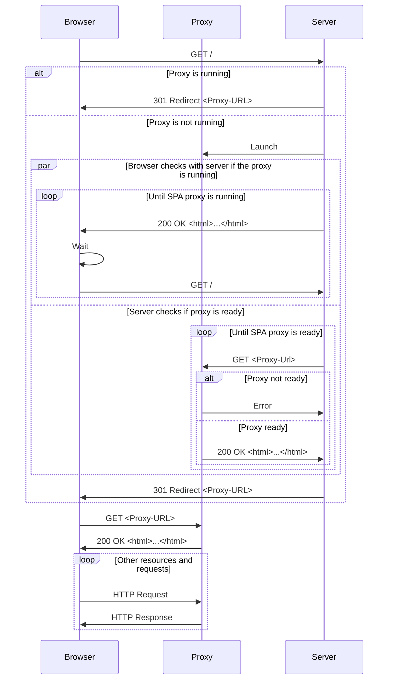
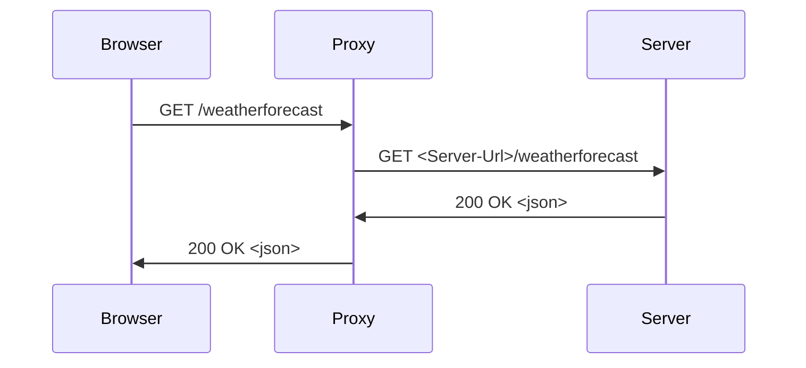

<a id="doc-c09ee13b6833be05bd214b99"></a>

# dotnet/AspNetCore.Docs / aspnetcore/blazor/tutorials/movie-database-app/part-6.md

Upstream: https://github.com/dotnet/AspNetCore.Docs/blob/df9a510cf83fc0f32a71f05f885886c906c84943/aspnetcore/blazor/tutorials/movie-database-app/part-6.md

Commit: `df9a510cf83fc0f32a71f05f885886c906c84943`

Retrieved: 2026-10-01T15:18:04.961120+00:00

Kind: official-document

Raw SHA256: `9541a446d6139a9d12d9b2286a8f46d62b765edd52beb7a8e8de0fd969229c35`

Source text below is untrusted reference content. Acquisition does not verify technical claims.

License status: UPSTREAM_NOTICES_CAPTURED_PER_FILE_REVIEW_REQUIRED. See this repository's captured license files.

---

---
title: Build a Blazor movie database app (Part 6 - Add search)
author: guardrex
description: This part of the Blazor movie database app tutorial explains how to add a search feature to filter movies by title.
monikerRange: '>= aspnetcore-8.0'
ms.author: wpickett
ms.date: 11/11/2025
uid: blazor/tutorials/movie-database-app/part-6
zone_pivot_groups: tooling
---
# Build a Blazor movie database app (Part 6 - Add search)

[!INCLUDE[](~/includes/not-latest-version-without-not-supported-content.md)]

This article is the sixth part of the Blazor movie database app tutorial that teaches you the basics of building an ASP.NET Core Blazor Web App with features to manage a movie database.

This part of the tutorial series covers adding a search feature to the movies `Index` component to filter movies by title.

## Implement a filter feature for the `QuickGrid` component

The [`QuickGrid` component](xref:Microsoft.AspNetCore.Components.QuickGrid) is used by the movie `Index` component (`Components/MoviePages/Index.razor`) to display movies from the database:

```razor
<QuickGrid Class="table" Items="context.Movie">
    ...
</QuickGrid>
```

The <xref:Microsoft.AspNetCore.Components.QuickGrid.QuickGrid%601.Items%2A> parameter receives an `IQueryable<TGridItem>`, where `TGridItem` is the type of data represented by each row in the grid (`Movie`). <xref:Microsoft.AspNetCore.Components.QuickGrid.QuickGrid%601.Items%2A> is assigned a collection of movie entities (`DbSet<Movie>`) obtained from the created database context (<xref:Microsoft.EntityFrameworkCore.IDbContextFactory%601.CreateDbContext%2A>) of the injected database context factory (`DbFactory`).

To make the `QuickGrid` component filter on the movie title, the `Index` component should:

* Set a filter string as a *component parameter* from the query string.
* If the parameter has a value, filter the movies returned from the database.
* Provide an input for the user to provide the filter string and a button to trigger a reload using the filter.

Start by adding the following code to the `@code` block of the `Index` component (`MoviePages/Index.razor`):

```csharp
[SupplyParameterFromQuery]
private string? TitleFilter { get; set; }

private IQueryable<Movie> FilteredMovies => 
    context.Movie.Where(m => m.Title!.Contains(TitleFilter ?? string.Empty));
```

`TitleFilter` is the filter string. The property is provided the [`[SupplyParameterFromQuery]` attribute](xref:Microsoft.AspNetCore.Components.SupplyParameterFromQueryAttribute), which lets Blazor know that the value of `TitleFilter` should be assigned from the query string when the query string contains a field of the same name (for example, `?titleFilter=road+warrior` yields a `TitleFilter` value of `road warrior`). Note that query string field names, such as `titleFilter`, aren't case sensitive.

The `FilteredMovies` property is an `IQueryable<Movie>`, which is the type for assignment to the QuickGrid's <xref:Microsoft.AspNetCore.Components.QuickGrid.QuickGrid%601.Items%2A> parameter. The property filters the list of movies based on the supplied `TitleFilter`. If a `TitleFilter` isn't assigned a value from the query string (`TitleFilter` is `null`), an empty string (`string.Empty`) is used for the <xref:System.String.Contains%2A> clause. Therefore, no movies are filtered for display.

Change the `QuickGrid` component's <xref:Microsoft.AspNetCore.Components.QuickGrid.QuickGrid%601.Items%2A> parameter to use the `movies` collection:

```diff
- <QuickGrid Class="table" Items="context.Movie">
+ <QuickGrid Class="table" Items="FilteredMovies">
```

The `movie => movie.Title!.Contains(...)` code is a *lambda expression*. Lambdas are used in method-based LINQ queries as arguments to standard query operator methods such as the <xref:System.Linq.Queryable.Where%2A> or <xref:System.String.Contains%2A> methods. LINQ queries aren't executed when they're defined or when they're modified by calling a method, such as <xref:System.Linq.Queryable.Where%2A>, <xref:System.String.Contains%2A>, or <xref:System.Linq.Queryable.OrderBy%2A>. Rather, query execution is deferred. The evaluation of an expression is delayed until its realized value is iterated.

The <xref:System.Linq.Queryable.Where%2A> method is run on the database, not in the C# code. The case sensitivity of the query depends on the database and the collation. For SQL Server, <xref:System.String.Contains%2A> maps to [SQL `LIKE`](/sql/t-sql/language-elements/like-transact-sql), which is case insensitive. SQLite with default collation provides a mixture of case-sensitive and case-insensitive filtering, depending on the query.

Run the app and navigate to the movies `Index` page at `/movies`. The movies in the database load:


:::zone pivot="vs"

Append a query string to the URL in the address bar: `?titleFilter=road+warrior`. For example, the full URL appears as `https://localhost:7073/movies?titleFilter=road+warrior`, assuming the port number is `7073`. The filtered movie is displayed:


:::zone-end

:::zone pivot="vsc"

Append a query string to the URL in the address bar: `?titleFilter=Road+Warrior`. For example, the full URL appears as `https://localhost:7073/movies?titleFilter=Road+Warrior`, assuming the port number is `7073`. The filtered movie is displayed:


:::zone-end

:::zone pivot="cli"

Append a query string to the URL in the address bar: `?titleFilter=Road+Warrior`. For example, the full URL appears as `https://localhost:7073/movies?titleFilter=Road+Warrior`, assuming the port number is `7073`. The filtered movie is displayed:


:::zone-end

Next, give users a way to provide the `titleFilter` filter string via the component's UI. Add the following HTML under the H1 heading (`<h1>Index</h1>`). The following HTML reloads the page with the contents of the textbox as a query string value:

```html
<div>
    <form action="/movies" data-enhance>
        <input type="search" name="titleFilter" />
        <input type="submit" value="Search" />
    </form>
</div>
```

The `data-enhance` attribute applies *enhanced navigation* to the component, where Blazor intercepts the GET request and performs a fetch request instead. Blazor then patches the response content into the page, which avoids a full-page reload and preserves more of the page state. The page loads faster, usually without losing the user's scroll position.

:::zone pivot="vs"

Save the file that you're working on. Apply the change by either restarting the app or using [Hot Reload](/visualstudio/debugger/hot-reload) to apply the change to the running app.

:::zone-end

:::zone pivot="vsc"

Close the browser window and in VS Code select **Run** > **Restart Debugging** or press <kbd>Ctrl</kbd>+<kbd>Shift</kbd>+<kbd>F5</kbd> on the keyboard. VS Code recompiles and runs the app with your saved changes and spawns a new browser window for the app.

:::zone-end

:::zone pivot="cli"

Because the app is currently running with `dotnet watch`, saved changes are detected automatically and reflected in the existing browser window.

:::zone-end

:::zone pivot="vs"

Type "`road warrior`" into the search box and select the **:::no-loc text="Search":::** button to filter the movies:


The result after searching on `road warrior`:


Notice that the search box loses the search value ("`road warrior`") when the movies are filtered. If you want to preserve the searched value, add the `data-permanent` attribute:

:::zone-end

:::zone pivot="vsc"

Type "`Road Warrior`" into the search box and select the **:::no-loc text="Search":::** button to filter the movies:


The result after searching on `Road Warrior`:


Notice that the search box loses the search value ("`Road Warrior`") when the movies are filtered. If you want to preserve the searched value, add the `data-permanent` attribute:

:::zone-end

:::zone pivot="cli"

Type "`Road Warrior`" into the search box and select the **:::no-loc text="Search":::** button to filter the movies:


The result after searching on `Road Warrior`:


Notice that the search box loses the search value ("`Road Warrior`") when the movies are filtered. If you want to preserve the searched value, add the `data-permanent` attribute:

:::zone-end

```diff
- <form action="/movies" data-enhance>
+ <form action="/movies" data-enhance data-permanent>
```

## Stop the app

:::zone pivot="vs"

Stop the app by closing the browser's window.

:::zone-end

:::zone pivot="vsc"

Stop the app by closing the browser's window and pressing <kbd>Shift</kbd>+<kbd>F5</kbd> on the keyboard in VS Code.

:::zone-end

:::zone pivot="cli"

Stop the app by closing the browser's window and pressing <kbd>Ctrl</kbd>+<kbd>C</kbd> in the command shell.

:::zone-end

## Troubleshoot with the completed sample

[!INCLUDE[](~/blazor/tutorials/movie-database-app/includes/troubleshoot.md)]

## Additional resources

* [LINQ documentation](/dotnet/csharp/programming-guide/concepts/linq/)
* [Write C# LINQ queries to query data (C# documentation)](/dotnet/csharp/programming-guide/concepts/linq/query-syntax-and-method-syntax-in-linq)
* [Lambda Expression (C# documentation](/dotnet/csharp/programming-guide/statements-expressions-operators/lambda-expressions)

## Legal

[*Mad Max*, *The Road Warrior*, *Mad Max: Beyond Thunderdome*, *Mad Max: Fury Road*, and *Furiosa: A Mad Max Saga*](https://warnerbros.fandom.com/wiki/Mad_Max_(franchise)) are trademarks and copyrights of [Warner Bros. Entertainment](https://www.warnerbros.com/).

## Next steps

> [!div class="step-by-step"]
> [Previous: Add validation](xref:blazor/tutorials/movie-database-app/part-5)
> [Next: Add a new field](xref:blazor/tutorials/movie-database-app/part-7)


<a id="doc-40448c0afc42a4fdff2443ec"></a>

# dotnet/AspNetCore.Docs / aspnetcore/blazor/tutorials/movie-database-app/part-7.md

Upstream: https://github.com/dotnet/AspNetCore.Docs/blob/df9a510cf83fc0f32a71f05f885886c906c84943/aspnetcore/blazor/tutorials/movie-database-app/part-7.md

Commit: `df9a510cf83fc0f32a71f05f885886c906c84943`

Retrieved: 2026-10-01T15:18:04.961120+00:00

Kind: official-document

Raw SHA256: `519f1df50749be9ec5c222c1bc335296b0971d8220464fa401d5bc88c80ce5cd`

Source text below is untrusted reference content. Acquisition does not verify technical claims.

License status: UPSTREAM_NOTICES_CAPTURED_PER_FILE_REVIEW_REQUIRED. See this repository's captured license files.

---

---
title: Build a Blazor movie database app (Part 7 - Add a new field)
author: guardrex
description: This part of the Blazor movie database app tutorial explains how to add a new field to the movie class, CRUD pages, and database.
monikerRange: '>= aspnetcore-8.0'
ms.author: wpickett
ms.date: 11/11/2025
uid: blazor/tutorials/movie-database-app/part-7
zone_pivot_groups: tooling
---
# Build a Blazor movie database app (Part 7 - Add a new field)

[!INCLUDE[](~/includes/not-latest-version-without-not-supported-content.md)]

This article is the seventh part of the Blazor movie database app tutorial that teaches you the basics of building an ASP.NET Core Blazor Web App with features to manage a movie database.

This part of the tutorial series covers adding a new field to the movie class, CRUD pages, and database.

The database update is handled by EF Core migrations. EF Core transparently tracks changes to the database in a migration history table and automatically throws an exception if the app's model classes aren't synchronized with the database's tables and columns. EF Core migrations make it possible to quickly troubleshoot database consistency problems.

> [!IMPORTANT]
> Confirm that the app isn't running for the next steps.

## Add a movie rating to the app's model

Open the `Models/Movie.cs` file and add a `Rating` property with a regular expression that limits the value of `Rating` to the exact [Motion Picture Association](https://www.motionpictures.org/) film rating designations:

```csharp
[Required]
[RegularExpression(@"^(G|PG|PG-13|R|NC-17)$")]
public string? Rating { get; set; }
```

## Add the movie rating to the app's CRUD components

Open the `Create` component definition file (`Components/Pages/MoviePages/Create.razor`).

Add the following `<div>` block between the `<div>` block for `Price` and the create button (`<button>`):

```razor
<div class="mb-3">
    <label for="rating" class="form-label">Rating:</label> 
    <InputText id="rating" @bind-Value="Movie.Rating" class="form-control" /> 
    <ValidationMessage For="() => Movie.Rating" class="text-danger" /> 
</div>
```

Open the `Delete` component definition file (`Components/Pages/MoviePages/Delete.razor`).

Add the following description list (`<dl>`) block between the description list block for `Price` and the `EditForm` component:

```razor
<dl class="row">
    <dt class="col-sm-2">Rating</dt>
    <dd class="col-sm-10">@movie.Rating</dd>
</dl>
```

Open the `Details` component definition file (`Components/Pages/MoviePages/Details.razor`).

Add the following description list term (`<dt>`) and description list element (`<dl>`) after the term and element for `Price` just inside the closing `</dl>` tag:

```razor
<dt class="col-sm-2">Rating</dt>
<dd class="col-sm-10">@movie.Rating</dd>
```

Open the `Edit` component definition file (`Components/Pages/MoviePages/Edit.razor`).

Add the following `<div>` block between the `<div>` block for `Price` and the save button (`<button>`):

```razor
<div class="mb-3">
    <label for="rating" class="form-label">Rating:</label>
    <InputText id="rating" @bind-Value="Movie.Rating" class="form-control" />
    <ValidationMessage For="() => Movie.Rating" class="text-danger" />
</div>
```

Open the `Index` component definition file (`Components/Pages/MoviePages/Index.razor`).

Update the `QuickGrid` component to include the movie rating. Add the following <xref:Microsoft.AspNetCore.Components.QuickGrid.PropertyColumn`2> immediately after the column for `Price`:

```razor
<PropertyColumn Property="movie => movie.Rating" />
```

Update the `SeedData` class (`Data/SeedData.cs`) to provide a default value for the new `Rating` property for reseeding operations.

The following change is for the *Mad Max* `new Movie` block. `Rating = "R",` is added to the block:

```diff
new Movie
{
    Title = "Mad Max",
    ReleaseDate = DateOnly.Parse("1979-4-12"),
    Genre = "Sci-fi (Cyberpunk)",
    Price = 2.51M,
+   Rating = "R",
},
```

Add the `Rating` property to each of the other `new Movie` blocks in the same fashion. Here are the ratings of the remaining *Mad Max* movies when you add the new `Rating` lines:

* *The Road Warrior*: R
* *Mad Max: Beyond Thunderdome*: PG-13
* *Mad Max: Fury Road*: R
* *Furiosa: A Mad Max Saga*: R

**Save all of the updated files.**

Don't run the app yet. Build the app to confirm that there are no errors.

:::zone pivot="vs"

Select **Build** > **Rebuild Solution** from the menu bar. 

:::zone-end

:::zone pivot="vsc"

In the **Command Palette**, use the `.NET: Build` command.

:::zone-end

:::zone pivot="cli"

In a command shell opened to the project's root folder, execute the following command:

```dotnetcli
dotnet build
```

:::zone-end

Fix any errors in the app that were introduced by pasting the preceding markup and code before proceeding to the next step.

## Update the database

If you were to try and run the app at this point, the app would fail with a SQL exception because the database doesn't include a `Rating` column in its `Movie` table. There are three approaches that you can take to resolve the discrepancy between the database's schema and the model's schema:

* Modify the schema of the database so that it matches the model class. The advantage of this approach is that it maintains the database's data. Adopt this approach using either database tooling or by creating a database change script, which are approaches not covered by this tutorial but can be learned using other articles. The downside to this approach is that it requires more time and is more prone to errors due to its increased complexity. *This tutorial doesn't adopt this approach.*
* Use EF Core to automatically drop and recreate the database using the new model class schema, losing the data stored in the database in the process. The database is reseeded with fresh data when the app is run. This approach allows you to quickly evolve the model and database schema together. Don't use this approach on a production database with data that must be preserved. *This tutorial doesn't adopt this approach.*
* Use an EF Core migration to update the database schema after the model is changed in the app. This approach is efficient and preserves the database's data. ***This tutorial adopts this approach.***

Create a migration to update the database's schema. The movie rating, as a `Rating` column, is added to the database's `Movie` table.

:::zone pivot="vs"

In Visual Studio **Solution Explorer**, double-click **Connected Services**. In the **SQL Server Express LocalDB** area of **Service Dependencies**, select the ellipsis (`...`) followed by **Add migration**.

Give the migration a **Migration name** of `AddRatingField` to describe the migration. Wait for the database context to load in the **DbContext class names** field. Select **Finish** to create the migration. Select **Close** when the operation is complete.

The migration:

* Compares the `Movie` model with the `Movie` database table schema.
* Creates code to migrate the database schema to match the model.

Creating the migration doesn't automatically provision a default value for the rating when the database is updated. However, you can manually make a change to the migration file to apply a default movie rating value, which can be helpful when there are many records that require a default value. In this case, all but one of the *Mad Max* movies is rated *R*, so a default value of "`R`" for the `Rating` column is an appropriate choice. The one movie that doesn't have an *R* rating can be updated later in the running app.

Examine the files in the `Migrations` folder of the project in Visual Studio's **Solution Explorer**. Open the migration file that adds the movie rating field, which has a file name of `{TIME STAMP}_AddRatingField.cs`, where the `{TIME STAMP}` placeholder is a time stamp (for example, `20240530123755_AddRatingField.cs`).

Find the `AddColumn` block that adds the rating column to the `Movie` table in the database. Modify the last line that applies a default value (`defaultValue`). Change it from an empty string (`""`) to an *R* movie rating (`"R"`):

```diff
migrationBuilder.AddColumn<string>(
    name: "Rating",
    table: "Movie",
    type: "nvarchar(max)",
    nullable: false,
-   defaultValue: "");
+   defaultValue: "R");
```

Save the migration file.

In the **SQL Server Express LocalDB** area of **Service Dependencies**, select the ellipsis (`...`) again followed by the **Update database** command.

The **Update database with the latest migration** dialog opens. Wait for the **DbContext class names** field to update and for prior migrations to load. Select the **Finish** button. Select the **Close** button when the operation completes.

Modify the one movie that isn't rated *R*:

1. Run the app.
1. Edit the *Mad Max: Beyond Thunderdome* movie.
1. Update the movie rating from `R` to `PG-13`. Save the change.

> [!NOTE]
> An alternative to modifying the migration file is to delete the records in the database and rerun the app to reseed the database. The seeding code was modified earlier to supply default values. This approach is useful in cases where the assignment of default values to fields is better controlled or faster for you to implement with C# code during seeding. For more information see the [Delete all database records and reseed the database](#delete-all-database-records-and-reseed-the-database) section at the end of this article.

:::zone-end

:::zone pivot="vsc"

In the **Terminal** (**Terminal** menu > **New Terminal**), execute the following command to add a migration. The migration name (`AddRatingField`) is an arbitrary description for the migration:

```dotnetcli
dotnet ef migrations add AddRatingField
```

The `dotnet-ef migrations` command:

* Compares the `Movie` model with the `Movie` database table schema.
* Creates code to migrate the database schema to match the model.

Creating the migration doesn't automatically provision a default value for the rating when the database is updated. However, you can manually make a small change to the migration file to apply a default movie rating value, which can be helpful when there are many records that require a default value. In this case, all but one of the *Mad Max* movies is rated *R*, so a default value of "`R`" for the `Rating` column is appropriate. The one movie that doesn't have an *R* rating can be updated later in the running app.

Examine the files in the `Migrations` folder of the project. Open the migration file that adds the movie rating field, which has a file name of `{TIME STAMP}_AddRatingField.cs`, where the `{TIME STAMP}` placeholder is a time stamp (for example, `20240530123755_AddRatingField.cs`).

Find the `AddColumn` block that adds the rating column to the `Movie` table in the database. Modify the last line that applies a default value (`defaultValue`). Change it from an empty string (`""`) to an *R* movie rating (`"R"`):

```diff
migrationBuilder.AddColumn<string>(
    name: "Rating",
    table: "Movie",
    type: "nvarchar(max)",
    nullable: false,
-   defaultValue: "");
+   defaultValue: "R");
```

Save the migration file.

In the **Terminal**, execute the following command to update the database, which preserves the existing data while it adds the movie rating column with a default value:

```dotnetcli
dotnet ef database update
```

Modify the one movie that isn't rated *R*:

1. Run the app.
1. Edit the *Mad Max: Beyond Thunderdome* movie.
1. Update the movie rating from `R` to `PG-13`. Save the change.

> [!NOTE]
> An alternative to modifying the migration file is to delete the records in the database and rerun the app to reseed the database. The seeding code was modified earlier to supply default values. This approach is useful in cases where the assignment of default values to fields is better controlled or faster with C# code during seeding. For more information see the [Delete all database records and reseed the database](#delete-all-database-records-and-reseed-the-database) section at the end of this article.

:::zone-end

:::zone pivot="cli"

In a command shell opened to the project's root folder, execute the following command to add a migration. The migration name (`AddRatingField`) is an arbitrary description for the migration:

```dotnetcli
dotnet ef migrations add AddRatingField
```

The `dotnet-ef migrations` command:

* Compares the `Movie` model with the `Movie` database table schema.
* Creates code to migrate the database schema to match the model.

Creating the migration doesn't automatically provision a default value for the rating when the database is updated. However, you can manually make a small change to the migration file to apply a default movie rating value, which can be helpful when there are many records that require a default value. In this case, all but one of the *Mad Max* movies is rated *R*, so a default value of "`R`" for the `Rating` column is appropriate. The one movie that doesn't have an *R* rating can be updated later in the running app.

Examine the files in the `Migrations` folder of the project. Open the migration file that adds the movie rating field, which has a file name of `{TIME STAMP}_AddRatingField.cs`, where the `{TIME STAMP}` placeholder is a time stamp (for example, `20240530123755_AddRatingField.cs`).

Find the `AddColumn` block that adds the rating column to the `Movie` table in the database. Modify the last line that applies a default value (`defaultValue`). Change it from an empty string (`""`) to an *R* movie rating (`"R"`):

```diff
migrationBuilder.AddColumn<string>(
    name: "Rating",
    table: "Movie",
    type: "nvarchar(max)",
    nullable: false,
-   defaultValue: "");
+   defaultValue: "R");
```

Save the migration file.

Execute the following command to update the database, which preserves the existing data while it adds the movie rating column with a default value:

```dotnetcli
dotnet ef database update
```

Modify the one movie that isn't rated *R*:

1. Run the app.
1. Edit the *Mad Max: Beyond Thunderdome* movie.
1. Update the movie rating from `R` to `PG-13`. Save the change.

> [!NOTE]
> An alternative to modifying the migration file is to delete the records in the database and rerun the app to reseed the database. The seeding code was modified earlier to supply default values. This approach is useful in cases where the assignment of default values to fields is better controlled or faster with C# code during seeding. For more information see the [Delete all database records and reseed the database](#delete-all-database-records-and-reseed-the-database) section at the end of this article.

:::zone-end

Run the app and verify you can create, edit, and display movies with the new movie rating field.

## Troubleshoot

In the event that the database becomes corrupted, delete the database and use migrations to recreate the database:

:::zone pivot="vs"

1. Select the database in **SQL Server Object Explorer** (SSOX).
1. Right-click on the database, and select **Delete**. *Make sure that you select the correct database in the list.*
1. Check **Close existing connections**.
1. Select **OK**.
1. In **Solution Explorer**, double-click **Connected Services**. In the **Service Dependencies** area, select the ellipsis (`...`) followed by **Update database** in the **SQL Server Express LocalDB** area. Updating the database executes the existing migrations that recreate the database.

:::zone-end

:::zone pivot="vsc"

1. Delete the database. If your database tooling has a connection to the database, close the tooling first or use the tool's features to close the database connection and delete the database. Consult your tool's documentation for guidance. *Make sure that you select the correct database in the list.*
1. In the **Terminal** (**Terminal** menu > **New Terminal**), execute the following command to run the existing migrations that recreate the database:

   ```dotnetcli
   dotnet ef database update
   ```

:::zone-end

:::zone pivot="cli"

1. Delete the database. If your database tooling has a connection to the database, close the tooling first or use the tool's features to close the database connection and delete the database. Consult your tool's documentation for guidance. *Make sure that you select the correct database in the list.*
1. In a command shell opened to the project's root folder, execute the following command to run the existing migrations that recreate the database:

   ```dotnetcli
   dotnet ef database update
   ```

:::zone-end

## Delete all database records and reseed the database

*This section describes an alternative process for updating the database with a default value for a new model property without modifying the migration file. Following the guidance in this section isn't necessary if you followed all of the steps in the [Update the database](#update-the-database) section earlier in this article.*

To delete all of the records in the database, use one of the following approaches:

:::zone pivot="vs"

* Run the app and use the delete links in the browser. This approach is reasonably fast when there are only a few records to delete.
* In Visual Studio from **SQL Server Object Explorer** (SSOX), delete the database records. With the database table visible, right-click the table and select **View Data**. When the table opens to show the movie records, select the first record. Hold the <kbd>Shift</kbd> key and select the last record to select all of the records in the table. With all of the records selected, press the <kbd>Delete</kbd> key to delete the records. This approach is reasonably fast when there are many records to delete.
* In Visual Studio from SSOX, right-click the database and select **New Query**. A blank SQL file (`.sql`) opens. Paste the following command into the file: `DELETE FROM dbo.Movie;`. Select the green **Execute** triangle to execute the query or press <kbd>Ctrl</kbd>+<kbd>Shift</kbd>+<kbd>E</kbd> on the keyboard. In the **Message** tab, SSOX reports the number of rows affected, deleted in this case, by the query. You can save the query for later use if you wish. Otherwise, close the file without saving it. This approach is especially useful when the table is large and contains hundreds to thousands of records.

:::zone-end

:::zone pivot="vsc"

* Run the app and use the delete links in the browser. This approach is reasonably fast when there are only a few records to delete.
* Using database tooling&dagger;, delete the database records. In most database tools that permit direct manipulation of data, open the database table's data view in the tooling. When the table opens to show the movie records, select the first record. Hold the <kbd>Shift</kbd> key and select the last record to select all of the records in the database. With all of the records selected, press the <kbd>Delete</kbd> key to delete the records. You may need to adjust these instructions depending on the database tooling in use. Consult the tool's documentation for more information. This approach is reasonably fast when there are many records to delete.
* Using database tooling&dagger;, execute a SQL query against the movie table to delete the table's records. The SQL command is `DELETE FROM dbo.Movie;`. You can save the query for later use if you wish. Otherwise, close the file without saving it. Consult the tool's documentation for the exact steps. This approach is especially useful when the table is large and contains hundreds to thousands of records.

&dagger;*database tooling*: There are many free and retail database tools available on the open market that can work with SQL databases. Consult Internet resources to find one suitable for your database and platform.

:::zone-end

:::zone pivot="cli"

* Run the app and use the delete links in the browser. This approach is reasonably fast when there are only a few records to delete.
* Using database tooling&dagger;, delete the database records. In most database tools that permit direct manipulation of data, open the database table's data view in the tooling. When the table opens to show the movie records, select the first record. Hold the <kbd>Shift</kbd> key and select the last record to select all of the records in the database. With all of the records selected, press the <kbd>Delete</kbd> key to delete the records. You may need to adjust these instructions depending on the database tooling in use. Consult the tool's documentation for more information. This approach is reasonably fast when there are many records to delete.
* Using database tooling&dagger;, execute a SQL query against the movie table to delete the table's records. The SQL command is `DELETE FROM dbo.Movie;`. You can save the query for later use if you wish. Otherwise, close the file without saving it. Consult the tool's documentation for the exact steps. This approach is especially useful when the table is large and contains hundreds to thousands of records.

&dagger;*database tooling*: There are many free and retail database tools available on the open market that can work with SQL databases. Consult Internet resources to find one suitable for your database and platform.

:::zone-end

> [!WARNING]
> Use extreme caution when deleting records from a database. Deleting records is permanent without taking additional data loss mitigation steps. Production databases often provision automatic backup copies of data, either instantaneously as the database is modified or periodically, including with off-site copies and permanent physical storage of data.

After deleting all of the records, run the app. The initializer reseeds the database and includes the correct movie ratings for the `Rating` field based on the seeding code.

## Troubleshoot with the completed sample

[!INCLUDE[](~/blazor/tutorials/movie-database-app/includes/troubleshoot.md)]

## Additional resources

* [Migrations (EF Core documentation)](/ef/core/managing-schemas/migrations/)
* [Customize migration code](/ef/core/managing-schemas/migrations/#customize-migration-code)

## Legal

[*Mad Max*, *The Road Warrior*, *Mad Max: Beyond Thunderdome*, *Mad Max: Fury Road*, and *Furiosa: A Mad Max Saga*](https://warnerbros.fandom.com/wiki/Mad_Max_(franchise)) are trademarks and copyrights of [Warner Bros. Entertainment](https://www.warnerbros.com/).

## Next steps

> [!div class="step-by-step"]
> [Previous: Add Search](xref:blazor/tutorials/movie-database-app/part-6)
> [Next: Add interactivity](xref:blazor/tutorials/movie-database-app/part-8)


<a id="doc-d93eda371e0b6dd79daba024"></a>

# dotnet/AspNetCore.Docs / aspnetcore/blazor/tutorials/movie-database-app/part-8.md

Upstream: https://github.com/dotnet/AspNetCore.Docs/blob/df9a510cf83fc0f32a71f05f885886c906c84943/aspnetcore/blazor/tutorials/movie-database-app/part-8.md

Commit: `df9a510cf83fc0f32a71f05f885886c906c84943`

Retrieved: 2026-10-01T15:18:04.961120+00:00

Kind: official-document

Raw SHA256: `19a20993bc2bcf2cc4c37bce2672173224d2c6161fff658dfb6472fcd7ea62f8`

Source text below is untrusted reference content. Acquisition does not verify technical claims.

License status: UPSTREAM_NOTICES_CAPTURED_PER_FILE_REVIEW_REQUIRED. See this repository's captured license files.

---

---
title: Build a Blazor movie database app (Part 8 - Add interactivity)
author: guardrex
description: This part of the Blazor movie database app tutorial explains how to adopt interactive SSR rendering in the app.
monikerRange: '>= aspnetcore-8.0'
ms.author: wpickett
ms.date: 11/11/2025
uid: blazor/tutorials/movie-database-app/part-8
zone_pivot_groups: tooling
---
# Build a Blazor movie database app (Part 8 - Add interactivity)

[!INCLUDE[](~/includes/not-latest-version-without-not-supported-content.md)]

This article is the eighth part of the Blazor movie database app tutorial that teaches you the basics of building an ASP.NET Core Blazor Web App with features to manage a movie database.

Up to this point in the tutorial, the entire app has been *enabled* for interactivity, but the app has only *adopted* interactivity in its `Counter` sample component. This part of the tutorial series explains how to adopt interactivity in the movie `Index` component.

> [!IMPORTANT]
> Confirm that the app isn't running for the next steps.

## Adopt interactivity

*Interactivity* means that a component has the capacity to process UI events via C# code, such as a button click. The events are either processed on the server by the ASP.NET Core runtime or in the browser on the client by the WebAssembly-based Blazor runtime. This tutorial adopts interactive server-side rendering (interactive SSR), also known generally as Interactive Server (`InteractiveServer`) rendering. Client-side rendering (CSR), which is inherently interactive, is covered in the Blazor reference documentation.

Interactive SSR enables a rich user experience like one would expect from a client app but without the need to create API endpoints to access server resources. UI interactions are handled by the server over a real-time SignalR connection with the browser. Page content for interactive pages is prerendered, where content on the server is initially generated and sent to the client without enabling event handlers for rendered controls. With prerendering, the server outputs the HTML UI of the page as soon as possible in response to the initial request, which makes the app feel more responsive to users.

Review the API in the `Program` file (`Program.cs`) that enables interactive SSR. Razor component services are added to the app to enable Razor components to render statically from the server (<xref:Microsoft.Extensions.DependencyInjection.RazorComponentsServiceCollectionExtensions.AddRazorComponents%2A>) and execute code with interactive SSR (<xref:Microsoft.Extensions.DependencyInjection.ServerRazorComponentsBuilderExtensions.AddInteractiveServerComponents%2A>):

```csharp
builder.Services.AddRazorComponents()
    .AddInteractiveServerComponents();
```

<xref:Microsoft.AspNetCore.Builder.RazorComponentsEndpointRouteBuilderExtensions.MapRazorComponents%2A> maps components defined in the root `App` component to the given .NET assembly and renders routable components, and <xref:Microsoft.AspNetCore.Builder.ServerRazorComponentsEndpointConventionBuilderExtensions.AddInteractiveServerRenderMode%2A> configures the app's SignalR hub to support interactive SSR:

```csharp
app.MapRazorComponents<App>()
    .AddInteractiveServerRenderMode();
```

Up to this point in the tutorial series, the calls to <xref:Microsoft.Extensions.DependencyInjection.ServerRazorComponentsBuilderExtensions.AddInteractiveServerComponents%2A> and <xref:Microsoft.AspNetCore.Builder.ServerRazorComponentsEndpointConventionBuilderExtensions.AddInteractiveServerRenderMode%2A> weren't required for the movie pages because the app only adopted static SSR features for the movie components. This article explains how to adopt interactive features in the movie `Index` component.

When Blazor sets the type of rendering for a component, the rendering is referred to as the component's *render mode*. The following table shows the available render modes for rendering Razor components in a Blazor Web App.

Name | Description | Render location | Interactive
---- | ----------- | :-------------: | :---------:
Static Server | Static server-side rendering (static SSR) |  Server  | <span aria-hidden="true">❌</span><span class="visually-hidden">No</span>
Interactive Server | Interactive server-side rendering (interactive SSR) using Blazor Server. | Server | <span aria-hidden="true">✔️</span><span class="visually-hidden">Yes</span>
Interactive WebAssembly | Client-side rendering (CSR) using Blazor WebAssembly. | Client | <span aria-hidden="true">✔️</span><span class="visually-hidden">Yes</span>
Interactive Auto | Interactive SSR using Blazor Server initially and then CSR on subsequent visits after the Blazor bundle is downloaded. | Server, then client | <span aria-hidden="true">✔️</span><span class="visually-hidden">Yes</span>

To apply a render mode to a component, the developer either uses the `@rendermode` directive or directive attribute on the component instance or on the component definition:

* The following example shows how to set the render mode on a component instance with the `@rendermode` directive attribute. The following example uses a hypothetical dialog (`Dialog`) component in a parent chat (`Chat`) component.

  Within the `Components/Pages/Chat.razor` file:

  ```razor
  <Dialog @rendermode="InteractiveServer" />
  ```

* The following example shows how to set the render mode on a component definition with the `@rendermode` directive. The following example shows setting the render mode in a hypothetical sales forecast (`SalesForecast`) component definition file (`.razor`).

  At the top of `Components/Pages/SalesForecast.razor` file:

  ```razor
  @page "/sales-forecast"
  @rendermode InteractiveServer
  ```

Using the preceding approaches, you can apply a render mode on a per-page/component basis. However, an entire app can adopt a single render mode via a root component that then by inheritance sets the render mode of every other component loaded. This is termed *global interactivity*, as opposed to *per-page/component interactivity*. Global interactivity is useful if most of the app requires interactive features. Global interactivity is usually applied via the `App` component, which is the root component of an app created from the Blazor Web App project template.

> [!NOTE]
> More information on render modes and global interactivity is provided by Blazor's reference documentation. For the purposes of this tutorial, the app only adopts interactive SSR on a per-page/component basis. After the tutorial, you're free to use this app to study the other component render modes and the global interactivity location.

Open the movie `Index` component file (`Components/Pages/MoviePages/Index.razor`), and add the following `@rendermode` directive immediately after the `@page` directive to make the component interactive:

```diff
@rendermode InteractiveServer
```

To see how making a component interactive enhances the user experience, let's provide three enhancements to the app in the following sections:

* Add pagination to the movie `QuickGrid` component.
* Make the `QuickGrid` component *sortable*.
* Replace the HTML form for filtering movies by title with C# code that:
  * Runs on the server.
  * Renders content interactively over the underlying SignalR connection.

## Add pagination to the QuickGrid

The `QuickGrid` component can page data from the database.

Open the `Index` component (`Components/Pages/Movies/Index.razor`). Add a <xref:Microsoft.AspNetCore.Components.QuickGrid.PaginationState> instance to the `@code` block. Because the tutorial only uses five movie records for demonstration, set the <xref:Microsoft.AspNetCore.Components.QuickGrid.PaginationState.ItemsPerPage%2A> to `2` items in order to demonstrate pagination. Normally, the number of items to display would be set to a higher value or set dynamically via a dropdown list.

```csharp
private PaginationState pagination = new PaginationState { ItemsPerPage = 2 };
```

Set the `QuickGrid` component's <xref:Microsoft.AspNetCore.Components.QuickGrid.QuickGrid`1.Pagination> property to `pagination`:

```diff
- <QuickGrid Class="table" Items="FilteredMovies">
+ <QuickGrid Class="table" Items="FilteredMovies" Pagination="pagination">
```

To provide a UI for pagination below the `QuickGrid` component, add a [`Paginator` component](xref:Microsoft.AspNetCore.Components.QuickGrid.Paginator) below the `QuickGrid` component.  Set the <xref:Microsoft.AspNetCore.Components.QuickGrid.Paginator.State%2A?displayProperty=nameWithType> to `pagination`:

```razor
<Paginator State="pagination" />
```

Run the app and navigate to the movies `Index` page. You can page through the movie items at two movies per page:


The component is *interactive*. The page doesn't reload for paging to occur. The paging is performed live over the SignalR connection between the browser and the server, where the paging operation is performed on the server with the rendered result sent back to the client for the browser to display.

Change <xref:Microsoft.AspNetCore.Components.QuickGrid.PaginationState.ItemsPerPage%2A> to a more reasonable value, such as five items per page:

```diff
- private PaginationState pagination = new PaginationState { ItemsPerPage = 2 };
+ private PaginationState pagination = new PaginationState { ItemsPerPage = 5 };
```

## Sortable QuickGrid

Open the `Index` component (`Components/Pages/Movies/Index.razor`).

Add `Sortable="true"` (<xref:Microsoft.AspNetCore.Components.QuickGrid.ColumnBase%601.Sortable%2A>) to the title <xref:Microsoft.AspNetCore.Components.QuickGrid.PropertyColumn%602>:

```diff
- <PropertyColumn Property="movie => movie.Title" />
+ <PropertyColumn Property="movie => movie.Title" Sortable="true" />
```

You can sort the QuickGrid by movie title by selecting the **:::no-loc text="Title":::** column. The page doesn't reload for sorting to occur. The sorting is performed live over the SignalR connection, where the sorting operation is performed on the server with the rendered result sent back to the client:


## Use C# code and interactivity to search by title

In an earlier part of the tutorial series, the `Index` component was modified to allow the user to filter movies by title. This was accomplished by:

* Adding an HTML form that issues a GET request to the server with the user's title search string as a query string field-value pair (for example, `?titleFilter=road+warrior` if the user searches for "`road warrior`").
* Adding code to the component that obtains the title search string from the query string and uses it to filter the database's records.

The preceding approach is effective for a component that adopts static SSR, where the only interaction between the client and server is via HTTP requests. There was no live SignalR connection between the client and the server, and there was no way for the app on the server to process C# code *interactively* based on the user's actions in the component's UI and return content.

Now that the component is interactive, it can provide an improved user experience with Blazor features for binding and event handling.

Add a delegate event handler that the user can trigger to filter the database's movie records. The method uses the value of the `TitleFilter` property to perform the operation. If the user clears `TitleFilter` and searches, the method loads the entire movie list for display.

Delete the following lines from the `@code` block:

```diff
- [SupplyParameterFromQuery]
- private string? TitleFilter { get; set; }
    
- private IQueryable<Movie> FilteredMovies =>
-     context.Movie.Where(m => m.Title!.Contains(TitleFilter ?? string.Empty));
```

Replace the deleted code with the following code:

```csharp
private string titleFilter = string.Empty;

private IQueryable<Movie> FilteredMovies => 
    context.Movie.Where(m => m.Title!.Contains(titleFilter));
```

Next, the component should bind the `titleFilter` field to an `<input>` element, so user input is stored in the `titleFilter` variable. Binding is achieved in Blazor with the `@bind` directive attribute.

Remove the HTML form from the component:

```diff
- <form action="/movies" data-enhance>
-     <input type="search" name="titleFilter" />
-     <input type="submit" value="Search" />
- </form>
```

In its place, add the following Razor markup:

```razor
<input type="search" @bind="titleFilter" @bind:event="oninput" />
```

`@bind:event="oninput"` performs binding for the HTML's `oninput` event, which fires when the `<input>` element's value is changed as a direct result of a user typing in the search box. The QuickGrid is bound to `FilteredMovies`. As `titleFilter` changes with the value of the search box, rerendering the QuickGrid bound to the `FilteredMovies` method filters movie entities based on the updated value of `titleFilter`.

:::zone pivot="vs"

Run the app, type "`road warrior`" into the search field and notice how the QuickGrid is filtered for each character entered until *The Road Warrior* movie is left when the search field reaches "`road `" (&quot;:::no-loc text="road":::&quot; followed by a space).


:::zone-end

:::zone pivot="vsc"

Run the app, type "`Road Warrior`" into the search field and notice how the QuickGrid is filtered for each character entered until *The Road Warrior* movie is left when the search field reaches "`Road `" (&quot;:::no-loc text="Road":::&quot; followed by a space).


:::zone-end

:::zone pivot="cli"

Run the app, type "`Road Warrior`" into the search field and notice how the QuickGrid is filtered for each character entered until *The Road Warrior* movie is left when the search field reaches "`Road `" (&quot;:::no-loc text="Road":::&quot; followed by a space).


:::zone-end

Filtering database records is performed on the server, and the server interactively sends back the HTML to display over the same SignalR connection. The page doesn't reload. The user feels like their interactions with the page are running code on the client. Actually, the code is running the server.

Instead of an HTML form, submitting a GET request in this scenario could've also used JavaScript to submit the request to the server, either using the [Fetch API](https://developer.mozilla.org/docs/Web/API/Fetch_API)` or [XMLHttpRequest API](https://developer.mozilla.org/docs/Web/API/XMLHttpRequest). In most cases, JavaScript can be replaced by using Blazor and C# in an interactive component.

## Style the `QuickGrid` component

You can apply styles to the rendered `QuickGrid` component with a stylesheet isolated to the `Index` component using *CSS isolation*.

CSS isolation is applied by adding a stylesheet file using the file name format `{COMPONENT NAME}.razor.css`, where the `{COMPONENT NAME}` placeholder is the component name.

To apply styles to a child component, such as the `QuickGrid` component of the `Index` component, use the `::deep` pseudo-element. 

In the `MoviePages` folder, add the following stylesheet for the `Index` component. Use `::deep` pseudo-elements to make the row height `3em` and vertically center the table cell content.

`Components/Pages/MoviePages/Index.razor.css`:

```css
::deep tr {
    height: 3em;
}

    ::deep tr > td {
        vertical-align: middle;
    }
```

The `::deep` pseudo-element only works with descendant elements, so the `QuickGrid` component must be wrapped with a `<div>` or some other block-level element in order to apply the styles to it.

In `Components/Pages/MoviePages/Index.razor`, place `<div>` tags around the `QuickGrid` component:

```diff
+ <div>
    <QuickGrid ...>
        ...
    </QuickGrid>
+ </div>
```

Blazor rewrites CSS selectors to match the markup rendered by the component. The rewritten CSS styles are bundled and produced as a static asset, so you don't need to take further action to apply the styles to the rendered `QuickGrid` component.


## Clean up

:::zone pivot="vs"

When you're finished with the tutorial and delete the sample app from your local system, you can also delete the `BlazorWebAppMovies` database in Visual Studio's SQL Server Object Explorer (SSOX):

1. Access SSOX by selecting **View** > **SQL Server Object Explorer** from the menu bar.
1. Display the database list by selecting the triangles next to `SQL Server` > `(localdb)\MSSQLLocalDB` > `Databases`.
1. Right-click the `BlazorWebAppMovies` database in the list and select **Delete**.
1. Select the checkbox to close existing connections before selecting **OK**.

When deleting the database in SSOX, the database's physical files are removed from your Windows user folder.

:::zone-end

:::zone pivot="vsc"

When you're finished with the tutorial and delete the sample app from your local system, you can also manually delete the `BlazorWebAppMovies` database. The database's location varies depending on the platform and operating system, but you can search for it by the file name indicated in the database connection string of app settings file (`appsettings.json`).

:::zone-end

:::zone pivot="cli"

When you're finished with the tutorial and delete the sample app from your local system, you can also manually delete the `BlazorWebAppMovies` database. The database's location varies depending on the platform and operating system, but you can search for it by the file name indicated in the database connection string of the app settings file (`appsettings.json`).

:::zone-end

## Congratulations!

Congratulations on completing the tutorial series! We hope you enjoyed this tutorial on Blazor. Blazor offers many more features than we were able to cover in this series, and we invite you to explore the Blazor documentation, examples, and sample apps to learn more. *Happy coding with Blazor!*

## Next steps

If you're new to Blazor, we recommend reading the following Blazor articles that cover important general information for Blazor development:

* <xref:blazor/index>
* <xref:blazor/supported-platforms>
* <xref:blazor/tooling>
* <xref:blazor/hosting-models>
* <xref:blazor/project-structure>
* <xref:blazor/fundamentals/index> and the other *Fundamentals* node articles.
* <xref:blazor/components/index> and the other *Components* node articles.
* <xref:blazor/forms/index>
* <xref:blazor/js-interop/index> and the other *JavaScript interop* articles.
* <xref:blazor/security/index>
* <xref:blazor/host-and-deploy/index>
* <xref:blazor/blazor-ef-core> covers concurrency with EF Core in Blazor apps.

For guidance on adding a thumbnail file upload feature to this tutorial's sample app, see <xref:blazor/file-uploads#save-small-files-directly-to-a-database-with-ef-core>.

In the documentation website's sidebar navigation, articles are organized by subject matter and laid out in roughly in a general-to-specific or basic-to-complex order. The best approach when starting to learn about Blazor is to read down the table of contents from top to bottom.

## Troubleshoot with the completed sample

[!INCLUDE[](~/blazor/tutorials/movie-database-app/includes/troubleshoot.md)]

> [!div class="step-by-step"]
> [Previous: Add a new field](xref:blazor/tutorials/movie-database-app/part-7)


<a id="doc-d000aaaa31e0e90ee8619808"></a>

# dotnet/AspNetCore.Docs / aspnetcore/blazor/tutorials/signalr-blazor.md

Upstream: https://github.com/dotnet/AspNetCore.Docs/blob/df9a510cf83fc0f32a71f05f885886c906c84943/aspnetcore/blazor/tutorials/signalr-blazor.md

Commit: `df9a510cf83fc0f32a71f05f885886c906c84943`

Retrieved: 2026-10-01T15:18:04.961120+00:00

Kind: official-document

Raw SHA256: `cf01acea16fb47c0c13856a64554a459a496cbbfb231f7e0c3f32a9535fe9be7`

Source text below is untrusted reference content. Acquisition does not verify technical claims.

License status: UPSTREAM_NOTICES_CAPTURED_PER_FILE_REVIEW_REQUIRED. See this repository's captured license files.

---

---
title: Use ASP.NET Core SignalR with Blazor
author: guardrex
description: Create a chat app that uses ASP.NET Core SignalR with Blazor.
monikerRange: '>= aspnetcore-3.1'
ms.author: wpickett
ms.date: 11/11/2025
uid: blazor/tutorials/signalr-blazor
---
# Use ASP.NET Core SignalR with Blazor

[!INCLUDE[](~/includes/not-latest-version.md)]

This tutorial provides a basic working experience for building a real-time app using SignalR with Blazor. This article is useful for developers who are already familiar with SignalR and are seeking to understand how to use SignalR in a Blazor app. For detailed guidance on the SignalR and Blazor frameworks, see the following reference documentation sets and the API documentation:

* <xref:signalr/introduction>
* <xref:blazor/index>
* [.NET API browser](/dotnet/api/)

Learn how to:

> [!div class="checklist"]
> * Create a Blazor app
> * Add the SignalR client library
> * Add a SignalR hub
> * Add SignalR services and an endpoint for the SignalR hub
> * Add a Razor component code for chat

At the end of this tutorial, you'll have a working chat app.

## Prerequisites

# [Visual Studio](#tab/visual-studio)

[Visual Studio (latest release)](https://visualstudio.microsoft.com/downloads/?utm_medium=microsoft&utm_source=learn.microsoft.com&utm_campaign=inline+link&utm_content=download+vs2022) with the **ASP.NET and web development** workload

# [Visual Studio Code](#tab/visual-studio-code)

Install the latest releases of the following:

* [Visual Studio Code](https://code.visualstudio.com/download)
* [C# Dev Kit](https://marketplace.visualstudio.com/items?itemName=ms-dotnettools.csdevkit)
* [.NET SDK](https://dotnet.microsoft.com/download/dotnet)

For more information, see <xref:blazor/debug#visual-studio-code-prerequisites>.

The Visual Studio Code instructions use the .NET CLI for ASP.NET Core development functions such as project creation. You can follow these instructions on macOS, Linux, or Windows and with any code editor. Minor changes may be required if you use an integrated development environment (IDE) other than Visual Studio Code.

# [.NET CLI](#tab/net-cli/)

[.NET SDK (latest release)](https://dotnet.microsoft.com/download/dotnet)

---

## Sample app

:::moniker range=">= aspnetcore-8.0"

Downloading the tutorial's sample chat app isn't required for this tutorial. The sample app is the final, working app produced by following the steps of this tutorial. When you open the samples repository, open the version folder that you plan to target and find the sample named `BlazorSignalRApp`.

:::moniker-end

:::moniker range="< aspnetcore-8.0"

Downloading the tutorial's sample chat app isn't required for this tutorial. The sample app is the final, working app produced by following the steps of this tutorial. When you open the samples repository, open the version folder that you plan to target and find the sample named `BlazorWebAssemblySignalRApp`.

:::moniker-end

[View or download sample code](https://github.com/dotnet/blazor-samples) ([how to download](xref:blazor/fundamentals/index#sample-apps))

:::moniker range=">= aspnetcore-8.0"

## Create a Blazor Web App

Follow the guidance for your choice of tooling:

# [Visual Studio](#tab/visual-studio)

> [!NOTE]
> Visual Studio 2022 or later and .NET 8 or later SDK are required.

In Visual Studio:

* Select **Create a new project** from the **Start Window** or select **File** > **New** > **Project** from the menu bar.
* In the **Create a new project** dialog, select **Blazor Web App** from the list of project templates. Select the **Next** button.
* In the **Configure your new project** dialog, name the project `BlazorSignalRApp` in the **Project name** field, including matching the capitalization. Using this exact project name is important to ensure that the namespaces match for code that you copy from the tutorial into the app that you're building.
* Confirm that the **Location** for the app is suitable. Leave the **Place solution and project in the same directory** checkbox selected. Select the **Next** button.
* In the **Additional information** dialog, use the following settings:
  * **Framework**: Confirm that the [latest framework](https://dotnet.microsoft.com/download/dotnet) is selected. If Visual Studio's **Framework** dropdown list doesn't include the latest available .NET framework, [update Visual Studio](/visualstudio/install/update-visual-studio) and restart the tutorial.
  * **Authentication type**: **None**
  * **Configure for HTTPS**: Selected
  * **Interactive render mode**: **WebAssembly**
  * **Interactivity location**: **Per page/component**
  * **Include sample pages**: Selected
  * **Do not use top-level statements**: Not selected
  * **Use the .dev.localhost TLD in the application URL**: Not selected
  * Select **Create**.

# [Visual Studio Code](#tab/visual-studio-code)

This tutorial assumes that you have familiarity with VS Code. If you're new to VS Code, see the [VS Code documentation](https://code.visualstudio.com/docs). The videos listed by the [Introductory Videos page](https://code.visualstudio.com/docs/getstarted/introvideos) are designed to give you an overview of VS Code's features.

In VS Code:

* Go to the **Explorer** view and select the **Create .NET Project** button. Alternatively, you can bring up the **Command Palette** using <kbd>Ctrl</kbd>+<kbd>Shift</kbd>+<kbd>P</kbd>, and then type "`.NET`" and find and select the **.NET: New Project** command.

* Select the **Blazor Web App** project template from the list.

* In the **Project Location** dialog, create or select a folder for the project.

* In the **Command Palette**, name the project `BlazorSignalRApp`, including matching the capitalization. Using this exact project name is important to ensure that the namespaces match for code that you copy from the tutorial into the app that you're building.

* Adjust the project's options by selecting **Show all template options**.

  Change **Interactive render mode** to **WebAssembly**.

  After the preceding changes are made, the **Command Palette** shows the following:

  * **Framework**: Confirm that the [latest framework](https://dotnet.microsoft.com/download/dotnet) is selected. If Visual Studio's **Framework** dropdown list doesn't include the latest available .NET framework, [update Visual Studio](/visualstudio/install/update-visual-studio) and restart the tutorial.
  * **Authentication type**: **None**
  * **Configure for HTTPS**: Selected
  * **Interactive render mode**: **WebAssembly**
  * **Interactivity location**: **Per page/component**
  * **Include sample pages**: Selected
  * **Do not use top-level statements**: Not selected
  * **Use the .dev.localhost TLD in the application URL**: Not selected

* Select **Create project** from the **Command Palette**.

# [.NET CLI](#tab/net-cli/)

In a command shell:

* Change to the directory using the `cd` command to where you want to create the project folder (for example, `cd c:/users/Bernie_Kopell/Documents`).
* Use the [`dotnet new` command](/dotnet/core/tools/dotnet-new) with the [`blazor` project template](/dotnet/core/tools/dotnet-new-sdk-templates#blazor) to create a new Blazor Web App project. The [`-o|--output` option](/dotnet/core/tools/dotnet-new#options) passed to the command creates the project in a new folder named `BlazorSignalRApp` at the current directory location. Pass the `-int|--interactivity` option with `WebAssembly` to adopt client-side rendering (CSR). Pass the `-ai|--all-interactive` option with `False` to adopt per-page/component interactivity location.

  > [!IMPORTANT]
  > Name the project `BlazorSignalRApp`, including matching the capitalization, so the namespaces match for code that you copy from the tutorial to the app as you follow the tutorial.

  ```dotnetcli
  dotnet new blazor -o BlazorSignalRApp -int WebAssembly -ai False
  ```

---

The guidance in this article uses a WebAssembly component for the SignalR client because it doesn't make sense to use SignalR to connect to a hub from an Interactive Server component in the same app, as that can lead to server port exhaustion.

## Add the SignalR client library

# [Visual Studio](#tab/visual-studio/)

In **Solution Explorer**, right-click the `BlazorSignalRApp.Client` project and select **Manage NuGet Packages**.

In the **Manage NuGet Packages** dialog, confirm that the **Package source** is set to `nuget.org`.

With **Browse** selected, type `Microsoft.AspNetCore.SignalR.Client` in the search box.

In the search results, select the latest release of the [`Microsoft.AspNetCore.SignalR.Client` package](https://www.nuget.org/packages/Microsoft.AspNetCore.SignalR.Client). Select **Install**.

If the **Preview Changes** dialog appears, select **OK**.

If the **License Acceptance** dialog appears, select **I Accept** if you agree with the license terms.

# [Visual Studio Code](#tab/visual-studio-code/)

In the **Terminal** (**Terminal** > **New Terminal** from the menu bar opened to the `BlazorSignalRApp.Client` project using `cd BlazorSignalRApp.Client`), execute the following command:

```powershell
dotnet add package Microsoft.AspNetCore.SignalR.Client
```

To add an earlier version of the package, supply the `--version {VERSION}` option, where the `{VERSION}` placeholder is the version of the package to add.

# [.NET CLI](#tab/net-cli/)

In a command shell opened to the `BlazorSignalRApp.Client` project, execute the following command:

```dotnetcli
dotnet add package Microsoft.AspNetCore.SignalR.Client
```

To add an earlier version of the package, supply the `--version {VERSION}` option, where the `{VERSION}` placeholder is the version of the package to add.

---

## Add a SignalR hub

In the server `BlazorSignalRApp` project, create a `Hubs` (plural) folder and add the following `ChatHub` class (`Hubs/ChatHub.cs`):

:::code language="csharp" source="~/../blazor-samples/8.0/BlazorSignalRApp/BlazorSignalRApp/Hubs/ChatHub.cs":::

## Add services and an endpoint for the SignalR hub

Open the `Program` file of the server `BlazorSignalRApp` project.

Add the namespaces for <xref:Microsoft.AspNetCore.ResponseCompression?displayProperty=fullName> and the `ChatHub` class to the top of the file:

```csharp
using Microsoft.AspNetCore.ResponseCompression;
using BlazorSignalRApp.Hubs;
```

Add SignalR and response compression middleware services:

```csharp
builder.Services.AddSignalR();

builder.Services.AddResponseCompression(opts =>
{
   opts.MimeTypes = ResponseCompressionDefaults.MimeTypes.Concat(
       [ "application/octet-stream" ]);
});
```

Use response compression middleware at the top of the processing pipeline's configuration. Place the following line of code immediately after the line that builds the app (`var app = builder.Build();`):
   
```csharp
app.UseResponseCompression();
```

Add an endpoint for the hub:

```csharp
app.MapHub<ChatHub>("/chathub");
```

## Add Razor component code for chat

Add the following `Pages/Chat.razor` file to the `BlazorSignalRApp.Client` project:

:::code language="razor" source="~/../blazor-samples/8.0/BlazorSignalRApp/BlazorSignalRApp.Client/Pages/Chat.razor":::

Add an entry to the `NavMenu` component to reach the chat page. In `Components/Layout/NavMenu.razor` immediately after the `<div>` block for the `Weather` component, add the following `<div>` block:

```razor
<div class="nav-item px-3">
    <NavLink class="nav-link" href="chat">
        <span class="bi bi-list-nested-nav-menu" aria-hidden="true"></span> Chat
    </NavLink>
</div>
```

> [!NOTE]
> Disable response compression middleware in the `Development` environment when using [Hot Reload](xref:test/hot-reload). For more information, see <xref:blazor/fundamentals/signalr#disable-response-compression-for-hot-reload>.

## Run the app

Follow the guidance for your tooling:

# [Visual Studio](#tab/visual-studio)

With the server `BlazorSignalRApp` project selected in **Solution Explorer**, press <kbd>F5</kbd> to run the app with debugging or <kbd>Ctrl</kbd>+<kbd>F5</kbd> to run the app without debugging.

# [Visual Studio Code](#tab/visual-studio-code)

Press <kbd>F5</kbd> to run the app with debugging or <kbd>Ctrl</kbd>+<kbd>F5</kbd> to run the app without debugging.

# [.NET CLI](#tab/net-cli/)

In a command shell opened to the root folder of the server `BlazorSignalRApp` project, execute the following command:

```dotnetcli
dotnet watch
```

---

Copy the URL from the address bar, open another browser instance or tab, and paste the URL in the address bar.

Choose either browser, enter a name and message, and select the button to send the message. The name and message are displayed on both pages instantly:


Quotes: *Star Trek VI: The Undiscovered Country* &copy;1991 [Paramount](https://www.paramountmovies.com/movies/star-trek-vi-the-undiscovered-country)

:::moniker-end

:::moniker range="< aspnetcore-8.0"

## Hosted Blazor WebAssembly experience

### Create the app

Follow the guidance for your choice of tooling to create a hosted Blazor WebAssembly app:

# [Visual Studio](#tab/visual-studio)

> [!NOTE]
> Visual Studio 2022 or later and .NET or later 6 SDK are required.

Create a new project.

Choose the **Blazor WebAssembly App** template. Select **Next**.

Type `BlazorWebAssemblySignalRApp` in the **Project name** field. Confirm the **Location** entry is correct or provide a location for the project. Select **Next**.

In the **Additional information** dialog, select the **ASP.NET Core Hosted** checkbox.

Select **Create**.

Confirm that a hosted Blazor WebAssembly app was created: In **Solution Explorer**, confirm the presence of a **:::no-loc text="Client":::** project and a **:::no-loc text="Server":::** project. If the two projects aren't present, start over and confirm selection of the **ASP.NET Core Hosted** checkbox before selecting **Create**.

# [Visual Studio Code](#tab/visual-studio-code)

In a command shell, execute the following command:

```dotnetcli
dotnet new blazorwasm -ho -o BlazorWebAssemblySignalRApp
```

The `-ho|--hosted` option creates a hosted Blazor WebAssembly [solution](xref:blazor/tooling#visual-studio-solution-file-sln). For information on configuring VS Code assets in the `.vscode` folder, see the **Linux** operating system guidance in <xref:blazor/tooling>.

The `-o|--output` option creates a folder for the solution. If you've created a folder for the solution and the command shell is open in that folder, omit the `-o|--output` option and value to create the solution.

In Visual Studio Code, open the app's project folder.

Confirm that a hosted Blazor WebAssembly app was created: Confirm the presence of a **:::no-loc text="Client":::** project and a **:::no-loc text="Server":::** project in the app's solution folder. If the two projects aren't present, start over and confirm passing the `-ho` or `--hosted` option to the `dotnet new` command when creating the solution.

To configure Visual Studio Code debugging assets, see:

* <xref:blazor/tooling?pivots=linux-macos> (use the guidance for the *Linux / macOS* operating system regardless of platform)
* <xref:blazor/debug>

# [.NET CLI](#tab/net-cli)

In a command shell, execute the following command:

```dotnetcli
dotnet new blazorwasm -ho -o BlazorWebAssemblySignalRApp
```

The `-ho|--hosted` option creates a hosted Blazor WebAssembly [solution](xref:blazor/tooling#visual-studio-solution-file-sln).

The `-o|--output` option creates a folder for the solution. If you've created a folder for the solution and the command shell is open in that folder, omit the `-o|--output` option and value to create the solution.

Confirm that a hosted Blazor WebAssembly app was created: Confirm the presence of a **:::no-loc text="Client":::** project and a **:::no-loc text="Server":::** project in the app's solution folder. If the two projects aren't present, start over and confirm passing the `-ho` or `--hosted` option to the `dotnet new` command when creating the solution.

---

### Add the SignalR client library

# [Visual Studio](#tab/visual-studio/)

In **Solution Explorer**, right-click the `BlazorWebAssemblySignalRApp.Client` project and select **Manage NuGet Packages**.

In the **Manage NuGet Packages** dialog, confirm that the **Package source** is set to `nuget.org`.

With **Browse** selected, type `Microsoft.AspNetCore.SignalR.Client` in the search box.

In the search results, select the [`Microsoft.AspNetCore.SignalR.Client` package](https://www.nuget.org/packages/Microsoft.AspNetCore.SignalR.Client). Set the version to match the shared framework of the app. Select **Install**.

If the **Preview Changes** dialog appears, select **OK**.

If the **License Acceptance** dialog appears, select **I Accept** if you agree with the license terms.

# [Visual Studio Code](#tab/visual-studio-code/)

In the **Terminal** (**Terminal** > **New Terminal** from the menu bar opened to the `BlazorWebAssemblySignalRApp.Client` project using `cd BlazorWebAssemblySignalRApp.Client`), execute the following command:

```dotnetcli
dotnet add Client package Microsoft.AspNetCore.SignalR.Client
```

To add an earlier version of the package, supply the `--version {VERSION}` option, where the `{VERSION}` placeholder is the version of the package to add.

# [.NET CLI](#tab/net-cli/)

In a command shell from the [solution's](xref:blazor/tooling#visual-studio-solution-file-sln) folder, execute the following command:

```dotnetcli
dotnet add Client package Microsoft.AspNetCore.SignalR.Client
```

To add an earlier version of the package, supply the `--version {VERSION}` option, where the `{VERSION}` placeholder is the version of the package to add.

---

### Add a SignalR hub

In the `BlazorWebAssemblySignalRApp.Server` project, create a `Hubs` (plural) folder and add the following `ChatHub` class (`Hubs/ChatHub.cs`):

:::moniker-end

:::moniker range=">= aspnetcore-7.0 < aspnetcore-8.0"

:::code language="csharp" source="~/../blazor-samples/7.0/BlazorWebAssemblySignalRApp/Server/Hubs/ChatHub.cs":::

:::moniker-end

:::moniker range=">= aspnetcore-6.0 < aspnetcore-7.0"

:::code language="csharp" source="~/../blazor-samples/6.0/BlazorWebAssemblySignalRApp/Server/Hubs/ChatHub.cs":::

:::moniker-end

:::moniker range=">= aspnetcore-5.0 < aspnetcore-6.0"

:::code language="csharp" source="~/../blazor-samples/5.0/BlazorWebAssemblySignalRApp/Server/Hubs/ChatHub.cs":::

:::moniker-end

:::moniker range="< aspnetcore-5.0"

:::code language="csharp" source="~/../blazor-samples/3.1/BlazorWebAssemblySignalRApp/Server/Hubs/ChatHub.cs":::

:::moniker-end

:::moniker range="< aspnetcore-8.0"

### Add services and an endpoint for the SignalR hub

:::moniker-end

:::moniker range=">= aspnetcore-6.0 < aspnetcore-8.0"

In the `BlazorWebAssemblySignalRApp.Server` project, open the `Program.cs` file.

Add the namespace for the `ChatHub` class to the top of the file:

```csharp
using BlazorWebAssemblySignalRApp.Server.Hubs;
```

Add SignalR and response compression middleware services:

```csharp
builder.Services.AddSignalR();
builder.Services.AddResponseCompression(opts =>
{
      opts.MimeTypes = ResponseCompressionDefaults.MimeTypes.Concat(
         new[] { "application/octet-stream" });
});
```

Use response compression middleware at the top of the processing pipeline's configuration immediately after the line that builds the app:
   
```csharp
app.UseResponseCompression();
```

Between the endpoints for controllers and the client-side fallback, add an endpoint for the hub. Immediately after the line `app.MapControllers();`, add the following line:

```csharp
app.MapHub<ChatHub>("/chathub");
```

:::moniker-end

:::moniker range="< aspnetcore-6.0"

In the `BlazorWebAssemblySignalRApp.Server` project, open the `Startup.cs` file.

Add the namespace for the `ChatHub` class to the top of the file:

```csharp
using BlazorWebAssemblySignalRApp.Server.Hubs;
```

Add SignalR and response compression middleware services:

```csharp
services.AddSignalR();
services.AddResponseCompression(opts =>
{
      opts.MimeTypes = ResponseCompressionDefaults.MimeTypes.Concat(
         new[] { "application/octet-stream" });
});
```

Use response compression middleware at the top of the processing pipeline's configuration:
   
```csharp
app.UseResponseCompression();
```

Between the endpoints for controllers and the client-side fallback, add an endpoint for the hub immediately after the line `endpoints.MapControllers();`:

```csharp
endpoints.MapHub<ChatHub>("/chathub");
```

:::moniker-end

:::moniker range="< aspnetcore-8.0"

### Add Razor component code for chat

In the `BlazorWebAssemblySignalRApp.Client` project, open the `Pages/Index.razor` file.

Replace the markup with the following code:

:::moniker-end

:::moniker range=">= aspnetcore-7.0 < aspnetcore-8.0"

:::code language="razor" source="~/../blazor-samples/7.0/BlazorWebAssemblySignalRApp/Client/Pages/Index.razor":::

:::moniker-end

:::moniker range=">= aspnetcore-6.0 < aspnetcore-7.0"

:::code language="razor" source="~/../blazor-samples/6.0/BlazorWebAssemblySignalRApp/Client/Pages/Index.razor":::

:::moniker-end

:::moniker range=">= aspnetcore-5.0 < aspnetcore-6.0"

:::code language="razor" source="~/../blazor-samples/5.0/BlazorWebAssemblySignalRApp/Client/Pages/Index.razor":::

:::moniker-end

:::moniker range="< aspnetcore-5.0"

:::code language="razor" source="~/../blazor-samples/3.1/BlazorWebAssemblySignalRApp/Client/Pages/Index.razor":::

:::moniker-end

:::moniker range=">= aspnetcore-6.0 < aspnetcore-8.0"

> [!NOTE]
> Disable response compression middleware in the `Development` environment when using [Hot Reload](xref:test/hot-reload). For more information, see <xref:blazor/fundamentals/signalr#disable-response-compression-for-hot-reload>.

:::moniker-end

:::moniker range="< aspnetcore-8.0"

### Run the app

Follow the guidance for your tooling:

# [Visual Studio](#tab/visual-studio)

In **Solution Explorer**, select the `BlazorWebAssemblySignalRApp.Server` project. Press <kbd>F5</kbd> to run the app with debugging or <kbd>Ctrl</kbd>+<kbd>F5</kbd> to run the app without debugging.

> [!IMPORTANT]
> When executing a hosted Blazor WebAssembly app, run the app from the [solution's](xref:blazor/tooling#visual-studio-solution-file-sln) **:::no-loc text="Server":::** project.
>
> Google Chrome or Microsoft Edge must be the selected browser for a debugging session.
> 
> If the app fails to start in the browser:
> 
> * In the .NET console, confirm that the solution is running from the ":::no-loc text="Server":::" project.
> * Refresh the browser using the browser's reload button.

# [Visual Studio Code](#tab/visual-studio-code)

For information on configuring VS Code assets in the `.vscode` folder, see the **Linux** operating system guidance in <xref:blazor/tooling>.

Press <kbd>F5</kbd> to run the app with debugging or <kbd>Ctrl</kbd>+<kbd>F5</kbd> to run the app without debugging.

> [!IMPORTANT]
> When executing a hosted Blazor WebAssembly app, run the app from the [solution's](xref:blazor/tooling#visual-studio-solution-file-sln) **:::no-loc text="Server":::** project.
>
> Google Chrome or Microsoft Edge must be the selected browser for a debugging session.
> 
> If the app fails to start in the browser:
> 
> * In the .NET console, confirm that the solution is running from the ":::no-loc text="Server":::" project.
> * Refresh the browser using the browser's reload button.

# [.NET CLI](#tab/net-cli/)

In a command shell from the [solution's](xref:blazor/tooling#visual-studio-solution-file-sln) folder, execute the following command to change the directory to the `Server` project folder:

```dotnetcli
cd Server
```

Run the server project with the `dotnet watch` (or `dotnet run`) command:

```dotnetcli
dotnet watch
```

> [!IMPORTANT]
> When executing a hosted Blazor WebAssembly app, run the app from the solution's **:::no-loc text="Server":::** project.
> 
> If the app fails to start in the browser:
> 
> * In the .NET console, confirm that the solution is running from the ":::no-loc text="Server":::" project.
> * Refresh the browser using the browser's reload button.

---

Copy the URL from the address bar, open another browser instance or tab, and paste the URL in the address bar.

Choose either browser, enter a name and message, and select the button to send the message. The name and message are displayed on both pages instantly:


Quotes: *Star Trek VI: The Undiscovered Country* &copy;1991 [Paramount](https://www.paramountmovies.com/movies/star-trek-vi-the-undiscovered-country)

:::moniker-end

## Next steps

In this tutorial, you learned how to:

> [!div class="checklist"]
> * Create a Blazor app
> * Add the SignalR client library
> * Add a SignalR hub
> * Add SignalR services and an endpoint for the SignalR hub
> * Add a Razor component code for chat

For detailed guidance on the SignalR and Blazor frameworks, see the following reference documentation sets:

> [!div class="nextstepaction"]
> <xref:signalr/introduction>
> <xref:blazor/index>

## Additional resources

* [Bearer token authentication with Identity Server, WebSockets, and Server-Sent Events](xref:signalr/authn-and-authz#bearer-token-authentication)
* [Secure a SignalR hub in Blazor WebAssembly apps](xref:blazor/security/webassembly/index#secure-a-signalr-hub)
* [SignalR cross-origin negotiation for authentication](xref:blazor/fundamentals/signalr#client-side-signalr-cross-origin-negotiation-for-authentication)
* [SignalR configuration](xref:blazor/host-and-deploy/server/index#signalr-configuration)
* <xref:blazor/debug>
* [Blazor samples GitHub repository (`dotnet/blazor-samples`)](https://github.com/dotnet/blazor-samples) ([how to download](xref:blazor/fundamentals/index#sample-apps))


<a id="doc-5e5eb3f882c3cdcd1b0615cf"></a>

# dotnet/AspNetCore.Docs / aspnetcore/blazor/webassembly-build-tools-and-aot.md

Upstream: https://github.com/dotnet/AspNetCore.Docs/blob/df9a510cf83fc0f32a71f05f885886c906c84943/aspnetcore/blazor/webassembly-build-tools-and-aot.md

Commit: `df9a510cf83fc0f32a71f05f885886c906c84943`

Retrieved: 2026-10-01T15:18:04.961120+00:00

Kind: official-document

Raw SHA256: `25837e37d86010cd3ea3a088d4ee40469ee1f0728ca82ba0dfa542c0cda91c4f`

Source text below is untrusted reference content. Acquisition does not verify technical claims.

License status: UPSTREAM_NOTICES_CAPTURED_PER_FILE_REVIEW_REQUIRED. See this repository's captured license files.

---

---
title: ASP.NET Core Blazor WebAssembly build tools and ahead-of-time (AOT) compilation
ai-usage: ai-assisted
author: guardrex
description: Learn about the WebAssembly build tools and how to compile a Blazor WebAssembly app ahead of deployment with ahead-of-time (AOT) compilation.
monikerRange: '>= aspnetcore-6.0'
ms.author: wpickett
ms.date: 11/11/2025
uid: blazor/tooling/webassembly
---
# ASP.NET Core Blazor WebAssembly build tools and ahead-of-time (AOT) compilation

[!INCLUDE[](~/includes/not-latest-version.md)]

This article describes the build tools for standalone Blazor WebAssembly apps and how to compile an app ahead of deployment with ahead-of-time (AOT) compilation.

## .NET WebAssembly build tools

The .NET WebAssembly build tools are based on [Emscripten](https://emscripten.org/), a compiler toolchain for the web platform.

To install the build tools as a .NET workload, use ***either*** of the following approaches:

* For the **ASP.NET and web development** workload in the Visual Studio installer, select the **.NET WebAssembly build tools** option from the list of optional components. The option ensures the following:
  * The workload is installed for the latest .NET SDK.
  * When a new version of Visual Studio is released and it contains a new .NET SDK, the option installs the workload for the new SDK.
* Alternatively, execute the following command in an *administrative command shell* to install the latest workload to the latest .NET SDK available on the system:

  ```dotnetcli
  dotnet workload install wasm-tools
  ```

To target a prior .NET release with a given .NET SDK, install the `wasm-tools-net{MAJOR VERSION}` workload:

* The `{MAJOR VERSION}` placeholder is replaced with the major version number of the .NET release you want to target (for example, `wasm-tools-net8` for .NET 8).
* Workloads are installed per .NET SDK. Installing the `wasm-tools` workload for one SDK doesn't make it available to other SDKs on the system.
* You must install the appropriate workload for each .NET SDK version you intend to use.

The following list shows which workload to install for each .NET SDK, depending on the apps that you plan to target. Although multiple rows may contain the same workload name, the workloads always differ slightly for each particular .NET SDK.

* Using the .NET 10 SDK
  * Targeting .NET 10 requires `wasm-tools`.
  * Targeting .NET 9 requires `wasm-tools-net9`.
  * Targeting .NET 8 requires `wasm-tools-net8`.
* Using the .NET 9 SDK
  * Targeting .NET 9 requires `wasm-tools`.
  * Targeting .NET 8 requires `wasm-tools-net8`.
* Using the .NET 8 SDK: Targeting .NET 8 requires `wasm-tools`.

The Emscripten compiler toolchain depends on [Python](https://www.python.org/), which is bundled by default with the .NET WebAssembly build tools workload on Windows and macOS.
Python isn't bundled for Linux users, resulting in "unable to find python in $PATH" errors if Python isn't available. Linux users should install Python through their package manager or [download Python for Linux/Unix](https://www.python.org/downloads/source/) and manually install it on their system so that it is available in `$PATH`.

## Ahead-of-time (AOT) compilation

Blazor WebAssembly supports ahead-of-time (AOT) compilation, where you can compile your .NET code directly into WebAssembly. AOT compilation results in runtime performance improvements at the expense of a larger app size.

:::moniker range=">= aspnetcore-8.0"

Without enabling AOT compilation, Blazor WebAssembly apps run on the browser using a .NET [Intermediate Language (IL)](/dotnet/standard/glossary#il) interpreter implemented in WebAssembly with partial [just-in-time (JIT)](/dotnet/standard/glossary#jit) runtime support, informally referred to as the *Jiterpreter*. Because the .NET IL code is interpreted, apps typically run slower than they would on a server-side .NET JIT runtime without any IL interpretation. AOT compilation addresses this performance issue by compiling an app's .NET code directly into WebAssembly for native WebAssembly execution by the browser. The AOT performance improvement can yield dramatic improvements for apps that execute CPU-intensive tasks. The drawback to using AOT compilation is that AOT-compiled apps are generally larger than their IL-interpreted counterparts, so they usually take longer to download to the client when first requested.

:::moniker-end

:::moniker range="< aspnetcore-8.0"

Without enabling AOT compilation, Blazor WebAssembly apps run on the browser using a .NET [Intermediate Language (IL)](/dotnet/standard/glossary#il) interpreter implemented in WebAssembly. Because the .NET code is interpreted, apps typically run slower than they would on a server-side .NET [just-in-time (JIT)](/dotnet/standard/glossary#jit) runtime. AOT compilation addresses this performance issue by compiling an app's .NET code directly into WebAssembly for native WebAssembly execution by the browser. The AOT performance improvement can yield dramatic improvements for apps that execute CPU-intensive tasks. The drawback to using AOT compilation is that AOT-compiled apps are generally larger than their IL-interpreted counterparts, so they usually take longer to download to the client when first requested.

:::moniker-end

For guidance on installing the .NET WebAssembly build tools, see <xref:blazor/tooling/webassembly>.

To enable WebAssembly AOT compilation, add the `<RunAOTCompilation>` property set to `true` to the Blazor WebAssembly app's project file:

```xml
<PropertyGroup>
  <RunAOTCompilation>true</RunAOTCompilation>
</PropertyGroup>
```

To compile the app to WebAssembly, publish the app. Publishing the `Release` configuration ensures the .NET Intermediate Language (IL) linking is also run to reduce the size of the published app:

```dotnetcli
dotnet publish -c Release
```

WebAssembly AOT compilation is only performed when the project is published. AOT compilation isn't used when the project is run during development (`Development` environment) because AOT compilation usually takes several minutes on small projects and potentially much longer for larger projects. Reducing the build time for AOT compilation is under development for future releases of ASP.NET Core.

The size of an AOT-compiled Blazor WebAssembly app is generally larger than the size of the app if compiled into .NET IL:

* Although the size difference depends on the app, most AOT-compiled apps are about twice the size of their IL-compiled versions. This means that using AOT compilation trades off load-time performance for runtime performance. Whether this tradeoff is worth using AOT compilation depends on your app. Blazor WebAssembly apps that are CPU intensive generally benefit the most from AOT compilation.

* The larger size of an AOT-compiled app is due to two conditions:

  * More code is required to represent high-level .NET IL instructions in native WebAssembly.
  * AOT doesn't trim out managed DLLs when the app is published. Blazor requires the DLLs for [reflection metadata](/dotnet/csharp/advanced-topics/reflection-and-attributes/) and to support certain .NET runtime features. Requiring the DLLs on the client increases the download size but provides a more compatible .NET experience.

> [!NOTE]
> For [Mono](https://github.com/mono/mono)/WebAssembly MSBuild properties and targets, see [`WasmApp.Common.targets` (`dotnet/runtime` GitHub repository)](https://github.com/dotnet/runtime/blob/main/src/mono/wasm/build/WasmApp.Common.targets). Official documentation for common MSBuild properties is planned per [Document blazor msbuild configuration options (`dotnet/docs` #27395)](https://github.com/dotnet/docs/issues/27395).

## Performance

For performance guidance, see <xref:blazor/performance/webassembly-runtime-performance>:

* Heap size for some mobile device browsers
* Runtime relinking
* Single Instruction, Multiple Data (SIMD)
* Trim .NET IL after ahead-of-time (AOT) compilation (.NET 8 or later)

## Exception handling

:::moniker range=">= aspnetcore-8.0"

Exception handling is enabled by default. To disable exception handling, add the `<WasmEnableExceptionHandling>` property with a value of `false` in the app's project file (`.csproj`):

```xml
<PropertyGroup>
  <WasmEnableExceptionHandling>false</WasmEnableExceptionHandling>
</PropertyGroup>
```

:::moniker-end

:::moniker range="< aspnetcore-8.0"

To enable WebAssembly exception handling, add the `<WasmEnableExceptionHandling>` property with a value of `true` in the app's project file (`.csproj`):

```xml
<PropertyGroup>
  <WasmEnableExceptionHandling>true</WasmEnableExceptionHandling>
</PropertyGroup>
```

:::moniker-end

For more information, see the following resources:

* [Configuring and hosting .NET WebAssembly applications: EH - Exception handling](https://github.com/dotnet/runtime/blob/main/src/mono/wasm/features.md#eh---exception-handling)
* [Exception handling](https://github.com/WebAssembly/exception-handling/blob/master/proposals/exception-handling/Exceptions.md)

## Additional resources

* <xref:blazor/performance/webassembly-runtime-performance>
* <xref:blazor/webassembly-native-dependencies>
* [Webcil packaging format for .NET assemblies](xref:blazor/host-and-deploy/webassembly/index#webcil-packaging-format-for-net-assemblies)


<a id="doc-fb8602ef1e8ce5bf95998e92"></a>

# dotnet/AspNetCore.Docs / aspnetcore/blazor/webassembly-lazy-load-assemblies.md

Upstream: https://github.com/dotnet/AspNetCore.Docs/blob/df9a510cf83fc0f32a71f05f885886c906c84943/aspnetcore/blazor/webassembly-lazy-load-assemblies.md

Commit: `df9a510cf83fc0f32a71f05f885886c906c84943`

Retrieved: 2026-10-01T15:18:04.961120+00:00

Kind: official-document

Raw SHA256: `48f0f69d71553fcedbbee28b982cf6e8031a8731c0d0886dc580a44081388392`

Source text below is untrusted reference content. Acquisition does not verify technical claims.

License status: UPSTREAM_NOTICES_CAPTURED_PER_FILE_REVIEW_REQUIRED. See this repository's captured license files.

---

---
title: Lazy load assemblies in ASP.NET Core Blazor WebAssembly
author: guardrex
description: Discover how to lazy load assemblies in Blazor WebAssembly apps.
monikerRange: '>= aspnetcore-5.0'
ms.author: wpickett
ms.date: 11/11/2025
uid: blazor/webassembly-lazy-load-assemblies
---
# Lazy load assemblies in ASP.NET Core Blazor WebAssembly

[!INCLUDE[](~/includes/not-latest-version.md)]

Blazor WebAssembly app startup performance can be improved by waiting to load developer-created app assemblies until the assemblies are required, which is called *lazy loading*.

This article's initial sections cover the app configuration. For a working demonstration, see the [Complete example](#complete-example) section at the end of this article.

*This article only applies to Blazor WebAssembly apps.* Assembly lazy loading doesn't benefit server-side apps because server-rendered apps don't download assemblies to the client.

Lazy loading shouldn't be used for core runtime assemblies, which might be trimmed on publish and unavailable on the client when the app loads.

## File extension placeholder (`{FILE EXTENSION}`) for assembly files

:::moniker range=">= aspnetcore-8.0"

Assembly files use the [Webcil packaging format for .NET assemblies](xref:blazor/host-and-deploy/webassembly/index#webcil-packaging-format-for-net-assemblies) with a `.wasm` file extension.

Throughout the article, the `{FILE EXTENSION}` placeholder represents "`wasm`".

:::moniker-end

:::moniker range="< aspnetcore-8.0"

Assembly files are based on Dynamic-Link Libraries (DLLs) with a `.dll` file extension.

Throughout the article, the `{FILE EXTENSION}` placeholder represents "`dll`".

:::moniker-end

## Project file configuration

Mark assemblies for lazy loading in the app's project file (`.csproj`) using the `BlazorWebAssemblyLazyLoad` item. Use the assembly name with file extension. The Blazor framework prevents the assembly from loading at app launch.

```xml
<ItemGroup>
  <BlazorWebAssemblyLazyLoad Include="{ASSEMBLY NAME}.{FILE EXTENSION}" />
</ItemGroup>
```

The `{ASSEMBLY NAME}` placeholder is the name of the assembly, and the `{FILE EXTENSION}` placeholder is the file extension. The file extension is required.

Include one `BlazorWebAssemblyLazyLoad` item for each assembly. If an assembly has dependencies, include a `BlazorWebAssemblyLazyLoad` entry for each dependency.

## `Router` component configuration

The Blazor framework automatically registers a singleton service for lazy loading assemblies in client-side Blazor WebAssembly apps, <xref:Microsoft.AspNetCore.Components.WebAssembly.Services.LazyAssemblyLoader>. The <xref:Microsoft.AspNetCore.Components.WebAssembly.Services.LazyAssemblyLoader.LoadAssembliesAsync%2A?displayProperty=nameWithType> method:

* Uses [JS interop](xref:blazor/js-interop/call-dotnet-from-javascript) to fetch assemblies via a network call.
* Loads assemblies into the runtime executing on WebAssembly in the browser.

:::moniker range="< aspnetcore-8.0"

> [!NOTE]
> Guidance for *hosted* Blazor WebAssembly [solutions](xref:blazor/tooling#visual-studio-solution-file-sln) is covered in the [Lazy load assemblies in a hosted Blazor WebAssembly solution](#lazy-load-assemblies-in-a-hosted-blazor-webassembly-solution) section.

:::moniker-end

Blazor's <xref:Microsoft.AspNetCore.Components.Routing.Router> component designates the assemblies that Blazor searches for routable components and is also responsible for rendering the component for the route where the user navigates. The <xref:Microsoft.AspNetCore.Components.Routing.Router> component's [`OnNavigateAsync` method](xref:blazor/fundamentals/routing#handle-asynchronous-navigation-events-with-onnavigateasync) is used in conjunction with lazy loading to load the correct assemblies for endpoints that a user requests.

Logic is implemented inside <xref:Microsoft.AspNetCore.Components.Routing.Router.OnNavigateAsync> to determine the assemblies to load with <xref:Microsoft.AspNetCore.Components.WebAssembly.Services.LazyAssemblyLoader>. Options for how to structure the logic include:

* Conditional checks inside the <xref:Microsoft.AspNetCore.Components.Routing.Router.OnNavigateAsync> method.
* A lookup table that maps routes to assembly names, either injected into the component or implemented within the component's code.

In the following example:

* The namespace for <xref:Microsoft.AspNetCore.Components.WebAssembly.Services?displayProperty=fullName> is specified.
* The <xref:Microsoft.AspNetCore.Components.WebAssembly.Services.LazyAssemblyLoader> service is injected (`AssemblyLoader`).
* The `{PATH}` placeholder is the path where the list of assemblies should load. The example uses a conditional check for a single path that loads a single set of assemblies.
* The `{LIST OF ASSEMBLIES}` placeholder is the comma-separated list of assembly file name strings, including their file extensions (for example, `"Assembly1.{FILE EXTENSION}", "Assembly2.{FILE EXTENSION}"`).

`App.razor`:

:::moniker range=">= aspnetcore-8.0"

```razor
@using Microsoft.AspNetCore.Components.Routing
@using Microsoft.AspNetCore.Components.WebAssembly.Services
@using Microsoft.Extensions.Logging
@inject LazyAssemblyLoader AssemblyLoader
@inject ILogger<App> Logger

<Router AppAssembly="typeof(App).Assembly" 
    OnNavigateAsync="OnNavigateAsync">
    ...
</Router>

@code {
    private async Task OnNavigateAsync(NavigationContext args)
    {
        try
           {
               if (args.Path == "{PATH}")
               {
                   var assemblies = await AssemblyLoader.LoadAssembliesAsync(
                       [ {LIST OF ASSEMBLIES} ]);
               }
           }
           catch (Exception ex)
           {
               Logger.LogError("Error: {Message}", ex.Message);
           }
    }
}
```

:::moniker-end

:::moniker range=">= aspnetcore-6.0 < aspnetcore-8.0"

```razor
@using Microsoft.AspNetCore.Components.Routing
@using Microsoft.AspNetCore.Components.WebAssembly.Services
@using Microsoft.Extensions.Logging
@inject LazyAssemblyLoader AssemblyLoader
@inject ILogger<App> Logger

<Router AppAssembly="typeof(App).Assembly" 
    OnNavigateAsync="OnNavigateAsync">
    ...
</Router>

@code {
    private async Task OnNavigateAsync(NavigationContext args)
    {
        try
           {
               if (args.Path == "{PATH}")
               {
                   var assemblies = await AssemblyLoader.LoadAssembliesAsync(
                       new[] { {LIST OF ASSEMBLIES} });
               }
           }
           catch (Exception ex)
           {
               Logger.LogError("Error: {Message}", ex.Message);
           }
    }
}
```

:::moniker-end

:::moniker range="< aspnetcore-6.0"

```razor
@using Microsoft.AspNetCore.Components.Routing
@using Microsoft.AspNetCore.Components.WebAssembly.Services
@using Microsoft.Extensions.Logging
@inject LazyAssemblyLoader AssemblyLoader
@inject ILogger<App> Logger

<Router AppAssembly="typeof(Program).Assembly" 
    OnNavigateAsync="OnNavigateAsync">
    ...
</Router>

@code {
    private async Task OnNavigateAsync(NavigationContext args)
    {
        try
           {
               if (args.Path == "{PATH}")
               {
                   var assemblies = await AssemblyLoader.LoadAssembliesAsync(
                       new[] { {LIST OF ASSEMBLIES} });
               }
           }
           catch (Exception ex)
           {
               Logger.LogError("Error: {Message}", ex.Message);
           }
    }
}
```

:::moniker-end

> [!NOTE]
> The preceding example doesn't show the contents of the <xref:Microsoft.AspNetCore.Components.Routing.Router> component's Razor markup (`...`). For a demonstration with complete code, see the [Complete example](#complete-example) section of this article.

:::moniker range="= aspnetcore-5.0"

[!INCLUDE[](~/blazor/includes/prefer-exact-matches.md)]

:::moniker-end

## Assemblies that include routable components

When the list of assemblies includes routable components, the assembly list for a given path is passed to the <xref:Microsoft.AspNetCore.Components.Routing.Router> component's <xref:Microsoft.AspNetCore.Components.Routing.Router.AdditionalAssemblies> collection.

In the following example:

* The [List](xref:System.Collections.Generic.List%601)\<<xref:System.Reflection.Assembly>> in `lazyLoadedAssemblies` passes the assembly list to <xref:Microsoft.AspNetCore.Components.Routing.Router.AdditionalAssemblies>. The framework searches the assemblies for routes and updates the route collection if new routes are found. To access the <xref:System.Reflection.Assembly> type, the namespace for <xref:System.Reflection?displayProperty=fullName> is included at the top of the `App.razor` file.
* The `{PATH}` placeholder is the path where the list of assemblies should load. The example uses a conditional check for a single path that loads a single set of assemblies.
* The `{LIST OF ASSEMBLIES}` placeholder is the comma-separated list of assembly file name strings, including their file extensions (for example, `"Assembly1.{FILE EXTENSION}", "Assembly2.{FILE EXTENSION}"`).

`App.razor`:

:::moniker range=">= aspnetcore-8.0"

```razor
@using System.Reflection
@using Microsoft.AspNetCore.Components.Routing
@using Microsoft.AspNetCore.Components.WebAssembly.Services
@using Microsoft.Extensions.Logging
@inject ILogger<App> Logger
@inject LazyAssemblyLoader AssemblyLoader

<Router AppAssembly="typeof(App).Assembly" 
    AdditionalAssemblies="lazyLoadedAssemblies" 
    OnNavigateAsync="OnNavigateAsync">
    ...
</Router>

@code {
    private List<Assembly> lazyLoadedAssemblies = [];

    private async Task OnNavigateAsync(NavigationContext args)
    {
        try
        {
            if (args.Path == "{PATH}")
            {
                var assemblies = await AssemblyLoader.LoadAssembliesAsync(
                    [ {LIST OF ASSEMBLIES} ]);
                lazyLoadedAssemblies.AddRange(assemblies);
            }
        }
        catch (Exception ex)
        {
            Logger.LogError("Error: {Message}", ex.Message);
        }
    }
}
```

:::moniker-end

:::moniker range=">= aspnetcore-6.0 < aspnetcore-8.0"

```razor
@using System.Reflection
@using Microsoft.AspNetCore.Components.Routing
@using Microsoft.AspNetCore.Components.WebAssembly.Services
@using Microsoft.Extensions.Logging
@inject ILogger<App> Logger
@inject LazyAssemblyLoader AssemblyLoader

<Router AppAssembly="typeof(App).Assembly" 
    AdditionalAssemblies="lazyLoadedAssemblies" 
    OnNavigateAsync="OnNavigateAsync">
    ...
</Router>

@code {
    private List<Assembly> lazyLoadedAssemblies = new();

    private async Task OnNavigateAsync(NavigationContext args)
    {
        try
        {
            if (args.Path == "{PATH}")
            {
                var assemblies = await AssemblyLoader.LoadAssembliesAsync(
                    new[] { {LIST OF ASSEMBLIES} });
                lazyLoadedAssemblies.AddRange(assemblies);
            }
        }
        catch (Exception ex)
        {
            Logger.LogError("Error: {Message}", ex.Message);
        }
    }
}
```

:::moniker-end

:::moniker range="< aspnetcore-6.0"

```razor
@using System.Reflection
@using Microsoft.AspNetCore.Components.Routing
@using Microsoft.AspNetCore.Components.WebAssembly.Services
@using Microsoft.Extensions.Logging
@inject ILogger<App> Logger
@inject LazyAssemblyLoader AssemblyLoader

<Router AppAssembly="typeof(Program).Assembly" 
    AdditionalAssemblies="lazyLoadedAssemblies" 
    OnNavigateAsync="OnNavigateAsync">
    ...
</Router>

@code {
    private List<Assembly> lazyLoadedAssemblies = new List<Assembly>();

    private async Task OnNavigateAsync(NavigationContext args)
    {
        try
           {
               if (args.Path == "{PATH}")
               {
                   var assemblies = await AssemblyLoader.LoadAssembliesAsync(
                       new[] { {LIST OF ASSEMBLIES} });
                   lazyLoadedAssemblies.AddRange(assemblies);
               }
           }
           catch (Exception ex)
           {
               Logger.LogError("Error: {Message}", ex.Message);
           }
    }
}
```

:::moniker-end

> [!NOTE]
> The preceding example doesn't show the contents of the <xref:Microsoft.AspNetCore.Components.Routing.Router> component's Razor markup (`...`). For a demonstration with complete code, see the [Complete example](#complete-example) section of this article.

:::moniker range="= aspnetcore-5.0"

[!INCLUDE[](~/blazor/includes/prefer-exact-matches.md)]

:::moniker-end

For more information, see <xref:blazor/fundamentals/routing#route-to-components-from-multiple-assemblies>.

## User interaction with `<Navigating>` content

While loading assemblies, which can take several seconds, the <xref:Microsoft.AspNetCore.Components.Routing.Router> component can indicate to the user that a page transition is occurring with the router's <xref:Microsoft.AspNetCore.Components.Routing.Router.Navigating> property.

For more information, see <xref:blazor/fundamentals/routing#user-interaction-with-navigating-content>.

## Handle cancellations in `OnNavigateAsync`

The <xref:Microsoft.AspNetCore.Components.Routing.NavigationContext> object passed to the <xref:Microsoft.AspNetCore.Components.Routing.Router.OnNavigateAsync> callback contains a <xref:Microsoft.AspNetCore.Components.Routing.NavigationContext.CancellationToken> that's set when a new navigation event occurs. The <xref:Microsoft.AspNetCore.Components.Routing.Router.OnNavigateAsync> callback must throw when the cancellation token is set to avoid continuing to run the <xref:Microsoft.AspNetCore.Components.Routing.Router.OnNavigateAsync> callback on an outdated navigation.

For more information, see <xref:blazor/fundamentals/routing#handle-cancellations-in-onnavigateasync>.

:::moniker range=">= aspnetcore-5.0 < aspnetcore-8.0"

## `OnNavigateAsync` events and renamed assembly files

The resource loader relies on the assembly names that are defined in the boot manifest file. If [assemblies are renamed](xref:blazor/host-and-deploy/webassembly/index#change-the-file-name-extension-of-dll-files), the assembly names used in an <xref:Microsoft.AspNetCore.Components.Routing.Router.OnNavigateAsync> callback and the assembly names in the boot manifest file are out of sync.

To rectify this:

* Check to see if the app is running in the `Production` environment when determining which assembly names to use.
* Store the renamed assembly names in a separate file and read from that file to determine what assembly name to use with the <xref:Microsoft.AspNetCore.Components.WebAssembly.Services.LazyAssemblyLoader> service and <xref:Microsoft.AspNetCore.Components.Routing.Router.OnNavigateAsync> callback.

:::moniker-end

:::moniker range="< aspnetcore-8.0"

## Lazy load assemblies in a hosted Blazor WebAssembly solution

The framework's lazy loading implementation supports lazy loading with prerendering in a hosted Blazor WebAssembly [solution](xref:blazor/tooling#visual-studio-solution-file-sln). During prerendering, all assemblies, including those marked for lazy loading, are assumed to be loaded. Manually register the <xref:Microsoft.AspNetCore.Components.WebAssembly.Services.LazyAssemblyLoader> service in the **:::no-loc text="Server":::** project.

:::moniker-end

:::moniker range=">= aspnetcore-6.0 < aspnetcore-8.0"

At the top of the `Program.cs` file of the **:::no-loc text="Server":::** project, add the namespace for <xref:Microsoft.AspNetCore.Components.WebAssembly.Services?displayProperty=fullName>:

```csharp
using Microsoft.AspNetCore.Components.WebAssembly.Services;
```

In `Program.cs` of the **:::no-loc text="Server":::** project, register the service:

```csharp
builder.Services.AddScoped<LazyAssemblyLoader>();
```

:::moniker-end

:::moniker range="< aspnetcore-6.0"

At the top of the `Startup.cs` file of the **:::no-loc text="Server":::** project, add the namespace for <xref:Microsoft.AspNetCore.Components.WebAssembly.Services?displayProperty=fullName>:

```csharp
using Microsoft.AspNetCore.Components.WebAssembly.Services;
```

In `Startup.ConfigureServices` (`Startup.cs`) of the **:::no-loc text="Server":::** project, register the service:

```csharp
services.AddScoped<LazyAssemblyLoader>();
```

:::moniker-end

## Complete example

The demonstration in this section:

* Creates a robot controls assembly (`GrantImaharaRobotControls.{FILE EXTENSION}`) as a [Razor class library (RCL)](xref:blazor/components/class-libraries) that includes a `Robot` component (`Robot.razor` with a route template of `/robot`).
* Lazily loads the RCL's assembly to render its `Robot` component when the `/robot` URL is requested by the user.

Create a standalone Blazor WebAssembly app to demonstrate lazy loading of a Razor class library's assembly. Name the project `LazyLoadTest`.

Add an ASP.NET Core class library project to the solution: 

* Visual Studio: Right-click the solution file in **Solution Explorer** and select **Add** > **New project**. From the dialog of new project types, select **Razor Class Library**. Name the project `GrantImaharaRobotControls`. Do **not** select the **Support pages and views** checkbox.
* Visual Studio Code/.NET CLI: Execute `dotnet new razorclasslib -o GrantImaharaRobotControls` from a command prompt. The `-o|--output` option creates a folder and names the project `GrantImaharaRobotControls`.

Create a `HandGesture` class in the RCL with a `ThumbUp` method that hypothetically makes a robot perform a thumbs-up gesture. The method accepts an argument for the axis, `Left` or `Right`, as an [`enum`](/dotnet/csharp/language-reference/builtin-types/enum). The method returns `true` on success.

`HandGesture.cs`:

:::moniker range=">= aspnetcore-6.0"

```csharp
using Microsoft.Extensions.Logging;

namespace GrantImaharaRobotControls;

public static class HandGesture
{
    public static bool ThumbUp(Axis axis, ILogger logger)
    {
        logger.LogInformation("Thumb up gesture. Axis: {Axis}", axis);

        // Code to make robot perform gesture

        return true;
    }
}

public enum Axis { Left, Right }
```

:::moniker-end

:::moniker range="< aspnetcore-6.0"

```csharp
using Microsoft.Extensions.Logging;

namespace GrantImaharaRobotControls
{
    public static class HandGesture
    {
        public static bool ThumbUp(Axis axis, ILogger logger)
        {
            logger.LogInformation("Thumb up gesture. Axis: {Axis}", axis);

            // Code to make robot perform gesture

            return true;
        }
    }

    public enum Axis { Left, Right }
}
```

:::moniker-end

Add the following component to the root of the RCL project. The component permits the user to submit a left or right hand thumb-up gesture request.

`Robot.razor`:

:::moniker range=">= aspnetcore-8.0"

```razor
@page "/robot"
@using Microsoft.AspNetCore.Components.Forms
@using Microsoft.Extensions.Logging
@inject ILogger<Robot> Logger

<h1>Robot</h1>

<EditForm FormName="RobotForm" Model="robotModel" OnValidSubmit="HandleValidSubmit">
    <InputRadioGroup @bind-Value="robotModel.AxisSelection">
        @foreach (var entry in Enum.GetValues<Axis>())
        {
            <InputRadio Value="entry" />
            <text>&nbsp;</text>@entry<br>
        }
    </InputRadioGroup>

    <button type="submit">Submit</button>
</EditForm>

<p>
    @message
</p>

@code {
    private RobotModel robotModel = new() { AxisSelection = Axis.Left };
    private string? message;

    private void HandleValidSubmit()
    {
        Logger.LogInformation("HandleValidSubmit called");

        var result = HandGesture.ThumbUp(robotModel.AxisSelection, Logger);

        message = $"ThumbUp returned {result} at {DateTime.Now}.";
    }

    public class RobotModel
    {
        public Axis AxisSelection { get; set; }
    }
}
```

:::moniker-end

:::moniker range=">= aspnetcore-6.0 < aspnetcore-8.0"

```razor
@page "/robot"
@using Microsoft.AspNetCore.Components.Forms
@using Microsoft.Extensions.Logging
@inject ILogger<Robot> Logger

<h1>Robot</h1>

<EditForm Model="robotModel" OnValidSubmit="HandleValidSubmit">
    <InputRadioGroup @bind-Value="robotModel.AxisSelection">
        @foreach (var entry in Enum.GetValues<Axis>())
        {
            <InputRadio Value="entry" />
            <text>&nbsp;</text>@entry<br>
        }
    </InputRadioGroup>

    <button type="submit">Submit</button>
</EditForm>

<p>
    @message
</p>

@code {
    private RobotModel robotModel = new() { AxisSelection = Axis.Left };
    private string? message;

    private void HandleValidSubmit()
    {
        Logger.LogInformation("HandleValidSubmit called");

        var result = HandGesture.ThumbUp(robotModel.AxisSelection, Logger);

        message = $"ThumbUp returned {result} at {DateTime.Now}.";
    }

    public class RobotModel
    {
        public Axis AxisSelection { get; set; }
    }
}
```

:::moniker-end

:::moniker range="< aspnetcore-6.0"

```razor
@page "/robot"
@using Microsoft.AspNetCore.Components.Forms
@using Microsoft.Extensions.Logging
@inject ILogger<Robot> Logger

<h1>Robot</h1>

<EditForm Model="robotModel" OnValidSubmit="HandleValidSubmit">
    <InputRadioGroup @bind-Value="robotModel.AxisSelection">
        @foreach (var entry in (Axis[])Enum
            .GetValues(typeof(Axis)))
        {
            <InputRadio Value="entry" />
            <text>&nbsp;</text>@entry<br>
        }
    </InputRadioGroup>

    <button type="submit">Submit</button>
</EditForm>

<p>
    @message
</p>

@code {
    private RobotModel robotModel = new RobotModel() { AxisSelection = Axis.Left };
    private string message;

    private void HandleValidSubmit()
    {
        Logger.LogInformation("HandleValidSubmit called");

        var result = HandGesture.ThumbUp(robotModel.AxisSelection, Logger);

        message = $"ThumbUp returned {result} at {DateTime.Now}.";
    }

    public class RobotModel
    {
        public Axis AxisSelection { get; set; }
    }
}
```

:::moniker-end

In the `LazyLoadTest` project, create a project reference for the `GrantImaharaRobotControls` RCL:

* Visual Studio: Right-click the `LazyLoadTest` project and select **Add** > **Project Reference** to add a project reference for the `GrantImaharaRobotControls` RCL.
* Visual Studio Code/.NET CLI: Execute `dotnet add reference {PATH}` in a command shell from the project's folder. The `{PATH}` placeholder is the path to the RCL project.

Specify the RCL's assembly for lazy loading in the `LazyLoadTest` app's project file (`.csproj`):

```xml
<ItemGroup>
    <BlazorWebAssemblyLazyLoad Include="GrantImaharaRobotControls.{FILE EXTENSION}" />
</ItemGroup>
```

The following <xref:Microsoft.AspNetCore.Components.Routing.Router> component demonstrates loading the `GrantImaharaRobotControls.{FILE EXTENSION}` assembly when the user navigates to `/robot`. Replace the app's default `App` component with the following `App` component.

During page transitions, a styled message is displayed to the user with the `<Navigating>` element. For more information, see the [User interaction with `<Navigating>` content](#user-interaction-with-navigating-content) section.

The assembly is assigned to <xref:Microsoft.AspNetCore.Components.Routing.Router.AdditionalAssemblies>, which results in the router searching the assembly for routable components, where it finds the `Robot` component. The `Robot` component's route is added to the app's route collection. For more information, see the <xref:blazor/fundamentals/routing#route-to-components-from-multiple-assemblies> article and the [Assemblies that include routable components](#assemblies-that-include-routable-components) section of this article.

`App.razor`:

:::moniker range=">= aspnetcore-8.0"

```razor
@using System.Reflection
@using Microsoft.AspNetCore.Components.Routing
@using Microsoft.AspNetCore.Components.WebAssembly.Services
@using Microsoft.Extensions.Logging
@inject ILogger<App> Logger
@inject LazyAssemblyLoader AssemblyLoader

<Router AppAssembly="typeof(App).Assembly"
        AdditionalAssemblies="lazyLoadedAssemblies" 
        OnNavigateAsync="OnNavigateAsync">
    <Navigating>
        <div style="padding:20px;background-color:blue;color:white">
            <p>Loading the requested page&hellip;</p>
        </div>
    </Navigating>
    <Found Context="routeData">
        <RouteView RouteData="routeData" DefaultLayout="typeof(MainLayout)" />
    </Found>
    <NotFound>
        <LayoutView Layout="typeof(MainLayout)">
            <p>Sorry, there's nothing at this address.</p>
        </LayoutView>
    </NotFound>
</Router>

@code {
    private List<Assembly> lazyLoadedAssemblies = [];
    private bool grantImaharaRobotControlsAssemblyLoaded;

    private async Task OnNavigateAsync(NavigationContext args)
    {
        try
        {
            if ((args.Path == "robot") && !grantImaharaRobotControlsAssemblyLoaded)
            {
                var assemblies = await AssemblyLoader.LoadAssembliesAsync(
                    [ "GrantImaharaRobotControls.{FILE EXTENSION}" ]);
                lazyLoadedAssemblies.AddRange(assemblies);
                grantImaharaRobotControlsAssemblyLoaded = true;
            }
        }
        catch (Exception ex)
        {
            Logger.LogError("Error: {Message}", ex.Message);
        }
    }
}
```

:::moniker-end

:::moniker range=">= aspnetcore-6.0 < aspnetcore-8.0"

```razor
@using System.Reflection
@using Microsoft.AspNetCore.Components.Routing
@using Microsoft.AspNetCore.Components.WebAssembly.Services
@using Microsoft.Extensions.Logging
@inject ILogger<App> Logger
@inject LazyAssemblyLoader AssemblyLoader

<Router AppAssembly="typeof(App).Assembly"
        AdditionalAssemblies="lazyLoadedAssemblies" 
        OnNavigateAsync="OnNavigateAsync">
    <Navigating>
        <div style="padding:20px;background-color:blue;color:white">
            <p>Loading the requested page&hellip;</p>
        </div>
    </Navigating>
    <Found Context="routeData">
        <RouteView RouteData="routeData" DefaultLayout="typeof(MainLayout)" />
    </Found>
    <NotFound>
        <LayoutView Layout="typeof(MainLayout)">
            <p>Sorry, there's nothing at this address.</p>
        </LayoutView>
    </NotFound>
</Router>

@code {
    private List<Assembly> lazyLoadedAssemblies = new();
    private bool grantImaharaRobotControlsAssemblyLoaded;

    private async Task OnNavigateAsync(NavigationContext args)
    {
        try
        {
            if ((args.Path == "robot") && !grantImaharaRobotControlsAssemblyLoaded)
            {
                var assemblies = await AssemblyLoader.LoadAssembliesAsync(
                    new[] { "GrantImaharaRobotControls.{FILE EXTENSION}" });
                lazyLoadedAssemblies.AddRange(assemblies);
                grantImaharaRobotControlsAssemblyLoaded = true;
            }
        }
        catch (Exception ex)
        {
            Logger.LogError("Error: {Message}", ex.Message);
        }
    }
}
```

:::moniker-end

:::moniker range="< aspnetcore-6.0"

```razor
@using System.Reflection
@using Microsoft.AspNetCore.Components.Routing
@using Microsoft.AspNetCore.Components.WebAssembly.Services
@using Microsoft.Extensions.Logging
@inject ILogger<App> Logger
@inject LazyAssemblyLoader AssemblyLoader

<Router AppAssembly="typeof(Program).Assembly"
        AdditionalAssemblies="lazyLoadedAssemblies" 
        OnNavigateAsync="OnNavigateAsync">
    <Navigating>
        <div style="padding:20px;background-color:blue;color:white">
            <p>Loading the requested page&hellip;</p>
        </div>
    </Navigating>
    <Found Context="routeData">
        <RouteView RouteData="routeData" DefaultLayout="typeof(MainLayout)" />
    </Found>
    <NotFound>
        <LayoutView Layout="typeof(MainLayout)">
            <p>Sorry, there's nothing at this address.</p>
        </LayoutView>
    </NotFound>
</Router>

@code {
    private List<Assembly> lazyLoadedAssemblies = new List<Assembly>();
    private bool grantImaharaRobotControlsAssemblyLoaded;

    private async Task OnNavigateAsync(NavigationContext args)
    {
        try
        {
            if ((args.Path == "robot") && !grantImaharaRobotControlsAssemblyLoaded)
            {
                var assemblies = await AssemblyLoader.LoadAssembliesAsync(
                    new[] { "GrantImaharaRobotControls.{FILE EXTENSION}" });
                lazyLoadedAssemblies.AddRange(assemblies);
                grantImaharaRobotControlsAssemblyLoaded = true;
            }
        }
        catch (Exception ex)
        {
            Logger.LogError("Error: {Message}", ex.Message);
        }
    }
}
```

:::moniker-end

Build and run the app.

When the `Robot` component from the RCL is requested at `/robot`, the `GrantImaharaRobotControls.{FILE EXTENSION}` assembly is loaded and the `Robot` component is rendered. You can inspect the assembly loading in the **Network** tab of the browser's developer tools.

## Troubleshoot

* If unexpected rendering occurs, such as rendering a component from a previous navigation, confirm that the code throws if the cancellation token is set.
* If assemblies configured for lazy loading unexpectedly load at app start, check that the assembly is marked for lazy loading in the project file.

:::moniker range="< aspnetcore-6.0"

> [!NOTE]
> A known issue exists for loading types from a lazily-loaded assembly. For more information, see [Blazor WebAssembly lazy loading assemblies not working when using @ref attribute in the component (dotnet/aspnetcore #29342)](https://github.com/dotnet/aspnetcore/issues/29342).

:::moniker-end

## Additional resources

* [Handle asynchronous navigation events with `OnNavigateAsync`](xref:blazor/fundamentals/routing#handle-asynchronous-navigation-events-with-onnavigateasync)
* <xref:blazor/performance/index>


<a id="doc-0acfbf4202c0edc3c8c0b67e"></a>

# dotnet/AspNetCore.Docs / aspnetcore/blazor/webassembly-native-dependencies.md

Upstream: https://github.com/dotnet/AspNetCore.Docs/blob/df9a510cf83fc0f32a71f05f885886c906c84943/aspnetcore/blazor/webassembly-native-dependencies.md

Commit: `df9a510cf83fc0f32a71f05f885886c906c84943`

Retrieved: 2026-10-01T15:18:04.961120+00:00

Kind: official-document

Raw SHA256: `0ac52c98c6087007ba9cecf1d90edae90a10364d057bf1421c4960a5a6268f79`

Source text below is untrusted reference content. Acquisition does not verify technical claims.

License status: UPSTREAM_NOTICES_CAPTURED_PER_FILE_REVIEW_REQUIRED. See this repository's captured license files.

---

---
title: ASP.NET Core Blazor WebAssembly native dependencies
author: guardrex
description: Learn how to build Blazor WebAssembly apps with native dependencies built to run on WebAssembly in the browser.
monikerRange: '>= aspnetcore-6.0'
ms.author: wpickett
ms.date: 07/06/2026
uid: blazor/webassembly-native-dependencies
---
# ASP.NET Core Blazor WebAssembly native dependencies

[!INCLUDE[](~/includes/not-latest-version.md)]

Blazor WebAssembly apps can use native dependencies built to run on WebAssembly. You can statically link native dependencies into the .NET WebAssembly runtime using the **.NET WebAssembly build tools**, the same tools used to [ahead-of-time (AOT) compile](xref:blazor/tooling/webassembly#ahead-of-time-aot-compilation) a Blazor app to WebAssembly and to [relink the runtime to remove unused features](xref:blazor/tooling/webassembly#runtime-relinking).

*This article only applies to Blazor WebAssembly.*

## .NET WebAssembly build tools

The .NET WebAssembly build tools are based on [Emscripten](https://emscripten.org/), a compiler toolchain for the web platform. For more information on the build tools, including installation, see <xref:blazor/tooling/webassembly>.

Add native dependencies to a Blazor WebAssembly app by adding `NativeFileReference` items in the app's project file. When the project is built, each `NativeFileReference` is passed to Emscripten by the .NET WebAssembly build tools so that they are compiled and linked into the runtime. Next, [`p/invoke`](/dotnet/standard/native-interop/pinvoke) into the native code from the app's .NET code.

Generally, any portable native code can be used as a native dependency with Blazor WebAssembly. You can add native dependencies to C/C++ code or code previously compiled using Emscripten:

* Object files (`.o`)
* Archive files (`.a`)
* Bitcode (`.bc`)
* Standalone WebAssembly modules (`.wasm`)

Prebuilt dependencies typically must be built using the same version of Emscripten used to build the .NET WebAssembly runtime.

> [!NOTE]
> For [Mono](https://github.com/mono/mono)/WebAssembly MSBuild properties and targets, see [`WasmApp.targets` (`dotnet/runtime` GitHub repository)](https://github.com/dotnet/runtime/blob/main/src/mono/wasm/build/WasmApp.Common.targets). Official documentation for common MSBuild properties is planned per [Document blazor msbuild configuration options (`dotnet/docs` #27395)](https://github.com/dotnet/docs/issues/27395).

## Use native code

This section demonstrates how to add a simple native C function to a Blazor WebAssembly app.

Create a new Blazor WebAssembly project.

Add a `Test.c` file to the project with a C function for computing factorials.

`Test.c`:

```c
int fact(int n)
{
    if (n == 0) return 1;
    return n * fact(n - 1);
}
```

Add a `NativeFileReference` MSBuild item for `Test.c` in the app's project file (`.csproj`):

```xml
<ItemGroup>
  <NativeFileReference Include="Test.c" />
</ItemGroup>
```

In a Razor component, add a [`[DllImport]` attribute](xref:System.Runtime.InteropServices.DllImportAttribute) for the `fact` function in the generated `Test` library and call the `fact` method from .NET code in the component.

`Pages/NativeCTest.razor`:

```razor
@page "/native-c-test"
@using System.Runtime.InteropServices

<PageTitle>Native C</PageTitle>

<h1>Native C Test</h1>

<p>
    @@fact(3) result: @fact(3)
</p>

@code {
    [DllImport("Test")]
    static extern int fact(int n);
}
```

When you build the app with the .NET WebAssembly build tools installed, the native C code is compiled and linked into the .NET WebAssembly runtime (`dotnet.wasm`). After the app is built, run the app to see the rendered factorial value.

## C++ managed method callbacks

Label managed methods that are passed to C++ with the [`[UnmanagedCallersOnly]` attribute](xref:System.Runtime.InteropServices.UnmanagedCallersOnlyAttribute). The method marked with the attribute must be `static`. To call an instance method in a Razor component, pass a <xref:System.Runtime.InteropServices.GCHandle> for the instance to C++ and then pass it back to native. Alternatively, use some other method to identify the instance of the component.

The method marked with the [`[DllImport]` attribute](xref:System.Runtime.InteropServices.DllImportAttribute) must use a [function pointer (C# 9 or later)](/dotnet/csharp/language-reference/language-specification/unsafe-code#2433-function-pointers) rather than a delegate type for the callback argument.

> [!NOTE]
> For C# function pointer types in [`[DllImport]`](xref:System.Runtime.InteropServices.DllImportAttribute) methods, use <xref:System.IntPtr> in the method signature on the managed side instead of `delegate *unmanaged<int, void>`. For more information, see [[WASM] callback from native code to .NET: Parsing function pointer types in signatures is not supported (`dotnet/runtime` #56145)](https://github.com/dotnet/runtime/issues/56145).

## Package native dependencies in a NuGet package

NuGet packages can contain native dependencies for use on WebAssembly. These libraries and their native functionality are then available to any Blazor WebAssembly app. The files for the native dependencies should be built for WebAssembly and packaged in the `browser-wasm` [architecture-specific folder](/nuget/create-packages/supporting-multiple-target-frameworks#architecture-specific-folders). WebAssembly-specific dependencies aren't referenced automatically and must be referenced manually as `NativeFileReference`s. Package authors can choose to add the native references by including a `.props` file in the package with the references.

## SkiaSharp example library use

[SkiaSharp](https://github.com/mono/SkiaSharp) is a cross-platform 2D graphics library for .NET based on the native [Skia graphics library](https://skia.org/) with support for Blazor WebAssembly.

The section demonstrates how to implement SkiaSharp in a Blazor WebAssembly app.

Add a package reference to the [`SkiaSharp.Views.Blazor` package](https://www.nuget.org/packages/SkiaSharp.Views.Blazor) in a Blazor WebAssembly project. Use Visual Studio's process for adding packages to an app (**Manage NuGet Packages** with **Include prerelease** selected) or execute the [`dotnet add package`](/dotnet/core/tools/dotnet-add-package) command in a command shell with the `--prerelease` option:

```dotnetcli
dotnet add package –-prerelease SkiaSharp.Views.Blazor
```

[!INCLUDE[](~/includes/package-reference.md)]

Add a `SKCanvasView` component to the app with the following:

* `SkiaSharp` and `SkiaSharp.Views.Blazor` namespaces.
* Logic to draw in the SkiaSharp Canvas View component (`SKCanvasView`).

`Pages/NativeDependencyExample.razor`:

```razor
@page "/native-dependency-example"
@using SkiaSharp
@using SkiaSharp.Views.Blazor

<PageTitle>Native dependency</PageTitle>

<h1>Native dependency example with SkiaSharp</h1>

<SKCanvasView OnPaintSurface="OnPaintSurface" />

@code {
    private void OnPaintSurface(SKPaintSurfaceEventArgs e)
    {
        var canvas = e.Surface.Canvas;

        canvas.Clear(SKColors.White);

        using var paint = new SKPaint
        {
            Color = SKColors.Black,
            IsAntialias = true,
            TextSize = 24
        };

        canvas.DrawText("SkiaSharp", 0, 24, paint);
    }
}
```

Build the app, which might take several minutes. Run the app and navigate to the `NativeDependencyExample` component at `/native-dependency-example`.

## Additional resources

* [.NET WebAssembly build tools](xref:blazor/tooling/webassembly)
* [Mono/WebAssembly MSBuild properties and targets (`WasmApp.targets`, `dotnet/runtime` GitHub repository)](https://github.com/dotnet/runtime/blob/main/src/mono/wasm/build/WasmApp.Common.targets)


<a id="doc-c28bf918ab54cdb94a2a68df"></a>

# dotnet/AspNetCore.Docs / aspnetcore/breaking-changes/10/apidescription-client-deprecated.md

Upstream: https://github.com/dotnet/AspNetCore.Docs/blob/df9a510cf83fc0f32a71f05f885886c906c84943/aspnetcore/breaking-changes/10/apidescription-client-deprecated.md

Commit: `df9a510cf83fc0f32a71f05f885886c906c84943`

Retrieved: 2026-10-01T15:18:04.961120+00:00

Kind: official-document

Raw SHA256: `17da071e1cbdee9bb17abe815bfd59faa42a6d93576c655594d801939e999658`

Source text below is untrusted reference content. Acquisition does not verify technical claims.

License status: UPSTREAM_NOTICES_CAPTURED_PER_FILE_REVIEW_REQUIRED. See this repository's captured license files.

---

---
title: "Breaking change - Microsoft.Extensions.ApiDescription.Client package deprecated"
description: "Learn about the breaking change in ASP.NET Core 10 where the Microsoft.Extensions.ApiDescription.Client package has been deprecated."
ms.date: 08/07/2025
ai-usage: ai-assisted
ms.custom: https://github.com/aspnet/Announcements/issues/518
---

# Microsoft.Extensions.ApiDescription.Client package deprecated

The Microsoft.Extensions.ApiDescription.Client NuGet package has been deprecated. The package supplied MSBuild targets and CLI support that generated OpenAPI-based client code during the build. Projects that reference the package now receive a warning during build.

## Version introduced

.NET 10 Preview 7

## Previous behavior

Projects could add `<PackageReference Include="Microsoft.Extensions.ApiDescription.Client" ... />` and `<OpenApiReference>` items (or run `dotnet openapi`) to generate strongly typed clients at build time.

```xml
<Project Sdk="Microsoft.NET.Sdk">
  <PropertyGroup>
    <TargetFramework>net10.0</TargetFramework>
  </PropertyGroup>

  <ItemGroup>
    <PackageReference Include="Microsoft.Extensions.ApiDescription.Client" Version="8.0.0" />
  </ItemGroup>

  <ItemGroup>
    <OpenApiReference Include="swagger.json" />
  </ItemGroup>
</Project>
```

## New behavior

The package is now deprecated and projects that reference it receive build warnings. The MSBuild targets and CLI commands are no longer supported.

## Type of breaking change

This change can affect [source compatibility](/dotnet/core/compatibility/categories#source-compatibility).

## Reason for change

- The package has seen minimal updates and maintenance since its introduction.
- Its abstractions were tightly coupled to certain generators and did not scale well to others. Each generator now ships its own CLI/configuration experience, making the MSBuild middle-layer redundant.
- Removing the package reduces maintenance burden and clarifies the recommended workflow for client generation.

## Recommended action

- Remove any `<PackageReference Include="Microsoft.Extensions.ApiDescription.Client" … />` from your project.
- Replace `<OpenApiReference>` items or `dotnet openapi` commands with generator-specific tooling:
  - NSwag – Use `npx nswag` or `dotnet tool run nswag` with an `.nswag` config file.
  - Kiota – Install with `dotnet tool install -g Microsoft.OpenApi.Kiota` and run `kiota generate`.
  - OpenAPI generator – Invoke `openapi-generator-cli` via JAR or Docker.
- Commit the generated client code or run generation in a custom pre-build step that doesn't rely on the removed package.

## Affected APIs

- MSBuild item `OpenApiReference` (all instances).
- MSBuild property `OpenApiProjectReference`.
- CLI command [`dotnet openapi`](/aspnet/core/fundamentals/openapi/openapi-tools).


<a id="doc-bb4207f74696651505729445"></a>

# dotnet/AspNetCore.Docs / aspnetcore/breaking-changes/10/cookie-authentication-api-endpoints.md

Upstream: https://github.com/dotnet/AspNetCore.Docs/blob/df9a510cf83fc0f32a71f05f885886c906c84943/aspnetcore/breaking-changes/10/cookie-authentication-api-endpoints.md

Commit: `df9a510cf83fc0f32a71f05f885886c906c84943`

Retrieved: 2026-10-01T15:18:04.961120+00:00

Kind: official-document

Raw SHA256: `46ab0cf5229f81acda17e1220784b64b85203e31843dc284b5935cb4781602d1`

Source text below is untrusted reference content. Acquisition does not verify technical claims.

License status: UPSTREAM_NOTICES_CAPTURED_PER_FILE_REVIEW_REQUIRED. See this repository's captured license files.

---

---
title: "Cookie login redirects are disabled for known API endpoints"
ai-usage: ai-assisted
description: "Learn about the breaking change in ASP.NET Core 10 where cookie authentication no longer redirects to login or access denied URIs for known API endpoints."
ms.custom: https://github.com/aspnet/Announcements/issues/525
ms.date: 09/16/2026
---

# Cookie login redirects are disabled for known API endpoints

By default, unauthenticated and unauthorized requests made to known API endpoints protected by cookie authentication now result in 401 and 403 responses rather than redirecting to a login or access-denied URI.

Known API [endpoints](/aspnet/core/fundamentals/routing) are identified using the new <xref:Microsoft.AspNetCore.Http.Metadata.IDisableCookieRedirectMetadata> interface, and metadata implementing the new interface has been added automatically to the following:

* [`[ApiController]`](xref:Microsoft.AspNetCore.Mvc.ApiControllerAttribute) endpoints.
* Minimal API endpoints that read JSON request bodies or write JSON responses.
* Endpoints using <xref:Microsoft.AspNetCore.Http.TypedResults> return types.
* SignalR endpoints.

The companion <xref:Microsoft.AspNetCore.Http.Metadata.IAllowCookieRedirectMetadata> interface opts an endpoint back in to redirects. It overrides `IDisableCookieRedirectMetadata` no matter the order in which the metadata is added.

The 401 and 403 responses still include a `Location` header holding the login or access-denied URI. Only the status code changes.

Only the challenge (401) and forbid (403) paths consider endpoint metadata. Sign-out and return-URL redirects are unaffected.

## Version introduced

.NET 10 Preview 7

## Previous behavior

Previously, the cookie authentication handler redirected unauthenticated and unauthorized requests to a login or access-denied URI by default for all requests other than [XMLHttpRequests (XHRs)](https://developer.mozilla.org/docs/Web/API/XMLHttpRequest).

## New behavior

Starting in .NET 10, unauthenticated and unauthorized requests made to known API endpoints result in 401 and 403 responses rather than redirecting to a login or access-denied URI. XHRs continue to result in 401 and 403 responses regardless of the target endpoint.

## Type of breaking change

This change is a [behavioral change](/dotnet/core/compatibility/categories#behavioral-change).

## Reason for change

This change was highly requested. Redirecting unauthenticated requests to a login page doesn't usually make sense for API endpoints, which typically rely on 401 and 403 status codes rather than HTML redirects to communicate auth failures.

## Recommended action

To restore the previous behavior for the whole app, enable the `Microsoft.AspNetCore.Authentication.Cookies.IgnoreRedirectMetadata` switch. Cookie authentication then ignores endpoint metadata, and only XHRs result in 401 and 403 responses, which matches the pre-.NET 10 behavior. Set the switch in the project file so that it applies before any app code runs:

```xml
<ItemGroup>
  <RuntimeHostConfigurationOption
    Include="Microsoft.AspNetCore.Authentication.Cookies.IgnoreRedirectMetadata"
    Value="true" />
</ItemGroup>
```

The switch is read once, the first time cookie authentication is used, so if you set it in code instead, call <xref:System.AppContext.SetSwitch%2A> before the host is built:

```csharp
AppContext.SetSwitch(
    "Microsoft.AspNetCore.Authentication.Cookies.IgnoreRedirectMetadata", true);

var builder = WebApplication.CreateBuilder(args);
```

To restore redirects for individual endpoints instead, call <xref:Microsoft.AspNetCore.Builder.CookieRedirectEndpointConventionBuilderExtensions.AllowCookieRedirect*> or apply the <xref:Microsoft.AspNetCore.Http.AllowCookieRedirectAttribute> to an action method or controller class:

```csharp
app.MapGet("/reports/summary", () => new { Total = 1000 })
   .RequireAuthorization()
   .AllowCookieRedirect();
```

Conversely, call <xref:Microsoft.AspNetCore.Builder.CookieRedirectEndpointConventionBuilderExtensions.DisableCookieRedirect*> to return 401 and 403 status codes for endpoints that aren't detected as API endpoints automatically.

If you want to always redirect to the login and access-denied URIs for unauthenticated or unauthorized requests regardless of the target endpoint or whether the source of the request is an XHR, you can override <xref:Microsoft.AspNetCore.Authentication.Cookies.CookieAuthenticationEvents.RedirectToLogin*> and <xref:Microsoft.AspNetCore.Authentication.Cookies.CookieAuthenticationEvents.RedirectToAccessDenied*> as follows:

```csharp
builder.Services.AddAuthentication()
    .AddCookie(options =>
    {
        options.Events.OnRedirectToLogin = context =>
        {
            context.Response.Redirect(context.RedirectUri);
            return Task.CompletedTask;
        };

        options.Events.OnRedirectToAccessDenied = context =>
        {
            context.Response.Redirect(context.RedirectUri);
            return Task.CompletedTask;
        };
    });
```

If you want to revert to the exact previous behavior that avoids redirecting for only XHRs, you can override the events with this slightly more complicated logic:

```csharp
builder.Services.AddAuthentication()
    .AddCookie(options =>
    {
        bool IsXhr(HttpRequest request)
        {
            return string.Equals(request.Query[HeaderNames.XRequestedWith], "XMLHttpRequest", StringComparison.Ordinal) ||
                string.Equals(request.Headers.XRequestedWith, "XMLHttpRequest", StringComparison.Ordinal);
        }

        options.Events.OnRedirectToLogin = context =>
        {
            if (IsXhr(context.Request))
            {
                context.Response.Headers.Location = context.RedirectUri;
                context.Response.StatusCode = 401;
            }
            else
            {
                context.Response.Redirect(context.RedirectUri);
            }

            return Task.CompletedTask;
        };

        options.Events.OnRedirectToAccessDenied = context =>
        {
            if (IsXhr(context.Request))
            {
                context.Response.Headers.Location = context.RedirectUri;
                context.Response.StatusCode = 403;
            }
            else
            {
                context.Response.Redirect(context.RedirectUri);
            }

            return Task.CompletedTask;
        };
    });
```

## Affected APIs

* <xref:Microsoft.AspNetCore.Http.Metadata.IDisableCookieRedirectMetadata?displayProperty=fullName>
* <xref:Microsoft.AspNetCore.Http.Metadata.IAllowCookieRedirectMetadata?displayProperty=fullName>
* <xref:Microsoft.AspNetCore.Http.AllowCookieRedirectAttribute?displayProperty=fullName>
* <xref:Microsoft.AspNetCore.Builder.CookieRedirectEndpointConventionBuilderExtensions.DisableCookieRedirect*?displayProperty=fullName>
* <xref:Microsoft.AspNetCore.Builder.CookieRedirectEndpointConventionBuilderExtensions.AllowCookieRedirect*?displayProperty=fullName>
* <xref:Microsoft.AspNetCore.Authentication.Cookies.CookieAuthenticationEvents.RedirectToLogin*?displayProperty=fullName>
* <xref:Microsoft.AspNetCore.Authentication.Cookies.CookieAuthenticationEvents.RedirectToAccessDenied*?displayProperty=fullName>

## See also

* [API endpoint authentication behavior in ASP.NET Core](/aspnet/core/security/authentication/api-endpoint-auth?view=aspnetcore-10.0&preserve-view=true)


<a id="doc-b3b7f8aa5f671edc4d175890"></a>

# dotnet/AspNetCore.Docs / aspnetcore/breaking-changes/10/exception-handler-diagnostics-suppressed.md

Upstream: https://github.com/dotnet/AspNetCore.Docs/blob/df9a510cf83fc0f32a71f05f885886c906c84943/aspnetcore/breaking-changes/10/exception-handler-diagnostics-suppressed.md

Commit: `df9a510cf83fc0f32a71f05f885886c906c84943`

Retrieved: 2026-10-01T15:18:04.961120+00:00

Kind: official-document

Raw SHA256: `e21597d680106bc9011d615a4e45b769f6c1d05621f4439ce1c49e557111b1e7`

Source text below is untrusted reference content. Acquisition does not verify technical claims.

License status: UPSTREAM_NOTICES_CAPTURED_PER_FILE_REVIEW_REQUIRED. See this repository's captured license files.

---

---
title: "Breaking change: Exception diagnostics are suppressed when IExceptionHandler.TryHandleAsync returns true"
description: Learn about the breaking change in ASP.NET Core 10 where exception diagnostics are no longer recorded when IExceptionHandler.TryHandleAsync returns true.
ms.date: 08/08/2025
ms.custom: https://github.com/aspnet/Announcements/issues/524
---

# Exception diagnostics are suppressed when IExceptionHandler.TryHandleAsync returns true

The ASP.NET Core exception handler middleware no longer records diagnostics for exceptions handled by <xref:Microsoft.AspNetCore.Diagnostics.IExceptionHandler> by default.

## Version introduced

.NET 10 Preview 7

## Previous behavior

Previously, the exception handler middleware recorded diagnostics about exceptions handled by <xref:Microsoft.AspNetCore.Diagnostics.IExceptionHandler>.

The exception diagnostics are:

- Logging `UnhandledException` to <xref:Microsoft.Extensions.Logging.ILogger>.
- Writing the `Microsoft.AspNetCore.Diagnostics.HandledException` event to <xref:Microsoft.Extensions.Logging.EventSource>.
- Adding the `error.type` tag to the `http.server.request.duration` metric.

## New behavior

Starting in .NET 10, if <xref:Microsoft.AspNetCore.Diagnostics.IExceptionHandler.TryHandleAsync%2A?displayProperty=nameWithType> returns `true`, then exception diagnostics are no longer recorded by default.

## Type of breaking change

This change is a [behavioral change](/dotnet/core/compatibility/categories#behavioral-change).

## Reason for change

ASP.NET Core users have given feedback that the previous behavior was undesirable. Their <xref:Microsoft.AspNetCore.Diagnostics.IExceptionHandler> implementation reported that the exception was handled, but the error handling middleware still recorded the error in the app's telemetry.

ASP.NET Core now follows the behavior expected by users by suppressing diagnostics when <xref:Microsoft.AspNetCore.Diagnostics.IExceptionHandler> handles the exception. Configuration options are also available to customize exception diagnostics behavior if needed.

## Recommended action

If you want handled exceptions to continue to record telemetry, you can use the new `ExceptionHandlerOptions.SuppressDiagnosticsCallback` option:

```csharp
app.UseExceptionHandler(new ExceptionHandlerOptions
{
    SuppressDiagnosticsCallback = context => false;
});
```

The `context` passed to the callback includes information about the exception, the request, and whether the exception was handled. The callback returns `false` to indicate that diagnostics shouldn't be suppressed, thus restoring the previous behavior.

## Affected APIs

- <xref:Microsoft.AspNetCore.Builder.ExceptionHandlerExtensions.UseExceptionHandler%2A?displayProperty=fullName>
- <xref:Microsoft.AspNetCore.Diagnostics.IExceptionHandler?displayProperty=fullName>


<a id="doc-0b10de21eee545ba19dc3453"></a>

# dotnet/AspNetCore.Docs / aspnetcore/breaking-changes/10/iactioncontextaccessor-obsolete.md

Upstream: https://github.com/dotnet/AspNetCore.Docs/blob/df9a510cf83fc0f32a71f05f885886c906c84943/aspnetcore/breaking-changes/10/iactioncontextaccessor-obsolete.md

Commit: `df9a510cf83fc0f32a71f05f885886c906c84943`

Retrieved: 2026-10-01T15:18:04.961120+00:00

Kind: official-document

Raw SHA256: `1b13160711121dca20eba475cbf3fd455110f305c02713283c81ddfd16f2370d`

Source text below is untrusted reference content. Acquisition does not verify technical claims.

License status: UPSTREAM_NOTICES_CAPTURED_PER_FILE_REVIEW_REQUIRED. See this repository's captured license files.

---

---
title: "IActionContextAccessor and ActionContextAccessor are obsolete"
description: "Learn about the breaking change in ASP.NET Core 10 where IActionContextAccessor and ActionContextAccessor are marked as obsolete."
ms.date: 08/07/2025
ai-usage: ai-assisted
ms.custom: https://github.com/aspnet/Announcements/issues/520
---

# IActionContextAccessor and ActionContextAccessor are obsolete

<xref:Microsoft.AspNetCore.Mvc.Infrastructure.IActionContextAccessor> and <xref:Microsoft.AspNetCore.Mvc.Infrastructure.ActionContextAccessor> have been marked as obsolete with diagnostic ID `ASPDEPR006`. With the introduction of endpoint routing, `IActionContextAccessor` is no longer necessary as developers can access action descriptor and metadata information directly through `HttpContext.GetEndpoint()`.

## Version introduced

.NET 10 Preview 7

## Previous behavior

Previously, you could use `IActionContextAccessor` to access the current <xref:Microsoft.AspNetCore.Mvc.ActionContext>:

```csharp
public class MyService
{
   private readonly IActionContextAccessor _actionContextAccessor;

   public MyService(IActionContextAccessor actionContextAccessor)
   {
       _actionContextAccessor = actionContextAccessor;
   }

   public void DoSomething()
   {
       var actionContext = _actionContextAccessor.ActionContext;
       var actionDescriptor = actionContext?.ActionDescriptor;
       // Use action descriptor metadata.
   }
}
```

## New behavior

Starting in .NET 10, using `IActionContextAccessor` and `ActionContextAccessor` produces a compiler warning with diagnostic ID `ASPDEPR006`:

> warning ASPDEPR006: ActionContextAccessor is obsolete and will be removed in a future version. For more information, visit <https://aka.ms/aspnet/deprecate/006>.

## Type of breaking change

This change can affect [source compatibility](/dotnet/core/compatibility/categories#source-compatibility).

## Reason for change

With the introduction of endpoint routing in ASP.NET Core, `IActionContextAccessor` is no longer necessary. The endpoint routing infrastructure provides a cleaner, more direct way to access endpoint metadata through `HttpContext.GetEndpoint()`, aligning with ASP.NET Core's architectural evolution toward endpoint routing.

## Recommended action

Migrate from `IActionContextAccessor` to <xref:Microsoft.AspNetCore.Http.IHttpContextAccessor> and use `HttpContext.GetEndpoint()`:

Before:

```csharp
public class MyService
{
   private readonly IActionContextAccessor _actionContextAccessor;

   public MyService(IActionContextAccessor actionContextAccessor)
   {
       _actionContextAccessor = actionContextAccessor;
   }

   public void DoSomething()
   {
       var actionContext = _actionContextAccessor.ActionContext;
       var actionDescriptor = actionContext?.ActionDescriptor;
       // Use action descriptor metadata
   }
}
```

After:

```csharp
public class MyService
{
   private readonly IHttpContextAccessor _httpContextAccessor;

   public MyService(IHttpContextAccessor httpContextAccessor)
   {
       _httpContextAccessor = httpContextAccessor;
   }

   public void DoSomething()
   {
       var httpContext = _httpContextAccessor.HttpContext;
       var endpoint = httpContext?.GetEndpoint();
       var actionDescriptor = endpoint?.Metadata.GetMetadata<ActionDescriptor>();
       // Use action descriptor metadata.
   }
}
```

## Affected APIs

- <xref:Microsoft.AspNetCore.Mvc.Infrastructure.IActionContextAccessor?displayProperty=fullName>
- <xref:Microsoft.AspNetCore.Mvc.Infrastructure.ActionContextAccessor?displayProperty=fullName>


<a id="doc-68b441d969fca0596cf7eb40"></a>

# dotnet/AspNetCore.Docs / aspnetcore/breaking-changes/10/ipnetwork-knownnetworks-obsolete.md

Upstream: https://github.com/dotnet/AspNetCore.Docs/blob/df9a510cf83fc0f32a71f05f885886c906c84943/aspnetcore/breaking-changes/10/ipnetwork-knownnetworks-obsolete.md

Commit: `df9a510cf83fc0f32a71f05f885886c906c84943`

Retrieved: 2026-10-01T15:18:04.961120+00:00

Kind: official-document

Raw SHA256: `9dfbf2af27e55376cde25abe711a8271b65c04e90f9890a054e1e6080b18706f`

Source text below is untrusted reference content. Acquisition does not verify technical claims.

License status: UPSTREAM_NOTICES_CAPTURED_PER_FILE_REVIEW_REQUIRED. See this repository's captured license files.

---

---
title: "Breaking change: IPNetwork and ForwardedHeadersOptions.KnownNetworks are obsolete"
description: Learn about the breaking change in ASP.NET Core 10.0 where IPNetwork and ForwardedHeadersOptions.KnownNetworks have been obsoleted in favor of System.Net.IPNetwork and KnownIPNetworks.
ms.date: 08/08/2025
ai-usage: ai-assisted
ms.custom: https://github.com/aspnet/Announcements/issues/523
---
# IPNetwork and ForwardedHeadersOptions.KnownNetworks are obsolete

<xref:Microsoft.AspNetCore.HttpOverrides.IPNetwork?displayProperty=fullName> and <xref:Microsoft.AspNetCore.Builder.ForwardedHeadersOptions.KnownNetworks> have been marked as obsolete in favor of using <xref:System.Net.IPNetwork?displayProperty=fullName> and `KnownIPNetworks`.

## Version introduced

.NET 10 Preview 7

## Previous behavior

Previously, you could use <xref:Microsoft.AspNetCore.HttpOverrides.IPNetwork?displayProperty=fullName> and <xref:Microsoft.AspNetCore.Builder.ForwardedHeadersOptions.KnownNetworks> to configure known networks for the forwarded headers middleware:

```csharp
app.UseForwardedHeaders(new ForwardedHeadersOptions
{
    KnownNetworks.Add(new(IPAddress.Loopback, 8))
});
```

## New behavior

Starting in .NET 10, if you use [the obsolete APIs](#affected-apis) in your code, you'll get warning `ASPDEPR005` at compile time:

> warning ASPDEPR005: Please use KnownIPNetworks instead. For more information, visit <https://aka.ms/aspnet/deprecate/005>.

Use the <xref:System.Net.IPNetwork?displayProperty=fullName> type and `KnownIPNetworks` property instead.

## Type of breaking change

This change can affect [source compatibility](/dotnet/core/compatibility/categories#source-compatibility).

## Reason for change

<xref:System.Net.IPNetwork?displayProperty=fullName> has replaced the <xref:Microsoft.AspNetCore.HttpOverrides.IPNetwork?displayProperty=fullName> type that was implemented for <xref:Microsoft.AspNetCore.HttpOverrides.ForwardedHeadersMiddleware>.

## Recommended action

Change to using <xref:System.Net.IPNetwork?displayProperty=fullName> and `KnownIPNetworks`.

## Affected APIs

- <xref:Microsoft.AspNetCore.HttpOverrides.IPNetwork?displayProperty=fullName>
- <xref:Microsoft.AspNetCore.Builder.ForwardedHeadersOptions.KnownNetworks?displayProperty=fullName>


<a id="doc-42f2c7531a33cac5394befce"></a>

# dotnet/AspNetCore.Docs / aspnetcore/breaking-changes/10/openapi-analyzers-deprecated.md

Upstream: https://github.com/dotnet/AspNetCore.Docs/blob/df9a510cf83fc0f32a71f05f885886c906c84943/aspnetcore/breaking-changes/10/openapi-analyzers-deprecated.md

Commit: `df9a510cf83fc0f32a71f05f885886c906c84943`

Retrieved: 2026-10-01T15:18:04.961120+00:00

Kind: official-document

Raw SHA256: `22843977d04a462b15c719f85e7e9967042ccc2c01a21123d1ee4628f876d36f`

Source text below is untrusted reference content. Acquisition does not verify technical claims.

License status: UPSTREAM_NOTICES_CAPTURED_PER_FILE_REVIEW_REQUIRED. See this repository's captured license files.

---

---
title: "IncludeOpenAPIAnalyzers property and MVC API analyzers are deprecated"
description: "Learn about the breaking change in ASP.NET Core 10 where the IncludeOpenAPIAnalyzers property and its associated MVC API analyzers are deprecated."
ms.date: 08/07/2025
ai-usage: ai-assisted
ms.custom: https://github.com/aspnet/Announcements/issues/521
---

# IncludeOpenAPIAnalyzers property and MVC API analyzers are deprecated

The `IncludeOpenAPIAnalyzers` MSBuild property and its associated MVC API analyzers are deprecated and will be removed in a future release. When `IncludeOpenAPIAnalyzers` is set to `true`, the build now emits warning `ASPDEPR007`.

## Version introduced

.NET 10 Preview 7

## Previous behavior

Previously, you could set `<IncludeOpenAPIAnalyzers>true</IncludeOpenAPIAnalyzers>` in your Web SDK projects to enable MVC API analyzers without any warnings or deprecation notices.

```xml
<Project Sdk="Microsoft.NET.Sdk.Web">
  <PropertyGroup>
    <TargetFramework>net9.0</TargetFramework>
    <IncludeOpenAPIAnalyzers>true</IncludeOpenAPIAnalyzers>
  </PropertyGroup>
</Project>
```

Such a project built successfully without any deprecation warnings.

## New behavior

Starting in .NET 10, when `IncludeOpenAPIAnalyzers` is set to `true`, the build emits warning `ASPDEPR007`:

> warning ASPDEPR007: The IncludeOpenAPIAnalyzers property and its associated MVC API analyzers are deprecated and will be removed in a future release.

The analyzers continue to function, but developers receive this deprecation warning during compilation.

## Type of breaking change

This change can affect [source compatibility](/dotnet/core/compatibility/categories#source-compatibility).

## Reason for change

The MVC API analyzers were originally introduced to help keep return types and attributes in sync for API controllers, ensuring consistency between method signatures and their corresponding OpenAPI documentation. These analyzers provided compile-time validation to catch mismatches between declared return types and the actual types returned by controller actions.

However, with the introduction of Minimal APIs and the <xref:Microsoft.AspNetCore.Http.TypedResults> pattern, the .NET ecosystem has evolved toward a more type-safe approach for API development. `TypedResults` provides compile-time guarantees about response types without requiring additional analyzers, making the MVC API analyzers redundant for modern .NET applications. In .NET 10, `TypedResults` are supported in controller-based APIs.

Previous approach with MVC API analyzers:

```csharp
[HttpGet]
[ProducesResponseType<Product>(200)]
[ProducesResponseType(404)]
public async Task<ActionResult> GetProduct(int id)
{
    var product = await _productService.GetByIdAsync(id);
    if (product == null)
        return NotFound(); // Analyzer ensures this matches ProducesResponseType(404)

    return Ok(product); // Analyzer ensures this matches ProducesResponseType<Product>(200)
}
```

Modern approach with `TypedResults`:

```csharp
[HttpGet("{id}")]
public async Task<Results<Ok<Product>, NotFound>> GetProduct(int id)
{
    var product = await _productService.GetByIdAsync(id);
    return product == null
        ? TypedResults.NotFound()
        : TypedResults.Ok(product);
}
```

The `TypedResults` pattern eliminates the need for separate analyzers because the return type itself (`Results<Ok<Product>, NotFound>`) explicitly declares all possible response types at compile time. This approach is more maintainable, provides better IntelliSense support, and automatically generates accurate OpenAPI documentation without additional tooling.

As the .NET ecosystem continues to embrace `TypedResults` as the recommended pattern for API development, the MVC API analyzers have become obsolete and are being deprecated to streamline the development experience.

## Recommended action

Developers should:

- Remove the deprecated property: Remove `<IncludeOpenAPIAnalyzers>true</IncludeOpenAPIAnalyzers>` from your project files to eliminate the warning.
- Migrate to `TypedResults`: Migrate to the `TypedResults` pattern to ensure better consistency between application behavior and OpenAPI documentation.

If you need to continue using the deprecated analyzers temporarily, you can suppress the warning:

```xml
<PropertyGroup>
  <NoWarn>$(NoWarn);ASPDEPR007</NoWarn>
</PropertyGroup>
```

## Affected APIs

- MSBuild property: `IncludeOpenAPIAnalyzers`.
- Associated MVC API analyzers included when `IncludeOpenAPIAnalyzers` is `true`.


<a id="doc-346536e81045a82640c21bee"></a>

# dotnet/AspNetCore.Docs / aspnetcore/breaking-changes/10/overview.md

Upstream: https://github.com/dotnet/AspNetCore.Docs/blob/df9a510cf83fc0f32a71f05f885886c906c84943/aspnetcore/breaking-changes/10/overview.md

Commit: `df9a510cf83fc0f32a71f05f885886c906c84943`

Retrieved: 2026-10-01T15:18:04.961120+00:00

Kind: official-document

Raw SHA256: `b1f8de135f96e68a114a809193ce9933abbdd425f64781967f2dfaec2793b70a`

Source text below is untrusted reference content. Acquisition does not verify technical claims.

License status: UPSTREAM_NOTICES_CAPTURED_PER_FILE_REVIEW_REQUIRED. See this repository's captured license files.

---

---
title: Breaking changes in ASP.NET Core 10
titleSuffix: ""
description: Navigate to the breaking changes in ASP.NET Core 10.
ms.date: 09/09/2025
ai-usage: ai-assisted
no-loc: [Razor]
---
# Breaking changes in ASP.NET Core 10

If you're migrating an app to ASP.NET Core 10, the breaking changes listed here might affect you.

[!INCLUDE [binary-source-behavioral](../includes/binary-source-behavioral.md)]

| Title | Type of change    |
|-------|-------------------|
| [Cookie login redirects disabled for known API endpoints](cookie-authentication-api-endpoints.md) | Behavioral change |
| [Deprecation of WithOpenApi extension method](withopenapi-deprecated.md) | Source incompatible |
| [Exception diagnostics suppressed when TryHandleAsync returns true](exception-handler-diagnostics-suppressed.md) | Behavioral change |
| [IActionContextAccessor and ActionContextAccessor are obsolete](iactioncontextaccessor-obsolete.md) | Source incompatible/behavioral change |
| [IncludeOpenAPIAnalyzers property and MVC API analyzers are deprecated](openapi-analyzers-deprecated.md) | Source incompatible |
| [IPNetwork and ForwardedHeadersOptions.KnownNetworks are obsolete](ipnetwork-knownnetworks-obsolete.md) | Source incompatible |
| [Microsoft.Extensions.ApiDescription.Client package deprecated](apidescription-client-deprecated.md) | Source incompatible |
| [Razor runtime compilation is obsolete](razor-runtime-compilation-obsolete.md) | Source incompatible |
| [WebHostBuilder, IWebHost, and WebHost are obsolete](webhostbuilder-deprecated.md) | Source incompatible |


<a id="doc-cbf3a9e883cec319bd8a4cb6"></a>

# dotnet/AspNetCore.Docs / aspnetcore/breaking-changes/10/razor-runtime-compilation-obsolete.md

Upstream: https://github.com/dotnet/AspNetCore.Docs/blob/df9a510cf83fc0f32a71f05f885886c906c84943/aspnetcore/breaking-changes/10/razor-runtime-compilation-obsolete.md

Commit: `df9a510cf83fc0f32a71f05f885886c906c84943`

Retrieved: 2026-10-01T15:18:04.961120+00:00

Kind: official-document

Raw SHA256: `a6d17c7cf07ff5ab631a80e7e622a26866c0ec5b35828c9761487daa00ccdd6f`

Source text below is untrusted reference content. Acquisition does not verify technical claims.

License status: UPSTREAM_NOTICES_CAPTURED_PER_FILE_REVIEW_REQUIRED. See this repository's captured license files.

---

---
title: "Breaking change: Razor runtime compilation is obsolete"
description: Learn about the breaking change in ASP.NET Core 10.0 where Razor runtime compilation APIs have been marked obsolete.
ms.date: 08/08/2025
ms.custom: https://github.com/aspnet/Announcements/issues/522
---

# Razor runtime compilation is obsolete

Razor runtime compilation is obsolete and is not recommended for production scenarios. For production scenarios, use the default build-time compilation. For development scenarios, use [Hot Reload](/aspnet/core/test/hot-reload) instead.

## Version introduced

.NET 10 Preview 7

## Previous behavior

Previously, you could use [Razor runtime compilation](/aspnet/core/mvc/views/view-compilation) to recompile `.cshtml` files while the application was running. This meant you didn't need to restart the application for changes to take effect.

## New behavior

Starting in .NET 10, use of the [affected APIs](#affected-apis) produces a compiler warning with diagnostic ID `ASPDEPR003`:

> warning ASPDEPR003: Razor runtime compilation is obsolete and is not recommended for production scenarios. For production scenarios, use the default build time compilation. For development scenarios, use Hot Reload instead. For more information, visit <https://aka.ms/aspnet/deprecate/003>.

## Type of breaking change

This change can affect [source compatibility](/dotnet/core/compatibility/categories#source-compatibility).

## Reason for change

Razor runtime compilation has been replaced by [Hot Reload](/aspnet/core/test/hot-reload), which has been the recommended approach for a few years now. This change makes it clearer that Razor runtime compilation doesn't get support for new features and should no longer be used.

## Recommended action

Remove calls to <xref:Microsoft.Extensions.DependencyInjection.RazorRuntimeCompilationMvcBuilderExtensions.AddRazorRuntimeCompilation%2A> and use [Hot Reload](/aspnet/core/test/hot-reload) instead.

## Affected APIs

- <xref:Microsoft.AspNetCore.Mvc.ApplicationParts.AssemblyPartExtensions?displayProperty=fullName>
- <xref:Microsoft.Extensions.DependencyInjection.RazorRuntimeCompilationMvcBuilderExtensions.AddRazorRuntimeCompilation%2A?displayProperty=fullName>
- <xref:Microsoft.Extensions.DependencyInjection.RazorRuntimeCompilationMvcCoreBuilderExtensions.AddRazorRuntimeCompilation%2A?displayProperty=fullName>
- <xref:Microsoft.AspNetCore.Mvc.Razor.RuntimeCompilation.FileProviderRazorProjectItem?displayProperty=fullName>
- <xref:Microsoft.AspNetCore.Mvc.Razor.RuntimeCompilation.MvcRazorRuntimeCompilationOptions?displayProperty=fullName>

## See also

- [.NET Hot Reload support for ASP.NET Core](/aspnet/core/test/hot-reload)


<a id="doc-7f7274e3c7d0c6538adef9d8"></a>

# dotnet/AspNetCore.Docs / aspnetcore/breaking-changes/10/webhostbuilder-deprecated.md

Upstream: https://github.com/dotnet/AspNetCore.Docs/blob/df9a510cf83fc0f32a71f05f885886c906c84943/aspnetcore/breaking-changes/10/webhostbuilder-deprecated.md

Commit: `df9a510cf83fc0f32a71f05f885886c906c84943`

Retrieved: 2026-10-01T15:18:04.961120+00:00

Kind: official-document

Raw SHA256: `0e1fca8f1dd8b54a2c22904efc151ce83929838c0d85f356cbb6f28f3196c936`

Source text below is untrusted reference content. Acquisition does not verify technical claims.

License status: UPSTREAM_NOTICES_CAPTURED_PER_FILE_REVIEW_REQUIRED. See this repository's captured license files.

---

---
title: "WebHostBuilder, IWebHost, and WebHost are obsolete"
description: "Learn about the breaking change in ASP.NET Core 10 where WebHostBuilder, IWebHost, and WebHost are marked as obsolete."
ms.date: 09/05/2025
ai-usage: ai-generated
ms.custom: https://github.com/aspnet/Announcements/issues/526
---

# WebHostBuilder, IWebHost, and WebHost are obsolete

<xref:Microsoft.AspNetCore.Hosting.WebHostBuilder>, <xref:Microsoft.AspNetCore.Hosting.IWebHost>, and <xref:Microsoft.AspNetCore.WebHost> have been marked as obsolete in .NET 10. `WebHostBuilder` was replaced by `HostBuilder` ([generic host](/aspnet/core/fundamentals/host/generic-host)) in ASP.NET Core 3.0, and `WebApplicationBuilder` was introduced in ASP.NET Core 6.0. These newer alternatives are where future investments will occur.

## Version introduced

.NET 10 RC 1

## Previous behavior

Previously, you could use `WebHostBuilder` to configure and build a web host without any compile-time warnings.

## New behavior

Starting in .NET 10, using `WebHostBuilder` produces a compiler warning with diagnostic ID `ASPDEPR004`:

> warning ASPDEPR004: WebHostBuilder is deprecated in favor of HostBuilder and WebApplicationBuilder. For more information, visit <https://aka.ms/aspnet/deprecate/004>.

Using `IWebHost` or `WebHost` produces a compiler warning with diagnostic ID `ASPDEPR008`:

> warning ASPDEPR008: WebHost is obsolete. Use HostBuilder or WebApplicationBuilder instead. For more information, visit <https://aka.ms/aspnet/deprecate/008>.

## Type of breaking change

This change can affect [source compatibility](/dotnet/core/compatibility/categories#source-compatibility).

## Reason for change

`HostBuilder` and <xref:Microsoft.AspNetCore.Builder.WebApplication> have all the features of `WebHostBuilder` and are the focus of future investment. `WebHostBuilder` was replaced by the generic host in ASP.NET Core 3.0, and Minimal APIs with <xref:Microsoft.AspNetCore.Builder.WebApplicationBuilder> were introduced in ASP.NET Core 6.0. These newer hosting models provide better integration with the .NET ecosystem and are the recommended approach for new applications.

## Recommended action

Migrate from `WebHostBuilder` to either [`HostBuilder`](/aspnet/core/fundamentals/host/generic-host) or [`WebApplication`](/aspnet/core/fundamentals/minimal-apis/webapplication):

- For applications that need the full hosting capabilities, migrate to `HostBuilder`:

  **Before:**

  ```csharp
  var hostBuilder = new WebHostBuilder()
      .UseContentRoot(Directory.GetCurrentDirectory())
      .UseStartup()
      .UseKestrel();
  // Test code might use TestServer:
  var testServer = new TestServer(hostBuilder);
  ```

  **After:**

  ```csharp
  using var host = new HostBuilder()
      .ConfigureWebHost(webHostBuilder =>
      {
          webHostBuilder
              .UseTestServer() // If using TestServer.
              .UseContentRoot(Directory.GetCurrentDirectory())
              .UseStartup()
              .UseKestrel();
      })
      .Build();
  await host.StartAsync();

  var testServer = host.GetTestServer();
  ```

- For new applications, especially those using Minimal APIs, migrate to <xref:Microsoft.AspNetCore.Builder.WebApplicationBuilder>.

## Affected APIs

- <xref:Microsoft.AspNetCore.Hosting.WebHostBuilder?displayProperty=fullName>
- <xref:Microsoft.AspNetCore.Hosting.IWebHost?displayProperty=fullName>
- <xref:Microsoft.AspNetCore.WebHost?displayProperty=fullName>

## See also

- [Generic Host in ASP.NET Core](/aspnet/core/fundamentals/host/generic-host)
- [Minimal APIs with WebApplication](/aspnet/core/fundamentals/minimal-apis/webapplication)
- [HostBuilder replaces WebHostBuilder](/aspnet/core/migration/22-to-30#hostbuilder-replaces-webhostbuilder)
- [Introducing WebApplication](/aspnet/core/migration/50-to-60#new-hosting-model)


<a id="doc-cfad2726eabce853f5024e6a"></a>

# dotnet/AspNetCore.Docs / aspnetcore/breaking-changes/10/withopenapi-deprecated.md

Upstream: https://github.com/dotnet/AspNetCore.Docs/blob/df9a510cf83fc0f32a71f05f885886c906c84943/aspnetcore/breaking-changes/10/withopenapi-deprecated.md

Commit: `df9a510cf83fc0f32a71f05f885886c906c84943`

Retrieved: 2026-10-01T15:18:04.961120+00:00

Kind: official-document

Raw SHA256: `ef55c19621789b407f1d782ce777c28d27a4e79bface27a82d906b5968a5d3f8`

Source text below is untrusted reference content. Acquisition does not verify technical claims.

License status: UPSTREAM_NOTICES_CAPTURED_PER_FILE_REVIEW_REQUIRED. See this repository's captured license files.

---

---
title: "Breaking change: Deprecation of WithOpenApi extension method"
description: "Learn about the breaking change in ASP.NET Core 10 where WithOpenApi extension methods have been deprecated and produce a compiler warning."
ms.date: 08/07/2025
ai-usage: ai-assisted
ms.custom: https://github.com/aspnet/Announcements/issues/519
---

# Deprecation of WithOpenApi extension method

The <xref:Microsoft.AspNetCore.Builder.OpenApiEndpointConventionBuilderExtensions.WithOpenApi*> methods have been deprecated in .NET 10. Invoking these methods now produces the compile-time diagnostic [`ASPDEPR002`](xref:diagnostics/aspdepr002) and a standard `Obsolete` warning that states:

> WithOpenApi is deprecated and will be removed in a future release. For more information, visit <https://aka.ms/aspnet/deprecate/002>.

## Version introduced

.NET 10 Preview 7

## Previous behavior

Previously, you could use the `WithOpenApi` extension method without any warnings:

```csharp
app.MapGet("/weather", () => ...)
   .WithOpenApi();   // No warnings.
```

## New behavior

Starting in .NET 10, using the `WithOpenApi` extension method produces a compiler warning:

```csharp
app.MapGet("/weather", () => ...)
   .WithOpenApi();   // Warning ASPDEPR002: WithOpenApi is deprecated...
```

However, the call still compiles and executes.

## Type of breaking change

This change can affect [source compatibility](/dotnet/core/compatibility/categories#source-compatibility).

## Reason for change

<xref:Microsoft.AspNetCore.Builder.OpenApiEndpointConventionBuilderExtensions.WithOpenApi*> duplicated functionality now provided by the built-in OpenAPI document generation pipeline. Deprecating it simplifies the API surface and prepares for its eventual removal.

## Recommended action

Remove `.WithOpenApi()` calls from your code.

- If you used `Microsoft.AspNetCore.OpenApi` for document generation, use the <xref:Microsoft.AspNetCore.Builder.OpenApiEndpointConventionBuilderExtensions.AddOpenApiOperationTransformer``1(``0,System.Func{Microsoft.OpenApi.OpenApiOperation,Microsoft.AspNetCore.OpenApi.OpenApiOperationTransformerContext,System.Threading.CancellationToken,System.Threading.Tasks.Task})> extension method.

  Before:

  ```csharp
  using Microsoft.AspNetCore.OpenApi;

  var builder = WebApplication.CreateBuilder();
  var app = builder.Build();

  app.MapGet("/weather", () => ...)
     .WithOpenApi(operation =>
     {
         // Per-endpoint tweaks
         operation.Summary     = "Gets the current weather report.";
         operation.Description = "Returns a short description and emoji.";
         return operation;
     });

  app.Run();
  ```

  After:

  ```csharp
  using Microsoft.AspNetCore.OpenApi;

  var builder = WebApplication.CreateBuilder();
  var app = builder.Build();

  app.MapGet("/weather", () => ...)
     .AddOpenApiOperationTransformer((operation, context, ct) =>
     {
         // Per-endpoint tweaks
         operation.Summary     = "Gets the current weather report.";
         operation.Description = "Returns a short description and emoji.";
         return Task.CompletedTask;
     });

  app.Run();
  ```

- If you used `Swashbuckle` for document generation, use the `IOperationFilter` API.
- If you used `NSwag` for document generation, use the `IOperationProcessor` API.

## Affected APIs

- <xref:Microsoft.AspNetCore.Builder.OpenApiEndpointConventionBuilderExtensions.WithOpenApi%2A?displayProperty=fullName>


<a id="doc-d8194e04d6477c728744a538"></a>

# dotnet/AspNetCore.Docs / aspnetcore/breaking-changes/11/blazor-custom-event-name-collision.md

Upstream: https://github.com/dotnet/AspNetCore.Docs/blob/df9a510cf83fc0f32a71f05f885886c906c84943/aspnetcore/breaking-changes/11/blazor-custom-event-name-collision.md

Commit: `df9a510cf83fc0f32a71f05f885886c906c84943`

Retrieved: 2026-10-01T15:18:04.961120+00:00

Kind: official-document

Raw SHA256: `8fa36ed58cad7440f77aca24c4392859f04d56e29a3d847c08dd47c04fdf6d3f`

Source text below is untrusted reference content. Acquisition does not verify technical claims.

License status: UPSTREAM_NOTICES_CAPTURED_PER_FILE_REVIEW_REQUIRED. See this repository's captured license files.

---

---
title: "Breaking change: Blazor custom event registration throws when name matches a browser event"
ai-usage: ai-assisted
description: "Learn about the breaking change in ASP.NET Core 11 where Blazor.registerCustomEventType throws when eventName equals browserEventName."
ms.date: 06/04/2026
---
# Blazor custom event registration throws when name matches a browser event

The Blazor JavaScript API `Blazor.registerCustomEventType` now throws an error when the custom event name matches its `browserEventName` option. Registering a custom event with the same name as the underlying browser event caused the event to fire twice for each user action.

## Version introduced

.NET 11

## Previous behavior

Previously, you could call `Blazor.registerCustomEventType` with an `eventName` equal to the `browserEventName` option. The call succeeded silently, but every browser event of that name caused two `EventCallback` invocations on the .NET side: one for the native browser event and one for the custom event wrapper that re-fired the same name.

```javascript
// This used to silently double-fire the event.
Blazor.registerCustomEventType('scrolltop', {
    browserEventName: 'scrolltop'
});
```

## New behavior

Starting in ASP.NET Core 11, `Blazor.registerCustomEventType` throws when `eventName` equals `options.browserEventName`:

```javascript
// This now throws synchronously.
Blazor.registerCustomEventType('scrolltop', {
    browserEventName: 'scrolltop'
});
```

To wrap a browser event in a custom event without the collision, give the custom event a different name:

```javascript
Blazor.registerCustomEventType('customscroll', {
    browserEventName: 'scrolltop'
});
```

## Type of breaking change

This change is a [behavioral change](/dotnet/core/compatibility/categories#behavioral-change).

## Reason for change

Calling `Blazor.registerCustomEventType` with the same name for the custom and browser events was almost always a mistake that produced silently incorrect double-firing. The new validation surfaces the mistake at registration time. For more information, see [dotnet/aspnetcore#64774](https://github.com/dotnet/aspnetcore/pull/64774).

## Recommended action

If your code calls `Blazor.registerCustomEventType` with a custom name that's the same as the underlying browser event, rename the custom event to anything else (a common convention is to add a prefix such as `custom` or your component-library name):

```javascript
Blazor.registerCustomEventType('lib-scroll', {
    browserEventName: 'scrolltop'
});
```

Then update the corresponding `[EventHandler]` attribute or `@on*` directive on the .NET side to use the new name.

## Affected APIs

None. `Blazor.registerCustomEventType` is a JavaScript API; it isn't surfaced through the .NET object model. For more information, see [custom events in Blazor](/aspnet/core/blazor/components/event-handling#custom-event-arguments).


<a id="doc-07cdbd0ccfbebf1825e760ac"></a>

# dotnet/AspNetCore.Docs / aspnetcore/breaking-changes/11/blazor-enhanced-nav-preloading-disabled.md

Upstream: https://github.com/dotnet/AspNetCore.Docs/blob/df9a510cf83fc0f32a71f05f885886c906c84943/aspnetcore/breaking-changes/11/blazor-enhanced-nav-preloading-disabled.md

Commit: `df9a510cf83fc0f32a71f05f885886c906c84943`

Retrieved: 2026-10-01T15:18:04.961120+00:00

Kind: official-document

Raw SHA256: `019e51f011d3423e02d9e7fc253156e8c53bee08a8336d7b7616646f8caca3ff`

Source text below is untrusted reference content. Acquisition does not verify technical claims.

License status: UPSTREAM_NOTICES_CAPTURED_PER_FILE_REVIEW_REQUIRED. See this repository's captured license files.

---

---
title: "Breaking change: Blazor enhanced navigation no longer preloads resources"
ai-usage: ai-assisted
description: "Learn about the breaking change in ASP.NET Core 11 where Blazor's ResourcePreloader no longer emits preload link hints for pages reached through enhanced navigation."
ms.date: 06/04/2026
---
# Blazor enhanced navigation no longer preloads resources

Blazor no longer emits `<link rel="modulepreload">` or `<link rel="preload">` resource hints for pages reached through enhanced navigation. Resource preloading still works for the initial page load and for normal (non-enhanced) navigation.

## Version introduced

.NET 11

## Previous behavior

Previously, Blazor's `ResourcePreloader` emitted preload `<link>` elements for resources used by the destination page on every server-rendered request, including requests served as an enhanced navigation.

When an enhanced navigation occurred, the new preload elements were merged into the existing DOM. The merge often added and removed `<link>` elements in a different order from the prior page, which caused some browsers to issue more preload requests than needed. The Blazor WebAssembly runtime also doesn't restart on an enhanced navigation, so preload hints emitted for it after the first page were redundant.

## New behavior

Starting in ASP.NET Core 11, `ResourcePreloader` only emits preload elements when the response isn't an enhanced navigation. Pages reached by enhanced navigation no longer receive the implicit preload hints that the framework added before.

The previous behavior on the initial page load (the first request, before any enhanced navigation occurs) is unchanged. Pages that the user navigates to without enhanced navigation (for example, full-page reloads or external navigations) also still receive preload hints.

## Type of breaking change

This change is a [behavioral change](/dotnet/core/compatibility/categories#behavioral-change).

## Reason for change

The implicit preload hints during enhanced navigation produced redundant browser preload requests because the WebAssembly runtime doesn't restart and the DOM-merge step often produced an unstable order of `<link>` elements. Removing the hints for enhanced navigation gives more predictable network behavior. 

For more information, see [[Blazor] Disable preloading for enhanced navigation (`dotnet/aspnetcore` #63544)](https://github.com/dotnet/aspnetcore/pull/63544), and please don't comment on the closed PR. If you have feedback on this change, open a new issue on the `dotnet/aspnetcore` GitHub repository.

## Recommended action

If you relied on the implicit preload hints during enhanced navigation, add explicit `<link rel="preload">` or `<link rel="modulepreload">` tags in your `<HeadContent>` for the specific resources you want to preload:

```razor
<HeadContent>
    <link rel="modulepreload" href="_content/MyLib/big-module.js" />
</HeadContent>
```

Alternatively, opt the relevant links out of enhanced navigation if preloading is more important to you than the snappier in-place navigation. For more information, see [enhanced navigation and form handling](/aspnet/core/blazor/fundamentals/routing#enhanced-navigation-and-form-handling).

## Affected APIs

None. No public API surface changed. The change affects the implicit resource preloading performed by Blazor server-side rendering.


<a id="doc-41e0a6abdd3348793c9c2b20"></a>

# dotnet/AspNetCore.Docs / aspnetcore/breaking-changes/11/blazor-obsolete-apis-removed.md

Upstream: https://github.com/dotnet/AspNetCore.Docs/blob/df9a510cf83fc0f32a71f05f885886c906c84943/aspnetcore/breaking-changes/11/blazor-obsolete-apis-removed.md

Commit: `df9a510cf83fc0f32a71f05f885886c906c84943`

Retrieved: 2026-10-01T15:18:04.961120+00:00

Kind: official-document

Raw SHA256: `a2273d237563d58d6cf887fe45daa2c6665507156419d18d05a4ef23932e1719`

Source text below is untrusted reference content. Acquisition does not verify technical claims.

License status: UPSTREAM_NOTICES_CAPTURED_PER_FILE_REVIEW_REQUIRED. See this repository's captured license files.

---

---
title: "Breaking change: Obsolete Blazor APIs removed"
ai-usage: ai-assisted
description: "Learn about the breaking change in ASP.NET Core 11 where APIs that were marked obsolete in earlier Blazor releases have been removed."
ms.date: 06/04/2026
---
# Obsolete Blazor APIs removed

A set of APIs across the Blazor Components assemblies that were previously marked obsolete have been removed in ASP.NET Core 11. Most of these APIs were marked obsolete several releases ago and have working replacements that have been recommended for years.

## Version introduced

.NET 11

## Previous behavior

Previously, the affected APIs compiled with an obsolete warning. Most of the warnings pointed at a replacement API. For example, calling `EditContext.AddDataAnnotationsValidation()` produced an obsolete warning recommending `EnableDataAnnotationsValidation`.

## New behavior

In ASP.NET Core 11, the following APIs are removed and no longer compile.

### Microsoft.AspNetCore.Components

- `Router.PreferExactMatches` property. The property has had no effect since exact-match routing became the default in .NET 6.
- `ResourceAsset(string url)` constructor overload.

### Microsoft.AspNetCore.Components.Forms

- `EditContextDataAnnotationsExtensions.AddDataAnnotationsValidation(EditContext)` extension method.
- `EditContextDataAnnotationsExtensions.EnableDataAnnotationsValidation(EditContext)` overload (the overload without an `IServiceProvider` parameter).
- `RemoteBrowserFileStreamOptions` class.

### Microsoft.AspNetCore.Components.Web

- `WebEventCallbackFactoryEventArgsExtensions` class and all of its extension methods.
- The `init` accessor on `WebRenderer.RendererId`. The property is now set only via constructor.

### Microsoft.AspNetCore.Components.WebAssembly

- `JSInteropMethods.NotifyLocationChanged(string, bool)` method.

### Microsoft.AspNetCore.Components.WebAssembly.Authentication

- `SignOutSessionStateManager` class. The class has been a no-op since .NET 7.
- `RemoteAuthenticationService` constructor overload that doesn't take a logger.
- `AccessTokenResult` constructor and the `RedirectUrl` property.
- `AccessTokenNotAvailableException` now uses `InteractiveRequestUrl` in place of the removed `RedirectUrl`.

## Type of breaking change

This change can affect [source compatibility](/dotnet/core/compatibility/categories#source-compatibility).

## Reason for change

These APIs were marked obsolete in earlier releases (most between .NET 5 and .NET 8). Each had a documented replacement, and continuing to ship the obsolete surface area increased maintenance cost and surface area for Blazor without benefit. For more information, see [dotnet/aspnetcore#62755](https://github.com/dotnet/aspnetcore/pull/62755).

## Recommended action

Update your code to use the replacement APIs as listed in the following table.

| Removed API | Replacement |
|-------------|-------------|
| `Router.PreferExactMatches` | Remove the assignment. Exact matching has been the default since .NET 6. |
| `ResourceAsset(string url)` | `ResourceAsset(string url, IReadOnlyList<ResourceAssetProperty>? properties)` |
| `EditContextDataAnnotationsExtensions.AddDataAnnotationsValidation(EditContext)` | `EditContextDataAnnotationsExtensions.EnableDataAnnotationsValidation(EditContext, IServiceProvider)` |
| `EditContextDataAnnotationsExtensions.EnableDataAnnotationsValidation(EditContext)` | `EditContextDataAnnotationsExtensions.EnableDataAnnotationsValidation(EditContext, IServiceProvider)` |
| `RemoteBrowserFileStreamOptions` | `BrowserFileStreamOptions` |
| `WebEventCallbackFactoryEventArgsExtensions` | Use `EventCallbackFactory` directly. |
| `WebRenderer.RendererId.init` accessor | Pass `RendererId` via the `WebRenderer` constructor. |
| `JSInteropMethods.NotifyLocationChanged(string, bool)` | `JSInteropMethods.NotifyLocationChanged(string uri, string? state, bool isInterceptedLink)` (added in .NET 7). This method is for framework use only. |
| `SignOutSessionStateManager` | Delete usages. The class has been a no-op since .NET 7. |
| `RemoteAuthenticationService` (constructor without logger) | The remaining constructor takes an `ILogger<RemoteAuthenticationService<...>>` parameter. |
| `AccessTokenResult` constructor and `RedirectUrl` property | Use the remaining constructor and `InteractiveRequestUrl`. |

## Affected APIs

- <xref:Microsoft.AspNetCore.Components.Routing.Router.PreferExactMatches?displayProperty=fullName>
- <xref:Microsoft.AspNetCore.Components.Forms.EditContextDataAnnotationsExtensions.AddDataAnnotationsValidation%2A?displayProperty=fullName>
- <xref:Microsoft.AspNetCore.Components.Forms.EditContextDataAnnotationsExtensions.EnableDataAnnotationsValidation%2A?displayProperty=fullName>
- `Microsoft.AspNetCore.Components.Forms.RemoteBrowserFileStreamOptions`
- `Microsoft.AspNetCore.Components.Web.WebEventCallbackFactoryEventArgsExtensions`
- `Microsoft.AspNetCore.Components.RenderTree.WebRenderer.RendererId` (init accessor)
- `Microsoft.AspNetCore.Components.WebAssembly.Infrastructure.JSInteropMethods.NotifyLocationChanged(System.String, System.Boolean)`
- `Microsoft.AspNetCore.Components.WebAssembly.Authentication.SignOutSessionStateManager`
- `Microsoft.AspNetCore.Components.WebAssembly.Authentication.RemoteAuthenticationService<TRemoteAuthenticationState, TAccount, TProviderOptions>` (constructor overload without logger)
- `Microsoft.AspNetCore.Components.WebAssembly.Authentication.AccessTokenResult` (legacy constructor and `RedirectUrl` property)
- `Microsoft.AspNetCore.Components.ResourceAsset` (constructor overload without `properties`)


<a id="doc-b09be9ea232c847ad6427372"></a>

# dotnet/AspNetCore.Docs / aspnetcore/breaking-changes/11/blazor-server-side-rendering-deferred-cross-site-request-forgery-protection.md

Upstream: https://github.com/dotnet/AspNetCore.Docs/blob/df9a510cf83fc0f32a71f05f885886c906c84943/aspnetcore/breaking-changes/11/blazor-server-side-rendering-deferred-cross-site-request-forgery-protection.md

Commit: `df9a510cf83fc0f32a71f05f885886c906c84943`

Retrieved: 2026-10-01T15:18:04.961120+00:00

Kind: official-document

Raw SHA256: `d50c714a6478bbdef062298f2f7a9c74c4279ffeeae8348434050d4a168d2d85`

Source text below is untrusted reference content. Acquisition does not verify technical claims.

License status: UPSTREAM_NOTICES_CAPTURED_PER_FILE_REVIEW_REQUIRED. See this repository's captured license files.

---

---
title: "Breaking change: Blazor server-side rendering defers antiforgery validation to middleware"
ai-usage: ai-assisted
description: "Learn about the breaking change in ASP.NET Core 11 where Blazor static server-side rendering relies on antiforgery middleware to validate requests and generate tokens instead of validating them in the endpoint."
ms.date: 06/17/2026
---
# Blazor server-side rendering defers antiforgery validation to middleware

In ASP.NET Core 11, Blazor static server-side rendering (SSR) endpoints no longer validate antiforgery tokens themselves. They rely on the antiforgery middleware to record a validation result, and they generate antiforgery tokens only when the token-based antiforgery middleware is present in the pipeline.

## Version introduced

.NET 11

## Previous behavior

Previously, when a Blazor SSR endpoint handled a form `POST`, the Razor Components endpoint validated the request itself. If the upstream antiforgery middleware hadn't already recorded a result, the endpoint called `IAntiforgery` directly to validate the request's antiforgery token. The endpoint also always generated and stored antiforgery tokens for rendered forms, whether or not `app.UseAntiforgery()` was in the pipeline.

As a result, a Blazor SSR app that didn't call `app.UseAntiforgery()` still had its form posts validated against antiforgery tokens by the endpoint, and still emitted tokens for its forms.

## New behavior

Starting in ASP.NET Core 11, the Razor Components endpoint trusts the antiforgery verdict recorded on the request's `IAntiforgeryValidationFeature` by upstream middleware. For a form `POST`, it returns `400 Bad Request` only when the recorded verdict is invalid, and it no longer calls `IAntiforgery` to validate the request itself. The endpoint generates antiforgery tokens only when the token-based antiforgery middleware ran for the request; when that middleware isn't present, the endpoint skips token generation.

The verdict can be recorded by either of two middleware components:

* The token-based antiforgery middleware that `app.UseAntiforgery()` adds.
* The automatic cross-origin CSRF protection middleware that's injected by default in apps built with `WebApplication.CreateBuilder` (new in .NET 11).

The impact depends on the app's configuration:

* Apps that call `app.UseAntiforgery()` are unaffected. Requests are validated against antiforgery tokens, and tokens are generated for forms, exactly as before.
* Apps that don't call `app.UseAntiforgery()` are now protected by the automatic CSRF protection middleware instead of by token validation in the endpoint. These apps no longer emit antiforgery tokens for their forms.

## Type of breaking change

This change is a [behavioral change](/dotnet/core/compatibility/categories#behavioral-change).

## Reason for change

The token-based antiforgery system and the new cross-origin CSRF protection now record a single validation result on the shared `IAntiforgeryValidationFeature`, which form-consuming components read to decide whether to reject a request. Having the Razor Components endpoint validate the request a second time duplicated that work and could produce a result that differed from the middleware's. Generating tokens when no antiforgery middleware was present produced tokens that nothing validated.

For more information, see [dotnet/aspnetcore#67082](https://github.com/dotnet/aspnetcore/pull/67082).

## Recommended action

If your Blazor SSR app relies on antiforgery tokens — for example, to validate form posts or to render tokens into forms — make sure it calls `app.UseAntiforgery()`:

```csharp
var app = builder.Build();

app.UseAntiforgery();
```

Apps that call `app.UseAntiforgery()`, directly or implicitly through `AddRazorComponents`, require no changes.

If you intentionally removed `app.UseAntiforgery()` and want to rely on the automatic cross-origin CSRF protection instead, no action is required. Be aware that antiforgery tokens are no longer generated for your forms, and cross-origin form posts are rejected based on `Sec-Fetch-Site` and `Origin` rather than tokens. For more information, see <xref:security/anti-request-forgery> and <xref:migration/100-to-110>.

## Affected APIs

None. No public API surface changed. The change affects the behavior of Blazor static server-side rendering endpoints and the antiforgery state provider that generates tokens.


<a id="doc-59230dbe862906afe135724c"></a>

# dotnet/AspNetCore.Docs / aspnetcore/breaking-changes/11/concurrencylimiter-removed.md

Upstream: https://github.com/dotnet/AspNetCore.Docs/blob/df9a510cf83fc0f32a71f05f885886c906c84943/aspnetcore/breaking-changes/11/concurrencylimiter-removed.md

Commit: `df9a510cf83fc0f32a71f05f885886c906c84943`

Retrieved: 2026-10-01T15:18:04.961120+00:00

Kind: official-document

Raw SHA256: `f76397552453b4a930072edd82455e981c28920b5d18b4982b8b1f065513509b`

Source text below is untrusted reference content. Acquisition does not verify technical claims.

License status: UPSTREAM_NOTICES_CAPTURED_PER_FILE_REVIEW_REQUIRED. See this repository's captured license files.

---

---
title: "Breaking change: ConcurrencyLimiter middleware removed"
ai-usage: ai-assisted
description: "Learn about the breaking change in ASP.NET Core 11 where the Microsoft.AspNetCore.ConcurrencyLimiter package and middleware are removed. Use the rate-limiting middleware instead."
ms.date: 06/04/2026
---
# ConcurrencyLimiter middleware removed

The `Microsoft.AspNetCore.ConcurrencyLimiter` package and its middleware have been removed from ASP.NET Core 11. The middleware was marked obsolete in ASP.NET Core 8 in favor of the rate-limiting middleware (`Microsoft.AspNetCore.RateLimiting`), which exposes the equivalent concurrency-limiting functionality through `System.Threading.RateLimiting`.

## Version introduced

.NET 11 Preview 1

## Previous behavior

Previously, you could install the [`Microsoft.AspNetCore.ConcurrencyLimiter`](https://www.nuget.org/packages/Microsoft.AspNetCore.ConcurrencyLimiter) NuGet package and use the `UseConcurrencyLimiter` extension method together with one of the queue policies (`AddQueuePolicy` or `AddStackPolicy`) to bound how many requests could run concurrently:

```csharp
using Microsoft.AspNetCore.Builder;
using Microsoft.AspNetCore.ConcurrencyLimiter;
using Microsoft.Extensions.DependencyInjection;

var builder = WebApplication.CreateBuilder(args);

builder.Services.AddQueuePolicy(options =>
{
    options.MaxConcurrentRequests = 2;
    options.RequestQueueLimit = 25;
});

var app = builder.Build();

app.UseConcurrencyLimiter();
app.Run(async context => await context.Response.WriteAsync("Hello World!"));
app.Run();
```

The middleware emitted a build warning that directed you to the rate-limiting middleware, but it still worked at runtime.

## New behavior

Starting in ASP.NET Core 11, the `Microsoft.AspNetCore.ConcurrencyLimiter` middleware source is removed from the ASP.NET Core repository, and no `Microsoft.AspNetCore.ConcurrencyLimiter` 11.x or later package is published. The following types and methods are no longer available to apps that target `net11.0`:

- `Microsoft.AspNetCore.ConcurrencyLimiter.ConcurrencyLimiterMiddleware`
- `Microsoft.AspNetCore.ConcurrencyLimiter.ConcurrencyLimiterOptions`
- `Microsoft.AspNetCore.ConcurrencyLimiter.IQueuePolicy`
- `Microsoft.AspNetCore.ConcurrencyLimiter.QueuePolicyOptions`
- `Microsoft.AspNetCore.Builder.ConcurrencyLimiterExtensions` (including the `UseConcurrencyLimiter` extension method)
- `Microsoft.Extensions.DependencyInjection.QueuePolicyServiceCollectionExtensions` (including `AddQueuePolicy` and `AddStackPolicy`)

Existing 9.x and 10.x package versions remain on NuGet and continue to work for projects that still target `net9.0` or `net10.0`. Projects that take an explicit `PackageReference` and retarget to `net11.0` get a NuGet restore error because there's no 11.x package version. Code that references these types fails to compile against ASP.NET Core 11.

## Type of breaking change

This change can affect [binary compatibility](/dotnet/core/compatibility/categories#binary-compatibility) and [source compatibility](/dotnet/core/compatibility/categories#source-compatibility).

## Reason for change

The `ConcurrencyLimiter` middleware was marked obsolete in ASP.NET Core 8 (diagnostic `ASP0025`) because its functionality is covered by the rate-limiting middleware, which is built on the more general-purpose `System.Threading.RateLimiting` APIs. Maintaining two parallel implementations adds friction without benefit. For more information, see [dotnet/aspnetcore#64020](https://github.com/dotnet/aspnetcore/pull/64020).

## Recommended action

Migrate to the [rate-limiting middleware](/aspnet/core/performance/rate-limit), which provides an equivalent concurrency limiter built on <xref:System.Threading.RateLimiting.ConcurrencyLimiter?displayProperty=nameWithType>:

```csharp
using Microsoft.AspNetCore.Builder;
using Microsoft.Extensions.DependencyInjection;
using System.Threading.RateLimiting;

var builder = WebApplication.CreateBuilder(args);

builder.Services.AddRateLimiter(options =>
{
    options.AddConcurrencyLimiter("ConcurrencyPolicy", limiterOptions =>
    {
        limiterOptions.PermitLimit = 2;
        limiterOptions.QueueLimit = 25;
        limiterOptions.QueueProcessingOrder = QueueProcessingOrder.OldestFirst;
    });
});

var app = builder.Build();

app.UseRateLimiter();
app.MapGet("/", () => "Hello World!").RequireRateLimiting("ConcurrencyPolicy");
app.Run();
```

If you can't migrate immediately, you can stay on a `Microsoft.AspNetCore.ConcurrencyLimiter` 9.x or 10.x [NuGet package](https://www.nuget.org/packages/Microsoft.AspNetCore.ConcurrencyLimiter) while you target `net11.0`. No new versions of the package will ship for .NET 11 or later.

## Affected APIs

- `Microsoft.AspNetCore.ConcurrencyLimiter.ConcurrencyLimiterMiddleware`
- `Microsoft.AspNetCore.ConcurrencyLimiter.ConcurrencyLimiterOptions`
- `Microsoft.AspNetCore.ConcurrencyLimiter.IQueuePolicy`
- `Microsoft.AspNetCore.ConcurrencyLimiter.QueuePolicyOptions`
- `Microsoft.AspNetCore.Builder.ConcurrencyLimiterExtensions.UseConcurrencyLimiter`
- `Microsoft.Extensions.DependencyInjection.QueuePolicyServiceCollectionExtensions.AddQueuePolicy`
- `Microsoft.Extensions.DependencyInjection.QueuePolicyServiceCollectionExtensions.AddStackPolicy`


<a id="doc-edfddd42d697e46bc6068ab7"></a>

# dotnet/AspNetCore.Docs / aspnetcore/breaking-changes/11/http-activity-otel-semconv.md

Upstream: https://github.com/dotnet/AspNetCore.Docs/blob/df9a510cf83fc0f32a71f05f885886c906c84943/aspnetcore/breaking-changes/11/http-activity-otel-semconv.md

Commit: `df9a510cf83fc0f32a71f05f885886c906c84943`

Retrieved: 2026-10-01T15:18:04.961120+00:00

Kind: official-document

Raw SHA256: `8e1b6f5af943a5171ea5b808fe587f3410f59cfe0d7c095f5b013bd33b6fc1a6`

Source text below is untrusted reference content. Acquisition does not verify technical claims.

License status: UPSTREAM_NOTICES_CAPTURED_PER_FILE_REVIEW_REQUIRED. See this repository's captured license files.

---

---
title: "Breaking change: ASP.NET Core hosting emits OpenTelemetry HTTP semantic-convention tags by default"
ai-usage: ai-assisted
description: "Learn about the breaking change in ASP.NET Core 11 where the HTTP server Activity emits OpenTelemetry HTTP semantic-convention tags by default, the http.route tag uses literal default values for conventional routes, and Activity.StatusDescription is no longer set on exceptions."
ms.date: 06/04/2026
---
# ASP.NET Core hosting emits OpenTelemetry HTTP semantic-convention tags by default

The HTTP server <xref:System.Diagnostics.Activity> created by `Microsoft.AspNetCore.Hosting` now emits the OpenTelemetry HTTP server-span semantic-convention tags by default, and its `http.route` tag uses the resolved values of conventional-route default parameters. <xref:System.Diagnostics.Activity.StatusDescription> is no longer set when an unhandled exception occurs. Together, these changes bring the built-in `Microsoft.AspNetCore.Hosting` activity into line with the metadata produced by `OpenTelemetry.Instrumentation.AspNetCore`.

## Version introduced

.NET 11

## Previous behavior

Previously:

- The `Microsoft.AspNetCore.Hosting.SuppressActivityOpenTelemetryData` `AppContext` switch defaulted to `true`, so the framework's HTTP server `Activity` didn't carry OpenTelemetry HTTP server-span tags. Apps that wanted those tags used `OpenTelemetry.Instrumentation.AspNetCore` to add them, or set the switch to `false` explicitly.
- The `http.route` tag on the activity used the raw route template. For conventional routes such as `{controller=Home}/{action=Index}/{id?}`, every endpoint that resolved through the conventional pipeline reported the same `http.route` value.
- When an unhandled exception escaped the request pipeline, the framework set `Activity.Status` to `Error` and also set `Activity.StatusDescription` to the exception message.

## New behavior

Starting in ASP.NET Core 11:

- `Microsoft.AspNetCore.Hosting.SuppressActivityOpenTelemetryData` defaults to `false`. The framework's HTTP server `Activity` now carries the OpenTelemetry HTTP [server-span](https://opentelemetry.io/docs/specs/semconv/http/http-spans/#http-server-span) tags out of the box. The added tags include `http.request.method`, `http.response.status_code`, `http.route`, `network.protocol.version`, `url.path`, `url.scheme`, `server.address`, `server.port`, and `user_agent.original`. See the [OpenTelemetry HTTP server span spec](https://opentelemetry.io/docs/specs/semconv/http/http-spans/#http-server-span) for the full set of attributes.
- The HTTP request duration metric (`http.server.request.duration`) carries an additional `error.type` dimension for `5xx` responses.
- For conventional routes, the `http.route` tag has the `{controller}`, `{action}`, `{area}`, and `{page}` parameters replaced by their resolved values. For example, a request to `Store/Checkout` matched by the conventional route `{controller=Home}/{action=Index}/{id?}` now reports `http.route = "Store/Checkout/{id?}"` instead of `"{controller=Home}/{action=Index}/{id?}"`.
- When an unhandled exception escapes the request pipeline, the framework sets `Activity.Status` to `Error` but does *not* set `Activity.StatusDescription`. The exception is still recorded as an `Activity` event with the standard `exception.type`, `exception.message`, and `exception.stacktrace` tags, and the exception type is reflected in the `error.type` metric dimension.

## Type of breaking change

This is a [behavioral change](/dotnet/core/compatibility/categories#behavioral-change).

## Reason for change

Aligning the built-in hosting activity with the OpenTelemetry HTTP server-span specification lets apps observe their HTTP behavior without taking an extra dependency on `OpenTelemetry.Instrumentation.AspNetCore`. Using resolved route values in `http.route` matches the OpenTelemetry guidance for that tag and produces more useful aggregations in dashboards. Not setting `Activity.StatusDescription` on exceptions aligns with `OpenTelemetry.Instrumentation.AspNetCore` (which already left it unset) and avoids putting potentially sensitive exception messages in places that aren't designed to receive them.

For more information, see [dotnet/aspnetcore#64851](https://github.com/dotnet/aspnetcore/pull/64851), [dotnet/aspnetcore#64854](https://github.com/dotnet/aspnetcore/pull/64854), and [dotnet/aspnetcore#65825](https://github.com/dotnet/aspnetcore/pull/65825).

## Recommended action

Most apps don't need to do anything—the new defaults match what `OpenTelemetry.Instrumentation.AspNetCore` already produced.

If you observe **duplicate tags** because both the framework and `OpenTelemetry.Instrumentation.AspNetCore` add the same set, upgrade the instrumentation package to the latest version, which detects the built-in tags and skips adding them.

If you have a custom span enricher or exporter that depended on the *absence* of these tags, on the previous `http.route` format, or on `Activity.StatusDescription` being populated, update it. The `error.type` metric dimension also grows the cardinality of the duration metric for 5xx responses; review your metrics backend's cardinality budget if you previously aggregated by status code only.

To restore the pre-11 behavior (no OpenTelemetry semantic-convention tags from the framework), set the `AppContext` switch back to `true` early in app startup:

```csharp
AppContext.SetSwitch(
    "Microsoft.AspNetCore.Hosting.SuppressActivityOpenTelemetryData", true);
```

The switch only controls the OpenTelemetry tags. The `http.route` value-substitution change and the `Activity.StatusDescription` change can't be reverted independently.

## Affected APIs

- `Microsoft.AspNetCore.Hosting.HostingHostBuilderExtensions`
- <xref:System.Diagnostics.Activity.StatusDescription?displayProperty=fullName>
- The OpenTelemetry [HTTP server span semantic conventions](https://opentelemetry.io/docs/specs/semconv/http/http-spans/#http-server-span).


<a id="doc-0fcc83274541f90b6cd5e60b"></a>

# dotnet/AspNetCore.Docs / aspnetcore/breaking-changes/11/httpsys-channel-binding-token-enabled.md

Upstream: https://github.com/dotnet/AspNetCore.Docs/blob/df9a510cf83fc0f32a71f05f885886c906c84943/aspnetcore/breaking-changes/11/httpsys-channel-binding-token-enabled.md

Commit: `df9a510cf83fc0f32a71f05f885886c906c84943`

Retrieved: 2026-10-01T15:18:04.961120+00:00

Kind: official-document

Raw SHA256: `ff490560b9f3239d7999e07d44e241584e4eaf8b00782b058d3d739fdfb0f332`

Source text below is untrusted reference content. Acquisition does not verify technical claims.

License status: UPSTREAM_NOTICES_CAPTURED_PER_FILE_REVIEW_REQUIRED. See this repository's captured license files.

---

---
title: "Breaking change: HttpSys enables TLS channel binding token exposure by default"
ai-usage: ai-assisted
description: "Learn about the breaking change in ASP.NET Core 11 where HttpSys configures HttpServerChannelBindProperty on every startup, enabling per-request TLS channel binding tokens and the new ITlsConnectionFeature.TryGetChannelBindingBytes API."
ms.date: 07/09/2026
---
# HttpSys enables TLS channel binding token exposure by default

In ASP.NET Core 11, `Microsoft.AspNetCore.Server.HttpSys` unconditionally configures the URL group with `HttpServerChannelBindProperty` at startup. This exposes the RFC 5929 endpoint TLS channel binding token (CBT) to the app through the new `ITlsConnectionFeature.TryGetChannelBindingBytes` API, enabling Extended Protection for Authentication (EPA) scenarios.

## Version introduced

.NET 11

## Previous behavior

HttpSys-backed servers didn't configure `HttpServerChannelBindProperty` on the URL group at startup, and the RFC 5929 TLS channel binding token wasn't exposed to the app.

Applications could opt in by enabling the `Microsoft.AspNetCore.Server.HttpSys.EnableCBTHardening` `AppContext` switch. That switch set the hardening level to `Medium`, but it didn't set the `HTTP_CHANNEL_BIND_SECURE_CHANNEL_TOKEN` flag, so http.sys didn't deliver a per-request CBT.

`ITlsConnectionFeature` had no way to retrieve the token. The only related API was the now-obsolete `ITlsTokenBindingFeature`, which is a different, unrelated feature.

## New behavior

`HttpSysOptions` has a new property `HttpAuthenticationHardeningLevel` of type `HttpAuthenticationHardeningLevel` (`Legacy`, `Medium`, `Strict`) that defaults to `Medium`.

At startup, HttpSys unconditionally calls `HttpSetUrlGroupProperty` with `HttpServerChannelBindProperty`, applying the configured hardening level. For `Medium` and `Strict`, it also sets the `HTTP_CHANNEL_BIND_SECURE_CHANNEL_TOKEN` flag so that http.sys delivers a per-request `HTTP_REQUEST_CHANNEL_BIND_STATUS`.

The new `ITlsConnectionFeature.TryGetChannelBindingBytes(ChannelBindingKind kind, out ReadOnlyMemory<byte> channelBindingToken)` returns the endpoint CBT (RFC 5929 `tls-server-end-point`) on authenticated HTTPS requests.

If the `HttpSetUrlGroupProperty` call fails (for example, on an old or blocked kernel), the failure is logged and startup continues. The app runs as if `Legacy` was configured.

## Type of breaking change

This change is a [behavioral change](/dotnet/core/compatibility/categories#behavioral-change).

## Reason for change

This change exposes the RFC 5929 endpoint channel binding to authentication middleware so it can implement Extended Protection for Authentication (EPA). EPA cryptographically binds Kerberos, NTLM, or Negotiate authentication to the underlying TLS channel, mitigating authentication-relay attacks. Previously, no ASP.NET Core server exposed the CBT to managed code.

For more information, see [dotnet/aspnetcore#67436](https://github.com/dotnet/aspnetcore/pull/67436).

## Recommended action

No action is required for most users. The new API is opt-in. Apps that don't call `TryGetChannelBindingBytes` still incur a small per-request cost: with `Medium` hardening (the default), http.sys captures the channel binding token for every HTTPS request and includes it in the request info handed to user mode, which adds a small amount of kernel work and roughly 40 extra bytes per request. The overhead is negligible for typical workloads but not zero. Apps that need to eliminate it entirely can opt out by setting `HttpAuthenticationHardeningLevel.Legacy` (see the code snippet below).

To restore the pre-.NET 11 behavior, set the hardening level to `Legacy`:

```csharp
builder.WebHost.UseHttpSys(options =>
{
    options.HttpAuthenticationHardeningLevel = HttpAuthenticationHardeningLevel.Legacy;
});
```

When `Legacy` is configured, HttpSys doesn't set the CBT flag, http.sys doesn't populate `HTTP_REQUEST_CHANNEL_BIND_STATUS`, and `TryGetChannelBindingBytes` returns `false`.

`HttpServerChannelBindProperty` has been supported in http.sys since Windows 7 and Windows Server 2008 R2 (released October 22, 2009), which is below the OS floor for any supported ASP.NET Core version. No ASP.NET Core-supported OS is affected.

## Affected APIs

- `Microsoft.AspNetCore.Server.HttpSys.HttpSysOptions.HttpAuthenticationHardeningLevel` (new)
- `Microsoft.AspNetCore.Server.HttpSys.HttpAuthenticationHardeningLevel` (new enum)
- `Microsoft.AspNetCore.Http.Features.ITlsConnectionFeature.TryGetChannelBindingBytes` (new default interface method)


<a id="doc-26157365262c3292d5f7921d"></a>

# dotnet/AspNetCore.Docs / aspnetcore/breaking-changes/11/image-tag-helper-obsolete-members-removed.md

Upstream: https://github.com/dotnet/AspNetCore.Docs/blob/df9a510cf83fc0f32a71f05f885886c906c84943/aspnetcore/breaking-changes/11/image-tag-helper-obsolete-members-removed.md

Commit: `df9a510cf83fc0f32a71f05f885886c906c84943`

Retrieved: 2026-10-01T15:18:04.961120+00:00

Kind: official-document

Raw SHA256: `006a34a29386b1f62917e7d2f5f07e082c0f981f448836120c0cbdd24b2cf9d8`

Source text below is untrusted reference content. Acquisition does not verify technical claims.

License status: UPSTREAM_NOTICES_CAPTURED_PER_FILE_REVIEW_REQUIRED. See this repository's captured license files.

---

---
title: "Breaking change: Obsolete ImageTagHelper members removed"
description: "Learn about the breaking change in ASP.NET Core 11 where obsolete ImageTagHelper members have been removed."
ms.date: 08/05/2026
ai-usage: ai-assisted
---
# Obsolete ImageTagHelper members removed

A constructor overload and two properties of `ImageTagHelper` that were marked obsolete since ASP.NET Core 3.0 Preview 4 have been removed in ASP.NET Core 11.

## Version introduced

.NET 11 Preview 7

## Previous behavior

Previously, the affected members existed but produced an obsolete warning when used.

## New behavior

Starting in .NET 11, the following `ImageTagHelper` members no longer exist:

* The constructor overload `ImageTagHelper(IWebHostEnvironment, TagHelperMemoryCacheProvider, IFileVersionProvider, HtmlEncoder, IUrlHelperFactory)`.
* The `HostingEnvironment` property.
* The `Cache` property.

## Type of breaking change

This change can affect [source compatibility](/dotnet/core/compatibility/categories#source-compatibility) and/or [binary compatibility](/dotnet/core/compatibility/categories#source-compatibility).

## Reason for change

These APIs were marked obsolete since ASP.NET Core 3.0. For more information, see [dotnet/aspnetcore#67077](https://github.com/dotnet/aspnetcore/pull/67077).

## Recommended action

Remove usages of these APIs. The `HostingEnvironment` and `Cache` properties had no effect, so the corresponding constructor was removed as well.

## Affected APIs

- `Microsoft.AspNetCore.Mvc.TagHelpers.ImageTagHelper.ImageTagHelper(Microsoft.AspNetCore.Hosting.IWebHostEnvironment, Microsoft.AspNetCore.Mvc.TagHelpers.Cache.TagHelperMemoryCacheProvider, Microsoft.AspNetCore.Mvc.ViewFeatures.IFileVersionProvider, System.Text.Encodings.Web.HtmlEncoder, Microsoft.AspNetCore.Mvc.Routing.IUrlHelperFactory)`
- `Microsoft.AspNetCore.Mvc.TagHelpers.ImageTagHelper.HostingEnvironment`
- `Microsoft.AspNetCore.Mvc.TagHelpers.ImageTagHelper.Cache`


<a id="doc-d7c984bc40129630b3399fd8"></a>

# dotnet/AspNetCore.Docs / aspnetcore/breaking-changes/11/kestrel-strict-protocol-compliance.md

Upstream: https://github.com/dotnet/AspNetCore.Docs/blob/df9a510cf83fc0f32a71f05f885886c906c84943/aspnetcore/breaking-changes/11/kestrel-strict-protocol-compliance.md

Commit: `df9a510cf83fc0f32a71f05f885886c906c84943`

Retrieved: 2026-10-01T15:18:04.961120+00:00

Kind: official-document

Raw SHA256: `ca17e8e8ba85e931e7746228b0157820c0e248efcbcb3540b6dce30909ac1abe`

Source text below is untrusted reference content. Acquisition does not verify technical claims.

License status: UPSTREAM_NOTICES_CAPTURED_PER_FILE_REVIEW_REQUIRED. See this repository's captured license files.

---

---
title: "Breaking change: Kestrel tightens HTTP protocol compliance"
ai-usage: ai-assisted
description: "Learn about the breaking change in ASP.NET Core 11 where Kestrel rejects additional HTTP/2 and HTTP/3 connection-specific headers and closes HTTP/1.1 connections after a request with both Content-Length and Transfer-Encoding."
ms.date: 06/04/2026
---
# Kestrel tightens HTTP protocol compliance

Kestrel in ASP.NET Core 11 makes two HTTP-protocol-compliance changes:

- HTTP/2 and HTTP/3 reject more connection-specific request headers, per RFC 9113 §8.2.2 and RFC 9114 §4.2.
- HTTP/1.1 closes the connection after a request that included both `Content-Length` and `Transfer-Encoding`, per the updated wording of RFC 9112.

Both changes are stricter conformance to the HTTP specifications. Compliant clients are unaffected. Misbehaving clients or older proxies that don't fix up these headers might see new errors or extra connection re-handshakes.

## Version introduced

.NET 11

## Previous behavior

**HTTP/2 and HTTP/3.** Kestrel rejected requests that included the `Connection` or `TE` header (where `TE` had a value other than `trailers`), but it accepted requests that included the other connection-specific headers called out by the RFCs: `Proxy-Connection`, `Keep-Alive`, `Transfer-Encoding`, and `Upgrade`.

**HTTP/1.1.** When a request included both `Content-Length` and `Transfer-Encoding` headers, Kestrel ignored `Content-Length`, honored `Transfer-Encoding: chunked`, processed the request, and then kept the connection alive for subsequent requests.

## New behavior

**HTTP/2 and HTTP/3.** Kestrel now treats a request as malformed and resets the stream (HTTP/2) or fails the request (HTTP/3) if it includes any of the following connection-specific headers:

- `Connection`
- `Proxy-Connection`
- `Keep-Alive`
- `TE` (with a value other than `trailers`)
- `Transfer-Encoding`
- `Upgrade`

**HTTP/1.1.** When a request includes both `Content-Length` and `Transfer-Encoding`, Kestrel still strips `Content-Length` and processes the request, but it now closes the connection after sending the response instead of keeping it alive. This mitigates a known HTTP request-smuggling vector.

> [!NOTE]
> The HTTP/1.1 connection-close behavior for requests that include both `Content-Length` and `Transfer-Encoding` is also being shipped in servicing updates to earlier supported versions of Kestrel and to IIS and HTTP.sys.

## Type of breaking change

These changes are [behavioral changes](/dotnet/core/compatibility/categories#behavioral-change).

## Reason for change

Per RFC 9113 §8.2.2 (HTTP/2) and RFC 9114 §4.2 (HTTP/3), endpoints must treat any message that contains connection-specific header fields as malformed. The previous Kestrel implementation only rejected `Connection` and `TE`, leaving four other RFC-listed headers unenforced.

Per the updated RFC 9112, a server must close the connection after processing a request that contained both `Content-Length` and `Transfer-Encoding`. Closing the connection prevents a class of HTTP request-smuggling attacks that exploit the ambiguity between the two framing headers.

For more information, see [dotnet/aspnetcore#66669](https://github.com/dotnet/aspnetcore/pull/66669) and [dotnet/aspnetcore#66671](https://github.com/dotnet/aspnetcore/pull/66671).

## Recommended action

For the HTTP/2 and HTTP/3 change, audit any clients, gateways, or HTTP/1.1-to-HTTP/2 translating proxies that forward requests to Kestrel and make sure they strip the connection-specific headers when upgrading the protocol. Compliant HTTP/2 and HTTP/3 clients don't send these headers.

For the HTTP/1.1 change, audit any client that emits both `Content-Length` and `Transfer-Encoding` and update it to send only one. Sending only `Transfer-Encoding: chunked` (and omitting `Content-Length`) is the simplest fix. Clients that send only `Content-Length` are unaffected.

## Affected APIs

None directly. The change is enforced at the protocol layer by Kestrel; no public API surface is changed. For more information, see the [Kestrel documentation](/aspnet/core/fundamentals/servers/kestrel).


<a id="doc-a2877dcc53aba03f8c728d8d"></a>

# dotnet/AspNetCore.Docs / aspnetcore/breaking-changes/11/microsoft-openapi-3x.md

Upstream: https://github.com/dotnet/AspNetCore.Docs/blob/df9a510cf83fc0f32a71f05f885886c906c84943/aspnetcore/breaking-changes/11/microsoft-openapi-3x.md

Commit: `df9a510cf83fc0f32a71f05f885886c906c84943`

Retrieved: 2026-10-01T15:18:04.961120+00:00

Kind: official-document

Raw SHA256: `8ad6c7a24d7e2c0eabc4bb039d8a5455d3e238e49ec4955ba0f4d78b63db5615`

Source text below is untrusted reference content. Acquisition does not verify technical claims.

License status: UPSTREAM_NOTICES_CAPTURED_PER_FILE_REVIEW_REQUIRED. See this repository's captured license files.

---

---
title: "Breaking change: Microsoft.OpenApi upgraded to 3.x"
ai-usage: ai-assisted
description: "Learn about the breaking change in ASP.NET Core 11 where Microsoft.AspNetCore.OpenApi takes a dependency on Microsoft.OpenApi 3.x. Document and operation transformers might need updates."
ms.date: 06/04/2026
---
# Microsoft.OpenApi upgraded to 3.x

`Microsoft.AspNetCore.OpenApi` in ASP.NET Core 11 takes a dependency on `Microsoft.OpenApi` 3.x (currently 3.6.0). The previous release (.NET 10) depended on `Microsoft.OpenApi` 2.x. This is a major-version bump of a transitive dependency, and several types that document and operation transformers receive have changed shape.

## Version introduced

.NET 11 Preview 3

## Previous behavior

Previously, `Microsoft.AspNetCore.OpenApi` depended on `Microsoft.OpenApi` 2.x. Implementations of the document, operation, and schema transformer interfaces worked against the 2.x object model—for example, against the `OpenApiSchema` shape that exposed nested schemas, references, extensions, and parsing helpers as 2.x concrete types:

```csharp
using Microsoft.AspNetCore.OpenApi;
using Microsoft.OpenApi.Any;
using Microsoft.OpenApi.Models;

builder.Services.AddOpenApi(options =>
{
    options.AddSchemaTransformer((schema, context, ct) =>
    {
        // Microsoft.OpenApi 2.x: OpenApiString was a concrete type 
        // in Microsoft.OpenApi.Any.
        schema.Extensions["x-schema-id"] = 
            new OpenApiString(context.JsonTypeInfo.Type.Name);
        return Task.CompletedTask;
    });
});
```

## New behavior

Starting in ASP.NET Core 11, `Microsoft.AspNetCore.OpenApi` depends on `Microsoft.OpenApi` 3.x. The `IOpenApiDocumentTransformer`, `IOpenApiOperationTransformer`, and `IOpenApiSchemaTransformer` interface signatures still expose the concrete `OpenApiDocument`, `OpenApiOperation`, and `OpenApiSchema` parameter types, but the surface area of those types has changed:

- Several formerly concrete types that nested types expose are now interfaces (for example, `IOpenApiSchema`, `IOpenApiAny`).
- The 2.x `OpenApiAny` types (such as `OpenApiString`, `OpenApiInteger`) were removed in favor of <xref:System.Text.Json.Nodes.JsonNode>-based extension values.
- The `ParseNode` parsing infrastructure was removed in favor of visitor- and writer-based APIs.
- The `OpenApiReference` model was reshaped to better distinguish between local and external references.

Transformer code that does anything more than read-only inspection—sets extension values, walks nested schemas, or constructs new schemas—usually needs to be updated.

## Type of breaking change

This change can affect [source compatibility](/dotnet/core/compatibility/categories#source-compatibility), and also [binary compatibility](/dotnet/core/compatibility/categories#binary-compatibility) for libraries that were compiled against `Microsoft.OpenApi` 2.x and are loaded into an app that resolves the 3.x assembly at runtime.

## Reason for change

The new `Microsoft.OpenApi` 3.x release adds support for OpenAPI 3.1.0 and 3.2.0 specifications, fixes long-standing issues in the object model, and adopts interface-based abstractions that are easier to extend. For more information, see [dotnet/aspnetcore#65415](https://github.com/dotnet/aspnetcore/pull/65415) and [dotnet/aspnetcore#66998](https://github.com/dotnet/aspnetcore/pull/66998).

## Recommended action

Update any custom document, operation, or schema transformer to compile against `Microsoft.OpenApi` 3.x. The most common changes are:

- Replace 2.x `OpenApiAny` values such as `new OpenApiString("...")` with `JsonNode` values (`JsonValue.Create("...")`).
- Update code that walks nested schemas or references to handle the new interface-based abstractions (for example, `IOpenApiSchema`).
- Update code that used the removed `ParseNode` parsing infrastructure to use the new visitor- and writer-based APIs.
- Review use of `OpenApiReference`, which was reshaped to better distinguish between local and external references.

For the canonical migration notes for the 3.0, 3.1, 3.2, and later releases, see the [OpenAPI.NET release notes](https://github.com/microsoft/OpenAPI.NET/releases).

## Affected APIs

- <xref:Microsoft.AspNetCore.OpenApi.IOpenApiDocumentTransformer>
- <xref:Microsoft.AspNetCore.OpenApi.IOpenApiOperationTransformer>
- <xref:Microsoft.AspNetCore.OpenApi.IOpenApiSchemaTransformer>
- <xref:Microsoft.AspNetCore.OpenApi.OpenApiOptions>


<a id="doc-0d55aab54fb1f2edd0ff091f"></a>

# dotnet/AspNetCore.Docs / aspnetcore/breaking-changes/11/modelmetadataidentity-forproperty-removed.md

Upstream: https://github.com/dotnet/AspNetCore.Docs/blob/df9a510cf83fc0f32a71f05f885886c906c84943/aspnetcore/breaking-changes/11/modelmetadataidentity-forproperty-removed.md

Commit: `df9a510cf83fc0f32a71f05f885886c906c84943`

Retrieved: 2026-10-01T15:18:04.961120+00:00

Kind: official-document

Raw SHA256: `90243c00ff685e373b57bbc8082bddb07de0de4fcea4f98b58e9f888da16af64`

Source text below is untrusted reference content. Acquisition does not verify technical claims.

License status: UPSTREAM_NOTICES_CAPTURED_PER_FILE_REVIEW_REQUIRED. See this repository's captured license files.

---

---
title: "Breaking change: Obsolete ModelMetadataIdentity.ForProperty overload removed"
ai-usage: ai-assisted
description: "Learn about the breaking change in ASP.NET Core 11 where the obsolete ModelMetadataIdentity.ForProperty(Type, string, Type) overload is removed."
ms.date: 08/05/2026
---
# Obsolete `ModelMetadataIdentity.ForProperty` overload removed

The `ModelMetadataIdentity.ForProperty(Type modelType, string name, Type containerType)` overload, which has been obsolete since ASP.NET Core 3.1, is removed in ASP.NET Core 11.

## Version introduced

.NET 11 Preview 7

## Previous behavior

Previously, the API existed and produced an obsoletion warning when you called it:

```csharp
var identity = ModelMetadataIdentity.ForProperty(
    typeof(string), "Name", typeof(Person));
```

## New behavior

Starting in ASP.NET Core 11, the API no longer exists. Code that calls it fails to compile, and existing binaries that call it fail at runtime with a <xref:System.MissingMethodException>.

## Type of breaking change

This change can affect [binary compatibility](/dotnet/core/compatibility/categories#binary-compatibility) and [source compatibility](/dotnet/core/compatibility/categories#source-compatibility).

## Reason for change

The API was marked obsolete in ASP.NET Core 3.1 in [dotnet/aspnetcore#15134](https://github.com/dotnet/aspnetcore/pull/15134) because a better overload that accepts a <xref:System.Reflection.PropertyInfo> is available. The obsolete overload was removed in [dotnet/aspnetcore#67077](https://github.com/dotnet/aspnetcore/pull/67077).

## Recommended action

Use the `ModelMetadataIdentity.ForProperty(PropertyInfo propertyInfo, Type modelType, Type containerType)` overload instead:

```csharp
var propertyInfo = typeof(Person).GetProperty("Name");
var identity = ModelMetadataIdentity.ForProperty(
    propertyInfo, typeof(string), typeof(Person));
```

Recompile any binaries that call the removed overload.

## Affected APIs

- `Microsoft.AspNetCore.Mvc.ModelBinding.Metadata.ModelMetadataIdentity.ForProperty(System.Type, System.String, System.Type)`


<a id="doc-8b29c9266c68f460a9c88916"></a>

# dotnet/AspNetCore.Docs / aspnetcore/breaking-changes/11/mvc-compatibility-options-removed.md

Upstream: https://github.com/dotnet/AspNetCore.Docs/blob/df9a510cf83fc0f32a71f05f885886c906c84943/aspnetcore/breaking-changes/11/mvc-compatibility-options-removed.md

Commit: `df9a510cf83fc0f32a71f05f885886c906c84943`

Retrieved: 2026-10-01T15:18:04.961120+00:00

Kind: official-document

Raw SHA256: `9108e1230d7f73a92afa36c49c03af9e79c6e3f8d716d8076c12e4a35fb21aff`

Source text below is untrusted reference content. Acquisition does not verify technical claims.

License status: UPSTREAM_NOTICES_CAPTURED_PER_FILE_REVIEW_REQUIRED. See this repository's captured license files.

---

---
title: "Breaking change: MVC compatibility options removed"
ai-usage: ai-assisted
description: "Learn about the breaking change in ASP.NET Core 11 where the MVC compatibility version APIs, including CompatibilityVersion and SetCompatibilityVersion, are removed."
ms.date: 08/05/2026
---
# MVC compatibility options removed

The MVC compatibility version APIs, such as `CompatibilityVersion` and `SetCompatibilityVersion`, are removed in ASP.NET Core 11. These APIs were no-ops since ASP.NET Core 3.0 and have been marked obsolete since ASP.NET Core 6.

## Version introduced

.NET 11 Preview 7

## Previous behavior

Previously, the compatibility version APIs existed and could be called, but they produced an obsoletion warning at build time and had no effect at runtime:

```csharp
services.AddMvc()
    .SetCompatibilityVersion(CompatibilityVersion.Latest);
```

## New behavior

Starting in ASP.NET Core 11, these APIs no longer exist. Code that calls them fails to compile, and existing binaries that reference them fail at runtime with a <xref:System.MissingMethodException> or <xref:System.TypeLoadException>.

## Type of breaking change

This change can affect [source compatibility](/dotnet/core/compatibility/categories#source-compatibility) and [binary compatibility](/dotnet/core/compatibility/categories#binary-compatibility).

## Reason for change

The APIs have been marked obsolete since ASP.NET Core 6 and did nothing since ASP.NET Core 3.0, so they served no value. For more information, see [dotnet/aspnetcore#67077](https://github.com/dotnet/aspnetcore/pull/67077).

## Recommended action

Remove any usages of these APIs. For example, change the following code:

```csharp
services.AddMvc()
    .SetCompatibilityVersion(CompatibilityVersion.Latest);
```

To:

```csharp
services.AddMvc();
```

## Affected APIs

- `Microsoft.Extensions.DependencyInjection.MvcCoreMvcBuilderExtensions.SetCompatibilityVersion`
- `Microsoft.Extensions.DependencyInjection.MvcCoreMvcCoreBuilderExtensions.SetCompatibilityVersion`
- `Microsoft.AspNetCore.Mvc.Infrastructure.ConfigureCompatibilityOptions<TOptions>`
- `Microsoft.AspNetCore.Mvc.MvcCompatibilityOptions`
- `Microsoft.AspNetCore.Mvc.CompatibilityVersion`


<a id="doc-548ff36db2d60d0786a833ef"></a>

# dotnet/AspNetCore.Docs / aspnetcore/breaking-changes/11/openapi-multiple-produces-per-status.md

Upstream: https://github.com/dotnet/AspNetCore.Docs/blob/df9a510cf83fc0f32a71f05f885886c906c84943/aspnetcore/breaking-changes/11/openapi-multiple-produces-per-status.md

Commit: `df9a510cf83fc0f32a71f05f885886c906c84943`

Retrieved: 2026-10-01T15:18:04.961120+00:00

Kind: official-document

Raw SHA256: `6343f91e051ef9cb1caad00f06bdd0fd2b49ba4852e23b4fc2c3537562717604`

Source text below is untrusted reference content. Acquisition does not verify technical claims.

License status: UPSTREAM_NOTICES_CAPTURED_PER_FILE_REVIEW_REQUIRED. See this repository's captured license files.

---

---
title: "Breaking change: OpenAPI document includes all ProducesResponseType entries per status code"
ai-usage: ai-assisted
description: "Learn about the breaking change in ASP.NET Core 11 where the generated OpenAPI document contains multiple response variants for a single status code instead of dropping all but the last declaration."
ms.date: 06/05/2026
---
# OpenAPI document includes all ProducesResponseType entries per status code

ASP.NET Core 11 changes how MVC's `ApiExplorer` and Minimal API's metadata-collection step handle multiple `[ProducesResponseType]` or <xref:Microsoft.AspNetCore.Http.OpenApiRouteHandlerBuilderExtensions.Produces%2A> declarations for the same status code. Previously, all but one declaration per status code were dropped before the OpenAPI document was generated. Starting in ASP.NET Core 11, all declarations are preserved, and the generated OpenAPI document reflects every declared content type and schema for each status code.

## Version introduced

.NET 11

## Previous behavior

For both MVC controllers and Minimal APIs, only one `ApiResponseType` survived per status code. Additional `[ProducesResponseType]` attributes or `.Produces<T>(...)` calls with the same status code silently overwrote the previous entry. The generated OpenAPI document therefore contained a single response variant per status code, even when the developer declared several.

For example, with the following Minimal API endpoint:

```csharp
app.MapGet("/items/{id}", (int id) => /* ... */)
    .Produces<Product>(200)
    .Produces<Customer>(200, "text/xml");
```

The generated OpenAPI document contained only the `Customer` variant for status `200`; the `Product` variant was silently dropped.

The same overwrite behavior applied to controllers:

```csharp
[ProducesResponseType(typeof(Foo), 200, "application/json")]
[ProducesResponseType(typeof(Bar), 200, "text/xml")]
public IActionResult Get() => /* ... */;
```

Only the `Bar` / `text/xml` variant survived in the OpenAPI document.

## New behavior

Starting in ASP.NET Core 11, all declared response types for the same status code are preserved and emitted to the generated OpenAPI document. For the Minimal API example above, the `responses["200"]` entry now contains both the `application/json` schema (for `Product`) and the `text/xml` schema (for `Customer`). For the controller example, both the `application/json` schema (for `Foo`) and the `text/xml` schema (for `Bar`) are emitted.
When multiple declarations share the same status code *and* the same content type but declare different types, the OpenAPI document represents the response schema as an `anyOf` composite of the declared types (a value valid against at least one of them satisfies the schema).

Controller-level `[Produces]` content types continue to apply as the shared default content type for entries that don't specify their own. Attribute-level declarations on an action take precedence over controller-level declarations with the same status code.

## Type of breaking change

This change is a [behavioral change](/dotnet/core/compatibility/categories#behavioral-change).

## Reason for change

Dropping all but one declared response variant produced incomplete OpenAPI documents and surprised users who expected each `[ProducesResponseType]` or `.Produces<T>(...)` call to be reflected in the generated schema. The new behavior matches the developer's stated intent and is consistent with how OpenAPI represents multiple content types per status code. For more information, see [dotnet/aspnetcore#65650](https://github.com/dotnet/aspnetcore/pull/65650).

## Recommended action

Most apps benefit from the new behavior with no code changes. Verify that:

- **Downstream OpenAPI consumers** (code generators such as NSwag, OpenAPI Generator, or Kiota; contract tests; client SDK builds) handle multiple response variants per status code. Most generators do, but the generated client code may now expose additional types or a union return type where it previously exposed a single type.
- **Snapshot tests against the generated OpenAPI document** are updated to expect the additional entries.
- **Duplicate or stale `[ProducesResponseType]` declarations** that were previously masked by the overwrite behavior are removed. Audit endpoints that have multiple declarations for the same status code and remove ones that no longer apply.

If you intentionally want the old single-variant shape for a specific endpoint, remove the redundant declarations from the endpoint instead of relying on the overwrite behavior.

## Affected APIs

- <xref:Microsoft.AspNetCore.Mvc.ProducesResponseTypeAttribute?displayProperty=fullName>
- <xref:Microsoft.AspNetCore.Mvc.ProducesAttribute?displayProperty=fullName>
- <xref:Microsoft.AspNetCore.Http.OpenApiRouteHandlerBuilderExtensions.Produces%2A?displayProperty=fullName>
- <xref:Microsoft.AspNetCore.Http.OpenApiRouteHandlerBuilderExtensions.ProducesProblem%2A?displayProperty=fullName>
- Generated `responses` entries in the OpenAPI document produced by [`AddOpenApi`](/aspnet/core/fundamentals/openapi/aspnetcore-openapi).


<a id="doc-99ff6edd99d0e291b6179c86"></a>

# dotnet/AspNetCore.Docs / aspnetcore/breaking-changes/11/openapi-server-url-trailing-slash.md

Upstream: https://github.com/dotnet/AspNetCore.Docs/blob/df9a510cf83fc0f32a71f05f885886c906c84943/aspnetcore/breaking-changes/11/openapi-server-url-trailing-slash.md

Commit: `df9a510cf83fc0f32a71f05f885886c906c84943`

Retrieved: 2026-10-01T15:18:04.961120+00:00

Kind: official-document

Raw SHA256: `9b94a798959663018a4b2e150af214f373f755b8d708e62a415afee048cad1a9`

Source text below is untrusted reference content. Acquisition does not verify technical claims.

License status: UPSTREAM_NOTICES_CAPTURED_PER_FILE_REVIEW_REQUIRED. See this repository's captured license files.

---

---
title: "Breaking change: OpenAPI server URL no longer has a trailing slash when PathBase is empty"
ai-usage: ai-assisted
description: "Learn about the breaking change in ASP.NET Core 11 where the generated OpenAPI document's servers[0].url no longer ends with a trailing slash when the request PathBase is empty."
ms.date: 06/04/2026
---
# OpenAPI server URL no longer has a trailing slash when PathBase is empty

The server URL that ASP.NET Core writes into the generated OpenAPI document no longer ends with a trailing slash when the request <xref:Microsoft.AspNetCore.Http.HttpRequest.PathBase> is empty. Tooling or contract tests that string-compare `servers[0].url` need to be updated.

## Version introduced

.NET 11

## Previous behavior

Previously, `OpenApiDocumentService.GetOpenApiServers()` used `UriHelper.BuildAbsolute()`, which appends a trailing slash when both `pathBase` and `path` are empty. The generated OpenAPI document contained a `servers` entry with a trailing slash:

```json
{
  "servers": [
    { "url": "https://example.com/" }
  ]
}
```

## New behavior

Starting in ASP.NET Core 11, the trailing slash is stripped when `HttpRequest.PathBase.HasValue` is `false`. The generated OpenAPI document no longer includes the trailing slash:

```json
{
  "servers": [
    { "url": "https://example.com" }
  ]
}
```

If `PathBase` has an explicit value (for example, `/api`), the URL is unchanged and continues to include the path base.

## Type of breaking change

This change is a [behavioral change](/dotnet/core/compatibility/categories#behavioral-change).

## Reason for change

The previous behavior didn't match the OpenAPI 3.1.0 specification examples, which use server URLs without a trailing slash. The change aligns the generated document with the spec and avoids surprises in downstream tooling that's sensitive to the difference. For more information, see [dotnet/aspnetcore#64716](https://github.com/dotnet/aspnetcore/pull/64716).

## Recommended action

If your build pipeline or contract tests compare the generated OpenAPI document against a fixture, update the fixture to remove the trailing slash. If you use a code generator or SDK that constructs request URIs by concatenating the server URL with operation paths, verify that it produces the same URLs as before. Most generators normalize repeated slashes, but a few don't.

If you intentionally want the trailing slash (for example, to match an existing fixture), use an OpenAPI document transformer to write it back:

```csharp
builder.Services.AddOpenApi(options =>
{
    options.AddDocumentTransformer((document, context, ct) =>
    {
        foreach (var server in document.Servers ?? [])
        {
            if (!server.Url.EndsWith('/'))
            {
                server.Url += "/";
            }
        }
        return Task.CompletedTask;
    });
});
```

## Affected APIs

- `Microsoft.AspNetCore.OpenApi.OpenApiRouteHandlerBuilderExtensions`
- Generated `servers[0].url` in the OpenAPI document produced by [`AddOpenApi`](/aspnet/core/fundamentals/openapi/aspnetcore-openapi).


<a id="doc-72e451b379311fbdb1274ec0"></a>

# dotnet/AspNetCore.Docs / aspnetcore/breaking-changes/11/openapi-version-default-3-2.md

Upstream: https://github.com/dotnet/AspNetCore.Docs/blob/df9a510cf83fc0f32a71f05f885886c906c84943/aspnetcore/breaking-changes/11/openapi-version-default-3-2.md

Commit: `df9a510cf83fc0f32a71f05f885886c906c84943`

Retrieved: 2026-10-01T15:18:04.961120+00:00

Kind: official-document

Raw SHA256: `96de0f612ed62e0362c2b52a8e6e2442dbe42e95f5774de1fec531a280f15d31`

Source text below is untrusted reference content. Acquisition does not verify technical claims.

License status: UPSTREAM_NOTICES_CAPTURED_PER_FILE_REVIEW_REQUIRED. See this repository's captured license files.

---

---
title: "Breaking change: OpenApiVersion defaults to OpenApi3_2"
ai-usage: ai-assisted
description: "Learn about the breaking change in ASP.NET Core 11 where OpenApiOptions.OpenApiVersion defaults to OpenApiSpecVersion.OpenApi3_2 instead of OpenApiSpecVersion.OpenApi3_1."
ms.date: 06/16/2026
---
# OpenApiVersion defaults to OpenApi3_2

The default value of <xref:Microsoft.AspNetCore.OpenApi.OpenApiOptions.OpenApiVersion> has changed from `OpenApiSpecVersion.OpenApi3_1` to `OpenApiSpecVersion.OpenApi3_2`. Apps that depend on OpenAPI 3.1 output without explicitly setting the version now produce OpenAPI 3.2 documents.

## Version introduced

.NET 11 Preview 6

## Previous behavior

Previously, `OpenApiOptions.OpenApiVersion` defaulted to `OpenApiSpecVersion.OpenApi3_1`. Calling <xref:Microsoft.Extensions.DependencyInjection.OpenApiServiceCollectionExtensions.AddOpenApi%2A> without explicitly setting a version produced an OpenAPI 3.1 document.

## New behavior

Starting in ASP.NET Core 11 Preview 6, `OpenApiOptions.OpenApiVersion` defaults to `OpenApiSpecVersion.OpenApi3_2`. Calling `AddOpenApi` without explicitly setting a version now produces an OpenAPI 3.2 document.

## Type of breaking change

This change is a [behavioral change](/dotnet/core/compatibility/categories#behavioral-change).

## Reason for change

ASP.NET Core's OpenAPI support uses the latest released version of the OpenAPI specification as the default so that apps benefit from new capabilities without additional configuration.

## Recommended action

In most cases, no action is needed. To support downstream tooling that doesn't yet handle OpenAPI 3.2, configure the version explicitly:

```csharp
builder.Services.AddOpenApi(options =>
{
    options.OpenApiVersion = Microsoft.OpenApi.OpenApiSpecVersion.OpenApi3_1;
});
```

## Affected APIs

- <xref:Microsoft.AspNetCore.OpenApi.OpenApiOptions.OpenApiVersion>


<a id="doc-95d0c6a797a6bd1211a090aa"></a>

# dotnet/AspNetCore.Docs / aspnetcore/breaking-changes/11/overview.md

Upstream: https://github.com/dotnet/AspNetCore.Docs/blob/df9a510cf83fc0f32a71f05f885886c906c84943/aspnetcore/breaking-changes/11/overview.md

Commit: `df9a510cf83fc0f32a71f05f885886c906c84943`

Retrieved: 2026-10-01T15:18:04.961120+00:00

Kind: official-document

Raw SHA256: `fc00fb5db517f70b2273910fdefd3baaf3b847dc31b7d5120fef3ee68abe8d66`

Source text below is untrusted reference content. Acquisition does not verify technical claims.

License status: UPSTREAM_NOTICES_CAPTURED_PER_FILE_REVIEW_REQUIRED. See this repository's captured license files.

---

---
title: Breaking changes in ASP.NET Core 11
ai-usage: ai-assisted
description: Navigate to the breaking changes in ASP.NET Core 11.
ms.date: 09/29/2026
no-loc: [Blazor, Kestrel, SignalR]
titleSuffix: ""
---
# Breaking changes in ASP.NET Core 11

If you're migrating an app to ASP.NET Core 11, the breaking changes listed here might affect you.

[!INCLUDE [binary-source-behavioral](../includes/binary-source-behavioral.md)]

| Title | Type of change    |
|-------|-------------------|
| [Blazor custom event registration throws when name matches a browser event](blazor-custom-event-name-collision.md) | Behavioral change |
| [Blazor enhanced navigation no longer preloads resources](blazor-enhanced-nav-preloading-disabled.md) | Behavioral change |
| [Blazor server-side rendering defers antiforgery validation to middleware](blazor-server-side-rendering-deferred-cross-site-request-forgery-protection.md) | Behavioral change |
| [ConcurrencyLimiter middleware removed](concurrencylimiter-removed.md) | Binary/source incompatible |
| [Hosting emits OpenTelemetry HTTP semantic-convention tags by default](http-activity-otel-semconv.md) | Behavioral change |
| [HttpSys enables TLS channel binding token exposure by default](httpsys-channel-binding-token-enabled.md) | Behavioral change |
| [Kestrel tightens HTTP protocol compliance](kestrel-strict-protocol-compliance.md) | Behavioral change |
| [Microsoft.OpenApi upgraded to 3.x](microsoft-openapi-3x.md) | Source incompatible |
| [MVC compatibility options removed](mvc-compatibility-options-removed.md) | Binary/source incompatible |
| [Obsolete Blazor APIs removed](blazor-obsolete-apis-removed.md) | Source incompatible |
| [Obsolete ImageTagHelper members removed](image-tag-helper-obsolete-members-removed.md) | Binary/source incompatible |
| [Obsolete ModelMetadataIdentity.ForProperty overload removed](modelmetadataidentity-forproperty-removed.md) | Binary/source incompatible |
| [OpenAPI document includes all ProducesResponseType entries per status code](openapi-multiple-produces-per-status.md) | Behavioral change |
| [OpenAPI server URL no longer has a trailing slash when PathBase is empty](openapi-server-url-trailing-slash.md) | Behavioral change |
| [OpenApiVersion defaults to OpenApi3_2](openapi-version-default-3-2.md) | Behavioral change |
| [Passkey sign-in enforces email/phone confirmation and lockout](passkey-signin-enforces-confirmation-lockout.md) | Behavioral change |
| [QuickGrid sorting and pagination controls render as links](quickgrid-controls-render-as-links.md) | Behavioral change |
| [Response compression always emits Vary: Accept-Encoding](response-compression-always-vary.md) | Behavioral change |
| [SqlClient Active Directory authentication moved to a separate package](sqlclient-azure-extensions-required.md) | Behavioral change |
| [WebAssemblyHostBuilder loads environment variables into IConfiguration](wasm-env-vars-in-configuration.md) | Behavioral change |


<a id="doc-997396f9d31bd38548d207f0"></a>

# dotnet/AspNetCore.Docs / aspnetcore/breaking-changes/11/passkey-signin-enforces-confirmation-lockout.md

Upstream: https://github.com/dotnet/AspNetCore.Docs/blob/df9a510cf83fc0f32a71f05f885886c906c84943/aspnetcore/breaking-changes/11/passkey-signin-enforces-confirmation-lockout.md

Commit: `df9a510cf83fc0f32a71f05f885886c906c84943`

Retrieved: 2026-10-01T15:18:04.961120+00:00

Kind: official-document

Raw SHA256: `d89129bf722b068e292cd1ff28704afd7bc2b328aa3a0abdcd185ee0d615e41b`

Source text below is untrusted reference content. Acquisition does not verify technical claims.

License status: UPSTREAM_NOTICES_CAPTURED_PER_FILE_REVIEW_REQUIRED. See this repository's captured license files.

---

---
title: "Breaking change: Passkey sign-in enforces email/phone confirmation and lockout"
ai-usage: ai-assisted
description: "Learn about the breaking change in ASP.NET Core 11 where PasskeySignInAsync calls PreSignInCheck so that confirmed-email, confirmed-phone, and lockout requirements are honored."
ms.date: 06/04/2026
---
# Passkey sign-in enforces email/phone confirmation and lockout

`SignInManager<TUser>.PasskeySignInAsync` now calls `PreSignInCheck` before signing the user in. This means a successful passkey assertion alone is no longer enough to sign in if the user's account is locked out or hasn't met the configured `RequireConfirmedEmail`, `RequireConfirmedPhoneNumber`, or `RequireConfirmedAccount` policies. This aligns passkey sign-in behavior with `PasswordSignInAsync` and the other sign-in methods.

## Version introduced

.NET 11

## Previous behavior

Previously, `SignInManager<TUser>.PasskeySignInAsync` didn't call `PreSignInCheck`. A successful passkey assertion signed the user in even when:

- `SignInOptions.RequireConfirmedEmail` was `true` and the user's email wasn't confirmed.
- `SignInOptions.RequireConfirmedPhoneNumber` was `true` and the user's phone number wasn't confirmed.
- `SignInOptions.RequireConfirmedAccount` was `true` and the user's account wasn't confirmed.
- The user was locked out (their `LockoutEnd` was in the future).

This was inconsistent with `PasswordSignInAsync` and other sign-in methods, which already enforced these requirements.

## New behavior

Starting in ASP.NET Core 11, after a successful passkey assertion, `PasskeySignInAsync` calls `PreSignInCheck` before issuing the authentication cookie. If the user fails any of the configured checks, the method returns one of the following without signing the user in:

- <xref:Microsoft.AspNetCore.Identity.SignInResult.LockedOut?displayProperty=nameWithType> if the user is locked out.
- <xref:Microsoft.AspNetCore.Identity.SignInResult.NotAllowed?displayProperty=nameWithType> if the user's email, phone, or account isn't confirmed.

## Type of breaking change

This change is a [behavioral change](/dotnet/core/compatibility/categories#behavioral-change).

## Reason for change

`PasskeySignInAsync` was missing the `PreSignInCheck` call that the other `SignInManager` sign-in methods make. As a result, an application that required confirmed email or phone for password sign-in unintentionally let users bypass that requirement by enrolling a passkey. The change brings passkey sign-in into line with the rest of the sign-in surface. For more information, see [dotnet/aspnetcore#65024](https://github.com/dotnet/aspnetcore/pull/65024).

## Recommended action

Review your sign-in UI flow to handle `SignInResult.LockedOut` and `SignInResult.NotAllowed` for passkey sign-in the same way you already handle them for password sign-in. The scaffolded Identity UI in the ASP.NET Core templates already handles both results.

If your app currently relies on passkey sign-in to bypass these checks, the safest change is to update the relevant user records (for example, mark the email as confirmed) rather than to remove the checks themselves. Removing the checks on `SignInManager<TUser>.PreSignInCheck` affects every sign-in path, not only passkey sign-in.

## Affected APIs

- <xref:Microsoft.AspNetCore.Identity.SignInManager%601.PasskeySignInAsync%2A?displayProperty=fullName>
- <xref:Microsoft.AspNetCore.Identity.SignInOptions.RequireConfirmedEmail?displayProperty=fullName>
- <xref:Microsoft.AspNetCore.Identity.SignInOptions.RequireConfirmedPhoneNumber?displayProperty=fullName>
- <xref:Microsoft.AspNetCore.Identity.SignInOptions.RequireConfirmedAccount?displayProperty=fullName>


<a id="doc-0e2fba362f43c7361292d43c"></a>

# dotnet/AspNetCore.Docs / aspnetcore/breaking-changes/11/quickgrid-controls-render-as-links.md

Upstream: https://github.com/dotnet/AspNetCore.Docs/blob/df9a510cf83fc0f32a71f05f885886c906c84943/aspnetcore/breaking-changes/11/quickgrid-controls-render-as-links.md

Commit: `df9a510cf83fc0f32a71f05f885886c906c84943`

Retrieved: 2026-10-01T15:18:04.961120+00:00

Kind: official-document

Raw SHA256: `fd13bff05753e84f834bb698f4e86f67bfd636d885a482017c260798caafe11b`

Source text below is untrusted reference content. Acquisition does not verify technical claims.

License status: UPSTREAM_NOTICES_CAPTURED_PER_FILE_REVIEW_REQUIRED. See this repository's captured license files.

---

---
title: "Breaking change: QuickGrid sorting and pagination controls render as links"
ai-usage: ai-assisted
description: "Learn about the breaking change in ASP.NET Core 11 where QuickGrid sorting and pagination controls render as links instead of buttons."
ms.date: 09/29/2026
---
# QuickGrid sorting and pagination controls render as links

In ASP.NET Core 11, sortable `QuickGrid` column headers and `Paginator` controls render as links instead of buttons by default. Apps with CSS or tests that target the previous button markup might need updates.

## Version introduced

.NET 11

## Previous behavior

Previously, sortable column headers and paginator controls rendered as `<button>` elements with click handlers.

## New behavior

Starting in ASP.NET Core 11, sortable column headers and paginator controls render as `<a>` elements with `href` attributes. Pagination and sort state is stored in the URL query string, which lets users share a sorted or paginated view and use browser back/forward navigation. The links also work under static server-side rendering (static SSR) without a JavaScript runtime.

Disabled paginator links use `aria-disabled="true"` instead of the `disabled` attribute, which doesn't apply to links.

## Type of breaking change

This change is a [behavioral change](/dotnet/core/compatibility/categories#behavioral-change).

## Reason for change

Links allow pagination and sorting to navigate by URL, including under static SSR where button click handlers aren't available. For more information, see <xref:blazor/components/quickgrid?view=aspnetcore-11.0#pagination-modes>.

## Recommended action

Update custom CSS selectors and UI tests that expect button markup. For example:

```diff
- button.col-title { ... }
+ button.col-title, a.col-title { ... }
- nav button { ... }
+ nav button, nav a { ... }
- nav button:disabled { ... }
+ nav button:disabled, nav a[aria-disabled="true"] { ... }
```

The built-in QuickGrid CSS supports both markup styles. For apps with multiple grids on the same page, assign unique query parameter names to avoid conflicts. For more information, see <xref:blazor/components/quickgrid?view=aspnetcore-11.0#multiple-grids-on-the-same-page>.

To restore the previous button markup, set the `AppContext` switch to `false` before rendering the grid:

```csharp
AppContext.SetSwitch(
    "Microsoft.AspNetCore.Components.QuickGrid.EnableUrlBasedQuickGridNavigationAndSorting",
    false);
```

The button markup requires an interactive render mode. The switch **doesn't disable URL-state handling**: `QuickGrid` still reads and writes pagination and sort state in the URL query string.

## Affected APIs

None. No public API signatures changed. This change affects the HTML markup rendered by the `QuickGrid` and `Paginator` components.


<a id="doc-b48049c9696b0f9fa7479701"></a>

# dotnet/AspNetCore.Docs / aspnetcore/breaking-changes/11/response-compression-always-vary.md

Upstream: https://github.com/dotnet/AspNetCore.Docs/blob/df9a510cf83fc0f32a71f05f885886c906c84943/aspnetcore/breaking-changes/11/response-compression-always-vary.md

Commit: `df9a510cf83fc0f32a71f05f885886c906c84943`

Retrieved: 2026-10-01T15:18:04.961120+00:00

Kind: official-document

Raw SHA256: `c0b2a21a78a84060f5b1e28bb008253eb0574a9fedc2851d0511f2776e1bd911`

Source text below is untrusted reference content. Acquisition does not verify technical claims.

License status: UPSTREAM_NOTICES_CAPTURED_PER_FILE_REVIEW_REQUIRED. See this repository's captured license files.

---

---
title: "Breaking change: Response compression always emits Vary: Accept-Encoding"
ai-usage: ai-assisted
description: "Learn about the breaking change in ASP.NET Core 11 where the response compression middleware always appends Vary: Accept-Encoding to responses it sees, even when no compression was applied."
ms.date: 06/04/2026
---
# Response compression always emits Vary: Accept-Encoding

The response compression middleware now appends `Vary: Accept-Encoding` to every response that passes through it, including responses for which it didn't actually compress the body. Downstream caches see more correct cache keys, at the cost of slightly more cache variants when caches don't normalize the `Accept-Encoding` request header.

## Version introduced

.NET 11

## Previous behavior

Previously, the response compression middleware only appended `Vary: Accept-Encoding` to responses it actually compressed. Responses for which compression was skipped—for example, because the content type wasn't in `MimeTypes`, or because the client preferred `identity` encoding—were sent without the `Vary` header added by the middleware.

A downstream cache could therefore serve a compressed response that was stored for `Accept-Encoding: gzip` to a client that only accepted `identity` (and vice versa), unless the cache or the origin already added the header by another means.

## New behavior

Starting in ASP.NET Core 11, the response compression middleware appends `Vary: Accept-Encoding` to the response header collection for every response it sees, whether or not it compressed the body. If the header already contains `Accept-Encoding`, the middleware doesn't add a duplicate token.

## Type of breaking change

This change is a [behavioral change](/dotnet/core/compatibility/categories#behavioral-change).

## Reason for change

Without the `Vary: Accept-Encoding` header on every response, a shared cache can serve a stored encoded response to a client that doesn't accept that encoding. Adding the header unconditionally makes the middleware's response correctly cacheable by HTTP-compliant intermediaries. For more information, see [dotnet/aspnetcore#55092](https://github.com/dotnet/aspnetcore/pull/55092) and the issue it fixes, [dotnet/aspnetcore#48008](https://github.com/dotnet/aspnetcore/issues/48008).

## Recommended action

No source change is required. Verify that any downstream cache (CDN, reverse proxy, browser cache) normalizes the `Accept-Encoding` request header so it doesn't store an unnecessarily large number of variants. Most modern CDNs already do this.

If you don't want the middleware to add the header to a specific response, remove it after the middleware runs:

```csharp
app.UseResponseCompression();

app.Use(async (context, next) =>
{
    context.Response.OnStarting(() =>
    {
        // Remove the Vary header added by UseResponseCompression for a specific path.
        if (context.Request.Path.StartsWithSegments("/no-vary"))
        {
            context.Response.Headers.Remove("Vary");
        }
        return Task.CompletedTask;
    });
    await next();
});
```

## Affected APIs

- <xref:Microsoft.AspNetCore.ResponseCompression.ResponseCompressionMiddleware?displayProperty=fullName>
- <xref:Microsoft.AspNetCore.Builder.ResponseCompressionBuilderExtensions.UseResponseCompression%2A?displayProperty=fullName>


<a id="doc-7cd5d5b9d72dbee7e3e646a4"></a>

# dotnet/AspNetCore.Docs / aspnetcore/breaking-changes/11/sqlclient-azure-extensions-required.md

Upstream: https://github.com/dotnet/AspNetCore.Docs/blob/df9a510cf83fc0f32a71f05f885886c906c84943/aspnetcore/breaking-changes/11/sqlclient-azure-extensions-required.md

Commit: `df9a510cf83fc0f32a71f05f885886c906c84943`

Retrieved: 2026-10-01T15:18:04.961120+00:00

Kind: official-document

Raw SHA256: `2f3f0b663bccf65416cd7432247320d89c056e3fc9f61ba6c8faaa52756774c8`

Source text below is untrusted reference content. Acquisition does not verify technical claims.

License status: UPSTREAM_NOTICES_CAPTURED_PER_FILE_REVIEW_REQUIRED. See this repository's captured license files.

---

---
title: "Breaking change: SqlClient Active Directory authentication moved to a separate package"
ai-usage: ai-assisted
description: "Learn about the breaking change in ASP.NET Core 11 where Microsoft.Data.SqlClient 7.x extracts Active Directory authentication providers into the Microsoft.Data.SqlClient.Extensions.Azure package."
ms.date: 06/04/2026
---
# SqlClient Active Directory authentication moved to a separate package

ASP.NET Core 11 transitively brings in `Microsoft.Data.SqlClient` 7.x (up from 5.x in .NET 10). Starting in `Microsoft.Data.SqlClient` 6.0, the Microsoft Entra ID (formerly Azure Active Directory) authentication providers are no longer in the main `Microsoft.Data.SqlClient` package; they ship in a separate [`Microsoft.Data.SqlClient.Extensions.Azure`](https://www.nuget.org/packages/Microsoft.Data.SqlClient.Extensions.Azure) package. Apps that use an Entra ID `Authentication=` value in their SQL connection string must add a reference to this package.

## Version introduced

.NET 11 Preview 3

## Previous behavior

Previously, the `Microsoft.Data.SqlClient` 5.x package included the Entra ID authentication providers. A connection string such as `Server=...;Database=...;Authentication=Active Directory Default` worked out of the box for any ASP.NET Core app that transitively pulled in `Microsoft.Data.SqlClient` (for example, through `Microsoft.Extensions.Caching.SqlServer` or an Entity Framework Core SQL Server provider).

## New behavior

Starting in ASP.NET Core 11, the transitive `Microsoft.Data.SqlClient` version is 7.x, which no longer ships the Entra ID authentication providers. If your connection string uses one of the `Active Directory *` `Authentication=` values and you haven't added the `Microsoft.Data.SqlClient.Extensions.Azure` package, you get a runtime error similar to:

```output
Cannot find an authentication provider for 'ActiveDirectoryDefault'.
Install the 'Microsoft.Data.SqlClient.Extensions.Azure' NuGet package to use Active Directory (Entra ID) authentication methods.
```

This affects apps that use `Microsoft.Extensions.Caching.SqlServer` (`DistributedSqlServerCache`), apps that use the EF Core SQL Server provider, and any other code path that transitively brings in `Microsoft.Data.SqlClient` and uses Entra ID authentication.

## Type of breaking change

This change is a [behavioral change](/dotnet/core/compatibility/categories#behavioral-change).

## Reason for change

The change to move Microsoft Entra ID authentication out of `Microsoft.Data.SqlClient` was made in the upstream `Microsoft.Data.SqlClient` 6.0 release. ASP.NET Core 11 picks up that change by upgrading the SqlClient version it depends on transitively. For more information, see [dotnet/aspnetcore#66179](https://github.com/dotnet/aspnetcore/pull/66179).

## Recommended action

If your app uses a SQL connection string with any `Active Directory *` `Authentication=` value, add a `PackageReference` to `Microsoft.Data.SqlClient.Extensions.Azure`:

```xml
<ItemGroup>
  <PackageReference Include="Microsoft.Data.SqlClient.Extensions.Azure" 
    Version="1.0.0" />
</ItemGroup>
```

The ASP.NET Core "Individual Accounts" project templates were updated to add this reference for the Azure SQL configurations they support. New projects don't require any manual change.

## Affected APIs

None. The break is a transitive runtime requirement to install a NuGet package. No types in `Microsoft.AspNetCore.*` are affected.


<a id="doc-78a3352f2d57f5bf78cc35e7"></a>

# dotnet/AspNetCore.Docs / aspnetcore/breaking-changes/11/wasm-env-vars-in-configuration.md

Upstream: https://github.com/dotnet/AspNetCore.Docs/blob/df9a510cf83fc0f32a71f05f885886c906c84943/aspnetcore/breaking-changes/11/wasm-env-vars-in-configuration.md

Commit: `df9a510cf83fc0f32a71f05f885886c906c84943`

Retrieved: 2026-10-01T15:18:04.961120+00:00

Kind: official-document

Raw SHA256: `43bbefed7c0a8169a658123ab6d2418a84d7241027aa9740a5896a33886511db`

Source text below is untrusted reference content. Acquisition does not verify technical claims.

License status: UPSTREAM_NOTICES_CAPTURED_PER_FILE_REVIEW_REQUIRED. See this repository's captured license files.

---

---
title: "Breaking change: WebAssemblyHostBuilder loads environment variables into IConfiguration"
ai-usage: ai-assisted
description: "Learn about the breaking change in ASP.NET Core 11 where WebAssemblyHostBuilder.CreateDefault adds environment variables to IConfiguration by default."
ms.date: 06/04/2026
---
# WebAssemblyHostBuilder loads environment variables into IConfiguration

`WebAssemblyHostBuilder.CreateDefault` now calls `AddEnvironmentVariables()` on the configuration builder. Environment variables that are passed into the Blazor WebAssembly runtime through `MonoConfig.environmentVariables` are now visible through `IConfiguration` in addition to <xref:System.Environment.GetEnvironmentVariable%2A>.

## Version introduced

.NET 11

## Previous behavior

Previously, environment variables that were available to a Blazor WebAssembly app through <xref:System.Environment.GetEnvironmentVariable%2A> weren't loaded into `IConfiguration`. To read them through `IConfiguration`, you had to add the environment-variables provider manually:

```csharp
var builder = WebAssemblyHostBuilder.CreateDefault(args);
// Required to read environment variables through IConfiguration.
builder.Configuration.AddEnvironmentVariables();

var endpoint = builder.Configuration["OTEL_EXPORTER_OTLP_ENDPOINT"];
```

## New behavior

Starting in ASP.NET Core 11, `WebAssemblyHostBuilder.CreateDefault` calls `AddEnvironmentVariables()` for you. Environment variables are visible in `IConfiguration` without any extra setup:

```csharp
var builder = WebAssemblyHostBuilder.CreateDefault(args);

// Works without an explicit AddEnvironmentVariables call.
var endpoint = builder.Configuration["OTEL_EXPORTER_OTLP_ENDPOINT"];
```

This aligns the WebAssembly host with `WebApplication.CreateBuilder()`, which has loaded environment variables into `IConfiguration` since .NET 6.

The configuration sources are still ordered so that environment variables override earlier sources (such as `appsettings.json`) and are overridden by later sources (such as command-line arguments). An environment variable with the same name as an `appsettings.json` key (for example, `Logging__LogLevel__Default`) now takes precedence over the JSON value.

## Type of breaking change

This change is a [behavioral change](/dotnet/core/compatibility/categories#behavioral-change).

## Reason for change

This change aligns the Blazor WebAssembly host with the server-side `WebApplication.CreateBuilder()` configuration sources and unblocks .NET Aspire integration for Blazor WebAssembly. Aspire reads configuration values such as `OTEL_EXPORTER_OTLP_ENDPOINT` from `IConfiguration` for service discovery and OpenTelemetry. For more information, see [dotnet/aspnetcore#64578](https://github.com/dotnet/aspnetcore/pull/64578).

## Recommended action

If you previously called `builder.Configuration.AddEnvironmentVariables()` manually, you can remove that call. The duplicate call is harmless but unnecessary.

If an environment variable in your hosting environment shadows a value in `appsettings.json` and you don't want that, rename the environment variable, or add an additional configuration source after `CreateDefault` returns to override the value:

```csharp
var builder = WebAssemblyHostBuilder.CreateDefault(args);

// Re-apply appsettings.json on top of environment variables for a specific key.
builder.Configuration["Logging:LogLevel:Default"] = "Information";
```

## Affected APIs

- <xref:Microsoft.AspNetCore.Components.WebAssembly.Hosting.WebAssemblyHostBuilder.CreateDefault%2A?displayProperty=fullName>
- <xref:Microsoft.Extensions.Configuration.EnvironmentVariablesExtensions.AddEnvironmentVariables%2A?displayProperty=fullName>


<a id="doc-0ff68d86ff2bac010cb85fc2"></a>

# dotnet/AspNetCore.Docs / aspnetcore/breaking-changes/5/authentication-aad-packages-obsolete.md

Upstream: https://github.com/dotnet/AspNetCore.Docs/blob/df9a510cf83fc0f32a71f05f885886c906c84943/aspnetcore/breaking-changes/5/authentication-aad-packages-obsolete.md

Commit: `df9a510cf83fc0f32a71f05f885886c906c84943`

Retrieved: 2026-10-01T15:18:04.961120+00:00

Kind: official-document

Raw SHA256: `873144be08522a19b0e022c09a33b10d99c5c89c137c09be2ceb2528cbf52809`

Source text below is untrusted reference content. Acquisition does not verify technical claims.

License status: UPSTREAM_NOTICES_CAPTURED_PER_FILE_REVIEW_REQUIRED. See this repository's captured license files.

---

---
title: "Breaking change: Authentication: AzureAD.UI and AzureADB2C.UI APIs and packages marked obsolete"
description: "Learn about the breaking change in ASP.NET Core 5.0 titled Authentication: AzureAD.UI and AzureADB2C.UI APIs and packages marked obsolete"
ms.author: wpickett
ms.date: 10/01/2020
ms.custom: https://github.com/aspnet/Announcements/issues/439
---
# Authentication: AzureAD.UI and AzureADB2C.UI APIs and packages marked obsolete

In ASP.NET Core 2.1, integration with Azure Active Directory (Azure AD) and Azure Active Directory B2C (Azure AD B2C) authentication is provided by the [Microsoft.AspNetCore.Authentication.AzureAD.UI](https://www.nuget.org/packages/Microsoft.AspNetCore.Authentication.AzureAD.UI) and [Microsoft.AspNetCore.Authentication.AzureADB2C.UI](https://www.nuget.org/packages/Microsoft.AspNetCore.Authentication.AzureADB2C.UI) packages. The functionality provided by these packages is based on the Azure AD v1.0 endpoint.

In ASP.NET Core 5.0 and later, integration with Azure AD and Azure AD B2C authentication is provided by the [Microsoft.Identity.Web](https://www.nuget.org/packages/Microsoft.Identity.Web) package. This package is based on the Microsoft Identity Platform, which is formerly known as the Azure AD v2.0 endpoint. Consequently, the old APIs in the `Microsoft.AspNetCore.Authentication.AzureAD.UI` and `Microsoft.AspNetCore.Authentication.AzureADB2C.UI` packages were deprecated.

For discussion, see GitHub issue [dotnet/aspnetcore#25807](https://github.com/dotnet/aspnetcore/issues/25807).

## Version introduced

5.0 Preview 8

## Old behavior

The APIs weren't marked as obsolete.

## New behavior

The APIs are marked as obsolete.

## Reason for change

The Azure AD and Azure AD B2C authentication functionality was migrated to Microsoft Authentication Library (MSAL) APIs that are provided by `Microsoft.Identity.Web`.

## Recommended action

Follow the `Microsoft.Identity.Web` API guidance for [web apps](https://github.com/azuread/microsoft-identity-web/wiki/web-apps) and [web APIs](https://github.com/azuread/microsoft-identity-web/wiki/web-apis).

## Affected APIs

* [Microsoft.AspNetCore.Authentication.AzureADAuthenticationBuilderExtensions](/dotnet/api/microsoft.aspnetcore.authentication.azureadauthenticationbuilderextensions?view=aspnetcore-3.0&preserve-view=false)
* [Microsoft.AspNetCore.Authentication.AzureAD.UI.AzureADDefaults](/dotnet/api/microsoft.aspnetcore.authentication.azuread.ui.azureaddefaults?view=aspnetcore-3.0&preserve-view=false)
* [Microsoft.AspNetCore.Authentication.AzureAD.UI.AzureADOptions](/dotnet/api/microsoft.aspnetcore.authentication.azuread.ui.azureadoptions?view=aspnetcore-3.0&preserve-view=false)
* [Microsoft.AspNetCore.Authentication.AzureADB2CAuthenticationBuilderExtensions](/dotnet/api/microsoft.aspnetcore.authentication.azureadb2cauthenticationbuilderextensions?view=aspnetcore-3.0&preserve-view=false)
* [Microsoft.AspNetCore.Authentication.AzureADB2C.UI.AzureADB2CDefaults](/dotnet/api/microsoft.aspnetcore.authentication.azureadb2c.ui.azureadb2cdefaults?view=aspnetcore-3.0&preserve-view=false)
* [Microsoft.AspNetCore.Authentication.AzureADB2C.UI.AzureADB2COptions](/dotnet/api/microsoft.aspnetcore.authentication.azureadb2c.ui.azureadb2coptions?view=aspnetcore-3.0&preserve-view=false)

<!--

### Category

ASP.NET Core

### Affected APIs

- `T:Microsoft.AspNetCore.Authentication.AzureADAuthenticationBuilderExtensions`
- `T:Microsoft.AspNetCore.Authentication.AzureAD.UI.AzureADDefaults`
- `T:Microsoft.AspNetCore.Authentication.AzureAD.UI.AzureADOptions`
- `T:Microsoft.AspNetCore.Authentication.AzureADB2CAuthenticationBuilderExtensions`
- `T:Microsoft.AspNetCore.Authentication.AzureADB2C.UI.AzureADB2CDefaults`
- `T:Microsoft.AspNetCore.Authentication.AzureADB2C.UI.AzureADB2COptions`

-->


<a id="doc-07bf04d38bed2ab9089f433a"></a>

# dotnet/AspNetCore.Docs / aspnetcore/breaking-changes/5/authorization-resource-in-endpoint-routing.md

Upstream: https://github.com/dotnet/AspNetCore.Docs/blob/df9a510cf83fc0f32a71f05f885886c906c84943/aspnetcore/breaking-changes/5/authorization-resource-in-endpoint-routing.md

Commit: `df9a510cf83fc0f32a71f05f885886c906c84943`

Retrieved: 2026-10-01T15:18:04.961120+00:00

Kind: official-document

Raw SHA256: `b52df5662e71b80ef36d95dda8dddb20abaf9b4cf1f97f8b08df25afe5b35498`

Source text below is untrusted reference content. Acquisition does not verify technical claims.

License status: UPSTREAM_NOTICES_CAPTURED_PER_FILE_REVIEW_REQUIRED. See this repository's captured license files.

---

---
title: "Breaking change: Authorization: Resource in endpoint routing is HttpContext"
description: "Learn about the breaking change in ASP.NET Core 5.0 titled Authorization: Resource in endpoint routing is HttpContext"
ms.author: wpickett
ms.date: 10/01/2020
ms.custom: https://github.com/aspnet/Announcements/issues/423
---
# Authorization: Resource in endpoint routing is HttpContext

When using endpoint routing in ASP.NET Core 3.1, the resource used for authorization is the endpoint. This approach was insufficient for gaining access to the route data (<xref:Microsoft.AspNetCore.Routing.RouteData>). Previously in MVC, an <xref:Microsoft.AspNetCore.Http.HttpContext> resource was passed in, which allows access to both the endpoint (<xref:Microsoft.AspNetCore.Http.Endpoint>) and the route data. This change ensures that the resource passed to authorization is always the `HttpContext`.

## Version introduced

ASP.NET Core 5.0

## Old behavior

When using endpoint routing and the authorization middleware (<xref:Microsoft.AspNetCore.Authorization.AuthorizationMiddleware>) or [[Authorize]](xref:Microsoft.AspNetCore.Authorization.AuthorizeAttribute) attributes, the resource passed to authorization is the matching endpoint.

## New behavior

Endpoint routing passes the `HttpContext` to authorization.

## Reason for change

You can get to the endpoint from the `HttpContext`. However, there was no way to get from the endpoint to things like the route data. There was a loss in functionality from non-endpoint routing.

## Recommended action

If your app uses the endpoint resource, call <xref:Microsoft.AspNetCore.Http.EndpointHttpContextExtensions.GetEndpoint%2A> on the `HttpContext` to continue accessing the endpoint.

You can revert to the old behavior with <xref:System.AppContext.SetSwitch%2A>. For example:

```csharp
AppContext.SetSwitch(
    "Microsoft.AspNetCore.Authorization.SuppressUseHttpContextAsAuthorizationResource",
    isEnabled: true);
```

## Affected APIs

None

<!--

### Category

ASP.NET Core

### Affected APIs

Not detectable via API analysis

-->


<a id="doc-109460c8f1c604b291329b10"></a>

# dotnet/AspNetCore.Docs / aspnetcore/breaking-changes/5/azure-integration-packages-removed.md

Upstream: https://github.com/dotnet/AspNetCore.Docs/blob/df9a510cf83fc0f32a71f05f885886c906c84943/aspnetcore/breaking-changes/5/azure-integration-packages-removed.md

Commit: `df9a510cf83fc0f32a71f05f885886c906c84943`

Retrieved: 2026-10-01T15:18:04.961120+00:00

Kind: official-document

Raw SHA256: `9ea0126e2517ace19541c8e9fc313faed21e8d78bc3cadf94db6cba2d09f81b9`

Source text below is untrusted reference content. Acquisition does not verify technical claims.

License status: UPSTREAM_NOTICES_CAPTURED_PER_FILE_REVIEW_REQUIRED. See this repository's captured license files.

---

---
title: "Breaking change: Azure: Microsoft-prefixed Azure integration packages removed"
description: "Learn about the breaking change in ASP.NET Core 5.0 titled Azure: Microsoft-prefixed Azure integration packages removed"
ms.author: wpickett
ms.date: 10/01/2020
ms.custom: https://github.com/aspnet/Announcements/issues/408
---
# Azure: Microsoft-prefixed Azure integration packages removed

The following `Microsoft.*` packages that provide integration between ASP.NET Core and Azure SDKs aren't included in ASP.NET Core 5.0:

* [Microsoft.Extensions.Configuration.AzureKeyVault](https://www.nuget.org/packages/Microsoft.Extensions.Configuration.AzureKeyVault/), which integrates [Azure Key Vault](/azure/key-vault/) into the [Configuration system](/aspnet/core/fundamentals/configuration/).
* [Microsoft.AspNetCore.DataProtection.AzureKeyVault](https://www.nuget.org/packages/Microsoft.AspNetCore.DataProtection.AzureKeyVault/), which integrates Azure Key Vault into the [ASP.NET Core Data Protection system](/aspnet/core/security/data-protection/introduction).
* [Microsoft.AspNetCore.DataProtection.AzureStorage](https://www.nuget.org/packages/Microsoft.AspNetCore.DataProtection.AzureStorage/), which integrates [Azure Blob Storage](/azure/storage/blobs/) into the ASP.NET Core Data Protection system.

For discussion on this issue, see [dotnet/aspnetcore#19570](https://github.com/dotnet/aspnetcore/issues/19570).

## Version introduced

5.0 Preview 1

## Old behavior

The `Microsoft.*` packages integrated Azure services with the Configuration and Data Protection APIs.

## New behavior

New `Azure.*` packages integrate Azure services with the Configuration and Data Protection APIs.

## Reason for change

The change was made because the `Microsoft.*` packages were:

* Using outdated versions of the Azure SDK. Simple updates weren't possible because the new versions of the Azure SDK included breaking changes.
* Tied to the .NET Core release schedule. Transferring ownership of the packages to the Azure SDK team enables package updates as the Azure SDK is updated.

## Recommended action

In ASP.NET Core 2.1 or later projects, replace the old `Microsoft.*` with the new `Azure.*` packages.

| Old | New |
|--|--|
| `Microsoft.AspNetCore.DataProtection.AzureKeyVault` | [Azure.Extensions.AspNetCore.DataProtection.Keys](https://www.nuget.org/packages/Azure.Extensions.AspNetCore.DataProtection.Keys) |
| `Microsoft.AspNetCore.DataProtection.AzureStorage` | [Azure.Extensions.AspNetCore.DataProtection.Blobs](https://www.nuget.org/packages/Azure.Extensions.AspNetCore.DataProtection.Blobs) |
| `Microsoft.Extensions.Configuration.AzureKeyVault` | [Azure.Extensions.AspNetCore.Configuration.Secrets](https://www.nuget.org/packages/Azure.Extensions.AspNetCore.Configuration.Secrets) |

The new packages use a new version of the Azure SDK that includes breaking changes. The general usage patterns are unchanged. Some overloads and options may differ to adapt to changes in the underlying Azure SDK APIs.

The old packages will:

* Be supported by the ASP.NET Core team for the lifetime of .NET Core 2.1 and 3.1.
* Not be included in .NET 5.

When upgrading your project to .NET 5, transition to the `Azure.*` packages to maintain support.

## Affected APIs

- <xref:Microsoft.Extensions.Configuration.AzureKeyVaultConfigurationExtensions.AddAzureKeyVault%2A?displayProperty=nameWithType>
- <xref:Microsoft.AspNetCore.DataProtection.AzureDataProtectionBuilderExtensions.ProtectKeysWithAzureKeyVault%2A?displayProperty=nameWithType>
- <xref:Microsoft.AspNetCore.DataProtection.AzureDataProtectionBuilderExtensions.PersistKeysToAzureBlobStorage%2A?displayProperty=nameWithType>

<!--

### Category

ASP.NET Core

### Affected APIs

- `Overload:Microsoft.Extensions.Configuration.AzureKeyVaultConfigurationExtensions.AddAzureKeyVault`
- `Overload:Microsoft.AspNetCore.DataProtection.AzureDataProtectionBuilderExtensions.ProtectKeysWithAzureKeyVault`
- `Overload:Microsoft.AspNetCore.DataProtection.AzureDataProtectionBuilderExtensions.PersistKeysToAzureBlobStorage`

-->


<a id="doc-d8942d33274863c2a5b1a2b4"></a>

# dotnet/AspNetCore.Docs / aspnetcore/breaking-changes/5/blazor-browser-support-updated.md

Upstream: https://github.com/dotnet/AspNetCore.Docs/blob/df9a510cf83fc0f32a71f05f885886c906c84943/aspnetcore/breaking-changes/5/blazor-browser-support-updated.md

Commit: `df9a510cf83fc0f32a71f05f885886c906c84943`

Retrieved: 2026-10-01T15:18:04.961120+00:00

Kind: official-document

Raw SHA256: `229a4049e391a9078ef0fb7f7aed655e784de068d7b948c846765128d81e94aa`

Source text below is untrusted reference content. Acquisition does not verify technical claims.

License status: UPSTREAM_NOTICES_CAPTURED_PER_FILE_REVIEW_REQUIRED. See this repository's captured license files.

---

---
title: "Breaking change: Blazor: Updated browser support"
description: "Learn about the breaking change in ASP.NET Core 5.0 titled Blazor: Updated browser support"
ms.author: wpickett
ms.date: 10/01/2020
ms.custom: https://github.com/aspnet/Announcements/issues/441
no-loc: [Blazor, "Blazor WebAssembly", "Blazor Server"]
---
# Blazor: Updated browser support

ASP.NET Core 5.0 introduces [new Blazor features](https://github.com/dotnet/aspnetcore/issues/21514), some of which are incompatible with older browsers. The list of browsers supported by Blazor in ASP.NET Core 5.0 has been updated accordingly.

For discussion, see GitHub issue [dotnet/aspnetcore#26475](https://github.com/dotnet/aspnetcore/issues/26475).

## Version introduced

5.0

## Old behavior

Blazor Server supports Microsoft Internet Explorer 11 with sufficient polyfills. Blazor Server and Blazor WebAssembly are also functional in [Microsoft Edge Legacy](https://support.microsoft.com/help/4533505/what-is-microsoft-edge-legacy).

## New behavior

Blazor Server in ASP.NET Core 5.0 isn't supported with Microsoft Internet Explorer 11. Blazor Server and Blazor WebAssembly aren't fully functional in Microsoft Edge Legacy.

## Reason for change

New Blazor features in ASP.NET Core 5.0 are incompatible with these older browsers, and use of these older browsers is diminishing. For more information, see the following resources:

* [Windows support for Microsoft Edge Legacy is also ending on March 9, 2021](https://support.microsoft.com/help/4533505/what-is-microsoft-edge-legacy)
* [Microsoft 365 apps and services will end support for Microsoft Internet Explorer 11 by August 17, 2021](/lifecycle/announcements/m365-ie11-microsoft-edge-legacy)

## Recommended action

Upgrade from these older browsers to the [new, Chromium-based Microsoft Edge](https://www.microsoft.com/edge). For Blazor apps that need to support these older browsers, use ASP.NET Core 3.1. The supported browsers list for Blazor in ASP.NET Core 3.1 hasn't changed and is documented at [Supported platforms](/aspnet/core/blazor/supported-platforms?view=aspnetcore-3.1&preserve-view=true).

## Affected APIs

None

<!--

### Category

ASP.NET Core

### Affected APIs

Not detectable via API analysis

-->


<a id="doc-8409687e6d2d0d76e4e69c82"></a>

# dotnet/AspNetCore.Docs / aspnetcore/breaking-changes/5/blazor-components-trim-insignificant-whitespace.md

Upstream: https://github.com/dotnet/AspNetCore.Docs/blob/df9a510cf83fc0f32a71f05f885886c906c84943/aspnetcore/breaking-changes/5/blazor-components-trim-insignificant-whitespace.md

Commit: `df9a510cf83fc0f32a71f05f885886c906c84943`

Retrieved: 2026-10-01T15:18:04.961120+00:00

Kind: official-document

Raw SHA256: `4aace30b35b036dc8d024eeabbf41e3f6a2777ef22f03679d2bf554b6a6de13e`

Source text below is untrusted reference content. Acquisition does not verify technical claims.

License status: UPSTREAM_NOTICES_CAPTURED_PER_FILE_REVIEW_REQUIRED. See this repository's captured license files.

---

---
title: "Breaking change: Blazor: Insignificant whitespace trimmed from components at compile time"
description: "Learn about the breaking change in ASP.NET Core 5.0 titled Blazor: Insignificant whitespace trimmed from components at compile time"
ms.author: wpickett
ms.date: 10/01/2020
ms.custom: https://github.com/aspnet/Announcements/issues/426
---
# Blazor: Insignificant whitespace trimmed from components at compile time

Starting with ASP.NET Core 5.0, the Razor compiler omits insignificant whitespace in Razor components (*.razor* files) at compile time. For discussion, see issue [dotnet/aspnetcore#23568](https://github.com/dotnet/aspnetcore/issues/23568).

## Version introduced

5.0

## Old behavior

In 3.x versions of Blazor Server and Blazor WebAssembly, whitespace is honored in a component's source code. Whitespace-only text nodes render in the browser's Document Object Model (DOM) even when there's no visual effect.

Consider the following Razor component code:

```razor
<ul>
    @foreach (var item in Items)
    {
        <li>
            @item.Text
        </li>
    }
</ul>
```

The preceding example renders two whitespace nodes:

* Outside of the `@foreach` code block.
* Around the `<li>` element.
* Around the `@item.Text` output.

A list containing 100 items results in 402 whitespace nodes. That's over half of all nodes rendered, even though none of the whitespace nodes visually affect the rendered output.

When rendering static HTML for components, whitespace inside a tag wasn't preserved. For example, view the source of the following component:

```razor
<foo        bar="baz"     />
```

Whitespace isn't preserved. The pre-rendered output is:

```razor
<foo bar="baz" />
```

## New behavior

Unless the `@preservewhitespace` directive is used with value `true`, whitespace nodes are removed if they:

* Are leading or trailing within an element.
* Are leading or trailing within a `RenderFragment` parameter. For example, child content being passed to another component.
* Precede or follow a C# code block such as `@if` and `@foreach`.

## Reason for change

A goal for Blazor in ASP.NET Core 5.0 is to improve the performance of rendering and diffing. Insignificant whitespace tree nodes consumed up to 40 percent of the rendering time in benchmarks.

## Recommended action

In most cases, the visual layout of the rendered component is unaffected. However, the whitespace removal might affect the rendered output when using a CSS rule like `white-space: pre`. To disable this performance optimization and preserve the whitespace, take one of the following actions:

* Add the `@preservewhitespace true` directive at the top of the `.razor` file to apply the preference to a specific component.
* Add the `@preservewhitespace true` directive inside an imports file (`_Imports.razor`) to apply the preference to an entire subdirectory or the entire project.

In most cases, no action is required, as applications will typically continue to behave normally (but faster). If the whitespace stripping causes any problems for a particular component, use `@preservewhitespace true` in that component to disable this optimization.

## Affected APIs

None

<!--

### Category

ASP.NET Core

### Affected APIs

Not detectable via API analysis

-->


<a id="doc-78bd2c96576d1c9823b0d6fc"></a>

# dotnet/AspNetCore.Docs / aspnetcore/breaking-changes/5/blazor-jsobjectreference-to-internal.md

Upstream: https://github.com/dotnet/AspNetCore.Docs/blob/df9a510cf83fc0f32a71f05f885886c906c84943/aspnetcore/breaking-changes/5/blazor-jsobjectreference-to-internal.md

Commit: `df9a510cf83fc0f32a71f05f885886c906c84943`

Retrieved: 2026-10-01T15:18:04.961120+00:00

Kind: official-document

Raw SHA256: `6bcc70144730a8e615b083023c4760c2a62808d13b91316cad2437f506647cc4`

Source text below is untrusted reference content. Acquisition does not verify technical claims.

License status: UPSTREAM_NOTICES_CAPTURED_PER_FILE_REVIEW_REQUIRED. See this repository's captured license files.

---

---
title: "Breaking change: Blazor: JSObjectReference and JSInProcessObjectReference types changed to internal"
description: "Learn about the breaking change in ASP.NET Core 5.0 titled Blazor: JSObjectReference and JSInProcessObjectReference types changed to internal"
ms.author: wpickett
ms.date: 10/01/2020
ms.custom: https://github.com/aspnet/Announcements/issues/435
---
# Blazor: JSObjectReference and JSInProcessObjectReference types changed to internal

The new `Microsoft.JSInterop.JSObjectReference` and `Microsoft.JSInterop.JSInProcessObjectReference` types introduced in ASP.NET Core 5.0 RC1 have been marked as `internal`.

## Version introduced

5.0 RC2

## Old behavior

A `JSObjectReference` can be obtained from a JavaScript interop call via `IJSRuntime`. For example:

```csharp
var jsObjectReference = await JSRuntime.InvokeAsync<JSObjectReference>(...);
```

## New behavior

`JSObjectReference` uses the [internal](/dotnet/csharp/language-reference/keywords/internal) access modifier. The `public` `IJSObjectReference` interface must be used instead. For example:

```csharp
var jsObjectReference = await JSRuntime.InvokeAsync<IJSObjectReference>(...);
```

`JSInProcessObjectReference` was also marked as `internal` and was replaced by `IJSInProcessObjectReference`.

## Reason for change

The change makes the JavaScript interop feature more consistent with other patterns within Blazor. `IJSObjectReference` is analogous to `IJSRuntime` in that it serves a similar purpose and has similar methods and extensions.

## Recommended action

Replace occurrences of `JSObjectReference` and `JSInProcessObjectReference` with `IJSObjectReference` and `IJSInProcessObjectReference`, respectively.

## Affected APIs

- `Microsoft.JSInterop.JSObjectReference`
- `Microsoft.JSInterop.JSInProcessObjectReference`

<!--

### Category

ASP.NET Core

### Affected APIs

- `T:Microsoft.JSInterop.JSObjectReference`
- `T:Microsoft.JSInterop.JSInProcessObjectReference`

-->


<a id="doc-db3afe1d77c0242ba1149c96"></a>

# dotnet/AspNetCore.Docs / aspnetcore/breaking-changes/5/blazor-packages-target-framework-changed.md

Upstream: https://github.com/dotnet/AspNetCore.Docs/blob/df9a510cf83fc0f32a71f05f885886c906c84943/aspnetcore/breaking-changes/5/blazor-packages-target-framework-changed.md

Commit: `df9a510cf83fc0f32a71f05f885886c906c84943`

Retrieved: 2026-10-01T15:18:04.961120+00:00

Kind: official-document

Raw SHA256: `1ee80155a9ee7a6afae2236d1b0d836460e222378ba038425c2007c3712bb698`

Source text below is untrusted reference content. Acquisition does not verify technical claims.

License status: UPSTREAM_NOTICES_CAPTURED_PER_FILE_REVIEW_REQUIRED. See this repository's captured license files.

---

---
title: "Breaking change: Blazor: Target framework of NuGet packages changed"
description: "Learn about the breaking change in ASP.NET Core 5.0 titled Blazor: Target framework of NuGet packages changed"
ms.author: wpickett
ms.date: 10/01/2020
ms.custom: https://github.com/aspnet/Announcements/issues/425
---
# Blazor: Target framework of NuGet packages changed

Blazor 3.2 WebAssembly projects were compiled to target .NET Standard 2.1 (`<TargetFramework>netstandard2.1</TargetFramework>`). In ASP.NET Core 5.0, both Blazor Server and Blazor WebAssembly projects target .NET 5 (`<TargetFramework>net5.0</TargetFramework>`). To better align with the target framework change, the following Blazor packages no longer target .NET Standard 2.1:

* [Microsoft.AspNetCore.Components](https://www.nuget.org/packages/Microsoft.AspNetCore.Components)
* [Microsoft.AspNetCore.Components.Authorization](https://www.nuget.org/packages/Microsoft.AspNetCore.Components.Authorization)
* [Microsoft.AspNetCore.Components.Forms](https://www.nuget.org/packages/Microsoft.AspNetCore.Components.Forms)
* [Microsoft.AspNetCore.Components.Web](https://www.nuget.org/packages/Microsoft.AspNetCore.Components.Web)
* [Microsoft.AspNetCore.Components.WebAssembly](https://www.nuget.org/packages/Microsoft.AspNetCore.Components.WebAssembly)
* [Microsoft.AspNetCore.Components.WebAssembly.Authentication](https://www.nuget.org/packages/Microsoft.AspNetCore.Components.WebAssembly.Authentication)
* [Microsoft.JSInterop](https://www.nuget.org/packages/Microsoft.JSInterop)
* [Microsoft.JSInterop.WebAssembly](https://www.nuget.org/packages/Microsoft.JSInterop.WebAssembly)
* [Microsoft.Authentication.WebAssembly.Msal](https://www.nuget.org/packages/Microsoft.Authentication.WebAssembly.Msal)

For discussion, see GitHub issue [dotnet/aspnetcore#23424](https://github.com/dotnet/aspnetcore/issues/23424).

## Version introduced

5.0 Preview 7

## Old behavior

In Blazor 3.1 and 3.2, packages target .NET Standard 2.1 and .NET Core 3.1.

## New behavior

In ASP.NET Core 5.0, packages target .NET 5.0.

## Reason for change

The change was made to better align with .NET target framework requirements.

## Recommended action

Blazor 3.2 WebAssembly projects should target .NET 5 as part of updating their package references to 5.x.x. Libraries that reference one of these packages can either target .NET 5 or multi-target depending on their requirements.

## Affected APIs

None

<!--

### Category

ASP.NET Core

### Affected APIs

Not detectable via API analysis

-->


<a id="doc-cb55d4b84aac99261e2113d2"></a>

# dotnet/AspNetCore.Docs / aspnetcore/breaking-changes/5/blazor-protectedbrowserstorage-moved.md

Upstream: https://github.com/dotnet/AspNetCore.Docs/blob/df9a510cf83fc0f32a71f05f885886c906c84943/aspnetcore/breaking-changes/5/blazor-protectedbrowserstorage-moved.md

Commit: `df9a510cf83fc0f32a71f05f885886c906c84943`

Retrieved: 2026-10-01T15:18:04.961120+00:00

Kind: official-document

Raw SHA256: `2190a5f03b776905e00faea43a23f1f4ede0c1c0c8b51ddbce20b41561e3a70f`

Source text below is untrusted reference content. Acquisition does not verify technical claims.

License status: UPSTREAM_NOTICES_CAPTURED_PER_FILE_REVIEW_REQUIRED. See this repository's captured license files.

---

---
title: "Breaking change: Blazor: ProtectedBrowserStorage feature moved to shared framework"
description: "Learn about the breaking change in ASP.NET Core 5.0 titled Blazor: ProtectedBrowserStorage feature moved to shared framework"
ms.author: wpickett
ms.date: 10/01/2020
ms.custom: https://github.com/aspnet/Announcements/issues/436
---
# Blazor: ProtectedBrowserStorage feature moved to shared framework

As part of the ASP.NET Core 5.0 RC2 release, the `ProtectedBrowserStorage` feature moved to the ASP.NET Core shared framework.

## Version introduced

5.0 RC2

## Old behavior

In ASP.NET Core 5.0 Preview 8, the feature is available as a part of the [Microsoft.AspNetCore.Components.Web.Extensions](https://www.nuget.org/packages/Microsoft.AspNetCore.Components.Web.Extensions) package but was only usable in Blazor WebAssembly.

In ASP.NET Core 5.0 RC1, the feature is available as part of the [Microsoft.AspNetCore.Components.ProtectedBrowserStorage](https://www.nuget.org/packages/Microsoft.AspNetCore.Components.ProtectedBrowserStorage) package, which references the `Microsoft.AspNetCore.App` shared framework.

## New behavior

In ASP.NET Core 5.0 RC2, a NuGet package reference is no longer needed to reference and use the feature.

## Reason for change

The move to the shared framework is a better fit for the user experience customers expect.

## Recommended action

If upgrading from ASP.NET Core 5.0 RC1, complete the following steps:

1. Remove the `Microsoft.AspNetCore.Components.ProtectedBrowserStorage` package reference from the project.
1. Replace `using Microsoft.AspNetCore.Components.ProtectedBrowserStorage;` with `using Microsoft.AspNetCore.Components.Server.ProtectedBrowserStorage;`.
1. Remove the call to `AddProtectedBrowserStorage` from your `Startup` class.

If upgrading from ASP.NET Core 5.0 Preview 8, complete the following steps:

1. Remove the `Microsoft.AspNetCore.Components.Web.Extensions` package reference from the project.
1. Replace `using Microsoft.AspNetCore.Components.Web.Extensions;` with `using Microsoft.AspNetCore.Components.Server.ProtectedBrowserStorage;`.
1. Remove the call to `AddProtectedBrowserStorage` from your `Startup` class.

## Affected APIs

None

<!--

### Category

ASP.NET Core

### Affected APIs

Not detectable via API analysis

-->


<a id="doc-a56732336c3523fb7c5bb2f5"></a>

# dotnet/AspNetCore.Docs / aspnetcore/breaking-changes/5/blazor-rendertreeframe-fields-become-properties.md

Upstream: https://github.com/dotnet/AspNetCore.Docs/blob/df9a510cf83fc0f32a71f05f885886c906c84943/aspnetcore/breaking-changes/5/blazor-rendertreeframe-fields-become-properties.md

Commit: `df9a510cf83fc0f32a71f05f885886c906c84943`

Retrieved: 2026-10-01T15:18:04.961120+00:00

Kind: official-document

Raw SHA256: `636844a7845cda8ed02416b1ce2b7a4024285952811c203bc9263be18bc71ea0`

Source text below is untrusted reference content. Acquisition does not verify technical claims.

License status: UPSTREAM_NOTICES_CAPTURED_PER_FILE_REVIEW_REQUIRED. See this repository's captured license files.

---

---
title: "Breaking change: Blazor: RenderTreeFrame readonly public fields have become properties"
description: "Learn about the breaking change in ASP.NET Core 5.0 titled Blazor: RenderTreeFrame readonly public fields have become properties"
ms.author: wpickett
ms.date: 10/01/2020
ms.custom: https://github.com/aspnet/Announcements/issues/438
---
# Blazor: RenderTreeFrame readonly public fields have become properties

In ASP.NET Core 3.0 and 3.1, the <xref:Microsoft.AspNetCore.Components.RenderTree.RenderTreeFrame> struct exposed various `readonly public` fields, including <xref:Microsoft.AspNetCore.Components.RenderTree.RenderTreeFrame.FrameType>, <xref:Microsoft.AspNetCore.Components.RenderTree.RenderTreeFrame.Sequence>, and others. In ASP.NET Core 5.0 RC1 and later versions, all the `readonly public` fields changed to `readonly public` properties.

This change won't affect many developers because:

* Any app or library that simply uses `.razor` files (or even manual <xref:Microsoft.AspNetCore.Components.Rendering.RenderTreeBuilder> calls) to define its components wouldn't be referencing this type directly.
* The `RenderTreeFrame` type itself is regarded as an implementation detail, not intended for use outside of the framework. ASP.NET Core 3.0 and later includes an analyzer that issues compiler warnings if the type is being used directly.
* Even if you reference `RenderTreeFrame` directly, this change is binary-breaking but not source-breaking. That is, your existing source code will compile and behave properly. You'll only encounter an issue if compiling against a .NET Core 3.x framework and then running those binaries against the .NET 5 or a later framework.

For discussion, see GitHub issue [dotnet/aspnetcore#25727](https://github.com/dotnet/aspnetcore/issues/25727).

## Version introduced

5.0 RC1

## Old behavior

Public members on `RenderTreeFrame` are defined as fields. For example, `renderTreeFrame.Sequence` and `renderTreeFrame.ElementName`.

## New behavior

Public members on `RenderTreeFrame` are defined as properties with the same names as before. For example, `renderTreeFrame.Sequence` and `renderTreeFrame.ElementName`.

If older precompiled code hasn't been recompiled since this change, it may throw an exception similar to *MissingFieldException: Field not found: 'Microsoft.AspNetCore.Components.RenderTree.RenderTreeFrame.FrameType'*.

## Reason for change

This change was necessary to implement high-impact performance improvements in Razor component rendering in ASP.NET Core 5.0. The same levels of safety and encapsulation are maintained.

## Recommended action

Most Blazor developers are unaffected by this change. The change is more likely to affect library and package authors, but only in rare cases. Specifically, if you're developing:

* An app and using ASP.NET Core 3.x or upgrading to 5.0 RC1 or later, you don't need to change your own code. However, if you depend on a library that upgraded to account for this change, then you need to update to a newer version of that library.
* A library and want to support only ASP.NET Core 5.0 RC1 or later, no action is needed. Just ensure that your project file declares a `<TargetFramework>` value of `net5.0` or a later version.
* A library and want to support both ASP.NET Core 3.x *and* 5.0, determine whether your code reads any `RenderTreeFrame` members. For example, evaluating `someRenderTreeFrame.FrameType`.
  * Most libraries won't read `RenderTreeFrame` members, including libraries that contain `.razor` components. In this case, no action is needed.
  * However, if your library does that, you'll need to multi-target to support both `netstandard2.1` and `net5.0`. Apply the following changes in your project file:
    * Replace the existing `<TargetFramework>` element with `<TargetFrameworks>netstandard2.0;net5.0</TargetFrameworks>`.
    * Use a conditional `Microsoft.AspNetCore.Components` package reference to account for both versions you wish to support. For example:

        ```xml
        <PackageReference Include="Microsoft.AspNetCore.Components" Version="3.0.0" Condition="'$(TargetFramework)' == 'netstandard2.0'" />
        <PackageReference Include="Microsoft.AspNetCore.Components" Version="5.0.0-rc.1.*" Condition="'$(TargetFramework)' != 'netstandard2.0'" />
        ```

For further clarification, see this [diff showing how @jsakamoto already upgraded the `Toolbelt.Blazor.HeadElement` library](https://github.com/jsakamoto/Toolbelt.Blazor.HeadElement/commit/090df430ba725f9420d412753db8104e8c32bf51).

## Affected APIs

<xref:Microsoft.AspNetCore.Components.RenderTree.RenderTreeFrame?displayProperty=nameWithType>

<!--

### Category

ASP.NET Core

### Affected APIs

`T:Microsoft.AspNetCore.Components.RenderTree.RenderTreeFrame`

-->


<a id="doc-cae9f728fe64b8e710d8a25a"></a>

# dotnet/AspNetCore.Docs / aspnetcore/breaking-changes/5/blazor-routing-logic-changed.md

Upstream: https://github.com/dotnet/AspNetCore.Docs/blob/df9a510cf83fc0f32a71f05f885886c906c84943/aspnetcore/breaking-changes/5/blazor-routing-logic-changed.md

Commit: `df9a510cf83fc0f32a71f05f885886c906c84943`

Retrieved: 2026-10-01T15:18:04.961120+00:00

Kind: official-document

Raw SHA256: `1c046a545266e13074bd74af6d58c9eba101ea13521393f492f24babdc22c870`

Source text below is untrusted reference content. Acquisition does not verify technical claims.

License status: UPSTREAM_NOTICES_CAPTURED_PER_FILE_REVIEW_REQUIRED. See this repository's captured license files.

---

---
title: "Breaking change: Blazor: Changes to routing logic in Blazor apps"
description: "Learn about the breaking change in ASP.NET Core 5.0 titled Blazor: Changes to routing logic in Blazor apps"
ms.author: wpickett
ms.date: 12/14/2020
ms.custom: https://github.com/aspnet/Announcements/issues/445
---
# Blazor: Route precedence logic changed in Blazor apps

A bug in the Blazor routing implementation affected how the precedence of routes was determined. This bug affects catch-all routes or routes with optional parameters within your Blazor app.

## Version introduced

5.0.1

## Old behavior

With the erroneous behavior, routes with lower precedence are considered and matched over routes with higher precedence. For example, the `{*slug}` route is matched before `/customer/{id}`.

## New behavior

The current behavior more closely matches the routing behavior defined in ASP.NET Core apps. The framework determines the route precedence for each segment first. The route's length is used only as a second criteria to break ties.

## Reason for change

The original behavior is considered a bug in the implementation. As a goal, the routing system in Blazor apps should behave the same way as the routing system in the rest of ASP.NET Core.

## Recommended action

If upgrading from previous versions of Blazor to 5.x, use the `PreferExactMatches` attribute on the `Router` component. This attribute can be used to opt in to the correct behavior. For example:

```razor
<Router AppAssembly="@typeof(Program).Assembly" PreferExactMatches="true">
```

When `PreferExactMatches` is set to `true`, route matching prefers exact matches over wildcards.

## Affected APIs

None

<!--

## Category

ASP.NET Core

## Affected APIs

Not detectable via API analysis

-->


<a id="doc-461f8911f9fc3bc7ba45b55a"></a>

# dotnet/AspNetCore.Docs / aspnetcore/breaking-changes/5/blazor-static-web-assets-validation-logic-updated.md

Upstream: https://github.com/dotnet/AspNetCore.Docs/blob/df9a510cf83fc0f32a71f05f885886c906c84943/aspnetcore/breaking-changes/5/blazor-static-web-assets-validation-logic-updated.md

Commit: `df9a510cf83fc0f32a71f05f885886c906c84943`

Retrieved: 2026-10-01T15:18:04.961120+00:00

Kind: official-document

Raw SHA256: `fde63bb9935133b135e98ca4a947232f4869b2fe1b7bea06b6d37455e839adf8`

Source text below is untrusted reference content. Acquisition does not verify technical claims.

License status: UPSTREAM_NOTICES_CAPTURED_PER_FILE_REVIEW_REQUIRED. See this repository's captured license files.

---

---
title: "Breaking change: Blazor: Updated validation logic for static web assets"
description: "Learn about the breaking change in ASP.NET Core 5.0 titled Blazor: Updated validation logic for static web assets"
ms.author: wpickett
ms.date: 10/01/2020
ms.custom: https://github.com/aspnet/Announcements/issues/443
---
# Blazor: Updated validation logic for static web assets

There was an issue in conflict validation for static web assets in ASP.NET Core 3.1 and Blazor WebAssembly 3.2. The issue:

* Prevented proper conflict detection between the host assets and assets from Razor Class Libraries (RCLs) and Blazor WebAssembly apps.
* Mostly affects Blazor WebAssembly apps, since by default, static web assets in RCLs are served under the `_content/$(PackageId)` prefix.

## Version introduced

5.0

## Old behavior

During development, an RCL's static web assets could be silently overridden with host project assets on the same host path. Consider an RCL that has defined a static web asset to be served at */folder/file.txt*. If the host placed a file at *wwwroot/folder/file.txt*, the file on the server silently overrode the file on the RCL or Blazor WebAssembly app.

## New behavior

ASP.NET Core correctly detects when this issue happens. It informs you, the user, of the conflict so that you can take the appropriate action.

## Reason for change

Static web assets weren't intended to be overridable by files on the *wwwroot* host of the project. Allowing for the overriding of those files could lead to errors that are difficult to diagnose. The result could be undefined behavior changes in published apps.

## Recommended action

By default, there's no reason for an RCL file to conflict with a file on the host. RCL files are prefixed with `_content/${PackageId}`. Blazor WebAssembly files are placed at the root of the host URL space, which makes conflicts easier. For example, Blazor WebAssembly apps contain a *favicon.ico* file that the host might also include in its *wwwroot* folder.

If the conflict's source is an RCL file, it often means code is copying assets from the library into the project's *wwwroot* folder. Writing code to copy files defeats a primary goal of static web assets. This goal is fundamental to get updates on the browser when the contents are updated without having to trigger a new compilation.

You may choose to preserve this behavior and maintain the file on the host. To do so, remove the file from the list of static web assets with a custom MSBuild target.

To use the RCL's file or the Blazor WebAssembly app's file instead of the host project's file, remove the file from the host project.

## Affected APIs

None

<!--

### Category

ASP.NET Core

### Affected APIs

Not detectable via API analysis

-->


<a id="doc-3a7487a5113cfc30a6536350"></a>

# dotnet/AspNetCore.Docs / aspnetcore/breaking-changes/5/extensions-package-reference-changes.md

Upstream: https://github.com/dotnet/AspNetCore.Docs/blob/df9a510cf83fc0f32a71f05f885886c906c84943/aspnetcore/breaking-changes/5/extensions-package-reference-changes.md

Commit: `df9a510cf83fc0f32a71f05f885886c906c84943`

Retrieved: 2026-10-01T15:18:04.961120+00:00

Kind: official-document

Raw SHA256: `92ba2663338e1049a39ed08c5eff6086683ca4895889d2a7cbd1c91905cd4be6`

Source text below is untrusted reference content. Acquisition does not verify technical claims.

License status: UPSTREAM_NOTICES_CAPTURED_PER_FILE_REVIEW_REQUIRED. See this repository's captured license files.

---

---
title: "Breaking change: Extensions: Package reference changes affecting some NuGet packages"
description: "Learn about the breaking change in ASP.NET Core 5.0 titled Extensions: Package reference changes affecting some NuGet packages"
ms.author: wpickett
ms.date: 10/01/2020
ms.custom: https://github.com/aspnet/Announcements/issues/411
---
# Extensions: Package reference changes affecting some NuGet packages

With the migration of some `Microsoft.Extensions.*` NuGet packages from the [dotnet/extensions](https://github.com/dotnet/extensions) repository to [dotnet/runtime](https://github.com/dotnet/runtime), as described in [aspnet/Announcements#411](https://github.com/aspnet/Announcements/issues/411), packaging changes are being applied to some of the migrated packages. For discussion on this issue, see [dotnet/aspnetcore#21033](https://github.com/dotnet/aspnetcore/issues/21033).

## Version introduced

5.0 Preview 4

## Old behavior

Some `Microsoft.Extensions.*` packages included package references for APIs on which your app relied.

## New behavior

Your app may have to add `Microsoft.Extensions.*` package dependencies.

## Reason for change

Packaging policies were updated to better align with the *dotnet/runtime* repository. Under the new policy, unused package references are removed from *.nupkg* files during packaging.

## Recommended action

Consumers of the affected packages should add a direct dependency on the removed package dependency in their project if APIs from removed package dependency are used. The following table lists the affected packages and the corresponding changes.

|Package name|Change description|
|------------|------------------|
|[Microsoft.Extensions.Configuration.Binder](https://nuget.org/packages/Microsoft.Extensions.Configuration.Binder)|Removed reference to `Microsoft.Extensions.Configuration`|
|[Microsoft.Extensions.Configuration.Json](https://nuget.org/packages/Microsoft.Extensions.Configuration.Json)    |Removed reference to `System.Threading.Tasks.Extensions`|
|[Microsoft.Extensions.Hosting.Abstractions](https://nuget.org/packages/Microsoft.Extensions.Hosting.Abstractions)|Removed reference to `Microsoft.Extensions.Logging.Abstractions`|
|[Microsoft.Extensions.Logging](https://nuget.org/packages/Microsoft.Extensions.Logging)                          |Removed reference to `Microsoft.Extensions.Configuration.Binder`|
|[Microsoft.Extensions.Logging.Console](https://nuget.org/packages/Microsoft.Extensions.Logging.Console)          |Removed reference to `Microsoft.Extensions.Configuration.Abstractions`|
|[Microsoft.Extensions.Logging.EventLog](https://nuget.org/packages/Microsoft.Extensions.Logging.EventLog)        |Removed reference to `System.Diagnostics.EventLog` for the .NET Framework 4.6.1 target framework moniker|
|[Microsoft.Extensions.Logging.EventSource](https://nuget.org/packages/Microsoft.Extensions.Logging.EventSource)  |Removed reference to `System.Threading.Tasks.Extensions`|
|[Microsoft.Extensions.Options](https://nuget.org/packages/Microsoft.Extensions.Options)                          |Removed reference to `System.ComponentModel.Annotations`|

For example, the package reference to `Microsoft.Extensions.Configuration` was removed from `Microsoft.Extensions.Configuration.Binder`. No API from the dependency was used in the package. Users of `Microsoft.Extensions.Configuration.Binder` who depend on APIs from `Microsoft.Extensions.Configuration` should add a direct reference to it in their project.

## Affected APIs

None

<!--

### Category

ASP.NET Core

### Affected APIs

Not detectable via API analysis

-->


<a id="doc-fb3eb5b62d14c5595ab3cb11"></a>

# dotnet/AspNetCore.Docs / aspnetcore/breaking-changes/5/http-badhttprequestexception-obsolete.md

Upstream: https://github.com/dotnet/AspNetCore.Docs/blob/df9a510cf83fc0f32a71f05f885886c906c84943/aspnetcore/breaking-changes/5/http-badhttprequestexception-obsolete.md

Commit: `df9a510cf83fc0f32a71f05f885886c906c84943`

Retrieved: 2026-10-01T15:18:04.961120+00:00

Kind: official-document

Raw SHA256: `686f6a7c533a4e888f482726ff37a56b3a3d05d3d17ecb6214210357c5967748`

Source text below is untrusted reference content. Acquisition does not verify technical claims.

License status: UPSTREAM_NOTICES_CAPTURED_PER_FILE_REVIEW_REQUIRED. See this repository's captured license files.

---

---
title: "Breaking change: HTTP: Kestrel and IIS BadHttpRequestException types marked obsolete and replaced"
description: "Learn about the breaking change in ASP.NET Core 5.0 titled HTTP: Kestrel and IIS BadHttpRequestException types marked obsolete and replaced"
ms.author: wpickett
ms.date: 10/01/2020
ms.custom: https://github.com/aspnet/Announcements/issues/414
---
# HTTP: Kestrel and IIS BadHttpRequestException types marked obsolete and replaced

`Microsoft.AspNetCore.Server.Kestrel.BadHttpRequestException` and `Microsoft.AspNetCore.Server.IIS.BadHttpRequestException` have been marked obsolete and changed to derive from `Microsoft.AspNetCore.Http.BadHttpRequestException`. The Kestrel and IIS servers still throw their old exception types for backwards compatibility. The obsolete types will be removed in a future release.

For discussion, see [dotnet/aspnetcore#20614](https://github.com/dotnet/aspnetcore/issues/20614).

## Version introduced

5.0 Preview 4

## Old behavior

`Microsoft.AspNetCore.Server.Kestrel.BadHttpRequestException` and `Microsoft.AspNetCore.Server.IIS.BadHttpRequestException` derived from <xref:System.IO.IOException?displayProperty=nameWithType>.

## New behavior

`Microsoft.AspNetCore.Server.Kestrel.BadHttpRequestException` and `Microsoft.AspNetCore.Server.IIS.BadHttpRequestException` are obsolete. The types also derive from `Microsoft.AspNetCore.Http.BadHttpRequestException`, which derives from `System.IO.IOException`.

## Reason for change

The change was made to:

* Consolidate duplicate types.
* Unify behavior across server implementations.

An app can now catch the base exception `Microsoft.AspNetCore.Http.BadHttpRequestException` when using either Kestrel or IIS.

## Recommended action

Replace usages of `Microsoft.AspNetCore.Server.Kestrel.BadHttpRequestException` and `Microsoft.AspNetCore.Server.IIS.BadHttpRequestException` with `Microsoft.AspNetCore.Http.BadHttpRequestException`.

## Affected APIs

- [Microsoft.AspNetCore.Server.IIS.BadHttpRequestException](/dotnet/api/microsoft.aspnetcore.server.iis.badhttprequestexception?view=aspnetcore-3.1&preserve-view=false)
- [Microsoft.AspNetCore.Server.Kestrel.BadHttpRequestException](/dotnet/api/microsoft.aspnetcore.server.kestrel.badhttprequestexception?view=aspnetcore-1.1&preserve-view=false)

<!--

### Category

ASP.NET Core

### Affected APIs

- `T:Microsoft.AspNetCore.Server.IIS.BadHttpRequestException`
- `T:Microsoft.AspNetCore.Server.Kestrel.BadHttpRequestException`

-->


<a id="doc-7c66476f2b81004d7eeaac15"></a>

# dotnet/AspNetCore.Docs / aspnetcore/breaking-changes/5/http-httpclient-instances-log-integer-status-codes.md

Upstream: https://github.com/dotnet/AspNetCore.Docs/blob/df9a510cf83fc0f32a71f05f885886c906c84943/aspnetcore/breaking-changes/5/http-httpclient-instances-log-integer-status-codes.md

Commit: `df9a510cf83fc0f32a71f05f885886c906c84943`

Retrieved: 2026-10-01T15:18:04.961120+00:00

Kind: official-document

Raw SHA256: `cd206926e53669b3358ce62f2708e5dfa796e99560c18a6bd736f4055963d772`

Source text below is untrusted reference content. Acquisition does not verify technical claims.

License status: UPSTREAM_NOTICES_CAPTURED_PER_FILE_REVIEW_REQUIRED. See this repository's captured license files.

---

---
title: "Breaking change: HTTP: HttpClient instances created by IHttpClientFactory log integer status codes"
description: "Learn about the breaking change in ASP.NET Core 5.0 titled HTTP: HttpClient instances created by IHttpClientFactory log integer status codes"
ms.author: wpickett
ms.date: 10/01/2020
ms.custom: https://github.com/aspnet/Announcements/issues/396
---
# HTTP: HttpClient instances created by IHttpClientFactory log integer status codes

<xref:System.Net.Http.HttpClient> instances created by <xref:System.Net.Http.IHttpClientFactory> log HTTP status codes as integers instead of with status code names.

## Version introduced

5.0 Preview 1

## Old behavior

Logging uses the textual descriptions of HTTP status codes. Consider the following log messages:

```output
Received HTTP response after 56.0044ms - OK
End processing HTTP request after 70.0862ms - OK
```

## New behavior

Logging uses the integer values of HTTP status codes. Consider the following log messages:

```output
Received HTTP response after 56.0044ms - 200
End processing HTTP request after 70.0862ms - 200
```

## Reason for change

The original behavior of this logging is inconsistent with other parts of ASP.NET Core that have always used integer values. The inconsistency makes logs difficult to query via structured logging systems such as [Elasticsearch](https://www.elastic.co/elasticsearch/). For more context, see [dotnet/extensions#1549](https://github.com/dotnet/extensions/issues/1549).

Using integer values is more flexible than text because it allows queries on ranges of values.

Adding another log value to capture the integer status code was considered. Unfortunately, doing so would introduce another inconsistency with the rest of ASP.NET Core. HttpClient logging and HTTP server/hosting logging use the same `StatusCode` key name already.

## Recommended action

The best option is to update logging queries to use the integer values of status codes. This option may cause some difficulty writing queries across multiple ASP.NET Core versions. However, using integers for this purpose is much more flexible for querying logs.

If you need to force compatibility with the old behavior and use textual status codes, replace the `IHttpClientFactory` logging with your own:

1. Copy the .NET Core 3.1 versions of the following classes into your project:

    * [LoggingHttpMessageHandlerBuilderFilter](https://github.com/dotnet/extensions/blob/release/3.1/src/HttpClientFactory/Http/src/Logging/LoggingHttpMessageHandlerBuilderFilter.cs)
    * [LoggingHttpMessageHandler](https://github.com/dotnet/extensions/blob/release/3.1/src/HttpClientFactory/Http/src/Logging/LoggingHttpMessageHandler.cs)
    * [LoggingScopeHttpMessageHandler](https://github.com/dotnet/extensions/blob/release/3.1/src/HttpClientFactory/Http/src/Logging/LoggingScopeHttpMessageHandler.cs)
    * [HttpHeadersLogValue](https://github.com/dotnet/extensions/blob/release/3.1/src/HttpClientFactory/Http/src/Logging/HttpHeadersLogValue.cs)

1. Rename the classes to avoid conflicts with public types in the [Microsoft.Extensions.Http](https://www.nuget.org/packages/Microsoft.Extensions.Http) NuGet package.

1. Replace the built-in implementation of `LoggingHttpMessageHandlerBuilderFilter` with your own in the project's `Startup.ConfigureServices` method. For example:

    ```csharp
    public void ConfigureServices(IServiceCollection services)
    {
        // Other service registrations go first. Code omitted for brevity.

        // Place the following after all AddHttpClient registrations.
        services.RemoveAll<IHttpMessageHandlerBuilderFilter>();

        services.AddSingleton<IHttpMessageHandlerBuilderFilter,
                              MyLoggingHttpMessageHandlerBuilderFilter>();
    }
    ```

## Affected APIs

<xref:System.Net.Http.HttpClient?displayProperty=nameWithType>

<!--

### Category

ASP.NET Core

### Affected APIs

`T:System.Net.Http.HttpClient`

-->


<a id="doc-1da41af92271ad45b5828f60"></a>

# dotnet/AspNetCore.Docs / aspnetcore/breaking-changes/5/httpsys-client-certificate-renegotiation-disabled-by-default.md

Upstream: https://github.com/dotnet/AspNetCore.Docs/blob/df9a510cf83fc0f32a71f05f885886c906c84943/aspnetcore/breaking-changes/5/httpsys-client-certificate-renegotiation-disabled-by-default.md

Commit: `df9a510cf83fc0f32a71f05f885886c906c84943`

Retrieved: 2026-10-01T15:18:04.961120+00:00

Kind: official-document

Raw SHA256: `a6a170033497630984a9f839d0beaad222209fa9fa3636025a9f675d61dcf389`

Source text below is untrusted reference content. Acquisition does not verify technical claims.

License status: UPSTREAM_NOTICES_CAPTURED_PER_FILE_REVIEW_REQUIRED. See this repository's captured license files.

---

---
title: "Breaking change: HttpSys: Client certificate renegotiation disabled by default"
description: "Learn about the breaking change in ASP.NET Core 5.0 titled HttpSys: Client certificate renegotiation disabled by default"
ms.author: wpickett
ms.date: 10/01/2020
ms.custom: https://github.com/aspnet/Announcements/issues/422
---
# HttpSys: Client certificate renegotiation disabled by default

The option to renegotiate a connection and request a client certificate has been disabled by default. For discussion, see issue [dotnet/aspnetcore#23181](https://github.com/dotnet/aspnetcore/issues/23181).

## Version introduced

ASP.NET Core 5.0

## Old behavior

The connection can be renegotiated to request a client certificate.

## New behavior

Client certificates can only be requested during the initial connection handshake. For more information, see pull request [dotnet/aspnetcore#23162](https://github.com/dotnet/aspnetcore/pull/23162).

## Reason for change

Renegotiation caused a number of performance and deadlock issues. It's also not supported in HTTP/2. For additional context from when the option to control this behavior was introduced in ASP.NET Core 3.1, see issue [dotnet/aspnetcore#14806](https://github.com/dotnet/aspnetcore/issues/14806).

## Recommended action

Apps that require client certificates should use *netsh.exe* to set the `clientcertnegotiation` option to `enabled`. For more information, see [netsh http commands](/windows-server/networking/technologies/netsh/netsh-http).

If you want client certificates enabled for only some parts of your app, see the guidance at [Optional client certificates](/aspnet/core/security/authentication/certauth?view=aspnetcore-3.1#optional-client-certificates&preserve-view=false).

If you need the old renegotiate behavior, set `HttpSysOptions.ClientCertificateMethod` to the old value `ClientCertificateMethod.AllowRenegotiate`. This isn't recommended for the reasons outlined above and in the linked guidance.

## Affected APIs

- <xref:Microsoft.AspNetCore.Http.ConnectionInfo.ClientCertificate%2A?displayProperty=nameWithType>
- <xref:Microsoft.AspNetCore.Http.ConnectionInfo.GetClientCertificateAsync%2A?displayProperty=nameWithType>
- <xref:Microsoft.AspNetCore.Server.HttpSys.HttpSysOptions.ClientCertificateMethod%2A?displayProperty=nameWithType>

<!--

### Category

ASP.NET Core

### Affected APIs

- `Overload:Microsoft.AspNetCore.Http.ConnectionInfo.ClientCertificate`
- `Overload:Microsoft.AspNetCore.Http.ConnectionInfo.GetClientCertificateAsync`
- `Overload:Microsoft.AspNetCore.Server.HttpSys.HttpSysOptions.ClientCertificateMethod`

-->


<a id="doc-d191f2b8329115d36e81eb75"></a>

# dotnet/AspNetCore.Docs / aspnetcore/breaking-changes/5/iis-urlrewrite-middleware-query-strings-are-preserved.md

Upstream: https://github.com/dotnet/AspNetCore.Docs/blob/df9a510cf83fc0f32a71f05f885886c906c84943/aspnetcore/breaking-changes/5/iis-urlrewrite-middleware-query-strings-are-preserved.md

Commit: `df9a510cf83fc0f32a71f05f885886c906c84943`

Retrieved: 2026-10-01T15:18:04.961120+00:00

Kind: official-document

Raw SHA256: `1e28f5a3738034627bca3c2ca50094934de69242bd7412d5a4edf7f30e0fbe4a`

Source text below is untrusted reference content. Acquisition does not verify technical claims.

License status: UPSTREAM_NOTICES_CAPTURED_PER_FILE_REVIEW_REQUIRED. See this repository's captured license files.

---

---
title: "Breaking change: IIS: UrlRewrite middleware query strings are preserved"
description: "Learn about the breaking change in ASP.NET Core 5.0 titled IIS: UrlRewrite middleware query strings are preserved"
ms.author: wpickett
ms.date: 10/01/2020
ms.custom: https://github.com/aspnet/Announcements/issues/420
---
# IIS: UrlRewrite middleware query strings are preserved

An IIS UrlRewrite middleware defect prevented the query string from being preserved in rewrite rules. That defect has been fixed to maintain consistency with the IIS UrlRewrite Module's behavior.

For discussion, see issue [dotnet/aspnetcore#22972](https://github.com/dotnet/aspnetcore/issues/22972).

## Version introduced

ASP.NET Core 5.0

## Old behavior

Consider the following rewrite rule:

```xml
<rule name="MyRule" stopProcessing="true">
  <match url="^about" />
  <action type="Redirect" url="/contact" redirectType="Temporary" appendQueryString="true" />
</rule>
```

The preceding rule doesn't append the query string. A URI like `/about?id=1` redirects to `/contact` instead of `/contact?id=1`. The `appendQueryString` attribute defaults to `true` as well.

## New behavior

The query string is preserved. The URI from the example in [Old behavior](#old-behavior) would be `/contact?id=1`.

## Reason for change

The old behavior didn't match the IIS UrlRewrite Module's behavior. To support porting between the middleware and module, the goal is to maintain consistent behaviors.

## Recommended action

If the behavior of removing the query string is preferred, set the `action` element to `appendQueryString="false"`.

## Affected APIs

<xref:Microsoft.AspNetCore.Rewrite.IISUrlRewriteOptionsExtensions.AddIISUrlRewrite%2A?displayProperty=nameWithType>

<!--

### Category

ASP.NET Core

### Affected APIs

`Overload:Microsoft.AspNetCore.Rewrite.IISUrlRewriteOptionsExtensions.AddIISUrlRewrite`

-->


<a id="doc-67cc75c679b98c7a393666f8"></a>

# dotnet/AspNetCore.Docs / aspnetcore/breaking-changes/5/kestrel-configuration-changes-at-run-time-detected-by-default.md

Upstream: https://github.com/dotnet/AspNetCore.Docs/blob/df9a510cf83fc0f32a71f05f885886c906c84943/aspnetcore/breaking-changes/5/kestrel-configuration-changes-at-run-time-detected-by-default.md

Commit: `df9a510cf83fc0f32a71f05f885886c906c84943`

Retrieved: 2026-10-01T15:18:04.961120+00:00

Kind: official-document

Raw SHA256: `3a06dd5b9d6ccca1300f64ec0a7ed76d4185d1b51d95b07549c07505ff03a27f`

Source text below is untrusted reference content. Acquisition does not verify technical claims.

License status: UPSTREAM_NOTICES_CAPTURED_PER_FILE_REVIEW_REQUIRED. See this repository's captured license files.

---

---
title: "Breaking change: Kestrel: Configuration changes at runtime detected by default"
description: "Learn about the breaking change in ASP.NET Core 5.0 titled Kestrel: Configuration changes at runtime detected by default"
ms.author: wpickett
ms.date: 10/01/2020
ms.custom: https://github.com/aspnet/Announcements/issues/419
---
# Kestrel: Configuration changes at runtime detected by default

Kestrel now reacts to changes made to the `Kestrel` section of the project's `IConfiguration` instance (for example, *appsettings.json*) at runtime. To learn more about how to configure Kestrel using *appsettings.json*, see the *appsettings.json* example in [Endpoint configuration](/aspnet/core/fundamentals/servers/kestrel#endpoint-configuration).

Kestrel will bind, unbind, and rebind endpoints as necessary to react to these configuration changes.

For discussion, see issue [dotnet/aspnetcore#22807](https://github.com/dotnet/aspnetcore/issues/22807).

## Version introduced

5.0 Preview 7

## Old behavior

Before ASP.NET Core 5.0 Preview 6, Kestrel didn't support changing configuration at runtime.

In ASP.NET Core 5.0 Preview 6, you could opt in to the now-default behavior of reacting to configuration changes at runtime. Opting in required binding Kestrel's configuration manually:

```csharp
using Microsoft.AspNetCore.Hosting;
using Microsoft.Extensions.Hosting;

public class Program
{
    public static void Main(string[] args) =>
        CreateHostBuilder(args).Build().Run();

    public static IHostBuilder CreateHostBuilder(string[] args) =>
        Host.CreateDefaultBuilder(args)
            .ConfigureWebHostDefaults(webBuilder =>
            {
                webBuilder.UseKestrel((builderContext, kestrelOptions) =>
                {
                    kestrelOptions.Configure(
                        builderContext.Configuration.GetSection("Kestrel"), reloadOnChange: true);
                });

                webBuilder.UseStartup<Startup>();
            });
}
```

## New behavior

Kestrel reacts to configuration changes at runtime by default. To support that change, <xref:Microsoft.Extensions.Hosting.GenericHostBuilderExtensions.ConfigureWebHostDefaults%2A> calls `KestrelServerOptions.Configure(IConfiguration, bool)` with `reloadOnChange: true` by default.

## Reason for change

The change was made to support endpoint reconfiguration at runtime without completely restarting the server. Unlike with a full server restart, unchanged endpoints aren't unbound even temporarily.

## Recommended action

* For most scenarios in which Kestrel's default configuration section doesn't change at runtime, this change has no impact and no action is needed.
* For scenarios in which Kestrel's default configuration section does change at runtime and Kestrel should react to it, this is now the default behavior.
* For scenarios in which Kestrel's default configuration section changes at runtime and Kestrel shouldn't react to it, you can opt out as follows:

    ```csharp
    using Microsoft.AspNetCore.Hosting;
    using Microsoft.Extensions.Hosting;

    public class Program
    {
        public static void Main(string[] args) =>
            CreateHostBuilder(args).Build().Run();

        public static IHostBuilder CreateHostBuilder(string[] args) =>
            Host.CreateDefaultBuilder(args)
                .ConfigureWebHostDefaults(webBuilder =>
                {
                    webBuilder.UseKestrel((builderContext, kestrelOptions) =>
                    {
                        kestrelOptions.Configure(
                            builderContext.Configuration.GetSection("Kestrel"), reloadOnChange: false);
                    });

                    webBuilder.UseStartup<Startup>();
                });
    }
    ```

**Notes:**

This change doesn't modify the behavior of the `KestrelServerOptions.Configure(IConfiguration)` overload, which still defaults to the `reloadOnChange: false` behavior.

It's also important to make sure the configuration source supports reloading. For JSON sources, reloading is configured by calling `AddJsonFile(path, reloadOnChange: true)`. Reloading is already configured by default for *appsettings.json* and *appsettings.{Environment}.json*.

## Affected APIs

<xref:Microsoft.Extensions.Hosting.GenericHostBuilderExtensions.ConfigureWebHostDefaults%2A?displayProperty=nameWithType>

<!--

### Category

ASP.NET Core

### Affected APIs

`Overload:Microsoft.Extensions.Hosting.GenericHostBuilderExtensions.ConfigureWebHostDefaults`

-->


<a id="doc-168b8b018932f0319e80bcf4"></a>

# dotnet/AspNetCore.Docs / aspnetcore/breaking-changes/5/kestrel-default-supported-tls-protocol-versions-changed.md

Upstream: https://github.com/dotnet/AspNetCore.Docs/blob/df9a510cf83fc0f32a71f05f885886c906c84943/aspnetcore/breaking-changes/5/kestrel-default-supported-tls-protocol-versions-changed.md

Commit: `df9a510cf83fc0f32a71f05f885886c906c84943`

Retrieved: 2026-10-01T15:18:04.961120+00:00

Kind: official-document

Raw SHA256: `09211a4c75a26842f349e98da6603f7bae7fbdb56edccea69f3fde98bffa4612`

Source text below is untrusted reference content. Acquisition does not verify technical claims.

License status: UPSTREAM_NOTICES_CAPTURED_PER_FILE_REVIEW_REQUIRED. See this repository's captured license files.

---

---
title: "Breaking change: Kestrel: Default supported TLS protocol versions changed"
description: "Learn about the breaking change in ASP.NET Core 5.0 titled Kestrel: Default supported TLS protocol versions changed"
ms.author: wpickett
ms.date: 10/01/2020
ms.custom: https://github.com/aspnet/Announcements/issues/418
---
# Kestrel: Default supported TLS protocol versions changed

Kestrel now uses the system default TLS protocol versions rather than restricting connections to the TLS 1.1 and TLS 1.2 protocols like it did previously.

This change allows:

* TLS 1.3 to be used by default in environments that support it.
* TLS 1.0 to be used in some environments (such as Windows Server 2016 by default), which is usually [not desirable](/security/engineering/solving-tls1-problem).

For discussion, see issue [dotnet/aspnetcore#22563](https://github.com/dotnet/aspnetcore/issues/22563).

## Version introduced

5.0 Preview 6

## Old behavior

Kestrel required that connections use TLS 1.1 or TLS 1.2 by default.

## New behavior

Kestrel allows the operating system to choose the best protocol to use and to block insecure protocols. <xref:Microsoft.AspNetCore.Server.Kestrel.Https.HttpsConnectionAdapterOptions.SslProtocols%2A?displayProperty=nameWithType> now defaults to `SslProtocols.None` instead of `SslProtocols.Tls12 | SslProtocols.Tls11`.

## Reason for change

The change was made to support TLS 1.3 and future TLS versions by default as they become available.

## Recommended action

Unless your app has a specific reason not to, you should use the new defaults. Verify your system is configured to allow only secure protocols.

To disable older protocols, take one of the following actions:

* Disable older protocols, such as TLS 1.0, system-wide with the [Windows instructions](/dotnet/framework/network-programming/tls#configure-schannel-protocols-in-the-windows-registry). It's currently enabled by default on all Windows versions.
* Manually select which protocols you want to support in code as follows:

    ```csharp
    using System.Security.Authentication;
    using Microsoft.AspNetCore.Hosting;
    using Microsoft.Extensions.Hosting;

    public class Program
    {
        public static void Main(string[] args) =>
            CreateHostBuilder(args).Build().Run();

        public static IHostBuilder CreateHostBuilder(string[] args) =>
            Host.CreateDefaultBuilder(args)
                .ConfigureWebHostDefaults(webBuilder =>
                {
                    webBuilder.UseKestrel(kestrelOptions =>
                    {
                        kestrelOptions.ConfigureHttpsDefaults(httpsOptions =>
                        {
                            httpsOptions.SslProtocols = SslProtocols.Tls12 | SslProtocols.Tls13;
                        });
                    });

                    webBuilder.UseStartup<Startup>();
                });
    }
    ```

Unfortunately, there's no API to exclude specific protocols.

## Affected APIs

<xref:Microsoft.AspNetCore.Server.Kestrel.Https.HttpsConnectionAdapterOptions.SslProtocols%2A?displayProperty=nameWithType>

<!--

### Category

ASP.NET Core

### Affected APIs

`P:Microsoft.AspNetCore.Server.Kestrel.Https.HttpsConnectionAdapterOptions.SslProtocols`

-->


<a id="doc-9d66dd0746c822cfe35e5699"></a>

# dotnet/AspNetCore.Docs / aspnetcore/breaking-changes/5/kestrel-disables-http2-over-tls.md

Upstream: https://github.com/dotnet/AspNetCore.Docs/blob/df9a510cf83fc0f32a71f05f885886c906c84943/aspnetcore/breaking-changes/5/kestrel-disables-http2-over-tls.md

Commit: `df9a510cf83fc0f32a71f05f885886c906c84943`

Retrieved: 2026-10-01T15:18:04.961120+00:00

Kind: official-document

Raw SHA256: `cc2833fec9efedd047c48c4ed986061ff904aa16e0ffa47e3c22f8e8a845e5e8`

Source text below is untrusted reference content. Acquisition does not verify technical claims.

License status: UPSTREAM_NOTICES_CAPTURED_PER_FILE_REVIEW_REQUIRED. See this repository's captured license files.

---

---
title: "Breaking change: Kestrel: HTTP/2 disabled over TLS on incompatible Windows versions"
description: "Learn about the breaking change in ASP.NET Core 5.0 titled Kestrel: HTTP/2 disabled over TLS on incompatible Windows versions"
ms.author: wpickett
ms.date: 10/01/2020
ms.custom: https://github.com/aspnet/Announcements/issues/421
---
# Kestrel: HTTP/2 disabled over TLS on incompatible Windows versions

To enable HTTP/2 over Transport Layer Security (TLS) on Windows, two requirements need to be met:

- Application-Layer Protocol Negotiation (ALPN) support, which is available starting with Windows 8.1 and Windows Server 2012 R2.
- A set of ciphers compatible with HTTP/2, which is available starting with Windows 10 and Windows Server 2016.

As such, Kestrel's behavior when HTTP/2 over TLS is configured has changed to:

- Downgrade to `Http1` and log a message at the `Information` level when [ListenOptions.HttpProtocols](/dotnet/api/microsoft.aspnetcore.server.kestrel.core.httpprotocols) is set to `Http1AndHttp2`. `Http1AndHttp2` is the default value for `ListenOptions.HttpProtocols`.
- Throw a `NotSupportedException` when `ListenOptions.HttpProtocols` is set to `Http2`.

For discussion, see issue [dotnet/aspnetcore#23068](https://github.com/dotnet/aspnetcore/issues/23068).

## Version introduced

ASP.NET Core 5.0

## Old behavior

The following table outlines the behavior when HTTP/2 over TLS is configured.

| Protocols | Windows 7,<br />Windows Server 2008 R2,<br />or earlier | Windows 8,<br />Windows Server 2012 | Windows 8.1,<br />Windows Server 2012 R2 | Windows 10,<br />Windows Server 2016,<br />or newer |
|---------------|-----------------------------------------------|--------------------------------|-------------------------------------|------------------------------------------|
| `Http2`         | Throw `NotSupportedException`                   | Error during TLS handshake     | Error during TLS handshake &ast;     | No error |
| `Http1AndHttp2` | Downgrade to `Http1`                    | Downgrade to `Http1`     | Error during TLS handshake &ast;     | No error |

&ast; Configure compatible cipher suites to enable these scenarios.

## New behavior

The following table outlines the behavior when HTTP/2 over TLS is configured.

| Protocols | Windows 7,<br />Windows Server 2008 R2,<br />or earlier | Windows 8,<br />Windows Server 2012 | Windows 8.1,<br />Windows Server 2012 R2 | Windows 10,<br />Windows Server 2016,<br />or newer |
|---------------|-----------------------------------------------|--------------------------------|-------------------------------------|------------------------------------------|
| `Http2`         | Throw `NotSupportedException`                   | Throw `NotSupportedException`     | Throw `NotSupportedException` &ast;&ast;     | No error |
| `Http1AndHttp2` | Downgrade to `Http1`                    | Downgrade to `Http1`     | Downgrade to `Http1` &ast;&ast;     | No error |

&ast;&ast; Configure compatible cipher suites and set the app context switch `Microsoft.AspNetCore.Server.Kestrel.EnableWindows81Http2` to `true` to enable these scenarios.

## Reason for change

This change ensures compatibility errors for HTTP/2 over TLS on older Windows versions are surfaced as early and as clearly as possible.

## Recommended action

Ensure HTTP/2 over TLS is disabled on incompatible Windows versions. Windows 8.1 and Windows Server 2012 R2 are incompatible since they lack the necessary ciphers by default. However, it's possible to update the Computer Configuration settings to use HTTP/2 compatible ciphers. For more information, see [TLS cipher suites in Windows 8.1](/windows/win32/secauthn/tls-cipher-suites-in-windows-8-1). Once configured, HTTP/2 over TLS on Kestrel must be enabled by setting the app context switch `Microsoft.AspNetCore.Server.Kestrel.EnableWindows81Http2`. For example:

```csharp
AppContext.SetSwitch("Microsoft.AspNetCore.Server.Kestrel.EnableWindows81Http2", true);
```

No underlying support has changed. For example, HTTP/2 over TLS has never worked on Windows 8 or Windows Server 2012. This change modifies how errors in these unsupported scenarios are presented.

## Affected APIs

None

<!--

### Category

ASP.NET Core

### Affected APIs

Not detectable via API analysis

-->


<a id="doc-efe1bf8d2416f3fdd1fb0fec"></a>

# dotnet/AspNetCore.Docs / aspnetcore/breaking-changes/5/kestrel-libuv-transport-obsolete.md

Upstream: https://github.com/dotnet/AspNetCore.Docs/blob/df9a510cf83fc0f32a71f05f885886c906c84943/aspnetcore/breaking-changes/5/kestrel-libuv-transport-obsolete.md

Commit: `df9a510cf83fc0f32a71f05f885886c906c84943`

Retrieved: 2026-10-01T15:18:04.961120+00:00

Kind: official-document

Raw SHA256: `60347eb09f1f9bfc492c7f58288b88bcd0043df78fd1ec2c1e5b6669b2ddb15b`

Source text below is untrusted reference content. Acquisition does not verify technical claims.

License status: UPSTREAM_NOTICES_CAPTURED_PER_FILE_REVIEW_REQUIRED. See this repository's captured license files.

---

---
title: "Breaking change: Kestrel: Libuv transport marked as obsolete"
description: "Learn about the breaking change in ASP.NET Core 5.0 titled Kestrel: Libuv transport marked as obsolete"
ms.author: wpickett
ms.date: 10/01/2020
ms.custom: https://github.com/aspnet/Announcements/issues/424
---
# Kestrel: Libuv transport marked as obsolete

Earlier versions of ASP.NET Core used Libuv as an implementation detail of how asynchronous input and output was performed. In ASP.NET Core 2.0, an alternative, <xref:System.Net.Sockets.Socket>-based transport was developed. In ASP.NET Core 2.1, Kestrel switched to using the `Socket`-based transport by default. Libuv support was maintained for compatibility reasons.

At this point, use of the `Socket`-based transport is far more common than the Libuv transport. Consequently, Libuv support is marked as obsolete in .NET 5 and will be removed entirely in .NET 6.0.

As part of this change, Libuv support for new operating system platforms (like Windows Arm64) won't be added in the .NET 5 timeframe.

For discussion on blocking issues that require the use of the Libuv transport, see the GitHub issue at [dotnet/aspnetcore#23409](https://github.com/dotnet/aspnetcore/issues/23409).

## Version introduced

5.0 Preview 8

## Old behavior

The Libuv APIs aren't marked as obsolete.

## New behavior

The Libuv APIs are marked as obsolete.

## Reason for change

The `Socket`-based transport is the default. There aren't any compelling reasons to continue using the Libuv transport.

## Recommended action

Discontinue use of the [Libuv package](https://www.nuget.org/packages/Libuv) and extension methods.

## Affected APIs

- [WebHostBuilderLibuvExtensions](/dotnet/api/microsoft.aspnetcore.hosting.webhostbuilderlibuvextensions?view=aspnetcore-3.0&preserve-view=false)
- [WebHostBuilderLibuvExtensions.UseLibuv](/dotnet/api/microsoft.aspnetcore.hosting.webhostbuilderlibuvextensions.uselibuv?view=aspnetcore-3.0&preserve-view=false)
- [Microsoft.AspNetCore.Server.Kestrel.Transport.Libuv.LibuvTransportOptions](/dotnet/api/microsoft.aspnetcore.server.kestrel.transport.libuv.libuvtransportoptions?view=aspnetcore-3.0&preserve-view=false)
- [Microsoft.AspNetCore.Server.Kestrel.Transport.Libuv.LibuvTransportOptions.ThreadCount](/dotnet/api/microsoft.aspnetcore.server.kestrel.transport.libuv.libuvtransportoptions.threadcount?view=aspnetcore-3.0&preserve-view=false)
- [Microsoft.AspNetCore.Server.Kestrel.Transport.Libuv.LibuvTransportOptions.NoDelay](/dotnet/api/microsoft.aspnetcore.server.kestrel.transport.libuv.libuvtransportoptions.nodelay?view=aspnetcore-3.0&preserve-view=false)
- [Microsoft.AspNetCore.Server.Kestrel.Transport.Libuv.LibuvTransportOptions.MaxWriteBufferSize](/dotnet/api/microsoft.aspnetcore.server.kestrel.transport.libuv.libuvtransportoptions.maxwritebuffersize?view=aspnetcore-3.0&preserve-view=false)
- [Microsoft.AspNetCore.Server.Kestrel.Transport.Libuv.LibuvTransportOptions.MaxReadBufferSize](/dotnet/api/microsoft.aspnetcore.server.kestrel.transport.libuv.libuvtransportoptions.maxreadbuffersize?view=aspnetcore-3.0&preserve-view=false)
- `Microsoft.AspNetCore.Server.Kestrel.Transport.Libuv.LibuvTransportOptions.Backlog`

<!--

### Category

ASP.NET Core

### Affected APIs

- `T:Microsoft.AspNetCore.Hosting.WebHostBuilderLibuvExtensions`
- `Overload:Microsoft.AspNetCore.Hosting.WebHostBuilderLibuvExtensions.UseLibuv`
- `T:Microsoft.AspNetCore.Server.Kestrel.Transport.Libuv.LibuvTransportOptions`
- `P:Microsoft.AspNetCore.Server.Kestrel.Transport.Libuv.LibuvTransportOptions.ThreadCount`
- `P:Microsoft.AspNetCore.Server.Kestrel.Transport.Libuv.LibuvTransportOptions.NoDelay`
- `P:Microsoft.AspNetCore.Server.Kestrel.Transport.Libuv.LibuvTransportOptions.MaxWriteBufferSize`
- `P:Microsoft.AspNetCore.Server.Kestrel.Transport.Libuv.LibuvTransportOptions.MaxReadBufferSize`
- `P:Microsoft.AspNetCore.Server.Kestrel.Transport.Libuv.LibuvTransportOptions.Backlog`

-->


<a id="doc-924fec4adb5ecc26cf070e71"></a>

# dotnet/AspNetCore.Docs / aspnetcore/breaking-changes/5/localization-members-removed.md

Upstream: https://github.com/dotnet/AspNetCore.Docs/blob/df9a510cf83fc0f32a71f05f885886c906c84943/aspnetcore/breaking-changes/5/localization-members-removed.md

Commit: `df9a510cf83fc0f32a71f05f885886c906c84943`

Retrieved: 2026-10-01T15:18:04.961120+00:00

Kind: official-document

Raw SHA256: `bdd937b572ba1688224affbf090545355552602e2b3e4df868a174acccbb8b3a`

Source text below is untrusted reference content. Acquisition does not verify technical claims.

License status: UPSTREAM_NOTICES_CAPTURED_PER_FILE_REVIEW_REQUIRED. See this repository's captured license files.

---

---
title: "Breaking change: Localization: ResourceManagerWithCultureStringLocalizer class and WithCulture interface member removed"
description: "Learn about the breaking change in ASP.NET Core 5.0 titled Localization: ResourceManagerWithCultureStringLocalizer class and WithCulture interface member removed"
ms.author: wpickett
ms.date: 10/01/2020
ms.custom: https://github.com/aspnet/Announcements/issues/346
---
# Localization: ResourceManagerWithCultureStringLocalizer class and WithCulture interface member removed

The `Microsoft.Extensions.Localization.ResourceManagerWithCultureStringLocalizer` class and `Microsoft.Extensions.Localization.ResourceManagerStringLocalizer.WithCulture` method were removed in .NET 5.

For context, see [aspnet/Announcements#346](https://github.com/aspnet/Announcements/issues/346) and [dotnet/aspnetcore#3324](https://github.com/dotnet/aspnetcore/issues/3324). For discussion on this change, see [dotnet/aspnetcore#7756](https://github.com/dotnet/aspnetcore/issues/7756).

## Version introduced

5.0

## Old behavior

The `ResourceManagerWithCultureStringLocalizer` class and the `ResourceManagerStringLocalizer.WithCulture` method are [obsolete in .NET Core 3.0 and later](/dotnet/core/compatibility/3.0#localization-resourcemanagerwithculturestringlocalizer-and-withculture-marked-obsolete).

## New behavior

The `ResourceManagerWithCultureStringLocalizer` class and the `ResourceManagerStringLocalizer.WithCulture` method have been removed in .NET 5. For an inventory of the changes made, see the pull request at [dotnet/extensions#2562](https://github.com/dotnet/extensions/pull/2562/files).

## Reason for change

The `ResourceManagerWithCultureStringLocalizer` class and `ResourceManagerStringLocalizer.WithCulture` method were often sources of confusion for users of localization. The confusion was especially high when creating a custom <xref:Microsoft.Extensions.Localization.IStringLocalizer> implementation. This class and method give consumers the impression that an `IStringLocalizer` instance is expected to be "per-language, per-resource". In reality, the instance should only be "per-resource". At runtime, the <xref:System.Globalization.CultureInfo.CurrentUICulture%2A?displayProperty=nameWithType> property determines the language to be used.

## Recommended action

Stop using the `ResourceManagerWithCultureStringLocalizer` class and the `ResourceManagerStringLocalizer.WithCulture` method.

## Affected APIs

- `Microsoft.Extensions.Localization.ResourceManagerWithCultureStringLocalizer`
- `Microsoft.Extensions.Localization.ResourceManagerStringLocalizer.WithCulture`


<a id="doc-760e0804914b70578f344025"></a>

# dotnet/AspNetCore.Docs / aspnetcore/breaking-changes/5/localization-pubternal-apis-removed.md

Upstream: https://github.com/dotnet/AspNetCore.Docs/blob/df9a510cf83fc0f32a71f05f885886c906c84943/aspnetcore/breaking-changes/5/localization-pubternal-apis-removed.md

Commit: `df9a510cf83fc0f32a71f05f885886c906c84943`

Retrieved: 2026-10-01T15:18:04.961120+00:00

Kind: official-document

Raw SHA256: `448b911ad5c9c1d4f92e0d3e3c6ab077daecf7291cc75a65740e8d528ce38571`

Source text below is untrusted reference content. Acquisition does not verify technical claims.

License status: UPSTREAM_NOTICES_CAPTURED_PER_FILE_REVIEW_REQUIRED. See this repository's captured license files.

---

---
title: "Breaking change: Pubternal APIs removed"
description: "Learn about the breaking change in ASP.NET Core 5.0 where some pubternal localization APIs were removed"
ms.author: wpickett
ms.date: 10/01/2020
ms.custom: https://github.com/aspnet/Announcements/issues/377
---
# Localization: "Pubternal" APIs removed

To better maintain the public API surface of ASP.NET Core, some :::no-loc text="\"pubternal\""::: localization APIs were removed. A :::no-loc text="\"pubternal\""::: API has a `public` access modifier and is defined in a namespace that implies an [internal](/dotnet/csharp/language-reference/keywords/internal) intent.

For discussion, see [dotnet/aspnetcore#22291](https://github.com/dotnet/aspnetcore/issues/22291).

## Version introduced

5.0 Preview 6

## Old behavior

The following APIs were `public`:

- `Microsoft.Extensions.Localization.Internal.AssemblyWrapper`
- `Microsoft.Extensions.Localization.Internal.IResourceStringProvider`
- `Microsoft.Extensions.Localization.ResourceManagerStringLocalizer` constructor overloads accepting either of the following parameter types:
  - `AssemblyWrapper`
  - `IResourceStringProvider`

## New behavior

The following list outlines the changes:

- `Microsoft.Extensions.Localization.Internal.AssemblyWrapper` became `Microsoft.Extensions.Localization.AssemblyWrapper` and is now `internal`.
- `Microsoft.Extensions.Localization.Internal.IResourceStringProvider` became `Microsoft.Extensions.Localization.Internal.IResourceStringProvider` and is now `internal`.
- `Microsoft.Extensions.Localization.ResourceManagerStringLocalizer` constructor overloads accepting either of the following parameter types are now `internal`:
  - `AssemblyWrapper`
  - `IResourceStringProvider`

## Reason for change

Explained more thoroughly at [aspnet/Announcements#377](https://github.com/aspnet/Announcements/issues/377#issue-473651882), :::no-loc text="\"pubternal\""::: types were removed from the `public` API surface. These changes adapt more classes to that design decision. The classes in question were intended as extension points for the team's internal testing.

## Recommended action

Although it's unlikely, some apps may intentionally or accidentally depend upon the :::no-loc text="\"pubternal\""::: types. See the [New behavior](#new-behavior) sections to determine how to migrate away from the types.

If you've identified a scenario which the public API allowed before this change but doesn't now, file an issue at [dotnet/aspnetcore](https://github.com/dotnet/aspnetcore/issues).

## Affected APIs

- `Microsoft.Extensions.Localization.Internal.AssemblyWrapper`
- `Microsoft.Extensions.Localization.Internal.IResourceStringProvider`
- <xref:Microsoft.Extensions.Localization.ResourceManagerStringLocalizer.%23ctor%2A?displayProperty=nameWithType>

<!--

### Category

ASP.NET Core

### Affected APIs

- `T:Microsoft.Extensions.Localization.Internal.AssemblyWrapper`
- `T:Microsoft.Extensions.Localization.Internal.IResourceStringProvider`
- `Overload:Microsoft.Extensions.Localization.ResourceManagerStringLocalizer.#ctor`

-->


<a id="doc-991a394525292d2868c585dc"></a>

# dotnet/AspNetCore.Docs / aspnetcore/breaking-changes/5/localization-requestlocalizationmiddleware-constructor-removed.md

Upstream: https://github.com/dotnet/AspNetCore.Docs/blob/df9a510cf83fc0f32a71f05f885886c906c84943/aspnetcore/breaking-changes/5/localization-requestlocalizationmiddleware-constructor-removed.md

Commit: `df9a510cf83fc0f32a71f05f885886c906c84943`

Retrieved: 2026-10-01T15:18:04.961120+00:00

Kind: official-document

Raw SHA256: `79d4f29d2176611b4573092f9e921106683bf9d3cf2f10e5b72c50ff5fbf3d17`

Source text below is untrusted reference content. Acquisition does not verify technical claims.

License status: UPSTREAM_NOTICES_CAPTURED_PER_FILE_REVIEW_REQUIRED. See this repository's captured license files.

---

---
title: "Breaking change: Localization: Obsolete constructor removed in request localization middleware"
description: "Learn about the breaking change in ASP.NET Core 5.0 titled Localization: Obsolete constructor removed in request localization middleware"
ms.author: wpickett
ms.date: 10/01/2020
ms.custom: https://github.com/aspnet/Announcements/issues/429
---
# Localization: Obsolete constructor removed in request localization middleware

The <xref:Microsoft.AspNetCore.Localization.RequestLocalizationMiddleware> constructor that lacks an <xref:Microsoft.Extensions.Logging.ILoggerFactory> parameter was marked as obsolete [in this commit](https://github.com/dotnet/aspnetcore/commit/ba8c6ccf6fd3eeb7fc42a159d362b15eae4fb3a0). In ASP.NET Core 5.0, the obsolete constructor was removed. For discussion, see [dotnet/aspnetcore#23785](https://github.com/dotnet/aspnetcore/issues/23785).

## Version introduced

5.0 Preview 8

## Old behavior

The obsolete `RequestLocalizationMiddleware.ctor(RequestDelegate, IOptions<RequestLocalizationOptions>)` constructor exists.

## New behavior

The obsolete `RequestLocalizationMiddleware.ctor(RequestDelegate, IOptions<RequestLocalizationOptions>)` constructor doesn't exist.

## Reason for change

This change ensures that the request localization middleware always has access to a logger.

## Recommended action

When manually constructing an instance of `RequestLocalizationMiddleware`, pass an `ILoggerFactory` instance in the constructor. If a valid `ILoggerFactory` instance isn't available in that context, consider passing the middleware constructor a <xref:Microsoft.Extensions.Logging.Abstractions.NullLoggerFactory> instance.

## Affected APIs

[RequestLocalizationMiddleware.ctor(RequestDelegate, IOptions\<RequestLocalizationOptions>)](/dotnet/api/microsoft.aspnetcore.localization.requestlocalizationmiddleware.-ctor?view=aspnetcore-3.1#Microsoft_AspNetCore_Localization_RequestLocalizationMiddleware__ctor_Microsoft_AspNetCore_Http_RequestDelegate_Microsoft_Extensions_Options_IOptions_Microsoft_AspNetCore_Builder_RequestLocalizationOptions__&preserve-view=false)

<!--

### Category

ASP.NET Core

### Affected APIs

`M:Microsoft.AspNetCore.Localization.RequestLocalizationMiddleware.#ctor(Microsoft.AspNetCore.Http.RequestDelegate,Microsoft.Extensions.Options.IOptions{Microsoft.AspNetCore.Builder.RequestLocalizationOptions})`

-->


<a id="doc-c2a59ad07483254a2edd282f"></a>

# dotnet/AspNetCore.Docs / aspnetcore/breaking-changes/5/middleware-database-error-page-obsolete.md

Upstream: https://github.com/dotnet/AspNetCore.Docs/blob/df9a510cf83fc0f32a71f05f885886c906c84943/aspnetcore/breaking-changes/5/middleware-database-error-page-obsolete.md

Commit: `df9a510cf83fc0f32a71f05f885886c906c84943`

Retrieved: 2026-10-01T15:18:04.961120+00:00

Kind: official-document

Raw SHA256: `12c26c4e2a1479618b79aa649530fd0488726e17a4565730e2bf2af850308938`

Source text below is untrusted reference content. Acquisition does not verify technical claims.

License status: UPSTREAM_NOTICES_CAPTURED_PER_FILE_REVIEW_REQUIRED. See this repository's captured license files.

---

---
title: "Breaking change: Middleware: Database error page marked as obsolete"
description: "Learn about the breaking change in ASP.NET Core 5.0 titled Middleware: Database error page marked as obsolete"
ms.author: wpickett
ms.date: 10/01/2020
ms.custom: https://github.com/aspnet/Announcements/issues/432
---
# Middleware: Database error page marked as obsolete

The [DatabaseErrorPageMiddleware](/dotnet/api/microsoft.aspnetcore.diagnostics.entityframeworkcore.databaseerrorpagemiddleware?view=aspnetcore-3.0&preserve-view=false) and its associated extension methods were marked as obsolete in ASP.NET Core 5.0. The middleware and extension methods will be removed in ASP.NET Core 6.0. The functionality will instead be provided by `DatabaseDeveloperPageExceptionFilter` and its extension methods.

For discussion, see the GitHub issue at [dotnet/aspnetcore#24987](https://github.com/dotnet/aspnetcore/issues/24987).

## Version introduced

5.0 RC 1

## Old behavior

`DatabaseErrorPageMiddleware` and its associated extension methods weren't obsolete.

## New behavior

`DatabaseErrorPageMiddleware` and its associated extension methods are obsolete.

## Reason for change

`DatabaseErrorPageMiddleware` was migrated to an extensible API for the [developer exception page](/aspnet/core/fundamentals/error-handling#developer-exception-page). For more information on the extensible API, see GitHub issue [dotnet/aspnetcore#8536](https://github.com/dotnet/aspnetcore/issues/8536).

## Recommended action

Complete the following steps:

1. Stop using `DatabaseErrorPageMiddleware` in your project. For example, remove the `UseDatabaseErrorPage` method call from `Startup.Configure`:

    ```csharp
    public void Configure(IApplicationBuilder app, IWebHostEnvironment env)
    {
        if (env.IsDevelopment())
        {
            app.UseDatabaseErrorPage();
        }
    }
    ```

1. Add the developer exception page to your project. For example, call the <xref:Microsoft.AspNetCore.Builder.DeveloperExceptionPageExtensions.UseDeveloperExceptionPage%2A> method in `Startup.Configure`:

    ```csharp
    public void Configure(IApplicationBuilder app, IWebHostEnvironment env)
    {
        if (env.IsDevelopment())
        {
            app.UseDeveloperExceptionPage();
        }
    }
    ```

1. Add the [Microsoft.AspNetCore.Diagnostics.EntityFrameworkCore](https://www.nuget.org/packages/Microsoft.AspNetCore.Diagnostics.EntityFrameworkCore) NuGet package to the project file.

1. Add the database developer page exception filter to the services collection. For example, call the `AddDatabaseDeveloperPageExceptionFilter` method in `Startup.ConfigureServices`:

    ```csharp
    public void ConfigureServices(IServiceCollection services)
    {
        services.AddDatabaseDeveloperPageExceptionFilter();
    }
    ```

## Affected APIs

- [Microsoft.AspNetCore.Builder.DatabaseErrorPageExtensions.UseDatabaseErrorPage](/dotnet/api/microsoft.aspnetcore.builder.databaseerrorpageextensions.usedatabaseerrorpage?view=aspnetcore-3.0&preserve-view=false)
- [Microsoft.AspNetCore.Diagnostics.EntityFrameworkCore.DatabaseErrorPageMiddleware](/dotnet/api/microsoft.aspnetcore.diagnostics.entityframeworkcore.databaseerrorpagemiddleware?view=aspnetcore-3.0&preserve-view=false)

<!--

### Category

ASP.NET Core

### Affected APIs

- `Overload:Microsoft.AspNetCore.Builder.DatabaseErrorPageExtensions.UseDatabaseErrorPage`
- `T:Microsoft.AspNetCore.Diagnostics.EntityFrameworkCore.DatabaseErrorPageMiddleware`

-->


<a id="doc-1d91ba7e6c9f9255040d8ea3"></a>

# dotnet/AspNetCore.Docs / aspnetcore/breaking-changes/5/middleware-exception-handler-throws-original-exception.md

Upstream: https://github.com/dotnet/AspNetCore.Docs/blob/df9a510cf83fc0f32a71f05f885886c906c84943/aspnetcore/breaking-changes/5/middleware-exception-handler-throws-original-exception.md

Commit: `df9a510cf83fc0f32a71f05f885886c906c84943`

Retrieved: 2026-10-01T15:18:04.961120+00:00

Kind: official-document

Raw SHA256: `f62b6268534f9810c9182ff09a1536c37100be7b7bab5eb3a3c111c09b13becd`

Source text below is untrusted reference content. Acquisition does not verify technical claims.

License status: UPSTREAM_NOTICES_CAPTURED_PER_FILE_REVIEW_REQUIRED. See this repository's captured license files.

---

---
title: "Breaking change: Middleware: Exception handler middleware throws original exception if handler not found"
description: "Learn about the breaking change in ASP.NET Core 5.0 titled Middleware: Exception handler middleware throws original exception if handler not found"
ms.author: wpickett
ms.date: 10/01/2020
ms.custom: https://github.com/aspnet/Announcements/issues/434
---
# Middleware: Exception handler middleware throws original exception if handler not found

Before ASP.NET Core 5.0, the [exception handler middleware](xref:Microsoft.AspNetCore.Builder.ExceptionHandlerExtensions.UseExceptionHandler%2A) executes the configured exception handler when an exception has occurred. If the exception handler, configured via <xref:Microsoft.AspNetCore.Builder.ExceptionHandlerOptions.ExceptionHandlingPath>, can't be found, an HTTP 404 response is produced. The response is misleading in that it:

* Seems to be a user error.
* Obscures the fact that an exception occurred on the server.

To address the misleading error in ASP.NET Core 5.0, the `ExceptionHandlerMiddleware` throws the original exception if the exception handler can't be found. As a result, an HTTP 500 response is produced by the server. The response will be easier to examine in the server logs when debugging the error that occurred.

For discussion, see GitHub issue [dotnet/aspnetcore#25288](https://github.com/dotnet/aspnetcore/issues/25288).

## Version introduced

5.0 RC 1

## Old behavior

The exception handler middleware produces an HTTP 404 response if the configured exception handler can't be found.

## New behavior

The exception handler middleware throws the original exception if the configured exception handler can't be found.

## Reason for change

The HTTP 404 error doesn't make it obvious that an exception occurred on the server. This change produces an HTTP 500 error to make it obvious that:

* The problem isn't caused by a user error.
* An exception was encountered on the server.

## Recommended action

There are no API changes. All existing apps will continue to compile and run. The exception thrown is handled by the server. For example, the exception is converted to an HTTP 500 error response by [Kestrel](/aspnet/core/fundamentals/servers/kestrel) or [HTTP.sys](/aspnet/core/fundamentals/servers/httpsys).

## Affected APIs

None

<!--

### Category

ASP.NET Core

### Affected APIs

Not detectable via API analysis

-->


<a id="doc-b190bfeb26c6639028b03675"></a>

# dotnet/AspNetCore.Docs / aspnetcore/breaking-changes/5/mvc-objectmodelvalidator-calls-new-overload.md

Upstream: https://github.com/dotnet/AspNetCore.Docs/blob/df9a510cf83fc0f32a71f05f885886c906c84943/aspnetcore/breaking-changes/5/mvc-objectmodelvalidator-calls-new-overload.md

Commit: `df9a510cf83fc0f32a71f05f885886c906c84943`

Retrieved: 2026-10-01T15:18:04.961120+00:00

Kind: official-document

Raw SHA256: `fbbd0d6a61b847fba58bcc4a11c48a9216b7d2245c981f2489e3f4b578bccb40`

Source text below is untrusted reference content. Acquisition does not verify technical claims.

License status: UPSTREAM_NOTICES_CAPTURED_PER_FILE_REVIEW_REQUIRED. See this repository's captured license files.

---

---
title: "Breaking change: MVC: ObjectModelValidator calls a new overload of ValidationVisitor.Validate"
description: "Learn about the breaking change in ASP.NET Core 5.0 titled MVC: ObjectModelValidator calls a new overload of ValidationVisitor.Validate"
ms.author: wpickett
ms.date: 10/01/2020
ms.custom: https://github.com/aspnet/Announcements/issues/440
---
# MVC: ObjectModelValidator calls a new overload of ValidationVisitor.Validate

In ASP.NET Core 5.0, an overload of the <xref:Microsoft.AspNetCore.Mvc.ModelBinding.Validation.ValidationVisitor.Validate%2A?displayProperty=nameWithType> was added. The new overload accepts the top-level model instance that contains properties:

```diff
  bool Validate(ModelMetadata metadata, string key, object model, bool alwaysValidateAtTopLevel);
+ bool Validate(ModelMetadata metadata, string key, object model, bool alwaysValidateAtTopLevel, object container);
```

<xref:Microsoft.AspNetCore.Mvc.ModelBinding.ObjectModelValidator> invokes this new overload of `ValidationVisitor` to perform validation. This new overload is pertinent if your validation library integrates with ASP.NET Core MVC's model validation system.

For discussion, see GitHub issue [dotnet/aspnetcore#26020](https://github.com/dotnet/aspnetcore/issues/26020).

## Version introduced

5.0

## Old behavior

`ObjectModelValidator` invokes the following overload during model validation:

```csharp
ValidationVisitor.Validate(ModelMetadata metadata, string key, object model, bool alwaysValidateAtTopLevel)
```

## New behavior

`ObjectModelValidator` invokes the following overload during model validation:

```csharp
ValidationVisitor.Validate(ModelMetadata metadata, string key, object model, bool alwaysValidateAtTopLevel, object container)
```

## Reason for change

This change was introduced to support validators, such as <xref:System.ComponentModel.DataAnnotations.CompareAttribute>, that rely on inspection of other properties.

## Recommended action

Validation frameworks that rely on `ObjectModelValidator` to invoke the existing overload of `ValidationVisitor` must override the new method when targeting .NET 5 or later:

```csharp
public class MyCustomValidationVisitor : ValidationVisitor
{
+  public override bool Validate(ModelMetadata metadata, string key, object model, bool alwaysValidateAtTopLevel, object container)
+  {
+    ...
}
```

## Affected APIs

<xref:Microsoft.AspNetCore.Mvc.ModelBinding.Validation.ValidationVisitor.Validate%2A?displayProperty=nameWithType>

<!--

### Category

ASP.NET Core

### Affected APIs

`Overload:Microsoft.AspNetCore.Mvc.ModelBinding.Validation.ValidationVisitor.Validate`

-->


<a id="doc-eb92ba8b5cd2f583ea4ad51c"></a>

# dotnet/AspNetCore.Docs / aspnetcore/breaking-changes/5/overview.md

Upstream: https://github.com/dotnet/AspNetCore.Docs/blob/df9a510cf83fc0f32a71f05f885886c906c84943/aspnetcore/breaking-changes/5/overview.md

Commit: `df9a510cf83fc0f32a71f05f885886c906c84943`

Retrieved: 2026-10-01T15:18:04.961120+00:00

Kind: official-document

Raw SHA256: `30b112346ef0f934fec30b0ee25a863616197084ded66d1798540464778601db`

Source text below is untrusted reference content. Acquisition does not verify technical claims.

License status: UPSTREAM_NOTICES_CAPTURED_PER_FILE_REVIEW_REQUIRED. See this repository's captured license files.

---

---
title: Breaking changes in ASP.NET Core 5
description: Navigate to the breaking changes in ASP.NET Core 5.
ms.date: 12/14/2020
---
# Breaking changes in ASP.NET Core 5

If you're migrating an app to ASP.NET Core 5, the breaking changes listed here might affect you. Changes are grouped by technology area, such as ASP.NET Core or cryptography.

[!INCLUDE [binary-source-compat](../includes/binary-source-compat.md)]

| Title | Binary compatible | Source compatible |
| - | - | - |
| [ASP.NET Core apps deserialize quoted numbers](/dotnet/core/compatibility/serialization/5.0/jsonserializer-allows-reading-numbers-as-strings) | ✔️ | ❌ |
| [AzureAD.UI and AzureADB2C.UI APIs obsolete](authentication-aad-packages-obsolete.md) | ✔️ | ❌ |
| [BinaryFormatter serialization methods are obsolete](/dotnet/core/compatibility/serialization/5.0/binaryformatter-serialization-obsolete) | ✔️ | ❌ |
| [Resource in endpoint routing is HttpContext](authorization-resource-in-endpoint-routing.md) | ✔️ | ❌ |
| [Microsoft-prefixed Azure integration packages removed](azure-integration-packages-removed.md) | ❌ | ✔️ |
| [Blazor: Route precedence logic changed in Blazor apps](blazor-routing-logic-changed.md) | ✔️ | ❌ |
| [Blazor: Updated browser support](blazor-browser-support-updated.md) | ✔️ | ✔️ |
| [Blazor: Insignificant whitespace trimmed by compiler](blazor-components-trim-insignificant-whitespace.md) | ✔️ | ❌ |
| [Blazor: JSObjectReference and JSInProcessObjectReference types are internal](blazor-jsobjectreference-to-internal.md) | ✔️ | ❌ |
| [Blazor: Target framework of NuGet packages changed](blazor-packages-target-framework-changed.md) | ❌ | ✔️ |
| [Blazor: ProtectedBrowserStorage feature moved to shared framework](blazor-protectedbrowserstorage-moved.md) | ✔️ | ❌ |
| [Blazor: RenderTreeFrame readonly public fields are now properties](blazor-rendertreeframe-fields-become-properties.md) | ❌ | ✔️ |
| [Blazor: Updated validation logic for static web assets](blazor-static-web-assets-validation-logic-updated.md) | ❌ | ✔️ |
| [Cryptography APIs not supported on browser](/dotnet/core/compatibility/cryptography/5.0/cryptography-apis-not-supported-on-blazor-webassembly) | ❌ | ✔️ |
| [Extensions: Package reference changes](extensions-package-reference-changes.md) | ❌ | ✔️ |
| [Kestrel and IIS BadHttpRequestException types are obsolete](http-badhttprequestexception-obsolete.md) | ✔️ | ❌ |
| [HttpClient instances created by IHttpClientFactory log integer status codes](http-httpclient-instances-log-integer-status-codes.md) | ✔️ | ❌ |
| [HttpSys: Client certificate renegotiation disabled by default](httpsys-client-certificate-renegotiation-disabled-by-default.md) | ✔️ | ❌ |
| [IIS: UrlRewrite middleware query strings are preserved](iis-urlrewrite-middleware-query-strings-are-preserved.md) | ✔️ | ❌ |
| [Kestrel: Configuration changes detected by default](kestrel-configuration-changes-at-run-time-detected-by-default.md) | ✔️ | ❌ |
| [Kestrel: Default supported TLS protocol versions changed](kestrel-default-supported-tls-protocol-versions-changed.md) | ✔️ | ❌ |
| [Kestrel: HTTP/2 disabled over TLS on incompatible Windows versions](kestrel-disables-http2-over-tls.md) | ✔️ | ✔️ |
| [Kestrel: Libuv transport marked as obsolete](kestrel-libuv-transport-obsolete.md) | ✔️ | ❌ |
| [Obsolete properties on ConsoleLoggerOptions](/dotnet/core/compatibility/core-libraries/5.0/obsolete-consoleloggeroptions-properties) | ✔️ | ❌ |
| [ResourceManagerWithCultureStringLocalizer class and WithCulture interface member removed](localization-members-removed.md) | ✔️ | ❌ |
| [Pubternal APIs removed](localization-pubternal-apis-removed.md) | ✔️ | ❌ |
| [Obsolete constructor removed in request localization middleware](localization-requestlocalizationmiddleware-constructor-removed.md) | ✔️ | ❌ |
| [Middleware: Database error page marked as obsolete](middleware-database-error-page-obsolete.md) | ✔️ | ❌ |
| [Exception handler middleware throws original exception](middleware-exception-handler-throws-original-exception.md) | ✔️ | ✔️ |
| [ObjectModelValidator calls a new overload of Validate](mvc-objectmodelvalidator-calls-new-overload.md) | ✔️ | ❌ |
| [Cookie name encoding removed](security-cookie-name-encoding-removed.md) | ✔️ | ❌ |
| [IdentityModel NuGet package versions updated](security-identitymodel-nuget-package-versions-updated.md) | ❌ | ✔️ |
| [SignalR: MessagePack Hub Protocol options type changed](signalr-messagepack-hub-protocol-options-changed.md) | ✔️ | ❌ |
| [SignalR: MessagePack Hub Protocol moved](signalr-messagepack-package.md) | ✔️ | ❌ |
| [UseSignalR and UseConnections methods removed](signalr-usesignalr-useconnections-removed.md) | ✔️ | ❌ |
| [CSV content type changed to standards-compliant](static-files-csv-content-type-changed.md) | ✔️ | ❌ |


<a id="doc-ed065006d9a665b19a42f579"></a>

# dotnet/AspNetCore.Docs / aspnetcore/breaking-changes/5/security-cookie-name-encoding-removed.md

Upstream: https://github.com/dotnet/AspNetCore.Docs/blob/df9a510cf83fc0f32a71f05f885886c906c84943/aspnetcore/breaking-changes/5/security-cookie-name-encoding-removed.md

Commit: `df9a510cf83fc0f32a71f05f885886c906c84943`

Retrieved: 2026-10-01T15:18:04.961120+00:00

Kind: official-document

Raw SHA256: `7404776e0124f9b5b03fd5609d08d749be966bfaa15eef58d44e151f0f868f44`

Source text below is untrusted reference content. Acquisition does not verify technical claims.

License status: UPSTREAM_NOTICES_CAPTURED_PER_FILE_REVIEW_REQUIRED. See this repository's captured license files.

---

---
title: "Breaking change: Security: Cookie name encoding removed"
description: "Learn about the breaking change in ASP.NET Core 5.0 titled Security: Cookie name encoding removed"
ms.author: wpickett
ms.date: 10/01/2020
ms.custom: https://github.com/aspnet/Announcements/issues/427
---
# Security: Cookie name encoding removed

The [HTTP cookie standard](https://tools.ietf.org/html/rfc6265#section-4.1.1) allows only specific characters in cookie names and values. To support disallowed characters, ASP.NET Core:

* Encodes when creating a response cookie.
* Decodes when reading a request cookie.

In ASP.NET Core 5.0, this encoding behavior changed in response to a security concern.

For discussion, see GitHub issue [dotnet/aspnetcore#23578](https://github.com/dotnet/aspnetcore/issues/23578).

## Version introduced

5.0 Preview 8

## Old behavior

Response cookie names are encoded. Request cookie names are decoded.

## New behavior

Encoding and decoding of cookie names was removed. For prior [supported versions](https://dotnet.microsoft.com/platform/support/policy/dotnet-core) of ASP.NET Core, the team plans to mitigate the decoding issue in-place. Additionally, calling <xref:Microsoft.AspNetCore.Http.IResponseCookies.Append%2A?displayProperty=nameWithType> with an invalid cookie name throws an exception of type <xref:System.ArgumentException>. Encoding and decoding of cookie values remains unchanged.

## Reason for change

An issue was discovered in [multiple web frameworks](https://github.com/advisories/GHSA-j6w9-fv6q-3q52). The encoding and decoding could allow an attacker to bypass a security feature called [cookie prefixes](https://tools.ietf.org/html/draft-ietf-httpbis-cookie-prefixes-00) by spoofing reserved prefixes like `__Host-` with encoded values like `__%48ost-`. The attack requires a secondary exploit to inject the spoofed cookies, such as a cross-site scripting (XSS) vulnerability, in the website. These prefixes aren't used by default in ASP.NET Core or `Microsoft.Owin` libraries or templates.

## Recommended action

If you're moving projects to ASP.NET Core 5.0 or later, ensure that their cookie names conform to the [token specification requirements](https://tools.ietf.org/html/rfc2616#section-2.2): ASCII characters excluding controls and separators `"(" | ")" | "<" | ">" | "@" | "," | ";" | ":" | "\" | <"> | "/" | "[" | "]" | "?" | "=" | "{" | "}" | SP | HT`. The use of non-ASCII characters in cookie names or other HTTP headers may cause an exception from the server or be improperly round-tripped by the client.

## Affected APIs

- <xref:Microsoft.AspNetCore.Http.HttpRequest.Cookies%2A?displayProperty=nameWithType>
- <xref:Microsoft.AspNetCore.Http.HttpResponse.Cookies%2A?displayProperty=nameWithType>
- `Microsoft.Owin.IOwinRequest.Cookies`
- `Microsoft.Owin.IOwinResponse.Cookies`

<!--

### Category

ASP.NET Core

### Affected APIs

- `Overload:Microsoft.AspNetCore.Http.HttpRequest.Cookies`
- `Overload:Microsoft.AspNetCore.Http.HttpResponse.Cookies`
- `P:Microsoft.Owin.IOwinRequest.Cookies`
- `P:Microsoft.Owin.IOwinResponse.Cookies`

-->


<a id="doc-9be5739d679454535e308672"></a>

# dotnet/AspNetCore.Docs / aspnetcore/breaking-changes/5/security-identitymodel-nuget-package-versions-updated.md

Upstream: https://github.com/dotnet/AspNetCore.Docs/blob/df9a510cf83fc0f32a71f05f885886c906c84943/aspnetcore/breaking-changes/5/security-identitymodel-nuget-package-versions-updated.md

Commit: `df9a510cf83fc0f32a71f05f885886c906c84943`

Retrieved: 2026-10-01T15:18:04.961120+00:00

Kind: official-document

Raw SHA256: `6d561fa97343b243e32c0f8417f2f8aefc20077c46699524d7354c9994f45990`

Source text below is untrusted reference content. Acquisition does not verify technical claims.

License status: UPSTREAM_NOTICES_CAPTURED_PER_FILE_REVIEW_REQUIRED. See this repository's captured license files.

---

---
title: "Breaking change: Security: IdentityModel NuGet package versions updated"
description: "Learn about the breaking change in ASP.NET Core 5.0 titled Security: IdentityModel NuGet package versions updated"
ms.author: wpickett
ms.date: 10/01/2020
ms.custom: https://github.com/aspnet/Announcements/issues/428
---
# Security: IdentityModel NuGet package versions updated

The following packages were updated to version 6.6.0:

- [Microsoft.IdentityModel.Logging](https://www.nuget.org/packages/Microsoft.IdentityModel.Logging)
- [Microsoft.IdentityModel.Protocols.OpenIdConnect](https://www.nuget.org/packages/Microsoft.IdentityModel.Protocols.OpenIdConnect)
- [Microsoft.IdentityModel.Protocols.WsFederation](https://www.nuget.org/packages/Microsoft.IdentityModel.Protocols.WsFederation)
- [System.IdentityModel.Tokens.Jwt](https://www.nuget.org/packages/System.IdentityModel.Tokens.Jwt)

## Version introduced

5.0 Preview 7

## Old behavior

The package version used is 5.5.0.

## New behavior

For details about changes between package versions, see the [6.6.0 release notes](https://github.com/AzureAD/azure-activedirectory-identitymodel-extensions-for-dotnet/releases/tag/6.6.0).

## Reason for change

The packages were updated to take advantage of improvements in the underlying libraries.

## Recommended action

The package updates don't introduce public API changes to ASP.NET Core. However, it's possible there are breaking changes in the packages themselves.

## Affected APIs

None

<!--

### Category

ASP.NET Core

### Affected APIs

Not detectable via API analysis

-->


<a id="doc-021ad3d80c3565e529d45315"></a>

# dotnet/AspNetCore.Docs / aspnetcore/breaking-changes/5/signalr-messagepack-hub-protocol-options-changed.md

Upstream: https://github.com/dotnet/AspNetCore.Docs/blob/df9a510cf83fc0f32a71f05f885886c906c84943/aspnetcore/breaking-changes/5/signalr-messagepack-hub-protocol-options-changed.md

Commit: `df9a510cf83fc0f32a71f05f885886c906c84943`

Retrieved: 2026-10-01T15:18:04.961120+00:00

Kind: official-document

Raw SHA256: `4118a302e8ac559af1cf13498e012c2b99769253041a3ebae8cdeccc3254a899`

Source text below is untrusted reference content. Acquisition does not verify technical claims.

License status: UPSTREAM_NOTICES_CAPTURED_PER_FILE_REVIEW_REQUIRED. See this repository's captured license files.

---

---
title: "Breaking change: SignalR: MessagePack Hub Protocol options type changed"
description: "Learn about the breaking change in ASP.NET Core 5.0 titled SignalR: MessagePack Hub Protocol options type changed"
ms.author: wpickett
ms.date: 10/01/2020
ms.custom: https://github.com/aspnet/Announcements/issues/404
---
# SignalR: MessagePack Hub Protocol options type changed

The ASP.NET Core SignalR MessagePack Hub Protocol options type has changed from `IList<MessagePack.IFormatterResolver>` to the [MessagePack](https://www.nuget.org/packages/MessagePack) library's `MessagePackSerializerOptions` type.

For discussion on this change, see [dotnet/aspnetcore#20506](https://github.com/dotnet/aspnetcore/issues/20506).

## Version introduced

5.0 Preview 4

## Old behavior

You can add to the options as shown in the following example:

```csharp
services.AddSignalR()
    .AddMessagePackProtocol(options =>
    {
        options.FormatterResolvers.Add(MessagePack.Resolvers.StandardResolver.Instance);
    });
```

And replace the options as follows:

```csharp
services.AddSignalR()
    .AddMessagePackProtocol(options =>
    {
        options.FormatterResolvers = new List<MessagePack.IFormatterResolver>()
        {
            MessagePack.Resolvers.StandardResolver.Instance
        };
    });
```

## New behavior

You can add to the options as shown in the following example:

```csharp
services.AddSignalR()
    .AddMessagePackProtocol(options =>
    {
        options.SerializerOptions =
            options.SerializeOptions.WithResolver(MessagePack.Resolvers.StandardResolver.Instance);
    });
```

And replace the options as follows:

```csharp
services.AddSignalR()
    .AddMessagePackProtocol(options =>
    {
        options.SerializerOptions = MessagePackSerializerOptions
                .Standard
                .WithResolver(MessagePack.Resolvers.StandardResolver.Instance)
                .WithSecurity(MessagePackSecurity.UntrustedData);
    });
```

## Reason for change

This change is part of moving to MessagePack v2.x, which was announced in [aspnet/Announcements#404](https://github.com/aspnet/Announcements/issues/404). The v2.x library has added an options API that's easier to use and provides more features than the list of `MessagePack.IFormatterResolver` that was exposed before.

## Recommended action

This breaking change affects anyone who is configuring values on <xref:Microsoft.AspNetCore.SignalR.MessagePackHubProtocolOptions>. If you're using the ASP.NET Core SignalR MessagePack Hub Protocol and modifying the options, update your usage to use the new options API as shown above.

## Affected APIs

<xref:Microsoft.AspNetCore.SignalR.MessagePackHubProtocolOptions?displayProperty=nameWithType>

<!--

### Category

ASP.NET Core

### Affected APIs

`T:Microsoft.AspNetCore.SignalR.MessagePackHubProtocolOptions`

-->


<a id="doc-0254d96d20d6b4e6091956b9"></a>

# dotnet/AspNetCore.Docs / aspnetcore/breaking-changes/5/signalr-messagepack-package.md

Upstream: https://github.com/dotnet/AspNetCore.Docs/blob/df9a510cf83fc0f32a71f05f885886c906c84943/aspnetcore/breaking-changes/5/signalr-messagepack-package.md

Commit: `df9a510cf83fc0f32a71f05f885886c906c84943`

Retrieved: 2026-10-01T15:18:04.961120+00:00

Kind: official-document

Raw SHA256: `c45a6979124625390d978025a480f0ff792aef25bb4e92e8df7109c8dc9ea780`

Source text below is untrusted reference content. Acquisition does not verify technical claims.

License status: UPSTREAM_NOTICES_CAPTURED_PER_FILE_REVIEW_REQUIRED. See this repository's captured license files.

---

---
title: "Breaking change: SignalR: MessagePack Hub Protocol moved to MessagePack 2.x package"
description: "Learn about the breaking change in ASP.NET Core 5.0 titled SignalR: MessagePack Hub Protocol moved to MessagePack 2.x package"
ms.author: wpickett
ms.date: 10/01/2020
ms.custom: https://github.com/aspnet/Announcements/issues/404
---
# SignalR: MessagePack Hub Protocol moved to MessagePack 2.x package

The ASP.NET Core SignalR [MessagePack Hub Protocol](/aspnet/core/signalr/messagepackhubprotocol) uses the [MessagePack NuGet package](https://www.nuget.org/packages/MessagePack) for MessagePack serialization. ASP.NET Core 5.0 upgrades the package from 1.x to the latest 2.x package version.

For discussion on this issue, see [dotnet/aspnetcore#18692](https://github.com/dotnet/aspnetcore/issues/18692).

## Version introduced

5.0 Preview 1

## Old behavior

ASP.NET Core SignalR used the MessagePack 1.x package to serialize and deserialize MessagePack messages.

## New behavior

ASP.NET Core SignalR uses the MessagePack 2.x package to serialize and deserialize MessagePack messages.

## Reason for change

The latest improvements in the MessagePack 2.x package add useful functionality.

## Recommended action

This breaking change applies when:

* Setting or configuring values on <xref:Microsoft.AspNetCore.SignalR.MessagePackHubProtocolOptions>.
* Using the MessagePack APIs directly and using the ASP.NET Core SignalR MessagePack Hub Protocol in the same project. The newer version will be loaded instead of the previous version.

For migration guidance from the package authors, see [Migrating from MessagePack v1.x to MessagePack v2.x](https://github.com/neuecc/MessagePack-CSharp/blob/master/doc/migration.md). Some aspects of message serialization and deserialization are affected. Specifically, there are [behavioral changes to how DateTime values are serialized](https://github.com/neuecc/MessagePack-CSharp/blob/master/doc/migration.md#behavioral-changes).

## Affected APIs

<xref:Microsoft.AspNetCore.SignalR.MessagePackHubProtocolOptions?displayProperty=nameWithType>

<!--

### Category

ASP.NET Core

### Affected APIs

`T:Microsoft.AspNetCore.SignalR.MessagePackHubProtocolOptions`

-->


<a id="doc-fcc73d968048d41c5d85e3ee"></a>

# dotnet/AspNetCore.Docs / aspnetcore/breaking-changes/5/signalr-usesignalr-useconnections-removed.md

Upstream: https://github.com/dotnet/AspNetCore.Docs/blob/df9a510cf83fc0f32a71f05f885886c906c84943/aspnetcore/breaking-changes/5/signalr-usesignalr-useconnections-removed.md

Commit: `df9a510cf83fc0f32a71f05f885886c906c84943`

Retrieved: 2026-10-01T15:18:04.961120+00:00

Kind: official-document

Raw SHA256: `ff086ce88c9c00dd0aa7eb32c598e050f7b594556a4a06d797eccbb16708d4eb`

Source text below is untrusted reference content. Acquisition does not verify technical claims.

License status: UPSTREAM_NOTICES_CAPTURED_PER_FILE_REVIEW_REQUIRED. See this repository's captured license files.

---

---
title: "Breaking change: SignalR: UseSignalR and UseConnections methods removed"
description: "Learn about the breaking change in ASP.NET Core 5.0 titled SignalR: UseSignalR and UseConnections methods removed"
ms.author: wpickett
ms.date: 10/01/2020
ms.custom: https://github.com/aspnet/Announcements/issues/412
---
# SignalR: UseSignalR and UseConnections methods removed

In ASP.NET Core 3.0, SignalR adopted endpoint routing. As part of that change, the <xref:Microsoft.AspNetCore.Builder.SignalRAppBuilderExtensions.UseSignalR%2A>, <xref:Microsoft.AspNetCore.Builder.ConnectionsAppBuilderExtensions.UseConnections%2A>, and some related methods were marked as obsolete. In ASP.NET Core 5.0, those obsolete methods were removed. For the full list of methods, see [Affected APIs](#affected-apis).

For discussion on this issue, see [dotnet/aspnetcore#20082](https://github.com/dotnet/aspnetcore/issues/20082).

## Version introduced

5.0 Preview 3

## Old behavior

SignalR hubs and connection handlers could be registered in the middleware pipeline using the `UseSignalR` or `UseConnections` methods.

## New behavior

SignalR hubs and connection handlers should be registered within <xref:Microsoft.AspNetCore.Builder.EndpointRoutingApplicationBuilderExtensions.UseEndpoints%2A> using the <xref:Microsoft.AspNetCore.SignalR.HubRouteBuilder.MapHub%2A> and <xref:Microsoft.AspNetCore.Http.Connections.ConnectionsRouteBuilder.MapConnectionHandler%2A> extension methods on <xref:Microsoft.AspNetCore.Routing.IEndpointRouteBuilder>.

## Reason for change

The old methods had custom routing logic that didn't interact with other routing components in ASP.NET Core. In ASP.NET Core 3.0, a new general-purpose routing system, called endpoint routing, was introduced. Endpoint routing enabled SignalR to interact with other routing components. Switching to this model allows users to realize the full benefits of endpoint routing. Consequently, the old methods have been removed.

## Recommended action

Remove code that calls `UseSignalR` or `UseConnections` from your project's `Startup.Configure` method. Replace it with calls to `MapHub` or `MapConnectionHandler`, respectively, within the body of a call to `UseEndpoints`. For example:

**Old code:**

```csharp
app.UseSignalR(routes =>
{
    routes.MapHub<SomeHub>("/path");
});
```

**New code:**

```csharp
app.UseEndpoints(endpoints =>
{
    endpoints.MapHub<SomeHub>("/path");
});
```

In general, your previous `MapHub` and `MapConnectionHandler` calls can be transferred directly from the body of `UseSignalR` and `UseConnections` to `UseEndpoints` with little-to-no change needed.

## Affected APIs

- <xref:Microsoft.AspNetCore.Builder.ConnectionsAppBuilderExtensions.UseConnections%2A?displayProperty=nameWithType>
- <xref:Microsoft.AspNetCore.Builder.SignalRAppBuilderExtensions.UseSignalR%2A?displayProperty=nameWithType>
- <xref:Microsoft.AspNetCore.Http.Connections.ConnectionsRouteBuilder.MapConnections%2A?displayProperty=nameWithType>
- <xref:Microsoft.AspNetCore.Http.Connections.ConnectionsRouteBuilder.MapConnectionHandler%2A?displayProperty=nameWithType>
- <xref:Microsoft.AspNetCore.SignalR.HubRouteBuilder.MapHub%2A?displayProperty=nameWithType>

<!--

### Category

ASP.NET Core

### Affected APIs

- `Overload:Microsoft.AspNetCore.Builder.ConnectionsAppBuilderExtensions.UseConnections`
- `Overload:Microsoft.AspNetCore.Builder.SignalRAppBuilderExtensions.UseSignalR`
- `Overload:Microsoft.AspNetCore.Http.Connections.ConnectionsRouteBuilder.MapConnections`
- `Overload:Microsoft.AspNetCore.Http.Connections.ConnectionsRouteBuilder.MapConnectionHandler`
- `Overload:Microsoft.AspNetCore.SignalR.HubRouteBuilder.MapHub`

-->


<a id="doc-db37cf07c314b723c9f0274f"></a>

# dotnet/AspNetCore.Docs / aspnetcore/breaking-changes/5/static-files-csv-content-type-changed.md

Upstream: https://github.com/dotnet/AspNetCore.Docs/blob/df9a510cf83fc0f32a71f05f885886c906c84943/aspnetcore/breaking-changes/5/static-files-csv-content-type-changed.md

Commit: `df9a510cf83fc0f32a71f05f885886c906c84943`

Retrieved: 2026-10-01T15:18:04.961120+00:00

Kind: official-document

Raw SHA256: `6bf3e02b74c5523f769b19533b7a467f87aca4336ad6afa356a74f70fe1ee03a`

Source text below is untrusted reference content. Acquisition does not verify technical claims.

License status: UPSTREAM_NOTICES_CAPTURED_PER_FILE_REVIEW_REQUIRED. See this repository's captured license files.

---

---
title: "Breaking change: Static files: CSV content type changed to standards-compliant"
description: "Learn about the breaking change in ASP.NET Core 5.0 titled Static files: CSV content type changed to standards-compliant"
ms.author: wpickett
ms.date: 10/01/2020
ms.custom: https://github.com/aspnet/Announcements/issues/395
---
# Static files: CSV content type changed to standards-compliant

In ASP.NET Core 5.0, the default `Content-Type` response header value that the [static file middleware](/aspnet/core/fundamentals/static-files) uses for *.csv* files has changed to the standards-compliant value `text/csv`.

For discussion on this issue, see [dotnet/aspnetcore#17385](https://github.com/dotnet/AspNetCore/issues/17385).

## Version introduced

5.0 Preview 1

## Old behavior

The `Content-Type` header value `application/octet-stream` was used.

## New behavior

The `Content-Type` header value `text/csv` is used.

## Reason for change

Compliance with the [RFC 7111](https://tools.ietf.org/html/rfc7111#section-5.1) standard.

## Recommended action

If this change impacts your app, you can customize the file extension-to-MIME type mapping. To revert to the `application/octet-stream` MIME type, modify the <xref:Microsoft.AspNetCore.Builder.StaticFileExtensions.UseStaticFiles%2A> method call in `Startup.Configure`. For example:

```csharp
var provider = new FileExtensionContentTypeProvider();
provider.Mappings[".csv"] = MediaTypeNames.Application.Octet;

app.UseStaticFiles(new StaticFileOptions
{
    ContentTypeProvider = provider
});
```

For more information on customizing the mapping, see [FileExtensionContentTypeProvider](/aspnet/core/fundamentals/static-files#fileextensioncontenttypeprovider).

## Affected APIs

<xref:Microsoft.AspNetCore.StaticFiles.FileExtensionContentTypeProvider?displayProperty=nameWithType>

<!--

### Category

ASP.NET Core

### Affected APIs

`T:Microsoft.AspNetCore.StaticFiles.FileExtensionContentTypeProvider`

-->


<a id="doc-e6a273a234e731e5cd8ece51"></a>

# dotnet/AspNetCore.Docs / aspnetcore/breaking-changes/6/actionresult-statuscode.md

Upstream: https://github.com/dotnet/AspNetCore.Docs/blob/df9a510cf83fc0f32a71f05f885886c906c84943/aspnetcore/breaking-changes/6/actionresult-statuscode.md

Commit: `df9a510cf83fc0f32a71f05f885886c906c84943`

Retrieved: 2026-10-01T15:18:04.961120+00:00

Kind: official-document

Raw SHA256: `c8898ddfb44f4c92208a9925b82516a68375e5e5737025becb64007a7382f7cb`

Source text below is untrusted reference content. Acquisition does not verify technical claims.

License status: UPSTREAM_NOTICES_CAPTURED_PER_FILE_REVIEW_REQUIRED. See this repository's captured license files.

---

---
title: "Breaking change: ActionResult<T> sets StatusCode to 200"
description: "Learn about the breaking change in ASP.NET Core 6.0 where ActionResult<T> always sets the status code to 200, even if it was set manually."
ms.date: 05/23/2022
ms.custom: https://github.com/aspnet/Announcements/issues/485
---
# ActionResult\<T> sets StatusCode to 200

When returning a `T` in an MVC/API controller action that declares the return type as <xref:Microsoft.AspNetCore.Mvc.ActionResult%601>, the <xref:Microsoft.AspNetCore.Mvc.ObjectResult.StatusCode?displayProperty=nameWithType> is always set to 200, except when the `T` is a <xref:Microsoft.AspNetCore.Mvc.ProblemDetails>.

This change can cause unexpected behavior in some scenarios where you set the status code manually, since previously the <xref:Microsoft.AspNetCore.Mvc.ObjectResult.StatusCode?displayProperty=nameWithType> was `null`. Also, an action filter could be affected by this change if it expects a null value instead of 200.

## Version introduced

ASP.NET Core 6.0

## Previous behavior

Previously, a controller's action that returns `T` and sets `Response.StatusCode` manually generated the specified response status code. For example, the following controller's action will generate a `202 Accepted` response.

```csharp
// Generates a 202 Accepted response
public ActionResult<Model> Get()
{
    Response.StatusCode = StatusCodes.Status202Accepted;
    return new Model();
}
```

## New behavior

Now, the same controller's action that returns `T` and sets `Response.StatusCode` manually always generates a `200 OK` response.

```csharp
// Generates a 200 OK response
public ActionResult<Model> Get()
{
    Response.StatusCode = StatusCodes.Status202Accepted;
    return new Model();
}
```

## Type of breaking change

This change can affect [source compatibility](/dotnet/core/compatibility/categories#source-compatibility).

## Reason for change

Returning a status code of `200 OK` is [documented since ASP.NET Core 3.1](/aspnet/core/web-api/action-return-types#actionresultt-type). However, it keeps <xref:Microsoft.AspNetCore.Mvc.ObjectResult.StatusCode> as `null` and eventually generates a `200 OK` response only because it's the default. Since the default internal behavior could change, we decided to avoid relying on the default and to explicitly set <xref:Microsoft.AspNetCore.Mvc.ObjectResult.StatusCode> to the expected `200 OK`.

## Recommended action

If your code sets the status code manually and is broken by this change, you'll need to change your controller action. For example, the following code snippet sets a status code of 202 and is broken by this change.

```csharp
public ActionResult<Model> Get()
{
    Response.StatusCode = StatusCodes.Status202Accepted;
    return new Model();
}
```

To retain the desired behavior of a 202 status code, the following code snippets show some options.

```csharp
public ActionResult<Model> Get()
{
   return Accepted(new Model());
}

// or

public ActionResult<Model> Get()
{
   return StatusCode(StatusCodes.Status202Accepted, new Model());
}

// or

public Model Get()
{
   Response.StatusCode = StatusCodes.Status202Accepted;
   return new Model();
}
```

## Affected APIs

- MVC/API controller actions

## See also

- [ActionResult\<T> type](/aspnet/core/web-api/action-return-types#actionresultt-type)


<a id="doc-55c294a1e83880586b0bd488"></a>

# dotnet/AspNetCore.Docs / aspnetcore/breaking-changes/6/adddataannotationsvalidation-obsolete.md

Upstream: https://github.com/dotnet/AspNetCore.Docs/blob/df9a510cf83fc0f32a71f05f885886c906c84943/aspnetcore/breaking-changes/6/adddataannotationsvalidation-obsolete.md

Commit: `df9a510cf83fc0f32a71f05f885886c906c84943`

Retrieved: 2026-10-01T15:18:04.961120+00:00

Kind: official-document

Raw SHA256: `f90900ed51058b3ed3acb24cc61da07c9ea29e98521fd44529ce82f26b5df24b`

Source text below is untrusted reference content. Acquisition does not verify technical claims.

License status: UPSTREAM_NOTICES_CAPTURED_PER_FILE_REVIEW_REQUIRED. See this repository's captured license files.

---

---
title: "Breaking change: AddDataAnnotationsValidation method obsoleted"
description: "Learn about the breaking change in ASP.NET Core 6.0 where the AddDataAnnotationsValidation method is replaced with EnableDataAnnotationsValidation."
ms.date: 04/21/2021
ms.custom: https://github.com/aspnet/Announcements/issues/458
---
# AddDataAnnotationsValidation method made obsolete

The extension method <xref:Microsoft.AspNetCore.Components.Forms.EditContextDataAnnotationsExtensions.AddDataAnnotationsValidation(Microsoft.AspNetCore.Components.Forms.EditContext)?displayProperty=nameWithType> is marked as obsolete starting in ASP.NET Core 6. Developers should use the new extension method `EditContextDataAnnotationsExtensions.EnableDataAnnotationsValidation` instead.

The only difference between these two APIs is their return value:

```csharp
EditContext AddDataAnnotationsValidation(this EditContext editContext) { ... }

IDisposable EnableDataAnnotationsValidation(this EditContext editContext) { ... }
```

## Version introduced

ASP.NET Core 6.0

## Old behavior

The older API, <xref:Microsoft.AspNetCore.Components.Forms.EditContextDataAnnotationsExtensions.AddDataAnnotationsValidation(Microsoft.AspNetCore.Components.Forms.EditContext)>, returns its `EditContext` (as a kind of fluent API).

## New behavior

The new API, `EnableDataAnnotationsValidation`, returns an <xref:System.IDisposable> whose disposal can be used to remove the data-annotations validation support from the `EditContext`.

## Reason for change

There are cases where it's desirable to remove the data-annotations validation support after adding it. This was not possible with the older API because there was no place to store the internal event subscriptions. The new API returns an object that holds the state necessary to remove data-annotations validation support on disposal.

## Recommended action

Most applications don't need to be changed. The direct use of these extension methods is a rare and advanced case. If your app uses the `<DataAnnotationsValidator>` component instead of calling this method directly, it doesn't need to be changed.

However, if you do call `editContext.AddDataAnnotationsValidation()`, then replace that call with `editContext.EnableDataAnnotationsValidation()`. Optionally, capture the new returned `IDisposable` object and dispose it later if you want to undo the effects of the call.

## Affected APIs

- <xref:Microsoft.AspNetCore.Components.Forms.EditContextDataAnnotationsExtensions.AddDataAnnotationsValidation(Microsoft.AspNetCore.Components.Forms.EditContext)?displayProperty=fullName>

<!--

## Category

ASP.NET Core

## Affected APIs

- `M:Microsoft.AspNetCore.Components.Forms.EditContextDataAnnotationsExtensions.AddDataAnnotationsValidation(Microsoft.AspNetCore.Components.Forms.EditContext)`

-->


<a id="doc-aa5c144c38a366952a7105c9"></a>

# dotnet/AspNetCore.Docs / aspnetcore/breaking-changes/6/assemblies-removed-from-shared-framework.md

Upstream: https://github.com/dotnet/AspNetCore.Docs/blob/df9a510cf83fc0f32a71f05f885886c906c84943/aspnetcore/breaking-changes/6/assemblies-removed-from-shared-framework.md

Commit: `df9a510cf83fc0f32a71f05f885886c906c84943`

Retrieved: 2026-10-01T15:18:04.961120+00:00

Kind: official-document

Raw SHA256: `2befbca2e5a3cca6565773eb217af6d4d5edd2480a8372383edc6a19fb7cf559`

Source text below is untrusted reference content. Acquisition does not verify technical claims.

License status: UPSTREAM_NOTICES_CAPTURED_PER_FILE_REVIEW_REQUIRED. See this repository's captured license files.

---

---
title: "Breaking change: Assemblies removed from Microsoft.AspNetCore.App shared framework"
description: "Learn about the breaking change in ASP.NET Core 6.0 where some assemblies where removed from the Microsoft.AspNetCore.App shared framework."
ms.date: 04/02/2021
ms.custom: https://github.com/aspnet/Announcements/issues/456
---
# Assemblies removed from Microsoft.AspNetCore.App shared framework

The following two assemblies were removed from the ASP.NET Core targeting pack:

- System.Security.Permissions
- System.Windows.Extensions

In addition, the following assemblies were removed from the ASP.NET Core runtime pack:

- Microsoft.Win32.SystemEvents
- System.Drawing.Common
- System.Security.Permissions
- System.Windows.Extensions

## Version introduced

ASP.NET Core 6.0

## Old behavior

Applications could use APIs provided by these libraries by referencing the [Microsoft.AspNetCore.App](/aspnet/core/fundamentals/metapackage-app) shared framework.

## New behavior

If you use APIs from the affected assemblies without having a [PackageReference](/dotnet/core/project-sdk/msbuild-props#packagereference) in your project file, you might see runtime errors. For example, an application that uses reflection to access APIs from one of these assemblies without adding an explicit reference to the package will have runtime errors. The `PackageReference` ensures that the assemblies are present as part of the application output.

For discussion, see <https://github.com/dotnet/aspnetcore/issues/31007>.

## Reason for change

This change was introduced to reduce the size of the ASP.NET Core shared framework.

## Recommended action

To continue using these APIs in your project, add a [PackageReference](/dotnet/core/project-sdk/msbuild-props#packagereference). For example:

```xml
<PackageReference Include="System.Security.Permissions" Version="6.0.0" />
```

## Affected APIs

- <xref:System.Security.Permissions?displayProperty=fullName>
- <xref:System.Media?displayProperty=fullName>
- <xref:System.Security.Cryptography.X509Certificates.X509Certificate2UI?displayProperty=fullName>
- <xref:System.Xaml.Permissions.XamlAccessLevel?displayProperty=fullName>

<!--

## Category

ASP.NET Core

## Affected APIs

- `N:System.Security.Permissions`
- `N:System.Media`
- `N:System.Security.Cryptography.X509Certificates.X509Certificate2UI`
- `N:System.Xaml.Permissions.XamlAccessLevel`

-->


<a id="doc-e45e50796809bedff1fc06c4"></a>

# dotnet/AspNetCore.Docs / aspnetcore/breaking-changes/6/blazor-eventargstype-property-replaced.md

Upstream: https://github.com/dotnet/AspNetCore.Docs/blob/df9a510cf83fc0f32a71f05f885886c906c84943/aspnetcore/breaking-changes/6/blazor-eventargstype-property-replaced.md

Commit: `df9a510cf83fc0f32a71f05f885886c906c84943`

Retrieved: 2026-10-01T15:18:04.961120+00:00

Kind: official-document

Raw SHA256: `181ab2aad5f99e5695e1f8b9996efad804016c00637ce1596ef5d6abeee61c8f`

Source text below is untrusted reference content. Acquisition does not verify technical claims.

License status: UPSTREAM_NOTICES_CAPTURED_PER_FILE_REVIEW_REQUIRED. See this repository's captured license files.

---

---
title: "Breaking change: Blazor: WebEventDescriptor.EventArgsType property replaced"
description: "Learn about the breaking change in ASP.NET Core 6.0 where the WebEventDescriptor.EventArgsType property is replaced by the EventName property."
ms.author: wpickett
ms.date: 02/24/2021
ms.custom: https://github.com/aspnet/Announcements/issues/453
no-loc: [ Blazor ]
---
# Blazor: :::no-loc text="WebEventDescriptor.EventArgsType"::: property replaced

The <xref:Microsoft.AspNetCore.Components.RenderTree.WebEventDescriptor> class is part of Blazor's internal protocol for communicating events from JavaScript into .NET. This class isn't typically used by app code, but rather by platform authors.

Starting in ASP.NET Core 6.0, the <xref:Microsoft.AspNetCore.Components.RenderTree.WebEventDescriptor.EventArgsType%2A> property on `WebEventDescriptor` is being replaced by a new `EventName` property. This change is unlikely to affect any app code, as it's a low-level platform implementation detail.

## Version introduced

ASP.NET Core 6.0

## Old behavior

In ASP.NET Core 5.0 and earlier, the property `EventArgsType` describes a nonstandard, Blazor-specific category name for groups of DOM event types. For example, the `click` and `mousedown` events were both mapped to an `EventArgsType` value of `mouse`. Similarly, `cut`, `copy`, and `paste` events are mapped to an `EventArgsType` value of `clipboard`. These category names are used to determine the .NET type to use for deserializing the incoming event arguments data.

## New behavior

Starting in ASP.NET Core 6.0, the new property `EventName` only specifies the original event's name. For example, `click`, `mousedown`, `cut`, `copy`, or `paste`. There's no longer a need to supply a Blazor-specific category name. For that reason, the old property `EventArgsType` is removed.

## Reason for change

In pull request [dotnet/aspnetcore#29993](https://github.com/dotnet/aspnetcore/pull/29993), support for custom event arguments classes was introduced. As part of this support, the framework no longer relies on all events fitting into a predefined set of categories. The framework now only needs to know the original event name.

## Recommended action

App code should be unaffected and doesn't need to change.

If building a custom Blazor rendering platform, you may need to update the mechanism for dispatching events into the `Renderer`. Replace any hardcoded rules about event categories with simpler logic that supplies the original, raw event name.

## Affected APIs

<xref:Microsoft.AspNetCore.Components.RenderTree.WebEventDescriptor.EventArgsType%2A?displayProperty=nameWithType>

<!--

## Category

ASP.NET Core

## Affected APIs

`P:Microsoft.AspNetCore.Components.RenderTree.WebEventDescriptor.EventArgsType`

-->


<a id="doc-e1309c2f1a0e3e0318bcdac0"></a>

# dotnet/AspNetCore.Docs / aspnetcore/breaking-changes/6/blazor-parameter-name-changed-in-method.md

Upstream: https://github.com/dotnet/AspNetCore.Docs/blob/df9a510cf83fc0f32a71f05f885886c906c84943/aspnetcore/breaking-changes/6/blazor-parameter-name-changed-in-method.md

Commit: `df9a510cf83fc0f32a71f05f885886c906c84943`

Retrieved: 2026-10-01T15:18:04.961120+00:00

Kind: official-document

Raw SHA256: `14137927871558c37cb387ba014f98e61b542722d29240f4a02392dd20513b17`

Source text below is untrusted reference content. Acquisition does not verify technical claims.

License status: UPSTREAM_NOTICES_CAPTURED_PER_FILE_REVIEW_REQUIRED. See this repository's captured license files.

---

---
title: "Breaking change: Blazor: Parameter name changed in RequestImageFileAsync method"
description: "Learn about the breaking change in ASP.NET Core 6.0 titled Blazor: Parameter name changed in RequestImageFileAsync method"
no-loc: [ Blazor ]
ms.author: wpickett
ms.date: 02/09/2021
ms.custom: https://github.com/aspnet/Announcements/issues/451
---
# Blazor: Parameter name changed in RequestImageFileAsync method

The `RequestImageFileAsync` method's `maxWith` parameter was renamed from `maxWith` to `maxWidth`.

## Version introduced

ASP.NET Core 6.0

## Old behavior

The parameter name is spelled `maxWith`.

## New behavior

The parameter name is spelled `maxWidth`.

## Reason for change

The original parameter name was a typographical error.

## Recommended action

If you're using named parameters in the `RequestImageFile` API, update the `maxWith` parameter name to `maxWidth`. Otherwise, no change is necessary.

## Affected APIs

<xref:Microsoft.AspNetCore.Components.Forms.BrowserFileExtensions.RequestImageFileAsync%2A?displayProperty=nameWithType>

<!--

## Category

ASP.NET Core

## Affected APIs

`Overload:Microsoft.AspNetCore.Components.Forms.BrowserFileExtensions.RequestImageFileAsync`

-->


<a id="doc-d18ccbe7720d638d8fb8b6cd"></a>

# dotnet/AspNetCore.Docs / aspnetcore/breaking-changes/6/byte-array-interop.md

Upstream: https://github.com/dotnet/AspNetCore.Docs/blob/df9a510cf83fc0f32a71f05f885886c906c84943/aspnetcore/breaking-changes/6/byte-array-interop.md

Commit: `df9a510cf83fc0f32a71f05f885886c906c84943`

Retrieved: 2026-10-01T15:18:04.961120+00:00

Kind: official-document

Raw SHA256: `b77912a56e9da376e22ebc83b085d78a361185a5031a76ceffa517eace1aecf5`

Source text below is untrusted reference content. Acquisition does not verify technical claims.

License status: UPSTREAM_NOTICES_CAPTURED_PER_FILE_REVIEW_REQUIRED. See this repository's captured license files.

---

---
title: "Breaking change: Blazor: Byte Array Interop"
description: "Learn about the breaking change in ASP.NET Core 6.0 titled Blazor: Byte Array Interop"
no-loc: [ Blazor ]
ms.date: 06/21/2021
ms.custom: https://github.com/dotnet/Announcements/issues/187
---
# Blazor: Byte-array interop

Blazor now supports optimized byte-array interop, which avoids encoding and decoding byte-arrays into Base64 and facilitates a more efficient interop process. This applies to both Blazor Server and Blazor WebAssembly.

## Version introduced

ASP.NET Core 6.0

## Receive byte array in JavaScript from .NET

### Old behavior

```typescript
function receivesByteArray(data) {
    // Previously, data was a Base64-encoded string representing the byte array.
}
```

### New behavior

```typescript
function receivesByteArray(data) {
    // Data is a Uint8Array (no longer requires processing the Base64 encoding).
}
```

## Reason for change

This change was made to create a more efficient interop mechanism for byte arrays.

## Recommended action

### Receive byte array in JavaScript from .NET

Consider this .NET interop, where you call into JavaScript passing a byte array:

```csharp
var bytes = new byte[] { 1, 5, 7 };
await _jsRuntime.InvokeVoidAsync("receivesByteArray", bytes);
```

In the preceding code example, you'd treat the incoming parameter in JavaScript as a byte array instead of a Base64-encoded string.

### Return byte array from JavaScript to .NET

If .NET expects a `byte[]`, JavaScript _should_ provide a `Uint8Array`. It's still possible to provide a Base64-encoded array using `btoa`, however that is less performant.

For example, if you have the following code, then you _should_ provide a `Uint8Array` from JavaScript that's _not_ Base64-encoded:

```csharp
var bytes = await _jsRuntime.InvokeAsync<byte[]>("someJSMethodReturningAByteArray");
```

<!--

## Category

ASP.NET Core

## Affected APIs

Not detectable via API analysis

-->


<a id="doc-f346f7270610721b491a46fc"></a>

# dotnet/AspNetCore.Docs / aspnetcore/breaking-changes/6/clientcertificate-doesnt-trigger-renegotiation.md

Upstream: https://github.com/dotnet/AspNetCore.Docs/blob/df9a510cf83fc0f32a71f05f885886c906c84943/aspnetcore/breaking-changes/6/clientcertificate-doesnt-trigger-renegotiation.md

Commit: `df9a510cf83fc0f32a71f05f885886c906c84943`

Retrieved: 2026-10-01T15:18:04.961120+00:00

Kind: official-document

Raw SHA256: `8f1c0c1086aca33f4307a7407aadfc16ddece0f4d66091b23f216f8e9e9b8c21`

Source text below is untrusted reference content. Acquisition does not verify technical claims.

License status: UPSTREAM_NOTICES_CAPTURED_PER_FILE_REVIEW_REQUIRED. See this repository's captured license files.

---

---
title: "Breaking change: ClientCertificate property no longer triggers renegotiation for HttpSys"
description: "Learn about the breaking change in ASP.NET Core 6.0 where the ClientCertificate property no longer triggers renegotiation for HttpSys."
ms.date: 07/20/2021
ms.custom: https://github.com/aspnet/Announcements/issues/466
no-loc: [ Kestrel ]
---
# ClientCertificate property no longer triggers renegotiation for HttpSys

The [`HttpContext.Connection.ClientCertificate`](xref:Microsoft.AspNetCore.Http.ConnectionInfo.ClientCertificate?displayProperty=nameWithType) property no longer triggers TLS renegotiations for HttpSys.

## Version introduced

ASP.NET Core 6.0

### Old behavior

Setting `HttpSysOptions.ClientCertificateMethod = ClientCertificateMethod.AllowRenegotiation` allowed renegotiation to be triggered by both `HttpContext.Connection.ClientCertificate` and `HttpContext.Connection.GetClientCertificateAsync`.

### New behavior

Setting `HttpSysOptions.ClientCertificateMethod = ClientCertificateMethod.AllowRenegotiation` allows renegotiation to be triggered only by `HttpContext.Connection.GetClientCertificateAsync`. `HttpContext.Connection.ClientCertificate` returns the current certificate if available, but does not renegotiate with the client to request the certificate.

## Reason for change

When implementing the same features for Kestrel, it became clear that applications need to be able to check the state of the client certificate before triggering a renegotiation. For issues like the request body conflicting with the renegotiation, checking the state enables the following usage pattern to deal with the issue:

```csharp
if (connection.ClientCertificate == null)
{
  await BufferRequestBodyAsync();
  await connection.GetClientCertificateAsync();
}
```

## Recommended action

Apps that use delayed client-certificate negotiation should call <xref:Microsoft.AspNetCore.Http.ConnectionInfo.GetClientCertificateAsync(System.Threading.CancellationToken)> to trigger renegotiation.

## Affected APIs

- <xref:Microsoft.AspNetCore.Server.HttpSys.HttpSysOptions.ClientCertificateMethod?displayProperty=fullName>
- <xref:Microsoft.AspNetCore.Http.ConnectionInfo.ClientCertificate?displayProperty=fullName>
- <xref:Microsoft.AspNetCore.Http.ConnectionInfo.GetClientCertificateAsync(System.Threading.CancellationToken)?displayProperty=fullName>

## See also

- [dotnet/aspnetcore issue number 34124](https://github.com/dotnet/aspnetcore/issues/34124)

<!--

## Category

ASP.NET Core

## Affected APIs

Not detectable via API analysis

-->


<a id="doc-29cf7bf6da1f9a4cbf6e195d"></a>

# dotnet/AspNetCore.Docs / aspnetcore/breaking-changes/6/endpointname-metadata.md

Upstream: https://github.com/dotnet/AspNetCore.Docs/blob/df9a510cf83fc0f32a71f05f885886c906c84943/aspnetcore/breaking-changes/6/endpointname-metadata.md

Commit: `df9a510cf83fc0f32a71f05f885886c906c84943`

Retrieved: 2026-10-01T15:18:04.961120+00:00

Kind: official-document

Raw SHA256: `c473855e2f0e725bac950c0233cb88137e7d38ad46aa2bdc038996701af68a8d`

Source text below is untrusted reference content. Acquisition does not verify technical claims.

License status: UPSTREAM_NOTICES_CAPTURED_PER_FILE_REVIEW_REQUIRED. See this repository's captured license files.

---

---
title: "Breaking change: EndpointName metadata no longer automatically set"
description: "Learn about the breaking change in ASP.NET Core 6.0 where EndpointName metadata is no longer automatically set for minimal endpoints."
ms.date: 10/18/2021
ms.custom: https://github.com/aspnet/Announcements/issues/473
---
# EndpointName metadata not set automatically

Behavior that was introduced in .NET 6 RC 1 to automatically set `IEndpointNameMetadata` for endpoints has been reverted. `IEndpointNameMetadata` is no longer set automatically to avoid issues with duplicate endpoint names.

## Version introduced

ASP.NET Core 6 RC 2

## Previous behavior

In ASP.NET Core 6 RC 1, `IEndpointNameMetadata` was automatically set for endpoints that referenced a method group. For example, the following code produced an endpoint for `/foo` with `EndpointName` set to `GetFoo`.

```csharp
app.MapGet("/foo", GetFoo);
```

## New behavior

Starting in ASP.NET Core 6 RC 2, `IEndpointNameMetadata` is not automatically set. The following code does not generate any `IEndpointNameMetadata`.

```csharp
app.MapGet("/foo", GetFoo);
```

## Type of breaking change

This change can affect [source compatibility](/dotnet/core/compatibility/categories#source-compatibility).

## Reason for change

The behavior of automatically setting endpoint name metadata was not robust and resulted in issues where the same name was set for different endpoints. For more information, see [dotnet/aspnetcore#36487](https://github.com/dotnet/aspnetcore/issues/36487).

## Recommended action

We recommend that you manually set `IEndpointNameMetadata` using the `WithName` extension method to set the metadata.

```csharp
app.MapGet("/foo", GetFoo).WithName("GetFoo");
```

## Affected APIs

N/A


<a id="doc-b1b0acd60390ecd62b4555c2"></a>

# dotnet/AspNetCore.Docs / aspnetcore/breaking-changes/6/iasyncenumerable-not-buffered-by-mvc.md

Upstream: https://github.com/dotnet/AspNetCore.Docs/blob/df9a510cf83fc0f32a71f05f885886c906c84943/aspnetcore/breaking-changes/6/iasyncenumerable-not-buffered-by-mvc.md

Commit: `df9a510cf83fc0f32a71f05f885886c906c84943`

Retrieved: 2026-10-01T15:18:04.961120+00:00

Kind: official-document

Raw SHA256: `690140469ff6e06849b691b447cef5fa5fb9f3d778ac1a8b0f9982cf623b982a`

Source text below is untrusted reference content. Acquisition does not verify technical claims.

License status: UPSTREAM_NOTICES_CAPTURED_PER_FILE_REVIEW_REQUIRED. See this repository's captured license files.

---

---
title: "Breaking change: MVC no longer buffers IAsyncEnumerable types when using System.Text.Json"
description: "Learn about the breaking change in ASP.NET Core 6.0 where MVC no longer buffers IAsyncEnumerable return types when formatting using System.Text.Json."
ms.date: 05/17/2021
ms.custom: https://github.com/aspnet/Announcements/issues/463
---
# MVC doesn't buffer IAsyncEnumerable types when using System.Text.Json

In ASP.NET Core 5, MVC added support for output formatting <xref:System.Collections.Generic.IAsyncEnumerable%601> types by buffering the sequence in memory and formatting the buffered collection. In ASP.NET Core 6, when formatting using <xref:System.Text.Json?displayProperty=fullName>, MVC no longer buffers <xref:System.Collections.Generic.IAsyncEnumerable%601> instances. Instead, MVC relies on the support that <xref:System.Text.Json?displayProperty=fullName> added for these types.

In most cases, the absence of buffering would not be observable by the application. However, some scenarios may have inadvertently relied on the buffering semantics to correctly serialize. For example, returning an <xref:System.Collections.Generic.IAsyncEnumerable%601> that's backed by an Entity Framework query on a type with lazy-loaded properties can result in concurrent query execution, which might not be supported by the provider.

This change does not affect output formatting using Newtonsoft.Json or with XML-based formatters.

## Version introduced

ASP.NET Core 6.0

## Old behavior

<xref:System.Collections.Generic.IAsyncEnumerable%601> instances returned from an MVC action as a value to be formatted using <xref:System.Data.Objects.ObjectResult> or a <xref:System.Web.Mvc.JsonResult> are buffered before being serialized as a synchronous collection.

## New behavior

When formatting using <xref:System.Text.Json?displayProperty=fullName>, MVC no longer buffers <xref:System.Collections.Generic.IAsyncEnumerable%601> instances.

## Reason for change

<xref:System.Text.Json?displayProperty=fullName> added support for streaming <xref:System.Collections.Generic.IAsyncEnumerable%601> types. This allows for a smaller memory footprint during serialization.

## Recommended action

If your application requires buffering, consider manually buffering the <xref:System.Collections.Generic.IAsyncEnumerable%601> object:

```csharp
// Before
public IActionResult Get()
{
    return Ok(dbContext.Blogs);
}

// After
public async Task<IActionResult> Get()
{
    return Ok(await dbContext.Blogs.ToListAsync());
}
```

<!--

## Category

ASP.NET Core

## Affected APIs

Not detectable via API analysis

-->


<a id="doc-7738aff7f9f51a8e2e48d9fe"></a>

# dotnet/AspNetCore.Docs / aspnetcore/breaking-changes/6/identity-bootstrap4-to-5.md

Upstream: https://github.com/dotnet/AspNetCore.Docs/blob/df9a510cf83fc0f32a71f05f885886c906c84943/aspnetcore/breaking-changes/6/identity-bootstrap4-to-5.md

Commit: `df9a510cf83fc0f32a71f05f885886c906c84943`

Retrieved: 2026-10-01T15:18:04.961120+00:00

Kind: official-document

Raw SHA256: `8685d50d3806d674f064b5d9916c0daa6ce3e64374e6ed877ddba2a544faebc7`

Source text below is untrusted reference content. Acquisition does not verify technical claims.

License status: UPSTREAM_NOTICES_CAPTURED_PER_FILE_REVIEW_REQUIRED. See this repository's captured license files.

---

---
title: "Breaking change: Default version of Bootstrap used with Identity now 5"
description: "Learn about the breaking change in ASP.NET Core 6.0 where the default version of Bootstrap used with Identity changes from 4 to 5."
ms.date: 02/15/2022
---
# Identity: Default Bootstrap version of UI changed

Starting in ASP.NET Core 6.0, Identity UI defaults to using [version 5 of Bootstrap](https://getbootstrap.com/docs/5.0/getting-started/introduction/). ASP.NET Core 3.0 to 5.0 used version 4 of Bootstrap.

## Version introduced

ASP.NET Core 6.0

## Behavior

<xref:Microsoft.Extensions.DependencyInjection.IdentityServiceCollectionUIExtensions.AddDefaultIdentity%60%601(Microsoft.Extensions.DependencyInjection.IServiceCollection)> calls the internal private method [TryResolveUIFramework](https://github.com/dotnet/aspnetcore/blob/v6.0.2/src/Identity/UI/src/IdentityBuilderUIExtensions.cs#L82-L102). `TryResolveUIFramework` reads the <xref:Microsoft.AspNetCore.Identity.UI.UIFramework> from the application assembly. The `UIFramework` version defaults to:

* Bootstrap 5 for the .NET 6 SDK
* Bootstrap 4 for the .NET Core 3.1 and .NET 5 SDK

Template-created ASP.NET Core 3.1 and 5.0 apps contain Bootstrap 4 in *wwwroot\lib\bootstrap*. Template-created ASP.NET Core 6 apps use Bootstrap 5. When an ASP.NET Core 3.1 or 5.0 app is migrated to .NET 6, the application detects `UIFramework` version 5, while *wwwroot\lib\bootstrap* contains version 4. This version mismatch renders the Identity templates incorrectly.

## Reason for change

Bootstrap 5 was released during the ASP.NET Core 6.0 timeframe.

## Recommended action

Apps that are impacted by this change use the default Identity UI and have added it in `Startup.ConfigureServices` as shown in the following code:

```csharp
services.AddDefaultIdentity<IdentityUser>()
```

Take one of the following actions:

* Add the MSBuild property `IdentityUIFrameworkVersion` in the project file and specify Bootstrap 4:

  ```xml
  <PropertyGroup>
    <TargetFramework>net6.0</TargetFramework>
    <IdentityUIFrameworkVersion>Bootstrap4</IdentityUIFrameworkVersion>
  </PropertyGroup>
  ```

  The preceding markup sets the `UIFramework` version to Bootstrap 4, the same Bootstrap version as used in ASP.NET Core 3.1 and 5.0.

* Rename or delete the *wwwroot\lib\bootstrap* folder and replace it with the *wwwroot\lib\bootstrap* folder from an ASP.NET Core 6 template-generated app. The Identity templates work with this change but apps using Bootstrap may need to refer to the [Bootstrap 5 migration guide](https://getbootstrap.com/docs/5.0/migration/).

## Affected APIs

<xref:Microsoft.Extensions.DependencyInjection.IdentityServiceCollectionUIExtensions.AddDefaultIdentity%60%601(Microsoft.Extensions.DependencyInjection.IServiceCollection)>


<a id="doc-35bfc104ec6f6b31ca554e46"></a>

# dotnet/AspNetCore.Docs / aspnetcore/breaking-changes/6/kestrel-log-message-attributes-changed.md

Upstream: https://github.com/dotnet/AspNetCore.Docs/blob/df9a510cf83fc0f32a71f05f885886c906c84943/aspnetcore/breaking-changes/6/kestrel-log-message-attributes-changed.md

Commit: `df9a510cf83fc0f32a71f05f885886c906c84943`

Retrieved: 2026-10-01T15:18:04.961120+00:00

Kind: official-document

Raw SHA256: `17a3cade686ea7361294efdba496e7314b1c7b0ba409fa271fb1ea15cde13505`

Source text below is untrusted reference content. Acquisition does not verify technical claims.

License status: UPSTREAM_NOTICES_CAPTURED_PER_FILE_REVIEW_REQUIRED. See this repository's captured license files.

---

---
title: "Breaking change: Kestrel: Log message attributes changed"
description: "Learn about the breaking change in ASP.NET Core 6.0 titled Kestrel: Log message attributes changed"
ms.author: wpickett
ms.date: 02/01/2021
ms.custom: https://github.com/aspnet/Announcements/issues/447
---
# Kestrel: Log message attributes changed

Kestrel log messages have associated IDs and names. These attributes uniquely identify different kinds of log messages. Some of those IDs and names were incorrectly duplicated. This duplication problem is fixed in ASP.NET Core 6.0.

## Version introduced

ASP.NET Core 6.0

## Old behavior

The following table shows the state of the affected log messages before ASP.NET Core 6.0.

| Message description                   | Name                    | ID |
|---------------------------------------|-------------------------|----|
| HTTP/2 connection closed log messages | `Http2ConnectionClosed` | 36 |
| HTTP/2 frame sending log messages     | `Http2FrameReceived`    | 37 |

## New behavior

The following table shows the state of the affected log messages in ASP.NET Core 6.0.

| Message description                   | Name                    | ID |
|---------------------------------------|-------------------------|----|
| HTTP/2 connection closed log messages | `Http2ConnectionClosed` | 48 |
| HTTP/2 frame sending log messages     | `Http2FrameSending`     | 49 |

## Reason for change

Log IDs and names should be unique so different message types can be identified.

## Recommended action

If you have code or configuration that references the old IDs and names, update those references to use the new IDs and names.

<!--

## Category

ASP.NET Core

## Affected APIs

Not detectable via API analysis

-->


<a id="doc-ee60da2cd433f822ccce3292"></a>

# dotnet/AspNetCore.Docs / aspnetcore/breaking-changes/6/messagepack-library-change.md

Upstream: https://github.com/dotnet/AspNetCore.Docs/blob/df9a510cf83fc0f32a71f05f885886c906c84943/aspnetcore/breaking-changes/6/messagepack-library-change.md

Commit: `df9a510cf83fc0f32a71f05f885886c906c84943`

Retrieved: 2026-10-01T15:18:04.961120+00:00

Kind: official-document

Raw SHA256: `8333a2938f248e59b469f8cd3dac9c06881a7f3ad66e8410b4cf9ba9d1ec71c5`

Source text below is untrusted reference content. Acquisition does not verify technical claims.

License status: UPSTREAM_NOTICES_CAPTURED_PER_FILE_REVIEW_REQUIRED. See this repository's captured license files.

---

---
title: "Breaking change: Changed MessagePack library in signalr-protocol-msgpack package"
description: "Learn about the breaking change in ASP.NET Core 6.0 where the MessagePack library was changed and two options were removed in the @microsoft/signalr-protocol-msgpack package."
ms.date: 04/07/2021
ms.custom: https://github.com/aspnet/Announcements/issues/454
---
# Changed MessagePack library in @microsoft/signalr-protocol-msgpack

The [@microsoft/signalr-protocol-msgpack](https://www.npmjs.com/package/@microsoft/signalr-protocol-msgpack) npm package now references `@msgpack/msgpack` instead of `msgpack5`. Additionally, the available options that can optionally be passed into the `MessagePackHubProtocol` have changed. The `MessagePackOptions.disableTimestampEncoding` and `MessagePackOptions.forceFloat64` properties were removed, and some new options were added.

For discussion, see <https://github.com/dotnet/aspnetcore/issues/30471>.

## Version introduced

ASP.NET Core 6.0

## Old behavior

In previous versions, you must include three script references to use the [MessagePack Hub Protocol](/aspnet/core/signalr/messagepackhubprotocol) in the browser:

```html
<script src="~/lib/signalr/signalr.js"></script>
<script src="~/lib/msgpack5/msgpack5.js"></script>
<script src="~/lib/signalr/signalr-protocol-msgpack.js"></script>
```

## New behavior

Starting in ASP.NET Core 6, you only need two script references to use the [MessagePack Hub Protocol](/aspnet/core/signalr/messagepackhubprotocol) in the browser:

```html
<script src="~/lib/signalr/signalr.js"></script>
<script src="~/lib/signalr/signalr-protocol-msgpack.js"></script>
```

Instead of the `msgpack5` package, the `@msgpack/msgpack` package is downloaded to your *node_modules* directory if you want to use it directly in your app.

Finally, `MessagePackOptions` has new, additional properties, and the `disableTimestampEncoding` and `forceFloat64` properties are removed.

## Reason for change

This change was made to reduce asset size, make it simpler to consume the package, and add more customizability.

## Recommended action

If you were previously using `msgpack5` in your app, you'll need to add a direct reference to the library in your *package.json* file.

## Affected APIs

The following APIs were removed:

- `MessagePackOptions.disableTimestampEncoding`
- `MessagePackOptions.forceFloat64`

<!--

## Category

ASP.NET Core

## Affected APIs

Not detectable via API analysis.

-->


<a id="doc-32c3f119ff5b318439a87620"></a>

# dotnet/AspNetCore.Docs / aspnetcore/breaking-changes/6/microsoft-aspnetcore-http-features-package-split.md

Upstream: https://github.com/dotnet/AspNetCore.Docs/blob/df9a510cf83fc0f32a71f05f885886c906c84943/aspnetcore/breaking-changes/6/microsoft-aspnetcore-http-features-package-split.md

Commit: `df9a510cf83fc0f32a71f05f885886c906c84943`

Retrieved: 2026-10-01T15:18:04.961120+00:00

Kind: official-document

Raw SHA256: `9ecbe2e566d11392fd268f7c4f1c7ed01ffacf4effc2f29ada4809e7961c3233`

Source text below is untrusted reference content. Acquisition does not verify technical claims.

License status: UPSTREAM_NOTICES_CAPTURED_PER_FILE_REVIEW_REQUIRED. See this repository's captured license files.

---

---
title: "Breaking change: Microsoft.AspNetCore.Http.Features split up"
description: "Learn about the breaking change in ASP.NET Core 6.0 where the Microsoft.AspNetCore.Http.Features package has been split, and no longer ships as a package."
ms.date: 05/06/2021
ms.custom: https://github.com/aspnet/Announcements/issues/461
---
# Microsoft.AspNetCore.Http.Features split

Microsoft.AspNetCore.Http.Features has been split into the following two assemblies:

- Microsoft.AspNetCore.Http.Features
- Microsoft.Extensions.Features

For discussion, see GitHub issue [dotnet/aspnetcore#32307](https://github.com/dotnet/aspnetcore/issues/32307).

## Version introduced

ASP.NET Core 6.0

## Old behavior

Microsoft.AspNetCore.Http.Features 5.0 shipped both in the ASP.NET shared framework and as a NuGet package. Microsoft.AspNetCore.Http.Features 5.0 targeted .NET 4.6.1, .NET Standard 2.0, and .NET 5.

## New behavior

Microsoft.AspNetCore.Http.Features 6.0 ships only in the ASP.NET shared framework, not as a NuGet package. It targets .NET 6 only.

Microsoft.Extensions.Features 6.0 ships in both the ASP.NET shared framework and as a NuGet package. It targets .NET 4.6.1, .NET Standard 2.0, and .NET 6.

The following types have been moved to the new Microsoft.Extensions.Features assembly:

- <xref:Microsoft.AspNetCore.Http.Features.IFeatureCollection>
- <xref:Microsoft.AspNetCore.Http.Features.FeatureCollection>
- <xref:Microsoft.AspNetCore.Http.Features.FeatureReference%601>
- <xref:Microsoft.AspNetCore.Http.Features.FeatureReferences%601>

These types are still in the `Microsoft.AspNetCore.Http.Features` namespace, and type forwards have been added for compatibility.

## Reason for change

This change was introduced for two reasons:

- Allows the core types to be shared more broadly across components.
- Allows the remaining Http-specific components in Microsoft.AspNetCore.Http.Features to take advantage of new runtime and language features.

## Recommended action

When upgrading to ASP.NET Core 6.0, remove any packages references for Microsoft.AspNetCore.Http.Features. Add a package reference for Microsoft.Extensions.Features only if required.

For class libraries that need to consume the types from Microsoft.AspNetCore.Http.Features, add a `FrameworkReference` item instead:

```xml
<ItemGroup>
  <FrameworkReference Include="Microsoft.AspNetCore.App" />
</ItemGroup>
```

For more information about adding the framework reference, see  [Use the ASP.NET Core shared framework](/aspnet/core/fundamentals/target-aspnetcore?#use-the-aspnet-core-shared-framework).

Libraries with out of date references may encounter a <xref:System.TypeLoadException> or the following error:

**Error CS0433 The type 'IFeatureCollection' exists in both 'Microsoft.AspNetCore.Http.Features, Version=5.0.0.0, Culture=neutral, PublicKeyToken=adb9793829ddae60' and 'Microsoft.Extensions.Features, Version=6.0.0.0, Culture=neutral, PublicKeyToken=adb9793829ddae60'**

To resolve the error, add a `FrameworkReference` to Microsoft.AspNetCore.App to any of the affected projects.

For questions, see [dotnet/aspnetcore#32307](https://github.com/dotnet/aspnetcore/issues/32307).

## Affected APIs

- <xref:Microsoft.AspNetCore.Http.Features.IFeatureCollection?displayProperty=fullName>
- <xref:Microsoft.AspNetCore.Http.Features.FeatureCollection?displayProperty=fullName>
- <xref:Microsoft.AspNetCore.Http.Features.FeatureReference%601?displayProperty=fullName>
- <xref:Microsoft.AspNetCore.Http.Features.FeatureReferences%601?displayProperty=fullName>

<!--

## Category

ASP.NET Core

## Affected APIs

- `T:Microsoft.AspNetCore.Http.Features.IFeatureCollection`
- `T:Microsoft.AspNetCore.Http.Features.FeatureCollection`
- `T:Microsoft.AspNetCore.Http.Features.FeatureReference%601`
- `T:Microsoft.AspNetCore.Http.Features.FeatureReferences%601`

-->


<a id="doc-e97ec5c8d596eacfb5ab10e5"></a>

# dotnet/AspNetCore.Docs / aspnetcore/breaking-changes/6/middleware-ambiguous-https-ports-exception.md

Upstream: https://github.com/dotnet/AspNetCore.Docs/blob/df9a510cf83fc0f32a71f05f885886c906c84943/aspnetcore/breaking-changes/6/middleware-ambiguous-https-ports-exception.md

Commit: `df9a510cf83fc0f32a71f05f885886c906c84943`

Retrieved: 2026-10-01T15:18:04.961120+00:00

Kind: official-document

Raw SHA256: `f8ef1af4c843c0360130635f6dd881daafba42e7d4a1f1f443cd9efc38e30eec`

Source text below is untrusted reference content. Acquisition does not verify technical claims.

License status: UPSTREAM_NOTICES_CAPTURED_PER_FILE_REVIEW_REQUIRED. See this repository's captured license files.

---

---
title: "Breaking change: Middleware: HTTPS redirection middleware throws exception on ambiguous HTTPS ports"
description: "Learn about the breaking change in ASP.NET Core 6.0 titled Middleware: HTTPS redirection middleware throws exception on ambiguous HTTPS ports"
ms.author: wpickett
ms.date: 02/04/2021
ms.custom: https://github.com/aspnet/Announcements/issues/448
---
# Middleware: HTTPS redirection middleware throws exception on ambiguous HTTPS ports

In ASP.NET Core 6.0, the [HTTPS redirection middleware](xref:Microsoft.AspNetCore.Builder.HttpsPolicyBuilderExtensions.UseHttpsRedirection%2A) throws an exception of type <xref:System.InvalidOperationException> when it finds multiple HTTPS ports in the server configuration. The exception's message contains the text "Cannot determine the https port from IServerAddressesFeature, multiple values were found. Set the desired port explicitly on HttpsRedirectionOptions.HttpsPort."

For discussion, see GitHub issue [dotnet/aspnetcore#29222](https://github.com/dotnet/aspnetcore/issues/29222).

## Version introduced

ASP.NET Core 6.0

## Old behavior

When the HTTPS redirection middleware isn't explicitly configured with a port, it searches <xref:Microsoft.AspNetCore.Hosting.Server.Features.IServerAddressesFeature> during the first request to determine the HTTPS port to which it should redirect.

If there are no HTTPS ports or multiple distinct ports, it's unclear which port should be used. The middleware logs a warning and disables itself. HTTP requests are processed normally.

## New behavior

When the HTTPS redirection middleware isn't explicitly configured with a port, it searches `IServerAddressesFeature` during the first request to determine the HTTPS port to which it should redirect.

If there are no HTTPS ports, the middleware still logs a warning and disables itself. HTTP requests are processed normally. This behavior supports:

* Development scenarios without HTTPS.
* Hosted scenarios in which TLS is terminated before reaching the server.

If there are multiple distinct ports, it's unclear which port should be used. The middleware throws an exception and fails the HTTP request.

## Reason for change

This change prevents potentially sensitive data from being served over unencrypted HTTP connections when HTTPS is known to be available.

## Recommended action

To enable HTTPS redirection when the server has multiple distinct HTTPS ports, you must specify one port in the configuration. For more information, see [Port configuration](/aspnet/core/security/enforcing-ssl?view=aspnetcore-5.0&preserve-view=true#port-configuration).

If you don't need the HTTPS redirection middleware in your app, remove `UseHttpsRedirection` from *Startup.cs*.

If you need to select the correct HTTPS port dynamically, provide feedback in GitHub issue [dotnet/aspnetcore#21291](https://github.com/dotnet/aspnetcore/issues/21291).

## Affected APIs

<xref:Microsoft.AspNetCore.Builder.HttpsPolicyBuilderExtensions.UseHttpsRedirection%2A?displayProperty=nameWithType>

<!--

## Category

ASP.NET Core

## Affected APIs

`Overload:Microsoft.AspNetCore.Builder.HttpsPolicyBuilderExtensions.UseHttpsRedirection`

-->


<a id="doc-92952081e7a9c7c1ad95d770"></a>

# dotnet/AspNetCore.Docs / aspnetcore/breaking-changes/6/middleware-new-use-overload.md

Upstream: https://github.com/dotnet/AspNetCore.Docs/blob/df9a510cf83fc0f32a71f05f885886c906c84943/aspnetcore/breaking-changes/6/middleware-new-use-overload.md

Commit: `df9a510cf83fc0f32a71f05f885886c906c84943`

Retrieved: 2026-10-01T15:18:04.961120+00:00

Kind: official-document

Raw SHA256: `7ccc463303e293a4fd56c8c53a896ac6e6a6e09f71c0f91b0a67f42e1d8fff6f`

Source text below is untrusted reference content. Acquisition does not verify technical claims.

License status: UPSTREAM_NOTICES_CAPTURED_PER_FILE_REVIEW_REQUIRED. See this repository's captured license files.

---

---
title: "Breaking change: Middleware: New Use overload"
description: "Learn about the breaking change in ASP.NET Core 6.0 where a new overload of Use middleware was introduced."
ms.date: 05/06/2021
ms.custom: https://github.com/aspnet/Announcements/issues/461
---
# Middleware: New Use overload

A new overload of `app.Use` has been introduced. If you call `app.Use` but never call the `next` middleware, you'll now get compiler error CS0121:

**The call is ambiguous between the following methods or properties: 'UseExtensions.Use(IApplicationBuilder, Func<HttpContext, Func, Task>)' and 'UseExtensions.Use(IApplicationBuilder, Func<HttpContext, RequestDelegate, Task>)'**

To resolve the error, use `app.Run` instead of `app.Use`.

For discussion, see GitHub issue [dotnet/aspnetcore#32020](https://github.com/dotnet/aspnetcore/issues/32020).

## Version introduced

ASP.NET Core 6.0

## Old behavior

```csharp
app.Use(async (context, next) =>
{
    await next();
});
```

or

```csharp
app.Use(async (context, next) =>
{
    await SomeAsyncWork();
    // next not called...
});
```

## New behavior

You can now pass `context` to the `next` delegate:

```csharp
app.Use(async (context, next) =>
{
    await next(context);
});
```

Use `app.Run` when your middleware never calls `next`:

```csharp
app.Run(async (context) =>
{
    await SomeAsyncWork();
    // next never called
});
```

## Reason for change

The previous `Use` method allocates two objects per request. The new overload avoids these allocations with a small change to how you invoke the `next` middleware.

## Recommended action

If you get a compile error, it means you are calling `app.Use` without using the `next` delegate. Switch to `app.Run` to fix the error.

## Affected APIs

None.

<!--

## Category

ASP.NET Core

## Affected APIs

Not detectible via API analysis.

-->


<a id="doc-c94f373f7368c3e8744e053e"></a>

# dotnet/AspNetCore.Docs / aspnetcore/breaking-changes/6/nullable-reference-type-annotations-changed.md

Upstream: https://github.com/dotnet/AspNetCore.Docs/blob/df9a510cf83fc0f32a71f05f885886c906c84943/aspnetcore/breaking-changes/6/nullable-reference-type-annotations-changed.md

Commit: `df9a510cf83fc0f32a71f05f885886c906c84943`

Retrieved: 2026-10-01T15:18:04.961120+00:00

Kind: official-document

Raw SHA256: `5b4ea8e870a0746fb7c4add8f1fa5d1632327198acb2a6e35d56162340b0982a`

Source text below is untrusted reference content. Acquisition does not verify technical claims.

License status: UPSTREAM_NOTICES_CAPTURED_PER_FILE_REVIEW_REQUIRED. See this repository's captured license files.

---

---
title: "Breaking change: Nullable reference type annotations changed"
description: "Learn about the breaking change in ASP.NET Core 6.0 titled Nullable reference type annotations changed"
ms.author: wpickett
ms.date: 02/24/2021
ms.custom: https://github.com/aspnet/Announcements/issues/444
---
# Nullable reference type annotations changed

Starting in ASP.NET Core 5.0, nullability annotations have been applied to parts of the code. From the outset of this effort, [mistakes were expected](https://github.com/dotnet/runtime/blob/main/docs/coding-guidelines/api-guidelines/nullability.md#breaking-change-guidance) in these annotations and fixes would need to be made. In ASP.NET Core 6.0, some previously applied annotations are being updated. Some of these changes are considered source breaking changes. The changes lead to the APIs being incompatible or more restrictive. The updated APIs may result in build-time warnings when used in projects that have nullable reference types enabled.

For discussion, see GitHub issue [dotnet/aspnetcore#27564](https://github.com/dotnet/aspnetcore/issues/27564).

## Version introduced

ASP.NET Core 6.0

## Old behavior

The affected APIs have incorrect nullable reference type annotations. Build warnings are either absent or incorrect.

## New behavior

New build warnings are produced. Incorrect build warnings are no longer produced for the affected APIs.

## Reason for change

Through feedback and further testing, the nullable annotations for the affected APIs were determined to be inaccurate. The updated annotations now correctly represent the nullability contracts for the APIs.

## Recommended action

Update code calling these APIs to reflect the revised nullability contracts.

## Affected APIs

* <xref:Microsoft.AspNetCore.Components.ParameterView.FromDictionary%2A?displayProperty=nameWithType>
* <xref:Microsoft.AspNetCore.Components.RenderTree.Renderer.DispatchEventAsync%2A?displayProperty=nameWithType>
* <xref:Microsoft.AspNetCore.Components.RenderTree.RenderTreeEdit.RemovedAttributeName?displayProperty=nameWithType>
* <xref:Microsoft.AspNetCore.Authentication.AuthenticationSchemeOptions.ForwardDefaultSelector%2A?displayProperty=nameWithType>
* <xref:Microsoft.Net.Http.Headers.RangeConditionHeaderValue.%23ctor%2A?displayProperty=nameWithType>
* <xref:Microsoft.AspNetCore.Connections.IConnectionListener.AcceptAsync%2A?displayProperty=nameWithType>
* <xref:Microsoft.AspNetCore.DataProtection.Infrastructure.IApplicationDiscriminator.Discriminator%2A?displayProperty=nameWithType>
* <xref:Microsoft.AspNetCore.DataProtection.DataProtectionOptions.ApplicationDiscriminator%2A?displayProperty=nameWithType>
* <xref:Microsoft.AspNetCore.DataProtection.AuthenticatedEncryption.AuthenticatedEncryptorFactory.CreateEncryptorInstance%2A?displayProperty=nameWithType>
* <xref:Microsoft.AspNetCore.DataProtection.AuthenticatedEncryption.CngCbcAuthenticatedEncryptorFactory.CreateEncryptorInstance%2A?displayProperty=nameWithType>
* <xref:Microsoft.AspNetCore.DataProtection.AuthenticatedEncryption.CngGcmAuthenticatedEncryptorFactory.CreateEncryptorInstance%2A?displayProperty=nameWithType>
* <xref:Microsoft.AspNetCore.DataProtection.AuthenticatedEncryption.IAuthenticatedEncryptorFactory.CreateEncryptorInstance%2A?displayProperty=nameWithType>
* <xref:Microsoft.AspNetCore.DataProtection.AuthenticatedEncryption.ManagedAuthenticatedEncryptorFactory.CreateEncryptorInstance%2A?displayProperty=nameWithType>
* <xref:Microsoft.AspNetCore.DataProtection.KeyManagement.IKey.CreateEncryptor%2A?displayProperty=nameWithType>
* <xref:Microsoft.AspNetCore.DataProtection.KeyManagement.KeyManagementOptions.AuthenticatedEncryptorConfiguration%2A?displayProperty=nameWithType>
* <xref:Microsoft.AspNetCore.DataProtection.KeyManagement.KeyManagementOptions.XmlEncryptor%2A?displayProperty=nameWithType>
* <xref:Microsoft.AspNetCore.DataProtection.KeyManagement.KeyManagementOptions.XmlRepository%2A?displayProperty=nameWithType>
* <xref:Microsoft.AspNetCore.DataProtection.XmlEncryption.ICertificateResolver.ResolveCertificate%2A?displayProperty=nameWithType>
* <xref:Microsoft.AspNetCore.DataProtection.DataProtectionUtilityExtensions.GetApplicationUniqueIdentifier%2A?displayProperty=nameWithType>
* <xref:Microsoft.AspNetCore.DataProtection.Repositories.FileSystemXmlRepository.DefaultKeyStorageDirectory%2A?displayProperty=nameWithType>
* <xref:Microsoft.AspNetCore.DataProtection.Repositories.RegistryXmlRepository.DefaultRegistryKey%2A?displayProperty=nameWithType>
* <xref:Microsoft.AspNetCore.DataProtection.XmlEncryption.CertificateResolver.ResolveCertificate%2A?displayProperty=nameWithType>
* <xref:Microsoft.AspNetCore.Http.Endpoint.%23ctor%2A?displayProperty=nameWithType>
* <xref:Microsoft.AspNetCore.Http.Endpoint.RequestDelegate%2A?displayProperty=nameWithType>
* <xref:Microsoft.AspNetCore.Routing.RouteValueDictionary.TryAdd%2A?displayProperty=nameWithType>
* <xref:Microsoft.AspNetCore.Routing.LinkGenerator.GetUriByAddress%2A?displayProperty=nameWithType>
* <xref:Microsoft.AspNetCore.Http.Features.IFeatureCollection.Set%2A?displayProperty=nameWithType>
* <xref:Microsoft.AspNetCore.Http.Features.FeatureCollection.Set%2A?displayProperty=nameWithType>
* <xref:Microsoft.AspNetCore.Http.Features.IFeatureCollection.Get%2A?displayProperty=nameWithType>
* <xref:Microsoft.AspNetCore.Authentication.Cookies.ITicketStore.RetrieveAsync%2A?displayProperty=nameWithType>
* <xref:Microsoft.AspNetCore.Http.Features.IFeatureCollection.Get%60%601?displayProperty=nameWithType>
* <xref:Microsoft.AspNetCore.Http.Features.IFeatureCollection.Set%60%601(%60%600)?displayProperty=nameWithType>
* <xref:Microsoft.AspNetCore.Http.Features.FeatureCollection.Set%60%601(%60%600)?displayProperty=nameWithType>
* <xref:Microsoft.AspNetCore.Mvc.ModelBinding.ModelStateDictionary.SetModelValue(System.String,System.Object,System.String)?displayProperty=nameWithType>
* <xref:Microsoft.AspNetCore.Mvc.ModelBinding.ModelStateDictionary.Item(System.String)?displayProperty=nameWithType>
* <xref:Microsoft.AspNetCore.Mvc.ModelBinding.Validation.ClientValidatorItem.%23ctor%2A?displayProperty=nameWithType>
* <xref:Microsoft.AspNetCore.Mvc.ModelBinding.Validation.ClientValidatorItem.Validator%2A?displayProperty=nameWithType>
* <xref:Microsoft.AspNetCore.Http.Endpoint.%23ctor%2A?displayProperty=nameWithType>
* <xref:Microsoft.AspNetCore.Routing.RouteValueDictionary.TryAdd(System.String,System.Object)?displayProperty=nameWithType>>
* <xref:Microsoft.AspNetCore.Routing.LinkGenerator.GetUriByAddress%60%601(%60%600,Microsoft.AspNetCore.Routing.RouteValueDictionary,System.String,Microsoft.AspNetCore.Http.HostString,Microsoft.AspNetCore.Http.PathString,Microsoft.AspNetCore.Http.FragmentString,Microsoft.AspNetCore.Routing.LinkOptions)?displayProperty=nameWithType>
* <xref:Microsoft.AspNetCore.DataProtection.Infrastructure.IApplicationDiscriminator.Discriminator?displayProperty=nameWithType>
* <xref:Microsoft.AspNetCore.DataProtection.DataProtectionOptions.ApplicationDiscriminator?displayProperty=nameWithType>
* <xref:Microsoft.AspNetCore.DataProtection.AuthenticatedEncryption.AuthenticatedEncryptorFactory.CreateEncryptorInstance(Microsoft.AspNetCore.DataProtection.KeyManagement.IKey)?displayProperty=nameWithType>
* <xref:Microsoft.AspNetCore.DataProtection.AuthenticatedEncryption.CngCbcAuthenticatedEncryptorFactory.CreateEncryptorInstance(Microsoft.AspNetCore.DataProtection.KeyManagement.IKey)?displayProperty=nameWithType>
* <xref:Microsoft.AspNetCore.DataProtection.AuthenticatedEncryption.CngGcmAuthenticatedEncryptorFactory.CreateEncryptorInstance(Microsoft.AspNetCore.DataProtection.KeyManagement.IKey)?displayProperty=nameWithType>
* <xref:Microsoft.AspNetCore.DataProtection.AuthenticatedEncryption.IAuthenticatedEncryptorFactory.CreateEncryptorInstance(Microsoft.AspNetCore.DataProtection.KeyManagement.IKey)?displayProperty=nameWithType>
* <xref:Microsoft.AspNetCore.DataProtection.AuthenticatedEncryption.ManagedAuthenticatedEncryptorFactory.CreateEncryptorInstance(Microsoft.AspNetCore.DataProtection.KeyManagement.IKey)?displayProperty=nameWithType>
* <xref:Microsoft.AspNetCore.DataProtection.KeyManagement.IKey.CreateEncryptor?displayProperty=nameWithType>
* <xref:Microsoft.AspNetCore.DataProtection.KeyManagement.KeyManagementOptions.AuthenticatedEncryptorConfiguration?displayProperty=nameWithType>
* <xref:Microsoft.AspNetCore.DataProtection.KeyManagement.KeyManagementOptions.XmlEncryptor?displayProperty=nameWithType>
* <xref:Microsoft.AspNetCore.DataProtection.KeyManagement.KeyManagementOptions.XmlRepository?displayProperty=nameWithType>
* <xref:Microsoft.AspNetCore.DataProtection.XmlEncryption.ICertificateResolver.ResolveCertificate(System.String)?displayProperty=nameWithType>
* <xref:Microsoft.AspNetCore.DataProtection.DataProtectionUtilityExtensions.GetApplicationUniqueIdentifier(System.IServiceProvider)?displayProperty=nameWithType>
* <xref:Microsoft.AspNetCore.DataProtection.Repositories.FileSystemXmlRepository.DefaultKeyStorageDirectory?displayProperty=nameWithType>
* <xref:Microsoft.AspNetCore.DataProtection.Repositories.RegistryXmlRepository.DefaultRegistryKey?displayProperty=nameWithType>
* <xref:Microsoft.AspNetCore.DataProtection.XmlEncryption.CertificateResolver.ResolveCertificate(System.String)?displayProperty=nameWithType>
* <xref:Microsoft.AspNetCore.Connections.IConnectionListener.AcceptAsync(System.Threading.CancellationToken)?displayProperty=nameWithType>
* <xref:Microsoft.AspNetCore.Authentication.AuthenticationSchemeOptions.ForwardDefaultSelector?displayProperty=nameWithType>
* <xref:Microsoft.Net.Http.Headers.RangeConditionHeaderValue.%23ctor(Microsoft.Net.Http.Headers.EntityTagHeaderValue)?displayProperty=nameWithType>
* <xref:Microsoft.AspNetCore.Http.Connections.Features.IHttpContextFeature.HttpContext%2A?displayProperty=nameWithType>
* <xref:Microsoft.AspNetCore.SignalR.Protocol.CompletionMessage.WithError%2A?displayProperty=nameWithType>
* <xref:Microsoft.AspNetCore.SignalR.Protocol.CompletionMessage.WithResult%2A?displayProperty=nameWithType>
* <xref:Microsoft.AspNetCore.SignalR.Protocol.HubMethodInvocationMessage.Arguments%2A?displayProperty=nameWithType>
* <xref:Microsoft.AspNetCore.SignalR.Protocol.HubMethodInvocationMessage.%23ctor(System.String,System.String,System.Object[])?displayProperty=nameWithType>
* <xref:Microsoft.AspNetCore.SignalR.Protocol.HubMethodInvocationMessage.%23ctor(System.String,System.String,System.Object[],System.String[])?displayProperty=nameWithType>
* <xref:Microsoft.AspNetCore.SignalR.Protocol.InvocationMessage.%23ctor(System.String,System.Object[])?displayProperty=nameWithType>
* <xref:Microsoft.AspNetCore.SignalR.Protocol.InvocationMessage.%23ctor(System.String,System.String,System.Object[])?displayProperty=nameWithType>
* <xref:Microsoft.AspNetCore.SignalR.Protocol.InvocationMessage.%23ctor(System.String,System.String,System.Object[],System.String[])?displayProperty=nameWithType>
* <xref:Microsoft.AspNetCore.SignalR.Protocol.StreamInvocationMessage.%23ctor(System.String,System.String,System.Object[])?displayProperty=nameWithType>
* <xref:Microsoft.AspNetCore.SignalR.Protocol.StreamInvocationMessage.%23ctor(System.String,System.String,System.Object[],System.String[])?displayProperty=nameWithType>
* <xref:Microsoft.AspNetCore.SignalR.Protocol.IHubProtocol.TryParseMessage(System.Buffers.ReadOnlySequence{System.Byte}@,Microsoft.AspNetCore.SignalR.IInvocationBinder,Microsoft.AspNetCore.SignalR.Protocol.HubMessage@)?displayProperty=nameWithType>
* <xref:Microsoft.AspNetCore.SignalR.DefaultHubLifetimeManager%601.SendAllAsync(System.String,System.Object[],System.Threading.CancellationToken)?displayProperty=nameWithType>
* <xref:Microsoft.AspNetCore.SignalR.DefaultHubLifetimeManager%601.SendAllExceptAsync(System.String,System.Object[],System.Collections.Generic.IReadOnlyList{System.String},System.Threading.CancellationToken)?displayProperty=nameWithType>
* <xref:Microsoft.AspNetCore.SignalR.DefaultHubLifetimeManager%601.SendConnectionAsync(System.String,System.String,System.Object[],System.Threading.CancellationToken)?displayProperty=nameWithType>
* <xref:Microsoft.AspNetCore.SignalR.DefaultHubLifetimeManager%601.SendConnectionsAsync(System.Collections.Generic.IReadOnlyList{System.String},System.String,System.Object[],System.Threading.CancellationToken)?displayProperty=nameWithType>
* <xref:Microsoft.AspNetCore.SignalR.DefaultHubLifetimeManager%601.SendGroupAsync(System.String,System.String,System.Object[],System.Threading.CancellationToken)?displayProperty=nameWithType>
* <xref:Microsoft.AspNetCore.SignalR.DefaultHubLifetimeManager%601.SendGroupExceptAsync(System.String,System.String,System.Object[],System.Collections.Generic.IReadOnlyList{System.String},System.Threading.CancellationToken)?displayProperty=nameWithType>
* <xref:Microsoft.AspNetCore.SignalR.DefaultHubLifetimeManager%601.SendGroupsAsync(System.Collections.Generic.IReadOnlyList{System.String},System.String,System.Object[],System.Threading.CancellationToken)?displayProperty=nameWithType>
* <xref:Microsoft.AspNetCore.SignalR.DefaultHubLifetimeManager%601.SendUserAsync(System.String,System.String,System.Object[],System.Threading.CancellationToken)?displayProperty=nameWithType>
* <xref:Microsoft.AspNetCore.SignalR.DefaultHubLifetimeManager%601.SendUsersAsync(System.Collections.Generic.IReadOnlyList{System.String},System.String,System.Object[],System.Threading.CancellationToken)?displayProperty=nameWithType>
* <xref:Microsoft.AspNetCore.SignalR.DefaultHubLifetimeManager%601.SendAllAsync(System.String,System.Object[],System.Threading.CancellationToken)?displayProperty=nameWithType>
* <xref:Microsoft.AspNetCore.SignalR.DefaultHubLifetimeManager%601.SendAllExceptAsync(System.String,System.Object[],System.Collections.Generic.IReadOnlyList{System.String},System.Threading.CancellationToken)?displayProperty=nameWithType>
* <xref:Microsoft.AspNetCore.SignalR.DefaultHubLifetimeManager%601.SendConnectionAsync(System.String,System.String,System.Object[],System.Threading.CancellationToken)?displayProperty=nameWithType>
* <xref:Microsoft.AspNetCore.SignalR.DefaultHubLifetimeManager%601.SendConnectionsAsync(System.Collections.Generic.IReadOnlyList{System.String},System.String,System.Object[],System.Threading.CancellationToken)?displayProperty=nameWithType>
* <xref:Microsoft.AspNetCore.SignalR.DefaultHubLifetimeManager%601.SendGroupAsync(System.String,System.String,System.Object[],System.Threading.CancellationToken)?displayProperty=nameWithType>
* <xref:Microsoft.AspNetCore.SignalR.DefaultHubLifetimeManager%601.SendGroupExceptAsync(System.String,System.String,System.Object[],System.Collections.Generic.IReadOnlyList{System.String},System.Threading.CancellationToken)?displayProperty=nameWithType>
* <xref:Microsoft.AspNetCore.SignalR.DefaultHubLifetimeManager%601.SendGroupsAsync(System.Collections.Generic.IReadOnlyList{System.String},System.String,System.Object[],System.Threading.CancellationToken)?displayProperty=nameWithType>
* <xref:Microsoft.AspNetCore.SignalR.DefaultHubLifetimeManager%601.SendUserAsync(System.String,System.String,System.Object[],System.Threading.CancellationToken)?displayProperty=nameWithType>
* <xref:Microsoft.AspNetCore.SignalR.DefaultHubLifetimeManager%601.SendUsersAsync(System.Collections.Generic.IReadOnlyList{System.String},System.String,System.Object[],System.Threading.CancellationToken)?displayProperty=nameWithType>
* <xref:Microsoft.AspNetCore.SignalR.IClientProxy.SendCoreAsync%2A?displayProperty=nameWithType>
* <xref:Microsoft.AspNetCore.SignalR.HubConnectionContext.User?displayProperty=nameWithType>
* <xref:Microsoft.AspNetCore.WebUtilities.QueryHelpers.ParseNullableQuery(System.String)?displayProperty=nameWithType>
* <xref:Microsoft.AspNetCore.WebUtilities.QueryHelpers.ParseQuery(System.String)?displayProperty=nameWithType>

## See also

- [Nullable reference type annotation changes in core .NET libraries](/dotnet/core/compatibility/core-libraries/6.0/nullable-ref-type-annotation-changes)

<!--

## Category

ASP.NET Core

## Affected APIs

- `Overload:Microsoft.AspNetCore.Components.ParameterView.FromDictionary`
- `Overload:Microsoft.AspNetCore.Components.RenderTree.Renderer.DispatchEventAsync`
- `F:Microsoft.AspNetCore.Components.RenderTree.RenderTreeEdit.RemovedAttributeName`
- `Overload:Microsoft.AspNetCore.Authentication.AuthenticationSchemeOptions.ForwardDefaultSelector`
- `Overload:Microsoft.Net.Http.Headers.RangeConditionHeaderValue.#ctor`
- `Overload:Microsoft.AspNetCore.Connections.IConnectionListener.AcceptAsync`
- `Overload:Microsoft.AspNetCore.DataProtection.Infrastructure.IApplicationDiscriminator.Discriminator`
- `Overload:Microsoft.AspNetCore.DataProtection.DataProtectionOptions.ApplicationDiscriminator`
- `Overload:Microsoft.AspNetCore.DataProtection.AuthenticatedEncryption.AuthenticatedEncryptorFactory.CreateEncryptorInstance`
- `Overload:Microsoft.AspNetCore.DataProtection.AuthenticatedEncryption.CngCbcAuthenticatedEncryptorFactory.CreateEncryptorInstance`
- `Overload:Microsoft.AspNetCore.DataProtection.AuthenticatedEncryption.CngGcmAuthenticatedEncryptorFactory.CreateEncryptorInstance`
- `Overload:Microsoft.AspNetCore.DataProtection.AuthenticatedEncryption.IAuthenticatedEncryptorFactory.CreateEncryptorInstance`
- `Overload:Microsoft.AspNetCore.DataProtection.AuthenticatedEncryption.ManagedAuthenticatedEncryptorFactory.CreateEncryptorInstance`
- `Overload:Microsoft.AspNetCore.DataProtection.KeyManagement.IKey.CreateEncryptor`
- `Overload:Microsoft.AspNetCore.DataProtection.KeyManagement.KeyManagementOptions.AuthenticatedEncryptorConfiguration`
- `Overload:Microsoft.AspNetCore.DataProtection.KeyManagement.KeyManagementOptions.XmlEncryptor`
- `Overload:Microsoft.AspNetCore.DataProtection.KeyManagement.KeyManagementOptions.XmlRepository`
- `Overload:Microsoft.AspNetCore.DataProtection.XmlEncryption.ICertificateResolver.ResolveCertificate`
- `Overload:Microsoft.AspNetCore.DataProtection.DataProtectionUtilityExtensions.GetApplicationUniqueIdentifier`
- `Overload:Microsoft.AspNetCore.DataProtection.Repositories.FileSystemXmlRepository.DefaultKeyStorageDirectory`
- `Overload:Microsoft.AspNetCore.DataProtection.Repositories.RegistryXmlRepository.DefaultRegistryKey`
- `Overload:Microsoft.AspNetCore.DataProtection.XmlEncryption.CertificateResolver.ResolveCertificate`
- `Overload:Microsoft.AspNetCore.Http.Endpoint.#ctor`
- `Overload:Microsoft.AspNetCore.Http.Endpoint.RequestDelegate`
- `Overload:Microsoft.AspNetCore.Routing.RouteValueDictionary.TryAdd`
- `Overload:Microsoft.AspNetCore.Routing.LinkGenerator.GetUriByAddress`
- `Overload:Microsoft.AspNetCore.Http.Features.IFeatureCollection.Set`
- `Overload:Microsoft.AspNetCore.Http.Features.FeatureCollection.Set`
- `Overload:Microsoft.AspNetCore.Http.Features.IFeatureCollection.Get`
- `Overload:Microsoft.AspNetCore.Authentication.Cookies.ITicketStore.RetrieveAsync`
- `M:Microsoft.AspNetCore.Http.Features.IFeatureCollection.Get%60%601`
- `M:Microsoft.AspNetCore.Http.Features.IFeatureCollection.Set%60%601(%60%600)`
- `M:Microsoft.AspNetCore.Http.Features.FeatureCollection.Set%60%601(%60%600)`
- `M:Microsoft.AspNetCore.Mvc.ModelBinding.ModelStateDictionary.SetModelValue(System.String,System.Object,System.String)`
- `P:Microsoft.AspNetCore.Mvc.ModelBinding.ModelStateDictionary.Item(System.String)`
- `Overload:Microsoft.AspNetCore.Mvc.ModelBinding.Validation.ClientValidatorItem.#ctor`
- `Overload:Microsoft.AspNetCore.Mvc.ModelBinding.Validation.ClientValidatorItem.Validator`
- `Overload:Microsoft.AspNetCore.Http.Endpoint.#ctor`
- `M:Microsoft.AspNetCore.Routing.RouteValueDictionary.TryAdd(System.String,System.Object)`
- `M:Microsoft.AspNetCore.Routing.LinkGenerator.GetUriByAddress%60%601(%60%600,Microsoft.AspNetCore.Routing.RouteValueDictionary,System.String,Microsoft.AspNetCore.Http.HostString,Microsoft.AspNetCore.Http.PathString,Microsoft.AspNetCore.Http.FragmentString,Microsoft.AspNetCore.Routing.LinkOptions)`
- `P:Microsoft.AspNetCore.DataProtection.Infrastructure.IApplicationDiscriminator.Discriminator`
- `P:Microsoft.AspNetCore.DataProtection.DataProtectionOptions.ApplicationDiscriminator`
- `M:Microsoft.AspNetCore.DataProtection.AuthenticatedEncryption.AuthenticatedEncryptorFactory.CreateEncryptorInstance(Microsoft.AspNetCore.DataProtection.KeyManagement.IKey)`
- `M:Microsoft.AspNetCore.DataProtection.AuthenticatedEncryption.CngCbcAuthenticatedEncryptorFactory.CreateEncryptorInstance(Microsoft.AspNetCore.DataProtection.KeyManagement.IKey)`
- `M:Microsoft.AspNetCore.DataProtection.AuthenticatedEncryption.CngGcmAuthenticatedEncryptorFactory.CreateEncryptorInstance(Microsoft.AspNetCore.DataProtection.KeyManagement.IKey)`
- `M:Microsoft.AspNetCore.DataProtection.AuthenticatedEncryption.IAuthenticatedEncryptorFactory.CreateEncryptorInstance(Microsoft.AspNetCore.DataProtection.KeyManagement.IKey)`
- `M:Microsoft.AspNetCore.DataProtection.AuthenticatedEncryption.ManagedAuthenticatedEncryptorFactory.CreateEncryptorInstance(Microsoft.AspNetCore.DataProtection.KeyManagement.IKey)`
- `M:Microsoft.AspNetCore.DataProtection.KeyManagement.IKey.CreateEncryptor`
- `P:Microsoft.AspNetCore.DataProtection.KeyManagement.KeyManagementOptions.AuthenticatedEncryptorConfiguration`
- `P:Microsoft.AspNetCore.DataProtection.KeyManagement.KeyManagementOptions.XmlEncryptor`
- `P:Microsoft.AspNetCore.DataProtection.KeyManagement.KeyManagementOptions.XmlRepository`
- `M:Microsoft.AspNetCore.DataProtection.XmlEncryption.ICertificateResolver.ResolveCertificate(System.String)`
- `M:Microsoft.AspNetCore.DataProtection.DataProtectionUtilityExtensions.GetApplicationUniqueIdentifier(System.IServiceProvider)`
- `P:Microsoft.AspNetCore.DataProtection.Repositories.FileSystemXmlRepository.DefaultKeyStorageDirectory`
- `P:Microsoft.AspNetCore.DataProtection.Repositories.RegistryXmlRepository.DefaultRegistryKey`
- `M:Microsoft.AspNetCore.DataProtection.XmlEncryption.CertificateResolver.ResolveCertificate(System.String)`
- `M:Microsoft.AspNetCore.Connections.IConnectionListener.AcceptAsync(System.Threading.CancellationToken)`
- `P:Microsoft.AspNetCore.Authentication.AuthenticationSchemeOptions.ForwardDefaultSelector`
- `M:Microsoft.Net.Http.Headers.RangeConditionHeaderValue.#ctor(Microsoft.Net.Http.Headers.EntityTagHeaderValue)`
- `Overload:Microsoft.AspNetCore.Http.Connections.Features.IHttpContextFeature.HttpContext`
- `Overload:Microsoft.AspNetCore.SignalR.Protocol.CompletionMessage.WithError`
- `Overload:Microsoft.AspNetCore.SignalR.Protocol.CompletionMessage.WithResult`
- `Overload:Microsoft.AspNetCore.SignalR.Protocol.HubMethodInvocationMessage.Arguments`
- `M:Microsoft.AspNetCore.SignalR.Protocol.HubMethodInvocationMessage.#ctor(System.String,System.String,System.Object[])`
- `M:Microsoft.AspNetCore.SignalR.Protocol.HubMethodInvocationMessage.#ctor(System.String,System.String,System.Object[],System.String[])`
- `M:Microsoft.AspNetCore.SignalR.Protocol.InvocationMessage.#ctor(System.String,System.Object[])`
- `M:Microsoft.AspNetCore.SignalR.Protocol.InvocationMessage.#ctor(System.String,System.String,System.Object[])`
- `M:Microsoft.AspNetCore.SignalR.Protocol.InvocationMessage.#ctor(System.String,System.String,System.Object[],System.String[])`
- `M:Microsoft.AspNetCore.SignalR.Protocol.StreamInvocationMessage.#ctor(System.String,System.String,System.Object[])`
- `M:Microsoft.AspNetCore.SignalR.Protocol.StreamInvocationMessage.#ctor(System.String,System.String,System.Object[],System.String[])`
- `M:Microsoft.AspNetCore.SignalR.Protocol.IHubProtocol.TryParseMessage(System.Buffers.ReadOnlySequence{System.Byte}@,Microsoft.AspNetCore.SignalR.IInvocationBinder,Microsoft.AspNetCore.SignalR.Protocol.HubMessage@)`
- `M:Microsoft.AspNetCore.SignalR.DefaultHubLifetimeManager%601.SendAllAsync(System.String,System.Object[],System.Threading.CancellationToken)`
- `M:Microsoft.AspNetCore.SignalR.DefaultHubLifetimeManager%601.SendAllExceptAsync(System.String,System.Object[],System.Collections.Generic.IReadOnlyList{System.String},System.Threading.CancellationToken)`
- `M:Microsoft.AspNetCore.SignalR.DefaultHubLifetimeManager%601.SendConnectionAsync(System.String,System.String,System.Object[],System.Threading.CancellationToken)`
- `M:Microsoft.AspNetCore.SignalR.DefaultHubLifetimeManager%601.SendConnectionsAsync(System.Collections.Generic.IReadOnlyList{System.String},System.String,System.Object[],System.Threading.CancellationToken)`
- `M:Microsoft.AspNetCore.SignalR.DefaultHubLifetimeManager%601.SendGroupAsync(System.String,System.String,System.Object[],System.Threading.CancellationToken)`
- `M:Microsoft.AspNetCore.SignalR.DefaultHubLifetimeManager%601.SendGroupExceptAsync(System.String,System.String,System.Object[],System.Collections.Generic.IReadOnlyList{System.String},System.Threading.CancellationToken)`
- `M:Microsoft.AspNetCore.SignalR.DefaultHubLifetimeManager%601.SendGroupsAsync(System.Collections.Generic.IReadOnlyList{System.String},System.String,System.Object[],System.Threading.CancellationToken)`
- `M:Microsoft.AspNetCore.SignalR.DefaultHubLifetimeManager%601.SendUserAsync(System.String,System.String,System.Object[],System.Threading.CancellationToken)`
- `M:Microsoft.AspNetCore.SignalR.DefaultHubLifetimeManager%601.SendUsersAsync(System.Collections.Generic.IReadOnlyList{System.String},System.String,System.Object[],System.Threading.CancellationToken)`
- `M:Microsoft.AspNetCore.SignalR.DefaultHubLifetimeManager%601.SendAllAsync(System.String,System.Object[],System.Threading.CancellationToken)`
- `M:Microsoft.AspNetCore.SignalR.DefaultHubLifetimeManager%601.SendAllExceptAsync(System.String,System.Object[],System.Collections.Generic.IReadOnlyList{System.String},System.Threading.CancellationToken)`
- `M:Microsoft.AspNetCore.SignalR.DefaultHubLifetimeManager%601.SendConnectionAsync(System.String,System.String,System.Object[],System.Threading.CancellationToken)`
- `M:Microsoft.AspNetCore.SignalR.DefaultHubLifetimeManager%601.SendConnectionsAsync(System.Collections.Generic.IReadOnlyList{System.String},System.String,System.Object[],System.Threading.CancellationToken)`
- `M:Microsoft.AspNetCore.SignalR.DefaultHubLifetimeManager%601.SendGroupAsync(System.String,System.String,System.Object[],System.Threading.CancellationToken)`
- `M:Microsoft.AspNetCore.SignalR.DefaultHubLifetimeManager%601.SendGroupExceptAsync(System.String,System.String,System.Object[],System.Collections.Generic.IReadOnlyList{System.String},System.Threading.CancellationToken)`
- `M:Microsoft.AspNetCore.SignalR.DefaultHubLifetimeManager%601.SendGroupsAsync(System.Collections.Generic.IReadOnlyList{System.String},System.String,System.Object[],System.Threading.CancellationToken)`
- `M:Microsoft.AspNetCore.SignalR.DefaultHubLifetimeManager%601.SendUserAsync(System.String,System.String,System.Object[],System.Threading.CancellationToken)`
- `M:Microsoft.AspNetCore.SignalR.DefaultHubLifetimeManager%601.SendUsersAsync(System.Collections.Generic.IReadOnlyList{System.String},System.String,System.Object[],System.Threading.CancellationToken)`
- `Overload:Microsoft.AspNetCore.SignalR.IClientProxy.SendCoreAsync`
- `P:Microsoft.AspNetCore.SignalR.HubConnectionContext.User`
- `M:Microsoft.AspNetCore.WebUtilities.QueryHelpers.ParseNullableQuery(System.String)`
- `M:Microsoft.AspNetCore.WebUtilities.QueryHelpers.ParseQuery(System.String)`

-->


<a id="doc-578574ab7a9ff124f3f8f9d9"></a>

# dotnet/AspNetCore.Docs / aspnetcore/breaking-changes/6/obsolete-removed-apis.md

Upstream: https://github.com/dotnet/AspNetCore.Docs/blob/df9a510cf83fc0f32a71f05f885886c906c84943/aspnetcore/breaking-changes/6/obsolete-removed-apis.md

Commit: `df9a510cf83fc0f32a71f05f885886c906c84943`

Retrieved: 2026-10-01T15:18:04.961120+00:00

Kind: official-document

Raw SHA256: `d124395d168426739100980c725a9369b8c79f0bdbaed02dafd4d6f802b98a6b`

Source text below is untrusted reference content. Acquisition does not verify technical claims.

License status: UPSTREAM_NOTICES_CAPTURED_PER_FILE_REVIEW_REQUIRED. See this repository's captured license files.

---

---
title: "Breaking change: Obsoleted and removed APIs"
description: "Learn about the breaking change in ASP.NET Core 6.0 titled Obsoleted and removed APIs"
ms.author: wpickett
ms.date: 02/16/2021
ms.custom: https://github.com/aspnet/Announcements/issues/450
---
# Obsoleted and removed APIs

Several APIs have been either removed or marked as obsolete.

## Version introduced

ASP.NET Core 6.0

## Old behavior

In ASP.NET Core 5.0 and previous versions, the APIs weren't removed or obsolete.

## New behavior

The APIs are removed or obsoleted.

## Reason for change

The APIs are either no longer used or don't function anymore.

## Recommended action

Use the recommended replacement APIs.

## Affected APIs

* Removed [Microsoft.AspNetCore.Http.Connections.NegotiateProtocol.ParseResponse](/dotnet/api/microsoft.aspnetcore.http.connections.negotiateprotocol.parseresponse?view=aspnetcore-3.1&preserve-view=true#Microsoft_AspNetCore_Http_Connections_NegotiateProtocol_ParseResponse_System_IO_Stream_). Use <xref:Microsoft.AspNetCore.Http.Connections.NegotiateProtocol.ParseResponse(System.ReadOnlySpan{System.Byte})?displayProperty=nameWithType> instead.
* Removed [Microsoft.AspNetCore.SignalR.HubInvocationContext](/dotnet/api/microsoft.aspnetcore.signalr.hubinvocationcontext.-ctor?view=aspnetcore-5.0&preserve-view=true#Microsoft_AspNetCore_SignalR_HubInvocationContext__ctor_Microsoft_AspNetCore_SignalR_HubCallerContext_System_String_System_Object___). Use <xref:Microsoft.AspNetCore.SignalR.HubInvocationContext.%23ctor(Microsoft.AspNetCore.SignalR.HubCallerContext,System.IServiceProvider,Microsoft.AspNetCore.SignalR.Hub,System.Reflection.MethodInfo,System.Collections.Generic.IReadOnlyList{System.Object})?displayProperty=nameWithType> instead.
* Removed [Microsoft.AspNetCore.Http.Features.IHttpBufferingFeature](/dotnet/api/microsoft.aspnetcore.http.features.ihttpbufferingfeature?view=aspnetcore-3.1&preserve-view=true). Use <xref:Microsoft.AspNetCore.Http.Features.IHttpResponseBodyFeature?displayProperty=nameWithType> instead.
* Removed [Microsoft.AspNetCore.Http.Features.IHttpSendFileFeature](/dotnet/api/microsoft.aspnetcore.http.features.ihttpsendfilefeature?view=aspnetcore-3.1&preserve-view=true). Use <xref:Microsoft.AspNetCore.Http.Features.IHttpResponseBodyFeature?displayProperty=nameWithType> instead.
* Removed argument-less constructor of [Microsoft.AspNetCore.StaticFiles.StaticFileResponseContext](/dotnet/api/microsoft.aspnetcore.staticfiles.staticfileresponsecontext.-ctor?view=aspnetcore-3.1&preserve-view=true#Microsoft_AspNetCore_StaticFiles_StaticFileResponseContext__ctor). Use <xref:Microsoft.AspNetCore.StaticFiles.StaticFileResponseContext.%23ctor(Microsoft.AspNetCore.Http.HttpContext,Microsoft.Extensions.FileProviders.IFileInfo)?displayProperty=nameWithType> instead.
* Removed the constructor [Microsoft.AspNetCore.Mvc.Infrastructure.ObjectResultExecutor](/dotnet/api/microsoft.aspnetcore.mvc.infrastructure.objectresultexecutor.-ctor?view=aspnetcore-3.1&preserve-view=true#Microsoft_AspNetCore_Mvc_Infrastructure_ObjectResultExecutor__ctor_Microsoft_AspNetCore_Mvc_Infrastructure_OutputFormatterSelector_Microsoft_AspNetCore_Mvc_Infrastructure_IHttpResponseStreamWriterFactory_Microsoft_Extensions_Logging_ILoggerFactory_). Use <xref:Microsoft.AspNetCore.Mvc.Infrastructure.ObjectResultExecutor.%23ctor(Microsoft.AspNetCore.Mvc.Infrastructure.OutputFormatterSelector,Microsoft.AspNetCore.Mvc.Infrastructure.IHttpResponseStreamWriterFactory,Microsoft.Extensions.Logging.ILoggerFactory,Microsoft.Extensions.Options.IOptions{Microsoft.AspNetCore.Mvc.MvcOptions})?displayProperty=nameWithType> instead.
* Removed [Microsoft.AspNetCore.Mvc.ModelBinding.Validation.ValidationVisitor.AllowShortCircuitingValidationWhenNoValidatorsArePresent](/dotnet/api/microsoft.aspnetcore.mvc.modelbinding.validation.validationvisitor.allowshortcircuitingvalidationwhennovalidatorsarepresent?view=aspnetcore-3.1&preserve-view=true#Microsoft_AspNetCore_Mvc_ModelBinding_Validation_ValidationVisitor_AllowShortCircuitingValidationWhenNoValidatorsArePresent).
* Removed [Microsoft.AspNetCore.Mvc.ViewFeatures.ViewComponentResultExecutor](/dotnet/api/microsoft.aspnetcore.mvc.viewfeatures.viewcomponentresultexecutor.-ctor?view=aspnetcore-3.1&preserve-view=true#Microsoft_AspNetCore_Mvc_ViewFeatures_ViewComponentResultExecutor__ctor_Microsoft_Extensions_Options_IOptions_Microsoft_AspNetCore_Mvc_MvcViewOptions__Microsoft_Extensions_Logging_ILoggerFactory_System_Text_Encodings_Web_HtmlEncoder_Microsoft_AspNetCore_Mvc_ModelBinding_IModelMetadataProvider_Microsoft_AspNetCore_Mvc_ViewFeatures_ITempDataDictionaryFactory_). Use <xref:Microsoft.AspNetCore.Mvc.ViewFeatures.ViewComponentResultExecutor.%23ctor(Microsoft.Extensions.Options.IOptions{Microsoft.AspNetCore.Mvc.MvcViewOptions},Microsoft.Extensions.Logging.ILoggerFactory,System.Text.Encodings.Web.HtmlEncoder,Microsoft.AspNetCore.Mvc.ModelBinding.IModelMetadataProvider,Microsoft.AspNetCore.Mvc.ViewFeatures.ITempDataDictionaryFactory,Microsoft.AspNetCore.Mvc.Infrastructure.IHttpResponseStreamWriterFactory)?displayProperty=nameWithType> instead.
* Obsoleted [CompatibilityVersion](/dotnet/api/microsoft.aspnetcore.mvc.compatibilityversion?view=aspnetcore-3.1&preserve-view=true).

<!--

## Category

ASP.NET Core

## Affected APIs

- `M:Microsoft.AspNetCore.Http.Connections.NegotiateProtocol.ParseResponse(System.IO.Stream)`
- `M:Microsoft.AspNetCore.SignalR.HubInvocationContext.#ctor(Microsoft.AspNetCore.SignalR.HubCallerContext,System.String,System.Object[])`
- `T:Microsoft.AspNetCore.Http.Features.IHttpBufferingFeature`
- `T:Microsoft.AspNetCore.Http.Features.IHttpSendFileFeature`
- `M:Microsoft.AspNetCore.StaticFiles.StaticFileResponseContext.#ctor`
- `M:Microsoft.AspNetCore.Mvc.Infrastructure.ObjectResultExecutor.#ctor(Microsoft.AspNetCore.Mvc.Infrastructure.OutputFormatterSelector,Microsoft.AspNetCore.Mvc.Infrastructure.IHttpResponseStreamWriterFactory,Microsoft.Extensions.Logging.ILoggerFactory)`
- `Overload:Microsoft.AspNetCore.Mvc.ModelBinding.Validation.ValidationVisitor.AllowShortCircuitingValidationWhenNoValidatorsArePresent`
- `M:Microsoft.AspNetCore.Mvc.ViewFeatures.ViewComponentResultExecutor.#ctor(Microsoft.Extensions.Options.IOptions{Microsoft.AspNetCore.Mvc.MvcViewOptions},Microsoft.Extensions.Logging.ILoggerFactory,System.Text.Encodings.Web.HtmlEncoder,Microsoft.AspNetCore.Mvc.ModelBinding.IModelMetadataProvider,Microsoft.AspNetCore.Mvc.ViewFeatures.ITempDataDictionaryFactory)`
- `T:Microsoft.AspNetCore.Mvc.CompatibilityVersion`

-->


<a id="doc-ad4b5e47472607f690f0f4a8"></a>

# dotnet/AspNetCore.Docs / aspnetcore/breaking-changes/6/overview.md

Upstream: https://github.com/dotnet/AspNetCore.Docs/blob/df9a510cf83fc0f32a71f05f885886c906c84943/aspnetcore/breaking-changes/6/overview.md

Commit: `df9a510cf83fc0f32a71f05f885886c906c84943`

Retrieved: 2026-10-01T15:18:04.961120+00:00

Kind: official-document

Raw SHA256: `c8a473792927edf6d6565cc1c7fa5cc803ef3405d25f156c08e5710931404a05`

Source text below is untrusted reference content. Acquisition does not verify technical claims.

License status: UPSTREAM_NOTICES_CAPTURED_PER_FILE_REVIEW_REQUIRED. See this repository's captured license files.

---

---
title: Breaking changes in ASP.NET Core 6
titleSuffix: ""
description: Navigate to the breaking changes in ASP.NET Core 6.
ms.date: 07/28/2023
no-loc: [Blazor, Razor, Kestrel]
---
# Breaking changes in ASP.NET Core 6

If you're migrating an app to ASP.NET Core 6, the breaking changes listed here might affect you.

[!INCLUDE [binary-source-compat](../includes/binary-source-compat.md)]

| Title | Binary compatible | Source compatible |
| - | :-: | :-: |
| [ActionResult\<T> sets StatusCode to 200](actionresult-statuscode.md) | ✔️ | ❌ |
| [AddDataAnnotationsValidation method made obsolete](adddataannotationsvalidation-obsolete.md) | ✔️ | ❌ |
| [Assemblies removed from Microsoft.AspNetCore.App shared framework](assemblies-removed-from-shared-framework.md) | ❌ | ✔️ |
| [Blazor: Parameter name changed in RequestImageFileAsync method](blazor-parameter-name-changed-in-method.md) | ✔️ | ❌ |
| [Blazor: WebEventDescriptor.EventArgsType property replaced](blazor-eventargstype-property-replaced.md) | ❌ | ❌ |
| [Blazor: Byte array interop](byte-array-interop.md) | ✔️ | ❌ |
| [Changed MessagePack library in @microsoft/signalr-protocol-msgpack](messagepack-library-change.md) | ❌ | ✔️ |
| [ClientCertificate property doesn't trigger renegotiation for HttpSys](clientcertificate-doesnt-trigger-renegotiation.md) | ✔️ | ❌ |
| [EndpointName metadata not set automatically](endpointname-metadata.md) | ✔️ | ❌ |
| [Identity: Default Bootstrap version of UI changed](identity-bootstrap4-to-5.md) | ❌ | ❌  |
| [Kestrel: Log message attributes changed](kestrel-log-message-attributes-changed.md) | ✔️ | ❌ |
| [Microsoft.AspNetCore.Http.Features split](microsoft-aspnetcore-http-features-package-split.md) | ❌ | ✔️ |
| [Middleware: HTTPS redirection middleware throws exception on ambiguous HTTPS ports](middleware-ambiguous-https-ports-exception.md) | ✔️ | ❌ |
| [Middleware: New Use overload](middleware-new-use-overload.md) | ✔️ | ❌ |
| [Minimal API renames in RC 1](rc1-minimal-api-renames.md) | ❌ | ❌ |
| [Minimal API renames in RC 2](rc2-minimal-api-renames.md) | ❌ | ❌ |
| [MVC doesn't buffer IAsyncEnumerable types when using System.Text.Json](iasyncenumerable-not-buffered-by-mvc.md) | ✔️ | ❌ |
| [Nullable reference type annotations changed](nullable-reference-type-annotations-changed.md) | ✔️ | ❌ |
| [Obsoleted and removed APIs](obsolete-removed-apis.md) | ✔️ | ❌ |
| [PreserveCompilationContext not configured by default](preservecompilationcontext-not-set-by-default.md) | ❌ | ✔️ |
| [Razor: Compiler no longer produces a Views assembly](razor-compiler-doesnt-produce-views-assembly.md) | ✔️ | ❌ |
| [Razor: Logging ID changes](razor-pages-logging-ids.md) | ❌ | ✔️ |
| [Razor: RazorEngine APIs marked obsolete](razor-engine-apis-obsolete.md) | ✔️ | ❌ |
| [SignalR: Java Client updated to RxJava3](signalr-java-client-updated.md) | ❌ | ✔️ |
| [TryParse and BindAsync methods are validated](tryparse-bindasync-validation.md) | ❌ | ❌ |


<a id="doc-647fa76c82ffd3538c8257ba"></a>

# dotnet/AspNetCore.Docs / aspnetcore/breaking-changes/6/preservecompilationcontext-not-set-by-default.md

Upstream: https://github.com/dotnet/AspNetCore.Docs/blob/df9a510cf83fc0f32a71f05f885886c906c84943/aspnetcore/breaking-changes/6/preservecompilationcontext-not-set-by-default.md

Commit: `df9a510cf83fc0f32a71f05f885886c906c84943`

Retrieved: 2026-10-01T15:18:04.961120+00:00

Kind: official-document

Raw SHA256: `b16584df8aef6b15a4da8e73eff4117d391fcd9e760f8122b9b2ca358a8903df`

Source text below is untrusted reference content. Acquisition does not verify technical claims.

License status: UPSTREAM_NOTICES_CAPTURED_PER_FILE_REVIEW_REQUIRED. See this repository's captured license files.

---

---
title: "Breaking change: PreserveCompilationContext not configured by default"
description: "Learn about the breaking change in ASP.NET Core 6.0 where the PreserveCompilationContext property is no longer configured by default."
no-loc: [ Razor ]
ms.date: 04/22/2021
ms.custom: https://github.com/aspnet/Announcements/issues/460
---
# PreserveCompilationContext not configured by default

[`PreserveCompilationContext`](/dotnet/core/project-sdk/msbuild-props#preservecompilationcontext) is an MSBuild property that causes .NET Core projects to emit additional content to the application's dependency (.deps) file about how the app was compiled. This is primarily used to support runtime compilation scenarios.

Prior to .NET 6, `PreserveCompilationContext` was set to `true` for all apps that target the Razor (Microsoft.NET.Sdk.Razor) and Web (Microsoft.NET.Sdk.Web) SDKs. Starting in .NET 6, this property is no longer configured by default. However, packages such as Microsoft.AspNetCore.Mvc.Razor.RuntimeCompilation configure this property as required.

## Version introduced

ASP.NET Core 6.0

## Old behavior

The dependency file contains compilation context.

## New behavior

The dependency file no longer contains compilation context.

## Reason for change

This change improves build performance and startup time, and reduces the size of ASP.NET Core's build output.

## Recommended action

If your app requires this feature and does not reference a package that configures the property, add the `PreserveCompilationContext` property to your project file.

```xml
<PropertyGroup>
   <PreserveCompilationContext>true</PreserveCompilationContext>
</PropertyGroup>
```

## Affected APIs

None.

<!--

## Category

ASP.NET Core

## Affected APIs

Not detectable via API analysis.

-->


<a id="doc-1ecd306755aec18751231cdc"></a>

# dotnet/AspNetCore.Docs / aspnetcore/breaking-changes/6/razor-compiler-doesnt-produce-views-assembly.md

Upstream: https://github.com/dotnet/AspNetCore.Docs/blob/df9a510cf83fc0f32a71f05f885886c906c84943/aspnetcore/breaking-changes/6/razor-compiler-doesnt-produce-views-assembly.md

Commit: `df9a510cf83fc0f32a71f05f885886c906c84943`

Retrieved: 2026-10-01T15:18:04.961120+00:00

Kind: official-document

Raw SHA256: `c0df75e3f05960ea409dd184485dd2a43c4cf477bfbf2d77fb634380a46168db`

Source text below is untrusted reference content. Acquisition does not verify technical claims.

License status: UPSTREAM_NOTICES_CAPTURED_PER_FILE_REVIEW_REQUIRED. See this repository's captured license files.

---

---
title: "Breaking change: Razor: Compiler now produces a single assembly"
description: "Learn about the breaking change in ASP.NET Core 6.0 where the Razor compiler no longer uses a two-step compilation process to produce two separate assemblies."
no-loc: [ Razor ]
ms.date: 04/08/2021
ms.custom: https://github.com/aspnet/Announcements/issues/459
---
# Razor: Compiler no longer produces a Views assembly

The Razor compiler no longer produces a separate *Views.dll* file that contains the CSHTML views defined in an application.

## Version introduced

ASP.NET Core 6.0

## Old behavior

In previous versions, the Razor compiler utilizes a two-step compilation process that produces two files:

- A main *AppName.dll* assembly that contains application types.
- An *AppName.Views.dll* assembly that contains the generated views that are defined in the app. Generated view types are `public` and under the `AspNetCore` namespace.

## New behavior

Both views and application types are included in a single *AppName.dll* assembly. View types have the accessibility modifiers `internal` and `sealed` and are included under the `AspNetCoreGeneratedDocument` namespace.

## Reason for change

Removing the two-step compilation process:

* Improves build performance for applications that use Razor views.
* Allows Razor views to participate in the "hot reload" experience for Visual Studio.

## Recommended action

None.

## Affected APIs

None.

<!--

## Category

ASP.NET Core

## Affected APIs

Not detectable via API analysis

-->


<a id="doc-f8e92fd4b10c2da975e2e981"></a>

# dotnet/AspNetCore.Docs / aspnetcore/breaking-changes/6/razor-engine-apis-obsolete.md

Upstream: https://github.com/dotnet/AspNetCore.Docs/blob/df9a510cf83fc0f32a71f05f885886c906c84943/aspnetcore/breaking-changes/6/razor-engine-apis-obsolete.md

Commit: `df9a510cf83fc0f32a71f05f885886c906c84943`

Retrieved: 2026-10-01T15:18:04.961120+00:00

Kind: official-document

Raw SHA256: `2efd43712f7627c50cfbd24c5a2c5ce6ede7dba3a15ecec12fa12fbf05c5a559`

Source text below is untrusted reference content. Acquisition does not verify technical claims.

License status: UPSTREAM_NOTICES_CAPTURED_PER_FILE_REVIEW_REQUIRED. See this repository's captured license files.

---

---
title: "Breaking change: Razor: RazorEngine APIs marked obsolete"
description: "Learn about the breaking change in ASP.NET Core 6.0 titled Razor: RazorEngine APIs marked obsolete"
no-loc: [ Razor ]
ms.author: wpickett
ms.date: 02/09/2021
ms.custom: https://github.com/aspnet/Announcements/issues/446
---
# Razor: RazorEngine APIs marked obsolete

Types related to the `Microsoft.AspNetCore.Razor.Language.RazorEngine` type in Blazor have been marked as obsolete.

## Version introduced

ASP.NET Core 6.0

## Old behavior

The `RazorEngine` APIs weren't obsolete.

## New behavior

The `RazorEngine` APIs are obsolete.

## Reason for change

The `RazorEngine` type has been deprecated as compatibility can't be guaranteed.

## Recommended action

Don't use `RazorEngine` APIs in your code.

## Affected APIs

- `Microsoft.AspNetCore.Mvc.Razor.Extensions.InjectDirective.Register`
- `Microsoft.AspNetCore.Mvc.Razor.Extensions.ModelDirective.Register`
- `Microsoft.AspNetCore.Mvc.Razor.Extensions.PageDirective.Register`
- `Microsoft.AspNetCore.Razor.Language.Extensions.FunctionsDirective.Register`
- `Microsoft.AspNetCore.Razor.Language.Extensions.InheritsDirective.Register`
- `Microsoft.AspNetCore.Razor.Language.Extensions.SectionDirective.Register`
- `Microsoft.AspNetCore.Razor.Language.IRazorEngineBuilder`


<a id="doc-cb8c1dd2f5a42bb0382cb2b2"></a>

# dotnet/AspNetCore.Docs / aspnetcore/breaking-changes/6/razor-pages-logging-ids.md

Upstream: https://github.com/dotnet/AspNetCore.Docs/blob/df9a510cf83fc0f32a71f05f885886c906c84943/aspnetcore/breaking-changes/6/razor-pages-logging-ids.md

Commit: `df9a510cf83fc0f32a71f05f885886c906c84943`

Retrieved: 2026-10-01T15:18:04.961120+00:00

Kind: official-document

Raw SHA256: `b9b3d269e60fcabfed821d5d2039ef0b6de0c3e98bb35c2c5faa42a55ffe330a`

Source text below is untrusted reference content. Acquisition does not verify technical claims.

License status: UPSTREAM_NOTICES_CAPTURED_PER_FILE_REVIEW_REQUIRED. See this repository's captured license files.

---

---
title: "Breaking change: Razor: Logging ID changes"
description: "Learn about the breaking change in ASP.NET Core 6.0 where some Razor pages logging IDs were changed."
no-loc: [ Razor ]
ms.date: 09/01/2021
ms.custom: https://github.com/aspnet/Announcements/issues/471
---
# Razor: Logging ID changes

Razor Pages log messages have associated IDs and names. These are used to uniquely identify different kinds of log messages. Some of those IDs were incorrectly duplicated. This .NET 6 change corrects the duplication.

## Version introduced

ASP.NET Core 6.0 RC1

## Old and new behavior

| Event name | Previous event ID | New event ID |
| - | - |
| `ExecutedHandlerMethod` | 102 | 108 |
| `ExecutingImplicitHandlerMethod` | 103 | 107 |
| `ExecutedImplicitHandlerMethod` | 104 | 109 |
| `NotMostEffectiveFilter` | 1 | 4 |

## Change category

This change affects [*binary compatibility*](/dotnet/core/compatibility/categories#binary-compatibility).

## Reason for change

Log IDs should be unique so different message types can be identified.

## Recommended action

If you have code or configuration that references the old IDs, update those references to use the new IDs.

## Affected APIs

N/A.


<a id="doc-6f5e07ce3b601c032fe0328d"></a>

# dotnet/AspNetCore.Docs / aspnetcore/breaking-changes/6/rc1-minimal-api-renames.md

Upstream: https://github.com/dotnet/AspNetCore.Docs/blob/df9a510cf83fc0f32a71f05f885886c906c84943/aspnetcore/breaking-changes/6/rc1-minimal-api-renames.md

Commit: `df9a510cf83fc0f32a71f05f885886c906c84943`

Retrieved: 2026-10-01T15:18:04.961120+00:00

Kind: official-document

Raw SHA256: `f0debbe72880873b7c7ac2e7e7ba2b4e2453da1525c3afb9ff70121d49682b39`

Source text below is untrusted reference content. Acquisition does not verify technical claims.

License status: UPSTREAM_NOTICES_CAPTURED_PER_FILE_REVIEW_REQUIRED. See this repository's captured license files.

---

---
title: "Breaking change: Minimal API renames in RC 1"
description: Learn about the breaking change in ASP.NET Core 6.0 RC 1 where some Minimal APIs were renamed.
ms.date: 10/25/2021
ms.custom: https://github.com/aspnet/Announcements/issues/474
---
# Minimal API renames in RC 1

Some APIs were renamed to improve the consistency of type names and to remove "minimal" and "action" from the API names.

## Version introduced

ASP.NET Core 6.0 RC 1

## Old and new behavior

- The `Microsoft.AspNetCore.Builder.MinimalActionEndpointConventionBuilder` class was renamed to `Microsoft.AspNetCore.Builder.DelegateEndpointConventionBuilder`.

  > [!NOTE]
  > This class was renamed again in RC 2 to <xref:Microsoft.AspNetCore.Builder.RouteHandlerBuilder?displayProperty=fullName>.

- The `Microsoft.AspNetCore.Builder.MinimalActionEndpointRouteBuilderExtensions` class was renamed to `Microsoft.AspNetCore.Builder.DelegateEndpointRouteBuilderExtensions`.

  > [!NOTE]
  > This class was merged with <xref:Microsoft.AspNetCore.Builder.EndpointRouteBuilderExtensions?displayProperty=fullName> in RC 2.

- The <xref:Microsoft.AspNetCore.Http.RequestDelegate> parameter to `Map`, `MapGet`, `MapPost`, `MapPut`, `MapDelete`, `MapMethod`, `MapFallback`, and <xref:Microsoft.AspNetCore.Http.RequestDelegateFactory.Create(System.Delegate,Microsoft.AspNetCore.Http.RequestDelegateFactoryOptions)?displayProperty=nameWithType> was renamed from `action` to `handler`.

## Change category

This change affects [binary compatibility](/dotnet/core/compatibility/categories#binary-compatibility) and [source compatibility](/dotnet/core/compatibility/categories#source-compatibility).

## Reason for change

This change was made to improve the consistency of type names and to remove "minimal" and "action" from the API names.

## Recommended action

Recompile any projects built with an earlier SDK. For most projects, this should be all that's necessary.

If your code references any of these type or parameter names directly by name, updated the code to reflect the new names.

## Affected APIs

- `Microsoft.AspNetCore.Builder.MinimalActionEndpointConventionBuilder`
- `Microsoft.AspNetCore.Builder.MinimalActionEndpointRouteBuilderExtensions`
- `Microsoft.AspNetCore.Builder.MinimalActionEndpointRouteBuilderExtensions.Map()`
- `Microsoft.AspNetCore.Builder.MinimalActionEndpointRouteBuilderExtensions.MapGet()`
- `Microsoft.AspNetCore.Builder.MinimalActionEndpointRouteBuilderExtensions.MapPost()`
- `Microsoft.AspNetCore.Builder.MinimalActionEndpointRouteBuilderExtensions.MapPut()`
- `Microsoft.AspNetCore.Builder.MinimalActionEndpointRouteBuilderExtensions.MapDelete()`
- `Microsoft.AspNetCore.Builder.MinimalActionEndpointRouteBuilderExtensions.MapMethod()`
- `Microsoft.AspNetCore.Builder.MinimalActionEndpointRouteBuilderExtensions.MapFallback()`
- `Microsoft.AspNetCore.Http.RequestDelegateFactory.Create(Delegate action, RequestDelegateFactoryOptions? options = null)`


<a id="doc-ada1a6a1d2924e6554971966"></a>

# dotnet/AspNetCore.Docs / aspnetcore/breaking-changes/6/rc2-minimal-api-renames.md

Upstream: https://github.com/dotnet/AspNetCore.Docs/blob/df9a510cf83fc0f32a71f05f885886c906c84943/aspnetcore/breaking-changes/6/rc2-minimal-api-renames.md

Commit: `df9a510cf83fc0f32a71f05f885886c906c84943`

Retrieved: 2026-10-01T15:18:04.961120+00:00

Kind: official-document

Raw SHA256: `13005b2408339f389294b743db7bf68b6c8c18e2f42f97f91c32494b990c422b`

Source text below is untrusted reference content. Acquisition does not verify technical claims.

License status: UPSTREAM_NOTICES_CAPTURED_PER_FILE_REVIEW_REQUIRED. See this repository's captured license files.

---

---
title: "Breaking change: Minimal API renames in RC 2"
description: Learn about the breaking change in ASP.NET Core 6.0 RC 2 where some Minimal APIs were renamed.
ms.date: 10/25/2021
ms.custom: https://github.com/aspnet/Announcements/issues/474
---
# Minimal API renames in RC 2

To improve the consistency of type names, two classes were renamed, and one class was removed and its methods merged into the existing <xref:Microsoft.AspNetCore.Builder.EndpointRouteBuilderExtensions> class.

## Version introduced

ASP.NET Core 6.0 RC 2

## Old and new behavior

- The `Microsoft.AspNetCore.Builder.DelegateEndpointConventionBuilder` class was renamed to <xref:Microsoft.AspNetCore.Builder.RouteHandlerBuilder?displayProperty=fullName>.
- The `Microsoft.AspNetCore.Http.OpenApiDelegateEndpointConventionBuilderExtensions` class was renamed to <xref:Microsoft.AspNetCore.Http.OpenApiRouteHandlerBuilderExtensions?displayProperty=fullName>.
- The `Microsoft.AspNetCore.Builder.DelegateEndpointRouteBuilderExtensions` class was removed and all of its methods were merged into the existing <xref:Microsoft.AspNetCore.Builder.EndpointRouteBuilderExtensions?displayProperty=fullName> class.

## Change category

This change affects [binary compatibility](/dotnet/core/compatibility/categories#binary-compatibility) and [source compatibility](/dotnet/core/compatibility/categories#source-compatibility).

## Reason for change

This change was made to improve the consistency of type names. Now that there is a new <xref:Microsoft.AspNetCore.Routing.RouteHandlerOptions> class, we wanted to replace `DelegateEndpoint` with `RouteHandler`.

## Recommended action

Recompile any projects built with an earlier SDK. For most projects, this should be all that's necessary.

If your code references any of these type names directly by name, updated the code to reflect the new names.

## Affected APIs

- `Microsoft.AspNetCore.Builder.DelegateEndpointConventionBuilder`
- `Microsoft.AspNetCore.Http.OpenApiDelegateEndpointConventionBuilderExtensions`
- `Microsoft.AspNetCore.Builder.DelegateEndpointRouteBuilderExtensions`


<a id="doc-f51981c758378223322a32d0"></a>

# dotnet/AspNetCore.Docs / aspnetcore/breaking-changes/6/signalr-java-client-updated.md

Upstream: https://github.com/dotnet/AspNetCore.Docs/blob/df9a510cf83fc0f32a71f05f885886c906c84943/aspnetcore/breaking-changes/6/signalr-java-client-updated.md

Commit: `df9a510cf83fc0f32a71f05f885886c906c84943`

Retrieved: 2026-10-01T15:18:04.961120+00:00

Kind: official-document

Raw SHA256: `a7666f64136f01281b0eaca5fbb040349834a9569e1876811cf37d2513bd1317`

Source text below is untrusted reference content. Acquisition does not verify technical claims.

License status: UPSTREAM_NOTICES_CAPTURED_PER_FILE_REVIEW_REQUIRED. See this repository's captured license files.

---

---
title: "Breaking change: SignalR Java Client updated to RxJava3"
description: "Learn about the breaking change in ASP.NET Core 6.0 where the SignalR Java Client was updated to RxJava3."
ms.date: 04/21/2021
ms.custom: https://github.com/aspnet/Announcements/issues/457
---
# SignalR: Java Client updated to RxJava3

The SignalR Java Client is now RxJava3.

## Version introduced

ASP.NET Core 6.0

## Old behavior

The RxJava package reference in the library was RxJava2.

## New behavior

The RxJava package reference in the library is now RxJava3. For information about what changed in RxJava, see [What's different in 3.0](https://github.com/ReactiveX/RxJava/wiki/What's-different-in-3.0).

## Reason for change

The previous dependency (RxJava2) is no longer maintained. Support for RxJava2 ended in February 2021.

## Recommended action

If you were using RxJava2 in your app or library, you might need to update to RxJava3. For more information, see [What's different in 3.0](https://github.com/ReactiveX/RxJava/wiki/What's-different-in-3.0).

## Affected APIs

None.

<!--

## Category

ASP.NET Core

## Affected APIs

Not detectable via API analysis.

-->


<a id="doc-30b6692f3eda11b207d52576"></a>

# dotnet/AspNetCore.Docs / aspnetcore/breaking-changes/6/tryparse-bindasync-validation.md

Upstream: https://github.com/dotnet/AspNetCore.Docs/blob/df9a510cf83fc0f32a71f05f885886c906c84943/aspnetcore/breaking-changes/6/tryparse-bindasync-validation.md

Commit: `df9a510cf83fc0f32a71f05f885886c906c84943`

Retrieved: 2026-10-01T15:18:04.961120+00:00

Kind: official-document

Raw SHA256: `eb880e9a2db740306401ab5e90efe6987aa0dfbc690d71ab90e9d99179503ca5`

Source text below is untrusted reference content. Acquisition does not verify technical claims.

License status: UPSTREAM_NOTICES_CAPTURED_PER_FILE_REVIEW_REQUIRED. See this repository's captured license files.

---

---
title: "Breaking change: TryParse and BindAsync methods are validated"
description: "Learn about the breaking change in ASP.NET Core 6.0 where `TryParse` and `BindAsync` methods on parameter types for `Map*` methods are validated at startup."
ms.date: 09/22/2021
ms.custom: https://github.com/aspnet/Announcements/issues/472
---
# TryParse and BindAsync methods are validated

ASP.NET Core now validates `TryParse` and `BindAsync` methods on parameter types for `Map*` methods. If no valid method is found, ASP.NET Core looks for invalid methods and throws an exception at startup if one is found. The exception helps to avoid unexpected behavior by alerting you that your method signature may be incorrect.

## Version introduced

ASP.NET Core 6.0 RC 2

## Previous behavior

In previous versions of ASP.NET Core 6, if a  `TryParse` or `BindAsync` method has an invalid signature, no exception was thrown, and the framework tried to bind JSON from the body.

```csharp
// Todo.TryParse is not in a valid format.
// Will try to bind from body as JSON instead.
app.MapPost("/endpoint", (Todo todo) => todo.Item);

public class Todo
{
    public string Item { get; set; }
    public static bool TryParse(string value) => true;
}
```

## New behavior

If ASP.NET Core finds a public `TryParse` or `BindAsync` method that doesn't match the expected syntax, an exception is thrown on startup. The previous example produces an error similar to:

```txt
TryParse method found on Todo with incorrect format. Must be a static method with format
bool TryParse(string, IFormatProvider, out Todo)
bool TryParse(string, out Todo)
but found
Boolean TryParse(System.String)
```

## Type of breaking change

This change can affect [binary compatibility](/dotnet/core/compatibility/categories#binary-compatibility) and [source compatibility](/dotnet/core/compatibility/categories#source-compatibility).

## Reason for change

This change was made so that developers are made aware of `BindAsync` and `TryParse` methods that have an invalid format. Previously, the framework would fall back to assuming the parameter is JSON from the body. This assumption can result in unexpected behavior.

## Recommended action

If your type has a `BindAsync` or `TryParse` method with different syntax for a reason other than parameter binding, you'll now encounter an exception at startup. To avoid this behavior, there are multiple strategies available:

- Change your `BindAsync` or `TryParse` method to be `internal` or `private`.
- Add a new `BindAsync` or `TryParse` method that has the syntax the framework looks for&mdash;invalid methods are ignored if a valid one is found.
- Mark your parameter as `[FromBody]`.

## Affected APIs

- `RequestDelegateFactory.Create()`
- All `IEndpointRouteBuilder.Map*()` methods, for example, `app.MapGet()` and `app.MapPost()`


<a id="doc-4a119934e5e45f198cf64c28"></a>

# dotnet/AspNetCore.Docs / aspnetcore/breaking-changes/7/api-controller-action-parameters-di.md

Upstream: https://github.com/dotnet/AspNetCore.Docs/blob/df9a510cf83fc0f32a71f05f885886c906c84943/aspnetcore/breaking-changes/7/api-controller-action-parameters-di.md

Commit: `df9a510cf83fc0f32a71f05f885886c906c84943`

Retrieved: 2026-10-01T15:18:04.961120+00:00

Kind: official-document

Raw SHA256: `71ce1849da7be41e1df66161923f1d54712791648c6b25ccbae33815b0a04413`

Source text below is untrusted reference content. Acquisition does not verify technical claims.

License status: UPSTREAM_NOTICES_CAPTURED_PER_FILE_REVIEW_REQUIRED. See this repository's captured license files.

---

---
title: "Breaking change: API controller actions try to infer parameters from DI"
description: Learn about the breaking change in ASP.NET Core 7.0 where API controller actions try to infer parameters from DI.
ms.date: 03/04/2022
ms.custom: https://github.com/aspnet/Announcements/issues/480
---

# API controller actions try to infer parameters from DI

The mechanism to infer binding sources of API controller action parameters now marks parameters to be bound from the Dependency Injection (DI) container when the type is registered in the container. In rare cases, this can break apps that have a type in DI that is also accepted in API controller action methods.

## Version introduced

ASP.NET Core 7.0

## Previous behavior

If you wanted to bind a type registered in the DI container, it must be explicitly decorated using an attribute that implements <xref:Microsoft.AspNetCore.Http.Metadata.IFromServiceMetadata>, such as <xref:Microsoft.AspNetCore.Mvc.FromServicesAttribute>:

```csharp
Services.AddScoped<SomeCustomType>();

[Route("[controller]")]
[ApiController]
public class MyController : ControllerBase
{
    public ActionResult Get([FromServices]SomeCustomType service) => Ok();
}
```

If the attribute wasn't specified, the parameter was resolved from the request body sent by the client:

```csharp
Services.AddScoped<SomeCustomType>();

[Route("[controller]")]
[ApiController]
public class MyController : ControllerBase
{
    // Bind from the request body
    [HttpPost]
    public ActionResult Post(SomeCustomType service) => Ok();
}
```

## New behavior

Types in DI are checked at app startup using <xref:Microsoft.Extensions.DependencyInjection.IServiceProviderIsService> to determine if an argument in an API controller action comes from DI or from other sources.

In the following example, which assumes you're using the default DI container, `SomeCustomType` comes from the DI container:

``` csharp
Services.AddScoped<SomeCustomType>();

[Route("[controller]")]
[ApiController]
public class MyController : ControllerBase
{
    // Bind from DI
    [HttpPost]
    public ActionResult Post(SomeCustomType service) => Ok();
}
```

The mechanism to infer binding sources of API controller action parameters follows the following rules:

1. A previously specified <xref:Microsoft.AspNetCore.Mvc.ModelBinding.BindingInfo.BindingSource%2A?displayProperty=nameWithType> is never overwritten.
1. A complex type parameter registered in the DI container is assigned <xref:Microsoft.AspNetCore.Mvc.ModelBinding.BindingSource.Services?displayProperty=nameWithType>.
1. A complex type parameter not registered in the DI container is assigned <xref:Microsoft.AspNetCore.Mvc.ModelBinding.BindingSource.Body?displayProperty=nameWithType>.
1. A parameter with a name that appears as a route value in *any* route template is assigned <xref:Microsoft.AspNetCore.Mvc.ModelBinding.BindingSource.Path?displayProperty=nameWithType>.
1. All other parameters are assigned <xref:Microsoft.AspNetCore.Mvc.ModelBinding.BindingSource.Query?displayProperty=nameWithType>.

## Type of breaking change

This change affects [source compatibility](/dotnet/core/compatibility/categories#source-compatibility).

## Reason for change

This same behavior is already implemented in Minimal APIs.

The likelihood of breaking apps is low as it isn't common to have a type in DI and as an argument in your API controller action at the same time.

## Recommended action

If you're broken by this change, you can disable the feature by setting `DisableImplicitFromServicesParameters` to true:

```csharp
Services.Configure<ApiBehaviorOptions>(options =>
{
     options.DisableImplicitFromServicesParameters = true;
});
```

If you're broken by the change, but you want to bind from DI for specific API controller action parameters, you can disable the feature as shown above and use an attribute that implements <xref:Microsoft.AspNetCore.Http.Metadata.IFromServiceMetadata>, such as <xref:Microsoft.AspNetCore.Mvc.FromServicesAttribute>:

``` csharp
Services.AddScoped<SomeCustomType>();

[Route("[controller]")]
[ApiController]
public class MyController : ControllerBase
{
    // Bind from DI
    [HttpPost]
    public ActionResult Post([FromServices]SomeCustomType service) => Ok();
}
```

## Affected APIs

API controller actions


<a id="doc-91473a4bf1c6962903b36052"></a>

# dotnet/AspNetCore.Docs / aspnetcore/breaking-changes/7/authenticateasync-anonymous-request.md

Upstream: https://github.com/dotnet/AspNetCore.Docs/blob/df9a510cf83fc0f32a71f05f885886c906c84943/aspnetcore/breaking-changes/7/authenticateasync-anonymous-request.md

Commit: `df9a510cf83fc0f32a71f05f885886c906c84943`

Retrieved: 2026-10-01T15:18:04.961120+00:00

Kind: official-document

Raw SHA256: `3ff33e8f581138a60e6af637da8b686e00c19d7d55e5a14a0086dbaa55073d9b`

Source text below is untrusted reference content. Acquisition does not verify technical claims.

License status: UPSTREAM_NOTICES_CAPTURED_PER_FILE_REVIEW_REQUIRED. See this repository's captured license files.

---

---
title: "Breaking change: AuthenticateAsync for remote auth providers"
description: Learn about the breaking change in ASP.NET Core 7.0 where AuthenticateAsync for remote authentication providers no longer fails if there is no current user.
ms.date: 09/13/2022
ms.custom: https://github.com/aspnet/Announcements/issues/491
---
# AuthenticateAsync for remote auth providers

Remote authentication providers like OpenIdConnect, WsFederation, and OAuth have been updated to avoid unnecessary errors when there's no user information available on the request.

## Version introduced

.NET 7

## Previous behavior

Previously, when <xref:Microsoft.AspNetCore.Authentication.AuthenticationHttpContextExtensions.AuthenticateAsync%2A> was called on a remote authentication provider and there was no current user, the call failed with a message similar to `OpenIdConnect was not authenticated. Failure message: Not authenticated`.

## New behavior

Starting in .NET 7, <xref:Microsoft.AspNetCore.Authentication.AuthenticationHttpContextExtensions.AuthenticateAsync%2A> returns <xref:Microsoft.AspNetCore.Authentication.AuthenticateResult.NoResult?displayProperty=nameWithType>, an anonymous identity.

## Type of breaking change

This change can affect [binary compatibility](/dotnet/core/compatibility/categories#binary-compatibility).

## Reason for change

The previous behavior:

- Was inconsistent with `Cookie` and `Negotiate` authentication, which return <xref:Microsoft.AspNetCore.Authentication.AuthenticateResult.NoResult?displayProperty=nameWithType>.
- Caused excess failure logs, especially if the remote authentication handler was set as the default handler and invoked per request.

## Recommended action

If you have code that directly invokes <xref:Microsoft.AspNetCore.Authentication.AuthenticationHttpContextExtensions.AuthenticateAsync%2A>, check it to ensure it properly handles <xref:Microsoft.AspNetCore.Authentication.AuthenticateResult.NoResult?displayProperty=nameWithType> and anonymous or empty <xref:System.Security.Claims.ClaimsIdentity> instances.

## Affected APIs

- <xref:Microsoft.AspNetCore.Authentication.AuthenticationHttpContextExtensions.AuthenticateAsync%2A?displayProperty=fullName>


<a id="doc-dd5d6fe741fa0c4f826869c4"></a>

# dotnet/AspNetCore.Docs / aspnetcore/breaking-changes/7/default-authentication-scheme.md

Upstream: https://github.com/dotnet/AspNetCore.Docs/blob/df9a510cf83fc0f32a71f05f885886c906c84943/aspnetcore/breaking-changes/7/default-authentication-scheme.md

Commit: `df9a510cf83fc0f32a71f05f885886c906c84943`

Retrieved: 2026-10-01T15:18:04.961120+00:00

Kind: official-document

Raw SHA256: `e433fe17e14b60a22fb0f1735ff55dba019baea597f2581b9a12e882797f81c8`

Source text below is untrusted reference content. Acquisition does not verify technical claims.

License status: UPSTREAM_NOTICES_CAPTURED_PER_FILE_REVIEW_REQUIRED. See this repository's captured license files.

---

---
title: "Breaking change: Default authentication scheme"
description: Learn about the breaking change in ASP.NET Core 7.0 where a singly registered authentication scheme will cause it to be used as the default.
ms.date: 07/20/2022
ms.custom: https://github.com/aspnet/Announcements/issues/490
---
# Default authentication scheme

Starting in .NET 7, we introduced new behavior in the authentication area in ASP.NET Core.

Previously, users were required to set the default authentication scheme, which is used by authentication and authorization handlers, in the `AddAuthentication` call:

```csharp
builder.Services.AddAuthentication("MyDefaultScheme");
```

Moving forward, when a *single* authentication scheme is registered, that scheme is treated as the default scheme. For example, "MyDefaultScheme" is treated as the default scheme in the following code.

```csharp
builder.Services.AddAuthentication().AddOAuth("MyDefaultScheme");
```

This change might expose unintended behavior changes in applications, such as authentication options being validated earlier than expected.

## Version introduced

ASP.NET Core 7.0

## Previous behavior

Previously, when users did not provide a default scheme in the `AddAuthentication` call, no default scheme was set.

```csharp
builder.Services.AddAuthentication().AddCookie();
```

This impacted the behavior of authentication handlers in the application layer.

## New behavior

Starting in ASP.NET Core 7.0, if (and only if) a single scheme is registered in an application, that scheme is treated as the default. In the following code, the `CookieDefaults.AuthenticationScheme` is treated as the default scheme.

```csharp
builder.Services.AddAuthentication().AddCookie();
```

However, in the next code snippet, no default is set because multiple schemes are registered.

```csharp
builder.Services.AddAuthentication().AddCookie().AddJwtBearer();
```

## Type of breaking change

This change affects [binary compatibility](/dotnet/core/compatibility/categories#binary-compatibility).

## Reason for change

This change was made to reduce boilerplate when configuring authentication and to set up sensible defaults.

## Recommended action

The change only impacts applications that have a single scheme registered. For those scenarios, it's recommended to ensure that your application is prepared to handle the assumption that a single scheme is the default. For example, ensure that the options associated with that scheme are configured correctly.

Alternatively, you can disable the new behavior by setting the `Microsoft.AspNetCore.Authentication.SuppressAutoDefaultScheme` app context flag.

## Affected APIs

Authentication APIs.


<a id="doc-9020a08f9bc4c99d8a0922f4"></a>

# dotnet/AspNetCore.Docs / aspnetcore/breaking-changes/7/environment-variable-precedence.md

Upstream: https://github.com/dotnet/AspNetCore.Docs/blob/df9a510cf83fc0f32a71f05f885886c906c84943/aspnetcore/breaking-changes/7/environment-variable-precedence.md

Commit: `df9a510cf83fc0f32a71f05f885886c906c84943`

Retrieved: 2026-10-01T15:18:04.961120+00:00

Kind: official-document

Raw SHA256: `e053f7fcd5ab17afb40c7a165121d53bf62c3f1303cfb735c943fb8f937618e3`

Source text below is untrusted reference content. Acquisition does not verify technical claims.

License status: UPSTREAM_NOTICES_CAPTURED_PER_FILE_REVIEW_REQUIRED. See this repository's captured license files.

---

---
title: "Breaking change: ASPNET-prefixed environment variable precedence"
description: Learn about the breaking change in ASP.NET Core 7.0 where ASPNET-prefixed environment variables now have the lowest precedence for WebApplicationBuilder.
ms.date: 12/02/2022
ms.custom: https://github.com/aspnet/Announcements/issues/498
---
# ASPNET-prefixed environment variable precedence

Starting in .NET 7, and only when using the `WebApplicationBuilder` host, command-line arguments and `DOTNET_`-prefixed environment variables override `ASPNET_`-prefixed environment variables when reading from default host configuration sources. These sources are used to read host variables, such as the content root path and environment name, when the `WebApplicationBuilder` is constructed and serve as a base for app configuration.

`ASPNET_`-prefixed environment variables now have the lowest precedence of all of the default host configuration sources for `WebApplicationBuilder`. For other hosts, such as `ConfigureWebHostDefaults` and `WebHost.CreateDefaultBuilder`, `ASPNET_`-prefixed environment variables still have the highest precedence.

## Version introduced

ASP.NET Core 7.0

## Previous behavior

`ASPNET_`-prefixed environment variables overrode command-line arguments and `DOTNET_`-prefixed environment variables when reading `WebApplicationBuilder`'s [default host configuration](/aspnet/core/fundamentals/configuration/#default-host-configuration-sources).

## New behavior

Command-line arguments and `DOTNET_`-prefixed environment variables override `ASPNET_`-prefixed environment variables when reading `WebApplicationBuilder`'s [default host configuration](/aspnet/core/fundamentals/configuration/#default-host-configuration-sources).

## Type of breaking change

This is a [behavioral change](/dotnet/core/compatibility/categories#behavioral-change).

## Reason for change

This change was made to prevent environment variables from overriding explicit command-line arguments when reading host variables. The new behavior is more consistent with application configuration, which has always given command-line arguments the highest precedence.

## Recommended action

If you were using `ASPNETCORE_`-prefixed environment variables to override command-line arguments or `DOTNET_`-prefixed environment variables, use something with a higher priority. This could mean using custom <xref:Microsoft.AspNetCore.Builder.WebApplicationOptions>, which overrides all default hosting configuration sources.

## Affected APIs

- <xref:Microsoft.AspNetCore.Builder.WebApplicationBuilder?displayProperty=fullName>

## See also

- [Default host configuration sources](/aspnet/core/fundamentals/configuration/#default-host-configuration-sources)


<a id="doc-c25b1e365c6f7dd250d9621c"></a>

# dotnet/AspNetCore.Docs / aspnetcore/breaking-changes/7/fallback-file-endpoints.md

Upstream: https://github.com/dotnet/AspNetCore.Docs/blob/df9a510cf83fc0f32a71f05f885886c906c84943/aspnetcore/breaking-changes/7/fallback-file-endpoints.md

Commit: `df9a510cf83fc0f32a71f05f885886c906c84943`

Retrieved: 2026-10-01T15:18:04.961120+00:00

Kind: official-document

Raw SHA256: `bab332eb9539f6720655459cb243b9d22c97637835a9950892cb136fc4ccb0d8`

Source text below is untrusted reference content. Acquisition does not verify technical claims.

License status: UPSTREAM_NOTICES_CAPTURED_PER_FILE_REVIEW_REQUIRED. See this repository's captured license files.

---

---
title: "Breaking change: Fallback file endpoints"
description: Learn about the breaking change in ASP.NET Core 7.0 where endpoints configured with 'MapFallbackToFile()' now only match 'HEAD' and 'GET' requests.
ms.date: 10/10/2022
ms.custom: https://github.com/aspnet/Announcements/issues/495
---
# Fallback file endpoints

The <xref:Microsoft.AspNetCore.Mvc.ConsumesAttribute> attribute allows controller actions to specify their supported content types. Starting in .NET 6, if a fallback file endpoint was configured, it could match routes that were discarded because the request had a different content type than what was specified in an action's <xref:Microsoft.AspNetCore.Mvc.ConsumesAttribute>. The .NET 6 behavior was an undesirable change from the .NET 5 behavior. This breaking change partially addresses the issue by making fallback file endpoints only match `GET` and `HEAD` requests.

## Version introduced

ASP.NET Core 7.0 RC 2

## Previous behavior

Endpoints configured with <xref:Microsoft.AspNetCore.Builder.StaticFilesEndpointRouteBuilderExtensions.MapFallbackToFile%2A?displayProperty=nameWithType> matched requests made with any request method.

## New behavior

Endpoints configured with <xref:Microsoft.AspNetCore.Builder.StaticFilesEndpointRouteBuilderExtensions.MapFallbackToFile%2A?displayProperty=nameWithType> only match `HEAD` and `GET` requests.

## Type of breaking change

This change can affect [binary compatibility](/dotnet/core/compatibility/categories#binary-compatibility).

## Reason for change

This change partially reverts a larger breaking change accidentally introduced in .NET 6. Since it's highly unusual to expect a fallback file response when making a request with a method other than `HEAD` or `GET`, the impact of this breaking change should be minimal.

## Recommended action

If you want fallback file endpoints to match requests with methods other than HEAD or GET, you can specify additional HTTP request methods using `WithMetadata()`. For example:

```csharp
endpoints.MapFallbackToFile("index.html")
    .WithMetadata(new HttpMethodMetadata(new[] { /* List supported methods here */ }));
```

## Affected APIs

- <xref:Microsoft.AspNetCore.Builder.StaticFilesEndpointRouteBuilderExtensions.MapFallbackToFile%2A?displayProperty=fullName>


<a id="doc-9c32a59981306330e5887b30"></a>

# dotnet/AspNetCore.Docs / aspnetcore/breaking-changes/7/https-binding-kestrel.md

Upstream: https://github.com/dotnet/AspNetCore.Docs/blob/df9a510cf83fc0f32a71f05f885886c906c84943/aspnetcore/breaking-changes/7/https-binding-kestrel.md

Commit: `df9a510cf83fc0f32a71f05f885886c906c84943`

Retrieved: 2026-10-01T15:18:04.961120+00:00

Kind: official-document

Raw SHA256: `c5432c819e0f2c42b9d3f1102909ba29fa39e20b00d8dfcd02edaf4e1855e998`

Source text below is untrusted reference content. Acquisition does not verify technical claims.

License status: UPSTREAM_NOTICES_CAPTURED_PER_FILE_REVIEW_REQUIRED. See this repository's captured license files.

---

---
title: "Breaking change: Kestrel: Default HTTPS binding removed"
description: Learn about the breaking change in ASP.NET Core 7.0 where the default HTTPS binding on Kestrel was removed.
ms.date: 06/24/2022
ms.custom: https://github.com/aspnet/Announcements/issues/486
---
# Kestrel: Default HTTPS binding removed

The default HTTPS address and port have been removed from Kestrel in .NET 7. This change is part of [dotnet/aspnetcore#42016](https://github.com/dotnet/aspnetcore/issues/42016), which will improve the overall developer experience when dealing with HTTPS.

## Version introduced

ASP.NET Core 7.0

## Previous behavior

Previously, if no values for the address and port were specified explicitly but a local development certificate was available, Kestrel defaulted to binding to both `http://localhost:5000` and `https://localhost:5001`.

## New behavior

Users must now manually bind to HTTPS and specify the address and port explicitly, through one of the following means:

- The *launchSettings.json* file
- The `ASPNETCORE_URLS` environment variable
- The `--urls` command-line argument
- The `urls` host configuration key
- The <xref:Microsoft.AspNetCore.Hosting.HostingAbstractionsWebHostBuilderExtensions.UseUrls(Microsoft.AspNetCore.Hosting.IWebHostBuilder,System.String[])> extension method

HTTP binding is unchanged.

## Type of breaking change

This change affects [binary compatibility](/dotnet/core/compatibility/categories#binary-compatibility).

## Reason for change

The previous eager-binding behavior occurs without regard to the configured environment and can lead to a poor developer experience when the certificate has not yet been trusted (that is, trusted as root certificate authority because it's self-signed). Clients often produce a poor user experience when hitting an HTTPS endpoint with an untrusted certificate. For example, they might fail silently or show an error or warning screen that alarms the user.

## Recommended action

If you weren't using the default `https://localhost:5001` binding, no changes are required. However, if you were using this binding, see [Configure endpoints for the ASP.NET Core Kestrel web server](/aspnet/core/fundamentals/servers/kestrel/endpoints) to learn how you can update your server to enable HTTPS.

## Affected APIs

N/A


<a id="doc-e384d6e6f73d8200f94bd6ca"></a>

# dotnet/AspNetCore.Docs / aspnetcore/breaking-changes/7/ihubclients-ihubcallerclients.md

Upstream: https://github.com/dotnet/AspNetCore.Docs/blob/df9a510cf83fc0f32a71f05f885886c906c84943/aspnetcore/breaking-changes/7/ihubclients-ihubcallerclients.md

Commit: `df9a510cf83fc0f32a71f05f885886c906c84943`

Retrieved: 2026-10-01T15:18:04.961120+00:00

Kind: official-document

Raw SHA256: `858e7bda15a920cef877b30f45ac1409f1e7cf3d01f7d6891163c18d88e48684`

Source text below is untrusted reference content. Acquisition does not verify technical claims.

License status: UPSTREAM_NOTICES_CAPTURED_PER_FILE_REVIEW_REQUIRED. See this repository's captured license files.

---

---
title: "Breaking change: IHubClients and IHubCallerClients hide members"
description: Learn about the breaking change in ASP.NET Core 7.0 where IHubClients and IHubCallerClients hide two interface members.
ms.date: 06/22/2022
ms.custom: https://github.com/aspnet/Announcements/issues/487
---
# IHubClients and IHubCallerClients hide members

To add support for client results, <xref:Microsoft.AspNetCore.SignalR.IHubClients> and <xref:Microsoft.AspNetCore.SignalR.IHubCallerClients> now hide interface members `IClientProxy Client(string connectionId);` and `IClientProxy Caller { get; }` with `ISingleClientProxy Client(string connectionId);` and `ISingleClientProxy Caller { get; }`.

This is not a breaking change to production code unless you use reflection to call the affected `Client` or `Caller` methods. You may need to update unit testing SignalR Hubs.

## Version introduced

ASP.NET Core 7.0

## Previous behavior

When using a testing library like Moq to unit test a SignalR Hub, you could write code similar to the following:

```csharp
var hub = new MyHub();
var mockCaller = new Mock<IHubCallerClients>();
var mockClientProxy = new Mock<IClientProxy>();
mockCaller.Setup(x => x.Caller).Returns(mockClientProxy.Object);
hub.Clients = mockCaller.Object;

class MyHub : Hub { }
```

## New behavior

```csharp
var hub = new MyHub();
var mockCaller = new Mock<IHubCallerClients>();
var mockClientProxy = new Mock<ISingleClientProxy>(); // <-- updated code
mockCaller.Setup(x => x.Caller).Returns(mockClientProxy.Object);
hub.Clients = mockCaller.Object;

class MyHub : Hub { }
```

## Type of breaking change

This change affects [source compatibility](/dotnet/core/compatibility/categories#source-compatibility).

## Reason for change

The change was made to add new functionality to SignalR. It is non-breaking in normal use cases, however, it may break test code, which is easily updated.

## Recommended action

Update test code to use the `ISingleClientProxy` interface when using reflection or reflection-based code.

## Affected APIs

- <xref:Microsoft.AspNetCore.SignalR.IHubClients?displayProperty=fullName>
- <xref:Microsoft.AspNetCore.SignalR.IHubCallerClients?displayProperty=fullName>


<a id="doc-9c2d5c5f5a68c3d2f8517321"></a>

# dotnet/AspNetCore.Docs / aspnetcore/breaking-changes/7/libuv-transport-dll-removed.md

Upstream: https://github.com/dotnet/AspNetCore.Docs/blob/df9a510cf83fc0f32a71f05f885886c906c84943/aspnetcore/breaking-changes/7/libuv-transport-dll-removed.md

Commit: `df9a510cf83fc0f32a71f05f885886c906c84943`

Retrieved: 2026-10-01T15:18:04.961120+00:00

Kind: official-document

Raw SHA256: `1ddc1a132d8f4dec4aefa8cacf08d7d9511e619e5f897dd8809ee28290298b9f`

Source text below is untrusted reference content. Acquisition does not verify technical claims.

License status: UPSTREAM_NOTICES_CAPTURED_PER_FILE_REVIEW_REQUIRED. See this repository's captured license files.

---

---
title: "Breaking change: Microsoft.AspNetCore.Server.Kestrel.Transport.Libuv and libuv.dll removed"
description: Learn about the breaking change in ASP.NET Core 7.0 where Microsoft.AspNetCore.Server.Kestrel.Transport.Libuv and libuv.dll have been removed.
ms.date: 01/17/2022
ms.custom: https://github.com/aspnet/Announcements/issues/476
---

# Microsoft.AspNetCore.Server.Kestrel.Transport.Libuv and libuv.dll removed

Microsoft.AspNetCore.Server.Kestrel.Transport.Libuv and libuv.dll have been removed.

## Version introduced

ASP.NET Core 7.0

## Previous behavior

Microsoft.AspNetCore.Server.Kestrel.Transport.Libuv was obsoleted in ASP.NET Core 5.0. Its functionality was replaced by the Sockets transport.

## New behavior

Microsoft.AspNetCore.Server.Kestrel.Transport.Libuv and its libuv.dll dependency have been removed.

## Type of breaking change

This change affects [binary compatibility](/dotnet/core/compatibility/categories#binary-compatibility) and [source compatibility](/dotnet/core/compatibility/categories#source-compatibility).

## Reason for change

To eliminate ongoing maintenance costs associated with this obsolete component.

## Recommended action

Remove project references to Microsoft.AspNetCore.Server.Kestrel.Transport.Libuv. Remove code from *Program.cs* that calls `UseLibuv`. The Sockets transport will be used by default.

## Affected APIs

* <xref:Microsoft.AspNetCore.Hosting.WebHostBuilderLibuvExtensions.UseLibuv%2A?displayProperty=fullName>
* <xref:Microsoft.AspNetCore.Server.Kestrel.Transport.Libuv.LibuvTransportOptions?displayProperty=fullName>


<a id="doc-640505b5141e00235e768390"></a>

# dotnet/AspNetCore.Docs / aspnetcore/breaking-changes/7/microsoft-aspnetcore-mvc-core-log-event-ids.md

Upstream: https://github.com/dotnet/AspNetCore.Docs/blob/df9a510cf83fc0f32a71f05f885886c906c84943/aspnetcore/breaking-changes/7/microsoft-aspnetcore-mvc-core-log-event-ids.md

Commit: `df9a510cf83fc0f32a71f05f885886c906c84943`

Retrieved: 2026-10-01T15:18:04.961120+00:00

Kind: official-document

Raw SHA256: `0419c68574b6f6346f83b1be1e97a84425c656a3467e9a80b91a84b62571a85b`

Source text below is untrusted reference content. Acquisition does not verify technical claims.

License status: UPSTREAM_NOTICES_CAPTURED_PER_FILE_REVIEW_REQUIRED. See this repository's captured license files.

---

---
title: "Breaking change: Event IDs for some Microsoft.AspNetCore.Mvc.Core log messages changed"
description: Learn about the breaking change in ASP.NET Core 7.0 where event IDs for some Microsoft.AspNetCore.Mvc.Core log messages changed.
ms.date: 03/23/2022
ms.custom: https://github.com/aspnet/Announcements/issues/483
---

# Event IDs for some Microsoft.AspNetCore.Mvc.Core log messages changed

As part of updating the `Microsoft.AspNetcore.Mvc.Core` assembly to use <xref:Microsoft.Extensions.Logging.LoggerMessageAttribute>, the ASP.NET Core team discovered logger event IDs that were reused within a single log category. Event IDs and names should be unique so that different message types can be identified. These IDs have been updated to ensure that they're unique within a single log category.

## Version introduced

ASP.NET Core 7.0

## Previous behavior

Some logger event IDs within the `Microsoft.AspNetCore.Mvc.Core` assembly were reused within a single log category.

## New behavior

Duplicate logger event IDs within a single log category within the `Microsoft.AspNetCore.Mvc.Core` assembly have been updated.

## Type of breaking change

This change affects [binary compatibility](/dotnet/core/compatibility/categories#binary-compatibility).

## Reason for change

Logger event IDs and names should be unique so that different message types can be identified.

## Recommended action

If you have code or configuration that references the old logger event IDs, update those references to use the new IDs.

## Affected APIs

Not detectable via API analysis.


<a id="doc-6a5b32d2dc12482bed5c6929"></a>

# dotnet/AspNetCore.Docs / aspnetcore/breaking-changes/7/microsoft-data-sqlclient-updated-to-4-0-1.md

Upstream: https://github.com/dotnet/AspNetCore.Docs/blob/df9a510cf83fc0f32a71f05f885886c906c84943/aspnetcore/breaking-changes/7/microsoft-data-sqlclient-updated-to-4-0-1.md

Commit: `df9a510cf83fc0f32a71f05f885886c906c84943`

Retrieved: 2026-10-01T15:18:04.961120+00:00

Kind: official-document

Raw SHA256: `09bdcacd70bfacaf351f43bd68bd89c7a514ae75cb570c0339630048b22c181d`

Source text below is untrusted reference content. Acquisition does not verify technical claims.

License status: UPSTREAM_NOTICES_CAPTURED_PER_FILE_REVIEW_REQUIRED. See this repository's captured license files.

---

---
title: "Breaking change: Microsoft.Data.SqlClient updated to 4.0.1"
description: Learn about the breaking change in ASP.NET Core 7.0 where Microsoft.Data.SqlClient has been updated to 4.0.1.
ms.date: 03/07/2022
ms.custom: https://github.com/aspnet/Announcements/issues/481
---

# Microsoft.Data.SqlClient updated to 4.0.1

The `Microsoft.Data.SqlClient` package has been updated to 4.0.1.

## Version introduced

ASP.NET Core 7.0

## Previous behavior

The previous version of the package was `1.0.19249.1`.

## New behavior

The new version of the `Microsoft.Data.SqlClient` package is `4.0.1`. You can see breaking changes in the 4.0 band in the [Microsoft.Data.SqlClient 4.0.0 Release Notes](https://github.com/dotnet/SqlClient/blob/main/release-notes/4.0/4.0.0.md#breaking-changes).

By default, `Encrypt` now equals `true`. For more information, see [Encrypt default value set to true](https://github.com/dotnet/SqlClient/blob/main/release-notes/4.0/4.0.0.md#encrypt-default-value-set-to-true).

## Type of breaking change

This change affects [source compatibility](/dotnet/core/compatibility/categories#source-compatibility).

## Reason for change

For improvements in the underlying libraries.

## Recommended action

The ASP.NET Core team didn't have to react to any public API changes from this change. However, it's possible that there are breaking changes in the packages themselves that you'll need to react to.

## Affected APIs

* <xref:Microsoft.Extensions.Caching.SqlServer?displayProperty=fullName>


<a id="doc-b41efd355e8e958d652e54a8"></a>

# dotnet/AspNetCore.Docs / aspnetcore/breaking-changes/7/middleware-null-requestdelegate.md

Upstream: https://github.com/dotnet/AspNetCore.Docs/blob/df9a510cf83fc0f32a71f05f885886c906c84943/aspnetcore/breaking-changes/7/middleware-null-requestdelegate.md

Commit: `df9a510cf83fc0f32a71f05f885886c906c84943`

Retrieved: 2026-10-01T15:18:04.961120+00:00

Kind: official-document

Raw SHA256: `12e4aa86cb63eae5ed11fb438e5820dcfcbb43a7dbc263dbc4a5e03b974bcb05`

Source text below is untrusted reference content. Acquisition does not verify technical claims.

License status: UPSTREAM_NOTICES_CAPTURED_PER_FILE_REVIEW_REQUIRED. See this repository's captured license files.

---

---
title: "Breaking change: Middleware no longer defers to endpoint with null request delegate"
description: Learn about the breaking change in ASP.NET Core 7.0 where the file-serving middleware no longer no-op when the active endpoint has a null request delegate.
ms.date: 07/18/2022
ms.custom: https://github.com/aspnet/Announcements/issues/488
---
# Middleware no longer defers to endpoint with null request delegate

As detailed in <https://github.com/dotnet/aspnetcore/issues/42413>, the file-serving middleware (`DefaultFilesMiddleware`, `DirectoryBrowserMiddleware`, and `StaticFileMiddleware`) have been updated to no longer no-op (that is, defer to the next middleware in the pipeline) when there's an active endpoint with a `null` request delegate.

## Version introduced

ASP.NET Core 7.0

## Previous behavior

Previously, if the current request had an active endpoint, that is, `HttpContext.GetEndpoint() != null`, the file-serving middleware would perform no action and simply delegate to the next middleware in the request pipeline.

## New behavior

The file-serving middleware will now only perform no action if there's an active endpoint and its `RequestDelegate` property value is not `null`, that is, `HttpContext.GetEndpoint()?.RequestDelegate is not null`.

## Type of breaking change

This change affects [binary compatibility](/dotnet/core/compatibility/categories#binary-compatibility).

## Reason for change

This change enables endpoints to share metadata with endpoint-aware middleware while allowing other middleware that would otherwise defer to also function. Endpoints can be active in the request for the purposes of setting and sharing metadata with middleware that are endpoint-aware so that they can perform their intended function. Other middleware that would previously defer their behavior when an endpoint was active, for example, the file-serving middleware, can also function.

For example, an endpoint with a `null` request delegate containing authorization metadata can be set as the active endpoint for a request. This causes the `AuthorizationMiddleware` to enforce authorization requirements, which, if satisfied, would allow the `StaticFileMiddleware` to serve the requested files.

## Recommended action

If you rely on setting an active endpoint on the request to suppress the behavior of the file-serving middleware, ensure that the endpoint has a non-null value set for its `RequestDelegate` property.

## Affected APIs

- `IApplicationBuilder.UseStaticFiles()`
- `IApplicationBuilder.UseDefaultFiles()`
- `IApplicationBuilder.UseDirectoryBrowser()`


<a id="doc-750fcbcc6ebaed2a6a19ff20"></a>

# dotnet/AspNetCore.Docs / aspnetcore/breaking-changes/7/mvc-empty-body-model-binding.md

Upstream: https://github.com/dotnet/AspNetCore.Docs/blob/df9a510cf83fc0f32a71f05f885886c906c84943/aspnetcore/breaking-changes/7/mvc-empty-body-model-binding.md

Commit: `df9a510cf83fc0f32a71f05f885886c906c84943`

Retrieved: 2026-10-01T15:18:04.961120+00:00

Kind: official-document

Raw SHA256: `6736f685ecaef38755b52c06a58c6ff54f7d83fbf780b064f9bdb6618e83dd4e`

Source text below is untrusted reference content. Acquisition does not verify technical claims.

License status: UPSTREAM_NOTICES_CAPTURED_PER_FILE_REVIEW_REQUIRED. See this repository's captured license files.

---

---
title: "Breaking change: MVC's detection of an empty body in model binding changed"
description: Learn about the breaking change in ASP.NET Core 7.0 where MVC's detection of an empty body in model binding changed.
ms.date: 04/04/2022
ms.custom: https://github.com/aspnet/Announcements/issues/484
---

# MVC's detection of an empty body in model binding changed

The mechanism to detect an empty request body during MVC model binding now uses <xref:Microsoft.AspNetCore.Http.Features.IHttpRequestBodyDetectionFeature.CanHaveBody%2A?displayProperty=nameWithType>. This property is set to:

* `true`:
  * For `HTTP/1.x` requests with a non-zero `Content-Length` request header or a `Transfer-Encoding: chunked` request header.
  * For `HTTP/2` requests that don't set the `END_STREAM` flag on the initial header's frame.

* `false`:
  * For `HTTP/1.x` requests with no `Content-Length` or `Transfer-Encoding: chunked` request headers, or if the `Content-Length` request header is `0`.
  * For `HTTP/1.x` requests with a `Connection: Upgrade` request header, such as for WebSockets requests. There's no HTTP request body for such requests, so no data should be received until after the upgrade.
  * For `HTTP/2` requests that set the `END_STREAM` flag on the initial header's frame.

The previous behavior performed a minimal validation of `Content-Length = 0`. In some scenarios, when requests don't include all required HTTP headers and flags, request bodies can now be detected as having an empty body and report a failure to the client.

## Version introduced

ASP.NET Core 7.0

## Previous behavior

If a controller action binds a parameter from the request body and the client request doesn't include a `Content-Length` request header, the framework throws an internal exception during deserialization of the request body. For example, the `System.Text.Json`-based input formatter throws an exception similar to the following:

```
System.Text.Json.JsonException: 'The input does not contain any JSON tokens.
Expected the input to start with a valid JSON token, when isFinalBlock is true.
Path: $ | LineNumber: 0 | BytePositionInLine: 0.'
```

The following example JSON shows the previous exception formatted as a <xref:Microsoft.AspNetCore.Mvc.ProblemDetails> response:

```json
{
  "type": "https://tools.ietf.org/html/rfc7231#section-6.5.1",
  "title": "One or more validation errors occurred.",
  "status": 400,
  "traceId": "00-34e98b5841b88bfb5476965efd9d9c8c-5bb16bc50dfbabb7-00",
  "errors": {
    "$": [
      "The input does not contain any JSON tokens. Expected the input to start with a valid JSON token, when isFinalBlock is true. Path: $ | LineNumber: 0 | BytePositionInLine: 0."
    ],
    "value": [
      "The value field is required."
    ]
  }
}
```

## New behavior

Deserialization is no longer attempted if <xref:Microsoft.AspNetCore.Http.Features.IHttpRequestBodyDetectionFeature.CanHaveBody%2A?displayProperty=nameWithType> is `false`. The following example <xref:Microsoft.AspNetCore.Mvc.ProblemDetails> response shows how the error message returned to clients indicates that the request body is empty:

```json
{
  "type": "https://tools.ietf.org/html/rfc7231#section-6.5.1",
  "title": "One or more validation errors occurred.",
  "status": 400,
  "traceId": "00-0f87920dc675fdfdf8d7638d3be66577-bd6bdbf32d21b714-00",
  "errors": {
    "": [
      "A non-empty request body is required."
    ],
    "value": [
      "The value field is required."
    ]
  }
}
```

## Type of breaking change

This change affects [binary compatibility](/dotnet/core/compatibility/categories#binary-compatibility).

## Reason for change

To align with other parts of the framework that use <xref:Microsoft.AspNetCore.Http.Features.IHttpRequestBodyDetectionFeature.CanHaveBody%2A?displayProperty=nameWithType> and to fix [Optional `[FromBody]` Model Binding is not working (dotnet/aspnetcore #29570)](https://github.com/dotnet/aspnetcore/issues/29570).

## Recommended action

No changes are required. However, if you're seeing unexpected behavior, ensure that client requests send the appropriate HTTP headers.

## Affected APIs

MVC controller actions


<a id="doc-3d50bc1ce63c05c5b500dd9b"></a>

# dotnet/AspNetCore.Docs / aspnetcore/breaking-changes/7/output-caching-renames.md

Upstream: https://github.com/dotnet/AspNetCore.Docs/blob/df9a510cf83fc0f32a71f05f885886c906c84943/aspnetcore/breaking-changes/7/output-caching-renames.md

Commit: `df9a510cf83fc0f32a71f05f885886c906c84943`

Retrieved: 2026-10-01T15:18:04.961120+00:00

Kind: official-document

Raw SHA256: `69fc6aea53fca980c1dcb5901ccdff143701992487d2e1e976f11dd57f1502a0`

Source text below is untrusted reference content. Acquisition does not verify technical claims.

License status: UPSTREAM_NOTICES_CAPTURED_PER_FILE_REVIEW_REQUIRED. See this repository's captured license files.

---

---
title: "Breaking change: Output caching API changes"
description: Learn about the breaking change in ASP.NET Core 7.0 where changes were made to some output caching APIs.
ms.date: 10/10/2022
ms.custom: https://github.com/aspnet/Announcements/issues/492
---
# Output caching API changes

Some APIs in the <xref:Microsoft.AspNetCore.OutputCaching?displayProperty=fullName> namespace have changed to better represent their intent.

The following APIs were removed:

- `OutputCachePolicyBuilder.#ctor`
- `OutputCachePolicyBuilder.Clear`

The following APIs were renamed:

| Previous name | New name |
| - | - |
| `AllowLocking(System.Boolean)` | <xref:Microsoft.AspNetCore.OutputCaching.OutputCachePolicyBuilder.SetLocking(System.Boolean)> |
| `VaryByRouteValue(System.String[])` | <xref:Microsoft.AspNetCore.OutputCaching.OutputCachePolicyBuilder.SetVaryByRouteValue(System.String[])> |
| `VaryByQuery(System.String[])` | <xref:Microsoft.AspNetCore.OutputCaching.OutputCachePolicyBuilder.SetVaryByQuery(System.String[])> |
| `VaryByHeader(System.String[])` | <xref:Microsoft.AspNetCore.OutputCaching.OutputCachePolicyBuilder.SetVaryByHeader(System.String[])> |

The following APIs were added:

- <xref:Microsoft.AspNetCore.OutputCaching.CacheVaryByRules.VaryByHost?displayProperty=nameWithType>
- <xref:Microsoft.AspNetCore.OutputCaching.OutputCacheOptions.AddPolicy(System.String,System.Action{Microsoft.AspNetCore.OutputCaching.OutputCachePolicyBuilder},System.Boolean)?displayProperty=nameWithType>
- <xref:Microsoft.AspNetCore.OutputCaching.OutputCacheOptions.AddBasePolicy(System.Action{Microsoft.AspNetCore.OutputCaching.OutputCachePolicyBuilder},System.Boolean)?displayProperty=nameWithType>
- <xref:Microsoft.Extensions.DependencyInjection.OutputCacheConventionBuilderExtensions.CacheOutput%60%601(%60%600,System.Action{Microsoft.AspNetCore.OutputCaching.OutputCachePolicyBuilder},System.Boolean)?displayProperty=fullName>

## Version introduced

ASP.NET Core 7.0 RC 2

## Previous behavior

`OutputCachePolicyBuilder.VaryByQuery(System.String[])` was additive: every call added more query string keys.

## New behavior

The `OutputCachePolicyBuilder.VaryByQuery(System.String[])` method is now named <xref:Microsoft.AspNetCore.OutputCaching.OutputCachePolicyBuilder.SetVaryByQuery(System.String[])?displayProperty=nameWithType>, and each call replaces existing query string keys.

For other changes, see the first section of this article.

## Type of breaking change

This change affects [source compatibility](/dotnet/core/compatibility/categories#source-compatibility) and [binary compatibility](/dotnet/core/compatibility/categories#binary-compatibility).

## Reason for change

This change was made to improve the consistency of method names and to remove ambiguity in their behavior.

## Recommended action

Recompile any projects built with an earlier SDK. If you referenced any of these method names directly, update the source to reflect the new names.

## Affected APIs

- `Microsoft.AspNetCore.OutputCaching.OutputCachePolicyBuilder.#ctor`
- `Microsoft.AspNetCore.OutputCaching.OutputCachePolicyBuilder.Clear`
- `Microsoft.AspNetCore.OutputCaching.OutputCachePolicyBuilder.AllowLocking(System.Boolean)`
- `Microsoft.AspNetCore.OutputCaching.OutputCachePolicyBuilder.VaryByRouteValue(System.String[])`
- `Microsoft.AspNetCore.OutputCaching.OutputCachePolicyBuilder.VaryByQuery(System.String[])`
- `Microsoft.AspNetCore.OutputCaching.OutputCachePolicyBuilder.VaryByHeader(System.String[])`


<a id="doc-0ef6f666903e57fbbbfe2335"></a>

# dotnet/AspNetCore.Docs / aspnetcore/breaking-changes/7/overview.md

Upstream: https://github.com/dotnet/AspNetCore.Docs/blob/df9a510cf83fc0f32a71f05f885886c906c84943/aspnetcore/breaking-changes/7/overview.md

Commit: `df9a510cf83fc0f32a71f05f885886c906c84943`

Retrieved: 2026-10-01T15:18:04.961120+00:00

Kind: official-document

Raw SHA256: `62633c22a367e3bf12339deb3d99d05081b6f42899e0543219d62690d5b3df61`

Source text below is untrusted reference content. Acquisition does not verify technical claims.

License status: UPSTREAM_NOTICES_CAPTURED_PER_FILE_REVIEW_REQUIRED. See this repository's captured license files.

---

---
title: Breaking changes in ASP.NET Core 7
titleSuffix: ""
description: Navigate to the breaking changes in ASP.NET Core 7.
ms.date: 07/28/2023
no-loc: [Blazor, Razor, Kestrel]
---
# Breaking changes in ASP.NET Core 7

If you're migrating an app to ASP.NET Core 7, the breaking changes listed here might affect you.

[!INCLUDE [binary-source-behavioral](../includes/binary-source-behavioral.md)]

| Title                                                                                                                                   | Type of change             |
|-----------------------------------------------------------------------------------------------------------------------------------------|:--------------------------:|
| [API controller actions try to infer parameters from DI](api-controller-action-parameters-di.md)                        | Source incompatible        |
| [ASPNET-prefixed environment variable precedence](environment-variable-precedence.md)                                   | Behavioral change          |
| [AuthenticateAsync for remote auth providers](authenticateasync-anonymous-request.md)                                   | Source incompatible        |
| [Authentication in WebAssembly apps](wasm-app-authentication.md)                                                        | Binary incompatible        |
| [Default authentication scheme](default-authentication-scheme.md)                                                       | Binary incompatible        |
| [Event IDs for some Microsoft.AspNetCore.Mvc.Core log messages changed](microsoft-aspnetcore-mvc-core-log-event-ids.md) | Binary incompatible        |
| [Fallback file endpoints](fallback-file-endpoints.md)                                                                   | Binary incompatible        |
| [IHubClients and IHubCallerClients hide members](ihubclients-ihubcallerclients.md)                                      | Source incompatible        |
| [Kestrel: Default HTTPS binding removed](https-binding-kestrel.md)                                                      | Binary incompatible        |
| [Microsoft.AspNetCore.Server.Kestrel.Transport.Libuv and libuv.dll removed](libuv-transport-dll-removed.md)             | Binary/source incompatible |
| [Microsoft.Data.SqlClient updated to 4.0.1](microsoft-data-sqlclient-updated-to-4-0-1.md)                               | Source incompatible        |
| [Middleware no longer defers to endpoint with null request delegate](middleware-null-requestdelegate.md)                | Binary incompatible        |
| [MVC's detection of an empty body in model binding changed](mvc-empty-body-model-binding.md)                            | Binary incompatible        |
| [Output caching API changes](output-caching-renames.md)                                                                 | Binary/source incompatible |
| [SignalR Hub methods try to resolve parameters from DI](signalr-hub-method-parameters-di.md)                            | Source incompatible        |


<a id="doc-168e368d94bb5674c64e04f1"></a>

# dotnet/AspNetCore.Docs / aspnetcore/breaking-changes/7/signalr-hub-method-parameters-di.md

Upstream: https://github.com/dotnet/AspNetCore.Docs/blob/df9a510cf83fc0f32a71f05f885886c906c84943/aspnetcore/breaking-changes/7/signalr-hub-method-parameters-di.md

Commit: `df9a510cf83fc0f32a71f05f885886c906c84943`

Retrieved: 2026-10-01T15:18:04.961120+00:00

Kind: official-document

Raw SHA256: `4b38e248fec92842d88c46c1d27b0952a0a85f2a52625238d8791cd2ff17ea51`

Source text below is untrusted reference content. Acquisition does not verify technical claims.

License status: UPSTREAM_NOTICES_CAPTURED_PER_FILE_REVIEW_REQUIRED. See this repository's captured license files.

---

---
title: "Breaking change: SignalR Hub methods try to resolve parameters from DI"
description: Learn about the breaking change in ASP.NET Core 7.0 where SignalR Hub methods try to resolve parameters from DI.
ms.date: 03/03/2022
ms.custom: https://github.com/aspnet/Announcements/issues/479
---

# SignalR Hub methods try to resolve parameters from DI

SignalR Hub methods now support injecting services from your Dependency Injection (DI) container. In rare cases, this can break apps that have a type in DI that is also accepted in Hub methods from SignalR client messages.

## Version introduced

ASP.NET Core 7.0

## Previous behavior

If you accepted a type in your Hub method that was also in your Dependency Injection container, the type would always be resolved from a message sent by the client.

```csharp
Services.AddScoped<SomeCustomType>();

class MyHub : Hub
{
    // type always comes from the client, never comes from DI
    public Task Method(string text, SomeCustomType type) => Task.CompletedTask;
}
```

## New behavior

Types in DI are checked at app startup using <xref:Microsoft.Extensions.DependencyInjection.IServiceProviderIsService> to determine if an argument in a Hub method comes from DI or from the client.

In the following example, which assumes you're using the default DI container, `SomeCustomType` comes from the DI container instead of from the client. If the client tries to send `SomeCustomType`, it gets an error:

```csharp
Services.AddScoped<SomeCustomType>();

class MyHub : Hub
{
    // comes from DI by default
    public Task Method(string text, SomeCustomType type) => Task.CompletedTask;
}
```

## Type of breaking change

This change affects [source compatibility](/dotnet/core/compatibility/categories#source-compatibility).

## Reason for change

This change improves the user experience when using different services in different Hub methods. It also improves performance by not requiring the user to inject all dependencies in the Hub's constructor.

The likelihood of breaking apps is low as it isn't common to have a type in DI and as an argument in your Hub method at the same time.

## Recommended action

If you're broken by this change, you can disable the feature by setting `DisableImplicitFromServicesParameters` to true:

```csharp
Services.AddSignalR(options =>
{
    options.DisableImplicitFromServicesParameters = true;
});
```

If you're broken by the change, but you want to use the feature without breaking clients, you can disable the feature as shown above and use an attribute that implements <xref:Microsoft.AspNetCore.Http.Metadata.IFromServiceMetadata> on *new* arguments/Hub methods:

```csharp
Services.AddScoped<SomeCustomType>();
Services.AddScoped<SomeCustomType2>();

class MyHub : Hub
{
    // old method with new feature (non-breaking), only SomeCustomType2 is resolved from DI
    public Task MethodA(string arguments, SomeCustomType type, [FromServices] SomeCustomType2 type2);

    // new method
    public Task MethodB(string arguments, [FromServices] SomeCustomType type);
}
```

## Affected APIs

Hub methods


<a id="doc-d03621fdd72679234410f830"></a>

# dotnet/AspNetCore.Docs / aspnetcore/breaking-changes/7/wasm-app-authentication.md

Upstream: https://github.com/dotnet/AspNetCore.Docs/blob/df9a510cf83fc0f32a71f05f885886c906c84943/aspnetcore/breaking-changes/7/wasm-app-authentication.md

Commit: `df9a510cf83fc0f32a71f05f885886c906c84943`

Retrieved: 2026-10-01T15:18:04.961120+00:00

Kind: official-document

Raw SHA256: `a9f2d7e6a00ce1b14649b711c2875f112bf5c69acf9d39c309cf2abbc787206f`

Source text below is untrusted reference content. Acquisition does not verify technical claims.

License status: UPSTREAM_NOTICES_CAPTURED_PER_FILE_REVIEW_REQUIRED. See this repository's captured license files.

---

---
title: "Breaking change: Authentication in WebAssembly apps"
description: Learn about the breaking change in ASP.NET Core 7.0 where authentication in WebAssembly apps relies on the history state instead of the URL query string.
ms.date: 10/20/2022
ms.custom: https://github.com/aspnet/Announcements/issues/497
---
# Authentication in WebAssembly apps

We updated the support for authentication in Blazor WebAssembly apps to rely on the history state instead of query strings in the URL. As a result, existing applications that pass the return URL through the query string will fail to redirect back to the original page after a successful login.

Existing applications should use the new <xref:Microsoft.AspNetCore.Components.WebAssembly.Authentication.NavigationManagerExtensions.NavigateToLogin%2A> extension method as it's able to flow the data to the login page correctly.

## Version introduced

.NET 7

## Previous behavior

The return URL was specified in the query string as `?returnUrl=<<return-url>>`.

## New behavior

Starting in .NET 7, the return URL and other parameters passed to the `authentication/login` page are passed via the `history.state` entry of the page.

## Type of breaking change

This change can affect [binary compatibility](/dotnet/core/compatibility/categories#binary-compatibility).

## Reason for change

We decided to switch to using `history.state` instead of the query string as it simplifies the implementation and removes the surface attack area associated with passing data through the query string.

## Recommended action

Most apps have a *RedirectToLogin.razor* file that you can update as follows:

```razor
@inject NavigationManager Navigation
@using Microsoft.AspNetCore.Components.WebAssembly.Authentication
@using Microsoft.Extensions.Options

@inject IOptionsSnapshot<RemoteAuthenticationOptions<ApiAuthorizationProviderOptions>> Options
@code {

    protected override void OnInitialized()
    {
        Navigation.NavigateToLogin(Options.Get(Microsoft.Extensions.Options.Options.DefaultName).AuthenticationPaths.LogInPath);
    }
}
```

## Affected APIs

- <xref:Microsoft.AspNetCore.Components.WebAssembly.Authentication.SignOutSessionStateManager?displayProperty=fullName> (obsoleted in favor of new <xref:Microsoft.AspNetCore.Components.WebAssembly.Authentication.NavigationManagerExtensions.NavigateToLogout%2A?displayProperty=nameWithType> method)

## See also

- [RedirectToLogin component - Blazor WebAssembly](/aspnet/core/blazor/security/webassembly/standalone-with-authentication-library?tabs=visual-studio#redirecttologin-component)


<a id="doc-1267289b27ae251c3feaf938"></a>

# dotnet/AspNetCore.Docs / aspnetcore/breaking-changes/8/addratelimiter-requirement.md

Upstream: https://github.com/dotnet/AspNetCore.Docs/blob/df9a510cf83fc0f32a71f05f885886c906c84943/aspnetcore/breaking-changes/8/addratelimiter-requirement.md

Commit: `df9a510cf83fc0f32a71f05f885886c906c84943`

Retrieved: 2026-10-01T15:18:04.961120+00:00

Kind: official-document

Raw SHA256: `58f759dc7c5299305ee84eaa3c12a1bdb622cfdb6f9601605e001c122d7f127a`

Source text below is untrusted reference content. Acquisition does not verify technical claims.

License status: UPSTREAM_NOTICES_CAPTURED_PER_FILE_REVIEW_REQUIRED. See this repository's captured license files.

---

---
title: "Breaking change: Rate-limiting middleware requires AddRateLimiter"
description: Learn about the breaking change in ASP.NET Core 8.0 where rate-limiting middleware now requires AddRateLimiter to be called on app startup.
ms.date: 05/30/2023
ms.custom: https://github.com/aspnet/Announcements/issues/506
---
# Rate-limiting middleware requires AddRateLimiter

ASP.NET Core rate-limiting middleware has been updated with extra functionality. The middleware now requires services registered with <xref:Microsoft.AspNetCore.Builder.RateLimiterServiceCollectionExtensions.AddRateLimiter%2A>.

## Version introduced

ASP.NET Core 8.0 Preview 5

## Previous behavior

Previously, rate limiting could be used without <xref:Microsoft.AspNetCore.Builder.RateLimiterServiceCollectionExtensions.AddRateLimiter%2A>. For example, the middleware could be configured by calling `Configure<RateLimiterOptions>(o => { })`:

```csharp
var builder = WebApplication.CreateBuilder(args);
builder.Services.Configure<RateLimiterOptions>(o => o
    .AddFixedWindowLimiter(policyName: "fixed", options =>
    {
        // configuration
    }));

var app = builder.Build();
app.UseRateLimiter();
app.MapGet("/", () => Results.Ok($"Hello world")).RequireRateLimiting("fixed");
app.Run();
```

## New behavior

If <xref:Microsoft.AspNetCore.Builder.RateLimiterServiceCollectionExtensions.AddRateLimiter%2A> is not called on app startup, ASP.NET Core throws an informative error:

> Unable to find the required services. Please add all the required services by calling 'IServiceCollection.AddRateLimiter' in the application startup code.

## Type of breaking change

This change is a [behavioral change](/dotnet/core/compatibility/categories#behavioral-change).

## Reason for change

Rate-limiting middleware requires services that are only registered by calling <xref:Microsoft.AspNetCore.Builder.RateLimiterServiceCollectionExtensions.AddRateLimiter%2A>.

## Recommended action

Ensure that <xref:Microsoft.AspNetCore.Builder.RateLimiterServiceCollectionExtensions.AddRateLimiter%2A> is called at application startup.

For example, update `Configure<RateLimiterOptions>(o => { })` to use <xref:Microsoft.AspNetCore.Builder.RateLimiterServiceCollectionExtensions.AddRateLimiter%2A>:

```csharp
var builder = WebApplication.CreateBuilder(args);
builder.Services.AddRateLimiter(o => o
    .AddFixedWindowLimiter(policyName: "fixed", options =>
    {
        // configuration
    }));

var app = builder.Build();
app.UseRateLimiter();
app.MapGet("/", () => Results.Ok($"Hello world")).RequireRateLimiting("fixed");
app.Run();
```

## Affected APIs

- <xref:Microsoft.AspNetCore.Builder.RateLimiterApplicationBuilderExtensions.UseRateLimiter%2A?displayProperty=fullName>


<a id="doc-518838b32de4428b5fc1faa2"></a>

# dotnet/AspNetCore.Docs / aspnetcore/breaking-changes/8/antiforgery-checks.md

Upstream: https://github.com/dotnet/AspNetCore.Docs/blob/df9a510cf83fc0f32a71f05f885886c906c84943/aspnetcore/breaking-changes/8/antiforgery-checks.md

Commit: `df9a510cf83fc0f32a71f05f885886c906c84943`

Retrieved: 2026-10-01T15:18:04.961120+00:00

Kind: official-document

Raw SHA256: `b3a56428d7feb229a25fff1139f4b3f635dac639b9f68e44f89f02f76fe1b93e`

Source text below is untrusted reference content. Acquisition does not verify technical claims.

License status: UPSTREAM_NOTICES_CAPTURED_PER_FILE_REVIEW_REQUIRED. See this repository's captured license files.

---

---
title: "Breaking change: IFormFile parameters require anti-forgery checks"
description: Learn about the breaking change in ASP.NET Core 8.0 where Minimal APIs that consume IFormFile or IFormFileCollection parameters require anti-forgery checks.
ms.date: 12/05/2023
ms.custom: https://github.com/aspnet/Announcements/issues/509
---
# Minimal APIs: IFormFile parameters require anti-forgery checks

Minimal API endpoints that consume an <xref:Microsoft.AspNetCore.Http.IFormFile> or <xref:Microsoft.AspNetCore.Http.IFormFileCollection> are now opted into requiring anti-forgery token validation using the new anti-forgery middleware.

## Version introduced

ASP.NET Core 8.0 RC 1

## Previous behavior

Minimal API endpoints that bound a parameter from the form via <xref:Microsoft.AspNetCore.Http.IFormFile> or <xref:Microsoft.AspNetCore.Http.IFormFileCollection> did not require anti-forgery validation.

## New behavior

Minimal API endpoints that bind a parameter from the form via <xref:Microsoft.AspNetCore.Http.IFormFile> or <xref:Microsoft.AspNetCore.Http.IFormFileCollection> require anti-forgery validation. An exception is thrown when invoking the endpoint if the anti-forgery middleware isn't registered for an API that defines these input types.

## Type of breaking change

This change is a [behavioral change](/dotnet/core/compatibility/categories#behavioral-change).

## Reason for change

Anti-forgery token validation is a recommended security precaution for APIs that consume data from a form.

## Recommended action

Configure anti-forgery services and middleware for Minimal API endpoints that bind <xref:Microsoft.AspNetCore.Http.IFormFile> or <xref:Microsoft.AspNetCore.Http.IFormFileCollection> parameters. Without this configuration, the application will fail to handle requests to the misconfigured endpoint due to missing anti-forgery validation.

For detailed guidance on how to configure and use anti-forgery tokens in Minimal APIs, see [Prevent Cross-Site Request Forgery (XSRF/CSRF) attacks in ASP.NET Core](/aspnet/core/security/anti-request-forgery). The article covers:

- How to resolve missing anti-forgery middleware exceptions.
- How to register anti-forgery services and middleware.
- How to generate and validate anti-forgery tokens in Minimal APIs.
- How to use complete code examples for form handling with file uploads.
- How to troubleshoot token validation failures and common errors.
- How to apply security best practices for CSRF protection.

## Affected APIs

N/A


<a id="doc-f2a29076c8c351c367960ac9"></a>

# dotnet/AspNetCore.Docs / aspnetcore/breaking-changes/8/concurrencylimitermiddleware-obsolete.md

Upstream: https://github.com/dotnet/AspNetCore.Docs/blob/df9a510cf83fc0f32a71f05f885886c906c84943/aspnetcore/breaking-changes/8/concurrencylimitermiddleware-obsolete.md

Commit: `df9a510cf83fc0f32a71f05f885886c906c84943`

Retrieved: 2026-10-01T15:18:04.961120+00:00

Kind: official-document

Raw SHA256: `3d33ed87eafffcc108dfd33df50ffd46599c322cc8320c3dddf9a353d1deeccc`

Source text below is untrusted reference content. Acquisition does not verify technical claims.

License status: UPSTREAM_NOTICES_CAPTURED_PER_FILE_REVIEW_REQUIRED. See this repository's captured license files.

---

---
title: "Breaking change: ConcurrencyLimiterMiddleware is obsolete"
description: Learn about the breaking change in ASP.NET Core 8.0 where ConcurrencyLimiterMiddleware has been obsoleted.
ms.date: 05/03/2023
ms.custom: https://github.com/aspnet/Announcements/issues/502
---
# ConcurrencyLimiterMiddleware is obsolete

<xref:Microsoft.AspNetCore.ConcurrencyLimiter.ConcurrencyLimiterMiddleware> and its associated methods and types have been marked as obsolete.

If you require rate-limiting capabilities, switch to the newer and more capable rate-limiting middleware that was introduced in .NET 7 (for example, <xref:Microsoft.AspNetCore.Builder.RateLimiterApplicationBuilderExtensions.UseRateLimiter%2A?displayProperty=nameWithType>). The .NET 7 rate-limiting API includes a concurrency limiter and several other rate-limiting algorithms that you can apply to your application.

## Version introduced

ASP.NET Core 8.0 Preview 4

## Previous behavior

Developers could use <xref:Microsoft.AspNetCore.ConcurrencyLimiter.ConcurrencyLimiterMiddleware> to control concurrency by adding a policy to dependency injection (DI) and enabling the middleware:

```csharp
var builder = WebApplication.CreateBuilder(args);
builder.Services.AddStackPolicy<options => {
    options.MaxConcurrentRequests = 2;
    options.RequestQueueLimit = 25;
    });

var app = builder.Build();
app.UseConcurrencyLimiter();
// Map endpoints.
app.Run();
```

## New behavior

If you use the [Affected APIs](#affected-apis) in your code, you'll get warning [`CS0618`](/dotnet/csharp/language-reference/compiler-messages/cs0618) at compile time.

## Type of breaking change

This change affects [source compatibility](/dotnet/core/compatibility/categories#source-compatibility).

## Reason for change

<xref:Microsoft.AspNetCore.ConcurrencyLimiter.ConcurrencyLimiterMiddleware> is infrequently used and undocumented. The newer rate-limiting API has more extensive functionality.

## Recommended action

If you're using the older <xref:Microsoft.AspNetCore.ConcurrencyLimiter.ConcurrencyLimiterMiddleware>, we recommend moving to the newer rate-limiting middleware. Here's an example usage of the newer API, <xref:Microsoft.AspNetCore.Builder.RateLimiterApplicationBuilderExtensions.UseRateLimiter%2A?displayProperty=nameWithType>:

```csharp
using Microsoft.AspNetCore.RateLimiting;
using System.Threading.RateLimiting;

var builder = WebApplication.CreateBuilder(args);
var app = builder.Build();

app.UseRateLimiter(new RateLimiterOptions()
    .AddConcurrencyLimiter("only-one-at-a-time-stacked", (options) =>
    {
        options.PermitLimit = 2;
        options.QueueLimit = 25;
        options.QueueProcessingOrder = QueueProcessingOrder.NewestFirst;
    }));

app.MapGet("/", async () =>
{
    await Task.Delay(10000);
    return "Hello World";
}).RequireRateLimiting("only-one-at-a-time-stacked");

app.Run();
```

## Affected APIs

- <xref:Microsoft.AspNetCore.Builder.ConcurrencyLimiterExtensions.UseConcurrencyLimiter(Microsoft.AspNetCore.Builder.IApplicationBuilder)?displayProperty=fullName>
- <xref:Microsoft.AspNetCore.ConcurrencyLimiter.ConcurrencyLimiterMiddleware?displayProperty=fullName>
- <xref:System.Threading.RateLimiting.ConcurrencyLimiterOptions?displayProperty=fullName>

## See also

- [Rate limiting middleware in ASP.NET Core](/aspnet/core/performance/rate-limit)


<a id="doc-1f21a5bbf665f8badb0fab8b"></a>

# dotnet/AspNetCore.Docs / aspnetcore/breaking-changes/8/forwarded-headers-unknown-proxies.md

Upstream: https://github.com/dotnet/AspNetCore.Docs/blob/df9a510cf83fc0f32a71f05f885886c906c84943/aspnetcore/breaking-changes/8/forwarded-headers-unknown-proxies.md

Commit: `df9a510cf83fc0f32a71f05f885886c906c84943`

Retrieved: 2026-10-01T15:18:04.961120+00:00

Kind: official-document

Raw SHA256: `b938c6c0d3b5c3866484602b9e48875cf289ff95b62c50baa34199ff6a1da6a5`

Source text below is untrusted reference content. Acquisition does not verify technical claims.

License status: UPSTREAM_NOTICES_CAPTURED_PER_FILE_REVIEW_REQUIRED. See this repository's captured license files.

---

---
title: "Breaking change: Forwarded headers middleware ignores X-Forwarded-* headers from unknown proxies"
description: Learn about the breaking change in ASP.NET Core where forwarded headers middleware now ignores headers from proxies that aren't explicitly configured as trusted.
ms.date: 08/15/2025
ms.custom: https://github.com/aspnet/Announcements/issues/517
---
# Forwarded headers middleware ignores X-Forwarded-* headers from unknown proxies

Starting in ASP.NET Core 8.0.17 and 9.0.6, the forwarded headers middleware ignores all `X-Forwarded-*` headers from proxies that aren't explicitly configured as trusted. This change was made for security hardening, as the proxy and IP lists weren't being applied in all cases.

## Version introduced

ASP.NET Core 8.0.17
ASP.NET Core 9.0.6

## Previous behavior

Previously, the middleware, when not configured to use `X-Forwarded-For`, processed `X-Forwarded-Prefix`, `X-Forwarded-Proto`, and `X-Forwarded-Host` headers from any source. That behavior potentially allowed malicious or misconfigured proxies/clients to spoof these headers and affect an application's understanding of client information.

## New behavior

Starting in .NET 8 and .NET 9 servicing releases, only headers sent by known, trusted proxies (as configured via <xref:Microsoft.AspNetCore.Builder.ForwardedHeadersOptions.KnownProxies?displayProperty=nameWithType> and <xref:Microsoft.AspNetCore.Builder.ForwardedHeadersOptions.KnownNetworks?displayProperty=nameWithType>) are processed. Headers from unknown sources are ignored.

> [!NOTE]
> If your deployment relied on forwarded headers from proxies not configured in your application's trusted proxy list, those headers are no longer honored.

This change can cause behavior like infinite redirects if you're using the HTTPS redirection middleware and using TLS termination in your proxy. It can also cause authentication to fail if you're using TLS termination and expecting an HTTPS request.

## Type of breaking change

This change is a [behavioral change](/dotnet/core/compatibility/categories#behavioral-change).

## Reason for change

The change was made for security hardening, as the proxy and IP lists weren't being applied in all cases.

## Recommended action

Review your deployment topology. Ensure that all legitimate proxy servers in front of your app are properly added to <xref:Microsoft.AspNetCore.Builder.ForwardedHeadersOptions.KnownProxies> or <xref:Microsoft.AspNetCore.Builder.ForwardedHeadersOptions.KnownNetworks> in your <xref:Microsoft.AspNetCore.Builder.ForwardedHeadersOptions> configuration.

```csharp
app.UseForwardedHeaders(new ForwardedHeadersOptions
{
    KnownProxies = { IPAddress.Parse("YOUR_PROXY_IP") }
});
```

Or, for a network:

```csharp
app.UseForwardedHeaders(new ForwardedHeadersOptions
{
    KnownNetworks = { new IPNetwork(IPAddress.Parse("YOUR_NETWORK_IP"), PREFIX_LENGTH) }
});
```

If you wish to enable the previous behavior, which isn't recommended due to security risks, you can do so by clearing the `KnownNetworks` and `KnownProxies` lists in <xref:Microsoft.AspNetCore.Builder.ForwardedHeadersOptions> to allow any proxy or network to forward these headers.

You can also set the `ASPNETCORE_FORWARDEDHEADERS_ENABLED` environment variable to `true`, which clears the lists and enables `ForwardedHeaders.XForwardedFor | ForwardedHeaders.XForwardedProto`.

For applications that target .NET 9 or earlier, you can set the `Microsoft.AspNetCore.HttpOverrides.IgnoreUnknownProxiesWithoutFor` [AppContext](/dotnet/fundamentals/runtime-libraries/system-appcontext) switch to `"true"` or `1` to get back to the previous behavior. Alternatively, set the `MICROSOFT_ASPNETCORE_HTTPOVERRIDES_IGNORE_UNKNOWN_PROXIES_WITHOUT_FOR` environment variable.

> [!NOTE]
> In cloud environments, the proxy IPs can change over the lifetime of the app, and `ASPNETCORE_FORWARDEDHEADERS_ENABLED` is sometimes used to make forwarded headers work.

## Affected APIs

- <xref:Microsoft.AspNetCore.Builder.ForwardedHeadersExtensions.UseForwardedHeaders*?displayProperty=fullName>

## See also

- [Configure ASP.NET Core to work with proxy servers and load balancers](/aspnet/core/host-and-deploy/proxy-load-balancer)


<a id="doc-5f71ae14ac14d9e4dea1da07"></a>

# dotnet/AspNetCore.Docs / aspnetcore/breaking-changes/8/httplogging-addhttplogging-requirement.md

Upstream: https://github.com/dotnet/AspNetCore.Docs/blob/df9a510cf83fc0f32a71f05f885886c906c84943/aspnetcore/breaking-changes/8/httplogging-addhttplogging-requirement.md

Commit: `df9a510cf83fc0f32a71f05f885886c906c84943`

Retrieved: 2026-10-01T15:18:04.961120+00:00

Kind: official-document

Raw SHA256: `2d93246c90f23b72b7a3b7fdd70b9242474ce0a54f8a096ae0a7971f621ed6e8`

Source text below is untrusted reference content. Acquisition does not verify technical claims.

License status: UPSTREAM_NOTICES_CAPTURED_PER_FILE_REVIEW_REQUIRED. See this repository's captured license files.

---

---
title: "Breaking change: HTTP logging middleware requires AddHttpLogging()"
description: Learn about the breaking change in ASP.NET Core 8.0 where HTTP logging middleware now requires AddHttpLogging() to be called.
ms.date: 09/29/2025
---
# HTTP logging middleware requires AddHttpLogging()

ASP.NET Core HTTP logging middleware has been updated with extra functionality. The middleware now requires services registered with <xref:Microsoft.Extensions.DependencyInjection.HttpLoggingServicesExtensions.AddHttpLogging%2A>.

## Version introduced

ASP.NET Core 8.0

## Previous behavior

Previously, you could call just `app.UseHttpLogging();` to activate HTTP logging.

## New behavior

Starting in .NET 8, if you don't also call <xref:Microsoft.Extensions.DependencyInjection.HttpLoggingServicesExtensions.AddHttpLogging%2A>, an error is raised:

> System.InvalidOperationException: Unable to resolve service for type 'Microsoft.Extensions.ObjectPool.ObjectPool`1[Microsoft.AspNetCore.HttpLogging.HttpLoggingInterceptorContext]' while attempting to activate 'Microsoft.AspNetCore.HttpLogging.HttpLoggingMiddleware'.

## Type of breaking change

This change is a [behavioral change](/dotnet/core/compatibility/categories#behavioral-change).

## Reason for change

Additional features were added to the HttpLogging middleware that are registered (and configurable) via the <xref:Microsoft.AspNetCore.Telemetry.HttpLoggingServiceExtensions.AddHttpLogging*> method.

## Recommended action

Call `services.AddHttpLogging()` during host construction.

## Affected APIs

None.


<a id="doc-2650a862c7cba313df40958d"></a>

# dotnet/AspNetCore.Docs / aspnetcore/breaking-changes/8/isystemclock-obsolete.md

Upstream: https://github.com/dotnet/AspNetCore.Docs/blob/df9a510cf83fc0f32a71f05f885886c906c84943/aspnetcore/breaking-changes/8/isystemclock-obsolete.md

Commit: `df9a510cf83fc0f32a71f05f885886c906c84943`

Retrieved: 2026-10-01T15:18:04.961120+00:00

Kind: official-document

Raw SHA256: `decd5e46122b456edb90a8e4f945996435b389ae1723de508f6769df92804d94`

Source text below is untrusted reference content. Acquisition does not verify technical claims.

License status: UPSTREAM_NOTICES_CAPTURED_PER_FILE_REVIEW_REQUIRED. See this repository's captured license files.

---

---
title: "Breaking change: ISystemClock is obsolete"
description: Learn about the breaking change in ASP.NET Core 8.0 where ISystemClock and constructors that use it have been marked obsolete.
ms.date: 05/30/2023
ms.custom: https://github.com/aspnet/Announcements/issues/505
---
# ISystemClock is obsolete

<xref:Microsoft.AspNetCore.Authentication.ISystemClock?displayProperty=fullName> has been used by ASP.NET Core's authentication and identity components since version 1.0 to enable unit testing of time-related functionality, like expiration checking. .NET 8 includes a suitable abstraction, <xref:System.TimeProvider?displayProperty=fullName>, that provides the same functionality and much more. We're taking this opportunity to obsolete <xref:Microsoft.AspNetCore.Authentication.ISystemClock> and replace it with <xref:System.TimeProvider> throughout the ASP.NET Core libraries.

## Version introduced

ASP.NET Core 8.0 Preview 5

## Previous behavior

<xref:Microsoft.AspNetCore.Authentication.ISystemClock> was injected into the constructors of the authentication and identity components by dependency injection (DI) and could be overridden for testing.

The default <xref:Microsoft.AspNetCore.Authentication.SystemClock> implementation truncated to the nearest second for easier formatting.

## New behavior

<xref:Microsoft.AspNetCore.Authentication.ISystemClock>, <xref:Microsoft.AspNetCore.Authentication.SystemClock>, and the authentication handler constructors that have an <xref:Microsoft.AspNetCore.Authentication.ISystemClock> parameter have been marked obsolete. Using these APIs in code will generate a warning at compile time.

<xref:Microsoft.AspNetCore.Authentication.ISystemClock> remains in the dependency injection container but is no longer used. It may be removed from the container in a future version.

<xref:System.TimeProvider> is now a settable property on the `Options` classes for the authentication and identity components. It can be set directly or by registering a provider in the dependency injection container.

<xref:System.TimeProvider> does not truncate to the nearest second. Consumers are expected to correctly format the time as needed.

## Type of breaking change

This change affects [source compatibility](/dotnet/core/compatibility/categories#source-compatibility).

## Reason for change

This change was made to unify time abstraction across the stack for easier testing.

## Recommended action

If you have components that derive from <xref:Microsoft.AspNetCore.Authentication.AuthenticationHandler%601?displayProperty=fullName> or <xref:Microsoft.AspNetCore.Identity.SecurityStampValidator%601?displayProperty=fullName>, remove the <xref:Microsoft.AspNetCore.Authentication.ISystemClock> constructor parameter and call the new base constructor accordingly.

```diff
- public BasicAuthenticationHandler(IOptionsMonitor<AuthenticationSchemeOptions> options, ILoggerFactory logger, UrlEncoder encoder, ISystemClock clock)
-     : base(options, logger, encoder, clock)
+ public BasicAuthenticationHandler(IOptionsMonitor<AuthenticationSchemeOptions> options, ILoggerFactory logger, UrlEncoder encoder)
+     : base(options, logger, encoder)
```

Similarly, derived implementations that reference the `Clock` property on these types should reference the new `TimeProvider` property instead.

```diff
- var currentUtc = Clock.UtcNow;
+ var currentUtc = TimeProvider.GetUtcNow();
```

You can set `TimeProvider` for testing on the options or via DI.

## Affected APIs

- <xref:Microsoft.AspNetCore.Authentication.ISystemClock?displayProperty=fullName>
- <xref:Microsoft.AspNetCore.Authentication.SystemClock?displayProperty=fullName>
- <xref:Microsoft.AspNetCore.Authentication.AuthenticationHandler%601?displayProperty=fullName>
- <xref:Microsoft.AspNetCore.Authentication.AuthenticationHandler%601.Clock?displayProperty=fullName>
- <xref:Microsoft.AspNetCore.Authentication.Cookies.CookieAuthenticationHandler.%23ctor(Microsoft.Extensions.Options.IOptionsMonitor{Microsoft.AspNetCore.Authentication.Cookies.CookieAuthenticationOptions},Microsoft.Extensions.Logging.ILoggerFactory,System.Text.Encodings.Web.UrlEncoder,Microsoft.AspNetCore.Authentication.ISystemClock)>
- <xref:Microsoft.AspNetCore.Authentication.Facebook.FacebookHandler.%23ctor(Microsoft.Extensions.Options.IOptionsMonitor{Microsoft.AspNetCore.Authentication.Facebook.FacebookOptions},Microsoft.Extensions.Logging.ILoggerFactory,System.Text.Encodings.Web.UrlEncoder,Microsoft.AspNetCore.Authentication.ISystemClock)>
- <xref:Microsoft.AspNetCore.Authentication.Google.GoogleHandler.%23ctor(Microsoft.Extensions.Options.IOptionsMonitor{Microsoft.AspNetCore.Authentication.Google.GoogleOptions},Microsoft.Extensions.Logging.ILoggerFactory,System.Text.Encodings.Web.UrlEncoder,Microsoft.AspNetCore.Authentication.ISystemClock)>
- <xref:Microsoft.AspNetCore.Authentication.JwtBearer.JwtBearerHandler.%23ctor(Microsoft.Extensions.Options.IOptionsMonitor{Microsoft.AspNetCore.Authentication.JwtBearer.JwtBearerOptions},Microsoft.Extensions.Logging.ILoggerFactory,System.Text.Encodings.Web.UrlEncoder,Microsoft.AspNetCore.Authentication.ISystemClock)>
- <xref:Microsoft.AspNetCore.Authentication.MicrosoftAccount.MicrosoftAccountHandler.%23ctor(Microsoft.Extensions.Options.IOptionsMonitor{Microsoft.AspNetCore.Authentication.MicrosoftAccount.MicrosoftAccountOptions},Microsoft.Extensions.Logging.ILoggerFactory,System.Text.Encodings.Web.UrlEncoder,Microsoft.AspNetCore.Authentication.ISystemClock)>
- <xref:Microsoft.AspNetCore.Authentication.Negotiate.NegotiateHandler.%23ctor(Microsoft.Extensions.Options.IOptionsMonitor{Microsoft.AspNetCore.Authentication.Negotiate.NegotiateOptions},Microsoft.Extensions.Logging.ILoggerFactory,System.Text.Encodings.Web.UrlEncoder,Microsoft.AspNetCore.Authentication.ISystemClock)>
- <xref:Microsoft.AspNetCore.Authentication.OAuth.OAuthHandler%601.%23ctor(Microsoft.Extensions.Options.IOptionsMonitor{%600},Microsoft.Extensions.Logging.ILoggerFactory,System.Text.Encodings.Web.UrlEncoder,Microsoft.AspNetCore.Authentication.ISystemClock)>
- <xref:Microsoft.AspNetCore.Authentication.OpenIdConnect.OpenIdConnectHandler.%23ctor(Microsoft.Extensions.Options.IOptionsMonitor{Microsoft.AspNetCore.Authentication.OpenIdConnect.OpenIdConnectOptions},Microsoft.Extensions.Logging.ILoggerFactory,System.Text.Encodings.Web.HtmlEncoder,System.Text.Encodings.Web.UrlEncoder,Microsoft.AspNetCore.Authentication.ISystemClock)>
- <xref:Microsoft.AspNetCore.Authentication.PolicySchemeHandler.%23ctor(Microsoft.Extensions.Options.IOptionsMonitor{Microsoft.AspNetCore.Authentication.PolicySchemeOptions},Microsoft.Extensions.Logging.ILoggerFactory,System.Text.Encodings.Web.UrlEncoder,Microsoft.AspNetCore.Authentication.ISystemClock)?displayProperty=fullName>
- <xref:Microsoft.AspNetCore.Authentication.RemoteAuthenticationHandler%601?displayProperty=fullName>
- <xref:Microsoft.AspNetCore.Authentication.SignInAuthenticationHandler%601.%23ctor(Microsoft.Extensions.Options.IOptionsMonitor{%600},Microsoft.Extensions.Logging.ILoggerFactory,System.Text.Encodings.Web.UrlEncoder,Microsoft.AspNetCore.Authentication.ISystemClock)>
- <xref:Microsoft.AspNetCore.Authentication.SignOutAuthenticationHandler%601.%23ctor(Microsoft.Extensions.Options.IOptionsMonitor{%600},Microsoft.Extensions.Logging.ILoggerFactory,System.Text.Encodings.Web.UrlEncoder,Microsoft.AspNetCore.Authentication.ISystemClock)>
- <xref:Microsoft.AspNetCore.Authentication.Twitter.TwitterHandler.%23ctor(Microsoft.Extensions.Options.IOptionsMonitor{Microsoft.AspNetCore.Authentication.Twitter.TwitterOptions},Microsoft.Extensions.Logging.ILoggerFactory,System.Text.Encodings.Web.UrlEncoder,Microsoft.AspNetCore.Authentication.ISystemClock)>
- <xref:Microsoft.AspNetCore.Authentication.WsFederation.WsFederationHandler.%23ctor(Microsoft.Extensions.Options.IOptionsMonitor{Microsoft.AspNetCore.Authentication.WsFederation.WsFederationOptions},Microsoft.Extensions.Logging.ILoggerFactory,System.Text.Encodings.Web.UrlEncoder,Microsoft.AspNetCore.Authentication.ISystemClock)>
- <xref:Microsoft.AspNetCore.Identity.SecurityStampValidator%601.%23ctor(Microsoft.Extensions.Options.IOptions{Microsoft.AspNetCore.Identity.SecurityStampValidatorOptions},Microsoft.AspNetCore.Identity.SignInManager{%600},Microsoft.AspNetCore.Authentication.ISystemClock,Microsoft.Extensions.Logging.ILoggerFactory)>
- <xref:Microsoft.AspNetCore.Identity.SecurityStampValidator%601.Clock?displayProperty=fullName>
- <xref:Microsoft.AspNetCore.Identity.TwoFactorSecurityStampValidator%601.%23ctor(Microsoft.Extensions.Options.IOptions{Microsoft.AspNetCore.Identity.SecurityStampValidatorOptions},Microsoft.AspNetCore.Identity.SignInManager{%600},Microsoft.AspNetCore.Authentication.ISystemClock,Microsoft.Extensions.Logging.ILoggerFactory)>


<a id="doc-bbb22e267cd808b473f0c561"></a>

# dotnet/AspNetCore.Docs / aspnetcore/breaking-changes/8/overview.md

Upstream: https://github.com/dotnet/AspNetCore.Docs/blob/df9a510cf83fc0f32a71f05f885886c906c84943/aspnetcore/breaking-changes/8/overview.md

Commit: `df9a510cf83fc0f32a71f05f885886c906c84943`

Retrieved: 2026-10-01T15:18:04.961120+00:00

Kind: official-document

Raw SHA256: `3bbbc635e34ed7a33b6760d72e5c4f255aab59cc9e2b79767d8452fb1d88eeea`

Source text below is untrusted reference content. Acquisition does not verify technical claims.

License status: UPSTREAM_NOTICES_CAPTURED_PER_FILE_REVIEW_REQUIRED. See this repository's captured license files.

---

---
title: Breaking changes in ASP.NET Core 8
titleSuffix: ""
description: Navigate to the breaking changes in ASP.NET Core 8.
ms.date: 04/10/2025
no-loc: [Blazor, Razor, Kestrel]
---
# Breaking changes in ASP.NET Core 8

If you're migrating an app to ASP.NET Core 8, the breaking changes listed here might affect you.

[!INCLUDE [binary-source-behavioral](../includes/binary-source-behavioral.md)]

| Title                                                                                                | Type of change      |
| ---------------------------------------------------------------------------------------------------- | ------------------- |
| [ConcurrencyLimiterMiddleware is obsolete](concurrencylimitermiddleware-obsolete.md) | Source incompatible |
| [Custom converters for serialization removed](problemdetails-custom-converters.md)   | Behavioral change   |
| [Forwarded headers middleware ignores X-Forwarded-* headers from unknown proxies](forwarded-headers-unknown-proxies.md) | Behavioral change   |
| [HTTP logging middleware requires AddHttpLogging()](httplogging-addhttplogging-requirement.md) | Behavioral change |
| [ISystemClock is obsolete](isystemclock-obsolete.md)                                 | Source incompatible |
| [Minimal APIs: IFormFile parameters require anti-forgery checks](antiforgery-checks.md) | Behavioral change   |
| [Rate-limiting middleware requires AddRateLimiter](addratelimiter-requirement.md)    | Behavioral change   |
| [Security token events return a JsonWebToken](securitytoken-events.md)               | Behavioral change   |
| [TrimMode defaults to full for Web SDK projects](trimmode-full.md)                   | Source incompatible |


<a id="doc-489e391b7fe39b739172d15f"></a>

# dotnet/AspNetCore.Docs / aspnetcore/breaking-changes/8/problemdetails-custom-converters.md

Upstream: https://github.com/dotnet/AspNetCore.Docs/blob/df9a510cf83fc0f32a71f05f885886c906c84943/aspnetcore/breaking-changes/8/problemdetails-custom-converters.md

Commit: `df9a510cf83fc0f32a71f05f885886c906c84943`

Retrieved: 2026-10-01T15:18:04.961120+00:00

Kind: official-document

Raw SHA256: `f3baad841061a15563d8e830d8b2c3c33e1b9f4d2c43fc23eb3dc63086a9b605`

Source text below is untrusted reference content. Acquisition does not verify technical claims.

License status: UPSTREAM_NOTICES_CAPTURED_PER_FILE_REVIEW_REQUIRED. See this repository's captured license files.

---

---
title: "Breaking change: Custom converters for serialization removed"
description: Learn about the breaking change in ASP.NET Core 8.0 where 'ValidationProblemDetails' and 'ProblemDetails' no longer use custom converters.
ms.date: 05/03/2023
ms.custom: https://github.com/aspnet/Announcements/issues/504
---
# Custom converters for serialization removed

<xref:Microsoft.AspNetCore.Mvc.ProblemDetails> and <xref:Microsoft.AspNetCore.Mvc.ValidationProblemDetails> previously used custom converters to support JSON serialization due to a lack of built-in support for the `IgnoreNullValues` option. Now that this option is supported by the <xref:System.Text.Json?displayProperty=fullName> APIs, we've removed the custom converters from the framework in favor of the serialization provided by the framework.

As a result of this change, the properties in the <xref:Microsoft.AspNetCore.Mvc.ProblemDetails> and <xref:Microsoft.AspNetCore.Mvc.ValidationProblemDetails> types no longer assume lowercase type names. Developers must specify a <xref:System.Text.Json.JsonNamingPolicy> to get the correct behavior.

## Version introduced

ASP.NET Core 8.0 Preview 2

## Previous behavior

Previously, you could add <xref:System.Text.Json.Serialization.JsonStringEnumConverter> to the serialization options as a custom converter, and deserialization resulted in a 400 status for <xref:Microsoft.AspNetCore.Mvc.ValidationProblemDetails>.

```csharp
string content = "{\"status\":400,\"detail\":\"HTTP egress is not enabled.\"}";
using MemoryStream stream = new();
using StreamWriter writer = new(stream);
writer.Write(content);
writer.Flush();
stream.Position = 0;

JsonSerializerOptions options = new();
options.Converters.Add(new JsonStringEnumConverter());

ValidationProblemDetails? details = await JsonSerializer.DeserializeAsync<ValidationProblemDetails>(stream, options);
Console.WriteLine(details.Status); // 400
```

## New behavior

Starting in .NET 8, the same code results in a `null` status for <xref:Microsoft.AspNetCore.Mvc.ValidationProblemDetails>.

```csharp
string content = "{\"status\":400,\"detail\":\"HTTP egress is not enabled.\"}";
using MemoryStream stream = new();
using StreamWriter writer = new(stream);
writer.Write(content);
writer.Flush();
stream.Position = 0;

JsonSerializerOptions options = new();
options.Converters.Add(new JsonStringEnumConverter());

ValidationProblemDetails? details = await JsonSerializer.DeserializeAsync<ValidationProblemDetails>(stream, options);
Console.WriteLine(details.Status); // null
```

## Type of breaking change

This change is a [behavioral change](/dotnet/core/compatibility/categories#behavioral-change).

## Reason for change

Now that <xref:System.Text.Json.JsonSerializerOptions.IgnoreNullValues?displayProperty=nameWithType> is supported by the `System.Text.Json` APIs, we've removed the custom converters in favor of the serialization provided by the framework.

## Recommended action

Provide a `JsonSerializerOptions` with the correct details.

```csharp
JsonSerializerOptions options = new()
{
   PropertyNameCaseInsensitive = true
};
ValidationProblemDetails? details = await JsonSerializer.DeserializeAsync<ValidationProblemDetails>(stream, options);
```

## Affected APIs

- <xref:Microsoft.AspNetCore.Mvc.ProblemDetails?displayProperty=fullName>
- <xref:Microsoft.AspNetCore.Mvc.ValidationProblemDetails?displayProperty=fullName>


<a id="doc-626ecd5510351a150d181beb"></a>

# dotnet/AspNetCore.Docs / aspnetcore/breaking-changes/8/securitytoken-events.md

Upstream: https://github.com/dotnet/AspNetCore.Docs/blob/df9a510cf83fc0f32a71f05f885886c906c84943/aspnetcore/breaking-changes/8/securitytoken-events.md

Commit: `df9a510cf83fc0f32a71f05f885886c906c84943`

Retrieved: 2026-10-01T15:18:04.961120+00:00

Kind: official-document

Raw SHA256: `85bdb4d14993b655dbac3a75cbe0868793e3857b5deb38c3193ff1e093b2fa3e`

Source text below is untrusted reference content. Acquisition does not verify technical claims.

License status: UPSTREAM_NOTICES_CAPTURED_PER_FILE_REVIEW_REQUIRED. See this repository's captured license files.

---

---
title: "Breaking change: Security token events return a JsonWebToken"
description: Learn about the breaking change in ASP.NET Core 8.0 where the JwtBearer, WsFederation, and OpenIdConnect events context properties of type 'SecurityToken' now return a 'JsonWebToken' by default.
ms.date: 07/31/2023
ms.custom: https://github.com/aspnet/Announcements/issues/508
---
# Security token events return a JsonWebToken

The <xref:Microsoft.AspNetCore.Authentication.JwtBearer.JwtBearerEvents>, <xref:Microsoft.AspNetCore.Authentication.WsFederation.WsFederationEvents>, and <xref:Microsoft.AspNetCore.Authentication.OpenIdConnect.OpenIdConnectEvents> events are authentication events fired respectively by the [JwtBearer](xref:Microsoft.AspNetCore.Authentication.JwtBearer), [WsFederation](xref:Microsoft.AspNetCore.Authentication.WsFederation), and [OpenIdConnect](xref:Microsoft.AspNetCore.Authentication.OpenIdConnect) authentication handlers. For example, the <xref:Microsoft.AspNetCore.Authentication.JwtBearer.JwtBearerEvents.OnTokenValidated> event is fired when a security token is validated. These events are fired with a context (for example, <xref:Microsoft.AspNetCore.Authentication.JwtBearer.TokenValidatedContext>) that exposes a <xref:Microsoft.AspNetCore.Authentication.JwtBearer.TokenValidatedContext.SecurityToken?displayProperty=nameWithType> property of abstract type <xref:System.IdentityModel.Tokens.SecurityToken>. The default real implementation of <xref:Microsoft.AspNetCore.Authentication.JwtBearer.TokenValidatedContext.SecurityToken?displayProperty=nameWithType> changed from `System.IdentityModel.Tokens.Jwt.JwtSecurityToken` to <xref:Microsoft.IdentityModel.JsonWebTokens.JsonWebToken>.

## Version introduced

ASP.NET Core 8.0 Preview 7

## Previous behavior

Previously, the affected `SecurityToken` properties were implemented by `System.IdentityModel.Tokens.Jwt.JwtSecurityToken`, which derives from <xref:System.IdentityModel.Tokens.SecurityToken>. `JwtSecurityToken` is the previous generation of JSON Web Token (JWT) implementation. The `JwtSecurityToken` tokens were produced by <xref:Microsoft.AspNetCore.Builder.JwtBearerOptions.SecurityTokenValidators>.

In addition, the `JwtSecurityTokenHandler.DefaultInboundClaimTypeMap` field provided the default claim type mapping for inbound claims.

## New behavior

Starting in ASP.NET Core 8.0, the <xref:Microsoft.IdentityModel.JsonWebTokens> class, which also derives from <xref:System.IdentityModel.Tokens.SecurityToken>, implements the `SecurityToken` properties, by default. <xref:Microsoft.IdentityModel.JsonWebTokens> tokens are produced by more optimized `TokenHandler` handlers.

In addition, the <xref:Microsoft.IdentityModel.JsonWebTokens.JsonWebTokenHandler.DefaultInboundClaimTypeMap?displayProperty=nameWithType> field provides the default claim type mapping for inbound claims.

## Type of breaking change

This change is a [behavioral change](/dotnet/core/compatibility/categories#behavioral-change).

## Reason for change

This change was made because <xref:Microsoft.IdentityModel.JsonWebTokens.JsonWebToken> (and its associated <xref:Microsoft.IdentityModel.JsonWebTokens.JsonWebTokenHandler>) bring the following benefits:

- 30% performance improvement.
- Improved reliability by using a "last known good" metadata (such as `OpenIdConnectMetadata`).
- Async processing.

## Recommended action

For most users, this change shouldn't be a problem as the type of the properties (`SecurityToken`) hasn't changed, and you weren't supposed to look at the real type.

However, if you were down-casting one of the affected `SecurityToken` properties to `JwtSecurityToken` (for example, to get the claims), you have two options:

- Down-cast the property to `JsonWebToken`:

  ```csharp
  service.Configure<JwtBearerOptions>(JwtBearerDefaults.AuthenticationScheme, options => {
      options.Events.OnTokenValidated = (context) => {
          // Replace your cast to JwtSecurityToken.
          JsonWebToken token = context.SecurityToken as JsonWebToken;
          // Do something ...
      };
  });
  ```

- Set one of the `UseSecurityTokenValidators` Boolean properties on the corresponding options (<xref:Microsoft.AspNetCore.Builder.JwtBearerOptions>, <xref:Microsoft.AspNetCore.Authentication.WsFederation.WsFederationOptions>, or <xref:Microsoft.AspNetCore.Builder.OpenIdConnectOptions>) to `true`. By setting the property to `true`, the authentication handlers will keep using `JwtTokenValidators` and will keep producing `JwtSecurityToken` tokens.

  ```csharp
  service.Configure<JwtBearerOptions>(JwtBearerDefaults.AuthenticationScheme,  options => {
      options.UseSecurityTokenValidators = true;
      options.Events.OnTokenValidated = (context) => {
          // As you were doing before
          JwtSecurityToken token = context.SecurityToken as JwtSecurityToken;
          // Do something ...
      };
  });
  ```

## Affected APIs

- <xref:Microsoft.AspNetCore.Authentication.WsFederation.SecurityTokenValidatedContext.SecurityToken?displayProperty=fullName>
- <xref:Microsoft.AspNetCore.Authentication.JwtBearer.TokenValidatedContext.SecurityToken?displayProperty=fullName>
- <xref:Microsoft.AspNetCore.Authentication.OpenIdConnect.TokenValidatedContext.SecurityToken?displayProperty=fullName>
- [AuthorizationCodeReceivedContext.SecurityToken](xref:Microsoft.AspNetCore.Authentication.OpenIdConnect.AuthorizationCodeReceivedContext?displayProperty=fullName)


<a id="doc-a3055e7aca7f47ebd3f27a78"></a>

# dotnet/AspNetCore.Docs / aspnetcore/breaking-changes/8/trimmode-full.md

Upstream: https://github.com/dotnet/AspNetCore.Docs/blob/df9a510cf83fc0f32a71f05f885886c906c84943/aspnetcore/breaking-changes/8/trimmode-full.md

Commit: `df9a510cf83fc0f32a71f05f885886c906c84943`

Retrieved: 2026-10-01T15:18:04.961120+00:00

Kind: official-document

Raw SHA256: `0cfd08e36dc2a4434508aa1ee4bf80020ac6316aa67ef865ca260287fcd66e1a`

Source text below is untrusted reference content. Acquisition does not verify technical claims.

License status: UPSTREAM_NOTICES_CAPTURED_PER_FILE_REVIEW_REQUIRED. See this repository's captured license files.

---

---
title: "Breaking change: TrimMode defaults to full for Web SDK projects"
description: Learn about the breaking change in ASP.NET Core 8.0 where 'TrimMode' defaults to 'full' for Web SDK projects.
ms.date: 07/31/2023
ms.custom: https://github.com/aspnet/Announcements/issues/507
---
# TrimMode defaults to full for Web SDK projects

Trimming now trims all assemblies in applications that target the [Web SDK](/aspnet/core/razor-pages/web-sdk), by default. This change only affects apps that are published with `PublishTrimmed=true`, and it only breaks apps that had existing trim warnings.

## Version introduced

ASP.NET Core 8.0 Preview 7

## Previous behavior

Previously, `TrimMode=partial` was set by default for all projects that targeted the Web SDK.

## New behavior

Starting in .NET 8, all the assemblies in the app are trimmed, by default. Apps that previously worked with `PublishTrimmed=true` and `TrimMode=partial` might not work in .NET 8 and later versions. However, only apps with trim warnings are affected. If your app has no trim warnings, the change in behavior shouldn't cause any adverse effects.

## Type of breaking change

This change can affect [source compatibility](/dotnet/core/compatibility/categories#source-compatibility).

## Reason for change

This change helps to decrease app size without users having to explicitly opt in. It also aligns with user expectations that the entire app is trimmed unless noted otherwise.

## Recommended action

The best resolution is to resolve all the trim warnings in your application. For information about resolving the warnings in your own libraries, see [Introduction to trim warnings](/dotnet/core/deploying/trimming/fixing-warnings).

To revert to the previous behavior, set the `TrimMode` property to `partial`.

```xml
<TrimMode>partial</TrimMode>
```

## Affected APIs

None.


<a id="doc-07c3ad8ff34343c5938aa918"></a>

# dotnet/AspNetCore.Docs / aspnetcore/breaking-changes/9/certificate-export.md

Upstream: https://github.com/dotnet/AspNetCore.Docs/blob/df9a510cf83fc0f32a71f05f885886c906c84943/aspnetcore/breaking-changes/9/certificate-export.md

Commit: `df9a510cf83fc0f32a71f05f885886c906c84943`

Retrieved: 2026-10-01T15:18:04.961120+00:00

Kind: official-document

Raw SHA256: `6d4b24a9971333a4301bd5c4f8c3bd20a6be2cc24049d1af15d3fc33b7c0d2ed`

Source text below is untrusted reference content. Acquisition does not verify technical claims.

License status: UPSTREAM_NOTICES_CAPTURED_PER_FILE_REVIEW_REQUIRED. See this repository's captured license files.

---

---
title: "Breaking change: Dev cert export no longer creates folder"
description: Learn about the breaking change in ASP.NET Core 9 where exporting the development certificate no longer creates the target directory if it doesn't exist.
ms.date: 11/6/2024
ms.custom: https://github.com/aspnet/Announcements/issues/515
---

# Dev cert export no longer creates folder

When you export the ASP.NET Core development certificate (which is used to enable HTTPS in local development), it no longer creates the directory into which the certificate is being exported if that directory doesn't exist.

This change first appears in .NET 8.0.10 and .NET 9 RC 1.

## Version introduced

.NET 9 RC 1

## Previous behavior

Previously, if the destination directory didn't exist when the `dotnet dev-certs` command was run, it was created (with permissions inherited from the containing directory). For example, *C:\\NonExistent\\* would have been created given the following command:

```dotnetcli
dotnet dev-certs https -ep C:\NonExistent\cert.pfx
```

## New behavior

Starting in .NET 9, if target directory doesn't exist, the export fails with a message like:

> There was an error exporting the HTTPS developer certificate to a file.

## Type of breaking change

This change is a [behavioral change](/dotnet/core/compatibility/categories#behavioral-change).

## Reason for change

The development certificate is exported with its private key, so unauthorized access can be problematic. It might, nevertheless, be necessary to make it readable to multiple accounts, for example, if the consuming process won't be run as the current user. Rather than attempting to determine (and securely establish) permissions for the target directory, `dotnet dev-certs` requires that it already exist.

## Recommended action

Create the target directory (with appropriate permissions) before invoking `dotnet dev-certs`.

## Affected APIs

N/A


<a id="doc-e589ceec9aaa5d35eb863ac7"></a>

# dotnet/AspNetCore.Docs / aspnetcore/breaking-changes/9/hostbuilder-validation.md

Upstream: https://github.com/dotnet/AspNetCore.Docs/blob/df9a510cf83fc0f32a71f05f885886c906c84943/aspnetcore/breaking-changes/9/hostbuilder-validation.md

Commit: `df9a510cf83fc0f32a71f05f885886c906c84943`

Retrieved: 2026-10-01T15:18:04.961120+00:00

Kind: official-document

Raw SHA256: `8ca1ace6de61a4fb54d046377c1f9e8e9aa602c8e22c956055f1ed1e3fd38a63`

Source text below is untrusted reference content. Acquisition does not verify technical claims.

License status: UPSTREAM_NOTICES_CAPTURED_PER_FILE_REVIEW_REQUIRED. See this repository's captured license files.

---

---
title: "Breaking change: HostBuilder enables ValidateOnBuild/ValidateScopes in development environment"
description: Learn about the breaking change in .NET 9 where HostBuilder now enables ValidateOnBuild and ValidateScopes in the development environment.
ms.date: 08/05/2024
---
# HostBuilder enables ValidateOnBuild/ValidateScopes in development environment

Previously, no validation was enabled by default. Now, in the [development environment](/aspnet/core/fundamentals/environments), <xref:Microsoft.Extensions.DependencyInjection.ServiceProviderOptions.ValidateOnBuild> and <xref:Microsoft.Extensions.DependencyInjection.ServiceProviderOptions.ValidateScopes> are enabled.

## Version introduced

.NET 9 Preview 7

## Previous behavior

<xref:Microsoft.Extensions.DependencyInjection.ServiceProviderOptions.ValidateOnBuild> and <xref:Microsoft.Extensions.DependencyInjection.ServiceProviderOptions.ValidateScopes> defaulted to `false` and were only enabled when they were explicitly set by calling <xref:Microsoft.AspNetCore.Hosting.WebHostBuilderExtensions.UseDefaultServiceProvider%2A>.

## New behavior

In the [development environment](/aspnet/core/fundamentals/environments) when options haven't been set with <xref:Microsoft.AspNetCore.Hosting.WebHostBuilderExtensions.UseDefaultServiceProvider%2A>, <xref:Microsoft.Extensions.DependencyInjection.ServiceProviderOptions.ValidateOnBuild> and <xref:Microsoft.Extensions.DependencyInjection.ServiceProviderOptions.ValidateScopes> are set to `true`.

## Type of breaking change

This change is a [behavioral change](/dotnet/core/compatibility/categories#behavioral-change).

## Reason for change

Validation helps to catch problems early in application startup rather than later (or not at all) when the application interacts with its service provider.

## Recommended action

No action necessary if your application validates successfully. If you do see a validation error when testing in development, first try to fix it. If you can't fix it, you can disable validation by calling <xref:Microsoft.AspNetCore.Hosting.WebHostBuilderExtensions.UseDefaultServiceProvider%2A>.

## Affected APIs

- <xref:Microsoft.Extensions.Hosting.HostBuilder>
- <xref:Microsoft.Extensions.Hosting.HostBuilder.Build>


<a id="doc-582ca2c9b92f2aa878972ba2"></a>

# dotnet/AspNetCore.Docs / aspnetcore/breaking-changes/9/key-resolution.md

Upstream: https://github.com/dotnet/AspNetCore.Docs/blob/df9a510cf83fc0f32a71f05f885886c906c84943/aspnetcore/breaking-changes/9/key-resolution.md

Commit: `df9a510cf83fc0f32a71f05f885886c906c84943`

Retrieved: 2026-10-01T15:18:04.961120+00:00

Kind: official-document

Raw SHA256: `98b59be7083d3e7cab7f6bcf9fc1c20f6f77db1df7d8c8c2b5d9e171678fdf4d`

Source text below is untrusted reference content. Acquisition does not verify technical claims.

License status: UPSTREAM_NOTICES_CAPTURED_PER_FILE_REVIEW_REQUIRED. See this repository's captured license files.

---

---
title: "Breaking change: DefaultKeyResolution.ShouldGenerateNewKey has altered meaning"
description: Learn about the breaking change in ASP.NET Core 9.0 where DefaultKeyResolution.ShouldGenerateNewKey has a slightly altered meaning.
ms.date: 04/01/2024
ms.custom: https://github.com/aspnet/Announcements/issues/512
---
# DefaultKeyResolution.ShouldGenerateNewKey has altered meaning

`DefaultKeyResolution.ShouldGenerateNewKey` no longer reflects whether the default key is close to its expiration time.

## Version introduced

ASP.NET Core 9.0 Preview 3

## Previous behavior

It was an undocumented, but consistent, feature of the API that `ShouldGenerateNewKey` was `true` if the default key was within two days (an oversimplification) of its expiration time. The amount of lead time was based on the polling interval of `ICacheableKeyRingProvider`, which was not something `IDefaultKeyResolver.ResolveDefaultKeyPolicy` should have depended upon (since, for example, alternative implementations would probably not be aware of these details).

## New behavior

Starting in .NET 9, if `ShouldGenerateNewKey` is `true`, it indicates that either there's no default key or that for some other policy reason (in a specialized implementation of `IDefaultKeyResolver`), a new key should be generated. The `ICacheableKeyRingProvider` makes its own decision about whether the expiration time is close enough to warrant generating a new key.

## Type of breaking change

This change is a [behavioral change](/dotnet/core/compatibility/categories#behavioral-change).

## Reason for change

This change was made for two reasons:

- To change the logic around key generation near expiration time.
- To make it simpler to implement a custom `IDefaultKeyResolver`.

## Recommended action

If you have an `IDefaultKeyResolver` implementation that tries to replicate the expiry logic, you can remove that logic (however, leaving it is fine as well).

If you were consuming `IDefaultKeyResolver` directly to determine whether expiration was pending, you can check the default key's `ExpirationDate` property directly.

## Affected APIs

- `Microsoft.AspNetCore.DataProtection.KeyManagement.Internal.DefaultKeyResolution.ShouldGenerateNewKey`


<a id="doc-8848288c97facec69c7ccfaa"></a>

# dotnet/AspNetCore.Docs / aspnetcore/breaking-changes/9/legacy-apis.md

Upstream: https://github.com/dotnet/AspNetCore.Docs/blob/df9a510cf83fc0f32a71f05f885886c906c84943/aspnetcore/breaking-changes/9/legacy-apis.md

Commit: `df9a510cf83fc0f32a71f05f885886c906c84943`

Retrieved: 2026-10-01T15:18:04.961120+00:00

Kind: official-document

Raw SHA256: `11312a45a3c41c78f65e4381c6c1b820a30c20a785becfbb9af6007941af576c`

Source text below is untrusted reference content. Acquisition does not verify technical claims.

License status: UPSTREAM_NOTICES_CAPTURED_PER_FILE_REVIEW_REQUIRED. See this repository's captured license files.

---

---
title: "Legacy Mono and Emscripten JavaScript APIs not exported to global namespace in Blazor WebAssembly apps"
description: Learn about the breaking change in ASP.NET Core 9 where legacy Mono and Emscripten APIs are now accessible through the Blazor.runtime object instead of the global namespace.
ms.date: 12/4/2024
ai-usage: ai-assisted
ms.custom: https://github.com/aspnet/Announcements/issues/516
---

# Legacy Mono and Emscripten JavaScript APIs not exported to global namespace

Blazor WebAssembly no longer exports legacy Mono and Emscripten APIs to the global namespace. These APIs are now accessible through the `Blazor.runtime` object.

## Version introduced

.NET 9 GA

## Previous behavior

Legacy Mono APIs (`MONO` and `BINDING`) and the Emscripten `Module` object were exported to the global `window` object. For example, `window.Module.FS` returned the Emscripten virtual filesystem.

## New behavior

The Emscripten `Module` object is now exported to the `Blazor.runtime` object. For example, `Blazor.runtime.Module.FS` returns the Emscripten virtual filesystem. The legacy Mono API for interop (`MONO` and `BINDING`) is removed completely and replaced with `JSImport`/`JSExport`.

## Type of breaking change

This change can affect [source compatibility](/dotnet/core/compatibility/categories#source-compatibility).

## Reason for change

This change was made to avoid polluting the global namespace and keep all the APIs accessible from a single Blazor object.

## Recommended action

Instead of accessing Emscripten APIs from the `window` object, access them from the `Blazor.runtime` object.

## Affected APIs

- `window.MONO.*`
- `window.BINDING.*`
- `window.Module.*`


<a id="doc-f75a69b100abcfe41e3b5771"></a>

# dotnet/AspNetCore.Docs / aspnetcore/breaking-changes/9/middleware-constructors.md

Upstream: https://github.com/dotnet/AspNetCore.Docs/blob/df9a510cf83fc0f32a71f05f885886c906c84943/aspnetcore/breaking-changes/9/middleware-constructors.md

Commit: `df9a510cf83fc0f32a71f05f885886c906c84943`

Retrieved: 2026-10-01T15:18:04.961120+00:00

Kind: official-document

Raw SHA256: `4bcac8c40478ca2e52a2535384da794e950f05ace9d860464cf2346f832e01ce`

Source text below is untrusted reference content. Acquisition does not verify technical claims.

License status: UPSTREAM_NOTICES_CAPTURED_PER_FILE_REVIEW_REQUIRED. See this repository's captured license files.

---

---
title: "Breaking change: Middleware types with multiple constructors"
description: Learn about the breaking change in ASP.NET Core 9 where having multiple constructors in a middleware type can cause an exception at runtime.
ms.date: 11/6/2024
ms.custom: https://github.com/aspnet/Announcements/issues/514
---

# Middleware types with multiple constructors

Previously, when a middleware type with multiple satisfiable constructors was instantiated from the dependency injection container, the one with the most parameters was used. Now that only happens if the dependency injection container implements <xref:Microsoft.Extensions.DependencyInjection.IServiceProviderIsService>. If it doesn't, an exception is thrown at runtime.

## Version introduced

.NET 9 RC 1

## Previous behavior

Previously, the first of the following two constructors was preferred (when both were satisfied) because it has more parameters.

```csharp
public class CookiePolicyMiddleware
{
    public CookiePolicyMiddleware(RequestDelegate next, IOptions<CookiePolicyOptions> options, ILoggerFactory factory)
    {
        // ...
    }

    public CookiePolicyMiddleware(RequestDelegate next, IOptions<CookiePolicyOptions> options)
    {
        // ...
    }
}
```

## New behavior

Starting in .NET 9, neither constructor is preferred, and construction fails with an error like:

> System.InvalidOperationException: 'Multiple constructors accepting all given argument types have been found in type 'Microsoft.AspNetCore.CookiePolicy.CookiePolicyMiddleware'. There should only be one applicable constructor.'

## Type of breaking change

This change is a [behavioral change](/dotnet/core/compatibility/categories#behavioral-change).

## Reason for change

The activation mechanism was changed to help support keyed dependency injection.

## Recommended action

If this happens and you can't upgrade to a dependency injection container that implements <xref:Microsoft.Extensions.DependencyInjection.IServiceProviderIsService>, you can add the <xref:Microsoft.Extensions.DependencyInjection.ActivatorUtilitiesConstructorAttribute> to the preferred constructor of the affected middleware type.

## Affected APIs

This change is known to cause errors when instantiating <xref:Microsoft.AspNetCore.CookiePolicy.CookiePolicyMiddleware?displayProperty=fullName> with [Autofac.Extensions.DependencyInjection](https://www.nuget.org/packages/Autofac.Extensions.DependencyInjection) 7.x.


<a id="doc-afc7d154d55a2e949f93a256"></a>

# dotnet/AspNetCore.Docs / aspnetcore/breaking-changes/9/overview.md

Upstream: https://github.com/dotnet/AspNetCore.Docs/blob/df9a510cf83fc0f32a71f05f885886c906c84943/aspnetcore/breaking-changes/9/overview.md

Commit: `df9a510cf83fc0f32a71f05f885886c906c84943`

Retrieved: 2026-10-01T15:18:04.961120+00:00

Kind: official-document

Raw SHA256: `6078cea8d7308be2f8592917d7242335beae7c9ae53606487f10579622bf1f3b`

Source text below is untrusted reference content. Acquisition does not verify technical claims.

License status: UPSTREAM_NOTICES_CAPTURED_PER_FILE_REVIEW_REQUIRED. See this repository's captured license files.

---

---
title: Breaking changes in ASP.NET Core 9
titleSuffix: ""
description: Navigate to the breaking changes in ASP.NET Core 9.
ms.date: 03/26/2025
no-loc: [Blazor, Razor, Kestrel]
---
# Breaking changes in ASP.NET Core 9

If you're migrating an app to ASP.NET Core 9, the breaking changes listed here might affect you.

[!INCLUDE [binary-source-behavioral](../includes/binary-source-behavioral.md)]

| Title                                                                          | Type of change    |
|--------------------------------------------------------------------------------|-------------------|
| [DefaultKeyResolution.ShouldGenerateNewKey altered meaning](key-resolution.md) | Behavioral change |
| [Dev cert export no longer creates folder](certificate-export.md)              | Behavioral change |
| [Forwarded headers middleware ignores X-Forwarded-* headers from unknown proxies](../8/forwarded-headers-unknown-proxies.md) | Behavioral change |
| [HostBuilder enables ValidateOnBuild/ValidateScopes in development environment](hostbuilder-validation.md) | Behavioral change |
| [Legacy Mono and Emscripten APIs not exported to global namespace](legacy-apis.md) | Source incompatible |
| [Middleware types with multiple constructors](middleware-constructors.md)      | Behavioral change |


<a id="doc-3d48153b948ca09f58bd4bee"></a>

# dotnet/AspNetCore.Docs / aspnetcore/breaking-changes/includes/binary-source-behavioral.md

Upstream: https://github.com/dotnet/AspNetCore.Docs/blob/df9a510cf83fc0f32a71f05f885886c906c84943/aspnetcore/breaking-changes/includes/binary-source-behavioral.md

Commit: `df9a510cf83fc0f32a71f05f885886c906c84943`

Retrieved: 2026-10-01T15:18:04.961120+00:00

Kind: official-document

Raw SHA256: `860b30d68788dfc8435fe7a664963e04081efbb7870cbf3619bf4d4d6f802b3f`

Source text below is untrusted reference content. Acquisition does not verify technical claims.

License status: UPSTREAM_NOTICES_CAPTURED_PER_FILE_REVIEW_REQUIRED. See this repository's captured license files.

---

This article categorizes each breaking change as *binary incompatible* or *source incompatible*, or as a *behavioral change*:

- **Binary incompatible** - When run against the new runtime or component, existing binaries may encounter a breaking change in behavior, such as failure to load or execute, and if so, require recompilation.

- **Source incompatible** - When recompiled using the new SDK or component or to target the new runtime, existing source code may require source changes to compile successfully.

- **Behavioral change** - Existing code and binaries may behave differently at runtime. If the new behavior is undesirable, existing code would need to be updated and recompiled.


<a id="doc-7037c37731f867cafea075ab"></a>

# dotnet/AspNetCore.Docs / aspnetcore/breaking-changes/includes/binary-source-compat.md

Upstream: https://github.com/dotnet/AspNetCore.Docs/blob/df9a510cf83fc0f32a71f05f885886c906c84943/aspnetcore/breaking-changes/includes/binary-source-compat.md

Commit: `df9a510cf83fc0f32a71f05f885886c906c84943`

Retrieved: 2026-10-01T15:18:04.961120+00:00

Kind: official-document

Raw SHA256: `2aa49dcb9532d86bf09e73681c40e7c137556c771bd3f996749e4dba6068845d`

Source text below is untrusted reference content. Acquisition does not verify technical claims.

License status: UPSTREAM_NOTICES_CAPTURED_PER_FILE_REVIEW_REQUIRED. See this repository's captured license files.

---

This article indicates whether each breaking change is *binary compatible* or *source compatible*:

- **Binary compatible** - Existing binaries will load and execute successfully without recompilation, and the runtime behavior won't change.
- **Source compatible** - Source code will compile successfully without changes when targeting the new runtime or using the new SDK or component.


<a id="doc-b71a37ae3c6af127d6ce98cf"></a>

# dotnet/AspNetCore.Docs / aspnetcore/client-side/bundling-and-minification.md

Upstream: https://github.com/dotnet/AspNetCore.Docs/blob/df9a510cf83fc0f32a71f05f885886c906c84943/aspnetcore/client-side/bundling-and-minification.md

Commit: `df9a510cf83fc0f32a71f05f885886c906c84943`

Retrieved: 2026-10-01T15:18:04.961120+00:00

Kind: official-document

Raw SHA256: `d6df7a56b26655fea4402ee28ec7009c5f57fafb8e2134c71fe2d730afca08a2`

Source text below is untrusted reference content. Acquisition does not verify technical claims.

License status: UPSTREAM_NOTICES_CAPTURED_PER_FILE_REVIEW_REQUIRED. See this repository's captured license files.

---

---
title: Bundle and minify static assets in ASP.NET Core
author: wadepickett
description: Learn how to optimize static resources in an ASP.NET Core web application by applying bundling and minification techniques.
ms.author: wpickett
ms.date: 05/09/2025
uid: client-side/bundling-and-minification
---
# Bundle and minify static assets in ASP.NET Core

By [Scott Addie](https://twitter.com/Scott_Addie) and [David Pine](https://twitter.com/davidpine7)

This article explains the benefits of applying bundling and minification, including how these features can be used with ASP.NET Core web apps.

## What is bundling and minification

Bundling and minification are two distinct performance optimizations you can apply in a web app. Used together, bundling and minification improve performance by reducing the number of server requests and reducing the size of the requested static assets.

Bundling and minification primarily improve the first page request load time. Once a web page has been requested, the browser caches the static assets (JavaScript, CSS, and images). So, bundling and minification don't improve performance when requesting the same page, or pages, on the same site requesting the same assets. If the expires header isn't set correctly on the assets and if bundling and minification aren't used, the browser's freshness heuristics mark the assets stale after a few days. Additionally, the browser requires a validation request for each asset. In this case, bundling and minification provide a performance improvement even after the first page request.

### Bundling

Bundling combines multiple files into a single file. Bundling reduces the number of server requests necessary to render a web asset, such as a web page. You can create any number of individual bundles specifically for CSS, JavaScript, etc. Fewer files mean fewer HTTP requests from the browser to the server or from the service providing your application. This results in improved first page load performance.

### Minification

Minification removes unnecessary characters from code without altering functionality. The result is a significant size reduction in requested assets (such as CSS, images, and JavaScript files). Common effects of minification include shortening variable names to one character and removing comments and unnecessary whitespace.

Consider the following JavaScript function:

```javascript
AddAltToImg = function (imageTagAndImageID, imageContext) {
  ///<signature>
  ///<summary> Adds an alt tab to the image
  // </summary>
  //<param name="imgElement" type="String">The image selector.</param>
  //<param name="ContextForImage" type="String">The image context.</param>
  ///</signature>
  var imageElement = $(imageTagAndImageID, imageContext);
  imageElement.attr('alt', imageElement.attr('id').replace(/ID/, ''));
}
```

Minification reduces the function to the following:

```javascript
AddAltToImg=function(t,a){var r=$(t,a);r.attr("alt",r.attr("id").replace(/ID/,""))};
```

In addition to removing the comments and unnecessary whitespace, the following parameter and variable names were renamed as follows:

Original | Renamed
--- | :---:
`imageTagAndImageID` | `t`
`imageContext` | `a`
`imageElement` | `r`

## Impact of bundling and minification

The following table outlines differences between individually loading assets and using bundling and minification for a typical web app.

Action | Without B/M | With B/M | Reduction
--- | :---: | :---: | :---:
File Requests | 18 | 7 | 61%
Bytes Transferred (KB) | 265 | 156 | 41%
Load Time (ms) | 2360 | 885 | 63%

The load time improved, but this example ran locally. Greater performance gains are realized when using bundling and minification with assets transferred over a network.

The test app used to generate the figures in the preceding table demonstrates typical improvements that might not apply to a given app. We recommend testing an app to determine if bundling and minification yields an improved load time.

## Choose a bundling and minification strategy

ASP.NET Core doesn't provide a native bundling and minification solution. Third-party tools, such as [Gulp](https://gulpjs.com) and [Webpack](https://webpack.js.org), provide workflow automation for bundling and minification, as well as linting and image optimization. Bundling and minifying before deployment provides the advantage of reduced server load. However, bundling and minification increase build complexity and only work with static files.

## Environment-based bundling and minification

As a best practice, the bundled and minified files of your app should be used in a production environment. During development, the original files make for easier debugging of the app.

Specify which files to include in your pages by using the [Environment Tag Helper](xref:mvc/views/tag-helpers/builtin-th/environment-tag-helper) in your views. The Environment Tag Helper only renders its contents when running in specific [environments](xref:fundamentals/environments).

The following `environment` tag renders the unprocessed CSS files when running in the `Development` environment:

:::moniker range=">= aspnetcore-2.0"

```cshtml
<environment include="Development">
    <link rel="stylesheet" href="~/lib/bootstrap/dist/css/bootstrap.css" />
    <link rel="stylesheet" href="~/css/site.css" />
</environment>
```

:::moniker-end

:::moniker range="<= aspnetcore-1.1"

```cshtml
<environment names="Staging,Production">
    <link rel="stylesheet" href="https://ajax.aspnetcdn.com/ajax/bootstrap/3.3.7/css/bootstrap.min.css"
          asp-fallback-href="~/lib/bootstrap/dist/css/bootstrap.min.css"
          asp-fallback-test-class="sr-only" asp-fallback-test-property="position" asp-fallback-test-value="absolute" />
    <link rel="stylesheet" href="~/css/site.min.css" asp-append-version="true" />
</environment>
```

:::moniker-end

The following `environment` tag renders the bundled and minified CSS files when running in an environment other than `Development`. For example, running in `Production` or `Staging` triggers the rendering of these stylesheets:

:::moniker range=">= aspnetcore-2.0"

```cshtml
<environment exclude="Development">
    <link rel="stylesheet" href="https://ajax.aspnetcdn.com/ajax/bootstrap/3.3.7/css/bootstrap.min.css"
          asp-fallback-href="~/lib/bootstrap/dist/css/bootstrap.min.css"
          asp-fallback-test-class="sr-only" asp-fallback-test-property="position" asp-fallback-test-value="absolute" />
    <link rel="stylesheet" href="~/css/site.min.css" asp-append-version="true" />
</environment>
```

:::moniker-end

:::moniker range="<= aspnetcore-1.1"

```cshtml
<environment names="Staging,Production">
    <link rel="stylesheet" href="https://ajax.aspnetcdn.com/ajax/bootstrap/3.3.7/css/bootstrap.min.css"
          asp-fallback-href="~/lib/bootstrap/dist/css/bootstrap.min.css"
          asp-fallback-test-class="sr-only" asp-fallback-test-property="position" asp-fallback-test-value="absolute" />
    <link rel="stylesheet" href="~/css/site.min.css" asp-append-version="true" />
</environment>
```

:::moniker-end

## Additional resources

* [Use multiple environments](xref:fundamentals/environments)
* [Tag Helpers](xref:mvc/views/tag-helpers/intro)


<a id="doc-e3673bc093ae9e4011497905"></a>

# dotnet/AspNetCore.Docs / aspnetcore/client-side/dotnet-interop/index.md

Upstream: https://github.com/dotnet/AspNetCore.Docs/blob/df9a510cf83fc0f32a71f05f885886c906c84943/aspnetcore/client-side/dotnet-interop/index.md

Commit: `df9a510cf83fc0f32a71f05f885886c906c84943`

Retrieved: 2026-10-01T15:18:04.961120+00:00

Kind: official-document

Raw SHA256: `37d51c01ae7ab65cba64c6f8f328d125415d02682639148c692edcea483a03df`

Source text below is untrusted reference content. Acquisition does not verify technical claims.

License status: UPSTREAM_NOTICES_CAPTURED_PER_FILE_REVIEW_REQUIRED. See this repository's captured license files.

---

---
title: JavaScript `[JSImport]`/`[JSExport]` interop in .NET WebAssembly
author: pavelsavara
description: Learn how to run .NET from JavaScript with [JSImport]/[JSExport] interop.
monikerRange: '>= aspnetcore-7.0'
ms.author: wpickett
ms.date: 12/19/2025
uid: client-side/dotnet-interop/index
---
# JavaScript `[JSImport]`/`[JSExport]` interop in .NET WebAssembly

[!INCLUDE[](~/includes/not-latest-version.md)]

By [Aaron Shumaker](https://github.com/SerratedSharp)

This article explains how to interact with JavaScript (JS) in client-side WebAssembly using JS `[JSImport]`/`[JSExport]` interop (<xref:System.Runtime.InteropServices.JavaScript?displayProperty=fullName> API).

`[JSImport]`/`[JSExport]` interop is applicable when running a .NET WebAssembly module in a JS host in the following scenarios:

* <xref:client-side/dotnet-interop/wasm-browser-app>.
* <xref:blazor/js-interop/import-export-interop>.
* Other .NET WebAssembly platforms that support `[JSImport]`/`[JSExport]` interop.

## Prerequisites

[.NET SDK (latest version)](https://dotnet.microsoft.com/download/dotnet/)

Any of the following project types:

* A WebAssembly Browser App project created according to <xref:client-side/dotnet-interop/wasm-browser-app>.
* A Blazor client-side project created according to <xref:blazor/js-interop/import-export-interop>.
* A project created for a commercial or open-source platform that supports `[JSImport]`/`[JSExport]` interop (<xref:System.Runtime.InteropServices.JavaScript?displayProperty=fullName> API).

:::moniker range=">= aspnetcore-8.0"

## Sample app

[View or download sample code](https://github.com/dotnet/blazor-samples) ([how to download](xref:blazor/fundamentals/index#sample-apps)): Select an 8.0 or later version folder that matches the version of .NET that you're adopting. Within the version folder, access the sample named `WASMBrowserAppImportExportInterop`.

:::moniker-end

## JS interop using `[JSImport]`/`[JSExport]` attributes

The `[JSImport]` attribute is applied to a .NET method to indicate that a corresponding JS method should be called when the .NET method is called. This allows .NET developers to define "imports" that enable .NET code to call into JS. Additionally, an <xref:System.Action> can be passed as a parameter, and JS can invoke the action to support a callback or event subscription pattern.

The `[JSExport]` attribute is applied to a .NET method to expose it to JS code. This allows JS code to initiate calls to the .NET method.

## Importing JS methods

The following example imports a standard built-in JS method (`console.log`) into C#. `[JSImport]` is limited to importing methods of globally-accessible objects. For example, `log` is a method defined on the `console` object, which is defined on the globally-accessible object `globalThis`. The `console.log` method is mapped to a C# proxy method, `ConsoleLog`, which accepts a string for the log message:

```csharp
public partial class GlobalInterop
{
    [JSImport("globalThis.console.log")]
    public static partial void ConsoleLog(string text);
}
```

In `Program.Main`, `ConsoleLog` is called with the message to log:

```csharp
GlobalInterop.ConsoleLog("Hello World!");
```

The output appears in the browser's console.

The following demonstrates importing a method declared in JS.

The following custom JS method (`globalThis.callAlert`) spawns an [alert dialog (`window.alert`)](https://developer.mozilla.org/docs/Web/API/Window/alert) with the message passed in `text`:

```javascript
globalThis.callAlert = function (text) {
  globalThis.window.alert(text);
}
```

The `globalThis.callAlert` method is mapped to a C# proxy method (`CallAlert`), which accepts a string for the message:

```csharp
using System.Runtime.InteropServices.JavaScript;

public partial class GlobalInterop
{
	[JSImport("globalThis.callAlert")]
	public static partial void CallAlert(string text);
}
```

In `Program.Main`, `CallAlert` is called, passing the text for the alert dialog message:

```csharp
GlobalInterop.CallAlert("Hello World");
```

The C# class declaring the `[JSImport]` method doesn't have an implementation. At compile time, a source-generated partial class contains the .NET code that implements the marshalling of the call and types to invoke the corresponding JS method. In Visual Studio, using the **Go To Definition** or **Go To Implementation** options respectively navigates to either the source-generated partial class or the developer-defined partial class.

In the preceding example, the intermediate `globalThis.callAlert` JS declaration is used to wrap existing JS code. This article informally refers to the intermediate JS declaration as a *JS shim*. JS shims fill the gap between the .NET implementation and existing JS capabilities/libraries. In many cases, such as the preceding trivial example, the JS shim isn't necessary, and methods could be imported directly, as demonstrated in the earlier `ConsoleLog` example. As this article demonstrates in the upcoming sections, a JS shim can:

* Encapsulate additional logic.
* Manually map types.
* Reduce the number of objects or calls crossing the interop boundary.
* Manually map static calls to instance methods.

## Loading JavaScript declarations

JS declarations which are intended to be imported with `[JSImport]` are typically loaded in the context of the same page or JS host that loaded .NET WebAssembly. This can be accomplished with:

* A `<script>...</script>` block declaring inline JS.
* A script source (`src`) declaration (`<script src="./some.js"></script>`) that loads an external JS file (`.js`).
* A JS ES6 module (`<script type='module' src="./moduleName.js"></script>`).
* A JS ES6 module loaded using <xref:System.Runtime.InteropServices.JavaScript.JSHost.ImportAsync%2A?displayProperty=nameWithType> from .NET WebAssembly.

Examples in this article use <xref:System.Runtime.InteropServices.JavaScript.JSHost.ImportAsync%2A?displayProperty=nameWithType>. When calling <xref:System.Runtime.InteropServices.JavaScript.JSHost.ImportAsync%2A>, client-side .NET WebAssembly requests the file using the `moduleUrl` parameter, and thus it expects the file to be accessible as a static web asset, much the same way as a `<script>` tag retrieves a file with a `src` URL. For example, the following C# code within a WebAssembly Browser App project maintains the JS file (`.js`) at the path `/wwwroot/scripts/ExampleShim.js`:

```csharp
await JSHost.ImportAsync("ExampleShim", "/scripts/ExampleShim.js");
```

Depending on the platform that's loading WebAssembly, a dot-prefixed URL, such as `./scripts/`, might refer to an incorrect subdirectory, such as `/_framework/scripts/`, because the WebAssembly package is initialized by framework scripts under `/_framework/`. In that case, prefixing the URL with `../scripts/` refers to the correct path. Prefixing with `/scripts/` works if the site is hosted at the root of the domain. A typical approach involves configuring the correct base path for the given environment with an HTML `<base>` tag and using the `/scripts/` prefix to refer to the path relative to the base path. Tilde notation `~/` prefixes aren't supported by <xref:System.Runtime.InteropServices.JavaScript.JSHost.ImportAsync%2A?displayProperty=nameWithType>.

> [!IMPORTANT] 
> If JS is loaded from a JavaScript module, then `[JSImport]` attributes must include the module name as the second parameter. For example, `[JSImport("globalThis.callAlert", "ExampleShim")]` indicates the imported method was declared in a JavaScript module named "`ExampleShim`."

:::moniker range=">= aspnetcore-10.0"

<xref:System.Runtime.InteropServices.JavaScript.JSHost.ImportAsync%2A?displayProperty=nameWithType> can take advantage of the following features:

* [Import map for module scripts (Blazor Web Apps)](xref:blazor/fundamentals/static-files#importmap-component)
* [Fingerprinting client-side static assets (standalone Blazor WebAssembly apps)](xref:blazor/fundamentals/static-files#fingerprint-client-side-static-assets-in-standalone-blazor-webassembly-apps)

:::moniker-end

:::moniker range=">= aspnetcore-9.0"

<xref:System.Runtime.InteropServices.JavaScript.JSHost.ImportAsync%2A?displayProperty=nameWithType> can take advantage of an [import map for module scripts](xref:blazor/fundamentals/static-files#importmap-component) in a Blazor Web App.

:::moniker-end

## Type mappings

Parameters and return types in the .NET method signature are automatically converted to or from appropriate JS types at runtime if a unique mapping is supported. This may result in values converted by value or references wrapped in a proxy type. This process is known as *type marshalling*. Use <xref:System.Runtime.InteropServices.JavaScript.JSMarshalAsAttribute%601> to control how the imported method parameters and return types are marshalled. 

Some types don't have a default type mapping. For example, a `long` can be marshalled as <xref:System.Runtime.InteropServices.JavaScript.JSType.Number?displayProperty=nameWithType> or <xref:System.Runtime.InteropServices.JavaScript.JSType.BigInt?displayProperty=nameWithType>, so the <xref:System.Runtime.InteropServices.JavaScript.JSMarshalAsAttribute%601> is required to avoid a compile-time error. 

The following type mapping scenarios are supported:

* Passing <xref:System.Action> or <xref:System.Func%601> as parameters, which are marshalled as callable JS methods. This allows .NET code to invoke listeners in response to JS callbacks or events.
* Passing JS references and .NET managed object references in either direction, which as marshaled as proxy objects and kept alive across the interop boundary until the proxy is garbage collected.
* Marshalling asynchronous JS methods or a [JS `Promise`](https://developer.mozilla.org/docs/Web/JavaScript/Reference/Global_Objects/Promise) with a <xref:System.Threading.Tasks.Task> result, and vice versa. 

Most of the marshalled types work in both directions, as parameters and as return values, on both imported and exported methods. 

The following table indicates the supported type mappings.

:::moniker range=">= aspnetcore-11.0"

| .NET | JavaScript | `Nullable` | `Task` <span aria-hidden="true">➔</span><span class="visually-hidden">to</span> `Promise` | `JSMarshalAs` optional | `Array of` |
| --- | --- | :---: | :---: | :---: | :---: |
| `Boolean` | `Boolean` | <span aria-hidden="true">✅</span><span class="visually-hidden">Supported</span> | <span aria-hidden="true">✅</span><span class="visually-hidden">Supported</span> | <span aria-hidden="true">✅</span><span class="visually-hidden">Supported</span> | <span class="visually-hidden">Not supported</span> |
| `Byte` | `Number` | <span aria-hidden="true">✅</span><span class="visually-hidden">Supported</span> | <span aria-hidden="true">✅</span><span class="visually-hidden">Supported</span> | <span aria-hidden="true">✅</span><span class="visually-hidden">Supported</span> | <span aria-hidden="true">✅</span><span class="visually-hidden">Supported</span> |
| `Char` | `Number` | <span aria-hidden="true">✅</span><span class="visually-hidden">Supported</span> | <span aria-hidden="true">✅</span><span class="visually-hidden">Supported</span> | <span aria-hidden="true">✅</span><span class="visually-hidden">Supported</span> | <span class="visually-hidden">Not supported</span> |
| `Int16` | `Number` | <span aria-hidden="true">✅</span><span class="visually-hidden">Supported</span> | <span aria-hidden="true">✅</span><span class="visually-hidden">Supported</span> | <span aria-hidden="true">✅</span><span class="visually-hidden">Supported</span> | <span class="visually-hidden">Not supported</span> |
| `Int32` | `Number` | <span aria-hidden="true">✅</span><span class="visually-hidden">Supported</span> | <span aria-hidden="true">✅</span><span class="visually-hidden">Supported</span> | <span aria-hidden="true">✅</span><span class="visually-hidden">Supported</span> | <span aria-hidden="true">✅</span><span class="visually-hidden">Supported</span> |
| `Int64` | `Number` | <span aria-hidden="true">✅</span><span class="visually-hidden">Supported</span> | <span aria-hidden="true">✅</span><span class="visually-hidden">Supported</span> | <span class="visually-hidden">Not supported</span> | <span class="visually-hidden">Not supported</span> |
| `Int64` | `BigInt` | <span aria-hidden="true">✅</span><span class="visually-hidden">Supported</span> | <span aria-hidden="true">✅</span><span class="visually-hidden">Supported</span> | <span class="visually-hidden">Not supported</span> | <span class="visually-hidden">Not supported</span> |
| `Single` | `Number` | <span aria-hidden="true">✅</span><span class="visually-hidden">Supported</span> | <span aria-hidden="true">✅</span><span class="visually-hidden">Supported</span> | <span aria-hidden="true">✅</span><span class="visually-hidden">Supported</span> | <span aria-hidden="true">✅</span><span class="visually-hidden">Supported</span> |
| `Double` | `Number` | <span aria-hidden="true">✅</span><span class="visually-hidden">Supported</span> | <span aria-hidden="true">✅</span><span class="visually-hidden">Supported</span> | <span aria-hidden="true">✅</span><span class="visually-hidden">Supported</span> | <span aria-hidden="true">✅</span><span class="visually-hidden">Supported</span> |
| `IntPtr` | `Number` | <span aria-hidden="true">✅</span><span class="visually-hidden">Supported</span> | <span aria-hidden="true">✅</span><span class="visually-hidden">Supported</span> | <span aria-hidden="true">✅</span><span class="visually-hidden">Supported</span> | <span class="visually-hidden">Not supported</span> |
| `DateTime` | `Date` | <span aria-hidden="true">✅</span><span class="visually-hidden">Supported</span> | <span aria-hidden="true">✅</span><span class="visually-hidden">Supported</span> | <span class="visually-hidden">Not supported</span> | <span class="visually-hidden">Not supported</span> |
| `DateTimeOffset` | `Date` | <span aria-hidden="true">✅</span><span class="visually-hidden">Supported</span> | <span aria-hidden="true">✅</span><span class="visually-hidden">Supported</span> | <span class="visually-hidden">Not supported</span> | <span class="visually-hidden">Not supported</span> |
| `Exception` | `Error` | <span class="visually-hidden">Not supported</span> | <span aria-hidden="true">✅</span><span class="visually-hidden">Supported</span> | <span aria-hidden="true">✅</span><span class="visually-hidden">Supported</span> | <span class="visually-hidden">Not supported</span> |
| `JSObject` | `Object` | <span class="visually-hidden">Not supported</span> | <span aria-hidden="true">✅</span><span class="visually-hidden">Supported</span> | <span aria-hidden="true">✅</span><span class="visually-hidden">Supported</span> | <span aria-hidden="true">✅</span><span class="visually-hidden">Supported</span> |
| `String` | `String` | <span class="visually-hidden">Not supported</span> | <span aria-hidden="true">✅</span><span class="visually-hidden">Supported</span> | <span aria-hidden="true">✅</span><span class="visually-hidden">Supported</span> | <span aria-hidden="true">✅</span><span class="visually-hidden">Supported</span> |
| `Object` | `Any` | <span class="visually-hidden">Not supported</span> | <span aria-hidden="true">✅</span><span class="visually-hidden">Supported</span> | <span class="visually-hidden">Not supported</span> | <span aria-hidden="true">✅</span><span class="visually-hidden">Supported</span> |
| `Span<Byte>` | `MemoryView` | <span class="visually-hidden">Not supported</span> | <span class="visually-hidden">Not supported</span> | <span class="visually-hidden">Not supported</span> | <span class="visually-hidden">Not supported</span> |
| `Span<Int32>` | `MemoryView` | <span class="visually-hidden">Not supported</span> | <span class="visually-hidden">Not supported</span> | <span class="visually-hidden">Not supported</span> | <span class="visually-hidden">Not supported</span> |
| `Span<Single>` | `MemoryView` | <span class="visually-hidden">Not supported</span> | <span class="visually-hidden">Not supported</span> | <span class="visually-hidden">Not supported</span> | <span class="visually-hidden">Not supported</span> |
| `Span<Double>` | `MemoryView` | <span class="visually-hidden">Not supported</span> | <span class="visually-hidden">Not supported</span> | <span class="visually-hidden">Not supported</span> | <span class="visually-hidden">Not supported</span> |
| `ArraySegment<Byte>` | `MemoryView` | <span class="visually-hidden">Not supported</span> | <span class="visually-hidden">Not supported</span> | <span class="visually-hidden">Not supported</span> | <span class="visually-hidden">Not supported</span> |
| `ArraySegment<Int32>` | `MemoryView` | <span class="visually-hidden">Not supported</span> | <span class="visually-hidden">Not supported</span> | <span class="visually-hidden">Not supported</span> | <span class="visually-hidden">Not supported</span> |
| `ArraySegment<Single>` | `MemoryView` | <span class="visually-hidden">Not supported</span> | <span class="visually-hidden">Not supported</span> | <span class="visually-hidden">Not supported</span> | <span class="visually-hidden">Not supported</span> |
| `ArraySegment<Double>` | `MemoryView` | <span class="visually-hidden">Not supported</span> | <span class="visually-hidden">Not supported</span> | <span class="visually-hidden">Not supported</span> | <span class="visually-hidden">Not supported</span> |
| `Task` | `Promise` | <span class="visually-hidden">Not supported</span> | <span class="visually-hidden">Not supported</span> | <span aria-hidden="true">✅</span><span class="visually-hidden">Supported</span> | <span class="visually-hidden">Not supported</span> |
| `Action` | `Function` | <span class="visually-hidden">Not supported</span> | <span class="visually-hidden">Not supported</span> | <span class="visually-hidden">Not supported</span> | <span class="visually-hidden">Not supported</span> |
| `Action<T1>` | `Function` | <span class="visually-hidden">Not supported</span> | <span class="visually-hidden">Not supported</span> | <span class="visually-hidden">Not supported</span> | <span class="visually-hidden">Not supported</span> |
| `Action<T1, T2>` | `Function` | <span class="visually-hidden">Not supported</span> | <span class="visually-hidden">Not supported</span> | <span class="visually-hidden">Not supported</span> | <span class="visually-hidden">Not supported</span> |
| `Action<T1, T2, T3>` | `Function` | <span class="visually-hidden">Not supported</span> | <span class="visually-hidden">Not supported</span> | <span class="visually-hidden">Not supported</span> | <span class="visually-hidden">Not supported</span> |
| `Func<TResult>` | `Function` | <span class="visually-hidden">Not supported</span> | <span class="visually-hidden">Not supported</span> | <span class="visually-hidden">Not supported</span> | <span class="visually-hidden">Not supported</span> |
| `Func<T1, TResult>` | `Function` | <span class="visually-hidden">Not supported</span> | <span class="visually-hidden">Not supported</span> | <span class="visually-hidden">Not supported</span> | <span class="visually-hidden">Not supported</span> |
| `Func<T1, T2, TResult>` | `Function` | <span class="visually-hidden">Not supported</span> | <span class="visually-hidden">Not supported</span> | <span class="visually-hidden">Not supported</span> | <span class="visually-hidden">Not supported</span> |
| `Func<T1, T2, T3, TResult>` | `Function` | <span class="visually-hidden">Not supported</span> | <span class="visually-hidden">Not supported</span> | <span class="visually-hidden">Not supported</span> | <span class="visually-hidden">Not supported</span> |

:::moniker-end

:::moniker range="< aspnetcore-11.0"

| .NET | JavaScript | `Nullable` | `Task` <span aria-hidden="true">➔</span><span class="visually-hidden">to</span> `Promise` | `JSMarshalAs` optional | `Array of` |
| --- | --- | :---: | :---: | :---: | :---: |
| `Boolean` | `Boolean` | <span aria-hidden="true">✅</span><span class="visually-hidden">Supported</span> | <span aria-hidden="true">✅</span><span class="visually-hidden">Supported</span> | <span aria-hidden="true">✅</span><span class="visually-hidden">Supported</span> | <span class="visually-hidden">Not supported</span> |
| `Byte` | `Number` | <span aria-hidden="true">✅</span><span class="visually-hidden">Supported</span> | <span aria-hidden="true">✅</span><span class="visually-hidden">Supported</span> | <span aria-hidden="true">✅</span><span class="visually-hidden">Supported</span> | <span aria-hidden="true">✅</span><span class="visually-hidden">Supported</span> |
| `Char` | `Number` | <span aria-hidden="true">✅</span><span class="visually-hidden">Supported</span> | <span aria-hidden="true">✅</span><span class="visually-hidden">Supported</span> | <span aria-hidden="true">✅</span><span class="visually-hidden">Supported</span> | <span class="visually-hidden">Not supported</span> |
| `Int16` | `Number` | <span aria-hidden="true">✅</span><span class="visually-hidden">Supported</span> | <span aria-hidden="true">✅</span><span class="visually-hidden">Supported</span> | <span aria-hidden="true">✅</span><span class="visually-hidden">Supported</span> | <span class="visually-hidden">Not supported</span> |
| `Int32` | `Number` | <span aria-hidden="true">✅</span><span class="visually-hidden">Supported</span> | <span aria-hidden="true">✅</span><span class="visually-hidden">Supported</span> | <span aria-hidden="true">✅</span><span class="visually-hidden">Supported</span> | <span aria-hidden="true">✅</span><span class="visually-hidden">Supported</span> |
| `Int64` | `Number` | <span aria-hidden="true">✅</span><span class="visually-hidden">Supported</span> | <span aria-hidden="true">✅</span><span class="visually-hidden">Supported</span> | <span class="visually-hidden">Not supported</span> | <span class="visually-hidden">Not supported</span> |
| `Int64` | `BigInt` | <span aria-hidden="true">✅</span><span class="visually-hidden">Supported</span> | <span aria-hidden="true">✅</span><span class="visually-hidden">Supported</span> | <span class="visually-hidden">Not supported</span> | <span class="visually-hidden">Not supported</span> |
| `Single` | `Number` | <span aria-hidden="true">✅</span><span class="visually-hidden">Supported</span> | <span aria-hidden="true">✅</span><span class="visually-hidden">Supported</span> | <span aria-hidden="true">✅</span><span class="visually-hidden">Supported</span> | <span class="visually-hidden">Not supported</span> |
| `Double` | `Number` | <span aria-hidden="true">✅</span><span class="visually-hidden">Supported</span> | <span aria-hidden="true">✅</span><span class="visually-hidden">Supported</span> | <span aria-hidden="true">✅</span><span class="visually-hidden">Supported</span> | <span aria-hidden="true">✅</span><span class="visually-hidden">Supported</span> |
| `IntPtr` | `Number` | <span aria-hidden="true">✅</span><span class="visually-hidden">Supported</span> | <span aria-hidden="true">✅</span><span class="visually-hidden">Supported</span> | <span aria-hidden="true">✅</span><span class="visually-hidden">Supported</span> | <span class="visually-hidden">Not supported</span> |
| `DateTime` | `Date` | <span aria-hidden="true">✅</span><span class="visually-hidden">Supported</span> | <span aria-hidden="true">✅</span><span class="visually-hidden">Supported</span> | <span class="visually-hidden">Not supported</span> | <span class="visually-hidden">Not supported</span> |
| `DateTimeOffset` | `Date` | <span aria-hidden="true">✅</span><span class="visually-hidden">Supported</span> | <span aria-hidden="true">✅</span><span class="visually-hidden">Supported</span> | <span class="visually-hidden">Not supported</span> | <span class="visually-hidden">Not supported</span> |
| `Exception` | `Error` | <span class="visually-hidden">Not supported</span> | <span aria-hidden="true">✅</span><span class="visually-hidden">Supported</span> | <span aria-hidden="true">✅</span><span class="visually-hidden">Supported</span> | <span class="visually-hidden">Not supported</span> |
| `JSObject` | `Object` | <span class="visually-hidden">Not supported</span> | <span aria-hidden="true">✅</span><span class="visually-hidden">Supported</span> | <span aria-hidden="true">✅</span><span class="visually-hidden">Supported</span> | <span aria-hidden="true">✅</span><span class="visually-hidden">Supported</span> |
| `String` | `String` | <span class="visually-hidden">Not supported</span> | <span aria-hidden="true">✅</span><span class="visually-hidden">Supported</span> | <span aria-hidden="true">✅</span><span class="visually-hidden">Supported</span> | <span aria-hidden="true">✅</span><span class="visually-hidden">Supported</span> |
| `Object` | `Any` | <span class="visually-hidden">Not supported</span> | <span aria-hidden="true">✅</span><span class="visually-hidden">Supported</span> | <span class="visually-hidden">Not supported</span> | <span aria-hidden="true">✅</span><span class="visually-hidden">Supported</span> |
| `Span<Byte>` | `MemoryView` | <span class="visually-hidden">Not supported</span> | <span class="visually-hidden">Not supported</span> | <span class="visually-hidden">Not supported</span> | <span class="visually-hidden">Not supported</span> |
| `Span<Int32>` | `MemoryView` | <span class="visually-hidden">Not supported</span> | <span class="visually-hidden">Not supported</span> | <span class="visually-hidden">Not supported</span> | <span class="visually-hidden">Not supported</span> |
| `Span<Double>` | `MemoryView` | <span class="visually-hidden">Not supported</span> | <span class="visually-hidden">Not supported</span> | <span class="visually-hidden">Not supported</span> | <span class="visually-hidden">Not supported</span> |
| `ArraySegment<Byte>` | `MemoryView` | <span class="visually-hidden">Not supported</span> | <span class="visually-hidden">Not supported</span> | <span class="visually-hidden">Not supported</span> | <span class="visually-hidden">Not supported</span> |
| `ArraySegment<Int32>` | `MemoryView` | <span class="visually-hidden">Not supported</span> | <span class="visually-hidden">Not supported</span> | <span class="visually-hidden">Not supported</span> | <span class="visually-hidden">Not supported</span> |
| `ArraySegment<Double>` | `MemoryView` | <span class="visually-hidden">Not supported</span> | <span class="visually-hidden">Not supported</span> | <span class="visually-hidden">Not supported</span> | <span class="visually-hidden">Not supported</span> |
| `Task` | `Promise` | <span class="visually-hidden">Not supported</span> | <span class="visually-hidden">Not supported</span> | <span aria-hidden="true">✅</span><span class="visually-hidden">Supported</span> | <span class="visually-hidden">Not supported</span> |
| `Action` | `Function` | <span class="visually-hidden">Not supported</span> | <span class="visually-hidden">Not supported</span> | <span class="visually-hidden">Not supported</span> | <span class="visually-hidden">Not supported</span> |
| `Action<T1>` | `Function` | <span class="visually-hidden">Not supported</span> | <span class="visually-hidden">Not supported</span> | <span class="visually-hidden">Not supported</span> | <span class="visually-hidden">Not supported</span> |
| `Action<T1, T2>` | `Function` | <span class="visually-hidden">Not supported</span> | <span class="visually-hidden">Not supported</span> | <span class="visually-hidden">Not supported</span> | <span class="visually-hidden">Not supported</span> |
| `Action<T1, T2, T3>` | `Function` | <span class="visually-hidden">Not supported</span> | <span class="visually-hidden">Not supported</span> | <span class="visually-hidden">Not supported</span> | <span class="visually-hidden">Not supported</span> |
| `Func<TResult>` | `Function` | <span class="visually-hidden">Not supported</span> | <span class="visually-hidden">Not supported</span> | <span class="visually-hidden">Not supported</span> | <span class="visually-hidden">Not supported</span> |
| `Func<T1, TResult>` | `Function` | <span class="visually-hidden">Not supported</span> | <span class="visually-hidden">Not supported</span> | <span class="visually-hidden">Not supported</span> | <span class="visually-hidden">Not supported</span> |
| `Func<T1, T2, TResult>` | `Function` | <span class="visually-hidden">Not supported</span> | <span class="visually-hidden">Not supported</span> | <span class="visually-hidden">Not supported</span> | <span class="visually-hidden">Not supported</span> |
| `Func<T1, T2, T3, TResult>` | `Function` | <span class="visually-hidden">Not supported</span> | <span class="visually-hidden">Not supported</span> | <span class="visually-hidden">Not supported</span> | <span class="visually-hidden">Not supported</span> |

:::moniker-end


The following conditions apply to type mapping and marshalled values:

* The `Array of` column indicates if the .NET type can be marshalled as a JS [`Array`](https://developer.mozilla.org/docs/Web/JavaScript/Reference/Global_Objects/Array). Example: C# `int[]` (`Int32`) mapped to JS `Array` of `Number`s.
* When passing a JS value to C# with a value of the wrong type, the framework throws an exception in most cases. The framework doesn't perform compile-time type checking in JS.
* `JSObject`, `Exception`, `Task` and `ArraySegment` create `GCHandle` and a proxy. You can trigger disposal in developer code or allow [.NET garbage collection (GC)](/dotnet/standard/garbage-collection/) to dispose of the objects later. These types carry significant performance overhead.
* `Array`: Marshaling an array creates a copy of the array in JS or .NET.
* `MemoryView`
  * `MemoryView` is a JS class for the .NET WebAssembly runtime to marshal `Span` and `ArraySegment`.
  * Unlike marshaling an array, marshaling a `Span` or `ArraySegment` doesn't create a copy of the underlying memory.
  * `MemoryView` can only be properly instantiated by the .NET WebAssembly runtime. Therefore, it isn't possible to import a JS method as a .NET method that has a parameter of `Span` or `ArraySegment`.
  * `MemoryView` created for a `Span` is only valid for the duration of the interop call. As `Span` is allocated on the call stack, which doesn't persist after the interop call, it isn't possible to export a .NET method that returns a `Span`.
  * `MemoryView` created for an `ArraySegment` survives after the interop call and is useful for sharing a buffer. Calling `dispose()` on a `MemoryView` created for an `ArraySegment` disposes the proxy and unpins the underlying .NET array. We recommend calling `dispose()` in a `try-finally` block for `MemoryView`.

Some combinations of type mappings that require nested generic types in [`JSMarshalAs`](xref:System.Runtime.InteropServices.JavaScript.JSMarshalAsAttribute%601) aren't currently supported. For example, attempting to materialize an array from a [`Promise`](https://developer.mozilla.org/docs/Web/JavaScript/Reference/Global_Objects/Promise) such as `[return: JSMarshalAs<JSType.Promise<JSType.Array<JSType.Number>>>()]` generates a compile-time error. An appropriate workaround varies depending on the scenario, but this specific scenario is further explored in the [Type mapping limitations](#type-mapping-limitations) section.

## JS primitives

The following example demonstrates `[JSImport]` leveraging type mappings of several primitive JS types and the use of [`JSMarshalAs`](xref:System.Runtime.InteropServices.JavaScript.JSMarshalAsAttribute%601), where explicit mappings are required at compile time.

`PrimitivesShim.js`:

:::code language="javascript" source="~/../blazor-samples/8.0/WASMBrowserAppImportExportInterop/wwwroot/PrimitivesShim.js":::

`PrimitivesInterop.cs`:

:::code language="csharp" source="~/../blazor-samples/8.0/WASMBrowserAppImportExportInterop/PrimitivesInterop.cs":::

In `Program.Main`:

```csharp
await PrimitivesUsage.Run();
```

The preceding example displays the following output in the browser's debug console:

> :::no-loc text="Printed from JSImport of console.log()":::  
> :::no-loc text="1":::  
> :::no-loc text="I'm a string from .NET in your browser!":::  
> :::no-loc text="boolean true":::  
> :::no-loc text="number 58":::  
> :::no-loc text="number 67":::  
> :::no-loc text="number 12":::  
> :::no-loc text="number 9007199254740990":::  
> :::no-loc text="bigint 1234567890123456789n":::  
> :::no-loc text="number 3.140000104904175":::  
> :::no-loc text="number 3.14":::  
> :::no-loc text="string A string":::

## JS `Date` objects

The example in this section demonstrates importing methods which have a [JS `Date`](https://developer.mozilla.org/docs/Web/JavaScript/Reference/Global_Objects/Date) object as its return or parameter. Dates are marshalled across interop by-value, meaning they are copied in much the same way as JS primitives.

A `Date` object is timezone agnostic. A .NET <xref:System.DateTime> is adjusted relative to its <xref:System.DateTimeKind> when marshalled to a `Date`, but timezone information isn't preserved. Consider initializing a <xref:System.DateTime> with a <xref:System.DateTimeKind.Utc?displayProperty=nameWithType> or <xref:System.DateTimeKind.Local?displayProperty=nameWithType> consistent with the value it represents.

`DateShim.js`:

:::code language="javascript" source="~/../blazor-samples/8.0/WASMBrowserAppImportExportInterop/wwwroot/DateShim.js":::

`DateInterop.cs`:

:::code language="csharp" source="~/../blazor-samples/8.0/WASMBrowserAppImportExportInterop/DateInterop.cs":::

In `Program.Main`:

```csharp
await DateUsage.Run();
```

The preceding example displays the following output in the browser's debug console:

> :::no-loc text="Date: Sat Dec 21 1968 07:51:00 GMT-0500 (Eastern Standard Time)":::  
> :::no-loc text="Date: Sun Dec 22 1968 07:51:00 GMT-0500 (Eastern Standard Time)":::

The preceding timezone information (`GMT-0500 (Eastern Standard Time)`) depends on local timezone of your computer/browser.

## JS object references

Whenever a JS method returns an object reference, it's represented in .NET as a <xref:System.Runtime.InteropServices.JavaScript.JSObject>. The original JS object continues its lifetime within the JS boundary, while .NET code can access and modify it by reference through the <xref:System.Runtime.InteropServices.JavaScript.JSObject>. While the type itself exposes a limited API, the ability to hold a JS object reference and return or pass it across the interop boundary enables support for several interop scenarios.

The <xref:System.Runtime.InteropServices.JavaScript.JSObject> provides methods to access properties, but it doesn't provide direct access to instance methods. As the following `Summarize` method demonstrates, instance methods can be accessed indirectly by implementing a static method that takes the instance as a parameter.

`JSObjectShim.js`:

:::code language="javascript" source="~/../blazor-samples/8.0/WASMBrowserAppImportExportInterop/wwwroot/JSObjectShim.js":::

`JSObjectInterop.cs`:

:::code language="csharp" source="~/../blazor-samples/8.0/WASMBrowserAppImportExportInterop/JSObjectInterop.cs":::

In `Program.Main`:

```csharp
await JSObjectUsage.Run();
```

The preceding example displays the following output in the browser's debug console:

> :::no-loc text="{name: 'Example JS Object', answer: 41, question: null, Symbol(wasm cs_owned_js_handle): 5, summarize: ƒ}":::  
> :::no-loc text="{name: 'Example JS Object', answer: 42, question: null, Symbol(wasm cs_owned_js_handle): 5, summarize: ƒ}":::  
> :::no-loc text="{name: 'Example JS Object', answer: 42, question: 'What is the answer?', Symbol(wasm cs_owned_js_handle): 5, summarize: ƒ}":::  
> :::no-loc text="Summary: Question: \"What is the answer?\" Answer: 42":::

## Asynchronous interop

Many JS APIs are asynchronous and signal completion through either a callback, a [`Promise`](https://developer.mozilla.org/docs/Web/JavaScript/Reference/Global_Objects/Promise), or an async method. Ignoring asynchronous capabilities is often not an option, as subsequent code may depend upon the completion of the asynchronous operation and must be awaited.

JS methods using the `async` keyword or returning a [`Promise`](https://developer.mozilla.org/docs/Web/JavaScript/Reference/Global_Objects/Promise) can be awaited in C# by a method returning a <xref:System.Threading.Tasks.Task>. As demonstrated below, the `async` keyword isn't used on the C# method with the `[JSImport]` attribute because it doesn't use the `await` keyword within it. However, consuming code calling the method would typically use the `await` keyword and be marked as `async`, as demonstrated in the `PromisesUsage` example.

JS with a callback, such as a `setTimeout`, can be wrapped in a [`Promise`](https://developer.mozilla.org/docs/Web/JavaScript/Reference/Global_Objects/Promise) before returning from JS. Wrapping a callback in a [`Promise`](https://developer.mozilla.org/docs/Web/JavaScript/Reference/Global_Objects/Promise), as demonstrated in the function assigned to `Wait2Seconds`, is only appropriate when the callback is called exactly once. Otherwise, a C# <xref:System.Action> can be passed to listen for a callback that may be called zero or many times, which is demonstrated in the [Subscribing to JS events](#subscribing-to-js-events) section.

`PromisesShim.js`:

:::code language="javascript" source="~/../blazor-samples/8.0/WASMBrowserAppImportExportInterop/wwwroot/PromisesShim.js":::

Don't use the `async` keyword in the C# method signature. Returning <xref:System.Threading.Tasks.Task> or <xref:System.Threading.Tasks.Task%601> is sufficient.

When calling asynchronous JS methods, we often want to wait until the JS method completes execution. If loading a resource or making a request, we likely want the following code to assume the action is completed.

If the JS shim returns a [`Promise`](https://developer.mozilla.org/docs/Web/JavaScript/Reference/Global_Objects/Promise), then C# can treat it as an awaitable <xref:System.Threading.Tasks.Task>/<xref:System.Threading.Tasks.Task%601>.

`PromisesInterop.cs`:

:::code language="csharp" source="~/../blazor-samples/8.0/WASMBrowserAppImportExportInterop/PromisesInterop.cs":::

In `Program.Main`:

```csharp
await PromisesUsage.Run();
```

The preceding example displays the following output in the browser's debug console:

> :::no-loc text="Waited 2.0s.":::  
> :::no-loc text="Waited .5s for WaitGetString: 'String From Resolve'":::  
> :::no-loc text="Waited .5s for WaitGetDate: '11/24/1988 12:00:00 AM'":::  
> :::no-loc text="responseText.Length: 582":::  
> :::no-loc text="Waited 2.0s for AsyncFunction.":::  
> :::no-loc text="JS Exception Caught: 'Reject: ShouldSucceed == false'":::

## Type mapping limitations

Some type mappings requiring nested generic types in the [`JSMarshalAs`](xref:System.Runtime.InteropServices.JavaScript.JSMarshalAsAttribute%601) definition aren't currently supported. For example, returning a [`Promise`](https://developer.mozilla.org/docs/Web/JavaScript/Reference/Global_Objects/Promise) for an array such as `[return: JSMarshalAs<JSType.Promise<JSType.Array<JSType.Number>>>()]` generates a compile-time error. An appropriate workaround varies depending on the scenario, but one option is to represent the array as a <xref:System.Runtime.InteropServices.JavaScript.JSObject> reference. This may be sufficient if accessing individual elements within .NET isn't necessary and the reference can be passed to other JS methods that act on the array. Alternatively, a dedicated method can take the <xref:System.Runtime.InteropServices.JavaScript.JSObject> reference as a parameter and return the materialized array, as demonstrated by the following `UnwrapJSObjectAsIntArray` example. In this case, the JS method has no type checking, and the developer has the responsibility to ensure a <xref:System.Runtime.InteropServices.JavaScript.JSObject> wrapping the appropriate array type is passed.

```javascript
export function waitGetIntArrayAsObject() {
  return new Promise((resolve, reject) => {
    setTimeout(() => {
      resolve([1, 2, 3, 4, 5]); // Return an array from the Promise
    }, 500);
  });
}

export function unwrapJSObjectAsIntArray(jsObject) {
  return jsObject;
}
```

```csharp
// Not supported, generates compile-time error.
// [JSImport("waitGetArray", "PromisesShim")]
// [return: JSMarshalAs<JSType.Promise<JSType.Array<JSType.Number>>>()]
// public static partial Task<int[]> WaitGetIntArray();

// Workaround, take the return the call and pass it to UnwrapJSObjectAsIntArray.
// Return a JSObject reference to a JS number array.
[JSImport("waitGetIntArrayAsObject", "PromisesShim")]
[return: JSMarshalAs<JSType.Promise<JSType.Object>>()]
public static partial Task<JSObject> WaitGetIntArrayAsObject();

// Takes a JSObject reference to a JS number array, and returns the array as a C# 
// int array.
[JSImport("unwrapJSObjectAsIntArray", "PromisesShim")]
[return: JSMarshalAs<JSType.Array<JSType.Number>>()]
public static partial int[] UnwrapJSObjectAsIntArray(JSObject intArray);
//...
```

In `Program.Main`:

```csharp
JSObject arrayAsJSObject = await PromisesInterop.WaitGetIntArrayAsObject();
int[] intArray = PromisesInterop.UnwrapJSObjectAsIntArray(arrayAsJSObject);
```

## Performance considerations

Marshalling of calls and the overhead of tracking objects across the interop boundary is more expensive than native .NET operations but should still demonstrate acceptable performance for a typical web app with moderate demand.

Object proxies, such as <xref:System.Runtime.InteropServices.JavaScript.JSObject>, which maintain references across the interop boundary, have additional memory overhead and impact how garbage collection affects these objects. Additionally, available memory might be exhausted without triggering garbage collection in some scenarios because memory pressure from JS and .NET isn't shared. This risk is significant when an excessive number of large objects are referenced across the interop boundary by relatively small JS objects, or vice versa where large .NET objects are referenced by JS proxies. In such cases, we recommend following deterministic disposal patterns with `using` scopes leveraging the <xref:System.IDisposable> interface on JS objects.

The following benchmarks, which leverage earlier example code, demonstrate that interop operations are roughly an order of magnitude slower than those that remain within the .NET boundary, but the interop operations remain relatively fast. Additionally, consider that a user's device capabilities impact performance.

`JSObjectBenchmark.cs`:

:::code language="csharp" source="~/../blazor-samples/8.0/WASMBrowserAppImportExportInterop/JSObjectBenchmark.cs":::

In `Program.Main`:

```csharp
JSObjectBenchmark.Run();
```

The preceding example displays the following output in the browser's debug console:

> :::no-loc text="JS interop elapsed time: .2536 seconds at .000254 ms per operation":::  
> :::no-loc text=".NET elapsed time: .0210 seconds at .000021 ms per operation":::  
> :::no-loc text="Begin Object Creation":::  
> :::no-loc text="JS interop elapsed time: 2.1686 seconds at .002169 ms per operation":::  
> :::no-loc text=".NET elapsed time: .1089 seconds at .000109 ms per operation":::

## Subscribing to JS events

.NET code can subscribe to JS events and handle JS events by passing a C# <xref:System.Action> to a JS function to act as a handler. The JS shim code handles subscribing to the event.

> [!WARNING]
> Interacting with individual properties of the DOM via JS interop, as the guidance in this section demonstrates, is relatively slow and may lead to the creation of many proxies that create high garbage collection pressure. The following pattern isn't generally recommended. Use the following pattern for no more than a few elements. For more information, see the [Performance considerations](#performance-considerations) section.

A nuance of `removeEventListener` is that it requires a reference to the function previously passed to `addEventListener`. When a C# <xref:System.Action> is passed across the interop boundary, it's wrapped in a JS proxy object. Therefore, passing the same C# <xref:System.Action> to both `addEventListener` and `removeEventListener` results in generating two different JS proxy objects wrapping the <xref:System.Action>. These references are different, thus `removeEventListener` isn't able to find the event listener to remove. To address this problem, the following examples wrap the C# <xref:System.Action> in a JS function and return the reference as a <xref:System.Runtime.InteropServices.JavaScript.JSObject> from the subscribe call to pass later to the unsubscribe call. Because the C# <xref:System.Action> is returned and passed as a <xref:System.Runtime.InteropServices.JavaScript.JSObject>, the same reference is used for both calls, and the event listener can be removed.

`EventsShim.js`:

:::code language="javascript" source="~/../blazor-samples/8.0/WASMBrowserAppImportExportInterop/wwwroot/EventsShim.js":::

`EventsInterop.cs`:

:::code language="csharp" source="~/../blazor-samples/8.0/WASMBrowserAppImportExportInterop/EventsInterop.cs":::

In `Program.Main`:

```csharp
await EventsUsage.Run();
```

The preceding example displays the following output in the browser's debug console:

> :::no-loc text="Subscribed to btn1 & 2.":::  
> :::no-loc text="In C# event listener: Event click from ID btn1":::  
> :::no-loc text="In C# event listener: Event click from ID btn2":::  
> :::no-loc text="Unsubscribed btn2.":::  
> :::no-loc text="In C# event listener: Event click from ID btn1":::  
> :::no-loc text="Subscribed to btn1.":::  
> :::no-loc text="In C# event listener: Event click from ID btn1":::  
> :::no-loc text="Unsubscribed btn1.":::

## JS `[JSImport]`/`[JSExport]` interop scenarios

The following articles focus on running a .NET WebAssembly module in a JS host, such as a browser:

* <xref:client-side/dotnet-interop/wasm-browser-app>
* <xref:blazor/js-interop/import-export-interop>


<a id="doc-3385e38f4398ad64535a14f8"></a>

# dotnet/AspNetCore.Docs / aspnetcore/client-side/dotnet-interop/wasm-browser-app.md

Upstream: https://github.com/dotnet/AspNetCore.Docs/blob/df9a510cf83fc0f32a71f05f885886c906c84943/aspnetcore/client-side/dotnet-interop/wasm-browser-app.md

Commit: `df9a510cf83fc0f32a71f05f885886c906c84943`

Retrieved: 2026-10-01T15:18:04.961120+00:00

Kind: official-document

Raw SHA256: `915c76a16624a2e5c5f7f3f678dae07b6a015f747402dbb14467274ee0a95d8c`

Source text below is untrusted reference content. Acquisition does not verify technical claims.

License status: UPSTREAM_NOTICES_CAPTURED_PER_FILE_REVIEW_REQUIRED. See this repository's captured license files.

---

---
title: JavaScript `[JSImport]`/`[JSExport]` interop with a WebAssembly Browser App project
ai-usage: ai-assisted
author: pavelsavara
description: Learn how to run .NET from JavaScript with [JSImport]/[JSExport] interop in a WebAssembly Browser App project.
monikerRange: '>= aspnetcore-7.0'
ms.author: wpickett
ms.date: 09/16/2026
uid: client-side/dotnet-interop/wasm-browser-app
---
# JavaScript `[JSImport]`/`[JSExport]` interop with a WebAssembly Browser App project

[!INCLUDE[](~/includes/not-latest-version.md)]

This article explains how to setup a WebAssembly Browser App project to run .NET from JavaScript (JS) using JS `[JSImport]`/`[JSExport]` interop. For additional information and examples, see <xref:client-side/dotnet-interop/index>.

For additional guidance, see the [Configuring and hosting .NET WebAssembly applications](https://github.com/dotnet/runtime/blob/main/src/mono/wasm/features.md) guidance in the .NET Runtime (`dotnet/runtime`) GitHub repository.

Existing JS apps can use the expanded client-side WebAssembly support to reuse .NET libraries from JS or to build novel .NET-based apps and frameworks.

> [!NOTE]
> This article focuses on running .NET from JS apps without any dependency on [Blazor](xref:blazor/index). For guidance on using `[JSImport]`/`[JSExport]` interop in Blazor WebAssembly apps, see <xref:blazor/js-interop/import-export-interop>.

These approaches are appropriate when you only expect the Blazor app to run on WebAssembly (:::no-loc text="WASM":::). Libraries can make a runtime check to determine if the app is running on :::no-loc text="WASM"::: by calling <xref:System.OperatingSystem.IsBrowser%2A?displayProperty=nameWithType>.

## Prerequisites

[.NET SDK (latest version)](https://dotnet.microsoft.com/download/dotnet/)

Install the `wasm-tools` workload in an administrative command shell, which brings in the related MSBuild targets:

```dotnetcli
dotnet workload install wasm-tools
```

The tools can also be installed via Visual Studio's installer under the **ASP.NET and web development** workload in the Visual Studio installer. Select the **.NET WebAssembly build tools** option from the list of optional components.

Optionally, install the `wasm-experimental` workload, which adds the following experimental project templates:

* *WebAssembly Browser App* for getting started with .NET on WebAssembly in a browser app.
* *WebAssembly Console App* for getting started in a Node.js-based console app.

After installing the workload, these new templates can be selected when creating a new project. This workload isn't required if you plan to integrate JS `[JSImport]`/`[JSExport]` interop into an existing JS app.

```dotnetcli
dotnet workload install wasm-experimental
```

The templates can also be installed from the [`Microsoft.NET.Runtime.WebAssembly.Templates`](https://www.nuget.org/packages/Microsoft.NET.Runtime.WebAssembly.Templates) NuGet package with the following command:

```dotnetcli
dotnet new install Microsoft.NET.Runtime.WebAssembly.Templates
```

For more information, see the [Experimental workload and project templates](#experimental-workload-and-project-templates) section.

## Namespace

The JS interop API described in this article is controlled by attributes in the <xref:System.Runtime.InteropServices.JavaScript?displayProperty=fullName> namespace.

## Project configuration

To configure a project (`.csproj`) to enable JS interop:

:::moniker range=">= aspnetcore-8.0"

* Set the [target framework moniker](/dotnet/standard/frameworks) (`{TARGET FRAMEWORK}` placeholder):

  ```xml
  <TargetFramework>{TARGET FRAMEWORK}</TargetFramework>
  ```

  .NET 7 (`net7.0`) or later is supported.

* Enable the <xref:Microsoft.Build.Tasks.Csc.AllowUnsafeBlocks> property, which permits the code generator in the Roslyn compiler to use pointers for JS interop:

  ```xml
  <AllowUnsafeBlocks>true</AllowUnsafeBlocks>
  ```

  > [!WARNING]
  > The JS interop API requires enabling <xref:Microsoft.Build.Tasks.Csc.AllowUnsafeBlocks>. Be careful when implementing your own unsafe code in .NET apps, which can introduce security and stability risks. For more information, see [Unsafe code, pointer types, and function pointers](/dotnet/csharp/language-reference/unsafe-code).

The following is an example project file (`.csproj`) after configuration. The `{TARGET FRAMEWORK}` placeholder is the target framework:

```xml
<Project Sdk="Microsoft.NET.Sdk.WebAssembly">

  <PropertyGroup>
    <TargetFramework>{TARGET FRAMEWORK}</TargetFramework>
    <AllowUnsafeBlocks>true</AllowUnsafeBlocks>
  </PropertyGroup>

</Project>
```

:::moniker-end

:::moniker range=">= aspnetcore-10.0"

> [!NOTE]
> In .NET 10 and later, the `WasmEnableHotReload` MSBuild property controls whether [Hot Reload](xref:test/hot-reload) infrastructure is included in the build output. The property is set to `true` by default for the `Debug` configuration. Set the property to `false` to produce bundler-compatible build output, for example for use with webpack or Vite, without Hot Reload dependencies when building the app with `dotnet build`:
>
> ```xml
> <PropertyGroup>
>   <WasmEnableHotReload>false</WasmEnableHotReload>
> </PropertyGroup>
> ```

:::moniker-end

:::moniker range="< aspnetcore-8.0"

* Set the [target framework moniker](/dotnet/standard/frameworks):

  ```xml
  <TargetFramework>net7.0</TargetFramework>
  ```

  .NET 7 (`net7.0`) or later is supported.

* Specify `browser-wasm` for the runtime identifier:

  ```xml
  <RuntimeIdentifier>browser-wasm</RuntimeIdentifier>
  ```

* Specify an executable output type:

  ```xml
  <OutputType>Exe</OutputType>
  ```

* Enable the <xref:Microsoft.Build.Tasks.Csc.AllowUnsafeBlocks> property, which permits the code generator in the Roslyn compiler to use pointers for JS interop:

  ```xml
  <AllowUnsafeBlocks>true</AllowUnsafeBlocks>
  ```

  > [!WARNING]
  > The JS interop API requires enabling <xref:Microsoft.Build.Tasks.Csc.AllowUnsafeBlocks>. Be careful when implementing your own unsafe code in .NET apps, which can introduce security and stability risks. For more information, see [Unsafe code, pointer types, and function pointers](/dotnet/csharp/language-reference/unsafe-code).

* Specify `WasmMainJSPath` to point to a file on disk. This file is published with the app, but use of the file isn't required if you're integrating .NET into an existing JS app.

  In the following example, the JS file on disk is `main.js`, but any JS filename is permissable:

  ```xml
  <WasmMainJSPath>main.js</WasmMainJSPath>
  ```

Example project file (`.csproj`) after configuration:

```xml
<Project Sdk="Microsoft.NET.Sdk">

  <PropertyGroup>
    <TargetFramework>net7.0</TargetFramework>
    <RuntimeIdentifier>browser-wasm</RuntimeIdentifier>
    <OutputType>Exe</OutputType>
    <AllowUnsafeBlocks>true</AllowUnsafeBlocks>
    <WasmMainJSPath>main.js</WasmMainJSPath>
    <Nullable>enable</Nullable>
  </PropertyGroup>

</Project>
```

:::moniker-end

## JavaScript interop on :::no-loc text="WASM":::

APIs in the following example are imported from `dotnet.js`. These APIs enable you to set up named modules that can be imported into your C# code and call into methods exposed by your .NET code, including `Program.Main`.

> [!IMPORTANT]
> "Import" and "export" throughout this article are defined from the perspective of .NET:
>
> * An app imports JS methods so that they can be called from .NET.
> * The app exports .NET methods so that they can be called from JS.

In the following example:

* The `dotnet.js` file is used to create and start the .NET WebAssembly runtime. `dotnet.js` is generated as part of the app's build output.

  > [!IMPORTANT]
  > To integrate with an existing app, copy the contents of the publish output folder&dagger; to the existing app's deployment assets so that it can be served along with the rest of the app. For production deployments, publish the app with the `dotnet publish -c Release` command in a command shell and deploy the output folder's contents with the app.
  >
  > &dagger;The publish output folder is the target location of your publish profile. The default for a **:::no-loc text="Release":::** profile in .NET 8 or later is `bin/Release/{TARGET FRAMEWORK}/publish`, where the `{TARGET FRAMEWORK}` placeholder is the target framework (for example, `net8.0`).

* `dotnet.create()` sets up the .NET WebAssembly runtime.

:::moniker range=">= aspnetcore-9.0"

* `setModuleImports` associates a name with a module of JS functions for import into .NET. The JS module contains a `dom.setInnerText` function, which accepts and element selector and time to display the current stopwatch time in the UI. The name of the module can be any string (it doesn't need to be a file name), but it must match the name used with the `JSImportAttribute` (explained later in this article). The `dom.setInnerText` function is imported into C# and called by the C# method `SetInnerText`. The `SetInnerText` method is shown later in this section.

* `exports.StopwatchSample.Reset()` calls into .NET (`StopwatchSample.Reset`) from JS. The `Reset` C# method restarts the stopwatch if it's running or resets it if it isn't running. The `Reset` method is shown later in this section.

* `exports.StopwatchSample.Toggle()` calls into .NET (`StopwatchSample.Toggle`) from JS. The `Toggle` C# method starts or stops the stopwatch depending on if it's currently running or not. The `Toggle` method is shown later in this section.

* `runMain()` runs `Program.Main`.

:::moniker-end

:::moniker range="< aspnetcore-9.0"

* `setModuleImports` associates a name with a module of JS functions for import into .NET. The JS module contains a `window.location.href` function, which returns the current page address (URL). The name of the module can be any string (it doesn't need to be a file name), but it must match the name used with the `JSImportAttribute` (explained later in this article). The `window.location.href` function is imported into C# and called by the C# method `GetHRef`. The `GetHRef` method is shown later in this section.

* `exports.MyClass.Greeting()` calls into .NET (`MyClass.Greeting`) from JS. The `Greeting` C# method returns a string that includes the result of calling the `window.location.href` function. The `Greeting` method is shown later in this section.

* `dotnet.run()` runs `Program.Main`.

:::moniker-end

JS module:

:::moniker range=">= aspnetcore-9.0"

```javascript
import { dotnet } from './_framework/dotnet.js'

const { setModuleImports, getAssemblyExports, getConfig, runMain } = await dotnet
  .withApplicationArguments("start")
  .create();

setModuleImports('main.js', {
  dom: {
    setInnerText: (selector, time) => 
      document.querySelector(selector).innerText = time
  }
});

const config = getConfig();
const exports = await getAssemblyExports(config.mainAssemblyName);

document.getElementById('reset').addEventListener('click', e => {
  exports.StopwatchSample.Reset();
  e.preventDefault();
});

const pauseButton = document.getElementById('pause');
pauseButton.addEventListener('click', e => {
  const isRunning = exports.StopwatchSample.Toggle();
  pauseButton.innerText = isRunning ? 'Pause' : 'Start';
  e.preventDefault();
});

await runMain();
```

:::moniker-end

:::moniker range=">= aspnetcore-8.0 < aspnetcore-9.0"

```javascript
import { dotnet } from './_framework/dotnet.js'

const { setModuleImports, getAssemblyExports, getConfig } = await dotnet
  .withDiagnosticTracing(false)
  .withApplicationArgumentsFromQuery()
  .create();

setModuleImports('main.js', {
  window: {
    location: {
      href: () => globalThis.window.location.href
    }
  }
});

const config = getConfig();
const exports = await getAssemblyExports(config.mainAssemblyName);
const text = exports.MyClass.Greeting();
console.log(text);

document.getElementById('out').innerHTML = text;
await dotnet.run();
```

:::moniker-end

:::moniker range="< aspnetcore-8.0"

```javascript
import { dotnet } from './dotnet.js'

const is_browser = typeof window != "undefined";
if (!is_browser) throw new Error(`Expected to be running in a browser`);

const { setModuleImports, getAssemblyExports, getConfig } = 
  await dotnet.create();

setModuleImports("main.js", {
  window: {
    location: {
      href: () => globalThis.window.location.href
    }
  }
});

const config = getConfig();
const exports = await getAssemblyExports(config.mainAssemblyName);
const text = exports.MyClass.Greeting();
console.log(text);

document.getElementById("out").innerHTML = text;
await dotnet.run();
```

:::moniker-end

To import a JS function so it can be called from C#, use the new <xref:System.Runtime.InteropServices.JavaScript.JSImportAttribute> on a matching method signature. The first parameter to the <xref:System.Runtime.InteropServices.JavaScript.JSImportAttribute> is the name of the JS function to import and the second parameter is the name of the module.

:::moniker range=">= aspnetcore-9.0"

In the following example, the `dom.setInnerText` function is called from the `main.js` module when `SetInnerText` method is called:

```csharp
[JSImport("dom.setInnerText", "main.js")]
internal static partial void SetInnerText(string selector, string content);
```

:::moniker-end

:::moniker range="< aspnetcore-9.0"

In the following example, the `window.location.href` function is called from the `main.js` module when `GetHRef` method is called:

```csharp
[JSImport("window.location.href", "main.js")]
internal static partial string GetHRef();
```

:::moniker-end

In the imported method signature, you can use .NET types for parameters and return values, which are marshalled automatically by the runtime. Use <xref:System.Runtime.InteropServices.JavaScript.JSMarshalAsAttribute%601> to control how the imported method parameters are marshalled. For example, you might choose to marshal a `long` as <xref:System.Runtime.InteropServices.JavaScript.JSType.Number?displayProperty=nameWithType> or <xref:System.Runtime.InteropServices.JavaScript.JSType.BigInt?displayProperty=nameWithType>. You can pass <xref:System.Action>/<xref:System.Func%601> callbacks as parameters, which are marshalled as callable JS functions. You can pass both JS and managed object references, and they are marshaled as proxy objects, keeping the object alive across the boundary until the proxy is garbage collected. You can also import and export asynchronous methods with a <xref:System.Threading.Tasks.Task> result, which are marshaled as [JS promises](https://developer.mozilla.org/docs/Web/JavaScript/Reference/Global_Objects/Promise). Most of the marshalled types work in both directions, as parameters and as return values, on both imported and exported methods.

For additional type mapping information and examples, see <xref:client-side/dotnet-interop/index#type-mappings>.

Functions accessible on the global namespace can be imported by using the [`globalThis`](https://developer.mozilla.org/docs/Web/JavaScript/Reference/Global_Objects/globalThis) prefix in the function name and by using the `[JSImport]` attribute without providing a module name. In the following example, [`console.log`](https://developer.mozilla.org/docs/Web/API/console/log) is prefixed with `globalThis`. The imported function is called by the C# `Log` method, which accepts a C# string message (`message`) and marshalls the C# string to a JS [`String`](https://developer.mozilla.org/docs/Web/JavaScript/Reference/Global_Objects/String) for `console.log`:

```csharp
[JSImport("globalThis.console.log")]
internal static partial void Log([JSMarshalAs<JSType.String>] string message);
```

To export a .NET method so it can be called from JS, use the <xref:System.Runtime.InteropServices.JavaScript.JSExportAttribute>.

:::moniker range=">= aspnetcore-9.0"

In the following example, each method is exported to JS and can be called from JS functions:

* The `Toggle` method starts or stops the stopwatch depending on its running state.
* The `Reset` method restarts the stopwatch if it's running or resets it if it isn't running.
* The `IsRunning` method indicates if the stopwatch is running.

```csharp
[JSExport]
internal static bool Toggle()
{
    if (stopwatch.IsRunning)
    {
        stopwatch.Stop();
        return false;
    }
    else
    {
        stopwatch.Start();
        return true;
    }
}

[JSExport]
internal static void Reset()
{
    if (stopwatch.IsRunning)
        stopwatch.Restart();
    else
        stopwatch.Reset();

    Render();
}

[JSExport]
internal static bool IsRunning() => stopwatch.IsRunning;
```

:::moniker-end

:::moniker range="< aspnetcore-9.0"

In the following example, the `Greeting` method returns a string that includes the result of calling the `GetHRef` method. As shown earlier, the `GetHref` C# method calls into JS for the `window.location.href` function from the `main.js` module. `window.location.href` returns the current page address (URL):

```csharp
[JSExport]
internal static string Greeting()
{
    var text = $"Hello, World! Greetings from {GetHRef()}";
    Console.WriteLine(text);
    return text;
}
```

:::moniker-end

## Experimental workload and project templates

To demonstrate the JS interop functionality and obtain JS interop project templates, install the `wasm-experimental` workload:

```dotnetcli
dotnet workload install wasm-experimental
```

The `wasm-experimental` workload contains two project templates: `wasmbrowser` and `wasmconsole`. These templates are experimental at this time, which means the developer workflow for the templates is evolving. However, the .NET and JS APIs used in the templates are supported in .NET 8 and provide a foundation for using .NET on :::no-loc text="WASM"::: from JS.

The templates can also be installed from the [`Microsoft.NET.Runtime.WebAssembly.Templates`](https://www.nuget.org/packages/Microsoft.NET.Runtime.WebAssembly.Templates) NuGet package with the following command:

```dotnetcli
dotnet new install Microsoft.NET.Runtime.WebAssembly.Templates
```

### Browser app

You can create a browser app with the `wasmbrowser` template from the command line, which creates a web app that demonstrates using .NET and JS together in a browser:

```dotnetcli
dotnet new wasmbrowser
```

Alternatively in Visual Studio, you can create the app using the **:::no-loc text="WebAssembly Browser App":::** project template.

Build the app from Visual Studio or by using the .NET CLI:

```dotnetcli
dotnet build
```

Build and run the app from Visual Studio or by using the .NET CLI:

```dotnetcli
dotnet run
```

Alternatively, install and use the [`dotnet serve` command](https://github.com/natemcmaster/dotnet-serve):

```dotnetcli
dotnet serve -d:bin/$(Configuration)/{TARGET FRAMEWORK}/publish
```

In the preceding example, the `{TARGET FRAMEWORK}` placeholder is the [target framework moniker](/dotnet/standard/frameworks).

### Node.js console app

You can create a console app with the `wasmconsole` template, which creates an app that runs under :::no-loc text="WASM"::: as a [Node.js](https://nodejs.org/) or [V8](https://developers.google.com/apps-script/guides/v8-runtime) console app:

```dotnetcli
dotnet new wasmconsole
```

Alternatively in Visual Studio, you can create the app using the **:::no-loc text="WebAssembly Console App":::** project template.

Build the app from Visual Studio or by using the .NET CLI:

```dotnetcli
dotnet build
```

Build and run the app from Visual Studio or by using the .NET CLI:

```dotnetcli
dotnet run
```

Alternatively, start any static file server from the publish output directory that contains the `main.mjs` file:

```
node bin/$(Configuration)/{TARGET FRAMEWORK}/{PATH}/main.mjs
```

In the preceding example, the `{TARGET FRAMEWORK}` placeholder is the [target framework moniker](/dotnet/standard/frameworks), and the `{PATH}` placeholder is the path to the `main.mjs` file.

## Additional resources

* <xref:client-side/dotnet-interop/index>
* <xref:blazor/js-interop/import-export-interop>
* API documentation
  * [`[JSImport]` attribute](xref:System.Runtime.InteropServices.JavaScript.JSImportAttribute)
  * [`[JSExport]` attribute](xref:System.Runtime.InteropServices.JavaScript.JSExportAttribute)
* In the `dotnet/runtime` GitHub repository:
  * [Configuring and hosting .NET WebAssembly applications](https://github.com/dotnet/runtime/blob/main/src/mono/wasm/features.md)
  * [.NET WebAssembly runtime](https://github.com/dotnet/runtime/tree/main/src/mono/wasm)
  * [`dotnet.d.ts` file (.NET WebAssembly runtime configuration)](https://github.com/dotnet/runtime/blob/main/src/mono/browser/runtime/dotnet.d.ts)
* [Use .NET from any JavaScript app in .NET 7](https://devblogs.microsoft.com/dotnet/use-net-7-from-any-javascript-app-in-net-7/)


<a id="doc-b41525ffc2b4eb048b6515d3"></a>

# dotnet/AspNetCore.Docs / aspnetcore/client-side/dotnet-on-webworkers.md

Upstream: https://github.com/dotnet/AspNetCore.Docs/blob/df9a510cf83fc0f32a71f05f885886c906c84943/aspnetcore/client-side/dotnet-on-webworkers.md

Commit: `df9a510cf83fc0f32a71f05f885886c906c84943`

Retrieved: 2026-10-01T15:18:04.961120+00:00

Kind: official-document

Raw SHA256: `1946cb287d6900443dca521d9c94836462a49991f61aa3958ab8f864a5d6019e`

Source text below is untrusted reference content. Acquisition does not verify technical claims.

License status: UPSTREAM_NOTICES_CAPTURED_PER_FILE_REVIEW_REQUIRED. See this repository's captured license files.

---

---
title: .NET on Web Workers
ai-usage: ai-assisted
author: guardrex
description: Learn how to use Web Workers to enable JavaScript to run on separate threads that don't block the main UI thread for improved app performance in a React app.
monikerRange: '>= aspnetcore-8.0'
ms.author: wpickett
ms.date: 04/07/2026
uid: client-side/dotnet-on-webworkers
---
# .NET on Web Workers

<!-- UPDATE 11.0 - Activate

[!INCLUDE[](~/includes/not-latest-version.md)]

-->

Modern web apps often require intensive computational tasks that can block the main UI thread, leading to poor user experience. [Web Workers](https://developer.mozilla.org/docs/Web/API/Web_Workers_API) provide a solution to this problem by enabling JavaScript (JS) to run on separate threads. With .NET WebAssembly (Wasm), you can run C# code in Web Workers, combining the performance benefits of compiled code with the non-blocking execution model of background threads.

This approach is particularly valuable when you need to perform complex calculations, data processing, or business logic without requiring direct DOM manipulation. Instead of rewriting algorithms in JS, you can maintain your existing .NET codebase and execute it efficiently in the background while your React.js frontend remains responsive.

:::moniker range=">= aspnetcore-11.0"

> [!TIP]
> In .NET 11 or later, `dotnet new blazorwebworker` generates the worker scripts and starter `[JSExport]` code used by the Blazor integration. For the Blazor-specific walkthrough, see <xref:blazor/blazor-web-workers>.

:::moniker-end

:::moniker range="< aspnetcore-11.0"

> [!TIP]
> For earlier versions, follow the manual `wasmbrowser` steps in this article. For the Blazor-specific walkthrough, see <xref:blazor/blazor-web-workers>.

:::moniker-end

This article demonstrates the React approach using a standalone .NET WebAssembly project.

## Sample app

Explore a complete working implementation in the [Blazor samples GitHub repository](https://github.com/dotnet/blazor-samples). The sample is available for .NET 10 or later and named `DotNetOnWebWorkersReact`.

## Prerequisites and setup

Before diving into the implementation, ensure the necessary tools are installed.

:::moniker range=">= aspnetcore-11.0"

The [.NET 11 SDK or later](https://dotnet.microsoft.com/download) is required for the `blazorwebworker` template approach.

:::moniker-end

:::moniker range="< aspnetcore-11.0"

The [.NET SDK 8.0 or later](https://dotnet.microsoft.com/download) is required. If the WebAssembly build tools aren't already installed, run:

```bash
dotnet workload install wasm-tools
dotnet workload install wasm-experimental
```

:::moniker-end

For the React.js frontend, [Node.js](https://nodejs.org/) and [npm](https://www.npmjs.com) must be installed.

:::moniker range=">= aspnetcore-11.0"

Create a new React app with Vite:

```bash
npm create vite@latest react-app
cd react-app
npm install
```

When prompted, select `React` and `JavaScript`.

:::moniker-end

:::moniker range="< aspnetcore-11.0"

Create a new React app:

```bash
npx create-react-app react-app
cd react-app
```

:::moniker-end

## Create the .NET WebAssembly project

:::moniker range=">= aspnetcore-11.0"

In .NET 11 or later, you can start from the Blazor Web Worker template and adapt it for a React host:

```bash
dotnet new blazorwebworker -o WebWorkersOnReact
cd WebWorkersOnReact
dotnet add package QRCoder
```

Update `WebWorkersOnReact.csproj` to use the WebAssembly SDK and build as a library. The template uses the Razor SDK by default because, in the Blazor scenario, the host app already provides the .NET WebAssembly runtime assets. In a React app, there isn't a Blazor host to provide that runtime bundle, so the worker project must produce its own `_framework` output.

Setting `<OutputType>Library</OutputType>` enables WebAssembly library mode. In this mode, the project produces the runtime files needed by the worker scripts but doesn't require a standalone app entry point:

```xml
<Project Sdk="Microsoft.NET.Sdk.WebAssembly">
  <PropertyGroup>
    <TargetFramework>net11.0</TargetFramework>
    <ImplicitUsings>enable</ImplicitUsings>
    <Nullable>enable</Nullable>
    <AllowUnsafeBlocks>true</AllowUnsafeBlocks>
    <OutputType>Library</OutputType>
  </PropertyGroup>
</Project>
```

Delete `WebWorkerClient.cs` because it's specific to the Blazor integration.

Update `WorkerMethods.cs` with the methods that the React app should call:

```csharp
using System.Runtime.InteropServices.JavaScript;
using System.Runtime.Versioning;
using QRCoder;

namespace WebWorkersOnReact;

[SupportedOSPlatform("browser")]
public static partial class WorkerMethods
{
    private static readonly int MaxQrSize = 20;

    [JSExport]
    public static byte[] Generate(string text, int qrSize)
    {
        if (qrSize >= MaxQrSize)
        {
            throw new ArgumentOutOfRangeException(
                nameof(qrSize),
                $"QR code size must be less than {MaxQrSize}.");
        }

        using var qrGenerator = new QRCodeGenerator();
        using var qrCodeData = qrGenerator.CreateQrCode(text, QRCodeGenerator.ECCLevel.Q);
        var qrCode = new BitmapByteQRCode(qrCodeData);
        return qrCode.GetGraphic(qrSize);
    }
}
```

:::moniker-end

:::moniker range="< aspnetcore-11.0"

Create a new WebAssembly browser project to serve as the Web Worker:

```bash
dotnet new wasmbrowser -o WebWorkersOnReact
cd WebWorkersOnReact
dotnet add package QRCoder
```

Modify the `Program.cs` file to set up the Web Worker entry point and message handling:

```csharp
using System;
using System.Runtime.InteropServices.JavaScript;
using QRCoder;
using System.Linq;

public partial class QRGenerator
{
    private static readonly int MAX_QR_SIZE = 20;

    [JSExport]
    internal static byte[] Generate(string text, int qrSize)
    {
        if (qrSize >= MAX_QR_SIZE)
        {
            throw new Exception(
                $"QR code size must be less than {MAX_QR_SIZE}. Try again.");
        }
        QRCodeGenerator qrGenerator = new QRCodeGenerator();
        QRCodeData qrCodeData = qrGenerator.CreateQrCode(
            text, QRCodeGenerator.ECCLevel.Q);
        BitmapByteQRCode qrCode = new BitmapByteQRCode(qrCodeData);
        return qrCode.GetGraphic(qrSize);
    }
}
```

Add a `wwwroot/worker.js` file with code that interops between C# and JS:

```javascript
import { dotnet } from './_framework/dotnet.js'

let assemblyExports = null;
let startupError = undefined;

try {
  const { getAssemblyExports, getConfig } = await dotnet.create();
  const config = getConfig();
  assemblyExports = await getAssemblyExports(config.mainAssemblyName);
}
catch (err) {
  startupError = err.message;
}

self.addEventListener('message', async function(e) {
  try {
    if (!assemblyExports) {
      throw new Error(startupError || "worker exports not loaded");
    }
    let result = null;
    switch (e.data.command) {
      case "generateQR":
        const size = Number(e.data.size);
        const text = e.data.text;
        if (size === undefined || text === undefined)
          new Error("Inner error, got empty QR generation data from React");
        result = assemblyExports.QRGenerator.Generate(text, size);
        break;
      default:
          throw new Error("Unknown command: " + e.data.command);
    }
    self.postMessage({
      command: "response",
      requestId: e.data.requestId,
      result,
    });
  }
  catch (err) {
    self.postMessage({
      command: "response",
      requestId: e.data.requestId,
      error: err.message,
    });
  }
}, false);
```

:::moniker-end

Build the worker project:

```bash
dotnet build
```

## Set up the React app

For a quick test, copy the worker output into the React app's static files manually. For a real app, automate these copies with an npm script or another build step.

:::moniker range=">= aspnetcore-11.0"

Use the generated JavaScript client to host the .NET WebAssembly runtime in a Web Worker. For example:

* Copy `WebWorkersOnReact/bin/Debug/net11.0/wwwroot/_framework` to `react-app/public/_framework`.
* Copy `WebWorkersOnReact/wwwroot/dotnet-web-worker.js` to `react-app/public/_content/WebWorkersOnReact/dotnet-web-worker.js`.
* Copy `WebWorkersOnReact/wwwroot/dotnet-web-worker-client.js` to `react-app/public/_content/WebWorkersOnReact/dotnet-web-worker-client.js`.

Then create a client helper, such as `src/client.js`, to load the generated client and call the worker:

```javascript
let worker;

async function getWorker() {
  if (!worker) {
    const { create } = await import(
      /* @vite-ignore */ '/_content/WebWorkersOnReact/dotnet-web-worker-client.js');
    worker = await create(60000, { assemblyName: 'WebWorkersOnReact' });
  }

  return worker;
}

export async function generateQR(text, size) {
  const worker = await getWorker();
  const response = await worker.invoke(
    'WebWorkersOnReact.WorkerMethods.Generate',
    [text, size],
    60000);
  const blob = new Blob([response], { type: 'image/png' });
  return URL.createObjectURL(blob);
}
```

Replace the starter content in `src/App.jsx` with a button that calls `generateQR`:

```javascript
import { useState } from 'react';
import './App.css';
import { generateQR } from './client';

function App() {
  const [qrUrl, setQrUrl] = useState('');
  const [status, setStatus] = useState('Ready');

  async function handleGenerate() {
    try {
      setStatus('Generating QR code...');
      const url = await generateQR('Hello from docs', 10);
      setQrUrl(url);
      setStatus('Done');
    } catch (error) {
      setStatus(error.message);
    }
  }

  return (
    <main>
      <h1>.NET on Web Workers</h1>
      <p>{status}</p>
      <button onClick={handleGenerate}>Generate QR</button>
      {qrUrl ?  : null}
    </main>
  );
}

export default App;
```

:::moniker-end

:::moniker range="< aspnetcore-11.0"

Create a Web Worker to host the .NET WebAssembly runtime. The sample app copies the entire output folder into `public/qr`, which preserves both `wwwroot/worker.js` and the `_framework` assets required by the runtime. See the [sample app](#sample-app) for reference.

Create a Web Worker file `client.js` to receive messages from dotnet:

```javascript
const dotnetWorker = new Worker('../../qr/wwwroot/worker.js', { type: "module" } );

dotnetWorker.addEventListener('message', async function (e) {
  switch (e.data.command) {
    case "response":
      if (!e.data.requestId) {
        console.error("No requestId in response from worker");
      }
      const request = pendingRequests[e.data.requestId];
      delete pendingRequests[e.data.requestId];
      if (e.data.error) {
        request.reject(new Error(e.data.error));
      }
      request.resolve(e.data.result);
      break;
    default:
      console.log('Worker said: ', e.data);
      break;
  }
}, false);
```

Connect this functionality with UI and add a button that triggers `generateQR`:

```javascript
export async function generateQR(text, size) {
  const response = await sendRequestToWorker({
    command: "generateQR",
    text: text,
    size: size
  });
  const blob = new Blob([response], { type: 'image/png' });
  return URL.createObjectURL(blob);
}

function sendRequestToWorker(request) {
  pendingRequestId++;
  const promise = new Promise((resolve, reject) => {
    pendingRequests[pendingRequestId] = { resolve, reject };
  });
  dotnetWorker.postMessage({
    ...request,
    requestId: pendingRequestId
  });
  return promise;
}
```

:::moniker-end

:::moniker range=">= aspnetcore-11.0"

Run the app:

```bash
npm run dev
```

Open the local URL shown by the development server and select **Generate QR**. If everything is set up correctly, the page displays the generated image.

:::moniker-end

## Performance considerations and optimization

When working with .NET on Web Workers, consider these key optimization strategies:

* **Minimize data transfer**: Serialize only essential data between the main thread and worker to reduce communication overhead.
* **Batch operations**: Group multiple calculations together rather than sending individual requests.
* **Memory management**: Be mindful of memory usage in the WebAssembly environment, especially for long-running workers.
* **Startup cost**: WebAssembly initialization has overhead, so prefer persistent workers over frequent creation/destruction.

See the [sample app](#sample-app) for a demonstration of the preceding concepts.

## Additional resources

<xref:blazor/blazor-web-workers>


<a id="doc-2b0f01c03575bf94d33d0a9d"></a>

# dotnet/AspNetCore.Docs / aspnetcore/client-side/libman/index.md

Upstream: https://github.com/dotnet/AspNetCore.Docs/blob/df9a510cf83fc0f32a71f05f885886c906c84943/aspnetcore/client-side/libman/index.md

Commit: `df9a510cf83fc0f32a71f05f885886c906c84943`

Retrieved: 2026-10-01T15:18:04.961120+00:00

Kind: official-document

Raw SHA256: `3a3ec4e5add7f38e0df3d7054a2e4703d9d522de140bea843dd120219b705728`

Source text below is untrusted reference content. Acquisition does not verify technical claims.

License status: UPSTREAM_NOTICES_CAPTURED_PER_FILE_REVIEW_REQUIRED. See this repository's captured license files.

---

---
title: Client-side library acquisition in ASP.NET Core with LibMan
author: wadepickett
description: Learn how to install client-side library assets in an ASP.NET Core project using Library Manager (LibMan).
ms.author: wpickett
ms.date: 08/14/2018
uid: client-side/libman/index
---
# Client-side library acquisition in ASP.NET Core with LibMan

By [Scott Addie](https://twitter.com/Scott_Addie)

Library Manager (LibMan) is a lightweight, client-side library acquisition tool. LibMan downloads popular libraries and frameworks from the file system or from a [content delivery network (CDN)](https://wikipedia.org/wiki/Content_delivery_network). The supported CDNs include [CDNJS](https://cdnjs.com/), [jsDelivr](https://www.jsdelivr.com/), and [unpkg](https://unpkg.com/#/). The selected library files are fetched and placed in the appropriate location within the ASP.NET Core project.

## LibMan use cases

LibMan offers the following benefits:

* Only the library files you need are downloaded.
* Additional tooling, such as [Node.js](https://nodejs.org), [npm](https://www.npmjs.com), and [WebPack](https://webpack.js.org), isn't necessary to acquire a subset of files in a library.
* Files can be placed in a specific location without resorting to build tasks or manual file copying.

LibMan isn't a package management system. If you're already using a package manager, such as npm or [yarn](https://yarnpkg.com), continue doing so. LibMan wasn't developed to replace those tools.

## Additional resources

* <xref:client-side/libman/libman-vs>
* <xref:client-side/libman/libman-cli>
* [LibMan GitHub repository](https://github.com/aspnet/LibraryManager)


<a id="doc-613208d05b7460517aac8ec1"></a>

# dotnet/AspNetCore.Docs / aspnetcore/client-side/libman/libman-cli.md

Upstream: https://github.com/dotnet/AspNetCore.Docs/blob/df9a510cf83fc0f32a71f05f885886c906c84943/aspnetcore/client-side/libman/libman-cli.md

Commit: `df9a510cf83fc0f32a71f05f885886c906c84943`

Retrieved: 2026-10-01T15:18:04.961120+00:00

Kind: official-document

Raw SHA256: `de3f010ff063b4a9dc9d65629b857b53f665e181b75726d2211ee48fe06fddf7`

Source text below is untrusted reference content. Acquisition does not verify technical claims.

License status: UPSTREAM_NOTICES_CAPTURED_PER_FILE_REVIEW_REQUIRED. See this repository's captured license files.

---

---
title: Use the LibMan CLI with ASP.NET Core
author: wadepickett
description: Learn how to use the LibMan CLI in an ASP.NET Core project.
ms.author: wpickett
ms.date: 01/11/2024
uid: client-side/libman/libman-cli
---
# Use the LibMan CLI with ASP.NET Core

Library Manager (LibMan) is a lightweight, client-side library acquisition tool. LibMan downloads popular libraries and frameworks from the file system or from a [content delivery network (CDN)](https://wikipedia.org/wiki/Content_delivery_network). The supported CDNs include [CDNJS](https://cdnjs.com/), [jsDelivr](https://www.jsdelivr.com/), and [unpkg](https://unpkg.com/#/). The selected library files are fetched and placed in the appropriate location within the ASP.NET Core project.

## Prerequisites

* [latest .NET SDK](https://dotnet.microsoft.com/download/dotnet)

## Installation

The following command installs LibMan:

```dotnetcli
dotnet tool install -g Microsoft.Web.LibraryManager.Cli
```

[!INCLUDE[](~/includes/dotnet-tool-install-arch-options.md)]

A [.NET Global Tool](/dotnet/core/tools/global-tools#install-a-global-tool) is installed from the [`Microsoft.Web.LibraryManager.Cli`](https://www.nuget.org/packages/Microsoft.Web.LibraryManager.Cli/) NuGet package.

## Usage

```console
libman
```

To view the installed LibMan version:

```console
libman --version
```

To view the available CLI commands:

```console
libman --help
```

The preceding command displays output similar to the following:

```console
 1.0.163+g45474d37ed

Usage: libman [options] [command]

Options:
  --help|-h  Show help information
  --version  Show version information

Commands:
  cache      List or clean libman cache contents
  clean      Deletes all library files defined in libman.json from the project
  init       Create a new libman.json
  install    Add a library definition to the libman.json file, and download the 
             library to the specified location
  restore    Downloads all files from provider and saves them to specified 
             destination
  uninstall  Deletes all files for the specified library from their specified 
             destination, then removes the specified library definition from 
             libman.json
  update     Updates the specified library

Use "libman [command] --help" for more information about a command.
```

The following sections outline the available CLI commands.

## Initialize LibMan in the project

The `libman init` command creates a `libman.json` file if one doesn't exist. The file is created with the default item template content.

### Synopsis

```console
libman init [-d|--default-destination] [-p|--default-provider] [--verbosity]
libman init [-h|--help]
```

### Options

The following options are available for the `libman init` command:

* `-d|--default-destination <PATH>`

  A path relative to the current folder. Library files are installed in this location if no `destination` property is defined for a library in `libman.json`. The `<PATH>` value is written to the `defaultDestination` property of `libman.json`.

* `-p|--default-provider <PROVIDER>`

  The provider to use if no provider is defined for a given library. The `<PROVIDER>` value is written to the `defaultProvider` property of `libman.json`. Replace `<PROVIDER>` with one of the following values:

  [!INCLUDE [LibMan provider names](../../includes/libman-cli/provider-names.md)]

[!INCLUDE [standard-cli-options](../../includes/libman-cli/standard-cli-options.md)]

### Examples

To create a `libman.json` file in an ASP.NET Core project:

* Navigate to the project root.
* Run the following command:

  ```console
  libman init
  ```

* Type the name of the default provider, or press `Enter` to use the default CDNJS provider. Valid values include:

  [!INCLUDE [LibMan provider names](../../includes/libman-cli/provider-names.md)]

  

A `libman.json` file is added to the project root with the following content:

```json
{
  "version": "1.0",
  "defaultProvider": "cdnjs",
  "libraries": []
}
```

## Add library files

The `libman install` command downloads and installs library files into the project. A `libman.json` file is added if one doesn't exist. The `libman.json` file is modified to store configuration details for the library files.

### Synopsis

```console
libman install <LIBRARY> [-d|--destination] [--files] [-p|--provider] [--verbosity]
libman install [-h|--help]
```

### Arguments

`LIBRARY`

The name of the library to install. This name may include version number notation (for example, `@1.2.0`).

### Options

The following options are available for the `libman install` command:

* `-d|--destination <PATH>`

  The location to install the library. If not specified, the default location is used. If no `defaultDestination` property is specified in `libman.json`, this option is required.

   ***Note:*** There are limitations to the destination path. For example, when the package source has a full project structure and not just the distribution folder, you can't specify moving a folder. For more information, see [Issue #407](https://github.com/aspnet/LibraryManager/issues/407) and [Issue #702](https://github.com/aspnet/LibraryManager/issues/702)

* `--files <FILE>`

  Specify the name of the file to install from the library. If not specified, all files from the library are installed. Provide one `--files` option per file to be installed. Relative paths are supported too. For example: `--files dist/browser/signalr.js`.

* `-p|--provider <PROVIDER>`

  The name of the provider to use for the library acquisition. Replace `<PROVIDER>` with one of the following values:
  
  [!INCLUDE [LibMan provider names](../../includes/libman-cli/provider-names.md)]

  If not specified, the `defaultProvider` property in `libman.json` is used. If no `defaultProvider` property is specified in `libman.json`, this option is required.

[!INCLUDE [standard-cli-options](../../includes/libman-cli/standard-cli-options.md)]

### Examples

Consider the following `libman.json` file:

```json
{
  "version": "1.0",
  "defaultProvider": "cdnjs",
  "libraries": []
}
```

To install the jQuery version 3.2.1 `jquery.min.js` file to the *wwwroot/scripts/jquery* folder using the CDNJS provider:

```console
libman install jquery@3.2.1 --provider cdnjs --destination wwwroot/scripts/jquery --files jquery.min.js
```

The `libman.json` file resembles the following:

```json
{
  "version": "1.0",
  "defaultProvider": "cdnjs",
  "libraries": [
    {
      "library": "jquery@3.2.1",
      "destination": "wwwroot/scripts/jquery",
      "files": [
        "jquery.min.js"
      ]
    }
  ]
}
```

To install the `calendar.js` and `calendar.css` files from *C:\\temp\\contosoCalendar\\* using the file system provider:

  ```console
  libman install C:\temp\contosoCalendar\ --provider filesystem --files calendar.js --files calendar.css
  ```

The following prompt appears for two reasons:

* The `libman.json` file doesn't contain a `defaultDestination` property.
* The `libman install` command doesn't contain the `-d|--destination` option.


After accepting the default destination, the `libman.json` file resembles the following:

```json
{
  "version": "1.0",
  "defaultProvider": "cdnjs",
  "libraries": [
    {
      "library": "jquery@3.2.1",
      "destination": "wwwroot/scripts/jquery",
      "files": [
        "jquery.min.js"
      ]
    },
    {
      "library": "C:\\temp\\contosoCalendar\\",
      "provider": "filesystem",
      "destination": "wwwroot/lib/contosoCalendar",
      "files": [
        "calendar.js",
        "calendar.css"
      ]
    }
  ]
}
```

## Restore library files

The `libman restore` command installs library files defined in `libman.json`. The following rules apply:

* If no `libman.json` file exists in the project root, an error is returned.
* If a library specifies a provider, the `defaultProvider` property in `libman.json` is ignored.
* If a library specifies a destination, the `defaultDestination` property in `libman.json` is ignored.

### Synopsis

```console
libman restore [--verbosity]
libman restore [-h|--help]
```

### Options

The following options are available for the `libman restore` command:

[!INCLUDE [standard-cli-options](../../includes/libman-cli/standard-cli-options.md)]

### Examples

To restore the library files defined in `libman.json`:

```console
libman restore
```

## Delete library files

The `libman clean` command deletes library files previously restored via LibMan. Folders that become empty after this operation are deleted. The library files' associated configurations in the `libraries` property of `libman.json` aren't removed.

### Synopsis

```console
libman clean [--verbosity]
libman clean [-h|--help]
```

### Options

The following options are available for the `libman clean` command:

[!INCLUDE [standard-cli-options](../../includes/libman-cli/standard-cli-options.md)]

### Examples

To delete library files installed via LibMan:

```console
libman clean
```

## Uninstall library files

The `libman uninstall` command:

* Deletes all files associated with the specified library from the destination in `libman.json`.
* Removes the associated library configuration from `libman.json`.

An error occurs when:

* No `libman.json` file exists in the project root.
* The specified library doesn't exist.

If more than one library with the same name is installed, you're prompted to choose one.

### Synopsis

```console
libman uninstall <LIBRARY> [--verbosity]
libman uninstall [-h|--help]
```

### Arguments

`LIBRARY`

The name of the library to uninstall. This name may include version number notation (for example, `@1.2.0`).

### Options

The following options are available for the `libman uninstall` command:

[!INCLUDE [standard-cli-options](../../includes/libman-cli/standard-cli-options.md)]

### Examples

Consider the following `libman.json` file:

[!code-json[](samples/LibManSample/libman.json)]

* To uninstall jQuery, either of the following commands succeed:

  ```console
  libman uninstall jquery
  ```

  ```console
  libman uninstall jquery@3.3.1
  ```

* To uninstall the Lodash files installed via the `filesystem` provider:

  ```console
  libman uninstall C:\temp\lodash\
  ```

## Update library version

The `libman update` command updates a library installed via LibMan to the specified version.

An error occurs when:

* No `libman.json` file exists in the project root.
* The specified library doesn't exist.

If more than one library with the same name is installed, you're prompted to choose one.

### Synopsis

```console
libman update <LIBRARY> [-pre] [--to] [--verbosity]
libman update [-h|--help]
```

### Arguments

`LIBRARY`

The name of the library to update.

### Options

The following options are available for the `libman update` command:

* `-pre`

  Obtain the latest prerelease version of the library.

* `--to <VERSION>`

  Obtain a specific version of the library.

[!INCLUDE [standard-cli-options](../../includes/libman-cli/standard-cli-options.md)]

### Examples

* To update jQuery to the latest version:

  ```console
  libman update jquery
  ```

* To update jQuery to version 3.3.1:

  ```console
  libman update jquery --to 3.3.1
  ```

* To update jQuery to the latest prerelease version:

  ```console
  libman update jquery -pre
  ```

## Manage library cache

The `libman cache` command manages the LibMan library cache. The `filesystem` provider doesn't use the library cache.

### Synopsis

```console
libman cache clean [<PROVIDER>] [--verbosity]
libman cache list [--files] [--libraries] [--verbosity]
libman cache [-h|--help]
```

### Arguments

`PROVIDER`

Only used with the `clean` command. Specifies the provider cache to clean. Valid values include:

[!INCLUDE [LibMan provider names](../../includes/libman-cli/provider-names.md)]

### Options

The following options are available for the `libman cache` command:

* `--files`

  List the names of files that are cached.

* `--libraries`

  List the names of libraries that are cached.

[!INCLUDE [standard-cli-options](../../includes/libman-cli/standard-cli-options.md)]

### Examples

* To view the names of cached libraries per provider, use one of the following commands:

  ```console
  libman cache list
  ```

  ```console
  libman cache list --libraries
  ```

  Output similar to the following is displayed:

  ```console
  Cache contents:
  ---------------
  unpkg:
      knockout
      react
      vue
  cdnjs:
      font-awesome
      jquery
      knockout
      lodash.js
      react
  ```

* To view the names of cached library files per provider:

  ```console
  libman cache list --files
  ```

  Output similar to the following is displayed:

  ```console
  Cache contents:
  ---------------
  unpkg:
      knockout:
          <list omitted for brevity>
      react:
          <list omitted for brevity>
      vue:
          <list omitted for brevity>
  cdnjs:
      font-awesome
          metadata.json
      jquery
          metadata.json
          3.2.1\core.js
          3.2.1\jquery.js
          3.2.1\jquery.min.js
          3.2.1\jquery.min.map
          3.2.1\jquery.slim.js
          3.2.1\jquery.slim.min.js
          3.2.1\jquery.slim.min.map
          3.3.1\core.js
          3.3.1\jquery.js
          3.3.1\jquery.min.js
          3.3.1\jquery.min.map
          3.3.1\jquery.slim.js
          3.3.1\jquery.slim.min.js
          3.3.1\jquery.slim.min.map
      knockout
          metadata.json
          3.4.2\knockout-debug.js
          3.4.2\knockout-min.js
      lodash.js
          metadata.json
          4.17.10\lodash.js
          4.17.10\lodash.min.js
      react
          metadata.json
  ```

  Notice the preceding output shows that jQuery versions 3.2.1 and 3.3.1 are cached under the CDNJS provider.

* To empty the library cache for the CDNJS provider:

  ```console
  libman cache clean cdnjs
  ```

  After emptying the CDNJS provider cache, the `libman cache list` command displays the following:

  ```console
  Cache contents:
  ---------------
  unpkg:
      knockout
      react
      vue
  cdnjs:
      (empty)
  ```

* To empty the cache for all supported providers:

  ```console
  libman cache clean
  ```

  After emptying all provider caches, the `libman cache list` command displays the following:

  ```console
  Cache contents:
  ---------------
  unpkg:
      (empty)
  cdnjs:
      (empty)
  ```

## Additional resources

* [Install a Global Tool](/dotnet/core/tools/global-tools#install-a-global-tool)
* <xref:client-side/libman/libman-vs>
* [LibMan GitHub repository](https://github.com/aspnet/LibraryManager)


<a id="doc-78a871414a168da7f1e5f532"></a>

# dotnet/AspNetCore.Docs / aspnetcore/client-side/libman/libman-vs.md

Upstream: https://github.com/dotnet/AspNetCore.Docs/blob/df9a510cf83fc0f32a71f05f885886c906c84943/aspnetcore/client-side/libman/libman-vs.md

Commit: `df9a510cf83fc0f32a71f05f885886c906c84943`

Retrieved: 2026-10-01T15:18:04.961120+00:00

Kind: official-document

Raw SHA256: `453b5e3beb4679461762513e43e2cdf9ecba62c8b0ac0f912da5a670ce79db8f`

Source text below is untrusted reference content. Acquisition does not verify technical claims.

License status: UPSTREAM_NOTICES_CAPTURED_PER_FILE_REVIEW_REQUIRED. See this repository's captured license files.

---

---
title: Use LibMan with ASP.NET Core in Visual Studio
author: wadepickett
description: Learn how to use LibMan in an ASP.NET Core project with Visual Studio.
ms.author: wpickett
ms.date: 12/03/2025
uid: client-side/libman/libman-vs
---
# Use LibMan with ASP.NET Core in Visual Studio

By [Scott Addie](https://twitter.com/Scott_Addie)

Visual Studio has built-in support for [LibMan](xref:client-side/libman/index) in ASP.NET Core projects, including:

* Support for configuring and running LibMan restore operations on build.
* Menu items for triggering LibMan restore and clean operations.
* Search dialog for finding libraries and adding the files to a project.
* Editing support for `libman.json`&mdash;the LibMan manifest file.

[View or download sample code](https://github.com/dotnet/AspNetCore.Docs/tree/main/aspnetcore/client-side/libman/samples/) [(how to download)](xref:fundamentals/index#how-to-download-a-sample)

## Prerequisites

* [Visual Studio 2019](https://visualstudio.microsoft.com/downloads/?utm_medium=microsoft&utm_source=learn.microsoft.com&utm_campaign=inline+link&utm_content=download+vs2019) with the **ASP.NET and web development** workload

## Add library files

Library files can be added to an ASP.NET Core project in two different ways:

1. [Use the Add Client-Side Library dialog](#use-the-add-client-side-library-dialog)
1. [Manually configure LibMan manifest file entries](#manually-configure-libman-manifest-file-entries)

### Use the Add Client-Side Library dialog

Follow these steps to install a client-side library:

* In **Solution Explorer**, right-click the project folder in which the files should be added. Choose **Add** > **Client-Side Library**. The **Add Client-Side Library** dialog appears:

  

* Select the library provider from the **Provider** drop down. CDNJS is the default provider.
* Type the library name to fetch in the **Library** text box. IntelliSense provides a list of libraries beginning with the provided text.
* Select the library from the IntelliSense list. Notice the library name is suffixed with the `@` symbol and the latest stable version known to the selected provider.
* Decide which files to include:
  * Select the **Include all library files** radio button to include all of the library's files.
  * Select the **Choose specific files** radio button to include a subset of the library's files. When the radio button is selected, the file selector tree is enabled. Check the boxes to the left of the file names to download.
* Specify the project folder for storing the files in the **Target Location** text box. As a recommendation, store each library in a separate folder.

  The suggested **Target Location** folder is based on the location from which the dialog launched:

  * If launched from the project root:
    * *wwwroot/lib* is used if *wwwroot* exists.
    * *lib* is used if *wwwroot* doesn't exist.
  * If launched from a project folder, the corresponding folder name is used.

  The folder suggestion is suffixed with the library name. The following table illustrates folder suggestions when installing jQuery in a Razor Pages project.
  
  |Launch location                           |Suggested folder      |
  |------------------------------------------|----------------------|
  |project root (if *wwwroot* exists)        |*wwwroot/lib/jquery/* |
  |project root (if *wwwroot* doesn't exist) |*lib/jquery/*         |
  |*Pages* folder in project                 |*Pages/jquery/*       |

* Click the **Install** button to download the files, per the configuration in `libman.json`.
* Review the **Library Manager** feed of the **Output** window for installation details. For example:

  ```console
  Restore operation started...
  Restoring libraries for project LibManSample
  Restoring library jquery@3.3.1... (LibManSample)
  wwwroot/lib/jquery/jquery.min.js written to destination (LibManSample)
  wwwroot/lib/jquery/jquery.js written to destination (LibManSample)
  wwwroot/lib/jquery/jquery.min.map written to destination (LibManSample)
  Restore operation completed
  1 libraries restored in 2.32 seconds
  ```

### Manually configure LibMan manifest file entries

All LibMan operations in Visual Studio are based on the content of the project root's LibMan manifest (`libman.json`). You can manually edit `libman.json` to configure library files for the project. Visual Studio restores all library files once `libman.json` is saved.

To open `libman.json` for editing, the following options exist:

* Double-click the `libman.json` file in **Solution Explorer**.
* Right-click the project in **Solution Explorer** and select **Manage Client-Side Libraries**. **&#8224;**
* Select **Manage Client-Side Libraries** from the Visual Studio **Project** menu. **&#8224;**

**&#8224;** If the `libman.json` file doesn't already exist in the project root, it will be created with the default item template content.

Visual Studio offers rich JSON editing support such as colorization, formatting, IntelliSense, and schema validation. The LibMan manifest's JSON schema is found at [https://json.schemastore.org/libman](https://json.schemastore.org/libman).

With the following manifest file, LibMan retrieves files per the configuration defined in the `libraries` property. An explanation of the object literals defined within `libraries` follows:

* A subset of [jQuery](https://jquery.com/) version 3.3.1 is retrieved from the CDNJS provider. The subset is defined in the `files` property&mdash;`jquery.min.js`, `jquery.js`, and *jquery.min.map*. The files are placed in the project's *wwwroot/lib/jquery* folder.
* The entirety of [Bootstrap](https://getbootstrap.com/) version 4.1.3 is retrieved and placed in a *wwwroot/lib/bootstrap* folder. The object literal's `provider` property overrides the `defaultProvider` property value. LibMan retrieves the Bootstrap files from the unpkg provider.

[!code-json[](samples/LibManSample/libman.json)]

> [!NOTE]
> LibMan only supports one version of each library from each provider. The `libman.json` file fails schema validation if it contains two libraries with the same library name for a given provider.

## Restore library files

To restore library files from within Visual Studio, there must be a valid `libman.json` file in the project root. Restored files are placed in the project at the location specified for each library.

Library files can be restored in an ASP.NET Core project in two ways:

1. [Restore files during build](#restore-files-during-build)
1. [Restore files manually](#restore-files-manually)

### Restore files during build

LibMan can restore the defined library files as part of the build process. By default, the *restore-on-build* behavior is disabled.

To enable and test the restore-on-build behavior:

* Right-click `libman.json` in **Solution Explorer** and select **Enable Restore Client-Side Libraries on Build** from the context menu.
* Click the **Yes** button when prompted to install a NuGet package. The [Microsoft.Web.LibraryManager.Build](https://www.nuget.org/packages/Microsoft.Web.LibraryManager.Build/) NuGet package is added to the project:

  [!code-xml[](samples/LibManSample/LibManSample.csproj?name=snippet_RestoreOnBuildPackage)]

* Build the project to confirm LibMan file restoration occurs. The `Microsoft.Web.LibraryManager.Build` package injects an MSBuild target that runs LibMan during the project's build operation.
* Review the **Build** feed of the **Output** window for a LibMan activity log:

  ```console
  1>------ Build started: Project: LibManSample, Configuration: Debug Any CPU ------
  1>
  1>Restore operation started...
  1>Restoring library jquery@3.3.1...
  1>Restoring library bootstrap@4.1.3...
  1>
  1>2 libraries restored in 10.66 seconds
  1>LibManSample -> C:\LibManSample\bin\Debug\netcoreapp2.1\LibManSample.dll
  ========== Build: 1 succeeded, 0 failed, 0 up-to-date, 0 skipped ==========
  ```

When the restore-on-build behavior is enabled, the `libman.json` context menu displays a **Disable Restore Client-Side Libraries on Build** option. Selecting this option removes the `Microsoft.Web.LibraryManager.Build` package reference from the project file. Consequently, the client-side libraries are no longer restored on each build.

Regardless of the restore-on-build setting, you can manually restore at any time from the `libman.json` context menu. For more information, see [Restore files manually](#restore-files-manually).

### Restore files manually

To manually restore library files:

* For all projects in the solution:
  * Right-click the solution name in **Solution Explorer**.
  * Select the **Restore Client-Side Libraries** option.
* For a specific project:
  * Right-click the `libman.json` file in **Solution Explorer**.
  * Select the **Restore Client-Side Libraries** option.

While the restore operation is running:

* The Task Status Center (TSC) icon on the Visual Studio status bar will be animated and will read *Restore operation started*. Clicking the icon opens a tooltip listing the known background tasks.
* Messages will be sent to the status bar and the **Library Manager** feed of the **Output** window. For example:

  ```console
  Restore operation started...
  Restoring libraries for project LibManSample
  Restoring library jquery@3.3.1... (LibManSample)
  wwwroot/lib/jquery/jquery.min.js written to destination (LibManSample)
  wwwroot/lib/jquery/jquery.js written to destination (LibManSample)
  wwwroot/lib/jquery/jquery.min.map written to destination (LibManSample)
  Restore operation completed
  1 libraries restored in 2.32 seconds
  ```

## Delete library files

To perform the *clean* operation, which deletes library files previously restored in Visual Studio:

* Right-click the `libman.json` file in **Solution Explorer**.
* Select the **Clean Client-Side Libraries** option.

To prevent unintentional removal of non-library files, the clean operation doesn't delete whole directories. It only removes files that were included in the previous restore.

While the clean operation is running:

* The TSC icon on the Visual Studio status bar will be animated and will read *Client libraries operation started*. Clicking the icon opens a tooltip listing the known background tasks.
* Messages are sent to the status bar and the **Library Manager** feed of the **Output** window. For example:

```console
Clean libraries operation started...
Clean libraries operation completed
2 libraries were successfully deleted in 1.91 secs
```

The clean operation only deletes files from the project. Library files stay in the cache for faster retrieval on future restore operations. To manage library files stored in the local machine's cache, use the [LibMan CLI](xref:client-side/libman/libman-cli).

## Uninstall library files

To uninstall library files:

* Open `libman.json`.
* Position the caret inside the corresponding `libraries` object literal.
* Click the light bulb icon that appears in the left margin, and select **Uninstall \<library_name>@\<library_version>**:

  

Alternatively, you can manually edit and save the LibMan manifest (`libman.json`). The [restore operation](#restore-library-files) runs when the file is saved. Library files that are no longer defined in `libman.json` are removed from the project.

## Update library version

To check for an updated library version:

* Open `libman.json`.
* Position the caret inside the corresponding `libraries` object literal.
* Click the light bulb icon that appears in the left margin. Hover over **Check for updates**.

LibMan checks for a library version newer than the version installed. The following outcomes can occur:

* A **No updates found** message is displayed if the latest version is already installed.
* The latest stable version is displayed if not already installed.

  

* If a pre-release newer than the installed version is available, the pre-release is displayed.

To downgrade to an older library version, manually edit the `libman.json` file. When the file is saved, the LibMan [restore operation](#restore-library-files):

* Removes redundant files from the previous version.
* Adds new and updated files from the new version.

## Additional resources

* <xref:client-side/libman/libman-cli>
* [LibMan GitHub repository](https://github.com/aspnet/LibraryManager)


<a id="doc-bea38b18b3d76a8c9053384c"></a>

# dotnet/AspNetCore.Docs / aspnetcore/client-side/libman/samples/LibManSample/Program.cs

Upstream: https://github.com/dotnet/AspNetCore.Docs/blob/df9a510cf83fc0f32a71f05f885886c906c84943/aspnetcore/client-side/libman/samples/LibManSample/Program.cs

Commit: `df9a510cf83fc0f32a71f05f885886c906c84943`

Retrieved: 2026-10-01T15:18:04.961120+00:00

Kind: upstream-example-code

Raw SHA256: `c4fa37449757e0355d448d7b0aaa3836782d17728e9df4e81c2615921af7fe6c`

Source text below is untrusted reference content. Acquisition does not verify technical claims.

License status: UPSTREAM_NOTICES_CAPTURED_PER_FILE_REVIEW_REQUIRED. See this repository's captured license files.

---

````text
using System;
using System.Collections.Generic;
using System.IO;
using System.Linq;
using System.Threading.Tasks;
using Microsoft.AspNetCore;
using Microsoft.AspNetCore.Hosting;
using Microsoft.Extensions.Configuration;
using Microsoft.Extensions.Logging;

namespace LibManSample
{
    public class Program
    {
        public static void Main(string[] args)
        {
            CreateWebHostBuilder(args).Build().Run();
        }

        public static IWebHostBuilder CreateWebHostBuilder(string[] args) =>
            WebHost.CreateDefaultBuilder(args)
                .UseStartup<Startup>();
    }
}

````


<a id="doc-edcacec774b07f8e40c25d37"></a>

# dotnet/AspNetCore.Docs / aspnetcore/client-side/libman/samples/LibManSample/Startup.cs

Upstream: https://github.com/dotnet/AspNetCore.Docs/blob/df9a510cf83fc0f32a71f05f885886c906c84943/aspnetcore/client-side/libman/samples/LibManSample/Startup.cs

Commit: `df9a510cf83fc0f32a71f05f885886c906c84943`

Retrieved: 2026-10-01T15:18:04.961120+00:00

Kind: upstream-example-code

Raw SHA256: `b91997234f6691de5b0788636aef68d8abdd06960b3a7b5f4b364c000a2096e8`

Source text below is untrusted reference content. Acquisition does not verify technical claims.

License status: UPSTREAM_NOTICES_CAPTURED_PER_FILE_REVIEW_REQUIRED. See this repository's captured license files.

---

````text
using System;
using System.Collections.Generic;
using System.Linq;
using System.Threading.Tasks;
using Microsoft.AspNetCore.Builder;
using Microsoft.AspNetCore.Hosting;
using Microsoft.AspNetCore.Http;
using Microsoft.Extensions.DependencyInjection;
using Microsoft.Extensions.Hosting;

namespace LibManSample
{
    public class Startup
    {
        // This method gets called by the runtime. Use this method to add services to the container.
        // For more information on how to configure your application, visit https://go.microsoft.com/fwlink/?LinkID=398940
        public void ConfigureServices()
        {
        }

        // This method gets called by the runtime. Use this method to configure the HTTP request pipeline.
        public void Configure(IApplicationBuilder app, IHostEnvironment env)
        {
            if (env.IsDevelopment())
            {
                app.UseDeveloperExceptionPage();
            }

            app.Run(async (context) =>
            {
                await context.Response.WriteAsync("Hello World!");
            });
        }
    }
}

````


<a id="doc-77344227b7f4fd64bdfbf7b5"></a>

# dotnet/AspNetCore.Docs / aspnetcore/client-side/spa-services.md

Upstream: https://github.com/dotnet/AspNetCore.Docs/blob/df9a510cf83fc0f32a71f05f885886c906c84943/aspnetcore/client-side/spa-services.md

Commit: `df9a510cf83fc0f32a71f05f885886c906c84943`

Retrieved: 2026-10-01T15:18:04.961120+00:00

Kind: official-document

Raw SHA256: `e2947df9ad709b157be1b3539ee141719847cbe37ce96a52947c7c70364c0a64`

Source text below is untrusted reference content. Acquisition does not verify technical claims.

License status: UPSTREAM_NOTICES_CAPTURED_PER_FILE_REVIEW_REQUIRED. See this repository's captured license files.

---

---
title: The features described in this article are obsolete as of ASP.NET Core 3.0
author: wadepickett
description: The features described in this article are obsolete as of ASP.NET Core 3.0
monikerRange: '>= aspnetcore-2.1 <= aspnetcore-3.0'
ms.author: wpickett
ms.date: 07/06/2026
uid: client-side/spa-services
---
# Use JavaScript Services to Create Single Page Applications in ASP.NET Core

By [Fiyaz Hasan](https://github.com/fiyazbinhasan)

:::moniker range=">= aspnetcore-3.0"

> [!WARNING]
> The features described in this article are obsolete as of ASP.NET Core 3.0. A simpler SPA frameworks integration mechanism is available in the [Microsoft.AspNetCore.SpaServices.Extensions](https://www.nuget.org/packages/Microsoft.AspNetCore.SpaServices.Extensions) NuGet package. For more information, see [[Announcement] Obsoleting Microsoft.AspNetCore.SpaServices and Microsoft.AspNetCore.NodeServices](https://github.com/dotnet/AspNetCore/issues/12890).

:::moniker-end

A Single Page Application (SPA) is a popular type of web application due to its inherent rich user experience. Integrating client-side SPA frameworks or libraries, such as [Angular](https://angular.dev/) or [React](https://react.dev/), with server-side frameworks such as ASP.NET Core can be difficult. JavaScript Services was developed to reduce friction in the integration process. It enables seamless operation between the different client and server technology stacks.

## What is JavaScript Services

JavaScript Services is a collection of client-side technologies for ASP.NET Core. Its goal is to position ASP.NET Core as developers' preferred server-side platform for building SPAs.

JavaScript Services consists of two distinct NuGet packages:

* [Microsoft.AspNetCore.NodeServices](https://www.nuget.org/packages/Microsoft.AspNetCore.NodeServices/) (NodeServices)
* [Microsoft.AspNetCore.SpaServices](https://www.nuget.org/packages/Microsoft.AspNetCore.SpaServices/) (SpaServices)

These packages are useful in the following scenarios:

* Run JavaScript on the server
* Use a SPA framework or library
* Build client-side assets with Webpack

Much of the focus in this article is placed on using the SpaServices package.

## What is SpaServices

SpaServices was created to position ASP.NET Core as developers' preferred server-side platform for building SPAs. SpaServices isn't required to develop SPAs with ASP.NET Core, and it doesn't lock developers into a particular client framework.

SpaServices provides useful infrastructure such as:

* [Server-side prerendering](#server-side-prerendering)
* [Webpack dev middleware](#webpack-dev-middleware)
* [Hot Module Replacement](#hot-module-replacement)
* [Routing helpers](#routing-helpers)

Collectively, these infrastructure components enhance both the development workflow and the runtime experience. The components can be adopted individually.

## Prerequisites for using SpaServices

To work with SpaServices, install the following:

* [Node.js](https://nodejs.org/) (version 6 or later) with npm

  * To verify these components are installed and can be found, run the following from the command line:

    ```console
    node -v && npm -v
    ```

  * If deploying to an Azure web site, no action is required&mdash;Node.js is installed and available in the server environments.

* [!INCLUDE [](~/includes/net-core-sdk-download-link.md)]

  * On Windows using Visual Studio 2017, the SDK is installed by selecting the **.NET Core cross-platform development** workload.

* [Microsoft.AspNetCore.SpaServices](https://www.nuget.org/packages/Microsoft.AspNetCore.SpaServices/) NuGet package

## Server-side prerendering

A universal (also known as isomorphic) application is a JavaScript application capable of running both on the server and the client. Angular, React, and other popular frameworks provide a universal platform for this application development style. The idea is to first render the framework components on the server via Node.js, and then delegate further execution to the client.

ASP.NET Core [Tag Helpers](xref:mvc/views/tag-helpers/intro) provided by SpaServices simplify the implementation of server-side prerendering by invoking the JavaScript functions on the server.

### Server-side prerendering prerequisites

Install the [aspnet-prerendering](https://www.npmjs.com/package/aspnet-prerendering) npm package:

```console
npm i -S aspnet-prerendering
```

### Server-side prerendering configuration

The Tag Helpers are made discoverable via namespace registration in the project's `_ViewImports.cshtml` file:

[!code-cshtml[](../client-side/spa-services/sample/SpaServicesSampleApp/Views/_ViewImports.cshtml?highlight=3)]

These Tag Helpers abstract away the intricacies of communicating directly with low-level APIs by leveraging an HTML-like syntax inside the Razor view:

[!code-cshtml[](../client-side/spa-services/sample/SpaServicesSampleApp/Views/Home/Index.cshtml?range=5)]

### asp-prerender-module Tag Helper

The `asp-prerender-module` Tag Helper, used in the preceding code example, executes `ClientApp/dist/main-server.js` on the server via Node.js. For clarity's sake, `main-server.js` file is an artifact of the TypeScript-to-JavaScript transpilation task in the [Webpack](https://webpack.github.io/) build process. Webpack defines an entry point alias of `main-server`; and, traversal of the dependency graph for this alias begins at the `ClientApp/boot-server.ts` file:

[!code-javascript[](../client-side/spa-services/sample/SpaServicesSampleApp/webpack.config.js?range=53)]

In the following Angular example, the `ClientApp/boot-server.ts` file utilizes the `createServerRenderer` function and `RenderResult` type of the `aspnet-prerendering` npm package to configure server rendering via Node.js. The HTML markup destined for server-side rendering is passed to a resolve function call, which is wrapped in a strongly-typed JavaScript `Promise` object. The `Promise` object's significance is that it asynchronously supplies the HTML markup to the page for injection in the DOM's placeholder element.

[!code-typescript[](../client-side/spa-services/sample/SpaServicesSampleApp/ClientApp/boot-server.ts?range=6,10-34,79-)]

### asp-prerender-data Tag Helper

When coupled with the `asp-prerender-module` Tag Helper, the `asp-prerender-data` Tag Helper can be used to pass contextual information from the Razor view to the server-side JavaScript. For example, the following markup passes user data to the `main-server` module:

[!code-cshtml[](../client-side/spa-services/sample/SpaServicesSampleApp/Views/Home/Index.cshtml?range=9-12)]

The received `UserName` argument is serialized using the built-in JSON serializer and is stored in the `params.data` object. In the following Angular example, the data is used to construct a personalized greeting within an `h1` element:

[!code-typescript[](../client-side/spa-services/sample/SpaServicesSampleApp/ClientApp/boot-server.ts?range=6,10-21,38-52,79-)]

Property names passed in Tag Helpers are represented with **PascalCase** notation. Contrast that to JavaScript, where the same property names are represented with **camelCase**. The default JSON serialization configuration is responsible for this difference.

To expand upon the preceding code example, data can be passed from the server to the view by hydrating the `globals` property provided to the `resolve` function:

[!code-typescript[](../client-side/spa-services/sample/SpaServicesSampleApp/ClientApp/boot-server.ts?range=6,10-21,57-77,79-)]

The `postList` array defined inside the `globals` object is attached to the browser's global `window` object. This variable hoisting to global scope eliminates duplication of effort, particularly as it pertains to loading the same data once on the server and again on the client.


## Webpack dev middleware

[Webpack dev middleware](https://webpack.js.org/guides/development/#using-webpack-dev-middleware) introduces a streamlined development workflow whereby Webpack builds resources on demand. The middleware automatically compiles and serves client-side resources when a page is reloaded in the browser. The alternate approach is to manually invoke Webpack via the project's npm build script when a third-party dependency or the custom code changes. An npm build script in the `package.json` file is shown in the following example:

```json
"build": "npm run build:vendor && npm run build:custom",
```

### Webpack dev middleware prerequisites

Install the [aspnet-webpack](https://www.npmjs.com/package/aspnet-webpack) npm package:

```console
npm i -D aspnet-webpack
```

### Webpack dev middleware configuration

Webpack dev middleware is registered into the HTTP request pipeline via the following code in the `Startup.cs` file's `Configure` method:

[!code-csharp[](../client-side/spa-services/sample/SpaServicesSampleApp/Startup.cs?name=snippet_WebpackMiddlewareRegistration&highlight=4)]

The `UseWebpackDevMiddleware` extension method must be called before [registering static file hosting](xref:fundamentals/static-files) via the `UseStaticFiles` extension method. For security reasons, register the middleware only when the app runs in development mode.

The `webpack.config.js` file's `output.publicPath` property tells the middleware to watch the `dist` folder for changes:

[!code-javascript[](../client-side/spa-services/sample/SpaServicesSampleApp/webpack.config.js?range=6,13-16)]

## Hot Module Replacement

Think of Webpack's [Hot Module Replacement](https://webpack.js.org/concepts/hot-module-replacement/) (HMR) feature as an evolution of [webpack dev middleware](#webpack-dev-middleware). HMR introduces all the same benefits, but it further streamlines the development workflow by automatically updating page content after compiling the changes. Don't confuse this with a refresh of the browser, which would interfere with the current in-memory state and debugging session of the SPA. There's a live link between the webpack dev middleware service and the browser, which means changes are pushed to the browser.

### Hot Module Replacement prerequisites

Install the [webpack-hot-middleware](https://www.npmjs.com/package/webpack-hot-middleware) npm package:

```console
npm i -D webpack-hot-middleware
```

### Hot Module Replacement configuration

The HMR component must be registered into MVC's HTTP request pipeline in the `Configure` method:

```csharp
app.UseWebpackDevMiddleware(new WebpackDevMiddlewareOptions {
    HotModuleReplacement = true
});
```

As was true with [webpack dev middleware](#webpack-dev-middleware), the `UseWebpackDevMiddleware` extension method must be called before the `UseStaticFiles` extension method. For security reasons, register the middleware only when the app runs in development mode.

The `webpack.config.js` file must define a `plugins` array, even if it's left empty:

[!code-javascript[](../client-side/spa-services/sample/SpaServicesSampleApp/webpack.config.js?range=6,25)]

After loading the app in the browser, the developer tools' Console tab provides confirmation of HMR activation:


## Routing helpers

In most ASP.NET Core-based SPAs, client-side routing is often desired in addition to server-side routing. The SPA and MVC routing systems can work independently without interference. There's, however, one edge case posing challenges: identifying 404 HTTP responses.

Consider the scenario in which an extensionless route of `/some/page` is used. Assume the request doesn't pattern-match a server-side route, but its pattern does match a client-side route. Now consider an incoming request for `/images/user-512.png`, which generally expects to find an image file on the server. If that requested resource path doesn't match any server-side route or static file, it's unlikely that the client-side application would handle it&mdash;generally returning a 404 HTTP status code is desired.

### Routing helpers prerequisites

Install the client-side routing npm package. Using Angular as an example:

```console
npm i -S @angular/router
```

### Routing helpers configuration

An extension method named `MapSpaFallbackRoute` is used in the `Configure` method:

[!code-csharp[](../client-side/spa-services/sample/SpaServicesSampleApp/Startup.cs?name=snippet_MvcRoutingTable&highlight=7-9)]

Routes are evaluated in the order in which they're configured. Consequently, the `default` route in the preceding code example is used first for pattern matching.

## Create a new project

JavaScript Services provide pre-configured application templates. SpaServices is used in these templates in conjunction with different frameworks and libraries such as Angular, React, and Redux.

These templates can be installed via the .NET CLI by running the following command:

```dotnetcli
dotnet new --install Microsoft.AspNetCore.SpaTemplates::*
```

A list of available SPA templates is displayed:

| Templates                                 | Short Name | Language | Tags        |
| ------------------------------------------| :--------: | :------: | :---------: |
| MVC ASP.NET Core with Angular             | angular    | [C#]     | Web/MVC/SPA |
| MVC ASP.NET Core with React.js            | react      | [C#]     | Web/MVC/SPA |
| MVC ASP.NET Core with React.js and Redux  | reactredux | [C#]     | Web/MVC/SPA |

To create a new project using one of the SPA templates, include the **Short Name** of the template in the [dotnet new](/dotnet/core/tools/dotnet-new) command. The following command creates an Angular application with ASP.NET Core MVC configured for the server side:

```dotnetcli
dotnet new angular
```

### Set the runtime configuration mode

Two primary runtime configuration modes exist:

* **Development**:
  * Includes source maps to ease debugging.
  * Doesn't optimize the client-side code for performance.
* **Production**:
  * Excludes source maps.
  * Optimizes the client-side code via bundling and minification.

ASP.NET Core uses an environment variable named `ASPNETCORE_ENVIRONMENT` to store the configuration mode. For more information, see [Set the environment](xref:fundamentals/environments#set-the-environment).

### Run with .NET CLI

Restore the required NuGet and npm packages by running the following command at the project root:

```dotnetcli
dotnet restore && npm i
```

Build and run the application:

```dotnetcli
dotnet run
```

The application starts on localhost according to the [runtime configuration mode](#set-the-runtime-configuration-mode). Navigating to `http://localhost:5000` in the browser displays the landing page.

### Run with Visual Studio 2017

Open the `.csproj` file generated by the [dotnet new](/dotnet/core/tools/dotnet-new) command. The required NuGet and npm packages are restored automatically upon project open. This restoration process may take up to a few minutes, and the application is ready to run when it completes. Click the green run button or press `Ctrl + F5`, and the browser opens to the application's landing page. The application runs on localhost according to the [runtime configuration mode](#set-the-runtime-configuration-mode).

## Test the app

SpaServices templates are pre-configured to run client-side tests using [Karma](https://karma-runner.github.io/1.0/index.html) and [Jasmine](https://jasmine.github.io/). Jasmine is a popular unit testing framework for JavaScript, whereas Karma is a test runner for those tests. Karma is configured to work with the [webpack dev middleware](#webpack-dev-middleware) such that the developer isn't required to stop and run the test every time changes are made. Whether it's the code running against the test case or the test case itself, the test runs automatically.

Using the Angular application as an example, two Jasmine test cases are already provided for the `CounterComponent` in the `counter.component.spec.ts` file:

[!code-typescript[](../client-side/spa-services/sample/SpaServicesSampleApp/ClientApp/app/components/counter/counter.component.spec.ts?range=15-28)]

Open the command prompt in the *ClientApp* directory. Run the following command:

```console
npm test
```

The script launches the Karma test runner, which reads the settings defined in the `karma.conf.js` file. Among other settings, the `karma.conf.js` identifies the test files to be executed via its `files` array:

[!code-javascript[](../client-side/spa-services/sample/SpaServicesSampleApp/ClientApp/test/karma.conf.js?range=4-5,8-11)]

## Publish the app

See [this GitHub issue](https://github.com/dotnet/AspNetCore.Docs/issues/12474) for more information on publishing to Azure.

Combining the generated client-side assets and the published ASP.NET Core artifacts into a ready-to-deploy package can be cumbersome. Thankfully, SpaServices orchestrates that entire publication process with a custom MSBuild target named `RunWebpack`:

[!code-xml[](../client-side/spa-services/sample/SpaServicesSampleApp/SpaServicesSampleApp.csproj?range=31-45)]

The MSBuild target has the following responsibilities:

1. Restore the npm packages.
1. Create a production-grade build of the third-party, client-side assets.
1. Create a production-grade build of the custom client-side assets.
1. Copy the Webpack-generated assets to the publish folder.

The MSBuild target is invoked when running:

```dotnetcli
dotnet publish -c Release
```

## Additional resources

* [Angular Docs](https://angular.dev/docs)


<a id="doc-2d24db9f4ce81d7b02bf5449"></a>

# dotnet/AspNetCore.Docs / aspnetcore/client-side/spa/angular.md

Upstream: https://github.com/dotnet/AspNetCore.Docs/blob/df9a510cf83fc0f32a71f05f885886c906c84943/aspnetcore/client-side/spa/angular.md

Commit: `df9a510cf83fc0f32a71f05f885886c906c84943`

Retrieved: 2026-10-01T15:18:04.961120+00:00

Kind: official-document

Raw SHA256: `956fecb9809f905ae4bab80f1ce69656c2c2f3785316816f125299777b041030`

Source text below is untrusted reference content. Acquisition does not verify technical claims.

License status: UPSTREAM_NOTICES_CAPTURED_PER_FILE_REVIEW_REQUIRED. See this repository's captured license files.

---

---
title: Use Angular with ASP.NET Core
author: SteveSandersonMS
description: Learn how to get started with the ASP.NET Core Single Page Application (SPA) project template for Angular and the Angular CLI.
monikerRange: '>= aspnetcore-3.1'
ms.author: wpickett
ms.date: 07/29/2026
ms.reviewer: stevesa
uid: spa/angular
---
# Use the Angular project template with ASP.NET Core

[!INCLUDE[](~/includes/not-latest-version.md)]

:::moniker range=">= aspnetcore-8.0"

[!INCLUDE [spa-templates-recommend-vs](../../includes/spa-templates-recommend-vs.md)]

## Visual Studio tutorial

To get started with an Angular project, follow the [Create an ASP.NET Core app with Angular](/visualstudio/javascript/tutorial-asp-net-core-with-angular) tutorial in the Visual Studio documentation.

For more information, see [JavaScript and TypeScript in Visual Studio](/visualstudio/javascript/javascript-in-visual-studio)

[!INCLUDE [spa-templates-new-vs-old](../../includes/spa-templates-new-vs-old.md)]
    
:::moniker-end

[!INCLUDE [](~/client-side/spa/includes/angular3-7.md)]

<a id="doc-333fb9c8af677e3423774c0e"></a>

# dotnet/AspNetCore.Docs / aspnetcore/client-side/spa/includes/angular3-7.md

Upstream: https://github.com/dotnet/AspNetCore.Docs/blob/df9a510cf83fc0f32a71f05f885886c906c84943/aspnetcore/client-side/spa/includes/angular3-7.md

Commit: `df9a510cf83fc0f32a71f05f885886c906c84943`

Retrieved: 2026-10-01T15:18:04.961120+00:00

Kind: official-document

Raw SHA256: `e6ff77a0f400cb433b7ba6afffd24cc4ffcc10c09a2235d151808e80c34bd6fa`

Source text below is untrusted reference content. Acquisition does not verify technical claims.

License status: UPSTREAM_NOTICES_CAPTURED_PER_FILE_REVIEW_REQUIRED. See this repository's captured license files.

---

:::moniker range=">= aspnetcore-6.0 < aspnetcore-8.0"

<!-- This section has not been updated to 6.0 -->

The ASP.NET Core with Angular project template provides a convenient starting point for ASP.NET Core apps using Angular and the Angular CLI to implement a rich, client-side user interface (UI).

The project template is equivalent to creating both an ASP.NET Core project to act as a web API and an Angular CLI project to act as a UI. This project combination offers the convenience of hosting both projects in a single ASP.NET Core project that can be built and published as a single unit.

The project template isn't meant for server-side rendering (SSR).

## Create a new app

Create a new project from a command prompt using the command `dotnet new angular` in an empty directory. For example, the following commands create the app in a `my-new-app` directory and switch to that directory:

```dotnetcli
dotnet new angular -o my-new-app
cd my-new-app
```

Run the app from either Visual Studio or the .NET CLI:

# [Visual Studio](#tab/visual-studio/)

Open the generated `.csproj` file, and run the app as normal from there.

The build process restores npm dependencies on the first run, which can take several minutes. Subsequent builds are much faster.

# [.NET CLI](#tab/net-cli/)

Ensure you have an environment variable called `ASPNETCORE_ENVIRONMENT` with a value of `Development`. On Windows (in non-PowerShell prompts), run `SET ASPNETCORE_ENVIRONMENT=Development`. On Linux or macOS, run `export ASPNETCORE_ENVIRONMENT=Development`.

Run [dotnet build](/dotnet/core/tools/dotnet-build) to verify the app builds correctly. On the first run, the build process restores npm dependencies, which can take several minutes. Subsequent builds are much faster.

Run [dotnet run](/dotnet/core/tools/dotnet-run) to start the app.

---

The project template creates an ASP.NET Core app and an Angular app. The ASP.NET Core app is intended to be used for data access, authorization, and other server-side concerns. The Angular app, residing in the `ClientApp` subdirectory, is intended to be used for all UI concerns.

## Add pages, images, styles, and modules

The `ClientApp` directory contains a standard Angular CLI app. See the official [Angular documentation](https://angular.dev) for more information.

There are slight differences between the Angular app created by this template and the one created by Angular CLI itself (via `ng new`); however, the app's capabilities are unchanged. The app created by the template contains a [Bootstrap](https://getbootstrap.com/)-based layout and a basic routing example.

## Run ng commands

In a command prompt, switch to the `ClientApp` subdirectory:

```console
cd ClientApp
```

If you have the `ng` tool installed globally, you can run any of its commands. For example, you can run `ng lint`, `ng test`, or any of the other [Angular CLI commands](https://angular.dev/cli). There's no need to run `ng serve` though, because your ASP.NET Core app deals with serving both server-side and client-side parts of your app. Internally, it uses `ng serve` in development.

If you don't have the `ng` tool installed, run `npm run ng` instead. For example, you can run `npm run ng lint` or `npm run ng test`.

## Install npm packages

To install third-party npm packages, use a command prompt in the `ClientApp` subdirectory. For example:

```console
cd ClientApp
npm install <package_name>
```

## Publish and deploy

In development, the app runs in a mode optimized for developer convenience. For example, JavaScript bundles include source maps (so that when debugging, you can see your original TypeScript code). The app watches for TypeScript, HTML, and CSS file changes on disk and automatically recompiles and reloads when it sees those files change.

In production, serve a version of your app that's optimized for performance. This is configured to happen automatically. When you publish, the build configuration emits a minified, ahead-of-time (AoT) compiled build of your client-side code. Unlike the development build, the production build doesn't require Node.js to be installed on the server (unless you have enabled server-side rendering (SSR)).

You can use standard [ASP.NET Core hosting and deployment methods](xref:host-and-deploy/index).

## Run "ng serve" independently

The project is configured to start its own instance of the Angular CLI server in the background when the ASP.NET Core app starts in development mode. This is convenient because you don't have to run a separate server manually.

There's a drawback to this default setup. Each time you modify your C# code and your ASP.NET Core app needs to restart, the Angular CLI server restarts. Around 10 seconds is required to start back up. If you're making frequent C# code edits and don't want to wait for Angular CLI to restart, run the Angular CLI server externally, independently of the ASP.NET Core process.

To run the Angular CLI server externally, switch to the `ClientApp` subdirectory in a command prompt and launch the Angular CLI development server:

```console
cd ClientApp
npm start
```

When you start your ASP.NET Core app, it won't launch an Angular CLI server. The instance you started manually is used instead. This enables it to start and restart faster. It's no longer waiting for Angular CLI to rebuild your client app each time.

When the proxy is launched, the target URL and port is inferred from the environment variables set by .NET, `ASPNETCORE_URLS` and `ASPNETCORE_HTTPS_PORTS`. To set the URLs or HTTPS port, use one of the environment variables or change the value in `proxy.conf.json`.

[!INCLUDE[](~/includes/spa-proxy.md)]

## Additional resources

* <xref:security/authentication/identity/spa>
    
:::moniker-end

:::moniker range="< aspnetcore-6.0"

The updated Angular project template provides a convenient starting point for ASP.NET Core apps using Angular and the Angular CLI to implement a rich, client-side user interface (UI).

The template is equivalent to creating an ASP.NET Core project to act as an API backend and an Angular CLI project to act as a UI. The template offers the convenience of hosting both project types in a single app project. Consequently, the app project can be built and published as a single unit.

## Create a new app

Create a new project from a command prompt using the command `dotnet new angular` in an empty directory. For example, the following commands create the app in a `my-new-app` directory and switch to that directory:

```dotnetcli
dotnet new angular -o my-new-app
cd my-new-app
```

Run the app from either Visual Studio or the .NET CLI:

# [Visual Studio](#tab/visual-studio/)

Open the generated `.csproj` file, and run the app as normal from there.

The build process restores npm dependencies on the first run, which can take several minutes. Subsequent builds are much faster.

# [.NET CLI](#tab/net-cli/)

Ensure you have an environment variable called `ASPNETCORE_ENVIRONMENT` with a value of `Development`. On Windows (in non-PowerShell prompts), run `SET ASPNETCORE_ENVIRONMENT=Development`. On Linux or macOS, run `export ASPNETCORE_ENVIRONMENT=Development`.

Run [dotnet build](/dotnet/core/tools/dotnet-build) to verify the app builds correctly. On the first run, the build process restores npm dependencies, which can take several minutes. Subsequent builds are much faster.

Run [dotnet run](/dotnet/core/tools/dotnet-run) to start the app. A message similar to the following is logged:

```console
Now listening on: http://localhost:<port>
```

Navigate to this URL in a browser.

> [!WARNING]
> The app starts up an instance of the Angular CLI server in the background. A message similar to the following is logged:
> *NG Live Development Server is listening on localhost:&lt;otherport&gt;, open a browser to http://localhost:&lt;otherport&gt;/*. Ignore this message&mdash;it's **not** the URL for the combined ASP.NET Core and Angular CLI app.

---

The project template creates an ASP.NET Core app and an Angular app. The ASP.NET Core app is intended to be used for data access, authorization, and other server-side concerns. The Angular app, residing in the `ClientApp` subdirectory, is intended to be used for all UI concerns.

## Add pages, images, styles, and modules

The `ClientApp` directory contains a standard Angular CLI app. See the official [Angular documentation](https://angular.dev) for more information.

There are slight differences between the Angular app created by this template and the one created by Angular CLI itself (via `ng new`); however, the app's capabilities are unchanged. The app created by the template contains a [Bootstrap](https://getbootstrap.com/)-based layout and a basic routing example.

## Run ng commands

In a command prompt, switch to the `ClientApp` subdirectory:

```console
cd ClientApp
```

If you have the `ng` tool installed globally, you can run any of its commands. For example, you can run `ng lint`, `ng test`, or any of the other [Angular CLI commands](https://angular.dev/cli). There's no need to run `ng serve` though, because your ASP.NET Core app deals with serving both server-side and client-side parts of your app. Internally, it uses `ng serve` in development.

If you don't have the `ng` tool installed, run `npm run ng` instead. For example, you can run `npm run ng lint` or `npm run ng test`.

## Install npm packages

To install third-party npm packages, use a command prompt in the `ClientApp` subdirectory. For example:

```console
cd ClientApp
npm install --save <package_name>
```

## Publish and deploy

In development, the app runs in a mode optimized for developer convenience. For example, JavaScript bundles include source maps (so that when debugging, you can see your original TypeScript code). The app watches for TypeScript, HTML, and CSS file changes on disk and automatically recompiles and reloads when it sees those files change.

In production, serve a version of your app that's optimized for performance. This is configured to happen automatically. When you publish, the build configuration emits a minified, ahead-of-time (AoT) compiled build of your client-side code. Unlike the development build, the production build doesn't require Node.js to be installed on the server (unless you have enabled server-side rendering (SSR)).

You can use standard [ASP.NET Core hosting and deployment methods](xref:host-and-deploy/index).

## Run "ng serve" independently

The project is configured to start its own instance of the Angular CLI server in the background when the ASP.NET Core app starts in development mode. This is convenient because you don't have to run a separate server manually.

There's a drawback to this default setup. Each time you modify your C# code and your ASP.NET Core app needs to restart, the Angular CLI server restarts. Around 10 seconds is required to start back up. If you're making frequent C# code edits and don't want to wait for Angular CLI to restart, run the Angular CLI server externally, independently of the ASP.NET Core process. To do so:

1. In a command prompt, switch to the `ClientApp` subdirectory, and launch the Angular CLI development server:

    ```console
    cd ClientApp
    npm start
    ```

    > [!IMPORTANT]
    > Use `npm start` to launch the Angular CLI development server, not `ng serve`, so that the configuration in `package.json` is respected. To pass additional parameters to the Angular CLI server, add them to the relevant `scripts` line in your `package.json` file.

2. Modify your ASP.NET Core app to use the external Angular CLI instance instead of launching one of its own. In your *Startup* class, replace the `spa.UseAngularCliServer` invocation with the following:

    ```csharp
    spa.UseProxyToSpaDevelopmentServer("http://localhost:4200");
    ```

When you start your ASP.NET Core app, it won't launch an Angular CLI server. The instance you started manually is used instead. This enables it to start and restart faster. It's no longer waiting for Angular CLI to rebuild your client app each time.

When the proxy is launched, the target URL and port is inferred from the environment variables set by .NET, `ASPNETCORE_URLS` and `ASPNETCORE_HTTPS_PORTS`. To set the URLs or HTTPS port, use one of the environment variables or change the value in `proxy.conf.json`.

### Pass data from .NET code into TypeScript code

During SSR, you might want to pass per-request data from your ASP.NET Core app into your Angular app. For example, you could pass cookie information or something read from a database. To do this, edit your *Startup* class. In the callback for `UseSpaPrerendering`, set a value for `options.SupplyData` such as the following:

```csharp
options.SupplyData = (context, data) =>
{
    // Creates a new value called isHttpsRequest that's passed to TypeScript code
    data["isHttpsRequest"] = context.Request.IsHttps;
};
```

The `SupplyData` callback lets you pass arbitrary, per-request, JSON-serializable data (for example, strings, booleans, or numbers). Your `main.server.ts` code receives this as `params.data`. For example, the preceding code sample passes a boolean value as `params.data.isHttpsRequest` into the `createServerRenderer` callback. You can pass this to other parts of your app in any way supported by Angular. For example, see how `main.server.ts` passes the `BASE_URL` value to any component whose constructor is declared to receive it.

### Drawbacks of SSR

Not all apps benefit from SSR. The primary benefit is perceived performance. Visitors reaching your app over a slow network connection or on slow mobile devices see the initial UI quickly, even if it takes a while to fetch or parse the JavaScript bundles. However, many SPAs are mainly used over fast, internal company networks on fast computers where the app appears almost instantly.

At the same time, there are significant drawbacks to enabling SSR. It adds complexity to your development process. Your code must run in two different environments: client-side and server-side (in a Node.js environment invoked from ASP.NET Core). Here are some things to bear in mind:

* SSR requires a Node.js installation on your production servers. This is automatically the case for some deployment scenarios, such as Azure App Services, but not for others, such as Azure Service Fabric.
* Enabling the `BuildServerSideRenderer` build flag causes your *node_modules* directory to publish. This folder contains 20,000+ files, which increases deployment time.
* To run your code in a Node.js environment, it can't rely on the existence of browser-specific JavaScript APIs such as `window` or `localStorage`. If your code (or some third-party library you reference) tries to use these APIs, you'll get an error during SSR. For example, don't use jQuery because it references browser-specific APIs in many places. To prevent errors, you must either avoid SSR or avoid browser-specific APIs or libraries. You can wrap any calls to such APIs in checks to ensure they aren't invoked during SSR. For example, use a check such as the following in JavaScript or TypeScript code:

```javascript
if (typeof window !== 'undefined') {
    // Call browser-specific APIs here
}
```

[!INCLUDE[](~/includes/spa-proxy.md)]

## Additional resources

* <xref:security/authentication/identity/spa>

:::moniker-end


<a id="doc-6681db867b23d95117dfd064"></a>

# dotnet/AspNetCore.Docs / aspnetcore/client-side/spa/includes/intro6-7.md

Upstream: https://github.com/dotnet/AspNetCore.Docs/blob/df9a510cf83fc0f32a71f05f885886c906c84943/aspnetcore/client-side/spa/includes/intro6-7.md

Commit: `df9a510cf83fc0f32a71f05f885886c906c84943`

Retrieved: 2026-10-01T15:18:04.961120+00:00

Kind: official-document

Raw SHA256: `ae741515fb1c5fb0bc375e9807f61e8a826429fa41f1acfc73ae71395580a45a`

Source text below is untrusted reference content. Acquisition does not verify technical claims.

License status: UPSTREAM_NOTICES_CAPTURED_PER_FILE_REVIEW_REQUIRED. See this repository's captured license files.

---

::: moniker range=">= aspnetcore-6.0 < aspnetcore-8.0"
<!-- Content from https://github.com/dotnet/AspNetCore.Docs/issues/26373 -->

## Architecture of Single Page Application templates

The Single Page Application (SPA) templates for [Angular](https://angular.dev/) and [React](https://reactjs.org/) offer the ability to develop Angular and React apps that are hosted inside a .NET backend server.

At publish time, the files of the Angular and React app are copied to the `wwwroot` folder and are served via the [static file middleware](xref:fundamentals/static-files).

Rather than returning HTTP 404 (Not Found), a fallback route handles unknown requests to the backend and serves the `index.html` for the SPA.

During development, the app is configured to use the frontend proxy. React and Angular use the same frontend proxy.

When the app launches, the `index.html` page is opened in the browser. A special middleware that is only enabled in development:

* Intercepts the incoming requests.
* Checks whether the proxy is running.
* Redirects to the URL for the proxy if it's running or launches a new instance of the proxy.
* Returns a page to the browser that auto refreshes every few seconds until the proxy is up and the browser is redirected.


The primary benefit the ASP.NET Core SPA templates provide:

* Launches a proxy if it's not already running.
* Setting up HTTPS.
* Configuring some requests to be proxied to the backend ASP.NET Core server.

When the browser sends a request for a backend endpoint, for example `/weatherforecast` in the templates. The SPA proxy receives the request and sends it back to the server transparently. The server responds and the SPA proxy sends the request back to the browser:


## Published Single Page Apps

When the app is published, the SPA becomes a collection of files in the `wwwroot` folder.

There is no runtime component required to serve the app:

:::code language="csharp" source="~/client-side/spa/intro/samples/Program.cs" highlight="13,21":::

In the preceding template generated `Program.cs` file:
* `app.`<xref:Microsoft.AspNetCore.Builder.StaticFileExtensions.UseStaticFiles%2A> allows the files to be served.
* `app.`<xref:Microsoft.AspNetCore.Builder.StaticFilesEndpointRouteBuilderExtensions.MapFallbackToFile%2A>`("index.html")` enables serving the default document for any unknown request the server receives.

When the app is published with [dotnet publish](/dotnet/core/tools/dotnet-publish), the following tasks in the `csproj` file ensures that [`npm restore`](https://www.npmjs.com/package/restore) runs and that the appropriate npm script runs to generate the production artifacts:

:::code language="xml" source="~/client-side/spa/intro/samples/MyReact.csproj" range="27-99":::

## Developing Single Page Apps

The project file defines a few properties that control the behavior of the app during development:

:::code language="xml" source="~/client-side/spa/intro/samples/MyReact.csproj" highlight="11-12,17":::

* `SpaProxyServerUrl`: Controls the URL where the server expects the SPA proxy to be running. This is the URL:
  * The server pings after launching the proxy to know if it's ready.
  * Where it redirects the browser after a successful response.
* `SpaProxyLaunchCommand`:  The command the server uses to launch the SPA proxy when it detects the proxy is not running.

The package `Microsoft.AspNetCore.SpaProxy` is responsible for the preceding logic to detect the proxy and redirect the browser.

The [hosting startup assembly](xref:fundamentals/configuration/platform-specific-configuration) defined in `Properties/launchSettings.json` is used to automatically add the required components during development necessary to detect if the proxy is running and launch it otherwise:

:::code language="json" source="~/client-side/spa/intro/samples/launchSettings.json" highlight="17,25":::

### Setup for the client app

This setup is specific to the frontend framework the app is using, however many aspects of the configuration are similar.

#### Angular setup

The template generated `ClientApp/package.json` file:

  :::code language="json" source="~/client-side/spa/intro/samples/Ang_package.json" highlight="6-9":::

* Contains scripts that launching the angular development server:
* The `prestart` script invokes `ClientApp/aspnetcore-https.js`, which is responsible for ensuring the development server HTTPS certificate is available to the SPA proxy server.
* The `start:windows` and `start:default`:

  * Launch the Angular development server via [`ng serve`](https://angular.dev/cli/serve).
  * Provide the port, the options to use HTTPS, and the path to the certificate and the associated key. The provide port number matches the port number specified in the `.csproj` file.

The template generated `ClientApp/angular.json` file contains:

* The `serve` command.
* A `proxyconfig` element in the `development` configuration to indicate that `proxy.conf.js` should be used to configure the frontend proxy, as shown in the following highlighted JSON:

  :::code language="json" source="~/client-side/spa/intro/samples/angular.json" highlight="71-80":::

`ClientApp/proxy.conf.js` defines the routes that need to be proxied back to the server backend. The general set of options is defined at [http-proxy-middleware](https://github.com/chimurai/http-proxy-middleware) for react and angular since they both use the same proxy.

The following highlighted code from `ClientApp/proxy.conf.js` uses logic based on the environment variables set during development to determine the port the backend is running on:

  :::code language="javascript" source="~/client-side/spa/intro/samples/Ang_proxy.conf.js" highlight="3-4":::

#### React setup

* The `package.json` scripts section contains the following scripts that launches the react app during development, as shown in the following highlighted code:

  :::code language="json" source="~/client-side/spa/intro/samples/React_package.json" highlight="51-53":::

* The `prestart` script invokes:

  * `aspnetcore-https.js`, which is responsible for ensuring the development server HTTPS certificate is available to the SPA proxy server.
  * Invokes `aspnetcore-react.js` to setup the appropriate `.env.development.local` file to use the HTTPS local development certificate. `aspnetcore-react.js` configures the HTTPS local development certificate by adding `SSL_CRT_FILE=<certificate-path>` and `SSL_KEY_FILE=<key-path>` to the file.

* The `.env.development` file defines the port for the development server and specifies HTTPS.

The `src/setupProxy.js` configures the SPA proxy to forward the requests to the backend. The general set of options is defined in [http-proxy-middleware](https://github.com/chimurai/http-proxy-middleware).

The following highlighted code in `ClientApp/src/setupProxy.js` uses logic based on the environment variables set during development to determine the port the backend is running on:

  :::code language="javascript" source="~/client-side/spa/intro/samples/setupProxy.js" highlight="4-5":::

## Supported SPA framework version in ASP.NET Core SPA templates

The SPA project templates that ship with each ASP.NET Core release reference the latest version of the appropriate SPA framework.

SPA frameworks typically have a shorter release cycle than .NET. Because of the two different release cycles, the supported version of the SPA framework and .NET can get out of sync: the major SPA framework version, that a .NET major release depends on, can go out of support, while the .NET version the SPA framework shipped with is still supported.

The ASP.NET Core SPA templates can be updated in a patch release to a new SPA framework version to keep the templates in a supported and safe state.

## Additional resources

* <xref:security/authentication/identity/spa>
* <xref:spa/angular>
* <xref:spa/react>
* [Hosting Startup Assemblies](xref:fundamentals/host/web-host#hosting-startup-assemblies)

::: moniker-end


<a id="doc-66305b02b5451468d3be5bc3"></a>

# dotnet/AspNetCore.Docs / aspnetcore/client-side/spa/includes/react3-7.md

Upstream: https://github.com/dotnet/AspNetCore.Docs/blob/df9a510cf83fc0f32a71f05f885886c906c84943/aspnetcore/client-side/spa/includes/react3-7.md

Commit: `df9a510cf83fc0f32a71f05f885886c906c84943`

Retrieved: 2026-10-01T15:18:04.961120+00:00

Kind: official-document

Raw SHA256: `fb5ee92fd8eace56fc75dba55bfca07789098e2f9ab46589c3b4067fb2031497`

Source text below is untrusted reference content. Acquisition does not verify technical claims.

License status: UPSTREAM_NOTICES_CAPTURED_PER_FILE_REVIEW_REQUIRED. See this repository's captured license files.

---


:::moniker range=">= aspnetcore-6.0 < aspnetcore-8.0"

The ASP.NET Core with React project template provides a convenient starting point for ASP.NET Core apps using React and [Create React App](https://create-react-app.dev/) (CRA) to implement a rich, client-side user interface (UI).

The project template is equivalent to creating both an ASP.NET Core project to act as a web API and a CRA React project to act as a UI. This project combination offers the convenience of hosting both projects in a single ASP.NET Core project that can be built and published as a single unit.

The project template isn't meant for server-side rendering (SSR). For SSR with React and Node.js, consider [Next.js](https://nextjs.org/) or [Razzle](https://razzlejs.org/).

## Create a new app

Create a new project from a command prompt using the command `dotnet new react` in an empty directory. For example, the following commands create the app in a `my-new-app` directory and switch to that directory:

```dotnetcli
dotnet new react -o my-new-app
cd my-new-app
```

Run the app from either Visual Studio or the .NET CLI:

# [Visual Studio](#tab/visual-studio)

Open the generated `.csproj` file, and run the app as normal from there.

The build process restores npm dependencies on the first run, which can take several minutes. Subsequent builds are much faster.

# [.NET CLI](#tab/net-cli)

Ensure you have an environment variable called `ASPNETCORE_ENVIRONMENT` with value of `Development`. On Windows (in non-PowerShell prompts), run `SET ASPNETCORE_ENVIRONMENT=Development`. On Linux or macOS, run `export ASPNETCORE_ENVIRONMENT=Development`.

Run [dotnet build](/dotnet/core/tools/dotnet-build) to verify your app builds correctly. On the first run, the build process restores npm dependencies, which can take several minutes. Subsequent builds are much faster.

Run [dotnet run](/dotnet/core/tools/dotnet-run) to start the app.

---

The project template creates an ASP.NET Core app and a React app. The ASP.NET Core app is intended to be used for data access, authorization, and other server-side concerns. The React app, residing in the `ClientApp` subdirectory, is intended to be used for all UI concerns.

## Add pages, images, styles, modules, etc.

The `ClientApp` directory is a standard CRA React app. See the official [CRA documentation](https://create-react-app.dev/docs/getting-started/) for more information.

There are slight differences between the React app created by this template and the one created by CRA itself; however, the app's capabilities are unchanged. The app created by the template contains a [Bootstrap](https://getbootstrap.com/)-based layout and a basic routing example.

## Install npm packages

To install third-party npm packages, use a command prompt in the `ClientApp` subdirectory. For example:

```console
cd ClientApp
npm install <package_name>
```

## Publish and deploy

In development, the app runs in a mode optimized for developer convenience. For example, JavaScript bundles include source maps (so that when debugging, you can see your original source code). The app watches JavaScript, HTML, and CSS file changes on disk and automatically recompiles and reloads when it sees those files change.

In production, serve a version of your app that's optimized for performance. This is configured to happen automatically. When you publish, the build configuration emits a minified, transpiled build of your client-side code. Unlike the development build, the production build doesn't require Node.js to be installed on the server.

You can use standard [ASP.NET Core hosting and deployment methods](xref:host-and-deploy/index).

## Run the CRA server independently

The project is configured to start its own instance of the CRA development server in the background when the ASP.NET Core app starts in development mode. This is convenient because it means you don't have to run a separate server manually.

There's a drawback to this default setup. Each time you modify your C# code and your ASP.NET Core app needs to restart, the CRA server restarts. A few seconds are required to start back up. If you're making frequent C# code edits and don't want to wait for the CRA server to restart, run the CRA server externally, independently of the ASP.NET Core process.

To run the CRA server externally, switch to the `ClientApp` subdirectory in a command prompt and launch the CRA development server:

```console
cd ClientApp
npm start
```

When you start your ASP.NET Core app, it won't launch a CRA server. The instance you started manually is used instead. This enables it to start and restart faster. It's no longer waiting for your React app to rebuild each time.

[!INCLUDE[](~/includes/spa-proxy.md)]

## Additional resources

* <xref:security/authentication/identity/spa>

:::moniker-end

:::moniker range="< aspnetcore-6.0"

The updated React project template provides a convenient starting point for ASP.NET Core apps using React and [create-react-app](https://github.com/facebookincubator/create-react-app) (CRA) conventions to implement a rich, client-side user interface (UI).

The template is equivalent to creating both an ASP.NET Core project to act as an API backend, and a standard CRA React project to act as a UI, but with the convenience of hosting both in a single app project that can be built and published as a single unit.

The React project template isn't meant for server-side rendering (SSR). For SSR with React and Node.js, consider [Next.js](https://github.com/zeit/next.js/) or [Razzle](https://github.com/jaredpalmer/razzle).

## Create a new app

Create a new project from a command prompt using the command `dotnet new react` in an empty directory. For example, the following commands create the app in a `my-new-app` directory and switch to that directory:

```dotnetcli
dotnet new react -o my-new-app
cd my-new-app
```

Run the app from either Visual Studio or the .NET CLI:

# [Visual Studio](#tab/visual-studio)

Open the generated `.csproj` file, and run the app as normal from there.

The build process restores npm dependencies on the first run, which can take several minutes. Subsequent builds are much faster.

# [.NET CLI](#tab/net-cli)

Ensure you have an environment variable called `ASPNETCORE_ENVIRONMENT` with value of `Development`. On Windows (in non-PowerShell prompts), run `SET ASPNETCORE_ENVIRONMENT=Development`. On Linux or macOS, run `export ASPNETCORE_ENVIRONMENT=Development`.

Run [dotnet build](/dotnet/core/tools/dotnet-build) to verify your app builds correctly. On the first run, the build process restores npm dependencies, which can take several minutes. Subsequent builds are much faster.

Run [dotnet run](/dotnet/core/tools/dotnet-run) to start the app.

---

The project template creates an ASP.NET Core app and a React app. The ASP.NET Core app is intended to be used for data access, authorization, and other server-side concerns. The React app, residing in the `ClientApp` subdirectory, is intended to be used for all UI concerns.

## Add pages, images, styles, modules, etc.

The `ClientApp` directory is a standard CRA React app. See the official [CRA documentation](https://create-react-app.dev/docs/getting-started/) for more information.

There are slight differences between the React app created by this template and the one created by CRA itself; however, the app's capabilities are unchanged. The app created by the template contains a [Bootstrap](https://getbootstrap.com/)-based layout and a basic routing example.

## Install npm packages

To install third-party npm packages, use a command prompt in the `ClientApp` subdirectory. For example:

```console
cd ClientApp
npm install --save <package_name>
```

## Publish and deploy

In development, the app runs in a mode optimized for developer convenience. For example, JavaScript bundles include source maps (so that when debugging, you can see your original source code). The app watches JavaScript, HTML, and CSS file changes on disk and automatically recompiles and reloads when it sees those files change.

In production, serve a version of your app that's optimized for performance. This is configured to happen automatically. When you publish, the build configuration emits a minified, transpiled build of your client-side code. Unlike the development build, the production build doesn't require Node.js to be installed on the server.

You can use standard [ASP.NET Core hosting and deployment methods](xref:host-and-deploy/index).

## Run the CRA server independently

The project is configured to start its own instance of the CRA development server in the background when the ASP.NET Core app starts in development mode. This is convenient because it means you don't have to run a separate server manually.

There's a drawback to this default setup. Each time you modify your C# code and your ASP.NET Core app needs to restart, the CRA server restarts. A few seconds are required to start back up. If you're making frequent C# code edits and don't want to wait for the CRA server to restart, run the CRA server externally, independently of the ASP.NET Core process. To do so:

1. Add a `.env` file to the `ClientApp` subdirectory with the following setting:

   ```
   BROWSER=none
   ```

    This will prevent your web browser from opening when starting the CRA server externally.

2. In a command prompt, switch to the `ClientApp` subdirectory, and launch the CRA development server:

   ```console
   cd ClientApp
   npm start
   ```

3. Modify your ASP.NET Core app to use the external CRA server instance instead of launching one of its own. In your *Startup* class, replace the `spa.UseReactDevelopmentServer` invocation with the following:

   ```csharp
   spa.UseProxyToSpaDevelopmentServer("http://localhost:3000");
   ```

When you start your ASP.NET Core app, it won't launch a CRA server. The instance you started manually is used instead. This enables it to start and restart faster. It's no longer waiting for your React app to rebuild each time.

> [!IMPORTANT]
> "Server-side rendering" is not a supported feature of this template. Our goal with this template is to meet parity with "create-react-app". As such, scenarios and features not included in a "create-react-app" project (such as SSR) are not supported and are left as an exercise for the user.

[!INCLUDE[](~/includes/spa-proxy.md)]

## Additional resources

* <xref:security/authentication/identity/spa>

:::moniker-end


<a id="doc-427a379941d880b5ea738fe6"></a>

# dotnet/AspNetCore.Docs / aspnetcore/client-side/spa/intro.md

Upstream: https://github.com/dotnet/AspNetCore.Docs/blob/df9a510cf83fc0f32a71f05f885886c906c84943/aspnetcore/client-side/spa/intro.md

Commit: `df9a510cf83fc0f32a71f05f885886c906c84943`

Retrieved: 2026-10-01T15:18:04.961120+00:00

Kind: official-document

Raw SHA256: `0810e23e2c46f3f48697df9b051b9deb78cfa09ff92e8bededf38e9337d10ecd`

Source text below is untrusted reference content. Acquisition does not verify technical claims.

License status: UPSTREAM_NOTICES_CAPTURED_PER_FILE_REVIEW_REQUIRED. See this repository's captured license files.

---

---
title: Overview of Single Page Apps (SPAs) - ASP.NET Core
author: wadepickett
ms.author: wpickett
monikerRange: '>= aspnetcore-6.0'
description: Learn how to get started with Single Page Apps (SPAs) in ASP.NET Core and find links to tutorials for detailed procedures.
ms.date: 04/24/2026
uid: spa/intro

# customer intent: As an ASP.NET developer, I want to get an overview of SPAs in ASP.NET Core, so I can determine the appropriate tutorial to create apps.
---
# Overview of Single Page Apps (SPAs) in ASP.NET Core

[!INCLUDE[](~/includes/not-latest-version.md)]

::: moniker range=">= aspnetcore-8.0"

[!INCLUDE [spa-templates-recommend-vs](../../includes/spa-templates-recommend-vs.md)]

## Visual Studio tutorials

To get started, follow one of the tutorials in the Visual Studio documentation:

* [Create an ASP.NET Core app with Angular](/visualstudio/javascript/tutorial-asp-net-core-with-angular)
* [Create an ASP.NET Core app with React](/visualstudio/javascript/tutorial-asp-net-core-with-react)
* [Create an ASP.NET Core app with Vue](/visualstudio/javascript/tutorial-asp-net-core-with-vue)

For more information, see [JavaScript and TypeScript in Visual Studio](/visualstudio/javascript/javascript-in-visual-studio)

[!INCLUDE [spa-templates-new-vs-old](../../includes/spa-templates-new-vs-old.md)]

## Related content

- [Developing Single Page Apps](/aspnet/core/client-side/spa/intro?view=aspnetcore-7.0&preserve-view=true#developing-single-page-apps)

::: moniker-end

[!INCLUDE[](~/client-side/spa/includes/intro6-7.md)]


<a id="doc-da2f23950abf93cc88af1c56"></a>

# dotnet/AspNetCore.Docs / aspnetcore/client-side/spa/intro/mermaid/includes/1_BPS.md

Upstream: https://github.com/dotnet/AspNetCore.Docs/blob/df9a510cf83fc0f32a71f05f885886c906c84943/aspnetcore/client-side/spa/intro/mermaid/includes/1_BPS.md

Commit: `df9a510cf83fc0f32a71f05f885886c906c84943`

Retrieved: 2026-10-01T15:18:04.961120+00:00

Kind: official-document

Raw SHA256: `84e75c3c832899b8c52c85a7f7d272ba7d3cb8ef12548059fa892a95a8339ad4`

Source text below is untrusted reference content. Acquisition does not verify technical claims.

License status: UPSTREAM_NOTICES_CAPTURED_PER_FILE_REVIEW_REQUIRED. See this repository's captured license files.

---



<a id="doc-235cb5d80ccd8dd69f682dc3"></a>

# dotnet/AspNetCore.Docs / aspnetcore/client-side/spa/intro/mermaid/includes/2BP.md

Upstream: https://github.com/dotnet/AspNetCore.Docs/blob/df9a510cf83fc0f32a71f05f885886c906c84943/aspnetcore/client-side/spa/intro/mermaid/includes/2BP.md

Commit: `df9a510cf83fc0f32a71f05f885886c906c84943`

Retrieved: 2026-10-01T15:18:04.961120+00:00

Kind: official-document

Raw SHA256: `1a60278a28b377435fea94cce9095f94adc24c94e7097c1db4b18e969576454d`

Source text below is untrusted reference content. Acquisition does not verify technical claims.

License status: UPSTREAM_NOTICES_CAPTURED_PER_FILE_REVIEW_REQUIRED. See this repository's captured license files.

---



<a id="doc-eed8cdbeb15f0041b4bbfc79"></a>

# dotnet/AspNetCore.Docs / aspnetcore/client-side/spa/intro/samples/Ang_proxy.conf.js

Upstream: https://github.com/dotnet/AspNetCore.Docs/blob/df9a510cf83fc0f32a71f05f885886c906c84943/aspnetcore/client-side/spa/intro/samples/Ang_proxy.conf.js

Commit: `df9a510cf83fc0f32a71f05f885886c906c84943`

Retrieved: 2026-10-01T15:18:04.961120+00:00

Kind: upstream-example-code

Raw SHA256: `4358f2450c593054ea0d1fc17d7fd03331c4d8fe54b1a4408d7da4a20847d461`

Source text below is untrusted reference content. Acquisition does not verify technical claims.

License status: UPSTREAM_NOTICES_CAPTURED_PER_FILE_REVIEW_REQUIRED. See this repository's captured license files.

---

````text
const { env } = require('process');

const target = env.ASPNETCORE_HTTPS_PORTS ? `https://localhost:${env.ASPNETCORE_HTTPS_PORTS}` :
  env.ASPNETCORE_URLS ? env.ASPNETCORE_URLS.split(';')[0] : 'http://localhost:51951';

const PROXY_CONFIG = [
  {
    context: [
      "/weatherforecast",
   ],
    target: target,
    secure: false,
    headers: {
      Connection: 'Keep-Alive'
    }
  }
]

module.exports = PROXY_CONFIG;

````


<a id="doc-f4d8fb1f80e88878bfcd85c6"></a>

# dotnet/AspNetCore.Docs / aspnetcore/client-side/spa/intro/samples/Program.cs

Upstream: https://github.com/dotnet/AspNetCore.Docs/blob/df9a510cf83fc0f32a71f05f885886c906c84943/aspnetcore/client-side/spa/intro/samples/Program.cs

Commit: `df9a510cf83fc0f32a71f05f885886c906c84943`

Retrieved: 2026-10-01T15:18:04.961120+00:00

Kind: upstream-example-code

Raw SHA256: `6db4ff2f096183209362f8e97320ca66c6b0f4abe85cf2509cd41010edd4d9dc`

Source text below is untrusted reference content. Acquisition does not verify technical claims.

License status: UPSTREAM_NOTICES_CAPTURED_PER_FILE_REVIEW_REQUIRED. See this repository's captured license files.

---

````text
var builder = WebApplication.CreateBuilder(args);

builder.Services.AddControllersWithViews();

var app = builder.Build();

if (!app.Environment.IsDevelopment())
{
    app.UseHsts();
}

app.UseHttpsRedirection();
app.UseStaticFiles();
app.UseRouting();


app.MapControllerRoute(
    name: "default",
    pattern: "{controller}/{action=Index}/{id?}");

app.MapFallbackToFile("index.html");

app.Run();

````


<a id="doc-5eb9727f3cb6de60a3be24e7"></a>

# dotnet/AspNetCore.Docs / aspnetcore/client-side/spa/intro/samples/setupProxy.js

Upstream: https://github.com/dotnet/AspNetCore.Docs/blob/df9a510cf83fc0f32a71f05f885886c906c84943/aspnetcore/client-side/spa/intro/samples/setupProxy.js

Commit: `df9a510cf83fc0f32a71f05f885886c906c84943`

Retrieved: 2026-10-01T15:18:04.961120+00:00

Kind: upstream-example-code

Raw SHA256: `5a124296378feea3a37da863d7c0ffd28d6582e24c6c4a71ddf25af453f922ba`

Source text below is untrusted reference content. Acquisition does not verify technical claims.

License status: UPSTREAM_NOTICES_CAPTURED_PER_FILE_REVIEW_REQUIRED. See this repository's captured license files.

---

````text
const { createProxyMiddleware } = require('http-proxy-middleware');
const { env } = require('process');

const target = env.ASPNETCORE_HTTPS_PORTS ? `https://localhost:${env.ASPNETCORE_HTTPS_PORTS}` :
  env.ASPNETCORE_URLS ? env.ASPNETCORE_URLS.split(';')[0] : 'http://localhost:51783';

const context = [
  "/weatherforecast",
];

const onError = (err, req, resp, target) => {
    console.error(`${err.message}`);
}

module.exports = function (app) {
  const appProxy = createProxyMiddleware(context, {
    target: target,
    // Handle errors to prevent the proxy middleware from crashing when
    // the ASP NET Core webserver is unavailable
    onError: onError,
    secure: false,
    // Uncomment this line to add support for proxying websockets
    //ws: true, 
    headers: {
      Connection: 'Keep-Alive'
    }
  });

  app.use(appProxy);
};

````


<a id="doc-fd9c01e7abbe79f69fbc1054"></a>

# dotnet/AspNetCore.Docs / aspnetcore/client-side/spa/react.md

Upstream: https://github.com/dotnet/AspNetCore.Docs/blob/df9a510cf83fc0f32a71f05f885886c906c84943/aspnetcore/client-side/spa/react.md

Commit: `df9a510cf83fc0f32a71f05f885886c906c84943`

Retrieved: 2026-10-01T15:18:04.961120+00:00

Kind: official-document

Raw SHA256: `36151f9975ed72083d7926e558dd37cb58cf2b13543744f0f9b0634ea05e99a7`

Source text below is untrusted reference content. Acquisition does not verify technical claims.

License status: UPSTREAM_NOTICES_CAPTURED_PER_FILE_REVIEW_REQUIRED. See this repository's captured license files.

---

---
title: Use React with ASP.NET Core
author: SteveSandersonMS
description: Learn how to get started with the ASP.NET Core Single Page Application (SPA) project template for React and Create React App (CRA).
monikerRange: '>= aspnetcore-3.1'
ms.author: wpickett
ms.date: 04/24/2026
uid: spa/react

# customer intent: As an ASP.NET developer, I want to get started with the SPA project template for React and CRA, so I can use React and create apps.
---
# Use React with ASP.NET Core

[!INCLUDE[](~/includes/not-latest-version.md)]

:::moniker range=">= aspnetcore-8.0"

[!INCLUDE [spa-templates-recommend-vs](../../includes/spa-templates-recommend-vs.md)]

## Visual Studio tutorial

To get started, follow the [Create an ASP.NET Core app with React](/visualstudio/javascript/tutorial-asp-net-core-with-react) tutorial in the Visual Studio documentation.

For more information, see [JavaScript and TypeScript in Visual Studio](/visualstudio/javascript/javascript-in-visual-studio)

[!INCLUDE [spa-templates-new-vs-old](../../includes/spa-templates-new-vs-old.md)]
 
## Related content

- [Overview of Single Page Apps (SPAs) in ASP.NET Core](./intro.md)

:::moniker-end

[!INCLUDE[](~/client-side/spa/includes/react3-7.md)]


<a id="doc-5c0ccae8aa15bfcea57362b8"></a>

# dotnet/AspNetCore.Docs / aspnetcore/client-side/using-browserlink.md

Upstream: https://github.com/dotnet/AspNetCore.Docs/blob/df9a510cf83fc0f32a71f05f885886c906c84943/aspnetcore/client-side/using-browserlink.md

Commit: `df9a510cf83fc0f32a71f05f885886c906c84943`

Retrieved: 2026-10-01T15:18:04.961120+00:00

Kind: official-document

Raw SHA256: `6bc26ce691b855770cdc02f5d62fbe89b6d07bc5745bb00a4cb5e877da3f6f54`

Source text below is untrusted reference content. Acquisition does not verify technical claims.

License status: UPSTREAM_NOTICES_CAPTURED_PER_FILE_REVIEW_REQUIRED. See this repository's captured license files.

---

---
title: Browser link in ASP.NET Core
author: tdykstra
description: Explains how browser link is a Visual Studio feature that links the Development environment with one or more web browsers.
monikerRange: '>= aspnetcore-1.1'
ms.author: tdykstra
ms.date: 06/05/2024
uid: client-side/using-browserlink
---
# Browser link in ASP.NET Core

[!INCLUDE[](~/includes/not-latest-version.md)]

:::moniker range=">= aspnetcore-6.0"

By [Nicolò Carandini](https://github.com/ncarandini) and [Tom Dykstra](https://github.com/tdykstra)

Browser link is a Visual Studio feature. It creates a communication channel between the `Development` environment and one or more web browsers. Use browser link to:

* Refresh your web app in several browsers at once.
* Test across multiple browsers with specific settings such as screen sizes.
* Select UI elements in browsers in real-time, see what markup and source it's correlated to in Visual Studio.
* Conduct real-time browser test automation.

## Runtime compilation vs. hot reload

Use browser Link with [runtime compilation](xref:mvc/views/view-compilation) or [hot reload](xref:test/hot-reload) to see the effect of run-time changes in Razor (`.cshtml`) files. We recommend hot reload.

## How to use browser link

When you have an ASP.NET Core project open, Visual Studio shows the browser link toolbar control next to the **Debug Type** toolbar control:


From the browser link toolbar control, you can:

* Refresh the web app in several browsers at once.
* Open the **Browser Link Dashboard**.
* Enable or disable **Browser Link**.
* Enable or disable **CSS Hot Reload**.

## Refresh the web app in several browsers at once

To choose a single web browser to launch when starting the project, use the drop-down menu in the **Debug Target** toolbar control:


To open multiple browsers at once, choose **Browse with...** from the same drop-down. Hold down the <kbd>Ctrl</kbd> key to select the browsers you want, and then click **Browse**:


The following screenshot shows Visual Studio with the Index view open and two open browsers:


Hover over the browser link toolbar control to see the browsers that are connected to the project:


Change the Index view, and all connected browsers are updated when you click the browser link refresh button:


browser link also works with browsers that you launch from outside Visual Studio and navigate to the app URL.

## The browser link dashboard

Open the **browser link dashboard** window from the browser link drop down menu to manage the connection with open browsers:


The connected browsers are shown with the path to the page that each browser is showing:


You can also click on an individual browser name to refresh only that browser.

## Enable or disable browser link

When you re-enable browser link after disabling it, you must refresh the browsers to reconnect them.

## Enable or disable CSS hot reload

When CSS hot reload is enabled, connected browsers are automatically refreshed when you make any change to CSS files.

## How it works

browser link uses [SignalR](xref:signalr/introduction) to create a communication channel between Visual Studio and the browser. When browser link is enabled, Visual Studio acts as a SignalR server that multiple clients (browsers) can connect to. browser link also registers a middleware component in the ASP.NET Core request pipeline. This component injects special `<script>` references into every page request from the server. You can see the script references by selecting **View source** in the browser and scrolling to the end of the `<body>` tag content:

```html
    <!-- Visual Studio browser link -->
    <script type="application/json" id="__browserLink_initializationData">
        {"requestId":"a717d5a07c1741949a7cefd6fa2bad08","requestMappingFromServer":false}
    </script>
    <script type="text/javascript" src="http://localhost:54139/b6e36e429d034f578ebccd6a79bf19bf/browserLink" async="async"></script>
    <!-- End browser link -->
</body>
```

Your source files aren't modified. The middleware component injects the script references dynamically.

Because the browser-side code is all JavaScript, it works on all browsers that SignalR supports without requiring a browser plug-in.

:::moniker-end

[!INCLUDE[](~/client-side/using-browserlink/includes/using-browserlink-1-5.md)]


<a id="doc-ae9699e9080b260ce69351ba"></a>

# dotnet/AspNetCore.Docs / aspnetcore/client-side/using-browserlink/includes/using-browserlink-1-5.md

Upstream: https://github.com/dotnet/AspNetCore.Docs/blob/df9a510cf83fc0f32a71f05f885886c906c84943/aspnetcore/client-side/using-browserlink/includes/using-browserlink-1-5.md

Commit: `df9a510cf83fc0f32a71f05f885886c906c84943`

Retrieved: 2026-10-01T15:18:04.961120+00:00

Kind: official-document

Raw SHA256: `2c9b7a563347e622defc05ee48d94c04212c024e3eb312bded4526911342dbcb`

Source text below is untrusted reference content. Acquisition does not verify technical claims.

License status: UPSTREAM_NOTICES_CAPTURED_PER_FILE_REVIEW_REQUIRED. See this repository's captured license files.

---

:::moniker range=">= aspnetcore-1.1 < aspnetcore-6.0"

By [Nicolò Carandini](https://github.com/ncarandini) and [Tom Dykstra](https://github.com/tdykstra)

Browser Link is a Visual Studio feature. It creates a communication channel between the `Development` environment and one or more web browsers. Use Browser Link to:

* Refresh your web app in several browsers at once.
* Test across multiple browsers with specific settings such as screen sizes.
* Select UI elements in browsers in real-time, see what markup and source it's correlated to in Visual Studio.
* Conduct real-time browser test automation. Browser Link is also extensible.

## Browser Link setup

:::moniker-end

:::moniker range=">= aspnetcore-3.0 < aspnetcore-6.0"

Add the [Microsoft.VisualStudio.Web.BrowserLink](https://www.nuget.org/packages/Microsoft.VisualStudio.Web.BrowserLink/) package to your project. For ASP.NET Core Razor Pages or MVC projects, also enable runtime compilation of Razor (`.cshtml`) files as described in <xref:mvc/views/view-compilation>. Razor syntax changes are applied only when runtime compilation has been enabled.

:::moniker-end

:::moniker range=">= aspnetcore-2.1 <= aspnetcore-2.2"

When converting an ASP.NET Core 2.0 project to ASP.NET Core 2.1 and transitioning to the [Microsoft.AspNetCore.App metapackage](xref:fundamentals/metapackage-app), install the [Microsoft.VisualStudio.Web.BrowserLink](https://www.nuget.org/packages/Microsoft.VisualStudio.Web.BrowserLink/) package for Browser Link functionality. The ASP.NET Core 2.1 project templates use the `Microsoft.AspNetCore.App` metapackage by default.

:::moniker-end

:::moniker range="= aspnetcore-2.0"

The ASP.NET Core 2.0 **Web Application**, **Empty**, and **Web API** project templates use the [Microsoft.AspNetCore.All metapackage](xref:fundamentals/metapackage), which contains a package reference for [Microsoft.VisualStudio.Web.BrowserLink](https://www.nuget.org/packages/Microsoft.VisualStudio.Web.BrowserLink/). Therefore, using the `Microsoft.AspNetCore.All` metapackage requires no further action to make Browser Link available for use.

:::moniker-end

:::moniker range="<= aspnetcore-1.1"

The ASP.NET Core 1.x **Web Application** project template has a package reference for the [Microsoft.VisualStudio.Web.BrowserLink](https://www.nuget.org/packages/Microsoft.VisualStudio.Web.BrowserLink/) package. Other project types require you to add a package reference to `Microsoft.VisualStudio.Web.BrowserLink`.

:::moniker-end

:::moniker range=">= aspnetcore-1.1 < aspnetcore-6.0"

### Configuration

Call `UseBrowserLink` in the `Startup.Configure` method:

```csharp
app.UseBrowserLink();
```

The `UseBrowserLink` call is typically placed inside an `if` block that only enables Browser Link in the `Development` environment. For example:

```csharp
if (env.IsDevelopment())
{
    app.UseDeveloperExceptionPage();
    app.UseBrowserLink();
}
```

For more information, see <xref:fundamentals/environments>.

## How to use Browser Link

When you have an ASP.NET Core project open, Visual Studio shows the Browser Link toolbar control next to the **Debug Target** toolbar control:


From the Browser Link toolbar control, you can:

* Refresh the web app in several browsers at once.
* Open the **Browser Link Dashboard**.
* Enable or disable **Browser Link**. Note: Browser Link is disabled by default in Visual Studio.
* Enable or disable [CSS Auto-Sync](#enable-or-disable-css-auto-sync).

## Refresh the web app in several browsers at once

To choose a single web browser to launch when starting the project, use the drop-down menu in the **Debug Target** toolbar control:


To open multiple browsers at once, choose **Browse with...** from the same drop-down. Hold down the <kbd>Ctrl</kbd> key to select the browsers you want, and then click **Browse**:


The following screenshot shows Visual Studio with the Index view open and two open browsers:


Hover over the Browser Link toolbar control to see the browsers that are connected to the project:


Change the Index view, and all connected browsers are updated when you click the Browser Link refresh button:


Browser Link also works with browsers that you launch from outside Visual Studio and navigate to the app URL.

### The Browser Link Dashboard

Open the **Browser Link Dashboard** window from the Browser Link drop down menu to manage the connection with open browsers:


If no browser is connected, you can start a non-debugging session by selecting the **View in Browser** link:


Otherwise, the connected browsers are shown with the path to the page that each browser is showing:


You can also click on an individual browser name to refresh only that browser.

### Enable or disable Browser Link

When you re-enable Browser Link after disabling it, you must refresh the browsers to reconnect them.

### Enable or disable CSS Auto-Sync

When CSS Auto-Sync is enabled, connected browsers are automatically refreshed when you make any change to CSS files.

## How it works

Browser Link uses [SignalR](xref:signalr/introduction) to create a communication channel between Visual Studio and the browser. When Browser Link is enabled, Visual Studio acts as a SignalR server that multiple clients (browsers) can connect to. Browser Link also registers a middleware component in the ASP.NET Core request pipeline. This component injects special `<script>` references into every page request from the server. You can see the script references by selecting **View source** in the browser and scrolling to the end of the `<body>` tag content:

```html
    <!-- Visual Studio Browser Link -->
    <script type="application/json" id="__browserLink_initializationData">
        {"requestId":"a717d5a07c1741949a7cefd6fa2bad08","requestMappingFromServer":false}
    </script>
    <script type="text/javascript" src="http://localhost:54139/b6e36e429d034f578ebccd6a79bf19bf/browserLink" async="async"></script>
    <!-- End Browser Link -->
</body>
```

Your source files aren't modified. The middleware component injects the script references dynamically.

Because the browser-side code is all JavaScript, it works on all browsers that SignalR supports without requiring a browser plug-in.

:::moniker-end


<a id="doc-ee9bf1920bfe5929aad36366"></a>

# dotnet/AspNetCore.Docs / aspnetcore/client-side/using-grunt.md

Upstream: https://github.com/dotnet/AspNetCore.Docs/blob/df9a510cf83fc0f32a71f05f885886c906c84943/aspnetcore/client-side/using-grunt.md

Commit: `df9a510cf83fc0f32a71f05f885886c906c84943`

Retrieved: 2026-10-01T15:18:04.961120+00:00

Kind: official-document

Raw SHA256: `62c1e8bbeeb9d094ef5277323d409f33087db0cc9e188b83b4ddbeec9d6caa15`

Source text below is untrusted reference content. Acquisition does not verify technical claims.

License status: UPSTREAM_NOTICES_CAPTURED_PER_FILE_REVIEW_REQUIRED. See this repository's captured license files.

---

---
title: Use Grunt in ASP.NET Core
author: wadepickett
description: Use Grunt in ASP.NET Core
ms.author: wpickett
ms.date: 12/05/2019
uid: client-side/using-grunt
---
# Use Grunt in ASP.NET Core

Grunt is a JavaScript task runner that automates script minification, TypeScript compilation, code quality "lint" tools, CSS pre-processors, and just about any repetitive chore that needs doing to support client development. Grunt is fully supported in Visual Studio.

This example uses an empty ASP.NET Core project as its starting point, to show how to automate the client build process from scratch.

The finished example cleans the target deployment directory, combines JavaScript files, checks code quality, condenses JavaScript file content and deploys to the root of your web application. We will use the following packages:

* **grunt**: The Grunt task runner package.

* **grunt-contrib-clean**: A plugin that removes files or directories.

* **grunt-contrib-jshint**: A plugin that reviews JavaScript code quality.

* **grunt-contrib-concat**: A plugin that joins files into a single file.

* **grunt-contrib-uglify**: A plugin that minifies JavaScript to reduce size.

* **grunt-contrib-watch**: A plugin that watches file activity.

## Preparing the application

To begin, set up a new empty web application and add TypeScript example files. TypeScript files are automatically compiled into JavaScript using default Visual Studio settings and will be our raw material to process using Grunt.

1. In Visual Studio, create a new `ASP.NET Web Application`.

2. In the **New ASP.NET Project** dialog, select the ASP.NET Core **Empty** template and click the OK button.

3. In the Solution Explorer, review the project structure. The `\src` folder includes empty `wwwroot` and `Dependencies` nodes.

    

4. Add a new folder named `TypeScript` to your project directory.

5. Before adding any files, make sure that Visual Studio has the option 'compile on save' for TypeScript files checked. Navigate to **Tools** > **Options** > **Text Editor** > **Typescript** > **Project**:

    

6. Right-click the `TypeScript` directory and select **Add > New Item** from the context menu. Select the **JavaScript file** item and name the file `Tastes.ts` (note the \*.ts extension). Copy the line of TypeScript code below into the file (when you save, a new `Tastes.js` file will appear with the JavaScript source).

    ```typescript
    enum Tastes { Sweet, Sour, Salty, Bitter }
    ```

7. Add a second file to the **TypeScript** directory and name it `Food.ts`. Copy the code below into the file.

    ```typescript
    class Food {
      constructor(name: string, calories: number) {
        this._name = name;
        this._calories = calories;
      }

      private _name: string;
      get Name() {
        return this._name;
      }

      private _calories: number;
      get Calories() {
        return this._calories;
      }

      private _taste: Tastes;
      get Taste(): Tastes { return this._taste }
      set Taste(value: Tastes) {
        this._taste = value;
      }
    }
    ```

## Configuring npm

Next, configure npm to download grunt and grunt-tasks.

1. In the Solution Explorer, right-click the project and select **Add** > **New Item** from the context menu. Select the **npm Configuration File** item, leave the default name, `package.json`, and click the **Add** button.

2. In the `package.json` file, inside the `devDependencies` object braces, enter "grunt". Select `grunt` from the Intellisense list and press the Enter key. Visual Studio will quote the grunt package name, and add a colon. To the right of the colon, select the latest stable version of the package from the top of the Intellisense list (press `Ctrl-Space` if Intellisense doesn't appear).

    

    > [!NOTE]
    > npm uses [semantic versioning](https://semver.org/) to organize dependencies. Semantic versioning, also known as SemVer, identifies packages with the numbering scheme \<major>.\<minor>.\<patch>. Intellisense simplifies semantic versioning by showing only a few common choices. The top item in the Intellisense list (0.4.5 in the example above) is considered the latest stable version of the package. The caret (^) symbol matches the most recent major version and the tilde (~) matches the most recent minor version. See the [npm semver version parser reference](https://www.npmjs.com/package/semver) as a guide to the full expressivity that SemVer provides.

3. Add more dependencies to load grunt-contrib-\* packages for *clean*, *jshint*, *concat*, *uglify*, and *watch* as shown in the example below. The versions don't need to match the example.

    ```json
    "devDependencies": {
      "grunt": "0.4.5",
      "grunt-contrib-clean": "0.6.0",
      "grunt-contrib-jshint": "0.11.0",
      "grunt-contrib-concat": "0.5.1",
      "grunt-contrib-uglify": "0.8.0",
      "grunt-contrib-watch": "0.6.1"
    }
    ```

4. Save the `package.json` file.

The packages for each `devDependencies` item will download, along with any files that each package requires. You can find the package files in the *node_modules* directory by enabling the **Show All Files** button in **Solution Explorer**.


> [!NOTE]
> If you need to, you can manually restore dependencies in **Solution Explorer** by right-clicking on `Dependencies\npm` and selecting the **Restore Packages** menu option.


## Configuring Grunt

Grunt is configured using a manifest named `Gruntfile.js` that defines, loads and registers tasks that can be run manually or configured to run automatically based on events in Visual Studio.

1. Right-click the project and select **Add** > **New Item**. Select the **JavaScript File** item template, change the name to `Gruntfile.js`, and click the **Add** button.

1. Add the following code to `Gruntfile.js`. The `initConfig` function sets options for each package, and the remainder of the module loads and register tasks.

   ```javascript
   module.exports = function (grunt) {
     grunt.initConfig({
     });
   };
   ```

1. Inside the `initConfig` function, add options for the `clean` task as shown in the example `Gruntfile.js` below. The `clean` task accepts an array of directory strings. This task removes files from *wwwroot/lib* and removes the entire */temp* directory.

    ```javascript
    module.exports = function (grunt) {
      grunt.initConfig({
        clean: ["wwwroot/lib/*", "temp/"],
      });
    };
    ```

1. Below the `initConfig` function, add a call to `grunt.loadNpmTasks`. This will make the task runnable from Visual Studio.

    ```javascript
    grunt.loadNpmTasks("grunt-contrib-clean");
    ```

1. Save `Gruntfile.js`. The file should look something like the screenshot below.

    

1. Right-click `Gruntfile.js` and select **Task Runner Explorer** from the context menu. The **Task Runner Explorer** window will open.

    

1. Verify that `clean` shows under **Tasks** in the **Task Runner Explorer**.

    

1. Right-click the clean task and select **Run** from the context menu. A command window displays progress of the task.

    

    > [!NOTE]
    > There are no files or directories to clean yet. If you like, you can manually create them in the Solution Explorer and then run the clean task as a test.

1. In the `initConfig` function, add an entry for `concat` using the code below.

    The `src` property array lists files to combine, in the order that they should be combined. The `dest` property assigns the path to the combined file that's produced.

    ```javascript
    concat: {
      all: {
        src: ['TypeScript/Tastes.js', 'TypeScript/Food.js'],
        dest: 'temp/combined.js'
      }
    },
    ```

    > [!NOTE]
    > The `all` property in the code above is the name of a target. Targets are used in some Grunt tasks to allow multiple build environments. You can view the built-in targets using IntelliSense or assign your own.

1. Add the `jshint` task using the code below.

    The jshint `code-quality` utility is run against every JavaScript file found in the *temp* directory.

    ```javascript
    jshint: {
      files: ['temp/*.js'],
      options: {
        '-W069': false,
      }
    },
    ```

    > [!NOTE]
    > The option "-W069" is an error produced by jshint when JavaScript uses bracket syntax to assign a property instead of dot notation, `Tastes["Sweet"]` instead of `Tastes.Sweet`. The option turns off the warning to allow the rest of the process to continue.

1. Add the `uglify` task using the code below.

    The task minifies the `combined.js` file found in the temp directory and creates the result file in wwwroot/lib following the standard naming convention *\<file name\>.min.js*.

    ```javascript
    uglify: {
     all: {
       src: ['temp/combined.js'],
       dest: 'wwwroot/lib/combined.min.js'
     }
    },
    ```

1. Under the call to `grunt.loadNpmTasks` that loads `grunt-contrib-clean`, include the same call for jshint, concat, and uglify using the code below.

    ```javascript
    grunt.loadNpmTasks('grunt-contrib-jshint');
    grunt.loadNpmTasks('grunt-contrib-concat');
    grunt.loadNpmTasks('grunt-contrib-uglify');
    ```

1. Save `Gruntfile.js`. The file should look something like the example below.

    

1. Notice that the **Task Runner Explorer** Tasks list includes `clean`, `concat`, `jshint` and `uglify` tasks. Run each task in order and observe the results in **Solution Explorer**. Each task should run without errors.

    

    The concat task creates a new `combined.js` file and places it into the temp directory. The `jshint` task simply runs and doesn't produce output. The `uglify` task creates a new `combined.min.js` file and places it into *wwwroot/lib*. On completion, the solution should look something like the screenshot below:

    

    > [!NOTE]
    > For more information on the options for each package, visit [https://www.npmjs.com/](https://www.npmjs.com/) and lookup the package name in the search box on the main page. For example, you can look up the grunt-contrib-clean package to get a documentation link that explains all of its parameters.

### All together now

Use the Grunt `registerTask()` method to run a series of tasks in a particular sequence. For example, to run the example steps above in the order clean -> concat -> jshint -> uglify, add the code below to the module. The code should be added to the same level as the loadNpmTasks() calls, outside initConfig.

```javascript
grunt.registerTask("all", ['clean', 'concat', 'jshint', 'uglify']);
```

The new task shows up in Task Runner Explorer under Alias Tasks. You can right-click and run it just as you would other tasks. The `all` task will run `clean`, `concat`, `jshint` and `uglify`, in order.


## Watching for changes

A `watch` task keeps an eye on files and directories. The watch triggers tasks automatically if it detects changes. Add the code below to initConfig to watch for changes to \*.js files in the TypeScript directory. If a JavaScript file is changed, `watch` will run the `all` task.

```javascript
watch: {
  files: ["TypeScript/*.js"],
  tasks: ["all"]
}
```

Add a call to `loadNpmTasks()` to show the `watch` task in Task Runner Explorer.

```javascript
grunt.loadNpmTasks('grunt-contrib-watch');
```

Right-click the watch task in Task Runner Explorer and select Run from the context menu. The command window that shows the watch task running will display a "Waiting…" message. Open one of the TypeScript files, add a space, and then save the file. This will trigger the watch task and trigger the other tasks to run in order. The screenshot below shows a sample run.


## Binding to Visual Studio events

Unless you want to manually start your tasks every time you work in Visual Studio, bind tasks to **Before Build**, **After Build**, **Clean**, and **Project Open** events.

Bind `watch` so that it runs every time Visual Studio opens. In Task Runner Explorer, right-click the watch task and select **Bindings** > **Project Open** from the context menu.


Unload and reload the project. When the project loads again, the watch task starts running automatically.

## Summary

Grunt is a powerful task runner that can be used to automate most client-build tasks. Grunt leverages npm to deliver its packages, and features tooling integration with Visual Studio. Visual Studio's Task Runner Explorer detects changes to configuration files and provides a convenient interface to run tasks, view running tasks, and bind tasks to Visual Studio events.


<a id="doc-d3f917d611fcd099175a5291"></a>

# dotnet/AspNetCore.Docs / aspnetcore/common/samples/WebApplication1/Controllers/AccountController.cs

Upstream: https://github.com/dotnet/AspNetCore.Docs/blob/df9a510cf83fc0f32a71f05f885886c906c84943/aspnetcore/common/samples/WebApplication1/Controllers/AccountController.cs

Commit: `df9a510cf83fc0f32a71f05f885886c906c84943`

Retrieved: 2026-10-01T15:18:04.961120+00:00

Kind: upstream-example-code

Raw SHA256: `dc7cc9bfe4b81f7f7e4fe0917eb1b42c25997a847f611c57ef1c00c85813d8e9`

Source text below is untrusted reference content. Acquisition does not verify technical claims.

License status: UPSTREAM_NOTICES_CAPTURED_PER_FILE_REVIEW_REQUIRED. See this repository's captured license files.

---

````text
using System;
using System.Collections.Generic;
using System.Linq;
using System.Security.Claims;
using System.Threading.Tasks;
using Microsoft.AspNetCore.Authorization;
using Microsoft.AspNetCore.Identity;
using Microsoft.AspNetCore.Mvc;
using Microsoft.AspNetCore.Mvc.Rendering;
using Microsoft.Extensions.Logging;
using WebApplication1.Models;
using WebApplication1.Models.AccountViewModels;
using WebApplication1.Services;

namespace WebApplication1.Controllers
{
    [Authorize]
    public class AccountController : Controller
    {
        private readonly UserManager<ApplicationUser> _userManager;
        private readonly SignInManager<ApplicationUser> _signInManager;
        private readonly IEmailSender _emailSender;
        private readonly ISmsSender _smsSender;
        private readonly ILogger _logger;

        public AccountController(
            UserManager<ApplicationUser> userManager,
            SignInManager<ApplicationUser> signInManager,
            IEmailSender emailSender,
            ISmsSender smsSender,
            ILoggerFactory loggerFactory)
        {
            _userManager = userManager;
            _signInManager = signInManager;
            _emailSender = emailSender;
            _smsSender = smsSender;
            _logger = loggerFactory.CreateLogger<AccountController>();
        }

        //
        // GET: /Account/Login
        [HttpGet]
        [AllowAnonymous]
        public IActionResult Login(string returnUrl = null)
        {
            ViewData["ReturnUrl"] = returnUrl;
            return View();
        }

        //
        // POST: /Account/Login
        [HttpPost]
        [AllowAnonymous]
        [ValidateAntiForgeryToken]
        public async Task<IActionResult> Login(LoginViewModel model, string returnUrl = null)
        {
            ViewData["ReturnUrl"] = returnUrl;
            if (ModelState.IsValid)
            {
                // This doesn't count login failures towards account lockout
                // To enable password failures to trigger account lockout, set lockoutOnFailure: true
                var result = await _signInManager.PasswordSignInAsync(model.Email, model.Password, model.RememberMe, lockoutOnFailure: false);
                if (result.Succeeded)
                {
                    _logger.LogInformation(1, "User logged in.");
                    return RedirectToLocal(returnUrl);
                }
                if (result.RequiresTwoFactor)
                {
                    return RedirectToAction(nameof(SendCode), new { ReturnUrl = returnUrl, RememberMe = model.RememberMe });
                }
                if (result.IsLockedOut)
                {
                    _logger.LogWarning(2, "User account locked out.");
                    return View("Lockout");
                }
                else
                {
                    ModelState.AddModelError(string.Empty, "Invalid login attempt.");
                    return View(model);
                }
            }

            // If we got this far, something failed, redisplay form
            return View(model);
        }

        //
        // GET: /Account/Register
        [HttpGet]
        [AllowAnonymous]
        public IActionResult Register(string returnUrl = null)
        {
            ViewData["ReturnUrl"] = returnUrl;
            return View();
        }

        //
        // POST: /Account/Register
        [HttpPost]
        [AllowAnonymous]
        [ValidateAntiForgeryToken]
        public async Task<IActionResult> Register(RegisterViewModel model, string returnUrl = null)
        {
            ViewData["ReturnUrl"] = returnUrl;
            if (ModelState.IsValid)
            {
                var user = new ApplicationUser { UserName = model.Email, Email = model.Email };
                var result = await _userManager.CreateAsync(user, model.Password);
                if (result.Succeeded)
                {
                    // For more information on how to enable account confirmation and password reset please visit http://go.microsoft.com/fwlink/?LinkID=532713
                    // Send an email with this link
                    //var code = await _userManager.GenerateEmailConfirmationTokenAsync(user);
                    //var callbackUrl = Url.Action("ConfirmEmail", "Account", new { userId = user.Id, code = code }, protocol: HttpContext.Request.Scheme);
                    //await _emailSender.SendEmailAsync(model.Email, "Confirm your account",
                    //    $"Please confirm your account by clicking this link: <a href='{callbackUrl}'>link</a>");
                    await _signInManager.SignInAsync(user, isPersistent: false);
                    _logger.LogInformation(3, "User created a new account with password.");
                    return RedirectToLocal(returnUrl);
                }
                AddErrors(result);
            }

            // If we got this far, something failed, redisplay form
            return View(model);
        }

        //
        // POST: /Account/LogOff
        [HttpPost]
        [ValidateAntiForgeryToken]
        public async Task<IActionResult> LogOff()
        {
            await _signInManager.SignOutAsync();
            _logger.LogInformation(4, "User logged out.");
            return RedirectToAction(nameof(HomeController.Index), "Home");
        }

        //
        // POST: /Account/ExternalLogin
        [HttpPost]
        [AllowAnonymous]
        [ValidateAntiForgeryToken]
        public IActionResult ExternalLogin(string provider, string returnUrl = null)
        {
            // Request a redirect to the external login provider.
            var redirectUrl = Url.Action("ExternalLoginCallback", "Account", new { ReturnUrl = returnUrl });
            var properties = _signInManager.ConfigureExternalAuthenticationProperties(provider, redirectUrl);
            return Challenge(properties, provider);
        }

        //
        // GET: /Account/ExternalLoginCallback
        [HttpGet]
        [AllowAnonymous]
        public async Task<IActionResult> ExternalLoginCallback(string returnUrl = null, string remoteError = null)
        {
            if (remoteError != null)
            {
                ModelState.AddModelError(string.Empty, $"Error from external provider: {remoteError}");
                return View(nameof(Login));
            }
            var info = await _signInManager.GetExternalLoginInfoAsync();
            if (info == null)
            {
                return RedirectToAction(nameof(Login));
            }

            // Sign in the user with this external login provider if the user already has a login.
            var result = await _signInManager.ExternalLoginSignInAsync(info.LoginProvider, info.ProviderKey, isPersistent: false);
            if (result.Succeeded)
            {
                _logger.LogInformation(5, "User logged in with {Name} provider.", info.LoginProvider);
                return RedirectToLocal(returnUrl);
            }
            if (result.RequiresTwoFactor)
            {
                return RedirectToAction(nameof(SendCode), new { ReturnUrl = returnUrl });
            }
            if (result.IsLockedOut)
            {
                return View("Lockout");
            }
            else
            {
                // If the user does not have an account, then ask the user to create an account.
                ViewData["ReturnUrl"] = returnUrl;
                ViewData["LoginProvider"] = info.LoginProvider;
                var email = info.Principal.FindFirstValue(ClaimTypes.Email);
                return View("ExternalLoginConfirmation", new ExternalLoginConfirmationViewModel { Email = email });
            }
        }

        //
        // POST: /Account/ExternalLoginConfirmation
        [HttpPost]
        [AllowAnonymous]
        [ValidateAntiForgeryToken]
        public async Task<IActionResult> ExternalLoginConfirmation(ExternalLoginConfirmationViewModel model, string returnUrl = null)
        {
            if (ModelState.IsValid)
            {
                // Get the information about the user from the external login provider
                var info = await _signInManager.GetExternalLoginInfoAsync();
                if (info == null)
                {
                    return View("ExternalLoginFailure");
                }
                var user = new ApplicationUser { UserName = model.Email, Email = model.Email };
                var result = await _userManager.CreateAsync(user);
                if (result.Succeeded)
                {
                    result = await _userManager.AddLoginAsync(user, info);
                    if (result.Succeeded)
                    {
                        await _signInManager.SignInAsync(user, isPersistent: false);
                        _logger.LogInformation(6, "User created an account using {Name} provider.", info.LoginProvider);
                        return RedirectToLocal(returnUrl);
                    }
                }
                AddErrors(result);
            }

            ViewData["ReturnUrl"] = returnUrl;
            return View(model);
        }

        // GET: /Account/ConfirmEmail
        [HttpGet]
        [AllowAnonymous]
        public async Task<IActionResult> ConfirmEmail(string userId, string code)
        {
            if (userId == null || code == null)
            {
                return View("Error");
            }
            var user = await _userManager.FindByIdAsync(userId);
            if (user == null)
            {
                return View("Error");
            }
            var result = await _userManager.ConfirmEmailAsync(user, code);
            return View(result.Succeeded ? "ConfirmEmail" : "Error");
        }

        //
        // GET: /Account/ForgotPassword
        [HttpGet]
        [AllowAnonymous]
        public IActionResult ForgotPassword()
        {
            return View();
        }

        //
        // POST: /Account/ForgotPassword
        [HttpPost]
        [AllowAnonymous]
        [ValidateAntiForgeryToken]
        public async Task<IActionResult> ForgotPassword(ForgotPasswordViewModel model)
        {
            if (ModelState.IsValid)
            {
                var user = await _userManager.FindByNameAsync(model.Email);
                if (user == null || !(await _userManager.IsEmailConfirmedAsync(user)))
                {
                    // Don't reveal that the user does not exist or is not confirmed
                    return View("ForgotPasswordConfirmation");
                }

                // For more information on how to enable account confirmation and password reset please visit http://go.microsoft.com/fwlink/?LinkID=532713
                // Send an email with this link
                //var code = await _userManager.GeneratePasswordResetTokenAsync(user);
                //var callbackUrl = Url.Action("ResetPassword", "Account", new { userId = user.Id, code = code }, protocol: HttpContext.Request.Scheme);
                //await _emailSender.SendEmailAsync(model.Email, "Reset Password",
                //   $"Please reset your password by clicking here: <a href='{callbackUrl}'>link</a>");
                //return View("ForgotPasswordConfirmation");
            }

            // If we got this far, something failed, redisplay form
            return View(model);
        }

        //
        // GET: /Account/ForgotPasswordConfirmation
        [HttpGet]
        [AllowAnonymous]
        public IActionResult ForgotPasswordConfirmation()
        {
            return View();
        }

        //
        // GET: /Account/ResetPassword
        [HttpGet]
        [AllowAnonymous]
        public IActionResult ResetPassword(string code = null)
        {
            return code == null ? View("Error") : View();
        }

        //
        // POST: /Account/ResetPassword
        [HttpPost]
        [AllowAnonymous]
        [ValidateAntiForgeryToken]
        public async Task<IActionResult> ResetPassword(ResetPasswordViewModel model)
        {
            if (!ModelState.IsValid)
            {
                return View(model);
            }
            var user = await _userManager.FindByNameAsync(model.Email);
            if (user == null)
            {
                // Don't reveal that the user does not exist
                return RedirectToAction(nameof(AccountController.ResetPasswordConfirmation), "Account");
            }
            var result = await _userManager.ResetPasswordAsync(user, model.Code, model.Password);
            if (result.Succeeded)
            {
                return RedirectToAction(nameof(AccountController.ResetPasswordConfirmation), "Account");
            }
            AddErrors(result);
            return View();
        }

        //
        // GET: /Account/ResetPasswordConfirmation
        [HttpGet]
        [AllowAnonymous]
        public IActionResult ResetPasswordConfirmation()
        {
            return View();
        }

        //
        // GET: /Account/SendCode
        [HttpGet]
        [AllowAnonymous]
        public async Task<ActionResult> SendCode(string returnUrl = null, bool rememberMe = false)
        {
            var user = await _signInManager.GetTwoFactorAuthenticationUserAsync();
            if (user == null)
            {
                return View("Error");
            }
            var userFactors = await _userManager.GetValidTwoFactorProvidersAsync(user);
            var factorOptions = userFactors.Select(purpose => new SelectListItem { Text = purpose, Value = purpose }).ToList();
            return View(new SendCodeViewModel { Providers = factorOptions, ReturnUrl = returnUrl, RememberMe = rememberMe });
        }

        //
        // POST: /Account/SendCode
        [HttpPost]
        [AllowAnonymous]
        [ValidateAntiForgeryToken]
        public async Task<IActionResult> SendCode(SendCodeViewModel model)
        {
            if (!ModelState.IsValid)
            {
                return View();
            }

            var user = await _signInManager.GetTwoFactorAuthenticationUserAsync();
            if (user == null)
            {
                return View("Error");
            }

            // Generate the token and send it
            var code = await _userManager.GenerateTwoFactorTokenAsync(user, model.SelectedProvider);
            if (string.IsNullOrWhiteSpace(code))
            {
                return View("Error");
            }

            var message = "Your security code is: " + code;
            if (model.SelectedProvider == "Email")
            {
                await _emailSender.SendEmailAsync(await _userManager.GetEmailAsync(user), "Security Code", message);
            }
            else if (model.SelectedProvider == "Phone")
            {
                await _smsSender.SendSmsAsync(await _userManager.GetPhoneNumberAsync(user), message);
            }

            return RedirectToAction(nameof(VerifyCode), new { Provider = model.SelectedProvider, ReturnUrl = model.ReturnUrl, RememberMe = model.RememberMe });
        }

        //
        // GET: /Account/VerifyCode
        [HttpGet]
        [AllowAnonymous]
        public async Task<IActionResult> VerifyCode(string provider, bool rememberMe, string returnUrl = null)
        {
            // Require that the user has already logged in via username/password or external login
            var user = await _signInManager.GetTwoFactorAuthenticationUserAsync();
            if (user == null)
            {
                return View("Error");
            }
            return View(new VerifyCodeViewModel { Provider = provider, ReturnUrl = returnUrl, RememberMe = rememberMe });
        }

        //
        // POST: /Account/VerifyCode
        [HttpPost]
        [AllowAnonymous]
        [ValidateAntiForgeryToken]
        public async Task<IActionResult> VerifyCode(VerifyCodeViewModel model)
        {
            if (!ModelState.IsValid)
            {
                return View(model);
            }

            // The following code protects for brute force attacks against the two factor codes.
            // If a user enters incorrect codes for a specified amount of time then the user account
            // will be locked out for a specified amount of time.
            var result = await _signInManager.TwoFactorSignInAsync(model.Provider, model.Code, model.RememberMe, model.RememberBrowser);
            if (result.Succeeded)
            {
                return RedirectToLocal(model.ReturnUrl);
            }
            if (result.IsLockedOut)
            {
                _logger.LogWarning(7, "User account locked out.");
                return View("Lockout");
            }
            else
            {
                ModelState.AddModelError(string.Empty, "Invalid code.");
                return View(model);
            }
        }

        #region Helpers

        private void AddErrors(IdentityResult result)
        {
            foreach (var error in result.Errors)
            {
                ModelState.AddModelError(string.Empty, error.Description);
            }
        }

        private Task<ApplicationUser> GetCurrentUserAsync()
        {
            return _userManager.GetUserAsync(HttpContext.User);
        }

        private IActionResult RedirectToLocal(string returnUrl)
        {
            if (Url.IsLocalUrl(returnUrl))
            {
                return Redirect(returnUrl);
            }
            else
            {
                return RedirectToAction(nameof(HomeController.Index), "Home");
            }
        }

        #endregion
    }
}

````


<a id="doc-2a020db477085efb04348e5e"></a>

# dotnet/AspNetCore.Docs / aspnetcore/common/samples/WebApplication1/Controllers/HomeController.cs

Upstream: https://github.com/dotnet/AspNetCore.Docs/blob/df9a510cf83fc0f32a71f05f885886c906c84943/aspnetcore/common/samples/WebApplication1/Controllers/HomeController.cs

Commit: `df9a510cf83fc0f32a71f05f885886c906c84943`

Retrieved: 2026-10-01T15:18:04.961120+00:00

Kind: upstream-example-code

Raw SHA256: `550081385a66364a4b2d6f4511d3fadd3b54b68ab9b77f09419cea78f061f10a`

Source text below is untrusted reference content. Acquisition does not verify technical claims.

License status: UPSTREAM_NOTICES_CAPTURED_PER_FILE_REVIEW_REQUIRED. See this repository's captured license files.

---

````text
using System;
using System.Collections.Generic;
using System.Linq;
using System.Threading.Tasks;
using Microsoft.AspNetCore.Mvc;

namespace WebApplication1.Controllers
{
    public class HomeController : Controller
    {
        public IActionResult Index()
        {
            return View();
        }

        public IActionResult About()
        {
            ViewData["Message"] = "Your application description page.";

            return View();
        }

        public IActionResult Contact()
        {
            ViewData["Message"] = "Your contact page.";

            return View();
        }

        public IActionResult Error()
        {
            return View();
        }
    }
}

````


<a id="doc-92ef08d50ddedbeb0bcf3057"></a>

# dotnet/AspNetCore.Docs / aspnetcore/common/samples/WebApplication1/Controllers/ManageController.cs

Upstream: https://github.com/dotnet/AspNetCore.Docs/blob/df9a510cf83fc0f32a71f05f885886c906c84943/aspnetcore/common/samples/WebApplication1/Controllers/ManageController.cs

Commit: `df9a510cf83fc0f32a71f05f885886c906c84943`

Retrieved: 2026-10-01T15:18:04.961120+00:00

Kind: upstream-example-code

Raw SHA256: `3d2cb8ffd73d1191eaef1409eaee0c16634b1b0bf4ff80c722819008abbf273a`

Source text below is untrusted reference content. Acquisition does not verify technical claims.

License status: UPSTREAM_NOTICES_CAPTURED_PER_FILE_REVIEW_REQUIRED. See this repository's captured license files.

---

````text
using System;
using System.Collections.Generic;
using System.Linq;
using System.Threading.Tasks;
using Microsoft.AspNetCore.Authorization;
using Microsoft.AspNetCore.Identity;
using Microsoft.AspNetCore.Mvc;
using Microsoft.Extensions.Logging;
using WebApplication1.Models;
using WebApplication1.Models.ManageViewModels;
using WebApplication1.Services;

namespace WebApplication1.Controllers
{
    [Authorize]
    public class ManageController : Controller
    {
        private readonly UserManager<ApplicationUser> _userManager;
        private readonly SignInManager<ApplicationUser> _signInManager;
        private readonly IEmailSender _emailSender;
        private readonly ISmsSender _smsSender;
        private readonly ILogger _logger;

        public ManageController(
        UserManager<ApplicationUser> userManager,
        SignInManager<ApplicationUser> signInManager,
        IEmailSender emailSender,
        ISmsSender smsSender,
        ILoggerFactory loggerFactory)
        {
            _userManager = userManager;
            _signInManager = signInManager;
            _emailSender = emailSender;
            _smsSender = smsSender;
            _logger = loggerFactory.CreateLogger<ManageController>();
        }

        //
        // GET: /Manage/Index
        [HttpGet]
        public async Task<IActionResult> Index(ManageMessageId? message = null)
        {
            ViewData["StatusMessage"] =
                message == ManageMessageId.ChangePasswordSuccess ? "Your password has been changed."
                : message == ManageMessageId.SetPasswordSuccess ? "Your password has been set."
                : message == ManageMessageId.SetTwoFactorSuccess ? "Your two-factor authentication provider has been set."
                : message == ManageMessageId.Error ? "An error has occurred."
                : message == ManageMessageId.AddPhoneSuccess ? "Your phone number was added."
                : message == ManageMessageId.RemovePhoneSuccess ? "Your phone number was removed."
                : "";

            var user = await GetCurrentUserAsync();
            if (user == null)
            {
                return View("Error");
            }
            var model = new IndexViewModel
            {
                HasPassword = await _userManager.HasPasswordAsync(user),
                PhoneNumber = await _userManager.GetPhoneNumberAsync(user),
                TwoFactor = await _userManager.GetTwoFactorEnabledAsync(user),
                Logins = await _userManager.GetLoginsAsync(user),
                BrowserRemembered = await _signInManager.IsTwoFactorClientRememberedAsync(user)
            };
            return View(model);
        }

        //
        // POST: /Manage/RemoveLogin
        [HttpPost]
        [ValidateAntiForgeryToken]
        public async Task<IActionResult> RemoveLogin(RemoveLoginViewModel account)
        {
            ManageMessageId? message = ManageMessageId.Error;
            var user = await GetCurrentUserAsync();
            if (user != null)
            {
                var result = await _userManager.RemoveLoginAsync(user, account.LoginProvider, account.ProviderKey);
                if (result.Succeeded)
                {
                    await _signInManager.SignInAsync(user, isPersistent: false);
                    message = ManageMessageId.RemoveLoginSuccess;
                }
            }
            return RedirectToAction(nameof(ManageLogins), new { Message = message });
        }

        //
        // GET: /Manage/AddPhoneNumber
        public IActionResult AddPhoneNumber()
        {
            return View();
        }

        //
        // POST: /Manage/AddPhoneNumber
        [HttpPost]
        [ValidateAntiForgeryToken]
        public async Task<IActionResult> AddPhoneNumber(AddPhoneNumberViewModel model)
        {
            if (!ModelState.IsValid)
            {
                return View(model);
            }
            // Generate the token and send it
            var user = await GetCurrentUserAsync();
            if (user == null)
            {
                return View("Error");
            }
            var code = await _userManager.GenerateChangePhoneNumberTokenAsync(user, model.PhoneNumber);
            await _smsSender.SendSmsAsync(model.PhoneNumber, "Your security code is: " + code);
            return RedirectToAction(nameof(VerifyPhoneNumber), new { PhoneNumber = model.PhoneNumber });
        }

        //
        // POST: /Manage/EnableTwoFactorAuthentication
        [HttpPost]
        [ValidateAntiForgeryToken]
        public async Task<IActionResult> EnableTwoFactorAuthentication()
        {
            var user = await GetCurrentUserAsync();
            if (user != null)
            {
                await _userManager.SetTwoFactorEnabledAsync(user, true);
                await _signInManager.SignInAsync(user, isPersistent: false);
                _logger.LogInformation(1, "User enabled two-factor authentication.");
            }
            return RedirectToAction(nameof(Index), "Manage");
        }

        //
        // POST: /Manage/DisableTwoFactorAuthentication
        [HttpPost]
        [ValidateAntiForgeryToken]
        public async Task<IActionResult> DisableTwoFactorAuthentication()
        {
            var user = await GetCurrentUserAsync();
            if (user != null)
            {
                await _userManager.SetTwoFactorEnabledAsync(user, false);
                await _signInManager.SignInAsync(user, isPersistent: false);
                _logger.LogInformation(2, "User disabled two-factor authentication.");
            }
            return RedirectToAction(nameof(Index), "Manage");
        }

        //
        // GET: /Manage/VerifyPhoneNumber
        [HttpGet]
        public async Task<IActionResult> VerifyPhoneNumber(string phoneNumber)
        {
            var user = await GetCurrentUserAsync();
            if (user == null)
            {
                return View("Error");
            }
            var code = await _userManager.GenerateChangePhoneNumberTokenAsync(user, phoneNumber);
            // Send an SMS to verify the phone number
            return phoneNumber == null ? View("Error") : View(new VerifyPhoneNumberViewModel { PhoneNumber = phoneNumber });
        }

        //
        // POST: /Manage/VerifyPhoneNumber
        [HttpPost]
        [ValidateAntiForgeryToken]
        public async Task<IActionResult> VerifyPhoneNumber(VerifyPhoneNumberViewModel model)
        {
            if (!ModelState.IsValid)
            {
                return View(model);
            }
            var user = await GetCurrentUserAsync();
            if (user != null)
            {
                var result = await _userManager.ChangePhoneNumberAsync(user, model.PhoneNumber, model.Code);
                if (result.Succeeded)
                {
                    await _signInManager.SignInAsync(user, isPersistent: false);
                    return RedirectToAction(nameof(Index), new { Message = ManageMessageId.AddPhoneSuccess });
                }
            }
            // If we got this far, something failed, redisplay the form
            ModelState.AddModelError(string.Empty, "Failed to verify phone number");
            return View(model);
        }

        //
        // POST: /Manage/RemovePhoneNumber
        [HttpPost]
        [ValidateAntiForgeryToken]
        public async Task<IActionResult> RemovePhoneNumber()
        {
            var user = await GetCurrentUserAsync();
            if (user != null)
            {
                var result = await _userManager.SetPhoneNumberAsync(user, null);
                if (result.Succeeded)
                {
                    await _signInManager.SignInAsync(user, isPersistent: false);
                    return RedirectToAction(nameof(Index), new { Message = ManageMessageId.RemovePhoneSuccess });
                }
            }
            return RedirectToAction(nameof(Index), new { Message = ManageMessageId.Error });
        }

        //
        // GET: /Manage/ChangePassword
        [HttpGet]
        public IActionResult ChangePassword()
        {
            return View();
        }

        //
        // POST: /Manage/ChangePassword
        [HttpPost]
        [ValidateAntiForgeryToken]
        public async Task<IActionResult> ChangePassword(ChangePasswordViewModel model)
        {
            if (!ModelState.IsValid)
            {
                return View(model);
            }
            var user = await GetCurrentUserAsync();
            if (user != null)
            {
                var result = await _userManager.ChangePasswordAsync(user, model.OldPassword, model.NewPassword);
                if (result.Succeeded)
                {
                    await _signInManager.SignInAsync(user, isPersistent: false);
                    _logger.LogInformation(3, "User changed their password successfully.");
                    return RedirectToAction(nameof(Index), new { Message = ManageMessageId.ChangePasswordSuccess });
                }
                AddErrors(result);
                return View(model);
            }
            return RedirectToAction(nameof(Index), new { Message = ManageMessageId.Error });
        }

        //
        // GET: /Manage/SetPassword
        [HttpGet]
        public IActionResult SetPassword()
        {
            return View();
        }

        //
        // POST: /Manage/SetPassword
        [HttpPost]
        [ValidateAntiForgeryToken]
        public async Task<IActionResult> SetPassword(SetPasswordViewModel model)
        {
            if (!ModelState.IsValid)
            {
                return View(model);
            }

            var user = await GetCurrentUserAsync();
            if (user != null)
            {
                var result = await _userManager.AddPasswordAsync(user, model.NewPassword);
                if (result.Succeeded)
                {
                    await _signInManager.SignInAsync(user, isPersistent: false);
                    return RedirectToAction(nameof(Index), new { Message = ManageMessageId.SetPasswordSuccess });
                }
                AddErrors(result);
                return View(model);
            }
            return RedirectToAction(nameof(Index), new { Message = ManageMessageId.Error });
        }

        //GET: /Manage/ManageLogins
        [HttpGet]
        public async Task<IActionResult> ManageLogins(ManageMessageId? message = null)
        {
            ViewData["StatusMessage"] =
                message == ManageMessageId.RemoveLoginSuccess ? "The external login was removed."
                : message == ManageMessageId.AddLoginSuccess ? "The external login was added."
                : message == ManageMessageId.Error ? "An error has occurred."
                : "";
            var user = await GetCurrentUserAsync();
            if (user == null)
            {
                return View("Error");
            }
            var userLogins = await _userManager.GetLoginsAsync(user);
            var otherLogins = _signInManager.GetExternalAuthenticationSchemes().Where(auth => userLogins.All(ul => auth.AuthenticationScheme != ul.LoginProvider)).ToList();
            ViewData["ShowRemoveButton"] = user.PasswordHash != null || userLogins.Count > 1;
            return View(new ManageLoginsViewModel
            {
                CurrentLogins = userLogins,
                OtherLogins = otherLogins
            });
        }

        //
        // POST: /Manage/LinkLogin
        [HttpPost]
        [ValidateAntiForgeryToken]
        public IActionResult LinkLogin(string provider)
        {
            // Request a redirect to the external login provider to link a login for the current user
            var redirectUrl = Url.Action("LinkLoginCallback", "Manage");
            var properties = _signInManager.ConfigureExternalAuthenticationProperties(provider, redirectUrl, _userManager.GetUserId(User));
            return Challenge(properties, provider);
        }

        //
        // GET: /Manage/LinkLoginCallback
        [HttpGet]
        public async Task<ActionResult> LinkLoginCallback()
        {
            var user = await GetCurrentUserAsync();
            if (user == null)
            {
                return View("Error");
            }
            var info = await _signInManager.GetExternalLoginInfoAsync(await _userManager.GetUserIdAsync(user));
            if (info == null)
            {
                return RedirectToAction(nameof(ManageLogins), new { Message = ManageMessageId.Error });
            }
            var result = await _userManager.AddLoginAsync(user, info);
            var message = result.Succeeded ? ManageMessageId.AddLoginSuccess : ManageMessageId.Error;
            return RedirectToAction(nameof(ManageLogins), new { Message = message });
        }

        #region Helpers

        private void AddErrors(IdentityResult result)
        {
            foreach (var error in result.Errors)
            {
                ModelState.AddModelError(string.Empty, error.Description);
            }
        }

        public enum ManageMessageId
        {
            AddPhoneSuccess,
            AddLoginSuccess,
            ChangePasswordSuccess,
            SetTwoFactorSuccess,
            SetPasswordSuccess,
            RemoveLoginSuccess,
            RemovePhoneSuccess,
            Error
        }

        private Task<ApplicationUser> GetCurrentUserAsync()
        {
            return _userManager.GetUserAsync(HttpContext.User);
        }

        #endregion
    }
}

````


<a id="doc-2dc4faf939208821034975b2"></a>

# dotnet/AspNetCore.Docs / aspnetcore/common/samples/WebApplication1/Data/ApplicationDbContext.cs

Upstream: https://github.com/dotnet/AspNetCore.Docs/blob/df9a510cf83fc0f32a71f05f885886c906c84943/aspnetcore/common/samples/WebApplication1/Data/ApplicationDbContext.cs

Commit: `df9a510cf83fc0f32a71f05f885886c906c84943`

Retrieved: 2026-10-01T15:18:04.961120+00:00

Kind: upstream-example-code

Raw SHA256: `4b6dd2fe03704c16efe0e65cf07242b57cb803eb57c77871486af0535be9de8f`

Source text below is untrusted reference content. Acquisition does not verify technical claims.

License status: UPSTREAM_NOTICES_CAPTURED_PER_FILE_REVIEW_REQUIRED. See this repository's captured license files.

---

````text
using System;
using System.Collections.Generic;
using System.Linq;
using System.Threading.Tasks;
using Microsoft.AspNetCore.Identity.EntityFrameworkCore;
using Microsoft.EntityFrameworkCore;
using WebApplication1.Models;

namespace WebApplication1.Data
{
    public class ApplicationDbContext : IdentityDbContext<ApplicationUser>
    {
        public ApplicationDbContext(DbContextOptions<ApplicationDbContext> options)
            : base(options)
        {
        }

        protected override void OnModelCreating(ModelBuilder builder)
        {
            base.OnModelCreating(builder);
            // Customize the ASP.NET Core Identity model and override the defaults if needed.
            // For example, you can rename the ASP.NET Core Identity table names and more.
            // Add your customizations after calling base.OnModelCreating(builder);
        }
    }
}

````


<a id="doc-1e5bc0624ee312022092f047"></a>

# dotnet/AspNetCore.Docs / aspnetcore/common/samples/WebApplication1/Data/Migrations/00000000000000_CreateIdentitySchema.Designer.cs

Upstream: https://github.com/dotnet/AspNetCore.Docs/blob/df9a510cf83fc0f32a71f05f885886c906c84943/aspnetcore/common/samples/WebApplication1/Data/Migrations/00000000000000_CreateIdentitySchema.Designer.cs

Commit: `df9a510cf83fc0f32a71f05f885886c906c84943`

Retrieved: 2026-10-01T15:18:04.961120+00:00

Kind: upstream-example-code

Raw SHA256: `e6ae57f97f049abf4dcf399974eae0a12e5a4bfa9b48ba79eadb0fdd71b8b858`

Source text below is untrusted reference content. Acquisition does not verify technical claims.

License status: UPSTREAM_NOTICES_CAPTURED_PER_FILE_REVIEW_REQUIRED. See this repository's captured license files.

---

````text
using System;
using System.Collections.Generic;
using System.Linq;
using System.Threading.Tasks;
using Microsoft.EntityFrameworkCore;
using Microsoft.EntityFrameworkCore.Infrastructure;
using Microsoft.EntityFrameworkCore.Metadata;
using Microsoft.EntityFrameworkCore.Migrations;

namespace WebApplication1.Data.Migrations
{
    [DbContext(typeof(ApplicationDbContext))]
    [Migration("00000000000000_CreateIdentitySchema")]
    partial class CreateIdentitySchema
    {
        protected override void BuildTargetModel(ModelBuilder modelBuilder)
        {
            modelBuilder
                .HasAnnotation("ProductVersion", "1.0.0-rc3")
                .HasAnnotation("SqlServer:ValueGenerationStrategy", SqlServerValueGenerationStrategy.IdentityColumn);

            modelBuilder.Entity("Microsoft.AspNetCore.Identity.EntityFrameworkCore.IdentityRole", b =>
                {
                    b.Property<string>("Id");

                    b.Property<string>("ConcurrencyStamp")
                        .IsConcurrencyToken();

                    b.Property<string>("Name")
                        .HasAnnotation("MaxLength", 256);

                    b.Property<string>("NormalizedName")
                        .HasAnnotation("MaxLength", 256);

                    b.HasKey("Id");

                    b.HasIndex("NormalizedName")
                        .HasName("RoleNameIndex");

                    b.ToTable("AspNetRoles");
                });

            modelBuilder.Entity("Microsoft.AspNetCore.Identity.EntityFrameworkCore.IdentityRoleClaim<string>", b =>
                {
                    b.Property<int>("Id")
                        .ValueGeneratedOnAdd();

                    b.Property<string>("ClaimType");

                    b.Property<string>("ClaimValue");

                    b.Property<string>("RoleId")
                        .IsRequired();

                    b.HasKey("Id");

                    b.HasIndex("RoleId");

                    b.ToTable("AspNetRoleClaims");
                });

            modelBuilder.Entity("Microsoft.AspNetCore.Identity.EntityFrameworkCore.IdentityUserClaim<string>", b =>
                {
                    b.Property<int>("Id")
                        .ValueGeneratedOnAdd();

                    b.Property<string>("ClaimType");

                    b.Property<string>("ClaimValue");

                    b.Property<string>("UserId")
                        .IsRequired();

                    b.HasKey("Id");

                    b.HasIndex("UserId");

                    b.ToTable("AspNetUserClaims");
                });

            modelBuilder.Entity("Microsoft.AspNetCore.Identity.EntityFrameworkCore.IdentityUserLogin<string>", b =>
                {
                    b.Property<string>("LoginProvider");

                    b.Property<string>("ProviderKey");

                    b.Property<string>("ProviderDisplayName");

                    b.Property<string>("UserId")
                        .IsRequired();

                    b.HasKey("LoginProvider", "ProviderKey");

                    b.HasIndex("UserId");

                    b.ToTable("AspNetUserLogins");
                });

            modelBuilder.Entity("Microsoft.AspNetCore.Identity.EntityFrameworkCore.IdentityUserRole<string>", b =>
                {
                    b.Property<string>("UserId");

                    b.Property<string>("RoleId");

                    b.HasKey("UserId", "RoleId");

                    b.HasIndex("RoleId");

                    b.HasIndex("UserId");

                    b.ToTable("AspNetUserRoles");
                });

            modelBuilder.Entity("Microsoft.AspNetCore.Identity.EntityFrameworkCore.IdentityUserToken<string>", b =>
                {
                    b.Property<string>("UserId");

                    b.Property<string>("LoginProvider");

                    b.Property<string>("Name");

                    b.Property<string>("Value");

                    b.HasKey("UserId", "LoginProvider", "Name");

                    b.ToTable("AspNetUserTokens");
                });

            modelBuilder.Entity("WebApplication1.Models.ApplicationUser", b =>
                {
                    b.Property<string>("Id");

                    b.Property<int>("AccessFailedCount");

                    b.Property<string>("ConcurrencyStamp")
                        .IsConcurrencyToken();

                    b.Property<string>("Email")
                        .HasAnnotation("MaxLength", 256);

                    b.Property<bool>("EmailConfirmed");

                    b.Property<bool>("LockoutEnabled");

                    b.Property<DateTimeOffset?>("LockoutEnd");

                    b.Property<string>("NormalizedEmail")
                        .HasAnnotation("MaxLength", 256);

                    b.Property<string>("NormalizedUserName")
                        .HasAnnotation("MaxLength", 256);

                    b.Property<string>("PasswordHash");

                    b.Property<string>("PhoneNumber");

                    b.Property<bool>("PhoneNumberConfirmed");

                    b.Property<string>("SecurityStamp");

                    b.Property<bool>("TwoFactorEnabled");

                    b.Property<string>("UserName")
                        .HasAnnotation("MaxLength", 256);

                    b.HasKey("Id");

                    b.HasIndex("NormalizedEmail")
                        .HasName("EmailIndex");

                    b.HasIndex("NormalizedUserName")
                        .IsUnique()
                        .HasName("UserNameIndex");

                    b.ToTable("AspNetUsers");
                });

            modelBuilder.Entity("Microsoft.AspNetCore.Identity.EntityFrameworkCore.IdentityRoleClaim<string>", b =>
                {
                    b.HasOne("Microsoft.AspNetCore.Identity.EntityFrameworkCore.IdentityRole")
                        .WithMany("Claims")
                        .HasForeignKey("RoleId")
                        .OnDelete(DeleteBehavior.Cascade);
                });

            modelBuilder.Entity("Microsoft.AspNetCore.Identity.EntityFrameworkCore.IdentityUserClaim<string>", b =>
                {
                    b.HasOne("WebApplication1.Models.ApplicationUser")
                        .WithMany("Claims")
                        .HasForeignKey("UserId")
                        .OnDelete(DeleteBehavior.Cascade);
                });

            modelBuilder.Entity("Microsoft.AspNetCore.Identity.EntityFrameworkCore.IdentityUserLogin<string>", b =>
                {
                    b.HasOne("WebApplication1.Models.ApplicationUser")
                        .WithMany("Logins")
                        .HasForeignKey("UserId")
                        .OnDelete(DeleteBehavior.Cascade);
                });

            modelBuilder.Entity("Microsoft.AspNetCore.Identity.EntityFrameworkCore.IdentityUserRole<string>", b =>
                {
                    b.HasOne("Microsoft.AspNetCore.Identity.EntityFrameworkCore.IdentityRole")
                        .WithMany("Users")
                        .HasForeignKey("RoleId")
                        .OnDelete(DeleteBehavior.Cascade);

                    b.HasOne("WebApplication1.Models.ApplicationUser")
                        .WithMany("Roles")
                        .HasForeignKey("UserId")
                        .OnDelete(DeleteBehavior.Cascade);
                });
        }
    }
}

````


<a id="doc-45a5df596680cd114fb9d306"></a>

# dotnet/AspNetCore.Docs / aspnetcore/common/samples/WebApplication1/Data/Migrations/00000000000000_CreateIdentitySchema.cs

Upstream: https://github.com/dotnet/AspNetCore.Docs/blob/df9a510cf83fc0f32a71f05f885886c906c84943/aspnetcore/common/samples/WebApplication1/Data/Migrations/00000000000000_CreateIdentitySchema.cs

Commit: `df9a510cf83fc0f32a71f05f885886c906c84943`

Retrieved: 2026-10-01T15:18:04.961120+00:00

Kind: upstream-example-code

Raw SHA256: `6094e34c9bd9e6e26f84b5cf3a58a9094a4b5eb01ad709681c5c32e527541324`

Source text below is untrusted reference content. Acquisition does not verify technical claims.

License status: UPSTREAM_NOTICES_CAPTURED_PER_FILE_REVIEW_REQUIRED. See this repository's captured license files.

---

````text
using System;
using System.Collections.Generic;
using System.Linq;
using System.Threading.Tasks;
using Microsoft.EntityFrameworkCore.Metadata;
using Microsoft.EntityFrameworkCore.Migrations;

namespace WebApplication1.Data.Migrations
{
    public partial class CreateIdentitySchema : Migration
    {
        protected override void Up(MigrationBuilder migrationBuilder)
        {
            migrationBuilder.CreateTable(
                name: "AspNetRoles",
                columns: table => new
                {
                    Id = table.Column<string>(nullable: false),
                    ConcurrencyStamp = table.Column<string>(nullable: true),
                    Name = table.Column<string>(maxLength: 256, nullable: true),
                    NormalizedName = table.Column<string>(maxLength: 256, nullable: true)
                },
                constraints: table =>
                {
                    table.PrimaryKey("PK_AspNetRoles", x => x.Id);
                });

            migrationBuilder.CreateTable(
                name: "AspNetUserTokens",
                columns: table => new
                {
                    UserId = table.Column<string>(nullable: false),
                    LoginProvider = table.Column<string>(nullable: false),
                    Name = table.Column<string>(nullable: false),
                    Value = table.Column<string>(nullable: true)
                },
                constraints: table =>
                {
                    table.PrimaryKey("PK_AspNetUserTokens", x => new { x.UserId, x.LoginProvider, x.Name });
                });

            migrationBuilder.CreateTable(
                name: "AspNetUsers",
                columns: table => new
                {
                    Id = table.Column<string>(nullable: false),
                    AccessFailedCount = table.Column<int>(nullable: false),
                    ConcurrencyStamp = table.Column<string>(nullable: true),
                    Email = table.Column<string>(maxLength: 256, nullable: true),
                    EmailConfirmed = table.Column<bool>(nullable: false),
                    LockoutEnabled = table.Column<bool>(nullable: false),
                    LockoutEnd = table.Column<DateTimeOffset>(nullable: true),
                    NormalizedEmail = table.Column<string>(maxLength: 256, nullable: true),
                    NormalizedUserName = table.Column<string>(maxLength: 256, nullable: true),
                    PasswordHash = table.Column<string>(nullable: true),
                    PhoneNumber = table.Column<string>(nullable: true),
                    PhoneNumberConfirmed = table.Column<bool>(nullable: false),
                    SecurityStamp = table.Column<string>(nullable: true),
                    TwoFactorEnabled = table.Column<bool>(nullable: false),
                    UserName = table.Column<string>(maxLength: 256, nullable: true)
                },
                constraints: table =>
                {
                    table.PrimaryKey("PK_AspNetUsers", x => x.Id);
                });

            migrationBuilder.CreateTable(
                name: "AspNetRoleClaims",
                columns: table => new
                {
                    Id = table.Column<int>(nullable: false)
                        .Annotation("SqlServer:ValueGenerationStrategy", SqlServerValueGenerationStrategy.IdentityColumn),
                    ClaimType = table.Column<string>(nullable: true),
                    ClaimValue = table.Column<string>(nullable: true),
                    RoleId = table.Column<string>(nullable: false)
                },
                constraints: table =>
                {
                    table.PrimaryKey("PK_AspNetRoleClaims", x => x.Id);
                    table.ForeignKey(
                        name: "FK_AspNetRoleClaims_AspNetRoles_RoleId",
                        column: x => x.RoleId,
                        principalTable: "AspNetRoles",
                        principalColumn: "Id",
                        onDelete: ReferentialAction.Cascade);
                });

            migrationBuilder.CreateTable(
                name: "AspNetUserClaims",
                columns: table => new
                {
                    Id = table.Column<int>(nullable: false)
                        .Annotation("SqlServer:ValueGenerationStrategy", SqlServerValueGenerationStrategy.IdentityColumn),
                    ClaimType = table.Column<string>(nullable: true),
                    ClaimValue = table.Column<string>(nullable: true),
                    UserId = table.Column<string>(nullable: false)
                },
                constraints: table =>
                {
                    table.PrimaryKey("PK_AspNetUserClaims", x => x.Id);
                    table.ForeignKey(
                        name: "FK_AspNetUserClaims_AspNetUsers_UserId",
                        column: x => x.UserId,
                        principalTable: "AspNetUsers",
                        principalColumn: "Id",
                        onDelete: ReferentialAction.Cascade);
                });

            migrationBuilder.CreateTable(
                name: "AspNetUserLogins",
                columns: table => new
                {
                    LoginProvider = table.Column<string>(nullable: false),
                    ProviderKey = table.Column<string>(nullable: false),
                    ProviderDisplayName = table.Column<string>(nullable: true),
                    UserId = table.Column<string>(nullable: false)
                },
                constraints: table =>
                {
                    table.PrimaryKey("PK_AspNetUserLogins", x => new { x.LoginProvider, x.ProviderKey });
                    table.ForeignKey(
                        name: "FK_AspNetUserLogins_AspNetUsers_UserId",
                        column: x => x.UserId,
                        principalTable: "AspNetUsers",
                        principalColumn: "Id",
                        onDelete: ReferentialAction.Cascade);
                });

            migrationBuilder.CreateTable(
                name: "AspNetUserRoles",
                columns: table => new
                {
                    UserId = table.Column<string>(nullable: false),
                    RoleId = table.Column<string>(nullable: false)
                },
                constraints: table =>
                {
                    table.PrimaryKey("PK_AspNetUserRoles", x => new { x.UserId, x.RoleId });
                    table.ForeignKey(
                        name: "FK_AspNetUserRoles_AspNetRoles_RoleId",
                        column: x => x.RoleId,
                        principalTable: "AspNetRoles",
                        principalColumn: "Id",
                        onDelete: ReferentialAction.Cascade);
                    table.ForeignKey(
                        name: "FK_AspNetUserRoles_AspNetUsers_UserId",
                        column: x => x.UserId,
                        principalTable: "AspNetUsers",
                        principalColumn: "Id",
                        onDelete: ReferentialAction.Cascade);
                });

            migrationBuilder.CreateIndex(
                name: "RoleNameIndex",
                table: "AspNetRoles",
                column: "NormalizedName");

            migrationBuilder.CreateIndex(
                name: "IX_AspNetRoleClaims_RoleId",
                table: "AspNetRoleClaims",
                column: "RoleId");

            migrationBuilder.CreateIndex(
                name: "IX_AspNetUserClaims_UserId",
                table: "AspNetUserClaims",
                column: "UserId");

            migrationBuilder.CreateIndex(
                name: "IX_AspNetUserLogins_UserId",
                table: "AspNetUserLogins",
                column: "UserId");

            migrationBuilder.CreateIndex(
                name: "IX_AspNetUserRoles_RoleId",
                table: "AspNetUserRoles",
                column: "RoleId");

            migrationBuilder.CreateIndex(
                name: "IX_AspNetUserRoles_UserId",
                table: "AspNetUserRoles",
                column: "UserId");

            migrationBuilder.CreateIndex(
                name: "EmailIndex",
                table: "AspNetUsers",
                column: "NormalizedEmail");

            migrationBuilder.CreateIndex(
                name: "UserNameIndex",
                table: "AspNetUsers",
                column: "NormalizedUserName",
                unique: true);
        }

        protected override void Down(MigrationBuilder migrationBuilder)
        {
            migrationBuilder.DropTable(
                name: "AspNetRoleClaims");

            migrationBuilder.DropTable(
                name: "AspNetUserClaims");

            migrationBuilder.DropTable(
                name: "AspNetUserLogins");

            migrationBuilder.DropTable(
                name: "AspNetUserRoles");

            migrationBuilder.DropTable(
                name: "AspNetUserTokens");

            migrationBuilder.DropTable(
                name: "AspNetRoles");

            migrationBuilder.DropTable(
                name: "AspNetUsers");
        }
    }
}

````


<a id="doc-a586896de6c46af7751d9f45"></a>

# dotnet/AspNetCore.Docs / aspnetcore/common/samples/WebApplication1/Data/Migrations/ApplicationDbContextModelSnapshot.cs

Upstream: https://github.com/dotnet/AspNetCore.Docs/blob/df9a510cf83fc0f32a71f05f885886c906c84943/aspnetcore/common/samples/WebApplication1/Data/Migrations/ApplicationDbContextModelSnapshot.cs

Commit: `df9a510cf83fc0f32a71f05f885886c906c84943`

Retrieved: 2026-10-01T15:18:04.961120+00:00

Kind: upstream-example-code

Raw SHA256: `cdb70a788440a75e583614e90748a287fbb592e1e973a7e46db5c839235856b4`

Source text below is untrusted reference content. Acquisition does not verify technical claims.

License status: UPSTREAM_NOTICES_CAPTURED_PER_FILE_REVIEW_REQUIRED. See this repository's captured license files.

---

````text
using System;
using System.Collections.Generic;
using System.Linq;
using System.Threading.Tasks;
using Microsoft.EntityFrameworkCore;
using Microsoft.EntityFrameworkCore.Infrastructure;
using Microsoft.EntityFrameworkCore.Metadata;
using Microsoft.EntityFrameworkCore.Migrations;

namespace WebApplication1.Data.Migrations
{
    [DbContext(typeof(ApplicationDbContext))]
    partial class ApplicationDbContextModelSnapshot : ModelSnapshot
    {
        protected override void BuildModel(ModelBuilder modelBuilder)
        {
            modelBuilder
                .HasAnnotation("ProductVersion", "1.0.0-rc3")
                .HasAnnotation("SqlServer:ValueGenerationStrategy", SqlServerValueGenerationStrategy.IdentityColumn);

            modelBuilder.Entity("Microsoft.AspNetCore.Identity.EntityFrameworkCore.IdentityRole", b =>
                {
                    b.Property<string>("Id");

                    b.Property<string>("ConcurrencyStamp")
                        .IsConcurrencyToken();

                    b.Property<string>("Name")
                        .HasAnnotation("MaxLength", 256);

                    b.Property<string>("NormalizedName")
                        .HasAnnotation("MaxLength", 256);

                    b.HasKey("Id");

                    b.HasIndex("NormalizedName")
                        .HasName("RoleNameIndex");

                    b.ToTable("AspNetRoles");
                });

            modelBuilder.Entity("Microsoft.AspNetCore.Identity.EntityFrameworkCore.IdentityRoleClaim<string>", b =>
                {
                    b.Property<int>("Id")
                        .ValueGeneratedOnAdd();

                    b.Property<string>("ClaimType");

                    b.Property<string>("ClaimValue");

                    b.Property<string>("RoleId")
                        .IsRequired();

                    b.HasKey("Id");

                    b.HasIndex("RoleId");

                    b.ToTable("AspNetRoleClaims");
                });

            modelBuilder.Entity("Microsoft.AspNetCore.Identity.EntityFrameworkCore.IdentityUserClaim<string>", b =>
                {
                    b.Property<int>("Id")
                        .ValueGeneratedOnAdd();

                    b.Property<string>("ClaimType");

                    b.Property<string>("ClaimValue");

                    b.Property<string>("UserId")
                        .IsRequired();

                    b.HasKey("Id");

                    b.HasIndex("UserId");

                    b.ToTable("AspNetUserClaims");
                });

            modelBuilder.Entity("Microsoft.AspNetCore.Identity.EntityFrameworkCore.IdentityUserLogin<string>", b =>
                {
                    b.Property<string>("LoginProvider");

                    b.Property<string>("ProviderKey");

                    b.Property<string>("ProviderDisplayName");

                    b.Property<string>("UserId")
                        .IsRequired();

                    b.HasKey("LoginProvider", "ProviderKey");

                    b.HasIndex("UserId");

                    b.ToTable("AspNetUserLogins");
                });

            modelBuilder.Entity("Microsoft.AspNetCore.Identity.EntityFrameworkCore.IdentityUserRole<string>", b =>
                {
                    b.Property<string>("UserId");

                    b.Property<string>("RoleId");

                    b.HasKey("UserId", "RoleId");

                    b.HasIndex("RoleId");

                    b.HasIndex("UserId");

                    b.ToTable("AspNetUserRoles");
                });

            modelBuilder.Entity("Microsoft.AspNetCore.Identity.EntityFrameworkCore.IdentityUserToken<string>", b =>
                {
                    b.Property<string>("UserId");

                    b.Property<string>("LoginProvider");

                    b.Property<string>("Name");

                    b.Property<string>("Value");

                    b.HasKey("UserId", "LoginProvider", "Name");

                    b.ToTable("AspNetUserTokens");
                });

            modelBuilder.Entity("WebApplication1.Models.ApplicationUser", b =>
                {
                    b.Property<string>("Id");

                    b.Property<int>("AccessFailedCount");

                    b.Property<string>("ConcurrencyStamp")
                        .IsConcurrencyToken();

                    b.Property<string>("Email")
                        .HasAnnotation("MaxLength", 256);

                    b.Property<bool>("EmailConfirmed");

                    b.Property<bool>("LockoutEnabled");

                    b.Property<DateTimeOffset?>("LockoutEnd");

                    b.Property<string>("NormalizedEmail")
                        .HasAnnotation("MaxLength", 256);

                    b.Property<string>("NormalizedUserName")
                        .HasAnnotation("MaxLength", 256);

                    b.Property<string>("PasswordHash");

                    b.Property<string>("PhoneNumber");

                    b.Property<bool>("PhoneNumberConfirmed");

                    b.Property<string>("SecurityStamp");

                    b.Property<bool>("TwoFactorEnabled");

                    b.Property<string>("UserName")
                        .HasAnnotation("MaxLength", 256);

                    b.HasKey("Id");

                    b.HasIndex("NormalizedEmail")
                        .HasName("EmailIndex");

                    b.HasIndex("NormalizedUserName")
                        .IsUnique()
                        .HasName("UserNameIndex");

                    b.ToTable("AspNetUsers");
                });

            modelBuilder.Entity("Microsoft.AspNetCore.Identity.EntityFrameworkCore.IdentityRoleClaim<string>", b =>
                {
                    b.HasOne("Microsoft.AspNetCore.Identity.EntityFrameworkCore.IdentityRole")
                        .WithMany("Claims")
                        .HasForeignKey("RoleId")
                        .OnDelete(DeleteBehavior.Cascade);
                });

            modelBuilder.Entity("Microsoft.AspNetCore.Identity.EntityFrameworkCore.IdentityUserClaim<string>", b =>
                {
                    b.HasOne("WebApplication1.Models.ApplicationUser")
                        .WithMany("Claims")
                        .HasForeignKey("UserId")
                        .OnDelete(DeleteBehavior.Cascade);
                });

            modelBuilder.Entity("Microsoft.AspNetCore.Identity.EntityFrameworkCore.IdentityUserLogin<string>", b =>
                {
                    b.HasOne("WebApplication1.Models.ApplicationUser")
                        .WithMany("Logins")
                        .HasForeignKey("UserId")
                        .OnDelete(DeleteBehavior.Cascade);
                });

            modelBuilder.Entity("Microsoft.AspNetCore.Identity.EntityFrameworkCore.IdentityUserRole<string>", b =>
                {
                    b.HasOne("Microsoft.AspNetCore.Identity.EntityFrameworkCore.IdentityRole")
                        .WithMany("Users")
                        .HasForeignKey("RoleId")
                        .OnDelete(DeleteBehavior.Cascade);

                    b.HasOne("WebApplication1.Models.ApplicationUser")
                        .WithMany("Roles")
                        .HasForeignKey("UserId")
                        .OnDelete(DeleteBehavior.Cascade);
                });
        }
    }
}

````


<a id="doc-68cc963d3bd6ae73d87a3807"></a>

# dotnet/AspNetCore.Docs / aspnetcore/common/samples/WebApplication1/Models/AccountViewModels/ExternalLoginConfirmationViewModel.cs

Upstream: https://github.com/dotnet/AspNetCore.Docs/blob/df9a510cf83fc0f32a71f05f885886c906c84943/aspnetcore/common/samples/WebApplication1/Models/AccountViewModels/ExternalLoginConfirmationViewModel.cs

Commit: `df9a510cf83fc0f32a71f05f885886c906c84943`

Retrieved: 2026-10-01T15:18:04.961120+00:00

Kind: upstream-example-code

Raw SHA256: `568f1f8189a106d5565405330b164c96861e482e601e38f0ff2b2e6e40da7db6`

Source text below is untrusted reference content. Acquisition does not verify technical claims.

License status: UPSTREAM_NOTICES_CAPTURED_PER_FILE_REVIEW_REQUIRED. See this repository's captured license files.

---

````text
using System;
using System.Collections.Generic;
using System.ComponentModel.DataAnnotations;
using System.Linq;
using System.Threading.Tasks;

namespace WebApplication1.Models.AccountViewModels
{
    public class ExternalLoginConfirmationViewModel
    {
        [Required]
        [EmailAddress]
        public string Email { get; set; }
    }
}

````


<a id="doc-8e7bcab8f867c92a80c94981"></a>

# dotnet/AspNetCore.Docs / aspnetcore/common/samples/WebApplication1/Models/AccountViewModels/ForgotPasswordViewModel.cs

Upstream: https://github.com/dotnet/AspNetCore.Docs/blob/df9a510cf83fc0f32a71f05f885886c906c84943/aspnetcore/common/samples/WebApplication1/Models/AccountViewModels/ForgotPasswordViewModel.cs

Commit: `df9a510cf83fc0f32a71f05f885886c906c84943`

Retrieved: 2026-10-01T15:18:04.961120+00:00

Kind: upstream-example-code

Raw SHA256: `7ff4cb5cfb4d5e6c077c9bab4a50f7beeb661cc6890e66c468c6ed403a18491b`

Source text below is untrusted reference content. Acquisition does not verify technical claims.

License status: UPSTREAM_NOTICES_CAPTURED_PER_FILE_REVIEW_REQUIRED. See this repository's captured license files.

---

````text
using System;
using System.Collections.Generic;
using System.ComponentModel.DataAnnotations;
using System.Linq;
using System.Threading.Tasks;

namespace WebApplication1.Models.AccountViewModels
{
    public class ForgotPasswordViewModel
    {
        [Required]
        [EmailAddress]
        public string Email { get; set; }
    }
}

````


<a id="doc-4755073f855009f201f20a8a"></a>

# dotnet/AspNetCore.Docs / aspnetcore/common/samples/WebApplication1/Models/AccountViewModels/LoginViewModel.cs

Upstream: https://github.com/dotnet/AspNetCore.Docs/blob/df9a510cf83fc0f32a71f05f885886c906c84943/aspnetcore/common/samples/WebApplication1/Models/AccountViewModels/LoginViewModel.cs

Commit: `df9a510cf83fc0f32a71f05f885886c906c84943`

Retrieved: 2026-10-01T15:18:04.961120+00:00

Kind: upstream-example-code

Raw SHA256: `1ee16c2d43eee03d219c43dfb00cbfbdb02757674ec3e6929a189e134cac6be6`

Source text below is untrusted reference content. Acquisition does not verify technical claims.

License status: UPSTREAM_NOTICES_CAPTURED_PER_FILE_REVIEW_REQUIRED. See this repository's captured license files.

---

````text
using System;
using System.Collections.Generic;
using System.ComponentModel.DataAnnotations;
using System.Linq;
using System.Threading.Tasks;

namespace WebApplication1.Models.AccountViewModels
{
    public class LoginViewModel
    {
        [Required]
        [EmailAddress]
        public string Email { get; set; }

        [Required]
        [DataType(DataType.Password)]
        public string Password { get; set; }

        [Display(Name = "Remember me?")]
        public bool RememberMe { get; set; }
    }
}

````


<a id="doc-4addb179f8224253d6326b98"></a>

# dotnet/AspNetCore.Docs / aspnetcore/common/samples/WebApplication1/Models/AccountViewModels/RegisterViewModel.cs

Upstream: https://github.com/dotnet/AspNetCore.Docs/blob/df9a510cf83fc0f32a71f05f885886c906c84943/aspnetcore/common/samples/WebApplication1/Models/AccountViewModels/RegisterViewModel.cs

Commit: `df9a510cf83fc0f32a71f05f885886c906c84943`

Retrieved: 2026-10-01T15:18:04.961120+00:00

Kind: upstream-example-code

Raw SHA256: `0e186565dbbabad358ba18b7da6c1c00cf16affd3406f3bac281c7ab02dd8d17`

Source text below is untrusted reference content. Acquisition does not verify technical claims.

License status: UPSTREAM_NOTICES_CAPTURED_PER_FILE_REVIEW_REQUIRED. See this repository's captured license files.

---

````text
using System;
using System.Collections.Generic;
using System.ComponentModel.DataAnnotations;
using System.Linq;
using System.Threading.Tasks;

namespace WebApplication1.Models.AccountViewModels
{
    public class RegisterViewModel
    {
        [Required]
        [EmailAddress]
        [Display(Name = "Email")]
        public string Email { get; set; }

        [Required]
        [StringLength(100, ErrorMessage = "The {0} must be at least {2} and at max {1} characters long.", MinimumLength = 6)]
        [DataType(DataType.Password)]
        [Display(Name = "Password")]
        public string Password { get; set; }

        [DataType(DataType.Password)]
        [Display(Name = "Confirm password")]
        [Compare("Password", ErrorMessage = "The password and confirmation password do not match.")]
        public string ConfirmPassword { get; set; }
    }
}

````


<a id="doc-70c4d323d71f83d856f0f037"></a>

# dotnet/AspNetCore.Docs / aspnetcore/common/samples/WebApplication1/Models/AccountViewModels/ResetPasswordViewModel.cs

Upstream: https://github.com/dotnet/AspNetCore.Docs/blob/df9a510cf83fc0f32a71f05f885886c906c84943/aspnetcore/common/samples/WebApplication1/Models/AccountViewModels/ResetPasswordViewModel.cs

Commit: `df9a510cf83fc0f32a71f05f885886c906c84943`

Retrieved: 2026-10-01T15:18:04.961120+00:00

Kind: upstream-example-code

Raw SHA256: `054810e2f36fa13e0e3a64b8babfe51c4d1e54cece688f2aaf0fb610706772ae`

Source text below is untrusted reference content. Acquisition does not verify technical claims.

License status: UPSTREAM_NOTICES_CAPTURED_PER_FILE_REVIEW_REQUIRED. See this repository's captured license files.

---

````text
using System;
using System.Collections.Generic;
using System.ComponentModel.DataAnnotations;
using System.Linq;
using System.Threading.Tasks;

namespace WebApplication1.Models.AccountViewModels
{
    public class ResetPasswordViewModel
    {
        [Required]
        [EmailAddress]
        public string Email { get; set; }

        [Required]
        [StringLength(100, ErrorMessage = "The {0} must be at least {2} and at max {1} characters long.", MinimumLength = 6)]
        [DataType(DataType.Password)]
        public string Password { get; set; }

        [DataType(DataType.Password)]
        [Display(Name = "Confirm password")]
        [Compare("Password", ErrorMessage = "The password and confirmation password do not match.")]
        public string ConfirmPassword { get; set; }

        public string Code { get; set; }
    }
}

````


<a id="doc-990482e847f9c9a9c764d785"></a>

# dotnet/AspNetCore.Docs / aspnetcore/common/samples/WebApplication1/Models/AccountViewModels/SendCodeViewModel.cs

Upstream: https://github.com/dotnet/AspNetCore.Docs/blob/df9a510cf83fc0f32a71f05f885886c906c84943/aspnetcore/common/samples/WebApplication1/Models/AccountViewModels/SendCodeViewModel.cs

Commit: `df9a510cf83fc0f32a71f05f885886c906c84943`

Retrieved: 2026-10-01T15:18:04.961120+00:00

Kind: upstream-example-code

Raw SHA256: `b73f5333f732920da3f92cff8906ca6a65c862086c340d3fdc102c1651b42eb4`

Source text below is untrusted reference content. Acquisition does not verify technical claims.

License status: UPSTREAM_NOTICES_CAPTURED_PER_FILE_REVIEW_REQUIRED. See this repository's captured license files.

---

````text
using System;
using System.Collections.Generic;
using System.Linq;
using System.Threading.Tasks;
using Microsoft.AspNetCore.Mvc.Rendering;

namespace WebApplication1.Models.AccountViewModels
{
    public class SendCodeViewModel
    {
        public string SelectedProvider { get; set; }

        public ICollection<SelectListItem> Providers { get; set; }

        public string ReturnUrl { get; set; }

        public bool RememberMe { get; set; }
    }
}

````


<a id="doc-ab092ae7998d17cf7bdf2efb"></a>

# dotnet/AspNetCore.Docs / aspnetcore/common/samples/WebApplication1/Models/AccountViewModels/VerifyCodeViewModel.cs

Upstream: https://github.com/dotnet/AspNetCore.Docs/blob/df9a510cf83fc0f32a71f05f885886c906c84943/aspnetcore/common/samples/WebApplication1/Models/AccountViewModels/VerifyCodeViewModel.cs

Commit: `df9a510cf83fc0f32a71f05f885886c906c84943`

Retrieved: 2026-10-01T15:18:04.961120+00:00

Kind: upstream-example-code

Raw SHA256: `13a34fb7b74d249a1d195f90d392c6e659f2c857d49696b51c32c401c3bdae60`

Source text below is untrusted reference content. Acquisition does not verify technical claims.

License status: UPSTREAM_NOTICES_CAPTURED_PER_FILE_REVIEW_REQUIRED. See this repository's captured license files.

---

````text
using System;
using System.Collections.Generic;
using System.ComponentModel.DataAnnotations;
using System.Linq;
using System.Threading.Tasks;

namespace WebApplication1.Models.AccountViewModels
{
    public class VerifyCodeViewModel
    {
        [Required]
        public string Provider { get; set; }

        [Required]
        public string Code { get; set; }

        public string ReturnUrl { get; set; }

        [Display(Name = "Remember this browser?")]
        public bool RememberBrowser { get; set; }

        [Display(Name = "Remember me?")]
        public bool RememberMe { get; set; }
    }
}

````


<a id="doc-69c6000d80d9bd1a1009aa83"></a>

# dotnet/AspNetCore.Docs / aspnetcore/common/samples/WebApplication1/Models/ApplicationUser.cs

Upstream: https://github.com/dotnet/AspNetCore.Docs/blob/df9a510cf83fc0f32a71f05f885886c906c84943/aspnetcore/common/samples/WebApplication1/Models/ApplicationUser.cs

Commit: `df9a510cf83fc0f32a71f05f885886c906c84943`

Retrieved: 2026-10-01T15:18:04.961120+00:00

Kind: upstream-example-code

Raw SHA256: `19387e0fc559b009becbddfa9aefb559139f6a01d864fbb950dd59f295e9e357`

Source text below is untrusted reference content. Acquisition does not verify technical claims.

License status: UPSTREAM_NOTICES_CAPTURED_PER_FILE_REVIEW_REQUIRED. See this repository's captured license files.

---

````text
using System;
using System.Collections.Generic;
using System.Linq;
using System.Threading.Tasks;
using Microsoft.AspNetCore.Identity.EntityFrameworkCore;

namespace WebApplication1.Models
{
    // Add profile data for application users by adding properties to the ApplicationUser class
    public class ApplicationUser : IdentityUser
    {
    }
}

````


<a id="doc-7dff232a97400728517f500f"></a>

# dotnet/AspNetCore.Docs / aspnetcore/common/samples/WebApplication1/Models/ManageViewModels/AddPhoneNumberViewModel.cs

Upstream: https://github.com/dotnet/AspNetCore.Docs/blob/df9a510cf83fc0f32a71f05f885886c906c84943/aspnetcore/common/samples/WebApplication1/Models/ManageViewModels/AddPhoneNumberViewModel.cs

Commit: `df9a510cf83fc0f32a71f05f885886c906c84943`

Retrieved: 2026-10-01T15:18:04.961120+00:00

Kind: upstream-example-code

Raw SHA256: `9ea4c721438f388e43e0c6015d23e5b67d71b2d8df4f24d5024fcf4317d8c8ec`

Source text below is untrusted reference content. Acquisition does not verify technical claims.

License status: UPSTREAM_NOTICES_CAPTURED_PER_FILE_REVIEW_REQUIRED. See this repository's captured license files.

---

````text
using System;
using System.Collections.Generic;
using System.ComponentModel.DataAnnotations;
using System.Linq;
using System.Threading.Tasks;

namespace WebApplication1.Models.ManageViewModels
{
    public class AddPhoneNumberViewModel
    {
        [Required]
        [Phone]
        [Display(Name = "Phone number")]
        public string PhoneNumber { get; set; }
    }
}

````


<a id="doc-10f4c53cdf1b165babe8161e"></a>

# dotnet/AspNetCore.Docs / aspnetcore/common/samples/WebApplication1/Models/ManageViewModels/ChangePasswordViewModel.cs

Upstream: https://github.com/dotnet/AspNetCore.Docs/blob/df9a510cf83fc0f32a71f05f885886c906c84943/aspnetcore/common/samples/WebApplication1/Models/ManageViewModels/ChangePasswordViewModel.cs

Commit: `df9a510cf83fc0f32a71f05f885886c906c84943`

Retrieved: 2026-10-01T15:18:04.961120+00:00

Kind: upstream-example-code

Raw SHA256: `5d05ca1a400bf2ddff931b7696650c3909c2cf9e63a1384c914c37adf75763c5`

Source text below is untrusted reference content. Acquisition does not verify technical claims.

License status: UPSTREAM_NOTICES_CAPTURED_PER_FILE_REVIEW_REQUIRED. See this repository's captured license files.

---

````text
using System;
using System.Collections.Generic;
using System.ComponentModel.DataAnnotations;
using System.Linq;
using System.Threading.Tasks;

namespace WebApplication1.Models.ManageViewModels
{
    public class ChangePasswordViewModel
    {
        [Required]
        [DataType(DataType.Password)]
        [Display(Name = "Current password")]
        public string OldPassword { get; set; }

        [Required]
        [StringLength(100, ErrorMessage = "The {0} must be at least {2} and at max {1} characters long.", MinimumLength = 6)]
        [DataType(DataType.Password)]
        [Display(Name = "New password")]
        public string NewPassword { get; set; }

        [DataType(DataType.Password)]
        [Display(Name = "Confirm new password")]
        [Compare("NewPassword", ErrorMessage = "The new password and confirmation password do not match.")]
        public string ConfirmPassword { get; set; }
    }
}

````


<a id="doc-6c17cce6ad040d817be6de95"></a>

# dotnet/AspNetCore.Docs / aspnetcore/common/samples/WebApplication1/Models/ManageViewModels/ConfigureTwoFactorViewModel.cs

Upstream: https://github.com/dotnet/AspNetCore.Docs/blob/df9a510cf83fc0f32a71f05f885886c906c84943/aspnetcore/common/samples/WebApplication1/Models/ManageViewModels/ConfigureTwoFactorViewModel.cs

Commit: `df9a510cf83fc0f32a71f05f885886c906c84943`

Retrieved: 2026-10-01T15:18:04.961120+00:00

Kind: upstream-example-code

Raw SHA256: `5555e06405a9818bd50e934fa1fa5f72f308b4161411e4ef982443734467e0b9`

Source text below is untrusted reference content. Acquisition does not verify technical claims.

License status: UPSTREAM_NOTICES_CAPTURED_PER_FILE_REVIEW_REQUIRED. See this repository's captured license files.

---

````text
using System;
using System.Collections.Generic;
using System.Linq;
using System.Threading.Tasks;
using Microsoft.AspNetCore.Mvc.Rendering;

namespace WebApplication1.Models.ManageViewModels
{
    public class ConfigureTwoFactorViewModel
    {
        public string SelectedProvider { get; set; }

        public ICollection<SelectListItem> Providers { get; set; }
    }
}

````


<a id="doc-c2741669d737ca3039e5bc97"></a>

# dotnet/AspNetCore.Docs / aspnetcore/common/samples/WebApplication1/Models/ManageViewModels/FactorViewModel.cs

Upstream: https://github.com/dotnet/AspNetCore.Docs/blob/df9a510cf83fc0f32a71f05f885886c906c84943/aspnetcore/common/samples/WebApplication1/Models/ManageViewModels/FactorViewModel.cs

Commit: `df9a510cf83fc0f32a71f05f885886c906c84943`

Retrieved: 2026-10-01T15:18:04.961120+00:00

Kind: upstream-example-code

Raw SHA256: `7dcf9a32d6a36731e08cbc2c01b130187ef399d8aafad63bd30b5a55525d771b`

Source text below is untrusted reference content. Acquisition does not verify technical claims.

License status: UPSTREAM_NOTICES_CAPTURED_PER_FILE_REVIEW_REQUIRED. See this repository's captured license files.

---

````text
using System;
using System.Collections.Generic;
using System.Linq;
using System.Threading.Tasks;

namespace WebApplication1.Models.ManageViewModels
{
    public class FactorViewModel
    {
        public string Purpose { get; set; }
    }
}

````


<a id="doc-34a48979f0016e3358795c71"></a>

# dotnet/AspNetCore.Docs / aspnetcore/common/samples/WebApplication1/Models/ManageViewModels/IndexViewModel.cs

Upstream: https://github.com/dotnet/AspNetCore.Docs/blob/df9a510cf83fc0f32a71f05f885886c906c84943/aspnetcore/common/samples/WebApplication1/Models/ManageViewModels/IndexViewModel.cs

Commit: `df9a510cf83fc0f32a71f05f885886c906c84943`

Retrieved: 2026-10-01T15:18:04.961120+00:00

Kind: upstream-example-code

Raw SHA256: `4a79a2bea0c8b965ea185708262b9d0a73a994cb96578f3d151cb0670dfc2dbe`

Source text below is untrusted reference content. Acquisition does not verify technical claims.

License status: UPSTREAM_NOTICES_CAPTURED_PER_FILE_REVIEW_REQUIRED. See this repository's captured license files.

---

````text
using System;
using System.Collections.Generic;
using System.Linq;
using System.Threading.Tasks;
using Microsoft.AspNetCore.Identity;

namespace WebApplication1.Models.ManageViewModels
{
    public class IndexViewModel
    {
        public bool HasPassword { get; set; }

        public IList<UserLoginInfo> Logins { get; set; }

        public string PhoneNumber { get; set; }

        public bool TwoFactor { get; set; }

        public bool BrowserRemembered { get; set; }
    }
}

````


<a id="doc-a1af07e90165aee47a6a6946"></a>

# dotnet/AspNetCore.Docs / aspnetcore/common/samples/WebApplication1/Models/ManageViewModels/ManageLoginsViewModel.cs

Upstream: https://github.com/dotnet/AspNetCore.Docs/blob/df9a510cf83fc0f32a71f05f885886c906c84943/aspnetcore/common/samples/WebApplication1/Models/ManageViewModels/ManageLoginsViewModel.cs

Commit: `df9a510cf83fc0f32a71f05f885886c906c84943`

Retrieved: 2026-10-01T15:18:04.961120+00:00

Kind: upstream-example-code

Raw SHA256: `230462c644e7dd5f476f12e383b18c1c3493c1bf8072395921a53cb882a5ef84`

Source text below is untrusted reference content. Acquisition does not verify technical claims.

License status: UPSTREAM_NOTICES_CAPTURED_PER_FILE_REVIEW_REQUIRED. See this repository's captured license files.

---

````text
using System;
using System.Collections.Generic;
using System.Linq;
using System.Threading.Tasks;
using Microsoft.AspNetCore.Http.Authentication;
using Microsoft.AspNetCore.Identity;

namespace WebApplication1.Models.ManageViewModels
{
    public class ManageLoginsViewModel
    {
        public IList<UserLoginInfo> CurrentLogins { get; set; }

        public IList<AuthenticationDescription> OtherLogins { get; set; }
    }
}

````


<a id="doc-7047794087122c69c4598a0f"></a>

# dotnet/AspNetCore.Docs / aspnetcore/common/samples/WebApplication1/Models/ManageViewModels/RemoveLoginViewModel.cs

Upstream: https://github.com/dotnet/AspNetCore.Docs/blob/df9a510cf83fc0f32a71f05f885886c906c84943/aspnetcore/common/samples/WebApplication1/Models/ManageViewModels/RemoveLoginViewModel.cs

Commit: `df9a510cf83fc0f32a71f05f885886c906c84943`

Retrieved: 2026-10-01T15:18:04.961120+00:00

Kind: upstream-example-code

Raw SHA256: `2dcd9ddc998f02843b0cfdd30175bdb23533e093c909890ad6e7128e699453aa`

Source text below is untrusted reference content. Acquisition does not verify technical claims.

License status: UPSTREAM_NOTICES_CAPTURED_PER_FILE_REVIEW_REQUIRED. See this repository's captured license files.

---

````text
using System;
using System.Collections.Generic;
using System.ComponentModel.DataAnnotations;
using System.Linq;
using System.Threading.Tasks;

namespace WebApplication1.Models.ManageViewModels
{
    public class RemoveLoginViewModel
    {
        public string LoginProvider { get; set; }
        public string ProviderKey { get; set; }
    }
}

````


<a id="doc-46f3b34a49c45bea0fb954ad"></a>

# dotnet/AspNetCore.Docs / aspnetcore/common/samples/WebApplication1/Models/ManageViewModels/SetPasswordViewModel.cs

Upstream: https://github.com/dotnet/AspNetCore.Docs/blob/df9a510cf83fc0f32a71f05f885886c906c84943/aspnetcore/common/samples/WebApplication1/Models/ManageViewModels/SetPasswordViewModel.cs

Commit: `df9a510cf83fc0f32a71f05f885886c906c84943`

Retrieved: 2026-10-01T15:18:04.961120+00:00

Kind: upstream-example-code

Raw SHA256: `a896bd57e263ef7c3d6eb67ba6c93ffe839c1dbd601704c79107f84b27bdb344`

Source text below is untrusted reference content. Acquisition does not verify technical claims.

License status: UPSTREAM_NOTICES_CAPTURED_PER_FILE_REVIEW_REQUIRED. See this repository's captured license files.

---

````text
using System;
using System.Collections.Generic;
using System.ComponentModel.DataAnnotations;
using System.Linq;
using System.Threading.Tasks;

namespace WebApplication1.Models.ManageViewModels
{
    public class SetPasswordViewModel
    {
        [Required]
        [StringLength(100, ErrorMessage = "The {0} must be at least {2} and at max {1} characters long.", MinimumLength = 6)]
        [DataType(DataType.Password)]
        [Display(Name = "New password")]
        public string NewPassword { get; set; }

        [DataType(DataType.Password)]
        [Display(Name = "Confirm new password")]
        [Compare("NewPassword", ErrorMessage = "The new password and confirmation password do not match.")]
        public string ConfirmPassword { get; set; }
    }
}

````


<a id="doc-d68622371b66f4980d01dde0"></a>

# dotnet/AspNetCore.Docs / aspnetcore/common/samples/WebApplication1/Models/ManageViewModels/VerifyPhoneNumberViewModel.cs

Upstream: https://github.com/dotnet/AspNetCore.Docs/blob/df9a510cf83fc0f32a71f05f885886c906c84943/aspnetcore/common/samples/WebApplication1/Models/ManageViewModels/VerifyPhoneNumberViewModel.cs

Commit: `df9a510cf83fc0f32a71f05f885886c906c84943`

Retrieved: 2026-10-01T15:18:04.961120+00:00

Kind: upstream-example-code

Raw SHA256: `17d2a1ba1b743bd906c853b36ff06c7abbe4b347415531d376123d147bf3e340`

Source text below is untrusted reference content. Acquisition does not verify technical claims.

License status: UPSTREAM_NOTICES_CAPTURED_PER_FILE_REVIEW_REQUIRED. See this repository's captured license files.

---

````text
using System;
using System.Collections.Generic;
using System.ComponentModel.DataAnnotations;
using System.Linq;
using System.Threading.Tasks;

namespace WebApplication1.Models.ManageViewModels
{
    public class VerifyPhoneNumberViewModel
    {
        [Required]
        public string Code { get; set; }

        [Required]
        [Phone]
        [Display(Name = "Phone number")]
        public string PhoneNumber { get; set; }
    }
}

````


<a id="doc-e73628df2022cecaff896e59"></a>

# dotnet/AspNetCore.Docs / aspnetcore/common/samples/WebApplication1/Program.cs

Upstream: https://github.com/dotnet/AspNetCore.Docs/blob/df9a510cf83fc0f32a71f05f885886c906c84943/aspnetcore/common/samples/WebApplication1/Program.cs

Commit: `df9a510cf83fc0f32a71f05f885886c906c84943`

Retrieved: 2026-10-01T15:18:04.961120+00:00

Kind: upstream-example-code

Raw SHA256: `5f47063619e6084c825eba727078849860f94055518fc7c00b90f9f91e530fbe`

Source text below is untrusted reference content. Acquisition does not verify technical claims.

License status: UPSTREAM_NOTICES_CAPTURED_PER_FILE_REVIEW_REQUIRED. See this repository's captured license files.

---

````text
using System;
using System.Collections.Generic;
using System.IO;
using System.Linq;
using System.Threading.Tasks;
using Microsoft.AspNetCore.Hosting;

namespace WebApplication1
{
    public class Program
    {
        public static void Main(string[] args)
        {
            var host = new WebHostBuilder()
                .UseKestrel()
                .UseContentRoot(Directory.GetCurrentDirectory())
                .UseIISIntegration()
                .UseStartup<Startup>()
                .Build();

            host.Run();
        }
    }
}

````


<a id="doc-a0cb095285ee58777b2e83d9"></a>

# dotnet/AspNetCore.Docs / aspnetcore/common/samples/WebApplication1/Services/IEmailSender.cs

Upstream: https://github.com/dotnet/AspNetCore.Docs/blob/df9a510cf83fc0f32a71f05f885886c906c84943/aspnetcore/common/samples/WebApplication1/Services/IEmailSender.cs

Commit: `df9a510cf83fc0f32a71f05f885886c906c84943`

Retrieved: 2026-10-01T15:18:04.961120+00:00

Kind: upstream-example-code

Raw SHA256: `359bbaaa00be9be0eef5a900954b32328b149f32ec0f53804a4d47bc1685cc4b`

Source text below is untrusted reference content. Acquisition does not verify technical claims.

License status: UPSTREAM_NOTICES_CAPTURED_PER_FILE_REVIEW_REQUIRED. See this repository's captured license files.

---

````text
using System;
using System.Collections.Generic;
using System.Linq;
using System.Threading.Tasks;

namespace WebApplication1.Services
{
    public interface IEmailSender
    {
        Task SendEmailAsync(string email, string subject, string message);
    }
}

````


<a id="doc-98e080678233c5b5ad0ae959"></a>

# dotnet/AspNetCore.Docs / aspnetcore/common/samples/WebApplication1/Services/ISmsSender.cs

Upstream: https://github.com/dotnet/AspNetCore.Docs/blob/df9a510cf83fc0f32a71f05f885886c906c84943/aspnetcore/common/samples/WebApplication1/Services/ISmsSender.cs

Commit: `df9a510cf83fc0f32a71f05f885886c906c84943`

Retrieved: 2026-10-01T15:18:04.961120+00:00

Kind: upstream-example-code

Raw SHA256: `04aa880e17c806d323bb173cb93234343b66a2f527e4205c2dc22f09890e203d`

Source text below is untrusted reference content. Acquisition does not verify technical claims.

License status: UPSTREAM_NOTICES_CAPTURED_PER_FILE_REVIEW_REQUIRED. See this repository's captured license files.

---

````text
using System;
using System.Collections.Generic;
using System.Linq;
using System.Threading.Tasks;

namespace WebApplication1.Services
{
    public interface ISmsSender
    {
        Task SendSmsAsync(string number, string message);
    }
}

````


<a id="doc-10accad179d4be6333c02950"></a>

# dotnet/AspNetCore.Docs / aspnetcore/common/samples/WebApplication1/Services/MessageServices.cs

Upstream: https://github.com/dotnet/AspNetCore.Docs/blob/df9a510cf83fc0f32a71f05f885886c906c84943/aspnetcore/common/samples/WebApplication1/Services/MessageServices.cs

Commit: `df9a510cf83fc0f32a71f05f885886c906c84943`

Retrieved: 2026-10-01T15:18:04.961120+00:00

Kind: upstream-example-code

Raw SHA256: `4e733ca87ea7a0b2773634c3feae25a119ada00e5c9ddb0bf26cc4d229d4f438`

Source text below is untrusted reference content. Acquisition does not verify technical claims.

License status: UPSTREAM_NOTICES_CAPTURED_PER_FILE_REVIEW_REQUIRED. See this repository's captured license files.

---

````text
using System;
using System.Collections.Generic;
using System.Linq;
using System.Threading.Tasks;

namespace WebApplication1.Services
{
    // This class is used by the application to send Email and SMS
    // when you turn on two-factor authentication in ASP.NET Identity.
    // For more details see this link http://go.microsoft.com/fwlink/?LinkID=532713
    public class AuthMessageSender : IEmailSender, ISmsSender
    {
        public Task SendEmailAsync(string email, string subject, string message)
        {
            // Plug in your email service here to send an email.
            return Task.FromResult(0);
        }

        public Task SendSmsAsync(string number, string message)
        {
            // Plug in your SMS service here to send a text message.
            return Task.FromResult(0);
        }
    }
}

````


<a id="doc-82c693af8ae6823286172a4a"></a>

# dotnet/AspNetCore.Docs / aspnetcore/common/samples/WebApplication1/Startup.cs

Upstream: https://github.com/dotnet/AspNetCore.Docs/blob/df9a510cf83fc0f32a71f05f885886c906c84943/aspnetcore/common/samples/WebApplication1/Startup.cs

Commit: `df9a510cf83fc0f32a71f05f885886c906c84943`

Retrieved: 2026-10-01T15:18:04.961120+00:00

Kind: upstream-example-code

Raw SHA256: `ff6200d2f076b3fddbdbf8f681aa56d7e48ed0166d110c1864448192d102a12d`

Source text below is untrusted reference content. Acquisition does not verify technical claims.

License status: UPSTREAM_NOTICES_CAPTURED_PER_FILE_REVIEW_REQUIRED. See this repository's captured license files.

---

````text
using System;
using System.Collections.Generic;
using System.Linq;
using System.Threading.Tasks;
using Microsoft.AspNetCore.Builder;
using Microsoft.AspNetCore.Hosting;
using Microsoft.AspNetCore.Identity.EntityFrameworkCore;
using Microsoft.EntityFrameworkCore;
using Microsoft.Extensions.Configuration;
using Microsoft.Extensions.DependencyInjection;
using Microsoft.Extensions.Logging;
using WebApplication1.Data;
using WebApplication1.Models;
using WebApplication1.Services;

namespace WebApplication1
{
    public class Startup
    {
        public Startup(IHostingEnvironment env)
        {
            var builder = new ConfigurationBuilder()
                .SetBasePath(env.ContentRootPath)
                .AddJsonFile("appsettings.json", optional: true, reloadOnChange: true)
                .AddJsonFile($"appsettings.{env.EnvironmentName}.json", optional: true);

            if (env.IsDevelopment())
            {
                // For more details on using the user secret store see http://go.microsoft.com/fwlink/?LinkID=532709
                builder.AddUserSecrets<Startup>();
            }

            builder.AddEnvironmentVariables();
            Configuration = builder.Build();
        }

        public IConfigurationRoot Configuration { get; }

        // This method gets called by the runtime. Use this method to add services to the container.
        public void ConfigureServices(IServiceCollection services)
        {
            // Add framework services.
            services.AddDbContext<ApplicationDbContext>(options =>
                options.UseSqlServer(Configuration.GetConnectionString("DefaultConnection")));

            services.AddIdentity<ApplicationUser, IdentityRole>()
                .AddEntityFrameworkStores<ApplicationDbContext>()
                .AddDefaultTokenProviders();

            services.AddMvc();

            // Add application services.
            services.AddTransient<IEmailSender, AuthMessageSender>();
            services.AddTransient<ISmsSender, AuthMessageSender>();
        }

        // This method gets called by the runtime. Use this method to configure the HTTP request pipeline.
        public void Configure(IApplicationBuilder app, IHostingEnvironment env, ILoggerFactory loggerFactory)
        {
            loggerFactory.AddConsole(Configuration.GetSection("Logging"));
            loggerFactory.AddDebug();

            if (env.IsDevelopment())
            {
                app.UseDeveloperExceptionPage();
                app.UseDatabaseErrorPage();
                app.UseBrowserLink();
            }
            else
            {
                app.UseExceptionHandler("/Home/Error");
            }

            app.UseStaticFiles();

            app.UseIdentity();

            app.UseMvc(routes =>
            {
                routes.MapRoute(
                    name: "default",
                    template: "{controller=Home}/{action=Index}/{id?}");
            });
        }
    }
}

````


<a id="doc-06925822f2aa29cbdfd22572"></a>

# dotnet/AspNetCore.Docs / aspnetcore/common/samples/WebApplication1DotNetCore2.0App/Pages/About.cshtml.cs

Upstream: https://github.com/dotnet/AspNetCore.Docs/blob/df9a510cf83fc0f32a71f05f885886c906c84943/aspnetcore/common/samples/WebApplication1DotNetCore2.0App/Pages/About.cshtml.cs

Commit: `df9a510cf83fc0f32a71f05f885886c906c84943`

Retrieved: 2026-10-01T15:18:04.961120+00:00

Kind: upstream-example-code

Raw SHA256: `2ab25f836fc022abd224bc8a8de53a93bb397fbb4aa53668c0c8d817cb6772b3`

Source text below is untrusted reference content. Acquisition does not verify technical claims.

License status: UPSTREAM_NOTICES_CAPTURED_PER_FILE_REVIEW_REQUIRED. See this repository's captured license files.

---

````text
using System;
using System.Collections.Generic;
using System.Linq;
using System.Threading.Tasks;
using Microsoft.AspNetCore.Mvc.RazorPages;

namespace WebApplication1.Pages
{
    public class AboutModel : PageModel
    {
        public string Message { get; set; }

        public void OnGet()
        {
            Message = "Your application description page.";
        }
    }
}

````


<a id="doc-5804308788e8ae137dd8cf8b"></a>

# dotnet/AspNetCore.Docs / aspnetcore/common/samples/WebApplication1DotNetCore2.0App/Pages/Contact.cshtml.cs

Upstream: https://github.com/dotnet/AspNetCore.Docs/blob/df9a510cf83fc0f32a71f05f885886c906c84943/aspnetcore/common/samples/WebApplication1DotNetCore2.0App/Pages/Contact.cshtml.cs

Commit: `df9a510cf83fc0f32a71f05f885886c906c84943`

Retrieved: 2026-10-01T15:18:04.961120+00:00

Kind: upstream-example-code

Raw SHA256: `0143ffcb4c5e9e46457840b5f492c693087127c36a3c8bc9f3c946bab500c45a`

Source text below is untrusted reference content. Acquisition does not verify technical claims.

License status: UPSTREAM_NOTICES_CAPTURED_PER_FILE_REVIEW_REQUIRED. See this repository's captured license files.

---

````text
using System;
using System.Collections.Generic;
using System.Linq;
using System.Threading.Tasks;
using Microsoft.AspNetCore.Mvc.RazorPages;

namespace WebApplication1.Pages
{
    public class ContactModel : PageModel
    {
        public string Message { get; set; }

        public void OnGet()
        {
            Message = "Your contact page.";
        }
    }
}

````


<a id="doc-a0bb1e7089ca2d5834da35cb"></a>

# dotnet/AspNetCore.Docs / aspnetcore/common/samples/WebApplication1DotNetCore2.0App/Pages/Error.cshtml.cs

Upstream: https://github.com/dotnet/AspNetCore.Docs/blob/df9a510cf83fc0f32a71f05f885886c906c84943/aspnetcore/common/samples/WebApplication1DotNetCore2.0App/Pages/Error.cshtml.cs

Commit: `df9a510cf83fc0f32a71f05f885886c906c84943`

Retrieved: 2026-10-01T15:18:04.961120+00:00

Kind: upstream-example-code

Raw SHA256: `828158207a1d690897a5fdaa9f9ce0c1d6f0ce16202dbe11189f1e235c555a4e`

Source text below is untrusted reference content. Acquisition does not verify technical claims.

License status: UPSTREAM_NOTICES_CAPTURED_PER_FILE_REVIEW_REQUIRED. See this repository's captured license files.

---

````text
using System;
using System.Collections.Generic;
using System.Diagnostics;
using System.Linq;
using System.Threading.Tasks;
using Microsoft.AspNetCore.Mvc.RazorPages;

namespace WebApplication1.Pages
{
    public class ErrorModel : PageModel
    {
        public string RequestId { get; set; }

        public bool ShowRequestId => !string.IsNullOrEmpty(RequestId);

        public void OnGet()
        {
            RequestId = Activity.Current?.Id ?? HttpContext.TraceIdentifier;
        }
    }
}

````


<a id="doc-ddec924e0dfd2b56bc0976ec"></a>

# dotnet/AspNetCore.Docs / aspnetcore/common/samples/WebApplication1DotNetCore2.0App/Pages/Index.cshtml.cs

Upstream: https://github.com/dotnet/AspNetCore.Docs/blob/df9a510cf83fc0f32a71f05f885886c906c84943/aspnetcore/common/samples/WebApplication1DotNetCore2.0App/Pages/Index.cshtml.cs

Commit: `df9a510cf83fc0f32a71f05f885886c906c84943`

Retrieved: 2026-10-01T15:18:04.961120+00:00

Kind: upstream-example-code

Raw SHA256: `86b8ba8eead3f4ec6cc161f2af94f9b43c16be851a3472eeaafccd8665b71604`

Source text below is untrusted reference content. Acquisition does not verify technical claims.

License status: UPSTREAM_NOTICES_CAPTURED_PER_FILE_REVIEW_REQUIRED. See this repository's captured license files.

---

````text
using System;
using System.Collections.Generic;
using System.Linq;
using System.Threading.Tasks;
using Microsoft.AspNetCore.Mvc;
using Microsoft.AspNetCore.Mvc.RazorPages;

namespace WebApplication1.Pages
{
    public class IndexModel : PageModel
    {
        public void OnGet()
        {

        }
    }
}

````


<a id="doc-dd78b18b582fdb2ccdf0fa98"></a>

# dotnet/AspNetCore.Docs / aspnetcore/common/samples/WebApplication1DotNetCore2.0App/Program.cs

Upstream: https://github.com/dotnet/AspNetCore.Docs/blob/df9a510cf83fc0f32a71f05f885886c906c84943/aspnetcore/common/samples/WebApplication1DotNetCore2.0App/Program.cs

Commit: `df9a510cf83fc0f32a71f05f885886c906c84943`

Retrieved: 2026-10-01T15:18:04.961120+00:00

Kind: upstream-example-code

Raw SHA256: `d18277d6e8512cdcebd921ddedeebad78069aed6d11e58db20f12ba7fa49dee6`

Source text below is untrusted reference content. Acquisition does not verify technical claims.

License status: UPSTREAM_NOTICES_CAPTURED_PER_FILE_REVIEW_REQUIRED. See this repository's captured license files.

---

````text
using System;
using System.Collections.Generic;
using System.IO;
using System.Linq;
using System.Threading.Tasks;
using Microsoft.AspNetCore;
using Microsoft.AspNetCore.Hosting;
using Microsoft.Extensions.Configuration;
using Microsoft.Extensions.Logging;

namespace WebApplication1
{
    #region snippet_Main
    public class Program
    {
        public static void Main(string[] args)
        {
            CreateWebHostBuilder(args).Build().Run();
        }

        public static IWebHostBuilder CreateWebHostBuilder(string[] args) =>
            WebHost.CreateDefaultBuilder(args)
                .UseStartup<Startup>();
    }
    #endregion
}

````


<a id="doc-577e1e4873d8092e52d7a8cf"></a>

# dotnet/AspNetCore.Docs / aspnetcore/common/samples/WebApplication1DotNetCore2.0App/Startup.cs

Upstream: https://github.com/dotnet/AspNetCore.Docs/blob/df9a510cf83fc0f32a71f05f885886c906c84943/aspnetcore/common/samples/WebApplication1DotNetCore2.0App/Startup.cs

Commit: `df9a510cf83fc0f32a71f05f885886c906c84943`

Retrieved: 2026-10-01T15:18:04.961120+00:00

Kind: upstream-example-code

Raw SHA256: `00d99b919552530c1234e1992207902e6492217ba82021631a9bae908155ee83`

Source text below is untrusted reference content. Acquisition does not verify technical claims.

License status: UPSTREAM_NOTICES_CAPTURED_PER_FILE_REVIEW_REQUIRED. See this repository's captured license files.

---

````text
using System;
using System.Collections.Generic;
using System.Linq;
using System.Threading.Tasks;
using Microsoft.AspNetCore.Builder;
using Microsoft.AspNetCore.Hosting;
using Microsoft.Extensions.Configuration;
using Microsoft.Extensions.DependencyInjection;

namespace WebApplication1
{
    public class Startup
    {
        public Startup(IConfiguration configuration)
        {
            Configuration = configuration;
        }

        public IConfiguration Configuration { get; }

        // This method gets called by the runtime. Use this method to add services to the container.
        public void ConfigureServices(IServiceCollection services)
        {
            services.AddMvc();
        }

        // This method gets called by the runtime. Use this method to configure the HTTP request pipeline.
        public void Configure(IApplicationBuilder app, IHostingEnvironment env)
        {
            if (env.IsDevelopment())
            {
                app.UseDeveloperExceptionPage();
                app.UseBrowserLink();
            }
            else
            {
                app.UseExceptionHandler("/Error");
            }

            app.UseStaticFiles();

            app.UseMvc(routes =>
            {
                routes.MapRoute(
                    name: "default",
                    template: "{controller}/{action=Index}/{id?}");
            });
        }
    }
}

````


<a id="doc-943b4b8c6d1c24cda03ceff1"></a>

# dotnet/AspNetCore.Docs / aspnetcore/data/ef-mvc/advanced.md

Upstream: https://github.com/dotnet/AspNetCore.Docs/blob/df9a510cf83fc0f32a71f05f885886c906c84943/aspnetcore/data/ef-mvc/advanced.md

Commit: `df9a510cf83fc0f32a71f05f885886c906c84943`

Retrieved: 2026-10-01T15:18:04.961120+00:00

Kind: official-document

Raw SHA256: `59894be5c2922774707a155d509f85b703a7be5d250aadfa62fe1789c713bfa7`

Source text below is untrusted reference content. Acquisition does not verify technical claims.

License status: UPSTREAM_NOTICES_CAPTURED_PER_FILE_REVIEW_REQUIRED. See this repository's captured license files.

---

---
title: "Tutorial: Learn about advanced scenarios - ASP.NET MVC with EF Core"
description: "This tutorial introduces useful topics for going beyond the basics of developing ASP.NET Core web apps that use Entity Framework Core."
author: tdykstra
ms.author: tdykstra
ms.date: 03/27/2019
ms.topic: tutorial
uid: data/ef-mvc/advanced
---

# Tutorial: Learn about advanced scenarios - ASP.NET MVC with EF Core

In the previous tutorial, you implemented table-per-hierarchy inheritance. This tutorial introduces several topics that are useful to be aware of when you go beyond the basics of developing ASP.NET Core web applications that use Entity Framework Core.

In this tutorial, you:

> [!div class="checklist"]
> * Perform raw SQL queries
> * Call a query to return entities
> * Call a query to return other types
> * Call an update query
> * Examine SQL queries
> * Create an abstraction layer
> * Learn about Automatic change detection
> * Learn about EF Core source code and development plans
> * Learn how to use dynamic LINQ to simplify code

## Prerequisites

* [Implement Inheritance](inheritance.md)

## Perform raw SQL queries

One of the advantages of using the Entity Framework is that it avoids tying your code too closely to a particular method of storing data. It does this by generating SQL queries and commands for you, which also frees you from having to write them yourself. But there are exceptional scenarios when you need to run specific SQL queries that you have manually created. For these scenarios, the Entity Framework Code First API includes methods that enable you to pass SQL commands directly to the database. You have the following options in EF Core 1.0:

* Use the `DbSet.FromSql` method for queries that return entity types. The returned objects must be of the type expected by the `DbSet` object, and they're automatically tracked by the database context unless you [turn tracking off](crud.md#disable-tracking-of-entity-objects-no-tracking-queries).

* Use the `Database.ExecuteSqlCommand` for non-query commands.

If you need to run a query that returns types that aren't entities, you can use ADO.NET with the database connection provided by EF. The returned data isn't tracked by the database context, even if you use this method to retrieve entity types.

As is always true when you execute SQL commands in a web application, you must take precautions to protect your site against SQL injection attacks. One way to do that is to use parameterized queries to make sure that strings submitted by a web page can't be interpreted as SQL commands. In this tutorial you'll use parameterized queries when integrating user input into a query.

## Call a query to return entities

The `DbSet<TEntity>` class provides a method that you can use to execute a query that returns an entity of type `TEntity`. To see how this works you'll change the code in the `Details` method of the Department controller.

In `DepartmentsController.cs`, in the `Details` method, replace the code that retrieves a department with a `FromSql` method call, as shown in the following highlighted code:

[!code-csharp[](intro/samples/cu/Controllers/DepartmentsController.cs?name=snippet_RawSQL&highlight=8,9,10)]

To verify that the new code works correctly, select the **Departments** tab and then **Details** for one of the departments.


## Call a query to return other types

Earlier you created a student statistics grid for the About page that showed the number of students for each enrollment date. You got the data from the Students entity set (`_context.Students`) and used LINQ to project the results into a list of `EnrollmentDateGroup` view model objects. Suppose you want to write the SQL itself rather than using LINQ. To do that you need to run a SQL query that returns something other than entity objects. In EF Core 1.0, one way to do that is to write ADO.NET code and get the database connection from EF.

In `HomeController.cs`, replace the `About` method with the following code:

[!code-csharp[](intro/samples/cu/Controllers/HomeController.cs?name=snippet_UseRawSQL&highlight=3-32)]

Add a using statement:

[!code-csharp[](intro/samples/cu/Controllers/HomeController.cs?name=snippet_Usings2)]

Run the app and go to the About page. It displays the same data it did before.


## Call an update query

Suppose Contoso University administrators want to perform global changes in the database, such as changing the number of credits for every course. If the university has a large number of courses, it would be inefficient to retrieve them all as entities and change them individually. In this section you'll implement a web page that enables the user to specify a factor by which to change the number of credits for all courses, and you'll make the change by executing a SQL UPDATE statement. The web page will look like the following illustration:


In `CoursesController.cs`, add UpdateCourseCredits methods for HttpGet and HttpPost:

[!code-csharp[](intro/samples/cu/Controllers/CoursesController.cs?name=snippet_UpdateGet)]

[!code-csharp[](intro/samples/cu/Controllers/CoursesController.cs?name=snippet_UpdatePost)]

When the controller processes an HttpGet request, nothing is returned in `ViewData["RowsAffected"]`, and the view displays an empty text box and a submit button, as shown in the preceding illustration.

When the **Update** button is clicked, the HttpPost method is called, and multiplier has the value entered in the text box. The code then executes the SQL that updates courses and returns the number of affected rows to the view in `ViewData`. When the view gets a `RowsAffected` value, it displays the number of rows updated.

In **Solution Explorer**, right-click the *Views/Courses* folder, and then click **Add > New Item**.

In the **Add New Item** dialog, click **ASP.NET Core** under **Installed** in the left pane, click **Razor View**, and name the new view `UpdateCourseCredits.cshtml`.

In `Views/Courses/UpdateCourseCredits.cshtml`, replace the template code with the following code:

[!code-cshtml[](intro/samples/cu/Views/Courses/UpdateCourseCredits.cshtml)]

Run the `UpdateCourseCredits` method by selecting the **Courses** tab, then adding "/UpdateCourseCredits" to the end of the URL in the browser's address bar (for example: `http://localhost:5813/Courses/UpdateCourseCredits`). Enter a number in the text box:


Click **Update**. You see the number of rows affected:


Click **Back to List** to see the list of courses with the revised number of credits.

Note that production code would ensure that updates always result in valid data. The simplified code shown here could multiply the number of credits enough to result in numbers greater than 5. (The `Credits` property has a `[Range(0, 5)]` attribute.) The update query would work but the invalid data could cause unexpected results in other parts of the system that assume the number of credits is 5 or less.

For more information about raw SQL queries, see [Raw SQL Queries](/ef/core/querying/raw-sql).

## Examine SQL queries

Sometimes it's helpful to be able to see the actual SQL queries that are sent to the database. Built-in logging functionality for ASP.NET Core is automatically used by EF Core to write logs that contain the SQL for queries and updates. In this section you'll see some examples of SQL logging.

Open `StudentsController.cs` and in the `Details` method set a breakpoint on the `if (student == null)` statement.

Run the app in debug mode, and go to the Details page for a student.

Go to the **Output** window showing debug output, and you see the query:

```
Microsoft.EntityFrameworkCore.Database.Command:Information: Executed DbCommand (56ms) [Parameters=[@__id_0='?'], CommandType='Text', CommandTimeout='30']
SELECT TOP(2) [s].[ID], [s].[Discriminator], [s].[FirstName], [s].[LastName], [s].[EnrollmentDate]
FROM [Person] AS [s]
WHERE ([s].[Discriminator] = N'Student') AND ([s].[ID] = @__id_0)
ORDER BY [s].[ID]
Microsoft.EntityFrameworkCore.Database.Command:Information: Executed DbCommand (122ms) [Parameters=[@__id_0='?'], CommandType='Text', CommandTimeout='30']
SELECT [s.Enrollments].[EnrollmentID], [s.Enrollments].[CourseID], [s.Enrollments].[Grade], [s.Enrollments].[StudentID], [e.Course].[CourseID], [e.Course].[Credits], [e.Course].[DepartmentID], [e.Course].[Title]
FROM [Enrollment] AS [s.Enrollments]
INNER JOIN [Course] AS [e.Course] ON [s.Enrollments].[CourseID] = [e.Course].[CourseID]
INNER JOIN (
    SELECT TOP(1) [s0].[ID]
    FROM [Person] AS [s0]
    WHERE ([s0].[Discriminator] = N'Student') AND ([s0].[ID] = @__id_0)
    ORDER BY [s0].[ID]
) AS [t] ON [s.Enrollments].[StudentID] = [t].[ID]
ORDER BY [t].[ID]
```

You'll notice something here that might surprise you: the SQL selects up to 2 rows (`TOP(2)`) from the Person table. The `SingleOrDefaultAsync` method doesn't resolve to 1 row on the server. Here's why:

* If the query would return multiple rows, the method returns null.
* To determine whether the query would return multiple rows, EF has to check if it returns at least 2.

Note that you don't have to use debug mode and stop at a breakpoint to get logging output in the **Output** window. It's just a convenient way to stop the logging at the point you want to look at the output. If you don't do that, logging continues and you have to scroll back to find the parts you're interested in.

## Create an abstraction layer

Many developers write code to implement the repository and unit of work patterns as a wrapper around code that works with the Entity Framework. These patterns are intended to create an abstraction layer between the data access layer and the business logic layer of an application. Implementing these patterns can help insulate your application from changes in the data store and can facilitate automated unit testing or test-driven development (TDD). However, writing additional code to implement these patterns isn't always the best choice for applications that use EF, for several reasons:

* The EF context class itself insulates your code from data-store-specific code.

* The EF context class can act as a unit-of-work class for database updates that you do using EF.

* EF includes features for implementing TDD without writing repository code.

For information about how to implement the repository and unit of work patterns, see [the Entity Framework 5 version of this tutorial series](/aspnet/mvc/overview/older-versions/getting-started-with-ef-5-using-mvc-4/implementing-the-repository-and-unit-of-work-patterns-in-an-asp-net-mvc-application).

Entity Framework Core implements an in-memory database provider that can be used for testing. For more information, see [Test with InMemory](/ef/core/miscellaneous/testing/in-memory).

## Automatic change detection

The Entity Framework determines how an entity has changed (and therefore which updates need to be sent to the database) by comparing the current values of an entity with the original values. The original values are stored when the entity is queried or attached. Some of the methods that cause automatic change detection are the following:

* DbContext.SaveChanges

* DbContext.Entry

* ChangeTracker.Entries

If you're tracking a large number of entities and you call one of these methods many times in a loop, you might get significant performance improvements by temporarily turning off automatic change detection using the `ChangeTracker.AutoDetectChangesEnabled` property. For example:

```csharp
_context.ChangeTracker.AutoDetectChangesEnabled = false;
```

## EF Core source code and development plans

The Entity Framework Core source is at [https://github.com/dotnet/efcore](https://github.com/dotnet/efcore). The EF Core repository contains nightly builds, issue tracking, feature specs, design meeting notes, and [the roadmap for future development](https://github.com/dotnet/efcore/wiki/Roadmap). You can file or find bugs, and contribute.

Although the source code is open, Entity Framework Core is fully supported as a Microsoft product. The Microsoft Entity Framework team keeps control over which contributions are accepted and tests all code changes to ensure the quality of each release.

## Reverse engineer from existing database

To reverse engineer a data model including entity classes from an existing database, use the [scaffold-dbcontext](/ef/core/miscellaneous/cli/powershell#scaffold-dbcontext) command. See the [getting-started tutorial](/ef/core/get-started/aspnetcore/existing-db).

<a id="dynamic-linq"></a>

## Use dynamic LINQ to simplify code

The [third tutorial in this series](sort-filter-page.md) shows how to write LINQ code by hard-coding column names in a `switch` statement. With two columns to choose from, this works fine, but if you have many columns the code could get verbose. To solve that problem, you can use the `EF.Property` method to specify the name of the property as a string. To try out this approach, replace the `Index` method in the `StudentsController` with the following code.

[!code-csharp[](intro/samples/cu/Controllers/StudentsController.cs?name=snippet_DynamicLinq)]

## Acknowledgments

Tom Dykstra and Rick Anderson (twitter @RickAndMSFT) wrote this tutorial. Rowan Miller, Diego Vega, and other members of the Entity Framework team assisted with code reviews and helped debug issues that arose while we were writing code for the tutorials. John Parente and Paul Goldman worked on updating the tutorial for ASP.NET Core 2.2.

<a id="common-errors"></a>

## Troubleshoot common errors

### ContosoUniversity.dll used by another process

Error message:

> Cannot open '...bin\Debug\netcoreapp1.0\ContosoUniversity.dll' for writing -- 'The process cannot access the file '...\bin\Debug\netcoreapp1.0\ContosoUniversity.dll' because it is being used by another process.

Solution:

Stop the site in IIS Express. Go to the Windows System Tray, find IIS Express and right-click its icon, select the Contoso University site, and then click **Stop Site**.

### Migration scaffolded with no code in Up and Down methods

Possible cause:

The EF CLI commands don't automatically close and save code files. If you have unsaved changes when you run the `migrations add` command, EF won't find your changes.

Solution:

Run the `migrations remove` command, save your code changes and rerun the `migrations add` command.

### Errors while running database update

It's possible to get other errors when making schema changes in a database that has existing data. If you get migration errors you can't resolve, you can either change the database name in the connection string or delete the database. With a new database, there's no data to migrate, and the update-database command is much more likely to complete without errors.

The simplest approach is to rename the database in `appsettings.json`. The next time you run `database update`, a new database will be created.

To delete a database in SSOX, right-click the database, click **Delete**, and then in the **Delete Database** dialog box select **Close existing connections** and click **OK**.

To delete a database by using the CLI, run the `database drop` CLI command:

```dotnetcli
dotnet ef database drop
```

### Error locating SQL Server instance

Error Message:

> A network-related or instance-specific error occurred while establishing a connection to SQL Server. The server was not found or was not accessible. Verify that the instance name is correct and that SQL Server is configured to allow remote connections. (provider: SQL Network Interfaces, error: 26 - Error Locating Server/Instance Specified)

Solution:

Check the connection string. If you have manually deleted the database file, change the name of the database in the construction string to start over with a new database.

## Get the code

[Download or view the completed application.](https://github.com/dotnet/AspNetCore.Docs/tree/main/aspnetcore/data/ef-mvc/intro/samples/cu-final)

## Additional resources

For more information about EF Core, see the [Entity Framework Core documentation](/ef/core). A book is also available: [Entity Framework Core in Action](https://www.manning.com/books/entity-framework-core-in-action).

For information on how to deploy a web app, see <xref:host-and-deploy/index>.

For information about other topics related to ASP.NET Core MVC, such as authentication and authorization, see <xref:index>.

[!INCLUDE[](~/includes/reliableWAP.md)]

## Next steps

In this tutorial, you:

> [!div class="checklist"]
> * Performed raw SQL queries
> * Called a query to return entities
> * Called a query to return other types
> * Called an update query
> * Examined SQL queries
> * Created an abstraction layer
> * Learned about Automatic change detection
> * Learned about EF Core source code and development plans
> * Learned how to use dynamic LINQ to simplify code

This completes this series of tutorials on using the Entity Framework Core in an ASP.NET Core MVC application. This series worked with a new database; an alternative is to  [reverse engineer a model from an existing database](/ef/core/managing-schemas/scaffolding).

> [!div class="nextstepaction"]
> [Tutorial: EF Core with MVC, existing database](/ef/core/get-started/aspnetcore/existing-db?toc=/aspnet/core/toc.json&bc=/aspnet/core/breadcrumb/toc.json)


<a id="doc-c330ec819cd6858a7b9329ca"></a>

# dotnet/AspNetCore.Docs / aspnetcore/data/ef-mvc/complex-data-model.md

Upstream: https://github.com/dotnet/AspNetCore.Docs/blob/df9a510cf83fc0f32a71f05f885886c906c84943/aspnetcore/data/ef-mvc/complex-data-model.md

Commit: `df9a510cf83fc0f32a71f05f885886c906c84943`

Retrieved: 2026-10-01T15:18:04.961120+00:00

Kind: official-document

Raw SHA256: `01693da4a449e37dfb48261d48c5c22b5dd89411faf676a28b2056aab32e8ff9`

Source text below is untrusted reference content. Acquisition does not verify technical claims.

License status: UPSTREAM_NOTICES_CAPTURED_PER_FILE_REVIEW_REQUIRED. See this repository's captured license files.

---

---
title: "Tutorial: Create a complex data model - ASP.NET MVC with EF Core"
description: "In this tutorial, add more entities and relationships and customize the data model by specifying formatting, validation, and mapping rules."
author: tdykstra
ms.author: tdykstra
ms.custom: sfi-ropc-nochange
ms.date: 03/27/2019
ms.topic: tutorial
uid: data/ef-mvc/complex-data-model
---

# Tutorial: Create a complex data model - ASP.NET MVC with EF Core

In the previous tutorials, you worked with a simple data model that was composed of three entities. In this tutorial, you'll add more entities and relationships and you'll customize the data model by specifying formatting, validation, and database mapping rules.

When you're finished, the entity classes will make up the completed data model that's shown in the following illustration:


In this tutorial, you:

> [!div class="checklist"]
> * Customize the Data model
> * Make changes to Student entity
> * Create Instructor entity
> * Create OfficeAssignment entity
> * Modify Course entity
> * Create Department entity
> * Modify Enrollment entity
> * Update the database context
> * Seed database with test data
> * Add a migration
> * Change the connection string
> * Update the database

## Prerequisites

* [Using EF Core migrations](migrations.md)

## Customize the Data model

In this section you'll see how to customize the data model by using attributes that specify formatting, validation, and database mapping rules. Then in several of the following sections you'll create the complete School data model by adding attributes to the classes you already created and creating new classes for the remaining entity types in the model.

### The DataType attribute

For student enrollment dates, all of the web pages currently display the time along with the date, although all you care about for this field is the date. By using data annotation attributes, you can make one code change that will fix the display format in every view that shows the data. To see an example of how to do that, you'll add an attribute to the `EnrollmentDate` property in the `Student` class.

In `Models/Student.cs`, add a `using` statement for the `System.ComponentModel.DataAnnotations` namespace and add `DataType` and `DisplayFormat` attributes to the `EnrollmentDate` property, as shown in the following example:

[!code-csharp[](intro/samples/cu/Models/Student.cs?name=snippet_DataType&highlight=3,12-13)]

The `DataType` attribute is used to specify a data type that's more specific than the database intrinsic type. In this case we only want to keep track of the date, not the date and time. The  `DataType` Enumeration provides for many data types, such as Date, Time, PhoneNumber, Currency, EmailAddress, and more. The `DataType` attribute can also enable the application to automatically provide type-specific features. For example, a `mailto:` link can be created for `DataType.EmailAddress`, and a date selector can be provided for `DataType.Date` in browsers that support HTML5. The `DataType` attribute emits HTML 5 `data-` (pronounced data dash) attributes that HTML 5 browsers can understand. The `DataType` attributes don't provide any validation.

`DataType.Date` doesn't specify the format of the date that's displayed. By default, the data field is displayed according to the default formats based on the server's CultureInfo.

The `DisplayFormat` attribute is used to explicitly specify the date format:

```csharp
[DisplayFormat(DataFormatString = "{0:yyyy-MM-dd}", ApplyFormatInEditMode = true)]
```

The `ApplyFormatInEditMode` setting specifies that the formatting should also be applied when the value is displayed in a text box for editing. (You might not want that for some fields -- for example, for currency values, you might not want the currency symbol in the text box for editing.)

You can use the `DisplayFormat` attribute by itself, but it's generally a good idea to use the `DataType` attribute also. The `DataType` attribute conveys the semantics of the data as opposed to how to render it on a screen, and provides the following benefits that you don't get with `DisplayFormat`:

* The browser can enable HTML5 features (for example to show a calendar control, the locale-appropriate currency symbol, email links, some client-side input validation, etc.).

* By default, the browser will render data using the correct format based on your locale.

For more information, see the [\<input> tag helper documentation](../../mvc/views/working-with-forms.md#the-input-tag-helper).

Run the app, go to the Students Index page and notice that times are no longer displayed for the enrollment dates. The same will be true for any view that uses the Student model.


### The StringLength attribute

You can also specify data validation rules and validation error messages using attributes. The `StringLength` attribute sets the maximum length  in the database and provides client side and server side validation for ASP.NET Core MVC. You can also specify the minimum string length in this attribute, but the minimum value has no impact on the database schema.

Suppose you want to ensure that users don't enter more than 50 characters for a name. To add this limitation, add `StringLength` attributes to the `LastName` and `FirstMidName` properties, as shown in the following example:

[!code-csharp[](intro/samples/cu/Models/Student.cs?name=snippet_StringLength&highlight=10,12)]

The `StringLength` attribute won't prevent a user from entering white space for a name. You can use the `RegularExpression` attribute to apply restrictions to the input. For example, the following code requires the first character to be upper case and the remaining characters to be alphabetical:

```csharp
[RegularExpression(@"^[A-Z]+[a-zA-Z]*$")]
```

The `MaxLength` attribute provides functionality similar to the `StringLength` attribute but doesn't provide client side validation.

The database model has now changed in a way that requires a change in the database schema. You'll use migrations to update the schema without losing any data that you may have added to the database by using the application UI.

Save your changes and build the project. Then open the command window in the project folder and enter the following commands:

```dotnetcli
dotnet ef migrations add MaxLengthOnNames
```

```dotnetcli
dotnet ef database update
```

The `migrations add` command warns that data loss may occur, because the change makes the maximum length shorter for two columns.  Migrations creates a file named `<timeStamp>_MaxLengthOnNames.cs`. This file contains code in the `Up` method that will update the database to match the current data model. The `database update` command ran that code.

The timestamp prefixed to the migrations file name is used by Entity Framework to order the migrations. You can create multiple migrations before running the update-database command, and then all of the migrations are applied in the order in which they were created.

Run the app, select the **Students** tab, click **Create New**, and try to enter either name longer than 50 characters. The application should prevent you from doing this. 

### The Column attribute

You can also use attributes to control how your classes and properties are mapped to the database. Suppose you had used the name `FirstMidName` for the first-name field because the field might also contain a middle name. But you want the database column to be named `FirstName`, because users who will be writing ad-hoc queries against the database are accustomed to that name. To make this mapping, you can use the `Column` attribute.

The `Column` attribute specifies that when the database is created, the column of the `Student` table that maps to the `FirstMidName` property will be named `FirstName`. In other words, when your code refers to `Student.FirstMidName`, the data will come from or be updated in the `FirstName` column of the `Student` table. If you don't specify column names, they're given the same name as the property name.

In the `Student.cs` file, add a `using` statement for `System.ComponentModel.DataAnnotations.Schema` and add the column name attribute to the `FirstMidName` property, as shown in the following highlighted code:

[!code-csharp[](intro/samples/cu/Models/Student.cs?name=snippet_Column&highlight=4,14)]

The addition of the `Column` attribute changes the model backing the `SchoolContext`, so it won't match the database.

Save your changes and build the project. Then open the command window in the project folder and enter the following commands to create another migration:

```dotnetcli
dotnet ef migrations add ColumnFirstName
```

```dotnetcli
dotnet ef database update
```

In **SQL Server Object Explorer**, open the Student table designer by double-clicking the **Student** table.


Before you applied the first two migrations, the name columns were of type nvarchar(MAX). They're now nvarchar(50) and the column name has changed from FirstMidName to FirstName.

> [!Note]
> If you try to compile before you finish creating all of the entity classes in the following sections, you might get compiler errors.

## Changes to Student entity


In `Models/Student.cs`, replace the code you added earlier with the following code. The changes are highlighted.

[!code-csharp[](intro/samples/cu/Models/Student.cs?name=snippet_BeforeInheritance&highlight=11,13,15,18,22,24-31)]

### The Required attribute

The `Required` attribute makes the name properties required fields. The `Required` attribute isn't needed for non-nullable types such as value types (DateTime, int, double, float, etc.). Types that can't be null are automatically treated as required fields.

The `Required` attribute must be used with `MinimumLength` for the `MinimumLength` to be enforced.

```csharp
[Display(Name = "Last Name")]
[Required]
[StringLength(50, MinimumLength=2)]
public string LastName { get; set; }
```

### The Display attribute

The `Display` attribute specifies that the caption for the text boxes should be "First Name", "Last Name", "Full Name", and "Enrollment Date" instead of the property name in each instance (which has no space dividing the words).

### The FullName calculated property

`FullName` is a calculated property that returns a value that's created by concatenating two other properties. Therefore it has only a get accessor, and no `FullName` column will be generated in the database.

## Create Instructor entity


Create `Models/Instructor.cs`, replacing the template code with the following code:

[!code-csharp[](intro/samples/cu/Models/Instructor.cs?name=snippet_BeforeInheritance)]

Notice that several properties are the same in the Student and Instructor entities. In the [Implementing Inheritance](inheritance.md) tutorial later in this series, you'll refactor this code to eliminate the redundancy.

You can put multiple attributes on one line, so you could also write the `HireDate` attributes as follows:

```csharp
[DataType(DataType.Date),Display(Name = "Hire Date"),DisplayFormat(DataFormatString = "{0:yyyy-MM-dd}", ApplyFormatInEditMode = true)]
```

### The CourseAssignments and OfficeAssignment navigation properties

The `CourseAssignments` and `OfficeAssignment` properties are navigation properties.

An instructor can teach any number of courses, so `CourseAssignments` is defined as a collection.

```csharp
public ICollection<CourseAssignment> CourseAssignments { get; set; }
```

If a navigation property can hold multiple entities, its type must be a list in which entries can be added, deleted, and updated.  You can specify `ICollection<T>` or a type such as `List<T>` or `HashSet<T>`. If you specify `ICollection<T>`, EF creates a `HashSet<T>` collection by default.

The reason why these are `CourseAssignment` entities is explained below in the section about many-to-many relationships.

Contoso University business rules state that an instructor can only have at most one office, so the `OfficeAssignment` property holds a single OfficeAssignment entity (which may be null if no office is assigned).

```csharp
public OfficeAssignment OfficeAssignment { get; set; }
```

## Create OfficeAssignment entity


Create `Models/OfficeAssignment.cs` with the following code:

[!code-csharp[](intro/samples/cu/Models/OfficeAssignment.cs)]

### The Key attribute

There's a one-to-zero-or-one relationship  between the `Instructor` and the `OfficeAssignment` entities. An office assignment only exists in relation to the instructor it's assigned to, and therefore its primary key is also its foreign key to the `Instructor` entity. But the Entity Framework can't automatically recognize `InstructorID` as the primary key of this entity because its name doesn't follow the `ID` or `classnameID` naming convention. Therefore, the `Key` attribute is used to identify it as the key:

```csharp
[Key]
public int InstructorID { get; set; }
```

You can also use the `Key` attribute if the entity does have its own primary key but you want to name the property something other than classnameID or ID.

By default, EF treats the key as non-database-generated because the column is for an identifying relationship.

### The Instructor navigation property

The Instructor entity has a nullable `OfficeAssignment` navigation property (because an instructor might not have an office assignment), and the OfficeAssignment entity has a non-nullable `Instructor` navigation property (because an office assignment can't exist without an instructor -- `InstructorID` is non-nullable). When an Instructor entity has a related OfficeAssignment entity, each entity will have a reference to the other one in its navigation property.

You could put a `[Required]` attribute on the Instructor navigation property to specify that there must be a related instructor, but you don't have to do that because the `InstructorID` foreign key (which is also the key to this table) is non-nullable.

## Modify Course entity


In `Models/Course.cs`, replace the code you added earlier with the following code. The changes are highlighted.

[!code-csharp[](intro/samples/cu/Models/Course.cs?name=snippet_Final&highlight=2,10,13,16,19,21,23)]

The course entity has a foreign key property `DepartmentID` which points to the related Department entity and it has a `Department` navigation property.

The Entity Framework doesn't require you to add a foreign key property to your data model when you have a navigation property for a related entity.  EF automatically creates foreign keys in the database wherever they're needed and creates [shadow properties](/ef/core/modeling/shadow-properties) for them. But having the foreign key in the data model can make updates simpler and more efficient. For example, when you fetch a `Course` entity to edit, the  `Department` entity is null if you don't load it, so when you update the `Course` entity, you would have to first fetch the `Department` entity. When the foreign key property `DepartmentID` is included in the data model, you don't need to fetch the `Department` entity before you update.

### The DatabaseGenerated attribute

The `DatabaseGenerated` attribute with the `None` parameter on the `CourseID` property specifies that primary key values are provided by the user rather than generated by the database.

```csharp
[DatabaseGenerated(DatabaseGeneratedOption.None)]
[Display(Name = "Number")]
public int CourseID { get; set; }
```

By default, Entity Framework assumes that primary key values are generated by the database. That's what you want in most scenarios. However, for `Course` entities, you'll use a user-specified course number such as a 1000 series for one department, a 2000 series for another department, and so on.

The `DatabaseGenerated` attribute can also be used to generate default values, as in the case of database columns used to record the date a row was created or updated.  For more information, see [Generated Properties](/ef/core/modeling/generated-properties).

### Foreign key and navigation properties

The foreign key properties and navigation properties in the `Course` entity reflect the following relationships:

A course is assigned to one department, so there's a `DepartmentID` foreign key and a `Department` navigation property for the reasons mentioned above.

```csharp
public int DepartmentID { get; set; }
public Department Department { get; set; }
```

A course can have any number of students enrolled in it, so the `Enrollments` navigation property is a collection:

```csharp
public ICollection<Enrollment> Enrollments { get; set; }
```

A course may be taught by multiple instructors, so the `CourseAssignments` navigation property is a collection (the type `CourseAssignment` is explained [later](#many-to-many-relationships)):

```csharp
public ICollection<CourseAssignment> CourseAssignments { get; set; }
```

## Create Department entity


Create `Models/Department.cs` with the following code:

[!code-csharp[](intro/samples/cu/Models/Department.cs?name=snippet_Begin)]

### The Column attribute

Earlier you used the `Column` attribute to change column name mapping. In the code for the `Department` entity, the `Column` attribute is being used to change SQL data type mapping so that the column will be defined using the SQL Server `money` type in the database:

```csharp
[Column(TypeName="money")]
public decimal Budget { get; set; }
```

Column mapping is generally not required, because the Entity Framework chooses the appropriate SQL Server data type based on the CLR type that you define for the property. The CLR `decimal` type maps to a SQL Server `decimal` type. But in this case you know that the column will be holding currency amounts, and the money data type is more appropriate for that.

### Foreign key and navigation properties

The foreign key and navigation properties reflect the following relationships:

A department may or may not have an administrator, and an administrator is always an instructor. Therefore the `InstructorID` property is included as the foreign key to the Instructor entity, and a question mark is added after the `int` type designation to mark the property as nullable. The navigation property is named `Administrator` but holds an Instructor entity:

```csharp
public int? InstructorID { get; set; }
public Instructor Administrator { get; set; }
```

A department may have many courses, so there's a Courses navigation property:

```csharp
public ICollection<Course> Courses { get; set; }
```

> [!NOTE]
> By convention, the Entity Framework enables cascade delete for non-nullable foreign keys and for many-to-many relationships. This can result in circular cascade delete rules, which will cause an exception when you try to add a migration. For example, if you didn't define the `Department.InstructorID` property as nullable, EF would configure a cascade delete rule to delete the department when you delete the instructor, which isn't what you want to have happen. If your business rules required the `InstructorID` property to be non-nullable, you would have to use the following fluent API statement to disable cascade delete on the relationship:
>
> ```csharp
> modelBuilder.Entity<Department>()
>    .HasOne(d => d.Administrator)
>    .WithMany()
>    .OnDelete(DeleteBehavior.Restrict)
> ```

## Modify Enrollment entity


In `Models/Enrollment.cs`, replace the code you added earlier with the following code:

[!code-csharp[](intro/samples/cu/Models/Enrollment.cs?name=snippet_Final&highlight=1-2,16)]

### Foreign key and navigation properties

The foreign key properties and navigation properties reflect the following relationships:

An enrollment record is for a single course, so there's a `CourseID` foreign key property and a `Course` navigation property:

```csharp
public int CourseID { get; set; }
public Course Course { get; set; }
```

An enrollment record is for a single student, so there's a `StudentID` foreign key property and a `Student` navigation property:

```csharp
public int StudentID { get; set; }
public Student Student { get; set; }
```

## Many-to-Many relationships

There's a many-to-many relationship between the `Student` and `Course` entities, and the `Enrollment` entity functions as a many-to-many join table *with payload* in the database. "With payload" means that the `Enrollment` table contains additional data besides foreign keys for the joined tables (in this case, a primary key and a `Grade` property).

The following illustration shows what these relationships look like in an entity diagram. (This diagram was generated using the Entity Framework Power Tools for EF 6.x; creating the diagram isn't part of the tutorial, it's just being used here as an illustration.)


Each relationship line has a 1 at one end and an asterisk (*) at the other, indicating a one-to-many relationship.

If the `Enrollment` table didn't include grade information, it would only need to contain the two foreign keys `CourseID` and `StudentID`. In that case, it would be a many-to-many join table without payload (or a pure join table) in the database. The `Instructor` and `Course` entities have that kind of many-to-many relationship, and your next step is to create an entity class to function as a join table without payload.

EF Core supports implicit join tables for many-to-many relationships, but this tutoral has not been updated to use an implicit join table. See [Many-to-Many Relationships](xref:data/ef-rp/complex-data-model#many-to-many-relationships), the Razor Pages version of this tutorial which has been updated.

## The CourseAssignment entity


Create `Models/CourseAssignment.cs` with the following code:

[!code-csharp[](intro/samples/cu/Models/CourseAssignment.cs)]

### Join entity names

A join table is required in the database for the Instructor-to-Courses many-to-many relationship, and it has to be represented by an entity set. It's common to name a join entity `EntityName1EntityName2`, which in this case would be `CourseInstructor`. However, we recommend that you choose a name that describes the relationship. Data models start out simple and grow, with no-payload joins frequently getting payloads later. If you start with a descriptive entity name, you won't have to change the name later. Ideally, the join entity would have its own natural (possibly single word) name in the business domain. For example, Books and Customers could be linked through Ratings. For this relationship, `CourseAssignment` is a better choice than `CourseInstructor`.

### Composite key

Since the foreign keys are not nullable and together uniquely identify each row of the table, there's no need for a separate primary key. The `InstructorID` and `CourseID` properties should function as a composite primary key. The only way to identify composite primary keys to EF is by using the *fluent API* (it can't be done by using attributes). You'll see how to configure the composite primary key in the next section.

The composite key ensures that while you can have multiple rows for one course, and multiple rows for one instructor, you can't have multiple rows for the same instructor and course. The `Enrollment` join entity defines its own primary key, so duplicates of this sort are possible. To prevent such duplicates, you could add a unique index on the foreign key fields, or configure `Enrollment` with a primary composite key similar to `CourseAssignment`. For more information, see [Indexes](/ef/core/modeling/indexes).

## Update the database context

Add the following highlighted code to the `Data/SchoolContext.cs` file:

[!code-csharp[](intro/samples/cu/Data/SchoolContext.cs?name=snippet_BeforeInheritance&highlight=15-18,25-31)]

This code adds the new entities and configures the CourseAssignment entity's composite primary key.

## About a fluent API alternative

The code in the `OnModelCreating` method of the `DbContext` class uses the *fluent API* to configure EF behavior. The API is called "fluent" because it's often used by stringing a series of method calls together into a single statement, as in this example from the [EF Core documentation](/ef/core/modeling/#use-fluent-api-to-configure-a-model):

```csharp
protected override void OnModelCreating(ModelBuilder modelBuilder)
{
    modelBuilder.Entity<Blog>()
        .Property(b => b.Url)
        .IsRequired();
}
```

In this tutorial, you're using the fluent API only for database mapping that you can't do with attributes. However, you can also use the fluent API to specify most of the formatting, validation, and mapping rules that you can do by using attributes. Some attributes such as `MinimumLength` can't be applied with the fluent API. As mentioned previously, `MinimumLength` doesn't change the schema, it only applies a client and server side validation rule.

Some developers prefer to use the fluent API exclusively so that they can keep their entity classes "clean." You can mix attributes and fluent API if you want, and there are a few customizations that can only be done by using fluent API, but in general the recommended practice is to choose one of these two approaches and use that consistently as much as possible. If you do use both, note that wherever there's a conflict, Fluent API overrides attributes.

For more information about attributes vs. fluent API, see [Methods of configuration](/ef/core/modeling/).

## Entity Diagram Showing Relationships

The following illustration shows the diagram that the Entity Framework Power Tools create for the completed School model.


Besides the one-to-many relationship lines (1 to \*), you can see here the one-to-zero-or-one relationship line (1 to 0..1) between the `Instructor` and `OfficeAssignment` entities and the zero-or-one-to-many relationship line (0..1 to *) between the Instructor and Department entities.

## Seed database with test data

Replace the code in the `Data/DbInitializer.cs` file with the following code in order to provide seed data for the new entities you've created.

[!code-csharp[](intro/samples/cu/Data/DbInitializer.cs?name=snippet_Final)]

As you saw in the first tutorial, most of this code simply creates new entity objects and loads sample data into properties as required for testing. Notice how the many-to-many relationships are handled: the code creates relationships by creating entities in the `Enrollments` and `CourseAssignment` join entity sets.

## Add a migration

Save your changes and build the project. Then open the command window in the project folder and enter the `migrations add` command (don't do the update-database command yet):

```dotnetcli
dotnet ef migrations add ComplexDataModel
```

You get a warning about possible data loss.

```text
An operation was scaffolded that may result in the loss of data. Please review the migration for accuracy.
Done. To undo this action, use 'ef migrations remove'
```

If you tried to run the `database update` command at this point (don't do it yet), you would get the following error:

> The ALTER TABLE statement conflicted with the FOREIGN KEY constraint "FK_dbo.Course_dbo.Department_DepartmentID". The conflict occurred in database "ContosoUniversity", table "dbo.Department", column 'DepartmentID'.

Sometimes when you execute migrations with existing data, you need to insert stub data into the database to satisfy foreign key constraints. The generated code in the `Up` method adds a non-nullable `DepartmentID` foreign key to the `Course` table. If there are already rows in the Course table when the code runs, the `AddColumn` operation fails because SQL Server doesn't know what value to put in the column that can't be null. For this tutorial you'll run the migration on a new database, but in a production application you'd have to make the migration handle existing data, so the following directions show an example of how to do that.

To make this migration work with existing data you have to change the code to give the new column a default value, and create a stub department named "Temp" to act as the default department. As a result, existing Course rows will all be related to the "Temp" department after the `Up` method runs.

* Open the `{timestamp}_ComplexDataModel.cs` file.

* Comment out the line of code that adds the DepartmentID column to the Course table.

  [!code-csharp[](intro/samples/cu/Migrations/20170215234014_ComplexDataModel.cs?name=snippet_CommentOut&highlight=9-13)]

* Add the following highlighted code after the code that creates the Department table:

  [!code-csharp[](intro/samples/cu/Migrations/20170215234014_ComplexDataModel.cs?name=snippet_CreateDefaultValue&highlight=22-32)]

In a production application, you would write code or scripts to add Department rows and relate Course rows to the new Department rows. You would then no longer need the "Temp" department or the default value on the `Course.DepartmentID` column.

Save your changes and build the project.

## Change the connection string

You now have new code in the `DbInitializer` class that adds seed data for the new entities to an empty database. To make EF create a new empty database, change the name of the database in the connection string in `appsettings.json` to ContosoUniversity3 or some other name that you haven't used on the computer you're using.

```json
{
  "ConnectionStrings": {
    "DefaultConnection": "Server=(localdb)\\mssqllocaldb;Database=ContosoUniversity3;Trusted_Connection=True;MultipleActiveResultSets=true"
  },
```

Save your change to `appsettings.json`.

> [!NOTE]
> As an alternative to changing the database name, you can delete the database. Use **SQL Server Object Explorer** (SSOX) or the `database drop` CLI command:
>
> ```dotnetcli
> dotnet ef database drop
> ```

## Update the database

After you have changed the database name or deleted the database, run the `database update` command in the command window to execute the migrations.

```dotnetcli
dotnet ef database update
```

Run the app to cause the `DbInitializer.Initialize` method to run and populate the new database.

Open the database in SSOX as you did earlier, and expand the **Tables** node to see that all of the tables have been created. (If you still have SSOX open from the earlier time, click the **Refresh** button.)


Run the app to trigger the initializer code that seeds the database.

Right-click the **CourseAssignment** table and select **View Data** to verify that it has data in it.


## Get the code

[Download or view the completed application.](https://github.com/dotnet/AspNetCore.Docs/tree/main/aspnetcore/data/ef-mvc/intro/samples/cu-final)

## Next steps

In this tutorial, you:

> [!div class="checklist"]
> * Customized the Data model
> * Made changes to Student entity
> * Created Instructor entity
> * Created OfficeAssignment entity
> * Modified Course entity
> * Created Department entity
> * Modified Enrollment entity
> * Updated the database context
> * Seeded database with test data
> * Added a migration
> * Changed the connection string
> * Updated the database

Advance to the next tutorial to learn more about how to access related data.

> [!div class="nextstepaction"]
> [Next: Access related data](read-related-data.md)


<a id="doc-b44e7d11ee2c9caf317946eb"></a>

# dotnet/AspNetCore.Docs / aspnetcore/data/ef-mvc/concurrency.md

Upstream: https://github.com/dotnet/AspNetCore.Docs/blob/df9a510cf83fc0f32a71f05f885886c906c84943/aspnetcore/data/ef-mvc/concurrency.md

Commit: `df9a510cf83fc0f32a71f05f885886c906c84943`

Retrieved: 2026-10-01T15:18:04.961120+00:00

Kind: official-document

Raw SHA256: `0486144d644928c0c53d7a18968570123fe39914077baff52307f52390696f47`

Source text below is untrusted reference content. Acquisition does not verify technical claims.

License status: UPSTREAM_NOTICES_CAPTURED_PER_FILE_REVIEW_REQUIRED. See this repository's captured license files.

---

---
title: "Tutorial: Handle concurrency - ASP.NET MVC with EF Core"
description: "This tutorial shows how to handle conflicts when multiple users update the same entity at the same time."
author: tdykstra
ms.author: tdykstra
ms.date: 07/09/2024
ms.topic: tutorial
uid: data/ef-mvc/concurrency
---

# Tutorial: Handle concurrency - ASP.NET MVC with EF Core

In earlier tutorials, you learned how to update data. This tutorial shows how to handle conflicts when multiple users update the same entity at the same time.

You'll create web pages that work with the `Department` entity and handle concurrency errors. The following illustrations show the Edit and Delete pages, including some messages that are displayed if a concurrency conflict occurs.


In this tutorial, you:

> [!div class="checklist"]
> * Learn about concurrency conflicts
> * Add a tracking property
> * Create Departments controller and views
> * Update Index view
> * Update Edit methods
> * Update Edit view
> * Test concurrency conflicts
> * Update the Delete page
> * Update Details and Create views

## Prerequisites

* [Update related data](update-related-data.md)

## Concurrency conflicts

A concurrency conflict occurs when one user displays an entity's data in order to edit it, and then another user updates the same entity's data before the first user's change is written to the database. If you don't enable the detection of such conflicts, whoever updates the database last overwrites the other user's changes. In many applications, this risk is acceptable: if there are few users, or few updates, or if isn't really critical if some changes are overwritten, the cost of programming for concurrency might outweigh the benefit. In that case, you don't have to configure the application to handle concurrency conflicts.

### Pessimistic concurrency (locking)

If your application does need to prevent accidental data loss in concurrency scenarios, one way to do that is to use database locks. This is called pessimistic concurrency. For example, before you read a row from a database, you request a lock for read-only or for update access. If you lock a row for update access, no other users are allowed to lock the row either for read-only or update access, because they would get a copy of data that's in the process of being changed. If you lock a row for read-only access, others can also lock it for read-only access but not for update.

Managing locks has disadvantages. It can be complex to program. It requires significant database management resources, and it can cause performance problems as the number of users of an application increases. For these reasons, not all database management systems support pessimistic concurrency. Entity Framework Core provides no built-in support for it, and this tutorial doesn't show you how to implement it.

### Optimistic Concurrency

The alternative to pessimistic concurrency is optimistic concurrency. Optimistic concurrency means allowing concurrency conflicts to happen, and then reacting appropriately if they do. For example, Jane visits the Department Edit page and changes the Budget amount for the English department from $350,000.00 to $0.00.


Before Jane clicks **Save**, John visits the same page and changes the Start Date field from 9/1/2007 to 9/1/2013.


Jane clicks **Save** first and sees her change when the browser returns to the Index page.


Then John clicks **Save** on an Edit page that still shows a budget of $350,000.00. What happens next is determined by how you handle concurrency conflicts.

Some of the options include the following:

* You can keep track of which property a user has modified and update only the corresponding columns in the database.

     In the example scenario, no data would be lost, because different properties were updated by the two users. The next time someone browses the English department, they will see both Jane's and John's changes -- a start date of 9/1/2013 and a budget of zero dollars. This method of updating can reduce the number of conflicts that could result in data loss, but it can't avoid data loss if competing changes are made to the same property of an entity. Whether the Entity Framework works this way depends on how you implement your update code. It's often not practical in a web application, because it can require that you maintain large amounts of state in order to keep track of all original property values for an entity as well as new values. Maintaining large amounts of state can affect application performance because it either requires server resources or must be included in the web page itself (for example, in hidden fields) or in a cookie.

* You can let John's change overwrite Jane's change.

     The next time someone browses the English department, they will see 9/1/2013 and the restored $350,000.00 value. This is called a *Client Wins* or *Last in Wins* scenario. (All values from the client take precedence over what's in the data store.) As noted in the introduction to this section, if you don't do any coding for concurrency handling, this will happen automatically.

* You can prevent John's change from being updated in the database.

     Typically, you would display an error message, show him the current state of the data, and allow him to reapply his changes if he still wants to make them. This is called a *Store Wins* scenario. (The data-store values take precedence over the values submitted by the client.) You'll implement the Store Wins scenario in this tutorial. This method ensures that no changes are overwritten without a user being alerted to what's happening.

### Detecting concurrency conflicts

You can resolve conflicts by handling `DbConcurrencyException` exceptions that the Entity Framework throws. In order to know when to throw these exceptions, the Entity Framework must be able to detect conflicts. Therefore, you must configure the database and the data model appropriately. Some options for enabling conflict detection include the following:

* In the database table, include a tracking column that can be used to determine when a row has been changed. You can then configure the Entity Framework to include that column in the Where clause of SQL Update or Delete commands.

     The data type of the tracking column is typically `rowversion`. The `rowversion` value is a sequential number that's incremented each time the row is updated. In an Update or Delete command, the Where clause includes the original value of the tracking column (the original row version) . If the row being updated has been changed by another user, the value in the `rowversion` column is different than the original value, so the Update or Delete statement can't find the row to update because of the Where clause. When the Entity Framework finds that no rows have been updated by the Update or Delete command (that is, when the number of affected rows is zero), it interprets that as a concurrency conflict.

* Configure the Entity Framework to include the original values of every column in the table in the Where clause of Update and Delete commands.

     As in the first option, if anything in the row has changed since the row was first read, the Where clause won't return a row to update, which the Entity Framework interprets as a concurrency conflict. For database tables that have many columns, this approach can result in very large Where clauses, and can require that you maintain large amounts of state. As noted earlier, maintaining large amounts of state can affect application performance. Therefore this approach is generally not recommended, and it isn't the method used in this tutorial.

     If you do want to implement this approach to concurrency, you have to mark all non-primary-key properties in the entity you want to track concurrency for by adding the `ConcurrencyCheck` attribute to them. That change enables the Entity Framework to include all columns in the SQL Where clause of Update and Delete statements.

In the remainder of this tutorial you'll add a `rowversion` tracking property to the Department entity, create a controller and views, and test to verify that everything works correctly.

## Add a tracking property

In `Models/Department.cs`, add a tracking property named RowVersion:

[!code-csharp[](intro/samples/cu/Models/Department.cs?name=snippet_Final&highlight=26,27)]

The `Timestamp` attribute specifies that this column will be included in the Where clause of Update and Delete commands sent to the database. The attribute is called `Timestamp` because previous versions of SQL Server used a SQL `timestamp` data type before the SQL `rowversion` replaced it. The .NET type for `rowversion` is a byte array.

If you prefer to use the fluent API, you can use the `IsRowVersion()` method (in `Data/SchoolContext.cs`) to specify the tracking property, as shown in the following example:

```csharp
modelBuilder.Entity<Department>()
    .Property(p => p.RowVersion).IsRowVersion();
```

By adding a property you changed the database model, so you need to do another migration.

Save your changes and build the project, and then enter the following commands in the command window:

```dotnetcli
dotnet ef migrations add RowVersion
```

```dotnetcli
dotnet ef database update
```

## Create Departments controller and views

Scaffold a Departments controller and views as you did earlier for Students, Courses, and Instructors.


In the `DepartmentsController.cs` file, change all four occurrences of "FirstMidName" to "FullName" so that the department administrator drop-down lists will contain the full name of the instructor rather than just the last name.

[!code-csharp[](intro/samples/cu/Controllers/DepartmentsController.cs?name=snippet_Dropdown)]

## Update Index view

The scaffolding engine created a `RowVersion` column in the Index view, but that field shouldn't be displayed.

Replace the code in `Views/Departments/Index.cshtml` with the following code.

[!code-cshtml[](intro/samples/cu/Views/Departments/Index.cshtml?highlight=4,7,44)]

This changes the heading to "Departments", deletes the `RowVersion` column, and shows full name instead of first name for the administrator.

## Update Edit methods

In both the HttpGet `Edit` method and the `Details` method, add `AsNoTracking`. In the HttpGet `Edit` method, add eager loading for the Administrator.

[!code-csharp[](intro/samples/cu/Controllers/DepartmentsController.cs?name=snippet_EagerLoading)]

Replace the existing code for the HttpPost `Edit` method with the following code:

[!code-csharp[](intro/samples/cu/Controllers/DepartmentsController.cs?name=snippet_EditPost)]

The code begins by trying to read the department to be updated. If the `FirstOrDefaultAsync` method returns null, the department was deleted by another user. In that case the code uses the posted form values to create a `Department` entity so that the Edit page can be redisplayed with an error message. As an alternative, you wouldn't have to re-create the `Department` entity if you display only an error message without redisplaying the department fields.

The view stores the original `RowVersion` value in a hidden field, and this method receives that value in the `rowVersion` parameter. Before you call `SaveChanges`, you have to put that original `RowVersion` property value in the `OriginalValues` collection for the entity.

```csharp
_context.Entry(departmentToUpdate).Property("RowVersion").OriginalValue = rowVersion;
```

Then when the Entity Framework creates a SQL UPDATE command, that command will include a WHERE clause that looks for a row that has the original `RowVersion` value. If no rows are affected by the UPDATE command (no rows have the original `RowVersion` value),  the Entity Framework throws a `DbUpdateConcurrencyException` exception.

The code in the catch block for that exception gets the affected Department entity that has the updated values from the `Entries` property on the exception object.

[!code-csharp[](intro/samples/cu/Controllers/DepartmentsController.cs?range=164)]

The `Entries` collection will have just one `EntityEntry` object.  You can use that object to get the new values entered by the user and the current database values.

[!code-csharp[](intro/samples/cu/Controllers/DepartmentsController.cs?range=165-166)]

The code adds a custom error message for each column that has database values different from what the user entered on the Edit page (only one field is shown here for brevity).

[!code-csharp[](intro/samples/cu/Controllers/DepartmentsController.cs?range=174-178)]

Finally, the code sets the `RowVersion` value of the `departmentToUpdate` to the new value retrieved from the database. This new `RowVersion` value will be stored in the hidden field when the Edit page is redisplayed, and the next time the user clicks **Save**, only concurrency errors that happen since the redisplay of the Edit page will be caught.

[!code-csharp[](intro/samples/cu/Controllers/DepartmentsController.cs?range=199-200)]

The `ModelState.Remove` statement is required because `ModelState` has the old `RowVersion` value. In the view, the `ModelState` value for a field takes precedence over the model property values when both are present.

## Update Edit view

In `Views/Departments/Edit.cshtml`, make the following changes:

* Add a hidden field to save the `RowVersion` property value, immediately following the hidden field for the `DepartmentID` property.

* Add a "Select Administrator" option to the drop-down list.

[!code-cshtml[](intro/samples/cu/Views/Departments/Edit.cshtml?highlight=16,34-36)]

## Test concurrency conflicts

Run the app and go to the Departments Index page. Right-click the **Edit** hyperlink for the English department and select **Open in new tab**, then click the **Edit** hyperlink for the English department. The two browser tabs now display the same information.

Change a field in the first browser tab and click **Save**.


The browser shows the Index page with the changed value.

Change a field in the second browser tab.


Click **Save**. You see an error message:


Click **Save** again. The value you entered in the second browser tab is saved. You see the saved values when the Index page appears.

## Update the Delete page

For the Delete page, the Entity Framework detects concurrency conflicts caused by someone else editing the department in a similar manner. When the HttpGet `Delete` method displays the confirmation view, the view includes the original `RowVersion` value in a hidden field. That value is then available to the HttpPost `Delete` method that's called when the user confirms the deletion. When the Entity Framework creates the SQL DELETE command, it includes a WHERE clause with the original `RowVersion` value. If the command results in zero rows affected (meaning the row was changed after the Delete confirmation page was displayed), a concurrency exception is thrown, and the HttpGet `Delete` method is called with an error flag set to true in order to redisplay the confirmation page with an error message. It's also possible that zero rows were affected because the row was deleted by another user, so in that case no error message is displayed.

### Update the Delete methods in the Departments controller

In `DepartmentsController.cs`, replace the HttpGet `Delete` method with the following code:

[!code-csharp[](intro/samples/cu/Controllers/DepartmentsController.cs?name=snippet_DeleteGet&highlight=1,10,14-17,21-29)]

The method accepts an optional parameter that indicates whether the page is being redisplayed after a concurrency error. If this flag is true and the department specified no longer exists, it was deleted by another user. In that case, the code redirects to the Index page.  If this flag is true and the department does exist, it was changed by another user. In that case, the code sends an error message to the view using `ViewData`.

Replace the code in the HttpPost `Delete` method (named `DeleteConfirmed`) with the following code:

[!code-csharp[](intro/samples/cu/Controllers/DepartmentsController.cs?name=snippet_DeletePost&highlight=1,3,5-8,11-18)]

In the scaffolded code that you just replaced, this method accepted only a record ID:

```csharp
public async Task<IActionResult> DeleteConfirmed(int id)
```

You've changed this parameter to a `Department` entity instance created by the model binder. This gives EF access to the RowVers`ion property value in addition to the record key.

```csharp
public async Task<IActionResult> Delete(Department department)
```

You have also changed the action method name from `DeleteConfirmed` to `Delete`. The scaffolded code used the name `DeleteConfirmed` to give the HttpPost method a unique signature. (The CLR requires overloaded methods to have different method parameters.) Now that the signatures are unique, you can stick with the MVC convention and use the same name for the HttpPost and HttpGet delete methods.

If the department is already deleted, the `AnyAsync` method returns false and the application just goes back to the Index method.

If a concurrency error is caught, the code redisplays the Delete confirmation page and provides a flag that indicates it should display a concurrency error message.

### Update the Delete view

In `Views/Departments/Delete.cshtml`, replace the scaffolded code with the following code that adds an error message field and hidden fields for the DepartmentID and RowVersion properties. The changes are highlighted.

[!code-cshtml[](intro/samples/cu/Views/Departments/Delete.cshtml?highlight=9,38,44,45,48)]

This makes the following changes:

* Adds an error message between the `h2` and `h3` headings.

* Replaces FirstMidName with FullName in the **Administrator** field.

* Removes the RowVersion field.

* Adds a hidden field for the `RowVersion` property.

Run the app and go to the Departments Index page. Right-click the **Delete** hyperlink for the English department and select **Open in new tab**, then in the first tab click the **Edit** hyperlink for the English department.

In the first window, change one of the values, and click **Save**:


In the second tab, click **Delete**. You see the concurrency error message, and the Department values are refreshed with what's currently in the database.


If you click **Delete** again, you're redirected to the Index page, which shows that the department has been deleted.

## Update Details and Create views

You can optionally clean up scaffolded code in the Details and Create views.

Replace the code in `Views/Departments/Details.cshtml` to delete the RowVersion column and show the full name of the Administrator.

[!code-cshtml[](intro/samples/cu/Views/Departments/Details.cshtml?highlight=35)]

Replace the code in `Views/Departments/Create.cshtml` to add a Select option to the drop-down list.

[!code-cshtml[](intro/samples/cu/Views/Departments/Create.cshtml?highlight=32-34)]

## Get the code

[Download or view the completed application.](https://github.com/dotnet/AspNetCore.Docs/tree/main/aspnetcore/data/ef-mvc/intro/samples/cu-final)

## Additional resources

 For more information about how to handle concurrency in EF Core, see [Concurrency conflicts](/ef/core/saving/concurrency).

## Next steps

In this tutorial, you:

> [!div class="checklist"]
> * Learned about concurrency conflicts
> * Added a tracking property
> * Created Departments controller and views
> * Updated Index view
> * Updated Edit methods
> * Updated Edit view
> * Tested concurrency conflicts
> * Updated the Delete page
> * Updated Details and Create views

Advance to the next tutorial to learn how to implement table-per-hierarchy inheritance for the Instructor and Student entities.

> [!div class="nextstepaction"]
> [Next: Implement table-per-hierarchy inheritance](inheritance.md)


<a id="doc-e36c32d078539c32bef5755d"></a>

# dotnet/AspNetCore.Docs / aspnetcore/data/ef-mvc/crud.md

Upstream: https://github.com/dotnet/AspNetCore.Docs/blob/df9a510cf83fc0f32a71f05f885886c906c84943/aspnetcore/data/ef-mvc/crud.md

Commit: `df9a510cf83fc0f32a71f05f885886c906c84943`

Retrieved: 2026-10-01T15:18:04.961120+00:00

Kind: official-document

Raw SHA256: `6ac3d489d56af91210cf7868b18075ce8cc113a1f8293987d630d6e79c79c202`

Source text below is untrusted reference content. Acquisition does not verify technical claims.

License status: UPSTREAM_NOTICES_CAPTURED_PER_FILE_REVIEW_REQUIRED. See this repository's captured license files.

---

---
title: Implement CRUD - ASP.NET MVC with EF Core
description: Review and customize the autogenerated CRUD (create, read, update, delete) code produced by the MVC scaffolding in your controllers and views. This article is part of a tutorial series.
author: tdykstra
ms.author: tdykstra
ms.date: 04/20/2026
ms.topic: tutorial
uid: data/ef-mvc/crud

# customer intent: As an ASP.NET developer, I want to make changes to the auto-generated CRUD code, so I can customize my controllers and views.
---

# Tutorial: Implement basic CRUD functionality - ASP.NET MVC with EF Core

In the previous tutorial, you created an MVC application that stores and displays data by using the [Entity Framework (EF) Core](/ef/core/) and a SQL Server local database. In this exercise, you review and customize the CRUD (create, read, update, delete) code that the MVC scaffolding automatically creates for you in controllers and views.

> [!NOTE]
> It's a common practice to implement the repository pattern in order to create an abstraction layer between your controller and the data access layer. To keep the examples simple and focused on demonstrating how to use the Entity Framework itself, the tutorials don't use repositories. For information about repositories with Entity Framework, see [the last tutorial in this series](advanced.md).

In this tutorial, you:

> [!div class="checklist"]
> * Customize the Details page by adding enrollment data with eager loading
> * Update the Create page with security and error handling
> * Update the Edit page to prevent overposting
> * Update the Delete page with error reporting
> * Close database connections

## Prerequisites

* Complete the previous tutorial, [Get started with EF Core in an ASP.NET MVC web app](intro.md).

## Customize the Details page

The scaffolded code for the **Students Index** page left out the `Enrollments` property because the property holds a collection. The **Details** page displays the contents of the collection as an HTML table.

In the _Controllers/StudentsController.cs_ file, the action method for the Details view uses the `FirstOrDefaultAsync` method to retrieve a single `Student` entity. You need to add code that calls the `Include`, `ThenInclude`, and `AsNoTracking` methods, as shown in the following highlighted code.

[!code-csharp[](intro/samples/cu/Controllers/StudentsController.cs?name=snippet_Details&highlight=8-12)]

The `Include` and `ThenInclude` methods cause the context to load the `Student.Enrollments` navigation property and the `Enrollment.Course` navigation property within each enrollment. You learn more about these methods in the [read related data](read-related-data.md) tutorial.

The `AsNoTracking` method improves performance in scenarios where the returned entities aren't updated in the current context's lifetime. You learn more about the `AsNoTracking` method at the end of this tutorial.

### Configure the route data

The key value passed to the `Details` method comes from the *route data*. Route data is data that the model binder finds in a segment of the URL. For example, the default route specifies `controller`, `action`, and `id` (identifier, ID) segments:

[!code-csharp[](intro/samples/5cu/Startup.cs?name=snippet2)]

In the following URL, the default route maps _Instructor_ as the `controller`, _Index_ as the `action`, and 1 as the `id`. These values compose the route data.

```url
http://localhost:1230/Instructor/Index/1?courseID=2021
```

The last part of the URL (`?courseID=2021`) is a query string value. The model binder also passes the ID value to the `Index` method `id` parameter, if you pass it as a query string value:

```url
http://localhost:1230/Instructor/Index?id=1&CourseID=2021
```

In the **Index** page, hyperlink URLs are created by tag helper statements in the Razor view. In the following Razor code, the `id` parameter matches the default route, so the `id` value is added to the route data.

```html
<a asp-action="Edit" asp-route-id="@item.ID">Edit</a>
```

This change generates the following HTML when the `item.ID` value is 6:

```html
<a href="/Students/Edit/6">Edit</a>
```

In the following Razor code, the `studentID` text doesn't match a parameter in the default route, so the text is added as a query string.

```html
<a asp-action="Edit" asp-route-studentID="@item.ID">Edit</a>
```

This change generates the following HTML when the `item.ID` value is 6:

```html
<a href="/Students/Edit?studentID=6">Edit</a>
```

For more information about tag helpers, see [Tag Helpers in ASP.NET Core](xref:mvc/views/tag-helpers/intro).

### Add enrollments to the Details view

Open the _Views/Students/Details.cshtml_ file. Each field is displayed by using the `DisplayNameFor` and `DisplayFor` helpers, as shown in the following example.

[!code-cshtml[](intro/samples/cu/Views/Students/Details.cshtml?range=13-18&highlight=2,5)]

After the last field, and immediately before the closing `</dl>` tag, add the following code to display a list of enrollments:

[!code-cshtml[](intro/samples/cu/Views/Students/Details.cshtml?range=31-52)]

If the code indentation is misaligned after you paste the snippet, use the **CTRL**+**K**+**D** keyboard shortcut to correct it.

The new code loops through the entities in the `Enrollments` navigation property. For each enrollment, the code displays the course title and the grade. The course title is retrieved from the `Course` entity stored in the `Course` navigation property of the `Enrollments` entity.

Run the app, select the **Students** tab, and select the **Details** link for a student. You see the list of courses and grades for the selected student:

:::image type="content" source="crud/_static/student-details.png" border="false" alt-text="Screenshot of the Student Details page.":::

## Update the Create page

In the _StudentsController.cs_ file, modify the HttpPost `Create` method by adding a `try-catch` block and removing the `ID` property from the `Bind` attribute.

[!code-csharp[](intro/samples/cu/Controllers/StudentsController.cs?name=snippet_Create&highlight=4,6-7,14-21)]

This code adds the `Student` entity created by the ASP.NET Core MVC model binder to the `Students` entity set, and then saves the changes to the database.

_Model binder_ refers to the ASP.NET Core MVC functionality that makes it easier for you to work with data submitted by a form. A model binder converts posted form values to CLR types and passes them to the action method in parameters. In this case, the model binder instantiates a `Student` entity for you by using property values from the `Form` collection.

You removed the `ID` property from the `Bind` attribute because the ID is the primary key value that SQL Server sets automatically when it inserts the row. Input from the user doesn't set the ID value.

Other than the `Bind` attribute, the `try-catch` block is the only change made to the scaffolded code. If an exception that derives from `DbUpdateException` is caught while the changes are being saved, a generic error message is displayed. The cause for a `DbUpdateException` exception can be external to the application rather than a programming error, so the user is advised to try again. A production quality application logs such exception, but that functionality isn't implemented in this sample. For more information, see [Logging in .NET and ASP.NET Core](../../fundamentals/logging/index.md).

The `ValidateAntiForgeryToken` attribute helps prevent cross-site request forgery (CSRF) attacks. The [Form Tag Helper](xref:mvc/views/working-with-forms#the-form-tag-helper) method automatically injects the token into the view. The token is also included when the user submits the form. The `ValidateAntiForgeryToken` attribute checks the token. For more information, see [Prevent Cross-Site Request Forgery (XSRF/CSRF) attacks in ASP.NET Core](xref:security/anti-request-forgery) and [FormTagHelper Class](/dotnet/api/microsoft.aspnetcore.mvc.taghelpers.formtaghelper) reference.

<a id="overpost"></a>

### Protect against overposting

The `Bind` attribute that the scaffolded code includes on the `Create` method is one way to protect against overposting in create scenarios. For example, suppose the `Student` entity includes a `Secret` property that you don't want this web page to set.

```csharp
public class Student
{
    public int ID { get; set; }
    public string LastName { get; set; }
    public string FirstMidName { get; set; }
    public DateTime EnrollmentDate { get; set; }
    public string Secret { get; set; }
}
```

Even if you don't have a `Secret` field on the web page, a hacker might use a tool such as Fiddler, or write some JavaScript, to post a `Secret` form value. Without the `Bind` attribute limiting the fields that the model binder uses when it creates a `Student` instance, the model binder can pick up that `Secret` form value and use it to create the `Student` entity instance. Then, whatever value the hacker specified for the `Secret` form field is updated in your database. The following image shows the Fiddler tool adding the `Secret` field (with the value "OverPost") to the posted form values.

:::image type="content" source="crud/_static/fiddler.png" border="false" alt-text="Screenshot of the Composer view in Fiddler showing the Secret field added in the request body.":::

The value "OverPost" is then successfully added to the `Secret` property of the inserted row, although you never intended that the web page set the property.

You can prevent overposting in edit scenarios by reading the entity from the database first and then calling the `TryUpdateModel` method. Pass in an explicit allowed properties list, which is how the method is used in these tutorials.

An alternate way to prevent overposting preferred by many developers is to use view models rather than entity classes with model binding. Include only the properties you want to update in the view model. After the MVC model binder completes, copy the view model properties to the entity instance, optionally by using a tool such as AutoMapper. Use the `_context.Entry` setting on the entity instance to set its state to `Unchanged`, and then set the `Property("PropertyName").IsModified` setting to true on each entity property included in the view model. This method works in both edit and create scenarios.

### Test the Create page

The code in the _Views/Students/Create.cshtml_ file uses the `label`, `input`, and `span` (for validation messages) tag helpers for each field.

Run the app, select the **Students** tab, and then select **Create New**.

Enter names and a date. Try entering an invalid date, as your browser allows. (Some browsers force you to use a date picker.) Select **Create** to see the error message.

:::image type="content" source="crud/_static/date-error.png" border="false" alt-text="Screenshot of the Create page showing the validation error message for the invalid Date field value.":::

This scenario demonstrates the default server-side validation. In a later tutorial, you see how to add attributes that generate code for client-side validation. The following highlighted code shows the model validation check in the `Create` method.

[!code-csharp[](intro/samples/cu/Controllers/StudentsController.cs?name=snippet_Create&highlight=8)]

Change the date to a valid value, and select **Create** to see the new student appear in the **Index** page.

## Update the Edit page

In the _StudentController.cs_ file, the HttpGet `Edit` method (the one without the `HttpPost` attribute) uses the `FirstOrDefaultAsync` method to retrieve the selected `Student` entity, as you reviewed earlier in the `Details` method. You don't need to change this method.

### Use recommended HttpPost Edit code: Read and update

Replace the HttpPost `Edit` method with the following code.

[!code-csharp[](intro/samples/cu/Controllers/StudentsController.cs?name=snippet_ReadFirst)]

These changes implement a security best practice to prevent overposting. The scaffolder generated a `Bind` attribute and added the entity created by the model binder to the entity set with a `Modified` flag. That code isn't recommended for many scenarios because the `Bind` attribute clears out any preexisting data in fields not listed in the `Include` parameter.

The new code reads the existing entity and calls the `TryUpdateModel` method to update fields in the retrieved entity based on user input in the posted form data. (For more information, see [Model Binding in ASP.NET Core](xref:mvc/models/model-binding).) The Entity Framework's automatic change tracking sets the `Modified` flag on fields that the form input updates. When the `SaveChanges` method is called, the Entity Framework creates SQL statements to update the database row. Concurrency conflicts are ignored, and only the table columns updated by the user are also updated in the database. (A later tutorial shows how to handle concurrency conflicts.)

As a best practice to prevent overposting, the fields that you want to be updateable by the **Edit** page are declared in the `TryUpdateModel` parameters. (The empty string preceding the list of fields in the parameter list is for a prefix to use with the form fields names.) Currently, there are no extra fields that you're protecting. If you list the fields you want the model binder to bind, you can prevent overposting for fields added in the future. The fields in the list are automatically protected until you explicitly add them.

As a result of these changes, the method signature of the HttpPost `Edit` method is the same as the HttpGet `Edit` method. The changes basically rename the method to `EditPost`.

### Use alternate HttpPost Edit code: Create and attach

The recommended HttpPost `Edit` code ensures that only changed columns are updated and preserves data in properties that you don't want included for model binding. However, the read-first approach requires an extra database read, and can result in more complex code for handling concurrency conflicts. An alternative is to attach an entity created by the model binder to the Entity Framework context and mark it as modified. (Don't update your project with the following code. The code illustrates an optional approach.)

[!code-csharp[](intro/samples/cu/Controllers/StudentsController.cs?name=snippet_CreateAndAttach)]

You can use this approach when the web page UI includes all of the fields in the entity and can update any of them.

The scaffolded code uses the _create-and-attach_ approach but only catches `DbUpdateConcurrencyException` exceptions and returns 404 error codes. The example shown catches any database update exception and displays an error message.

### Understand entity states

The database context keeps track of whether entities in memory are in sync with their corresponding rows in the database. This information determines what happens when you call the `SaveChanges` method. For example, when you pass a new entity to the `Add` method, that entity's state is set to `Added`. When you call the `SaveChanges` method, the database context issues a SQL INSERT command.

An entity can be in one of the following states:

* `Added`: The entity doesn't yet exist in the database. The `SaveChanges` method issues an `INSERT` statement.

* `Unchanged`: Nothing needs to be done with this entity by the `SaveChanges` method. When you read an entity from the database, the entity starts out with this status.

* `Modified`: Some or all of the entity's property values are modified. The `SaveChanges` method issues an `UPDATE` statement.

* `Deleted`: The entity is marked for deletion. The `SaveChanges` method issues a `DELETE` statement.

* `Detached`: The database context doesn't track the entity.

In a desktop application, state changes are typically set automatically. You read an entity and make changes to some of its property values. This behavior causes its entity state to automatically change to `Modified`. When you call the `SaveChanges` method, the Entity Framework generates a SQL `UPDATE` statement that updates only the actual properties that you changed.

In a web app, the `DbContext` object that initially reads an entity and displays its data to be edited is disposed after a page is rendered. When the HttpPost `Edit` action method is called, a new web request is made and you have a new instance of the `DbContext` class. If you re-read the entity in that new context, you simulate desktop processing.

If you don't want to do the extra read operation, you have to use the entity object created by the model binder. The easiest approach is to set the entity state to `Modified` as is done in the alternative HttpPost `Edit` code shown earlier. When you call the `SaveChanges` method, the Entity Framework updates all columns of the database row because the context has no way to know which properties you changed.

If you want to avoid the _read-first_ approach, but you also want the SQL `UPDATE` statement to update only the fields the user changes, the code is more complex. You have to save the original values in some way, such as by using hidden fields. The values must be available when the HttpPost `Edit` method is called. You can create a `Student` entity by using the original values, call the `Attach` method with the original version of the entity, update the entity's values to the new values, and then call the `SaveChanges` method.

### Test the Edit page

Run the app, select the **Students** tab, then select an **Edit** hyperlink.

:::image type="content" source="crud/_static/student-edit.png" border="false" alt-text="Screenshot of the Edit page for a Student.":::

Change some of the data and select **Save**. The **Index** page opens and you see the changed data.

## Update the Delete page

In the _StudentController.cs_ file, the template code for the HttpGet `Delete` method uses the `FirstOrDefaultAsync` method to retrieve the selected `Student` entity, as you saw in the `Details` and `Edit` methods. However, to implement a custom error message when the call to the `SaveChanges` method fails, you need to add some functionality to this method and its corresponding view.

As you saw for the update and create operations, delete operations require two action methods. The method called in response to a GET request displays a view that gives the user a chance to approve or cancel the delete operation. If the user approves, a POST request is created. The HttpPost `Delete` method is then called and this method actually performs the delete operation.

You need to add a try-catch block to the HttpPost `Delete` method to handle any errors that might occur when the database is updated. If an error occurs, the HttpPost `Delete` method calls the HttpGet `Delete` method, passing a parameter that indicates an error. The HttpGet `Delete` method redisplays the confirmation page along with the error message, giving the user an opportunity to cancel or try again.

Replace the HttpGet `Delete` action method with the following code, which manages error reporting.

[!code-csharp[](intro/samples/cu/Controllers/StudentsController.cs?name=snippet_DeleteGet&highlight=1,9,16-21)]

This code accepts an optional parameter that indicates whether the method call is after a failure to save changes. This parameter is false when the HttpGet `Delete` method is called without a previous failure. When the method is called by the HttpPost `Delete` method in response to a database update error, the parameter is true and an error message is passed to the view.

### Use read-first approach to HttpPost Delete

Replace the HttpPost `Delete` action method (named `DeleteConfirmed`) with the following code. This code performs the actual delete operation and catches any database update errors.

[!code-csharp[](intro/samples/cu/Controllers/StudentsController.cs?name=snippet_DeleteWithReadFirst&highlight=6-9,11-12,16-21)]

The code retrieves the selected entity, and then calls the `Remove` method to set the entity's status to `Deleted`. When the `SaveChanges` method is called, a SQL DELETE command is generated.

### Use create-and-attach approach to HttpPost Delete

If improving performance in a high-volume application is a priority, you might avoid an unnecessary SQL query by instantiating a `Student` entity by using only the primary key value and setting the entity state to `Deleted`. This information is all the Entity Framework needs to delete the entity. (Don't update your project with the following code. The code illustrates an alternate approach.)

[!code-csharp[](intro/samples/cu/Controllers/StudentsController.cs?name=snippet_DeleteWithoutReadFirst&highlight=7-8)]

If the entity also contains related data to delete, make sure that cascade delete is configured in the database. With this approach to entity deletion, Entity Framework might not realize there are related entities to delete.

### Update the Delete view

In the _Views/Student/Delete.cshtml_ file, add an error message between the h2 heading and the h3 heading, as shown in the following example:

[!code-cshtml[](intro/samples/cu/Views/Students/Delete.cshtml?range=7-9&highlight=2)]

Run the app, select the **Students** tab, and select a **Delete** hyperlink:

:::image type="content" source="crud/_static/student-delete.png" border="false" alt-text="Screenshot of the Confirmation page for the Delete action.":::

Select **Delete**. The **Index** page displays without the deleted student. (You see an example of the error handling code in action in the concurrency tutorial.)

## Close database connections

To free up the resources that a database connection holds, the context instance must be disposed as soon as possible when you're finished. The ASP.NET Core built-in [dependency injection](../../fundamentals/dependency-injection.md) takes care of the clean-up task.

In the _Startup.cs_ file, you call the [AddDbContext extension method](https://github.com/dotnet/efcore/blob/03bcb5122e3f577a84498545fcf130ba79a3d987/src/Microsoft.EntityFrameworkCore/EntityFrameworkServiceCollectionExtensions.cs) to create the `DbContext` class in the ASP.NET Core DI container. The method sets the service lifetime to `Scoped` by default. `Scoped` means the context object lifetime coincides with the web request life time, and the `Dispose` method is called automatically at the end of the web request.

## Handle transactions

By default, the Entity Framework implicitly implements transactions. In scenarios where you make changes to multiple rows or tables and then call the `SaveChanges` method, the Entity Framework automatically makes sure that either all of your changes succeed or they all fail. If some changes are finished first and then an error occurs, the completed changes are automatically rolled back. In scenarios where you need more control, see [Transactions](/ef/core/saving/transactions). The examples cover how to include operations completed outside of Entity Framework in a transaction.

## Disable tracking of entity objects (no-tracking queries)

When a database context retrieves table rows and creates entity objects that represent them, it tracks whether the entities in memory are in sync with the database, by default. The data in memory acts as a cache and is used when you update an entity. This caching is often unnecessary in a web application because context instances are typically short-lived (a new one is created and disposed for each request). The context that reads an entity is typically disposed before that entity is used again.

You can disable tracking of entity objects in memory by calling the `AsNoTracking` method. Here are some of the common scenarios for this action:

* During the context lifetime, you don't need to update any entities, and you don't need Entity Framework to [automatically load navigation properties with entities retrieved by separate queries](read-related-data.md). These conditions are frequently met in a controller's HttpGet action methods.

* You're running a query that retrieves a large volume of data, and only a small portion of the returned data gets updated. It can be more efficient to turn off tracking for the large query, and run a query later for the few entities that need updates.

* You want to attach an entity to make updates, but earlier you retrieved the same entity for a different purpose. Because the database context already tracks the entity, you can't attach the entity you want to change. One way to handle this situation is to call the `AsNoTracking` method on the earlier query.

For more information, see [Tracking versus no-tracking queries](/ef/core/querying/tracking).

## Get the code

[Download or view the completed application](https://github.com/dotnet/AspNetCore.Docs/tree/main/aspnetcore/data/ef-mvc/intro/samples/cu-final),

## Next step

> [!div class="nextstepaction"]
> [Tutorial: Add sorting, filtering, and paging - ASP.NET MVC with EF Core](sort-filter-page.md)

<a id="doc-10aab7e672c033158e0a3532"></a>

# dotnet/AspNetCore.Docs / aspnetcore/data/ef-mvc/index.md

Upstream: https://github.com/dotnet/AspNetCore.Docs/blob/df9a510cf83fc0f32a71f05f885886c906c84943/aspnetcore/data/ef-mvc/index.md

Commit: `df9a510cf83fc0f32a71f05f885886c906c84943`

Retrieved: 2026-10-01T15:18:04.961120+00:00

Kind: official-document

Raw SHA256: `137edd16c9e30516d9058af5402cba4283dcc116b75ac10a58f6243638052b6f`

Source text below is untrusted reference content. Acquisition does not verify technical claims.

License status: UPSTREAM_NOTICES_CAPTURED_PER_FILE_REVIEW_REQUIRED. See this repository's captured license files.

---

---
title: ASP.NET Core MVC with EF Core - tutorial series
author: tdykstra
description: List of topics in ASP.NET Core MVC with EF Core
ms.author: tdykstra
ms.date: 03/27/2017
uid: data/ef-mvc/index
---
# ASP.NET Core MVC with EF Core - tutorial series

:::moniker range=">= aspnetcore-3.0 < aspnetcore-5.0"

This tutorial has **not** been updated to ASP.NET Core 3.0. It has been updated for ASP.NET Core in .NET 5.

:::moniker-end

[!INCLUDE [RP better than MVC](../../includes/RP-EF/rp-over-mvc.md)]

1. [Get started](xref:data/ef-mvc/intro)
1. [Create, Read, Update, and Delete operations](xref:data/ef-mvc/crud)
1. [Sorting, filtering, paging, and grouping](xref:data/ef-mvc/sort-filter-page)
1. [Migrations](xref:data/ef-mvc/migrations)
1. [Create a complex data model](xref:data/ef-mvc/complex-data-model)
1. [Reading related data](xref:data/ef-mvc/read-related-data)
1. [Updating related data](xref:data/ef-mvc/update-related-data)
1. [Handle concurrency conflicts](xref:data/ef-mvc/concurrency)
1. [Inheritance](xref:data/ef-mvc/inheritance)
1. [Advanced topics](xref:data/ef-mvc/advanced)


<a id="doc-6ae3c3c879e57028335ca2cf"></a>

# dotnet/AspNetCore.Docs / aspnetcore/data/ef-mvc/inheritance.md

Upstream: https://github.com/dotnet/AspNetCore.Docs/blob/df9a510cf83fc0f32a71f05f885886c906c84943/aspnetcore/data/ef-mvc/inheritance.md

Commit: `df9a510cf83fc0f32a71f05f885886c906c84943`

Retrieved: 2026-10-01T15:18:04.961120+00:00

Kind: official-document

Raw SHA256: `7b94c8b1edacba06d2c10905e93bbc6915c4bb90e32aa0739a7c5f5cab8df7dc`

Source text below is untrusted reference content. Acquisition does not verify technical claims.

License status: UPSTREAM_NOTICES_CAPTURED_PER_FILE_REVIEW_REQUIRED. See this repository's captured license files.

---

---
title: "Tutorial: Implement inheritance - ASP.NET MVC with EF Core"
description: "This tutorial will show you how to implement inheritance in the data model, using Entity Framework Core in an ASP.NET Core application."
author: tdykstra
ms.author: tdykstra
ms.date: 03/27/2019
ms.topic: tutorial
uid: data/ef-mvc/inheritance
---

# Tutorial: Implement inheritance - ASP.NET MVC with EF Core

In the previous tutorial, you handled concurrency exceptions. This tutorial will show you how to implement inheritance in the data model.

In object-oriented programming, you can use inheritance to facilitate code reuse. In this tutorial, you'll change the `Instructor` and `Student` classes so that they derive from a `Person` base class which contains properties such as `LastName` that are common to both instructors and students. You won't add or change any web pages, but you'll change some of the code and those changes will be automatically reflected in the database.

In this tutorial, you:

> [!div class="checklist"]
> * Map inheritance to database
> * Create the Person class
> * Update Instructor and Student
> * Add Person to the model
> * Create and update migrations
> * Test the implementation

## Prerequisites

* [Handle Concurrency](concurrency.md)

## Map inheritance to database

The `Instructor` and `Student` classes in the School data model have several properties that are identical:


Suppose you want to eliminate the redundant code for the properties that are shared by the `Instructor` and `Student` entities. Or you want to write a service that can format names without caring whether the name came from an instructor or a student. You could create a `Person` base class that contains only those shared properties, then make the `Instructor` and `Student` classes inherit from that base class, as shown in the following illustration:


There are several ways this inheritance structure could be represented in the database. You could have a `Person` table that includes information about both students and instructors in a single table. Some of the columns could apply only to instructors (HireDate), some only to students (EnrollmentDate), some to both (LastName, FirstName). Typically, you'd have a discriminator column to indicate which type each row represents. For example, the discriminator column might have "Instructor" for instructors and "Student" for students.


This pattern of generating an entity inheritance structure from a single database table is called *table-per-hierarchy (TPH)* inheritance.

An alternative is to make the database look more like the inheritance structure. For example, you could have only the name fields in the `Person` table and have separate `Instructor` and `Student` tables with the date fields.

> [!WARNING]
> Table-Per-Type (TPT) is not supported by EF Core 3.x, however it is has been implemented in [EF Core 5.0](/ef/core/what-is-new/ef-core-5.0/plan).


This pattern of making a database table for each entity class is called *table-per-type (TPT)* inheritance.

Yet another option is to map all non-abstract types to individual tables. All properties of a class, including inherited properties, map to columns of the corresponding table. This pattern is called *Table-per-Concrete Class (TPC)* inheritance. If you implemented TPC inheritance for the `Person`, `Student`, and `Instructor` classes as shown earlier, the `Student` and `Instructor` tables would look no different after implementing inheritance than they did before.

TPC and TPH inheritance patterns generally deliver better performance than TPT inheritance patterns, because TPT patterns can result in complex join queries.

This tutorial demonstrates how to implement TPH inheritance. TPH is the only inheritance pattern that the Entity Framework Core supports.  What you'll do is create a `Person` class, change the `Instructor` and `Student` classes to derive from `Person`, add the new class to the `DbContext`, and create a migration.

> [!TIP]
> Consider saving a copy of the project before making the following changes.  Then if you run into problems and need to start over, it will be easier to start from the saved project instead of reversing steps done for this tutorial or going back to the beginning of the whole series.

## Create the Person class

In the Models folder, create Person.cs and replace the template code with the following code:

[!code-csharp[](intro/samples/cu/Models/Person.cs)]

## Update Instructor and Student

In `Instructor.cs`, derive the Instructor class from the Person class and remove the key and name fields. The code will look like the following example:

[!code-csharp[](intro/samples/cu/Models/Instructor.cs?name=snippet_AfterInheritance&highlight=8)]

Make the same changes in `Student.cs`.

[!code-csharp[](intro/samples/cu/Models/Student.cs?name=snippet_AfterInheritance&highlight=8)]

## Add Person to the model

Add the Person entity type to `SchoolContext.cs`. The new lines are highlighted.

[!code-csharp[](intro/samples/cu/Data/SchoolContext.cs?name=snippet_AfterInheritance&highlight=19,30)]

This is all that the Entity Framework needs in order to configure table-per-hierarchy inheritance. As you'll see, when the database is updated, it will have a Person table in place of the Student and Instructor tables.

## Create and update migrations

Save your changes and build the project. Then open the command window in the project folder and enter the following command:

```dotnetcli
dotnet ef migrations add Inheritance
```

Don't run the `database update` command yet. That command will result in lost data because it will drop the Instructor table and rename the Student table to Person. You need to provide custom code to preserve existing data.

Open `Migrations/<timestamp>_Inheritance.cs` and replace the `Up` method with the following code:

[!code-csharp[](intro/samples/cu/Migrations/20170216215525_Inheritance.cs?name=snippet_Up)]

This code takes care of the following database update tasks:

* Removes foreign key constraints and indexes that point to the Student table.

* Renames the Instructor table as Person and makes changes needed for it to store Student data:

* Adds nullable EnrollmentDate for students.

* Adds Discriminator column to indicate whether a row is for a student or an instructor.

* Makes HireDate nullable since student rows won't have hire dates.

* Adds a temporary field that will be used to update foreign keys that point to students. When you copy students into the Person table they will get new primary key values.

* Copies data from the Student table into the Person table. This causes students to get assigned new primary key values.

* Fixes foreign key values that point to students.

* Re-creates foreign key constraints and indexes, now pointing them to the Person table.

(If you had used GUID instead of integer as the primary key type, the student primary key values wouldn't have to change, and several of these steps could have been omitted.)

Run the `database update` command:

```dotnetcli
dotnet ef database update
```

(In a production system you would make corresponding changes to the `Down` method in case you ever had to use that to go back to the previous database version. For this tutorial you won't be using the `Down` method.)

> [!NOTE]
> It's possible to get other errors when making schema changes in a database that has existing data. If you get migration errors that you can't resolve, you can either change the database name in the connection string or delete the database. With a new database, there's no data to migrate, and the update-database command is more likely to complete without errors. To delete the database, use SSOX or run the `database drop` CLI command.

## Test the implementation

Run the app and try various pages. Everything works the same as it did before.

In **SQL Server Object Explorer**, expand **Data Connections/SchoolContext** and then **Tables**, and you see that the Student and Instructor tables have been replaced by a Person table. Open the Person table designer and you see that it has all of the columns that used to be in the Student and Instructor tables.


Right-click the Person table, and then click **Show Table Data** to see the discriminator column.


## Get the code

[Download or view the completed application.](https://github.com/dotnet/AspNetCore.Docs/tree/main/aspnetcore/data/ef-mvc/intro/samples/cu-final)

## Additional resources

For more information about inheritance in Entity Framework Core, see [Inheritance](/ef/core/modeling/inheritance).

## Next steps

In this tutorial, you:

> [!div class="checklist"]
> * Mapped inheritance to database
> * Created the Person class
> * Updated Instructor and Student
> * Added Person to the model
> * Created and update migrations
> * Tested the implementation

Advance to the next tutorial to learn how to handle a variety of relatively advanced Entity Framework scenarios.

> [!div class="nextstepaction"]
> [Next: Advanced topics](advanced.md)


<a id="doc-b2239ad392e14121f72bf29e"></a>

# dotnet/AspNetCore.Docs / aspnetcore/data/ef-mvc/intro.md

Upstream: https://github.com/dotnet/AspNetCore.Docs/blob/df9a510cf83fc0f32a71f05f885886c906c84943/aspnetcore/data/ef-mvc/intro.md

Commit: `df9a510cf83fc0f32a71f05f885886c906c84943`

Retrieved: 2026-10-01T15:18:04.961120+00:00

Kind: official-document

Raw SHA256: `c48fe00ba1d4900d01c290c02e778233d7467d2ff64b7bf723dc4cdfedc2ac9c`

Source text below is untrusted reference content. Acquisition does not verify technical claims.

License status: UPSTREAM_NOTICES_CAPTURED_PER_FILE_REVIEW_REQUIRED. See this repository's captured license files.

---

---
title: "Tutorial: Get started with EF Core in an ASP.NET MVC web app"
description: "This page is the first in a series of tutorials that explain how to build the Contoso University sample EF/MVC app"
author: tdykstra
ms.author: tdykstra
ms.date: 05/28/2025
ms.topic: tutorial
uid: data/ef-mvc/intro
---
# Tutorial: Get started with EF Core in an ASP.NET MVC web app

By [Tom Dykstra](https://github.com/tdykstra) and [Rick Anderson](https://twitter.com/RickAndMSFT)

:::moniker range=">= aspnetcore-5.0"

[!INCLUDE [RP better than MVC](~/includes/RP-EF/rp-over-mvc.md)]


The Contoso University sample web app demonstrates how to create an ASP.NET Core MVC web app using Entity Framework (EF) Core and Visual Studio.

The sample app is a web site for a fictional Contoso University. It includes functionality such as student admission, course creation, and instructor assignments. This is the first in a series of tutorials that explain how to build the Contoso University sample app.

## Prerequisites

* If you're new to ASP.NET Core MVC, go through the [Get started with ASP.NET Core MVC](xref:tutorials/first-mvc-app/start-mvc) tutorial series before starting this one.

[!INCLUDE[VS prereqs](~/includes/net-prereqs-vs-6.0.md)]

This tutorial has not been updated for ASP.NET Core in .NET 6 or later. The tutorial's instructions will not work correctly if you create a project that targets ASP.NET Core in .NET 6 or later. For example, the ASP.NET Core in .NET 6 or later web templates use the [minimal hosting model](xref:migration/50-to-60#new-hosting-model), which unifies `Startup.cs` and `Program.cs` into a single `Program.cs` file.

Another difference introduced in .NET 6 is the NRT [(nullable reference types)](/ef/core/miscellaneous/nullable-reference-types ) feature. The project templates enable this feature by default. Problems can happen where EF considers a property to be required in .NET 6 which is nullable in .NET 5. For example, the Create Student page will fail silently unless the `Enrollments` property is made nullable or the `asp-validation-summary` helper tag is changed from `ModelOnly` to `All`.

We recommend that you install and use the .NET 5 SDK for this tutorial. Until this tutorial is updated, see <xref:data/ef-rp/intro> on how to use Entity Framework with ASP.NET Core in .NET 6 or later.

## Database engines

The Visual Studio instructions use [SQL Server LocalDB](/sql/database-engine/configure-windows/sql-server-2016-express-localdb), a version of SQL Server Express that runs only on Windows.

<!--
The Visual Studio Code instructions use [SQLite](https://www.sqlite.org/), a cross-platform database engine.

If you choose to use SQLite, download and install a third-party tool for managing and viewing a SQLite database, such as [DB Browser for SQLite](https://sqlitebrowser.org/).
-->

## Solve problems and troubleshoot

If you run into a problem you can't resolve, you can generally find the solution by comparing your code to the [completed project](https://github.com/dotnet/AspNetCore.Docs/tree/main/aspnetcore/data/ef-mvc/intro/samples). For a list of common errors and how to solve them, see [the Troubleshooting section of the last tutorial in the series](advanced.md#common-errors). If you don't find what you need there, you can post a question to StackOverflow.com for [ASP.NET Core](https://stackoverflow.com/questions/tagged/asp.net-core) or [EF Core](https://stackoverflow.com/questions/tagged/entity-framework-core).

> [!TIP]
> This is a series of 10 tutorials, each of which builds on what is done in earlier tutorials. Consider saving a copy of the project after each successful tutorial completion. Then if you run into problems, you can start over from the previous tutorial instead of going back to the beginning of the whole series.

## Contoso University web app

The app built in these tutorials is a basic university web site.

Users can view and update student, course, and instructor information. Here are a few of the screens in the app:


## Create web app

1. Start Visual Studio and select **Create a new project**.
1. In the **Create a new project** dialog, select **ASP.NET Core Web Application** > **Next**.
1. In the **Configure your new project** dialog, enter `ContosoUniversity` for **Project name**. It's important to use this exact name including capitalization, so each `namespace` matches when code is copied.
1. Select **Create**.
1. In the **Create a new ASP.NET Core web application** dialog, select:
    1. **.NET Core** and **ASP.NET Core 5.0** in the dropdowns.
    1. **ASP.NET Core Web App (Model-View-Controller)**.
    1. **Create**
      

## Set up the site style

A few basic changes set up the site menu, layout, and home page.

Open `Views/Shared/_Layout.cshtml` and make the following changes:

* Change each occurrence of `ContosoUniversity` to `Contoso University`. There are three occurrences.
* Add menu entries for **About**, **Students**, **Courses**, **Instructors**, and **Departments**, and delete the **Privacy** menu entry.

The preceding changes are highlighted in the following code:

[!code-cshtml[](intro/samples/5cu/Views/Shared/_Layout.cshtml?highlight=6,24-38,52)]

In `Views/Home/Index.cshtml`, replace the contents of the file with the following markup:

[!code-cshtml[](intro/samples/5cu/Views/Home/Index.cshtml)]

Press CTRL+F5 to run the project or choose **Debug > Start Without Debugging** from the menu. The home page is displayed with tabs for the pages created in this tutorial.


## EF Core NuGet packages

This tutorial uses SQL Server, and the provider package is [Microsoft.EntityFrameworkCore.SqlServer](https://www.nuget.org/packages/Microsoft.EntityFrameworkCore.SqlServer/).

The EF SQL Server package and its dependencies, `Microsoft.EntityFrameworkCore` and `Microsoft.EntityFrameworkCore.Relational`, provide runtime support for EF.

Add the [Microsoft.AspNetCore.Diagnostics.EntityFrameworkCore](https://www.nuget.org/packages/Microsoft.AspNetCore.Diagnostics.EntityFrameworkCore) NuGet package. In the Package Manager Console (PMC), enter the following commands to add the NuGet packages:

```powershell
Install-Package Microsoft.AspNetCore.Diagnostics.EntityFrameworkCore
Install-Package Microsoft.EntityFrameworkCore.SqlServer
```

The `Microsoft.AspNetCore.Diagnostics.EntityFrameworkCore` NuGet package provides ASP.NET Core middleware for EF Core error pages. This middleware helps to detect and diagnose errors with EF Core migrations.

For information about other database providers that are available for EF Core, see [Database providers](/ef/core/providers/).

## Create the data model

The following entity classes are created for this app:


The preceding entities have the following relationships:

* A one-to-many relationship between `Student` and `Enrollment` entities. A student can be enrolled in any number of courses.
* A one-to-many relationship between `Course` and `Enrollment` entities. A course can have any number of students enrolled in it.

In the following sections, a class is created for each of these entities.

### The Student entity


In the *Models* folder, create the `Student` class with the following code:

[!code-csharp[](intro/samples/cu/Models/Student.cs?name=snippet_Intro)]

The `ID` property is the primary key (**PK**) column of the database table that corresponds to this class. By default, EF interprets a property that's named `ID` or `classnameID` as the primary key. For example, the PK could be named `StudentID` rather than `ID`.

The `Enrollments` property is a [navigation property](/ef/core/modeling/relationships). Navigation properties hold other entities that are related to this entity. The `Enrollments` property of a `Student` entity:

* Contains all of the `Enrollment` entities that are related to that `Student` entity.
* If a specific `Student` row in the database has two related `Enrollment` rows:
  * That `Student` entity's `Enrollments` navigation property contains those two `Enrollment` entities.
  
`Enrollment` rows contain a student's PK value in the `StudentID` foreign key (**FK**) column.

If a navigation property can hold multiple entities:

 * The type must be a list, such as `ICollection<T>`, `List<T>`, or `HashSet<T>`.
 * Entities can be added, deleted, and updated.

Many-to-many and one-to-many navigation relationships can contain multiple entities. When `ICollection<T>` is used, EF creates a `HashSet<T>` collection by default.

### The Enrollment entity


In the *Models* folder, create the `Enrollment` class with the following code:

[!code-csharp[](intro/samples/cu/Models/Enrollment.cs?name=snippet_Intro)]

The `EnrollmentID` property is the PK. This entity uses the `classnameID` pattern instead of `ID` by itself. The `Student` entity used the `ID` pattern. Some developers prefer to use one pattern throughout the data model. In this tutorial, the variation illustrates that either pattern can be used. A [later tutorial](inheritance.md) shows how using `ID` without classname makes it easier to implement inheritance in the data model.

The `Grade` property is an `enum`. The `?` after the `Grade` type declaration indicates that the `Grade` property is [nullable](/dotnet/csharp/language-reference/builtin-types/nullable-value-types). A grade that's `null` is different from a zero grade. `null` means a grade isn't known or hasn't been assigned yet.

The `StudentID` property is a foreign key (FK), and the corresponding navigation property is `Student`. An `Enrollment` entity is associated with one `Student` entity, so the property can only hold a single `Student` entity. This differs from the `Student.Enrollments` navigation property, which can hold multiple `Enrollment` entities.

The `CourseID` property is a FK, and the corresponding navigation property is `Course`. An `Enrollment` entity is associated with one `Course` entity.

Entity Framework interprets a property as a FK property if it's named `<`navigation property name`><`primary key property name`>`. For example, `StudentID` for the `Student` navigation property since the `Student` entity's PK is `ID`. FK properties can also be named  `<`primary key property name`>`. For example, `CourseID` because the `Course` entity's PK is `CourseID`.

### The Course entity


In the *Models* folder, create the `Course` class with the following code:

[!code-csharp[](intro/samples/cu/Models/Course.cs?name=snippet_Intro)]

The `Enrollments` property is a navigation property. A `Course` entity can be related to any number of `Enrollment` entities.

The [DatabaseGenerated](xref:System.ComponentModel.DataAnnotations.DatabaseGeneratedAttribute) attribute is explained in a [later tutorial](complex-data-model.md). This attribute allows entering the PK for the course rather than having the database generate it.

## Create the database context

The main class that coordinates EF functionality for a given data model is the <xref:Microsoft.EntityFrameworkCore.DbContext> database context class. This class is created by deriving from the `Microsoft.EntityFrameworkCore.DbContext` class. The `DbContext` derived class specifies which entities are included in the data model. Some EF behaviors can be customized. In this project, the class is named `SchoolContext`.

In the project folder, create a folder named `Data`.

In the *Data* folder create a `SchoolContext` class with the following code:

[!code-csharp[](intro/samples/cu/Data/SchoolContext.cs?name=snippet_Intro)]

The preceding code creates a `DbSet` property for each entity set. In EF terminology:

* An entity set typically corresponds to a database table.
* An entity corresponds to a row in the table.

The `DbSet<Enrollment>` and `DbSet<Course>` statements could be omitted and it would work the same. EF would include them implicitly because:

* The `Student` entity references the `Enrollment` entity.
* The `Enrollment` entity references the `Course` entity.

When the database is created, EF creates tables that have names the same as the `DbSet` property names. Property names for collections are typically plural. For example, `Students` rather than `Student`. Developers disagree about whether table names should be pluralized or not. For these tutorials, the default behavior is overridden by specifying singular table names in the `DbContext`. To do that, add the following highlighted code after the last DbSet property.

[!code-csharp[](intro/samples/cu/Data/SchoolContext.cs?name=snippet_TableNames&highlight=16-21)]

## Register the `SchoolContext`

ASP.NET Core includes [dependency injection](../../fundamentals/dependency-injection.md). Services, such as the EF database context, are registered with dependency injection during app startup. Components that require these services, such as MVC controllers, are provided these services via constructor parameters. The controller constructor code that gets a context instance is shown later in this tutorial.

To register `SchoolContext` as a service, open `Startup.cs`, and add the highlighted lines to the `ConfigureServices` method.

[!code-csharp[](intro/samples/5cu-snap/Startup.cs?name=snippet&highlight=1-2,22-23)]

The name of the connection string is passed in to the context by calling a method on a `DbContextOptionsBuilder` object. For local development, the [ASP.NET Core configuration system](xref:fundamentals/configuration/index) reads the connection string from the `appsettings.json` file.

Open the `appsettings.json` file and add a connection string as shown in the following markup:

[!code-json[](./intro/samples/5cu/appsettings1.json?highlight=2-4)]

### Add the database exception filter

Add <xref:Microsoft.Extensions.DependencyInjection.DatabaseDeveloperPageExceptionFilterServiceExtensions.AddDatabaseDeveloperPageExceptionFilter%2A> to `ConfigureServices` as shown in the following code:

[!code-csharp[](intro/samples/5cu/Startup.cs?name=snippet&highlight=6)]

The `AddDatabaseDeveloperPageExceptionFilter` provides helpful error information in the [development environment](xref:fundamentals/environments).

### SQL Server Express LocalDB

The connection string specifies [SQL Server LocalDB](/sql/database-engine/configure-windows/sql-server-2016-express-localdb). LocalDB is a lightweight version of the SQL Server Express Database Engine and is intended for app development, not production use. LocalDB starts on demand and runs in user mode, so there's no complex configuration. By default, LocalDB creates *.mdf* DB files in the `C:/Users/<user>` directory.

## Initialize DB with test data

EF creates an empty database. In this section, a method is added that's called after the database is created in order to populate it with test data.

The `EnsureCreated` method is used to automatically create the database. In a [later tutorial](migrations.md), you see how to handle model changes by using Code First Migrations to change the database schema instead of dropping and re-creating the database.

In the *Data* folder, create a new class named `DbInitializer` with the following code:

[!code-csharp[DbInitializer](intro/samples/5cu-snap/DbInitializer.cs)]

The preceding code checks if the database exists:

* If the database is not found;
  * It is created and loaded with test data. It loads test data into arrays rather than `List<T>` collections to optimize performance.
* If the database is found, it takes no action.

Update `Program.cs` with the following code:

[!code-csharp[Program file](intro/samples/5cu-snap/Program.cs?highlight=1-2,14-18,21-37)]

`Program.cs` does the following on app startup:

* Get a database context instance from the dependency injection container.
* Call the `DbInitializer.Initialize` method.
* Dispose the context when the `Initialize` method completes as shown in the following code:

[!code-csharp[](intro/samples/cu/Program.cs?name=snippet_Seed&highlight=5-18)]

The first time the app is run, the database is created and loaded with test data. Whenever the data model changes:

* Delete the database.
* Update the seed method, and start afresh with a new database.

 In later tutorials, the database is modified when the data model changes, without deleting and re-creating it. No data is lost when the data model changes.

## Create controller and views

Use the scaffolding engine in Visual Studio to add an MVC controller and views that will use EF to query and save data.

The automatic creation of [CRUD](https://wikipedia.org/wiki/Create,_read,_update_and_delete) action methods and views is known as scaffolding.

* In **Solution Explorer**, right-click the `Controllers` folder  and select **Add > New Scaffolded Item**.
* In the **Add Scaffold** dialog box:
  * Select **MVC controller with views, using Entity Framework**.
  * Click **Add**. The **Add MVC Controller with views, using Entity Framework** dialog box appears:
    
  * In **Model class**, select **Student**.
  * In **Data context class**, select **SchoolContext**.
  * Accept the default **StudentsController** as the name.
  * Click **Add**.

The Visual Studio scaffolding engine creates a `StudentsController.cs` file and a set of views (`*.cshtml` files) that work with the controller.

Notice the controller takes a `SchoolContext` as a constructor parameter.

[!code-csharp[](intro/samples/cu/Controllers/StudentsController.cs?name=snippet_Context&highlight=5,7,9)]

ASP.NET Core dependency injection takes care of passing an instance of `SchoolContext` into the controller. You configured that in the `Startup` class.

The controller contains an `Index` action method, which displays all students in the database. The method gets a list of students from the Students entity set by reading the `Students` property of the database context instance:

[!code-csharp[](intro/samples/cu/Controllers/StudentsController.cs?name=snippet_ScaffoldedIndex&highlight=3)]

The asynchronous programming elements in this code are explained later in the tutorial.

The `Views/Students/Index.cshtml` view displays this list in a table:

[!code-cshtml[](intro/samples/cu/Views/Students/Index1.cshtml)]

Press CTRL+F5 to run the project or choose **Debug > Start Without Debugging** from the menu.

Click the Students tab to see the test data that the `DbInitializer.Initialize` method inserted. Depending on how narrow your browser window is, you'll see the `Students` tab link at the top of the page or you'll have to click the navigation icon in the upper right corner to see the link.


## View the database

When the app is started, the `DbInitializer.Initialize` method calls `EnsureCreated`. EF saw that there was no database:

* So it created a database.
* The `Initialize` method code populated the database with data.

Use **SQL Server Object Explorer** (SSOX) to view the database in Visual Studio:

* Select **SQL Server Object Explorer** from the **View** menu in Visual Studio.
* In SSOX, select **(localdb)\MSSQLLocalDB > Databases**.
* Select `ContosoUniversity1`, the entry for the database name that's in the connection string in the `appsettings.json` file.
* Expand the **Tables** node to see the tables in the database.


Right-click the **Student** table and click **View Data** to see the data in the table.


The `*.mdf` and `*.ldf` database files are in the *C:\Users\\\<username>* folder.

Because `EnsureCreated` is called in the initializer method that runs on app start, you could:

* Make a change to the `Student` class.
* Delete the database.
* Stop, then start the app. The database is automatically re-created to match the change.

For example, if an `EmailAddress` property is added to the `Student` class, a new `EmailAddress` column is created in the re-created table. The view won't display the new `EmailAddress` property.

## Conventions

The amount of code written in order for the EF to create a complete database is minimal because of the use of the conventions EF uses:

* The names of `DbSet` properties are used as table names. For entities not referenced by a `DbSet` property, entity class names are used as table names.
* Entity property names are used for column names.
* Entity properties that are named `ID` or `classnameID` are recognized as PK properties.
* A property is interpreted as a FK property if it's named `<`navigation property name`><`PK property name`>`. For example, `StudentID` for the `Student` navigation property since the `Student` entity's PK is `ID`. FK properties can also be named `<`primary key property name`>`. For example, `EnrollmentID` since the `Enrollment` entity's PK is `EnrollmentID`.

Conventional behavior can be overridden. For example, table names can be explicitly specified, as shown earlier in this tutorial. Column names and any property can be set as a PK or FK.

## Asynchronous code

Asynchronous programming is the default mode for ASP.NET Core and EF Core.

A web server has a limited number of threads available, and in high load situations all of the available threads might be in use. When that happens, the server can't process new requests until the threads are freed up. With synchronous code, many threads may be tied up while they aren't actually doing any work because they're waiting for I/O to complete. With asynchronous code, when a process is waiting for I/O to complete, its thread is freed up for the server to use for processing other requests. As a result, asynchronous code enables server resources to be used more efficiently, and the server is enabled to handle more traffic without delays.

Asynchronous code does introduce a small amount of overhead at run time, but for low traffic situations the performance hit is negligible, while for high traffic situations, the potential performance improvement is substantial.

In the following code, `async`, `Task<T>`, `await`, and `ToListAsync` make the code execute asynchronously.

[!code-csharp[](intro/samples/cu/Controllers/StudentsController.cs?name=snippet_ScaffoldedIndex)]

* The `async` keyword tells the compiler to generate callbacks for parts of the method body and to automatically create the `Task<IActionResult>` object that's returned.
* The return type `Task<IActionResult>` represents ongoing work with a result of type `IActionResult`.
* The `await` keyword causes the compiler to split the method into two parts. The first part ends with the operation that's started asynchronously. The second part is put into a callback method that's called when the operation completes.
* `ToListAsync` is the asynchronous version of the `ToList` extension method.

Some things to be aware of when  writing asynchronous code that uses EF:

* Only statements that cause queries or commands to be sent to the database are executed asynchronously. That includes, for example, `ToListAsync`, `SingleOrDefaultAsync`, and `SaveChangesAsync`. It doesn't include, for example, statements that just change an `IQueryable`, such as `var students = context.Students.Where(s => s.LastName == "Davolio")`.
* An EF context isn't thread safe: don't try to do multiple operations in parallel. When you call any async EF method, always use the `await` keyword.
* To take advantage of the performance benefits of async code, make sure that any library packages used also use async if they call any EF methods that cause queries to be sent to the database.

For more information about asynchronous programming in .NET, see [Async Overview](/dotnet/articles/standard/async).

## Limit entities fetched

See [Performance considerations](xref:data/ef-rp/intro#performance-considerations) for information on limiting the number of entities returned from a query.

[!INCLUDE[s](~/includes/sql-log.md)]

Advance to the next tutorial to learn how to perform basic CRUD (create, read, update, delete) operations.

> [!div class="nextstepaction"]
> [Implement basic CRUD functionality](crud.md)

:::moniker-end

:::moniker range="<= aspnetcore-3.1"

[!INCLUDE [RP better than MVC](~/includes/RP-EF/rp-over-mvc.md)]

The Contoso University sample web application demonstrates how to create ASP.NET Core 2.2 MVC web applications using Entity Framework (EF) Core 2.2 and Visual Studio 2019.

This tutorial has not been updated for ASP.NET Core 3.1. It has been updated for [ASP.NET Core in .NET 5](xref:data/ef-mvc/intro?view=aspnetcore-5.0&preserve-view=true).

The sample application is a web site for a fictional Contoso University. It includes functionality such as student admission, course creation, and instructor assignments. This is the first in a series of tutorials that explain how to build the Contoso University sample application from scratch.

## Prerequisites

* [.NET Core SDK 2.2](https://dotnet.microsoft.com/download)
* [Visual Studio 2019](https://visualstudio.microsoft.com/downloads/?utm_medium=microsoft&utm_source=learn.microsoft.com&utm_campaign=inline+link&utm_content=download+vs2019) with the following workloads:
  * **ASP.NET and web development** workload
  * **.NET Core cross-platform development** workload

## Troubleshooting

If you run into a problem you can't resolve, you can generally find the solution by comparing your code to the [completed project](https://github.com/dotnet/AspNetCore.Docs/tree/main/aspnetcore/data/ef-mvc/intro/samples). For a list of common errors and how to solve them, see [the Troubleshooting section of the last tutorial in the series](advanced.md#common-errors). If you don't find what you need there, you can post a question to StackOverflow.com for [ASP.NET Core](https://stackoverflow.com/questions/tagged/asp.net-core) or [EF Core](https://stackoverflow.com/questions/tagged/entity-framework-core).

> [!TIP]
> This is a series of 10 tutorials, each of which builds on what is done in earlier tutorials. Consider saving a copy of the project after each successful tutorial completion. Then if you run into problems, you can start over from the previous tutorial instead of going back to the beginning of the whole series.

## Contoso University web app

The application you'll be building in these tutorials is a simple university web site.

Users can view and update student, course, and instructor information. Here are a few of the screens you'll create.


## Create web app

* Open Visual Studio.

* From the **File** menu, select **New > Project**.

* From the left pane, select **Installed > Visual C# > Web**.

* Select the **ASP.NET Core Web Application** project template.

* Enter **ContosoUniversity** as the name and click **OK**.

  

* Wait for the **New ASP.NET Core Web Application** dialog to appear.

* Select **.NET Core**, **ASP.NET Core 2.2** and the **Web Application (Model-View-Controller)** template.

* Make sure **Authentication** is set to **No Authentication**.

* Select **OK**

  

## Set up the site style

A few simple changes will set up the site menu, layout, and home page.

Open `Views/Shared/_Layout.cshtml` and make the following changes:

* Change each occurrence of "ContosoUniversity" to "Contoso University". There are three occurrences.

* Add menu entries for **About**, **Students**, **Courses**, **Instructors**, and **Departments**, and delete the **Privacy** menu entry.

The changes are highlighted.

[!code-cshtml[](intro/samples/cu/Views/Shared/_Layout.cshtml?highlight=6,34-48,63)]

In `Views/Home/Index.cshtml`, replace the contents of the file with the following code to replace the text about ASP.NET and MVC with text about this application:

[!code-cshtml[](intro/samples/cu/Views/Home/Index.cshtml)]

Press CTRL+F5 to run the project or choose **Debug > Start Without Debugging** from the menu. You see the home page with tabs for the pages you'll create in these tutorials.


## About EF Core NuGet packages

To add EF Core support to a project, install the database provider that you want to target. This tutorial uses SQL Server, and the provider package is [Microsoft.EntityFrameworkCore.SqlServer](https://www.nuget.org/packages/Microsoft.EntityFrameworkCore.SqlServer/). This package is included in the [Microsoft.AspNetCore.App metapackage](xref:fundamentals/metapackage-app), so you don't need to reference the package.

The EF SQL Server package and its dependencies (`Microsoft.EntityFrameworkCore` and `Microsoft.EntityFrameworkCore.Relational`) provide runtime support for EF. You'll add a tooling package later, in the [Migrations](migrations.md) tutorial.

For information about other database providers that are available for Entity Framework Core, see [Database providers](/ef/core/providers/).

## Create the data model

Next you'll create entity classes for the Contoso University application. You'll start with the following three entities.


There's a one-to-many relationship between `Student` and `Enrollment` entities, and there's a one-to-many relationship between `Course` and `Enrollment` entities. In other words, a student can be enrolled in any number of courses, and a course can have any number of students enrolled in it.

In the following sections you'll create a class for each one of these entities.

### The Student entity


In the *Models* folder, create a class file named `Student.cs` and replace the template code with the following code.

[!code-csharp[](intro/samples/cu/Models/Student.cs?name=snippet_Intro)]

The `ID` property will become the primary key column of the database table that corresponds to this class. By default, the Entity Framework interprets a property that's named `ID` or `classnameID` as the primary key.

The `Enrollments` property is a [navigation property](/ef/core/modeling/relationships). Navigation properties hold other entities that are related to this entity. In this case, the `Enrollments` property of a `Student entity` will hold all of the `Enrollment` entities that are related to that `Student` entity. In other words, if a `Student` row in the database has two related `Enrollment` rows (rows that contain that student's primary key value in their StudentID foreign key column), that `Student` entity's `Enrollments` navigation property will contain those two `Enrollment` entities.

If a navigation property can hold multiple entities (as in many-to-many or one-to-many relationships), its type must be a list in which entries can be added, deleted, and updated, such as `ICollection<T>`. You can specify `ICollection<T>` or a type such as `List<T>` or `HashSet<T>`. If you specify `ICollection<T>`, EF creates a `HashSet<T>` collection by default.

### The Enrollment entity


In the *Models* folder, create `Enrollment.cs` and replace the existing code with the following code:

[!code-csharp[](intro/samples/cu/Models/Enrollment.cs?name=snippet_Intro)]

The `EnrollmentID` property will be the primary key; this entity uses the `classnameID` pattern instead of `ID` by itself as you saw in the `Student` entity. Ordinarily you would choose one pattern and use it throughout your data model. Here, the variation illustrates that you can use either pattern. In a [later tutorial](inheritance.md), you'll see how using ID without classname makes it easier to implement inheritance in the data model.

The `Grade` property is an `enum`. The question mark after the `Grade` type declaration indicates that the `Grade` property is nullable. A grade that's null is different from a zero grade -- null means a grade isn't known or hasn't been assigned yet.

The `StudentID` property is a foreign key, and the corresponding navigation property is `Student`. An `Enrollment` entity is associated with one `Student` entity, so the property can only hold a single `Student` entity (unlike the `Student.Enrollments` navigation property you saw earlier, which can hold multiple `Enrollment` entities).

The `CourseID` property is a foreign key, and the corresponding navigation property is `Course`. An `Enrollment` entity is associated with one `Course` entity.

Entity Framework interprets a property as a foreign key property if it's named `<navigation property name><primary key property name>` (for example, `StudentID` for the `Student` navigation property since the `Student` entity's primary key is `ID`). Foreign key properties can also be named simply `<primary key property name>` (for example, `CourseID` since the `Course` entity's primary key is `CourseID`).

### The Course entity


In the *Models* folder, create `Course.cs` and replace the existing code with the following code:

[!code-csharp[](intro/samples/cu/Models/Course.cs?name=snippet_Intro)]

The `Enrollments` property is a navigation property. A `Course` entity can be related to any number of `Enrollment` entities.

We'll say more about the `DatabaseGenerated` attribute in a [later tutorial](complex-data-model.md) in this series. Basically, this attribute lets you enter the primary key for the course rather than having the database generate it.

## Create the database context

The main class that coordinates Entity Framework functionality for a given data model is the database context class. You create this class by deriving from the `Microsoft.EntityFrameworkCore.DbContext` class. In your code you specify which entities are included in the data model. You can also customize certain Entity Framework behavior. In this project, the class is named `SchoolContext`.

In the project folder, create a folder named *Data*.

In the *Data* folder create a new class file named `SchoolContext.cs`, and replace the template code with the following code:

[!code-csharp[](intro/samples/cu/Data/SchoolContext.cs?name=snippet_Intro)]

This code creates a `DbSet` property for each entity set. In Entity Framework terminology, an entity set typically corresponds to a database table, and an entity corresponds to a row in the table.

You could've omitted the `DbSet<Enrollment>` and `DbSet<Course>` statements and it would work the same. The Entity Framework would include them implicitly because the `Student` entity references the `Enrollment` entity and the `Enrollment` entity references the `Course` entity.

When the database is created, EF creates tables that have names the same as the `DbSet` property names. Property names for collections are typically plural (Students rather than Student), but developers disagree about whether table names should be pluralized or not. For these tutorials you'll override the default behavior by specifying singular table names in the DbContext. To do that, add the following highlighted code after the last DbSet property.

[!code-csharp[](intro/samples/cu/Data/SchoolContext.cs?name=snippet_TableNames&highlight=16-21)]

Build the project as a check for compiler errors.

## Register the SchoolContext

ASP.NET Core implements [dependency injection](../../fundamentals/dependency-injection.md) by default. Services (such as the EF database context) are registered with dependency injection during application startup. Components that require these services (such as MVC controllers) are provided these services via constructor parameters. You'll see the controller constructor code that gets a context instance later in this tutorial.

To register `SchoolContext` as a service, open `Startup.cs`, and add the highlighted lines to the `ConfigureServices` method.

[!code-csharp[](intro/samples/cu/Startup.cs?name=snippet_SchoolContext&highlight=9-10)]

The name of the connection string is passed in to the context by calling a method on a `DbContextOptionsBuilder` object. For local development, the [ASP.NET Core configuration system](xref:fundamentals/configuration/index) reads the connection string from the `appsettings.json` file.

Add `using` statements for `ContosoUniversity.Data` and `Microsoft.EntityFrameworkCore` namespaces, and then build the project.

[!code-csharp[](intro/samples/cu/Startup.cs?name=snippet_Usings)]

Open the `appsettings.json` file and add a connection string as shown in the following example.

[!code-json[](./intro/samples/cu/appsettings1.json?highlight=2-4)]

### SQL Server Express LocalDB

The connection string specifies a SQL Server LocalDB database. LocalDB is a lightweight version of the SQL Server Express Database Engine and is intended for application development, not production use. LocalDB starts on demand and runs in user mode, so there's no complex configuration. By default, LocalDB creates *.mdf* database files in the `C:/Users/<user>` directory.

## Initialize DB with test data

The Entity Framework will create an empty database for you. In this section, you write a method that's called after the database is created in order to populate it with test data.

Here you'll use the `EnsureCreated` method to automatically create the database. In a [later tutorial](migrations.md) you'll see how to handle model changes by using Code First Migrations to change the database schema instead of dropping and re-creating the database.

In the *Data* folder, create a new class file named `DbInitializer.cs` and replace the template code with the following code, which causes a database to be created when needed and loads test data into the new database.

[!code-csharp[](intro/samples/cu/Data/DbInitializer.cs?name=snippet_Intro)]

The code checks if there are any students in the database, and if not, it assumes the database is new and needs to be seeded with test data. It loads test data into arrays rather than `List<T>` collections to optimize performance.

In `Program.cs`, modify the `Main` method to do the following on application startup:

* Get a database context instance from the dependency injection container.
* Call the seed method, passing to it the context.
* Dispose the context when the seed method is done.

[!code-csharp[](intro/samples/5cu-snap/Program.cs?highlight=1-2,14-18,21-38)]

The first time you run the application, the database will be created and seeded with test data. Whenever you change the data model:

 * Delete the database.
 * Update the seed method, and start afresh with a new database the same way.
 
In later tutorials, you'll see how to modify the database when the data model changes, without deleting and re-creating it.

## Create controller and views

In this section, the scaffolding engine in Visual Studio is used to add an MVC controller and views that will use EF to query and save data.

The automatic creation of CRUD action methods and views is known as scaffolding. Scaffolding differs from code generation in that the scaffolded code is a starting point that you can modify to suit your own requirements, whereas you typically don't modify generated code. When you need to customize generated code, you use partial classes or you regenerate the code when things change.

* Right-click the **Controllers** folder in **Solution Explorer** and select **Add > New Scaffolded Item**.
* In the **Add Scaffold** dialog box:
  * Select **MVC controller with views, using Entity Framework**.
  * Click **Add**. The **Add MVC Controller with views, using Entity Framework** dialog box appears:
    
  * In **Model class** select **Student**.
  * In **Data context class** select **SchoolContext**.
  * Accept the default **StudentsController** as the name.
  * Click **Add**.

The Visual Studio scaffolding engine creates a `StudentsController.cs` file and a set of views (`.cshtml` files) that work with the controller.

Notice the controller takes a `SchoolContext` as a constructor parameter.

[!code-csharp[](intro/samples/cu/Controllers/StudentsController.cs?name=snippet_Context&highlight=5,7,9)]

ASP.NET Core dependency injection takes care of passing an instance of `SchoolContext` into the controller. That was configured  in the `Startup.cs` file.

The controller contains an `Index` action method, which displays all students in the database. The method gets a list of students from the Students entity set by reading the `Students` property of the database context instance:

[!code-csharp[](intro/samples/cu/Controllers/StudentsController.cs?name=snippet_ScaffoldedIndex&highlight=3)]

You learn about the asynchronous programming elements in this code later in the tutorial.

The `Views/Students/Index.cshtml` view displays this list in a table:

[!code-cshtml[](intro/samples/cu/Views/Students/Index1.cshtml)]

Press CTRL+F5 to run the project or choose **Debug > Start Without Debugging** from the menu.

Click the Students tab to see the test data that the `DbInitializer.Initialize` method inserted. Depending on how narrow your browser window is, you'll see the `Students` tab link at the top of the page or you'll have to click the navigation icon in the upper right corner to see the link.


## View the database

When you started the application, the `DbInitializer.Initialize` method calls `EnsureCreated`. EF saw that there was no database and so it created one, then the remainder of the `Initialize` method code populated the database with data. You can use **SQL Server Object Explorer** (SSOX) to view the database in Visual Studio.

Close the browser.

If the SSOX window isn't already open, select it from the **View** menu in Visual Studio.

In SSOX, click **(localdb)\MSSQLLocalDB > Databases**, and then click the entry for the database name that's in the connection string in the `appsettings.json` file.

Expand the **Tables** node to see the tables in the database.


Right-click the **Student** table and click **View Data** to see the columns that were created and the rows that were inserted into the table.


The *.mdf* and *.ldf* database files are in the *C:\Users\\\<username>* folder.

Because you're calling `EnsureCreated` in the initializer method that runs on app start, you could now make a change to the `Student` class, delete the database, run the application again, and the database would automatically be re-created to match your change. For example, if you add an `EmailAddress` property to the `Student` class, you'll see a new `EmailAddress` column in the re-created table.

## Conventions

The amount of code you had to write in order for the Entity Framework to be able to create a complete database for you is minimal because of the use of conventions, or assumptions that the Entity Framework makes.

* The names of `DbSet` properties are used as table names. For entities not referenced by a `DbSet` property, entity class names are used as table names.
* Entity property names are used for column names.
* Entity properties that are named ID or classnameID are recognized as primary key properties.
* A property is interpreted as a foreign key property if it's named *\<navigation property name>\<primary key property name>* (for example, `StudentID` for the `Student` navigation property since the `Student` entity's primary key is `ID`). Foreign key properties can also be named simply *\<primary key property name>* (for example, `EnrollmentID` since the `Enrollment` entity's primary key is `EnrollmentID`).

Conventional behavior can be overridden. For example, you can explicitly specify table names, as you saw earlier in this tutorial. And you can set column names and set any property as primary key or foreign key, as you'll see in a [later tutorial](complex-data-model.md) in this series.

## Asynchronous code

Asynchronous programming is the default mode for ASP.NET Core and EF Core.

A web server has a limited number of threads available, and in high load situations all of the available threads might be in use. When that happens, the server can't process new requests until the threads are freed up. With synchronous code, many threads may be tied up while they aren't actually doing any work because they're waiting for I/O to complete. With asynchronous code, when a process is waiting for I/O to complete, its thread is freed up for the server to use for processing other requests. As a result, asynchronous code enables server resources to be used more efficiently, and the server is enabled to handle more traffic without delays.

Asynchronous code does introduce a small amount of overhead at run time, but for low traffic situations the performance hit is negligible, while for high traffic situations, the potential performance improvement is substantial.

In the following code, the `async` keyword, `Task<T>` return value, `await` keyword, and `ToListAsync` method make the code execute asynchronously.

[!code-csharp[](intro/samples/cu/Controllers/StudentsController.cs?name=snippet_ScaffoldedIndex)]

* The `async` keyword tells the compiler to generate callbacks for parts of the method body and to automatically create the `Task<IActionResult>` object that's returned.
* The return type `Task<IActionResult>` represents ongoing work with a result of type `IActionResult`.
* The `await` keyword causes the compiler to split the method into two parts. The first part ends with the operation that's started asynchronously. The second part is put into a callback method that's called when the operation completes.
* `ToListAsync` is the asynchronous version of the `ToList` extension method.

Some things to be aware of when you are writing asynchronous code that uses the Entity Framework:

* Only statements that cause queries or commands to be sent to the database are executed asynchronously. That includes, for example, `ToListAsync`, `SingleOrDefaultAsync`, and `SaveChangesAsync`. It doesn't include, for example, statements that just change an `IQueryable`, such as `var students = context.Students.Where(s => s.LastName == "Davolio")`.
* An EF context isn't thread safe: don't try to do multiple operations in parallel. When you call any async EF method, always use the `await` keyword.
* If you want to take advantage of the performance benefits of async code, make sure that any library packages that you're using (such as for paging), also use async if they call any Entity Framework methods that cause queries to be sent to the database.

For more information about asynchronous programming in .NET, see [Async Overview](/dotnet/articles/standard/async).

## Next steps

Advance to the next tutorial to learn how to perform basic CRUD (create, read, update, delete) operations.

> [!div class="nextstepaction"]
> [Implement basic CRUD functionality](crud.md)

:::moniker-end


<a id="doc-6c559f8b30c5267d765eedd5"></a>

# dotnet/AspNetCore.Docs / aspnetcore/data/ef-mvc/intro/samples/5cu-snap/DbInitializer.cs

Upstream: https://github.com/dotnet/AspNetCore.Docs/blob/df9a510cf83fc0f32a71f05f885886c906c84943/aspnetcore/data/ef-mvc/intro/samples/5cu-snap/DbInitializer.cs

Commit: `df9a510cf83fc0f32a71f05f885886c906c84943`

Retrieved: 2026-10-01T15:18:04.961120+00:00

Kind: upstream-example-code

Raw SHA256: `2cf07936c67ef75da79b0aeb26e8db32b4058e002f31f14edd9629ea16806aed`

Source text below is untrusted reference content. Acquisition does not verify technical claims.

License status: UPSTREAM_NOTICES_CAPTURED_PER_FILE_REVIEW_REQUIRED. See this repository's captured license files.

---

````text
using ContosoUniversity.Models;
using System;
using System.Linq;

namespace ContosoUniversity.Data
{
    public static class DbInitializer
    {
        public static void Initialize(SchoolContext context)
        {
            context.Database.EnsureCreated();

            // Look for any students.
            if (context.Students.Any())
            {
                return;   // DB has been seeded
            }

            var students = new Student[]
            {
            new Student{FirstMidName="Carson",LastName="Alexander",EnrollmentDate=DateTime.Parse("2005-09-01")},
            new Student{FirstMidName="Meredith",LastName="Alonso",EnrollmentDate=DateTime.Parse("2002-09-01")},
            new Student{FirstMidName="Arturo",LastName="Anand",EnrollmentDate=DateTime.Parse("2003-09-01")},
            new Student{FirstMidName="Gytis",LastName="Barzdukas",EnrollmentDate=DateTime.Parse("2002-09-01")},
            new Student{FirstMidName="Yan",LastName="Li",EnrollmentDate=DateTime.Parse("2002-09-01")},
            new Student{FirstMidName="Peggy",LastName="Justice",EnrollmentDate=DateTime.Parse("2001-09-01")},
            new Student{FirstMidName="Laura",LastName="Norman",EnrollmentDate=DateTime.Parse("2003-09-01")},
            new Student{FirstMidName="Nino",LastName="Olivetto",EnrollmentDate=DateTime.Parse("2005-09-01")}
            };
            foreach (Student s in students)
            {
                context.Students.Add(s);
            }
            context.SaveChanges();

            var courses = new Course[]
            {
            new Course{CourseID=1050,Title="Chemistry",Credits=3},
            new Course{CourseID=4022,Title="Microeconomics",Credits=3},
            new Course{CourseID=4041,Title="Macroeconomics",Credits=3},
            new Course{CourseID=1045,Title="Calculus",Credits=4},
            new Course{CourseID=3141,Title="Trigonometry",Credits=4},
            new Course{CourseID=2021,Title="Composition",Credits=3},
            new Course{CourseID=2042,Title="Literature",Credits=4}
            };
            foreach (Course c in courses)
            {
                context.Courses.Add(c);
            }
            context.SaveChanges();

            var enrollments = new Enrollment[]
            {
            new Enrollment{StudentID=1,CourseID=1050,Grade=Grade.A},
            new Enrollment{StudentID=1,CourseID=4022,Grade=Grade.C},
            new Enrollment{StudentID=1,CourseID=4041,Grade=Grade.B},
            new Enrollment{StudentID=2,CourseID=1045,Grade=Grade.B},
            new Enrollment{StudentID=2,CourseID=3141,Grade=Grade.F},
            new Enrollment{StudentID=2,CourseID=2021,Grade=Grade.F},
            new Enrollment{StudentID=3,CourseID=1050},
            new Enrollment{StudentID=4,CourseID=1050},
            new Enrollment{StudentID=4,CourseID=4022,Grade=Grade.F},
            new Enrollment{StudentID=5,CourseID=4041,Grade=Grade.C},
            new Enrollment{StudentID=6,CourseID=1045},
            new Enrollment{StudentID=7,CourseID=3141,Grade=Grade.A},
            };
            foreach (Enrollment e in enrollments)
            {
                context.Enrollments.Add(e);
            }
            context.SaveChanges();
        }
    }
}
````


<a id="doc-726ac2029e6b5cba770b6e1b"></a>

# dotnet/AspNetCore.Docs / aspnetcore/data/ef-mvc/intro/samples/5cu-snap/Program.cs

Upstream: https://github.com/dotnet/AspNetCore.Docs/blob/df9a510cf83fc0f32a71f05f885886c906c84943/aspnetcore/data/ef-mvc/intro/samples/5cu-snap/Program.cs

Commit: `df9a510cf83fc0f32a71f05f885886c906c84943`

Retrieved: 2026-10-01T15:18:04.961120+00:00

Kind: upstream-example-code

Raw SHA256: `632c9cb73eb286bdf81ba3d71e4959ab15ae6f644345b686584e8e7a35cf54e7`

Source text below is untrusted reference content. Acquisition does not verify technical claims.

License status: UPSTREAM_NOTICES_CAPTURED_PER_FILE_REVIEW_REQUIRED. See this repository's captured license files.

---

````text
using ContosoUniversity.Data;
using Microsoft.Extensions.DependencyInjection;
using Microsoft.AspNetCore.Hosting;
using Microsoft.Extensions.Hosting;
using Microsoft.Extensions.Logging;
using System;

namespace ContosoUniversity
{
    public class Program
    {
        public static void Main(string[] args)
        {
            var host = CreateHostBuilder(args).Build();

            CreateDbIfNotExists(host);

            host.Run();
        }

        private static void CreateDbIfNotExists(IHost host)
        {
            using (var scope = host.Services.CreateScope())
            {
                var services = scope.ServiceProvider;
                try
                {
                    var context = services.GetRequiredService<SchoolContext>();
                    DbInitializer.Initialize(context);
                }
                catch (Exception ex)
                {
                    var logger = services.GetRequiredService<ILogger<Program>>();
                    logger.LogError(ex, "An error occurred creating the DB.");
                }
            }
        }

        public static IHostBuilder CreateHostBuilder(string[] args) =>
            Host.CreateDefaultBuilder(args)
                .ConfigureWebHostDefaults(webBuilder =>
                {
                    webBuilder.UseStartup<Startup>();
                });
    }
}
````


<a id="doc-fcc6d1e97b6c1645de66cfed"></a>

# dotnet/AspNetCore.Docs / aspnetcore/data/ef-mvc/intro/samples/5cu-snap/Startup.cs

Upstream: https://github.com/dotnet/AspNetCore.Docs/blob/df9a510cf83fc0f32a71f05f885886c906c84943/aspnetcore/data/ef-mvc/intro/samples/5cu-snap/Startup.cs

Commit: `df9a510cf83fc0f32a71f05f885886c906c84943`

Retrieved: 2026-10-01T15:18:04.961120+00:00

Kind: upstream-example-code

Raw SHA256: `ebc3bcf9be9ff2846903c2ef5c26e518c21a1b8d8451f286604d92d0773f9a20`

Source text below is untrusted reference content. Acquisition does not verify technical claims.

License status: UPSTREAM_NOTICES_CAPTURED_PER_FILE_REVIEW_REQUIRED. See this repository's captured license files.

---

````text
#region snippet
using ContosoUniversity.Data;
using Microsoft.EntityFrameworkCore;
using Microsoft.AspNetCore.Builder;
using Microsoft.AspNetCore.Hosting;
using Microsoft.Extensions.Configuration;
using Microsoft.Extensions.DependencyInjection;
using Microsoft.Extensions.Hosting;

namespace ContosoUniversity
{
    public class Startup
    {
        public Startup(IConfiguration configuration)
        {
            Configuration = configuration;
        }

        public IConfiguration Configuration { get; }

        public void ConfigureServices(IServiceCollection services)
        {
            services.AddDbContext<SchoolContext>(options =>
                options.UseSqlServer(Configuration.GetConnectionString("DefaultConnection")));

            services.AddControllersWithViews();
        }
        #endregion

        // This method gets called by the runtime. Use this method to configure the HTTP request pipeline.
        public void Configure(IApplicationBuilder app, IWebHostEnvironment env)
        {
            if (env.IsDevelopment())
            {
                app.UseDeveloperExceptionPage();
            }
            else
            {
                app.UseExceptionHandler("/Home/Error");
                // The default HSTS value is 30 days. You may want to change this for production scenarios, see https://aka.ms/aspnetcore-hsts.
                app.UseHsts();
            }
            app.UseHttpsRedirection();
            app.UseStaticFiles();

            app.UseRouting();

            app.UseAuthorization();

            app.UseEndpoints(endpoints =>
            {
                endpoints.MapControllerRoute(
                    name: "default",
                    pattern: "{controller=Home}/{action=Index}/{id?}");
            });
        }
    }
}

````


<a id="doc-b88b357aaca407c534c01795"></a>

# dotnet/AspNetCore.Docs / aspnetcore/data/ef-mvc/intro/samples/5cu/Controllers/HomeController.cs

Upstream: https://github.com/dotnet/AspNetCore.Docs/blob/df9a510cf83fc0f32a71f05f885886c906c84943/aspnetcore/data/ef-mvc/intro/samples/5cu/Controllers/HomeController.cs

Commit: `df9a510cf83fc0f32a71f05f885886c906c84943`

Retrieved: 2026-10-01T15:18:04.961120+00:00

Kind: upstream-example-code

Raw SHA256: `d9ce797f8172043c85294359012b1cdd68b78065c8fb70c7829d04540c90fce1`

Source text below is untrusted reference content. Acquisition does not verify technical claims.

License status: UPSTREAM_NOTICES_CAPTURED_PER_FILE_REVIEW_REQUIRED. See this repository's captured license files.

---

````text
using ContosoUniversity.Models;
using Microsoft.AspNetCore.Mvc;
using Microsoft.Extensions.Logging;
using System;
using System.Collections.Generic;
using System.Diagnostics;
using System.Linq;
using System.Threading.Tasks;

namespace ContosoUniversity.Controllers
{
    public class HomeController : Controller
    {
        private readonly ILogger<HomeController> _logger;

        public HomeController(ILogger<HomeController> logger)
        {
            _logger = logger;
        }

        public IActionResult Index()
        {
            return View();
        }

        public IActionResult Privacy()
        {
            return View();
        }

        [ResponseCache(Duration = 0, Location = ResponseCacheLocation.None, NoStore = true)]
        public IActionResult Error()
        {
            return View(new ErrorViewModel { RequestId = Activity.Current?.Id ?? HttpContext.TraceIdentifier });
        }
    }
}

````


<a id="doc-6a3fe3f4bed4d01f656600c7"></a>

# dotnet/AspNetCore.Docs / aspnetcore/data/ef-mvc/intro/samples/5cu/Controllers/StudentsController.cs

Upstream: https://github.com/dotnet/AspNetCore.Docs/blob/df9a510cf83fc0f32a71f05f885886c906c84943/aspnetcore/data/ef-mvc/intro/samples/5cu/Controllers/StudentsController.cs

Commit: `df9a510cf83fc0f32a71f05f885886c906c84943`

Retrieved: 2026-10-01T15:18:04.961120+00:00

Kind: upstream-example-code

Raw SHA256: `b1783e3628f7760ac01c8859025a7ac249b685257a55a093351486fa71db325a`

Source text below is untrusted reference content. Acquisition does not verify technical claims.

License status: UPSTREAM_NOTICES_CAPTURED_PER_FILE_REVIEW_REQUIRED. See this repository's captured license files.

---

````text
using ContosoUniversity.Data;
using ContosoUniversity.Models;
using Microsoft.AspNetCore.Mvc;
using Microsoft.EntityFrameworkCore;
using System.Linq;
using System.Threading.Tasks;

namespace ContosoUniversity.Controllers
{
    #region snippet
    public class StudentsController : Controller
    {
        private readonly SchoolContext _context;

        public StudentsController(SchoolContext context)
        {
            _context = context;
        }
        #endregion

        // GET: Students
        public async Task<IActionResult> Index()
        {
            return View(await _context.Students.ToListAsync());
        }

        // GET: Students/Details/5
        public async Task<IActionResult> Details(int? id)
        {
            if (id == null)
            {
                return NotFound();
            }

            var student = await _context.Students
                .FirstOrDefaultAsync(m => m.ID == id);
            if (student == null)
            {
                return NotFound();
            }

            return View(student);
        }

        // GET: Students/Create
        public IActionResult Create()
        {
            return View();
        }

        // POST: Students/Create
        // To protect from overposting attacks, enable the specific properties you want to bind to.
        // For more details, see http://go.microsoft.com/fwlink/?LinkId=317598.
        [HttpPost]
        [ValidateAntiForgeryToken]
        public async Task<IActionResult> Create([Bind("ID,LastName,FirstMidName,EnrollmentDate")] Student student)
        {
            if (ModelState.IsValid)
            {
                _context.Add(student);
                await _context.SaveChangesAsync();
                return RedirectToAction(nameof(Index));
            }
            return View(student);
        }

        // GET: Students/Edit/5
        public async Task<IActionResult> Edit(int? id)
        {
            if (id == null)
            {
                return NotFound();
            }

            var student = await _context.Students.FindAsync(id);
            if (student == null)
            {
                return NotFound();
            }
            return View(student);
        }

        // POST: Students/Edit/5
        // To protect from overposting attacks, enable the specific properties you want to bind to.
        // For more details, see http://go.microsoft.com/fwlink/?LinkId=317598.
        [HttpPost]
        [ValidateAntiForgeryToken]
        public async Task<IActionResult> Edit(int id, [Bind("ID,LastName,FirstMidName,EnrollmentDate")] Student student)
        {
            if (id != student.ID)
            {
                return NotFound();
            }

            if (ModelState.IsValid)
            {
                try
                {
                    _context.Update(student);
                    await _context.SaveChangesAsync();
                }
                catch (DbUpdateConcurrencyException)
                {
                    if (!StudentExists(student.ID))
                    {
                        return NotFound();
                    }
                    else
                    {
                        throw;
                    }
                }
                return RedirectToAction(nameof(Index));
            }
            return View(student);
        }

        // GET: Students/Delete/5
        public async Task<IActionResult> Delete(int? id)
        {
            if (id == null)
            {
                return NotFound();
            }

            var student = await _context.Students
                .FirstOrDefaultAsync(m => m.ID == id);
            if (student == null)
            {
                return NotFound();
            }

            return View(student);
        }

        // POST: Students/Delete/5
        [HttpPost, ActionName("Delete")]
        [ValidateAntiForgeryToken]
        public async Task<IActionResult> DeleteConfirmed(int id)
        {
            var student = await _context.Students.FindAsync(id);
            _context.Students.Remove(student);
            await _context.SaveChangesAsync();
            return RedirectToAction(nameof(Index));
        }

        private bool StudentExists(int id)
        {
            return _context.Students.Any(e => e.ID == id);
        }
    }
}

````


<a id="doc-00f65dc12bac6dc02b6126d1"></a>

# dotnet/AspNetCore.Docs / aspnetcore/data/ef-mvc/intro/samples/5cu/Data/DbInitializer.cs

Upstream: https://github.com/dotnet/AspNetCore.Docs/blob/df9a510cf83fc0f32a71f05f885886c906c84943/aspnetcore/data/ef-mvc/intro/samples/5cu/Data/DbInitializer.cs

Commit: `df9a510cf83fc0f32a71f05f885886c906c84943`

Retrieved: 2026-10-01T15:18:04.961120+00:00

Kind: upstream-example-code

Raw SHA256: `2cf07936c67ef75da79b0aeb26e8db32b4058e002f31f14edd9629ea16806aed`

Source text below is untrusted reference content. Acquisition does not verify technical claims.

License status: UPSTREAM_NOTICES_CAPTURED_PER_FILE_REVIEW_REQUIRED. See this repository's captured license files.

---

````text
using ContosoUniversity.Models;
using System;
using System.Linq;

namespace ContosoUniversity.Data
{
    public static class DbInitializer
    {
        public static void Initialize(SchoolContext context)
        {
            context.Database.EnsureCreated();

            // Look for any students.
            if (context.Students.Any())
            {
                return;   // DB has been seeded
            }

            var students = new Student[]
            {
            new Student{FirstMidName="Carson",LastName="Alexander",EnrollmentDate=DateTime.Parse("2005-09-01")},
            new Student{FirstMidName="Meredith",LastName="Alonso",EnrollmentDate=DateTime.Parse("2002-09-01")},
            new Student{FirstMidName="Arturo",LastName="Anand",EnrollmentDate=DateTime.Parse("2003-09-01")},
            new Student{FirstMidName="Gytis",LastName="Barzdukas",EnrollmentDate=DateTime.Parse("2002-09-01")},
            new Student{FirstMidName="Yan",LastName="Li",EnrollmentDate=DateTime.Parse("2002-09-01")},
            new Student{FirstMidName="Peggy",LastName="Justice",EnrollmentDate=DateTime.Parse("2001-09-01")},
            new Student{FirstMidName="Laura",LastName="Norman",EnrollmentDate=DateTime.Parse("2003-09-01")},
            new Student{FirstMidName="Nino",LastName="Olivetto",EnrollmentDate=DateTime.Parse("2005-09-01")}
            };
            foreach (Student s in students)
            {
                context.Students.Add(s);
            }
            context.SaveChanges();

            var courses = new Course[]
            {
            new Course{CourseID=1050,Title="Chemistry",Credits=3},
            new Course{CourseID=4022,Title="Microeconomics",Credits=3},
            new Course{CourseID=4041,Title="Macroeconomics",Credits=3},
            new Course{CourseID=1045,Title="Calculus",Credits=4},
            new Course{CourseID=3141,Title="Trigonometry",Credits=4},
            new Course{CourseID=2021,Title="Composition",Credits=3},
            new Course{CourseID=2042,Title="Literature",Credits=4}
            };
            foreach (Course c in courses)
            {
                context.Courses.Add(c);
            }
            context.SaveChanges();

            var enrollments = new Enrollment[]
            {
            new Enrollment{StudentID=1,CourseID=1050,Grade=Grade.A},
            new Enrollment{StudentID=1,CourseID=4022,Grade=Grade.C},
            new Enrollment{StudentID=1,CourseID=4041,Grade=Grade.B},
            new Enrollment{StudentID=2,CourseID=1045,Grade=Grade.B},
            new Enrollment{StudentID=2,CourseID=3141,Grade=Grade.F},
            new Enrollment{StudentID=2,CourseID=2021,Grade=Grade.F},
            new Enrollment{StudentID=3,CourseID=1050},
            new Enrollment{StudentID=4,CourseID=1050},
            new Enrollment{StudentID=4,CourseID=4022,Grade=Grade.F},
            new Enrollment{StudentID=5,CourseID=4041,Grade=Grade.C},
            new Enrollment{StudentID=6,CourseID=1045},
            new Enrollment{StudentID=7,CourseID=3141,Grade=Grade.A},
            };
            foreach (Enrollment e in enrollments)
            {
                context.Enrollments.Add(e);
            }
            context.SaveChanges();
        }
    }
}
````


<a id="doc-817d7acbe328328a1e5abc2a"></a>

# dotnet/AspNetCore.Docs / aspnetcore/data/ef-mvc/intro/samples/5cu/Data/SchoolContext.cs

Upstream: https://github.com/dotnet/AspNetCore.Docs/blob/df9a510cf83fc0f32a71f05f885886c906c84943/aspnetcore/data/ef-mvc/intro/samples/5cu/Data/SchoolContext.cs

Commit: `df9a510cf83fc0f32a71f05f885886c906c84943`

Retrieved: 2026-10-01T15:18:04.961120+00:00

Kind: upstream-example-code

Raw SHA256: `5ba158e93b663c2b2f5874f74f918405633871ea0aa8c42627a8eea73a9ced0b`

Source text below is untrusted reference content. Acquisition does not verify technical claims.

License status: UPSTREAM_NOTICES_CAPTURED_PER_FILE_REVIEW_REQUIRED. See this repository's captured license files.

---

````text
using ContosoUniversity.Models;
using Microsoft.EntityFrameworkCore;

namespace ContosoUniversity.Data
{
    public class SchoolContext : DbContext
    {
        public SchoolContext(DbContextOptions<SchoolContext> options) : base(options)
        {
        }

        public DbSet<Course> Courses { get; set; }
        public DbSet<Enrollment> Enrollments { get; set; }
        public DbSet<Student> Students { get; set; }

        protected override void OnModelCreating(ModelBuilder modelBuilder)
        {
            modelBuilder.Entity<Course>().ToTable("Course");
            modelBuilder.Entity<Enrollment>().ToTable("Enrollment");
            modelBuilder.Entity<Student>().ToTable("Student");
        }
    }
}
````


<a id="doc-fe9be1bbb716f3582c301ad5"></a>

# dotnet/AspNetCore.Docs / aspnetcore/data/ef-mvc/intro/samples/5cu/Models/Course.cs

Upstream: https://github.com/dotnet/AspNetCore.Docs/blob/df9a510cf83fc0f32a71f05f885886c906c84943/aspnetcore/data/ef-mvc/intro/samples/5cu/Models/Course.cs

Commit: `df9a510cf83fc0f32a71f05f885886c906c84943`

Retrieved: 2026-10-01T15:18:04.961120+00:00

Kind: upstream-example-code

Raw SHA256: `e2e4c57125796432cc99edc91c7e0a776ac05d29807360e3f868c3763ba3348f`

Source text below is untrusted reference content. Acquisition does not verify technical claims.

License status: UPSTREAM_NOTICES_CAPTURED_PER_FILE_REVIEW_REQUIRED. See this repository's captured license files.

---

````text
using System.Collections.Generic;
using System.ComponentModel.DataAnnotations.Schema;

namespace ContosoUniversity.Models
{
    public class Course
    {
        [DatabaseGenerated(DatabaseGeneratedOption.None)]
        public int CourseID { get; set; }
        public string Title { get; set; }
        public int Credits { get; set; }

        public ICollection<Enrollment> Enrollments { get; set; }
    }
}
````


<a id="doc-87031ecff0a96feb877c0d99"></a>

# dotnet/AspNetCore.Docs / aspnetcore/data/ef-mvc/intro/samples/5cu/Models/Enrollment.cs

Upstream: https://github.com/dotnet/AspNetCore.Docs/blob/df9a510cf83fc0f32a71f05f885886c906c84943/aspnetcore/data/ef-mvc/intro/samples/5cu/Models/Enrollment.cs

Commit: `df9a510cf83fc0f32a71f05f885886c906c84943`

Retrieved: 2026-10-01T15:18:04.961120+00:00

Kind: upstream-example-code

Raw SHA256: `d4ef40ccc28cd3666576f3333ac405564b2d20dcb2dfeadaf8b8ea0375f60ec8`

Source text below is untrusted reference content. Acquisition does not verify technical claims.

License status: UPSTREAM_NOTICES_CAPTURED_PER_FILE_REVIEW_REQUIRED. See this repository's captured license files.

---

````text
namespace ContosoUniversity.Models
{
    public enum Grade
    {
        A, B, C, D, F
    }

    public class Enrollment
    {
        public int EnrollmentID { get; set; }
        public int CourseID { get; set; }
        public int StudentID { get; set; }
        public Grade? Grade { get; set; }

        public Course Course { get; set; }
        public Student Student { get; set; }
    }
}
````


<a id="doc-84616ffc5706bae82e7f8b2d"></a>

# dotnet/AspNetCore.Docs / aspnetcore/data/ef-mvc/intro/samples/5cu/Models/ErrorViewModel.cs

Upstream: https://github.com/dotnet/AspNetCore.Docs/blob/df9a510cf83fc0f32a71f05f885886c906c84943/aspnetcore/data/ef-mvc/intro/samples/5cu/Models/ErrorViewModel.cs

Commit: `df9a510cf83fc0f32a71f05f885886c906c84943`

Retrieved: 2026-10-01T15:18:04.961120+00:00

Kind: upstream-example-code

Raw SHA256: `e9618969819a1b93fe05696209f7a89ae7204bf84ae5ee8597e31241207c23e4`

Source text below is untrusted reference content. Acquisition does not verify technical claims.

License status: UPSTREAM_NOTICES_CAPTURED_PER_FILE_REVIEW_REQUIRED. See this repository's captured license files.

---

````text
using System;

namespace ContosoUniversity.Models
{
    public class ErrorViewModel
    {
        public string RequestId { get; set; }

        public bool ShowRequestId => !string.IsNullOrEmpty(RequestId);
    }
}

````


<a id="doc-c02dd39469692d667347b1ac"></a>

# dotnet/AspNetCore.Docs / aspnetcore/data/ef-mvc/intro/samples/5cu/Models/Student.cs

Upstream: https://github.com/dotnet/AspNetCore.Docs/blob/df9a510cf83fc0f32a71f05f885886c906c84943/aspnetcore/data/ef-mvc/intro/samples/5cu/Models/Student.cs

Commit: `df9a510cf83fc0f32a71f05f885886c906c84943`

Retrieved: 2026-10-01T15:18:04.961120+00:00

Kind: upstream-example-code

Raw SHA256: `7ea8b9448fe580ade99ff3ceb916ad1b160cfadf243a10458fcdb167671800ab`

Source text below is untrusted reference content. Acquisition does not verify technical claims.

License status: UPSTREAM_NOTICES_CAPTURED_PER_FILE_REVIEW_REQUIRED. See this repository's captured license files.

---

````text
using System;
using System.Collections.Generic;

namespace ContosoUniversity.Models
{
    public class Student
    {
        public int ID { get; set; }
        public string LastName { get; set; }
        public string FirstMidName { get; set; }
        public DateTime EnrollmentDate { get; set; }

        public ICollection<Enrollment> Enrollments { get; set; }
    }
}
````


<a id="doc-0ec5df1686f9f7298d05ba49"></a>

# dotnet/AspNetCore.Docs / aspnetcore/data/ef-mvc/intro/samples/5cu/Program.cs

Upstream: https://github.com/dotnet/AspNetCore.Docs/blob/df9a510cf83fc0f32a71f05f885886c906c84943/aspnetcore/data/ef-mvc/intro/samples/5cu/Program.cs

Commit: `df9a510cf83fc0f32a71f05f885886c906c84943`

Retrieved: 2026-10-01T15:18:04.961120+00:00

Kind: upstream-example-code

Raw SHA256: `632c9cb73eb286bdf81ba3d71e4959ab15ae6f644345b686584e8e7a35cf54e7`

Source text below is untrusted reference content. Acquisition does not verify technical claims.

License status: UPSTREAM_NOTICES_CAPTURED_PER_FILE_REVIEW_REQUIRED. See this repository's captured license files.

---

````text
using ContosoUniversity.Data;
using Microsoft.Extensions.DependencyInjection;
using Microsoft.AspNetCore.Hosting;
using Microsoft.Extensions.Hosting;
using Microsoft.Extensions.Logging;
using System;

namespace ContosoUniversity
{
    public class Program
    {
        public static void Main(string[] args)
        {
            var host = CreateHostBuilder(args).Build();

            CreateDbIfNotExists(host);

            host.Run();
        }

        private static void CreateDbIfNotExists(IHost host)
        {
            using (var scope = host.Services.CreateScope())
            {
                var services = scope.ServiceProvider;
                try
                {
                    var context = services.GetRequiredService<SchoolContext>();
                    DbInitializer.Initialize(context);
                }
                catch (Exception ex)
                {
                    var logger = services.GetRequiredService<ILogger<Program>>();
                    logger.LogError(ex, "An error occurred creating the DB.");
                }
            }
        }

        public static IHostBuilder CreateHostBuilder(string[] args) =>
            Host.CreateDefaultBuilder(args)
                .ConfigureWebHostDefaults(webBuilder =>
                {
                    webBuilder.UseStartup<Startup>();
                });
    }
}
````


<a id="doc-3d83a2010cc16dc1acc150df"></a>

# dotnet/AspNetCore.Docs / aspnetcore/data/ef-mvc/intro/samples/5cu/Startup.cs

Upstream: https://github.com/dotnet/AspNetCore.Docs/blob/df9a510cf83fc0f32a71f05f885886c906c84943/aspnetcore/data/ef-mvc/intro/samples/5cu/Startup.cs

Commit: `df9a510cf83fc0f32a71f05f885886c906c84943`

Retrieved: 2026-10-01T15:18:04.961120+00:00

Kind: upstream-example-code

Raw SHA256: `e5d0e5df8538c0817bbf3edfef65375f2b1526900fc1bef8992437b82c4ea8e8`

Source text below is untrusted reference content. Acquisition does not verify technical claims.

License status: UPSTREAM_NOTICES_CAPTURED_PER_FILE_REVIEW_REQUIRED. See this repository's captured license files.

---

````text
using ContosoUniversity.Data;
using Microsoft.AspNetCore.Builder;
using Microsoft.AspNetCore.Hosting;
using Microsoft.EntityFrameworkCore;
using Microsoft.Extensions.Configuration;
using Microsoft.Extensions.DependencyInjection;
using Microsoft.Extensions.Hosting;

namespace ContosoUniversity
{
    public class Startup
    {
        public Startup(IConfiguration configuration)
        {
            Configuration = configuration;
        }

        public IConfiguration Configuration { get; }

        #region snippet
        public void ConfigureServices(IServiceCollection services)
        {
            services.AddDbContext<SchoolContext>(options =>
                options.UseSqlServer(Configuration.GetConnectionString("DefaultConnection")));

            services.AddDatabaseDeveloperPageExceptionFilter();

            services.AddControllersWithViews();
        }
        #endregion

        // This method gets called by the runtime. Use this method to configure the HTTP request pipeline.
        public void Configure(IApplicationBuilder app, IWebHostEnvironment env)
        {
            if (env.IsDevelopment())
            {
                app.UseDeveloperExceptionPage();
            }
            else
            {
                app.UseExceptionHandler("/Home/Error");
                // The default HSTS value is 30 days. You may want to change this for production scenarios, see https://aka.ms/aspnetcore-hsts.
                app.UseHsts();
            }
            app.UseHttpsRedirection();
            app.UseStaticFiles();

            app.UseRouting();

            app.UseAuthorization();

            #region snippet2
            app.UseEndpoints(endpoints =>
            {
                endpoints.MapControllerRoute(
                    name: "default",
                    pattern: "{controller=Home}/{action=Index}/{id?}");
            });
            #endregion
        }
    }
}

````


<a id="doc-f0908e315ac2d52b6addf4b3"></a>

# dotnet/AspNetCore.Docs / aspnetcore/data/ef-mvc/intro/samples/5cu/wwwroot/js/site.js

Upstream: https://github.com/dotnet/AspNetCore.Docs/blob/df9a510cf83fc0f32a71f05f885886c906c84943/aspnetcore/data/ef-mvc/intro/samples/5cu/wwwroot/js/site.js

Commit: `df9a510cf83fc0f32a71f05f885886c906c84943`

Retrieved: 2026-10-01T15:18:04.961120+00:00

Kind: upstream-example-code

Raw SHA256: `071140c3d4542751383727292848c23437a84afaf844f1e2c5d06ae700e791e6`

Source text below is untrusted reference content. Acquisition does not verify technical claims.

License status: UPSTREAM_NOTICES_CAPTURED_PER_FILE_REVIEW_REQUIRED. See this repository's captured license files.

---

````text
// Please see documentation at https://docs.microsoft.com/aspnet/core/client-side/bundling-and-minification
// for details on configuring this project to bundle and minify static web assets.

// Write your JavaScript code.

````


<a id="doc-c856e04c33012fbea94b6469"></a>

# dotnet/AspNetCore.Docs / aspnetcore/data/ef-mvc/intro/samples/5cu/wwwroot/lib/bootstrap/LICENSE

Upstream: https://github.com/dotnet/AspNetCore.Docs/blob/df9a510cf83fc0f32a71f05f885886c906c84943/aspnetcore/data/ef-mvc/intro/samples/5cu/wwwroot/lib/bootstrap/LICENSE

Commit: `df9a510cf83fc0f32a71f05f885886c906c84943`

Retrieved: 2026-10-01T15:18:04.961120+00:00

Kind: license

Raw SHA256: `7bdab4494c73e3d7271a70d395947a9eb2a68f08d98740fc2308843e319298f9`

Source text below is untrusted reference content. Acquisition does not verify technical claims.

License status: UPSTREAM_NOTICES_CAPTURED_PER_FILE_REVIEW_REQUIRED. See this repository's captured license files.

---

````text
The MIT License (MIT)

Copyright (c) 2011-2018 Twitter, Inc.
Copyright (c) 2011-2018 The Bootstrap Authors

Permission is hereby granted, free of charge, to any person obtaining a copy
of this software and associated documentation files (the "Software"), to deal
in the Software without restriction, including without limitation the rights
to use, copy, modify, merge, publish, distribute, sublicense, and/or sell
copies of the Software, and to permit persons to whom the Software is
furnished to do so, subject to the following conditions:

The above copyright notice and this permission notice shall be included in
all copies or substantial portions of the Software.

THE SOFTWARE IS PROVIDED "AS IS", WITHOUT WARRANTY OF ANY KIND, EXPRESS OR
IMPLIED, INCLUDING BUT NOT LIMITED TO THE WARRANTIES OF MERCHANTABILITY,
FITNESS FOR A PARTICULAR PURPOSE AND NONINFRINGEMENT. IN NO EVENT SHALL THE
AUTHORS OR COPYRIGHT HOLDERS BE LIABLE FOR ANY CLAIM, DAMAGES OR OTHER
LIABILITY, WHETHER IN AN ACTION OF CONTRACT, TORT OR OTHERWISE, ARISING FROM,
OUT OF OR IN CONNECTION WITH THE SOFTWARE OR THE USE OR OTHER DEALINGS IN
THE SOFTWARE.

````


<a id="doc-146bcaccdcf6317e23b7d6a5"></a>

# dotnet/AspNetCore.Docs / aspnetcore/data/ef-mvc/intro/samples/5cu/wwwroot/lib/jquery-validation-unobtrusive/LICENSE.txt

Upstream: https://github.com/dotnet/AspNetCore.Docs/blob/df9a510cf83fc0f32a71f05f885886c906c84943/aspnetcore/data/ef-mvc/intro/samples/5cu/wwwroot/lib/jquery-validation-unobtrusive/LICENSE.txt

Commit: `df9a510cf83fc0f32a71f05f885886c906c84943`

Retrieved: 2026-10-01T15:18:04.961120+00:00

Kind: license

Raw SHA256: `6c9045c1cf391713484e2b7ee3e766ceae5f4696c111abaf53ed5e23e129ce24`

Source text below is untrusted reference content. Acquisition does not verify technical claims.

License status: UPSTREAM_NOTICES_CAPTURED_PER_FILE_REVIEW_REQUIRED. See this repository's captured license files.

---

````text
Copyright (c) .NET Foundation. All rights reserved.

Licensed under the Apache License, Version 2.0 (the "License"); you may not use
these files except in compliance with the License. You may obtain a copy of the
License at

http://www.apache.org/licenses/LICENSE-2.0

Unless required by applicable law or agreed to in writing, software distributed
under the License is distributed on an "AS IS" BASIS, WITHOUT WARRANTIES OR
CONDITIONS OF ANY KIND, either express or implied. See the License for the
specific language governing permissions and limitations under the License.

````


<a id="doc-04ccd6c14b8084dc8de18a3e"></a>

# dotnet/AspNetCore.Docs / aspnetcore/data/ef-mvc/intro/samples/5cu/wwwroot/lib/jquery-validation-unobtrusive/jquery.validate.unobtrusive.js

Upstream: https://github.com/dotnet/AspNetCore.Docs/blob/df9a510cf83fc0f32a71f05f885886c906c84943/aspnetcore/data/ef-mvc/intro/samples/5cu/wwwroot/lib/jquery-validation-unobtrusive/jquery.validate.unobtrusive.js

Commit: `df9a510cf83fc0f32a71f05f885886c906c84943`

Retrieved: 2026-10-01T15:18:04.961120+00:00

Kind: upstream-example-code

Raw SHA256: `5cd342f044b0dbd8a8a512ee91545ace53f8e13c678c698441a9c72799079ad9`

Source text below is untrusted reference content. Acquisition does not verify technical claims.

License status: UPSTREAM_NOTICES_CAPTURED_PER_FILE_REVIEW_REQUIRED. See this repository's captured license files.

---

````text
// Unobtrusive validation support library for jQuery and jQuery Validate
// Copyright (c) .NET Foundation. All rights reserved.
// Licensed under the Apache License, Version 2.0. See License.txt in the project root for license information.
// @version v3.2.11

/*jslint white: true, browser: true, onevar: true, undef: true, nomen: true, eqeqeq: true, plusplus: true, bitwise: true, regexp: true, newcap: true, immed: true, strict: false */
/*global document: false, jQuery: false */

(function (factory) {
    if (typeof define === 'function' && define.amd) {
        // AMD. Register as an anonymous module.
        define("jquery.validate.unobtrusive", ['jquery-validation'], factory);
    } else if (typeof module === 'object' && module.exports) {
        // CommonJS-like environments that support module.exports     
        module.exports = factory(require('jquery-validation'));
    } else {
        // Browser global
        jQuery.validator.unobtrusive = factory(jQuery);
    }
}(function ($) {
    var $jQval = $.validator,
        adapters,
        data_validation = "unobtrusiveValidation";

    function setValidationValues(options, ruleName, value) {
        options.rules[ruleName] = value;
        if (options.message) {
            options.messages[ruleName] = options.message;
        }
    }

    function splitAndTrim(value) {
        return value.replace(/^\s+|\s+$/g, "").split(/\s*,\s*/g);
    }

    function escapeAttributeValue(value) {
        // As mentioned on http://api.jquery.com/category/selectors/
        return value.replace(/([!"#$%&'()*+,./:;<=>?@\[\\\]^`{|}~])/g, "\\$1");
    }

    function getModelPrefix(fieldName) {
        return fieldName.substr(0, fieldName.lastIndexOf(".") + 1);
    }

    function appendModelPrefix(value, prefix) {
        if (value.indexOf("*.") === 0) {
            value = value.replace("*.", prefix);
        }
        return value;
    }

    function onError(error, inputElement) {  // 'this' is the form element
        var container = $(this).find("[data-valmsg-for='" + escapeAttributeValue(inputElement[0].name) + "']"),
            replaceAttrValue = container.attr("data-valmsg-replace"),
            replace = replaceAttrValue ? $.parseJSON(replaceAttrValue) !== false : null;

        container.removeClass("field-validation-valid").addClass("field-validation-error");
        error.data("unobtrusiveContainer", container);

        if (replace) {
            container.empty();
            error.removeClass("input-validation-error").appendTo(container);
        }
        else {
            error.hide();
        }
    }

    function onErrors(event, validator) {  // 'this' is the form element
        var container = $(this).find("[data-valmsg-summary=true]"),
            list = container.find("ul");

        if (list && list.length && validator.errorList.length) {
            list.empty();
            container.addClass("validation-summary-errors").removeClass("validation-summary-valid");

            $.each(validator.errorList, function () {
                $("<li />").html(this.message).appendTo(list);
            });
        }
    }

    function onSuccess(error) {  // 'this' is the form element
        var container = error.data("unobtrusiveContainer");

        if (container) {
            var replaceAttrValue = container.attr("data-valmsg-replace"),
                replace = replaceAttrValue ? $.parseJSON(replaceAttrValue) : null;

            container.addClass("field-validation-valid").removeClass("field-validation-error");
            error.removeData("unobtrusiveContainer");

            if (replace) {
                container.empty();
            }
        }
    }

    function onReset(event) {  // 'this' is the form element
        var $form = $(this),
            key = '__jquery_unobtrusive_validation_form_reset';
        if ($form.data(key)) {
            return;
        }
        // Set a flag that indicates we're currently resetting the form.
        $form.data(key, true);
        try {
            $form.data("validator").resetForm();
        } finally {
            $form.removeData(key);
        }

        $form.find(".validation-summary-errors")
            .addClass("validation-summary-valid")
            .removeClass("validation-summary-errors");
        $form.find(".field-validation-error")
            .addClass("field-validation-valid")
            .removeClass("field-validation-error")
            .removeData("unobtrusiveContainer")
            .find(">*")  // If we were using valmsg-replace, get the underlying error
            .removeData("unobtrusiveContainer");
    }

    function validationInfo(form) {
        var $form = $(form),
            result = $form.data(data_validation),
            onResetProxy = $.proxy(onReset, form),
            defaultOptions = $jQval.unobtrusive.options || {},
            execInContext = function (name, args) {
                var func = defaultOptions[name];
                func && $.isFunction(func) && func.apply(form, args);
            };

        if (!result) {
            result = {
                options: {  // options structure passed to jQuery Validate's validate() method
                    errorClass: defaultOptions.errorClass || "input-validation-error",
                    errorElement: defaultOptions.errorElement || "span",
                    errorPlacement: function () {
                        onError.apply(form, arguments);
                        execInContext("errorPlacement", arguments);
                    },
                    invalidHandler: function () {
                        onErrors.apply(form, arguments);
                        execInContext("invalidHandler", arguments);
                    },
                    messages: {},
                    rules: {},
                    success: function () {
                        onSuccess.apply(form, arguments);
                        execInContext("success", arguments);
                    }
                },
                attachValidation: function () {
                    $form
                        .off("reset." + data_validation, onResetProxy)
                        .on("reset." + data_validation, onResetProxy)
                        .validate(this.options);
                },
                validate: function () {  // a validation function that is called by unobtrusive Ajax
                    $form.validate();
                    return $form.valid();
                }
            };
            $form.data(data_validation, result);
        }

        return result;
    }

    $jQval.unobtrusive = {
        adapters: [],

        parseElement: function (element, skipAttach) {
            /// <summary>
            /// Parses a single HTML element for unobtrusive validation attributes.
            /// </summary>
            /// <param name="element" domElement="true">The HTML element to be parsed.</param>
            /// <param name="skipAttach" type="Boolean">[Optional] true to skip attaching the
            /// validation to the form. If parsing just this single element, you should specify true.
            /// If parsing several elements, you should specify false, and manually attach the validation
            /// to the form when you are finished. The default is false.</param>
            var $element = $(element),
                form = $element.parents("form")[0],
                valInfo, rules, messages;

            if (!form) {  // Cannot do client-side validation without a form
                return;
            }

            valInfo = validationInfo(form);
            valInfo.options.rules[element.name] = rules = {};
            valInfo.options.messages[element.name] = messages = {};

            $.each(this.adapters, function () {
                var prefix = "data-val-" + this.name,
                    message = $element.attr(prefix),
                    paramValues = {};

                if (message !== undefined) {  // Compare against undefined, because an empty message is legal (and falsy)
                    prefix += "-";

                    $.each(this.params, function () {
                        paramValues[this] = $element.attr(prefix + this);
                    });

                    this.adapt({
                        element: element,
                        form: form,
                        message: message,
                        params: paramValues,
                        rules: rules,
                        messages: messages
                    });
                }
            });

            $.extend(rules, { "__dummy__": true });

            if (!skipAttach) {
                valInfo.attachValidation();
            }
        },

        parse: function (selector) {
            /// <summary>
            /// Parses all the HTML elements in the specified selector. It looks for input elements decorated
            /// with the [data-val=true] attribute value and enables validation according to the data-val-*
            /// attribute values.
            /// </summary>
            /// <param name="selector" type="String">Any valid jQuery selector.</param>

            // $forms includes all forms in selector's DOM hierarchy (parent, children and self) that have at least one
            // element with data-val=true
            var $selector = $(selector),
                $forms = $selector.parents()
                    .addBack()
                    .filter("form")
                    .add($selector.find("form"))
                    .has("[data-val=true]");

            $selector.find("[data-val=true]").each(function () {
                $jQval.unobtrusive.parseElement(this, true);
            });

            $forms.each(function () {
                var info = validationInfo(this);
                if (info) {
                    info.attachValidation();
                }
            });
        }
    };

    adapters = $jQval.unobtrusive.adapters;

    adapters.add = function (adapterName, params, fn) {
        /// <summary>Adds a new adapter to convert unobtrusive HTML into a jQuery Validate validation.</summary>
        /// <param name="adapterName" type="String">The name of the adapter to be added. This matches the name used
        /// in the data-val-nnnn HTML attribute (where nnnn is the adapter name).</param>
        /// <param name="params" type="Array" optional="true">[Optional] An array of parameter names (strings) that will
        /// be extracted from the data-val-nnnn-mmmm HTML attributes (where nnnn is the adapter name, and
        /// mmmm is the parameter name).</param>
        /// <param name="fn" type="Function">The function to call, which adapts the values from the HTML
        /// attributes into jQuery Validate rules and/or messages.</param>
        /// <returns type="jQuery.validator.unobtrusive.adapters" />
        if (!fn) {  // Called with no params, just a function
            fn = params;
            params = [];
        }
        this.push({ name: adapterName, params: params, adapt: fn });
        return this;
    };

    adapters.addBool = function (adapterName, ruleName) {
        /// <summary>Adds a new adapter to convert unobtrusive HTML into a jQuery Validate validation, where
        /// the jQuery Validate validation rule has no parameter values.</summary>
        /// <param name="adapterName" type="String">The name of the adapter to be added. This matches the name used
        /// in the data-val-nnnn HTML attribute (where nnnn is the adapter name).</param>
        /// <param name="ruleName" type="String" optional="true">[Optional] The name of the jQuery Validate rule. If not provided, the value
        /// of adapterName will be used instead.</param>
        /// <returns type="jQuery.validator.unobtrusive.adapters" />
        return this.add(adapterName, function (options) {
            setValidationValues(options, ruleName || adapterName, true);
        });
    };

    adapters.addMinMax = function (adapterName, minRuleName, maxRuleName, minMaxRuleName, minAttribute, maxAttribute) {
        /// <summary>Adds a new adapter to convert unobtrusive HTML into a jQuery Validate validation, where
        /// the jQuery Validate validation has three potential rules (one for min-only, one for max-only, and
        /// one for min-and-max). The HTML parameters are expected to be named -min and -max.</summary>
        /// <param name="adapterName" type="String">The name of the adapter to be added. This matches the name used
        /// in the data-val-nnnn HTML attribute (where nnnn is the adapter name).</param>
        /// <param name="minRuleName" type="String">The name of the jQuery Validate rule to be used when you only
        /// have a minimum value.</param>
        /// <param name="maxRuleName" type="String">The name of the jQuery Validate rule to be used when you only
        /// have a maximum value.</param>
        /// <param name="minMaxRuleName" type="String">The name of the jQuery Validate rule to be used when you
        /// have both a minimum and maximum value.</param>
        /// <param name="minAttribute" type="String" optional="true">[Optional] The name of the HTML attribute that
        /// contains the minimum value. The default is "min".</param>
        /// <param name="maxAttribute" type="String" optional="true">[Optional] The name of the HTML attribute that
        /// contains the maximum value. The default is "max".</param>
        /// <returns type="jQuery.validator.unobtrusive.adapters" />
        return this.add(adapterName, [minAttribute || "min", maxAttribute || "max"], function (options) {
            var min = options.params.min,
                max = options.params.max;

            if (min && max) {
                setValidationValues(options, minMaxRuleName, [min, max]);
            }
            else if (min) {
                setValidationValues(options, minRuleName, min);
            }
            else if (max) {
                setValidationValues(options, maxRuleName, max);
            }
        });
    };

    adapters.addSingleVal = function (adapterName, attribute, ruleName) {
        /// <summary>Adds a new adapter to convert unobtrusive HTML into a jQuery Validate validation, where
        /// the jQuery Validate validation rule has a single value.</summary>
        /// <param name="adapterName" type="String">The name of the adapter to be added. This matches the name used
        /// in the data-val-nnnn HTML attribute(where nnnn is the adapter name).</param>
        /// <param name="attribute" type="String">[Optional] The name of the HTML attribute that contains the value.
        /// The default is "val".</param>
        /// <param name="ruleName" type="String" optional="true">[Optional] The name of the jQuery Validate rule. If not provided, the value
        /// of adapterName will be used instead.</param>
        /// <returns type="jQuery.validator.unobtrusive.adapters" />
        return this.add(adapterName, [attribute || "val"], function (options) {
            setValidationValues(options, ruleName || adapterName, options.params[attribute]);
        });
    };

    $jQval.addMethod("__dummy__", function (value, element, params) {
        return true;
    });

    $jQval.addMethod("regex", function (value, element, params) {
        var match;
        if (this.optional(element)) {
            return true;
        }

        match = new RegExp(params).exec(value);
        return (match && (match.index === 0) && (match[0].length === value.length));
    });

    $jQval.addMethod("nonalphamin", function (value, element, nonalphamin) {
        var match;
        if (nonalphamin) {
            match = value.match(/\W/g);
            match = match && match.length >= nonalphamin;
        }
        return match;
    });

    if ($jQval.methods.extension) {
        adapters.addSingleVal("accept", "mimtype");
        adapters.addSingleVal("extension", "extension");
    } else {
        // for backward compatibility, when the 'extension' validation method does not exist, such as with versions
        // of JQuery Validation plugin prior to 1.10, we should use the 'accept' method for
        // validating the extension, and ignore mime-type validations as they are not supported.
        adapters.addSingleVal("extension", "extension", "accept");
    }

    adapters.addSingleVal("regex", "pattern");
    adapters.addBool("creditcard").addBool("date").addBool("digits").addBool("email").addBool("number").addBool("url");
    adapters.addMinMax("length", "minlength", "maxlength", "rangelength").addMinMax("range", "min", "max", "range");
    adapters.addMinMax("minlength", "minlength").addMinMax("maxlength", "minlength", "maxlength");
    adapters.add("equalto", ["other"], function (options) {
        var prefix = getModelPrefix(options.element.name),
            other = options.params.other,
            fullOtherName = appendModelPrefix(other, prefix),
            element = $(options.form).find(":input").filter("[name='" + escapeAttributeValue(fullOtherName) + "']")[0];

        setValidationValues(options, "equalTo", element);
    });
    adapters.add("required", function (options) {
        // jQuery Validate equates "required" with "mandatory" for checkbox elements
        if (options.element.tagName.toUpperCase() !== "INPUT" || options.element.type.toUpperCase() !== "CHECKBOX") {
            setValidationValues(options, "required", true);
        }
    });
    adapters.add("remote", ["url", "type", "additionalfields"], function (options) {
        var value = {
            url: options.params.url,
            type: options.params.type || "GET",
            data: {}
        },
            prefix = getModelPrefix(options.element.name);

        $.each(splitAndTrim(options.params.additionalfields || options.element.name), function (i, fieldName) {
            var paramName = appendModelPrefix(fieldName, prefix);
            value.data[paramName] = function () {
                var field = $(options.form).find(":input").filter("[name='" + escapeAttributeValue(paramName) + "']");
                // For checkboxes and radio buttons, only pick up values from checked fields.
                if (field.is(":checkbox")) {
                    return field.filter(":checked").val() || field.filter(":hidden").val() || '';
                }
                else if (field.is(":radio")) {
                    return field.filter(":checked").val() || '';
                }
                return field.val();
            };
        });

        setValidationValues(options, "remote", value);
    });
    adapters.add("password", ["min", "nonalphamin", "regex"], function (options) {
        if (options.params.min) {
            setValidationValues(options, "minlength", options.params.min);
        }
        if (options.params.nonalphamin) {
            setValidationValues(options, "nonalphamin", options.params.nonalphamin);
        }
        if (options.params.regex) {
            setValidationValues(options, "regex", options.params.regex);
        }
    });
    adapters.add("fileextensions", ["extensions"], function (options) {
        setValidationValues(options, "extension", options.params.extensions);
    });

    $(function () {
        $jQval.unobtrusive.parse(document);
    });

    return $jQval.unobtrusive;
}));

````


<a id="doc-640482fd5171573163ba574d"></a>

# dotnet/AspNetCore.Docs / aspnetcore/data/ef-mvc/intro/samples/5cu/wwwroot/lib/jquery-validation/LICENSE.md

Upstream: https://github.com/dotnet/AspNetCore.Docs/blob/df9a510cf83fc0f32a71f05f885886c906c84943/aspnetcore/data/ef-mvc/intro/samples/5cu/wwwroot/lib/jquery-validation/LICENSE.md

Commit: `df9a510cf83fc0f32a71f05f885886c906c84943`

Retrieved: 2026-10-01T15:18:04.961120+00:00

Kind: license

Raw SHA256: `f398878cab338b869638bdac1aeae76bf3ac11b2b89da6e0b68bc1a645733440`

Source text below is untrusted reference content. Acquisition does not verify technical claims.

License status: UPSTREAM_NOTICES_CAPTURED_PER_FILE_REVIEW_REQUIRED. See this repository's captured license files.

---

````text
The MIT License (MIT)
=====================

Copyright Jörn Zaefferer

Permission is hereby granted, free of charge, to any person obtaining a copy
of this software and associated documentation files (the "Software"), to deal
in the Software without restriction, including without limitation the rights
to use, copy, modify, merge, publish, distribute, sublicense, and/or sell
copies of the Software, and to permit persons to whom the Software is
furnished to do so, subject to the following conditions:

The above copyright notice and this permission notice shall be included in
all copies or substantial portions of the Software.

THE SOFTWARE IS PROVIDED "AS IS", WITHOUT WARRANTY OF ANY KIND, EXPRESS OR
IMPLIED, INCLUDING BUT NOT LIMITED TO THE WARRANTIES OF MERCHANTABILITY,
FITNESS FOR A PARTICULAR PURPOSE AND NONINFRINGEMENT. IN NO EVENT SHALL THE
AUTHORS OR COPYRIGHT HOLDERS BE LIABLE FOR ANY CLAIM, DAMAGES OR OTHER
LIABILITY, WHETHER IN AN ACTION OF CONTRACT, TORT OR OTHERWISE, ARISING FROM,
OUT OF OR IN CONNECTION WITH THE SOFTWARE OR THE USE OR OTHER DEALINGS IN
THE SOFTWARE.

````


<a id="doc-3dbb8277d9fb43d79821b90c"></a>

# dotnet/AspNetCore.Docs / aspnetcore/data/ef-mvc/intro/samples/5cu/wwwroot/lib/jquery/LICENSE.txt

Upstream: https://github.com/dotnet/AspNetCore.Docs/blob/df9a510cf83fc0f32a71f05f885886c906c84943/aspnetcore/data/ef-mvc/intro/samples/5cu/wwwroot/lib/jquery/LICENSE.txt

Commit: `df9a510cf83fc0f32a71f05f885886c906c84943`

Retrieved: 2026-10-01T15:18:04.961120+00:00

Kind: license

Raw SHA256: `2b3ed8ba424423a50b023e728530d94bc385cfc7c328ad65a3dfee9c7c0531c5`

Source text below is untrusted reference content. Acquisition does not verify technical claims.

License status: UPSTREAM_NOTICES_CAPTURED_PER_FILE_REVIEW_REQUIRED. See this repository's captured license files.

---

````text
Copyright JS Foundation and other contributors, https://js.foundation/

This software consists of voluntary contributions made by many
individuals. For exact contribution history, see the revision history
available at https://github.com/jquery/jquery

The following license applies to all parts of this software except as
documented below:

====

Permission is hereby granted, free of charge, to any person obtaining
a copy of this software and associated documentation files (the
"Software"), to deal in the Software without restriction, including
without limitation the rights to use, copy, modify, merge, publish,
distribute, sublicense, and/or sell copies of the Software, and to
permit persons to whom the Software is furnished to do so, subject to
the following conditions:

The above copyright notice and this permission notice shall be
included in all copies or substantial portions of the Software.

THE SOFTWARE IS PROVIDED "AS IS", WITHOUT WARRANTY OF ANY KIND,
EXPRESS OR IMPLIED, INCLUDING BUT NOT LIMITED TO THE WARRANTIES OF
MERCHANTABILITY, FITNESS FOR A PARTICULAR PURPOSE AND
NONINFRINGEMENT. IN NO EVENT SHALL THE AUTHORS OR COPYRIGHT HOLDERS BE
LIABLE FOR ANY CLAIM, DAMAGES OR OTHER LIABILITY, WHETHER IN AN ACTION
OF CONTRACT, TORT OR OTHERWISE, ARISING FROM, OUT OF OR IN CONNECTION
WITH THE SOFTWARE OR THE USE OR OTHER DEALINGS IN THE SOFTWARE.

====

All files located in the node_modules and external directories are
externally maintained libraries used by this software which have their
own licenses; we recommend you read them, as their terms may differ from
the terms above.

````


<a id="doc-7f8eb042d855828a7b44b8d7"></a>

# dotnet/AspNetCore.Docs / aspnetcore/data/ef-mvc/intro/samples/cu-final/Controllers/CoursesController.cs

Upstream: https://github.com/dotnet/AspNetCore.Docs/blob/df9a510cf83fc0f32a71f05f885886c906c84943/aspnetcore/data/ef-mvc/intro/samples/cu-final/Controllers/CoursesController.cs

Commit: `df9a510cf83fc0f32a71f05f885886c906c84943`

Retrieved: 2026-10-01T15:18:04.961120+00:00

Kind: upstream-example-code

Raw SHA256: `92da06d119949c73baa27cba380f5f739eb19552ef9708a5c7de040ea05f367f`

Source text below is untrusted reference content. Acquisition does not verify technical claims.

License status: UPSTREAM_NOTICES_CAPTURED_PER_FILE_REVIEW_REQUIRED. See this repository's captured license files.

---

````text
using System;
using System.Collections.Generic;
using System.Linq;
using System.Threading.Tasks;
using Microsoft.AspNetCore.Mvc;
using Microsoft.AspNetCore.Mvc.Rendering;
using Microsoft.EntityFrameworkCore;
using ContosoUniversity.Data;
using ContosoUniversity.Models;

namespace ContosoUniversity.Controllers
{
    public class CoursesController : Controller
    {
        private readonly SchoolContext _context;

        public CoursesController(SchoolContext context)
        {
            _context = context;
        }

        // GET: Courses
        public async Task<IActionResult> Index()
        {
            var courses = _context.Courses
                .Include(c => c.Department)
                .AsNoTracking();
            return View(await courses.ToListAsync());
        }

        // GET: Courses/Details/5
        public async Task<IActionResult> Details(int? id)
        {
            if (id == null)
            {
                return NotFound();
            }

            var course = await _context.Courses
                .Include(c => c.Department)
                .AsNoTracking()
                .FirstOrDefaultAsync(m => m.CourseID == id);
            if (course == null)
            {
                return NotFound();
            }

            return View(course);
        }

        // GET: Courses/Create
        public IActionResult Create()
        {
            PopulateDepartmentsDropDownList();
            return View();
        }

        // POST: Courses/Create
        // To protect from overposting attacks, please enable the specific properties you want to bind to, for 
        // more details see http://go.microsoft.com/fwlink/?LinkId=317598.
        [HttpPost]
        [ValidateAntiForgeryToken]
        public async Task<IActionResult> Create([Bind("CourseID,Credits,DepartmentID,Title")] Course course)
        {
            if (ModelState.IsValid)
            {
                _context.Add(course);
                await _context.SaveChangesAsync();
                return RedirectToAction(nameof(Index));
            }
            PopulateDepartmentsDropDownList(course.DepartmentID);
            return View(course);
        }

        // GET: Courses/Edit/5
        public async Task<IActionResult> Edit(int? id)
        {
            if (id == null)
            {
                return NotFound();
            }

            var course = await _context.Courses
                .AsNoTracking()
                .FirstOrDefaultAsync(m => m.CourseID == id);
            if (course == null)
            {
                return NotFound();
            }
            PopulateDepartmentsDropDownList(course.DepartmentID);
            return View(course);
        }

        // POST: Courses/Edit/5
        // To protect from overposting attacks, please enable the specific properties you want to bind to, for 
        // more details see http://go.microsoft.com/fwlink/?LinkId=317598.
        [HttpPost, ActionName("Edit")]
        [ValidateAntiForgeryToken]
        public async Task<IActionResult> EditPost(int? id)
        {
            if (id == null)
            {
                return NotFound();
            }

            var courseToUpdate = await _context.Courses
                .FirstOrDefaultAsync(c => c.CourseID == id);

            if (await TryUpdateModelAsync<Course>(courseToUpdate,
                "",
                c => c.Credits, c => c.DepartmentID, c => c.Title))
            {
                try
                {
                    await _context.SaveChangesAsync();
                    return RedirectToAction(nameof(Index));
                }
                catch (DbUpdateException /* ex */)
                {
                    //Log the error (uncomment ex variable name and write a log.)
                    ModelState.AddModelError("", "Unable to save changes. " +
                        "Try again, and if the problem persists, " +
                        "see your system administrator.");
                }
            }
            PopulateDepartmentsDropDownList(courseToUpdate.DepartmentID);
            return View(courseToUpdate);
        }

        private void PopulateDepartmentsDropDownList(object selectedDepartment = null)
        {
            var departmentsQuery = from d in _context.Departments
                                   orderby d.Name
                                   select d;
            ViewBag.DepartmentID = new SelectList(departmentsQuery.AsNoTracking(), "DepartmentID", "Name", selectedDepartment);
        }

        // GET: Courses/Delete/5
        public async Task<IActionResult> Delete(int? id)
        {
            if (id == null)
            {
                return NotFound();
            }

            var course = await _context.Courses
                .Include(c => c.Department)
                .AsNoTracking()
                .FirstOrDefaultAsync(m => m.CourseID == id);
            if (course == null)
            {
                return NotFound();
            }

            return View(course);
        }

        // POST: Courses/Delete/5
        [HttpPost, ActionName("Delete")]
        [ValidateAntiForgeryToken]
        public async Task<IActionResult> DeleteConfirmed(int id)
        {
            var course = await _context.Courses.FindAsync(id);
            _context.Courses.Remove(course);
            await _context.SaveChangesAsync();
            return RedirectToAction(nameof(Index));
        }

        public IActionResult UpdateCourseCredits()
        {
            return View();
        }

        [HttpPost]
        public async Task<IActionResult> UpdateCourseCredits(int? multiplier)
        {
            if (multiplier != null)
            {
                ViewData["RowsAffected"] =
                    await _context.Database.ExecuteSqlRawAsync(
                        "UPDATE Course SET Credits = Credits * {0}",
                        parameters: multiplier);
            }
            return View();
        }

        private bool CourseExists(int id)
        {
            return _context.Courses.Any(e => e.CourseID == id);
        }
    }
}

````


<a id="doc-8bd1ff4db420bcd9bfc0e958"></a>

# dotnet/AspNetCore.Docs / aspnetcore/data/ef-mvc/intro/samples/cu-final/Controllers/DepartmentsController.cs

Upstream: https://github.com/dotnet/AspNetCore.Docs/blob/df9a510cf83fc0f32a71f05f885886c906c84943/aspnetcore/data/ef-mvc/intro/samples/cu-final/Controllers/DepartmentsController.cs

Commit: `df9a510cf83fc0f32a71f05f885886c906c84943`

Retrieved: 2026-10-01T15:18:04.961120+00:00

Kind: upstream-example-code

Raw SHA256: `556dfefaadc5472fc0b366254ab007a44e1647b9a7ab7de316346cd2a71b054f`

Source text below is untrusted reference content. Acquisition does not verify technical claims.

License status: UPSTREAM_NOTICES_CAPTURED_PER_FILE_REVIEW_REQUIRED. See this repository's captured license files.

---

````text
using System;
using System.Collections.Generic;
using System.Linq;
using System.Threading.Tasks;
using Microsoft.AspNetCore.Mvc;
using Microsoft.AspNetCore.Mvc.Rendering;
using Microsoft.EntityFrameworkCore;
using ContosoUniversity.Data;
using ContosoUniversity.Models;

namespace ContosoUniversity.Controllers
{
    public class DepartmentsController : Controller
    {
        private readonly SchoolContext _context;

        public DepartmentsController(SchoolContext context)
        {
            _context = context;
        }

        // GET: Departments
        public async Task<IActionResult> Index()
        {
            var schoolContext = _context.Departments.Include(d => d.Administrator);
            return View(await schoolContext.ToListAsync());
        }

        // GET: Departments/Details/5
        public async Task<IActionResult> Details(int? id)
        {
            if (id == null)
            {
                return NotFound();
            }

            string query = "SELECT * FROM Department WHERE DepartmentID = {0}";
            var department = await _context.Departments
                .FromSqlRaw(query, id)
                .Include(d => d.Administrator)
                .AsNoTracking()
                .FirstOrDefaultAsync();

            if (department == null)
            {
                return NotFound();
            }

            return View(department);
        }

        // GET: Departments/Create
        public IActionResult Create()
        {
            ViewData["InstructorID"] = new SelectList(_context.Instructors, "ID", "FullName");
            return View();
        }

        // POST: Departments/Create
        // To protect from overposting attacks, please enable the specific properties you want to bind to, for 
        // more details see http://go.microsoft.com/fwlink/?LinkId=317598.
        [HttpPost]
        [ValidateAntiForgeryToken]
        public async Task<IActionResult> Create([Bind("DepartmentID,Name,Budget,StartDate,InstructorID,RowVersion")] Department department)
        {
            if (ModelState.IsValid)
            {
                _context.Add(department);
                await _context.SaveChangesAsync();
                return RedirectToAction(nameof(Index));
            }
            ViewData["InstructorID"] = new SelectList(_context.Instructors, "ID", "FullName", department.InstructorID);
            return View(department);
        }

        // GET: Departments/Edit/5
        public async Task<IActionResult> Edit(int? id)
        {
            if (id == null)
            {
                return NotFound();
            }

            var department = await _context.Departments
                .Include(i => i.Administrator)
                .AsNoTracking()
                .FirstOrDefaultAsync(m => m.DepartmentID == id);

            if (department == null)
            {
                return NotFound();
            }
            ViewData["InstructorID"] = new SelectList(_context.Instructors, "ID", "FullName", department.InstructorID);
            return View(department);
        }

        // POST: Departments/Edit/5
        // To protect from overposting attacks, please enable the specific properties you want to bind to, for 
        // more details see http://go.microsoft.com/fwlink/?LinkId=317598.
        [HttpPost]
        [ValidateAntiForgeryToken]
        public async Task<IActionResult> Edit(int? id, byte[] rowVersion)
        {
            if (id == null)
            {
                return NotFound();
            }

            var departmentToUpdate = await _context.Departments.Include(i => i.Administrator).FirstOrDefaultAsync(m => m.DepartmentID == id);

            if (departmentToUpdate == null)
            {
                Department deletedDepartment = new Department();
                await TryUpdateModelAsync(deletedDepartment);
                ModelState.AddModelError(string.Empty,
                    "Unable to save changes. The department was deleted by another user.");
                ViewData["InstructorID"] = new SelectList(_context.Instructors, "ID", "FullName", deletedDepartment.InstructorID);
                return View(deletedDepartment);
            }

            _context.Entry(departmentToUpdate).Property("RowVersion").OriginalValue = rowVersion;

            if (await TryUpdateModelAsync<Department>(
                departmentToUpdate,
                "",
                s => s.Name, s => s.StartDate, s => s.Budget, s => s.InstructorID))
            {
                try
                {
                    await _context.SaveChangesAsync();
                    return RedirectToAction(nameof(Index));
                }
                catch (DbUpdateConcurrencyException ex)
                {
                    var exceptionEntry = ex.Entries.Single();
                    var clientValues = (Department)exceptionEntry.Entity;
                    var databaseEntry = exceptionEntry.GetDatabaseValues();
                    if (databaseEntry == null)
                    {
                        ModelState.AddModelError(string.Empty,
                            "Unable to save changes. The department was deleted by another user.");
                    }
                    else
                    {
                        var databaseValues = (Department)databaseEntry.ToObject();

                        if (databaseValues.Name != clientValues.Name)
                        {
                            ModelState.AddModelError("Name", $"Current value: {databaseValues.Name}");
                        }
                        if (databaseValues.Budget != clientValues.Budget)
                        {
                            ModelState.AddModelError("Budget", $"Current value: {databaseValues.Budget:c}");
                        }
                        if (databaseValues.StartDate != clientValues.StartDate)
                        {
                            ModelState.AddModelError("StartDate", $"Current value: {databaseValues.StartDate:d}");
                        }
                        if (databaseValues.InstructorID != clientValues.InstructorID)
                        {
                            Instructor databaseInstructor = await _context.Instructors.FirstOrDefaultAsync(i => i.ID == databaseValues.InstructorID);
                            ModelState.AddModelError("InstructorID", $"Current value: {databaseInstructor?.FullName}");
                        }

                        ModelState.AddModelError(string.Empty, "The record you attempted to edit "
                                + "was modified by another user after you got the original value. The "
                                + "edit operation was canceled and the current values in the database "
                                + "have been displayed. If you still want to edit this record, click "
                                + "the Save button again. Otherwise click the Back to List hyperlink.");
                        departmentToUpdate.RowVersion = (byte[])databaseValues.RowVersion;
                        ModelState.Remove("RowVersion");
                    }
                }
            }
            ViewData["InstructorID"] = new SelectList(_context.Instructors, "ID", "FullName", departmentToUpdate.InstructorID);
            return View(departmentToUpdate);
        }

        // GET: Departments/Delete/5
        public async Task<IActionResult> Delete(int? id, bool? concurrencyError)
        {
            if (id == null)
            {
                return NotFound();
            }

            var department = await _context.Departments
                .Include(d => d.Administrator)
                .AsNoTracking()
                .FirstOrDefaultAsync(m => m.DepartmentID == id);
            if (department == null)
            {
                if (concurrencyError.GetValueOrDefault())
                {
                    return RedirectToAction(nameof(Index));
                }
                return NotFound();
            }

            if (concurrencyError.GetValueOrDefault())
            {
                ViewData["ConcurrencyErrorMessage"] = "The record you attempted to delete "
                    + "was modified by another user after you got the original values. "
                    + "The delete operation was canceled and the current values in the "
                    + "database have been displayed. If you still want to delete this "
                    + "record, click the Delete button again. Otherwise "
                    + "click the Back to List hyperlink.";
            }

            return View(department);
        }
        // POST: Departments/Delete/5
        [HttpPost]
        [ValidateAntiForgeryToken]
        public async Task<IActionResult> Delete(Department department)
        {
            try
            {
                if (await _context.Departments.AnyAsync(m => m.DepartmentID == department.DepartmentID))
                {
                    _context.Departments.Remove(department);
                    await _context.SaveChangesAsync();
                }
                return RedirectToAction(nameof(Index));
            }
            catch (DbUpdateConcurrencyException /* ex */)
            {
                //Log the error (uncomment ex variable name and write a log.)
                return RedirectToAction(nameof(Delete), new { concurrencyError = true, id = department.DepartmentID });
            }
        }

        private bool DepartmentExists(int id)
        {
            return _context.Departments.Any(e => e.DepartmentID == id);
        }
    }
}

````


<a id="doc-8bbdce51091e8e2be4d9dc43"></a>

# dotnet/AspNetCore.Docs / aspnetcore/data/ef-mvc/intro/samples/cu-final/Controllers/HomeController.cs

Upstream: https://github.com/dotnet/AspNetCore.Docs/blob/df9a510cf83fc0f32a71f05f885886c906c84943/aspnetcore/data/ef-mvc/intro/samples/cu-final/Controllers/HomeController.cs

Commit: `df9a510cf83fc0f32a71f05f885886c906c84943`

Retrieved: 2026-10-01T15:18:04.961120+00:00

Kind: upstream-example-code

Raw SHA256: `9158b4bc84abf691674ea615cf0d174ddcdb425996552ab1cb6c11a9cb674bb3`

Source text below is untrusted reference content. Acquisition does not verify technical claims.

License status: UPSTREAM_NOTICES_CAPTURED_PER_FILE_REVIEW_REQUIRED. See this repository's captured license files.

---

````text
using System;
using System.Collections.Generic;
using System.Diagnostics;
using System.Linq;
using System.Threading.Tasks;
using Microsoft.AspNetCore.Mvc;
using ContosoUniversity.Models;
using Microsoft.EntityFrameworkCore;
using ContosoUniversity.Data;
using ContosoUniversity.Models.SchoolViewModels;
using System.Data.Common;

namespace ContosoUniversity.Controllers
{
    public class HomeController : Controller
    {
        private readonly SchoolContext _context;

        public HomeController(SchoolContext context)
        {
            _context = context;
        }

        public IActionResult Index()
        {
            return View();
        }

        public async Task<ActionResult> About()
        {
            List<EnrollmentDateGroup> groups = new List<EnrollmentDateGroup>();
            var conn = _context.Database.GetDbConnection();
            try
            {
                await conn.OpenAsync();
                using (var command = conn.CreateCommand())
                {
                    string query = "SELECT EnrollmentDate, COUNT(*) AS StudentCount "
                        + "FROM Person "
                        + "WHERE Discriminator = 'Student' "
                        + "GROUP BY EnrollmentDate";
                    command.CommandText = query;
                    DbDataReader reader = await command.ExecuteReaderAsync();

                    if (reader.HasRows)
                    {
                        while (await reader.ReadAsync())
                        {
                            var row = new EnrollmentDateGroup { EnrollmentDate = reader.GetDateTime(0), StudentCount = reader.GetInt32(1) };
                            groups.Add(row);
                        }
                    }
                    reader.Dispose();
                }
            }
            finally
            {
                conn.Close();
            }
            return View(groups);
        }

        public IActionResult Privacy()
        {
            return View();
        }

        [ResponseCache(Duration = 0, Location = ResponseCacheLocation.None, NoStore = true)]
        public IActionResult Error()
        {
            return View(new ErrorViewModel { RequestId = Activity.Current?.Id ?? HttpContext.TraceIdentifier });
        }
    }
}

````


<a id="doc-da85cf9f438a20e729aec01b"></a>

# dotnet/AspNetCore.Docs / aspnetcore/data/ef-mvc/intro/samples/cu-final/Controllers/InstructorsController.cs

Upstream: https://github.com/dotnet/AspNetCore.Docs/blob/df9a510cf83fc0f32a71f05f885886c906c84943/aspnetcore/data/ef-mvc/intro/samples/cu-final/Controllers/InstructorsController.cs

Commit: `df9a510cf83fc0f32a71f05f885886c906c84943`

Retrieved: 2026-10-01T15:18:04.961120+00:00

Kind: upstream-example-code

Raw SHA256: `8e9ec3ccf88ed4ba5d6f21796e8d71fea01c881f757893a33dc0d49ec455d1d2`

Source text below is untrusted reference content. Acquisition does not verify technical claims.

License status: UPSTREAM_NOTICES_CAPTURED_PER_FILE_REVIEW_REQUIRED. See this repository's captured license files.

---

````text
using System;
using System.Collections.Generic;
using System.Linq;
using System.Threading.Tasks;
using Microsoft.AspNetCore.Mvc;
using Microsoft.AspNetCore.Mvc.Rendering;
using Microsoft.EntityFrameworkCore;
using ContosoUniversity.Data;
using ContosoUniversity.Models;
using ContosoUniversity.Models.SchoolViewModels;

namespace ContosoUniversity.Controllers
{
    public class InstructorsController : Controller
    {
        private readonly SchoolContext _context;

        public InstructorsController(SchoolContext context)
        {
            _context = context;
        }

        // GET: Instructors
        public async Task<IActionResult> Index(int? id, int? courseID)
        {
            var viewModel = new InstructorIndexData();
            viewModel.Instructors = await _context.Instructors
                  .Include(i => i.OfficeAssignment)
                  .Include(i => i.CourseAssignments)
                    .ThenInclude(i => i.Course)
                        .ThenInclude(i => i.Department)
                  .OrderBy(i => i.LastName)
                  .ToListAsync();

            if (id != null)
            {
                ViewData["InstructorID"] = id.Value;
                Instructor instructor = viewModel.Instructors.Where(
                    i => i.ID == id.Value).Single();
                viewModel.Courses = instructor.CourseAssignments.Select(s => s.Course);
            }

            if (courseID != null)
            {
                ViewData["CourseID"] = courseID.Value;
                var selectedCourse = viewModel.Courses.Where(x => x.CourseID == courseID).Single();
                await _context.Entry(selectedCourse).Collection(x => x.Enrollments).LoadAsync();
                foreach (Enrollment enrollment in selectedCourse.Enrollments)
                {
                    await _context.Entry(enrollment).Reference(x => x.Student).LoadAsync();
                }
                viewModel.Enrollments = selectedCourse.Enrollments;
            }

            return View(viewModel);
        }

        // GET: Instructors/Details/5
        public async Task<IActionResult> Details(int? id)
        {
            if (id == null)
            {
                return NotFound();
            }

            var instructor = await _context.Instructors
                .FirstOrDefaultAsync(m => m.ID == id);
            if (instructor == null)
            {
                return NotFound();
            }

            return View(instructor);
        }

        // GET: Instructors/Create
        public IActionResult Create()
        {
            var instructor = new Instructor();
            instructor.CourseAssignments = new List<CourseAssignment>();
            PopulateAssignedCourseData(instructor);
            return View();
        }

        // POST: Instructors/Create
        [HttpPost]
        [ValidateAntiForgeryToken]
        public async Task<IActionResult> Create([Bind("FirstMidName,HireDate,LastName,OfficeAssignment")] Instructor instructor, string[] selectedCourses)
        {
            if (selectedCourses != null)
            {
                instructor.CourseAssignments = new List<CourseAssignment>();
                foreach (var course in selectedCourses)
                {
                    var courseToAdd = new CourseAssignment { InstructorID = instructor.ID, CourseID = int.Parse(course) };
                    instructor.CourseAssignments.Add(courseToAdd);
                }
            }
            if (ModelState.IsValid)
            {
                _context.Add(instructor);
                await _context.SaveChangesAsync();
                return RedirectToAction(nameof(Index));
            }
            PopulateAssignedCourseData(instructor);
            return View(instructor);
        }

        // GET: Instructors/Edit/5
        public async Task<IActionResult> Edit(int? id)
        {
            if (id == null)
            {
                return NotFound();
            }

            var instructor = await _context.Instructors
                .Include(i => i.OfficeAssignment)
                .Include(i => i.CourseAssignments).ThenInclude(i => i.Course)
                .AsNoTracking()
                .FirstOrDefaultAsync(m => m.ID == id);
            if (instructor == null)
            {
                return NotFound();
            }
            PopulateAssignedCourseData(instructor);
            return View(instructor);
        }

        private void PopulateAssignedCourseData(Instructor instructor)
        {
            var allCourses = _context.Courses;
            var instructorCourses = new HashSet<int>(instructor.CourseAssignments.Select(c => c.CourseID));
            var viewModel = new List<AssignedCourseData>();
            foreach (var course in allCourses)
            {
                viewModel.Add(new AssignedCourseData
                {
                    CourseID = course.CourseID,
                    Title = course.Title,
                    Assigned = instructorCourses.Contains(course.CourseID)
                });
            }
            ViewData["Courses"] = viewModel;
        }

        // POST: Instructors/Edit/5
        // To protect from overposting attacks, please enable the specific properties you want to bind to, for 
        // more details see http://go.microsoft.com/fwlink/?LinkId=317598.

        [HttpPost]
        [ValidateAntiForgeryToken]
        public async Task<IActionResult> Edit(int? id, string[] selectedCourses)
        {
            if (id == null)
            {
                return NotFound();
            }

            var instructorToUpdate = await _context.Instructors
                .Include(i => i.OfficeAssignment)
                .Include(i => i.CourseAssignments)
                    .ThenInclude(i => i.Course)
                .FirstOrDefaultAsync(m => m.ID == id);

            if (await TryUpdateModelAsync<Instructor>(
                instructorToUpdate,
                "",
                i => i.FirstMidName, i => i.LastName, i => i.HireDate, i => i.OfficeAssignment))
            {
                if (String.IsNullOrWhiteSpace(instructorToUpdate.OfficeAssignment?.Location))
                {
                    instructorToUpdate.OfficeAssignment = null;
                }
                UpdateInstructorCourses(selectedCourses, instructorToUpdate);
                try
                {
                    await _context.SaveChangesAsync();
                }
                catch (DbUpdateException /* ex */)
                {
                    //Log the error (uncomment ex variable name and write a log.)
                    ModelState.AddModelError("", "Unable to save changes. " +
                        "Try again, and if the problem persists, " +
                        "see your system administrator.");
                }
                return RedirectToAction(nameof(Index));
            }
            UpdateInstructorCourses(selectedCourses, instructorToUpdate);
            PopulateAssignedCourseData(instructorToUpdate);
            return View(instructorToUpdate);
        }
        
        private void UpdateInstructorCourses(string[] selectedCourses, Instructor instructorToUpdate)
        {
            if (selectedCourses == null)
            {
                instructorToUpdate.CourseAssignments = new List<CourseAssignment>();
                return;
            }

            var selectedCoursesHS = new HashSet<string>(selectedCourses);
            var instructorCourses = new HashSet<int>
                (instructorToUpdate.CourseAssignments.Select(c => c.Course.CourseID));
            foreach (var course in _context.Courses)
            {
                if (selectedCoursesHS.Contains(course.CourseID.ToString()))
                {
                    if (!instructorCourses.Contains(course.CourseID))
                    {
                        instructorToUpdate.CourseAssignments.Add(new CourseAssignment { InstructorID = instructorToUpdate.ID, CourseID = course.CourseID });
                    }
                }
                else
                {

                    if (instructorCourses.Contains(course.CourseID))
                    {
                        CourseAssignment courseToRemove = instructorToUpdate.CourseAssignments.FirstOrDefault(i => i.CourseID == course.CourseID);
                        _context.Remove(courseToRemove);
                    }
                }
            }
        }

        // GET: Instructors/Delete/5
        public async Task<IActionResult> Delete(int? id)
        {
            if (id == null)
            {
                return NotFound();
            }

            var instructor = await _context.Instructors
                .FirstOrDefaultAsync(m => m.ID == id);
            if (instructor == null)
            {
                return NotFound();
            }

            return View(instructor);
        }

        // POST: Instructors/Delete/5
        [HttpPost, ActionName("Delete")]
        [ValidateAntiForgeryToken]
        public async Task<IActionResult> DeleteConfirmed(int id)
        {
            Instructor instructor = await _context.Instructors
                .Include(i => i.CourseAssignments)
                .SingleAsync(i => i.ID == id);

            var departments = await _context.Departments
                .Where(d => d.InstructorID == id)
                .ToListAsync();
            departments.ForEach(d => d.InstructorID = null);

            _context.Instructors.Remove(instructor);

            await _context.SaveChangesAsync();
            return RedirectToAction(nameof(Index));
        }

        private bool InstructorExists(int id)
        {
            return _context.Instructors.Any(e => e.ID == id);
        }
    }
}

````


<a id="doc-316c74e485488c699cec9e8e"></a>

# dotnet/AspNetCore.Docs / aspnetcore/data/ef-mvc/intro/samples/cu-final/Controllers/StudentsController.cs

Upstream: https://github.com/dotnet/AspNetCore.Docs/blob/df9a510cf83fc0f32a71f05f885886c906c84943/aspnetcore/data/ef-mvc/intro/samples/cu-final/Controllers/StudentsController.cs

Commit: `df9a510cf83fc0f32a71f05f885886c906c84943`

Retrieved: 2026-10-01T15:18:04.961120+00:00

Kind: upstream-example-code

Raw SHA256: `d24d35775d24df011538ae2c9954d5c6120d51bc001eb055c1007cabb2a3415c`

Source text below is untrusted reference content. Acquisition does not verify technical claims.

License status: UPSTREAM_NOTICES_CAPTURED_PER_FILE_REVIEW_REQUIRED. See this repository's captured license files.

---

````text
using System;
using System.Collections.Generic;
using System.Linq;
using System.Threading.Tasks;
using Microsoft.AspNetCore.Mvc;
using Microsoft.AspNetCore.Mvc.Rendering;
using Microsoft.EntityFrameworkCore;
using ContosoUniversity.Data;
using ContosoUniversity.Models;

namespace ContosoUniversity.Controllers
{
    public class StudentsController : Controller
    {
        private readonly SchoolContext _context;

        public StudentsController(SchoolContext context)
        {
            _context = context;
        }

        // GET: Students
        public async Task<IActionResult> Index(
            string sortOrder,
            string currentFilter,
            string searchString,
            int? pageNumber)
        {
            ViewData["CurrentSort"] = sortOrder;
            ViewData["NameSortParm"] = String.IsNullOrEmpty(sortOrder) ? "name_desc" : "";
            ViewData["DateSortParm"] = sortOrder == "Date" ? "date_desc" : "Date";

            if (searchString != null)
            {
                pageNumber = 1;
            }
            else
            {
                searchString = currentFilter;
            }

            ViewData["CurrentFilter"] = searchString;

            var students = from s in _context.Students
                           select s;
            if (!String.IsNullOrEmpty(searchString))
            {
                students = students.Where(s => s.LastName.Contains(searchString)
                                       || s.FirstMidName.Contains(searchString));
            }
            switch (sortOrder)
            {
                case "name_desc":
                    students = students.OrderByDescending(s => s.LastName);
                    break;
                case "Date":
                    students = students.OrderBy(s => s.EnrollmentDate);
                    break;
                case "date_desc":
                    students = students.OrderByDescending(s => s.EnrollmentDate);
                    break;
                default:
                    students = students.OrderBy(s => s.LastName);
                    break;
            }

            int pageSize = 3;
            return View(await PaginatedList<Student>.CreateAsync(students.AsNoTracking(), pageNumber ?? 1, pageSize));
        }

        // GET: Students/Details/5
        public async Task<IActionResult> Details(int? id)
        {
            if (id == null)
            {
                return NotFound();
            }

            var student = await _context.Students
                 .Include(s => s.Enrollments)
                     .ThenInclude(e => e.Course)
                 .AsNoTracking()
                 .FirstOrDefaultAsync(m => m.ID == id);

            if (student == null)
            {
                return NotFound();
            }

            return View(student);
        }

        // GET: Students/Create
        public IActionResult Create()
        {
            return View();
        }

        // POST: Students/Create
        // To protect from overposting attacks, please enable the specific properties you want to bind to, for 
        // more details see http://go.microsoft.com/fwlink/?LinkId=317598.
        [HttpPost]
        [ValidateAntiForgeryToken]
        public async Task<IActionResult> Create(
            [Bind("EnrollmentDate,FirstMidName,LastName")] Student student)
        {
            try
            {
                if (ModelState.IsValid)
                {
                    _context.Add(student);
                    await _context.SaveChangesAsync();
                    return RedirectToAction(nameof(Index));
                }
            }
            catch (DbUpdateException /* ex */)
            {
                //Log the error (uncomment ex variable name and write a log.
                ModelState.AddModelError("", "Unable to save changes. " +
                    "Try again, and if the problem persists " +
                    "see your system administrator.");
            }
            return View(student);
        }

        // GET: Students/Edit/5
        public async Task<IActionResult> Edit(int? id)
        {
            if (id == null)
            {
                return NotFound();
            }

            var student = await _context.Students.FindAsync(id);
            if (student == null)
            {
                return NotFound();
            }
            return View(student);
        }

        // POST: Students/Edit/5
        // To protect from overposting attacks, please enable the specific properties you want to bind to, for 
        // more details see http://go.microsoft.com/fwlink/?LinkId=317598.
        [HttpPost, ActionName("Edit")]
        [ValidateAntiForgeryToken]
        public async Task<IActionResult> EditPost(int? id)
        {
            if (id == null)
            {
                return NotFound();
            }
            var studentToUpdate = await _context.Students.FirstOrDefaultAsync(s => s.ID == id);
            if (await TryUpdateModelAsync<Student>(
                studentToUpdate,
                "",
                s => s.FirstMidName, s => s.LastName, s => s.EnrollmentDate))
            {
                try
                {
                    await _context.SaveChangesAsync();
                    return RedirectToAction(nameof(Index));
                }
                catch (DbUpdateException /* ex */)
                {
                    //Log the error (uncomment ex variable name and write a log.)
                    ModelState.AddModelError("", "Unable to save changes. " +
                        "Try again, and if the problem persists, " +
                        "see your system administrator.");
                }
            }
            return View(studentToUpdate);
        }

        // GET: Students/Delete/5
        public async Task<IActionResult> Delete(int? id, bool? saveChangesError = false)
        {
            if (id == null)
            {
                return NotFound();
            }

            var student = await _context.Students
                .AsNoTracking()
                .FirstOrDefaultAsync(m => m.ID == id);
            if (student == null)
            {
                return NotFound();
            }

            if (saveChangesError.GetValueOrDefault())
            {
                ViewData["ErrorMessage"] =
                    "Delete failed. Try again, and if the problem persists " +
                    "see your system administrator.";
            }

            return View(student);
        }
        // POST: Students/Delete/5
        [HttpPost, ActionName("Delete")]
        [ValidateAntiForgeryToken]
        public async Task<IActionResult> DeleteConfirmed(int id)
        {
            var student = await _context.Students.FindAsync(id);
            if (student == null)
            {
                return RedirectToAction(nameof(Index));
            }

            try
            {
                _context.Students.Remove(student);
                await _context.SaveChangesAsync();
                return RedirectToAction(nameof(Index));
            }
            catch (DbUpdateException /* ex */)
            {
                //Log the error (uncomment ex variable name and write a log.)
                return RedirectToAction(nameof(Delete), new { id = id, saveChangesError = true });
            }
        }

        private bool StudentExists(int id)
        {
            return _context.Students.Any(e => e.ID == id);
        }
    }
}

````


<a id="doc-9135ab183f02cdb3b54ae15c"></a>

# dotnet/AspNetCore.Docs / aspnetcore/data/ef-mvc/intro/samples/cu-final/Data/DbInitializer.cs

Upstream: https://github.com/dotnet/AspNetCore.Docs/blob/df9a510cf83fc0f32a71f05f885886c906c84943/aspnetcore/data/ef-mvc/intro/samples/cu-final/Data/DbInitializer.cs

Commit: `df9a510cf83fc0f32a71f05f885886c906c84943`

Retrieved: 2026-10-01T15:18:04.961120+00:00

Kind: upstream-example-code

Raw SHA256: `18d1a0e50593dd2ecf6bfb92f5aae965a37133c36cc13c97c186b3891ffca00a`

Source text below is untrusted reference content. Acquisition does not verify technical claims.

License status: UPSTREAM_NOTICES_CAPTURED_PER_FILE_REVIEW_REQUIRED. See this repository's captured license files.

---

````text
using System;
using System.Linq;
using Microsoft.EntityFrameworkCore;
using Microsoft.Extensions.DependencyInjection;
using ContosoUniversity.Models;

namespace ContosoUniversity.Data
{
    public static class DbInitializer
    {
        public static void Initialize(SchoolContext context)
        {
            //context.Database.EnsureCreated();

            // Look for any students.
            if (context.Students.Any())
            {
                return;   // DB has been seeded
            }

            var students = new Student[]
            {
                new Student { FirstMidName = "Carson",   LastName = "Alexander",
                    EnrollmentDate = DateTime.Parse("2010-09-01") },
                new Student { FirstMidName = "Meredith", LastName = "Alonso",
                    EnrollmentDate = DateTime.Parse("2012-09-01") },
                new Student { FirstMidName = "Arturo",   LastName = "Anand",
                    EnrollmentDate = DateTime.Parse("2013-09-01") },
                new Student { FirstMidName = "Gytis",    LastName = "Barzdukas",
                    EnrollmentDate = DateTime.Parse("2012-09-01") },
                new Student { FirstMidName = "Yan",      LastName = "Li",
                    EnrollmentDate = DateTime.Parse("2012-09-01") },
                new Student { FirstMidName = "Peggy",    LastName = "Justice",
                    EnrollmentDate = DateTime.Parse("2011-09-01") },
                new Student { FirstMidName = "Laura",    LastName = "Norman",
                    EnrollmentDate = DateTime.Parse("2013-09-01") },
                new Student { FirstMidName = "Nino",     LastName = "Olivetto",
                    EnrollmentDate = DateTime.Parse("2005-09-01") }
            };

            context.Students.AddRange(students);
            context.SaveChanges();

            var instructors = new Instructor[]
            {
                new Instructor { FirstMidName = "Kim",     LastName = "Abercrombie",
                    HireDate = DateTime.Parse("1995-03-11") },
                new Instructor { FirstMidName = "Fadi",    LastName = "Fakhouri",
                    HireDate = DateTime.Parse("2002-07-06") },
                new Instructor { FirstMidName = "Roger",   LastName = "Harui",
                    HireDate = DateTime.Parse("1998-07-01") },
                new Instructor { FirstMidName = "Candace", LastName = "Kapoor",
                    HireDate = DateTime.Parse("2001-01-15") },
                new Instructor { FirstMidName = "Roger",   LastName = "Zheng",
                    HireDate = DateTime.Parse("2004-02-12") }
            };

            context.Instructors.AddRange(instructors);
            context.SaveChanges();

            var departments = new Department[]
            {
                new Department { Name = "English",     Budget = 350000,
                    StartDate = DateTime.Parse("2007-09-01"),
                    InstructorID  = instructors.Single( i => i.LastName == "Abercrombie").ID },
                new Department { Name = "Mathematics", Budget = 100000,
                    StartDate = DateTime.Parse("2007-09-01"),
                    InstructorID  = instructors.Single( i => i.LastName == "Fakhouri").ID },
                new Department { Name = "Engineering", Budget = 350000,
                    StartDate = DateTime.Parse("2007-09-01"),
                    InstructorID  = instructors.Single( i => i.LastName == "Harui").ID },
                new Department { Name = "Economics",   Budget = 100000,
                    StartDate = DateTime.Parse("2007-09-01"),
                    InstructorID  = instructors.Single( i => i.LastName == "Kapoor").ID }
            };

            context.Departments.AddRange(departments);
            context.SaveChanges();

            var courses = new Course[]
            {
                new Course {CourseID = 1050, Title = "Chemistry",      Credits = 3,
                    DepartmentID = departments.Single( s => s.Name == "Engineering").DepartmentID
                },
                new Course {CourseID = 4022, Title = "Microeconomics", Credits = 3,
                    DepartmentID = departments.Single( s => s.Name == "Economics").DepartmentID
                },
                new Course {CourseID = 4041, Title = "Macroeconomics", Credits = 3,
                    DepartmentID = departments.Single( s => s.Name == "Economics").DepartmentID
                },
                new Course {CourseID = 1045, Title = "Calculus",       Credits = 4,
                    DepartmentID = departments.Single( s => s.Name == "Mathematics").DepartmentID
                },
                new Course {CourseID = 3141, Title = "Trigonometry",   Credits = 4,
                    DepartmentID = departments.Single( s => s.Name == "Mathematics").DepartmentID
                },
                new Course {CourseID = 2021, Title = "Composition",    Credits = 3,
                    DepartmentID = departments.Single( s => s.Name == "English").DepartmentID
                },
                new Course {CourseID = 2042, Title = "Literature",     Credits = 4,
                    DepartmentID = departments.Single( s => s.Name == "English").DepartmentID
                },
            };

            foreach (Course c in courses)
            {
                context.Courses.Add(c);
            }
            context.SaveChanges();

            var officeAssignments = new OfficeAssignment[]
            {
                new OfficeAssignment {
                    InstructorID = instructors.Single( i => i.LastName == "Fakhouri").ID,
                    Location = "Smith 17" },
                new OfficeAssignment {
                    InstructorID = instructors.Single( i => i.LastName == "Harui").ID,
                    Location = "Gowan 27" },
                new OfficeAssignment {
                    InstructorID = instructors.Single( i => i.LastName == "Kapoor").ID,
                    Location = "Thompson 304" },
            };

            context.OfficeAssignments.AddRange(officeAssignments);
            context.SaveChanges();

            var courseInstructors = new CourseAssignment[]
            {
                new CourseAssignment {
                    CourseID = courses.Single(c => c.Title == "Chemistry" ).CourseID,
                    InstructorID = instructors.Single(i => i.LastName == "Kapoor").ID
                    },
                new CourseAssignment {
                    CourseID = courses.Single(c => c.Title == "Chemistry" ).CourseID,
                    InstructorID = instructors.Single(i => i.LastName == "Harui").ID
                    },
                new CourseAssignment {
                    CourseID = courses.Single(c => c.Title == "Microeconomics" ).CourseID,
                    InstructorID = instructors.Single(i => i.LastName == "Zheng").ID
                    },
                new CourseAssignment {
                    CourseID = courses.Single(c => c.Title == "Macroeconomics" ).CourseID,
                    InstructorID = instructors.Single(i => i.LastName == "Zheng").ID
                    },
                new CourseAssignment {
                    CourseID = courses.Single(c => c.Title == "Calculus" ).CourseID,
                    InstructorID = instructors.Single(i => i.LastName == "Fakhouri").ID
                    },
                new CourseAssignment {
                    CourseID = courses.Single(c => c.Title == "Trigonometry" ).CourseID,
                    InstructorID = instructors.Single(i => i.LastName == "Harui").ID
                    },
                new CourseAssignment {
                    CourseID = courses.Single(c => c.Title == "Composition" ).CourseID,
                    InstructorID = instructors.Single(i => i.LastName == "Abercrombie").ID
                    },
                new CourseAssignment {
                    CourseID = courses.Single(c => c.Title == "Literature" ).CourseID,
                    InstructorID = instructors.Single(i => i.LastName == "Abercrombie").ID
                    },
            };

            context.CourseAssignments.AddRange(courseInstructors);
            context.SaveChanges();

            var enrollments = new Enrollment[]
            {
                new Enrollment {
                    StudentID = students.Single(s => s.LastName == "Alexander").ID,
                    CourseID = courses.Single(c => c.Title == "Chemistry" ).CourseID,
                    Grade = Grade.A
                },
                    new Enrollment {
                    StudentID = students.Single(s => s.LastName == "Alexander").ID,
                    CourseID = courses.Single(c => c.Title == "Microeconomics" ).CourseID,
                    Grade = Grade.C
                    },
                    new Enrollment {
                    StudentID = students.Single(s => s.LastName == "Alexander").ID,
                    CourseID = courses.Single(c => c.Title == "Macroeconomics" ).CourseID,
                    Grade = Grade.B
                    },
                    new Enrollment {
                        StudentID = students.Single(s => s.LastName == "Alonso").ID,
                    CourseID = courses.Single(c => c.Title == "Calculus" ).CourseID,
                    Grade = Grade.B
                    },
                    new Enrollment {
                        StudentID = students.Single(s => s.LastName == "Alonso").ID,
                    CourseID = courses.Single(c => c.Title == "Trigonometry" ).CourseID,
                    Grade = Grade.B
                    },
                    new Enrollment {
                    StudentID = students.Single(s => s.LastName == "Alonso").ID,
                    CourseID = courses.Single(c => c.Title == "Composition" ).CourseID,
                    Grade = Grade.B
                    },
                    new Enrollment {
                    StudentID = students.Single(s => s.LastName == "Anand").ID,
                    CourseID = courses.Single(c => c.Title == "Chemistry" ).CourseID
                    },
                    new Enrollment {
                    StudentID = students.Single(s => s.LastName == "Anand").ID,
                    CourseID = courses.Single(c => c.Title == "Microeconomics").CourseID,
                    Grade = Grade.B
                    },
                new Enrollment {
                    StudentID = students.Single(s => s.LastName == "Barzdukas").ID,
                    CourseID = courses.Single(c => c.Title == "Chemistry").CourseID,
                    Grade = Grade.B
                    },
                    new Enrollment {
                    StudentID = students.Single(s => s.LastName == "Li").ID,
                    CourseID = courses.Single(c => c.Title == "Composition").CourseID,
                    Grade = Grade.B
                    },
                    new Enrollment {
                    StudentID = students.Single(s => s.LastName == "Justice").ID,
                    CourseID = courses.Single(c => c.Title == "Literature").CourseID,
                    Grade = Grade.B
                    }
            };

            foreach (Enrollment e in enrollments)
            {
                var enrollmentInDataBase = context.Enrollments.Where(
                    s =>
                            s.Student.ID == e.StudentID &&
                            s.Course.CourseID == e.CourseID).SingleOrDefault();
                if (enrollmentInDataBase == null)
                {
                    context.Enrollments.Add(e);
                }
            }
            context.SaveChanges();
        }
    }
}
````


<a id="doc-75eb386e6ec1512311455432"></a>

# dotnet/AspNetCore.Docs / aspnetcore/data/ef-mvc/intro/samples/cu-final/Data/SchoolContext.cs

Upstream: https://github.com/dotnet/AspNetCore.Docs/blob/df9a510cf83fc0f32a71f05f885886c906c84943/aspnetcore/data/ef-mvc/intro/samples/cu-final/Data/SchoolContext.cs

Commit: `df9a510cf83fc0f32a71f05f885886c906c84943`

Retrieved: 2026-10-01T15:18:04.961120+00:00

Kind: upstream-example-code

Raw SHA256: `8fe723acdd326db5d4504c85cc255d925f35a9d488a990eeb74582c0e606fa25`

Source text below is untrusted reference content. Acquisition does not verify technical claims.

License status: UPSTREAM_NOTICES_CAPTURED_PER_FILE_REVIEW_REQUIRED. See this repository's captured license files.

---

````text
using ContosoUniversity.Models;
using Microsoft.EntityFrameworkCore;

namespace ContosoUniversity.Data
{
    public class SchoolContext : DbContext
    {
        public SchoolContext(DbContextOptions<SchoolContext> options) : base(options)
        {
        }

        public DbSet<Course> Courses { get; set; }
        public DbSet<Enrollment> Enrollments { get; set; }
        public DbSet<Student> Students { get; set; }
        public DbSet<Department> Departments { get; set; }
        public DbSet<Instructor> Instructors { get; set; }
        public DbSet<OfficeAssignment> OfficeAssignments { get; set; }
        public DbSet<CourseAssignment> CourseAssignments { get; set; }
        public DbSet<Person> People { get; set; }

        protected override void OnModelCreating(ModelBuilder modelBuilder)
        {
            modelBuilder.Entity<Course>().ToTable("Course");
            modelBuilder.Entity<Enrollment>().ToTable("Enrollment");
            modelBuilder.Entity<Student>().ToTable("Person");
            modelBuilder.Entity<Department>().ToTable("Department");
            modelBuilder.Entity<Instructor>().ToTable("Person");
            modelBuilder.Entity<OfficeAssignment>().ToTable("OfficeAssignment");
            modelBuilder.Entity<CourseAssignment>().ToTable("CourseAssignment");
            modelBuilder.Entity<Person>().ToTable("Person");

            modelBuilder.Entity<CourseAssignment>()
                .HasKey(c => new { c.CourseID, c.InstructorID });
        }
    }
}

````


<a id="doc-74866d278debf74337b5a5b5"></a>

# dotnet/AspNetCore.Docs / aspnetcore/data/ef-mvc/intro/samples/cu-final/Migrations/20190327172701_InitialCreate.Designer.cs

Upstream: https://github.com/dotnet/AspNetCore.Docs/blob/df9a510cf83fc0f32a71f05f885886c906c84943/aspnetcore/data/ef-mvc/intro/samples/cu-final/Migrations/20190327172701_InitialCreate.Designer.cs

Commit: `df9a510cf83fc0f32a71f05f885886c906c84943`

Retrieved: 2026-10-01T15:18:04.961120+00:00

Kind: upstream-example-code

Raw SHA256: `f483be292f3050ab26b2d73e15ad2f2cd1d75fb0094f2b851bb8fdd7286ba2f1`

Source text below is untrusted reference content. Acquisition does not verify technical claims.

License status: UPSTREAM_NOTICES_CAPTURED_PER_FILE_REVIEW_REQUIRED. See this repository's captured license files.

---

````text
// <auto-generated />
using System;
using ContosoUniversity.Data;
using Microsoft.EntityFrameworkCore;
using Microsoft.EntityFrameworkCore.Infrastructure;
using Microsoft.EntityFrameworkCore.Metadata;
using Microsoft.EntityFrameworkCore.Migrations;
using Microsoft.EntityFrameworkCore.Storage.ValueConversion;

namespace ContosoUniversity.Migrations
{
    [DbContext(typeof(SchoolContext))]
    [Migration("20190327172701_InitialCreate")]
    partial class InitialCreate
    {
        protected override void BuildTargetModel(ModelBuilder modelBuilder)
        {
#pragma warning disable 612, 618
            modelBuilder
                .HasAnnotation("ProductVersion", "2.2.0-rtm-35687")
                .HasAnnotation("Relational:MaxIdentifierLength", 128)
                .HasAnnotation("SqlServer:ValueGenerationStrategy", SqlServerValueGenerationStrategy.IdentityColumn);

            modelBuilder.Entity("ContosoUniversity.Models.Course", b =>
                {
                    b.Property<int>("CourseID");

                    b.Property<int>("Credits");

                    b.Property<string>("Title");

                    b.HasKey("CourseID");

                    b.ToTable("Course");
                });

            modelBuilder.Entity("ContosoUniversity.Models.Enrollment", b =>
                {
                    b.Property<int>("EnrollmentID")
                        .ValueGeneratedOnAdd()
                        .HasAnnotation("SqlServer:ValueGenerationStrategy", SqlServerValueGenerationStrategy.IdentityColumn);

                    b.Property<int>("CourseID");

                    b.Property<int?>("Grade");

                    b.Property<int>("StudentID");

                    b.HasKey("EnrollmentID");

                    b.HasIndex("CourseID");

                    b.HasIndex("StudentID");

                    b.ToTable("Enrollment");
                });

            modelBuilder.Entity("ContosoUniversity.Models.Student", b =>
                {
                    b.Property<int>("ID")
                        .ValueGeneratedOnAdd()
                        .HasAnnotation("SqlServer:ValueGenerationStrategy", SqlServerValueGenerationStrategy.IdentityColumn);

                    b.Property<DateTime>("EnrollmentDate");

                    b.Property<string>("FirstMidName");

                    b.Property<string>("LastName");

                    b.HasKey("ID");

                    b.ToTable("Student");
                });

            modelBuilder.Entity("ContosoUniversity.Models.Enrollment", b =>
                {
                    b.HasOne("ContosoUniversity.Models.Course", "Course")
                        .WithMany("Enrollments")
                        .HasForeignKey("CourseID")
                        .OnDelete(DeleteBehavior.Cascade);

                    b.HasOne("ContosoUniversity.Models.Student", "Student")
                        .WithMany("Enrollments")
                        .HasForeignKey("StudentID")
                        .OnDelete(DeleteBehavior.Cascade);
                });
#pragma warning restore 612, 618
        }
    }
}

````


<a id="doc-529eb6cd29ce2d75bf668b5f"></a>

# dotnet/AspNetCore.Docs / aspnetcore/data/ef-mvc/intro/samples/cu-final/Migrations/20190327172701_InitialCreate.cs

Upstream: https://github.com/dotnet/AspNetCore.Docs/blob/df9a510cf83fc0f32a71f05f885886c906c84943/aspnetcore/data/ef-mvc/intro/samples/cu-final/Migrations/20190327172701_InitialCreate.cs

Commit: `df9a510cf83fc0f32a71f05f885886c906c84943`

Retrieved: 2026-10-01T15:18:04.961120+00:00

Kind: upstream-example-code

Raw SHA256: `50f91fc075a4ec727f37c083fa660f819ace19404b773c23465819c00d48e367`

Source text below is untrusted reference content. Acquisition does not verify technical claims.

License status: UPSTREAM_NOTICES_CAPTURED_PER_FILE_REVIEW_REQUIRED. See this repository's captured license files.

---

````text
using System;
using Microsoft.EntityFrameworkCore.Metadata;
using Microsoft.EntityFrameworkCore.Migrations;

namespace ContosoUniversity.Migrations
{
    public partial class InitialCreate : Migration
    {
        protected override void Up(MigrationBuilder migrationBuilder)
        {
            migrationBuilder.CreateTable(
                name: "Course",
                columns: table => new
                {
                    CourseID = table.Column<int>(nullable: false),
                    Title = table.Column<string>(nullable: true),
                    Credits = table.Column<int>(nullable: false)
                },
                constraints: table =>
                {
                    table.PrimaryKey("PK_Course", x => x.CourseID);
                });

            migrationBuilder.CreateTable(
                name: "Student",
                columns: table => new
                {
                    ID = table.Column<int>(nullable: false)
                        .Annotation("SqlServer:ValueGenerationStrategy", SqlServerValueGenerationStrategy.IdentityColumn),
                    LastName = table.Column<string>(nullable: true),
                    FirstMidName = table.Column<string>(nullable: true),
                    EnrollmentDate = table.Column<DateTime>(nullable: false)
                },
                constraints: table =>
                {
                    table.PrimaryKey("PK_Student", x => x.ID);
                });

            migrationBuilder.CreateTable(
                name: "Enrollment",
                columns: table => new
                {
                    EnrollmentID = table.Column<int>(nullable: false)
                        .Annotation("SqlServer:ValueGenerationStrategy", SqlServerValueGenerationStrategy.IdentityColumn),
                    CourseID = table.Column<int>(nullable: false),
                    StudentID = table.Column<int>(nullable: false),
                    Grade = table.Column<int>(nullable: true)
                },
                constraints: table =>
                {
                    table.PrimaryKey("PK_Enrollment", x => x.EnrollmentID);
                    table.ForeignKey(
                        name: "FK_Enrollment_Course_CourseID",
                        column: x => x.CourseID,
                        principalTable: "Course",
                        principalColumn: "CourseID",
                        onDelete: ReferentialAction.Cascade);
                    table.ForeignKey(
                        name: "FK_Enrollment_Student_StudentID",
                        column: x => x.StudentID,
                        principalTable: "Student",
                        principalColumn: "ID",
                        onDelete: ReferentialAction.Cascade);
                });

            migrationBuilder.CreateIndex(
                name: "IX_Enrollment_CourseID",
                table: "Enrollment",
                column: "CourseID");

            migrationBuilder.CreateIndex(
                name: "IX_Enrollment_StudentID",
                table: "Enrollment",
                column: "StudentID");
        }

        protected override void Down(MigrationBuilder migrationBuilder)
        {
            migrationBuilder.DropTable(
                name: "Enrollment");

            migrationBuilder.DropTable(
                name: "Course");

            migrationBuilder.DropTable(
                name: "Student");
        }
    }
}

````


<a id="doc-9698dc6092feb6f736c58caf"></a>

# dotnet/AspNetCore.Docs / aspnetcore/data/ef-mvc/intro/samples/cu-final/Migrations/20190327174325_MaxLengthOnNames.Designer.cs

Upstream: https://github.com/dotnet/AspNetCore.Docs/blob/df9a510cf83fc0f32a71f05f885886c906c84943/aspnetcore/data/ef-mvc/intro/samples/cu-final/Migrations/20190327174325_MaxLengthOnNames.Designer.cs

Commit: `df9a510cf83fc0f32a71f05f885886c906c84943`

Retrieved: 2026-10-01T15:18:04.961120+00:00

Kind: upstream-example-code

Raw SHA256: `9c1a5e66351182af01e9cfe045668f1445b585f76c72bd31f24aa98a3f8cb7d3`

Source text below is untrusted reference content. Acquisition does not verify technical claims.

License status: UPSTREAM_NOTICES_CAPTURED_PER_FILE_REVIEW_REQUIRED. See this repository's captured license files.

---

````text
// <auto-generated />
using System;
using ContosoUniversity.Data;
using Microsoft.EntityFrameworkCore;
using Microsoft.EntityFrameworkCore.Infrastructure;
using Microsoft.EntityFrameworkCore.Metadata;
using Microsoft.EntityFrameworkCore.Migrations;
using Microsoft.EntityFrameworkCore.Storage.ValueConversion;

namespace ContosoUniversity.Migrations
{
    [DbContext(typeof(SchoolContext))]
    [Migration("20190327174325_MaxLengthOnNames")]
    partial class MaxLengthOnNames
    {
        protected override void BuildTargetModel(ModelBuilder modelBuilder)
        {
#pragma warning disable 612, 618
            modelBuilder
                .HasAnnotation("ProductVersion", "2.2.0-rtm-35687")
                .HasAnnotation("Relational:MaxIdentifierLength", 128)
                .HasAnnotation("SqlServer:ValueGenerationStrategy", SqlServerValueGenerationStrategy.IdentityColumn);

            modelBuilder.Entity("ContosoUniversity.Models.Course", b =>
                {
                    b.Property<int>("CourseID");

                    b.Property<int>("Credits");

                    b.Property<string>("Title");

                    b.HasKey("CourseID");

                    b.ToTable("Course");
                });

            modelBuilder.Entity("ContosoUniversity.Models.Enrollment", b =>
                {
                    b.Property<int>("EnrollmentID")
                        .ValueGeneratedOnAdd()
                        .HasAnnotation("SqlServer:ValueGenerationStrategy", SqlServerValueGenerationStrategy.IdentityColumn);

                    b.Property<int>("CourseID");

                    b.Property<int?>("Grade");

                    b.Property<int>("StudentID");

                    b.HasKey("EnrollmentID");

                    b.HasIndex("CourseID");

                    b.HasIndex("StudentID");

                    b.ToTable("Enrollment");
                });

            modelBuilder.Entity("ContosoUniversity.Models.Student", b =>
                {
                    b.Property<int>("ID")
                        .ValueGeneratedOnAdd()
                        .HasAnnotation("SqlServer:ValueGenerationStrategy", SqlServerValueGenerationStrategy.IdentityColumn);

                    b.Property<DateTime>("EnrollmentDate");

                    b.Property<string>("FirstMidName")
                        .HasMaxLength(50);

                    b.Property<string>("LastName")
                        .HasMaxLength(50);

                    b.HasKey("ID");

                    b.ToTable("Student");
                });

            modelBuilder.Entity("ContosoUniversity.Models.Enrollment", b =>
                {
                    b.HasOne("ContosoUniversity.Models.Course", "Course")
                        .WithMany("Enrollments")
                        .HasForeignKey("CourseID")
                        .OnDelete(DeleteBehavior.Cascade);

                    b.HasOne("ContosoUniversity.Models.Student", "Student")
                        .WithMany("Enrollments")
                        .HasForeignKey("StudentID")
                        .OnDelete(DeleteBehavior.Cascade);
                });
#pragma warning restore 612, 618
        }
    }
}

````


<a id="doc-4c6db85e25eeaaee688e16f0"></a>

# dotnet/AspNetCore.Docs / aspnetcore/data/ef-mvc/intro/samples/cu-final/Migrations/20190327174325_MaxLengthOnNames.cs

Upstream: https://github.com/dotnet/AspNetCore.Docs/blob/df9a510cf83fc0f32a71f05f885886c906c84943/aspnetcore/data/ef-mvc/intro/samples/cu-final/Migrations/20190327174325_MaxLengthOnNames.cs

Commit: `df9a510cf83fc0f32a71f05f885886c906c84943`

Retrieved: 2026-10-01T15:18:04.961120+00:00

Kind: upstream-example-code

Raw SHA256: `2fd8af76516fdf3c215b79444562849abfe605ab516424b95023a4fb39fdc51a`

Source text below is untrusted reference content. Acquisition does not verify technical claims.

License status: UPSTREAM_NOTICES_CAPTURED_PER_FILE_REVIEW_REQUIRED. See this repository's captured license files.

---

````text
using Microsoft.EntityFrameworkCore.Migrations;

namespace ContosoUniversity.Migrations
{
    public partial class MaxLengthOnNames : Migration
    {
        protected override void Up(MigrationBuilder migrationBuilder)
        {
            migrationBuilder.AlterColumn<string>(
                name: "LastName",
                table: "Student",
                maxLength: 50,
                nullable: true,
                oldClrType: typeof(string),
                oldNullable: true);

            migrationBuilder.AlterColumn<string>(
                name: "FirstMidName",
                table: "Student",
                maxLength: 50,
                nullable: true,
                oldClrType: typeof(string),
                oldNullable: true);
        }

        protected override void Down(MigrationBuilder migrationBuilder)
        {
            migrationBuilder.AlterColumn<string>(
                name: "LastName",
                table: "Student",
                nullable: true,
                oldClrType: typeof(string),
                oldMaxLength: 50,
                oldNullable: true);

            migrationBuilder.AlterColumn<string>(
                name: "FirstMidName",
                table: "Student",
                nullable: true,
                oldClrType: typeof(string),
                oldMaxLength: 50,
                oldNullable: true);
        }
    }
}

````


<a id="doc-239ddee3dad161c95bdbc200"></a>

# dotnet/AspNetCore.Docs / aspnetcore/data/ef-mvc/intro/samples/cu-final/Migrations/20190327174413_ColumnFirstName.Designer.cs

Upstream: https://github.com/dotnet/AspNetCore.Docs/blob/df9a510cf83fc0f32a71f05f885886c906c84943/aspnetcore/data/ef-mvc/intro/samples/cu-final/Migrations/20190327174413_ColumnFirstName.Designer.cs

Commit: `df9a510cf83fc0f32a71f05f885886c906c84943`

Retrieved: 2026-10-01T15:18:04.961120+00:00

Kind: upstream-example-code

Raw SHA256: `fe7a31dd0be545ea0d73120978aaf7c7dab3779602acaba3becd516d1201f258`

Source text below is untrusted reference content. Acquisition does not verify technical claims.

License status: UPSTREAM_NOTICES_CAPTURED_PER_FILE_REVIEW_REQUIRED. See this repository's captured license files.

---

````text
// <auto-generated />
using System;
using ContosoUniversity.Data;
using Microsoft.EntityFrameworkCore;
using Microsoft.EntityFrameworkCore.Infrastructure;
using Microsoft.EntityFrameworkCore.Metadata;
using Microsoft.EntityFrameworkCore.Migrations;
using Microsoft.EntityFrameworkCore.Storage.ValueConversion;

namespace ContosoUniversity.Migrations
{
    [DbContext(typeof(SchoolContext))]
    [Migration("20190327174413_ColumnFirstName")]
    partial class ColumnFirstName
    {
        protected override void BuildTargetModel(ModelBuilder modelBuilder)
        {
#pragma warning disable 612, 618
            modelBuilder
                .HasAnnotation("ProductVersion", "2.2.0-rtm-35687")
                .HasAnnotation("Relational:MaxIdentifierLength", 128)
                .HasAnnotation("SqlServer:ValueGenerationStrategy", SqlServerValueGenerationStrategy.IdentityColumn);

            modelBuilder.Entity("ContosoUniversity.Models.Course", b =>
                {
                    b.Property<int>("CourseID");

                    b.Property<int>("Credits");

                    b.Property<string>("Title");

                    b.HasKey("CourseID");

                    b.ToTable("Course");
                });

            modelBuilder.Entity("ContosoUniversity.Models.Enrollment", b =>
                {
                    b.Property<int>("EnrollmentID")
                        .ValueGeneratedOnAdd()
                        .HasAnnotation("SqlServer:ValueGenerationStrategy", SqlServerValueGenerationStrategy.IdentityColumn);

                    b.Property<int>("CourseID");

                    b.Property<int?>("Grade");

                    b.Property<int>("StudentID");

                    b.HasKey("EnrollmentID");

                    b.HasIndex("CourseID");

                    b.HasIndex("StudentID");

                    b.ToTable("Enrollment");
                });

            modelBuilder.Entity("ContosoUniversity.Models.Student", b =>
                {
                    b.Property<int>("ID")
                        .ValueGeneratedOnAdd()
                        .HasAnnotation("SqlServer:ValueGenerationStrategy", SqlServerValueGenerationStrategy.IdentityColumn);

                    b.Property<DateTime>("EnrollmentDate");

                    b.Property<string>("FirstMidName")
                        .HasColumnName("FirstName")
                        .HasMaxLength(50);

                    b.Property<string>("LastName")
                        .HasMaxLength(50);

                    b.HasKey("ID");

                    b.ToTable("Student");
                });

            modelBuilder.Entity("ContosoUniversity.Models.Enrollment", b =>
                {
                    b.HasOne("ContosoUniversity.Models.Course", "Course")
                        .WithMany("Enrollments")
                        .HasForeignKey("CourseID")
                        .OnDelete(DeleteBehavior.Cascade);

                    b.HasOne("ContosoUniversity.Models.Student", "Student")
                        .WithMany("Enrollments")
                        .HasForeignKey("StudentID")
                        .OnDelete(DeleteBehavior.Cascade);
                });
#pragma warning restore 612, 618
        }
    }
}

````


<a id="doc-e446f9afe0a98dcba81401a6"></a>

# dotnet/AspNetCore.Docs / aspnetcore/data/ef-mvc/intro/samples/cu-final/Migrations/20190327174413_ColumnFirstName.cs

Upstream: https://github.com/dotnet/AspNetCore.Docs/blob/df9a510cf83fc0f32a71f05f885886c906c84943/aspnetcore/data/ef-mvc/intro/samples/cu-final/Migrations/20190327174413_ColumnFirstName.cs

Commit: `df9a510cf83fc0f32a71f05f885886c906c84943`

Retrieved: 2026-10-01T15:18:04.961120+00:00

Kind: upstream-example-code

Raw SHA256: `01b2ebd1b6744517efcc54da3b04e72b2abd91446b08bd1c074a5c5c311fe0de`

Source text below is untrusted reference content. Acquisition does not verify technical claims.

License status: UPSTREAM_NOTICES_CAPTURED_PER_FILE_REVIEW_REQUIRED. See this repository's captured license files.

---

````text
using Microsoft.EntityFrameworkCore.Migrations;

namespace ContosoUniversity.Migrations
{
    public partial class ColumnFirstName : Migration
    {
        protected override void Up(MigrationBuilder migrationBuilder)
        {
            migrationBuilder.RenameColumn(
                name: "FirstMidName",
                table: "Student",
                newName: "FirstName");
        }

        protected override void Down(MigrationBuilder migrationBuilder)
        {
            migrationBuilder.RenameColumn(
                name: "FirstName",
                table: "Student",
                newName: "FirstMidName");
        }
    }
}

````


<a id="doc-643f65dfa37aa08999a62df2"></a>

# dotnet/AspNetCore.Docs / aspnetcore/data/ef-mvc/intro/samples/cu-final/Migrations/20190327175104_ComplexDataModel.Designer.cs

Upstream: https://github.com/dotnet/AspNetCore.Docs/blob/df9a510cf83fc0f32a71f05f885886c906c84943/aspnetcore/data/ef-mvc/intro/samples/cu-final/Migrations/20190327175104_ComplexDataModel.Designer.cs

Commit: `df9a510cf83fc0f32a71f05f885886c906c84943`

Retrieved: 2026-10-01T15:18:04.961120+00:00

Kind: upstream-example-code

Raw SHA256: `157b8dcbcaef5fa54ef21e07871087d759f366b881e0a8fbcb11bfd62cbcc775`

Source text below is untrusted reference content. Acquisition does not verify technical claims.

License status: UPSTREAM_NOTICES_CAPTURED_PER_FILE_REVIEW_REQUIRED. See this repository's captured license files.

---

````text
// <auto-generated />
using System;
using ContosoUniversity.Data;
using Microsoft.EntityFrameworkCore;
using Microsoft.EntityFrameworkCore.Infrastructure;
using Microsoft.EntityFrameworkCore.Metadata;
using Microsoft.EntityFrameworkCore.Migrations;
using Microsoft.EntityFrameworkCore.Storage.ValueConversion;

namespace ContosoUniversity.Migrations
{
    [DbContext(typeof(SchoolContext))]
    [Migration("20190327175104_ComplexDataModel")]
    partial class ComplexDataModel
    {
        protected override void BuildTargetModel(ModelBuilder modelBuilder)
        {
#pragma warning disable 612, 618
            modelBuilder
                .HasAnnotation("ProductVersion", "2.2.0-rtm-35687")
                .HasAnnotation("Relational:MaxIdentifierLength", 128)
                .HasAnnotation("SqlServer:ValueGenerationStrategy", SqlServerValueGenerationStrategy.IdentityColumn);

            modelBuilder.Entity("ContosoUniversity.Models.Course", b =>
                {
                    b.Property<int>("CourseID");

                    b.Property<int>("Credits");

                    b.Property<int>("DepartmentID");

                    b.Property<string>("Title")
                        .HasMaxLength(50);

                    b.HasKey("CourseID");

                    b.HasIndex("DepartmentID");

                    b.ToTable("Course");
                });

            modelBuilder.Entity("ContosoUniversity.Models.CourseAssignment", b =>
                {
                    b.Property<int>("CourseID");

                    b.Property<int>("InstructorID");

                    b.HasKey("CourseID", "InstructorID");

                    b.HasIndex("InstructorID");

                    b.ToTable("CourseAssignment");
                });

            modelBuilder.Entity("ContosoUniversity.Models.Department", b =>
                {
                    b.Property<int>("DepartmentID")
                        .ValueGeneratedOnAdd()
                        .HasAnnotation("SqlServer:ValueGenerationStrategy", SqlServerValueGenerationStrategy.IdentityColumn);

                    b.Property<decimal>("Budget")
                        .HasColumnType("money");

                    b.Property<int?>("InstructorID");

                    b.Property<string>("Name")
                        .HasMaxLength(50);

                    b.Property<DateTime>("StartDate");

                    b.HasKey("DepartmentID");

                    b.HasIndex("InstructorID");

                    b.ToTable("Department");
                });

            modelBuilder.Entity("ContosoUniversity.Models.Enrollment", b =>
                {
                    b.Property<int>("EnrollmentID")
                        .ValueGeneratedOnAdd()
                        .HasAnnotation("SqlServer:ValueGenerationStrategy", SqlServerValueGenerationStrategy.IdentityColumn);

                    b.Property<int>("CourseID");

                    b.Property<int?>("Grade");

                    b.Property<int>("StudentID");

                    b.HasKey("EnrollmentID");

                    b.HasIndex("CourseID");

                    b.HasIndex("StudentID");

                    b.ToTable("Enrollment");
                });

            modelBuilder.Entity("ContosoUniversity.Models.Instructor", b =>
                {
                    b.Property<int>("ID")
                        .ValueGeneratedOnAdd()
                        .HasAnnotation("SqlServer:ValueGenerationStrategy", SqlServerValueGenerationStrategy.IdentityColumn);

                    b.Property<string>("FirstMidName")
                        .IsRequired()
                        .HasColumnName("FirstName")
                        .HasMaxLength(50);

                    b.Property<DateTime>("HireDate");

                    b.Property<string>("LastName")
                        .IsRequired()
                        .HasMaxLength(50);

                    b.HasKey("ID");

                    b.ToTable("Instructor");
                });

            modelBuilder.Entity("ContosoUniversity.Models.OfficeAssignment", b =>
                {
                    b.Property<int>("InstructorID");

                    b.Property<string>("Location")
                        .HasMaxLength(50);

                    b.HasKey("InstructorID");

                    b.ToTable("OfficeAssignment");
                });

            modelBuilder.Entity("ContosoUniversity.Models.Student", b =>
                {
                    b.Property<int>("ID")
                        .ValueGeneratedOnAdd()
                        .HasAnnotation("SqlServer:ValueGenerationStrategy", SqlServerValueGenerationStrategy.IdentityColumn);

                    b.Property<DateTime>("EnrollmentDate");

                    b.Property<string>("FirstMidName")
                        .IsRequired()
                        .HasColumnName("FirstName")
                        .HasMaxLength(50);

                    b.Property<string>("LastName")
                        .IsRequired()
                        .HasMaxLength(50);

                    b.HasKey("ID");

                    b.ToTable("Student");
                });

            modelBuilder.Entity("ContosoUniversity.Models.Course", b =>
                {
                    b.HasOne("ContosoUniversity.Models.Department", "Department")
                        .WithMany("Courses")
                        .HasForeignKey("DepartmentID")
                        .OnDelete(DeleteBehavior.Cascade);
                });

            modelBuilder.Entity("ContosoUniversity.Models.CourseAssignment", b =>
                {
                    b.HasOne("ContosoUniversity.Models.Course", "Course")
                        .WithMany("CourseAssignments")
                        .HasForeignKey("CourseID")
                        .OnDelete(DeleteBehavior.Cascade);

                    b.HasOne("ContosoUniversity.Models.Instructor", "Instructor")
                        .WithMany("CourseAssignments")
                        .HasForeignKey("InstructorID")
                        .OnDelete(DeleteBehavior.Cascade);
                });

            modelBuilder.Entity("ContosoUniversity.Models.Department", b =>
                {
                    b.HasOne("ContosoUniversity.Models.Instructor", "Administrator")
                        .WithMany()
                        .HasForeignKey("InstructorID");
                });

            modelBuilder.Entity("ContosoUniversity.Models.Enrollment", b =>
                {
                    b.HasOne("ContosoUniversity.Models.Course", "Course")
                        .WithMany("Enrollments")
                        .HasForeignKey("CourseID")
                        .OnDelete(DeleteBehavior.Cascade);

                    b.HasOne("ContosoUniversity.Models.Student", "Student")
                        .WithMany("Enrollments")
                        .HasForeignKey("StudentID")
                        .OnDelete(DeleteBehavior.Cascade);
                });

            modelBuilder.Entity("ContosoUniversity.Models.OfficeAssignment", b =>
                {
                    b.HasOne("ContosoUniversity.Models.Instructor", "Instructor")
                        .WithOne("OfficeAssignment")
                        .HasForeignKey("ContosoUniversity.Models.OfficeAssignment", "InstructorID")
                        .OnDelete(DeleteBehavior.Cascade);
                });
#pragma warning restore 612, 618
        }
    }
}

````


<a id="doc-9bcf32ab229399e6d2ac74a8"></a>

# dotnet/AspNetCore.Docs / aspnetcore/data/ef-mvc/intro/samples/cu-final/Migrations/20190327175104_ComplexDataModel.cs

Upstream: https://github.com/dotnet/AspNetCore.Docs/blob/df9a510cf83fc0f32a71f05f885886c906c84943/aspnetcore/data/ef-mvc/intro/samples/cu-final/Migrations/20190327175104_ComplexDataModel.cs

Commit: `df9a510cf83fc0f32a71f05f885886c906c84943`

Retrieved: 2026-10-01T15:18:04.961120+00:00

Kind: upstream-example-code

Raw SHA256: `d6e9892f6dd5e05055a44b3a596e63d1174abcc778ce0aa35d7535cbf26ac25f`

Source text below is untrusted reference content. Acquisition does not verify technical claims.

License status: UPSTREAM_NOTICES_CAPTURED_PER_FILE_REVIEW_REQUIRED. See this repository's captured license files.

---

````text
using System;
using Microsoft.EntityFrameworkCore.Metadata;
using Microsoft.EntityFrameworkCore.Migrations;

namespace ContosoUniversity.Migrations
{
    public partial class ComplexDataModel : Migration
    {
        protected override void Up(MigrationBuilder migrationBuilder)
        {
            migrationBuilder.AlterColumn<string>(
                name: "LastName",
                table: "Student",
                maxLength: 50,
                nullable: false,
                oldClrType: typeof(string),
                oldMaxLength: 50,
                oldNullable: true);

            migrationBuilder.AlterColumn<string>(
                name: "FirstName",
                table: "Student",
                maxLength: 50,
                nullable: false,
                oldClrType: typeof(string),
                oldMaxLength: 50,
                oldNullable: true);

            migrationBuilder.AlterColumn<string>(
                name: "Title",
                table: "Course",
                maxLength: 50,
                nullable: true,
                oldClrType: typeof(string),
                oldNullable: true);

            //migrationBuilder.AddColumn<int>(
            //    name: "DepartmentID",
            //    table: "Course",
            //    nullable: false,
            //    defaultValue: 0);

            migrationBuilder.CreateTable(
                name: "Instructor",
                columns: table => new
                {
                    ID = table.Column<int>(nullable: false)
                        .Annotation("SqlServer:ValueGenerationStrategy", SqlServerValueGenerationStrategy.IdentityColumn),
                    LastName = table.Column<string>(maxLength: 50, nullable: false),
                    FirstName = table.Column<string>(maxLength: 50, nullable: false),
                    HireDate = table.Column<DateTime>(nullable: false)
                },
                constraints: table =>
                {
                    table.PrimaryKey("PK_Instructor", x => x.ID);
                });

            migrationBuilder.CreateTable(
                name: "CourseAssignment",
                columns: table => new
                {
                    InstructorID = table.Column<int>(nullable: false),
                    CourseID = table.Column<int>(nullable: false)
                },
                constraints: table =>
                {
                    table.PrimaryKey("PK_CourseAssignment", x => new { x.CourseID, x.InstructorID });
                    table.ForeignKey(
                        name: "FK_CourseAssignment_Course_CourseID",
                        column: x => x.CourseID,
                        principalTable: "Course",
                        principalColumn: "CourseID",
                        onDelete: ReferentialAction.Cascade);
                    table.ForeignKey(
                        name: "FK_CourseAssignment_Instructor_InstructorID",
                        column: x => x.InstructorID,
                        principalTable: "Instructor",
                        principalColumn: "ID",
                        onDelete: ReferentialAction.Cascade);
                });

            migrationBuilder.CreateTable(
                name: "Department",
                columns: table => new
                {
                    DepartmentID = table.Column<int>(nullable: false)
                        .Annotation("SqlServer:ValueGenerationStrategy", SqlServerValueGenerationStrategy.IdentityColumn),
                    Name = table.Column<string>(maxLength: 50, nullable: true),
                    Budget = table.Column<decimal>(type: "money", nullable: false),
                    StartDate = table.Column<DateTime>(nullable: false),
                    InstructorID = table.Column<int>(nullable: true)
                },
                constraints: table =>
                {
                    table.PrimaryKey("PK_Department", x => x.DepartmentID);
                    table.ForeignKey(
                        name: "FK_Department_Instructor_InstructorID",
                        column: x => x.InstructorID,
                        principalTable: "Instructor",
                        principalColumn: "ID",
                        onDelete: ReferentialAction.Restrict);
                });

            migrationBuilder.Sql("INSERT INTO dbo.Department (Name, Budget, StartDate) VALUES ('Temp', 0.00, GETDATE())");
            // Default value for FK points to department created above, with
            // defaultValue changed to 1 in following AddColumn statement.

            migrationBuilder.AddColumn<int>(
                name: "DepartmentID",
                table: "Course",
                nullable: false,
                defaultValue: 1);

            migrationBuilder.CreateTable(
                name: "OfficeAssignment",
                columns: table => new
                {
                    InstructorID = table.Column<int>(nullable: false),
                    Location = table.Column<string>(maxLength: 50, nullable: true)
                },
                constraints: table =>
                {
                    table.PrimaryKey("PK_OfficeAssignment", x => x.InstructorID);
                    table.ForeignKey(
                        name: "FK_OfficeAssignment_Instructor_InstructorID",
                        column: x => x.InstructorID,
                        principalTable: "Instructor",
                        principalColumn: "ID",
                        onDelete: ReferentialAction.Cascade);
                });

            migrationBuilder.CreateIndex(
                name: "IX_Course_DepartmentID",
                table: "Course",
                column: "DepartmentID");

            migrationBuilder.CreateIndex(
                name: "IX_CourseAssignment_InstructorID",
                table: "CourseAssignment",
                column: "InstructorID");

            migrationBuilder.CreateIndex(
                name: "IX_Department_InstructorID",
                table: "Department",
                column: "InstructorID");

            migrationBuilder.AddForeignKey(
                name: "FK_Course_Department_DepartmentID",
                table: "Course",
                column: "DepartmentID",
                principalTable: "Department",
                principalColumn: "DepartmentID",
                onDelete: ReferentialAction.Cascade);
        }

        protected override void Down(MigrationBuilder migrationBuilder)
        {
            migrationBuilder.DropForeignKey(
                name: "FK_Course_Department_DepartmentID",
                table: "Course");

            migrationBuilder.DropTable(
                name: "CourseAssignment");

            migrationBuilder.DropTable(
                name: "Department");

            migrationBuilder.DropTable(
                name: "OfficeAssignment");

            migrationBuilder.DropTable(
                name: "Instructor");

            migrationBuilder.DropIndex(
                name: "IX_Course_DepartmentID",
                table: "Course");

            migrationBuilder.DropColumn(
                name: "DepartmentID",
                table: "Course");

            migrationBuilder.AlterColumn<string>(
                name: "LastName",
                table: "Student",
                maxLength: 50,
                nullable: true,
                oldClrType: typeof(string),
                oldMaxLength: 50);

            migrationBuilder.AlterColumn<string>(
                name: "FirstName",
                table: "Student",
                maxLength: 50,
                nullable: true,
                oldClrType: typeof(string),
                oldMaxLength: 50);

            migrationBuilder.AlterColumn<string>(
                name: "Title",
                table: "Course",
                nullable: true,
                oldClrType: typeof(string),
                oldMaxLength: 50,
                oldNullable: true);
        }
    }
}

````


<a id="doc-e0be24639b7209b5e42cdbf4"></a>

# dotnet/AspNetCore.Docs / aspnetcore/data/ef-mvc/intro/samples/cu-final/Migrations/20190327200445_RowVersion.Designer.cs

Upstream: https://github.com/dotnet/AspNetCore.Docs/blob/df9a510cf83fc0f32a71f05f885886c906c84943/aspnetcore/data/ef-mvc/intro/samples/cu-final/Migrations/20190327200445_RowVersion.Designer.cs

Commit: `df9a510cf83fc0f32a71f05f885886c906c84943`

Retrieved: 2026-10-01T15:18:04.961120+00:00

Kind: upstream-example-code

Raw SHA256: `aed1fa0d39edd27fab3c76eb2076bc664fa8ef0ba5eee6d437fe3de66ee21fe9`

Source text below is untrusted reference content. Acquisition does not verify technical claims.

License status: UPSTREAM_NOTICES_CAPTURED_PER_FILE_REVIEW_REQUIRED. See this repository's captured license files.

---

````text
// <auto-generated />
using System;
using ContosoUniversity.Data;
using Microsoft.EntityFrameworkCore;
using Microsoft.EntityFrameworkCore.Infrastructure;
using Microsoft.EntityFrameworkCore.Metadata;
using Microsoft.EntityFrameworkCore.Migrations;
using Microsoft.EntityFrameworkCore.Storage.ValueConversion;

namespace ContosoUniversity.Migrations
{
    [DbContext(typeof(SchoolContext))]
    [Migration("20190327200445_RowVersion")]
    partial class RowVersion
    {
        protected override void BuildTargetModel(ModelBuilder modelBuilder)
        {
#pragma warning disable 612, 618
            modelBuilder
                .HasAnnotation("ProductVersion", "2.2.0-rtm-35687")
                .HasAnnotation("Relational:MaxIdentifierLength", 128)
                .HasAnnotation("SqlServer:ValueGenerationStrategy", SqlServerValueGenerationStrategy.IdentityColumn);

            modelBuilder.Entity("ContosoUniversity.Models.Course", b =>
                {
                    b.Property<int>("CourseID");

                    b.Property<int>("Credits");

                    b.Property<int>("DepartmentID");

                    b.Property<string>("Title")
                        .HasMaxLength(50);

                    b.HasKey("CourseID");

                    b.HasIndex("DepartmentID");

                    b.ToTable("Course");
                });

            modelBuilder.Entity("ContosoUniversity.Models.CourseAssignment", b =>
                {
                    b.Property<int>("CourseID");

                    b.Property<int>("InstructorID");

                    b.HasKey("CourseID", "InstructorID");

                    b.HasIndex("InstructorID");

                    b.ToTable("CourseAssignment");
                });

            modelBuilder.Entity("ContosoUniversity.Models.Department", b =>
                {
                    b.Property<int>("DepartmentID")
                        .ValueGeneratedOnAdd()
                        .HasAnnotation("SqlServer:ValueGenerationStrategy", SqlServerValueGenerationStrategy.IdentityColumn);

                    b.Property<decimal>("Budget")
                        .HasColumnType("money");

                    b.Property<int?>("InstructorID");

                    b.Property<string>("Name")
                        .HasMaxLength(50);

                    b.Property<byte[]>("RowVersion")
                        .IsConcurrencyToken()
                        .ValueGeneratedOnAddOrUpdate();

                    b.Property<DateTime>("StartDate");

                    b.HasKey("DepartmentID");

                    b.HasIndex("InstructorID");

                    b.ToTable("Department");
                });

            modelBuilder.Entity("ContosoUniversity.Models.Enrollment", b =>
                {
                    b.Property<int>("EnrollmentID")
                        .ValueGeneratedOnAdd()
                        .HasAnnotation("SqlServer:ValueGenerationStrategy", SqlServerValueGenerationStrategy.IdentityColumn);

                    b.Property<int>("CourseID");

                    b.Property<int?>("Grade");

                    b.Property<int>("StudentID");

                    b.HasKey("EnrollmentID");

                    b.HasIndex("CourseID");

                    b.HasIndex("StudentID");

                    b.ToTable("Enrollment");
                });

            modelBuilder.Entity("ContosoUniversity.Models.Instructor", b =>
                {
                    b.Property<int>("ID")
                        .ValueGeneratedOnAdd()
                        .HasAnnotation("SqlServer:ValueGenerationStrategy", SqlServerValueGenerationStrategy.IdentityColumn);

                    b.Property<string>("FirstMidName")
                        .IsRequired()
                        .HasColumnName("FirstName")
                        .HasMaxLength(50);

                    b.Property<DateTime>("HireDate");

                    b.Property<string>("LastName")
                        .IsRequired()
                        .HasMaxLength(50);

                    b.HasKey("ID");

                    b.ToTable("Instructor");
                });

            modelBuilder.Entity("ContosoUniversity.Models.OfficeAssignment", b =>
                {
                    b.Property<int>("InstructorID");

                    b.Property<string>("Location")
                        .HasMaxLength(50);

                    b.HasKey("InstructorID");

                    b.ToTable("OfficeAssignment");
                });

            modelBuilder.Entity("ContosoUniversity.Models.Student", b =>
                {
                    b.Property<int>("ID")
                        .ValueGeneratedOnAdd()
                        .HasAnnotation("SqlServer:ValueGenerationStrategy", SqlServerValueGenerationStrategy.IdentityColumn);

                    b.Property<DateTime>("EnrollmentDate");

                    b.Property<string>("FirstMidName")
                        .IsRequired()
                        .HasColumnName("FirstName")
                        .HasMaxLength(50);

                    b.Property<string>("LastName")
                        .IsRequired()
                        .HasMaxLength(50);

                    b.HasKey("ID");

                    b.ToTable("Student");
                });

            modelBuilder.Entity("ContosoUniversity.Models.Course", b =>
                {
                    b.HasOne("ContosoUniversity.Models.Department", "Department")
                        .WithMany("Courses")
                        .HasForeignKey("DepartmentID")
                        .OnDelete(DeleteBehavior.Cascade);
                });

            modelBuilder.Entity("ContosoUniversity.Models.CourseAssignment", b =>
                {
                    b.HasOne("ContosoUniversity.Models.Course", "Course")
                        .WithMany("CourseAssignments")
                        .HasForeignKey("CourseID")
                        .OnDelete(DeleteBehavior.Cascade);

                    b.HasOne("ContosoUniversity.Models.Instructor", "Instructor")
                        .WithMany("CourseAssignments")
                        .HasForeignKey("InstructorID")
                        .OnDelete(DeleteBehavior.Cascade);
                });

            modelBuilder.Entity("ContosoUniversity.Models.Department", b =>
                {
                    b.HasOne("ContosoUniversity.Models.Instructor", "Administrator")
                        .WithMany()
                        .HasForeignKey("InstructorID");
                });

            modelBuilder.Entity("ContosoUniversity.Models.Enrollment", b =>
                {
                    b.HasOne("ContosoUniversity.Models.Course", "Course")
                        .WithMany("Enrollments")
                        .HasForeignKey("CourseID")
                        .OnDelete(DeleteBehavior.Cascade);

                    b.HasOne("ContosoUniversity.Models.Student", "Student")
                        .WithMany("Enrollments")
                        .HasForeignKey("StudentID")
                        .OnDelete(DeleteBehavior.Cascade);
                });

            modelBuilder.Entity("ContosoUniversity.Models.OfficeAssignment", b =>
                {
                    b.HasOne("ContosoUniversity.Models.Instructor", "Instructor")
                        .WithOne("OfficeAssignment")
                        .HasForeignKey("ContosoUniversity.Models.OfficeAssignment", "InstructorID")
                        .OnDelete(DeleteBehavior.Cascade);
                });
#pragma warning restore 612, 618
        }
    }
}

````


<a id="doc-a71a22e3e52c6a82ab69d576"></a>

# dotnet/AspNetCore.Docs / aspnetcore/data/ef-mvc/intro/samples/cu-final/Migrations/20190327200445_RowVersion.cs

Upstream: https://github.com/dotnet/AspNetCore.Docs/blob/df9a510cf83fc0f32a71f05f885886c906c84943/aspnetcore/data/ef-mvc/intro/samples/cu-final/Migrations/20190327200445_RowVersion.cs

Commit: `df9a510cf83fc0f32a71f05f885886c906c84943`

Retrieved: 2026-10-01T15:18:04.961120+00:00

Kind: upstream-example-code

Raw SHA256: `e7e203fd1b5fb2c18a58a9eab5e4bed0dfdf2cb34c3c40031ce5080d433f1a8e`

Source text below is untrusted reference content. Acquisition does not verify technical claims.

License status: UPSTREAM_NOTICES_CAPTURED_PER_FILE_REVIEW_REQUIRED. See this repository's captured license files.

---

````text
using System;
using Microsoft.EntityFrameworkCore.Migrations;

namespace ContosoUniversity.Migrations
{
    public partial class RowVersion : Migration
    {
        protected override void Up(MigrationBuilder migrationBuilder)
        {
            migrationBuilder.AddColumn<byte[]>(
                name: "RowVersion",
                table: "Department",
                rowVersion: true,
                nullable: true);
        }

        protected override void Down(MigrationBuilder migrationBuilder)
        {
            migrationBuilder.DropColumn(
                name: "RowVersion",
                table: "Department");
        }
    }
}

````


<a id="doc-b7295b07355902071a2b21f9"></a>

# dotnet/AspNetCore.Docs / aspnetcore/data/ef-mvc/intro/samples/cu-final/Migrations/20190327203249_Inheritance.Designer.cs

Upstream: https://github.com/dotnet/AspNetCore.Docs/blob/df9a510cf83fc0f32a71f05f885886c906c84943/aspnetcore/data/ef-mvc/intro/samples/cu-final/Migrations/20190327203249_Inheritance.Designer.cs

Commit: `df9a510cf83fc0f32a71f05f885886c906c84943`

Retrieved: 2026-10-01T15:18:04.961120+00:00

Kind: upstream-example-code

Raw SHA256: `392f7e97f4f765a85b71eeb82ae0b3e4603ffb5058e2ee0fa1e29fbc560c8c63`

Source text below is untrusted reference content. Acquisition does not verify technical claims.

License status: UPSTREAM_NOTICES_CAPTURED_PER_FILE_REVIEW_REQUIRED. See this repository's captured license files.

---

````text
// <auto-generated />
using System;
using ContosoUniversity.Data;
using Microsoft.EntityFrameworkCore;
using Microsoft.EntityFrameworkCore.Infrastructure;
using Microsoft.EntityFrameworkCore.Metadata;
using Microsoft.EntityFrameworkCore.Migrations;
using Microsoft.EntityFrameworkCore.Storage.ValueConversion;

namespace ContosoUniversity.Migrations
{
    [DbContext(typeof(SchoolContext))]
    [Migration("20190327203249_Inheritance")]
    partial class Inheritance
    {
        protected override void BuildTargetModel(ModelBuilder modelBuilder)
        {
#pragma warning disable 612, 618
            modelBuilder
                .HasAnnotation("ProductVersion", "2.2.0-rtm-35687")
                .HasAnnotation("Relational:MaxIdentifierLength", 128)
                .HasAnnotation("SqlServer:ValueGenerationStrategy", SqlServerValueGenerationStrategy.IdentityColumn);

            modelBuilder.Entity("ContosoUniversity.Models.Course", b =>
                {
                    b.Property<int>("CourseID");

                    b.Property<int>("Credits");

                    b.Property<int>("DepartmentID");

                    b.Property<string>("Title")
                        .HasMaxLength(50);

                    b.HasKey("CourseID");

                    b.HasIndex("DepartmentID");

                    b.ToTable("Course");
                });

            modelBuilder.Entity("ContosoUniversity.Models.CourseAssignment", b =>
                {
                    b.Property<int>("CourseID");

                    b.Property<int>("InstructorID");

                    b.HasKey("CourseID", "InstructorID");

                    b.HasIndex("InstructorID");

                    b.ToTable("CourseAssignment");
                });

            modelBuilder.Entity("ContosoUniversity.Models.Department", b =>
                {
                    b.Property<int>("DepartmentID")
                        .ValueGeneratedOnAdd()
                        .HasAnnotation("SqlServer:ValueGenerationStrategy", SqlServerValueGenerationStrategy.IdentityColumn);

                    b.Property<decimal>("Budget")
                        .HasColumnType("money");

                    b.Property<int?>("InstructorID");

                    b.Property<string>("Name")
                        .HasMaxLength(50);

                    b.Property<byte[]>("RowVersion")
                        .IsConcurrencyToken()
                        .ValueGeneratedOnAddOrUpdate();

                    b.Property<DateTime>("StartDate");

                    b.HasKey("DepartmentID");

                    b.HasIndex("InstructorID");

                    b.ToTable("Department");
                });

            modelBuilder.Entity("ContosoUniversity.Models.Enrollment", b =>
                {
                    b.Property<int>("EnrollmentID")
                        .ValueGeneratedOnAdd()
                        .HasAnnotation("SqlServer:ValueGenerationStrategy", SqlServerValueGenerationStrategy.IdentityColumn);

                    b.Property<int>("CourseID");

                    b.Property<int?>("Grade");

                    b.Property<int>("StudentID");

                    b.HasKey("EnrollmentID");

                    b.HasIndex("CourseID");

                    b.HasIndex("StudentID");

                    b.ToTable("Enrollment");
                });

            modelBuilder.Entity("ContosoUniversity.Models.OfficeAssignment", b =>
                {
                    b.Property<int>("InstructorID");

                    b.Property<string>("Location")
                        .HasMaxLength(50);

                    b.HasKey("InstructorID");

                    b.ToTable("OfficeAssignment");
                });

            modelBuilder.Entity("ContosoUniversity.Models.Person", b =>
                {
                    b.Property<int>("ID")
                        .ValueGeneratedOnAdd()
                        .HasAnnotation("SqlServer:ValueGenerationStrategy", SqlServerValueGenerationStrategy.IdentityColumn);

                    b.Property<string>("Discriminator")
                        .IsRequired();

                    b.Property<string>("FirstMidName")
                        .IsRequired()
                        .HasColumnName("FirstName")
                        .HasMaxLength(50);

                    b.Property<string>("LastName")
                        .IsRequired()
                        .HasMaxLength(50);

                    b.HasKey("ID");

                    b.ToTable("Person");

                    b.HasDiscriminator<string>("Discriminator").HasValue("Person");
                });

            modelBuilder.Entity("ContosoUniversity.Models.Instructor", b =>
                {
                    b.HasBaseType("ContosoUniversity.Models.Person");

                    b.Property<DateTime>("HireDate");

                    b.ToTable("Instructor");

                    b.HasDiscriminator().HasValue("Instructor");
                });

            modelBuilder.Entity("ContosoUniversity.Models.Student", b =>
                {
                    b.HasBaseType("ContosoUniversity.Models.Person");

                    b.Property<DateTime>("EnrollmentDate");

                    b.ToTable("Student");

                    b.HasDiscriminator().HasValue("Student");
                });

            modelBuilder.Entity("ContosoUniversity.Models.Course", b =>
                {
                    b.HasOne("ContosoUniversity.Models.Department", "Department")
                        .WithMany("Courses")
                        .HasForeignKey("DepartmentID")
                        .OnDelete(DeleteBehavior.Cascade);
                });

            modelBuilder.Entity("ContosoUniversity.Models.CourseAssignment", b =>
                {
                    b.HasOne("ContosoUniversity.Models.Course", "Course")
                        .WithMany("CourseAssignments")
                        .HasForeignKey("CourseID")
                        .OnDelete(DeleteBehavior.Cascade);

                    b.HasOne("ContosoUniversity.Models.Instructor", "Instructor")
                        .WithMany("CourseAssignments")
                        .HasForeignKey("InstructorID")
                        .OnDelete(DeleteBehavior.Cascade);
                });

            modelBuilder.Entity("ContosoUniversity.Models.Department", b =>
                {
                    b.HasOne("ContosoUniversity.Models.Instructor", "Administrator")
                        .WithMany()
                        .HasForeignKey("InstructorID");
                });

            modelBuilder.Entity("ContosoUniversity.Models.Enrollment", b =>
                {
                    b.HasOne("ContosoUniversity.Models.Course", "Course")
                        .WithMany("Enrollments")
                        .HasForeignKey("CourseID")
                        .OnDelete(DeleteBehavior.Cascade);

                    b.HasOne("ContosoUniversity.Models.Student", "Student")
                        .WithMany("Enrollments")
                        .HasForeignKey("StudentID")
                        .OnDelete(DeleteBehavior.Cascade);
                });

            modelBuilder.Entity("ContosoUniversity.Models.OfficeAssignment", b =>
                {
                    b.HasOne("ContosoUniversity.Models.Instructor", "Instructor")
                        .WithOne("OfficeAssignment")
                        .HasForeignKey("ContosoUniversity.Models.OfficeAssignment", "InstructorID")
                        .OnDelete(DeleteBehavior.Cascade);
                });
#pragma warning restore 612, 618
        }
    }
}

````


<a id="doc-1e1cf58025862ccc001693a0"></a>

# dotnet/AspNetCore.Docs / aspnetcore/data/ef-mvc/intro/samples/cu-final/Migrations/20190327203249_Inheritance.cs

Upstream: https://github.com/dotnet/AspNetCore.Docs/blob/df9a510cf83fc0f32a71f05f885886c906c84943/aspnetcore/data/ef-mvc/intro/samples/cu-final/Migrations/20190327203249_Inheritance.cs

Commit: `df9a510cf83fc0f32a71f05f885886c906c84943`

Retrieved: 2026-10-01T15:18:04.961120+00:00

Kind: upstream-example-code

Raw SHA256: `f96d553b6e99389c59c9ad6cc1d69cfed4fa85ee751e2c4cd98c58854a7edb51`

Source text below is untrusted reference content. Acquisition does not verify technical claims.

License status: UPSTREAM_NOTICES_CAPTURED_PER_FILE_REVIEW_REQUIRED. See this repository's captured license files.

---

````text
using System;
using Microsoft.EntityFrameworkCore.Metadata;
using Microsoft.EntityFrameworkCore.Migrations;

namespace ContosoUniversity.Migrations
{
    public partial class Inheritance : Migration
    {
        protected override void Up(MigrationBuilder migrationBuilder)
        {
            migrationBuilder.DropForeignKey(
                name: "FK_Enrollment_Student_StudentID",
                table: "Enrollment");

            migrationBuilder.DropIndex(name: "IX_Enrollment_StudentID", table: "Enrollment");

            migrationBuilder.RenameTable(name: "Instructor", newName: "Person");
            migrationBuilder.AddColumn<DateTime>(name: "EnrollmentDate", table: "Person", nullable: true);
            migrationBuilder.AddColumn<string>(name: "Discriminator", table: "Person", nullable: false, maxLength: 128, defaultValue: "Instructor");
            migrationBuilder.AlterColumn<DateTime>(name: "HireDate", table: "Person", nullable: true);
            migrationBuilder.AddColumn<int>(name: "OldId", table: "Person", nullable: true);

            // Copy existing Student data into new Person table.
            migrationBuilder.Sql("INSERT INTO dbo.Person (LastName, FirstName, HireDate, EnrollmentDate, Discriminator, OldId) SELECT LastName, FirstName, null AS HireDate, EnrollmentDate, 'Student' AS Discriminator, ID AS OldId FROM dbo.Student");
            // Fix up existing relationships to match new PK's.
            migrationBuilder.Sql("UPDATE dbo.Enrollment SET StudentId = (SELECT ID FROM dbo.Person WHERE OldId = Enrollment.StudentId AND Discriminator = 'Student')");

            // Remove temporary key
            migrationBuilder.DropColumn(name: "OldID", table: "Person");

            migrationBuilder.DropTable(
                name: "Student");

            migrationBuilder.CreateIndex(
                 name: "IX_Enrollment_StudentID",
                 table: "Enrollment",
                 column: "StudentID");

            migrationBuilder.AddForeignKey(
                name: "FK_Enrollment_Person_StudentID",
                table: "Enrollment",
                column: "StudentID",
                principalTable: "Person",
                principalColumn: "ID",
                onDelete: ReferentialAction.Cascade);
        }

        protected override void Down(MigrationBuilder migrationBuilder)
        {
            migrationBuilder.DropForeignKey(
                name: "FK_CourseAssignment_Person_InstructorID",
                table: "CourseAssignment");

            migrationBuilder.DropForeignKey(
                name: "FK_Department_Person_InstructorID",
                table: "Department");

            migrationBuilder.DropForeignKey(
                name: "FK_Enrollment_Person_StudentID",
                table: "Enrollment");

            migrationBuilder.DropForeignKey(
                name: "FK_OfficeAssignment_Person_InstructorID",
                table: "OfficeAssignment");

            migrationBuilder.DropPrimaryKey(
                name: "PK_Person",
                table: "Person");

            migrationBuilder.DropColumn(
                name: "HireDate",
                table: "Person");

            migrationBuilder.DropColumn(
                name: "Discriminator",
                table: "Person");

            migrationBuilder.RenameTable(
                name: "Person",
                newName: "Student");

            migrationBuilder.AlterColumn<DateTime>(
                name: "EnrollmentDate",
                table: "Student",
                nullable: false,
                oldClrType: typeof(DateTime),
                oldNullable: true);

            migrationBuilder.AddPrimaryKey(
                name: "PK_Student",
                table: "Student",
                column: "ID");

            migrationBuilder.CreateTable(
                name: "Instructor",
                columns: table => new
                {
                    ID = table.Column<int>(nullable: false)
                        .Annotation("SqlServer:ValueGenerationStrategy", SqlServerValueGenerationStrategy.IdentityColumn),
                    FirstName = table.Column<string>(maxLength: 50, nullable: false),
                    HireDate = table.Column<DateTime>(nullable: false),
                    LastName = table.Column<string>(maxLength: 50, nullable: false)
                },
                constraints: table =>
                {
                    table.PrimaryKey("PK_Instructor", x => x.ID);
                });

            migrationBuilder.AddForeignKey(
                name: "FK_CourseAssignment_Instructor_InstructorID",
                table: "CourseAssignment",
                column: "InstructorID",
                principalTable: "Instructor",
                principalColumn: "ID",
                onDelete: ReferentialAction.Cascade);

            migrationBuilder.AddForeignKey(
                name: "FK_Department_Instructor_InstructorID",
                table: "Department",
                column: "InstructorID",
                principalTable: "Instructor",
                principalColumn: "ID",
                onDelete: ReferentialAction.Restrict);

            migrationBuilder.AddForeignKey(
                name: "FK_Enrollment_Student_StudentID",
                table: "Enrollment",
                column: "StudentID",
                principalTable: "Student",
                principalColumn: "ID",
                onDelete: ReferentialAction.Cascade);

            migrationBuilder.AddForeignKey(
                name: "FK_OfficeAssignment_Instructor_InstructorID",
                table: "OfficeAssignment",
                column: "InstructorID",
                principalTable: "Instructor",
                principalColumn: "ID",
                onDelete: ReferentialAction.Cascade);
        }
    }
}

````


<a id="doc-4720f64de231f03f85e14a4b"></a>

# dotnet/AspNetCore.Docs / aspnetcore/data/ef-mvc/intro/samples/cu-final/Migrations/SchoolContextModelSnapshot.cs

Upstream: https://github.com/dotnet/AspNetCore.Docs/blob/df9a510cf83fc0f32a71f05f885886c906c84943/aspnetcore/data/ef-mvc/intro/samples/cu-final/Migrations/SchoolContextModelSnapshot.cs

Commit: `df9a510cf83fc0f32a71f05f885886c906c84943`

Retrieved: 2026-10-01T15:18:04.961120+00:00

Kind: upstream-example-code

Raw SHA256: `6097c7adabbd1957405b0ac399fff1552e4360fffca5ada5b8f3c7bbfc0b250b`

Source text below is untrusted reference content. Acquisition does not verify technical claims.

License status: UPSTREAM_NOTICES_CAPTURED_PER_FILE_REVIEW_REQUIRED. See this repository's captured license files.

---

````text
// <auto-generated />
using System;
using ContosoUniversity.Data;
using Microsoft.EntityFrameworkCore;
using Microsoft.EntityFrameworkCore.Infrastructure;
using Microsoft.EntityFrameworkCore.Metadata;
using Microsoft.EntityFrameworkCore.Storage.ValueConversion;

namespace ContosoUniversity.Migrations
{
    [DbContext(typeof(SchoolContext))]
    partial class SchoolContextModelSnapshot : ModelSnapshot
    {
        protected override void BuildModel(ModelBuilder modelBuilder)
        {
#pragma warning disable 612, 618
            modelBuilder
                .HasAnnotation("ProductVersion", "2.2.0-rtm-35687")
                .HasAnnotation("Relational:MaxIdentifierLength", 128)
                .HasAnnotation("SqlServer:ValueGenerationStrategy", SqlServerValueGenerationStrategy.IdentityColumn);

            modelBuilder.Entity("ContosoUniversity.Models.Course", b =>
                {
                    b.Property<int>("CourseID");

                    b.Property<int>("Credits");

                    b.Property<int>("DepartmentID");

                    b.Property<string>("Title")
                        .HasMaxLength(50);

                    b.HasKey("CourseID");

                    b.HasIndex("DepartmentID");

                    b.ToTable("Course");
                });

            modelBuilder.Entity("ContosoUniversity.Models.CourseAssignment", b =>
                {
                    b.Property<int>("CourseID");

                    b.Property<int>("InstructorID");

                    b.HasKey("CourseID", "InstructorID");

                    b.HasIndex("InstructorID");

                    b.ToTable("CourseAssignment");
                });

            modelBuilder.Entity("ContosoUniversity.Models.Department", b =>
                {
                    b.Property<int>("DepartmentID")
                        .ValueGeneratedOnAdd()
                        .HasAnnotation("SqlServer:ValueGenerationStrategy", SqlServerValueGenerationStrategy.IdentityColumn);

                    b.Property<decimal>("Budget")
                        .HasColumnType("money");

                    b.Property<int?>("InstructorID");

                    b.Property<string>("Name")
                        .HasMaxLength(50);

                    b.Property<byte[]>("RowVersion")
                        .IsConcurrencyToken()
                        .ValueGeneratedOnAddOrUpdate();

                    b.Property<DateTime>("StartDate");

                    b.HasKey("DepartmentID");

                    b.HasIndex("InstructorID");

                    b.ToTable("Department");
                });

            modelBuilder.Entity("ContosoUniversity.Models.Enrollment", b =>
                {
                    b.Property<int>("EnrollmentID")
                        .ValueGeneratedOnAdd()
                        .HasAnnotation("SqlServer:ValueGenerationStrategy", SqlServerValueGenerationStrategy.IdentityColumn);

                    b.Property<int>("CourseID");

                    b.Property<int?>("Grade");

                    b.Property<int>("StudentID");

                    b.HasKey("EnrollmentID");

                    b.HasIndex("CourseID");

                    b.HasIndex("StudentID");

                    b.ToTable("Enrollment");
                });

            modelBuilder.Entity("ContosoUniversity.Models.OfficeAssignment", b =>
                {
                    b.Property<int>("InstructorID");

                    b.Property<string>("Location")
                        .HasMaxLength(50);

                    b.HasKey("InstructorID");

                    b.ToTable("OfficeAssignment");
                });

            modelBuilder.Entity("ContosoUniversity.Models.Person", b =>
                {
                    b.Property<int>("ID")
                        .ValueGeneratedOnAdd()
                        .HasAnnotation("SqlServer:ValueGenerationStrategy", SqlServerValueGenerationStrategy.IdentityColumn);

                    b.Property<string>("Discriminator")
                        .IsRequired();

                    b.Property<string>("FirstMidName")
                        .IsRequired()
                        .HasColumnName("FirstName")
                        .HasMaxLength(50);

                    b.Property<string>("LastName")
                        .IsRequired()
                        .HasMaxLength(50);

                    b.HasKey("ID");

                    b.ToTable("Person");

                    b.HasDiscriminator<string>("Discriminator").HasValue("Person");
                });

            modelBuilder.Entity("ContosoUniversity.Models.Instructor", b =>
                {
                    b.HasBaseType("ContosoUniversity.Models.Person");

                    b.Property<DateTime>("HireDate");

                    b.ToTable("Instructor");

                    b.HasDiscriminator().HasValue("Instructor");
                });

            modelBuilder.Entity("ContosoUniversity.Models.Student", b =>
                {
                    b.HasBaseType("ContosoUniversity.Models.Person");

                    b.Property<DateTime>("EnrollmentDate");

                    b.ToTable("Student");

                    b.HasDiscriminator().HasValue("Student");
                });

            modelBuilder.Entity("ContosoUniversity.Models.Course", b =>
                {
                    b.HasOne("ContosoUniversity.Models.Department", "Department")
                        .WithMany("Courses")
                        .HasForeignKey("DepartmentID")
                        .OnDelete(DeleteBehavior.Cascade);
                });

            modelBuilder.Entity("ContosoUniversity.Models.CourseAssignment", b =>
                {
                    b.HasOne("ContosoUniversity.Models.Course", "Course")
                        .WithMany("CourseAssignments")
                        .HasForeignKey("CourseID")
                        .OnDelete(DeleteBehavior.Cascade);

                    b.HasOne("ContosoUniversity.Models.Instructor", "Instructor")
                        .WithMany("CourseAssignments")
                        .HasForeignKey("InstructorID")
                        .OnDelete(DeleteBehavior.Cascade);
                });

            modelBuilder.Entity("ContosoUniversity.Models.Department", b =>
                {
                    b.HasOne("ContosoUniversity.Models.Instructor", "Administrator")
                        .WithMany()
                        .HasForeignKey("InstructorID");
                });

            modelBuilder.Entity("ContosoUniversity.Models.Enrollment", b =>
                {
                    b.HasOne("ContosoUniversity.Models.Course", "Course")
                        .WithMany("Enrollments")
                        .HasForeignKey("CourseID")
                        .OnDelete(DeleteBehavior.Cascade);

                    b.HasOne("ContosoUniversity.Models.Student", "Student")
                        .WithMany("Enrollments")
                        .HasForeignKey("StudentID")
                        .OnDelete(DeleteBehavior.Cascade);
                });

            modelBuilder.Entity("ContosoUniversity.Models.OfficeAssignment", b =>
                {
                    b.HasOne("ContosoUniversity.Models.Instructor", "Instructor")
                        .WithOne("OfficeAssignment")
                        .HasForeignKey("ContosoUniversity.Models.OfficeAssignment", "InstructorID")
                        .OnDelete(DeleteBehavior.Cascade);
                });
#pragma warning restore 612, 618
        }
    }
}

````


<a id="doc-507a00a0e842e17aae9a40fa"></a>

# dotnet/AspNetCore.Docs / aspnetcore/data/ef-mvc/intro/samples/cu-final/Models/Course.cs

Upstream: https://github.com/dotnet/AspNetCore.Docs/blob/df9a510cf83fc0f32a71f05f885886c906c84943/aspnetcore/data/ef-mvc/intro/samples/cu-final/Models/Course.cs

Commit: `df9a510cf83fc0f32a71f05f885886c906c84943`

Retrieved: 2026-10-01T15:18:04.961120+00:00

Kind: upstream-example-code

Raw SHA256: `9d05a720d8e3a0ef7180fab31386a0e2d33f0c954b121fa87b5ee2924ae68311`

Source text below is untrusted reference content. Acquisition does not verify technical claims.

License status: UPSTREAM_NOTICES_CAPTURED_PER_FILE_REVIEW_REQUIRED. See this repository's captured license files.

---

````text
using System.Collections.Generic;
using System.ComponentModel.DataAnnotations;
using System.ComponentModel.DataAnnotations.Schema;

namespace ContosoUniversity.Models
{
    public class Course
    {
        [DatabaseGenerated(DatabaseGeneratedOption.None)]
        [Display(Name = "Number")]
        public int CourseID { get; set; }

        [StringLength(50, MinimumLength = 3)]
        public string Title { get; set; }

        [Range(0, 5)]
        public int Credits { get; set; }

        public int DepartmentID { get; set; }

        public Department Department { get; set; }
        public ICollection<Enrollment> Enrollments { get; set; }
        public ICollection<CourseAssignment> CourseAssignments { get; set; }
    }
}
````


<a id="doc-43144a778eadfb86318db0b3"></a>

# dotnet/AspNetCore.Docs / aspnetcore/data/ef-mvc/intro/samples/cu-final/Models/CourseAssignment.cs

Upstream: https://github.com/dotnet/AspNetCore.Docs/blob/df9a510cf83fc0f32a71f05f885886c906c84943/aspnetcore/data/ef-mvc/intro/samples/cu-final/Models/CourseAssignment.cs

Commit: `df9a510cf83fc0f32a71f05f885886c906c84943`

Retrieved: 2026-10-01T15:18:04.961120+00:00

Kind: upstream-example-code

Raw SHA256: `ff47c1a5929d865a8687ff52c0b3c8cfa86201358e8c906ea23ba0516b926504`

Source text below is untrusted reference content. Acquisition does not verify technical claims.

License status: UPSTREAM_NOTICES_CAPTURED_PER_FILE_REVIEW_REQUIRED. See this repository's captured license files.

---

````text
using System;
using System.Collections.Generic;
using System.ComponentModel.DataAnnotations;
using System.ComponentModel.DataAnnotations.Schema;

namespace ContosoUniversity.Models
{
    public class CourseAssignment
    {
        public int InstructorID { get; set; }
        public int CourseID { get; set; }
        public Instructor Instructor { get; set; }
        public Course Course { get; set; }
    }
}
````


<a id="doc-5babd7cc96f2316bc01e8d57"></a>

# dotnet/AspNetCore.Docs / aspnetcore/data/ef-mvc/intro/samples/cu-final/Models/Department.cs

Upstream: https://github.com/dotnet/AspNetCore.Docs/blob/df9a510cf83fc0f32a71f05f885886c906c84943/aspnetcore/data/ef-mvc/intro/samples/cu-final/Models/Department.cs

Commit: `df9a510cf83fc0f32a71f05f885886c906c84943`

Retrieved: 2026-10-01T15:18:04.961120+00:00

Kind: upstream-example-code

Raw SHA256: `5312b41a0e55a88b25369ee2848f706c574cb8744ae54f957203ba9df59838a9`

Source text below is untrusted reference content. Acquisition does not verify technical claims.

License status: UPSTREAM_NOTICES_CAPTURED_PER_FILE_REVIEW_REQUIRED. See this repository's captured license files.

---

````text
using System;
using System.Collections.Generic;
using System.ComponentModel.DataAnnotations;
using System.ComponentModel.DataAnnotations.Schema;

namespace ContosoUniversity.Models
{
    public class Department
    {
        public int DepartmentID { get; set; }

        [StringLength(50, MinimumLength = 3)]
        public string Name { get; set; }

        [DataType(DataType.Currency)]
        [Column(TypeName = "money")]
        public decimal Budget { get; set; }

        [DataType(DataType.Date)]
        [DisplayFormat(DataFormatString = "{0:yyyy-MM-dd}", ApplyFormatInEditMode = true)]
        [Display(Name = "Start Date")]
        public DateTime StartDate { get; set; }

        public int? InstructorID { get; set; }

        [Timestamp]
        public byte[] RowVersion { get; set; }

        public Instructor Administrator { get; set; }
        public ICollection<Course> Courses { get; set; }
    }
}
````


<a id="doc-5a4a6eb593b968db4725ff48"></a>

# dotnet/AspNetCore.Docs / aspnetcore/data/ef-mvc/intro/samples/cu-final/Models/Enrollment.cs

Upstream: https://github.com/dotnet/AspNetCore.Docs/blob/df9a510cf83fc0f32a71f05f885886c906c84943/aspnetcore/data/ef-mvc/intro/samples/cu-final/Models/Enrollment.cs

Commit: `df9a510cf83fc0f32a71f05f885886c906c84943`

Retrieved: 2026-10-01T15:18:04.961120+00:00

Kind: upstream-example-code

Raw SHA256: `eecbbf014370b4fbf7c8b9a6229f7e3110807d3cc9e09a2dd5175ec7c16b77cc`

Source text below is untrusted reference content. Acquisition does not verify technical claims.

License status: UPSTREAM_NOTICES_CAPTURED_PER_FILE_REVIEW_REQUIRED. See this repository's captured license files.

---

````text
using System.ComponentModel.DataAnnotations;
using System.ComponentModel.DataAnnotations.Schema;

namespace ContosoUniversity.Models
{
    public enum Grade
    {
        A, B, C, D, F
    }

    public class Enrollment
    {
        public int EnrollmentID { get; set; }
        public int CourseID { get; set; }
        public int StudentID { get; set; }
        [DisplayFormat(NullDisplayText = "No grade")]
        public Grade? Grade { get; set; }

        public Course Course { get; set; }
        public Student Student { get; set; }
    }
}
````


<a id="doc-cf0d92706c12801447aa73a2"></a>

# dotnet/AspNetCore.Docs / aspnetcore/data/ef-mvc/intro/samples/cu-final/Models/ErrorViewModel.cs

Upstream: https://github.com/dotnet/AspNetCore.Docs/blob/df9a510cf83fc0f32a71f05f885886c906c84943/aspnetcore/data/ef-mvc/intro/samples/cu-final/Models/ErrorViewModel.cs

Commit: `df9a510cf83fc0f32a71f05f885886c906c84943`

Retrieved: 2026-10-01T15:18:04.961120+00:00

Kind: upstream-example-code

Raw SHA256: `d5adeb74567b2b91245f518e3972c26aed0faeb4d1288188f1585b06a5e571c1`

Source text below is untrusted reference content. Acquisition does not verify technical claims.

License status: UPSTREAM_NOTICES_CAPTURED_PER_FILE_REVIEW_REQUIRED. See this repository's captured license files.

---

````text
using System;

namespace ContosoUniversity.Models
{
    public class ErrorViewModel
    {
        public string RequestId { get; set; }

        public bool ShowRequestId => !string.IsNullOrEmpty(RequestId);
    }
}
````


<a id="doc-0f42c127ebc97176374e78a9"></a>

# dotnet/AspNetCore.Docs / aspnetcore/data/ef-mvc/intro/samples/cu-final/Models/Instructor.cs

Upstream: https://github.com/dotnet/AspNetCore.Docs/blob/df9a510cf83fc0f32a71f05f885886c906c84943/aspnetcore/data/ef-mvc/intro/samples/cu-final/Models/Instructor.cs

Commit: `df9a510cf83fc0f32a71f05f885886c906c84943`

Retrieved: 2026-10-01T15:18:04.961120+00:00

Kind: upstream-example-code

Raw SHA256: `4244b0715c000f4886b18053cd783b0f0b4797b90f52e4ff77078ce1e8a14406`

Source text below is untrusted reference content. Acquisition does not verify technical claims.

License status: UPSTREAM_NOTICES_CAPTURED_PER_FILE_REVIEW_REQUIRED. See this repository's captured license files.

---

````text
using System;
using System.Collections.Generic;
using System.ComponentModel.DataAnnotations;
using System.ComponentModel.DataAnnotations.Schema;

namespace ContosoUniversity.Models
{
    public class Instructor : Person
    {
        [DataType(DataType.Date)]
        [DisplayFormat(DataFormatString = "{0:yyyy-MM-dd}", ApplyFormatInEditMode = true)]
        [Display(Name = "Hire Date")]
        public DateTime HireDate { get; set; }

        public ICollection<CourseAssignment> CourseAssignments { get; set; }
        public OfficeAssignment OfficeAssignment { get; set; }
    }
}
````


<a id="doc-7b5cf6803aa810295893d76b"></a>

# dotnet/AspNetCore.Docs / aspnetcore/data/ef-mvc/intro/samples/cu-final/Models/OfficeAssignment.cs

Upstream: https://github.com/dotnet/AspNetCore.Docs/blob/df9a510cf83fc0f32a71f05f885886c906c84943/aspnetcore/data/ef-mvc/intro/samples/cu-final/Models/OfficeAssignment.cs

Commit: `df9a510cf83fc0f32a71f05f885886c906c84943`

Retrieved: 2026-10-01T15:18:04.961120+00:00

Kind: upstream-example-code

Raw SHA256: `00684b41e46fadf00e2699664099239a79570c61f075ee77d1ce0567f343331b`

Source text below is untrusted reference content. Acquisition does not verify technical claims.

License status: UPSTREAM_NOTICES_CAPTURED_PER_FILE_REVIEW_REQUIRED. See this repository's captured license files.

---

````text
using System.ComponentModel.DataAnnotations;
using System.ComponentModel.DataAnnotations.Schema;

namespace ContosoUniversity.Models
{
    public class OfficeAssignment
    {
        [Key]
        public int InstructorID { get; set; }
        [StringLength(50)]
        [Display(Name = "Office Location")]
        public string Location { get; set; }

        public Instructor Instructor { get; set; }
    }
}
````


<a id="doc-b37383ac583d2ebb46b065ef"></a>

# dotnet/AspNetCore.Docs / aspnetcore/data/ef-mvc/intro/samples/cu-final/Models/Person.cs

Upstream: https://github.com/dotnet/AspNetCore.Docs/blob/df9a510cf83fc0f32a71f05f885886c906c84943/aspnetcore/data/ef-mvc/intro/samples/cu-final/Models/Person.cs

Commit: `df9a510cf83fc0f32a71f05f885886c906c84943`

Retrieved: 2026-10-01T15:18:04.961120+00:00

Kind: upstream-example-code

Raw SHA256: `07babf9f9b894356c6926fd6f572c13344003ee03bd3b46f993de906b587862b`

Source text below is untrusted reference content. Acquisition does not verify technical claims.

License status: UPSTREAM_NOTICES_CAPTURED_PER_FILE_REVIEW_REQUIRED. See this repository's captured license files.

---

````text
using System.ComponentModel.DataAnnotations;
using System.ComponentModel.DataAnnotations.Schema;

namespace ContosoUniversity.Models
{
    public abstract class Person
    {
        public int ID { get; set; }

        [Required]
        [StringLength(50)]
        [Display(Name = "Last Name")]
        public string LastName { get; set; }
        [Required]
        [StringLength(50, ErrorMessage = "First name cannot be longer than 50 characters.")]
        [Column("FirstName")]
        [Display(Name = "First Name")]
        public string FirstMidName { get; set; }

        [Display(Name = "Full Name")]
        public string FullName
        {
            get
            {
                return LastName + ", " + FirstMidName;
            }
        }
    }
}
````


<a id="doc-dff81cbea6577a57efc52087"></a>

# dotnet/AspNetCore.Docs / aspnetcore/data/ef-mvc/intro/samples/cu-final/Models/SchoolViewModels/AssignedCourseData.cs

Upstream: https://github.com/dotnet/AspNetCore.Docs/blob/df9a510cf83fc0f32a71f05f885886c906c84943/aspnetcore/data/ef-mvc/intro/samples/cu-final/Models/SchoolViewModels/AssignedCourseData.cs

Commit: `df9a510cf83fc0f32a71f05f885886c906c84943`

Retrieved: 2026-10-01T15:18:04.961120+00:00

Kind: upstream-example-code

Raw SHA256: `9be9c7891ff8809d88f572579f65ac295f70d274b348e494fbc8982cb813375c`

Source text below is untrusted reference content. Acquisition does not verify technical claims.

License status: UPSTREAM_NOTICES_CAPTURED_PER_FILE_REVIEW_REQUIRED. See this repository's captured license files.

---

````text
using System;
using System.Collections.Generic;
using System.Linq;
using System.Threading.Tasks;

namespace ContosoUniversity.Models.SchoolViewModels
{
    public class AssignedCourseData
    {
        public int CourseID { get; set; }
        public string Title { get; set; }
        public bool Assigned { get; set; }
    }
}
````


<a id="doc-ad5d02ed0c19e083e361a2e9"></a>

# dotnet/AspNetCore.Docs / aspnetcore/data/ef-mvc/intro/samples/cu-final/Models/SchoolViewModels/EnrollmentDateGroup.cs

Upstream: https://github.com/dotnet/AspNetCore.Docs/blob/df9a510cf83fc0f32a71f05f885886c906c84943/aspnetcore/data/ef-mvc/intro/samples/cu-final/Models/SchoolViewModels/EnrollmentDateGroup.cs

Commit: `df9a510cf83fc0f32a71f05f885886c906c84943`

Retrieved: 2026-10-01T15:18:04.961120+00:00

Kind: upstream-example-code

Raw SHA256: `d36f420274050d6f366c8af1e207f3c4c98f0976c132e3d5eb2021520ec8f06b`

Source text below is untrusted reference content. Acquisition does not verify technical claims.

License status: UPSTREAM_NOTICES_CAPTURED_PER_FILE_REVIEW_REQUIRED. See this repository's captured license files.

---

````text
using System;
using System.ComponentModel.DataAnnotations;

namespace ContosoUniversity.Models.SchoolViewModels
{
    public class EnrollmentDateGroup
    {
        [DataType(DataType.Date)]
        public DateTime? EnrollmentDate { get; set; }

        public int StudentCount { get; set; }
    }
}
````


<a id="doc-9e77bd294a43eaca5f915d76"></a>

# dotnet/AspNetCore.Docs / aspnetcore/data/ef-mvc/intro/samples/cu-final/Models/SchoolViewModels/InstructorIndexData.cs

Upstream: https://github.com/dotnet/AspNetCore.Docs/blob/df9a510cf83fc0f32a71f05f885886c906c84943/aspnetcore/data/ef-mvc/intro/samples/cu-final/Models/SchoolViewModels/InstructorIndexData.cs

Commit: `df9a510cf83fc0f32a71f05f885886c906c84943`

Retrieved: 2026-10-01T15:18:04.961120+00:00

Kind: upstream-example-code

Raw SHA256: `f507db19d2e6e277a27491eb3a312796f68a5d83edaccaecf2961be40b3fe916`

Source text below is untrusted reference content. Acquisition does not verify technical claims.

License status: UPSTREAM_NOTICES_CAPTURED_PER_FILE_REVIEW_REQUIRED. See this repository's captured license files.

---

````text
using System;
using System.Collections.Generic;
using System.Linq;
using System.Threading.Tasks;

namespace ContosoUniversity.Models.SchoolViewModels
{
    public class InstructorIndexData
    {
        public IEnumerable<Instructor> Instructors { get; set; }
        public IEnumerable<Course> Courses { get; set; }
        public IEnumerable<Enrollment> Enrollments { get; set; }
    }
}
````


<a id="doc-9530b82ed5df50297bdd37bf"></a>

# dotnet/AspNetCore.Docs / aspnetcore/data/ef-mvc/intro/samples/cu-final/Models/Student.cs

Upstream: https://github.com/dotnet/AspNetCore.Docs/blob/df9a510cf83fc0f32a71f05f885886c906c84943/aspnetcore/data/ef-mvc/intro/samples/cu-final/Models/Student.cs

Commit: `df9a510cf83fc0f32a71f05f885886c906c84943`

Retrieved: 2026-10-01T15:18:04.961120+00:00

Kind: upstream-example-code

Raw SHA256: `2463f2a25cbba058202f08a87512fc729e77f4c72bcc5c13bc9441c7424e610c`

Source text below is untrusted reference content. Acquisition does not verify technical claims.

License status: UPSTREAM_NOTICES_CAPTURED_PER_FILE_REVIEW_REQUIRED. See this repository's captured license files.

---

````text
using System;
using System.Collections.Generic;
using System.ComponentModel.DataAnnotations;
using System.ComponentModel.DataAnnotations.Schema;

namespace ContosoUniversity.Models
{
    public class Student : Person
    {
        [DataType(DataType.Date)]
        [DisplayFormat(DataFormatString = "{0:yyyy-MM-dd}", ApplyFormatInEditMode = true)]
        [Display(Name = "Enrollment Date")]
        public DateTime EnrollmentDate { get; set; }


        public ICollection<Enrollment> Enrollments { get; set; }
    }
}
````


<a id="doc-56b48271bd2f203b00ad84fd"></a>

# dotnet/AspNetCore.Docs / aspnetcore/data/ef-mvc/intro/samples/cu-final/PaginatedList.cs

Upstream: https://github.com/dotnet/AspNetCore.Docs/blob/df9a510cf83fc0f32a71f05f885886c906c84943/aspnetcore/data/ef-mvc/intro/samples/cu-final/PaginatedList.cs

Commit: `df9a510cf83fc0f32a71f05f885886c906c84943`

Retrieved: 2026-10-01T15:18:04.961120+00:00

Kind: upstream-example-code

Raw SHA256: `c250a9391e143e982c27b112da2ea8f34b92e25e508668033232641f38e5f47b`

Source text below is untrusted reference content. Acquisition does not verify technical claims.

License status: UPSTREAM_NOTICES_CAPTURED_PER_FILE_REVIEW_REQUIRED. See this repository's captured license files.

---

````text
using System;
using System.Collections.Generic;
using System.Linq;
using System.Threading.Tasks;
using Microsoft.EntityFrameworkCore;

namespace ContosoUniversity
{
    public class PaginatedList<T> : List<T>
    {
        public int PageIndex { get; private set; }
        public int TotalPages { get; private set; }

        public PaginatedList(List<T> items, int count, int pageIndex, int pageSize)
        {
            PageIndex = pageIndex;
            TotalPages = (int)Math.Ceiling(count / (double)pageSize);

            this.AddRange(items);
        }

        public bool HasPreviousPage => PageIndex > 1;

        public bool HasNextPage => PageIndex < TotalPages;

        public static async Task<PaginatedList<T>> CreateAsync(IQueryable<T> source, int pageIndex, int pageSize)
        {
            var count = await source.CountAsync();
            var items = await source.Skip((pageIndex - 1) * pageSize).Take(pageSize).ToListAsync();
            return new PaginatedList<T>(items, count, pageIndex, pageSize);
        }
    }
}
````


<a id="doc-51341c19f2715364bdfaba98"></a>

# dotnet/AspNetCore.Docs / aspnetcore/data/ef-mvc/intro/samples/cu-final/Program.cs

Upstream: https://github.com/dotnet/AspNetCore.Docs/blob/df9a510cf83fc0f32a71f05f885886c906c84943/aspnetcore/data/ef-mvc/intro/samples/cu-final/Program.cs

Commit: `df9a510cf83fc0f32a71f05f885886c906c84943`

Retrieved: 2026-10-01T15:18:04.961120+00:00

Kind: upstream-example-code

Raw SHA256: `d47d7d27b50c08b5fcc1a31f2e574aa04e51680b1fcd4b58984886c18482bec7`

Source text below is untrusted reference content. Acquisition does not verify technical claims.

License status: UPSTREAM_NOTICES_CAPTURED_PER_FILE_REVIEW_REQUIRED. See this repository's captured license files.

---

````text
using System;
using System.Collections.Generic;
using System.IO;
using System.Linq;
using System.Threading.Tasks;
using Microsoft.AspNetCore;
using Microsoft.AspNetCore.Hosting;
using Microsoft.Extensions.Configuration;
using Microsoft.Extensions.Logging;
using Microsoft.Extensions.DependencyInjection;
using ContosoUniversity.Data;

namespace ContosoUniversity
{
    public class Program
    {
        public static void Main(string[] args)
        {
            var host = CreateWebHostBuilder(args).Build();

            using (var scope = host.Services.CreateScope())
            {
                var services = scope.ServiceProvider;
                try
                {
                    var context = services.GetRequiredService<SchoolContext>();
                    DbInitializer.Initialize(context);
                }
                catch (Exception ex)
                {
                    var logger = services.GetRequiredService<ILogger<Program>>();
                    logger.LogError(ex, "An error occurred while seeding the database.");
                }
            }

            host.Run();
        }

        public static IWebHostBuilder CreateWebHostBuilder(string[] args) =>
            WebHost.CreateDefaultBuilder(args)
                .UseStartup<Startup>();
    }
}

````


<a id="doc-8a8c19d1cf70e970eebfb480"></a>

# dotnet/AspNetCore.Docs / aspnetcore/data/ef-mvc/intro/samples/cu-final/Startup.cs

Upstream: https://github.com/dotnet/AspNetCore.Docs/blob/df9a510cf83fc0f32a71f05f885886c906c84943/aspnetcore/data/ef-mvc/intro/samples/cu-final/Startup.cs

Commit: `df9a510cf83fc0f32a71f05f885886c906c84943`

Retrieved: 2026-10-01T15:18:04.961120+00:00

Kind: upstream-example-code

Raw SHA256: `bea9980590dcf2b21079c0e64429fedd53290d4239cde0b883c3eb375da851d2`

Source text below is untrusted reference content. Acquisition does not verify technical claims.

License status: UPSTREAM_NOTICES_CAPTURED_PER_FILE_REVIEW_REQUIRED. See this repository's captured license files.

---

````text
using System;
using System.Collections.Generic;
using System.Linq;
using System.Threading.Tasks;
using Microsoft.AspNetCore.Builder;
using Microsoft.AspNetCore.Hosting;
using Microsoft.AspNetCore.Http;
using Microsoft.AspNetCore.HttpsPolicy;
using Microsoft.AspNetCore.Mvc;
using Microsoft.Extensions.Configuration;
using Microsoft.Extensions.DependencyInjection;
using ContosoUniversity.Data;
using Microsoft.EntityFrameworkCore;

namespace ContosoUniversity
{
    public class Startup
    {
        public Startup(IConfiguration configuration)
        {
            Configuration = configuration;
        }

        public IConfiguration Configuration { get; }

        // This method gets called by the runtime. Use this method to add services to the container.
        public void ConfigureServices(IServiceCollection services)
        {
            services.Configure<CookiePolicyOptions>(options =>
            {
                // This lambda determines whether user consent for non-essential cookies is needed for a given request.
                options.CheckConsentNeeded = context => true;
                options.MinimumSameSitePolicy = SameSiteMode.None;
            });

            services.AddDbContext<SchoolContext>(options =>
                options.UseSqlServer(Configuration.GetConnectionString("DefaultConnection")));

            services.AddMvc().SetCompatibilityVersion(CompatibilityVersion.Version_2_2);
        }

        // This method gets called by the runtime. Use this method to configure the HTTP request pipeline.
        public void Configure(IApplicationBuilder app, IHostingEnvironment env)
        {
            if (env.IsDevelopment())
            {
                app.UseDeveloperExceptionPage();
            }
            else
            {
                app.UseExceptionHandler("/Home/Error");
                // The default HSTS value is 30 days. You may want to change this for production scenarios, see https://aka.ms/aspnetcore-hsts.
                app.UseHsts();
            }

            app.UseHttpsRedirection();
            app.UseStaticFiles();
            app.UseCookiePolicy();

            app.UseMvc(routes =>
            {
                routes.MapRoute(
                    name: "default",
                    template: "{controller=Home}/{action=Index}/{id?}");
            });
        }
    }
}

````


<a id="doc-04f1f7fa38a57f2b79c92e53"></a>

# dotnet/AspNetCore.Docs / aspnetcore/data/ef-mvc/intro/samples/cu-final/wwwroot/js/site.js

Upstream: https://github.com/dotnet/AspNetCore.Docs/blob/df9a510cf83fc0f32a71f05f885886c906c84943/aspnetcore/data/ef-mvc/intro/samples/cu-final/wwwroot/js/site.js

Commit: `df9a510cf83fc0f32a71f05f885886c906c84943`

Retrieved: 2026-10-01T15:18:04.961120+00:00

Kind: upstream-example-code

Raw SHA256: `071140c3d4542751383727292848c23437a84afaf844f1e2c5d06ae700e791e6`

Source text below is untrusted reference content. Acquisition does not verify technical claims.

License status: UPSTREAM_NOTICES_CAPTURED_PER_FILE_REVIEW_REQUIRED. See this repository's captured license files.

---

````text
// Please see documentation at https://docs.microsoft.com/aspnet/core/client-side/bundling-and-minification
// for details on configuring this project to bundle and minify static web assets.

// Write your JavaScript code.

````


<a id="doc-8329924b7346ce93576485b1"></a>

# dotnet/AspNetCore.Docs / aspnetcore/data/ef-mvc/intro/samples/cu-final/wwwroot/lib/bootstrap/LICENSE

Upstream: https://github.com/dotnet/AspNetCore.Docs/blob/df9a510cf83fc0f32a71f05f885886c906c84943/aspnetcore/data/ef-mvc/intro/samples/cu-final/wwwroot/lib/bootstrap/LICENSE

Commit: `df9a510cf83fc0f32a71f05f885886c906c84943`

Retrieved: 2026-10-01T15:18:04.961120+00:00

Kind: license

Raw SHA256: `7bdab4494c73e3d7271a70d395947a9eb2a68f08d98740fc2308843e319298f9`

Source text below is untrusted reference content. Acquisition does not verify technical claims.

License status: UPSTREAM_NOTICES_CAPTURED_PER_FILE_REVIEW_REQUIRED. See this repository's captured license files.

---

````text
The MIT License (MIT)

Copyright (c) 2011-2018 Twitter, Inc.
Copyright (c) 2011-2018 The Bootstrap Authors

Permission is hereby granted, free of charge, to any person obtaining a copy
of this software and associated documentation files (the "Software"), to deal
in the Software without restriction, including without limitation the rights
to use, copy, modify, merge, publish, distribute, sublicense, and/or sell
copies of the Software, and to permit persons to whom the Software is
furnished to do so, subject to the following conditions:

The above copyright notice and this permission notice shall be included in
all copies or substantial portions of the Software.

THE SOFTWARE IS PROVIDED "AS IS", WITHOUT WARRANTY OF ANY KIND, EXPRESS OR
IMPLIED, INCLUDING BUT NOT LIMITED TO THE WARRANTIES OF MERCHANTABILITY,
FITNESS FOR A PARTICULAR PURPOSE AND NONINFRINGEMENT. IN NO EVENT SHALL THE
AUTHORS OR COPYRIGHT HOLDERS BE LIABLE FOR ANY CLAIM, DAMAGES OR OTHER
LIABILITY, WHETHER IN AN ACTION OF CONTRACT, TORT OR OTHERWISE, ARISING FROM,
OUT OF OR IN CONNECTION WITH THE SOFTWARE OR THE USE OR OTHER DEALINGS IN
THE SOFTWARE.

````


<a id="doc-c956e225261f915eaba912eb"></a>

# dotnet/AspNetCore.Docs / aspnetcore/data/ef-mvc/intro/samples/cu-final/wwwroot/lib/jquery-validation-unobtrusive/LICENSE.txt

Upstream: https://github.com/dotnet/AspNetCore.Docs/blob/df9a510cf83fc0f32a71f05f885886c906c84943/aspnetcore/data/ef-mvc/intro/samples/cu-final/wwwroot/lib/jquery-validation-unobtrusive/LICENSE.txt

Commit: `df9a510cf83fc0f32a71f05f885886c906c84943`

Retrieved: 2026-10-01T15:18:04.961120+00:00

Kind: license

Raw SHA256: `6c9045c1cf391713484e2b7ee3e766ceae5f4696c111abaf53ed5e23e129ce24`

Source text below is untrusted reference content. Acquisition does not verify technical claims.

License status: UPSTREAM_NOTICES_CAPTURED_PER_FILE_REVIEW_REQUIRED. See this repository's captured license files.

---

````text
Copyright (c) .NET Foundation. All rights reserved.

Licensed under the Apache License, Version 2.0 (the "License"); you may not use
these files except in compliance with the License. You may obtain a copy of the
License at

http://www.apache.org/licenses/LICENSE-2.0

Unless required by applicable law or agreed to in writing, software distributed
under the License is distributed on an "AS IS" BASIS, WITHOUT WARRANTIES OR
CONDITIONS OF ANY KIND, either express or implied. See the License for the
specific language governing permissions and limitations under the License.

````


<a id="doc-8b714e034a0ea5e90c627017"></a>

# dotnet/AspNetCore.Docs / aspnetcore/data/ef-mvc/intro/samples/cu-final/wwwroot/lib/jquery-validation-unobtrusive/jquery.validate.unobtrusive.js

Upstream: https://github.com/dotnet/AspNetCore.Docs/blob/df9a510cf83fc0f32a71f05f885886c906c84943/aspnetcore/data/ef-mvc/intro/samples/cu-final/wwwroot/lib/jquery-validation-unobtrusive/jquery.validate.unobtrusive.js

Commit: `df9a510cf83fc0f32a71f05f885886c906c84943`

Retrieved: 2026-10-01T15:18:04.961120+00:00

Kind: upstream-example-code

Raw SHA256: `5cd342f044b0dbd8a8a512ee91545ace53f8e13c678c698441a9c72799079ad9`

Source text below is untrusted reference content. Acquisition does not verify technical claims.

License status: UPSTREAM_NOTICES_CAPTURED_PER_FILE_REVIEW_REQUIRED. See this repository's captured license files.

---

````text
// Unobtrusive validation support library for jQuery and jQuery Validate
// Copyright (c) .NET Foundation. All rights reserved.
// Licensed under the Apache License, Version 2.0. See License.txt in the project root for license information.
// @version v3.2.11

/*jslint white: true, browser: true, onevar: true, undef: true, nomen: true, eqeqeq: true, plusplus: true, bitwise: true, regexp: true, newcap: true, immed: true, strict: false */
/*global document: false, jQuery: false */

(function (factory) {
    if (typeof define === 'function' && define.amd) {
        // AMD. Register as an anonymous module.
        define("jquery.validate.unobtrusive", ['jquery-validation'], factory);
    } else if (typeof module === 'object' && module.exports) {
        // CommonJS-like environments that support module.exports     
        module.exports = factory(require('jquery-validation'));
    } else {
        // Browser global
        jQuery.validator.unobtrusive = factory(jQuery);
    }
}(function ($) {
    var $jQval = $.validator,
        adapters,
        data_validation = "unobtrusiveValidation";

    function setValidationValues(options, ruleName, value) {
        options.rules[ruleName] = value;
        if (options.message) {
            options.messages[ruleName] = options.message;
        }
    }

    function splitAndTrim(value) {
        return value.replace(/^\s+|\s+$/g, "").split(/\s*,\s*/g);
    }

    function escapeAttributeValue(value) {
        // As mentioned on http://api.jquery.com/category/selectors/
        return value.replace(/([!"#$%&'()*+,./:;<=>?@\[\\\]^`{|}~])/g, "\\$1");
    }

    function getModelPrefix(fieldName) {
        return fieldName.substr(0, fieldName.lastIndexOf(".") + 1);
    }

    function appendModelPrefix(value, prefix) {
        if (value.indexOf("*.") === 0) {
            value = value.replace("*.", prefix);
        }
        return value;
    }

    function onError(error, inputElement) {  // 'this' is the form element
        var container = $(this).find("[data-valmsg-for='" + escapeAttributeValue(inputElement[0].name) + "']"),
            replaceAttrValue = container.attr("data-valmsg-replace"),
            replace = replaceAttrValue ? $.parseJSON(replaceAttrValue) !== false : null;

        container.removeClass("field-validation-valid").addClass("field-validation-error");
        error.data("unobtrusiveContainer", container);

        if (replace) {
            container.empty();
            error.removeClass("input-validation-error").appendTo(container);
        }
        else {
            error.hide();
        }
    }

    function onErrors(event, validator) {  // 'this' is the form element
        var container = $(this).find("[data-valmsg-summary=true]"),
            list = container.find("ul");

        if (list && list.length && validator.errorList.length) {
            list.empty();
            container.addClass("validation-summary-errors").removeClass("validation-summary-valid");

            $.each(validator.errorList, function () {
                $("<li />").html(this.message).appendTo(list);
            });
        }
    }

    function onSuccess(error) {  // 'this' is the form element
        var container = error.data("unobtrusiveContainer");

        if (container) {
            var replaceAttrValue = container.attr("data-valmsg-replace"),
                replace = replaceAttrValue ? $.parseJSON(replaceAttrValue) : null;

            container.addClass("field-validation-valid").removeClass("field-validation-error");
            error.removeData("unobtrusiveContainer");

            if (replace) {
                container.empty();
            }
        }
    }

    function onReset(event) {  // 'this' is the form element
        var $form = $(this),
            key = '__jquery_unobtrusive_validation_form_reset';
        if ($form.data(key)) {
            return;
        }
        // Set a flag that indicates we're currently resetting the form.
        $form.data(key, true);
        try {
            $form.data("validator").resetForm();
        } finally {
            $form.removeData(key);
        }

        $form.find(".validation-summary-errors")
            .addClass("validation-summary-valid")
            .removeClass("validation-summary-errors");
        $form.find(".field-validation-error")
            .addClass("field-validation-valid")
            .removeClass("field-validation-error")
            .removeData("unobtrusiveContainer")
            .find(">*")  // If we were using valmsg-replace, get the underlying error
            .removeData("unobtrusiveContainer");
    }

    function validationInfo(form) {
        var $form = $(form),
            result = $form.data(data_validation),
            onResetProxy = $.proxy(onReset, form),
            defaultOptions = $jQval.unobtrusive.options || {},
            execInContext = function (name, args) {
                var func = defaultOptions[name];
                func && $.isFunction(func) && func.apply(form, args);
            };

        if (!result) {
            result = {
                options: {  // options structure passed to jQuery Validate's validate() method
                    errorClass: defaultOptions.errorClass || "input-validation-error",
                    errorElement: defaultOptions.errorElement || "span",
                    errorPlacement: function () {
                        onError.apply(form, arguments);
                        execInContext("errorPlacement", arguments);
                    },
                    invalidHandler: function () {
                        onErrors.apply(form, arguments);
                        execInContext("invalidHandler", arguments);
                    },
                    messages: {},
                    rules: {},
                    success: function () {
                        onSuccess.apply(form, arguments);
                        execInContext("success", arguments);
                    }
                },
                attachValidation: function () {
                    $form
                        .off("reset." + data_validation, onResetProxy)
                        .on("reset." + data_validation, onResetProxy)
                        .validate(this.options);
                },
                validate: function () {  // a validation function that is called by unobtrusive Ajax
                    $form.validate();
                    return $form.valid();
                }
            };
            $form.data(data_validation, result);
        }

        return result;
    }

    $jQval.unobtrusive = {
        adapters: [],

        parseElement: function (element, skipAttach) {
            /// <summary>
            /// Parses a single HTML element for unobtrusive validation attributes.
            /// </summary>
            /// <param name="element" domElement="true">The HTML element to be parsed.</param>
            /// <param name="skipAttach" type="Boolean">[Optional] true to skip attaching the
            /// validation to the form. If parsing just this single element, you should specify true.
            /// If parsing several elements, you should specify false, and manually attach the validation
            /// to the form when you are finished. The default is false.</param>
            var $element = $(element),
                form = $element.parents("form")[0],
                valInfo, rules, messages;

            if (!form) {  // Cannot do client-side validation without a form
                return;
            }

            valInfo = validationInfo(form);
            valInfo.options.rules[element.name] = rules = {};
            valInfo.options.messages[element.name] = messages = {};

            $.each(this.adapters, function () {
                var prefix = "data-val-" + this.name,
                    message = $element.attr(prefix),
                    paramValues = {};

                if (message !== undefined) {  // Compare against undefined, because an empty message is legal (and falsy)
                    prefix += "-";

                    $.each(this.params, function () {
                        paramValues[this] = $element.attr(prefix + this);
                    });

                    this.adapt({
                        element: element,
                        form: form,
                        message: message,
                        params: paramValues,
                        rules: rules,
                        messages: messages
                    });
                }
            });

            $.extend(rules, { "__dummy__": true });

            if (!skipAttach) {
                valInfo.attachValidation();
            }
        },

        parse: function (selector) {
            /// <summary>
            /// Parses all the HTML elements in the specified selector. It looks for input elements decorated
            /// with the [data-val=true] attribute value and enables validation according to the data-val-*
            /// attribute values.
            /// </summary>
            /// <param name="selector" type="String">Any valid jQuery selector.</param>

            // $forms includes all forms in selector's DOM hierarchy (parent, children and self) that have at least one
            // element with data-val=true
            var $selector = $(selector),
                $forms = $selector.parents()
                    .addBack()
                    .filter("form")
                    .add($selector.find("form"))
                    .has("[data-val=true]");

            $selector.find("[data-val=true]").each(function () {
                $jQval.unobtrusive.parseElement(this, true);
            });

            $forms.each(function () {
                var info = validationInfo(this);
                if (info) {
                    info.attachValidation();
                }
            });
        }
    };

    adapters = $jQval.unobtrusive.adapters;

    adapters.add = function (adapterName, params, fn) {
        /// <summary>Adds a new adapter to convert unobtrusive HTML into a jQuery Validate validation.</summary>
        /// <param name="adapterName" type="String">The name of the adapter to be added. This matches the name used
        /// in the data-val-nnnn HTML attribute (where nnnn is the adapter name).</param>
        /// <param name="params" type="Array" optional="true">[Optional] An array of parameter names (strings) that will
        /// be extracted from the data-val-nnnn-mmmm HTML attributes (where nnnn is the adapter name, and
        /// mmmm is the parameter name).</param>
        /// <param name="fn" type="Function">The function to call, which adapts the values from the HTML
        /// attributes into jQuery Validate rules and/or messages.</param>
        /// <returns type="jQuery.validator.unobtrusive.adapters" />
        if (!fn) {  // Called with no params, just a function
            fn = params;
            params = [];
        }
        this.push({ name: adapterName, params: params, adapt: fn });
        return this;
    };

    adapters.addBool = function (adapterName, ruleName) {
        /// <summary>Adds a new adapter to convert unobtrusive HTML into a jQuery Validate validation, where
        /// the jQuery Validate validation rule has no parameter values.</summary>
        /// <param name="adapterName" type="String">The name of the adapter to be added. This matches the name used
        /// in the data-val-nnnn HTML attribute (where nnnn is the adapter name).</param>
        /// <param name="ruleName" type="String" optional="true">[Optional] The name of the jQuery Validate rule. If not provided, the value
        /// of adapterName will be used instead.</param>
        /// <returns type="jQuery.validator.unobtrusive.adapters" />
        return this.add(adapterName, function (options) {
            setValidationValues(options, ruleName || adapterName, true);
        });
    };

    adapters.addMinMax = function (adapterName, minRuleName, maxRuleName, minMaxRuleName, minAttribute, maxAttribute) {
        /// <summary>Adds a new adapter to convert unobtrusive HTML into a jQuery Validate validation, where
        /// the jQuery Validate validation has three potential rules (one for min-only, one for max-only, and
        /// one for min-and-max). The HTML parameters are expected to be named -min and -max.</summary>
        /// <param name="adapterName" type="String">The name of the adapter to be added. This matches the name used
        /// in the data-val-nnnn HTML attribute (where nnnn is the adapter name).</param>
        /// <param name="minRuleName" type="String">The name of the jQuery Validate rule to be used when you only
        /// have a minimum value.</param>
        /// <param name="maxRuleName" type="String">The name of the jQuery Validate rule to be used when you only
        /// have a maximum value.</param>
        /// <param name="minMaxRuleName" type="String">The name of the jQuery Validate rule to be used when you
        /// have both a minimum and maximum value.</param>
        /// <param name="minAttribute" type="String" optional="true">[Optional] The name of the HTML attribute that
        /// contains the minimum value. The default is "min".</param>
        /// <param name="maxAttribute" type="String" optional="true">[Optional] The name of the HTML attribute that
        /// contains the maximum value. The default is "max".</param>
        /// <returns type="jQuery.validator.unobtrusive.adapters" />
        return this.add(adapterName, [minAttribute || "min", maxAttribute || "max"], function (options) {
            var min = options.params.min,
                max = options.params.max;

            if (min && max) {
                setValidationValues(options, minMaxRuleName, [min, max]);
            }
            else if (min) {
                setValidationValues(options, minRuleName, min);
            }
            else if (max) {
                setValidationValues(options, maxRuleName, max);
            }
        });
    };

    adapters.addSingleVal = function (adapterName, attribute, ruleName) {
        /// <summary>Adds a new adapter to convert unobtrusive HTML into a jQuery Validate validation, where
        /// the jQuery Validate validation rule has a single value.</summary>
        /// <param name="adapterName" type="String">The name of the adapter to be added. This matches the name used
        /// in the data-val-nnnn HTML attribute(where nnnn is the adapter name).</param>
        /// <param name="attribute" type="String">[Optional] The name of the HTML attribute that contains the value.
        /// The default is "val".</param>
        /// <param name="ruleName" type="String" optional="true">[Optional] The name of the jQuery Validate rule. If not provided, the value
        /// of adapterName will be used instead.</param>
        /// <returns type="jQuery.validator.unobtrusive.adapters" />
        return this.add(adapterName, [attribute || "val"], function (options) {
            setValidationValues(options, ruleName || adapterName, options.params[attribute]);
        });
    };

    $jQval.addMethod("__dummy__", function (value, element, params) {
        return true;
    });

    $jQval.addMethod("regex", function (value, element, params) {
        var match;
        if (this.optional(element)) {
            return true;
        }

        match = new RegExp(params).exec(value);
        return (match && (match.index === 0) && (match[0].length === value.length));
    });

    $jQval.addMethod("nonalphamin", function (value, element, nonalphamin) {
        var match;
        if (nonalphamin) {
            match = value.match(/\W/g);
            match = match && match.length >= nonalphamin;
        }
        return match;
    });

    if ($jQval.methods.extension) {
        adapters.addSingleVal("accept", "mimtype");
        adapters.addSingleVal("extension", "extension");
    } else {
        // for backward compatibility, when the 'extension' validation method does not exist, such as with versions
        // of JQuery Validation plugin prior to 1.10, we should use the 'accept' method for
        // validating the extension, and ignore mime-type validations as they are not supported.
        adapters.addSingleVal("extension", "extension", "accept");
    }

    adapters.addSingleVal("regex", "pattern");
    adapters.addBool("creditcard").addBool("date").addBool("digits").addBool("email").addBool("number").addBool("url");
    adapters.addMinMax("length", "minlength", "maxlength", "rangelength").addMinMax("range", "min", "max", "range");
    adapters.addMinMax("minlength", "minlength").addMinMax("maxlength", "minlength", "maxlength");
    adapters.add("equalto", ["other"], function (options) {
        var prefix = getModelPrefix(options.element.name),
            other = options.params.other,
            fullOtherName = appendModelPrefix(other, prefix),
            element = $(options.form).find(":input").filter("[name='" + escapeAttributeValue(fullOtherName) + "']")[0];

        setValidationValues(options, "equalTo", element);
    });
    adapters.add("required", function (options) {
        // jQuery Validate equates "required" with "mandatory" for checkbox elements
        if (options.element.tagName.toUpperCase() !== "INPUT" || options.element.type.toUpperCase() !== "CHECKBOX") {
            setValidationValues(options, "required", true);
        }
    });
    adapters.add("remote", ["url", "type", "additionalfields"], function (options) {
        var value = {
            url: options.params.url,
            type: options.params.type || "GET",
            data: {}
        },
            prefix = getModelPrefix(options.element.name);

        $.each(splitAndTrim(options.params.additionalfields || options.element.name), function (i, fieldName) {
            var paramName = appendModelPrefix(fieldName, prefix);
            value.data[paramName] = function () {
                var field = $(options.form).find(":input").filter("[name='" + escapeAttributeValue(paramName) + "']");
                // For checkboxes and radio buttons, only pick up values from checked fields.
                if (field.is(":checkbox")) {
                    return field.filter(":checked").val() || field.filter(":hidden").val() || '';
                }
                else if (field.is(":radio")) {
                    return field.filter(":checked").val() || '';
                }
                return field.val();
            };
        });

        setValidationValues(options, "remote", value);
    });
    adapters.add("password", ["min", "nonalphamin", "regex"], function (options) {
        if (options.params.min) {
            setValidationValues(options, "minlength", options.params.min);
        }
        if (options.params.nonalphamin) {
            setValidationValues(options, "nonalphamin", options.params.nonalphamin);
        }
        if (options.params.regex) {
            setValidationValues(options, "regex", options.params.regex);
        }
    });
    adapters.add("fileextensions", ["extensions"], function (options) {
        setValidationValues(options, "extension", options.params.extensions);
    });

    $(function () {
        $jQval.unobtrusive.parse(document);
    });

    return $jQval.unobtrusive;
}));

````


<a id="doc-f85bd4db0adee05549b877ee"></a>

# dotnet/AspNetCore.Docs / aspnetcore/data/ef-mvc/intro/samples/cu-final/wwwroot/lib/jquery-validation/LICENSE.md

Upstream: https://github.com/dotnet/AspNetCore.Docs/blob/df9a510cf83fc0f32a71f05f885886c906c84943/aspnetcore/data/ef-mvc/intro/samples/cu-final/wwwroot/lib/jquery-validation/LICENSE.md

Commit: `df9a510cf83fc0f32a71f05f885886c906c84943`

Retrieved: 2026-10-01T15:18:04.961120+00:00

Kind: license

Raw SHA256: `f398878cab338b869638bdac1aeae76bf3ac11b2b89da6e0b68bc1a645733440`

Source text below is untrusted reference content. Acquisition does not verify technical claims.

License status: UPSTREAM_NOTICES_CAPTURED_PER_FILE_REVIEW_REQUIRED. See this repository's captured license files.

---

````text
The MIT License (MIT)
=====================

Copyright Jörn Zaefferer

Permission is hereby granted, free of charge, to any person obtaining a copy
of this software and associated documentation files (the "Software"), to deal
in the Software without restriction, including without limitation the rights
to use, copy, modify, merge, publish, distribute, sublicense, and/or sell
copies of the Software, and to permit persons to whom the Software is
furnished to do so, subject to the following conditions:

The above copyright notice and this permission notice shall be included in
all copies or substantial portions of the Software.

THE SOFTWARE IS PROVIDED "AS IS", WITHOUT WARRANTY OF ANY KIND, EXPRESS OR
IMPLIED, INCLUDING BUT NOT LIMITED TO THE WARRANTIES OF MERCHANTABILITY,
FITNESS FOR A PARTICULAR PURPOSE AND NONINFRINGEMENT. IN NO EVENT SHALL THE
AUTHORS OR COPYRIGHT HOLDERS BE LIABLE FOR ANY CLAIM, DAMAGES OR OTHER
LIABILITY, WHETHER IN AN ACTION OF CONTRACT, TORT OR OTHERWISE, ARISING FROM,
OUT OF OR IN CONNECTION WITH THE SOFTWARE OR THE USE OR OTHER DEALINGS IN
THE SOFTWARE.

````


<a id="doc-ff8dccd1422f42c6e56833fb"></a>

# dotnet/AspNetCore.Docs / aspnetcore/data/ef-mvc/intro/samples/cu-final/wwwroot/lib/jquery/LICENSE.txt

Upstream: https://github.com/dotnet/AspNetCore.Docs/blob/df9a510cf83fc0f32a71f05f885886c906c84943/aspnetcore/data/ef-mvc/intro/samples/cu-final/wwwroot/lib/jquery/LICENSE.txt

Commit: `df9a510cf83fc0f32a71f05f885886c906c84943`

Retrieved: 2026-10-01T15:18:04.961120+00:00

Kind: license

Raw SHA256: `2b3ed8ba424423a50b023e728530d94bc385cfc7c328ad65a3dfee9c7c0531c5`

Source text below is untrusted reference content. Acquisition does not verify technical claims.

License status: UPSTREAM_NOTICES_CAPTURED_PER_FILE_REVIEW_REQUIRED. See this repository's captured license files.

---

````text
Copyright JS Foundation and other contributors, https://js.foundation/

This software consists of voluntary contributions made by many
individuals. For exact contribution history, see the revision history
available at https://github.com/jquery/jquery

The following license applies to all parts of this software except as
documented below:

====

Permission is hereby granted, free of charge, to any person obtaining
a copy of this software and associated documentation files (the
"Software"), to deal in the Software without restriction, including
without limitation the rights to use, copy, modify, merge, publish,
distribute, sublicense, and/or sell copies of the Software, and to
permit persons to whom the Software is furnished to do so, subject to
the following conditions:

The above copyright notice and this permission notice shall be
included in all copies or substantial portions of the Software.

THE SOFTWARE IS PROVIDED "AS IS", WITHOUT WARRANTY OF ANY KIND,
EXPRESS OR IMPLIED, INCLUDING BUT NOT LIMITED TO THE WARRANTIES OF
MERCHANTABILITY, FITNESS FOR A PARTICULAR PURPOSE AND
NONINFRINGEMENT. IN NO EVENT SHALL THE AUTHORS OR COPYRIGHT HOLDERS BE
LIABLE FOR ANY CLAIM, DAMAGES OR OTHER LIABILITY, WHETHER IN AN ACTION
OF CONTRACT, TORT OR OTHERWISE, ARISING FROM, OUT OF OR IN CONNECTION
WITH THE SOFTWARE OR THE USE OR OTHER DEALINGS IN THE SOFTWARE.

====

All files located in the node_modules and external directories are
externally maintained libraries used by this software which have their
own licenses; we recommend you read them, as their terms may differ from
the terms above.

````


<a id="doc-671d0ef55a834e1a390eae2e"></a>

# dotnet/AspNetCore.Docs / aspnetcore/data/ef-mvc/intro/samples/cu/Controllers/CoursesController.cs

Upstream: https://github.com/dotnet/AspNetCore.Docs/blob/df9a510cf83fc0f32a71f05f885886c906c84943/aspnetcore/data/ef-mvc/intro/samples/cu/Controllers/CoursesController.cs

Commit: `df9a510cf83fc0f32a71f05f885886c906c84943`

Retrieved: 2026-10-01T15:18:04.961120+00:00

Kind: upstream-example-code

Raw SHA256: `2f5b1109bbff4879f11f150c7c2ad40b383d04b62426632eeef03da400292daa`

Source text below is untrusted reference content. Acquisition does not verify technical claims.

License status: UPSTREAM_NOTICES_CAPTURED_PER_FILE_REVIEW_REQUIRED. See this repository's captured license files.

---

````text
//#define ScaffoldedCode
#define RevisedIndexMethod

using System;
using System.Collections.Generic;
using System.Linq;
using System.Threading.Tasks;
using Microsoft.AspNetCore.Mvc;
using Microsoft.AspNetCore.Mvc.Rendering;
using Microsoft.EntityFrameworkCore;
using ContosoUniversity.Data;
using ContosoUniversity.Models;

namespace ContosoUniversity.Controllers
{
    public class CoursesController : Controller
    {
        private readonly SchoolContext _context;

        public CoursesController(SchoolContext context)
        {
            _context = context;    
        }

        // GET: Courses
#if ScaffoldedCode
        public async Task<IActionResult> Index()
        {
            var schoolContext = _context.Courses
                .Include(c => c.Department)
                .AsNoTracking();
            return View(await schoolContext.ToListAsync());
        }
#elif RevisedIndexMethod
// <snippet_RevisedIndexMethod>
        public async Task<IActionResult> Index()
        {
            var courses = _context.Courses
                .Include(c => c.Department)
                .AsNoTracking();
            return View(await courses.ToListAsync());
        }
// </snippet_RevisedIndexMethod>
#endif
        // GET: Courses/Details/5
// <snippet_Details>
        public async Task<IActionResult> Details(int? id)
        {
            if (id == null)
            {
                return NotFound();
            }

            var course = await _context.Courses
                .Include(c => c.Department)
                .AsNoTracking()
                .FirstOrDefaultAsync(m => m.CourseID == id);
            if (course == null)
            {
                return NotFound();
            }

            return View(course);
        }
// </snippet_Details>

        // GET: Courses/Create
// <snippet_CreateGet>
        public IActionResult Create()
        {
            PopulateDepartmentsDropDownList();
            return View();
        }
// </snippet_CreateGet>
        // POST: Courses/Create
// <snippet_CreatePost>
        [HttpPost]
        [ValidateAntiForgeryToken]
        public async Task<IActionResult> Create([Bind("CourseID,Credits,DepartmentID,Title")] Course course)
        {
            if (ModelState.IsValid)
            {
                _context.Add(course);
                await _context.SaveChangesAsync();
                return RedirectToAction(nameof(Index));
            }
            PopulateDepartmentsDropDownList(course.DepartmentID);
            return View(course);
        }
// </snippet_CreatePost>

        // GET: Courses/Edit/5
// <snippet_EditGet>
        public async Task<IActionResult> Edit(int? id)
        {
            if (id == null)
            {
                return NotFound();
            }

            var course = await _context.Courses
                .AsNoTracking()
                .FirstOrDefaultAsync(m => m.CourseID == id);
            if (course == null)
            {
                return NotFound();
            }
            PopulateDepartmentsDropDownList(course.DepartmentID);
            return View(course);
        }
// </snippet_EditGet>


        // POST: Courses/Edit/5
// <snippet_EditPost>
        [HttpPost, ActionName("Edit")]
        [ValidateAntiForgeryToken]
        public async Task<IActionResult> EditPost(int? id)
        {
            if (id == null)
            {
                return NotFound();
            }

            var courseToUpdate = await _context.Courses
                .FirstOrDefaultAsync(c => c.CourseID == id);

            if (await TryUpdateModelAsync<Course>(courseToUpdate,
                "",
                c => c.Credits, c => c.DepartmentID, c => c.Title))
            {
                try
                {
                    await _context.SaveChangesAsync();
                }
                catch (DbUpdateException /* ex */)
                {
                    //Log the error (uncomment ex variable name and write a log.)
                    ModelState.AddModelError("", "Unable to save changes. " +
                        "Try again, and if the problem persists, " +
                        "see your system administrator.");
                }
                return RedirectToAction(nameof(Index));
            }
            PopulateDepartmentsDropDownList(courseToUpdate.DepartmentID);
            return View(courseToUpdate);
        }
// </snippet_EditPost>

// <snippet_Departments>
        private void PopulateDepartmentsDropDownList(object selectedDepartment = null)
        {
            var departmentsQuery = from d in _context.Departments
                                   orderby d.Name
                                   select d;
            ViewBag.DepartmentID = new SelectList(departmentsQuery.AsNoTracking(), "DepartmentID", "Name", selectedDepartment);
        }
// </snippet_Departments>

        // GET: Courses/Delete/5
// <snippet_DeleteGet>
        public async Task<IActionResult> Delete(int? id)
        {
            if (id == null)
            {
                return NotFound();
            }

            var course = await _context.Courses
                .Include(c => c.Department)
                .AsNoTracking()
                .FirstOrDefaultAsync(m => m.CourseID == id);
            if (course == null)
            {
                return NotFound();
            }

            return View(course);
        }
// </snippet_DeleteGet>

        // POST: Courses/Delete/5
        [HttpPost, ActionName("Delete")]
        [ValidateAntiForgeryToken]
        public async Task<IActionResult> DeleteConfirmed(int id)
        {
            var course = await _context.Courses
                .FirstOrDefaultAsync(m => m.CourseID == id);
            if (course != null)
            {
                _context.Courses.Remove(course);
                await _context.SaveChangesAsync();
            }
            return RedirectToAction(nameof(Index));
        }

// <snippet_UpdateGet>
        public IActionResult UpdateCourseCredits()
        {
            return View();
        }
// </snippet_UpdateGet>

// <snippet_UpdatePost>
        [HttpPost]
        public async Task<IActionResult> UpdateCourseCredits(int? multiplier)
        {
            if (multiplier != null)
            {
                ViewData["RowsAffected"] = 
                    await _context.Database.ExecuteSqlCommandAsync(
                        "UPDATE Course SET Credits = Credits * {0}",
                        parameters: multiplier);
            }
            return View();
        }
// </snippet_UpdatePost>
    }
}

````


<a id="doc-dac623b5e8ed09364fc2840a"></a>

# dotnet/AspNetCore.Docs / aspnetcore/data/ef-mvc/intro/samples/cu/Controllers/DepartmentsController.cs

Upstream: https://github.com/dotnet/AspNetCore.Docs/blob/df9a510cf83fc0f32a71f05f885886c906c84943/aspnetcore/data/ef-mvc/intro/samples/cu/Controllers/DepartmentsController.cs

Commit: `df9a510cf83fc0f32a71f05f885886c906c84943`

Retrieved: 2026-10-01T15:18:04.961120+00:00

Kind: upstream-example-code

Raw SHA256: `9c298ef834676df1cf3d87644030555fc7bdb16fa41d541111c834e9f619b9cd`

Source text below is untrusted reference content. Acquisition does not verify technical claims.

License status: UPSTREAM_NOTICES_CAPTURED_PER_FILE_REVIEW_REQUIRED. See this repository's captured license files.

---

````text
//#define ScaffoldedCode
#define RawSQL

using System;
using System.Collections.Generic;
using System.Linq;
using System.Threading.Tasks;
using Microsoft.AspNetCore.Mvc;
using Microsoft.AspNetCore.Mvc.Rendering;
using Microsoft.EntityFrameworkCore;
using ContosoUniversity.Data;
using ContosoUniversity.Models;

namespace ContosoUniversity.Controllers
{
    public class DepartmentsController : Controller
    {
        private readonly SchoolContext _context;

        public DepartmentsController(SchoolContext context)
        {
            _context = context;
        }

        // GET: Departments
        public async Task<IActionResult> Index()
        {
            var departments = _context.Departments
                .Include(d => d.Administrator)
                .AsNoTracking();
            return View(await departments.ToListAsync());
        }

        // GET: Departments/Details/5
#if ScaffoldedCode
        public async Task<IActionResult> Details(int? id)
        {
            if (id == null)
            {
                return NotFound();
            }

            var department = await _context.Departments
                .AsNoTracking()
                .FirstOrDefaultAsync(m => m.DepartmentID == id);
            if (department == null)
            {
                return NotFound();
            }

            return View(department);
        }
#elif RawSQL
// <snippet_RawSQL>
        public async Task<IActionResult> Details(int? id)
        {
            if (id == null)
            {
                return NotFound();
            }

            string query = "SELECT * FROM Department WHERE DepartmentID = {0}";
            var department = await _context.Departments
                .FromSql(query, id)
                .Include(d => d.Administrator)
                .AsNoTracking()
                .FirstOrDefaultAsync();

            if (department == null)
            {
                return NotFound();
            }

            return View(department);
        }
// </snippet_RawSQL>
#endif

        // GET: Departments/Create
        public IActionResult Create()
        {
            ViewData["InstructorID"] = new SelectList(_context.Instructors.AsNoTracking(), "ID", "FullName");
            return View();
        }

        // POST: Departments/Create
        [HttpPost]
        [ValidateAntiForgeryToken]
        public async Task<IActionResult> Create([Bind("Budget,InstructorID,Name,StartDate")] Department department)
        {
            if (ModelState.IsValid)
            {
                _context.Add(department);
                await _context.SaveChangesAsync();
                return RedirectToAction(nameof(Index));
            }
// <snippet_Dropdown>
            ViewData["InstructorID"] = new SelectList(_context.Instructors, "ID", "FullName", department.InstructorID);
// </snippet_Dropdown>
            return View(department);
        }

        // GET: Departments/Edit/5
        public async Task<IActionResult> Edit(int? id)
        {
            if (id == null)
            {
                return NotFound();
            }

// <snippet_EagerLoading>
            var department = await _context.Departments
                .Include(d => d.Administrator)
                .AsNoTracking()
                .FirstOrDefaultAsync(m => m.DepartmentID == id);
// </snippet_EagerLoading>
            if (department == null)
            {
                return NotFound();
            }
            ViewData["InstructorID"] = new SelectList(_context.Instructors.AsNoTracking(), "ID", "FullName", department.InstructorID);
            return View(department);
        }

        // POST: Departments/Edit/5
        // To protect from overposting attacks, please enable the specific properties you want to bind to, for 
        // more details see http://go.microsoft.com/fwlink/?LinkId=317598.
// <snippet_EditPost>
        [HttpPost]
        [ValidateAntiForgeryToken]
        public async Task<IActionResult> Edit(int? id, byte[] rowVersion)
        {
            if (id == null)
            {
                return NotFound();
            }

            var departmentToUpdate = await _context.Departments.Include(d => d.Administrator).FirstOrDefaultAsync(m => m.DepartmentID == id);

            if (departmentToUpdate == null)
            {
                Department deletedDepartment = new Department();
                await TryUpdateModelAsync(deletedDepartment);
                ModelState.AddModelError(string.Empty,
                    "Unable to save changes. The department was deleted by another user.");
                ViewData["InstructorID"] = new SelectList(_context.Instructors, "ID", "FullName", deletedDepartment.InstructorID);
                return View(deletedDepartment);
            }

            _context.Entry(departmentToUpdate).Property("RowVersion").OriginalValue = rowVersion;

            if (await TryUpdateModelAsync<Department>(
                departmentToUpdate,
                "",
                s => s.Name, s => s.StartDate, s => s.Budget, s => s.InstructorID))
            {
                try
                {
                    await _context.SaveChangesAsync();
                    return RedirectToAction(nameof(Index));
                }
                catch (DbUpdateConcurrencyException ex)
                {
                    var exceptionEntry = ex.Entries.Single();
                    var clientValues = (Department)exceptionEntry.Entity;
                    var databaseEntry = exceptionEntry.GetDatabaseValues();
                    if (databaseEntry == null)
                    {
                        ModelState.AddModelError(string.Empty,
                            "Unable to save changes. The department was deleted by another user.");
                    }
                    else
                    {
                        var databaseValues = (Department)databaseEntry.ToObject();

                        if (databaseValues.Name != clientValues.Name)
                        {
                            ModelState.AddModelError("Name", $"Current value: {databaseValues.Name}");
                        }
                        if (databaseValues.Budget != clientValues.Budget)
                        {
                            ModelState.AddModelError("Budget", $"Current value: {databaseValues.Budget:c}");
                        }
                        if (databaseValues.StartDate != clientValues.StartDate)
                        {
                            ModelState.AddModelError("StartDate", $"Current value: {databaseValues.StartDate:d}");
                        }
                        if (databaseValues.InstructorID != clientValues.InstructorID)
                        {
                            Instructor databaseInstructor = await _context.Instructors.FirstOrDefaultAsync(i => i.ID == databaseValues.InstructorID);
                            ModelState.AddModelError("InstructorID", $"Current value: {databaseInstructor?.FullName}");
                        }

                        ModelState.AddModelError(string.Empty, "The record you attempted to edit "
                                + "was modified by another user after you got the original value. The "
                                + "edit operation was canceled and the current values in the database "
                                + "have been displayed. If you still want to edit this record, click "
                                + "the Save button again. Otherwise click the Back to List hyperlink.");
                        departmentToUpdate.RowVersion = (byte[])databaseValues.RowVersion;
                        ModelState.Remove("RowVersion");
                    }
                }
            }
            ViewData["InstructorID"] = new SelectList(_context.Instructors, "ID", "FullName", departmentToUpdate.InstructorID);
            return View(departmentToUpdate);
        }
// </snippet_EditPost>

        // GET: Departments/Delete/5
// <snippet_DeleteGet>
        public async Task<IActionResult> Delete(int? id, bool? concurrencyError)
        {
            if (id == null)
            {
                return NotFound();
            }

            var department = await _context.Departments
                .Include(d => d.Administrator)
                .AsNoTracking()
                .FirstOrDefaultAsync(m => m.DepartmentID == id);
            if (department == null)
            {
                if (concurrencyError.GetValueOrDefault())
                {
                    return RedirectToAction(nameof(Index));
                }
                return NotFound();
            }

            if (concurrencyError.GetValueOrDefault())
            {
                ViewData["ConcurrencyErrorMessage"] = "The record you attempted to delete "
                    + "was modified by another user after you got the original values. "
                    + "The delete operation was canceled and the current values in the "
                    + "database have been displayed. If you still want to delete this "
                    + "record, click the Delete button again. Otherwise "
                    + "click the Back to List hyperlink.";
            }

            return View(department);
        }
// </snippet_DeleteGet>

        // POST: Departments/Delete/5
// <snippet_DeletePost>
        [HttpPost]
        [ValidateAntiForgeryToken]
        public async Task<IActionResult> Delete(Department department)
        {
            try
            {
                if (await _context.Departments.AnyAsync(m => m.DepartmentID == department.DepartmentID))
                {
                    _context.Departments.Remove(department);
                    await _context.SaveChangesAsync();
                }
                return RedirectToAction(nameof(Index));
            }
            catch (DbUpdateConcurrencyException /* ex */)
            {
                //Log the error (uncomment ex variable name and write a log.)
                return RedirectToAction(nameof(Delete), new { concurrencyError = true, id = department.DepartmentID });
            }
        }
// </snippet_DeletePost>
    }
}

````


<a id="doc-29d6ffff43212c1141e980d5"></a>

# dotnet/AspNetCore.Docs / aspnetcore/data/ef-mvc/intro/samples/cu/Controllers/HomeController.cs

Upstream: https://github.com/dotnet/AspNetCore.Docs/blob/df9a510cf83fc0f32a71f05f885886c906c84943/aspnetcore/data/ef-mvc/intro/samples/cu/Controllers/HomeController.cs

Commit: `df9a510cf83fc0f32a71f05f885886c906c84943`

Retrieved: 2026-10-01T15:18:04.961120+00:00

Kind: upstream-example-code

Raw SHA256: `c0289201d24f59673de1f5f072f6cff67e1e1c1dc2d03cacaf7be282cb345bd5`

Source text below is untrusted reference content. Acquisition does not verify technical claims.

License status: UPSTREAM_NOTICES_CAPTURED_PER_FILE_REVIEW_REQUIRED. See this repository's captured license files.

---

````text
#define UseDbSet // or UseRawSQL

using System.Collections.Generic;
using System.Linq;
using System.Threading.Tasks;
using Microsoft.AspNetCore.Mvc;
// <snippet_Usings2>
using System.Data.Common;
// </snippet_Usings2>
// <snippet_Usings1>
using Microsoft.EntityFrameworkCore;
using ContosoUniversity.Data;
using ContosoUniversity.Models.SchoolViewModels;
using Microsoft.Extensions.Logging;
// </snippet_Usings1>

namespace ContosoUniversity.Controllers
{
// <snippet_AddContext>
    public class HomeController : Controller
    {
        private readonly ILogger<HomeController> _logger;
        private readonly SchoolContext _context;

        public HomeController(ILogger<HomeController> logger, SchoolContext context)
        {
            _logger = logger;
            _context = context;
        }
// </snippet_AddContext>
        public IActionResult Index()
        {
            return View();
        }

#if UseDbSet
// <snippet_UseDbSet>
        public async Task<ActionResult> About()
        {
            IQueryable<EnrollmentDateGroup> data = 
                from student in _context.Students
                group student by student.EnrollmentDate into dateGroup
                select new EnrollmentDateGroup()
                {
                    EnrollmentDate = dateGroup.Key,
                    StudentCount = dateGroup.Count()
                };
            return View(await data.AsNoTracking().ToListAsync());
        }
// </snippet_UseDbSet>
#elif UseRawSQL
// <snippet_UseRawSQL>
        public async Task<ActionResult> About()
        {
            List<EnrollmentDateGroup> groups = new List<EnrollmentDateGroup>();
            var conn = _context.Database.GetDbConnection();
            try
            {
                await conn.OpenAsync();
                using (var command = conn.CreateCommand())
                {
                    string query = "SELECT EnrollmentDate, COUNT(*) AS StudentCount "
                        + "FROM Person "
                        + "WHERE Discriminator = 'Student' "
                        + "GROUP BY EnrollmentDate";
                    command.CommandText = query;
                    DbDataReader reader = await command.ExecuteReaderAsync();

                    if (reader.HasRows)
                    {
                        while (await reader.ReadAsync())
                        {
                            var row = new EnrollmentDateGroup { EnrollmentDate = reader.GetDateTime(0), StudentCount = reader.GetInt32(1) };
                            groups.Add(row);
                        }
                    }
                    reader.Dispose();
                }
            }
            finally
            {
                conn.Close();
            }
            return View(groups);
        }
// </snippet_UseRawSQL>
#endif
        public IActionResult Contact()
        {
            ViewData["Message"] = "Your contact page.";

            return View();
        }

        public IActionResult Error()
        {
            return View();
        }
    }
}

````


<a id="doc-c162c4d610347e6f897bfb3c"></a>

# dotnet/AspNetCore.Docs / aspnetcore/data/ef-mvc/intro/samples/cu/Controllers/InstructorsController.cs

Upstream: https://github.com/dotnet/AspNetCore.Docs/blob/df9a510cf83fc0f32a71f05f885886c906c84943/aspnetcore/data/ef-mvc/intro/samples/cu/Controllers/InstructorsController.cs

Commit: `df9a510cf83fc0f32a71f05f885886c906c84943`

Retrieved: 2026-10-01T15:18:04.961120+00:00

Kind: upstream-example-code

Raw SHA256: `7caa7131ecc58a61f68adbfe4a75be311dcfde99c3b199bdce8fb161ce8831be`

Source text below is untrusted reference content. Acquisition does not verify technical claims.

License status: UPSTREAM_NOTICES_CAPTURED_PER_FILE_REVIEW_REQUIRED. See this repository's captured license files.

---

````text
#define ExplicitLoading // or EagerLoading or ScaffoldedCode
#define EditCourses // or EditOfficeAssignment

using System;
using System.Collections.Generic;
using System.Linq;
using System.Threading.Tasks;
using Microsoft.AspNetCore.Mvc;
using Microsoft.AspNetCore.Mvc.Rendering;
using Microsoft.EntityFrameworkCore;
using ContosoUniversity.Data;
using ContosoUniversity.Models;
// <snippet_Using>
using ContosoUniversity.Models.SchoolViewModels;
// </snippet_Using>

namespace ContosoUniversity.Controllers
{
    public class InstructorsController : Controller
    {
        private readonly SchoolContext _context;

        public InstructorsController(SchoolContext context)
        {
            _context = context;
        }

        // GET: Instructors
#if ScaffoldedCode
// <snippet_ScaffoldedCode>
        public async Task<IActionResult> Index()
        {
            return View(await _context.Instructors.AsNoTracking().ToListAsync());
        }
// </snippet_ScaffoldedCode>
#elif EagerLoading
// <snippet_EagerLoading>
        public async Task<IActionResult> Index(int? id, int? courseID)
        {
            var viewModel = new InstructorIndexData();
// <snippet_ThenInclude>
            viewModel.Instructors = await _context.Instructors
                  .Include(i => i.OfficeAssignment)
                  .Include(i => i.CourseAssignments)
                    .ThenInclude(i => i.Course)
                        .ThenInclude(i => i.Enrollments)
                            .ThenInclude(i => i.Student)
                  .Include(i => i.CourseAssignments)
                    .ThenInclude(i => i.Course)
                        .ThenInclude(i => i.Department)
                  .AsNoTracking()
                  .OrderBy(i => i.LastName)
                  .ToListAsync();
// </snippet_ThenInclude>
            
            if (id != null)
            {
                ViewData["InstructorID"] = id.Value;
                Instructor instructor = viewModel.Instructors.Where(
                    i => i.ID == id.Value).Single();
                viewModel.Courses = instructor.CourseAssignments.Select(s => s.Course);
            }

            if (courseID != null)
            {
                ViewData["CourseID"] = courseID.Value;
                viewModel.Enrollments = viewModel.Courses.Where(
                    x => x.CourseID == courseID).Single().Enrollments;
            }

            return View(viewModel);
        }
// </snippet_EagerLoading>
#elif ExplicitLoading
// <snippet_ExplicitLoading>
        public async Task<IActionResult> Index(int? id, int? courseID)
        {
            var viewModel = new InstructorIndexData();
            viewModel.Instructors = await _context.Instructors
                  .Include(i => i.OfficeAssignment)
                  .Include(i => i.CourseAssignments)
                    .ThenInclude(i => i.Course)
                        .ThenInclude(i => i.Department)
                  .OrderBy(i => i.LastName)
                  .ToListAsync();

            if (id != null)
            {
                ViewData["InstructorID"] = id.Value;
                Instructor instructor = viewModel.Instructors.Where(
                    i => i.ID == id.Value).Single();
                viewModel.Courses = instructor.CourseAssignments.Select(s => s.Course);
            }

            if (courseID != null)
            {
                ViewData["CourseID"] = courseID.Value;
                var selectedCourse = viewModel.Courses.Where(x => x.CourseID == courseID).Single();
                await _context.Entry(selectedCourse).Collection(x => x.Enrollments).LoadAsync();
                foreach (Enrollment enrollment in selectedCourse.Enrollments)
                {
                    await _context.Entry(enrollment).Reference(x => x.Student).LoadAsync();
                }
                viewModel.Enrollments = selectedCourse.Enrollments;
            }

            return View(viewModel);
        }
// </snippet_ExplicitLoading>
#endif
        // GET: Instructors/Details/5
        public async Task<IActionResult> Details(int? id)
        {
            if (id == null)
            {
                return NotFound();
            }

            var instructor = await _context.Instructors
                .AsNoTracking()
                .FirstOrDefaultAsync(m => m.ID == id);
            if (instructor == null)
            {
                return NotFound();
            }

            return View(instructor);
        }

        // GET: Instructors/Create
// <snippet_Create>
        public IActionResult Create()
        {
            var instructor = new Instructor();
            instructor.CourseAssignments = new List<CourseAssignment>();
            PopulateAssignedCourseData(instructor);
            return View();
        }

        // POST: Instructors/Create
        [HttpPost]
        [ValidateAntiForgeryToken]
        public async Task<IActionResult> Create([Bind("FirstMidName,HireDate,LastName,OfficeAssignment")] Instructor instructor, string[] selectedCourses)
        {
            if (selectedCourses != null)
            {
                instructor.CourseAssignments = new List<CourseAssignment>();
                foreach (var course in selectedCourses)
                {
                    var courseToAdd = new CourseAssignment { InstructorID = instructor.ID, CourseID = int.Parse(course) };
                    instructor.CourseAssignments.Add(courseToAdd);
                }
            }
            if (ModelState.IsValid)
            {
                _context.Add(instructor);
                await _context.SaveChangesAsync();
                return RedirectToAction(nameof(Index));
            }
            PopulateAssignedCourseData(instructor);
            return View(instructor);
        }
// </snippet_Create>

        // GET: Instructors/Edit/5
#if EditOfficeAssignment
// <snippet_EditGetOA>
        public async Task<IActionResult> Edit(int? id)
        {
            if (id == null)
            {
                return NotFound();
            }

            var instructor = await _context.Instructors
                .Include(i => i.OfficeAssignment)
                .AsNoTracking()
                .FirstOrDefaultAsync(m => m.ID == id);
            if (instructor == null)
            {
                return NotFound();
            }
            return View(instructor);
        }
// </snippet_EditGetOA>
#elif EditCourses
// <snippet_EditGetCourses>
        public async Task<IActionResult> Edit(int? id)
        {
            if (id == null)
            {
                return NotFound();
            }

            var instructor = await _context.Instructors
                .Include(i => i.OfficeAssignment)
                .Include(i => i.CourseAssignments).ThenInclude(i => i.Course)
                .AsNoTracking()
                .FirstOrDefaultAsync(m => m.ID == id);
            if (instructor == null)
            {
                return NotFound();
            }
            PopulateAssignedCourseData(instructor);
            return View(instructor);
        }

        private void PopulateAssignedCourseData(Instructor instructor)
        {
            var allCourses = _context.Courses;
            var instructorCourses = new HashSet<int>(instructor.CourseAssignments.Select(c => c.CourseID));
            var viewModel = new List<AssignedCourseData>();
            foreach (var course in allCourses)
            {
                viewModel.Add(new AssignedCourseData
                {
                    CourseID = course.CourseID,
                    Title = course.Title,
                    Assigned = instructorCourses.Contains(course.CourseID)
                });
            }
            ViewData["Courses"] = viewModel;
        }
// </snippet_EditGetCourses>
#endif
        // POST: Instructors/Edit/5
        // To protect from overposting attacks, please enable the specific properties you want to bind to, for 
        // more details see http://go.microsoft.com/fwlink/?LinkId=317598.
#if EditOfficeAssignment
// <snippet_EditPostOA>
        [HttpPost, ActionName("Edit")]
        [ValidateAntiForgeryToken]
        public async Task<IActionResult> EditPost(int? id)
        {
            if (id == null)
            {
                return NotFound();
            }

            var instructorToUpdate = await _context.Instructors
                .Include(i => i.OfficeAssignment)
                .FirstOrDefaultAsync(s => s.ID == id);

            if (await TryUpdateModelAsync<Instructor>(
                instructorToUpdate,
                "",
                i => i.FirstMidName, i => i.LastName, i => i.HireDate, i => i.OfficeAssignment))
            {
                if (String.IsNullOrWhiteSpace(instructorToUpdate.OfficeAssignment?.Location))
                {
                    instructorToUpdate.OfficeAssignment = null;
                }
                try
                {
                    await _context.SaveChangesAsync();
                }
                catch (DbUpdateException /* ex */)
                {
                    //Log the error (uncomment ex variable name and write a log.)
                    ModelState.AddModelError("", "Unable to save changes. " +
                        "Try again, and if the problem persists, " +
                        "see your system administrator.");
                }
                return RedirectToAction(nameof(Index));
            }
            return View(instructorToUpdate);
        }
// </snippet_EditPostOA>

#elif EditCourses
// <snippet_EditPostCourses>
        [HttpPost]
        [ValidateAntiForgeryToken]
        public async Task<IActionResult> Edit(int? id, string[] selectedCourses)
        {
            if (id == null)
            {
                return NotFound();
            }

            var instructorToUpdate = await _context.Instructors
                .Include(i => i.OfficeAssignment)
                .Include(i => i.CourseAssignments)
                    .ThenInclude(i => i.Course)
                .FirstOrDefaultAsync(m => m.ID == id);

            if (await TryUpdateModelAsync<Instructor>(
                instructorToUpdate,
                "",
                i => i.FirstMidName, i => i.LastName, i => i.HireDate, i => i.OfficeAssignment))
            {
                if (String.IsNullOrWhiteSpace(instructorToUpdate.OfficeAssignment?.Location))
                {
                    instructorToUpdate.OfficeAssignment = null;
                }
                UpdateInstructorCourses(selectedCourses, instructorToUpdate);
                try
                {
                    await _context.SaveChangesAsync();
                }
                catch (DbUpdateException /* ex */)
                {
                    //Log the error (uncomment ex variable name and write a log.)
                    ModelState.AddModelError("", "Unable to save changes. " +
                        "Try again, and if the problem persists, " +
                        "see your system administrator.");
                }
                return RedirectToAction(nameof(Index));
            }
            UpdateInstructorCourses(selectedCourses, instructorToUpdate);
            PopulateAssignedCourseData(instructorToUpdate);
            return View(instructorToUpdate);
        }
// </snippet_EditPostCourses>

// <snippet_UpdateCourses>
        private void UpdateInstructorCourses(string[] selectedCourses, Instructor instructorToUpdate)
        {
            if (selectedCourses == null)
            {
                instructorToUpdate.CourseAssignments = new List<CourseAssignment>();
                return;
            }

            var selectedCoursesHS = new HashSet<string>(selectedCourses);
            var instructorCourses = new HashSet<int>
                (instructorToUpdate.CourseAssignments.Select(c => c.Course.CourseID));
            foreach (var course in _context.Courses)
            {
                if (selectedCoursesHS.Contains(course.CourseID.ToString()))
                {
                    if (!instructorCourses.Contains(course.CourseID))
                    {
                        instructorToUpdate.CourseAssignments.Add(new CourseAssignment { InstructorID = instructorToUpdate.ID, CourseID = course.CourseID });
                    }
                }
                else
                {

                    if (instructorCourses.Contains(course.CourseID))
                    {
                        CourseAssignment courseToRemove = instructorToUpdate.CourseAssignments.FirstOrDefault(i => i.CourseID == course.CourseID);
                        _context.Remove(courseToRemove);
                    }
                }
            }
        }
// </snippet_UpdateCourses>
#endif
        // GET: Instructors/Delete/5
        public async Task<IActionResult> Delete(int? id)
        {
            if (id == null)
            {
                return NotFound();
            }

            var instructor = await _context.Instructors
                .AsNoTracking()
                .FirstOrDefaultAsync(m => m.ID == id);
            if (instructor == null)
            {
                return NotFound();
            }

            return View(instructor);
        }

// <snippet_DeleteConfirmed>
        [HttpPost, ActionName("Delete")]
        [ValidateAntiForgeryToken]
        public async Task<IActionResult> DeleteConfirmed(int id)
        {
            Instructor instructor = await _context.Instructors
                .Include(i => i.CourseAssignments)
                .SingleAsync(i => i.ID == id);

            var departments = await _context.Departments
                .Where(d => d.InstructorID == id)
                .ToListAsync();
            departments.ForEach(d => d.InstructorID = null);

            _context.Instructors.Remove(instructor);

            await _context.SaveChangesAsync();
            return RedirectToAction(nameof(Index));
        }
// </snippet_DeleteConfirmed>
    }
}

````


<a id="doc-c9998a5be384a4ffb3d40963"></a>

# dotnet/AspNetCore.Docs / aspnetcore/data/ef-mvc/intro/samples/cu/Controllers/StudentsController.cs

Upstream: https://github.com/dotnet/AspNetCore.Docs/blob/df9a510cf83fc0f32a71f05f885886c906c84943/aspnetcore/data/ef-mvc/intro/samples/cu/Controllers/StudentsController.cs

Commit: `df9a510cf83fc0f32a71f05f885886c906c84943`

Retrieved: 2026-10-01T15:18:04.961120+00:00

Kind: upstream-example-code

Raw SHA256: `dda2c376e41ee58f5cbc14b8e31b44beb8cd993886b3ee6f7717b0fb1efaaac7`

Source text below is untrusted reference content. Acquisition does not verify technical claims.

License status: UPSTREAM_NOTICES_CAPTURED_PER_FILE_REVIEW_REQUIRED. See this repository's captured license files.

---

````text
#define SortFilterPage //or ScaffoldedIndex or SortOnly or SortFilter or DynamicLinq
#define ReadFirst //or CreateAndAttach
#define DeleteWithReadFirst // or DeleteWithoutReadFirst

using System.Linq;
using System.Threading.Tasks;
using Microsoft.AspNetCore.Mvc;
using Microsoft.AspNetCore.Mvc.Rendering;
using Microsoft.EntityFrameworkCore;
using ContosoUniversity.Data;
using ContosoUniversity.Models;
using System;
using Microsoft.Extensions.Logging;

// <snippet_Context>
namespace ContosoUniversity.Controllers
{
    public class StudentsController : Controller
    {
        private readonly SchoolContext _context;

        public StudentsController(SchoolContext context)
        {
            _context = context;
        }
// </snippet_Context>

        // GET: Students

#if (ScaffoldedIndex)
// <snippet_ScaffoldedIndex>
        public async Task<IActionResult> Index()
        {
            return View(await _context.Students.ToListAsync());
        }
// </snippet_ScaffoldedIndex>
#elif (SortOnly)
// <snippet_SortOnly>
        public async Task<IActionResult> Index(string sortOrder)
        {
            ViewData["NameSortParm"] = String.IsNullOrEmpty(sortOrder) ? "name_desc" : "";
            ViewData["DateSortParm"] = sortOrder == "Date" ? "date_desc" : "Date";
            var students = from s in _context.Students
                           select s;
            switch (sortOrder)
            {
                case "name_desc":
                    students = students.OrderByDescending(s => s.LastName);
                    break;
                case "Date":
                    students = students.OrderBy(s => s.EnrollmentDate);
                    break;
                case "date_desc":
                    students = students.OrderByDescending(s => s.EnrollmentDate);
                    break;
                default:
                    students = students.OrderBy(s => s.LastName);
                    break;
            }
            return View(await students.AsNoTracking().ToListAsync());
        }
// </snippet_SortOnly>
#elif (SortFilter)
// <snippet_SortFilter>
        public async Task<IActionResult> Index(string sortOrder, string searchString)
        {
            ViewData["NameSortParm"] = String.IsNullOrEmpty(sortOrder) ? "name_desc" : "";
            ViewData["DateSortParm"] = sortOrder == "Date" ? "date_desc" : "Date";
            ViewData["CurrentFilter"] = searchString;

            var students = from s in _context.Students
                           select s;
            if (!String.IsNullOrEmpty(searchString))
            {
                students = students.Where(s => s.LastName.Contains(searchString)
                                       || s.FirstMidName.Contains(searchString));
            }
            switch (sortOrder)
            {
                case "name_desc":
                    students = students.OrderByDescending(s => s.LastName);
                    break;
                case "Date":
                    students = students.OrderBy(s => s.EnrollmentDate);
                    break;
                case "date_desc":
                    students = students.OrderByDescending(s => s.EnrollmentDate);
                    break;
                default:
                    students = students.OrderBy(s => s.LastName);
                    break;
            }
            return View(await students.AsNoTracking().ToListAsync());
        }
// </snippet_SortFilter>
#elif (SortFilterPage)
// <snippet_SortFilterPage>
        public async Task<IActionResult> Index(
            string sortOrder,
            string currentFilter,
            string searchString,
            int? pageNumber)
        {
            ViewData["CurrentSort"] = sortOrder;
            ViewData["NameSortParm"] = String.IsNullOrEmpty(sortOrder) ? "name_desc" : "";
            ViewData["DateSortParm"] = sortOrder == "Date" ? "date_desc" : "Date";

            if (searchString != null)
            {
                pageNumber = 1;
            }
            else
            {
                searchString = currentFilter;
            }

            ViewData["CurrentFilter"] = searchString;

            var students = from s in _context.Students
                           select s;
            if (!String.IsNullOrEmpty(searchString))
            {
                students = students.Where(s => s.LastName.Contains(searchString)
                                       || s.FirstMidName.Contains(searchString));
            }
            switch (sortOrder)
            {
                case "name_desc":
                    students = students.OrderByDescending(s => s.LastName);
                    break;
                case "Date":
                    students = students.OrderBy(s => s.EnrollmentDate);
                    break;
                case "date_desc":
                    students = students.OrderByDescending(s => s.EnrollmentDate);
                    break;
                default:
                    students = students.OrderBy(s => s.LastName);
                    break;
            }

            int pageSize = 3;
            return View(await PaginatedList<Student>.CreateAsync(students.AsNoTracking(), pageNumber ?? 1, pageSize));
        }
// </snippet_SortFilterPage>
#elif (DynamicLinq)
// <snippet_DynamicLinq>
        public async Task<IActionResult> Index(
            string sortOrder,
            string currentFilter,
            string searchString,
            int? pageNumber)
        {
            ViewData["CurrentSort"] = sortOrder;
            ViewData["NameSortParm"] = 
                String.IsNullOrEmpty(sortOrder) ? "LastName_desc" : "";
            ViewData["DateSortParm"] = 
                sortOrder == "EnrollmentDate" ? "EnrollmentDate_desc" : "EnrollmentDate";

            if (searchString != null)
            {
                pageNumber = 1;
            }
            else
            {
                searchString = currentFilter;
            }

            ViewData["CurrentFilter"] = searchString;

            var students = from s in _context.Students
                           select s;
            
            if (!String.IsNullOrEmpty(searchString))
            {
                students = students.Where(s => s.LastName.Contains(searchString)
                                       || s.FirstMidName.Contains(searchString));
            }

            if (string.IsNullOrEmpty(sortOrder))
            {
                sortOrder = "LastName";
            }

            bool descending = false;
            if (sortOrder.EndsWith("_desc"))
            {
                sortOrder = sortOrder.Substring(0, sortOrder.Length - 5);
                descending = true;
            }

            if (descending)
            {
                students = students.OrderByDescending(e => EF.Property<object>(e, sortOrder));
            }
            else
            {
                students = students.OrderBy(e => EF.Property<object>(e, sortOrder));
            }
       
            int pageSize = 3;
            return View(await PaginatedList<Student>.CreateAsync(students.AsNoTracking(), 
                pageNumber ?? 1, pageSize));
        }
// </snippet_DynamicLinq>
#endif

        // GET: Students/Details/5
// <snippet_Details>
        public async Task<IActionResult> Details(int? id)
        {
            if (id == null)
            {
                return NotFound();
            }

            var student = await _context.Students
                .Include(s => s.Enrollments)
                    .ThenInclude(e => e.Course)
                .AsNoTracking()
                .FirstOrDefaultAsync(m => m.ID == id);

            if (student == null)
            {
                return NotFound();
            }

            return View(student);
        }
// </snippet_Details>

        // GET: Students/Create
        public IActionResult Create()
        {
            return View();
        }

        // POST: Students/Create
// <snippet_Create>
        [HttpPost]
        [ValidateAntiForgeryToken]
        public async Task<IActionResult> Create(
            [Bind("EnrollmentDate,FirstMidName,LastName")] Student student)
        {
            try
            {
                if (ModelState.IsValid)
                {
                    _context.Add(student);
                    await _context.SaveChangesAsync();
                    return RedirectToAction(nameof(Index));
                }
            }
            catch (DbUpdateException /* ex */)
            {
                //Log the error (uncomment ex variable name and write a log.
                ModelState.AddModelError("", "Unable to save changes. " +
                    "Try again, and if the problem persists " +
                    "see your system administrator.");
            }
            return View(student);
        }
// </snippet_Create>

        // GET: Students/Edit/5
        public async Task<IActionResult> Edit(int? id)
        {
            if (id == null)
            {
                return NotFound();
            }

            var student = await _context.Students
                .AsNoTracking()
                .FirstOrDefaultAsync(m => m.ID == id);
            if (student == null)
            {
                return NotFound();
            }
            return View(student);
        }

        // POST: Students/Edit/5
#if (CreateAndAttach)
// <snippet_CreateAndAttach>
        public async Task<IActionResult> Edit(int id, [Bind("ID,EnrollmentDate,FirstMidName,LastName")] Student student)
        {
            if (id != student.ID)
            {
                return NotFound();
            }
            if (ModelState.IsValid)
            {
                try
                {
                    _context.Update(student);
                    await _context.SaveChangesAsync();
                    return RedirectToAction(nameof(Index));
                }
                catch (DbUpdateException /* ex */)
                {
                    //Log the error (uncomment ex variable name and write a log.)
                    ModelState.AddModelError("", "Unable to save changes. " +
                        "Try again, and if the problem persists, " +
                        "see your system administrator.");
                }
            }
            return View(student);
        }
// </snippet_CreateAndAttach>
#elif (ReadFirst)
// <snippet_ReadFirst>
        [HttpPost, ActionName("Edit")]
        [ValidateAntiForgeryToken]
        public async Task<IActionResult> EditPost(int? id)
        {
            if (id == null)
            {
                return NotFound();
            }
            var studentToUpdate = await _context.Students.FirstOrDefaultAsync(s => s.ID == id);
            if (await TryUpdateModelAsync<Student>(
                studentToUpdate,
                "",
                s => s.FirstMidName, s => s.LastName, s => s.EnrollmentDate))
            {
                try
                {
                    await _context.SaveChangesAsync();
                    return RedirectToAction(nameof(Index));
                }
                catch (DbUpdateException /* ex */)
                {
                    //Log the error (uncomment ex variable name and write a log.)
                    ModelState.AddModelError("", "Unable to save changes. " +
                        "Try again, and if the problem persists, " +
                        "see your system administrator.");
                }
            }
            return View(studentToUpdate);
        }
// </snippet_ReadFirst>
#endif

        // GET: Students/Delete/5
// <snippet_DeleteGet>
        public async Task<IActionResult> Delete(int? id, bool? saveChangesError = false)
        {
            if (id == null)
            {
                return NotFound();
            }

            var student = await _context.Students
                .AsNoTracking()
                .FirstOrDefaultAsync(m => m.ID == id);
            if (student == null)
            {
                return NotFound();
            }

            if (saveChangesError.GetValueOrDefault())
            {
                ViewData["ErrorMessage"] =
                    "Delete failed. Try again, and if the problem persists " +
                    "see your system administrator.";
            }

            return View(student);
        }
// </snippet_DeleteGet>
        // POST: Students/Delete/5
#if (DeleteWithReadFirst)
// <snippet_DeleteWithReadFirst>
        [HttpPost, ActionName("Delete")]
        [ValidateAntiForgeryToken]
        public async Task<IActionResult> DeleteConfirmed(int id)
        {
            var student = await _context.Students.FindAsync(id);
            if (student == null)
            {
                return RedirectToAction(nameof(Index));
            }

            try
            {
                _context.Students.Remove(student);
                await _context.SaveChangesAsync();
                return RedirectToAction(nameof(Index));
            }
            catch (DbUpdateException /* ex */)
            {
                //Log the error (uncomment ex variable name and write a log.)
                return RedirectToAction(nameof(Delete), new { id = id, saveChangesError = true });
            }
        }
// </snippet_DeleteWithReadFirst>
#elif (DeleteWithoutReadFirst)
// <snippet_DeleteWithoutReadFirst>
        [HttpPost]
        [ValidateAntiForgeryToken]
        public async Task<IActionResult> DeleteConfirmed(int id)
        {
            try
            {
                Student studentToDelete = new Student() { ID = id };
                _context.Entry(studentToDelete).State = EntityState.Deleted;
                await _context.SaveChangesAsync();
                return RedirectToAction(nameof(Index));
            }
            catch (DbUpdateException /* ex */)
            {
                //Log the error (uncomment ex variable name and write a log.)
                return RedirectToAction(nameof(Delete), new { id = id, saveChangesError = true });
            }
        }
// </snippet_DeleteWithoutReadFirst>
#endif
    }
}

````


<a id="doc-12de247cad6eeb5b524d2157"></a>

# dotnet/AspNetCore.Docs / aspnetcore/data/ef-mvc/intro/samples/cu/Data/DbInitializer.cs

Upstream: https://github.com/dotnet/AspNetCore.Docs/blob/df9a510cf83fc0f32a71f05f885886c906c84943/aspnetcore/data/ef-mvc/intro/samples/cu/Data/DbInitializer.cs

Commit: `df9a510cf83fc0f32a71f05f885886c906c84943`

Retrieved: 2026-10-01T15:18:04.961120+00:00

Kind: upstream-example-code

Raw SHA256: `e2345f133479e015d924a72db6ceaee10021493da6415a7ae09c31e69a981c47`

Source text below is untrusted reference content. Acquisition does not verify technical claims.

License status: UPSTREAM_NOTICES_CAPTURED_PER_FILE_REVIEW_REQUIRED. See this repository's captured license files.

---

````text
#define Final // or Intro

#if Intro
#region snippet_Intro
using ContosoUniversity.Models;
using System;
using System.Linq;

namespace ContosoUniversity.Data
{
    public static class DbInitializer
    {
        public static void Initialize(SchoolContext context)
        {
            context.Database.EnsureCreated();

            // Look for any students.
            if (context.Students.Any())
            {
                return;   // DB has been seeded
            }

            var students = new Student[]
            {
            new Student{FirstMidName="Carson",LastName="Alexander",EnrollmentDate=DateTime.Parse("2005-09-01")},
            new Student{FirstMidName="Meredith",LastName="Alonso",EnrollmentDate=DateTime.Parse("2002-09-01")},
            new Student{FirstMidName="Arturo",LastName="Anand",EnrollmentDate=DateTime.Parse("2003-09-01")},
            new Student{FirstMidName="Gytis",LastName="Barzdukas",EnrollmentDate=DateTime.Parse("2002-09-01")},
            new Student{FirstMidName="Yan",LastName="Li",EnrollmentDate=DateTime.Parse("2002-09-01")},
            new Student{FirstMidName="Peggy",LastName="Justice",EnrollmentDate=DateTime.Parse("2001-09-01")},
            new Student{FirstMidName="Laura",LastName="Norman",EnrollmentDate=DateTime.Parse("2003-09-01")},
            new Student{FirstMidName="Nino",LastName="Olivetto",EnrollmentDate=DateTime.Parse("2005-09-01")}
            };
            foreach (Student s in students)
            {
                context.Students.Add(s);
            }
            context.SaveChanges();

            var courses = new Course[]
            {
            new Course{CourseID=1050,Title="Chemistry",Credits=3},
            new Course{CourseID=4022,Title="Microeconomics",Credits=3},
            new Course{CourseID=4041,Title="Macroeconomics",Credits=3},
            new Course{CourseID=1045,Title="Calculus",Credits=4},
            new Course{CourseID=3141,Title="Trigonometry",Credits=4},
            new Course{CourseID=2021,Title="Composition",Credits=3},
            new Course{CourseID=2042,Title="Literature",Credits=4}
            };
            foreach (Course c in courses)
            {
                context.Courses.Add(c);
            }
            context.SaveChanges();

            var enrollments = new Enrollment[]
            {
            new Enrollment{StudentID=1,CourseID=1050,Grade=Grade.A},
            new Enrollment{StudentID=1,CourseID=4022,Grade=Grade.C},
            new Enrollment{StudentID=1,CourseID=4041,Grade=Grade.B},
            new Enrollment{StudentID=2,CourseID=1045,Grade=Grade.B},
            new Enrollment{StudentID=2,CourseID=3141,Grade=Grade.F},
            new Enrollment{StudentID=2,CourseID=2021,Grade=Grade.F},
            new Enrollment{StudentID=3,CourseID=1050},
            new Enrollment{StudentID=4,CourseID=1050},
            new Enrollment{StudentID=4,CourseID=4022,Grade=Grade.F},
            new Enrollment{StudentID=5,CourseID=4041,Grade=Grade.C},
            new Enrollment{StudentID=6,CourseID=1045},
            new Enrollment{StudentID=7,CourseID=3141,Grade=Grade.A},
            };
            foreach (Enrollment e in enrollments)
            {
                context.Enrollments.Add(e);
            }
            context.SaveChanges();
        }
    }
}
#endregion

#elif Final
#region snippet_Final
using System;
using System.Linq;
using Microsoft.EntityFrameworkCore;
using Microsoft.Extensions.DependencyInjection;
using ContosoUniversity.Models;

namespace ContosoUniversity.Data
{
    public static class DbInitializer
    {
        public static void Initialize(SchoolContext context)
        {
            //context.Database.EnsureCreated();

            // Look for any students.
            if (context.Students.Any())
            {
                return;   // DB has been seeded
            }

            var students = new Student[]
            {
                new Student { FirstMidName = "Carson",   LastName = "Alexander",
                    EnrollmentDate = DateTime.Parse("2010-09-01") },
                new Student { FirstMidName = "Meredith", LastName = "Alonso",
                    EnrollmentDate = DateTime.Parse("2012-09-01") },
                new Student { FirstMidName = "Arturo",   LastName = "Anand",
                    EnrollmentDate = DateTime.Parse("2013-09-01") },
                new Student { FirstMidName = "Gytis",    LastName = "Barzdukas",
                    EnrollmentDate = DateTime.Parse("2012-09-01") },
                new Student { FirstMidName = "Yan",      LastName = "Li",
                    EnrollmentDate = DateTime.Parse("2012-09-01") },
                new Student { FirstMidName = "Peggy",    LastName = "Justice",
                    EnrollmentDate = DateTime.Parse("2011-09-01") },
                new Student { FirstMidName = "Laura",    LastName = "Norman",
                    EnrollmentDate = DateTime.Parse("2013-09-01") },
                new Student { FirstMidName = "Nino",     LastName = "Olivetto",
                    EnrollmentDate = DateTime.Parse("2005-09-01") }
            };

            foreach (Student s in students)
            {
                context.Students.Add(s);
            }
            context.SaveChanges();

            var instructors = new Instructor[]
            {
                new Instructor { FirstMidName = "Kim",     LastName = "Abercrombie",
                    HireDate = DateTime.Parse("1995-03-11") },
                new Instructor { FirstMidName = "Fadi",    LastName = "Fakhouri",
                    HireDate = DateTime.Parse("2002-07-06") },
                new Instructor { FirstMidName = "Roger",   LastName = "Harui",
                    HireDate = DateTime.Parse("1998-07-01") },
                new Instructor { FirstMidName = "Candace", LastName = "Kapoor",
                    HireDate = DateTime.Parse("2001-01-15") },
                new Instructor { FirstMidName = "Roger",   LastName = "Zheng",
                    HireDate = DateTime.Parse("2004-02-12") }
            };

            foreach (Instructor i in instructors)
            {
                context.Instructors.Add(i);
            }
            context.SaveChanges();

            var departments = new Department[]
            {
                new Department { Name = "English",     Budget = 350000,
                    StartDate = DateTime.Parse("2007-09-01"),
                    InstructorID  = instructors.Single( i => i.LastName == "Abercrombie").ID },
                new Department { Name = "Mathematics", Budget = 100000,
                    StartDate = DateTime.Parse("2007-09-01"),
                    InstructorID  = instructors.Single( i => i.LastName == "Fakhouri").ID },
                new Department { Name = "Engineering", Budget = 350000,
                    StartDate = DateTime.Parse("2007-09-01"),
                    InstructorID  = instructors.Single( i => i.LastName == "Harui").ID },
                new Department { Name = "Economics",   Budget = 100000,
                    StartDate = DateTime.Parse("2007-09-01"),
                    InstructorID  = instructors.Single( i => i.LastName == "Kapoor").ID }
            };

            foreach (Department d in departments)
            {
                context.Departments.Add(d);
            }
            context.SaveChanges();

            var courses = new Course[]
            {
                new Course {CourseID = 1050, Title = "Chemistry",      Credits = 3,
                    DepartmentID = departments.Single( s => s.Name == "Engineering").DepartmentID
                },
                new Course {CourseID = 4022, Title = "Microeconomics", Credits = 3,
                    DepartmentID = departments.Single( s => s.Name == "Economics").DepartmentID
                },
                new Course {CourseID = 4041, Title = "Macroeconomics", Credits = 3,
                    DepartmentID = departments.Single( s => s.Name == "Economics").DepartmentID
                },
                new Course {CourseID = 1045, Title = "Calculus",       Credits = 4,
                    DepartmentID = departments.Single( s => s.Name == "Mathematics").DepartmentID
                },
                new Course {CourseID = 3141, Title = "Trigonometry",   Credits = 4,
                    DepartmentID = departments.Single( s => s.Name == "Mathematics").DepartmentID
                },
                new Course {CourseID = 2021, Title = "Composition",    Credits = 3,
                    DepartmentID = departments.Single( s => s.Name == "English").DepartmentID
                },
                new Course {CourseID = 2042, Title = "Literature",     Credits = 4,
                    DepartmentID = departments.Single( s => s.Name == "English").DepartmentID
                },
            };

            foreach (Course c in courses)
            {
                context.Courses.Add(c);
            }
            context.SaveChanges();

            var officeAssignments = new OfficeAssignment[]
            {
                new OfficeAssignment {
                    InstructorID = instructors.Single( i => i.LastName == "Fakhouri").ID,
                    Location = "Smith 17" },
                new OfficeAssignment {
                    InstructorID = instructors.Single( i => i.LastName == "Harui").ID,
                    Location = "Gowan 27" },
                new OfficeAssignment {
                    InstructorID = instructors.Single( i => i.LastName == "Kapoor").ID,
                    Location = "Thompson 304" },
            };

            foreach (OfficeAssignment o in officeAssignments)
            {
                context.OfficeAssignments.Add(o);
            }
            context.SaveChanges();

            var courseInstructors = new CourseAssignment[]
            {
                new CourseAssignment {
                    CourseID = courses.Single(c => c.Title == "Chemistry" ).CourseID,
                    InstructorID = instructors.Single(i => i.LastName == "Kapoor").ID
                    },
                new CourseAssignment {
                    CourseID = courses.Single(c => c.Title == "Chemistry" ).CourseID,
                    InstructorID = instructors.Single(i => i.LastName == "Harui").ID
                    },
                new CourseAssignment {
                    CourseID = courses.Single(c => c.Title == "Microeconomics" ).CourseID,
                    InstructorID = instructors.Single(i => i.LastName == "Zheng").ID
                    },
                new CourseAssignment {
                    CourseID = courses.Single(c => c.Title == "Macroeconomics" ).CourseID,
                    InstructorID = instructors.Single(i => i.LastName == "Zheng").ID
                    },
                new CourseAssignment {
                    CourseID = courses.Single(c => c.Title == "Calculus" ).CourseID,
                    InstructorID = instructors.Single(i => i.LastName == "Fakhouri").ID
                    },
                new CourseAssignment {
                    CourseID = courses.Single(c => c.Title == "Trigonometry" ).CourseID,
                    InstructorID = instructors.Single(i => i.LastName == "Harui").ID
                    },
                new CourseAssignment {
                    CourseID = courses.Single(c => c.Title == "Composition" ).CourseID,
                    InstructorID = instructors.Single(i => i.LastName == "Abercrombie").ID
                    },
                new CourseAssignment {
                    CourseID = courses.Single(c => c.Title == "Literature" ).CourseID,
                    InstructorID = instructors.Single(i => i.LastName == "Abercrombie").ID
                    },
            };

            foreach (CourseAssignment ci in courseInstructors)
            {
                context.CourseAssignments.Add(ci);
            }
            context.SaveChanges();

            var enrollments = new Enrollment[]
            {
                new Enrollment {
                    StudentID = students.Single(s => s.LastName == "Alexander").ID,
                    CourseID = courses.Single(c => c.Title == "Chemistry" ).CourseID,
                    Grade = Grade.A
                },
                    new Enrollment {
                    StudentID = students.Single(s => s.LastName == "Alexander").ID,
                    CourseID = courses.Single(c => c.Title == "Microeconomics" ).CourseID,
                    Grade = Grade.C
                    },
                    new Enrollment {
                    StudentID = students.Single(s => s.LastName == "Alexander").ID,
                    CourseID = courses.Single(c => c.Title == "Macroeconomics" ).CourseID,
                    Grade = Grade.B
                    },
                    new Enrollment {
                        StudentID = students.Single(s => s.LastName == "Alonso").ID,
                    CourseID = courses.Single(c => c.Title == "Calculus" ).CourseID,
                    Grade = Grade.B
                    },
                    new Enrollment {
                        StudentID = students.Single(s => s.LastName == "Alonso").ID,
                    CourseID = courses.Single(c => c.Title == "Trigonometry" ).CourseID,
                    Grade = Grade.B
                    },
                    new Enrollment {
                    StudentID = students.Single(s => s.LastName == "Alonso").ID,
                    CourseID = courses.Single(c => c.Title == "Composition" ).CourseID,
                    Grade = Grade.B
                    },
                    new Enrollment {
                    StudentID = students.Single(s => s.LastName == "Anand").ID,
                    CourseID = courses.Single(c => c.Title == "Chemistry" ).CourseID
                    },
                    new Enrollment {
                    StudentID = students.Single(s => s.LastName == "Anand").ID,
                    CourseID = courses.Single(c => c.Title == "Microeconomics").CourseID,
                    Grade = Grade.B
                    },
                new Enrollment {
                    StudentID = students.Single(s => s.LastName == "Barzdukas").ID,
                    CourseID = courses.Single(c => c.Title == "Chemistry").CourseID,
                    Grade = Grade.B
                    },
                    new Enrollment {
                    StudentID = students.Single(s => s.LastName == "Li").ID,
                    CourseID = courses.Single(c => c.Title == "Composition").CourseID,
                    Grade = Grade.B
                    },
                    new Enrollment {
                    StudentID = students.Single(s => s.LastName == "Justice").ID,
                    CourseID = courses.Single(c => c.Title == "Literature").CourseID,
                    Grade = Grade.B
                    }
            };

            foreach (Enrollment e in enrollments)
            {
                var enrollmentInDataBase = context.Enrollments.Where(
                    s =>
                            s.Student.ID == e.StudentID &&
                            s.Course.CourseID == e.CourseID).SingleOrDefault();
                if (enrollmentInDataBase == null)
                {
                    context.Enrollments.Add(e);
                }
            }
            context.SaveChanges();
        }
    }
}
#endregion
#endif
````


<a id="doc-4b926e96e6a2fd12d7cf2da4"></a>

# dotnet/AspNetCore.Docs / aspnetcore/data/ef-mvc/intro/samples/cu/Data/SchoolContext.cs

Upstream: https://github.com/dotnet/AspNetCore.Docs/blob/df9a510cf83fc0f32a71f05f885886c906c84943/aspnetcore/data/ef-mvc/intro/samples/cu/Data/SchoolContext.cs

Commit: `df9a510cf83fc0f32a71f05f885886c906c84943`

Retrieved: 2026-10-01T15:18:04.961120+00:00

Kind: upstream-example-code

Raw SHA256: `42fd29352485968279606c9e53cb03bc3ff0f46efec758fbd67787d7ff14bf54`

Source text below is untrusted reference content. Acquisition does not verify technical claims.

License status: UPSTREAM_NOTICES_CAPTURED_PER_FILE_REVIEW_REQUIRED. See this repository's captured license files.

---

````text
#define AfterInheritance // or Intro or TableNames or BeforeInheritance

#if Intro
#region snippet_Intro
using ContosoUniversity.Models;
using Microsoft.EntityFrameworkCore;

namespace ContosoUniversity.Data
{
    public class SchoolContext : DbContext
    {
        public SchoolContext(DbContextOptions<SchoolContext> options) : base(options)
        {
        }

        public DbSet<Course> Courses { get; set; }
        public DbSet<Enrollment> Enrollments { get; set; }
        public DbSet<Student> Students { get; set; }
    }
}
#endregion

#elif TableNames
#region snippet_TableNames
using ContosoUniversity.Models;
using Microsoft.EntityFrameworkCore;

namespace ContosoUniversity.Data
{
    public class SchoolContext : DbContext
    {
        public SchoolContext(DbContextOptions<SchoolContext> options) : base(options)
        {
        }

        public DbSet<Course> Courses { get; set; }
        public DbSet<Enrollment> Enrollments { get; set; }
        public DbSet<Student> Students { get; set; }

        protected override void OnModelCreating(ModelBuilder modelBuilder)
        {
            modelBuilder.Entity<Course>().ToTable("Course");
            modelBuilder.Entity<Enrollment>().ToTable("Enrollment");
            modelBuilder.Entity<Student>().ToTable("Student");
        }
    }
}
#endregion

#elif BeforeInheritance
#region snippet_BeforeInheritance
using ContosoUniversity.Models;
using Microsoft.EntityFrameworkCore;

namespace ContosoUniversity.Data
{
    public class SchoolContext : DbContext
    {
        public SchoolContext(DbContextOptions<SchoolContext> options) : base(options)
        {
        }

        public DbSet<Course> Courses { get; set; }
        public DbSet<Enrollment> Enrollments { get; set; }
        public DbSet<Student> Students { get; set; }
        public DbSet<Department> Departments { get; set; }
        public DbSet<Instructor> Instructors { get; set; }
        public DbSet<OfficeAssignment> OfficeAssignments { get; set; }
        public DbSet<CourseAssignment> CourseAssignments { get; set; }

        protected override void OnModelCreating(ModelBuilder modelBuilder)
        {
            modelBuilder.Entity<Course>().ToTable("Course");
            modelBuilder.Entity<Enrollment>().ToTable("Enrollment");
            modelBuilder.Entity<Student>().ToTable("Student");
            modelBuilder.Entity<Department>().ToTable("Department");
            modelBuilder.Entity<Instructor>().ToTable("Instructor");
            modelBuilder.Entity<OfficeAssignment>().ToTable("OfficeAssignment");
            modelBuilder.Entity<CourseAssignment>().ToTable("CourseAssignment");

            modelBuilder.Entity<CourseAssignment>()
                .HasKey(c => new { c.CourseID, c.InstructorID });
        }
    }
}
#endregion
#elif AfterInheritance
#region snippet_AfterInheritance
using ContosoUniversity.Models;
using Microsoft.EntityFrameworkCore;

namespace ContosoUniversity.Data
{
    public class SchoolContext : DbContext
    {
        public SchoolContext(DbContextOptions<SchoolContext> options) : base(options)
        {
        }

        public DbSet<Course> Courses { get; set; }
        public DbSet<Enrollment> Enrollments { get; set; }
        public DbSet<Student> Students { get; set; }
        public DbSet<Department> Departments { get; set; }
        public DbSet<Instructor> Instructors { get; set; }
        public DbSet<OfficeAssignment> OfficeAssignments { get; set; }
        public DbSet<CourseAssignment> CourseAssignments { get; set; }
        public DbSet<Person> People { get; set; }

        protected override void OnModelCreating(ModelBuilder modelBuilder)
        {
            modelBuilder.Entity<Course>().ToTable("Course");
            modelBuilder.Entity<Enrollment>().ToTable("Enrollment");
            modelBuilder.Entity<Student>().ToTable("Student");
            modelBuilder.Entity<Department>().ToTable("Department");
            modelBuilder.Entity<Instructor>().ToTable("Instructor");
            modelBuilder.Entity<OfficeAssignment>().ToTable("OfficeAssignment");
            modelBuilder.Entity<CourseAssignment>().ToTable("CourseAssignment");
            modelBuilder.Entity<Person>().ToTable("Person");

            modelBuilder.Entity<CourseAssignment>()
                .HasKey(c => new { c.CourseID, c.InstructorID });
        }
    }
}
#endregion
#endif
````


<a id="doc-2d88ab857bea3435c42416eb"></a>

# dotnet/AspNetCore.Docs / aspnetcore/data/ef-mvc/intro/samples/cu/Migrations/20170215220724_InitialCreate.Designer.cs

Upstream: https://github.com/dotnet/AspNetCore.Docs/blob/df9a510cf83fc0f32a71f05f885886c906c84943/aspnetcore/data/ef-mvc/intro/samples/cu/Migrations/20170215220724_InitialCreate.Designer.cs

Commit: `df9a510cf83fc0f32a71f05f885886c906c84943`

Retrieved: 2026-10-01T15:18:04.961120+00:00

Kind: upstream-example-code

Raw SHA256: `56054cc64c38610a97a55ae3a775a8c54607427920449b7dfba2a1ad00170714`

Source text below is untrusted reference content. Acquisition does not verify technical claims.

License status: UPSTREAM_NOTICES_CAPTURED_PER_FILE_REVIEW_REQUIRED. See this repository's captured license files.

---

````text
using System;
using Microsoft.EntityFrameworkCore;
using Microsoft.EntityFrameworkCore.Infrastructure;
using Microsoft.EntityFrameworkCore.Metadata;
using Microsoft.EntityFrameworkCore.Migrations;
using ContosoUniversity.Data;

namespace ContosoUniversity.Migrations
{
    [DbContext(typeof(SchoolContext))]
    [Migration("20170215220724_InitialCreate")]
    partial class InitialCreate
    {
        protected override void BuildTargetModel(ModelBuilder modelBuilder)
        {
            modelBuilder
                .HasAnnotation("ProductVersion", "1.1.0-rtm-22752")
                .HasAnnotation("SqlServer:ValueGenerationStrategy", SqlServerValueGenerationStrategy.IdentityColumn);

            modelBuilder.Entity("ContosoUniversity.Models.Course", b =>
                {
                    b.Property<int>("CourseID");

                    b.Property<int>("Credits");

                    b.Property<string>("Title");

                    b.HasKey("CourseID");

                    b.ToTable("Course");
                });

            modelBuilder.Entity("ContosoUniversity.Models.Enrollment", b =>
                {
                    b.Property<int>("EnrollmentID")
                        .ValueGeneratedOnAdd();

                    b.Property<int>("CourseID");

                    b.Property<int?>("Grade");

                    b.Property<int>("StudentID");

                    b.HasKey("EnrollmentID");

                    b.HasIndex("CourseID");

                    b.HasIndex("StudentID");

                    b.ToTable("Enrollment");
                });

            modelBuilder.Entity("ContosoUniversity.Models.Student", b =>
                {
                    b.Property<int>("ID")
                        .ValueGeneratedOnAdd();

                    b.Property<DateTime>("EnrollmentDate");

                    b.Property<string>("FirstMidName");

                    b.Property<string>("LastName");

                    b.HasKey("ID");

                    b.ToTable("Student");
                });

            modelBuilder.Entity("ContosoUniversity.Models.Enrollment", b =>
                {
                    b.HasOne("ContosoUniversity.Models.Course", "Course")
                        .WithMany("Enrollments")
                        .HasForeignKey("CourseID")
                        .OnDelete(DeleteBehavior.Cascade);

                    b.HasOne("ContosoUniversity.Models.Student", "Student")
                        .WithMany("Enrollments")
                        .HasForeignKey("StudentID")
                        .OnDelete(DeleteBehavior.Cascade);
                });
        }
    }
}

````


<a id="doc-b48af26c7b5275136679ed19"></a>

# dotnet/AspNetCore.Docs / aspnetcore/data/ef-mvc/intro/samples/cu/Migrations/20170215220724_InitialCreate.cs

Upstream: https://github.com/dotnet/AspNetCore.Docs/blob/df9a510cf83fc0f32a71f05f885886c906c84943/aspnetcore/data/ef-mvc/intro/samples/cu/Migrations/20170215220724_InitialCreate.cs

Commit: `df9a510cf83fc0f32a71f05f885886c906c84943`

Retrieved: 2026-10-01T15:18:04.961120+00:00

Kind: upstream-example-code

Raw SHA256: `bf72257312a3c0eada4b9484adbe43ca829d085ac18b37b947290422a73e33cb`

Source text below is untrusted reference content. Acquisition does not verify technical claims.

License status: UPSTREAM_NOTICES_CAPTURED_PER_FILE_REVIEW_REQUIRED. See this repository's captured license files.

---

````text
using System;
using System.Collections.Generic;
using Microsoft.EntityFrameworkCore.Migrations;
using Microsoft.EntityFrameworkCore.Metadata;

namespace ContosoUniversity.Migrations
{
    public partial class InitialCreate : Migration
    {
        protected override void Up(MigrationBuilder migrationBuilder)
        {
            migrationBuilder.CreateTable(
                name: "Course",
                columns: table => new
                {
                    CourseID = table.Column<int>(nullable: false),
                    Credits = table.Column<int>(nullable: false),
                    Title = table.Column<string>(nullable: true)
                },
                constraints: table =>
                {
                    table.PrimaryKey("PK_Course", x => x.CourseID);
                });

            migrationBuilder.CreateTable(
                name: "Student",
                columns: table => new
                {
                    ID = table.Column<int>(nullable: false)
                        .Annotation("SqlServer:ValueGenerationStrategy", SqlServerValueGenerationStrategy.IdentityColumn),
                    EnrollmentDate = table.Column<DateTime>(nullable: false),
                    FirstMidName = table.Column<string>(nullable: true),
                    LastName = table.Column<string>(nullable: true)
                },
                constraints: table =>
                {
                    table.PrimaryKey("PK_Student", x => x.ID);
                });

            migrationBuilder.CreateTable(
                name: "Enrollment",
                columns: table => new
                {
                    EnrollmentID = table.Column<int>(nullable: false)
                        .Annotation("SqlServer:ValueGenerationStrategy", SqlServerValueGenerationStrategy.IdentityColumn),
                    CourseID = table.Column<int>(nullable: false),
                    Grade = table.Column<int>(nullable: true),
                    StudentID = table.Column<int>(nullable: false)
                },
                constraints: table =>
                {
                    table.PrimaryKey("PK_Enrollment", x => x.EnrollmentID);
                    table.ForeignKey(
                        name: "FK_Enrollment_Course_CourseID",
                        column: x => x.CourseID,
                        principalTable: "Course",
                        principalColumn: "CourseID",
                        onDelete: ReferentialAction.Cascade);
                    table.ForeignKey(
                        name: "FK_Enrollment_Student_StudentID",
                        column: x => x.StudentID,
                        principalTable: "Student",
                        principalColumn: "ID",
                        onDelete: ReferentialAction.Cascade);
                });

            migrationBuilder.CreateIndex(
                name: "IX_Enrollment_CourseID",
                table: "Enrollment",
                column: "CourseID");

            migrationBuilder.CreateIndex(
                name: "IX_Enrollment_StudentID",
                table: "Enrollment",
                column: "StudentID");
        }

        protected override void Down(MigrationBuilder migrationBuilder)
        {
            migrationBuilder.DropTable(
                name: "Enrollment");

            migrationBuilder.DropTable(
                name: "Course");

            migrationBuilder.DropTable(
                name: "Student");
        }
    }
}
#if Truncate
    public partial class InitialCreate : Migration
    {
        protected override void Up(MigrationBuilder migrationBuilder)
        {
            migrationBuilder.CreateTable(
                name: "Course",
                columns: table => new
                {
                    CourseID = table.Column<int>(nullable: false),
                    Credits = table.Column<int>(nullable: false),
                    Title = table.Column<string>(nullable: true)
                },
                constraints: table =>
                {
                    table.PrimaryKey("PK_Course", x => x.CourseID);
                });

            // Additional code not shown
        }

        protected override void Down(MigrationBuilder migrationBuilder)
        {
            migrationBuilder.DropTable(
                name: "Enrollment");
            // Additional code not shown
        }
    }
#endif

````


<a id="doc-6b1a2bdd15641681ab9a11ef"></a>

# dotnet/AspNetCore.Docs / aspnetcore/data/ef-mvc/intro/samples/cu/Migrations/20170215224853_MaxLengthOnNames.Designer.cs

Upstream: https://github.com/dotnet/AspNetCore.Docs/blob/df9a510cf83fc0f32a71f05f885886c906c84943/aspnetcore/data/ef-mvc/intro/samples/cu/Migrations/20170215224853_MaxLengthOnNames.Designer.cs

Commit: `df9a510cf83fc0f32a71f05f885886c906c84943`

Retrieved: 2026-10-01T15:18:04.961120+00:00

Kind: upstream-example-code

Raw SHA256: `cc197d7b821fdbea733d4ac2d6d25769abd0d65ba9490cb932db72c846af9952`

Source text below is untrusted reference content. Acquisition does not verify technical claims.

License status: UPSTREAM_NOTICES_CAPTURED_PER_FILE_REVIEW_REQUIRED. See this repository's captured license files.

---

````text
using System;
using Microsoft.EntityFrameworkCore;
using Microsoft.EntityFrameworkCore.Infrastructure;
using Microsoft.EntityFrameworkCore.Metadata;
using Microsoft.EntityFrameworkCore.Migrations;
using ContosoUniversity.Data;

namespace ContosoUniversity.Migrations
{
    [DbContext(typeof(SchoolContext))]
    [Migration("20170215224853_MaxLengthOnNames")]
    partial class MaxLengthOnNames
    {
        protected override void BuildTargetModel(ModelBuilder modelBuilder)
        {
            modelBuilder
                .HasAnnotation("ProductVersion", "1.1.0-rtm-22752")
                .HasAnnotation("SqlServer:ValueGenerationStrategy", SqlServerValueGenerationStrategy.IdentityColumn);

            modelBuilder.Entity("ContosoUniversity.Models.Course", b =>
                {
                    b.Property<int>("CourseID");

                    b.Property<int>("Credits");

                    b.Property<string>("Title");

                    b.HasKey("CourseID");

                    b.ToTable("Course");
                });

            modelBuilder.Entity("ContosoUniversity.Models.Enrollment", b =>
                {
                    b.Property<int>("EnrollmentID")
                        .ValueGeneratedOnAdd();

                    b.Property<int>("CourseID");

                    b.Property<int?>("Grade");

                    b.Property<int>("StudentID");

                    b.HasKey("EnrollmentID");

                    b.HasIndex("CourseID");

                    b.HasIndex("StudentID");

                    b.ToTable("Enrollment");
                });

            modelBuilder.Entity("ContosoUniversity.Models.Student", b =>
                {
                    b.Property<int>("ID")
                        .ValueGeneratedOnAdd();

                    b.Property<DateTime>("EnrollmentDate");

                    b.Property<string>("FirstMidName")
                        .HasMaxLength(50);

                    b.Property<string>("LastName")
                        .HasMaxLength(50);

                    b.HasKey("ID");

                    b.ToTable("Student");
                });

            modelBuilder.Entity("ContosoUniversity.Models.Enrollment", b =>
                {
                    b.HasOne("ContosoUniversity.Models.Course", "Course")
                        .WithMany("Enrollments")
                        .HasForeignKey("CourseID")
                        .OnDelete(DeleteBehavior.Cascade);

                    b.HasOne("ContosoUniversity.Models.Student", "Student")
                        .WithMany("Enrollments")
                        .HasForeignKey("StudentID")
                        .OnDelete(DeleteBehavior.Cascade);
                });
        }
    }
}

````


<a id="doc-90cc7869dd13f70f11701a55"></a>

# dotnet/AspNetCore.Docs / aspnetcore/data/ef-mvc/intro/samples/cu/Migrations/20170215224853_MaxLengthOnNames.cs

Upstream: https://github.com/dotnet/AspNetCore.Docs/blob/df9a510cf83fc0f32a71f05f885886c906c84943/aspnetcore/data/ef-mvc/intro/samples/cu/Migrations/20170215224853_MaxLengthOnNames.cs

Commit: `df9a510cf83fc0f32a71f05f885886c906c84943`

Retrieved: 2026-10-01T15:18:04.961120+00:00

Kind: upstream-example-code

Raw SHA256: `af22102ca2768a338c429a3f3cb7ac82e3cea446e20c093d38591f791c900d03`

Source text below is untrusted reference content. Acquisition does not verify technical claims.

License status: UPSTREAM_NOTICES_CAPTURED_PER_FILE_REVIEW_REQUIRED. See this repository's captured license files.

---

````text
using System;
using System.Collections.Generic;
using Microsoft.EntityFrameworkCore.Migrations;

namespace ContosoUniversity.Migrations
{
    public partial class MaxLengthOnNames : Migration
    {
        protected override void Up(MigrationBuilder migrationBuilder)
        {
            migrationBuilder.AlterColumn<string>(
                name: "LastName",
                table: "Student",
                maxLength: 50,
                nullable: true,
                oldClrType: typeof(string),
                oldNullable: true);

            migrationBuilder.AlterColumn<string>(
                name: "FirstMidName",
                table: "Student",
                maxLength: 50,
                nullable: true,
                oldClrType: typeof(string),
                oldNullable: true);
        }

        protected override void Down(MigrationBuilder migrationBuilder)
        {
            migrationBuilder.AlterColumn<string>(
                name: "LastName",
                table: "Student",
                nullable: true,
                oldClrType: typeof(string),
                oldMaxLength: 50,
                oldNullable: true);

            migrationBuilder.AlterColumn<string>(
                name: "FirstMidName",
                table: "Student",
                nullable: true,
                oldClrType: typeof(string),
                oldMaxLength: 50,
                oldNullable: true);
        }
    }
}

````


<a id="doc-77cd3643ad0088f3cca95ab9"></a>

# dotnet/AspNetCore.Docs / aspnetcore/data/ef-mvc/intro/samples/cu/Migrations/20170215225358_ColummFirstName.Designer.cs

Upstream: https://github.com/dotnet/AspNetCore.Docs/blob/df9a510cf83fc0f32a71f05f885886c906c84943/aspnetcore/data/ef-mvc/intro/samples/cu/Migrations/20170215225358_ColummFirstName.Designer.cs

Commit: `df9a510cf83fc0f32a71f05f885886c906c84943`

Retrieved: 2026-10-01T15:18:04.961120+00:00

Kind: upstream-example-code

Raw SHA256: `61c7be7bf7dec8fffca4a18e6508738c7378ddb7b25f1fbc5b5f3a394c231795`

Source text below is untrusted reference content. Acquisition does not verify technical claims.

License status: UPSTREAM_NOTICES_CAPTURED_PER_FILE_REVIEW_REQUIRED. See this repository's captured license files.

---

````text
using System;
using Microsoft.EntityFrameworkCore;
using Microsoft.EntityFrameworkCore.Infrastructure;
using Microsoft.EntityFrameworkCore.Metadata;
using Microsoft.EntityFrameworkCore.Migrations;
using ContosoUniversity.Data;

namespace ContosoUniversity.Migrations
{
    [DbContext(typeof(SchoolContext))]
    [Migration("20170215225358_ColummFirstName")]
    partial class ColummFirstName
    {
        protected override void BuildTargetModel(ModelBuilder modelBuilder)
        {
            modelBuilder
                .HasAnnotation("ProductVersion", "1.1.0-rtm-22752")
                .HasAnnotation("SqlServer:ValueGenerationStrategy", SqlServerValueGenerationStrategy.IdentityColumn);

            modelBuilder.Entity("ContosoUniversity.Models.Course", b =>
                {
                    b.Property<int>("CourseID");

                    b.Property<int>("Credits");

                    b.Property<string>("Title");

                    b.HasKey("CourseID");

                    b.ToTable("Course");
                });

            modelBuilder.Entity("ContosoUniversity.Models.Enrollment", b =>
                {
                    b.Property<int>("EnrollmentID")
                        .ValueGeneratedOnAdd();

                    b.Property<int>("CourseID");

                    b.Property<int?>("Grade");

                    b.Property<int>("StudentID");

                    b.HasKey("EnrollmentID");

                    b.HasIndex("CourseID");

                    b.HasIndex("StudentID");

                    b.ToTable("Enrollment");
                });

            modelBuilder.Entity("ContosoUniversity.Models.Student", b =>
                {
                    b.Property<int>("ID")
                        .ValueGeneratedOnAdd();

                    b.Property<DateTime>("EnrollmentDate");

                    b.Property<string>("FirstMidName")
                        .HasColumnName("FirstName")
                        .HasMaxLength(50);

                    b.Property<string>("LastName")
                        .HasMaxLength(50);

                    b.HasKey("ID");

                    b.ToTable("Student");
                });

            modelBuilder.Entity("ContosoUniversity.Models.Enrollment", b =>
                {
                    b.HasOne("ContosoUniversity.Models.Course", "Course")
                        .WithMany("Enrollments")
                        .HasForeignKey("CourseID")
                        .OnDelete(DeleteBehavior.Cascade);

                    b.HasOne("ContosoUniversity.Models.Student", "Student")
                        .WithMany("Enrollments")
                        .HasForeignKey("StudentID")
                        .OnDelete(DeleteBehavior.Cascade);
                });
        }
    }
}

````


<a id="doc-e9571612be7681e329559583"></a>

# dotnet/AspNetCore.Docs / aspnetcore/data/ef-mvc/intro/samples/cu/Migrations/20170215225358_ColummFirstName.cs

Upstream: https://github.com/dotnet/AspNetCore.Docs/blob/df9a510cf83fc0f32a71f05f885886c906c84943/aspnetcore/data/ef-mvc/intro/samples/cu/Migrations/20170215225358_ColummFirstName.cs

Commit: `df9a510cf83fc0f32a71f05f885886c906c84943`

Retrieved: 2026-10-01T15:18:04.961120+00:00

Kind: upstream-example-code

Raw SHA256: `bd290811a3639d7a43ec4f0a787bd1955b4f7f426cb77bbe4c65431d9b0a001c`

Source text below is untrusted reference content. Acquisition does not verify technical claims.

License status: UPSTREAM_NOTICES_CAPTURED_PER_FILE_REVIEW_REQUIRED. See this repository's captured license files.

---

````text
using System;
using System.Collections.Generic;
using Microsoft.EntityFrameworkCore.Migrations;

namespace ContosoUniversity.Migrations
{
    public partial class ColummFirstName : Migration
    {
        protected override void Up(MigrationBuilder migrationBuilder)
        {
            migrationBuilder.RenameColumn(
                name: "FirstMidName",
                table: "Student",
                newName: "FirstName");
        }

        protected override void Down(MigrationBuilder migrationBuilder)
        {
            migrationBuilder.RenameColumn(
                name: "FirstName",
                table: "Student",
                newName: "FirstMidName");
        }
    }
}

````


<a id="doc-b9e6c545f9b11e3dcf781f82"></a>

# dotnet/AspNetCore.Docs / aspnetcore/data/ef-mvc/intro/samples/cu/Migrations/20170215234014_ComplexDataModel.Designer.cs

Upstream: https://github.com/dotnet/AspNetCore.Docs/blob/df9a510cf83fc0f32a71f05f885886c906c84943/aspnetcore/data/ef-mvc/intro/samples/cu/Migrations/20170215234014_ComplexDataModel.Designer.cs

Commit: `df9a510cf83fc0f32a71f05f885886c906c84943`

Retrieved: 2026-10-01T15:18:04.961120+00:00

Kind: upstream-example-code

Raw SHA256: `fbc90702c621aaf0738a1c386fe52707a78c661a7b2224a74599ab3ccf9fc49d`

Source text below is untrusted reference content. Acquisition does not verify technical claims.

License status: UPSTREAM_NOTICES_CAPTURED_PER_FILE_REVIEW_REQUIRED. See this repository's captured license files.

---

````text
using System;
using Microsoft.EntityFrameworkCore;
using Microsoft.EntityFrameworkCore.Infrastructure;
using Microsoft.EntityFrameworkCore.Metadata;
using Microsoft.EntityFrameworkCore.Migrations;
using ContosoUniversity.Data;

namespace ContosoUniversity.Migrations
{
    [DbContext(typeof(SchoolContext))]
    [Migration("20170215234014_ComplexDataModel")]
    partial class ComplexDataModel
    {
        protected override void BuildTargetModel(ModelBuilder modelBuilder)
        {
            modelBuilder
                .HasAnnotation("ProductVersion", "1.1.0-rtm-22752")
                .HasAnnotation("SqlServer:ValueGenerationStrategy", SqlServerValueGenerationStrategy.IdentityColumn);

            modelBuilder.Entity("ContosoUniversity.Models.Course", b =>
                {
                    b.Property<int>("CourseID");

                    b.Property<int>("Credits");

                    b.Property<int>("DepartmentID");

                    b.Property<string>("Title")
                        .HasMaxLength(50);

                    b.HasKey("CourseID");

                    b.HasIndex("DepartmentID");

                    b.ToTable("Course");
                });

            modelBuilder.Entity("ContosoUniversity.Models.CourseAssignment", b =>
                {
                    b.Property<int>("CourseID");

                    b.Property<int>("InstructorID");

                    b.HasKey("CourseID", "InstructorID");

                    b.HasIndex("InstructorID");

                    b.ToTable("CourseAssignment");
                });

            modelBuilder.Entity("ContosoUniversity.Models.Department", b =>
                {
                    b.Property<int>("DepartmentID")
                        .ValueGeneratedOnAdd();

                    b.Property<decimal>("Budget")
                        .HasColumnType("money");

                    b.Property<int?>("InstructorID");

                    b.Property<string>("Name")
                        .HasMaxLength(50);

                    b.Property<DateTime>("StartDate");

                    b.HasKey("DepartmentID");

                    b.HasIndex("InstructorID");

                    b.ToTable("Department");
                });

            modelBuilder.Entity("ContosoUniversity.Models.Enrollment", b =>
                {
                    b.Property<int>("EnrollmentID")
                        .ValueGeneratedOnAdd();

                    b.Property<int>("CourseID");

                    b.Property<int?>("Grade");

                    b.Property<int>("StudentID");

                    b.HasKey("EnrollmentID");

                    b.HasIndex("CourseID");

                    b.HasIndex("StudentID");

                    b.ToTable("Enrollment");
                });

            modelBuilder.Entity("ContosoUniversity.Models.Instructor", b =>
                {
                    b.Property<int>("ID")
                        .ValueGeneratedOnAdd();

                    b.Property<string>("FirstMidName")
                        .IsRequired()
                        .HasColumnName("FirstName")
                        .HasMaxLength(50);

                    b.Property<DateTime>("HireDate");

                    b.Property<string>("LastName")
                        .IsRequired()
                        .HasMaxLength(50);

                    b.HasKey("ID");

                    b.ToTable("Instructor");
                });

            modelBuilder.Entity("ContosoUniversity.Models.OfficeAssignment", b =>
                {
                    b.Property<int>("InstructorID");

                    b.Property<string>("Location")
                        .HasMaxLength(50);

                    b.HasKey("InstructorID");

                    b.ToTable("OfficeAssignment");
                });

            modelBuilder.Entity("ContosoUniversity.Models.Student", b =>
                {
                    b.Property<int>("ID")
                        .ValueGeneratedOnAdd();

                    b.Property<DateTime>("EnrollmentDate");

                    b.Property<string>("FirstMidName")
                        .IsRequired()
                        .HasColumnName("FirstName")
                        .HasMaxLength(50);

                    b.Property<string>("LastName")
                        .IsRequired()
                        .HasMaxLength(50);

                    b.HasKey("ID");

                    b.ToTable("Student");
                });

            modelBuilder.Entity("ContosoUniversity.Models.Course", b =>
                {
                    b.HasOne("ContosoUniversity.Models.Department", "Department")
                        .WithMany("Courses")
                        .HasForeignKey("DepartmentID")
                        .OnDelete(DeleteBehavior.Cascade);
                });

            modelBuilder.Entity("ContosoUniversity.Models.CourseAssignment", b =>
                {
                    b.HasOne("ContosoUniversity.Models.Course", "Course")
                        .WithMany("Assignments")
                        .HasForeignKey("CourseID")
                        .OnDelete(DeleteBehavior.Cascade);

                    b.HasOne("ContosoUniversity.Models.Instructor", "Instructor")
                        .WithMany("Courses")
                        .HasForeignKey("InstructorID")
                        .OnDelete(DeleteBehavior.Cascade);
                });

            modelBuilder.Entity("ContosoUniversity.Models.Department", b =>
                {
                    b.HasOne("ContosoUniversity.Models.Instructor", "Administrator")
                        .WithMany()
                        .HasForeignKey("InstructorID");
                });

            modelBuilder.Entity("ContosoUniversity.Models.Enrollment", b =>
                {
                    b.HasOne("ContosoUniversity.Models.Course", "Course")
                        .WithMany("Enrollments")
                        .HasForeignKey("CourseID")
                        .OnDelete(DeleteBehavior.Cascade);

                    b.HasOne("ContosoUniversity.Models.Student", "Student")
                        .WithMany("Enrollments")
                        .HasForeignKey("StudentID")
                        .OnDelete(DeleteBehavior.Cascade);
                });

            modelBuilder.Entity("ContosoUniversity.Models.OfficeAssignment", b =>
                {
                    b.HasOne("ContosoUniversity.Models.Instructor", "Instructor")
                        .WithOne("OfficeAssignment")
                        .HasForeignKey("ContosoUniversity.Models.OfficeAssignment", "InstructorID")
                        .OnDelete(DeleteBehavior.Cascade);
                });
        }
    }
}

````


<a id="doc-ae08d1eead4e491f695e407d"></a>

# dotnet/AspNetCore.Docs / aspnetcore/data/ef-mvc/intro/samples/cu/Migrations/20170215234014_ComplexDataModel.cs

Upstream: https://github.com/dotnet/AspNetCore.Docs/blob/df9a510cf83fc0f32a71f05f885886c906c84943/aspnetcore/data/ef-mvc/intro/samples/cu/Migrations/20170215234014_ComplexDataModel.cs

Commit: `df9a510cf83fc0f32a71f05f885886c906c84943`

Retrieved: 2026-10-01T15:18:04.961120+00:00

Kind: upstream-example-code

Raw SHA256: `172a116080264074180598a3e13591eff5fe81ae984f011dee870ddd5bc5d68e`

Source text below is untrusted reference content. Acquisition does not verify technical claims.

License status: UPSTREAM_NOTICES_CAPTURED_PER_FILE_REVIEW_REQUIRED. See this repository's captured license files.

---

````text
using System;
using System.Collections.Generic;
using Microsoft.EntityFrameworkCore.Migrations;
using Microsoft.EntityFrameworkCore.Metadata;

namespace ContosoUniversity.Migrations
{
    public partial class ComplexDataModel : Migration
    {
        protected override void Up(MigrationBuilder migrationBuilder)
        {
            migrationBuilder.AlterColumn<string>(
                name: "LastName",
                table: "Student",
                maxLength: 50,
                nullable: false,
                oldClrType: typeof(string),
                oldMaxLength: 50,
                oldNullable: true);

            migrationBuilder.AlterColumn<string>(
                name: "FirstName",
                table: "Student",
                maxLength: 50,
                nullable: false,
                oldClrType: typeof(string),
                oldMaxLength: 50,
                oldNullable: true);

            #region snippet_CommentOut
            migrationBuilder.AlterColumn<string>(
                name: "Title",
                table: "Course",
                maxLength: 50,
                nullable: true,
                oldClrType: typeof(string),
                oldNullable: true);
                        
            //migrationBuilder.AddColumn<int>(
            //    name: "DepartmentID",
            //    table: "Course",
            //    nullable: false,
            //    defaultValue: 0);
            #endregion

            migrationBuilder.CreateTable(
                name: "Instructor",
                columns: table => new
                {
                    ID = table.Column<int>(nullable: false)
                        .Annotation("SqlServer:ValueGenerationStrategy", SqlServerValueGenerationStrategy.IdentityColumn),
                    FirstName = table.Column<string>(maxLength: 50, nullable: false),
                    HireDate = table.Column<DateTime>(nullable: false),
                    LastName = table.Column<string>(maxLength: 50, nullable: false)
                },
                constraints: table =>
                {
                    table.PrimaryKey("PK_Instructor", x => x.ID);
                });

            migrationBuilder.CreateTable(
                name: "CourseAssignment",
                columns: table => new
                {
                    CourseID = table.Column<int>(nullable: false),
                    InstructorID = table.Column<int>(nullable: false)
                },
                constraints: table =>
                {
                    table.PrimaryKey("PK_CourseAssignment", x => new { x.CourseID, x.InstructorID });
                    table.ForeignKey(
                        name: "FK_CourseAssignment_Course_CourseID",
                        column: x => x.CourseID,
                        principalTable: "Course",
                        principalColumn: "CourseID",
                        onDelete: ReferentialAction.Cascade);
                    table.ForeignKey(
                        name: "FK_CourseAssignment_Instructor_InstructorID",
                        column: x => x.InstructorID,
                        principalTable: "Instructor",
                        principalColumn: "ID",
                        onDelete: ReferentialAction.Cascade);
                });

            #region snippet_CreateDefaultValue
            migrationBuilder.CreateTable(
                name: "Department",
                columns: table => new
                {
                    DepartmentID = table.Column<int>(nullable: false)
                        .Annotation("SqlServer:ValueGenerationStrategy", SqlServerValueGenerationStrategy.IdentityColumn),
                    Budget = table.Column<decimal>(type: "money", nullable: false),
                    InstructorID = table.Column<int>(nullable: true),
                    Name = table.Column<string>(maxLength: 50, nullable: true),
                    StartDate = table.Column<DateTime>(nullable: false)
                },
                constraints: table =>
                {
                    table.PrimaryKey("PK_Department", x => x.DepartmentID);
                    table.ForeignKey(
                        name: "FK_Department_Instructor_InstructorID",
                        column: x => x.InstructorID,
                        principalTable: "Instructor",
                        principalColumn: "ID",
                        onDelete: ReferentialAction.Restrict);
                });

            migrationBuilder.Sql("INSERT INTO dbo.Department (Name, Budget, StartDate) VALUES ('Temp', 0.00, GETDATE())");
            // Default value for FK points to department created above, with
            // defaultValue changed to 1 in following AddColumn statement.

            migrationBuilder.AddColumn<int>(
                name: "DepartmentID",
                table: "Course",
                nullable: false,
                defaultValue: 1);
            #endregion

            migrationBuilder.CreateTable(
                name: "OfficeAssignment",
                columns: table => new
                {
                    InstructorID = table.Column<int>(nullable: false),
                    Location = table.Column<string>(maxLength: 50, nullable: true)
                },
                constraints: table =>
                {
                    table.PrimaryKey("PK_OfficeAssignment", x => x.InstructorID);
                    table.ForeignKey(
                        name: "FK_OfficeAssignment_Instructor_InstructorID",
                        column: x => x.InstructorID,
                        principalTable: "Instructor",
                        principalColumn: "ID",
                        onDelete: ReferentialAction.Cascade);
                });

            migrationBuilder.CreateIndex(
                name: "IX_Course_DepartmentID",
                table: "Course",
                column: "DepartmentID");

            migrationBuilder.CreateIndex(
                name: "IX_CourseAssignment_InstructorID",
                table: "CourseAssignment",
                column: "InstructorID");

            migrationBuilder.CreateIndex(
                name: "IX_Department_InstructorID",
                table: "Department",
                column: "InstructorID");

            migrationBuilder.AddForeignKey(
                name: "FK_Course_Department_DepartmentID",
                table: "Course",
                column: "DepartmentID",
                principalTable: "Department",
                principalColumn: "DepartmentID",
                onDelete: ReferentialAction.Cascade);
        }

        protected override void Down(MigrationBuilder migrationBuilder)
        {
            migrationBuilder.DropForeignKey(
                name: "FK_Course_Department_DepartmentID",
                table: "Course");

            migrationBuilder.DropTable(
                name: "CourseAssignment");

            migrationBuilder.DropTable(
                name: "Department");

            migrationBuilder.DropTable(
                name: "OfficeAssignment");

            migrationBuilder.DropTable(
                name: "Instructor");

            migrationBuilder.DropIndex(
                name: "IX_Course_DepartmentID",
                table: "Course");

            migrationBuilder.DropColumn(
                name: "DepartmentID",
                table: "Course");

            migrationBuilder.AlterColumn<string>(
                name: "LastName",
                table: "Student",
                maxLength: 50,
                nullable: true,
                oldClrType: typeof(string),
                oldMaxLength: 50);

            migrationBuilder.AlterColumn<string>(
                name: "FirstName",
                table: "Student",
                maxLength: 50,
                nullable: true,
                oldClrType: typeof(string),
                oldMaxLength: 50);

            migrationBuilder.AlterColumn<string>(
                name: "Title",
                table: "Course",
                nullable: true,
                oldClrType: typeof(string),
                oldMaxLength: 50,
                oldNullable: true);
        }
    }
}

````


<a id="doc-e5915a2d676c7e6a00e346a2"></a>

# dotnet/AspNetCore.Docs / aspnetcore/data/ef-mvc/intro/samples/cu/Migrations/20170216192251_RowVersion.Designer.cs

Upstream: https://github.com/dotnet/AspNetCore.Docs/blob/df9a510cf83fc0f32a71f05f885886c906c84943/aspnetcore/data/ef-mvc/intro/samples/cu/Migrations/20170216192251_RowVersion.Designer.cs

Commit: `df9a510cf83fc0f32a71f05f885886c906c84943`

Retrieved: 2026-10-01T15:18:04.961120+00:00

Kind: upstream-example-code

Raw SHA256: `e1f70c72ef01c062d4f052b1c96e2bb618c5b38f728de011eac65cef7e8aebf2`

Source text below is untrusted reference content. Acquisition does not verify technical claims.

License status: UPSTREAM_NOTICES_CAPTURED_PER_FILE_REVIEW_REQUIRED. See this repository's captured license files.

---

````text
using System;
using Microsoft.EntityFrameworkCore;
using Microsoft.EntityFrameworkCore.Infrastructure;
using Microsoft.EntityFrameworkCore.Metadata;
using Microsoft.EntityFrameworkCore.Migrations;
using ContosoUniversity.Data;

namespace ContosoUniversity.Migrations
{
    [DbContext(typeof(SchoolContext))]
    [Migration("20170216192251_RowVersion")]
    partial class RowVersion
    {
        protected override void BuildTargetModel(ModelBuilder modelBuilder)
        {
            modelBuilder
                .HasAnnotation("ProductVersion", "1.1.0-rtm-22752")
                .HasAnnotation("SqlServer:ValueGenerationStrategy", SqlServerValueGenerationStrategy.IdentityColumn);

            modelBuilder.Entity("ContosoUniversity.Models.Course", b =>
                {
                    b.Property<int>("CourseID");

                    b.Property<int>("Credits");

                    b.Property<int>("DepartmentID");

                    b.Property<string>("Title")
                        .HasMaxLength(50);

                    b.HasKey("CourseID");

                    b.HasIndex("DepartmentID");

                    b.ToTable("Course");
                });

            modelBuilder.Entity("ContosoUniversity.Models.CourseAssignment", b =>
                {
                    b.Property<int>("CourseID");

                    b.Property<int>("InstructorID");

                    b.HasKey("CourseID", "InstructorID");

                    b.HasIndex("InstructorID");

                    b.ToTable("CourseAssignment");
                });

            modelBuilder.Entity("ContosoUniversity.Models.Department", b =>
                {
                    b.Property<int>("DepartmentID")
                        .ValueGeneratedOnAdd();

                    b.Property<decimal>("Budget")
                        .HasColumnType("money");

                    b.Property<int?>("InstructorID");

                    b.Property<string>("Name")
                        .HasMaxLength(50);

                    b.Property<byte[]>("RowVersion")
                        .IsConcurrencyToken()
                        .ValueGeneratedOnAddOrUpdate();

                    b.Property<DateTime>("StartDate");

                    b.HasKey("DepartmentID");

                    b.HasIndex("InstructorID");

                    b.ToTable("Department");
                });

            modelBuilder.Entity("ContosoUniversity.Models.Enrollment", b =>
                {
                    b.Property<int>("EnrollmentID")
                        .ValueGeneratedOnAdd();

                    b.Property<int>("CourseID");

                    b.Property<int?>("Grade");

                    b.Property<int>("StudentID");

                    b.HasKey("EnrollmentID");

                    b.HasIndex("CourseID");

                    b.HasIndex("StudentID");

                    b.ToTable("Enrollment");
                });

            modelBuilder.Entity("ContosoUniversity.Models.Instructor", b =>
                {
                    b.Property<int>("ID")
                        .ValueGeneratedOnAdd();

                    b.Property<string>("FirstMidName")
                        .IsRequired()
                        .HasColumnName("FirstName")
                        .HasMaxLength(50);

                    b.Property<DateTime>("HireDate");

                    b.Property<string>("LastName")
                        .IsRequired()
                        .HasMaxLength(50);

                    b.HasKey("ID");

                    b.ToTable("Instructor");
                });

            modelBuilder.Entity("ContosoUniversity.Models.OfficeAssignment", b =>
                {
                    b.Property<int>("InstructorID");

                    b.Property<string>("Location")
                        .HasMaxLength(50);

                    b.HasKey("InstructorID");

                    b.ToTable("OfficeAssignment");
                });

            modelBuilder.Entity("ContosoUniversity.Models.Student", b =>
                {
                    b.Property<int>("ID")
                        .ValueGeneratedOnAdd();

                    b.Property<DateTime>("EnrollmentDate");

                    b.Property<string>("FirstMidName")
                        .IsRequired()
                        .HasColumnName("FirstName")
                        .HasMaxLength(50);

                    b.Property<string>("LastName")
                        .IsRequired()
                        .HasMaxLength(50);

                    b.HasKey("ID");

                    b.ToTable("Student");
                });

            modelBuilder.Entity("ContosoUniversity.Models.Course", b =>
                {
                    b.HasOne("ContosoUniversity.Models.Department", "Department")
                        .WithMany("Courses")
                        .HasForeignKey("DepartmentID")
                        .OnDelete(DeleteBehavior.Cascade);
                });

            modelBuilder.Entity("ContosoUniversity.Models.CourseAssignment", b =>
                {
                    b.HasOne("ContosoUniversity.Models.Course", "Course")
                        .WithMany("Instructors")
                        .HasForeignKey("CourseID")
                        .OnDelete(DeleteBehavior.Cascade);

                    b.HasOne("ContosoUniversity.Models.Instructor", "Instructor")
                        .WithMany("Courses")
                        .HasForeignKey("InstructorID")
                        .OnDelete(DeleteBehavior.Cascade);
                });

            modelBuilder.Entity("ContosoUniversity.Models.Department", b =>
                {
                    b.HasOne("ContosoUniversity.Models.Instructor", "Administrator")
                        .WithMany()
                        .HasForeignKey("InstructorID");
                });

            modelBuilder.Entity("ContosoUniversity.Models.Enrollment", b =>
                {
                    b.HasOne("ContosoUniversity.Models.Course", "Course")
                        .WithMany("Enrollments")
                        .HasForeignKey("CourseID")
                        .OnDelete(DeleteBehavior.Cascade);

                    b.HasOne("ContosoUniversity.Models.Student", "Student")
                        .WithMany("Enrollments")
                        .HasForeignKey("StudentID")
                        .OnDelete(DeleteBehavior.Cascade);
                });

            modelBuilder.Entity("ContosoUniversity.Models.OfficeAssignment", b =>
                {
                    b.HasOne("ContosoUniversity.Models.Instructor", "Instructor")
                        .WithOne("OfficeAssignment")
                        .HasForeignKey("ContosoUniversity.Models.OfficeAssignment", "InstructorID")
                        .OnDelete(DeleteBehavior.Cascade);
                });
        }
    }
}

````


<a id="doc-df41bec581336b337a0f246e"></a>

# dotnet/AspNetCore.Docs / aspnetcore/data/ef-mvc/intro/samples/cu/Migrations/20170216192251_RowVersion.cs

Upstream: https://github.com/dotnet/AspNetCore.Docs/blob/df9a510cf83fc0f32a71f05f885886c906c84943/aspnetcore/data/ef-mvc/intro/samples/cu/Migrations/20170216192251_RowVersion.cs

Commit: `df9a510cf83fc0f32a71f05f885886c906c84943`

Retrieved: 2026-10-01T15:18:04.961120+00:00

Kind: upstream-example-code

Raw SHA256: `2f1fa7b91113357b2b02775fca4208f7a45d94cafa16982ac0c18907e95d3376`

Source text below is untrusted reference content. Acquisition does not verify technical claims.

License status: UPSTREAM_NOTICES_CAPTURED_PER_FILE_REVIEW_REQUIRED. See this repository's captured license files.

---

````text
using System;
using System.Collections.Generic;
using Microsoft.EntityFrameworkCore.Migrations;

namespace ContosoUniversity.Migrations
{
    public partial class RowVersion : Migration
    {
        protected override void Up(MigrationBuilder migrationBuilder)
        {
            migrationBuilder.AddColumn<byte[]>(
                name: "RowVersion",
                table: "Department",
                rowVersion: true,
                nullable: true);
        }

        protected override void Down(MigrationBuilder migrationBuilder)
        {
            migrationBuilder.DropColumn(
                name: "RowVersion",
                table: "Department");
        }
    }
}

````


<a id="doc-9e2305aea4eabb6317c4f0c3"></a>

# dotnet/AspNetCore.Docs / aspnetcore/data/ef-mvc/intro/samples/cu/Migrations/20170216215525_Inheritance.Designer.cs

Upstream: https://github.com/dotnet/AspNetCore.Docs/blob/df9a510cf83fc0f32a71f05f885886c906c84943/aspnetcore/data/ef-mvc/intro/samples/cu/Migrations/20170216215525_Inheritance.Designer.cs

Commit: `df9a510cf83fc0f32a71f05f885886c906c84943`

Retrieved: 2026-10-01T15:18:04.961120+00:00

Kind: upstream-example-code

Raw SHA256: `b4a9759e3b77316b9ceaa335c345098442e5a8e3e766011f650418f195031d7b`

Source text below is untrusted reference content. Acquisition does not verify technical claims.

License status: UPSTREAM_NOTICES_CAPTURED_PER_FILE_REVIEW_REQUIRED. See this repository's captured license files.

---

````text
using System;
using Microsoft.EntityFrameworkCore;
using Microsoft.EntityFrameworkCore.Infrastructure;
using Microsoft.EntityFrameworkCore.Metadata;
using Microsoft.EntityFrameworkCore.Migrations;
using ContosoUniversity.Data;

namespace ContosoUniversity.Migrations
{
    [DbContext(typeof(SchoolContext))]
    [Migration("20170216215525_Inheritance")]
    partial class Inheritance
    {
        protected override void BuildTargetModel(ModelBuilder modelBuilder)
        {
            modelBuilder
                .HasAnnotation("ProductVersion", "1.1.0-rtm-22752")
                .HasAnnotation("SqlServer:ValueGenerationStrategy", SqlServerValueGenerationStrategy.IdentityColumn);

            modelBuilder.Entity("ContosoUniversity.Models.Course", b =>
                {
                    b.Property<int>("CourseID");

                    b.Property<int>("Credits");

                    b.Property<int>("DepartmentID");

                    b.Property<string>("Title")
                        .HasMaxLength(50);

                    b.HasKey("CourseID");

                    b.HasIndex("DepartmentID");

                    b.ToTable("Course");
                });

            modelBuilder.Entity("ContosoUniversity.Models.CourseAssignment", b =>
                {
                    b.Property<int>("CourseID");

                    b.Property<int>("InstructorID");

                    b.HasKey("CourseID", "InstructorID");

                    b.HasIndex("InstructorID");

                    b.ToTable("CourseAssignment");
                });

            modelBuilder.Entity("ContosoUniversity.Models.Department", b =>
                {
                    b.Property<int>("DepartmentID")
                        .ValueGeneratedOnAdd();

                    b.Property<decimal>("Budget")
                        .HasColumnType("money");

                    b.Property<int?>("InstructorID");

                    b.Property<string>("Name")
                        .HasMaxLength(50);

                    b.Property<byte[]>("RowVersion")
                        .IsConcurrencyToken()
                        .ValueGeneratedOnAddOrUpdate();

                    b.Property<DateTime>("StartDate");

                    b.HasKey("DepartmentID");

                    b.HasIndex("InstructorID");

                    b.ToTable("Department");
                });

            modelBuilder.Entity("ContosoUniversity.Models.Enrollment", b =>
                {
                    b.Property<int>("EnrollmentID")
                        .ValueGeneratedOnAdd();

                    b.Property<int>("CourseID");

                    b.Property<int?>("Grade");

                    b.Property<int>("StudentID");

                    b.HasKey("EnrollmentID");

                    b.HasIndex("CourseID");

                    b.HasIndex("StudentID");

                    b.ToTable("Enrollment");
                });

            modelBuilder.Entity("ContosoUniversity.Models.OfficeAssignment", b =>
                {
                    b.Property<int>("InstructorID");

                    b.Property<string>("Location")
                        .HasMaxLength(50);

                    b.HasKey("InstructorID");

                    b.ToTable("OfficeAssignment");
                });

            modelBuilder.Entity("ContosoUniversity.Models.Person", b =>
                {
                    b.Property<int>("ID")
                        .ValueGeneratedOnAdd();

                    b.Property<string>("Discriminator")
                        .IsRequired();

                    b.Property<string>("FirstMidName")
                        .IsRequired()
                        .HasColumnName("FirstName")
                        .HasMaxLength(50);

                    b.Property<string>("LastName")
                        .IsRequired()
                        .HasMaxLength(50);

                    b.HasKey("ID");

                    b.ToTable("Person");

                    b.HasDiscriminator<string>("Discriminator").HasValue("Person");
                });

            modelBuilder.Entity("ContosoUniversity.Models.Instructor", b =>
                {
                    b.HasBaseType("ContosoUniversity.Models.Person");

                    b.Property<DateTime>("HireDate");

                    b.ToTable("Instructor");

                    b.HasDiscriminator().HasValue("Instructor");
                });

            modelBuilder.Entity("ContosoUniversity.Models.Student", b =>
                {
                    b.HasBaseType("ContosoUniversity.Models.Person");

                    b.Property<DateTime>("EnrollmentDate");

                    b.ToTable("Student");

                    b.HasDiscriminator().HasValue("Student");
                });

            modelBuilder.Entity("ContosoUniversity.Models.Course", b =>
                {
                    b.HasOne("ContosoUniversity.Models.Department", "Department")
                        .WithMany("Courses")
                        .HasForeignKey("DepartmentID")
                        .OnDelete(DeleteBehavior.Cascade);
                });

            modelBuilder.Entity("ContosoUniversity.Models.CourseAssignment", b =>
                {
                    b.HasOne("ContosoUniversity.Models.Course", "Course")
                        .WithMany("Instructors")
                        .HasForeignKey("CourseID")
                        .OnDelete(DeleteBehavior.Cascade);

                    b.HasOne("ContosoUniversity.Models.Instructor", "Instructor")
                        .WithMany("Courses")
                        .HasForeignKey("InstructorID")
                        .OnDelete(DeleteBehavior.Cascade);
                });

            modelBuilder.Entity("ContosoUniversity.Models.Department", b =>
                {
                    b.HasOne("ContosoUniversity.Models.Instructor", "Administrator")
                        .WithMany()
                        .HasForeignKey("InstructorID");
                });

            modelBuilder.Entity("ContosoUniversity.Models.Enrollment", b =>
                {
                    b.HasOne("ContosoUniversity.Models.Course", "Course")
                        .WithMany("Enrollments")
                        .HasForeignKey("CourseID")
                        .OnDelete(DeleteBehavior.Cascade);

                    b.HasOne("ContosoUniversity.Models.Student", "Student")
                        .WithMany("Enrollments")
                        .HasForeignKey("StudentID")
                        .OnDelete(DeleteBehavior.Cascade);
                });

            modelBuilder.Entity("ContosoUniversity.Models.OfficeAssignment", b =>
                {
                    b.HasOne("ContosoUniversity.Models.Instructor", "Instructor")
                        .WithOne("OfficeAssignment")
                        .HasForeignKey("ContosoUniversity.Models.OfficeAssignment", "InstructorID")
                        .OnDelete(DeleteBehavior.Cascade);
                });
        }
    }
}

````


<a id="doc-feae04512b01d264c3319ac0"></a>

# dotnet/AspNetCore.Docs / aspnetcore/data/ef-mvc/intro/samples/cu/Migrations/20170216215525_Inheritance.cs

Upstream: https://github.com/dotnet/AspNetCore.Docs/blob/df9a510cf83fc0f32a71f05f885886c906c84943/aspnetcore/data/ef-mvc/intro/samples/cu/Migrations/20170216215525_Inheritance.cs

Commit: `df9a510cf83fc0f32a71f05f885886c906c84943`

Retrieved: 2026-10-01T15:18:04.961120+00:00

Kind: upstream-example-code

Raw SHA256: `dd3541b3a96e79a6aa62c19709c0c5adc62a79e2861ce514dc046c31a110717e`

Source text below is untrusted reference content. Acquisition does not verify technical claims.

License status: UPSTREAM_NOTICES_CAPTURED_PER_FILE_REVIEW_REQUIRED. See this repository's captured license files.

---

````text
using System;
using System.Collections.Generic;
using Microsoft.EntityFrameworkCore.Migrations;
using Microsoft.EntityFrameworkCore.Metadata;

namespace ContosoUniversity.Migrations
{
    public partial class Inheritance : Migration
    {
        #region snippet_Up
        protected override void Up(MigrationBuilder migrationBuilder)
        {
            migrationBuilder.DropForeignKey(
                name: "FK_Enrollment_Student_StudentID",
                table: "Enrollment");

            migrationBuilder.DropIndex(name: "IX_Enrollment_StudentID", table: "Enrollment");

            migrationBuilder.RenameTable(name: "Instructor", newName: "Person");
            migrationBuilder.AddColumn<DateTime>(name: "EnrollmentDate", table: "Person", nullable: true);
            migrationBuilder.AddColumn<string>(name: "Discriminator", table: "Person", nullable: false, maxLength: 128, defaultValue: "Instructor");
            migrationBuilder.AlterColumn<DateTime>(name: "HireDate", table: "Person", nullable: true);
            migrationBuilder.AddColumn<int>(name: "OldId", table: "Person", nullable: true);

            // Copy existing Student data into new Person table.
            migrationBuilder.Sql("INSERT INTO dbo.Person (LastName, FirstName, HireDate, EnrollmentDate, Discriminator, OldId) SELECT LastName, FirstName, null AS HireDate, EnrollmentDate, 'Student' AS Discriminator, ID AS OldId FROM dbo.Student");
            // Fix up existing relationships to match new PK's.
            migrationBuilder.Sql("UPDATE dbo.Enrollment SET StudentId = (SELECT ID FROM dbo.Person WHERE OldId = Enrollment.StudentId AND Discriminator = 'Student')");

            // Remove temporary key
            migrationBuilder.DropColumn(name: "OldID", table: "Person");

            migrationBuilder.DropTable(
                name: "Student");

            migrationBuilder.CreateIndex(
                 name: "IX_Enrollment_StudentID",
                 table: "Enrollment",
                 column: "StudentID");

            migrationBuilder.AddForeignKey(
                name: "FK_Enrollment_Person_StudentID",
                table: "Enrollment",
                column: "StudentID",
                principalTable: "Person",
                principalColumn: "ID",
                onDelete: ReferentialAction.Cascade);
        }
        #endregion

        protected override void Down(MigrationBuilder migrationBuilder)
        {
            migrationBuilder.DropForeignKey(
                name: "FK_CourseAssignment_Person_InstructorID",
                table: "CourseAssignment");

            migrationBuilder.DropForeignKey(
                name: "FK_Department_Person_InstructorID",
                table: "Department");

            migrationBuilder.DropForeignKey(
                name: "FK_Enrollment_Person_StudentID",
                table: "Enrollment");

            migrationBuilder.DropForeignKey(
                name: "FK_OfficeAssignment_Person_InstructorID",
                table: "OfficeAssignment");

            migrationBuilder.DropTable(
                name: "Person");

            migrationBuilder.CreateTable(
                name: "Instructor",
                columns: table => new
                {
                    ID = table.Column<int>(nullable: false)
                        .Annotation("SqlServer:ValueGenerationStrategy", SqlServerValueGenerationStrategy.IdentityColumn),
                    FirstName = table.Column<string>(maxLength: 50, nullable: false),
                    HireDate = table.Column<DateTime>(nullable: false),
                    LastName = table.Column<string>(maxLength: 50, nullable: false)
                },
                constraints: table =>
                {
                    table.PrimaryKey("PK_Instructor", x => x.ID);
                });

            migrationBuilder.CreateTable(
                name: "Student",
                columns: table => new
                {
                    ID = table.Column<int>(nullable: false)
                        .Annotation("SqlServer:ValueGenerationStrategy", SqlServerValueGenerationStrategy.IdentityColumn),
                    EnrollmentDate = table.Column<DateTime>(nullable: false),
                    FirstName = table.Column<string>(maxLength: 50, nullable: false),
                    LastName = table.Column<string>(maxLength: 50, nullable: false)
                },
                constraints: table =>
                {
                    table.PrimaryKey("PK_Student", x => x.ID);
                });

            migrationBuilder.AddForeignKey(
                name: "FK_CourseAssignment_Instructor_InstructorID",
                table: "CourseAssignment",
                column: "InstructorID",
                principalTable: "Instructor",
                principalColumn: "ID",
                onDelete: ReferentialAction.Cascade);

            migrationBuilder.AddForeignKey(
                name: "FK_Department_Instructor_InstructorID",
                table: "Department",
                column: "InstructorID",
                principalTable: "Instructor",
                principalColumn: "ID",
                onDelete: ReferentialAction.Restrict);

            migrationBuilder.AddForeignKey(
                name: "FK_Enrollment_Student_StudentID",
                table: "Enrollment",
                column: "StudentID",
                principalTable: "Student",
                principalColumn: "ID",
                onDelete: ReferentialAction.Cascade);

            migrationBuilder.AddForeignKey(
                name: "FK_OfficeAssignment_Instructor_InstructorID",
                table: "OfficeAssignment",
                column: "InstructorID",
                principalTable: "Instructor",
                principalColumn: "ID",
                onDelete: ReferentialAction.Cascade);
        }
    }
}

````


<a id="doc-d4e213c0f93c715a92a537bb"></a>

# dotnet/AspNetCore.Docs / aspnetcore/data/ef-mvc/intro/samples/cu/Migrations/SchoolContextModelSnapshot.cs

Upstream: https://github.com/dotnet/AspNetCore.Docs/blob/df9a510cf83fc0f32a71f05f885886c906c84943/aspnetcore/data/ef-mvc/intro/samples/cu/Migrations/SchoolContextModelSnapshot.cs

Commit: `df9a510cf83fc0f32a71f05f885886c906c84943`

Retrieved: 2026-10-01T15:18:04.961120+00:00

Kind: upstream-example-code

Raw SHA256: `314b4902981ea59a006ce530fa267207d11fb28dba299cd2f4740138f368f84c`

Source text below is untrusted reference content. Acquisition does not verify technical claims.

License status: UPSTREAM_NOTICES_CAPTURED_PER_FILE_REVIEW_REQUIRED. See this repository's captured license files.

---

````text
using System;
using Microsoft.EntityFrameworkCore;
using Microsoft.EntityFrameworkCore.Infrastructure;
using Microsoft.EntityFrameworkCore.Metadata;
using Microsoft.EntityFrameworkCore.Migrations;
using ContosoUniversity.Data;

namespace ContosoUniversity.Migrations
{
    [DbContext(typeof(SchoolContext))]
    partial class SchoolContextModelSnapshot : ModelSnapshot
    {
        protected override void BuildModel(ModelBuilder modelBuilder)
        {
            modelBuilder
                .HasAnnotation("ProductVersion", "1.1.0-rtm-22752")
                .HasAnnotation("SqlServer:ValueGenerationStrategy", SqlServerValueGenerationStrategy.IdentityColumn);

            modelBuilder.Entity("ContosoUniversity.Models.Course", b =>
                {
                    b.Property<int>("CourseID");

                    b.Property<int>("Credits");

                    b.Property<int>("DepartmentID");

                    b.Property<string>("Title")
                        .HasMaxLength(50);

                    b.HasKey("CourseID");

                    b.HasIndex("DepartmentID");

                    b.ToTable("Course");
                });

            modelBuilder.Entity("ContosoUniversity.Models.CourseAssignment", b =>
                {
                    b.Property<int>("CourseID");

                    b.Property<int>("InstructorID");

                    b.HasKey("CourseID", "InstructorID");

                    b.HasIndex("InstructorID");

                    b.ToTable("CourseAssignment");
                });

            modelBuilder.Entity("ContosoUniversity.Models.Department", b =>
                {
                    b.Property<int>("DepartmentID")
                        .ValueGeneratedOnAdd();

                    b.Property<decimal>("Budget")
                        .HasColumnType("money");

                    b.Property<int?>("InstructorID");

                    b.Property<string>("Name")
                        .HasMaxLength(50);

                    b.Property<byte[]>("RowVersion")
                        .IsConcurrencyToken()
                        .ValueGeneratedOnAddOrUpdate();

                    b.Property<DateTime>("StartDate");

                    b.HasKey("DepartmentID");

                    b.HasIndex("InstructorID");

                    b.ToTable("Department");
                });

            modelBuilder.Entity("ContosoUniversity.Models.Enrollment", b =>
                {
                    b.Property<int>("EnrollmentID")
                        .ValueGeneratedOnAdd();

                    b.Property<int>("CourseID");

                    b.Property<int?>("Grade");

                    b.Property<int>("StudentID");

                    b.HasKey("EnrollmentID");

                    b.HasIndex("CourseID");

                    b.HasIndex("StudentID");

                    b.ToTable("Enrollment");
                });

            modelBuilder.Entity("ContosoUniversity.Models.OfficeAssignment", b =>
                {
                    b.Property<int>("InstructorID");

                    b.Property<string>("Location")
                        .HasMaxLength(50);

                    b.HasKey("InstructorID");

                    b.ToTable("OfficeAssignment");
                });

            modelBuilder.Entity("ContosoUniversity.Models.Person", b =>
                {
                    b.Property<int>("ID")
                        .ValueGeneratedOnAdd();

                    b.Property<string>("Discriminator")
                        .IsRequired();

                    b.Property<string>("FirstMidName")
                        .IsRequired()
                        .HasColumnName("FirstName")
                        .HasMaxLength(50);

                    b.Property<string>("LastName")
                        .IsRequired()
                        .HasMaxLength(50);

                    b.HasKey("ID");

                    b.ToTable("Person");

                    b.HasDiscriminator<string>("Discriminator").HasValue("Person");
                });

            modelBuilder.Entity("ContosoUniversity.Models.Instructor", b =>
                {
                    b.HasBaseType("ContosoUniversity.Models.Person");

                    b.Property<DateTime>("HireDate");

                    b.ToTable("Instructor");

                    b.HasDiscriminator().HasValue("Instructor");
                });

            modelBuilder.Entity("ContosoUniversity.Models.Student", b =>
                {
                    b.HasBaseType("ContosoUniversity.Models.Person");

                    b.Property<DateTime>("EnrollmentDate");

                    b.ToTable("Student");

                    b.HasDiscriminator().HasValue("Student");
                });

            modelBuilder.Entity("ContosoUniversity.Models.Course", b =>
                {
                    b.HasOne("ContosoUniversity.Models.Department", "Department")
                        .WithMany("Courses")
                        .HasForeignKey("DepartmentID")
                        .OnDelete(DeleteBehavior.Cascade);
                });

            modelBuilder.Entity("ContosoUniversity.Models.CourseAssignment", b =>
                {
                    b.HasOne("ContosoUniversity.Models.Course", "Course")
                        .WithMany("Instructors")
                        .HasForeignKey("CourseID")
                        .OnDelete(DeleteBehavior.Cascade);

                    b.HasOne("ContosoUniversity.Models.Instructor", "Instructor")
                        .WithMany("Courses")
                        .HasForeignKey("InstructorID")
                        .OnDelete(DeleteBehavior.Cascade);
                });

            modelBuilder.Entity("ContosoUniversity.Models.Department", b =>
                {
                    b.HasOne("ContosoUniversity.Models.Instructor", "Administrator")
                        .WithMany()
                        .HasForeignKey("InstructorID");
                });

            modelBuilder.Entity("ContosoUniversity.Models.Enrollment", b =>
                {
                    b.HasOne("ContosoUniversity.Models.Course", "Course")
                        .WithMany("Enrollments")
                        .HasForeignKey("CourseID")
                        .OnDelete(DeleteBehavior.Cascade);

                    b.HasOne("ContosoUniversity.Models.Student", "Student")
                        .WithMany("Enrollments")
                        .HasForeignKey("StudentID")
                        .OnDelete(DeleteBehavior.Cascade);
                });

            modelBuilder.Entity("ContosoUniversity.Models.OfficeAssignment", b =>
                {
                    b.HasOne("ContosoUniversity.Models.Instructor", "Instructor")
                        .WithOne("OfficeAssignment")
                        .HasForeignKey("ContosoUniversity.Models.OfficeAssignment", "InstructorID")
                        .OnDelete(DeleteBehavior.Cascade);
                });
        }
    }
}

````


<a id="doc-31704ae523e653a3fd76a3cc"></a>

# dotnet/AspNetCore.Docs / aspnetcore/data/ef-mvc/intro/samples/cu/Migrations/SchoolContextModelSnapshot1.cs

Upstream: https://github.com/dotnet/AspNetCore.Docs/blob/df9a510cf83fc0f32a71f05f885886c906c84943/aspnetcore/data/ef-mvc/intro/samples/cu/Migrations/SchoolContextModelSnapshot1.cs

Commit: `df9a510cf83fc0f32a71f05f885886c906c84943`

Retrieved: 2026-10-01T15:18:04.961120+00:00

Kind: upstream-example-code

Raw SHA256: `0af33400c46584b3aadd7f81af92b4e4848be26ead575f11a57c81795b6af7f5`

Source text below is untrusted reference content. Acquisition does not verify technical claims.

License status: UPSTREAM_NOTICES_CAPTURED_PER_FILE_REVIEW_REQUIRED. See this repository's captured license files.

---

````text
#if Truncate
using System;
using Microsoft.EntityFrameworkCore;
using Microsoft.EntityFrameworkCore.Infrastructure;
using Microsoft.EntityFrameworkCore.Metadata;
using Microsoft.EntityFrameworkCore.Migrations;
using ContosoUniversity.Data;

namespace ContosoUniversity.Migrations
{
#region snippet_Truncate
    [DbContext(typeof(SchoolContext))]
    partial class SchoolContextModelSnapshot : ModelSnapshot
    {
        protected override void BuildModel(ModelBuilder modelBuilder)
        {
            modelBuilder
                .HasAnnotation("ProductVersion", "2.0.0-rtm-26452")
                .HasAnnotation("SqlServer:ValueGenerationStrategy", SqlServerValueGenerationStrategy.IdentityColumn);

            modelBuilder.Entity("ContosoUniversity.Models.Course", b =>
                {
                    b.Property<int>("CourseID");

                    b.Property<int>("Credits");

                    b.Property<string>("Title");

                    b.HasKey("CourseID");

                    b.ToTable("Course");
                });

            // Additional code for Enrollment and Student tables not shown

            modelBuilder.Entity("ContosoUniversity.Models.Enrollment", b =>
                {
                    b.HasOne("ContosoUniversity.Models.Course", "Course")
                        .WithMany("Enrollments")
                        .HasForeignKey("CourseID")
                        .OnDelete(DeleteBehavior.Cascade);

                    b.HasOne("ContosoUniversity.Models.Student", "Student")
                        .WithMany("Enrollments")
                        .HasForeignKey("StudentID")
                        .OnDelete(DeleteBehavior.Cascade);
                });
        }
    }
    #endregion
}
#endif
````


<a id="doc-d1040a400e3e89f038a8c1b2"></a>

# dotnet/AspNetCore.Docs / aspnetcore/data/ef-mvc/intro/samples/cu/Models/Course.cs

Upstream: https://github.com/dotnet/AspNetCore.Docs/blob/df9a510cf83fc0f32a71f05f885886c906c84943/aspnetcore/data/ef-mvc/intro/samples/cu/Models/Course.cs

Commit: `df9a510cf83fc0f32a71f05f885886c906c84943`

Retrieved: 2026-10-01T15:18:04.961120+00:00

Kind: upstream-example-code

Raw SHA256: `e8fc1ad1d2cd77fc0d116cb52be0eede8420a951fc885b207abcfae65cddfc76`

Source text below is untrusted reference content. Acquisition does not verify technical claims.

License status: UPSTREAM_NOTICES_CAPTURED_PER_FILE_REVIEW_REQUIRED. See this repository's captured license files.

---

````text
#define Final // or Intro

#if Intro
// <snippet_Intro>
using System.Collections.Generic;
using System.ComponentModel.DataAnnotations.Schema;

namespace ContosoUniversity.Models
{
    public class Course
    {
        [DatabaseGenerated(DatabaseGeneratedOption.None)]
        public int CourseID { get; set; }
        public string Title { get; set; }
        public int Credits { get; set; }

        public ICollection<Enrollment> Enrollments { get; set; }
    }
}
// </snippet_Intro>

#elif Final
// <snippet_Final>
using System.Collections.Generic;
using System.ComponentModel.DataAnnotations;
using System.ComponentModel.DataAnnotations.Schema;

namespace ContosoUniversity.Models
{
    public class Course
    {
        [DatabaseGenerated(DatabaseGeneratedOption.None)]
        [Display(Name = "Number")]
        public int CourseID { get; set; }

        [StringLength(50, MinimumLength = 3)]
        public string Title { get; set; }

        [Range(0, 5)]
        public int Credits { get; set; }

        public int DepartmentID { get; set; }

        public Department Department { get; set; }
        public ICollection<Enrollment> Enrollments { get; set; }
        public ICollection<CourseAssignment> CourseAssignments { get; set; }
    }
}
// </snippet_Final>
#endif

````


<a id="doc-e91aad671f38a018e2b25a89"></a>

# dotnet/AspNetCore.Docs / aspnetcore/data/ef-mvc/intro/samples/cu/Models/CourseAssignment.cs

Upstream: https://github.com/dotnet/AspNetCore.Docs/blob/df9a510cf83fc0f32a71f05f885886c906c84943/aspnetcore/data/ef-mvc/intro/samples/cu/Models/CourseAssignment.cs

Commit: `df9a510cf83fc0f32a71f05f885886c906c84943`

Retrieved: 2026-10-01T15:18:04.961120+00:00

Kind: upstream-example-code

Raw SHA256: `8d3d1542bb6c03561ff88873e0a360509bc0fd67404a067d2d8f12f3025d0b53`

Source text below is untrusted reference content. Acquisition does not verify technical claims.

License status: UPSTREAM_NOTICES_CAPTURED_PER_FILE_REVIEW_REQUIRED. See this repository's captured license files.

---

````text
using System;
using System.Collections.Generic;
using System.ComponentModel.DataAnnotations;
using System.ComponentModel.DataAnnotations.Schema;

namespace ContosoUniversity.Models
{
    public class CourseAssignment
    {
        public int InstructorID { get; set; }
        public int CourseID { get; set; }
        public Instructor Instructor { get; set; }
        public Course Course { get; set; }
    }
}

````


<a id="doc-6c797bf54b1de8d38e0f7131"></a>

# dotnet/AspNetCore.Docs / aspnetcore/data/ef-mvc/intro/samples/cu/Models/Department.cs

Upstream: https://github.com/dotnet/AspNetCore.Docs/blob/df9a510cf83fc0f32a71f05f885886c906c84943/aspnetcore/data/ef-mvc/intro/samples/cu/Models/Department.cs

Commit: `df9a510cf83fc0f32a71f05f885886c906c84943`

Retrieved: 2026-10-01T15:18:04.961120+00:00

Kind: upstream-example-code

Raw SHA256: `30308edb28818e6417b82ccc92853836f226dc20cafdf6fadb02de3f77bfceda`

Source text below is untrusted reference content. Acquisition does not verify technical claims.

License status: UPSTREAM_NOTICES_CAPTURED_PER_FILE_REVIEW_REQUIRED. See this repository's captured license files.

---

````text
#define Final

#if Begin
// <snippet_Begin>
using System;
using System.Collections.Generic;
using System.ComponentModel.DataAnnotations;
using System.ComponentModel.DataAnnotations.Schema;

namespace ContosoUniversity.Models
{
    public class Department
    {
        public int DepartmentID { get; set; }

        [StringLength(50, MinimumLength = 3)]
        public string Name { get; set; }

        [DataType(DataType.Currency)]
        [Column(TypeName = "money")]
        public decimal Budget { get; set; }

        [DataType(DataType.Date)]
        [DisplayFormat(DataFormatString = "{0:yyyy-MM-dd}", ApplyFormatInEditMode = true)]
        [Display(Name = "Start Date")]
        public DateTime StartDate { get; set; }

        public int? InstructorID { get; set; }

        public Instructor Administrator { get; set; }
        public ICollection<Course> Courses { get; set; }
    }
}
// </snippet_Begin>


#elif Final
// <snippet_Final>
using System;
using System.Collections.Generic;
using System.ComponentModel.DataAnnotations;
using System.ComponentModel.DataAnnotations.Schema;

namespace ContosoUniversity.Models
{
    public class Department
    {
        public int DepartmentID { get; set; }

        [StringLength(50, MinimumLength = 3)]
        public string Name { get; set; }

        [DataType(DataType.Currency)]
        [Column(TypeName = "money")]
        public decimal Budget { get; set; }

        [DataType(DataType.Date)]
        [DisplayFormat(DataFormatString = "{0:yyyy-MM-dd}", ApplyFormatInEditMode = true)]
        [Display(Name = "Start Date")]
        public DateTime StartDate { get; set; }

        public int? InstructorID { get; set; }

        [Timestamp]
        public byte[] RowVersion { get; set; }

        public Instructor Administrator { get; set; }
        public ICollection<Course> Courses { get; set; }
    }
}
// </snippet_Final>
#endif  

````


<a id="doc-72a7e3c6084ab69f5fcb96a0"></a>

# dotnet/AspNetCore.Docs / aspnetcore/data/ef-mvc/intro/samples/cu/Models/Enrollment.cs

Upstream: https://github.com/dotnet/AspNetCore.Docs/blob/df9a510cf83fc0f32a71f05f885886c906c84943/aspnetcore/data/ef-mvc/intro/samples/cu/Models/Enrollment.cs

Commit: `df9a510cf83fc0f32a71f05f885886c906c84943`

Retrieved: 2026-10-01T15:18:04.961120+00:00

Kind: upstream-example-code

Raw SHA256: `df58607ab6ff23c38788e7afe5bc4716853c5d7abbf8f670d094805b3be203af`

Source text below is untrusted reference content. Acquisition does not verify technical claims.

License status: UPSTREAM_NOTICES_CAPTURED_PER_FILE_REVIEW_REQUIRED. See this repository's captured license files.

---

````text
#define Final // or Intro

#if Intro
// <snippet_Intro>
namespace ContosoUniversity.Models
{
    public enum Grade
    {
        A, B, C, D, F
    }

    public class Enrollment
    {
        public int EnrollmentID { get; set; }
        public int CourseID { get; set; }
        public int StudentID { get; set; }
        public Grade? Grade { get; set; }

        public Course Course { get; set; }
        public Student Student { get; set; }
    }
}
// </snippet_Intro>

#elif Final
// <snippet_Final>
using System.ComponentModel.DataAnnotations;
using System.ComponentModel.DataAnnotations.Schema;

namespace ContosoUniversity.Models
{
    public enum Grade
    {
        A, B, C, D, F
    }

    public class Enrollment
    {
        public int EnrollmentID { get; set; }
        public int CourseID { get; set; }
        public int StudentID { get; set; }
        [DisplayFormat(NullDisplayText = "No grade")]
        public Grade? Grade { get; set; }

        public Course Course { get; set; }
        public Student Student { get; set; }
    }
}
// </snippet_Final>
#endif

````


<a id="doc-39c4d270ffbd8e211f7c35c4"></a>

# dotnet/AspNetCore.Docs / aspnetcore/data/ef-mvc/intro/samples/cu/Models/ErrorViewModel.cs

Upstream: https://github.com/dotnet/AspNetCore.Docs/blob/df9a510cf83fc0f32a71f05f885886c906c84943/aspnetcore/data/ef-mvc/intro/samples/cu/Models/ErrorViewModel.cs

Commit: `df9a510cf83fc0f32a71f05f885886c906c84943`

Retrieved: 2026-10-01T15:18:04.961120+00:00

Kind: upstream-example-code

Raw SHA256: `d5adeb74567b2b91245f518e3972c26aed0faeb4d1288188f1585b06a5e571c1`

Source text below is untrusted reference content. Acquisition does not verify technical claims.

License status: UPSTREAM_NOTICES_CAPTURED_PER_FILE_REVIEW_REQUIRED. See this repository's captured license files.

---

````text
using System;

namespace ContosoUniversity.Models
{
    public class ErrorViewModel
    {
        public string RequestId { get; set; }

        public bool ShowRequestId => !string.IsNullOrEmpty(RequestId);
    }
}
````


<a id="doc-751a8c031fae194a4123b646"></a>

# dotnet/AspNetCore.Docs / aspnetcore/data/ef-mvc/intro/samples/cu/Models/Instructor.cs

Upstream: https://github.com/dotnet/AspNetCore.Docs/blob/df9a510cf83fc0f32a71f05f885886c906c84943/aspnetcore/data/ef-mvc/intro/samples/cu/Models/Instructor.cs

Commit: `df9a510cf83fc0f32a71f05f885886c906c84943`

Retrieved: 2026-10-01T15:18:04.961120+00:00

Kind: upstream-example-code

Raw SHA256: `eecdda821cc22b41f08d73f71f7a48653c4c839743d1bb29a21e75ce8946ee4f`

Source text below is untrusted reference content. Acquisition does not verify technical claims.

License status: UPSTREAM_NOTICES_CAPTURED_PER_FILE_REVIEW_REQUIRED. See this repository's captured license files.

---

````text
#define AfterInheritance // or BeforeInheritance

#if BeforeInheritance
// <snippet_BeforeInheritance>
using System;
using System.Collections.Generic;
using System.ComponentModel.DataAnnotations;
using System.ComponentModel.DataAnnotations.Schema;

namespace ContosoUniversity.Models
{
    public class Instructor
    {
        public int ID { get; set; }

        [Required]
        [Display(Name = "Last Name")]
        [StringLength(50)]
        public string LastName { get; set; }

        [Required]
        [Column("FirstName")]
        [Display(Name = "First Name")]
        [StringLength(50)]
        public string FirstMidName { get; set; }

        [DataType(DataType.Date)]
        [DisplayFormat(DataFormatString = "{0:yyyy-MM-dd}", ApplyFormatInEditMode = true)]
        [Display(Name = "Hire Date")]
        public DateTime HireDate { get; set; }

        [Display(Name = "Full Name")]
        public string FullName
        {
            get { return LastName + ", " + FirstMidName; }
        }

        public ICollection<CourseAssignment> CourseAssignments { get; set; }
        public OfficeAssignment OfficeAssignment { get; set; }
    }
}
// </snippet_BeforeInheritance>
#elif AfterInheritance
// <snippet_AfterInheritance>
using System;
using System.Collections.Generic;
using System.ComponentModel.DataAnnotations;
using System.ComponentModel.DataAnnotations.Schema;

namespace ContosoUniversity.Models
{
    public class Instructor : Person
    {
        [DataType(DataType.Date)]
        [DisplayFormat(DataFormatString = "{0:yyyy-MM-dd}", ApplyFormatInEditMode = true)]
        [Display(Name = "Hire Date")]
        public DateTime HireDate { get; set; }

        public ICollection<CourseAssignment> CourseAssignments { get; set; }
        public OfficeAssignment OfficeAssignment { get; set; }
    }
}
// </snippet_AfterInheritance>
#endif

````


<a id="doc-062817029d2a11f9da50827a"></a>

# dotnet/AspNetCore.Docs / aspnetcore/data/ef-mvc/intro/samples/cu/Models/OfficeAssignment.cs

Upstream: https://github.com/dotnet/AspNetCore.Docs/blob/df9a510cf83fc0f32a71f05f885886c906c84943/aspnetcore/data/ef-mvc/intro/samples/cu/Models/OfficeAssignment.cs

Commit: `df9a510cf83fc0f32a71f05f885886c906c84943`

Retrieved: 2026-10-01T15:18:04.961120+00:00

Kind: upstream-example-code

Raw SHA256: `7f0044b253631449d8ad2a0399123ca2d520265c12b3adae5a5442a4ae2b3b77`

Source text below is untrusted reference content. Acquisition does not verify technical claims.

License status: UPSTREAM_NOTICES_CAPTURED_PER_FILE_REVIEW_REQUIRED. See this repository's captured license files.

---

````text
using System.ComponentModel.DataAnnotations;
using System.ComponentModel.DataAnnotations.Schema;

namespace ContosoUniversity.Models
{
    public class OfficeAssignment
    {
        [Key]
        public int InstructorID { get; set; }
        [StringLength(50)]
        [Display(Name = "Office Location")]
        public string Location { get; set; }

        public Instructor Instructor { get; set; }
    }
}

````


<a id="doc-ce48aa1ff429008634d7a1f8"></a>

# dotnet/AspNetCore.Docs / aspnetcore/data/ef-mvc/intro/samples/cu/Models/Person.cs

Upstream: https://github.com/dotnet/AspNetCore.Docs/blob/df9a510cf83fc0f32a71f05f885886c906c84943/aspnetcore/data/ef-mvc/intro/samples/cu/Models/Person.cs

Commit: `df9a510cf83fc0f32a71f05f885886c906c84943`

Retrieved: 2026-10-01T15:18:04.961120+00:00

Kind: upstream-example-code

Raw SHA256: `af8370ae9bd5b41105a069aa65ed8eb34a83c5cb090de43270e2255533bee700`

Source text below is untrusted reference content. Acquisition does not verify technical claims.

License status: UPSTREAM_NOTICES_CAPTURED_PER_FILE_REVIEW_REQUIRED. See this repository's captured license files.

---

````text
using System.ComponentModel.DataAnnotations;
using System.ComponentModel.DataAnnotations.Schema;

namespace ContosoUniversity.Models
{
    public abstract class Person
    {
        public int ID { get; set; }

        [Required]
        [StringLength(50)]
        [Display(Name = "Last Name")]
        public string LastName { get; set; }
        [Required]
        [StringLength(50, ErrorMessage = "First name cannot be longer than 50 characters.")]
        [Column("FirstName")]
        [Display(Name = "First Name")]
        public string FirstMidName { get; set; }

        [Display(Name = "Full Name")]
        public string FullName
        {
            get
            {
                return LastName + ", " + FirstMidName;
            }
        }
    }
}

````


<a id="doc-49a423449c9532c02d4dbd8c"></a>

# dotnet/AspNetCore.Docs / aspnetcore/data/ef-mvc/intro/samples/cu/Models/SchoolViewModels/AssignedCourseData.cs

Upstream: https://github.com/dotnet/AspNetCore.Docs/blob/df9a510cf83fc0f32a71f05f885886c906c84943/aspnetcore/data/ef-mvc/intro/samples/cu/Models/SchoolViewModels/AssignedCourseData.cs

Commit: `df9a510cf83fc0f32a71f05f885886c906c84943`

Retrieved: 2026-10-01T15:18:04.961120+00:00

Kind: upstream-example-code

Raw SHA256: `9be9c7891ff8809d88f572579f65ac295f70d274b348e494fbc8982cb813375c`

Source text below is untrusted reference content. Acquisition does not verify technical claims.

License status: UPSTREAM_NOTICES_CAPTURED_PER_FILE_REVIEW_REQUIRED. See this repository's captured license files.

---

````text
using System;
using System.Collections.Generic;
using System.Linq;
using System.Threading.Tasks;

namespace ContosoUniversity.Models.SchoolViewModels
{
    public class AssignedCourseData
    {
        public int CourseID { get; set; }
        public string Title { get; set; }
        public bool Assigned { get; set; }
    }
}
````


<a id="doc-6f42f44cc752b112cae90459"></a>

# dotnet/AspNetCore.Docs / aspnetcore/data/ef-mvc/intro/samples/cu/Models/SchoolViewModels/EnrollmentDateGroup.cs

Upstream: https://github.com/dotnet/AspNetCore.Docs/blob/df9a510cf83fc0f32a71f05f885886c906c84943/aspnetcore/data/ef-mvc/intro/samples/cu/Models/SchoolViewModels/EnrollmentDateGroup.cs

Commit: `df9a510cf83fc0f32a71f05f885886c906c84943`

Retrieved: 2026-10-01T15:18:04.961120+00:00

Kind: upstream-example-code

Raw SHA256: `d36f420274050d6f366c8af1e207f3c4c98f0976c132e3d5eb2021520ec8f06b`

Source text below is untrusted reference content. Acquisition does not verify technical claims.

License status: UPSTREAM_NOTICES_CAPTURED_PER_FILE_REVIEW_REQUIRED. See this repository's captured license files.

---

````text
using System;
using System.ComponentModel.DataAnnotations;

namespace ContosoUniversity.Models.SchoolViewModels
{
    public class EnrollmentDateGroup
    {
        [DataType(DataType.Date)]
        public DateTime? EnrollmentDate { get; set; }

        public int StudentCount { get; set; }
    }
}
````


<a id="doc-9567d8696c5d3a75ff9f9dc3"></a>

# dotnet/AspNetCore.Docs / aspnetcore/data/ef-mvc/intro/samples/cu/Models/SchoolViewModels/InstructorIndexData.cs

Upstream: https://github.com/dotnet/AspNetCore.Docs/blob/df9a510cf83fc0f32a71f05f885886c906c84943/aspnetcore/data/ef-mvc/intro/samples/cu/Models/SchoolViewModels/InstructorIndexData.cs

Commit: `df9a510cf83fc0f32a71f05f885886c906c84943`

Retrieved: 2026-10-01T15:18:04.961120+00:00

Kind: upstream-example-code

Raw SHA256: `f507db19d2e6e277a27491eb3a312796f68a5d83edaccaecf2961be40b3fe916`

Source text below is untrusted reference content. Acquisition does not verify technical claims.

License status: UPSTREAM_NOTICES_CAPTURED_PER_FILE_REVIEW_REQUIRED. See this repository's captured license files.

---

````text
using System;
using System.Collections.Generic;
using System.Linq;
using System.Threading.Tasks;

namespace ContosoUniversity.Models.SchoolViewModels
{
    public class InstructorIndexData
    {
        public IEnumerable<Instructor> Instructors { get; set; }
        public IEnumerable<Course> Courses { get; set; }
        public IEnumerable<Enrollment> Enrollments { get; set; }
    }
}
````


<a id="doc-392b42e09a28c00ea270a129"></a>

# dotnet/AspNetCore.Docs / aspnetcore/data/ef-mvc/intro/samples/cu/Models/Student.cs

Upstream: https://github.com/dotnet/AspNetCore.Docs/blob/df9a510cf83fc0f32a71f05f885886c906c84943/aspnetcore/data/ef-mvc/intro/samples/cu/Models/Student.cs

Commit: `df9a510cf83fc0f32a71f05f885886c906c84943`

Retrieved: 2026-10-01T15:18:04.961120+00:00

Kind: upstream-example-code

Raw SHA256: `128ea41220a6d6ced7b051b78f3a5ef8fc300c21753f8389d5a26f41f2ada02d`

Source text below is untrusted reference content. Acquisition does not verify technical claims.

License status: UPSTREAM_NOTICES_CAPTURED_PER_FILE_REVIEW_REQUIRED. See this repository's captured license files.

---

````text
#define AfterInheritance // or Intro or StringLength or DataType or BeforeInheritance

#if Intro
// <snippet_Intro>
using System;
using System.Collections.Generic;

namespace ContosoUniversity.Models
{
    public class Student
    {
        public int ID { get; set; }
        public string LastName { get; set; }
        public string FirstMidName { get; set; }
        public DateTime EnrollmentDate { get; set; }

        public ICollection<Enrollment> Enrollments { get; set; }
    }
}
// </snippet_Intro>

#elif DataType
// <snippet_DataType>
using System;
using System.Collections.Generic;
using System.ComponentModel.DataAnnotations;

namespace ContosoUniversity.Models
{
    public class Student
    {
        public int ID { get; set; }
        public string LastName { get; set; }
        public string FirstMidName { get; set; }
        [DataType(DataType.Date)]
        [DisplayFormat(DataFormatString = "{0:yyyy-MM-dd}", ApplyFormatInEditMode = true)]
        public DateTime EnrollmentDate { get; set; }

        public ICollection<Enrollment> Enrollments { get; set; }
    }
}
// </snippet_DataType>

#elif StringLength
// <snippet_StringLength>
using System;
using System.Collections.Generic;
using System.ComponentModel.DataAnnotations;

namespace ContosoUniversity.Models
{
    public class Student
    {
        public int ID { get; set; }
        [StringLength(50)]
        public string LastName { get; set; }
        [StringLength(50)]
        public string FirstMidName { get; set; }
        [DataType(DataType.Date)]
        [DisplayFormat(DataFormatString = "{0:yyyy-MM-dd}", ApplyFormatInEditMode = true)]
        public DateTime EnrollmentDate { get; set; }

        public ICollection<Enrollment> Enrollments { get; set; }
    }
}
// </snippet_StringLength>

#elif Column
// <snippet_Column>
using System;
using System.Collections.Generic;
using System.ComponentModel.DataAnnotations;
using System.ComponentModel.DataAnnotations.Schema;

namespace ContosoUniversity.Models
{
    public class Student
    {
        public int ID { get; set; }
        [StringLength(50)]
        public string LastName { get; set; }
        [StringLength(50)]
        [Column("FirstName")]
        public string FirstMidName { get; set; }
        [DataType(DataType.Date)]
        [DisplayFormat(DataFormatString = "{0:yyyy-MM-dd}", ApplyFormatInEditMode = true)]
        public DateTime EnrollmentDate { get; set; }

        public ICollection<Enrollment> Enrollments { get; set; }
    }
}
// </snippet_Column>


#elif BeforeInheritance
// <snippet_BeforeInheritance>
using System;
using System.Collections.Generic;
using System.ComponentModel.DataAnnotations;
using System.ComponentModel.DataAnnotations.Schema;

namespace ContosoUniversity.Models
{
    public class Student
    {
        public int ID { get; set; }
        [Required]
        [StringLength(50)]
        [Display(Name = "Last Name")]
        public string LastName { get; set; }
        [Required]
        [StringLength(50)]
        [Column("FirstName")]
        [Display(Name = "First Name")]
        public string FirstMidName { get; set; }
        [DataType(DataType.Date)]
        [DisplayFormat(DataFormatString = "{0:yyyy-MM-dd}", ApplyFormatInEditMode = true)]
        [Display(Name = "Enrollment Date")]
        public DateTime EnrollmentDate { get; set; }
        [Display(Name = "Full Name")]
        public string FullName
        {
            get
            {
                return LastName + ", " + FirstMidName;
            }
        }

        public ICollection<Enrollment> Enrollments { get; set; }
    }
}
// </snippet_BeforeInheritance>
#elif AfterInheritance
// <snippet_AfterInheritance>
using System;
using System.Collections.Generic;
using System.ComponentModel.DataAnnotations;
using System.ComponentModel.DataAnnotations.Schema;

namespace ContosoUniversity.Models
{
    public class Student : Person
    {
        [DataType(DataType.Date)]
        [DisplayFormat(DataFormatString = "{0:yyyy-MM-dd}", ApplyFormatInEditMode = true)]
        [Display(Name = "Enrollment Date")]
        public DateTime EnrollmentDate { get; set; }


        public ICollection<Enrollment> Enrollments { get; set; }
    }
}
// </snippet_AfterInheritance>
#endif

````


<a id="doc-9ae86043a7e53f29d5d2f027"></a>

# dotnet/AspNetCore.Docs / aspnetcore/data/ef-mvc/intro/samples/cu/PaginatedList.cs

Upstream: https://github.com/dotnet/AspNetCore.Docs/blob/df9a510cf83fc0f32a71f05f885886c906c84943/aspnetcore/data/ef-mvc/intro/samples/cu/PaginatedList.cs

Commit: `df9a510cf83fc0f32a71f05f885886c906c84943`

Retrieved: 2026-10-01T15:18:04.961120+00:00

Kind: upstream-example-code

Raw SHA256: `b1d7b7ef3424ea9e7792a1aa491b4c5a1a95cc842eb2d81355653f2d1df97b3b`

Source text below is untrusted reference content. Acquisition does not verify technical claims.

License status: UPSTREAM_NOTICES_CAPTURED_PER_FILE_REVIEW_REQUIRED. See this repository's captured license files.

---

````text
using System;
using System.Collections.Generic;
using System.Linq;
using System.Threading.Tasks;
using Microsoft.EntityFrameworkCore;

namespace ContosoUniversity
{
    public class PaginatedList<T> : List<T>
    {
        public int PageIndex { get; private set; }
        public int TotalPages { get; private set; }

        public PaginatedList(List<T> items, int count, int pageIndex, int pageSize)
        {
            PageIndex = pageIndex;
            TotalPages = (int)Math.Ceiling(count / (double)pageSize);

            this.AddRange(items);
        }

        public bool HasPreviousPage => PageIndex > 1;

        public bool HasNextPage => PageIndex < TotalPages;

        public static async Task<PaginatedList<T>> CreateAsync(IQueryable<T> source, int pageIndex, int pageSize)
        {
            var count = await source.CountAsync();
            var items = await source.Skip((pageIndex - 1) * pageSize).Take(pageSize).ToListAsync();
            return new PaginatedList<T>(items, count, pageIndex, pageSize);
        }
    }
}

````


<a id="doc-9b46a0689dcc1b73c4b78c46"></a>

# dotnet/AspNetCore.Docs / aspnetcore/data/ef-mvc/intro/samples/cu/Program.cs

Upstream: https://github.com/dotnet/AspNetCore.Docs/blob/df9a510cf83fc0f32a71f05f885886c906c84943/aspnetcore/data/ef-mvc/intro/samples/cu/Program.cs

Commit: `df9a510cf83fc0f32a71f05f885886c906c84943`

Retrieved: 2026-10-01T15:18:04.961120+00:00

Kind: upstream-example-code

Raw SHA256: `71644d5a885cfe509dd6d73e04adcae9f20bd8c097f8b00f43bb3f9d2284252e`

Source text below is untrusted reference content. Acquisition does not verify technical claims.

License status: UPSTREAM_NOTICES_CAPTURED_PER_FILE_REVIEW_REQUIRED. See this repository's captured license files.

---

````text
using System;
using System.Collections.Generic;
using System.IO;
using System.Linq;
using System.Threading.Tasks;
using Microsoft.AspNetCore;
using Microsoft.AspNetCore.Hosting;
using Microsoft.Extensions.Configuration;
using Microsoft.Extensions.Logging;
#region snippet_Usings
using Microsoft.Extensions.DependencyInjection;
using ContosoUniversity.Data;
#endregion

namespace ContosoUniversity
{
    public class Program
    {
#region snippet_Seed
        public static void Main(string[] args)
        {
             var host = CreateWebHostBuilder(args).Build();

            using (var scope = host.Services.CreateScope())
            {
                var services = scope.ServiceProvider;
                try
                {
                    var context = services.GetRequiredService<SchoolContext>();
                    DbInitializer.Initialize(context);
                }
                catch (Exception ex)
                {
                    var logger = services.GetRequiredService<ILogger<Program>>();
                    logger.LogError(ex, "An error occurred while seeding the database.");
                }
            }

            host.Run();
        }
#endregion

        public static IWebHostBuilder CreateWebHostBuilder(string[] args) =>
            WebHost.CreateDefaultBuilder(args)
                .UseStartup<Startup>();
    }
}

````


<a id="doc-5cc392431d31354b13d33419"></a>

# dotnet/AspNetCore.Docs / aspnetcore/data/ef-mvc/intro/samples/cu/Startup.cs

Upstream: https://github.com/dotnet/AspNetCore.Docs/blob/df9a510cf83fc0f32a71f05f885886c906c84943/aspnetcore/data/ef-mvc/intro/samples/cu/Startup.cs

Commit: `df9a510cf83fc0f32a71f05f885886c906c84943`

Retrieved: 2026-10-01T15:18:04.961120+00:00

Kind: upstream-example-code

Raw SHA256: `0b01620479cef29cecfaae72a3b37d2445efe2d4225e4313e316fbd3b71c5629`

Source text below is untrusted reference content. Acquisition does not verify technical claims.

License status: UPSTREAM_NOTICES_CAPTURED_PER_FILE_REVIEW_REQUIRED. See this repository's captured license files.

---

````text
using System;
using System.Collections.Generic;
using System.Linq;
using System.Threading.Tasks;
using Microsoft.AspNetCore.Builder;
using Microsoft.AspNetCore.Hosting;
using Microsoft.Extensions.Configuration;
using Microsoft.Extensions.DependencyInjection;
using Microsoft.AspNetCore.Mvc;
#region snippet_Usings
using ContosoUniversity.Data;
using Microsoft.EntityFrameworkCore;
using Microsoft.AspNetCore.Http;
#endregion

namespace ContosoUniversity
{
    public class Startup
    {
        public Startup(IConfiguration configuration)
        {
            Configuration = configuration;
        }

        public IConfiguration Configuration { get; }

        // This method gets called by the runtime. Use this method to add services to the container.
        #region snippet_SchoolContext
        public void ConfigureServices(IServiceCollection services)
        {
            services.Configure<CookiePolicyOptions>(options =>
            {
                options.CheckConsentNeeded = context => true;
                options.MinimumSameSitePolicy = SameSiteMode.None;
            });

            services.AddDbContext<SchoolContext>(options =>
                options.UseSqlServer(Configuration.GetConnectionString("DefaultConnection")));

            services.AddMvc();
        }
        #endregion

        // This method gets called by the runtime. Use this method to configure the HTTP request pipeline.
        public void Configure(IApplicationBuilder app, IHostingEnvironment env)
        {
            if (env.IsDevelopment())
            {
                app.UseDeveloperExceptionPage();
            }
            else
            {
                app.UseExceptionHandler("/Home/Error");
            }

            app.UseStaticFiles();

            #region snippet_Route
            app.UseMvc(routes =>
            {
                routes.MapRoute(
                    name: "default",
                    template: "{controller=Home}/{action=Index}/{id?}");
            });
            #endregion
        }
    }
}

````


<a id="doc-bb82dcff6b0e74c253d478f3"></a>

# dotnet/AspNetCore.Docs / aspnetcore/data/ef-mvc/intro/samples/cu/readme.md

Upstream: https://github.com/dotnet/AspNetCore.Docs/blob/df9a510cf83fc0f32a71f05f885886c906c84943/aspnetcore/data/ef-mvc/intro/samples/cu/readme.md

Commit: `df9a510cf83fc0f32a71f05f885886c906c84943`

Retrieved: 2026-10-01T15:18:04.961120+00:00

Kind: official-document

Raw SHA256: `3777aafe9b5f7f646a8a290a63d22df3d3635e0955bac595ca3ef9873f400b0c`

Source text below is untrusted reference content. Acquisition does not verify technical claims.

License status: UPSTREAM_NOTICES_CAPTURED_PER_FILE_REVIEW_REQUIRED. See this repository's captured license files.

---

This project is used for providing snippets to [the EF MVC Core tutorial series](https://learn.microsoft.com/aspnet/core/data/ef-mvc/intro). The sample project that's built by following the tutorials is at https://github.com/dotnet/AspNetCore.Docs/tree/main/aspnetcore/data/ef-mvc/intro/samples/cu-final.


<a id="doc-70445867d15bba323471a857"></a>

# dotnet/AspNetCore.Docs / aspnetcore/data/ef-mvc/intro/samples/cu/wwwroot/js/site.js

Upstream: https://github.com/dotnet/AspNetCore.Docs/blob/df9a510cf83fc0f32a71f05f885886c906c84943/aspnetcore/data/ef-mvc/intro/samples/cu/wwwroot/js/site.js

Commit: `df9a510cf83fc0f32a71f05f885886c906c84943`

Retrieved: 2026-10-01T15:18:04.961120+00:00

Kind: upstream-example-code

Raw SHA256: `ee690d6d4d6d8102f56d47997b78f6475e7584a2e12c328ee0105a47e8aa0b2d`

Source text below is untrusted reference content. Acquisition does not verify technical claims.

License status: UPSTREAM_NOTICES_CAPTURED_PER_FILE_REVIEW_REQUIRED. See this repository's captured license files.

---

````text
// Write your JavaScript code.

````


<a id="doc-33a3b4b82bdfdba0617d6e6a"></a>

# dotnet/AspNetCore.Docs / aspnetcore/data/ef-mvc/migrations.md

Upstream: https://github.com/dotnet/AspNetCore.Docs/blob/df9a510cf83fc0f32a71f05f885886c906c84943/aspnetcore/data/ef-mvc/migrations.md

Commit: `df9a510cf83fc0f32a71f05f885886c906c84943`

Retrieved: 2026-10-01T15:18:04.961120+00:00

Kind: official-document

Raw SHA256: `19ab6cb34a9ff450112309822f184126f76e0537fa1fe2780c9b176f65332013`

Source text below is untrusted reference content. Acquisition does not verify technical claims.

License status: UPSTREAM_NOTICES_CAPTURED_PER_FILE_REVIEW_REQUIRED. See this repository's captured license files.

---

---
title: Tutorial Part 5, apply migrations to the Contoso University sample
description: Part 5 of the Contoso University tutorial series. Use the EF Core migrations feature for managing data model changes in an ASP.NET Core MVC app.
author: tdykstra
ms.author: tdykstra
ms.date: 11/13/2020
ms.topic: tutorial
uid: data/ef-mvc/migrations
---

# Tutorial: Part 5, apply migrations to the Contoso University sample

In this tutorial, you start using the EF Core migrations feature for managing data model changes. In later tutorials, you'll add more migrations as you change the data model.

In this tutorial, you:

> [!div class="checklist"]
> * Learn about migrations
> * Create an initial migration
> * Examine Up and Down methods
> * Learn about the data model snapshot
> * Apply the migration

## Prerequisites

* [Sorting, filtering, and paging](sort-filter-page.md)

## About migrations

When you develop a new application, your data model changes frequently, and each time the model changes, it gets out of sync with the database. You started these tutorials by configuring the Entity Framework to create the database if it doesn't exist. Then each time you change the data model -- add, remove, or change entity classes or change your DbContext class -- you can delete the database and EF creates a new one that matches the model, and seeds it with test data.

This method of keeping the database in sync with the data model works well until you deploy the application to production. When the application is running in production it's usually storing data that you want to keep, and you don't want to lose everything each time you make a change such as adding a new column. The EF Core Migrations feature solves this problem by enabling EF to update the database schema instead of creating  a new database.

To work with migrations, you can use the **Package Manager Console** (PMC) or the CLI.  These tutorials show how to use CLI commands. Information about the PMC is at [the end of this tutorial](#pmc).

## Drop the database

Install EF Core tools as a [global tool](/ef/core/miscellaneous/cli/dotnet) and delete the database:

 ```dotnetcli
 dotnet tool install --global dotnet-ef
 dotnet ef database drop
 ```

[!INCLUDE[](~/includes/dotnet-tool-install-arch-options.md)]

The following section explains how to run CLI commands.

## Create an initial migration

Save your changes and build the project. Then open a command window and navigate to the project folder. Here's a quick way to do that:

* In **Solution Explorer**, right-click the project and choose **Open Folder in File Explorer** from the context menu.

  

* Enter "cmd" in the address bar and press Enter.

  

Enter the following command in the command window:

```dotnetcli
dotnet ef migrations add InitialCreate
```

In the preceding commands, output similar to the following is displayed:

```console
info: Microsoft.EntityFrameworkCore.Infrastructure[10403]
      Entity Framework Core initialized 'SchoolContext' using provider 'Microsoft.EntityFrameworkCore.SqlServer' with options: None
Done. To undo this action, use 'ef migrations remove'
```

If you see an error message "*cannot access the file ... ContosoUniversity.dll because it is being used by another process.*", find the IIS Express icon in the Windows System Tray, and right-click it, then click **ContosoUniversity > Stop Site**.

## Examine Up and Down methods

When you executed the `migrations add` command, EF generated the code that will create the database from scratch. This code is in the *Migrations* folder, in the file named `<timestamp>_InitialCreate.cs`. The `Up` method of the `InitialCreate` class creates the database tables that correspond to the data model entity sets, and the `Down` method deletes them, as shown in the following example.

[!code-csharp[](intro/samples/cu/Migrations/20170215220724_InitialCreate.cs?range=92-118)]

Migrations calls the `Up` method to implement the data model changes for a migration. When you enter a command to roll back the update, Migrations calls the `Down` method.

This code is for the initial migration that was created when you entered the `migrations add InitialCreate` command. The migration name parameter ("InitialCreate" in the example) is used for the file name and can be whatever you want. It's best to choose a word or phrase that summarizes what is being done in the migration. For example, you might name a later migration "AddDepartmentTable".

If you created the initial migration when the database already exists, the database creation code is generated but it doesn't have to run because the database already matches the data model. When you deploy the app to another environment where the database doesn't exist yet, this code will run to create your database, so it's a good idea to test it first. That's why you dropped the database earlier -- so that migrations can create a new one from scratch.

## The data model snapshot

Migrations creates a *snapshot* of the current database schema in `Migrations/SchoolContextModelSnapshot.cs`. When you add a migration, EF determines what changed by comparing the data model to the snapshot file.

Use the [dotnet ef migrations remove](/ef/core/miscellaneous/cli/dotnet#dotnet-ef-migrations-remove) command to remove a migration. `dotnet ef migrations remove` deletes the migration and ensures the snapshot is correctly reset. If `dotnet ef migrations remove` fails, use `dotnet ef migrations remove -v` to get more information on the failure.

See [EF Core Migrations in Team Environments](/ef/core/managing-schemas/migrations/teams) for more information about how the snapshot file is used.

## Apply the migration

In the command window, enter the following command to create the database and tables in it.

```dotnetcli
dotnet ef database update
```

The output from the command is similar to the `migrations add` command, except that you see logs for the SQL commands that set up the database. Most of the logs are omitted in the following sample output. If you prefer not to see this level of detail in log messages, you can change the log level in the `appsettings.Development.json` file. For more information, see <xref:fundamentals/logging/index>.

```text
info: Microsoft.EntityFrameworkCore.Infrastructure[10403]
      Entity Framework Core initialized 'SchoolContext' using provider 'Microsoft.EntityFrameworkCore.SqlServer' with options: None
info: Microsoft.EntityFrameworkCore.Database.Command[20101]
      Executed DbCommand (274ms) [Parameters=[], CommandType='Text', CommandTimeout='60']
      CREATE DATABASE [ContosoUniversity2];
info: Microsoft.EntityFrameworkCore.Database.Command[20101]
      Executed DbCommand (60ms) [Parameters=[], CommandType='Text', CommandTimeout='60']
      IF SERVERPROPERTY('EngineEdition') <> 5
      BEGIN
          ALTER DATABASE [ContosoUniversity2] SET READ_COMMITTED_SNAPSHOT ON;
      END;
info: Microsoft.EntityFrameworkCore.Database.Command[20101]
      Executed DbCommand (15ms) [Parameters=[], CommandType='Text', CommandTimeout='30']
      CREATE TABLE [__EFMigrationsHistory] (
          [MigrationId] nvarchar(150) NOT NULL,
          [ProductVersion] nvarchar(32) NOT NULL,
          CONSTRAINT [PK___EFMigrationsHistory] PRIMARY KEY ([MigrationId])
      );

<logs omitted for brevity>

info: Microsoft.EntityFrameworkCore.Database.Command[20101]
      Executed DbCommand (3ms) [Parameters=[], CommandType='Text', CommandTimeout='30']
      INSERT INTO [__EFMigrationsHistory] ([MigrationId], [ProductVersion])
      VALUES (N'20190327172701_InitialCreate', N'5.0-rtm');
Done.
```

Use **SQL Server Object Explorer** to inspect the database as you did in the first tutorial.  You'll notice the addition of an \_\_EFMigrationsHistory table that keeps track of which migrations have been applied to the database. View the data in that table and you'll see one row for the first migration. (The last log in the preceding CLI output example shows the INSERT statement that creates this row.)

Run the application to verify that everything still works the same as before.


<a id="pmc"></a>

## Compare CLI and PMC

The EF tooling for managing migrations is available from .NET CLI commands or from PowerShell cmdlets in the Visual Studio **Package Manager Console** (PMC) window. This tutorial shows how to use the CLI, but you can use the PMC if you prefer.

The EF commands for the PMC commands are in the [Microsoft.EntityFrameworkCore.Tools](https://www.nuget.org/packages/Microsoft.EntityFrameworkCore.Tools) package. This package is included in the [Microsoft.AspNetCore.App metapackage](xref:fundamentals/metapackage-app), so you don't need to add a package reference if your app has a package reference for `Microsoft.AspNetCore.App`.

**Important:** This isn't the same package as the one you install for the CLI by editing the `.csproj` file. The name of this one ends in `Tools`, unlike the CLI package name which ends in `Tools.DotNet`.

For more information about the CLI commands, see [.NET CLI](/ef/core/miscellaneous/cli/dotnet).

For more information about the PMC commands, see [Package Manager Console (Visual Studio)](/ef/core/miscellaneous/cli/powershell).

## Get the code

[Download or view the completed application.](https://github.com/dotnet/AspNetCore.Docs/tree/main/aspnetcore/data/ef-mvc/intro/samples)

## Next step

Advance to the next tutorial to begin looking at more advanced topics about expanding the data model. Along the way you'll create and apply additional migrations.

> [!div class="nextstepaction"]
> [Create and apply additional migrations](complex-data-model.md)


<a id="doc-4c797167e3bdecaef09a014c"></a>

# dotnet/AspNetCore.Docs / aspnetcore/data/ef-mvc/read-related-data.md

Upstream: https://github.com/dotnet/AspNetCore.Docs/blob/df9a510cf83fc0f32a71f05f885886c906c84943/aspnetcore/data/ef-mvc/read-related-data.md

Commit: `df9a510cf83fc0f32a71f05f885886c906c84943`

Retrieved: 2026-10-01T15:18:04.961120+00:00

Kind: official-document

Raw SHA256: `899ff562841c2241041b458d131b9709a103be03ef97f4c34d64e97f2dd20586`

Source text below is untrusted reference content. Acquisition does not verify technical claims.

License status: UPSTREAM_NOTICES_CAPTURED_PER_FILE_REVIEW_REQUIRED. See this repository's captured license files.

---

---
title: "Tutorial: Read related data - ASP.NET MVC with EF Core"
description: "In this tutorial you'll read and display related data -- that is, data that the Entity Framework loads into navigation properties."
author: tdykstra
ms.author: tdykstra
ms.date: 09/28/2019
ms.topic: tutorial
uid: data/ef-mvc/read-related-data
---

# Tutorial: Read related data - ASP.NET MVC with EF Core

In the previous tutorial, you completed the School data model. In this tutorial, you'll read and display related data -- that is, data that the Entity Framework loads into navigation properties.

The following illustrations show the pages that you'll work with.


In this tutorial, you:

> [!div class="checklist"]
> * Learn how to load related data
> * Create a Courses page
> * Create an Instructors page
> * Learn about explicit loading

## Prerequisites

* [Create a complex data model](complex-data-model.md)

## Learn how to load related data

There are several ways that Object-Relational Mapping (ORM) software such as Entity Framework can load related data into the navigation properties of an entity:

* [Eager loading:](/ef/core/querying/related-data) When the entity is read, related data is retrieved along with it. This typically results in a single join query that retrieves all of the data that's needed. You specify eager loading in Entity Framework Core by using the `Include` and `ThenInclude` methods.

  

  You can retrieve some of the data in separate queries, and EF "fixes up" the navigation properties.  That is, EF automatically adds the separately retrieved entities where they belong in navigation properties of previously retrieved entities. For the query that retrieves related data, you can use the `Load` method instead of a method that returns a list or object, such as `ToList` or `Single`.

  

* [Explicit loading:](/ef/core/querying/related-data) When the entity is first read, related data isn't retrieved. You write code that retrieves the related data if it's needed. As in the case of eager loading with separate queries, explicit loading results in multiple queries sent to the database. The difference is that with explicit loading, the code specifies the navigation properties to be loaded. In Entity Framework Core 1.1 you can use the `Load` method to do explicit loading. For example:

  

* [Lazy loading:](/ef/core/querying/related-data) When the entity is first read, related data isn't retrieved. However, the first time you attempt to access a navigation property, the data required for that navigation property is automatically retrieved. A query is sent to the database each time you try to get data from a navigation property for the first time. Entity Framework Core 1.0 doesn't support lazy loading.

### Performance considerations

If you know you need related data for every entity retrieved, eager loading often offers the best performance, because a single query sent to the database is typically more efficient than separate queries for each entity retrieved. For example, suppose that each department has ten related courses. Eager loading of all related data would result in just a single (join) query and a single round trip to the database. A separate query for courses for each department would result in eleven round trips to the database. The extra round trips to the database are especially detrimental to performance when latency is high.

On the other hand, in some scenarios separate queries is more efficient. Eager loading of all related data in one query might cause a very complex join to be generated, which SQL Server can't process efficiently. Or if you need to access an entity's navigation properties only for a subset of a set of the entities you're processing, separate queries might perform better because eager loading of everything up front would retrieve more data than you need. If performance is critical, it's best to test performance both ways in order to make the best choice.

## Create a Courses page

The `Course` entity includes a navigation property that contains the `Department` entity of the department that the course is assigned to. To display the name of the assigned department in a list of courses, you need to get the `Name` property from the `Department` entity that's in the `Course.Department` navigation property.

Create a controller named `CoursesController` for the `Course` entity type, using the same options for the **MVC Controller with views, using Entity Framework** scaffolder that you did earlier for the `StudentsController`, as shown in the following illustration:


Open `CoursesController.cs` and examine the `Index` method. The automatic scaffolding has specified eager loading for the `Department` navigation property by using the `Include` method.

Replace the `Index` method with the following code that uses a more appropriate name for the `IQueryable` that returns Course entities (`courses` instead of `schoolContext`):

[!code-csharp[](intro/samples/cu/Controllers/CoursesController.cs?name=snippet_RevisedIndexMethod)]

Open `Views/Courses/Index.cshtml` and replace the template code with the following code. The changes are highlighted:

[!code-cshtml[](intro/samples/cu/Views/Courses/Index.cshtml?highlight=4,7,15-17,34-36,44)]

You've made the following changes to the scaffolded code:

* Changed the heading from **Index** to **Courses**.

* Added a **Number** column that shows the `CourseID` property value. By default, primary keys aren't scaffolded because normally they're meaningless to end users. However, in this case the primary key is meaningful and you want to show it.

* Changed the **Department** column to display the department name. The code displays the `Name` property of the `Department` entity that's loaded into the `Department` navigation property:

  ```html
  @Html.DisplayFor(modelItem => item.Department.Name)
  ```

Run the app and select the **Courses** tab to see the list with department names.


## Create an Instructors page

In this section, you'll create a controller and view for the `Instructor` entity in order to display the Instructors page:


This page reads and displays related data in the following ways:

* The list of instructors displays related data from the `OfficeAssignment` entity. The `Instructor` and `OfficeAssignment` entities are in a one-to-zero-or-one relationship. You'll use eager loading for the `OfficeAssignment` entities. As explained earlier, eager loading is typically more efficient when you need the related data for all retrieved rows of the primary table. In this case, you want to display office assignments for all displayed instructors.

* When the user selects an instructor, related `Course` entities are displayed. The `Instructor` and `Course` entities are in a many-to-many relationship. You'll use eager loading for the `Course` entities and their related `Department` entities. In this case, separate queries might be more efficient because you need courses only for the selected instructor. However, this example shows how to use eager loading for navigation properties within entities that are themselves in navigation properties.

* When the user selects a course, related data from the `Enrollments` entity set is displayed. The `Course` and `Enrollment` entities are in a one-to-many relationship. You'll use separate queries for `Enrollment` entities and their related `Student` entities.

### Create a view model for the Instructor Index view

The Instructors page shows data from three different tables. Therefore, you'll create a view model that includes three properties, each holding the data for one of the tables.

In the *SchoolViewModels* folder, create `InstructorIndexData.cs` and replace the existing code with the following code:

[!code-csharp[](intro/samples/cu/Models/SchoolViewModels/InstructorIndexData.cs)]

### Create the Instructor controller and views

Create an Instructors controller with EF read/write actions as shown in the following illustration:


Open `InstructorsController.cs` and add a using statement for the ViewModels namespace:

[!code-csharp[](intro/samples/cu/Controllers/InstructorsController.cs?name=snippet_Using)]

Replace the Index method with the following code to do eager loading of related data and put it in the view model.

[!code-csharp[](intro/samples/cu/Controllers/InstructorsController.cs?name=snippet_EagerLoading)]

The method accepts optional route data (`id`) and a query string parameter (`courseID`) that provide the ID values of the selected instructor and selected course. The parameters are provided by the **Select** hyperlinks on the page.

The code begins by creating an instance of the view model and putting in it the list of instructors. The code specifies eager loading for the `Instructor.OfficeAssignment` and the `Instructor.CourseAssignments` navigation properties. Within the `CourseAssignments` property, the `Course` property is loaded, and within that, the `Enrollments` and `Department` properties are loaded, and within each `Enrollment` entity the `Student` property is loaded.

[!code-csharp[](intro/samples/cu/Controllers/InstructorsController.cs?name=snippet_ThenInclude)]

Since the view always requires the `OfficeAssignment` entity, it's more efficient to fetch that in the same query. Course entities are required when an instructor is selected in the web page, so a single query is better than multiple queries only if the page is displayed more often with a course selected than without.

The code repeats `CourseAssignments` and `Course` because you need two properties from `Course`. The first string of `ThenInclude` calls gets `CourseAssignment.Course`, `Course.Enrollments`, and `Enrollment.Student`.

You can read more about including multiple levels of related data [here.](/ef/core/querying/related-data/eager#including-multiple-levels)

[!code-csharp[](intro/samples/cu/Controllers/InstructorsController.cs?name=snippet_ThenInclude&highlight=3-6)]

At that point in the code, another `ThenInclude` would be for navigation properties of `Student`, which you don't need. But calling `Include` starts over with `Instructor` properties, so you have to go through the chain again, this time specifying `Course.Department` instead of `Course.Enrollments`.

[!code-csharp[](intro/samples/cu/Controllers/InstructorsController.cs?name=snippet_ThenInclude&highlight=7-9)]

The following code executes when an instructor was selected. The selected instructor is retrieved from the list of instructors in the view model. The view model's `Courses` property is then loaded with the `Course` entities from that instructor's `CourseAssignments` navigation property.

[!code-csharp[](intro/samples/cu/Controllers/InstructorsController.cs?range=56-62)]

The `Where` method returns a collection, but in this case the criteria passed to that method result in only a single Instructor entity being returned. The `Single` method converts the collection into a single `Instructor` entity, which gives you access to that entity's `CourseAssignments` property. The `CourseAssignments` property contains `CourseAssignment` entities, from which you want only the related `Course` entities.

You use the `Single` method on a collection when you know the collection will have only one item. The `Single` method throws an exception if the collection passed to it's empty or if there's more than one item. An alternative is `SingleOrDefault`, which returns a default value (null in this case) if the collection is empty. However, in this case that would still result in an exception (from trying to find a `Courses` property on a null reference), and the exception message would less clearly indicate the cause of the problem. When you call the `Single` method, you can also pass in the Where condition instead of calling the `Where` method separately:

```csharp
.Single(i => i.ID == id.Value)
```

Instead of:

```csharp
.Where(i => i.ID == id.Value).Single()
```

Next, if a course was selected, the selected course is retrieved from the list of courses in the view model. Then the view model's `Enrollments` property is loaded with the Enrollment entities from that course's `Enrollments` navigation property.

[!code-csharp[](intro/samples/cu/Controllers/InstructorsController.cs?range=64-69)]

### Tracking vs no-tracking

No-tracking queries are useful when the results are used in a read-only scenario. They're generally quicker to execute because there's no need to set up the change tracking information. If the entities retrieved from the database don't need to be updated, then a no-tracking query is likely to perform better than a tracking query.

In some cases a tracking query is more efficient than a no-tracking query. For more information, see [Tracking vs. No-Tracking Queries](/ef/core/querying/tracking).

### Modify the Instructor Index view

In `Views/Instructors/Index.cshtml`, replace the template code with the following code. The changes are highlighted.

:::moniker range=">= aspnetcore-2.2"

[!code-cshtml[](intro/samples/5cu-snap/Views/Instructors/Index.cshtml?range=1-62&highlight=1,3-7,15-19,24,26-31,41-52,54)]

:::moniker-end

:::moniker range="<= aspnetcore-2.1"

[!code-cshtml[](intro/samples/cu/Views/Instructors/Index1.cshtml?range=1-62&highlight=1,3-7,15-19,24,26-31,41-52,54)]

:::moniker-end

You've made the following changes to the existing code:

* Changed the model class to `InstructorIndexData`.

* Changed the page title from **Index** to **Instructors**.

* Added an **Office** column that displays `item.OfficeAssignment.Location` only if `item.OfficeAssignment` isn't null. (Because this is a one-to-zero-or-one relationship, there might not be a related OfficeAssignment entity.)

  ```cshtml
  @if (item.OfficeAssignment != null)
  {
      @item.OfficeAssignment.Location
  }
  ```

* Added a **Courses** column that displays courses taught by each instructor. For more information, see the [Explicit line transition](xref:mvc/views/razor#explicit-line-transition) section of the Razor syntax article.

* Added code that conditionally adds a Bootstrap CSS class to the `tr` element of the selected instructor. This class sets a background color for the selected row.

* Added a new hyperlink labeled **Select** immediately before the other links in each row, which causes the selected instructor's ID to be sent to the `Index` method.

  ```cshtml
  <a asp-action="Index" asp-route-id="@item.ID">Select</a> |
  ```

Run the app and select the **Instructors** tab. The page displays the Location property of related OfficeAssignment entities and an empty table cell when there's no related OfficeAssignment entity.


In the `Views/Instructors/Index.cshtml` file, after the closing table element (at the end of the file), add the following code. This code displays a list of courses related to an instructor when an instructor is selected.

[!code-cshtml[](intro/samples/cu/Views/Instructors/Index1.cshtml?range=63-99)]

This code reads the `Courses` property of the view model to display a list of courses. It also provides a **Select** hyperlink that sends the ID of the selected course to the `Index` action method.

Refresh the page and select an instructor. Now you see a grid that displays courses assigned to the selected instructor, and for each course you see the name of the assigned department.


After the code block you just added, add the following code. This displays a list of the students who are enrolled in a course when that course is selected.

[!code-cshtml[](intro/samples/cu/Views/Instructors/Index1.cshtml?range=101-125)]

This code reads the `Enrollments` property of the view model in order to display a list of students enrolled in the course.

Refresh the page again and select an instructor. Then select a course to see the list of enrolled students and their grades.


## About explicit loading

When you retrieved the list of instructors in `InstructorsController.cs`, you specified eager loading for the `CourseAssignments` navigation property.

Suppose you expected users to only rarely want to see enrollments in a selected instructor and course. In that case, you might want to load the enrollment data only if it's requested. To see an example of how to do explicit loading, replace the `Index` method with the following code, which removes eager loading for `Enrollments` and loads that property explicitly. The code changes are highlighted.

[!code-csharp[](intro/samples/cu/Controllers/InstructorsController.cs?name=snippet_ExplicitLoading&highlight=23-29)]

The new code drops the `ThenInclude` method calls for enrollment data from the code that retrieves instructor entities. It also drops `AsNoTracking`.  If an instructor and course are selected, the highlighted code retrieves `Enrollment` entities for the selected course, and `Student` entities for each `Enrollment`.

Run the app, go to the Instructors Index page now and you'll see no difference in what's displayed on the page, although you've changed how the data is retrieved.

## Get the code

[Download or view the completed application.](https://github.com/dotnet/AspNetCore.Docs/tree/main/aspnetcore/data/ef-mvc/intro/samples/cu-final)

## Next steps

In this tutorial, you:

> [!div class="checklist"]
> * Learned how to load related data
> * Created a Courses page
> * Created an Instructors page
> * Learned about explicit loading

Advance to the next tutorial to learn how to update related data.

> [!div class="nextstepaction"]
> [Update related data](update-related-data.md)


<a id="doc-d19a0034d6ef6e1146ea14f9"></a>

# dotnet/AspNetCore.Docs / aspnetcore/data/ef-mvc/sort-filter-page.md

Upstream: https://github.com/dotnet/AspNetCore.Docs/blob/df9a510cf83fc0f32a71f05f885886c906c84943/aspnetcore/data/ef-mvc/sort-filter-page.md

Commit: `df9a510cf83fc0f32a71f05f885886c906c84943`

Retrieved: 2026-10-01T15:18:04.961120+00:00

Kind: official-document

Raw SHA256: `7af20ba9707a159cb88c57c42441fde86ea521e1af377e17197adc26fb3f0216`

Source text below is untrusted reference content. Acquisition does not verify technical claims.

License status: UPSTREAM_NOTICES_CAPTURED_PER_FILE_REVIEW_REQUIRED. See this repository's captured license files.

---

---
title: Add Sort, Filter, Paging - ASP.NET MVC with EF Core
description: Add sorting, filtering, and paging functionality to the Students Index page, and create a page for simple grouping. This article is part of a tutorial series.
author: tdykstra
ms.author: tdykstra
ms.date: 04/20/2026
ms.topic: tutorial
uid: data/ef-mvc/sort-filter-page

# customer intent: As an ASP.NET developer, I want to add sorting, filtering, and paging functionality in ASP.NET MVC with EF Core, so I can customize my site pages and behavior.
---

# Tutorial: Add sorting, filtering, and paging - ASP.NET MVC with EF Core

In the previous tutorial, you implemented a set of web pages for basic CRUD operations for Student entities. In this tutorial, you add sorting, filtering, and paging functionality to the Students Index page. You also create a page that does simple grouping.

In this exercise, you add sorting, filtering, and paging functionality to the Students Index page. You also create a page that does simple grouping. The following illustration shows what the page looks like when you're done. The column headings are links the user can select to sort by that column. Selecting a column heading repeatedly causes the sort order to toggle between ascending and descending.

:::image type="content" source="sort-filter-page/_static/paging.png" border="false" alt-text="Screenshot of the Students index page that includes sorting, filtering, and paging functionality.":::

In this tutorial, you:

> [!div class="checklist"]
> * Add links to support column sorting
> * Add a Search box to support searches
> * Add paging to the Students Index
> * Add links to support the paging action
> * Create an About page for the site

## Prerequisites

* Complete the previous tutorial, [Implement basic CRUD functionality - ASP.NET MVC with EF Core](crud.md)

## Add column sort links

To add sorting to the **Students Index** page, you change the `Index` method of the Students controller and add code to the Student Index view.

### Add sorting functionality to the Index method

In the _StudentsController.cs_ file, replace the `Index` method with the following code:

[!code-csharp[](intro/samples/cu/Controllers/StudentsController.cs?name=snippet_SortOnly)]

This code receives a `sortOrder` parameter from the query string in the URL. The query string value is provided by ASP.NET Core MVC as a parameter to the action method. The parameter is a string value: "Name" or "Date." The value is optionally followed by an underscore and the string "desc" to specify descending order. The default sort order is ascending.

The first time the **Index** page is requested, there's no query string. The students are displayed in ascending order by last name, which is the default as established by the fall-through case in the `switch` statement. When the user selects a column heading hyperlink, the appropriate `sortOrder` value is provided in the query string.

The two `ViewData` elements (`NameSortParm` and `DateSortParm`) are used by the view to configure the column heading hyperlinks with the appropriate query string values.

[!code-csharp[](intro/samples/cu/Controllers/StudentsController.cs?name=snippet_SortOnly&highlight=3-4)]

These code changes include ternary statements for the elements. The first statement specifies that if the `sortOrder` parameter is null or empty, the `NameSortParm` element is set to "name_desc." Otherwise, the element is set to an empty string. These two statements enable the view to set the column heading hyperlinks as follows:

| Current sort order | Last name hyperlink | Date hyperlink |
|---|---|---|
| Last Name ascending  | Descending          | Ascending      |
| Last Name descending | Ascending           | Ascending      |
| Date ascending       | Ascending           | Descending     |
| Date descending      | Ascending           | Ascending      |

The method uses LINQ to Entities to specify the column to sort by. The code creates an `IQueryable` variable before the `switch` statement, modifies it in the `switch` statement, and calls the `ToListAsync` method after the `switch` statement. When you create and modify `IQueryable` variables, no query is sent to the database. The query isn't executed until you convert the `IQueryable` object into a collection by calling a method such as `ToListAsync`. Therefore, this code results in a single query that isn't executed until the `return View` statement.

This code can get verbose when you work with a large number of columns. The last tutorial in this series, [Learn about advanced scenarios > Use dynamic LINQ to simplify code](advanced.md#dynamic-linq), shows how to write code that lets you pass the name of the `OrderBy` column in a string variable.

### Add column heading hyperlinks to the Student Index view

Replace the code in the _Views/Students/Index.cshtml_ file with the following code that adds column heading hyperlinks. The changed lines are highlighted.

[!code-cshtml[](intro/samples/cu/Views/Students/Index2.cshtml?highlight=16,22)]

This code uses the information in the `ViewData` properties to set up hyperlinks with the appropriate query string values.

Run the app, select the **Students** tab, and select the **Last Name** and **Enrollment Date** column headings to verify sorting works.

:::image type="content" source="sort-filter-page/_static/name-order.png" border="false" alt-text="Screenshot of the Students Index page showing the student last names sorted in ascending order.":::

## Add a Search box

To add filtering to the **Students Index** page, you add a text box and a **Submit** button to the view and make corresponding changes in the `Index` method. In the text box, you can enter a string to search for in the Student first name and last name fields.

### Add filtering support to the Index method

In the _StudentsController.cs_ file, replace the `Index` method with the following code (the changes are highlighted).

[!code-csharp[](intro/samples/cu/Controllers/StudentsController.cs?name=snippet_SortFilter&highlight=1,5,9-13)]

You added a `searchString` parameter to the `Index` method. The search string value is received from a text box that you add to the Index view. You also added a `where` clause to the `LINQ` statement that selects only students whose first name or last name match the search string. The statement that adds the `where` clause is executed only if there's a searchable value.

#### Determine how to use the Where method

In this scenario, you call the `Where` method on an `IQueryable` object, and the filter is processed on the server. In some scenarios, you might call the `Where` method as an extension method on an in-memory collection. Suppose you change the reference to `_context.Students`. Instead of calling the Entity Framework `DbSet` method, it references a repository method that returns an `IEnumerable` collection. The result is normally the same, but some cases might be different.

For example, the .NET Framework implementation of the `Contains` method performs a case-sensitive comparison by default. In SQL Server, the determination occurs by the collation setting of the SQL Server instance. The setting defaults to case-insensitive. You might call the `ToUpper` method to make the test explicitly case-insensitive: `Where(s => s.LastName.ToUpper().Contains(searchString.ToUpper())`. This option ensures the results stay the same if you change the code later to use a repository that returns an `IEnumerable` collection rather than an `IQueryable` object. (When you call the `Contains` method on an `IEnumerable` collection, you get the .NET Framework implementation. When you call it on an `IQueryable` object, you get the database provider implementation.)

However, there's a performance penalty for this solution. The `ToUpper` code puts a function in the `WHERE` clause of the `TSQL SELECT` statement. This behavior prevents the optimizer from using an index. Given that SQL is mostly installed as case-insensitive, it's best to avoid the `ToUpper` code until you migrate to a case-insensitive data store.

### Add a Search Box to the Student Index view

In the _Views/Student/Index.cshtml_ file, add the highlighted code immediately before the opening table tag `<table>` in order to create a caption, a text box, and a **Search** button.

[!code-cshtml[](intro/samples/cu/Views/Students/Index3.cshtml?range=9-23&highlight=5-13)]

This code uses the `<form>` [tag helper](xref:mvc/views/tag-helpers/intro) to add the search text box and button. By default, the `<form>` tag helper submits form data with a `POST`, which means the parameters are passed in the HTTP message body and not in the URL as query strings. When you specify HTTP `GET`, the form data is passed in the URL as query strings, which enables users to bookmark the URL. The W3C guidelines recommend using `GET` when the action doesn't result in an update.

Run the app, select the **Students** tab, enter a search string, and select **Search** to verify filtering is working.

:::image type="content" source="sort-filter-page/_static/filtering.png" border="false" alt-text="Screenshot of the Students Index page with filtering included.":::

Notice that the URL contains the search string.

```html
http://localhost:5813/Students?SearchString=an
```

If you bookmark this page, you get the filtered list when you use the bookmark. Adding the `method="get"` clause to the `form` tag causes creation of the query string.

At this stage in your development, if you select a column heading sort link, you lose the filter value that you entered in the **Search** box. You discover how to address that situation in the next section.

## Add paging to the Students Index

To add paging to the **Students Index** page, you create a `PaginatedList` class that uses `Skip` and `Take` statements to filter data on the server instead of always retrieving all table rows. Then you make more changes in the `Index` method and add paging buttons to the `Index` view. The following image shows the paging buttons.

:::image type="content" source="sort-filter-page/_static/paging.png" border="false" alt-text="Screenshot of the Students index page with paging links.":::

In the project folder, create the _PaginatedList.cs_ file. Replace the template code with the following code.

[!code-csharp[](intro/samples/cu/PaginatedList.cs)]

The `CreateAsync` method in this code takes page size and page number and applies the appropriate `Skip` and `Take` statements to the `IQueryable` object. When the `ToListAsync` method is called on the `IQueryable` object, the method returns a `List` containing only the requested page. The `HasPreviousPage` and `HasNextPage` properties can be used to enable or disable **Previous** and **Next** paging buttons.

A `CreateAsync` method is used instead of a constructor to create the `PaginatedList<T>` object because constructors can't run asynchronous code.

## Add paging to the Index method

In the _StudentsController.cs_ file, replace the `Index` method with the following code.

[!code-csharp[](intro/samples/cu/Controllers/StudentsController.cs?name=snippet_SortFilterPage&highlight=1-5,7,11-18,45-46)]

This code adds a page number parameter, a current sort order parameter, and a current filter parameter to the method signature.

```csharp
public async Task<IActionResult> Index(
    string sortOrder,
    string currentFilter,
    string searchString,
    int? pageNumber)
```

The first time the page displays, or a paging or sorting link isn't selected yet, all parameters are null. If a paging link is selected, the page variables contain the page number to display.

The `ViewData` element named `CurrentSort` provides the view with the current sort order. This value must be included in the paging links so the sort order stays the same while paging.

The `ViewData` element named `CurrentFilter` provides the view with the current filter string. This value must be included in the paging links to maintain the filter settings during paging. The value must be restored to the text box when the page displays.

If the search string is changed during paging, the page must be reset to 1 because the new filter can result in different data to display. The search string is changed when a value is entered in the text box and the user selects **Submit**. In this scenario, the `searchString` parameter isn't null.

```csharp
if (searchString != null)
{
    pageNumber = 1;
}
else
{
    searchString = currentFilter;
}
```

At the end of the `Index` method, the `PaginatedList.CreateAsync` method converts the student query to a single page of students in a collection type that supports paging. The single page of students is then passed to the view.

```csharp
return View(await PaginatedList<Student>.CreateAsync(students.AsNoTracking(), pageNumber ?? 1, pageSize));
```

The `PaginatedList.CreateAsync` method takes a page number. The two question marks `??` represent the null-coalescing operator. The null-coalescing operator defines a default value for a nullable type. The expression `(pageNumber ?? 1)` means return the value of `pageNumber` if it has a value, or return 1 if `pageNumber` is null.

## Add paging links

In the _Views/Students/Index.cshtml_ file, replace the existing code with the following code. The changes are highlighted.

[!code-cshtml[](intro/samples/cu/Views/Students/Index.cshtml?highlight=1,27,30,33,61-79)]

The `@model` statement at the top of the page specifies that the view now gets a `PaginatedList<T>` object instead of a `List<T>` object.

The column header links use the query string to pass the current search string to the controller so the user can sort within filter results:

```html
<a asp-action="Index" asp-route-sortOrder="@ViewData["DateSortParm"]" asp-route-currentFilter ="@ViewData["CurrentFilter"]">Enrollment Date</a>
```

Tag helpers display the paging buttons:

```html
<a asp-action="Index"
   asp-route-sortOrder="@ViewData["CurrentSort"]"
   asp-route-pageNumber="@(Model.PageIndex - 1)"
   asp-route-currentFilter="@ViewData["CurrentFilter"]"
   class="btn btn-default @prevDisabled">
   Previous
</a>
```

Run the app and go to the **Students** page.

:::image type="content" source="sort-filter-page/_static/paging.png" border="false" alt-text="Screenshot of the refreshed Students Index page with paging links.":::

Select the paging links in different sort orders and make sure paging works. Enter a search string and try paging again to verify paging also works correctly with sorting and filtering.

## Create an About page

For the Contoso University website's **About** page, you display how many students are enrolled for each enrollment date. This functionality requires grouping and simple calculations on the groups. To support this behavior, you complete the following tasks:

* Create a view model class for the data that you need to pass to the view.
* Create the `About` method in the Home controller.
* Create the About view.

### Create the view model

Create a *SchoolViewModels* folder in the *Models* folder.

In the new folder, add an _EnrollmentDateGroup.cs_ class file and replace the template code with the following code:

[!code-csharp[](intro/samples/cu/Models/SchoolViewModels/EnrollmentDateGroup.cs)]

### Modify the Home Controller

In the _HomeController.cs_ file, add the following `using` statements at the top of the file:

[!code-csharp[](intro/samples/cu/Controllers/HomeController.cs?name=snippet_Usings1)]

Add a class variable for the database context immediately after the opening curly brace `{` for the class, and get an instance of the context from ASP.NET Core DI:

[!code-csharp[](intro/samples/cu/Controllers/HomeController.cs?name=snippet_AddContext&highlight=4,6,9)]

Add an `About` method with the following code:

[!code-csharp[](intro/samples/cu/Controllers/HomeController.cs?name=snippet_UseDbSet)]

The `LINQ` statement groups the student entities by enrollment date. It calculates the number of entities in each group, and stores the results in a collection of `EnrollmentDateGroup` view model objects.

### Create the About view

Add a _Views/Home/About.cshtml_ file with the following code:

[!code-cshtml[](intro/samples/cu/Views/Home/About.cshtml)]

Run the app and go to the **About** page. The count of students for each enrollment date is displayed in a table.

## Get the code

[Download or view the completed application](https://github.com/dotnet/AspNetCore.Docs/tree/main/aspnetcore/data/ef-mvc/intro/samples/cu-final).

## Next step

> [!div class="nextstepaction"]
> [Tutorial: Apply migrations (data model changes) to the Contoso University sample](migrations.md)


<a id="doc-b063028bf7e45311cac4c5ff"></a>

# dotnet/AspNetCore.Docs / aspnetcore/data/ef-mvc/update-related-data.md

Upstream: https://github.com/dotnet/AspNetCore.Docs/blob/df9a510cf83fc0f32a71f05f885886c906c84943/aspnetcore/data/ef-mvc/update-related-data.md

Commit: `df9a510cf83fc0f32a71f05f885886c906c84943`

Retrieved: 2026-10-01T15:18:04.961120+00:00

Kind: official-document

Raw SHA256: `8795b42cc6d4c7cbd8590a8fab6b39b742aaca5e55677f37967241b239cf3315`

Source text below is untrusted reference content. Acquisition does not verify technical claims.

License status: UPSTREAM_NOTICES_CAPTURED_PER_FILE_REVIEW_REQUIRED. See this repository's captured license files.

---

---
title: "Tutorial: Update related data - ASP.NET MVC with EF Core"
description: In this tutorial you update related data by updating foreign key fields and navigation properties.
author: tdykstra
ms.author: tdykstra
ms.date: 03/27/2019
ms.topic: tutorial
uid: data/ef-mvc/update-related-data
---

# Tutorial: Update related data - ASP.NET MVC with EF Core

In the previous tutorial you displayed related data; in this tutorial you'll update related data by updating foreign key fields and navigation properties.

The following illustrations show some of the pages that you'll work with.


In this tutorial, you:

> [!div class="checklist"]
> * Customize Courses pages
> * Add Instructors Edit page
> * Add courses to Edit page
> * Update Delete page
> * Add office location and courses to Create page

## Prerequisites

* [Read related data](read-related-data.md)

## Customize Courses pages

When a new `Course` entity is created, it must have a relationship to an existing department. To facilitate this, the scaffolded code includes controller methods and Create and Edit views that include a drop-down list for selecting the department. The drop-down list sets the `Course.DepartmentID` foreign key property, and that's all the Entity Framework needs in order to load the `Department` navigation property with the appropriate `Department` entity. You'll use the scaffolded code, but change it slightly to add error handling and sort the drop-down list.

In `CoursesController.cs`, delete the four Create and Edit methods and replace them with the following code:

[!code-csharp[](intro/samples/cu/Controllers/CoursesController.cs?name=snippet_CreateGet)]

[!code-csharp[](intro/samples/cu/Controllers/CoursesController.cs?name=snippet_CreatePost)]

[!code-csharp[](intro/samples/cu/Controllers/CoursesController.cs?name=snippet_EditGet)]

[!code-csharp[](intro/samples/cu/Controllers/CoursesController.cs?name=snippet_EditPost)]

After the `Edit` HttpPost method, create a new method that loads department info for the drop-down list.

[!code-csharp[](intro/samples/cu/Controllers/CoursesController.cs?name=snippet_Departments)]

The `PopulateDepartmentsDropDownList` method gets a list of all departments sorted by name, creates a `SelectList` collection for a drop-down list, and passes the collection to the view in `ViewBag`. The method accepts the optional `selectedDepartment` parameter that allows the calling code to specify the item that will be selected when the drop-down list is rendered. The view will pass the name "DepartmentID" to the `<select>` tag helper, and the helper then knows to look in the `ViewBag` object for a `SelectList` named "DepartmentID".

The HttpGet `Create` method calls the `PopulateDepartmentsDropDownList` method without setting the selected item, because for a new course the department isn't established yet:

[!code-csharp[](intro/samples/cu/Controllers/CoursesController.cs?highlight=3&name=snippet_CreateGet)]

The HttpGet `Edit` method sets the selected item, based on the ID of the department that's already assigned to the course being edited:

[!code-csharp[](intro/samples/cu/Controllers/CoursesController.cs?highlight=15&name=snippet_EditGet)]

The HttpPost methods for both `Create` and `Edit` also include code that sets the selected item when they redisplay the page after an error. This ensures that when the page is redisplayed to show the error message, whatever department was selected stays selected.

### Add .AsNoTracking to Details and Delete methods

To optimize performance of the Course Details and Delete pages, add `AsNoTracking` calls in the `Details` and HttpGet `Delete` methods.

[!code-csharp[](intro/samples/cu/Controllers/CoursesController.cs?highlight=10&name=snippet_Details)]

[!code-csharp[](intro/samples/cu/Controllers/CoursesController.cs?highlight=10&name=snippet_DeleteGet)]

### Modify the Course views

In `Views/Courses/Create.cshtml`, add a "Select Department" option to the **Department** drop-down list, change the caption from **DepartmentID** to **Department**, and add a validation message.

[!code-cshtml[](intro/samples/cu/Views/Courses/Create.cshtml?highlight=2-6&range=29-35)]

In `Views/Courses/Edit.cshtml`, make the same change for the Department field that you just did in `Create.cshtml`.

Also in `Views/Courses/Edit.cshtml`, add a course number field before the **Title** field. Because the course number is the primary key, it's displayed, but it can't be changed.

[!code-cshtml[](intro/samples/cu/Views/Courses/Edit.cshtml?range=15-18)]

There's already a hidden field (`<input type="hidden">`) for the course number in the Edit view. Adding a `<label>` tag helper doesn't eliminate the need for the hidden field because it doesn't cause the course number to be included in the posted data when the user clicks **Save** on the **Edit** page.

In `Views/Courses/Delete.cshtml`, add a course number field at the top and change department ID to department name.

[!code-cshtml[](intro/samples/cu/Views/Courses/Delete.cshtml?highlight=14-19,36)]

In `Views/Courses/Details.cshtml`, make the same change that you just did for `Delete.cshtml`.

### Test the Course pages

Run the app, select the **Courses** tab, click **Create New**, and enter data for a new course:


Click **Create**. The Courses Index page is displayed with the new course added to the list. The department name in the Index page list comes from the navigation property, showing that the relationship was established correctly.

Click **Edit** on a course in the Courses Index page.


Change data on the page and click **Save**. The Courses Index page is displayed with the updated course data.

## Add Instructors Edit page

When you edit an instructor record, you want to be able to update the instructor's office assignment. The `Instructor` entity has a one-to-zero-or-one relationship with the `OfficeAssignment` entity, which means your code has to handle the following situations:

* If the user clears the office assignment and it originally had a value, delete the `OfficeAssignment` entity.

* If the user enters an office assignment value and it originally was empty, create a new `OfficeAssignment` entity.

* If the user changes the value of an office assignment, change the value in an existing `OfficeAssignment` entity.

### Update the Instructors controller

In `InstructorsController.cs`, change the code in the HttpGet `Edit` method so that it loads the Instructor entity's `OfficeAssignment` navigation property and calls `AsNoTracking`:

[!code-csharp[](intro/samples/cu/Controllers/InstructorsController.cs?highlight=8-11&name=snippet_EditGetOA)]

Replace the HttpPost `Edit` method with the following code to handle office assignment updates:

[!code-csharp[](intro/samples/cu/Controllers/InstructorsController.cs?name=snippet_EditPostOA)]

The code does the following:

* Changes the method name to `EditPost` because the signature is now the same as the HttpGet `Edit` method (the `ActionName` attribute specifies that the `/Edit/` URL is still used).

* Gets the current `Instructor` entity from the database using eager loading for the `OfficeAssignment` navigation property. This is the same as what you did in the HttpGet `Edit` method.

* Updates the retrieved `Instructor` entity with values from the model binder. The `TryUpdateModel` overload enables you to declare the properties you want to include. This prevents over-posting, as explained in the [second tutorial](crud.md).

    <!-- Snippets don't play well with <ul> [!code-csharp[](intro/samples/cu/Controllers/InstructorsController.cs?range=241-244)] -->

    ```csharp
    if (await TryUpdateModelAsync<Instructor>(
        instructorToUpdate,
        "",
        i => i.FirstMidName, i => i.LastName, i => i.HireDate, i => i.OfficeAssignment))
    ```

* If the office location is blank, sets the `Instructor.OfficeAssignment` property to null so that the related row in the `OfficeAssignment` table will be deleted.

    <!-- Snippets don't play well with <ul>  "intro/samples/cu/Controllers/InstructorsController.cs"} -->

    ```csharp
    if (String.IsNullOrWhiteSpace(instructorToUpdate.OfficeAssignment?.Location))
    {
        instructorToUpdate.OfficeAssignment = null;
    }
    ```

* Saves the changes to the database.

### Update the Instructor Edit view

In `Views/Instructors/Edit.cshtml`, add a new field for editing the office location, at the end before the **Save** button:

[!code-cshtml[](intro/samples/cu/Views/Instructors/Edit.cshtml?range=30-34)]

Run the app, select the **Instructors** tab, and then click **Edit** on an instructor. Change the **Office Location** and click **Save**.


## Add courses to Edit page

Instructors may teach any number of courses. Now you'll enhance the Instructor Edit page by adding the ability to change course assignments using a group of checkboxes, as shown in the following screen shot:


The relationship between the `Course` and `Instructor` entities is many-to-many. To add and remove relationships, you add and remove entities to and from the `CourseAssignments` join entity set.

The UI that enables you to change which courses an instructor is assigned to is a group of checkboxes. A checkbox for every course in the database is displayed, and the ones that the instructor is currently assigned to are selected. The user can select or clear checkboxes to change course assignments. If the number of courses were much greater, you would probably want to use a different method of presenting the data in the view, but you'd use the same method of manipulating a join entity to create or delete relationships.

### Update the Instructors controller

To provide data to the view for the list of checkboxes, you'll use a view model class.

Create `AssignedCourseData.cs` in the *SchoolViewModels* folder and replace the existing code with the following code:

[!code-csharp[](intro/samples/cu/Models/SchoolViewModels/AssignedCourseData.cs)]

In `InstructorsController.cs`, replace the HttpGet `Edit` method with the following code. The changes are highlighted.

[!code-csharp[](intro/samples/cu/Controllers/InstructorsController.cs?highlight=10,17,21,22,23,24,25,26,27,28,29,30,31,32,33,34,35,36&name=snippet_EditGetCourses)]

The code adds eager loading for the `Courses` navigation property and calls the new `PopulateAssignedCourseData` method to provide information for the checkbox array using the `AssignedCourseData` view model class.

The code in the `PopulateAssignedCourseData` method reads through all `Course` entities in order to load a list of courses using the view model class. For each course, the code checks whether the course exists in the instructor's `Courses` navigation property. To create efficient lookup when checking whether a course is assigned to the instructor, the courses assigned to the instructor are put into a `HashSet` collection. The `Assigned` property  is set to true for courses the instructor is assigned to. The view will use this property to determine which checkboxes must be displayed as selected. Finally, the list is passed to the view in `ViewData`.

Next, add the code that's executed when the user clicks **Save**. Replace the `EditPost` method with the following code, and add a new method that updates the `Courses` navigation property of the Instructor entity.

[!code-csharp[](intro/samples/cu/Controllers/InstructorsController.cs?highlight=1,3,12,13,25,39-40&name=snippet_EditPostCourses)]

[!code-csharp[](intro/samples/cu/Controllers/InstructorsController.cs?name=snippet_UpdateCourses&highlight=1-31)]

The method signature is now different from the HttpGet `Edit` method, so the method name changes from `EditPost` back to `Edit`.

Since the view doesn't have a collection of Course entities, the model binder can't automatically update the `CourseAssignments` navigation property. Instead of using the model binder to update the `CourseAssignments` navigation property, you do that in the new `UpdateInstructorCourses` method. Therefore, you need to exclude the `CourseAssignments` property from model binding. This doesn't require any change to the code that calls `TryUpdateModel` because you're using the overload that requires explicit approval and `CourseAssignments` isn't in the include list.

If no checkboxes were selected, the code in `UpdateInstructorCourses` initializes the `CourseAssignments` navigation property with an empty collection and returns:

[!code-csharp[](intro/samples/cu/Controllers/InstructorsController.cs?name=snippet_UpdateCourses&highlight=3-7)]

The code then loops through all courses in the database and checks each course against the ones currently assigned to the instructor versus the ones that were selected in the view. To facilitate efficient lookups, the latter two collections are stored in `HashSet` objects.

If the checkbox for a course was selected but the course isn't in the `Instructor.CourseAssignments` navigation property, the course is added to the collection in the navigation property.

[!code-csharp[](intro/samples/cu/Controllers/InstructorsController.cs?highlight=14-20&name=snippet_UpdateCourses)]

If the checkbox for a course wasn't selected, but the course is in the `Instructor.CourseAssignments` navigation property, the course is removed from the navigation property.

[!code-csharp[](intro/samples/cu/Controllers/InstructorsController.cs?highlight=21-29&name=snippet_UpdateCourses)]

### Update the Instructor views

In `Views/Instructors/Edit.cshtml`, add a **Courses** field with an array of checkboxes by adding the following code immediately after the `div` elements for the **Office** field and before the `div` element for the **Save** button.

<a id="notepad"></a>
> [!NOTE]
> When you paste the code in Visual Studio, line breaks might be changed in a way that breaks the code. If the code looks different after pasting, press Ctrl+Z one time to undo the automatic formatting. This will fix the line breaks so that they look like what you see here. The indentation doesn't have to be perfect, but the `@:</tr><tr>`, `@:<td>`, `@:</td>`, and `@:</tr>` lines must each be on a single line as shown or you'll get a runtime error. With the block of new code selected, press Tab three times to line up the new code with the existing code. This problem is fixed in Visual Studio 2019.

[!code-cshtml[](intro/samples/cu/Views/Instructors/Edit.cshtml?range=35-61)]

This code creates an HTML table that has three columns. In each column is a checkbox followed by a caption that consists of the course number and title. The checkboxes all have the same name ("selectedCourses"), which informs the model binder that they're to be treated as a group. The value attribute of each checkbox is set to the value of `CourseID`. When the page is posted, the model binder passes an array to the controller that consists of the `CourseID` values for only the checkboxes which are selected.

When the checkboxes are initially rendered, those that are for courses assigned to the instructor have checked attributes, which selects them (displays them checked).

Run the app, select the **Instructors** tab, and click **Edit** on an instructor to see the **Edit** page.


Change some course assignments and click Save. The changes you make are reflected on the Index page.

> [!NOTE]
> The approach taken here to edit instructor course data works well when there's a limited number of courses. For collections that are much larger, a different UI and a different updating method would be required.

## Update Delete page

In `InstructorsController.cs`, delete the `DeleteConfirmed` method and insert the following code in its place.

[!code-csharp[](intro/samples/cu/Controllers/InstructorsController.cs?highlight=5-7,9-12&name=snippet_DeleteConfirmed)]

This code makes the following changes:

* Does eager loading for the `CourseAssignments` navigation property. You have to include this or EF won't know about related `CourseAssignment` entities and won't delete them. To avoid needing to read them here you could configure cascade delete in the database.

* If the instructor to be deleted is assigned as administrator of any departments, removes the instructor assignment from those departments.

## Add office location and courses to Create page

In `InstructorsController.cs`, delete the HttpGet and HttpPost `Create` methods, and then add the following code in their place:

[!code-csharp[](intro/samples/cu/Controllers/InstructorsController.cs?name=snippet_Create&highlight=3-5,12,14-22,29)]

This code is similar to what you saw for the `Edit` methods except that initially no courses are selected. The HttpGet `Create` method calls the `PopulateAssignedCourseData` method not because there might be courses selected but in order to provide an empty collection for the `foreach` loop in the view (otherwise the view code would throw a null reference exception).

The HttpPost `Create` method adds each selected course to the `CourseAssignments` navigation property before it checks for validation errors and adds the new instructor to the database. Courses are added even if there are model errors so that when there are model errors (for an example, the user keyed an invalid date), and the page is redisplayed with an error message, any course selections that were made are automatically restored.

Notice that in order to be able to add courses to the `CourseAssignments` navigation property you have to initialize the property as an empty collection:

```csharp
instructor.CourseAssignments = new List<CourseAssignment>();
```

As an alternative to doing this in controller code, you could do it in the `Instructor` model by changing the property getter to automatically create the collection if it doesn't exist, as shown in the following example:

```csharp
private ICollection<CourseAssignment> _courseAssignments;
public ICollection<CourseAssignment> CourseAssignments
{
    get
    {
        return _courseAssignments ?? (_courseAssignments = new List<CourseAssignment>());
    }
    set
    {
        _courseAssignments = value;
    }
}
```

If you modify the `CourseAssignments` property in this way, you can remove the explicit property initialization code in the controller.

In `Views/Instructor/Create.cshtml`, add an office location text box and checkboxes for courses before the Submit button. As in the case of the Edit page, [fix the formatting if Visual Studio reformats the code when you paste it](#notepad).

[!code-cshtml[](intro/samples/cu/Views/Instructors/Create.cshtml?range=29-61)]

Test by running the app and creating an instructor.

## Handling Transactions

As explained in the [CRUD tutorial](crud.md), the Entity Framework implicitly implements transactions. For scenarios where you need more control -- for example, if you want to include operations done outside of Entity Framework in a transaction -- see [Transactions](/ef/core/saving/transactions).

## Get the code

[Download or view the completed application.](https://github.com/dotnet/AspNetCore.Docs/tree/main/aspnetcore/data/ef-mvc/intro/samples/cu-final)

## Next steps

In this tutorial, you:

> [!div class="checklist"]
> * Customized Courses pages
> * Added Instructors Edit page
> * Added courses to Edit page
> * Updated Delete page
> * Added office location and courses to Create page

Advance to the next tutorial to learn how to handle concurrency conflicts.

> [!div class="nextstepaction"]
> [Handle concurrency conflicts](concurrency.md)


<a id="doc-fc331989fabe60a0e4108b64"></a>

# dotnet/AspNetCore.Docs / aspnetcore/data/ef-rp/complex-data-model.md

Upstream: https://github.com/dotnet/AspNetCore.Docs/blob/df9a510cf83fc0f32a71f05f885886c906c84943/aspnetcore/data/ef-rp/complex-data-model.md

Commit: `df9a510cf83fc0f32a71f05f885886c906c84943`

Retrieved: 2026-10-01T15:18:04.961120+00:00

Kind: official-document

Raw SHA256: `e9b72984aa2180c8eab7b8b38d8a0d303d695cc5aba63753bc99285fd24f4063`

Source text below is untrusted reference content. Acquisition does not verify technical claims.

License status: UPSTREAM_NOTICES_CAPTURED_PER_FILE_REVIEW_REQUIRED. See this repository's captured license files.

---

---
title: Part 5, Razor Pages with EF Core in ASP.NET Core - Data Model
author: tdykstra
description: Part 5 of Razor Pages and Entity Framework tutorial series.
ms.author: tdykstra
ms.date: 04/10/2025
uid: data/ef-rp/complex-data-model
---

<!-- Removed from V 5.0, CourseAssignment -->

# Part 5, Razor Pages with EF Core in ASP.NET Core - Data Model

By [Tom Dykstra](https://github.com/tdykstra), [Jeremy Likness](https://twitter.com/jeremylikness), and [Jon P Smith](https://twitter.com/thereformedprog)

[!INCLUDE [about the series](~/includes/RP-EF/intro.md)]

:::moniker range=">= aspnetcore-5.0"

The previous tutorials worked with a basic data model that was composed of three entities. In this tutorial:

* More entities and relationships are added.
* The data model is customized by specifying formatting, validation, and database mapping rules.

The completed data model is shown in the following illustration:


The following database diagram was made with [Dataedo](https://dataedo.com/):

<!--Image added in https://github.com/dotnet/AspNetCore.Docs/pull/21922  -->


To create a database diagram with Dataedo:

* [Deploy the app to Azure](/azure/app-service/tutorial-dotnetcore-sqldb-app)
* Download and install [Dataedo](https://dataedo.com/) on your computer.
* Follow the instructions [Generate documentation for Azure SQL Database in 5 minutes
](https://dataedo.com/tutorials/generate-documentation-for-azure-sql-database)

In the preceding Dataedo diagram, the `CourseInstructor` is a join table created by Entity Framework. For more information, see [Many-to-many](/ef/core/modeling/relationships#many-to-many)

## The Student entity

Replace the code in `Models/Student.cs` with the following code:

[!code-csharp[](intro/samples/cu30/Models/Student.cs)]

The preceding code adds a `FullName` property and adds the following attributes to existing properties:

* [`[DataType]`](xref:System.ComponentModel.DataAnnotations.DataTypeAttribute)
* [`[DisplayFormat]`](xref:System.ComponentModel.DataAnnotations.DisplayFormatAttribute)
* [`[StringLength]`](xref:System.ComponentModel.DataAnnotations.StringLengthAttribute)
* [`[Column]`](xref:System.ComponentModel.DataAnnotations.Schema.ColumnAttribute)
* [`[Required]`](xref:System.ComponentModel.DataAnnotations.RequiredAttribute)
* [`[Display]`](xref:System.ComponentModel.DataAnnotations.DisplayAttribute)

### The FullName calculated property

`FullName` is a calculated property that returns a value that's created by concatenating two other properties. `FullName` can't be set, so it has only a get accessor. No `FullName` column is created in the database.

### The DataType attribute

```csharp
[DataType(DataType.Date)]
```

For student enrollment dates, all of the pages currently display the time of day along with the date, although only the date is relevant. By using data annotation attributes, you can make one code change that will fix the display format in every page that shows the data. 

The [DataType](xref:System.ComponentModel.DataAnnotations.DataTypeAttribute) attribute specifies a data type that's more specific than the database intrinsic type. In this case only the date should be displayed, not the date and time. The [DataType Enumeration](xref:System.ComponentModel.DataAnnotations.DataType) provides for many data types, such as Date, Time, PhoneNumber, Currency, EmailAddress, etc. The `DataType` attribute can also enable the app to automatically provide type-specific features. For example:

* The `mailto:` link is automatically created for `DataType.EmailAddress`.
* The date selector is provided for `DataType.Date` in most browsers.

The `DataType` attribute emits HTML 5 `data-` (pronounced data dash) attributes. The `DataType` attributes don't provide validation.

### The DisplayFormat attribute

```csharp
[DisplayFormat(DataFormatString = "{0:yyyy-MM-dd}", ApplyFormatInEditMode = true)]
```

`DataType.Date` doesn't specify the format of the date that's displayed. By default, the date field is displayed according to the default formats based on the server's [CultureInfo](xref:fundamentals/localization#provide-localized-resources-for-the-languages-and-cultures-you-support).

The `DisplayFormat` attribute is used to explicitly specify the date format. The `ApplyFormatInEditMode` setting specifies that the formatting should also be applied to the edit UI. Some fields shouldn't use `ApplyFormatInEditMode`. For example, the currency symbol should generally not be displayed in an edit text box.

The `DisplayFormat` attribute can be used by itself. It's generally a good idea to use the `DataType` attribute with the `DisplayFormat` attribute. The `DataType` attribute conveys the semantics of the data as opposed to how to render it on a screen. The `DataType` attribute provides the following benefits that are not available in `DisplayFormat`:

* The browser can enable HTML5 features. For example, show a calendar control, the locale-appropriate currency symbol, email links, and client-side input validation.
* By default, the browser renders data using the correct format based on the locale.

For more information, see the [\<input> Tag Helper documentation](xref:mvc/views/working-with-forms#the-input-tag-helper).

### The StringLength attribute

```csharp
[StringLength(50, ErrorMessage = "First name cannot be longer than 50 characters.")]
```

Data validation rules and validation error messages can be specified with attributes. The [StringLength](xref:System.ComponentModel.DataAnnotations.StringLengthAttribute) attribute specifies the minimum and maximum length of characters that are allowed in a data field. The code shown limits names to no more than 50 characters. An example that sets the minimum string length is shown [later](#the-required-attribute).

The `StringLength` attribute also provides client-side and server-side validation. The minimum value has no impact on the database schema.

The `StringLength` attribute doesn't prevent a user from entering white space for a name. The [RegularExpression](xref:System.ComponentModel.DataAnnotations.RegularExpressionAttribute) attribute can be used to apply restrictions to the input. For example, the following code requires the first character to be upper case and the remaining characters to be alphabetical:

```csharp
[RegularExpression(@"^[A-Z]+[a-zA-Z]*$")]
```

# [Visual Studio](#tab/visual-studio)

In **SQL Server Object Explorer** (SSOX), open the Student table designer by double-clicking the **Student** table.


The preceding image shows the schema for the `Student` table. The name fields have type `nvarchar(MAX)`. When a migration is created and applied later in this tutorial, the name fields become `nvarchar(50)` as a result of the string length attributes.

# [Visual Studio Code](#tab/visual-studio-code)

Using a SQLite tool, examine the column definitions for the `Student` table. The name fields have type `Text`. Notice that the first name field is called `FirstMidName`. In the next section, `FirstMidName` is changed to `FirstName`.

---

### The Column attribute

```csharp
[Column("FirstName")]
public string FirstMidName { get; set; }
```

Attributes can control how classes and properties are mapped to the database. In the `Student` model, the `Column` attribute is used to map the name of the `FirstMidName` property to "FirstName" in the database.

When the database is created, property names on the model are used for column names (except when the `Column` attribute is used). The `Student` model uses `FirstMidName` for the first-name field because the field might also contain a middle name.

With the `[Column]` attribute, `Student.FirstMidName` in the data model maps to the `FirstName` column of the `Student` table. The addition of the `Column` attribute changes the model backing the `SchoolContext`. The model backing the `SchoolContext` no longer matches the database. That discrepancy will be resolved by adding a migration later in this tutorial.

### The Required attribute

```csharp
[Required]
```

The `Required` attribute makes the name properties required fields. The `Required` attribute isn't needed for non-nullable types such as value types (for example, `DateTime`, `int`, and `double`). Types that can't be null are automatically treated as required fields.

The `Required` attribute must be used with `MinimumLength` for the `MinimumLength` to be enforced.

```csharp
[Display(Name = "Last Name")]
[Required]
[StringLength(50, MinimumLength=2)]
public string LastName { get; set; }
```

`MinimumLength` and `Required` allow whitespace to satisfy the validation. Use the `RegularExpression` attribute for full control over the string.

### The Display attribute

```csharp
[Display(Name = "Last Name")]
```

The `Display` attribute specifies that the caption for the text boxes should be "First Name", "Last Name", "Full Name", and "Enrollment Date." The default captions had no space dividing the words, for example "Lastname."

### Create a migration

Run the app and go to the Students page. An exception is thrown. The `[Column]` attribute causes EF to expect to find a column named `FirstName`, but the column name in the database is still `FirstMidName`.

# [Visual Studio](#tab/visual-studio)

The error message is similar to the following example:

```
SqlException: Invalid column name 'FirstName'.
There are pending model changes
Pending model changes are detected in the following:

SchoolContext
```

* In the PMC, enter the following commands to create a new migration and update the database:

  ```powershell
  Add-Migration ColumnFirstName
  Update-Database
   
  ```

  The first of these commands generates the following warning message:

  ```text
  An operation was scaffolded that may result in the loss of data.
  Please review the migration for accuracy.
  ```

  The warning is generated because the name fields are now limited to 50 characters. If a name in the database had more than 50 characters, the 51 to last character would be lost.

* Open the Student table in SSOX:

  

  Before the migration was applied, the name columns were of type [nvarchar(MAX)](/sql/t-sql/data-types/nchar-and-nvarchar-transact-sql). The name columns are now `nvarchar(50)`. The column name has changed from `FirstMidName` to `FirstName`.

# [Visual Studio Code](#tab/visual-studio-code)

The error message is similar to the following example:

```
SqliteException: SQLite Error 1: 'no such column: s.FirstName'.
```

* Open a command window in the project folder. Enter the following commands to create a new migration and update the database:

  ```dotnetcli
  dotnet ef migrations add ColumnFirstName
  dotnet ef database update
  ```
<!--
  The database update command displays an error like the following example:

  ```text
  SQLite does not support this migration operation ('AlterColumnOperation'). For more information, see http://go.microsoft.com/fwlink/?LinkId=723262.
  ```

For this tutorial, the way to get past this error is to delete and re-create the initial migration. For more information, see the SQLite warning note at the top of the [migrations tutorial](xref:data/ef-rp/migrations).

* Delete the *Migrations* folder.
* Run the following commands to drop the database, create a new initial migration, and apply the migration:

  ```dotnetcli
  dotnet ef database drop --force
  dotnet ef migrations add InitialCreate
  dotnet ef database update
   
  ```
-->
* Examine the Student table with a SQLite tool. The column that was `FirstMidName` is now `FirstName`.

---

* Run the app and go to the Students page.
* Notice that times are not input or displayed along with dates.
* Select **Create New**, and try to enter a name longer than 50 characters.

> [!Note]
> In the following sections, building the app at some stages generates compiler errors. The instructions specify when to build the app.

## The Instructor Entity

<!-- no longer using PJT
 -->

Create `Models/Instructor.cs` with the following code:

[!code-csharp[](intro/samples/cu50/Models/Instructor.cs?name=snippet_BeforeInheritance)]

Multiple attributes can be on one line. The `HireDate` attributes could be written as follows:

```csharp
[DataType(DataType.Date),Display(Name = "Hire Date"),DisplayFormat(DataFormatString = "{0:yyyy-MM-dd}", ApplyFormatInEditMode = true)]
```

### Navigation properties

The `Courses` and `OfficeAssignment` properties are navigation properties.

An instructor can teach any number of courses, so `Courses` is defined as a collection.

```csharp
public ICollection<Course> Courses { get; set; }
```

An instructor can have at most one office, so the `OfficeAssignment` property holds a single `OfficeAssignment` entity. `OfficeAssignment` is null if no office is assigned.

```csharp
public OfficeAssignment OfficeAssignment { get; set; }
```

## The OfficeAssignment entity


Create `Models/OfficeAssignment.cs` with the following code:

[!code-csharp[](intro/samples/cu30/Models/OfficeAssignment.cs)]

### The Key attribute

The [`[Key]`](xref:System.ComponentModel.DataAnnotations.KeyAttribute) attribute is used to identify a property as the primary key (PK) when the property name is something other than `classnameID` or `ID`.

There's a one-to-zero-or-one relationship between the `Instructor` and `OfficeAssignment` entities. An office assignment only exists in relation to the instructor it's assigned to. The `OfficeAssignment` PK is also its foreign key (FK) to the `Instructor` entity. A one-to-zero-or-one relationship occurs when a PK in one table is both a PK and a FK in another table.

EF Core can't automatically recognize `InstructorID` as the PK of `OfficeAssignment` because `InstructorID` doesn't follow the ID or classnameID naming convention. Therefore, the `Key` attribute is used to identify `InstructorID` as the PK:

```csharp
[Key]
public int InstructorID { get; set; }
```

By default, EF Core treats the key as non-database-generated because the column is for an identifying relationship. For more information, see [EF Keys](/ef/core/modeling/keys).

### The Instructor navigation property

The `Instructor.OfficeAssignment` navigation property can be null because there might not be an `OfficeAssignment` row for a given instructor. An instructor might not have an office assignment.

The `OfficeAssignment.Instructor` navigation property will always have an instructor entity because the foreign key `InstructorID` type is `int`, a non-nullable value type. An office assignment can't exist without an instructor.

When an `Instructor` entity has a related `OfficeAssignment` entity, each entity has a reference to the other one in its navigation property.

## The Course Entity

Update `Models/Course.cs` with the following code:

[!code-csharp[](intro/samples/cu50/Models/Course.cs?highlight=2,10,13,16,19,21,23)]

The `Course` entity has a foreign key (FK) property `DepartmentID`. `DepartmentID` points to the related `Department` entity. The `Course` entity has a `Department` navigation property.

EF Core doesn't require a foreign key property for a data model when the model has a navigation property for a related entity. EF Core automatically creates FKs in the database wherever they're needed. EF Core creates [shadow properties](/ef/core/modeling/shadow-properties) for automatically created FKs. However, explicitly including the FK in the data model can make updates simpler and more efficient. For example, consider a model where the FK property `DepartmentID` is ***not*** included. When a course entity is fetched to edit:

* The `Department` property is `null` if it's not explicitly loaded.
* To update the course entity, the `Department` entity must first be fetched.

When the FK property `DepartmentID` is included in the data model, there's no need to fetch the `Department` entity before an update.

### The DatabaseGenerated attribute

The `[DatabaseGenerated(DatabaseGeneratedOption.None)]` attribute specifies that the PK is provided by the application rather than generated by the database.

```csharp
[DatabaseGenerated(DatabaseGeneratedOption.None)]
[Display(Name = "Number")]
public int CourseID { get; set; }
```

By default, EF Core assumes that PK values are generated by the database. Database-generated is generally the best approach. For `Course` entities, the user specifies the PK. For example, a course number such as a 1000 series for the math department, a 2000 series for the English department.

The `DatabaseGenerated` attribute can also be used to generate default values. For example, the database can automatically generate a date field to record the date a row was created or updated. For more information, see [Generated Properties](/ef/core/modeling/generated-properties).

### Foreign key and navigation properties

The foreign key (FK) properties and navigation properties in the `Course` entity reflect the following relationships:

A course is assigned to one department, so there's a `DepartmentID` FK and a `Department` navigation property.

```csharp
public int DepartmentID { get; set; }
public Department Department { get; set; }
```

A course can have any number of students enrolled in it, so the `Enrollments` navigation property is a collection:

```csharp
public ICollection<Enrollment> Enrollments { get; set; }
```

A course may be taught by multiple instructors, so the `Instructors` navigation property is a collection:

```csharp
public ICollection<Instructor> Instructors { get; set; }
```

## The Department entity

Create `Models/Department.cs` with the following code:

[!code-csharp[](intro/samples/cu50/Models/Department.cs?name=snippet1)]

### The Column attribute

Previously the `Column` attribute was used to change column name mapping. In the code for the `Department` entity, the `Column` attribute is used to change SQL data type mapping. The `Budget` column is defined using the SQL Server money type in the database:

```csharp
[Column(TypeName="money")]
public decimal Budget { get; set; }
```

Column mapping is generally not required. EF Core chooses the appropriate SQL Server data type based on the CLR type for the property. The CLR `decimal` type maps to a SQL Server `decimal` type. `Budget` is for currency, and the money data type is more appropriate for currency.

### Foreign key and navigation properties

The FK and navigation properties reflect the following relationships:

* A department may or may not have an administrator.
* An administrator is always an instructor. Therefore the `InstructorID` property is included as the FK to the `Instructor` entity.

The navigation property is named `Administrator` but holds an `Instructor` entity:

```csharp
public int? InstructorID { get; set; }
public Instructor Administrator { get; set; }
```

The `?` in the preceding code specifies the property is nullable.

A department may have many courses, so there's a Courses navigation property:

```csharp
public ICollection<Course> Courses { get; set; }
```

By convention, EF Core enables cascade delete for non-nullable FKs and for many-to-many relationships. This default behavior can result in circular cascade delete rules. Circular cascade delete rules cause an exception when a migration is added.

For example, if the `Department.InstructorID` property was defined as non-nullable, EF Core would configure a cascade delete rule. In that case, the department would be deleted when the instructor assigned as its administrator is deleted. In this scenario, a restrict rule would make more sense. The following [fluent API](#fluent-api-alternative-to-attributes) would set a restrict rule and disable cascade delete.

  ```csharp
  modelBuilder.Entity<Department>()
     .HasOne(d => d.Administrator)
     .WithMany()
     .OnDelete(DeleteBehavior.Restrict)
  ```

<!-- todo review: Why update, just go with this from the start 
## The Enrollment entity

An enrollment record is for one course taken by one student.


Review `Models/Enrollment.cs`:

[!code-csharp[](intro/samples/cu30/Models/Enrollment.cs?highlight=1-2,16)]

-->

### The Enrollment foreign key and navigation properties

An enrollment record is for one course taken by one student.

 

Update `Models/Enrollment.cs` with the following code:

[!code-csharp[](intro/samples/cu50/Models/Enrollment.cs?highlight=1,15)]

The FK properties and navigation properties reflect the following relationships:

An enrollment record is for one course, so there's a `CourseID` FK property and a `Course` navigation property:

```csharp
public int CourseID { get; set; }
public Course Course { get; set; }
```

An enrollment record is for one student, so there's a `StudentID` FK property and a `Student` navigation property:

```csharp
public int StudentID { get; set; }
public Student Student { get; set; }
```

## Many-to-Many Relationships

There's a many-to-many relationship between the `Student` and `Course` entities. The `Enrollment` entity functions as a many-to-many join table ***with payload*** in the database. ***With payload*** means that the `Enrollment` table contains additional data besides FKs for the joined tables. In the `Enrollment` entity, the additional data besides FKs are the PK and `Grade`.

The following illustration shows what these relationships look like in an entity diagram. (This diagram was generated using [EF Power Tools](https://marketplace.visualstudio.com/items?itemName=ErikEJ.EntityFramework6PowerToolsCommunityEdition) for EF 6.x. Creating the diagram isn't part of the tutorial.)


Each relationship line has a 1 at one end and an asterisk (*) at the other, indicating a one-to-many relationship.

If the `Enrollment` table didn't include grade information, it would only need to contain the two FKs, `CourseID` and `StudentID`. A many-to-many join table without payload is sometimes called a pure join table (PJT).

The `Instructor` and `Course` entities have a many-to-many relationship using a PJT.

<!--
## The CourseAssignment entity


Create `Models/CourseAssignment.cs` with the following code:

[!code-csharp[](intro/samples/cu30/Models/CourseAssignment.cs)]

The Instructor-to-Courses many-to-many relationship requires a join table, and the entity for that join table is CourseAssignment.


It's common to name a join entity `EntityName1EntityName2`. For example, the Instructor-to-Courses join table using this pattern would be `CourseInstructor`. However, we recommend using a name that describes the relationship.

Data models start out simple and grow. Join tables without payload (PJTs) frequently evolve to include payload. By starting with a descriptive entity name, the name doesn't need to change when the join table changes. Ideally, the join entity would have its own natural (possibly single word) name in the business domain. For example, Books and Customers could be linked with a join entity called Ratings. For the Instructor-to-Courses many-to-many relationship, `CourseAssignment` is preferred over `CourseInstructor`.


### Composite key

The two FKs in `CourseAssignment` (`InstructorID` and `CourseID`) together uniquely identify each row of the `CourseAssignment` table. `CourseAssignment` doesn't require a dedicated PK. The `InstructorID` and `CourseID` properties function as a composite PK. The only way to specify composite PKs to EF Core is with the *fluent API*. The next section shows how to configure the composite PK.

The composite key ensures that:

* Multiple rows are allowed for one course.
* Multiple rows are allowed for one instructor.
* Multiple rows aren't allowed for the same instructor and course.

The `Enrollment` join entity defines its own PK, so duplicates of this sort are possible. To prevent such duplicates:

* Add a unique index on the FK fields, or
* Configure `Enrollment` with a primary composite key similar to `CourseAssignment`. For more information, see [Indexes](/ef/core/modeling/indexes).

-->

## Update the database context

Update `Data/SchoolContext.cs` with the following code:

[!code-csharp[](intro/samples/cu50/Data/SchoolContext.cs?name=snippet_SS&highlight=15-17,21-29)]

<!-- TODO review -->
The preceding code adds the new entities and configures the many-to-many relationship between the `Instructor` and `Course` entities.

## Fluent API alternative to attributes

The `OnModelCreating` method in the preceding code uses the *fluent API* to configure EF Core behavior. The API is called "fluent" because it's often used by stringing a series of method calls together into a single statement. The [following code](/ef/core/modeling/#use-fluent-api-to-configure-a-model) is an example of the fluent API:

```csharp
protected override void OnModelCreating(ModelBuilder modelBuilder)
{
    modelBuilder.Entity<Blog>()
        .Property(b => b.Url)
        .IsRequired();
}
```

In this tutorial, the fluent API is used only for database mapping that can't be done with attributes. However, the fluent API can specify most of the formatting, validation, and mapping rules that can be done with attributes.

Some attributes such as `MinimumLength` can't be applied with the fluent API. `MinimumLength` doesn't change the schema, it only applies a minimum length validation rule.

Some developers prefer to use the fluent API exclusively so that they can keep their entity classes *clean*. Attributes and the fluent API can be mixed. There are some configurations that can only be done with the fluent API, for example, specifying a composite PK. There are some configurations that can only be done with attributes (`MinimumLength`). The recommended practice for using fluent API or attributes:

* Choose one of these two approaches.
* Use the chosen approach consistently as much as possible.

Some of the attributes used in this tutorial are used for:

* Validation only (for example, `MinimumLength`).
* EF Core configuration only (for example, `HasKey`).
* Validation and EF Core configuration (for example, `[StringLength(50)]`).

For more information about attributes vs. fluent API, see [Methods of configuration](/ef/core/modeling/).

<!-- 
## Entity diagram

The following illustration shows the diagram that EF Power Tools create for the completed School model.


The preceding diagram shows:

* Several one-to-many relationship lines (1 to \*).
* The one-to-zero-or-one relationship line (1 to 0..1) between the `Instructor` and `OfficeAssignment` entities.
* The zero-or-one-to-many relationship line (0..1 to *) between the `Instructor` and `Department` entities.
-->

## Seed the database

Update the code in `Data/DbInitializer.cs`:

[!code-csharp[](intro/samples/cu50/Data/DbInitializer2.cs?name=snippet)]

The preceding code provides seed data for the new entities. Most of this code creates new entity objects and loads sample data. The sample data is used for testing.

<!-- This is beyond the scope of this tutorial too expensive to maintain, so removing
## Add a migration

Build the project.

# [Visual Studio](#tab/visual-studio)

In PMC, run the following command.

```powershell
Add-Migration ComplexDataModel
```

The preceding command displays a warning about possible data loss.

```text
An operation was scaffolded that may result in the loss of data.
Please review the migration for accuracy.
To undo this action, use 'ef migrations remove'
```

If the `database update` command is run, the following error is produced:

```text
The ALTER TABLE statement conflicted with the FOREIGN KEY constraint "FK_dbo.Course_dbo.Department_DepartmentID". The conflict occurred in
database "ContosoUniversity", table "dbo.Department", column 'DepartmentID'.
```

The next section fixes this error.

# [Visual Studio Code](#tab/visual-studio-code)

If migration is added and the `database update` command is run, the following error is returned:

```text
SQLite does not support this migration operation ('DropForeignKeyOperation').
For more information, see http://go.microsoft.com/fwlink/?LinkId=723262.
```

The next section fixes this error.

---

-->
<a name="applyexisting"></a>

## Apply the migration or drop and re-create

With the existing database, there are two approaches to changing the database:

* [Drop and re-create the database](#drop). Choose this section when using SQLite.
* [Apply the migration to the existing database](#applyexisting). The instructions in this section work for SQL Server only, ***not for SQLite***.

Either choice works for SQL Server. While the apply-migration method is more complex and time-consuming, it's the preferred approach for real-world, production environments.

<a name="drop"></a>

## Drop and re-create the database

To force EF Core to create a new database, drop and update the database:

# [Visual Studio](#tab/visual-studio)

  * Delete the *Migrations* folder.
  * In the **Package Manager Console** (PMC), run the following commands:

  ```powershell
  Drop-Database
  Add-Migration InitialCreate
  Update-Database
  ```

# [Visual Studio Code](#tab/visual-studio-code)

  * Open a command window and navigate to the project folder. The project folder contains the `ContosoUniversity.csproj` file.
  * Delete the *Migrations* folder.
  * Run the following commands:

  ```dotnetcli
  dotnet ef database drop --force
  dotnet ef migrations add InitialCreate
  dotnet ef database update
  ```

 ---

Run the app. Running the app runs the `DbInitializer.Initialize` method. The `DbInitializer.Initialize` populates the new database.

# [Visual Studio](#tab/visual-studio)

Open the database in SSOX:

  * If SSOX was opened previously, click the **Refresh** button.
  * Expand the **Tables** node. The created tables are displayed.

# [Visual Studio Code](#tab/visual-studio-code)

Use a SQLite tool to examine the database:

* New tables and columns.
* Seeded data in tables.

---

<!-- Dropped, see previous comment 
<a name="applyexisting"></a>

## Apply the migration

This section is optional. These steps work only for SQL Server LocalDB and only if you skipped the preceding [Drop and re-create the database](#drop) section.

When migrations are run with existing data, there may be FK constraints that are not satisfied with the existing data. With production data, steps must be taken to migrate the existing data. This section provides an example of fixing FK constraint violations. Don't make these code changes without a backup. Don't make these code changes if you completed the preceding [Drop and re-create the database](#drop) section.

The `{timestamp}_ComplexDataModel.cs` file contains the following code:

[!code-csharp[](intro/samples/cu30snapshots/5-complex/Migrations/ComplexDataModel.cs?name=snippet_DepartmentID)]

The preceding code adds a non-nullable `DepartmentID` FK to the `Course` table. The database from the previous tutorial contains rows in `Course`, so that table cannot be updated by migrations.

To make the `ComplexDataModel` migration work with existing data:

* Change the code to give the new column (`DepartmentID`) a default value.
* Create a fake department named "Temp" to act as the default department.

#### Fix the foreign key constraints

In the `ComplexDataModel` migration class, update the `Up` method:

* Open the `{timestamp}_ComplexDataModel.cs` file.
* Comment out the line of code that adds the `DepartmentID` column to the `Course` table.

[!code-csharp[](intro/samples/cu30snapshots/5-complex/Migrations/ComplexDataModel.cs?name=snippet_CommentOut&highlight=9-13)]

Add the following highlighted code. The new code goes after the `.CreateTable( name: "Department"` block:

[!code-csharp[](intro/samples/cu30snapshots/5-complex/Migrations/ComplexDataModel.cs?name=snippet_CreateDefaultValue&highlight=23-31)]

With the preceding changes, existing `Course` rows will be related to the "Temp" department after the `ComplexDataModel.Up` method runs.

The way of handling the situation shown here is simplified for this tutorial. A production app would:

* Include code or scripts to add `Department` rows and related `Course` rows to the new `Department` rows.
* Not use the "Temp" department or the default value for `Course.DepartmentID`.

# [Visual Studio](#tab/visual-studio)

* In the **Package Manager Console** (PMC), run the following command:

  ```powershell
  Update-Database
  ```

Because the `DbInitializer.Initialize` method is designed to work only with an empty database, use SSOX to delete all the rows in the Student and Course tables. (Cascade delete will take care of the Enrollment table.)

# [Visual Studio Code](#tab/visual-studio-code)

* If you're using SQL Server LocalDB with Visual Studio Code, run the following command:

  ```dotnetcli
  dotnet ef database update
  ```

---

Run the app. Running the app runs the `DbInitializer.Initialize` method. The `DbInitializer.Initialize` populates the new database.
-->

## Next steps

The next two tutorials show how to read and update related data.

> [!div class="step-by-step"]
> [Previous tutorial](xref:data/ef-rp/migrations)
> [Next tutorial](xref:data/ef-rp/read-related-data)

:::moniker-end

:::moniker range=">= aspnetcore-3.0 < aspnetcore-5.0"

The previous tutorials worked with a basic data model that was composed of three entities. In this tutorial:

* More entities and relationships are added.
* The data model is customized by specifying formatting, validation, and database mapping rules.

The completed data model is shown in the following illustration:


## The Student entity


Replace the code in `Models/Student.cs` with the following code:

[!code-csharp[](intro/samples/cu30/Models/Student.cs)]

The preceding code adds a `FullName` property and adds the following attributes to existing properties:

* `[DataType]`
* `[DisplayFormat]`
* `[StringLength]`
* `[Column]`
* `[Required]`
* `[Display]`

### The FullName calculated property

`FullName` is a calculated property that returns a value that's created by concatenating two other properties. `FullName` can't be set, so it has only a get accessor. No `FullName` column is created in the database.

### The DataType attribute

```csharp
[DataType(DataType.Date)]
```

For student enrollment dates, all of the pages currently display the time of day along with the date, although only the date is relevant. By using data annotation attributes, you can make one code change that will fix the display format in every page that shows the data. 

The [DataType](xref:System.ComponentModel.DataAnnotations.DataTypeAttribute) attribute specifies a data type that's more specific than the database intrinsic type. In this case only the date should be displayed, not the date and time. The [DataType Enumeration](xref:System.ComponentModel.DataAnnotations.DataType) provides for many data types, such as Date, Time, PhoneNumber, Currency, EmailAddress, etc. The `DataType` attribute can also enable the app to automatically provide type-specific features. For example:

* The `mailto:` link is automatically created for `DataType.EmailAddress`.
* The date selector is provided for `DataType.Date` in most browsers.

The `DataType` attribute emits HTML 5 `data-` (pronounced data dash) attributes. The `DataType` attributes don't provide validation.

### The DisplayFormat attribute

```csharp
[DisplayFormat(DataFormatString = "{0:yyyy-MM-dd}", ApplyFormatInEditMode = true)]
```

`DataType.Date` doesn't specify the format of the date that's displayed. By default, the date field is displayed according to the default formats based on the server's [CultureInfo](xref:fundamentals/localization#provide-localized-resources-for-the-languages-and-cultures-you-support).

The `DisplayFormat` attribute is used to explicitly specify the date format. The `ApplyFormatInEditMode` setting specifies that the formatting should also be applied to the edit UI. Some fields shouldn't use `ApplyFormatInEditMode`. For example, the currency symbol should generally not be displayed in an edit text box.

The `DisplayFormat` attribute can be used by itself. It's generally a good idea to use the `DataType` attribute with the `DisplayFormat` attribute. The `DataType` attribute conveys the semantics of the data as opposed to how to render it on a screen. The `DataType` attribute provides the following benefits that are not available in `DisplayFormat`:

* The browser can enable HTML5 features. For example, show a calendar control, the locale-appropriate currency symbol, email links, and client-side input validation.
* By default, the browser renders data using the correct format based on the locale.

For more information, see the [\<input> Tag Helper documentation](xref:mvc/views/working-with-forms#the-input-tag-helper).

### The StringLength attribute

```csharp
[StringLength(50, ErrorMessage = "First name cannot be longer than 50 characters.")]
```

Data validation rules and validation error messages can be specified with attributes. The [StringLength](xref:System.ComponentModel.DataAnnotations.StringLengthAttribute) attribute specifies the minimum and maximum length of characters that are allowed in a data field. The code shown limits names to no more than 50 characters. An example that sets the minimum string length is shown [later](#the-required-attribute).

The `StringLength` attribute also provides client-side and server-side validation. The minimum value has no impact on the database schema.

The `StringLength` attribute doesn't prevent a user from entering white space for a name. The [RegularExpression](xref:System.ComponentModel.DataAnnotations.RegularExpressionAttribute) attribute can be used to apply restrictions to the input. For example, the following code requires the first character to be upper case and the remaining characters to be alphabetical:

```csharp
[RegularExpression(@"^[A-Z]+[a-zA-Z]*$")]
```

# [Visual Studio](#tab/visual-studio)

In **SQL Server Object Explorer** (SSOX), open the Student table designer by double-clicking the **Student** table.


The preceding image shows the schema for the `Student` table. The name fields have type `nvarchar(MAX)`. When a migration is created and applied later in this tutorial, the name fields become `nvarchar(50)` as a result of the string length attributes.

# [Visual Studio Code](#tab/visual-studio-code)

In your SQLite tool, examine the column definitions for the `Student` table. The name fields have type `Text`. Notice that the first name field is called `FirstMidName`. In the next section, you change the name of that column to `FirstName`.

---

### The Column attribute

```csharp
[Column("FirstName")]
public string FirstMidName { get; set; }
```

Attributes can control how classes and properties are mapped to the database. In the `Student` model, the `Column` attribute is used to map the name of the `FirstMidName` property to "FirstName" in the database.

When the database is created, property names on the model are used for column names (except when the `Column` attribute is used). The `Student` model uses `FirstMidName` for the first-name field because the field might also contain a middle name.

With the `[Column]` attribute, `Student.FirstMidName` in the data model maps to the `FirstName` column of the `Student` table. The addition of the `Column` attribute changes the model backing the `SchoolContext`. The model backing the `SchoolContext` no longer matches the database. That discrepancy will be resolved by adding a migration later in this tutorial.

### The Required attribute

```csharp
[Required]
```

The `Required` attribute makes the name properties required fields. The `Required` attribute isn't needed for non-nullable types such as value types (for example, `DateTime`, `int`, and `double`). Types that can't be null are automatically treated as required fields.

The `Required` attribute must be used with `MinimumLength` for the `MinimumLength` to be enforced.

```csharp
[Display(Name = "Last Name")]
[Required]
[StringLength(50, MinimumLength=2)]
public string LastName { get; set; }
```

`MinimumLength` and `Required` allow whitespace to satisfy the validation. Use the `RegularExpression` attribute for full control over the string.

### The Display attribute

```csharp
[Display(Name = "Last Name")]
```

The `Display` attribute specifies that the caption for the text boxes should be "First Name", "Last Name", "Full Name", and "Enrollment Date." The default captions had no space dividing the words, for example "Lastname."

### Create a migration

Run the app and go to the Students page. An exception is thrown. The `[Column]` attribute causes EF to expect to find a column named `FirstName`, but the column name in the database is still `FirstMidName`.

# [Visual Studio](#tab/visual-studio)

The error message is similar to the following example:

```
SqlException: Invalid column name 'FirstName'.
```

* In the PMC, enter the following commands to create a new migration and update the database:

  ```powershell
  Add-Migration ColumnFirstName
  Update-Database
  ```

  The first of these commands generates the following warning message:

  ```text
  An operation was scaffolded that may result in the loss of data.
  Please review the migration for accuracy.
  ```

  The warning is generated because the name fields are now limited to 50 characters. If a name in the database had more than 50 characters, the 51 to last character would be lost.

* Open the Student table in SSOX:

  

  Before the migration was applied, the name columns were of type [nvarchar(MAX)](/sql/t-sql/data-types/nchar-and-nvarchar-transact-sql). The name columns are now `nvarchar(50)`. The column name has changed from `FirstMidName` to `FirstName`.

# [Visual Studio Code](#tab/visual-studio-code)

The error message is similar to the following example:

```
SqliteException: SQLite Error 1: 'no such column: s.FirstName'.
```

* Open a command window in the project folder. Enter the following commands to create a new migration and update the database:

  ```dotnetcli
  dotnet ef migrations add ColumnFirstName
  dotnet ef database update
  ```

  The database update command displays an error like the following example:

  ```text
  SQLite does not support this migration operation ('AlterColumnOperation'). For more information, see http://go.microsoft.com/fwlink/?LinkId=723262.
  ```

For this tutorial, the way to get past this error is to delete and re-create the initial migration. For more information, see the SQLite warning note at the top of the [migrations tutorial](xref:data/ef-rp/migrations).

* Delete the *Migrations* folder.
* Run the following commands to drop the database, create a new initial migration, and apply the migration:

  ```dotnetcli
  dotnet ef database drop --force
  dotnet ef migrations add InitialCreate
  dotnet ef database update
  ```

* Examine the Student table in your SQLite tool. The column that was FirstMidName is now FirstName.

---

* Run the app and go to the Students page.
* Notice that times are not input or displayed along with dates.
* Select **Create New**, and try to enter a name longer than 50 characters.

> [!Note]
> In the following sections, building the app at some stages generates compiler errors. The instructions specify when to build the app.

## The Instructor Entity


Create `Models/Instructor.cs` with the following code:

[!code-csharp[](intro/samples/cu30/Models/Instructor.cs)]

Multiple attributes can be on one line. The `HireDate` attributes could be written as follows:

```csharp
[DataType(DataType.Date),Display(Name = "Hire Date"),DisplayFormat(DataFormatString = "{0:yyyy-MM-dd}", ApplyFormatInEditMode = true)]
```

### Navigation properties

The `CourseAssignments` and `OfficeAssignment` properties are navigation properties.

An instructor can teach any number of courses, so `CourseAssignments` is defined as a collection.

```csharp
public ICollection<CourseAssignment> CourseAssignments { get; set; }
```

An instructor can have at most one office, so the `OfficeAssignment` property holds a single `OfficeAssignment` entity. `OfficeAssignment` is null if no office is assigned.

```csharp
public OfficeAssignment OfficeAssignment { get; set; }
```

## The OfficeAssignment entity


Create `Models/OfficeAssignment.cs` with the following code:

[!code-csharp[](intro/samples/cu30/Models/OfficeAssignment.cs)]

### The Key attribute

The `[Key]` attribute is used to identify a property as the primary key (PK) when the property name is something other than classnameID or ID.

There's a one-to-zero-or-one relationship between the `Instructor` and `OfficeAssignment` entities. An office assignment only exists in relation to the instructor it's assigned to. The `OfficeAssignment` PK is also its foreign key (FK) to the `Instructor` entity.

EF Core can't automatically recognize `InstructorID` as the PK of `OfficeAssignment` because `InstructorID` doesn't follow the ID or classnameID naming convention. Therefore, the `Key` attribute is used to identify `InstructorID` as the PK:

```csharp
[Key]
public int InstructorID { get; set; }
```

By default, EF Core treats the key as non-database-generated because the column is for an identifying relationship.

### The Instructor navigation property

The `Instructor.OfficeAssignment` navigation property can be null because there might not be an `OfficeAssignment` row for a given instructor. An instructor might not have an office assignment.

The `OfficeAssignment.Instructor` navigation property will always have an instructor entity because the foreign key `InstructorID` type is `int`, a non-nullable value type. An office assignment can't exist without an instructor.

When an `Instructor` entity has a related `OfficeAssignment` entity, each entity has a reference to the other one in its navigation property.

## The Course Entity


Update `Models/Course.cs` with the following code:

[!code-csharp[](intro/samples/cu30/Models/Course.cs?highlight=2,10,13,16,19,21,23)]

The `Course` entity has a foreign key (FK) property `DepartmentID`. `DepartmentID` points to the related `Department` entity. The `Course` entity has a `Department` navigation property.

EF Core doesn't require a foreign key property for a data model when the model has a navigation property for a related entity. EF Core automatically creates FKs in the database wherever they're needed. EF Core creates [shadow properties](/ef/core/modeling/shadow-properties) for automatically created FKs. However, explicitly including the FK in the data model can make updates simpler and more efficient. For example, consider a model where the FK property `DepartmentID` is *not* included. When a course entity is fetched to edit:

* The `Department` property is null if it's not explicitly loaded.
* To update the course entity, the `Department` entity must first be fetched.

When the FK property `DepartmentID` is included in the data model, there's no need to fetch the `Department` entity before an update.

### The DatabaseGenerated attribute

The `[DatabaseGenerated(DatabaseGeneratedOption.None)]` attribute specifies that the PK is provided by the application rather than generated by the database.

```csharp
[DatabaseGenerated(DatabaseGeneratedOption.None)]
[Display(Name = "Number")]
public int CourseID { get; set; }
```

By default, EF Core assumes that PK values are generated by the database. Database-generated is generally the best approach. For `Course` entities, the user specifies the PK. For example, a course number such as a 1000 series for the math department, a 2000 series for the English department.

The `DatabaseGenerated` attribute can also be used to generate default values. For example, the database can automatically generate a date field to record the date a row was created or updated. For more information, see [Generated Properties](/ef/core/modeling/generated-properties).

### Foreign key and navigation properties

The foreign key (FK) properties and navigation properties in the `Course` entity reflect the following relationships:

A course is assigned to one department, so there's a `DepartmentID` FK and a `Department` navigation property.

```csharp
public int DepartmentID { get; set; }
public Department Department { get; set; }
```

A course can have any number of students enrolled in it, so the `Enrollments` navigation property is a collection:

```csharp
public ICollection<Enrollment> Enrollments { get; set; }
```

A course may be taught by multiple instructors, so the `CourseAssignments` navigation property is a collection:

```csharp
public ICollection<CourseAssignment> CourseAssignments { get; set; }
```

`CourseAssignment` is explained [later](#many-to-many-relationships).

## The Department entity


Create `Models/Department.cs` with the following code:

[!code-csharp[](intro/samples/cu30snapshots/5-complex/Models/Department1.cs)]

### The Column attribute

Previously the `Column` attribute was used to change column name mapping. In the code for the `Department` entity, the `Column` attribute is used to change SQL data type mapping. The `Budget` column is defined using the SQL Server money type in the database:

```csharp
[Column(TypeName="money")]
public decimal Budget { get; set; }
```

Column mapping is generally not required. EF Core chooses the appropriate SQL Server data type based on the CLR type for the property. The CLR `decimal` type maps to a SQL Server `decimal` type. `Budget` is for currency, and the money data type is more appropriate for currency.

### Foreign key and navigation properties

The FK and navigation properties reflect the following relationships:

* A department may or may not have an administrator.
* An administrator is always an instructor. Therefore the `InstructorID` property is included as the FK to the `Instructor` entity.

The navigation property is named `Administrator` but holds an `Instructor` entity:

```csharp
public int? InstructorID { get; set; }
public Instructor Administrator { get; set; }
```

The question mark (?) in the preceding code specifies the property is nullable.

A department may have many courses, so there's a Courses navigation property:

```csharp
public ICollection<Course> Courses { get; set; }
```

By convention, EF Core enables cascade delete for non-nullable FKs and for many-to-many relationships. This default behavior can result in circular cascade delete rules. Circular cascade delete rules cause an exception when a migration is added.

For example, if the `Department.InstructorID` property was defined as non-nullable, EF Core would configure a cascade delete rule. In that case, the department would be deleted when the instructor assigned as its administrator is deleted. In this scenario, a restrict rule would make more sense. The following [fluent API](#fluent-api-alternative-to-attributes) would set a restrict rule and disable cascade delete.

  ```csharp
  modelBuilder.Entity<Department>()
     .HasOne(d => d.Administrator)
     .WithMany()
     .OnDelete(DeleteBehavior.Restrict)
  ```

## The Enrollment entity

An enrollment record is for one course taken by one student.


Update `Models/Enrollment.cs` with the following code:

[!code-csharp[](intro/samples/cu30/Models/Enrollment.cs?highlight=1-2,16)]

### Foreign key and navigation properties

The FK properties and navigation properties reflect the following relationships:

An enrollment record is for one course, so there's a `CourseID` FK property and a `Course` navigation property:

```csharp
public int CourseID { get; set; }
public Course Course { get; set; }
```

An enrollment record is for one student, so there's a `StudentID` FK property and a `Student` navigation property:

```csharp
public int StudentID { get; set; }
public Student Student { get; set; }
```

## Many-to-Many Relationships

There's a many-to-many relationship between the `Student` and `Course` entities. The `Enrollment` entity functions as a many-to-many join table *with payload* in the database. "With payload" means that the `Enrollment` table contains additional data besides FKs for the joined tables (in this case, the PK and `Grade`).

The following illustration shows what these relationships look like in an entity diagram. (This diagram was generated using [EF Power Tools](https://marketplace.visualstudio.com/items?itemName=ErikEJ.EntityFramework6PowerToolsCommunityEdition) for EF 6.x. Creating the diagram isn't part of the tutorial.)


Each relationship line has a 1 at one end and an asterisk (*) at the other, indicating a one-to-many relationship.

If the `Enrollment` table didn't include grade information, it would only need to contain the two FKs (`CourseID` and `StudentID`). A many-to-many join table without payload is sometimes called a pure join table (PJT).

The `Instructor` and `Course` entities have a many-to-many relationship using a pure join table.

Note: EF 6.x supports implicit join tables for many-to-many relationships, but EF Core doesn't. For more information, see [Many-to-many relationships in EF Core 2.0](https://blog.oneunicorn.com/2017/09/25/many-to-many-relationships-in-ef-core-2-0-part-1-the-basics/).

## The CourseAssignment entity


Create `Models/CourseAssignment.cs` with the following code:

[!code-csharp[](intro/samples/cu30/Models/CourseAssignment.cs)]

The Instructor-to-Courses many-to-many relationship requires a join table, and the entity for that join table is CourseAssignment.


It's common to name a join entity `EntityName1EntityName2`. For example, the Instructor-to-Courses join table using this pattern would be `CourseInstructor`. However, we recommend using a name that describes the relationship.

Data models start out simple and grow. Join tables without payload (PJTs) frequently evolve to include payload. By starting with a descriptive entity name, the name doesn't need to change when the join table changes. Ideally, the join entity would have its own natural (possibly single word) name in the business domain. For example, Books and Customers could be linked with a join entity called Ratings. For the Instructor-to-Courses many-to-many relationship, `CourseAssignment` is preferred over `CourseInstructor`.

### Composite key

The two FKs in `CourseAssignment` (`InstructorID` and `CourseID`) together uniquely identify each row of the `CourseAssignment` table. `CourseAssignment` doesn't require a dedicated PK. The `InstructorID` and `CourseID` properties function as a composite PK. The only way to specify composite PKs to EF Core is with the *fluent API*. The next section shows how to configure the composite PK.

The composite key ensures that:

* Multiple rows are allowed for one course.
* Multiple rows are allowed for one instructor.
* Multiple rows aren't allowed for the same instructor and course.

The `Enrollment` join entity defines its own PK, so duplicates of this sort are possible. To prevent such duplicates:

* Add a unique index on the FK fields, or
* Configure `Enrollment` with a primary composite key similar to `CourseAssignment`. For more information, see [Indexes](/ef/core/modeling/indexes).

## Update the database context

Update `Data/SchoolContext.cs` with the following code:

[!code-csharp[](intro/samples/cu30/Data/SchoolContext.cs?highlight=15-18,25-31)]

The preceding code adds the new entities and configures the `CourseAssignment` entity's composite PK.

## Fluent API alternative to attributes

The `OnModelCreating` method in the preceding code uses the *fluent API* to configure EF Core behavior. The API is called "fluent" because it's often used by stringing a series of method calls together into a single statement. The [following code](/ef/core/modeling/#use-fluent-api-to-configure-a-model) is an example of the fluent API:

```csharp
protected override void OnModelCreating(ModelBuilder modelBuilder)
{
    modelBuilder.Entity<Blog>()
        .Property(b => b.Url)
        .IsRequired();
}
```

In this tutorial, the fluent API is used only for database mapping that can't be done with attributes. However, the fluent API can specify most of the formatting, validation, and mapping rules that can be done with attributes.

Some attributes such as `MinimumLength` can't be applied with the fluent API. `MinimumLength` doesn't change the schema, it only applies a minimum length validation rule.

Some developers prefer to use the fluent API exclusively so that they can keep their entity classes "clean." Attributes and the fluent API can be mixed. There are some configurations that can only be done with the fluent API (specifying a composite PK). There are some configurations that can only be done with attributes (`MinimumLength`). The recommended practice for using fluent API or attributes:

* Choose one of these two approaches.
* Use the chosen approach consistently as much as possible.

Some of the attributes used in this tutorial are used for:

* Validation only (for example, `MinimumLength`).
* EF Core configuration only (for example, `HasKey`).
* Validation and EF Core configuration (for example, `[StringLength(50)]`).

For more information about attributes vs. fluent API, see [Methods of configuration](/ef/core/modeling/).

## Entity diagram

The following illustration shows the diagram that EF Power Tools create for the completed School model.


The preceding diagram shows:

* Several one-to-many relationship lines (1 to \*).
* The one-to-zero-or-one relationship line (1 to 0..1) between the `Instructor` and `OfficeAssignment` entities.
* The zero-or-one-to-many relationship line (0..1 to *) between the `Instructor` and `Department` entities.

## Seed the database

Update the code in `Data/DbInitializer.cs`:

[!code-csharp[](intro/samples/cu30/Data/DbInitializer.cs)]

The preceding code provides seed data for the new entities. Most of this code creates new entity objects and loads sample data. The sample data is used for testing. See `Enrollments` and `CourseAssignments` for examples of how many-to-many join tables can be seeded.

## Add a migration

Build the project.

# [Visual Studio](#tab/visual-studio)

In PMC, run the following command.

```powershell
Add-Migration ComplexDataModel
```

The preceding command displays a warning about possible data loss.

```text
An operation was scaffolded that may result in the loss of data.
Please review the migration for accuracy.
To undo this action, use 'ef migrations remove'
```

If the `database update` command is run, the following error is produced:

```text
The ALTER TABLE statement conflicted with the FOREIGN KEY constraint "FK_dbo.Course_dbo.Department_DepartmentID". The conflict occurred in
database "ContosoUniversity", table "dbo.Department", column 'DepartmentID'.
```

In the next section, you see what to do about this error.

# [Visual Studio Code](#tab/visual-studio-code)

If you add a migration and run the `database update` command, the following error would be produced:

```text
SQLite does not support this migration operation ('DropForeignKeyOperation').
For more information, see http://go.microsoft.com/fwlink/?LinkId=723262.
```

In the next section, you see how to avoid this error.

---

## Apply the migration or drop and re-create

Now that you have an existing database, you need to think about how to apply changes to it. This tutorial shows two alternatives:

* [Drop and re-create the database](#drop). Choose this section if you're using SQLite.
* [Apply the migration to the existing database](#applyexisting). The instructions in this section work for SQL Server only, **not for SQLite**. 

Either choice works for SQL Server. While the apply-migration method is more complex and time-consuming, it's the preferred approach for real-world, production environments. 

<a name="drop"></a>

## Drop and re-create the database

[Skip this section](#apply-the-migration) if you're using SQL Server and want to do the apply-migration approach in the following section.

To force EF Core to create a new database, drop and update the database:

# [Visual Studio](#tab/visual-studio)

* In the **Package Manager Console** (PMC), run the following command:

  ```powershell
  Drop-Database
  ```

* Delete the *Migrations* folder, then run the following command:

  ```powershell
  Add-Migration InitialCreate
  Update-Database
  ```

# [Visual Studio Code](#tab/visual-studio-code)

* Open a command window and navigate to the project folder. The project folder contains the `ContosoUniversity.csproj` file.

* Run the following command:

  ```dotnetcli
  dotnet ef database drop --force
  ```

* Delete the *Migrations* folder, then run the following command:

  ```dotnetcli
  dotnet ef migrations add InitialCreate
  dotnet ef database update
  ```

---

Run the app. Running the app runs the `DbInitializer.Initialize` method. The `DbInitializer.Initialize` populates the new database.

# [Visual Studio](#tab/visual-studio)

Open the database in SSOX:

* If SSOX was opened previously, click the **Refresh** button.
* Expand the **Tables** node. The created tables are displayed.

  

* Examine the **CourseAssignment** table:

  * Right-click the **CourseAssignment** table and select **View Data**.
  * Verify the **CourseAssignment** table contains data.

  

# [Visual Studio Code](#tab/visual-studio-code)

Use your SQLite tool to examine the database:

* New tables and columns.
* Seeded data in tables, for example the **CourseAssignment** table.

---

<a name="applyexisting"></a>

## Apply the migration

This section is optional. These steps work only for SQL Server LocalDB and only if you skipped the preceding [Drop and re-create the database](#drop) section.

When migrations are run with existing data, there may be FK constraints that are not satisfied with the existing data. With production data, steps must be taken to migrate the existing data. This section provides an example of fixing FK constraint violations. Don't make these code changes without a backup. Don't make these code changes if you completed the preceding [Drop and re-create the database](#drop) section.

The `{timestamp}_ComplexDataModel.cs` file contains the following code:

[!code-csharp[](intro/samples/cu30snapshots/5-complex/Migrations/ComplexDataModel.cs?name=snippet_DepartmentID)]

The preceding code adds a non-nullable `DepartmentID` FK to the `Course` table. The database from the previous tutorial contains rows in `Course`, so that table cannot be updated by migrations.

To make the `ComplexDataModel` migration work with existing data:

* Change the code to give the new column (`DepartmentID`) a default value.
* Create a fake department named "Temp" to act as the default department.

#### Fix the foreign key constraints

In the `ComplexDataModel` migration class, update the `Up` method:

* Open the `{timestamp}_ComplexDataModel.cs` file.
* Comment out the line of code that adds the `DepartmentID` column to the `Course` table.

[!code-csharp[](intro/samples/cu30snapshots/5-complex/Migrations/ComplexDataModel.cs?name=snippet_CommentOut&highlight=9-13)]

Add the following highlighted code. The new code goes after the `.CreateTable( name: "Department"` block:

[!code-csharp[](intro/samples/cu30snapshots/5-complex/Migrations/ComplexDataModel.cs?name=snippet_CreateDefaultValue&highlight=23-31)]

With the preceding changes, existing `Course` rows will be related to the "Temp" department after the `ComplexDataModel.Up` method runs.

The way of handling the situation shown here is simplified for this tutorial. A production app would:

* Include code or scripts to add `Department` rows and related `Course` rows to the new `Department` rows.
* Not use the "Temp" department or the default value for `Course.DepartmentID`.

# [Visual Studio](#tab/visual-studio)

* In the **Package Manager Console** (PMC), run the following command:

  ```powershell
  Update-Database
  ```

Because the `DbInitializer.Initialize` method is designed to work only with an empty database, use SSOX to delete all the rows in the Student and Course tables. (Cascade delete will take care of the Enrollment table.)

# [Visual Studio Code](#tab/visual-studio-code)

* If you're using SQL Server LocalDB with Visual Studio Code, run the following command:

  ```dotnetcli
  dotnet ef database update
  ```

---

Run the app. Running the app runs the `DbInitializer.Initialize` method. The `DbInitializer.Initialize` populates the new database.

## Next steps

The next two tutorials show how to read and update related data.

> [!div class="step-by-step"]
> [Previous tutorial](xref:data/ef-rp/migrations)
> [Next tutorial](xref:data/ef-rp/read-related-data)

:::moniker-end

:::moniker range="< aspnetcore-3.0"

The previous tutorials worked with a basic data model that was composed of three entities. In this tutorial:

* More entities and relationships are added.
* The data model is customized by specifying formatting, validation, and database mapping rules.

The entity classes for the completed data model are shown in the following illustration:


If you run into problems you can't solve, download the [completed app](
https://github.com/dotnet/AspNetCore.Docs/tree/main/aspnetcore/data/ef-rp/intro/samples).

## Customize the data model with attributes

In this section, the data model is customized using attributes.

### The DataType attribute

The student pages currently displays the time of the enrollment date. Typically, date fields show only the date and not the time.

Update `Models/Student.cs` with the following highlighted code:

[!code-csharp[](intro/samples/cu21/Models/Student.cs?name=snippet_DataType&highlight=3,12-13)]

The [DataType](xref:System.ComponentModel.DataAnnotations.DataTypeAttribute) attribute specifies a data type that's more specific than the database intrinsic type. In this case only the date should be displayed, not the date and time. The [DataType Enumeration](xref:System.ComponentModel.DataAnnotations.DataType) provides for many data types, such as Date, Time, PhoneNumber, Currency, EmailAddress, etc. The `DataType` attribute can also enable the app to automatically provide type-specific features. For example:

* The `mailto:` link is automatically created for `DataType.EmailAddress`.
* The date selector is provided for `DataType.Date` in most browsers.

The `DataType` attribute emits HTML 5 `data-` (pronounced data dash) attributes that HTML 5 browsers consume. The `DataType` attributes don't provide validation.

`DataType.Date` doesn't specify the format of the date that's displayed. By default, the date field is displayed according to the default formats based on the server's [CultureInfo](xref:fundamentals/localization#provide-localized-resources-for-the-languages-and-cultures-you-support).

The `DisplayFormat` attribute is used to explicitly specify the date format:

```csharp
[DisplayFormat(DataFormatString = "{0:yyyy-MM-dd}", ApplyFormatInEditMode = true)]
```

The `ApplyFormatInEditMode` setting specifies that the formatting should also be applied to the edit UI. Some fields shouldn't use `ApplyFormatInEditMode`. For example, the currency symbol should generally not be displayed in an edit text box.

The `DisplayFormat` attribute can be used by itself. It's generally a good idea to use the `DataType` attribute with the `DisplayFormat` attribute. The `DataType` attribute conveys the semantics of the data as opposed to how to render it on a screen. The `DataType` attribute provides the following benefits that are not available in `DisplayFormat`:

* The browser can enable HTML5 features. For example, show a calendar control, the locale-appropriate currency symbol, email links, client-side input validation, etc.
* By default, the browser renders data using the correct format based on the locale.

For more information, see the [\<input> Tag Helper documentation](xref:mvc/views/working-with-forms#the-input-tag-helper).

Run the app. Navigate to the Students Index page. Times are no longer displayed. Every view that uses the `Student` model displays the date without time.


### The StringLength attribute

Data validation rules and validation error messages can be specified with attributes. The [StringLength](xref:System.ComponentModel.DataAnnotations.StringLengthAttribute) attribute specifies the minimum and maximum length of characters that are allowed in a data field. The `StringLength` attribute
also provides client-side and server-side validation. The minimum value has no impact on the database schema.

Update the `Student` model with the following code:

[!code-csharp[](intro/samples/cu21/Models/Student.cs?name=snippet_StringLength&highlight=10,12)]

The preceding code limits names to no more than 50 characters. The `StringLength` attribute doesn't prevent a user from entering white space for a name. The [RegularExpression](xref:System.ComponentModel.DataAnnotations.RegularExpressionAttribute) attribute is used to apply restrictions to the input. For example, the following code requires the first character to be upper case and the remaining characters to be alphabetical:

```csharp
[RegularExpression(@"^[A-Z]+[a-zA-Z]*$")]
```

Run the app:

* Navigate to the Students page.
* Select **Create New**, and enter a name longer than 50 characters.
* Select **Create**, client-side validation shows an error message.


In **SQL Server Object Explorer** (SSOX), open the Student table designer by double-clicking the **Student** table.


The preceding image shows the schema for the `Student` table. The name fields have type `nvarchar(MAX)` because migrations has not been run on the DB. When migrations are run later in this tutorial, the name fields become `nvarchar(50)`.

### The Column attribute

Attributes can control how classes and properties are mapped to the database. In this section, the `Column` attribute is used to map the name of the `FirstMidName` property to "FirstName" in the DB.

When the DB is created, property names on the model are used for column names (except when the `Column` attribute is used).

The `Student` model uses `FirstMidName` for the first-name field because the field might also contain a middle name.

Update the `Student.cs` file with the following highlighted code:

[!code-csharp[](intro/samples/cu21/Models/Student.cs?name=snippet_Column&highlight=4,14)]

With the preceding change, `Student.FirstMidName` in the app maps to the `FirstName` column of the `Student` table.

The addition of the `Column` attribute changes the model backing the `SchoolContext`. The model backing the `SchoolContext` no longer matches the database. If the app is run before applying migrations, the following exception is generated:

```
SqlException: Invalid column name 'FirstName'.
```

To update the DB:

* Build the project.
* Open a command window in the project folder. Enter the following commands to create a new migration and update the DB:

# [Visual Studio](#tab/visual-studio)

```powershell
Add-Migration ColumnFirstName
Update-Database
```

# [Visual Studio Code](#tab/visual-studio-code)

```dotnetcli
dotnet ef migrations add ColumnFirstName
dotnet ef database update
```

---

The `migrations add ColumnFirstName` command generates the following warning message:

```text
An operation was scaffolded that may result in the loss of data.
Please review the migration for accuracy.
```

The warning is generated because the name fields are now limited to 50 characters. If a name in the DB had more than 50 characters, the 51 to last character would be lost.

* Test the app.

Open the Student table in SSOX:


Before migration was applied, the name columns were of type [nvarchar(MAX)](/sql/t-sql/data-types/nchar-and-nvarchar-transact-sql). The name columns are now `nvarchar(50)`. The column name has changed from `FirstMidName` to `FirstName`.

> [!Note]
> In the following section, building the app at some stages generates compiler errors. The instructions specify when to build the app.

## Student entity update


Update `Models/Student.cs` with the following code:

[!code-csharp[](intro/samples/cu21/Models/Student.cs?name=snippet_BeforeInheritance&highlight=11,13,15,18,22,24-31)]

### The Required attribute

The `Required` attribute makes the name properties required fields. The `Required` attribute isn't needed for non-nullable types such as value types (`DateTime`, `int`, `double`, etc.). Types that can't be null are automatically treated as required fields.

The `Required` attribute could be replaced with a minimum length parameter in the `StringLength` attribute:

```csharp
[Display(Name = "Last Name")]
[StringLength(50, MinimumLength=1)]
public string LastName { get; set; }
```

### The Display attribute

The `Display` attribute specifies that the caption for the text boxes should be "First Name", "Last Name", "Full Name", and "Enrollment Date." The default captions had no space dividing the words, for example "Lastname."

### The FullName calculated property

`FullName` is a calculated property that returns a value that's created by concatenating two other properties. `FullName` cannot be set, it has only a get accessor. No `FullName` column is created in the database.

## Create the Instructor Entity


Create `Models/Instructor.cs` with the following code:

[!code-csharp[](intro/samples/cu21/Models/Instructor.cs)]

Multiple attributes can be on one line. The `HireDate` attributes could be written as follows:

```csharp
[DataType(DataType.Date),Display(Name = "Hire Date"),DisplayFormat(DataFormatString = "{0:yyyy-MM-dd}", ApplyFormatInEditMode = true)]
```

### The CourseAssignments and OfficeAssignment navigation properties

The `CourseAssignments` and `OfficeAssignment` properties are navigation properties.

An instructor can teach any number of courses, so `CourseAssignments` is defined as a collection.

```csharp
public ICollection<CourseAssignment> CourseAssignments { get; set; }
```

If a navigation property holds multiple entities:

* It must be a list type where the entries can be added, deleted, and updated.

Navigation property types include:

* `ICollection<T>`
* `List<T>`
* `HashSet<T>`

If `ICollection<T>` is specified, EF Core creates a `HashSet<T>` collection by default.

The `CourseAssignment` entity is explained in the section on many-to-many relationships.

Contoso University business rules state that an instructor can have at most one office. The `OfficeAssignment` property holds a single `OfficeAssignment` entity. `OfficeAssignment` is null if no office is assigned.

```csharp
public OfficeAssignment OfficeAssignment { get; set; }
```

## Create the OfficeAssignment entity


Create `Models/OfficeAssignment.cs` with the following code:

[!code-csharp[](intro/samples/cu21/Models/OfficeAssignment.cs)]

### The Key attribute

The `[Key]` attribute is used to identify a property as the primary key (PK) when the property name is something other than classnameID or ID.

There's a one-to-zero-or-one relationship between the `Instructor` and `OfficeAssignment` entities. An office assignment only exists in relation to the instructor it's assigned to. The `OfficeAssignment` PK is also its foreign key (FK) to the `Instructor` entity. EF Core can't automatically recognize `InstructorID` as the PK of `OfficeAssignment` because:

* `InstructorID` doesn't follow the ID or classnameID naming convention.

Therefore, the `Key` attribute is used to identify `InstructorID` as the PK:

```csharp
[Key]
public int InstructorID { get; set; }
```

By default, EF Core treats the key as non-database-generated because the column is for an identifying relationship.

### The Instructor navigation property

The `OfficeAssignment` navigation property for the `Instructor` entity is nullable because:

* Reference types (such as classes are nullable).
* An instructor might not have an office assignment.

The `OfficeAssignment` entity has a non-nullable `Instructor` navigation property because:

* `InstructorID` is non-nullable.
* An office assignment can't exist without an instructor.

When an `Instructor` entity has a related `OfficeAssignment` entity, each entity has a reference to the other one in its navigation property.

The `[Required]` attribute could be applied to the `Instructor` navigation property:

```csharp
[Required]
public Instructor Instructor { get; set; }
```

The preceding code specifies that there must be a related instructor. The preceding code is unnecessary because the `InstructorID` foreign key (which is also the PK) is non-nullable.

## Modify the Course Entity


Update `Models/Course.cs` with the following code:

[!code-csharp[](intro/samples/cu21/Models/Course.cs?name=snippet_Final&highlight=2,10,13,16,19,21,23)]

The `Course` entity has a foreign key (FK) property `DepartmentID`. `DepartmentID` points to the related `Department` entity. The `Course` entity has a `Department` navigation property.

EF Core doesn't require a FK property for a data model when the model has a navigation property for a related entity.

EF Core automatically creates FKs in the database wherever they're needed. EF Core creates [shadow properties](/ef/core/modeling/shadow-properties) for automatically created FKs. Having the FK in the data model can make updates simpler and more efficient. For example, consider a model where the FK property `DepartmentID` is *not* included. When a course entity is fetched to edit:

* The `Department` entity is null if it's not explicitly loaded.
* To update the course entity, the `Department` entity must first be fetched.

When the FK property `DepartmentID` is included in the data model, there's no need to
fetch the `Department` entity before an update.

### The DatabaseGenerated attribute

The `[DatabaseGenerated(DatabaseGeneratedOption.None)]` attribute specifies that the PK is provided by the application rather than generated by the database.

```csharp
[DatabaseGenerated(DatabaseGeneratedOption.None)]
[Display(Name = "Number")]
public int CourseID { get; set; }
```

By default, EF Core assumes that PK values are generated by the DB. DB generated PK values is generally the best approach. For `Course` entities, the user specifies the PK. For example, a course number such as a 1000 series for the math department, a 2000 series for the English department.

The `DatabaseGenerated` attribute can also be used to generate default values. For example, the DB can automatically generate a date field to record the date a row was created or updated. For more information, see [Generated Properties](/ef/core/modeling/generated-properties).

### Foreign key and navigation properties

The foreign key (FK) properties and navigation properties in the `Course` entity reflect the following relationships:

A course is assigned to one department, so there's a `DepartmentID` FK and a `Department` navigation property.

```csharp
public int DepartmentID { get; set; }
public Department Department { get; set; }
```

A course can have any number of students enrolled in it, so the `Enrollments` navigation property is a collection:

```csharp
public ICollection<Enrollment> Enrollments { get; set; }
```

A course may be taught by multiple instructors, so the `CourseAssignments` navigation property is a collection:

```csharp
public ICollection<CourseAssignment> CourseAssignments { get; set; }
```

`CourseAssignment` is explained [later](#many-to-many-relationships).

## Create the Department entity


Create `Models/Department.cs` with the following code:

[!code-csharp[](intro/samples/cu21/Models/Department.cs?name=snippet_Begin)]

### The Column attribute

Previously the `Column` attribute was used to change column name mapping. In the code for the `Department` entity, the `Column` attribute is used to change SQL data type mapping. The `Budget` column is defined using the SQL Server money type in the DB:

```csharp
[Column(TypeName="money")]
public decimal Budget { get; set; }
```

Column mapping is generally not required. EF Core generally chooses the appropriate SQL Server data type based on the CLR type for the property. The CLR `decimal` type maps to a SQL Server `decimal` type. `Budget` is for currency, and the money data type is more appropriate for currency.

### Foreign key and navigation properties

The FK and navigation properties reflect the following relationships:

* A department may or may not have an administrator.
* An administrator is always an instructor. Therefore the `InstructorID` property is included as the FK to the `Instructor` entity.

The navigation property is named `Administrator` but holds an `Instructor` entity:

```csharp
public int? InstructorID { get; set; }
public Instructor Administrator { get; set; }
```

The question mark (?) in the preceding code specifies the property is nullable.

A department may have many courses, so there's a Courses navigation property:

```csharp
public ICollection<Course> Courses { get; set; }
```

Note: By convention, EF Core enables cascade delete for non-nullable FKs and for many-to-many relationships. Cascading delete can result in circular cascade delete rules. Circular cascade delete rules causes an exception when a migration is added.

For example, if the `Department.InstructorID` property was defined as non-nullable:

* EF Core configures a cascade delete rule to delete the department when the instructor is deleted.
* Deleting the department when the instructor is deleted isn't the intended behavior.
* The following [fluent API](#fluent-api-alternative-to-attributes) would set a restrict rule instead of cascade.

   ```csharp
   modelBuilder.Entity<Department>()
      .HasOne(d => d.Administrator)
      .WithMany()
      .OnDelete(DeleteBehavior.Restrict)
  ```

The preceding code disables cascade delete on the department-instructor relationship.

## Update the Enrollment entity

An enrollment record is for one course taken by one student.


Update `Models/Enrollment.cs` with the following code:

[!code-csharp[](intro/samples/cu21/Models/Enrollment.cs?name=snippet_Final&highlight=1-2,16)]

### Foreign key and navigation properties

The FK properties and navigation properties reflect the following relationships:

An enrollment record is for one course, so there's a `CourseID` FK property and a `Course` navigation property:

```csharp
public int CourseID { get; set; }
public Course Course { get; set; }
```

An enrollment record is for one student, so there's a `StudentID` FK property and a `Student` navigation property:

```csharp
public int StudentID { get; set; }
public Student Student { get; set; }
```

## Many-to-Many Relationships

There's a many-to-many relationship between the `Student` and `Course` entities. The `Enrollment` entity functions as a many-to-many join table *with payload* in the database. "With payload" means that the `Enrollment` table contains additional data besides FKs for the joined tables (in this case, the PK and `Grade`).

The following illustration shows what these relationships look like in an entity diagram. (This diagram was generated using [EF Power Tools](https://marketplace.visualstudio.com/items?itemName=ErikEJ.EntityFramework6PowerToolsCommunityEdition) for EF 6.x. Creating the diagram isn't part of the tutorial.)


Each relationship line has a 1 at one end and an asterisk (*) at the other, indicating a one-to-many relationship.

If the `Enrollment` table didn't include grade information, it would only need to contain the two FKs (`CourseID` and `StudentID`). A many-to-many join table without payload is sometimes called a pure join table (PJT).

The `Instructor` and `Course` entities have a many-to-many relationship using a pure join table.

Note: EF 6.x supports implicit join tables for many-to-many relationships, but EF Core doesn't. For more information, see [Many-to-many relationships in EF Core 2.0](https://blog.oneunicorn.com/2017/09/25/many-to-many-relationships-in-ef-core-2-0-part-1-the-basics/).

## The CourseAssignment entity


Create `Models/CourseAssignment.cs` with the following code:

[!code-csharp[](intro/samples/cu21/Models/CourseAssignment.cs)]

### Instructor-to-Courses


The Instructor-to-Courses many-to-many relationship:

* Requires a join table that must be represented by an entity set.
* Is a pure join table (table without payload).

It's common to name a join entity `EntityName1EntityName2`. For example, the Instructor-to-Courses join table using this pattern is `CourseInstructor`. However, we recommend using a name that describes the relationship.

Data models start out simple and grow. No-payload joins (PJTs) frequently evolve to include payload. By starting with a descriptive entity name, the name doesn't need to change when the join table changes. Ideally, the join entity would have its own natural (possibly single word) name in the business domain. For example, Books and Customers could be linked with a join entity called Ratings. For the Instructor-to-Courses many-to-many relationship, `CourseAssignment` is preferred over `CourseInstructor`.

### Composite key

FKs are not nullable. The two FKs in `CourseAssignment` (`InstructorID` and `CourseID`) together uniquely identify each row of the `CourseAssignment` table. `CourseAssignment` doesn't require a dedicated PK. The `InstructorID` and `CourseID` properties function as a composite PK. The only way to specify composite PKs to EF Core is with the *fluent API*. The next section shows how to configure the composite PK.

The composite key ensures:

* Multiple rows are allowed for one course.
* Multiple rows are allowed for one instructor.
* Multiple rows for the same instructor and course isn't allowed.

The `Enrollment` join entity defines its own PK, so duplicates of this sort are possible. To prevent such duplicates:

* Add a unique index on the FK fields, or
* Configure `Enrollment` with a primary composite key similar to `CourseAssignment`. For more information, see [Indexes](/ef/core/modeling/indexes).

## Update the DB context

Add the following highlighted code to `Data/SchoolContext.cs`:

[!code-csharp[](intro/samples/cu21/Data/SchoolContext.cs?name=snippet_BeforeInheritance&highlight=15-18,25-31)]

The preceding code adds the new entities and configures the `CourseAssignment` entity's composite PK.

## Fluent API alternative to attributes

The `OnModelCreating` method in the preceding code uses the *fluent API* to configure EF Core behavior. The API is called "fluent" because it's often used by stringing a series of method calls together into a single statement. The [following code](/ef/core/modeling/#use-fluent-api-to-configure-a-model) is an example of the fluent API:

```csharp
protected override void OnModelCreating(ModelBuilder modelBuilder)
{
    modelBuilder.Entity<Blog>()
        .Property(b => b.Url)
        .IsRequired();
}
```

In this tutorial, the fluent API is used only for DB mapping that can't be done with attributes. However, the fluent API can specify most of the formatting, validation, and mapping rules that can be done with attributes.

Some attributes such as `MinimumLength` can't be applied with the fluent API. `MinimumLength` doesn't change the schema, it only applies a minimum length validation rule.

Some developers prefer to use the fluent API exclusively so that they can keep their entity classes "clean." Attributes and the fluent API can be mixed. There are some configurations that can only be done with the fluent API (specifying a composite PK). There are some configurations that can only be done with attributes (`MinimumLength`). The recommended practice for using fluent API or attributes:

* Choose one of these two approaches.
* Use the chosen approach consistently as much as possible.

Some of the attributes used in the this tutorial are used for:

* Validation only (for example, `MinimumLength`).
* EF Core configuration only (for example, `HasKey`).
* Validation and EF Core configuration (for example, `[StringLength(50)]`).

For more information about attributes vs. fluent API, see [Methods of configuration](/ef/core/modeling/).

## Entity Diagram Showing Relationships

The following illustration shows the diagram that EF Power Tools create for the completed School model.


The preceding diagram shows:

* Several one-to-many relationship lines (1 to \*).
* The one-to-zero-or-one relationship line (1 to 0..1) between the `Instructor` and `OfficeAssignment` entities.
* The zero-or-one-to-many relationship line (0..1 to *) between the `Instructor` and `Department` entities.

## Seed the DB with Test Data

Update the code in `Data/DbInitializer.cs`:

[!code-csharp[](intro/samples/cu21/Data/DbInitializer.cs?name=snippet_Final)]

The preceding code provides seed data for the new entities. Most of this code creates new entity objects and loads sample data. The sample data is used for testing. See `Enrollments` and `CourseAssignments` for examples of how many-to-many join tables can be seeded.

## Add a migration

Build the project.

# [Visual Studio](#tab/visual-studio)

```powershell
Add-Migration ComplexDataModel
```

# [Visual Studio Code](#tab/visual-studio-code)

```dotnetcli
dotnet ef migrations add ComplexDataModel
```

---

The preceding command displays a warning about possible data loss.

```text
An operation was scaffolded that may result in the loss of data.
Please review the migration for accuracy.
Done. To undo this action, use 'ef migrations remove'
```

If the `database update` command is run, the following error is produced:

```text
The ALTER TABLE statement conflicted with the FOREIGN KEY constraint "FK_dbo.Course_dbo.Department_DepartmentID". The conflict occurred in
database "ContosoUniversity", table "dbo.Department", column 'DepartmentID'.
```

## Apply the migration

Now that you have an existing database, you need to think about how to apply future changes to it. This tutorial shows two approaches:

* [Drop and re-create the database](#drop)
* [Apply the migration to the existing database](#applyexisting). While this method is more complex and time-consuming, it's the preferred approach for real-world, production environments. **Note**: This is an optional section of the tutorial. You can do the drop and re-create steps and skip this section. If you do want to follow the steps in this section, don't do the drop and re-create steps. 

<a name="drop"></a>

### Drop and re-create the database

The code in the updated `DbInitializer` adds seed data for the new entities. To force EF Core to create a new  DB, drop and update the DB:

# [Visual Studio](#tab/visual-studio)

In the **Package Manager Console** (PMC), run the following command:

```powershell
Drop-Database
Update-Database
```

Run `Get-Help about_EntityFrameworkCore` from the PMC to get help information.

# [Visual Studio Code](#tab/visual-studio-code)

Open a command window and navigate to the project folder. The project folder contains the `Startup.cs` file.

Enter the following in the command window:

```dotnetcli
dotnet ef database drop
dotnet ef database update
```

---

Run the app. Running the app runs the `DbInitializer.Initialize` method. The `DbInitializer.Initialize` populates the new DB.

Open the DB in SSOX:

* If SSOX was opened previously, click the **Refresh** button.
* Expand the **Tables** node. The created tables are displayed.


Examine the **CourseAssignment** table:

* Right-click the **CourseAssignment** table and select **View Data**.
* Verify the **CourseAssignment** table contains data.


<a name="applyexisting"></a>

### Apply the migration to the existing database

This section is optional. These steps work only if you skipped the preceding [Drop and re-create the database](#drop) section.

When migrations are run with existing data, there may be FK constraints that are not satisfied with the existing data. With production data, steps must be taken to migrate the existing data. This section provides an example of fixing FK constraint violations. Don't make these code changes without a backup. Don't make these code changes if you completed the previous section and updated the database.

The `{timestamp}_ComplexDataModel.cs` file contains the following code:

[!code-csharp[](intro/samples/cu/Migrations/20171027005808_ComplexDataModel.cs?name=snippet_DepartmentID)]

The preceding code adds a non-nullable `DepartmentID` FK to the `Course` table. The DB from the previous tutorial contains rows in `Course`, so that table cannot be updated by migrations.

To make the `ComplexDataModel` migration work with existing data:

* Change the code to give the new column (`DepartmentID`) a default value.
* Create a fake department named "Temp" to act as the default department.

#### Fix the foreign key constraints

Update the `ComplexDataModel` classes `Up` method:

* Open the `{timestamp}_ComplexDataModel.cs` file.
* Comment out the line of code that adds the `DepartmentID` column to the `Course` table.

[!code-csharp[](intro/samples/cu/Migrations/20171027005808_ComplexDataModel.cs?name=snippet_CommentOut&highlight=9-13)]

Add the following highlighted code. The new code goes after the `.CreateTable( name: "Department"` block:

[!code-csharp[](intro/samples/cu/Migrations/20171027005808_ComplexDataModel.cs?name=snippet_CreateDefaultValue&highlight=22-32)]

With the preceding changes, existing `Course` rows will be related to the "Temp" department after the `ComplexDataModel` `Up` method runs.

A production app would:

* Include code or scripts to add `Department` rows and related `Course` rows to the new `Department` rows.
* Not use the "Temp" department or the default value for `Course.DepartmentID`.

The next tutorial covers related data.

## Additional resources

* [YouTube version of this tutorial(Part 1)](https://www.youtube.com/watch?v=0n2f0ObgCoA)
* [YouTube version of this tutorial(Part 2)](https://www.youtube.com/watch?v=Je0Z5K1TNmY)

> [!div class="step-by-step"]
> [Previous](xref:data/ef-rp/migrations)
> [Next](xref:data/ef-rp/read-related-data)

:::moniker-end


<a id="doc-d3a93d2c537e4f5103d8adef"></a>

# dotnet/AspNetCore.Docs / aspnetcore/data/ef-rp/concurrency.md

Upstream: https://github.com/dotnet/AspNetCore.Docs/blob/df9a510cf83fc0f32a71f05f885886c906c84943/aspnetcore/data/ef-rp/concurrency.md

Commit: `df9a510cf83fc0f32a71f05f885886c906c84943`

Retrieved: 2026-10-01T15:18:04.961120+00:00

Kind: official-document

Raw SHA256: `b6522959be76e841be1f2c8eab7d636840ec39b9a246ba1cfb6c65c83f5b975c`

Source text below is untrusted reference content. Acquisition does not verify technical claims.

License status: UPSTREAM_NOTICES_CAPTURED_PER_FILE_REVIEW_REQUIRED. See this repository's captured license files.

---

---
title: Part 8, Razor Pages with EF Core in ASP.NET Core - Concurrency
author: tdykstra
description: Part 8 of Razor Pages and Entity Framework tutorial series.
ms.author: tdykstra
ms.date: 01/29/2025
uid: data/ef-rp/concurrency
---
# Part 8, Razor Pages with EF Core in ASP.NET Core - Concurrency

[Tom Dykstra](https://github.com/tdykstra), and [Jon P Smith](https://twitter.com/thereformedprog)

[!INCLUDE [about the series](../../includes/RP-EF/intro.md)]

:::moniker range=">= aspnetcore-5.0"

This tutorial shows how to handle conflicts when multiple users update an entity concurrently.

## Concurrency conflicts

A concurrency conflict occurs when:

* A user navigates to the edit page for an entity.
* Another user updates the same entity before the first user's change is written to the database.

If concurrency detection isn't enabled, whoever updates the database last overwrites the other user's changes. If this risk is acceptable, the cost of programming for concurrency might outweigh the benefit.

### Pessimistic concurrency

One way to prevent concurrency conflicts is to use database locks. This is called pessimistic concurrency. Before the app reads a database row that it intends to update, it requests a lock. Once a row is locked for update access, no other users are allowed to lock the row until the first lock is released.

Managing locks has disadvantages. It can be complex to program and can cause performance problems as the number of users increases. Entity Framework Core provides no built-in support for pessimistic concurrency.

### Optimistic concurrency

Optimistic concurrency allows concurrency conflicts to happen, and then reacts appropriately when they do. For example, Jane visits the Department edit page and changes the budget for the English department from $350,000.00 to $0.00.


Before Jane clicks **Save**, John visits the same page and changes the Start Date field from 9/1/2007 to 9/1/2013.


Jane clicks **Save** first and sees her change take effect, since the browser displays the Index page with zero as the Budget amount.

John clicks **Save** on an Edit page that still shows a budget of $350,000.00. What happens next is determined by how you handle concurrency conflicts:

* Keep track of which property a user has modified and update only the corresponding columns in the database.

  In the scenario, no data would be lost. Different properties were updated by the two users. The next time someone browses the English department, they will see both Jane's and John's changes. This method of updating can reduce the number of conflicts that could result in data loss. This approach has some disadvantages:

  * Can't avoid data loss if competing changes are made to the same property.
  * Is generally not practical in a web app. It requires maintaining significant state in order to keep track of all fetched values and new values. Maintaining large amounts of state can affect app performance.
  * Can increase app complexity compared to concurrency detection on an entity.

* Let John's change overwrite Jane's change.

  The next time someone browses the English department, they will see 9/1/2013 and the fetched $350,000.00 value. This approach is called a *Client Wins* or *Last in Wins* scenario. All values from the client take precedence over what's in the data store. The scaffolded code does no concurrency handling, Client Wins happens automatically.

* Prevent John's change from being updated in the database. Typically, the app would:

  * Display an error message.
  * Show the current state of the data.
  * Allow the user to reapply the changes.

  This is called a *Store Wins* scenario. The data-store values take precedence over the values submitted by the client. The Store Wins scenario is used in this tutorial. This method ensures that no changes are overwritten without a user being alerted.

<a name="concurrency"></a>

## Conflict detection in EF Core

Properties configured as [concurrency tokens](/ef/core/modeling/concurrency) are used to implement optimistic concurrency control. When an update or delete operation is triggered by  <xref:Microsoft.EntityFrameworkCore.DbContext.SaveChanges%2A> or <xref:Microsoft.EntityFrameworkCore.DbContext.SaveChangesAsync%2A>, the value of the concurrency token in the database is compared against the original value read by EF Core:

* If the values match, the operation can complete.
* If the values do not match, EF Core assumes that another user has performed a conflicting operation, aborts the current transaction, and throws a  <xref:Microsoft.EntityFrameworkCore.DbUpdateConcurrencyException>.

Another user or process performing an operation that conflicts with the current operation is known as *concurrency conflict*.

On relational databases EF Core checks for the value of the concurrency token in the `WHERE` clause of `UPDATE` and `DELETE` statements to detect a concurrency conflict.

The data model must be configured to enable conflict detection by including a tracking column that can be used to determine when a row has been changed. EF provides two approaches for [concurrency tokens](/ef/core/modeling/concurrency):

  * Applying [`[ConcurrencyCheck]`](xref:System.ComponentModel.DataAnnotations.ConcurrencyCheckAttribute) or <xref:Microsoft.EntityFrameworkCore.Metadata.IProperty.IsConcurrencyToken> to a property on the model. This approach is not recommended. For more information, see [Concurrency Tokens in EF Core](/ef/core/modeling/concurrency).

  * Applying <xref:System.ComponentModel.DataAnnotations.TimestampAttribute> or <xref:Microsoft.EntityFrameworkCore.Metadata.Builders.PropertyBuilder.IsRowVersion%2A> to a concurrency token in the model. This is the approach used in this tutorial.

The  SQL Server approach and SQLite implementation details are slightly different. A difference file is shown later in the tutorial listing the differences. The Visual Studio tab shows the SQL Server approach. The Visual Studio Code tab shows the approach for non-SQL Server databases, such as SQLite.

# [Visual Studio](#tab/visual-studio)

  * In the model, include a tracking column that is used to determine when a row has been changed.
  * Apply the <xref:System.ComponentModel.DataAnnotations.TimestampAttribute> to the concurrency property.

  Update the `Models/Department.cs` file with the following highlighted code:

  [!code-csharp[](intro/samples/cu50/Models/Department.cs?name=snippet3&highlight=27,28)]

The <xref:System.ComponentModel.DataAnnotations.TimestampAttribute> is what identifies the column as a concurrency tracking column. The fluent API is an alternative way to specify the tracking property:

```csharp
modelBuilder.Entity<Department>()
  .Property<byte[]>("ConcurrencyToken")
  .IsRowVersion();
```

The [`[Timestamp]`](xref:System.ComponentModel.DataAnnotations.TimestampAttribute) attribute on an entity property generates the following code in the <xref:Microsoft.EntityFrameworkCore.ModelBuilder> method:

```csharp
 b.Property<byte[]>("ConcurrencyToken")
     .IsConcurrencyToken()
     .ValueGeneratedOnAddOrUpdate()
     .HasColumnType("rowversion");
```

The preceding code:

* Sets the property type `ConcurrencyToken` to byte array. `byte[]` is the required type for SQL Server.
* Calls <xref:Microsoft.EntityFrameworkCore.Metadata.Builders.PropertyBuilder.IsConcurrencyToken%2A>.  `IsConcurrencyToken` configures the property as a concurrency token. On updates, the concurrency token value in the database is compared to the original value to ensure it has not changed since the instance was retrieved from the database. If it has changed, a <xref:Microsoft.EntityFrameworkCore.DbUpdateConcurrencyException> is thrown and changes are not applied.
* Calls <xref:Microsoft.EntityFrameworkCore.Metadata.Builders.PropertyBuilder.ValueGeneratedOnAddOrUpdate%2A>, which configures the `ConcurrencyToken` property to have a value automatically generated when adding or updating an entity.
* `HasColumnType("rowversion")` sets the column type in the SQL Server database to [rowversion](/sql/t-sql/data-types/rowversion-transact-sql).

The following code shows a portion of the T-SQL generated by EF Core when the `Department` name is updated:

[!code-sql[](intro/samples/cu50snapshots/sql.txt?highlight=2-3)]

The preceding highlighted code shows the `WHERE` clause containing `ConcurrencyToken`. If the database `ConcurrencyToken` doesn't equal the `ConcurrencyToken` parameter `@p2`, no rows are updated.

The following highlighted code shows the T-SQL that verifies exactly one row was updated:

[!code-sql[](intro/samples/cu50snapshots/sql.txt?highlight=4-6)]

[@@ROWCOUNT](/sql/t-sql/functions/rowcount-transact-sql) returns the number of rows affected by the last statement. If no rows are updated, EF Core throws a `DbUpdateConcurrencyException`.

# [Visual Studio Code](#tab/visual-studio-code)

  * In the model, include a tracking column that can be used to determine when a row has been changed. In this sample, a `GUID` is used. Update the `Models/Department.cs` file with the following highlighted code:

    [!code-csharp[](intro/samples/cu50/Models/Department.cs?name=snippetSL&highlight=27)]

  * Update the `Data/SchoolContext.cs` file by calling <xref:Microsoft.EntityFrameworkCore.Metadata.IProperty.IsConcurrencyToken> on the `Department.ConcurrencyToken` property:

    [!code-csharp[](intro/samples/cu50/Data/SchoolContext.cs?name=snippet_SQLite&highlight=21-23)]

    `IsConcurrencyToken` configures the property as a concurrency token. On updates, the concurrency token value in the database is compared to the original value to ensure it has not changed since the instance was retrieved from the database. If it has changed, a <xref:Microsoft.EntityFrameworkCore.DbUpdateConcurrencyException> is thrown and changes are not applied.

  * In the code that updates the entity, update the value of the concurrency token. In this sample, the method that updates the entity uses the following code. This step will be done later in the tutorial.

    ```csharp
    departmentToUpdate.ConcurrencyToken = Guid.NewGuid();
    ```

  An alternative to updating the concurrency token in the update method is to set up a trigger so it's automatically updated by the database. For more information, see [SQLite and EF Core Concurrency Tokens](https://www.bricelam.net/2020/08/07/sqlite-and-efcore-concurrency-tokens.html).
  <!--* Call <xref:Microsoft.EntityFrameworkCore.ChangeTracking.PropertyEntry.OriginalValue> to set the `rowVersion` value to the value from the entity when it was read. The `OriginalValue` update  code is shown in [the concurrency updates](#c-up) section of this document. This step will be done later in the tutorial. -->

---

## Add a migration

Adding the `ConcurrencyToken` property changes the data model, which requires a migration.

Build the project.

# [Visual Studio](#tab/visual-studio)

Run the following commands in the PMC:

  ```powershell
  Add-Migration RowVersion
  Update-Database
    
  ```

The preceding commands:

* Creates the `Migrations/{time stamp}_RowVersion.cs` migration file.
* Updates the `Migrations/SchoolContextModelSnapshot.cs` file. The update adds the following code to the `BuildModel` method:

```csharp
 b.Property<byte[]>("ConcurrencyToken")
     .IsConcurrencyToken()
     .ValueGeneratedOnAddOrUpdate()
     .HasColumnType("rowversion");
```

# [Visual Studio Code](#tab/visual-studio-code)

Run the following commands in a terminal:

  ```dotnetcli
  dotnet ef migrations add RowVersion
  dotnet ef database update
  ```

The preceding commands:

* Creates the `Migrations/{time stamp}_RowVersion.cs` migration file.
* Updates the `Migrations/SchoolContextModelSnapshot.cs` file. The update adds the following highlighted code to the `BuildModel` method:

```csharp
b.Property<Guid>("ConcurrencyToken")
    .IsConcurrencyToken()
    .HasColumnType("TEXT");
```

---

<a name="scaffold"></a>

## Scaffold Department pages

# [Visual Studio](#tab/visual-studio)

Follow the instructions in [Scaffold Student pages](xref:data/ef-rp/intro#scaffold-student-pages) with the following exceptions:
  * Create a *Pages/Departments* folder.  
  * Use `Department` for the model class.
  * Use the existing context class instead of creating a new one.

# [Visual Studio Code](#tab/visual-studio-code)

* Create a *Pages/Departments* folder.

* Run the following command to scaffold the Department pages.

  **On Windows:**

  ```dotnetcli
  dotnet aspnet-codegenerator razorpage -m Department -dc SchoolContext -udl -outDir Pages\Departments --referenceScriptLibraries
  ```

  **On Linux or macOS:**

  ```dotnetcli
  dotnet aspnet-codegenerator razorpage -m Department -dc SchoolContext -udl -outDir Pages/Departments --referenceScriptLibraries
  ```

---

### Add a utility class

In the project folder, create the `Utility`  class with the following code:

# [Visual Studio](#tab/visual-studio)

[!code-csharp[](intro/samples/cu50/Utility.cs?name=snippet)]

# [Visual Studio Code](#tab/visual-studio-code)

[!code-csharp[](intro/samples/cu50/Utility.cs?name=snippet_sl)]

---

The `Utility` class provides the `GetLastChars` method used to display the last few characters of the concurrency token. The following code shows the code that works with both SQLite ad SQL Server:

[!code-csharp[](intro/samples/cu50/Utility.cs?name=snippet_full)]

The `#if SQLiteVersion` [preprocessor directive](/dotnet/csharp/language-reference/preprocessor-directives/) isolates the differences in the SQLite and SQL Server versions and helps:

* The author maintain one code base for both versions.
* SQLite developers deploy the app to Azure and use SQL Azure.

Build the project.

## Update the Index page

The scaffolding tool created a `ConcurrencyToken` column for the Index page, but that field wouldn't be displayed in a production app. In this tutorial, the last portion of the `ConcurrencyToken` is displayed to help show how concurrency handling works. The last portion isn't guaranteed to be unique by itself.

Update *Pages\Departments\Index.cshtml* page:

* Replace Index with Departments.
* Change the code containing `ConcurrencyToken` to show just the last few characters.
* Replace `FirstMidName` with `FullName`.

The following code shows the updated page:

[!code-cshtml[](intro/samples/cu50/Pages/Departments/Index.cshtml?highlight=5,8,29,48,51)]

## Update the Edit page model

Update `Pages/Departments/Edit.cshtml.cs` with the following code:

# [Visual Studio](#tab/visual-studio)

[!code-csharp[](intro/samples/cu50/Pages/Departments/Edit.cshtml.cs?name=snippet_All_ss)]

# [Visual Studio Code](#tab/visual-studio-code)

[!code-csharp[](intro/samples/cu50/Pages/Departments/Edit.cshtml.cs?name=snippet_All)]

---

<a name="c-up"></a>

### The concurrency updates

<xref:Microsoft.EntityFrameworkCore.ChangeTracking.PropertyEntry.OriginalValue> is updated with the `ConcurrencyToken` value from the entity when it was fetched in the `OnGetAsync` method. EF Core generates a `SQL UPDATE` command with a `WHERE` clause containing the original `ConcurrencyToken` value. If no rows are affected by the `UPDATE` command, a `DbUpdateConcurrencyException` exception is thrown. No rows are affected by the `UPDATE` command when no rows have the original `ConcurrencyToken` value.

# [Visual Studio](#tab/visual-studio)

[!code-csharp[](intro/samples/cu50/Pages/Departments/Edit.cshtml.cs?name=snippet_RowVersion&highlight=19-99)]

# [Visual Studio Code](#tab/visual-studio-code)

[!code-csharp[](intro/samples/cu50/Pages/Departments/Edit.cshtml.cs?name=snippet_RowVersion_sl&highlight=21-99)]

---

In the preceding highlighted code:

* The value in `Department.ConcurrencyToken` is the value when the entity was fetched in the `Get` request for the `Edit` page. The value is provided to the `OnPost` method by a hidden field in the Razor page that displays the entity to be edited. The hidden field value is copied to `Department.ConcurrencyToken` by the model binder.
* `OriginalValue` is what EF Core uses in the `WHERE` clause. Before the highlighted line of code executes:
  * `OriginalValue` has the value that was in the database when `FirstOrDefaultAsync` was called in this method.
  * This value  might be different from what was displayed on the Edit page.
* The highlighted code makes sure that EF Core uses the original `ConcurrencyToken`  value from the displayed `Department` entity in the SQL `UPDATE` statement's `WHERE` clause.

The following code shows the `Department` model. `Department` is initialized in the:

  * `OnGetAsync` method by the EF query.
  * `OnPostAsync` method by the hidden field in the Razor page using [model binding](xref:mvc/models/model-binding):

# [Visual Studio](#tab/visual-studio)

[!code-csharp[](intro/samples/cu50/Pages/Departments/Edit.cshtml.cs?name=snippet_mb&highlight=10-11,17-20,50-99)]

# [Visual Studio Code](#tab/visual-studio-code)

[!code-csharp[](intro/samples/cu50/Pages/Departments/Edit.cshtml.cs?name=snippet_mb_ss&highlight=10-11,17-20,55-99)]

---

The preceding code shows the `ConcurrencyToken` value  of the `Department` entity from the `HTTP POST` request is set to the `ConcurrencyToken` value from the `HTTP GET` request.

When a concurrency error happens, the following highlighted code gets the client values (the values posted to this method) and the database values.

[!code-csharp[](intro/samples/cu50/Pages/Departments/Edit.cshtml.cs?name=snippet_TryUpdateModel&highlight=14,23)]

The following code adds a custom error message for each column that has database values different from what was posted to `OnPostAsync`:

[!code-csharp[](intro/samples/cu50/Pages/Departments/Edit.cshtml.cs?name=snippet_Error)]

The following highlighted code sets the `ConcurrencyToken` value to the new value retrieved from the database. The next time the user clicks **Save**, only concurrency errors that happen since the last display of the Edit page will be caught.

[!code-csharp[](intro/samples/cu50/Pages/Departments/Edit.cshtml.cs?name=snippet_TryUpdateModel&highlight=28)]

The [`ModelState.Remove`](xref:Microsoft.AspNetCore.Mvc.ModelBinding.ModelStateDictionary.Remove%2A) statement is required because `ModelState` has the previous `ConcurrencyToken` value. In the Razor Page, the `ModelState` value for a field takes precedence over the model property values when both are present.

### SQL Server vs SQLite code differences

The following shows the differences between the SQL Server and SQLite versions:

```diff
+ using System;    // For GUID on SQLite

+ departmentToUpdate.ConcurrencyToken = Guid.NewGuid();

 _context.Entry(departmentToUpdate)
    .Property(d => d.ConcurrencyToken).OriginalValue = Department.ConcurrencyToken;

- Department.ConcurrencyToken = (byte[])dbValues.ConcurrencyToken;
+ Department.ConcurrencyToken = dbValues.ConcurrencyToken;
```

### Update the Edit Razor page

Update `Pages/Departments/Edit.cshtml` with the following code:

[!code-cshtml[](intro/samples/cu50/Pages/Departments/Edit.cshtml?highlight=1,14,16-17,37-39)]

The preceding code:

* Updates the `page` directive from `@page` to `@page "{id:int}"`.
* Adds a hidden row version. `ConcurrencyToken` must be added so postback binds the value.
* Displays the last byte of `ConcurrencyToken` for debugging purposes.
* Replaces `ViewData` with the strongly-typed `InstructorNameSL`.

### Test concurrency conflicts with the Edit page

Open two browsers instances of Edit on the English department:

* Run the app and select Departments.
* Right-click the **Edit** hyperlink for the English department and select **Open in new tab**.
* In the first tab, click the **Edit** hyperlink for the English department.

The two browser tabs display the same information.

Change the name in the first browser tab and click **Save**.


The browser shows the Index page with the changed value and updated `ConcurrencyToken`indicator. Note the updated `ConcurrencyToken`indicator, it's displayed on the second postback in the other tab.

Change a different field in the second browser tab.


Click **Save**. You see error messages for all fields that don't match the database values:


This browser window didn't intend to change the Name field. Copy and paste the current value (Languages) into the Name field. Tab out. Client-side validation removes the error message.

Click **Save** again. The value you entered in the second browser tab is saved. You see the saved values in the Index page.

## Update the Delete page model

Update `Pages/Departments/Delete.cshtml.cs` with the following code:

[!code-csharp[](intro/samples/cu50/Pages/Departments/Delete.cshtml.cs)]

The Delete page detects concurrency conflicts when the entity has changed after it was fetched. `Department.ConcurrencyToken` is the row version when the entity was fetched. When EF Core creates the `SQL DELETE` command, it includes a WHERE clause with `ConcurrencyToken`. If the `SQL DELETE` command results in zero rows affected:

* The `ConcurrencyToken` in the `SQL DELETE` command doesn't match `ConcurrencyToken` in the database.
* A `DbUpdateConcurrencyException` exception is thrown.
* `OnGetAsync` is called with the `concurrencyError`.

### Update the Delete Razor page

Update `Pages/Departments/Delete.cshtml` with the following code:

[!code-cshtml[](intro/samples/cu50/Pages/Departments/Delete.cshtml?highlight=1,10,39,45,51)]

The preceding code makes the following changes:

* Updates the `page` directive from `@page` to `@page "{id:int}"`.
* Adds an error message.
* Replaces FirstMidName with FullName in the **Administrator** field.
* Changes `ConcurrencyToken` to display the last byte.
* Adds a hidden row version. `ConcurrencyToken` must be added so postback binds the value.

### Test concurrency conflicts

Create a test department.

Open two browsers instances of Delete on the test department:

* Run the app and select Departments.
* Right-click the **Delete** hyperlink for the test department and select **Open in new tab**.
* Click the **Edit** hyperlink for the test department.

The two browser tabs display the same information.

Change the budget in the first browser tab and click **Save**.

The browser shows the Index page with the changed value and updated `ConcurrencyToken`indicator. Note the updated `ConcurrencyToken`indicator, it's displayed on the second postback in the other tab.

Delete the test department from the second tab. A concurrency error is display with the current values from the database. Clicking **Delete** deletes the entity, unless `ConcurrencyToken` has been updated.

[!INCLUDE[](~/includes/reliableWAP_H2.md)]

## Additional resources

* [Concurrency Tokens in EF Core](/ef/core/modeling/concurrency)
* [Handle concurrency in EF Core](/ef/core/saving/concurrency)
* [Debugging ASP.NET Core 2.x source](https://github.com/dotnet/AspNetCore.Docs/issues/4155)

## Next steps

This is the last tutorial in the series. Additional topics are covered in the [MVC version of this tutorial series](xref:data/ef-mvc/index).

> [!div class="step-by-step"]
> [Previous tutorial](xref:data/ef-rp/update-related-data)

:::moniker-end

:::moniker range=">= aspnetcore-3.0 < aspnetcore-5.0"

This tutorial shows how to handle conflicts when multiple users update an entity concurrently (at the same time).

## Concurrency conflicts

A concurrency conflict occurs when:

* A user navigates to the edit page for an entity.
* Another user updates the same entity before the first user's change is written to the database.

If concurrency detection isn't enabled, whoever updates the database last overwrites the other user's changes. If this risk is acceptable, the cost of programming for concurrency might outweigh the benefit.

### Pessimistic concurrency (locking)

One way to prevent concurrency conflicts is to use database locks. This is called pessimistic concurrency. Before the app reads a database row that it intends to update, it requests a lock. Once a row is locked for update access, no other users are allowed to lock the row until the first lock is released.

Managing locks has disadvantages. It can be complex to program and can cause performance problems as the number of users increases. Entity Framework Core provides no built-in support for it, and this tutorial doesn't show how to implement it.

### Optimistic concurrency

Optimistic concurrency allows concurrency conflicts to happen, and then reacts appropriately when they do. For example, Jane visits the Department edit page and changes the budget for the English department from $350,000.00 to $0.00.


Before Jane clicks **Save**, John visits the same page and changes the Start Date field from 9/1/2007 to 9/1/2013.


Jane clicks **Save** first and sees her change take effect, since the browser displays the Index page with zero as the Budget amount.

John clicks **Save** on an Edit page that still shows a budget of $350,000.00. What happens next is determined by how you handle concurrency conflicts:

* You can keep track of which property a user has modified and update only the corresponding columns in the database.

  In the scenario, no data would be lost. Different properties were updated by the two users. The next time someone browses the English department, they will see both Jane's and John's changes. This method of updating can reduce the number of conflicts that could result in data loss. This approach has some disadvantages:
 
  * Can't avoid data loss if competing changes are made to the same property.
  * Is generally not practical in a web app. It requires maintaining significant state in order to keep track of all fetched values and new values. Maintaining large amounts of state can affect app performance.
  * Can increase app complexity compared to concurrency detection on an entity.

* You can let John's change overwrite Jane's change.

  The next time someone browses the English department, they will see 9/1/2013 and the fetched $350,000.00 value. This approach is called a *Client Wins* or *Last in Wins* scenario. (All values from the client take precedence over what's in the data store.) If you don't do any coding for concurrency handling, Client Wins happens automatically.

* You can prevent John's change from being updated in the database. Typically, the app would:

  * Display an error message.
  * Show the current state of the data.
  * Allow the user to reapply the changes.

  This is called a *Store Wins* scenario. (The data-store values take precedence over the values submitted by the client.) You implement the Store Wins scenario in this tutorial. This method ensures that no changes are overwritten without a user being alerted.

## Conflict detection in EF Core

EF Core throws `DbConcurrencyException` exceptions when it detects conflicts. The data model has to be configured to enable conflict detection. Options for enabling conflict detection include the following:

* Configure EF Core to include the original values of columns configured as [concurrency tokens](/ef/core/modeling/concurrency) in the Where clause of Update and Delete commands.

  When `SaveChanges` is called, the Where clause looks for the original values of any properties annotated with the <xref:System.ComponentModel.DataAnnotations.ConcurrencyCheckAttribute> attribute. The update statement won't find a row to update if any of the concurrency token properties changed since the row was first read. EF Core interprets that as a concurrency conflict. For database tables that have many columns, this approach can result in very large Where clauses, and can require large amounts of state. Therefore this approach is generally not recommended, and it isn't the method used in this tutorial.

* In the database table, include a tracking column that can be used to determine when a row has been changed.

  In a SQL Server database, the data type of the tracking column is `rowversion`. The `rowversion` value is a sequential number that's incremented each time the row is updated. In an Update or Delete command, the Where clause includes the original value of the tracking column (the original row version number). If the row being updated has been changed by another user, the value in the `rowversion` column is different than the original value. In that case, the Update or Delete statement can't find the row to update because of the Where clause. EF Core throws a concurrency exception when no rows are affected by an Update or Delete command.

## Add a tracking property

In `Models/Department.cs`, add a tracking property named RowVersion:

[!code-csharp[](intro/samples/cu30/Models/Department.cs?highlight=26,27)]

The <xref:System.ComponentModel.DataAnnotations.TimestampAttribute> attribute is what identifies the column as a concurrency tracking column. The fluent API is an alternative way to specify the tracking property:

```csharp
modelBuilder.Entity<Department>()
  .Property<byte[]>("RowVersion")
  .IsRowVersion();
```

# [Visual Studio](#tab/visual-studio)

For a SQL Server database, the `[Timestamp]` attribute on an entity property defined as byte array:

* Causes the column to be included in DELETE and UPDATE WHERE clauses.
* Sets the column type in the database to [rowversion](/sql/t-sql/data-types/rowversion-transact-sql).

The database generates a sequential row version number that's incremented each time the row is updated. In an `Update` or `Delete` command, the `Where` clause includes the fetched row version value. If the row being updated has changed since it was fetched:

* The current row version value doesn't match the fetched value.
* The `Update` or `Delete` commands don't find a row because the `Where` clause looks for the fetched row version value.
* A `DbUpdateConcurrencyException` is thrown.

The following code shows a portion of the T-SQL generated by EF Core when the Department name is updated:

[!code-sql[](intro/samples/cu30snapshots/8-concurrency/sql.txt?highlight=2-3)]

The preceding highlighted code shows the `WHERE` clause containing `RowVersion`. If the database `RowVersion` doesn't equal the `RowVersion` parameter (`@p2`), no rows are updated.

The following highlighted code shows the T-SQL that verifies exactly one row was updated:

[!code-sql[](intro/samples/cu30snapshots/8-concurrency/sql.txt?highlight=4-6)]

[@@ROWCOUNT](/sql/t-sql/functions/rowcount-transact-sql) returns the number of rows affected by the last statement. If no rows are updated, EF Core throws a `DbUpdateConcurrencyException`.

# [Visual Studio Code](#tab/visual-studio-code)

For a SQLite database, the `[Timestamp]` attribute on an entity property defined as byte array:

* Causes the column to be included in DELETE and UPDATE WHERE clauses.
* Maps to a BLOB column type.

Database triggers update the RowVersion column with a new random byte array whenever a row is updated. In an `Update` or `Delete` command, the `Where` clause includes the fetched value of the RowVersion column. If the row being updated has changed since it was fetched:

* The current row version value doesn't match the fetched value.
* The `Update` or `Delete` command doesn't find a row because the `Where` clause looks for the original row version value.
* A `DbUpdateConcurrencyException` is thrown.

---

### Update the database

Adding the `RowVersion` property changes the data model, which requires a migration.

Build the project. 

# [Visual Studio](#tab/visual-studio)

* Run the following command in the PMC:

  ```powershell
  Add-Migration RowVersion
  ```

# [Visual Studio Code](#tab/visual-studio-code)

* Run the following command in a terminal:

  ```dotnetcli
  dotnet ef migrations add RowVersion
  ```

---

This command:

* Creates the `Migrations/{time stamp}_RowVersion.cs` migration file.
* Updates the `Migrations/SchoolContextModelSnapshot.cs` file. The update adds the following highlighted code to the `BuildModel` method:

  [!code-csharp[](intro/samples/cu30/Migrations/SchoolContextModelSnapshot.cs?name=snippet_Department&highlight=15-17)]

# [Visual Studio](#tab/visual-studio)

* Run the following command in the PMC:

  ```powershell
  Update-Database
  ```

# [Visual Studio Code](#tab/visual-studio-code)

* Open the `Migrations/<timestamp>_RowVersion.cs` file and add the highlighted code:

  [!code-csharp[](intro/samples/cu30/MigrationsSQLite/20190722151951_RowVersion.cs?highlight=16-42)]

  The preceding code:

  * Updates existing rows with random blob values.
  * Adds database triggers that set the RowVersion column to a random blob value whenever a row is updated.

* Run the following command in a terminal:

  ```dotnetcli
  dotnet ef database update
  ```

---

<a name="scaffold"></a>

## Scaffold Department pages

# [Visual Studio](#tab/visual-studio)

* Follow the instructions in [Scaffold Student pages](xref:data/ef-rp/intro#scaffold-student-pages) with the following exceptions:

* Create a *Pages/Departments* folder.  
* Use `Department` for the model class.
  * Use the existing context class instead of creating a new one.

# [Visual Studio Code](#tab/visual-studio-code)

* Create a *Pages/Departments* folder.

* Run the following command to scaffold the Department pages.

  **On Windows:**

  ```dotnetcli
  dotnet aspnet-codegenerator razorpage -m Department -dc SchoolContext -udl -outDir Pages\Departments --referenceScriptLibraries
  ```

  **On Linux or macOS:**

  ```dotnetcli
  dotnet aspnet-codegenerator razorpage -m Department -dc SchoolContext -udl -outDir Pages/Departments --referenceScriptLibraries
  ```

---

Build the project.

## Update the Index page

The scaffolding tool created a `RowVersion` column for the Index page, but that field wouldn't be displayed in a production app. In this tutorial, the last byte of the `RowVersion` is displayed to help show how concurrency handling works. The last byte isn't guaranteed to be unique by itself.

Update *Pages\Departments\Index.cshtml* page:

* Replace Index with Departments.
* Change the code containing `RowVersion` to show just the last byte of the byte array.
* Replace FirstMidName with FullName.

The following code shows the updated page:

[!code-cshtml[](intro/samples/cu30/Pages/Departments/Index.cshtml?highlight=5,8,29,48,51)]

## Update the Edit page model

Update `Pages/Departments/Edit.cshtml.cs` with the following code:

[!code-csharp[](intro/samples/cu30/Pages/Departments/Edit.cshtml.cs?name=snippet_All)]

The <xref:Microsoft.EntityFrameworkCore.ChangeTracking.PropertyEntry.OriginalValue> is updated with the `rowVersion` value from the entity when it was fetched in the `OnGetAsync` method. EF Core generates a SQL UPDATE command with a WHERE clause containing the original `RowVersion` value. If no rows are affected by the UPDATE command (no rows have the original `RowVersion` value), a `DbUpdateConcurrencyException` exception is thrown.

[!code-csharp[](intro/samples/cu30/Pages/Departments/Edit.cshtml.cs?name=snippet_RowVersion&highlight=17-18)]

In the preceding highlighted code:

* The value in `Department.RowVersion` is what was in the entity when it was originally fetched in the Get request for the Edit page. The value is provided to the `OnPost` method by a hidden field in the Razor page that displays the entity to be edited. The hidden field value is copied to `Department.RowVersion` by the model binder.
* `OriginalValue` is what EF Core will use in the Where clause. Before the highlighted line of code executes, `OriginalValue` has the value that was in the database when `FirstOrDefaultAsync` was called in this method, which might be different from what was displayed on the Edit page.
* The highlighted code makes sure that EF Core uses the original `RowVersion` value from the displayed `Department` entity in the SQL UPDATE statement's Where clause.

When a concurrency error happens, the following highlighted code gets the client values (the values posted to this method) and the database values.

[!code-csharp[](intro/samples/cu30/Pages/Departments/Edit.cshtml.cs?name=snippet_TryUpdateModel&highlight=14,23)]

The following code adds a custom error message for each column that has database values different from what was posted to `OnPostAsync`:

[!code-csharp[](intro/samples/cu30/Pages/Departments/Edit.cshtml.cs?name=snippet_Error)]

The following highlighted code sets the `RowVersion` value to the new value retrieved from the database. The next time the user clicks **Save**, only concurrency errors that happen since the last display of the Edit page will be caught.

[!code-csharp[](intro/samples/cu30/Pages/Departments/Edit.cshtml.cs?name=snippet_TryUpdateModel&highlight=28)]

The `ModelState.Remove` statement is required because `ModelState` has the old `RowVersion` value. In the Razor Page, the `ModelState` value for a field takes precedence over the model property values when both are present.

### Update the Edit page

Update `Pages/Departments/Edit.cshtml` with the following code:

[!code-cshtml[](intro/samples/cu30/Pages/Departments/Edit.cshtml?highlight=1,14,16-17,37-39)]

The preceding code:

* Updates the `page` directive from `@page` to `@page "{id:int}"`.
* Adds a hidden row version. `RowVersion` must be added so postback binds the value.
* Displays the last byte of `RowVersion` for debugging purposes.
* Replaces `ViewData` with the strongly-typed `InstructorNameSL`.

### Test concurrency conflicts with the Edit page

Open two browsers instances of Edit on the English department:

* Run the app and select Departments.
* Right-click the **Edit** hyperlink for the English department and select **Open in new tab**.
* In the first tab, click the **Edit** hyperlink for the English department.

The two browser tabs display the same information.

Change the name in the first browser tab and click **Save**.


The browser shows the Index page with the changed value and updated rowVersion indicator. Note the updated rowVersion indicator, it's displayed on the second postback in the other tab.

Change a different field in the second browser tab.


Click **Save**. You see error messages for all fields that don't match the database values:


This browser window didn't intend to change the Name field. Copy and paste the current value (Languages) into the Name field. Tab out. Client-side validation removes the error message.

Click **Save** again. The value you entered in the second browser tab is saved. You see the saved values in the Index page.

## Update the Delete page model

Update `Pages/Departments/Delete.cshtml.cs` with the following code:

[!code-csharp[](intro/samples/cu30/Pages/Departments/Delete.cshtml.cs)]

The Delete page detects concurrency conflicts when the entity has changed after it was fetched. `Department.RowVersion` is the row version when the entity was fetched. When EF Core creates the SQL DELETE command, it includes a WHERE clause with `RowVersion`. If the SQL DELETE command results in zero rows affected:

* The `RowVersion` in the SQL DELETE command doesn't match `RowVersion` in the database.
* A DbUpdateConcurrencyException exception is thrown.
* `OnGetAsync` is called with the `concurrencyError`.

### Update the Delete page

Update `Pages/Departments/Delete.cshtml` with the following code:

[!code-cshtml[](intro/samples/cu30/Pages/Departments/Delete.cshtml?highlight=1,10,39,42,51)]

The preceding code makes the following changes:

* Updates the `page` directive from `@page` to `@page "{id:int}"`.
* Adds an error message.
* Replaces FirstMidName with FullName in the **Administrator** field.
* Changes `RowVersion` to display the last byte.
* Adds a hidden row version. `RowVersion` must be added so postback binds the value.

### Test concurrency conflicts

Create a test department.

Open two browsers instances of Delete on the test department:

* Run the app and select Departments.
* Right-click the **Delete** hyperlink for the test department and select **Open in new tab**.
* Click the **Edit** hyperlink for the test department.

The two browser tabs display the same information.

Change the budget in the first browser tab and click **Save**.

The browser shows the Index page with the changed value and updated rowVersion indicator. Note the updated rowVersion indicator, it's displayed on the second postback in the other tab.

Delete the test department from the second tab. A concurrency error is display with the current values from the database. Clicking **Delete** deletes the entity, unless `RowVersion` has been updated.

[!INCLUDE[](~/includes/reliableWAP.md)]

## Additional resources

* [Concurrency Tokens in EF Core](/ef/core/modeling/concurrency)
* [Handle concurrency in EF Core](/ef/core/saving/concurrency)
* [Debugging ASP.NET Core 2.x source](https://github.com/dotnet/AspNetCore.Docs/issues/4155)

## Next steps

This is the last tutorial in the series. Additional topics are covered in the [MVC version of this tutorial series](xref:data/ef-mvc/index).

> [!div class="step-by-step"]
> [Previous tutorial](xref:data/ef-rp/update-related-data)

:::moniker-end

:::moniker range="< aspnetcore-3.0"

This tutorial shows how to handle conflicts when multiple users update an entity concurrently (at the same time). If you run into problems you can't solve, [download or view the completed app.](https://github.com/dotnet/AspNetCore.Docs/tree/main/aspnetcore/data/ef-rp/intro/samples) [Download instructions](xref:fundamentals/index#how-to-download-a-sample).

## Concurrency conflicts

A concurrency conflict occurs when:

* A user navigates to the edit page for an entity.
* Another user updates the same entity before the first user's change is written to the DB.

If concurrency detection isn't enabled, when concurrent updates occur:

* The last update wins. That is, the last update values are saved to the DB.
* The first of the current updates are lost.

### Optimistic concurrency

Optimistic concurrency allows concurrency conflicts to happen, and then reacts appropriately when they do. For example, Jane visits the Department edit page and changes the budget for the English department from $350,000.00 to $0.00.


Before Jane clicks **Save**, John visits the same page and changes the Start Date field from 9/1/2007 to 9/1/2013.


Jane clicks **Save** first and sees her change when the browser displays the Index page.


John clicks **Save** on an Edit page that still shows a budget of $350,000.00. What happens next is determined by how you handle concurrency conflicts.

Optimistic concurrency includes the following options:

* You can keep track of which property a user has modified and update only the corresponding columns in the DB.

  In the scenario, no data would be lost. Different properties were updated by the two users. The next time someone browses the English department, they will see both Jane's and John's changes. This method of updating can reduce the number of conflicts that could result in data loss. This approach:
 
  * Can't avoid data loss if competing changes are made to the same property.
  * Is generally not practical in a web app. It requires maintaining significant state in order to keep track of all fetched values and new values. Maintaining large amounts of state can affect app performance.
  * Can increase app complexity compared to concurrency detection on an entity.

* You can let John's change overwrite Jane's change.

  The next time someone browses the English department, they will see 9/1/2013 and the fetched $350,000.00 value. This approach is called a *Client Wins* or *Last in Wins* scenario. (All values from the client take precedence over what's in the data store.) If you don't do any coding for concurrency handling, Client Wins happens automatically.

* You can prevent John's change from being updated in the DB. Typically, the app would:

  * Display an error message.
  * Show the current state of the data.
  * Allow the user to reapply the changes.

  This is called a *Store Wins* scenario. (The data-store values take precedence over the values submitted by the client.) You implement the Store Wins scenario in this tutorial. This method ensures that no changes are overwritten without a user being alerted.

## Handling concurrency

When a property is configured as a [concurrency token](/ef/core/modeling/concurrency):

* EF Core verifies that property has not been modified after it was fetched. The check occurs when <xref:Microsoft.EntityFrameworkCore.DbContext.SaveChanges%2A> or <xref:Microsoft.EntityFrameworkCore.DbContext.SaveChangesAsync%2A> is called.
* If the property has been changed after it was fetched, a <xref:Microsoft.EntityFrameworkCore.DbUpdateConcurrencyException> is thrown. 

The DB and data model must be configured to support throwing `DbUpdateConcurrencyException`.

### Detecting concurrency conflicts on a property

Concurrency conflicts can be detected at the property level with the [ConcurrencyCheck](xref:System.ComponentModel.DataAnnotations.ConcurrencyCheckAttribute) attribute. The attribute can be applied to multiple properties on the model. For more information, see [Data Annotations-ConcurrencyCheck](/ef/core/modeling/concurrency#data-annotations).

The `[ConcurrencyCheck]` attribute isn't used in this tutorial.

### Detecting concurrency conflicts on a row

To detect concurrency conflicts, a [rowversion](/sql/t-sql/data-types/rowversion-transact-sql) tracking column is added to the model.  `rowversion` :

* Is SQL Server specific. Other databases may not provide a similar feature.
* Is used to determine that an entity has not been changed since it was fetched from the DB. 

The DB generates a sequential `rowversion` number that's incremented each time the row is updated. In an `Update` or `Delete` command, the `Where` clause includes the fetched value of `rowversion`. If the row being updated has changed:

* `rowversion` doesn't match the fetched value.
* The `Update` or `Delete` commands don't find a row because the `Where` clause includes the fetched `rowversion`.
* A `DbUpdateConcurrencyException` is thrown.

In EF Core, when no rows have been updated by an `Update` or `Delete` command, a concurrency exception is thrown.

### Add a tracking property to the Department entity

In `Models/Department.cs`, add a tracking property named RowVersion:

[!code-csharp[](intro/samples/cu/Models/Department.cs?name=snippet_Final&highlight=26,27)]

The [Timestamp](xref:System.ComponentModel.DataAnnotations.TimestampAttribute) attribute specifies that this column is included in the `Where` clause of `Update` and `Delete` commands. The attribute is called `Timestamp` because previous versions of SQL Server used a SQL `timestamp` data type before the SQL `rowversion` type replaced it.

The fluent API can also specify the tracking property:

```csharp
modelBuilder.Entity<Department>()
  .Property<byte[]>("RowVersion")
  .IsRowVersion();
```

The following code shows a portion of the T-SQL generated by EF Core when the Department name is updated:

[!code-sql[](intro/samples/cu21snapshots/sql.txt?highlight=2-3)]

The preceding highlighted code shows the `WHERE` clause containing `RowVersion`. If the DB `RowVersion` doesn't equal the `RowVersion` parameter (`@p2`), no rows are updated.

The following highlighted code shows the T-SQL that verifies exactly one row was updated:

[!code-sql[](intro/samples/cu21snapshots/sql.txt?highlight=4-6)]

[@@ROWCOUNT](/sql/t-sql/functions/rowcount-transact-sql) returns the number of rows affected by the last statement. In no rows are updated, EF Core throws a `DbUpdateConcurrencyException`.

You can see the T-SQL EF Core generates in the output window of Visual Studio.

### Update the DB

Adding the `RowVersion` property changes the DB model, which requires a migration.

Build the project. Enter the following in a command window:

```dotnetcli
dotnet ef migrations add RowVersion
dotnet ef database update
```

The preceding commands:

* Adds the `Migrations/{time stamp}_RowVersion.cs` migration file.
* Updates the `Migrations/SchoolContextModelSnapshot.cs` file. The update adds the following highlighted code to the `BuildModel` method:

  [!code-csharp[](intro/samples/cu/Migrations/SchoolContextModelSnapshot.cs?name=snippet_Department&highlight=14-16)]

* Runs migrations to update the DB.

<a name="scaffold"></a>

## Scaffold the Departments model

# [Visual Studio](#tab/visual-studio) 

Follow the instructions in [Scaffold the student model](xref:data/ef-rp/intro#scaffold-student-pages) and use `Department` for the model class.

# [Visual Studio Code](#tab/visual-studio-code)

 Run the following command:

  ```dotnetcli
  dotnet aspnet-codegenerator razorpage -m Department -dc SchoolContext -udl -outDir Pages\Departments --referenceScriptLibraries
  ```

---

The preceding command scaffolds the `Department` model. Open the project in Visual Studio.

Build the project.

### Update the Departments Index page

The scaffolding engine created a `RowVersion` column for the Index page, but that field shouldn't be displayed. In this tutorial, the last byte of the `RowVersion` is displayed to help understand concurrency. The last byte isn't guaranteed to be unique. A real app wouldn't display `RowVersion` or the last byte of `RowVersion`.

Update the Index page:

* Replace Index with Departments.
* Replace the markup containing `RowVersion` with the last byte of `RowVersion`.
* Replace FirstMidName with FullName.

The following markup shows the updated page:

[!code-cshtml[](intro/samples/cu/Pages/Departments/Index.cshtml?highlight=5,8,29,47,50)]

### Update the Edit page model

Update `Pages/Departments/Edit.cshtml.cs` with the following code:

[!code-csharp[](intro/samples/cu/Pages/Departments/Edit.cshtml.cs?name=snippet)]

To detect a concurrency issue, the <xref:Microsoft.EntityFrameworkCore.ChangeTracking.PropertyEntry.OriginalValue%2A> is updated with the `rowVersion` value from the entity it was fetched. EF Core generates a SQL UPDATE command with a WHERE clause containing the original `RowVersion` value. If no rows are affected by the UPDATE command (no rows have the original `RowVersion` value), a `DbUpdateConcurrencyException` exception is thrown.

[!code-csharp[](intro/samples/cu/Pages/Departments/Edit.cshtml.cs?name=snippet_rv&highlight=24-999)]

In the preceding code, `Department.RowVersion` is the value when the entity was fetched. `OriginalValue` is the value in the DB when `FirstOrDefaultAsync` was called in this method.

The following code gets the client values (the values posted to this method) and the DB values:

[!code-csharp[](intro/samples/cu/Pages/Departments/Edit.cshtml.cs?name=snippet_try&highlight=9,18)]

The following code adds a custom error message for each column that has DB values different from what was posted to `OnPostAsync`:

[!code-csharp[](intro/samples/cu/Pages/Departments/Edit.cshtml.cs?name=snippet_err)]

The following highlighted code sets the `RowVersion` value to the new value retrieved from the DB. The next time the user clicks **Save**, only concurrency errors that happen since the last display of the Edit page will be caught.

[!code-csharp[](intro/samples/cu/Pages/Departments/Edit.cshtml.cs?name=snippet_try&highlight=23)]

The `ModelState.Remove` statement is required because `ModelState` has the old `RowVersion` value. In the Razor Page, the `ModelState` value for a field takes precedence over the model property values when both are present.

## Update the Edit page

Update `Pages/Departments/Edit.cshtml` with the following markup:

[!code-cshtml[](intro/samples/cu/Pages/Departments/Edit.cshtml?highlight=1,14,16-17,37-39)]

The preceding markup:

* Updates the `page` directive from `@page` to `@page "{id:int}"`.
* Adds a hidden row version. `RowVersion` must be added so post back binds the value.
* Displays the last byte of `RowVersion` for debugging purposes.
* Replaces `ViewData` with the strongly-typed `InstructorNameSL`.

## Test concurrency conflicts with the Edit page

Open two browsers instances of Edit on the English department:

* Run the app and select Departments.
* Right-click the **Edit** hyperlink for the English department and select **Open in new tab**.
* In the first tab, click the **Edit** hyperlink for the English department.

The two browser tabs display the same information.

Change the name in the first browser tab and click **Save**.


The browser shows the Index page with the changed value and updated rowVersion indicator. Note the updated rowVersion indicator, it's displayed on the second postback in the other tab.

Change a different field in the second browser tab.


Click **Save**. You see error messages for all fields that don't match the DB values:


This browser window didn't intend to change the Name field. Copy and paste the current value (Languages) into the Name field. Tab out. Client-side validation removes the error message.


Click **Save** again. The value you entered in the second browser tab is saved. You see the saved values in the Index page.

## Update the Delete page

Update the Delete page model with the following code:

[!code-csharp[](intro/samples/cu/Pages/Departments/Delete.cshtml.cs)]

The Delete page detects concurrency conflicts when the entity has changed after it was fetched. `Department.RowVersion` is the row version when the entity was fetched. When EF Core creates the SQL DELETE command, it includes a WHERE clause with `RowVersion`. If the SQL DELETE command results in zero rows affected:

* The `RowVersion` in the SQL DELETE command doesn't match `RowVersion` in the DB.
* A DbUpdateConcurrencyException exception is thrown.
* `OnGetAsync` is called with the `concurrencyError`.

### Update the Delete page

Update `Pages/Departments/Delete.cshtml` with the following code:

[!code-cshtml[](intro/samples/cu/Pages/Departments/Delete.cshtml?highlight=1,10,39,51)]

The preceding code makes the following changes:

* Updates the `page` directive from `@page` to `@page "{id:int}"`.
* Adds an error message.
* Replaces FirstMidName with FullName in the **Administrator** field.
* Changes `RowVersion` to display the last byte.
* Adds a hidden row version. `RowVersion` must be added so post back binds the value.

### Test concurrency conflicts with the Delete page

Create a test department.

Open two browsers instances of Delete on the test department:

* Run the app and select Departments.
* Right-click the **Delete** hyperlink for the test department and select **Open in new tab**.
* Click the **Edit** hyperlink for the test department.

The two browser tabs display the same information.

Change the budget in the first browser tab and click **Save**.

The browser shows the Index page with the changed value and updated rowVersion indicator. Note the updated rowVersion indicator, it's displayed on the second postback in the other tab.

Delete the test department from the second tab. A concurrency error is display with the current values from the DB. Clicking **Delete** deletes the entity, unless `RowVersion` has been updated.

See [Inheritance](xref:data/ef-mvc/inheritance) on how to inherit a data model.

[!INCLUDE[](~/includes/reliableWAP_H2.md)]

## Additional resources

* [Concurrency Tokens in EF Core](/ef/core/modeling/concurrency)
* [Handle concurrency in EF Core](/ef/core/saving/concurrency)
* [YouTube version of this tutorial(Handling Concurrency Conflicts)](https://youtu.be/EosxHTFgYps)
* [YouTube version of this tutorial(Part 2)](https://www.youtube.com/watch?v=kcxERLnaGO0)
* [YouTube version of this tutorial(Part 3)](https://www.youtube.com/watch?v=d4RbpfvELRs)

> [!div class="step-by-step"]
> [Previous](xref:data/ef-rp/update-related-data)

:::moniker-end


<a id="doc-8174338d85fb3fa0981b3af0"></a>

# dotnet/AspNetCore.Docs / aspnetcore/data/ef-rp/crud.md

Upstream: https://github.com/dotnet/AspNetCore.Docs/blob/df9a510cf83fc0f32a71f05f885886c906c84943/aspnetcore/data/ef-rp/crud.md

Commit: `df9a510cf83fc0f32a71f05f885886c906c84943`

Retrieved: 2026-10-01T15:18:04.961120+00:00

Kind: official-document

Raw SHA256: `127b3ed7c62cf20731dc5991c19689f1b09d8e8f4d44256d55bc0ab1aaf60d35`

Source text below is untrusted reference content. Acquisition does not verify technical claims.

License status: UPSTREAM_NOTICES_CAPTURED_PER_FILE_REVIEW_REQUIRED. See this repository's captured license files.

---

---
title: "Part 2: Razor Pages - EF Core in ASP.NET, CRUD"
author: tdykstra
description: Review and customize the autogenerated CRUD (create, read, update, delete) code produced by the scaffolding in your Razor pages. Tutorial 2 of 8 for the Razor Pages and Entity Framework Core in ASP.NET series.
ms.author: tdykstra
monikerRange: '>= aspnetcore-3.1'
ms.date: 04/20/2026
uid: data/ef-rp/crud

# customer intent: As an ASP.NET developer, I want to make changes to the auto-generated CRUD code, so I can customize my Razor pages.
---

# Tutorial 2: Razor Pages with EF Core in ASP.NET Core - CRUD

[!INCLUDE[](~/includes/not-latest-version.md)]

By [Tom Dykstra](https://github.com/tdykstra), [Jeremy Likness](https://twitter.com/jeremylikness), and [Jon P Smith](https://twitter.com/thereformedprog)

[!INCLUDE [about the series](~/includes/RP-EF/intro.md)]

This article presents the second tutorial in the eight-part series. In this tutorial, you review and customize the CRUD (create, read, update, delete) code that the scaffolding automatically creates for your Razor pages.

In this tutorial, you:

> [!div class="checklist"]
> * Customize pages: **Details**, **Create**, **Edit**, and **Delete**
> * Explore how to protect against overposting
> * Review different methods to read a single entity
> * Explore the View model

## Prerequisites

* Review the previous tutorial, [Razor Pages with Entity Framework Core in ASP.NET Core (Tutorial 1 of 8)](intro.md).

## Review the tutorial approach (no repository)

Some developers use a service layer or repository pattern to create an abstraction layer between the UI (the Razor Pages) and the data access layer. Rather than that approach, this tutorial adds the EF Core code directly to the page model classes. This method helps to minimize complexity and keep the tutorial focused on EF Core.

## Update the Details page

The scaffolded code for the Students pages doesn't include enrollment data. In this section, enrollments are added to the **Details** page.

### Read enrollments

To display a student's enrollment data on the page, the enrollment data must be read. The scaffolded code in the `Pages/Students/Details.cshtml.cs` file reads only the `Student` data without the `Enrollment` data:

[!code-csharp[Main](intro/samples/cu30snapshots/2-crud/Pages/Students/Details1.cshtml.cs?name=snippet_OnGetAsync&highlight=8)]

Replace the `OnGetAsync` method with the following code that reads enrollment data for the selected student. The changes are highlighted.

[!code-csharp[Main](intro/samples/cu30/Pages/Students/Details.cshtml.cs?name=snippet_OnGetAsync&highlight=8-12)]

The <xref:Microsoft.EntityFrameworkCore.EntityFrameworkQueryableExtensions.Include%2A> and [ThenInclude](xref:Microsoft.EntityFrameworkCore.EntityFrameworkQueryableExtensions.ThenInclude%60%603(Microsoft.EntityFrameworkCore.Query.IIncludableQueryable{%60%600,%60%601},System.Linq.Expressions.Expression{System.Func{%60%601,%60%602}})))
methods cause the context to load the `Student.Enrollments` navigation property, and within each enrollment, the `Enrollment.Course` navigation property. These methods are examined in detail in [Read related data (Tutorial 6 of 8)](xref:data/ef-rp/read-related-data).

The <xref:Microsoft.EntityFrameworkCore.EntityFrameworkQueryableExtensions.AsNoTracking%2A> method improves performance in scenarios where the entities returned aren't updated in the current context. The `AsNoTracking` setting is discussed later in this tutorial.

### Display enrollments

To display a list of enrollments, replace the code in the _Pages/Students/Details.cshtml_ file with the following code. The changes are highlighted.

[!code-cshtml[Main](intro/samples/cu30/Pages/Students/Details.cshtml?highlight=32-53)]

This code loops through the entities in the `Enrollments` navigation property. For each enrollment, the code displays the course title and the grade. The course title is retrieved from the `Course` entity stored in the `Course` navigation property of the `Enrollments` entity.

Run the app, select the **Students** tab, and select the **Details** link for a student. The list of courses and grades for the selected student is displayed.

### Use different methods to read one entity

The generated code uses the [FirstOrDefaultAsync](xref:Microsoft.EntityFrameworkCore.EntityFrameworkQueryableExtensions.FirstOrDefaultAsync%60%601(System.Linq.IQueryable{%60%600},System.Threading.CancellationToken)) method to read one entity. This method returns null if nothing is found. Otherwise, it returns the first row found that satisfies the query filter criteria. The `FirstOrDefaultAsync` method is generally a better choice than the following alternatives:

* The [SingleOrDefaultAsync](xref:Microsoft.EntityFrameworkCore.EntityFrameworkQueryableExtensions.SingleOrDefaultAsync%60%601(System.Linq.IQueryable{%60%600},System.Linq.Expressions.Expression{System.Func{%60%600,System.Boolean}},System.Threading.CancellationToken)) method throws an exception if there's more than one entity that satisfies the query filter. To determine if the query can return more than one row, the `SingleOrDefaultAsync` method tries to fetch multiple rows. The extra work is unnecessary if the query can only return one entity, as when it searches on a unique key.

* The [FindAsync](xref:Microsoft.EntityFrameworkCore.DbContext.FindAsync(System.Type,System.Object[])) method locates an entity with the primary key. If the context tracks an entity with the primary key, the key is returned without a request to the database. This method is optimized to look up a single entity, but you can't call the `Include` method with the `FindAsync` method. If related data is needed, the `FirstOrDefaultAsync` method is the better choice.

### Route data vs. query string

The URL for the **Details** page is `https://localhost:<port>/Students/Details?id=1`. The entity's primary key value is in the query string. Some developers prefer to pass the key value in route data: `https://localhost:<port>/Students/Details/1`. For more information, see [Update the generated pages (Tutorial 5 of 8)](xref:tutorials/razor-pages/da1#update-the-generated-code).

## Update the Create page

The scaffolded `OnPostAsync` code for the **Create** page is vulnerable to [overposting](#prevent-overposting). Replace the `OnPostAsync` method in the _Pages/Students/Create.cshtml.cs_ file with the following code.

[!code-csharp[Main](intro/samples/cu30/Pages/Students/Create.cshtml.cs?name=snippet_OnPostAsync)]

### Use the TryUpdateModelAsync method

The code in the last section creates a `Student` object and then uses posted form fields to update the `Student` object properties. The [TryUpdateModelAsync](xref:Microsoft.AspNetCore.Mvc.ControllerBase.TryUpdateModelAsync(System.Object,System.Type,System.String)) method:

* Uses the posted form values from the <xref:Microsoft.AspNetCore.Mvc.RazorPages.PageModel.PageContext%2A> property in the <xref:Microsoft.AspNetCore.Mvc.RazorPages.PageModel> class.

* Updates only the properties listed (`s => s.FirstMidName, s => s.LastName, s => s.EnrollmentDate`).

* Looks for form fields with a "student" prefix. For example, `Student.FirstMidName`. It's not case sensitive.

* Uses the [model binding](xref:mvc/models/model-binding) system to convert form values from strings to the types in the `Student` model. For example, the `EnrollmentDate` value is converted to a `DateTime` type.

Run the app, and create a student entity to test the **Create** page.

## Prevent overposting

Using the `TryUpdateModel` method to update fields with posted values is a security best practice because it prevents overposting. For example, suppose the `Student` entity includes a `Secret` property that this web page shouldn't update or add:

[!code-csharp[Main](intro/samples/cu30snapshots/2-crud/Models/StudentZsecret.cs?name=snippet_Intro&highlight=7)]

Even if the app doesn't have a `Secret` field on the **Create** or **Update** page, a hacker could set the `Secret` value by overposting. A hacker might use a tool such as Fiddler, or write some JavaScript, to post a `Secret` form value. The original code doesn't limit the fields that the model binder uses when it creates a `Student` instance.

Whatever value the hacker specified for the `Secret` form field is updated in the database. The following image shows the Fiddler tool adding the `Secret` field with the value "OverPost" to the posted form values.

:::image type="content" source="../ef-mvc/crud/_static/fiddler.png" border="false" alt-text="Screenshot of the Composer view in Fiddler showing the Secret field added in the request body.":::

The value "OverPost" is successfully added to the `Secret` property of the inserted row. This result occurs even though the app designer never intended to set the `Secret` property with the **Create** page.

### Work with the View model

View models provide an alternative way to prevent overposting.

The application model is often called the _domain model_. The domain model typically contains all the properties required by the corresponding entity in the database. The view model contains only the properties needed for the UI page, for example, the **Create** page.

In addition to the view model, some apps use a binding model or input model to pass data between the Razor Pages page model class and the browser.

:::moniker range=">= aspnetcore-5.0"

Consider the following `StudentVM` view model:

[!code-csharp[Main](intro/samples/cu50/ViewModels/StudentVM.cs?name=snippet)]

The following code uses the `StudentVM` view model to create a new student:

[!code-csharp[Main](intro/samples/cu50/Pages/Students/CreateVM.cshtml.cs?name=snippet)]

The [SetValues](xref:Microsoft.EntityFrameworkCore.ChangeTracking.PropertyValues.SetValues(System.Object)) method sets the values of this object by reading values from another <xref:Microsoft.EntityFrameworkCore.ChangeTracking.PropertyValues> object. The `SetValues` method uses property name matching. The view model type:

* Doesn't need to be related to the model type.
* Requires properties that match.

Using the `StudentVM` view model requires that the **Create** page use the `StudentVM` entity rather than a `Student` entity:

[!code-cshtml[Main](intro/samples/cu50/Pages/Students/CreateVM.cshtml)]

:::moniker-end
:::moniker range="< aspnetcore-5.0"

Consider the following `Student` view model:

[!code-csharp[Main](intro/samples/cu30snapshots/2-crud/Models/StudentVM.cs)]

The following code uses the `StudentVM` view model to create a new student:

[!code-csharp[Main](intro/samples/cu30snapshots/2-crud/Pages/Students/CreateVM.cshtml.cs?name=snippet_OnPostAsync)]

The [SetValues](xref:Microsoft.EntityFrameworkCore.ChangeTracking.PropertyValues.SetValues(System.Object))  method sets the values of this object by reading values from another <xref:Microsoft.EntityFrameworkCore.ChangeTracking.PropertyValues> object. The `SetValues` method uses property name matching. The view model type:

* Doesn't need to be related to the model type.
* Requires properties that match.

Using the `StudentVM` view model requires that the [Create.cshtml](https://github.com/dotnet/AspNetCore.Docs/tree/main/aspnetcore/data/ef-rp/intro/samples/cu30snapshots/2-crud/Pages/Students/CreateVM.cshtml) file is updated to use a `StudentVM` entity rather than a `Student` entity.

:::moniker-end

## Update the Edit page

In the _Pages/Students/Edit.cshtml.cs_ file, replace the `OnGetAsync` and `OnPostAsync` methods with the following code.

[!code-csharp[Main](intro/samples/cu30/Pages/Students/Edit.cshtml.cs?name=snippet_OnGetPost)]

The code changes are similar to the **Create** page with a few exceptions:

* The `FirstOrDefaultAsync` method is replaced with the <xref:Microsoft.EntityFrameworkCore.DbSet%601.FindAsync%2A> method. When you don't have to include related data, the `FindAsync` method is more efficient.
* The `OnPostAsync` method has an `id` parameter.
* The current student is fetched from the database, rather than creating an empty student.

Run the app, and test it by creating and editing a student.

## Use Entity States

The database context keeps track of whether entities in memory are in sync with their corresponding rows in the database. The tracking information determines what happens when the [SaveChangesAsync](xref:Microsoft.EntityFrameworkCore.DbContext.SaveChangesAsync(System.Threading.CancellationToken)) method is called. For example, when a new entity is passed to the <xref:Microsoft.EntityFrameworkCore.DbContext.AddAsync%2A> method, that entity's state is set to <xref:Microsoft.EntityFrameworkCore.EntityState.Added>. When the `SaveChangesAsync` method is called, the database context issues a SQL `INSERT` command.

An entity can be in one of the [following states](xref:Microsoft.EntityFrameworkCore.EntityState):

* `Added`: The entity doesn't yet exist in the database. The `SaveChanges` method issues an `INSERT` statement.

* `Unchanged`: No changes need to be saved with this entity. An entity has this status when read from the database.

* `Modified`: Some or all of the entity's property values are modified. The `SaveChanges` method issues an `UPDATE` statement.

* `Deleted`: The entity is marked for deletion. The `SaveChanges` method issues a `DELETE` statement.

* `Detached`: The database context doesn't track the entity.

In a desktop app, state changes are typically set automatically. An entity is read, changes are made, and the entity state is automatically changed to `Modified`. Calling the `SaveChanges` method generates a SQL `UPDATE` statement that updates only the changed properties.

In a web app, the `DbContext` object that reads an entity and displays the data is disposed after a page is rendered. When a page's `OnPostAsync` method is called, a new web request is made with a new instance of the `DbContext` object. Rereading the entity in the new context simulates desktop processing.

## Update the Delete page

In this section, a custom error message is implemented when the call to `SaveChanges` fails.

:::moniker range=">= aspnetcore-6.0"

Replace the code in the _Pages/Students/Delete.cshtml.cs_ file with the following code.

[!code-csharp[Main](intro/samples/cu50/Pages/Students/Delete.cshtml.cs)]

This code adds the following functionality:

* [Logging](xref:fundamentals/logging/index) for .NET and ASP.NET Core.
* The optional parameter `saveChangesError` to the `OnGetAsync` method signature. The `saveChangesError` parameter indicates whether the method call occurs after a failure to delete the `Student` object.

:::moniker-end
:::moniker range="< aspnetcore-5.0"

Replace the code in the _Pages/Students/Delete.cshtml.cs_ file with the following code. The changes are highlighted (other than cleanup of `using` statements).

[!code-csharp[Main](intro/samples/cu30/Pages/Students/Delete.cshtml.cs?name=snippet_All&highlight=20,22,30,38-41,53-71)]

This code adds the optional parameter `saveChangesError` to the `OnGetAsync` method signature. The `saveChangesError` parameter indicates whether the method call occurs after a failure to delete the `Student` object.

:::moniker-end

The delete operation might fail because of transient network problems. Transient network errors are more likely when the database is in the cloud. The `saveChangesError` parameter is `false` when the **Delete** page `OnGetAsync` method is called from the UI. When the `OnGetAsync` method is called by the `OnPostAsync` method because the delete operation failed, the `saveChangesError` parameter is true.

The `OnPostAsync` method retrieves the selected entity, then calls the [Remove](xref:Microsoft.EntityFrameworkCore.DbContext.Remove(System.Object)) method to set the entity status to `Deleted`. When `SaveChanges` is called, a SQL `DELETE` command is generated. If call to the `Remove` method fails:

* The database exception is caught.
* The **Delete** page `OnGetAsync` method is called with the `saveChangesError=true` parameter.

Add an error message to the **Delete** page (_Pages/Students/Delete.cshtml_).

:::moniker range=">= aspnetcore-6.0"

[!code-cshtml[Main](intro/samples/cu50/Pages/Students/Delete.cshtml?highlight=10)]

:::moniker-end
:::moniker range="< aspnetcore-5.0"

[!code-cshtml[Main](intro/samples/cu30/Pages/Students/Delete.cshtml?highlight=10)]

:::moniker-end

Run the app and delete a student to test the **Delete** page.

## Next step

> [!div class="nextstepaction"]
> [Tutorial 3: Razor Pages with EF Core in ASP.NET Core - Sort, Filter, Paging](xref:data/ef-rp/sort-filter-page)

<a id="doc-241984709933771b92fa4e21"></a>

# dotnet/AspNetCore.Docs / aspnetcore/data/ef-rp/intro.md

Upstream: https://github.com/dotnet/AspNetCore.Docs/blob/df9a510cf83fc0f32a71f05f885886c906c84943/aspnetcore/data/ef-rp/intro.md

Commit: `df9a510cf83fc0f32a71f05f885886c906c84943`

Retrieved: 2026-10-01T15:18:04.961120+00:00

Kind: official-document

Raw SHA256: `ac5c95291ddbbe2477a7396f1ade30cac09c9e6f0131cfeeb24bbe90dea775d5`

Source text below is untrusted reference content. Acquisition does not verify technical claims.

License status: UPSTREAM_NOTICES_CAPTURED_PER_FILE_REVIEW_REQUIRED. See this repository's captured license files.

---

---
title: Razor Pages with Entity Framework Core in ASP.NET Core - Tutorial 1 of 8
author: tdykstra
description: Shows how to create a Razor Pages app using Entity Framework Core
ms.author: tdykstra
monikerRange: '>= aspnetcore-3.1'
ms.date: 04/23/2025
uid: data/ef-rp/intro
---
# Razor Pages with Entity Framework Core in ASP.NET Core - Tutorial 1 of 8

[!INCLUDE[](~/includes/not-latest-version.md)]

By [Tom Dykstra](https://github.com/tdykstra), [Jeremy Likness](https://twitter.com/jeremylikness), and [Jon P Smith](https://twitter.com/thereformedprog)

:::moniker range=">= aspnetcore-6.0"

This is the first in a series of tutorials that show how to use Entity Framework (EF) Core in an [ASP.NET Core Razor Pages](xref:razor-pages/index) app. The tutorials build a web site for a fictional Contoso University. The site includes functionality such as student admission, course creation, and instructor assignments. The tutorial uses the code first approach. For information on following this tutorial using the database first approach, see [this Github issue](https://github.com/dotnet/AspNetCore.Docs/issues/16897).

[Download or view the completed app.](https://github.com/dotnet/AspNetCore.Docs/tree/main/aspnetcore/data/ef-rp/intro/samples/cu60) [Download instructions](xref:fundamentals/index#how-to-download-a-sample).

## Prerequisites

* If you're new to Razor Pages, go through the [Get started with Razor Pages](xref:tutorials/razor-pages/razor-pages-start) tutorial series before starting this one.

# [Visual Studio](#tab/visual-studio)

[!INCLUDE[VS prereqs](~/includes/net-prereqs-vs-latest.md)]

### Database engines

The Visual Studio instructions use [SQL Server LocalDB](/sql/database-engine/configure-windows/sql-server-2016-express-localdb), a version of SQL Server Express that runs only on Windows.

# [Visual Studio Code](#tab/visual-studio-code)

[!INCLUDE[VSC prereqs](~/includes/net-prereqs-vsc-6.0.md)]

Consider downloading and installing a third-party tool for managing and viewing a SQLite database, such as [DB Browser for SQLite](https://sqlitebrowser.org/).

### Database engines

The Visual Studio Code tab use [SQLite](https://www.sqlite.org/), a cross-platform database engine.

---

### Troubleshooting

If you run into a problem you can't resolve, compare your code to the [completed project](https://github.com/dotnet/AspNetCore.Docs/tree/main/aspnetcore/data/ef-rp/intro/samples). A good way to get help is by posting a question to StackOverflow.com, using the [ASP.NET Core tag](https://stackoverflow.com/questions/tagged/asp.net-core) or the [EF Core tag](https://stackoverflow.com/questions/tagged/entity-framework-core).

### The sample app

The app built in these tutorials is a basic university web site. Users can view and update student, course, and instructor information. Here are a few of the screens created in the tutorial.


The UI style of this site is based on the built-in project templates. The tutorial's focus is on how to use EF Core with ASP.NET Core, not how to customize the UI.

<a name="build"></a>

### Optional: Build the sample download

This step is optional. Building the completed app is recommended when you have problems you can't solve. If you run into a problem you can't resolve, compare your code to the [completed project](https://github.com/dotnet/AspNetCore.Docs/tree/main/aspnetcore/data/ef-rp/intro/samples/cu50). [Download instructions](xref:fundamentals/index#how-to-download-a-sample).

# [Visual Studio](#tab/visual-studio)

Select `ContosoUniversity.csproj` to open the project.

* Build the project.
* In Package Manager Console (PMC) run the following command:

   ```powershell
   Update-Database
   ```

# [Visual Studio Code](#tab/visual-studio-code)

* Remove the comments from the `ContosoUniversity.csproj` file so `SQLiteVersion` is defined:

  ```xml
  <PropertyGroup Condition="'$(Configuration)|$(Platform)'=='Debug|AnyCPU'">
    <DefineConstants>TRACE;SQLiteVersion</DefineConstants>
  </PropertyGroup>
  ```

* In a command window, update the database:

  ```dotnetcli
  dotnet tool install --global dotnet-ef
  dotnet ef database update
    
  ```

[!INCLUDE[](~/includes/dotnet-tool-install-arch-options.md)]

<!-- prerelease versions require
  dotnet tool uninstall --global dotnet-ef
-->
---

Run the project to seed the database.

## Create the web app project

# [Visual Studio](#tab/visual-studio)

1. Start Visual Studio 2022 and select **Create a new project**.

   

1. In the **Create a new project** dialog, select **ASP.NET Core Web App**, and then select **Next**.

   

1. In the **Configure your new project** dialog, enter `ContosoUniversity` for **Project name**. It's important to name the project *ContosoUniversity*, including matching the capitalization, so the namespaces will match when you copy and paste example code.

1. Select **Next**.

1. In the **Additional information** dialog, select **.NET 6.0 (Long-term support)** and then select **Create**.

   

# [Visual Studio Code](#tab/visual-studio-code)

* In a terminal, navigate to the folder in which the project folder should be created.
* Run the following commands to create a Razor Pages project and `cd` into the new project folder:

  ```dotnetcli
  dotnet new webapp -o ContosoUniversity
  cd ContosoUniversity  
  ```

---

## Set up the site style

Copy and paste the following code into the `Pages/Shared/_Layout.cshtml` file:

[!code-cshtml[Main](intro/samples/cu60/Pages/Shared/_Layout.cshtml?highlight=6,15,22-36,50)]

The layout file sets the site header, footer, and menu. The preceding code makes the following changes:

* Each occurrence of "ContosoUniversity" to "Contoso University". There are three occurrences.
* The **Home** and **Privacy** menu entries are deleted.
* Entries are added for **About**, **Students**, **Courses**, **Instructors**, and **Departments**.

In `Pages/Index.cshtml`, replace the contents of the file with the following code:

[!code-cshtml[Main](intro/samples/cu60/Pages/Index.cshtml)]

The preceding code replaces the text about ASP.NET Core with text about this app.

Run the app to verify that the home page appears.

## The data model

The following sections create a data model:


A student can enroll in any number of courses, and a course can have any number of students enrolled in it.

## The Student entity


* Create a *Models* folder in the project folder.
* Create `Models/Student.cs` with the following code:
  [!code-csharp[Main](intro/samples/cu60/Models/Student.cs?name=snippet_first)]

The `ID` property becomes the primary key column of the database table that corresponds to this class. By default, EF Core interprets a property that's named `ID` or `classnameID` as the primary key. So the alternative automatically recognized name for the `Student` class primary key is `StudentID`. For more information, see [EF Core - Keys](/ef/core/modeling/keys?tabs=data-annotations).

The `Enrollments` property is a [navigation property](/ef/core/modeling/relationships). Navigation properties hold other entities that are related to this entity. In this case, the `Enrollments` property of a `Student` entity holds all of the `Enrollment` entities that are related to that Student. For example, if a Student row in the database has two related Enrollment rows, the `Enrollments` navigation property contains those two Enrollment entities. 

In the database, an Enrollment row is related to a Student row if its `StudentID` column contains the student's ID value. For example, suppose a Student row has ID=1. Related Enrollment rows will have `StudentID` = 1. `StudentID` is a *foreign key* in the Enrollment table. 

The `Enrollments` property is defined as `ICollection<Enrollment>` because there may be multiple related Enrollment entities. Other collection types can be used, such as `List<Enrollment>` or `HashSet<Enrollment>`. When `ICollection<Enrollment>` is used, EF Core creates a `HashSet<Enrollment>` collection by default.

## The Enrollment entity


Create `Models/Enrollment.cs` with the following code:

[!code-csharp[](intro/samples/cu60/Models/Enrollment.cs)]

The `EnrollmentID` property is the primary key; this entity uses the `classnameID` pattern instead of `ID` by itself. For a production data model, many developers choose one pattern and use it consistently. This tutorial uses both just to illustrate that both work. Using `ID` without `classname` makes it easier to implement some kinds of data model changes.

The `Grade` property is an `enum`. The question mark after the `Grade` type declaration indicates that the `Grade` property is [nullable](/dotnet/csharp/programming-guide/nullable-types/). A grade that's null is different from a zero grade&mdash;null means a grade isn't known or hasn't been assigned yet.

The `StudentID` property is a foreign key, and the corresponding navigation property is `Student`. An `Enrollment` entity is associated with one `Student` entity, so the property contains a single `Student` entity.

The `CourseID` property is a foreign key, and the corresponding navigation property is `Course`. An `Enrollment` entity is associated with one `Course` entity.

EF Core interprets a property as a foreign key if it's named `<navigation property name><primary key property name>`. For example,`StudentID` is the foreign key for the `Student` navigation property, since the `Student` entity's primary key is `ID`. Foreign key properties can also be named `<primary key property name>`. For example, `CourseID` since the `Course` entity's primary key is `CourseID`.

## The Course entity


Create `Models/Course.cs` with the following code:

  [!code-csharp[Main](intro/samples/cu60/Models/Course.cs?name=snippet_first)]

The `Enrollments` property is a navigation property. A `Course` entity can be related to any number of `Enrollment` entities.

The `DatabaseGenerated` attribute allows the app to specify the primary key rather than having the database generate it.

Build the app. The compiler generates several warnings about how `null` values are handled. See [this GitHub issue](https://github.com/dotnet/Scaffolding/issues/1594), [Nullable reference types](/dotnet/csharp/nullable-references), and [Tutorial: Express your design intent more clearly with nullable and non-nullable reference types](/dotnet/csharp/whats-new/tutorials/nullable-reference-types) for more information.

To eliminate the warnings from nullable reference types, remove the following line from the `ContosoUniversity.csproj` file:

```xml
<Nullable>enable</Nullable>
```

The scaffolding engine currently does not support [nullable reference types](/dotnet/csharp/nullable-references), therefore the models used in scaffold can't either.

Remove the `?` nullable reference type annotation from `public string? RequestId { get; set; }` in `Pages/Error.cshtml.cs` so the project builds without compiler warnings.

## Scaffold Student pages

In this section, the ASP.NET Core scaffolding tool is used to generate:

* An EF Core `DbContext` class. The context is the main class that coordinates Entity Framework functionality for a given data model. It derives from the <xref:Microsoft.EntityFrameworkCore.DbContext?displayProperty=fullName> class.
* Razor pages that handle Create, Read, Update, and Delete (CRUD) operations for the `Student` entity.

# [Visual Studio](#tab/visual-studio)

* Create a *Pages/Students* folder.
* In **Solution Explorer**, right-click the *Pages/Students* folder and select **Add** > **New Scaffolded Item**.
* In the **Add New Scaffold Item** dialog:
  * In the left tab, select **Installed > Common > Razor Pages**
  * Select **Razor Pages using Entity Framework (CRUD)** > **ADD**.
* In the **Add Razor Pages using Entity Framework (CRUD)** dialog:
  * In the **Model class** drop-down, select **Student (ContosoUniversity.Models)**.
  * In the **Data context class** row, select the **+** (plus) sign.
    * Change the data context name to end in `SchoolContext` rather than `ContosoUniversityContext`. The updated context name: `ContosoUniversity.Data.SchoolContext`
    * Select **Add** to finish adding the data context class.
    * Select **Add** to finish the **Add Razor Pages** dialog.

<!-- If scaffolding fails with the error `'Install the package Microsoft.VisualStudio.Web.CodeGeneration.Design and try again.'`, run the scaffold tool again or see [this GitHub issue](https://github.com/dotnet/Scaffolding/issues/1540). -->

The following packages are automatically installed:

* `Microsoft.EntityFrameworkCore.SqlServer`
* `Microsoft.EntityFrameworkCore.Tools`
* `Microsoft.VisualStudio.Web.CodeGeneration.Design`

# [Visual Studio Code](#tab/visual-studio-code)

* Run the following .NET CLI commands to install required NuGet packages:

  ```dotnetcli
  dotnet add package Microsoft.EntityFrameworkCore.SQLite
  dotnet add package Microsoft.EntityFrameworkCore.SqlServer
  dotnet add package Microsoft.EntityFrameworkCore.Design
  dotnet add package Microsoft.EntityFrameworkCore.Tools
  dotnet add package Microsoft.VisualStudio.Web.CodeGeneration.Design
  dotnet add package Microsoft.AspNetCore.Diagnostics.EntityFrameworkCore
  ```

   The `Microsoft.VisualStudio.Web.CodeGeneration.Design` package is required for scaffolding. Although the app won't use SQL Server, the scaffolding tool needs the SQL Server package.

* Create a *Pages/Students* folder.

* Run the following command to install the [aspnet-codegenerator scaffolding tool](xref:fundamentals/tools/dotnet-aspnet-codegenerator).

  ```dotnetcli
   dotnet tool install --global dotnet-aspnet-codegenerator
  
  ```

* Run the following command to scaffold Student pages.

  **On Windows**

  ```dotnetcli
  dotnet aspnet-codegenerator razorpage -m Student -dc ContosoUniversity.Data.SchoolContext -udl -outDir Pages\Students --referenceScriptLibraries -dbProvider sqlite 
  ```

  **On macOS or Linux**

  ```dotnetcli
  dotnet aspnet-codegenerator razorpage -m Student -dc ContosoUniversity.Data.SchoolContext -udl -outDir Pages/Students --referenceScriptLibraries -dbProvider sqlite
  ```

---

If the preceding step fails, build the project and retry the scaffold step.

The scaffolding process:

* Creates Razor pages in the *Pages/Students* folder:
  * `Create.cshtml` and `Create.cshtml.cs`
  * `Delete.cshtml` and `Delete.cshtml.cs`
  * `Details.cshtml` and `Details.cshtml.cs`
  * `Edit.cshtml` and `Edit.cshtml.cs`
  * `Index.cshtml` and `Index.cshtml.cs`
* Creates `Data/SchoolContext.cs`.
* Adds the context to dependency injection in `Program.cs`.
* Adds a database connection string to `appsettings.json`.

## Database connection string

The scaffolding tool generates a connection string in the `appsettings.json` file.

# [Visual Studio](#tab/visual-studio)

The connection string specifies [SQL Server LocalDB](/sql/database-engine/configure-windows/sql-server-2016-express-localdb):

[!code-json[Main](intro/samples/cu60/appsettings.json?highlight=10)]

LocalDB is a lightweight version of the SQL Server Express Database Engine and is intended for app development, not production use. By default, LocalDB creates *.mdf* files in the `C:/Users/<user>` directory.

# [Visual Studio Code](#tab/visual-studio-code)

Rename the connection string key to `SchoolContextSQLite` and shorten value to `CU.db`:

[!code-json[Main](intro/samples/cu60/appsettings.Development.json?highlight=10)]

Don't change the directory without making sure it's valid.

Renaming the connection string key to `SchoolContextSQLite` helps the author maintain one sample that supports both the SQLlite and SQL Server.

---

## Update the database context class

The main class that coordinates EF Core functionality for a given data model is the database context class. The context is derived from <xref:Microsoft.EntityFrameworkCore.DbContext?displayProperty=fullName>. The context specifies which entities are included in the data model. In this project, the class is named `SchoolContext`.

Update `Data/SchoolContext.cs` with the following code:

[!code-csharp[Main](intro/samples/cu30snapshots/1-intro/Data/SchoolContext.cs?highlight=13-22)]

The preceding code changes from the singular `DbSet<Student> Student` to the  plural `DbSet<Student> Students`. To make the Razor Pages code match the new `DBSet` name, make a global change from:
  `_context.Student.`
to:
  `_context.Students.`

There are 8 occurrences.

Because an entity set contains multiple entities, many developers prefer the `DBSet` property names should be plural.

The highlighted code:

* Creates a <xref:Microsoft.EntityFrameworkCore.DbSet%601> property for each entity set. In EF Core terminology:
  * An entity set typically corresponds to a database table.
  * An entity corresponds to a row in the table.
* Calls <xref:Microsoft.EntityFrameworkCore.DbContext.OnModelCreating%2A>. `OnModelCreating`:
  * Is called when `SchoolContext` has been initialized but before the model has been secured and used to initialize the context.
  * Is required because later in the tutorial the `Student` entity will have references to the other entities.
  <!-- Review, OnModelCreating needs review -->

We hope to [fix this issue](https://github.com/dotnet/Scaffolding/issues/1594) in a future release.

## Program.cs

ASP.NET Core is built with [dependency injection](xref:fundamentals/dependency-injection). Services such as the `SchoolContext` are registered with dependency injection during app startup. Components that require these services, such as Razor Pages, are provided these services via constructor parameters. The constructor code that gets a database context instance is shown later in the tutorial.

The scaffolding tool automatically registered the context class with the dependency injection container.

# [Visual Studio](#tab/visual-studio)

The following highlighted lines were added by the scaffolder:

[!code-csharp[Main](intro/samples/cu60/Program.cs?name=snippet_sx&highlight=1-2,7-8)]

# [Visual Studio Code](#tab/visual-studio-code)

Verify the code added by the scaffolder calls <xref:Microsoft.EntityFrameworkCore.SqliteDbContextOptionsBuilderExtensions.UseSqlite%2A>.

[!code-csharp[Main](intro/samples/cu60/Program.cs?name=snippet_sqlite&highlight=1-2,7-8)]

See [Use SQLite for development, SQL Server for production](xref:tutorials/razor-pages/model?tabs=visual-studio-code#sqlite-ss-6) for information on using a production database.

---

The name of the connection string is passed in to the context by calling a method on a <xref:Microsoft.EntityFrameworkCore.DbContextOptions> object. For local development, the [ASP.NET Core configuration system](xref:fundamentals/configuration/index) reads the connection string from the `appsettings.json` or the `appsettings.Development.json` file.

<a name="dbx"></a>

### Add the database exception filter

Add <xref:Microsoft.Extensions.DependencyInjection.DatabaseDeveloperPageExceptionFilterServiceExtensions.AddDatabaseDeveloperPageExceptionFilter%2A> and <xref:Microsoft.AspNetCore.Builder.MigrationsEndPointExtensions.UseMigrationsEndPoint%2A> as shown in the following code:

# [Visual Studio](#tab/visual-studio)

[!code-csharp[Main](intro/samples/cu60/Program.cs?name=snippet_sx_filter&highlight=10,18-23)]

Add the [Microsoft.AspNetCore.Diagnostics.EntityFrameworkCore](https://www.nuget.org/packages/Microsoft.AspNetCore.Diagnostics.EntityFrameworkCore) NuGet package.

In the Package Manager Console, enter the following to add the NuGet package:

```powershell
Install-Package Microsoft.AspNetCore.Diagnostics.EntityFrameworkCore
```

# [Visual Studio Code](#tab/visual-studio-code)

[!code-csharp[Main](intro/samples/cu60/Program.cs?name=snippet_sqlite_filter&highlight=10,18-23)]
---

The `Microsoft.AspNetCore.Diagnostics.EntityFrameworkCore` NuGet package provides ASP.NET Core middleware for Entity Framework Core error pages. This middleware helps to detect and diagnose errors with Entity Framework Core migrations.

The `AddDatabaseDeveloperPageExceptionFilter` provides helpful error information in the [development environment](xref:fundamentals/environments) for EF migrations errors.

## Create the database

Update `Program.cs` to create the database if it doesn't exist:

# [Visual Studio](#tab/visual-studio)

<!-- make a copy of Program.cs to ProgramEnsure.cs with // DbInitializer.Initialize(context); commented out -->
[!code-csharp[Main](intro/samples/cu60/ProgramEnsure.cs?name=snippet_sx_all&highlight=25-32)]

# [Visual Studio Code](#tab/visual-studio-code)

[!code-csharp[Main](intro/samples/cu60/ProgramEnsure.cs?name=snippet_sqlite_all&highlight=25-32)]

---

The <xref:Microsoft.EntityFrameworkCore.Infrastructure.DatabaseFacade.EnsureCreated%2A> method takes no action if a database for the context exists. If no database exists, it creates the database and schema. `EnsureCreated` enables the following workflow for handling data model changes:

* Delete the database. Any existing data is lost.
* Change the data model. For example, add an `EmailAddress` field.
* Run the app.
* `EnsureCreated` creates a database with the new schema.

This workflow works early in development when the schema is rapidly evolving, as long as data doesn't need to be preserved. The situation is different when data that has been entered into the database needs to be preserved. When that is the case, use migrations.

Later in the tutorial series, the database is deleted that was created by `EnsureCreated` and migrations is used. A database that is created by `EnsureCreated` can't be updated by using migrations.

### Test the app

* Run the app.
* Select the **Students** link and then **Create New**.
* Test the Edit, Details, and Delete links.

## Seed the database

The `EnsureCreated` method creates an empty database. This section adds code that populates the database with test data.

Create `Data/DbInitializer.cs` with the following code:

[!code-csharp[Main](intro/samples/cu60/Data/DbInitializer1.cs?name=snippet)]

The code checks if there are any students in the database. If there are no students, it adds test data to the database. It creates the test data in arrays rather than `List<T>` collections to optimize performance.

* In `Program.cs`, remove `//` from the `DbInitializer.Initialize` line:

 [!code-csharp[Main](intro/samples/cu60/Program.cs?name=snippet_ensure&highlight=7)]

# [Visual Studio](#tab/visual-studio)

* Stop the app if it's running, and run the following command in the **Package Manager Console** (PMC):

  ```powershell
  Drop-Database -Confirm
   
  ```

* Respond with `Y` to delete the database.

# [Visual Studio Code](#tab/visual-studio-code)

* Stop the app if it's running, and delete the `CU.db` file.

---

* Restart the app.
* Select the Students page to see the seeded data.

## View the database

# [Visual Studio](#tab/visual-studio)

* Open **SQL Server Object Explorer** (SSOX) from the **View** menu in Visual Studio.
* In SSOX, select **(localdb)\MSSQLLocalDB > Databases > SchoolContext-{GUID}**. The database name is generated from the context name provided earlier plus a dash and a GUID.
* Expand the **Tables** node.
* Right-click the **Student** table and click **View Data** to see the columns created and the rows inserted into the table.
* Right-click the **Student** table and click **View Code** to see how the `Student` model maps to the `Student` table schema.

# [Visual Studio Code](#tab/visual-studio-code)

Use a SQLite tool to view the database schema and seeded data. The database file is named `CU.db` and is located in the project folder.

---

## Asynchronous EF methods in ASP.NET Core web apps

Asynchronous programming is the default mode for ASP.NET Core and EF Core.

A web server has a limited number of threads available, and in high load situations all of the available threads might be in use. When that happens, the server can't process new requests until the threads are freed up. With synchronous code, many threads may be tied up while they aren't doing work because they're waiting for I/O to complete. With asynchronous code, when a process is waiting for I/O to complete, its thread is freed up for the server to use for processing other requests. As a result, asynchronous code enables server resources to be used more efficiently, and the server can handle more traffic without delays.

Asynchronous code does introduce a small amount of overhead at run time. For low traffic situations, the performance hit is negligible, while for high traffic situations, the potential performance improvement is substantial.

In the following code, the [async](/dotnet/csharp/language-reference/keywords/async) keyword, `Task` return value, `await` keyword, and `ToListAsync` method make the code execute asynchronously.

```csharp
public async Task OnGetAsync()
{
    Students = await _context.Students.ToListAsync();
}
```

* The `async` keyword tells the compiler to:
  * Generate callbacks for parts of the method body.
  * Create the [Task](/dotnet/csharp/programming-guide/concepts/async/async-return-types#BKMK_TaskReturnType) object that's returned.
* The `Task` return type represents ongoing work.
* The `await` keyword causes the compiler to split the method into two parts. The first part ends with the operation that's started asynchronously. The second part is put into a callback method that's called when the operation completes.
* `ToListAsync` is the asynchronous version of the `ToList` extension method.

Some things to be aware of when writing asynchronous code that uses EF Core:

* Only statements that cause queries or commands to be sent to the database are executed asynchronously. That includes `ToListAsync`, `SingleOrDefaultAsync`, `FirstOrDefaultAsync`, and `SaveChangesAsync`. It doesn't include statements that just change an `IQueryable`, such as `var students = context.Students.Where(s => s.LastName == "Davolio")`.
* An EF Core context isn't thread safe: don't try to do multiple operations in parallel.
* To take advantage of the performance benefits of async code, verify that library packages (such as for paging) use async if they call EF Core methods that send queries to the database.

For more information about asynchronous programming in .NET, see [Async Overview](/dotnet/standard/async) and [Asynchronous programming with async and await](/dotnet/csharp/programming-guide/concepts/async/).

> [!WARNING]
> The async implementation of [Microsoft.Data.SqlClient](https://github.com/dotnet/SqlClient) has some known issues ([#593](https://github.com/dotnet/SqlClient/issues/593), [#601](https://github.com/dotnet/SqlClient/issues/601), and others). If you're seeing unexpected performance problems, try using sync command execution instead, especially when dealing with large text or binary values.

<!-- Review: See https://github.com/dotnet/AspNetCore.Docs/issues/14528 -->
## Performance considerations

In general, a web page shouldn't be loading an arbitrary number of rows. A query should use paging or a limiting approach. For example, the preceding query could use `Take` to limit the rows returned:

[!code-csharp[Main](intro/samples/cu50snapshots/Index.cshtml.cs?name=snippet)]

Enumerating a large table in a view could return a partially constructed HTTP 200 response if a database exception occurs part way through the enumeration.

Paging is covered later in the tutorial.

For more information, see [Performance considerations (EF)](/ef/core/performance).

## Next steps

[Use SQLite for development, SQL Server for production](xref:tutorials/razor-pages/model?tabs=visual-studio-code#use-sqlite-for-development-sql-server-for-production)

> [!div class="step-by-step"]
> [Next tutorial](xref:data/ef-rp/crud)

:::moniker-end

:::moniker range="= aspnetcore-5.0"

This is the first in a series of tutorials that show how to use Entity Framework (EF) Core in an [ASP.NET Core Razor Pages](xref:razor-pages/index) app. The tutorials build a web site for a fictional Contoso University. The site includes functionality such as student admission, course creation, and instructor assignments. The tutorial uses the code first approach. For information on following this tutorial using the database first approach, see [this Github issue](https://github.com/dotnet/AspNetCore.Docs/issues/16897).

[Download or view the completed app.](https://github.com/dotnet/AspNetCore.Docs/tree/main/aspnetcore/data/ef-rp/intro/samples/cu50) [Download instructions](xref:fundamentals/index#how-to-download-a-sample).

## Prerequisites

* If you're new to Razor Pages, go through the [Get started with Razor Pages](xref:tutorials/razor-pages/razor-pages-start) tutorial series before starting this one.

# [Visual Studio](#tab/visual-studio)

[!INCLUDE[VS prereqs](~/includes/net-prereqs-vs-latest.md)]

### Database engines

The Visual Studio instructions use [SQL Server LocalDB](/sql/database-engine/configure-windows/sql-server-2016-express-localdb), a version of SQL Server Express that runs only on Windows.

# [Visual Studio Code](#tab/visual-studio-code)

[!INCLUDE[VS Code prereqs](~/includes/net-prereqs-vsc-latest.md)]

Consider downloading and installing a third-party tool for managing and viewing a SQLite database, such as [DB Browser for SQLite](https://sqlitebrowser.org/).

### Database engines

The Visual Studio Code tab use [SQLite](https://www.sqlite.org/), a cross-platform database engine.

---

### Troubleshooting

If you run into a problem you can't resolve, compare your code to the [completed project](https://github.com/dotnet/AspNetCore.Docs/tree/main/aspnetcore/data/ef-rp/intro/samples). A good way to get help is by posting a question to StackOverflow.com, using the [ASP.NET Core tag](https://stackoverflow.com/questions/tagged/asp.net-core) or the [EF Core tag](https://stackoverflow.com/questions/tagged/entity-framework-core).

### The sample app

The app built in these tutorials is a basic university web site. Users can view and update student, course, and instructor information. Here are a few of the screens created in the tutorial.


The UI style of this site is based on the built-in project templates. The tutorial's focus is on how to use EF Core with ASP.NET Core, not how to customize the UI.

<a name="build"></a>

### Optional: Build the sample download

This step is optional. Building the completed app is recommended when you have problems you can't solve. If you run into a problem you can't resolve, compare your code to the [completed project](https://github.com/dotnet/AspNetCore.Docs/tree/main/aspnetcore/data/ef-rp/intro/samples/cu50). [Download instructions](xref:fundamentals/index#how-to-download-a-sample).

# [Visual Studio](#tab/visual-studio)

Select `ContosoUniversity.csproj` to open the project.

* Build the project.
* In Package Manager Console (PMC) run the following command:

```powershell
Update-Database
```

# [Visual Studio Code](#tab/visual-studio-code)

* Remove the comments from the `ContosoUniversity.csproj` file so `SQLiteVersion` is defined:

  ```xml
  <PropertyGroup Condition="'$(Configuration)|$(Platform)'=='Debug|AnyCPU'">
    <DefineConstants>TRACE;SQLiteVersion</DefineConstants>
  </PropertyGroup>
  ```

* In a command window, update the database:

  ```dotnetcli
  dotnet tool install --global dotnet-ef
  dotnet ef database update
    
  ```

<!-- prerelease versions require
  dotnet tool uninstall --global dotnet-ef
-->
---

Run the project to seed the database.

## Create the web app project

# [Visual Studio](#tab/visual-studio)

1. Start Visual Studio and select **Create a new project**.
1. In the **Create a new project** dialog, select **ASP.NET Core Web Application** > **Next**.
1. In the **Configure your new project** dialog, enter `ContosoUniversity` for **Project name**. It's important to use this exact name including capitalization, so each `namespace` matches when code is copied.
1. Select **Create**.
1. In the **Create a new ASP.NET Core web application** dialog, select:
    1. **.NET Core** and **ASP.NET Core 5.0** in the dropdowns.
    1. **ASP.NET Core Web App**.
    1. **Create**
      
    
# [Visual Studio Code](#tab/visual-studio-code)

* In a terminal, navigate to the folder in which the project folder should be created.
* Run the following commands to create a Razor Pages project and `cd` into the new project folder:

  ```dotnetcli
  dotnet new webapp -o ContosoUniversity
  cd ContosoUniversity  
  ```

---

## Set up the site style

Copy and paste the following code into the `Pages/Shared/_Layout.cshtml` file:

[!code-cshtml[Main](intro/samples/cu50/Pages/Shared/_Layout.cshtml?highlight=6,14,21-35,49)]

The layout file sets the site header, footer, and menu. The preceding code makes the following changes:

* Each occurrence of "ContosoUniversity" to "Contoso University". There are three occurrences.
* The **Home** and **Privacy** menu entries are deleted.
* Entries are added for **About**, **Students**, **Courses**, **Instructors**, and **Departments**.

In `Pages/Index.cshtml`, replace the contents of the file with the following code:

[!code-cshtml[Main](intro/samples/cu50/Pages/Index.cshtml)]

The preceding code replaces the text about ASP.NET Core with text about this app.

Run the app to verify that the home page appears.

## The data model

The following sections create a data model:


A student can enroll in any number of courses, and a course can have any number of students enrolled in it.

## The Student entity


* Create a *Models* folder in the project folder. 

* Create `Models/Student.cs` with the following code:

  [!code-csharp[Main](intro/samples/cu30snapshots/1-intro/Models/Student.cs)]

The `ID` property becomes the primary key column of the database table that corresponds to this class. By default, EF Core interprets a property that's named `ID` or `classnameID` as the primary key. So the alternative automatically recognized name for the `Student` class primary key is `StudentID`. For more information, see [EF Core - Keys](/ef/core/modeling/keys?tabs=data-annotations).

The `Enrollments` property is a [navigation property](/ef/core/modeling/relationships). Navigation properties hold other entities that are related to this entity. In this case, the `Enrollments` property of a `Student` entity holds all of the `Enrollment` entities that are related to that Student. For example, if a Student row in the database has two related Enrollment rows, the `Enrollments` navigation property contains those two Enrollment entities. 

In the database, an Enrollment row is related to a Student row if its `StudentID` column contains the student's ID value. For example, suppose a Student row has ID=1. Related Enrollment rows will have `StudentID` = 1. `StudentID` is a *foreign key* in the Enrollment table. 

The `Enrollments` property is defined as `ICollection<Enrollment>` because there may be multiple related Enrollment entities. Other collection types can be used, such as `List<Enrollment>` or `HashSet<Enrollment>`. When `ICollection<Enrollment>` is used, EF Core creates a `HashSet<Enrollment>` collection by default.

## The Enrollment entity


Create `Models/Enrollment.cs` with the following code:

[!code-csharp[](intro/samples/cu50/Models/Enrollment.cs)]

The `EnrollmentID` property is the primary key; this entity uses the `classnameID` pattern instead of `ID` by itself. For a production data model, many developers choose one pattern and use it consistently. This tutorial uses both just to illustrate that both work. Using `ID` without `classname` makes it easier to implement some kinds of data model changes.

The `Grade` property is an `enum`. The question mark after the `Grade` type declaration indicates that the `Grade` property is [nullable](/dotnet/csharp/programming-guide/nullable-types/). A grade that's null is different from a zero grade&mdash;null means a grade isn't known or hasn't been assigned yet.

The `StudentID` property is a foreign key, and the corresponding navigation property is `Student`. An `Enrollment` entity is associated with one `Student` entity, so the property contains a single `Student` entity.

The `CourseID` property is a foreign key, and the corresponding navigation property is `Course`. An `Enrollment` entity is associated with one `Course` entity.

EF Core interprets a property as a foreign key if it's named `<navigation property name><primary key property name>`. For example,`StudentID` is the foreign key for the `Student` navigation property, since the `Student` entity's primary key is `ID`. Foreign key properties can also be named `<primary key property name>`. For example, `CourseID` since the `Course` entity's primary key is `CourseID`.

## The Course entity


Create `Models/Course.cs` with the following code:

[!code-csharp[Main](intro/samples/cu30snapshots/1-intro/Models/Course.cs)]

The `Enrollments` property is a navigation property. A `Course` entity can be related to any number of `Enrollment` entities.

The `DatabaseGenerated` attribute allows the app to specify the primary key rather than having the database generate it.

Build the project to validate that there are no compiler errors.

## Scaffold Student pages

In this section, the ASP.NET Core scaffolding tool is used to generate:

* An EF Core `DbContext` class. The context is the main class that coordinates Entity Framework functionality for a given data model. It derives from the <xref:Microsoft.EntityFrameworkCore.DbContext?displayProperty=fullName> class.
* Razor pages that handle Create, Read, Update, and Delete (CRUD) operations for the `Student` entity.

# [Visual Studio](#tab/visual-studio)

* Create a *Pages/Students* folder.
* In **Solution Explorer**, right-click the *Pages/Students* folder and select **Add** > **New Scaffolded Item**.
* In the **Add New Scaffold Item** dialog:
  * In the left tab, select **Installed > Common > Razor Pages**
  * Select **Razor Pages using Entity Framework (CRUD)** > **ADD**.
* In the **Add Razor Pages using Entity Framework (CRUD)** dialog:
  * In the **Model class** drop-down, select **Student (ContosoUniversity.Models)**.
  * In the **Data context class** row, select the **+** (plus) sign.
    * Change the data context name to end in `SchoolContext` rather than `ContosoUniversityContext`. The updated context name: `ContosoUniversity.Data.SchoolContext`
    * Select **Add** to finish adding the data context class.
    * Select **Add** to finish the **Add Razor Pages** dialog.

If scaffolding fails with the error `'Install the package Microsoft.VisualStudio.Web.CodeGeneration.Design and try again.'`, run the scaffold tool again or see [this GitHub issue](https://github.com/dotnet/Scaffolding/issues/1540).

The following packages are automatically installed:

* `Microsoft.EntityFrameworkCore.SqlServer`
* `Microsoft.EntityFrameworkCore.Tools`
* `Microsoft.VisualStudio.Web.CodeGeneration.Design`

# [Visual Studio Code](#tab/visual-studio-code)

* Run the following .NET CLI commands to install required NuGet packages:

  ```dotnetcli
  dotnet add package Microsoft.EntityFrameworkCore.SQLite -v 5.0.0-*
  dotnet add package Microsoft.EntityFrameworkCore.SqlServer -v 5.0.0-*
  dotnet add package Microsoft.EntityFrameworkCore.Design -v 5.0.0-*
  dotnet add package Microsoft.EntityFrameworkCore.Tools -v 5.0.0-*
  dotnet add package Microsoft.VisualStudio.Web.CodeGeneration.Design -v 5.0.0-*
  dotnet add package Microsoft.AspNetCore.Diagnostics.EntityFrameworkCore -v 5.0.0-*  
  ```

   The `Microsoft.VisualStudio.Web.CodeGeneration.Design` package is required for scaffolding. Although the app won't use SQL Server, the scaffolding tool needs the SQL Server package.

* Create a *Pages/Students* folder.

* Run the following command to install the [aspnet-codegenerator scaffolding tool](xref:fundamentals/tools/dotnet-aspnet-codegenerator).

  ```dotnetcli
   dotnet tool install --global dotnet-aspnet-codegenerator
  
  ```

* Run the following command to scaffold Student pages.

  **On Windows**

  ```dotnetcli
  dotnet aspnet-codegenerator razorpage -m Student -dc ContosoUniversity.Data.SchoolContext -udl -outDir Pages\Students --referenceScriptLibraries -sqlite  
  ```

  **On macOS or Linux**

  ```dotnetcli
  dotnet aspnet-codegenerator razorpage -m Student -dc ContosoUniversity.Data.SchoolContext -udl -outDir Pages/Students --referenceScriptLibraries -dbProvider sqlite 
  ```

---

If the preceding step fails, build the project and retry the scaffold step.

The scaffolding process:

* Creates Razor pages in the *Pages/Students* folder:
  * `Create.cshtml` and `Create.cshtml.cs`
  * `Delete.cshtml` and `Delete.cshtml.cs`
  * `Details.cshtml` and `Details.cshtml.cs`
  * `Edit.cshtml` and `Edit.cshtml.cs`
  * `Index.cshtml` and `Index.cshtml.cs`
* Creates `Data/SchoolContext.cs`.
* Adds the context to dependency injection in `Startup.cs`.
* Adds a database connection string to `appsettings.json`.

## Database connection string

The scaffolding tool generates a connection string in the `appsettings.json` file.

# [Visual Studio](#tab/visual-studio)

The connection string specifies [SQL Server LocalDB](/sql/database-engine/configure-windows/sql-server-2016-express-localdb):

[!code-json[Main](intro/samples/cu50/appsettings1.json?highlight=11)]

LocalDB is a lightweight version of the SQL Server Express Database Engine and is intended for app development, not production use. By default, LocalDB creates *.mdf* files in the `C:/Users/<user>` directory.

# [Visual Studio Code](#tab/visual-studio-code)

Shorten the SQLite connection string to `CU.db`:

[!code-json[Main](intro/samples/cu50/appsettingsSQLite.json?highlight=11)]

Don't change the directory without making sure it's valid.

---

## Update the database context class

The main class that coordinates EF Core functionality for a given data model is the database context class. The context is derived from <xref:Microsoft.EntityFrameworkCore.DbContext?displayProperty=fullName>. The context specifies which entities are included in the data model. In this project, the class is named `SchoolContext`.

Update `Data/SchoolContext.cs` with the following code:

[!code-csharp[Main](intro/samples/cu30snapshots/1-intro/Data/SchoolContext.cs?highlight=13-22)]

The preceding code changes from the singular `DbSet<Student> Student` to the  plural `DbSet<Student> Students`. To make the Razor Pages code match the new `DBSet` name, make a global change from:
  `_context.Student.`
to:
  `_context.Students.`

There are 8 occurrences.

Because an entity set contains multiple entities, many developers prefer the `DBSet` property names should be plural.

The highlighted code:

* Creates a <xref:Microsoft.EntityFrameworkCore.DbSet%601> property for each entity set. In EF Core terminology:
  * An entity set typically corresponds to a database table.
  * An entity corresponds to a row in the table.
* Calls <xref:Microsoft.EntityFrameworkCore.DbContext.OnModelCreating%2A>. `OnModelCreating`:
  * Is called when `SchoolContext` has been initialized but before the model has been secured and used to initialize the context.
  * Is required because later in the tutorial the `Student` entity will have references to the other entities.
  <!-- Review, OnModelCreating needs review -->

Build the project to verify there are no compiler errors.

## Startup.cs

ASP.NET Core is built with [dependency injection](xref:fundamentals/dependency-injection). Services such as the `SchoolContext` are registered with dependency injection during app startup. Components that require these services, such as Razor Pages, are provided these services via constructor parameters. The constructor code that gets a database context instance is shown later in the tutorial.

The scaffolding tool automatically registered the context class with the dependency injection container.

# [Visual Studio](#tab/visual-studio)

The following highlighted lines were added by the scaffolder:

[!code-csharp[Main](intro/samples/cu30/Startup.cs?name=snippet_ConfigureServices&highlight=5-6)]

# [Visual Studio Code](#tab/visual-studio-code)

Verify the code added by the scaffolder calls `UseSqlite`.

[!code-csharp[Main](intro/samples/cu30/StartupSQLite.cs?name=snippet_ConfigureServices&highlight=5-6)]

See [Use SQLite for development, SQL Server for production](xref:tutorials/razor-pages/model?tabs=visual-studio-code#use-sqlite-for-development-sql-server-for-production) for information on using a production database.

---

The name of the connection string is passed in to the context by calling a method on a <xref:Microsoft.EntityFrameworkCore.DbContextOptions> object. For local development, the [ASP.NET Core configuration system](xref:fundamentals/configuration/index) reads the connection string from the `appsettings.json` file.

<a name="dbx"></a>

### Add the database exception filter

Add <xref:Microsoft.Extensions.DependencyInjection.DatabaseDeveloperPageExceptionFilterServiceExtensions.AddDatabaseDeveloperPageExceptionFilter%2A> and <xref:Microsoft.AspNetCore.Builder.MigrationsEndPointExtensions.UseMigrationsEndPoint%2A> as shown in the following code:

# [Visual Studio](#tab/visual-studio)

[!code-csharp[Main](intro/samples/cu50/Startup.cs?name=snippet&highlight=8,15-16)]

Add the [Microsoft.AspNetCore.Diagnostics.EntityFrameworkCore](https://www.nuget.org/packages/Microsoft.AspNetCore.Diagnostics.EntityFrameworkCore) NuGet package.

In the Package Manager Console, enter the following to add the NuGet package:

```powershell
Install-Package Microsoft.AspNetCore.Diagnostics.EntityFrameworkCore
```

# [Visual Studio Code](#tab/visual-studio-code)

[!code-csharp[Main](intro/samples/cu50/StartupSQLite.cs?name=snippet_ConfigureServices&highlight=8,16)]

---

The `Microsoft.AspNetCore.Diagnostics.EntityFrameworkCore` NuGet package provides ASP.NET Core middleware for Entity Framework Core error pages. This middleware helps to detect and diagnose errors with Entity Framework Core migrations.

The `AddDatabaseDeveloperPageExceptionFilter` provides helpful error information in the [development environment](xref:fundamentals/environments) for EF migrations errors.

## Create the database

Update `Program.cs` to create the database if it doesn't exist:

[!code-csharp[Main](intro/samples/cu30snapshots/1-intro/Program.cs?highlight=1-2,14-18,21-38)]

The <xref:Microsoft.EntityFrameworkCore.Infrastructure.DatabaseFacade.EnsureCreated%2A> method takes no action if a database for the context exists. If no database exists, it creates the database and schema. `EnsureCreated` enables the following workflow for handling data model changes:

* Delete the database. Any existing data is lost.
* Change the data model. For example, add an `EmailAddress` field.
* Run the app.
* `EnsureCreated` creates a database with the new schema.

This workflow works early in development when the schema is rapidly evolving, as long as data doesn't need to be preserved. The situation is different when data that has been entered into the database needs to be preserved. When that is the case, use migrations.

Later in the tutorial series, the database is deleted that was created by `EnsureCreated` and migrations is used. A database that is created by `EnsureCreated` can't be updated by using migrations.

### Test the app

* Run the app.
* Select the **Students** link and then **Create New**.
* Test the Edit, Details, and Delete links.

## Seed the database

The `EnsureCreated` method creates an empty database. This section adds code that populates the database with test data.

Create `Data/DbInitializer.cs` with the following code:

[!code-csharp[Main](intro/samples/cu50/Data/DbInitializer1.cs?name=snippet)]

The code checks if there are any students in the database. If there are no students, it adds test data to the database. It creates the test data in arrays rather than `List<T>` collections to optimize performance.

* In `Program.cs`, remove `//` from the `DbInitializer.Initialize` line:

  ```csharp
    context.Database.EnsureCreated();
    DbInitializer.Initialize(context);
  ```

# [Visual Studio](#tab/visual-studio)

* Stop the app if it's running, and run the following command in the **Package Manager Console** (PMC):

  ```powershell
  Drop-Database -Confirm
   
  ```

* Respond with `Y` to delete the database.

# [Visual Studio Code](#tab/visual-studio-code)

* Stop the app if it's running, and delete the `CU.db` file.

---

* Restart the app.
* Select the Students page to see the seeded data.

## View the database

# [Visual Studio](#tab/visual-studio)

* Open **SQL Server Object Explorer** (SSOX) from the **View** menu in Visual Studio.
* In SSOX, select **(localdb)\MSSQLLocalDB > Databases > SchoolContext-{GUID}**. The database name is generated from the context name provided earlier plus a dash and a GUID.
* Expand the **Tables** node.
* Right-click the **Student** table and click **View Data** to see the columns created and the rows inserted into the table.
* Right-click the **Student** table and click **View Code** to see how the `Student` model maps to the `Student` table schema.

# [Visual Studio Code](#tab/visual-studio-code)

Use a SQLite tool to view the database schema and seeded data. The database file is named `CU.db` and is located in the project folder.

---

## Asynchronous code

Asynchronous programming is the default mode for ASP.NET Core and EF Core.

A web server has a limited number of threads available, and in high load situations all of the available threads might be in use. When that happens, the server can't process new requests until the threads are freed up. With synchronous code, many threads may be tied up while they aren't doing work because they're waiting for I/O to complete. With asynchronous code, when a process is waiting for I/O to complete, its thread is freed up for the server to use for processing other requests. As a result, asynchronous code enables server resources to be used more efficiently, and the server can handle more traffic without delays.

Asynchronous code does introduce a small amount of overhead at run time. For low traffic situations, the performance hit is negligible, while for high traffic situations, the potential performance improvement is substantial.

In the following code, the [async](/dotnet/csharp/language-reference/keywords/async) keyword, `Task` return value, `await` keyword, and `ToListAsync` method make the code execute asynchronously.

```csharp
public async Task OnGetAsync()
{
    Students = await _context.Students.ToListAsync();
}
```

* The `async` keyword tells the compiler to:
  * Generate callbacks for parts of the method body.
  * Create the [Task](/dotnet/csharp/programming-guide/concepts/async/async-return-types#BKMK_TaskReturnType) object that's returned.
* The `Task` return type represents ongoing work.
* The `await` keyword causes the compiler to split the method into two parts. The first part ends with the operation that's started asynchronously. The second part is put into a callback method that's called when the operation completes.
* `ToListAsync` is the asynchronous version of the `ToList` extension method.

Some things to be aware of when writing asynchronous code that uses EF Core:

* Only statements that cause queries or commands to be sent to the database are executed asynchronously. That includes `ToListAsync`, `SingleOrDefaultAsync`, `FirstOrDefaultAsync`, and `SaveChangesAsync`. It doesn't include statements that just change an `IQueryable`, such as `var students = context.Students.Where(s => s.LastName == "Davolio")`.
* An EF Core context isn't thread safe: don't try to do multiple operations in parallel.
* To take advantage of the performance benefits of async code, verify that library packages (such as for paging) use async if they call EF Core methods that send queries to the database.

For more information about asynchronous programming in .NET, see [Async Overview](/dotnet/standard/async) and [Asynchronous programming with async and await](/dotnet/csharp/programming-guide/concepts/async/).

<!-- Review: See https://github.com/dotnet/AspNetCore.Docs/issues/14528 -->
## Performance considerations

In general, a web page shouldn't be loading an arbitrary number of rows. A query should use paging or a limiting approach. For example, the preceding query could use `Take` to limit the rows returned:

[!code-csharp[Main](intro/samples/cu50snapshots/Index.cshtml.cs?name=snippet)]

Enumerating a large table in a view could return a partially constructed HTTP 200 response if a database exception occurs part way through the enumeration.

<xref:Microsoft.AspNetCore.Mvc.MvcOptions.MaxModelBindingCollectionSize> defaults to 1024. The following code sets `MaxModelBindingCollectionSize`:

[!code-csharp[Main](intro/samples/cu50/StartupMaxMBsize.cs?name=snippet_ConfigureServices)]

See [Configuration](xref:fundamentals/configuration/index) for information on configuration settings like `MyMaxModelBindingCollectionSize`.

Paging is covered later in the tutorial.

For more information, see [Performance considerations (EF)](/dotnet/framework/data/adonet/ef/performance-considerations).

[!INCLUDE[s](~/includes/sql-log.md)]

## Next steps

[Use SQLite for development, SQL Server for production](xref:tutorials/razor-pages/model?tabs=visual-studio-code#use-sqlite-for-development-sql-server-for-production)

> [!div class="step-by-step"]
> [Next tutorial](xref:data/ef-rp/crud)

:::moniker-end

:::moniker range="< aspnetcore-5.0"

This is the first in a series of tutorials that show how to use Entity Framework (EF) Core in an [ASP.NET Core Razor Pages](xref:razor-pages/index) app. The tutorials build a web site for a fictional Contoso University. The site includes functionality such as student admission, course creation, and instructor assignments. The tutorial uses the code first approach. For information on following this tutorial using the database first approach, see [this Github issue](https://github.com/dotnet/AspNetCore.Docs/issues/16897).

[Download or view the completed app.](https://github.com/dotnet/AspNetCore.Docs/tree/main/aspnetcore/data/ef-rp/intro/samples) [Download instructions](xref:fundamentals/index#how-to-download-a-sample).

## Prerequisites

* If you're new to Razor Pages, go through the [Get started with Razor Pages](xref:tutorials/razor-pages/razor-pages-start) tutorial series before starting this one.

# [Visual Studio](#tab/visual-studio)

[!INCLUDE[VS prereqs](~/includes/net-prereqs-vs-latest.md)]

# [Visual Studio Code](#tab/visual-studio-code)

[!INCLUDE[VS Code prereqs](~/includes/net-prereqs-vsc-latest.md)]

---

## Database engines

The Visual Studio instructions use [SQL Server LocalDB](/sql/database-engine/configure-windows/sql-server-2016-express-localdb), a version of SQL Server Express that runs only on Windows.

The Visual Studio Code instructions use [SQLite](https://www.sqlite.org/), a cross-platform database engine.

If you choose to use SQLite, download and install a third-party tool for managing and viewing a SQLite database, such as [DB Browser for SQLite](https://sqlitebrowser.org/).

## Troubleshooting

If you run into a problem you can't resolve, compare your code to the [completed project](https://github.com/dotnet/AspNetCore.Docs/tree/main/aspnetcore/data/ef-rp/intro/samples). A good way to get help is by posting a question to StackOverflow.com, using the [ASP.NET Core tag](https://stackoverflow.com/questions/tagged/asp.net-core) or the [EF Core tag](https://stackoverflow.com/questions/tagged/entity-framework-core).

## The sample app

The app built in these tutorials is a basic university web site. Users can view and update student, course, and instructor information. Here are a few of the screens created in the tutorial.


The UI style of this site is based on the built-in project templates. The tutorial's focus is on how to use EF Core, not how to customize the UI.

Follow the link at the top of the page to get the source code for the completed project. The *cu30* folder has the code for the ASP.NET Core 3.0 version of the tutorial. Files that reflect the state of the code for tutorials 1-7 can be found in the *cu30snapshots* folder.

# [Visual Studio](#tab/visual-studio)

To run the app after downloading the completed project:

* Build the project.
* In Package Manager Console (PMC) run the following command:

   ```powershell
   Update-Database
   ```

* Run the project to seed the database.

# [Visual Studio Code](#tab/visual-studio-code)

To run the app after downloading the completed project:

* Delete `ContosoUniversity.csproj`, and rename `ContosoUniversitySQLite.csproj` to `ContosoUniversity.csproj`.
* In `Program.cs`, comment out `#define Startup` so `StartupSQLite` is used.
* Delete `appsettings.json`, and rename `appSettingsSQLite.json` to `appsettings.json`.
* Delete the *Migrations* folder, and rename *MigrationsSQL* to *Migrations*.
* Do a global search for `#if SQLiteVersion` and remove `#if SQLiteVersion` and the associated `#endif` statement.
* Build the project.
* At a command prompt in the project folder, run the following commands:

  ```dotnetcli
  dotnet tool uninstall --global dotnet-ef
  dotnet tool install --global dotnet-ef --version 5.0.0-*
  dotnet ef database update
  ```

* In your SQLite tool, run the following SQL statement:

  ```sql
  UPDATE Department SET RowVersion = randomblob(8)
  ```
  
* Run the project to seed the database.

---

## Create the web app project

# [Visual Studio](#tab/visual-studio)

* From the Visual Studio **File** menu, select **New** > **Project**.
* Select **ASP.NET Core Web Application**.
* Name the project *ContosoUniversity*. It's important to use this exact name including capitalization, so the namespaces match when code is copied and pasted.
* Select **.NET Core** and **ASP.NET Core 3.0** in the dropdowns, and then select **Web Application**.

# [Visual Studio Code](#tab/visual-studio-code)

* In a terminal, navigate to the folder in which the project folder should be created.

* Run the following commands to create a Razor Pages project and `cd` into the new project folder:

  ```dotnetcli
  dotnet new webapp -o ContosoUniversity
  cd ContosoUniversity
  ```

---

## Set up the site style

Set up the site header, footer, and menu by updating `Pages/Shared/_Layout.cshtml`:

* Change each occurrence of "ContosoUniversity" to "Contoso University". There are three occurrences.

* Delete the **Home** and **Privacy** menu entries, and add entries for **About**, **Students**, **Courses**, **Instructors**, and **Departments**.

The changes are highlighted.

[!code-cshtml[Main](intro/samples/cu30/Pages/Shared/_Layout.cshtml?highlight=6,14,21-35,49)]

In `Pages/Index.cshtml`, replace the contents of the file with the following code to replace the text about ASP.NET Core with text about this app:

[!code-cshtml[Main](intro/samples/cu30/Pages/Index.cshtml)]

Run the app to verify that the home page appears.

## The data model

The following sections create a data model:


A student can enroll in any number of courses, and a course can have any number of students enrolled in it.

## The Student entity


* Create a *Models* folder in the project folder.
* Create `Models/Student.cs` with the following code:

  [!code-csharp[Main](intro/samples/cu30snapshots/1-intro/Models/Student.cs)]

The `ID` property becomes the primary key column of the database table that corresponds to this class. By default, EF Core interprets a property that's named `ID` or `classnameID` as the primary key. So the alternative automatically recognized name for the `Student` class primary key is `StudentID`. For more information, see [EF Core - Keys](/ef/core/modeling/keys?tabs=data-annotations).

The `Enrollments` property is a [navigation property](/ef/core/modeling/relationships). Navigation properties hold other entities that are related to this entity. In this case, the `Enrollments` property of a `Student` entity holds all of the `Enrollment` entities that are related to that Student. For example, if a Student row in the database has two related Enrollment rows, the `Enrollments` navigation property contains those two Enrollment entities. 

In the database, an Enrollment row is related to a Student row if its StudentID column contains the student's ID value. For example, suppose a Student row has ID=1. Related Enrollment rows will have StudentID = 1. StudentID is a *foreign key* in the Enrollment table. 

The `Enrollments` property is defined as `ICollection<Enrollment>` because there may be multiple related Enrollment entities. You can use other collection types, such as `List<Enrollment>` or `HashSet<Enrollment>`. When `ICollection<Enrollment>` is used, EF Core creates a `HashSet<Enrollment>` collection by default.

## The Enrollment entity


Create `Models/Enrollment.cs` with the following code:

[!code-csharp[Main](intro/samples/cu30snapshots/1-intro/Models/Enrollment.cs)]

The `EnrollmentID` property is the primary key; this entity uses the `classnameID` pattern instead of `ID` by itself. For a production data model, choose one pattern and use it consistently. This tutorial uses both just to illustrate that both work. Using `ID` without `classname` makes it easier to implement some kinds of data model changes.

The `Grade` property is an `enum`. The question mark after the `Grade` type declaration indicates that the `Grade` property is [nullable](/dotnet/csharp/programming-guide/nullable-types/). A grade that's null is different from a zero grade&mdash;null means a grade isn't known or hasn't been assigned yet.

The `StudentID` property is a foreign key, and the corresponding navigation property is `Student`. An `Enrollment` entity is associated with one `Student` entity, so the property contains a single `Student` entity.

The `CourseID` property is a foreign key, and the corresponding navigation property is `Course`. An `Enrollment` entity is associated with one `Course` entity.

EF Core interprets a property as a foreign key if it's named `<navigation property name><primary key property name>`. For example,`StudentID` is the foreign key for the `Student` navigation property, since the `Student` entity's primary key is `ID`. Foreign key properties can also be named `<primary key property name>`. For example, `CourseID` since the `Course` entity's primary key is `CourseID`.

## The Course entity


Create `Models/Course.cs` with the following code:

[!code-csharp[Main](intro/samples/cu30snapshots/1-intro/Models/Course.cs)]

The `Enrollments` property is a navigation property. A `Course` entity can be related to any number of `Enrollment` entities.

The `DatabaseGenerated` attribute allows the app to specify the primary key rather than having the database generate it.

Build the project to validate that there are no compiler errors.

## Scaffold Student pages

In this section, you use the ASP.NET Core scaffolding tool to generate:

* An EF Core *context* class. The context is the main class that coordinates Entity Framework functionality for a given data model. It derives from the `Microsoft.EntityFrameworkCore.DbContext` class.
* Razor pages that handle Create, Read, Update, and Delete (CRUD) operations for the `Student` entity.

# [Visual Studio](#tab/visual-studio)

* Create a *Students* folder in the *Pages* folder.
* In **Solution Explorer**, right-click the *Pages/Students* folder and select **Add** > **New Scaffolded Item**.
* In the **Add Scaffold** dialog, select **Razor Pages using Entity Framework (CRUD)** > **ADD**.
* In the **Add Razor Pages using Entity Framework (CRUD)** dialog:
  * In the **Model class** drop-down, select **Student (ContosoUniversity.Models)**.
  * In the **Data context class** row, select the **+** (plus) sign.
  * Change the data context name from *ContosoUniversity.Models.ContosoUniversityContext* to *ContosoUniversity.Data.SchoolContext*.
  * Select **Add**.

The following packages are automatically installed:

* `Microsoft.VisualStudio.Web.CodeGeneration.Design`
* `Microsoft.EntityFrameworkCore.SqlServer`
* `Microsoft.Extensions.Logging.Debug`
* `Microsoft.EntityFrameworkCore.Tools`

# [Visual Studio Code](#tab/visual-studio-code)

* Run the following .NET CLI commands to install required NuGet packages:
<!-- TO DO  After testing, Replace with
[!INCLUDE[](~/includes/includes/add-EF-NuGet-SQLite-CLI.md)]
remove dotnet tool install --global  below
 -->
  ```dotnetcli
  dotnet add package Microsoft.EntityFrameworkCore.SQLite
  dotnet add package Microsoft.EntityFrameworkCore.SqlServer
  dotnet add package Microsoft.EntityFrameworkCore.Design
  dotnet add package Microsoft.EntityFrameworkCore.Tools
  dotnet add package Microsoft.VisualStudio.Web.CodeGeneration.Design
  dotnet add package Microsoft.Extensions.Logging.Debug
  ```

  The Microsoft.VisualStudio.Web.CodeGeneration.Design package is required for scaffolding. Although the app won't use SQL Server, the scaffolding tool needs the SQL Server package.

* Create a *Pages/Students* folder.

* Run the following command to install the [aspnet-codegenerator scaffolding tool](xref:fundamentals/tools/dotnet-aspnet-codegenerator).

  ```dotnetcli
  dotnet tool install --global dotnet-aspnet-codegenerator
  ```

* Run the following command to scaffold Student pages.

  **On Windows**

  ```dotnetcli
  dotnet aspnet-codegenerator razorpage -m Student -dc ContosoUniversity.Data.SchoolContext -udl -outDir Pages\Students --referenceScriptLibraries
  ```

  **On macOS or Linux**

  ```dotnetcli
  dotnet aspnet-codegenerator razorpage -m Student -dc ContosoUniversity.Data.SchoolContext -udl -outDir Pages/Students --referenceScriptLibraries
  ```

---

If you have a problem with the preceding step, build the project and retry the scaffold step.

The scaffolding process:

* Creates Razor pages in the *Pages/Students* folder:
  * `Create.cshtml` and `Create.cshtml.cs`
  * `Delete.cshtml` and `Delete.cshtml.cs`
  * `Details.cshtml` and `Details.cshtml.cs`
  * `Edit.cshtml` and `Edit.cshtml.cs`
  * `Index.cshtml` and `Index.cshtml.cs`
* Creates `Data/SchoolContext.cs`.
* Adds the context to dependency injection in `Startup.cs`.
* Adds a database connection string to `appsettings.json`.

## Database connection string

# [Visual Studio](#tab/visual-studio)

The `appsettings.json` file specifies the connection string [SQL Server LocalDB](/sql/database-engine/configure-windows/sql-server-2016-express-localdb).

[!code-json[Main](intro/samples/cu30/appsettings.json?highlight=11)]

LocalDB is a lightweight version of the SQL Server Express Database Engine and is intended for app development, not production use. By default, LocalDB creates *.mdf* files in the `C:/Users/<user>` directory.

# [Visual Studio Code](#tab/visual-studio-code)

Change the connection string to point to a SQLite database file named `CU.db`:

[!code-json[Main](intro/samples/cu30/appsettingsSQLite.json?highlight=11)]

---

## Update the database context class

The main class that coordinates EF Core functionality for a given data model is the database context class. The context is derived from <xref:Microsoft.EntityFrameworkCore.DbContext?displayProperty=fullName>. The context specifies which entities are included in the data model. In this project, the class is named `SchoolContext`.

Update `Data/SchoolContext.cs` with the following code:

[!code-csharp[Main](intro/samples/cu30snapshots/1-intro/Data/SchoolContext.cs?highlight=13-22)]

The highlighted code creates a <xref:Microsoft.EntityFrameworkCore.DbSet%601> property for each entity set. In EF Core terminology:

* An entity set typically corresponds to a database table.
* An entity corresponds to a row in the table.

Since an entity set contains multiple entities, the DBSet properties should be plural names. Since the scaffolding tool created a`Student` DBSet, this step changes it to plural `Students`. 

To make the Razor Pages code match the new DBSet name, make a global change across the whole project of `_context.Student` to `_context.Students`.  There are 8 occurrences.

Build the project to verify there are no compiler errors.

## Startup.cs

ASP.NET Core is built with [dependency injection](xref:fundamentals/dependency-injection). Services (such as the EF Core database context) are registered with dependency injection during application startup. Components that require these services (such as Razor Pages) are provided these services via constructor parameters. The constructor code that gets a database context instance is shown later in the tutorial.

The scaffolding tool automatically registered the context class with the dependency injection container.

# [Visual Studio](#tab/visual-studio)

* In `ConfigureServices`, the highlighted lines were added by the scaffolder:

  [!code-csharp[Main](intro/samples/cu30/Startup.cs?name=snippet_ConfigureServices&highlight=5-6)]

# [Visual Studio Code](#tab/visual-studio-code)

* In `ConfigureServices`, make sure the code added by the scaffolder calls `UseSqlite`.

  [!code-csharp[Main](intro/samples/cu30/StartupSQLite.cs?name=snippet_ConfigureServices&highlight=5-6)]

---

The name of the connection string is passed in to the context by calling a method on a <xref:Microsoft.EntityFrameworkCore.DbContextOptions> object. For local development, the [ASP.NET Core configuration system](xref:fundamentals/configuration/index) reads the connection string from the `appsettings.json` file.

## Create the database

Update `Program.cs` to create the database if it doesn't exist:

[!code-csharp[Main](intro/samples/cu30snapshots/1-intro/Program.cs?highlight=1-2,14-18,21-38)]

The <xref:Microsoft.EntityFrameworkCore.Infrastructure.DatabaseFacade.EnsureCreated%2A> method takes no action if a database for the context exists. If no database exists, it creates the database and schema. `EnsureCreated` enables the following workflow for handling data model changes:

* Delete the database. Any existing data is lost.
* Change the data model. For example, add an `EmailAddress` field.
* Run the app.
* `EnsureCreated` creates a database with the new schema.

This workflow works well early in development when the schema is rapidly evolving, as long as you don't need to preserve data. The situation is different when data that has been entered into the database needs to be preserved. When that is the case, use migrations.

Later in the tutorial series, you delete the database that was created by `EnsureCreated` and use migrations instead. A database that is created by `EnsureCreated` can't be updated by using migrations.

### Test the app

* Run the app.
* Select the **Students** link and then **Create New**.
* Test the Edit, Details, and Delete links.

## Seed the database

The `EnsureCreated` method creates an empty database. This section adds code that populates the database with test data.

Create `Data/DbInitializer.cs` with the following code:
<!-- next update, keep this file in the project and surround with #if -->
  [!code-csharp[Main](intro/samples/cu30snapshots/1-intro/Data/DbInitializer.cs)]

  The code checks if there are any students in the database. If there are no students, it adds test data to the database. It creates the test data in arrays rather than `List<T>` collections to optimize performance.

* In `Program.cs`, replace the `EnsureCreated` call with a `DbInitializer.Initialize` call:

  ```csharp
  // context.Database.EnsureCreated();
  DbInitializer.Initialize(context);
  ```

# [Visual Studio](#tab/visual-studio)

Stop the app if it's running, and run the following command in the **Package Manager Console** (PMC):

```powershell
Drop-Database
```

# [Visual Studio Code](#tab/visual-studio-code)

* Stop the app if it's running, and delete the `CU.db` file.

---

* Restart the app.

* Select the Students page to see the seeded data.

## View the database

# [Visual Studio](#tab/visual-studio)

* Open **SQL Server Object Explorer** (SSOX) from the **View** menu in Visual Studio.
* In SSOX, select **(localdb)\MSSQLLocalDB > Databases > SchoolContext-{GUID}**. The database name is generated from the context name you provided earlier plus a dash and a GUID.
* Expand the **Tables** node.
* Right-click the **Student** table and click **View Data** to see the columns created and the rows inserted into the table.
* Right-click the **Student** table and click **View Code** to see how the `Student` model maps to the `Student` table schema.

# [Visual Studio Code](#tab/visual-studio-code)

Use your SQLite tool to view the database schema and seeded data. The database file is named `CU.db` and is located in the project folder.

---

## Asynchronous code

Asynchronous programming is the default mode for ASP.NET Core and EF Core.

A web server has a limited number of threads available, and in high load situations all of the available threads might be in use. When that happens, the server can't process new requests until the threads are freed up. With synchronous code, many threads may be tied up while they aren't actually doing any work because they're waiting for I/O to complete. With asynchronous code, when a process is waiting for I/O to complete, its thread is freed up for the server to use for processing other requests. As a result, asynchronous code enables server resources to be used more efficiently, and the server can handle more traffic without delays.

Asynchronous code does introduce a small amount of overhead at run time. For low traffic situations, the performance hit is negligible, while for high traffic situations, the potential performance improvement is substantial.

In the following code, the [async](/dotnet/csharp/language-reference/keywords/async) keyword, `Task<T>` return value, `await` keyword, and `ToListAsync` method make the code execute asynchronously.

```csharp
public async Task OnGetAsync()
{
    Students = await _context.Students.ToListAsync();
}
```

* The `async` keyword tells the compiler to:
  * Generate callbacks for parts of the method body.
  * Create the [Task](/dotnet/csharp/programming-guide/concepts/async/async-return-types#BKMK_TaskReturnType) object that's returned.
* The `Task<T>` return type represents ongoing work.
* The `await` keyword causes the compiler to split the method into two parts. The first part ends with the operation that's started asynchronously. The second part is put into a callback method that's called when the operation completes.
* `ToListAsync` is the asynchronous version of the `ToList` extension method.

Some things to be aware of when writing asynchronous code that uses EF Core:

* Only statements that cause queries or commands to be sent to the database are executed asynchronously. That includes `ToListAsync`, `SingleOrDefaultAsync`, `FirstOrDefaultAsync`, and `SaveChangesAsync`. It doesn't include statements that just change an `IQueryable`, such as `var students = context.Students.Where(s => s.LastName == "Davolio")`.
* An EF Core context isn't thread safe: don't try to do multiple operations in parallel.
* To take advantage of the performance benefits of async code, verify that library packages (such as for paging) use async if they call EF Core methods that send queries to the database.

For more information about asynchronous programming in .NET, see [Async Overview](/dotnet/standard/async) and [Asynchronous programming with async and await](/dotnet/csharp/programming-guide/concepts/async/).

## Next steps

> [!div class="step-by-step"]
> [Next tutorial](xref:data/ef-rp/crud)

:::moniker-end


<a id="doc-f55e440b57c7fa322b9150b8"></a>

# dotnet/AspNetCore.Docs / aspnetcore/data/ef-rp/intro/_static/5/ImageCredits.txt

Upstream: https://github.com/dotnet/AspNetCore.Docs/blob/df9a510cf83fc0f32a71f05f885886c906c84943/aspnetcore/data/ef-rp/intro/_static/5/ImageCredits.txt

Commit: `df9a510cf83fc0f32a71f05f885886c906c84943`

Retrieved: 2026-10-01T15:18:04.961120+00:00

Kind: official-document

Raw SHA256: `8b62bb8ba5ae74edd019da35b442026bbd39a3cb6c5aedcdcf6f1fb80a60efdc`

Source text below is untrusted reference content. Acquisition does not verify technical claims.

License status: UPSTREAM_NOTICES_CAPTURED_PER_FILE_REVIEW_REQUIRED. See this repository's captured license files.

---

Database diagram made with Dataedo, database documentation, and data catalog tool.
For more information, please visit dataedo.com, or email us at dataedo@dataedo.com.

<a id="doc-cef476e1968e515dfc8fd596"></a>

# dotnet/AspNetCore.Docs / aspnetcore/data/ef-rp/intro/samples/cu-completed-stages/part4/ContosoUniversity/Data/DbInitializer.cs

Upstream: https://github.com/dotnet/AspNetCore.Docs/blob/df9a510cf83fc0f32a71f05f885886c906c84943/aspnetcore/data/ef-rp/intro/samples/cu-completed-stages/part4/ContosoUniversity/Data/DbInitializer.cs

Commit: `df9a510cf83fc0f32a71f05f885886c906c84943`

Retrieved: 2026-10-01T15:18:04.961120+00:00

Kind: upstream-example-code

Raw SHA256: `dcbce7cdecba8be3239d8d9a8d3b8aa4960b4f717ac268c30e100f218c1bc74e`

Source text below is untrusted reference content. Acquisition does not verify technical claims.

License status: UPSTREAM_NOTICES_CAPTURED_PER_FILE_REVIEW_REQUIRED. See this repository's captured license files.

---

````text
using ContosoUniversity.Models;
using System;
using System.Linq;

namespace ContosoUniversity.Data
{
    public static class DbInitializer
    {
        public static void Initialize(SchoolContext context)
        {
            // Look for any students.
            if (context.Students.Any())
            {
                return;   // DB has been seeded
            }

            var students = new Student[]
            {
                new Student{FirstMidName="Carson",LastName="Alexander",EnrollmentDate=DateTime.Parse("2019-09-01")},
                new Student{FirstMidName="Meredith",LastName="Alonso",EnrollmentDate=DateTime.Parse("2017-09-01")},
                new Student{FirstMidName="Arturo",LastName="Anand",EnrollmentDate=DateTime.Parse("2018-09-01")},
                new Student{FirstMidName="Gytis",LastName="Barzdukas",EnrollmentDate=DateTime.Parse("2017-09-01")},
                new Student{FirstMidName="Yan",LastName="Li",EnrollmentDate=DateTime.Parse("2017-09-01")},
                new Student{FirstMidName="Peggy",LastName="Justice",EnrollmentDate=DateTime.Parse("2016-09-01")},
                new Student{FirstMidName="Laura",LastName="Norman",EnrollmentDate=DateTime.Parse("2018-09-01")},
                new Student{FirstMidName="Nino",LastName="Olivetto",EnrollmentDate=DateTime.Parse("2019-09-01")}
            };

            context.Students.AddRange(students);
            context.SaveChanges();

            var courses = new Course[]
            {
                new Course{CourseID=1050,Title="Chemistry",Credits=3},
                new Course{CourseID=4022,Title="Microeconomics",Credits=3},
                new Course{CourseID=4041,Title="Macroeconomics",Credits=3},
                new Course{CourseID=1045,Title="Calculus",Credits=4},
                new Course{CourseID=3141,Title="Trigonometry",Credits=4},
                new Course{CourseID=2021,Title="Composition",Credits=3},
                new Course{CourseID=2042,Title="Literature",Credits=4}
            };

            context.Courses.AddRange(courses);
            context.SaveChanges();

            var enrollments = new Enrollment[]
            {
                new Enrollment{StudentID=1,CourseID=1050,Grade=Grade.A},
                new Enrollment{StudentID=1,CourseID=4022,Grade=Grade.C},
                new Enrollment{StudentID=1,CourseID=4041,Grade=Grade.B},
                new Enrollment{StudentID=2,CourseID=1045,Grade=Grade.B},
                new Enrollment{StudentID=2,CourseID=3141,Grade=Grade.F},
                new Enrollment{StudentID=2,CourseID=2021,Grade=Grade.F},
                new Enrollment{StudentID=3,CourseID=1050},
                new Enrollment{StudentID=4,CourseID=1050},
                new Enrollment{StudentID=4,CourseID=4022,Grade=Grade.F},
                new Enrollment{StudentID=5,CourseID=4041,Grade=Grade.C},
                new Enrollment{StudentID=6,CourseID=1045},
                new Enrollment{StudentID=7,CourseID=3141,Grade=Grade.A},
            };

            context.Enrollments.AddRange(enrollments);
            context.SaveChanges();
        }
    }
}
````


<a id="doc-8fc1921134e4a53f25bdf35f"></a>

# dotnet/AspNetCore.Docs / aspnetcore/data/ef-rp/intro/samples/cu-completed-stages/part4/ContosoUniversity/Data/SchoolContext.cs

Upstream: https://github.com/dotnet/AspNetCore.Docs/blob/df9a510cf83fc0f32a71f05f885886c906c84943/aspnetcore/data/ef-rp/intro/samples/cu-completed-stages/part4/ContosoUniversity/Data/SchoolContext.cs

Commit: `df9a510cf83fc0f32a71f05f885886c906c84943`

Retrieved: 2026-10-01T15:18:04.961120+00:00

Kind: upstream-example-code

Raw SHA256: `834f51cf69fc648e29eec0ca1557d51d6bd007ad94ba9fb2b9c6f9d4fe745dcf`

Source text below is untrusted reference content. Acquisition does not verify technical claims.

License status: UPSTREAM_NOTICES_CAPTURED_PER_FILE_REVIEW_REQUIRED. See this repository's captured license files.

---

````text
using Microsoft.EntityFrameworkCore;
using ContosoUniversity.Models;

namespace ContosoUniversity.Data
{
    public class SchoolContext : DbContext
    {
        public SchoolContext(DbContextOptions<SchoolContext> options)
            : base(options)
        {
        }

        public DbSet<Student> Students { get; set; }
        public DbSet<Enrollment> Enrollments { get; set; }
        public DbSet<Course> Courses { get; set; }

        protected override void OnModelCreating(ModelBuilder modelBuilder)
        {
            modelBuilder.Entity<Course>().ToTable("Course");
            modelBuilder.Entity<Enrollment>().ToTable("Enrollment");
            modelBuilder.Entity<Student>().ToTable("Student");
        }
    }
}
````


<a id="doc-0060eb4196a1e3249a9d3663"></a>

# dotnet/AspNetCore.Docs / aspnetcore/data/ef-rp/intro/samples/cu-completed-stages/part4/ContosoUniversity/Migrations/20210330002610_InitialCreate.Designer.cs

Upstream: https://github.com/dotnet/AspNetCore.Docs/blob/df9a510cf83fc0f32a71f05f885886c906c84943/aspnetcore/data/ef-rp/intro/samples/cu-completed-stages/part4/ContosoUniversity/Migrations/20210330002610_InitialCreate.Designer.cs

Commit: `df9a510cf83fc0f32a71f05f885886c906c84943`

Retrieved: 2026-10-01T15:18:04.961120+00:00

Kind: upstream-example-code

Raw SHA256: `6b04b7bbfb8bd333cfb5045d9271693976db33b66bdd177e1f6a720d71b28972`

Source text below is untrusted reference content. Acquisition does not verify technical claims.

License status: UPSTREAM_NOTICES_CAPTURED_PER_FILE_REVIEW_REQUIRED. See this repository's captured license files.

---

````text
// <auto-generated />
using System;
using ContosoUniversity.Data;
using Microsoft.EntityFrameworkCore;
using Microsoft.EntityFrameworkCore.Infrastructure;
using Microsoft.EntityFrameworkCore.Metadata;
using Microsoft.EntityFrameworkCore.Migrations;
using Microsoft.EntityFrameworkCore.Storage.ValueConversion;

namespace ContosoUniversity.Migrations
{
    [DbContext(typeof(SchoolContext))]
    [Migration("20210330002610_InitialCreate")]
    partial class InitialCreate
    {
        protected override void BuildTargetModel(ModelBuilder modelBuilder)
        {
#pragma warning disable 612, 618
            modelBuilder
                .HasAnnotation("Relational:MaxIdentifierLength", 128)
                .HasAnnotation("ProductVersion", "5.0.4")
                .HasAnnotation("SqlServer:ValueGenerationStrategy", SqlServerValueGenerationStrategy.IdentityColumn);

            modelBuilder.Entity("ContosoUniversity.Models.Course", b =>
                {
                    b.Property<int>("CourseID")
                        .HasColumnType("int");

                    b.Property<int>("Credits")
                        .HasColumnType("int");

                    b.Property<string>("Title")
                        .HasColumnType("nvarchar(max)");

                    b.HasKey("CourseID");

                    b.ToTable("Course");
                });

            modelBuilder.Entity("ContosoUniversity.Models.Enrollment", b =>
                {
                    b.Property<int>("EnrollmentID")
                        .ValueGeneratedOnAdd()
                        .HasColumnType("int")
                        .HasAnnotation("SqlServer:ValueGenerationStrategy", SqlServerValueGenerationStrategy.IdentityColumn);

                    b.Property<int>("CourseID")
                        .HasColumnType("int");

                    b.Property<int?>("Grade")
                        .HasColumnType("int");

                    b.Property<int>("StudentID")
                        .HasColumnType("int");

                    b.HasKey("EnrollmentID");

                    b.HasIndex("CourseID");

                    b.HasIndex("StudentID");

                    b.ToTable("Enrollment");
                });

            modelBuilder.Entity("ContosoUniversity.Models.Student", b =>
                {
                    b.Property<int>("ID")
                        .ValueGeneratedOnAdd()
                        .HasColumnType("int")
                        .HasAnnotation("SqlServer:ValueGenerationStrategy", SqlServerValueGenerationStrategy.IdentityColumn);

                    b.Property<DateTime>("EnrollmentDate")
                        .HasColumnType("datetime2");

                    b.Property<string>("FirstMidName")
                        .HasColumnType("nvarchar(max)");

                    b.Property<string>("LastName")
                        .HasColumnType("nvarchar(max)");

                    b.HasKey("ID");

                    b.ToTable("Student");
                });

            modelBuilder.Entity("ContosoUniversity.Models.Enrollment", b =>
                {
                    b.HasOne("ContosoUniversity.Models.Course", "Course")
                        .WithMany("Enrollments")
                        .HasForeignKey("CourseID")
                        .OnDelete(DeleteBehavior.Cascade)
                        .IsRequired();

                    b.HasOne("ContosoUniversity.Models.Student", "Student")
                        .WithMany("Enrollments")
                        .HasForeignKey("StudentID")
                        .OnDelete(DeleteBehavior.Cascade)
                        .IsRequired();

                    b.Navigation("Course");

                    b.Navigation("Student");
                });

            modelBuilder.Entity("ContosoUniversity.Models.Course", b =>
                {
                    b.Navigation("Enrollments");
                });

            modelBuilder.Entity("ContosoUniversity.Models.Student", b =>
                {
                    b.Navigation("Enrollments");
                });
#pragma warning restore 612, 618
        }
    }
}

````


<a id="doc-0f24e7ec74d46935cc6273a5"></a>

# dotnet/AspNetCore.Docs / aspnetcore/data/ef-rp/intro/samples/cu-completed-stages/part4/ContosoUniversity/Migrations/20210330002610_InitialCreate.cs

Upstream: https://github.com/dotnet/AspNetCore.Docs/blob/df9a510cf83fc0f32a71f05f885886c906c84943/aspnetcore/data/ef-rp/intro/samples/cu-completed-stages/part4/ContosoUniversity/Migrations/20210330002610_InitialCreate.cs

Commit: `df9a510cf83fc0f32a71f05f885886c906c84943`

Retrieved: 2026-10-01T15:18:04.961120+00:00

Kind: upstream-example-code

Raw SHA256: `d5db94a332e515ef49f07f5afc7e6c5edadcbbd206d39fd6f37d3ee11a5cc514`

Source text below is untrusted reference content. Acquisition does not verify technical claims.

License status: UPSTREAM_NOTICES_CAPTURED_PER_FILE_REVIEW_REQUIRED. See this repository's captured license files.

---

````text
using System;
using Microsoft.EntityFrameworkCore.Migrations;

namespace ContosoUniversity.Migrations
{
    public partial class InitialCreate : Migration
    {
        protected override void Up(MigrationBuilder migrationBuilder)
        {
            migrationBuilder.CreateTable(
                name: "Course",
                columns: table => new
                {
                    CourseID = table.Column<int>(type: "int", nullable: false),
                    Title = table.Column<string>(type: "nvarchar(max)", nullable: true),
                    Credits = table.Column<int>(type: "int", nullable: false)
                },
                constraints: table =>
                {
                    table.PrimaryKey("PK_Course", x => x.CourseID);
                });

            migrationBuilder.CreateTable(
                name: "Student",
                columns: table => new
                {
                    ID = table.Column<int>(type: "int", nullable: false)
                        .Annotation("SqlServer:Identity", "1, 1"),
                    LastName = table.Column<string>(type: "nvarchar(max)", nullable: true),
                    FirstMidName = table.Column<string>(type: "nvarchar(max)", nullable: true),
                    EnrollmentDate = table.Column<DateTime>(type: "datetime2", nullable: false)
                },
                constraints: table =>
                {
                    table.PrimaryKey("PK_Student", x => x.ID);
                });

            migrationBuilder.CreateTable(
                name: "Enrollment",
                columns: table => new
                {
                    EnrollmentID = table.Column<int>(type: "int", nullable: false)
                        .Annotation("SqlServer:Identity", "1, 1"),
                    CourseID = table.Column<int>(type: "int", nullable: false),
                    StudentID = table.Column<int>(type: "int", nullable: false),
                    Grade = table.Column<int>(type: "int", nullable: true)
                },
                constraints: table =>
                {
                    table.PrimaryKey("PK_Enrollment", x => x.EnrollmentID);
                    table.ForeignKey(
                        name: "FK_Enrollment_Course_CourseID",
                        column: x => x.CourseID,
                        principalTable: "Course",
                        principalColumn: "CourseID",
                        onDelete: ReferentialAction.Cascade);
                    table.ForeignKey(
                        name: "FK_Enrollment_Student_StudentID",
                        column: x => x.StudentID,
                        principalTable: "Student",
                        principalColumn: "ID",
                        onDelete: ReferentialAction.Cascade);
                });

            migrationBuilder.CreateIndex(
                name: "IX_Enrollment_CourseID",
                table: "Enrollment",
                column: "CourseID");

            migrationBuilder.CreateIndex(
                name: "IX_Enrollment_StudentID",
                table: "Enrollment",
                column: "StudentID");
        }

        protected override void Down(MigrationBuilder migrationBuilder)
        {
            migrationBuilder.DropTable(
                name: "Enrollment");

            migrationBuilder.DropTable(
                name: "Course");

            migrationBuilder.DropTable(
                name: "Student");
        }
    }
}

````


<a id="doc-d91b3f8735f850c7f52be835"></a>

# dotnet/AspNetCore.Docs / aspnetcore/data/ef-rp/intro/samples/cu-completed-stages/part4/ContosoUniversity/Migrations/SchoolContextModelSnapshot.cs

Upstream: https://github.com/dotnet/AspNetCore.Docs/blob/df9a510cf83fc0f32a71f05f885886c906c84943/aspnetcore/data/ef-rp/intro/samples/cu-completed-stages/part4/ContosoUniversity/Migrations/SchoolContextModelSnapshot.cs

Commit: `df9a510cf83fc0f32a71f05f885886c906c84943`

Retrieved: 2026-10-01T15:18:04.961120+00:00

Kind: upstream-example-code

Raw SHA256: `7c68a9aa7fd4d3d494303dd8a4855e2e744f28e0410ed87b85585a73d1f3fa4b`

Source text below is untrusted reference content. Acquisition does not verify technical claims.

License status: UPSTREAM_NOTICES_CAPTURED_PER_FILE_REVIEW_REQUIRED. See this repository's captured license files.

---

````text
// <auto-generated />
using System;
using ContosoUniversity.Data;
using Microsoft.EntityFrameworkCore;
using Microsoft.EntityFrameworkCore.Infrastructure;
using Microsoft.EntityFrameworkCore.Metadata;
using Microsoft.EntityFrameworkCore.Storage.ValueConversion;

namespace ContosoUniversity.Migrations
{
    [DbContext(typeof(SchoolContext))]
    partial class SchoolContextModelSnapshot : ModelSnapshot
    {
        protected override void BuildModel(ModelBuilder modelBuilder)
        {
#pragma warning disable 612, 618
            modelBuilder
                .HasAnnotation("Relational:MaxIdentifierLength", 128)
                .HasAnnotation("ProductVersion", "5.0.4")
                .HasAnnotation("SqlServer:ValueGenerationStrategy", SqlServerValueGenerationStrategy.IdentityColumn);

            modelBuilder.Entity("ContosoUniversity.Models.Course", b =>
                {
                    b.Property<int>("CourseID")
                        .HasColumnType("int");

                    b.Property<int>("Credits")
                        .HasColumnType("int");

                    b.Property<string>("Title")
                        .HasColumnType("nvarchar(max)");

                    b.HasKey("CourseID");

                    b.ToTable("Course");
                });

            modelBuilder.Entity("ContosoUniversity.Models.Enrollment", b =>
                {
                    b.Property<int>("EnrollmentID")
                        .ValueGeneratedOnAdd()
                        .HasColumnType("int")
                        .HasAnnotation("SqlServer:ValueGenerationStrategy", SqlServerValueGenerationStrategy.IdentityColumn);

                    b.Property<int>("CourseID")
                        .HasColumnType("int");

                    b.Property<int?>("Grade")
                        .HasColumnType("int");

                    b.Property<int>("StudentID")
                        .HasColumnType("int");

                    b.HasKey("EnrollmentID");

                    b.HasIndex("CourseID");

                    b.HasIndex("StudentID");

                    b.ToTable("Enrollment");
                });

            modelBuilder.Entity("ContosoUniversity.Models.Student", b =>
                {
                    b.Property<int>("ID")
                        .ValueGeneratedOnAdd()
                        .HasColumnType("int")
                        .HasAnnotation("SqlServer:ValueGenerationStrategy", SqlServerValueGenerationStrategy.IdentityColumn);

                    b.Property<DateTime>("EnrollmentDate")
                        .HasColumnType("datetime2");

                    b.Property<string>("FirstMidName")
                        .HasColumnType("nvarchar(max)");

                    b.Property<string>("LastName")
                        .HasColumnType("nvarchar(max)");

                    b.HasKey("ID");

                    b.ToTable("Student");
                });

            modelBuilder.Entity("ContosoUniversity.Models.Enrollment", b =>
                {
                    b.HasOne("ContosoUniversity.Models.Course", "Course")
                        .WithMany("Enrollments")
                        .HasForeignKey("CourseID")
                        .OnDelete(DeleteBehavior.Cascade)
                        .IsRequired();

                    b.HasOne("ContosoUniversity.Models.Student", "Student")
                        .WithMany("Enrollments")
                        .HasForeignKey("StudentID")
                        .OnDelete(DeleteBehavior.Cascade)
                        .IsRequired();

                    b.Navigation("Course");

                    b.Navigation("Student");
                });

            modelBuilder.Entity("ContosoUniversity.Models.Course", b =>
                {
                    b.Navigation("Enrollments");
                });

            modelBuilder.Entity("ContosoUniversity.Models.Student", b =>
                {
                    b.Navigation("Enrollments");
                });
#pragma warning restore 612, 618
        }
    }
}

````


<a id="doc-e614365b62273cdb3a0bf39b"></a>

# dotnet/AspNetCore.Docs / aspnetcore/data/ef-rp/intro/samples/cu-completed-stages/part4/ContosoUniversity/Models/Course.cs

Upstream: https://github.com/dotnet/AspNetCore.Docs/blob/df9a510cf83fc0f32a71f05f885886c906c84943/aspnetcore/data/ef-rp/intro/samples/cu-completed-stages/part4/ContosoUniversity/Models/Course.cs

Commit: `df9a510cf83fc0f32a71f05f885886c906c84943`

Retrieved: 2026-10-01T15:18:04.961120+00:00

Kind: upstream-example-code

Raw SHA256: `e2e4c57125796432cc99edc91c7e0a776ac05d29807360e3f868c3763ba3348f`

Source text below is untrusted reference content. Acquisition does not verify technical claims.

License status: UPSTREAM_NOTICES_CAPTURED_PER_FILE_REVIEW_REQUIRED. See this repository's captured license files.

---

````text
using System.Collections.Generic;
using System.ComponentModel.DataAnnotations.Schema;

namespace ContosoUniversity.Models
{
    public class Course
    {
        [DatabaseGenerated(DatabaseGeneratedOption.None)]
        public int CourseID { get; set; }
        public string Title { get; set; }
        public int Credits { get; set; }

        public ICollection<Enrollment> Enrollments { get; set; }
    }
}
````


<a id="doc-3e19903303f6989fca52118d"></a>

# dotnet/AspNetCore.Docs / aspnetcore/data/ef-rp/intro/samples/cu-completed-stages/part4/ContosoUniversity/Models/Enrollment.cs

Upstream: https://github.com/dotnet/AspNetCore.Docs/blob/df9a510cf83fc0f32a71f05f885886c906c84943/aspnetcore/data/ef-rp/intro/samples/cu-completed-stages/part4/ContosoUniversity/Models/Enrollment.cs

Commit: `df9a510cf83fc0f32a71f05f885886c906c84943`

Retrieved: 2026-10-01T15:18:04.961120+00:00

Kind: upstream-example-code

Raw SHA256: `2103070935b6c1431d38f61c5cc1a31d4ee72c0eb7346edca202368ea2571710`

Source text below is untrusted reference content. Acquisition does not verify technical claims.

License status: UPSTREAM_NOTICES_CAPTURED_PER_FILE_REVIEW_REQUIRED. See this repository's captured license files.

---

````text
using System.ComponentModel.DataAnnotations;

namespace ContosoUniversity.Models
{
    public enum Grade
    {
        A, B, C, D, F
    }

    public class Enrollment
    {
        public int EnrollmentID { get; set; }
        public int CourseID { get; set; }
        public int StudentID { get; set; }
        [DisplayFormat(NullDisplayText = "No grade")]
        public Grade? Grade { get; set; }

        public Course Course { get; set; }
        public Student Student { get; set; }
    }
}
````


<a id="doc-0f4c0e32c63af87f90e24c0a"></a>

# dotnet/AspNetCore.Docs / aspnetcore/data/ef-rp/intro/samples/cu-completed-stages/part4/ContosoUniversity/Models/SchoolViewModels/EnrollmentDateGroup.cs

Upstream: https://github.com/dotnet/AspNetCore.Docs/blob/df9a510cf83fc0f32a71f05f885886c906c84943/aspnetcore/data/ef-rp/intro/samples/cu-completed-stages/part4/ContosoUniversity/Models/SchoolViewModels/EnrollmentDateGroup.cs

Commit: `df9a510cf83fc0f32a71f05f885886c906c84943`

Retrieved: 2026-10-01T15:18:04.961120+00:00

Kind: upstream-example-code

Raw SHA256: `d36f420274050d6f366c8af1e207f3c4c98f0976c132e3d5eb2021520ec8f06b`

Source text below is untrusted reference content. Acquisition does not verify technical claims.

License status: UPSTREAM_NOTICES_CAPTURED_PER_FILE_REVIEW_REQUIRED. See this repository's captured license files.

---

````text
using System;
using System.ComponentModel.DataAnnotations;

namespace ContosoUniversity.Models.SchoolViewModels
{
    public class EnrollmentDateGroup
    {
        [DataType(DataType.Date)]
        public DateTime? EnrollmentDate { get; set; }

        public int StudentCount { get; set; }
    }
}
````


<a id="doc-8fe8ce7aafa3c8913e3de3b2"></a>

# dotnet/AspNetCore.Docs / aspnetcore/data/ef-rp/intro/samples/cu-completed-stages/part4/ContosoUniversity/Models/Student.cs

Upstream: https://github.com/dotnet/AspNetCore.Docs/blob/df9a510cf83fc0f32a71f05f885886c906c84943/aspnetcore/data/ef-rp/intro/samples/cu-completed-stages/part4/ContosoUniversity/Models/Student.cs

Commit: `df9a510cf83fc0f32a71f05f885886c906c84943`

Retrieved: 2026-10-01T15:18:04.961120+00:00

Kind: upstream-example-code

Raw SHA256: `7ea8b9448fe580ade99ff3ceb916ad1b160cfadf243a10458fcdb167671800ab`

Source text below is untrusted reference content. Acquisition does not verify technical claims.

License status: UPSTREAM_NOTICES_CAPTURED_PER_FILE_REVIEW_REQUIRED. See this repository's captured license files.

---

````text
using System;
using System.Collections.Generic;

namespace ContosoUniversity.Models
{
    public class Student
    {
        public int ID { get; set; }
        public string LastName { get; set; }
        public string FirstMidName { get; set; }
        public DateTime EnrollmentDate { get; set; }

        public ICollection<Enrollment> Enrollments { get; set; }
    }
}
````


<a id="doc-bc3dcc64805c39fbc4c27c44"></a>

# dotnet/AspNetCore.Docs / aspnetcore/data/ef-rp/intro/samples/cu-completed-stages/part4/ContosoUniversity/Pages/About.cshtml.cs

Upstream: https://github.com/dotnet/AspNetCore.Docs/blob/df9a510cf83fc0f32a71f05f885886c906c84943/aspnetcore/data/ef-rp/intro/samples/cu-completed-stages/part4/ContosoUniversity/Pages/About.cshtml.cs

Commit: `df9a510cf83fc0f32a71f05f885886c906c84943`

Retrieved: 2026-10-01T15:18:04.961120+00:00

Kind: upstream-example-code

Raw SHA256: `1280bcc6d3b06d967ba1ed56f6f1f7e08dbf9c336ff54929befa13ac5100318c`

Source text below is untrusted reference content. Acquisition does not verify technical claims.

License status: UPSTREAM_NOTICES_CAPTURED_PER_FILE_REVIEW_REQUIRED. See this repository's captured license files.

---

````text
using ContosoUniversity.Models.SchoolViewModels;
using ContosoUniversity.Data;
using Microsoft.AspNetCore.Mvc.RazorPages;
using Microsoft.EntityFrameworkCore;
using System.Collections.Generic;
using System.Linq;
using System.Threading.Tasks;
using ContosoUniversity.Models;

namespace ContosoUniversity.Pages
{
    public class AboutModel : PageModel
    {
        private readonly SchoolContext _context;

        public AboutModel(SchoolContext context)
        {
            _context = context;
        }

        public IList<EnrollmentDateGroup> Students { get; set; }

        public async Task OnGetAsync()
        {
            IQueryable<EnrollmentDateGroup> data =
                from student in _context.Students
                group student by student.EnrollmentDate into dateGroup
                select new EnrollmentDateGroup()
                {
                    EnrollmentDate = dateGroup.Key,
                    StudentCount = dateGroup.Count()
                };

            Students = await data.AsNoTracking().ToListAsync();
        }
    }
}
````


<a id="doc-0579adadd667d60ae3e435c8"></a>

# dotnet/AspNetCore.Docs / aspnetcore/data/ef-rp/intro/samples/cu-completed-stages/part4/ContosoUniversity/Pages/Error.cshtml.cs

Upstream: https://github.com/dotnet/AspNetCore.Docs/blob/df9a510cf83fc0f32a71f05f885886c906c84943/aspnetcore/data/ef-rp/intro/samples/cu-completed-stages/part4/ContosoUniversity/Pages/Error.cshtml.cs

Commit: `df9a510cf83fc0f32a71f05f885886c906c84943`

Retrieved: 2026-10-01T15:18:04.961120+00:00

Kind: upstream-example-code

Raw SHA256: `8f8dbd23e4ba557fe08f77c4ab3bd47123266223b95e77ebc10cbe0bcc167dd4`

Source text below is untrusted reference content. Acquisition does not verify technical claims.

License status: UPSTREAM_NOTICES_CAPTURED_PER_FILE_REVIEW_REQUIRED. See this repository's captured license files.

---

````text
using Microsoft.AspNetCore.Mvc;
using Microsoft.AspNetCore.Mvc.RazorPages;
using Microsoft.Extensions.Logging;
using System;
using System.Collections.Generic;
using System.Diagnostics;
using System.Linq;
using System.Threading.Tasks;

namespace ContosoUniversity.Pages
{
    [ResponseCache(Duration = 0, Location = ResponseCacheLocation.None, NoStore = true)]
    [IgnoreAntiforgeryToken]
    public class ErrorModel : PageModel
    {
        public string RequestId { get; set; }

        public bool ShowRequestId => !string.IsNullOrEmpty(RequestId);

        private readonly ILogger<ErrorModel> _logger;

        public ErrorModel(ILogger<ErrorModel> logger)
        {
            _logger = logger;
        }

        public void OnGet()
        {
            RequestId = Activity.Current?.Id ?? HttpContext.TraceIdentifier;
        }
    }
}

````


<a id="doc-313e2b809993e38c7df38d18"></a>

# dotnet/AspNetCore.Docs / aspnetcore/data/ef-rp/intro/samples/cu-completed-stages/part4/ContosoUniversity/Pages/Index.cshtml.cs

Upstream: https://github.com/dotnet/AspNetCore.Docs/blob/df9a510cf83fc0f32a71f05f885886c906c84943/aspnetcore/data/ef-rp/intro/samples/cu-completed-stages/part4/ContosoUniversity/Pages/Index.cshtml.cs

Commit: `df9a510cf83fc0f32a71f05f885886c906c84943`

Retrieved: 2026-10-01T15:18:04.961120+00:00

Kind: upstream-example-code

Raw SHA256: `926532ede997902de2402a09ba0fcf55296f7ff10e6ba8c7e2bf7de96374cca5`

Source text below is untrusted reference content. Acquisition does not verify technical claims.

License status: UPSTREAM_NOTICES_CAPTURED_PER_FILE_REVIEW_REQUIRED. See this repository's captured license files.

---

````text
using Microsoft.AspNetCore.Mvc;
using Microsoft.AspNetCore.Mvc.RazorPages;
using Microsoft.Extensions.Logging;
using System;
using System.Collections.Generic;
using System.Linq;
using System.Threading.Tasks;

namespace ContosoUniversity.Pages
{
    public class IndexModel : PageModel
    {
        private readonly ILogger<IndexModel> _logger;

        public IndexModel(ILogger<IndexModel> logger)
        {
            _logger = logger;
        }

        public void OnGet()
        {

        }
    }
}

````


<a id="doc-2e72cf1a183fdf06c7b05af7"></a>

# dotnet/AspNetCore.Docs / aspnetcore/data/ef-rp/intro/samples/cu-completed-stages/part4/ContosoUniversity/Pages/Privacy.cshtml.cs

Upstream: https://github.com/dotnet/AspNetCore.Docs/blob/df9a510cf83fc0f32a71f05f885886c906c84943/aspnetcore/data/ef-rp/intro/samples/cu-completed-stages/part4/ContosoUniversity/Pages/Privacy.cshtml.cs

Commit: `df9a510cf83fc0f32a71f05f885886c906c84943`

Retrieved: 2026-10-01T15:18:04.961120+00:00

Kind: upstream-example-code

Raw SHA256: `e95ac226edc76394d1dca1ebfc8247d406efd5f9c7df457498201e9510ea3fdd`

Source text below is untrusted reference content. Acquisition does not verify technical claims.

License status: UPSTREAM_NOTICES_CAPTURED_PER_FILE_REVIEW_REQUIRED. See this repository's captured license files.

---

````text
using Microsoft.AspNetCore.Mvc;
using Microsoft.AspNetCore.Mvc.RazorPages;
using Microsoft.Extensions.Logging;
using System;
using System.Collections.Generic;
using System.Linq;
using System.Threading.Tasks;

namespace ContosoUniversity.Pages
{
    public class PrivacyModel : PageModel
    {
        private readonly ILogger<PrivacyModel> _logger;

        public PrivacyModel(ILogger<PrivacyModel> logger)
        {
            _logger = logger;
        }

        public void OnGet()
        {
        }
    }
}

````


<a id="doc-6308abf6be55794b81441492"></a>

# dotnet/AspNetCore.Docs / aspnetcore/data/ef-rp/intro/samples/cu-completed-stages/part4/ContosoUniversity/Pages/Students/Create.cshtml.cs

Upstream: https://github.com/dotnet/AspNetCore.Docs/blob/df9a510cf83fc0f32a71f05f885886c906c84943/aspnetcore/data/ef-rp/intro/samples/cu-completed-stages/part4/ContosoUniversity/Pages/Students/Create.cshtml.cs

Commit: `df9a510cf83fc0f32a71f05f885886c906c84943`

Retrieved: 2026-10-01T15:18:04.961120+00:00

Kind: upstream-example-code

Raw SHA256: `30370342a35d996da2b21076b9e4b69054411c8d86e98dd041f5b5c95b11f465`

Source text below is untrusted reference content. Acquisition does not verify technical claims.

License status: UPSTREAM_NOTICES_CAPTURED_PER_FILE_REVIEW_REQUIRED. See this repository's captured license files.

---

````text
using System;
using System.Collections.Generic;
using System.Linq;
using System.Threading.Tasks;
using Microsoft.AspNetCore.Mvc;
using Microsoft.AspNetCore.Mvc.RazorPages;
using Microsoft.AspNetCore.Mvc.Rendering;
using ContosoUniversity.Data;
using ContosoUniversity.Models;

namespace ContosoUniversity.Pages.Students
{
    public class CreateModel : PageModel
    {
        private readonly ContosoUniversity.Data.SchoolContext _context;

        public CreateModel(ContosoUniversity.Data.SchoolContext context)
        {
            _context = context;
        }

        public IActionResult OnGet()
        {
            // For easy testing.
            Student = new Student
            {
                FirstMidName = "Joe",
                EnrollmentDate = DateTime.Now,
                LastName = "Smith"
            };
            return Page();
        }

        [BindProperty]
        public Student Student { get; set; }

        public async Task<IActionResult> OnPostAsync()
        {
            var emptyStudent = new Student();

            if (await TryUpdateModelAsync<Student>(
                emptyStudent,
                "student",   // Prefix for form value.
                s => s.FirstMidName, s => s.LastName, s => s.EnrollmentDate))
            {
                _context.Students.Add(emptyStudent);
                await _context.SaveChangesAsync();
                return RedirectToPage("./Index");
            }

            return Page();
        }
    }
}

````


<a id="doc-a0de758edc9100820f3d6e9d"></a>

# dotnet/AspNetCore.Docs / aspnetcore/data/ef-rp/intro/samples/cu-completed-stages/part4/ContosoUniversity/Pages/Students/Delete.cshtml.cs

Upstream: https://github.com/dotnet/AspNetCore.Docs/blob/df9a510cf83fc0f32a71f05f885886c906c84943/aspnetcore/data/ef-rp/intro/samples/cu-completed-stages/part4/ContosoUniversity/Pages/Students/Delete.cshtml.cs

Commit: `df9a510cf83fc0f32a71f05f885886c906c84943`

Retrieved: 2026-10-01T15:18:04.961120+00:00

Kind: upstream-example-code

Raw SHA256: `e40087e15c9e17d02c76c7769e781b000450f5f25078eceedfd7f7aaf42f6c16`

Source text below is untrusted reference content. Acquisition does not verify technical claims.

License status: UPSTREAM_NOTICES_CAPTURED_PER_FILE_REVIEW_REQUIRED. See this repository's captured license files.

---

````text
using ContosoUniversity.Models;
using Microsoft.AspNetCore.Mvc;
using Microsoft.AspNetCore.Mvc.RazorPages;
using Microsoft.EntityFrameworkCore;
using Microsoft.Extensions.Logging;
using System;
using System.Threading.Tasks;

namespace ContosoUniversity.Pages.Students
{
    public class DeleteModel : PageModel
    {
        private readonly ContosoUniversity.Data.SchoolContext _context;
        private readonly ILogger<DeleteModel> _logger;

        public DeleteModel(ContosoUniversity.Data.SchoolContext context,
                           ILogger<DeleteModel> logger)
        {
            _context = context;
            _logger = logger;
        }

        [BindProperty]
        public Student Student { get; set; }
        public string ErrorMessage { get; set; }

        public async Task<IActionResult> OnGetAsync(int? id, bool? saveChangesError = false)
        {
            if (id == null)
            {
                return NotFound();
            }

            Student = await _context.Students
                .AsNoTracking()
                .FirstOrDefaultAsync(m => m.ID == id);

            if (Student == null)
            {
                return NotFound();
            }

            if (saveChangesError.GetValueOrDefault())
            {
                ErrorMessage = String.Format("Delete {ID} failed. Try again", id);
            }

            return Page();
        }

        public async Task<IActionResult> OnPostAsync(int? id)
        {
            if (id == null)
            {
                return NotFound();
            }

            var student = await _context.Students.FindAsync(id);

            if (student == null)
            {
                return NotFound();
            }

            try
            {
                _context.Students.Remove(student);
                await _context.SaveChangesAsync();
                return RedirectToPage("./Index");
            }
            catch (DbUpdateException ex)
            {
                _logger.LogError(ex, ErrorMessage);

                return RedirectToAction("./Delete",
                                     new { id, saveChangesError = true });
            }
        }
    }
}
````


<a id="doc-8e152ce322fd0eab50688e76"></a>

# dotnet/AspNetCore.Docs / aspnetcore/data/ef-rp/intro/samples/cu-completed-stages/part4/ContosoUniversity/Pages/Students/Details.cshtml.cs

Upstream: https://github.com/dotnet/AspNetCore.Docs/blob/df9a510cf83fc0f32a71f05f885886c906c84943/aspnetcore/data/ef-rp/intro/samples/cu-completed-stages/part4/ContosoUniversity/Pages/Students/Details.cshtml.cs

Commit: `df9a510cf83fc0f32a71f05f885886c906c84943`

Retrieved: 2026-10-01T15:18:04.961120+00:00

Kind: upstream-example-code

Raw SHA256: `f5e7c6560214d81e7cd0ced931e532ef65dd1049dbdcb7a5e3e4b8ebab7cfec5`

Source text below is untrusted reference content. Acquisition does not verify technical claims.

License status: UPSTREAM_NOTICES_CAPTURED_PER_FILE_REVIEW_REQUIRED. See this repository's captured license files.

---

````text
using System;
using System.Collections.Generic;
using System.Linq;
using System.Threading.Tasks;
using Microsoft.AspNetCore.Mvc;
using Microsoft.AspNetCore.Mvc.RazorPages;
using Microsoft.EntityFrameworkCore;
using ContosoUniversity.Data;
using ContosoUniversity.Models;

namespace ContosoUniversity.Pages.Students
{
    public class DetailsModel : PageModel
    {
        private readonly ContosoUniversity.Data.SchoolContext _context;

        public DetailsModel(ContosoUniversity.Data.SchoolContext context)
        {
            _context = context;
        }

        public Student Student { get; set; }

        public async Task<IActionResult> OnGetAsync(int? id)
        {
            if (id == null)
            {
                return NotFound();
            }

            Student = await _context.Students
                .Include(s => s.Enrollments)
                .ThenInclude(e => e.Course)
                .AsNoTracking()
                .FirstOrDefaultAsync(m => m.ID == id);

            if (Student == null)
            {
                return NotFound();
            }
            return Page();
        }
    }
}

````


<a id="doc-8dac9405aedc55aab13629fe"></a>

# dotnet/AspNetCore.Docs / aspnetcore/data/ef-rp/intro/samples/cu-completed-stages/part4/ContosoUniversity/Pages/Students/Edit.cshtml.cs

Upstream: https://github.com/dotnet/AspNetCore.Docs/blob/df9a510cf83fc0f32a71f05f885886c906c84943/aspnetcore/data/ef-rp/intro/samples/cu-completed-stages/part4/ContosoUniversity/Pages/Students/Edit.cshtml.cs

Commit: `df9a510cf83fc0f32a71f05f885886c906c84943`

Retrieved: 2026-10-01T15:18:04.961120+00:00

Kind: upstream-example-code

Raw SHA256: `69af5605d29204c95907817fe263a8380e3b5e9aedbfa4e85628b3b893e647a0`

Source text below is untrusted reference content. Acquisition does not verify technical claims.

License status: UPSTREAM_NOTICES_CAPTURED_PER_FILE_REVIEW_REQUIRED. See this repository's captured license files.

---

````text
using System;
using System.Collections.Generic;
using System.Linq;
using System.Threading.Tasks;
using Microsoft.AspNetCore.Mvc;
using Microsoft.AspNetCore.Mvc.RazorPages;
using Microsoft.AspNetCore.Mvc.Rendering;
using Microsoft.EntityFrameworkCore;
using ContosoUniversity.Data;
using ContosoUniversity.Models;

namespace ContosoUniversity.Pages.Students
{
    public class EditModel : PageModel
    {
        private readonly ContosoUniversity.Data.SchoolContext _context;

        public EditModel(ContosoUniversity.Data.SchoolContext context)
        {
            _context = context;
        }

        [BindProperty]
        public Student Student { get; set; }

        public async Task<IActionResult> OnGetAsync(int? id)
        {
            if (id == null)
            {
                return NotFound();
            }

            Student = await _context.Students.FindAsync(id);

            if (Student == null)
            {
                return NotFound();
            }
            return Page();
        }

        public async Task<IActionResult> OnPostAsync(int id)
        {
            var studentToUpdate = await _context.Students.FindAsync(id);

            if (studentToUpdate == null)
            {
                return NotFound();
            }

            if (await TryUpdateModelAsync<Student>(
                studentToUpdate,
                "student",
                s => s.FirstMidName, s => s.LastName, s => s.EnrollmentDate))
            {
                await _context.SaveChangesAsync();
                return RedirectToPage("./Index");
            }

            return Page();
        }
    }
}

````


<a id="doc-8f060fb46cd67a78de4bd0d8"></a>

# dotnet/AspNetCore.Docs / aspnetcore/data/ef-rp/intro/samples/cu-completed-stages/part4/ContosoUniversity/Pages/Students/Index.cshtml.cs

Upstream: https://github.com/dotnet/AspNetCore.Docs/blob/df9a510cf83fc0f32a71f05f885886c906c84943/aspnetcore/data/ef-rp/intro/samples/cu-completed-stages/part4/ContosoUniversity/Pages/Students/Index.cshtml.cs

Commit: `df9a510cf83fc0f32a71f05f885886c906c84943`

Retrieved: 2026-10-01T15:18:04.961120+00:00

Kind: upstream-example-code

Raw SHA256: `5fd119dd437e55c8e21487eb7a40efd9f296f3b6cdcf5f3370453377e53624e6`

Source text below is untrusted reference content. Acquisition does not verify technical claims.

License status: UPSTREAM_NOTICES_CAPTURED_PER_FILE_REVIEW_REQUIRED. See this repository's captured license files.

---

````text
using ContosoUniversity.Data;
using ContosoUniversity.Models;
using Microsoft.AspNetCore.Mvc.RazorPages;
using Microsoft.EntityFrameworkCore;
using Microsoft.Extensions.Configuration;
using System;
using System.Linq;
using System.Threading.Tasks;

namespace ContosoUniversity.Pages.Students
{
    public class IndexModel : PageModel
    {
        private readonly SchoolContext _context;
        private readonly IConfiguration Configuration;

        public IndexModel(SchoolContext context, IConfiguration configuration)
        {
            _context = context;
            Configuration = configuration;
        }

        public string NameSort { get; set; }
        public string DateSort { get; set; }
        public string CurrentFilter { get; set; }
        public string CurrentSort { get; set; }

        public PaginatedList<Student> Students { get; set; }

        public async Task OnGetAsync(string sortOrder,
            string currentFilter, string searchString, int? pageIndex)
        {
            CurrentSort = sortOrder;
            NameSort = String.IsNullOrEmpty(sortOrder) ? "name_desc" : "";
            DateSort = sortOrder == "Date" ? "date_desc" : "Date";
            if (searchString != null)
            {
                pageIndex = 1;
            }
            else
            {
                searchString = currentFilter;
            }

            CurrentFilter = searchString;

            IQueryable<Student> studentsIQ = from s in _context.Students
                                             select s;
            if (!String.IsNullOrEmpty(searchString))
            {
                studentsIQ = studentsIQ.Where(s => s.LastName.Contains(searchString)
                                       || s.FirstMidName.Contains(searchString));
            }
            switch (sortOrder)
            {
                case "name_desc":
                    studentsIQ = studentsIQ.OrderByDescending(s => s.LastName);
                    break;
                case "Date":
                    studentsIQ = studentsIQ.OrderBy(s => s.EnrollmentDate);
                    break;
                case "date_desc":
                    studentsIQ = studentsIQ.OrderByDescending(s => s.EnrollmentDate);
                    break;
                default:
                    studentsIQ = studentsIQ.OrderBy(s => s.LastName);
                    break;
            }

            var pageSize = Configuration.GetValue("PageSize", 4);
            Students = await PaginatedList<Student>.CreateAsync(
                studentsIQ.AsNoTracking(), pageIndex ?? 1, pageSize);
        }
    }
}
````


<a id="doc-bc182dfd452e0aa094fee5aa"></a>

# dotnet/AspNetCore.Docs / aspnetcore/data/ef-rp/intro/samples/cu-completed-stages/part4/ContosoUniversity/PaginatedList.cs

Upstream: https://github.com/dotnet/AspNetCore.Docs/blob/df9a510cf83fc0f32a71f05f885886c906c84943/aspnetcore/data/ef-rp/intro/samples/cu-completed-stages/part4/ContosoUniversity/PaginatedList.cs

Commit: `df9a510cf83fc0f32a71f05f885886c906c84943`

Retrieved: 2026-10-01T15:18:04.961120+00:00

Kind: upstream-example-code

Raw SHA256: `cacbcdf30e4d2977d67a3a0ddf6d6d845774f1be4589925ca2076e884e9d4c59`

Source text below is untrusted reference content. Acquisition does not verify technical claims.

License status: UPSTREAM_NOTICES_CAPTURED_PER_FILE_REVIEW_REQUIRED. See this repository's captured license files.

---

````text
using System;
using System.Collections.Generic;
using System.Linq;
using System.Threading.Tasks;
using Microsoft.EntityFrameworkCore;

namespace ContosoUniversity
{
    public class PaginatedList<T> : List<T>
    {
        public int PageIndex { get; private set; }
        public int TotalPages { get; private set; }

        public PaginatedList(List<T> items, int count, int pageIndex, int pageSize)
        {
            PageIndex = pageIndex;
            TotalPages = (int)Math.Ceiling(count / (double)pageSize);

            this.AddRange(items);
        }

        public bool HasPreviousPage => PageIndex > 1;

        public bool HasNextPage => PageIndex < TotalPages;

        public static async Task<PaginatedList<T>> CreateAsync(
            IQueryable<T> source, int pageIndex, int pageSize)
        {
            var count = await source.CountAsync();
            var items = await source.Skip(
                (pageIndex - 1) * pageSize)
                .Take(pageSize).ToListAsync();
            return new PaginatedList<T>(items, count, pageIndex, pageSize);
        }
    }
}
````


<a id="doc-93e068d23d48bdf7b2257bbd"></a>

# dotnet/AspNetCore.Docs / aspnetcore/data/ef-rp/intro/samples/cu-completed-stages/part4/ContosoUniversity/Program.cs

Upstream: https://github.com/dotnet/AspNetCore.Docs/blob/df9a510cf83fc0f32a71f05f885886c906c84943/aspnetcore/data/ef-rp/intro/samples/cu-completed-stages/part4/ContosoUniversity/Program.cs

Commit: `df9a510cf83fc0f32a71f05f885886c906c84943`

Retrieved: 2026-10-01T15:18:04.961120+00:00

Kind: upstream-example-code

Raw SHA256: `632c9cb73eb286bdf81ba3d71e4959ab15ae6f644345b686584e8e7a35cf54e7`

Source text below is untrusted reference content. Acquisition does not verify technical claims.

License status: UPSTREAM_NOTICES_CAPTURED_PER_FILE_REVIEW_REQUIRED. See this repository's captured license files.

---

````text
using ContosoUniversity.Data;
using Microsoft.Extensions.DependencyInjection;
using Microsoft.AspNetCore.Hosting;
using Microsoft.Extensions.Hosting;
using Microsoft.Extensions.Logging;
using System;

namespace ContosoUniversity
{
    public class Program
    {
        public static void Main(string[] args)
        {
            var host = CreateHostBuilder(args).Build();

            CreateDbIfNotExists(host);

            host.Run();
        }

        private static void CreateDbIfNotExists(IHost host)
        {
            using (var scope = host.Services.CreateScope())
            {
                var services = scope.ServiceProvider;
                try
                {
                    var context = services.GetRequiredService<SchoolContext>();
                    DbInitializer.Initialize(context);
                }
                catch (Exception ex)
                {
                    var logger = services.GetRequiredService<ILogger<Program>>();
                    logger.LogError(ex, "An error occurred creating the DB.");
                }
            }
        }

        public static IHostBuilder CreateHostBuilder(string[] args) =>
            Host.CreateDefaultBuilder(args)
                .ConfigureWebHostDefaults(webBuilder =>
                {
                    webBuilder.UseStartup<Startup>();
                });
    }
}
````


<a id="doc-e1746a327a4134ad5c7fc54b"></a>

# dotnet/AspNetCore.Docs / aspnetcore/data/ef-rp/intro/samples/cu-completed-stages/part4/ContosoUniversity/Startup.cs

Upstream: https://github.com/dotnet/AspNetCore.Docs/blob/df9a510cf83fc0f32a71f05f885886c906c84943/aspnetcore/data/ef-rp/intro/samples/cu-completed-stages/part4/ContosoUniversity/Startup.cs

Commit: `df9a510cf83fc0f32a71f05f885886c906c84943`

Retrieved: 2026-10-01T15:18:04.961120+00:00

Kind: upstream-example-code

Raw SHA256: `a8171fcbe58a03844987f2a1274098524bf0405f87c9b8043690d857e7c2a75c`

Source text below is untrusted reference content. Acquisition does not verify technical claims.

License status: UPSTREAM_NOTICES_CAPTURED_PER_FILE_REVIEW_REQUIRED. See this repository's captured license files.

---

````text
using Microsoft.AspNetCore.Builder;
using Microsoft.AspNetCore.Hosting;
using Microsoft.AspNetCore.HttpsPolicy;
using Microsoft.Extensions.Configuration;
using Microsoft.Extensions.DependencyInjection;
using Microsoft.Extensions.Hosting;
using System;
using System.Collections.Generic;
using System.Linq;
using System.Threading.Tasks;
using Microsoft.EntityFrameworkCore;
using ContosoUniversity.Data;

namespace ContosoUniversity
{
    public class Startup
    {
        public Startup(IConfiguration configuration)
        {
            Configuration = configuration;
        }

        public IConfiguration Configuration { get; }

        // This method gets called by the runtime. Use this method to add services to the container.
        public void ConfigureServices(IServiceCollection services)
        {
            services.AddRazorPages();

            services.AddDbContext<SchoolContext>(options =>
                    options.UseSqlServer(Configuration.GetConnectionString("SchoolContext")));

            services.AddDatabaseDeveloperPageExceptionFilter();
        }

        // This method gets called by the runtime. Use this method to configure the HTTP request pipeline.
        public void Configure(IApplicationBuilder app, IWebHostEnvironment env)
        {
            if (env.IsDevelopment())
            {
                app.UseDeveloperExceptionPage();
            }
            else
            {
                app.UseExceptionHandler("/Error");
                // The default HSTS value is 30 days. You may want to change this for production scenarios, see https://aka.ms/aspnetcore-hsts.
                app.UseHsts();
            }

            app.UseHttpsRedirection();
            app.UseStaticFiles();

            app.UseRouting();

            app.UseAuthorization();

            app.UseEndpoints(endpoints =>
            {
                endpoints.MapRazorPages();
            });
        }
    }
}

````


<a id="doc-2e13177b0a4099453f0a30ca"></a>

# dotnet/AspNetCore.Docs / aspnetcore/data/ef-rp/intro/samples/cu-completed-stages/part4/ContosoUniversity/wwwroot/js/site.js

Upstream: https://github.com/dotnet/AspNetCore.Docs/blob/df9a510cf83fc0f32a71f05f885886c906c84943/aspnetcore/data/ef-rp/intro/samples/cu-completed-stages/part4/ContosoUniversity/wwwroot/js/site.js

Commit: `df9a510cf83fc0f32a71f05f885886c906c84943`

Retrieved: 2026-10-01T15:18:04.961120+00:00

Kind: upstream-example-code

Raw SHA256: `071140c3d4542751383727292848c23437a84afaf844f1e2c5d06ae700e791e6`

Source text below is untrusted reference content. Acquisition does not verify technical claims.

License status: UPSTREAM_NOTICES_CAPTURED_PER_FILE_REVIEW_REQUIRED. See this repository's captured license files.

---

````text
// Please see documentation at https://docs.microsoft.com/aspnet/core/client-side/bundling-and-minification
// for details on configuring this project to bundle and minify static web assets.

// Write your JavaScript code.

````


<a id="doc-b6f20256c95ee69d9d458e18"></a>

# dotnet/AspNetCore.Docs / aspnetcore/data/ef-rp/intro/samples/cu-completed-stages/part4/ContosoUniversity/wwwroot/lib/bootstrap/LICENSE

Upstream: https://github.com/dotnet/AspNetCore.Docs/blob/df9a510cf83fc0f32a71f05f885886c906c84943/aspnetcore/data/ef-rp/intro/samples/cu-completed-stages/part4/ContosoUniversity/wwwroot/lib/bootstrap/LICENSE

Commit: `df9a510cf83fc0f32a71f05f885886c906c84943`

Retrieved: 2026-10-01T15:18:04.961120+00:00

Kind: license

Raw SHA256: `7bdab4494c73e3d7271a70d395947a9eb2a68f08d98740fc2308843e319298f9`

Source text below is untrusted reference content. Acquisition does not verify technical claims.

License status: UPSTREAM_NOTICES_CAPTURED_PER_FILE_REVIEW_REQUIRED. See this repository's captured license files.

---

````text
The MIT License (MIT)

Copyright (c) 2011-2018 Twitter, Inc.
Copyright (c) 2011-2018 The Bootstrap Authors

Permission is hereby granted, free of charge, to any person obtaining a copy
of this software and associated documentation files (the "Software"), to deal
in the Software without restriction, including without limitation the rights
to use, copy, modify, merge, publish, distribute, sublicense, and/or sell
copies of the Software, and to permit persons to whom the Software is
furnished to do so, subject to the following conditions:

The above copyright notice and this permission notice shall be included in
all copies or substantial portions of the Software.

THE SOFTWARE IS PROVIDED "AS IS", WITHOUT WARRANTY OF ANY KIND, EXPRESS OR
IMPLIED, INCLUDING BUT NOT LIMITED TO THE WARRANTIES OF MERCHANTABILITY,
FITNESS FOR A PARTICULAR PURPOSE AND NONINFRINGEMENT. IN NO EVENT SHALL THE
AUTHORS OR COPYRIGHT HOLDERS BE LIABLE FOR ANY CLAIM, DAMAGES OR OTHER
LIABILITY, WHETHER IN AN ACTION OF CONTRACT, TORT OR OTHERWISE, ARISING FROM,
OUT OF OR IN CONNECTION WITH THE SOFTWARE OR THE USE OR OTHER DEALINGS IN
THE SOFTWARE.

````


<a id="doc-1487fba8b8ec39a782b63fd7"></a>

# dotnet/AspNetCore.Docs / aspnetcore/data/ef-rp/intro/samples/cu-completed-stages/part4/ContosoUniversity/wwwroot/lib/jquery-validation-unobtrusive/LICENSE.txt

Upstream: https://github.com/dotnet/AspNetCore.Docs/blob/df9a510cf83fc0f32a71f05f885886c906c84943/aspnetcore/data/ef-rp/intro/samples/cu-completed-stages/part4/ContosoUniversity/wwwroot/lib/jquery-validation-unobtrusive/LICENSE.txt

Commit: `df9a510cf83fc0f32a71f05f885886c906c84943`

Retrieved: 2026-10-01T15:18:04.961120+00:00

Kind: license

Raw SHA256: `6c9045c1cf391713484e2b7ee3e766ceae5f4696c111abaf53ed5e23e129ce24`

Source text below is untrusted reference content. Acquisition does not verify technical claims.

License status: UPSTREAM_NOTICES_CAPTURED_PER_FILE_REVIEW_REQUIRED. See this repository's captured license files.

---

````text
Copyright (c) .NET Foundation. All rights reserved.

Licensed under the Apache License, Version 2.0 (the "License"); you may not use
these files except in compliance with the License. You may obtain a copy of the
License at

http://www.apache.org/licenses/LICENSE-2.0

Unless required by applicable law or agreed to in writing, software distributed
under the License is distributed on an "AS IS" BASIS, WITHOUT WARRANTIES OR
CONDITIONS OF ANY KIND, either express or implied. See the License for the
specific language governing permissions and limitations under the License.

````


<a id="doc-10fe77ed5d5ee43bcb6f04b5"></a>

# dotnet/AspNetCore.Docs / aspnetcore/data/ef-rp/intro/samples/cu-completed-stages/part4/ContosoUniversity/wwwroot/lib/jquery-validation-unobtrusive/jquery.validate.unobtrusive.js

Upstream: https://github.com/dotnet/AspNetCore.Docs/blob/df9a510cf83fc0f32a71f05f885886c906c84943/aspnetcore/data/ef-rp/intro/samples/cu-completed-stages/part4/ContosoUniversity/wwwroot/lib/jquery-validation-unobtrusive/jquery.validate.unobtrusive.js

Commit: `df9a510cf83fc0f32a71f05f885886c906c84943`

Retrieved: 2026-10-01T15:18:04.961120+00:00

Kind: upstream-example-code

Raw SHA256: `5cd342f044b0dbd8a8a512ee91545ace53f8e13c678c698441a9c72799079ad9`

Source text below is untrusted reference content. Acquisition does not verify technical claims.

License status: UPSTREAM_NOTICES_CAPTURED_PER_FILE_REVIEW_REQUIRED. See this repository's captured license files.

---

````text
// Unobtrusive validation support library for jQuery and jQuery Validate
// Copyright (c) .NET Foundation. All rights reserved.
// Licensed under the Apache License, Version 2.0. See License.txt in the project root for license information.
// @version v3.2.11

/*jslint white: true, browser: true, onevar: true, undef: true, nomen: true, eqeqeq: true, plusplus: true, bitwise: true, regexp: true, newcap: true, immed: true, strict: false */
/*global document: false, jQuery: false */

(function (factory) {
    if (typeof define === 'function' && define.amd) {
        // AMD. Register as an anonymous module.
        define("jquery.validate.unobtrusive", ['jquery-validation'], factory);
    } else if (typeof module === 'object' && module.exports) {
        // CommonJS-like environments that support module.exports     
        module.exports = factory(require('jquery-validation'));
    } else {
        // Browser global
        jQuery.validator.unobtrusive = factory(jQuery);
    }
}(function ($) {
    var $jQval = $.validator,
        adapters,
        data_validation = "unobtrusiveValidation";

    function setValidationValues(options, ruleName, value) {
        options.rules[ruleName] = value;
        if (options.message) {
            options.messages[ruleName] = options.message;
        }
    }

    function splitAndTrim(value) {
        return value.replace(/^\s+|\s+$/g, "").split(/\s*,\s*/g);
    }

    function escapeAttributeValue(value) {
        // As mentioned on http://api.jquery.com/category/selectors/
        return value.replace(/([!"#$%&'()*+,./:;<=>?@\[\\\]^`{|}~])/g, "\\$1");
    }

    function getModelPrefix(fieldName) {
        return fieldName.substr(0, fieldName.lastIndexOf(".") + 1);
    }

    function appendModelPrefix(value, prefix) {
        if (value.indexOf("*.") === 0) {
            value = value.replace("*.", prefix);
        }
        return value;
    }

    function onError(error, inputElement) {  // 'this' is the form element
        var container = $(this).find("[data-valmsg-for='" + escapeAttributeValue(inputElement[0].name) + "']"),
            replaceAttrValue = container.attr("data-valmsg-replace"),
            replace = replaceAttrValue ? $.parseJSON(replaceAttrValue) !== false : null;

        container.removeClass("field-validation-valid").addClass("field-validation-error");
        error.data("unobtrusiveContainer", container);

        if (replace) {
            container.empty();
            error.removeClass("input-validation-error").appendTo(container);
        }
        else {
            error.hide();
        }
    }

    function onErrors(event, validator) {  // 'this' is the form element
        var container = $(this).find("[data-valmsg-summary=true]"),
            list = container.find("ul");

        if (list && list.length && validator.errorList.length) {
            list.empty();
            container.addClass("validation-summary-errors").removeClass("validation-summary-valid");

            $.each(validator.errorList, function () {
                $("<li />").html(this.message).appendTo(list);
            });
        }
    }

    function onSuccess(error) {  // 'this' is the form element
        var container = error.data("unobtrusiveContainer");

        if (container) {
            var replaceAttrValue = container.attr("data-valmsg-replace"),
                replace = replaceAttrValue ? $.parseJSON(replaceAttrValue) : null;

            container.addClass("field-validation-valid").removeClass("field-validation-error");
            error.removeData("unobtrusiveContainer");

            if (replace) {
                container.empty();
            }
        }
    }

    function onReset(event) {  // 'this' is the form element
        var $form = $(this),
            key = '__jquery_unobtrusive_validation_form_reset';
        if ($form.data(key)) {
            return;
        }
        // Set a flag that indicates we're currently resetting the form.
        $form.data(key, true);
        try {
            $form.data("validator").resetForm();
        } finally {
            $form.removeData(key);
        }

        $form.find(".validation-summary-errors")
            .addClass("validation-summary-valid")
            .removeClass("validation-summary-errors");
        $form.find(".field-validation-error")
            .addClass("field-validation-valid")
            .removeClass("field-validation-error")
            .removeData("unobtrusiveContainer")
            .find(">*")  // If we were using valmsg-replace, get the underlying error
            .removeData("unobtrusiveContainer");
    }

    function validationInfo(form) {
        var $form = $(form),
            result = $form.data(data_validation),
            onResetProxy = $.proxy(onReset, form),
            defaultOptions = $jQval.unobtrusive.options || {},
            execInContext = function (name, args) {
                var func = defaultOptions[name];
                func && $.isFunction(func) && func.apply(form, args);
            };

        if (!result) {
            result = {
                options: {  // options structure passed to jQuery Validate's validate() method
                    errorClass: defaultOptions.errorClass || "input-validation-error",
                    errorElement: defaultOptions.errorElement || "span",
                    errorPlacement: function () {
                        onError.apply(form, arguments);
                        execInContext("errorPlacement", arguments);
                    },
                    invalidHandler: function () {
                        onErrors.apply(form, arguments);
                        execInContext("invalidHandler", arguments);
                    },
                    messages: {},
                    rules: {},
                    success: function () {
                        onSuccess.apply(form, arguments);
                        execInContext("success", arguments);
                    }
                },
                attachValidation: function () {
                    $form
                        .off("reset." + data_validation, onResetProxy)
                        .on("reset." + data_validation, onResetProxy)
                        .validate(this.options);
                },
                validate: function () {  // a validation function that is called by unobtrusive Ajax
                    $form.validate();
                    return $form.valid();
                }
            };
            $form.data(data_validation, result);
        }

        return result;
    }

    $jQval.unobtrusive = {
        adapters: [],

        parseElement: function (element, skipAttach) {
            /// <summary>
            /// Parses a single HTML element for unobtrusive validation attributes.
            /// </summary>
            /// <param name="element" domElement="true">The HTML element to be parsed.</param>
            /// <param name="skipAttach" type="Boolean">[Optional] true to skip attaching the
            /// validation to the form. If parsing just this single element, you should specify true.
            /// If parsing several elements, you should specify false, and manually attach the validation
            /// to the form when you are finished. The default is false.</param>
            var $element = $(element),
                form = $element.parents("form")[0],
                valInfo, rules, messages;

            if (!form) {  // Cannot do client-side validation without a form
                return;
            }

            valInfo = validationInfo(form);
            valInfo.options.rules[element.name] = rules = {};
            valInfo.options.messages[element.name] = messages = {};

            $.each(this.adapters, function () {
                var prefix = "data-val-" + this.name,
                    message = $element.attr(prefix),
                    paramValues = {};

                if (message !== undefined) {  // Compare against undefined, because an empty message is legal (and falsy)
                    prefix += "-";

                    $.each(this.params, function () {
                        paramValues[this] = $element.attr(prefix + this);
                    });

                    this.adapt({
                        element: element,
                        form: form,
                        message: message,
                        params: paramValues,
                        rules: rules,
                        messages: messages
                    });
                }
            });

            $.extend(rules, { "__dummy__": true });

            if (!skipAttach) {
                valInfo.attachValidation();
            }
        },

        parse: function (selector) {
            /// <summary>
            /// Parses all the HTML elements in the specified selector. It looks for input elements decorated
            /// with the [data-val=true] attribute value and enables validation according to the data-val-*
            /// attribute values.
            /// </summary>
            /// <param name="selector" type="String">Any valid jQuery selector.</param>

            // $forms includes all forms in selector's DOM hierarchy (parent, children and self) that have at least one
            // element with data-val=true
            var $selector = $(selector),
                $forms = $selector.parents()
                    .addBack()
                    .filter("form")
                    .add($selector.find("form"))
                    .has("[data-val=true]");

            $selector.find("[data-val=true]").each(function () {
                $jQval.unobtrusive.parseElement(this, true);
            });

            $forms.each(function () {
                var info = validationInfo(this);
                if (info) {
                    info.attachValidation();
                }
            });
        }
    };

    adapters = $jQval.unobtrusive.adapters;

    adapters.add = function (adapterName, params, fn) {
        /// <summary>Adds a new adapter to convert unobtrusive HTML into a jQuery Validate validation.</summary>
        /// <param name="adapterName" type="String">The name of the adapter to be added. This matches the name used
        /// in the data-val-nnnn HTML attribute (where nnnn is the adapter name).</param>
        /// <param name="params" type="Array" optional="true">[Optional] An array of parameter names (strings) that will
        /// be extracted from the data-val-nnnn-mmmm HTML attributes (where nnnn is the adapter name, and
        /// mmmm is the parameter name).</param>
        /// <param name="fn" type="Function">The function to call, which adapts the values from the HTML
        /// attributes into jQuery Validate rules and/or messages.</param>
        /// <returns type="jQuery.validator.unobtrusive.adapters" />
        if (!fn) {  // Called with no params, just a function
            fn = params;
            params = [];
        }
        this.push({ name: adapterName, params: params, adapt: fn });
        return this;
    };

    adapters.addBool = function (adapterName, ruleName) {
        /// <summary>Adds a new adapter to convert unobtrusive HTML into a jQuery Validate validation, where
        /// the jQuery Validate validation rule has no parameter values.</summary>
        /// <param name="adapterName" type="String">The name of the adapter to be added. This matches the name used
        /// in the data-val-nnnn HTML attribute (where nnnn is the adapter name).</param>
        /// <param name="ruleName" type="String" optional="true">[Optional] The name of the jQuery Validate rule. If not provided, the value
        /// of adapterName will be used instead.</param>
        /// <returns type="jQuery.validator.unobtrusive.adapters" />
        return this.add(adapterName, function (options) {
            setValidationValues(options, ruleName || adapterName, true);
        });
    };

    adapters.addMinMax = function (adapterName, minRuleName, maxRuleName, minMaxRuleName, minAttribute, maxAttribute) {
        /// <summary>Adds a new adapter to convert unobtrusive HTML into a jQuery Validate validation, where
        /// the jQuery Validate validation has three potential rules (one for min-only, one for max-only, and
        /// one for min-and-max). The HTML parameters are expected to be named -min and -max.</summary>
        /// <param name="adapterName" type="String">The name of the adapter to be added. This matches the name used
        /// in the data-val-nnnn HTML attribute (where nnnn is the adapter name).</param>
        /// <param name="minRuleName" type="String">The name of the jQuery Validate rule to be used when you only
        /// have a minimum value.</param>
        /// <param name="maxRuleName" type="String">The name of the jQuery Validate rule to be used when you only
        /// have a maximum value.</param>
        /// <param name="minMaxRuleName" type="String">The name of the jQuery Validate rule to be used when you
        /// have both a minimum and maximum value.</param>
        /// <param name="minAttribute" type="String" optional="true">[Optional] The name of the HTML attribute that
        /// contains the minimum value. The default is "min".</param>
        /// <param name="maxAttribute" type="String" optional="true">[Optional] The name of the HTML attribute that
        /// contains the maximum value. The default is "max".</param>
        /// <returns type="jQuery.validator.unobtrusive.adapters" />
        return this.add(adapterName, [minAttribute || "min", maxAttribute || "max"], function (options) {
            var min = options.params.min,
                max = options.params.max;

            if (min && max) {
                setValidationValues(options, minMaxRuleName, [min, max]);
            }
            else if (min) {
                setValidationValues(options, minRuleName, min);
            }
            else if (max) {
                setValidationValues(options, maxRuleName, max);
            }
        });
    };

    adapters.addSingleVal = function (adapterName, attribute, ruleName) {
        /// <summary>Adds a new adapter to convert unobtrusive HTML into a jQuery Validate validation, where
        /// the jQuery Validate validation rule has a single value.</summary>
        /// <param name="adapterName" type="String">The name of the adapter to be added. This matches the name used
        /// in the data-val-nnnn HTML attribute(where nnnn is the adapter name).</param>
        /// <param name="attribute" type="String">[Optional] The name of the HTML attribute that contains the value.
        /// The default is "val".</param>
        /// <param name="ruleName" type="String" optional="true">[Optional] The name of the jQuery Validate rule. If not provided, the value
        /// of adapterName will be used instead.</param>
        /// <returns type="jQuery.validator.unobtrusive.adapters" />
        return this.add(adapterName, [attribute || "val"], function (options) {
            setValidationValues(options, ruleName || adapterName, options.params[attribute]);
        });
    };

    $jQval.addMethod("__dummy__", function (value, element, params) {
        return true;
    });

    $jQval.addMethod("regex", function (value, element, params) {
        var match;
        if (this.optional(element)) {
            return true;
        }

        match = new RegExp(params).exec(value);
        return (match && (match.index === 0) && (match[0].length === value.length));
    });

    $jQval.addMethod("nonalphamin", function (value, element, nonalphamin) {
        var match;
        if (nonalphamin) {
            match = value.match(/\W/g);
            match = match && match.length >= nonalphamin;
        }
        return match;
    });

    if ($jQval.methods.extension) {
        adapters.addSingleVal("accept", "mimtype");
        adapters.addSingleVal("extension", "extension");
    } else {
        // for backward compatibility, when the 'extension' validation method does not exist, such as with versions
        // of JQuery Validation plugin prior to 1.10, we should use the 'accept' method for
        // validating the extension, and ignore mime-type validations as they are not supported.
        adapters.addSingleVal("extension", "extension", "accept");
    }

    adapters.addSingleVal("regex", "pattern");
    adapters.addBool("creditcard").addBool("date").addBool("digits").addBool("email").addBool("number").addBool("url");
    adapters.addMinMax("length", "minlength", "maxlength", "rangelength").addMinMax("range", "min", "max", "range");
    adapters.addMinMax("minlength", "minlength").addMinMax("maxlength", "minlength", "maxlength");
    adapters.add("equalto", ["other"], function (options) {
        var prefix = getModelPrefix(options.element.name),
            other = options.params.other,
            fullOtherName = appendModelPrefix(other, prefix),
            element = $(options.form).find(":input").filter("[name='" + escapeAttributeValue(fullOtherName) + "']")[0];

        setValidationValues(options, "equalTo", element);
    });
    adapters.add("required", function (options) {
        // jQuery Validate equates "required" with "mandatory" for checkbox elements
        if (options.element.tagName.toUpperCase() !== "INPUT" || options.element.type.toUpperCase() !== "CHECKBOX") {
            setValidationValues(options, "required", true);
        }
    });
    adapters.add("remote", ["url", "type", "additionalfields"], function (options) {
        var value = {
            url: options.params.url,
            type: options.params.type || "GET",
            data: {}
        },
            prefix = getModelPrefix(options.element.name);

        $.each(splitAndTrim(options.params.additionalfields || options.element.name), function (i, fieldName) {
            var paramName = appendModelPrefix(fieldName, prefix);
            value.data[paramName] = function () {
                var field = $(options.form).find(":input").filter("[name='" + escapeAttributeValue(paramName) + "']");
                // For checkboxes and radio buttons, only pick up values from checked fields.
                if (field.is(":checkbox")) {
                    return field.filter(":checked").val() || field.filter(":hidden").val() || '';
                }
                else if (field.is(":radio")) {
                    return field.filter(":checked").val() || '';
                }
                return field.val();
            };
        });

        setValidationValues(options, "remote", value);
    });
    adapters.add("password", ["min", "nonalphamin", "regex"], function (options) {
        if (options.params.min) {
            setValidationValues(options, "minlength", options.params.min);
        }
        if (options.params.nonalphamin) {
            setValidationValues(options, "nonalphamin", options.params.nonalphamin);
        }
        if (options.params.regex) {
            setValidationValues(options, "regex", options.params.regex);
        }
    });
    adapters.add("fileextensions", ["extensions"], function (options) {
        setValidationValues(options, "extension", options.params.extensions);
    });

    $(function () {
        $jQval.unobtrusive.parse(document);
    });

    return $jQval.unobtrusive;
}));

````


<a id="doc-cfd2d80a41c4e7a28233669a"></a>

# dotnet/AspNetCore.Docs / aspnetcore/data/ef-rp/intro/samples/cu-completed-stages/part4/ContosoUniversity/wwwroot/lib/jquery-validation/LICENSE.md

Upstream: https://github.com/dotnet/AspNetCore.Docs/blob/df9a510cf83fc0f32a71f05f885886c906c84943/aspnetcore/data/ef-rp/intro/samples/cu-completed-stages/part4/ContosoUniversity/wwwroot/lib/jquery-validation/LICENSE.md

Commit: `df9a510cf83fc0f32a71f05f885886c906c84943`

Retrieved: 2026-10-01T15:18:04.961120+00:00

Kind: license

Raw SHA256: `f398878cab338b869638bdac1aeae76bf3ac11b2b89da6e0b68bc1a645733440`

Source text below is untrusted reference content. Acquisition does not verify technical claims.

License status: UPSTREAM_NOTICES_CAPTURED_PER_FILE_REVIEW_REQUIRED. See this repository's captured license files.

---

````text
The MIT License (MIT)
=====================

Copyright Jörn Zaefferer

Permission is hereby granted, free of charge, to any person obtaining a copy
of this software and associated documentation files (the "Software"), to deal
in the Software without restriction, including without limitation the rights
to use, copy, modify, merge, publish, distribute, sublicense, and/or sell
copies of the Software, and to permit persons to whom the Software is
furnished to do so, subject to the following conditions:

The above copyright notice and this permission notice shall be included in
all copies or substantial portions of the Software.

THE SOFTWARE IS PROVIDED "AS IS", WITHOUT WARRANTY OF ANY KIND, EXPRESS OR
IMPLIED, INCLUDING BUT NOT LIMITED TO THE WARRANTIES OF MERCHANTABILITY,
FITNESS FOR A PARTICULAR PURPOSE AND NONINFRINGEMENT. IN NO EVENT SHALL THE
AUTHORS OR COPYRIGHT HOLDERS BE LIABLE FOR ANY CLAIM, DAMAGES OR OTHER
LIABILITY, WHETHER IN AN ACTION OF CONTRACT, TORT OR OTHERWISE, ARISING FROM,
OUT OF OR IN CONNECTION WITH THE SOFTWARE OR THE USE OR OTHER DEALINGS IN
THE SOFTWARE.

````


<a id="doc-8b96e74974b83dcc8c115b6b"></a>

# dotnet/AspNetCore.Docs / aspnetcore/data/ef-rp/intro/samples/cu-completed-stages/part4/ContosoUniversity/wwwroot/lib/jquery/LICENSE.txt

Upstream: https://github.com/dotnet/AspNetCore.Docs/blob/df9a510cf83fc0f32a71f05f885886c906c84943/aspnetcore/data/ef-rp/intro/samples/cu-completed-stages/part4/ContosoUniversity/wwwroot/lib/jquery/LICENSE.txt

Commit: `df9a510cf83fc0f32a71f05f885886c906c84943`

Retrieved: 2026-10-01T15:18:04.961120+00:00

Kind: license

Raw SHA256: `2b3ed8ba424423a50b023e728530d94bc385cfc7c328ad65a3dfee9c7c0531c5`

Source text below is untrusted reference content. Acquisition does not verify technical claims.

License status: UPSTREAM_NOTICES_CAPTURED_PER_FILE_REVIEW_REQUIRED. See this repository's captured license files.

---

````text
Copyright JS Foundation and other contributors, https://js.foundation/

This software consists of voluntary contributions made by many
individuals. For exact contribution history, see the revision history
available at https://github.com/jquery/jquery

The following license applies to all parts of this software except as
documented below:

====

Permission is hereby granted, free of charge, to any person obtaining
a copy of this software and associated documentation files (the
"Software"), to deal in the Software without restriction, including
without limitation the rights to use, copy, modify, merge, publish,
distribute, sublicense, and/or sell copies of the Software, and to
permit persons to whom the Software is furnished to do so, subject to
the following conditions:

The above copyright notice and this permission notice shall be
included in all copies or substantial portions of the Software.

THE SOFTWARE IS PROVIDED "AS IS", WITHOUT WARRANTY OF ANY KIND,
EXPRESS OR IMPLIED, INCLUDING BUT NOT LIMITED TO THE WARRANTIES OF
MERCHANTABILITY, FITNESS FOR A PARTICULAR PURPOSE AND
NONINFRINGEMENT. IN NO EVENT SHALL THE AUTHORS OR COPYRIGHT HOLDERS BE
LIABLE FOR ANY CLAIM, DAMAGES OR OTHER LIABILITY, WHETHER IN AN ACTION
OF CONTRACT, TORT OR OTHERWISE, ARISING FROM, OUT OF OR IN CONNECTION
WITH THE SOFTWARE OR THE USE OR OTHER DEALINGS IN THE SOFTWARE.

====

All files located in the node_modules and external directories are
externally maintained libraries used by this software which have their
own licenses; we recommend you read them, as their terms may differ from
the terms above.

````


<a id="doc-e9ebd83634670c40748b71a6"></a>

# dotnet/AspNetCore.Docs / aspnetcore/data/ef-rp/intro/samples/cu-completed-stages/part5/ContosoUniversity/Data/DbInitializer.cs

Upstream: https://github.com/dotnet/AspNetCore.Docs/blob/df9a510cf83fc0f32a71f05f885886c906c84943/aspnetcore/data/ef-rp/intro/samples/cu-completed-stages/part5/ContosoUniversity/Data/DbInitializer.cs

Commit: `df9a510cf83fc0f32a71f05f885886c906c84943`

Retrieved: 2026-10-01T15:18:04.961120+00:00

Kind: upstream-example-code

Raw SHA256: `5e16049b58b459f32e9175fab542317bb4740fb4ab57b6c0d04e190aaf1509ec`

Source text below is untrusted reference content. Acquisition does not verify technical claims.

License status: UPSTREAM_NOTICES_CAPTURED_PER_FILE_REVIEW_REQUIRED. See this repository's captured license files.

---

````text
using ContosoUniversity.Models;
using System;
using System.Collections.Generic;
using System.Linq;

namespace ContosoUniversity.Data
{
    public static class DbInitializer
    {
        public static void Initialize(SchoolContext context)
        {
            // Look for any students.
            if (context.Students.Any())
            {
                return;   // DB has been seeded
            }

            var alexander = new Student
            {
                FirstMidName = "Carson",
                LastName = "Alexander",
                EnrollmentDate = DateTime.Parse("2016-09-01")
            };

            var alonso = new Student
            {
                FirstMidName = "Meredith",
                LastName = "Alonso",
                EnrollmentDate = DateTime.Parse("2018-09-01")
            };

            var anand = new Student
            {
                FirstMidName = "Arturo",
                LastName = "Anand",
                EnrollmentDate = DateTime.Parse("2019-09-01")
            };

            var barzdukas = new Student
            {
                FirstMidName = "Gytis",
                LastName = "Barzdukas",
                EnrollmentDate = DateTime.Parse("2018-09-01")
            };

            var li = new Student
            {
                FirstMidName = "Yan",
                LastName = "Li",
                EnrollmentDate = DateTime.Parse("2018-09-01")
            };

            var justice = new Student
            {
                FirstMidName = "Peggy",
                LastName = "Justice",
                EnrollmentDate = DateTime.Parse("2017-09-01")
            };

            var norman = new Student
            {
                FirstMidName = "Laura",
                LastName = "Norman",
                EnrollmentDate = DateTime.Parse("2019-09-01")
            };

            var olivetto = new Student
            {
                FirstMidName = "Nino",
                LastName = "Olivetto",
                EnrollmentDate = DateTime.Parse("2011-09-01")
            };

            var students = new Student[]
            {
                alexander,
                alonso,
                anand,
                barzdukas,
                li,
                justice,
                norman,
                olivetto
            };

            context.AddRange(students);

            var abercrombie = new Instructor
            {
                FirstMidName = "Kim",
                LastName = "Abercrombie",
                HireDate = DateTime.Parse("1995-03-11")
            };

            var fakhouri = new Instructor
            {
                FirstMidName = "Fadi",
                LastName = "Fakhouri",
                HireDate = DateTime.Parse("2002-07-06")
            };

            var harui = new Instructor
            {
                FirstMidName = "Roger",
                LastName = "Harui",
                HireDate = DateTime.Parse("1998-07-01")
            };

            var kapoor = new Instructor
            {
                FirstMidName = "Candace",
                LastName = "Kapoor",
                HireDate = DateTime.Parse("2001-01-15")
            };

            var zheng = new Instructor
            {
                FirstMidName = "Roger",
                LastName = "Zheng",
                HireDate = DateTime.Parse("2004-02-12")
            };

            var instructors = new Instructor[]
            {
                abercrombie,
                fakhouri,
                harui,
                kapoor,
                zheng
            };

            context.AddRange(instructors);

            var officeAssignments = new OfficeAssignment[]
            {
                new OfficeAssignment {
                    Instructor = fakhouri,
                    Location = "Smith 17" },
                new OfficeAssignment {
                    Instructor = harui,
                    Location = "Gowan 27" },
                new OfficeAssignment {
                    Instructor = kapoor,
                    Location = "Thompson 304" }
            };

            context.AddRange(officeAssignments);

            var english = new Department
            {
                Name = "English",
                Budget = 350000,
                StartDate = DateTime.Parse("2007-09-01"),
                Administrator = abercrombie
            };

            var mathematics = new Department
            {
                Name = "Mathematics",
                Budget = 100000,
                StartDate = DateTime.Parse("2007-09-01"),
                Administrator = fakhouri
            };

            var engineering = new Department
            {
                Name = "Engineering",
                Budget = 350000,
                StartDate = DateTime.Parse("2007-09-01"),
                Administrator = harui
            };

            var economics = new Department
            {
                Name = "Economics",
                Budget = 100000,
                StartDate = DateTime.Parse("2007-09-01"),
                Administrator = kapoor
            };

            var departments = new Department[]
            {
                english,
                mathematics,
                engineering,
                economics
            };

            context.AddRange(departments);

            var chemistry = new Course
            {
                CourseID = 1050,
                Title = "Chemistry",
                Credits = 3,
                Department = engineering,
                Instructors = new List<Instructor> { kapoor, harui }
            };

            var microeconomics = new Course
            {
                CourseID = 4022,
                Title = "Microeconomics",
                Credits = 3,
                Department = economics,
                Instructors = new List<Instructor> { zheng }
            };

            var macroeconmics = new Course
            {
                CourseID = 4041,
                Title = "Macroeconomics",
                Credits = 3,
                Department = economics,
                Instructors = new List<Instructor> { zheng }
            };

            var calculus = new Course
            {
                CourseID = 1045,
                Title = "Calculus",
                Credits = 4,
                Department = mathematics,
                Instructors = new List<Instructor> { fakhouri }
            };

            var trigonometry = new Course
            {
                CourseID = 3141,
                Title = "Trigonometry",
                Credits = 4,
                Department = mathematics,
                Instructors = new List<Instructor> { harui }
            };

            var composition = new Course
            {
                CourseID = 2021,
                Title = "Composition",
                Credits = 3,
                Department = english,
                Instructors = new List<Instructor> { abercrombie }
            };

            var literature = new Course
            {
                CourseID = 2042,
                Title = "Literature",
                Credits = 4,
                Department = english,
                Instructors = new List<Instructor> { abercrombie }
            };

            var courses = new Course[]
            {
                chemistry,
                microeconomics,
                macroeconmics,
                calculus,
                trigonometry,
                composition,
                literature
            };

            context.AddRange(courses);

            var enrollments = new Enrollment[]
            {
                new Enrollment {
                    Student = alexander,
                    Course = chemistry,
                    Grade = Grade.A
                },
                new Enrollment {
                    Student = alexander,
                    Course = microeconomics,
                    Grade = Grade.C
                },
                new Enrollment {
                    Student = alexander,
                    Course = macroeconmics,
                    Grade = Grade.B
                },
                new Enrollment {
                    Student = alonso,
                    Course = calculus,
                    Grade = Grade.B
                },
                new Enrollment {
                    Student = alonso,
                    Course = trigonometry,
                    Grade = Grade.B
                },
                new Enrollment {
                    Student = alonso,
                    Course = composition,
                    Grade = Grade.B
                },
                new Enrollment {
                    Student = anand,
                    Course = chemistry
                },
                new Enrollment {
                    Student = anand,
                    Course = microeconomics,
                    Grade = Grade.B
                },
                new Enrollment {
                    Student = barzdukas,
                    Course = chemistry,
                    Grade = Grade.B
                },
                new Enrollment {
                    Student = li,
                    Course = composition,
                    Grade = Grade.B
                },
                new Enrollment {
                    Student = justice,
                    Course = literature,
                    Grade = Grade.B
                }
            };

            context.AddRange(enrollments);
            context.SaveChanges();
        }
    }
}

````


<a id="doc-250120b0a96bc6bf12a6e2d9"></a>

# dotnet/AspNetCore.Docs / aspnetcore/data/ef-rp/intro/samples/cu-completed-stages/part5/ContosoUniversity/Data/SchoolContext.cs

Upstream: https://github.com/dotnet/AspNetCore.Docs/blob/df9a510cf83fc0f32a71f05f885886c906c84943/aspnetcore/data/ef-rp/intro/samples/cu-completed-stages/part5/ContosoUniversity/Data/SchoolContext.cs

Commit: `df9a510cf83fc0f32a71f05f885886c906c84943`

Retrieved: 2026-10-01T15:18:04.961120+00:00

Kind: upstream-example-code

Raw SHA256: `82f213908c5116e498dd1d0ccb6448ad62646cb4b9f123983943203c8fa81478`

Source text below is untrusted reference content. Acquisition does not verify technical claims.

License status: UPSTREAM_NOTICES_CAPTURED_PER_FILE_REVIEW_REQUIRED. See this repository's captured license files.

---

````text
using ContosoUniversity.Models;
using Microsoft.EntityFrameworkCore;

namespace ContosoUniversity.Data
{
    public class SchoolContext : DbContext
    {
        public SchoolContext(DbContextOptions<SchoolContext> options) : base(options)
        {
        }

        public DbSet<Course> Courses { get; set; }
        public DbSet<Enrollment> Enrollments { get; set; }
        public DbSet<Student> Students { get; set; }
        public DbSet<Department> Departments { get; set; }
        public DbSet<Instructor> Instructors { get; set; }
        public DbSet<OfficeAssignment> OfficeAssignments { get; set; }

        protected override void OnModelCreating(ModelBuilder modelBuilder)
        {
            modelBuilder.Entity<Course>().ToTable(nameof(Course))
                .HasMany(c => c.Instructors)
                .WithMany(i => i.Courses);
            modelBuilder.Entity<Student>().ToTable(nameof(Student));
            modelBuilder.Entity<Instructor>().ToTable(nameof(Instructor));
        }
    }
}
````


<a id="doc-fb8d76c2a91730241ddeae5f"></a>

# dotnet/AspNetCore.Docs / aspnetcore/data/ef-rp/intro/samples/cu-completed-stages/part5/ContosoUniversity/Migrations/20210330011321_InitialCreate.Designer.cs

Upstream: https://github.com/dotnet/AspNetCore.Docs/blob/df9a510cf83fc0f32a71f05f885886c906c84943/aspnetcore/data/ef-rp/intro/samples/cu-completed-stages/part5/ContosoUniversity/Migrations/20210330011321_InitialCreate.Designer.cs

Commit: `df9a510cf83fc0f32a71f05f885886c906c84943`

Retrieved: 2026-10-01T15:18:04.961120+00:00

Kind: upstream-example-code

Raw SHA256: `3d345c0079fcb084e013325e8d9195cb4d158da99d4665b2b77b068ce169f704`

Source text below is untrusted reference content. Acquisition does not verify technical claims.

License status: UPSTREAM_NOTICES_CAPTURED_PER_FILE_REVIEW_REQUIRED. See this repository's captured license files.

---

````text
// <auto-generated />
using System;
using ContosoUniversity.Data;
using Microsoft.EntityFrameworkCore;
using Microsoft.EntityFrameworkCore.Infrastructure;
using Microsoft.EntityFrameworkCore.Metadata;
using Microsoft.EntityFrameworkCore.Migrations;
using Microsoft.EntityFrameworkCore.Storage.ValueConversion;

namespace ContosoUniversity.Migrations
{
    [DbContext(typeof(SchoolContext))]
    [Migration("20210330011321_InitialCreate")]
    partial class InitialCreate
    {
        protected override void BuildTargetModel(ModelBuilder modelBuilder)
        {
#pragma warning disable 612, 618
            modelBuilder
                .HasAnnotation("Relational:MaxIdentifierLength", 128)
                .HasAnnotation("ProductVersion", "5.0.4")
                .HasAnnotation("SqlServer:ValueGenerationStrategy", SqlServerValueGenerationStrategy.IdentityColumn);

            modelBuilder.Entity("ContosoUniversity.Models.Course", b =>
                {
                    b.Property<int>("CourseID")
                        .HasColumnType("int");

                    b.Property<int>("Credits")
                        .HasColumnType("int");

                    b.Property<int>("DepartmentID")
                        .HasColumnType("int");

                    b.Property<string>("Title")
                        .HasMaxLength(50)
                        .HasColumnType("nvarchar(50)");

                    b.HasKey("CourseID");

                    b.HasIndex("DepartmentID");

                    b.ToTable("Course");
                });

            modelBuilder.Entity("ContosoUniversity.Models.Department", b =>
                {
                    b.Property<int>("DepartmentID")
                        .ValueGeneratedOnAdd()
                        .HasColumnType("int")
                        .HasAnnotation("SqlServer:ValueGenerationStrategy", SqlServerValueGenerationStrategy.IdentityColumn);

                    b.Property<decimal>("Budget")
                        .HasColumnType("money");

                    b.Property<int?>("InstructorID")
                        .HasColumnType("int");

                    b.Property<string>("Name")
                        .HasMaxLength(50)
                        .HasColumnType("nvarchar(50)");

                    b.Property<DateTime>("StartDate")
                        .HasColumnType("datetime2");

                    b.HasKey("DepartmentID");

                    b.HasIndex("InstructorID");

                    b.ToTable("Departments");
                });

            modelBuilder.Entity("ContosoUniversity.Models.Enrollment", b =>
                {
                    b.Property<int>("EnrollmentID")
                        .ValueGeneratedOnAdd()
                        .HasColumnType("int")
                        .HasAnnotation("SqlServer:ValueGenerationStrategy", SqlServerValueGenerationStrategy.IdentityColumn);

                    b.Property<int>("CourseID")
                        .HasColumnType("int");

                    b.Property<int?>("Grade")
                        .HasColumnType("int");

                    b.Property<int>("StudentID")
                        .HasColumnType("int");

                    b.HasKey("EnrollmentID");

                    b.HasIndex("CourseID");

                    b.HasIndex("StudentID");

                    b.ToTable("Enrollments");
                });

            modelBuilder.Entity("ContosoUniversity.Models.Instructor", b =>
                {
                    b.Property<int>("ID")
                        .ValueGeneratedOnAdd()
                        .HasColumnType("int")
                        .HasAnnotation("SqlServer:ValueGenerationStrategy", SqlServerValueGenerationStrategy.IdentityColumn);

                    b.Property<string>("FirstMidName")
                        .IsRequired()
                        .HasMaxLength(50)
                        .HasColumnType("nvarchar(50)")
                        .HasColumnName("FirstName");

                    b.Property<DateTime>("HireDate")
                        .HasColumnType("datetime2");

                    b.Property<string>("LastName")
                        .IsRequired()
                        .HasMaxLength(50)
                        .HasColumnType("nvarchar(50)");

                    b.HasKey("ID");

                    b.ToTable("Instructor");
                });

            modelBuilder.Entity("ContosoUniversity.Models.OfficeAssignment", b =>
                {
                    b.Property<int>("InstructorID")
                        .HasColumnType("int");

                    b.Property<string>("Location")
                        .HasMaxLength(50)
                        .HasColumnType("nvarchar(50)");

                    b.HasKey("InstructorID");

                    b.ToTable("OfficeAssignments");
                });

            modelBuilder.Entity("ContosoUniversity.Models.Student", b =>
                {
                    b.Property<int>("ID")
                        .ValueGeneratedOnAdd()
                        .HasColumnType("int")
                        .HasAnnotation("SqlServer:ValueGenerationStrategy", SqlServerValueGenerationStrategy.IdentityColumn);

                    b.Property<DateTime>("EnrollmentDate")
                        .HasColumnType("datetime2");

                    b.Property<string>("FirstMidName")
                        .IsRequired()
                        .HasMaxLength(50)
                        .HasColumnType("nvarchar(50)")
                        .HasColumnName("FirstName");

                    b.Property<string>("LastName")
                        .IsRequired()
                        .HasMaxLength(50)
                        .HasColumnType("nvarchar(50)");

                    b.HasKey("ID");

                    b.ToTable("Student");
                });

            modelBuilder.Entity("CourseInstructor", b =>
                {
                    b.Property<int>("CoursesCourseID")
                        .HasColumnType("int");

                    b.Property<int>("InstructorsID")
                        .HasColumnType("int");

                    b.HasKey("CoursesCourseID", "InstructorsID");

                    b.HasIndex("InstructorsID");

                    b.ToTable("CourseInstructor");
                });

            modelBuilder.Entity("ContosoUniversity.Models.Course", b =>
                {
                    b.HasOne("ContosoUniversity.Models.Department", "Department")
                        .WithMany("Courses")
                        .HasForeignKey("DepartmentID")
                        .OnDelete(DeleteBehavior.Cascade)
                        .IsRequired();

                    b.Navigation("Department");
                });

            modelBuilder.Entity("ContosoUniversity.Models.Department", b =>
                {
                    b.HasOne("ContosoUniversity.Models.Instructor", "Administrator")
                        .WithMany()
                        .HasForeignKey("InstructorID");

                    b.Navigation("Administrator");
                });

            modelBuilder.Entity("ContosoUniversity.Models.Enrollment", b =>
                {
                    b.HasOne("ContosoUniversity.Models.Course", "Course")
                        .WithMany("Enrollments")
                        .HasForeignKey("CourseID")
                        .OnDelete(DeleteBehavior.Cascade)
                        .IsRequired();

                    b.HasOne("ContosoUniversity.Models.Student", "Student")
                        .WithMany("Enrollments")
                        .HasForeignKey("StudentID")
                        .OnDelete(DeleteBehavior.Cascade)
                        .IsRequired();

                    b.Navigation("Course");

                    b.Navigation("Student");
                });

            modelBuilder.Entity("ContosoUniversity.Models.OfficeAssignment", b =>
                {
                    b.HasOne("ContosoUniversity.Models.Instructor", "Instructor")
                        .WithOne("OfficeAssignment")
                        .HasForeignKey("ContosoUniversity.Models.OfficeAssignment", "InstructorID")
                        .OnDelete(DeleteBehavior.Cascade)
                        .IsRequired();

                    b.Navigation("Instructor");
                });

            modelBuilder.Entity("CourseInstructor", b =>
                {
                    b.HasOne("ContosoUniversity.Models.Course", null)
                        .WithMany()
                        .HasForeignKey("CoursesCourseID")
                        .OnDelete(DeleteBehavior.Cascade)
                        .IsRequired();

                    b.HasOne("ContosoUniversity.Models.Instructor", null)
                        .WithMany()
                        .HasForeignKey("InstructorsID")
                        .OnDelete(DeleteBehavior.Cascade)
                        .IsRequired();
                });

            modelBuilder.Entity("ContosoUniversity.Models.Course", b =>
                {
                    b.Navigation("Enrollments");
                });

            modelBuilder.Entity("ContosoUniversity.Models.Department", b =>
                {
                    b.Navigation("Courses");
                });

            modelBuilder.Entity("ContosoUniversity.Models.Instructor", b =>
                {
                    b.Navigation("OfficeAssignment");
                });

            modelBuilder.Entity("ContosoUniversity.Models.Student", b =>
                {
                    b.Navigation("Enrollments");
                });
#pragma warning restore 612, 618
        }
    }
}

````


<a id="doc-b565416a11302233f476008d"></a>

# dotnet/AspNetCore.Docs / aspnetcore/data/ef-rp/intro/samples/cu-completed-stages/part5/ContosoUniversity/Migrations/20210330011321_InitialCreate.cs

Upstream: https://github.com/dotnet/AspNetCore.Docs/blob/df9a510cf83fc0f32a71f05f885886c906c84943/aspnetcore/data/ef-rp/intro/samples/cu-completed-stages/part5/ContosoUniversity/Migrations/20210330011321_InitialCreate.cs

Commit: `df9a510cf83fc0f32a71f05f885886c906c84943`

Retrieved: 2026-10-01T15:18:04.961120+00:00

Kind: upstream-example-code

Raw SHA256: `c0068bd129de7e3b79ec8da376d01b81e46057305046ac1c6a09c5843af8e48d`

Source text below is untrusted reference content. Acquisition does not verify technical claims.

License status: UPSTREAM_NOTICES_CAPTURED_PER_FILE_REVIEW_REQUIRED. See this repository's captured license files.

---

````text
using System;
using Microsoft.EntityFrameworkCore.Migrations;

namespace ContosoUniversity.Migrations
{
    public partial class InitialCreate : Migration
    {
        protected override void Up(MigrationBuilder migrationBuilder)
        {
            migrationBuilder.CreateTable(
                name: "Instructor",
                columns: table => new
                {
                    ID = table.Column<int>(type: "int", nullable: false)
                        .Annotation("SqlServer:Identity", "1, 1"),
                    LastName = table.Column<string>(type: "nvarchar(50)", maxLength: 50, nullable: false),
                    FirstName = table.Column<string>(type: "nvarchar(50)", maxLength: 50, nullable: false),
                    HireDate = table.Column<DateTime>(type: "datetime2", nullable: false)
                },
                constraints: table =>
                {
                    table.PrimaryKey("PK_Instructor", x => x.ID);
                });

            migrationBuilder.CreateTable(
                name: "Student",
                columns: table => new
                {
                    ID = table.Column<int>(type: "int", nullable: false)
                        .Annotation("SqlServer:Identity", "1, 1"),
                    LastName = table.Column<string>(type: "nvarchar(50)", maxLength: 50, nullable: false),
                    FirstName = table.Column<string>(type: "nvarchar(50)", maxLength: 50, nullable: false),
                    EnrollmentDate = table.Column<DateTime>(type: "datetime2", nullable: false)
                },
                constraints: table =>
                {
                    table.PrimaryKey("PK_Student", x => x.ID);
                });

            migrationBuilder.CreateTable(
                name: "Departments",
                columns: table => new
                {
                    DepartmentID = table.Column<int>(type: "int", nullable: false)
                        .Annotation("SqlServer:Identity", "1, 1"),
                    Name = table.Column<string>(type: "nvarchar(50)", maxLength: 50, nullable: true),
                    Budget = table.Column<decimal>(type: "money", nullable: false),
                    StartDate = table.Column<DateTime>(type: "datetime2", nullable: false),
                    InstructorID = table.Column<int>(type: "int", nullable: true)
                },
                constraints: table =>
                {
                    table.PrimaryKey("PK_Departments", x => x.DepartmentID);
                    table.ForeignKey(
                        name: "FK_Departments_Instructor_InstructorID",
                        column: x => x.InstructorID,
                        principalTable: "Instructor",
                        principalColumn: "ID",
                        onDelete: ReferentialAction.Restrict);
                });

            migrationBuilder.CreateTable(
                name: "OfficeAssignments",
                columns: table => new
                {
                    InstructorID = table.Column<int>(type: "int", nullable: false),
                    Location = table.Column<string>(type: "nvarchar(50)", maxLength: 50, nullable: true)
                },
                constraints: table =>
                {
                    table.PrimaryKey("PK_OfficeAssignments", x => x.InstructorID);
                    table.ForeignKey(
                        name: "FK_OfficeAssignments_Instructor_InstructorID",
                        column: x => x.InstructorID,
                        principalTable: "Instructor",
                        principalColumn: "ID",
                        onDelete: ReferentialAction.Cascade);
                });

            migrationBuilder.CreateTable(
                name: "Course",
                columns: table => new
                {
                    CourseID = table.Column<int>(type: "int", nullable: false),
                    Title = table.Column<string>(type: "nvarchar(50)", maxLength: 50, nullable: true),
                    Credits = table.Column<int>(type: "int", nullable: false),
                    DepartmentID = table.Column<int>(type: "int", nullable: false)
                },
                constraints: table =>
                {
                    table.PrimaryKey("PK_Course", x => x.CourseID);
                    table.ForeignKey(
                        name: "FK_Course_Departments_DepartmentID",
                        column: x => x.DepartmentID,
                        principalTable: "Departments",
                        principalColumn: "DepartmentID",
                        onDelete: ReferentialAction.Cascade);
                });

            migrationBuilder.CreateTable(
                name: "CourseInstructor",
                columns: table => new
                {
                    CoursesCourseID = table.Column<int>(type: "int", nullable: false),
                    InstructorsID = table.Column<int>(type: "int", nullable: false)
                },
                constraints: table =>
                {
                    table.PrimaryKey("PK_CourseInstructor", x => new { x.CoursesCourseID, x.InstructorsID });
                    table.ForeignKey(
                        name: "FK_CourseInstructor_Course_CoursesCourseID",
                        column: x => x.CoursesCourseID,
                        principalTable: "Course",
                        principalColumn: "CourseID",
                        onDelete: ReferentialAction.Cascade);
                    table.ForeignKey(
                        name: "FK_CourseInstructor_Instructor_InstructorsID",
                        column: x => x.InstructorsID,
                        principalTable: "Instructor",
                        principalColumn: "ID",
                        onDelete: ReferentialAction.Cascade);
                });

            migrationBuilder.CreateTable(
                name: "Enrollments",
                columns: table => new
                {
                    EnrollmentID = table.Column<int>(type: "int", nullable: false)
                        .Annotation("SqlServer:Identity", "1, 1"),
                    CourseID = table.Column<int>(type: "int", nullable: false),
                    StudentID = table.Column<int>(type: "int", nullable: false),
                    Grade = table.Column<int>(type: "int", nullable: true)
                },
                constraints: table =>
                {
                    table.PrimaryKey("PK_Enrollments", x => x.EnrollmentID);
                    table.ForeignKey(
                        name: "FK_Enrollments_Course_CourseID",
                        column: x => x.CourseID,
                        principalTable: "Course",
                        principalColumn: "CourseID",
                        onDelete: ReferentialAction.Cascade);
                    table.ForeignKey(
                        name: "FK_Enrollments_Student_StudentID",
                        column: x => x.StudentID,
                        principalTable: "Student",
                        principalColumn: "ID",
                        onDelete: ReferentialAction.Cascade);
                });

            migrationBuilder.CreateIndex(
                name: "IX_Course_DepartmentID",
                table: "Course",
                column: "DepartmentID");

            migrationBuilder.CreateIndex(
                name: "IX_CourseInstructor_InstructorsID",
                table: "CourseInstructor",
                column: "InstructorsID");

            migrationBuilder.CreateIndex(
                name: "IX_Departments_InstructorID",
                table: "Departments",
                column: "InstructorID");

            migrationBuilder.CreateIndex(
                name: "IX_Enrollments_CourseID",
                table: "Enrollments",
                column: "CourseID");

            migrationBuilder.CreateIndex(
                name: "IX_Enrollments_StudentID",
                table: "Enrollments",
                column: "StudentID");
        }

        protected override void Down(MigrationBuilder migrationBuilder)
        {
            migrationBuilder.DropTable(
                name: "CourseInstructor");

            migrationBuilder.DropTable(
                name: "Enrollments");

            migrationBuilder.DropTable(
                name: "OfficeAssignments");

            migrationBuilder.DropTable(
                name: "Course");

            migrationBuilder.DropTable(
                name: "Student");

            migrationBuilder.DropTable(
                name: "Departments");

            migrationBuilder.DropTable(
                name: "Instructor");
        }
    }
}

````


<a id="doc-42b7339df179cea472f1660f"></a>

# dotnet/AspNetCore.Docs / aspnetcore/data/ef-rp/intro/samples/cu-completed-stages/part5/ContosoUniversity/Migrations/SchoolContextModelSnapshot.cs

Upstream: https://github.com/dotnet/AspNetCore.Docs/blob/df9a510cf83fc0f32a71f05f885886c906c84943/aspnetcore/data/ef-rp/intro/samples/cu-completed-stages/part5/ContosoUniversity/Migrations/SchoolContextModelSnapshot.cs

Commit: `df9a510cf83fc0f32a71f05f885886c906c84943`

Retrieved: 2026-10-01T15:18:04.961120+00:00

Kind: upstream-example-code

Raw SHA256: `7c4016f4d91ec7a987ecca002208e4cd8c9454247efb3b949bbc1eb0b84b33c6`

Source text below is untrusted reference content. Acquisition does not verify technical claims.

License status: UPSTREAM_NOTICES_CAPTURED_PER_FILE_REVIEW_REQUIRED. See this repository's captured license files.

---

````text
// <auto-generated />
using System;
using ContosoUniversity.Data;
using Microsoft.EntityFrameworkCore;
using Microsoft.EntityFrameworkCore.Infrastructure;
using Microsoft.EntityFrameworkCore.Metadata;
using Microsoft.EntityFrameworkCore.Storage.ValueConversion;

namespace ContosoUniversity.Migrations
{
    [DbContext(typeof(SchoolContext))]
    partial class SchoolContextModelSnapshot : ModelSnapshot
    {
        protected override void BuildModel(ModelBuilder modelBuilder)
        {
#pragma warning disable 612, 618
            modelBuilder
                .HasAnnotation("Relational:MaxIdentifierLength", 128)
                .HasAnnotation("ProductVersion", "5.0.4")
                .HasAnnotation("SqlServer:ValueGenerationStrategy", SqlServerValueGenerationStrategy.IdentityColumn);

            modelBuilder.Entity("ContosoUniversity.Models.Course", b =>
                {
                    b.Property<int>("CourseID")
                        .HasColumnType("int");

                    b.Property<int>("Credits")
                        .HasColumnType("int");

                    b.Property<int>("DepartmentID")
                        .HasColumnType("int");

                    b.Property<string>("Title")
                        .HasMaxLength(50)
                        .HasColumnType("nvarchar(50)");

                    b.HasKey("CourseID");

                    b.HasIndex("DepartmentID");

                    b.ToTable("Course");
                });

            modelBuilder.Entity("ContosoUniversity.Models.Department", b =>
                {
                    b.Property<int>("DepartmentID")
                        .ValueGeneratedOnAdd()
                        .HasColumnType("int")
                        .HasAnnotation("SqlServer:ValueGenerationStrategy", SqlServerValueGenerationStrategy.IdentityColumn);

                    b.Property<decimal>("Budget")
                        .HasColumnType("money");

                    b.Property<int?>("InstructorID")
                        .HasColumnType("int");

                    b.Property<string>("Name")
                        .HasMaxLength(50)
                        .HasColumnType("nvarchar(50)");

                    b.Property<DateTime>("StartDate")
                        .HasColumnType("datetime2");

                    b.HasKey("DepartmentID");

                    b.HasIndex("InstructorID");

                    b.ToTable("Departments");
                });

            modelBuilder.Entity("ContosoUniversity.Models.Enrollment", b =>
                {
                    b.Property<int>("EnrollmentID")
                        .ValueGeneratedOnAdd()
                        .HasColumnType("int")
                        .HasAnnotation("SqlServer:ValueGenerationStrategy", SqlServerValueGenerationStrategy.IdentityColumn);

                    b.Property<int>("CourseID")
                        .HasColumnType("int");

                    b.Property<int?>("Grade")
                        .HasColumnType("int");

                    b.Property<int>("StudentID")
                        .HasColumnType("int");

                    b.HasKey("EnrollmentID");

                    b.HasIndex("CourseID");

                    b.HasIndex("StudentID");

                    b.ToTable("Enrollments");
                });

            modelBuilder.Entity("ContosoUniversity.Models.Instructor", b =>
                {
                    b.Property<int>("ID")
                        .ValueGeneratedOnAdd()
                        .HasColumnType("int")
                        .HasAnnotation("SqlServer:ValueGenerationStrategy", SqlServerValueGenerationStrategy.IdentityColumn);

                    b.Property<string>("FirstMidName")
                        .IsRequired()
                        .HasMaxLength(50)
                        .HasColumnType("nvarchar(50)")
                        .HasColumnName("FirstName");

                    b.Property<DateTime>("HireDate")
                        .HasColumnType("datetime2");

                    b.Property<string>("LastName")
                        .IsRequired()
                        .HasMaxLength(50)
                        .HasColumnType("nvarchar(50)");

                    b.HasKey("ID");

                    b.ToTable("Instructor");
                });

            modelBuilder.Entity("ContosoUniversity.Models.OfficeAssignment", b =>
                {
                    b.Property<int>("InstructorID")
                        .HasColumnType("int");

                    b.Property<string>("Location")
                        .HasMaxLength(50)
                        .HasColumnType("nvarchar(50)");

                    b.HasKey("InstructorID");

                    b.ToTable("OfficeAssignments");
                });

            modelBuilder.Entity("ContosoUniversity.Models.Student", b =>
                {
                    b.Property<int>("ID")
                        .ValueGeneratedOnAdd()
                        .HasColumnType("int")
                        .HasAnnotation("SqlServer:ValueGenerationStrategy", SqlServerValueGenerationStrategy.IdentityColumn);

                    b.Property<DateTime>("EnrollmentDate")
                        .HasColumnType("datetime2");

                    b.Property<string>("FirstMidName")
                        .IsRequired()
                        .HasMaxLength(50)
                        .HasColumnType("nvarchar(50)")
                        .HasColumnName("FirstName");

                    b.Property<string>("LastName")
                        .IsRequired()
                        .HasMaxLength(50)
                        .HasColumnType("nvarchar(50)");

                    b.HasKey("ID");

                    b.ToTable("Student");
                });

            modelBuilder.Entity("CourseInstructor", b =>
                {
                    b.Property<int>("CoursesCourseID")
                        .HasColumnType("int");

                    b.Property<int>("InstructorsID")
                        .HasColumnType("int");

                    b.HasKey("CoursesCourseID", "InstructorsID");

                    b.HasIndex("InstructorsID");

                    b.ToTable("CourseInstructor");
                });

            modelBuilder.Entity("ContosoUniversity.Models.Course", b =>
                {
                    b.HasOne("ContosoUniversity.Models.Department", "Department")
                        .WithMany("Courses")
                        .HasForeignKey("DepartmentID")
                        .OnDelete(DeleteBehavior.Cascade)
                        .IsRequired();

                    b.Navigation("Department");
                });

            modelBuilder.Entity("ContosoUniversity.Models.Department", b =>
                {
                    b.HasOne("ContosoUniversity.Models.Instructor", "Administrator")
                        .WithMany()
                        .HasForeignKey("InstructorID");

                    b.Navigation("Administrator");
                });

            modelBuilder.Entity("ContosoUniversity.Models.Enrollment", b =>
                {
                    b.HasOne("ContosoUniversity.Models.Course", "Course")
                        .WithMany("Enrollments")
                        .HasForeignKey("CourseID")
                        .OnDelete(DeleteBehavior.Cascade)
                        .IsRequired();

                    b.HasOne("ContosoUniversity.Models.Student", "Student")
                        .WithMany("Enrollments")
                        .HasForeignKey("StudentID")
                        .OnDelete(DeleteBehavior.Cascade)
                        .IsRequired();

                    b.Navigation("Course");

                    b.Navigation("Student");
                });

            modelBuilder.Entity("ContosoUniversity.Models.OfficeAssignment", b =>
                {
                    b.HasOne("ContosoUniversity.Models.Instructor", "Instructor")
                        .WithOne("OfficeAssignment")
                        .HasForeignKey("ContosoUniversity.Models.OfficeAssignment", "InstructorID")
                        .OnDelete(DeleteBehavior.Cascade)
                        .IsRequired();

                    b.Navigation("Instructor");
                });

            modelBuilder.Entity("CourseInstructor", b =>
                {
                    b.HasOne("ContosoUniversity.Models.Course", null)
                        .WithMany()
                        .HasForeignKey("CoursesCourseID")
                        .OnDelete(DeleteBehavior.Cascade)
                        .IsRequired();

                    b.HasOne("ContosoUniversity.Models.Instructor", null)
                        .WithMany()
                        .HasForeignKey("InstructorsID")
                        .OnDelete(DeleteBehavior.Cascade)
                        .IsRequired();
                });

            modelBuilder.Entity("ContosoUniversity.Models.Course", b =>
                {
                    b.Navigation("Enrollments");
                });

            modelBuilder.Entity("ContosoUniversity.Models.Department", b =>
                {
                    b.Navigation("Courses");
                });

            modelBuilder.Entity("ContosoUniversity.Models.Instructor", b =>
                {
                    b.Navigation("OfficeAssignment");
                });

            modelBuilder.Entity("ContosoUniversity.Models.Student", b =>
                {
                    b.Navigation("Enrollments");
                });
#pragma warning restore 612, 618
        }
    }
}

````


<a id="doc-f92c36fb829a87ad61f62b6a"></a>

# dotnet/AspNetCore.Docs / aspnetcore/data/ef-rp/intro/samples/cu-completed-stages/part5/ContosoUniversity/Models/Course.cs

Upstream: https://github.com/dotnet/AspNetCore.Docs/blob/df9a510cf83fc0f32a71f05f885886c906c84943/aspnetcore/data/ef-rp/intro/samples/cu-completed-stages/part5/ContosoUniversity/Models/Course.cs

Commit: `df9a510cf83fc0f32a71f05f885886c906c84943`

Retrieved: 2026-10-01T15:18:04.961120+00:00

Kind: upstream-example-code

Raw SHA256: `96b3866b98a6c7d972a2caa017f8a39755725d4756b505daa7d008f9a4609eef`

Source text below is untrusted reference content. Acquisition does not verify technical claims.

License status: UPSTREAM_NOTICES_CAPTURED_PER_FILE_REVIEW_REQUIRED. See this repository's captured license files.

---

````text
using System.Collections.Generic;
using System.ComponentModel.DataAnnotations;
using System.ComponentModel.DataAnnotations.Schema;

namespace ContosoUniversity.Models
{
    public class Course
    {
        [DatabaseGenerated(DatabaseGeneratedOption.None)]
        [Display(Name = "Number")]
        public int CourseID { get; set; }

        [StringLength(50, MinimumLength = 3)]
        public string Title { get; set; }

        [Range(0, 5)]
        public int Credits { get; set; }

        public int DepartmentID { get; set; }

        public Department Department { get; set; }
        public ICollection<Enrollment> Enrollments { get; set; }
        public ICollection<Instructor> Instructors { get; set; }
    }
}
````


<a id="doc-cc44c46408b649a611694a6e"></a>

# dotnet/AspNetCore.Docs / aspnetcore/data/ef-rp/intro/samples/cu-completed-stages/part5/ContosoUniversity/Models/Department.cs

Upstream: https://github.com/dotnet/AspNetCore.Docs/blob/df9a510cf83fc0f32a71f05f885886c906c84943/aspnetcore/data/ef-rp/intro/samples/cu-completed-stages/part5/ContosoUniversity/Models/Department.cs

Commit: `df9a510cf83fc0f32a71f05f885886c906c84943`

Retrieved: 2026-10-01T15:18:04.961120+00:00

Kind: upstream-example-code

Raw SHA256: `f3ad435aec6c8b7e5937435e161f13ef8f9c0b7f0641efed77080b9d5c323e41`

Source text below is untrusted reference content. Acquisition does not verify technical claims.

License status: UPSTREAM_NOTICES_CAPTURED_PER_FILE_REVIEW_REQUIRED. See this repository's captured license files.

---

````text
using System;
using System.Collections.Generic;
using System.ComponentModel.DataAnnotations;
using System.ComponentModel.DataAnnotations.Schema;

namespace ContosoUniversity.Models
{
    public class Department
    {
        public int DepartmentID { get; set; }

        [StringLength(50, MinimumLength = 3)]
        public string Name { get; set; }

        [DataType(DataType.Currency)]
        [Column(TypeName = "money")]
        public decimal Budget { get; set; }

        [DataType(DataType.Date)]
        [DisplayFormat(DataFormatString = "{0:yyyy-MM-dd}",
                       ApplyFormatInEditMode = true)]
        [Display(Name = "Start Date")]
        public DateTime StartDate { get; set; }

        public int? InstructorID { get; set; }

        public Instructor Administrator { get; set; }
        public ICollection<Course> Courses { get; set; }
    }
}
````


<a id="doc-234174560a9df07f04070bfa"></a>

# dotnet/AspNetCore.Docs / aspnetcore/data/ef-rp/intro/samples/cu-completed-stages/part5/ContosoUniversity/Models/Enrollment.cs

Upstream: https://github.com/dotnet/AspNetCore.Docs/blob/df9a510cf83fc0f32a71f05f885886c906c84943/aspnetcore/data/ef-rp/intro/samples/cu-completed-stages/part5/ContosoUniversity/Models/Enrollment.cs

Commit: `df9a510cf83fc0f32a71f05f885886c906c84943`

Retrieved: 2026-10-01T15:18:04.961120+00:00

Kind: upstream-example-code

Raw SHA256: `2103070935b6c1431d38f61c5cc1a31d4ee72c0eb7346edca202368ea2571710`

Source text below is untrusted reference content. Acquisition does not verify technical claims.

License status: UPSTREAM_NOTICES_CAPTURED_PER_FILE_REVIEW_REQUIRED. See this repository's captured license files.

---

````text
using System.ComponentModel.DataAnnotations;

namespace ContosoUniversity.Models
{
    public enum Grade
    {
        A, B, C, D, F
    }

    public class Enrollment
    {
        public int EnrollmentID { get; set; }
        public int CourseID { get; set; }
        public int StudentID { get; set; }
        [DisplayFormat(NullDisplayText = "No grade")]
        public Grade? Grade { get; set; }

        public Course Course { get; set; }
        public Student Student { get; set; }
    }
}
````


<a id="doc-cdd993d307630fc0cb103543"></a>

# dotnet/AspNetCore.Docs / aspnetcore/data/ef-rp/intro/samples/cu-completed-stages/part5/ContosoUniversity/Models/Instructor.cs

Upstream: https://github.com/dotnet/AspNetCore.Docs/blob/df9a510cf83fc0f32a71f05f885886c906c84943/aspnetcore/data/ef-rp/intro/samples/cu-completed-stages/part5/ContosoUniversity/Models/Instructor.cs

Commit: `df9a510cf83fc0f32a71f05f885886c906c84943`

Retrieved: 2026-10-01T15:18:04.961120+00:00

Kind: upstream-example-code

Raw SHA256: `6174421b63fe0b2164a781362ef3169baf75a40307fa3321c465db906e617cd6`

Source text below is untrusted reference content. Acquisition does not verify technical claims.

License status: UPSTREAM_NOTICES_CAPTURED_PER_FILE_REVIEW_REQUIRED. See this repository's captured license files.

---

````text
using System;
using System.Collections.Generic;
using System.ComponentModel.DataAnnotations;
using System.ComponentModel.DataAnnotations.Schema;

namespace ContosoUniversity.Models
{
    public class Instructor
    {
        public int ID { get; set; }

        [Required]
        [Display(Name = "Last Name")]
        [StringLength(50)]
        public string LastName { get; set; }

        [Required]
        [Column("FirstName")]
        [Display(Name = "First Name")]
        [StringLength(50)]
        public string FirstMidName { get; set; }

        [DataType(DataType.Date)]
        [DisplayFormat(DataFormatString = "{0:yyyy-MM-dd}", ApplyFormatInEditMode = true)]
        [Display(Name = "Hire Date")]
        public DateTime HireDate { get; set; }

        [Display(Name = "Full Name")]
        public string FullName
        {
            get { return LastName + ", " + FirstMidName; }
        }

        public ICollection<Course> Courses { get; set; }
        public OfficeAssignment OfficeAssignment { get; set; }
    }
}
````


<a id="doc-33eff054611ce9df4f7a7bcb"></a>

# dotnet/AspNetCore.Docs / aspnetcore/data/ef-rp/intro/samples/cu-completed-stages/part5/ContosoUniversity/Models/OfficeAssignment.cs

Upstream: https://github.com/dotnet/AspNetCore.Docs/blob/df9a510cf83fc0f32a71f05f885886c906c84943/aspnetcore/data/ef-rp/intro/samples/cu-completed-stages/part5/ContosoUniversity/Models/OfficeAssignment.cs

Commit: `df9a510cf83fc0f32a71f05f885886c906c84943`

Retrieved: 2026-10-01T15:18:04.961120+00:00

Kind: upstream-example-code

Raw SHA256: `00684b41e46fadf00e2699664099239a79570c61f075ee77d1ce0567f343331b`

Source text below is untrusted reference content. Acquisition does not verify technical claims.

License status: UPSTREAM_NOTICES_CAPTURED_PER_FILE_REVIEW_REQUIRED. See this repository's captured license files.

---

````text
using System.ComponentModel.DataAnnotations;
using System.ComponentModel.DataAnnotations.Schema;

namespace ContosoUniversity.Models
{
    public class OfficeAssignment
    {
        [Key]
        public int InstructorID { get; set; }
        [StringLength(50)]
        [Display(Name = "Office Location")]
        public string Location { get; set; }

        public Instructor Instructor { get; set; }
    }
}
````


<a id="doc-68c875704278ebdca2c10111"></a>

# dotnet/AspNetCore.Docs / aspnetcore/data/ef-rp/intro/samples/cu-completed-stages/part5/ContosoUniversity/Models/SchoolViewModels/EnrollmentDateGroup.cs

Upstream: https://github.com/dotnet/AspNetCore.Docs/blob/df9a510cf83fc0f32a71f05f885886c906c84943/aspnetcore/data/ef-rp/intro/samples/cu-completed-stages/part5/ContosoUniversity/Models/SchoolViewModels/EnrollmentDateGroup.cs

Commit: `df9a510cf83fc0f32a71f05f885886c906c84943`

Retrieved: 2026-10-01T15:18:04.961120+00:00

Kind: upstream-example-code

Raw SHA256: `d36f420274050d6f366c8af1e207f3c4c98f0976c132e3d5eb2021520ec8f06b`

Source text below is untrusted reference content. Acquisition does not verify technical claims.

License status: UPSTREAM_NOTICES_CAPTURED_PER_FILE_REVIEW_REQUIRED. See this repository's captured license files.

---

````text
using System;
using System.ComponentModel.DataAnnotations;

namespace ContosoUniversity.Models.SchoolViewModels
{
    public class EnrollmentDateGroup
    {
        [DataType(DataType.Date)]
        public DateTime? EnrollmentDate { get; set; }

        public int StudentCount { get; set; }
    }
}
````


<a id="doc-76d34f2498c13f2551398ac4"></a>

# dotnet/AspNetCore.Docs / aspnetcore/data/ef-rp/intro/samples/cu-completed-stages/part5/ContosoUniversity/Models/Student.cs

Upstream: https://github.com/dotnet/AspNetCore.Docs/blob/df9a510cf83fc0f32a71f05f885886c906c84943/aspnetcore/data/ef-rp/intro/samples/cu-completed-stages/part5/ContosoUniversity/Models/Student.cs

Commit: `df9a510cf83fc0f32a71f05f885886c906c84943`

Retrieved: 2026-10-01T15:18:04.961120+00:00

Kind: upstream-example-code

Raw SHA256: `aa4b9069ca94957f31e6338d546b5960517182c3715007c62f206cfda83ead0b`

Source text below is untrusted reference content. Acquisition does not verify technical claims.

License status: UPSTREAM_NOTICES_CAPTURED_PER_FILE_REVIEW_REQUIRED. See this repository's captured license files.

---

````text
using System;
using System.Collections.Generic;
using System.ComponentModel.DataAnnotations;
using System.ComponentModel.DataAnnotations.Schema;

namespace ContosoUniversity.Models
{
    public class Student
    {
        public int ID { get; set; }
        [Required]
        [StringLength(50)]
        [Display(Name = "Last Name")]
        public string LastName { get; set; }
        [Required]
        [StringLength(50, ErrorMessage = "First name cannot be longer than 50 characters.")]
        [Column("FirstName")]
        [Display(Name = "First Name")]
        public string FirstMidName { get; set; }
        [DataType(DataType.Date)]
        [DisplayFormat(DataFormatString = "{0:yyyy-MM-dd}", ApplyFormatInEditMode = true)]
        [Display(Name = "Enrollment Date")]
        public DateTime EnrollmentDate { get; set; }
        [Display(Name = "Full Name")]
        public string FullName
        {
            get
            {
                return LastName + ", " + FirstMidName;
            }
        }

        public ICollection<Enrollment> Enrollments { get; set; }
    }
}
````


<a id="doc-298e2a25522769af32e412d0"></a>

# dotnet/AspNetCore.Docs / aspnetcore/data/ef-rp/intro/samples/cu-completed-stages/part5/ContosoUniversity/Pages/About.cshtml.cs

Upstream: https://github.com/dotnet/AspNetCore.Docs/blob/df9a510cf83fc0f32a71f05f885886c906c84943/aspnetcore/data/ef-rp/intro/samples/cu-completed-stages/part5/ContosoUniversity/Pages/About.cshtml.cs

Commit: `df9a510cf83fc0f32a71f05f885886c906c84943`

Retrieved: 2026-10-01T15:18:04.961120+00:00

Kind: upstream-example-code

Raw SHA256: `1280bcc6d3b06d967ba1ed56f6f1f7e08dbf9c336ff54929befa13ac5100318c`

Source text below is untrusted reference content. Acquisition does not verify technical claims.

License status: UPSTREAM_NOTICES_CAPTURED_PER_FILE_REVIEW_REQUIRED. See this repository's captured license files.

---

````text
using ContosoUniversity.Models.SchoolViewModels;
using ContosoUniversity.Data;
using Microsoft.AspNetCore.Mvc.RazorPages;
using Microsoft.EntityFrameworkCore;
using System.Collections.Generic;
using System.Linq;
using System.Threading.Tasks;
using ContosoUniversity.Models;

namespace ContosoUniversity.Pages
{
    public class AboutModel : PageModel
    {
        private readonly SchoolContext _context;

        public AboutModel(SchoolContext context)
        {
            _context = context;
        }

        public IList<EnrollmentDateGroup> Students { get; set; }

        public async Task OnGetAsync()
        {
            IQueryable<EnrollmentDateGroup> data =
                from student in _context.Students
                group student by student.EnrollmentDate into dateGroup
                select new EnrollmentDateGroup()
                {
                    EnrollmentDate = dateGroup.Key,
                    StudentCount = dateGroup.Count()
                };

            Students = await data.AsNoTracking().ToListAsync();
        }
    }
}
````


<a id="doc-eef794fa18c2915d5370e2d6"></a>

# dotnet/AspNetCore.Docs / aspnetcore/data/ef-rp/intro/samples/cu-completed-stages/part5/ContosoUniversity/Pages/Error.cshtml.cs

Upstream: https://github.com/dotnet/AspNetCore.Docs/blob/df9a510cf83fc0f32a71f05f885886c906c84943/aspnetcore/data/ef-rp/intro/samples/cu-completed-stages/part5/ContosoUniversity/Pages/Error.cshtml.cs

Commit: `df9a510cf83fc0f32a71f05f885886c906c84943`

Retrieved: 2026-10-01T15:18:04.961120+00:00

Kind: upstream-example-code

Raw SHA256: `8f8dbd23e4ba557fe08f77c4ab3bd47123266223b95e77ebc10cbe0bcc167dd4`

Source text below is untrusted reference content. Acquisition does not verify technical claims.

License status: UPSTREAM_NOTICES_CAPTURED_PER_FILE_REVIEW_REQUIRED. See this repository's captured license files.

---

````text
using Microsoft.AspNetCore.Mvc;
using Microsoft.AspNetCore.Mvc.RazorPages;
using Microsoft.Extensions.Logging;
using System;
using System.Collections.Generic;
using System.Diagnostics;
using System.Linq;
using System.Threading.Tasks;

namespace ContosoUniversity.Pages
{
    [ResponseCache(Duration = 0, Location = ResponseCacheLocation.None, NoStore = true)]
    [IgnoreAntiforgeryToken]
    public class ErrorModel : PageModel
    {
        public string RequestId { get; set; }

        public bool ShowRequestId => !string.IsNullOrEmpty(RequestId);

        private readonly ILogger<ErrorModel> _logger;

        public ErrorModel(ILogger<ErrorModel> logger)
        {
            _logger = logger;
        }

        public void OnGet()
        {
            RequestId = Activity.Current?.Id ?? HttpContext.TraceIdentifier;
        }
    }
}

````


<a id="doc-5ef1f9ea564f9ac239872ed7"></a>

# dotnet/AspNetCore.Docs / aspnetcore/data/ef-rp/intro/samples/cu-completed-stages/part5/ContosoUniversity/Pages/Index.cshtml.cs

Upstream: https://github.com/dotnet/AspNetCore.Docs/blob/df9a510cf83fc0f32a71f05f885886c906c84943/aspnetcore/data/ef-rp/intro/samples/cu-completed-stages/part5/ContosoUniversity/Pages/Index.cshtml.cs

Commit: `df9a510cf83fc0f32a71f05f885886c906c84943`

Retrieved: 2026-10-01T15:18:04.961120+00:00

Kind: upstream-example-code

Raw SHA256: `926532ede997902de2402a09ba0fcf55296f7ff10e6ba8c7e2bf7de96374cca5`

Source text below is untrusted reference content. Acquisition does not verify technical claims.

License status: UPSTREAM_NOTICES_CAPTURED_PER_FILE_REVIEW_REQUIRED. See this repository's captured license files.

---

````text
using Microsoft.AspNetCore.Mvc;
using Microsoft.AspNetCore.Mvc.RazorPages;
using Microsoft.Extensions.Logging;
using System;
using System.Collections.Generic;
using System.Linq;
using System.Threading.Tasks;

namespace ContosoUniversity.Pages
{
    public class IndexModel : PageModel
    {
        private readonly ILogger<IndexModel> _logger;

        public IndexModel(ILogger<IndexModel> logger)
        {
            _logger = logger;
        }

        public void OnGet()
        {

        }
    }
}

````


<a id="doc-43b5cffed2879f35c1a49aef"></a>

# dotnet/AspNetCore.Docs / aspnetcore/data/ef-rp/intro/samples/cu-completed-stages/part5/ContosoUniversity/Pages/Privacy.cshtml.cs

Upstream: https://github.com/dotnet/AspNetCore.Docs/blob/df9a510cf83fc0f32a71f05f885886c906c84943/aspnetcore/data/ef-rp/intro/samples/cu-completed-stages/part5/ContosoUniversity/Pages/Privacy.cshtml.cs

Commit: `df9a510cf83fc0f32a71f05f885886c906c84943`

Retrieved: 2026-10-01T15:18:04.961120+00:00

Kind: upstream-example-code

Raw SHA256: `e95ac226edc76394d1dca1ebfc8247d406efd5f9c7df457498201e9510ea3fdd`

Source text below is untrusted reference content. Acquisition does not verify technical claims.

License status: UPSTREAM_NOTICES_CAPTURED_PER_FILE_REVIEW_REQUIRED. See this repository's captured license files.

---

````text
using Microsoft.AspNetCore.Mvc;
using Microsoft.AspNetCore.Mvc.RazorPages;
using Microsoft.Extensions.Logging;
using System;
using System.Collections.Generic;
using System.Linq;
using System.Threading.Tasks;

namespace ContosoUniversity.Pages
{
    public class PrivacyModel : PageModel
    {
        private readonly ILogger<PrivacyModel> _logger;

        public PrivacyModel(ILogger<PrivacyModel> logger)
        {
            _logger = logger;
        }

        public void OnGet()
        {
        }
    }
}

````


<a id="doc-947d2108acc2e61e45cc169d"></a>

# dotnet/AspNetCore.Docs / aspnetcore/data/ef-rp/intro/samples/cu-completed-stages/part5/ContosoUniversity/Pages/Students/Create.cshtml.cs

Upstream: https://github.com/dotnet/AspNetCore.Docs/blob/df9a510cf83fc0f32a71f05f885886c906c84943/aspnetcore/data/ef-rp/intro/samples/cu-completed-stages/part5/ContosoUniversity/Pages/Students/Create.cshtml.cs

Commit: `df9a510cf83fc0f32a71f05f885886c906c84943`

Retrieved: 2026-10-01T15:18:04.961120+00:00

Kind: upstream-example-code

Raw SHA256: `30370342a35d996da2b21076b9e4b69054411c8d86e98dd041f5b5c95b11f465`

Source text below is untrusted reference content. Acquisition does not verify technical claims.

License status: UPSTREAM_NOTICES_CAPTURED_PER_FILE_REVIEW_REQUIRED. See this repository's captured license files.

---

````text
using System;
using System.Collections.Generic;
using System.Linq;
using System.Threading.Tasks;
using Microsoft.AspNetCore.Mvc;
using Microsoft.AspNetCore.Mvc.RazorPages;
using Microsoft.AspNetCore.Mvc.Rendering;
using ContosoUniversity.Data;
using ContosoUniversity.Models;

namespace ContosoUniversity.Pages.Students
{
    public class CreateModel : PageModel
    {
        private readonly ContosoUniversity.Data.SchoolContext _context;

        public CreateModel(ContosoUniversity.Data.SchoolContext context)
        {
            _context = context;
        }

        public IActionResult OnGet()
        {
            // For easy testing.
            Student = new Student
            {
                FirstMidName = "Joe",
                EnrollmentDate = DateTime.Now,
                LastName = "Smith"
            };
            return Page();
        }

        [BindProperty]
        public Student Student { get; set; }

        public async Task<IActionResult> OnPostAsync()
        {
            var emptyStudent = new Student();

            if (await TryUpdateModelAsync<Student>(
                emptyStudent,
                "student",   // Prefix for form value.
                s => s.FirstMidName, s => s.LastName, s => s.EnrollmentDate))
            {
                _context.Students.Add(emptyStudent);
                await _context.SaveChangesAsync();
                return RedirectToPage("./Index");
            }

            return Page();
        }
    }
}

````


<a id="doc-714c134325082d44b13cad87"></a>

# dotnet/AspNetCore.Docs / aspnetcore/data/ef-rp/intro/samples/cu-completed-stages/part5/ContosoUniversity/Pages/Students/Delete.cshtml.cs

Upstream: https://github.com/dotnet/AspNetCore.Docs/blob/df9a510cf83fc0f32a71f05f885886c906c84943/aspnetcore/data/ef-rp/intro/samples/cu-completed-stages/part5/ContosoUniversity/Pages/Students/Delete.cshtml.cs

Commit: `df9a510cf83fc0f32a71f05f885886c906c84943`

Retrieved: 2026-10-01T15:18:04.961120+00:00

Kind: upstream-example-code

Raw SHA256: `e40087e15c9e17d02c76c7769e781b000450f5f25078eceedfd7f7aaf42f6c16`

Source text below is untrusted reference content. Acquisition does not verify technical claims.

License status: UPSTREAM_NOTICES_CAPTURED_PER_FILE_REVIEW_REQUIRED. See this repository's captured license files.

---

````text
using ContosoUniversity.Models;
using Microsoft.AspNetCore.Mvc;
using Microsoft.AspNetCore.Mvc.RazorPages;
using Microsoft.EntityFrameworkCore;
using Microsoft.Extensions.Logging;
using System;
using System.Threading.Tasks;

namespace ContosoUniversity.Pages.Students
{
    public class DeleteModel : PageModel
    {
        private readonly ContosoUniversity.Data.SchoolContext _context;
        private readonly ILogger<DeleteModel> _logger;

        public DeleteModel(ContosoUniversity.Data.SchoolContext context,
                           ILogger<DeleteModel> logger)
        {
            _context = context;
            _logger = logger;
        }

        [BindProperty]
        public Student Student { get; set; }
        public string ErrorMessage { get; set; }

        public async Task<IActionResult> OnGetAsync(int? id, bool? saveChangesError = false)
        {
            if (id == null)
            {
                return NotFound();
            }

            Student = await _context.Students
                .AsNoTracking()
                .FirstOrDefaultAsync(m => m.ID == id);

            if (Student == null)
            {
                return NotFound();
            }

            if (saveChangesError.GetValueOrDefault())
            {
                ErrorMessage = String.Format("Delete {ID} failed. Try again", id);
            }

            return Page();
        }

        public async Task<IActionResult> OnPostAsync(int? id)
        {
            if (id == null)
            {
                return NotFound();
            }

            var student = await _context.Students.FindAsync(id);

            if (student == null)
            {
                return NotFound();
            }

            try
            {
                _context.Students.Remove(student);
                await _context.SaveChangesAsync();
                return RedirectToPage("./Index");
            }
            catch (DbUpdateException ex)
            {
                _logger.LogError(ex, ErrorMessage);

                return RedirectToAction("./Delete",
                                     new { id, saveChangesError = true });
            }
        }
    }
}
````


<a id="doc-124c1e06accada010c3fccfc"></a>

# dotnet/AspNetCore.Docs / aspnetcore/data/ef-rp/intro/samples/cu-completed-stages/part5/ContosoUniversity/Pages/Students/Details.cshtml.cs

Upstream: https://github.com/dotnet/AspNetCore.Docs/blob/df9a510cf83fc0f32a71f05f885886c906c84943/aspnetcore/data/ef-rp/intro/samples/cu-completed-stages/part5/ContosoUniversity/Pages/Students/Details.cshtml.cs

Commit: `df9a510cf83fc0f32a71f05f885886c906c84943`

Retrieved: 2026-10-01T15:18:04.961120+00:00

Kind: upstream-example-code

Raw SHA256: `f5e7c6560214d81e7cd0ced931e532ef65dd1049dbdcb7a5e3e4b8ebab7cfec5`

Source text below is untrusted reference content. Acquisition does not verify technical claims.

License status: UPSTREAM_NOTICES_CAPTURED_PER_FILE_REVIEW_REQUIRED. See this repository's captured license files.

---

````text
using System;
using System.Collections.Generic;
using System.Linq;
using System.Threading.Tasks;
using Microsoft.AspNetCore.Mvc;
using Microsoft.AspNetCore.Mvc.RazorPages;
using Microsoft.EntityFrameworkCore;
using ContosoUniversity.Data;
using ContosoUniversity.Models;

namespace ContosoUniversity.Pages.Students
{
    public class DetailsModel : PageModel
    {
        private readonly ContosoUniversity.Data.SchoolContext _context;

        public DetailsModel(ContosoUniversity.Data.SchoolContext context)
        {
            _context = context;
        }

        public Student Student { get; set; }

        public async Task<IActionResult> OnGetAsync(int? id)
        {
            if (id == null)
            {
                return NotFound();
            }

            Student = await _context.Students
                .Include(s => s.Enrollments)
                .ThenInclude(e => e.Course)
                .AsNoTracking()
                .FirstOrDefaultAsync(m => m.ID == id);

            if (Student == null)
            {
                return NotFound();
            }
            return Page();
        }
    }
}

````


<a id="doc-1ead2c7320649b07ad0a437e"></a>

# dotnet/AspNetCore.Docs / aspnetcore/data/ef-rp/intro/samples/cu-completed-stages/part5/ContosoUniversity/Pages/Students/Edit.cshtml.cs

Upstream: https://github.com/dotnet/AspNetCore.Docs/blob/df9a510cf83fc0f32a71f05f885886c906c84943/aspnetcore/data/ef-rp/intro/samples/cu-completed-stages/part5/ContosoUniversity/Pages/Students/Edit.cshtml.cs

Commit: `df9a510cf83fc0f32a71f05f885886c906c84943`

Retrieved: 2026-10-01T15:18:04.961120+00:00

Kind: upstream-example-code

Raw SHA256: `69af5605d29204c95907817fe263a8380e3b5e9aedbfa4e85628b3b893e647a0`

Source text below is untrusted reference content. Acquisition does not verify technical claims.

License status: UPSTREAM_NOTICES_CAPTURED_PER_FILE_REVIEW_REQUIRED. See this repository's captured license files.

---

````text
using System;
using System.Collections.Generic;
using System.Linq;
using System.Threading.Tasks;
using Microsoft.AspNetCore.Mvc;
using Microsoft.AspNetCore.Mvc.RazorPages;
using Microsoft.AspNetCore.Mvc.Rendering;
using Microsoft.EntityFrameworkCore;
using ContosoUniversity.Data;
using ContosoUniversity.Models;

namespace ContosoUniversity.Pages.Students
{
    public class EditModel : PageModel
    {
        private readonly ContosoUniversity.Data.SchoolContext _context;

        public EditModel(ContosoUniversity.Data.SchoolContext context)
        {
            _context = context;
        }

        [BindProperty]
        public Student Student { get; set; }

        public async Task<IActionResult> OnGetAsync(int? id)
        {
            if (id == null)
            {
                return NotFound();
            }

            Student = await _context.Students.FindAsync(id);

            if (Student == null)
            {
                return NotFound();
            }
            return Page();
        }

        public async Task<IActionResult> OnPostAsync(int id)
        {
            var studentToUpdate = await _context.Students.FindAsync(id);

            if (studentToUpdate == null)
            {
                return NotFound();
            }

            if (await TryUpdateModelAsync<Student>(
                studentToUpdate,
                "student",
                s => s.FirstMidName, s => s.LastName, s => s.EnrollmentDate))
            {
                await _context.SaveChangesAsync();
                return RedirectToPage("./Index");
            }

            return Page();
        }
    }
}

````


<a id="doc-3c98d8b0e5839ff47f463eca"></a>

# dotnet/AspNetCore.Docs / aspnetcore/data/ef-rp/intro/samples/cu-completed-stages/part5/ContosoUniversity/Pages/Students/Index.cshtml.cs

Upstream: https://github.com/dotnet/AspNetCore.Docs/blob/df9a510cf83fc0f32a71f05f885886c906c84943/aspnetcore/data/ef-rp/intro/samples/cu-completed-stages/part5/ContosoUniversity/Pages/Students/Index.cshtml.cs

Commit: `df9a510cf83fc0f32a71f05f885886c906c84943`

Retrieved: 2026-10-01T15:18:04.961120+00:00

Kind: upstream-example-code

Raw SHA256: `5fd119dd437e55c8e21487eb7a40efd9f296f3b6cdcf5f3370453377e53624e6`

Source text below is untrusted reference content. Acquisition does not verify technical claims.

License status: UPSTREAM_NOTICES_CAPTURED_PER_FILE_REVIEW_REQUIRED. See this repository's captured license files.

---

````text
using ContosoUniversity.Data;
using ContosoUniversity.Models;
using Microsoft.AspNetCore.Mvc.RazorPages;
using Microsoft.EntityFrameworkCore;
using Microsoft.Extensions.Configuration;
using System;
using System.Linq;
using System.Threading.Tasks;

namespace ContosoUniversity.Pages.Students
{
    public class IndexModel : PageModel
    {
        private readonly SchoolContext _context;
        private readonly IConfiguration Configuration;

        public IndexModel(SchoolContext context, IConfiguration configuration)
        {
            _context = context;
            Configuration = configuration;
        }

        public string NameSort { get; set; }
        public string DateSort { get; set; }
        public string CurrentFilter { get; set; }
        public string CurrentSort { get; set; }

        public PaginatedList<Student> Students { get; set; }

        public async Task OnGetAsync(string sortOrder,
            string currentFilter, string searchString, int? pageIndex)
        {
            CurrentSort = sortOrder;
            NameSort = String.IsNullOrEmpty(sortOrder) ? "name_desc" : "";
            DateSort = sortOrder == "Date" ? "date_desc" : "Date";
            if (searchString != null)
            {
                pageIndex = 1;
            }
            else
            {
                searchString = currentFilter;
            }

            CurrentFilter = searchString;

            IQueryable<Student> studentsIQ = from s in _context.Students
                                             select s;
            if (!String.IsNullOrEmpty(searchString))
            {
                studentsIQ = studentsIQ.Where(s => s.LastName.Contains(searchString)
                                       || s.FirstMidName.Contains(searchString));
            }
            switch (sortOrder)
            {
                case "name_desc":
                    studentsIQ = studentsIQ.OrderByDescending(s => s.LastName);
                    break;
                case "Date":
                    studentsIQ = studentsIQ.OrderBy(s => s.EnrollmentDate);
                    break;
                case "date_desc":
                    studentsIQ = studentsIQ.OrderByDescending(s => s.EnrollmentDate);
                    break;
                default:
                    studentsIQ = studentsIQ.OrderBy(s => s.LastName);
                    break;
            }

            var pageSize = Configuration.GetValue("PageSize", 4);
            Students = await PaginatedList<Student>.CreateAsync(
                studentsIQ.AsNoTracking(), pageIndex ?? 1, pageSize);
        }
    }
}
````


<a id="doc-2a7be19ff42807d31b2dda83"></a>

# dotnet/AspNetCore.Docs / aspnetcore/data/ef-rp/intro/samples/cu-completed-stages/part5/ContosoUniversity/PaginatedList.cs

Upstream: https://github.com/dotnet/AspNetCore.Docs/blob/df9a510cf83fc0f32a71f05f885886c906c84943/aspnetcore/data/ef-rp/intro/samples/cu-completed-stages/part5/ContosoUniversity/PaginatedList.cs

Commit: `df9a510cf83fc0f32a71f05f885886c906c84943`

Retrieved: 2026-10-01T15:18:04.961120+00:00

Kind: upstream-example-code

Raw SHA256: `cacbcdf30e4d2977d67a3a0ddf6d6d845774f1be4589925ca2076e884e9d4c59`

Source text below is untrusted reference content. Acquisition does not verify technical claims.

License status: UPSTREAM_NOTICES_CAPTURED_PER_FILE_REVIEW_REQUIRED. See this repository's captured license files.

---

````text
using System;
using System.Collections.Generic;
using System.Linq;
using System.Threading.Tasks;
using Microsoft.EntityFrameworkCore;

namespace ContosoUniversity
{
    public class PaginatedList<T> : List<T>
    {
        public int PageIndex { get; private set; }
        public int TotalPages { get; private set; }

        public PaginatedList(List<T> items, int count, int pageIndex, int pageSize)
        {
            PageIndex = pageIndex;
            TotalPages = (int)Math.Ceiling(count / (double)pageSize);

            this.AddRange(items);
        }

        public bool HasPreviousPage => PageIndex > 1;

        public bool HasNextPage => PageIndex < TotalPages;

        public static async Task<PaginatedList<T>> CreateAsync(
            IQueryable<T> source, int pageIndex, int pageSize)
        {
            var count = await source.CountAsync();
            var items = await source.Skip(
                (pageIndex - 1) * pageSize)
                .Take(pageSize).ToListAsync();
            return new PaginatedList<T>(items, count, pageIndex, pageSize);
        }
    }
}
````


<a id="doc-fa3d9b44b189af7860178110"></a>

# dotnet/AspNetCore.Docs / aspnetcore/data/ef-rp/intro/samples/cu-completed-stages/part5/ContosoUniversity/Program.cs

Upstream: https://github.com/dotnet/AspNetCore.Docs/blob/df9a510cf83fc0f32a71f05f885886c906c84943/aspnetcore/data/ef-rp/intro/samples/cu-completed-stages/part5/ContosoUniversity/Program.cs

Commit: `df9a510cf83fc0f32a71f05f885886c906c84943`

Retrieved: 2026-10-01T15:18:04.961120+00:00

Kind: upstream-example-code

Raw SHA256: `632c9cb73eb286bdf81ba3d71e4959ab15ae6f644345b686584e8e7a35cf54e7`

Source text below is untrusted reference content. Acquisition does not verify technical claims.

License status: UPSTREAM_NOTICES_CAPTURED_PER_FILE_REVIEW_REQUIRED. See this repository's captured license files.

---

````text
using ContosoUniversity.Data;
using Microsoft.Extensions.DependencyInjection;
using Microsoft.AspNetCore.Hosting;
using Microsoft.Extensions.Hosting;
using Microsoft.Extensions.Logging;
using System;

namespace ContosoUniversity
{
    public class Program
    {
        public static void Main(string[] args)
        {
            var host = CreateHostBuilder(args).Build();

            CreateDbIfNotExists(host);

            host.Run();
        }

        private static void CreateDbIfNotExists(IHost host)
        {
            using (var scope = host.Services.CreateScope())
            {
                var services = scope.ServiceProvider;
                try
                {
                    var context = services.GetRequiredService<SchoolContext>();
                    DbInitializer.Initialize(context);
                }
                catch (Exception ex)
                {
                    var logger = services.GetRequiredService<ILogger<Program>>();
                    logger.LogError(ex, "An error occurred creating the DB.");
                }
            }
        }

        public static IHostBuilder CreateHostBuilder(string[] args) =>
            Host.CreateDefaultBuilder(args)
                .ConfigureWebHostDefaults(webBuilder =>
                {
                    webBuilder.UseStartup<Startup>();
                });
    }
}
````


<a id="doc-2774a3a95682b82f56bba3b5"></a>

# dotnet/AspNetCore.Docs / aspnetcore/data/ef-rp/intro/samples/cu-completed-stages/part5/ContosoUniversity/Startup.cs

Upstream: https://github.com/dotnet/AspNetCore.Docs/blob/df9a510cf83fc0f32a71f05f885886c906c84943/aspnetcore/data/ef-rp/intro/samples/cu-completed-stages/part5/ContosoUniversity/Startup.cs

Commit: `df9a510cf83fc0f32a71f05f885886c906c84943`

Retrieved: 2026-10-01T15:18:04.961120+00:00

Kind: upstream-example-code

Raw SHA256: `a8171fcbe58a03844987f2a1274098524bf0405f87c9b8043690d857e7c2a75c`

Source text below is untrusted reference content. Acquisition does not verify technical claims.

License status: UPSTREAM_NOTICES_CAPTURED_PER_FILE_REVIEW_REQUIRED. See this repository's captured license files.

---

````text
using Microsoft.AspNetCore.Builder;
using Microsoft.AspNetCore.Hosting;
using Microsoft.AspNetCore.HttpsPolicy;
using Microsoft.Extensions.Configuration;
using Microsoft.Extensions.DependencyInjection;
using Microsoft.Extensions.Hosting;
using System;
using System.Collections.Generic;
using System.Linq;
using System.Threading.Tasks;
using Microsoft.EntityFrameworkCore;
using ContosoUniversity.Data;

namespace ContosoUniversity
{
    public class Startup
    {
        public Startup(IConfiguration configuration)
        {
            Configuration = configuration;
        }

        public IConfiguration Configuration { get; }

        // This method gets called by the runtime. Use this method to add services to the container.
        public void ConfigureServices(IServiceCollection services)
        {
            services.AddRazorPages();

            services.AddDbContext<SchoolContext>(options =>
                    options.UseSqlServer(Configuration.GetConnectionString("SchoolContext")));

            services.AddDatabaseDeveloperPageExceptionFilter();
        }

        // This method gets called by the runtime. Use this method to configure the HTTP request pipeline.
        public void Configure(IApplicationBuilder app, IWebHostEnvironment env)
        {
            if (env.IsDevelopment())
            {
                app.UseDeveloperExceptionPage();
            }
            else
            {
                app.UseExceptionHandler("/Error");
                // The default HSTS value is 30 days. You may want to change this for production scenarios, see https://aka.ms/aspnetcore-hsts.
                app.UseHsts();
            }

            app.UseHttpsRedirection();
            app.UseStaticFiles();

            app.UseRouting();

            app.UseAuthorization();

            app.UseEndpoints(endpoints =>
            {
                endpoints.MapRazorPages();
            });
        }
    }
}

````


<a id="doc-45128d56f8cc3356a18f5029"></a>

# dotnet/AspNetCore.Docs / aspnetcore/data/ef-rp/intro/samples/cu-completed-stages/part5/ContosoUniversity/wwwroot/js/site.js

Upstream: https://github.com/dotnet/AspNetCore.Docs/blob/df9a510cf83fc0f32a71f05f885886c906c84943/aspnetcore/data/ef-rp/intro/samples/cu-completed-stages/part5/ContosoUniversity/wwwroot/js/site.js

Commit: `df9a510cf83fc0f32a71f05f885886c906c84943`

Retrieved: 2026-10-01T15:18:04.961120+00:00

Kind: upstream-example-code

Raw SHA256: `071140c3d4542751383727292848c23437a84afaf844f1e2c5d06ae700e791e6`

Source text below is untrusted reference content. Acquisition does not verify technical claims.

License status: UPSTREAM_NOTICES_CAPTURED_PER_FILE_REVIEW_REQUIRED. See this repository's captured license files.

---

````text
// Please see documentation at https://docs.microsoft.com/aspnet/core/client-side/bundling-and-minification
// for details on configuring this project to bundle and minify static web assets.

// Write your JavaScript code.

````


<a id="doc-5807497d7b099e71b579ae1f"></a>

# dotnet/AspNetCore.Docs / aspnetcore/data/ef-rp/intro/samples/cu-completed-stages/part5/ContosoUniversity/wwwroot/lib/bootstrap/LICENSE

Upstream: https://github.com/dotnet/AspNetCore.Docs/blob/df9a510cf83fc0f32a71f05f885886c906c84943/aspnetcore/data/ef-rp/intro/samples/cu-completed-stages/part5/ContosoUniversity/wwwroot/lib/bootstrap/LICENSE

Commit: `df9a510cf83fc0f32a71f05f885886c906c84943`

Retrieved: 2026-10-01T15:18:04.961120+00:00

Kind: license

Raw SHA256: `7bdab4494c73e3d7271a70d395947a9eb2a68f08d98740fc2308843e319298f9`

Source text below is untrusted reference content. Acquisition does not verify technical claims.

License status: UPSTREAM_NOTICES_CAPTURED_PER_FILE_REVIEW_REQUIRED. See this repository's captured license files.

---

````text
The MIT License (MIT)

Copyright (c) 2011-2018 Twitter, Inc.
Copyright (c) 2011-2018 The Bootstrap Authors

Permission is hereby granted, free of charge, to any person obtaining a copy
of this software and associated documentation files (the "Software"), to deal
in the Software without restriction, including without limitation the rights
to use, copy, modify, merge, publish, distribute, sublicense, and/or sell
copies of the Software, and to permit persons to whom the Software is
furnished to do so, subject to the following conditions:

The above copyright notice and this permission notice shall be included in
all copies or substantial portions of the Software.

THE SOFTWARE IS PROVIDED "AS IS", WITHOUT WARRANTY OF ANY KIND, EXPRESS OR
IMPLIED, INCLUDING BUT NOT LIMITED TO THE WARRANTIES OF MERCHANTABILITY,
FITNESS FOR A PARTICULAR PURPOSE AND NONINFRINGEMENT. IN NO EVENT SHALL THE
AUTHORS OR COPYRIGHT HOLDERS BE LIABLE FOR ANY CLAIM, DAMAGES OR OTHER
LIABILITY, WHETHER IN AN ACTION OF CONTRACT, TORT OR OTHERWISE, ARISING FROM,
OUT OF OR IN CONNECTION WITH THE SOFTWARE OR THE USE OR OTHER DEALINGS IN
THE SOFTWARE.

````


<a id="doc-7db8edbaf772ccb1dad905f9"></a>

# dotnet/AspNetCore.Docs / aspnetcore/data/ef-rp/intro/samples/cu-completed-stages/part5/ContosoUniversity/wwwroot/lib/jquery-validation-unobtrusive/LICENSE.txt

Upstream: https://github.com/dotnet/AspNetCore.Docs/blob/df9a510cf83fc0f32a71f05f885886c906c84943/aspnetcore/data/ef-rp/intro/samples/cu-completed-stages/part5/ContosoUniversity/wwwroot/lib/jquery-validation-unobtrusive/LICENSE.txt

Commit: `df9a510cf83fc0f32a71f05f885886c906c84943`

Retrieved: 2026-10-01T15:18:04.961120+00:00

Kind: license

Raw SHA256: `6c9045c1cf391713484e2b7ee3e766ceae5f4696c111abaf53ed5e23e129ce24`

Source text below is untrusted reference content. Acquisition does not verify technical claims.

License status: UPSTREAM_NOTICES_CAPTURED_PER_FILE_REVIEW_REQUIRED. See this repository's captured license files.

---

````text
Copyright (c) .NET Foundation. All rights reserved.

Licensed under the Apache License, Version 2.0 (the "License"); you may not use
these files except in compliance with the License. You may obtain a copy of the
License at

http://www.apache.org/licenses/LICENSE-2.0

Unless required by applicable law or agreed to in writing, software distributed
under the License is distributed on an "AS IS" BASIS, WITHOUT WARRANTIES OR
CONDITIONS OF ANY KIND, either express or implied. See the License for the
specific language governing permissions and limitations under the License.

````


<a id="doc-5b390733be1eadd694e21afe"></a>

# dotnet/AspNetCore.Docs / aspnetcore/data/ef-rp/intro/samples/cu-completed-stages/part5/ContosoUniversity/wwwroot/lib/jquery-validation-unobtrusive/jquery.validate.unobtrusive.js

Upstream: https://github.com/dotnet/AspNetCore.Docs/blob/df9a510cf83fc0f32a71f05f885886c906c84943/aspnetcore/data/ef-rp/intro/samples/cu-completed-stages/part5/ContosoUniversity/wwwroot/lib/jquery-validation-unobtrusive/jquery.validate.unobtrusive.js

Commit: `df9a510cf83fc0f32a71f05f885886c906c84943`

Retrieved: 2026-10-01T15:18:04.961120+00:00

Kind: upstream-example-code

Raw SHA256: `5cd342f044b0dbd8a8a512ee91545ace53f8e13c678c698441a9c72799079ad9`

Source text below is untrusted reference content. Acquisition does not verify technical claims.

License status: UPSTREAM_NOTICES_CAPTURED_PER_FILE_REVIEW_REQUIRED. See this repository's captured license files.

---

````text
// Unobtrusive validation support library for jQuery and jQuery Validate
// Copyright (c) .NET Foundation. All rights reserved.
// Licensed under the Apache License, Version 2.0. See License.txt in the project root for license information.
// @version v3.2.11

/*jslint white: true, browser: true, onevar: true, undef: true, nomen: true, eqeqeq: true, plusplus: true, bitwise: true, regexp: true, newcap: true, immed: true, strict: false */
/*global document: false, jQuery: false */

(function (factory) {
    if (typeof define === 'function' && define.amd) {
        // AMD. Register as an anonymous module.
        define("jquery.validate.unobtrusive", ['jquery-validation'], factory);
    } else if (typeof module === 'object' && module.exports) {
        // CommonJS-like environments that support module.exports     
        module.exports = factory(require('jquery-validation'));
    } else {
        // Browser global
        jQuery.validator.unobtrusive = factory(jQuery);
    }
}(function ($) {
    var $jQval = $.validator,
        adapters,
        data_validation = "unobtrusiveValidation";

    function setValidationValues(options, ruleName, value) {
        options.rules[ruleName] = value;
        if (options.message) {
            options.messages[ruleName] = options.message;
        }
    }

    function splitAndTrim(value) {
        return value.replace(/^\s+|\s+$/g, "").split(/\s*,\s*/g);
    }

    function escapeAttributeValue(value) {
        // As mentioned on http://api.jquery.com/category/selectors/
        return value.replace(/([!"#$%&'()*+,./:;<=>?@\[\\\]^`{|}~])/g, "\\$1");
    }

    function getModelPrefix(fieldName) {
        return fieldName.substr(0, fieldName.lastIndexOf(".") + 1);
    }

    function appendModelPrefix(value, prefix) {
        if (value.indexOf("*.") === 0) {
            value = value.replace("*.", prefix);
        }
        return value;
    }

    function onError(error, inputElement) {  // 'this' is the form element
        var container = $(this).find("[data-valmsg-for='" + escapeAttributeValue(inputElement[0].name) + "']"),
            replaceAttrValue = container.attr("data-valmsg-replace"),
            replace = replaceAttrValue ? $.parseJSON(replaceAttrValue) !== false : null;

        container.removeClass("field-validation-valid").addClass("field-validation-error");
        error.data("unobtrusiveContainer", container);

        if (replace) {
            container.empty();
            error.removeClass("input-validation-error").appendTo(container);
        }
        else {
            error.hide();
        }
    }

    function onErrors(event, validator) {  // 'this' is the form element
        var container = $(this).find("[data-valmsg-summary=true]"),
            list = container.find("ul");

        if (list && list.length && validator.errorList.length) {
            list.empty();
            container.addClass("validation-summary-errors").removeClass("validation-summary-valid");

            $.each(validator.errorList, function () {
                $("<li />").html(this.message).appendTo(list);
            });
        }
    }

    function onSuccess(error) {  // 'this' is the form element
        var container = error.data("unobtrusiveContainer");

        if (container) {
            var replaceAttrValue = container.attr("data-valmsg-replace"),
                replace = replaceAttrValue ? $.parseJSON(replaceAttrValue) : null;

            container.addClass("field-validation-valid").removeClass("field-validation-error");
            error.removeData("unobtrusiveContainer");

            if (replace) {
                container.empty();
            }
        }
    }

    function onReset(event) {  // 'this' is the form element
        var $form = $(this),
            key = '__jquery_unobtrusive_validation_form_reset';
        if ($form.data(key)) {
            return;
        }
        // Set a flag that indicates we're currently resetting the form.
        $form.data(key, true);
        try {
            $form.data("validator").resetForm();
        } finally {
            $form.removeData(key);
        }

        $form.find(".validation-summary-errors")
            .addClass("validation-summary-valid")
            .removeClass("validation-summary-errors");
        $form.find(".field-validation-error")
            .addClass("field-validation-valid")
            .removeClass("field-validation-error")
            .removeData("unobtrusiveContainer")
            .find(">*")  // If we were using valmsg-replace, get the underlying error
            .removeData("unobtrusiveContainer");
    }

    function validationInfo(form) {
        var $form = $(form),
            result = $form.data(data_validation),
            onResetProxy = $.proxy(onReset, form),
            defaultOptions = $jQval.unobtrusive.options || {},
            execInContext = function (name, args) {
                var func = defaultOptions[name];
                func && $.isFunction(func) && func.apply(form, args);
            };

        if (!result) {
            result = {
                options: {  // options structure passed to jQuery Validate's validate() method
                    errorClass: defaultOptions.errorClass || "input-validation-error",
                    errorElement: defaultOptions.errorElement || "span",
                    errorPlacement: function () {
                        onError.apply(form, arguments);
                        execInContext("errorPlacement", arguments);
                    },
                    invalidHandler: function () {
                        onErrors.apply(form, arguments);
                        execInContext("invalidHandler", arguments);
                    },
                    messages: {},
                    rules: {},
                    success: function () {
                        onSuccess.apply(form, arguments);
                        execInContext("success", arguments);
                    }
                },
                attachValidation: function () {
                    $form
                        .off("reset." + data_validation, onResetProxy)
                        .on("reset." + data_validation, onResetProxy)
                        .validate(this.options);
                },
                validate: function () {  // a validation function that is called by unobtrusive Ajax
                    $form.validate();
                    return $form.valid();
                }
            };
            $form.data(data_validation, result);
        }

        return result;
    }

    $jQval.unobtrusive = {
        adapters: [],

        parseElement: function (element, skipAttach) {
            /// <summary>
            /// Parses a single HTML element for unobtrusive validation attributes.
            /// </summary>
            /// <param name="element" domElement="true">The HTML element to be parsed.</param>
            /// <param name="skipAttach" type="Boolean">[Optional] true to skip attaching the
            /// validation to the form. If parsing just this single element, you should specify true.
            /// If parsing several elements, you should specify false, and manually attach the validation
            /// to the form when you are finished. The default is false.</param>
            var $element = $(element),
                form = $element.parents("form")[0],
                valInfo, rules, messages;

            if (!form) {  // Cannot do client-side validation without a form
                return;
            }

            valInfo = validationInfo(form);
            valInfo.options.rules[element.name] = rules = {};
            valInfo.options.messages[element.name] = messages = {};

            $.each(this.adapters, function () {
                var prefix = "data-val-" + this.name,
                    message = $element.attr(prefix),
                    paramValues = {};

                if (message !== undefined) {  // Compare against undefined, because an empty message is legal (and falsy)
                    prefix += "-";

                    $.each(this.params, function () {
                        paramValues[this] = $element.attr(prefix + this);
                    });

                    this.adapt({
                        element: element,
                        form: form,
                        message: message,
                        params: paramValues,
                        rules: rules,
                        messages: messages
                    });
                }
            });

            $.extend(rules, { "__dummy__": true });

            if (!skipAttach) {
                valInfo.attachValidation();
            }
        },

        parse: function (selector) {
            /// <summary>
            /// Parses all the HTML elements in the specified selector. It looks for input elements decorated
            /// with the [data-val=true] attribute value and enables validation according to the data-val-*
            /// attribute values.
            /// </summary>
            /// <param name="selector" type="String">Any valid jQuery selector.</param>

            // $forms includes all forms in selector's DOM hierarchy (parent, children and self) that have at least one
            // element with data-val=true
            var $selector = $(selector),
                $forms = $selector.parents()
                    .addBack()
                    .filter("form")
                    .add($selector.find("form"))
                    .has("[data-val=true]");

            $selector.find("[data-val=true]").each(function () {
                $jQval.unobtrusive.parseElement(this, true);
            });

            $forms.each(function () {
                var info = validationInfo(this);
                if (info) {
                    info.attachValidation();
                }
            });
        }
    };

    adapters = $jQval.unobtrusive.adapters;

    adapters.add = function (adapterName, params, fn) {
        /// <summary>Adds a new adapter to convert unobtrusive HTML into a jQuery Validate validation.</summary>
        /// <param name="adapterName" type="String">The name of the adapter to be added. This matches the name used
        /// in the data-val-nnnn HTML attribute (where nnnn is the adapter name).</param>
        /// <param name="params" type="Array" optional="true">[Optional] An array of parameter names (strings) that will
        /// be extracted from the data-val-nnnn-mmmm HTML attributes (where nnnn is the adapter name, and
        /// mmmm is the parameter name).</param>
        /// <param name="fn" type="Function">The function to call, which adapts the values from the HTML
        /// attributes into jQuery Validate rules and/or messages.</param>
        /// <returns type="jQuery.validator.unobtrusive.adapters" />
        if (!fn) {  // Called with no params, just a function
            fn = params;
            params = [];
        }
        this.push({ name: adapterName, params: params, adapt: fn });
        return this;
    };

    adapters.addBool = function (adapterName, ruleName) {
        /// <summary>Adds a new adapter to convert unobtrusive HTML into a jQuery Validate validation, where
        /// the jQuery Validate validation rule has no parameter values.</summary>
        /// <param name="adapterName" type="String">The name of the adapter to be added. This matches the name used
        /// in the data-val-nnnn HTML attribute (where nnnn is the adapter name).</param>
        /// <param name="ruleName" type="String" optional="true">[Optional] The name of the jQuery Validate rule. If not provided, the value
        /// of adapterName will be used instead.</param>
        /// <returns type="jQuery.validator.unobtrusive.adapters" />
        return this.add(adapterName, function (options) {
            setValidationValues(options, ruleName || adapterName, true);
        });
    };

    adapters.addMinMax = function (adapterName, minRuleName, maxRuleName, minMaxRuleName, minAttribute, maxAttribute) {
        /// <summary>Adds a new adapter to convert unobtrusive HTML into a jQuery Validate validation, where
        /// the jQuery Validate validation has three potential rules (one for min-only, one for max-only, and
        /// one for min-and-max). The HTML parameters are expected to be named -min and -max.</summary>
        /// <param name="adapterName" type="String">The name of the adapter to be added. This matches the name used
        /// in the data-val-nnnn HTML attribute (where nnnn is the adapter name).</param>
        /// <param name="minRuleName" type="String">The name of the jQuery Validate rule to be used when you only
        /// have a minimum value.</param>
        /// <param name="maxRuleName" type="String">The name of the jQuery Validate rule to be used when you only
        /// have a maximum value.</param>
        /// <param name="minMaxRuleName" type="String">The name of the jQuery Validate rule to be used when you
        /// have both a minimum and maximum value.</param>
        /// <param name="minAttribute" type="String" optional="true">[Optional] The name of the HTML attribute that
        /// contains the minimum value. The default is "min".</param>
        /// <param name="maxAttribute" type="String" optional="true">[Optional] The name of the HTML attribute that
        /// contains the maximum value. The default is "max".</param>
        /// <returns type="jQuery.validator.unobtrusive.adapters" />
        return this.add(adapterName, [minAttribute || "min", maxAttribute || "max"], function (options) {
            var min = options.params.min,
                max = options.params.max;

            if (min && max) {
                setValidationValues(options, minMaxRuleName, [min, max]);
            }
            else if (min) {
                setValidationValues(options, minRuleName, min);
            }
            else if (max) {
                setValidationValues(options, maxRuleName, max);
            }
        });
    };

    adapters.addSingleVal = function (adapterName, attribute, ruleName) {
        /// <summary>Adds a new adapter to convert unobtrusive HTML into a jQuery Validate validation, where
        /// the jQuery Validate validation rule has a single value.</summary>
        /// <param name="adapterName" type="String">The name of the adapter to be added. This matches the name used
        /// in the data-val-nnnn HTML attribute(where nnnn is the adapter name).</param>
        /// <param name="attribute" type="String">[Optional] The name of the HTML attribute that contains the value.
        /// The default is "val".</param>
        /// <param name="ruleName" type="String" optional="true">[Optional] The name of the jQuery Validate rule. If not provided, the value
        /// of adapterName will be used instead.</param>
        /// <returns type="jQuery.validator.unobtrusive.adapters" />
        return this.add(adapterName, [attribute || "val"], function (options) {
            setValidationValues(options, ruleName || adapterName, options.params[attribute]);
        });
    };

    $jQval.addMethod("__dummy__", function (value, element, params) {
        return true;
    });

    $jQval.addMethod("regex", function (value, element, params) {
        var match;
        if (this.optional(element)) {
            return true;
        }

        match = new RegExp(params).exec(value);
        return (match && (match.index === 0) && (match[0].length === value.length));
    });

    $jQval.addMethod("nonalphamin", function (value, element, nonalphamin) {
        var match;
        if (nonalphamin) {
            match = value.match(/\W/g);
            match = match && match.length >= nonalphamin;
        }
        return match;
    });

    if ($jQval.methods.extension) {
        adapters.addSingleVal("accept", "mimtype");
        adapters.addSingleVal("extension", "extension");
    } else {
        // for backward compatibility, when the 'extension' validation method does not exist, such as with versions
        // of JQuery Validation plugin prior to 1.10, we should use the 'accept' method for
        // validating the extension, and ignore mime-type validations as they are not supported.
        adapters.addSingleVal("extension", "extension", "accept");
    }

    adapters.addSingleVal("regex", "pattern");
    adapters.addBool("creditcard").addBool("date").addBool("digits").addBool("email").addBool("number").addBool("url");
    adapters.addMinMax("length", "minlength", "maxlength", "rangelength").addMinMax("range", "min", "max", "range");
    adapters.addMinMax("minlength", "minlength").addMinMax("maxlength", "minlength", "maxlength");
    adapters.add("equalto", ["other"], function (options) {
        var prefix = getModelPrefix(options.element.name),
            other = options.params.other,
            fullOtherName = appendModelPrefix(other, prefix),
            element = $(options.form).find(":input").filter("[name='" + escapeAttributeValue(fullOtherName) + "']")[0];

        setValidationValues(options, "equalTo", element);
    });
    adapters.add("required", function (options) {
        // jQuery Validate equates "required" with "mandatory" for checkbox elements
        if (options.element.tagName.toUpperCase() !== "INPUT" || options.element.type.toUpperCase() !== "CHECKBOX") {
            setValidationValues(options, "required", true);
        }
    });
    adapters.add("remote", ["url", "type", "additionalfields"], function (options) {
        var value = {
            url: options.params.url,
            type: options.params.type || "GET",
            data: {}
        },
            prefix = getModelPrefix(options.element.name);

        $.each(splitAndTrim(options.params.additionalfields || options.element.name), function (i, fieldName) {
            var paramName = appendModelPrefix(fieldName, prefix);
            value.data[paramName] = function () {
                var field = $(options.form).find(":input").filter("[name='" + escapeAttributeValue(paramName) + "']");
                // For checkboxes and radio buttons, only pick up values from checked fields.
                if (field.is(":checkbox")) {
                    return field.filter(":checked").val() || field.filter(":hidden").val() || '';
                }
                else if (field.is(":radio")) {
                    return field.filter(":checked").val() || '';
                }
                return field.val();
            };
        });

        setValidationValues(options, "remote", value);
    });
    adapters.add("password", ["min", "nonalphamin", "regex"], function (options) {
        if (options.params.min) {
            setValidationValues(options, "minlength", options.params.min);
        }
        if (options.params.nonalphamin) {
            setValidationValues(options, "nonalphamin", options.params.nonalphamin);
        }
        if (options.params.regex) {
            setValidationValues(options, "regex", options.params.regex);
        }
    });
    adapters.add("fileextensions", ["extensions"], function (options) {
        setValidationValues(options, "extension", options.params.extensions);
    });

    $(function () {
        $jQval.unobtrusive.parse(document);
    });

    return $jQval.unobtrusive;
}));

````


<a id="doc-3167eff59be269a724a0832d"></a>

# dotnet/AspNetCore.Docs / aspnetcore/data/ef-rp/intro/samples/cu-completed-stages/part5/ContosoUniversity/wwwroot/lib/jquery-validation/LICENSE.md

Upstream: https://github.com/dotnet/AspNetCore.Docs/blob/df9a510cf83fc0f32a71f05f885886c906c84943/aspnetcore/data/ef-rp/intro/samples/cu-completed-stages/part5/ContosoUniversity/wwwroot/lib/jquery-validation/LICENSE.md

Commit: `df9a510cf83fc0f32a71f05f885886c906c84943`

Retrieved: 2026-10-01T15:18:04.961120+00:00

Kind: license

Raw SHA256: `f398878cab338b869638bdac1aeae76bf3ac11b2b89da6e0b68bc1a645733440`

Source text below is untrusted reference content. Acquisition does not verify technical claims.

License status: UPSTREAM_NOTICES_CAPTURED_PER_FILE_REVIEW_REQUIRED. See this repository's captured license files.

---

````text
The MIT License (MIT)
=====================

Copyright Jörn Zaefferer

Permission is hereby granted, free of charge, to any person obtaining a copy
of this software and associated documentation files (the "Software"), to deal
in the Software without restriction, including without limitation the rights
to use, copy, modify, merge, publish, distribute, sublicense, and/or sell
copies of the Software, and to permit persons to whom the Software is
furnished to do so, subject to the following conditions:

The above copyright notice and this permission notice shall be included in
all copies or substantial portions of the Software.

THE SOFTWARE IS PROVIDED "AS IS", WITHOUT WARRANTY OF ANY KIND, EXPRESS OR
IMPLIED, INCLUDING BUT NOT LIMITED TO THE WARRANTIES OF MERCHANTABILITY,
FITNESS FOR A PARTICULAR PURPOSE AND NONINFRINGEMENT. IN NO EVENT SHALL THE
AUTHORS OR COPYRIGHT HOLDERS BE LIABLE FOR ANY CLAIM, DAMAGES OR OTHER
LIABILITY, WHETHER IN AN ACTION OF CONTRACT, TORT OR OTHERWISE, ARISING FROM,
OUT OF OR IN CONNECTION WITH THE SOFTWARE OR THE USE OR OTHER DEALINGS IN
THE SOFTWARE.

````


<a id="doc-b4a5f3ff3f87439dce1e0454"></a>

# dotnet/AspNetCore.Docs / aspnetcore/data/ef-rp/intro/samples/cu-completed-stages/part5/ContosoUniversity/wwwroot/lib/jquery/LICENSE.txt

Upstream: https://github.com/dotnet/AspNetCore.Docs/blob/df9a510cf83fc0f32a71f05f885886c906c84943/aspnetcore/data/ef-rp/intro/samples/cu-completed-stages/part5/ContosoUniversity/wwwroot/lib/jquery/LICENSE.txt

Commit: `df9a510cf83fc0f32a71f05f885886c906c84943`

Retrieved: 2026-10-01T15:18:04.961120+00:00

Kind: license

Raw SHA256: `2b3ed8ba424423a50b023e728530d94bc385cfc7c328ad65a3dfee9c7c0531c5`

Source text below is untrusted reference content. Acquisition does not verify technical claims.

License status: UPSTREAM_NOTICES_CAPTURED_PER_FILE_REVIEW_REQUIRED. See this repository's captured license files.

---

````text
Copyright JS Foundation and other contributors, https://js.foundation/

This software consists of voluntary contributions made by many
individuals. For exact contribution history, see the revision history
available at https://github.com/jquery/jquery

The following license applies to all parts of this software except as
documented below:

====

Permission is hereby granted, free of charge, to any person obtaining
a copy of this software and associated documentation files (the
"Software"), to deal in the Software without restriction, including
without limitation the rights to use, copy, modify, merge, publish,
distribute, sublicense, and/or sell copies of the Software, and to
permit persons to whom the Software is furnished to do so, subject to
the following conditions:

The above copyright notice and this permission notice shall be
included in all copies or substantial portions of the Software.

THE SOFTWARE IS PROVIDED "AS IS", WITHOUT WARRANTY OF ANY KIND,
EXPRESS OR IMPLIED, INCLUDING BUT NOT LIMITED TO THE WARRANTIES OF
MERCHANTABILITY, FITNESS FOR A PARTICULAR PURPOSE AND
NONINFRINGEMENT. IN NO EVENT SHALL THE AUTHORS OR COPYRIGHT HOLDERS BE
LIABLE FOR ANY CLAIM, DAMAGES OR OTHER LIABILITY, WHETHER IN AN ACTION
OF CONTRACT, TORT OR OTHERWISE, ARISING FROM, OUT OF OR IN CONNECTION
WITH THE SOFTWARE OR THE USE OR OTHER DEALINGS IN THE SOFTWARE.

====

All files located in the node_modules and external directories are
externally maintained libraries used by this software which have their
own licenses; we recommend you read them, as their terms may differ from
the terms above.

````


<a id="doc-4039ae327f8657e9d595e953"></a>

# dotnet/AspNetCore.Docs / aspnetcore/data/ef-rp/intro/samples/cu-completed-stages/part6/ContosoUniversity/Data/DbInitializer.cs

Upstream: https://github.com/dotnet/AspNetCore.Docs/blob/df9a510cf83fc0f32a71f05f885886c906c84943/aspnetcore/data/ef-rp/intro/samples/cu-completed-stages/part6/ContosoUniversity/Data/DbInitializer.cs

Commit: `df9a510cf83fc0f32a71f05f885886c906c84943`

Retrieved: 2026-10-01T15:18:04.961120+00:00

Kind: upstream-example-code

Raw SHA256: `5e16049b58b459f32e9175fab542317bb4740fb4ab57b6c0d04e190aaf1509ec`

Source text below is untrusted reference content. Acquisition does not verify technical claims.

License status: UPSTREAM_NOTICES_CAPTURED_PER_FILE_REVIEW_REQUIRED. See this repository's captured license files.

---

````text
using ContosoUniversity.Models;
using System;
using System.Collections.Generic;
using System.Linq;

namespace ContosoUniversity.Data
{
    public static class DbInitializer
    {
        public static void Initialize(SchoolContext context)
        {
            // Look for any students.
            if (context.Students.Any())
            {
                return;   // DB has been seeded
            }

            var alexander = new Student
            {
                FirstMidName = "Carson",
                LastName = "Alexander",
                EnrollmentDate = DateTime.Parse("2016-09-01")
            };

            var alonso = new Student
            {
                FirstMidName = "Meredith",
                LastName = "Alonso",
                EnrollmentDate = DateTime.Parse("2018-09-01")
            };

            var anand = new Student
            {
                FirstMidName = "Arturo",
                LastName = "Anand",
                EnrollmentDate = DateTime.Parse("2019-09-01")
            };

            var barzdukas = new Student
            {
                FirstMidName = "Gytis",
                LastName = "Barzdukas",
                EnrollmentDate = DateTime.Parse("2018-09-01")
            };

            var li = new Student
            {
                FirstMidName = "Yan",
                LastName = "Li",
                EnrollmentDate = DateTime.Parse("2018-09-01")
            };

            var justice = new Student
            {
                FirstMidName = "Peggy",
                LastName = "Justice",
                EnrollmentDate = DateTime.Parse("2017-09-01")
            };

            var norman = new Student
            {
                FirstMidName = "Laura",
                LastName = "Norman",
                EnrollmentDate = DateTime.Parse("2019-09-01")
            };

            var olivetto = new Student
            {
                FirstMidName = "Nino",
                LastName = "Olivetto",
                EnrollmentDate = DateTime.Parse("2011-09-01")
            };

            var students = new Student[]
            {
                alexander,
                alonso,
                anand,
                barzdukas,
                li,
                justice,
                norman,
                olivetto
            };

            context.AddRange(students);

            var abercrombie = new Instructor
            {
                FirstMidName = "Kim",
                LastName = "Abercrombie",
                HireDate = DateTime.Parse("1995-03-11")
            };

            var fakhouri = new Instructor
            {
                FirstMidName = "Fadi",
                LastName = "Fakhouri",
                HireDate = DateTime.Parse("2002-07-06")
            };

            var harui = new Instructor
            {
                FirstMidName = "Roger",
                LastName = "Harui",
                HireDate = DateTime.Parse("1998-07-01")
            };

            var kapoor = new Instructor
            {
                FirstMidName = "Candace",
                LastName = "Kapoor",
                HireDate = DateTime.Parse("2001-01-15")
            };

            var zheng = new Instructor
            {
                FirstMidName = "Roger",
                LastName = "Zheng",
                HireDate = DateTime.Parse("2004-02-12")
            };

            var instructors = new Instructor[]
            {
                abercrombie,
                fakhouri,
                harui,
                kapoor,
                zheng
            };

            context.AddRange(instructors);

            var officeAssignments = new OfficeAssignment[]
            {
                new OfficeAssignment {
                    Instructor = fakhouri,
                    Location = "Smith 17" },
                new OfficeAssignment {
                    Instructor = harui,
                    Location = "Gowan 27" },
                new OfficeAssignment {
                    Instructor = kapoor,
                    Location = "Thompson 304" }
            };

            context.AddRange(officeAssignments);

            var english = new Department
            {
                Name = "English",
                Budget = 350000,
                StartDate = DateTime.Parse("2007-09-01"),
                Administrator = abercrombie
            };

            var mathematics = new Department
            {
                Name = "Mathematics",
                Budget = 100000,
                StartDate = DateTime.Parse("2007-09-01"),
                Administrator = fakhouri
            };

            var engineering = new Department
            {
                Name = "Engineering",
                Budget = 350000,
                StartDate = DateTime.Parse("2007-09-01"),
                Administrator = harui
            };

            var economics = new Department
            {
                Name = "Economics",
                Budget = 100000,
                StartDate = DateTime.Parse("2007-09-01"),
                Administrator = kapoor
            };

            var departments = new Department[]
            {
                english,
                mathematics,
                engineering,
                economics
            };

            context.AddRange(departments);

            var chemistry = new Course
            {
                CourseID = 1050,
                Title = "Chemistry",
                Credits = 3,
                Department = engineering,
                Instructors = new List<Instructor> { kapoor, harui }
            };

            var microeconomics = new Course
            {
                CourseID = 4022,
                Title = "Microeconomics",
                Credits = 3,
                Department = economics,
                Instructors = new List<Instructor> { zheng }
            };

            var macroeconmics = new Course
            {
                CourseID = 4041,
                Title = "Macroeconomics",
                Credits = 3,
                Department = economics,
                Instructors = new List<Instructor> { zheng }
            };

            var calculus = new Course
            {
                CourseID = 1045,
                Title = "Calculus",
                Credits = 4,
                Department = mathematics,
                Instructors = new List<Instructor> { fakhouri }
            };

            var trigonometry = new Course
            {
                CourseID = 3141,
                Title = "Trigonometry",
                Credits = 4,
                Department = mathematics,
                Instructors = new List<Instructor> { harui }
            };

            var composition = new Course
            {
                CourseID = 2021,
                Title = "Composition",
                Credits = 3,
                Department = english,
                Instructors = new List<Instructor> { abercrombie }
            };

            var literature = new Course
            {
                CourseID = 2042,
                Title = "Literature",
                Credits = 4,
                Department = english,
                Instructors = new List<Instructor> { abercrombie }
            };

            var courses = new Course[]
            {
                chemistry,
                microeconomics,
                macroeconmics,
                calculus,
                trigonometry,
                composition,
                literature
            };

            context.AddRange(courses);

            var enrollments = new Enrollment[]
            {
                new Enrollment {
                    Student = alexander,
                    Course = chemistry,
                    Grade = Grade.A
                },
                new Enrollment {
                    Student = alexander,
                    Course = microeconomics,
                    Grade = Grade.C
                },
                new Enrollment {
                    Student = alexander,
                    Course = macroeconmics,
                    Grade = Grade.B
                },
                new Enrollment {
                    Student = alonso,
                    Course = calculus,
                    Grade = Grade.B
                },
                new Enrollment {
                    Student = alonso,
                    Course = trigonometry,
                    Grade = Grade.B
                },
                new Enrollment {
                    Student = alonso,
                    Course = composition,
                    Grade = Grade.B
                },
                new Enrollment {
                    Student = anand,
                    Course = chemistry
                },
                new Enrollment {
                    Student = anand,
                    Course = microeconomics,
                    Grade = Grade.B
                },
                new Enrollment {
                    Student = barzdukas,
                    Course = chemistry,
                    Grade = Grade.B
                },
                new Enrollment {
                    Student = li,
                    Course = composition,
                    Grade = Grade.B
                },
                new Enrollment {
                    Student = justice,
                    Course = literature,
                    Grade = Grade.B
                }
            };

            context.AddRange(enrollments);
            context.SaveChanges();
        }
    }
}

````


<a id="doc-7239b99d803c3475fe03839c"></a>

# dotnet/AspNetCore.Docs / aspnetcore/data/ef-rp/intro/samples/cu-completed-stages/part6/ContosoUniversity/Data/SchoolContext.cs

Upstream: https://github.com/dotnet/AspNetCore.Docs/blob/df9a510cf83fc0f32a71f05f885886c906c84943/aspnetcore/data/ef-rp/intro/samples/cu-completed-stages/part6/ContosoUniversity/Data/SchoolContext.cs

Commit: `df9a510cf83fc0f32a71f05f885886c906c84943`

Retrieved: 2026-10-01T15:18:04.961120+00:00

Kind: upstream-example-code

Raw SHA256: `82f213908c5116e498dd1d0ccb6448ad62646cb4b9f123983943203c8fa81478`

Source text below is untrusted reference content. Acquisition does not verify technical claims.

License status: UPSTREAM_NOTICES_CAPTURED_PER_FILE_REVIEW_REQUIRED. See this repository's captured license files.

---

````text
using ContosoUniversity.Models;
using Microsoft.EntityFrameworkCore;

namespace ContosoUniversity.Data
{
    public class SchoolContext : DbContext
    {
        public SchoolContext(DbContextOptions<SchoolContext> options) : base(options)
        {
        }

        public DbSet<Course> Courses { get; set; }
        public DbSet<Enrollment> Enrollments { get; set; }
        public DbSet<Student> Students { get; set; }
        public DbSet<Department> Departments { get; set; }
        public DbSet<Instructor> Instructors { get; set; }
        public DbSet<OfficeAssignment> OfficeAssignments { get; set; }

        protected override void OnModelCreating(ModelBuilder modelBuilder)
        {
            modelBuilder.Entity<Course>().ToTable(nameof(Course))
                .HasMany(c => c.Instructors)
                .WithMany(i => i.Courses);
            modelBuilder.Entity<Student>().ToTable(nameof(Student));
            modelBuilder.Entity<Instructor>().ToTable(nameof(Instructor));
        }
    }
}
````


<a id="doc-b2ec65a29b7bd083d82eb527"></a>

# dotnet/AspNetCore.Docs / aspnetcore/data/ef-rp/intro/samples/cu-completed-stages/part6/ContosoUniversity/Migrations/20210330011321_InitialCreate.Designer.cs

Upstream: https://github.com/dotnet/AspNetCore.Docs/blob/df9a510cf83fc0f32a71f05f885886c906c84943/aspnetcore/data/ef-rp/intro/samples/cu-completed-stages/part6/ContosoUniversity/Migrations/20210330011321_InitialCreate.Designer.cs

Commit: `df9a510cf83fc0f32a71f05f885886c906c84943`

Retrieved: 2026-10-01T15:18:04.961120+00:00

Kind: upstream-example-code

Raw SHA256: `3d345c0079fcb084e013325e8d9195cb4d158da99d4665b2b77b068ce169f704`

Source text below is untrusted reference content. Acquisition does not verify technical claims.

License status: UPSTREAM_NOTICES_CAPTURED_PER_FILE_REVIEW_REQUIRED. See this repository's captured license files.

---

````text
// <auto-generated />
using System;
using ContosoUniversity.Data;
using Microsoft.EntityFrameworkCore;
using Microsoft.EntityFrameworkCore.Infrastructure;
using Microsoft.EntityFrameworkCore.Metadata;
using Microsoft.EntityFrameworkCore.Migrations;
using Microsoft.EntityFrameworkCore.Storage.ValueConversion;

namespace ContosoUniversity.Migrations
{
    [DbContext(typeof(SchoolContext))]
    [Migration("20210330011321_InitialCreate")]
    partial class InitialCreate
    {
        protected override void BuildTargetModel(ModelBuilder modelBuilder)
        {
#pragma warning disable 612, 618
            modelBuilder
                .HasAnnotation("Relational:MaxIdentifierLength", 128)
                .HasAnnotation("ProductVersion", "5.0.4")
                .HasAnnotation("SqlServer:ValueGenerationStrategy", SqlServerValueGenerationStrategy.IdentityColumn);

            modelBuilder.Entity("ContosoUniversity.Models.Course", b =>
                {
                    b.Property<int>("CourseID")
                        .HasColumnType("int");

                    b.Property<int>("Credits")
                        .HasColumnType("int");

                    b.Property<int>("DepartmentID")
                        .HasColumnType("int");

                    b.Property<string>("Title")
                        .HasMaxLength(50)
                        .HasColumnType("nvarchar(50)");

                    b.HasKey("CourseID");

                    b.HasIndex("DepartmentID");

                    b.ToTable("Course");
                });

            modelBuilder.Entity("ContosoUniversity.Models.Department", b =>
                {
                    b.Property<int>("DepartmentID")
                        .ValueGeneratedOnAdd()
                        .HasColumnType("int")
                        .HasAnnotation("SqlServer:ValueGenerationStrategy", SqlServerValueGenerationStrategy.IdentityColumn);

                    b.Property<decimal>("Budget")
                        .HasColumnType("money");

                    b.Property<int?>("InstructorID")
                        .HasColumnType("int");

                    b.Property<string>("Name")
                        .HasMaxLength(50)
                        .HasColumnType("nvarchar(50)");

                    b.Property<DateTime>("StartDate")
                        .HasColumnType("datetime2");

                    b.HasKey("DepartmentID");

                    b.HasIndex("InstructorID");

                    b.ToTable("Departments");
                });

            modelBuilder.Entity("ContosoUniversity.Models.Enrollment", b =>
                {
                    b.Property<int>("EnrollmentID")
                        .ValueGeneratedOnAdd()
                        .HasColumnType("int")
                        .HasAnnotation("SqlServer:ValueGenerationStrategy", SqlServerValueGenerationStrategy.IdentityColumn);

                    b.Property<int>("CourseID")
                        .HasColumnType("int");

                    b.Property<int?>("Grade")
                        .HasColumnType("int");

                    b.Property<int>("StudentID")
                        .HasColumnType("int");

                    b.HasKey("EnrollmentID");

                    b.HasIndex("CourseID");

                    b.HasIndex("StudentID");

                    b.ToTable("Enrollments");
                });

            modelBuilder.Entity("ContosoUniversity.Models.Instructor", b =>
                {
                    b.Property<int>("ID")
                        .ValueGeneratedOnAdd()
                        .HasColumnType("int")
                        .HasAnnotation("SqlServer:ValueGenerationStrategy", SqlServerValueGenerationStrategy.IdentityColumn);

                    b.Property<string>("FirstMidName")
                        .IsRequired()
                        .HasMaxLength(50)
                        .HasColumnType("nvarchar(50)")
                        .HasColumnName("FirstName");

                    b.Property<DateTime>("HireDate")
                        .HasColumnType("datetime2");

                    b.Property<string>("LastName")
                        .IsRequired()
                        .HasMaxLength(50)
                        .HasColumnType("nvarchar(50)");

                    b.HasKey("ID");

                    b.ToTable("Instructor");
                });

            modelBuilder.Entity("ContosoUniversity.Models.OfficeAssignment", b =>
                {
                    b.Property<int>("InstructorID")
                        .HasColumnType("int");

                    b.Property<string>("Location")
                        .HasMaxLength(50)
                        .HasColumnType("nvarchar(50)");

                    b.HasKey("InstructorID");

                    b.ToTable("OfficeAssignments");
                });

            modelBuilder.Entity("ContosoUniversity.Models.Student", b =>
                {
                    b.Property<int>("ID")
                        .ValueGeneratedOnAdd()
                        .HasColumnType("int")
                        .HasAnnotation("SqlServer:ValueGenerationStrategy", SqlServerValueGenerationStrategy.IdentityColumn);

                    b.Property<DateTime>("EnrollmentDate")
                        .HasColumnType("datetime2");

                    b.Property<string>("FirstMidName")
                        .IsRequired()
                        .HasMaxLength(50)
                        .HasColumnType("nvarchar(50)")
                        .HasColumnName("FirstName");

                    b.Property<string>("LastName")
                        .IsRequired()
                        .HasMaxLength(50)
                        .HasColumnType("nvarchar(50)");

                    b.HasKey("ID");

                    b.ToTable("Student");
                });

            modelBuilder.Entity("CourseInstructor", b =>
                {
                    b.Property<int>("CoursesCourseID")
                        .HasColumnType("int");

                    b.Property<int>("InstructorsID")
                        .HasColumnType("int");

                    b.HasKey("CoursesCourseID", "InstructorsID");

                    b.HasIndex("InstructorsID");

                    b.ToTable("CourseInstructor");
                });

            modelBuilder.Entity("ContosoUniversity.Models.Course", b =>
                {
                    b.HasOne("ContosoUniversity.Models.Department", "Department")
                        .WithMany("Courses")
                        .HasForeignKey("DepartmentID")
                        .OnDelete(DeleteBehavior.Cascade)
                        .IsRequired();

                    b.Navigation("Department");
                });

            modelBuilder.Entity("ContosoUniversity.Models.Department", b =>
                {
                    b.HasOne("ContosoUniversity.Models.Instructor", "Administrator")
                        .WithMany()
                        .HasForeignKey("InstructorID");

                    b.Navigation("Administrator");
                });

            modelBuilder.Entity("ContosoUniversity.Models.Enrollment", b =>
                {
                    b.HasOne("ContosoUniversity.Models.Course", "Course")
                        .WithMany("Enrollments")
                        .HasForeignKey("CourseID")
                        .OnDelete(DeleteBehavior.Cascade)
                        .IsRequired();

                    b.HasOne("ContosoUniversity.Models.Student", "Student")
                        .WithMany("Enrollments")
                        .HasForeignKey("StudentID")
                        .OnDelete(DeleteBehavior.Cascade)
                        .IsRequired();

                    b.Navigation("Course");

                    b.Navigation("Student");
                });

            modelBuilder.Entity("ContosoUniversity.Models.OfficeAssignment", b =>
                {
                    b.HasOne("ContosoUniversity.Models.Instructor", "Instructor")
                        .WithOne("OfficeAssignment")
                        .HasForeignKey("ContosoUniversity.Models.OfficeAssignment", "InstructorID")
                        .OnDelete(DeleteBehavior.Cascade)
                        .IsRequired();

                    b.Navigation("Instructor");
                });

            modelBuilder.Entity("CourseInstructor", b =>
                {
                    b.HasOne("ContosoUniversity.Models.Course", null)
                        .WithMany()
                        .HasForeignKey("CoursesCourseID")
                        .OnDelete(DeleteBehavior.Cascade)
                        .IsRequired();

                    b.HasOne("ContosoUniversity.Models.Instructor", null)
                        .WithMany()
                        .HasForeignKey("InstructorsID")
                        .OnDelete(DeleteBehavior.Cascade)
                        .IsRequired();
                });

            modelBuilder.Entity("ContosoUniversity.Models.Course", b =>
                {
                    b.Navigation("Enrollments");
                });

            modelBuilder.Entity("ContosoUniversity.Models.Department", b =>
                {
                    b.Navigation("Courses");
                });

            modelBuilder.Entity("ContosoUniversity.Models.Instructor", b =>
                {
                    b.Navigation("OfficeAssignment");
                });

            modelBuilder.Entity("ContosoUniversity.Models.Student", b =>
                {
                    b.Navigation("Enrollments");
                });
#pragma warning restore 612, 618
        }
    }
}

````


<a id="doc-0828d7e4c4d143c0f5cb2677"></a>

# dotnet/AspNetCore.Docs / aspnetcore/data/ef-rp/intro/samples/cu-completed-stages/part6/ContosoUniversity/Migrations/20210330011321_InitialCreate.cs

Upstream: https://github.com/dotnet/AspNetCore.Docs/blob/df9a510cf83fc0f32a71f05f885886c906c84943/aspnetcore/data/ef-rp/intro/samples/cu-completed-stages/part6/ContosoUniversity/Migrations/20210330011321_InitialCreate.cs

Commit: `df9a510cf83fc0f32a71f05f885886c906c84943`

Retrieved: 2026-10-01T15:18:04.961120+00:00

Kind: upstream-example-code

Raw SHA256: `c0068bd129de7e3b79ec8da376d01b81e46057305046ac1c6a09c5843af8e48d`

Source text below is untrusted reference content. Acquisition does not verify technical claims.

License status: UPSTREAM_NOTICES_CAPTURED_PER_FILE_REVIEW_REQUIRED. See this repository's captured license files.

---

````text
using System;
using Microsoft.EntityFrameworkCore.Migrations;

namespace ContosoUniversity.Migrations
{
    public partial class InitialCreate : Migration
    {
        protected override void Up(MigrationBuilder migrationBuilder)
        {
            migrationBuilder.CreateTable(
                name: "Instructor",
                columns: table => new
                {
                    ID = table.Column<int>(type: "int", nullable: false)
                        .Annotation("SqlServer:Identity", "1, 1"),
                    LastName = table.Column<string>(type: "nvarchar(50)", maxLength: 50, nullable: false),
                    FirstName = table.Column<string>(type: "nvarchar(50)", maxLength: 50, nullable: false),
                    HireDate = table.Column<DateTime>(type: "datetime2", nullable: false)
                },
                constraints: table =>
                {
                    table.PrimaryKey("PK_Instructor", x => x.ID);
                });

            migrationBuilder.CreateTable(
                name: "Student",
                columns: table => new
                {
                    ID = table.Column<int>(type: "int", nullable: false)
                        .Annotation("SqlServer:Identity", "1, 1"),
                    LastName = table.Column<string>(type: "nvarchar(50)", maxLength: 50, nullable: false),
                    FirstName = table.Column<string>(type: "nvarchar(50)", maxLength: 50, nullable: false),
                    EnrollmentDate = table.Column<DateTime>(type: "datetime2", nullable: false)
                },
                constraints: table =>
                {
                    table.PrimaryKey("PK_Student", x => x.ID);
                });

            migrationBuilder.CreateTable(
                name: "Departments",
                columns: table => new
                {
                    DepartmentID = table.Column<int>(type: "int", nullable: false)
                        .Annotation("SqlServer:Identity", "1, 1"),
                    Name = table.Column<string>(type: "nvarchar(50)", maxLength: 50, nullable: true),
                    Budget = table.Column<decimal>(type: "money", nullable: false),
                    StartDate = table.Column<DateTime>(type: "datetime2", nullable: false),
                    InstructorID = table.Column<int>(type: "int", nullable: true)
                },
                constraints: table =>
                {
                    table.PrimaryKey("PK_Departments", x => x.DepartmentID);
                    table.ForeignKey(
                        name: "FK_Departments_Instructor_InstructorID",
                        column: x => x.InstructorID,
                        principalTable: "Instructor",
                        principalColumn: "ID",
                        onDelete: ReferentialAction.Restrict);
                });

            migrationBuilder.CreateTable(
                name: "OfficeAssignments",
                columns: table => new
                {
                    InstructorID = table.Column<int>(type: "int", nullable: false),
                    Location = table.Column<string>(type: "nvarchar(50)", maxLength: 50, nullable: true)
                },
                constraints: table =>
                {
                    table.PrimaryKey("PK_OfficeAssignments", x => x.InstructorID);
                    table.ForeignKey(
                        name: "FK_OfficeAssignments_Instructor_InstructorID",
                        column: x => x.InstructorID,
                        principalTable: "Instructor",
                        principalColumn: "ID",
                        onDelete: ReferentialAction.Cascade);
                });

            migrationBuilder.CreateTable(
                name: "Course",
                columns: table => new
                {
                    CourseID = table.Column<int>(type: "int", nullable: false),
                    Title = table.Column<string>(type: "nvarchar(50)", maxLength: 50, nullable: true),
                    Credits = table.Column<int>(type: "int", nullable: false),
                    DepartmentID = table.Column<int>(type: "int", nullable: false)
                },
                constraints: table =>
                {
                    table.PrimaryKey("PK_Course", x => x.CourseID);
                    table.ForeignKey(
                        name: "FK_Course_Departments_DepartmentID",
                        column: x => x.DepartmentID,
                        principalTable: "Departments",
                        principalColumn: "DepartmentID",
                        onDelete: ReferentialAction.Cascade);
                });

            migrationBuilder.CreateTable(
                name: "CourseInstructor",
                columns: table => new
                {
                    CoursesCourseID = table.Column<int>(type: "int", nullable: false),
                    InstructorsID = table.Column<int>(type: "int", nullable: false)
                },
                constraints: table =>
                {
                    table.PrimaryKey("PK_CourseInstructor", x => new { x.CoursesCourseID, x.InstructorsID });
                    table.ForeignKey(
                        name: "FK_CourseInstructor_Course_CoursesCourseID",
                        column: x => x.CoursesCourseID,
                        principalTable: "Course",
                        principalColumn: "CourseID",
                        onDelete: ReferentialAction.Cascade);
                    table.ForeignKey(
                        name: "FK_CourseInstructor_Instructor_InstructorsID",
                        column: x => x.InstructorsID,
                        principalTable: "Instructor",
                        principalColumn: "ID",
                        onDelete: ReferentialAction.Cascade);
                });

            migrationBuilder.CreateTable(
                name: "Enrollments",
                columns: table => new
                {
                    EnrollmentID = table.Column<int>(type: "int", nullable: false)
                        .Annotation("SqlServer:Identity", "1, 1"),
                    CourseID = table.Column<int>(type: "int", nullable: false),
                    StudentID = table.Column<int>(type: "int", nullable: false),
                    Grade = table.Column<int>(type: "int", nullable: true)
                },
                constraints: table =>
                {
                    table.PrimaryKey("PK_Enrollments", x => x.EnrollmentID);
                    table.ForeignKey(
                        name: "FK_Enrollments_Course_CourseID",
                        column: x => x.CourseID,
                        principalTable: "Course",
                        principalColumn: "CourseID",
                        onDelete: ReferentialAction.Cascade);
                    table.ForeignKey(
                        name: "FK_Enrollments_Student_StudentID",
                        column: x => x.StudentID,
                        principalTable: "Student",
                        principalColumn: "ID",
                        onDelete: ReferentialAction.Cascade);
                });

            migrationBuilder.CreateIndex(
                name: "IX_Course_DepartmentID",
                table: "Course",
                column: "DepartmentID");

            migrationBuilder.CreateIndex(
                name: "IX_CourseInstructor_InstructorsID",
                table: "CourseInstructor",
                column: "InstructorsID");

            migrationBuilder.CreateIndex(
                name: "IX_Departments_InstructorID",
                table: "Departments",
                column: "InstructorID");

            migrationBuilder.CreateIndex(
                name: "IX_Enrollments_CourseID",
                table: "Enrollments",
                column: "CourseID");

            migrationBuilder.CreateIndex(
                name: "IX_Enrollments_StudentID",
                table: "Enrollments",
                column: "StudentID");
        }

        protected override void Down(MigrationBuilder migrationBuilder)
        {
            migrationBuilder.DropTable(
                name: "CourseInstructor");

            migrationBuilder.DropTable(
                name: "Enrollments");

            migrationBuilder.DropTable(
                name: "OfficeAssignments");

            migrationBuilder.DropTable(
                name: "Course");

            migrationBuilder.DropTable(
                name: "Student");

            migrationBuilder.DropTable(
                name: "Departments");

            migrationBuilder.DropTable(
                name: "Instructor");
        }
    }
}

````


<a id="doc-cd744c6764deba2fd8814f8c"></a>

# dotnet/AspNetCore.Docs / aspnetcore/data/ef-rp/intro/samples/cu-completed-stages/part6/ContosoUniversity/Migrations/SchoolContextModelSnapshot.cs

Upstream: https://github.com/dotnet/AspNetCore.Docs/blob/df9a510cf83fc0f32a71f05f885886c906c84943/aspnetcore/data/ef-rp/intro/samples/cu-completed-stages/part6/ContosoUniversity/Migrations/SchoolContextModelSnapshot.cs

Commit: `df9a510cf83fc0f32a71f05f885886c906c84943`

Retrieved: 2026-10-01T15:18:04.961120+00:00

Kind: upstream-example-code

Raw SHA256: `7c4016f4d91ec7a987ecca002208e4cd8c9454247efb3b949bbc1eb0b84b33c6`

Source text below is untrusted reference content. Acquisition does not verify technical claims.

License status: UPSTREAM_NOTICES_CAPTURED_PER_FILE_REVIEW_REQUIRED. See this repository's captured license files.

---

````text
// <auto-generated />
using System;
using ContosoUniversity.Data;
using Microsoft.EntityFrameworkCore;
using Microsoft.EntityFrameworkCore.Infrastructure;
using Microsoft.EntityFrameworkCore.Metadata;
using Microsoft.EntityFrameworkCore.Storage.ValueConversion;

namespace ContosoUniversity.Migrations
{
    [DbContext(typeof(SchoolContext))]
    partial class SchoolContextModelSnapshot : ModelSnapshot
    {
        protected override void BuildModel(ModelBuilder modelBuilder)
        {
#pragma warning disable 612, 618
            modelBuilder
                .HasAnnotation("Relational:MaxIdentifierLength", 128)
                .HasAnnotation("ProductVersion", "5.0.4")
                .HasAnnotation("SqlServer:ValueGenerationStrategy", SqlServerValueGenerationStrategy.IdentityColumn);

            modelBuilder.Entity("ContosoUniversity.Models.Course", b =>
                {
                    b.Property<int>("CourseID")
                        .HasColumnType("int");

                    b.Property<int>("Credits")
                        .HasColumnType("int");

                    b.Property<int>("DepartmentID")
                        .HasColumnType("int");

                    b.Property<string>("Title")
                        .HasMaxLength(50)
                        .HasColumnType("nvarchar(50)");

                    b.HasKey("CourseID");

                    b.HasIndex("DepartmentID");

                    b.ToTable("Course");
                });

            modelBuilder.Entity("ContosoUniversity.Models.Department", b =>
                {
                    b.Property<int>("DepartmentID")
                        .ValueGeneratedOnAdd()
                        .HasColumnType("int")
                        .HasAnnotation("SqlServer:ValueGenerationStrategy", SqlServerValueGenerationStrategy.IdentityColumn);

                    b.Property<decimal>("Budget")
                        .HasColumnType("money");

                    b.Property<int?>("InstructorID")
                        .HasColumnType("int");

                    b.Property<string>("Name")
                        .HasMaxLength(50)
                        .HasColumnType("nvarchar(50)");

                    b.Property<DateTime>("StartDate")
                        .HasColumnType("datetime2");

                    b.HasKey("DepartmentID");

                    b.HasIndex("InstructorID");

                    b.ToTable("Departments");
                });

            modelBuilder.Entity("ContosoUniversity.Models.Enrollment", b =>
                {
                    b.Property<int>("EnrollmentID")
                        .ValueGeneratedOnAdd()
                        .HasColumnType("int")
                        .HasAnnotation("SqlServer:ValueGenerationStrategy", SqlServerValueGenerationStrategy.IdentityColumn);

                    b.Property<int>("CourseID")
                        .HasColumnType("int");

                    b.Property<int?>("Grade")
                        .HasColumnType("int");

                    b.Property<int>("StudentID")
                        .HasColumnType("int");

                    b.HasKey("EnrollmentID");

                    b.HasIndex("CourseID");

                    b.HasIndex("StudentID");

                    b.ToTable("Enrollments");
                });

            modelBuilder.Entity("ContosoUniversity.Models.Instructor", b =>
                {
                    b.Property<int>("ID")
                        .ValueGeneratedOnAdd()
                        .HasColumnType("int")
                        .HasAnnotation("SqlServer:ValueGenerationStrategy", SqlServerValueGenerationStrategy.IdentityColumn);

                    b.Property<string>("FirstMidName")
                        .IsRequired()
                        .HasMaxLength(50)
                        .HasColumnType("nvarchar(50)")
                        .HasColumnName("FirstName");

                    b.Property<DateTime>("HireDate")
                        .HasColumnType("datetime2");

                    b.Property<string>("LastName")
                        .IsRequired()
                        .HasMaxLength(50)
                        .HasColumnType("nvarchar(50)");

                    b.HasKey("ID");

                    b.ToTable("Instructor");
                });

            modelBuilder.Entity("ContosoUniversity.Models.OfficeAssignment", b =>
                {
                    b.Property<int>("InstructorID")
                        .HasColumnType("int");

                    b.Property<string>("Location")
                        .HasMaxLength(50)
                        .HasColumnType("nvarchar(50)");

                    b.HasKey("InstructorID");

                    b.ToTable("OfficeAssignments");
                });

            modelBuilder.Entity("ContosoUniversity.Models.Student", b =>
                {
                    b.Property<int>("ID")
                        .ValueGeneratedOnAdd()
                        .HasColumnType("int")
                        .HasAnnotation("SqlServer:ValueGenerationStrategy", SqlServerValueGenerationStrategy.IdentityColumn);

                    b.Property<DateTime>("EnrollmentDate")
                        .HasColumnType("datetime2");

                    b.Property<string>("FirstMidName")
                        .IsRequired()
                        .HasMaxLength(50)
                        .HasColumnType("nvarchar(50)")
                        .HasColumnName("FirstName");

                    b.Property<string>("LastName")
                        .IsRequired()
                        .HasMaxLength(50)
                        .HasColumnType("nvarchar(50)");

                    b.HasKey("ID");

                    b.ToTable("Student");
                });

            modelBuilder.Entity("CourseInstructor", b =>
                {
                    b.Property<int>("CoursesCourseID")
                        .HasColumnType("int");

                    b.Property<int>("InstructorsID")
                        .HasColumnType("int");

                    b.HasKey("CoursesCourseID", "InstructorsID");

                    b.HasIndex("InstructorsID");

                    b.ToTable("CourseInstructor");
                });

            modelBuilder.Entity("ContosoUniversity.Models.Course", b =>
                {
                    b.HasOne("ContosoUniversity.Models.Department", "Department")
                        .WithMany("Courses")
                        .HasForeignKey("DepartmentID")
                        .OnDelete(DeleteBehavior.Cascade)
                        .IsRequired();

                    b.Navigation("Department");
                });

            modelBuilder.Entity("ContosoUniversity.Models.Department", b =>
                {
                    b.HasOne("ContosoUniversity.Models.Instructor", "Administrator")
                        .WithMany()
                        .HasForeignKey("InstructorID");

                    b.Navigation("Administrator");
                });

            modelBuilder.Entity("ContosoUniversity.Models.Enrollment", b =>
                {
                    b.HasOne("ContosoUniversity.Models.Course", "Course")
                        .WithMany("Enrollments")
                        .HasForeignKey("CourseID")
                        .OnDelete(DeleteBehavior.Cascade)
                        .IsRequired();

                    b.HasOne("ContosoUniversity.Models.Student", "Student")
                        .WithMany("Enrollments")
                        .HasForeignKey("StudentID")
                        .OnDelete(DeleteBehavior.Cascade)
                        .IsRequired();

                    b.Navigation("Course");

                    b.Navigation("Student");
                });

            modelBuilder.Entity("ContosoUniversity.Models.OfficeAssignment", b =>
                {
                    b.HasOne("ContosoUniversity.Models.Instructor", "Instructor")
                        .WithOne("OfficeAssignment")
                        .HasForeignKey("ContosoUniversity.Models.OfficeAssignment", "InstructorID")
                        .OnDelete(DeleteBehavior.Cascade)
                        .IsRequired();

                    b.Navigation("Instructor");
                });

            modelBuilder.Entity("CourseInstructor", b =>
                {
                    b.HasOne("ContosoUniversity.Models.Course", null)
                        .WithMany()
                        .HasForeignKey("CoursesCourseID")
                        .OnDelete(DeleteBehavior.Cascade)
                        .IsRequired();

                    b.HasOne("ContosoUniversity.Models.Instructor", null)
                        .WithMany()
                        .HasForeignKey("InstructorsID")
                        .OnDelete(DeleteBehavior.Cascade)
                        .IsRequired();
                });

            modelBuilder.Entity("ContosoUniversity.Models.Course", b =>
                {
                    b.Navigation("Enrollments");
                });

            modelBuilder.Entity("ContosoUniversity.Models.Department", b =>
                {
                    b.Navigation("Courses");
                });

            modelBuilder.Entity("ContosoUniversity.Models.Instructor", b =>
                {
                    b.Navigation("OfficeAssignment");
                });

            modelBuilder.Entity("ContosoUniversity.Models.Student", b =>
                {
                    b.Navigation("Enrollments");
                });
#pragma warning restore 612, 618
        }
    }
}

````


<a id="doc-5fecd560195a31891fbcbcb6"></a>

# dotnet/AspNetCore.Docs / aspnetcore/data/ef-rp/intro/samples/cu-completed-stages/part6/ContosoUniversity/Models/Course.cs

Upstream: https://github.com/dotnet/AspNetCore.Docs/blob/df9a510cf83fc0f32a71f05f885886c906c84943/aspnetcore/data/ef-rp/intro/samples/cu-completed-stages/part6/ContosoUniversity/Models/Course.cs

Commit: `df9a510cf83fc0f32a71f05f885886c906c84943`

Retrieved: 2026-10-01T15:18:04.961120+00:00

Kind: upstream-example-code

Raw SHA256: `96b3866b98a6c7d972a2caa017f8a39755725d4756b505daa7d008f9a4609eef`

Source text below is untrusted reference content. Acquisition does not verify technical claims.

License status: UPSTREAM_NOTICES_CAPTURED_PER_FILE_REVIEW_REQUIRED. See this repository's captured license files.

---

````text
using System.Collections.Generic;
using System.ComponentModel.DataAnnotations;
using System.ComponentModel.DataAnnotations.Schema;

namespace ContosoUniversity.Models
{
    public class Course
    {
        [DatabaseGenerated(DatabaseGeneratedOption.None)]
        [Display(Name = "Number")]
        public int CourseID { get; set; }

        [StringLength(50, MinimumLength = 3)]
        public string Title { get; set; }

        [Range(0, 5)]
        public int Credits { get; set; }

        public int DepartmentID { get; set; }

        public Department Department { get; set; }
        public ICollection<Enrollment> Enrollments { get; set; }
        public ICollection<Instructor> Instructors { get; set; }
    }
}
````


<a id="doc-536e71fdd1b501d345e5670a"></a>

# dotnet/AspNetCore.Docs / aspnetcore/data/ef-rp/intro/samples/cu-completed-stages/part6/ContosoUniversity/Models/Department.cs

Upstream: https://github.com/dotnet/AspNetCore.Docs/blob/df9a510cf83fc0f32a71f05f885886c906c84943/aspnetcore/data/ef-rp/intro/samples/cu-completed-stages/part6/ContosoUniversity/Models/Department.cs

Commit: `df9a510cf83fc0f32a71f05f885886c906c84943`

Retrieved: 2026-10-01T15:18:04.961120+00:00

Kind: upstream-example-code

Raw SHA256: `f3ad435aec6c8b7e5937435e161f13ef8f9c0b7f0641efed77080b9d5c323e41`

Source text below is untrusted reference content. Acquisition does not verify technical claims.

License status: UPSTREAM_NOTICES_CAPTURED_PER_FILE_REVIEW_REQUIRED. See this repository's captured license files.

---

````text
using System;
using System.Collections.Generic;
using System.ComponentModel.DataAnnotations;
using System.ComponentModel.DataAnnotations.Schema;

namespace ContosoUniversity.Models
{
    public class Department
    {
        public int DepartmentID { get; set; }

        [StringLength(50, MinimumLength = 3)]
        public string Name { get; set; }

        [DataType(DataType.Currency)]
        [Column(TypeName = "money")]
        public decimal Budget { get; set; }

        [DataType(DataType.Date)]
        [DisplayFormat(DataFormatString = "{0:yyyy-MM-dd}",
                       ApplyFormatInEditMode = true)]
        [Display(Name = "Start Date")]
        public DateTime StartDate { get; set; }

        public int? InstructorID { get; set; }

        public Instructor Administrator { get; set; }
        public ICollection<Course> Courses { get; set; }
    }
}
````


<a id="doc-d23a30036464ddbc3240d53a"></a>

# dotnet/AspNetCore.Docs / aspnetcore/data/ef-rp/intro/samples/cu-completed-stages/part6/ContosoUniversity/Models/Enrollment.cs

Upstream: https://github.com/dotnet/AspNetCore.Docs/blob/df9a510cf83fc0f32a71f05f885886c906c84943/aspnetcore/data/ef-rp/intro/samples/cu-completed-stages/part6/ContosoUniversity/Models/Enrollment.cs

Commit: `df9a510cf83fc0f32a71f05f885886c906c84943`

Retrieved: 2026-10-01T15:18:04.961120+00:00

Kind: upstream-example-code

Raw SHA256: `2103070935b6c1431d38f61c5cc1a31d4ee72c0eb7346edca202368ea2571710`

Source text below is untrusted reference content. Acquisition does not verify technical claims.

License status: UPSTREAM_NOTICES_CAPTURED_PER_FILE_REVIEW_REQUIRED. See this repository's captured license files.

---

````text
using System.ComponentModel.DataAnnotations;

namespace ContosoUniversity.Models
{
    public enum Grade
    {
        A, B, C, D, F
    }

    public class Enrollment
    {
        public int EnrollmentID { get; set; }
        public int CourseID { get; set; }
        public int StudentID { get; set; }
        [DisplayFormat(NullDisplayText = "No grade")]
        public Grade? Grade { get; set; }

        public Course Course { get; set; }
        public Student Student { get; set; }
    }
}
````


<a id="doc-1f8830fac42b914954a1779d"></a>

# dotnet/AspNetCore.Docs / aspnetcore/data/ef-rp/intro/samples/cu-completed-stages/part6/ContosoUniversity/Models/Instructor.cs

Upstream: https://github.com/dotnet/AspNetCore.Docs/blob/df9a510cf83fc0f32a71f05f885886c906c84943/aspnetcore/data/ef-rp/intro/samples/cu-completed-stages/part6/ContosoUniversity/Models/Instructor.cs

Commit: `df9a510cf83fc0f32a71f05f885886c906c84943`

Retrieved: 2026-10-01T15:18:04.961120+00:00

Kind: upstream-example-code

Raw SHA256: `6174421b63fe0b2164a781362ef3169baf75a40307fa3321c465db906e617cd6`

Source text below is untrusted reference content. Acquisition does not verify technical claims.

License status: UPSTREAM_NOTICES_CAPTURED_PER_FILE_REVIEW_REQUIRED. See this repository's captured license files.

---

````text
using System;
using System.Collections.Generic;
using System.ComponentModel.DataAnnotations;
using System.ComponentModel.DataAnnotations.Schema;

namespace ContosoUniversity.Models
{
    public class Instructor
    {
        public int ID { get; set; }

        [Required]
        [Display(Name = "Last Name")]
        [StringLength(50)]
        public string LastName { get; set; }

        [Required]
        [Column("FirstName")]
        [Display(Name = "First Name")]
        [StringLength(50)]
        public string FirstMidName { get; set; }

        [DataType(DataType.Date)]
        [DisplayFormat(DataFormatString = "{0:yyyy-MM-dd}", ApplyFormatInEditMode = true)]
        [Display(Name = "Hire Date")]
        public DateTime HireDate { get; set; }

        [Display(Name = "Full Name")]
        public string FullName
        {
            get { return LastName + ", " + FirstMidName; }
        }

        public ICollection<Course> Courses { get; set; }
        public OfficeAssignment OfficeAssignment { get; set; }
    }
}
````


<a id="doc-e8679efbc1e294cde2fbe086"></a>

# dotnet/AspNetCore.Docs / aspnetcore/data/ef-rp/intro/samples/cu-completed-stages/part6/ContosoUniversity/Models/OfficeAssignment.cs

Upstream: https://github.com/dotnet/AspNetCore.Docs/blob/df9a510cf83fc0f32a71f05f885886c906c84943/aspnetcore/data/ef-rp/intro/samples/cu-completed-stages/part6/ContosoUniversity/Models/OfficeAssignment.cs

Commit: `df9a510cf83fc0f32a71f05f885886c906c84943`

Retrieved: 2026-10-01T15:18:04.961120+00:00

Kind: upstream-example-code

Raw SHA256: `00684b41e46fadf00e2699664099239a79570c61f075ee77d1ce0567f343331b`

Source text below is untrusted reference content. Acquisition does not verify technical claims.

License status: UPSTREAM_NOTICES_CAPTURED_PER_FILE_REVIEW_REQUIRED. See this repository's captured license files.

---

````text
using System.ComponentModel.DataAnnotations;
using System.ComponentModel.DataAnnotations.Schema;

namespace ContosoUniversity.Models
{
    public class OfficeAssignment
    {
        [Key]
        public int InstructorID { get; set; }
        [StringLength(50)]
        [Display(Name = "Office Location")]
        public string Location { get; set; }

        public Instructor Instructor { get; set; }
    }
}
````


<a id="doc-227ab13cfb5e2d249c42128d"></a>

# dotnet/AspNetCore.Docs / aspnetcore/data/ef-rp/intro/samples/cu-completed-stages/part6/ContosoUniversity/Models/SchoolViewModels/EnrollmentDateGroup.cs

Upstream: https://github.com/dotnet/AspNetCore.Docs/blob/df9a510cf83fc0f32a71f05f885886c906c84943/aspnetcore/data/ef-rp/intro/samples/cu-completed-stages/part6/ContosoUniversity/Models/SchoolViewModels/EnrollmentDateGroup.cs

Commit: `df9a510cf83fc0f32a71f05f885886c906c84943`

Retrieved: 2026-10-01T15:18:04.961120+00:00

Kind: upstream-example-code

Raw SHA256: `d36f420274050d6f366c8af1e207f3c4c98f0976c132e3d5eb2021520ec8f06b`

Source text below is untrusted reference content. Acquisition does not verify technical claims.

License status: UPSTREAM_NOTICES_CAPTURED_PER_FILE_REVIEW_REQUIRED. See this repository's captured license files.

---

````text
using System;
using System.ComponentModel.DataAnnotations;

namespace ContosoUniversity.Models.SchoolViewModels
{
    public class EnrollmentDateGroup
    {
        [DataType(DataType.Date)]
        public DateTime? EnrollmentDate { get; set; }

        public int StudentCount { get; set; }
    }
}
````


<a id="doc-fc968ef5ed795d9aa93fc2f2"></a>

# dotnet/AspNetCore.Docs / aspnetcore/data/ef-rp/intro/samples/cu-completed-stages/part6/ContosoUniversity/Models/SchoolViewModels/InstructorIndexData.cs

Upstream: https://github.com/dotnet/AspNetCore.Docs/blob/df9a510cf83fc0f32a71f05f885886c906c84943/aspnetcore/data/ef-rp/intro/samples/cu-completed-stages/part6/ContosoUniversity/Models/SchoolViewModels/InstructorIndexData.cs

Commit: `df9a510cf83fc0f32a71f05f885886c906c84943`

Retrieved: 2026-10-01T15:18:04.961120+00:00

Kind: upstream-example-code

Raw SHA256: `f507db19d2e6e277a27491eb3a312796f68a5d83edaccaecf2961be40b3fe916`

Source text below is untrusted reference content. Acquisition does not verify technical claims.

License status: UPSTREAM_NOTICES_CAPTURED_PER_FILE_REVIEW_REQUIRED. See this repository's captured license files.

---

````text
using System;
using System.Collections.Generic;
using System.Linq;
using System.Threading.Tasks;

namespace ContosoUniversity.Models.SchoolViewModels
{
    public class InstructorIndexData
    {
        public IEnumerable<Instructor> Instructors { get; set; }
        public IEnumerable<Course> Courses { get; set; }
        public IEnumerable<Enrollment> Enrollments { get; set; }
    }
}
````


<a id="doc-23c846115250bc5668c2bf76"></a>

# dotnet/AspNetCore.Docs / aspnetcore/data/ef-rp/intro/samples/cu-completed-stages/part6/ContosoUniversity/Models/Student.cs

Upstream: https://github.com/dotnet/AspNetCore.Docs/blob/df9a510cf83fc0f32a71f05f885886c906c84943/aspnetcore/data/ef-rp/intro/samples/cu-completed-stages/part6/ContosoUniversity/Models/Student.cs

Commit: `df9a510cf83fc0f32a71f05f885886c906c84943`

Retrieved: 2026-10-01T15:18:04.961120+00:00

Kind: upstream-example-code

Raw SHA256: `aa4b9069ca94957f31e6338d546b5960517182c3715007c62f206cfda83ead0b`

Source text below is untrusted reference content. Acquisition does not verify technical claims.

License status: UPSTREAM_NOTICES_CAPTURED_PER_FILE_REVIEW_REQUIRED. See this repository's captured license files.

---

````text
using System;
using System.Collections.Generic;
using System.ComponentModel.DataAnnotations;
using System.ComponentModel.DataAnnotations.Schema;

namespace ContosoUniversity.Models
{
    public class Student
    {
        public int ID { get; set; }
        [Required]
        [StringLength(50)]
        [Display(Name = "Last Name")]
        public string LastName { get; set; }
        [Required]
        [StringLength(50, ErrorMessage = "First name cannot be longer than 50 characters.")]
        [Column("FirstName")]
        [Display(Name = "First Name")]
        public string FirstMidName { get; set; }
        [DataType(DataType.Date)]
        [DisplayFormat(DataFormatString = "{0:yyyy-MM-dd}", ApplyFormatInEditMode = true)]
        [Display(Name = "Enrollment Date")]
        public DateTime EnrollmentDate { get; set; }
        [Display(Name = "Full Name")]
        public string FullName
        {
            get
            {
                return LastName + ", " + FirstMidName;
            }
        }

        public ICollection<Enrollment> Enrollments { get; set; }
    }
}
````


<a id="doc-b4876881ec8400d0db3a5f9f"></a>

# dotnet/AspNetCore.Docs / aspnetcore/data/ef-rp/intro/samples/cu-completed-stages/part6/ContosoUniversity/Pages/About.cshtml.cs

Upstream: https://github.com/dotnet/AspNetCore.Docs/blob/df9a510cf83fc0f32a71f05f885886c906c84943/aspnetcore/data/ef-rp/intro/samples/cu-completed-stages/part6/ContosoUniversity/Pages/About.cshtml.cs

Commit: `df9a510cf83fc0f32a71f05f885886c906c84943`

Retrieved: 2026-10-01T15:18:04.961120+00:00

Kind: upstream-example-code

Raw SHA256: `1280bcc6d3b06d967ba1ed56f6f1f7e08dbf9c336ff54929befa13ac5100318c`

Source text below is untrusted reference content. Acquisition does not verify technical claims.

License status: UPSTREAM_NOTICES_CAPTURED_PER_FILE_REVIEW_REQUIRED. See this repository's captured license files.

---

````text
using ContosoUniversity.Models.SchoolViewModels;
using ContosoUniversity.Data;
using Microsoft.AspNetCore.Mvc.RazorPages;
using Microsoft.EntityFrameworkCore;
using System.Collections.Generic;
using System.Linq;
using System.Threading.Tasks;
using ContosoUniversity.Models;

namespace ContosoUniversity.Pages
{
    public class AboutModel : PageModel
    {
        private readonly SchoolContext _context;

        public AboutModel(SchoolContext context)
        {
            _context = context;
        }

        public IList<EnrollmentDateGroup> Students { get; set; }

        public async Task OnGetAsync()
        {
            IQueryable<EnrollmentDateGroup> data =
                from student in _context.Students
                group student by student.EnrollmentDate into dateGroup
                select new EnrollmentDateGroup()
                {
                    EnrollmentDate = dateGroup.Key,
                    StudentCount = dateGroup.Count()
                };

            Students = await data.AsNoTracking().ToListAsync();
        }
    }
}
````


<a id="doc-7db9c1a54e0224f2e65438e0"></a>

# dotnet/AspNetCore.Docs / aspnetcore/data/ef-rp/intro/samples/cu-completed-stages/part6/ContosoUniversity/Pages/Courses/Create.cshtml.cs

Upstream: https://github.com/dotnet/AspNetCore.Docs/blob/df9a510cf83fc0f32a71f05f885886c906c84943/aspnetcore/data/ef-rp/intro/samples/cu-completed-stages/part6/ContosoUniversity/Pages/Courses/Create.cshtml.cs

Commit: `df9a510cf83fc0f32a71f05f885886c906c84943`

Retrieved: 2026-10-01T15:18:04.961120+00:00

Kind: upstream-example-code

Raw SHA256: `996d863a51f7a316ad58e856f7a6ed754d7173b5d2cd01aa6aa4399f954eba2d`

Source text below is untrusted reference content. Acquisition does not verify technical claims.

License status: UPSTREAM_NOTICES_CAPTURED_PER_FILE_REVIEW_REQUIRED. See this repository's captured license files.

---

````text
using System;
using System.Collections.Generic;
using System.Linq;
using System.Threading.Tasks;
using Microsoft.AspNetCore.Mvc;
using Microsoft.AspNetCore.Mvc.RazorPages;
using Microsoft.AspNetCore.Mvc.Rendering;
using ContosoUniversity.Data;
using ContosoUniversity.Models;

namespace ContosoUniversity.Pages.Courses
{
    public class CreateModel : PageModel
    {
        private readonly ContosoUniversity.Data.SchoolContext _context;

        public CreateModel(ContosoUniversity.Data.SchoolContext context)
        {
            _context = context;
        }

        public IActionResult OnGet()
        {
            Course = new Course
            {
                Credits = 3,
                CourseID = 5000,
                Title = "Comp Sci"
            };
        ViewData["DepartmentID"] = new SelectList(_context.Departments, "DepartmentID", "DepartmentID");
            return Page();
        }

        [BindProperty]
        public Course Course { get; set; }

        // To protect from overposting attacks, see https://aka.ms/RazorPagesCRUD
        public async Task<IActionResult> OnPostAsync()
        {
            if (!ModelState.IsValid)
            {
                return Page();
            }

            _context.Courses.Add(Course);
            await _context.SaveChangesAsync();

            return RedirectToPage("./Index");
        }
    }
}

````


<a id="doc-d59a960cdfeb59af428e79cf"></a>

# dotnet/AspNetCore.Docs / aspnetcore/data/ef-rp/intro/samples/cu-completed-stages/part6/ContosoUniversity/Pages/Courses/Delete.cshtml.cs

Upstream: https://github.com/dotnet/AspNetCore.Docs/blob/df9a510cf83fc0f32a71f05f885886c906c84943/aspnetcore/data/ef-rp/intro/samples/cu-completed-stages/part6/ContosoUniversity/Pages/Courses/Delete.cshtml.cs

Commit: `df9a510cf83fc0f32a71f05f885886c906c84943`

Retrieved: 2026-10-01T15:18:04.961120+00:00

Kind: upstream-example-code

Raw SHA256: `3c9e201759567facfc9de7baed1ed266c988c8407a5e44ce2b29ac84ab100f73`

Source text below is untrusted reference content. Acquisition does not verify technical claims.

License status: UPSTREAM_NOTICES_CAPTURED_PER_FILE_REVIEW_REQUIRED. See this repository's captured license files.

---

````text
using System;
using System.Collections.Generic;
using System.Linq;
using System.Threading.Tasks;
using Microsoft.AspNetCore.Mvc;
using Microsoft.AspNetCore.Mvc.RazorPages;
using Microsoft.EntityFrameworkCore;
using ContosoUniversity.Data;
using ContosoUniversity.Models;

namespace ContosoUniversity.Pages.Courses
{
    public class DeleteModel : PageModel
    {
        private readonly ContosoUniversity.Data.SchoolContext _context;

        public DeleteModel(ContosoUniversity.Data.SchoolContext context)
        {
            _context = context;
        }

        [BindProperty]
        public Course Course { get; set; }

        public async Task<IActionResult> OnGetAsync(int? id)
        {
            if (id == null)
            {
                return NotFound();
            }

            Course = await _context.Courses
                .Include(c => c.Department).FirstOrDefaultAsync(m => m.CourseID == id);

            if (Course == null)
            {
                return NotFound();
            }
            return Page();
        }

        public async Task<IActionResult> OnPostAsync(int? id)
        {
            if (id == null)
            {
                return NotFound();
            }

            Course = await _context.Courses.FindAsync(id);

            if (Course != null)
            {
                _context.Courses.Remove(Course);
                await _context.SaveChangesAsync();
            }

            return RedirectToPage("./Index");
        }
    }
}

````


<a id="doc-b1c95da19ad85dda3e7d8e75"></a>

# dotnet/AspNetCore.Docs / aspnetcore/data/ef-rp/intro/samples/cu-completed-stages/part6/ContosoUniversity/Pages/Courses/Details.cshtml.cs

Upstream: https://github.com/dotnet/AspNetCore.Docs/blob/df9a510cf83fc0f32a71f05f885886c906c84943/aspnetcore/data/ef-rp/intro/samples/cu-completed-stages/part6/ContosoUniversity/Pages/Courses/Details.cshtml.cs

Commit: `df9a510cf83fc0f32a71f05f885886c906c84943`

Retrieved: 2026-10-01T15:18:04.961120+00:00

Kind: upstream-example-code

Raw SHA256: `d4be4cde5a55c08ce179b9f245ffe1bccaf321e245d965a66cfead0983d5ca40`

Source text below is untrusted reference content. Acquisition does not verify technical claims.

License status: UPSTREAM_NOTICES_CAPTURED_PER_FILE_REVIEW_REQUIRED. See this repository's captured license files.

---

````text
using System;
using System.Collections.Generic;
using System.Linq;
using System.Threading.Tasks;
using Microsoft.AspNetCore.Mvc;
using Microsoft.AspNetCore.Mvc.RazorPages;
using Microsoft.EntityFrameworkCore;
using ContosoUniversity.Data;
using ContosoUniversity.Models;

namespace ContosoUniversity.Pages.Courses
{
    public class DetailsModel : PageModel
    {
        private readonly ContosoUniversity.Data.SchoolContext _context;

        public DetailsModel(ContosoUniversity.Data.SchoolContext context)
        {
            _context = context;
        }

        public Course Course { get; set; }

        public async Task<IActionResult> OnGetAsync(int? id)
        {
            if (id == null)
            {
                return NotFound();
            }

            Course = await _context.Courses
                .Include(c => c.Department).FirstOrDefaultAsync(m => m.CourseID == id);

            if (Course == null)
            {
                return NotFound();
            }
            return Page();
        }
    }
}

````


<a id="doc-485669ea3872c177c79aabe7"></a>

# dotnet/AspNetCore.Docs / aspnetcore/data/ef-rp/intro/samples/cu-completed-stages/part6/ContosoUniversity/Pages/Courses/Edit.cshtml.cs

Upstream: https://github.com/dotnet/AspNetCore.Docs/blob/df9a510cf83fc0f32a71f05f885886c906c84943/aspnetcore/data/ef-rp/intro/samples/cu-completed-stages/part6/ContosoUniversity/Pages/Courses/Edit.cshtml.cs

Commit: `df9a510cf83fc0f32a71f05f885886c906c84943`

Retrieved: 2026-10-01T15:18:04.961120+00:00

Kind: upstream-example-code

Raw SHA256: `dd5e73588c217b7476575580217295e92668d8e6d0858dabcdc72b222e16d798`

Source text below is untrusted reference content. Acquisition does not verify technical claims.

License status: UPSTREAM_NOTICES_CAPTURED_PER_FILE_REVIEW_REQUIRED. See this repository's captured license files.

---

````text
using System;
using System.Collections.Generic;
using System.Linq;
using System.Threading.Tasks;
using Microsoft.AspNetCore.Mvc;
using Microsoft.AspNetCore.Mvc.RazorPages;
using Microsoft.AspNetCore.Mvc.Rendering;
using Microsoft.EntityFrameworkCore;
using ContosoUniversity.Data;
using ContosoUniversity.Models;

namespace ContosoUniversity.Pages.Courses
{
    public class EditModel : PageModel
    {
        private readonly ContosoUniversity.Data.SchoolContext _context;

        public EditModel(ContosoUniversity.Data.SchoolContext context)
        {
            _context = context;
        }

        [BindProperty]
        public Course Course { get; set; }

        public async Task<IActionResult> OnGetAsync(int? id)
        {
            if (id == null)
            {
                return NotFound();
            }

            Course = await _context.Courses
                .Include(c => c.Department).FirstOrDefaultAsync(m => m.CourseID == id);

            if (Course == null)
            {
                return NotFound();
            }
           ViewData["DepartmentID"] = new SelectList(_context.Departments, "DepartmentID", "DepartmentID");
            return Page();
        }

        // To protect from overposting attacks, enable the specific properties you want to bind to.
        // For more details, see https://aka.ms/RazorPagesCRUD.
        public async Task<IActionResult> OnPostAsync()
        {
            if (!ModelState.IsValid)
            {
                return Page();
            }

            _context.Attach(Course).State = EntityState.Modified;

            try
            {
                await _context.SaveChangesAsync();
            }
            catch (DbUpdateConcurrencyException)
            {
                if (!CourseExists(Course.CourseID))
                {
                    return NotFound();
                }
                else
                {
                    throw;
                }
            }

            return RedirectToPage("./Index");
        }

        private bool CourseExists(int id)
        {
            return _context.Courses.Any(e => e.CourseID == id);
        }
    }
}

````


<a id="doc-a86ae34e00b6d3586a528233"></a>

# dotnet/AspNetCore.Docs / aspnetcore/data/ef-rp/intro/samples/cu-completed-stages/part6/ContosoUniversity/Pages/Courses/Index.cshtml.cs

Upstream: https://github.com/dotnet/AspNetCore.Docs/blob/df9a510cf83fc0f32a71f05f885886c906c84943/aspnetcore/data/ef-rp/intro/samples/cu-completed-stages/part6/ContosoUniversity/Pages/Courses/Index.cshtml.cs

Commit: `df9a510cf83fc0f32a71f05f885886c906c84943`

Retrieved: 2026-10-01T15:18:04.961120+00:00

Kind: upstream-example-code

Raw SHA256: `39f01493de7f8f100fddc719b1ded7ed4993d0f51dd9c9441bafe94d2c4bb74d`

Source text below is untrusted reference content. Acquisition does not verify technical claims.

License status: UPSTREAM_NOTICES_CAPTURED_PER_FILE_REVIEW_REQUIRED. See this repository's captured license files.

---

````text
using ContosoUniversity.Models;
using Microsoft.AspNetCore.Mvc.RazorPages;
using Microsoft.EntityFrameworkCore;
using System.Collections.Generic;
using System.Threading.Tasks;

namespace ContosoUniversity.Pages.Courses
{
    public class IndexModel : PageModel
    {
        private readonly ContosoUniversity.Data.SchoolContext _context;

        public IndexModel(ContosoUniversity.Data.SchoolContext context)
        {
            _context = context;
        }

        public IList<Course> Courses { get; set; }

        public async Task OnGetAsync()
        {
            Courses = await _context.Courses
                .Include(c => c.Department)
                .AsNoTracking()
                .ToListAsync();
        }
    }
}
````


<a id="doc-afec5c7124f6b874633f6291"></a>

# dotnet/AspNetCore.Docs / aspnetcore/data/ef-rp/intro/samples/cu-completed-stages/part6/ContosoUniversity/Pages/Error.cshtml.cs

Upstream: https://github.com/dotnet/AspNetCore.Docs/blob/df9a510cf83fc0f32a71f05f885886c906c84943/aspnetcore/data/ef-rp/intro/samples/cu-completed-stages/part6/ContosoUniversity/Pages/Error.cshtml.cs

Commit: `df9a510cf83fc0f32a71f05f885886c906c84943`

Retrieved: 2026-10-01T15:18:04.961120+00:00

Kind: upstream-example-code

Raw SHA256: `8f8dbd23e4ba557fe08f77c4ab3bd47123266223b95e77ebc10cbe0bcc167dd4`

Source text below is untrusted reference content. Acquisition does not verify technical claims.

License status: UPSTREAM_NOTICES_CAPTURED_PER_FILE_REVIEW_REQUIRED. See this repository's captured license files.

---

````text
using Microsoft.AspNetCore.Mvc;
using Microsoft.AspNetCore.Mvc.RazorPages;
using Microsoft.Extensions.Logging;
using System;
using System.Collections.Generic;
using System.Diagnostics;
using System.Linq;
using System.Threading.Tasks;

namespace ContosoUniversity.Pages
{
    [ResponseCache(Duration = 0, Location = ResponseCacheLocation.None, NoStore = true)]
    [IgnoreAntiforgeryToken]
    public class ErrorModel : PageModel
    {
        public string RequestId { get; set; }

        public bool ShowRequestId => !string.IsNullOrEmpty(RequestId);

        private readonly ILogger<ErrorModel> _logger;

        public ErrorModel(ILogger<ErrorModel> logger)
        {
            _logger = logger;
        }

        public void OnGet()
        {
            RequestId = Activity.Current?.Id ?? HttpContext.TraceIdentifier;
        }
    }
}

````


<a id="doc-2ca0adedc932934aad3ba5d5"></a>

# dotnet/AspNetCore.Docs / aspnetcore/data/ef-rp/intro/samples/cu-completed-stages/part6/ContosoUniversity/Pages/Index.cshtml.cs

Upstream: https://github.com/dotnet/AspNetCore.Docs/blob/df9a510cf83fc0f32a71f05f885886c906c84943/aspnetcore/data/ef-rp/intro/samples/cu-completed-stages/part6/ContosoUniversity/Pages/Index.cshtml.cs

Commit: `df9a510cf83fc0f32a71f05f885886c906c84943`

Retrieved: 2026-10-01T15:18:04.961120+00:00

Kind: upstream-example-code

Raw SHA256: `926532ede997902de2402a09ba0fcf55296f7ff10e6ba8c7e2bf7de96374cca5`

Source text below is untrusted reference content. Acquisition does not verify technical claims.

License status: UPSTREAM_NOTICES_CAPTURED_PER_FILE_REVIEW_REQUIRED. See this repository's captured license files.

---

````text
using Microsoft.AspNetCore.Mvc;
using Microsoft.AspNetCore.Mvc.RazorPages;
using Microsoft.Extensions.Logging;
using System;
using System.Collections.Generic;
using System.Linq;
using System.Threading.Tasks;

namespace ContosoUniversity.Pages
{
    public class IndexModel : PageModel
    {
        private readonly ILogger<IndexModel> _logger;

        public IndexModel(ILogger<IndexModel> logger)
        {
            _logger = logger;
        }

        public void OnGet()
        {

        }
    }
}

````


<a id="doc-29517f511483661f621d49cc"></a>

# dotnet/AspNetCore.Docs / aspnetcore/data/ef-rp/intro/samples/cu-completed-stages/part6/ContosoUniversity/Pages/Instructors/Create.cshtml.cs

Upstream: https://github.com/dotnet/AspNetCore.Docs/blob/df9a510cf83fc0f32a71f05f885886c906c84943/aspnetcore/data/ef-rp/intro/samples/cu-completed-stages/part6/ContosoUniversity/Pages/Instructors/Create.cshtml.cs

Commit: `df9a510cf83fc0f32a71f05f885886c906c84943`

Retrieved: 2026-10-01T15:18:04.961120+00:00

Kind: upstream-example-code

Raw SHA256: `95f73a3da2807ec339c1df9eaa10468e8187120ef3665a3ca77c546113e6ba55`

Source text below is untrusted reference content. Acquisition does not verify technical claims.

License status: UPSTREAM_NOTICES_CAPTURED_PER_FILE_REVIEW_REQUIRED. See this repository's captured license files.

---

````text
using System;
using System.Collections.Generic;
using System.Linq;
using System.Threading.Tasks;
using Microsoft.AspNetCore.Mvc;
using Microsoft.AspNetCore.Mvc.RazorPages;
using Microsoft.AspNetCore.Mvc.Rendering;
using ContosoUniversity.Data;
using ContosoUniversity.Models;

namespace ContosoUniversity.Pages.Instructors
{
    public class CreateModel : PageModel
    {
        private readonly ContosoUniversity.Data.SchoolContext _context;

        public CreateModel(ContosoUniversity.Data.SchoolContext context)
        {
            _context = context;
        }

        public IActionResult OnGet()
        {
            Instructor = new Instructor
            {
                FirstMidName = "Bill",
                LastName = "Gates",
                HireDate = DateTime.Now
            };
            return Page();
        }

        [BindProperty]
        public Instructor Instructor { get; set; }

        // To protect from overposting attacks, see https://aka.ms/RazorPagesCRUD
        public async Task<IActionResult> OnPostAsync()
        {
            if (!ModelState.IsValid)
            {
                return Page();
            }

            _context.Instructors.Add(Instructor);
            await _context.SaveChangesAsync();

            return RedirectToPage("./Index");
        }
    }
}

````


<a id="doc-b8f7919749701565e227400e"></a>

# dotnet/AspNetCore.Docs / aspnetcore/data/ef-rp/intro/samples/cu-completed-stages/part6/ContosoUniversity/Pages/Instructors/Delete.cshtml.cs

Upstream: https://github.com/dotnet/AspNetCore.Docs/blob/df9a510cf83fc0f32a71f05f885886c906c84943/aspnetcore/data/ef-rp/intro/samples/cu-completed-stages/part6/ContosoUniversity/Pages/Instructors/Delete.cshtml.cs

Commit: `df9a510cf83fc0f32a71f05f885886c906c84943`

Retrieved: 2026-10-01T15:18:04.961120+00:00

Kind: upstream-example-code

Raw SHA256: `e77dd221f77ce663886c922578015e005235eafa1c51762037eb9f47a2efed12`

Source text below is untrusted reference content. Acquisition does not verify technical claims.

License status: UPSTREAM_NOTICES_CAPTURED_PER_FILE_REVIEW_REQUIRED. See this repository's captured license files.

---

````text
using System;
using System.Collections.Generic;
using System.Linq;
using System.Threading.Tasks;
using Microsoft.AspNetCore.Mvc;
using Microsoft.AspNetCore.Mvc.RazorPages;
using Microsoft.EntityFrameworkCore;
using ContosoUniversity.Data;
using ContosoUniversity.Models;

namespace ContosoUniversity.Pages.Instructors
{
    public class DeleteModel : PageModel
    {
        private readonly ContosoUniversity.Data.SchoolContext _context;

        public DeleteModel(ContosoUniversity.Data.SchoolContext context)
        {
            _context = context;
        }

        [BindProperty]
        public Instructor Instructor { get; set; }

        public async Task<IActionResult> OnGetAsync(int? id)
        {
            if (id == null)
            {
                return NotFound();
            }

            Instructor = await _context.Instructors.FirstOrDefaultAsync(m => m.ID == id);

            if (Instructor == null)
            {
                return NotFound();
            }
            return Page();
        }

        public async Task<IActionResult> OnPostAsync(int? id)
        {
            if (id == null)
            {
                return NotFound();
            }

            Instructor = await _context.Instructors.FindAsync(id);

            if (Instructor != null)
            {
                _context.Instructors.Remove(Instructor);
                await _context.SaveChangesAsync();
            }

            return RedirectToPage("./Index");
        }
    }
}

````


<a id="doc-68c4edecb3e153ee4d14b978"></a>

# dotnet/AspNetCore.Docs / aspnetcore/data/ef-rp/intro/samples/cu-completed-stages/part6/ContosoUniversity/Pages/Instructors/Details.cshtml.cs

Upstream: https://github.com/dotnet/AspNetCore.Docs/blob/df9a510cf83fc0f32a71f05f885886c906c84943/aspnetcore/data/ef-rp/intro/samples/cu-completed-stages/part6/ContosoUniversity/Pages/Instructors/Details.cshtml.cs

Commit: `df9a510cf83fc0f32a71f05f885886c906c84943`

Retrieved: 2026-10-01T15:18:04.961120+00:00

Kind: upstream-example-code

Raw SHA256: `cebd2a6f25d746f3ebb7294a5ae61fdd0bf95a100683758948e8182b735b0c21`

Source text below is untrusted reference content. Acquisition does not verify technical claims.

License status: UPSTREAM_NOTICES_CAPTURED_PER_FILE_REVIEW_REQUIRED. See this repository's captured license files.

---

````text
using System;
using System.Collections.Generic;
using System.Linq;
using System.Threading.Tasks;
using Microsoft.AspNetCore.Mvc;
using Microsoft.AspNetCore.Mvc.RazorPages;
using Microsoft.EntityFrameworkCore;
using ContosoUniversity.Data;
using ContosoUniversity.Models;

namespace ContosoUniversity.Pages.Instructors
{
    public class DetailsModel : PageModel
    {
        private readonly ContosoUniversity.Data.SchoolContext _context;

        public DetailsModel(ContosoUniversity.Data.SchoolContext context)
        {
            _context = context;
        }

        public Instructor Instructor { get; set; }

        public async Task<IActionResult> OnGetAsync(int? id)
        {
            if (id == null)
            {
                return NotFound();
            }

            Instructor = await _context.Instructors.FirstOrDefaultAsync(m => m.ID == id);

            if (Instructor == null)
            {
                return NotFound();
            }
            return Page();
        }
    }
}

````


<a id="doc-4c4a7ccddd4e3a353ebca40c"></a>

# dotnet/AspNetCore.Docs / aspnetcore/data/ef-rp/intro/samples/cu-completed-stages/part6/ContosoUniversity/Pages/Instructors/Edit.cshtml.cs

Upstream: https://github.com/dotnet/AspNetCore.Docs/blob/df9a510cf83fc0f32a71f05f885886c906c84943/aspnetcore/data/ef-rp/intro/samples/cu-completed-stages/part6/ContosoUniversity/Pages/Instructors/Edit.cshtml.cs

Commit: `df9a510cf83fc0f32a71f05f885886c906c84943`

Retrieved: 2026-10-01T15:18:04.961120+00:00

Kind: upstream-example-code

Raw SHA256: `524f1f8cb419e089111ee84aadc013f2fd581604ea435f861973e6d3662a9bca`

Source text below is untrusted reference content. Acquisition does not verify technical claims.

License status: UPSTREAM_NOTICES_CAPTURED_PER_FILE_REVIEW_REQUIRED. See this repository's captured license files.

---

````text
using System;
using System.Collections.Generic;
using System.Linq;
using System.Threading.Tasks;
using Microsoft.AspNetCore.Mvc;
using Microsoft.AspNetCore.Mvc.RazorPages;
using Microsoft.AspNetCore.Mvc.Rendering;
using Microsoft.EntityFrameworkCore;
using ContosoUniversity.Data;
using ContosoUniversity.Models;

namespace ContosoUniversity.Pages.Instructors
{
    public class EditModel : PageModel
    {
        private readonly ContosoUniversity.Data.SchoolContext _context;

        public EditModel(ContosoUniversity.Data.SchoolContext context)
        {
            _context = context;
        }

        [BindProperty]
        public Instructor Instructor { get; set; }

        public async Task<IActionResult> OnGetAsync(int? id)
        {
            if (id == null)
            {
                return NotFound();
            }

            Instructor = await _context.Instructors.FirstOrDefaultAsync(m => m.ID == id);

            if (Instructor == null)
            {
                return NotFound();
            }
            return Page();
        }

        // To protect from overposting attacks, enable the specific properties you want to bind to.
        // For more details, see https://aka.ms/RazorPagesCRUD.
        public async Task<IActionResult> OnPostAsync()
        {
            if (!ModelState.IsValid)
            {
                return Page();
            }

            _context.Attach(Instructor).State = EntityState.Modified;

            try
            {
                await _context.SaveChangesAsync();
            }
            catch (DbUpdateConcurrencyException)
            {
                if (!InstructorExists(Instructor.ID))
                {
                    return NotFound();
                }
                else
                {
                    throw;
                }
            }

            return RedirectToPage("./Index");
        }

        private bool InstructorExists(int id)
        {
            return _context.Instructors.Any(e => e.ID == id);
        }
    }
}

````


<a id="doc-3125618d23085c26b46342f0"></a>

# dotnet/AspNetCore.Docs / aspnetcore/data/ef-rp/intro/samples/cu-completed-stages/part6/ContosoUniversity/Pages/Instructors/Index.cshtml.cs

Upstream: https://github.com/dotnet/AspNetCore.Docs/blob/df9a510cf83fc0f32a71f05f885886c906c84943/aspnetcore/data/ef-rp/intro/samples/cu-completed-stages/part6/ContosoUniversity/Pages/Instructors/Index.cshtml.cs

Commit: `df9a510cf83fc0f32a71f05f885886c906c84943`

Retrieved: 2026-10-01T15:18:04.961120+00:00

Kind: upstream-example-code

Raw SHA256: `25c4b923313559a6e853ac32c84374defe16a0e9ddbe0fb9a7751e6b83506202`

Source text below is untrusted reference content. Acquisition does not verify technical claims.

License status: UPSTREAM_NOTICES_CAPTURED_PER_FILE_REVIEW_REQUIRED. See this repository's captured license files.

---

````text
using ContosoUniversity.Models;
using ContosoUniversity.Models.SchoolViewModels;  // Add VM
using Microsoft.AspNetCore.Mvc.RazorPages;
using Microsoft.EntityFrameworkCore;
using System.Linq;
using System.Threading.Tasks;

namespace ContosoUniversity.Pages.Instructors
{
    public class IndexModel : PageModel
    {
        private readonly ContosoUniversity.Data.SchoolContext _context;

        public IndexModel(ContosoUniversity.Data.SchoolContext context)
        {
            _context = context;
        }

        public InstructorIndexData InstructorData { get; set; }
        public int InstructorID { get; set; }
        public int CourseID { get; set; }

        public async Task OnGetAsync(int? id, int? courseID)
        {
            InstructorData = new InstructorIndexData();
            InstructorData.Instructors = await _context.Instructors
                .Include(i => i.OfficeAssignment)
                .Include(i => i.Courses)
                    .ThenInclude(c => c.Department)
                .OrderBy(i => i.LastName)
                .ToListAsync();

            if (id != null)
            {
                InstructorID = id.Value;
                Instructor instructor = InstructorData.Instructors
                    .Where(i => i.ID == id.Value).Single();
                InstructorData.Courses = instructor.Courses;
            }

            if (courseID != null)
            {
                CourseID = courseID.Value;
                var selectedCourse = InstructorData.Courses
                    .Where(x => x.CourseID == courseID).Single();
                await _context.Entry(selectedCourse)
                              .Collection(x => x.Enrollments).LoadAsync();
                foreach (Enrollment enrollment in selectedCourse.Enrollments)
                {
                    await _context.Entry(enrollment).Reference(x => x.Student).LoadAsync();
                }
                InstructorData.Enrollments = selectedCourse.Enrollments;
            }
        }
    }
}
````


<a id="doc-31c8833197578a0a117478e0"></a>

# dotnet/AspNetCore.Docs / aspnetcore/data/ef-rp/intro/samples/cu-completed-stages/part6/ContosoUniversity/Pages/Privacy.cshtml.cs

Upstream: https://github.com/dotnet/AspNetCore.Docs/blob/df9a510cf83fc0f32a71f05f885886c906c84943/aspnetcore/data/ef-rp/intro/samples/cu-completed-stages/part6/ContosoUniversity/Pages/Privacy.cshtml.cs

Commit: `df9a510cf83fc0f32a71f05f885886c906c84943`

Retrieved: 2026-10-01T15:18:04.961120+00:00

Kind: upstream-example-code

Raw SHA256: `e95ac226edc76394d1dca1ebfc8247d406efd5f9c7df457498201e9510ea3fdd`

Source text below is untrusted reference content. Acquisition does not verify technical claims.

License status: UPSTREAM_NOTICES_CAPTURED_PER_FILE_REVIEW_REQUIRED. See this repository's captured license files.

---

````text
using Microsoft.AspNetCore.Mvc;
using Microsoft.AspNetCore.Mvc.RazorPages;
using Microsoft.Extensions.Logging;
using System;
using System.Collections.Generic;
using System.Linq;
using System.Threading.Tasks;

namespace ContosoUniversity.Pages
{
    public class PrivacyModel : PageModel
    {
        private readonly ILogger<PrivacyModel> _logger;

        public PrivacyModel(ILogger<PrivacyModel> logger)
        {
            _logger = logger;
        }

        public void OnGet()
        {
        }
    }
}

````


<a id="doc-605061e2aad61c2ff9a0d98d"></a>

# dotnet/AspNetCore.Docs / aspnetcore/data/ef-rp/intro/samples/cu-completed-stages/part6/ContosoUniversity/Pages/Students/Create.cshtml.cs

Upstream: https://github.com/dotnet/AspNetCore.Docs/blob/df9a510cf83fc0f32a71f05f885886c906c84943/aspnetcore/data/ef-rp/intro/samples/cu-completed-stages/part6/ContosoUniversity/Pages/Students/Create.cshtml.cs

Commit: `df9a510cf83fc0f32a71f05f885886c906c84943`

Retrieved: 2026-10-01T15:18:04.961120+00:00

Kind: upstream-example-code

Raw SHA256: `30370342a35d996da2b21076b9e4b69054411c8d86e98dd041f5b5c95b11f465`

Source text below is untrusted reference content. Acquisition does not verify technical claims.

License status: UPSTREAM_NOTICES_CAPTURED_PER_FILE_REVIEW_REQUIRED. See this repository's captured license files.

---

````text
using System;
using System.Collections.Generic;
using System.Linq;
using System.Threading.Tasks;
using Microsoft.AspNetCore.Mvc;
using Microsoft.AspNetCore.Mvc.RazorPages;
using Microsoft.AspNetCore.Mvc.Rendering;
using ContosoUniversity.Data;
using ContosoUniversity.Models;

namespace ContosoUniversity.Pages.Students
{
    public class CreateModel : PageModel
    {
        private readonly ContosoUniversity.Data.SchoolContext _context;

        public CreateModel(ContosoUniversity.Data.SchoolContext context)
        {
            _context = context;
        }

        public IActionResult OnGet()
        {
            // For easy testing.
            Student = new Student
            {
                FirstMidName = "Joe",
                EnrollmentDate = DateTime.Now,
                LastName = "Smith"
            };
            return Page();
        }

        [BindProperty]
        public Student Student { get; set; }

        public async Task<IActionResult> OnPostAsync()
        {
            var emptyStudent = new Student();

            if (await TryUpdateModelAsync<Student>(
                emptyStudent,
                "student",   // Prefix for form value.
                s => s.FirstMidName, s => s.LastName, s => s.EnrollmentDate))
            {
                _context.Students.Add(emptyStudent);
                await _context.SaveChangesAsync();
                return RedirectToPage("./Index");
            }

            return Page();
        }
    }
}

````


<a id="doc-7221ce64aabe0636d20192cd"></a>

# dotnet/AspNetCore.Docs / aspnetcore/data/ef-rp/intro/samples/cu-completed-stages/part6/ContosoUniversity/Pages/Students/Delete.cshtml.cs

Upstream: https://github.com/dotnet/AspNetCore.Docs/blob/df9a510cf83fc0f32a71f05f885886c906c84943/aspnetcore/data/ef-rp/intro/samples/cu-completed-stages/part6/ContosoUniversity/Pages/Students/Delete.cshtml.cs

Commit: `df9a510cf83fc0f32a71f05f885886c906c84943`

Retrieved: 2026-10-01T15:18:04.961120+00:00

Kind: upstream-example-code

Raw SHA256: `e40087e15c9e17d02c76c7769e781b000450f5f25078eceedfd7f7aaf42f6c16`

Source text below is untrusted reference content. Acquisition does not verify technical claims.

License status: UPSTREAM_NOTICES_CAPTURED_PER_FILE_REVIEW_REQUIRED. See this repository's captured license files.

---

````text
using ContosoUniversity.Models;
using Microsoft.AspNetCore.Mvc;
using Microsoft.AspNetCore.Mvc.RazorPages;
using Microsoft.EntityFrameworkCore;
using Microsoft.Extensions.Logging;
using System;
using System.Threading.Tasks;

namespace ContosoUniversity.Pages.Students
{
    public class DeleteModel : PageModel
    {
        private readonly ContosoUniversity.Data.SchoolContext _context;
        private readonly ILogger<DeleteModel> _logger;

        public DeleteModel(ContosoUniversity.Data.SchoolContext context,
                           ILogger<DeleteModel> logger)
        {
            _context = context;
            _logger = logger;
        }

        [BindProperty]
        public Student Student { get; set; }
        public string ErrorMessage { get; set; }

        public async Task<IActionResult> OnGetAsync(int? id, bool? saveChangesError = false)
        {
            if (id == null)
            {
                return NotFound();
            }

            Student = await _context.Students
                .AsNoTracking()
                .FirstOrDefaultAsync(m => m.ID == id);

            if (Student == null)
            {
                return NotFound();
            }

            if (saveChangesError.GetValueOrDefault())
            {
                ErrorMessage = String.Format("Delete {ID} failed. Try again", id);
            }

            return Page();
        }

        public async Task<IActionResult> OnPostAsync(int? id)
        {
            if (id == null)
            {
                return NotFound();
            }

            var student = await _context.Students.FindAsync(id);

            if (student == null)
            {
                return NotFound();
            }

            try
            {
                _context.Students.Remove(student);
                await _context.SaveChangesAsync();
                return RedirectToPage("./Index");
            }
            catch (DbUpdateException ex)
            {
                _logger.LogError(ex, ErrorMessage);

                return RedirectToAction("./Delete",
                                     new { id, saveChangesError = true });
            }
        }
    }
}
````


<a id="doc-a321c942fbc61c890591cd2c"></a>

# dotnet/AspNetCore.Docs / aspnetcore/data/ef-rp/intro/samples/cu-completed-stages/part6/ContosoUniversity/Pages/Students/Details.cshtml.cs

Upstream: https://github.com/dotnet/AspNetCore.Docs/blob/df9a510cf83fc0f32a71f05f885886c906c84943/aspnetcore/data/ef-rp/intro/samples/cu-completed-stages/part6/ContosoUniversity/Pages/Students/Details.cshtml.cs

Commit: `df9a510cf83fc0f32a71f05f885886c906c84943`

Retrieved: 2026-10-01T15:18:04.961120+00:00

Kind: upstream-example-code

Raw SHA256: `f5e7c6560214d81e7cd0ced931e532ef65dd1049dbdcb7a5e3e4b8ebab7cfec5`

Source text below is untrusted reference content. Acquisition does not verify technical claims.

License status: UPSTREAM_NOTICES_CAPTURED_PER_FILE_REVIEW_REQUIRED. See this repository's captured license files.

---

````text
using System;
using System.Collections.Generic;
using System.Linq;
using System.Threading.Tasks;
using Microsoft.AspNetCore.Mvc;
using Microsoft.AspNetCore.Mvc.RazorPages;
using Microsoft.EntityFrameworkCore;
using ContosoUniversity.Data;
using ContosoUniversity.Models;

namespace ContosoUniversity.Pages.Students
{
    public class DetailsModel : PageModel
    {
        private readonly ContosoUniversity.Data.SchoolContext _context;

        public DetailsModel(ContosoUniversity.Data.SchoolContext context)
        {
            _context = context;
        }

        public Student Student { get; set; }

        public async Task<IActionResult> OnGetAsync(int? id)
        {
            if (id == null)
            {
                return NotFound();
            }

            Student = await _context.Students
                .Include(s => s.Enrollments)
                .ThenInclude(e => e.Course)
                .AsNoTracking()
                .FirstOrDefaultAsync(m => m.ID == id);

            if (Student == null)
            {
                return NotFound();
            }
            return Page();
        }
    }
}

````


<a id="doc-28314763adf93870d629861a"></a>

# dotnet/AspNetCore.Docs / aspnetcore/data/ef-rp/intro/samples/cu-completed-stages/part6/ContosoUniversity/Pages/Students/Edit.cshtml.cs

Upstream: https://github.com/dotnet/AspNetCore.Docs/blob/df9a510cf83fc0f32a71f05f885886c906c84943/aspnetcore/data/ef-rp/intro/samples/cu-completed-stages/part6/ContosoUniversity/Pages/Students/Edit.cshtml.cs

Commit: `df9a510cf83fc0f32a71f05f885886c906c84943`

Retrieved: 2026-10-01T15:18:04.961120+00:00

Kind: upstream-example-code

Raw SHA256: `69af5605d29204c95907817fe263a8380e3b5e9aedbfa4e85628b3b893e647a0`

Source text below is untrusted reference content. Acquisition does not verify technical claims.

License status: UPSTREAM_NOTICES_CAPTURED_PER_FILE_REVIEW_REQUIRED. See this repository's captured license files.

---

````text
using System;
using System.Collections.Generic;
using System.Linq;
using System.Threading.Tasks;
using Microsoft.AspNetCore.Mvc;
using Microsoft.AspNetCore.Mvc.RazorPages;
using Microsoft.AspNetCore.Mvc.Rendering;
using Microsoft.EntityFrameworkCore;
using ContosoUniversity.Data;
using ContosoUniversity.Models;

namespace ContosoUniversity.Pages.Students
{
    public class EditModel : PageModel
    {
        private readonly ContosoUniversity.Data.SchoolContext _context;

        public EditModel(ContosoUniversity.Data.SchoolContext context)
        {
            _context = context;
        }

        [BindProperty]
        public Student Student { get; set; }

        public async Task<IActionResult> OnGetAsync(int? id)
        {
            if (id == null)
            {
                return NotFound();
            }

            Student = await _context.Students.FindAsync(id);

            if (Student == null)
            {
                return NotFound();
            }
            return Page();
        }

        public async Task<IActionResult> OnPostAsync(int id)
        {
            var studentToUpdate = await _context.Students.FindAsync(id);

            if (studentToUpdate == null)
            {
                return NotFound();
            }

            if (await TryUpdateModelAsync<Student>(
                studentToUpdate,
                "student",
                s => s.FirstMidName, s => s.LastName, s => s.EnrollmentDate))
            {
                await _context.SaveChangesAsync();
                return RedirectToPage("./Index");
            }

            return Page();
        }
    }
}

````


<a id="doc-f8c75e8e91af555ad525896c"></a>

# dotnet/AspNetCore.Docs / aspnetcore/data/ef-rp/intro/samples/cu-completed-stages/part6/ContosoUniversity/Pages/Students/Index.cshtml.cs

Upstream: https://github.com/dotnet/AspNetCore.Docs/blob/df9a510cf83fc0f32a71f05f885886c906c84943/aspnetcore/data/ef-rp/intro/samples/cu-completed-stages/part6/ContosoUniversity/Pages/Students/Index.cshtml.cs

Commit: `df9a510cf83fc0f32a71f05f885886c906c84943`

Retrieved: 2026-10-01T15:18:04.961120+00:00

Kind: upstream-example-code

Raw SHA256: `5fd119dd437e55c8e21487eb7a40efd9f296f3b6cdcf5f3370453377e53624e6`

Source text below is untrusted reference content. Acquisition does not verify technical claims.

License status: UPSTREAM_NOTICES_CAPTURED_PER_FILE_REVIEW_REQUIRED. See this repository's captured license files.

---

````text
using ContosoUniversity.Data;
using ContosoUniversity.Models;
using Microsoft.AspNetCore.Mvc.RazorPages;
using Microsoft.EntityFrameworkCore;
using Microsoft.Extensions.Configuration;
using System;
using System.Linq;
using System.Threading.Tasks;

namespace ContosoUniversity.Pages.Students
{
    public class IndexModel : PageModel
    {
        private readonly SchoolContext _context;
        private readonly IConfiguration Configuration;

        public IndexModel(SchoolContext context, IConfiguration configuration)
        {
            _context = context;
            Configuration = configuration;
        }

        public string NameSort { get; set; }
        public string DateSort { get; set; }
        public string CurrentFilter { get; set; }
        public string CurrentSort { get; set; }

        public PaginatedList<Student> Students { get; set; }

        public async Task OnGetAsync(string sortOrder,
            string currentFilter, string searchString, int? pageIndex)
        {
            CurrentSort = sortOrder;
            NameSort = String.IsNullOrEmpty(sortOrder) ? "name_desc" : "";
            DateSort = sortOrder == "Date" ? "date_desc" : "Date";
            if (searchString != null)
            {
                pageIndex = 1;
            }
            else
            {
                searchString = currentFilter;
            }

            CurrentFilter = searchString;

            IQueryable<Student> studentsIQ = from s in _context.Students
                                             select s;
            if (!String.IsNullOrEmpty(searchString))
            {
                studentsIQ = studentsIQ.Where(s => s.LastName.Contains(searchString)
                                       || s.FirstMidName.Contains(searchString));
            }
            switch (sortOrder)
            {
                case "name_desc":
                    studentsIQ = studentsIQ.OrderByDescending(s => s.LastName);
                    break;
                case "Date":
                    studentsIQ = studentsIQ.OrderBy(s => s.EnrollmentDate);
                    break;
                case "date_desc":
                    studentsIQ = studentsIQ.OrderByDescending(s => s.EnrollmentDate);
                    break;
                default:
                    studentsIQ = studentsIQ.OrderBy(s => s.LastName);
                    break;
            }

            var pageSize = Configuration.GetValue("PageSize", 4);
            Students = await PaginatedList<Student>.CreateAsync(
                studentsIQ.AsNoTracking(), pageIndex ?? 1, pageSize);
        }
    }
}
````


<a id="doc-632e8a4b6a93eefaac09e1f6"></a>

# dotnet/AspNetCore.Docs / aspnetcore/data/ef-rp/intro/samples/cu-completed-stages/part6/ContosoUniversity/PaginatedList.cs

Upstream: https://github.com/dotnet/AspNetCore.Docs/blob/df9a510cf83fc0f32a71f05f885886c906c84943/aspnetcore/data/ef-rp/intro/samples/cu-completed-stages/part6/ContosoUniversity/PaginatedList.cs

Commit: `df9a510cf83fc0f32a71f05f885886c906c84943`

Retrieved: 2026-10-01T15:18:04.961120+00:00

Kind: upstream-example-code

Raw SHA256: `cacbcdf30e4d2977d67a3a0ddf6d6d845774f1be4589925ca2076e884e9d4c59`

Source text below is untrusted reference content. Acquisition does not verify technical claims.

License status: UPSTREAM_NOTICES_CAPTURED_PER_FILE_REVIEW_REQUIRED. See this repository's captured license files.

---

````text
using System;
using System.Collections.Generic;
using System.Linq;
using System.Threading.Tasks;
using Microsoft.EntityFrameworkCore;

namespace ContosoUniversity
{
    public class PaginatedList<T> : List<T>
    {
        public int PageIndex { get; private set; }
        public int TotalPages { get; private set; }

        public PaginatedList(List<T> items, int count, int pageIndex, int pageSize)
        {
            PageIndex = pageIndex;
            TotalPages = (int)Math.Ceiling(count / (double)pageSize);

            this.AddRange(items);
        }

        public bool HasPreviousPage => PageIndex > 1;

        public bool HasNextPage => PageIndex < TotalPages;

        public static async Task<PaginatedList<T>> CreateAsync(
            IQueryable<T> source, int pageIndex, int pageSize)
        {
            var count = await source.CountAsync();
            var items = await source.Skip(
                (pageIndex - 1) * pageSize)
                .Take(pageSize).ToListAsync();
            return new PaginatedList<T>(items, count, pageIndex, pageSize);
        }
    }
}
````


<a id="doc-ad407fcb1120c3296e30c211"></a>

# dotnet/AspNetCore.Docs / aspnetcore/data/ef-rp/intro/samples/cu-completed-stages/part6/ContosoUniversity/Program.cs

Upstream: https://github.com/dotnet/AspNetCore.Docs/blob/df9a510cf83fc0f32a71f05f885886c906c84943/aspnetcore/data/ef-rp/intro/samples/cu-completed-stages/part6/ContosoUniversity/Program.cs

Commit: `df9a510cf83fc0f32a71f05f885886c906c84943`

Retrieved: 2026-10-01T15:18:04.961120+00:00

Kind: upstream-example-code

Raw SHA256: `632c9cb73eb286bdf81ba3d71e4959ab15ae6f644345b686584e8e7a35cf54e7`

Source text below is untrusted reference content. Acquisition does not verify technical claims.

License status: UPSTREAM_NOTICES_CAPTURED_PER_FILE_REVIEW_REQUIRED. See this repository's captured license files.

---

````text
using ContosoUniversity.Data;
using Microsoft.Extensions.DependencyInjection;
using Microsoft.AspNetCore.Hosting;
using Microsoft.Extensions.Hosting;
using Microsoft.Extensions.Logging;
using System;

namespace ContosoUniversity
{
    public class Program
    {
        public static void Main(string[] args)
        {
            var host = CreateHostBuilder(args).Build();

            CreateDbIfNotExists(host);

            host.Run();
        }

        private static void CreateDbIfNotExists(IHost host)
        {
            using (var scope = host.Services.CreateScope())
            {
                var services = scope.ServiceProvider;
                try
                {
                    var context = services.GetRequiredService<SchoolContext>();
                    DbInitializer.Initialize(context);
                }
                catch (Exception ex)
                {
                    var logger = services.GetRequiredService<ILogger<Program>>();
                    logger.LogError(ex, "An error occurred creating the DB.");
                }
            }
        }

        public static IHostBuilder CreateHostBuilder(string[] args) =>
            Host.CreateDefaultBuilder(args)
                .ConfigureWebHostDefaults(webBuilder =>
                {
                    webBuilder.UseStartup<Startup>();
                });
    }
}
````


<a id="doc-897577c142d39c857b4acf79"></a>

# dotnet/AspNetCore.Docs / aspnetcore/data/ef-rp/intro/samples/cu-completed-stages/part6/ContosoUniversity/Startup.cs

Upstream: https://github.com/dotnet/AspNetCore.Docs/blob/df9a510cf83fc0f32a71f05f885886c906c84943/aspnetcore/data/ef-rp/intro/samples/cu-completed-stages/part6/ContosoUniversity/Startup.cs

Commit: `df9a510cf83fc0f32a71f05f885886c906c84943`

Retrieved: 2026-10-01T15:18:04.961120+00:00

Kind: upstream-example-code

Raw SHA256: `a8171fcbe58a03844987f2a1274098524bf0405f87c9b8043690d857e7c2a75c`

Source text below is untrusted reference content. Acquisition does not verify technical claims.

License status: UPSTREAM_NOTICES_CAPTURED_PER_FILE_REVIEW_REQUIRED. See this repository's captured license files.

---

````text
using Microsoft.AspNetCore.Builder;
using Microsoft.AspNetCore.Hosting;
using Microsoft.AspNetCore.HttpsPolicy;
using Microsoft.Extensions.Configuration;
using Microsoft.Extensions.DependencyInjection;
using Microsoft.Extensions.Hosting;
using System;
using System.Collections.Generic;
using System.Linq;
using System.Threading.Tasks;
using Microsoft.EntityFrameworkCore;
using ContosoUniversity.Data;

namespace ContosoUniversity
{
    public class Startup
    {
        public Startup(IConfiguration configuration)
        {
            Configuration = configuration;
        }

        public IConfiguration Configuration { get; }

        // This method gets called by the runtime. Use this method to add services to the container.
        public void ConfigureServices(IServiceCollection services)
        {
            services.AddRazorPages();

            services.AddDbContext<SchoolContext>(options =>
                    options.UseSqlServer(Configuration.GetConnectionString("SchoolContext")));

            services.AddDatabaseDeveloperPageExceptionFilter();
        }

        // This method gets called by the runtime. Use this method to configure the HTTP request pipeline.
        public void Configure(IApplicationBuilder app, IWebHostEnvironment env)
        {
            if (env.IsDevelopment())
            {
                app.UseDeveloperExceptionPage();
            }
            else
            {
                app.UseExceptionHandler("/Error");
                // The default HSTS value is 30 days. You may want to change this for production scenarios, see https://aka.ms/aspnetcore-hsts.
                app.UseHsts();
            }

            app.UseHttpsRedirection();
            app.UseStaticFiles();

            app.UseRouting();

            app.UseAuthorization();

            app.UseEndpoints(endpoints =>
            {
                endpoints.MapRazorPages();
            });
        }
    }
}

````


<a id="doc-7a4502248c68dff6d08774ff"></a>

# dotnet/AspNetCore.Docs / aspnetcore/data/ef-rp/intro/samples/cu-completed-stages/part6/ContosoUniversity/wwwroot/js/site.js

Upstream: https://github.com/dotnet/AspNetCore.Docs/blob/df9a510cf83fc0f32a71f05f885886c906c84943/aspnetcore/data/ef-rp/intro/samples/cu-completed-stages/part6/ContosoUniversity/wwwroot/js/site.js

Commit: `df9a510cf83fc0f32a71f05f885886c906c84943`

Retrieved: 2026-10-01T15:18:04.961120+00:00

Kind: upstream-example-code

Raw SHA256: `071140c3d4542751383727292848c23437a84afaf844f1e2c5d06ae700e791e6`

Source text below is untrusted reference content. Acquisition does not verify technical claims.

License status: UPSTREAM_NOTICES_CAPTURED_PER_FILE_REVIEW_REQUIRED. See this repository's captured license files.

---

````text
// Please see documentation at https://docs.microsoft.com/aspnet/core/client-side/bundling-and-minification
// for details on configuring this project to bundle and minify static web assets.

// Write your JavaScript code.

````


<a id="doc-5dea5956ab036ae994ab9321"></a>

# dotnet/AspNetCore.Docs / aspnetcore/data/ef-rp/intro/samples/cu-completed-stages/part6/ContosoUniversity/wwwroot/lib/bootstrap/LICENSE

Upstream: https://github.com/dotnet/AspNetCore.Docs/blob/df9a510cf83fc0f32a71f05f885886c906c84943/aspnetcore/data/ef-rp/intro/samples/cu-completed-stages/part6/ContosoUniversity/wwwroot/lib/bootstrap/LICENSE

Commit: `df9a510cf83fc0f32a71f05f885886c906c84943`

Retrieved: 2026-10-01T15:18:04.961120+00:00

Kind: license

Raw SHA256: `7bdab4494c73e3d7271a70d395947a9eb2a68f08d98740fc2308843e319298f9`

Source text below is untrusted reference content. Acquisition does not verify technical claims.

License status: UPSTREAM_NOTICES_CAPTURED_PER_FILE_REVIEW_REQUIRED. See this repository's captured license files.

---

````text
The MIT License (MIT)

Copyright (c) 2011-2018 Twitter, Inc.
Copyright (c) 2011-2018 The Bootstrap Authors

Permission is hereby granted, free of charge, to any person obtaining a copy
of this software and associated documentation files (the "Software"), to deal
in the Software without restriction, including without limitation the rights
to use, copy, modify, merge, publish, distribute, sublicense, and/or sell
copies of the Software, and to permit persons to whom the Software is
furnished to do so, subject to the following conditions:

The above copyright notice and this permission notice shall be included in
all copies or substantial portions of the Software.

THE SOFTWARE IS PROVIDED "AS IS", WITHOUT WARRANTY OF ANY KIND, EXPRESS OR
IMPLIED, INCLUDING BUT NOT LIMITED TO THE WARRANTIES OF MERCHANTABILITY,
FITNESS FOR A PARTICULAR PURPOSE AND NONINFRINGEMENT. IN NO EVENT SHALL THE
AUTHORS OR COPYRIGHT HOLDERS BE LIABLE FOR ANY CLAIM, DAMAGES OR OTHER
LIABILITY, WHETHER IN AN ACTION OF CONTRACT, TORT OR OTHERWISE, ARISING FROM,
OUT OF OR IN CONNECTION WITH THE SOFTWARE OR THE USE OR OTHER DEALINGS IN
THE SOFTWARE.

````


<a id="doc-96423f91e0358ba50c038bcd"></a>

# dotnet/AspNetCore.Docs / aspnetcore/data/ef-rp/intro/samples/cu-completed-stages/part6/ContosoUniversity/wwwroot/lib/jquery-validation-unobtrusive/LICENSE.txt

Upstream: https://github.com/dotnet/AspNetCore.Docs/blob/df9a510cf83fc0f32a71f05f885886c906c84943/aspnetcore/data/ef-rp/intro/samples/cu-completed-stages/part6/ContosoUniversity/wwwroot/lib/jquery-validation-unobtrusive/LICENSE.txt

Commit: `df9a510cf83fc0f32a71f05f885886c906c84943`

Retrieved: 2026-10-01T15:18:04.961120+00:00

Kind: license

Raw SHA256: `6c9045c1cf391713484e2b7ee3e766ceae5f4696c111abaf53ed5e23e129ce24`

Source text below is untrusted reference content. Acquisition does not verify technical claims.

License status: UPSTREAM_NOTICES_CAPTURED_PER_FILE_REVIEW_REQUIRED. See this repository's captured license files.

---

````text
Copyright (c) .NET Foundation. All rights reserved.

Licensed under the Apache License, Version 2.0 (the "License"); you may not use
these files except in compliance with the License. You may obtain a copy of the
License at

http://www.apache.org/licenses/LICENSE-2.0

Unless required by applicable law or agreed to in writing, software distributed
under the License is distributed on an "AS IS" BASIS, WITHOUT WARRANTIES OR
CONDITIONS OF ANY KIND, either express or implied. See the License for the
specific language governing permissions and limitations under the License.

````


<a id="doc-d8eb7ff3aa591fd31ab83f53"></a>

# dotnet/AspNetCore.Docs / aspnetcore/data/ef-rp/intro/samples/cu-completed-stages/part6/ContosoUniversity/wwwroot/lib/jquery-validation-unobtrusive/jquery.validate.unobtrusive.js

Upstream: https://github.com/dotnet/AspNetCore.Docs/blob/df9a510cf83fc0f32a71f05f885886c906c84943/aspnetcore/data/ef-rp/intro/samples/cu-completed-stages/part6/ContosoUniversity/wwwroot/lib/jquery-validation-unobtrusive/jquery.validate.unobtrusive.js

Commit: `df9a510cf83fc0f32a71f05f885886c906c84943`

Retrieved: 2026-10-01T15:18:04.961120+00:00

Kind: upstream-example-code

Raw SHA256: `5cd342f044b0dbd8a8a512ee91545ace53f8e13c678c698441a9c72799079ad9`

Source text below is untrusted reference content. Acquisition does not verify technical claims.

License status: UPSTREAM_NOTICES_CAPTURED_PER_FILE_REVIEW_REQUIRED. See this repository's captured license files.

---

````text
// Unobtrusive validation support library for jQuery and jQuery Validate
// Copyright (c) .NET Foundation. All rights reserved.
// Licensed under the Apache License, Version 2.0. See License.txt in the project root for license information.
// @version v3.2.11

/*jslint white: true, browser: true, onevar: true, undef: true, nomen: true, eqeqeq: true, plusplus: true, bitwise: true, regexp: true, newcap: true, immed: true, strict: false */
/*global document: false, jQuery: false */

(function (factory) {
    if (typeof define === 'function' && define.amd) {
        // AMD. Register as an anonymous module.
        define("jquery.validate.unobtrusive", ['jquery-validation'], factory);
    } else if (typeof module === 'object' && module.exports) {
        // CommonJS-like environments that support module.exports     
        module.exports = factory(require('jquery-validation'));
    } else {
        // Browser global
        jQuery.validator.unobtrusive = factory(jQuery);
    }
}(function ($) {
    var $jQval = $.validator,
        adapters,
        data_validation = "unobtrusiveValidation";

    function setValidationValues(options, ruleName, value) {
        options.rules[ruleName] = value;
        if (options.message) {
            options.messages[ruleName] = options.message;
        }
    }

    function splitAndTrim(value) {
        return value.replace(/^\s+|\s+$/g, "").split(/\s*,\s*/g);
    }

    function escapeAttributeValue(value) {
        // As mentioned on http://api.jquery.com/category/selectors/
        return value.replace(/([!"#$%&'()*+,./:;<=>?@\[\\\]^`{|}~])/g, "\\$1");
    }

    function getModelPrefix(fieldName) {
        return fieldName.substr(0, fieldName.lastIndexOf(".") + 1);
    }

    function appendModelPrefix(value, prefix) {
        if (value.indexOf("*.") === 0) {
            value = value.replace("*.", prefix);
        }
        return value;
    }

    function onError(error, inputElement) {  // 'this' is the form element
        var container = $(this).find("[data-valmsg-for='" + escapeAttributeValue(inputElement[0].name) + "']"),
            replaceAttrValue = container.attr("data-valmsg-replace"),
            replace = replaceAttrValue ? $.parseJSON(replaceAttrValue) !== false : null;

        container.removeClass("field-validation-valid").addClass("field-validation-error");
        error.data("unobtrusiveContainer", container);

        if (replace) {
            container.empty();
            error.removeClass("input-validation-error").appendTo(container);
        }
        else {
            error.hide();
        }
    }

    function onErrors(event, validator) {  // 'this' is the form element
        var container = $(this).find("[data-valmsg-summary=true]"),
            list = container.find("ul");

        if (list && list.length && validator.errorList.length) {
            list.empty();
            container.addClass("validation-summary-errors").removeClass("validation-summary-valid");

            $.each(validator.errorList, function () {
                $("<li />").html(this.message).appendTo(list);
            });
        }
    }

    function onSuccess(error) {  // 'this' is the form element
        var container = error.data("unobtrusiveContainer");

        if (container) {
            var replaceAttrValue = container.attr("data-valmsg-replace"),
                replace = replaceAttrValue ? $.parseJSON(replaceAttrValue) : null;

            container.addClass("field-validation-valid").removeClass("field-validation-error");
            error.removeData("unobtrusiveContainer");

            if (replace) {
                container.empty();
            }
        }
    }

    function onReset(event) {  // 'this' is the form element
        var $form = $(this),
            key = '__jquery_unobtrusive_validation_form_reset';
        if ($form.data(key)) {
            return;
        }
        // Set a flag that indicates we're currently resetting the form.
        $form.data(key, true);
        try {
            $form.data("validator").resetForm();
        } finally {
            $form.removeData(key);
        }

        $form.find(".validation-summary-errors")
            .addClass("validation-summary-valid")
            .removeClass("validation-summary-errors");
        $form.find(".field-validation-error")
            .addClass("field-validation-valid")
            .removeClass("field-validation-error")
            .removeData("unobtrusiveContainer")
            .find(">*")  // If we were using valmsg-replace, get the underlying error
            .removeData("unobtrusiveContainer");
    }

    function validationInfo(form) {
        var $form = $(form),
            result = $form.data(data_validation),
            onResetProxy = $.proxy(onReset, form),
            defaultOptions = $jQval.unobtrusive.options || {},
            execInContext = function (name, args) {
                var func = defaultOptions[name];
                func && $.isFunction(func) && func.apply(form, args);
            };

        if (!result) {
            result = {
                options: {  // options structure passed to jQuery Validate's validate() method
                    errorClass: defaultOptions.errorClass || "input-validation-error",
                    errorElement: defaultOptions.errorElement || "span",
                    errorPlacement: function () {
                        onError.apply(form, arguments);
                        execInContext("errorPlacement", arguments);
                    },
                    invalidHandler: function () {
                        onErrors.apply(form, arguments);
                        execInContext("invalidHandler", arguments);
                    },
                    messages: {},
                    rules: {},
                    success: function () {
                        onSuccess.apply(form, arguments);
                        execInContext("success", arguments);
                    }
                },
                attachValidation: function () {
                    $form
                        .off("reset." + data_validation, onResetProxy)
                        .on("reset." + data_validation, onResetProxy)
                        .validate(this.options);
                },
                validate: function () {  // a validation function that is called by unobtrusive Ajax
                    $form.validate();
                    return $form.valid();
                }
            };
            $form.data(data_validation, result);
        }

        return result;
    }

    $jQval.unobtrusive = {
        adapters: [],

        parseElement: function (element, skipAttach) {
            /// <summary>
            /// Parses a single HTML element for unobtrusive validation attributes.
            /// </summary>
            /// <param name="element" domElement="true">The HTML element to be parsed.</param>
            /// <param name="skipAttach" type="Boolean">[Optional] true to skip attaching the
            /// validation to the form. If parsing just this single element, you should specify true.
            /// If parsing several elements, you should specify false, and manually attach the validation
            /// to the form when you are finished. The default is false.</param>
            var $element = $(element),
                form = $element.parents("form")[0],
                valInfo, rules, messages;

            if (!form) {  // Cannot do client-side validation without a form
                return;
            }

            valInfo = validationInfo(form);
            valInfo.options.rules[element.name] = rules = {};
            valInfo.options.messages[element.name] = messages = {};

            $.each(this.adapters, function () {
                var prefix = "data-val-" + this.name,
                    message = $element.attr(prefix),
                    paramValues = {};

                if (message !== undefined) {  // Compare against undefined, because an empty message is legal (and falsy)
                    prefix += "-";

                    $.each(this.params, function () {
                        paramValues[this] = $element.attr(prefix + this);
                    });

                    this.adapt({
                        element: element,
                        form: form,
                        message: message,
                        params: paramValues,
                        rules: rules,
                        messages: messages
                    });
                }
            });

            $.extend(rules, { "__dummy__": true });

            if (!skipAttach) {
                valInfo.attachValidation();
            }
        },

        parse: function (selector) {
            /// <summary>
            /// Parses all the HTML elements in the specified selector. It looks for input elements decorated
            /// with the [data-val=true] attribute value and enables validation according to the data-val-*
            /// attribute values.
            /// </summary>
            /// <param name="selector" type="String">Any valid jQuery selector.</param>

            // $forms includes all forms in selector's DOM hierarchy (parent, children and self) that have at least one
            // element with data-val=true
            var $selector = $(selector),
                $forms = $selector.parents()
                    .addBack()
                    .filter("form")
                    .add($selector.find("form"))
                    .has("[data-val=true]");

            $selector.find("[data-val=true]").each(function () {
                $jQval.unobtrusive.parseElement(this, true);
            });

            $forms.each(function () {
                var info = validationInfo(this);
                if (info) {
                    info.attachValidation();
                }
            });
        }
    };

    adapters = $jQval.unobtrusive.adapters;

    adapters.add = function (adapterName, params, fn) {
        /// <summary>Adds a new adapter to convert unobtrusive HTML into a jQuery Validate validation.</summary>
        /// <param name="adapterName" type="String">The name of the adapter to be added. This matches the name used
        /// in the data-val-nnnn HTML attribute (where nnnn is the adapter name).</param>
        /// <param name="params" type="Array" optional="true">[Optional] An array of parameter names (strings) that will
        /// be extracted from the data-val-nnnn-mmmm HTML attributes (where nnnn is the adapter name, and
        /// mmmm is the parameter name).</param>
        /// <param name="fn" type="Function">The function to call, which adapts the values from the HTML
        /// attributes into jQuery Validate rules and/or messages.</param>
        /// <returns type="jQuery.validator.unobtrusive.adapters" />
        if (!fn) {  // Called with no params, just a function
            fn = params;
            params = [];
        }
        this.push({ name: adapterName, params: params, adapt: fn });
        return this;
    };

    adapters.addBool = function (adapterName, ruleName) {
        /// <summary>Adds a new adapter to convert unobtrusive HTML into a jQuery Validate validation, where
        /// the jQuery Validate validation rule has no parameter values.</summary>
        /// <param name="adapterName" type="String">The name of the adapter to be added. This matches the name used
        /// in the data-val-nnnn HTML attribute (where nnnn is the adapter name).</param>
        /// <param name="ruleName" type="String" optional="true">[Optional] The name of the jQuery Validate rule. If not provided, the value
        /// of adapterName will be used instead.</param>
        /// <returns type="jQuery.validator.unobtrusive.adapters" />
        return this.add(adapterName, function (options) {
            setValidationValues(options, ruleName || adapterName, true);
        });
    };

    adapters.addMinMax = function (adapterName, minRuleName, maxRuleName, minMaxRuleName, minAttribute, maxAttribute) {
        /// <summary>Adds a new adapter to convert unobtrusive HTML into a jQuery Validate validation, where
        /// the jQuery Validate validation has three potential rules (one for min-only, one for max-only, and
        /// one for min-and-max). The HTML parameters are expected to be named -min and -max.</summary>
        /// <param name="adapterName" type="String">The name of the adapter to be added. This matches the name used
        /// in the data-val-nnnn HTML attribute (where nnnn is the adapter name).</param>
        /// <param name="minRuleName" type="String">The name of the jQuery Validate rule to be used when you only
        /// have a minimum value.</param>
        /// <param name="maxRuleName" type="String">The name of the jQuery Validate rule to be used when you only
        /// have a maximum value.</param>
        /// <param name="minMaxRuleName" type="String">The name of the jQuery Validate rule to be used when you
        /// have both a minimum and maximum value.</param>
        /// <param name="minAttribute" type="String" optional="true">[Optional] The name of the HTML attribute that
        /// contains the minimum value. The default is "min".</param>
        /// <param name="maxAttribute" type="String" optional="true">[Optional] The name of the HTML attribute that
        /// contains the maximum value. The default is "max".</param>
        /// <returns type="jQuery.validator.unobtrusive.adapters" />
        return this.add(adapterName, [minAttribute || "min", maxAttribute || "max"], function (options) {
            var min = options.params.min,
                max = options.params.max;

            if (min && max) {
                setValidationValues(options, minMaxRuleName, [min, max]);
            }
            else if (min) {
                setValidationValues(options, minRuleName, min);
            }
            else if (max) {
                setValidationValues(options, maxRuleName, max);
            }
        });
    };

    adapters.addSingleVal = function (adapterName, attribute, ruleName) {
        /// <summary>Adds a new adapter to convert unobtrusive HTML into a jQuery Validate validation, where
        /// the jQuery Validate validation rule has a single value.</summary>
        /// <param name="adapterName" type="String">The name of the adapter to be added. This matches the name used
        /// in the data-val-nnnn HTML attribute(where nnnn is the adapter name).</param>
        /// <param name="attribute" type="String">[Optional] The name of the HTML attribute that contains the value.
        /// The default is "val".</param>
        /// <param name="ruleName" type="String" optional="true">[Optional] The name of the jQuery Validate rule. If not provided, the value
        /// of adapterName will be used instead.</param>
        /// <returns type="jQuery.validator.unobtrusive.adapters" />
        return this.add(adapterName, [attribute || "val"], function (options) {
            setValidationValues(options, ruleName || adapterName, options.params[attribute]);
        });
    };

    $jQval.addMethod("__dummy__", function (value, element, params) {
        return true;
    });

    $jQval.addMethod("regex", function (value, element, params) {
        var match;
        if (this.optional(element)) {
            return true;
        }

        match = new RegExp(params).exec(value);
        return (match && (match.index === 0) && (match[0].length === value.length));
    });

    $jQval.addMethod("nonalphamin", function (value, element, nonalphamin) {
        var match;
        if (nonalphamin) {
            match = value.match(/\W/g);
            match = match && match.length >= nonalphamin;
        }
        return match;
    });

    if ($jQval.methods.extension) {
        adapters.addSingleVal("accept", "mimtype");
        adapters.addSingleVal("extension", "extension");
    } else {
        // for backward compatibility, when the 'extension' validation method does not exist, such as with versions
        // of JQuery Validation plugin prior to 1.10, we should use the 'accept' method for
        // validating the extension, and ignore mime-type validations as they are not supported.
        adapters.addSingleVal("extension", "extension", "accept");
    }

    adapters.addSingleVal("regex", "pattern");
    adapters.addBool("creditcard").addBool("date").addBool("digits").addBool("email").addBool("number").addBool("url");
    adapters.addMinMax("length", "minlength", "maxlength", "rangelength").addMinMax("range", "min", "max", "range");
    adapters.addMinMax("minlength", "minlength").addMinMax("maxlength", "minlength", "maxlength");
    adapters.add("equalto", ["other"], function (options) {
        var prefix = getModelPrefix(options.element.name),
            other = options.params.other,
            fullOtherName = appendModelPrefix(other, prefix),
            element = $(options.form).find(":input").filter("[name='" + escapeAttributeValue(fullOtherName) + "']")[0];

        setValidationValues(options, "equalTo", element);
    });
    adapters.add("required", function (options) {
        // jQuery Validate equates "required" with "mandatory" for checkbox elements
        if (options.element.tagName.toUpperCase() !== "INPUT" || options.element.type.toUpperCase() !== "CHECKBOX") {
            setValidationValues(options, "required", true);
        }
    });
    adapters.add("remote", ["url", "type", "additionalfields"], function (options) {
        var value = {
            url: options.params.url,
            type: options.params.type || "GET",
            data: {}
        },
            prefix = getModelPrefix(options.element.name);

        $.each(splitAndTrim(options.params.additionalfields || options.element.name), function (i, fieldName) {
            var paramName = appendModelPrefix(fieldName, prefix);
            value.data[paramName] = function () {
                var field = $(options.form).find(":input").filter("[name='" + escapeAttributeValue(paramName) + "']");
                // For checkboxes and radio buttons, only pick up values from checked fields.
                if (field.is(":checkbox")) {
                    return field.filter(":checked").val() || field.filter(":hidden").val() || '';
                }
                else if (field.is(":radio")) {
                    return field.filter(":checked").val() || '';
                }
                return field.val();
            };
        });

        setValidationValues(options, "remote", value);
    });
    adapters.add("password", ["min", "nonalphamin", "regex"], function (options) {
        if (options.params.min) {
            setValidationValues(options, "minlength", options.params.min);
        }
        if (options.params.nonalphamin) {
            setValidationValues(options, "nonalphamin", options.params.nonalphamin);
        }
        if (options.params.regex) {
            setValidationValues(options, "regex", options.params.regex);
        }
    });
    adapters.add("fileextensions", ["extensions"], function (options) {
        setValidationValues(options, "extension", options.params.extensions);
    });

    $(function () {
        $jQval.unobtrusive.parse(document);
    });

    return $jQval.unobtrusive;
}));

````


<a id="doc-141e87d68a1c287258cd242f"></a>

# dotnet/AspNetCore.Docs / aspnetcore/data/ef-rp/intro/samples/cu-completed-stages/part6/ContosoUniversity/wwwroot/lib/jquery-validation/LICENSE.md

Upstream: https://github.com/dotnet/AspNetCore.Docs/blob/df9a510cf83fc0f32a71f05f885886c906c84943/aspnetcore/data/ef-rp/intro/samples/cu-completed-stages/part6/ContosoUniversity/wwwroot/lib/jquery-validation/LICENSE.md

Commit: `df9a510cf83fc0f32a71f05f885886c906c84943`

Retrieved: 2026-10-01T15:18:04.961120+00:00

Kind: license

Raw SHA256: `f398878cab338b869638bdac1aeae76bf3ac11b2b89da6e0b68bc1a645733440`

Source text below is untrusted reference content. Acquisition does not verify technical claims.

License status: UPSTREAM_NOTICES_CAPTURED_PER_FILE_REVIEW_REQUIRED. See this repository's captured license files.

---

````text
The MIT License (MIT)
=====================

Copyright Jörn Zaefferer

Permission is hereby granted, free of charge, to any person obtaining a copy
of this software and associated documentation files (the "Software"), to deal
in the Software without restriction, including without limitation the rights
to use, copy, modify, merge, publish, distribute, sublicense, and/or sell
copies of the Software, and to permit persons to whom the Software is
furnished to do so, subject to the following conditions:

The above copyright notice and this permission notice shall be included in
all copies or substantial portions of the Software.

THE SOFTWARE IS PROVIDED "AS IS", WITHOUT WARRANTY OF ANY KIND, EXPRESS OR
IMPLIED, INCLUDING BUT NOT LIMITED TO THE WARRANTIES OF MERCHANTABILITY,
FITNESS FOR A PARTICULAR PURPOSE AND NONINFRINGEMENT. IN NO EVENT SHALL THE
AUTHORS OR COPYRIGHT HOLDERS BE LIABLE FOR ANY CLAIM, DAMAGES OR OTHER
LIABILITY, WHETHER IN AN ACTION OF CONTRACT, TORT OR OTHERWISE, ARISING FROM,
OUT OF OR IN CONNECTION WITH THE SOFTWARE OR THE USE OR OTHER DEALINGS IN
THE SOFTWARE.

````


<a id="doc-acfccb3725a5e5b77f6dcc00"></a>

# dotnet/AspNetCore.Docs / aspnetcore/data/ef-rp/intro/samples/cu-completed-stages/part6/ContosoUniversity/wwwroot/lib/jquery/LICENSE.txt

Upstream: https://github.com/dotnet/AspNetCore.Docs/blob/df9a510cf83fc0f32a71f05f885886c906c84943/aspnetcore/data/ef-rp/intro/samples/cu-completed-stages/part6/ContosoUniversity/wwwroot/lib/jquery/LICENSE.txt

Commit: `df9a510cf83fc0f32a71f05f885886c906c84943`

Retrieved: 2026-10-01T15:18:04.961120+00:00

Kind: license

Raw SHA256: `2b3ed8ba424423a50b023e728530d94bc385cfc7c328ad65a3dfee9c7c0531c5`

Source text below is untrusted reference content. Acquisition does not verify technical claims.

License status: UPSTREAM_NOTICES_CAPTURED_PER_FILE_REVIEW_REQUIRED. See this repository's captured license files.

---

````text
Copyright JS Foundation and other contributors, https://js.foundation/

This software consists of voluntary contributions made by many
individuals. For exact contribution history, see the revision history
available at https://github.com/jquery/jquery

The following license applies to all parts of this software except as
documented below:

====

Permission is hereby granted, free of charge, to any person obtaining
a copy of this software and associated documentation files (the
"Software"), to deal in the Software without restriction, including
without limitation the rights to use, copy, modify, merge, publish,
distribute, sublicense, and/or sell copies of the Software, and to
permit persons to whom the Software is furnished to do so, subject to
the following conditions:

The above copyright notice and this permission notice shall be
included in all copies or substantial portions of the Software.

THE SOFTWARE IS PROVIDED "AS IS", WITHOUT WARRANTY OF ANY KIND,
EXPRESS OR IMPLIED, INCLUDING BUT NOT LIMITED TO THE WARRANTIES OF
MERCHANTABILITY, FITNESS FOR A PARTICULAR PURPOSE AND
NONINFRINGEMENT. IN NO EVENT SHALL THE AUTHORS OR COPYRIGHT HOLDERS BE
LIABLE FOR ANY CLAIM, DAMAGES OR OTHER LIABILITY, WHETHER IN AN ACTION
OF CONTRACT, TORT OR OTHERWISE, ARISING FROM, OUT OF OR IN CONNECTION
WITH THE SOFTWARE OR THE USE OR OTHER DEALINGS IN THE SOFTWARE.

====

All files located in the node_modules and external directories are
externally maintained libraries used by this software which have their
own licenses; we recommend you read them, as their terms may differ from
the terms above.

````


<a id="doc-a2eeef67d0c20ed0327f8b53"></a>

# dotnet/AspNetCore.Docs / aspnetcore/data/ef-rp/intro/samples/cu-completed-stages/part7/ContosoUniversity/Data/DbInitializer.cs

Upstream: https://github.com/dotnet/AspNetCore.Docs/blob/df9a510cf83fc0f32a71f05f885886c906c84943/aspnetcore/data/ef-rp/intro/samples/cu-completed-stages/part7/ContosoUniversity/Data/DbInitializer.cs

Commit: `df9a510cf83fc0f32a71f05f885886c906c84943`

Retrieved: 2026-10-01T15:18:04.961120+00:00

Kind: upstream-example-code

Raw SHA256: `5e16049b58b459f32e9175fab542317bb4740fb4ab57b6c0d04e190aaf1509ec`

Source text below is untrusted reference content. Acquisition does not verify technical claims.

License status: UPSTREAM_NOTICES_CAPTURED_PER_FILE_REVIEW_REQUIRED. See this repository's captured license files.

---

````text
using ContosoUniversity.Models;
using System;
using System.Collections.Generic;
using System.Linq;

namespace ContosoUniversity.Data
{
    public static class DbInitializer
    {
        public static void Initialize(SchoolContext context)
        {
            // Look for any students.
            if (context.Students.Any())
            {
                return;   // DB has been seeded
            }

            var alexander = new Student
            {
                FirstMidName = "Carson",
                LastName = "Alexander",
                EnrollmentDate = DateTime.Parse("2016-09-01")
            };

            var alonso = new Student
            {
                FirstMidName = "Meredith",
                LastName = "Alonso",
                EnrollmentDate = DateTime.Parse("2018-09-01")
            };

            var anand = new Student
            {
                FirstMidName = "Arturo",
                LastName = "Anand",
                EnrollmentDate = DateTime.Parse("2019-09-01")
            };

            var barzdukas = new Student
            {
                FirstMidName = "Gytis",
                LastName = "Barzdukas",
                EnrollmentDate = DateTime.Parse("2018-09-01")
            };

            var li = new Student
            {
                FirstMidName = "Yan",
                LastName = "Li",
                EnrollmentDate = DateTime.Parse("2018-09-01")
            };

            var justice = new Student
            {
                FirstMidName = "Peggy",
                LastName = "Justice",
                EnrollmentDate = DateTime.Parse("2017-09-01")
            };

            var norman = new Student
            {
                FirstMidName = "Laura",
                LastName = "Norman",
                EnrollmentDate = DateTime.Parse("2019-09-01")
            };

            var olivetto = new Student
            {
                FirstMidName = "Nino",
                LastName = "Olivetto",
                EnrollmentDate = DateTime.Parse("2011-09-01")
            };

            var students = new Student[]
            {
                alexander,
                alonso,
                anand,
                barzdukas,
                li,
                justice,
                norman,
                olivetto
            };

            context.AddRange(students);

            var abercrombie = new Instructor
            {
                FirstMidName = "Kim",
                LastName = "Abercrombie",
                HireDate = DateTime.Parse("1995-03-11")
            };

            var fakhouri = new Instructor
            {
                FirstMidName = "Fadi",
                LastName = "Fakhouri",
                HireDate = DateTime.Parse("2002-07-06")
            };

            var harui = new Instructor
            {
                FirstMidName = "Roger",
                LastName = "Harui",
                HireDate = DateTime.Parse("1998-07-01")
            };

            var kapoor = new Instructor
            {
                FirstMidName = "Candace",
                LastName = "Kapoor",
                HireDate = DateTime.Parse("2001-01-15")
            };

            var zheng = new Instructor
            {
                FirstMidName = "Roger",
                LastName = "Zheng",
                HireDate = DateTime.Parse("2004-02-12")
            };

            var instructors = new Instructor[]
            {
                abercrombie,
                fakhouri,
                harui,
                kapoor,
                zheng
            };

            context.AddRange(instructors);

            var officeAssignments = new OfficeAssignment[]
            {
                new OfficeAssignment {
                    Instructor = fakhouri,
                    Location = "Smith 17" },
                new OfficeAssignment {
                    Instructor = harui,
                    Location = "Gowan 27" },
                new OfficeAssignment {
                    Instructor = kapoor,
                    Location = "Thompson 304" }
            };

            context.AddRange(officeAssignments);

            var english = new Department
            {
                Name = "English",
                Budget = 350000,
                StartDate = DateTime.Parse("2007-09-01"),
                Administrator = abercrombie
            };

            var mathematics = new Department
            {
                Name = "Mathematics",
                Budget = 100000,
                StartDate = DateTime.Parse("2007-09-01"),
                Administrator = fakhouri
            };

            var engineering = new Department
            {
                Name = "Engineering",
                Budget = 350000,
                StartDate = DateTime.Parse("2007-09-01"),
                Administrator = harui
            };

            var economics = new Department
            {
                Name = "Economics",
                Budget = 100000,
                StartDate = DateTime.Parse("2007-09-01"),
                Administrator = kapoor
            };

            var departments = new Department[]
            {
                english,
                mathematics,
                engineering,
                economics
            };

            context.AddRange(departments);

            var chemistry = new Course
            {
                CourseID = 1050,
                Title = "Chemistry",
                Credits = 3,
                Department = engineering,
                Instructors = new List<Instructor> { kapoor, harui }
            };

            var microeconomics = new Course
            {
                CourseID = 4022,
                Title = "Microeconomics",
                Credits = 3,
                Department = economics,
                Instructors = new List<Instructor> { zheng }
            };

            var macroeconmics = new Course
            {
                CourseID = 4041,
                Title = "Macroeconomics",
                Credits = 3,
                Department = economics,
                Instructors = new List<Instructor> { zheng }
            };

            var calculus = new Course
            {
                CourseID = 1045,
                Title = "Calculus",
                Credits = 4,
                Department = mathematics,
                Instructors = new List<Instructor> { fakhouri }
            };

            var trigonometry = new Course
            {
                CourseID = 3141,
                Title = "Trigonometry",
                Credits = 4,
                Department = mathematics,
                Instructors = new List<Instructor> { harui }
            };

            var composition = new Course
            {
                CourseID = 2021,
                Title = "Composition",
                Credits = 3,
                Department = english,
                Instructors = new List<Instructor> { abercrombie }
            };

            var literature = new Course
            {
                CourseID = 2042,
                Title = "Literature",
                Credits = 4,
                Department = english,
                Instructors = new List<Instructor> { abercrombie }
            };

            var courses = new Course[]
            {
                chemistry,
                microeconomics,
                macroeconmics,
                calculus,
                trigonometry,
                composition,
                literature
            };

            context.AddRange(courses);

            var enrollments = new Enrollment[]
            {
                new Enrollment {
                    Student = alexander,
                    Course = chemistry,
                    Grade = Grade.A
                },
                new Enrollment {
                    Student = alexander,
                    Course = microeconomics,
                    Grade = Grade.C
                },
                new Enrollment {
                    Student = alexander,
                    Course = macroeconmics,
                    Grade = Grade.B
                },
                new Enrollment {
                    Student = alonso,
                    Course = calculus,
                    Grade = Grade.B
                },
                new Enrollment {
                    Student = alonso,
                    Course = trigonometry,
                    Grade = Grade.B
                },
                new Enrollment {
                    Student = alonso,
                    Course = composition,
                    Grade = Grade.B
                },
                new Enrollment {
                    Student = anand,
                    Course = chemistry
                },
                new Enrollment {
                    Student = anand,
                    Course = microeconomics,
                    Grade = Grade.B
                },
                new Enrollment {
                    Student = barzdukas,
                    Course = chemistry,
                    Grade = Grade.B
                },
                new Enrollment {
                    Student = li,
                    Course = composition,
                    Grade = Grade.B
                },
                new Enrollment {
                    Student = justice,
                    Course = literature,
                    Grade = Grade.B
                }
            };

            context.AddRange(enrollments);
            context.SaveChanges();
        }
    }
}

````


<a id="doc-0bfd5ab5e3cc2d9bc1ecaa77"></a>

# dotnet/AspNetCore.Docs / aspnetcore/data/ef-rp/intro/samples/cu-completed-stages/part7/ContosoUniversity/Data/SchoolContext.cs

Upstream: https://github.com/dotnet/AspNetCore.Docs/blob/df9a510cf83fc0f32a71f05f885886c906c84943/aspnetcore/data/ef-rp/intro/samples/cu-completed-stages/part7/ContosoUniversity/Data/SchoolContext.cs

Commit: `df9a510cf83fc0f32a71f05f885886c906c84943`

Retrieved: 2026-10-01T15:18:04.961120+00:00

Kind: upstream-example-code

Raw SHA256: `82f213908c5116e498dd1d0ccb6448ad62646cb4b9f123983943203c8fa81478`

Source text below is untrusted reference content. Acquisition does not verify technical claims.

License status: UPSTREAM_NOTICES_CAPTURED_PER_FILE_REVIEW_REQUIRED. See this repository's captured license files.

---

````text
using ContosoUniversity.Models;
using Microsoft.EntityFrameworkCore;

namespace ContosoUniversity.Data
{
    public class SchoolContext : DbContext
    {
        public SchoolContext(DbContextOptions<SchoolContext> options) : base(options)
        {
        }

        public DbSet<Course> Courses { get; set; }
        public DbSet<Enrollment> Enrollments { get; set; }
        public DbSet<Student> Students { get; set; }
        public DbSet<Department> Departments { get; set; }
        public DbSet<Instructor> Instructors { get; set; }
        public DbSet<OfficeAssignment> OfficeAssignments { get; set; }

        protected override void OnModelCreating(ModelBuilder modelBuilder)
        {
            modelBuilder.Entity<Course>().ToTable(nameof(Course))
                .HasMany(c => c.Instructors)
                .WithMany(i => i.Courses);
            modelBuilder.Entity<Student>().ToTable(nameof(Student));
            modelBuilder.Entity<Instructor>().ToTable(nameof(Instructor));
        }
    }
}
````


<a id="doc-7cf8668cbff10c964d932cb2"></a>

# dotnet/AspNetCore.Docs / aspnetcore/data/ef-rp/intro/samples/cu-completed-stages/part7/ContosoUniversity/Migrations/20210330011321_InitialCreate.Designer.cs

Upstream: https://github.com/dotnet/AspNetCore.Docs/blob/df9a510cf83fc0f32a71f05f885886c906c84943/aspnetcore/data/ef-rp/intro/samples/cu-completed-stages/part7/ContosoUniversity/Migrations/20210330011321_InitialCreate.Designer.cs

Commit: `df9a510cf83fc0f32a71f05f885886c906c84943`

Retrieved: 2026-10-01T15:18:04.961120+00:00

Kind: upstream-example-code

Raw SHA256: `3d345c0079fcb084e013325e8d9195cb4d158da99d4665b2b77b068ce169f704`

Source text below is untrusted reference content. Acquisition does not verify technical claims.

License status: UPSTREAM_NOTICES_CAPTURED_PER_FILE_REVIEW_REQUIRED. See this repository's captured license files.

---

````text
// <auto-generated />
using System;
using ContosoUniversity.Data;
using Microsoft.EntityFrameworkCore;
using Microsoft.EntityFrameworkCore.Infrastructure;
using Microsoft.EntityFrameworkCore.Metadata;
using Microsoft.EntityFrameworkCore.Migrations;
using Microsoft.EntityFrameworkCore.Storage.ValueConversion;

namespace ContosoUniversity.Migrations
{
    [DbContext(typeof(SchoolContext))]
    [Migration("20210330011321_InitialCreate")]
    partial class InitialCreate
    {
        protected override void BuildTargetModel(ModelBuilder modelBuilder)
        {
#pragma warning disable 612, 618
            modelBuilder
                .HasAnnotation("Relational:MaxIdentifierLength", 128)
                .HasAnnotation("ProductVersion", "5.0.4")
                .HasAnnotation("SqlServer:ValueGenerationStrategy", SqlServerValueGenerationStrategy.IdentityColumn);

            modelBuilder.Entity("ContosoUniversity.Models.Course", b =>
                {
                    b.Property<int>("CourseID")
                        .HasColumnType("int");

                    b.Property<int>("Credits")
                        .HasColumnType("int");

                    b.Property<int>("DepartmentID")
                        .HasColumnType("int");

                    b.Property<string>("Title")
                        .HasMaxLength(50)
                        .HasColumnType("nvarchar(50)");

                    b.HasKey("CourseID");

                    b.HasIndex("DepartmentID");

                    b.ToTable("Course");
                });

            modelBuilder.Entity("ContosoUniversity.Models.Department", b =>
                {
                    b.Property<int>("DepartmentID")
                        .ValueGeneratedOnAdd()
                        .HasColumnType("int")
                        .HasAnnotation("SqlServer:ValueGenerationStrategy", SqlServerValueGenerationStrategy.IdentityColumn);

                    b.Property<decimal>("Budget")
                        .HasColumnType("money");

                    b.Property<int?>("InstructorID")
                        .HasColumnType("int");

                    b.Property<string>("Name")
                        .HasMaxLength(50)
                        .HasColumnType("nvarchar(50)");

                    b.Property<DateTime>("StartDate")
                        .HasColumnType("datetime2");

                    b.HasKey("DepartmentID");

                    b.HasIndex("InstructorID");

                    b.ToTable("Departments");
                });

            modelBuilder.Entity("ContosoUniversity.Models.Enrollment", b =>
                {
                    b.Property<int>("EnrollmentID")
                        .ValueGeneratedOnAdd()
                        .HasColumnType("int")
                        .HasAnnotation("SqlServer:ValueGenerationStrategy", SqlServerValueGenerationStrategy.IdentityColumn);

                    b.Property<int>("CourseID")
                        .HasColumnType("int");

                    b.Property<int?>("Grade")
                        .HasColumnType("int");

                    b.Property<int>("StudentID")
                        .HasColumnType("int");

                    b.HasKey("EnrollmentID");

                    b.HasIndex("CourseID");

                    b.HasIndex("StudentID");

                    b.ToTable("Enrollments");
                });

            modelBuilder.Entity("ContosoUniversity.Models.Instructor", b =>
                {
                    b.Property<int>("ID")
                        .ValueGeneratedOnAdd()
                        .HasColumnType("int")
                        .HasAnnotation("SqlServer:ValueGenerationStrategy", SqlServerValueGenerationStrategy.IdentityColumn);

                    b.Property<string>("FirstMidName")
                        .IsRequired()
                        .HasMaxLength(50)
                        .HasColumnType("nvarchar(50)")
                        .HasColumnName("FirstName");

                    b.Property<DateTime>("HireDate")
                        .HasColumnType("datetime2");

                    b.Property<string>("LastName")
                        .IsRequired()
                        .HasMaxLength(50)
                        .HasColumnType("nvarchar(50)");

                    b.HasKey("ID");

                    b.ToTable("Instructor");
                });

            modelBuilder.Entity("ContosoUniversity.Models.OfficeAssignment", b =>
                {
                    b.Property<int>("InstructorID")
                        .HasColumnType("int");

                    b.Property<string>("Location")
                        .HasMaxLength(50)
                        .HasColumnType("nvarchar(50)");

                    b.HasKey("InstructorID");

                    b.ToTable("OfficeAssignments");
                });

            modelBuilder.Entity("ContosoUniversity.Models.Student", b =>
                {
                    b.Property<int>("ID")
                        .ValueGeneratedOnAdd()
                        .HasColumnType("int")
                        .HasAnnotation("SqlServer:ValueGenerationStrategy", SqlServerValueGenerationStrategy.IdentityColumn);

                    b.Property<DateTime>("EnrollmentDate")
                        .HasColumnType("datetime2");

                    b.Property<string>("FirstMidName")
                        .IsRequired()
                        .HasMaxLength(50)
                        .HasColumnType("nvarchar(50)")
                        .HasColumnName("FirstName");

                    b.Property<string>("LastName")
                        .IsRequired()
                        .HasMaxLength(50)
                        .HasColumnType("nvarchar(50)");

                    b.HasKey("ID");

                    b.ToTable("Student");
                });

            modelBuilder.Entity("CourseInstructor", b =>
                {
                    b.Property<int>("CoursesCourseID")
                        .HasColumnType("int");

                    b.Property<int>("InstructorsID")
                        .HasColumnType("int");

                    b.HasKey("CoursesCourseID", "InstructorsID");

                    b.HasIndex("InstructorsID");

                    b.ToTable("CourseInstructor");
                });

            modelBuilder.Entity("ContosoUniversity.Models.Course", b =>
                {
                    b.HasOne("ContosoUniversity.Models.Department", "Department")
                        .WithMany("Courses")
                        .HasForeignKey("DepartmentID")
                        .OnDelete(DeleteBehavior.Cascade)
                        .IsRequired();

                    b.Navigation("Department");
                });

            modelBuilder.Entity("ContosoUniversity.Models.Department", b =>
                {
                    b.HasOne("ContosoUniversity.Models.Instructor", "Administrator")
                        .WithMany()
                        .HasForeignKey("InstructorID");

                    b.Navigation("Administrator");
                });

            modelBuilder.Entity("ContosoUniversity.Models.Enrollment", b =>
                {
                    b.HasOne("ContosoUniversity.Models.Course", "Course")
                        .WithMany("Enrollments")
                        .HasForeignKey("CourseID")
                        .OnDelete(DeleteBehavior.Cascade)
                        .IsRequired();

                    b.HasOne("ContosoUniversity.Models.Student", "Student")
                        .WithMany("Enrollments")
                        .HasForeignKey("StudentID")
                        .OnDelete(DeleteBehavior.Cascade)
                        .IsRequired();

                    b.Navigation("Course");

                    b.Navigation("Student");
                });

            modelBuilder.Entity("ContosoUniversity.Models.OfficeAssignment", b =>
                {
                    b.HasOne("ContosoUniversity.Models.Instructor", "Instructor")
                        .WithOne("OfficeAssignment")
                        .HasForeignKey("ContosoUniversity.Models.OfficeAssignment", "InstructorID")
                        .OnDelete(DeleteBehavior.Cascade)
                        .IsRequired();

                    b.Navigation("Instructor");
                });

            modelBuilder.Entity("CourseInstructor", b =>
                {
                    b.HasOne("ContosoUniversity.Models.Course", null)
                        .WithMany()
                        .HasForeignKey("CoursesCourseID")
                        .OnDelete(DeleteBehavior.Cascade)
                        .IsRequired();

                    b.HasOne("ContosoUniversity.Models.Instructor", null)
                        .WithMany()
                        .HasForeignKey("InstructorsID")
                        .OnDelete(DeleteBehavior.Cascade)
                        .IsRequired();
                });

            modelBuilder.Entity("ContosoUniversity.Models.Course", b =>
                {
                    b.Navigation("Enrollments");
                });

            modelBuilder.Entity("ContosoUniversity.Models.Department", b =>
                {
                    b.Navigation("Courses");
                });

            modelBuilder.Entity("ContosoUniversity.Models.Instructor", b =>
                {
                    b.Navigation("OfficeAssignment");
                });

            modelBuilder.Entity("ContosoUniversity.Models.Student", b =>
                {
                    b.Navigation("Enrollments");
                });
#pragma warning restore 612, 618
        }
    }
}

````


<a id="doc-f0a71bda8b2d742c63ac8804"></a>

# dotnet/AspNetCore.Docs / aspnetcore/data/ef-rp/intro/samples/cu-completed-stages/part7/ContosoUniversity/Migrations/20210330011321_InitialCreate.cs

Upstream: https://github.com/dotnet/AspNetCore.Docs/blob/df9a510cf83fc0f32a71f05f885886c906c84943/aspnetcore/data/ef-rp/intro/samples/cu-completed-stages/part7/ContosoUniversity/Migrations/20210330011321_InitialCreate.cs

Commit: `df9a510cf83fc0f32a71f05f885886c906c84943`

Retrieved: 2026-10-01T15:18:04.961120+00:00

Kind: upstream-example-code

Raw SHA256: `c0068bd129de7e3b79ec8da376d01b81e46057305046ac1c6a09c5843af8e48d`

Source text below is untrusted reference content. Acquisition does not verify technical claims.

License status: UPSTREAM_NOTICES_CAPTURED_PER_FILE_REVIEW_REQUIRED. See this repository's captured license files.

---

````text
using System;
using Microsoft.EntityFrameworkCore.Migrations;

namespace ContosoUniversity.Migrations
{
    public partial class InitialCreate : Migration
    {
        protected override void Up(MigrationBuilder migrationBuilder)
        {
            migrationBuilder.CreateTable(
                name: "Instructor",
                columns: table => new
                {
                    ID = table.Column<int>(type: "int", nullable: false)
                        .Annotation("SqlServer:Identity", "1, 1"),
                    LastName = table.Column<string>(type: "nvarchar(50)", maxLength: 50, nullable: false),
                    FirstName = table.Column<string>(type: "nvarchar(50)", maxLength: 50, nullable: false),
                    HireDate = table.Column<DateTime>(type: "datetime2", nullable: false)
                },
                constraints: table =>
                {
                    table.PrimaryKey("PK_Instructor", x => x.ID);
                });

            migrationBuilder.CreateTable(
                name: "Student",
                columns: table => new
                {
                    ID = table.Column<int>(type: "int", nullable: false)
                        .Annotation("SqlServer:Identity", "1, 1"),
                    LastName = table.Column<string>(type: "nvarchar(50)", maxLength: 50, nullable: false),
                    FirstName = table.Column<string>(type: "nvarchar(50)", maxLength: 50, nullable: false),
                    EnrollmentDate = table.Column<DateTime>(type: "datetime2", nullable: false)
                },
                constraints: table =>
                {
                    table.PrimaryKey("PK_Student", x => x.ID);
                });

            migrationBuilder.CreateTable(
                name: "Departments",
                columns: table => new
                {
                    DepartmentID = table.Column<int>(type: "int", nullable: false)
                        .Annotation("SqlServer:Identity", "1, 1"),
                    Name = table.Column<string>(type: "nvarchar(50)", maxLength: 50, nullable: true),
                    Budget = table.Column<decimal>(type: "money", nullable: false),
                    StartDate = table.Column<DateTime>(type: "datetime2", nullable: false),
                    InstructorID = table.Column<int>(type: "int", nullable: true)
                },
                constraints: table =>
                {
                    table.PrimaryKey("PK_Departments", x => x.DepartmentID);
                    table.ForeignKey(
                        name: "FK_Departments_Instructor_InstructorID",
                        column: x => x.InstructorID,
                        principalTable: "Instructor",
                        principalColumn: "ID",
                        onDelete: ReferentialAction.Restrict);
                });

            migrationBuilder.CreateTable(
                name: "OfficeAssignments",
                columns: table => new
                {
                    InstructorID = table.Column<int>(type: "int", nullable: false),
                    Location = table.Column<string>(type: "nvarchar(50)", maxLength: 50, nullable: true)
                },
                constraints: table =>
                {
                    table.PrimaryKey("PK_OfficeAssignments", x => x.InstructorID);
                    table.ForeignKey(
                        name: "FK_OfficeAssignments_Instructor_InstructorID",
                        column: x => x.InstructorID,
                        principalTable: "Instructor",
                        principalColumn: "ID",
                        onDelete: ReferentialAction.Cascade);
                });

            migrationBuilder.CreateTable(
                name: "Course",
                columns: table => new
                {
                    CourseID = table.Column<int>(type: "int", nullable: false),
                    Title = table.Column<string>(type: "nvarchar(50)", maxLength: 50, nullable: true),
                    Credits = table.Column<int>(type: "int", nullable: false),
                    DepartmentID = table.Column<int>(type: "int", nullable: false)
                },
                constraints: table =>
                {
                    table.PrimaryKey("PK_Course", x => x.CourseID);
                    table.ForeignKey(
                        name: "FK_Course_Departments_DepartmentID",
                        column: x => x.DepartmentID,
                        principalTable: "Departments",
                        principalColumn: "DepartmentID",
                        onDelete: ReferentialAction.Cascade);
                });

            migrationBuilder.CreateTable(
                name: "CourseInstructor",
                columns: table => new
                {
                    CoursesCourseID = table.Column<int>(type: "int", nullable: false),
                    InstructorsID = table.Column<int>(type: "int", nullable: false)
                },
                constraints: table =>
                {
                    table.PrimaryKey("PK_CourseInstructor", x => new { x.CoursesCourseID, x.InstructorsID });
                    table.ForeignKey(
                        name: "FK_CourseInstructor_Course_CoursesCourseID",
                        column: x => x.CoursesCourseID,
                        principalTable: "Course",
                        principalColumn: "CourseID",
                        onDelete: ReferentialAction.Cascade);
                    table.ForeignKey(
                        name: "FK_CourseInstructor_Instructor_InstructorsID",
                        column: x => x.InstructorsID,
                        principalTable: "Instructor",
                        principalColumn: "ID",
                        onDelete: ReferentialAction.Cascade);
                });

            migrationBuilder.CreateTable(
                name: "Enrollments",
                columns: table => new
                {
                    EnrollmentID = table.Column<int>(type: "int", nullable: false)
                        .Annotation("SqlServer:Identity", "1, 1"),
                    CourseID = table.Column<int>(type: "int", nullable: false),
                    StudentID = table.Column<int>(type: "int", nullable: false),
                    Grade = table.Column<int>(type: "int", nullable: true)
                },
                constraints: table =>
                {
                    table.PrimaryKey("PK_Enrollments", x => x.EnrollmentID);
                    table.ForeignKey(
                        name: "FK_Enrollments_Course_CourseID",
                        column: x => x.CourseID,
                        principalTable: "Course",
                        principalColumn: "CourseID",
                        onDelete: ReferentialAction.Cascade);
                    table.ForeignKey(
                        name: "FK_Enrollments_Student_StudentID",
                        column: x => x.StudentID,
                        principalTable: "Student",
                        principalColumn: "ID",
                        onDelete: ReferentialAction.Cascade);
                });

            migrationBuilder.CreateIndex(
                name: "IX_Course_DepartmentID",
                table: "Course",
                column: "DepartmentID");

            migrationBuilder.CreateIndex(
                name: "IX_CourseInstructor_InstructorsID",
                table: "CourseInstructor",
                column: "InstructorsID");

            migrationBuilder.CreateIndex(
                name: "IX_Departments_InstructorID",
                table: "Departments",
                column: "InstructorID");

            migrationBuilder.CreateIndex(
                name: "IX_Enrollments_CourseID",
                table: "Enrollments",
                column: "CourseID");

            migrationBuilder.CreateIndex(
                name: "IX_Enrollments_StudentID",
                table: "Enrollments",
                column: "StudentID");
        }

        protected override void Down(MigrationBuilder migrationBuilder)
        {
            migrationBuilder.DropTable(
                name: "CourseInstructor");

            migrationBuilder.DropTable(
                name: "Enrollments");

            migrationBuilder.DropTable(
                name: "OfficeAssignments");

            migrationBuilder.DropTable(
                name: "Course");

            migrationBuilder.DropTable(
                name: "Student");

            migrationBuilder.DropTable(
                name: "Departments");

            migrationBuilder.DropTable(
                name: "Instructor");
        }
    }
}

````


<a id="doc-83607122def741724c003b04"></a>

# dotnet/AspNetCore.Docs / aspnetcore/data/ef-rp/intro/samples/cu-completed-stages/part7/ContosoUniversity/Migrations/SchoolContextModelSnapshot.cs

Upstream: https://github.com/dotnet/AspNetCore.Docs/blob/df9a510cf83fc0f32a71f05f885886c906c84943/aspnetcore/data/ef-rp/intro/samples/cu-completed-stages/part7/ContosoUniversity/Migrations/SchoolContextModelSnapshot.cs

Commit: `df9a510cf83fc0f32a71f05f885886c906c84943`

Retrieved: 2026-10-01T15:18:04.961120+00:00

Kind: upstream-example-code

Raw SHA256: `7c4016f4d91ec7a987ecca002208e4cd8c9454247efb3b949bbc1eb0b84b33c6`

Source text below is untrusted reference content. Acquisition does not verify technical claims.

License status: UPSTREAM_NOTICES_CAPTURED_PER_FILE_REVIEW_REQUIRED. See this repository's captured license files.

---

````text
// <auto-generated />
using System;
using ContosoUniversity.Data;
using Microsoft.EntityFrameworkCore;
using Microsoft.EntityFrameworkCore.Infrastructure;
using Microsoft.EntityFrameworkCore.Metadata;
using Microsoft.EntityFrameworkCore.Storage.ValueConversion;

namespace ContosoUniversity.Migrations
{
    [DbContext(typeof(SchoolContext))]
    partial class SchoolContextModelSnapshot : ModelSnapshot
    {
        protected override void BuildModel(ModelBuilder modelBuilder)
        {
#pragma warning disable 612, 618
            modelBuilder
                .HasAnnotation("Relational:MaxIdentifierLength", 128)
                .HasAnnotation("ProductVersion", "5.0.4")
                .HasAnnotation("SqlServer:ValueGenerationStrategy", SqlServerValueGenerationStrategy.IdentityColumn);

            modelBuilder.Entity("ContosoUniversity.Models.Course", b =>
                {
                    b.Property<int>("CourseID")
                        .HasColumnType("int");

                    b.Property<int>("Credits")
                        .HasColumnType("int");

                    b.Property<int>("DepartmentID")
                        .HasColumnType("int");

                    b.Property<string>("Title")
                        .HasMaxLength(50)
                        .HasColumnType("nvarchar(50)");

                    b.HasKey("CourseID");

                    b.HasIndex("DepartmentID");

                    b.ToTable("Course");
                });

            modelBuilder.Entity("ContosoUniversity.Models.Department", b =>
                {
                    b.Property<int>("DepartmentID")
                        .ValueGeneratedOnAdd()
                        .HasColumnType("int")
                        .HasAnnotation("SqlServer:ValueGenerationStrategy", SqlServerValueGenerationStrategy.IdentityColumn);

                    b.Property<decimal>("Budget")
                        .HasColumnType("money");

                    b.Property<int?>("InstructorID")
                        .HasColumnType("int");

                    b.Property<string>("Name")
                        .HasMaxLength(50)
                        .HasColumnType("nvarchar(50)");

                    b.Property<DateTime>("StartDate")
                        .HasColumnType("datetime2");

                    b.HasKey("DepartmentID");

                    b.HasIndex("InstructorID");

                    b.ToTable("Departments");
                });

            modelBuilder.Entity("ContosoUniversity.Models.Enrollment", b =>
                {
                    b.Property<int>("EnrollmentID")
                        .ValueGeneratedOnAdd()
                        .HasColumnType("int")
                        .HasAnnotation("SqlServer:ValueGenerationStrategy", SqlServerValueGenerationStrategy.IdentityColumn);

                    b.Property<int>("CourseID")
                        .HasColumnType("int");

                    b.Property<int?>("Grade")
                        .HasColumnType("int");

                    b.Property<int>("StudentID")
                        .HasColumnType("int");

                    b.HasKey("EnrollmentID");

                    b.HasIndex("CourseID");

                    b.HasIndex("StudentID");

                    b.ToTable("Enrollments");
                });

            modelBuilder.Entity("ContosoUniversity.Models.Instructor", b =>
                {
                    b.Property<int>("ID")
                        .ValueGeneratedOnAdd()
                        .HasColumnType("int")
                        .HasAnnotation("SqlServer:ValueGenerationStrategy", SqlServerValueGenerationStrategy.IdentityColumn);

                    b.Property<string>("FirstMidName")
                        .IsRequired()
                        .HasMaxLength(50)
                        .HasColumnType("nvarchar(50)")
                        .HasColumnName("FirstName");

                    b.Property<DateTime>("HireDate")
                        .HasColumnType("datetime2");

                    b.Property<string>("LastName")
                        .IsRequired()
                        .HasMaxLength(50)
                        .HasColumnType("nvarchar(50)");

                    b.HasKey("ID");

                    b.ToTable("Instructor");
                });

            modelBuilder.Entity("ContosoUniversity.Models.OfficeAssignment", b =>
                {
                    b.Property<int>("InstructorID")
                        .HasColumnType("int");

                    b.Property<string>("Location")
                        .HasMaxLength(50)
                        .HasColumnType("nvarchar(50)");

                    b.HasKey("InstructorID");

                    b.ToTable("OfficeAssignments");
                });

            modelBuilder.Entity("ContosoUniversity.Models.Student", b =>
                {
                    b.Property<int>("ID")
                        .ValueGeneratedOnAdd()
                        .HasColumnType("int")
                        .HasAnnotation("SqlServer:ValueGenerationStrategy", SqlServerValueGenerationStrategy.IdentityColumn);

                    b.Property<DateTime>("EnrollmentDate")
                        .HasColumnType("datetime2");

                    b.Property<string>("FirstMidName")
                        .IsRequired()
                        .HasMaxLength(50)
                        .HasColumnType("nvarchar(50)")
                        .HasColumnName("FirstName");

                    b.Property<string>("LastName")
                        .IsRequired()
                        .HasMaxLength(50)
                        .HasColumnType("nvarchar(50)");

                    b.HasKey("ID");

                    b.ToTable("Student");
                });

            modelBuilder.Entity("CourseInstructor", b =>
                {
                    b.Property<int>("CoursesCourseID")
                        .HasColumnType("int");

                    b.Property<int>("InstructorsID")
                        .HasColumnType("int");

                    b.HasKey("CoursesCourseID", "InstructorsID");

                    b.HasIndex("InstructorsID");

                    b.ToTable("CourseInstructor");
                });

            modelBuilder.Entity("ContosoUniversity.Models.Course", b =>
                {
                    b.HasOne("ContosoUniversity.Models.Department", "Department")
                        .WithMany("Courses")
                        .HasForeignKey("DepartmentID")
                        .OnDelete(DeleteBehavior.Cascade)
                        .IsRequired();

                    b.Navigation("Department");
                });

            modelBuilder.Entity("ContosoUniversity.Models.Department", b =>
                {
                    b.HasOne("ContosoUniversity.Models.Instructor", "Administrator")
                        .WithMany()
                        .HasForeignKey("InstructorID");

                    b.Navigation("Administrator");
                });

            modelBuilder.Entity("ContosoUniversity.Models.Enrollment", b =>
                {
                    b.HasOne("ContosoUniversity.Models.Course", "Course")
                        .WithMany("Enrollments")
                        .HasForeignKey("CourseID")
                        .OnDelete(DeleteBehavior.Cascade)
                        .IsRequired();

                    b.HasOne("ContosoUniversity.Models.Student", "Student")
                        .WithMany("Enrollments")
                        .HasForeignKey("StudentID")
                        .OnDelete(DeleteBehavior.Cascade)
                        .IsRequired();

                    b.Navigation("Course");

                    b.Navigation("Student");
                });

            modelBuilder.Entity("ContosoUniversity.Models.OfficeAssignment", b =>
                {
                    b.HasOne("ContosoUniversity.Models.Instructor", "Instructor")
                        .WithOne("OfficeAssignment")
                        .HasForeignKey("ContosoUniversity.Models.OfficeAssignment", "InstructorID")
                        .OnDelete(DeleteBehavior.Cascade)
                        .IsRequired();

                    b.Navigation("Instructor");
                });

            modelBuilder.Entity("CourseInstructor", b =>
                {
                    b.HasOne("ContosoUniversity.Models.Course", null)
                        .WithMany()
                        .HasForeignKey("CoursesCourseID")
                        .OnDelete(DeleteBehavior.Cascade)
                        .IsRequired();

                    b.HasOne("ContosoUniversity.Models.Instructor", null)
                        .WithMany()
                        .HasForeignKey("InstructorsID")
                        .OnDelete(DeleteBehavior.Cascade)
                        .IsRequired();
                });

            modelBuilder.Entity("ContosoUniversity.Models.Course", b =>
                {
                    b.Navigation("Enrollments");
                });

            modelBuilder.Entity("ContosoUniversity.Models.Department", b =>
                {
                    b.Navigation("Courses");
                });

            modelBuilder.Entity("ContosoUniversity.Models.Instructor", b =>
                {
                    b.Navigation("OfficeAssignment");
                });

            modelBuilder.Entity("ContosoUniversity.Models.Student", b =>
                {
                    b.Navigation("Enrollments");
                });
#pragma warning restore 612, 618
        }
    }
}

````


<a id="doc-fc0ae56b56b70e961b180630"></a>

# dotnet/AspNetCore.Docs / aspnetcore/data/ef-rp/intro/samples/cu-completed-stages/part7/ContosoUniversity/Models/Course.cs

Upstream: https://github.com/dotnet/AspNetCore.Docs/blob/df9a510cf83fc0f32a71f05f885886c906c84943/aspnetcore/data/ef-rp/intro/samples/cu-completed-stages/part7/ContosoUniversity/Models/Course.cs

Commit: `df9a510cf83fc0f32a71f05f885886c906c84943`

Retrieved: 2026-10-01T15:18:04.961120+00:00

Kind: upstream-example-code

Raw SHA256: `96b3866b98a6c7d972a2caa017f8a39755725d4756b505daa7d008f9a4609eef`

Source text below is untrusted reference content. Acquisition does not verify technical claims.

License status: UPSTREAM_NOTICES_CAPTURED_PER_FILE_REVIEW_REQUIRED. See this repository's captured license files.

---

````text
using System.Collections.Generic;
using System.ComponentModel.DataAnnotations;
using System.ComponentModel.DataAnnotations.Schema;

namespace ContosoUniversity.Models
{
    public class Course
    {
        [DatabaseGenerated(DatabaseGeneratedOption.None)]
        [Display(Name = "Number")]
        public int CourseID { get; set; }

        [StringLength(50, MinimumLength = 3)]
        public string Title { get; set; }

        [Range(0, 5)]
        public int Credits { get; set; }

        public int DepartmentID { get; set; }

        public Department Department { get; set; }
        public ICollection<Enrollment> Enrollments { get; set; }
        public ICollection<Instructor> Instructors { get; set; }
    }
}
````


<a id="doc-2fbdb280c03ba1b72e6d1d4e"></a>

# dotnet/AspNetCore.Docs / aspnetcore/data/ef-rp/intro/samples/cu-completed-stages/part7/ContosoUniversity/Models/Department.cs

Upstream: https://github.com/dotnet/AspNetCore.Docs/blob/df9a510cf83fc0f32a71f05f885886c906c84943/aspnetcore/data/ef-rp/intro/samples/cu-completed-stages/part7/ContosoUniversity/Models/Department.cs

Commit: `df9a510cf83fc0f32a71f05f885886c906c84943`

Retrieved: 2026-10-01T15:18:04.961120+00:00

Kind: upstream-example-code

Raw SHA256: `f3ad435aec6c8b7e5937435e161f13ef8f9c0b7f0641efed77080b9d5c323e41`

Source text below is untrusted reference content. Acquisition does not verify technical claims.

License status: UPSTREAM_NOTICES_CAPTURED_PER_FILE_REVIEW_REQUIRED. See this repository's captured license files.

---

````text
using System;
using System.Collections.Generic;
using System.ComponentModel.DataAnnotations;
using System.ComponentModel.DataAnnotations.Schema;

namespace ContosoUniversity.Models
{
    public class Department
    {
        public int DepartmentID { get; set; }

        [StringLength(50, MinimumLength = 3)]
        public string Name { get; set; }

        [DataType(DataType.Currency)]
        [Column(TypeName = "money")]
        public decimal Budget { get; set; }

        [DataType(DataType.Date)]
        [DisplayFormat(DataFormatString = "{0:yyyy-MM-dd}",
                       ApplyFormatInEditMode = true)]
        [Display(Name = "Start Date")]
        public DateTime StartDate { get; set; }

        public int? InstructorID { get; set; }

        public Instructor Administrator { get; set; }
        public ICollection<Course> Courses { get; set; }
    }
}
````


<a id="doc-06e1317aa5c5d0b4aefcd29d"></a>

# dotnet/AspNetCore.Docs / aspnetcore/data/ef-rp/intro/samples/cu-completed-stages/part7/ContosoUniversity/Models/Enrollment.cs

Upstream: https://github.com/dotnet/AspNetCore.Docs/blob/df9a510cf83fc0f32a71f05f885886c906c84943/aspnetcore/data/ef-rp/intro/samples/cu-completed-stages/part7/ContosoUniversity/Models/Enrollment.cs

Commit: `df9a510cf83fc0f32a71f05f885886c906c84943`

Retrieved: 2026-10-01T15:18:04.961120+00:00

Kind: upstream-example-code

Raw SHA256: `2103070935b6c1431d38f61c5cc1a31d4ee72c0eb7346edca202368ea2571710`

Source text below is untrusted reference content. Acquisition does not verify technical claims.

License status: UPSTREAM_NOTICES_CAPTURED_PER_FILE_REVIEW_REQUIRED. See this repository's captured license files.

---

````text
using System.ComponentModel.DataAnnotations;

namespace ContosoUniversity.Models
{
    public enum Grade
    {
        A, B, C, D, F
    }

    public class Enrollment
    {
        public int EnrollmentID { get; set; }
        public int CourseID { get; set; }
        public int StudentID { get; set; }
        [DisplayFormat(NullDisplayText = "No grade")]
        public Grade? Grade { get; set; }

        public Course Course { get; set; }
        public Student Student { get; set; }
    }
}
````


<a id="doc-4c6a87e6213ad9e5fabe1c53"></a>

# dotnet/AspNetCore.Docs / aspnetcore/data/ef-rp/intro/samples/cu-completed-stages/part7/ContosoUniversity/Models/Instructor.cs

Upstream: https://github.com/dotnet/AspNetCore.Docs/blob/df9a510cf83fc0f32a71f05f885886c906c84943/aspnetcore/data/ef-rp/intro/samples/cu-completed-stages/part7/ContosoUniversity/Models/Instructor.cs

Commit: `df9a510cf83fc0f32a71f05f885886c906c84943`

Retrieved: 2026-10-01T15:18:04.961120+00:00

Kind: upstream-example-code

Raw SHA256: `6174421b63fe0b2164a781362ef3169baf75a40307fa3321c465db906e617cd6`

Source text below is untrusted reference content. Acquisition does not verify technical claims.

License status: UPSTREAM_NOTICES_CAPTURED_PER_FILE_REVIEW_REQUIRED. See this repository's captured license files.

---

````text
using System;
using System.Collections.Generic;
using System.ComponentModel.DataAnnotations;
using System.ComponentModel.DataAnnotations.Schema;

namespace ContosoUniversity.Models
{
    public class Instructor
    {
        public int ID { get; set; }

        [Required]
        [Display(Name = "Last Name")]
        [StringLength(50)]
        public string LastName { get; set; }

        [Required]
        [Column("FirstName")]
        [Display(Name = "First Name")]
        [StringLength(50)]
        public string FirstMidName { get; set; }

        [DataType(DataType.Date)]
        [DisplayFormat(DataFormatString = "{0:yyyy-MM-dd}", ApplyFormatInEditMode = true)]
        [Display(Name = "Hire Date")]
        public DateTime HireDate { get; set; }

        [Display(Name = "Full Name")]
        public string FullName
        {
            get { return LastName + ", " + FirstMidName; }
        }

        public ICollection<Course> Courses { get; set; }
        public OfficeAssignment OfficeAssignment { get; set; }
    }
}
````


<a id="doc-a3922513c7ab8c72f4b4f21f"></a>

# dotnet/AspNetCore.Docs / aspnetcore/data/ef-rp/intro/samples/cu-completed-stages/part7/ContosoUniversity/Models/OfficeAssignment.cs

Upstream: https://github.com/dotnet/AspNetCore.Docs/blob/df9a510cf83fc0f32a71f05f885886c906c84943/aspnetcore/data/ef-rp/intro/samples/cu-completed-stages/part7/ContosoUniversity/Models/OfficeAssignment.cs

Commit: `df9a510cf83fc0f32a71f05f885886c906c84943`

Retrieved: 2026-10-01T15:18:04.961120+00:00

Kind: upstream-example-code

Raw SHA256: `00684b41e46fadf00e2699664099239a79570c61f075ee77d1ce0567f343331b`

Source text below is untrusted reference content. Acquisition does not verify technical claims.

License status: UPSTREAM_NOTICES_CAPTURED_PER_FILE_REVIEW_REQUIRED. See this repository's captured license files.

---

````text
using System.ComponentModel.DataAnnotations;
using System.ComponentModel.DataAnnotations.Schema;

namespace ContosoUniversity.Models
{
    public class OfficeAssignment
    {
        [Key]
        public int InstructorID { get; set; }
        [StringLength(50)]
        [Display(Name = "Office Location")]
        public string Location { get; set; }

        public Instructor Instructor { get; set; }
    }
}
````


<a id="doc-e801e3644777924db0e7434d"></a>

# dotnet/AspNetCore.Docs / aspnetcore/data/ef-rp/intro/samples/cu-completed-stages/part7/ContosoUniversity/Models/SchoolViewModels/AssignedCourseData.cs

Upstream: https://github.com/dotnet/AspNetCore.Docs/blob/df9a510cf83fc0f32a71f05f885886c906c84943/aspnetcore/data/ef-rp/intro/samples/cu-completed-stages/part7/ContosoUniversity/Models/SchoolViewModels/AssignedCourseData.cs

Commit: `df9a510cf83fc0f32a71f05f885886c906c84943`

Retrieved: 2026-10-01T15:18:04.961120+00:00

Kind: upstream-example-code

Raw SHA256: `75aaccb196d76b16810ae12b73e65aa1a8d64d7e1352ce7e5a5bb62462d266d7`

Source text below is untrusted reference content. Acquisition does not verify technical claims.

License status: UPSTREAM_NOTICES_CAPTURED_PER_FILE_REVIEW_REQUIRED. See this repository's captured license files.

---

````text
namespace ContosoUniversity.Models.SchoolViewModels
{
    public class AssignedCourseData
    {
        public int CourseID { get; set; }
        public string Title { get; set; }
        public bool Assigned { get; set; }
    }
}
````


<a id="doc-aeec66ca1399ef28244848cf"></a>

# dotnet/AspNetCore.Docs / aspnetcore/data/ef-rp/intro/samples/cu-completed-stages/part7/ContosoUniversity/Models/SchoolViewModels/EnrollmentDateGroup.cs

Upstream: https://github.com/dotnet/AspNetCore.Docs/blob/df9a510cf83fc0f32a71f05f885886c906c84943/aspnetcore/data/ef-rp/intro/samples/cu-completed-stages/part7/ContosoUniversity/Models/SchoolViewModels/EnrollmentDateGroup.cs

Commit: `df9a510cf83fc0f32a71f05f885886c906c84943`

Retrieved: 2026-10-01T15:18:04.961120+00:00

Kind: upstream-example-code

Raw SHA256: `d36f420274050d6f366c8af1e207f3c4c98f0976c132e3d5eb2021520ec8f06b`

Source text below is untrusted reference content. Acquisition does not verify technical claims.

License status: UPSTREAM_NOTICES_CAPTURED_PER_FILE_REVIEW_REQUIRED. See this repository's captured license files.

---

````text
using System;
using System.ComponentModel.DataAnnotations;

namespace ContosoUniversity.Models.SchoolViewModels
{
    public class EnrollmentDateGroup
    {
        [DataType(DataType.Date)]
        public DateTime? EnrollmentDate { get; set; }

        public int StudentCount { get; set; }
    }
}
````


<a id="doc-cc331433f10e5b34b7596384"></a>

# dotnet/AspNetCore.Docs / aspnetcore/data/ef-rp/intro/samples/cu-completed-stages/part7/ContosoUniversity/Models/SchoolViewModels/InstructorIndexData.cs

Upstream: https://github.com/dotnet/AspNetCore.Docs/blob/df9a510cf83fc0f32a71f05f885886c906c84943/aspnetcore/data/ef-rp/intro/samples/cu-completed-stages/part7/ContosoUniversity/Models/SchoolViewModels/InstructorIndexData.cs

Commit: `df9a510cf83fc0f32a71f05f885886c906c84943`

Retrieved: 2026-10-01T15:18:04.961120+00:00

Kind: upstream-example-code

Raw SHA256: `f507db19d2e6e277a27491eb3a312796f68a5d83edaccaecf2961be40b3fe916`

Source text below is untrusted reference content. Acquisition does not verify technical claims.

License status: UPSTREAM_NOTICES_CAPTURED_PER_FILE_REVIEW_REQUIRED. See this repository's captured license files.

---

````text
using System;
using System.Collections.Generic;
using System.Linq;
using System.Threading.Tasks;

namespace ContosoUniversity.Models.SchoolViewModels
{
    public class InstructorIndexData
    {
        public IEnumerable<Instructor> Instructors { get; set; }
        public IEnumerable<Course> Courses { get; set; }
        public IEnumerable<Enrollment> Enrollments { get; set; }
    }
}
````


<a id="doc-3918bcf94cc13790c460090f"></a>

# dotnet/AspNetCore.Docs / aspnetcore/data/ef-rp/intro/samples/cu-completed-stages/part7/ContosoUniversity/Models/Student.cs

Upstream: https://github.com/dotnet/AspNetCore.Docs/blob/df9a510cf83fc0f32a71f05f885886c906c84943/aspnetcore/data/ef-rp/intro/samples/cu-completed-stages/part7/ContosoUniversity/Models/Student.cs

Commit: `df9a510cf83fc0f32a71f05f885886c906c84943`

Retrieved: 2026-10-01T15:18:04.961120+00:00

Kind: upstream-example-code

Raw SHA256: `aa4b9069ca94957f31e6338d546b5960517182c3715007c62f206cfda83ead0b`

Source text below is untrusted reference content. Acquisition does not verify technical claims.

License status: UPSTREAM_NOTICES_CAPTURED_PER_FILE_REVIEW_REQUIRED. See this repository's captured license files.

---

````text
using System;
using System.Collections.Generic;
using System.ComponentModel.DataAnnotations;
using System.ComponentModel.DataAnnotations.Schema;

namespace ContosoUniversity.Models
{
    public class Student
    {
        public int ID { get; set; }
        [Required]
        [StringLength(50)]
        [Display(Name = "Last Name")]
        public string LastName { get; set; }
        [Required]
        [StringLength(50, ErrorMessage = "First name cannot be longer than 50 characters.")]
        [Column("FirstName")]
        [Display(Name = "First Name")]
        public string FirstMidName { get; set; }
        [DataType(DataType.Date)]
        [DisplayFormat(DataFormatString = "{0:yyyy-MM-dd}", ApplyFormatInEditMode = true)]
        [Display(Name = "Enrollment Date")]
        public DateTime EnrollmentDate { get; set; }
        [Display(Name = "Full Name")]
        public string FullName
        {
            get
            {
                return LastName + ", " + FirstMidName;
            }
        }

        public ICollection<Enrollment> Enrollments { get; set; }
    }
}
````


<a id="doc-993a8851da7add84ffaca983"></a>

# dotnet/AspNetCore.Docs / aspnetcore/data/ef-rp/intro/samples/cu-completed-stages/part7/ContosoUniversity/Pages/About.cshtml.cs

Upstream: https://github.com/dotnet/AspNetCore.Docs/blob/df9a510cf83fc0f32a71f05f885886c906c84943/aspnetcore/data/ef-rp/intro/samples/cu-completed-stages/part7/ContosoUniversity/Pages/About.cshtml.cs

Commit: `df9a510cf83fc0f32a71f05f885886c906c84943`

Retrieved: 2026-10-01T15:18:04.961120+00:00

Kind: upstream-example-code

Raw SHA256: `1280bcc6d3b06d967ba1ed56f6f1f7e08dbf9c336ff54929befa13ac5100318c`

Source text below is untrusted reference content. Acquisition does not verify technical claims.

License status: UPSTREAM_NOTICES_CAPTURED_PER_FILE_REVIEW_REQUIRED. See this repository's captured license files.

---

````text
using ContosoUniversity.Models.SchoolViewModels;
using ContosoUniversity.Data;
using Microsoft.AspNetCore.Mvc.RazorPages;
using Microsoft.EntityFrameworkCore;
using System.Collections.Generic;
using System.Linq;
using System.Threading.Tasks;
using ContosoUniversity.Models;

namespace ContosoUniversity.Pages
{
    public class AboutModel : PageModel
    {
        private readonly SchoolContext _context;

        public AboutModel(SchoolContext context)
        {
            _context = context;
        }

        public IList<EnrollmentDateGroup> Students { get; set; }

        public async Task OnGetAsync()
        {
            IQueryable<EnrollmentDateGroup> data =
                from student in _context.Students
                group student by student.EnrollmentDate into dateGroup
                select new EnrollmentDateGroup()
                {
                    EnrollmentDate = dateGroup.Key,
                    StudentCount = dateGroup.Count()
                };

            Students = await data.AsNoTracking().ToListAsync();
        }
    }
}
````


<a id="doc-f2b88823419c56e157308a49"></a>

# dotnet/AspNetCore.Docs / aspnetcore/data/ef-rp/intro/samples/cu-completed-stages/part7/ContosoUniversity/Pages/Courses/Create.cshtml.cs

Upstream: https://github.com/dotnet/AspNetCore.Docs/blob/df9a510cf83fc0f32a71f05f885886c906c84943/aspnetcore/data/ef-rp/intro/samples/cu-completed-stages/part7/ContosoUniversity/Pages/Courses/Create.cshtml.cs

Commit: `df9a510cf83fc0f32a71f05f885886c906c84943`

Retrieved: 2026-10-01T15:18:04.961120+00:00

Kind: upstream-example-code

Raw SHA256: `0b7f6a97d1baddb33b2b67c3b33a2ab04ed0de17e6c4131164c23f1d859096a8`

Source text below is untrusted reference content. Acquisition does not verify technical claims.

License status: UPSTREAM_NOTICES_CAPTURED_PER_FILE_REVIEW_REQUIRED. See this repository's captured license files.

---

````text
using ContosoUniversity.Models;
using Microsoft.AspNetCore.Mvc;
using System.Threading.Tasks;

namespace ContosoUniversity.Pages.Courses
{
    public class CreateModel : DepartmentNamePageModel
    {
        private readonly ContosoUniversity.Data.SchoolContext _context;

        public CreateModel(ContosoUniversity.Data.SchoolContext context)
        {
            _context = context;
        }

        public IActionResult OnGet()
        {
            PopulateDepartmentsDropDownList(_context);
            Course = new Course
            {
                CourseID = 5000,
                DepartmentID = 2,
                Title = "Computer Science",
                Credits = 5
            };
            return Page();
        }

        [BindProperty]
        public Course Course { get; set; }

        public async Task<IActionResult> OnPostAsync()
        {
            var emptyCourse = new Course();

            if (await TryUpdateModelAsync<Course>(
                 emptyCourse,
                 "course",   // Prefix for form value.
                 s => s.CourseID, s => s.DepartmentID, s => s.Title, s => s.Credits))
            {
                _context.Courses.Add(emptyCourse);
                await _context.SaveChangesAsync();
                return RedirectToPage("./Index");
            }

            // Repopulate departments dropdown. emptyCourse.DepartmentID determines the selected item.
            PopulateDepartmentsDropDownList(_context, emptyCourse.DepartmentID);
            return Page();
        }
    }
}
````


<a id="doc-dfeab9f1397323c24e2e4797"></a>

# dotnet/AspNetCore.Docs / aspnetcore/data/ef-rp/intro/samples/cu-completed-stages/part7/ContosoUniversity/Pages/Courses/Delete.cshtml.cs

Upstream: https://github.com/dotnet/AspNetCore.Docs/blob/df9a510cf83fc0f32a71f05f885886c906c84943/aspnetcore/data/ef-rp/intro/samples/cu-completed-stages/part7/ContosoUniversity/Pages/Courses/Delete.cshtml.cs

Commit: `df9a510cf83fc0f32a71f05f885886c906c84943`

Retrieved: 2026-10-01T15:18:04.961120+00:00

Kind: upstream-example-code

Raw SHA256: `07b053e9d93c1cbae09b6dc274be828afa976bf1ccaa8a301ec97641553e9b67`

Source text below is untrusted reference content. Acquisition does not verify technical claims.

License status: UPSTREAM_NOTICES_CAPTURED_PER_FILE_REVIEW_REQUIRED. See this repository's captured license files.

---

````text
using System;
using System.Collections.Generic;
using System.Linq;
using System.Threading.Tasks;
using Microsoft.AspNetCore.Mvc;
using Microsoft.AspNetCore.Mvc.RazorPages;
using Microsoft.EntityFrameworkCore;
using ContosoUniversity.Data;
using ContosoUniversity.Models;

namespace ContosoUniversity.Pages.Courses
{
    public class DeleteModel : PageModel
    {
        private readonly ContosoUniversity.Data.SchoolContext _context;

        public DeleteModel(ContosoUniversity.Data.SchoolContext context)
        {
            _context = context;
        }

        [BindProperty]
        public Course Course { get; set; }

        public async Task<IActionResult> OnGetAsync(int? id)
        {
            if (id == null)
            {
                return NotFound();
            }

            Course = await _context.Courses
                .AsNoTracking()
                .Include(c => c.Department)
                .FirstOrDefaultAsync(m => m.CourseID == id);

            if (Course == null)
            {
                return NotFound();
            }
            return Page();
        }

        public async Task<IActionResult> OnPostAsync(int? id)
        {
            if (id == null)
            {
                return NotFound();
            }

            Course = await _context.Courses.FindAsync(id);

            if (Course != null)
            {
                _context.Courses.Remove(Course);
                await _context.SaveChangesAsync();
            }

            return RedirectToPage("./Index");
        }
    }
}

````


<a id="doc-a6b8ffabf06c50e83b58c4df"></a>

# dotnet/AspNetCore.Docs / aspnetcore/data/ef-rp/intro/samples/cu-completed-stages/part7/ContosoUniversity/Pages/Courses/DepartmentNamePageModel.cs

Upstream: https://github.com/dotnet/AspNetCore.Docs/blob/df9a510cf83fc0f32a71f05f885886c906c84943/aspnetcore/data/ef-rp/intro/samples/cu-completed-stages/part7/ContosoUniversity/Pages/Courses/DepartmentNamePageModel.cs

Commit: `df9a510cf83fc0f32a71f05f885886c906c84943`

Retrieved: 2026-10-01T15:18:04.961120+00:00

Kind: upstream-example-code

Raw SHA256: `0912421ce7f92d7bf5188c2280addb394c5886c2f4a237cb4b4d767481c80099`

Source text below is untrusted reference content. Acquisition does not verify technical claims.

License status: UPSTREAM_NOTICES_CAPTURED_PER_FILE_REVIEW_REQUIRED. See this repository's captured license files.

---

````text
using ContosoUniversity.Data;
using ContosoUniversity.Models;
using Microsoft.AspNetCore.Mvc.RazorPages;
using Microsoft.AspNetCore.Mvc.Rendering;
using Microsoft.EntityFrameworkCore;
using System.Linq;

namespace ContosoUniversity.Pages.Courses
{
    public class DepartmentNamePageModel : PageModel
    {
        public SelectList DepartmentNameSL { get; set; }

        public void PopulateDepartmentsDropDownList(SchoolContext _context,
            object selectedDepartment = null)
        {
            var departmentsQuery = from d in _context.Departments
                                   orderby d.Name // Sort by name.
                                   select d;

            DepartmentNameSL = new SelectList(departmentsQuery.AsNoTracking(),
                nameof(Department.DepartmentID),
                nameof(Department.Name),
                selectedDepartment);
        }
    }
}

````


<a id="doc-dfe5b332e8c6a846e42b62ad"></a>

# dotnet/AspNetCore.Docs / aspnetcore/data/ef-rp/intro/samples/cu-completed-stages/part7/ContosoUniversity/Pages/Courses/Details.cshtml.cs

Upstream: https://github.com/dotnet/AspNetCore.Docs/blob/df9a510cf83fc0f32a71f05f885886c906c84943/aspnetcore/data/ef-rp/intro/samples/cu-completed-stages/part7/ContosoUniversity/Pages/Courses/Details.cshtml.cs

Commit: `df9a510cf83fc0f32a71f05f885886c906c84943`

Retrieved: 2026-10-01T15:18:04.961120+00:00

Kind: upstream-example-code

Raw SHA256: `c1862d547690d6ed9079a143d083c5e0404771c894a4c78849afbadb06fccd3a`

Source text below is untrusted reference content. Acquisition does not verify technical claims.

License status: UPSTREAM_NOTICES_CAPTURED_PER_FILE_REVIEW_REQUIRED. See this repository's captured license files.

---

````text
using System;
using System.Collections.Generic;
using System.Linq;
using System.Threading.Tasks;
using Microsoft.AspNetCore.Mvc;
using Microsoft.AspNetCore.Mvc.RazorPages;
using Microsoft.EntityFrameworkCore;
using ContosoUniversity.Data;
using ContosoUniversity.Models;

namespace ContosoUniversity.Pages.Courses
{
    public class DetailsModel : PageModel
    {
        private readonly ContosoUniversity.Data.SchoolContext _context;

        public DetailsModel(ContosoUniversity.Data.SchoolContext context)
        {
            _context = context;
        }

        public Course Course { get; set; }

        public async Task<IActionResult> OnGetAsync(int? id)
        {
            if (id == null)
            {
                return NotFound();
            }


            Course = await _context.Courses
                                  .AsNoTracking()
                                  .Include(c => c.Department)
                                  .FirstOrDefaultAsync(m => m.CourseID == id);

            if (Course == null)
            {
                return NotFound();
            }
            return Page();
        }
    }
}

````


<a id="doc-0ab2bda3c513a20e8c97a22f"></a>

# dotnet/AspNetCore.Docs / aspnetcore/data/ef-rp/intro/samples/cu-completed-stages/part7/ContosoUniversity/Pages/Courses/Edit.cshtml.cs

Upstream: https://github.com/dotnet/AspNetCore.Docs/blob/df9a510cf83fc0f32a71f05f885886c906c84943/aspnetcore/data/ef-rp/intro/samples/cu-completed-stages/part7/ContosoUniversity/Pages/Courses/Edit.cshtml.cs

Commit: `df9a510cf83fc0f32a71f05f885886c906c84943`

Retrieved: 2026-10-01T15:18:04.961120+00:00

Kind: upstream-example-code

Raw SHA256: `7bc39a182cb23ecd61c3560bfcec542dc919002356c4ff7b8c3c1f0f57284677`

Source text below is untrusted reference content. Acquisition does not verify technical claims.

License status: UPSTREAM_NOTICES_CAPTURED_PER_FILE_REVIEW_REQUIRED. See this repository's captured license files.

---

````text
using ContosoUniversity.Models;
using Microsoft.AspNetCore.Mvc;
using Microsoft.EntityFrameworkCore;
using System.Threading.Tasks;

namespace ContosoUniversity.Pages.Courses
{
    public class EditModel : DepartmentNamePageModel
    {
        private readonly ContosoUniversity.Data.SchoolContext _context;

        public EditModel(ContosoUniversity.Data.SchoolContext context)
        {
            _context = context;
        }

        [BindProperty]
        public Course Course { get; set; }

        public async Task<IActionResult> OnGetAsync(int? id)
        {
            if (id == null)
            {
                return NotFound();
            }

            Course = await _context.Courses
                .Include(c => c.Department).FirstOrDefaultAsync(m => m.CourseID == id);

            if (Course == null)
            {
                return NotFound();
            }

            // Populate departments dropdown. Course.DepartmentID determines the selected item.
            PopulateDepartmentsDropDownList(_context, Course.DepartmentID);
            return Page();
        }

        public async Task<IActionResult> OnPostAsync(int? id)
        {
            if (id == null)
            {
                return NotFound();
            }

            var courseToUpdate = await _context.Courses.FindAsync(id);

            if (courseToUpdate == null)
            {
                return NotFound();
            }

            if (await TryUpdateModelAsync<Course>(
                 courseToUpdate,
                 "course",   // Prefix for form value.
                   c => c.Credits, c => c.DepartmentID, c => c.Title))
            {
                await _context.SaveChangesAsync();
                return RedirectToPage("./Index");
            }

            // Repopulate departments dropdown. courseToUpdate.DepartmentID determines the selected item.
            PopulateDepartmentsDropDownList(_context, courseToUpdate.DepartmentID);
            return Page();
        }
    }
}
````


<a id="doc-643b256dd1effdaf2ae5264d"></a>

# dotnet/AspNetCore.Docs / aspnetcore/data/ef-rp/intro/samples/cu-completed-stages/part7/ContosoUniversity/Pages/Courses/Index.cshtml.cs

Upstream: https://github.com/dotnet/AspNetCore.Docs/blob/df9a510cf83fc0f32a71f05f885886c906c84943/aspnetcore/data/ef-rp/intro/samples/cu-completed-stages/part7/ContosoUniversity/Pages/Courses/Index.cshtml.cs

Commit: `df9a510cf83fc0f32a71f05f885886c906c84943`

Retrieved: 2026-10-01T15:18:04.961120+00:00

Kind: upstream-example-code

Raw SHA256: `39f01493de7f8f100fddc719b1ded7ed4993d0f51dd9c9441bafe94d2c4bb74d`

Source text below is untrusted reference content. Acquisition does not verify technical claims.

License status: UPSTREAM_NOTICES_CAPTURED_PER_FILE_REVIEW_REQUIRED. See this repository's captured license files.

---

````text
using ContosoUniversity.Models;
using Microsoft.AspNetCore.Mvc.RazorPages;
using Microsoft.EntityFrameworkCore;
using System.Collections.Generic;
using System.Threading.Tasks;

namespace ContosoUniversity.Pages.Courses
{
    public class IndexModel : PageModel
    {
        private readonly ContosoUniversity.Data.SchoolContext _context;

        public IndexModel(ContosoUniversity.Data.SchoolContext context)
        {
            _context = context;
        }

        public IList<Course> Courses { get; set; }

        public async Task OnGetAsync()
        {
            Courses = await _context.Courses
                .Include(c => c.Department)
                .AsNoTracking()
                .ToListAsync();
        }
    }
}
````


<a id="doc-528f30bde1d6fb543edd9583"></a>

# dotnet/AspNetCore.Docs / aspnetcore/data/ef-rp/intro/samples/cu-completed-stages/part7/ContosoUniversity/Pages/Error.cshtml.cs

Upstream: https://github.com/dotnet/AspNetCore.Docs/blob/df9a510cf83fc0f32a71f05f885886c906c84943/aspnetcore/data/ef-rp/intro/samples/cu-completed-stages/part7/ContosoUniversity/Pages/Error.cshtml.cs

Commit: `df9a510cf83fc0f32a71f05f885886c906c84943`

Retrieved: 2026-10-01T15:18:04.961120+00:00

Kind: upstream-example-code

Raw SHA256: `8f8dbd23e4ba557fe08f77c4ab3bd47123266223b95e77ebc10cbe0bcc167dd4`

Source text below is untrusted reference content. Acquisition does not verify technical claims.

License status: UPSTREAM_NOTICES_CAPTURED_PER_FILE_REVIEW_REQUIRED. See this repository's captured license files.

---

````text
using Microsoft.AspNetCore.Mvc;
using Microsoft.AspNetCore.Mvc.RazorPages;
using Microsoft.Extensions.Logging;
using System;
using System.Collections.Generic;
using System.Diagnostics;
using System.Linq;
using System.Threading.Tasks;

namespace ContosoUniversity.Pages
{
    [ResponseCache(Duration = 0, Location = ResponseCacheLocation.None, NoStore = true)]
    [IgnoreAntiforgeryToken]
    public class ErrorModel : PageModel
    {
        public string RequestId { get; set; }

        public bool ShowRequestId => !string.IsNullOrEmpty(RequestId);

        private readonly ILogger<ErrorModel> _logger;

        public ErrorModel(ILogger<ErrorModel> logger)
        {
            _logger = logger;
        }

        public void OnGet()
        {
            RequestId = Activity.Current?.Id ?? HttpContext.TraceIdentifier;
        }
    }
}

````


<a id="doc-5ac1753b801fc85c5c34ed09"></a>

# dotnet/AspNetCore.Docs / aspnetcore/data/ef-rp/intro/samples/cu-completed-stages/part7/ContosoUniversity/Pages/Index.cshtml.cs

Upstream: https://github.com/dotnet/AspNetCore.Docs/blob/df9a510cf83fc0f32a71f05f885886c906c84943/aspnetcore/data/ef-rp/intro/samples/cu-completed-stages/part7/ContosoUniversity/Pages/Index.cshtml.cs

Commit: `df9a510cf83fc0f32a71f05f885886c906c84943`

Retrieved: 2026-10-01T15:18:04.961120+00:00

Kind: upstream-example-code

Raw SHA256: `926532ede997902de2402a09ba0fcf55296f7ff10e6ba8c7e2bf7de96374cca5`

Source text below is untrusted reference content. Acquisition does not verify technical claims.

License status: UPSTREAM_NOTICES_CAPTURED_PER_FILE_REVIEW_REQUIRED. See this repository's captured license files.

---

````text
using Microsoft.AspNetCore.Mvc;
using Microsoft.AspNetCore.Mvc.RazorPages;
using Microsoft.Extensions.Logging;
using System;
using System.Collections.Generic;
using System.Linq;
using System.Threading.Tasks;

namespace ContosoUniversity.Pages
{
    public class IndexModel : PageModel
    {
        private readonly ILogger<IndexModel> _logger;

        public IndexModel(ILogger<IndexModel> logger)
        {
            _logger = logger;
        }

        public void OnGet()
        {

        }
    }
}

````


<a id="doc-2118388582117f53bae90352"></a>

# dotnet/AspNetCore.Docs / aspnetcore/data/ef-rp/intro/samples/cu-completed-stages/part7/ContosoUniversity/Pages/Instructors/Create.cshtml.cs

Upstream: https://github.com/dotnet/AspNetCore.Docs/blob/df9a510cf83fc0f32a71f05f885886c906c84943/aspnetcore/data/ef-rp/intro/samples/cu-completed-stages/part7/ContosoUniversity/Pages/Instructors/Create.cshtml.cs

Commit: `df9a510cf83fc0f32a71f05f885886c906c84943`

Retrieved: 2026-10-01T15:18:04.961120+00:00

Kind: upstream-example-code

Raw SHA256: `0f60210c839a4e8590dee67bc7270d2ad12e1282fa6e3cc4a5c2e21e8919e7fb`

Source text below is untrusted reference content. Acquisition does not verify technical claims.

License status: UPSTREAM_NOTICES_CAPTURED_PER_FILE_REVIEW_REQUIRED. See this repository's captured license files.

---

````text
using ContosoUniversity.Data;
using ContosoUniversity.Models;
using Microsoft.AspNetCore.Mvc;
using Microsoft.EntityFrameworkCore;
using Microsoft.Extensions.Logging;
using System;
using System.Collections.Generic;
using System.Threading.Tasks;

namespace ContosoUniversity.Pages.Instructors
{
    public class CreateModel : InstructorCoursesPageModel
    {
        private readonly ContosoUniversity.Data.SchoolContext _context;
        private readonly ILogger<InstructorCoursesPageModel> _logger;

        public CreateModel(SchoolContext context,
                          ILogger<InstructorCoursesPageModel> logger)
        {
            _context = context;
            _logger = logger;
        }

        public IActionResult OnGet()
        {
            var instructor = new Instructor();

            Instructor = new Instructor
            {
                FirstMidName = "George",
                LastName = "Washington",
                HireDate = DateTime.Now
            };

            instructor.Courses = new List<Course>();

            // Provides an empty collection for the foreach loop
            // foreach (var course in Model.AssignedCourseDataList)
            // in the Create Razor page.
            PopulateAssignedCourseData(_context, instructor);
            return Page();
        }

        [BindProperty]
        public Instructor Instructor { get; set; }

        public async Task<IActionResult> OnPostAsync(string[] selectedCourses)
        {
            var newInstructor = new Instructor();

            if (selectedCourses.Length > 0)
            {
                newInstructor.Courses = new List<Course>();
                // Load collection with one DB call.
                _context.Courses.Load();
            }

            // Add selected Courses courses to the new instructor.
            foreach (var course in selectedCourses)
            {
                var foundCourse = await _context.Courses.FindAsync(int.Parse(course));
                if (foundCourse != null)
                {
                    newInstructor.Courses.Add(foundCourse);
                }
                else
                {
                    _logger.LogWarning("Course {course} not found", course);
                }
            }

            try
            {
                if (await TryUpdateModelAsync<Instructor>(
                                newInstructor,
                                "Instructor",
                                i => i.FirstMidName, i => i.LastName,
                                i => i.HireDate, i => i.OfficeAssignment))
                {
                    _context.Instructors.Add(newInstructor);
                    await _context.SaveChangesAsync();
                    return RedirectToPage("./Index");
                }
                return RedirectToPage("./Index");
            }
            catch (Exception ex)
            {
                _logger.LogError(ex.Message);
            }

            PopulateAssignedCourseData(_context, Instructor);
            return Page();
        }
    }
}
````


<a id="doc-24af60d6f3ad9c65198a55b5"></a>

# dotnet/AspNetCore.Docs / aspnetcore/data/ef-rp/intro/samples/cu-completed-stages/part7/ContosoUniversity/Pages/Instructors/Delete.cshtml.cs

Upstream: https://github.com/dotnet/AspNetCore.Docs/blob/df9a510cf83fc0f32a71f05f885886c906c84943/aspnetcore/data/ef-rp/intro/samples/cu-completed-stages/part7/ContosoUniversity/Pages/Instructors/Delete.cshtml.cs

Commit: `df9a510cf83fc0f32a71f05f885886c906c84943`

Retrieved: 2026-10-01T15:18:04.961120+00:00

Kind: upstream-example-code

Raw SHA256: `e08c093bc4ad97719f982e3da41132986e1b94df437e4fff2f62c9941211b55c`

Source text below is untrusted reference content. Acquisition does not verify technical claims.

License status: UPSTREAM_NOTICES_CAPTURED_PER_FILE_REVIEW_REQUIRED. See this repository's captured license files.

---

````text
using ContosoUniversity.Models;
using Microsoft.AspNetCore.Mvc;
using Microsoft.AspNetCore.Mvc.RazorPages;
using Microsoft.EntityFrameworkCore;
using System.Linq;
using System.Threading.Tasks;

namespace ContosoUniversity.Pages.Instructors
{
    public class DeleteModel : PageModel
    {
        private readonly ContosoUniversity.Data.SchoolContext _context;

        public DeleteModel(ContosoUniversity.Data.SchoolContext context)
        {
            _context = context;
        }

        [BindProperty]
        public Instructor Instructor { get; set; }

        public async Task<IActionResult> OnGetAsync(int? id)
        {
            if (id == null)
            {
                return NotFound();
            }

            Instructor = await _context.Instructors.FirstOrDefaultAsync(m => m.ID == id);

            if (Instructor == null)
            {
                return NotFound();
            }
            return Page();
        }

        public async Task<IActionResult> OnPostAsync(int? id)
        {
            if (id == null)
            {
                return NotFound();
            }

            Instructor instructor = await _context.Instructors
                .Include(i => i.Courses)
                .SingleAsync(i => i.ID == id);

            if (instructor == null)
            {
                return RedirectToPage("./Index");
            }

            var departments = await _context.Departments
                .Where(d => d.InstructorID == id)
                .ToListAsync();
            departments.ForEach(d => d.InstructorID = null);

            _context.Instructors.Remove(instructor);

            await _context.SaveChangesAsync();
            return RedirectToPage("./Index");
        }
    }
}
````


<a id="doc-e71942e6cf019d2f45f40df4"></a>

# dotnet/AspNetCore.Docs / aspnetcore/data/ef-rp/intro/samples/cu-completed-stages/part7/ContosoUniversity/Pages/Instructors/Details.cshtml.cs

Upstream: https://github.com/dotnet/AspNetCore.Docs/blob/df9a510cf83fc0f32a71f05f885886c906c84943/aspnetcore/data/ef-rp/intro/samples/cu-completed-stages/part7/ContosoUniversity/Pages/Instructors/Details.cshtml.cs

Commit: `df9a510cf83fc0f32a71f05f885886c906c84943`

Retrieved: 2026-10-01T15:18:04.961120+00:00

Kind: upstream-example-code

Raw SHA256: `cebd2a6f25d746f3ebb7294a5ae61fdd0bf95a100683758948e8182b735b0c21`

Source text below is untrusted reference content. Acquisition does not verify technical claims.

License status: UPSTREAM_NOTICES_CAPTURED_PER_FILE_REVIEW_REQUIRED. See this repository's captured license files.

---

````text
using System;
using System.Collections.Generic;
using System.Linq;
using System.Threading.Tasks;
using Microsoft.AspNetCore.Mvc;
using Microsoft.AspNetCore.Mvc.RazorPages;
using Microsoft.EntityFrameworkCore;
using ContosoUniversity.Data;
using ContosoUniversity.Models;

namespace ContosoUniversity.Pages.Instructors
{
    public class DetailsModel : PageModel
    {
        private readonly ContosoUniversity.Data.SchoolContext _context;

        public DetailsModel(ContosoUniversity.Data.SchoolContext context)
        {
            _context = context;
        }

        public Instructor Instructor { get; set; }

        public async Task<IActionResult> OnGetAsync(int? id)
        {
            if (id == null)
            {
                return NotFound();
            }

            Instructor = await _context.Instructors.FirstOrDefaultAsync(m => m.ID == id);

            if (Instructor == null)
            {
                return NotFound();
            }
            return Page();
        }
    }
}

````


<a id="doc-babfa842b68ae3205105d9d9"></a>

# dotnet/AspNetCore.Docs / aspnetcore/data/ef-rp/intro/samples/cu-completed-stages/part7/ContosoUniversity/Pages/Instructors/Edit.cshtml.cs

Upstream: https://github.com/dotnet/AspNetCore.Docs/blob/df9a510cf83fc0f32a71f05f885886c906c84943/aspnetcore/data/ef-rp/intro/samples/cu-completed-stages/part7/ContosoUniversity/Pages/Instructors/Edit.cshtml.cs

Commit: `df9a510cf83fc0f32a71f05f885886c906c84943`

Retrieved: 2026-10-01T15:18:04.961120+00:00

Kind: upstream-example-code

Raw SHA256: `ef653544ba84420939f4a910f2ead8976b74b5d11cfcdd5533d2cd31912ae853`

Source text below is untrusted reference content. Acquisition does not verify technical claims.

License status: UPSTREAM_NOTICES_CAPTURED_PER_FILE_REVIEW_REQUIRED. See this repository's captured license files.

---

````text
using ContosoUniversity.Models;
using Microsoft.AspNetCore.Mvc;
using Microsoft.EntityFrameworkCore;
using System;
using System.Collections.Generic;
using System.Linq;
using System.Threading.Tasks;

namespace ContosoUniversity.Pages.Instructors
{
    public class EditModel : InstructorCoursesPageModel
    {
        private readonly ContosoUniversity.Data.SchoolContext _context;

        public EditModel(ContosoUniversity.Data.SchoolContext context)
        {
            _context = context;
        }

        [BindProperty]
        public Instructor Instructor { get; set; }

        public async Task<IActionResult> OnGetAsync(int? id)
        {
            if (id == null)
            {
                return NotFound();
            }

            Instructor = await _context.Instructors
                .Include(i => i.OfficeAssignment)
                .Include(i => i.Courses)
                .AsNoTracking()
                .FirstOrDefaultAsync(m => m.ID == id);

            if (Instructor == null)
            {
                return NotFound();
            }
            PopulateAssignedCourseData(_context, Instructor);
            return Page();
        }

        public async Task<IActionResult> OnPostAsync(int? id, string[] selectedCourses)
        {
            if (id == null)
            {
                return NotFound();
            }

            var instructorToUpdate = await _context.Instructors
                .Include(i => i.OfficeAssignment)
                .Include(i => i.Courses)
                .FirstOrDefaultAsync(s => s.ID == id);

            if (instructorToUpdate == null)
            {
                return NotFound();
            }

            if (await TryUpdateModelAsync<Instructor>(
                instructorToUpdate,
                "Instructor",
                i => i.FirstMidName, i => i.LastName,
                i => i.HireDate, i => i.OfficeAssignment))
            {
                if (String.IsNullOrWhiteSpace(
                    instructorToUpdate.OfficeAssignment?.Location))
                {
                    instructorToUpdate.OfficeAssignment = null;
                }
                UpdateInstructorCourses(selectedCourses, instructorToUpdate);
                await _context.SaveChangesAsync();
                return RedirectToPage("./Index");
            }
            UpdateInstructorCourses(selectedCourses, instructorToUpdate);
            PopulateAssignedCourseData(_context, instructorToUpdate);
            return Page();
        }

        public void UpdateInstructorCourses(string[] selectedCourses,
                                            Instructor instructorToUpdate)
        {
            if (selectedCourses == null)
            {
                instructorToUpdate.Courses = new List<Course>();
                return;
            }

            var selectedCoursesHS = new HashSet<string>(selectedCourses);
            var instructorCourses = new HashSet<int>
                (instructorToUpdate.Courses.Select(c => c.CourseID));
            foreach (var course in _context.Courses)
            {
                if (selectedCoursesHS.Contains(course.CourseID.ToString()))
                {
                    if (!instructorCourses.Contains(course.CourseID))
                    {
                        instructorToUpdate.Courses.Add(course);
                    }
                }
                else
                {
                    if (instructorCourses.Contains(course.CourseID))
                    {
                        var courseToRemove = instructorToUpdate.Courses.Single(
                                                        c => c.CourseID == course.CourseID);
                        instructorToUpdate.Courses.Remove(courseToRemove);
                    }
                }
            }
        }
    }
}
````


<a id="doc-29c61136d9497dd30b77146f"></a>

# dotnet/AspNetCore.Docs / aspnetcore/data/ef-rp/intro/samples/cu-completed-stages/part7/ContosoUniversity/Pages/Instructors/Index.cshtml.cs

Upstream: https://github.com/dotnet/AspNetCore.Docs/blob/df9a510cf83fc0f32a71f05f885886c906c84943/aspnetcore/data/ef-rp/intro/samples/cu-completed-stages/part7/ContosoUniversity/Pages/Instructors/Index.cshtml.cs

Commit: `df9a510cf83fc0f32a71f05f885886c906c84943`

Retrieved: 2026-10-01T15:18:04.961120+00:00

Kind: upstream-example-code

Raw SHA256: `25c4b923313559a6e853ac32c84374defe16a0e9ddbe0fb9a7751e6b83506202`

Source text below is untrusted reference content. Acquisition does not verify technical claims.

License status: UPSTREAM_NOTICES_CAPTURED_PER_FILE_REVIEW_REQUIRED. See this repository's captured license files.

---

````text
using ContosoUniversity.Models;
using ContosoUniversity.Models.SchoolViewModels;  // Add VM
using Microsoft.AspNetCore.Mvc.RazorPages;
using Microsoft.EntityFrameworkCore;
using System.Linq;
using System.Threading.Tasks;

namespace ContosoUniversity.Pages.Instructors
{
    public class IndexModel : PageModel
    {
        private readonly ContosoUniversity.Data.SchoolContext _context;

        public IndexModel(ContosoUniversity.Data.SchoolContext context)
        {
            _context = context;
        }

        public InstructorIndexData InstructorData { get; set; }
        public int InstructorID { get; set; }
        public int CourseID { get; set; }

        public async Task OnGetAsync(int? id, int? courseID)
        {
            InstructorData = new InstructorIndexData();
            InstructorData.Instructors = await _context.Instructors
                .Include(i => i.OfficeAssignment)
                .Include(i => i.Courses)
                    .ThenInclude(c => c.Department)
                .OrderBy(i => i.LastName)
                .ToListAsync();

            if (id != null)
            {
                InstructorID = id.Value;
                Instructor instructor = InstructorData.Instructors
                    .Where(i => i.ID == id.Value).Single();
                InstructorData.Courses = instructor.Courses;
            }

            if (courseID != null)
            {
                CourseID = courseID.Value;
                var selectedCourse = InstructorData.Courses
                    .Where(x => x.CourseID == courseID).Single();
                await _context.Entry(selectedCourse)
                              .Collection(x => x.Enrollments).LoadAsync();
                foreach (Enrollment enrollment in selectedCourse.Enrollments)
                {
                    await _context.Entry(enrollment).Reference(x => x.Student).LoadAsync();
                }
                InstructorData.Enrollments = selectedCourse.Enrollments;
            }
        }
    }
}
````


<a id="doc-c54c5ae2768b656e1ab118e0"></a>

# dotnet/AspNetCore.Docs / aspnetcore/data/ef-rp/intro/samples/cu-completed-stages/part7/ContosoUniversity/Pages/Instructors/InstructorCoursesPageModel.cs

Upstream: https://github.com/dotnet/AspNetCore.Docs/blob/df9a510cf83fc0f32a71f05f885886c906c84943/aspnetcore/data/ef-rp/intro/samples/cu-completed-stages/part7/ContosoUniversity/Pages/Instructors/InstructorCoursesPageModel.cs

Commit: `df9a510cf83fc0f32a71f05f885886c906c84943`

Retrieved: 2026-10-01T15:18:04.961120+00:00

Kind: upstream-example-code

Raw SHA256: `2fe26b9f382c93e396c2aafe9c36f2b0ccd51fda031fcfd15b0c570c8f8e3ddb`

Source text below is untrusted reference content. Acquisition does not verify technical claims.

License status: UPSTREAM_NOTICES_CAPTURED_PER_FILE_REVIEW_REQUIRED. See this repository's captured license files.

---

````text
using ContosoUniversity.Data;
using ContosoUniversity.Models;
using ContosoUniversity.Models.SchoolViewModels;
using Microsoft.AspNetCore.Mvc.RazorPages;
using System.Collections.Generic;
using System.Linq;

namespace ContosoUniversity.Pages.Instructors
{
    public class InstructorCoursesPageModel : PageModel
    {
        public List<AssignedCourseData> AssignedCourseDataList;

        public void PopulateAssignedCourseData(SchoolContext context,
                                               Instructor instructor)
        {
            var allCourses = context.Courses;
            var instructorCourses = new HashSet<int>(
                instructor.Courses.Select(c => c.CourseID));
            AssignedCourseDataList = new List<AssignedCourseData>();
            foreach (var course in allCourses)
            {
                AssignedCourseDataList.Add(new AssignedCourseData
                {
                    CourseID = course.CourseID,
                    Title = course.Title,
                    Assigned = instructorCourses.Contains(course.CourseID)
                });
            }
        }
    }
}
````


<a id="doc-fe2ffb49552dae07ceb78ebb"></a>

# dotnet/AspNetCore.Docs / aspnetcore/data/ef-rp/intro/samples/cu-completed-stages/part7/ContosoUniversity/Pages/Privacy.cshtml.cs

Upstream: https://github.com/dotnet/AspNetCore.Docs/blob/df9a510cf83fc0f32a71f05f885886c906c84943/aspnetcore/data/ef-rp/intro/samples/cu-completed-stages/part7/ContosoUniversity/Pages/Privacy.cshtml.cs

Commit: `df9a510cf83fc0f32a71f05f885886c906c84943`

Retrieved: 2026-10-01T15:18:04.961120+00:00

Kind: upstream-example-code

Raw SHA256: `e95ac226edc76394d1dca1ebfc8247d406efd5f9c7df457498201e9510ea3fdd`

Source text below is untrusted reference content. Acquisition does not verify technical claims.

License status: UPSTREAM_NOTICES_CAPTURED_PER_FILE_REVIEW_REQUIRED. See this repository's captured license files.

---

````text
using Microsoft.AspNetCore.Mvc;
using Microsoft.AspNetCore.Mvc.RazorPages;
using Microsoft.Extensions.Logging;
using System;
using System.Collections.Generic;
using System.Linq;
using System.Threading.Tasks;

namespace ContosoUniversity.Pages
{
    public class PrivacyModel : PageModel
    {
        private readonly ILogger<PrivacyModel> _logger;

        public PrivacyModel(ILogger<PrivacyModel> logger)
        {
            _logger = logger;
        }

        public void OnGet()
        {
        }
    }
}

````


<a id="doc-495ecaf287ffb41b1764ffbb"></a>

# dotnet/AspNetCore.Docs / aspnetcore/data/ef-rp/intro/samples/cu-completed-stages/part7/ContosoUniversity/Pages/Students/Create.cshtml.cs

Upstream: https://github.com/dotnet/AspNetCore.Docs/blob/df9a510cf83fc0f32a71f05f885886c906c84943/aspnetcore/data/ef-rp/intro/samples/cu-completed-stages/part7/ContosoUniversity/Pages/Students/Create.cshtml.cs

Commit: `df9a510cf83fc0f32a71f05f885886c906c84943`

Retrieved: 2026-10-01T15:18:04.961120+00:00

Kind: upstream-example-code

Raw SHA256: `30370342a35d996da2b21076b9e4b69054411c8d86e98dd041f5b5c95b11f465`

Source text below is untrusted reference content. Acquisition does not verify technical claims.

License status: UPSTREAM_NOTICES_CAPTURED_PER_FILE_REVIEW_REQUIRED. See this repository's captured license files.

---

````text
using System;
using System.Collections.Generic;
using System.Linq;
using System.Threading.Tasks;
using Microsoft.AspNetCore.Mvc;
using Microsoft.AspNetCore.Mvc.RazorPages;
using Microsoft.AspNetCore.Mvc.Rendering;
using ContosoUniversity.Data;
using ContosoUniversity.Models;

namespace ContosoUniversity.Pages.Students
{
    public class CreateModel : PageModel
    {
        private readonly ContosoUniversity.Data.SchoolContext _context;

        public CreateModel(ContosoUniversity.Data.SchoolContext context)
        {
            _context = context;
        }

        public IActionResult OnGet()
        {
            // For easy testing.
            Student = new Student
            {
                FirstMidName = "Joe",
                EnrollmentDate = DateTime.Now,
                LastName = "Smith"
            };
            return Page();
        }

        [BindProperty]
        public Student Student { get; set; }

        public async Task<IActionResult> OnPostAsync()
        {
            var emptyStudent = new Student();

            if (await TryUpdateModelAsync<Student>(
                emptyStudent,
                "student",   // Prefix for form value.
                s => s.FirstMidName, s => s.LastName, s => s.EnrollmentDate))
            {
                _context.Students.Add(emptyStudent);
                await _context.SaveChangesAsync();
                return RedirectToPage("./Index");
            }

            return Page();
        }
    }
}

````


<a id="doc-9b79d352b9b9ff8bd52176a6"></a>

# dotnet/AspNetCore.Docs / aspnetcore/data/ef-rp/intro/samples/cu-completed-stages/part7/ContosoUniversity/Pages/Students/Delete.cshtml.cs

Upstream: https://github.com/dotnet/AspNetCore.Docs/blob/df9a510cf83fc0f32a71f05f885886c906c84943/aspnetcore/data/ef-rp/intro/samples/cu-completed-stages/part7/ContosoUniversity/Pages/Students/Delete.cshtml.cs

Commit: `df9a510cf83fc0f32a71f05f885886c906c84943`

Retrieved: 2026-10-01T15:18:04.961120+00:00

Kind: upstream-example-code

Raw SHA256: `e40087e15c9e17d02c76c7769e781b000450f5f25078eceedfd7f7aaf42f6c16`

Source text below is untrusted reference content. Acquisition does not verify technical claims.

License status: UPSTREAM_NOTICES_CAPTURED_PER_FILE_REVIEW_REQUIRED. See this repository's captured license files.

---

````text
using ContosoUniversity.Models;
using Microsoft.AspNetCore.Mvc;
using Microsoft.AspNetCore.Mvc.RazorPages;
using Microsoft.EntityFrameworkCore;
using Microsoft.Extensions.Logging;
using System;
using System.Threading.Tasks;

namespace ContosoUniversity.Pages.Students
{
    public class DeleteModel : PageModel
    {
        private readonly ContosoUniversity.Data.SchoolContext _context;
        private readonly ILogger<DeleteModel> _logger;

        public DeleteModel(ContosoUniversity.Data.SchoolContext context,
                           ILogger<DeleteModel> logger)
        {
            _context = context;
            _logger = logger;
        }

        [BindProperty]
        public Student Student { get; set; }
        public string ErrorMessage { get; set; }

        public async Task<IActionResult> OnGetAsync(int? id, bool? saveChangesError = false)
        {
            if (id == null)
            {
                return NotFound();
            }

            Student = await _context.Students
                .AsNoTracking()
                .FirstOrDefaultAsync(m => m.ID == id);

            if (Student == null)
            {
                return NotFound();
            }

            if (saveChangesError.GetValueOrDefault())
            {
                ErrorMessage = String.Format("Delete {ID} failed. Try again", id);
            }

            return Page();
        }

        public async Task<IActionResult> OnPostAsync(int? id)
        {
            if (id == null)
            {
                return NotFound();
            }

            var student = await _context.Students.FindAsync(id);

            if (student == null)
            {
                return NotFound();
            }

            try
            {
                _context.Students.Remove(student);
                await _context.SaveChangesAsync();
                return RedirectToPage("./Index");
            }
            catch (DbUpdateException ex)
            {
                _logger.LogError(ex, ErrorMessage);

                return RedirectToAction("./Delete",
                                     new { id, saveChangesError = true });
            }
        }
    }
}
````


<a id="doc-41d98108c535fe0a4026410d"></a>

# dotnet/AspNetCore.Docs / aspnetcore/data/ef-rp/intro/samples/cu-completed-stages/part7/ContosoUniversity/Pages/Students/Details.cshtml.cs

Upstream: https://github.com/dotnet/AspNetCore.Docs/blob/df9a510cf83fc0f32a71f05f885886c906c84943/aspnetcore/data/ef-rp/intro/samples/cu-completed-stages/part7/ContosoUniversity/Pages/Students/Details.cshtml.cs

Commit: `df9a510cf83fc0f32a71f05f885886c906c84943`

Retrieved: 2026-10-01T15:18:04.961120+00:00

Kind: upstream-example-code

Raw SHA256: `f5e7c6560214d81e7cd0ced931e532ef65dd1049dbdcb7a5e3e4b8ebab7cfec5`

Source text below is untrusted reference content. Acquisition does not verify technical claims.

License status: UPSTREAM_NOTICES_CAPTURED_PER_FILE_REVIEW_REQUIRED. See this repository's captured license files.

---

````text
using System;
using System.Collections.Generic;
using System.Linq;
using System.Threading.Tasks;
using Microsoft.AspNetCore.Mvc;
using Microsoft.AspNetCore.Mvc.RazorPages;
using Microsoft.EntityFrameworkCore;
using ContosoUniversity.Data;
using ContosoUniversity.Models;

namespace ContosoUniversity.Pages.Students
{
    public class DetailsModel : PageModel
    {
        private readonly ContosoUniversity.Data.SchoolContext _context;

        public DetailsModel(ContosoUniversity.Data.SchoolContext context)
        {
            _context = context;
        }

        public Student Student { get; set; }

        public async Task<IActionResult> OnGetAsync(int? id)
        {
            if (id == null)
            {
                return NotFound();
            }

            Student = await _context.Students
                .Include(s => s.Enrollments)
                .ThenInclude(e => e.Course)
                .AsNoTracking()
                .FirstOrDefaultAsync(m => m.ID == id);

            if (Student == null)
            {
                return NotFound();
            }
            return Page();
        }
    }
}

````


<a id="doc-d3a30e603ffb65412aab6cd2"></a>

# dotnet/AspNetCore.Docs / aspnetcore/data/ef-rp/intro/samples/cu-completed-stages/part7/ContosoUniversity/Pages/Students/Edit.cshtml.cs

Upstream: https://github.com/dotnet/AspNetCore.Docs/blob/df9a510cf83fc0f32a71f05f885886c906c84943/aspnetcore/data/ef-rp/intro/samples/cu-completed-stages/part7/ContosoUniversity/Pages/Students/Edit.cshtml.cs

Commit: `df9a510cf83fc0f32a71f05f885886c906c84943`

Retrieved: 2026-10-01T15:18:04.961120+00:00

Kind: upstream-example-code

Raw SHA256: `69af5605d29204c95907817fe263a8380e3b5e9aedbfa4e85628b3b893e647a0`

Source text below is untrusted reference content. Acquisition does not verify technical claims.

License status: UPSTREAM_NOTICES_CAPTURED_PER_FILE_REVIEW_REQUIRED. See this repository's captured license files.

---

````text
using System;
using System.Collections.Generic;
using System.Linq;
using System.Threading.Tasks;
using Microsoft.AspNetCore.Mvc;
using Microsoft.AspNetCore.Mvc.RazorPages;
using Microsoft.AspNetCore.Mvc.Rendering;
using Microsoft.EntityFrameworkCore;
using ContosoUniversity.Data;
using ContosoUniversity.Models;

namespace ContosoUniversity.Pages.Students
{
    public class EditModel : PageModel
    {
        private readonly ContosoUniversity.Data.SchoolContext _context;

        public EditModel(ContosoUniversity.Data.SchoolContext context)
        {
            _context = context;
        }

        [BindProperty]
        public Student Student { get; set; }

        public async Task<IActionResult> OnGetAsync(int? id)
        {
            if (id == null)
            {
                return NotFound();
            }

            Student = await _context.Students.FindAsync(id);

            if (Student == null)
            {
                return NotFound();
            }
            return Page();
        }

        public async Task<IActionResult> OnPostAsync(int id)
        {
            var studentToUpdate = await _context.Students.FindAsync(id);

            if (studentToUpdate == null)
            {
                return NotFound();
            }

            if (await TryUpdateModelAsync<Student>(
                studentToUpdate,
                "student",
                s => s.FirstMidName, s => s.LastName, s => s.EnrollmentDate))
            {
                await _context.SaveChangesAsync();
                return RedirectToPage("./Index");
            }

            return Page();
        }
    }
}

````


<a id="doc-20d5b0bcf5aba7882789de41"></a>

# dotnet/AspNetCore.Docs / aspnetcore/data/ef-rp/intro/samples/cu-completed-stages/part7/ContosoUniversity/Pages/Students/Index.cshtml.cs

Upstream: https://github.com/dotnet/AspNetCore.Docs/blob/df9a510cf83fc0f32a71f05f885886c906c84943/aspnetcore/data/ef-rp/intro/samples/cu-completed-stages/part7/ContosoUniversity/Pages/Students/Index.cshtml.cs

Commit: `df9a510cf83fc0f32a71f05f885886c906c84943`

Retrieved: 2026-10-01T15:18:04.961120+00:00

Kind: upstream-example-code

Raw SHA256: `5fd119dd437e55c8e21487eb7a40efd9f296f3b6cdcf5f3370453377e53624e6`

Source text below is untrusted reference content. Acquisition does not verify technical claims.

License status: UPSTREAM_NOTICES_CAPTURED_PER_FILE_REVIEW_REQUIRED. See this repository's captured license files.

---

````text
using ContosoUniversity.Data;
using ContosoUniversity.Models;
using Microsoft.AspNetCore.Mvc.RazorPages;
using Microsoft.EntityFrameworkCore;
using Microsoft.Extensions.Configuration;
using System;
using System.Linq;
using System.Threading.Tasks;

namespace ContosoUniversity.Pages.Students
{
    public class IndexModel : PageModel
    {
        private readonly SchoolContext _context;
        private readonly IConfiguration Configuration;

        public IndexModel(SchoolContext context, IConfiguration configuration)
        {
            _context = context;
            Configuration = configuration;
        }

        public string NameSort { get; set; }
        public string DateSort { get; set; }
        public string CurrentFilter { get; set; }
        public string CurrentSort { get; set; }

        public PaginatedList<Student> Students { get; set; }

        public async Task OnGetAsync(string sortOrder,
            string currentFilter, string searchString, int? pageIndex)
        {
            CurrentSort = sortOrder;
            NameSort = String.IsNullOrEmpty(sortOrder) ? "name_desc" : "";
            DateSort = sortOrder == "Date" ? "date_desc" : "Date";
            if (searchString != null)
            {
                pageIndex = 1;
            }
            else
            {
                searchString = currentFilter;
            }

            CurrentFilter = searchString;

            IQueryable<Student> studentsIQ = from s in _context.Students
                                             select s;
            if (!String.IsNullOrEmpty(searchString))
            {
                studentsIQ = studentsIQ.Where(s => s.LastName.Contains(searchString)
                                       || s.FirstMidName.Contains(searchString));
            }
            switch (sortOrder)
            {
                case "name_desc":
                    studentsIQ = studentsIQ.OrderByDescending(s => s.LastName);
                    break;
                case "Date":
                    studentsIQ = studentsIQ.OrderBy(s => s.EnrollmentDate);
                    break;
                case "date_desc":
                    studentsIQ = studentsIQ.OrderByDescending(s => s.EnrollmentDate);
                    break;
                default:
                    studentsIQ = studentsIQ.OrderBy(s => s.LastName);
                    break;
            }

            var pageSize = Configuration.GetValue("PageSize", 4);
            Students = await PaginatedList<Student>.CreateAsync(
                studentsIQ.AsNoTracking(), pageIndex ?? 1, pageSize);
        }
    }
}
````


<a id="doc-981f8fcd95885749d9d84aef"></a>

# dotnet/AspNetCore.Docs / aspnetcore/data/ef-rp/intro/samples/cu-completed-stages/part7/ContosoUniversity/PaginatedList.cs

Upstream: https://github.com/dotnet/AspNetCore.Docs/blob/df9a510cf83fc0f32a71f05f885886c906c84943/aspnetcore/data/ef-rp/intro/samples/cu-completed-stages/part7/ContosoUniversity/PaginatedList.cs

Commit: `df9a510cf83fc0f32a71f05f885886c906c84943`

Retrieved: 2026-10-01T15:18:04.961120+00:00

Kind: upstream-example-code

Raw SHA256: `cacbcdf30e4d2977d67a3a0ddf6d6d845774f1be4589925ca2076e884e9d4c59`

Source text below is untrusted reference content. Acquisition does not verify technical claims.

License status: UPSTREAM_NOTICES_CAPTURED_PER_FILE_REVIEW_REQUIRED. See this repository's captured license files.

---

````text
using System;
using System.Collections.Generic;
using System.Linq;
using System.Threading.Tasks;
using Microsoft.EntityFrameworkCore;

namespace ContosoUniversity
{
    public class PaginatedList<T> : List<T>
    {
        public int PageIndex { get; private set; }
        public int TotalPages { get; private set; }

        public PaginatedList(List<T> items, int count, int pageIndex, int pageSize)
        {
            PageIndex = pageIndex;
            TotalPages = (int)Math.Ceiling(count / (double)pageSize);

            this.AddRange(items);
        }

        public bool HasPreviousPage => PageIndex > 1;

        public bool HasNextPage => PageIndex < TotalPages;

        public static async Task<PaginatedList<T>> CreateAsync(
            IQueryable<T> source, int pageIndex, int pageSize)
        {
            var count = await source.CountAsync();
            var items = await source.Skip(
                (pageIndex - 1) * pageSize)
                .Take(pageSize).ToListAsync();
            return new PaginatedList<T>(items, count, pageIndex, pageSize);
        }
    }
}
````


<a id="doc-3b632824e07409eefad3be5c"></a>

# dotnet/AspNetCore.Docs / aspnetcore/data/ef-rp/intro/samples/cu-completed-stages/part7/ContosoUniversity/Program.cs

Upstream: https://github.com/dotnet/AspNetCore.Docs/blob/df9a510cf83fc0f32a71f05f885886c906c84943/aspnetcore/data/ef-rp/intro/samples/cu-completed-stages/part7/ContosoUniversity/Program.cs

Commit: `df9a510cf83fc0f32a71f05f885886c906c84943`

Retrieved: 2026-10-01T15:18:04.961120+00:00

Kind: upstream-example-code

Raw SHA256: `632c9cb73eb286bdf81ba3d71e4959ab15ae6f644345b686584e8e7a35cf54e7`

Source text below is untrusted reference content. Acquisition does not verify technical claims.

License status: UPSTREAM_NOTICES_CAPTURED_PER_FILE_REVIEW_REQUIRED. See this repository's captured license files.

---

````text
using ContosoUniversity.Data;
using Microsoft.Extensions.DependencyInjection;
using Microsoft.AspNetCore.Hosting;
using Microsoft.Extensions.Hosting;
using Microsoft.Extensions.Logging;
using System;

namespace ContosoUniversity
{
    public class Program
    {
        public static void Main(string[] args)
        {
            var host = CreateHostBuilder(args).Build();

            CreateDbIfNotExists(host);

            host.Run();
        }

        private static void CreateDbIfNotExists(IHost host)
        {
            using (var scope = host.Services.CreateScope())
            {
                var services = scope.ServiceProvider;
                try
                {
                    var context = services.GetRequiredService<SchoolContext>();
                    DbInitializer.Initialize(context);
                }
                catch (Exception ex)
                {
                    var logger = services.GetRequiredService<ILogger<Program>>();
                    logger.LogError(ex, "An error occurred creating the DB.");
                }
            }
        }

        public static IHostBuilder CreateHostBuilder(string[] args) =>
            Host.CreateDefaultBuilder(args)
                .ConfigureWebHostDefaults(webBuilder =>
                {
                    webBuilder.UseStartup<Startup>();
                });
    }
}
````


<a id="doc-36b90fb00aabcd97fa435557"></a>

# dotnet/AspNetCore.Docs / aspnetcore/data/ef-rp/intro/samples/cu-completed-stages/part7/ContosoUniversity/Startup.cs

Upstream: https://github.com/dotnet/AspNetCore.Docs/blob/df9a510cf83fc0f32a71f05f885886c906c84943/aspnetcore/data/ef-rp/intro/samples/cu-completed-stages/part7/ContosoUniversity/Startup.cs

Commit: `df9a510cf83fc0f32a71f05f885886c906c84943`

Retrieved: 2026-10-01T15:18:04.961120+00:00

Kind: upstream-example-code

Raw SHA256: `a8171fcbe58a03844987f2a1274098524bf0405f87c9b8043690d857e7c2a75c`

Source text below is untrusted reference content. Acquisition does not verify technical claims.

License status: UPSTREAM_NOTICES_CAPTURED_PER_FILE_REVIEW_REQUIRED. See this repository's captured license files.

---

````text
using Microsoft.AspNetCore.Builder;
using Microsoft.AspNetCore.Hosting;
using Microsoft.AspNetCore.HttpsPolicy;
using Microsoft.Extensions.Configuration;
using Microsoft.Extensions.DependencyInjection;
using Microsoft.Extensions.Hosting;
using System;
using System.Collections.Generic;
using System.Linq;
using System.Threading.Tasks;
using Microsoft.EntityFrameworkCore;
using ContosoUniversity.Data;

namespace ContosoUniversity
{
    public class Startup
    {
        public Startup(IConfiguration configuration)
        {
            Configuration = configuration;
        }

        public IConfiguration Configuration { get; }

        // This method gets called by the runtime. Use this method to add services to the container.
        public void ConfigureServices(IServiceCollection services)
        {
            services.AddRazorPages();

            services.AddDbContext<SchoolContext>(options =>
                    options.UseSqlServer(Configuration.GetConnectionString("SchoolContext")));

            services.AddDatabaseDeveloperPageExceptionFilter();
        }

        // This method gets called by the runtime. Use this method to configure the HTTP request pipeline.
        public void Configure(IApplicationBuilder app, IWebHostEnvironment env)
        {
            if (env.IsDevelopment())
            {
                app.UseDeveloperExceptionPage();
            }
            else
            {
                app.UseExceptionHandler("/Error");
                // The default HSTS value is 30 days. You may want to change this for production scenarios, see https://aka.ms/aspnetcore-hsts.
                app.UseHsts();
            }

            app.UseHttpsRedirection();
            app.UseStaticFiles();

            app.UseRouting();

            app.UseAuthorization();

            app.UseEndpoints(endpoints =>
            {
                endpoints.MapRazorPages();
            });
        }
    }
}

````


<a id="doc-171cb6a7193a12297118c0cb"></a>

# dotnet/AspNetCore.Docs / aspnetcore/data/ef-rp/intro/samples/cu-completed-stages/part7/ContosoUniversity/wwwroot/js/site.js

Upstream: https://github.com/dotnet/AspNetCore.Docs/blob/df9a510cf83fc0f32a71f05f885886c906c84943/aspnetcore/data/ef-rp/intro/samples/cu-completed-stages/part7/ContosoUniversity/wwwroot/js/site.js

Commit: `df9a510cf83fc0f32a71f05f885886c906c84943`

Retrieved: 2026-10-01T15:18:04.961120+00:00

Kind: upstream-example-code

Raw SHA256: `071140c3d4542751383727292848c23437a84afaf844f1e2c5d06ae700e791e6`

Source text below is untrusted reference content. Acquisition does not verify technical claims.

License status: UPSTREAM_NOTICES_CAPTURED_PER_FILE_REVIEW_REQUIRED. See this repository's captured license files.

---

````text
// Please see documentation at https://docs.microsoft.com/aspnet/core/client-side/bundling-and-minification
// for details on configuring this project to bundle and minify static web assets.

// Write your JavaScript code.

````


<a id="doc-e5c37fbfbc8ac2b6e58e2e2d"></a>

# dotnet/AspNetCore.Docs / aspnetcore/data/ef-rp/intro/samples/cu-completed-stages/part7/ContosoUniversity/wwwroot/lib/bootstrap/LICENSE

Upstream: https://github.com/dotnet/AspNetCore.Docs/blob/df9a510cf83fc0f32a71f05f885886c906c84943/aspnetcore/data/ef-rp/intro/samples/cu-completed-stages/part7/ContosoUniversity/wwwroot/lib/bootstrap/LICENSE

Commit: `df9a510cf83fc0f32a71f05f885886c906c84943`

Retrieved: 2026-10-01T15:18:04.961120+00:00

Kind: license

Raw SHA256: `7bdab4494c73e3d7271a70d395947a9eb2a68f08d98740fc2308843e319298f9`

Source text below is untrusted reference content. Acquisition does not verify technical claims.

License status: UPSTREAM_NOTICES_CAPTURED_PER_FILE_REVIEW_REQUIRED. See this repository's captured license files.

---

````text
The MIT License (MIT)

Copyright (c) 2011-2018 Twitter, Inc.
Copyright (c) 2011-2018 The Bootstrap Authors

Permission is hereby granted, free of charge, to any person obtaining a copy
of this software and associated documentation files (the "Software"), to deal
in the Software without restriction, including without limitation the rights
to use, copy, modify, merge, publish, distribute, sublicense, and/or sell
copies of the Software, and to permit persons to whom the Software is
furnished to do so, subject to the following conditions:

The above copyright notice and this permission notice shall be included in
all copies or substantial portions of the Software.

THE SOFTWARE IS PROVIDED "AS IS", WITHOUT WARRANTY OF ANY KIND, EXPRESS OR
IMPLIED, INCLUDING BUT NOT LIMITED TO THE WARRANTIES OF MERCHANTABILITY,
FITNESS FOR A PARTICULAR PURPOSE AND NONINFRINGEMENT. IN NO EVENT SHALL THE
AUTHORS OR COPYRIGHT HOLDERS BE LIABLE FOR ANY CLAIM, DAMAGES OR OTHER
LIABILITY, WHETHER IN AN ACTION OF CONTRACT, TORT OR OTHERWISE, ARISING FROM,
OUT OF OR IN CONNECTION WITH THE SOFTWARE OR THE USE OR OTHER DEALINGS IN
THE SOFTWARE.

````


<a id="doc-2ffebf15446df827d12ec36b"></a>

# dotnet/AspNetCore.Docs / aspnetcore/data/ef-rp/intro/samples/cu-completed-stages/part7/ContosoUniversity/wwwroot/lib/jquery-validation-unobtrusive/LICENSE.txt

Upstream: https://github.com/dotnet/AspNetCore.Docs/blob/df9a510cf83fc0f32a71f05f885886c906c84943/aspnetcore/data/ef-rp/intro/samples/cu-completed-stages/part7/ContosoUniversity/wwwroot/lib/jquery-validation-unobtrusive/LICENSE.txt

Commit: `df9a510cf83fc0f32a71f05f885886c906c84943`

Retrieved: 2026-10-01T15:18:04.961120+00:00

Kind: license

Raw SHA256: `6c9045c1cf391713484e2b7ee3e766ceae5f4696c111abaf53ed5e23e129ce24`

Source text below is untrusted reference content. Acquisition does not verify technical claims.

License status: UPSTREAM_NOTICES_CAPTURED_PER_FILE_REVIEW_REQUIRED. See this repository's captured license files.

---

````text
Copyright (c) .NET Foundation. All rights reserved.

Licensed under the Apache License, Version 2.0 (the "License"); you may not use
these files except in compliance with the License. You may obtain a copy of the
License at

http://www.apache.org/licenses/LICENSE-2.0

Unless required by applicable law or agreed to in writing, software distributed
under the License is distributed on an "AS IS" BASIS, WITHOUT WARRANTIES OR
CONDITIONS OF ANY KIND, either express or implied. See the License for the
specific language governing permissions and limitations under the License.

````


<a id="doc-a617bee4d1330419f77382c8"></a>

# dotnet/AspNetCore.Docs / aspnetcore/data/ef-rp/intro/samples/cu-completed-stages/part7/ContosoUniversity/wwwroot/lib/jquery-validation-unobtrusive/jquery.validate.unobtrusive.js

Upstream: https://github.com/dotnet/AspNetCore.Docs/blob/df9a510cf83fc0f32a71f05f885886c906c84943/aspnetcore/data/ef-rp/intro/samples/cu-completed-stages/part7/ContosoUniversity/wwwroot/lib/jquery-validation-unobtrusive/jquery.validate.unobtrusive.js

Commit: `df9a510cf83fc0f32a71f05f885886c906c84943`

Retrieved: 2026-10-01T15:18:04.961120+00:00

Kind: upstream-example-code

Raw SHA256: `5cd342f044b0dbd8a8a512ee91545ace53f8e13c678c698441a9c72799079ad9`

Source text below is untrusted reference content. Acquisition does not verify technical claims.

License status: UPSTREAM_NOTICES_CAPTURED_PER_FILE_REVIEW_REQUIRED. See this repository's captured license files.

---

````text
// Unobtrusive validation support library for jQuery and jQuery Validate
// Copyright (c) .NET Foundation. All rights reserved.
// Licensed under the Apache License, Version 2.0. See License.txt in the project root for license information.
// @version v3.2.11

/*jslint white: true, browser: true, onevar: true, undef: true, nomen: true, eqeqeq: true, plusplus: true, bitwise: true, regexp: true, newcap: true, immed: true, strict: false */
/*global document: false, jQuery: false */

(function (factory) {
    if (typeof define === 'function' && define.amd) {
        // AMD. Register as an anonymous module.
        define("jquery.validate.unobtrusive", ['jquery-validation'], factory);
    } else if (typeof module === 'object' && module.exports) {
        // CommonJS-like environments that support module.exports     
        module.exports = factory(require('jquery-validation'));
    } else {
        // Browser global
        jQuery.validator.unobtrusive = factory(jQuery);
    }
}(function ($) {
    var $jQval = $.validator,
        adapters,
        data_validation = "unobtrusiveValidation";

    function setValidationValues(options, ruleName, value) {
        options.rules[ruleName] = value;
        if (options.message) {
            options.messages[ruleName] = options.message;
        }
    }

    function splitAndTrim(value) {
        return value.replace(/^\s+|\s+$/g, "").split(/\s*,\s*/g);
    }

    function escapeAttributeValue(value) {
        // As mentioned on http://api.jquery.com/category/selectors/
        return value.replace(/([!"#$%&'()*+,./:;<=>?@\[\\\]^`{|}~])/g, "\\$1");
    }

    function getModelPrefix(fieldName) {
        return fieldName.substr(0, fieldName.lastIndexOf(".") + 1);
    }

    function appendModelPrefix(value, prefix) {
        if (value.indexOf("*.") === 0) {
            value = value.replace("*.", prefix);
        }
        return value;
    }

    function onError(error, inputElement) {  // 'this' is the form element
        var container = $(this).find("[data-valmsg-for='" + escapeAttributeValue(inputElement[0].name) + "']"),
            replaceAttrValue = container.attr("data-valmsg-replace"),
            replace = replaceAttrValue ? $.parseJSON(replaceAttrValue) !== false : null;

        container.removeClass("field-validation-valid").addClass("field-validation-error");
        error.data("unobtrusiveContainer", container);

        if (replace) {
            container.empty();
            error.removeClass("input-validation-error").appendTo(container);
        }
        else {
            error.hide();
        }
    }

    function onErrors(event, validator) {  // 'this' is the form element
        var container = $(this).find("[data-valmsg-summary=true]"),
            list = container.find("ul");

        if (list && list.length && validator.errorList.length) {
            list.empty();
            container.addClass("validation-summary-errors").removeClass("validation-summary-valid");

            $.each(validator.errorList, function () {
                $("<li />").html(this.message).appendTo(list);
            });
        }
    }

    function onSuccess(error) {  // 'this' is the form element
        var container = error.data("unobtrusiveContainer");

        if (container) {
            var replaceAttrValue = container.attr("data-valmsg-replace"),
                replace = replaceAttrValue ? $.parseJSON(replaceAttrValue) : null;

            container.addClass("field-validation-valid").removeClass("field-validation-error");
            error.removeData("unobtrusiveContainer");

            if (replace) {
                container.empty();
            }
        }
    }

    function onReset(event) {  // 'this' is the form element
        var $form = $(this),
            key = '__jquery_unobtrusive_validation_form_reset';
        if ($form.data(key)) {
            return;
        }
        // Set a flag that indicates we're currently resetting the form.
        $form.data(key, true);
        try {
            $form.data("validator").resetForm();
        } finally {
            $form.removeData(key);
        }

        $form.find(".validation-summary-errors")
            .addClass("validation-summary-valid")
            .removeClass("validation-summary-errors");
        $form.find(".field-validation-error")
            .addClass("field-validation-valid")
            .removeClass("field-validation-error")
            .removeData("unobtrusiveContainer")
            .find(">*")  // If we were using valmsg-replace, get the underlying error
            .removeData("unobtrusiveContainer");
    }

    function validationInfo(form) {
        var $form = $(form),
            result = $form.data(data_validation),
            onResetProxy = $.proxy(onReset, form),
            defaultOptions = $jQval.unobtrusive.options || {},
            execInContext = function (name, args) {
                var func = defaultOptions[name];
                func && $.isFunction(func) && func.apply(form, args);
            };

        if (!result) {
            result = {
                options: {  // options structure passed to jQuery Validate's validate() method
                    errorClass: defaultOptions.errorClass || "input-validation-error",
                    errorElement: defaultOptions.errorElement || "span",
                    errorPlacement: function () {
                        onError.apply(form, arguments);
                        execInContext("errorPlacement", arguments);
                    },
                    invalidHandler: function () {
                        onErrors.apply(form, arguments);
                        execInContext("invalidHandler", arguments);
                    },
                    messages: {},
                    rules: {},
                    success: function () {
                        onSuccess.apply(form, arguments);
                        execInContext("success", arguments);
                    }
                },
                attachValidation: function () {
                    $form
                        .off("reset." + data_validation, onResetProxy)
                        .on("reset." + data_validation, onResetProxy)
                        .validate(this.options);
                },
                validate: function () {  // a validation function that is called by unobtrusive Ajax
                    $form.validate();
                    return $form.valid();
                }
            };
            $form.data(data_validation, result);
        }

        return result;
    }

    $jQval.unobtrusive = {
        adapters: [],

        parseElement: function (element, skipAttach) {
            /// <summary>
            /// Parses a single HTML element for unobtrusive validation attributes.
            /// </summary>
            /// <param name="element" domElement="true">The HTML element to be parsed.</param>
            /// <param name="skipAttach" type="Boolean">[Optional] true to skip attaching the
            /// validation to the form. If parsing just this single element, you should specify true.
            /// If parsing several elements, you should specify false, and manually attach the validation
            /// to the form when you are finished. The default is false.</param>
            var $element = $(element),
                form = $element.parents("form")[0],
                valInfo, rules, messages;

            if (!form) {  // Cannot do client-side validation without a form
                return;
            }

            valInfo = validationInfo(form);
            valInfo.options.rules[element.name] = rules = {};
            valInfo.options.messages[element.name] = messages = {};

            $.each(this.adapters, function () {
                var prefix = "data-val-" + this.name,
                    message = $element.attr(prefix),
                    paramValues = {};

                if (message !== undefined) {  // Compare against undefined, because an empty message is legal (and falsy)
                    prefix += "-";

                    $.each(this.params, function () {
                        paramValues[this] = $element.attr(prefix + this);
                    });

                    this.adapt({
                        element: element,
                        form: form,
                        message: message,
                        params: paramValues,
                        rules: rules,
                        messages: messages
                    });
                }
            });

            $.extend(rules, { "__dummy__": true });

            if (!skipAttach) {
                valInfo.attachValidation();
            }
        },

        parse: function (selector) {
            /// <summary>
            /// Parses all the HTML elements in the specified selector. It looks for input elements decorated
            /// with the [data-val=true] attribute value and enables validation according to the data-val-*
            /// attribute values.
            /// </summary>
            /// <param name="selector" type="String">Any valid jQuery selector.</param>

            // $forms includes all forms in selector's DOM hierarchy (parent, children and self) that have at least one
            // element with data-val=true
            var $selector = $(selector),
                $forms = $selector.parents()
                    .addBack()
                    .filter("form")
                    .add($selector.find("form"))
                    .has("[data-val=true]");

            $selector.find("[data-val=true]").each(function () {
                $jQval.unobtrusive.parseElement(this, true);
            });

            $forms.each(function () {
                var info = validationInfo(this);
                if (info) {
                    info.attachValidation();
                }
            });
        }
    };

    adapters = $jQval.unobtrusive.adapters;

    adapters.add = function (adapterName, params, fn) {
        /// <summary>Adds a new adapter to convert unobtrusive HTML into a jQuery Validate validation.</summary>
        /// <param name="adapterName" type="String">The name of the adapter to be added. This matches the name used
        /// in the data-val-nnnn HTML attribute (where nnnn is the adapter name).</param>
        /// <param name="params" type="Array" optional="true">[Optional] An array of parameter names (strings) that will
        /// be extracted from the data-val-nnnn-mmmm HTML attributes (where nnnn is the adapter name, and
        /// mmmm is the parameter name).</param>
        /// <param name="fn" type="Function">The function to call, which adapts the values from the HTML
        /// attributes into jQuery Validate rules and/or messages.</param>
        /// <returns type="jQuery.validator.unobtrusive.adapters" />
        if (!fn) {  // Called with no params, just a function
            fn = params;
            params = [];
        }
        this.push({ name: adapterName, params: params, adapt: fn });
        return this;
    };

    adapters.addBool = function (adapterName, ruleName) {
        /// <summary>Adds a new adapter to convert unobtrusive HTML into a jQuery Validate validation, where
        /// the jQuery Validate validation rule has no parameter values.</summary>
        /// <param name="adapterName" type="String">The name of the adapter to be added. This matches the name used
        /// in the data-val-nnnn HTML attribute (where nnnn is the adapter name).</param>
        /// <param name="ruleName" type="String" optional="true">[Optional] The name of the jQuery Validate rule. If not provided, the value
        /// of adapterName will be used instead.</param>
        /// <returns type="jQuery.validator.unobtrusive.adapters" />
        return this.add(adapterName, function (options) {
            setValidationValues(options, ruleName || adapterName, true);
        });
    };

    adapters.addMinMax = function (adapterName, minRuleName, maxRuleName, minMaxRuleName, minAttribute, maxAttribute) {
        /// <summary>Adds a new adapter to convert unobtrusive HTML into a jQuery Validate validation, where
        /// the jQuery Validate validation has three potential rules (one for min-only, one for max-only, and
        /// one for min-and-max). The HTML parameters are expected to be named -min and -max.</summary>
        /// <param name="adapterName" type="String">The name of the adapter to be added. This matches the name used
        /// in the data-val-nnnn HTML attribute (where nnnn is the adapter name).</param>
        /// <param name="minRuleName" type="String">The name of the jQuery Validate rule to be used when you only
        /// have a minimum value.</param>
        /// <param name="maxRuleName" type="String">The name of the jQuery Validate rule to be used when you only
        /// have a maximum value.</param>
        /// <param name="minMaxRuleName" type="String">The name of the jQuery Validate rule to be used when you
        /// have both a minimum and maximum value.</param>
        /// <param name="minAttribute" type="String" optional="true">[Optional] The name of the HTML attribute that
        /// contains the minimum value. The default is "min".</param>
        /// <param name="maxAttribute" type="String" optional="true">[Optional] The name of the HTML attribute that
        /// contains the maximum value. The default is "max".</param>
        /// <returns type="jQuery.validator.unobtrusive.adapters" />
        return this.add(adapterName, [minAttribute || "min", maxAttribute || "max"], function (options) {
            var min = options.params.min,
                max = options.params.max;

            if (min && max) {
                setValidationValues(options, minMaxRuleName, [min, max]);
            }
            else if (min) {
                setValidationValues(options, minRuleName, min);
            }
            else if (max) {
                setValidationValues(options, maxRuleName, max);
            }
        });
    };

    adapters.addSingleVal = function (adapterName, attribute, ruleName) {
        /// <summary>Adds a new adapter to convert unobtrusive HTML into a jQuery Validate validation, where
        /// the jQuery Validate validation rule has a single value.</summary>
        /// <param name="adapterName" type="String">The name of the adapter to be added. This matches the name used
        /// in the data-val-nnnn HTML attribute(where nnnn is the adapter name).</param>
        /// <param name="attribute" type="String">[Optional] The name of the HTML attribute that contains the value.
        /// The default is "val".</param>
        /// <param name="ruleName" type="String" optional="true">[Optional] The name of the jQuery Validate rule. If not provided, the value
        /// of adapterName will be used instead.</param>
        /// <returns type="jQuery.validator.unobtrusive.adapters" />
        return this.add(adapterName, [attribute || "val"], function (options) {
            setValidationValues(options, ruleName || adapterName, options.params[attribute]);
        });
    };

    $jQval.addMethod("__dummy__", function (value, element, params) {
        return true;
    });

    $jQval.addMethod("regex", function (value, element, params) {
        var match;
        if (this.optional(element)) {
            return true;
        }

        match = new RegExp(params).exec(value);
        return (match && (match.index === 0) && (match[0].length === value.length));
    });

    $jQval.addMethod("nonalphamin", function (value, element, nonalphamin) {
        var match;
        if (nonalphamin) {
            match = value.match(/\W/g);
            match = match && match.length >= nonalphamin;
        }
        return match;
    });

    if ($jQval.methods.extension) {
        adapters.addSingleVal("accept", "mimtype");
        adapters.addSingleVal("extension", "extension");
    } else {
        // for backward compatibility, when the 'extension' validation method does not exist, such as with versions
        // of JQuery Validation plugin prior to 1.10, we should use the 'accept' method for
        // validating the extension, and ignore mime-type validations as they are not supported.
        adapters.addSingleVal("extension", "extension", "accept");
    }

    adapters.addSingleVal("regex", "pattern");
    adapters.addBool("creditcard").addBool("date").addBool("digits").addBool("email").addBool("number").addBool("url");
    adapters.addMinMax("length", "minlength", "maxlength", "rangelength").addMinMax("range", "min", "max", "range");
    adapters.addMinMax("minlength", "minlength").addMinMax("maxlength", "minlength", "maxlength");
    adapters.add("equalto", ["other"], function (options) {
        var prefix = getModelPrefix(options.element.name),
            other = options.params.other,
            fullOtherName = appendModelPrefix(other, prefix),
            element = $(options.form).find(":input").filter("[name='" + escapeAttributeValue(fullOtherName) + "']")[0];

        setValidationValues(options, "equalTo", element);
    });
    adapters.add("required", function (options) {
        // jQuery Validate equates "required" with "mandatory" for checkbox elements
        if (options.element.tagName.toUpperCase() !== "INPUT" || options.element.type.toUpperCase() !== "CHECKBOX") {
            setValidationValues(options, "required", true);
        }
    });
    adapters.add("remote", ["url", "type", "additionalfields"], function (options) {
        var value = {
            url: options.params.url,
            type: options.params.type || "GET",
            data: {}
        },
            prefix = getModelPrefix(options.element.name);

        $.each(splitAndTrim(options.params.additionalfields || options.element.name), function (i, fieldName) {
            var paramName = appendModelPrefix(fieldName, prefix);
            value.data[paramName] = function () {
                var field = $(options.form).find(":input").filter("[name='" + escapeAttributeValue(paramName) + "']");
                // For checkboxes and radio buttons, only pick up values from checked fields.
                if (field.is(":checkbox")) {
                    return field.filter(":checked").val() || field.filter(":hidden").val() || '';
                }
                else if (field.is(":radio")) {
                    return field.filter(":checked").val() || '';
                }
                return field.val();
            };
        });

        setValidationValues(options, "remote", value);
    });
    adapters.add("password", ["min", "nonalphamin", "regex"], function (options) {
        if (options.params.min) {
            setValidationValues(options, "minlength", options.params.min);
        }
        if (options.params.nonalphamin) {
            setValidationValues(options, "nonalphamin", options.params.nonalphamin);
        }
        if (options.params.regex) {
            setValidationValues(options, "regex", options.params.regex);
        }
    });
    adapters.add("fileextensions", ["extensions"], function (options) {
        setValidationValues(options, "extension", options.params.extensions);
    });

    $(function () {
        $jQval.unobtrusive.parse(document);
    });

    return $jQval.unobtrusive;
}));

````


<a id="doc-9c3c3b52cb5c45d835c18060"></a>

# dotnet/AspNetCore.Docs / aspnetcore/data/ef-rp/intro/samples/cu-completed-stages/part7/ContosoUniversity/wwwroot/lib/jquery-validation/LICENSE.md

Upstream: https://github.com/dotnet/AspNetCore.Docs/blob/df9a510cf83fc0f32a71f05f885886c906c84943/aspnetcore/data/ef-rp/intro/samples/cu-completed-stages/part7/ContosoUniversity/wwwroot/lib/jquery-validation/LICENSE.md

Commit: `df9a510cf83fc0f32a71f05f885886c906c84943`

Retrieved: 2026-10-01T15:18:04.961120+00:00

Kind: license

Raw SHA256: `f398878cab338b869638bdac1aeae76bf3ac11b2b89da6e0b68bc1a645733440`

Source text below is untrusted reference content. Acquisition does not verify technical claims.

License status: UPSTREAM_NOTICES_CAPTURED_PER_FILE_REVIEW_REQUIRED. See this repository's captured license files.

---

````text
The MIT License (MIT)
=====================

Copyright Jörn Zaefferer

Permission is hereby granted, free of charge, to any person obtaining a copy
of this software and associated documentation files (the "Software"), to deal
in the Software without restriction, including without limitation the rights
to use, copy, modify, merge, publish, distribute, sublicense, and/or sell
copies of the Software, and to permit persons to whom the Software is
furnished to do so, subject to the following conditions:

The above copyright notice and this permission notice shall be included in
all copies or substantial portions of the Software.

THE SOFTWARE IS PROVIDED "AS IS", WITHOUT WARRANTY OF ANY KIND, EXPRESS OR
IMPLIED, INCLUDING BUT NOT LIMITED TO THE WARRANTIES OF MERCHANTABILITY,
FITNESS FOR A PARTICULAR PURPOSE AND NONINFRINGEMENT. IN NO EVENT SHALL THE
AUTHORS OR COPYRIGHT HOLDERS BE LIABLE FOR ANY CLAIM, DAMAGES OR OTHER
LIABILITY, WHETHER IN AN ACTION OF CONTRACT, TORT OR OTHERWISE, ARISING FROM,
OUT OF OR IN CONNECTION WITH THE SOFTWARE OR THE USE OR OTHER DEALINGS IN
THE SOFTWARE.

````


<a id="doc-fde5ae0fed651afbb1be6619"></a>

# dotnet/AspNetCore.Docs / aspnetcore/data/ef-rp/intro/samples/cu-completed-stages/part7/ContosoUniversity/wwwroot/lib/jquery/LICENSE.txt

Upstream: https://github.com/dotnet/AspNetCore.Docs/blob/df9a510cf83fc0f32a71f05f885886c906c84943/aspnetcore/data/ef-rp/intro/samples/cu-completed-stages/part7/ContosoUniversity/wwwroot/lib/jquery/LICENSE.txt

Commit: `df9a510cf83fc0f32a71f05f885886c906c84943`

Retrieved: 2026-10-01T15:18:04.961120+00:00

Kind: license

Raw SHA256: `2b3ed8ba424423a50b023e728530d94bc385cfc7c328ad65a3dfee9c7c0531c5`

Source text below is untrusted reference content. Acquisition does not verify technical claims.

License status: UPSTREAM_NOTICES_CAPTURED_PER_FILE_REVIEW_REQUIRED. See this repository's captured license files.

---

````text
Copyright JS Foundation and other contributors, https://js.foundation/

This software consists of voluntary contributions made by many
individuals. For exact contribution history, see the revision history
available at https://github.com/jquery/jquery

The following license applies to all parts of this software except as
documented below:

====

Permission is hereby granted, free of charge, to any person obtaining
a copy of this software and associated documentation files (the
"Software"), to deal in the Software without restriction, including
without limitation the rights to use, copy, modify, merge, publish,
distribute, sublicense, and/or sell copies of the Software, and to
permit persons to whom the Software is furnished to do so, subject to
the following conditions:

The above copyright notice and this permission notice shall be
included in all copies or substantial portions of the Software.

THE SOFTWARE IS PROVIDED "AS IS", WITHOUT WARRANTY OF ANY KIND,
EXPRESS OR IMPLIED, INCLUDING BUT NOT LIMITED TO THE WARRANTIES OF
MERCHANTABILITY, FITNESS FOR A PARTICULAR PURPOSE AND
NONINFRINGEMENT. IN NO EVENT SHALL THE AUTHORS OR COPYRIGHT HOLDERS BE
LIABLE FOR ANY CLAIM, DAMAGES OR OTHER LIABILITY, WHETHER IN AN ACTION
OF CONTRACT, TORT OR OTHERWISE, ARISING FROM, OUT OF OR IN CONNECTION
WITH THE SOFTWARE OR THE USE OR OTHER DEALINGS IN THE SOFTWARE.

====

All files located in the node_modules and external directories are
externally maintained libraries used by this software which have their
own licenses; we recommend you read them, as their terms may differ from
the terms above.

````


<a id="doc-1e175af0a4441cb19fe30ef8"></a>

# dotnet/AspNetCore.Docs / aspnetcore/data/ef-rp/intro/samples/cu/ContosoUniversity1_csproj.txt

Upstream: https://github.com/dotnet/AspNetCore.Docs/blob/df9a510cf83fc0f32a71f05f885886c906c84943/aspnetcore/data/ef-rp/intro/samples/cu/ContosoUniversity1_csproj.txt

Commit: `df9a510cf83fc0f32a71f05f885886c906c84943`

Retrieved: 2026-10-01T15:18:04.961120+00:00

Kind: official-document

Raw SHA256: `737797958a44207560022ddf7903421fe2cc07deaeb723c10695c3f6d285d14f`

Source text below is untrusted reference content. Acquisition does not verify technical claims.

License status: UPSTREAM_NOTICES_CAPTURED_PER_FILE_REVIEW_REQUIRED. See this repository's captured license files.

---

<Project Sdk="Microsoft.NET.Sdk.Web">
  <PropertyGroup>
    <TargetFramework>netcoreapp2.0</TargetFramework>
  </PropertyGroup>
  <ItemGroup>
    <PackageReference Include="Microsoft.AspNetCore.All" Version="2.0.9" />
    <PackageReference Include="Microsoft.VisualStudio.Web.CodeGeneration.Design" Version="2.0.0" />
    <PackageReference Include="Microsoft.VisualStudio.Web.CodeGeneration.Utils" Version="2.0.0" />
  </ItemGroup>
  <ItemGroup>
    <DotNetCliToolReference Include="Microsoft.VisualStudio.Web.CodeGeneration.Tools" Version="2.0.0" />
  </ItemGroup>
</Project>


<a id="doc-b16785910d27c6ca50d69b1c"></a>

# dotnet/AspNetCore.Docs / aspnetcore/data/ef-rp/intro/samples/cu/Data/DbInitializer.cs

Upstream: https://github.com/dotnet/AspNetCore.Docs/blob/df9a510cf83fc0f32a71f05f885886c906c84943/aspnetcore/data/ef-rp/intro/samples/cu/Data/DbInitializer.cs

Commit: `df9a510cf83fc0f32a71f05f885886c906c84943`

Retrieved: 2026-10-01T15:18:04.961120+00:00

Kind: upstream-example-code

Raw SHA256: `0d1d491944ed85e103d5e593d194f2012ea092c5833389726592ec04175a0a19`

Source text below is untrusted reference content. Acquisition does not verify technical claims.

License status: UPSTREAM_NOTICES_CAPTURED_PER_FILE_REVIEW_REQUIRED. See this repository's captured license files.

---

````text
#define  Final // or Final // or Intro

#if Intro
#region snippet_Intro
using ContosoUniversity.Models;
using System;
using System.Linq;

namespace ContosoUniversity.Data
{
    public static class DbInitializer
    {
        public static void Initialize(SchoolContext context)
        {
            context.Database.EnsureCreated();

            // Look for any students.
            if (context.Students.Any())
            {
                return;   // DB has been seeded
            }

            var students = new Student[]
            {
            new Student{FirstMidName="Carson",LastName="Alexander",EnrollmentDate=DateTime.Parse("2005-09-01")},
            new Student{FirstMidName="Meredith",LastName="Alonso",EnrollmentDate=DateTime.Parse("2002-09-01")},
            new Student{FirstMidName="Arturo",LastName="Anand",EnrollmentDate=DateTime.Parse("2003-09-01")},
            new Student{FirstMidName="Gytis",LastName="Barzdukas",EnrollmentDate=DateTime.Parse("2002-09-01")},
            new Student{FirstMidName="Yan",LastName="Li",EnrollmentDate=DateTime.Parse("2002-09-01")},
            new Student{FirstMidName="Peggy",LastName="Justice",EnrollmentDate=DateTime.Parse("2001-09-01")},
            new Student{FirstMidName="Laura",LastName="Norman",EnrollmentDate=DateTime.Parse("2003-09-01")},
            new Student{FirstMidName="Nino",LastName="Olivetto",EnrollmentDate=DateTime.Parse("2005-09-01")}
            };
            foreach (Student s in students)
            {
                context.Students.Add(s);
            }
            context.SaveChanges();

            var courses = new Course[]
            {
            new Course{CourseID=1050,Title="Chemistry",Credits=3},
            new Course{CourseID=4022,Title="Microeconomics",Credits=3},
            new Course{CourseID=4041,Title="Macroeconomics",Credits=3},
            new Course{CourseID=1045,Title="Calculus",Credits=4},
            new Course{CourseID=3141,Title="Trigonometry",Credits=4},
            new Course{CourseID=2021,Title="Composition",Credits=3},
            new Course{CourseID=2042,Title="Literature",Credits=4}
            };
            foreach (Course c in courses)
            {
                context.Courses.Add(c);
            }
            context.SaveChanges();

            var enrollments = new Enrollment[]
            {
            new Enrollment{StudentID=1,CourseID=1050,Grade=Grade.A},
            new Enrollment{StudentID=1,CourseID=4022,Grade=Grade.C},
            new Enrollment{StudentID=1,CourseID=4041,Grade=Grade.B},
            new Enrollment{StudentID=2,CourseID=1045,Grade=Grade.B},
            new Enrollment{StudentID=2,CourseID=3141,Grade=Grade.F},
            new Enrollment{StudentID=2,CourseID=2021,Grade=Grade.F},
            new Enrollment{StudentID=3,CourseID=1050},
            new Enrollment{StudentID=4,CourseID=1050},
            new Enrollment{StudentID=4,CourseID=4022,Grade=Grade.F},
            new Enrollment{StudentID=5,CourseID=4041,Grade=Grade.C},
            new Enrollment{StudentID=6,CourseID=1045},
            new Enrollment{StudentID=7,CourseID=3141,Grade=Grade.A},
            };
            foreach (Enrollment e in enrollments)
            {
                context.Enrollments.Add(e);
            }
            context.SaveChanges();
        }
    }
}
#endregion

#elif Final
#region snippet_Final
using System;
using System.Linq;
using Microsoft.EntityFrameworkCore;
using Microsoft.Extensions.DependencyInjection;
using ContosoUniversity.Models;

namespace ContosoUniversity.Data
{
    public static class DbInitializer
    {
        public static void Initialize(SchoolContext context)
        {
            //context.Database.EnsureCreated();

            // Look for any students.
            if (context.Students.Any())
            {
                return;   // DB has been seeded
            }

            var students = new Student[]
            {
                new Student { FirstMidName = "Carson",   LastName = "Alexander",
                    EnrollmentDate = DateTime.Parse("2010-09-01") },
                new Student { FirstMidName = "Meredith", LastName = "Alonso",
                    EnrollmentDate = DateTime.Parse("2012-09-01") },
                new Student { FirstMidName = "Arturo",   LastName = "Anand",
                    EnrollmentDate = DateTime.Parse("2013-09-01") },
                new Student { FirstMidName = "Gytis",    LastName = "Barzdukas",
                    EnrollmentDate = DateTime.Parse("2012-09-01") },
                new Student { FirstMidName = "Yan",      LastName = "Li",
                    EnrollmentDate = DateTime.Parse("2012-09-01") },
                new Student { FirstMidName = "Peggy",    LastName = "Justice",
                    EnrollmentDate = DateTime.Parse("2011-09-01") },
                new Student { FirstMidName = "Laura",    LastName = "Norman",
                    EnrollmentDate = DateTime.Parse("2013-09-01") },
                new Student { FirstMidName = "Nino",     LastName = "Olivetto",
                    EnrollmentDate = DateTime.Parse("2005-09-01") }
            };

            foreach (Student s in students)
            {
                context.Students.Add(s);
            }
            context.SaveChanges();

            var instructors = new Instructor[]
            {
                new Instructor { FirstMidName = "Kim",     LastName = "Abercrombie",
                    HireDate = DateTime.Parse("1995-03-11") },
                new Instructor { FirstMidName = "Fadi",    LastName = "Fakhouri",
                    HireDate = DateTime.Parse("2002-07-06") },
                new Instructor { FirstMidName = "Roger",   LastName = "Harui",
                    HireDate = DateTime.Parse("1998-07-01") },
                new Instructor { FirstMidName = "Candace", LastName = "Kapoor",
                    HireDate = DateTime.Parse("2001-01-15") },
                new Instructor { FirstMidName = "Roger",   LastName = "Zheng",
                    HireDate = DateTime.Parse("2004-02-12") }
            };

            foreach (Instructor i in instructors)
            {
                context.Instructors.Add(i);
            }
            context.SaveChanges();

            var departments = new Department[]
            {
                new Department { Name = "English",     Budget = 350000,
                    StartDate = DateTime.Parse("2007-09-01"),
                    InstructorID  = instructors.Single( i => i.LastName == "Abercrombie").ID },
                new Department { Name = "Mathematics", Budget = 100000,
                    StartDate = DateTime.Parse("2007-09-01"),
                    InstructorID  = instructors.Single( i => i.LastName == "Fakhouri").ID },
                new Department { Name = "Engineering", Budget = 350000,
                    StartDate = DateTime.Parse("2007-09-01"),
                    InstructorID  = instructors.Single( i => i.LastName == "Harui").ID },
                new Department { Name = "Economics",   Budget = 100000,
                    StartDate = DateTime.Parse("2007-09-01"),
                    InstructorID  = instructors.Single( i => i.LastName == "Kapoor").ID }
            };

            foreach (Department d in departments)
            {
                context.Departments.Add(d);
            }
            context.SaveChanges();

            var courses = new Course[]
            {
                new Course {CourseID = 1050, Title = "Chemistry",      Credits = 3,
                    DepartmentID = departments.Single( s => s.Name == "Engineering").DepartmentID
                },
                new Course {CourseID = 4022, Title = "Microeconomics", Credits = 3,
                    DepartmentID = departments.Single( s => s.Name == "Economics").DepartmentID
                },
                new Course {CourseID = 4041, Title = "Macroeconomics", Credits = 3,
                    DepartmentID = departments.Single( s => s.Name == "Economics").DepartmentID
                },
                new Course {CourseID = 1045, Title = "Calculus",       Credits = 4,
                    DepartmentID = departments.Single( s => s.Name == "Mathematics").DepartmentID
                },
                new Course {CourseID = 3141, Title = "Trigonometry",   Credits = 4,
                    DepartmentID = departments.Single( s => s.Name == "Mathematics").DepartmentID
                },
                new Course {CourseID = 2021, Title = "Composition",    Credits = 3,
                    DepartmentID = departments.Single( s => s.Name == "English").DepartmentID
                },
                new Course {CourseID = 2042, Title = "Literature",     Credits = 4,
                    DepartmentID = departments.Single( s => s.Name == "English").DepartmentID
                },
            };

            foreach (Course c in courses)
            {
                context.Courses.Add(c);
            }
            context.SaveChanges();

            var officeAssignments = new OfficeAssignment[]
            {
                new OfficeAssignment {
                    InstructorID = instructors.Single( i => i.LastName == "Fakhouri").ID,
                    Location = "Smith 17" },
                new OfficeAssignment {
                    InstructorID = instructors.Single( i => i.LastName == "Harui").ID,
                    Location = "Gowan 27" },
                new OfficeAssignment {
                    InstructorID = instructors.Single( i => i.LastName == "Kapoor").ID,
                    Location = "Thompson 304" },
            };

            foreach (OfficeAssignment o in officeAssignments)
            {
                context.OfficeAssignments.Add(o);
            }
            context.SaveChanges();

            var courseInstructors = new CourseAssignment[]
            {
                new CourseAssignment {
                    CourseID = courses.Single(c => c.Title == "Chemistry" ).CourseID,
                    InstructorID = instructors.Single(i => i.LastName == "Kapoor").ID
                    },
                new CourseAssignment {
                    CourseID = courses.Single(c => c.Title == "Chemistry" ).CourseID,
                    InstructorID = instructors.Single(i => i.LastName == "Harui").ID
                    },
                new CourseAssignment {
                    CourseID = courses.Single(c => c.Title == "Microeconomics" ).CourseID,
                    InstructorID = instructors.Single(i => i.LastName == "Zheng").ID
                    },
                new CourseAssignment {
                    CourseID = courses.Single(c => c.Title == "Macroeconomics" ).CourseID,
                    InstructorID = instructors.Single(i => i.LastName == "Zheng").ID
                    },
                new CourseAssignment {
                    CourseID = courses.Single(c => c.Title == "Calculus" ).CourseID,
                    InstructorID = instructors.Single(i => i.LastName == "Fakhouri").ID
                    },
                new CourseAssignment {
                    CourseID = courses.Single(c => c.Title == "Trigonometry" ).CourseID,
                    InstructorID = instructors.Single(i => i.LastName == "Harui").ID
                    },
                new CourseAssignment {
                    CourseID = courses.Single(c => c.Title == "Composition" ).CourseID,
                    InstructorID = instructors.Single(i => i.LastName == "Abercrombie").ID
                    },
                new CourseAssignment {
                    CourseID = courses.Single(c => c.Title == "Literature" ).CourseID,
                    InstructorID = instructors.Single(i => i.LastName == "Abercrombie").ID
                    },
            };

            foreach (CourseAssignment ci in courseInstructors)
            {
                context.CourseAssignments.Add(ci);
            }
            context.SaveChanges();

            var enrollments = new Enrollment[]
            {
                new Enrollment {
                    StudentID = students.Single(s => s.LastName == "Alexander").ID,
                    CourseID = courses.Single(c => c.Title == "Chemistry" ).CourseID,
                    Grade = Grade.A
                },
                    new Enrollment {
                    StudentID = students.Single(s => s.LastName == "Alexander").ID,
                    CourseID = courses.Single(c => c.Title == "Microeconomics" ).CourseID,
                    Grade = Grade.C
                    },
                    new Enrollment {
                    StudentID = students.Single(s => s.LastName == "Alexander").ID,
                    CourseID = courses.Single(c => c.Title == "Macroeconomics" ).CourseID,
                    Grade = Grade.B
                    },
                    new Enrollment {
                        StudentID = students.Single(s => s.LastName == "Alonso").ID,
                    CourseID = courses.Single(c => c.Title == "Calculus" ).CourseID,
                    Grade = Grade.B
                    },
                    new Enrollment {
                        StudentID = students.Single(s => s.LastName == "Alonso").ID,
                    CourseID = courses.Single(c => c.Title == "Trigonometry" ).CourseID,
                    Grade = Grade.B
                    },
                    new Enrollment {
                    StudentID = students.Single(s => s.LastName == "Alonso").ID,
                    CourseID = courses.Single(c => c.Title == "Composition" ).CourseID,
                    Grade = Grade.B
                    },
                    new Enrollment {
                    StudentID = students.Single(s => s.LastName == "Anand").ID,
                    CourseID = courses.Single(c => c.Title == "Chemistry" ).CourseID
                    },
                    new Enrollment {
                    StudentID = students.Single(s => s.LastName == "Anand").ID,
                    CourseID = courses.Single(c => c.Title == "Microeconomics").CourseID,
                    Grade = Grade.B
                    },
                new Enrollment {
                    StudentID = students.Single(s => s.LastName == "Barzdukas").ID,
                    CourseID = courses.Single(c => c.Title == "Chemistry").CourseID,
                    Grade = Grade.B
                    },
                    new Enrollment {
                    StudentID = students.Single(s => s.LastName == "Li").ID,
                    CourseID = courses.Single(c => c.Title == "Composition").CourseID,
                    Grade = Grade.B
                    },
                    new Enrollment {
                    StudentID = students.Single(s => s.LastName == "Justice").ID,
                    CourseID = courses.Single(c => c.Title == "Literature").CourseID,
                    Grade = Grade.B
                    }
            };

            foreach (Enrollment e in enrollments)
            {
                var enrollmentInDataBase = context.Enrollments.Where(
                    s =>
                            s.Student.ID == e.StudentID &&
                            s.Course.CourseID == e.CourseID).SingleOrDefault();
                if (enrollmentInDataBase == null)
                {
                    context.Enrollments.Add(e);
                }
            }
            context.SaveChanges();
        }
    }
}
#endregion
#endif
````


<a id="doc-aa950314f7605e88e1239588"></a>

# dotnet/AspNetCore.Docs / aspnetcore/data/ef-rp/intro/samples/cu/Data/SchoolContext.cs

Upstream: https://github.com/dotnet/AspNetCore.Docs/blob/df9a510cf83fc0f32a71f05f885886c906c84943/aspnetcore/data/ef-rp/intro/samples/cu/Data/SchoolContext.cs

Commit: `df9a510cf83fc0f32a71f05f885886c906c84943`

Retrieved: 2026-10-01T15:18:04.961120+00:00

Kind: upstream-example-code

Raw SHA256: `79025832bc72dc11ab69d0f214fc0613670f07d59b45e2a0db7a3ed98935a5ed`

Source text below is untrusted reference content. Acquisition does not verify technical claims.

License status: UPSTREAM_NOTICES_CAPTURED_PER_FILE_REVIEW_REQUIRED. See this repository's captured license files.

---

````text
#define BeforeInheritance //Intro // AfterInheritance // or Intro or TableNames or BeforeInheritance

#if Intro
#region snippet_Intro
using ContosoUniversity.Models;
using Microsoft.EntityFrameworkCore;

namespace ContosoUniversity.Data
{
    public class SchoolContext : DbContext
    {
        public SchoolContext(DbContextOptions<SchoolContext> options) : base(options)
        {
        }

        public DbSet<Course> Courses { get; set; }
        public DbSet<Enrollment> Enrollments { get; set; }
        public DbSet<Student> Students { get; set; }
    }
}
#endregion

#elif TableNames
#region snippet_TableNames
using ContosoUniversity.Models;
using Microsoft.EntityFrameworkCore;

namespace ContosoUniversity.Data
{
    public class SchoolContext : DbContext
    {
        public SchoolContext(DbContextOptions<SchoolContext> options) : base(options)
        {
        }

        public DbSet<Course> Courses { get; set; }
        public DbSet<Enrollment> Enrollments { get; set; }
        public DbSet<Student> Students { get; set; }

        protected override void OnModelCreating(ModelBuilder modelBuilder)
        {
            modelBuilder.Entity<Course>().ToTable("Course");
            modelBuilder.Entity<Enrollment>().ToTable("Enrollment");
            modelBuilder.Entity<Student>().ToTable("Student");
        }
    }
}
#endregion

#elif BeforeInheritance
#region snippet_BeforeInheritance
using ContosoUniversity.Models;
using Microsoft.EntityFrameworkCore;

namespace ContosoUniversity.Data
{
    public class SchoolContext : DbContext
    {
        public SchoolContext(DbContextOptions<SchoolContext> options) : base(options)
        {
        }

        public DbSet<Course> Courses { get; set; }
        public DbSet<Enrollment> Enrollments { get; set; }
        public DbSet<Student> Students { get; set; }
        public DbSet<Department> Departments { get; set; }
        public DbSet<Instructor> Instructors { get; set; }
        public DbSet<OfficeAssignment> OfficeAssignments { get; set; }
        public DbSet<CourseAssignment> CourseAssignments { get; set; }

        protected override void OnModelCreating(ModelBuilder modelBuilder)
        {
            modelBuilder.Entity<Course>().ToTable("Course");
            modelBuilder.Entity<Enrollment>().ToTable("Enrollment");
            modelBuilder.Entity<Student>().ToTable("Student");
            modelBuilder.Entity<Department>().ToTable("Department");
            modelBuilder.Entity<Instructor>().ToTable("Instructor");
            modelBuilder.Entity<OfficeAssignment>().ToTable("OfficeAssignment");
            modelBuilder.Entity<CourseAssignment>().ToTable("CourseAssignment");

            modelBuilder.Entity<CourseAssignment>()
                .HasKey(c => new { c.CourseID, c.InstructorID });
        }
    }
}
#endregion
#elif AfterInheritance
#region snippet_AfterInheritance
using ContosoUniversity.Models;
using Microsoft.EntityFrameworkCore;

namespace ContosoUniversity.Data
{
    public class SchoolContext : DbContext
    {
        public SchoolContext(DbContextOptions<SchoolContext> options) : base(options)
        {
        }

        public DbSet<Course> Courses { get; set; }
        public DbSet<Enrollment> Enrollments { get; set; }
        public DbSet<Student> Students { get; set; }
        public DbSet<Department> Departments { get; set; }
        public DbSet<Instructor> Instructors { get; set; }
        public DbSet<OfficeAssignment> OfficeAssignments { get; set; }
        public DbSet<CourseAssignment> CourseAssignments { get; set; }
        public DbSet<Person> People { get; set; }

        protected override void OnModelCreating(ModelBuilder modelBuilder)
        {
            modelBuilder.Entity<Course>().ToTable("Course");
            modelBuilder.Entity<Enrollment>().ToTable("Enrollment");
            modelBuilder.Entity<Student>().ToTable("Student");
            modelBuilder.Entity<Department>().ToTable("Department");
            modelBuilder.Entity<Instructor>().ToTable("Instructor");
            modelBuilder.Entity<OfficeAssignment>().ToTable("OfficeAssignment");
            modelBuilder.Entity<CourseAssignment>().ToTable("CourseAssignment");
            modelBuilder.Entity<Person>().ToTable("Person");

            modelBuilder.Entity<CourseAssignment>()
                .HasKey(c => new { c.CourseID, c.InstructorID });
        }
    }
}
#endregion
#endif
````


<a id="doc-ff9f2c5af269356f8d9ba8f4"></a>

# dotnet/AspNetCore.Docs / aspnetcore/data/ef-rp/intro/samples/cu/Migrations/20171026010210_InitialCreate.Designer.cs

Upstream: https://github.com/dotnet/AspNetCore.Docs/blob/df9a510cf83fc0f32a71f05f885886c906c84943/aspnetcore/data/ef-rp/intro/samples/cu/Migrations/20171026010210_InitialCreate.Designer.cs

Commit: `df9a510cf83fc0f32a71f05f885886c906c84943`

Retrieved: 2026-10-01T15:18:04.961120+00:00

Kind: upstream-example-code

Raw SHA256: `bcb61f9d3f213ebc5f2a0f08b8c5a9e3c93fb76326ace084117ce514b3191e4c`

Source text below is untrusted reference content. Acquisition does not verify technical claims.

License status: UPSTREAM_NOTICES_CAPTURED_PER_FILE_REVIEW_REQUIRED. See this repository's captured license files.

---

````text
// <auto-generated />
using ContosoUniversity.Data;
using ContosoUniversity.Models;
using Microsoft.EntityFrameworkCore;
using Microsoft.EntityFrameworkCore.Infrastructure;
using Microsoft.EntityFrameworkCore.Metadata;
using Microsoft.EntityFrameworkCore.Migrations;
using Microsoft.EntityFrameworkCore.Storage;
using Microsoft.EntityFrameworkCore.Storage.Internal;
using System;

namespace ContosoUniversity.Migrations
{
    [DbContext(typeof(SchoolContext))]
    [Migration("20171026010210_InitialCreate")]
    partial class InitialCreate
    {
        protected override void BuildTargetModel(ModelBuilder modelBuilder)
        {
#pragma warning disable 612, 618
            modelBuilder
                .HasAnnotation("ProductVersion", "2.0.0-rtm-26452")
                .HasAnnotation("SqlServer:ValueGenerationStrategy", SqlServerValueGenerationStrategy.IdentityColumn);

            modelBuilder.Entity("ContosoUniversity.Models.Course", b =>
                {
                    b.Property<int>("CourseID");

                    b.Property<int>("Credits");

                    b.Property<string>("Title");

                    b.HasKey("CourseID");

                    b.ToTable("Course");
                });

            modelBuilder.Entity("ContosoUniversity.Models.Enrollment", b =>
                {
                    b.Property<int>("EnrollmentID")
                        .ValueGeneratedOnAdd();

                    b.Property<int>("CourseID");

                    b.Property<int?>("Grade");

                    b.Property<int>("StudentID");

                    b.HasKey("EnrollmentID");

                    b.HasIndex("CourseID");

                    b.HasIndex("StudentID");

                    b.ToTable("Enrollment");
                });

            modelBuilder.Entity("ContosoUniversity.Models.Student", b =>
                {
                    b.Property<int>("ID")
                        .ValueGeneratedOnAdd();

                    b.Property<DateTime>("EnrollmentDate");

                    b.Property<string>("FirstMidName");

                    b.Property<string>("LastName");

                    b.HasKey("ID");

                    b.ToTable("Student");
                });

            modelBuilder.Entity("ContosoUniversity.Models.Enrollment", b =>
                {
                    b.HasOne("ContosoUniversity.Models.Course", "Course")
                        .WithMany("Enrollments")
                        .HasForeignKey("CourseID")
                        .OnDelete(DeleteBehavior.Cascade);

                    b.HasOne("ContosoUniversity.Models.Student", "Student")
                        .WithMany("Enrollments")
                        .HasForeignKey("StudentID")
                        .OnDelete(DeleteBehavior.Cascade);
                });
#pragma warning restore 612, 618
        }
    }
}

````


<a id="doc-cb4728f1f64880e9f1604d1e"></a>

# dotnet/AspNetCore.Docs / aspnetcore/data/ef-rp/intro/samples/cu/Migrations/20171026010210_InitialCreate.cs

Upstream: https://github.com/dotnet/AspNetCore.Docs/blob/df9a510cf83fc0f32a71f05f885886c906c84943/aspnetcore/data/ef-rp/intro/samples/cu/Migrations/20171026010210_InitialCreate.cs

Commit: `df9a510cf83fc0f32a71f05f885886c906c84943`

Retrieved: 2026-10-01T15:18:04.961120+00:00

Kind: upstream-example-code

Raw SHA256: `d6a53831dfd24817faa9a0da6a3f25818e2d21e07cc8ed28ae25c3876971385e`

Source text below is untrusted reference content. Acquisition does not verify technical claims.

License status: UPSTREAM_NOTICES_CAPTURED_PER_FILE_REVIEW_REQUIRED. See this repository's captured license files.

---

````text
using Microsoft.EntityFrameworkCore.Metadata;
using Microsoft.EntityFrameworkCore.Migrations;
using System;
using System.Collections.Generic;

namespace ContosoUniversity.Migrations
{
    public partial class InitialCreate : Migration
    {
        protected override void Up(MigrationBuilder migrationBuilder)
        {
            migrationBuilder.CreateTable(
                name: "Course",
                columns: table => new
                {
                    CourseID = table.Column<int>(type: "int", nullable: false),
                    Credits = table.Column<int>(type: "int", nullable: false),
                    Title = table.Column<string>(type: "nvarchar(max)", nullable: true)
                },
                constraints: table =>
                {
                    table.PrimaryKey("PK_Course", x => x.CourseID);
                });

            migrationBuilder.CreateTable(
                name: "Student",
                columns: table => new
                {
                    ID = table.Column<int>(type: "int", nullable: false)
                        .Annotation("SqlServer:ValueGenerationStrategy", SqlServerValueGenerationStrategy.IdentityColumn),
                    EnrollmentDate = table.Column<DateTime>(type: "datetime2", nullable: false),
                    FirstMidName = table.Column<string>(type: "nvarchar(max)", nullable: true),
                    LastName = table.Column<string>(type: "nvarchar(max)", nullable: true)
                },
                constraints: table =>
                {
                    table.PrimaryKey("PK_Student", x => x.ID);
                });

            migrationBuilder.CreateTable(
                name: "Enrollment",
                columns: table => new
                {
                    EnrollmentID = table.Column<int>(type: "int", nullable: false)
                        .Annotation("SqlServer:ValueGenerationStrategy", SqlServerValueGenerationStrategy.IdentityColumn),
                    CourseID = table.Column<int>(type: "int", nullable: false),
                    Grade = table.Column<int>(type: "int", nullable: true),
                    StudentID = table.Column<int>(type: "int", nullable: false)
                },
                constraints: table =>
                {
                    table.PrimaryKey("PK_Enrollment", x => x.EnrollmentID);
                    table.ForeignKey(
                        name: "FK_Enrollment_Course_CourseID",
                        column: x => x.CourseID,
                        principalTable: "Course",
                        principalColumn: "CourseID",
                        onDelete: ReferentialAction.Cascade);
                    table.ForeignKey(
                        name: "FK_Enrollment_Student_StudentID",
                        column: x => x.StudentID,
                        principalTable: "Student",
                        principalColumn: "ID",
                        onDelete: ReferentialAction.Cascade);
                });

            migrationBuilder.CreateIndex(
                name: "IX_Enrollment_CourseID",
                table: "Enrollment",
                column: "CourseID");

            migrationBuilder.CreateIndex(
                name: "IX_Enrollment_StudentID",
                table: "Enrollment",
                column: "StudentID");
        }

        protected override void Down(MigrationBuilder migrationBuilder)
        {
            migrationBuilder.DropTable(
                name: "Enrollment");

            migrationBuilder.DropTable(
                name: "Course");

            migrationBuilder.DropTable(
                name: "Student");
        }
    }
}

````


<a id="doc-023709975412d1c76d52d55b"></a>

# dotnet/AspNetCore.Docs / aspnetcore/data/ef-rp/intro/samples/cu/Migrations/20171026011103_ColumnFirstName.Designer.cs

Upstream: https://github.com/dotnet/AspNetCore.Docs/blob/df9a510cf83fc0f32a71f05f885886c906c84943/aspnetcore/data/ef-rp/intro/samples/cu/Migrations/20171026011103_ColumnFirstName.Designer.cs

Commit: `df9a510cf83fc0f32a71f05f885886c906c84943`

Retrieved: 2026-10-01T15:18:04.961120+00:00

Kind: upstream-example-code

Raw SHA256: `bc587a257e228900359a58fc7d759c8d9e90c107c037c72c4765a6e597d38c93`

Source text below is untrusted reference content. Acquisition does not verify technical claims.

License status: UPSTREAM_NOTICES_CAPTURED_PER_FILE_REVIEW_REQUIRED. See this repository's captured license files.

---

````text
// <auto-generated />
using ContosoUniversity.Data;
using ContosoUniversity.Models;
using Microsoft.EntityFrameworkCore;
using Microsoft.EntityFrameworkCore.Infrastructure;
using Microsoft.EntityFrameworkCore.Metadata;
using Microsoft.EntityFrameworkCore.Migrations;
using Microsoft.EntityFrameworkCore.Storage;
using Microsoft.EntityFrameworkCore.Storage.Internal;
using System;

namespace ContosoUniversity.Migrations
{
    [DbContext(typeof(SchoolContext))]
    [Migration("20171026011103_ColumnFirstName")]
    partial class ColumnFirstName
    {
        protected override void BuildTargetModel(ModelBuilder modelBuilder)
        {
#pragma warning disable 612, 618
            modelBuilder
                .HasAnnotation("ProductVersion", "2.0.0-rtm-26452")
                .HasAnnotation("SqlServer:ValueGenerationStrategy", SqlServerValueGenerationStrategy.IdentityColumn);

            modelBuilder.Entity("ContosoUniversity.Models.Course", b =>
                {
                    b.Property<int>("CourseID");

                    b.Property<int>("Credits");

                    b.Property<string>("Title");

                    b.HasKey("CourseID");

                    b.ToTable("Course");
                });

            modelBuilder.Entity("ContosoUniversity.Models.Enrollment", b =>
                {
                    b.Property<int>("EnrollmentID")
                        .ValueGeneratedOnAdd();

                    b.Property<int>("CourseID");

                    b.Property<int?>("Grade");

                    b.Property<int>("StudentID");

                    b.HasKey("EnrollmentID");

                    b.HasIndex("CourseID");

                    b.HasIndex("StudentID");

                    b.ToTable("Enrollment");
                });

            modelBuilder.Entity("ContosoUniversity.Models.Student", b =>
                {
                    b.Property<int>("ID")
                        .ValueGeneratedOnAdd();

                    b.Property<DateTime>("EnrollmentDate");

                    b.Property<string>("FirstMidName")
                        .HasColumnName("FirstName")
                        .HasMaxLength(50);

                    b.Property<string>("LastName")
                        .HasMaxLength(50);

                    b.HasKey("ID");

                    b.ToTable("Student");
                });

            modelBuilder.Entity("ContosoUniversity.Models.Enrollment", b =>
                {
                    b.HasOne("ContosoUniversity.Models.Course", "Course")
                        .WithMany("Enrollments")
                        .HasForeignKey("CourseID")
                        .OnDelete(DeleteBehavior.Cascade);

                    b.HasOne("ContosoUniversity.Models.Student", "Student")
                        .WithMany("Enrollments")
                        .HasForeignKey("StudentID")
                        .OnDelete(DeleteBehavior.Cascade);
                });
#pragma warning restore 612, 618
        }
    }
}

````


<a id="doc-91c45908dd47ed181edef825"></a>

# dotnet/AspNetCore.Docs / aspnetcore/data/ef-rp/intro/samples/cu/Migrations/20171026011103_ColumnFirstName.cs

Upstream: https://github.com/dotnet/AspNetCore.Docs/blob/df9a510cf83fc0f32a71f05f885886c906c84943/aspnetcore/data/ef-rp/intro/samples/cu/Migrations/20171026011103_ColumnFirstName.cs

Commit: `df9a510cf83fc0f32a71f05f885886c906c84943`

Retrieved: 2026-10-01T15:18:04.961120+00:00

Kind: upstream-example-code

Raw SHA256: `90bb65a35854466cb1c387185fb5a1f610d5e2143b6814228b3268ebaf0c768d`

Source text below is untrusted reference content. Acquisition does not verify technical claims.

License status: UPSTREAM_NOTICES_CAPTURED_PER_FILE_REVIEW_REQUIRED. See this repository's captured license files.

---

````text
using Microsoft.EntityFrameworkCore.Migrations;
using System;
using System.Collections.Generic;

namespace ContosoUniversity.Migrations
{
    public partial class ColumnFirstName : Migration
    {
        protected override void Up(MigrationBuilder migrationBuilder)
        {
            migrationBuilder.RenameColumn(
                name: "FirstMidName",
                table: "Student",
                newName: "FirstName");

            migrationBuilder.AlterColumn<string>(
                name: "LastName",
                table: "Student",
                type: "nvarchar(50)",
                maxLength: 50,
                nullable: true,
                oldClrType: typeof(string),
                oldNullable: true);

            migrationBuilder.AlterColumn<string>(
                name: "FirstName",
                table: "Student",
                type: "nvarchar(50)",
                maxLength: 50,
                nullable: true,
                oldClrType: typeof(string),
                oldNullable: true);
        }

        protected override void Down(MigrationBuilder migrationBuilder)
        {
            migrationBuilder.RenameColumn(
                name: "FirstName",
                table: "Student",
                newName: "FirstMidName");

            migrationBuilder.AlterColumn<string>(
                name: "LastName",
                table: "Student",
                nullable: true,
                oldClrType: typeof(string),
                oldType: "nvarchar(50)",
                oldMaxLength: 50,
                oldNullable: true);

            migrationBuilder.AlterColumn<string>(
                name: "FirstMidName",
                table: "Student",
                nullable: true,
                oldClrType: typeof(string),
                oldType: "nvarchar(50)",
                oldMaxLength: 50,
                oldNullable: true);
        }
    }
}

````


<a id="doc-bdba302b0ad7d85d038b779e"></a>

# dotnet/AspNetCore.Docs / aspnetcore/data/ef-rp/intro/samples/cu/Migrations/20171027005808_ComplexDataModel.Designer.cs

Upstream: https://github.com/dotnet/AspNetCore.Docs/blob/df9a510cf83fc0f32a71f05f885886c906c84943/aspnetcore/data/ef-rp/intro/samples/cu/Migrations/20171027005808_ComplexDataModel.Designer.cs

Commit: `df9a510cf83fc0f32a71f05f885886c906c84943`

Retrieved: 2026-10-01T15:18:04.961120+00:00

Kind: upstream-example-code

Raw SHA256: `b0d04214ab16d68ef7294d447064369fde07cfc817c41d0d6069a109a11e5558`

Source text below is untrusted reference content. Acquisition does not verify technical claims.

License status: UPSTREAM_NOTICES_CAPTURED_PER_FILE_REVIEW_REQUIRED. See this repository's captured license files.

---

````text
// <auto-generated />
using ContosoUniversity.Data;
using ContosoUniversity.Models;
using Microsoft.EntityFrameworkCore;
using Microsoft.EntityFrameworkCore.Infrastructure;
using Microsoft.EntityFrameworkCore.Metadata;
using Microsoft.EntityFrameworkCore.Migrations;
using Microsoft.EntityFrameworkCore.Storage;
using Microsoft.EntityFrameworkCore.Storage.Internal;
using System;

namespace ContosoUniversity.Migrations
{
    [DbContext(typeof(SchoolContext))]
    [Migration("20171027005808_ComplexDataModel")]
    partial class ComplexDataModel
    {
        protected override void BuildTargetModel(ModelBuilder modelBuilder)
        {
#pragma warning disable 612, 618
            modelBuilder
                .HasAnnotation("ProductVersion", "2.0.0-rtm-26452")
                .HasAnnotation("SqlServer:ValueGenerationStrategy", SqlServerValueGenerationStrategy.IdentityColumn);

            modelBuilder.Entity("ContosoUniversity.Models.Course", b =>
                {
                    b.Property<int>("CourseID");

                    b.Property<int>("Credits");

                    b.Property<int>("DepartmentID");

                    b.Property<string>("Title")
                        .HasMaxLength(50);

                    b.HasKey("CourseID");

                    b.HasIndex("DepartmentID");

                    b.ToTable("Course");
                });

            modelBuilder.Entity("ContosoUniversity.Models.CourseAssignment", b =>
                {
                    b.Property<int>("CourseID");

                    b.Property<int>("InstructorID");

                    b.HasKey("CourseID", "InstructorID");

                    b.HasIndex("InstructorID");

                    b.ToTable("CourseAssignment");
                });

            modelBuilder.Entity("ContosoUniversity.Models.Department", b =>
                {
                    b.Property<int>("DepartmentID")
                        .ValueGeneratedOnAdd();

                    b.Property<decimal>("Budget")
                        .HasColumnType("money");

                    b.Property<int?>("InstructorID");

                    b.Property<string>("Name")
                        .HasMaxLength(50);

                    b.Property<DateTime>("StartDate");

                    b.HasKey("DepartmentID");

                    b.HasIndex("InstructorID");

                    b.ToTable("Department");
                });

            modelBuilder.Entity("ContosoUniversity.Models.Enrollment", b =>
                {
                    b.Property<int>("EnrollmentID")
                        .ValueGeneratedOnAdd();

                    b.Property<int>("CourseID");

                    b.Property<int?>("Grade");

                    b.Property<int>("StudentID");

                    b.HasKey("EnrollmentID");

                    b.HasIndex("CourseID");

                    b.HasIndex("StudentID");

                    b.ToTable("Enrollment");
                });

            modelBuilder.Entity("ContosoUniversity.Models.Instructor", b =>
                {
                    b.Property<int>("ID")
                        .ValueGeneratedOnAdd();

                    b.Property<string>("FirstMidName")
                        .IsRequired()
                        .HasColumnName("FirstName")
                        .HasMaxLength(50);

                    b.Property<DateTime>("HireDate");

                    b.Property<string>("LastName")
                        .IsRequired()
                        .HasMaxLength(50);

                    b.HasKey("ID");

                    b.ToTable("Instructor");
                });

            modelBuilder.Entity("ContosoUniversity.Models.OfficeAssignment", b =>
                {
                    b.Property<int>("InstructorID");

                    b.Property<string>("Location")
                        .HasMaxLength(50);

                    b.HasKey("InstructorID");

                    b.ToTable("OfficeAssignment");
                });

            modelBuilder.Entity("ContosoUniversity.Models.Student", b =>
                {
                    b.Property<int>("ID")
                        .ValueGeneratedOnAdd();

                    b.Property<DateTime>("EnrollmentDate");

                    b.Property<string>("FirstMidName")
                        .IsRequired()
                        .HasColumnName("FirstName")
                        .HasMaxLength(50);

                    b.Property<string>("LastName")
                        .IsRequired()
                        .HasMaxLength(50);

                    b.HasKey("ID");

                    b.ToTable("Student");
                });

            modelBuilder.Entity("ContosoUniversity.Models.Course", b =>
                {
                    b.HasOne("ContosoUniversity.Models.Department", "Department")
                        .WithMany("Courses")
                        .HasForeignKey("DepartmentID")
                        .OnDelete(DeleteBehavior.Cascade);
                });

            modelBuilder.Entity("ContosoUniversity.Models.CourseAssignment", b =>
                {
                    b.HasOne("ContosoUniversity.Models.Course", "Course")
                        .WithMany("CourseAssignments")
                        .HasForeignKey("CourseID")
                        .OnDelete(DeleteBehavior.Cascade);

                    b.HasOne("ContosoUniversity.Models.Instructor", "Instructor")
                        .WithMany("CourseAssignments")
                        .HasForeignKey("InstructorID")
                        .OnDelete(DeleteBehavior.Cascade);
                });

            modelBuilder.Entity("ContosoUniversity.Models.Department", b =>
                {
                    b.HasOne("ContosoUniversity.Models.Instructor", "Administrator")
                        .WithMany()
                        .HasForeignKey("InstructorID");
                });

            modelBuilder.Entity("ContosoUniversity.Models.Enrollment", b =>
                {
                    b.HasOne("ContosoUniversity.Models.Course", "Course")
                        .WithMany("Enrollments")
                        .HasForeignKey("CourseID")
                        .OnDelete(DeleteBehavior.Cascade);

                    b.HasOne("ContosoUniversity.Models.Student", "Student")
                        .WithMany("Enrollments")
                        .HasForeignKey("StudentID")
                        .OnDelete(DeleteBehavior.Cascade);
                });

            modelBuilder.Entity("ContosoUniversity.Models.OfficeAssignment", b =>
                {
                    b.HasOne("ContosoUniversity.Models.Instructor", "Instructor")
                        .WithOne("OfficeAssignment")
                        .HasForeignKey("ContosoUniversity.Models.OfficeAssignment", "InstructorID")
                        .OnDelete(DeleteBehavior.Cascade);
                });
#pragma warning restore 612, 618
        }
    }
}

````


<a id="doc-c99cc947f04a5fa3f84eca8a"></a>

# dotnet/AspNetCore.Docs / aspnetcore/data/ef-rp/intro/samples/cu/Migrations/20171027005808_ComplexDataModel.cs

Upstream: https://github.com/dotnet/AspNetCore.Docs/blob/df9a510cf83fc0f32a71f05f885886c906c84943/aspnetcore/data/ef-rp/intro/samples/cu/Migrations/20171027005808_ComplexDataModel.cs

Commit: `df9a510cf83fc0f32a71f05f885886c906c84943`

Retrieved: 2026-10-01T15:18:04.961120+00:00

Kind: upstream-example-code

Raw SHA256: `911fb6b4738a2ee30cd98924c556cd486caadd1236bbdc0158f7987f703a114c`

Source text below is untrusted reference content. Acquisition does not verify technical claims.

License status: UPSTREAM_NOTICES_CAPTURED_PER_FILE_REVIEW_REQUIRED. See this repository's captured license files.

---

````text
#define Original
using Microsoft.EntityFrameworkCore.Metadata;
using Microsoft.EntityFrameworkCore.Migrations;
using System;
using System.Collections.Generic;

namespace ContosoUniversity.Migrations
{
    public partial class ComplexDataModel : Migration
    {
        protected override void Up(MigrationBuilder migrationBuilder)
        {
            migrationBuilder.AlterColumn<string>(
                name: "LastName",
                table: "Student",
                type: "nvarchar(50)",
                maxLength: 50,
                nullable: false,
                oldClrType: typeof(string),
                oldMaxLength: 50,
                oldNullable: true);

            migrationBuilder.AlterColumn<string>(
                name: "FirstName",
                table: "Student",
                type: "nvarchar(50)",
                maxLength: 50,
                nullable: false,
                oldClrType: typeof(string),
                oldMaxLength: 50,
                oldNullable: true);

            migrationBuilder.AlterColumn<string>(
                name: "Title",
                table: "Course",
                type: "nvarchar(50)",
                maxLength: 50,
                nullable: true,
                oldClrType: typeof(string),
                oldNullable: true);

#if Original
            #region snippet_DepartmentID
            migrationBuilder.AddColumn<int>(
                name: "DepartmentID",
                table: "Course",
                type: "int",
                nullable: false,
                defaultValue: 0);
            #endregion

#else
            #region snippet_CommentOut
            migrationBuilder.AlterColumn<string>(
                name: "Title",
                table: "Course",
                maxLength: 50,
                nullable: true,
                oldClrType: typeof(string),
                oldNullable: true);
                        
            //migrationBuilder.AddColumn<int>(
            //    name: "DepartmentID",
            //    table: "Course",
            //    nullable: false,
            //    defaultValue: 0);
            #endregion
#endif

            migrationBuilder.CreateTable(
                name: "Instructor",
                columns: table => new
                {
                    ID = table.Column<int>(type: "int", nullable: false)
                        .Annotation("SqlServer:ValueGenerationStrategy", SqlServerValueGenerationStrategy.IdentityColumn),
                    FirstName = table.Column<string>(type: "nvarchar(50)", maxLength: 50, nullable: false),
                    HireDate = table.Column<DateTime>(type: "datetime2", nullable: false),
                    LastName = table.Column<string>(type: "nvarchar(50)", maxLength: 50, nullable: false)
                },
                constraints: table =>
                {
                    table.PrimaryKey("PK_Instructor", x => x.ID);
                });

            migrationBuilder.CreateTable(
                name: "CourseAssignment",
                columns: table => new
                {
                    CourseID = table.Column<int>(type: "int", nullable: false),
                    InstructorID = table.Column<int>(type: "int", nullable: false)
                },
                constraints: table =>
                {
                    table.PrimaryKey("PK_CourseAssignment", x => new { x.CourseID, x.InstructorID });
                    table.ForeignKey(
                        name: "FK_CourseAssignment_Course_CourseID",
                        column: x => x.CourseID,
                        principalTable: "Course",
                        principalColumn: "CourseID",
                        onDelete: ReferentialAction.Cascade);
                    table.ForeignKey(
                        name: "FK_CourseAssignment_Instructor_InstructorID",
                        column: x => x.InstructorID,
                        principalTable: "Instructor",
                        principalColumn: "ID",
                        onDelete: ReferentialAction.Cascade);
                });

#if Original
            migrationBuilder.CreateTable(
               name: "Department",
               columns: table => new
               {
                   DepartmentID = table.Column<int>(type: "int", nullable: false)
                       .Annotation("SqlServer:ValueGenerationStrategy", SqlServerValueGenerationStrategy.IdentityColumn),
                   Budget = table.Column<decimal>(type: "money", nullable: false),
                   InstructorID = table.Column<int>(type: "int", nullable: true),
                   Name = table.Column<string>(type: "nvarchar(50)", maxLength: 50, nullable: true),
                   StartDate = table.Column<DateTime>(type: "datetime2", nullable: false)
               },
               constraints: table =>
               {
                   table.PrimaryKey("PK_Department", x => x.DepartmentID);
                   table.ForeignKey(
                       name: "FK_Department_Instructor_InstructorID",
                       column: x => x.InstructorID,
                       principalTable: "Instructor",
                       principalColumn: "ID",
                       onDelete: ReferentialAction.Restrict);
               });
#else
             migrationBuilder.CreateTable(
               name: "Department",
               columns: table => new
               {
                   DepartmentID = table.Column<int>(type: "int", nullable: false)
                       .Annotation("SqlServer:ValueGenerationStrategy", SqlServerValueGenerationStrategy.IdentityColumn),
                   Budget = table.Column<decimal>(type: "money", nullable: false),
                   InstructorID = table.Column<int>(type: "int", nullable: true),
                   Name = table.Column<string>(type: "nvarchar(50)", maxLength: 50, nullable: true),
                   StartDate = table.Column<DateTime>(type: "datetime2", nullable: false)
               },
               constraints: table =>
               {
                   table.PrimaryKey("PK_Department", x => x.DepartmentID);
                   table.ForeignKey(
                       name: "FK_Department_Instructor_InstructorID",
                       column: x => x.InstructorID,
                       principalTable: "Instructor",
                       principalColumn: "ID",
                       onDelete: ReferentialAction.Restrict);
               });

            #region snippet_CreateDefaultValue
            migrationBuilder.CreateTable(
                name: "Department",
                columns: table => new
                {
                    DepartmentID = table.Column<int>(type: "int", nullable: false)
                        .Annotation("SqlServer:ValueGenerationStrategy", SqlServerValueGenerationStrategy.IdentityColumn),
                    Budget = table.Column<decimal>(type: "money", nullable: false),
                    InstructorID = table.Column<int>(type: "int", nullable: true),
                    Name = table.Column<string>(type: "nvarchar(50)", maxLength: 50, nullable: true),
                    StartDate = table.Column<DateTime>(type: "datetime2", nullable: false)
                },
                constraints: table =>
                {
                    table.PrimaryKey("PK_Department", x => x.DepartmentID);
                    table.ForeignKey(
                        name: "FK_Department_Instructor_InstructorID",
                        column: x => x.InstructorID,
                        principalTable: "Instructor",
                        principalColumn: "ID",
                        onDelete: ReferentialAction.Restrict);
                });

             migrationBuilder.Sql("INSERT INTO dbo.Department (Name, Budget, StartDate) VALUES ('Temp', 0.00, GETDATE())");
            // Default value for FK points to department created above, with
            // defaultValue changed to 1 in following AddColumn statement.

            migrationBuilder.AddColumn<int>(
                name: "DepartmentID",
                table: "Course",
                nullable: false,
                defaultValue: 1);
            #endregion
#endif

            migrationBuilder.CreateTable(
                name: "OfficeAssignment",
                columns: table => new
                {
                    InstructorID = table.Column<int>(type: "int", nullable: false),
                    Location = table.Column<string>(type: "nvarchar(50)", maxLength: 50, nullable: true)
                },
                constraints: table =>
                {
                    table.PrimaryKey("PK_OfficeAssignment", x => x.InstructorID);
                    table.ForeignKey(
                        name: "FK_OfficeAssignment_Instructor_InstructorID",
                        column: x => x.InstructorID,
                        principalTable: "Instructor",
                        principalColumn: "ID",
                        onDelete: ReferentialAction.Cascade);
                });

            migrationBuilder.CreateIndex(
                name: "IX_Course_DepartmentID",
                table: "Course",
                column: "DepartmentID");

            migrationBuilder.CreateIndex(
                name: "IX_CourseAssignment_InstructorID",
                table: "CourseAssignment",
                column: "InstructorID");

            migrationBuilder.CreateIndex(
                name: "IX_Department_InstructorID",
                table: "Department",
                column: "InstructorID");

            migrationBuilder.AddForeignKey(
                name: "FK_Course_Department_DepartmentID",
                table: "Course",
                column: "DepartmentID",
                principalTable: "Department",
                principalColumn: "DepartmentID",
                onDelete: ReferentialAction.Cascade);
        }

        protected override void Down(MigrationBuilder migrationBuilder)
        {
            migrationBuilder.DropForeignKey(
                name: "FK_Course_Department_DepartmentID",
                table: "Course");

            migrationBuilder.DropTable(
                name: "CourseAssignment");

            migrationBuilder.DropTable(
                name: "Department");

            migrationBuilder.DropTable(
                name: "OfficeAssignment");

            migrationBuilder.DropTable(
                name: "Instructor");

            migrationBuilder.DropIndex(
                name: "IX_Course_DepartmentID",
                table: "Course");

            migrationBuilder.DropColumn(
                name: "DepartmentID",
                table: "Course");

            migrationBuilder.AlterColumn<string>(
                name: "LastName",
                table: "Student",
                maxLength: 50,
                nullable: true,
                oldClrType: typeof(string),
                oldType: "nvarchar(50)",
                oldMaxLength: 50);

            migrationBuilder.AlterColumn<string>(
                name: "FirstName",
                table: "Student",
                maxLength: 50,
                nullable: true,
                oldClrType: typeof(string),
                oldType: "nvarchar(50)",
                oldMaxLength: 50);

            migrationBuilder.AlterColumn<string>(
                name: "Title",
                table: "Course",
                nullable: true,
                oldClrType: typeof(string),
                oldType: "nvarchar(50)",
                oldMaxLength: 50,
                oldNullable: true);
        }
    }
}

````


<a id="doc-66abfcc2e6637772d13b56b8"></a>

# dotnet/AspNetCore.Docs / aspnetcore/data/ef-rp/intro/samples/cu/Migrations/20171114230714_RowVersion.Designer.cs

Upstream: https://github.com/dotnet/AspNetCore.Docs/blob/df9a510cf83fc0f32a71f05f885886c906c84943/aspnetcore/data/ef-rp/intro/samples/cu/Migrations/20171114230714_RowVersion.Designer.cs

Commit: `df9a510cf83fc0f32a71f05f885886c906c84943`

Retrieved: 2026-10-01T15:18:04.961120+00:00

Kind: upstream-example-code

Raw SHA256: `6483c773b3eab745b4b3923530cfc29bb7a1ae79cdf9e3f44053c39825e84a83`

Source text below is untrusted reference content. Acquisition does not verify technical claims.

License status: UPSTREAM_NOTICES_CAPTURED_PER_FILE_REVIEW_REQUIRED. See this repository's captured license files.

---

````text
// <auto-generated />
using ContosoUniversity.Data;
using ContosoUniversity.Models;
using Microsoft.EntityFrameworkCore;
using Microsoft.EntityFrameworkCore.Infrastructure;
using Microsoft.EntityFrameworkCore.Metadata;
using Microsoft.EntityFrameworkCore.Migrations;
using Microsoft.EntityFrameworkCore.Storage;
using Microsoft.EntityFrameworkCore.Storage.Internal;
using System;

namespace ContosoUniversity.Migrations
{
    [DbContext(typeof(SchoolContext))]
    [Migration("20171114230714_RowVersion")]
    partial class RowVersion
    {
        protected override void BuildTargetModel(ModelBuilder modelBuilder)
        {
#pragma warning disable 612, 618
            modelBuilder
                .HasAnnotation("ProductVersion", "2.0.0-rtm-26452")
                .HasAnnotation("SqlServer:ValueGenerationStrategy", SqlServerValueGenerationStrategy.IdentityColumn);

            modelBuilder.Entity("ContosoUniversity.Models.Course", b =>
                {
                    b.Property<int>("CourseID");

                    b.Property<int>("Credits");

                    b.Property<int>("DepartmentID");

                    b.Property<string>("Title")
                        .HasMaxLength(50);

                    b.HasKey("CourseID");

                    b.HasIndex("DepartmentID");

                    b.ToTable("Course");
                });

            modelBuilder.Entity("ContosoUniversity.Models.CourseAssignment", b =>
                {
                    b.Property<int>("CourseID");

                    b.Property<int>("InstructorID");

                    b.HasKey("CourseID", "InstructorID");

                    b.HasIndex("InstructorID");

                    b.ToTable("CourseAssignment");
                });

            modelBuilder.Entity("ContosoUniversity.Models.Department", b =>
                {
                    b.Property<int>("DepartmentID")
                        .ValueGeneratedOnAdd();

                    b.Property<decimal>("Budget")
                        .HasColumnType("money");

                    b.Property<int?>("InstructorID");

                    b.Property<string>("Name")
                        .HasMaxLength(50);

                    b.Property<byte[]>("RowVersion")
                        .IsConcurrencyToken()
                        .ValueGeneratedOnAddOrUpdate();

                    b.Property<DateTime>("StartDate");

                    b.HasKey("DepartmentID");

                    b.HasIndex("InstructorID");

                    b.ToTable("Department");
                });

            modelBuilder.Entity("ContosoUniversity.Models.Enrollment", b =>
                {
                    b.Property<int>("EnrollmentID")
                        .ValueGeneratedOnAdd();

                    b.Property<int>("CourseID");

                    b.Property<int?>("Grade");

                    b.Property<int>("StudentID");

                    b.HasKey("EnrollmentID");

                    b.HasIndex("CourseID");

                    b.HasIndex("StudentID");

                    b.ToTable("Enrollment");
                });

            modelBuilder.Entity("ContosoUniversity.Models.Instructor", b =>
                {
                    b.Property<int>("ID")
                        .ValueGeneratedOnAdd();

                    b.Property<string>("FirstMidName")
                        .IsRequired()
                        .HasColumnName("FirstName")
                        .HasMaxLength(50);

                    b.Property<DateTime>("HireDate");

                    b.Property<string>("LastName")
                        .IsRequired()
                        .HasMaxLength(50);

                    b.HasKey("ID");

                    b.ToTable("Instructor");
                });

            modelBuilder.Entity("ContosoUniversity.Models.OfficeAssignment", b =>
                {
                    b.Property<int>("InstructorID");

                    b.Property<string>("Location")
                        .HasMaxLength(50);

                    b.HasKey("InstructorID");

                    b.ToTable("OfficeAssignment");
                });

            modelBuilder.Entity("ContosoUniversity.Models.Student", b =>
                {
                    b.Property<int>("ID")
                        .ValueGeneratedOnAdd();

                    b.Property<DateTime>("EnrollmentDate");

                    b.Property<string>("FirstMidName")
                        .IsRequired()
                        .HasColumnName("FirstName")
                        .HasMaxLength(50);

                    b.Property<string>("LastName")
                        .IsRequired()
                        .HasMaxLength(50);

                    b.HasKey("ID");

                    b.ToTable("Student");
                });

            modelBuilder.Entity("ContosoUniversity.Models.Course", b =>
                {
                    b.HasOne("ContosoUniversity.Models.Department", "Department")
                        .WithMany("Courses")
                        .HasForeignKey("DepartmentID")
                        .OnDelete(DeleteBehavior.Cascade);
                });

            modelBuilder.Entity("ContosoUniversity.Models.CourseAssignment", b =>
                {
                    b.HasOne("ContosoUniversity.Models.Course", "Course")
                        .WithMany("CourseAssignments")
                        .HasForeignKey("CourseID")
                        .OnDelete(DeleteBehavior.Cascade);

                    b.HasOne("ContosoUniversity.Models.Instructor", "Instructor")
                        .WithMany("CourseAssignments")
                        .HasForeignKey("InstructorID")
                        .OnDelete(DeleteBehavior.Cascade);
                });

            modelBuilder.Entity("ContosoUniversity.Models.Department", b =>
                {
                    b.HasOne("ContosoUniversity.Models.Instructor", "Administrator")
                        .WithMany()
                        .HasForeignKey("InstructorID");
                });

            modelBuilder.Entity("ContosoUniversity.Models.Enrollment", b =>
                {
                    b.HasOne("ContosoUniversity.Models.Course", "Course")
                        .WithMany("Enrollments")
                        .HasForeignKey("CourseID")
                        .OnDelete(DeleteBehavior.Cascade);

                    b.HasOne("ContosoUniversity.Models.Student", "Student")
                        .WithMany("Enrollments")
                        .HasForeignKey("StudentID")
                        .OnDelete(DeleteBehavior.Cascade);
                });

            modelBuilder.Entity("ContosoUniversity.Models.OfficeAssignment", b =>
                {
                    b.HasOne("ContosoUniversity.Models.Instructor", "Instructor")
                        .WithOne("OfficeAssignment")
                        .HasForeignKey("ContosoUniversity.Models.OfficeAssignment", "InstructorID")
                        .OnDelete(DeleteBehavior.Cascade);
                });
#pragma warning restore 612, 618
        }
    }
}

````


<a id="doc-3e51e44cc5985f707673a69d"></a>

# dotnet/AspNetCore.Docs / aspnetcore/data/ef-rp/intro/samples/cu/Migrations/20171114230714_RowVersion.cs

Upstream: https://github.com/dotnet/AspNetCore.Docs/blob/df9a510cf83fc0f32a71f05f885886c906c84943/aspnetcore/data/ef-rp/intro/samples/cu/Migrations/20171114230714_RowVersion.cs

Commit: `df9a510cf83fc0f32a71f05f885886c906c84943`

Retrieved: 2026-10-01T15:18:04.961120+00:00

Kind: upstream-example-code

Raw SHA256: `dc7eb1919584c77288dd99efc404aa495c1f018a9ae9ec5e7dbde085e3f949cd`

Source text below is untrusted reference content. Acquisition does not verify technical claims.

License status: UPSTREAM_NOTICES_CAPTURED_PER_FILE_REVIEW_REQUIRED. See this repository's captured license files.

---

````text
using Microsoft.EntityFrameworkCore.Migrations;
using System;
using System.Collections.Generic;

namespace ContosoUniversity.Migrations
{
    public partial class RowVersion : Migration
    {
        protected override void Up(MigrationBuilder migrationBuilder)
        {
            migrationBuilder.AddColumn<byte[]>(
                name: "RowVersion",
                table: "Department",
                type: "rowversion",
                rowVersion: true,
                nullable: true);
        }

        protected override void Down(MigrationBuilder migrationBuilder)
        {
            migrationBuilder.DropColumn(
                name: "RowVersion",
                table: "Department");
        }
    }
}

````


<a id="doc-c76fbbaaaca70c0e84f744b1"></a>

# dotnet/AspNetCore.Docs / aspnetcore/data/ef-rp/intro/samples/cu/Migrations/SchoolContextModelSnapshot.cs

Upstream: https://github.com/dotnet/AspNetCore.Docs/blob/df9a510cf83fc0f32a71f05f885886c906c84943/aspnetcore/data/ef-rp/intro/samples/cu/Migrations/SchoolContextModelSnapshot.cs

Commit: `df9a510cf83fc0f32a71f05f885886c906c84943`

Retrieved: 2026-10-01T15:18:04.961120+00:00

Kind: upstream-example-code

Raw SHA256: `2652784b244d8499ed886c5227a1b2de478d6014ca730110bb223d233b3796db`

Source text below is untrusted reference content. Acquisition does not verify technical claims.

License status: UPSTREAM_NOTICES_CAPTURED_PER_FILE_REVIEW_REQUIRED. See this repository's captured license files.

---

````text
// <auto-generated />
using ContosoUniversity.Data;
using ContosoUniversity.Models;
using Microsoft.EntityFrameworkCore;
using Microsoft.EntityFrameworkCore.Infrastructure;
using Microsoft.EntityFrameworkCore.Metadata;
using Microsoft.EntityFrameworkCore.Migrations;
using Microsoft.EntityFrameworkCore.Storage;
using Microsoft.EntityFrameworkCore.Storage.Internal;
using System;

namespace ContosoUniversity.Migrations
{
    [DbContext(typeof(SchoolContext))]
    partial class SchoolContextModelSnapshot : ModelSnapshot
    {
        protected override void BuildModel(ModelBuilder modelBuilder)
        {
#pragma warning disable 612, 618
            modelBuilder
                .HasAnnotation("ProductVersion", "2.0.0-rtm-26452")
                .HasAnnotation("SqlServer:ValueGenerationStrategy", SqlServerValueGenerationStrategy.IdentityColumn);

            modelBuilder.Entity("ContosoUniversity.Models.Course", b =>
                {
                    b.Property<int>("CourseID");

                    b.Property<int>("Credits");

                    b.Property<int>("DepartmentID");

                    b.Property<string>("Title")
                        .HasMaxLength(50);

                    b.HasKey("CourseID");

                    b.HasIndex("DepartmentID");

                    b.ToTable("Course");
                });

            modelBuilder.Entity("ContosoUniversity.Models.CourseAssignment", b =>
                {
                    b.Property<int>("CourseID");

                    b.Property<int>("InstructorID");

                    b.HasKey("CourseID", "InstructorID");

                    b.HasIndex("InstructorID");

                    b.ToTable("CourseAssignment");
                });

            modelBuilder.Entity("ContosoUniversity.Models.Department", b =>
                {
                    b.Property<int>("DepartmentID")
                        .ValueGeneratedOnAdd();

                    b.Property<decimal>("Budget")
                        .HasColumnType("money");

                    b.Property<int?>("InstructorID");

                    b.Property<string>("Name")
                        .HasMaxLength(50);

                    b.Property<byte[]>("RowVersion")
                        .IsConcurrencyToken()
                        .ValueGeneratedOnAddOrUpdate();

                    b.Property<DateTime>("StartDate");

                    b.HasKey("DepartmentID");

                    b.HasIndex("InstructorID");

                    b.ToTable("Department");
                });

            modelBuilder.Entity("ContosoUniversity.Models.Enrollment", b =>
                {
                    b.Property<int>("EnrollmentID")
                        .ValueGeneratedOnAdd();

                    b.Property<int>("CourseID");

                    b.Property<int?>("Grade");

                    b.Property<int>("StudentID");

                    b.HasKey("EnrollmentID");

                    b.HasIndex("CourseID");

                    b.HasIndex("StudentID");

                    b.ToTable("Enrollment");
                });

            modelBuilder.Entity("ContosoUniversity.Models.Instructor", b =>
                {
                    b.Property<int>("ID")
                        .ValueGeneratedOnAdd();

                    b.Property<string>("FirstMidName")
                        .IsRequired()
                        .HasColumnName("FirstName")
                        .HasMaxLength(50);

                    b.Property<DateTime>("HireDate");

                    b.Property<string>("LastName")
                        .IsRequired()
                        .HasMaxLength(50);

                    b.HasKey("ID");

                    b.ToTable("Instructor");
                });

            modelBuilder.Entity("ContosoUniversity.Models.OfficeAssignment", b =>
                {
                    b.Property<int>("InstructorID");

                    b.Property<string>("Location")
                        .HasMaxLength(50);

                    b.HasKey("InstructorID");

                    b.ToTable("OfficeAssignment");
                });

            modelBuilder.Entity("ContosoUniversity.Models.Student", b =>
                {
                    b.Property<int>("ID")
                        .ValueGeneratedOnAdd();

                    b.Property<DateTime>("EnrollmentDate");

                    b.Property<string>("FirstMidName")
                        .IsRequired()
                        .HasColumnName("FirstName")
                        .HasMaxLength(50);

                    b.Property<string>("LastName")
                        .IsRequired()
                        .HasMaxLength(50);

                    b.HasKey("ID");

                    b.ToTable("Student");
                });

            modelBuilder.Entity("ContosoUniversity.Models.Course", b =>
                {
                    b.HasOne("ContosoUniversity.Models.Department", "Department")
                        .WithMany("Courses")
                        .HasForeignKey("DepartmentID")
                        .OnDelete(DeleteBehavior.Cascade);
                });

            modelBuilder.Entity("ContosoUniversity.Models.CourseAssignment", b =>
                {
                    b.HasOne("ContosoUniversity.Models.Course", "Course")
                        .WithMany("CourseAssignments")
                        .HasForeignKey("CourseID")
                        .OnDelete(DeleteBehavior.Cascade);

                    b.HasOne("ContosoUniversity.Models.Instructor", "Instructor")
                        .WithMany("CourseAssignments")
                        .HasForeignKey("InstructorID")
                        .OnDelete(DeleteBehavior.Cascade);
                });

            modelBuilder.Entity("ContosoUniversity.Models.Department", b =>
                {
                    b.HasOne("ContosoUniversity.Models.Instructor", "Administrator")
                        .WithMany()
                        .HasForeignKey("InstructorID");
                });

            modelBuilder.Entity("ContosoUniversity.Models.Enrollment", b =>
                {
                    b.HasOne("ContosoUniversity.Models.Course", "Course")
                        .WithMany("Enrollments")
                        .HasForeignKey("CourseID")
                        .OnDelete(DeleteBehavior.Cascade);

                    b.HasOne("ContosoUniversity.Models.Student", "Student")
                        .WithMany("Enrollments")
                        .HasForeignKey("StudentID")
                        .OnDelete(DeleteBehavior.Cascade);
                });

            modelBuilder.Entity("ContosoUniversity.Models.OfficeAssignment", b =>
                {
                    b.HasOne("ContosoUniversity.Models.Instructor", "Instructor")
                        .WithOne("OfficeAssignment")
                        .HasForeignKey("ContosoUniversity.Models.OfficeAssignment", "InstructorID")
                        .OnDelete(DeleteBehavior.Cascade);
                });
#pragma warning restore 612, 618
        }
    }
}

````


<a id="doc-9258a80fb4918cd040a2091d"></a>

# dotnet/AspNetCore.Docs / aspnetcore/data/ef-rp/intro/samples/cu/Migrations/SchoolContextModelSnapshot1.cs

Upstream: https://github.com/dotnet/AspNetCore.Docs/blob/df9a510cf83fc0f32a71f05f885886c906c84943/aspnetcore/data/ef-rp/intro/samples/cu/Migrations/SchoolContextModelSnapshot1.cs

Commit: `df9a510cf83fc0f32a71f05f885886c906c84943`

Retrieved: 2026-10-01T15:18:04.961120+00:00

Kind: upstream-example-code

Raw SHA256: `c166c6a5ee4b603501c9561327cb7a90e997205028dc85bf79eab825edecadba`

Source text below is untrusted reference content. Acquisition does not verify technical claims.

License status: UPSTREAM_NOTICES_CAPTURED_PER_FILE_REVIEW_REQUIRED. See this repository's captured license files.

---

````text
#if never
// <auto-generated />
using ContosoUniversity.Data;
using ContosoUniversity.Models;
using Microsoft.EntityFrameworkCore;
using Microsoft.EntityFrameworkCore.Infrastructure;
using Microsoft.EntityFrameworkCore.Metadata;
using Microsoft.EntityFrameworkCore.Migrations;
using Microsoft.EntityFrameworkCore.Storage;
using Microsoft.EntityFrameworkCore.Storage.Internal;
using System;

namespace ContosoUniversity.Migrations
{
#region snippet_Truncate
    [DbContext(typeof(SchoolContext))]
    partial class SchoolContextModelSnapshot : ModelSnapshot
    {
        protected override void BuildModel(ModelBuilder modelBuilder)
        {
            modelBuilder
                .HasAnnotation("ProductVersion", "2.0.0-rtm-26452")
                .HasAnnotation("SqlServer:ValueGenerationStrategy", SqlServerValueGenerationStrategy.IdentityColumn);

            modelBuilder.Entity("ContosoUniversity.Models.Course", b =>
                {
                    b.Property<int>("CourseID");

                    b.Property<int>("Credits");

                    b.Property<string>("Title");

                    b.HasKey("CourseID");

                    b.ToTable("Course");
                });

            // Additional code for Enrollment and Student tables not shown.

            modelBuilder.Entity("ContosoUniversity.Models.Enrollment", b =>
                {
                    b.HasOne("ContosoUniversity.Models.Course", "Course")
                        .WithMany("Enrollments")
                        .HasForeignKey("CourseID")
                        .OnDelete(DeleteBehavior.Cascade);

                    b.HasOne("ContosoUniversity.Models.Student", "Student")
                        .WithMany("Enrollments")
                        .HasForeignKey("StudentID")
                        .OnDelete(DeleteBehavior.Cascade);
                });
        }
    }
#endregion

}
#endif
````


<a id="doc-a5cc7d83d5d2edc1688a7f5b"></a>

# dotnet/AspNetCore.Docs / aspnetcore/data/ef-rp/intro/samples/cu/Migrations/SchoolContextModelSnapshot2.cs

Upstream: https://github.com/dotnet/AspNetCore.Docs/blob/df9a510cf83fc0f32a71f05f885886c906c84943/aspnetcore/data/ef-rp/intro/samples/cu/Migrations/SchoolContextModelSnapshot2.cs

Commit: `df9a510cf83fc0f32a71f05f885886c906c84943`

Retrieved: 2026-10-01T15:18:04.961120+00:00

Kind: upstream-example-code

Raw SHA256: `a3209f4262234a0beddee63a42c0c6e9fa7d8c8be63238a2ff2fb9579c366634`

Source text below is untrusted reference content. Acquisition does not verify technical claims.

License status: UPSTREAM_NOTICES_CAPTURED_PER_FILE_REVIEW_REQUIRED. See this repository's captured license files.

---

````text
#if never
// <auto-generated />
using ContosoUniversity.Data;
using ContosoUniversity.Models;
using Microsoft.EntityFrameworkCore;
using Microsoft.EntityFrameworkCore.Infrastructure;
using Microsoft.EntityFrameworkCore.Metadata;
using Microsoft.EntityFrameworkCore.Migrations;
using Microsoft.EntityFrameworkCore.Storage;
using Microsoft.EntityFrameworkCore.Storage.Internal;
using System;

namespace ContosoUniversity.Migrations
{
    [DbContext(typeof(SchoolContext))]
    partial class SchoolContextModelSnapshot : ModelSnapshot
    {
        protected override void BuildModel(ModelBuilder modelBuilder)
        {
#pragma warning disable 612, 618
            modelBuilder
                .HasAnnotation("ProductVersion", "2.0.0-rtm-26452")
                .HasAnnotation("SqlServer:ValueGenerationStrategy", SqlServerValueGenerationStrategy.IdentityColumn);

            modelBuilder.Entity("ContosoUniversity.Models.Course", b =>
                {
                    b.Property<int>("CourseID");

                    b.Property<int>("Credits");

                    b.Property<int>("DepartmentID");

                    b.Property<string>("Title")
                        .HasMaxLength(50);

                    b.HasKey("CourseID");

                    b.HasIndex("DepartmentID");

                    b.ToTable("Course");
                });

            modelBuilder.Entity("ContosoUniversity.Models.CourseAssignment", b =>
                {
                    b.Property<int>("CourseID");

                    b.Property<int>("InstructorID");

                    b.HasKey("CourseID", "InstructorID");

                    b.HasIndex("InstructorID");

                    b.ToTable("CourseAssignment");
                });

#region snippet
            modelBuilder.Entity("ContosoUniversity.Models.Department", b =>
                {
                    b.Property<int>("DepartmentID")
                        .ValueGeneratedOnAdd();

                    b.Property<decimal>("Budget")
                        .HasColumnType("money");

                    b.Property<int?>("InstructorID");

                    b.Property<string>("Name")
                        .HasMaxLength(50);

                    b.Property<byte[]>("RowVersion")
                        .IsConcurrencyToken()
                        .ValueGeneratedOnAddOrUpdate();

                    b.Property<DateTime>("StartDate");

                    b.HasKey("DepartmentID");

                    b.HasIndex("InstructorID");

                    b.ToTable("Department");
                });
#endregion

            modelBuilder.Entity("ContosoUniversity.Models.Enrollment", b =>
                {
                    b.Property<int>("EnrollmentID")
                        .ValueGeneratedOnAdd();

                    b.Property<int>("CourseID");

                    b.Property<int?>("Grade");

                    b.Property<int>("StudentID");

                    b.HasKey("EnrollmentID");

                    b.HasIndex("CourseID");

                    b.HasIndex("StudentID");

                    b.ToTable("Enrollment");
                });

            modelBuilder.Entity("ContosoUniversity.Models.Instructor", b =>
                {
                    b.Property<int>("ID")
                        .ValueGeneratedOnAdd();

                    b.Property<string>("FirstMidName")
                        .IsRequired()
                        .HasColumnName("FirstName")
                        .HasMaxLength(50);

                    b.Property<DateTime>("HireDate");

                    b.Property<string>("LastName")
                        .IsRequired()
                        .HasMaxLength(50);

                    b.HasKey("ID");

                    b.ToTable("Instructor");
                });

            modelBuilder.Entity("ContosoUniversity.Models.OfficeAssignment", b =>
                {
                    b.Property<int>("InstructorID");

                    b.Property<string>("Location")
                        .HasMaxLength(50);

                    b.HasKey("InstructorID");

                    b.ToTable("OfficeAssignment");
                });

            modelBuilder.Entity("ContosoUniversity.Models.Student", b =>
                {
                    b.Property<int>("ID")
                        .ValueGeneratedOnAdd();

                    b.Property<DateTime>("EnrollmentDate");

                    b.Property<string>("FirstMidName")
                        .IsRequired()
                        .HasColumnName("FirstName")
                        .HasMaxLength(50);

                    b.Property<string>("LastName")
                        .IsRequired()
                        .HasMaxLength(50);

                    b.HasKey("ID");

                    b.ToTable("Student");
                });

            modelBuilder.Entity("ContosoUniversity.Models.Course", b =>
                {
                    b.HasOne("ContosoUniversity.Models.Department", "Department")
                        .WithMany("Courses")
                        .HasForeignKey("DepartmentID")
                        .OnDelete(DeleteBehavior.Cascade);
                });

            modelBuilder.Entity("ContosoUniversity.Models.CourseAssignment", b =>
                {
                    b.HasOne("ContosoUniversity.Models.Course", "Course")
                        .WithMany("CourseAssignments")
                        .HasForeignKey("CourseID")
                        .OnDelete(DeleteBehavior.Cascade);

                    b.HasOne("ContosoUniversity.Models.Instructor", "Instructor")
                        .WithMany("CourseAssignments")
                        .HasForeignKey("InstructorID")
                        .OnDelete(DeleteBehavior.Cascade);
                });

            modelBuilder.Entity("ContosoUniversity.Models.Department", b =>
                {
                    b.HasOne("ContosoUniversity.Models.Instructor", "Administrator")
                        .WithMany()
                        .HasForeignKey("InstructorID");
                });

            modelBuilder.Entity("ContosoUniversity.Models.Enrollment", b =>
                {
                    b.HasOne("ContosoUniversity.Models.Course", "Course")
                        .WithMany("Enrollments")
                        .HasForeignKey("CourseID")
                        .OnDelete(DeleteBehavior.Cascade);

                    b.HasOne("ContosoUniversity.Models.Student", "Student")
                        .WithMany("Enrollments")
                        .HasForeignKey("StudentID")
                        .OnDelete(DeleteBehavior.Cascade);
                });

            modelBuilder.Entity("ContosoUniversity.Models.OfficeAssignment", b =>
                {
                    b.HasOne("ContosoUniversity.Models.Instructor", "Instructor")
                        .WithOne("OfficeAssignment")
                        .HasForeignKey("ContosoUniversity.Models.OfficeAssignment", "InstructorID")
                        .OnDelete(DeleteBehavior.Cascade);
                });
#pragma warning restore 612, 618
        }
    }
}
#endif
````


<a id="doc-1363e6d94f701182c6afcafb"></a>

# dotnet/AspNetCore.Docs / aspnetcore/data/ef-rp/intro/samples/cu/Models/Course.cs

Upstream: https://github.com/dotnet/AspNetCore.Docs/blob/df9a510cf83fc0f32a71f05f885886c906c84943/aspnetcore/data/ef-rp/intro/samples/cu/Models/Course.cs

Commit: `df9a510cf83fc0f32a71f05f885886c906c84943`

Retrieved: 2026-10-01T15:18:04.961120+00:00

Kind: upstream-example-code

Raw SHA256: `b7c798dd0181ce269970632ecbdaa29dd463d179c105c354bbe6bae4e87b95ef`

Source text below is untrusted reference content. Acquisition does not verify technical claims.

License status: UPSTREAM_NOTICES_CAPTURED_PER_FILE_REVIEW_REQUIRED. See this repository's captured license files.

---

````text
#define Final // or Intro

#if Intro
#region snippet_Intro
using System.Collections.Generic;
using System.ComponentModel.DataAnnotations.Schema;

namespace ContosoUniversity.Models
{
    public class Course
    {
        [DatabaseGenerated(DatabaseGeneratedOption.None)]
        public int CourseID { get; set; }
        public string Title { get; set; }
        public int Credits { get; set; }

        public ICollection<Enrollment> Enrollments { get; set; }
    }
}
#endregion

#elif Final
#region snippet_Final
using System.Collections.Generic;
using System.ComponentModel.DataAnnotations;
using System.ComponentModel.DataAnnotations.Schema;

namespace ContosoUniversity.Models
{
    public class Course
    {
        [DatabaseGenerated(DatabaseGeneratedOption.None)]
        [Display(Name = "Number")]
        public int CourseID { get; set; }

        [StringLength(50, MinimumLength = 3)]
        public string Title { get; set; }

        [Range(0, 5)]
        public int Credits { get; set; }

        public int DepartmentID { get; set; }

        public Department Department { get; set; }
        public ICollection<Enrollment> Enrollments { get; set; }
        public ICollection<CourseAssignment> CourseAssignments { get; set; }
    }
}
#endregion
#endif
````


<a id="doc-9fcc409593e92fbae4e8e6d3"></a>

# dotnet/AspNetCore.Docs / aspnetcore/data/ef-rp/intro/samples/cu/Models/CourseAssignment.cs

Upstream: https://github.com/dotnet/AspNetCore.Docs/blob/df9a510cf83fc0f32a71f05f885886c906c84943/aspnetcore/data/ef-rp/intro/samples/cu/Models/CourseAssignment.cs

Commit: `df9a510cf83fc0f32a71f05f885886c906c84943`

Retrieved: 2026-10-01T15:18:04.961120+00:00

Kind: upstream-example-code

Raw SHA256: `ff47c1a5929d865a8687ff52c0b3c8cfa86201358e8c906ea23ba0516b926504`

Source text below is untrusted reference content. Acquisition does not verify technical claims.

License status: UPSTREAM_NOTICES_CAPTURED_PER_FILE_REVIEW_REQUIRED. See this repository's captured license files.

---

````text
using System;
using System.Collections.Generic;
using System.ComponentModel.DataAnnotations;
using System.ComponentModel.DataAnnotations.Schema;

namespace ContosoUniversity.Models
{
    public class CourseAssignment
    {
        public int InstructorID { get; set; }
        public int CourseID { get; set; }
        public Instructor Instructor { get; set; }
        public Course Course { get; set; }
    }
}
````


<a id="doc-b41766b90e2c24f116849b69"></a>

# dotnet/AspNetCore.Docs / aspnetcore/data/ef-rp/intro/samples/cu/Models/Department.cs

Upstream: https://github.com/dotnet/AspNetCore.Docs/blob/df9a510cf83fc0f32a71f05f885886c906c84943/aspnetcore/data/ef-rp/intro/samples/cu/Models/Department.cs

Commit: `df9a510cf83fc0f32a71f05f885886c906c84943`

Retrieved: 2026-10-01T15:18:04.961120+00:00

Kind: upstream-example-code

Raw SHA256: `a8671b1594476e7193123322de14cdd76bd9af8337d45571526b53f5c21a50a3`

Source text below is untrusted reference content. Acquisition does not verify technical claims.

License status: UPSTREAM_NOTICES_CAPTURED_PER_FILE_REVIEW_REQUIRED. See this repository's captured license files.

---

````text
#define Final //  Begin // Final

#if Begin
#region snippet_Begin
using System;
using System.Collections.Generic;
using System.ComponentModel.DataAnnotations;
using System.ComponentModel.DataAnnotations.Schema;

namespace ContosoUniversity.Models
{
    public class Department
    {
        public int DepartmentID { get; set; }

        [StringLength(50, MinimumLength = 3)]
        public string Name { get; set; }

        [DataType(DataType.Currency)]
        [Column(TypeName = "money")]
        public decimal Budget { get; set; }

        [DataType(DataType.Date)]
        [DisplayFormat(DataFormatString = "{0:yyyy-MM-dd}", ApplyFormatInEditMode = true)]
        [Display(Name = "Start Date")]
        public DateTime StartDate { get; set; }

        public int? InstructorID { get; set; }

        public Instructor Administrator { get; set; }
        public ICollection<Course> Courses { get; set; }
    }
}
#endregion


#elif Final
#region snippet_Final
using System;
using System.Collections.Generic;
using System.ComponentModel.DataAnnotations;
using System.ComponentModel.DataAnnotations.Schema;

namespace ContosoUniversity.Models
{
    public class Department
    {
        public int DepartmentID { get; set; }

        [StringLength(50, MinimumLength = 3)]
        public string Name { get; set; }

        [DataType(DataType.Currency)]
        [Column(TypeName = "money")]
        public decimal Budget { get; set; }

        [DataType(DataType.Date)]
        [DisplayFormat(DataFormatString = "{0:yyyy-MM-dd}", ApplyFormatInEditMode = true)]
        [Display(Name = "Start Date")]
        public DateTime StartDate { get; set; }

        public int? InstructorID { get; set; }

        [Timestamp]
        public byte[] RowVersion { get; set; }

        public Instructor Administrator { get; set; }
        public ICollection<Course> Courses { get; set; }
    }
}
#endregion
#endif  

````


<a id="doc-7e5bb61858fd5b93df656a20"></a>

# dotnet/AspNetCore.Docs / aspnetcore/data/ef-rp/intro/samples/cu/Models/Enrollment.cs

Upstream: https://github.com/dotnet/AspNetCore.Docs/blob/df9a510cf83fc0f32a71f05f885886c906c84943/aspnetcore/data/ef-rp/intro/samples/cu/Models/Enrollment.cs

Commit: `df9a510cf83fc0f32a71f05f885886c906c84943`

Retrieved: 2026-10-01T15:18:04.961120+00:00

Kind: upstream-example-code

Raw SHA256: `c6ec73182331e8cc76d98d3b00efe833e9253008eec5c3be220f3e9309b6630f`

Source text below is untrusted reference content. Acquisition does not verify technical claims.

License status: UPSTREAM_NOTICES_CAPTURED_PER_FILE_REVIEW_REQUIRED. See this repository's captured license files.

---

````text
#define Final // or Intro

#if Intro
#region snippet_Intro
namespace ContosoUniversity.Models
{
    public enum Grade
    {
        A, B, C, D, F
    }

    public class Enrollment
    {
        public int EnrollmentID { get; set; }
        public int CourseID { get; set; }
        public int StudentID { get; set; }
        public Grade? Grade { get; set; }

        public Course Course { get; set; }
        public Student Student { get; set; }
    }
}
#endregion

#elif Final
#region snippet_Final
using System.ComponentModel.DataAnnotations;
using System.ComponentModel.DataAnnotations.Schema;

namespace ContosoUniversity.Models
{
    public enum Grade
    {
        A, B, C, D, F
    }

    public class Enrollment
    {
        public int EnrollmentID { get; set; }
        public int CourseID { get; set; }
        public int StudentID { get; set; }
        [DisplayFormat(NullDisplayText = "No grade")]
        public Grade? Grade { get; set; }

        public Course Course { get; set; }
        public Student Student { get; set; }
    }
}
#endregion
#endif
````


<a id="doc-290533f9f9b9612bfd2139c4"></a>

# dotnet/AspNetCore.Docs / aspnetcore/data/ef-rp/intro/samples/cu/Models/Instructor.cs

Upstream: https://github.com/dotnet/AspNetCore.Docs/blob/df9a510cf83fc0f32a71f05f885886c906c84943/aspnetcore/data/ef-rp/intro/samples/cu/Models/Instructor.cs

Commit: `df9a510cf83fc0f32a71f05f885886c906c84943`

Retrieved: 2026-10-01T15:18:04.961120+00:00

Kind: upstream-example-code

Raw SHA256: `c4dd48f8df8ea4c660b15d957b3d03288d6e3992704b44f6a4583f1ee9fdf938`

Source text below is untrusted reference content. Acquisition does not verify technical claims.

License status: UPSTREAM_NOTICES_CAPTURED_PER_FILE_REVIEW_REQUIRED. See this repository's captured license files.

---

````text
#define BeforeInheritance // AfterInheritance // or BeforeInheritance

#if BeforeInheritance
#region snippet_BeforeInheritance
using System;
using System.Collections.Generic;
using System.ComponentModel.DataAnnotations;
using System.ComponentModel.DataAnnotations.Schema;

namespace ContosoUniversity.Models
{
    public class Instructor
    {
        public int ID { get; set; }

        [Required]
        [Display(Name = "Last Name")]
        [StringLength(50)]
        public string LastName { get; set; }

        [Required]
        [Column("FirstName")]
        [Display(Name = "First Name")]
        [StringLength(50)]
        public string FirstMidName { get; set; }

        [DataType(DataType.Date)]
        [DisplayFormat(DataFormatString = "{0:yyyy-MM-dd}", ApplyFormatInEditMode = true)]
        [Display(Name = "Hire Date")]
        public DateTime HireDate { get; set; }

        [Display(Name = "Full Name")]
        public string FullName
        {
            get { return LastName + ", " + FirstMidName; }
        }

        public ICollection<CourseAssignment> CourseAssignments { get; set; }
        public OfficeAssignment OfficeAssignment { get; set; }
    }
}
#endregion
#elif AfterInheritance
#region snippet_AfterInheritance
using System;
using System.Collections.Generic;
using System.ComponentModel.DataAnnotations;
using System.ComponentModel.DataAnnotations.Schema;

namespace ContosoUniversity.Models
{
    public class Instructor : Person
    {
        [DataType(DataType.Date)]
        [DisplayFormat(DataFormatString = "{0:yyyy-MM-dd}", ApplyFormatInEditMode = true)]
        [Display(Name = "Hire Date")]
        public DateTime HireDate { get; set; }

        public ICollection<CourseAssignment> CourseAssignments { get; set; }
        public OfficeAssignment OfficeAssignment { get; set; }
    }
}
#endregion
#endif
````


<a id="doc-446758898d5b6b134e7c8ce1"></a>

# dotnet/AspNetCore.Docs / aspnetcore/data/ef-rp/intro/samples/cu/Models/OfficeAssignment.cs

Upstream: https://github.com/dotnet/AspNetCore.Docs/blob/df9a510cf83fc0f32a71f05f885886c906c84943/aspnetcore/data/ef-rp/intro/samples/cu/Models/OfficeAssignment.cs

Commit: `df9a510cf83fc0f32a71f05f885886c906c84943`

Retrieved: 2026-10-01T15:18:04.961120+00:00

Kind: upstream-example-code

Raw SHA256: `00684b41e46fadf00e2699664099239a79570c61f075ee77d1ce0567f343331b`

Source text below is untrusted reference content. Acquisition does not verify technical claims.

License status: UPSTREAM_NOTICES_CAPTURED_PER_FILE_REVIEW_REQUIRED. See this repository's captured license files.

---

````text
using System.ComponentModel.DataAnnotations;
using System.ComponentModel.DataAnnotations.Schema;

namespace ContosoUniversity.Models
{
    public class OfficeAssignment
    {
        [Key]
        public int InstructorID { get; set; }
        [StringLength(50)]
        [Display(Name = "Office Location")]
        public string Location { get; set; }

        public Instructor Instructor { get; set; }
    }
}
````


<a id="doc-b6e0b048e6ea1a4b2ed5c7ff"></a>

# dotnet/AspNetCore.Docs / aspnetcore/data/ef-rp/intro/samples/cu/Models/SchoolViewModels/AssignedCourseData.cs

Upstream: https://github.com/dotnet/AspNetCore.Docs/blob/df9a510cf83fc0f32a71f05f885886c906c84943/aspnetcore/data/ef-rp/intro/samples/cu/Models/SchoolViewModels/AssignedCourseData.cs

Commit: `df9a510cf83fc0f32a71f05f885886c906c84943`

Retrieved: 2026-10-01T15:18:04.961120+00:00

Kind: upstream-example-code

Raw SHA256: `75aaccb196d76b16810ae12b73e65aa1a8d64d7e1352ce7e5a5bb62462d266d7`

Source text below is untrusted reference content. Acquisition does not verify technical claims.

License status: UPSTREAM_NOTICES_CAPTURED_PER_FILE_REVIEW_REQUIRED. See this repository's captured license files.

---

````text
namespace ContosoUniversity.Models.SchoolViewModels
{
    public class AssignedCourseData
    {
        public int CourseID { get; set; }
        public string Title { get; set; }
        public bool Assigned { get; set; }
    }
}
````


<a id="doc-b7a076427ea790cd221e5eca"></a>

# dotnet/AspNetCore.Docs / aspnetcore/data/ef-rp/intro/samples/cu/Models/SchoolViewModels/CourseViewModel.cs

Upstream: https://github.com/dotnet/AspNetCore.Docs/blob/df9a510cf83fc0f32a71f05f885886c906c84943/aspnetcore/data/ef-rp/intro/samples/cu/Models/SchoolViewModels/CourseViewModel.cs

Commit: `df9a510cf83fc0f32a71f05f885886c906c84943`

Retrieved: 2026-10-01T15:18:04.961120+00:00

Kind: upstream-example-code

Raw SHA256: `e19ea68c2ce08e78455ea4244b2f741ba04267b93b393fd8dcba252a44fa9a2f`

Source text below is untrusted reference content. Acquisition does not verify technical claims.

License status: UPSTREAM_NOTICES_CAPTURED_PER_FILE_REVIEW_REQUIRED. See this repository's captured license files.

---

````text
namespace ContosoUniversity.Models.SchoolViewModels
{
#region snippet
    public class CourseViewModel
    {
        public int CourseID { get; set; }
        public string Title { get; set; }
        public int Credits { get; set; }
        public string DepartmentName { get; set; }
    }
#endregion
}

````


<a id="doc-ead2ecb07cae3fec875481b2"></a>

# dotnet/AspNetCore.Docs / aspnetcore/data/ef-rp/intro/samples/cu/Models/SchoolViewModels/EnrollmentDateGroup.cs

Upstream: https://github.com/dotnet/AspNetCore.Docs/blob/df9a510cf83fc0f32a71f05f885886c906c84943/aspnetcore/data/ef-rp/intro/samples/cu/Models/SchoolViewModels/EnrollmentDateGroup.cs

Commit: `df9a510cf83fc0f32a71f05f885886c906c84943`

Retrieved: 2026-10-01T15:18:04.961120+00:00

Kind: upstream-example-code

Raw SHA256: `d36f420274050d6f366c8af1e207f3c4c98f0976c132e3d5eb2021520ec8f06b`

Source text below is untrusted reference content. Acquisition does not verify technical claims.

License status: UPSTREAM_NOTICES_CAPTURED_PER_FILE_REVIEW_REQUIRED. See this repository's captured license files.

---

````text
using System;
using System.ComponentModel.DataAnnotations;

namespace ContosoUniversity.Models.SchoolViewModels
{
    public class EnrollmentDateGroup
    {
        [DataType(DataType.Date)]
        public DateTime? EnrollmentDate { get; set; }

        public int StudentCount { get; set; }
    }
}
````


<a id="doc-49189b339ab9b24678ba4da4"></a>

# dotnet/AspNetCore.Docs / aspnetcore/data/ef-rp/intro/samples/cu/Models/SchoolViewModels/InstructorIndexData.cs

Upstream: https://github.com/dotnet/AspNetCore.Docs/blob/df9a510cf83fc0f32a71f05f885886c906c84943/aspnetcore/data/ef-rp/intro/samples/cu/Models/SchoolViewModels/InstructorIndexData.cs

Commit: `df9a510cf83fc0f32a71f05f885886c906c84943`

Retrieved: 2026-10-01T15:18:04.961120+00:00

Kind: upstream-example-code

Raw SHA256: `f507db19d2e6e277a27491eb3a312796f68a5d83edaccaecf2961be40b3fe916`

Source text below is untrusted reference content. Acquisition does not verify technical claims.

License status: UPSTREAM_NOTICES_CAPTURED_PER_FILE_REVIEW_REQUIRED. See this repository's captured license files.

---

````text
using System;
using System.Collections.Generic;
using System.Linq;
using System.Threading.Tasks;

namespace ContosoUniversity.Models.SchoolViewModels
{
    public class InstructorIndexData
    {
        public IEnumerable<Instructor> Instructors { get; set; }
        public IEnumerable<Course> Courses { get; set; }
        public IEnumerable<Enrollment> Enrollments { get; set; }
    }
}
````


<a id="doc-b229e911bd915668b18aca9b"></a>

# dotnet/AspNetCore.Docs / aspnetcore/data/ef-rp/intro/samples/cu/Models/Student.cs

Upstream: https://github.com/dotnet/AspNetCore.Docs/blob/df9a510cf83fc0f32a71f05f885886c906c84943/aspnetcore/data/ef-rp/intro/samples/cu/Models/Student.cs

Commit: `df9a510cf83fc0f32a71f05f885886c906c84943`

Retrieved: 2026-10-01T15:18:04.961120+00:00

Kind: upstream-example-code

Raw SHA256: `43753c39043c39bcb75fb4719caa421c077e3a61da7ba402df519c9aeb466cb6`

Source text below is untrusted reference content. Acquisition does not verify technical claims.

License status: UPSTREAM_NOTICES_CAPTURED_PER_FILE_REVIEW_REQUIRED. See this repository's captured license files.

---

````text
#define BeforeInheritance //Column // DataType // Intro // AfterInheritance // or Intro or StringLength or DataType or BeforeInheritance

#if Intro
#region snippet_Intro
using System;
using System.Collections.Generic;

namespace ContosoUniversity.Models
{
public class Student
{
    public int ID { get; set; }
    public string LastName { get; set; }
    public string FirstMidName { get; set; }
    public DateTime EnrollmentDate { get; set; }

    public ICollection<Enrollment> Enrollments { get; set; }
}
}
#endregion

#elif DataType
#region snippet_DataType
using System;
using System.Collections.Generic;
using System.ComponentModel.DataAnnotations;

namespace ContosoUniversity.Models
{
    public class Student
    {
        public int ID { get; set; }
        public string LastName { get; set; }
        public string FirstMidName { get; set; }
        [DataType(DataType.Date)]
        [DisplayFormat(DataFormatString = "{0:yyyy-MM-dd}", ApplyFormatInEditMode = true)]
        public DateTime EnrollmentDate { get; set; }

        public ICollection<Enrollment> Enrollments { get; set; }
    }
}
#endregion

#elif StringLength
#region snippet_StringLength
using System;
using System.Collections.Generic;
using System.ComponentModel.DataAnnotations;

namespace ContosoUniversity.Models
{
    public class Student
    {
        public int ID { get; set; }
        [StringLength(50)]
        public string LastName { get; set; }
        [StringLength(50, ErrorMessage = "First name cannot be longer than 50 characters.")]
        public string FirstMidName { get; set; }
        [DataType(DataType.Date)]
        [DisplayFormat(DataFormatString = "{0:yyyy-MM-dd}", ApplyFormatInEditMode = true)]
        public DateTime EnrollmentDate { get; set; }

        public ICollection<Enrollment> Enrollments { get; set; }
    }
}
#endregion

#elif Column
#region snippet_Column
using System;
using System.Collections.Generic;
using System.ComponentModel.DataAnnotations;
using System.ComponentModel.DataAnnotations.Schema;

namespace ContosoUniversity.Models
{
    public class Student
    {
        public int ID { get; set; }
        [StringLength(50)]
        public string LastName { get; set; }
        [StringLength(50, ErrorMessage = "First name cannot be longer than 50 characters.")]
        [Column("FirstName")]
        public string FirstMidName { get; set; }
        [DataType(DataType.Date)]
        [DisplayFormat(DataFormatString = "{0:yyyy-MM-dd}", ApplyFormatInEditMode = true)]
        public DateTime EnrollmentDate { get; set; }

        public ICollection<Enrollment> Enrollments { get; set; }
    }
}
#endregion


#elif BeforeInheritance
#region snippet_BeforeInheritance
using System;
using System.Collections.Generic;
using System.ComponentModel.DataAnnotations;
using System.ComponentModel.DataAnnotations.Schema;

namespace ContosoUniversity.Models
{
    public class Student
    {
        public int ID { get; set; }
        [Required]
        [StringLength(50)]
        [Display(Name = "Last Name")]
        public string LastName { get; set; }
        [Required]
        [StringLength(50, ErrorMessage = "First name cannot be longer than 50 characters.")]
        [Column("FirstName")]
        [Display(Name = "First Name")]
        public string FirstMidName { get; set; }
        [DataType(DataType.Date)]
        [DisplayFormat(DataFormatString = "{0:yyyy-MM-dd}", ApplyFormatInEditMode = true)]
        [Display(Name = "Enrollment Date")]
        public DateTime EnrollmentDate { get; set; }
        [Display(Name = "Full Name")]
        public string FullName
        {
            get
            {
                return LastName + ", " + FirstMidName;
            }
        }

        public ICollection<Enrollment> Enrollments { get; set; }
    }
}
#endregion
#elif AfterInheritance
#region snippet_AfterInheritance
using System;
using System.Collections.Generic;
using System.ComponentModel.DataAnnotations;
using System.ComponentModel.DataAnnotations.Schema;

namespace ContosoUniversity.Models
{
    public class Student : Person
    {
        [DataType(DataType.Date)]
        [DisplayFormat(DataFormatString = "{0:yyyy-MM-dd}", ApplyFormatInEditMode = true)]
        [Display(Name = "Enrollment Date")]
        public DateTime EnrollmentDate { get; set; }


        public ICollection<Enrollment> Enrollments { get; set; }
    }
}
#endregion
#endif
````


<a id="doc-37da2840bec14d5e99b74679"></a>

# dotnet/AspNetCore.Docs / aspnetcore/data/ef-rp/intro/samples/cu/Models/StudentVM.cs

Upstream: https://github.com/dotnet/AspNetCore.Docs/blob/df9a510cf83fc0f32a71f05f885886c906c84943/aspnetcore/data/ef-rp/intro/samples/cu/Models/StudentVM.cs

Commit: `df9a510cf83fc0f32a71f05f885886c906c84943`

Retrieved: 2026-10-01T15:18:04.961120+00:00

Kind: upstream-example-code

Raw SHA256: `bd931d75534a36f062f496820ca178950b2c1c6b62e3aa8d275c7331ea229b05`

Source text below is untrusted reference content. Acquisition does not verify technical claims.

License status: UPSTREAM_NOTICES_CAPTURED_PER_FILE_REVIEW_REQUIRED. See this repository's captured license files.

---

````text
using System;

namespace ContosoUniversity.Models
{
    public class StudentVM
    {
        public int ID { get; set; }
        public string LastName { get; set; }
        public string FirstMidName { get; set; }
        public DateTime EnrollmentDate { get; set; }
    }
}

````


<a id="doc-16f0320d5f501c648f298684"></a>

# dotnet/AspNetCore.Docs / aspnetcore/data/ef-rp/intro/samples/cu/Models/StudentZsecret.cs

Upstream: https://github.com/dotnet/AspNetCore.Docs/blob/df9a510cf83fc0f32a71f05f885886c906c84943/aspnetcore/data/ef-rp/intro/samples/cu/Models/StudentZsecret.cs

Commit: `df9a510cf83fc0f32a71f05f885886c906c84943`

Retrieved: 2026-10-01T15:18:04.961120+00:00

Kind: upstream-example-code

Raw SHA256: `7f637adfb7be9d40417eed0f85c19073d29a7812c04c57cde2a6e20708aff735`

Source text below is untrusted reference content. Acquisition does not verify technical claims.

License status: UPSTREAM_NOTICES_CAPTURED_PER_FILE_REVIEW_REQUIRED. See this repository's captured license files.

---

````text
#if Intro
#region snippet_Intro
public class Student
{
    public int ID { get; set; }
    public string LastName { get; set; }
    public string FirstMidName { get; set; }
    public DateTime EnrollmentDate { get; set; }
    public string Secret { get; set; }
}
#endregion
#endif
````


<a id="doc-0ddad309e7b49c7969904bfa"></a>

# dotnet/AspNetCore.Docs / aspnetcore/data/ef-rp/intro/samples/cu/Pages/About.cshtml.cs

Upstream: https://github.com/dotnet/AspNetCore.Docs/blob/df9a510cf83fc0f32a71f05f885886c906c84943/aspnetcore/data/ef-rp/intro/samples/cu/Pages/About.cshtml.cs

Commit: `df9a510cf83fc0f32a71f05f885886c906c84943`

Retrieved: 2026-10-01T15:18:04.961120+00:00

Kind: upstream-example-code

Raw SHA256: `e79ee277dda79cc479f03ace112fa54c444799f7f7fd42d740fdf65fe2262ada`

Source text below is untrusted reference content. Acquisition does not verify technical claims.

License status: UPSTREAM_NOTICES_CAPTURED_PER_FILE_REVIEW_REQUIRED. See this repository's captured license files.

---

````text
using ContosoUniversity.Data;
using ContosoUniversity.Models.SchoolViewModels;
using Microsoft.AspNetCore.Mvc.RazorPages;
using Microsoft.EntityFrameworkCore;
using System.Collections.Generic;
using System.Linq;
using System.Threading.Tasks;

namespace ContosoUniversity.Pages
{
    public class AboutModel : PageModel
    {
        private readonly SchoolContext _context;

        public AboutModel(SchoolContext context)
        {
            _context = context;
        }

        public IList<EnrollmentDateGroup> Student { get; set; }

        public async Task OnGetAsync()
        {
            IQueryable<EnrollmentDateGroup> data =
                from student in _context.Students
                group student by student.EnrollmentDate into dateGroup
                select new EnrollmentDateGroup()
                {
                    EnrollmentDate = dateGroup.Key,
                    StudentCount = dateGroup.Count()
                };

            Student =  await data.AsNoTracking().ToListAsync();
        }
    }
}

````


<a id="doc-7cc3cd3984635bc726b00f81"></a>

# dotnet/AspNetCore.Docs / aspnetcore/data/ef-rp/intro/samples/cu/Pages/Contact.cshtml.cs

Upstream: https://github.com/dotnet/AspNetCore.Docs/blob/df9a510cf83fc0f32a71f05f885886c906c84943/aspnetcore/data/ef-rp/intro/samples/cu/Pages/Contact.cshtml.cs

Commit: `df9a510cf83fc0f32a71f05f885886c906c84943`

Retrieved: 2026-10-01T15:18:04.961120+00:00

Kind: upstream-example-code

Raw SHA256: `f5314221a7c89913b2d94d8e7625f001057bf90b4c607dfa7c86a68bacf6ff88`

Source text below is untrusted reference content. Acquisition does not verify technical claims.

License status: UPSTREAM_NOTICES_CAPTURED_PER_FILE_REVIEW_REQUIRED. See this repository's captured license files.

---

````text
using System;
using System.Collections.Generic;
using System.Linq;
using System.Threading.Tasks;
using Microsoft.AspNetCore.Mvc.RazorPages;

namespace ContosoUniversity.Pages
{
    public class ContactModel : PageModel
    {
        public string Message { get; set; }

        public void OnGet()
        {
            Message = "Your contact page.";
        }
    }
}

````


<a id="doc-a70d1ceaf3c2e7d12dcbba8f"></a>

# dotnet/AspNetCore.Docs / aspnetcore/data/ef-rp/intro/samples/cu/Pages/Courses/Create.cshtml.cs

Upstream: https://github.com/dotnet/AspNetCore.Docs/blob/df9a510cf83fc0f32a71f05f885886c906c84943/aspnetcore/data/ef-rp/intro/samples/cu/Pages/Courses/Create.cshtml.cs

Commit: `df9a510cf83fc0f32a71f05f885886c906c84943`

Retrieved: 2026-10-01T15:18:04.961120+00:00

Kind: upstream-example-code

Raw SHA256: `8fac196b9fc92e5dd46f9660db5a7bafd03ecfe9b6de2dd7a31c71d3a191a25b`

Source text below is untrusted reference content. Acquisition does not verify technical claims.

License status: UPSTREAM_NOTICES_CAPTURED_PER_FILE_REVIEW_REQUIRED. See this repository's captured license files.

---

````text
using ContosoUniversity.Models;
using Microsoft.AspNetCore.Mvc;
using System.Threading.Tasks;

namespace ContosoUniversity.Pages.Courses
{
    public class CreateModel : DepartmentNamePageModel
    {
        private readonly ContosoUniversity.Data.SchoolContext _context;

        public CreateModel(ContosoUniversity.Data.SchoolContext context)
        {
            _context = context;
        }

        public IActionResult OnGet()
        {
            PopulateDepartmentsDropDownList(_context);
            return Page();
        }

        [BindProperty]
        public Course Course { get; set; }

        public async Task<IActionResult> OnPostAsync()
        {
            if (!ModelState.IsValid)
            {
                return Page();
            }

            var emptyCourse = new Course();

            if (await TryUpdateModelAsync<Course>(
                 emptyCourse,
                 "course",   // Prefix for form value.
                 s => s.CourseID, s => s.DepartmentID, s => s.Title, s => s.Credits))
            {
                _context.Courses.Add(emptyCourse);
                await _context.SaveChangesAsync();
                return RedirectToPage("./Index");
            }

            // Repopulate departments dropdown. emptyCourse.DepartmentID determines the selected item.
            PopulateDepartmentsDropDownList(_context, emptyCourse.DepartmentID);
            return Page();
        }
      }
}
````


<a id="doc-03e0078083547539e66d8c76"></a>

# dotnet/AspNetCore.Docs / aspnetcore/data/ef-rp/intro/samples/cu/Pages/Courses/Delete.cshtml.cs

Upstream: https://github.com/dotnet/AspNetCore.Docs/blob/df9a510cf83fc0f32a71f05f885886c906c84943/aspnetcore/data/ef-rp/intro/samples/cu/Pages/Courses/Delete.cshtml.cs

Commit: `df9a510cf83fc0f32a71f05f885886c906c84943`

Retrieved: 2026-10-01T15:18:04.961120+00:00

Kind: upstream-example-code

Raw SHA256: `71ab2a0fc3e6f14592581220de16a84efe153db8990e0003c240e1601ce07885`

Source text below is untrusted reference content. Acquisition does not verify technical claims.

License status: UPSTREAM_NOTICES_CAPTURED_PER_FILE_REVIEW_REQUIRED. See this repository's captured license files.

---

````text
using ContosoUniversity.Models;
using Microsoft.AspNetCore.Mvc;
using Microsoft.AspNetCore.Mvc.RazorPages;
using Microsoft.EntityFrameworkCore;
using System.Threading.Tasks;

namespace ContosoUniversity.Pages.Courses
{
    #region snippet
    public class DeleteModel : PageModel
    {
        private readonly ContosoUniversity.Data.SchoolContext _context;

        public DeleteModel(ContosoUniversity.Data.SchoolContext context)
        {
            _context = context;
        }

        [BindProperty]
        public Course Course { get; set; }

        public async Task<IActionResult> OnGetAsync(int? id)
        {
            if (id == null)
            {
                return NotFound();
            }

            Course = await _context.Courses
                .AsNoTracking()
                .Include(c => c.Department)
                .FirstOrDefaultAsync(m => m.CourseID == id);

            if (Course == null)
            {
                return NotFound();
            }
            return Page();
        }

        public async Task<IActionResult> OnPostAsync(int? id)
        {
            if (id == null)
            {
                return NotFound();
            }

            Course = await _context.Courses
                .AsNoTracking()
                .FirstOrDefaultAsync(m => m.CourseID == id);

            if (Course != null)
            {
                _context.Courses.Remove(Course);
                await _context.SaveChangesAsync();
            }

            return RedirectToPage("./Index");
        }
    }
    #endregion
}

````


<a id="doc-dcaa8264adbee2c414f067b1"></a>

# dotnet/AspNetCore.Docs / aspnetcore/data/ef-rp/intro/samples/cu/Pages/Courses/DepartmentNamePageModel.cshtml.cs

Upstream: https://github.com/dotnet/AspNetCore.Docs/blob/df9a510cf83fc0f32a71f05f885886c906c84943/aspnetcore/data/ef-rp/intro/samples/cu/Pages/Courses/DepartmentNamePageModel.cshtml.cs

Commit: `df9a510cf83fc0f32a71f05f885886c906c84943`

Retrieved: 2026-10-01T15:18:04.961120+00:00

Kind: upstream-example-code

Raw SHA256: `0b3dbf5012a11c04d684523daf9ed5a0a07fee1bc6bbd7020ac0e1fbb2e17a1d`

Source text below is untrusted reference content. Acquisition does not verify technical claims.

License status: UPSTREAM_NOTICES_CAPTURED_PER_FILE_REVIEW_REQUIRED. See this repository's captured license files.

---

````text
using ContosoUniversity.Data;
using Microsoft.AspNetCore.Mvc.RazorPages;
using Microsoft.AspNetCore.Mvc.Rendering;
using Microsoft.EntityFrameworkCore;
using System.Linq;

namespace ContosoUniversity.Pages.Courses
{
    public class DepartmentNamePageModel : PageModel
    {
        public SelectList DepartmentNameSL { get; set; }

        public void PopulateDepartmentsDropDownList(SchoolContext _context,
            object selectedDepartment = null)
        {
            var departmentsQuery = from d in _context.Departments
                                   orderby d.Name // Sort by name.
                                   select d;

            DepartmentNameSL = new SelectList(departmentsQuery.AsNoTracking(),
                        "DepartmentID", "Name", selectedDepartment);
        }
    }
}
````


<a id="doc-ebc98a216d631a8a8d7a749f"></a>

# dotnet/AspNetCore.Docs / aspnetcore/data/ef-rp/intro/samples/cu/Pages/Courses/Details.cshtml.cs

Upstream: https://github.com/dotnet/AspNetCore.Docs/blob/df9a510cf83fc0f32a71f05f885886c906c84943/aspnetcore/data/ef-rp/intro/samples/cu/Pages/Courses/Details.cshtml.cs

Commit: `df9a510cf83fc0f32a71f05f885886c906c84943`

Retrieved: 2026-10-01T15:18:04.961120+00:00

Kind: upstream-example-code

Raw SHA256: `abf6bac9a473ce4f92a5ec8e9227b04aa57d387006727e22dd1dcb409c03b359`

Source text below is untrusted reference content. Acquisition does not verify technical claims.

License status: UPSTREAM_NOTICES_CAPTURED_PER_FILE_REVIEW_REQUIRED. See this repository's captured license files.

---

````text
using System;
using System.Collections.Generic;
using System.Linq;
using System.Threading.Tasks;
using Microsoft.AspNetCore.Mvc;
using Microsoft.AspNetCore.Mvc.RazorPages;
using Microsoft.EntityFrameworkCore;
using ContosoUniversity.Data;
using ContosoUniversity.Models;

namespace ContosoUniversity.Pages.Courses
{
    public class DetailsModel : PageModel
    {
        private readonly ContosoUniversity.Data.SchoolContext _context;

        public DetailsModel(ContosoUniversity.Data.SchoolContext context)
        {
            _context = context;
        }

        public Course Course { get; set; }

        #region snippet
        public async Task<IActionResult> OnGetAsync(int? id)
        {
            if (id == null)
            {
                return NotFound();
            }

            Course = await _context.Courses
                 .AsNoTracking()
                 .Include(c => c.Department)
                 .FirstOrDefaultAsync(m => m.CourseID == id);

            if (Course == null)
            {
                return NotFound();
            }
            return Page();
        }
        #endregion
    }
}

````


<a id="doc-5bb591aae7108ac84ed278ca"></a>

# dotnet/AspNetCore.Docs / aspnetcore/data/ef-rp/intro/samples/cu/Pages/Courses/Edit.cshtml.cs

Upstream: https://github.com/dotnet/AspNetCore.Docs/blob/df9a510cf83fc0f32a71f05f885886c906c84943/aspnetcore/data/ef-rp/intro/samples/cu/Pages/Courses/Edit.cshtml.cs

Commit: `df9a510cf83fc0f32a71f05f885886c906c84943`

Retrieved: 2026-10-01T15:18:04.961120+00:00

Kind: upstream-example-code

Raw SHA256: `71ecd981e2802afb2d89226aa3d66964ffad71069419fb323b84ed4ac3b82ae3`

Source text below is untrusted reference content. Acquisition does not verify technical claims.

License status: UPSTREAM_NOTICES_CAPTURED_PER_FILE_REVIEW_REQUIRED. See this repository's captured license files.

---

````text
using ContosoUniversity.Models;
using Microsoft.AspNetCore.Mvc;
using Microsoft.EntityFrameworkCore;
using System.Threading.Tasks;

namespace ContosoUniversity.Pages.Courses
{
    public class EditModel : DepartmentNamePageModel
    {
        private readonly ContosoUniversity.Data.SchoolContext _context;

        public EditModel(ContosoUniversity.Data.SchoolContext context)
        {
            _context = context;
        }

        [BindProperty]
        public Course Course { get; set; }

        public async Task<IActionResult> OnGetAsync(int? id)
        {
            if (id == null)
            {
                return NotFound();
            }

            Course = await _context.Courses
                .Include(c => c.Department).FirstOrDefaultAsync(m => m.CourseID == id);

            if (Course == null)
            {
                return NotFound();
            }

            // Populate departments dropdown. Course.DepartmentID determines the selected item.
            PopulateDepartmentsDropDownList(_context,Course.DepartmentID);
            return Page();
        }

        public async Task<IActionResult> OnPostAsync(int? id)
        {
            if (!ModelState.IsValid)
            {
                return Page();
            }

            var courseToUpdate = await _context.Courses.FindAsync(id);

            if (await TryUpdateModelAsync<Course>(
                 courseToUpdate,
                 "course",   // Prefix for form value.
                   c => c.Credits, c => c.DepartmentID, c => c.Title))
            {
                await _context.SaveChangesAsync();
                return RedirectToPage("./Index");
            }

            // Repopulate departments dropdown. courseToUpdate.DepartmentID determines the selected item.
            PopulateDepartmentsDropDownList(_context, courseToUpdate.DepartmentID);
            return Page();
        }       
    }
}

````


<a id="doc-208df8e76038981d25e8de51"></a>

# dotnet/AspNetCore.Docs / aspnetcore/data/ef-rp/intro/samples/cu/Pages/Courses/Index.cshtml.cs

Upstream: https://github.com/dotnet/AspNetCore.Docs/blob/df9a510cf83fc0f32a71f05f885886c906c84943/aspnetcore/data/ef-rp/intro/samples/cu/Pages/Courses/Index.cshtml.cs

Commit: `df9a510cf83fc0f32a71f05f885886c906c84943`

Retrieved: 2026-10-01T15:18:04.961120+00:00

Kind: upstream-example-code

Raw SHA256: `486811cb5e08175b104366acc9fbae525cb093366e4ef81288b449510d4eae92`

Source text below is untrusted reference content. Acquisition does not verify technical claims.

License status: UPSTREAM_NOTICES_CAPTURED_PER_FILE_REVIEW_REQUIRED. See this repository's captured license files.

---

````text
using ContosoUniversity.Models;
using Microsoft.AspNetCore.Mvc.RazorPages;
using Microsoft.EntityFrameworkCore;
using System.Collections.Generic;
using System.Threading.Tasks;

namespace ContosoUniversity.Pages.Courses
{
    public class IndexModel : PageModel
    {
        private readonly ContosoUniversity.Data.SchoolContext _context;

        public IndexModel(ContosoUniversity.Data.SchoolContext context)
        {
            _context = context;
        }

        public IList<Course> Course { get; set; }

        #region snippet_RevisedIndexMethod
        public async Task OnGetAsync()
        {
            Course = await _context.Courses
                .Include(c => c.Department)
                .AsNoTracking()
                .ToListAsync();
        }
        #endregion

    }
}

````


<a id="doc-b27077118827108dffdb1183"></a>

# dotnet/AspNetCore.Docs / aspnetcore/data/ef-rp/intro/samples/cu/Pages/Courses/IndexSelect.cshtml.cs

Upstream: https://github.com/dotnet/AspNetCore.Docs/blob/df9a510cf83fc0f32a71f05f885886c906c84943/aspnetcore/data/ef-rp/intro/samples/cu/Pages/Courses/IndexSelect.cshtml.cs

Commit: `df9a510cf83fc0f32a71f05f885886c906c84943`

Retrieved: 2026-10-01T15:18:04.961120+00:00

Kind: upstream-example-code

Raw SHA256: `da9c1213fe469c33000549bf7271061268b870b6caa6a24152865a9e2c325b10`

Source text below is untrusted reference content. Acquisition does not verify technical claims.

License status: UPSTREAM_NOTICES_CAPTURED_PER_FILE_REVIEW_REQUIRED. See this repository's captured license files.

---

````text
using ContosoUniversity.Models.SchoolViewModels;
using Microsoft.AspNetCore.Mvc.RazorPages;
using Microsoft.EntityFrameworkCore;
using System.Collections.Generic;
using System.Linq;
using System.Threading.Tasks;

namespace ContosoUniversity.Pages.Courses
{
    public class IndexSelectModel : PageModel
    {
        private readonly ContosoUniversity.Data.SchoolContext _context;

        public IndexSelectModel(ContosoUniversity.Data.SchoolContext context)
        {
            _context = context;
        }

        #region snippet_RevisedIndexMethod
        public IList<CourseViewModel> CourseVM { get; set; }

        public async Task OnGetAsync()
        {
            CourseVM = await _context.Courses
                    .Select(p => new CourseViewModel
                    {
                        CourseID = p.CourseID,
                        Title = p.Title,
                        Credits = p.Credits,
                        DepartmentName = p.Department.Name
                    }).ToListAsync();
        }
        #endregion
    }
}

````


<a id="doc-2329f376754aeaded7160fc8"></a>

# dotnet/AspNetCore.Docs / aspnetcore/data/ef-rp/intro/samples/cu/Pages/Courses/testCreate.cshtml.cs

Upstream: https://github.com/dotnet/AspNetCore.Docs/blob/df9a510cf83fc0f32a71f05f885886c906c84943/aspnetcore/data/ef-rp/intro/samples/cu/Pages/Courses/testCreate.cshtml.cs

Commit: `df9a510cf83fc0f32a71f05f885886c906c84943`

Retrieved: 2026-10-01T15:18:04.961120+00:00

Kind: upstream-example-code

Raw SHA256: `c1be4b8e68e153ff645857cca5e6b8eefcab5785a3ba85a29d53ac0f8987b2ba`

Source text below is untrusted reference content. Acquisition does not verify technical claims.

License status: UPSTREAM_NOTICES_CAPTURED_PER_FILE_REVIEW_REQUIRED. See this repository's captured license files.

---

````text
using ContosoUniversity.Models;
using Microsoft.AspNetCore.Mvc;
using System;
using System.Threading.Tasks;

namespace ContosoUniversity.Pages.Courses
{
    public class TestCreate : DepartmentNamePageModel
    {
        private readonly ContosoUniversity.Data.SchoolContext _context;

        public TestCreate(ContosoUniversity.Data.SchoolContext context)
        {
            _context = context;
        }

        public IActionResult OnGet()
        {
            PopulateDepartmentsDropDownList(_context);
            Random rnd = new Random();
            Course = new Course
            {
                CourseID = rnd.Next(),
                Credits = 3,
                DepartmentID = 2,
                Title = "Algebra 9"
            };
            return Page();
        }

        [BindProperty]
        public Course Course { get; set; }

        public async Task<IActionResult> OnPostAsync()
        {
            if (!ModelState.IsValid)
            {
                return Page();
            }

            var emptyCourse = new Course();

            if (await TryUpdateModelAsync<Course>(
                 emptyCourse,
                 "course",   // Prefix for form value.
                 s => s.CourseID, s => s.DepartmentID, s => s.Title, s => s.Credits))
            {
                _context.Courses.Add(emptyCourse);
                await _context.SaveChangesAsync();
                return RedirectToPage("./Index");
            }

            PopulateDepartmentsDropDownList(_context);
            return Page();
        }

      }
}
````


<a id="doc-7d412b71f54245d06c971f70"></a>

# dotnet/AspNetCore.Docs / aspnetcore/data/ef-rp/intro/samples/cu/Pages/Departments/Create.cshtml.cs

Upstream: https://github.com/dotnet/AspNetCore.Docs/blob/df9a510cf83fc0f32a71f05f885886c906c84943/aspnetcore/data/ef-rp/intro/samples/cu/Pages/Departments/Create.cshtml.cs

Commit: `df9a510cf83fc0f32a71f05f885886c906c84943`

Retrieved: 2026-10-01T15:18:04.961120+00:00

Kind: upstream-example-code

Raw SHA256: `01eb4b831a62e320c9c1e7c5bfede23c381a48188dfffa2dc985a65360559b4c`

Source text below is untrusted reference content. Acquisition does not verify technical claims.

License status: UPSTREAM_NOTICES_CAPTURED_PER_FILE_REVIEW_REQUIRED. See this repository's captured license files.

---

````text
using ContosoUniversity.Models;
using Microsoft.AspNetCore.Mvc;
using Microsoft.AspNetCore.Mvc.RazorPages;
using Microsoft.AspNetCore.Mvc.Rendering;
using System;
using System.Threading.Tasks;

namespace ContosoUniversity.Pages.Departments
{
    public class CreateModel : PageModel
    {
        private readonly ContosoUniversity.Data.SchoolContext _context;

        public CreateModel(ContosoUniversity.Data.SchoolContext context)
        {
            _context = context;
        }

        public IActionResult OnGet()
        {
            InstructorSL = new SelectList(_context.Instructors, "ID", 
                "FirstMidName");
            Department = new Department
            {
                Name = "Test",
                Budget = 666,
                StartDate = DateTime.Now,
                InstructorID = 2
        };
            return Page();
        }

        [BindProperty]
        public Department Department { get; set; }
        public SelectList InstructorSL { get; set; }


        public async Task<IActionResult> OnPostAsync()
        {
            if (!ModelState.IsValid)
            {
                return Page();
            }

            _context.Departments.Add(Department);
            await _context.SaveChangesAsync();

            return RedirectToPage("./Index");
        }
    }
}
````


<a id="doc-548b9646c45ec24d47523534"></a>

# dotnet/AspNetCore.Docs / aspnetcore/data/ef-rp/intro/samples/cu/Pages/Departments/Delete.cshtml.cs

Upstream: https://github.com/dotnet/AspNetCore.Docs/blob/df9a510cf83fc0f32a71f05f885886c906c84943/aspnetcore/data/ef-rp/intro/samples/cu/Pages/Departments/Delete.cshtml.cs

Commit: `df9a510cf83fc0f32a71f05f885886c906c84943`

Retrieved: 2026-10-01T15:18:04.961120+00:00

Kind: upstream-example-code

Raw SHA256: `8e7d5de92cf81edf76e669eec6a2250409f0fbd2f3ffa8a935e8c1440c05be5b`

Source text below is untrusted reference content. Acquisition does not verify technical claims.

License status: UPSTREAM_NOTICES_CAPTURED_PER_FILE_REVIEW_REQUIRED. See this repository's captured license files.

---

````text
using ContosoUniversity.Models;
using Microsoft.AspNetCore.Mvc;
using Microsoft.AspNetCore.Mvc.RazorPages;
using Microsoft.EntityFrameworkCore;
using System.Threading.Tasks;

namespace ContosoUniversity.Pages.Departments
{
    public class DeleteModel : PageModel
    {
        private readonly ContosoUniversity.Data.SchoolContext _context;

        public DeleteModel(ContosoUniversity.Data.SchoolContext context)
        {
            _context = context;
        }

        [BindProperty]
        public Department Department { get; set; }
        public string ConcurrencyErrorMessage { get; set; }

        public async Task<IActionResult> OnGetAsync(int id, bool? concurrencyError)
        {
            Department = await _context.Departments
                .Include(d => d.Administrator)
                .AsNoTracking()
                .FirstOrDefaultAsync(m => m.DepartmentID == id);

            if (Department == null)
            {
                 return NotFound();
            }

            if (concurrencyError.GetValueOrDefault())
            {
                ConcurrencyErrorMessage = "The record you attempted to delete "
                  + "was modified by another user after you selected delete. "
                  + "The delete operation was canceled and the current values in the "
                  + "database have been displayed. If you still want to delete this "
                  + "record, click the Delete button again.";
            }
            return Page();
        }

        public async Task<IActionResult> OnPostAsync(int id)
        {
            try
            {
                if (await _context.Departments.AnyAsync(
                    m => m.DepartmentID == id))
                {
                    // Department.rowVersion value is from when the entity
                    // was fetched. If it doesn't match the DB, a
                    // DbUpdateConcurrencyException exception is thrown.
                    _context.Departments.Remove(Department);
                    await _context.SaveChangesAsync();
                }
                return RedirectToPage("./Index");
            }
            catch (DbUpdateConcurrencyException)
            {
                return RedirectToPage("./Delete",
                    new { concurrencyError = true, id = id });
            }
        }
    }
}

````


<a id="doc-3e205a0ddd6ea7516ed548f8"></a>

# dotnet/AspNetCore.Docs / aspnetcore/data/ef-rp/intro/samples/cu/Pages/Departments/Details.cshtml.cs

Upstream: https://github.com/dotnet/AspNetCore.Docs/blob/df9a510cf83fc0f32a71f05f885886c906c84943/aspnetcore/data/ef-rp/intro/samples/cu/Pages/Departments/Details.cshtml.cs

Commit: `df9a510cf83fc0f32a71f05f885886c906c84943`

Retrieved: 2026-10-01T15:18:04.961120+00:00

Kind: upstream-example-code

Raw SHA256: `aa6bd6a3114dd78031e8a2f857a01d65c9c16e25f2e68eb66f34d3f9dd0f42d0`

Source text below is untrusted reference content. Acquisition does not verify technical claims.

License status: UPSTREAM_NOTICES_CAPTURED_PER_FILE_REVIEW_REQUIRED. See this repository's captured license files.

---

````text
using System;
using System.Collections.Generic;
using System.Linq;
using System.Threading.Tasks;
using Microsoft.AspNetCore.Mvc;
using Microsoft.AspNetCore.Mvc.RazorPages;
using Microsoft.EntityFrameworkCore;
using ContosoUniversity.Data;
using ContosoUniversity.Models;

namespace ContosoUniversity.Pages.Departments
{
    public class DetailsModel : PageModel
    {
        private readonly ContosoUniversity.Data.SchoolContext _context;

        public DetailsModel(ContosoUniversity.Data.SchoolContext context)
        {
            _context = context;
        }

        public Department Department { get; set; }

        public async Task<IActionResult> OnGetAsync(int? id)
        {
            if (id == null)
            {
                return NotFound();
            }

            Department = await _context.Departments
                .Include(d => d.Administrator).FirstOrDefaultAsync(m => m.DepartmentID == id);

            if (Department == null)
            {
                return NotFound();
            }
            return Page();
        }        
    }
}

````


<a id="doc-2bb111a796b1a3810c747314"></a>

# dotnet/AspNetCore.Docs / aspnetcore/data/ef-rp/intro/samples/cu/Pages/Departments/Edit.cshtml.cs

Upstream: https://github.com/dotnet/AspNetCore.Docs/blob/df9a510cf83fc0f32a71f05f885886c906c84943/aspnetcore/data/ef-rp/intro/samples/cu/Pages/Departments/Edit.cshtml.cs

Commit: `df9a510cf83fc0f32a71f05f885886c906c84943`

Retrieved: 2026-10-01T15:18:04.961120+00:00

Kind: upstream-example-code

Raw SHA256: `c7c1ae9f9a8b5b82ba99304d4835ba24b754ec13cbc324045ce36db6056d3f70`

Source text below is untrusted reference content. Acquisition does not verify technical claims.

License status: UPSTREAM_NOTICES_CAPTURED_PER_FILE_REVIEW_REQUIRED. See this repository's captured license files.

---

````text
#region snippet
using ContosoUniversity.Data;
using ContosoUniversity.Models;
using Microsoft.AspNetCore.Mvc;
using Microsoft.AspNetCore.Mvc.RazorPages;
using Microsoft.AspNetCore.Mvc.Rendering;
using Microsoft.EntityFrameworkCore;
using System.Linq;
using System.Threading.Tasks;

namespace ContosoUniversity.Pages.Departments
{
    public class EditModel : PageModel
    {
        private readonly ContosoUniversity.Data.SchoolContext _context;

        public EditModel(ContosoUniversity.Data.SchoolContext context)
        {
            _context = context;
        }

        [BindProperty]
        public Department Department { get; set; }
        // Replace ViewData["InstructorID"] 
        public SelectList InstructorNameSL { get; set; }

        public async Task<IActionResult> OnGetAsync(int id)
        {
            Department = await _context.Departments
                .Include(d => d.Administrator)  // eager loading
                .AsNoTracking()                 // tracking not required
                .FirstOrDefaultAsync(m => m.DepartmentID == id);

            if (Department == null)
            {
                return NotFound();
            }

            // Use strongly typed data rather than ViewData.
            InstructorNameSL = new SelectList(_context.Instructors,
                "ID", "FirstMidName");

            return Page();
        }

        #region snippet_rv
        public async Task<IActionResult> OnPostAsync(int id)
        {
            if (!ModelState.IsValid)
            {
                return Page();
            }

            var departmentToUpdate = await _context.Departments
                .Include(i => i.Administrator)
                .FirstOrDefaultAsync(m => m.DepartmentID == id);

            // null means Department was deleted by another user.
            if (departmentToUpdate == null)
            {
                return HandleDeletedDepartment();
            }

            // Update the RowVersion to the value when this entity was
            // fetched. If the entity has been updated after it was
            // fetched, RowVersion won't match the DB RowVersion and
            // a DbUpdateConcurrencyException is thrown.
            // A second postback will make them match, unless a new 
            // concurrency issue happens.
            _context.Entry(departmentToUpdate)
                .Property("RowVersion").OriginalValue = Department.RowVersion;
            #endregion

            if (await TryUpdateModelAsync<Department>(
                departmentToUpdate,
                "Department",
                s => s.Name, s => s.StartDate, s => s.Budget, s => s.InstructorID))
            {
                #region snippet_try
                try
                {
                    await _context.SaveChangesAsync();
                    return RedirectToPage("./Index");
                }
                catch (DbUpdateConcurrencyException ex)
                {
                    var exceptionEntry = ex.Entries.Single();
                    var clientValues = (Department)exceptionEntry.Entity;
                    var databaseEntry = exceptionEntry.GetDatabaseValues();
                    if (databaseEntry == null)
                    {
                        ModelState.AddModelError(string.Empty, "Unable to save. " +
                            "The department was deleted by another user.");
                        return Page();
                    }

                    var dbValues = (Department)databaseEntry.ToObject();
                    await SetDbErrorMessage(dbValues, clientValues, _context);

                    // Save the current RowVersion so next postback
                    // matches unless an new concurrency issue happens.
                    Department.RowVersion = (byte[])dbValues.RowVersion;
                    // Must clear the model error for the next postback.
                    ModelState.Remove("Department.RowVersion");
                }
                #endregion
            }

            InstructorNameSL = new SelectList(_context.Instructors,
                "ID", "FullName", departmentToUpdate.InstructorID);

            return Page();
        }

        private IActionResult HandleDeletedDepartment()
        {
            // ModelState contains the posted data because of the deletion error and will overide the Department instance values when displaying Page().
            ModelState.AddModelError(string.Empty,
                "Unable to save. The department was deleted by another user.");
            InstructorNameSL = new SelectList(_context.Instructors, "ID", "FullName", Department.InstructorID);
            return Page();
        }

        #region snippet_err
        private async Task SetDbErrorMessage(Department dbValues,
                Department clientValues, SchoolContext context)
        {

            if (dbValues.Name != clientValues.Name)
            {
                ModelState.AddModelError("Department.Name",
                    $"Current value: {dbValues.Name}");
            }
            if (dbValues.Budget != clientValues.Budget)
            {
                ModelState.AddModelError("Department.Budget",
                    $"Current value: {dbValues.Budget:c}");
            }
            if (dbValues.StartDate != clientValues.StartDate)
            {
                ModelState.AddModelError("Department.StartDate",
                    $"Current value: {dbValues.StartDate:d}");
            }
            if (dbValues.InstructorID != clientValues.InstructorID)
            {
                Instructor dbInstructor = await _context.Instructors
                   .FindAsync(dbValues.InstructorID);
                ModelState.AddModelError("Department.InstructorID",
                    $"Current value: {dbInstructor?.FullName}");
            }

            ModelState.AddModelError(string.Empty,
                "The record you attempted to edit "
              + "was modified by another user after you. The "
              + "edit operation was canceled and the current values in the database "
              + "have been displayed. If you still want to edit this record, click "
              + "the Save button again.");
        }
        #endregion
    }
}
#endregion

````


<a id="doc-21145497c569cfe810fd7e75"></a>

# dotnet/AspNetCore.Docs / aspnetcore/data/ef-rp/intro/samples/cu/Pages/Departments/Index.cshtml.cs

Upstream: https://github.com/dotnet/AspNetCore.Docs/blob/df9a510cf83fc0f32a71f05f885886c906c84943/aspnetcore/data/ef-rp/intro/samples/cu/Pages/Departments/Index.cshtml.cs

Commit: `df9a510cf83fc0f32a71f05f885886c906c84943`

Retrieved: 2026-10-01T15:18:04.961120+00:00

Kind: upstream-example-code

Raw SHA256: `1eaa1c97b59b1f6079e48ece411fc233c7041b00bad89175616a43df130d8f16`

Source text below is untrusted reference content. Acquisition does not verify technical claims.

License status: UPSTREAM_NOTICES_CAPTURED_PER_FILE_REVIEW_REQUIRED. See this repository's captured license files.

---

````text
using System;
using System.Collections.Generic;
using System.Linq;
using System.Threading.Tasks;
using Microsoft.AspNetCore.Mvc;
using Microsoft.AspNetCore.Mvc.RazorPages;
using Microsoft.EntityFrameworkCore;
using ContosoUniversity.Data;
using ContosoUniversity.Models;

namespace ContosoUniversity.Pages.Departments
{
    public class IndexModel : PageModel
    {
        private readonly ContosoUniversity.Data.SchoolContext _context;

        public IndexModel(ContosoUniversity.Data.SchoolContext context)
        {
            _context = context;
        }

        public IList<Department> Department { get;set; }

        public async Task OnGetAsync()
        {
            Department = await _context.Departments
                .Include(d => d.Administrator).ToListAsync();
        }
    }
}

````


<a id="doc-07b06bc18a7524da113026d1"></a>

# dotnet/AspNetCore.Docs / aspnetcore/data/ef-rp/intro/samples/cu/Pages/Error.cshtml.cs

Upstream: https://github.com/dotnet/AspNetCore.Docs/blob/df9a510cf83fc0f32a71f05f885886c906c84943/aspnetcore/data/ef-rp/intro/samples/cu/Pages/Error.cshtml.cs

Commit: `df9a510cf83fc0f32a71f05f885886c906c84943`

Retrieved: 2026-10-01T15:18:04.961120+00:00

Kind: upstream-example-code

Raw SHA256: `253610c6b00a5c319b50f630e1ad1f1e55d94dfaf552436842009316dd377c2e`

Source text below is untrusted reference content. Acquisition does not verify technical claims.

License status: UPSTREAM_NOTICES_CAPTURED_PER_FILE_REVIEW_REQUIRED. See this repository's captured license files.

---

````text
using System;
using System.Collections.Generic;
using System.Diagnostics;
using System.Linq;
using System.Threading.Tasks;
using Microsoft.AspNetCore.Mvc.RazorPages;

namespace ContosoUniversity.Pages
{
    public class ErrorModel : PageModel
    {
        public string RequestId { get; set; }

        public bool ShowRequestId => !string.IsNullOrEmpty(RequestId);

        public void OnGet()
        {
            RequestId = Activity.Current?.Id ?? HttpContext.TraceIdentifier;
        }
    }
}

````


<a id="doc-caa85f1aabe5929a816d87d4"></a>

# dotnet/AspNetCore.Docs / aspnetcore/data/ef-rp/intro/samples/cu/Pages/Index.cshtml.cs

Upstream: https://github.com/dotnet/AspNetCore.Docs/blob/df9a510cf83fc0f32a71f05f885886c906c84943/aspnetcore/data/ef-rp/intro/samples/cu/Pages/Index.cshtml.cs

Commit: `df9a510cf83fc0f32a71f05f885886c906c84943`

Retrieved: 2026-10-01T15:18:04.961120+00:00

Kind: upstream-example-code

Raw SHA256: `1473cd9f471c69fd9c0c65e727eeef89dfd40e1c3540b97454f97dab391c221b`

Source text below is untrusted reference content. Acquisition does not verify technical claims.

License status: UPSTREAM_NOTICES_CAPTURED_PER_FILE_REVIEW_REQUIRED. See this repository's captured license files.

---

````text
using System;
using System.Collections.Generic;
using System.Linq;
using System.Threading.Tasks;
using Microsoft.AspNetCore.Mvc;
using Microsoft.AspNetCore.Mvc.RazorPages;

namespace ContosoUniversity.Pages
{
    public class IndexModel : PageModel
    {
        public void OnGet()
        {

        }
    }
}

````


<a id="doc-93e2a7d7fc9fbdb64ef5885d"></a>

# dotnet/AspNetCore.Docs / aspnetcore/data/ef-rp/intro/samples/cu/Pages/Instructors/Create.cshtml.cs

Upstream: https://github.com/dotnet/AspNetCore.Docs/blob/df9a510cf83fc0f32a71f05f885886c906c84943/aspnetcore/data/ef-rp/intro/samples/cu/Pages/Instructors/Create.cshtml.cs

Commit: `df9a510cf83fc0f32a71f05f885886c906c84943`

Retrieved: 2026-10-01T15:18:04.961120+00:00

Kind: upstream-example-code

Raw SHA256: `8cec2528a03c8cc7df32c7557d4d64acdd42d09c42f7a66f13156a79abc93796`

Source text below is untrusted reference content. Acquisition does not verify technical claims.

License status: UPSTREAM_NOTICES_CAPTURED_PER_FILE_REVIEW_REQUIRED. See this repository's captured license files.

---

````text
using ContosoUniversity.Models;
using Microsoft.AspNetCore.Mvc;
using System.Collections.Generic;
using System.Threading.Tasks;

namespace ContosoUniversity.Pages.Instructors
{
    public class CreateModel : InstructorCoursesPageModel
    {
        private readonly ContosoUniversity.Data.SchoolContext _context;

        public CreateModel(ContosoUniversity.Data.SchoolContext context)
        {
            _context = context;
        }

        public IActionResult OnGet()
        {
            var instructor = new Instructor();
            instructor.CourseAssignments = new List<CourseAssignment>();

            // Provides an empty collection for the foreach loop
            // foreach (var course in Model.AssignedCourseDataList)
            // in the Create Razor page.
            PopulateAssignedCourseData(_context, instructor);
            return Page();
        }

        [BindProperty]
        public Instructor Instructor { get; set; }

        public async Task<IActionResult> OnPostAsync(string[] selectedCourses)
        {
            if (!ModelState.IsValid)
            {
                return Page();
            }

            var newInstructor = new Instructor();
            if (selectedCourses != null)
            {
                newInstructor.CourseAssignments = new List<CourseAssignment>();
                foreach (var course in selectedCourses)
                {
                    var courseToAdd = new CourseAssignment
                    {
                        CourseID = int.Parse(course)
                    };
                    newInstructor.CourseAssignments.Add(courseToAdd);
                }
            }

            if (await TryUpdateModelAsync<Instructor>(
                newInstructor,
                "Instructor",
                i => i.FirstMidName, i => i.LastName,
                i => i.HireDate, i => i.OfficeAssignment))
            {
                _context.Instructors.Add(newInstructor);                
                await _context.SaveChangesAsync();
                return RedirectToPage("./Index");
            }
            PopulateAssignedCourseData(_context, newInstructor);
            return Page();
        }
    }
}
````


<a id="doc-e5e9b358a0d68cbb8cb231b5"></a>

# dotnet/AspNetCore.Docs / aspnetcore/data/ef-rp/intro/samples/cu/Pages/Instructors/Delete.cshtml.cs

Upstream: https://github.com/dotnet/AspNetCore.Docs/blob/df9a510cf83fc0f32a71f05f885886c906c84943/aspnetcore/data/ef-rp/intro/samples/cu/Pages/Instructors/Delete.cshtml.cs

Commit: `df9a510cf83fc0f32a71f05f885886c906c84943`

Retrieved: 2026-10-01T15:18:04.961120+00:00

Kind: upstream-example-code

Raw SHA256: `71f1be9ee641aa07964b3a7623a2c2ffc974b626c1aed0076ef7fec0350a3d34`

Source text below is untrusted reference content. Acquisition does not verify technical claims.

License status: UPSTREAM_NOTICES_CAPTURED_PER_FILE_REVIEW_REQUIRED. See this repository's captured license files.

---

````text
using ContosoUniversity.Models;
using Microsoft.AspNetCore.Mvc;
using Microsoft.AspNetCore.Mvc.RazorPages;
using Microsoft.EntityFrameworkCore;
using System.Linq;
using System.Threading.Tasks;

namespace ContosoUniversity.Pages.Instructors
{
    public class DeleteModel : PageModel
    {
        private readonly ContosoUniversity.Data.SchoolContext _context;

        public DeleteModel(ContosoUniversity.Data.SchoolContext context)
        {
            _context = context;
        }

        [BindProperty]
        public Instructor Instructor { get; set; }

        public async Task<IActionResult> OnGetAsync(int? id)
        {
            if (id == null)
            {
                return NotFound();
            }

            Instructor = await _context.Instructors.SingleAsync(m => m.ID == id);

            if (Instructor == null)
            {
                return NotFound();
            }
            return Page();
        }

        public async Task<IActionResult> OnPostAsync(int id)
        {
            Instructor instructor = await _context.Instructors
                .Include(i => i.CourseAssignments)
                .SingleAsync(i => i.ID == id);

            var departments = await _context.Departments
                .Where(d => d.InstructorID == id)
                .ToListAsync();
            departments.ForEach(d => d.InstructorID = null);

            _context.Instructors.Remove(instructor);

            await _context.SaveChangesAsync();
            return RedirectToPage("./Index");
        }
    }
}

````


<a id="doc-bed1c828925ba1ae6178a9ac"></a>

# dotnet/AspNetCore.Docs / aspnetcore/data/ef-rp/intro/samples/cu/Pages/Instructors/Details.cshtml.cs

Upstream: https://github.com/dotnet/AspNetCore.Docs/blob/df9a510cf83fc0f32a71f05f885886c906c84943/aspnetcore/data/ef-rp/intro/samples/cu/Pages/Instructors/Details.cshtml.cs

Commit: `df9a510cf83fc0f32a71f05f885886c906c84943`

Retrieved: 2026-10-01T15:18:04.961120+00:00

Kind: upstream-example-code

Raw SHA256: `5fcfeda634c30260ac9758e7a02447b342d569ac746ea6df62f56b954d6c5e90`

Source text below is untrusted reference content. Acquisition does not verify technical claims.

License status: UPSTREAM_NOTICES_CAPTURED_PER_FILE_REVIEW_REQUIRED. See this repository's captured license files.

---

````text
using System;
using System.Collections.Generic;
using System.Linq;
using System.Threading.Tasks;
using Microsoft.AspNetCore.Mvc;
using Microsoft.AspNetCore.Mvc.RazorPages;
using Microsoft.EntityFrameworkCore;
using ContosoUniversity.Data;
using ContosoUniversity.Models;

namespace ContosoUniversity.Pages.Instructors
{
    public class DetailsModel : PageModel
    {
        private readonly ContosoUniversity.Data.SchoolContext _context;

        public DetailsModel(ContosoUniversity.Data.SchoolContext context)
        {
            _context = context;
        }

        public Instructor Instructor { get; set; }

        public async Task<IActionResult> OnGetAsync(int? id)
        {
            if (id == null)
            {
                return NotFound();
            }

            Instructor = await _context.Instructors.FirstOrDefaultAsync(m => m.ID == id);

            if (Instructor == null)
            {
                return NotFound();
            }
            return Page();
        }
    }
}

````


<a id="doc-a0d52d76f3eeff508ad0775c"></a>

# dotnet/AspNetCore.Docs / aspnetcore/data/ef-rp/intro/samples/cu/Pages/Instructors/Edit.cshtml.cs

Upstream: https://github.com/dotnet/AspNetCore.Docs/blob/df9a510cf83fc0f32a71f05f885886c906c84943/aspnetcore/data/ef-rp/intro/samples/cu/Pages/Instructors/Edit.cshtml.cs

Commit: `df9a510cf83fc0f32a71f05f885886c906c84943`

Retrieved: 2026-10-01T15:18:04.961120+00:00

Kind: upstream-example-code

Raw SHA256: `3f70fb33f517f867441c37b634d5837abb3516840ca6e8143a8cdbbf5718c7e5`

Source text below is untrusted reference content. Acquisition does not verify technical claims.

License status: UPSTREAM_NOTICES_CAPTURED_PER_FILE_REVIEW_REQUIRED. See this repository's captured license files.

---

````text
using ContosoUniversity.Models;
using Microsoft.AspNetCore.Mvc;
using Microsoft.EntityFrameworkCore;
using System;
using System.Threading.Tasks;

namespace ContosoUniversity.Pages.Instructors
{
    #region snippet
    public class EditModel : InstructorCoursesPageModel
    {
        private readonly ContosoUniversity.Data.SchoolContext _context;

        public EditModel(ContosoUniversity.Data.SchoolContext context)
        {
            _context = context;
        }

        [BindProperty]
        public Instructor Instructor { get; set; }

        public async Task<IActionResult> OnGetAsync(int? id)
        {
            if (id == null)
            {
                return NotFound();
            }

            Instructor = await _context.Instructors
                .Include(i => i.OfficeAssignment)
                .Include(i => i.CourseAssignments).ThenInclude(i => i.Course)
                .AsNoTracking()
                .FirstOrDefaultAsync(m => m.ID == id);

            if (Instructor == null)
            {
                return NotFound();
            }
            PopulateAssignedCourseData(_context, Instructor);
            return Page();
        }

        public async Task<IActionResult> OnPostAsync(int? id, string[] selectedCourses)
        {
            if (!ModelState.IsValid)
            {
                return Page();
            }

            var instructorToUpdate = await _context.Instructors
                .Include(i => i.OfficeAssignment)
                .Include(i => i.CourseAssignments)
                    .ThenInclude(i => i.Course)
                .FirstOrDefaultAsync(s => s.ID == id);

            if (await TryUpdateModelAsync<Instructor>(
                instructorToUpdate,
                "Instructor",
                i => i.FirstMidName, i => i.LastName,
                i => i.HireDate, i => i.OfficeAssignment))
            {
                if (String.IsNullOrWhiteSpace(
                    instructorToUpdate.OfficeAssignment?.Location))
                {
                    instructorToUpdate.OfficeAssignment = null;
                }
                UpdateInstructorCourses(_context, selectedCourses, instructorToUpdate);
                await _context.SaveChangesAsync();
                return RedirectToPage("./Index");
            }
            UpdateInstructorCourses(_context, selectedCourses, instructorToUpdate);
            PopulateAssignedCourseData(_context, instructorToUpdate);
            return Page();
        }
    }
    #endregion
}

````


<a id="doc-4aa9fd0d7246a276b0cf52ac"></a>

# dotnet/AspNetCore.Docs / aspnetcore/data/ef-rp/intro/samples/cu/Pages/Instructors/Edit1.cshtml.cs

Upstream: https://github.com/dotnet/AspNetCore.Docs/blob/df9a510cf83fc0f32a71f05f885886c906c84943/aspnetcore/data/ef-rp/intro/samples/cu/Pages/Instructors/Edit1.cshtml.cs

Commit: `df9a510cf83fc0f32a71f05f885886c906c84943`

Retrieved: 2026-10-01T15:18:04.961120+00:00

Kind: upstream-example-code

Raw SHA256: `14d451865cfb051add6dc0393af2d363869d7828352adf81f66b8fe270ba38c3`

Source text below is untrusted reference content. Acquisition does not verify technical claims.

License status: UPSTREAM_NOTICES_CAPTURED_PER_FILE_REVIEW_REQUIRED. See this repository's captured license files.

---

````text
//#define first
#if first
using ContosoUniversity.Models;
using Microsoft.AspNetCore.Mvc;
using Microsoft.AspNetCore.Mvc.RazorPages;
using Microsoft.EntityFrameworkCore;
using System;
using System.Threading.Tasks;

namespace ContosoUniversity.Pages.Instructors
{
#region snippet
    public class EditModel : PageModel
    {
        private readonly ContosoUniversity.Data.SchoolContext _context;

        public EditModel(ContosoUniversity.Data.SchoolContext context)
        {
            _context = context;
        }

        [BindProperty]
        public Instructor Instructor { get; set; }

        public async Task<IActionResult> OnGetAsync(int? id)
        {
            if (id == null)
            {
                return NotFound();
            }

            Instructor = await _context.Instructors
                .Include(i => i.OfficeAssignment)
                .AsNoTracking()
                .FirstOrDefaultAsync(m => m.ID == id);

            if (Instructor == null)
            {
                return NotFound();
            }
            return Page();
        }

        public async Task<IActionResult> OnPostAsync(int? id)
        {
            if (!ModelState.IsValid)
            {
                return Page();
            }

            var instructorToUpdate = await _context.Instructors
                .Include(i => i.OfficeAssignment)
                .FirstOrDefaultAsync(s => s.ID == id);

            if (await TryUpdateModelAsync<Instructor>(
                instructorToUpdate,
                "Instructor",
                i => i.FirstMidName, i => i.LastName, 
                i => i.HireDate, i => i.OfficeAssignment))
            {
                if (String.IsNullOrWhiteSpace(
                    instructorToUpdate.OfficeAssignment?.Location))
                {
                    instructorToUpdate.OfficeAssignment = null;
                }
                await _context.SaveChangesAsync();
            }
            return RedirectToPage("./Index");

        }
    }
#endregion
}
#endif
````


<a id="doc-e8ae9beaafb1feb44d157c4e"></a>

# dotnet/AspNetCore.Docs / aspnetcore/data/ef-rp/intro/samples/cu/Pages/Instructors/Index.cshtml.cs

Upstream: https://github.com/dotnet/AspNetCore.Docs/blob/df9a510cf83fc0f32a71f05f885886c906c84943/aspnetcore/data/ef-rp/intro/samples/cu/Pages/Instructors/Index.cshtml.cs

Commit: `df9a510cf83fc0f32a71f05f885886c906c84943`

Retrieved: 2026-10-01T15:18:04.961120+00:00

Kind: upstream-example-code

Raw SHA256: `7c1d62bd46681011b8bad3f09f80d1f1efccd677a51d808989159e6443999788`

Source text below is untrusted reference content. Acquisition does not verify technical claims.

License status: UPSTREAM_NOTICES_CAPTURED_PER_FILE_REVIEW_REQUIRED. See this repository's captured license files.

---

````text
//#define show_student_data
#if show_student_data
#region snippet_all
using ContosoUniversity.Models;
using ContosoUniversity.Models.SchoolViewModels;  // Add VM
using Microsoft.AspNetCore.Mvc.RazorPages;
using Microsoft.EntityFrameworkCore;
using System.Linq;
using System.Threading.Tasks;

namespace ContosoUniversity.Pages.Instructors
{
    public class IndexModel : PageModel
    {
        private readonly ContosoUniversity.Data.SchoolContext _context;

        public IndexModel(ContosoUniversity.Data.SchoolContext context)
        {
            _context = context;
        }

        public InstructorIndexData Instructor { get; set; }
        public int InstructorID { get; set; }
        public int CourseID { get; set; }

        public async Task OnGetAsync(int? id, int? courseID)
        {
            Instructor = new InstructorIndexData();
#region snippet_ThenInclude
            Instructor.Instructors = await _context.Instructors
                  .Include(i => i.OfficeAssignment)                 
                  .Include(i => i.CourseAssignments)
                    .ThenInclude(i => i.Course)
                        .ThenInclude(i => i.Department)
                    .Include(i => i.CourseAssignments)
                        .ThenInclude(i => i.Course)
                            .ThenInclude(i => i.Enrollments)
                                .ThenInclude(i => i.Student)
                  .AsNoTracking()
                  .OrderBy(i => i.LastName)
                  .ToListAsync();
#endregion

            if (id != null)
            {
                InstructorID = id.Value;
                Instructor instructor = Instructor.Instructors.Where(
                    i => i.ID == id.Value).Single();
                Instructor.Courses = instructor.CourseAssignments.Select(s => s.Course);
            }

            if (courseID != null)
            {
                CourseID = courseID.Value;
                Instructor.Enrollments = Instructor.Courses.Where(
                    x => x.CourseID == courseID).Single().Enrollments;
            }
        }
    }
}
#endregion
#endif
````


<a id="doc-1539f7c38c6b0b9681af5f18"></a>

# dotnet/AspNetCore.Docs / aspnetcore/data/ef-rp/intro/samples/cu/Pages/Instructors/Index1.cshtml.cs

Upstream: https://github.com/dotnet/AspNetCore.Docs/blob/df9a510cf83fc0f32a71f05f885886c906c84943/aspnetcore/data/ef-rp/intro/samples/cu/Pages/Instructors/Index1.cshtml.cs

Commit: `df9a510cf83fc0f32a71f05f885886c906c84943`

Retrieved: 2026-10-01T15:18:04.961120+00:00

Kind: upstream-example-code

Raw SHA256: `5377206b1aad85abc2ceb21a8d859c9a47f6f8aab774d0dc770ee2e847ce3c79`

Source text below is untrusted reference content. Acquisition does not verify technical claims.

License status: UPSTREAM_NOTICES_CAPTURED_PER_FILE_REVIEW_REQUIRED. See this repository's captured license files.

---

````text
//#define first
#if first
#region snippet_all
using ContosoUniversity.Models;
using ContosoUniversity.Models.SchoolViewModels;  // Add VM
using Microsoft.AspNetCore.Mvc.RazorPages;
using Microsoft.EntityFrameworkCore;
using System.Linq;
using System.Threading.Tasks;

namespace ContosoUniversity.Pages.Instructors
{
    public class IndexModel : PageModel
    {
        private readonly ContosoUniversity.Data.SchoolContext _context;

        public IndexModel(ContosoUniversity.Data.SchoolContext context)
        {
            _context = context;
        }

        public InstructorIndexData Instructor { get; set; }
        public int InstructorID { get; set; }

        public async Task OnGetAsync(int? id)
        {
            Instructor = new InstructorIndexData();
#region snippet_ThenInclude
            Instructor.Instructors = await _context.Instructors
                  .Include(i => i.OfficeAssignment)
                  .Include(i => i.CourseAssignments)
                    .ThenInclude(i => i.Course)
                  .AsNoTracking()
                  .OrderBy(i => i.LastName)
                  .ToListAsync();
#endregion

            if (id != null)
            {
                InstructorID = id.Value;
            }           
        }
    }
}
#endregion
#endif
````


<a id="doc-71e14861202a3b0896faefcc"></a>

# dotnet/AspNetCore.Docs / aspnetcore/data/ef-rp/intro/samples/cu/Pages/Instructors/Index2.cshtml.cs

Upstream: https://github.com/dotnet/AspNetCore.Docs/blob/df9a510cf83fc0f32a71f05f885886c906c84943/aspnetcore/data/ef-rp/intro/samples/cu/Pages/Instructors/Index2.cshtml.cs

Commit: `df9a510cf83fc0f32a71f05f885886c906c84943`

Retrieved: 2026-10-01T15:18:04.961120+00:00

Kind: upstream-example-code

Raw SHA256: `ea1e53e90b0011d33bbb6d6ffcfa286469c70ba6d61e3252defda78bad27a10a`

Source text below is untrusted reference content. Acquisition does not verify technical claims.

License status: UPSTREAM_NOTICES_CAPTURED_PER_FILE_REVIEW_REQUIRED. See this repository's captured license files.

---

````text
//#define X
#if X
#region snippet_all
using ContosoUniversity.Models;
using ContosoUniversity.Models.SchoolViewModels;  // Add VM
using Microsoft.AspNetCore.Mvc.RazorPages;
using Microsoft.EntityFrameworkCore;
using System.Linq;
using System.Threading.Tasks;

namespace ContosoUniversity.Pages.Instructors
{
#region snippet_1
    public class IndexModel : PageModel
    {
        private readonly ContosoUniversity.Data.SchoolContext _context;

        public IndexModel(ContosoUniversity.Data.SchoolContext context)
        {
            _context = context;
        }

        public InstructorIndexData Instructor { get; set; }
        public int InstructorID { get; set; }
        public int CourseID { get; set; }

#region snippet_OnGetAsync
        public async Task OnGetAsync(int? id, int? courseID)
        {
            Instructor = new InstructorIndexData();
#region snippet_ThenInclude
            Instructor.Instructors = await _context.Instructors
                  .Include(i => i.OfficeAssignment)
                  .Include(i => i.CourseAssignments)
                    .ThenInclude(i => i.Course)
                        .ThenInclude(i => i.Department)
                  .AsNoTracking()
                  .OrderBy(i => i.LastName)
                  .ToListAsync();
#endregion

#region snippet_ID
            if (id != null)
            {
                InstructorID = id.Value;
                Instructor instructor = Instructor.Instructors.Where(
                    i => i.ID == id.Value).Single();
                Instructor.Courses = instructor.CourseAssignments.Select(s => s.Course);
            }
#endregion

#region snippet_courseID
            if (courseID != null)
            {
                CourseID = courseID.Value;
                Instructor.Enrollments = Instructor.Courses.Where(
                    x => x.CourseID == courseID).Single().Enrollments;
            }
#endregion
        }
#endregion
#endregion
    }
}
#endregion
#endif
````


<a id="doc-76a6e2ddcdd9d9670ed54be7"></a>

# dotnet/AspNetCore.Docs / aspnetcore/data/ef-rp/intro/samples/cu/Pages/Instructors/IndexSingle.cshtml.cs

Upstream: https://github.com/dotnet/AspNetCore.Docs/blob/df9a510cf83fc0f32a71f05f885886c906c84943/aspnetcore/data/ef-rp/intro/samples/cu/Pages/Instructors/IndexSingle.cshtml.cs

Commit: `df9a510cf83fc0f32a71f05f885886c906c84943`

Retrieved: 2026-10-01T15:18:04.961120+00:00

Kind: upstream-example-code

Raw SHA256: `77486ca6ff99528b7c98a5a950e7973a73b6f62a17f92e8c4d24a48b1980292e`

Source text below is untrusted reference content. Acquisition does not verify technical claims.

License status: UPSTREAM_NOTICES_CAPTURED_PER_FILE_REVIEW_REQUIRED. See this repository's captured license files.

---

````text
#define single
#if single
using ContosoUniversity.Models;
using ContosoUniversity.Models.SchoolViewModels;  // Add VM
using Microsoft.AspNetCore.Mvc.RazorPages;
using Microsoft.EntityFrameworkCore;
using System.Collections.Generic;
using System.Linq;
using System.Threading.Tasks;

namespace ContosoUniversity.Pages.Instructors
{
    public class IndexModel : PageModel
    {
        private readonly ContosoUniversity.Data.SchoolContext _context;

        public IndexModel(ContosoUniversity.Data.SchoolContext context)
        {
            _context = context;
        }

        public InstructorIndexData Instructor { get; set; }
        public int InstructorID { get; set; }
        public int CourseID { get; set; }

        #region snippet_single
        public async Task OnGetAsync(int? id, int? courseID)
        {
            Instructor = new InstructorIndexData();

            Instructor.Instructors = await _context.Instructors
                  .Include(i => i.OfficeAssignment)
                  .Include(i => i.CourseAssignments)
                    .ThenInclude(i => i.Course)
                        .ThenInclude(i => i.Department)
                    .Include(i => i.CourseAssignments)
                        .ThenInclude(i => i.Course)
                            .ThenInclude(i => i.Enrollments)
                                .ThenInclude(i => i.Student)
                  .AsNoTracking()
                  .OrderBy(i => i.LastName)
                  .ToListAsync();

            if (id != null)
            {
                InstructorID = id.Value;
                Instructor instructor = Instructor.Instructors.Single(
                    i => i.ID == id.Value);
                Instructor.Courses = instructor.CourseAssignments.Select(
                    s => s.Course);
            }

            if (courseID != null)
            {
                CourseID = courseID.Value;
                Instructor.Enrollments = Instructor.Courses.Single(
                    x => x.CourseID == courseID).Enrollments;
            }
        }
        #endregion
    }
}
#endif
````


<a id="doc-5dea16b3736f693700ef5e30"></a>

# dotnet/AspNetCore.Docs / aspnetcore/data/ef-rp/intro/samples/cu/Pages/Instructors/IndexXp.cshtml.cs

Upstream: https://github.com/dotnet/AspNetCore.Docs/blob/df9a510cf83fc0f32a71f05f885886c906c84943/aspnetcore/data/ef-rp/intro/samples/cu/Pages/Instructors/IndexXp.cshtml.cs

Commit: `df9a510cf83fc0f32a71f05f885886c906c84943`

Retrieved: 2026-10-01T15:18:04.961120+00:00

Kind: upstream-example-code

Raw SHA256: `5fa85e97944f206d0e3d4068b41f6c2d150424197e0f6f49a5d98691725f05b7`

Source text below is untrusted reference content. Acquisition does not verify technical claims.

License status: UPSTREAM_NOTICES_CAPTURED_PER_FILE_REVIEW_REQUIRED. See this repository's captured license files.

---

````text
//#define Explicit 
#if Explicit
#region snippet_all
using ContosoUniversity.Models;
using ContosoUniversity.Models.SchoolViewModels;  // Add VM
using Microsoft.AspNetCore.Mvc.RazorPages;
using Microsoft.EntityFrameworkCore;
using System.Linq;
using System.Threading.Tasks;

namespace ContosoUniversity.Pages.Instructors
{
    public class IndexModel : PageModel
    {
        private readonly ContosoUniversity.Data.SchoolContext _context;

        public IndexModel(ContosoUniversity.Data.SchoolContext context)
        {
            _context = context;
        }

        public InstructorIndexData Instructor { get; set; }
        public int InstructorID { get; set; }
        public int CourseID { get; set; }

#region snippet_OnGetAsync
        public async Task OnGetAsync(int? id, int? courseID)
        {
            Instructor = new InstructorIndexData();
            Instructor.Instructors = await _context.Instructors
                  .Include(i => i.OfficeAssignment)                 
                  .Include(i => i.CourseAssignments)
                    .ThenInclude(i => i.Course)
                        .ThenInclude(i => i.Department)
                    //.Include(i => i.CourseAssignments)
                    //    .ThenInclude(i => i.Course)
                    //        .ThenInclude(i => i.Enrollments)
                    //            .ThenInclude(i => i.Student)
                 // .AsNoTracking()
                  .OrderBy(i => i.LastName)
                  .ToListAsync();


            if (id != null)
            {
                InstructorID = id.Value;
                Instructor instructor = Instructor.Instructors.Where(
                    i => i.ID == id.Value).Single();
                Instructor.Courses = instructor.CourseAssignments.Select(s => s.Course);
            }

            if (courseID != null)
            {
                CourseID = courseID.Value;
                var selectedCourse = Instructor.Courses.Where(x => x.CourseID == courseID).Single();
                await _context.Entry(selectedCourse).Collection(x => x.Enrollments).LoadAsync();
                foreach (Enrollment enrollment in selectedCourse.Enrollments)
                {
                    await _context.Entry(enrollment).Reference(x => x.Student).LoadAsync();
                }
                Instructor.Enrollments = selectedCourse.Enrollments;
            }
        }
#endregion
    }
}
#endregion
#endif
````


<a id="doc-dd2f6625b4c76175f865316c"></a>

# dotnet/AspNetCore.Docs / aspnetcore/data/ef-rp/intro/samples/cu/Pages/Instructors/InstructorCoursesPageModel.cshtml.cs

Upstream: https://github.com/dotnet/AspNetCore.Docs/blob/df9a510cf83fc0f32a71f05f885886c906c84943/aspnetcore/data/ef-rp/intro/samples/cu/Pages/Instructors/InstructorCoursesPageModel.cshtml.cs

Commit: `df9a510cf83fc0f32a71f05f885886c906c84943`

Retrieved: 2026-10-01T15:18:04.961120+00:00

Kind: upstream-example-code

Raw SHA256: `68143352957dfb4c5150e79771327a4e3450e3936d36666d97b9f045a437df51`

Source text below is untrusted reference content. Acquisition does not verify technical claims.

License status: UPSTREAM_NOTICES_CAPTURED_PER_FILE_REVIEW_REQUIRED. See this repository's captured license files.

---

````text
using ContosoUniversity.Data;
using ContosoUniversity.Models;
using ContosoUniversity.Models.SchoolViewModels;
using Microsoft.AspNetCore.Mvc.RazorPages;
using System.Collections.Generic;
using System.Linq;

namespace ContosoUniversity.Pages.Instructors
{
    public class InstructorCoursesPageModel : PageModel
    {

        public List<AssignedCourseData> AssignedCourseDataList;

        public void PopulateAssignedCourseData(SchoolContext context, 
                                               Instructor instructor)
        {
            var allCourses = context.Courses;
            var instructorCourses = new HashSet<int>(
                instructor.CourseAssignments.Select(c => c.CourseID));
            AssignedCourseDataList = new List<AssignedCourseData>();
            foreach (var course in allCourses)
            {
                AssignedCourseDataList.Add(new AssignedCourseData
                {
                    CourseID = course.CourseID,
                    Title = course.Title,
                    Assigned = instructorCourses.Contains(course.CourseID)
                });
            }
        }

        public void UpdateInstructorCourses(SchoolContext context, 
            string[] selectedCourses, Instructor instructorToUpdate)
        {
            if (selectedCourses == null)
            {
                instructorToUpdate.CourseAssignments = new List<CourseAssignment>();
                return;
            }

            var selectedCoursesHS = new HashSet<string>(selectedCourses);
            var instructorCourses = new HashSet<int>
                (instructorToUpdate.CourseAssignments.Select(c => c.Course.CourseID));
            foreach (var course in context.Courses)
            {
                if (selectedCoursesHS.Contains(course.CourseID.ToString()))
                {
                    if (!instructorCourses.Contains(course.CourseID))
                    {
                        instructorToUpdate.CourseAssignments.Add(
                            new CourseAssignment
                            {
                                InstructorID = instructorToUpdate.ID,
                                CourseID = course.CourseID
                            });
                    }
                }
                else
                {
                    if (instructorCourses.Contains(course.CourseID))
                    {
                        CourseAssignment courseToRemove
                            = instructorToUpdate
                                .CourseAssignments
                                .SingleOrDefault(i => i.CourseID == course.CourseID);
                        context.Remove(courseToRemove);
                    }
                }
            }
        }
    }
}
````


<a id="doc-a66b495795921b154db3f410"></a>

# dotnet/AspNetCore.Docs / aspnetcore/data/ef-rp/intro/samples/cu/Pages/Instructors/TestCreate.cshtml.cs

Upstream: https://github.com/dotnet/AspNetCore.Docs/blob/df9a510cf83fc0f32a71f05f885886c906c84943/aspnetcore/data/ef-rp/intro/samples/cu/Pages/Instructors/TestCreate.cshtml.cs

Commit: `df9a510cf83fc0f32a71f05f885886c906c84943`

Retrieved: 2026-10-01T15:18:04.961120+00:00

Kind: upstream-example-code

Raw SHA256: `62830ce2818ac0ef9876fb40c55c18c4cf6e486c241b23715f84ab32334a65fd`

Source text below is untrusted reference content. Acquisition does not verify technical claims.

License status: UPSTREAM_NOTICES_CAPTURED_PER_FILE_REVIEW_REQUIRED. See this repository's captured license files.

---

````text
using ContosoUniversity.Models;
using Microsoft.AspNetCore.Mvc;
using Microsoft.EntityFrameworkCore;
using System;
using System.Collections.Generic;
using System.Threading.Tasks;

namespace ContosoUniversity.Pages.Instructors
{
    public class TestCreateModel : InstructorCoursesPageModel
    {
        private readonly ContosoUniversity.Data.SchoolContext _context;

        public TestCreateModel(ContosoUniversity.Data.SchoolContext context)
        {
            _context = context;
        }

        public IActionResult OnGet()
        {
            var instructor = new Instructor();
            instructor.CourseAssignments = new List<CourseAssignment>();
            PopulateAssignedCourseData(_context, instructor);

            Instructor = new Instructor
            {
                FirstMidName = "Rick",
                LastName = "Anderson",
                HireDate = DateTime.Now
            };
            return Page();
        }

        [BindProperty]
        public Instructor Instructor { get; set; }

        public async Task<IActionResult> OnPostAsync(string[] selectedCourses)
        {
            if (!ModelState.IsValid)
            {
                return Page();
            }

            var newInstructor = new Instructor();
            if (selectedCourses != null)
            {
                newInstructor.CourseAssignments = new List<CourseAssignment>();
                foreach (var course in selectedCourses)
                {
                    var courseToAdd = new CourseAssignment
                    {
                        CourseID = int.Parse(course)
                    };
                    newInstructor.CourseAssignments.Add(courseToAdd);
                }
            }

            if (await TryUpdateModelAsync<Instructor>(
                newInstructor,
                "Instructor",
                i => i.FirstMidName, i => i.LastName,
                i => i.HireDate, i => i.OfficeAssignment))
            {
                _context.Instructors.Add(newInstructor);               
                await _context.SaveChangesAsync();
                return RedirectToPage("./Index");
            }

            // If TryUpdateModelAsync fails, repopulate course selections
            PopulateAssignedCourseData(_context, newInstructor);
            return Page();
        }
    }
}
````


<a id="doc-bbfd6b83a02ab7873aa25dd8"></a>

# dotnet/AspNetCore.Docs / aspnetcore/data/ef-rp/intro/samples/cu/Pages/Students/Create.cshtml.cs

Upstream: https://github.com/dotnet/AspNetCore.Docs/blob/df9a510cf83fc0f32a71f05f885886c906c84943/aspnetcore/data/ef-rp/intro/samples/cu/Pages/Students/Create.cshtml.cs

Commit: `df9a510cf83fc0f32a71f05f885886c906c84943`

Retrieved: 2026-10-01T15:18:04.961120+00:00

Kind: upstream-example-code

Raw SHA256: `1370750b70963fb7a00d7b77e162cb8a92cf7dd13522aa217ad2e73f7a4baa6f`

Source text below is untrusted reference content. Acquisition does not verify technical claims.

License status: UPSTREAM_NOTICES_CAPTURED_PER_FILE_REVIEW_REQUIRED. See this repository's captured license files.

---

````text
using ContosoUniversity.Data;
using ContosoUniversity.Models;
using Microsoft.AspNetCore.Mvc;
using Microsoft.AspNetCore.Mvc.RazorPages;
using System;
using System.Threading.Tasks;

namespace ContosoUniversity.Pages.Students
{
    public class CreateModel : PageModel
    {
        private readonly SchoolContext _context;

        public CreateModel(SchoolContext context)
        {
            _context = context;
        }

        public IActionResult OnGet()
        {
            // TODO remove. For quick testing.
            Student = new Student
            {
                EnrollmentDate = DateTime.Now,
                FirstMidName = "Joe",
                LastName = "1 Smith"
            };

            return Page();
        }

        [BindProperty]
        public Student Student { get; set; }

        #region snippet_OnPostAsync
        public async Task<IActionResult> OnPostAsync()
        {
            if (!ModelState.IsValid)
            {
                return Page();
            }
            #region snippet_TryUpdateModelAsync

            var emptyStudent = new Student();

            if (await TryUpdateModelAsync<Student>(
                emptyStudent,
                "student",   // Prefix for form value.
                s => s.FirstMidName, s => s.LastName, s => s.EnrollmentDate))
            {
                #endregion
                _context.Students.Add(emptyStudent);
                await _context.SaveChangesAsync();
                return RedirectToPage("./Index");
            }

            return null;
        }
        #endregion
    }
}
````


<a id="doc-98f1a4f7bfdfa004b51d3ef2"></a>

# dotnet/AspNetCore.Docs / aspnetcore/data/ef-rp/intro/samples/cu/Pages/Students/CreateOriginal.cs

Upstream: https://github.com/dotnet/AspNetCore.Docs/blob/df9a510cf83fc0f32a71f05f885886c906c84943/aspnetcore/data/ef-rp/intro/samples/cu/Pages/Students/CreateOriginal.cs

Commit: `df9a510cf83fc0f32a71f05f885886c906c84943`

Retrieved: 2026-10-01T15:18:04.961120+00:00

Kind: upstream-example-code

Raw SHA256: `d0ccd14dc7d85ee4f74d817bc105f04af66d9a08f97181ee557e108df39a2061`

Source text below is untrusted reference content. Acquisition does not verify technical claims.

License status: UPSTREAM_NOTICES_CAPTURED_PER_FILE_REVIEW_REQUIRED. See this repository's captured license files.

---

````text
//#define NEVER

#if NEVER
using ContosoUniversity.Models;
using Microsoft.AspNetCore.Mvc;
using Microsoft.AspNetCore.Mvc.RazorPages;
using System;
using System.Threading.Tasks;

namespace ContosoUniversity.Pages.Students
{
public class CreateModel : PageModel
{
    private readonly ContosoUniversity.Data.SchoolContext _context;

    public CreateModel(ContosoUniversity.Data.SchoolContext context)
    {
        _context = context;
    }

    public IActionResult OnGet()
    {
        return Page();
    }

    [BindProperty]
    public Student Student { get; set; }

    public async Task<IActionResult> OnPostAsync()
    {
        if (!ModelState.IsValid)
        {
            return Page();
        }

        _context.Students.Add(Student);
        await _context.SaveChangesAsync();

        return RedirectToPage("./Index");
    }
}
}
#endif
````


<a id="doc-2274444ac7c0e5e1af58cab7"></a>

# dotnet/AspNetCore.Docs / aspnetcore/data/ef-rp/intro/samples/cu/Pages/Students/CreateVM.cshtml.cs

Upstream: https://github.com/dotnet/AspNetCore.Docs/blob/df9a510cf83fc0f32a71f05f885886c906c84943/aspnetcore/data/ef-rp/intro/samples/cu/Pages/Students/CreateVM.cshtml.cs

Commit: `df9a510cf83fc0f32a71f05f885886c906c84943`

Retrieved: 2026-10-01T15:18:04.961120+00:00

Kind: upstream-example-code

Raw SHA256: `b6cc4d4d6c1cee31d663129d538ab34087c99d1e4a7e41830d74ea04efad7db1`

Source text below is untrusted reference content. Acquisition does not verify technical claims.

License status: UPSTREAM_NOTICES_CAPTURED_PER_FILE_REVIEW_REQUIRED. See this repository's captured license files.

---

````text
using ContosoUniversity.Models;
using Microsoft.AspNetCore.Mvc;
using Microsoft.AspNetCore.Mvc.RazorPages;
using System;
using System.Threading.Tasks;

namespace ContosoUniversity.Pages.Students
{
    public class CreateVmModel : PageModel
    {
        private readonly ContosoUniversity.Data.SchoolContext _context;

        public CreateVmModel(ContosoUniversity.Data.SchoolContext context)
        {
            _context = context;
        }

        public IActionResult OnGet()
        {
            // TODO remove. For quick testing.
            StudentVM = new StudentVM
            {
                EnrollmentDate = DateTime.Now.AddYears(-10),
                FirstMidName = "Rick",
                LastName = "Anderson"
            };
            return Page();
        }

        // divega review 
        #region snippet_OnPostAsync
        [BindProperty]
        public StudentVM StudentVM { get; set; }

        public async Task<IActionResult> OnPostAsync()
        {
            if (!ModelState.IsValid)
            {
                return Page();
            }

            var entry = _context.Add(new Student());
            entry.CurrentValues.SetValues(StudentVM);
            await _context.SaveChangesAsync();
            return RedirectToPage("./Index");
        }
        #endregion
    }
}
````


<a id="doc-b9e6921566b9217015c809e6"></a>

# dotnet/AspNetCore.Docs / aspnetcore/data/ef-rp/intro/samples/cu/Pages/Students/Delete.cshtml.cs

Upstream: https://github.com/dotnet/AspNetCore.Docs/blob/df9a510cf83fc0f32a71f05f885886c906c84943/aspnetcore/data/ef-rp/intro/samples/cu/Pages/Students/Delete.cshtml.cs

Commit: `df9a510cf83fc0f32a71f05f885886c906c84943`

Retrieved: 2026-10-01T15:18:04.961120+00:00

Kind: upstream-example-code

Raw SHA256: `aec46bc76e70abb0a74d655863df52ee8aba03b660c1d967bb60e7e2ac3207b6`

Source text below is untrusted reference content. Acquisition does not verify technical claims.

License status: UPSTREAM_NOTICES_CAPTURED_PER_FILE_REVIEW_REQUIRED. See this repository's captured license files.

---

````text
using ContosoUniversity.Models;
using Microsoft.AspNetCore.Mvc;
using Microsoft.AspNetCore.Mvc.RazorPages;
using Microsoft.EntityFrameworkCore;
using System.Threading.Tasks;

namespace ContosoUniversity.Pages.Students
{
    #region snippet1
    public class DeleteModel : PageModel
    {
        private readonly ContosoUniversity.Data.SchoolContext _context;

        public DeleteModel(ContosoUniversity.Data.SchoolContext context)
        {
            _context = context;
        }

        [BindProperty]
        public Student Student { get; set; }
        public string ErrorMessage { get; set; }
        #endregion

        #region snippet_OnGetAsync
        public async Task<IActionResult> OnGetAsync(int? id, bool? saveChangesError = false)
        {
            if (id == null)
            {
                return NotFound();
            }

            Student = await _context.Students
                .AsNoTracking()
                .FirstOrDefaultAsync(m => m.ID == id);

            if (Student == null)
            {
                return NotFound();
            }

            if (saveChangesError.GetValueOrDefault())
            {
                ErrorMessage = "Delete failed. Try again";
            }

            return Page();
        }
        #endregion

        #region snippet_OnPostAsync
        public async Task<IActionResult> OnPostAsync(int? id)
        {
            if (id == null)
            {
                return NotFound();
            }

            var student = await _context.Students
                            .AsNoTracking()
                            .FirstOrDefaultAsync(m => m.ID == id);

            if (student == null)
            {
                return NotFound();
            }

            try
            {
                _context.Students.Remove(student);
                await _context.SaveChangesAsync();
                return RedirectToPage("./Index");
            }
            catch (DbUpdateException /* ex */)
            {
                //Log the error (uncomment ex variable name and write a log.)
                return RedirectToAction("./Delete",
                                     new { id = id, saveChangesError = true });
            }
        }
        #endregion
    }
}

````


<a id="doc-e4f35b2df9a323406af8277e"></a>

# dotnet/AspNetCore.Docs / aspnetcore/data/ef-rp/intro/samples/cu/Pages/Students/Details.cshtml.cs

Upstream: https://github.com/dotnet/AspNetCore.Docs/blob/df9a510cf83fc0f32a71f05f885886c906c84943/aspnetcore/data/ef-rp/intro/samples/cu/Pages/Students/Details.cshtml.cs

Commit: `df9a510cf83fc0f32a71f05f885886c906c84943`

Retrieved: 2026-10-01T15:18:04.961120+00:00

Kind: upstream-example-code

Raw SHA256: `6c0313b1da23fb7e529f26151f7e2036aa47578bbfe27fb7bfa85d9cec264b4a`

Source text below is untrusted reference content. Acquisition does not verify technical claims.

License status: UPSTREAM_NOTICES_CAPTURED_PER_FILE_REVIEW_REQUIRED. See this repository's captured license files.

---

````text
using System;
using System.Collections.Generic;
using System.Linq;
using System.Threading.Tasks;
using Microsoft.AspNetCore.Mvc;
using Microsoft.AspNetCore.Mvc.RazorPages;
using Microsoft.EntityFrameworkCore;
using ContosoUniversity.Data;
using ContosoUniversity.Models;

namespace ContosoUniversity.Pages.Students
{
    public class DetailsModel : PageModel
    {
        private readonly ContosoUniversity.Data.SchoolContext _context;

        public DetailsModel(ContosoUniversity.Data.SchoolContext context)
        {
            _context = context;
        }

        public Student Student { get; set; }

        #region snippet_Details
        public async Task<IActionResult> OnGetAsync(int? id)
        {
            if (id == null)
            {
                return NotFound();
            }

            Student = await _context.Students
                                .Include(s => s.Enrollments)
                                    .ThenInclude(e => e.Course)
                                .AsNoTracking()
                                .FirstOrDefaultAsync (m => m.ID == id);

            if (Student == null)
            {
                return NotFound();
            }
            return Page();
        }
        #endregion
    }
}

````


<a id="doc-28db8f61a98e5568388a8b41"></a>

# dotnet/AspNetCore.Docs / aspnetcore/data/ef-rp/intro/samples/cu/Pages/Students/Edit.cshtml.cs

Upstream: https://github.com/dotnet/AspNetCore.Docs/blob/df9a510cf83fc0f32a71f05f885886c906c84943/aspnetcore/data/ef-rp/intro/samples/cu/Pages/Students/Edit.cshtml.cs

Commit: `df9a510cf83fc0f32a71f05f885886c906c84943`

Retrieved: 2026-10-01T15:18:04.961120+00:00

Kind: upstream-example-code

Raw SHA256: `31dc35b0cab47f58ec8e1752b4671e739c4edd3042f625e642096d2ab93b172d`

Source text below is untrusted reference content. Acquisition does not verify technical claims.

License status: UPSTREAM_NOTICES_CAPTURED_PER_FILE_REVIEW_REQUIRED. See this repository's captured license files.

---

````text
using ContosoUniversity.Models;
using Microsoft.AspNetCore.Mvc;
using Microsoft.AspNetCore.Mvc.RazorPages;
using Microsoft.EntityFrameworkCore;
using System.Threading.Tasks;

// FirstAsync and SingleAsync can replace FindAsync
//Student = await _context.Students.FirstAsync(m => m.ID == id);
//Student = await _context.Students.SingleAsync(m => m.ID == id);

namespace ContosoUniversity.Pages.Students
{
    #region snippet_OnPostAsync
    public class EditModel : PageModel
    {
        private readonly ContosoUniversity.Data.SchoolContext _context;

        public EditModel(ContosoUniversity.Data.SchoolContext context)
        {
            _context = context;
        }

        [BindProperty]
        public Student Student { get; set; }

        public async Task<IActionResult> OnGetAsync(int? id)
        {
            if (id == null)
            {
                return NotFound();
            }

            Student = await _context.Students.FindAsync(id);

            if (Student == null)
            {
                return NotFound();
            }
            return Page();
        }

        public async Task<IActionResult> OnPostAsync(int? id)
        {
            if (!ModelState.IsValid)
            {
                return Page();
            }

            var studentToUpdate = await _context.Students.FindAsync(id);

            if (await TryUpdateModelAsync<Student>(
                studentToUpdate,
                "student",
                s => s.FirstMidName, s => s.LastName, s => s.EnrollmentDate))
            {
                await _context.SaveChangesAsync();
                return RedirectToPage("./Index");
            }

            return Page();
        }        
    }
    #endregion
}

````


<a id="doc-1ca79caf5500ddb405b9725a"></a>

# dotnet/AspNetCore.Docs / aspnetcore/data/ef-rp/intro/samples/cu/Pages/Students/EditVM.cshtml.cs

Upstream: https://github.com/dotnet/AspNetCore.Docs/blob/df9a510cf83fc0f32a71f05f885886c906c84943/aspnetcore/data/ef-rp/intro/samples/cu/Pages/Students/EditVM.cshtml.cs

Commit: `df9a510cf83fc0f32a71f05f885886c906c84943`

Retrieved: 2026-10-01T15:18:04.961120+00:00

Kind: upstream-example-code

Raw SHA256: `3437899439346291156cef22eb19c044af4f4ac8b6c3d0dbac124577d05ccbdf`

Source text below is untrusted reference content. Acquisition does not verify technical claims.

License status: UPSTREAM_NOTICES_CAPTURED_PER_FILE_REVIEW_REQUIRED. See this repository's captured license files.

---

````text
using ContosoUniversity.Models;
using Microsoft.AspNetCore.Mvc;
using Microsoft.AspNetCore.Mvc.RazorPages;
using Microsoft.EntityFrameworkCore;
using System.Threading.Tasks;
using System;

namespace ContosoUniversity.Pages.Students
{
    public class EditVmModel : PageModel
    {
        private readonly ContosoUniversity.Data.SchoolContext _context;

        public EditVmModel(ContosoUniversity.Data.SchoolContext context)
        {
            _context = context;
        }

        [BindProperty]
        public StudentVM StudentVM { get; set; }

        public async Task<IActionResult> OnGetAsync(int? id)
        {
            if (id == null)
            {
                return NotFound();
            }

            Student Student = await _context.Students.FirstOrDefaultAsync (m => m.ID == id);
            CopyStudentToStudentVM(Student);

            if (Student == null)
            {
                return NotFound();
            }
            return Page();
        }

        private void CopyStudentToStudentVM(Student student)
        {
            StudentVM = new StudentVM();
            StudentVM.EnrollmentDate = student.EnrollmentDate;
            StudentVM.FirstMidName = student.FirstMidName;
            StudentVM.LastName = student.LastName;
        }

        #region snippet_OnPostAsync
        public async Task<IActionResult> OnPostAsync(int? id)
        {
            if (!ModelState.IsValid)
            {
                return Page();
            }

            var studentToUpdate = await _context.FindAsync<Student>(id);
            if (await TryUpdateModelAsync(
                studentToUpdate,
                nameof(StudentVM),
                s => s.FirstMidName, s => s.LastName, s => s.EnrollmentDate))
            {
                await _context.SaveChangesAsync();
                return RedirectToPage("./Index");
            }

            return Page();
        }
        #endregion
    }
}

````


<a id="doc-5d13d753cca2d1ce001c9482"></a>

# dotnet/AspNetCore.Docs / aspnetcore/data/ef-rp/intro/samples/cu/Pages/Students/Index.cshtml.cs

Upstream: https://github.com/dotnet/AspNetCore.Docs/blob/df9a510cf83fc0f32a71f05f885886c906c84943/aspnetcore/data/ef-rp/intro/samples/cu/Pages/Students/Index.cshtml.cs

Commit: `df9a510cf83fc0f32a71f05f885886c906c84943`

Retrieved: 2026-10-01T15:18:04.961120+00:00

Kind: upstream-example-code

Raw SHA256: `0490e85818f33eb7165c3538d3edae23a2d7f8a491508208018605b86464f5aa`

Source text below is untrusted reference content. Acquisition does not verify technical claims.

License status: UPSTREAM_NOTICES_CAPTURED_PER_FILE_REVIEW_REQUIRED. See this repository's captured license files.

---

````text
#define  SortFilterPage // SortFilter //SortOnly // first 

using ContosoUniversity.Models;
using Microsoft.AspNetCore.Mvc.RazorPages;
using Microsoft.EntityFrameworkCore;
using System;
using System.Collections.Generic;
using System.Linq;
using System.Threading.Tasks;

namespace ContosoUniversity.Pages.Students
{
    #region snippet1
    public class IndexModel : PageModel
    {
        private readonly ContosoUniversity.Data.SchoolContext _context;

        public IndexModel(ContosoUniversity.Data.SchoolContext context)
        {
            _context = context;
        }

        public string NameSort { get; set; }
        public string DateSort { get; set; }
        public string CurrentFilter { get; set; }
        public string CurrentSort { get; set; }        
        #endregion

#if SortFilterPage
        #region snippet_SortFilterPageType
        public PaginatedList<Student> Student { get; set; }
        #endregion
#else
        public IList<Student> Student { get; set; }
#endif

#if first
        #region snippet_ScaffoldedIndex
        public async Task OnGetAsync()
        {
            Student = await _context.Students.ToListAsync();
        }
        #endregion
#endif

#if SortOnly
        #region snippet_SortOnly
        public async Task OnGetAsync(string sortOrder)
        {
        #region snippet_Ternary
            NameSort = String.IsNullOrEmpty(sortOrder) ? "name_desc" : "";
            DateSort = sortOrder == "Date" ? "date_desc" : "Date";
        #endregion

            IQueryable<Student> studentIQ = from s in _context.Students
                                            select s;

            switch (sortOrder)
            {
                case "name_desc":
                    studentIQ = studentIQ.OrderByDescending(s => s.LastName);
                    break;
                case "Date":
                    studentIQ = studentIQ.OrderBy(s => s.EnrollmentDate);
                    break;
                case "date_desc":
                    studentIQ = studentIQ.OrderByDescending(s => s.EnrollmentDate);
                    break;
                default:
                    studentIQ = studentIQ.OrderBy(s => s.LastName);
                    break;
            }

        #region snippet_SortOnlyRtn
            Student = await studentIQ.AsNoTracking().ToListAsync();
        #endregion
        }
        #endregion
#endif
#if SortFilter
        #region snippet_SortFilter
        public async Task OnGetAsync(string sortOrder, string searchString)
        {
            NameSort = String.IsNullOrEmpty(sortOrder) ? "name_desc" : "";
            DateSort = sortOrder == "Date" ? "date_desc" : "Date";
            CurrentFilter = searchString;

            IQueryable<Student> studentIQ = from s in _context.Students
                                            select s;
            if (!String.IsNullOrEmpty(searchString))
            {
                studentIQ = studentIQ.Where(s => s.LastName.Contains(searchString)
                                       || s.FirstMidName.Contains(searchString));
            }

            switch (sortOrder)
            {
                case "name_desc":
                    studentIQ = studentIQ.OrderByDescending(s => s.LastName);
                    break;
                case "Date":
                    studentIQ = studentIQ.OrderBy(s => s.EnrollmentDate);
                    break;
                case "date_desc":
                    studentIQ = studentIQ.OrderByDescending(s => s.EnrollmentDate);
                    break;
                default:
                    studentIQ = studentIQ.OrderBy(s => s.LastName);
                    break;
            }

            Student = await studentIQ.AsNoTracking().ToListAsync();
        }
        #endregion
#endif
#if SortFilterPage
        #region snippet_SortFilterPage
        #region snippet_SortFilterPage2
        public async Task OnGetAsync(string sortOrder,
            string currentFilter, string searchString, int? pageIndex)
        #endregion
        {
            CurrentSort = sortOrder;
            NameSort = String.IsNullOrEmpty(sortOrder) ? "name_desc" : "";
            DateSort = sortOrder == "Date" ? "date_desc" : "Date";
            #region snippet_SortFilterPage3
            if (searchString != null)
            {
                pageIndex = 1;
            }
            else
            {
                searchString = currentFilter;
            }
            #endregion

            CurrentFilter = searchString;

            IQueryable<Student> studentIQ = from s in _context.Students
                                            select s;
            if (!String.IsNullOrEmpty(searchString))
            {
                studentIQ = studentIQ.Where(s => s.LastName.Contains(searchString)
                                       || s.FirstMidName.Contains(searchString));
            }
            switch (sortOrder)
            {
                case "name_desc":
                    studentIQ = studentIQ.OrderByDescending(s => s.LastName);
                    break;
                case "Date":
                    studentIQ = studentIQ.OrderBy(s => s.EnrollmentDate);
                    break;
                case "date_desc":
                    studentIQ = studentIQ.OrderByDescending(s => s.EnrollmentDate);
                    break;
                default:
                    studentIQ = studentIQ.OrderBy(s => s.LastName);
                    break;
            }

            int pageSize = 3;
            #region snippet_SortFilterPage4
            Student = await PaginatedList<Student>.CreateAsync(
                studentIQ.AsNoTracking(), pageIndex ?? 1, pageSize);
            #endregion
        }
        #endregion
#endif
    }
}

````


<a id="doc-c7c9c6d8c1c6be9773d7ec6d"></a>

# dotnet/AspNetCore.Docs / aspnetcore/data/ef-rp/intro/samples/cu/PaginatedList.cs

Upstream: https://github.com/dotnet/AspNetCore.Docs/blob/df9a510cf83fc0f32a71f05f885886c906c84943/aspnetcore/data/ef-rp/intro/samples/cu/PaginatedList.cs

Commit: `df9a510cf83fc0f32a71f05f885886c906c84943`

Retrieved: 2026-10-01T15:18:04.961120+00:00

Kind: upstream-example-code

Raw SHA256: `d48146eeacd2a99893b45fc46bf3ea2bae2fe1ab65e52fd334783f5044f343e0`

Source text below is untrusted reference content. Acquisition does not verify technical claims.

License status: UPSTREAM_NOTICES_CAPTURED_PER_FILE_REVIEW_REQUIRED. See this repository's captured license files.

---

````text
using System;
using System.Collections.Generic;
using System.Linq;
using System.Threading.Tasks;
using Microsoft.EntityFrameworkCore;

namespace ContosoUniversity
{
    public class PaginatedList<T> : List<T>
    {
        public int PageIndex { get; private set; }
        public int TotalPages { get; private set; }

        public PaginatedList(List<T> items, int count, int pageIndex, int pageSize)
        {
            PageIndex = pageIndex;
            TotalPages = (int)Math.Ceiling(count / (double)pageSize);

            this.AddRange(items);
        }

        public bool HasPreviousPage => PageIndex > 1;

        public bool HasNextPage => PageIndex < TotalPages;

        public static async Task<PaginatedList<T>> CreateAsync(
            IQueryable<T> source, int pageIndex, int pageSize)
        {
            var count = await source.CountAsync();
            var items = await source.Skip(
                (pageIndex - 1) * pageSize)
                .Take(pageSize).ToListAsync();
            return new PaginatedList<T>(items, count, pageIndex, pageSize);
        }
    }
}

````


<a id="doc-011bb1f088d39f57b85bd46f"></a>

# dotnet/AspNetCore.Docs / aspnetcore/data/ef-rp/intro/samples/cu/Program.cs

Upstream: https://github.com/dotnet/AspNetCore.Docs/blob/df9a510cf83fc0f32a71f05f885886c906c84943/aspnetcore/data/ef-rp/intro/samples/cu/Program.cs

Commit: `df9a510cf83fc0f32a71f05f885886c906c84943`

Retrieved: 2026-10-01T15:18:04.961120+00:00

Kind: upstream-example-code

Raw SHA256: `c8452fb0b8c3fad20c7e45f0e5ddd6df976560ed398144bc153e6bafa61db188`

Source text below is untrusted reference content. Acquisition does not verify technical claims.

License status: UPSTREAM_NOTICES_CAPTURED_PER_FILE_REVIEW_REQUIRED. See this repository's captured license files.

---

````text
// Unused usings removed
using System;
using Microsoft.AspNetCore;
using Microsoft.AspNetCore.Hosting;
using Microsoft.Extensions.Logging;
using Microsoft.Extensions.DependencyInjection;
using ContosoUniversity.Data;
using Microsoft.EntityFrameworkCore;

namespace ContosoUniversity
{
    #region snippet
    public class Program
    {
        public static void Main(string[] args)
        {
            var host = BuildWebHost(args);

            using (var scope = host.Services.CreateScope())
            {
                var services = scope.ServiceProvider;
                try
                {
                    var context = services.GetRequiredService<SchoolContext>();
                    // requires using Microsoft.EntityFrameworkCore;
                    context.Database.Migrate();
                    DbInitializer.Initialize(context);
                }
                catch (Exception ex)
                {
                    var logger = services.GetRequiredService<ILogger<Program>>();
                    logger.LogError(ex, "An error occurred while seeding the database.");
                }
            }

            host.Run();
        }

        public static IWebHost BuildWebHost(string[] args) =>
            WebHost.CreateDefaultBuilder(args)
                .UseStartup<Startup>()
                .Build();
    }
    #endregion
}
````


<a id="doc-a1bf810a779aaa14abccd2ae"></a>

# dotnet/AspNetCore.Docs / aspnetcore/data/ef-rp/intro/samples/cu/ProgramOriginal.cs

Upstream: https://github.com/dotnet/AspNetCore.Docs/blob/df9a510cf83fc0f32a71f05f885886c906c84943/aspnetcore/data/ef-rp/intro/samples/cu/ProgramOriginal.cs

Commit: `df9a510cf83fc0f32a71f05f885886c906c84943`

Retrieved: 2026-10-01T15:18:04.961120+00:00

Kind: upstream-example-code

Raw SHA256: `0089ff7b8de80de775c93c871b946a6ed769b3cdc66d031ce73d25167e980261`

Source text below is untrusted reference content. Acquisition does not verify technical claims.

License status: UPSTREAM_NOTICES_CAPTURED_PER_FILE_REVIEW_REQUIRED. See this repository's captured license files.

---

````text
#if never
#region snippet
// Unused usings removed
using System;
using Microsoft.AspNetCore;
using Microsoft.AspNetCore.Hosting;
using Microsoft.Extensions.Logging;
using Microsoft.Extensions.DependencyInjection;
using ContosoUniversity.Data;

namespace ContosoUniversity
{
    public class Program
    {
        public static void Main(string[] args)
        {
            var host = BuildWebHost(args);

            using (var scope = host.Services.CreateScope())
            {
                var services = scope.ServiceProvider;
                try
                {
                    var context = services.GetRequiredService<SchoolContext>();
                    DbInitializer.Initialize(context);
                }
                catch (Exception ex)
                {
                    var logger = services.GetRequiredService<ILogger<Program>>();
                    logger.LogError(ex, "An error occurred while seeding the database.");
                }
            }

            host.Run();
        }

        public static IWebHost BuildWebHost(string[] args) =>
            WebHost.CreateDefaultBuilder(args)
                .UseStartup<Startup>()
                .Build();
    }
}
#endregion
#endif
````


<a id="doc-10b0ee7260d755fcf412832c"></a>

# dotnet/AspNetCore.Docs / aspnetcore/data/ef-rp/intro/samples/cu/Startup.cs

Upstream: https://github.com/dotnet/AspNetCore.Docs/blob/df9a510cf83fc0f32a71f05f885886c906c84943/aspnetcore/data/ef-rp/intro/samples/cu/Startup.cs

Commit: `df9a510cf83fc0f32a71f05f885886c906c84943`

Retrieved: 2026-10-01T15:18:04.961120+00:00

Kind: upstream-example-code

Raw SHA256: `fff73d8c44ab7476e6dfb0f669c7ef40bb275d96c33b88bc01ef7742e37bce33`

Source text below is untrusted reference content. Acquisition does not verify technical claims.

License status: UPSTREAM_NOTICES_CAPTURED_PER_FILE_REVIEW_REQUIRED. See this repository's captured license files.

---

````text
using System;
using System.Collections.Generic;
using System.Linq;
using System.Threading.Tasks;
using Microsoft.AspNetCore.Builder;
using Microsoft.AspNetCore.Hosting;
using Microsoft.Extensions.Configuration;
using Microsoft.Extensions.DependencyInjection;
#region snippet_Usings
using ContosoUniversity.Data;
using Microsoft.EntityFrameworkCore;
#endregion

namespace ContosoUniversity
{
    public class Startup
    {
        public Startup(IConfiguration configuration)
        {
            Configuration = configuration;
        }

        public IConfiguration Configuration { get; }

        // This method gets called by the runtime. Use this method to add services to the container.
        #region snippet_SchoolContext
        public void ConfigureServices(IServiceCollection services)
        {
            services.AddDbContext<SchoolContext>(options =>
              options.UseSqlServer(Configuration.GetConnectionString("DefaultConnection")));

            services.AddMvc();
        }
        #endregion

        // This method gets called by the runtime. Use this method to configure the HTTP request pipeline.
        public void Configure(IApplicationBuilder app, IHostingEnvironment env)
        {
            if (env.IsDevelopment())
            {
                app.UseDeveloperExceptionPage();
                app.UseBrowserLink();
            }
            else
            {
                app.UseExceptionHandler("/Error");
            }

            app.UseStaticFiles();

            app.UseMvc(routes =>
            {
                routes.MapRoute(
                    name: "default",
                    template: "{controller}/{action=Index}/{id?}");
            });
        }
    }
}

````


<a id="doc-6641551231af3a09a19fad9e"></a>

# dotnet/AspNetCore.Docs / aspnetcore/data/ef-rp/intro/samples/cu/wwwroot/js/site.js

Upstream: https://github.com/dotnet/AspNetCore.Docs/blob/df9a510cf83fc0f32a71f05f885886c906c84943/aspnetcore/data/ef-rp/intro/samples/cu/wwwroot/js/site.js

Commit: `df9a510cf83fc0f32a71f05f885886c906c84943`

Retrieved: 2026-10-01T15:18:04.961120+00:00

Kind: upstream-example-code

Raw SHA256: `6277dd735bee30d39665fa938f837748f71e6dace81978883e0b5f13e6f64cee`

Source text below is untrusted reference content. Acquisition does not verify technical claims.

License status: UPSTREAM_NOTICES_CAPTURED_PER_FILE_REVIEW_REQUIRED. See this repository's captured license files.

---

````text
// Write your Javascript code.

````


<a id="doc-b33d5fd96aa542db4a6d336a"></a>

# dotnet/AspNetCore.Docs / aspnetcore/data/ef-rp/intro/samples/cu/wwwroot/lib/bootstrap/CHANGELOG.md

Upstream: https://github.com/dotnet/AspNetCore.Docs/blob/df9a510cf83fc0f32a71f05f885886c906c84943/aspnetcore/data/ef-rp/intro/samples/cu/wwwroot/lib/bootstrap/CHANGELOG.md

Commit: `df9a510cf83fc0f32a71f05f885886c906c84943`

Retrieved: 2026-10-01T15:18:04.961120+00:00

Kind: official-document

Raw SHA256: `a55c6c47ab3bf3ca9f83164061cf7748171dcba25e3e6425864264c9ef1d9bc6`

Source text below is untrusted reference content. Acquisition does not verify technical claims.

License status: UPSTREAM_NOTICES_CAPTURED_PER_FILE_REVIEW_REQUIRED. See this repository's captured license files.

---

Bootstrap uses [GitHub's Releases feature](https://github.com/blog/1547-release-your-software) for its changelogs.

See [the Releases section of our GitHub project](https://github.com/twbs/bootstrap/releases) for changelogs for each release version of Bootstrap.

Release announcement posts on [the official Bootstrap blog](http://blog.getbootstrap.com) contain summaries of the most noteworthy changes made in each release.


<a id="doc-cbcd6853b7d55f9d151d43da"></a>

# dotnet/AspNetCore.Docs / aspnetcore/data/ef-rp/intro/samples/cu/wwwroot/lib/bootstrap/Gruntfile.js

Upstream: https://github.com/dotnet/AspNetCore.Docs/blob/df9a510cf83fc0f32a71f05f885886c906c84943/aspnetcore/data/ef-rp/intro/samples/cu/wwwroot/lib/bootstrap/Gruntfile.js

Commit: `df9a510cf83fc0f32a71f05f885886c906c84943`

Retrieved: 2026-10-01T15:18:04.961120+00:00

Kind: upstream-example-code

Raw SHA256: `b272898415080e332b6acc4bfb398b1959efc6967e8a27cc983781eafb1564ac`

Source text below is untrusted reference content. Acquisition does not verify technical claims.

License status: UPSTREAM_NOTICES_CAPTURED_PER_FILE_REVIEW_REQUIRED. See this repository's captured license files.

---

````text
/*!
 * Bootstrap's Gruntfile
 * http://getbootstrap.com
 * Copyright 2013-2016 Twitter, Inc.
 * Licensed under MIT (https://github.com/twbs/bootstrap/blob/master/LICENSE)
 */

module.exports = function (grunt) {
  'use strict';

  // Force use of Unix newlines
  grunt.util.linefeed = '\n';

  RegExp.quote = function (string) {
    return string.replace(/[-\\^$*+?.()|[\]{}]/g, '\\$&');
  };

  var fs = require('fs');
  var path = require('path');
  var generateGlyphiconsData = require('./grunt/bs-glyphicons-data-generator.js');
  var BsLessdocParser = require('./grunt/bs-lessdoc-parser.js');
  var getLessVarsData = function () {
    var filePath = path.join(__dirname, 'less/variables.less');
    var fileContent = fs.readFileSync(filePath, { encoding: 'utf8' });
    var parser = new BsLessdocParser(fileContent);
    return { sections: parser.parseFile() };
  };
  var generateRawFiles = require('./grunt/bs-raw-files-generator.js');
  var generateCommonJSModule = require('./grunt/bs-commonjs-generator.js');
  var configBridge = grunt.file.readJSON('./grunt/configBridge.json', { encoding: 'utf8' });

  Object.keys(configBridge.paths).forEach(function (key) {
    configBridge.paths[key].forEach(function (val, i, arr) {
      arr[i] = path.join('./docs/assets', val);
    });
  });

  // Project configuration.
  grunt.initConfig({

    // Metadata.
    pkg: grunt.file.readJSON('package.json'),
    banner: '/*!\n' +
            ' * Bootstrap v<%= pkg.version %> (<%= pkg.homepage %>)\n' +
            ' * Copyright 2011-<%= grunt.template.today("yyyy") %> <%= pkg.author %>\n' +
            ' * Licensed under the <%= pkg.license %> license\n' +
            ' */\n',
    jqueryCheck: configBridge.config.jqueryCheck.join('\n'),
    jqueryVersionCheck: configBridge.config.jqueryVersionCheck.join('\n'),

    // Task configuration.
    clean: {
      dist: 'dist',
      docs: 'docs/dist'
    },

    jshint: {
      options: {
        jshintrc: 'js/.jshintrc'
      },
      grunt: {
        options: {
          jshintrc: 'grunt/.jshintrc'
        },
        src: ['Gruntfile.js', 'package.js', 'grunt/*.js']
      },
      core: {
        src: 'js/*.js'
      },
      test: {
        options: {
          jshintrc: 'js/tests/unit/.jshintrc'
        },
        src: 'js/tests/unit/*.js'
      },
      assets: {
        src: ['docs/assets/js/src/*.js', 'docs/assets/js/*.js', '!docs/assets/js/*.min.js']
      }
    },

    jscs: {
      options: {
        config: 'js/.jscsrc'
      },
      grunt: {
        src: '<%= jshint.grunt.src %>'
      },
      core: {
        src: '<%= jshint.core.src %>'
      },
      test: {
        src: '<%= jshint.test.src %>'
      },
      assets: {
        options: {
          requireCamelCaseOrUpperCaseIdentifiers: null
        },
        src: '<%= jshint.assets.src %>'
      }
    },

    concat: {
      options: {
        banner: '<%= banner %>\n<%= jqueryCheck %>\n<%= jqueryVersionCheck %>',
        stripBanners: false
      },
      bootstrap: {
        src: [
          'js/transition.js',
          'js/alert.js',
          'js/button.js',
          'js/carousel.js',
          'js/collapse.js',
          'js/dropdown.js',
          'js/modal.js',
          'js/tooltip.js',
          'js/popover.js',
          'js/scrollspy.js',
          'js/tab.js',
          'js/affix.js'
        ],
        dest: 'dist/js/<%= pkg.name %>.js'
      }
    },

    uglify: {
      options: {
        compress: {
          warnings: false
        },
        mangle: true,
        preserveComments: /^!|@preserve|@license|@cc_on/i
      },
      core: {
        src: '<%= concat.bootstrap.dest %>',
        dest: 'dist/js/<%= pkg.name %>.min.js'
      },
      customize: {
        src: configBridge.paths.customizerJs,
        dest: 'docs/assets/js/customize.min.js'
      },
      docsJs: {
        src: configBridge.paths.docsJs,
        dest: 'docs/assets/js/docs.min.js'
      }
    },

    qunit: {
      options: {
        inject: 'js/tests/unit/phantom.js'
      },
      files: 'js/tests/index.html'
    },

    less: {
      compileCore: {
        options: {
          strictMath: true,
          sourceMap: true,
          outputSourceFiles: true,
          sourceMapURL: '<%= pkg.name %>.css.map',
          sourceMapFilename: 'dist/css/<%= pkg.name %>.css.map'
        },
        src: 'less/bootstrap.less',
        dest: 'dist/css/<%= pkg.name %>.css'
      },
      compileTheme: {
        options: {
          strictMath: true,
          sourceMap: true,
          outputSourceFiles: true,
          sourceMapURL: '<%= pkg.name %>-theme.css.map',
          sourceMapFilename: 'dist/css/<%= pkg.name %>-theme.css.map'
        },
        src: 'less/theme.less',
        dest: 'dist/css/<%= pkg.name %>-theme.css'
      }
    },

    autoprefixer: {
      options: {
        browsers: configBridge.config.autoprefixerBrowsers
      },
      core: {
        options: {
          map: true
        },
        src: 'dist/css/<%= pkg.name %>.css'
      },
      theme: {
        options: {
          map: true
        },
        src: 'dist/css/<%= pkg.name %>-theme.css'
      },
      docs: {
        src: ['docs/assets/css/src/docs.css']
      },
      examples: {
        expand: true,
        cwd: 'docs/examples/',
        src: ['**/*.css'],
        dest: 'docs/examples/'
      }
    },

    csslint: {
      options: {
        csslintrc: 'less/.csslintrc'
      },
      dist: [
        'dist/css/bootstrap.css',
        'dist/css/bootstrap-theme.css'
      ],
      examples: [
        'docs/examples/**/*.css'
      ],
      docs: {
        options: {
          ids: false,
          'overqualified-elements': false
        },
        src: 'docs/assets/css/src/docs.css'
      }
    },

    cssmin: {
      options: {
        // TODO: disable `zeroUnits` optimization once clean-css 3.2 is released
        //    and then simplify the fix for https://github.com/twbs/bootstrap/issues/14837 accordingly
        compatibility: 'ie8',
        keepSpecialComments: '*',
        sourceMap: true,
        sourceMapInlineSources: true,
        advanced: false
      },
      minifyCore: {
        src: 'dist/css/<%= pkg.name %>.css',
        dest: 'dist/css/<%= pkg.name %>.min.css'
      },
      minifyTheme: {
        src: 'dist/css/<%= pkg.name %>-theme.css',
        dest: 'dist/css/<%= pkg.name %>-theme.min.css'
      },
      docs: {
        src: [
          'docs/assets/css/ie10-viewport-bug-workaround.css',
          'docs/assets/css/src/pygments-manni.css',
          'docs/assets/css/src/docs.css'
        ],
        dest: 'docs/assets/css/docs.min.css'
      }
    },

    csscomb: {
      options: {
        config: 'less/.csscomb.json'
      },
      dist: {
        expand: true,
        cwd: 'dist/css/',
        src: ['*.css', '!*.min.css'],
        dest: 'dist/css/'
      },
      examples: {
        expand: true,
        cwd: 'docs/examples/',
        src: '**/*.css',
        dest: 'docs/examples/'
      },
      docs: {
        src: 'docs/assets/css/src/docs.css',
        dest: 'docs/assets/css/src/docs.css'
      }
    },

    copy: {
      fonts: {
        expand: true,
        src: 'fonts/**',
        dest: 'dist/'
      },
      docs: {
        expand: true,
        cwd: 'dist/',
        src: [
          '**/*'
        ],
        dest: 'docs/dist/'
      }
    },

    connect: {
      server: {
        options: {
          port: 3000,
          base: '.'
        }
      }
    },

    jekyll: {
      options: {
        bundleExec: true,
        config: '_config.yml',
        incremental: false
      },
      docs: {},
      github: {
        options: {
          raw: 'github: true'
        }
      }
    },

    htmlmin: {
      dist: {
        options: {
          collapseBooleanAttributes: true,
          collapseWhitespace: true,
          conservativeCollapse: true,
          decodeEntities: false,
          minifyCSS: {
            compatibility: 'ie8',
            keepSpecialComments: 0
          },
          minifyJS: true,
          minifyURLs: false,
          processConditionalComments: true,
          removeAttributeQuotes: true,
          removeComments: true,
          removeOptionalAttributes: true,
          removeOptionalTags: true,
          removeRedundantAttributes: true,
          removeScriptTypeAttributes: true,
          removeStyleLinkTypeAttributes: true,
          removeTagWhitespace: false,
          sortAttributes: true,
          sortClassName: true
        },
        expand: true,
        cwd: '_gh_pages',
        dest: '_gh_pages',
        src: [
          '**/*.html',
          '!examples/**/*.html'
        ]
      }
    },

    pug: {
      options: {
        pretty: true,
        data: getLessVarsData
      },
      customizerVars: {
        src: 'docs/_pug/customizer-variables.pug',
        dest: 'docs/_includes/customizer-variables.html'
      },
      customizerNav: {
        src: 'docs/_pug/customizer-nav.pug',
        dest: 'docs/_includes/nav/customize.html'
      }
    },

    htmllint: {
      options: {
        ignore: [
          'Attribute "autocomplete" not allowed on element "button" at this point.',
          'Attribute "autocomplete" is only allowed when the input type is "color", "date", "datetime", "datetime-local", "email", "hidden", "month", "number", "password", "range", "search", "tel", "text", "time", "url", or "week".',
          'Element "img" is missing required attribute "src".'
        ]
      },
      src: '_gh_pages/**/*.html'
    },

    watch: {
      src: {
        files: '<%= jshint.core.src %>',
        tasks: ['jshint:core', 'qunit', 'concat']
      },
      test: {
        files: '<%= jshint.test.src %>',
        tasks: ['jshint:test', 'qunit']
      },
      less: {
        files: 'less/**/*.less',
        tasks: 'less'
      }
    },

    'saucelabs-qunit': {
      all: {
        options: {
          build: process.env.TRAVIS_JOB_ID,
          throttled: 10,
          maxRetries: 3,
          maxPollRetries: 4,
          urls: ['http://127.0.0.1:3000/js/tests/index.html?hidepassed'],
          browsers: grunt.file.readYAML('grunt/sauce_browsers.yml')
        }
      }
    },

    exec: {
      npmUpdate: {
        command: 'npm update'
      }
    },

    compress: {
      main: {
        options: {
          archive: 'bootstrap-<%= pkg.version %>-dist.zip',
          mode: 'zip',
          level: 9,
          pretty: true
        },
        files: [
          {
            expand: true,
            cwd: 'dist/',
            src: ['**'],
            dest: 'bootstrap-<%= pkg.version %>-dist'
          }
        ]
      }
    }

  });


  // These plugins provide necessary tasks.
  require('load-grunt-tasks')(grunt, { scope: 'devDependencies' });
  require('time-grunt')(grunt);

  // Docs HTML validation task
  grunt.registerTask('validate-html', ['jekyll:docs', 'htmllint']);

  var runSubset = function (subset) {
    return !process.env.TWBS_TEST || process.env.TWBS_TEST === subset;
  };
  var isUndefOrNonZero = function (val) {
    return val === undefined || val !== '0';
  };

  // Test task.
  var testSubtasks = [];
  // Skip core tests if running a different subset of the test suite
  if (runSubset('core') &&
      // Skip core tests if this is a Savage build
      process.env.TRAVIS_REPO_SLUG !== 'twbs-savage/bootstrap') {
    testSubtasks = testSubtasks.concat(['dist-css', 'dist-js', 'csslint:dist', 'test-js', 'docs']);
  }
  // Skip HTML validation if running a different subset of the test suite
  if (runSubset('validate-html') &&
      // Skip HTML5 validator on Travis when [skip validator] is in the commit message
      isUndefOrNonZero(process.env.TWBS_DO_VALIDATOR)) {
    testSubtasks.push('validate-html');
  }
  // Only run Sauce Labs tests if there's a Sauce access key
  if (typeof process.env.SAUCE_ACCESS_KEY !== 'undefined' &&
      // Skip Sauce if running a different subset of the test suite
      runSubset('sauce-js-unit') &&
      // Skip Sauce on Travis when [skip sauce] is in the commit message
      isUndefOrNonZero(process.env.TWBS_DO_SAUCE)) {
    testSubtasks.push('connect');
    testSubtasks.push('saucelabs-qunit');
  }
  grunt.registerTask('test', testSubtasks);
  grunt.registerTask('test-js', ['jshint:core', 'jshint:test', 'jshint:grunt', 'jscs:core', 'jscs:test', 'jscs:grunt', 'qunit']);

  // JS distribution task.
  grunt.registerTask('dist-js', ['concat', 'uglify:core', 'commonjs']);

  // CSS distribution task.
  grunt.registerTask('less-compile', ['less:compileCore', 'less:compileTheme']);
  grunt.registerTask('dist-css', ['less-compile', 'autoprefixer:core', 'autoprefixer:theme', 'csscomb:dist', 'cssmin:minifyCore', 'cssmin:minifyTheme']);

  // Full distribution task.
  grunt.registerTask('dist', ['clean:dist', 'dist-css', 'copy:fonts', 'dist-js']);

  // Default task.
  grunt.registerTask('default', ['clean:dist', 'copy:fonts', 'test']);

  grunt.registerTask('build-glyphicons-data', function () { generateGlyphiconsData.call(this, grunt); });

  // task for building customizer
  grunt.registerTask('build-customizer', ['build-customizer-html', 'build-raw-files']);
  grunt.registerTask('build-customizer-html', 'pug');
  grunt.registerTask('build-raw-files', 'Add scripts/less files to customizer.', function () {
    var banner = grunt.template.process('<%= banner %>');
    generateRawFiles(grunt, banner);
  });

  grunt.registerTask('commonjs', 'Generate CommonJS entrypoint module in dist dir.', function () {
    var srcFiles = grunt.config.get('concat.bootstrap.src');
    var destFilepath = 'dist/js/npm.js';
    generateCommonJSModule(grunt, srcFiles, destFilepath);
  });

  // Docs task.
  grunt.registerTask('docs-css', ['autoprefixer:docs', 'autoprefixer:examples', 'csscomb:docs', 'csscomb:examples', 'cssmin:docs']);
  grunt.registerTask('lint-docs-css', ['csslint:docs', 'csslint:examples']);
  grunt.registerTask('docs-js', ['uglify:docsJs', 'uglify:customize']);
  grunt.registerTask('lint-docs-js', ['jshint:assets', 'jscs:assets']);
  grunt.registerTask('docs', ['docs-css', 'lint-docs-css', 'docs-js', 'lint-docs-js', 'clean:docs', 'copy:docs', 'build-glyphicons-data', 'build-customizer']);
  grunt.registerTask('docs-github', ['jekyll:github', 'htmlmin']);

  grunt.registerTask('prep-release', ['dist', 'docs', 'docs-github', 'compress']);
};

````


<a id="doc-f1f5543325a3b1fb7ba76756"></a>

# dotnet/AspNetCore.Docs / aspnetcore/data/ef-rp/intro/samples/cu/wwwroot/lib/bootstrap/ISSUE_TEMPLATE.md

Upstream: https://github.com/dotnet/AspNetCore.Docs/blob/df9a510cf83fc0f32a71f05f885886c906c84943/aspnetcore/data/ef-rp/intro/samples/cu/wwwroot/lib/bootstrap/ISSUE_TEMPLATE.md

Commit: `df9a510cf83fc0f32a71f05f885886c906c84943`

Retrieved: 2026-10-01T15:18:04.961120+00:00

Kind: official-document

Raw SHA256: `2d68f6ef32293c7820495fee2676ea5222c9ee6b55d7371382622179b34cd56d`

Source text below is untrusted reference content. Acquisition does not verify technical claims.

License status: UPSTREAM_NOTICES_CAPTURED_PER_FILE_REVIEW_REQUIRED. See this repository's captured license files.

---

Before opening an issue:

* [Search for duplicate or closed issues](https://github.com/twbs/bootstrap/issues?utf8=%E2%9C%93&q=is%3Aissue)
* [Validate](http://validator.w3.org/nu/) and [lint](https://github.com/twbs/bootlint#in-the-browser) any HTML to avoid common problems
* Prepare a [reduced test case](https://css-tricks.com/reduced-test-cases/) for any bugs
* Read the [contributing guidelines](https://github.com/twbs/bootstrap/blob/master/CONTRIBUTING.md)

When asking general "how to" questions:

* Please do not open an issue here
* Instead, ask for help on [StackOverflow, IRC, or Slack](https://github.com/twbs/bootstrap/blob/master/README.md#community)

When reporting a bug, include:

* Operating system and version (Windows, Mac OS X, Android, iOS, Win10 Mobile)
* Browser and version (Chrome, Firefox, Safari, IE, MS Edge, Opera 15+, Android Browser)
* Reduced test cases and potential fixes using [JS Bin](https://jsbin.com)

When suggesting a feature, include:

* As much detail as possible for what we should add and why it's important to Bootstrap
* Relevant links to prior art, screenshots, or live demos whenever possible


<a id="doc-7453f1b1470e8041074e3524"></a>

# dotnet/AspNetCore.Docs / aspnetcore/data/ef-rp/intro/samples/cu/wwwroot/lib/bootstrap/LICENSE

Upstream: https://github.com/dotnet/AspNetCore.Docs/blob/df9a510cf83fc0f32a71f05f885886c906c84943/aspnetcore/data/ef-rp/intro/samples/cu/wwwroot/lib/bootstrap/LICENSE

Commit: `df9a510cf83fc0f32a71f05f885886c906c84943`

Retrieved: 2026-10-01T15:18:04.961120+00:00

Kind: license

Raw SHA256: `8a68c27ad022244b78dc5c9adb4cc5a4c92a994e3e11d356b291f227b2b04eaf`

Source text below is untrusted reference content. Acquisition does not verify technical claims.

License status: UPSTREAM_NOTICES_CAPTURED_PER_FILE_REVIEW_REQUIRED. See this repository's captured license files.

---

````text
The MIT License (MIT)

Copyright (c) 2011-2016 Twitter, Inc.

Permission is hereby granted, free of charge, to any person obtaining a copy
of this software and associated documentation files (the "Software"), to deal
in the Software without restriction, including without limitation the rights
to use, copy, modify, merge, publish, distribute, sublicense, and/or sell
copies of the Software, and to permit persons to whom the Software is
furnished to do so, subject to the following conditions:

The above copyright notice and this permission notice shall be included in
all copies or substantial portions of the Software.

THE SOFTWARE IS PROVIDED "AS IS", WITHOUT WARRANTY OF ANY KIND, EXPRESS OR
IMPLIED, INCLUDING BUT NOT LIMITED TO THE WARRANTIES OF MERCHANTABILITY,
FITNESS FOR A PARTICULAR PURPOSE AND NONINFRINGEMENT. IN NO EVENT SHALL THE
AUTHORS OR COPYRIGHT HOLDERS BE LIABLE FOR ANY CLAIM, DAMAGES OR OTHER
LIABILITY, WHETHER IN AN ACTION OF CONTRACT, TORT OR OTHERWISE, ARISING FROM,
OUT OF OR IN CONNECTION WITH THE SOFTWARE OR THE USE OR OTHER DEALINGS IN
THE SOFTWARE.

````


<a id="doc-0bb316f9817ef7197f8e1795"></a>

# dotnet/AspNetCore.Docs / aspnetcore/data/ef-rp/intro/samples/cu/wwwroot/lib/bootstrap/README.md

Upstream: https://github.com/dotnet/AspNetCore.Docs/blob/df9a510cf83fc0f32a71f05f885886c906c84943/aspnetcore/data/ef-rp/intro/samples/cu/wwwroot/lib/bootstrap/README.md

Commit: `df9a510cf83fc0f32a71f05f885886c906c84943`

Retrieved: 2026-10-01T15:18:04.961120+00:00

Kind: official-document

Raw SHA256: `517c37dcaf309f255a637f26cb6bdef3d08322088b37ec0f48858674933429ac`

Source text below is untrusted reference content. Acquisition does not verify technical claims.

License status: UPSTREAM_NOTICES_CAPTURED_PER_FILE_REVIEW_REQUIRED. See this repository's captured license files.

---

# [Bootstrap](http://getbootstrap.com)

[](https://bootstrap-slack.herokuapp.com)

[](https://www.npmjs.com/package/bootstrap)
[](https://travis-ci.org/twbs/bootstrap)
[](https://david-dm.org/twbs/bootstrap#info=devDependencies)
[](https://www.nuget.org/packages/Bootstrap)
[](https://saucelabs.com/u/bootstrap)

Bootstrap is a sleek, intuitive, and powerful front-end framework for faster and easier web development, created by [Mark Otto](https://twitter.com/mdo) and [Jacob Thornton](https://twitter.com/fat), and maintained by the [core team](https://github.com/orgs/twbs/people) with the massive support and involvement of the community.

To get started, check out <http://getbootstrap.com>!


## Table of contents

* [Quick start](#quick-start)
* [Bugs and feature requests](#bugs-and-feature-requests)
* [Documentation](#documentation)
* [Contributing](#contributing)
* [Community](#community)
* [Versioning](#versioning)
* [Creators](#creators)
* [Copyright and license](#copyright-and-license)


## Quick start

Several quick start options are available:

* [Download the latest release](https://github.com/twbs/bootstrap/archive/v3.3.7.zip).
* Clone the repo: `git clone https://github.com/twbs/bootstrap.git`.
* Install with [Bower](http://bower.io): `bower install bootstrap`.
* Install with [npm](https://www.npmjs.com): `npm install bootstrap@3`.
* Install with [Meteor](https://www.meteor.com): `meteor add twbs:bootstrap`.
* Install with [Composer](https://getcomposer.org): `composer require twbs/bootstrap`.

Read the [Getting started page](https://getbootstrap.com/getting-started/) for information on the framework contents, templates and examples, and more.

### What's included

Within the download you'll find the following directories and files, logically grouping common assets and providing both compiled and minified variations. You'll see something like this:

```
bootstrap/
├── css/
│   ├── bootstrap.css
│   ├── bootstrap.css.map
│   ├── bootstrap.min.css
│   ├── bootstrap.min.css.map
│   ├── bootstrap-theme.css
│   ├── bootstrap-theme.css.map
│   ├── bootstrap-theme.min.css
│   └── bootstrap-theme.min.css.map
├── js/
│   ├── bootstrap.js
│   └── bootstrap.min.js
└── fonts/
    ├── glyphicons-halflings-regular.eot
    ├── glyphicons-halflings-regular.svg
    ├── glyphicons-halflings-regular.ttf
    ├── glyphicons-halflings-regular.woff
    └── glyphicons-halflings-regular.woff2
```

We provide compiled CSS and JS (`bootstrap.*`), as well as compiled and minified CSS and JS (`bootstrap.min.*`). CSS [source maps](https://developer.chrome.com/devtools/docs/css-preprocessors) (`bootstrap.*.map`) are available for use with certain browsers' developer tools. Fonts from Glyphicons are included, as is the optional Bootstrap theme.


## Bugs and feature requests

Have a bug or a feature request? Please first read the [issue guidelines](https://github.com/twbs/bootstrap/blob/master/CONTRIBUTING.md#using-the-issue-tracker) and search for existing and closed issues. If your problem or idea is not addressed yet, [please open a new issue](https://github.com/twbs/bootstrap/issues/new).

Note that **feature requests must target [Bootstrap v4](https://github.com/twbs/bootstrap/tree/v4-dev),** because Bootstrap v3 is now in maintenance mode and is closed off to new features. This is so that we can focus our efforts on Bootstrap v4.


## Documentation

Bootstrap's documentation, included in this repo in the root directory, is built with [Jekyll](http://jekyllrb.com) and publicly hosted on GitHub Pages at <http://getbootstrap.com>. The docs may also be run locally.

### Running documentation locally

1. If necessary, [install Jekyll](http://jekyllrb.com/docs/installation) and other Ruby dependencies with `bundle install`.
   **Note for Windows users:** Read [this unofficial guide](http://jekyll-windows.juthilo.com/) to get Jekyll up and running without problems.
2. From the root `/bootstrap` directory, run `bundle exec jekyll serve` in the command line.
4. Open `http://localhost:9001` in your browser, and voilà.

Learn more about using Jekyll by reading its [documentation](http://jekyllrb.com/docs/home/).

### Documentation for previous releases

Documentation for v2.3.2 has been made available for the time being at <https://getbootstrap.com/2.3.2/> while folks transition to Bootstrap 3.

[Previous releases](https://github.com/twbs/bootstrap/releases) and their documentation are also available for download.


## Contributing

Please read through our [contributing guidelines](https://github.com/twbs/bootstrap/blob/master/CONTRIBUTING.md). Included are directions for opening issues, coding standards, and notes on development.

Moreover, if your pull request contains JavaScript patches or features, you must include [relevant unit tests](https://github.com/twbs/bootstrap/tree/master/js/tests). All HTML and CSS should conform to the [Code Guide](https://github.com/mdo/code-guide), maintained by [Mark Otto](https://github.com/mdo).

**Bootstrap v3 is now closed off to new features.** It has gone into maintenance mode so that we can focus our efforts on [Bootstrap v4](https://github.com/twbs/bootstrap/tree/v4-dev), the future of the framework. Pull requests which add new features (rather than fix bugs) should target [Bootstrap v4 (the `v4-dev` git branch)](https://github.com/twbs/bootstrap/tree/v4-dev) instead.

Editor preferences are available in the [editor config](https://github.com/twbs/bootstrap/blob/master/.editorconfig) for easy use in common text editors. Read more and download plugins at <http://editorconfig.org>.


## Community

Get updates on Bootstrap's development and chat with the project maintainers and community members.

* Follow [`@getbootstrap` on Twitter](https://twitter.com/getbootstrap).
* Read and subscribe to [The Official Bootstrap Blog](http://blog.getbootstrap.com).
* Join [the official Slack room](https://bootstrap-slack.herokuapp.com).
* Chat with fellow Bootstrappers in IRC. On the `irc.freenode.net` server, in the `##bootstrap` channel.
* Implementation help may be found at Stack Overflow (tagged [twitter-bootstrap-3](https://stackoverflow.com/questions/tagged/twitter-bootstrap-3)).
* Developers should use the keyword `bootstrap` on packages which modify or add to the functionality of Bootstrap when distributing through [npm](https://www.npmjs.com/browse/keyword/bootstrap) or similar delivery mechanisms for maximum discoverability.


## Versioning

For transparency into our release cycle and in striving to maintain backward compatibility, Bootstrap is maintained under [the Semantic Versioning guidelines](https://semver.org/). Sometimes we screw up, but we'll adhere to those rules whenever possible.

See [the Releases section of our GitHub project](https://github.com/twbs/bootstrap/releases) for changelogs for each release version of Bootstrap. Release announcement posts on [the official Bootstrap blog](http://blog.getbootstrap.com) contain summaries of the most noteworthy changes made in each release.


## Creators

**Mark Otto**

* <https://twitter.com/mdo>
* <https://github.com/mdo>

**Jacob Thornton**

* <https://twitter.com/fat>
* <https://github.com/fat>


## Copyright and license

Code and documentation copyright 2011-2016 Twitter, Inc. Code released under [the MIT license](https://github.com/twbs/bootstrap/blob/master/LICENSE). Docs released under [Creative Commons](https://github.com/twbs/bootstrap/blob/master/docs/LICENSE).


<a id="doc-a6b44a27992a9e5273543a7f"></a>

# dotnet/AspNetCore.Docs / aspnetcore/data/ef-rp/intro/samples/cu/wwwroot/lib/bootstrap/grunt/bs-commonjs-generator.js

Upstream: https://github.com/dotnet/AspNetCore.Docs/blob/df9a510cf83fc0f32a71f05f885886c906c84943/aspnetcore/data/ef-rp/intro/samples/cu/wwwroot/lib/bootstrap/grunt/bs-commonjs-generator.js

Commit: `df9a510cf83fc0f32a71f05f885886c906c84943`

Retrieved: 2026-10-01T15:18:04.961120+00:00

Kind: upstream-example-code

Raw SHA256: `267348239e8a2a1d7dc1bc4c844efc5fb88bf9b3f545ad4b05c5be583028897f`

Source text below is untrusted reference content. Acquisition does not verify technical claims.

License status: UPSTREAM_NOTICES_CAPTURED_PER_FILE_REVIEW_REQUIRED. See this repository's captured license files.

---

````text
/*!
 * Bootstrap Grunt task for the CommonJS module generation
 * http://getbootstrap.com
 * Copyright 2014-2015 Twitter, Inc.
 * Licensed under MIT (https://github.com/twbs/bootstrap/blob/master/LICENSE)
 */

'use strict';

var fs = require('fs');
var path = require('path');

var COMMONJS_BANNER = '// This file is autogenerated via the `commonjs` Grunt task. You can require() this file in a CommonJS environment.\n';

module.exports = function generateCommonJSModule(grunt, srcFiles, destFilepath) {
  var destDir = path.dirname(destFilepath);

  function srcPathToDestRequire(srcFilepath) {
    var requirePath = path.relative(destDir, srcFilepath).replace(/\\/g, '/');
    return 'require(\'' + requirePath + '\')';
  }

  var moduleOutputJs = COMMONJS_BANNER + srcFiles.map(srcPathToDestRequire).join('\n');
  try {
    fs.writeFileSync(destFilepath, moduleOutputJs);
  } catch (err) {
    grunt.fail.warn(err);
  }
  grunt.log.writeln('File ' + destFilepath.cyan + ' created.');
};

````


<a id="doc-245918440ac3553aed19b9e2"></a>

# dotnet/AspNetCore.Docs / aspnetcore/data/ef-rp/intro/samples/cu/wwwroot/lib/bootstrap/grunt/bs-glyphicons-data-generator.js

Upstream: https://github.com/dotnet/AspNetCore.Docs/blob/df9a510cf83fc0f32a71f05f885886c906c84943/aspnetcore/data/ef-rp/intro/samples/cu/wwwroot/lib/bootstrap/grunt/bs-glyphicons-data-generator.js

Commit: `df9a510cf83fc0f32a71f05f885886c906c84943`

Retrieved: 2026-10-01T15:18:04.961120+00:00

Kind: upstream-example-code

Raw SHA256: `ae916717b904ad856edcff5d07312d32a03f5243c7e0f71bd27ea9da4ddc2362`

Source text below is untrusted reference content. Acquisition does not verify technical claims.

License status: UPSTREAM_NOTICES_CAPTURED_PER_FILE_REVIEW_REQUIRED. See this repository's captured license files.

---

````text
/*!
 * Bootstrap Grunt task for Glyphicons data generation
 * http://getbootstrap.com
 * Copyright 2014-2015 Twitter, Inc.
 * Licensed under MIT (https://github.com/twbs/bootstrap/blob/master/LICENSE)
 */

'use strict';

var fs = require('fs');

module.exports = function generateGlyphiconsData(grunt) {
  // Pass encoding, utf8, so `readFileSync` will return a string instead of a
  // buffer
  var glyphiconsFile = fs.readFileSync('less/glyphicons.less', 'utf8');
  var glyphiconsLines = glyphiconsFile.split('\n');

  // Use any line that starts with ".glyphicon-" and capture the class name
  var iconClassName = /^\.(glyphicon-[a-zA-Z0-9-]+)/;
  var glyphiconsData = '# This file is generated via Grunt task. **Do not edit directly.**\n' +
                       '# See the \'build-glyphicons-data\' task in Gruntfile.js.\n\n';
  var glyphiconsYml = 'docs/_data/glyphicons.yml';
  for (var i = 0, len = glyphiconsLines.length; i < len; i++) {
    var match = glyphiconsLines[i].match(iconClassName);

    if (match !== null) {
      glyphiconsData += '- ' + match[1] + '\n';
    }
  }

  // Create the `_data` directory if it doesn't already exist
  if (!fs.existsSync('docs/_data')) {
    fs.mkdirSync('docs/_data');
  }

  try {
    fs.writeFileSync(glyphiconsYml, glyphiconsData);
  } catch (err) {
    grunt.fail.warn(err);
  }
  grunt.log.writeln('File ' + glyphiconsYml.cyan + ' created.');
};

````


<a id="doc-de86c9da4d4b426cf2ed822f"></a>

# dotnet/AspNetCore.Docs / aspnetcore/data/ef-rp/intro/samples/cu/wwwroot/lib/bootstrap/grunt/bs-lessdoc-parser.js

Upstream: https://github.com/dotnet/AspNetCore.Docs/blob/df9a510cf83fc0f32a71f05f885886c906c84943/aspnetcore/data/ef-rp/intro/samples/cu/wwwroot/lib/bootstrap/grunt/bs-lessdoc-parser.js

Commit: `df9a510cf83fc0f32a71f05f885886c906c84943`

Retrieved: 2026-10-01T15:18:04.961120+00:00

Kind: upstream-example-code

Raw SHA256: `9f8d81b2d193d645674b7704b93d6cb9568dc3cef283e327e30826db3d937b95`

Source text below is untrusted reference content. Acquisition does not verify technical claims.

License status: UPSTREAM_NOTICES_CAPTURED_PER_FILE_REVIEW_REQUIRED. See this repository's captured license files.

---

````text
/*!
 * Bootstrap Grunt task for parsing Less docstrings
 * http://getbootstrap.com
 * Copyright 2014-2015 Twitter, Inc.
 * Licensed under MIT (https://github.com/twbs/bootstrap/blob/master/LICENSE)
 */

'use strict';

var Markdown = require('markdown-it');

function markdown2html(markdownString) {
  var md = new Markdown();

  // the slice removes the <p>...</p> wrapper output by Markdown processor
  return md.render(markdownString.trim()).slice(3, -5);
}


/*
Mini-language:
  //== This is a normal heading, which starts a section. Sections group variables together.
  //## Optional description for the heading

  //=== This is a subheading.

  //** Optional description for the following variable. You **can** use Markdown in descriptions to discuss `<html>` stuff.
  @foo: #fff;

  //-- This is a heading for a section whose variables shouldn't be customizable

  All other lines are ignored completely.
*/


var CUSTOMIZABLE_HEADING = /^[/]{2}={2}(.*)$/;
var UNCUSTOMIZABLE_HEADING = /^[/]{2}-{2}(.*)$/;
var SUBSECTION_HEADING = /^[/]{2}={3}(.*)$/;
var SECTION_DOCSTRING = /^[/]{2}#{2}(.+)$/;
var VAR_ASSIGNMENT = /^(@[a-zA-Z0-9_-]+):[ ]*([^ ;][^;]*);[ ]*$/;
var VAR_DOCSTRING = /^[/]{2}[*]{2}(.+)$/;

function Section(heading, customizable) {
  this.heading = heading.trim();
  this.id = this.heading.replace(/\s+/g, '-').toLowerCase();
  this.customizable = customizable;
  this.docstring = null;
  this.subsections = [];
}

Section.prototype.addSubSection = function (subsection) {
  this.subsections.push(subsection);
};

function SubSection(heading) {
  this.heading = heading.trim();
  this.id = this.heading.replace(/\s+/g, '-').toLowerCase();
  this.variables = [];
}

SubSection.prototype.addVar = function (variable) {
  this.variables.push(variable);
};

function VarDocstring(markdownString) {
  this.html = markdown2html(markdownString);
}

function SectionDocstring(markdownString) {
  this.html = markdown2html(markdownString);
}

function Variable(name, defaultValue) {
  this.name = name;
  this.defaultValue = defaultValue;
  this.docstring = null;
}

function Tokenizer(fileContent) {
  this._lines = fileContent.split('\n');
  this._next = undefined;
}

Tokenizer.prototype.unshift = function (token) {
  if (this._next !== undefined) {
    throw new Error('Attempted to unshift twice!');
  }
  this._next = token;
};

Tokenizer.prototype._shift = function () {
  // returning null signals EOF
  // returning undefined means the line was ignored
  if (this._next !== undefined) {
    var result = this._next;
    this._next = undefined;
    return result;
  }
  if (this._lines.length <= 0) {
    return null;
  }
  var line = this._lines.shift();
  var match = null;
  match = SUBSECTION_HEADING.exec(line);
  if (match !== null) {
    return new SubSection(match[1]);
  }
  match = CUSTOMIZABLE_HEADING.exec(line);
  if (match !== null) {
    return new Section(match[1], true);
  }
  match = UNCUSTOMIZABLE_HEADING.exec(line);
  if (match !== null) {
    return new Section(match[1], false);
  }
  match = SECTION_DOCSTRING.exec(line);
  if (match !== null) {
    return new SectionDocstring(match[1]);
  }
  match = VAR_DOCSTRING.exec(line);
  if (match !== null) {
    return new VarDocstring(match[1]);
  }
  var commentStart = line.lastIndexOf('//');
  var varLine = commentStart === -1 ? line : line.slice(0, commentStart);
  match = VAR_ASSIGNMENT.exec(varLine);
  if (match !== null) {
    return new Variable(match[1], match[2]);
  }
  return undefined;
};

Tokenizer.prototype.shift = function () {
  while (true) {
    var result = this._shift();
    if (result === undefined) {
      continue;
    }
    return result;
  }
};

function Parser(fileContent) {
  this._tokenizer = new Tokenizer(fileContent);
}

Parser.prototype.parseFile = function () {
  var sections = [];
  while (true) {
    var section = this.parseSection();
    if (section === null) {
      if (this._tokenizer.shift() !== null) {
        throw new Error('Unexpected unparsed section of file remains!');
      }
      return sections;
    }
    sections.push(section);
  }
};

Parser.prototype.parseSection = function () {
  var section = this._tokenizer.shift();
  if (section === null) {
    return null;
  }
  if (!(section instanceof Section)) {
    throw new Error('Expected section heading; got: ' + JSON.stringify(section));
  }
  var docstring = this._tokenizer.shift();
  if (docstring instanceof SectionDocstring) {
    section.docstring = docstring;
  } else {
    this._tokenizer.unshift(docstring);
  }
  this.parseSubSections(section);

  return section;
};

Parser.prototype.parseSubSections = function (section) {
  while (true) {
    var subsection = this.parseSubSection();
    if (subsection === null) {
      if (section.subsections.length === 0) {
        // Presume an implicit initial subsection
        subsection = new SubSection('');
        this.parseVars(subsection);
      } else {
        break;
      }
    }
    section.addSubSection(subsection);
  }

  if (section.subsections.length === 1 && !section.subsections[0].heading && section.subsections[0].variables.length === 0) {
    // Ignore lone empty implicit subsection
    section.subsections = [];
  }
};

Parser.prototype.parseSubSection = function () {
  var subsection = this._tokenizer.shift();
  if (subsection instanceof SubSection) {
    this.parseVars(subsection);
    return subsection;
  }
  this._tokenizer.unshift(subsection);
  return null;
};

Parser.prototype.parseVars = function (subsection) {
  while (true) {
    var variable = this.parseVar();
    if (variable === null) {
      return;
    }
    subsection.addVar(variable);
  }
};

Parser.prototype.parseVar = function () {
  var docstring = this._tokenizer.shift();
  if (!(docstring instanceof VarDocstring)) {
    this._tokenizer.unshift(docstring);
    docstring = null;
  }
  var variable = this._tokenizer.shift();
  if (variable instanceof Variable) {
    variable.docstring = docstring;
    return variable;
  }
  this._tokenizer.unshift(variable);
  return null;
};


module.exports = Parser;

````


<a id="doc-826aad6f625a7b5b0ddcd1ff"></a>

# dotnet/AspNetCore.Docs / aspnetcore/data/ef-rp/intro/samples/cu/wwwroot/lib/bootstrap/grunt/bs-raw-files-generator.js

Upstream: https://github.com/dotnet/AspNetCore.Docs/blob/df9a510cf83fc0f32a71f05f885886c906c84943/aspnetcore/data/ef-rp/intro/samples/cu/wwwroot/lib/bootstrap/grunt/bs-raw-files-generator.js

Commit: `df9a510cf83fc0f32a71f05f885886c906c84943`

Retrieved: 2026-10-01T15:18:04.961120+00:00

Kind: upstream-example-code

Raw SHA256: `a11df2b53aa237ec97c79d0a95b5e59299d74e0a61b3cbd53a350467fac88631`

Source text below is untrusted reference content. Acquisition does not verify technical claims.

License status: UPSTREAM_NOTICES_CAPTURED_PER_FILE_REVIEW_REQUIRED. See this repository's captured license files.

---

````text
/*!
 * Bootstrap Grunt task for generating raw-files.min.js for the Customizer
 * http://getbootstrap.com
 * Copyright 2014-2015 Twitter, Inc.
 * Licensed under MIT (https://github.com/twbs/bootstrap/blob/master/LICENSE)
 */

'use strict';

var fs = require('fs');
var btoa = require('btoa');
var glob = require('glob');

function getFiles(type) {
  var files = {};
  var recursive = type === 'less';
  var globExpr = recursive ? '/**/*' : '/*';
  glob.sync(type + globExpr)
    .filter(function (path) {
      return type === 'fonts' ? true : new RegExp('\\.' + type + '$').test(path);
    })
    .forEach(function (fullPath) {
      var relativePath = fullPath.replace(/^[^/]+\//, '');
      files[relativePath] = type === 'fonts' ? btoa(fs.readFileSync(fullPath)) : fs.readFileSync(fullPath, 'utf8');
    });
  return 'var __' + type + ' = ' + JSON.stringify(files) + '\n';
}

module.exports = function generateRawFilesJs(grunt, banner) {
  if (!banner) {
    banner = '';
  }
  var dirs = ['js', 'less', 'fonts'];
  var files = banner + dirs.map(getFiles).reduce(function (combined, file) {
    return combined + file;
  }, '');
  var rawFilesJs = 'docs/assets/js/raw-files.min.js';
  try {
    fs.writeFileSync(rawFilesJs, files);
  } catch (err) {
    grunt.fail.warn(err);
  }
  grunt.log.writeln('File ' + rawFilesJs.cyan + ' created.');
};

````


<a id="doc-56b96fed36ea06e4a7a9b4c5"></a>

# dotnet/AspNetCore.Docs / aspnetcore/data/ef-rp/intro/samples/cu/wwwroot/lib/bootstrap/grunt/change-version.js

Upstream: https://github.com/dotnet/AspNetCore.Docs/blob/df9a510cf83fc0f32a71f05f885886c906c84943/aspnetcore/data/ef-rp/intro/samples/cu/wwwroot/lib/bootstrap/grunt/change-version.js

Commit: `df9a510cf83fc0f32a71f05f885886c906c84943`

Retrieved: 2026-10-01T15:18:04.961120+00:00

Kind: upstream-example-code

Raw SHA256: `02b555ddec1eb9cdb8c85fc9f05229f7c04a09036b0108ac37ca8880aad41b40`

Source text below is untrusted reference content. Acquisition does not verify technical claims.

License status: UPSTREAM_NOTICES_CAPTURED_PER_FILE_REVIEW_REQUIRED. See this repository's captured license files.

---

````text
#!/usr/bin/env node
'use strict';

/* globals Set */
/*!
 * Script to update version number references in the project.
 * Copyright 2015 Twitter, Inc.
 * Licensed under MIT (https://github.com/twbs/bootstrap/blob/master/LICENSE)
 */
var fs = require('fs');
var path = require('path');
var sh = require('shelljs');
sh.config.fatal = true;
var sed = sh.sed;

// Blame TC39... https://github.com/benjamingr/RegExp.escape/issues/37
RegExp.quote = function (string) {
  return string.replace(/[-\\^$*+?.()|[\]{}]/g, '\\$&');
};
RegExp.quoteReplacement = function (string) {
  return string.replace(/[$]/g, '$$');
};

var DRY_RUN = false;

function walkAsync(directory, excludedDirectories, fileCallback, errback) {
  if (excludedDirectories.has(path.parse(directory).base)) {
    return;
  }
  fs.readdir(directory, function (err, names) {
    if (err) {
      errback(err);
      return;
    }
    names.forEach(function (name) {
      var filepath = path.join(directory, name);
      fs.lstat(filepath, function (err, stats) {
        if (err) {
          process.nextTick(errback, err);
          return;
        }
        if (stats.isSymbolicLink()) {
          return;
        }
        else if (stats.isDirectory()) {
          process.nextTick(walkAsync, filepath, excludedDirectories, fileCallback, errback);
        }
        else if (stats.isFile()) {
          process.nextTick(fileCallback, filepath);
        }
      });
    });
  });
}

function replaceRecursively(directory, excludedDirectories, allowedExtensions, original, replacement) {
  original = new RegExp(RegExp.quote(original), 'g');
  replacement = RegExp.quoteReplacement(replacement);
  var updateFile = !DRY_RUN ? function (filepath) {
    if (allowedExtensions.has(path.parse(filepath).ext)) {
      sed('-i', original, replacement, filepath);
    }
  } : function (filepath) {
    if (allowedExtensions.has(path.parse(filepath).ext)) {
      console.log('FILE: ' + filepath);
    }
    else {
      console.log('EXCLUDED:' + filepath);
    }
  };
  walkAsync(directory, excludedDirectories, updateFile, function (err) {
    console.error('ERROR while traversing directory!:');
    console.error(err);
    process.exit(1);
  });
}

function main(args) {
  if (args.length !== 2) {
    console.error('USAGE: change-version old_version new_version');
    console.error('Got arguments:', args);
    process.exit(1);
  }
  var oldVersion = args[0];
  var newVersion = args[1];
  var EXCLUDED_DIRS = new Set([
    '.git',
    'node_modules',
    'vendor'
  ]);
  var INCLUDED_EXTENSIONS = new Set([
    // This extension whitelist is how we avoid modifying binary files
    '',
    '.css',
    '.html',
    '.js',
    '.json',
    '.less',
    '.md',
    '.nuspec',
    '.ps1',
    '.scss',
    '.txt',
    '.yml'
  ]);
  replaceRecursively('.', EXCLUDED_DIRS, INCLUDED_EXTENSIONS, oldVersion, newVersion);
}

main(process.argv.slice(2));

````


<a id="doc-48b105104a111ff5269c2294"></a>

# dotnet/AspNetCore.Docs / aspnetcore/data/ef-rp/intro/samples/cu/wwwroot/lib/bootstrap/js/affix.js

Upstream: https://github.com/dotnet/AspNetCore.Docs/blob/df9a510cf83fc0f32a71f05f885886c906c84943/aspnetcore/data/ef-rp/intro/samples/cu/wwwroot/lib/bootstrap/js/affix.js

Commit: `df9a510cf83fc0f32a71f05f885886c906c84943`

Retrieved: 2026-10-01T15:18:04.961120+00:00

Kind: upstream-example-code

Raw SHA256: `8333a1a3659022f29c93bf1fac3ce65afbf5340464999b2d3f43a61fa465edac`

Source text below is untrusted reference content. Acquisition does not verify technical claims.

License status: UPSTREAM_NOTICES_CAPTURED_PER_FILE_REVIEW_REQUIRED. See this repository's captured license files.

---

````text
/* ========================================================================
 * Bootstrap: affix.js v3.3.7
 * http://getbootstrap.com/javascript/#affix
 * ========================================================================
 * Copyright 2011-2016 Twitter, Inc.
 * Licensed under MIT (https://github.com/twbs/bootstrap/blob/master/LICENSE)
 * ======================================================================== */


+function ($) {
  'use strict';

  // AFFIX CLASS DEFINITION
  // ======================

  var Affix = function (element, options) {
    this.options = $.extend({}, Affix.DEFAULTS, options)

    this.$target = $(this.options.target)
      .on('scroll.bs.affix.data-api', $.proxy(this.checkPosition, this))
      .on('click.bs.affix.data-api',  $.proxy(this.checkPositionWithEventLoop, this))

    this.$element     = $(element)
    this.affixed      = null
    this.unpin        = null
    this.pinnedOffset = null

    this.checkPosition()
  }

  Affix.VERSION  = '3.3.7'

  Affix.RESET    = 'affix affix-top affix-bottom'

  Affix.DEFAULTS = {
    offset: 0,
    target: window
  }

  Affix.prototype.getState = function (scrollHeight, height, offsetTop, offsetBottom) {
    var scrollTop    = this.$target.scrollTop()
    var position     = this.$element.offset()
    var targetHeight = this.$target.height()

    if (offsetTop != null && this.affixed == 'top') return scrollTop < offsetTop ? 'top' : false

    if (this.affixed == 'bottom') {
      if (offsetTop != null) return (scrollTop + this.unpin <= position.top) ? false : 'bottom'
      return (scrollTop + targetHeight <= scrollHeight - offsetBottom) ? false : 'bottom'
    }

    var initializing   = this.affixed == null
    var colliderTop    = initializing ? scrollTop : position.top
    var colliderHeight = initializing ? targetHeight : height

    if (offsetTop != null && scrollTop <= offsetTop) return 'top'
    if (offsetBottom != null && (colliderTop + colliderHeight >= scrollHeight - offsetBottom)) return 'bottom'

    return false
  }

  Affix.prototype.getPinnedOffset = function () {
    if (this.pinnedOffset) return this.pinnedOffset
    this.$element.removeClass(Affix.RESET).addClass('affix')
    var scrollTop = this.$target.scrollTop()
    var position  = this.$element.offset()
    return (this.pinnedOffset = position.top - scrollTop)
  }

  Affix.prototype.checkPositionWithEventLoop = function () {
    setTimeout($.proxy(this.checkPosition, this), 1)
  }

  Affix.prototype.checkPosition = function () {
    if (!this.$element.is(':visible')) return

    var height       = this.$element.height()
    var offset       = this.options.offset
    var offsetTop    = offset.top
    var offsetBottom = offset.bottom
    var scrollHeight = Math.max($(document).height(), $(document.body).height())

    if (typeof offset != 'object')         offsetBottom = offsetTop = offset
    if (typeof offsetTop == 'function')    offsetTop    = offset.top(this.$element)
    if (typeof offsetBottom == 'function') offsetBottom = offset.bottom(this.$element)

    var affix = this.getState(scrollHeight, height, offsetTop, offsetBottom)

    if (this.affixed != affix) {
      if (this.unpin != null) this.$element.css('top', '')

      var affixType = 'affix' + (affix ? '-' + affix : '')
      var e         = $.Event(affixType + '.bs.affix')

      this.$element.trigger(e)

      if (e.isDefaultPrevented()) return

      this.affixed = affix
      this.unpin = affix == 'bottom' ? this.getPinnedOffset() : null

      this.$element
        .removeClass(Affix.RESET)
        .addClass(affixType)
        .trigger(affixType.replace('affix', 'affixed') + '.bs.affix')
    }

    if (affix == 'bottom') {
      this.$element.offset({
        top: scrollHeight - height - offsetBottom
      })
    }
  }


  // AFFIX PLUGIN DEFINITION
  // =======================

  function Plugin(option) {
    return this.each(function () {
      var $this   = $(this)
      var data    = $this.data('bs.affix')
      var options = typeof option == 'object' && option

      if (!data) $this.data('bs.affix', (data = new Affix(this, options)))
      if (typeof option == 'string') data[option]()
    })
  }

  var old = $.fn.affix

  $.fn.affix             = Plugin
  $.fn.affix.Constructor = Affix


  // AFFIX NO CONFLICT
  // =================

  $.fn.affix.noConflict = function () {
    $.fn.affix = old
    return this
  }


  // AFFIX DATA-API
  // ==============

  $(window).on('load', function () {
    $('[data-spy="affix"]').each(function () {
      var $spy = $(this)
      var data = $spy.data()

      data.offset = data.offset || {}

      if (data.offsetBottom != null) data.offset.bottom = data.offsetBottom
      if (data.offsetTop    != null) data.offset.top    = data.offsetTop

      Plugin.call($spy, data)
    })
  })

}(jQuery);

````


<a id="doc-afab597013b994bb804a89e8"></a>

# dotnet/AspNetCore.Docs / aspnetcore/data/ef-rp/intro/samples/cu/wwwroot/lib/bootstrap/js/alert.js

Upstream: https://github.com/dotnet/AspNetCore.Docs/blob/df9a510cf83fc0f32a71f05f885886c906c84943/aspnetcore/data/ef-rp/intro/samples/cu/wwwroot/lib/bootstrap/js/alert.js

Commit: `df9a510cf83fc0f32a71f05f885886c906c84943`

Retrieved: 2026-10-01T15:18:04.961120+00:00

Kind: upstream-example-code

Raw SHA256: `8b2bc0b9a96c73fbe4979bb62ceca9d4c042bbb6a08e433e8b56d56bc0711a30`

Source text below is untrusted reference content. Acquisition does not verify technical claims.

License status: UPSTREAM_NOTICES_CAPTURED_PER_FILE_REVIEW_REQUIRED. See this repository's captured license files.

---

````text
/* ========================================================================
 * Bootstrap: alert.js v3.3.7
 * http://getbootstrap.com/javascript/#alerts
 * ========================================================================
 * Copyright 2011-2016 Twitter, Inc.
 * Licensed under MIT (https://github.com/twbs/bootstrap/blob/master/LICENSE)
 * ======================================================================== */


+function ($) {
  'use strict';

  // ALERT CLASS DEFINITION
  // ======================

  var dismiss = '[data-dismiss="alert"]'
  var Alert   = function (el) {
    $(el).on('click', dismiss, this.close)
  }

  Alert.VERSION = '3.3.7'

  Alert.TRANSITION_DURATION = 150

  Alert.prototype.close = function (e) {
    var $this    = $(this)
    var selector = $this.attr('data-target')

    if (!selector) {
      selector = $this.attr('href')
      selector = selector && selector.replace(/.*(?=#[^\s]*$)/, '') // strip for ie7
    }

    var $parent = $(selector === '#' ? [] : selector)

    if (e) e.preventDefault()

    if (!$parent.length) {
      $parent = $this.closest('.alert')
    }

    $parent.trigger(e = $.Event('close.bs.alert'))

    if (e.isDefaultPrevented()) return

    $parent.removeClass('in')

    function removeElement() {
      // detach from parent, fire event then clean up data
      $parent.detach().trigger('closed.bs.alert').remove()
    }

    $.support.transition && $parent.hasClass('fade') ?
      $parent
        .one('bsTransitionEnd', removeElement)
        .emulateTransitionEnd(Alert.TRANSITION_DURATION) :
      removeElement()
  }


  // ALERT PLUGIN DEFINITION
  // =======================

  function Plugin(option) {
    return this.each(function () {
      var $this = $(this)
      var data  = $this.data('bs.alert')

      if (!data) $this.data('bs.alert', (data = new Alert(this)))
      if (typeof option == 'string') data[option].call($this)
    })
  }

  var old = $.fn.alert

  $.fn.alert             = Plugin
  $.fn.alert.Constructor = Alert


  // ALERT NO CONFLICT
  // =================

  $.fn.alert.noConflict = function () {
    $.fn.alert = old
    return this
  }


  // ALERT DATA-API
  // ==============

  $(document).on('click.bs.alert.data-api', dismiss, Alert.prototype.close)

}(jQuery);

````


<a id="doc-6f35d808b087ec1044bb9513"></a>

# dotnet/AspNetCore.Docs / aspnetcore/data/ef-rp/intro/samples/cu/wwwroot/lib/bootstrap/js/button.js

Upstream: https://github.com/dotnet/AspNetCore.Docs/blob/df9a510cf83fc0f32a71f05f885886c906c84943/aspnetcore/data/ef-rp/intro/samples/cu/wwwroot/lib/bootstrap/js/button.js

Commit: `df9a510cf83fc0f32a71f05f885886c906c84943`

Retrieved: 2026-10-01T15:18:04.961120+00:00

Kind: upstream-example-code

Raw SHA256: `4a4c46b8a193ff0825d07a0f3fe6c3b9df535ce9b26371a81be2384afbf0b30b`

Source text below is untrusted reference content. Acquisition does not verify technical claims.

License status: UPSTREAM_NOTICES_CAPTURED_PER_FILE_REVIEW_REQUIRED. See this repository's captured license files.

---

````text
/* ========================================================================
 * Bootstrap: button.js v3.3.7
 * http://getbootstrap.com/javascript/#buttons
 * ========================================================================
 * Copyright 2011-2016 Twitter, Inc.
 * Licensed under MIT (https://github.com/twbs/bootstrap/blob/master/LICENSE)
 * ======================================================================== */


+function ($) {
  'use strict';

  // BUTTON PUBLIC CLASS DEFINITION
  // ==============================

  var Button = function (element, options) {
    this.$element  = $(element)
    this.options   = $.extend({}, Button.DEFAULTS, options)
    this.isLoading = false
  }

  Button.VERSION  = '3.3.7'

  Button.DEFAULTS = {
    loadingText: 'loading...'
  }

  Button.prototype.setState = function (state) {
    var d    = 'disabled'
    var $el  = this.$element
    var val  = $el.is('input') ? 'val' : 'html'
    var data = $el.data()

    state += 'Text'

    if (data.resetText == null) $el.data('resetText', $el[val]())

    // push to event loop to allow forms to submit
    setTimeout($.proxy(function () {
      $el[val](data[state] == null ? this.options[state] : data[state])

      if (state == 'loadingText') {
        this.isLoading = true
        $el.addClass(d).attr(d, d).prop(d, true)
      } else if (this.isLoading) {
        this.isLoading = false
        $el.removeClass(d).removeAttr(d).prop(d, false)
      }
    }, this), 0)
  }

  Button.prototype.toggle = function () {
    var changed = true
    var $parent = this.$element.closest('[data-toggle="buttons"]')

    if ($parent.length) {
      var $input = this.$element.find('input')
      if ($input.prop('type') == 'radio') {
        if ($input.prop('checked')) changed = false
        $parent.find('.active').removeClass('active')
        this.$element.addClass('active')
      } else if ($input.prop('type') == 'checkbox') {
        if (($input.prop('checked')) !== this.$element.hasClass('active')) changed = false
        this.$element.toggleClass('active')
      }
      $input.prop('checked', this.$element.hasClass('active'))
      if (changed) $input.trigger('change')
    } else {
      this.$element.attr('aria-pressed', !this.$element.hasClass('active'))
      this.$element.toggleClass('active')
    }
  }


  // BUTTON PLUGIN DEFINITION
  // ========================

  function Plugin(option) {
    return this.each(function () {
      var $this   = $(this)
      var data    = $this.data('bs.button')
      var options = typeof option == 'object' && option

      if (!data) $this.data('bs.button', (data = new Button(this, options)))

      if (option == 'toggle') data.toggle()
      else if (option) data.setState(option)
    })
  }

  var old = $.fn.button

  $.fn.button             = Plugin
  $.fn.button.Constructor = Button


  // BUTTON NO CONFLICT
  // ==================

  $.fn.button.noConflict = function () {
    $.fn.button = old
    return this
  }


  // BUTTON DATA-API
  // ===============

  $(document)
    .on('click.bs.button.data-api', '[data-toggle^="button"]', function (e) {
      var $btn = $(e.target).closest('.btn')
      Plugin.call($btn, 'toggle')
      if (!($(e.target).is('input[type="radio"], input[type="checkbox"]'))) {
        // Prevent double click on radios, and the double selections (so cancellation) on checkboxes
        e.preventDefault()
        // The target component still receive the focus
        if ($btn.is('input,button')) $btn.trigger('focus')
        else $btn.find('input:visible,button:visible').first().trigger('focus')
      }
    })
    .on('focus.bs.button.data-api blur.bs.button.data-api', '[data-toggle^="button"]', function (e) {
      $(e.target).closest('.btn').toggleClass('focus', /^focus(in)?$/.test(e.type))
    })

}(jQuery);

````


<a id="doc-444b88c0a09a34ab3bec9958"></a>

# dotnet/AspNetCore.Docs / aspnetcore/data/ef-rp/intro/samples/cu/wwwroot/lib/bootstrap/js/carousel.js

Upstream: https://github.com/dotnet/AspNetCore.Docs/blob/df9a510cf83fc0f32a71f05f885886c906c84943/aspnetcore/data/ef-rp/intro/samples/cu/wwwroot/lib/bootstrap/js/carousel.js

Commit: `df9a510cf83fc0f32a71f05f885886c906c84943`

Retrieved: 2026-10-01T15:18:04.961120+00:00

Kind: upstream-example-code

Raw SHA256: `e5933b4d55f5df90849648ed4232cc29bf6faa0aeee7c38e8e28269a20e15f83`

Source text below is untrusted reference content. Acquisition does not verify technical claims.

License status: UPSTREAM_NOTICES_CAPTURED_PER_FILE_REVIEW_REQUIRED. See this repository's captured license files.

---

````text
/* ========================================================================
 * Bootstrap: carousel.js v3.3.7
 * http://getbootstrap.com/javascript/#carousel
 * ========================================================================
 * Copyright 2011-2016 Twitter, Inc.
 * Licensed under MIT (https://github.com/twbs/bootstrap/blob/master/LICENSE)
 * ======================================================================== */


+function ($) {
  'use strict';

  // CAROUSEL CLASS DEFINITION
  // =========================

  var Carousel = function (element, options) {
    this.$element    = $(element)
    this.$indicators = this.$element.find('.carousel-indicators')
    this.options     = options
    this.paused      = null
    this.sliding     = null
    this.interval    = null
    this.$active     = null
    this.$items      = null

    this.options.keyboard && this.$element.on('keydown.bs.carousel', $.proxy(this.keydown, this))

    this.options.pause == 'hover' && !('ontouchstart' in document.documentElement) && this.$element
      .on('mouseenter.bs.carousel', $.proxy(this.pause, this))
      .on('mouseleave.bs.carousel', $.proxy(this.cycle, this))
  }

  Carousel.VERSION  = '3.3.7'

  Carousel.TRANSITION_DURATION = 600

  Carousel.DEFAULTS = {
    interval: 5000,
    pause: 'hover',
    wrap: true,
    keyboard: true
  }

  Carousel.prototype.keydown = function (e) {
    if (/input|textarea/i.test(e.target.tagName)) return
    switch (e.which) {
      case 37: this.prev(); break
      case 39: this.next(); break
      default: return
    }

    e.preventDefault()
  }

  Carousel.prototype.cycle = function (e) {
    e || (this.paused = false)

    this.interval && clearInterval(this.interval)

    this.options.interval
      && !this.paused
      && (this.interval = setInterval($.proxy(this.next, this), this.options.interval))

    return this
  }

  Carousel.prototype.getItemIndex = function (item) {
    this.$items = item.parent().children('.item')
    return this.$items.index(item || this.$active)
  }

  Carousel.prototype.getItemForDirection = function (direction, active) {
    var activeIndex = this.getItemIndex(active)
    var willWrap = (direction == 'prev' && activeIndex === 0)
                || (direction == 'next' && activeIndex == (this.$items.length - 1))
    if (willWrap && !this.options.wrap) return active
    var delta = direction == 'prev' ? -1 : 1
    var itemIndex = (activeIndex + delta) % this.$items.length
    return this.$items.eq(itemIndex)
  }

  Carousel.prototype.to = function (pos) {
    var that        = this
    var activeIndex = this.getItemIndex(this.$active = this.$element.find('.item.active'))

    if (pos > (this.$items.length - 1) || pos < 0) return

    if (this.sliding)       return this.$element.one('slid.bs.carousel', function () { that.to(pos) }) // yes, "slid"
    if (activeIndex == pos) return this.pause().cycle()

    return this.slide(pos > activeIndex ? 'next' : 'prev', this.$items.eq(pos))
  }

  Carousel.prototype.pause = function (e) {
    e || (this.paused = true)

    if (this.$element.find('.next, .prev').length && $.support.transition) {
      this.$element.trigger($.support.transition.end)
      this.cycle(true)
    }

    this.interval = clearInterval(this.interval)

    return this
  }

  Carousel.prototype.next = function () {
    if (this.sliding) return
    return this.slide('next')
  }

  Carousel.prototype.prev = function () {
    if (this.sliding) return
    return this.slide('prev')
  }

  Carousel.prototype.slide = function (type, next) {
    var $active   = this.$element.find('.item.active')
    var $next     = next || this.getItemForDirection(type, $active)
    var isCycling = this.interval
    var direction = type == 'next' ? 'left' : 'right'
    var that      = this

    if ($next.hasClass('active')) return (this.sliding = false)

    var relatedTarget = $next[0]
    var slideEvent = $.Event('slide.bs.carousel', {
      relatedTarget: relatedTarget,
      direction: direction
    })
    this.$element.trigger(slideEvent)
    if (slideEvent.isDefaultPrevented()) return

    this.sliding = true

    isCycling && this.pause()

    if (this.$indicators.length) {
      this.$indicators.find('.active').removeClass('active')
      var $nextIndicator = $(this.$indicators.children()[this.getItemIndex($next)])
      $nextIndicator && $nextIndicator.addClass('active')
    }

    var slidEvent = $.Event('slid.bs.carousel', { relatedTarget: relatedTarget, direction: direction }) // yes, "slid"
    if ($.support.transition && this.$element.hasClass('slide')) {
      $next.addClass(type)
      $next[0].offsetWidth // force reflow
      $active.addClass(direction)
      $next.addClass(direction)
      $active
        .one('bsTransitionEnd', function () {
          $next.removeClass([type, direction].join(' ')).addClass('active')
          $active.removeClass(['active', direction].join(' '))
          that.sliding = false
          setTimeout(function () {
            that.$element.trigger(slidEvent)
          }, 0)
        })
        .emulateTransitionEnd(Carousel.TRANSITION_DURATION)
    } else {
      $active.removeClass('active')
      $next.addClass('active')
      this.sliding = false
      this.$element.trigger(slidEvent)
    }

    isCycling && this.cycle()

    return this
  }


  // CAROUSEL PLUGIN DEFINITION
  // ==========================

  function Plugin(option) {
    return this.each(function () {
      var $this   = $(this)
      var data    = $this.data('bs.carousel')
      var options = $.extend({}, Carousel.DEFAULTS, $this.data(), typeof option == 'object' && option)
      var action  = typeof option == 'string' ? option : options.slide

      if (!data) $this.data('bs.carousel', (data = new Carousel(this, options)))
      if (typeof option == 'number') data.to(option)
      else if (action) data[action]()
      else if (options.interval) data.pause().cycle()
    })
  }

  var old = $.fn.carousel

  $.fn.carousel             = Plugin
  $.fn.carousel.Constructor = Carousel


  // CAROUSEL NO CONFLICT
  // ====================

  $.fn.carousel.noConflict = function () {
    $.fn.carousel = old
    return this
  }


  // CAROUSEL DATA-API
  // =================

  var clickHandler = function (e) {
    var href
    var $this   = $(this)
    var $target = $($this.attr('data-target') || (href = $this.attr('href')) && href.replace(/.*(?=#[^\s]+$)/, '')) // strip for ie7
    if (!$target.hasClass('carousel')) return
    var options = $.extend({}, $target.data(), $this.data())
    var slideIndex = $this.attr('data-slide-to')
    if (slideIndex) options.interval = false

    Plugin.call($target, options)

    if (slideIndex) {
      $target.data('bs.carousel').to(slideIndex)
    }

    e.preventDefault()
  }

  $(document)
    .on('click.bs.carousel.data-api', '[data-slide]', clickHandler)
    .on('click.bs.carousel.data-api', '[data-slide-to]', clickHandler)

  $(window).on('load', function () {
    $('[data-ride="carousel"]').each(function () {
      var $carousel = $(this)
      Plugin.call($carousel, $carousel.data())
    })
  })

}(jQuery);

````


<a id="doc-c3c6b287cad4c07f39f78f02"></a>

# dotnet/AspNetCore.Docs / aspnetcore/data/ef-rp/intro/samples/cu/wwwroot/lib/bootstrap/js/collapse.js

Upstream: https://github.com/dotnet/AspNetCore.Docs/blob/df9a510cf83fc0f32a71f05f885886c906c84943/aspnetcore/data/ef-rp/intro/samples/cu/wwwroot/lib/bootstrap/js/collapse.js

Commit: `df9a510cf83fc0f32a71f05f885886c906c84943`

Retrieved: 2026-10-01T15:18:04.961120+00:00

Kind: upstream-example-code

Raw SHA256: `342186a3faf37aaca4db5ffbc559e491fd80d7ce1150a0b03c128c832a3a88b0`

Source text below is untrusted reference content. Acquisition does not verify technical claims.

License status: UPSTREAM_NOTICES_CAPTURED_PER_FILE_REVIEW_REQUIRED. See this repository's captured license files.

---

````text
/* ========================================================================
 * Bootstrap: collapse.js v3.3.7
 * http://getbootstrap.com/javascript/#collapse
 * ========================================================================
 * Copyright 2011-2016 Twitter, Inc.
 * Licensed under MIT (https://github.com/twbs/bootstrap/blob/master/LICENSE)
 * ======================================================================== */

/* jshint latedef: false */

+function ($) {
  'use strict';

  // COLLAPSE PUBLIC CLASS DEFINITION
  // ================================

  var Collapse = function (element, options) {
    this.$element      = $(element)
    this.options       = $.extend({}, Collapse.DEFAULTS, options)
    this.$trigger      = $('[data-toggle="collapse"][href="#' + element.id + '"],' +
                           '[data-toggle="collapse"][data-target="#' + element.id + '"]')
    this.transitioning = null

    if (this.options.parent) {
      this.$parent = this.getParent()
    } else {
      this.addAriaAndCollapsedClass(this.$element, this.$trigger)
    }

    if (this.options.toggle) this.toggle()
  }

  Collapse.VERSION  = '3.3.7'

  Collapse.TRANSITION_DURATION = 350

  Collapse.DEFAULTS = {
    toggle: true
  }

  Collapse.prototype.dimension = function () {
    var hasWidth = this.$element.hasClass('width')
    return hasWidth ? 'width' : 'height'
  }

  Collapse.prototype.show = function () {
    if (this.transitioning || this.$element.hasClass('in')) return

    var activesData
    var actives = this.$parent && this.$parent.children('.panel').children('.in, .collapsing')

    if (actives && actives.length) {
      activesData = actives.data('bs.collapse')
      if (activesData && activesData.transitioning) return
    }

    var startEvent = $.Event('show.bs.collapse')
    this.$element.trigger(startEvent)
    if (startEvent.isDefaultPrevented()) return

    if (actives && actives.length) {
      Plugin.call(actives, 'hide')
      activesData || actives.data('bs.collapse', null)
    }

    var dimension = this.dimension()

    this.$element
      .removeClass('collapse')
      .addClass('collapsing')[dimension](0)
      .attr('aria-expanded', true)

    this.$trigger
      .removeClass('collapsed')
      .attr('aria-expanded', true)

    this.transitioning = 1

    var complete = function () {
      this.$element
        .removeClass('collapsing')
        .addClass('collapse in')[dimension]('')
      this.transitioning = 0
      this.$element
        .trigger('shown.bs.collapse')
    }

    if (!$.support.transition) return complete.call(this)

    var scrollSize = $.camelCase(['scroll', dimension].join('-'))

    this.$element
      .one('bsTransitionEnd', $.proxy(complete, this))
      .emulateTransitionEnd(Collapse.TRANSITION_DURATION)[dimension](this.$element[0][scrollSize])
  }

  Collapse.prototype.hide = function () {
    if (this.transitioning || !this.$element.hasClass('in')) return

    var startEvent = $.Event('hide.bs.collapse')
    this.$element.trigger(startEvent)
    if (startEvent.isDefaultPrevented()) return

    var dimension = this.dimension()

    this.$element[dimension](this.$element[dimension]())[0].offsetHeight

    this.$element
      .addClass('collapsing')
      .removeClass('collapse in')
      .attr('aria-expanded', false)

    this.$trigger
      .addClass('collapsed')
      .attr('aria-expanded', false)

    this.transitioning = 1

    var complete = function () {
      this.transitioning = 0
      this.$element
        .removeClass('collapsing')
        .addClass('collapse')
        .trigger('hidden.bs.collapse')
    }

    if (!$.support.transition) return complete.call(this)

    this.$element
      [dimension](0)
      .one('bsTransitionEnd', $.proxy(complete, this))
      .emulateTransitionEnd(Collapse.TRANSITION_DURATION)
  }

  Collapse.prototype.toggle = function () {
    this[this.$element.hasClass('in') ? 'hide' : 'show']()
  }

  Collapse.prototype.getParent = function () {
    return $(this.options.parent)
      .find('[data-toggle="collapse"][data-parent="' + this.options.parent + '"]')
      .each($.proxy(function (i, element) {
        var $element = $(element)
        this.addAriaAndCollapsedClass(getTargetFromTrigger($element), $element)
      }, this))
      .end()
  }

  Collapse.prototype.addAriaAndCollapsedClass = function ($element, $trigger) {
    var isOpen = $element.hasClass('in')

    $element.attr('aria-expanded', isOpen)
    $trigger
      .toggleClass('collapsed', !isOpen)
      .attr('aria-expanded', isOpen)
  }

  function getTargetFromTrigger($trigger) {
    var href
    var target = $trigger.attr('data-target')
      || (href = $trigger.attr('href')) && href.replace(/.*(?=#[^\s]+$)/, '') // strip for ie7

    return $(target)
  }


  // COLLAPSE PLUGIN DEFINITION
  // ==========================

  function Plugin(option) {
    return this.each(function () {
      var $this   = $(this)
      var data    = $this.data('bs.collapse')
      var options = $.extend({}, Collapse.DEFAULTS, $this.data(), typeof option == 'object' && option)

      if (!data && options.toggle && /show|hide/.test(option)) options.toggle = false
      if (!data) $this.data('bs.collapse', (data = new Collapse(this, options)))
      if (typeof option == 'string') data[option]()
    })
  }

  var old = $.fn.collapse

  $.fn.collapse             = Plugin
  $.fn.collapse.Constructor = Collapse


  // COLLAPSE NO CONFLICT
  // ====================

  $.fn.collapse.noConflict = function () {
    $.fn.collapse = old
    return this
  }


  // COLLAPSE DATA-API
  // =================

  $(document).on('click.bs.collapse.data-api', '[data-toggle="collapse"]', function (e) {
    var $this   = $(this)

    if (!$this.attr('data-target')) e.preventDefault()

    var $target = getTargetFromTrigger($this)
    var data    = $target.data('bs.collapse')
    var option  = data ? 'toggle' : $this.data()

    Plugin.call($target, option)
  })

}(jQuery);

````


<a id="doc-32f6756629b1951545f7ebc6"></a>

# dotnet/AspNetCore.Docs / aspnetcore/data/ef-rp/intro/samples/cu/wwwroot/lib/bootstrap/js/dropdown.js

Upstream: https://github.com/dotnet/AspNetCore.Docs/blob/df9a510cf83fc0f32a71f05f885886c906c84943/aspnetcore/data/ef-rp/intro/samples/cu/wwwroot/lib/bootstrap/js/dropdown.js

Commit: `df9a510cf83fc0f32a71f05f885886c906c84943`

Retrieved: 2026-10-01T15:18:04.961120+00:00

Kind: upstream-example-code

Raw SHA256: `e9004044f6742f6a34af68ad28da90e01c679771a735f007302ed92410ca064f`

Source text below is untrusted reference content. Acquisition does not verify technical claims.

License status: UPSTREAM_NOTICES_CAPTURED_PER_FILE_REVIEW_REQUIRED. See this repository's captured license files.

---

````text
/* ========================================================================
 * Bootstrap: dropdown.js v3.3.7
 * http://getbootstrap.com/javascript/#dropdowns
 * ========================================================================
 * Copyright 2011-2016 Twitter, Inc.
 * Licensed under MIT (https://github.com/twbs/bootstrap/blob/master/LICENSE)
 * ======================================================================== */


+function ($) {
  'use strict';

  // DROPDOWN CLASS DEFINITION
  // =========================

  var backdrop = '.dropdown-backdrop'
  var toggle   = '[data-toggle="dropdown"]'
  var Dropdown = function (element) {
    $(element).on('click.bs.dropdown', this.toggle)
  }

  Dropdown.VERSION = '3.3.7'

  function getParent($this) {
    var selector = $this.attr('data-target')

    if (!selector) {
      selector = $this.attr('href')
      selector = selector && /#[A-Za-z]/.test(selector) && selector.replace(/.*(?=#[^\s]*$)/, '') // strip for ie7
    }

    var $parent = selector && $(selector)

    return $parent && $parent.length ? $parent : $this.parent()
  }

  function clearMenus(e) {
    if (e && e.which === 3) return
    $(backdrop).remove()
    $(toggle).each(function () {
      var $this         = $(this)
      var $parent       = getParent($this)
      var relatedTarget = { relatedTarget: this }

      if (!$parent.hasClass('open')) return

      if (e && e.type == 'click' && /input|textarea/i.test(e.target.tagName) && $.contains($parent[0], e.target)) return

      $parent.trigger(e = $.Event('hide.bs.dropdown', relatedTarget))

      if (e.isDefaultPrevented()) return

      $this.attr('aria-expanded', 'false')
      $parent.removeClass('open').trigger($.Event('hidden.bs.dropdown', relatedTarget))
    })
  }

  Dropdown.prototype.toggle = function (e) {
    var $this = $(this)

    if ($this.is('.disabled, :disabled')) return

    var $parent  = getParent($this)
    var isActive = $parent.hasClass('open')

    clearMenus()

    if (!isActive) {
      if ('ontouchstart' in document.documentElement && !$parent.closest('.navbar-nav').length) {
        // if mobile we use a backdrop because click events don't delegate
        $(document.createElement('div'))
          .addClass('dropdown-backdrop')
          .insertAfter($(this))
          .on('click', clearMenus)
      }

      var relatedTarget = { relatedTarget: this }
      $parent.trigger(e = $.Event('show.bs.dropdown', relatedTarget))

      if (e.isDefaultPrevented()) return

      $this
        .trigger('focus')
        .attr('aria-expanded', 'true')

      $parent
        .toggleClass('open')
        .trigger($.Event('shown.bs.dropdown', relatedTarget))
    }

    return false
  }

  Dropdown.prototype.keydown = function (e) {
    if (!/(38|40|27|32)/.test(e.which) || /input|textarea/i.test(e.target.tagName)) return

    var $this = $(this)

    e.preventDefault()
    e.stopPropagation()

    if ($this.is('.disabled, :disabled')) return

    var $parent  = getParent($this)
    var isActive = $parent.hasClass('open')

    if (!isActive && e.which != 27 || isActive && e.which == 27) {
      if (e.which == 27) $parent.find(toggle).trigger('focus')
      return $this.trigger('click')
    }

    var desc = ' li:not(.disabled):visible a'
    var $items = $parent.find('.dropdown-menu' + desc)

    if (!$items.length) return

    var index = $items.index(e.target)

    if (e.which == 38 && index > 0)                 index--         // up
    if (e.which == 40 && index < $items.length - 1) index++         // down
    if (!~index)                                    index = 0

    $items.eq(index).trigger('focus')
  }


  // DROPDOWN PLUGIN DEFINITION
  // ==========================

  function Plugin(option) {
    return this.each(function () {
      var $this = $(this)
      var data  = $this.data('bs.dropdown')

      if (!data) $this.data('bs.dropdown', (data = new Dropdown(this)))
      if (typeof option == 'string') data[option].call($this)
    })
  }

  var old = $.fn.dropdown

  $.fn.dropdown             = Plugin
  $.fn.dropdown.Constructor = Dropdown


  // DROPDOWN NO CONFLICT
  // ====================

  $.fn.dropdown.noConflict = function () {
    $.fn.dropdown = old
    return this
  }


  // APPLY TO STANDARD DROPDOWN ELEMENTS
  // ===================================

  $(document)
    .on('click.bs.dropdown.data-api', clearMenus)
    .on('click.bs.dropdown.data-api', '.dropdown form', function (e) { e.stopPropagation() })
    .on('click.bs.dropdown.data-api', toggle, Dropdown.prototype.toggle)
    .on('keydown.bs.dropdown.data-api', toggle, Dropdown.prototype.keydown)
    .on('keydown.bs.dropdown.data-api', '.dropdown-menu', Dropdown.prototype.keydown)

}(jQuery);

````


<a id="doc-ef1d0441cd21395a510b6db4"></a>

# dotnet/AspNetCore.Docs / aspnetcore/data/ef-rp/intro/samples/cu/wwwroot/lib/bootstrap/js/modal.js

Upstream: https://github.com/dotnet/AspNetCore.Docs/blob/df9a510cf83fc0f32a71f05f885886c906c84943/aspnetcore/data/ef-rp/intro/samples/cu/wwwroot/lib/bootstrap/js/modal.js

Commit: `df9a510cf83fc0f32a71f05f885886c906c84943`

Retrieved: 2026-10-01T15:18:04.961120+00:00

Kind: upstream-example-code

Raw SHA256: `adcccfba49ae4b6b9af5d7edd20673be39b35826d3e816a6969c333585169bb9`

Source text below is untrusted reference content. Acquisition does not verify technical claims.

License status: UPSTREAM_NOTICES_CAPTURED_PER_FILE_REVIEW_REQUIRED. See this repository's captured license files.

---

````text
/* ========================================================================
 * Bootstrap: modal.js v3.3.7
 * http://getbootstrap.com/javascript/#modals
 * ========================================================================
 * Copyright 2011-2016 Twitter, Inc.
 * Licensed under MIT (https://github.com/twbs/bootstrap/blob/master/LICENSE)
 * ======================================================================== */


+function ($) {
  'use strict';

  // MODAL CLASS DEFINITION
  // ======================

  var Modal = function (element, options) {
    this.options             = options
    this.$body               = $(document.body)
    this.$element            = $(element)
    this.$dialog             = this.$element.find('.modal-dialog')
    this.$backdrop           = null
    this.isShown             = null
    this.originalBodyPad     = null
    this.scrollbarWidth      = 0
    this.ignoreBackdropClick = false

    if (this.options.remote) {
      this.$element
        .find('.modal-content')
        .load(this.options.remote, $.proxy(function () {
          this.$element.trigger('loaded.bs.modal')
        }, this))
    }
  }

  Modal.VERSION  = '3.3.7'

  Modal.TRANSITION_DURATION = 300
  Modal.BACKDROP_TRANSITION_DURATION = 150

  Modal.DEFAULTS = {
    backdrop: true,
    keyboard: true,
    show: true
  }

  Modal.prototype.toggle = function (_relatedTarget) {
    return this.isShown ? this.hide() : this.show(_relatedTarget)
  }

  Modal.prototype.show = function (_relatedTarget) {
    var that = this
    var e    = $.Event('show.bs.modal', { relatedTarget: _relatedTarget })

    this.$element.trigger(e)

    if (this.isShown || e.isDefaultPrevented()) return

    this.isShown = true

    this.checkScrollbar()
    this.setScrollbar()
    this.$body.addClass('modal-open')

    this.escape()
    this.resize()

    this.$element.on('click.dismiss.bs.modal', '[data-dismiss="modal"]', $.proxy(this.hide, this))

    this.$dialog.on('mousedown.dismiss.bs.modal', function () {
      that.$element.one('mouseup.dismiss.bs.modal', function (e) {
        if ($(e.target).is(that.$element)) that.ignoreBackdropClick = true
      })
    })

    this.backdrop(function () {
      var transition = $.support.transition && that.$element.hasClass('fade')

      if (!that.$element.parent().length) {
        that.$element.appendTo(that.$body) // don't move modals dom position
      }

      that.$element
        .show()
        .scrollTop(0)

      that.adjustDialog()

      if (transition) {
        that.$element[0].offsetWidth // force reflow
      }

      that.$element.addClass('in')

      that.enforceFocus()

      var e = $.Event('shown.bs.modal', { relatedTarget: _relatedTarget })

      transition ?
        that.$dialog // wait for modal to slide in
          .one('bsTransitionEnd', function () {
            that.$element.trigger('focus').trigger(e)
          })
          .emulateTransitionEnd(Modal.TRANSITION_DURATION) :
        that.$element.trigger('focus').trigger(e)
    })
  }

  Modal.prototype.hide = function (e) {
    if (e) e.preventDefault()

    e = $.Event('hide.bs.modal')

    this.$element.trigger(e)

    if (!this.isShown || e.isDefaultPrevented()) return

    this.isShown = false

    this.escape()
    this.resize()

    $(document).off('focusin.bs.modal')

    this.$element
      .removeClass('in')
      .off('click.dismiss.bs.modal')
      .off('mouseup.dismiss.bs.modal')

    this.$dialog.off('mousedown.dismiss.bs.modal')

    $.support.transition && this.$element.hasClass('fade') ?
      this.$element
        .one('bsTransitionEnd', $.proxy(this.hideModal, this))
        .emulateTransitionEnd(Modal.TRANSITION_DURATION) :
      this.hideModal()
  }

  Modal.prototype.enforceFocus = function () {
    $(document)
      .off('focusin.bs.modal') // guard against infinite focus loop
      .on('focusin.bs.modal', $.proxy(function (e) {
        if (document !== e.target &&
            this.$element[0] !== e.target &&
            !this.$element.has(e.target).length) {
          this.$element.trigger('focus')
        }
      }, this))
  }

  Modal.prototype.escape = function () {
    if (this.isShown && this.options.keyboard) {
      this.$element.on('keydown.dismiss.bs.modal', $.proxy(function (e) {
        e.which == 27 && this.hide()
      }, this))
    } else if (!this.isShown) {
      this.$element.off('keydown.dismiss.bs.modal')
    }
  }

  Modal.prototype.resize = function () {
    if (this.isShown) {
      $(window).on('resize.bs.modal', $.proxy(this.handleUpdate, this))
    } else {
      $(window).off('resize.bs.modal')
    }
  }

  Modal.prototype.hideModal = function () {
    var that = this
    this.$element.hide()
    this.backdrop(function () {
      that.$body.removeClass('modal-open')
      that.resetAdjustments()
      that.resetScrollbar()
      that.$element.trigger('hidden.bs.modal')
    })
  }

  Modal.prototype.removeBackdrop = function () {
    this.$backdrop && this.$backdrop.remove()
    this.$backdrop = null
  }

  Modal.prototype.backdrop = function (callback) {
    var that = this
    var animate = this.$element.hasClass('fade') ? 'fade' : ''

    if (this.isShown && this.options.backdrop) {
      var doAnimate = $.support.transition && animate

      this.$backdrop = $(document.createElement('div'))
        .addClass('modal-backdrop ' + animate)
        .appendTo(this.$body)

      this.$element.on('click.dismiss.bs.modal', $.proxy(function (e) {
        if (this.ignoreBackdropClick) {
          this.ignoreBackdropClick = false
          return
        }
        if (e.target !== e.currentTarget) return
        this.options.backdrop == 'static'
          ? this.$element[0].focus()
          : this.hide()
      }, this))

      if (doAnimate) this.$backdrop[0].offsetWidth // force reflow

      this.$backdrop.addClass('in')

      if (!callback) return

      doAnimate ?
        this.$backdrop
          .one('bsTransitionEnd', callback)
          .emulateTransitionEnd(Modal.BACKDROP_TRANSITION_DURATION) :
        callback()

    } else if (!this.isShown && this.$backdrop) {
      this.$backdrop.removeClass('in')

      var callbackRemove = function () {
        that.removeBackdrop()
        callback && callback()
      }
      $.support.transition && this.$element.hasClass('fade') ?
        this.$backdrop
          .one('bsTransitionEnd', callbackRemove)
          .emulateTransitionEnd(Modal.BACKDROP_TRANSITION_DURATION) :
        callbackRemove()

    } else if (callback) {
      callback()
    }
  }

  // these following methods are used to handle overflowing modals

  Modal.prototype.handleUpdate = function () {
    this.adjustDialog()
  }

  Modal.prototype.adjustDialog = function () {
    var modalIsOverflowing = this.$element[0].scrollHeight > document.documentElement.clientHeight

    this.$element.css({
      paddingLeft:  !this.bodyIsOverflowing && modalIsOverflowing ? this.scrollbarWidth : '',
      paddingRight: this.bodyIsOverflowing && !modalIsOverflowing ? this.scrollbarWidth : ''
    })
  }

  Modal.prototype.resetAdjustments = function () {
    this.$element.css({
      paddingLeft: '',
      paddingRight: ''
    })
  }

  Modal.prototype.checkScrollbar = function () {
    var fullWindowWidth = window.innerWidth
    if (!fullWindowWidth) { // workaround for missing window.innerWidth in IE8
      var documentElementRect = document.documentElement.getBoundingClientRect()
      fullWindowWidth = documentElementRect.right - Math.abs(documentElementRect.left)
    }
    this.bodyIsOverflowing = document.body.clientWidth < fullWindowWidth
    this.scrollbarWidth = this.measureScrollbar()
  }

  Modal.prototype.setScrollbar = function () {
    var bodyPad = parseInt((this.$body.css('padding-right') || 0), 10)
    this.originalBodyPad = document.body.style.paddingRight || ''
    if (this.bodyIsOverflowing) this.$body.css('padding-right', bodyPad + this.scrollbarWidth)
  }

  Modal.prototype.resetScrollbar = function () {
    this.$body.css('padding-right', this.originalBodyPad)
  }

  Modal.prototype.measureScrollbar = function () { // thx walsh
    var scrollDiv = document.createElement('div')
    scrollDiv.className = 'modal-scrollbar-measure'
    this.$body.append(scrollDiv)
    var scrollbarWidth = scrollDiv.offsetWidth - scrollDiv.clientWidth
    this.$body[0].removeChild(scrollDiv)
    return scrollbarWidth
  }


  // MODAL PLUGIN DEFINITION
  // =======================

  function Plugin(option, _relatedTarget) {
    return this.each(function () {
      var $this   = $(this)
      var data    = $this.data('bs.modal')
      var options = $.extend({}, Modal.DEFAULTS, $this.data(), typeof option == 'object' && option)

      if (!data) $this.data('bs.modal', (data = new Modal(this, options)))
      if (typeof option == 'string') data[option](_relatedTarget)
      else if (options.show) data.show(_relatedTarget)
    })
  }

  var old = $.fn.modal

  $.fn.modal             = Plugin
  $.fn.modal.Constructor = Modal


  // MODAL NO CONFLICT
  // =================

  $.fn.modal.noConflict = function () {
    $.fn.modal = old
    return this
  }


  // MODAL DATA-API
  // ==============

  $(document).on('click.bs.modal.data-api', '[data-toggle="modal"]', function (e) {
    var $this   = $(this)
    var href    = $this.attr('href')
    var $target = $($this.attr('data-target') || (href && href.replace(/.*(?=#[^\s]+$)/, ''))) // strip for ie7
    var option  = $target.data('bs.modal') ? 'toggle' : $.extend({ remote: !/#/.test(href) && href }, $target.data(), $this.data())

    if ($this.is('a')) e.preventDefault()

    $target.one('show.bs.modal', function (showEvent) {
      if (showEvent.isDefaultPrevented()) return // only register focus restorer if modal will actually get shown
      $target.one('hidden.bs.modal', function () {
        $this.is(':visible') && $this.trigger('focus')
      })
    })
    Plugin.call($target, option, this)
  })

}(jQuery);

````


<a id="doc-e8a107d176cd529684609cfa"></a>

# dotnet/AspNetCore.Docs / aspnetcore/data/ef-rp/intro/samples/cu/wwwroot/lib/bootstrap/js/popover.js

Upstream: https://github.com/dotnet/AspNetCore.Docs/blob/df9a510cf83fc0f32a71f05f885886c906c84943/aspnetcore/data/ef-rp/intro/samples/cu/wwwroot/lib/bootstrap/js/popover.js

Commit: `df9a510cf83fc0f32a71f05f885886c906c84943`

Retrieved: 2026-10-01T15:18:04.961120+00:00

Kind: upstream-example-code

Raw SHA256: `49ef16f10e0152374ce773bfb1e32aa05318d11c5129c9804274d7877c4779d7`

Source text below is untrusted reference content. Acquisition does not verify technical claims.

License status: UPSTREAM_NOTICES_CAPTURED_PER_FILE_REVIEW_REQUIRED. See this repository's captured license files.

---

````text
/* ========================================================================
 * Bootstrap: popover.js v3.3.7
 * http://getbootstrap.com/javascript/#popovers
 * ========================================================================
 * Copyright 2011-2016 Twitter, Inc.
 * Licensed under MIT (https://github.com/twbs/bootstrap/blob/master/LICENSE)
 * ======================================================================== */


+function ($) {
  'use strict';

  // POPOVER PUBLIC CLASS DEFINITION
  // ===============================

  var Popover = function (element, options) {
    this.init('popover', element, options)
  }

  if (!$.fn.tooltip) throw new Error('Popover requires tooltip.js')

  Popover.VERSION  = '3.3.7'

  Popover.DEFAULTS = $.extend({}, $.fn.tooltip.Constructor.DEFAULTS, {
    placement: 'right',
    trigger: 'click',
    content: '',
    template: '<div class="popover" role="tooltip"><div class="arrow"></div><h3 class="popover-title"></h3><div class="popover-content"></div></div>'
  })


  // NOTE: POPOVER EXTENDS tooltip.js
  // ================================

  Popover.prototype = $.extend({}, $.fn.tooltip.Constructor.prototype)

  Popover.prototype.constructor = Popover

  Popover.prototype.getDefaults = function () {
    return Popover.DEFAULTS
  }

  Popover.prototype.setContent = function () {
    var $tip    = this.tip()
    var title   = this.getTitle()
    var content = this.getContent()

    $tip.find('.popover-title')[this.options.html ? 'html' : 'text'](title)
    $tip.find('.popover-content').children().detach().end()[ // we use append for html objects to maintain js events
      this.options.html ? (typeof content == 'string' ? 'html' : 'append') : 'text'
    ](content)

    $tip.removeClass('fade top bottom left right in')

    // IE8 doesn't accept hiding via the `:empty` pseudo selector, we have to do
    // this manually by checking the contents.
    if (!$tip.find('.popover-title').html()) $tip.find('.popover-title').hide()
  }

  Popover.prototype.hasContent = function () {
    return this.getTitle() || this.getContent()
  }

  Popover.prototype.getContent = function () {
    var $e = this.$element
    var o  = this.options

    return $e.attr('data-content')
      || (typeof o.content == 'function' ?
            o.content.call($e[0]) :
            o.content)
  }

  Popover.prototype.arrow = function () {
    return (this.$arrow = this.$arrow || this.tip().find('.arrow'))
  }


  // POPOVER PLUGIN DEFINITION
  // =========================

  function Plugin(option) {
    return this.each(function () {
      var $this   = $(this)
      var data    = $this.data('bs.popover')
      var options = typeof option == 'object' && option

      if (!data && /destroy|hide/.test(option)) return
      if (!data) $this.data('bs.popover', (data = new Popover(this, options)))
      if (typeof option == 'string') data[option]()
    })
  }

  var old = $.fn.popover

  $.fn.popover             = Plugin
  $.fn.popover.Constructor = Popover


  // POPOVER NO CONFLICT
  // ===================

  $.fn.popover.noConflict = function () {
    $.fn.popover = old
    return this
  }

}(jQuery);

````


<a id="doc-403df9c42239dc8008f0e5d6"></a>

# dotnet/AspNetCore.Docs / aspnetcore/data/ef-rp/intro/samples/cu/wwwroot/lib/bootstrap/js/scrollspy.js

Upstream: https://github.com/dotnet/AspNetCore.Docs/blob/df9a510cf83fc0f32a71f05f885886c906c84943/aspnetcore/data/ef-rp/intro/samples/cu/wwwroot/lib/bootstrap/js/scrollspy.js

Commit: `df9a510cf83fc0f32a71f05f885886c906c84943`

Retrieved: 2026-10-01T15:18:04.961120+00:00

Kind: upstream-example-code

Raw SHA256: `566b50c496182f1d81dfdc7292cf202007962909d6843dbceeaccf1242780ed9`

Source text below is untrusted reference content. Acquisition does not verify technical claims.

License status: UPSTREAM_NOTICES_CAPTURED_PER_FILE_REVIEW_REQUIRED. See this repository's captured license files.

---

````text
/* ========================================================================
 * Bootstrap: scrollspy.js v3.3.7
 * http://getbootstrap.com/javascript/#scrollspy
 * ========================================================================
 * Copyright 2011-2016 Twitter, Inc.
 * Licensed under MIT (https://github.com/twbs/bootstrap/blob/master/LICENSE)
 * ======================================================================== */


+function ($) {
  'use strict';

  // SCROLLSPY CLASS DEFINITION
  // ==========================

  function ScrollSpy(element, options) {
    this.$body          = $(document.body)
    this.$scrollElement = $(element).is(document.body) ? $(window) : $(element)
    this.options        = $.extend({}, ScrollSpy.DEFAULTS, options)
    this.selector       = (this.options.target || '') + ' .nav li > a'
    this.offsets        = []
    this.targets        = []
    this.activeTarget   = null
    this.scrollHeight   = 0

    this.$scrollElement.on('scroll.bs.scrollspy', $.proxy(this.process, this))
    this.refresh()
    this.process()
  }

  ScrollSpy.VERSION  = '3.3.7'

  ScrollSpy.DEFAULTS = {
    offset: 10
  }

  ScrollSpy.prototype.getScrollHeight = function () {
    return this.$scrollElement[0].scrollHeight || Math.max(this.$body[0].scrollHeight, document.documentElement.scrollHeight)
  }

  ScrollSpy.prototype.refresh = function () {
    var that          = this
    var offsetMethod  = 'offset'
    var offsetBase    = 0

    this.offsets      = []
    this.targets      = []
    this.scrollHeight = this.getScrollHeight()

    if (!$.isWindow(this.$scrollElement[0])) {
      offsetMethod = 'position'
      offsetBase   = this.$scrollElement.scrollTop()
    }

    this.$body
      .find(this.selector)
      .map(function () {
        var $el   = $(this)
        var href  = $el.data('target') || $el.attr('href')
        var $href = /^#./.test(href) && $(href)

        return ($href
          && $href.length
          && $href.is(':visible')
          && [[$href[offsetMethod]().top + offsetBase, href]]) || null
      })
      .sort(function (a, b) { return a[0] - b[0] })
      .each(function () {
        that.offsets.push(this[0])
        that.targets.push(this[1])
      })
  }

  ScrollSpy.prototype.process = function () {
    var scrollTop    = this.$scrollElement.scrollTop() + this.options.offset
    var scrollHeight = this.getScrollHeight()
    var maxScroll    = this.options.offset + scrollHeight - this.$scrollElement.height()
    var offsets      = this.offsets
    var targets      = this.targets
    var activeTarget = this.activeTarget
    var i

    if (this.scrollHeight != scrollHeight) {
      this.refresh()
    }

    if (scrollTop >= maxScroll) {
      return activeTarget != (i = targets[targets.length - 1]) && this.activate(i)
    }

    if (activeTarget && scrollTop < offsets[0]) {
      this.activeTarget = null
      return this.clear()
    }

    for (i = offsets.length; i--;) {
      activeTarget != targets[i]
        && scrollTop >= offsets[i]
        && (offsets[i + 1] === undefined || scrollTop < offsets[i + 1])
        && this.activate(targets[i])
    }
  }

  ScrollSpy.prototype.activate = function (target) {
    this.activeTarget = target

    this.clear()

    var selector = this.selector +
      '[data-target="' + target + '"],' +
      this.selector + '[href="' + target + '"]'

    var active = $(selector)
      .parents('li')
      .addClass('active')

    if (active.parent('.dropdown-menu').length) {
      active = active
        .closest('li.dropdown')
        .addClass('active')
    }

    active.trigger('activate.bs.scrollspy')
  }

  ScrollSpy.prototype.clear = function () {
    $(this.selector)
      .parentsUntil(this.options.target, '.active')
      .removeClass('active')
  }


  // SCROLLSPY PLUGIN DEFINITION
  // ===========================

  function Plugin(option) {
    return this.each(function () {
      var $this   = $(this)
      var data    = $this.data('bs.scrollspy')
      var options = typeof option == 'object' && option

      if (!data) $this.data('bs.scrollspy', (data = new ScrollSpy(this, options)))
      if (typeof option == 'string') data[option]()
    })
  }

  var old = $.fn.scrollspy

  $.fn.scrollspy             = Plugin
  $.fn.scrollspy.Constructor = ScrollSpy


  // SCROLLSPY NO CONFLICT
  // =====================

  $.fn.scrollspy.noConflict = function () {
    $.fn.scrollspy = old
    return this
  }


  // SCROLLSPY DATA-API
  // ==================

  $(window).on('load.bs.scrollspy.data-api', function () {
    $('[data-spy="scroll"]').each(function () {
      var $spy = $(this)
      Plugin.call($spy, $spy.data())
    })
  })

}(jQuery);

````


<a id="doc-10c5421b46baf233b244a7e2"></a>

# dotnet/AspNetCore.Docs / aspnetcore/data/ef-rp/intro/samples/cu/wwwroot/lib/bootstrap/js/tab.js

Upstream: https://github.com/dotnet/AspNetCore.Docs/blob/df9a510cf83fc0f32a71f05f885886c906c84943/aspnetcore/data/ef-rp/intro/samples/cu/wwwroot/lib/bootstrap/js/tab.js

Commit: `df9a510cf83fc0f32a71f05f885886c906c84943`

Retrieved: 2026-10-01T15:18:04.961120+00:00

Kind: upstream-example-code

Raw SHA256: `d90c5db5f19cfe2a6f470b04b4ea1e6e9a71bb39bbc0eeb29e8272b8cf7a5c53`

Source text below is untrusted reference content. Acquisition does not verify technical claims.

License status: UPSTREAM_NOTICES_CAPTURED_PER_FILE_REVIEW_REQUIRED. See this repository's captured license files.

---

````text
/* ========================================================================
 * Bootstrap: tab.js v3.3.7
 * http://getbootstrap.com/javascript/#tabs
 * ========================================================================
 * Copyright 2011-2016 Twitter, Inc.
 * Licensed under MIT (https://github.com/twbs/bootstrap/blob/master/LICENSE)
 * ======================================================================== */


+function ($) {
  'use strict';

  // TAB CLASS DEFINITION
  // ====================

  var Tab = function (element) {
    // jscs:disable requireDollarBeforejQueryAssignment
    this.element = $(element)
    // jscs:enable requireDollarBeforejQueryAssignment
  }

  Tab.VERSION = '3.3.7'

  Tab.TRANSITION_DURATION = 150

  Tab.prototype.show = function () {
    var $this    = this.element
    var $ul      = $this.closest('ul:not(.dropdown-menu)')
    var selector = $this.data('target')

    if (!selector) {
      selector = $this.attr('href')
      selector = selector && selector.replace(/.*(?=#[^\s]*$)/, '') // strip for ie7
    }

    if ($this.parent('li').hasClass('active')) return

    var $previous = $ul.find('.active:last a')
    var hideEvent = $.Event('hide.bs.tab', {
      relatedTarget: $this[0]
    })
    var showEvent = $.Event('show.bs.tab', {
      relatedTarget: $previous[0]
    })

    $previous.trigger(hideEvent)
    $this.trigger(showEvent)

    if (showEvent.isDefaultPrevented() || hideEvent.isDefaultPrevented()) return

    var $target = $(selector)

    this.activate($this.closest('li'), $ul)
    this.activate($target, $target.parent(), function () {
      $previous.trigger({
        type: 'hidden.bs.tab',
        relatedTarget: $this[0]
      })
      $this.trigger({
        type: 'shown.bs.tab',
        relatedTarget: $previous[0]
      })
    })
  }

  Tab.prototype.activate = function (element, container, callback) {
    var $active    = container.find('> .active')
    var transition = callback
      && $.support.transition
      && ($active.length && $active.hasClass('fade') || !!container.find('> .fade').length)

    function next() {
      $active
        .removeClass('active')
        .find('> .dropdown-menu > .active')
          .removeClass('active')
        .end()
        .find('[data-toggle="tab"]')
          .attr('aria-expanded', false)

      element
        .addClass('active')
        .find('[data-toggle="tab"]')
          .attr('aria-expanded', true)

      if (transition) {
        element[0].offsetWidth // reflow for transition
        element.addClass('in')
      } else {
        element.removeClass('fade')
      }

      if (element.parent('.dropdown-menu').length) {
        element
          .closest('li.dropdown')
            .addClass('active')
          .end()
          .find('[data-toggle="tab"]')
            .attr('aria-expanded', true)
      }

      callback && callback()
    }

    $active.length && transition ?
      $active
        .one('bsTransitionEnd', next)
        .emulateTransitionEnd(Tab.TRANSITION_DURATION) :
      next()

    $active.removeClass('in')
  }


  // TAB PLUGIN DEFINITION
  // =====================

  function Plugin(option) {
    return this.each(function () {
      var $this = $(this)
      var data  = $this.data('bs.tab')

      if (!data) $this.data('bs.tab', (data = new Tab(this)))
      if (typeof option == 'string') data[option]()
    })
  }

  var old = $.fn.tab

  $.fn.tab             = Plugin
  $.fn.tab.Constructor = Tab


  // TAB NO CONFLICT
  // ===============

  $.fn.tab.noConflict = function () {
    $.fn.tab = old
    return this
  }


  // TAB DATA-API
  // ============

  var clickHandler = function (e) {
    e.preventDefault()
    Plugin.call($(this), 'show')
  }

  $(document)
    .on('click.bs.tab.data-api', '[data-toggle="tab"]', clickHandler)
    .on('click.bs.tab.data-api', '[data-toggle="pill"]', clickHandler)

}(jQuery);

````


<a id="doc-06782e7e9de33b1f5693e36b"></a>

# dotnet/AspNetCore.Docs / aspnetcore/data/ef-rp/intro/samples/cu/wwwroot/lib/bootstrap/js/tooltip.js

Upstream: https://github.com/dotnet/AspNetCore.Docs/blob/df9a510cf83fc0f32a71f05f885886c906c84943/aspnetcore/data/ef-rp/intro/samples/cu/wwwroot/lib/bootstrap/js/tooltip.js

Commit: `df9a510cf83fc0f32a71f05f885886c906c84943`

Retrieved: 2026-10-01T15:18:04.961120+00:00

Kind: upstream-example-code

Raw SHA256: `134396dddd69c29daad22b2b506e6a29332e908e0d75ca4a955c3b4eebca82e5`

Source text below is untrusted reference content. Acquisition does not verify technical claims.

License status: UPSTREAM_NOTICES_CAPTURED_PER_FILE_REVIEW_REQUIRED. See this repository's captured license files.

---

````text
/* ========================================================================
 * Bootstrap: tooltip.js v3.3.7
 * http://getbootstrap.com/javascript/#tooltip
 * Inspired by the original jQuery.tipsy by Jason Frame
 * ========================================================================
 * Copyright 2011-2016 Twitter, Inc.
 * Licensed under MIT (https://github.com/twbs/bootstrap/blob/master/LICENSE)
 * ======================================================================== */


+function ($) {
  'use strict';

  // TOOLTIP PUBLIC CLASS DEFINITION
  // ===============================

  var Tooltip = function (element, options) {
    this.type       = null
    this.options    = null
    this.enabled    = null
    this.timeout    = null
    this.hoverState = null
    this.$element   = null
    this.inState    = null

    this.init('tooltip', element, options)
  }

  Tooltip.VERSION  = '3.3.7'

  Tooltip.TRANSITION_DURATION = 150

  Tooltip.DEFAULTS = {
    animation: true,
    placement: 'top',
    selector: false,
    template: '<div class="tooltip" role="tooltip"><div class="tooltip-arrow"></div><div class="tooltip-inner"></div></div>',
    trigger: 'hover focus',
    title: '',
    delay: 0,
    html: false,
    container: false,
    viewport: {
      selector: 'body',
      padding: 0
    }
  }

  Tooltip.prototype.init = function (type, element, options) {
    this.enabled   = true
    this.type      = type
    this.$element  = $(element)
    this.options   = this.getOptions(options)
    this.$viewport = this.options.viewport && $($.isFunction(this.options.viewport) ? this.options.viewport.call(this, this.$element) : (this.options.viewport.selector || this.options.viewport))
    this.inState   = { click: false, hover: false, focus: false }

    if (this.$element[0] instanceof document.constructor && !this.options.selector) {
      throw new Error('`selector` option must be specified when initializing ' + this.type + ' on the window.document object!')
    }

    var triggers = this.options.trigger.split(' ')

    for (var i = triggers.length; i--;) {
      var trigger = triggers[i]

      if (trigger == 'click') {
        this.$element.on('click.' + this.type, this.options.selector, $.proxy(this.toggle, this))
      } else if (trigger != 'manual') {
        var eventIn  = trigger == 'hover' ? 'mouseenter' : 'focusin'
        var eventOut = trigger == 'hover' ? 'mouseleave' : 'focusout'

        this.$element.on(eventIn  + '.' + this.type, this.options.selector, $.proxy(this.enter, this))
        this.$element.on(eventOut + '.' + this.type, this.options.selector, $.proxy(this.leave, this))
      }
    }

    this.options.selector ?
      (this._options = $.extend({}, this.options, { trigger: 'manual', selector: '' })) :
      this.fixTitle()
  }

  Tooltip.prototype.getDefaults = function () {
    return Tooltip.DEFAULTS
  }

  Tooltip.prototype.getOptions = function (options) {
    options = $.extend({}, this.getDefaults(), this.$element.data(), options)

    if (options.delay && typeof options.delay == 'number') {
      options.delay = {
        show: options.delay,
        hide: options.delay
      }
    }

    return options
  }

  Tooltip.prototype.getDelegateOptions = function () {
    var options  = {}
    var defaults = this.getDefaults()

    this._options && $.each(this._options, function (key, value) {
      if (defaults[key] != value) options[key] = value
    })

    return options
  }

  Tooltip.prototype.enter = function (obj) {
    var self = obj instanceof this.constructor ?
      obj : $(obj.currentTarget).data('bs.' + this.type)

    if (!self) {
      self = new this.constructor(obj.currentTarget, this.getDelegateOptions())
      $(obj.currentTarget).data('bs.' + this.type, self)
    }

    if (obj instanceof $.Event) {
      self.inState[obj.type == 'focusin' ? 'focus' : 'hover'] = true
    }

    if (self.tip().hasClass('in') || self.hoverState == 'in') {
      self.hoverState = 'in'
      return
    }

    clearTimeout(self.timeout)

    self.hoverState = 'in'

    if (!self.options.delay || !self.options.delay.show) return self.show()

    self.timeout = setTimeout(function () {
      if (self.hoverState == 'in') self.show()
    }, self.options.delay.show)
  }

  Tooltip.prototype.isInStateTrue = function () {
    for (var key in this.inState) {
      if (this.inState[key]) return true
    }

    return false
  }

  Tooltip.prototype.leave = function (obj) {
    var self = obj instanceof this.constructor ?
      obj : $(obj.currentTarget).data('bs.' + this.type)

    if (!self) {
      self = new this.constructor(obj.currentTarget, this.getDelegateOptions())
      $(obj.currentTarget).data('bs.' + this.type, self)
    }

    if (obj instanceof $.Event) {
      self.inState[obj.type == 'focusout' ? 'focus' : 'hover'] = false
    }

    if (self.isInStateTrue()) return

    clearTimeout(self.timeout)

    self.hoverState = 'out'

    if (!self.options.delay || !self.options.delay.hide) return self.hide()

    self.timeout = setTimeout(function () {
      if (self.hoverState == 'out') self.hide()
    }, self.options.delay.hide)
  }

  Tooltip.prototype.show = function () {
    var e = $.Event('show.bs.' + this.type)

    if (this.hasContent() && this.enabled) {
      this.$element.trigger(e)

      var inDom = $.contains(this.$element[0].ownerDocument.documentElement, this.$element[0])
      if (e.isDefaultPrevented() || !inDom) return
      var that = this

      var $tip = this.tip()

      var tipId = this.getUID(this.type)

      this.setContent()
      $tip.attr('id', tipId)
      this.$element.attr('aria-describedby', tipId)

      if (this.options.animation) $tip.addClass('fade')

      var placement = typeof this.options.placement == 'function' ?
        this.options.placement.call(this, $tip[0], this.$element[0]) :
        this.options.placement

      var autoToken = /\s?auto?\s?/i
      var autoPlace = autoToken.test(placement)
      if (autoPlace) placement = placement.replace(autoToken, '') || 'top'

      $tip
        .detach()
        .css({ top: 0, left: 0, display: 'block' })
        .addClass(placement)
        .data('bs.' + this.type, this)

      this.options.container ? $tip.appendTo(this.options.container) : $tip.insertAfter(this.$element)
      this.$element.trigger('inserted.bs.' + this.type)

      var pos          = this.getPosition()
      var actualWidth  = $tip[0].offsetWidth
      var actualHeight = $tip[0].offsetHeight

      if (autoPlace) {
        var orgPlacement = placement
        var viewportDim = this.getPosition(this.$viewport)

        placement = placement == 'bottom' && pos.bottom + actualHeight > viewportDim.bottom ? 'top'    :
                    placement == 'top'    && pos.top    - actualHeight < viewportDim.top    ? 'bottom' :
                    placement == 'right'  && pos.right  + actualWidth  > viewportDim.width  ? 'left'   :
                    placement == 'left'   && pos.left   - actualWidth  < viewportDim.left   ? 'right'  :
                    placement

        $tip
          .removeClass(orgPlacement)
          .addClass(placement)
      }

      var calculatedOffset = this.getCalculatedOffset(placement, pos, actualWidth, actualHeight)

      this.applyPlacement(calculatedOffset, placement)

      var complete = function () {
        var prevHoverState = that.hoverState
        that.$element.trigger('shown.bs.' + that.type)
        that.hoverState = null

        if (prevHoverState == 'out') that.leave(that)
      }

      $.support.transition && this.$tip.hasClass('fade') ?
        $tip
          .one('bsTransitionEnd', complete)
          .emulateTransitionEnd(Tooltip.TRANSITION_DURATION) :
        complete()
    }
  }

  Tooltip.prototype.applyPlacement = function (offset, placement) {
    var $tip   = this.tip()
    var width  = $tip[0].offsetWidth
    var height = $tip[0].offsetHeight

    // manually read margins because getBoundingClientRect includes difference
    var marginTop = parseInt($tip.css('margin-top'), 10)
    var marginLeft = parseInt($tip.css('margin-left'), 10)

    // we must check for NaN for ie 8/9
    if (isNaN(marginTop))  marginTop  = 0
    if (isNaN(marginLeft)) marginLeft = 0

    offset.top  += marginTop
    offset.left += marginLeft

    // $.fn.offset doesn't round pixel values
    // so we use setOffset directly with our own function B-0
    $.offset.setOffset($tip[0], $.extend({
      using: function (props) {
        $tip.css({
          top: Math.round(props.top),
          left: Math.round(props.left)
        })
      }
    }, offset), 0)

    $tip.addClass('in')

    // check to see if placing tip in new offset caused the tip to resize itself
    var actualWidth  = $tip[0].offsetWidth
    var actualHeight = $tip[0].offsetHeight

    if (placement == 'top' && actualHeight != height) {
      offset.top = offset.top + height - actualHeight
    }

    var delta = this.getViewportAdjustedDelta(placement, offset, actualWidth, actualHeight)

    if (delta.left) offset.left += delta.left
    else offset.top += delta.top

    var isVertical          = /top|bottom/.test(placement)
    var arrowDelta          = isVertical ? delta.left * 2 - width + actualWidth : delta.top * 2 - height + actualHeight
    var arrowOffsetPosition = isVertical ? 'offsetWidth' : 'offsetHeight'

    $tip.offset(offset)
    this.replaceArrow(arrowDelta, $tip[0][arrowOffsetPosition], isVertical)
  }

  Tooltip.prototype.replaceArrow = function (delta, dimension, isVertical) {
    this.arrow()
      .css(isVertical ? 'left' : 'top', 50 * (1 - delta / dimension) + '%')
      .css(isVertical ? 'top' : 'left', '')
  }

  Tooltip.prototype.setContent = function () {
    var $tip  = this.tip()
    var title = this.getTitle()

    $tip.find('.tooltip-inner')[this.options.html ? 'html' : 'text'](title)
    $tip.removeClass('fade in top bottom left right')
  }

  Tooltip.prototype.hide = function (callback) {
    var that = this
    var $tip = $(this.$tip)
    var e    = $.Event('hide.bs.' + this.type)

    function complete() {
      if (that.hoverState != 'in') $tip.detach()
      if (that.$element) { // TODO: Check whether guarding this code with this `if` is really necessary.
        that.$element
          .removeAttr('aria-describedby')
          .trigger('hidden.bs.' + that.type)
      }
      callback && callback()
    }

    this.$element.trigger(e)

    if (e.isDefaultPrevented()) return

    $tip.removeClass('in')

    $.support.transition && $tip.hasClass('fade') ?
      $tip
        .one('bsTransitionEnd', complete)
        .emulateTransitionEnd(Tooltip.TRANSITION_DURATION) :
      complete()

    this.hoverState = null

    return this
  }

  Tooltip.prototype.fixTitle = function () {
    var $e = this.$element
    if ($e.attr('title') || typeof $e.attr('data-original-title') != 'string') {
      $e.attr('data-original-title', $e.attr('title') || '').attr('title', '')
    }
  }

  Tooltip.prototype.hasContent = function () {
    return this.getTitle()
  }

  Tooltip.prototype.getPosition = function ($element) {
    $element   = $element || this.$element

    var el     = $element[0]
    var isBody = el.tagName == 'BODY'

    var elRect    = el.getBoundingClientRect()
    if (elRect.width == null) {
      // width and height are missing in IE8, so compute them manually; see https://github.com/twbs/bootstrap/issues/14093
      elRect = $.extend({}, elRect, { width: elRect.right - elRect.left, height: elRect.bottom - elRect.top })
    }
    var isSvg = window.SVGElement && el instanceof window.SVGElement
    // Avoid using $.offset() on SVGs since it gives incorrect results in jQuery 3.
    // See https://github.com/twbs/bootstrap/issues/20280
    var elOffset  = isBody ? { top: 0, left: 0 } : (isSvg ? null : $element.offset())
    var scroll    = { scroll: isBody ? document.documentElement.scrollTop || document.body.scrollTop : $element.scrollTop() }
    var outerDims = isBody ? { width: $(window).width(), height: $(window).height() } : null

    return $.extend({}, elRect, scroll, outerDims, elOffset)
  }

  Tooltip.prototype.getCalculatedOffset = function (placement, pos, actualWidth, actualHeight) {
    return placement == 'bottom' ? { top: pos.top + pos.height,   left: pos.left + pos.width / 2 - actualWidth / 2 } :
           placement == 'top'    ? { top: pos.top - actualHeight, left: pos.left + pos.width / 2 - actualWidth / 2 } :
           placement == 'left'   ? { top: pos.top + pos.height / 2 - actualHeight / 2, left: pos.left - actualWidth } :
        /* placement == 'right' */ { top: pos.top + pos.height / 2 - actualHeight / 2, left: pos.left + pos.width }

  }

  Tooltip.prototype.getViewportAdjustedDelta = function (placement, pos, actualWidth, actualHeight) {
    var delta = { top: 0, left: 0 }
    if (!this.$viewport) return delta

    var viewportPadding = this.options.viewport && this.options.viewport.padding || 0
    var viewportDimensions = this.getPosition(this.$viewport)

    if (/right|left/.test(placement)) {
      var topEdgeOffset    = pos.top - viewportPadding - viewportDimensions.scroll
      var bottomEdgeOffset = pos.top + viewportPadding - viewportDimensions.scroll + actualHeight
      if (topEdgeOffset < viewportDimensions.top) { // top overflow
        delta.top = viewportDimensions.top - topEdgeOffset
      } else if (bottomEdgeOffset > viewportDimensions.top + viewportDimensions.height) { // bottom overflow
        delta.top = viewportDimensions.top + viewportDimensions.height - bottomEdgeOffset
      }
    } else {
      var leftEdgeOffset  = pos.left - viewportPadding
      var rightEdgeOffset = pos.left + viewportPadding + actualWidth
      if (leftEdgeOffset < viewportDimensions.left) { // left overflow
        delta.left = viewportDimensions.left - leftEdgeOffset
      } else if (rightEdgeOffset > viewportDimensions.right) { // right overflow
        delta.left = viewportDimensions.left + viewportDimensions.width - rightEdgeOffset
      }
    }

    return delta
  }

  Tooltip.prototype.getTitle = function () {
    var title
    var $e = this.$element
    var o  = this.options

    title = $e.attr('data-original-title')
      || (typeof o.title == 'function' ? o.title.call($e[0]) :  o.title)

    return title
  }

  Tooltip.prototype.getUID = function (prefix) {
    do prefix += ~~(Math.random() * 1000000)
    while (document.getElementById(prefix))
    return prefix
  }

  Tooltip.prototype.tip = function () {
    if (!this.$tip) {
      this.$tip = $(this.options.template)
      if (this.$tip.length != 1) {
        throw new Error(this.type + ' `template` option must consist of exactly 1 top-level element!')
      }
    }
    return this.$tip
  }

  Tooltip.prototype.arrow = function () {
    return (this.$arrow = this.$arrow || this.tip().find('.tooltip-arrow'))
  }

  Tooltip.prototype.enable = function () {
    this.enabled = true
  }

  Tooltip.prototype.disable = function () {
    this.enabled = false
  }

  Tooltip.prototype.toggleEnabled = function () {
    this.enabled = !this.enabled
  }

  Tooltip.prototype.toggle = function (e) {
    var self = this
    if (e) {
      self = $(e.currentTarget).data('bs.' + this.type)
      if (!self) {
        self = new this.constructor(e.currentTarget, this.getDelegateOptions())
        $(e.currentTarget).data('bs.' + this.type, self)
      }
    }

    if (e) {
      self.inState.click = !self.inState.click
      if (self.isInStateTrue()) self.enter(self)
      else self.leave(self)
    } else {
      self.tip().hasClass('in') ? self.leave(self) : self.enter(self)
    }
  }

  Tooltip.prototype.destroy = function () {
    var that = this
    clearTimeout(this.timeout)
    this.hide(function () {
      that.$element.off('.' + that.type).removeData('bs.' + that.type)
      if (that.$tip) {
        that.$tip.detach()
      }
      that.$tip = null
      that.$arrow = null
      that.$viewport = null
      that.$element = null
    })
  }


  // TOOLTIP PLUGIN DEFINITION
  // =========================

  function Plugin(option) {
    return this.each(function () {
      var $this   = $(this)
      var data    = $this.data('bs.tooltip')
      var options = typeof option == 'object' && option

      if (!data && /destroy|hide/.test(option)) return
      if (!data) $this.data('bs.tooltip', (data = new Tooltip(this, options)))
      if (typeof option == 'string') data[option]()
    })
  }

  var old = $.fn.tooltip

  $.fn.tooltip             = Plugin
  $.fn.tooltip.Constructor = Tooltip


  // TOOLTIP NO CONFLICT
  // ===================

  $.fn.tooltip.noConflict = function () {
    $.fn.tooltip = old
    return this
  }

}(jQuery);

````


<a id="doc-3a99e3e6adacc5ed30f14051"></a>

# dotnet/AspNetCore.Docs / aspnetcore/data/ef-rp/intro/samples/cu/wwwroot/lib/bootstrap/js/transition.js

Upstream: https://github.com/dotnet/AspNetCore.Docs/blob/df9a510cf83fc0f32a71f05f885886c906c84943/aspnetcore/data/ef-rp/intro/samples/cu/wwwroot/lib/bootstrap/js/transition.js

Commit: `df9a510cf83fc0f32a71f05f885886c906c84943`

Retrieved: 2026-10-01T15:18:04.961120+00:00

Kind: upstream-example-code

Raw SHA256: `59789a7abcff96a1615a74c47c047bcb0b689859cf3af48c25a5f6f7128d5c2a`

Source text below is untrusted reference content. Acquisition does not verify technical claims.

License status: UPSTREAM_NOTICES_CAPTURED_PER_FILE_REVIEW_REQUIRED. See this repository's captured license files.

---

````text
/* ========================================================================
 * Bootstrap: transition.js v3.3.7
 * http://getbootstrap.com/javascript/#transitions
 * ========================================================================
 * Copyright 2011-2016 Twitter, Inc.
 * Licensed under MIT (https://github.com/twbs/bootstrap/blob/master/LICENSE)
 * ======================================================================== */


+function ($) {
  'use strict';

  // CSS TRANSITION SUPPORT (Shoutout: http://www.modernizr.com/)
  // ============================================================

  function transitionEnd() {
    var el = document.createElement('bootstrap')

    var transEndEventNames = {
      WebkitTransition : 'webkitTransitionEnd',
      MozTransition    : 'transitionend',
      OTransition      : 'oTransitionEnd otransitionend',
      transition       : 'transitionend'
    }

    for (var name in transEndEventNames) {
      if (el.style[name] !== undefined) {
        return { end: transEndEventNames[name] }
      }
    }

    return false // explicit for ie8 (  ._.)
  }

  // http://blog.alexmaccaw.com/css-transitions
  $.fn.emulateTransitionEnd = function (duration) {
    var called = false
    var $el = this
    $(this).one('bsTransitionEnd', function () { called = true })
    var callback = function () { if (!called) $($el).trigger($.support.transition.end) }
    setTimeout(callback, duration)
    return this
  }

  $(function () {
    $.support.transition = transitionEnd()

    if (!$.support.transition) return

    $.event.special.bsTransitionEnd = {
      bindType: $.support.transition.end,
      delegateType: $.support.transition.end,
      handle: function (e) {
        if ($(e.target).is(this)) return e.handleObj.handler.apply(this, arguments)
      }
    }
  })

}(jQuery);

````


<a id="doc-89761f5e8290caec4aa0fa84"></a>

# dotnet/AspNetCore.Docs / aspnetcore/data/ef-rp/intro/samples/cu/wwwroot/lib/bootstrap/package.js

Upstream: https://github.com/dotnet/AspNetCore.Docs/blob/df9a510cf83fc0f32a71f05f885886c906c84943/aspnetcore/data/ef-rp/intro/samples/cu/wwwroot/lib/bootstrap/package.js

Commit: `df9a510cf83fc0f32a71f05f885886c906c84943`

Retrieved: 2026-10-01T15:18:04.961120+00:00

Kind: upstream-example-code

Raw SHA256: `8dd6aa56b7b8e32e8a5441bc2b3d2aa542f0604cac7a4fcf93ca0e5becebdae8`

Source text below is untrusted reference content. Acquisition does not verify technical claims.

License status: UPSTREAM_NOTICES_CAPTURED_PER_FILE_REVIEW_REQUIRED. See this repository's captured license files.

---

````text
// package metadata file for Meteor.js

/* jshint strict:false */
/* global Package:true */

Package.describe({
  name: 'twbs:bootstrap',  // http://atmospherejs.com/twbs/bootstrap
  summary: 'The most popular front-end framework for developing responsive, mobile first projects on the web.',
  version: '3.3.7',
  git: 'https://github.com/twbs/bootstrap.git'
});

Package.onUse(function (api) {
  api.versionsFrom('METEOR@1.0');
  api.use('jquery', 'client');
  var assets = [
    'dist/fonts/glyphicons-halflings-regular.eot',
    'dist/fonts/glyphicons-halflings-regular.svg',
    'dist/fonts/glyphicons-halflings-regular.ttf',
    'dist/fonts/glyphicons-halflings-regular.woff',
    'dist/fonts/glyphicons-halflings-regular.woff2'
  ];
  if (api.addAssets) {
    api.addAssets(assets, 'client');
  } else {
    api.addFiles(assets, 'client', { isAsset: true });
  }
  api.addFiles([
    'dist/css/bootstrap.css',
    'dist/js/bootstrap.js'
  ], 'client');
});

````


<a id="doc-219eede2829366fbf9e2fd1a"></a>

# dotnet/AspNetCore.Docs / aspnetcore/data/ef-rp/intro/samples/cu/wwwroot/lib/jquery-validation-unobtrusive/LICENSE.txt

Upstream: https://github.com/dotnet/AspNetCore.Docs/blob/df9a510cf83fc0f32a71f05f885886c906c84943/aspnetcore/data/ef-rp/intro/samples/cu/wwwroot/lib/jquery-validation-unobtrusive/LICENSE.txt

Commit: `df9a510cf83fc0f32a71f05f885886c906c84943`

Retrieved: 2026-10-01T15:18:04.961120+00:00

Kind: license

Raw SHA256: `6c9045c1cf391713484e2b7ee3e766ceae5f4696c111abaf53ed5e23e129ce24`

Source text below is untrusted reference content. Acquisition does not verify technical claims.

License status: UPSTREAM_NOTICES_CAPTURED_PER_FILE_REVIEW_REQUIRED. See this repository's captured license files.

---

````text
Copyright (c) .NET Foundation. All rights reserved.

Licensed under the Apache License, Version 2.0 (the "License"); you may not use
these files except in compliance with the License. You may obtain a copy of the
License at

http://www.apache.org/licenses/LICENSE-2.0

Unless required by applicable law or agreed to in writing, software distributed
under the License is distributed on an "AS IS" BASIS, WITHOUT WARRANTIES OR
CONDITIONS OF ANY KIND, either express or implied. See the License for the
specific language governing permissions and limitations under the License.

````


<a id="doc-70ec53a43e0e8f69e5b7dcef"></a>

# dotnet/AspNetCore.Docs / aspnetcore/data/ef-rp/intro/samples/cu/wwwroot/lib/jquery-validation-unobtrusive/jquery.validate.unobtrusive.js

Upstream: https://github.com/dotnet/AspNetCore.Docs/blob/df9a510cf83fc0f32a71f05f885886c906c84943/aspnetcore/data/ef-rp/intro/samples/cu/wwwroot/lib/jquery-validation-unobtrusive/jquery.validate.unobtrusive.js

Commit: `df9a510cf83fc0f32a71f05f885886c906c84943`

Retrieved: 2026-10-01T15:18:04.961120+00:00

Kind: upstream-example-code

Raw SHA256: `2e6cdd63e3a4a75df448266c8db37afd690510e1127e59dd6b56f9009367c3a6`

Source text below is untrusted reference content. Acquisition does not verify technical claims.

License status: UPSTREAM_NOTICES_CAPTURED_PER_FILE_REVIEW_REQUIRED. See this repository's captured license files.

---

````text
/*!
** Unobtrusive validation support library for jQuery and jQuery Validate
** Copyright (C) Microsoft Corporation. All rights reserved.
*/

/*jslint white: true, browser: true, onevar: true, undef: true, nomen: true, eqeqeq: true, plusplus: true, bitwise: true, regexp: true, newcap: true, immed: true, strict: false */
/*global document: false, jQuery: false */

(function ($) {
    var $jQval = $.validator,
        adapters,
        data_validation = "unobtrusiveValidation";

    function setValidationValues(options, ruleName, value) {
        options.rules[ruleName] = value;
        if (options.message) {
            options.messages[ruleName] = options.message;
        }
    }

    function splitAndTrim(value) {
        return value.replace(/^\s+|\s+$/g, "").split(/\s*,\s*/g);
    }

    function escapeAttributeValue(value) {
        // As mentioned on http://api.jquery.com/category/selectors/
        return value.replace(/([!"#$%&'()*+,./:;<=>?@\[\\\]^`{|}~])/g, "\\$1");
    }

    function getModelPrefix(fieldName) {
        return fieldName.substr(0, fieldName.lastIndexOf(".") + 1);
    }

    function appendModelPrefix(value, prefix) {
        if (value.indexOf("*.") === 0) {
            value = value.replace("*.", prefix);
        }
        return value;
    }

    function onError(error, inputElement) {  // 'this' is the form element
        var container = $(this).find("[data-valmsg-for='" + escapeAttributeValue(inputElement[0].name) + "']"),
            replaceAttrValue = container.attr("data-valmsg-replace"),
            replace = replaceAttrValue ? $.parseJSON(replaceAttrValue) !== false : null;

        container.removeClass("field-validation-valid").addClass("field-validation-error");
        error.data("unobtrusiveContainer", container);

        if (replace) {
            container.empty();
            error.removeClass("input-validation-error").appendTo(container);
        }
        else {
            error.hide();
        }
    }

    function onErrors(event, validator) {  // 'this' is the form element
        var container = $(this).find("[data-valmsg-summary=true]"),
            list = container.find("ul");

        if (list && list.length && validator.errorList.length) {
            list.empty();
            container.addClass("validation-summary-errors").removeClass("validation-summary-valid");

            $.each(validator.errorList, function () {
                $("<li />").html(this.message).appendTo(list);
            });
        }
    }

    function onSuccess(error) {  // 'this' is the form element
        var container = error.data("unobtrusiveContainer");

        if (container) {
            var replaceAttrValue = container.attr("data-valmsg-replace"),
                replace = replaceAttrValue ? $.parseJSON(replaceAttrValue) : null;

            container.addClass("field-validation-valid").removeClass("field-validation-error");
            error.removeData("unobtrusiveContainer");

            if (replace) {
                container.empty();
            }
        }
    }

    function onReset(event) {  // 'this' is the form element
        var $form = $(this),
            key = '__jquery_unobtrusive_validation_form_reset';
        if ($form.data(key)) {
            return;
        }
        // Set a flag that indicates we're currently resetting the form.
        $form.data(key, true);
        try {
            $form.data("validator").resetForm();
        } finally {
            $form.removeData(key);
        }

        $form.find(".validation-summary-errors")
            .addClass("validation-summary-valid")
            .removeClass("validation-summary-errors");
        $form.find(".field-validation-error")
            .addClass("field-validation-valid")
            .removeClass("field-validation-error")
            .removeData("unobtrusiveContainer")
            .find(">*")  // If we were using valmsg-replace, get the underlying error
                .removeData("unobtrusiveContainer");
    }

    function validationInfo(form) {
        var $form = $(form),
            result = $form.data(data_validation),
            onResetProxy = $.proxy(onReset, form),
            defaultOptions = $jQval.unobtrusive.options || {},
            execInContext = function (name, args) {
                var func = defaultOptions[name];
                func && $.isFunction(func) && func.apply(form, args);
            }

        if (!result) {
            result = {
                options: {  // options structure passed to jQuery Validate's validate() method
                    errorClass: defaultOptions.errorClass || "input-validation-error",
                    errorElement: defaultOptions.errorElement || "span",
                    errorPlacement: function () {
                        onError.apply(form, arguments);
                        execInContext("errorPlacement", arguments);
                    },
                    invalidHandler: function () {
                        onErrors.apply(form, arguments);
                        execInContext("invalidHandler", arguments);
                    },
                    messages: {},
                    rules: {},
                    success: function () {
                        onSuccess.apply(form, arguments);
                        execInContext("success", arguments);
                    }
                },
                attachValidation: function () {
                    $form
                        .off("reset." + data_validation, onResetProxy)
                        .on("reset." + data_validation, onResetProxy)
                        .validate(this.options);
                },
                validate: function () {  // a validation function that is called by unobtrusive Ajax
                    $form.validate();
                    return $form.valid();
                }
            };
            $form.data(data_validation, result);
        }

        return result;
    }

    $jQval.unobtrusive = {
        adapters: [],

        parseElement: function (element, skipAttach) {
            /// <summary>
            /// Parses a single HTML element for unobtrusive validation attributes.
            /// </summary>
            /// <param name="element" domElement="true">The HTML element to be parsed.</param>
            /// <param name="skipAttach" type="Boolean">[Optional] true to skip attaching the
            /// validation to the form. If parsing just this single element, you should specify true.
            /// If parsing several elements, you should specify false, and manually attach the validation
            /// to the form when you are finished. The default is false.</param>
            var $element = $(element),
                form = $element.parents("form")[0],
                valInfo, rules, messages;

            if (!form) {  // Cannot do client-side validation without a form
                return;
            }

            valInfo = validationInfo(form);
            valInfo.options.rules[element.name] = rules = {};
            valInfo.options.messages[element.name] = messages = {};

            $.each(this.adapters, function () {
                var prefix = "data-val-" + this.name,
                    message = $element.attr(prefix),
                    paramValues = {};

                if (message !== undefined) {  // Compare against undefined, because an empty message is legal (and falsy)
                    prefix += "-";

                    $.each(this.params, function () {
                        paramValues[this] = $element.attr(prefix + this);
                    });

                    this.adapt({
                        element: element,
                        form: form,
                        message: message,
                        params: paramValues,
                        rules: rules,
                        messages: messages
                    });
                }
            });

            $.extend(rules, { "__dummy__": true });

            if (!skipAttach) {
                valInfo.attachValidation();
            }
        },

        parse: function (selector) {
            /// <summary>
            /// Parses all the HTML elements in the specified selector. It looks for input elements decorated
            /// with the [data-val=true] attribute value and enables validation according to the data-val-*
            /// attribute values.
            /// </summary>
            /// <param name="selector" type="String">Any valid jQuery selector.</param>

            // $forms includes all forms in selector's DOM hierarchy (parent, children and self) that have at least one
            // element with data-val=true
            var $selector = $(selector),
                $forms = $selector.parents()
                                  .addBack()
                                  .filter("form")
                                  .add($selector.find("form"))
                                  .has("[data-val=true]");

            $selector.find("[data-val=true]").each(function () {
                $jQval.unobtrusive.parseElement(this, true);
            });

            $forms.each(function () {
                var info = validationInfo(this);
                if (info) {
                    info.attachValidation();
                }
            });
        }
    };

    adapters = $jQval.unobtrusive.adapters;

    adapters.add = function (adapterName, params, fn) {
        /// <summary>Adds a new adapter to convert unobtrusive HTML into a jQuery Validate validation.</summary>
        /// <param name="adapterName" type="String">The name of the adapter to be added. This matches the name used
        /// in the data-val-nnnn HTML attribute (where nnnn is the adapter name).</param>
        /// <param name="params" type="Array" optional="true">[Optional] An array of parameter names (strings) that will
        /// be extracted from the data-val-nnnn-mmmm HTML attributes (where nnnn is the adapter name, and
        /// mmmm is the parameter name).</param>
        /// <param name="fn" type="Function">The function to call, which adapts the values from the HTML
        /// attributes into jQuery Validate rules and/or messages.</param>
        /// <returns type="jQuery.validator.unobtrusive.adapters" />
        if (!fn) {  // Called with no params, just a function
            fn = params;
            params = [];
        }
        this.push({ name: adapterName, params: params, adapt: fn });
        return this;
    };

    adapters.addBool = function (adapterName, ruleName) {
        /// <summary>Adds a new adapter to convert unobtrusive HTML into a jQuery Validate validation, where
        /// the jQuery Validate validation rule has no parameter values.</summary>
        /// <param name="adapterName" type="String">The name of the adapter to be added. This matches the name used
        /// in the data-val-nnnn HTML attribute (where nnnn is the adapter name).</param>
        /// <param name="ruleName" type="String" optional="true">[Optional] The name of the jQuery Validate rule. If not provided, the value
        /// of adapterName will be used instead.</param>
        /// <returns type="jQuery.validator.unobtrusive.adapters" />
        return this.add(adapterName, function (options) {
            setValidationValues(options, ruleName || adapterName, true);
        });
    };

    adapters.addMinMax = function (adapterName, minRuleName, maxRuleName, minMaxRuleName, minAttribute, maxAttribute) {
        /// <summary>Adds a new adapter to convert unobtrusive HTML into a jQuery Validate validation, where
        /// the jQuery Validate validation has three potential rules (one for min-only, one for max-only, and
        /// one for min-and-max). The HTML parameters are expected to be named -min and -max.</summary>
        /// <param name="adapterName" type="String">The name of the adapter to be added. This matches the name used
        /// in the data-val-nnnn HTML attribute (where nnnn is the adapter name).</param>
        /// <param name="minRuleName" type="String">The name of the jQuery Validate rule to be used when you only
        /// have a minimum value.</param>
        /// <param name="maxRuleName" type="String">The name of the jQuery Validate rule to be used when you only
        /// have a maximum value.</param>
        /// <param name="minMaxRuleName" type="String">The name of the jQuery Validate rule to be used when you
        /// have both a minimum and maximum value.</param>
        /// <param name="minAttribute" type="String" optional="true">[Optional] The name of the HTML attribute that
        /// contains the minimum value. The default is "min".</param>
        /// <param name="maxAttribute" type="String" optional="true">[Optional] The name of the HTML attribute that
        /// contains the maximum value. The default is "max".</param>
        /// <returns type="jQuery.validator.unobtrusive.adapters" />
        return this.add(adapterName, [minAttribute || "min", maxAttribute || "max"], function (options) {
            var min = options.params.min,
                max = options.params.max;

            if (min && max) {
                setValidationValues(options, minMaxRuleName, [min, max]);
            }
            else if (min) {
                setValidationValues(options, minRuleName, min);
            }
            else if (max) {
                setValidationValues(options, maxRuleName, max);
            }
        });
    };

    adapters.addSingleVal = function (adapterName, attribute, ruleName) {
        /// <summary>Adds a new adapter to convert unobtrusive HTML into a jQuery Validate validation, where
        /// the jQuery Validate validation rule has a single value.</summary>
        /// <param name="adapterName" type="String">The name of the adapter to be added. This matches the name used
        /// in the data-val-nnnn HTML attribute(where nnnn is the adapter name).</param>
        /// <param name="attribute" type="String">[Optional] The name of the HTML attribute that contains the value.
        /// The default is "val".</param>
        /// <param name="ruleName" type="String" optional="true">[Optional] The name of the jQuery Validate rule. If not provided, the value
        /// of adapterName will be used instead.</param>
        /// <returns type="jQuery.validator.unobtrusive.adapters" />
        return this.add(adapterName, [attribute || "val"], function (options) {
            setValidationValues(options, ruleName || adapterName, options.params[attribute]);
        });
    };

    $jQval.addMethod("__dummy__", function (value, element, params) {
        return true;
    });

    $jQval.addMethod("regex", function (value, element, params) {
        var match;
        if (this.optional(element)) {
            return true;
        }

        match = new RegExp(params).exec(value);
        return (match && (match.index === 0) && (match[0].length === value.length));
    });

    $jQval.addMethod("nonalphamin", function (value, element, nonalphamin) {
        var match;
        if (nonalphamin) {
            match = value.match(/\W/g);
            match = match && match.length >= nonalphamin;
        }
        return match;
    });

    if ($jQval.methods.extension) {
        adapters.addSingleVal("accept", "mimtype");
        adapters.addSingleVal("extension", "extension");
    } else {
        // for backward compatibility, when the 'extension' validation method does not exist, such as with versions
        // of JQuery Validation plugin prior to 1.10, we should use the 'accept' method for
        // validating the extension, and ignore mime-type validations as they are not supported.
        adapters.addSingleVal("extension", "extension", "accept");
    }

    adapters.addSingleVal("regex", "pattern");
    adapters.addBool("creditcard").addBool("date").addBool("digits").addBool("email").addBool("number").addBool("url");
    adapters.addMinMax("length", "minlength", "maxlength", "rangelength").addMinMax("range", "min", "max", "range");
    adapters.addMinMax("minlength", "minlength").addMinMax("maxlength", "minlength", "maxlength");
    adapters.add("equalto", ["other"], function (options) {
        var prefix = getModelPrefix(options.element.name),
            other = options.params.other,
            fullOtherName = appendModelPrefix(other, prefix),
            element = $(options.form).find(":input").filter("[name='" + escapeAttributeValue(fullOtherName) + "']")[0];

        setValidationValues(options, "equalTo", element);
    });
    adapters.add("required", function (options) {
        // jQuery Validate equates "required" with "mandatory" for checkbox elements
        if (options.element.tagName.toUpperCase() !== "INPUT" || options.element.type.toUpperCase() !== "CHECKBOX") {
            setValidationValues(options, "required", true);
        }
    });
    adapters.add("remote", ["url", "type", "additionalfields"], function (options) {
        var value = {
            url: options.params.url,
            type: options.params.type || "GET",
            data: {}
        },
            prefix = getModelPrefix(options.element.name);

        $.each(splitAndTrim(options.params.additionalfields || options.element.name), function (i, fieldName) {
            var paramName = appendModelPrefix(fieldName, prefix);
            value.data[paramName] = function () {
                var field = $(options.form).find(":input").filter("[name='" + escapeAttributeValue(paramName) + "']");
                // For checkboxes and radio buttons, only pick up values from checked fields.
                if (field.is(":checkbox")) {
                    return field.filter(":checked").val() || field.filter(":hidden").val() || '';
                }
                else if (field.is(":radio")) {
                    return field.filter(":checked").val() || '';
                }
                return field.val();
            };
        });

        setValidationValues(options, "remote", value);
    });
    adapters.add("password", ["min", "nonalphamin", "regex"], function (options) {
        if (options.params.min) {
            setValidationValues(options, "minlength", options.params.min);
        }
        if (options.params.nonalphamin) {
            setValidationValues(options, "nonalphamin", options.params.nonalphamin);
        }
        if (options.params.regex) {
            setValidationValues(options, "regex", options.params.regex);
        }
    });

    $(function () {
        $jQval.unobtrusive.parse(document);
    });
}(jQuery));
````


<a id="doc-fb60cce61634171597b387dc"></a>

# dotnet/AspNetCore.Docs / aspnetcore/data/ef-rp/intro/samples/cu/wwwroot/lib/jquery-validation/CONTRIBUTING.md

Upstream: https://github.com/dotnet/AspNetCore.Docs/blob/df9a510cf83fc0f32a71f05f885886c906c84943/aspnetcore/data/ef-rp/intro/samples/cu/wwwroot/lib/jquery-validation/CONTRIBUTING.md

Commit: `df9a510cf83fc0f32a71f05f885886c906c84943`

Retrieved: 2026-10-01T15:18:04.961120+00:00

Kind: official-document

Raw SHA256: `205bbfd0329aa8dfd503b870c3b36d24a90616710fbf622e2263083213777186`

Source text below is untrusted reference content. Acquisition does not verify technical claims.

License status: UPSTREAM_NOTICES_CAPTURED_PER_FILE_REVIEW_REQUIRED. See this repository's captured license files.

---

# Contributing to the jQuery Validation Plugin

## Reporting an Issue

1. Make sure the problem you're addressing is reproducible.
2. Use http://jsbin.com or http://jsfiddle.net to provide a test page.
3. Indicate what browsers the issue can be reproduced in. **Note: IE Compatibilty mode issues will not be addressed. Make sure you test in a real browser!**
4. What version of the plug-in is the issue reproducible in. Is it reproducible after updating to the latest version.

Documentation issues are also tracked at the [jQuery Validation](https://github.com/jzaefferer/jquery-validation/issues) issue tracker.
Pull Requests to improve the docs are welcome at the [jQuery Validation docs](https://github.com/jzaefferer/validation-content) repository, though.

**IMPORTANT NOTE ABOUT EMAIL VALIDATION**. As of version 1.12.0 this plugin is using the same regular expression that the [HTML5 specification suggests for browsers to use](https://html.spec.whatwg.org/multipage/forms.html#valid-e-mail-address). We will follow their lead and use the same check. If you think the specification is wrong, please report the issue to them. If you have different requirements, consider [using a custom method](http://jqueryvalidation.org/jQuery.validator.addMethod/).

## Contributing code

Thanks for contributing! Here's a few guidelines to help your contribution get landed.

1. Make sure the problem you're addressing is reproducible. Use jsbin.com or jsfiddle.net to provide a test page.
2. Follow the [jQuery style guide](http://contribute.jquery.com/style-guides/js)
3. Add or update unit tests along with your patch. Run the unit tests in at least one browser (see below).
4. Run `grunt` (see below) to check for linting and a few other issues.
5. Describe the change in your commit message and reference the ticket, like this: "Demos: Fixed delegate bug for dynamic-totals demo. Fixes #51". If you're adding a new localization file, use something like this: "Localization: Added croatian (HR) localization"

## Build setup

1. Install [NodeJS](http://nodejs.org).
2. Install the Grunt CLI To install by running `npm install -g grunt-cli`. More details are available on their website http://gruntjs.com/getting-started.
3. Install the NPM dependencies by running `npm install`.
4. The build can now be called by running `grunt`.

## Creating a new Additional Method

If you've wrote custom methods that you'd like to contribute to additional-methods.js:

1. Create a branch
2. Add the method as a new file in `src/additional`
3. (Optional) Add translations to `src/localization`
4. Send a pull request to the master branch.

## Unit Tests

To run unit tests, just open `test/index.html` within your browser. Make sure you ran `npm install` before so all required dependencies are available.
Start with one browser while developing the fix, then run against others before committing. Usually latest Chrome, Firefox, Safari and Opera and a few IEs.

## Documentation

Please report documentation issues at the [jQuery Validation](https://github.com/jzaefferer/jquery-validation/issues) issue tracker.
In case your pull request implements or changes public API it would be a plus you would provide a pull request against the [jQuery Validation docs](https://github.com/jzaefferer/validation-content) repository.

## Linting

To run JSHint and other tools, use `grunt`.


<a id="doc-2dd1da42e991f98f2eaf7e9e"></a>

# dotnet/AspNetCore.Docs / aspnetcore/data/ef-rp/intro/samples/cu/wwwroot/lib/jquery-validation/Gruntfile.js

Upstream: https://github.com/dotnet/AspNetCore.Docs/blob/df9a510cf83fc0f32a71f05f885886c906c84943/aspnetcore/data/ef-rp/intro/samples/cu/wwwroot/lib/jquery-validation/Gruntfile.js

Commit: `df9a510cf83fc0f32a71f05f885886c906c84943`

Retrieved: 2026-10-01T15:18:04.961120+00:00

Kind: upstream-example-code

Raw SHA256: `0c5eb8b3adf8fca9dc44034ba81754b55961f9e93c4e988dc18aaebfe538c8ad`

Source text below is untrusted reference content. Acquisition does not verify technical claims.

License status: UPSTREAM_NOTICES_CAPTURED_PER_FILE_REVIEW_REQUIRED. See this repository's captured license files.

---

````text
/*jshint node:true*/
module.exports = function(grunt) {

"use strict";

var banner,
	umdStart,
	umdMiddle,
	umdEnd,
	umdStandardDefine,
	umdAdditionalDefine,
	umdLocalizationDefine;

banner = "/*!\n" +
	" * jQuery Validation Plugin v<%= pkg.version %>\n" +
	" *\n" +
	" * <%= pkg.homepage %>\n" +
	" *\n" +
	" * Copyright (c) <%= grunt.template.today('yyyy') %> <%= pkg.author.name %>\n" +
	" * Released under the <%= _.pluck(pkg.licenses, 'type').join(', ') %> license\n" +
	" */\n";

// define UMD wrapper variables

umdStart = "(function( factory ) {\n" +
	"\tif ( typeof define === \"function\" && define.amd ) {\n";

umdMiddle = "\t} else {\n" +
	"\t\tfactory( jQuery );\n" +
	"\t}\n" +
	"}(function( $ ) {\n\n";

umdEnd = "\n}));";

umdStandardDefine = "\t\tdefine( [\"jquery\"], factory );\n";
umdAdditionalDefine = "\t\tdefine( [\"jquery\", \"./jquery.validate\"], factory );\n";
umdLocalizationDefine = "\t\tdefine( [\"jquery\", \"../jquery.validate\"], factory );\n";

grunt.initConfig({
	pkg: grunt.file.readJSON("package.json"),
	concat: {
		// used to copy to dist folder
		dist: {
			options: {
				banner: banner +
					umdStart +
					umdStandardDefine +
					umdMiddle,
				footer: umdEnd
			},
			files: {
				"dist/jquery.validate.js": [ "src/core.js", "src/*.js" ]
			}
		},
		extra: {
			options: {
				banner: banner +
					umdStart +
					umdAdditionalDefine +
					umdMiddle,
				footer: umdEnd
			},
			files: {
				"dist/additional-methods.js": [ "src/additional/additional.js", "src/additional/*.js" ]
			}
		}
	},
	uglify: {
		options: {
			preserveComments: false,
			banner: "/*! <%= pkg.title || pkg.name %> - v<%= pkg.version %> - " +
				"<%= grunt.template.today('m/d/yyyy') %>\n" +
				" * <%= pkg.homepage %>\n" +
				" * Copyright (c) <%= grunt.template.today('yyyy') %> <%= pkg.author.name %>;" +
				" Licensed <%= _.pluck(pkg.licenses, 'type').join(', ') %> */\n"
		},
		dist: {
			files: {
				"dist/additional-methods.min.js": "dist/additional-methods.js",
				"dist/jquery.validate.min.js": "dist/jquery.validate.js"
			}
		},
		all: {
			expand: true,
			cwd: "dist/localization",
			src: "**/*.js",
			dest: "dist/localization",
			ext: ".min.js"
		}
	},
	compress: {
		dist: {
			options: {
				mode: "zip",
				level: 1,
				archive: "dist/<%= pkg.name %>-<%= pkg.version %>.zip",
				pretty: true
			},
			src: [
				"changelog.txt",
				"demo/**/*.*",
				"dist/**/*.js",
				"Gruntfile.js",
				"lib/**/*.*",
				"package.json",
				"README.md",
				"src/**/*.*",
				"test/**/*.*"
			]
		}
	},
	qunit: {
		files: "test/index.html"
	},
	jshint: {
		options: {
			jshintrc: true
		},
		core: {
			src: "src/**/*.js"
		},
		test: {
			src: "test/*.js"
		},
		grunt: {
			src: "Gruntfile.js"
		}
	},
	watch: {
		options: {
			atBegin: true
		},
		src: {
			files: "<%= jshint.core.src %>",
			tasks: [
				"concat"
			]
		}
	},
	jscs: {
		all: [ "<%= jshint.core.src %>", "<%= jshint.test.src %>", "<%= jshint.grunt.src %>" ]
	},
	copy: {
		dist: {
			options: {
				// append UMD wrapper
				process: function( content ) {
					return umdStart + umdLocalizationDefine + umdMiddle + content + umdEnd;
				}
			},
			src: "src/localization/*",
			dest: "dist/localization",
			expand: true,
			flatten: true,
			filter: "isFile"
		}
	},
	replace: {
		dist: {
			src: "dist/**/*.min.js",
			overwrite: true,
			replacements: [
				{
					from: "./jquery.validate",
					to: "./jquery.validate.min"
				}
			]
		}
	}
});

grunt.loadNpmTasks("grunt-contrib-jshint");
grunt.loadNpmTasks("grunt-contrib-qunit");
grunt.loadNpmTasks("grunt-contrib-uglify");
grunt.loadNpmTasks("grunt-contrib-concat");
grunt.loadNpmTasks("grunt-contrib-compress");
grunt.loadNpmTasks("grunt-contrib-watch");
grunt.loadNpmTasks("grunt-jscs");
grunt.loadNpmTasks("grunt-contrib-copy");
grunt.loadNpmTasks("grunt-text-replace");

grunt.registerTask("default", [ "concat", "copy", "jscs", "jshint", "qunit" ]);
grunt.registerTask("release", [ "default", "uglify", "replace", "compress" ]);
grunt.registerTask("start", [ "concat", "watch" ]);

};

````


<a id="doc-2feed27f4c5367f27843b248"></a>

# dotnet/AspNetCore.Docs / aspnetcore/data/ef-rp/intro/samples/cu/wwwroot/lib/jquery-validation/LICENSE.md

Upstream: https://github.com/dotnet/AspNetCore.Docs/blob/df9a510cf83fc0f32a71f05f885886c906c84943/aspnetcore/data/ef-rp/intro/samples/cu/wwwroot/lib/jquery-validation/LICENSE.md

Commit: `df9a510cf83fc0f32a71f05f885886c906c84943`

Retrieved: 2026-10-01T15:18:04.961120+00:00

Kind: license

Raw SHA256: `f398878cab338b869638bdac1aeae76bf3ac11b2b89da6e0b68bc1a645733440`

Source text below is untrusted reference content. Acquisition does not verify technical claims.

License status: UPSTREAM_NOTICES_CAPTURED_PER_FILE_REVIEW_REQUIRED. See this repository's captured license files.

---

````text
The MIT License (MIT)
=====================

Copyright Jörn Zaefferer

Permission is hereby granted, free of charge, to any person obtaining a copy
of this software and associated documentation files (the "Software"), to deal
in the Software without restriction, including without limitation the rights
to use, copy, modify, merge, publish, distribute, sublicense, and/or sell
copies of the Software, and to permit persons to whom the Software is
furnished to do so, subject to the following conditions:

The above copyright notice and this permission notice shall be included in
all copies or substantial portions of the Software.

THE SOFTWARE IS PROVIDED "AS IS", WITHOUT WARRANTY OF ANY KIND, EXPRESS OR
IMPLIED, INCLUDING BUT NOT LIMITED TO THE WARRANTIES OF MERCHANTABILITY,
FITNESS FOR A PARTICULAR PURPOSE AND NONINFRINGEMENT. IN NO EVENT SHALL THE
AUTHORS OR COPYRIGHT HOLDERS BE LIABLE FOR ANY CLAIM, DAMAGES OR OTHER
LIABILITY, WHETHER IN AN ACTION OF CONTRACT, TORT OR OTHERWISE, ARISING FROM,
OUT OF OR IN CONNECTION WITH THE SOFTWARE OR THE USE OR OTHER DEALINGS IN
THE SOFTWARE.

````


<a id="doc-ca72df49e4136590e7c282be"></a>

# dotnet/AspNetCore.Docs / aspnetcore/data/ef-rp/intro/samples/cu/wwwroot/lib/jquery-validation/README.md

Upstream: https://github.com/dotnet/AspNetCore.Docs/blob/df9a510cf83fc0f32a71f05f885886c906c84943/aspnetcore/data/ef-rp/intro/samples/cu/wwwroot/lib/jquery-validation/README.md

Commit: `df9a510cf83fc0f32a71f05f885886c906c84943`

Retrieved: 2026-10-01T15:18:04.961120+00:00

Kind: official-document

Raw SHA256: `60a95b8307c6229b9fe634bc2e714826e93c9e41cf4b4c7c7e4414d0de4fcb79`

Source text below is untrusted reference content. Acquisition does not verify technical claims.

License status: UPSTREAM_NOTICES_CAPTURED_PER_FILE_REVIEW_REQUIRED. See this repository's captured license files.

---

[jQuery Validation Plugin](http://jqueryvalidation.org/) - Form validation made easy
================================

[](http://travis-ci.org/jzaefferer/jquery-validation)
[](https://david-dm.org/jzaefferer/jquery-validation#info=devDependencies)

The jQuery Validation Plugin provides drop-in validation for your existing forms, while making all kinds of customizations to fit your application really easy.

## [Help the project](http://pledgie.com/campaigns/18159)

[](http://pledgie.com/campaigns/18159)

This project is looking for help! [You can donate to the ongoing pledgie campaign](http://pledgie.com/campaigns/18159)
and help spread the word. If you've used the plugin, or plan to use, consider a donation - any amount will help.

You can find the plan for how to spend the money on the [pledgie page](http://pledgie.com/campaigns/18159).

## Getting Started

### Downloading the prebuilt files

Prebuilt files can be downloaded from http://jqueryvalidation.org/

### Downloading the latest changes

The unreleased development files can be obtained by:

 1. [Downloading](https://github.com/jzaefferer/jquery-validation/archive/master.zip) or Forking this repository
 2. [Setup the build](CONTRIBUTING.md#build-setup)
 3. Run `grunt` to create the built files in the "dist" directory

### Including it on your page

Include jQuery and the plugin on a page. Then select a form to validate and call the `validate` method.

```html
<form>
	<input required>
</form>
<script src="jquery.js"></script>
<script src="jquery.validate.js"></script>
<script>
$("form").validate();
</script>
```

Alternatively include jQuery and the plugin via requirejs in your module.

```js
define(["jquery", "jquery.validate"], function( $ ) {
	$("form").validate();
});
```

For more information on how to setup a rules and customizations, [check the documentation](https://jqueryvalidation.org/documentation/).

## Reporting issues and contributing code

See the [Contributing Guidelines](CONTRIBUTING.md) for details.

**IMPORTANT NOTE ABOUT EMAIL VALIDATION**. As of version 1.12.0 this plugin is using the same regular expression that the [HTML5 specification suggests for browsers to use](https://html.spec.whatwg.org/multipage/forms.html#valid-e-mail-address). We will follow their lead and use the same check. If you think the specification is wrong, please report the issue to them. If you have different requirements, consider [using a custom method](http://jqueryvalidation.org/jQuery.validator.addMethod/).

## License
Copyright &copy; Jörn Zaefferer<br>
Licensed under the MIT license.


<a id="doc-90ed4c0277a59017a14b98b0"></a>

# dotnet/AspNetCore.Docs / aspnetcore/data/ef-rp/intro/samples/cu/wwwroot/lib/jquery-validation/changelog.md

Upstream: https://github.com/dotnet/AspNetCore.Docs/blob/df9a510cf83fc0f32a71f05f885886c906c84943/aspnetcore/data/ef-rp/intro/samples/cu/wwwroot/lib/jquery-validation/changelog.md

Commit: `df9a510cf83fc0f32a71f05f885886c906c84943`

Retrieved: 2026-10-01T15:18:04.961120+00:00

Kind: official-document

Raw SHA256: `4aace01f452affd845e76883163b3c273576f609b99701f26148ecb2de719b5a`

Source text below is untrusted reference content. Acquisition does not verify technical claims.

License status: UPSTREAM_NOTICES_CAPTURED_PER_FILE_REVIEW_REQUIRED. See this repository's captured license files.

---

1.14.0 / 2015-06-30
==================

## Core
  * Remove unused removeAttrs method
  * Replace regex for url method
  * Remove bad url param in $.ajax, overwritten by $.extend
  * Properly handle nested cancel submit button
  * Fix indent
  * Refactor attributeRules and dataRules to share noramlizer
  * dataRules method to convert value to number for number inputs
  * Update url method to allow for protocol-relative URLs
  * Remove deprecated $.format placeholder
  * Use jQuery 1.7+ on/off, add destroy method
  * IE8 compatibility changed .indexOf to $.inArray
  * Cast NaN value attributes to undefined for Opera Mini
  * Stop trimming value inside required method
  * Use :disabled selector to match disabled elements
  * Exclude some keyboard keys to prevent revalidating the field
  * Do not search the whole DOM for radio/checkbox elements
  * Throw better errors for bad rule methods
  * Fixed number validation error
  * Fix reference to whatwg spec
  * Focus invalid element when validating a custom set of inputs
  * Reset element styles when using custom highlight methods
  * Escape dollar sign in error id
  * Revert "Ignore readonly as well as disabled fields."
  * Update link in comment for Luhn algorithm

## Additionals
  * Update dateITA to address timezone issue
  * Fix extension method to only method period
  * Fix accept method to match period only
  * Update time method to allow single digit hour
  * Drop bad test for notEqualTo method
  * Add notEqualTo method
  * Use correct jQuery reference via `$`
  * Remove useless regex check in iban method
  * Brazilian CPF number

## Localization
  * Update messages_tr.js
  * Update messages_sr_lat.js
  * Adding Perú Spanish (ES PE)
  * Adding Georgian (ქართული, ge)
  * Fixed typo in catalan translation
  * Improve Finnish (fi) translation
  * Add armenian (hy_AM) locale
  * Extend italian (it) translation with currency method
  * Add bn_BD locale
  * Update zh locale
  * Remove full stop at the end of italian messages

1.13.1 / 2014-10-14
==================

## Core
  * Allow 0 as value for autoCreateRanges
  * Apply ignore setting to all validationTargetFor elements
  * Don't trim value in min/max/rangelength methods
  * Escape id/name before using it as a selector in errorsFor
  * Explicit default for focusCleanup option
  * Fix incorrect regexp for describedby matcher
  * Ignore readonly as well as disabled fields
  * Improve id escaping, store escaped id in describedby
  * Use return value of submitHandler to allow or prevent form submit

## Additionals
  * Add postalcodeBR method
  * Fix pattern method when parameter is a string


1.13.0 / 2014-07-01
==================

## All
* Add plugin UMD wrapper

## Core
* Respect non-error aria-describedby and empty hidden errors
* Improve dateISO RegExp
* Added radio/checkbox to delegate click-event
* Use aria-describedby for non-label elements
* Register focusin, focusout and keyup also on radio/checkbox
* Fix normalization for rangelength attribute value
* Update elementValue method to deal with type="number" fields
* Use charAt instead of array notation on strings, to support IE8(?)

## Localization
* Fix sk translation of rangelength method
* Add Finnish methods
* Fixed GL number validation message
* Fixed ES number method validation message
* Added galician (GL)
* Fixed French messages for min and max methods

## Additionals
* Add statesUS method
* Fix dateITA method to deal with DST bug
* Add persian date method
* Add postalCodeCA method
* Add postalcodeIT method

1.12.0 / 2014-04-01
==================

* Add ARIA testing ([3d5658e](https://github.com/jzaefferer/jquery-validation/commit/3d5658e9e4825fab27198c256beed86f0bd12577))
* Add es-AR localization messages. ([7b30beb](https://github.com/jzaefferer/jquery-validation/commit/7b30beb8ebd218c38a55d26a63d529e16035c7a2))
* Add missing dots to 'es' and 'es_AR' messages. ([a2a653c](https://github.com/jzaefferer/jquery-validation/commit/a2a653cb68926ca034b4b09d742d275db934d040))
* Added Indonesian (ID) localization ([1d348bd](https://github.com/jzaefferer/jquery-validation/commit/1d348bdcb65807c71da8d0bfc13a97663631cd3a))
* Added NIF, NIE and CIF Spanish documents numbers validation ([#830](https://github.com/jzaefferer/jquery-validation/issues/830), [317c20f](https://github.com/jzaefferer/jquery-validation/commit/317c20fa9bb772770bb9b70d46c7081d7cfc6545))
* Added the current form to the context of the remote ajax request ([0a18ae6](https://github.com/jzaefferer/jquery-validation/commit/0a18ae65b9b6d877e3d15650a5c2617a9d2b11d5))
* Additionals: Update IBAN method, trim trailing whitespaces ([#970](https://github.com/jzaefferer/jquery-validation/issues/970), [347b04a](https://github.com/jzaefferer/jquery-validation/commit/347b04a7d4e798227405246a5de3fc57451d52e1))
* BIC method: Improve RegEx, {1} is always redundant. Closes gh-744 ([5cad6b4](https://github.com/jzaefferer/jquery-validation/commit/5cad6b493575e8a9a82470d17e0900c881130873))
* Bower: Add Bower.json for package registration ([e86ccb0](https://github.com/jzaefferer/jquery-validation/commit/e86ccb06e301613172d472cf15dd4011ff71b398))
* Changes dollar references to 'jQuery', for compability with jQuery.noConflict. Closes gh-754 ([2049afe](https://github.com/jzaefferer/jquery-validation/commit/2049afe46c1be7b3b89b1d9f0690f5bebf4fbf68))
* Core: Add "method" field to error list entry ([89a15c7](https://github.com/jzaefferer/jquery-validation/commit/89a15c7a4b17fa2caaf4ff817f09b04c094c3884))
* Core: Added support for generic messages via data-msg attribute ([5bebaa5](https://github.com/jzaefferer/jquery-validation/commit/5bebaa5c55c73f457c0e0181ec4e3b0c409e2a9d))
* Core: Allow attributes to have a value of zero (eg min='0') ([#854](https://github.com/jzaefferer/jquery-validation/issues/854), [9dc0d1d](https://github.com/jzaefferer/jquery-validation/commit/9dc0d1dd946b2c6178991fb16df0223c76162579))
* Core: Disable deprecated $.format ([#755](https://github.com/jzaefferer/jquery-validation/issues/755), [bf3b350](https://github.com/jzaefferer/jquery-validation/commit/bf3b3509140ea8ab5d83d3ec58fd9f1d7822efc5))
* Core: Fix support for multiple error classes ([c1f0baf](https://github.com/jzaefferer/jquery-validation/commit/c1f0baf36c21ca175bbc05fb9345e5b44b094821))
* Core: Ignore events on ignored elements ([#700](https://github.com/jzaefferer/jquery-validation/issues/700), [a864211](https://github.com/jzaefferer/jquery-validation/commit/a86421131ea69786ee9e0d23a68a54a7658ccdbf))
* Core: Improve elementValue method ([6c041ed](https://github.com/jzaefferer/jquery-validation/commit/6c041edd21af1425d12d06cdd1e6e32a78263e82))
* Core: Make element() handle ignored elements properly. ([3f464a8](https://github.com/jzaefferer/jquery-validation/commit/3f464a8da49dbb0e4881ada04165668e4a63cecb))
* Core: Switch dataRules parsing to W3C HTML5 spec style ([460fd22](https://github.com/jzaefferer/jquery-validation/commit/460fd22b6c84a74c825ce1fa860c0a9da20b56bb))
* Core: Trigger success on optional but have other successful validators ([#851](https://github.com/jzaefferer/jquery-validation/issues/851), [f93e1de](https://github.com/jzaefferer/jquery-validation/commit/f93e1deb48ec8b3a8a54e946a37db2de42d3aa2a))
* Core: Use plain element instead of un-wrapping the element again ([03cd4c9](https://github.com/jzaefferer/jquery-validation/commit/03cd4c93069674db5415a0bf174a5870da47e5d2))
* Core: make sure remote is executed last ([#711](https://github.com/jzaefferer/jquery-validation/issues/711), [ad91b6f](https://github.com/jzaefferer/jquery-validation/commit/ad91b6f388b7fdfb03b74e78554cbab9fd8fca6f))
* Demo: Use correct option in multipart demo. ([#1025](https://github.com/jzaefferer/jquery-validation/issues/1025), [070edc7](https://github.com/jzaefferer/jquery-validation/commit/070edc7be4de564cb74cfa9ee4e3f40b6b70b76f))
* Fix $/jQuery usage in additional methods. Fixes #839 ([#839](https://github.com/jzaefferer/jquery-validation/issues/839), [59bc899](https://github.com/jzaefferer/jquery-validation/commit/59bc899e4586255a4251903712e813c21d25b3e1))
* Improve Chinese translations ([1a0bfe3](https://github.com/jzaefferer/jquery-validation/commit/1a0bfe32b16f8912ddb57388882aa880fab04ffe))
* Initial ARIA-Required implementation ([bf3cfb2](https://github.com/jzaefferer/jquery-validation/commit/bf3cfb234ede2891d3f7e19df02894797dd7ba5e))
* Localization: change accept values to extension. Fixes #771, closes gh-793. ([#771](https://github.com/jzaefferer/jquery-validation/issues/771), [12edec6](https://github.com/jzaefferer/jquery-validation/commit/12edec66eb30dc7e86756222d455d49b34016f65))
* Messages: Add icelandic localization ([dc88575](https://github.com/jzaefferer/jquery-validation/commit/dc885753c8872044b0eaa1713cecd94c19d4c73d))
* Messages: Add missing dots to 'bg', 'fr' and 'sr' messages. ([adbc636](https://github.com/jzaefferer/jquery-validation/commit/adbc6361c377bf6b74c35df9782479b1115fbad7))
* Messages: Create messages_sr_lat.js ([f2f9007](https://github.com/jzaefferer/jquery-validation/commit/f2f90076518014d98495c2a9afb9a35d45d184e6))
* Messages: Create messages_tj.js ([de830b3](https://github.com/jzaefferer/jquery-validation/commit/de830b3fd8689a7384656c17565ee92c2878d8a5))
* Messages: Fix sr_lat translation, add missing space ([880ba1c](https://github.com/jzaefferer/jquery-validation/commit/880ba1ca545903a41d8c5332fc4038a7e9a580bd))
* Messages: Update messages_sr.js, fix missing space ([10313f4](https://github.com/jzaefferer/jquery-validation/commit/10313f418c18ea75f385248468c2d3600f136cfb))
* Methods: Add additional method for currency ([1a981b4](https://github.com/jzaefferer/jquery-validation/commit/1a981b440346620964c87ebdd0fa03246348390e))
* Methods: Adding Smart Quotes to stripHTML's punctuation removal ([aa0d624](https://github.com/jzaefferer/jquery-validation/commit/aa0d6241c3ea04663edc1e45ed6e6134630bdd2f))
* Methods: Fix dateITA method, avoiding summertime errors ([279b932](https://github.com/jzaefferer/jquery-validation/commit/279b932c1267b7238e6652880b7846ba3bbd2084))
* Methods: Localized methods for chilean culture (es-CL) ([cf36b93](https://github.com/jzaefferer/jquery-validation/commit/cf36b933499e435196d951401221d533a4811810))
* Methods: Update email to use HTML5 regex, remove email2 method ([#828](https://github.com/jzaefferer/jquery-validation/issues/828), [dd162ae](https://github.com/jzaefferer/jquery-validation/commit/dd162ae360639f73edd2dcf7a256710b2f5a4e64))
* Pattern method: Remove delimiters, since HTML5 implementations don't include those either. ([37992c1](https://github.com/jzaefferer/jquery-validation/commit/37992c1c9e2e0be8b315ccccc2acb74863439d3e))
* Restricting credit card validator to include length check. Closes gh-772 ([f5f47c5](https://github.com/jzaefferer/jquery-validation/commit/f5f47c5c661da5b0c0c6d59d169e82230928a804))
* Update messages_ko.js - closes gh-715 ([5da3085](https://github.com/jzaefferer/jquery-validation/commit/5da3085ff02e0e6ecc955a8bfc3bb9a8d220581b))
* Update messages_pt_BR.js. Closes gh-782 ([4bf813b](https://github.com/jzaefferer/jquery-validation/commit/4bf813b751ce34fac3c04eaa2e80f75da3461124))
* Update phonesUK and mobileUK to accept new prefixes. Closes gh-750 ([d447b41](https://github.com/jzaefferer/jquery-validation/commit/d447b41b830dee984be21d8281ec7b87a852001d))
* Verify nine-digit zip codes. Closes gh-726 ([165005d](https://github.com/jzaefferer/jquery-validation/commit/165005d4b5780e22d13d13189d107940c622a76f))
* phoneUS: Add N11 exclusions. Closes gh-861 ([519bbc6](https://github.com/jzaefferer/jquery-validation/commit/519bbc656bcb26e8aae5166d7b2e000014e0d12a))
* resetForm should clear any aria-invalid values ([4f8a631](https://github.com/jzaefferer/jquery-validation/commit/4f8a631cbe84f496ec66260ada52db2aa0bb3733))
* valid(): Check all elements. Fixes #791 - valid() validates only the first (invalid) element ([#791](https://github.com/jzaefferer/jquery-validation/issues/791), [6f26803](https://github.com/jzaefferer/jquery-validation/commit/6f268031afaf4e155424ee74dd11f6c47fbb8553))

1.11.1 / 2013-03-22
==================

  * Revert to also converting parameters of range method to numbers. Closes gh-702
  * Replace most usage of PHP with mockjax handlers. Do some demo cleanup as well, update to newer masked-input plugin. Keep captcha demo in PHP. Fixes #662
  * Remove inline code highlighting from milk demo. View source works fine.
  * Fix dynamic-totals demo by trimming whitespace from template content before passing to jQuery constructor
  * Fix min/max validation. Closes gh-666. Fixes #648
  * Fixed 'messages' coming up as a rule and causing an exception after being updated through rules("add"). Closes gh-670, fixes #624
  * Add Korean (ko) localization. Closes gh-671
  * Improved the UK postcode method to filter out more invalid postcodes. Closes #682
  * Update messages_sv.js. Closes #683
  * Change grunt link to the project website. Closes #684
  * Move remote method down the list to run last, after all other methods applied to a field. Fixes #679
  * Update plugin.json description, should include the word 'validate'
  * Fix typos
  * Fix jQuery loader to use path of itself. Fixes nested demos.
  * Update grunt-contrib-qunit to make use of PhantomJS 1.8, when installed through node module 'phantomjs'
  * Make valid() return a boolean instead of 0 or 1. Fixes #109 - valid() does not return boolean value

1.11.0 / 2013-02-04
==================

  * Remove clearing as numbers of `min`, `max` and `range` rules. Fixes #455. Closes gh-528.
  * Update pre-existing labels - fixes #430 closes gh-436
  * Fix $.validator.format to avoid group interpolation, where at least IE8/9 replaces -bash with the match. Fixes #614
  * Fix mimetype regex
  * Add plugin manifest and update headers to just MIT license, drop unnecessary dual-licensing (like jQuery).
  * Hebrew messages: Removed dots at end of sentences - Fixes gh-568
  * French translation for require_from_group validation. Fixes gh-573.
  * Allow groups to be an array or a string - Fixes #479
  * Removed spaces with multiple MIME types
  * Fix some date validations, JS syntax errors.
  * Remove support for metadata plugin, replace with data-rule- and data-msg- (added in 907467e8) properties.
  * Added sftp as a valid url-pattern
  * Add Malay (my) localization
  * Update localization/messages_hu.js
  * Remove focusin/focusout polyfill. Fixes #542 - Inclusion of jquery.validate interfers with focusin and focusout events in IE9
  * Localization: Fixed typo in finnish translation
  * Fix RTM demo to show invalid icon when going from valid back to invalid
  * Fixed premature return in remote function which prevented ajax call from being made in case an input was entered too quickly. Ensures remote validation always validates the newest value.
  * Undo fix for #244. Fixes #521 - E-mail validation fires immediately when text is in the field.

1.10.0 / 2012-09-07
===================

  * Corrected French strings for nowhitespace, phoneUS, phoneUK and mobileUK based upon community feedback.
  * rename files for language_REGION according to the standard ISO_3166-1 (http://en.wikipedia.org/wiki/ISO_3166-1), for Taiwan tha language is Chinese (zh) and the region is Taiwan (TW)
  * Optimise RegEx patterns, especially for UK phone numbers.
  * Add Language Name for each file, rename the language code according to the standard ISO 639 for Estonian, Georgian, Ukrainian and Chinese (http://en.wikipedia.org/wiki/List_of_ISO_639-1_codes)
  * Added croatian (HR) localization
  * Existing French translations were edited and French translations for the additional methods were added.
  * Merged in changes for specifying custom error messages in data attributes
  * Updated UK Mobile phone number regex for new numbers. Fixes #154
  * Add element to success call with test. Fixes #60
  * Fixed regex for time additional method. Fixes #131
  * resetForm now clears old previousValue on form elements. Fixes #312
  * Added checkbox test to require_from_group and changed require_from_group to use elementValue. Fixes #359
  * Fixed dataFilter response issues in jQuery 1.5.2+. Fixes #405
  * Added jQuery Mobile demo. Fixes #249
  * Deoptimize findByName for correctness. Fixes #82 - $.validator.prototype.findByName breaks in IE7
  * Added US zip code support and test. Fixes #90
  * Changed lastElement to lastActive in keyup, skip validation on tab or empty element. Fixes #244
  * Removed number stripping from stripHtml. Fixes #2
  * Fixed invalid count on invalid to valid remote validation. Fixes #286
  * Add link to file_input to demo index
  * Moved old accept method to extension additional-method, added new accept method to handle standard browser mimetype filtering. Fixes #287 and supersedes #369
  * Disables blur event when onfocusout is set to false. Test added.
  * Fixed value issue for radio buttons and checkboxes. Fixes #363
  * Added test for rangeWords and fixed regex and bounds in method. Fixes #308
  * Fixed TinyMCE Demo and added link on demo page. Fixes #382
  * Changed localization message for min/max. Fixes #273
  * Added pseudo selector for text input types to fix issue with default empty type attribute. Added tests and some test markup. Fixes #217
  * Fixed delegate bug for dynamic-totals demo. Fixes #51
  * Fix incorrect message for alphanumeric validator
  * Removed incorrect false check on required attribute
  * required attribute fix for non-html5 browsers. Fixes #301
  * Added methods "require_from_group" and "skip_or_fill_minimum"
  * Use correct iso code for swedish
  * Updated demo HTML files to use HTML5 doctype
  * Fixed regex issue for decimals without leading zeroes. Added new methods test. Fixes #41
  * Introduce a elementValue method that normalizes only string values (don't touch array value of multi-select). Fixes #116
  * Support for dynamically added submit buttons, and updated test case. Uses validateDelegate. Code from PR #9
  * Fix bad double quote in test fixtures
  * Fix maxWords method to include the upper bound, not exclude it. Fixes #284
  * Fixed grammar error in german range validator message. Fixes #315
  * Fixed handling of multiple class names for errorClass option. Test by Max Lynch. Fixes #280
  * Fix jQuery.format usage, should be $.validator.format. Fixes #329
  * Methods for 'all' UK phone numbers + UK postcodes
  * Pattern method: Convert string param to RegExp. Fixes issue #223
  * grammar error in german localization file
  * Added Estonian localization for messages
  * Improve tooltip handling on themerollered demo
  * Add type="text" to input fields without type attribute to please qSA
  * Update themerollered demo to use tooltip to show errors as overlay.
  * Update themerollered demo to use latest jQuery UI (along with newer jQuery version). Move code around to speed up page load.
  * Fixed min error message broken in Japanese.
  * Update form plugin to latest version. Enhance the ajaxSubmit demo.
  * Drop dateDE and numberDE methods from classRuleSettings, leftover from moving those to localized methods
  * Passing submit event to submitHandler callback
  * Fixed #219 - Fix valid() on elements with dependency-callback or dependency-expression.
  * Improve build to remove dist dir to ensure only the current release gets zipped up

1.9.0
---
* Added Basque (EU) localization
* Added Slovenian (SL) localization
* Fixed issue #127 - Finnish translations has one : instead of ;
* Fixed Russian localization, minor syntax issue
* Added in support for HTML5 input types, fixes #97
* Improved HTML5 support by setting novalidate attribute on the form, and reading the type attribute.
* Fixed showLabel() removing all classes from error element. Remove only settings.validClass. Fixes #151.
* Added 'pattern' to additional-methods to validate against arbitrary regular expressions.
* Improved email method to not allow the dot at the end (valid by RFC, but unwanted here). Fixes #143
* Fixed swedish and norwegian translations, min/max messages got switched. Fixes #181
* Fixed #184 - resetForm: should unset lastElement
* Fixed #71 - improve existing time method and add time12h method for 12h am/pm time format
* Fixed #177 - Fix validation of a single radio or checkbox input
* Fixed #189 - :hidden elements are now ignored by default
* Fixed #194 - Required as attribute fails if jQuery>=1.6 - Use .prop instead of .attr
* Fixed #47, #39, #32 - Allowed credit card numbers to contain spaces as well as dashes (spaces are commonly input by users).

1.8.1
---
* Added Thai (TH) localization, fixes #85
* Added Vietnamese (VI) localization, thanks Ngoc
* Fixed issue #78. Error/Valid styling applies to all radio buttons of same group for required validation.
* Don't use form.elements as that isn't supported in jQuery 1.6 anymore. Its buggy as hell anyway (IE6-8: form.elements === form).

1.8.0
---
* Improved NL localization (http://plugins.jquery.com/node/14120)
* Added Georgian (GE) localization, thanks Avtandil Kikabidze
* Added Serbian (SR) localization, thanks Aleksandar Milovac
* Added ipv4 and ipv6 to additional methods, thanks Natal Ngétal
* Added Japanese (JA) localization, thanks Bryan Meyerovich
* Added Catalan (CA) localization, thanks Xavier de Pedro
* Fixed missing var statements within for-in loops
* Fix for remote validation, where a formatted message got messed up (https://github.com/jzaefferer/jquery-validation/issues/11)
* Bugfixes for compatibility with jQuery 1.5.1, while maintaining backwards-compatibility

1.7
---
* Added Lithuanian (LT) localization
* Added Greek (EL) localization (http://plugins.jquery.com/node/12319)
* Added Latvian (LV) localization (http://plugins.jquery.com/node/12349)
* Added Hebrew (HE) localization (http://plugins.jquery.com/node/12039)
* Fixed Spanish (ES) localization (http://plugins.jquery.com/node/12696)
* Added jQuery UI themerolled demo
* Removed cmxform.js
* Fixed four missing semicolons (http://plugins.jquery.com/node/12639)
* Renamed phone-method in additional-methods.js to phoneUS
* Added phoneUK and mobileUK methods to additional-methods.js (http://plugins.jquery.com/node/12359)
* Deep extend options to avoid modifying multiple forms when using the rules-method on a single element (http://plugins.jquery.com/node/12411)
* Bugfixes for compatibility with jQuery 1.4.2, while maintaining backwards-compatibility

1.6
---
* Added Arabic (AR), Portuguese (PTPT), Persian (FA), Finnish (FI) and Bulgarian (BR) localization
* Updated Swedish (SE) localization (some missing html iso characters)
* Fixed $.validator.addMethod to properly handle empty string vs. undefined for the message argument
* Fixed two accidental global variables
* Enhanced min/max/rangeWords (in additional-methods.js) to strip html before counting; good when counting words in a richtext editor
* Added localized methods for DE, NL and PT, removing the dateDE and numberDE methods (use messages_de.js and methods_de.js with date and number methods instead)
* Fixed remote form submit synchronization, kudos to Matas Petrikas
* Improved interactive select validation, now validating also on click (via option or select, inconsistent across browsers); doesn't work in Safari, which doesn't trigger a click event at all on select elements; fixes http://plugins.jquery.com/node/11520
* Updated to latest form plugin (2.36), fixing http://plugins.jquery.com/node/11487
* Bind to blur event for equalTo target to revalidate when that target changes, fixes http://plugins.jquery.com/node/11450
* Simplified select validation, delegating to jQuery's val() method to get the select value; should fix http://plugins.jquery.com/node/11239
* Fixed default message for digits (http://plugins.jquery.com/node/9853)
* Fixed issue with cached remote message (http://plugins.jquery.com/node/11029 and http://plugins.jquery.com/node/9351)
* Fixed a missing semicolon in additional-methods.js (http://plugins.jquery.com/node/9233)
* Added automatic detection of substitution parameters in messages, removing the need to provide format functions (http://plugins.jquery.com/node/11195)
* Fixed an issue with :filled/:blank somewhat caused by Sizzle (http://plugins.jquery.com/node/11144)
* Added an integer method to additional-methods.js (http://plugins.jquery.com/node/9612)
* Fixed errorsFor method where the for-attribute contains characters that need escaping to be valid inside a selector (http://plugins.jquery.com/node/9611)

1.5.5
---
* Fix for http://plugins.jquery.com/node/8659
* Fixed trailing comma in messages_cs.js

1.5.4
---
* Fixed remote method bug (http://plugins.jquery.com/node/8658)

1.5.3
---
* Fixed a bug related to the wrapper-option, where all ancestor-elements that matched the wrapper-option where selected (http://plugins.jquery.com/node/7624)
* Updated multipart demo to use latest jQuery UI accordion
* Added dateNL and time methods to additionalMethods.js
* Added Traditional Chinese (Taiwan, tw) and Kazakhstan (KK) localization
* Moved jQuery.format (formerly String.format) to jQuery.validator.format, jQuery.format is deprecated and will be removed in 1.6 (see http://code.google.com/p/jquery-utils/issues/detail?id=15 for details)
* Cleaned up messages_pl.js and messages_ptbr.js (still defined messages for max/min/rangeValue, which were removed in 1.4)
* Fixed flawed boolean logic in valid-plugin-method for multiple elements; now all elements need to be valid for a boolean-true result (http://plugins.jquery.com/node/8481)
* Enhancement $.validator.addMethod: An undefined third message-argument won't overwrite an existing message (http://plugins.jquery.com/node/8443)
* Enhancement to submitHandler option: When used, click events on submit buttons are captured and the submitting button is inserted into the form before calling submitHandler, and removed afterwards; keeps submit buttons intact (http://plugins.jquery.com/node/7183#comment-3585)
* Added option validClass, default "valid", which adds that class to all valid elements, after validation (http://dev.jquery.com/ticket/2205)
* Added creditcardtypes method to additionalMethods.js, including tests (via http://dev.jquery.com/ticket/3635)
* Improved remote method to allow serverside message as a string, or true for valid, or false for invalid using the clientside defined message (http://dev.jquery.com/ticket/3807)
* Improved accept method to also accept a Drupal-style comma-separated list of values (http://plugins.jquery.com/node/8580)

1.5.2
---
* Fixed messages in additional-methods.js for maxWords, minWords, and rangeWords to include call to $.format
* Fixed value passed to methods to exclude carriage return (\r), same as jQuery's val() does
* Added slovak (sk) localization
* Added demo for integration with jQuery UI tabs
* Added selects-grouping example to tabs demo (see second tab, birthdate field)

1.5.1
---
* Updated marketo demo to use invalidHandler option instead of binding invalid-form event
* Added TinyMCE integration example
* Added ukrainian (ua) localization
* Fixed length validation to work with trimmed value (regression from 1.5 where general trimming before validation was removed)
* Various small fixes for compatibility with both 1.2.6 and 1.3

1.5
---
* Improved basic demo, validating confirm-password field after password changed
* Fixed basic validation to pass the untrimmed input value as the first parameter to validation methods, changed required accordingly; breaks existing custom method that rely on the trimming
* Added norwegian (no), italian (it), hungarian (hu) and romanian (ro) localization
* Fixed #3195: Two flaws in swedish localization
* Fixed #3503: Extended rules("add") to accept messages property: use to specify add custom messages to an element via rules("add", { messages: { required: "Required! " } });
* Fixed #3356: Regression from #2908 when using meta-option
* Fixed #3370: Added ignoreTitle option, set to skip reading messages from the title attribute, helps to avoid issues with Google Toolbar; default is false for compatibility
* Fixed #3516: Trigger invalid-form event even when remote validation is involved
* Added invalidHandler option as a shortcut to bind("invalid-form", function() {})
* Fixed Safari issue for loading indicator in ajaxSubmit-integration-demo (append to body first, then hide)
* Added test for creditcard validation and improved default message
* Enhanced remote validation, accepting options to passthrough to $.ajax as parameter (either url string or options, including url property plus everything else that $.ajax supports)

1.4
---
* Fixed #2931, validate elements in document order and ignore type=image inputs
* Fixed usage of $ and jQuery variables, now fully compatible with all variations of noConflict usage
* Implemented #2908, enabling custom messages via metadata ala class="{required:true,messages:{required:'required field'}}", added demo/custom-messages-metadata-demo.html
* Removed deprecated methods minValue (min), maxValue (max), rangeValue (rangevalue), minLength (minlength), maxLength (maxlength), rangeLength (rangelength)
* Fixed #2215 regression: Call unhighlight only for current elements, not everything
* Implemented #2989, enabling image button to cancel validation
* Fixed issue where IE incorrectly validates against maxlength=0
* Added czech (cs) localization
* Reset validator.submitted on validator.resetForm(), enabling a full reset when necessary
* Fixed #3035, skipping all falsy attributes when reading rules (0, undefined, empty string), removed part of the maxlength workaround (for 0)
* Added dutch (nl) localization (#3201)

1.3
---
* Fixed invalid-form event, now only triggered when form is invalid
* Added spanish (es), russian (ru), portuguese brazilian (ptbr), turkish (tr), and polish (pl) localization
* Added removeAttrs plugin to facilitate adding and removing multiple attributes
* Added groups option to display a single message for multiple elements, via groups: { arbitraryGroupName: "fieldName1 fieldName2[, fieldNameN" }
* Enhanced rules() for adding and removing (static) rules: rules("add", "method1[, methodN]"/{method1:param[, method_n:param]}) and rules("remove"[, "method1[, method_n]")
* Enhanced rules-option, accepts space-separated string-list of methods, eg. {birthdate: "required date"}
* Fixed checkbox group validation with inline rules: As long as the rules are specified on the first element, the group is now properly validated on click
* Fixed #2473, ignoring all rules with an explicit parameter of boolean-false, eg. required:false is the same as not specifying required at all (it was handled as required:true so far)
* Fixed #2424, with a modified patch from #2473: Methods returning a dependency-mismatch don't stop other rules from being evaluated anymore; still, success isn't applied for optional fields
* Fixed url and email validation to not use trimmed values
* Fixed creditcard validation to accept only digits and dashes ("asdf" is not a valid creditcard number)
* Allow both button and input elements for cancel buttons (via class="cancel")
* Fixed #2215: Fixed message display to call unhighlight as part of showing and hiding messages, no more visual side-effects while checking an element and extracted validator.checkForm to validate a form without UI sideeffects
* Rewrote custom selectors (:blank, :filled, :unchecked) with functions for compatibility with AIR

1.2.1
-----

* Bundled delegate plugin with validate plugin - its always required anyway
* Improved remote validation to include parts from the ajaxQueue plugin for proper synchronization (no additional plugin necessary)
* Fixed stopRequest to prevent pendingRequest < 0
* Added jQuery.validator.autoCreateRanges property, defaults to false, enable to convert min/max to range and minlength/maxlength to rangelength; this basically fixes the issue introduced by automatically creating ranges in 1.2
* Fixed optional-methods to not highlight anything at all if the field is blank, that is, don't trigger success
* Allow false/null for highlight/unhighlight options instead of forcing a do-nothing-callback even when nothing needs to be highlighted
* Fixed validate() call with no elements selected, returning undefined instead of throwing an error
* Improved demo, replacing metadata with classes/attributes for specifying rules
* Fixed error when no custom message is used for remote validation
* Modified email and url validation to require domain label and top label
* Fixed url and email validation to require TLD (actually to require domain label); 1.2 version (TLD is optional) is moved to additions as url2 and email2
* Fixed dynamic-totals demo in IE6/7 and improved templating, using textarea to store multiline template and string interpolation
* Added login form example with "Email password" link that makes the password field optional
* Enhanced dynamic-totals demo with an example of a single message for two fields

1.2
---

* Added AJAX-captcha validation example (based on http://psyrens.com/captcha/)
* Added remember-the-milk-demo (thanks RTM team for the permission!)
* Added marketo-demo (thanks Glen Lipka!)
* Added support for ajax-validation, see method "remote"; serverside returns JSON, true for valid elements, false or a String for invalid, String is used as message
* Added highlight and unhighlight options, by default toggles errorClass on element, allows custom highlighting
* Added valid() plugin method for easy programmatic checking of forms and fields without the need to use the validator API
* Added rules() plugin method to read and write rules for an element (currently read only)
* Replaced regex for email method, thanks to the contribution by Scott Gonzalez, see http://projects.scottsplayground.com/email_address_validation/
* Restructured event architecture to rely solely on delegation, both improving performance, and ease-of-use for the developer (requires jquery.delegate.js)
* Moved documentation from inline to http://docs.jquery.com/Plugins/Validation - including interactive examples for all methods
* Removed validator.refresh(), validation is now completely dynamic
* Renamed minValue to min, maxValue to max and rangeValue to range, deprecating the previous names (to be removed in 1.3)
* Renamed minLength to minlength, maxLength to maxlength and rangeLength to rangelength, deprecating the previous names (to be removed in 1.3)
* Added feature to merge min + max into and range and minlength + maxlength into rangelength
* Added support for dynamic rule parameters, allowing to specify a function as a parameter eg. for minlength, called when validating the element
* Allow to specify null or an empty string as a message to display nothing (see marketo demo)
* Rules overhaul: Now supports combination of rules-option, metadata, classes (new) and attributes (new), see rules() for details

1.1.2
---

* Replaced regex for URL method, thanks to the contribution by Scott Gonzalez, see http://projects.scottsplayground.com/iri/
* Improved email method to better handle unicode characters
* Fixed error container to hide when all elements are valid, not only on form submit
* Fixed String.format to jQuery.format (moving into jQuery namespace)
* Fixed accept method to accept both upper and lowercase extensions
* Fixed validate() plugin method to create only one validator instance for a given form and always return that one instance (avoids binding events multiple times)
* Changed debug-mode console log from "error" to "warn" level

1.1.1
-----

* Fixed invalid XHTML, preventing error label creation in IE since jQuery 1.1.4
* Fixed and improved String.format: Global search & replace, better handling of array arguments
* Fixed cancel-button handling to use validator-object for storing state instead of form element
* Fixed name selectors to handle "complex" names, eg. containing brackets ("list[]")
* Added button and disabled elements to exclude from validation
* Moved element event handlers to refresh to be able to add handlers to new elements
* Fixed email validation to allow long top level domains (eg. ".travel")
* Moved showErrors() from valid() to form()
* Added validator.size(): returns the number of current errors
* Call submitHandler with validator as scope for easier access of it's methods, eg. to find error labels using errorsFor(Element)
* Compatible with jQuery 1.1.x and 1.2.x

1.1
---

* Added validation on blur, keyup and click (for checkboxes and radiobutton). Replaces event-option.
* Fixed resetForm
* Fixed custom-methods-demo

1.0
---

* Improved number and numberDE methods to check for correct decimal numbers with delimiters
* Only elements that have rules are checked (otherwise success-option is applied to all elements)
* Added creditcard number method (thanks to Brian Klug)
* Added ignore-option, eg. ignore: "[@type=hidden]", using that expression to exclude elements to validate. Default: none, though submit and reset buttons are always ignored
* Heavily enhanced Functions-as-messages by providing a flexible String.format helper
* Accept Functions as messages, providing runtime-custom-messages
* Fixed exclusion of elements without rules from successList
* Fixed custom-method-demo, replaced the alert with message displaying the number of errors
* Fixed form-submit-prevention when using submitHandler
* Completely removed dependency on element IDs, though they are still used (when present) to link error labels to inputs. Achieved by using
  an array with {name, message, element} instead of an object with id:message pairs for the internal errorList.
* Added support for specifying simple rules as simple strings, eg. "required" is equivalent to {required: true}
* Added feature: Add errorClass to invalid field's parent element, making it easy to style the label/field container or the label for the field.
* Added feature: focusCleanup - If enabled, removes the errorClass from the invalid elements and hides all errors messages whenever the element is focused.
* Added success option to show the a field was validated successfully
* Fixed Opera select-issue (avoiding a attribute-collision)
* Fixed problems with focussing hidden elements in IE
* Added feature to skip validation for submit buttons with class "cancel"
* Fixed potential issues with Google Toolbar by preferring plugin option messages over title attribute
* submitHandler is only called when an actual submit event was handled, validator.form() returns false only for invalid forms
* Invalid elements are now focused only on submit or via validator.focusInvalid(), avoiding all trouble with focus-on-blur
* IE6 error container layout issue is solved
* Customize error element via errorElement option
* Added validator.refresh() to find new inputs in the form
* Added accept validation method, checks file extensions
* Improved dependency feature by adding two custom expressions: ":blank" to select elements with an empty value and ":filled" to select elements with a value, both excluding whitespace
* Added a resetForm() method to the validator: Resets each form element (using the form plugin, if available), removes classes on invalid elements and hides all error messages
* Fixed docs for validator.showErrors()
* Fixed error label creation to always use html() instead of text(), allowing arbitrary HTML passed in as messages
* Fixed error label creation to use specified error class
* Added dependency feature: The requires method accepts both String (jQuery expressions) and Functions as the argument
* Heavily improved customizing of error message display: Use normal messages and show/hide an additional container; Completely replace message display with own mechanism (while being able to delegate to the default handler; Customize placing of generated labels (instead of default below-element)
* Fixed two major bugs in IE (error containers) and Opera (metadata)
* Modified validation methods to accept empty fields as valid (exception: of course "required" and also "equalTo" methods)
* Renamed "min" to "minLength", "max" to "maxLength", "length" to "rangeLength"
* Added "minValue", "maxValue" and "rangeValue"
* Streamlined API for support of different events. The default, submit, can be disabled. If any event is specified, that is applied to each element (instead of the entire form). Combining keyup-validation with submit-validation is now extremely easy to setup
* Added support for one-message-per-rule when defining messages via plugin settings
* Added support to wrap metadata in some parent element. Useful when metadata is used for other plugins, too.
* Refactored tests and demos: Less files, better demos
* Improved documentation: More examples for methods, more reference texts explaining some basics


<a id="doc-2251e56730b94e7296f40bf9"></a>

# dotnet/AspNetCore.Docs / aspnetcore/data/ef-rp/intro/samples/cu/wwwroot/lib/jquery-validation/src/additional/accept.js

Upstream: https://github.com/dotnet/AspNetCore.Docs/blob/df9a510cf83fc0f32a71f05f885886c906c84943/aspnetcore/data/ef-rp/intro/samples/cu/wwwroot/lib/jquery-validation/src/additional/accept.js

Commit: `df9a510cf83fc0f32a71f05f885886c906c84943`

Retrieved: 2026-10-01T15:18:04.961120+00:00

Kind: upstream-example-code

Raw SHA256: `906113173435a42f2d54abd775e1ce2515d2259e1a0d678e990238ac20ea684e`

Source text below is untrusted reference content. Acquisition does not verify technical claims.

License status: UPSTREAM_NOTICES_CAPTURED_PER_FILE_REVIEW_REQUIRED. See this repository's captured license files.

---

````text
// Accept a value from a file input based on a required mimetype
$.validator.addMethod("accept", function(value, element, param) {
	// Split mime on commas in case we have multiple types we can accept
	var typeParam = typeof param === "string" ? param.replace(/\s/g, "").replace(/,/g, "|") : "image/*",
	optionalValue = this.optional(element),
	i, file;

	// Element is optional
	if (optionalValue) {
		return optionalValue;
	}

	if ($(element).attr("type") === "file") {
		// If we are using a wildcard, make it regex friendly
		typeParam = typeParam.replace(/\*/g, ".*");

		// Check if the element has a FileList before checking each file
		if (element.files && element.files.length) {
			for (i = 0; i < element.files.length; i++) {
				file = element.files[i];

				// Grab the mimetype from the loaded file, verify it matches
				if (!file.type.match(new RegExp( "\\.?(" + typeParam + ")$", "i"))) {
					return false;
				}
			}
		}
	}

	// Either return true because we've validated each file, or because the
	// browser does not support element.files and the FileList feature
	return true;
}, $.validator.format("Please enter a value with a valid mimetype."));

````


<a id="doc-5f7b3b3aab5b030be390dbaa"></a>

# dotnet/AspNetCore.Docs / aspnetcore/data/ef-rp/intro/samples/cu/wwwroot/lib/jquery-validation/src/additional/additional.js

Upstream: https://github.com/dotnet/AspNetCore.Docs/blob/df9a510cf83fc0f32a71f05f885886c906c84943/aspnetcore/data/ef-rp/intro/samples/cu/wwwroot/lib/jquery-validation/src/additional/additional.js

Commit: `df9a510cf83fc0f32a71f05f885886c906c84943`

Retrieved: 2026-10-01T15:18:04.961120+00:00

Kind: upstream-example-code

Raw SHA256: `4fd56711190c0d857751b1a42e799781198d6afd7782373290da3ba45ed42f6f`

Source text below is untrusted reference content. Acquisition does not verify technical claims.

License status: UPSTREAM_NOTICES_CAPTURED_PER_FILE_REVIEW_REQUIRED. See this repository's captured license files.

---

````text
(function() {

	function stripHtml(value) {
		// remove html tags and space chars
		return value.replace(/<.[^<>]*?>/g, " ").replace(/&nbsp;|&#160;/gi, " ")
		// remove punctuation
		.replace(/[.(),;:!?%#$'\"_+=\/\-“”’]*/g, "");
	}

	$.validator.addMethod("maxWords", function(value, element, params) {
		return this.optional(element) || stripHtml(value).match(/\b\w+\b/g).length <= params;
	}, $.validator.format("Please enter {0} words or less."));

	$.validator.addMethod("minWords", function(value, element, params) {
		return this.optional(element) || stripHtml(value).match(/\b\w+\b/g).length >= params;
	}, $.validator.format("Please enter at least {0} words."));

	$.validator.addMethod("rangeWords", function(value, element, params) {
		var valueStripped = stripHtml(value),
			regex = /\b\w+\b/g;
		return this.optional(element) || valueStripped.match(regex).length >= params[0] && valueStripped.match(regex).length <= params[1];
	}, $.validator.format("Please enter between {0} and {1} words."));

}());

````


<a id="doc-9942ffc8590410e959632e05"></a>

# dotnet/AspNetCore.Docs / aspnetcore/data/ef-rp/intro/samples/cu/wwwroot/lib/jquery-validation/src/additional/alphanumeric.js

Upstream: https://github.com/dotnet/AspNetCore.Docs/blob/df9a510cf83fc0f32a71f05f885886c906c84943/aspnetcore/data/ef-rp/intro/samples/cu/wwwroot/lib/jquery-validation/src/additional/alphanumeric.js

Commit: `df9a510cf83fc0f32a71f05f885886c906c84943`

Retrieved: 2026-10-01T15:18:04.961120+00:00

Kind: upstream-example-code

Raw SHA256: `2c04c59588d9d878b635a3eb5188765c1a71821a5dbcaaee58acafa9a73cbab3`

Source text below is untrusted reference content. Acquisition does not verify technical claims.

License status: UPSTREAM_NOTICES_CAPTURED_PER_FILE_REVIEW_REQUIRED. See this repository's captured license files.

---

````text
$.validator.addMethod("alphanumeric", function(value, element) {
	return this.optional(element) || /^\w+$/i.test(value);
}, "Letters, numbers, and underscores only please");

````


<a id="doc-0b053380078d2ffe751d5715"></a>

# dotnet/AspNetCore.Docs / aspnetcore/data/ef-rp/intro/samples/cu/wwwroot/lib/jquery-validation/src/additional/bankaccountNL.js

Upstream: https://github.com/dotnet/AspNetCore.Docs/blob/df9a510cf83fc0f32a71f05f885886c906c84943/aspnetcore/data/ef-rp/intro/samples/cu/wwwroot/lib/jquery-validation/src/additional/bankaccountNL.js

Commit: `df9a510cf83fc0f32a71f05f885886c906c84943`

Retrieved: 2026-10-01T15:18:04.961120+00:00

Kind: upstream-example-code

Raw SHA256: `68ef3199f22f5d981ca23e60034ffca894443f5b65592e6adfe760f70ebf5ec1`

Source text below is untrusted reference content. Acquisition does not verify technical claims.

License status: UPSTREAM_NOTICES_CAPTURED_PER_FILE_REVIEW_REQUIRED. See this repository's captured license files.

---

````text
/*
 * Dutch bank account numbers (not 'giro' numbers) have 9 digits
 * and pass the '11 check'.
 * We accept the notation with spaces, as that is common.
 * acceptable: 123456789 or 12 34 56 789
 */
$.validator.addMethod("bankaccountNL", function(value, element) {
	if (this.optional(element)) {
		return true;
	}
	if (!(/^[0-9]{9}|([0-9]{2} ){3}[0-9]{3}$/.test(value))) {
		return false;
	}
	// now '11 check'
	var account = value.replace(/ /g, ""), // remove spaces
		sum = 0,
		len = account.length,
		pos, factor, digit;
	for ( pos = 0; pos < len; pos++ ) {
		factor = len - pos;
		digit = account.substring(pos, pos + 1);
		sum = sum + factor * digit;
	}
	return sum % 11 === 0;
}, "Please specify a valid bank account number");

````


<a id="doc-f7e6b85c0845905d05c13e0c"></a>

# dotnet/AspNetCore.Docs / aspnetcore/data/ef-rp/intro/samples/cu/wwwroot/lib/jquery-validation/src/additional/bankorgiroaccountNL.js

Upstream: https://github.com/dotnet/AspNetCore.Docs/blob/df9a510cf83fc0f32a71f05f885886c906c84943/aspnetcore/data/ef-rp/intro/samples/cu/wwwroot/lib/jquery-validation/src/additional/bankorgiroaccountNL.js

Commit: `df9a510cf83fc0f32a71f05f885886c906c84943`

Retrieved: 2026-10-01T15:18:04.961120+00:00

Kind: upstream-example-code

Raw SHA256: `a2dfe4e25058867df8b92199b913c0a54fe67b9ffc5ac97ba9a3d4c5287845da`

Source text below is untrusted reference content. Acquisition does not verify technical claims.

License status: UPSTREAM_NOTICES_CAPTURED_PER_FILE_REVIEW_REQUIRED. See this repository's captured license files.

---

````text
$.validator.addMethod("bankorgiroaccountNL", function(value, element) {
	return this.optional(element) ||
			($.validator.methods.bankaccountNL.call(this, value, element)) ||
			($.validator.methods.giroaccountNL.call(this, value, element));
}, "Please specify a valid bank or giro account number");

````


<a id="doc-28c483f909ad7f1002661415"></a>

# dotnet/AspNetCore.Docs / aspnetcore/data/ef-rp/intro/samples/cu/wwwroot/lib/jquery-validation/src/additional/bic.js

Upstream: https://github.com/dotnet/AspNetCore.Docs/blob/df9a510cf83fc0f32a71f05f885886c906c84943/aspnetcore/data/ef-rp/intro/samples/cu/wwwroot/lib/jquery-validation/src/additional/bic.js

Commit: `df9a510cf83fc0f32a71f05f885886c906c84943`

Retrieved: 2026-10-01T15:18:04.961120+00:00

Kind: upstream-example-code

Raw SHA256: `31e626fc22f87517d509bb15babecee5f64abf036f4f0ba8c7ede7b903d557ea`

Source text below is untrusted reference content. Acquisition does not verify technical claims.

License status: UPSTREAM_NOTICES_CAPTURED_PER_FILE_REVIEW_REQUIRED. See this repository's captured license files.

---

````text
/**
 * BIC is the business identifier code (ISO 9362). This BIC check is not a guarantee for authenticity.
 *
 * BIC pattern: BBBBCCLLbbb (8 or 11 characters long; bbb is optional)
 *
 * BIC definition in detail:
 * - First 4 characters - bank code (only letters)
 * - Next 2 characters - ISO 3166-1 alpha-2 country code (only letters)
 * - Next 2 characters - location code (letters and digits)
 *   a. shall not start with '0' or '1'
 *   b. second character must be a letter ('O' is not allowed) or one of the following digits ('0' for test (therefore not allowed), '1' for passive participant and '2' for active participant)
 * - Last 3 characters - branch code, optional (shall not start with 'X' except in case of 'XXX' for primary office) (letters and digits)
 */
$.validator.addMethod("bic", function(value, element) {
    return this.optional( element ) || /^([A-Z]{6}[A-Z2-9][A-NP-Z1-2])(X{3}|[A-WY-Z0-9][A-Z0-9]{2})?$/.test( value );
}, "Please specify a valid BIC code");

````


<a id="doc-cde63f9f4d97e15cd8662119"></a>

# dotnet/AspNetCore.Docs / aspnetcore/data/ef-rp/intro/samples/cu/wwwroot/lib/jquery-validation/src/additional/cifES.js

Upstream: https://github.com/dotnet/AspNetCore.Docs/blob/df9a510cf83fc0f32a71f05f885886c906c84943/aspnetcore/data/ef-rp/intro/samples/cu/wwwroot/lib/jquery-validation/src/additional/cifES.js

Commit: `df9a510cf83fc0f32a71f05f885886c906c84943`

Retrieved: 2026-10-01T15:18:04.961120+00:00

Kind: upstream-example-code

Raw SHA256: `28e4cdb70e4cb830fe5e650abf0432b5163021e4d248370987aaf46b9391e1e4`

Source text below is untrusted reference content. Acquisition does not verify technical claims.

License status: UPSTREAM_NOTICES_CAPTURED_PER_FILE_REVIEW_REQUIRED. See this repository's captured license files.

---

````text
/*
 * Código de identificación fiscal ( CIF ) is the tax identification code for Spanish legal entities
 * Further rules can be found in Spanish on http://es.wikipedia.org/wiki/C%C3%B3digo_de_identificaci%C3%B3n_fiscal
 */
$.validator.addMethod( "cifES", function( value ) {
	"use strict";

	var num = [],
		controlDigit, sum, i, count, tmp, secondDigit;

	value = value.toUpperCase();

	// Quick format test
	if ( !value.match( "((^[A-Z]{1}[0-9]{7}[A-Z0-9]{1}$|^[T]{1}[A-Z0-9]{8}$)|^[0-9]{8}[A-Z]{1}$)" ) ) {
		return false;
	}

	for ( i = 0; i < 9; i++ ) {
		num[ i ] = parseInt( value.charAt( i ), 10 );
	}

	// Algorithm for checking CIF codes
	sum = num[ 2 ] + num[ 4 ] + num[ 6 ];
	for ( count = 1; count < 8; count += 2 ) {
		tmp = ( 2 * num[ count ] ).toString();
		secondDigit = tmp.charAt( 1 );

		sum += parseInt( tmp.charAt( 0 ), 10 ) + ( secondDigit === "" ? 0 : parseInt( secondDigit, 10 ) );
	}

	/* The first (position 1) is a letter following the following criteria:
	 *	A. Corporations
	 *	B. LLCs
	 *	C. General partnerships
	 *	D. Companies limited partnerships
	 *	E. Communities of goods
	 *	F. Cooperative Societies
	 *	G. Associations
	 *	H. Communities of homeowners in horizontal property regime
	 *	J. Civil Societies
	 *	K. Old format
	 *	L. Old format
	 *	M. Old format
	 *	N. Nonresident entities
	 *	P. Local authorities
	 *	Q. Autonomous bodies, state or not, and the like, and congregations and religious institutions
	 *	R. Congregations and religious institutions (since 2008 ORDER EHA/451/2008)
	 *	S. Organs of State Administration and regions
	 *	V. Agrarian Transformation
	 *	W. Permanent establishments of non-resident in Spain
	 */
	if ( /^[ABCDEFGHJNPQRSUVW]{1}/.test( value ) ) {
		sum += "";
		controlDigit = 10 - parseInt( sum.charAt( sum.length - 1 ), 10 );
		value += controlDigit;
		return ( num[ 8 ].toString() === String.fromCharCode( 64 + controlDigit ) || num[ 8 ].toString() === value.charAt( value.length - 1 ) );
	}

	return false;

}, "Please specify a valid CIF number." );

````


<a id="doc-959707781b34e79a464460db"></a>

# dotnet/AspNetCore.Docs / aspnetcore/data/ef-rp/intro/samples/cu/wwwroot/lib/jquery-validation/src/additional/cpfBR.js

Upstream: https://github.com/dotnet/AspNetCore.Docs/blob/df9a510cf83fc0f32a71f05f885886c906c84943/aspnetcore/data/ef-rp/intro/samples/cu/wwwroot/lib/jquery-validation/src/additional/cpfBR.js

Commit: `df9a510cf83fc0f32a71f05f885886c906c84943`

Retrieved: 2026-10-01T15:18:04.961120+00:00

Kind: upstream-example-code

Raw SHA256: `b1693d32dadd5730eb5ca56bbc70f79764c0e642a622509d51dfe28f3b90f7c2`

Source text below is untrusted reference content. Acquisition does not verify technical claims.

License status: UPSTREAM_NOTICES_CAPTURED_PER_FILE_REVIEW_REQUIRED. See this repository's captured license files.

---

````text
/*
 * Brazillian CPF number (Cadastrado de Pessoas Físicas) is the equivalent of a Brazilian tax registration number.
 * CPF numbers have 11 digits in total: 9 numbers followed by 2 check numbers that are being used for validation.
 */
$.validator.addMethod("cpfBR", function(value) {
	// Removing special characters from value
	value = value.replace(/([~!@#$%^&*()_+=`{}\[\]\-|\\:;'<>,.\/? ])+/g, "");

	// Checking value to have 11 digits only
	if (value.length !== 11) {
		return false;
	}

	var sum = 0,
		firstCN, secondCN, checkResult, i;

	firstCN = parseInt(value.substring(9, 10), 10);
	secondCN = parseInt(value.substring(10, 11), 10);

	checkResult = function(sum, cn) {
		var result = (sum * 10) % 11;
		if ((result === 10) || (result === 11)) {result = 0;}
		return (result === cn);
	};

	// Checking for dump data
	if (value === "" ||
		value === "00000000000" ||
		value === "11111111111" ||
		value === "22222222222" ||
		value === "33333333333" ||
		value === "44444444444" ||
		value === "55555555555" ||
		value === "66666666666" ||
		value === "77777777777" ||
		value === "88888888888" ||
		value === "99999999999"
	) {
		return false;
	}

	// Step 1 - using first Check Number:
	for ( i = 1; i <= 9; i++ ) {
		sum = sum + parseInt(value.substring(i - 1, i), 10) * (11 - i);
	}

	// If first Check Number (CN) is valid, move to Step 2 - using second Check Number:
	if ( checkResult(sum, firstCN) ) {
		sum = 0;
		for ( i = 1; i <= 10; i++ ) {
			sum = sum + parseInt(value.substring(i - 1, i), 10) * (12 - i);
		}
		return checkResult(sum, secondCN);
	}
	return false;

}, "Please specify a valid CPF number");

````


<a id="doc-ce68738993281e2fbc6682be"></a>

# dotnet/AspNetCore.Docs / aspnetcore/data/ef-rp/intro/samples/cu/wwwroot/lib/jquery-validation/src/additional/creditcardtypes.js

Upstream: https://github.com/dotnet/AspNetCore.Docs/blob/df9a510cf83fc0f32a71f05f885886c906c84943/aspnetcore/data/ef-rp/intro/samples/cu/wwwroot/lib/jquery-validation/src/additional/creditcardtypes.js

Commit: `df9a510cf83fc0f32a71f05f885886c906c84943`

Retrieved: 2026-10-01T15:18:04.961120+00:00

Kind: upstream-example-code

Raw SHA256: `3ae4428430df38d19bb82a1db7f26c77366302a110982926b405cd9ee058569b`

Source text below is untrusted reference content. Acquisition does not verify technical claims.

License status: UPSTREAM_NOTICES_CAPTURED_PER_FILE_REVIEW_REQUIRED. See this repository's captured license files.

---

````text
/* NOTICE: Modified version of Castle.Components.Validator.CreditCardValidator
 * Redistributed under the the Apache License 2.0 at http://www.apache.org/licenses/LICENSE-2.0
 * Valid Types: mastercard, visa, amex, dinersclub, enroute, discover, jcb, unknown, all (overrides all other settings)
 */
$.validator.addMethod("creditcardtypes", function(value, element, param) {
	if (/[^0-9\-]+/.test(value)) {
		return false;
	}

	value = value.replace(/\D/g, "");

	var validTypes = 0x0000;

	if (param.mastercard) {
		validTypes |= 0x0001;
	}
	if (param.visa) {
		validTypes |= 0x0002;
	}
	if (param.amex) {
		validTypes |= 0x0004;
	}
	if (param.dinersclub) {
		validTypes |= 0x0008;
	}
	if (param.enroute) {
		validTypes |= 0x0010;
	}
	if (param.discover) {
		validTypes |= 0x0020;
	}
	if (param.jcb) {
		validTypes |= 0x0040;
	}
	if (param.unknown) {
		validTypes |= 0x0080;
	}
	if (param.all) {
		validTypes = 0x0001 | 0x0002 | 0x0004 | 0x0008 | 0x0010 | 0x0020 | 0x0040 | 0x0080;
	}
	if (validTypes & 0x0001 && /^(5[12345])/.test(value)) { //mastercard
		return value.length === 16;
	}
	if (validTypes & 0x0002 && /^(4)/.test(value)) { //visa
		return value.length === 16;
	}
	if (validTypes & 0x0004 && /^(3[47])/.test(value)) { //amex
		return value.length === 15;
	}
	if (validTypes & 0x0008 && /^(3(0[012345]|[68]))/.test(value)) { //dinersclub
		return value.length === 14;
	}
	if (validTypes & 0x0010 && /^(2(014|149))/.test(value)) { //enroute
		return value.length === 15;
	}
	if (validTypes & 0x0020 && /^(6011)/.test(value)) { //discover
		return value.length === 16;
	}
	if (validTypes & 0x0040 && /^(3)/.test(value)) { //jcb
		return value.length === 16;
	}
	if (validTypes & 0x0040 && /^(2131|1800)/.test(value)) { //jcb
		return value.length === 15;
	}
	if (validTypes & 0x0080) { //unknown
		return true;
	}
	return false;
}, "Please enter a valid credit card number.");

````


<a id="doc-d4075c63f5d1810196bd773e"></a>

# dotnet/AspNetCore.Docs / aspnetcore/data/ef-rp/intro/samples/cu/wwwroot/lib/jquery-validation/src/additional/currency.js

Upstream: https://github.com/dotnet/AspNetCore.Docs/blob/df9a510cf83fc0f32a71f05f885886c906c84943/aspnetcore/data/ef-rp/intro/samples/cu/wwwroot/lib/jquery-validation/src/additional/currency.js

Commit: `df9a510cf83fc0f32a71f05f885886c906c84943`

Retrieved: 2026-10-01T15:18:04.961120+00:00

Kind: upstream-example-code

Raw SHA256: `3791da12a8a7dbd295c386baa154b1685fa837002626828743ef712229da9357`

Source text below is untrusted reference content. Acquisition does not verify technical claims.

License status: UPSTREAM_NOTICES_CAPTURED_PER_FILE_REVIEW_REQUIRED. See this repository's captured license files.

---

````text
/**
 * Validates currencies with any given symbols by @jameslouiz
 * Symbols can be optional or required. Symbols required by default
 *
 * Usage examples:
 *  currency: ["£", false] - Use false for soft currency validation
 *  currency: ["$", false]
 *  currency: ["RM", false] - also works with text based symbols such as "RM" - Malaysia Ringgit etc
 *
 *  <input class="currencyInput" name="currencyInput">
 *
 * Soft symbol checking
 *  currencyInput: {
 *     currency: ["$", false]
 *  }
 *
 * Strict symbol checking (default)
 *  currencyInput: {
 *     currency: "$"
 *     //OR
 *     currency: ["$", true]
 *  }
 *
 * Multiple Symbols
 *  currencyInput: {
 *     currency: "$,£,¢"
 *  }
 */
$.validator.addMethod("currency", function(value, element, param) {
    var isParamString = typeof param === "string",
        symbol = isParamString ? param : param[0],
        soft = isParamString ? true : param[1],
        regex;

    symbol = symbol.replace(/,/g, "");
    symbol = soft ? symbol + "]" : symbol + "]?";
    regex = "^[" + symbol + "([1-9]{1}[0-9]{0,2}(\\,[0-9]{3})*(\\.[0-9]{0,2})?|[1-9]{1}[0-9]{0,}(\\.[0-9]{0,2})?|0(\\.[0-9]{0,2})?|(\\.[0-9]{1,2})?)$";
    regex = new RegExp(regex);
    return this.optional(element) || regex.test(value);

}, "Please specify a valid currency");

````


<a id="doc-86410bd620b6e4d39b8862cf"></a>

# dotnet/AspNetCore.Docs / aspnetcore/data/ef-rp/intro/samples/cu/wwwroot/lib/jquery-validation/src/additional/dateFA.js

Upstream: https://github.com/dotnet/AspNetCore.Docs/blob/df9a510cf83fc0f32a71f05f885886c906c84943/aspnetcore/data/ef-rp/intro/samples/cu/wwwroot/lib/jquery-validation/src/additional/dateFA.js

Commit: `df9a510cf83fc0f32a71f05f885886c906c84943`

Retrieved: 2026-10-01T15:18:04.961120+00:00

Kind: upstream-example-code

Raw SHA256: `7b2e3cfdb545c546b231f437daffc0215a20bb638574f18d1b09bb8ae83130ac`

Source text below is untrusted reference content. Acquisition does not verify technical claims.

License status: UPSTREAM_NOTICES_CAPTURED_PER_FILE_REVIEW_REQUIRED. See this repository's captured license files.

---

````text
$.validator.addMethod("dateFA", function(value, element) {
	return this.optional(element) || /^[1-4]\d{3}\/((0?[1-6]\/((3[0-1])|([1-2][0-9])|(0?[1-9])))|((1[0-2]|(0?[7-9]))\/(30|([1-2][0-9])|(0?[1-9]))))$/.test(value);
}, $.validator.messages.date);

````


<a id="doc-42396ccb631d16a8dd5a29e6"></a>

# dotnet/AspNetCore.Docs / aspnetcore/data/ef-rp/intro/samples/cu/wwwroot/lib/jquery-validation/src/additional/dateITA.js

Upstream: https://github.com/dotnet/AspNetCore.Docs/blob/df9a510cf83fc0f32a71f05f885886c906c84943/aspnetcore/data/ef-rp/intro/samples/cu/wwwroot/lib/jquery-validation/src/additional/dateITA.js

Commit: `df9a510cf83fc0f32a71f05f885886c906c84943`

Retrieved: 2026-10-01T15:18:04.961120+00:00

Kind: upstream-example-code

Raw SHA256: `59b077e052eca3b8503e3ade2e9f338e492fb2f52e7c8bf58dbce4523ba2e7ef`

Source text below is untrusted reference content. Acquisition does not verify technical claims.

License status: UPSTREAM_NOTICES_CAPTURED_PER_FILE_REVIEW_REQUIRED. See this repository's captured license files.

---

````text
/**
 * Return true, if the value is a valid date, also making this formal check dd/mm/yyyy.
 *
 * @example $.validator.methods.date("01/01/1900")
 * @result true
 *
 * @example $.validator.methods.date("01/13/1990")
 * @result false
 *
 * @example $.validator.methods.date("01.01.1900")
 * @result false
 *
 * @example <input name="pippo" class="{dateITA:true}" />
 * @desc Declares an optional input element whose value must be a valid date.
 *
 * @name $.validator.methods.dateITA
 * @type Boolean
 * @cat Plugins/Validate/Methods
 */
$.validator.addMethod("dateITA", function(value, element) {
	var check = false,
		re = /^\d{1,2}\/\d{1,2}\/\d{4}$/,
		adata, gg, mm, aaaa, xdata;
	if ( re.test(value)) {
		adata = value.split("/");
		gg = parseInt(adata[0], 10);
		mm = parseInt(adata[1], 10);
		aaaa = parseInt(adata[2], 10);
		xdata = new Date(Date.UTC(aaaa, mm - 1, gg, 12, 0, 0, 0));
		if ( ( xdata.getUTCFullYear() === aaaa ) && ( xdata.getUTCMonth () === mm - 1 ) && ( xdata.getUTCDate() === gg ) ) {
			check = true;
		} else {
			check = false;
		}
	} else {
		check = false;
	}
	return this.optional(element) || check;
}, $.validator.messages.date);

````


<a id="doc-174d8eb3f2de733af8db4f85"></a>

# dotnet/AspNetCore.Docs / aspnetcore/data/ef-rp/intro/samples/cu/wwwroot/lib/jquery-validation/src/additional/dateNL.js

Upstream: https://github.com/dotnet/AspNetCore.Docs/blob/df9a510cf83fc0f32a71f05f885886c906c84943/aspnetcore/data/ef-rp/intro/samples/cu/wwwroot/lib/jquery-validation/src/additional/dateNL.js

Commit: `df9a510cf83fc0f32a71f05f885886c906c84943`

Retrieved: 2026-10-01T15:18:04.961120+00:00

Kind: upstream-example-code

Raw SHA256: `806696f6f3dcdac8bc8fb46af408b7876e73d2eee83c1efeee5aa4fb8710c7cf`

Source text below is untrusted reference content. Acquisition does not verify technical claims.

License status: UPSTREAM_NOTICES_CAPTURED_PER_FILE_REVIEW_REQUIRED. See this repository's captured license files.

---

````text
$.validator.addMethod("dateNL", function(value, element) {
	return this.optional(element) || /^(0?[1-9]|[12]\d|3[01])[\.\/\-](0?[1-9]|1[012])[\.\/\-]([12]\d)?(\d\d)$/.test(value);
}, $.validator.messages.date);

````


<a id="doc-d957b17068ae69ec8483d329"></a>

# dotnet/AspNetCore.Docs / aspnetcore/data/ef-rp/intro/samples/cu/wwwroot/lib/jquery-validation/src/additional/extension.js

Upstream: https://github.com/dotnet/AspNetCore.Docs/blob/df9a510cf83fc0f32a71f05f885886c906c84943/aspnetcore/data/ef-rp/intro/samples/cu/wwwroot/lib/jquery-validation/src/additional/extension.js

Commit: `df9a510cf83fc0f32a71f05f885886c906c84943`

Retrieved: 2026-10-01T15:18:04.961120+00:00

Kind: upstream-example-code

Raw SHA256: `3b17c4747c84ed2672cb1dfc294aa0743313dd694aa27503acd398ab6d31f038`

Source text below is untrusted reference content. Acquisition does not verify technical claims.

License status: UPSTREAM_NOTICES_CAPTURED_PER_FILE_REVIEW_REQUIRED. See this repository's captured license files.

---

````text
// Older "accept" file extension method. Old docs: http://docs.jquery.com/Plugins/Validation/Methods/accept
$.validator.addMethod("extension", function(value, element, param) {
	param = typeof param === "string" ? param.replace(/,/g, "|") : "png|jpe?g|gif";
	return this.optional(element) || value.match(new RegExp("\\.(" + param + ")$", "i"));
}, $.validator.format("Please enter a value with a valid extension."));

````


<a id="doc-3ff101512b6c3f549fd7c23c"></a>

# dotnet/AspNetCore.Docs / aspnetcore/data/ef-rp/intro/samples/cu/wwwroot/lib/jquery-validation/src/additional/giroaccountNL.js

Upstream: https://github.com/dotnet/AspNetCore.Docs/blob/df9a510cf83fc0f32a71f05f885886c906c84943/aspnetcore/data/ef-rp/intro/samples/cu/wwwroot/lib/jquery-validation/src/additional/giroaccountNL.js

Commit: `df9a510cf83fc0f32a71f05f885886c906c84943`

Retrieved: 2026-10-01T15:18:04.961120+00:00

Kind: upstream-example-code

Raw SHA256: `b1c5b25a598d00f63548922f806d5e463ca541b1c82ed552172861f79314e7b5`

Source text below is untrusted reference content. Acquisition does not verify technical claims.

License status: UPSTREAM_NOTICES_CAPTURED_PER_FILE_REVIEW_REQUIRED. See this repository's captured license files.

---

````text
/**
 * Dutch giro account numbers (not bank numbers) have max 7 digits
 */
$.validator.addMethod("giroaccountNL", function(value, element) {
	return this.optional(element) || /^[0-9]{1,7}$/.test(value);
}, "Please specify a valid giro account number");

````


<a id="doc-fd1d171fb93be8590fc1db90"></a>

# dotnet/AspNetCore.Docs / aspnetcore/data/ef-rp/intro/samples/cu/wwwroot/lib/jquery-validation/src/additional/iban.js

Upstream: https://github.com/dotnet/AspNetCore.Docs/blob/df9a510cf83fc0f32a71f05f885886c906c84943/aspnetcore/data/ef-rp/intro/samples/cu/wwwroot/lib/jquery-validation/src/additional/iban.js

Commit: `df9a510cf83fc0f32a71f05f885886c906c84943`

Retrieved: 2026-10-01T15:18:04.961120+00:00

Kind: upstream-example-code

Raw SHA256: `f7cb1f7f81239dcdc61eba84a8309e434236c8a32a6f22dc15beb5f06621f6b4`

Source text below is untrusted reference content. Acquisition does not verify technical claims.

License status: UPSTREAM_NOTICES_CAPTURED_PER_FILE_REVIEW_REQUIRED. See this repository's captured license files.

---

````text
/**
 * IBAN is the international bank account number.
 * It has a country - specific format, that is checked here too
 */
$.validator.addMethod("iban", function(value, element) {
	// some quick simple tests to prevent needless work
	if (this.optional(element)) {
		return true;
	}

	// remove spaces and to upper case
	var iban = value.replace(/ /g, "").toUpperCase(),
		ibancheckdigits = "",
		leadingZeroes = true,
		cRest = "",
		cOperator = "",
		countrycode, ibancheck, charAt, cChar, bbanpattern, bbancountrypatterns, ibanregexp, i, p;

	// check the country code and find the country specific format
	countrycode = iban.substring(0, 2);
	bbancountrypatterns = {
		"AL": "\\d{8}[\\dA-Z]{16}",
		"AD": "\\d{8}[\\dA-Z]{12}",
		"AT": "\\d{16}",
		"AZ": "[\\dA-Z]{4}\\d{20}",
		"BE": "\\d{12}",
		"BH": "[A-Z]{4}[\\dA-Z]{14}",
		"BA": "\\d{16}",
		"BR": "\\d{23}[A-Z][\\dA-Z]",
		"BG": "[A-Z]{4}\\d{6}[\\dA-Z]{8}",
		"CR": "\\d{17}",
		"HR": "\\d{17}",
		"CY": "\\d{8}[\\dA-Z]{16}",
		"CZ": "\\d{20}",
		"DK": "\\d{14}",
		"DO": "[A-Z]{4}\\d{20}",
		"EE": "\\d{16}",
		"FO": "\\d{14}",
		"FI": "\\d{14}",
		"FR": "\\d{10}[\\dA-Z]{11}\\d{2}",
		"GE": "[\\dA-Z]{2}\\d{16}",
		"DE": "\\d{18}",
		"GI": "[A-Z]{4}[\\dA-Z]{15}",
		"GR": "\\d{7}[\\dA-Z]{16}",
		"GL": "\\d{14}",
		"GT": "[\\dA-Z]{4}[\\dA-Z]{20}",
		"HU": "\\d{24}",
		"IS": "\\d{22}",
		"IE": "[\\dA-Z]{4}\\d{14}",
		"IL": "\\d{19}",
		"IT": "[A-Z]\\d{10}[\\dA-Z]{12}",
		"KZ": "\\d{3}[\\dA-Z]{13}",
		"KW": "[A-Z]{4}[\\dA-Z]{22}",
		"LV": "[A-Z]{4}[\\dA-Z]{13}",
		"LB": "\\d{4}[\\dA-Z]{20}",
		"LI": "\\d{5}[\\dA-Z]{12}",
		"LT": "\\d{16}",
		"LU": "\\d{3}[\\dA-Z]{13}",
		"MK": "\\d{3}[\\dA-Z]{10}\\d{2}",
		"MT": "[A-Z]{4}\\d{5}[\\dA-Z]{18}",
		"MR": "\\d{23}",
		"MU": "[A-Z]{4}\\d{19}[A-Z]{3}",
		"MC": "\\d{10}[\\dA-Z]{11}\\d{2}",
		"MD": "[\\dA-Z]{2}\\d{18}",
		"ME": "\\d{18}",
		"NL": "[A-Z]{4}\\d{10}",
		"NO": "\\d{11}",
		"PK": "[\\dA-Z]{4}\\d{16}",
		"PS": "[\\dA-Z]{4}\\d{21}",
		"PL": "\\d{24}",
		"PT": "\\d{21}",
		"RO": "[A-Z]{4}[\\dA-Z]{16}",
		"SM": "[A-Z]\\d{10}[\\dA-Z]{12}",
		"SA": "\\d{2}[\\dA-Z]{18}",
		"RS": "\\d{18}",
		"SK": "\\d{20}",
		"SI": "\\d{15}",
		"ES": "\\d{20}",
		"SE": "\\d{20}",
		"CH": "\\d{5}[\\dA-Z]{12}",
		"TN": "\\d{20}",
		"TR": "\\d{5}[\\dA-Z]{17}",
		"AE": "\\d{3}\\d{16}",
		"GB": "[A-Z]{4}\\d{14}",
		"VG": "[\\dA-Z]{4}\\d{16}"
	};

	bbanpattern = bbancountrypatterns[countrycode];
	// As new countries will start using IBAN in the
	// future, we only check if the countrycode is known.
	// This prevents false negatives, while almost all
	// false positives introduced by this, will be caught
	// by the checksum validation below anyway.
	// Strict checking should return FALSE for unknown
	// countries.
	if (typeof bbanpattern !== "undefined") {
		ibanregexp = new RegExp("^[A-Z]{2}\\d{2}" + bbanpattern + "$", "");
		if (!(ibanregexp.test(iban))) {
			return false; // invalid country specific format
		}
	}

	// now check the checksum, first convert to digits
	ibancheck = iban.substring(4, iban.length) + iban.substring(0, 4);
	for (i = 0; i < ibancheck.length; i++) {
		charAt = ibancheck.charAt(i);
		if (charAt !== "0") {
			leadingZeroes = false;
		}
		if (!leadingZeroes) {
			ibancheckdigits += "0123456789ABCDEFGHIJKLMNOPQRSTUVWXYZ".indexOf(charAt);
		}
	}

	// calculate the result of: ibancheckdigits % 97
	for (p = 0; p < ibancheckdigits.length; p++) {
		cChar = ibancheckdigits.charAt(p);
		cOperator = "" + cRest + "" + cChar;
		cRest = cOperator % 97;
	}
	return cRest === 1;
}, "Please specify a valid IBAN");

````


<a id="doc-f50f4a3737b2d9dd4305959a"></a>

# dotnet/AspNetCore.Docs / aspnetcore/data/ef-rp/intro/samples/cu/wwwroot/lib/jquery-validation/src/additional/integer.js

Upstream: https://github.com/dotnet/AspNetCore.Docs/blob/df9a510cf83fc0f32a71f05f885886c906c84943/aspnetcore/data/ef-rp/intro/samples/cu/wwwroot/lib/jquery-validation/src/additional/integer.js

Commit: `df9a510cf83fc0f32a71f05f885886c906c84943`

Retrieved: 2026-10-01T15:18:04.961120+00:00

Kind: upstream-example-code

Raw SHA256: `e3e76b102c135a03143b4f14fe87e0a62b72ed25b2e33a9fea1611e795c55e29`

Source text below is untrusted reference content. Acquisition does not verify technical claims.

License status: UPSTREAM_NOTICES_CAPTURED_PER_FILE_REVIEW_REQUIRED. See this repository's captured license files.

---

````text
$.validator.addMethod("integer", function(value, element) {
	return this.optional(element) || /^-?\d+$/.test(value);
}, "A positive or negative non-decimal number please");

````


<a id="doc-cf70aa6344071933c0ee2aee"></a>

# dotnet/AspNetCore.Docs / aspnetcore/data/ef-rp/intro/samples/cu/wwwroot/lib/jquery-validation/src/additional/ipv4.js

Upstream: https://github.com/dotnet/AspNetCore.Docs/blob/df9a510cf83fc0f32a71f05f885886c906c84943/aspnetcore/data/ef-rp/intro/samples/cu/wwwroot/lib/jquery-validation/src/additional/ipv4.js

Commit: `df9a510cf83fc0f32a71f05f885886c906c84943`

Retrieved: 2026-10-01T15:18:04.961120+00:00

Kind: upstream-example-code

Raw SHA256: `d764c3bd6b59afcd7aa987d73ef67e80c3d14bee63418219a925daccb65b7335`

Source text below is untrusted reference content. Acquisition does not verify technical claims.

License status: UPSTREAM_NOTICES_CAPTURED_PER_FILE_REVIEW_REQUIRED. See this repository's captured license files.

---

````text
$.validator.addMethod("ipv4", function(value, element) {
	return this.optional(element) || /^(25[0-5]|2[0-4]\d|[01]?\d\d?)\.(25[0-5]|2[0-4]\d|[01]?\d\d?)\.(25[0-5]|2[0-4]\d|[01]?\d\d?)\.(25[0-5]|2[0-4]\d|[01]?\d\d?)$/i.test(value);
}, "Please enter a valid IP v4 address.");

````


<a id="doc-4e633c2a69519225ed8d9f4d"></a>

# dotnet/AspNetCore.Docs / aspnetcore/data/ef-rp/intro/samples/cu/wwwroot/lib/jquery-validation/src/additional/ipv6.js

Upstream: https://github.com/dotnet/AspNetCore.Docs/blob/df9a510cf83fc0f32a71f05f885886c906c84943/aspnetcore/data/ef-rp/intro/samples/cu/wwwroot/lib/jquery-validation/src/additional/ipv6.js

Commit: `df9a510cf83fc0f32a71f05f885886c906c84943`

Retrieved: 2026-10-01T15:18:04.961120+00:00

Kind: upstream-example-code

Raw SHA256: `bea441f0ff71e2c27744986c57284cfb84b16a5d27cdf37d9e136b1d70758343`

Source text below is untrusted reference content. Acquisition does not verify technical claims.

License status: UPSTREAM_NOTICES_CAPTURED_PER_FILE_REVIEW_REQUIRED. See this repository's captured license files.

---

````text
$.validator.addMethod("ipv6", function(value, element) {
	return this.optional(element) || /^((([0-9A-Fa-f]{1,4}:){7}[0-9A-Fa-f]{1,4})|(([0-9A-Fa-f]{1,4}:){6}:[0-9A-Fa-f]{1,4})|(([0-9A-Fa-f]{1,4}:){5}:([0-9A-Fa-f]{1,4}:)?[0-9A-Fa-f]{1,4})|(([0-9A-Fa-f]{1,4}:){4}:([0-9A-Fa-f]{1,4}:){0,2}[0-9A-Fa-f]{1,4})|(([0-9A-Fa-f]{1,4}:){3}:([0-9A-Fa-f]{1,4}:){0,3}[0-9A-Fa-f]{1,4})|(([0-9A-Fa-f]{1,4}:){2}:([0-9A-Fa-f]{1,4}:){0,4}[0-9A-Fa-f]{1,4})|(([0-9A-Fa-f]{1,4}:){6}((\b((25[0-5])|(1\d{2})|(2[0-4]\d)|(\d{1,2}))\b)\.){3}(\b((25[0-5])|(1\d{2})|(2[0-4]\d)|(\d{1,2}))\b))|(([0-9A-Fa-f]{1,4}:){0,5}:((\b((25[0-5])|(1\d{2})|(2[0-4]\d)|(\d{1,2}))\b)\.){3}(\b((25[0-5])|(1\d{2})|(2[0-4]\d)|(\d{1,2}))\b))|(::([0-9A-Fa-f]{1,4}:){0,5}((\b((25[0-5])|(1\d{2})|(2[0-4]\d)|(\d{1,2}))\b)\.){3}(\b((25[0-5])|(1\d{2})|(2[0-4]\d)|(\d{1,2}))\b))|([0-9A-Fa-f]{1,4}::([0-9A-Fa-f]{1,4}:){0,5}[0-9A-Fa-f]{1,4})|(::([0-9A-Fa-f]{1,4}:){0,6}[0-9A-Fa-f]{1,4})|(([0-9A-Fa-f]{1,4}:){1,7}:))$/i.test(value);
}, "Please enter a valid IP v6 address.");

````


<a id="doc-53878727b9435d75e44d1c85"></a>

# dotnet/AspNetCore.Docs / aspnetcore/data/ef-rp/intro/samples/cu/wwwroot/lib/jquery-validation/src/additional/lettersonly.js

Upstream: https://github.com/dotnet/AspNetCore.Docs/blob/df9a510cf83fc0f32a71f05f885886c906c84943/aspnetcore/data/ef-rp/intro/samples/cu/wwwroot/lib/jquery-validation/src/additional/lettersonly.js

Commit: `df9a510cf83fc0f32a71f05f885886c906c84943`

Retrieved: 2026-10-01T15:18:04.961120+00:00

Kind: upstream-example-code

Raw SHA256: `d4e21845496ce01d2b0f75f2330822bf51ae71f245eebd377746579639a71872`

Source text below is untrusted reference content. Acquisition does not verify technical claims.

License status: UPSTREAM_NOTICES_CAPTURED_PER_FILE_REVIEW_REQUIRED. See this repository's captured license files.

---

````text
$.validator.addMethod("lettersonly", function(value, element) {
	return this.optional(element) || /^[a-z]+$/i.test(value);
}, "Letters only please");

````


<a id="doc-8703c8af6fd3fabf73678757"></a>

# dotnet/AspNetCore.Docs / aspnetcore/data/ef-rp/intro/samples/cu/wwwroot/lib/jquery-validation/src/additional/letterswithbasicpunc.js

Upstream: https://github.com/dotnet/AspNetCore.Docs/blob/df9a510cf83fc0f32a71f05f885886c906c84943/aspnetcore/data/ef-rp/intro/samples/cu/wwwroot/lib/jquery-validation/src/additional/letterswithbasicpunc.js

Commit: `df9a510cf83fc0f32a71f05f885886c906c84943`

Retrieved: 2026-10-01T15:18:04.961120+00:00

Kind: upstream-example-code

Raw SHA256: `b8970c4aafcc27c981730ef540ceb9b153634838f8bfafde1e0d46312c290d0a`

Source text below is untrusted reference content. Acquisition does not verify technical claims.

License status: UPSTREAM_NOTICES_CAPTURED_PER_FILE_REVIEW_REQUIRED. See this repository's captured license files.

---

````text
$.validator.addMethod("letterswithbasicpunc", function(value, element) {
	return this.optional(element) || /^[a-z\-.,()'"\s]+$/i.test(value);
}, "Letters or punctuation only please");

````


<a id="doc-9f00518e1a03885a834390ce"></a>

# dotnet/AspNetCore.Docs / aspnetcore/data/ef-rp/intro/samples/cu/wwwroot/lib/jquery-validation/src/additional/mobileNL.js

Upstream: https://github.com/dotnet/AspNetCore.Docs/blob/df9a510cf83fc0f32a71f05f885886c906c84943/aspnetcore/data/ef-rp/intro/samples/cu/wwwroot/lib/jquery-validation/src/additional/mobileNL.js

Commit: `df9a510cf83fc0f32a71f05f885886c906c84943`

Retrieved: 2026-10-01T15:18:04.961120+00:00

Kind: upstream-example-code

Raw SHA256: `0744c49be908cb5e7149bac0a81012638fb53f9281f0f09f4bfe31c226b03fa9`

Source text below is untrusted reference content. Acquisition does not verify technical claims.

License status: UPSTREAM_NOTICES_CAPTURED_PER_FILE_REVIEW_REQUIRED. See this repository's captured license files.

---

````text
$.validator.addMethod("mobileNL", function(value, element) {
	return this.optional(element) || /^((\+|00(\s|\s?\-\s?)?)31(\s|\s?\-\s?)?(\(0\)[\-\s]?)?|0)6((\s|\s?\-\s?)?[0-9]){8}$/.test(value);
}, "Please specify a valid mobile number");

````


<a id="doc-89b24699559a9d1701b4496f"></a>

# dotnet/AspNetCore.Docs / aspnetcore/data/ef-rp/intro/samples/cu/wwwroot/lib/jquery-validation/src/additional/mobileUK.js

Upstream: https://github.com/dotnet/AspNetCore.Docs/blob/df9a510cf83fc0f32a71f05f885886c906c84943/aspnetcore/data/ef-rp/intro/samples/cu/wwwroot/lib/jquery-validation/src/additional/mobileUK.js

Commit: `df9a510cf83fc0f32a71f05f885886c906c84943`

Retrieved: 2026-10-01T15:18:04.961120+00:00

Kind: upstream-example-code

Raw SHA256: `e9526e37f69de2096c8bfdc05de3e825330d7975d34eb378583ed8533af6c50a`

Source text below is untrusted reference content. Acquisition does not verify technical claims.

License status: UPSTREAM_NOTICES_CAPTURED_PER_FILE_REVIEW_REQUIRED. See this repository's captured license files.

---

````text
/* For UK phone functions, do the following server side processing:
 * Compare original input with this RegEx pattern:
 * ^\(?(?:(?:00\)?[\s\-]?\(?|\+)(44)\)?[\s\-]?\(?(?:0\)?[\s\-]?\(?)?|0)([1-9]\d{1,4}\)?[\s\d\-]+)$
 * Extract $1 and set $prefix to '+44<space>' if $1 is '44', otherwise set $prefix to '0'
 * Extract $2 and remove hyphens, spaces and parentheses. Phone number is combined $prefix and $2.
 * A number of very detailed GB telephone number RegEx patterns can also be found at:
 * http://www.aa-asterisk.org.uk/index.php/Regular_Expressions_for_Validating_and_Formatting_GB_Telephone_Numbers
 */
$.validator.addMethod("mobileUK", function(phone_number, element) {
	phone_number = phone_number.replace(/\(|\)|\s+|-/g, "");
	return this.optional(element) || phone_number.length > 9 &&
		phone_number.match(/^(?:(?:(?:00\s?|\+)44\s?|0)7(?:[1345789]\d{2}|624)\s?\d{3}\s?\d{3})$/);
}, "Please specify a valid mobile number");

````


<a id="doc-64f5f0056369f78f92e766a5"></a>

# dotnet/AspNetCore.Docs / aspnetcore/data/ef-rp/intro/samples/cu/wwwroot/lib/jquery-validation/src/additional/nieES.js

Upstream: https://github.com/dotnet/AspNetCore.Docs/blob/df9a510cf83fc0f32a71f05f885886c906c84943/aspnetcore/data/ef-rp/intro/samples/cu/wwwroot/lib/jquery-validation/src/additional/nieES.js

Commit: `df9a510cf83fc0f32a71f05f885886c906c84943`

Retrieved: 2026-10-01T15:18:04.961120+00:00

Kind: upstream-example-code

Raw SHA256: `349c9d8eb08b500f08f3edea0e1631437225a2ff82a1f9172a2607ecfe77fa46`

Source text below is untrusted reference content. Acquisition does not verify technical claims.

License status: UPSTREAM_NOTICES_CAPTURED_PER_FILE_REVIEW_REQUIRED. See this repository's captured license files.

---

````text
/*
 * The número de identidad de extranjero ( NIE )is a code used to identify the non-nationals in Spain
 */
$.validator.addMethod( "nieES", function( value ) {
	"use strict";

	value = value.toUpperCase();

	// Basic format test
	if ( !value.match( "((^[A-Z]{1}[0-9]{7}[A-Z0-9]{1}$|^[T]{1}[A-Z0-9]{8}$)|^[0-9]{8}[A-Z]{1}$)" ) ) {
		return false;
	}

	// Test NIE
	//T
	if ( /^[T]{1}/.test( value ) ) {
		return ( value[ 8 ] === /^[T]{1}[A-Z0-9]{8}$/.test( value ) );
	}

	//XYZ
	if ( /^[XYZ]{1}/.test( value ) ) {
		return (
			value[ 8 ] === "TRWAGMYFPDXBNJZSQVHLCKE".charAt(
				value.replace( "X", "0" )
					.replace( "Y", "1" )
					.replace( "Z", "2" )
					.substring( 0, 8 ) % 23
			)
		);
	}

	return false;

}, "Please specify a valid NIE number." );

````


<a id="doc-f540bac6368d4f0229ec1c1f"></a>

# dotnet/AspNetCore.Docs / aspnetcore/data/ef-rp/intro/samples/cu/wwwroot/lib/jquery-validation/src/additional/nifES.js

Upstream: https://github.com/dotnet/AspNetCore.Docs/blob/df9a510cf83fc0f32a71f05f885886c906c84943/aspnetcore/data/ef-rp/intro/samples/cu/wwwroot/lib/jquery-validation/src/additional/nifES.js

Commit: `df9a510cf83fc0f32a71f05f885886c906c84943`

Retrieved: 2026-10-01T15:18:04.961120+00:00

Kind: upstream-example-code

Raw SHA256: `461cc2c48910e6ef67a18baed1c7347a4a32a69ab7b3feb9f285ca0f04c8147f`

Source text below is untrusted reference content. Acquisition does not verify technical claims.

License status: UPSTREAM_NOTICES_CAPTURED_PER_FILE_REVIEW_REQUIRED. See this repository's captured license files.

---

````text
/*
 * The Número de Identificación Fiscal ( NIF ) is the way tax identification used in Spain for individuals
 */
$.validator.addMethod( "nifES", function( value ) {
	"use strict";

	value = value.toUpperCase();

	// Basic format test
	if ( !value.match("((^[A-Z]{1}[0-9]{7}[A-Z0-9]{1}$|^[T]{1}[A-Z0-9]{8}$)|^[0-9]{8}[A-Z]{1}$)") ) {
		return false;
	}

	// Test NIF
	if ( /^[0-9]{8}[A-Z]{1}$/.test( value ) ) {
		return ( "TRWAGMYFPDXBNJZSQVHLCKE".charAt( value.substring( 8, 0 ) % 23 ) === value.charAt( 8 ) );
	}
	// Test specials NIF (starts with K, L or M)
	if ( /^[KLM]{1}/.test( value ) ) {
		return ( value[ 8 ] === String.fromCharCode( 64 ) );
	}

	return false;

}, "Please specify a valid NIF number." );

````


<a id="doc-42b18ee169036cb9b1dc84d9"></a>

# dotnet/AspNetCore.Docs / aspnetcore/data/ef-rp/intro/samples/cu/wwwroot/lib/jquery-validation/src/additional/notEqualTo.js

Upstream: https://github.com/dotnet/AspNetCore.Docs/blob/df9a510cf83fc0f32a71f05f885886c906c84943/aspnetcore/data/ef-rp/intro/samples/cu/wwwroot/lib/jquery-validation/src/additional/notEqualTo.js

Commit: `df9a510cf83fc0f32a71f05f885886c906c84943`

Retrieved: 2026-10-01T15:18:04.961120+00:00

Kind: upstream-example-code

Raw SHA256: `0611ffe698f438138b3b6c5778a04611717d8a73e75519e2c22a35f3cffc2226`

Source text below is untrusted reference content. Acquisition does not verify technical claims.

License status: UPSTREAM_NOTICES_CAPTURED_PER_FILE_REVIEW_REQUIRED. See this repository's captured license files.

---

````text
jQuery.validator.addMethod( "notEqualTo", function( value, element, param ) {
	return this.optional(element) || !$.validator.methods.equalTo.call( this, value, element, param );
}, "Please enter a different value, values must not be the same." );

````


<a id="doc-33a43f71a02e721170eee465"></a>

# dotnet/AspNetCore.Docs / aspnetcore/data/ef-rp/intro/samples/cu/wwwroot/lib/jquery-validation/src/additional/nowhitespace.js

Upstream: https://github.com/dotnet/AspNetCore.Docs/blob/df9a510cf83fc0f32a71f05f885886c906c84943/aspnetcore/data/ef-rp/intro/samples/cu/wwwroot/lib/jquery-validation/src/additional/nowhitespace.js

Commit: `df9a510cf83fc0f32a71f05f885886c906c84943`

Retrieved: 2026-10-01T15:18:04.961120+00:00

Kind: upstream-example-code

Raw SHA256: `2e45e7cc0fa1441639a405d78399ee73b9cc9b6112081219a7e2b134e2f0ac15`

Source text below is untrusted reference content. Acquisition does not verify technical claims.

License status: UPSTREAM_NOTICES_CAPTURED_PER_FILE_REVIEW_REQUIRED. See this repository's captured license files.

---

````text
$.validator.addMethod("nowhitespace", function(value, element) {
	return this.optional(element) || /^\S+$/i.test(value);
}, "No white space please");

````


<a id="doc-5aa499fd68a3a960dc9a19fe"></a>

# dotnet/AspNetCore.Docs / aspnetcore/data/ef-rp/intro/samples/cu/wwwroot/lib/jquery-validation/src/additional/pattern.js

Upstream: https://github.com/dotnet/AspNetCore.Docs/blob/df9a510cf83fc0f32a71f05f885886c906c84943/aspnetcore/data/ef-rp/intro/samples/cu/wwwroot/lib/jquery-validation/src/additional/pattern.js

Commit: `df9a510cf83fc0f32a71f05f885886c906c84943`

Retrieved: 2026-10-01T15:18:04.961120+00:00

Kind: upstream-example-code

Raw SHA256: `4d756cd385608cd49084837ed5c3a229c123fc4efa2de5dca9801a7b6e08901a`

Source text below is untrusted reference content. Acquisition does not verify technical claims.

License status: UPSTREAM_NOTICES_CAPTURED_PER_FILE_REVIEW_REQUIRED. See this repository's captured license files.

---

````text
/**
* Return true if the field value matches the given format RegExp
*
* @example $.validator.methods.pattern("AR1004",element,/^AR\d{4}$/)
* @result true
*
* @example $.validator.methods.pattern("BR1004",element,/^AR\d{4}$/)
* @result false
*
* @name $.validator.methods.pattern
* @type Boolean
* @cat Plugins/Validate/Methods
*/
$.validator.addMethod("pattern", function(value, element, param) {
	if (this.optional(element)) {
		return true;
	}
	if (typeof param === "string") {
		param = new RegExp("^(?:" + param + ")$");
	}
	return param.test(value);
}, "Invalid format.");

````


<a id="doc-97bc0ff45475a4b352a02770"></a>

# dotnet/AspNetCore.Docs / aspnetcore/data/ef-rp/intro/samples/cu/wwwroot/lib/jquery-validation/src/additional/phoneNL.js

Upstream: https://github.com/dotnet/AspNetCore.Docs/blob/df9a510cf83fc0f32a71f05f885886c906c84943/aspnetcore/data/ef-rp/intro/samples/cu/wwwroot/lib/jquery-validation/src/additional/phoneNL.js

Commit: `df9a510cf83fc0f32a71f05f885886c906c84943`

Retrieved: 2026-10-01T15:18:04.961120+00:00

Kind: upstream-example-code

Raw SHA256: `f808645e40b4054eb2429177dc98e8d95768e964f06d289c981e65d5b6cdc0b1`

Source text below is untrusted reference content. Acquisition does not verify technical claims.

License status: UPSTREAM_NOTICES_CAPTURED_PER_FILE_REVIEW_REQUIRED. See this repository's captured license files.

---

````text
/**
 * Dutch phone numbers have 10 digits (or 11 and start with +31).
 */
$.validator.addMethod("phoneNL", function(value, element) {
	return this.optional(element) || /^((\+|00(\s|\s?\-\s?)?)31(\s|\s?\-\s?)?(\(0\)[\-\s]?)?|0)[1-9]((\s|\s?\-\s?)?[0-9]){8}$/.test(value);
}, "Please specify a valid phone number.");

````


<a id="doc-f924b1c5c5ebd3a5e512031b"></a>

# dotnet/AspNetCore.Docs / aspnetcore/data/ef-rp/intro/samples/cu/wwwroot/lib/jquery-validation/src/additional/phoneUK.js

Upstream: https://github.com/dotnet/AspNetCore.Docs/blob/df9a510cf83fc0f32a71f05f885886c906c84943/aspnetcore/data/ef-rp/intro/samples/cu/wwwroot/lib/jquery-validation/src/additional/phoneUK.js

Commit: `df9a510cf83fc0f32a71f05f885886c906c84943`

Retrieved: 2026-10-01T15:18:04.961120+00:00

Kind: upstream-example-code

Raw SHA256: `d496dd7c8aa602d5a72afd6ad0f7315a58a6d9c0716fb59212073b2b24f41c17`

Source text below is untrusted reference content. Acquisition does not verify technical claims.

License status: UPSTREAM_NOTICES_CAPTURED_PER_FILE_REVIEW_REQUIRED. See this repository's captured license files.

---

````text
/* For UK phone functions, do the following server side processing:
 * Compare original input with this RegEx pattern:
 * ^\(?(?:(?:00\)?[\s\-]?\(?|\+)(44)\)?[\s\-]?\(?(?:0\)?[\s\-]?\(?)?|0)([1-9]\d{1,4}\)?[\s\d\-]+)$
 * Extract $1 and set $prefix to '+44<space>' if $1 is '44', otherwise set $prefix to '0'
 * Extract $2 and remove hyphens, spaces and parentheses. Phone number is combined $prefix and $2.
 * A number of very detailed GB telephone number RegEx patterns can also be found at:
 * http://www.aa-asterisk.org.uk/index.php/Regular_Expressions_for_Validating_and_Formatting_GB_Telephone_Numbers
 */
$.validator.addMethod("phoneUK", function(phone_number, element) {
	phone_number = phone_number.replace(/\(|\)|\s+|-/g, "");
	return this.optional(element) || phone_number.length > 9 &&
		phone_number.match(/^(?:(?:(?:00\s?|\+)44\s?)|(?:\(?0))(?:\d{2}\)?\s?\d{4}\s?\d{4}|\d{3}\)?\s?\d{3}\s?\d{3,4}|\d{4}\)?\s?(?:\d{5}|\d{3}\s?\d{3})|\d{5}\)?\s?\d{4,5})$/);
}, "Please specify a valid phone number");

````


<a id="doc-6ee54c65689b4990c538c86a"></a>

# dotnet/AspNetCore.Docs / aspnetcore/data/ef-rp/intro/samples/cu/wwwroot/lib/jquery-validation/src/additional/phoneUS.js

Upstream: https://github.com/dotnet/AspNetCore.Docs/blob/df9a510cf83fc0f32a71f05f885886c906c84943/aspnetcore/data/ef-rp/intro/samples/cu/wwwroot/lib/jquery-validation/src/additional/phoneUS.js

Commit: `df9a510cf83fc0f32a71f05f885886c906c84943`

Retrieved: 2026-10-01T15:18:04.961120+00:00

Kind: upstream-example-code

Raw SHA256: `2d00cf8803785e2da3e3d185332acbcff82eadd913edbb7efc4412dc14216c85`

Source text below is untrusted reference content. Acquisition does not verify technical claims.

License status: UPSTREAM_NOTICES_CAPTURED_PER_FILE_REVIEW_REQUIRED. See this repository's captured license files.

---

````text
/**
 * matches US phone number format
 *
 * where the area code may not start with 1 and the prefix may not start with 1
 * allows '-' or ' ' as a separator and allows parens around area code
 * some people may want to put a '1' in front of their number
 *
 * 1(212)-999-2345 or
 * 212 999 2344 or
 * 212-999-0983
 *
 * but not
 * 111-123-5434
 * and not
 * 212 123 4567
 */
$.validator.addMethod("phoneUS", function(phone_number, element) {
	phone_number = phone_number.replace(/\s+/g, "");
	return this.optional(element) || phone_number.length > 9 &&
		phone_number.match(/^(\+?1-?)?(\([2-9]([02-9]\d|1[02-9])\)|[2-9]([02-9]\d|1[02-9]))-?[2-9]([02-9]\d|1[02-9])-?\d{4}$/);
}, "Please specify a valid phone number");

````


<a id="doc-5300271ccf96e2d10983135a"></a>

# dotnet/AspNetCore.Docs / aspnetcore/data/ef-rp/intro/samples/cu/wwwroot/lib/jquery-validation/src/additional/phonesUK.js

Upstream: https://github.com/dotnet/AspNetCore.Docs/blob/df9a510cf83fc0f32a71f05f885886c906c84943/aspnetcore/data/ef-rp/intro/samples/cu/wwwroot/lib/jquery-validation/src/additional/phonesUK.js

Commit: `df9a510cf83fc0f32a71f05f885886c906c84943`

Retrieved: 2026-10-01T15:18:04.961120+00:00

Kind: upstream-example-code

Raw SHA256: `f1c1aa8b9d9e1159c9012c038b75c5bac911d069c11c732b7b426f219b144a0c`

Source text below is untrusted reference content. Acquisition does not verify technical claims.

License status: UPSTREAM_NOTICES_CAPTURED_PER_FILE_REVIEW_REQUIRED. See this repository's captured license files.

---

````text
/* For UK phone functions, do the following server side processing:
 * Compare original input with this RegEx pattern:
 * ^\(?(?:(?:00\)?[\s\-]?\(?|\+)(44)\)?[\s\-]?\(?(?:0\)?[\s\-]?\(?)?|0)([1-9]\d{1,4}\)?[\s\d\-]+)$
 * Extract $1 and set $prefix to '+44<space>' if $1 is '44', otherwise set $prefix to '0'
 * Extract $2 and remove hyphens, spaces and parentheses. Phone number is combined $prefix and $2.
 * A number of very detailed GB telephone number RegEx patterns can also be found at:
 * http://www.aa-asterisk.org.uk/index.php/Regular_Expressions_for_Validating_and_Formatting_GB_Telephone_Numbers
 */
//Matches UK landline + mobile, accepting only 01-3 for landline or 07 for mobile to exclude many premium numbers
$.validator.addMethod("phonesUK", function(phone_number, element) {
	phone_number = phone_number.replace(/\(|\)|\s+|-/g, "");
	return this.optional(element) || phone_number.length > 9 &&
		phone_number.match(/^(?:(?:(?:00\s?|\+)44\s?|0)(?:1\d{8,9}|[23]\d{9}|7(?:[1345789]\d{8}|624\d{6})))$/);
}, "Please specify a valid uk phone number");

````


<a id="doc-1cb2d21eecbdfe9cfb01e2fc"></a>

# dotnet/AspNetCore.Docs / aspnetcore/data/ef-rp/intro/samples/cu/wwwroot/lib/jquery-validation/src/additional/postalCodeCA.js

Upstream: https://github.com/dotnet/AspNetCore.Docs/blob/df9a510cf83fc0f32a71f05f885886c906c84943/aspnetcore/data/ef-rp/intro/samples/cu/wwwroot/lib/jquery-validation/src/additional/postalCodeCA.js

Commit: `df9a510cf83fc0f32a71f05f885886c906c84943`

Retrieved: 2026-10-01T15:18:04.961120+00:00

Kind: upstream-example-code

Raw SHA256: `a4bf05044956aef461facca93fbf085ee1eee0f97448437784b011a25fa4ce4f`

Source text below is untrusted reference content. Acquisition does not verify technical claims.

License status: UPSTREAM_NOTICES_CAPTURED_PER_FILE_REVIEW_REQUIRED. See this repository's captured license files.

---

````text
/**
 * Matches a valid Canadian Postal Code
 *
 * @example jQuery.validator.methods.postalCodeCA( "H0H 0H0", element )
 * @result true
 *
 * @example jQuery.validator.methods.postalCodeCA( "H0H0H0", element )
 * @result false
 *
 * @name jQuery.validator.methods.postalCodeCA
 * @type Boolean
 * @cat Plugins/Validate/Methods
 */
$.validator.addMethod( "postalCodeCA", function( value, element ) {
	return this.optional( element ) || /^[ABCEGHJKLMNPRSTVXY]\d[A-Z] \d[A-Z]\d$/.test( value );
}, "Please specify a valid postal code" );

````


<a id="doc-132a03942ee5b0672010a605"></a>

# dotnet/AspNetCore.Docs / aspnetcore/data/ef-rp/intro/samples/cu/wwwroot/lib/jquery-validation/src/additional/postalcodeBR.js

Upstream: https://github.com/dotnet/AspNetCore.Docs/blob/df9a510cf83fc0f32a71f05f885886c906c84943/aspnetcore/data/ef-rp/intro/samples/cu/wwwroot/lib/jquery-validation/src/additional/postalcodeBR.js

Commit: `df9a510cf83fc0f32a71f05f885886c906c84943`

Retrieved: 2026-10-01T15:18:04.961120+00:00

Kind: upstream-example-code

Raw SHA256: `aeb1e0092fd3d0ebb09bb1a6311b05633fb03f5cf8c196b6726a7c60691813cc`

Source text below is untrusted reference content. Acquisition does not verify technical claims.

License status: UPSTREAM_NOTICES_CAPTURED_PER_FILE_REVIEW_REQUIRED. See this repository's captured license files.

---

````text
/*
* Valida CEPs do brasileiros:
*
* Formatos aceitos:
* 99999-999
* 99.999-999
* 99999999
*/
$.validator.addMethod("postalcodeBR", function(cep_value, element) {
	return this.optional(element) || /^\d{2}.\d{3}-\d{3}?$|^\d{5}-?\d{3}?$/.test( cep_value );
}, "Informe um CEP válido.");

````


<a id="doc-5314c0574353b952d6cbb1a5"></a>

# dotnet/AspNetCore.Docs / aspnetcore/data/ef-rp/intro/samples/cu/wwwroot/lib/jquery-validation/src/additional/postalcodeIT.js

Upstream: https://github.com/dotnet/AspNetCore.Docs/blob/df9a510cf83fc0f32a71f05f885886c906c84943/aspnetcore/data/ef-rp/intro/samples/cu/wwwroot/lib/jquery-validation/src/additional/postalcodeIT.js

Commit: `df9a510cf83fc0f32a71f05f885886c906c84943`

Retrieved: 2026-10-01T15:18:04.961120+00:00

Kind: upstream-example-code

Raw SHA256: `049e1cc181d4acb93a2d613414d5f366a2db4011450ae6324e54e6510b98713b`

Source text below is untrusted reference content. Acquisition does not verify technical claims.

License status: UPSTREAM_NOTICES_CAPTURED_PER_FILE_REVIEW_REQUIRED. See this repository's captured license files.

---

````text
/* Matches Italian postcode (CAP) */
$.validator.addMethod("postalcodeIT", function(value, element) {
	return this.optional(element) || /^\d{5}$/.test(value);
}, "Please specify a valid postal code");

````


<a id="doc-8ba85799c55a211a6cfd2582"></a>

# dotnet/AspNetCore.Docs / aspnetcore/data/ef-rp/intro/samples/cu/wwwroot/lib/jquery-validation/src/additional/postalcodeNL.js

Upstream: https://github.com/dotnet/AspNetCore.Docs/blob/df9a510cf83fc0f32a71f05f885886c906c84943/aspnetcore/data/ef-rp/intro/samples/cu/wwwroot/lib/jquery-validation/src/additional/postalcodeNL.js

Commit: `df9a510cf83fc0f32a71f05f885886c906c84943`

Retrieved: 2026-10-01T15:18:04.961120+00:00

Kind: upstream-example-code

Raw SHA256: `4928a374c0f393c1a98ecbb31a81e09a9d25fc196d0925407eb04a90eb16b7c2`

Source text below is untrusted reference content. Acquisition does not verify technical claims.

License status: UPSTREAM_NOTICES_CAPTURED_PER_FILE_REVIEW_REQUIRED. See this repository's captured license files.

---

````text
$.validator.addMethod("postalcodeNL", function(value, element) {
	return this.optional(element) || /^[1-9][0-9]{3}\s?[a-zA-Z]{2}$/.test(value);
}, "Please specify a valid postal code");

````


<a id="doc-b806fd0471e62be129c47e0f"></a>

# dotnet/AspNetCore.Docs / aspnetcore/data/ef-rp/intro/samples/cu/wwwroot/lib/jquery-validation/src/additional/postcodeUK.js

Upstream: https://github.com/dotnet/AspNetCore.Docs/blob/df9a510cf83fc0f32a71f05f885886c906c84943/aspnetcore/data/ef-rp/intro/samples/cu/wwwroot/lib/jquery-validation/src/additional/postcodeUK.js

Commit: `df9a510cf83fc0f32a71f05f885886c906c84943`

Retrieved: 2026-10-01T15:18:04.961120+00:00

Kind: upstream-example-code

Raw SHA256: `08b04049b46bf535ff139594b2afaac57f8a064faa2bc5729d2ea143120f5f55`

Source text below is untrusted reference content. Acquisition does not verify technical claims.

License status: UPSTREAM_NOTICES_CAPTURED_PER_FILE_REVIEW_REQUIRED. See this repository's captured license files.

---

````text
// Matches UK postcode. Does not match to UK Channel Islands that have their own postcodes (non standard UK)
$.validator.addMethod("postcodeUK", function(value, element) {
	return this.optional(element) || /^((([A-PR-UWYZ][0-9])|([A-PR-UWYZ][0-9][0-9])|([A-PR-UWYZ][A-HK-Y][0-9])|([A-PR-UWYZ][A-HK-Y][0-9][0-9])|([A-PR-UWYZ][0-9][A-HJKSTUW])|([A-PR-UWYZ][A-HK-Y][0-9][ABEHMNPRVWXY]))\s?([0-9][ABD-HJLNP-UW-Z]{2})|(GIR)\s?(0AA))$/i.test(value);
}, "Please specify a valid UK postcode");

````


<a id="doc-05ac2125b0722090d1a90702"></a>

# dotnet/AspNetCore.Docs / aspnetcore/data/ef-rp/intro/samples/cu/wwwroot/lib/jquery-validation/src/additional/require_from_group.js

Upstream: https://github.com/dotnet/AspNetCore.Docs/blob/df9a510cf83fc0f32a71f05f885886c906c84943/aspnetcore/data/ef-rp/intro/samples/cu/wwwroot/lib/jquery-validation/src/additional/require_from_group.js

Commit: `df9a510cf83fc0f32a71f05f885886c906c84943`

Retrieved: 2026-10-01T15:18:04.961120+00:00

Kind: upstream-example-code

Raw SHA256: `426fd6f06adcc145c6af3bcd9ce848252570a58ac08fc0b2de6b41602efce1f8`

Source text below is untrusted reference content. Acquisition does not verify technical claims.

License status: UPSTREAM_NOTICES_CAPTURED_PER_FILE_REVIEW_REQUIRED. See this repository's captured license files.

---

````text
/*
 * Lets you say "at least X inputs that match selector Y must be filled."
 *
 * The end result is that neither of these inputs:
 *
 *	<input class="productinfo" name="partnumber">
 *	<input class="productinfo" name="description">
 *
 *	...will validate unless at least one of them is filled.
 *
 * partnumber:	{require_from_group: [1,".productinfo"]},
 * description: {require_from_group: [1,".productinfo"]}
 *
 * options[0]: number of fields that must be filled in the group
 * options[1]: CSS selector that defines the group of conditionally required fields
 */
$.validator.addMethod("require_from_group", function(value, element, options) {
	var $fields = $(options[1], element.form),
		$fieldsFirst = $fields.eq(0),
		validator = $fieldsFirst.data("valid_req_grp") ? $fieldsFirst.data("valid_req_grp") : $.extend({}, this),
		isValid = $fields.filter(function() {
			return validator.elementValue(this);
		}).length >= options[0];

	// Store the cloned validator for future validation
	$fieldsFirst.data("valid_req_grp", validator);

	// If element isn't being validated, run each require_from_group field's validation rules
	if (!$(element).data("being_validated")) {
		$fields.data("being_validated", true);
		$fields.each(function() {
			validator.element(this);
		});
		$fields.data("being_validated", false);
	}
	return isValid;
}, $.validator.format("Please fill at least {0} of these fields."));

````


<a id="doc-b0e56ec0ba8ac2195071e89c"></a>

# dotnet/AspNetCore.Docs / aspnetcore/data/ef-rp/intro/samples/cu/wwwroot/lib/jquery-validation/src/additional/skip_or_fill_minimum.js

Upstream: https://github.com/dotnet/AspNetCore.Docs/blob/df9a510cf83fc0f32a71f05f885886c906c84943/aspnetcore/data/ef-rp/intro/samples/cu/wwwroot/lib/jquery-validation/src/additional/skip_or_fill_minimum.js

Commit: `df9a510cf83fc0f32a71f05f885886c906c84943`

Retrieved: 2026-10-01T15:18:04.961120+00:00

Kind: upstream-example-code

Raw SHA256: `76b04c928f49b737ac768d2bdb7fa59c37c5f9831ab3f00d3e8205c3b67e5002`

Source text below is untrusted reference content. Acquisition does not verify technical claims.

License status: UPSTREAM_NOTICES_CAPTURED_PER_FILE_REVIEW_REQUIRED. See this repository's captured license files.

---

````text
/*
 * Lets you say "either at least X inputs that match selector Y must be filled,
 * OR they must all be skipped (left blank)."
 *
 * The end result, is that none of these inputs:
 *
 *	<input class="productinfo" name="partnumber">
 *	<input class="productinfo" name="description">
 *	<input class="productinfo" name="color">
 *
 *	...will validate unless either at least two of them are filled,
 *	OR none of them are.
 *
 * partnumber:	{skip_or_fill_minimum: [2,".productinfo"]},
 * description: {skip_or_fill_minimum: [2,".productinfo"]},
 * color:		{skip_or_fill_minimum: [2,".productinfo"]}
 *
 * options[0]: number of fields that must be filled in the group
 * options[1]: CSS selector that defines the group of conditionally required fields
 *
 */
$.validator.addMethod("skip_or_fill_minimum", function(value, element, options) {
	var $fields = $(options[1], element.form),
		$fieldsFirst = $fields.eq(0),
		validator = $fieldsFirst.data("valid_skip") ? $fieldsFirst.data("valid_skip") : $.extend({}, this),
		numberFilled = $fields.filter(function() {
			return validator.elementValue(this);
		}).length,
		isValid = numberFilled === 0 || numberFilled >= options[0];

	// Store the cloned validator for future validation
	$fieldsFirst.data("valid_skip", validator);

	// If element isn't being validated, run each skip_or_fill_minimum field's validation rules
	if (!$(element).data("being_validated")) {
		$fields.data("being_validated", true);
		$fields.each(function() {
			validator.element(this);
		});
		$fields.data("being_validated", false);
	}
	return isValid;
}, $.validator.format("Please either skip these fields or fill at least {0} of them."));

````


<a id="doc-8a2297c253c5a463967601db"></a>

# dotnet/AspNetCore.Docs / aspnetcore/data/ef-rp/intro/samples/cu/wwwroot/lib/jquery-validation/src/additional/statesUS.js

Upstream: https://github.com/dotnet/AspNetCore.Docs/blob/df9a510cf83fc0f32a71f05f885886c906c84943/aspnetcore/data/ef-rp/intro/samples/cu/wwwroot/lib/jquery-validation/src/additional/statesUS.js

Commit: `df9a510cf83fc0f32a71f05f885886c906c84943`

Retrieved: 2026-10-01T15:18:04.961120+00:00

Kind: upstream-example-code

Raw SHA256: `aacf4f641dbcae9329c553cc15c97481c0055820a397618ac0551c8af4164864`

Source text below is untrusted reference content. Acquisition does not verify technical claims.

License status: UPSTREAM_NOTICES_CAPTURED_PER_FILE_REVIEW_REQUIRED. See this repository's captured license files.

---

````text
/* Validates US States and/or Territories by @jdforsythe
 * Can be case insensitive or require capitalization - default is case insensitive
 * Can include US Territories or not - default does not
 * Can include US Military postal abbreviations (AA, AE, AP) - default does not
 *
 * Note: "States" always includes DC (District of Colombia)
 *
 * Usage examples:
 *
 *  This is the default - case insensitive, no territories, no military zones
 *  stateInput: {
 *     caseSensitive: false,
 *     includeTerritories: false,
 *     includeMilitary: false
 *  }
 *
 *  Only allow capital letters, no territories, no military zones
 *  stateInput: {
 *     caseSensitive: false
 *  }
 *
 *  Case insensitive, include territories but not military zones
 *  stateInput: {
 *     includeTerritories: true
 *  }
 *
 *  Only allow capital letters, include territories and military zones
 *  stateInput: {
 *     caseSensitive: true,
 *     includeTerritories: true,
 *     includeMilitary: true
 *  }
 *
 *
 *
 */

$.validator.addMethod("stateUS", function(value, element, options) {
	var isDefault = typeof options === "undefined",
		caseSensitive = ( isDefault || typeof options.caseSensitive === "undefined" ) ? false : options.caseSensitive,
		includeTerritories = ( isDefault || typeof options.includeTerritories === "undefined" ) ? false : options.includeTerritories,
		includeMilitary = ( isDefault || typeof options.includeMilitary === "undefined" ) ? false : options.includeMilitary,
		regex;

	if (!includeTerritories && !includeMilitary) {
		regex = "^(A[KLRZ]|C[AOT]|D[CE]|FL|GA|HI|I[ADLN]|K[SY]|LA|M[ADEINOST]|N[CDEHJMVY]|O[HKR]|PA|RI|S[CD]|T[NX]|UT|V[AT]|W[AIVY])$";
	} else if (includeTerritories && includeMilitary) {
		regex = "^(A[AEKLPRSZ]|C[AOT]|D[CE]|FL|G[AU]|HI|I[ADLN]|K[SY]|LA|M[ADEINOPST]|N[CDEHJMVY]|O[HKR]|P[AR]|RI|S[CD]|T[NX]|UT|V[AIT]|W[AIVY])$";
	} else if (includeTerritories) {
		regex = "^(A[KLRSZ]|C[AOT]|D[CE]|FL|G[AU]|HI|I[ADLN]|K[SY]|LA|M[ADEINOPST]|N[CDEHJMVY]|O[HKR]|P[AR]|RI|S[CD]|T[NX]|UT|V[AIT]|W[AIVY])$";
	} else {
		regex = "^(A[AEKLPRZ]|C[AOT]|D[CE]|FL|GA|HI|I[ADLN]|K[SY]|LA|M[ADEINOST]|N[CDEHJMVY]|O[HKR]|PA|RI|S[CD]|T[NX]|UT|V[AT]|W[AIVY])$";
	}

	regex = caseSensitive ? new RegExp(regex) : new RegExp(regex, "i");
	return this.optional(element) || regex.test(value);
},
"Please specify a valid state");

````


<a id="doc-55c0b2ce9b157e97bb45cff1"></a>

# dotnet/AspNetCore.Docs / aspnetcore/data/ef-rp/intro/samples/cu/wwwroot/lib/jquery-validation/src/additional/strippedminlength.js

Upstream: https://github.com/dotnet/AspNetCore.Docs/blob/df9a510cf83fc0f32a71f05f885886c906c84943/aspnetcore/data/ef-rp/intro/samples/cu/wwwroot/lib/jquery-validation/src/additional/strippedminlength.js

Commit: `df9a510cf83fc0f32a71f05f885886c906c84943`

Retrieved: 2026-10-01T15:18:04.961120+00:00

Kind: upstream-example-code

Raw SHA256: `01769dbccc06d64dc8527fafca4fd40987a84382835c9fe8b58c6b6e8e8dfb91`

Source text below is untrusted reference content. Acquisition does not verify technical claims.

License status: UPSTREAM_NOTICES_CAPTURED_PER_FILE_REVIEW_REQUIRED. See this repository's captured license files.

---

````text
// TODO check if value starts with <, otherwise don't try stripping anything
$.validator.addMethod("strippedminlength", function(value, element, param) {
	return $(value).text().length >= param;
}, $.validator.format("Please enter at least {0} characters"));

````


<a id="doc-70209ae003837d98e661163a"></a>

# dotnet/AspNetCore.Docs / aspnetcore/data/ef-rp/intro/samples/cu/wwwroot/lib/jquery-validation/src/additional/time.js

Upstream: https://github.com/dotnet/AspNetCore.Docs/blob/df9a510cf83fc0f32a71f05f885886c906c84943/aspnetcore/data/ef-rp/intro/samples/cu/wwwroot/lib/jquery-validation/src/additional/time.js

Commit: `df9a510cf83fc0f32a71f05f885886c906c84943`

Retrieved: 2026-10-01T15:18:04.961120+00:00

Kind: upstream-example-code

Raw SHA256: `fd9c3243a9e013b3b0b2a962caf5a93e3163d90edeaa2ece7594aa14eb583aa5`

Source text below is untrusted reference content. Acquisition does not verify technical claims.

License status: UPSTREAM_NOTICES_CAPTURED_PER_FILE_REVIEW_REQUIRED. See this repository's captured license files.

---

````text
$.validator.addMethod("time", function(value, element) {
	return this.optional(element) || /^([01]\d|2[0-3]|[0-9])(:[0-5]\d){1,2}$/.test(value);
}, "Please enter a valid time, between 00:00 and 23:59");

````


<a id="doc-54ede87481ca7899927e95f0"></a>

# dotnet/AspNetCore.Docs / aspnetcore/data/ef-rp/intro/samples/cu/wwwroot/lib/jquery-validation/src/additional/time12h.js

Upstream: https://github.com/dotnet/AspNetCore.Docs/blob/df9a510cf83fc0f32a71f05f885886c906c84943/aspnetcore/data/ef-rp/intro/samples/cu/wwwroot/lib/jquery-validation/src/additional/time12h.js

Commit: `df9a510cf83fc0f32a71f05f885886c906c84943`

Retrieved: 2026-10-01T15:18:04.961120+00:00

Kind: upstream-example-code

Raw SHA256: `7e4326ccddd264d60969c595c8850735444317409ea8d4907c307f36a08300b3`

Source text below is untrusted reference content. Acquisition does not verify technical claims.

License status: UPSTREAM_NOTICES_CAPTURED_PER_FILE_REVIEW_REQUIRED. See this repository's captured license files.

---

````text
$.validator.addMethod("time12h", function(value, element) {
	return this.optional(element) || /^((0?[1-9]|1[012])(:[0-5]\d){1,2}(\ ?[AP]M))$/i.test(value);
}, "Please enter a valid time in 12-hour am/pm format");

````


<a id="doc-0de905d840d9288ac1636797"></a>

# dotnet/AspNetCore.Docs / aspnetcore/data/ef-rp/intro/samples/cu/wwwroot/lib/jquery-validation/src/additional/url2.js

Upstream: https://github.com/dotnet/AspNetCore.Docs/blob/df9a510cf83fc0f32a71f05f885886c906c84943/aspnetcore/data/ef-rp/intro/samples/cu/wwwroot/lib/jquery-validation/src/additional/url2.js

Commit: `df9a510cf83fc0f32a71f05f885886c906c84943`

Retrieved: 2026-10-01T15:18:04.961120+00:00

Kind: upstream-example-code

Raw SHA256: `4f380f46d3cfb0f15849613727a18c4bfae83fbf8f05fc5a04c5d3d3faa47b55`

Source text below is untrusted reference content. Acquisition does not verify technical claims.

License status: UPSTREAM_NOTICES_CAPTURED_PER_FILE_REVIEW_REQUIRED. See this repository's captured license files.

---

````text
// same as url, but TLD is optional
$.validator.addMethod("url2", function(value, element) {
	return this.optional(element) || /^(https?|ftp):\/\/(((([a-z]|\d|-|\.|_|~|[\u00A0-\uD7FF\uF900-\uFDCF\uFDF0-\uFFEF])|(%[\da-f]{2})|[!\$&'\(\)\*\+,;=]|:)*@)?(((\d|[1-9]\d|1\d\d|2[0-4]\d|25[0-5])\.(\d|[1-9]\d|1\d\d|2[0-4]\d|25[0-5])\.(\d|[1-9]\d|1\d\d|2[0-4]\d|25[0-5])\.(\d|[1-9]\d|1\d\d|2[0-4]\d|25[0-5]))|((([a-z]|\d|[\u00A0-\uD7FF\uF900-\uFDCF\uFDF0-\uFFEF])|(([a-z]|\d|[\u00A0-\uD7FF\uF900-\uFDCF\uFDF0-\uFFEF])([a-z]|\d|-|\.|_|~|[\u00A0-\uD7FF\uF900-\uFDCF\uFDF0-\uFFEF])*([a-z]|\d|[\u00A0-\uD7FF\uF900-\uFDCF\uFDF0-\uFFEF])))\.)*(([a-z]|[\u00A0-\uD7FF\uF900-\uFDCF\uFDF0-\uFFEF])|(([a-z]|[\u00A0-\uD7FF\uF900-\uFDCF\uFDF0-\uFFEF])([a-z]|\d|-|\.|_|~|[\u00A0-\uD7FF\uF900-\uFDCF\uFDF0-\uFFEF])*([a-z]|[\u00A0-\uD7FF\uF900-\uFDCF\uFDF0-\uFFEF])))\.?)(:\d*)?)(\/((([a-z]|\d|-|\.|_|~|[\u00A0-\uD7FF\uF900-\uFDCF\uFDF0-\uFFEF])|(%[\da-f]{2})|[!\$&'\(\)\*\+,;=]|:|@)+(\/(([a-z]|\d|-|\.|_|~|[\u00A0-\uD7FF\uF900-\uFDCF\uFDF0-\uFFEF])|(%[\da-f]{2})|[!\$&'\(\)\*\+,;=]|:|@)*)*)?)?(\?((([a-z]|\d|-|\.|_|~|[\u00A0-\uD7FF\uF900-\uFDCF\uFDF0-\uFFEF])|(%[\da-f]{2})|[!\$&'\(\)\*\+,;=]|:|@)|[\uE000-\uF8FF]|\/|\?)*)?(#((([a-z]|\d|-|\.|_|~|[\u00A0-\uD7FF\uF900-\uFDCF\uFDF0-\uFFEF])|(%[\da-f]{2})|[!\$&'\(\)\*\+,;=]|:|@)|\/|\?)*)?$/i.test(value);
}, $.validator.messages.url);

````


<a id="doc-e6ea41ebb1cc16ffa4d38e1b"></a>

# dotnet/AspNetCore.Docs / aspnetcore/data/ef-rp/intro/samples/cu/wwwroot/lib/jquery-validation/src/additional/vinUS.js

Upstream: https://github.com/dotnet/AspNetCore.Docs/blob/df9a510cf83fc0f32a71f05f885886c906c84943/aspnetcore/data/ef-rp/intro/samples/cu/wwwroot/lib/jquery-validation/src/additional/vinUS.js

Commit: `df9a510cf83fc0f32a71f05f885886c906c84943`

Retrieved: 2026-10-01T15:18:04.961120+00:00

Kind: upstream-example-code

Raw SHA256: `c4e7312071722bab897a2316b5b5596cbc455dd62113853824e2db37296f35c0`

Source text below is untrusted reference content. Acquisition does not verify technical claims.

License status: UPSTREAM_NOTICES_CAPTURED_PER_FILE_REVIEW_REQUIRED. See this repository's captured license files.

---

````text
/**
 * Return true, if the value is a valid vehicle identification number (VIN).
 *
 * Works with all kind of text inputs.
 *
 * @example <input type="text" size="20" name="VehicleID" class="{required:true,vinUS:true}" />
 * @desc Declares a required input element whose value must be a valid vehicle identification number.
 *
 * @name $.validator.methods.vinUS
 * @type Boolean
 * @cat Plugins/Validate/Methods
 */
$.validator.addMethod("vinUS", function(v) {
	if (v.length !== 17) {
		return false;
	}

	var LL = [ "A", "B", "C", "D", "E", "F", "G", "H", "J", "K", "L", "M", "N", "P", "R", "S", "T", "U", "V", "W", "X", "Y", "Z" ],
		VL = [ 1, 2, 3, 4, 5, 6, 7, 8, 1, 2, 3, 4, 5, 7, 9, 2, 3, 4, 5, 6, 7, 8, 9 ],
		FL = [ 8, 7, 6, 5, 4, 3, 2, 10, 0, 9, 8, 7, 6, 5, 4, 3, 2 ],
		rs = 0,
		i, n, d, f, cd, cdv;

	for (i = 0; i < 17; i++) {
		f = FL[i];
		d = v.slice(i, i + 1);
		if (i === 8) {
			cdv = d;
		}
		if (!isNaN(d)) {
			d *= f;
		} else {
			for (n = 0; n < LL.length; n++) {
				if (d.toUpperCase() === LL[n]) {
					d = VL[n];
					d *= f;
					if (isNaN(cdv) && n === 8) {
						cdv = LL[n];
					}
					break;
				}
			}
		}
		rs += d;
	}
	cd = rs % 11;
	if (cd === 10) {
		cd = "X";
	}
	if (cd === cdv) {
		return true;
	}
	return false;
}, "The specified vehicle identification number (VIN) is invalid.");

````


<a id="doc-65e4e8212faea63c59f0df5e"></a>

# dotnet/AspNetCore.Docs / aspnetcore/data/ef-rp/intro/samples/cu/wwwroot/lib/jquery-validation/src/additional/zipcodeUS.js

Upstream: https://github.com/dotnet/AspNetCore.Docs/blob/df9a510cf83fc0f32a71f05f885886c906c84943/aspnetcore/data/ef-rp/intro/samples/cu/wwwroot/lib/jquery-validation/src/additional/zipcodeUS.js

Commit: `df9a510cf83fc0f32a71f05f885886c906c84943`

Retrieved: 2026-10-01T15:18:04.961120+00:00

Kind: upstream-example-code

Raw SHA256: `35d8ea0036fa7aed7bba9e6d9015bd00423e7f66afe34d1a7f4cd55872f5402e`

Source text below is untrusted reference content. Acquisition does not verify technical claims.

License status: UPSTREAM_NOTICES_CAPTURED_PER_FILE_REVIEW_REQUIRED. See this repository's captured license files.

---

````text
$.validator.addMethod("zipcodeUS", function(value, element) {
	return this.optional(element) || /^\d{5}(-\d{4})?$/.test(value);
}, "The specified US ZIP Code is invalid");

````


<a id="doc-5e5815f1473a786113522cca"></a>

# dotnet/AspNetCore.Docs / aspnetcore/data/ef-rp/intro/samples/cu/wwwroot/lib/jquery-validation/src/additional/ziprange.js

Upstream: https://github.com/dotnet/AspNetCore.Docs/blob/df9a510cf83fc0f32a71f05f885886c906c84943/aspnetcore/data/ef-rp/intro/samples/cu/wwwroot/lib/jquery-validation/src/additional/ziprange.js

Commit: `df9a510cf83fc0f32a71f05f885886c906c84943`

Retrieved: 2026-10-01T15:18:04.961120+00:00

Kind: upstream-example-code

Raw SHA256: `2713a5d025f9d0a2642162c7a10b1a66495dafb2683be7bb7ade5f5f14fe82d8`

Source text below is untrusted reference content. Acquisition does not verify technical claims.

License status: UPSTREAM_NOTICES_CAPTURED_PER_FILE_REVIEW_REQUIRED. See this repository's captured license files.

---

````text
$.validator.addMethod("ziprange", function(value, element) {
	return this.optional(element) || /^90[2-5]\d\{2\}-\d{4}$/.test(value);
}, "Your ZIP-code must be in the range 902xx-xxxx to 905xx-xxxx");

````


<a id="doc-a9c80e6d9f1d0826fbd68618"></a>

# dotnet/AspNetCore.Docs / aspnetcore/data/ef-rp/intro/samples/cu/wwwroot/lib/jquery-validation/src/ajax.js

Upstream: https://github.com/dotnet/AspNetCore.Docs/blob/df9a510cf83fc0f32a71f05f885886c906c84943/aspnetcore/data/ef-rp/intro/samples/cu/wwwroot/lib/jquery-validation/src/ajax.js

Commit: `df9a510cf83fc0f32a71f05f885886c906c84943`

Retrieved: 2026-10-01T15:18:04.961120+00:00

Kind: upstream-example-code

Raw SHA256: `1d2dc494e72bcda1eb4c7058bb694f386a50e99ad1ccbf26993018ffa3eb0797`

Source text below is untrusted reference content. Acquisition does not verify technical claims.

License status: UPSTREAM_NOTICES_CAPTURED_PER_FILE_REVIEW_REQUIRED. See this repository's captured license files.

---

````text
// ajax mode: abort
// usage: $.ajax({ mode: "abort"[, port: "uniqueport"]});
// if mode:"abort" is used, the previous request on that port (port can be undefined) is aborted via XMLHttpRequest.abort()

var pendingRequests = {},
	ajax;
// Use a prefilter if available (1.5+)
if ( $.ajaxPrefilter ) {
	$.ajaxPrefilter(function( settings, _, xhr ) {
		var port = settings.port;
		if ( settings.mode === "abort" ) {
			if ( pendingRequests[port] ) {
				pendingRequests[port].abort();
			}
			pendingRequests[port] = xhr;
		}
	});
} else {
	// Proxy ajax
	ajax = $.ajax;
	$.ajax = function( settings ) {
		var mode = ( "mode" in settings ? settings : $.ajaxSettings ).mode,
			port = ( "port" in settings ? settings : $.ajaxSettings ).port;
		if ( mode === "abort" ) {
			if ( pendingRequests[port] ) {
				pendingRequests[port].abort();
			}
			pendingRequests[port] = ajax.apply(this, arguments);
			return pendingRequests[port];
		}
		return ajax.apply(this, arguments);
	};
}

````


<a id="doc-5278ecbdcac6f7acc5488f3e"></a>

# dotnet/AspNetCore.Docs / aspnetcore/data/ef-rp/intro/samples/cu/wwwroot/lib/jquery-validation/src/core.js

Upstream: https://github.com/dotnet/AspNetCore.Docs/blob/df9a510cf83fc0f32a71f05f885886c906c84943/aspnetcore/data/ef-rp/intro/samples/cu/wwwroot/lib/jquery-validation/src/core.js

Commit: `df9a510cf83fc0f32a71f05f885886c906c84943`

Retrieved: 2026-10-01T15:18:04.961120+00:00

Kind: upstream-example-code

Raw SHA256: `a230959f27ad07b483b6e49e7903a7a8b34e068d875ec56f7566d46e08de018c`

Source text below is untrusted reference content. Acquisition does not verify technical claims.

License status: UPSTREAM_NOTICES_CAPTURED_PER_FILE_REVIEW_REQUIRED. See this repository's captured license files.

---

````text
$.extend($.fn, {
	// http://jqueryvalidation.org/validate/
	validate: function( options ) {

		// if nothing is selected, return nothing; can't chain anyway
		if ( !this.length ) {
			if ( options && options.debug && window.console ) {
				console.warn( "Nothing selected, can't validate, returning nothing." );
			}
			return;
		}

		// check if a validator for this form was already created
		var validator = $.data( this[ 0 ], "validator" );
		if ( validator ) {
			return validator;
		}

		// Add novalidate tag if HTML5.
		this.attr( "novalidate", "novalidate" );

		validator = new $.validator( options, this[ 0 ] );
		$.data( this[ 0 ], "validator", validator );

		if ( validator.settings.onsubmit ) {

			this.on( "click.validate", ":submit", function( event ) {
				if ( validator.settings.submitHandler ) {
					validator.submitButton = event.target;
				}

				// allow suppressing validation by adding a cancel class to the submit button
				if ( $( this ).hasClass( "cancel" ) ) {
					validator.cancelSubmit = true;
				}

				// allow suppressing validation by adding the html5 formnovalidate attribute to the submit button
				if ( $( this ).attr( "formnovalidate" ) !== undefined ) {
					validator.cancelSubmit = true;
				}
			});

			// validate the form on submit
			this.on( "submit.validate", function( event ) {
				if ( validator.settings.debug ) {
					// prevent form submit to be able to see console output
					event.preventDefault();
				}
				function handle() {
					var hidden, result;
					if ( validator.settings.submitHandler ) {
						if ( validator.submitButton ) {
							// insert a hidden input as a replacement for the missing submit button
							hidden = $( "<input type='hidden'/>" )
								.attr( "name", validator.submitButton.name )
								.val( $( validator.submitButton ).val() )
								.appendTo( validator.currentForm );
						}
						result = validator.settings.submitHandler.call( validator, validator.currentForm, event );
						if ( validator.submitButton ) {
							// and clean up afterwards; thanks to no-block-scope, hidden can be referenced
							hidden.remove();
						}
						if ( result !== undefined ) {
							return result;
						}
						return false;
					}
					return true;
				}

				// prevent submit for invalid forms or custom submit handlers
				if ( validator.cancelSubmit ) {
					validator.cancelSubmit = false;
					return handle();
				}
				if ( validator.form() ) {
					if ( validator.pendingRequest ) {
						validator.formSubmitted = true;
						return false;
					}
					return handle();
				} else {
					validator.focusInvalid();
					return false;
				}
			});
		}

		return validator;
	},
	// http://jqueryvalidation.org/valid/
	valid: function() {
		var valid, validator, errorList;

		if ( $( this[ 0 ] ).is( "form" ) ) {
			valid = this.validate().form();
		} else {
			errorList = [];
			valid = true;
			validator = $( this[ 0 ].form ).validate();
			this.each( function() {
				valid = validator.element( this ) && valid;
				errorList = errorList.concat( validator.errorList );
			});
			validator.errorList = errorList;
		}
		return valid;
	},

	// http://jqueryvalidation.org/rules/
	rules: function( command, argument ) {
		var element = this[ 0 ],
			settings, staticRules, existingRules, data, param, filtered;

		if ( command ) {
			settings = $.data( element.form, "validator" ).settings;
			staticRules = settings.rules;
			existingRules = $.validator.staticRules( element );
			switch ( command ) {
			case "add":
				$.extend( existingRules, $.validator.normalizeRule( argument ) );
				// remove messages from rules, but allow them to be set separately
				delete existingRules.messages;
				staticRules[ element.name ] = existingRules;
				if ( argument.messages ) {
					settings.messages[ element.name ] = $.extend( settings.messages[ element.name ], argument.messages );
				}
				break;
			case "remove":
				if ( !argument ) {
					delete staticRules[ element.name ];
					return existingRules;
				}
				filtered = {};
				$.each( argument.split( /\s/ ), function( index, method ) {
					filtered[ method ] = existingRules[ method ];
					delete existingRules[ method ];
					if ( method === "required" ) {
						$( element ).removeAttr( "aria-required" );
					}
				});
				return filtered;
			}
		}

		data = $.validator.normalizeRules(
		$.extend(
			{},
			$.validator.classRules( element ),
			$.validator.attributeRules( element ),
			$.validator.dataRules( element ),
			$.validator.staticRules( element )
		), element );

		// make sure required is at front
		if ( data.required ) {
			param = data.required;
			delete data.required;
			data = $.extend( { required: param }, data );
			$( element ).attr( "aria-required", "true" );
		}

		// make sure remote is at back
		if ( data.remote ) {
			param = data.remote;
			delete data.remote;
			data = $.extend( data, { remote: param });
		}

		return data;
	}
});

// Custom selectors
$.extend( $.expr[ ":" ], {
	// http://jqueryvalidation.org/blank-selector/
	blank: function( a ) {
		return !$.trim( "" + $( a ).val() );
	},
	// http://jqueryvalidation.org/filled-selector/
	filled: function( a ) {
		return !!$.trim( "" + $( a ).val() );
	},
	// http://jqueryvalidation.org/unchecked-selector/
	unchecked: function( a ) {
		return !$( a ).prop( "checked" );
	}
});

// constructor for validator
$.validator = function( options, form ) {
	this.settings = $.extend( true, {}, $.validator.defaults, options );
	this.currentForm = form;
	this.init();
};

// http://jqueryvalidation.org/jQuery.validator.format/
$.validator.format = function( source, params ) {
	if ( arguments.length === 1 ) {
		return function() {
			var args = $.makeArray( arguments );
			args.unshift( source );
			return $.validator.format.apply( this, args );
		};
	}
	if ( arguments.length > 2 && params.constructor !== Array  ) {
		params = $.makeArray( arguments ).slice( 1 );
	}
	if ( params.constructor !== Array ) {
		params = [ params ];
	}
	$.each( params, function( i, n ) {
		source = source.replace( new RegExp( "\\{" + i + "\\}", "g" ), function() {
			return n;
		});
	});
	return source;
};

$.extend( $.validator, {

	defaults: {
		messages: {},
		groups: {},
		rules: {},
		errorClass: "error",
		validClass: "valid",
		errorElement: "label",
		focusCleanup: false,
		focusInvalid: true,
		errorContainer: $( [] ),
		errorLabelContainer: $( [] ),
		onsubmit: true,
		ignore: ":hidden",
		ignoreTitle: false,
		onfocusin: function( element ) {
			this.lastActive = element;

			// Hide error label and remove error class on focus if enabled
			if ( this.settings.focusCleanup ) {
				if ( this.settings.unhighlight ) {
					this.settings.unhighlight.call( this, element, this.settings.errorClass, this.settings.validClass );
				}
				this.hideThese( this.errorsFor( element ) );
			}
		},
		onfocusout: function( element ) {
			if ( !this.checkable( element ) && ( element.name in this.submitted || !this.optional( element ) ) ) {
				this.element( element );
			}
		},
		onkeyup: function( element, event ) {
			// Avoid revalidate the field when pressing one of the following keys
			// Shift       => 16
			// Ctrl        => 17
			// Alt         => 18
			// Caps lock   => 20
			// End         => 35
			// Home        => 36
			// Left arrow  => 37
			// Up arrow    => 38
			// Right arrow => 39
			// Down arrow  => 40
			// Insert      => 45
			// Num lock    => 144
			// AltGr key   => 225
			var excludedKeys = [
				16, 17, 18, 20, 35, 36, 37,
				38, 39, 40, 45, 144, 225
			];

			if ( event.which === 9 && this.elementValue( element ) === "" || $.inArray( event.keyCode, excludedKeys ) !== -1 ) {
				return;
			} else if ( element.name in this.submitted || element === this.lastElement ) {
				this.element( element );
			}
		},
		onclick: function( element ) {
			// click on selects, radiobuttons and checkboxes
			if ( element.name in this.submitted ) {
				this.element( element );

			// or option elements, check parent select in that case
			} else if ( element.parentNode.name in this.submitted ) {
				this.element( element.parentNode );
			}
		},
		highlight: function( element, errorClass, validClass ) {
			if ( element.type === "radio" ) {
				this.findByName( element.name ).addClass( errorClass ).removeClass( validClass );
			} else {
				$( element ).addClass( errorClass ).removeClass( validClass );
			}
		},
		unhighlight: function( element, errorClass, validClass ) {
			if ( element.type === "radio" ) {
				this.findByName( element.name ).removeClass( errorClass ).addClass( validClass );
			} else {
				$( element ).removeClass( errorClass ).addClass( validClass );
			}
		}
	},

	// http://jqueryvalidation.org/jQuery.validator.setDefaults/
	setDefaults: function( settings ) {
		$.extend( $.validator.defaults, settings );
	},

	messages: {
		required: "This field is required.",
		remote: "Please fix this field.",
		email: "Please enter a valid email address.",
		url: "Please enter a valid URL.",
		date: "Please enter a valid date.",
		dateISO: "Please enter a valid date ( ISO ).",
		number: "Please enter a valid number.",
		digits: "Please enter only digits.",
		creditcard: "Please enter a valid credit card number.",
		equalTo: "Please enter the same value again.",
		maxlength: $.validator.format( "Please enter no more than {0} characters." ),
		minlength: $.validator.format( "Please enter at least {0} characters." ),
		rangelength: $.validator.format( "Please enter a value between {0} and {1} characters long." ),
		range: $.validator.format( "Please enter a value between {0} and {1}." ),
		max: $.validator.format( "Please enter a value less than or equal to {0}." ),
		min: $.validator.format( "Please enter a value greater than or equal to {0}." )
	},

	autoCreateRanges: false,

	prototype: {

		init: function() {
			this.labelContainer = $( this.settings.errorLabelContainer );
			this.errorContext = this.labelContainer.length && this.labelContainer || $( this.currentForm );
			this.containers = $( this.settings.errorContainer ).add( this.settings.errorLabelContainer );
			this.submitted = {};
			this.valueCache = {};
			this.pendingRequest = 0;
			this.pending = {};
			this.invalid = {};
			this.reset();

			var groups = ( this.groups = {} ),
				rules;
			$.each( this.settings.groups, function( key, value ) {
				if ( typeof value === "string" ) {
					value = value.split( /\s/ );
				}
				$.each( value, function( index, name ) {
					groups[ name ] = key;
				});
			});
			rules = this.settings.rules;
			$.each( rules, function( key, value ) {
				rules[ key ] = $.validator.normalizeRule( value );
			});

			function delegate( event ) {
				var validator = $.data( this.form, "validator" ),
					eventType = "on" + event.type.replace( /^validate/, "" ),
					settings = validator.settings;
				if ( settings[ eventType ] && !$( this ).is( settings.ignore ) ) {
					settings[ eventType ].call( validator, this, event );
				}
			}

			$( this.currentForm )
				.on( "focusin.validate focusout.validate keyup.validate",
					":text, [type='password'], [type='file'], select, textarea, [type='number'], [type='search'], " +
					"[type='tel'], [type='url'], [type='email'], [type='datetime'], [type='date'], [type='month'], " +
					"[type='week'], [type='time'], [type='datetime-local'], [type='range'], [type='color'], " +
					"[type='radio'], [type='checkbox']", delegate)
				// Support: Chrome, oldIE
				// "select" is provided as event.target when clicking a option
				.on("click.validate", "select, option, [type='radio'], [type='checkbox']", delegate);

			if ( this.settings.invalidHandler ) {
				$( this.currentForm ).on( "invalid-form.validate", this.settings.invalidHandler );
			}

			// Add aria-required to any Static/Data/Class required fields before first validation
			// Screen readers require this attribute to be present before the initial submission http://www.w3.org/TR/WCAG-TECHS/ARIA2.html
			$( this.currentForm ).find( "[required], [data-rule-required], .required" ).attr( "aria-required", "true" );
		},

		// http://jqueryvalidation.org/Validator.form/
		form: function() {
			this.checkForm();
			$.extend( this.submitted, this.errorMap );
			this.invalid = $.extend({}, this.errorMap );
			if ( !this.valid() ) {
				$( this.currentForm ).triggerHandler( "invalid-form", [ this ]);
			}
			this.showErrors();
			return this.valid();
		},

		checkForm: function() {
			this.prepareForm();
			for ( var i = 0, elements = ( this.currentElements = this.elements() ); elements[ i ]; i++ ) {
				this.check( elements[ i ] );
			}
			return this.valid();
		},

		// http://jqueryvalidation.org/Validator.element/
		element: function( element ) {
			var cleanElement = this.clean( element ),
				checkElement = this.validationTargetFor( cleanElement ),
				result = true;

			this.lastElement = checkElement;

			if ( checkElement === undefined ) {
				delete this.invalid[ cleanElement.name ];
			} else {
				this.prepareElement( checkElement );
				this.currentElements = $( checkElement );

				result = this.check( checkElement ) !== false;
				if ( result ) {
					delete this.invalid[ checkElement.name ];
				} else {
					this.invalid[ checkElement.name ] = true;
				}
			}
			// Add aria-invalid status for screen readers
			$( element ).attr( "aria-invalid", !result );

			if ( !this.numberOfInvalids() ) {
				// Hide error containers on last error
				this.toHide = this.toHide.add( this.containers );
			}
			this.showErrors();
			return result;
		},

		// http://jqueryvalidation.org/Validator.showErrors/
		showErrors: function( errors ) {
			if ( errors ) {
				// add items to error list and map
				$.extend( this.errorMap, errors );
				this.errorList = [];
				for ( var name in errors ) {
					this.errorList.push({
						message: errors[ name ],
						element: this.findByName( name )[ 0 ]
					});
				}
				// remove items from success list
				this.successList = $.grep( this.successList, function( element ) {
					return !( element.name in errors );
				});
			}
			if ( this.settings.showErrors ) {
				this.settings.showErrors.call( this, this.errorMap, this.errorList );
			} else {
				this.defaultShowErrors();
			}
		},

		// http://jqueryvalidation.org/Validator.resetForm/
		resetForm: function() {
			if ( $.fn.resetForm ) {
				$( this.currentForm ).resetForm();
			}
			this.submitted = {};
			this.lastElement = null;
			this.prepareForm();
			this.hideErrors();
			var i, elements = this.elements()
				.removeData( "previousValue" )
				.removeAttr( "aria-invalid" );

			if ( this.settings.unhighlight ) {
				for ( i = 0; elements[ i ]; i++ ) {
					this.settings.unhighlight.call( this, elements[ i ],
						this.settings.errorClass, "" );
				}
			} else {
				elements.removeClass( this.settings.errorClass );
			}
		},

		numberOfInvalids: function() {
			return this.objectLength( this.invalid );
		},

		objectLength: function( obj ) {
			/* jshint unused: false */
			var count = 0,
				i;
			for ( i in obj ) {
				count++;
			}
			return count;
		},

		hideErrors: function() {
			this.hideThese( this.toHide );
		},

		hideThese: function( errors ) {
			errors.not( this.containers ).text( "" );
			this.addWrapper( errors ).hide();
		},

		valid: function() {
			return this.size() === 0;
		},

		size: function() {
			return this.errorList.length;
		},

		focusInvalid: function() {
			if ( this.settings.focusInvalid ) {
				try {
					$( this.findLastActive() || this.errorList.length && this.errorList[ 0 ].element || [])
					.filter( ":visible" )
					.focus()
					// manually trigger focusin event; without it, focusin handler isn't called, findLastActive won't have anything to find
					.trigger( "focusin" );
				} catch ( e ) {
					// ignore IE throwing errors when focusing hidden elements
				}
			}
		},

		findLastActive: function() {
			var lastActive = this.lastActive;
			return lastActive && $.grep( this.errorList, function( n ) {
				return n.element.name === lastActive.name;
			}).length === 1 && lastActive;
		},

		elements: function() {
			var validator = this,
				rulesCache = {};

			// select all valid inputs inside the form (no submit or reset buttons)
			return $( this.currentForm )
			.find( "input, select, textarea" )
			.not( ":submit, :reset, :image, :disabled" )
			.not( this.settings.ignore )
			.filter( function() {
				if ( !this.name && validator.settings.debug && window.console ) {
					console.error( "%o has no name assigned", this );
				}

				// select only the first element for each name, and only those with rules specified
				if ( this.name in rulesCache || !validator.objectLength( $( this ).rules() ) ) {
					return false;
				}

				rulesCache[ this.name ] = true;
				return true;
			});
		},

		clean: function( selector ) {
			return $( selector )[ 0 ];
		},

		errors: function() {
			var errorClass = this.settings.errorClass.split( " " ).join( "." );
			return $( this.settings.errorElement + "." + errorClass, this.errorContext );
		},

		reset: function() {
			this.successList = [];
			this.errorList = [];
			this.errorMap = {};
			this.toShow = $( [] );
			this.toHide = $( [] );
			this.currentElements = $( [] );
		},

		prepareForm: function() {
			this.reset();
			this.toHide = this.errors().add( this.containers );
		},

		prepareElement: function( element ) {
			this.reset();
			this.toHide = this.errorsFor( element );
		},

		elementValue: function( element ) {
			var val,
				$element = $( element ),
				type = element.type;

			if ( type === "radio" || type === "checkbox" ) {
				return this.findByName( element.name ).filter(":checked").val();
			} else if ( type === "number" && typeof element.validity !== "undefined" ) {
				return element.validity.badInput ? false : $element.val();
			}

			val = $element.val();
			if ( typeof val === "string" ) {
				return val.replace(/\r/g, "" );
			}
			return val;
		},

		check: function( element ) {
			element = this.validationTargetFor( this.clean( element ) );

			var rules = $( element ).rules(),
				rulesCount = $.map( rules, function( n, i ) {
					return i;
				}).length,
				dependencyMismatch = false,
				val = this.elementValue( element ),
				result, method, rule;

			for ( method in rules ) {
				rule = { method: method, parameters: rules[ method ] };
				try {

					result = $.validator.methods[ method ].call( this, val, element, rule.parameters );

					// if a method indicates that the field is optional and therefore valid,
					// don't mark it as valid when there are no other rules
					if ( result === "dependency-mismatch" && rulesCount === 1 ) {
						dependencyMismatch = true;
						continue;
					}
					dependencyMismatch = false;

					if ( result === "pending" ) {
						this.toHide = this.toHide.not( this.errorsFor( element ) );
						return;
					}

					if ( !result ) {
						this.formatAndAdd( element, rule );
						return false;
					}
				} catch ( e ) {
					if ( this.settings.debug && window.console ) {
						console.log( "Exception occurred when checking element " + element.id + ", check the '" + rule.method + "' method.", e );
					}
					if ( e instanceof TypeError ) {
						e.message += ".  Exception occurred when checking element " + element.id + ", check the '" + rule.method + "' method.";
					}

					throw e;
				}
			}
			if ( dependencyMismatch ) {
				return;
			}
			if ( this.objectLength( rules ) ) {
				this.successList.push( element );
			}
			return true;
		},

		// return the custom message for the given element and validation method
		// specified in the element's HTML5 data attribute
		// return the generic message if present and no method specific message is present
		customDataMessage: function( element, method ) {
			return $( element ).data( "msg" + method.charAt( 0 ).toUpperCase() +
				method.substring( 1 ).toLowerCase() ) || $( element ).data( "msg" );
		},

		// return the custom message for the given element name and validation method
		customMessage: function( name, method ) {
			var m = this.settings.messages[ name ];
			return m && ( m.constructor === String ? m : m[ method ]);
		},

		// return the first defined argument, allowing empty strings
		findDefined: function() {
			for ( var i = 0; i < arguments.length; i++) {
				if ( arguments[ i ] !== undefined ) {
					return arguments[ i ];
				}
			}
			return undefined;
		},

		defaultMessage: function( element, method ) {
			return this.findDefined(
				this.customMessage( element.name, method ),
				this.customDataMessage( element, method ),
				// title is never undefined, so handle empty string as undefined
				!this.settings.ignoreTitle && element.title || undefined,
				$.validator.messages[ method ],
				"<strong>Warning: No message defined for " + element.name + "</strong>"
			);
		},

		formatAndAdd: function( element, rule ) {
			var message = this.defaultMessage( element, rule.method ),
				theregex = /\$?\{(\d+)\}/g;
			if ( typeof message === "function" ) {
				message = message.call( this, rule.parameters, element );
			} else if ( theregex.test( message ) ) {
				message = $.validator.format( message.replace( theregex, "{$1}" ), rule.parameters );
			}
			this.errorList.push({
				message: message,
				element: element,
				method: rule.method
			});

			this.errorMap[ element.name ] = message;
			this.submitted[ element.name ] = message;
		},

		addWrapper: function( toToggle ) {
			if ( this.settings.wrapper ) {
				toToggle = toToggle.add( toToggle.parent( this.settings.wrapper ) );
			}
			return toToggle;
		},

		defaultShowErrors: function() {
			var i, elements, error;
			for ( i = 0; this.errorList[ i ]; i++ ) {
				error = this.errorList[ i ];
				if ( this.settings.highlight ) {
					this.settings.highlight.call( this, error.element, this.settings.errorClass, this.settings.validClass );
				}
				this.showLabel( error.element, error.message );
			}
			if ( this.errorList.length ) {
				this.toShow = this.toShow.add( this.containers );
			}
			if ( this.settings.success ) {
				for ( i = 0; this.successList[ i ]; i++ ) {
					this.showLabel( this.successList[ i ] );
				}
			}
			if ( this.settings.unhighlight ) {
				for ( i = 0, elements = this.validElements(); elements[ i ]; i++ ) {
					this.settings.unhighlight.call( this, elements[ i ], this.settings.errorClass, this.settings.validClass );
				}
			}
			this.toHide = this.toHide.not( this.toShow );
			this.hideErrors();
			this.addWrapper( this.toShow ).show();
		},

		validElements: function() {
			return this.currentElements.not( this.invalidElements() );
		},

		invalidElements: function() {
			return $( this.errorList ).map(function() {
				return this.element;
			});
		},

		showLabel: function( element, message ) {
			var place, group, errorID,
				error = this.errorsFor( element ),
				elementID = this.idOrName( element ),
				describedBy = $( element ).attr( "aria-describedby" );
			if ( error.length ) {
				// refresh error/success class
				error.removeClass( this.settings.validClass ).addClass( this.settings.errorClass );
				// replace message on existing label
				error.html( message );
			} else {
				// create error element
				error = $( "<" + this.settings.errorElement + ">" )
					.attr( "id", elementID + "-error" )
					.addClass( this.settings.errorClass )
					.html( message || "" );

				// Maintain reference to the element to be placed into the DOM
				place = error;
				if ( this.settings.wrapper ) {
					// make sure the element is visible, even in IE
					// actually showing the wrapped element is handled elsewhere
					place = error.hide().show().wrap( "<" + this.settings.wrapper + "/>" ).parent();
				}
				if ( this.labelContainer.length ) {
					this.labelContainer.append( place );
				} else if ( this.settings.errorPlacement ) {
					this.settings.errorPlacement( place, $( element ) );
				} else {
					place.insertAfter( element );
				}

				// Link error back to the element
				if ( error.is( "label" ) ) {
					// If the error is a label, then associate using 'for'
					error.attr( "for", elementID );
				} else if ( error.parents( "label[for='" + elementID + "']" ).length === 0 ) {
					// If the element is not a child of an associated label, then it's necessary
					// to explicitly apply aria-describedby

					errorID = error.attr( "id" ).replace( /(:|\.|\[|\]|\$)/g, "\\$1");
					// Respect existing non-error aria-describedby
					if ( !describedBy ) {
						describedBy = errorID;
					} else if ( !describedBy.match( new RegExp( "\\b" + errorID + "\\b" ) ) ) {
						// Add to end of list if not already present
						describedBy += " " + errorID;
					}
					$( element ).attr( "aria-describedby", describedBy );

					// If this element is grouped, then assign to all elements in the same group
					group = this.groups[ element.name ];
					if ( group ) {
						$.each( this.groups, function( name, testgroup ) {
							if ( testgroup === group ) {
								$( "[name='" + name + "']", this.currentForm )
									.attr( "aria-describedby", error.attr( "id" ) );
							}
						});
					}
				}
			}
			if ( !message && this.settings.success ) {
				error.text( "" );
				if ( typeof this.settings.success === "string" ) {
					error.addClass( this.settings.success );
				} else {
					this.settings.success( error, element );
				}
			}
			this.toShow = this.toShow.add( error );
		},

		errorsFor: function( element ) {
			var name = this.idOrName( element ),
				describer = $( element ).attr( "aria-describedby" ),
				selector = "label[for='" + name + "'], label[for='" + name + "'] *";

			// aria-describedby should directly reference the error element
			if ( describer ) {
				selector = selector + ", #" + describer.replace( /\s+/g, ", #" );
			}
			return this
				.errors()
				.filter( selector );
		},

		idOrName: function( element ) {
			return this.groups[ element.name ] || ( this.checkable( element ) ? element.name : element.id || element.name );
		},

		validationTargetFor: function( element ) {

			// If radio/checkbox, validate first element in group instead
			if ( this.checkable( element ) ) {
				element = this.findByName( element.name );
			}

			// Always apply ignore filter
			return $( element ).not( this.settings.ignore )[ 0 ];
		},

		checkable: function( element ) {
			return ( /radio|checkbox/i ).test( element.type );
		},

		findByName: function( name ) {
			return $( this.currentForm ).find( "[name='" + name + "']" );
		},

		getLength: function( value, element ) {
			switch ( element.nodeName.toLowerCase() ) {
			case "select":
				return $( "option:selected", element ).length;
			case "input":
				if ( this.checkable( element ) ) {
					return this.findByName( element.name ).filter( ":checked" ).length;
				}
			}
			return value.length;
		},

		depend: function( param, element ) {
			return this.dependTypes[typeof param] ? this.dependTypes[typeof param]( param, element ) : true;
		},

		dependTypes: {
			"boolean": function( param ) {
				return param;
			},
			"string": function( param, element ) {
				return !!$( param, element.form ).length;
			},
			"function": function( param, element ) {
				return param( element );
			}
		},

		optional: function( element ) {
			var val = this.elementValue( element );
			return !$.validator.methods.required.call( this, val, element ) && "dependency-mismatch";
		},

		startRequest: function( element ) {
			if ( !this.pending[ element.name ] ) {
				this.pendingRequest++;
				this.pending[ element.name ] = true;
			}
		},

		stopRequest: function( element, valid ) {
			this.pendingRequest--;
			// sometimes synchronization fails, make sure pendingRequest is never < 0
			if ( this.pendingRequest < 0 ) {
				this.pendingRequest = 0;
			}
			delete this.pending[ element.name ];
			if ( valid && this.pendingRequest === 0 && this.formSubmitted && this.form() ) {
				$( this.currentForm ).submit();
				this.formSubmitted = false;
			} else if (!valid && this.pendingRequest === 0 && this.formSubmitted ) {
				$( this.currentForm ).triggerHandler( "invalid-form", [ this ]);
				this.formSubmitted = false;
			}
		},

		previousValue: function( element ) {
			return $.data( element, "previousValue" ) || $.data( element, "previousValue", {
				old: null,
				valid: true,
				message: this.defaultMessage( element, "remote" )
			});
		},

		// cleans up all forms and elements, removes validator-specific events
		destroy: function() {
			this.resetForm();

			$( this.currentForm )
				.off( ".validate" )
				.removeData( "validator" );
		}

	},

	classRuleSettings: {
		required: { required: true },
		email: { email: true },
		url: { url: true },
		date: { date: true },
		dateISO: { dateISO: true },
		number: { number: true },
		digits: { digits: true },
		creditcard: { creditcard: true }
	},

	addClassRules: function( className, rules ) {
		if ( className.constructor === String ) {
			this.classRuleSettings[ className ] = rules;
		} else {
			$.extend( this.classRuleSettings, className );
		}
	},

	classRules: function( element ) {
		var rules = {},
			classes = $( element ).attr( "class" );

		if ( classes ) {
			$.each( classes.split( " " ), function() {
				if ( this in $.validator.classRuleSettings ) {
					$.extend( rules, $.validator.classRuleSettings[ this ]);
				}
			});
		}
		return rules;
	},

	normalizeAttributeRule: function( rules, type, method, value ) {

		// convert the value to a number for number inputs, and for text for backwards compability
		// allows type="date" and others to be compared as strings
		if ( /min|max/.test( method ) && ( type === null || /number|range|text/.test( type ) ) ) {
			value = Number( value );

			// Support Opera Mini, which returns NaN for undefined minlength
			if ( isNaN( value ) ) {
				value = undefined;
			}
		}

		if ( value || value === 0 ) {
			rules[ method ] = value;
		} else if ( type === method && type !== "range" ) {

			// exception: the jquery validate 'range' method
			// does not test for the html5 'range' type
			rules[ method ] = true;
		}
	},

	attributeRules: function( element ) {
		var rules = {},
			$element = $( element ),
			type = element.getAttribute( "type" ),
			method, value;

		for ( method in $.validator.methods ) {

			// support for <input required> in both html5 and older browsers
			if ( method === "required" ) {
				value = element.getAttribute( method );

				// Some browsers return an empty string for the required attribute
				// and non-HTML5 browsers might have required="" markup
				if ( value === "" ) {
					value = true;
				}

				// force non-HTML5 browsers to return bool
				value = !!value;
			} else {
				value = $element.attr( method );
			}

			this.normalizeAttributeRule( rules, type, method, value );
		}

		// maxlength may be returned as -1, 2147483647 ( IE ) and 524288 ( safari ) for text inputs
		if ( rules.maxlength && /-1|2147483647|524288/.test( rules.maxlength ) ) {
			delete rules.maxlength;
		}

		return rules;
	},

	dataRules: function( element ) {
		var rules = {},
			$element = $( element ),
			type = element.getAttribute( "type" ),
			method, value;

		for ( method in $.validator.methods ) {
			value = $element.data( "rule" + method.charAt( 0 ).toUpperCase() + method.substring( 1 ).toLowerCase() );
			this.normalizeAttributeRule( rules, type, method, value );
		}
		return rules;
	},

	staticRules: function( element ) {
		var rules = {},
			validator = $.data( element.form, "validator" );

		if ( validator.settings.rules ) {
			rules = $.validator.normalizeRule( validator.settings.rules[ element.name ] ) || {};
		}
		return rules;
	},

	normalizeRules: function( rules, element ) {
		// handle dependency check
		$.each( rules, function( prop, val ) {
			// ignore rule when param is explicitly false, eg. required:false
			if ( val === false ) {
				delete rules[ prop ];
				return;
			}
			if ( val.param || val.depends ) {
				var keepRule = true;
				switch ( typeof val.depends ) {
				case "string":
					keepRule = !!$( val.depends, element.form ).length;
					break;
				case "function":
					keepRule = val.depends.call( element, element );
					break;
				}
				if ( keepRule ) {
					rules[ prop ] = val.param !== undefined ? val.param : true;
				} else {
					delete rules[ prop ];
				}
			}
		});

		// evaluate parameters
		$.each( rules, function( rule, parameter ) {
			rules[ rule ] = $.isFunction( parameter ) ? parameter( element ) : parameter;
		});

		// clean number parameters
		$.each([ "minlength", "maxlength" ], function() {
			if ( rules[ this ] ) {
				rules[ this ] = Number( rules[ this ] );
			}
		});
		$.each([ "rangelength", "range" ], function() {
			var parts;
			if ( rules[ this ] ) {
				if ( $.isArray( rules[ this ] ) ) {
					rules[ this ] = [ Number( rules[ this ][ 0 ]), Number( rules[ this ][ 1 ] ) ];
				} else if ( typeof rules[ this ] === "string" ) {
					parts = rules[ this ].replace(/[\[\]]/g, "" ).split( /[\s,]+/ );
					rules[ this ] = [ Number( parts[ 0 ]), Number( parts[ 1 ] ) ];
				}
			}
		});

		if ( $.validator.autoCreateRanges ) {
			// auto-create ranges
			if ( rules.min != null && rules.max != null ) {
				rules.range = [ rules.min, rules.max ];
				delete rules.min;
				delete rules.max;
			}
			if ( rules.minlength != null && rules.maxlength != null ) {
				rules.rangelength = [ rules.minlength, rules.maxlength ];
				delete rules.minlength;
				delete rules.maxlength;
			}
		}

		return rules;
	},

	// Converts a simple string to a {string: true} rule, e.g., "required" to {required:true}
	normalizeRule: function( data ) {
		if ( typeof data === "string" ) {
			var transformed = {};
			$.each( data.split( /\s/ ), function() {
				transformed[ this ] = true;
			});
			data = transformed;
		}
		return data;
	},

	// http://jqueryvalidation.org/jQuery.validator.addMethod/
	addMethod: function( name, method, message ) {
		$.validator.methods[ name ] = method;
		$.validator.messages[ name ] = message !== undefined ? message : $.validator.messages[ name ];
		if ( method.length < 3 ) {
			$.validator.addClassRules( name, $.validator.normalizeRule( name ) );
		}
	},

	methods: {

		// http://jqueryvalidation.org/required-method/
		required: function( value, element, param ) {
			// check if dependency is met
			if ( !this.depend( param, element ) ) {
				return "dependency-mismatch";
			}
			if ( element.nodeName.toLowerCase() === "select" ) {
				// could be an array for select-multiple or a string, both are fine this way
				var val = $( element ).val();
				return val && val.length > 0;
			}
			if ( this.checkable( element ) ) {
				return this.getLength( value, element ) > 0;
			}
			return value.length > 0;
		},

		// http://jqueryvalidation.org/email-method/
		email: function( value, element ) {
			// From https://html.spec.whatwg.org/multipage/forms.html#valid-e-mail-address
			// Retrieved 2014-01-14
			// If you have a problem with this implementation, report a bug against the above spec
			// Or use custom methods to implement your own email validation
			return this.optional( element ) || /^[a-zA-Z0-9.!#$%&'*+\/=?^_`{|}~-]+@[a-zA-Z0-9](?:[a-zA-Z0-9-]{0,61}[a-zA-Z0-9])?(?:\.[a-zA-Z0-9](?:[a-zA-Z0-9-]{0,61}[a-zA-Z0-9])?)*$/.test( value );
		},

		// http://jqueryvalidation.org/url-method/
		url: function( value, element ) {

			// Copyright (c) 2010-2013 Diego Perini, MIT licensed
			// https://gist.github.com/dperini/729294
			// see also https://mathiasbynens.be/demo/url-regex
			// modified to allow protocol-relative URLs
			return this.optional( element ) || /^(?:(?:(?:https?|ftp):)?\/\/)(?:\S+(?::\S*)?@)?(?:(?!(?:10|127)(?:\.\d{1,3}){3})(?!(?:169\.254|192\.168)(?:\.\d{1,3}){2})(?!172\.(?:1[6-9]|2\d|3[0-1])(?:\.\d{1,3}){2})(?:[1-9]\d?|1\d\d|2[01]\d|22[0-3])(?:\.(?:1?\d{1,2}|2[0-4]\d|25[0-5])){2}(?:\.(?:[1-9]\d?|1\d\d|2[0-4]\d|25[0-4]))|(?:(?:[a-z\u00a1-\uffff0-9]-*)*[a-z\u00a1-\uffff0-9]+)(?:\.(?:[a-z\u00a1-\uffff0-9]-*)*[a-z\u00a1-\uffff0-9]+)*(?:\.(?:[a-z\u00a1-\uffff]{2,})).?)(?::\d{2,5})?(?:[/?#]\S*)?$/i.test( value );
		},

		// http://jqueryvalidation.org/date-method/
		date: function( value, element ) {
			return this.optional( element ) || !/Invalid|NaN/.test( new Date( value ).toString() );
		},

		// http://jqueryvalidation.org/dateISO-method/
		dateISO: function( value, element ) {
			return this.optional( element ) || /^\d{4}[\/\-](0?[1-9]|1[012])[\/\-](0?[1-9]|[12][0-9]|3[01])$/.test( value );
		},

		// http://jqueryvalidation.org/number-method/
		number: function( value, element ) {
			return this.optional( element ) || /^(?:-?\d+|-?\d{1,3}(?:,\d{3})+)?(?:\.\d+)?$/.test( value );
		},

		// http://jqueryvalidation.org/digits-method/
		digits: function( value, element ) {
			return this.optional( element ) || /^\d+$/.test( value );
		},

		// http://jqueryvalidation.org/creditcard-method/
		// based on http://en.wikipedia.org/wiki/Luhn_algorithm
		creditcard: function( value, element ) {
			if ( this.optional( element ) ) {
				return "dependency-mismatch";
			}
			// accept only spaces, digits and dashes
			if ( /[^0-9 \-]+/.test( value ) ) {
				return false;
			}
			var nCheck = 0,
				nDigit = 0,
				bEven = false,
				n, cDigit;

			value = value.replace( /\D/g, "" );

			// Basing min and max length on
			// http://developer.ean.com/general_info/Valid_Credit_Card_Types
			if ( value.length < 13 || value.length > 19 ) {
				return false;
			}

			for ( n = value.length - 1; n >= 0; n--) {
				cDigit = value.charAt( n );
				nDigit = parseInt( cDigit, 10 );
				if ( bEven ) {
					if ( ( nDigit *= 2 ) > 9 ) {
						nDigit -= 9;
					}
				}
				nCheck += nDigit;
				bEven = !bEven;
			}

			return ( nCheck % 10 ) === 0;
		},

		// http://jqueryvalidation.org/minlength-method/
		minlength: function( value, element, param ) {
			var length = $.isArray( value ) ? value.length : this.getLength( value, element );
			return this.optional( element ) || length >= param;
		},

		// http://jqueryvalidation.org/maxlength-method/
		maxlength: function( value, element, param ) {
			var length = $.isArray( value ) ? value.length : this.getLength( value, element );
			return this.optional( element ) || length <= param;
		},

		// http://jqueryvalidation.org/rangelength-method/
		rangelength: function( value, element, param ) {
			var length = $.isArray( value ) ? value.length : this.getLength( value, element );
			return this.optional( element ) || ( length >= param[ 0 ] && length <= param[ 1 ] );
		},

		// http://jqueryvalidation.org/min-method/
		min: function( value, element, param ) {
			return this.optional( element ) || value >= param;
		},

		// http://jqueryvalidation.org/max-method/
		max: function( value, element, param ) {
			return this.optional( element ) || value <= param;
		},

		// http://jqueryvalidation.org/range-method/
		range: function( value, element, param ) {
			return this.optional( element ) || ( value >= param[ 0 ] && value <= param[ 1 ] );
		},

		// http://jqueryvalidation.org/equalTo-method/
		equalTo: function( value, element, param ) {
			// bind to the blur event of the target in order to revalidate whenever the target field is updated
			// TODO find a way to bind the event just once, avoiding the unbind-rebind overhead
			var target = $( param );
			if ( this.settings.onfocusout ) {
				target.off( ".validate-equalTo" ).on( "blur.validate-equalTo", function() {
					$( element ).valid();
				});
			}
			return value === target.val();
		},

		// http://jqueryvalidation.org/remote-method/
		remote: function( value, element, param ) {
			if ( this.optional( element ) ) {
				return "dependency-mismatch";
			}

			var previous = this.previousValue( element ),
				validator, data;

			if (!this.settings.messages[ element.name ] ) {
				this.settings.messages[ element.name ] = {};
			}
			previous.originalMessage = this.settings.messages[ element.name ].remote;
			this.settings.messages[ element.name ].remote = previous.message;

			param = typeof param === "string" && { url: param } || param;

			if ( previous.old === value ) {
				return previous.valid;
			}

			previous.old = value;
			validator = this;
			this.startRequest( element );
			data = {};
			data[ element.name ] = value;
			$.ajax( $.extend( true, {
				mode: "abort",
				port: "validate" + element.name,
				dataType: "json",
				data: data,
				context: validator.currentForm,
				success: function( response ) {
					var valid = response === true || response === "true",
						errors, message, submitted;

					validator.settings.messages[ element.name ].remote = previous.originalMessage;
					if ( valid ) {
						submitted = validator.formSubmitted;
						validator.prepareElement( element );
						validator.formSubmitted = submitted;
						validator.successList.push( element );
						delete validator.invalid[ element.name ];
						validator.showErrors();
					} else {
						errors = {};
						message = response || validator.defaultMessage( element, "remote" );
						errors[ element.name ] = previous.message = $.isFunction( message ) ? message( value ) : message;
						validator.invalid[ element.name ] = true;
						validator.showErrors( errors );
					}
					previous.valid = valid;
					validator.stopRequest( element, valid );
				}
			}, param ) );
			return "pending";
		}
	}

});

````


<a id="doc-407fc8c389e8c716273ad579"></a>

# dotnet/AspNetCore.Docs / aspnetcore/data/ef-rp/intro/samples/cu/wwwroot/lib/jquery-validation/src/localization/messages_ar.js

Upstream: https://github.com/dotnet/AspNetCore.Docs/blob/df9a510cf83fc0f32a71f05f885886c906c84943/aspnetcore/data/ef-rp/intro/samples/cu/wwwroot/lib/jquery-validation/src/localization/messages_ar.js

Commit: `df9a510cf83fc0f32a71f05f885886c906c84943`

Retrieved: 2026-10-01T15:18:04.961120+00:00

Kind: upstream-example-code

Raw SHA256: `15bc49e1594f486515cc5b28990bc247b1eb45537e00a2a199e1f83a5f3c5f68`

Source text below is untrusted reference content. Acquisition does not verify technical claims.

License status: UPSTREAM_NOTICES_CAPTURED_PER_FILE_REVIEW_REQUIRED. See this repository's captured license files.

---

````text
/*
 * Translated default messages for the jQuery validation plugin.
 * Locale: AR (Arabic; العربية)
 */
$.extend($.validator.messages, {
	required: "هذا الحقل إلزامي",
	remote: "يرجى تصحيح هذا الحقل للمتابعة",
	email: "رجاء إدخال عنوان بريد إلكتروني صحيح",
	url: "رجاء إدخال عنوان موقع إلكتروني صحيح",
	date: "رجاء إدخال تاريخ صحيح",
	dateISO: "رجاء إدخال تاريخ صحيح (ISO)",
	number: "رجاء إدخال عدد بطريقة صحيحة",
	digits: "رجاء إدخال أرقام فقط",
	creditcard: "رجاء إدخال رقم بطاقة ائتمان صحيح",
	equalTo: "رجاء إدخال نفس القيمة",
	extension: "رجاء إدخال ملف بامتداد موافق عليه",
	maxlength: $.validator.format("الحد الأقصى لعدد الحروف هو {0}"),
	minlength: $.validator.format("الحد الأدنى لعدد الحروف هو {0}"),
	rangelength: $.validator.format("عدد الحروف يجب أن يكون بين {0} و {1}"),
	range: $.validator.format("رجاء إدخال عدد قيمته بين {0} و {1}"),
	max: $.validator.format("رجاء إدخال عدد أقل من أو يساوي (0}"),
	min: $.validator.format("رجاء إدخال عدد أكبر من أو يساوي (0}")
});

````


<a id="doc-0499a27cd534d1608a413e94"></a>

# dotnet/AspNetCore.Docs / aspnetcore/data/ef-rp/intro/samples/cu/wwwroot/lib/jquery-validation/src/localization/messages_bg.js

Upstream: https://github.com/dotnet/AspNetCore.Docs/blob/df9a510cf83fc0f32a71f05f885886c906c84943/aspnetcore/data/ef-rp/intro/samples/cu/wwwroot/lib/jquery-validation/src/localization/messages_bg.js

Commit: `df9a510cf83fc0f32a71f05f885886c906c84943`

Retrieved: 2026-10-01T15:18:04.961120+00:00

Kind: upstream-example-code

Raw SHA256: `bc303491286426d9ffc172f5d15dcaa71c74b4f9286f2a3460981fb10bdd7523`

Source text below is untrusted reference content. Acquisition does not verify technical claims.

License status: UPSTREAM_NOTICES_CAPTURED_PER_FILE_REVIEW_REQUIRED. See this repository's captured license files.

---

````text
/*
 * Translated default messages for the jQuery validation plugin.
 * Locale: BG (Bulgarian; български език)
 */
$.extend($.validator.messages, {
	required: "Полето е задължително.",
	remote: "Моля, въведете правилната стойност.",
	email: "Моля, въведете валиден email.",
	url: "Моля, въведете валидно URL.",
	date: "Моля, въведете валидна дата.",
	dateISO: "Моля, въведете валидна дата (ISO).",
	number: "Моля, въведете валиден номер.",
	digits: "Моля, въведете само цифри.",
	creditcard: "Моля, въведете валиден номер на кредитна карта.",
	equalTo: "Моля, въведете същата стойност отново.",
	extension: "Моля, въведете стойност с валидно разширение.",
	maxlength: $.validator.format("Моля, въведете повече от {0} символа."),
	minlength: $.validator.format("Моля, въведете поне {0} символа."),
	rangelength: $.validator.format("Моля, въведете стойност с дължина между {0} и {1} символа."),
	range: $.validator.format("Моля, въведете стойност между {0} и {1}."),
	max: $.validator.format("Моля, въведете стойност по-малка или равна на {0}."),
	min: $.validator.format("Моля, въведете стойност по-голяма или равна на {0}.")
});

````


<a id="doc-fff5b745c9f7c62ea80e69e6"></a>

# dotnet/AspNetCore.Docs / aspnetcore/data/ef-rp/intro/samples/cu/wwwroot/lib/jquery-validation/src/localization/messages_bn_BD.js

Upstream: https://github.com/dotnet/AspNetCore.Docs/blob/df9a510cf83fc0f32a71f05f885886c906c84943/aspnetcore/data/ef-rp/intro/samples/cu/wwwroot/lib/jquery-validation/src/localization/messages_bn_BD.js

Commit: `df9a510cf83fc0f32a71f05f885886c906c84943`

Retrieved: 2026-10-01T15:18:04.961120+00:00

Kind: upstream-example-code

Raw SHA256: `d5c0bec60f34003445b1c40bd9636bc648e63d5bc52a2c5c25fe23fe08d53535`

Source text below is untrusted reference content. Acquisition does not verify technical claims.

License status: UPSTREAM_NOTICES_CAPTURED_PER_FILE_REVIEW_REQUIRED. See this repository's captured license files.

---

````text
/*
 * Translated default messages for the jQuery validation plugin.
 * Locale: bn_BD (Bengali, Bangladesh)
 */
$.extend($.validator.messages, {
	required: "এই তথ্যটি আবশ্যক।",
	remote: "এই তথ্যটি ঠিক করুন।",
	email: "অনুগ্রহ করে একটি সঠিক মেইল ঠিকানা লিখুন।",
	url: "অনুগ্রহ করে একটি সঠিক লিঙ্ক দিন।",
	date: "তারিখ সঠিক নয়।",
	dateISO: "অনুগ্রহ করে একটি সঠিক (ISO) তারিখ লিখুন।",
	number: "অনুগ্রহ করে একটি সঠিক নম্বর লিখুন।",
	digits: "এখানে শুধু সংখ্যা ব্যবহার করা যাবে।",
	creditcard: "অনুগ্রহ করে একটি ক্রেডিট কার্ডের সঠিক নম্বর লিখুন।",
	equalTo: "একই মান আবার লিখুন।",
	extension: "সঠিক ধরনের ফাইল আপলোড করুন।",
	maxlength: $.validator.format("{0}টির বেশি অক্ষর লেখা যাবে না।"),
	minlength: $.validator.format("{0}টির কম অক্ষর লেখা যাবে না।"),
	rangelength: $.validator.format("{0} থেকে {1} টি অক্ষর সম্বলিত মান লিখুন।"),
	range: $.validator.format("{0} থেকে {1} এর মধ্যে একটি মান ব্যবহার করুন।"),
	max: $.validator.format("অনুগ্রহ করে {0} বা তার চাইতে কম মান ব্যবহার করুন।"),
	min: $.validator.format("অনুগ্রহ করে {0} বা তার চাইতে বেশি মান ব্যবহার করুন।")
});

````


<a id="doc-10c20845aaf4faca4bf64309"></a>

# dotnet/AspNetCore.Docs / aspnetcore/data/ef-rp/intro/samples/cu/wwwroot/lib/jquery-validation/src/localization/messages_ca.js

Upstream: https://github.com/dotnet/AspNetCore.Docs/blob/df9a510cf83fc0f32a71f05f885886c906c84943/aspnetcore/data/ef-rp/intro/samples/cu/wwwroot/lib/jquery-validation/src/localization/messages_ca.js

Commit: `df9a510cf83fc0f32a71f05f885886c906c84943`

Retrieved: 2026-10-01T15:18:04.961120+00:00

Kind: upstream-example-code

Raw SHA256: `0fb08f23a3ed3370ac183de8ea8766b22aab7bbbb09d26ea4ad4ed59456f8e86`

Source text below is untrusted reference content. Acquisition does not verify technical claims.

License status: UPSTREAM_NOTICES_CAPTURED_PER_FILE_REVIEW_REQUIRED. See this repository's captured license files.

---

````text
/*
 * Translated default messages for the jQuery validation plugin.
 * Locale: CA (Catalan; català)
 */
$.extend($.validator.messages, {
	required: "Aquest camp és obligatori.",
	remote: "Si us plau, omple aquest camp.",
	email: "Si us plau, escriu una adreça de correu-e vàlida",
	url: "Si us plau, escriu una URL vàlida.",
	date: "Si us plau, escriu una data vàlida.",
	dateISO: "Si us plau, escriu una data (ISO) vàlida.",
	number: "Si us plau, escriu un número enter vàlid.",
	digits: "Si us plau, escriu només dígits.",
	creditcard: "Si us plau, escriu un número de tarjeta vàlid.",
	equalTo: "Si us plau, escriu el mateix valor de nou.",
	extension: "Si us plau, escriu un valor amb una extensió acceptada.",
	maxlength: $.validator.format("Si us plau, no escriguis més de {0} caracters."),
	minlength: $.validator.format("Si us plau, no escriguis menys de {0} caracters."),
	rangelength: $.validator.format("Si us plau, escriu un valor entre {0} i {1} caracters."),
	range: $.validator.format("Si us plau, escriu un valor entre {0} i {1}."),
	max: $.validator.format("Si us plau, escriu un valor menor o igual a {0}."),
	min: $.validator.format("Si us plau, escriu un valor major o igual a {0}.")
});

````


<a id="doc-eb8cab440f5236fe12c75690"></a>

# dotnet/AspNetCore.Docs / aspnetcore/data/ef-rp/intro/samples/cu/wwwroot/lib/jquery-validation/src/localization/messages_cs.js

Upstream: https://github.com/dotnet/AspNetCore.Docs/blob/df9a510cf83fc0f32a71f05f885886c906c84943/aspnetcore/data/ef-rp/intro/samples/cu/wwwroot/lib/jquery-validation/src/localization/messages_cs.js

Commit: `df9a510cf83fc0f32a71f05f885886c906c84943`

Retrieved: 2026-10-01T15:18:04.961120+00:00

Kind: upstream-example-code

Raw SHA256: `524f2b42afde6a2294eb23fb90d0d8cb58c31609f9972ce1b26fd4af46ebe3ab`

Source text below is untrusted reference content. Acquisition does not verify technical claims.

License status: UPSTREAM_NOTICES_CAPTURED_PER_FILE_REVIEW_REQUIRED. See this repository's captured license files.

---

````text
/*
 * Translated default messages for the jQuery validation plugin.
 * Locale: CS (Czech; čeština, český jazyk)
 */
$.extend($.validator.messages, {
	required: "Tento údaj je povinný.",
	remote: "Prosím, opravte tento údaj.",
	email: "Prosím, zadejte platný e-mail.",
	url: "Prosím, zadejte platné URL.",
	date: "Prosím, zadejte platné datum.",
	dateISO: "Prosím, zadejte platné datum (ISO).",
	number: "Prosím, zadejte číslo.",
	digits: "Prosím, zadávejte pouze číslice.",
	creditcard: "Prosím, zadejte číslo kreditní karty.",
	equalTo: "Prosím, zadejte znovu stejnou hodnotu.",
	extension: "Prosím, zadejte soubor se správnou příponou.",
	maxlength: $.validator.format("Prosím, zadejte nejvíce {0} znaků."),
	minlength: $.validator.format("Prosím, zadejte nejméně {0} znaků."),
	rangelength: $.validator.format("Prosím, zadejte od {0} do {1} znaků."),
	range: $.validator.format("Prosím, zadejte hodnotu od {0} do {1}."),
	max: $.validator.format("Prosím, zadejte hodnotu menší nebo rovnu {0}."),
	min: $.validator.format("Prosím, zadejte hodnotu větší nebo rovnu {0}.")
});

````


<a id="doc-8d6ab1515558c34d4a18599f"></a>

# dotnet/AspNetCore.Docs / aspnetcore/data/ef-rp/intro/samples/cu/wwwroot/lib/jquery-validation/src/localization/messages_da.js

Upstream: https://github.com/dotnet/AspNetCore.Docs/blob/df9a510cf83fc0f32a71f05f885886c906c84943/aspnetcore/data/ef-rp/intro/samples/cu/wwwroot/lib/jquery-validation/src/localization/messages_da.js

Commit: `df9a510cf83fc0f32a71f05f885886c906c84943`

Retrieved: 2026-10-01T15:18:04.961120+00:00

Kind: upstream-example-code

Raw SHA256: `7be9547682d78a5303f7a4152fc56b9b9d23e4b75f310994f97f8aa3e36dd7fa`

Source text below is untrusted reference content. Acquisition does not verify technical claims.

License status: UPSTREAM_NOTICES_CAPTURED_PER_FILE_REVIEW_REQUIRED. See this repository's captured license files.

---

````text
/*
 * Translated default messages for the jQuery validation plugin.
 * Locale: DA (Danish; dansk)
 */
$.extend($.validator.messages, {
	required: "Dette felt er påkrævet.",
	maxlength: $.validator.format("Indtast højst {0} tegn."),
	minlength: $.validator.format("Indtast mindst {0} tegn."),
	rangelength: $.validator.format("Indtast mindst {0} og højst {1} tegn."),
	email: "Indtast en gyldig email-adresse.",
	url: "Indtast en gyldig URL.",
	date: "Indtast en gyldig dato.",
	number: "Indtast et tal.",
	digits: "Indtast kun cifre.",
	equalTo: "Indtast den samme værdi igen.",
	range: $.validator.format("Angiv en værdi mellem {0} og {1}."),
	max: $.validator.format("Angiv en værdi der højst er {0}."),
	min: $.validator.format("Angiv en værdi der mindst er {0}."),
	creditcard: "Indtast et gyldigt kreditkortnummer."
});

````


<a id="doc-142ac7dd961b45e1fe9a898c"></a>

# dotnet/AspNetCore.Docs / aspnetcore/data/ef-rp/intro/samples/cu/wwwroot/lib/jquery-validation/src/localization/messages_de.js

Upstream: https://github.com/dotnet/AspNetCore.Docs/blob/df9a510cf83fc0f32a71f05f885886c906c84943/aspnetcore/data/ef-rp/intro/samples/cu/wwwroot/lib/jquery-validation/src/localization/messages_de.js

Commit: `df9a510cf83fc0f32a71f05f885886c906c84943`

Retrieved: 2026-10-01T15:18:04.961120+00:00

Kind: upstream-example-code

Raw SHA256: `513323d355af278d5cbd97dcb1c1eb5facf86c4f76a5e6fee938dde6a3f25329`

Source text below is untrusted reference content. Acquisition does not verify technical claims.

License status: UPSTREAM_NOTICES_CAPTURED_PER_FILE_REVIEW_REQUIRED. See this repository's captured license files.

---

````text
/*
 * Translated default messages for the jQuery validation plugin.
 * Locale: DE (German, Deutsch)
 */
$.extend($.validator.messages, {
	required: "Dieses Feld ist ein Pflichtfeld.",
	maxlength: $.validator.format("Geben Sie bitte maximal {0} Zeichen ein."),
	minlength: $.validator.format("Geben Sie bitte mindestens {0} Zeichen ein."),
	rangelength: $.validator.format("Geben Sie bitte mindestens {0} und maximal {1} Zeichen ein."),
	email: "Geben Sie bitte eine gültige E-Mail Adresse ein.",
	url: "Geben Sie bitte eine gültige URL ein.",
	date: "Bitte geben Sie ein gültiges Datum ein.",
	number: "Geben Sie bitte eine Nummer ein.",
	digits: "Geben Sie bitte nur Ziffern ein.",
	equalTo: "Bitte denselben Wert wiederholen.",
	range: $.validator.format("Geben Sie bitte einen Wert zwischen {0} und {1} ein."),
	max: $.validator.format("Geben Sie bitte einen Wert kleiner oder gleich {0} ein."),
	min: $.validator.format("Geben Sie bitte einen Wert größer oder gleich {0} ein."),
	creditcard: "Geben Sie bitte eine gültige Kreditkarten-Nummer ein."
});

````


<a id="doc-8b78a85f58b1d42a24ef336a"></a>

# dotnet/AspNetCore.Docs / aspnetcore/data/ef-rp/intro/samples/cu/wwwroot/lib/jquery-validation/src/localization/messages_el.js

Upstream: https://github.com/dotnet/AspNetCore.Docs/blob/df9a510cf83fc0f32a71f05f885886c906c84943/aspnetcore/data/ef-rp/intro/samples/cu/wwwroot/lib/jquery-validation/src/localization/messages_el.js

Commit: `df9a510cf83fc0f32a71f05f885886c906c84943`

Retrieved: 2026-10-01T15:18:04.961120+00:00

Kind: upstream-example-code

Raw SHA256: `9d4cedc39e2f293f665fe1fd3157d7316d00aeaf0fa4c95f6a19c710360b1f77`

Source text below is untrusted reference content. Acquisition does not verify technical claims.

License status: UPSTREAM_NOTICES_CAPTURED_PER_FILE_REVIEW_REQUIRED. See this repository's captured license files.

---

````text
/*
 * Translated default messages for the jQuery validation plugin.
 * Locale: EL (Greek; ελληνικά)
 */
$.extend($.validator.messages, {
	required: "Αυτό το πεδίο είναι υποχρεωτικό.",
	remote: "Παρακαλώ διορθώστε αυτό το πεδίο.",
	email: "Παρακαλώ εισάγετε μια έγκυρη διεύθυνση email.",
	url: "Παρακαλώ εισάγετε ένα έγκυρο URL.",
	date: "Παρακαλώ εισάγετε μια έγκυρη ημερομηνία.",
	dateISO: "Παρακαλώ εισάγετε μια έγκυρη ημερομηνία (ISO).",
	number: "Παρακαλώ εισάγετε έναν έγκυρο αριθμό.",
	digits: "Παρακαλώ εισάγετε μόνο αριθμητικά ψηφία.",
	creditcard: "Παρακαλώ εισάγετε έναν έγκυρο αριθμό πιστωτικής κάρτας.",
	equalTo: "Παρακαλώ εισάγετε την ίδια τιμή ξανά.",
	extension: "Παρακαλώ εισάγετε μια τιμή με έγκυρη επέκταση αρχείου.",
	maxlength: $.validator.format("Παρακαλώ εισάγετε μέχρι και {0} χαρακτήρες."),
	minlength: $.validator.format("Παρακαλώ εισάγετε τουλάχιστον {0} χαρακτήρες."),
	rangelength: $.validator.format("Παρακαλώ εισάγετε μια τιμή με μήκος μεταξύ {0} και {1} χαρακτήρων."),
	range: $.validator.format("Παρακαλώ εισάγετε μια τιμή μεταξύ {0} και {1}."),
	max: $.validator.format("Παρακαλώ εισάγετε μια τιμή μικρότερη ή ίση του {0}."),
	min: $.validator.format("Παρακαλώ εισάγετε μια τιμή μεγαλύτερη ή ίση του {0}.")
});

````


<a id="doc-66eba69d86f78090a93bcd73"></a>

# dotnet/AspNetCore.Docs / aspnetcore/data/ef-rp/intro/samples/cu/wwwroot/lib/jquery-validation/src/localization/messages_es.js

Upstream: https://github.com/dotnet/AspNetCore.Docs/blob/df9a510cf83fc0f32a71f05f885886c906c84943/aspnetcore/data/ef-rp/intro/samples/cu/wwwroot/lib/jquery-validation/src/localization/messages_es.js

Commit: `df9a510cf83fc0f32a71f05f885886c906c84943`

Retrieved: 2026-10-01T15:18:04.961120+00:00

Kind: upstream-example-code

Raw SHA256: `7a1719e627a8eee9250cb6e492f79ef0925b6e7dc890a23069aa415a75ef8e8f`

Source text below is untrusted reference content. Acquisition does not verify technical claims.

License status: UPSTREAM_NOTICES_CAPTURED_PER_FILE_REVIEW_REQUIRED. See this repository's captured license files.

---

````text
/*
 * Translated default messages for the jQuery validation plugin.
 * Locale: ES (Spanish; Español)
 */
$.extend($.validator.messages, {
	required: "Este campo es obligatorio.",
	remote: "Por favor, rellena este campo.",
	email: "Por favor, escribe una dirección de correo válida.",
	url: "Por favor, escribe una URL válida.",
	date: "Por favor, escribe una fecha válida.",
	dateISO: "Por favor, escribe una fecha (ISO) válida.",
	number: "Por favor, escribe un número válido.",
	digits: "Por favor, escribe sólo dígitos.",
	creditcard: "Por favor, escribe un número de tarjeta válido.",
	equalTo: "Por favor, escribe el mismo valor de nuevo.",
	extension: "Por favor, escribe un valor con una extensión aceptada.",
	maxlength: $.validator.format("Por favor, no escribas más de {0} caracteres."),
	minlength: $.validator.format("Por favor, no escribas menos de {0} caracteres."),
	rangelength: $.validator.format("Por favor, escribe un valor entre {0} y {1} caracteres."),
	range: $.validator.format("Por favor, escribe un valor entre {0} y {1}."),
	max: $.validator.format("Por favor, escribe un valor menor o igual a {0}."),
	min: $.validator.format("Por favor, escribe un valor mayor o igual a {0}."),
	nifES: "Por favor, escribe un NIF válido.",
	nieES: "Por favor, escribe un NIE válido.",
	cifES: "Por favor, escribe un CIF válido."
});

````


<a id="doc-55cd23f52eb7f2330b7d891e"></a>

# dotnet/AspNetCore.Docs / aspnetcore/data/ef-rp/intro/samples/cu/wwwroot/lib/jquery-validation/src/localization/messages_es_AR.js

Upstream: https://github.com/dotnet/AspNetCore.Docs/blob/df9a510cf83fc0f32a71f05f885886c906c84943/aspnetcore/data/ef-rp/intro/samples/cu/wwwroot/lib/jquery-validation/src/localization/messages_es_AR.js

Commit: `df9a510cf83fc0f32a71f05f885886c906c84943`

Retrieved: 2026-10-01T15:18:04.961120+00:00

Kind: upstream-example-code

Raw SHA256: `73194e86dd0464bd87f611d2583fa5674d826f07fde2a50190f2348cf483ceed`

Source text below is untrusted reference content. Acquisition does not verify technical claims.

License status: UPSTREAM_NOTICES_CAPTURED_PER_FILE_REVIEW_REQUIRED. See this repository's captured license files.

---

````text
/*
 * Translated default messages for the jQuery validation plugin.
 * Locale: ES (Spanish; Español)
 * Region: AR (Argentina)
 */
$.extend($.validator.messages, {
	required: "Este campo es obligatorio.",
	remote: "Por favor, completá este campo.",
	email: "Por favor, escribí una dirección de correo válida.",
	url: "Por favor, escribí una URL válida.",
	date: "Por favor, escribí una fecha válida.",
	dateISO: "Por favor, escribí una fecha (ISO) válida.",
	number: "Por favor, escribí un número entero válido.",
	digits: "Por favor, escribí sólo dígitos.",
	creditcard: "Por favor, escribí un número de tarjeta válido.",
	equalTo: "Por favor, escribí el mismo valor de nuevo.",
	extension: "Por favor, escribí un valor con una extensión aceptada.",
	maxlength: $.validator.format("Por favor, no escribas más de {0} caracteres."),
	minlength: $.validator.format("Por favor, no escribas menos de {0} caracteres."),
	rangelength: $.validator.format("Por favor, escribí un valor entre {0} y {1} caracteres."),
	range: $.validator.format("Por favor, escribí un valor entre {0} y {1}."),
	max: $.validator.format("Por favor, escribí un valor menor o igual a {0}."),
	min: $.validator.format("Por favor, escribí un valor mayor o igual a {0}."),
	nifES: "Por favor, escribí un NIF válido.",
	nieES: "Por favor, escribí un NIE válido.",
	cifES: "Por favor, escribí un CIF válido."
});

````


<a id="doc-caa8b299770492f654cec5f5"></a>

# dotnet/AspNetCore.Docs / aspnetcore/data/ef-rp/intro/samples/cu/wwwroot/lib/jquery-validation/src/localization/messages_es_PE.js

Upstream: https://github.com/dotnet/AspNetCore.Docs/blob/df9a510cf83fc0f32a71f05f885886c906c84943/aspnetcore/data/ef-rp/intro/samples/cu/wwwroot/lib/jquery-validation/src/localization/messages_es_PE.js

Commit: `df9a510cf83fc0f32a71f05f885886c906c84943`

Retrieved: 2026-10-01T15:18:04.961120+00:00

Kind: upstream-example-code

Raw SHA256: `a44ada525f9f184474396cf4975ae60cf3971bac7501b4298d483bc960e47492`

Source text below is untrusted reference content. Acquisition does not verify technical claims.

License status: UPSTREAM_NOTICES_CAPTURED_PER_FILE_REVIEW_REQUIRED. See this repository's captured license files.

---

````text
/*
 * Translated default messages for the jQuery validation plugin.
 * Locale: ES (Spanish; Español)
 * Region: PE (Perú)
 */
$.extend($.validator.messages, {
	required: "Este campo es obligatorio.",
	remote: "Por favor, llene este campo.",
	email: "Por favor, escriba un correo electrónico válido.",
	url: "Por favor, escriba una URL válida.",
	date: "Por favor, escriba una fecha válida.",
	dateISO: "Por favor, escriba una fecha (ISO) válida.",
	number: "Por favor, escriba un número válido.",
	digits: "Por favor, escriba sólo dígitos.",
	creditcard: "Por favor, escriba un número de tarjeta válido.",
	equalTo: "Por favor, escriba el mismo valor de nuevo.",
	extension: "Por favor, escriba un valor con una extensión permitida.",
	maxlength: $.validator.format("Por favor, no escriba más de {0} caracteres."),
	minlength: $.validator.format("Por favor, no escriba menos de {0} caracteres."),
	rangelength: $.validator.format("Por favor, escriba un valor entre {0} y {1} caracteres."),
	range: $.validator.format("Por favor, escriba un valor entre {0} y {1}."),
	max: $.validator.format("Por favor, escriba un valor menor o igual a {0}."),
	min: $.validator.format("Por favor, escriba un valor mayor o igual a {0}."),
	nifES: "Por favor, escriba un NIF válido.",
	nieES: "Por favor, escriba un NIE válido.",
	cifES: "Por favor, escriba un CIF válido."
});

````


<a id="doc-3e1fc655c9857da9c6cdb80a"></a>

# dotnet/AspNetCore.Docs / aspnetcore/data/ef-rp/intro/samples/cu/wwwroot/lib/jquery-validation/src/localization/messages_et.js

Upstream: https://github.com/dotnet/AspNetCore.Docs/blob/df9a510cf83fc0f32a71f05f885886c906c84943/aspnetcore/data/ef-rp/intro/samples/cu/wwwroot/lib/jquery-validation/src/localization/messages_et.js

Commit: `df9a510cf83fc0f32a71f05f885886c906c84943`

Retrieved: 2026-10-01T15:18:04.961120+00:00

Kind: upstream-example-code

Raw SHA256: `9daadc4bc8f4ad63a3e467fcaf405a5e699409c0ee88c7e64df46dbfe56625ae`

Source text below is untrusted reference content. Acquisition does not verify technical claims.

License status: UPSTREAM_NOTICES_CAPTURED_PER_FILE_REVIEW_REQUIRED. See this repository's captured license files.

---

````text
/*
 * Translated default messages for the jQuery validation plugin.
 * Locale: ET (Estonian; eesti, eesti keel)
 */
$.extend($.validator.messages, {
	required: "See väli peab olema täidetud.",
	maxlength: $.validator.format("Palun sisestage vähem kui {0} tähemärki."),
	minlength: $.validator.format("Palun sisestage vähemalt {0} tähemärki."),
	rangelength: $.validator.format("Palun sisestage väärtus vahemikus {0} kuni {1} tähemärki."),
	email: "Palun sisestage korrektne e-maili aadress.",
	url: "Palun sisestage korrektne URL.",
	date: "Palun sisestage korrektne kuupäev.",
	dateISO: "Palun sisestage korrektne kuupäev (YYYY-MM-DD).",
	number: "Palun sisestage korrektne number.",
	digits: "Palun sisestage ainult numbreid.",
	equalTo: "Palun sisestage sama väärtus uuesti.",
	range: $.validator.format("Palun sisestage väärtus vahemikus {0} kuni {1}."),
	max: $.validator.format("Palun sisestage väärtus, mis on väiksem või võrdne arvuga {0}."),
	min: $.validator.format("Palun sisestage väärtus, mis on suurem või võrdne arvuga {0}."),
	creditcard: "Palun sisestage korrektne krediitkaardi number."
});

````


<a id="doc-5460d013b02db65c502483ef"></a>

# dotnet/AspNetCore.Docs / aspnetcore/data/ef-rp/intro/samples/cu/wwwroot/lib/jquery-validation/src/localization/messages_eu.js

Upstream: https://github.com/dotnet/AspNetCore.Docs/blob/df9a510cf83fc0f32a71f05f885886c906c84943/aspnetcore/data/ef-rp/intro/samples/cu/wwwroot/lib/jquery-validation/src/localization/messages_eu.js

Commit: `df9a510cf83fc0f32a71f05f885886c906c84943`

Retrieved: 2026-10-01T15:18:04.961120+00:00

Kind: upstream-example-code

Raw SHA256: `5c9442c0ddd97961864abbb8bc2b1eb057d6286cb4a2c3c528662fb118ba0ede`

Source text below is untrusted reference content. Acquisition does not verify technical claims.

License status: UPSTREAM_NOTICES_CAPTURED_PER_FILE_REVIEW_REQUIRED. See this repository's captured license files.

---

````text
/*
 * Translated default messages for the jQuery validation plugin.
 * Locale: EU (Basque; euskara, euskera)
 */
$.extend($.validator.messages, {
	required: "Eremu hau beharrezkoa da.",
	remote: "Mesedez, bete eremu hau.",
	email: "Mesedez, idatzi baliozko posta helbide bat.",
	url: "Mesedez, idatzi baliozko URL bat.",
	date: "Mesedez, idatzi baliozko data bat.",
	dateISO: "Mesedez, idatzi baliozko (ISO) data bat.",
	number: "Mesedez, idatzi baliozko zenbaki oso bat.",
	digits: "Mesedez, idatzi digituak soilik.",
	creditcard: "Mesedez, idatzi baliozko txartel zenbaki bat.",
	equalTo: "Mesedez, idatzi berdina berriro ere.",
	extension: "Mesedez, idatzi onartutako luzapena duen balio bat.",
	maxlength: $.validator.format("Mesedez, ez idatzi {0} karaktere baino gehiago."),
	minlength: $.validator.format("Mesedez, ez idatzi {0} karaktere baino gutxiago."),
	rangelength: $.validator.format("Mesedez, idatzi {0} eta {1} karaktere arteko balio bat."),
	range: $.validator.format("Mesedez, idatzi {0} eta {1} arteko balio bat."),
	max: $.validator.format("Mesedez, idatzi {0} edo txikiagoa den balio bat."),
	min: $.validator.format("Mesedez, idatzi {0} edo handiagoa den balio bat.")
});

````


<a id="doc-27ec74c4ce039f89e55108e3"></a>

# dotnet/AspNetCore.Docs / aspnetcore/data/ef-rp/intro/samples/cu/wwwroot/lib/jquery-validation/src/localization/messages_fa.js

Upstream: https://github.com/dotnet/AspNetCore.Docs/blob/df9a510cf83fc0f32a71f05f885886c906c84943/aspnetcore/data/ef-rp/intro/samples/cu/wwwroot/lib/jquery-validation/src/localization/messages_fa.js

Commit: `df9a510cf83fc0f32a71f05f885886c906c84943`

Retrieved: 2026-10-01T15:18:04.961120+00:00

Kind: upstream-example-code

Raw SHA256: `916329cf068280dd6653b3a0efe2f9b413e2319f5c158f6a5382a245406b4a23`

Source text below is untrusted reference content. Acquisition does not verify technical claims.

License status: UPSTREAM_NOTICES_CAPTURED_PER_FILE_REVIEW_REQUIRED. See this repository's captured license files.

---

````text
/*
 * Translated default messages for the jQuery validation plugin.
 * Locale: FA (Persian; فارسی)
 */
$.extend($.validator.messages, {
	required: "تکمیل این فیلد اجباری است.",
	remote: "لطفا این فیلد را تصحیح کنید.",
	email: ".لطفا یک ایمیل صحیح وارد کنید",
	url: "لطفا آدرس صحیح وارد کنید.",
	date: "لطفا یک تاریخ صحیح وارد کنید",
	dateFA: "لطفا یک تاریخ صحیح وارد کنید",
	dateISO: "لطفا تاریخ صحیح وارد کنید (ISO).",
	number: "لطفا عدد صحیح وارد کنید.",
	digits: "لطفا تنها رقم وارد کنید",
	creditcard: "لطفا کریدیت کارت صحیح وارد کنید.",
	equalTo: "لطفا مقدار برابری وارد کنید",
	extension: "لطفا مقداری وارد کنید که ",
	maxlength: $.validator.format("لطفا بیشتر از {0} حرف وارد نکنید."),
	minlength: $.validator.format("لطفا کمتر از {0} حرف وارد نکنید."),
	rangelength: $.validator.format("لطفا مقداری بین {0} تا {1} حرف وارد کنید."),
	range: $.validator.format("لطفا مقداری بین {0} تا {1} حرف وارد کنید."),
	max: $.validator.format("لطفا مقداری کمتر از {0} حرف وارد کنید."),
	min: $.validator.format("لطفا مقداری بیشتر از {0} حرف وارد کنید."),
	minWords: $.validator.format("لطفا حداقل {0} کلمه وارد کنید."),
	maxWords: $.validator.format("لطفا حداکثر {0} کلمه وارد کنید.")
});

````


<a id="doc-ce756462d640d4d8fe6c41cd"></a>

# dotnet/AspNetCore.Docs / aspnetcore/data/ef-rp/intro/samples/cu/wwwroot/lib/jquery-validation/src/localization/messages_fi.js

Upstream: https://github.com/dotnet/AspNetCore.Docs/blob/df9a510cf83fc0f32a71f05f885886c906c84943/aspnetcore/data/ef-rp/intro/samples/cu/wwwroot/lib/jquery-validation/src/localization/messages_fi.js

Commit: `df9a510cf83fc0f32a71f05f885886c906c84943`

Retrieved: 2026-10-01T15:18:04.961120+00:00

Kind: upstream-example-code

Raw SHA256: `b5458ee791ab8fc76d51489110208f82ac26e723faae13d00d89e5d716d1bfe4`

Source text below is untrusted reference content. Acquisition does not verify technical claims.

License status: UPSTREAM_NOTICES_CAPTURED_PER_FILE_REVIEW_REQUIRED. See this repository's captured license files.

---

````text
/*
 * Translated default messages for the jQuery validation plugin.
 * Locale: FI (Finnish; suomi, suomen kieli)
 */
$.extend($.validator.messages, {
	required: "T&auml;m&auml; kentt&auml; on pakollinen.",
	email: "Sy&ouml;t&auml; oikea s&auml;hk&ouml;postiosoite.",
	url: "Sy&ouml;t&auml; oikea URL-osoite.",
	date: "Sy&ouml;t&auml; oikea p&auml;iv&auml;m&auml;&auml;r&auml;.",
	dateISO: "Sy&ouml;t&auml; oikea p&auml;iv&auml;m&auml;&auml;r&auml; muodossa VVVV-KK-PP.",
	number: "Sy&ouml;t&auml; luku.",
	creditcard: "Sy&ouml;t&auml; voimassa oleva luottokorttinumero.",
	digits: "Sy&ouml;t&auml; pelk&auml;st&auml;&auml;n numeroita.",
	equalTo: "Sy&ouml;t&auml; sama arvo uudestaan.",
	maxlength: $.validator.format("Voit sy&ouml;tt&auml;&auml; enint&auml;&auml;n {0} merkki&auml;."),
	minlength: $.validator.format("V&auml;hint&auml;&auml;n {0} merkki&auml;."),
	rangelength: $.validator.format("Sy&ouml;t&auml; v&auml;hint&auml;&auml;n {0} ja enint&auml;&auml;n {1} merkki&auml;."),
	range: $.validator.format("Sy&ouml;t&auml; arvo v&auml;lilt&auml; {0}&ndash;{1}."),
	max: $.validator.format("Sy&ouml;t&auml; arvo, joka on enint&auml;&auml;n {0}."),
	min: $.validator.format("Sy&ouml;t&auml; arvo, joka on v&auml;hint&auml;&auml;n {0}.")
});

````


<a id="doc-cc5cc3d3f45578808128e4cd"></a>

# dotnet/AspNetCore.Docs / aspnetcore/data/ef-rp/intro/samples/cu/wwwroot/lib/jquery-validation/src/localization/messages_fr.js

Upstream: https://github.com/dotnet/AspNetCore.Docs/blob/df9a510cf83fc0f32a71f05f885886c906c84943/aspnetcore/data/ef-rp/intro/samples/cu/wwwroot/lib/jquery-validation/src/localization/messages_fr.js

Commit: `df9a510cf83fc0f32a71f05f885886c906c84943`

Retrieved: 2026-10-01T15:18:04.961120+00:00

Kind: upstream-example-code

Raw SHA256: `d7559688b2c8e39c2b9d8bea83e932200f5c9cef4390745a47f6dd69ee18d97e`

Source text below is untrusted reference content. Acquisition does not verify technical claims.

License status: UPSTREAM_NOTICES_CAPTURED_PER_FILE_REVIEW_REQUIRED. See this repository's captured license files.

---

````text
/*
 * Translated default messages for the jQuery validation plugin.
 * Locale: FR (French; français)
 */
$.extend($.validator.messages, {
	required: "Ce champ est obligatoire.",
	remote: "Veuillez corriger ce champ.",
	email: "Veuillez fournir une adresse électronique valide.",
	url: "Veuillez fournir une adresse URL valide.",
	date: "Veuillez fournir une date valide.",
	dateISO: "Veuillez fournir une date valide (ISO).",
	number: "Veuillez fournir un numéro valide.",
	digits: "Veuillez fournir seulement des chiffres.",
	creditcard: "Veuillez fournir un numéro de carte de crédit valide.",
	equalTo: "Veuillez fournir encore la même valeur.",
	extension: "Veuillez fournir une valeur avec une extension valide.",
	maxlength: $.validator.format("Veuillez fournir au plus {0} caractères."),
	minlength: $.validator.format("Veuillez fournir au moins {0} caractères."),
	rangelength: $.validator.format("Veuillez fournir une valeur qui contient entre {0} et {1} caractères."),
	range: $.validator.format("Veuillez fournir une valeur entre {0} et {1}."),
	max: $.validator.format("Veuillez fournir une valeur inférieure ou égale à {0}."),
	min: $.validator.format("Veuillez fournir une valeur supérieure ou égale à {0}."),
	maxWords: $.validator.format("Veuillez fournir au plus {0} mots."),
	minWords: $.validator.format("Veuillez fournir au moins {0} mots."),
	rangeWords: $.validator.format("Veuillez fournir entre {0} et {1} mots."),
	letterswithbasicpunc: "Veuillez fournir seulement des lettres et des signes de ponctuation.",
	alphanumeric: "Veuillez fournir seulement des lettres, nombres, espaces et soulignages.",
	lettersonly: "Veuillez fournir seulement des lettres.",
	nowhitespace: "Veuillez ne pas inscrire d'espaces blancs.",
	ziprange: "Veuillez fournir un code postal entre 902xx-xxxx et 905-xx-xxxx.",
	integer: "Veuillez fournir un nombre non décimal qui est positif ou négatif.",
	vinUS: "Veuillez fournir un numéro d'identification du véhicule (VIN).",
	dateITA: "Veuillez fournir une date valide.",
	time: "Veuillez fournir une heure valide entre 00:00 et 23:59.",
	phoneUS: "Veuillez fournir un numéro de téléphone valide.",
	phoneUK: "Veuillez fournir un numéro de téléphone valide.",
	mobileUK: "Veuillez fournir un numéro de téléphone mobile valide.",
	strippedminlength: $.validator.format("Veuillez fournir au moins {0} caractères."),
	email2: "Veuillez fournir une adresse électronique valide.",
	url2: "Veuillez fournir une adresse URL valide.",
	creditcardtypes: "Veuillez fournir un numéro de carte de crédit valide.",
	ipv4: "Veuillez fournir une adresse IP v4 valide.",
	ipv6: "Veuillez fournir une adresse IP v6 valide.",
	require_from_group: "Veuillez fournir au moins {0} de ces champs.",
	nifES: "Veuillez fournir un numéro NIF valide.",
	nieES: "Veuillez fournir un numéro NIE valide.",
	cifES: "Veuillez fournir un numéro CIF valide.",
	postalCodeCA: "Veuillez fournir un code postal valide."
});

````


<a id="doc-b37f30393039d059a39f319a"></a>

# dotnet/AspNetCore.Docs / aspnetcore/data/ef-rp/intro/samples/cu/wwwroot/lib/jquery-validation/src/localization/messages_ge.js

Upstream: https://github.com/dotnet/AspNetCore.Docs/blob/df9a510cf83fc0f32a71f05f885886c906c84943/aspnetcore/data/ef-rp/intro/samples/cu/wwwroot/lib/jquery-validation/src/localization/messages_ge.js

Commit: `df9a510cf83fc0f32a71f05f885886c906c84943`

Retrieved: 2026-10-01T15:18:04.961120+00:00

Kind: upstream-example-code

Raw SHA256: `e47e30416b801ab8ce19cee4ad290d70b791b95f57395befc9021ff0c6c826ec`

Source text below is untrusted reference content. Acquisition does not verify technical claims.

License status: UPSTREAM_NOTICES_CAPTURED_PER_FILE_REVIEW_REQUIRED. See this repository's captured license files.

---

````text
/**
 * @author  @tatocaster <kutaliatato@gmail.com>
 * Translated default messages for the jQuery validation plugin.
 * Locale: GE (Georgian; ქართული)
 */
$.extend($.validator.messages, {
	required: "ეს ველი სავალდებულოა",
	remote: "გთხოვთ შეასწოროთ.",
	email: "გთხოვთ შეიყვანოთ სწორი ფორმატით.",
	url: "გთხოვთ შეიყვანოთ სწორი ფორმატით.",
	date: "გთხოვთ შეიყვანოთ სწორი თარიღი.",
	dateISO: "გთხოვთ შეიყვანოთ სწორი ფორმატით ( ISO ).",
	number: "გთხოვთ შეიყვანოთ რიცხვი.",
	digits: "დაშვებულია მხოლოდ ციფრები.",
	creditcard: "გთხოვთ შეიყვანოთ სწორი ფორმატის ბარათის კოდი.",
	equalTo: "გთხოვთ შეიყვანოთ იგივე მნიშვნელობა.",
	maxlength: $.validator.format( "გთხოვთ შეიყვანოთ არა უმეტეს {0} სიმბოლოსი." ),
	minlength: $.validator.format( "შეიყვანეთ მინიმუმ {0} სიმბოლო." ),
	rangelength: $.validator.format( "გთხოვთ შეიყვანოთ {0} -დან {1} -მდე რაოდენობის სიმბოლოები." ),
	range: $.validator.format( "შეიყვანეთ {0} -სა {1} -ს შორის." ),
	max: $.validator.format( "გთხოვთ შეიყვანოთ მნიშვნელობა ნაკლები ან ტოლი {0} -ს." ),
	min: $.validator.format( "გთხოვთ შეიყვანოთ მნიშვნელობა მეტი ან ტოლი {0} -ს." )
});

````


<a id="doc-385535f2b7298027882d86ce"></a>

# dotnet/AspNetCore.Docs / aspnetcore/data/ef-rp/intro/samples/cu/wwwroot/lib/jquery-validation/src/localization/messages_gl.js

Upstream: https://github.com/dotnet/AspNetCore.Docs/blob/df9a510cf83fc0f32a71f05f885886c906c84943/aspnetcore/data/ef-rp/intro/samples/cu/wwwroot/lib/jquery-validation/src/localization/messages_gl.js

Commit: `df9a510cf83fc0f32a71f05f885886c906c84943`

Retrieved: 2026-10-01T15:18:04.961120+00:00

Kind: upstream-example-code

Raw SHA256: `dbb48d9d7db5e0543e5ce7db609e3d91ad4bdacded3fcfa4b2defa065cc115ac`

Source text below is untrusted reference content. Acquisition does not verify technical claims.

License status: UPSTREAM_NOTICES_CAPTURED_PER_FILE_REVIEW_REQUIRED. See this repository's captured license files.

---

````text
/*
 * Translated default messages for the jQuery validation plugin.
 * Locale: GL (Galician; Galego)
 */
(function($) {
	$.extend($.validator.messages, {
		required: "Este campo é obrigatorio.",
		remote: "Por favor, cubre este campo.",
		email: "Por favor, escribe unha dirección de correo válida.",
		url: "Por favor, escribe unha URL válida.",
		date: "Por favor, escribe unha data válida.",
		dateISO: "Por favor, escribe unha data (ISO) válida.",
		number: "Por favor, escribe un número válido.",
		digits: "Por favor, escribe só díxitos.",
		creditcard: "Por favor, escribe un número de tarxeta válido.",
		equalTo: "Por favor, escribe o mesmo valor de novo.",
		extension: "Por favor, escribe un valor cunha extensión aceptada.",
		maxlength: $.validator.format("Por favor, non escribas máis de {0} caracteres."),
		minlength: $.validator.format("Por favor, non escribas menos de {0} caracteres."),
		rangelength: $.validator.format("Por favor, escribe un valor entre {0} e {1} caracteres."),
		range: $.validator.format("Por favor, escribe un valor entre {0} e {1}."),
		max: $.validator.format("Por favor, escribe un valor menor ou igual a {0}."),
		min: $.validator.format("Por favor, escribe un valor maior ou igual a {0}."),
		nifES: "Por favor, escribe un NIF válido.",
		nieES: "Por favor, escribe un NIE válido.",
		cifES: "Por favor, escribe un CIF válido."
	});
}(jQuery));

````


<a id="doc-a006eb1801914a5b3cb9e70c"></a>

# dotnet/AspNetCore.Docs / aspnetcore/data/ef-rp/intro/samples/cu/wwwroot/lib/jquery-validation/src/localization/messages_he.js

Upstream: https://github.com/dotnet/AspNetCore.Docs/blob/df9a510cf83fc0f32a71f05f885886c906c84943/aspnetcore/data/ef-rp/intro/samples/cu/wwwroot/lib/jquery-validation/src/localization/messages_he.js

Commit: `df9a510cf83fc0f32a71f05f885886c906c84943`

Retrieved: 2026-10-01T15:18:04.961120+00:00

Kind: upstream-example-code

Raw SHA256: `2025c8f366637d7e6f31cd953dfce7c1dbed793a7dd364ab007b6b22c57c9a03`

Source text below is untrusted reference content. Acquisition does not verify technical claims.

License status: UPSTREAM_NOTICES_CAPTURED_PER_FILE_REVIEW_REQUIRED. See this repository's captured license files.

---

````text
/*
 * Translated default messages for the jQuery validation plugin.
 * Locale: HE (Hebrew; עברית)
 */
$.extend($.validator.messages, {
	required: "השדה הזה הינו שדה חובה",
	remote: "נא לתקן שדה זה",
	email: "נא למלא כתובת דוא\"ל חוקית",
	url: "נא למלא כתובת אינטרנט חוקית",
	date: "נא למלא תאריך חוקי",
	dateISO: "נא למלא תאריך חוקי (ISO)",
	number: "נא למלא מספר",
	digits: "נא למלא רק מספרים",
	creditcard: "נא למלא מספר כרטיס אשראי חוקי",
	equalTo: "נא למלא את אותו ערך שוב",
	extension: "נא למלא ערך עם סיומת חוקית",
	maxlength: $.validator.format(".נא לא למלא יותר מ- {0} תווים"),
	minlength: $.validator.format("נא למלא לפחות {0} תווים"),
	rangelength: $.validator.format("נא למלא ערך בין {0} ל- {1} תווים"),
	range: $.validator.format("נא למלא ערך בין {0} ל- {1}"),
	max: $.validator.format("נא למלא ערך קטן או שווה ל- {0}"),
	min: $.validator.format("נא למלא ערך גדול או שווה ל- {0}")
});

````


<a id="doc-41d2e86c58504c1fbd0dab20"></a>

# dotnet/AspNetCore.Docs / aspnetcore/data/ef-rp/intro/samples/cu/wwwroot/lib/jquery-validation/src/localization/messages_hr.js

Upstream: https://github.com/dotnet/AspNetCore.Docs/blob/df9a510cf83fc0f32a71f05f885886c906c84943/aspnetcore/data/ef-rp/intro/samples/cu/wwwroot/lib/jquery-validation/src/localization/messages_hr.js

Commit: `df9a510cf83fc0f32a71f05f885886c906c84943`

Retrieved: 2026-10-01T15:18:04.961120+00:00

Kind: upstream-example-code

Raw SHA256: `7266ad262ecf2d73ebd8cd9bd32b7e702aa8ab700098fd4b97f419d6bc731026`

Source text below is untrusted reference content. Acquisition does not verify technical claims.

License status: UPSTREAM_NOTICES_CAPTURED_PER_FILE_REVIEW_REQUIRED. See this repository's captured license files.

---

````text
/*
 * Translated default messages for the jQuery validation plugin.
 * Locale: HR (Croatia; hrvatski jezik)
 */
$.extend($.validator.messages, {
	required: "Ovo polje je obavezno.",
	remote: "Ovo polje treba popraviti.",
	email: "Unesite ispravnu e-mail adresu.",
	url: "Unesite ispravan URL.",
	date: "Unesite ispravan datum.",
	dateISO: "Unesite ispravan datum (ISO).",
	number: "Unesite ispravan broj.",
	digits: "Unesite samo brojeve.",
	creditcard: "Unesite ispravan broj kreditne kartice.",
	equalTo: "Unesite ponovo istu vrijednost.",
	extension: "Unesite vrijednost sa ispravnom ekstenzijom.",
	maxlength: $.validator.format("Maksimalni broj znakova je {0} ."),
	minlength: $.validator.format("Minimalni broj znakova je {0} ."),
	rangelength: $.validator.format("Unesite vrijednost između {0} i {1} znakova."),
	range: $.validator.format("Unesite vrijednost između {0} i {1}."),
	max: $.validator.format("Unesite vrijednost manju ili jednaku {0}."),
	min: $.validator.format("Unesite vrijednost veću ili jednaku {0}.")
});

````


<a id="doc-e3dc771ef9c2b63f2fb99347"></a>

# dotnet/AspNetCore.Docs / aspnetcore/data/ef-rp/intro/samples/cu/wwwroot/lib/jquery-validation/src/localization/messages_hu.js

Upstream: https://github.com/dotnet/AspNetCore.Docs/blob/df9a510cf83fc0f32a71f05f885886c906c84943/aspnetcore/data/ef-rp/intro/samples/cu/wwwroot/lib/jquery-validation/src/localization/messages_hu.js

Commit: `df9a510cf83fc0f32a71f05f885886c906c84943`

Retrieved: 2026-10-01T15:18:04.961120+00:00

Kind: upstream-example-code

Raw SHA256: `8a8042d06c85a67436f8cd7056a4c570b261e26bfd6101edaf5446799fb42922`

Source text below is untrusted reference content. Acquisition does not verify technical claims.

License status: UPSTREAM_NOTICES_CAPTURED_PER_FILE_REVIEW_REQUIRED. See this repository's captured license files.

---

````text
/*
 * Translated default messages for the jQuery validation plugin.
 * Locale: HU (Hungarian; Magyar)
 */
$.extend($.validator.messages, {
	required: "Kötelező megadni.",
	maxlength: $.validator.format("Legfeljebb {0} karakter hosszú legyen."),
	minlength: $.validator.format("Legalább {0} karakter hosszú legyen."),
	rangelength: $.validator.format("Legalább {0} és legfeljebb {1} karakter hosszú legyen."),
	email: "Érvényes e-mail címnek kell lennie.",
	url: "Érvényes URL-nek kell lennie.",
	date: "Dátumnak kell lennie.",
	number: "Számnak kell lennie.",
	digits: "Csak számjegyek lehetnek.",
	equalTo: "Meg kell egyeznie a két értéknek.",
	range: $.validator.format("{0} és {1} közé kell esnie."),
	max: $.validator.format("Nem lehet nagyobb, mint {0}."),
	min: $.validator.format("Nem lehet kisebb, mint {0}."),
	creditcard: "Érvényes hitelkártyaszámnak kell lennie.",
	remote: "Kérem javítsa ki ezt a mezőt.",
	dateISO: "Kérem írjon be egy érvényes dátumot (ISO)."
});

````


<a id="doc-6413ddee35d05bb55fd327c3"></a>

# dotnet/AspNetCore.Docs / aspnetcore/data/ef-rp/intro/samples/cu/wwwroot/lib/jquery-validation/src/localization/messages_hy_AM.js

Upstream: https://github.com/dotnet/AspNetCore.Docs/blob/df9a510cf83fc0f32a71f05f885886c906c84943/aspnetcore/data/ef-rp/intro/samples/cu/wwwroot/lib/jquery-validation/src/localization/messages_hy_AM.js

Commit: `df9a510cf83fc0f32a71f05f885886c906c84943`

Retrieved: 2026-10-01T15:18:04.961120+00:00

Kind: upstream-example-code

Raw SHA256: `a6845250b31bb7a1113ba5f793a4e845e3fc1a20572bbe81866220192c7cd00e`

Source text below is untrusted reference content. Acquisition does not verify technical claims.

License status: UPSTREAM_NOTICES_CAPTURED_PER_FILE_REVIEW_REQUIRED. See this repository's captured license files.

---

````text
/*
 * Translated default messages for the jQuery validation plugin.
 * Locale: HY_AM (Armenian; հայերեն լեզու)
 */
$.extend($.validator.messages, {
	required: "Պարտադիր լրացման դաշտ",
	remote: "Ներմուծեք ճիշտ արժեքը",
	email: "Ներմուծեք վավեր էլեկտրոնային փոստի հասցե",
	url: "Ներմուծեք վավեր URL",
	date: "Ներմուծեք վավեր ամսաթիվ",
	dateISO: "Ներմուծեք ISO ֆորմատով վավեր ամսաթիվ։",
	number: "Ներմուծեք թիվ",
	digits: "Ներմուծեք միայն թվեր",
	creditcard: "Ներմուծեք ճիշտ բանկային քարտի համար",
	equalTo: "Ներմուծեք միևնուն արժեքը ևս մեկ անգամ",
	extension: "Ընտրեք ճիշտ ընդլանումով ֆայլ",
	maxlength: $.validator.format("Ներմուծեք ոչ ավել քան {0} նիշ"),
	minlength: $.validator.format("Ներմուծեք ոչ պակաս քան {0} նիշ"),
	rangelength: $.validator.format("Ներմուծեք {0}֊ից {1} երկարությամբ արժեք"),
	range: $.validator.format("Ներմուծեք թիվ {0}֊ից {1} միջակայքում"),
	max: $.validator.format("Ներմուծեք թիվ, որը փոքր կամ հավասար է {0}֊ին"),
	min: $.validator.format("Ներմուծեք թիվ, որը մեծ կամ հավասար է {0}֊ին")
});

````


<a id="doc-ebb6571610760007a645a983"></a>

# dotnet/AspNetCore.Docs / aspnetcore/data/ef-rp/intro/samples/cu/wwwroot/lib/jquery-validation/src/localization/messages_id.js

Upstream: https://github.com/dotnet/AspNetCore.Docs/blob/df9a510cf83fc0f32a71f05f885886c906c84943/aspnetcore/data/ef-rp/intro/samples/cu/wwwroot/lib/jquery-validation/src/localization/messages_id.js

Commit: `df9a510cf83fc0f32a71f05f885886c906c84943`

Retrieved: 2026-10-01T15:18:04.961120+00:00

Kind: upstream-example-code

Raw SHA256: `b9419b4797647dc3d5da27aafbf0b373e807a4bfa625099a8551a744b90200c1`

Source text below is untrusted reference content. Acquisition does not verify technical claims.

License status: UPSTREAM_NOTICES_CAPTURED_PER_FILE_REVIEW_REQUIRED. See this repository's captured license files.

---

````text
/*
 * Translated default messages for the jQuery validation plugin.
 * Locale: ID (Indonesia; Indonesian)
 */
$.extend($.validator.messages, {
	required: "Kolom ini diperlukan.",
	remote: "Harap benarkan kolom ini.",
	email: "Silakan masukkan format email yang benar.",
	url: "Silakan masukkan format URL yang benar.",
	date: "Silakan masukkan format tanggal yang benar.",
	dateISO: "Silakan masukkan format tanggal(ISO) yang benar.",
	number: "Silakan masukkan angka yang benar.",
	digits: "Harap masukan angka saja.",
	creditcard: "Harap masukkan format kartu kredit yang benar.",
	equalTo: "Harap masukkan nilai yg sama dengan sebelumnya.",
	maxlength: $.validator.format("Input dibatasi hanya {0} karakter."),
	minlength: $.validator.format("Input tidak kurang dari {0} karakter."),
	rangelength: $.validator.format("Panjang karakter yg diizinkan antara {0} dan {1} karakter."),
	range: $.validator.format("Harap masukkan nilai antara {0} dan {1}."),
	max: $.validator.format("Harap masukkan nilai lebih kecil atau sama dengan {0}."),
	min: $.validator.format("Harap masukkan nilai lebih besar atau sama dengan {0}.")
});

````


<a id="doc-f0869a5b9d527d24eeb9b64e"></a>

# dotnet/AspNetCore.Docs / aspnetcore/data/ef-rp/intro/samples/cu/wwwroot/lib/jquery-validation/src/localization/messages_is.js

Upstream: https://github.com/dotnet/AspNetCore.Docs/blob/df9a510cf83fc0f32a71f05f885886c906c84943/aspnetcore/data/ef-rp/intro/samples/cu/wwwroot/lib/jquery-validation/src/localization/messages_is.js

Commit: `df9a510cf83fc0f32a71f05f885886c906c84943`

Retrieved: 2026-10-01T15:18:04.961120+00:00

Kind: upstream-example-code

Raw SHA256: `e5935f9e6fc54d1f9e91b2c68f0dff24a65a61db7c2b4bdaeb2101fa83630106`

Source text below is untrusted reference content. Acquisition does not verify technical claims.

License status: UPSTREAM_NOTICES_CAPTURED_PER_FILE_REVIEW_REQUIRED. See this repository's captured license files.

---

````text
/*
 * Translated default messages for the jQuery validation plugin.
 * Locale: IS (Icelandic; íslenska)
 */
$.extend($.validator.messages, {
	required: "Þessi reitur er nauðsynlegur.",
	remote: "Lagaðu þennan reit.",
	maxlength: $.validator.format("Sláðu inn mest {0} stafi."),
	minlength: $.validator.format("Sláðu inn minnst {0} stafi."),
	rangelength: $.validator.format("Sláðu inn minnst {0} og mest {1} stafi."),
	email: "Sláðu inn gilt netfang.",
	url: "Sláðu inn gilda vefslóð.",
	date: "Sláðu inn gilda dagsetningu.",
	number: "Sláðu inn tölu.",
	digits: "Sláðu inn tölustafi eingöngu.",
	equalTo: "Sláðu sama gildi inn aftur.",
	range: $.validator.format("Sláðu inn gildi milli {0} og {1}."),
	max: $.validator.format("Sláðu inn gildi sem er minna en eða jafnt og {0}."),
	min: $.validator.format("Sláðu inn gildi sem er stærra en eða jafnt og {0}."),
	creditcard: "Sláðu inn gilt greiðslukortanúmer."
});

````


<a id="doc-b7d2d9d347a228dd99f8eef6"></a>

# dotnet/AspNetCore.Docs / aspnetcore/data/ef-rp/intro/samples/cu/wwwroot/lib/jquery-validation/src/localization/messages_it.js

Upstream: https://github.com/dotnet/AspNetCore.Docs/blob/df9a510cf83fc0f32a71f05f885886c906c84943/aspnetcore/data/ef-rp/intro/samples/cu/wwwroot/lib/jquery-validation/src/localization/messages_it.js

Commit: `df9a510cf83fc0f32a71f05f885886c906c84943`

Retrieved: 2026-10-01T15:18:04.961120+00:00

Kind: upstream-example-code

Raw SHA256: `d2104ab09bf867a40bd9d7907fe82c968f26d4de34a8e3ca31e231a0f772f67f`

Source text below is untrusted reference content. Acquisition does not verify technical claims.

License status: UPSTREAM_NOTICES_CAPTURED_PER_FILE_REVIEW_REQUIRED. See this repository's captured license files.

---

````text
/*
 * Translated default messages for the jQuery validation plugin.
 * Locale: IT (Italian; Italiano)
 */
$.extend($.validator.messages, {
	required: "Campo obbligatorio",
	remote: "Controlla questo campo",
	email: "Inserisci un indirizzo email valido",
	url: "Inserisci un indirizzo web valido",
	date: "Inserisci una data valida",
	dateISO: "Inserisci una data valida (ISO)",
	number: "Inserisci un numero valido",
	digits: "Inserisci solo numeri",
	creditcard: "Inserisci un numero di carta di credito valido",
	equalTo: "Il valore non corrisponde",
	extension: "Inserisci un valore con un&apos;estensione valida",
	maxlength: $.validator.format("Non inserire pi&ugrave; di {0} caratteri"),
	minlength: $.validator.format("Inserisci almeno {0} caratteri"),
	rangelength: $.validator.format("Inserisci un valore compreso tra {0} e {1} caratteri"),
	range: $.validator.format("Inserisci un valore compreso tra {0} e {1}"),
	max: $.validator.format("Inserisci un valore minore o uguale a {0}"),
	min: $.validator.format("Inserisci un valore maggiore o uguale a {0}"),
	nifES: "Inserisci un NIF valido",
	nieES: "Inserisci un NIE valido",
	cifES: "Inserisci un CIF valido",
	currency: "Inserisci una valuta valida"
});

````


<a id="doc-e4f5905c34bdd36c5793606d"></a>

# dotnet/AspNetCore.Docs / aspnetcore/data/ef-rp/intro/samples/cu/wwwroot/lib/jquery-validation/src/localization/messages_ja.js

Upstream: https://github.com/dotnet/AspNetCore.Docs/blob/df9a510cf83fc0f32a71f05f885886c906c84943/aspnetcore/data/ef-rp/intro/samples/cu/wwwroot/lib/jquery-validation/src/localization/messages_ja.js

Commit: `df9a510cf83fc0f32a71f05f885886c906c84943`

Retrieved: 2026-10-01T15:18:04.961120+00:00

Kind: upstream-example-code

Raw SHA256: `baab516c3dc0fe56a2129abe1599638b11ce7d242088809cec518005972edf95`

Source text below is untrusted reference content. Acquisition does not verify technical claims.

License status: UPSTREAM_NOTICES_CAPTURED_PER_FILE_REVIEW_REQUIRED. See this repository's captured license files.

---

````text
/*
 * Translated default messages for the jQuery validation plugin.
 * Locale: JA (Japanese; 日本語)
 */
$.extend($.validator.messages, {
	required: "このフィールドは必須です。",
	remote: "このフィールドを修正してください。",
	email: "有効なEメールアドレスを入力してください。",
	url: "有効なURLを入力してください。",
	date: "有効な日付を入力してください。",
	dateISO: "有効な日付（ISO）を入力してください。",
	number: "有効な数字を入力してください。",
	digits: "数字のみを入力してください。",
	creditcard: "有効なクレジットカード番号を入力してください。",
	equalTo: "同じ値をもう一度入力してください。",
	extension: "有効な拡張子を含む値を入力してください。",
	maxlength: $.validator.format("{0} 文字以内で入力してください。"),
	minlength: $.validator.format("{0} 文字以上で入力してください。"),
	rangelength: $.validator.format("{0} 文字から {1} 文字までの値を入力してください。"),
	range: $.validator.format("{0} から {1} までの値を入力してください。"),
	max: $.validator.format("{0} 以下の値を入力してください。"),
	min: $.validator.format("{0} 以上の値を入力してください。")
});

````


<a id="doc-a9a99a3de9457bdab1f93d7f"></a>

# dotnet/AspNetCore.Docs / aspnetcore/data/ef-rp/intro/samples/cu/wwwroot/lib/jquery-validation/src/localization/messages_ka.js

Upstream: https://github.com/dotnet/AspNetCore.Docs/blob/df9a510cf83fc0f32a71f05f885886c906c84943/aspnetcore/data/ef-rp/intro/samples/cu/wwwroot/lib/jquery-validation/src/localization/messages_ka.js

Commit: `df9a510cf83fc0f32a71f05f885886c906c84943`

Retrieved: 2026-10-01T15:18:04.961120+00:00

Kind: upstream-example-code

Raw SHA256: `bc2aff787e70767b095e07a2be1d3ebd6fb36c9fb34c8c611b6c2169fb210acd`

Source text below is untrusted reference content. Acquisition does not verify technical claims.

License status: UPSTREAM_NOTICES_CAPTURED_PER_FILE_REVIEW_REQUIRED. See this repository's captured license files.

---

````text
/*
 * Translated default messages for the jQuery validation plugin.
 * Locale: KA (Georgian; ქართული)
 */
$.extend($.validator.messages, {
	required: "ამ ველის შევსება აუცილებელია.",
	remote: "გთხოვთ მიუთითოთ სწორი მნიშვნელობა.",
	email: "გთხოვთ მიუთითოთ ელ-ფოსტის კორექტული მისამართი.",
	url: "გთხოვთ მიუთითოთ კორექტული URL.",
	date: "გთხოვთ მიუთითოთ კორექტული თარიღი.",
	dateISO: "გთხოვთ მიუთითოთ კორექტული თარიღი ISO ფორმატში.",
	number: "გთხოვთ მიუთითოთ ციფრი.",
	digits: "გთხოვთ მიუთითოთ მხოლოდ ციფრები.",
	creditcard: "გთხოვთ მიუთითოთ საკრედიტო ბარათის კორექტული ნომერი.",
	equalTo: "გთხოვთ მიუთითოთ ასეთივე მნიშვნელობა კიდევ ერთხელ.",
	extension: "გთხოვთ აირჩიოთ ფაილი კორექტული გაფართოებით.",
	maxlength: $.validator.format("დასაშვებია არაუმეტეს {0} სიმბოლო."),
	minlength: $.validator.format("აუცილებელია შეიყვანოთ მინიმუმ {0} სიმბოლო."),
	rangelength: $.validator.format("ტექსტში სიმბოლოების რაოდენობა უნდა იყოს {0}-დან {1}-მდე."),
	range: $.validator.format("გთხოვთ შეიყვანოთ ციფრი {0}-დან {1}-მდე."),
	max: $.validator.format("გთხოვთ შეიყვანოთ ციფრი რომელიც ნაკლებია ან უდრის {0}-ს."),
	min: $.validator.format("გთხოვთ შეიყვანოთ ციფრი რომელიც მეტია ან უდრის {0}-ს.")
});

````


<a id="doc-0c7c6f7258411418817ef7e5"></a>

# dotnet/AspNetCore.Docs / aspnetcore/data/ef-rp/intro/samples/cu/wwwroot/lib/jquery-validation/src/localization/messages_kk.js

Upstream: https://github.com/dotnet/AspNetCore.Docs/blob/df9a510cf83fc0f32a71f05f885886c906c84943/aspnetcore/data/ef-rp/intro/samples/cu/wwwroot/lib/jquery-validation/src/localization/messages_kk.js

Commit: `df9a510cf83fc0f32a71f05f885886c906c84943`

Retrieved: 2026-10-01T15:18:04.961120+00:00

Kind: upstream-example-code

Raw SHA256: `3c55ce5d2a38d1b5d2f97f11132d10e7f4e0900bdd72c3d7d8cfcb3f5f7e2736`

Source text below is untrusted reference content. Acquisition does not verify technical claims.

License status: UPSTREAM_NOTICES_CAPTURED_PER_FILE_REVIEW_REQUIRED. See this repository's captured license files.

---

````text
/*
 * Translated default messages for the jQuery validation plugin.
 * Locale: KK (Kazakh; қазақ тілі)
 */
$.extend($.validator.messages, {
	required: "Бұл өрісті міндетті түрде толтырыңыз.",
	remote: "Дұрыс мағына енгізуіңізді сұраймыз.",
	email: "Нақты электронды поштаңызды енгізуіңізді сұраймыз.",
	url: "Нақты URL-ды енгізуіңізді сұраймыз.",
	date: "Нақты URL-ды енгізуіңізді сұраймыз.",
	dateISO: "Нақты ISO форматымен сәйкес датасын енгізуіңізді сұраймыз.",
	number: "Күнді енгізуіңізді сұраймыз.",
	digits: "Тек қана сандарды енгізуіңізді сұраймыз.",
	creditcard: "Несие картасының нөмірін дұрыс енгізуіңізді сұраймыз.",
	equalTo: "Осы мәнді қайта енгізуіңізді сұраймыз.",
	extension: "Файлдың кеңейтуін дұрыс таңдаңыз.",
	maxlength: $.validator.format("Ұзындығы {0} символдан көр болмасын."),
	minlength: $.validator.format("Ұзындығы {0} символдан аз болмасын."),
	rangelength: $.validator.format("Ұзындығы {0}-{1} дейін мән енгізуіңізді сұраймыз."),
	range: $.validator.format("Пожалуйста, введите число от {0} до {1}. - {0} - {1} санын енгізуіңізді сұраймыз."),
	max: $.validator.format("{0} аз немесе тең санын енгізуіңіді сұраймыз."),
	min: $.validator.format("{0} көп немесе тең санын енгізуіңізді сұраймыз.")
});

````


<a id="doc-58721e0f04ec05b4794f1eb2"></a>

# dotnet/AspNetCore.Docs / aspnetcore/data/ef-rp/intro/samples/cu/wwwroot/lib/jquery-validation/src/localization/messages_ko.js

Upstream: https://github.com/dotnet/AspNetCore.Docs/blob/df9a510cf83fc0f32a71f05f885886c906c84943/aspnetcore/data/ef-rp/intro/samples/cu/wwwroot/lib/jquery-validation/src/localization/messages_ko.js

Commit: `df9a510cf83fc0f32a71f05f885886c906c84943`

Retrieved: 2026-10-01T15:18:04.961120+00:00

Kind: upstream-example-code

Raw SHA256: `774714ce886e05f96f5bffb1ce23b4e4699287562156906ffb980289c0ce03cd`

Source text below is untrusted reference content. Acquisition does not verify technical claims.

License status: UPSTREAM_NOTICES_CAPTURED_PER_FILE_REVIEW_REQUIRED. See this repository's captured license files.

---

````text
/*
 * Translated default messages for the jQuery validation plugin.
 * Locale: KO (Korean; 한국어)
 */
$.extend($.validator.messages, {
	required: "필수 항목입니다.",
	remote: "항목을 수정하세요.",
	email: "유효하지 않은 E-Mail주소입니다.",
	url: "유효하지 않은 URL입니다.",
	date: "올바른 날짜를 입력하세요.",
	dateISO: "올바른 날짜(ISO)를 입력하세요.",
	number: "유효한 숫자가 아닙니다.",
	digits: "숫자만 입력 가능합니다.",
	creditcard: "신용카드 번호가 바르지 않습니다.",
	equalTo: "같은 값을 다시 입력하세요.",
	extension: "올바른 확장자가 아닙니다.",
	maxlength: $.validator.format("{0}자를 넘을 수 없습니다. "),
	minlength: $.validator.format("{0}자 이상 입력하세요."),
	rangelength: $.validator.format("문자 길이가 {0} 에서 {1} 사이의 값을 입력하세요."),
	range: $.validator.format("{0} 에서 {1} 사이의 값을 입력하세요."),
	max: $.validator.format("{0} 이하의 값을 입력하세요."),
	min: $.validator.format("{0} 이상의 값을 입력하세요.")
});

````


<a id="doc-d38645b632fb74bcc6a4a1bf"></a>

# dotnet/AspNetCore.Docs / aspnetcore/data/ef-rp/intro/samples/cu/wwwroot/lib/jquery-validation/src/localization/messages_lt.js

Upstream: https://github.com/dotnet/AspNetCore.Docs/blob/df9a510cf83fc0f32a71f05f885886c906c84943/aspnetcore/data/ef-rp/intro/samples/cu/wwwroot/lib/jquery-validation/src/localization/messages_lt.js

Commit: `df9a510cf83fc0f32a71f05f885886c906c84943`

Retrieved: 2026-10-01T15:18:04.961120+00:00

Kind: upstream-example-code

Raw SHA256: `4d6569cb91773e1cd89d03350b89141e90c3b099b87a860b586408d9f0d5834d`

Source text below is untrusted reference content. Acquisition does not verify technical claims.

License status: UPSTREAM_NOTICES_CAPTURED_PER_FILE_REVIEW_REQUIRED. See this repository's captured license files.

---

````text
/*
 * Translated default messages for the jQuery validation plugin.
 * Locale: LT (Lithuanian; lietuvių kalba)
 */
$.extend($.validator.messages, {
	required: "Šis laukas yra privalomas.",
	remote: "Prašau pataisyti šį lauką.",
	email: "Prašau įvesti teisingą elektroninio pašto adresą.",
	url: "Prašau įvesti teisingą URL.",
	date: "Prašau įvesti teisingą datą.",
	dateISO: "Prašau įvesti teisingą datą (ISO).",
	number: "Prašau įvesti teisingą skaičių.",
	digits: "Prašau naudoti tik skaitmenis.",
	creditcard: "Prašau įvesti teisingą kreditinės kortelės numerį.",
	equalTo: "Prašau įvestį tą pačią reikšmę dar kartą.",
	extension: "Prašau įvesti reikšmę su teisingu plėtiniu.",
	maxlength: $.validator.format("Prašau įvesti ne daugiau kaip {0} simbolių."),
	minlength: $.validator.format("Prašau įvesti bent {0} simbolius."),
	rangelength: $.validator.format("Prašau įvesti reikšmes, kurių ilgis nuo {0} iki {1} simbolių."),
	range: $.validator.format("Prašau įvesti reikšmę intervale nuo {0} iki {1}."),
	max: $.validator.format("Prašau įvesti reikšmę mažesnę arba lygią {0}."),
	min: $.validator.format("Prašau įvesti reikšmę didesnę arba lygią {0}.")
});

````


<a id="doc-c053855be88352f43fe3c8c5"></a>

# dotnet/AspNetCore.Docs / aspnetcore/data/ef-rp/intro/samples/cu/wwwroot/lib/jquery-validation/src/localization/messages_lv.js

Upstream: https://github.com/dotnet/AspNetCore.Docs/blob/df9a510cf83fc0f32a71f05f885886c906c84943/aspnetcore/data/ef-rp/intro/samples/cu/wwwroot/lib/jquery-validation/src/localization/messages_lv.js

Commit: `df9a510cf83fc0f32a71f05f885886c906c84943`

Retrieved: 2026-10-01T15:18:04.961120+00:00

Kind: upstream-example-code

Raw SHA256: `0dfc035460fe3d782204d0673c67bd67f4a142839bb0d02b4a31c7db0774e296`

Source text below is untrusted reference content. Acquisition does not verify technical claims.

License status: UPSTREAM_NOTICES_CAPTURED_PER_FILE_REVIEW_REQUIRED. See this repository's captured license files.

---

````text
/*
 * Translated default messages for the jQuery validation plugin.
 * Locale: LV (Latvian; latviešu valoda)
 */
$.extend($.validator.messages, {
	required: "Šis lauks ir obligāts.",
	remote: "Lūdzu, pārbaudiet šo lauku.",
	email: "Lūdzu, ievadiet derīgu e-pasta adresi.",
	url: "Lūdzu, ievadiet derīgu URL adresi.",
	date: "Lūdzu, ievadiet derīgu datumu.",
	dateISO: "Lūdzu, ievadiet derīgu datumu (ISO).",
	number: "Lūdzu, ievadiet derīgu numuru.",
	digits: "Lūdzu, ievadiet tikai ciparus.",
	creditcard: "Lūdzu, ievadiet derīgu kredītkartes numuru.",
	equalTo: "Lūdzu, ievadiet to pašu vēlreiz.",
	extension: "Lūdzu, ievadiet vērtību ar derīgu paplašinājumu.",
	maxlength: $.validator.format("Lūdzu, ievadiet ne vairāk kā {0} rakstzīmes."),
	minlength: $.validator.format("Lūdzu, ievadiet vismaz {0} rakstzīmes."),
	rangelength: $.validator.format("Lūdzu ievadiet {0} līdz {1} rakstzīmes."),
	range: $.validator.format("Lūdzu, ievadiet skaitli no {0} līdz {1}."),
	max: $.validator.format("Lūdzu, ievadiet skaitli, kurš ir mazāks vai vienāds ar {0}."),
	min: $.validator.format("Lūdzu, ievadiet skaitli, kurš ir lielāks vai vienāds ar {0}.")
});

````


<a id="doc-9aaca15b665005b95663620f"></a>

# dotnet/AspNetCore.Docs / aspnetcore/data/ef-rp/intro/samples/cu/wwwroot/lib/jquery-validation/src/localization/messages_my.js

Upstream: https://github.com/dotnet/AspNetCore.Docs/blob/df9a510cf83fc0f32a71f05f885886c906c84943/aspnetcore/data/ef-rp/intro/samples/cu/wwwroot/lib/jquery-validation/src/localization/messages_my.js

Commit: `df9a510cf83fc0f32a71f05f885886c906c84943`

Retrieved: 2026-10-01T15:18:04.961120+00:00

Kind: upstream-example-code

Raw SHA256: `976ff400c8e2d58a04b09b7769efef5956b1f0f5d2de5817cd457f752b9df7ff`

Source text below is untrusted reference content. Acquisition does not verify technical claims.

License status: UPSTREAM_NOTICES_CAPTURED_PER_FILE_REVIEW_REQUIRED. See this repository's captured license files.

---

````text
/*
 * Translated default messages for the jQuery validation plugin.
 * Locale: MY (Malay; Melayu)
 */
$.extend($.validator.messages, {
	required: "Medan ini diperlukan.",
	remote: "Sila betulkan medan ini.",
	email: "Sila masukkan alamat emel yang betul.",
	url: "Sila masukkan URL yang betul.",
	date: "Sila masukkan tarikh yang betul.",
	dateISO: "Sila masukkan tarikh(ISO) yang betul.",
	number: "Sila masukkan nombor yang betul.",
	digits: "Sila masukkan nilai digit sahaja.",
	creditcard: "Sila masukkan nombor kredit kad yang betul.",
	equalTo: "Sila masukkan nilai yang sama semula.",
	extension: "Sila masukkan nilai yang telah diterima.",
	maxlength: $.validator.format("Sila masukkan nilai tidak lebih dari {0} aksara."),
	minlength: $.validator.format("Sila masukkan nilai sekurang-kurangnya {0} aksara."),
	rangelength: $.validator.format("Sila masukkan panjang nilai antara {0} dan {1} aksara."),
	range: $.validator.format("Sila masukkan nilai antara {0} dan {1} aksara."),
	max: $.validator.format("Sila masukkan nilai yang kurang atau sama dengan {0}."),
	min: $.validator.format("Sila masukkan nilai yang lebih atau sama dengan {0}.")
});

````


<a id="doc-c7167fe0fa4ed96fe91b4c1d"></a>

# dotnet/AspNetCore.Docs / aspnetcore/data/ef-rp/intro/samples/cu/wwwroot/lib/jquery-validation/src/localization/messages_nl.js

Upstream: https://github.com/dotnet/AspNetCore.Docs/blob/df9a510cf83fc0f32a71f05f885886c906c84943/aspnetcore/data/ef-rp/intro/samples/cu/wwwroot/lib/jquery-validation/src/localization/messages_nl.js

Commit: `df9a510cf83fc0f32a71f05f885886c906c84943`

Retrieved: 2026-10-01T15:18:04.961120+00:00

Kind: upstream-example-code

Raw SHA256: `5cd943989bbf6744549842ba953651b8ea88a75864a7df5e6ff4b15111c6d697`

Source text below is untrusted reference content. Acquisition does not verify technical claims.

License status: UPSTREAM_NOTICES_CAPTURED_PER_FILE_REVIEW_REQUIRED. See this repository's captured license files.

---

````text
/*
 * Translated default messages for the jQuery validation plugin.
 * Locale: NL (Dutch; Nederlands, Vlaams)
 */
$.extend($.validator.messages, {
	required: "Dit is een verplicht veld.",
	remote: "Controleer dit veld.",
	email: "Vul hier een geldig e-mailadres in.",
	url: "Vul hier een geldige URL in.",
	date: "Vul hier een geldige datum in.",
	dateISO: "Vul hier een geldige datum in (ISO-formaat).",
	number: "Vul hier een geldig getal in.",
	digits: "Vul hier alleen getallen in.",
	creditcard: "Vul hier een geldig creditcardnummer in.",
	equalTo: "Vul hier dezelfde waarde in.",
	extension: "Vul hier een waarde in met een geldige extensie.",
	maxlength: $.validator.format("Vul hier maximaal {0} tekens in."),
	minlength: $.validator.format("Vul hier minimaal {0} tekens in."),
	rangelength: $.validator.format("Vul hier een waarde in van minimaal {0} en maximaal {1} tekens."),
	range: $.validator.format("Vul hier een waarde in van minimaal {0} en maximaal {1}."),
	max: $.validator.format("Vul hier een waarde in kleiner dan of gelijk aan {0}."),
	min: $.validator.format("Vul hier een waarde in groter dan of gelijk aan {0}."),

	// for validations in additional-methods.js
	iban: "Vul hier een geldig IBAN in.",
	dateNL: "Vul hier een geldige datum in.",
	phoneNL: "Vul hier een geldig Nederlands telefoonnummer in.",
	mobileNL: "Vul hier een geldig Nederlands mobiel telefoonnummer in.",
	postalcodeNL: "Vul hier een geldige postcode in.",
	bankaccountNL: "Vul hier een geldig bankrekeningnummer in.",
	giroaccountNL: "Vul hier een geldig gironummer in.",
	bankorgiroaccountNL: "Vul hier een geldig bank- of gironummer in."
});

````


<a id="doc-69c8629e14a94ca5e9f7b410"></a>

# dotnet/AspNetCore.Docs / aspnetcore/data/ef-rp/intro/samples/cu/wwwroot/lib/jquery-validation/src/localization/messages_no.js

Upstream: https://github.com/dotnet/AspNetCore.Docs/blob/df9a510cf83fc0f32a71f05f885886c906c84943/aspnetcore/data/ef-rp/intro/samples/cu/wwwroot/lib/jquery-validation/src/localization/messages_no.js

Commit: `df9a510cf83fc0f32a71f05f885886c906c84943`

Retrieved: 2026-10-01T15:18:04.961120+00:00

Kind: upstream-example-code

Raw SHA256: `4cde65847ee30c41be9fda86eae3b2caaa497de57a1baaba23ad3fba01526474`

Source text below is untrusted reference content. Acquisition does not verify technical claims.

License status: UPSTREAM_NOTICES_CAPTURED_PER_FILE_REVIEW_REQUIRED. See this repository's captured license files.

---

````text
/*
 * Translated default messages for the jQuery validation plugin.
 * Locale: NO (Norwegian; Norsk)
 */
$.extend($.validator.messages, {
	required: "Dette feltet er obligatorisk.",
	maxlength: $.validator.format("Maksimalt {0} tegn."),
	minlength: $.validator.format("Minimum {0} tegn."),
	rangelength: $.validator.format("Angi minimum {0} og maksimum {1} tegn."),
	email: "Oppgi en gyldig epostadresse.",
	url: "Angi en gyldig URL.",
	date: "Angi en gyldig dato.",
	dateISO: "Angi en gyldig dato (&ARING;&ARING;&ARING;&ARING;-MM-DD).",
	dateSE: "Angi en gyldig dato.",
	number: "Angi et gyldig nummer.",
	numberSE: "Angi et gyldig nummer.",
	digits: "Skriv kun tall.",
	equalTo: "Skriv samme verdi igjen.",
	range: $.validator.format("Angi en verdi mellom {0} og {1}."),
	max: $.validator.format("Angi en verdi som er mindre eller lik {0}."),
	min: $.validator.format("Angi en verdi som er st&oslash;rre eller lik {0}."),
	creditcard: "Angi et gyldig kredittkortnummer."
});

````


<a id="doc-0d0c64e48279ad0c507ff18d"></a>

# dotnet/AspNetCore.Docs / aspnetcore/data/ef-rp/intro/samples/cu/wwwroot/lib/jquery-validation/src/localization/messages_pl.js

Upstream: https://github.com/dotnet/AspNetCore.Docs/blob/df9a510cf83fc0f32a71f05f885886c906c84943/aspnetcore/data/ef-rp/intro/samples/cu/wwwroot/lib/jquery-validation/src/localization/messages_pl.js

Commit: `df9a510cf83fc0f32a71f05f885886c906c84943`

Retrieved: 2026-10-01T15:18:04.961120+00:00

Kind: upstream-example-code

Raw SHA256: `941c5463bf2bf8248cc46b9c1bad8c9c2af3e777ab91cbb21060cf5bf921200d`

Source text below is untrusted reference content. Acquisition does not verify technical claims.

License status: UPSTREAM_NOTICES_CAPTURED_PER_FILE_REVIEW_REQUIRED. See this repository's captured license files.

---

````text
/*
 * Translated default messages for the jQuery validation plugin.
 * Locale: PL (Polish; język polski, polszczyzna)
 */
$.extend($.validator.messages, {
	required: "To pole jest wymagane.",
	remote: "Proszę o wypełnienie tego pola.",
	email: "Proszę o podanie prawidłowego adresu email.",
	url: "Proszę o podanie prawidłowego URL.",
	date: "Proszę o podanie prawidłowej daty.",
	dateISO: "Proszę o podanie prawidłowej daty (ISO).",
	number: "Proszę o podanie prawidłowej liczby.",
	digits: "Proszę o podanie samych cyfr.",
	creditcard: "Proszę o podanie prawidłowej karty kredytowej.",
	equalTo: "Proszę o podanie tej samej wartości ponownie.",
	extension: "Proszę o podanie wartości z prawidłowym rozszerzeniem.",
	maxlength: $.validator.format("Proszę o podanie nie więcej niż {0} znaków."),
	minlength: $.validator.format("Proszę o podanie przynajmniej {0} znaków."),
	rangelength: $.validator.format("Proszę o podanie wartości o długości od {0} do {1} znaków."),
	range: $.validator.format("Proszę o podanie wartości z przedziału od {0} do {1}."),
	max: $.validator.format("Proszę o podanie wartości mniejszej bądź równej {0}."),
	min: $.validator.format("Proszę o podanie wartości większej bądź równej {0}.")
});

````


<a id="doc-ccb82fcb7269eb15a2cbe272"></a>

# dotnet/AspNetCore.Docs / aspnetcore/data/ef-rp/intro/samples/cu/wwwroot/lib/jquery-validation/src/localization/messages_pt_BR.js

Upstream: https://github.com/dotnet/AspNetCore.Docs/blob/df9a510cf83fc0f32a71f05f885886c906c84943/aspnetcore/data/ef-rp/intro/samples/cu/wwwroot/lib/jquery-validation/src/localization/messages_pt_BR.js

Commit: `df9a510cf83fc0f32a71f05f885886c906c84943`

Retrieved: 2026-10-01T15:18:04.961120+00:00

Kind: upstream-example-code

Raw SHA256: `af239582d929f7d029654b936207b1c3924b59d05be91ee6bbd42fe7d5a932bc`

Source text below is untrusted reference content. Acquisition does not verify technical claims.

License status: UPSTREAM_NOTICES_CAPTURED_PER_FILE_REVIEW_REQUIRED. See this repository's captured license files.

---

````text
/*
 * Translated default messages for the jQuery validation plugin.
 * Locale: PT (Portuguese; português)
 * Region: BR (Brazil)
 */
$.extend($.validator.messages, {
	required: "Este campo &eacute; requerido.",
	remote: "Por favor, corrija este campo.",
	email: "Por favor, forne&ccedil;a um endere&ccedil;o de email v&aacute;lido.",
	url: "Por favor, forne&ccedil;a uma URL v&aacute;lida.",
	date: "Por favor, forne&ccedil;a uma data v&aacute;lida.",
	dateISO: "Por favor, forne&ccedil;a uma data v&aacute;lida (ISO).",
	number: "Por favor, forne&ccedil;a um n&uacute;mero v&aacute;lido.",
	digits: "Por favor, forne&ccedil;a somente d&iacute;gitos.",
	creditcard: "Por favor, forne&ccedil;a um cart&atilde;o de cr&eacute;dito v&aacute;lido.",
	equalTo: "Por favor, forne&ccedil;a o mesmo valor novamente.",
	extension: "Por favor, forne&ccedil;a um valor com uma extens&atilde;o v&aacute;lida.",
	maxlength: $.validator.format("Por favor, forne&ccedil;a n&atilde;o mais que {0} caracteres."),
	minlength: $.validator.format("Por favor, forne&ccedil;a ao menos {0} caracteres."),
	rangelength: $.validator.format("Por favor, forne&ccedil;a um valor entre {0} e {1} caracteres de comprimento."),
	range: $.validator.format("Por favor, forne&ccedil;a um valor entre {0} e {1}."),
	max: $.validator.format("Por favor, forne&ccedil;a um valor menor ou igual a {0}."),
	min: $.validator.format("Por favor, forne&ccedil;a um valor maior ou igual a {0}."),
	nifES: "Por favor, forne&ccedil;a um NIF v&aacute;lido.",
	nieES: "Por favor, forne&ccedil;a um NIE v&aacute;lido.",
	cifEE: "Por favor, forne&ccedil;a um CIF v&aacute;lido.",
	postalcodeBR: "Por favor, forne&ccedil;a um CEP v&aacute;lido.",
	cpfBR: "Por favor, forne&ccedil;a um CPF v&aacute;lido."
});

````


<a id="doc-d2688e88471e9d5b67d380e5"></a>

# dotnet/AspNetCore.Docs / aspnetcore/data/ef-rp/intro/samples/cu/wwwroot/lib/jquery-validation/src/localization/messages_pt_PT.js

Upstream: https://github.com/dotnet/AspNetCore.Docs/blob/df9a510cf83fc0f32a71f05f885886c906c84943/aspnetcore/data/ef-rp/intro/samples/cu/wwwroot/lib/jquery-validation/src/localization/messages_pt_PT.js

Commit: `df9a510cf83fc0f32a71f05f885886c906c84943`

Retrieved: 2026-10-01T15:18:04.961120+00:00

Kind: upstream-example-code

Raw SHA256: `27db2379d062ef814ef235a4a65a520c11d105b03b4a5b8b8f2c831713359ae4`

Source text below is untrusted reference content. Acquisition does not verify technical claims.

License status: UPSTREAM_NOTICES_CAPTURED_PER_FILE_REVIEW_REQUIRED. See this repository's captured license files.

---

````text
/*
 * Translated default messages for the jQuery validation plugin.
 * Locale: PT (Portuguese; português)
 * Region: PT (Portugal)
 */
$.extend($.validator.messages, {
	required: "Campo de preenchimento obrigat&oacute;rio.",
	remote: "Por favor, corrija este campo.",
	email: "Por favor, introduza um endere&ccedil;o eletr&oacute;nico v&aacute;lido.",
	url: "Por favor, introduza um URL v&aacute;lido.",
	date: "Por favor, introduza uma data v&aacute;lida.",
	dateISO: "Por favor, introduza uma data v&aacute;lida (ISO).",
	number: "Por favor, introduza um n&uacute;mero v&aacute;lido.",
	digits: "Por favor, introduza apenas d&iacute;gitos.",
	creditcard: "Por favor, introduza um n&uacute;mero de cart&atilde;o de cr&eacute;dito v&aacute;lido.",
	equalTo: "Por favor, introduza de novo o mesmo valor.",
	extension: "Por favor, introduza um ficheiro com uma extens&atilde;o v&aacute;lida.",
	maxlength: $.validator.format("Por favor, n&atilde;o introduza mais do que {0} caracteres."),
	minlength: $.validator.format("Por favor, introduza pelo menos {0} caracteres."),
	rangelength: $.validator.format("Por favor, introduza entre {0} e {1} caracteres."),
	range: $.validator.format("Por favor, introduza um valor entre {0} e {1}."),
	max: $.validator.format("Por favor, introduza um valor menor ou igual a {0}."),
	min: $.validator.format("Por favor, introduza um valor maior ou igual a {0}."),
	nifES: "Por favor, introduza um NIF v&aacute;lido.",
	nieES: "Por favor, introduza um NIE v&aacute;lido.",
	cifES: "Por favor, introduza um CIF v&aacute;lido."
});

````


<a id="doc-43d93da64af7ffa39be6ed76"></a>

# dotnet/AspNetCore.Docs / aspnetcore/data/ef-rp/intro/samples/cu/wwwroot/lib/jquery-validation/src/localization/messages_ro.js

Upstream: https://github.com/dotnet/AspNetCore.Docs/blob/df9a510cf83fc0f32a71f05f885886c906c84943/aspnetcore/data/ef-rp/intro/samples/cu/wwwroot/lib/jquery-validation/src/localization/messages_ro.js

Commit: `df9a510cf83fc0f32a71f05f885886c906c84943`

Retrieved: 2026-10-01T15:18:04.961120+00:00

Kind: upstream-example-code

Raw SHA256: `3bffd07a81744882b8ba36ecf0fec68b7a31018d7dfe6469a2979026e8cf6d68`

Source text below is untrusted reference content. Acquisition does not verify technical claims.

License status: UPSTREAM_NOTICES_CAPTURED_PER_FILE_REVIEW_REQUIRED. See this repository's captured license files.

---

````text
/*
 * Translated default messages for the jQuery validation plugin.
 * Locale: RO (Romanian, limba română)
 */
$.extend($.validator.messages, {
	required: "Acest câmp este obligatoriu.",
	remote: "Te rugăm să completezi acest câmp.",
	email: "Te rugăm să introduci o adresă de email validă",
	url: "Te rugăm sa introduci o adresă URL validă.",
	date: "Te rugăm să introduci o dată corectă.",
	dateISO: "Te rugăm să introduci o dată (ISO) corectă.",
	number: "Te rugăm să introduci un număr întreg valid.",
	digits: "Te rugăm să introduci doar cifre.",
	creditcard: "Te rugăm să introduci un numar de carte de credit valid.",
	equalTo: "Te rugăm să reintroduci valoarea.",
	extension: "Te rugăm să introduci o valoare cu o extensie validă.",
	maxlength: $.validator.format("Te rugăm să nu introduci mai mult de {0} caractere."),
	minlength: $.validator.format("Te rugăm să introduci cel puțin {0} caractere."),
	rangelength: $.validator.format("Te rugăm să introduci o valoare între {0} și {1} caractere."),
	range: $.validator.format("Te rugăm să introduci o valoare între {0} și {1}."),
	max: $.validator.format("Te rugăm să introduci o valoare egal sau mai mică decât {0}."),
	min: $.validator.format("Te rugăm să introduci o valoare egal sau mai mare decât {0}.")
});

````


<a id="doc-407583d1938ca657ce8fe1b6"></a>

# dotnet/AspNetCore.Docs / aspnetcore/data/ef-rp/intro/samples/cu/wwwroot/lib/jquery-validation/src/localization/messages_ru.js

Upstream: https://github.com/dotnet/AspNetCore.Docs/blob/df9a510cf83fc0f32a71f05f885886c906c84943/aspnetcore/data/ef-rp/intro/samples/cu/wwwroot/lib/jquery-validation/src/localization/messages_ru.js

Commit: `df9a510cf83fc0f32a71f05f885886c906c84943`

Retrieved: 2026-10-01T15:18:04.961120+00:00

Kind: upstream-example-code

Raw SHA256: `dc54ade308d4a5a763817af88b2931c3b569649b51530a6e8b7400e9a33a8d15`

Source text below is untrusted reference content. Acquisition does not verify technical claims.

License status: UPSTREAM_NOTICES_CAPTURED_PER_FILE_REVIEW_REQUIRED. See this repository's captured license files.

---

````text
/*
 * Translated default messages for the jQuery validation plugin.
 * Locale: RU (Russian; русский язык)
 */
$.extend($.validator.messages, {
	required: "Это поле необходимо заполнить.",
	remote: "Пожалуйста, введите правильное значение.",
	email: "Пожалуйста, введите корректный адрес электронной почты.",
	url: "Пожалуйста, введите корректный URL.",
	date: "Пожалуйста, введите корректную дату.",
	dateISO: "Пожалуйста, введите корректную дату в формате ISO.",
	number: "Пожалуйста, введите число.",
	digits: "Пожалуйста, вводите только цифры.",
	creditcard: "Пожалуйста, введите правильный номер кредитной карты.",
	equalTo: "Пожалуйста, введите такое же значение ещё раз.",
	extension: "Пожалуйста, выберите файл с правильным расширением.",
	maxlength: $.validator.format("Пожалуйста, введите не больше {0} символов."),
	minlength: $.validator.format("Пожалуйста, введите не меньше {0} символов."),
	rangelength: $.validator.format("Пожалуйста, введите значение длиной от {0} до {1} символов."),
	range: $.validator.format("Пожалуйста, введите число от {0} до {1}."),
	max: $.validator.format("Пожалуйста, введите число, меньшее или равное {0}."),
	min: $.validator.format("Пожалуйста, введите число, большее или равное {0}.")
});

````


<a id="doc-1ab3a31981bbc4b9dd2e16f7"></a>

# dotnet/AspNetCore.Docs / aspnetcore/data/ef-rp/intro/samples/cu/wwwroot/lib/jquery-validation/src/localization/messages_si.js

Upstream: https://github.com/dotnet/AspNetCore.Docs/blob/df9a510cf83fc0f32a71f05f885886c906c84943/aspnetcore/data/ef-rp/intro/samples/cu/wwwroot/lib/jquery-validation/src/localization/messages_si.js

Commit: `df9a510cf83fc0f32a71f05f885886c906c84943`

Retrieved: 2026-10-01T15:18:04.961120+00:00

Kind: upstream-example-code

Raw SHA256: `e04085315bf8e93758f6862a17763b5924b1b2b02bcf69c9f54453b79023ea15`

Source text below is untrusted reference content. Acquisition does not verify technical claims.

License status: UPSTREAM_NOTICES_CAPTURED_PER_FILE_REVIEW_REQUIRED. See this repository's captured license files.

---

````text
/*
 * Translated default messages for the jQuery validation plugin.
 * Locale: SI (Slovenian)
 */
$.extend($.validator.messages, {
	required: "To polje je obvezno.",
	remote: "Vpis v tem polju ni v pravi obliki.",
	email: "Prosimo, vnesite pravi email naslov.",
	url: "Prosimo, vnesite pravi URL.",
	date: "Prosimo, vnesite pravi datum.",
	dateISO: "Prosimo, vnesite pravi datum (ISO).",
	number: "Prosimo, vnesite pravo številko.",
	digits: "Prosimo, vnesite samo številke.",
	creditcard: "Prosimo, vnesite pravo številko kreditne kartice.",
	equalTo: "Prosimo, ponovno vnesite enako vsebino.",
	extension: "Prosimo, vnesite vsebino z pravo končnico.",
	maxlength: $.validator.format("Prosimo, da ne vnašate več kot {0} znakov."),
	minlength: $.validator.format("Prosimo, vnesite vsaj {0} znakov."),
	rangelength: $.validator.format("Prosimo, vnesite od {0} do {1} znakov."),
	range: $.validator.format("Prosimo, vnesite vrednost med {0} in {1}."),
	max: $.validator.format("Prosimo, vnesite vrednost manjšo ali enako {0}."),
	min: $.validator.format("Prosimo, vnesite vrednost večjo ali enako {0}.")
});

````


<a id="doc-02ac0032bd1468a779313f87"></a>

# dotnet/AspNetCore.Docs / aspnetcore/data/ef-rp/intro/samples/cu/wwwroot/lib/jquery-validation/src/localization/messages_sk.js

Upstream: https://github.com/dotnet/AspNetCore.Docs/blob/df9a510cf83fc0f32a71f05f885886c906c84943/aspnetcore/data/ef-rp/intro/samples/cu/wwwroot/lib/jquery-validation/src/localization/messages_sk.js

Commit: `df9a510cf83fc0f32a71f05f885886c906c84943`

Retrieved: 2026-10-01T15:18:04.961120+00:00

Kind: upstream-example-code

Raw SHA256: `c3111a23e201d6d0f248d84f99a3c2e196a2bcbf6bd4ca571697c50447e57ae8`

Source text below is untrusted reference content. Acquisition does not verify technical claims.

License status: UPSTREAM_NOTICES_CAPTURED_PER_FILE_REVIEW_REQUIRED. See this repository's captured license files.

---

````text
/*
 * Translated default messages for the jQuery validation plugin.
 * Locale: SK (Slovak; slovenčina, slovenský jazyk)
 */
$.extend($.validator.messages, {
	required: "Povinné zadať.",
	maxlength: $.validator.format("Maximálne {0} znakov."),
	minlength: $.validator.format("Minimálne {0} znakov."),
	rangelength: $.validator.format("Minimálne {0} a Maximálne {1} znakov."),
	email: "E-mailová adresa musí byť platná.",
	url: "URL musí byť platný.",
	date: "Musí byť dátum.",
	number: "Musí byť číslo.",
	digits: "Môže obsahovať iba číslice.",
	equalTo: "Dva hodnoty sa musia rovnať.",
	range: $.validator.format("Musí byť medzi {0} a {1}."),
	max: $.validator.format("Nemôže byť viac ako{0}."),
	min: $.validator.format("Nemôže byť menej ako{0}."),
	creditcard: "Číslo platobnej karty musí byť platné."
});

````


<a id="doc-9611096527076167a7f51bc7"></a>

# dotnet/AspNetCore.Docs / aspnetcore/data/ef-rp/intro/samples/cu/wwwroot/lib/jquery-validation/src/localization/messages_sl.js

Upstream: https://github.com/dotnet/AspNetCore.Docs/blob/df9a510cf83fc0f32a71f05f885886c906c84943/aspnetcore/data/ef-rp/intro/samples/cu/wwwroot/lib/jquery-validation/src/localization/messages_sl.js

Commit: `df9a510cf83fc0f32a71f05f885886c906c84943`

Retrieved: 2026-10-01T15:18:04.961120+00:00

Kind: upstream-example-code

Raw SHA256: `5e7a42a75a7e2c8af1e94f490582dc3543a5c6a1802a4aaea8fd6f1be415e2eb`

Source text below is untrusted reference content. Acquisition does not verify technical claims.

License status: UPSTREAM_NOTICES_CAPTURED_PER_FILE_REVIEW_REQUIRED. See this repository's captured license files.

---

````text
/*
 * Translated default messages for the jQuery validation plugin.
 * Language: SL (Slovenian; slovenski jezik)
 */
$.extend($.validator.messages, {
	required: "To polje je obvezno.",
	remote: "Prosimo popravite to polje.",
	email: "Prosimo vnesite veljaven email naslov.",
	url: "Prosimo vnesite veljaven URL naslov.",
	date: "Prosimo vnesite veljaven datum.",
	dateISO: "Prosimo vnesite veljaven ISO datum.",
	number: "Prosimo vnesite veljavno število.",
	digits: "Prosimo vnesite samo števila.",
	creditcard: "Prosimo vnesite veljavno številko kreditne kartice.",
	equalTo: "Prosimo ponovno vnesite vrednost.",
	extension: "Prosimo vnesite vrednost z veljavno končnico.",
	maxlength: $.validator.format("Prosimo vnesite največ {0} znakov."),
	minlength: $.validator.format("Prosimo vnesite najmanj {0} znakov."),
	rangelength: $.validator.format("Prosimo vnesite najmanj {0} in največ {1} znakov."),
	range: $.validator.format("Prosimo vnesite vrednost med {0} in {1}."),
	max: $.validator.format("Prosimo vnesite vrednost manjše ali enako {0}."),
	min: $.validator.format("Prosimo vnesite vrednost večje ali enako {0}.")
});

````


<a id="doc-d45cc86782d544db2d91f239"></a>

# dotnet/AspNetCore.Docs / aspnetcore/data/ef-rp/intro/samples/cu/wwwroot/lib/jquery-validation/src/localization/messages_sr.js

Upstream: https://github.com/dotnet/AspNetCore.Docs/blob/df9a510cf83fc0f32a71f05f885886c906c84943/aspnetcore/data/ef-rp/intro/samples/cu/wwwroot/lib/jquery-validation/src/localization/messages_sr.js

Commit: `df9a510cf83fc0f32a71f05f885886c906c84943`

Retrieved: 2026-10-01T15:18:04.961120+00:00

Kind: upstream-example-code

Raw SHA256: `7f471c4404b3c19e28a0269de1857e0eb2c1ae5e69e4396eddb7c8dc8129d00d`

Source text below is untrusted reference content. Acquisition does not verify technical claims.

License status: UPSTREAM_NOTICES_CAPTURED_PER_FILE_REVIEW_REQUIRED. See this repository's captured license files.

---

````text
/*
 * Translated default messages for the jQuery validation plugin.
 * Locale: SR (Serbian; српски језик)
 */
$.extend($.validator.messages, {
	required: "Поље је обавезно.",
	remote: "Средите ово поље.",
	email: "Унесите исправну и-мејл адресу.",
	url: "Унесите исправан URL.",
	date: "Унесите исправан датум.",
	dateISO: "Унесите исправан датум (ISO).",
	number: "Унесите исправан број.",
	digits: "Унесите само цифе.",
	creditcard: "Унесите исправан број кредитне картице.",
	equalTo: "Унесите исту вредност поново.",
	extension: "Унесите вредност са одговарајућом екстензијом.",
	maxlength: $.validator.format("Унесите мање од {0} карактера."),
	minlength: $.validator.format("Унесите барем {0} карактера."),
	rangelength: $.validator.format("Унесите вредност дугачку између {0} и {1} карактера."),
	range: $.validator.format("Унесите вредност између {0} и {1}."),
	max: $.validator.format("Унесите вредност мању или једнаку {0}."),
	min: $.validator.format("Унесите вредност већу или једнаку {0}.")
});

````


<a id="doc-bf2cd92c5453a989deb243ae"></a>

# dotnet/AspNetCore.Docs / aspnetcore/data/ef-rp/intro/samples/cu/wwwroot/lib/jquery-validation/src/localization/messages_sr_lat.js

Upstream: https://github.com/dotnet/AspNetCore.Docs/blob/df9a510cf83fc0f32a71f05f885886c906c84943/aspnetcore/data/ef-rp/intro/samples/cu/wwwroot/lib/jquery-validation/src/localization/messages_sr_lat.js

Commit: `df9a510cf83fc0f32a71f05f885886c906c84943`

Retrieved: 2026-10-01T15:18:04.961120+00:00

Kind: upstream-example-code

Raw SHA256: `52ce6b42fd736c9264b2240ff0366f70b831a937362d29a831c821a8c175b963`

Source text below is untrusted reference content. Acquisition does not verify technical claims.

License status: UPSTREAM_NOTICES_CAPTURED_PER_FILE_REVIEW_REQUIRED. See this repository's captured license files.

---

````text
/*
 * Translated default messages for the jQuery validation plugin.
 * Locale: SR (Serbian - Latin alphabet; srpski jezik - latinica)
 */
$.extend($.validator.messages, {
	required: "Polje je obavezno.",
	remote: "Sredite ovo polje.",
	email: "Unesite ispravnu e-mail adresu",
	url: "Unesite ispravan URL.",
	date: "Unesite ispravan datum.",
	dateISO: "Unesite ispravan datum (ISO).",
	number: "Unesite ispravan broj.",
	digits: "Unesite samo cifre.",
	creditcard: "Unesite ispravan broj kreditne kartice.",
	equalTo: "Unesite istu vrednost ponovo.",
	extension: "Unesite vrednost sa odgovarajućom ekstenzijom.",
	maxlength: $.validator.format("Unesite manje od {0} karaktera."),
	minlength: $.validator.format("Unesite barem {0} karaktera."),
	rangelength: $.validator.format("Unesite vrednost dugačku između {0} i {1} karaktera."),
	range: $.validator.format("Unesite vrednost između {0} i {1}."),
	max: $.validator.format("Unesite vrednost manju ili jednaku {0}."),
	min: $.validator.format("Unesite vrednost veću ili jednaku {0}.")
});

````


<a id="doc-1913e4aeab0180df7a13ff8f"></a>

# dotnet/AspNetCore.Docs / aspnetcore/data/ef-rp/intro/samples/cu/wwwroot/lib/jquery-validation/src/localization/messages_sv.js

Upstream: https://github.com/dotnet/AspNetCore.Docs/blob/df9a510cf83fc0f32a71f05f885886c906c84943/aspnetcore/data/ef-rp/intro/samples/cu/wwwroot/lib/jquery-validation/src/localization/messages_sv.js

Commit: `df9a510cf83fc0f32a71f05f885886c906c84943`

Retrieved: 2026-10-01T15:18:04.961120+00:00

Kind: upstream-example-code

Raw SHA256: `617494e634d250f32e71fe6fcdbbea87f48d05f1bd8315e4b80172257caebca5`

Source text below is untrusted reference content. Acquisition does not verify technical claims.

License status: UPSTREAM_NOTICES_CAPTURED_PER_FILE_REVIEW_REQUIRED. See this repository's captured license files.

---

````text
/*
 * Translated default messages for the jQuery validation plugin.
 * Locale: SV (Swedish; Svenska)
 */
$.extend($.validator.messages, {
	required: "Detta f&auml;lt &auml;r obligatoriskt.",
	maxlength: $.validator.format("Du f&aring;r ange h&ouml;gst {0} tecken."),
	minlength: $.validator.format("Du m&aring;ste ange minst {0} tecken."),
	rangelength: $.validator.format("Ange minst {0} och max {1} tecken."),
	email: "Ange en korrekt e-postadress.",
	url: "Ange en korrekt URL.",
	date: "Ange ett korrekt datum.",
	dateISO: "Ange ett korrekt datum (&Aring;&Aring;&Aring;&Aring;-MM-DD).",
	number: "Ange ett korrekt nummer.",
	digits: "Ange endast siffror.",
	equalTo: "Ange samma v&auml;rde igen.",
	range: $.validator.format("Ange ett v&auml;rde mellan {0} och {1}."),
	max: $.validator.format("Ange ett v&auml;rde som &auml;r mindre eller lika med {0}."),
	min: $.validator.format("Ange ett v&auml;rde som &auml;r st&ouml;rre eller lika med {0}."),
	creditcard: "Ange ett korrekt kreditkortsnummer."
});

````


<a id="doc-d7870db63b30f09ab12db336"></a>

# dotnet/AspNetCore.Docs / aspnetcore/data/ef-rp/intro/samples/cu/wwwroot/lib/jquery-validation/src/localization/messages_th.js

Upstream: https://github.com/dotnet/AspNetCore.Docs/blob/df9a510cf83fc0f32a71f05f885886c906c84943/aspnetcore/data/ef-rp/intro/samples/cu/wwwroot/lib/jquery-validation/src/localization/messages_th.js

Commit: `df9a510cf83fc0f32a71f05f885886c906c84943`

Retrieved: 2026-10-01T15:18:04.961120+00:00

Kind: upstream-example-code

Raw SHA256: `d46ca67062827ebad5ab090e2cd0317ed255a3a18b898ce0a435155ad62cbd45`

Source text below is untrusted reference content. Acquisition does not verify technical claims.

License status: UPSTREAM_NOTICES_CAPTURED_PER_FILE_REVIEW_REQUIRED. See this repository's captured license files.

---

````text
/*
 * Translated default messages for the jQuery validation plugin.
 * Locale: TH (Thai; ไทย)
 */
$.extend($.validator.messages, {
	required: "โปรดระบุ",
	remote: "โปรดแก้ไขให้ถูกต้อง",
	email: "โปรดระบุที่อยู่อีเมล์ที่ถูกต้อง",
	url: "โปรดระบุ URL ที่ถูกต้อง",
	date: "โปรดระบุวันที่ ที่ถูกต้อง",
	dateISO: "โปรดระบุวันที่ ที่ถูกต้อง (ระบบ ISO).",
	number: "โปรดระบุทศนิยมที่ถูกต้อง",
	digits: "โปรดระบุจำนวนเต็มที่ถูกต้อง",
	creditcard: "โปรดระบุรหัสบัตรเครดิตที่ถูกต้อง",
	equalTo: "โปรดระบุค่าเดิมอีกครั้ง",
	extension: "โปรดระบุค่าที่มีส่วนขยายที่ถูกต้อง",
	maxlength: $.validator.format("โปรดอย่าระบุค่าที่ยาวกว่า {0} อักขระ"),
	minlength: $.validator.format("โปรดอย่าระบุค่าที่สั้นกว่า {0} อักขระ"),
	rangelength: $.validator.format("โปรดอย่าระบุค่าความยาวระหว่าง {0} ถึง {1} อักขระ"),
	range: $.validator.format("โปรดระบุค่าระหว่าง {0} และ {1}"),
	max: $.validator.format("โปรดระบุค่าน้อยกว่าหรือเท่ากับ {0}"),
	min: $.validator.format("โปรดระบุค่ามากกว่าหรือเท่ากับ {0}")
});

````


<a id="doc-dab16a09950737016075c261"></a>

# dotnet/AspNetCore.Docs / aspnetcore/data/ef-rp/intro/samples/cu/wwwroot/lib/jquery-validation/src/localization/messages_tj.js

Upstream: https://github.com/dotnet/AspNetCore.Docs/blob/df9a510cf83fc0f32a71f05f885886c906c84943/aspnetcore/data/ef-rp/intro/samples/cu/wwwroot/lib/jquery-validation/src/localization/messages_tj.js

Commit: `df9a510cf83fc0f32a71f05f885886c906c84943`

Retrieved: 2026-10-01T15:18:04.961120+00:00

Kind: upstream-example-code

Raw SHA256: `7c0a95e6e86e5f2717e2ca00a207043265430951b08b0ca143e25f1615f4418d`

Source text below is untrusted reference content. Acquisition does not verify technical claims.

License status: UPSTREAM_NOTICES_CAPTURED_PER_FILE_REVIEW_REQUIRED. See this repository's captured license files.

---

````text
/*
 * Translated default messages for the jQuery validation plugin.
 * Locale: TJ (Tajikistan; Забони тоҷикӣ)
 */
$.extend($.validator.messages, {
	required: "Ворид кардани ин филд маҷбури аст.",
	remote: "Илтимос, маълумоти саҳеҳ ворид кунед.",
	email: "Илтимос, почтаи электронии саҳеҳ ворид кунед.",
	url: "Илтимос, URL адреси саҳеҳ ворид кунед.",
	date: "Илтимос, таърихи саҳеҳ ворид кунед.",
	dateISO: "Илтимос, таърихи саҳеҳи (ISO)ӣ ворид кунед.",
	number: "Илтимос, рақамҳои саҳеҳ ворид кунед.",
	digits: "Илтимос, танҳо рақам ворид кунед.",
	creditcard: "Илтимос, кредит карди саҳеҳ ворид кунед.",
	equalTo: "Илтимос, миқдори баробар ворид кунед.",
	extension: "Илтимос, қофияи файлро дуруст интихоб кунед",
	maxlength: $.validator.format("Илтимос, бештар аз {0} рамз ворид накунед."),
	minlength: $.validator.format("Илтимос, камтар аз {0} рамз ворид накунед."),
	rangelength: $.validator.format("Илтимос, камтар аз {0} ва зиёда аз {1} рамз ворид кунед."),
	range: $.validator.format("Илтимос, аз {0} то {1} рақам зиёд ворид кунед."),
	max: $.validator.format("Илтимос, бештар аз {0} рақам ворид накунед."),
	min: $.validator.format("Илтимос, камтар аз {0} рақам ворид накунед.")
});

````


<a id="doc-aff055bdb3e52b77dc024584"></a>

# dotnet/AspNetCore.Docs / aspnetcore/data/ef-rp/intro/samples/cu/wwwroot/lib/jquery-validation/src/localization/messages_tr.js

Upstream: https://github.com/dotnet/AspNetCore.Docs/blob/df9a510cf83fc0f32a71f05f885886c906c84943/aspnetcore/data/ef-rp/intro/samples/cu/wwwroot/lib/jquery-validation/src/localization/messages_tr.js

Commit: `df9a510cf83fc0f32a71f05f885886c906c84943`

Retrieved: 2026-10-01T15:18:04.961120+00:00

Kind: upstream-example-code

Raw SHA256: `3c8a42817ff5e544921eb308ee9052c3f6f6955ded49a241e8312089a6a421a4`

Source text below is untrusted reference content. Acquisition does not verify technical claims.

License status: UPSTREAM_NOTICES_CAPTURED_PER_FILE_REVIEW_REQUIRED. See this repository's captured license files.

---

````text
/*
 * Translated default messages for the jQuery validation plugin.
 * Locale: TR (Turkish; Türkçe)
 */
$.extend($.validator.messages, {
	required: "Bu alanın doldurulması zorunludur.",
	remote: "Lütfen bu alanı düzeltin.",
	email: "Lütfen geçerli bir e-posta adresi giriniz.",
	url: "Lütfen geçerli bir web adresi (URL) giriniz.",
	date: "Lütfen geçerli bir tarih giriniz.",
	dateISO: "Lütfen geçerli bir tarih giriniz(ISO formatında)",
	number: "Lütfen geçerli bir sayı giriniz.",
	digits: "Lütfen sadece sayısal karakterler giriniz.",
	creditcard: "Lütfen geçerli bir kredi kartı giriniz.",
	equalTo: "Lütfen aynı değeri tekrar giriniz.",
	extension: "Lütfen geçerli uzantıya sahip bir değer giriniz.",
	maxlength: $.validator.format("Lütfen en fazla {0} karakter uzunluğunda bir değer giriniz."),
	minlength: $.validator.format("Lütfen en az {0} karakter uzunluğunda bir değer giriniz."),
	rangelength: $.validator.format("Lütfen en az {0} ve en fazla {1} uzunluğunda bir değer giriniz."),
	range: $.validator.format("Lütfen {0} ile {1} arasında bir değer giriniz."),
	max: $.validator.format("Lütfen {0} değerine eşit ya da daha küçük bir değer giriniz."),
	min: $.validator.format("Lütfen {0} değerine eşit ya da daha büyük bir değer giriniz."),
	require_from_group: "Lütfen bu alanların en az {0} tanesini doldurunuz."
});

````


<a id="doc-d0ad914abb564f36200676b6"></a>

# dotnet/AspNetCore.Docs / aspnetcore/data/ef-rp/intro/samples/cu/wwwroot/lib/jquery-validation/src/localization/messages_uk.js

Upstream: https://github.com/dotnet/AspNetCore.Docs/blob/df9a510cf83fc0f32a71f05f885886c906c84943/aspnetcore/data/ef-rp/intro/samples/cu/wwwroot/lib/jquery-validation/src/localization/messages_uk.js

Commit: `df9a510cf83fc0f32a71f05f885886c906c84943`

Retrieved: 2026-10-01T15:18:04.961120+00:00

Kind: upstream-example-code

Raw SHA256: `12b3f9e370af4069d73b9b4a9659a80419a83a72bfd4c08a577e7d35e0226f10`

Source text below is untrusted reference content. Acquisition does not verify technical claims.

License status: UPSTREAM_NOTICES_CAPTURED_PER_FILE_REVIEW_REQUIRED. See this repository's captured license files.

---

````text
/*
 * Translated default messages for the jQuery validation plugin.
 * Locale: UK (Ukrainian; українська мова)
 */
$.extend($.validator.messages, {
	required: "Це поле необхідно заповнити.",
	remote: "Будь ласка, введіть правильне значення.",
	email: "Будь ласка, введіть коректну адресу електронної пошти.",
	url: "Будь ласка, введіть коректний URL.",
	date: "Будь ласка, введіть коректну дату.",
	dateISO: "Будь ласка, введіть коректну дату у форматі ISO.",
	number: "Будь ласка, введіть число.",
	digits: "Вводите потрібно лише цифри.",
	creditcard: "Будь ласка, введіть правильний номер кредитної карти.",
	equalTo: "Будь ласка, введіть таке ж значення ще раз.",
	extension: "Будь ласка, виберіть файл з правильним розширенням.",
	maxlength: $.validator.format("Будь ласка, введіть не більше {0} символів."),
	minlength: $.validator.format("Будь ласка, введіть не менше {0} символів."),
	rangelength: $.validator.format("Будь ласка, введіть значення довжиною від {0} до {1} символів."),
	range: $.validator.format("Будь ласка, введіть число від {0} до {1}."),
	max: $.validator.format("Будь ласка, введіть число, менше або рівно {0}."),
	min: $.validator.format("Будь ласка, введіть число, більше або рівно {0}.")
});

````


<a id="doc-766b3cc9874a05416d5c9b74"></a>

# dotnet/AspNetCore.Docs / aspnetcore/data/ef-rp/intro/samples/cu/wwwroot/lib/jquery-validation/src/localization/messages_vi.js

Upstream: https://github.com/dotnet/AspNetCore.Docs/blob/df9a510cf83fc0f32a71f05f885886c906c84943/aspnetcore/data/ef-rp/intro/samples/cu/wwwroot/lib/jquery-validation/src/localization/messages_vi.js

Commit: `df9a510cf83fc0f32a71f05f885886c906c84943`

Retrieved: 2026-10-01T15:18:04.961120+00:00

Kind: upstream-example-code

Raw SHA256: `ba18756eb89b3314534725392939c6739c5c7f3d8645f41bc80c1a7c0576afdc`

Source text below is untrusted reference content. Acquisition does not verify technical claims.

License status: UPSTREAM_NOTICES_CAPTURED_PER_FILE_REVIEW_REQUIRED. See this repository's captured license files.

---

````text
/*
 * Translated default messages for the jQuery validation plugin.
 * Locale: VI (Vietnamese; Tiếng Việt)
 */
$.extend($.validator.messages, {
	required: "Hãy nhập.",
	remote: "Hãy sửa cho đúng.",
	email: "Hãy nhập email.",
	url: "Hãy nhập URL.",
	date: "Hãy nhập ngày.",
	dateISO: "Hãy nhập ngày (ISO).",
	number: "Hãy nhập số.",
	digits: "Hãy nhập chữ số.",
	creditcard: "Hãy nhập số thẻ tín dụng.",
	equalTo: "Hãy nhập thêm lần nữa.",
	extension: "Phần mở rộng không đúng.",
	maxlength: $.validator.format("Hãy nhập từ {0} kí tự trở xuống."),
	minlength: $.validator.format("Hãy nhập từ {0} kí tự trở lên."),
	rangelength: $.validator.format("Hãy nhập từ {0} đến {1} kí tự."),
	range: $.validator.format("Hãy nhập từ {0} đến {1}."),
	max: $.validator.format("Hãy nhập từ {0} trở xuống."),
	min: $.validator.format("Hãy nhập từ {1} trở lên.")
});

````


<a id="doc-b12e2e8d93239e5028138ecb"></a>

# dotnet/AspNetCore.Docs / aspnetcore/data/ef-rp/intro/samples/cu/wwwroot/lib/jquery-validation/src/localization/messages_zh.js

Upstream: https://github.com/dotnet/AspNetCore.Docs/blob/df9a510cf83fc0f32a71f05f885886c906c84943/aspnetcore/data/ef-rp/intro/samples/cu/wwwroot/lib/jquery-validation/src/localization/messages_zh.js

Commit: `df9a510cf83fc0f32a71f05f885886c906c84943`

Retrieved: 2026-10-01T15:18:04.961120+00:00

Kind: upstream-example-code

Raw SHA256: `668243e361e061cb5ae6864cc595b211a54de05fa3f5a96ee0fbf14c6e3fb02f`

Source text below is untrusted reference content. Acquisition does not verify technical claims.

License status: UPSTREAM_NOTICES_CAPTURED_PER_FILE_REVIEW_REQUIRED. See this repository's captured license files.

---

````text
/*
 * Translated default messages for the jQuery validation plugin.
 * Locale: ZH (Chinese, 中文 (Zhōngwén), 汉语, 漢語)
 */
$.extend($.validator.messages, {
	required: "这是必填字段",
	remote: "请修正此字段",
	email: "请输入有效的电子邮件地址",
	url: "请输入有效的网址",
	date: "请输入有效的日期",
	dateISO: "请输入有效的日期 (YYYY-MM-DD)",
	number: "请输入有效的数字",
	digits: "只能输入数字",
	creditcard: "请输入有效的信用卡号码",
	equalTo: "你的输入不相同",
	extension: "请输入有效的后缀",
	maxlength: $.validator.format("最多可以输入 {0} 个字符"),
	minlength: $.validator.format("最少要输入 {0} 个字符"),
	rangelength: $.validator.format("请输入长度在 {0} 到 {1} 之间的字符串"),
	range: $.validator.format("请输入范围在 {0} 到 {1} 之间的数值"),
	max: $.validator.format("请输入不大于 {0} 的数值"),
	min: $.validator.format("请输入不小于 {0} 的数值")
});

````


<a id="doc-1280700c6762dca694292b98"></a>

# dotnet/AspNetCore.Docs / aspnetcore/data/ef-rp/intro/samples/cu/wwwroot/lib/jquery-validation/src/localization/messages_zh_TW.js

Upstream: https://github.com/dotnet/AspNetCore.Docs/blob/df9a510cf83fc0f32a71f05f885886c906c84943/aspnetcore/data/ef-rp/intro/samples/cu/wwwroot/lib/jquery-validation/src/localization/messages_zh_TW.js

Commit: `df9a510cf83fc0f32a71f05f885886c906c84943`

Retrieved: 2026-10-01T15:18:04.961120+00:00

Kind: upstream-example-code

Raw SHA256: `e52b2c3b54a2af29129929c7734ea7fae6e71fe10d8540447422915beb5f4f3b`

Source text below is untrusted reference content. Acquisition does not verify technical claims.

License status: UPSTREAM_NOTICES_CAPTURED_PER_FILE_REVIEW_REQUIRED. See this repository's captured license files.

---

````text
/*
 * Translated default messages for the jQuery validation plugin.
 * Locale: ZH (Chinese; 中文 (Zhōngwén), 汉语, 漢語)
 * Region: TW (Taiwan)
 */
$.extend($.validator.messages, {
	required: "必須填寫",
	remote: "請修正此欄位",
	email: "請輸入有效的電子郵件",
	url: "請輸入有效的網址",
	date: "請輸入有效的日期",
	dateISO: "請輸入有效的日期 (YYYY-MM-DD)",
	number: "請輸入正確的數值",
	digits: "只可輸入數字",
	creditcard: "請輸入有效的信用卡號碼",
	equalTo: "請重複輸入一次",
	extension: "請輸入有效的後綴",
	maxlength: $.validator.format("最多 {0} 個字"),
	minlength: $.validator.format("最少 {0} 個字"),
	rangelength: $.validator.format("請輸入長度為 {0} 至 {1} 之間的字串"),
	range: $.validator.format("請輸入 {0} 至 {1} 之間的數值"),
	max: $.validator.format("請輸入不大於 {0} 的數值"),
	min: $.validator.format("請輸入不小於 {0} 的數值")
});

````


<a id="doc-cf8f40b0a4b41f1eb29886be"></a>

# dotnet/AspNetCore.Docs / aspnetcore/data/ef-rp/intro/samples/cu/wwwroot/lib/jquery-validation/src/localization/methods_de.js

Upstream: https://github.com/dotnet/AspNetCore.Docs/blob/df9a510cf83fc0f32a71f05f885886c906c84943/aspnetcore/data/ef-rp/intro/samples/cu/wwwroot/lib/jquery-validation/src/localization/methods_de.js

Commit: `df9a510cf83fc0f32a71f05f885886c906c84943`

Retrieved: 2026-10-01T15:18:04.961120+00:00

Kind: upstream-example-code

Raw SHA256: `33dbfd626bfce733f2fba714bb7d358a7087d0658420dafbbe1130c8068428b8`

Source text below is untrusted reference content. Acquisition does not verify technical claims.

License status: UPSTREAM_NOTICES_CAPTURED_PER_FILE_REVIEW_REQUIRED. See this repository's captured license files.

---

````text
/*
 * Localized default methods for the jQuery validation plugin.
 * Locale: DE
 */
$.extend($.validator.methods, {
	date: function(value, element) {
		return this.optional(element) || /^\d\d?\.\d\d?\.\d\d\d?\d?$/.test(value);
	},
	number: function(value, element) {
		return this.optional(element) || /^-?(?:\d+|\d{1,3}(?:\.\d{3})+)(?:,\d+)?$/.test(value);
	}
});

````


<a id="doc-6019db499e7b855142b6871e"></a>

# dotnet/AspNetCore.Docs / aspnetcore/data/ef-rp/intro/samples/cu/wwwroot/lib/jquery-validation/src/localization/methods_es_CL.js

Upstream: https://github.com/dotnet/AspNetCore.Docs/blob/df9a510cf83fc0f32a71f05f885886c906c84943/aspnetcore/data/ef-rp/intro/samples/cu/wwwroot/lib/jquery-validation/src/localization/methods_es_CL.js

Commit: `df9a510cf83fc0f32a71f05f885886c906c84943`

Retrieved: 2026-10-01T15:18:04.961120+00:00

Kind: upstream-example-code

Raw SHA256: `8cf24d8c7a7b5161f79b92790519e789996faed44d2b3ab1094f82475f4a89c1`

Source text below is untrusted reference content. Acquisition does not verify technical claims.

License status: UPSTREAM_NOTICES_CAPTURED_PER_FILE_REVIEW_REQUIRED. See this repository's captured license files.

---

````text
/*
 * Localized default methods for the jQuery validation plugin.
 * Locale: ES_CL
 */
$.extend($.validator.methods, {
	date: function(value, element) {
		return this.optional(element) || /^\d\d?\-\d\d?\-\d\d\d?\d?$/.test(value);
	},
	number: function(value, element) {
		return this.optional(element) || /^-?(?:\d+|\d{1,3}(?:\.\d{3})+)(?:,\d+)?$/.test(value);
	}
});

````


<a id="doc-03ec5ca4681756c757ebcf1e"></a>

# dotnet/AspNetCore.Docs / aspnetcore/data/ef-rp/intro/samples/cu/wwwroot/lib/jquery-validation/src/localization/methods_fi.js

Upstream: https://github.com/dotnet/AspNetCore.Docs/blob/df9a510cf83fc0f32a71f05f885886c906c84943/aspnetcore/data/ef-rp/intro/samples/cu/wwwroot/lib/jquery-validation/src/localization/methods_fi.js

Commit: `df9a510cf83fc0f32a71f05f885886c906c84943`

Retrieved: 2026-10-01T15:18:04.961120+00:00

Kind: upstream-example-code

Raw SHA256: `41e3ab88a6cc8caf062ec59ad1c785cf94054209dcfc3c5434c9d792bb0a1241`

Source text below is untrusted reference content. Acquisition does not verify technical claims.

License status: UPSTREAM_NOTICES_CAPTURED_PER_FILE_REVIEW_REQUIRED. See this repository's captured license files.

---

````text
/*
 * Localized default methods for the jQuery validation plugin.
 * Locale: FI
 */
$.extend($.validator.methods, {
	date: function(value, element) {
		return this.optional(element) || /^\d{1,2}\.\d{1,2}\.\d{4}$/.test(value);
	},
	number: function(value, element) {
		return this.optional(element) || /^-?(?:\d+)(?:,\d+)?$/.test(value);
	}
});

````


<a id="doc-983dc432e1416d8eee3518b9"></a>

# dotnet/AspNetCore.Docs / aspnetcore/data/ef-rp/intro/samples/cu/wwwroot/lib/jquery-validation/src/localization/methods_nl.js

Upstream: https://github.com/dotnet/AspNetCore.Docs/blob/df9a510cf83fc0f32a71f05f885886c906c84943/aspnetcore/data/ef-rp/intro/samples/cu/wwwroot/lib/jquery-validation/src/localization/methods_nl.js

Commit: `df9a510cf83fc0f32a71f05f885886c906c84943`

Retrieved: 2026-10-01T15:18:04.961120+00:00

Kind: upstream-example-code

Raw SHA256: `4e0447306706fb9c1a1a254ad3d4a3c553e455afd3c357520ca833e2d810c5c9`

Source text below is untrusted reference content. Acquisition does not verify technical claims.

License status: UPSTREAM_NOTICES_CAPTURED_PER_FILE_REVIEW_REQUIRED. See this repository's captured license files.

---

````text
/*
 * Localized default methods for the jQuery validation plugin.
 * Locale: NL
 */
$.extend($.validator.methods, {
	date: function(value, element) {
		return this.optional(element) || /^\d\d?[\.\/\-]\d\d?[\.\/\-]\d\d\d?\d?$/.test(value);
	}
});

````


<a id="doc-9512aafe4f7ad28661504f5b"></a>

# dotnet/AspNetCore.Docs / aspnetcore/data/ef-rp/intro/samples/cu/wwwroot/lib/jquery-validation/src/localization/methods_pt.js

Upstream: https://github.com/dotnet/AspNetCore.Docs/blob/df9a510cf83fc0f32a71f05f885886c906c84943/aspnetcore/data/ef-rp/intro/samples/cu/wwwroot/lib/jquery-validation/src/localization/methods_pt.js

Commit: `df9a510cf83fc0f32a71f05f885886c906c84943`

Retrieved: 2026-10-01T15:18:04.961120+00:00

Kind: upstream-example-code

Raw SHA256: `fe148e49ec757202e27ec524f05524ae5da2a46133ef9ee1102160d6445d3669`

Source text below is untrusted reference content. Acquisition does not verify technical claims.

License status: UPSTREAM_NOTICES_CAPTURED_PER_FILE_REVIEW_REQUIRED. See this repository's captured license files.

---

````text
/*
 * Localized default methods for the jQuery validation plugin.
 * Locale: PT_BR
 */
$.extend($.validator.methods, {
	date: function(value, element) {
		return this.optional(element) || /^\d\d?\/\d\d?\/\d\d\d?\d?$/.test(value);
	}
});

````


<a id="doc-1fed529987f36796ffd26a18"></a>

# dotnet/AspNetCore.Docs / aspnetcore/data/ef-rp/intro/samples/cu/wwwroot/lib/jquery/AUTHORS.txt

Upstream: https://github.com/dotnet/AspNetCore.Docs/blob/df9a510cf83fc0f32a71f05f885886c906c84943/aspnetcore/data/ef-rp/intro/samples/cu/wwwroot/lib/jquery/AUTHORS.txt

Commit: `df9a510cf83fc0f32a71f05f885886c906c84943`

Retrieved: 2026-10-01T15:18:04.961120+00:00

Kind: official-document

Raw SHA256: `14c11c33de9a5af178f9c73136700137c17359ee9d2a5881438a95c705d59c74`

Source text below is untrusted reference content. Acquisition does not verify technical claims.

License status: UPSTREAM_NOTICES_CAPTURED_PER_FILE_REVIEW_REQUIRED. See this repository's captured license files.

---

Authors ordered by first contribution.

John Resig <jeresig@gmail.com>
Gilles van den Hoven <gilles0181@gmail.com>
Michael Geary <mike@geary.com>
Stefan Petre <stefan.petre@gmail.com>
Yehuda Katz <wycats@gmail.com>
Corey Jewett <cj@syntheticplayground.com>
Klaus Hartl <klaus.hartl@gmail.com>
Franck Marcia <franck.marcia@gmail.com>
Jörn Zaefferer <joern.zaefferer@gmail.com>
Paul Bakaus <paul.bakaus@gmail.com>
Brandon Aaron <brandon.aaron@gmail.com>
Mike Alsup <malsup@gmail.com>
Dave Methvin <dave.methvin@gmail.com>
Ed Engelhardt <edengelhardt@gmail.com>
Sean Catchpole <littlecooldude@gmail.com>
Paul Mclanahan <pmclanahan@gmail.com>
David Serduke <davidserduke@gmail.com>
Richard D. Worth <rdworth@gmail.com>
Scott González <scott.gonzalez@gmail.com>
Ariel Flesler <aflesler@gmail.com>
Jon Evans <jon@springyweb.com>
TJ Holowaychuk <tj@vision-media.ca>
Michael Bensoussan <mickey@seesmic.com>
Robert Katić <robert.katic@gmail.com>
Louis-Rémi Babé <lrbabe@gmail.com>
Earle Castledine <mrspeaker@gmail.com>
Damian Janowski <damian.janowski@gmail.com>
Rich Dougherty <rich@rd.gen.nz>
Kim Dalsgaard <kim@kimdalsgaard.com>
Andrea Giammarchi <andrea.giammarchi@gmail.com>
Mark Gibson <jollytoad@gmail.com>
Karl Swedberg <kswedberg@gmail.com>
Justin Meyer <justinbmeyer@gmail.com>
Ben Alman <cowboy@rj3.net>
James Padolsey <cla@padolsey.net>
David Petersen <public@petersendidit.com>
Batiste Bieler <batiste.bieler@gmail.com>
Alexander Farkas <info@corrupt-system.de>
Rick Waldron <waldron.rick@gmail.com>
Filipe Fortes <filipe@fortes.com>
Neeraj Singh <neerajdotname@gmail.com>
Paul Irish <paul.irish@gmail.com>
Iraê Carvalho <irae@irae.pro.br>
Matt Curry <matt@pseudocoder.com>
Michael Monteleone <michael@michaelmonteleone.net>
Noah Sloan <noah.sloan@gmail.com>
Tom Viner <github@viner.tv>
Douglas Neiner <doug@dougneiner.com>
Adam J. Sontag <ajpiano@ajpiano.com>
Dave Reed <dareed@microsoft.com>
Ralph Whitbeck <ralph.whitbeck@gmail.com>
Carl Fürstenberg <azatoth@gmail.com>
Jacob Wright <jacwright@gmail.com>
J. Ryan Stinnett <jryans@gmail.com>
unknown <Igen005@.upcorp.ad.uprr.com>
temp01 <temp01irc@gmail.com>
Heungsub Lee <h@subl.ee>
Colin Snover <github.com@zetafleet.com>
Ryan W Tenney <ryan@10e.us>
Pinhook <contact@pinhooklabs.com>
Ron Otten <r.j.g.otten@gmail.com>
Jephte Clain <Jephte.Clain@univ-reunion.fr>
Anton Matzneller <obhvsbypqghgc@gmail.com>
Alex Sexton <AlexSexton@gmail.com>
Dan Heberden <danheberden@gmail.com>
Henri Wiechers <hwiechers@gmail.com>
Russell Holbrook <russell.holbrook@patch.com>
Julian Aubourg <aubourg.julian@gmail.com>
Gianni Alessandro Chiappetta <gianni@runlevel6.org>
Scott Jehl <scottjehl@gmail.com>
James Burke <jrburke@gmail.com>
Jonas Pfenniger <jonas@pfenniger.name>
Xavi Ramirez <xavi.rmz@gmail.com>
Jared Grippe <jared@deadlyicon.com>
Sylvester Keil <sylvester@keil.or.at>
Brandon Sterne <bsterne@mozilla.com>
Mathias Bynens <mathias@qiwi.be>
Timmy Willison <timmywillisn@gmail.com>
Corey Frang <gnarf37@gmail.com>
Digitalxero <digitalxero>
Anton Kovalyov <anton@kovalyov.net>
David Murdoch <david@davidmurdoch.com>
Josh Varner <josh.varner@gmail.com>
Charles McNulty <cmcnulty@kznf.com>
Jordan Boesch <jboesch26@gmail.com>
Jess Thrysoee <jess@thrysoee.dk>
Michael Murray <m@murz.net>
Lee Carpenter <elcarpie@gmail.com>
Alexis Abril <me@alexisabril.com>
Rob Morgan <robbym@gmail.com>
John Firebaugh <john_firebaugh@bigfix.com>
Sam Bisbee <sam@sbisbee.com>
Gilmore Davidson <gilmoreorless@gmail.com>
Brian Brennan <me@brianlovesthings.com>
Xavier Montillet <xavierm02.net@gmail.com>
Daniel Pihlstrom <sciolist.se@gmail.com>
Sahab Yazdani <sahab.yazdani+github@gmail.com>
avaly <github-com@agachi.name>
Scott Hughes <hi@scott-hughes.me>
Mike Sherov <mike.sherov@gmail.com>
Greg Hazel <ghazel@gmail.com>
Schalk Neethling <schalk@ossreleasefeed.com>
Denis Knauf <Denis.Knauf@gmail.com>
Timo Tijhof <krinklemail@gmail.com>
Steen Nielsen <swinedk@gmail.com>
Anton Ryzhov <anton@ryzhov.me>
Shi Chuan <shichuanr@gmail.com>
Berker Peksag <berker.peksag@gmail.com>
Toby Brain <tobyb@freshview.com>
Matt Mueller <mattmuelle@gmail.com>
Justin <drakefjustin@gmail.com>
Daniel Herman <daniel.c.herman@gmail.com>
Oleg Gaidarenko <markelog@gmail.com>
Richard Gibson <richard.gibson@gmail.com>
Rafaël Blais Masson <rafbmasson@gmail.com>
cmc3cn <59194618@qq.com>
Joe Presbrey <presbrey@gmail.com>
Sindre Sorhus <sindresorhus@gmail.com>
Arne de Bree <arne@bukkie.nl>
Vladislav Zarakovsky <vlad.zar@gmail.com>
Andrew E Monat <amonat@gmail.com>
Oskari <admin@o-programs.com>
Joao Henrique de Andrade Bruni <joaohbruni@yahoo.com.br>
tsinha <tsinha@Anthonys-MacBook-Pro.local>
Matt Farmer <matt@frmr.me>
Trey Hunner <treyhunner@gmail.com>
Jason Moon <jmoon@socialcast.com>
Jeffery To <jeffery.to@gmail.com>
Kris Borchers <kris.borchers@gmail.com>
Vladimir Zhuravlev <private.face@gmail.com>
Jacob Thornton <jacobthornton@gmail.com>
Chad Killingsworth <chadkillingsworth@missouristate.edu>
Nowres Rafid <nowres.rafed@gmail.com>
David Benjamin <davidben@mit.edu>
Uri Gilad <antishok@gmail.com>
Chris Faulkner <thefaulkner@gmail.com>
Elijah Manor <elijah.manor@gmail.com>
Daniel Chatfield <chatfielddaniel@gmail.com>
Nikita Govorov <nikita.govorov@gmail.com>
Wesley Walser <waw325@gmail.com>
Mike Pennisi <mike@mikepennisi.com>
Markus Staab <markus.staab@redaxo.de>
Dave Riddle <david@joyvuu.com>
Callum Macrae <callum@lynxphp.com>
Benjamin Truyman <bentruyman@gmail.com>
James Huston <james@jameshuston.net>
Erick Ruiz de Chávez <erickrdch@gmail.com>
David Bonner <dbonner@cogolabs.com>
Akintayo Akinwunmi <aakinwunmi@judge.com>
MORGAN <morgan@morgangraphics.com>
Ismail Khair <ismail.khair@gmail.com>
Carl Danley <carldanley@gmail.com>
Mike Petrovich <michael.c.petrovich@gmail.com>
Greg Lavallee <greglavallee@wapolabs.com>
Daniel Gálvez <dgalvez@editablething.com>
Sai Lung Wong <sai.wong@huffingtonpost.com>
Tom H Fuertes <TomFuertes@gmail.com>
Roland Eckl <eckl.roland@googlemail.com>
Jay Merrifield <fracmak@gmail.com>
Allen J Schmidt Jr <cobrasoft@gmail.com>
Jonathan Sampson <jjdsampson@gmail.com>
Marcel Greter <marcel.greter@ocbnet.ch>
Matthias Jäggli <matthias.jaeggli@gmail.com>
David Fox <dfoxinator@gmail.com>
Yiming He <yiminghe@gmail.com>
Devin Cooper <cooper.semantics@gmail.com>
Paul Ramos <paul.b.ramos@gmail.com>
Rod Vagg <rod@vagg.org>
Bennett Sorbo <bsorbo@gmail.com>
Sebastian Burkhard <sebi.burkhard@gmail.com>
Zachary Adam Kaplan <razic@viralkitty.com>
nanto_vi <nanto@moon.email.ne.jp>
nanto <nanto@moon.email.ne.jp>
Danil Somsikov <danilasomsikov@gmail.com>
Ryunosuke SATO <tricknotes.rs@gmail.com>
Jean Boussier <jean.boussier@gmail.com>
Adam Coulombe <me@adam.co>
Andrew Plummer <plummer.andrew@gmail.com>
Mark Raddatz <mraddatz@gmail.com>
Isaac Z. Schlueter <i@izs.me>
Karl Sieburg <ksieburg@yahoo.com>
Pascal Borreli <pascal@borreli.com>
Nguyen Phuc Lam <ruado1987@gmail.com>
Dmitry Gusev <dmitry.gusev@gmail.com>
Michał Gołębiowski <m.goleb@gmail.com>
Li Xudong <istonelee@gmail.com>
Steven Benner <admin@stevenbenner.com>
Tom H Fuertes <tomfuertes@gmail.com>
Renato Oliveira dos Santos <ros3@cin.ufpe.br>
ros3cin <ros3@cin.ufpe.br>
Jason Bedard <jason+jquery@jbedard.ca>
Kyle Robinson Young <kyle@dontkry.com>
Chris Talkington <chris@talkingtontech.com>
Eddie Monge <eddie@eddiemonge.com>
Terry Jones <terry@jon.es>
Jason Merino <jasonmerino@gmail.com>
Jeremy Dunck <jdunck@gmail.com>
Chris Price <price.c@gmail.com>
Guy Bedford <guybedford@gmail.com>
Amey Sakhadeo <me@ameyms.com>
Mike Sidorov <mikes.ekb@gmail.com>
Anthony Ryan <anthonyryan1@gmail.com>
Dominik D. Geyer <dominik.geyer@gmail.com>
George Kats <katsgeorgeek@gmail.com>
Lihan Li <frankieteardrop@gmail.com>
Ronny Springer <springer.ronny@gmail.com>
Chris Antaki <ChrisAntaki@gmail.com>
Marian Sollmann <marian.sollmann@cargomedia.ch>
njhamann <njhamann@gmail.com>
Ilya Kantor <iliakan@gmail.com>
David Hong <d.hong@me.com>
John Paul <john@johnkpaul.com>
Jakob Stoeck <jakob@pokermania.de>
Christopher Jones <chris@cjqed.com>
Forbes Lindesay <forbes@lindesay.co.uk>
S. Andrew Sheppard <andrew@wq.io>
Leonardo Balter <leonardo.balter@gmail.com>
Roman Reiß <me@silverwind.io>
Benjy Cui <benjytrys@gmail.com>
Rodrigo Rosenfeld Rosas <rr.rosas@gmail.com>
John Hoven <hovenj@gmail.com>
Philip Jägenstedt <philip@foolip.org>
Christian Kosmowski <ksmwsk@gmail.com>
Liang Peng <poppinlp@gmail.com>
TJ VanToll <tj.vantoll@gmail.com>
Senya Pugach <upisfree@outlook.com>
Aurelio De Rosa <aurelioderosa@gmail.com>
Nazar Mokrynskyi <nazar@mokrynskyi.com>
Amit Merchant <bullredeyes@gmail.com>
Jason Bedard <jason+github@jbedard.ca>
Arthur Verschaeve <contact@arthurverschaeve.be>
Dan Hart <danhart@notonthehighstreet.com>
Bin Xin <rhyzix@gmail.com>
David Corbacho <davidcorbacho@gmail.com>
Veaceslav Grimalschi <grimalschi@yandex.ru>
Daniel Husar <dano.husar@gmail.com>
Frederic Hemberger <mail@frederic-hemberger.de>
Ben Toews <mastahyeti@gmail.com>
Aditya Raghavan <araghavan3@gmail.com>
Victor Homyakov <vkhomyackov@gmail.com>
Shivaji Varma <contact@shivajivarma.com>
Nicolas HENRY <icewil@gmail.com>
Anne-Gaelle Colom <coloma@westminster.ac.uk>
George Mauer <gmauer@gmail.com>
Leonardo Braga <leonardo.braga@gmail.com>
Stephen Edgar <stephen@netweb.com.au>
Thomas Tortorini <thomastortorini@gmail.com>
Winston Howes <winstonhowes@gmail.com>
Jon Hester <jon.d.hester@gmail.com>
Alexander O'Mara <me@alexomara.com>
Bastian Buchholz <buchholz.bastian@googlemail.com>
Arthur Stolyar <nekr.fabula@gmail.com>
Calvin Metcalf <calvin.metcalf@gmail.com>
Mu Haibao <mhbseal@163.com>
Richard McDaniel <rm0026@uah.edu>
Chris Rebert <github@rebertia.com>
Gabriel Schulhof <gabriel.schulhof@intel.com>
Gilad Peleg <giladp007@gmail.com>
Martin Naumann <martin@geekonaut.de>
Marek Lewandowski <m.lewandowski@cksource.com>
Bruno Pérel <brunoperel@gmail.com>
Reed Loden <reed@reedloden.com>
Daniel Nill <daniellnill@gmail.com>
Yongwoo Jeon <yongwoo.jeon@navercorp.com>
Sean Henderson <seanh.za@gmail.com>
Richard Kraaijenhagen <stdin+git@riichard.com>
Connor Atherton <c.liam.atherton@gmail.com>
Gary Ye <garysye@gmail.com>
Christian Grete <webmaster@christiangrete.com>
Liza Ramo <liza.h.ramo@gmail.com>
Julian Alexander Murillo <julian.alexander.murillo@gmail.com>
Joelle Fleurantin <joasqueeniebee@gmail.com>
Jun Sun <klsforever@gmail.com>


<a id="doc-64fd176d08d60756a92cd5ad"></a>

# dotnet/AspNetCore.Docs / aspnetcore/data/ef-rp/intro/samples/cu/wwwroot/lib/jquery/LICENSE.txt

Upstream: https://github.com/dotnet/AspNetCore.Docs/blob/df9a510cf83fc0f32a71f05f885886c906c84943/aspnetcore/data/ef-rp/intro/samples/cu/wwwroot/lib/jquery/LICENSE.txt

Commit: `df9a510cf83fc0f32a71f05f885886c906c84943`

Retrieved: 2026-10-01T15:18:04.961120+00:00

Kind: license

Raw SHA256: `f980a306a01e5881cc8004115f7e6dde44e7f5296477237d37d169a86ce7c094`

Source text below is untrusted reference content. Acquisition does not verify technical claims.

License status: UPSTREAM_NOTICES_CAPTURED_PER_FILE_REVIEW_REQUIRED. See this repository's captured license files.

---

````text
Copyright jQuery Foundation and other contributors, https://jquery.org/

This software consists of voluntary contributions made by many
individuals. For exact contribution history, see the revision history
available at https://github.com/jquery/jquery

The following license applies to all parts of this software except as
documented below:

====

Permission is hereby granted, free of charge, to any person obtaining
a copy of this software and associated documentation files (the
"Software"), to deal in the Software without restriction, including
without limitation the rights to use, copy, modify, merge, publish,
distribute, sublicense, and/or sell copies of the Software, and to
permit persons to whom the Software is furnished to do so, subject to
the following conditions:

The above copyright notice and this permission notice shall be
included in all copies or substantial portions of the Software.

THE SOFTWARE IS PROVIDED "AS IS", WITHOUT WARRANTY OF ANY KIND,
EXPRESS OR IMPLIED, INCLUDING BUT NOT LIMITED TO THE WARRANTIES OF
MERCHANTABILITY, FITNESS FOR A PARTICULAR PURPOSE AND
NONINFRINGEMENT. IN NO EVENT SHALL THE AUTHORS OR COPYRIGHT HOLDERS BE
LIABLE FOR ANY CLAIM, DAMAGES OR OTHER LIABILITY, WHETHER IN AN ACTION
OF CONTRACT, TORT OR OTHERWISE, ARISING FROM, OUT OF OR IN CONNECTION
WITH THE SOFTWARE OR THE USE OR OTHER DEALINGS IN THE SOFTWARE.

====

All files located in the node_modules and external directories are
externally maintained libraries used by this software which have their
own licenses; we recommend you read them, as their terms may differ from
the terms above.

````


<a id="doc-a67ff704e73f81da0907576c"></a>

# dotnet/AspNetCore.Docs / aspnetcore/data/ef-rp/intro/samples/cu/wwwroot/lib/jquery/README.md

Upstream: https://github.com/dotnet/AspNetCore.Docs/blob/df9a510cf83fc0f32a71f05f885886c906c84943/aspnetcore/data/ef-rp/intro/samples/cu/wwwroot/lib/jquery/README.md

Commit: `df9a510cf83fc0f32a71f05f885886c906c84943`

Retrieved: 2026-10-01T15:18:04.961120+00:00

Kind: official-document

Raw SHA256: `ba3bc3e0985c408a64896d94d6881850d97c51029236383ffd476efe440239c2`

Source text below is untrusted reference content. Acquisition does not verify technical claims.

License status: UPSTREAM_NOTICES_CAPTURED_PER_FILE_REVIEW_REQUIRED. See this repository's captured license files.

---

# jQuery Dist

This repo only contains package distribution files for jQuery Core.

For source files and issues, visit the [jQuery repo](https://github.com/jquery/jquery).


<a id="doc-bd19882448e81708cdc06778"></a>

# dotnet/AspNetCore.Docs / aspnetcore/data/ef-rp/intro/samples/cu/wwwroot/lib/jquery/src/ajax.js

Upstream: https://github.com/dotnet/AspNetCore.Docs/blob/df9a510cf83fc0f32a71f05f885886c906c84943/aspnetcore/data/ef-rp/intro/samples/cu/wwwroot/lib/jquery/src/ajax.js

Commit: `df9a510cf83fc0f32a71f05f885886c906c84943`

Retrieved: 2026-10-01T15:18:04.961120+00:00

Kind: upstream-example-code

Raw SHA256: `d9f18258689826c6c7e979a9400634378a4b4c478b3b74e50ae790c2aa5b5478`

Source text below is untrusted reference content. Acquisition does not verify technical claims.

License status: UPSTREAM_NOTICES_CAPTURED_PER_FILE_REVIEW_REQUIRED. See this repository's captured license files.

---

````text
define( [
	"./core",
	"./var/document",
	"./var/rnotwhite",
	"./ajax/var/location",
	"./ajax/var/nonce",
	"./ajax/var/rquery",

	"./core/init",
	"./ajax/parseJSON",
	"./ajax/parseXML",
	"./event/trigger",
	"./deferred"
], function( jQuery, document, rnotwhite, location, nonce, rquery ) {

var
	rhash = /#.*$/,
	rts = /([?&])_=[^&]*/,
	rheaders = /^(.*?):[ \t]*([^\r\n]*)$/mg,

	// #7653, #8125, #8152: local protocol detection
	rlocalProtocol = /^(?:about|app|app-storage|.+-extension|file|res|widget):$/,
	rnoContent = /^(?:GET|HEAD)$/,
	rprotocol = /^\/\//,

	/* Prefilters
	 * 1) They are useful to introduce custom dataTypes (see ajax/jsonp.js for an example)
	 * 2) These are called:
	 *    - BEFORE asking for a transport
	 *    - AFTER param serialization (s.data is a string if s.processData is true)
	 * 3) key is the dataType
	 * 4) the catchall symbol "*" can be used
	 * 5) execution will start with transport dataType and THEN continue down to "*" if needed
	 */
	prefilters = {},

	/* Transports bindings
	 * 1) key is the dataType
	 * 2) the catchall symbol "*" can be used
	 * 3) selection will start with transport dataType and THEN go to "*" if needed
	 */
	transports = {},

	// Avoid comment-prolog char sequence (#10098); must appease lint and evade compression
	allTypes = "*/".concat( "*" ),

	// Anchor tag for parsing the document origin
	originAnchor = document.createElement( "a" );
	originAnchor.href = location.href;

// Base "constructor" for jQuery.ajaxPrefilter and jQuery.ajaxTransport
function addToPrefiltersOrTransports( structure ) {

	// dataTypeExpression is optional and defaults to "*"
	return function( dataTypeExpression, func ) {

		if ( typeof dataTypeExpression !== "string" ) {
			func = dataTypeExpression;
			dataTypeExpression = "*";
		}

		var dataType,
			i = 0,
			dataTypes = dataTypeExpression.toLowerCase().match( rnotwhite ) || [];

		if ( jQuery.isFunction( func ) ) {

			// For each dataType in the dataTypeExpression
			while ( ( dataType = dataTypes[ i++ ] ) ) {

				// Prepend if requested
				if ( dataType[ 0 ] === "+" ) {
					dataType = dataType.slice( 1 ) || "*";
					( structure[ dataType ] = structure[ dataType ] || [] ).unshift( func );

				// Otherwise append
				} else {
					( structure[ dataType ] = structure[ dataType ] || [] ).push( func );
				}
			}
		}
	};
}

// Base inspection function for prefilters and transports
function inspectPrefiltersOrTransports( structure, options, originalOptions, jqXHR ) {

	var inspected = {},
		seekingTransport = ( structure === transports );

	function inspect( dataType ) {
		var selected;
		inspected[ dataType ] = true;
		jQuery.each( structure[ dataType ] || [], function( _, prefilterOrFactory ) {
			var dataTypeOrTransport = prefilterOrFactory( options, originalOptions, jqXHR );
			if ( typeof dataTypeOrTransport === "string" &&
				!seekingTransport && !inspected[ dataTypeOrTransport ] ) {

				options.dataTypes.unshift( dataTypeOrTransport );
				inspect( dataTypeOrTransport );
				return false;
			} else if ( seekingTransport ) {
				return !( selected = dataTypeOrTransport );
			}
		} );
		return selected;
	}

	return inspect( options.dataTypes[ 0 ] ) || !inspected[ "*" ] && inspect( "*" );
}

// A special extend for ajax options
// that takes "flat" options (not to be deep extended)
// Fixes #9887
function ajaxExtend( target, src ) {
	var key, deep,
		flatOptions = jQuery.ajaxSettings.flatOptions || {};

	for ( key in src ) {
		if ( src[ key ] !== undefined ) {
			( flatOptions[ key ] ? target : ( deep || ( deep = {} ) ) )[ key ] = src[ key ];
		}
	}
	if ( deep ) {
		jQuery.extend( true, target, deep );
	}

	return target;
}

/* Handles responses to an ajax request:
 * - finds the right dataType (mediates between content-type and expected dataType)
 * - returns the corresponding response
 */
function ajaxHandleResponses( s, jqXHR, responses ) {

	var ct, type, finalDataType, firstDataType,
		contents = s.contents,
		dataTypes = s.dataTypes;

	// Remove auto dataType and get content-type in the process
	while ( dataTypes[ 0 ] === "*" ) {
		dataTypes.shift();
		if ( ct === undefined ) {
			ct = s.mimeType || jqXHR.getResponseHeader( "Content-Type" );
		}
	}

	// Check if we're dealing with a known content-type
	if ( ct ) {
		for ( type in contents ) {
			if ( contents[ type ] && contents[ type ].test( ct ) ) {
				dataTypes.unshift( type );
				break;
			}
		}
	}

	// Check to see if we have a response for the expected dataType
	if ( dataTypes[ 0 ] in responses ) {
		finalDataType = dataTypes[ 0 ];
	} else {

		// Try convertible dataTypes
		for ( type in responses ) {
			if ( !dataTypes[ 0 ] || s.converters[ type + " " + dataTypes[ 0 ] ] ) {
				finalDataType = type;
				break;
			}
			if ( !firstDataType ) {
				firstDataType = type;
			}
		}

		// Or just use first one
		finalDataType = finalDataType || firstDataType;
	}

	// If we found a dataType
	// We add the dataType to the list if needed
	// and return the corresponding response
	if ( finalDataType ) {
		if ( finalDataType !== dataTypes[ 0 ] ) {
			dataTypes.unshift( finalDataType );
		}
		return responses[ finalDataType ];
	}
}

/* Chain conversions given the request and the original response
 * Also sets the responseXXX fields on the jqXHR instance
 */
function ajaxConvert( s, response, jqXHR, isSuccess ) {
	var conv2, current, conv, tmp, prev,
		converters = {},

		// Work with a copy of dataTypes in case we need to modify it for conversion
		dataTypes = s.dataTypes.slice();

	// Create converters map with lowercased keys
	if ( dataTypes[ 1 ] ) {
		for ( conv in s.converters ) {
			converters[ conv.toLowerCase() ] = s.converters[ conv ];
		}
	}

	current = dataTypes.shift();

	// Convert to each sequential dataType
	while ( current ) {

		if ( s.responseFields[ current ] ) {
			jqXHR[ s.responseFields[ current ] ] = response;
		}

		// Apply the dataFilter if provided
		if ( !prev && isSuccess && s.dataFilter ) {
			response = s.dataFilter( response, s.dataType );
		}

		prev = current;
		current = dataTypes.shift();

		if ( current ) {

		// There's only work to do if current dataType is non-auto
			if ( current === "*" ) {

				current = prev;

			// Convert response if prev dataType is non-auto and differs from current
			} else if ( prev !== "*" && prev !== current ) {

				// Seek a direct converter
				conv = converters[ prev + " " + current ] || converters[ "* " + current ];

				// If none found, seek a pair
				if ( !conv ) {
					for ( conv2 in converters ) {

						// If conv2 outputs current
						tmp = conv2.split( " " );
						if ( tmp[ 1 ] === current ) {

							// If prev can be converted to accepted input
							conv = converters[ prev + " " + tmp[ 0 ] ] ||
								converters[ "* " + tmp[ 0 ] ];
							if ( conv ) {

								// Condense equivalence converters
								if ( conv === true ) {
									conv = converters[ conv2 ];

								// Otherwise, insert the intermediate dataType
								} else if ( converters[ conv2 ] !== true ) {
									current = tmp[ 0 ];
									dataTypes.unshift( tmp[ 1 ] );
								}
								break;
							}
						}
					}
				}

				// Apply converter (if not an equivalence)
				if ( conv !== true ) {

					// Unless errors are allowed to bubble, catch and return them
					if ( conv && s.throws ) {
						response = conv( response );
					} else {
						try {
							response = conv( response );
						} catch ( e ) {
							return {
								state: "parsererror",
								error: conv ? e : "No conversion from " + prev + " to " + current
							};
						}
					}
				}
			}
		}
	}

	return { state: "success", data: response };
}

jQuery.extend( {

	// Counter for holding the number of active queries
	active: 0,

	// Last-Modified header cache for next request
	lastModified: {},
	etag: {},

	ajaxSettings: {
		url: location.href,
		type: "GET",
		isLocal: rlocalProtocol.test( location.protocol ),
		global: true,
		processData: true,
		async: true,
		contentType: "application/x-www-form-urlencoded; charset=UTF-8",
		/*
		timeout: 0,
		data: null,
		dataType: null,
		username: null,
		password: null,
		cache: null,
		throws: false,
		traditional: false,
		headers: {},
		*/

		accepts: {
			"*": allTypes,
			text: "text/plain",
			html: "text/html",
			xml: "application/xml, text/xml",
			json: "application/json, text/javascript"
		},

		contents: {
			xml: /\bxml\b/,
			html: /\bhtml/,
			json: /\bjson\b/
		},

		responseFields: {
			xml: "responseXML",
			text: "responseText",
			json: "responseJSON"
		},

		// Data converters
		// Keys separate source (or catchall "*") and destination types with a single space
		converters: {

			// Convert anything to text
			"* text": String,

			// Text to html (true = no transformation)
			"text html": true,

			// Evaluate text as a json expression
			"text json": jQuery.parseJSON,

			// Parse text as xml
			"text xml": jQuery.parseXML
		},

		// For options that shouldn't be deep extended:
		// you can add your own custom options here if
		// and when you create one that shouldn't be
		// deep extended (see ajaxExtend)
		flatOptions: {
			url: true,
			context: true
		}
	},

	// Creates a full fledged settings object into target
	// with both ajaxSettings and settings fields.
	// If target is omitted, writes into ajaxSettings.
	ajaxSetup: function( target, settings ) {
		return settings ?

			// Building a settings object
			ajaxExtend( ajaxExtend( target, jQuery.ajaxSettings ), settings ) :

			// Extending ajaxSettings
			ajaxExtend( jQuery.ajaxSettings, target );
	},

	ajaxPrefilter: addToPrefiltersOrTransports( prefilters ),
	ajaxTransport: addToPrefiltersOrTransports( transports ),

	// Main method
	ajax: function( url, options ) {

		// If url is an object, simulate pre-1.5 signature
		if ( typeof url === "object" ) {
			options = url;
			url = undefined;
		}

		// Force options to be an object
		options = options || {};

		var transport,

			// URL without anti-cache param
			cacheURL,

			// Response headers
			responseHeadersString,
			responseHeaders,

			// timeout handle
			timeoutTimer,

			// Url cleanup var
			urlAnchor,

			// To know if global events are to be dispatched
			fireGlobals,

			// Loop variable
			i,

			// Create the final options object
			s = jQuery.ajaxSetup( {}, options ),

			// Callbacks context
			callbackContext = s.context || s,

			// Context for global events is callbackContext if it is a DOM node or jQuery collection
			globalEventContext = s.context &&
				( callbackContext.nodeType || callbackContext.jquery ) ?
					jQuery( callbackContext ) :
					jQuery.event,

			// Deferreds
			deferred = jQuery.Deferred(),
			completeDeferred = jQuery.Callbacks( "once memory" ),

			// Status-dependent callbacks
			statusCode = s.statusCode || {},

			// Headers (they are sent all at once)
			requestHeaders = {},
			requestHeadersNames = {},

			// The jqXHR state
			state = 0,

			// Default abort message
			strAbort = "canceled",

			// Fake xhr
			jqXHR = {
				readyState: 0,

				// Builds headers hashtable if needed
				getResponseHeader: function( key ) {
					var match;
					if ( state === 2 ) {
						if ( !responseHeaders ) {
							responseHeaders = {};
							while ( ( match = rheaders.exec( responseHeadersString ) ) ) {
								responseHeaders[ match[ 1 ].toLowerCase() ] = match[ 2 ];
							}
						}
						match = responseHeaders[ key.toLowerCase() ];
					}
					return match == null ? null : match;
				},

				// Raw string
				getAllResponseHeaders: function() {
					return state === 2 ? responseHeadersString : null;
				},

				// Caches the header
				setRequestHeader: function( name, value ) {
					var lname = name.toLowerCase();
					if ( !state ) {
						name = requestHeadersNames[ lname ] = requestHeadersNames[ lname ] || name;
						requestHeaders[ name ] = value;
					}
					return this;
				},

				// Overrides response content-type header
				overrideMimeType: function( type ) {
					if ( !state ) {
						s.mimeType = type;
					}
					return this;
				},

				// Status-dependent callbacks
				statusCode: function( map ) {
					var code;
					if ( map ) {
						if ( state < 2 ) {
							for ( code in map ) {

								// Lazy-add the new callback in a way that preserves old ones
								statusCode[ code ] = [ statusCode[ code ], map[ code ] ];
							}
						} else {

							// Execute the appropriate callbacks
							jqXHR.always( map[ jqXHR.status ] );
						}
					}
					return this;
				},

				// Cancel the request
				abort: function( statusText ) {
					var finalText = statusText || strAbort;
					if ( transport ) {
						transport.abort( finalText );
					}
					done( 0, finalText );
					return this;
				}
			};

		// Attach deferreds
		deferred.promise( jqXHR ).complete = completeDeferred.add;
		jqXHR.success = jqXHR.done;
		jqXHR.error = jqXHR.fail;

		// Remove hash character (#7531: and string promotion)
		// Add protocol if not provided (prefilters might expect it)
		// Handle falsy url in the settings object (#10093: consistency with old signature)
		// We also use the url parameter if available
		s.url = ( ( url || s.url || location.href ) + "" ).replace( rhash, "" )
			.replace( rprotocol, location.protocol + "//" );

		// Alias method option to type as per ticket #12004
		s.type = options.method || options.type || s.method || s.type;

		// Extract dataTypes list
		s.dataTypes = jQuery.trim( s.dataType || "*" ).toLowerCase().match( rnotwhite ) || [ "" ];

		// A cross-domain request is in order when the origin doesn't match the current origin.
		if ( s.crossDomain == null ) {
			urlAnchor = document.createElement( "a" );

			// Support: IE8-11+
			// IE throws exception if url is malformed, e.g. http://example.com:80x/
			try {
				urlAnchor.href = s.url;

				// Support: IE8-11+
				// Anchor's host property isn't correctly set when s.url is relative
				urlAnchor.href = urlAnchor.href;
				s.crossDomain = originAnchor.protocol + "//" + originAnchor.host !==
					urlAnchor.protocol + "//" + urlAnchor.host;
			} catch ( e ) {

				// If there is an error parsing the URL, assume it is crossDomain,
				// it can be rejected by the transport if it is invalid
				s.crossDomain = true;
			}
		}

		// Convert data if not already a string
		if ( s.data && s.processData && typeof s.data !== "string" ) {
			s.data = jQuery.param( s.data, s.traditional );
		}

		// Apply prefilters
		inspectPrefiltersOrTransports( prefilters, s, options, jqXHR );

		// If request was aborted inside a prefilter, stop there
		if ( state === 2 ) {
			return jqXHR;
		}

		// We can fire global events as of now if asked to
		// Don't fire events if jQuery.event is undefined in an AMD-usage scenario (#15118)
		fireGlobals = jQuery.event && s.global;

		// Watch for a new set of requests
		if ( fireGlobals && jQuery.active++ === 0 ) {
			jQuery.event.trigger( "ajaxStart" );
		}

		// Uppercase the type
		s.type = s.type.toUpperCase();

		// Determine if request has content
		s.hasContent = !rnoContent.test( s.type );

		// Save the URL in case we're toying with the If-Modified-Since
		// and/or If-None-Match header later on
		cacheURL = s.url;

		// More options handling for requests with no content
		if ( !s.hasContent ) {

			// If data is available, append data to url
			if ( s.data ) {
				cacheURL = ( s.url += ( rquery.test( cacheURL ) ? "&" : "?" ) + s.data );

				// #9682: remove data so that it's not used in an eventual retry
				delete s.data;
			}

			// Add anti-cache in url if needed
			if ( s.cache === false ) {
				s.url = rts.test( cacheURL ) ?

					// If there is already a '_' parameter, set its value
					cacheURL.replace( rts, "$1_=" + nonce++ ) :

					// Otherwise add one to the end
					cacheURL + ( rquery.test( cacheURL ) ? "&" : "?" ) + "_=" + nonce++;
			}
		}

		// Set the If-Modified-Since and/or If-None-Match header, if in ifModified mode.
		if ( s.ifModified ) {
			if ( jQuery.lastModified[ cacheURL ] ) {
				jqXHR.setRequestHeader( "If-Modified-Since", jQuery.lastModified[ cacheURL ] );
			}
			if ( jQuery.etag[ cacheURL ] ) {
				jqXHR.setRequestHeader( "If-None-Match", jQuery.etag[ cacheURL ] );
			}
		}

		// Set the correct header, if data is being sent
		if ( s.data && s.hasContent && s.contentType !== false || options.contentType ) {
			jqXHR.setRequestHeader( "Content-Type", s.contentType );
		}

		// Set the Accepts header for the server, depending on the dataType
		jqXHR.setRequestHeader(
			"Accept",
			s.dataTypes[ 0 ] && s.accepts[ s.dataTypes[ 0 ] ] ?
				s.accepts[ s.dataTypes[ 0 ] ] +
					( s.dataTypes[ 0 ] !== "*" ? ", " + allTypes + "; q=0.01" : "" ) :
				s.accepts[ "*" ]
		);

		// Check for headers option
		for ( i in s.headers ) {
			jqXHR.setRequestHeader( i, s.headers[ i ] );
		}

		// Allow custom headers/mimetypes and early abort
		if ( s.beforeSend &&
			( s.beforeSend.call( callbackContext, jqXHR, s ) === false || state === 2 ) ) {

			// Abort if not done already and return
			return jqXHR.abort();
		}

		// Aborting is no longer a cancellation
		strAbort = "abort";

		// Install callbacks on deferreds
		for ( i in { success: 1, error: 1, complete: 1 } ) {
			jqXHR[ i ]( s[ i ] );
		}

		// Get transport
		transport = inspectPrefiltersOrTransports( transports, s, options, jqXHR );

		// If no transport, we auto-abort
		if ( !transport ) {
			done( -1, "No Transport" );
		} else {
			jqXHR.readyState = 1;

			// Send global event
			if ( fireGlobals ) {
				globalEventContext.trigger( "ajaxSend", [ jqXHR, s ] );
			}

			// If request was aborted inside ajaxSend, stop there
			if ( state === 2 ) {
				return jqXHR;
			}

			// Timeout
			if ( s.async && s.timeout > 0 ) {
				timeoutTimer = window.setTimeout( function() {
					jqXHR.abort( "timeout" );
				}, s.timeout );
			}

			try {
				state = 1;
				transport.send( requestHeaders, done );
			} catch ( e ) {

				// Propagate exception as error if not done
				if ( state < 2 ) {
					done( -1, e );

				// Simply rethrow otherwise
				} else {
					throw e;
				}
			}
		}

		// Callback for when everything is done
		function done( status, nativeStatusText, responses, headers ) {
			var isSuccess, success, error, response, modified,
				statusText = nativeStatusText;

			// Called once
			if ( state === 2 ) {
				return;
			}

			// State is "done" now
			state = 2;

			// Clear timeout if it exists
			if ( timeoutTimer ) {
				window.clearTimeout( timeoutTimer );
			}

			// Dereference transport for early garbage collection
			// (no matter how long the jqXHR object will be used)
			transport = undefined;

			// Cache response headers
			responseHeadersString = headers || "";

			// Set readyState
			jqXHR.readyState = status > 0 ? 4 : 0;

			// Determine if successful
			isSuccess = status >= 200 && status < 300 || status === 304;

			// Get response data
			if ( responses ) {
				response = ajaxHandleResponses( s, jqXHR, responses );
			}

			// Convert no matter what (that way responseXXX fields are always set)
			response = ajaxConvert( s, response, jqXHR, isSuccess );

			// If successful, handle type chaining
			if ( isSuccess ) {

				// Set the If-Modified-Since and/or If-None-Match header, if in ifModified mode.
				if ( s.ifModified ) {
					modified = jqXHR.getResponseHeader( "Last-Modified" );
					if ( modified ) {
						jQuery.lastModified[ cacheURL ] = modified;
					}
					modified = jqXHR.getResponseHeader( "etag" );
					if ( modified ) {
						jQuery.etag[ cacheURL ] = modified;
					}
				}

				// if no content
				if ( status === 204 || s.type === "HEAD" ) {
					statusText = "nocontent";

				// if not modified
				} else if ( status === 304 ) {
					statusText = "notmodified";

				// If we have data, let's convert it
				} else {
					statusText = response.state;
					success = response.data;
					error = response.error;
					isSuccess = !error;
				}
			} else {

				// Extract error from statusText and normalize for non-aborts
				error = statusText;
				if ( status || !statusText ) {
					statusText = "error";
					if ( status < 0 ) {
						status = 0;
					}
				}
			}

			// Set data for the fake xhr object
			jqXHR.status = status;
			jqXHR.statusText = ( nativeStatusText || statusText ) + "";

			// Success/Error
			if ( isSuccess ) {
				deferred.resolveWith( callbackContext, [ success, statusText, jqXHR ] );
			} else {
				deferred.rejectWith( callbackContext, [ jqXHR, statusText, error ] );
			}

			// Status-dependent callbacks
			jqXHR.statusCode( statusCode );
			statusCode = undefined;

			if ( fireGlobals ) {
				globalEventContext.trigger( isSuccess ? "ajaxSuccess" : "ajaxError",
					[ jqXHR, s, isSuccess ? success : error ] );
			}

			// Complete
			completeDeferred.fireWith( callbackContext, [ jqXHR, statusText ] );

			if ( fireGlobals ) {
				globalEventContext.trigger( "ajaxComplete", [ jqXHR, s ] );

				// Handle the global AJAX counter
				if ( !( --jQuery.active ) ) {
					jQuery.event.trigger( "ajaxStop" );
				}
			}
		}

		return jqXHR;
	},

	getJSON: function( url, data, callback ) {
		return jQuery.get( url, data, callback, "json" );
	},

	getScript: function( url, callback ) {
		return jQuery.get( url, undefined, callback, "script" );
	}
} );

jQuery.each( [ "get", "post" ], function( i, method ) {
	jQuery[ method ] = function( url, data, callback, type ) {

		// Shift arguments if data argument was omitted
		if ( jQuery.isFunction( data ) ) {
			type = type || callback;
			callback = data;
			data = undefined;
		}

		// The url can be an options object (which then must have .url)
		return jQuery.ajax( jQuery.extend( {
			url: url,
			type: method,
			dataType: type,
			data: data,
			success: callback
		}, jQuery.isPlainObject( url ) && url ) );
	};
} );

return jQuery;
} );

````


<a id="doc-7c366a39a81523b10864b667"></a>

# dotnet/AspNetCore.Docs / aspnetcore/data/ef-rp/intro/samples/cu/wwwroot/lib/jquery/src/ajax/jsonp.js

Upstream: https://github.com/dotnet/AspNetCore.Docs/blob/df9a510cf83fc0f32a71f05f885886c906c84943/aspnetcore/data/ef-rp/intro/samples/cu/wwwroot/lib/jquery/src/ajax/jsonp.js

Commit: `df9a510cf83fc0f32a71f05f885886c906c84943`

Retrieved: 2026-10-01T15:18:04.961120+00:00

Kind: upstream-example-code

Raw SHA256: `e05d9df4c62638e41203e61f60737ea9b345897d604efb30a54fcae1c28e89dc`

Source text below is untrusted reference content. Acquisition does not verify technical claims.

License status: UPSTREAM_NOTICES_CAPTURED_PER_FILE_REVIEW_REQUIRED. See this repository's captured license files.

---

````text
define( [
	"../core",
	"./var/nonce",
	"./var/rquery",
	"../ajax"
], function( jQuery, nonce, rquery ) {

var oldCallbacks = [],
	rjsonp = /(=)\?(?=&|$)|\?\?/;

// Default jsonp settings
jQuery.ajaxSetup( {
	jsonp: "callback",
	jsonpCallback: function() {
		var callback = oldCallbacks.pop() || ( jQuery.expando + "_" + ( nonce++ ) );
		this[ callback ] = true;
		return callback;
	}
} );

// Detect, normalize options and install callbacks for jsonp requests
jQuery.ajaxPrefilter( "json jsonp", function( s, originalSettings, jqXHR ) {

	var callbackName, overwritten, responseContainer,
		jsonProp = s.jsonp !== false && ( rjsonp.test( s.url ) ?
			"url" :
			typeof s.data === "string" &&
				( s.contentType || "" )
					.indexOf( "application/x-www-form-urlencoded" ) === 0 &&
				rjsonp.test( s.data ) && "data"
		);

	// Handle iff the expected data type is "jsonp" or we have a parameter to set
	if ( jsonProp || s.dataTypes[ 0 ] === "jsonp" ) {

		// Get callback name, remembering preexisting value associated with it
		callbackName = s.jsonpCallback = jQuery.isFunction( s.jsonpCallback ) ?
			s.jsonpCallback() :
			s.jsonpCallback;

		// Insert callback into url or form data
		if ( jsonProp ) {
			s[ jsonProp ] = s[ jsonProp ].replace( rjsonp, "$1" + callbackName );
		} else if ( s.jsonp !== false ) {
			s.url += ( rquery.test( s.url ) ? "&" : "?" ) + s.jsonp + "=" + callbackName;
		}

		// Use data converter to retrieve json after script execution
		s.converters[ "script json" ] = function() {
			if ( !responseContainer ) {
				jQuery.error( callbackName + " was not called" );
			}
			return responseContainer[ 0 ];
		};

		// Force json dataType
		s.dataTypes[ 0 ] = "json";

		// Install callback
		overwritten = window[ callbackName ];
		window[ callbackName ] = function() {
			responseContainer = arguments;
		};

		// Clean-up function (fires after converters)
		jqXHR.always( function() {

			// If previous value didn't exist - remove it
			if ( overwritten === undefined ) {
				jQuery( window ).removeProp( callbackName );

			// Otherwise restore preexisting value
			} else {
				window[ callbackName ] = overwritten;
			}

			// Save back as free
			if ( s[ callbackName ] ) {

				// Make sure that re-using the options doesn't screw things around
				s.jsonpCallback = originalSettings.jsonpCallback;

				// Save the callback name for future use
				oldCallbacks.push( callbackName );
			}

			// Call if it was a function and we have a response
			if ( responseContainer && jQuery.isFunction( overwritten ) ) {
				overwritten( responseContainer[ 0 ] );
			}

			responseContainer = overwritten = undefined;
		} );

		// Delegate to script
		return "script";
	}
} );

} );

````


<a id="doc-5f6bc99e73911bdb0259fbed"></a>

# dotnet/AspNetCore.Docs / aspnetcore/data/ef-rp/intro/samples/cu/wwwroot/lib/jquery/src/ajax/load.js

Upstream: https://github.com/dotnet/AspNetCore.Docs/blob/df9a510cf83fc0f32a71f05f885886c906c84943/aspnetcore/data/ef-rp/intro/samples/cu/wwwroot/lib/jquery/src/ajax/load.js

Commit: `df9a510cf83fc0f32a71f05f885886c906c84943`

Retrieved: 2026-10-01T15:18:04.961120+00:00

Kind: upstream-example-code

Raw SHA256: `552219ac1ba9f98613d69d28118aa96d8a69d6e0ea7fbff2d25fe6e1868f5feb`

Source text below is untrusted reference content. Acquisition does not verify technical claims.

License status: UPSTREAM_NOTICES_CAPTURED_PER_FILE_REVIEW_REQUIRED. See this repository's captured license files.

---

````text
define( [
	"../core",
	"../core/parseHTML",
	"../ajax",
	"../traversing",
	"../manipulation",
	"../selector",

	// Optional event/alias dependency
	"../event/alias"
], function( jQuery ) {

// Keep a copy of the old load method
var _load = jQuery.fn.load;

/**
 * Load a url into a page
 */
jQuery.fn.load = function( url, params, callback ) {
	if ( typeof url !== "string" && _load ) {
		return _load.apply( this, arguments );
	}

	var selector, type, response,
		self = this,
		off = url.indexOf( " " );

	if ( off > -1 ) {
		selector = jQuery.trim( url.slice( off ) );
		url = url.slice( 0, off );
	}

	// If it's a function
	if ( jQuery.isFunction( params ) ) {

		// We assume that it's the callback
		callback = params;
		params = undefined;

	// Otherwise, build a param string
	} else if ( params && typeof params === "object" ) {
		type = "POST";
	}

	// If we have elements to modify, make the request
	if ( self.length > 0 ) {
		jQuery.ajax( {
			url: url,

			// If "type" variable is undefined, then "GET" method will be used.
			// Make value of this field explicit since
			// user can override it through ajaxSetup method
			type: type || "GET",
			dataType: "html",
			data: params
		} ).done( function( responseText ) {

			// Save response for use in complete callback
			response = arguments;

			self.html( selector ?

				// If a selector was specified, locate the right elements in a dummy div
				// Exclude scripts to avoid IE 'Permission Denied' errors
				jQuery( "<div>" ).append( jQuery.parseHTML( responseText ) ).find( selector ) :

				// Otherwise use the full result
				responseText );

		// If the request succeeds, this function gets "data", "status", "jqXHR"
		// but they are ignored because response was set above.
		// If it fails, this function gets "jqXHR", "status", "error"
		} ).always( callback && function( jqXHR, status ) {
			self.each( function() {
				callback.apply( self, response || [ jqXHR.responseText, status, jqXHR ] );
			} );
		} );
	}

	return this;
};

} );

````


<a id="doc-cfd748457f07e4c57921e61a"></a>

# dotnet/AspNetCore.Docs / aspnetcore/data/ef-rp/intro/samples/cu/wwwroot/lib/jquery/src/ajax/parseJSON.js

Upstream: https://github.com/dotnet/AspNetCore.Docs/blob/df9a510cf83fc0f32a71f05f885886c906c84943/aspnetcore/data/ef-rp/intro/samples/cu/wwwroot/lib/jquery/src/ajax/parseJSON.js

Commit: `df9a510cf83fc0f32a71f05f885886c906c84943`

Retrieved: 2026-10-01T15:18:04.961120+00:00

Kind: upstream-example-code

Raw SHA256: `d85dc48317ef1ef596aa7cacf8f7c92a5ee2c0dfd5b0b06db45b907cc4ad13cf`

Source text below is untrusted reference content. Acquisition does not verify technical claims.

License status: UPSTREAM_NOTICES_CAPTURED_PER_FILE_REVIEW_REQUIRED. See this repository's captured license files.

---

````text
define( [
	"../core"
], function( jQuery ) {

// Support: Android 2.3
// Workaround failure to string-cast null input
jQuery.parseJSON = function( data ) {
	return JSON.parse( data + "" );
};

return jQuery.parseJSON;

} );

````


<a id="doc-78618099d09ae165678d766e"></a>

# dotnet/AspNetCore.Docs / aspnetcore/data/ef-rp/intro/samples/cu/wwwroot/lib/jquery/src/ajax/parseXML.js

Upstream: https://github.com/dotnet/AspNetCore.Docs/blob/df9a510cf83fc0f32a71f05f885886c906c84943/aspnetcore/data/ef-rp/intro/samples/cu/wwwroot/lib/jquery/src/ajax/parseXML.js

Commit: `df9a510cf83fc0f32a71f05f885886c906c84943`

Retrieved: 2026-10-01T15:18:04.961120+00:00

Kind: upstream-example-code

Raw SHA256: `189aded2d2e9e6b2b963f6f144e4b6c2d56738578e7e8b751c8f49844d932f52`

Source text below is untrusted reference content. Acquisition does not verify technical claims.

License status: UPSTREAM_NOTICES_CAPTURED_PER_FILE_REVIEW_REQUIRED. See this repository's captured license files.

---

````text
define( [
	"../core"
], function( jQuery ) {

// Cross-browser xml parsing
jQuery.parseXML = function( data ) {
	var xml;
	if ( !data || typeof data !== "string" ) {
		return null;
	}

	// Support: IE9
	try {
		xml = ( new window.DOMParser() ).parseFromString( data, "text/xml" );
	} catch ( e ) {
		xml = undefined;
	}

	if ( !xml || xml.getElementsByTagName( "parsererror" ).length ) {
		jQuery.error( "Invalid XML: " + data );
	}
	return xml;
};

return jQuery.parseXML;

} );

````


<a id="doc-667c8df93baf86bb0bf66fc1"></a>

# dotnet/AspNetCore.Docs / aspnetcore/data/ef-rp/intro/samples/cu/wwwroot/lib/jquery/src/ajax/script.js

Upstream: https://github.com/dotnet/AspNetCore.Docs/blob/df9a510cf83fc0f32a71f05f885886c906c84943/aspnetcore/data/ef-rp/intro/samples/cu/wwwroot/lib/jquery/src/ajax/script.js

Commit: `df9a510cf83fc0f32a71f05f885886c906c84943`

Retrieved: 2026-10-01T15:18:04.961120+00:00

Kind: upstream-example-code

Raw SHA256: `2b5d691c1dba63f633e9a0089da518e548b43f9a3954710a2251afc0c8777820`

Source text below is untrusted reference content. Acquisition does not verify technical claims.

License status: UPSTREAM_NOTICES_CAPTURED_PER_FILE_REVIEW_REQUIRED. See this repository's captured license files.

---

````text
define( [
	"../core",
	"../var/document",
	"../ajax"
], function( jQuery, document ) {

// Install script dataType
jQuery.ajaxSetup( {
	accepts: {
		script: "text/javascript, application/javascript, " +
			"application/ecmascript, application/x-ecmascript"
	},
	contents: {
		script: /\b(?:java|ecma)script\b/
	},
	converters: {
		"text script": function( text ) {
			jQuery.globalEval( text );
			return text;
		}
	}
} );

// Handle cache's special case and crossDomain
jQuery.ajaxPrefilter( "script", function( s ) {
	if ( s.cache === undefined ) {
		s.cache = false;
	}
	if ( s.crossDomain ) {
		s.type = "GET";
	}
} );

// Bind script tag hack transport
jQuery.ajaxTransport( "script", function( s ) {

	// This transport only deals with cross domain requests
	if ( s.crossDomain ) {
		var script, callback;
		return {
			send: function( _, complete ) {
				script = jQuery( "<script>" ).prop( {
					charset: s.scriptCharset,
					src: s.url
				} ).on(
					"load error",
					callback = function( evt ) {
						script.remove();
						callback = null;
						if ( evt ) {
							complete( evt.type === "error" ? 404 : 200, evt.type );
						}
					}
				);

				// Use native DOM manipulation to avoid our domManip AJAX trickery
				document.head.appendChild( script[ 0 ] );
			},
			abort: function() {
				if ( callback ) {
					callback();
				}
			}
		};
	}
} );

} );

````


<a id="doc-71eefb24f99e920f03cfb999"></a>

# dotnet/AspNetCore.Docs / aspnetcore/data/ef-rp/intro/samples/cu/wwwroot/lib/jquery/src/ajax/var/location.js

Upstream: https://github.com/dotnet/AspNetCore.Docs/blob/df9a510cf83fc0f32a71f05f885886c906c84943/aspnetcore/data/ef-rp/intro/samples/cu/wwwroot/lib/jquery/src/ajax/var/location.js

Commit: `df9a510cf83fc0f32a71f05f885886c906c84943`

Retrieved: 2026-10-01T15:18:04.961120+00:00

Kind: upstream-example-code

Raw SHA256: `232cad1c3e2761c3abbdafc1df7e7c747c681f59146a106dcc0a58d5ae9cc35e`

Source text below is untrusted reference content. Acquisition does not verify technical claims.

License status: UPSTREAM_NOTICES_CAPTURED_PER_FILE_REVIEW_REQUIRED. See this repository's captured license files.

---

````text
define( function() {
	return window.location;
} );

````


<a id="doc-e87b8ed192282bd644e13744"></a>

# dotnet/AspNetCore.Docs / aspnetcore/data/ef-rp/intro/samples/cu/wwwroot/lib/jquery/src/ajax/var/nonce.js

Upstream: https://github.com/dotnet/AspNetCore.Docs/blob/df9a510cf83fc0f32a71f05f885886c906c84943/aspnetcore/data/ef-rp/intro/samples/cu/wwwroot/lib/jquery/src/ajax/var/nonce.js

Commit: `df9a510cf83fc0f32a71f05f885886c906c84943`

Retrieved: 2026-10-01T15:18:04.961120+00:00

Kind: upstream-example-code

Raw SHA256: `89299dd050bf69968982c5a39a758e6dc403aa8a675aa647a220921a768451cb`

Source text below is untrusted reference content. Acquisition does not verify technical claims.

License status: UPSTREAM_NOTICES_CAPTURED_PER_FILE_REVIEW_REQUIRED. See this repository's captured license files.

---

````text
define( [
	"../../core"
], function( jQuery ) {
	return jQuery.now();
} );

````


<a id="doc-69ee5285ef66fad8e2d16e5f"></a>

# dotnet/AspNetCore.Docs / aspnetcore/data/ef-rp/intro/samples/cu/wwwroot/lib/jquery/src/ajax/var/rquery.js

Upstream: https://github.com/dotnet/AspNetCore.Docs/blob/df9a510cf83fc0f32a71f05f885886c906c84943/aspnetcore/data/ef-rp/intro/samples/cu/wwwroot/lib/jquery/src/ajax/var/rquery.js

Commit: `df9a510cf83fc0f32a71f05f885886c906c84943`

Retrieved: 2026-10-01T15:18:04.961120+00:00

Kind: upstream-example-code

Raw SHA256: `b32cf072711cf5cc792e256493c2b2a2ef0e0ede98add83d3a02a9a0b32bbf17`

Source text below is untrusted reference content. Acquisition does not verify technical claims.

License status: UPSTREAM_NOTICES_CAPTURED_PER_FILE_REVIEW_REQUIRED. See this repository's captured license files.

---

````text
define( function() {
	return ( /\?/ );
} );

````


<a id="doc-c9b4d79dee08c3b02a485c1f"></a>

# dotnet/AspNetCore.Docs / aspnetcore/data/ef-rp/intro/samples/cu/wwwroot/lib/jquery/src/ajax/xhr.js

Upstream: https://github.com/dotnet/AspNetCore.Docs/blob/df9a510cf83fc0f32a71f05f885886c906c84943/aspnetcore/data/ef-rp/intro/samples/cu/wwwroot/lib/jquery/src/ajax/xhr.js

Commit: `df9a510cf83fc0f32a71f05f885886c906c84943`

Retrieved: 2026-10-01T15:18:04.961120+00:00

Kind: upstream-example-code

Raw SHA256: `df228879f96fbd688125d80f4671aa11bb79dbfbd26996026cf46393a9008789`

Source text below is untrusted reference content. Acquisition does not verify technical claims.

License status: UPSTREAM_NOTICES_CAPTURED_PER_FILE_REVIEW_REQUIRED. See this repository's captured license files.

---

````text
define( [
	"../core",
	"../var/support",
	"../ajax"
], function( jQuery, support ) {

jQuery.ajaxSettings.xhr = function() {
	try {
		return new window.XMLHttpRequest();
	} catch ( e ) {}
};

var xhrSuccessStatus = {

		// File protocol always yields status code 0, assume 200
		0: 200,

		// Support: IE9
		// #1450: sometimes IE returns 1223 when it should be 204
		1223: 204
	},
	xhrSupported = jQuery.ajaxSettings.xhr();

support.cors = !!xhrSupported && ( "withCredentials" in xhrSupported );
support.ajax = xhrSupported = !!xhrSupported;

jQuery.ajaxTransport( function( options ) {
	var callback, errorCallback;

	// Cross domain only allowed if supported through XMLHttpRequest
	if ( support.cors || xhrSupported && !options.crossDomain ) {
		return {
			send: function( headers, complete ) {
				var i,
					xhr = options.xhr();

				xhr.open(
					options.type,
					options.url,
					options.async,
					options.username,
					options.password
				);

				// Apply custom fields if provided
				if ( options.xhrFields ) {
					for ( i in options.xhrFields ) {
						xhr[ i ] = options.xhrFields[ i ];
					}
				}

				// Override mime type if needed
				if ( options.mimeType && xhr.overrideMimeType ) {
					xhr.overrideMimeType( options.mimeType );
				}

				// X-Requested-With header
				// For cross-domain requests, seeing as conditions for a preflight are
				// akin to a jigsaw puzzle, we simply never set it to be sure.
				// (it can always be set on a per-request basis or even using ajaxSetup)
				// For same-domain requests, won't change header if already provided.
				if ( !options.crossDomain && !headers[ "X-Requested-With" ] ) {
					headers[ "X-Requested-With" ] = "XMLHttpRequest";
				}

				// Set headers
				for ( i in headers ) {
					xhr.setRequestHeader( i, headers[ i ] );
				}

				// Callback
				callback = function( type ) {
					return function() {
						if ( callback ) {
							callback = errorCallback = xhr.onload =
								xhr.onerror = xhr.onabort = xhr.onreadystatechange = null;

							if ( type === "abort" ) {
								xhr.abort();
							} else if ( type === "error" ) {

								// Support: IE9
								// On a manual native abort, IE9 throws
								// errors on any property access that is not readyState
								if ( typeof xhr.status !== "number" ) {
									complete( 0, "error" );
								} else {
									complete(

										// File: protocol always yields status 0; see #8605, #14207
										xhr.status,
										xhr.statusText
									);
								}
							} else {
								complete(
									xhrSuccessStatus[ xhr.status ] || xhr.status,
									xhr.statusText,

									// Support: IE9 only
									// IE9 has no XHR2 but throws on binary (trac-11426)
									// For XHR2 non-text, let the caller handle it (gh-2498)
									( xhr.responseType || "text" ) !== "text"  ||
									typeof xhr.responseText !== "string" ?
										{ binary: xhr.response } :
										{ text: xhr.responseText },
									xhr.getAllResponseHeaders()
								);
							}
						}
					};
				};

				// Listen to events
				xhr.onload = callback();
				errorCallback = xhr.onerror = callback( "error" );

				// Support: IE9
				// Use onreadystatechange to replace onabort
				// to handle uncaught aborts
				if ( xhr.onabort !== undefined ) {
					xhr.onabort = errorCallback;
				} else {
					xhr.onreadystatechange = function() {

						// Check readyState before timeout as it changes
						if ( xhr.readyState === 4 ) {

							// Allow onerror to be called first,
							// but that will not handle a native abort
							// Also, save errorCallback to a variable
							// as xhr.onerror cannot be accessed
							window.setTimeout( function() {
								if ( callback ) {
									errorCallback();
								}
							} );
						}
					};
				}

				// Create the abort callback
				callback = callback( "abort" );

				try {

					// Do send the request (this may raise an exception)
					xhr.send( options.hasContent && options.data || null );
				} catch ( e ) {

					// #14683: Only rethrow if this hasn't been notified as an error yet
					if ( callback ) {
						throw e;
					}
				}
			},

			abort: function() {
				if ( callback ) {
					callback();
				}
			}
		};
	}
} );

} );

````


<a id="doc-1ed2521629d160c4f4cb89d8"></a>

# dotnet/AspNetCore.Docs / aspnetcore/data/ef-rp/intro/samples/cu/wwwroot/lib/jquery/src/attributes.js

Upstream: https://github.com/dotnet/AspNetCore.Docs/blob/df9a510cf83fc0f32a71f05f885886c906c84943/aspnetcore/data/ef-rp/intro/samples/cu/wwwroot/lib/jquery/src/attributes.js

Commit: `df9a510cf83fc0f32a71f05f885886c906c84943`

Retrieved: 2026-10-01T15:18:04.961120+00:00

Kind: upstream-example-code

Raw SHA256: `e3b8b411e1b92f636844f543bf7faf8657d9b6ca421845cdbb0774e0c3dc436b`

Source text below is untrusted reference content. Acquisition does not verify technical claims.

License status: UPSTREAM_NOTICES_CAPTURED_PER_FILE_REVIEW_REQUIRED. See this repository's captured license files.

---

````text
define( [
	"./core",
	"./attributes/attr",
	"./attributes/prop",
	"./attributes/classes",
	"./attributes/val"
], function( jQuery ) {

// Return jQuery for attributes-only inclusion
return jQuery;
} );

````


<a id="doc-425065a86fa18aa6316f436a"></a>

# dotnet/AspNetCore.Docs / aspnetcore/data/ef-rp/intro/samples/cu/wwwroot/lib/jquery/src/attributes/attr.js

Upstream: https://github.com/dotnet/AspNetCore.Docs/blob/df9a510cf83fc0f32a71f05f885886c906c84943/aspnetcore/data/ef-rp/intro/samples/cu/wwwroot/lib/jquery/src/attributes/attr.js

Commit: `df9a510cf83fc0f32a71f05f885886c906c84943`

Retrieved: 2026-10-01T15:18:04.961120+00:00

Kind: upstream-example-code

Raw SHA256: `b3875204c918988c24c41d2faeb48a5713e0bd838758149976ac74e60a48be37`

Source text below is untrusted reference content. Acquisition does not verify technical claims.

License status: UPSTREAM_NOTICES_CAPTURED_PER_FILE_REVIEW_REQUIRED. See this repository's captured license files.

---

````text
define( [
	"../core",
	"../core/access",
	"./support",
	"../var/rnotwhite",
	"../selector"
], function( jQuery, access, support, rnotwhite ) {

var boolHook,
	attrHandle = jQuery.expr.attrHandle;

jQuery.fn.extend( {
	attr: function( name, value ) {
		return access( this, jQuery.attr, name, value, arguments.length > 1 );
	},

	removeAttr: function( name ) {
		return this.each( function() {
			jQuery.removeAttr( this, name );
		} );
	}
} );

jQuery.extend( {
	attr: function( elem, name, value ) {
		var ret, hooks,
			nType = elem.nodeType;

		// Don't get/set attributes on text, comment and attribute nodes
		if ( nType === 3 || nType === 8 || nType === 2 ) {
			return;
		}

		// Fallback to prop when attributes are not supported
		if ( typeof elem.getAttribute === "undefined" ) {
			return jQuery.prop( elem, name, value );
		}

		// All attributes are lowercase
		// Grab necessary hook if one is defined
		if ( nType !== 1 || !jQuery.isXMLDoc( elem ) ) {
			name = name.toLowerCase();
			hooks = jQuery.attrHooks[ name ] ||
				( jQuery.expr.match.bool.test( name ) ? boolHook : undefined );
		}

		if ( value !== undefined ) {
			if ( value === null ) {
				jQuery.removeAttr( elem, name );
				return;
			}

			if ( hooks && "set" in hooks &&
				( ret = hooks.set( elem, value, name ) ) !== undefined ) {
				return ret;
			}

			elem.setAttribute( name, value + "" );
			return value;
		}

		if ( hooks && "get" in hooks && ( ret = hooks.get( elem, name ) ) !== null ) {
			return ret;
		}

		ret = jQuery.find.attr( elem, name );

		// Non-existent attributes return null, we normalize to undefined
		return ret == null ? undefined : ret;
	},

	attrHooks: {
		type: {
			set: function( elem, value ) {
				if ( !support.radioValue && value === "radio" &&
					jQuery.nodeName( elem, "input" ) ) {
					var val = elem.value;
					elem.setAttribute( "type", value );
					if ( val ) {
						elem.value = val;
					}
					return value;
				}
			}
		}
	},

	removeAttr: function( elem, value ) {
		var name, propName,
			i = 0,
			attrNames = value && value.match( rnotwhite );

		if ( attrNames && elem.nodeType === 1 ) {
			while ( ( name = attrNames[ i++ ] ) ) {
				propName = jQuery.propFix[ name ] || name;

				// Boolean attributes get special treatment (#10870)
				if ( jQuery.expr.match.bool.test( name ) ) {

					// Set corresponding property to false
					elem[ propName ] = false;
				}

				elem.removeAttribute( name );
			}
		}
	}
} );

// Hooks for boolean attributes
boolHook = {
	set: function( elem, value, name ) {
		if ( value === false ) {

			// Remove boolean attributes when set to false
			jQuery.removeAttr( elem, name );
		} else {
			elem.setAttribute( name, name );
		}
		return name;
	}
};
jQuery.each( jQuery.expr.match.bool.source.match( /\w+/g ), function( i, name ) {
	var getter = attrHandle[ name ] || jQuery.find.attr;

	attrHandle[ name ] = function( elem, name, isXML ) {
		var ret, handle;
		if ( !isXML ) {

			// Avoid an infinite loop by temporarily removing this function from the getter
			handle = attrHandle[ name ];
			attrHandle[ name ] = ret;
			ret = getter( elem, name, isXML ) != null ?
				name.toLowerCase() :
				null;
			attrHandle[ name ] = handle;
		}
		return ret;
	};
} );

} );

````


<a id="doc-873ea15ebd74fc66e91083ba"></a>

# dotnet/AspNetCore.Docs / aspnetcore/data/ef-rp/intro/samples/cu/wwwroot/lib/jquery/src/attributes/classes.js

Upstream: https://github.com/dotnet/AspNetCore.Docs/blob/df9a510cf83fc0f32a71f05f885886c906c84943/aspnetcore/data/ef-rp/intro/samples/cu/wwwroot/lib/jquery/src/attributes/classes.js

Commit: `df9a510cf83fc0f32a71f05f885886c906c84943`

Retrieved: 2026-10-01T15:18:04.961120+00:00

Kind: upstream-example-code

Raw SHA256: `0794311ce719be972ef274090dc39c936dc3bdcff917e6faf380bb40644242b9`

Source text below is untrusted reference content. Acquisition does not verify technical claims.

License status: UPSTREAM_NOTICES_CAPTURED_PER_FILE_REVIEW_REQUIRED. See this repository's captured license files.

---

````text
define( [
	"../core",
	"../var/rnotwhite",
	"../data/var/dataPriv",
	"../core/init"
], function( jQuery, rnotwhite, dataPriv ) {

var rclass = /[\t\r\n\f]/g;

function getClass( elem ) {
	return elem.getAttribute && elem.getAttribute( "class" ) || "";
}

jQuery.fn.extend( {
	addClass: function( value ) {
		var classes, elem, cur, curValue, clazz, j, finalValue,
			i = 0;

		if ( jQuery.isFunction( value ) ) {
			return this.each( function( j ) {
				jQuery( this ).addClass( value.call( this, j, getClass( this ) ) );
			} );
		}

		if ( typeof value === "string" && value ) {
			classes = value.match( rnotwhite ) || [];

			while ( ( elem = this[ i++ ] ) ) {
				curValue = getClass( elem );
				cur = elem.nodeType === 1 &&
					( " " + curValue + " " ).replace( rclass, " " );

				if ( cur ) {
					j = 0;
					while ( ( clazz = classes[ j++ ] ) ) {
						if ( cur.indexOf( " " + clazz + " " ) < 0 ) {
							cur += clazz + " ";
						}
					}

					// Only assign if different to avoid unneeded rendering.
					finalValue = jQuery.trim( cur );
					if ( curValue !== finalValue ) {
						elem.setAttribute( "class", finalValue );
					}
				}
			}
		}

		return this;
	},

	removeClass: function( value ) {
		var classes, elem, cur, curValue, clazz, j, finalValue,
			i = 0;

		if ( jQuery.isFunction( value ) ) {
			return this.each( function( j ) {
				jQuery( this ).removeClass( value.call( this, j, getClass( this ) ) );
			} );
		}

		if ( !arguments.length ) {
			return this.attr( "class", "" );
		}

		if ( typeof value === "string" && value ) {
			classes = value.match( rnotwhite ) || [];

			while ( ( elem = this[ i++ ] ) ) {
				curValue = getClass( elem );

				// This expression is here for better compressibility (see addClass)
				cur = elem.nodeType === 1 &&
					( " " + curValue + " " ).replace( rclass, " " );

				if ( cur ) {
					j = 0;
					while ( ( clazz = classes[ j++ ] ) ) {

						// Remove *all* instances
						while ( cur.indexOf( " " + clazz + " " ) > -1 ) {
							cur = cur.replace( " " + clazz + " ", " " );
						}
					}

					// Only assign if different to avoid unneeded rendering.
					finalValue = jQuery.trim( cur );
					if ( curValue !== finalValue ) {
						elem.setAttribute( "class", finalValue );
					}
				}
			}
		}

		return this;
	},

	toggleClass: function( value, stateVal ) {
		var type = typeof value;

		if ( typeof stateVal === "boolean" && type === "string" ) {
			return stateVal ? this.addClass( value ) : this.removeClass( value );
		}

		if ( jQuery.isFunction( value ) ) {
			return this.each( function( i ) {
				jQuery( this ).toggleClass(
					value.call( this, i, getClass( this ), stateVal ),
					stateVal
				);
			} );
		}

		return this.each( function() {
			var className, i, self, classNames;

			if ( type === "string" ) {

				// Toggle individual class names
				i = 0;
				self = jQuery( this );
				classNames = value.match( rnotwhite ) || [];

				while ( ( className = classNames[ i++ ] ) ) {

					// Check each className given, space separated list
					if ( self.hasClass( className ) ) {
						self.removeClass( className );
					} else {
						self.addClass( className );
					}
				}

			// Toggle whole class name
			} else if ( value === undefined || type === "boolean" ) {
				className = getClass( this );
				if ( className ) {

					// Store className if set
					dataPriv.set( this, "__className__", className );
				}

				// If the element has a class name or if we're passed `false`,
				// then remove the whole classname (if there was one, the above saved it).
				// Otherwise bring back whatever was previously saved (if anything),
				// falling back to the empty string if nothing was stored.
				if ( this.setAttribute ) {
					this.setAttribute( "class",
						className || value === false ?
						"" :
						dataPriv.get( this, "__className__" ) || ""
					);
				}
			}
		} );
	},

	hasClass: function( selector ) {
		var className, elem,
			i = 0;

		className = " " + selector + " ";
		while ( ( elem = this[ i++ ] ) ) {
			if ( elem.nodeType === 1 &&
				( " " + getClass( elem ) + " " ).replace( rclass, " " )
					.indexOf( className ) > -1
			) {
				return true;
			}
		}

		return false;
	}
} );

} );

````


<a id="doc-b7637ff7b7e2a87644e32b81"></a>

# dotnet/AspNetCore.Docs / aspnetcore/data/ef-rp/intro/samples/cu/wwwroot/lib/jquery/src/attributes/prop.js

Upstream: https://github.com/dotnet/AspNetCore.Docs/blob/df9a510cf83fc0f32a71f05f885886c906c84943/aspnetcore/data/ef-rp/intro/samples/cu/wwwroot/lib/jquery/src/attributes/prop.js

Commit: `df9a510cf83fc0f32a71f05f885886c906c84943`

Retrieved: 2026-10-01T15:18:04.961120+00:00

Kind: upstream-example-code

Raw SHA256: `36bb5555bd5775b33fbdda3186e222faa3060e6415b87d7c1544e802b0431c86`

Source text below is untrusted reference content. Acquisition does not verify technical claims.

License status: UPSTREAM_NOTICES_CAPTURED_PER_FILE_REVIEW_REQUIRED. See this repository's captured license files.

---

````text
define( [
	"../core",
	"../core/access",
	"./support",
	"../selector"
], function( jQuery, access, support ) {

var rfocusable = /^(?:input|select|textarea|button)$/i,
	rclickable = /^(?:a|area)$/i;

jQuery.fn.extend( {
	prop: function( name, value ) {
		return access( this, jQuery.prop, name, value, arguments.length > 1 );
	},

	removeProp: function( name ) {
		return this.each( function() {
			delete this[ jQuery.propFix[ name ] || name ];
		} );
	}
} );

jQuery.extend( {
	prop: function( elem, name, value ) {
		var ret, hooks,
			nType = elem.nodeType;

		// Don't get/set properties on text, comment and attribute nodes
		if ( nType === 3 || nType === 8 || nType === 2 ) {
			return;
		}

		if ( nType !== 1 || !jQuery.isXMLDoc( elem ) ) {

			// Fix name and attach hooks
			name = jQuery.propFix[ name ] || name;
			hooks = jQuery.propHooks[ name ];
		}

		if ( value !== undefined ) {
			if ( hooks && "set" in hooks &&
				( ret = hooks.set( elem, value, name ) ) !== undefined ) {
				return ret;
			}

			return ( elem[ name ] = value );
		}

		if ( hooks && "get" in hooks && ( ret = hooks.get( elem, name ) ) !== null ) {
			return ret;
		}

		return elem[ name ];
	},

	propHooks: {
		tabIndex: {
			get: function( elem ) {

				// elem.tabIndex doesn't always return the
				// correct value when it hasn't been explicitly set
				// http://fluidproject.org/blog/2008/01/09/getting-setting-and-removing-tabindex-values-with-javascript/
				// Use proper attribute retrieval(#12072)
				var tabindex = jQuery.find.attr( elem, "tabindex" );

				return tabindex ?
					parseInt( tabindex, 10 ) :
					rfocusable.test( elem.nodeName ) ||
						rclickable.test( elem.nodeName ) && elem.href ?
							0 :
							-1;
			}
		}
	},

	propFix: {
		"for": "htmlFor",
		"class": "className"
	}
} );

if ( !support.optSelected ) {
	jQuery.propHooks.selected = {
		get: function( elem ) {
			var parent = elem.parentNode;
			if ( parent && parent.parentNode ) {
				parent.parentNode.selectedIndex;
			}
			return null;
		}
	};
}

jQuery.each( [
	"tabIndex",
	"readOnly",
	"maxLength",
	"cellSpacing",
	"cellPadding",
	"rowSpan",
	"colSpan",
	"useMap",
	"frameBorder",
	"contentEditable"
], function() {
	jQuery.propFix[ this.toLowerCase() ] = this;
} );

} );

````


<a id="doc-696abac8fb4a8255383b587f"></a>

# dotnet/AspNetCore.Docs / aspnetcore/data/ef-rp/intro/samples/cu/wwwroot/lib/jquery/src/attributes/support.js

Upstream: https://github.com/dotnet/AspNetCore.Docs/blob/df9a510cf83fc0f32a71f05f885886c906c84943/aspnetcore/data/ef-rp/intro/samples/cu/wwwroot/lib/jquery/src/attributes/support.js

Commit: `df9a510cf83fc0f32a71f05f885886c906c84943`

Retrieved: 2026-10-01T15:18:04.961120+00:00

Kind: upstream-example-code

Raw SHA256: `0615aa197ecee64f13843dff26d6e5ad40e98593db166c5953676432a9e65b93`

Source text below is untrusted reference content. Acquisition does not verify technical claims.

License status: UPSTREAM_NOTICES_CAPTURED_PER_FILE_REVIEW_REQUIRED. See this repository's captured license files.

---

````text
define( [
	"../var/document",
	"../var/support"
], function( document, support ) {

( function() {
	var input = document.createElement( "input" ),
		select = document.createElement( "select" ),
		opt = select.appendChild( document.createElement( "option" ) );

	input.type = "checkbox";

	// Support: iOS<=5.1, Android<=4.2+
	// Default value for a checkbox should be "on"
	support.checkOn = input.value !== "";

	// Support: IE<=11+
	// Must access selectedIndex to make default options select
	support.optSelected = opt.selected;

	// Support: Android<=2.3
	// Options inside disabled selects are incorrectly marked as disabled
	select.disabled = true;
	support.optDisabled = !opt.disabled;

	// Support: IE<=11+
	// An input loses its value after becoming a radio
	input = document.createElement( "input" );
	input.value = "t";
	input.type = "radio";
	support.radioValue = input.value === "t";
} )();

return support;

} );

````


<a id="doc-d06b65db52ce588c13d0e13b"></a>

# dotnet/AspNetCore.Docs / aspnetcore/data/ef-rp/intro/samples/cu/wwwroot/lib/jquery/src/attributes/val.js

Upstream: https://github.com/dotnet/AspNetCore.Docs/blob/df9a510cf83fc0f32a71f05f885886c906c84943/aspnetcore/data/ef-rp/intro/samples/cu/wwwroot/lib/jquery/src/attributes/val.js

Commit: `df9a510cf83fc0f32a71f05f885886c906c84943`

Retrieved: 2026-10-01T15:18:04.961120+00:00

Kind: upstream-example-code

Raw SHA256: `ee492a444f9ed29c87c759b01d34586bba1baac69b4e64cae387a0e9901c32a2`

Source text below is untrusted reference content. Acquisition does not verify technical claims.

License status: UPSTREAM_NOTICES_CAPTURED_PER_FILE_REVIEW_REQUIRED. See this repository's captured license files.

---

````text
define( [
	"../core",
	"./support",
	"../core/init"
], function( jQuery, support ) {

var rreturn = /\r/g;

jQuery.fn.extend( {
	val: function( value ) {
		var hooks, ret, isFunction,
			elem = this[ 0 ];

		if ( !arguments.length ) {
			if ( elem ) {
				hooks = jQuery.valHooks[ elem.type ] ||
					jQuery.valHooks[ elem.nodeName.toLowerCase() ];

				if ( hooks &&
					"get" in hooks &&
					( ret = hooks.get( elem, "value" ) ) !== undefined
				) {
					return ret;
				}

				ret = elem.value;

				return typeof ret === "string" ?

					// Handle most common string cases
					ret.replace( rreturn, "" ) :

					// Handle cases where value is null/undef or number
					ret == null ? "" : ret;
			}

			return;
		}

		isFunction = jQuery.isFunction( value );

		return this.each( function( i ) {
			var val;

			if ( this.nodeType !== 1 ) {
				return;
			}

			if ( isFunction ) {
				val = value.call( this, i, jQuery( this ).val() );
			} else {
				val = value;
			}

			// Treat null/undefined as ""; convert numbers to string
			if ( val == null ) {
				val = "";

			} else if ( typeof val === "number" ) {
				val += "";

			} else if ( jQuery.isArray( val ) ) {
				val = jQuery.map( val, function( value ) {
					return value == null ? "" : value + "";
				} );
			}

			hooks = jQuery.valHooks[ this.type ] || jQuery.valHooks[ this.nodeName.toLowerCase() ];

			// If set returns undefined, fall back to normal setting
			if ( !hooks || !( "set" in hooks ) || hooks.set( this, val, "value" ) === undefined ) {
				this.value = val;
			}
		} );
	}
} );

jQuery.extend( {
	valHooks: {
		option: {
			get: function( elem ) {

				// Support: IE<11
				// option.value not trimmed (#14858)
				return jQuery.trim( elem.value );
			}
		},
		select: {
			get: function( elem ) {
				var value, option,
					options = elem.options,
					index = elem.selectedIndex,
					one = elem.type === "select-one" || index < 0,
					values = one ? null : [],
					max = one ? index + 1 : options.length,
					i = index < 0 ?
						max :
						one ? index : 0;

				// Loop through all the selected options
				for ( ; i < max; i++ ) {
					option = options[ i ];

					// IE8-9 doesn't update selected after form reset (#2551)
					if ( ( option.selected || i === index ) &&

							// Don't return options that are disabled or in a disabled optgroup
							( support.optDisabled ?
								!option.disabled : option.getAttribute( "disabled" ) === null ) &&
							( !option.parentNode.disabled ||
								!jQuery.nodeName( option.parentNode, "optgroup" ) ) ) {

						// Get the specific value for the option
						value = jQuery( option ).val();

						// We don't need an array for one selects
						if ( one ) {
							return value;
						}

						// Multi-Selects return an array
						values.push( value );
					}
				}

				return values;
			},

			set: function( elem, value ) {
				var optionSet, option,
					options = elem.options,
					values = jQuery.makeArray( value ),
					i = options.length;

				while ( i-- ) {
					option = options[ i ];
					if ( option.selected =
							jQuery.inArray( jQuery.valHooks.option.get( option ), values ) > -1
					) {
						optionSet = true;
					}
				}

				// Force browsers to behave consistently when non-matching value is set
				if ( !optionSet ) {
					elem.selectedIndex = -1;
				}
				return values;
			}
		}
	}
} );

// Radios and checkboxes getter/setter
jQuery.each( [ "radio", "checkbox" ], function() {
	jQuery.valHooks[ this ] = {
		set: function( elem, value ) {
			if ( jQuery.isArray( value ) ) {
				return ( elem.checked = jQuery.inArray( jQuery( elem ).val(), value ) > -1 );
			}
		}
	};
	if ( !support.checkOn ) {
		jQuery.valHooks[ this ].get = function( elem ) {
			return elem.getAttribute( "value" ) === null ? "on" : elem.value;
		};
	}
} );

} );

````


<a id="doc-2c4220af57db20bfddf3046e"></a>

# dotnet/AspNetCore.Docs / aspnetcore/data/ef-rp/intro/samples/cu/wwwroot/lib/jquery/src/callbacks.js

Upstream: https://github.com/dotnet/AspNetCore.Docs/blob/df9a510cf83fc0f32a71f05f885886c906c84943/aspnetcore/data/ef-rp/intro/samples/cu/wwwroot/lib/jquery/src/callbacks.js

Commit: `df9a510cf83fc0f32a71f05f885886c906c84943`

Retrieved: 2026-10-01T15:18:04.961120+00:00

Kind: upstream-example-code

Raw SHA256: `8b238096347990e6d5f19eaac865f60b6162005684faaa8c1c4f336fb5f627d2`

Source text below is untrusted reference content. Acquisition does not verify technical claims.

License status: UPSTREAM_NOTICES_CAPTURED_PER_FILE_REVIEW_REQUIRED. See this repository's captured license files.

---

````text
define( [
	"./core",
	"./var/rnotwhite"
], function( jQuery, rnotwhite ) {

// Convert String-formatted options into Object-formatted ones
function createOptions( options ) {
	var object = {};
	jQuery.each( options.match( rnotwhite ) || [], function( _, flag ) {
		object[ flag ] = true;
	} );
	return object;
}

/*
 * Create a callback list using the following parameters:
 *
 *	options: an optional list of space-separated options that will change how
 *			the callback list behaves or a more traditional option object
 *
 * By default a callback list will act like an event callback list and can be
 * "fired" multiple times.
 *
 * Possible options:
 *
 *	once:			will ensure the callback list can only be fired once (like a Deferred)
 *
 *	memory:			will keep track of previous values and will call any callback added
 *					after the list has been fired right away with the latest "memorized"
 *					values (like a Deferred)
 *
 *	unique:			will ensure a callback can only be added once (no duplicate in the list)
 *
 *	stopOnFalse:	interrupt callings when a callback returns false
 *
 */
jQuery.Callbacks = function( options ) {

	// Convert options from String-formatted to Object-formatted if needed
	// (we check in cache first)
	options = typeof options === "string" ?
		createOptions( options ) :
		jQuery.extend( {}, options );

	var // Flag to know if list is currently firing
		firing,

		// Last fire value for non-forgettable lists
		memory,

		// Flag to know if list was already fired
		fired,

		// Flag to prevent firing
		locked,

		// Actual callback list
		list = [],

		// Queue of execution data for repeatable lists
		queue = [],

		// Index of currently firing callback (modified by add/remove as needed)
		firingIndex = -1,

		// Fire callbacks
		fire = function() {

			// Enforce single-firing
			locked = options.once;

			// Execute callbacks for all pending executions,
			// respecting firingIndex overrides and runtime changes
			fired = firing = true;
			for ( ; queue.length; firingIndex = -1 ) {
				memory = queue.shift();
				while ( ++firingIndex < list.length ) {

					// Run callback and check for early termination
					if ( list[ firingIndex ].apply( memory[ 0 ], memory[ 1 ] ) === false &&
						options.stopOnFalse ) {

						// Jump to end and forget the data so .add doesn't re-fire
						firingIndex = list.length;
						memory = false;
					}
				}
			}

			// Forget the data if we're done with it
			if ( !options.memory ) {
				memory = false;
			}

			firing = false;

			// Clean up if we're done firing for good
			if ( locked ) {

				// Keep an empty list if we have data for future add calls
				if ( memory ) {
					list = [];

				// Otherwise, this object is spent
				} else {
					list = "";
				}
			}
		},

		// Actual Callbacks object
		self = {

			// Add a callback or a collection of callbacks to the list
			add: function() {
				if ( list ) {

					// If we have memory from a past run, we should fire after adding
					if ( memory && !firing ) {
						firingIndex = list.length - 1;
						queue.push( memory );
					}

					( function add( args ) {
						jQuery.each( args, function( _, arg ) {
							if ( jQuery.isFunction( arg ) ) {
								if ( !options.unique || !self.has( arg ) ) {
									list.push( arg );
								}
							} else if ( arg && arg.length && jQuery.type( arg ) !== "string" ) {

								// Inspect recursively
								add( arg );
							}
						} );
					} )( arguments );

					if ( memory && !firing ) {
						fire();
					}
				}
				return this;
			},

			// Remove a callback from the list
			remove: function() {
				jQuery.each( arguments, function( _, arg ) {
					var index;
					while ( ( index = jQuery.inArray( arg, list, index ) ) > -1 ) {
						list.splice( index, 1 );

						// Handle firing indexes
						if ( index <= firingIndex ) {
							firingIndex--;
						}
					}
				} );
				return this;
			},

			// Check if a given callback is in the list.
			// If no argument is given, return whether or not list has callbacks attached.
			has: function( fn ) {
				return fn ?
					jQuery.inArray( fn, list ) > -1 :
					list.length > 0;
			},

			// Remove all callbacks from the list
			empty: function() {
				if ( list ) {
					list = [];
				}
				return this;
			},

			// Disable .fire and .add
			// Abort any current/pending executions
			// Clear all callbacks and values
			disable: function() {
				locked = queue = [];
				list = memory = "";
				return this;
			},
			disabled: function() {
				return !list;
			},

			// Disable .fire
			// Also disable .add unless we have memory (since it would have no effect)
			// Abort any pending executions
			lock: function() {
				locked = queue = [];
				if ( !memory ) {
					list = memory = "";
				}
				return this;
			},
			locked: function() {
				return !!locked;
			},

			// Call all callbacks with the given context and arguments
			fireWith: function( context, args ) {
				if ( !locked ) {
					args = args || [];
					args = [ context, args.slice ? args.slice() : args ];
					queue.push( args );
					if ( !firing ) {
						fire();
					}
				}
				return this;
			},

			// Call all the callbacks with the given arguments
			fire: function() {
				self.fireWith( this, arguments );
				return this;
			},

			// To know if the callbacks have already been called at least once
			fired: function() {
				return !!fired;
			}
		};

	return self;
};

return jQuery;
} );

````


<a id="doc-aa057a02f67aff4225139787"></a>

# dotnet/AspNetCore.Docs / aspnetcore/data/ef-rp/intro/samples/cu/wwwroot/lib/jquery/src/core.js

Upstream: https://github.com/dotnet/AspNetCore.Docs/blob/df9a510cf83fc0f32a71f05f885886c906c84943/aspnetcore/data/ef-rp/intro/samples/cu/wwwroot/lib/jquery/src/core.js

Commit: `df9a510cf83fc0f32a71f05f885886c906c84943`

Retrieved: 2026-10-01T15:18:04.961120+00:00

Kind: upstream-example-code

Raw SHA256: `83547b9a65f330e61caaebaca6915a5d8c9ea5016afb31215e603d506b67dc17`

Source text below is untrusted reference content. Acquisition does not verify technical claims.

License status: UPSTREAM_NOTICES_CAPTURED_PER_FILE_REVIEW_REQUIRED. See this repository's captured license files.

---

````text
define( [
	"./var/arr",
	"./var/document",
	"./var/slice",
	"./var/concat",
	"./var/push",
	"./var/indexOf",
	"./var/class2type",
	"./var/toString",
	"./var/hasOwn",
	"./var/support"
], function( arr, document, slice, concat, push, indexOf, class2type, toString, hasOwn, support ) {

var
	version = "@VERSION",

	// Define a local copy of jQuery
	jQuery = function( selector, context ) {

		// The jQuery object is actually just the init constructor 'enhanced'
		// Need init if jQuery is called (just allow error to be thrown if not included)
		return new jQuery.fn.init( selector, context );
	},

	// Support: Android<4.1
	// Make sure we trim BOM and NBSP
	rtrim = /^[\s\uFEFF\xA0]+|[\s\uFEFF\xA0]+$/g,

	// Matches dashed string for camelizing
	rmsPrefix = /^-ms-/,
	rdashAlpha = /-([\da-z])/gi,

	// Used by jQuery.camelCase as callback to replace()
	fcamelCase = function( all, letter ) {
		return letter.toUpperCase();
	};

jQuery.fn = jQuery.prototype = {

	// The current version of jQuery being used
	jquery: version,

	constructor: jQuery,

	// Start with an empty selector
	selector: "",

	// The default length of a jQuery object is 0
	length: 0,

	toArray: function() {
		return slice.call( this );
	},

	// Get the Nth element in the matched element set OR
	// Get the whole matched element set as a clean array
	get: function( num ) {
		return num != null ?

			// Return just the one element from the set
			( num < 0 ? this[ num + this.length ] : this[ num ] ) :

			// Return all the elements in a clean array
			slice.call( this );
	},

	// Take an array of elements and push it onto the stack
	// (returning the new matched element set)
	pushStack: function( elems ) {

		// Build a new jQuery matched element set
		var ret = jQuery.merge( this.constructor(), elems );

		// Add the old object onto the stack (as a reference)
		ret.prevObject = this;
		ret.context = this.context;

		// Return the newly-formed element set
		return ret;
	},

	// Execute a callback for every element in the matched set.
	each: function( callback ) {
		return jQuery.each( this, callback );
	},

	map: function( callback ) {
		return this.pushStack( jQuery.map( this, function( elem, i ) {
			return callback.call( elem, i, elem );
		} ) );
	},

	slice: function() {
		return this.pushStack( slice.apply( this, arguments ) );
	},

	first: function() {
		return this.eq( 0 );
	},

	last: function() {
		return this.eq( -1 );
	},

	eq: function( i ) {
		var len = this.length,
			j = +i + ( i < 0 ? len : 0 );
		return this.pushStack( j >= 0 && j < len ? [ this[ j ] ] : [] );
	},

	end: function() {
		return this.prevObject || this.constructor();
	},

	// For internal use only.
	// Behaves like an Array's method, not like a jQuery method.
	push: push,
	sort: arr.sort,
	splice: arr.splice
};

jQuery.extend = jQuery.fn.extend = function() {
	var options, name, src, copy, copyIsArray, clone,
		target = arguments[ 0 ] || {},
		i = 1,
		length = arguments.length,
		deep = false;

	// Handle a deep copy situation
	if ( typeof target === "boolean" ) {
		deep = target;

		// Skip the boolean and the target
		target = arguments[ i ] || {};
		i++;
	}

	// Handle case when target is a string or something (possible in deep copy)
	if ( typeof target !== "object" && !jQuery.isFunction( target ) ) {
		target = {};
	}

	// Extend jQuery itself if only one argument is passed
	if ( i === length ) {
		target = this;
		i--;
	}

	for ( ; i < length; i++ ) {

		// Only deal with non-null/undefined values
		if ( ( options = arguments[ i ] ) != null ) {

			// Extend the base object
			for ( name in options ) {
				src = target[ name ];
				copy = options[ name ];

				// Prevent never-ending loop
				if ( target === copy ) {
					continue;
				}

				// Recurse if we're merging plain objects or arrays
				if ( deep && copy && ( jQuery.isPlainObject( copy ) ||
					( copyIsArray = jQuery.isArray( copy ) ) ) ) {

					if ( copyIsArray ) {
						copyIsArray = false;
						clone = src && jQuery.isArray( src ) ? src : [];

					} else {
						clone = src && jQuery.isPlainObject( src ) ? src : {};
					}

					// Never move original objects, clone them
					target[ name ] = jQuery.extend( deep, clone, copy );

				// Don't bring in undefined values
				} else if ( copy !== undefined ) {
					target[ name ] = copy;
				}
			}
		}
	}

	// Return the modified object
	return target;
};

jQuery.extend( {

	// Unique for each copy of jQuery on the page
	expando: "jQuery" + ( version + Math.random() ).replace( /\D/g, "" ),

	// Assume jQuery is ready without the ready module
	isReady: true,

	error: function( msg ) {
		throw new Error( msg );
	},

	noop: function() {},

	isFunction: function( obj ) {
		return jQuery.type( obj ) === "function";
	},

	isArray: Array.isArray,

	isWindow: function( obj ) {
		return obj != null && obj === obj.window;
	},

	isNumeric: function( obj ) {

		// parseFloat NaNs numeric-cast false positives (null|true|false|"")
		// ...but misinterprets leading-number strings, particularly hex literals ("0x...")
		// subtraction forces infinities to NaN
		// adding 1 corrects loss of precision from parseFloat (#15100)
		var realStringObj = obj && obj.toString();
		return !jQuery.isArray( obj ) && ( realStringObj - parseFloat( realStringObj ) + 1 ) >= 0;
	},

	isPlainObject: function( obj ) {

		// Not plain objects:
		// - Any object or value whose internal [[Class]] property is not "[object Object]"
		// - DOM nodes
		// - window
		if ( jQuery.type( obj ) !== "object" || obj.nodeType || jQuery.isWindow( obj ) ) {
			return false;
		}

		if ( obj.constructor &&
				!hasOwn.call( obj.constructor.prototype, "isPrototypeOf" ) ) {
			return false;
		}

		// If the function hasn't returned already, we're confident that
		// |obj| is a plain object, created by {} or constructed with new Object
		return true;
	},

	isEmptyObject: function( obj ) {
		var name;
		for ( name in obj ) {
			return false;
		}
		return true;
	},

	type: function( obj ) {
		if ( obj == null ) {
			return obj + "";
		}

		// Support: Android<4.0, iOS<6 (functionish RegExp)
		return typeof obj === "object" || typeof obj === "function" ?
			class2type[ toString.call( obj ) ] || "object" :
			typeof obj;
	},

	// Evaluates a script in a global context
	globalEval: function( code ) {
		var script,
			indirect = eval;

		code = jQuery.trim( code );

		if ( code ) {

			// If the code includes a valid, prologue position
			// strict mode pragma, execute code by injecting a
			// script tag into the document.
			if ( code.indexOf( "use strict" ) === 1 ) {
				script = document.createElement( "script" );
				script.text = code;
				document.head.appendChild( script ).parentNode.removeChild( script );
			} else {

				// Otherwise, avoid the DOM node creation, insertion
				// and removal by using an indirect global eval

				indirect( code );
			}
		}
	},

	// Convert dashed to camelCase; used by the css and data modules
	// Support: IE9-11+
	// Microsoft forgot to hump their vendor prefix (#9572)
	camelCase: function( string ) {
		return string.replace( rmsPrefix, "ms-" ).replace( rdashAlpha, fcamelCase );
	},

	nodeName: function( elem, name ) {
		return elem.nodeName && elem.nodeName.toLowerCase() === name.toLowerCase();
	},

	each: function( obj, callback ) {
		var length, i = 0;

		if ( isArrayLike( obj ) ) {
			length = obj.length;
			for ( ; i < length; i++ ) {
				if ( callback.call( obj[ i ], i, obj[ i ] ) === false ) {
					break;
				}
			}
		} else {
			for ( i in obj ) {
				if ( callback.call( obj[ i ], i, obj[ i ] ) === false ) {
					break;
				}
			}
		}

		return obj;
	},

	// Support: Android<4.1
	trim: function( text ) {
		return text == null ?
			"" :
			( text + "" ).replace( rtrim, "" );
	},

	// results is for internal usage only
	makeArray: function( arr, results ) {
		var ret = results || [];

		if ( arr != null ) {
			if ( isArrayLike( Object( arr ) ) ) {
				jQuery.merge( ret,
					typeof arr === "string" ?
					[ arr ] : arr
				);
			} else {
				push.call( ret, arr );
			}
		}

		return ret;
	},

	inArray: function( elem, arr, i ) {
		return arr == null ? -1 : indexOf.call( arr, elem, i );
	},

	merge: function( first, second ) {
		var len = +second.length,
			j = 0,
			i = first.length;

		for ( ; j < len; j++ ) {
			first[ i++ ] = second[ j ];
		}

		first.length = i;

		return first;
	},

	grep: function( elems, callback, invert ) {
		var callbackInverse,
			matches = [],
			i = 0,
			length = elems.length,
			callbackExpect = !invert;

		// Go through the array, only saving the items
		// that pass the validator function
		for ( ; i < length; i++ ) {
			callbackInverse = !callback( elems[ i ], i );
			if ( callbackInverse !== callbackExpect ) {
				matches.push( elems[ i ] );
			}
		}

		return matches;
	},

	// arg is for internal usage only
	map: function( elems, callback, arg ) {
		var length, value,
			i = 0,
			ret = [];

		// Go through the array, translating each of the items to their new values
		if ( isArrayLike( elems ) ) {
			length = elems.length;
			for ( ; i < length; i++ ) {
				value = callback( elems[ i ], i, arg );

				if ( value != null ) {
					ret.push( value );
				}
			}

		// Go through every key on the object,
		} else {
			for ( i in elems ) {
				value = callback( elems[ i ], i, arg );

				if ( value != null ) {
					ret.push( value );
				}
			}
		}

		// Flatten any nested arrays
		return concat.apply( [], ret );
	},

	// A global GUID counter for objects
	guid: 1,

	// Bind a function to a context, optionally partially applying any
	// arguments.
	proxy: function( fn, context ) {
		var tmp, args, proxy;

		if ( typeof context === "string" ) {
			tmp = fn[ context ];
			context = fn;
			fn = tmp;
		}

		// Quick check to determine if target is callable, in the spec
		// this throws a TypeError, but we will just return undefined.
		if ( !jQuery.isFunction( fn ) ) {
			return undefined;
		}

		// Simulated bind
		args = slice.call( arguments, 2 );
		proxy = function() {
			return fn.apply( context || this, args.concat( slice.call( arguments ) ) );
		};

		// Set the guid of unique handler to the same of original handler, so it can be removed
		proxy.guid = fn.guid = fn.guid || jQuery.guid++;

		return proxy;
	},

	now: Date.now,

	// jQuery.support is not used in Core but other projects attach their
	// properties to it so it needs to exist.
	support: support
} );

// JSHint would error on this code due to the Symbol not being defined in ES5.
// Defining this global in .jshintrc would create a danger of using the global
// unguarded in another place, it seems safer to just disable JSHint for these
// three lines.
/* jshint ignore: start */
if ( typeof Symbol === "function" ) {
	jQuery.fn[ Symbol.iterator ] = arr[ Symbol.iterator ];
}
/* jshint ignore: end */

// Populate the class2type map
jQuery.each( "Boolean Number String Function Array Date RegExp Object Error Symbol".split( " " ),
function( i, name ) {
	class2type[ "[object " + name + "]" ] = name.toLowerCase();
} );

function isArrayLike( obj ) {

	// Support: iOS 8.2 (not reproducible in simulator)
	// `in` check used to prevent JIT error (gh-2145)
	// hasOwn isn't used here due to false negatives
	// regarding Nodelist length in IE
	var length = !!obj && "length" in obj && obj.length,
		type = jQuery.type( obj );

	if ( type === "function" || jQuery.isWindow( obj ) ) {
		return false;
	}

	return type === "array" || length === 0 ||
		typeof length === "number" && length > 0 && ( length - 1 ) in obj;
}

return jQuery;
} );

````


<a id="doc-2ce3d204716f567e18ca84d4"></a>

# dotnet/AspNetCore.Docs / aspnetcore/data/ef-rp/intro/samples/cu/wwwroot/lib/jquery/src/core/access.js

Upstream: https://github.com/dotnet/AspNetCore.Docs/blob/df9a510cf83fc0f32a71f05f885886c906c84943/aspnetcore/data/ef-rp/intro/samples/cu/wwwroot/lib/jquery/src/core/access.js

Commit: `df9a510cf83fc0f32a71f05f885886c906c84943`

Retrieved: 2026-10-01T15:18:04.961120+00:00

Kind: upstream-example-code

Raw SHA256: `ae05388fb538f955c510ec65749b77c89b08d555b81e7ceec1f532150d3714a0`

Source text below is untrusted reference content. Acquisition does not verify technical claims.

License status: UPSTREAM_NOTICES_CAPTURED_PER_FILE_REVIEW_REQUIRED. See this repository's captured license files.

---

````text
define( [
	"../core"
], function( jQuery ) {

// Multifunctional method to get and set values of a collection
// The value/s can optionally be executed if it's a function
var access = function( elems, fn, key, value, chainable, emptyGet, raw ) {
	var i = 0,
		len = elems.length,
		bulk = key == null;

	// Sets many values
	if ( jQuery.type( key ) === "object" ) {
		chainable = true;
		for ( i in key ) {
			access( elems, fn, i, key[ i ], true, emptyGet, raw );
		}

	// Sets one value
	} else if ( value !== undefined ) {
		chainable = true;

		if ( !jQuery.isFunction( value ) ) {
			raw = true;
		}

		if ( bulk ) {

			// Bulk operations run against the entire set
			if ( raw ) {
				fn.call( elems, value );
				fn = null;

			// ...except when executing function values
			} else {
				bulk = fn;
				fn = function( elem, key, value ) {
					return bulk.call( jQuery( elem ), value );
				};
			}
		}

		if ( fn ) {
			for ( ; i < len; i++ ) {
				fn(
					elems[ i ], key, raw ?
					value :
					value.call( elems[ i ], i, fn( elems[ i ], key ) )
				);
			}
		}
	}

	return chainable ?
		elems :

		// Gets
		bulk ?
			fn.call( elems ) :
			len ? fn( elems[ 0 ], key ) : emptyGet;
};

return access;

} );

````


<a id="doc-83a05e6fe94c40f8ea8bd1fd"></a>

# dotnet/AspNetCore.Docs / aspnetcore/data/ef-rp/intro/samples/cu/wwwroot/lib/jquery/src/core/init.js

Upstream: https://github.com/dotnet/AspNetCore.Docs/blob/df9a510cf83fc0f32a71f05f885886c906c84943/aspnetcore/data/ef-rp/intro/samples/cu/wwwroot/lib/jquery/src/core/init.js

Commit: `df9a510cf83fc0f32a71f05f885886c906c84943`

Retrieved: 2026-10-01T15:18:04.961120+00:00

Kind: upstream-example-code

Raw SHA256: `525fa70d875e7eee0c9024e6140e3a9cebd40f25e191ae2d40a8b869b76bd61e`

Source text below is untrusted reference content. Acquisition does not verify technical claims.

License status: UPSTREAM_NOTICES_CAPTURED_PER_FILE_REVIEW_REQUIRED. See this repository's captured license files.

---

````text
// Initialize a jQuery object
define( [
	"../core",
	"../var/document",
	"./var/rsingleTag",
	"../traversing/findFilter"
], function( jQuery, document, rsingleTag ) {

// A central reference to the root jQuery(document)
var rootjQuery,

	// A simple way to check for HTML strings
	// Prioritize #id over <tag> to avoid XSS via location.hash (#9521)
	// Strict HTML recognition (#11290: must start with <)
	rquickExpr = /^(?:\s*(<[\w\W]+>)[^>]*|#([\w-]*))$/,

	init = jQuery.fn.init = function( selector, context, root ) {
		var match, elem;

		// HANDLE: $(""), $(null), $(undefined), $(false)
		if ( !selector ) {
			return this;
		}

		// Method init() accepts an alternate rootjQuery
		// so migrate can support jQuery.sub (gh-2101)
		root = root || rootjQuery;

		// Handle HTML strings
		if ( typeof selector === "string" ) {
			if ( selector[ 0 ] === "<" &&
				selector[ selector.length - 1 ] === ">" &&
				selector.length >= 3 ) {

				// Assume that strings that start and end with <> are HTML and skip the regex check
				match = [ null, selector, null ];

			} else {
				match = rquickExpr.exec( selector );
			}

			// Match html or make sure no context is specified for #id
			if ( match && ( match[ 1 ] || !context ) ) {

				// HANDLE: $(html) -> $(array)
				if ( match[ 1 ] ) {
					context = context instanceof jQuery ? context[ 0 ] : context;

					// Option to run scripts is true for back-compat
					// Intentionally let the error be thrown if parseHTML is not present
					jQuery.merge( this, jQuery.parseHTML(
						match[ 1 ],
						context && context.nodeType ? context.ownerDocument || context : document,
						true
					) );

					// HANDLE: $(html, props)
					if ( rsingleTag.test( match[ 1 ] ) && jQuery.isPlainObject( context ) ) {
						for ( match in context ) {

							// Properties of context are called as methods if possible
							if ( jQuery.isFunction( this[ match ] ) ) {
								this[ match ]( context[ match ] );

							// ...and otherwise set as attributes
							} else {
								this.attr( match, context[ match ] );
							}
						}
					}

					return this;

				// HANDLE: $(#id)
				} else {
					elem = document.getElementById( match[ 2 ] );

					// Support: Blackberry 4.6
					// gEBID returns nodes no longer in the document (#6963)
					if ( elem && elem.parentNode ) {

						// Inject the element directly into the jQuery object
						this.length = 1;
						this[ 0 ] = elem;
					}

					this.context = document;
					this.selector = selector;
					return this;
				}

			// HANDLE: $(expr, $(...))
			} else if ( !context || context.jquery ) {
				return ( context || root ).find( selector );

			// HANDLE: $(expr, context)
			// (which is just equivalent to: $(context).find(expr)
			} else {
				return this.constructor( context ).find( selector );
			}

		// HANDLE: $(DOMElement)
		} else if ( selector.nodeType ) {
			this.context = this[ 0 ] = selector;
			this.length = 1;
			return this;

		// HANDLE: $(function)
		// Shortcut for document ready
		} else if ( jQuery.isFunction( selector ) ) {
			return root.ready !== undefined ?
				root.ready( selector ) :

				// Execute immediately if ready is not present
				selector( jQuery );
		}

		if ( selector.selector !== undefined ) {
			this.selector = selector.selector;
			this.context = selector.context;
		}

		return jQuery.makeArray( selector, this );
	};

// Give the init function the jQuery prototype for later instantiation
init.prototype = jQuery.fn;

// Initialize central reference
rootjQuery = jQuery( document );

return init;

} );

````


<a id="doc-d84a5177109af0211925354d"></a>

# dotnet/AspNetCore.Docs / aspnetcore/data/ef-rp/intro/samples/cu/wwwroot/lib/jquery/src/core/parseHTML.js

Upstream: https://github.com/dotnet/AspNetCore.Docs/blob/df9a510cf83fc0f32a71f05f885886c906c84943/aspnetcore/data/ef-rp/intro/samples/cu/wwwroot/lib/jquery/src/core/parseHTML.js

Commit: `df9a510cf83fc0f32a71f05f885886c906c84943`

Retrieved: 2026-10-01T15:18:04.961120+00:00

Kind: upstream-example-code

Raw SHA256: `d098e8f8438e822a4d8977a1ab28bfadb2812990fe3f4c9241ca69a47e6ce588`

Source text below is untrusted reference content. Acquisition does not verify technical claims.

License status: UPSTREAM_NOTICES_CAPTURED_PER_FILE_REVIEW_REQUIRED. See this repository's captured license files.

---

````text
define( [
	"../core",
	"../var/document",
	"./var/rsingleTag",
	"../manipulation/buildFragment",

	// This is the only module that needs core/support
	"./support"
], function( jQuery, document, rsingleTag, buildFragment, support ) {

// Argument "data" should be string of html
// context (optional): If specified, the fragment will be created in this context,
// defaults to document
// keepScripts (optional): If true, will include scripts passed in the html string
jQuery.parseHTML = function( data, context, keepScripts ) {
	if ( !data || typeof data !== "string" ) {
		return null;
	}
	if ( typeof context === "boolean" ) {
		keepScripts = context;
		context = false;
	}

	// Stop scripts or inline event handlers from being executed immediately
	// by using document.implementation
	context = context || ( support.createHTMLDocument ?
		document.implementation.createHTMLDocument( "" ) :
		document );

	var parsed = rsingleTag.exec( data ),
		scripts = !keepScripts && [];

	// Single tag
	if ( parsed ) {
		return [ context.createElement( parsed[ 1 ] ) ];
	}

	parsed = buildFragment( [ data ], context, scripts );

	if ( scripts && scripts.length ) {
		jQuery( scripts ).remove();
	}

	return jQuery.merge( [], parsed.childNodes );
};

return jQuery.parseHTML;

} );

````


<a id="doc-99f8bc792279ffd1e2db77d1"></a>

# dotnet/AspNetCore.Docs / aspnetcore/data/ef-rp/intro/samples/cu/wwwroot/lib/jquery/src/core/ready.js

Upstream: https://github.com/dotnet/AspNetCore.Docs/blob/df9a510cf83fc0f32a71f05f885886c906c84943/aspnetcore/data/ef-rp/intro/samples/cu/wwwroot/lib/jquery/src/core/ready.js

Commit: `df9a510cf83fc0f32a71f05f885886c906c84943`

Retrieved: 2026-10-01T15:18:04.961120+00:00

Kind: upstream-example-code

Raw SHA256: `d610a3e0820479afa09738b4a34ab0e392f561cea86243cc764ed5dbf58dd39a`

Source text below is untrusted reference content. Acquisition does not verify technical claims.

License status: UPSTREAM_NOTICES_CAPTURED_PER_FILE_REVIEW_REQUIRED. See this repository's captured license files.

---

````text
define( [
	"../core",
	"../var/document",
	"../core/init",
	"../deferred"
], function( jQuery, document ) {

// The deferred used on DOM ready
var readyList;

jQuery.fn.ready = function( fn ) {

	// Add the callback
	jQuery.ready.promise().done( fn );

	return this;
};

jQuery.extend( {

	// Is the DOM ready to be used? Set to true once it occurs.
	isReady: false,

	// A counter to track how many items to wait for before
	// the ready event fires. See #6781
	readyWait: 1,

	// Hold (or release) the ready event
	holdReady: function( hold ) {
		if ( hold ) {
			jQuery.readyWait++;
		} else {
			jQuery.ready( true );
		}
	},

	// Handle when the DOM is ready
	ready: function( wait ) {

		// Abort if there are pending holds or we're already ready
		if ( wait === true ? --jQuery.readyWait : jQuery.isReady ) {
			return;
		}

		// Remember that the DOM is ready
		jQuery.isReady = true;

		// If a normal DOM Ready event fired, decrement, and wait if need be
		if ( wait !== true && --jQuery.readyWait > 0 ) {
			return;
		}

		// If there are functions bound, to execute
		readyList.resolveWith( document, [ jQuery ] );

		// Trigger any bound ready events
		if ( jQuery.fn.triggerHandler ) {
			jQuery( document ).triggerHandler( "ready" );
			jQuery( document ).off( "ready" );
		}
	}
} );

/**
 * The ready event handler and self cleanup method
 */
function completed() {
	document.removeEventListener( "DOMContentLoaded", completed );
	window.removeEventListener( "load", completed );
	jQuery.ready();
}

jQuery.ready.promise = function( obj ) {
	if ( !readyList ) {

		readyList = jQuery.Deferred();

		// Catch cases where $(document).ready() is called
		// after the browser event has already occurred.
		// Support: IE9-10 only
		// Older IE sometimes signals "interactive" too soon
		if ( document.readyState === "complete" ||
			( document.readyState !== "loading" && !document.documentElement.doScroll ) ) {

			// Handle it asynchronously to allow scripts the opportunity to delay ready
			window.setTimeout( jQuery.ready );

		} else {

			// Use the handy event callback
			document.addEventListener( "DOMContentLoaded", completed );

			// A fallback to window.onload, that will always work
			window.addEventListener( "load", completed );
		}
	}
	return readyList.promise( obj );
};

// Kick off the DOM ready check even if the user does not
jQuery.ready.promise();

} );

````


<a id="doc-6b26063b6ad1daddb3e96cde"></a>

# dotnet/AspNetCore.Docs / aspnetcore/data/ef-rp/intro/samples/cu/wwwroot/lib/jquery/src/core/support.js

Upstream: https://github.com/dotnet/AspNetCore.Docs/blob/df9a510cf83fc0f32a71f05f885886c906c84943/aspnetcore/data/ef-rp/intro/samples/cu/wwwroot/lib/jquery/src/core/support.js

Commit: `df9a510cf83fc0f32a71f05f885886c906c84943`

Retrieved: 2026-10-01T15:18:04.961120+00:00

Kind: upstream-example-code

Raw SHA256: `46c0b4f4bef426e413a20c18a29d04000943e9e2b85e472c8b53f39caa44b04f`

Source text below is untrusted reference content. Acquisition does not verify technical claims.

License status: UPSTREAM_NOTICES_CAPTURED_PER_FILE_REVIEW_REQUIRED. See this repository's captured license files.

---

````text
define( [
	"../var/document",
	"../var/support"
], function( document, support ) {

// Support: Safari 8+
// In Safari 8 documents created via document.implementation.createHTMLDocument
// collapse sibling forms: the second one becomes a child of the first one.
// Because of that, this security measure has to be disabled in Safari 8.
// https://bugs.webkit.org/show_bug.cgi?id=137337
support.createHTMLDocument = ( function() {
	var body = document.implementation.createHTMLDocument( "" ).body;
	body.innerHTML = "<form></form><form></form>";
	return body.childNodes.length === 2;
} )();

return support;
} );

````


<a id="doc-79edc6ee6a259a0bb735ae3c"></a>

# dotnet/AspNetCore.Docs / aspnetcore/data/ef-rp/intro/samples/cu/wwwroot/lib/jquery/src/core/var/rsingleTag.js

Upstream: https://github.com/dotnet/AspNetCore.Docs/blob/df9a510cf83fc0f32a71f05f885886c906c84943/aspnetcore/data/ef-rp/intro/samples/cu/wwwroot/lib/jquery/src/core/var/rsingleTag.js

Commit: `df9a510cf83fc0f32a71f05f885886c906c84943`

Retrieved: 2026-10-01T15:18:04.961120+00:00

Kind: upstream-example-code

Raw SHA256: `57e69fe09a7b18ac11c0feebeed0d6eea784a2a62ecca9b008e8fa8661524de9`

Source text below is untrusted reference content. Acquisition does not verify technical claims.

License status: UPSTREAM_NOTICES_CAPTURED_PER_FILE_REVIEW_REQUIRED. See this repository's captured license files.

---

````text
define( function() {

	// Match a standalone tag
	return ( /^<([\w-]+)\s*\/?>(?:<\/\1>|)$/ );
} );

````


<a id="doc-f6ced7720a51ea16a62985a5"></a>

# dotnet/AspNetCore.Docs / aspnetcore/data/ef-rp/intro/samples/cu/wwwroot/lib/jquery/src/css.js

Upstream: https://github.com/dotnet/AspNetCore.Docs/blob/df9a510cf83fc0f32a71f05f885886c906c84943/aspnetcore/data/ef-rp/intro/samples/cu/wwwroot/lib/jquery/src/css.js

Commit: `df9a510cf83fc0f32a71f05f885886c906c84943`

Retrieved: 2026-10-01T15:18:04.961120+00:00

Kind: upstream-example-code

Raw SHA256: `1588c36434b881544fd0047ab7087f4f7bbc0b0d5cf3ed8a84a3ed8417886cf8`

Source text below is untrusted reference content. Acquisition does not verify technical claims.

License status: UPSTREAM_NOTICES_CAPTURED_PER_FILE_REVIEW_REQUIRED. See this repository's captured license files.

---

````text
define( [
	"./core",
	"./var/pnum",
	"./core/access",
	"./css/var/rmargin",
	"./var/document",
	"./var/rcssNum",
	"./css/var/rnumnonpx",
	"./css/var/cssExpand",
	"./css/var/isHidden",
	"./css/var/getStyles",
	"./css/var/swap",
	"./css/curCSS",
	"./css/adjustCSS",
	"./css/defaultDisplay",
	"./css/addGetHookIf",
	"./css/support",
	"./data/var/dataPriv",

	"./core/init",
	"./core/ready",
	"./selector" // contains
], function( jQuery, pnum, access, rmargin, document, rcssNum, rnumnonpx, cssExpand, isHidden,
	getStyles, swap, curCSS, adjustCSS, defaultDisplay, addGetHookIf, support, dataPriv ) {

var

	// Swappable if display is none or starts with table
	// except "table", "table-cell", or "table-caption"
	// See here for display values: https://developer.mozilla.org/en-US/docs/CSS/display
	rdisplayswap = /^(none|table(?!-c[ea]).+)/,

	cssShow = { position: "absolute", visibility: "hidden", display: "block" },
	cssNormalTransform = {
		letterSpacing: "0",
		fontWeight: "400"
	},

	cssPrefixes = [ "Webkit", "O", "Moz", "ms" ],
	emptyStyle = document.createElement( "div" ).style;

// Return a css property mapped to a potentially vendor prefixed property
function vendorPropName( name ) {

	// Shortcut for names that are not vendor prefixed
	if ( name in emptyStyle ) {
		return name;
	}

	// Check for vendor prefixed names
	var capName = name[ 0 ].toUpperCase() + name.slice( 1 ),
		i = cssPrefixes.length;

	while ( i-- ) {
		name = cssPrefixes[ i ] + capName;
		if ( name in emptyStyle ) {
			return name;
		}
	}
}

function setPositiveNumber( elem, value, subtract ) {

	// Any relative (+/-) values have already been
	// normalized at this point
	var matches = rcssNum.exec( value );
	return matches ?

		// Guard against undefined "subtract", e.g., when used as in cssHooks
		Math.max( 0, matches[ 2 ] - ( subtract || 0 ) ) + ( matches[ 3 ] || "px" ) :
		value;
}

function augmentWidthOrHeight( elem, name, extra, isBorderBox, styles ) {
	var i = extra === ( isBorderBox ? "border" : "content" ) ?

		// If we already have the right measurement, avoid augmentation
		4 :

		// Otherwise initialize for horizontal or vertical properties
		name === "width" ? 1 : 0,

		val = 0;

	for ( ; i < 4; i += 2 ) {

		// Both box models exclude margin, so add it if we want it
		if ( extra === "margin" ) {
			val += jQuery.css( elem, extra + cssExpand[ i ], true, styles );
		}

		if ( isBorderBox ) {

			// border-box includes padding, so remove it if we want content
			if ( extra === "content" ) {
				val -= jQuery.css( elem, "padding" + cssExpand[ i ], true, styles );
			}

			// At this point, extra isn't border nor margin, so remove border
			if ( extra !== "margin" ) {
				val -= jQuery.css( elem, "border" + cssExpand[ i ] + "Width", true, styles );
			}
		} else {

			// At this point, extra isn't content, so add padding
			val += jQuery.css( elem, "padding" + cssExpand[ i ], true, styles );

			// At this point, extra isn't content nor padding, so add border
			if ( extra !== "padding" ) {
				val += jQuery.css( elem, "border" + cssExpand[ i ] + "Width", true, styles );
			}
		}
	}

	return val;
}

function getWidthOrHeight( elem, name, extra ) {

	// Start with offset property, which is equivalent to the border-box value
	var valueIsBorderBox = true,
		val = name === "width" ? elem.offsetWidth : elem.offsetHeight,
		styles = getStyles( elem ),
		isBorderBox = jQuery.css( elem, "boxSizing", false, styles ) === "border-box";

	// Support: IE11 only
	// In IE 11 fullscreen elements inside of an iframe have
	// 100x too small dimensions (gh-1764).
	if ( document.msFullscreenElement && window.top !== window ) {

		// Support: IE11 only
		// Running getBoundingClientRect on a disconnected node
		// in IE throws an error.
		if ( elem.getClientRects().length ) {
			val = Math.round( elem.getBoundingClientRect()[ name ] * 100 );
		}
	}

	// Some non-html elements return undefined for offsetWidth, so check for null/undefined
	// svg - https://bugzilla.mozilla.org/show_bug.cgi?id=649285
	// MathML - https://bugzilla.mozilla.org/show_bug.cgi?id=491668
	if ( val <= 0 || val == null ) {

		// Fall back to computed then uncomputed css if necessary
		val = curCSS( elem, name, styles );
		if ( val < 0 || val == null ) {
			val = elem.style[ name ];
		}

		// Computed unit is not pixels. Stop here and return.
		if ( rnumnonpx.test( val ) ) {
			return val;
		}

		// Check for style in case a browser which returns unreliable values
		// for getComputedStyle silently falls back to the reliable elem.style
		valueIsBorderBox = isBorderBox &&
			( support.boxSizingReliable() || val === elem.style[ name ] );

		// Normalize "", auto, and prepare for extra
		val = parseFloat( val ) || 0;
	}

	// Use the active box-sizing model to add/subtract irrelevant styles
	return ( val +
		augmentWidthOrHeight(
			elem,
			name,
			extra || ( isBorderBox ? "border" : "content" ),
			valueIsBorderBox,
			styles
		)
	) + "px";
}

function showHide( elements, show ) {
	var display, elem, hidden,
		values = [],
		index = 0,
		length = elements.length;

	for ( ; index < length; index++ ) {
		elem = elements[ index ];
		if ( !elem.style ) {
			continue;
		}

		values[ index ] = dataPriv.get( elem, "olddisplay" );
		display = elem.style.display;
		if ( show ) {

			// Reset the inline display of this element to learn if it is
			// being hidden by cascaded rules or not
			if ( !values[ index ] && display === "none" ) {
				elem.style.display = "";
			}

			// Set elements which have been overridden with display: none
			// in a stylesheet to whatever the default browser style is
			// for such an element
			if ( elem.style.display === "" && isHidden( elem ) ) {
				values[ index ] = dataPriv.access(
					elem,
					"olddisplay",
					defaultDisplay( elem.nodeName )
				);
			}
		} else {
			hidden = isHidden( elem );

			if ( display !== "none" || !hidden ) {
				dataPriv.set(
					elem,
					"olddisplay",
					hidden ? display : jQuery.css( elem, "display" )
				);
			}
		}
	}

	// Set the display of most of the elements in a second loop
	// to avoid the constant reflow
	for ( index = 0; index < length; index++ ) {
		elem = elements[ index ];
		if ( !elem.style ) {
			continue;
		}
		if ( !show || elem.style.display === "none" || elem.style.display === "" ) {
			elem.style.display = show ? values[ index ] || "" : "none";
		}
	}

	return elements;
}

jQuery.extend( {

	// Add in style property hooks for overriding the default
	// behavior of getting and setting a style property
	cssHooks: {
		opacity: {
			get: function( elem, computed ) {
				if ( computed ) {

					// We should always get a number back from opacity
					var ret = curCSS( elem, "opacity" );
					return ret === "" ? "1" : ret;
				}
			}
		}
	},

	// Don't automatically add "px" to these possibly-unitless properties
	cssNumber: {
		"animationIterationCount": true,
		"columnCount": true,
		"fillOpacity": true,
		"flexGrow": true,
		"flexShrink": true,
		"fontWeight": true,
		"lineHeight": true,
		"opacity": true,
		"order": true,
		"orphans": true,
		"widows": true,
		"zIndex": true,
		"zoom": true
	},

	// Add in properties whose names you wish to fix before
	// setting or getting the value
	cssProps: {
		"float": "cssFloat"
	},

	// Get and set the style property on a DOM Node
	style: function( elem, name, value, extra ) {

		// Don't set styles on text and comment nodes
		if ( !elem || elem.nodeType === 3 || elem.nodeType === 8 || !elem.style ) {
			return;
		}

		// Make sure that we're working with the right name
		var ret, type, hooks,
			origName = jQuery.camelCase( name ),
			style = elem.style;

		name = jQuery.cssProps[ origName ] ||
			( jQuery.cssProps[ origName ] = vendorPropName( origName ) || origName );

		// Gets hook for the prefixed version, then unprefixed version
		hooks = jQuery.cssHooks[ name ] || jQuery.cssHooks[ origName ];

		// Check if we're setting a value
		if ( value !== undefined ) {
			type = typeof value;

			// Convert "+=" or "-=" to relative numbers (#7345)
			if ( type === "string" && ( ret = rcssNum.exec( value ) ) && ret[ 1 ] ) {
				value = adjustCSS( elem, name, ret );

				// Fixes bug #9237
				type = "number";
			}

			// Make sure that null and NaN values aren't set (#7116)
			if ( value == null || value !== value ) {
				return;
			}

			// If a number was passed in, add the unit (except for certain CSS properties)
			if ( type === "number" ) {
				value += ret && ret[ 3 ] || ( jQuery.cssNumber[ origName ] ? "" : "px" );
			}

			// Support: IE9-11+
			// background-* props affect original clone's values
			if ( !support.clearCloneStyle && value === "" && name.indexOf( "background" ) === 0 ) {
				style[ name ] = "inherit";
			}

			// If a hook was provided, use that value, otherwise just set the specified value
			if ( !hooks || !( "set" in hooks ) ||
				( value = hooks.set( elem, value, extra ) ) !== undefined ) {

				style[ name ] = value;
			}

		} else {

			// If a hook was provided get the non-computed value from there
			if ( hooks && "get" in hooks &&
				( ret = hooks.get( elem, false, extra ) ) !== undefined ) {

				return ret;
			}

			// Otherwise just get the value from the style object
			return style[ name ];
		}
	},

	css: function( elem, name, extra, styles ) {
		var val, num, hooks,
			origName = jQuery.camelCase( name );

		// Make sure that we're working with the right name
		name = jQuery.cssProps[ origName ] ||
			( jQuery.cssProps[ origName ] = vendorPropName( origName ) || origName );

		// Try prefixed name followed by the unprefixed name
		hooks = jQuery.cssHooks[ name ] || jQuery.cssHooks[ origName ];

		// If a hook was provided get the computed value from there
		if ( hooks && "get" in hooks ) {
			val = hooks.get( elem, true, extra );
		}

		// Otherwise, if a way to get the computed value exists, use that
		if ( val === undefined ) {
			val = curCSS( elem, name, styles );
		}

		// Convert "normal" to computed value
		if ( val === "normal" && name in cssNormalTransform ) {
			val = cssNormalTransform[ name ];
		}

		// Make numeric if forced or a qualifier was provided and val looks numeric
		if ( extra === "" || extra ) {
			num = parseFloat( val );
			return extra === true || isFinite( num ) ? num || 0 : val;
		}
		return val;
	}
} );

jQuery.each( [ "height", "width" ], function( i, name ) {
	jQuery.cssHooks[ name ] = {
		get: function( elem, computed, extra ) {
			if ( computed ) {

				// Certain elements can have dimension info if we invisibly show them
				// but it must have a current display style that would benefit
				return rdisplayswap.test( jQuery.css( elem, "display" ) ) &&
					elem.offsetWidth === 0 ?
						swap( elem, cssShow, function() {
							return getWidthOrHeight( elem, name, extra );
						} ) :
						getWidthOrHeight( elem, name, extra );
			}
		},

		set: function( elem, value, extra ) {
			var matches,
				styles = extra && getStyles( elem ),
				subtract = extra && augmentWidthOrHeight(
					elem,
					name,
					extra,
					jQuery.css( elem, "boxSizing", false, styles ) === "border-box",
					styles
				);

			// Convert to pixels if value adjustment is needed
			if ( subtract && ( matches = rcssNum.exec( value ) ) &&
				( matches[ 3 ] || "px" ) !== "px" ) {

				elem.style[ name ] = value;
				value = jQuery.css( elem, name );
			}

			return setPositiveNumber( elem, value, subtract );
		}
	};
} );

jQuery.cssHooks.marginLeft = addGetHookIf( support.reliableMarginLeft,
	function( elem, computed ) {
		if ( computed ) {
			return ( parseFloat( curCSS( elem, "marginLeft" ) ) ||
				elem.getBoundingClientRect().left -
					swap( elem, { marginLeft: 0 }, function() {
						return elem.getBoundingClientRect().left;
					} )
				) + "px";
		}
	}
);

// Support: Android 2.3
jQuery.cssHooks.marginRight = addGetHookIf( support.reliableMarginRight,
	function( elem, computed ) {
		if ( computed ) {
			return swap( elem, { "display": "inline-block" },
				curCSS, [ elem, "marginRight" ] );
		}
	}
);

// These hooks are used by animate to expand properties
jQuery.each( {
	margin: "",
	padding: "",
	border: "Width"
}, function( prefix, suffix ) {
	jQuery.cssHooks[ prefix + suffix ] = {
		expand: function( value ) {
			var i = 0,
				expanded = {},

				// Assumes a single number if not a string
				parts = typeof value === "string" ? value.split( " " ) : [ value ];

			for ( ; i < 4; i++ ) {
				expanded[ prefix + cssExpand[ i ] + suffix ] =
					parts[ i ] || parts[ i - 2 ] || parts[ 0 ];
			}

			return expanded;
		}
	};

	if ( !rmargin.test( prefix ) ) {
		jQuery.cssHooks[ prefix + suffix ].set = setPositiveNumber;
	}
} );

jQuery.fn.extend( {
	css: function( name, value ) {
		return access( this, function( elem, name, value ) {
			var styles, len,
				map = {},
				i = 0;

			if ( jQuery.isArray( name ) ) {
				styles = getStyles( elem );
				len = name.length;

				for ( ; i < len; i++ ) {
					map[ name[ i ] ] = jQuery.css( elem, name[ i ], false, styles );
				}

				return map;
			}

			return value !== undefined ?
				jQuery.style( elem, name, value ) :
				jQuery.css( elem, name );
		}, name, value, arguments.length > 1 );
	},
	show: function() {
		return showHide( this, true );
	},
	hide: function() {
		return showHide( this );
	},
	toggle: function( state ) {
		if ( typeof state === "boolean" ) {
			return state ? this.show() : this.hide();
		}

		return this.each( function() {
			if ( isHidden( this ) ) {
				jQuery( this ).show();
			} else {
				jQuery( this ).hide();
			}
		} );
	}
} );

return jQuery;
} );

````


<a id="doc-23d5b917e79a086527bb2058"></a>

# dotnet/AspNetCore.Docs / aspnetcore/data/ef-rp/intro/samples/cu/wwwroot/lib/jquery/src/css/addGetHookIf.js

Upstream: https://github.com/dotnet/AspNetCore.Docs/blob/df9a510cf83fc0f32a71f05f885886c906c84943/aspnetcore/data/ef-rp/intro/samples/cu/wwwroot/lib/jquery/src/css/addGetHookIf.js

Commit: `df9a510cf83fc0f32a71f05f885886c906c84943`

Retrieved: 2026-10-01T15:18:04.961120+00:00

Kind: upstream-example-code

Raw SHA256: `4289ed4d7e08665400e9d6e03ff1d01c5d396b74061eed1bbb6fa9babfbf11f8`

Source text below is untrusted reference content. Acquisition does not verify technical claims.

License status: UPSTREAM_NOTICES_CAPTURED_PER_FILE_REVIEW_REQUIRED. See this repository's captured license files.

---

````text
define( function() {

function addGetHookIf( conditionFn, hookFn ) {

	// Define the hook, we'll check on the first run if it's really needed.
	return {
		get: function() {
			if ( conditionFn() ) {

				// Hook not needed (or it's not possible to use it due
				// to missing dependency), remove it.
				delete this.get;
				return;
			}

			// Hook needed; redefine it so that the support test is not executed again.
			return ( this.get = hookFn ).apply( this, arguments );
		}
	};
}

return addGetHookIf;

} );

````


<a id="doc-e33e55056644f9ef3ac473b3"></a>

# dotnet/AspNetCore.Docs / aspnetcore/data/ef-rp/intro/samples/cu/wwwroot/lib/jquery/src/css/adjustCSS.js

Upstream: https://github.com/dotnet/AspNetCore.Docs/blob/df9a510cf83fc0f32a71f05f885886c906c84943/aspnetcore/data/ef-rp/intro/samples/cu/wwwroot/lib/jquery/src/css/adjustCSS.js

Commit: `df9a510cf83fc0f32a71f05f885886c906c84943`

Retrieved: 2026-10-01T15:18:04.961120+00:00

Kind: upstream-example-code

Raw SHA256: `5334dcca2c5131b4a28cd6dedb36b52a73c5923fc1d05e8ed098793046485efd`

Source text below is untrusted reference content. Acquisition does not verify technical claims.

License status: UPSTREAM_NOTICES_CAPTURED_PER_FILE_REVIEW_REQUIRED. See this repository's captured license files.

---

````text
define( [
	"../core",
	"../var/rcssNum"
], function( jQuery, rcssNum ) {

function adjustCSS( elem, prop, valueParts, tween ) {
	var adjusted,
		scale = 1,
		maxIterations = 20,
		currentValue = tween ?
			function() { return tween.cur(); } :
			function() { return jQuery.css( elem, prop, "" ); },
		initial = currentValue(),
		unit = valueParts && valueParts[ 3 ] || ( jQuery.cssNumber[ prop ] ? "" : "px" ),

		// Starting value computation is required for potential unit mismatches
		initialInUnit = ( jQuery.cssNumber[ prop ] || unit !== "px" && +initial ) &&
			rcssNum.exec( jQuery.css( elem, prop ) );

	if ( initialInUnit && initialInUnit[ 3 ] !== unit ) {

		// Trust units reported by jQuery.css
		unit = unit || initialInUnit[ 3 ];

		// Make sure we update the tween properties later on
		valueParts = valueParts || [];

		// Iteratively approximate from a nonzero starting point
		initialInUnit = +initial || 1;

		do {

			// If previous iteration zeroed out, double until we get *something*.
			// Use string for doubling so we don't accidentally see scale as unchanged below
			scale = scale || ".5";

			// Adjust and apply
			initialInUnit = initialInUnit / scale;
			jQuery.style( elem, prop, initialInUnit + unit );

		// Update scale, tolerating zero or NaN from tween.cur()
		// Break the loop if scale is unchanged or perfect, or if we've just had enough.
		} while (
			scale !== ( scale = currentValue() / initial ) && scale !== 1 && --maxIterations
		);
	}

	if ( valueParts ) {
		initialInUnit = +initialInUnit || +initial || 0;

		// Apply relative offset (+=/-=) if specified
		adjusted = valueParts[ 1 ] ?
			initialInUnit + ( valueParts[ 1 ] + 1 ) * valueParts[ 2 ] :
			+valueParts[ 2 ];
		if ( tween ) {
			tween.unit = unit;
			tween.start = initialInUnit;
			tween.end = adjusted;
		}
	}
	return adjusted;
}

return adjustCSS;
} );

````


<a id="doc-a0f968f3cd78187db395634e"></a>

# dotnet/AspNetCore.Docs / aspnetcore/data/ef-rp/intro/samples/cu/wwwroot/lib/jquery/src/css/curCSS.js

Upstream: https://github.com/dotnet/AspNetCore.Docs/blob/df9a510cf83fc0f32a71f05f885886c906c84943/aspnetcore/data/ef-rp/intro/samples/cu/wwwroot/lib/jquery/src/css/curCSS.js

Commit: `df9a510cf83fc0f32a71f05f885886c906c84943`

Retrieved: 2026-10-01T15:18:04.961120+00:00

Kind: upstream-example-code

Raw SHA256: `6ddc40ce750c9c000d1c9fa71366ecf7d50930c3f8be17975e882e43ee8be11a`

Source text below is untrusted reference content. Acquisition does not verify technical claims.

License status: UPSTREAM_NOTICES_CAPTURED_PER_FILE_REVIEW_REQUIRED. See this repository's captured license files.

---

````text
define( [
	"../core",
	"./var/rnumnonpx",
	"./var/rmargin",
	"./var/getStyles",
	"./support",
	"../selector" // Get jQuery.contains
], function( jQuery, rnumnonpx, rmargin, getStyles, support ) {

function curCSS( elem, name, computed ) {
	var width, minWidth, maxWidth, ret,
		style = elem.style;

	computed = computed || getStyles( elem );

	// Support: IE9
	// getPropertyValue is only needed for .css('filter') (#12537)
	if ( computed ) {
		ret = computed.getPropertyValue( name ) || computed[ name ];

		if ( ret === "" && !jQuery.contains( elem.ownerDocument, elem ) ) {
			ret = jQuery.style( elem, name );
		}

		// A tribute to the "awesome hack by Dean Edwards"
		// Android Browser returns percentage for some values,
		// but width seems to be reliably pixels.
		// This is against the CSSOM draft spec:
		// http://dev.w3.org/csswg/cssom/#resolved-values
		if ( !support.pixelMarginRight() && rnumnonpx.test( ret ) && rmargin.test( name ) ) {

			// Remember the original values
			width = style.width;
			minWidth = style.minWidth;
			maxWidth = style.maxWidth;

			// Put in the new values to get a computed value out
			style.minWidth = style.maxWidth = style.width = ret;
			ret = computed.width;

			// Revert the changed values
			style.width = width;
			style.minWidth = minWidth;
			style.maxWidth = maxWidth;
		}
	}

	return ret !== undefined ?

		// Support: IE9-11+
		// IE returns zIndex value as an integer.
		ret + "" :
		ret;
}

return curCSS;
} );

````


<a id="doc-9ffb7baed2b55297d6ea6298"></a>

# dotnet/AspNetCore.Docs / aspnetcore/data/ef-rp/intro/samples/cu/wwwroot/lib/jquery/src/css/defaultDisplay.js

Upstream: https://github.com/dotnet/AspNetCore.Docs/blob/df9a510cf83fc0f32a71f05f885886c906c84943/aspnetcore/data/ef-rp/intro/samples/cu/wwwroot/lib/jquery/src/css/defaultDisplay.js

Commit: `df9a510cf83fc0f32a71f05f885886c906c84943`

Retrieved: 2026-10-01T15:18:04.961120+00:00

Kind: upstream-example-code

Raw SHA256: `3ac03d969a0d136d1cbae45ac792a0cd7482879c74d12e5aba1194b5c3ac9639`

Source text below is untrusted reference content. Acquisition does not verify technical claims.

License status: UPSTREAM_NOTICES_CAPTURED_PER_FILE_REVIEW_REQUIRED. See this repository's captured license files.

---

````text
define( [
	"../core",
	"../var/document",
	"../manipulation" // appendTo
], function( jQuery, document ) {

var iframe,
	elemdisplay = {

		// Support: Firefox
		// We have to pre-define these values for FF (#10227)
		HTML: "block",
		BODY: "block"
	};

/**
 * Retrieve the actual display of a element
 * @param {String} name nodeName of the element
 * @param {Object} doc Document object
 */

// Called only from within defaultDisplay
function actualDisplay( name, doc ) {
	var elem = jQuery( doc.createElement( name ) ).appendTo( doc.body ),

		display = jQuery.css( elem[ 0 ], "display" );

	// We don't have any data stored on the element,
	// so use "detach" method as fast way to get rid of the element
	elem.detach();

	return display;
}

/**
 * Try to determine the default display value of an element
 * @param {String} nodeName
 */
function defaultDisplay( nodeName ) {
	var doc = document,
		display = elemdisplay[ nodeName ];

	if ( !display ) {
		display = actualDisplay( nodeName, doc );

		// If the simple way fails, read from inside an iframe
		if ( display === "none" || !display ) {

			// Use the already-created iframe if possible
			iframe = ( iframe || jQuery( "<iframe frameborder='0' width='0' height='0'/>" ) )
				.appendTo( doc.documentElement );

			// Always write a new HTML skeleton so Webkit and Firefox don't choke on reuse
			doc = iframe[ 0 ].contentDocument;

			// Support: IE
			doc.write();
			doc.close();

			display = actualDisplay( nodeName, doc );
			iframe.detach();
		}

		// Store the correct default display
		elemdisplay[ nodeName ] = display;
	}

	return display;
}

return defaultDisplay;
} );

````


<a id="doc-bfb98076f2a74afbc1e960e7"></a>

# dotnet/AspNetCore.Docs / aspnetcore/data/ef-rp/intro/samples/cu/wwwroot/lib/jquery/src/css/hiddenVisibleSelectors.js

Upstream: https://github.com/dotnet/AspNetCore.Docs/blob/df9a510cf83fc0f32a71f05f885886c906c84943/aspnetcore/data/ef-rp/intro/samples/cu/wwwroot/lib/jquery/src/css/hiddenVisibleSelectors.js

Commit: `df9a510cf83fc0f32a71f05f885886c906c84943`

Retrieved: 2026-10-01T15:18:04.961120+00:00

Kind: upstream-example-code

Raw SHA256: `be62f0675626145eacc46bc8a094df9117346c6879be5a0d0535d43e9f7d65e4`

Source text below is untrusted reference content. Acquisition does not verify technical claims.

License status: UPSTREAM_NOTICES_CAPTURED_PER_FILE_REVIEW_REQUIRED. See this repository's captured license files.

---

````text
define( [
	"../core",
	"../selector"
], function( jQuery ) {

jQuery.expr.filters.hidden = function( elem ) {
	return !jQuery.expr.filters.visible( elem );
};
jQuery.expr.filters.visible = function( elem ) {

	// Support: Opera <= 12.12
	// Opera reports offsetWidths and offsetHeights less than zero on some elements
	// Use OR instead of AND as the element is not visible if either is true
	// See tickets #10406 and #13132
	return elem.offsetWidth > 0 || elem.offsetHeight > 0 || elem.getClientRects().length > 0;
};

} );

````


<a id="doc-84215ca287d5c29b23d8b2f3"></a>

# dotnet/AspNetCore.Docs / aspnetcore/data/ef-rp/intro/samples/cu/wwwroot/lib/jquery/src/css/showHide.js

Upstream: https://github.com/dotnet/AspNetCore.Docs/blob/df9a510cf83fc0f32a71f05f885886c906c84943/aspnetcore/data/ef-rp/intro/samples/cu/wwwroot/lib/jquery/src/css/showHide.js

Commit: `df9a510cf83fc0f32a71f05f885886c906c84943`

Retrieved: 2026-10-01T15:18:04.961120+00:00

Kind: upstream-example-code

Raw SHA256: `919363988f2e59fa0f9fc17b831d9fe88d2133a7bd2dd697f0ff5ad128bc0f68`

Source text below is untrusted reference content. Acquisition does not verify technical claims.

License status: UPSTREAM_NOTICES_CAPTURED_PER_FILE_REVIEW_REQUIRED. See this repository's captured license files.

---

````text
define( [
	"../data/var/dataPriv"
], function( dataPriv ) {

function showHide( elements, show ) {
	var display, elem,
		values = [],
		index = 0,
		length = elements.length;

	// Determine new display value for elements that need to change
	for ( ; index < length; index++ ) {
		elem = elements[ index ];
		if ( !elem.style ) {
			continue;
		}

		display = elem.style.display;
		if ( show ) {
			if ( display === "none" ) {

				// Restore a pre-hide() value if we have one
				values[ index ] = dataPriv.get( elem, "display" ) || "";
			}
		} else {
			if ( display !== "none" ) {
				values[ index ] = "none";

				// Remember the value we're replacing
				dataPriv.set( elem, "display", display );
			}
		}
	}

	// Set the display of the elements in a second loop
	// to avoid the constant reflow
	for ( index = 0; index < length; index++ ) {
		if ( values[ index ] != null ) {
			elements[ index ].style.display = values[ index ];
		}
	}

	return elements;
}

return showHide;

} );

````


<a id="doc-73583e7addf85ea90e88529d"></a>

# dotnet/AspNetCore.Docs / aspnetcore/data/ef-rp/intro/samples/cu/wwwroot/lib/jquery/src/css/support.js

Upstream: https://github.com/dotnet/AspNetCore.Docs/blob/df9a510cf83fc0f32a71f05f885886c906c84943/aspnetcore/data/ef-rp/intro/samples/cu/wwwroot/lib/jquery/src/css/support.js

Commit: `df9a510cf83fc0f32a71f05f885886c906c84943`

Retrieved: 2026-10-01T15:18:04.961120+00:00

Kind: upstream-example-code

Raw SHA256: `1c42cbe100532f3f5cfb26f1d0b813df553b9fd06c4fdfec788c191c2d4b1e1c`

Source text below is untrusted reference content. Acquisition does not verify technical claims.

License status: UPSTREAM_NOTICES_CAPTURED_PER_FILE_REVIEW_REQUIRED. See this repository's captured license files.

---

````text
define( [
	"../core",
	"../var/document",
	"../var/documentElement",
	"../var/support"
], function( jQuery, document, documentElement, support ) {

( function() {
	var pixelPositionVal, boxSizingReliableVal, pixelMarginRightVal, reliableMarginLeftVal,
		container = document.createElement( "div" ),
		div = document.createElement( "div" );

	// Finish early in limited (non-browser) environments
	if ( !div.style ) {
		return;
	}

	// Support: IE9-11+
	// Style of cloned element affects source element cloned (#8908)
	div.style.backgroundClip = "content-box";
	div.cloneNode( true ).style.backgroundClip = "";
	support.clearCloneStyle = div.style.backgroundClip === "content-box";

	container.style.cssText = "border:0;width:8px;height:0;top:0;left:-9999px;" +
		"padding:0;margin-top:1px;position:absolute";
	container.appendChild( div );

	// Executing both pixelPosition & boxSizingReliable tests require only one layout
	// so they're executed at the same time to save the second computation.
	function computeStyleTests() {
		div.style.cssText =

			// Support: Firefox<29, Android 2.3
			// Vendor-prefix box-sizing
			"-webkit-box-sizing:border-box;-moz-box-sizing:border-box;box-sizing:border-box;" +
			"position:relative;display:block;" +
			"margin:auto;border:1px;padding:1px;" +
			"top:1%;width:50%";
		div.innerHTML = "";
		documentElement.appendChild( container );

		var divStyle = window.getComputedStyle( div );
		pixelPositionVal = divStyle.top !== "1%";
		reliableMarginLeftVal = divStyle.marginLeft === "2px";
		boxSizingReliableVal = divStyle.width === "4px";

		// Support: Android 4.0 - 4.3 only
		// Some styles come back with percentage values, even though they shouldn't
		div.style.marginRight = "50%";
		pixelMarginRightVal = divStyle.marginRight === "4px";

		documentElement.removeChild( container );
	}

	jQuery.extend( support, {
		pixelPosition: function() {

			// This test is executed only once but we still do memoizing
			// since we can use the boxSizingReliable pre-computing.
			// No need to check if the test was already performed, though.
			computeStyleTests();
			return pixelPositionVal;
		},
		boxSizingReliable: function() {
			if ( boxSizingReliableVal == null ) {
				computeStyleTests();
			}
			return boxSizingReliableVal;
		},
		pixelMarginRight: function() {

			// Support: Android 4.0-4.3
			// We're checking for boxSizingReliableVal here instead of pixelMarginRightVal
			// since that compresses better and they're computed together anyway.
			if ( boxSizingReliableVal == null ) {
				computeStyleTests();
			}
			return pixelMarginRightVal;
		},
		reliableMarginLeft: function() {

			// Support: IE <=8 only, Android 4.0 - 4.3 only, Firefox <=3 - 37
			if ( boxSizingReliableVal == null ) {
				computeStyleTests();
			}
			return reliableMarginLeftVal;
		},
		reliableMarginRight: function() {

			// Support: Android 2.3
			// Check if div with explicit width and no margin-right incorrectly
			// gets computed margin-right based on width of container. (#3333)
			// WebKit Bug 13343 - getComputedStyle returns wrong value for margin-right
			// This support function is only executed once so no memoizing is needed.
			var ret,
				marginDiv = div.appendChild( document.createElement( "div" ) );

			// Reset CSS: box-sizing; display; margin; border; padding
			marginDiv.style.cssText = div.style.cssText =

				// Support: Android 2.3
				// Vendor-prefix box-sizing
				"-webkit-box-sizing:content-box;box-sizing:content-box;" +
				"display:block;margin:0;border:0;padding:0";
			marginDiv.style.marginRight = marginDiv.style.width = "0";
			div.style.width = "1px";
			documentElement.appendChild( container );

			ret = !parseFloat( window.getComputedStyle( marginDiv ).marginRight );

			documentElement.removeChild( container );
			div.removeChild( marginDiv );

			return ret;
		}
	} );
} )();

return support;

} );

````


<a id="doc-9a6fecb5738f9d33cebc2456"></a>

# dotnet/AspNetCore.Docs / aspnetcore/data/ef-rp/intro/samples/cu/wwwroot/lib/jquery/src/css/var/cssExpand.js

Upstream: https://github.com/dotnet/AspNetCore.Docs/blob/df9a510cf83fc0f32a71f05f885886c906c84943/aspnetcore/data/ef-rp/intro/samples/cu/wwwroot/lib/jquery/src/css/var/cssExpand.js

Commit: `df9a510cf83fc0f32a71f05f885886c906c84943`

Retrieved: 2026-10-01T15:18:04.961120+00:00

Kind: upstream-example-code

Raw SHA256: `133a5dd1b3702111f9ea333ea8ec0ef3e8b8853b165b861646081c9a26a44efe`

Source text below is untrusted reference content. Acquisition does not verify technical claims.

License status: UPSTREAM_NOTICES_CAPTURED_PER_FILE_REVIEW_REQUIRED. See this repository's captured license files.

---

````text
define( function() {
	return [ "Top", "Right", "Bottom", "Left" ];
} );

````


<a id="doc-aa2763aa0834d00533e62fc6"></a>

# dotnet/AspNetCore.Docs / aspnetcore/data/ef-rp/intro/samples/cu/wwwroot/lib/jquery/src/css/var/getStyles.js

Upstream: https://github.com/dotnet/AspNetCore.Docs/blob/df9a510cf83fc0f32a71f05f885886c906c84943/aspnetcore/data/ef-rp/intro/samples/cu/wwwroot/lib/jquery/src/css/var/getStyles.js

Commit: `df9a510cf83fc0f32a71f05f885886c906c84943`

Retrieved: 2026-10-01T15:18:04.961120+00:00

Kind: upstream-example-code

Raw SHA256: `f248d2765f70fc632b6b3c8364f234fcf1a4973ce4244629e092f64aafc03d26`

Source text below is untrusted reference content. Acquisition does not verify technical claims.

License status: UPSTREAM_NOTICES_CAPTURED_PER_FILE_REVIEW_REQUIRED. See this repository's captured license files.

---

````text
define( function() {
	return function( elem ) {

		// Support: IE<=11+, Firefox<=30+ (#15098, #14150)
		// IE throws on elements created in popups
		// FF meanwhile throws on frame elements through "defaultView.getComputedStyle"
		var view = elem.ownerDocument.defaultView;

		if ( !view.opener ) {
			view = window;
		}

		return view.getComputedStyle( elem );
	};
} );

````


<a id="doc-3b37f09bab281388872ab62c"></a>

# dotnet/AspNetCore.Docs / aspnetcore/data/ef-rp/intro/samples/cu/wwwroot/lib/jquery/src/css/var/isHidden.js

Upstream: https://github.com/dotnet/AspNetCore.Docs/blob/df9a510cf83fc0f32a71f05f885886c906c84943/aspnetcore/data/ef-rp/intro/samples/cu/wwwroot/lib/jquery/src/css/var/isHidden.js

Commit: `df9a510cf83fc0f32a71f05f885886c906c84943`

Retrieved: 2026-10-01T15:18:04.961120+00:00

Kind: upstream-example-code

Raw SHA256: `c6c8474717d7e0961f3f19d638b6e28940998c1e70b955d0f6a9e6194559eea5`

Source text below is untrusted reference content. Acquisition does not verify technical claims.

License status: UPSTREAM_NOTICES_CAPTURED_PER_FILE_REVIEW_REQUIRED. See this repository's captured license files.

---

````text
define( [
	"../../core",
	"../../selector"

	// css is assumed
], function( jQuery ) {

	return function( elem, el ) {

		// isHidden might be called from jQuery#filter function;
		// in that case, element will be second argument
		elem = el || elem;
		return jQuery.css( elem, "display" ) === "none" ||
			!jQuery.contains( elem.ownerDocument, elem );
	};
} );

````


<a id="doc-3190c4753a4141e509b3585c"></a>

# dotnet/AspNetCore.Docs / aspnetcore/data/ef-rp/intro/samples/cu/wwwroot/lib/jquery/src/css/var/rmargin.js

Upstream: https://github.com/dotnet/AspNetCore.Docs/blob/df9a510cf83fc0f32a71f05f885886c906c84943/aspnetcore/data/ef-rp/intro/samples/cu/wwwroot/lib/jquery/src/css/var/rmargin.js

Commit: `df9a510cf83fc0f32a71f05f885886c906c84943`

Retrieved: 2026-10-01T15:18:04.961120+00:00

Kind: upstream-example-code

Raw SHA256: `0ef5a0de769e51fd48632c388f9b66e528b4c7c8e221083fae4ba0e200ae6a34`

Source text below is untrusted reference content. Acquisition does not verify technical claims.

License status: UPSTREAM_NOTICES_CAPTURED_PER_FILE_REVIEW_REQUIRED. See this repository's captured license files.

---

````text
define( function() {
	return ( /^margin/ );
} );

````


<a id="doc-068a572f54a4a5988037c78c"></a>

# dotnet/AspNetCore.Docs / aspnetcore/data/ef-rp/intro/samples/cu/wwwroot/lib/jquery/src/css/var/rnumnonpx.js

Upstream: https://github.com/dotnet/AspNetCore.Docs/blob/df9a510cf83fc0f32a71f05f885886c906c84943/aspnetcore/data/ef-rp/intro/samples/cu/wwwroot/lib/jquery/src/css/var/rnumnonpx.js

Commit: `df9a510cf83fc0f32a71f05f885886c906c84943`

Retrieved: 2026-10-01T15:18:04.961120+00:00

Kind: upstream-example-code

Raw SHA256: `93d0cac30a4441a61c9b4cc1f9582850fcf2e8adb7d6bb2e5b46ade62b9218d9`

Source text below is untrusted reference content. Acquisition does not verify technical claims.

License status: UPSTREAM_NOTICES_CAPTURED_PER_FILE_REVIEW_REQUIRED. See this repository's captured license files.

---

````text
define( [
	"../../var/pnum"
], function( pnum ) {
	return new RegExp( "^(" + pnum + ")(?!px)[a-z%]+$", "i" );
} );

````


<a id="doc-a3b89f65055fbec8307f628e"></a>

# dotnet/AspNetCore.Docs / aspnetcore/data/ef-rp/intro/samples/cu/wwwroot/lib/jquery/src/css/var/swap.js

Upstream: https://github.com/dotnet/AspNetCore.Docs/blob/df9a510cf83fc0f32a71f05f885886c906c84943/aspnetcore/data/ef-rp/intro/samples/cu/wwwroot/lib/jquery/src/css/var/swap.js

Commit: `df9a510cf83fc0f32a71f05f885886c906c84943`

Retrieved: 2026-10-01T15:18:04.961120+00:00

Kind: upstream-example-code

Raw SHA256: `8e9716373e307ff4185ba6d82bef1ce6e10b03d1e94b283099ac126397601035`

Source text below is untrusted reference content. Acquisition does not verify technical claims.

License status: UPSTREAM_NOTICES_CAPTURED_PER_FILE_REVIEW_REQUIRED. See this repository's captured license files.

---

````text
define( function() {

// A method for quickly swapping in/out CSS properties to get correct calculations.
return function( elem, options, callback, args ) {
	var ret, name,
		old = {};

	// Remember the old values, and insert the new ones
	for ( name in options ) {
		old[ name ] = elem.style[ name ];
		elem.style[ name ] = options[ name ];
	}

	ret = callback.apply( elem, args || [] );

	// Revert the old values
	for ( name in options ) {
		elem.style[ name ] = old[ name ];
	}

	return ret;
};

} );

````


<a id="doc-1ac756f166514b4a34d3e838"></a>

# dotnet/AspNetCore.Docs / aspnetcore/data/ef-rp/intro/samples/cu/wwwroot/lib/jquery/src/data.js

Upstream: https://github.com/dotnet/AspNetCore.Docs/blob/df9a510cf83fc0f32a71f05f885886c906c84943/aspnetcore/data/ef-rp/intro/samples/cu/wwwroot/lib/jquery/src/data.js

Commit: `df9a510cf83fc0f32a71f05f885886c906c84943`

Retrieved: 2026-10-01T15:18:04.961120+00:00

Kind: upstream-example-code

Raw SHA256: `989e32983a712ba27036d2420e5ddbd15e4da4278efd85495895a59daef39b1c`

Source text below is untrusted reference content. Acquisition does not verify technical claims.

License status: UPSTREAM_NOTICES_CAPTURED_PER_FILE_REVIEW_REQUIRED. See this repository's captured license files.

---

````text
define( [
	"./core",
	"./core/access",
	"./data/var/dataPriv",
	"./data/var/dataUser"
], function( jQuery, access, dataPriv, dataUser ) {

//	Implementation Summary
//
//	1. Enforce API surface and semantic compatibility with 1.9.x branch
//	2. Improve the module's maintainability by reducing the storage
//		paths to a single mechanism.
//	3. Use the same single mechanism to support "private" and "user" data.
//	4. _Never_ expose "private" data to user code (TODO: Drop _data, _removeData)
//	5. Avoid exposing implementation details on user objects (eg. expando properties)
//	6. Provide a clear path for implementation upgrade to WeakMap in 2014

var rbrace = /^(?:\{[\w\W]*\}|\[[\w\W]*\])$/,
	rmultiDash = /[A-Z]/g;

function dataAttr( elem, key, data ) {
	var name;

	// If nothing was found internally, try to fetch any
	// data from the HTML5 data-* attribute
	if ( data === undefined && elem.nodeType === 1 ) {
		name = "data-" + key.replace( rmultiDash, "-$&" ).toLowerCase();
		data = elem.getAttribute( name );

		if ( typeof data === "string" ) {
			try {
				data = data === "true" ? true :
					data === "false" ? false :
					data === "null" ? null :

					// Only convert to a number if it doesn't change the string
					+data + "" === data ? +data :
					rbrace.test( data ) ? jQuery.parseJSON( data ) :
					data;
			} catch ( e ) {}

			// Make sure we set the data so it isn't changed later
			dataUser.set( elem, key, data );
		} else {
			data = undefined;
		}
	}
	return data;
}

jQuery.extend( {
	hasData: function( elem ) {
		return dataUser.hasData( elem ) || dataPriv.hasData( elem );
	},

	data: function( elem, name, data ) {
		return dataUser.access( elem, name, data );
	},

	removeData: function( elem, name ) {
		dataUser.remove( elem, name );
	},

	// TODO: Now that all calls to _data and _removeData have been replaced
	// with direct calls to dataPriv methods, these can be deprecated.
	_data: function( elem, name, data ) {
		return dataPriv.access( elem, name, data );
	},

	_removeData: function( elem, name ) {
		dataPriv.remove( elem, name );
	}
} );

jQuery.fn.extend( {
	data: function( key, value ) {
		var i, name, data,
			elem = this[ 0 ],
			attrs = elem && elem.attributes;

		// Gets all values
		if ( key === undefined ) {
			if ( this.length ) {
				data = dataUser.get( elem );

				if ( elem.nodeType === 1 && !dataPriv.get( elem, "hasDataAttrs" ) ) {
					i = attrs.length;
					while ( i-- ) {

						// Support: IE11+
						// The attrs elements can be null (#14894)
						if ( attrs[ i ] ) {
							name = attrs[ i ].name;
							if ( name.indexOf( "data-" ) === 0 ) {
								name = jQuery.camelCase( name.slice( 5 ) );
								dataAttr( elem, name, data[ name ] );
							}
						}
					}
					dataPriv.set( elem, "hasDataAttrs", true );
				}
			}

			return data;
		}

		// Sets multiple values
		if ( typeof key === "object" ) {
			return this.each( function() {
				dataUser.set( this, key );
			} );
		}

		return access( this, function( value ) {
			var data, camelKey;

			// The calling jQuery object (element matches) is not empty
			// (and therefore has an element appears at this[ 0 ]) and the
			// `value` parameter was not undefined. An empty jQuery object
			// will result in `undefined` for elem = this[ 0 ] which will
			// throw an exception if an attempt to read a data cache is made.
			if ( elem && value === undefined ) {

				// Attempt to get data from the cache
				// with the key as-is
				data = dataUser.get( elem, key ) ||

					// Try to find dashed key if it exists (gh-2779)
					// This is for 2.2.x only
					dataUser.get( elem, key.replace( rmultiDash, "-$&" ).toLowerCase() );

				if ( data !== undefined ) {
					return data;
				}

				camelKey = jQuery.camelCase( key );

				// Attempt to get data from the cache
				// with the key camelized
				data = dataUser.get( elem, camelKey );
				if ( data !== undefined ) {
					return data;
				}

				// Attempt to "discover" the data in
				// HTML5 custom data-* attrs
				data = dataAttr( elem, camelKey, undefined );
				if ( data !== undefined ) {
					return data;
				}

				// We tried really hard, but the data doesn't exist.
				return;
			}

			// Set the data...
			camelKey = jQuery.camelCase( key );
			this.each( function() {

				// First, attempt to store a copy or reference of any
				// data that might've been store with a camelCased key.
				var data = dataUser.get( this, camelKey );

				// For HTML5 data-* attribute interop, we have to
				// store property names with dashes in a camelCase form.
				// This might not apply to all properties...*
				dataUser.set( this, camelKey, value );

				// *... In the case of properties that might _actually_
				// have dashes, we need to also store a copy of that
				// unchanged property.
				if ( key.indexOf( "-" ) > -1 && data !== undefined ) {
					dataUser.set( this, key, value );
				}
			} );
		}, null, value, arguments.length > 1, null, true );
	},

	removeData: function( key ) {
		return this.each( function() {
			dataUser.remove( this, key );
		} );
	}
} );

return jQuery;
} );

````


<a id="doc-09984621cc4e048e93c741d0"></a>

# dotnet/AspNetCore.Docs / aspnetcore/data/ef-rp/intro/samples/cu/wwwroot/lib/jquery/src/data/Data.js

Upstream: https://github.com/dotnet/AspNetCore.Docs/blob/df9a510cf83fc0f32a71f05f885886c906c84943/aspnetcore/data/ef-rp/intro/samples/cu/wwwroot/lib/jquery/src/data/Data.js

Commit: `df9a510cf83fc0f32a71f05f885886c906c84943`

Retrieved: 2026-10-01T15:18:04.961120+00:00

Kind: upstream-example-code

Raw SHA256: `b7b201280100b433e01652d45502ea38c610ce9293e3a2d0f4affe6dafb246e6`

Source text below is untrusted reference content. Acquisition does not verify technical claims.

License status: UPSTREAM_NOTICES_CAPTURED_PER_FILE_REVIEW_REQUIRED. See this repository's captured license files.

---

````text
define( [
	"../core",
	"../var/rnotwhite",
	"./var/acceptData"
], function( jQuery, rnotwhite, acceptData ) {

function Data() {
	this.expando = jQuery.expando + Data.uid++;
}

Data.uid = 1;

Data.prototype = {

	register: function( owner, initial ) {
		var value = initial || {};

		// If it is a node unlikely to be stringify-ed or looped over
		// use plain assignment
		if ( owner.nodeType ) {
			owner[ this.expando ] = value;

		// Otherwise secure it in a non-enumerable, non-writable property
		// configurability must be true to allow the property to be
		// deleted with the delete operator
		} else {
			Object.defineProperty( owner, this.expando, {
				value: value,
				writable: true,
				configurable: true
			} );
		}
		return owner[ this.expando ];
	},
	cache: function( owner ) {

		// We can accept data for non-element nodes in modern browsers,
		// but we should not, see #8335.
		// Always return an empty object.
		if ( !acceptData( owner ) ) {
			return {};
		}

		// Check if the owner object already has a cache
		var value = owner[ this.expando ];

		// If not, create one
		if ( !value ) {
			value = {};

			// We can accept data for non-element nodes in modern browsers,
			// but we should not, see #8335.
			// Always return an empty object.
			if ( acceptData( owner ) ) {

				// If it is a node unlikely to be stringify-ed or looped over
				// use plain assignment
				if ( owner.nodeType ) {
					owner[ this.expando ] = value;

				// Otherwise secure it in a non-enumerable property
				// configurable must be true to allow the property to be
				// deleted when data is removed
				} else {
					Object.defineProperty( owner, this.expando, {
						value: value,
						configurable: true
					} );
				}
			}
		}

		return value;
	},
	set: function( owner, data, value ) {
		var prop,
			cache = this.cache( owner );

		// Handle: [ owner, key, value ] args
		if ( typeof data === "string" ) {
			cache[ data ] = value;

		// Handle: [ owner, { properties } ] args
		} else {

			// Copy the properties one-by-one to the cache object
			for ( prop in data ) {
				cache[ prop ] = data[ prop ];
			}
		}
		return cache;
	},
	get: function( owner, key ) {
		return key === undefined ?
			this.cache( owner ) :
			owner[ this.expando ] && owner[ this.expando ][ key ];
	},
	access: function( owner, key, value ) {
		var stored;

		// In cases where either:
		//
		//   1. No key was specified
		//   2. A string key was specified, but no value provided
		//
		// Take the "read" path and allow the get method to determine
		// which value to return, respectively either:
		//
		//   1. The entire cache object
		//   2. The data stored at the key
		//
		if ( key === undefined ||
				( ( key && typeof key === "string" ) && value === undefined ) ) {

			stored = this.get( owner, key );

			return stored !== undefined ?
				stored : this.get( owner, jQuery.camelCase( key ) );
		}

		// When the key is not a string, or both a key and value
		// are specified, set or extend (existing objects) with either:
		//
		//   1. An object of properties
		//   2. A key and value
		//
		this.set( owner, key, value );

		// Since the "set" path can have two possible entry points
		// return the expected data based on which path was taken[*]
		return value !== undefined ? value : key;
	},
	remove: function( owner, key ) {
		var i, name, camel,
			cache = owner[ this.expando ];

		if ( cache === undefined ) {
			return;
		}

		if ( key === undefined ) {
			this.register( owner );

		} else {

			// Support array or space separated string of keys
			if ( jQuery.isArray( key ) ) {

				// If "name" is an array of keys...
				// When data is initially created, via ("key", "val") signature,
				// keys will be converted to camelCase.
				// Since there is no way to tell _how_ a key was added, remove
				// both plain key and camelCase key. #12786
				// This will only penalize the array argument path.
				name = key.concat( key.map( jQuery.camelCase ) );
			} else {
				camel = jQuery.camelCase( key );

				// Try the string as a key before any manipulation
				if ( key in cache ) {
					name = [ key, camel ];
				} else {

					// If a key with the spaces exists, use it.
					// Otherwise, create an array by matching non-whitespace
					name = camel;
					name = name in cache ?
						[ name ] : ( name.match( rnotwhite ) || [] );
				}
			}

			i = name.length;

			while ( i-- ) {
				delete cache[ name[ i ] ];
			}
		}

		// Remove the expando if there's no more data
		if ( key === undefined || jQuery.isEmptyObject( cache ) ) {

			// Support: Chrome <= 35-45+
			// Webkit & Blink performance suffers when deleting properties
			// from DOM nodes, so set to undefined instead
			// https://code.google.com/p/chromium/issues/detail?id=378607
			if ( owner.nodeType ) {
				owner[ this.expando ] = undefined;
			} else {
				delete owner[ this.expando ];
			}
		}
	},
	hasData: function( owner ) {
		var cache = owner[ this.expando ];
		return cache !== undefined && !jQuery.isEmptyObject( cache );
	}
};

return Data;
} );

````


<a id="doc-61de508046a8a191b74b5dde"></a>

# dotnet/AspNetCore.Docs / aspnetcore/data/ef-rp/intro/samples/cu/wwwroot/lib/jquery/src/data/accepts.js

Upstream: https://github.com/dotnet/AspNetCore.Docs/blob/df9a510cf83fc0f32a71f05f885886c906c84943/aspnetcore/data/ef-rp/intro/samples/cu/wwwroot/lib/jquery/src/data/accepts.js

Commit: `df9a510cf83fc0f32a71f05f885886c906c84943`

Retrieved: 2026-10-01T15:18:04.961120+00:00

Kind: upstream-example-code

Raw SHA256: `152cae697af3afe1afb1928105050c1b9670305f0a550d2e2de62fb1c740bfdc`

Source text below is untrusted reference content. Acquisition does not verify technical claims.

License status: UPSTREAM_NOTICES_CAPTURED_PER_FILE_REVIEW_REQUIRED. See this repository's captured license files.

---

````text
define([
	"../core"
], function( jQuery ) {

/**
 * Determines whether an object can have data
 */
jQuery.acceptData = function( owner ) {
	// Accepts only:
	//  - Node
	//    - Node.ELEMENT_NODE
	//    - Node.DOCUMENT_NODE
	//  - Object
	//    - Any
	/* jshint -W018 */
	return owner.nodeType === 1 || owner.nodeType === 9 || !( +owner.nodeType );
};

return jQuery.acceptData;
});

````


<a id="doc-b9c7b19c8a4cc95c433747f1"></a>

# dotnet/AspNetCore.Docs / aspnetcore/data/ef-rp/intro/samples/cu/wwwroot/lib/jquery/src/data/support.js

Upstream: https://github.com/dotnet/AspNetCore.Docs/blob/df9a510cf83fc0f32a71f05f885886c906c84943/aspnetcore/data/ef-rp/intro/samples/cu/wwwroot/lib/jquery/src/data/support.js

Commit: `df9a510cf83fc0f32a71f05f885886c906c84943`

Retrieved: 2026-10-01T15:18:04.961120+00:00

Kind: upstream-example-code

Raw SHA256: `e7e689031ce604fe67ce4ad49bfb56d61b615e08b637f1306380640576bc50ea`

Source text below is untrusted reference content. Acquisition does not verify technical claims.

License status: UPSTREAM_NOTICES_CAPTURED_PER_FILE_REVIEW_REQUIRED. See this repository's captured license files.

---

````text
define( [
	"../var/document",
	"../var/support"
], function( document, support ) {

( function() {
	var div = document.createElement( "div" );

	// Support: IE<9
	support.deleteExpando = true;
	try {
		delete div.test;
	} catch ( e ) {
		support.deleteExpando = false;
	}

	// Null elements to avoid leaks in IE.
	div = null;
} )();

return support;

} );

````


<a id="doc-3885f6df3cc69c41888cb9a6"></a>

# dotnet/AspNetCore.Docs / aspnetcore/data/ef-rp/intro/samples/cu/wwwroot/lib/jquery/src/data/var/acceptData.js

Upstream: https://github.com/dotnet/AspNetCore.Docs/blob/df9a510cf83fc0f32a71f05f885886c906c84943/aspnetcore/data/ef-rp/intro/samples/cu/wwwroot/lib/jquery/src/data/var/acceptData.js

Commit: `df9a510cf83fc0f32a71f05f885886c906c84943`

Retrieved: 2026-10-01T15:18:04.961120+00:00

Kind: upstream-example-code

Raw SHA256: `16b84aea202ac71f2520c0dc287d39f9a41fce6229914a36c6bd3cf7c2d82048`

Source text below is untrusted reference content. Acquisition does not verify technical claims.

License status: UPSTREAM_NOTICES_CAPTURED_PER_FILE_REVIEW_REQUIRED. See this repository's captured license files.

---

````text
define( function() {

/**
 * Determines whether an object can have data
 */
return function( owner ) {

	// Accepts only:
	//  - Node
	//    - Node.ELEMENT_NODE
	//    - Node.DOCUMENT_NODE
	//  - Object
	//    - Any
	/* jshint -W018 */
	return owner.nodeType === 1 || owner.nodeType === 9 || !( +owner.nodeType );
};

} );

````


<a id="doc-cd1dda8e01ff8a4be7bae7e1"></a>

# dotnet/AspNetCore.Docs / aspnetcore/data/ef-rp/intro/samples/cu/wwwroot/lib/jquery/src/data/var/dataPriv.js

Upstream: https://github.com/dotnet/AspNetCore.Docs/blob/df9a510cf83fc0f32a71f05f885886c906c84943/aspnetcore/data/ef-rp/intro/samples/cu/wwwroot/lib/jquery/src/data/var/dataPriv.js

Commit: `df9a510cf83fc0f32a71f05f885886c906c84943`

Retrieved: 2026-10-01T15:18:04.961120+00:00

Kind: upstream-example-code

Raw SHA256: `7ed3b5f61c3fc0449cfb76d8d50ee1e21c679feca60f115a3054140e3c63c8c9`

Source text below is untrusted reference content. Acquisition does not verify technical claims.

License status: UPSTREAM_NOTICES_CAPTURED_PER_FILE_REVIEW_REQUIRED. See this repository's captured license files.

---

````text
define( [
	"../Data"
], function( Data ) {
	return new Data();
} );

````


<a id="doc-9a22c824026f3c29dceb8a79"></a>

# dotnet/AspNetCore.Docs / aspnetcore/data/ef-rp/intro/samples/cu/wwwroot/lib/jquery/src/data/var/dataUser.js

Upstream: https://github.com/dotnet/AspNetCore.Docs/blob/df9a510cf83fc0f32a71f05f885886c906c84943/aspnetcore/data/ef-rp/intro/samples/cu/wwwroot/lib/jquery/src/data/var/dataUser.js

Commit: `df9a510cf83fc0f32a71f05f885886c906c84943`

Retrieved: 2026-10-01T15:18:04.961120+00:00

Kind: upstream-example-code

Raw SHA256: `7ed3b5f61c3fc0449cfb76d8d50ee1e21c679feca60f115a3054140e3c63c8c9`

Source text below is untrusted reference content. Acquisition does not verify technical claims.

License status: UPSTREAM_NOTICES_CAPTURED_PER_FILE_REVIEW_REQUIRED. See this repository's captured license files.

---

````text
define( [
	"../Data"
], function( Data ) {
	return new Data();
} );

````


<a id="doc-9236f45ef1dc996c61f2a9c0"></a>

# dotnet/AspNetCore.Docs / aspnetcore/data/ef-rp/intro/samples/cu/wwwroot/lib/jquery/src/deferred.js

Upstream: https://github.com/dotnet/AspNetCore.Docs/blob/df9a510cf83fc0f32a71f05f885886c906c84943/aspnetcore/data/ef-rp/intro/samples/cu/wwwroot/lib/jquery/src/deferred.js

Commit: `df9a510cf83fc0f32a71f05f885886c906c84943`

Retrieved: 2026-10-01T15:18:04.961120+00:00

Kind: upstream-example-code

Raw SHA256: `4211ccccec9ea44f62d63c907f6e054c28338c962f0fbfcca8d7f607dd9fbdf5`

Source text below is untrusted reference content. Acquisition does not verify technical claims.

License status: UPSTREAM_NOTICES_CAPTURED_PER_FILE_REVIEW_REQUIRED. See this repository's captured license files.

---

````text
define( [
	"./core",
	"./var/slice",
	"./callbacks"
], function( jQuery, slice ) {

jQuery.extend( {

	Deferred: function( func ) {
		var tuples = [

				// action, add listener, listener list, final state
				[ "resolve", "done", jQuery.Callbacks( "once memory" ), "resolved" ],
				[ "reject", "fail", jQuery.Callbacks( "once memory" ), "rejected" ],
				[ "notify", "progress", jQuery.Callbacks( "memory" ) ]
			],
			state = "pending",
			promise = {
				state: function() {
					return state;
				},
				always: function() {
					deferred.done( arguments ).fail( arguments );
					return this;
				},
				then: function( /* fnDone, fnFail, fnProgress */ ) {
					var fns = arguments;
					return jQuery.Deferred( function( newDefer ) {
						jQuery.each( tuples, function( i, tuple ) {
							var fn = jQuery.isFunction( fns[ i ] ) && fns[ i ];

							// deferred[ done | fail | progress ] for forwarding actions to newDefer
							deferred[ tuple[ 1 ] ]( function() {
								var returned = fn && fn.apply( this, arguments );
								if ( returned && jQuery.isFunction( returned.promise ) ) {
									returned.promise()
										.progress( newDefer.notify )
										.done( newDefer.resolve )
										.fail( newDefer.reject );
								} else {
									newDefer[ tuple[ 0 ] + "With" ](
										this === promise ? newDefer.promise() : this,
										fn ? [ returned ] : arguments
									);
								}
							} );
						} );
						fns = null;
					} ).promise();
				},

				// Get a promise for this deferred
				// If obj is provided, the promise aspect is added to the object
				promise: function( obj ) {
					return obj != null ? jQuery.extend( obj, promise ) : promise;
				}
			},
			deferred = {};

		// Keep pipe for back-compat
		promise.pipe = promise.then;

		// Add list-specific methods
		jQuery.each( tuples, function( i, tuple ) {
			var list = tuple[ 2 ],
				stateString = tuple[ 3 ];

			// promise[ done | fail | progress ] = list.add
			promise[ tuple[ 1 ] ] = list.add;

			// Handle state
			if ( stateString ) {
				list.add( function() {

					// state = [ resolved | rejected ]
					state = stateString;

				// [ reject_list | resolve_list ].disable; progress_list.lock
				}, tuples[ i ^ 1 ][ 2 ].disable, tuples[ 2 ][ 2 ].lock );
			}

			// deferred[ resolve | reject | notify ]
			deferred[ tuple[ 0 ] ] = function() {
				deferred[ tuple[ 0 ] + "With" ]( this === deferred ? promise : this, arguments );
				return this;
			};
			deferred[ tuple[ 0 ] + "With" ] = list.fireWith;
		} );

		// Make the deferred a promise
		promise.promise( deferred );

		// Call given func if any
		if ( func ) {
			func.call( deferred, deferred );
		}

		// All done!
		return deferred;
	},

	// Deferred helper
	when: function( subordinate /* , ..., subordinateN */ ) {
		var i = 0,
			resolveValues = slice.call( arguments ),
			length = resolveValues.length,

			// the count of uncompleted subordinates
			remaining = length !== 1 ||
				( subordinate && jQuery.isFunction( subordinate.promise ) ) ? length : 0,

			// the master Deferred.
			// If resolveValues consist of only a single Deferred, just use that.
			deferred = remaining === 1 ? subordinate : jQuery.Deferred(),

			// Update function for both resolve and progress values
			updateFunc = function( i, contexts, values ) {
				return function( value ) {
					contexts[ i ] = this;
					values[ i ] = arguments.length > 1 ? slice.call( arguments ) : value;
					if ( values === progressValues ) {
						deferred.notifyWith( contexts, values );
					} else if ( !( --remaining ) ) {
						deferred.resolveWith( contexts, values );
					}
				};
			},

			progressValues, progressContexts, resolveContexts;

		// Add listeners to Deferred subordinates; treat others as resolved
		if ( length > 1 ) {
			progressValues = new Array( length );
			progressContexts = new Array( length );
			resolveContexts = new Array( length );
			for ( ; i < length; i++ ) {
				if ( resolveValues[ i ] && jQuery.isFunction( resolveValues[ i ].promise ) ) {
					resolveValues[ i ].promise()
						.progress( updateFunc( i, progressContexts, progressValues ) )
						.done( updateFunc( i, resolveContexts, resolveValues ) )
						.fail( deferred.reject );
				} else {
					--remaining;
				}
			}
		}

		// If we're not waiting on anything, resolve the master
		if ( !remaining ) {
			deferred.resolveWith( resolveContexts, resolveValues );
		}

		return deferred.promise();
	}
} );

return jQuery;
} );

````


<a id="doc-de139616ef41c8b420f05c4c"></a>

# dotnet/AspNetCore.Docs / aspnetcore/data/ef-rp/intro/samples/cu/wwwroot/lib/jquery/src/deprecated.js

Upstream: https://github.com/dotnet/AspNetCore.Docs/blob/df9a510cf83fc0f32a71f05f885886c906c84943/aspnetcore/data/ef-rp/intro/samples/cu/wwwroot/lib/jquery/src/deprecated.js

Commit: `df9a510cf83fc0f32a71f05f885886c906c84943`

Retrieved: 2026-10-01T15:18:04.961120+00:00

Kind: upstream-example-code

Raw SHA256: `f6df91cad8e84c1e34dcda67f598a643208295ac41b00c5b5856536085701682`

Source text below is untrusted reference content. Acquisition does not verify technical claims.

License status: UPSTREAM_NOTICES_CAPTURED_PER_FILE_REVIEW_REQUIRED. See this repository's captured license files.

---

````text
define( [
	"./core"
], function( jQuery ) {

jQuery.fn.extend( {

	bind: function( types, data, fn ) {
		return this.on( types, null, data, fn );
	},
	unbind: function( types, fn ) {
		return this.off( types, null, fn );
	},

	delegate: function( selector, types, data, fn ) {
		return this.on( types, selector, data, fn );
	},
	undelegate: function( selector, types, fn ) {

		// ( namespace ) or ( selector, types [, fn] )
		return arguments.length === 1 ?
			this.off( selector, "**" ) :
			this.off( types, selector || "**", fn );
	},
	size: function() {
		return this.length;
	}
} );

jQuery.fn.andSelf = jQuery.fn.addBack;

} );


````


<a id="doc-544db5201e1b3027d0d7448e"></a>

# dotnet/AspNetCore.Docs / aspnetcore/data/ef-rp/intro/samples/cu/wwwroot/lib/jquery/src/dimensions.js

Upstream: https://github.com/dotnet/AspNetCore.Docs/blob/df9a510cf83fc0f32a71f05f885886c906c84943/aspnetcore/data/ef-rp/intro/samples/cu/wwwroot/lib/jquery/src/dimensions.js

Commit: `df9a510cf83fc0f32a71f05f885886c906c84943`

Retrieved: 2026-10-01T15:18:04.961120+00:00

Kind: upstream-example-code

Raw SHA256: `af5a46e2174eb7ad0e0ff256bb7654897630861aae34e39655dbd09e8f30f1c9`

Source text below is untrusted reference content. Acquisition does not verify technical claims.

License status: UPSTREAM_NOTICES_CAPTURED_PER_FILE_REVIEW_REQUIRED. See this repository's captured license files.

---

````text
define( [
	"./core",
	"./core/access",
	"./css"
], function( jQuery, access ) {

// Create innerHeight, innerWidth, height, width, outerHeight and outerWidth methods
jQuery.each( { Height: "height", Width: "width" }, function( name, type ) {
	jQuery.each( { padding: "inner" + name, content: type, "": "outer" + name },
		function( defaultExtra, funcName ) {

		// Margin is only for outerHeight, outerWidth
		jQuery.fn[ funcName ] = function( margin, value ) {
			var chainable = arguments.length && ( defaultExtra || typeof margin !== "boolean" ),
				extra = defaultExtra || ( margin === true || value === true ? "margin" : "border" );

			return access( this, function( elem, type, value ) {
				var doc;

				if ( jQuery.isWindow( elem ) ) {

					// As of 5/8/2012 this will yield incorrect results for Mobile Safari, but there
					// isn't a whole lot we can do. See pull request at this URL for discussion:
					// https://github.com/jquery/jquery/pull/764
					return elem.document.documentElement[ "client" + name ];
				}

				// Get document width or height
				if ( elem.nodeType === 9 ) {
					doc = elem.documentElement;

					// Either scroll[Width/Height] or offset[Width/Height] or client[Width/Height],
					// whichever is greatest
					return Math.max(
						elem.body[ "scroll" + name ], doc[ "scroll" + name ],
						elem.body[ "offset" + name ], doc[ "offset" + name ],
						doc[ "client" + name ]
					);
				}

				return value === undefined ?

					// Get width or height on the element, requesting but not forcing parseFloat
					jQuery.css( elem, type, extra ) :

					// Set width or height on the element
					jQuery.style( elem, type, value, extra );
			}, type, chainable ? margin : undefined, chainable, null );
		};
	} );
} );

return jQuery;
} );

````


<a id="doc-d42a8f13115cb617c9b9d086"></a>

# dotnet/AspNetCore.Docs / aspnetcore/data/ef-rp/intro/samples/cu/wwwroot/lib/jquery/src/effects.js

Upstream: https://github.com/dotnet/AspNetCore.Docs/blob/df9a510cf83fc0f32a71f05f885886c906c84943/aspnetcore/data/ef-rp/intro/samples/cu/wwwroot/lib/jquery/src/effects.js

Commit: `df9a510cf83fc0f32a71f05f885886c906c84943`

Retrieved: 2026-10-01T15:18:04.961120+00:00

Kind: upstream-example-code

Raw SHA256: `84e769bd3eb3e0ec226ca8754a66f2356de6f5e44b860d06639a260583293157`

Source text below is untrusted reference content. Acquisition does not verify technical claims.

License status: UPSTREAM_NOTICES_CAPTURED_PER_FILE_REVIEW_REQUIRED. See this repository's captured license files.

---

````text
define( [
	"./core",
	"./var/document",
	"./var/rcssNum",
	"./css/var/cssExpand",
	"./var/rnotwhite",
	"./css/var/isHidden",
	"./css/adjustCSS",
	"./css/defaultDisplay",
	"./data/var/dataPriv",

	"./core/init",
	"./effects/Tween",
	"./queue",
	"./css",
	"./deferred",
	"./traversing"
], function( jQuery, document, rcssNum, cssExpand, rnotwhite,
	isHidden, adjustCSS, defaultDisplay, dataPriv ) {

var
	fxNow, timerId,
	rfxtypes = /^(?:toggle|show|hide)$/,
	rrun = /queueHooks$/;

// Animations created synchronously will run synchronously
function createFxNow() {
	window.setTimeout( function() {
		fxNow = undefined;
	} );
	return ( fxNow = jQuery.now() );
}

// Generate parameters to create a standard animation
function genFx( type, includeWidth ) {
	var which,
		i = 0,
		attrs = { height: type };

	// If we include width, step value is 1 to do all cssExpand values,
	// otherwise step value is 2 to skip over Left and Right
	includeWidth = includeWidth ? 1 : 0;
	for ( ; i < 4 ; i += 2 - includeWidth ) {
		which = cssExpand[ i ];
		attrs[ "margin" + which ] = attrs[ "padding" + which ] = type;
	}

	if ( includeWidth ) {
		attrs.opacity = attrs.width = type;
	}

	return attrs;
}

function createTween( value, prop, animation ) {
	var tween,
		collection = ( Animation.tweeners[ prop ] || [] ).concat( Animation.tweeners[ "*" ] ),
		index = 0,
		length = collection.length;
	for ( ; index < length; index++ ) {
		if ( ( tween = collection[ index ].call( animation, prop, value ) ) ) {

			// We're done with this property
			return tween;
		}
	}
}

function defaultPrefilter( elem, props, opts ) {
	/* jshint validthis: true */
	var prop, value, toggle, tween, hooks, oldfire, display, checkDisplay,
		anim = this,
		orig = {},
		style = elem.style,
		hidden = elem.nodeType && isHidden( elem ),
		dataShow = dataPriv.get( elem, "fxshow" );

	// Handle queue: false promises
	if ( !opts.queue ) {
		hooks = jQuery._queueHooks( elem, "fx" );
		if ( hooks.unqueued == null ) {
			hooks.unqueued = 0;
			oldfire = hooks.empty.fire;
			hooks.empty.fire = function() {
				if ( !hooks.unqueued ) {
					oldfire();
				}
			};
		}
		hooks.unqueued++;

		anim.always( function() {

			// Ensure the complete handler is called before this completes
			anim.always( function() {
				hooks.unqueued--;
				if ( !jQuery.queue( elem, "fx" ).length ) {
					hooks.empty.fire();
				}
			} );
		} );
	}

	// Height/width overflow pass
	if ( elem.nodeType === 1 && ( "height" in props || "width" in props ) ) {

		// Make sure that nothing sneaks out
		// Record all 3 overflow attributes because IE9-10 do not
		// change the overflow attribute when overflowX and
		// overflowY are set to the same value
		opts.overflow = [ style.overflow, style.overflowX, style.overflowY ];

		// Set display property to inline-block for height/width
		// animations on inline elements that are having width/height animated
		display = jQuery.css( elem, "display" );

		// Test default display if display is currently "none"
		checkDisplay = display === "none" ?
			dataPriv.get( elem, "olddisplay" ) || defaultDisplay( elem.nodeName ) : display;

		if ( checkDisplay === "inline" && jQuery.css( elem, "float" ) === "none" ) {
			style.display = "inline-block";
		}
	}

	if ( opts.overflow ) {
		style.overflow = "hidden";
		anim.always( function() {
			style.overflow = opts.overflow[ 0 ];
			style.overflowX = opts.overflow[ 1 ];
			style.overflowY = opts.overflow[ 2 ];
		} );
	}

	// show/hide pass
	for ( prop in props ) {
		value = props[ prop ];
		if ( rfxtypes.exec( value ) ) {
			delete props[ prop ];
			toggle = toggle || value === "toggle";
			if ( value === ( hidden ? "hide" : "show" ) ) {

				// If there is dataShow left over from a stopped hide or show
				// and we are going to proceed with show, we should pretend to be hidden
				if ( value === "show" && dataShow && dataShow[ prop ] !== undefined ) {
					hidden = true;
				} else {
					continue;
				}
			}
			orig[ prop ] = dataShow && dataShow[ prop ] || jQuery.style( elem, prop );

		// Any non-fx value stops us from restoring the original display value
		} else {
			display = undefined;
		}
	}

	if ( !jQuery.isEmptyObject( orig ) ) {
		if ( dataShow ) {
			if ( "hidden" in dataShow ) {
				hidden = dataShow.hidden;
			}
		} else {
			dataShow = dataPriv.access( elem, "fxshow", {} );
		}

		// Store state if its toggle - enables .stop().toggle() to "reverse"
		if ( toggle ) {
			dataShow.hidden = !hidden;
		}
		if ( hidden ) {
			jQuery( elem ).show();
		} else {
			anim.done( function() {
				jQuery( elem ).hide();
			} );
		}
		anim.done( function() {
			var prop;

			dataPriv.remove( elem, "fxshow" );
			for ( prop in orig ) {
				jQuery.style( elem, prop, orig[ prop ] );
			}
		} );
		for ( prop in orig ) {
			tween = createTween( hidden ? dataShow[ prop ] : 0, prop, anim );

			if ( !( prop in dataShow ) ) {
				dataShow[ prop ] = tween.start;
				if ( hidden ) {
					tween.end = tween.start;
					tween.start = prop === "width" || prop === "height" ? 1 : 0;
				}
			}
		}

	// If this is a noop like .hide().hide(), restore an overwritten display value
	} else if ( ( display === "none" ? defaultDisplay( elem.nodeName ) : display ) === "inline" ) {
		style.display = display;
	}
}

function propFilter( props, specialEasing ) {
	var index, name, easing, value, hooks;

	// camelCase, specialEasing and expand cssHook pass
	for ( index in props ) {
		name = jQuery.camelCase( index );
		easing = specialEasing[ name ];
		value = props[ index ];
		if ( jQuery.isArray( value ) ) {
			easing = value[ 1 ];
			value = props[ index ] = value[ 0 ];
		}

		if ( index !== name ) {
			props[ name ] = value;
			delete props[ index ];
		}

		hooks = jQuery.cssHooks[ name ];
		if ( hooks && "expand" in hooks ) {
			value = hooks.expand( value );
			delete props[ name ];

			// Not quite $.extend, this won't overwrite existing keys.
			// Reusing 'index' because we have the correct "name"
			for ( index in value ) {
				if ( !( index in props ) ) {
					props[ index ] = value[ index ];
					specialEasing[ index ] = easing;
				}
			}
		} else {
			specialEasing[ name ] = easing;
		}
	}
}

function Animation( elem, properties, options ) {
	var result,
		stopped,
		index = 0,
		length = Animation.prefilters.length,
		deferred = jQuery.Deferred().always( function() {

			// Don't match elem in the :animated selector
			delete tick.elem;
		} ),
		tick = function() {
			if ( stopped ) {
				return false;
			}
			var currentTime = fxNow || createFxNow(),
				remaining = Math.max( 0, animation.startTime + animation.duration - currentTime ),

				// Support: Android 2.3
				// Archaic crash bug won't allow us to use `1 - ( 0.5 || 0 )` (#12497)
				temp = remaining / animation.duration || 0,
				percent = 1 - temp,
				index = 0,
				length = animation.tweens.length;

			for ( ; index < length ; index++ ) {
				animation.tweens[ index ].run( percent );
			}

			deferred.notifyWith( elem, [ animation, percent, remaining ] );

			if ( percent < 1 && length ) {
				return remaining;
			} else {
				deferred.resolveWith( elem, [ animation ] );
				return false;
			}
		},
		animation = deferred.promise( {
			elem: elem,
			props: jQuery.extend( {}, properties ),
			opts: jQuery.extend( true, {
				specialEasing: {},
				easing: jQuery.easing._default
			}, options ),
			originalProperties: properties,
			originalOptions: options,
			startTime: fxNow || createFxNow(),
			duration: options.duration,
			tweens: [],
			createTween: function( prop, end ) {
				var tween = jQuery.Tween( elem, animation.opts, prop, end,
						animation.opts.specialEasing[ prop ] || animation.opts.easing );
				animation.tweens.push( tween );
				return tween;
			},
			stop: function( gotoEnd ) {
				var index = 0,

					// If we are going to the end, we want to run all the tweens
					// otherwise we skip this part
					length = gotoEnd ? animation.tweens.length : 0;
				if ( stopped ) {
					return this;
				}
				stopped = true;
				for ( ; index < length ; index++ ) {
					animation.tweens[ index ].run( 1 );
				}

				// Resolve when we played the last frame; otherwise, reject
				if ( gotoEnd ) {
					deferred.notifyWith( elem, [ animation, 1, 0 ] );
					deferred.resolveWith( elem, [ animation, gotoEnd ] );
				} else {
					deferred.rejectWith( elem, [ animation, gotoEnd ] );
				}
				return this;
			}
		} ),
		props = animation.props;

	propFilter( props, animation.opts.specialEasing );

	for ( ; index < length ; index++ ) {
		result = Animation.prefilters[ index ].call( animation, elem, props, animation.opts );
		if ( result ) {
			if ( jQuery.isFunction( result.stop ) ) {
				jQuery._queueHooks( animation.elem, animation.opts.queue ).stop =
					jQuery.proxy( result.stop, result );
			}
			return result;
		}
	}

	jQuery.map( props, createTween, animation );

	if ( jQuery.isFunction( animation.opts.start ) ) {
		animation.opts.start.call( elem, animation );
	}

	jQuery.fx.timer(
		jQuery.extend( tick, {
			elem: elem,
			anim: animation,
			queue: animation.opts.queue
		} )
	);

	// attach callbacks from options
	return animation.progress( animation.opts.progress )
		.done( animation.opts.done, animation.opts.complete )
		.fail( animation.opts.fail )
		.always( animation.opts.always );
}

jQuery.Animation = jQuery.extend( Animation, {
	tweeners: {
		"*": [ function( prop, value ) {
			var tween = this.createTween( prop, value );
			adjustCSS( tween.elem, prop, rcssNum.exec( value ), tween );
			return tween;
		} ]
	},

	tweener: function( props, callback ) {
		if ( jQuery.isFunction( props ) ) {
			callback = props;
			props = [ "*" ];
		} else {
			props = props.match( rnotwhite );
		}

		var prop,
			index = 0,
			length = props.length;

		for ( ; index < length ; index++ ) {
			prop = props[ index ];
			Animation.tweeners[ prop ] = Animation.tweeners[ prop ] || [];
			Animation.tweeners[ prop ].unshift( callback );
		}
	},

	prefilters: [ defaultPrefilter ],

	prefilter: function( callback, prepend ) {
		if ( prepend ) {
			Animation.prefilters.unshift( callback );
		} else {
			Animation.prefilters.push( callback );
		}
	}
} );

jQuery.speed = function( speed, easing, fn ) {
	var opt = speed && typeof speed === "object" ? jQuery.extend( {}, speed ) : {
		complete: fn || !fn && easing ||
			jQuery.isFunction( speed ) && speed,
		duration: speed,
		easing: fn && easing || easing && !jQuery.isFunction( easing ) && easing
	};

	opt.duration = jQuery.fx.off ? 0 : typeof opt.duration === "number" ?
		opt.duration : opt.duration in jQuery.fx.speeds ?
			jQuery.fx.speeds[ opt.duration ] : jQuery.fx.speeds._default;

	// Normalize opt.queue - true/undefined/null -> "fx"
	if ( opt.queue == null || opt.queue === true ) {
		opt.queue = "fx";
	}

	// Queueing
	opt.old = opt.complete;

	opt.complete = function() {
		if ( jQuery.isFunction( opt.old ) ) {
			opt.old.call( this );
		}

		if ( opt.queue ) {
			jQuery.dequeue( this, opt.queue );
		}
	};

	return opt;
};

jQuery.fn.extend( {
	fadeTo: function( speed, to, easing, callback ) {

		// Show any hidden elements after setting opacity to 0
		return this.filter( isHidden ).css( "opacity", 0 ).show()

			// Animate to the value specified
			.end().animate( { opacity: to }, speed, easing, callback );
	},
	animate: function( prop, speed, easing, callback ) {
		var empty = jQuery.isEmptyObject( prop ),
			optall = jQuery.speed( speed, easing, callback ),
			doAnimation = function() {

				// Operate on a copy of prop so per-property easing won't be lost
				var anim = Animation( this, jQuery.extend( {}, prop ), optall );

				// Empty animations, or finishing resolves immediately
				if ( empty || dataPriv.get( this, "finish" ) ) {
					anim.stop( true );
				}
			};
			doAnimation.finish = doAnimation;

		return empty || optall.queue === false ?
			this.each( doAnimation ) :
			this.queue( optall.queue, doAnimation );
	},
	stop: function( type, clearQueue, gotoEnd ) {
		var stopQueue = function( hooks ) {
			var stop = hooks.stop;
			delete hooks.stop;
			stop( gotoEnd );
		};

		if ( typeof type !== "string" ) {
			gotoEnd = clearQueue;
			clearQueue = type;
			type = undefined;
		}
		if ( clearQueue && type !== false ) {
			this.queue( type || "fx", [] );
		}

		return this.each( function() {
			var dequeue = true,
				index = type != null && type + "queueHooks",
				timers = jQuery.timers,
				data = dataPriv.get( this );

			if ( index ) {
				if ( data[ index ] && data[ index ].stop ) {
					stopQueue( data[ index ] );
				}
			} else {
				for ( index in data ) {
					if ( data[ index ] && data[ index ].stop && rrun.test( index ) ) {
						stopQueue( data[ index ] );
					}
				}
			}

			for ( index = timers.length; index--; ) {
				if ( timers[ index ].elem === this &&
					( type == null || timers[ index ].queue === type ) ) {

					timers[ index ].anim.stop( gotoEnd );
					dequeue = false;
					timers.splice( index, 1 );
				}
			}

			// Start the next in the queue if the last step wasn't forced.
			// Timers currently will call their complete callbacks, which
			// will dequeue but only if they were gotoEnd.
			if ( dequeue || !gotoEnd ) {
				jQuery.dequeue( this, type );
			}
		} );
	},
	finish: function( type ) {
		if ( type !== false ) {
			type = type || "fx";
		}
		return this.each( function() {
			var index,
				data = dataPriv.get( this ),
				queue = data[ type + "queue" ],
				hooks = data[ type + "queueHooks" ],
				timers = jQuery.timers,
				length = queue ? queue.length : 0;

			// Enable finishing flag on private data
			data.finish = true;

			// Empty the queue first
			jQuery.queue( this, type, [] );

			if ( hooks && hooks.stop ) {
				hooks.stop.call( this, true );
			}

			// Look for any active animations, and finish them
			for ( index = timers.length; index--; ) {
				if ( timers[ index ].elem === this && timers[ index ].queue === type ) {
					timers[ index ].anim.stop( true );
					timers.splice( index, 1 );
				}
			}

			// Look for any animations in the old queue and finish them
			for ( index = 0; index < length; index++ ) {
				if ( queue[ index ] && queue[ index ].finish ) {
					queue[ index ].finish.call( this );
				}
			}

			// Turn off finishing flag
			delete data.finish;
		} );
	}
} );

jQuery.each( [ "toggle", "show", "hide" ], function( i, name ) {
	var cssFn = jQuery.fn[ name ];
	jQuery.fn[ name ] = function( speed, easing, callback ) {
		return speed == null || typeof speed === "boolean" ?
			cssFn.apply( this, arguments ) :
			this.animate( genFx( name, true ), speed, easing, callback );
	};
} );

// Generate shortcuts for custom animations
jQuery.each( {
	slideDown: genFx( "show" ),
	slideUp: genFx( "hide" ),
	slideToggle: genFx( "toggle" ),
	fadeIn: { opacity: "show" },
	fadeOut: { opacity: "hide" },
	fadeToggle: { opacity: "toggle" }
}, function( name, props ) {
	jQuery.fn[ name ] = function( speed, easing, callback ) {
		return this.animate( props, speed, easing, callback );
	};
} );

jQuery.timers = [];
jQuery.fx.tick = function() {
	var timer,
		i = 0,
		timers = jQuery.timers;

	fxNow = jQuery.now();

	for ( ; i < timers.length; i++ ) {
		timer = timers[ i ];

		// Checks the timer has not already been removed
		if ( !timer() && timers[ i ] === timer ) {
			timers.splice( i--, 1 );
		}
	}

	if ( !timers.length ) {
		jQuery.fx.stop();
	}
	fxNow = undefined;
};

jQuery.fx.timer = function( timer ) {
	jQuery.timers.push( timer );
	if ( timer() ) {
		jQuery.fx.start();
	} else {
		jQuery.timers.pop();
	}
};

jQuery.fx.interval = 13;
jQuery.fx.start = function() {
	if ( !timerId ) {
		timerId = window.setInterval( jQuery.fx.tick, jQuery.fx.interval );
	}
};

jQuery.fx.stop = function() {
	window.clearInterval( timerId );

	timerId = null;
};

jQuery.fx.speeds = {
	slow: 600,
	fast: 200,

	// Default speed
	_default: 400
};

return jQuery;
} );

````


<a id="doc-12a32bef613a27fca49345f0"></a>

# dotnet/AspNetCore.Docs / aspnetcore/data/ef-rp/intro/samples/cu/wwwroot/lib/jquery/src/effects/Tween.js

Upstream: https://github.com/dotnet/AspNetCore.Docs/blob/df9a510cf83fc0f32a71f05f885886c906c84943/aspnetcore/data/ef-rp/intro/samples/cu/wwwroot/lib/jquery/src/effects/Tween.js

Commit: `df9a510cf83fc0f32a71f05f885886c906c84943`

Retrieved: 2026-10-01T15:18:04.961120+00:00

Kind: upstream-example-code

Raw SHA256: `1084e3fa459dc51e3dc218c47bbb14476bb1290963fdbf624e6b439d0e211fef`

Source text below is untrusted reference content. Acquisition does not verify technical claims.

License status: UPSTREAM_NOTICES_CAPTURED_PER_FILE_REVIEW_REQUIRED. See this repository's captured license files.

---

````text
define( [
	"../core",
	"../css"
], function( jQuery ) {

function Tween( elem, options, prop, end, easing ) {
	return new Tween.prototype.init( elem, options, prop, end, easing );
}
jQuery.Tween = Tween;

Tween.prototype = {
	constructor: Tween,
	init: function( elem, options, prop, end, easing, unit ) {
		this.elem = elem;
		this.prop = prop;
		this.easing = easing || jQuery.easing._default;
		this.options = options;
		this.start = this.now = this.cur();
		this.end = end;
		this.unit = unit || ( jQuery.cssNumber[ prop ] ? "" : "px" );
	},
	cur: function() {
		var hooks = Tween.propHooks[ this.prop ];

		return hooks && hooks.get ?
			hooks.get( this ) :
			Tween.propHooks._default.get( this );
	},
	run: function( percent ) {
		var eased,
			hooks = Tween.propHooks[ this.prop ];

		if ( this.options.duration ) {
			this.pos = eased = jQuery.easing[ this.easing ](
				percent, this.options.duration * percent, 0, 1, this.options.duration
			);
		} else {
			this.pos = eased = percent;
		}
		this.now = ( this.end - this.start ) * eased + this.start;

		if ( this.options.step ) {
			this.options.step.call( this.elem, this.now, this );
		}

		if ( hooks && hooks.set ) {
			hooks.set( this );
		} else {
			Tween.propHooks._default.set( this );
		}
		return this;
	}
};

Tween.prototype.init.prototype = Tween.prototype;

Tween.propHooks = {
	_default: {
		get: function( tween ) {
			var result;

			// Use a property on the element directly when it is not a DOM element,
			// or when there is no matching style property that exists.
			if ( tween.elem.nodeType !== 1 ||
				tween.elem[ tween.prop ] != null && tween.elem.style[ tween.prop ] == null ) {
				return tween.elem[ tween.prop ];
			}

			// Passing an empty string as a 3rd parameter to .css will automatically
			// attempt a parseFloat and fallback to a string if the parse fails.
			// Simple values such as "10px" are parsed to Float;
			// complex values such as "rotate(1rad)" are returned as-is.
			result = jQuery.css( tween.elem, tween.prop, "" );

			// Empty strings, null, undefined and "auto" are converted to 0.
			return !result || result === "auto" ? 0 : result;
		},
		set: function( tween ) {

			// Use step hook for back compat.
			// Use cssHook if its there.
			// Use .style if available and use plain properties where available.
			if ( jQuery.fx.step[ tween.prop ] ) {
				jQuery.fx.step[ tween.prop ]( tween );
			} else if ( tween.elem.nodeType === 1 &&
				( tween.elem.style[ jQuery.cssProps[ tween.prop ] ] != null ||
					jQuery.cssHooks[ tween.prop ] ) ) {
				jQuery.style( tween.elem, tween.prop, tween.now + tween.unit );
			} else {
				tween.elem[ tween.prop ] = tween.now;
			}
		}
	}
};

// Support: IE9
// Panic based approach to setting things on disconnected nodes
Tween.propHooks.scrollTop = Tween.propHooks.scrollLeft = {
	set: function( tween ) {
		if ( tween.elem.nodeType && tween.elem.parentNode ) {
			tween.elem[ tween.prop ] = tween.now;
		}
	}
};

jQuery.easing = {
	linear: function( p ) {
		return p;
	},
	swing: function( p ) {
		return 0.5 - Math.cos( p * Math.PI ) / 2;
	},
	_default: "swing"
};

jQuery.fx = Tween.prototype.init;

// Back Compat <1.8 extension point
jQuery.fx.step = {};

} );

````


<a id="doc-627bb9e4cdda2caef670fde5"></a>

# dotnet/AspNetCore.Docs / aspnetcore/data/ef-rp/intro/samples/cu/wwwroot/lib/jquery/src/effects/animatedSelector.js

Upstream: https://github.com/dotnet/AspNetCore.Docs/blob/df9a510cf83fc0f32a71f05f885886c906c84943/aspnetcore/data/ef-rp/intro/samples/cu/wwwroot/lib/jquery/src/effects/animatedSelector.js

Commit: `df9a510cf83fc0f32a71f05f885886c906c84943`

Retrieved: 2026-10-01T15:18:04.961120+00:00

Kind: upstream-example-code

Raw SHA256: `122f995271867116a2319f7facc36cd88c9cf7796bd38d56a7b57515b8e1103e`

Source text below is untrusted reference content. Acquisition does not verify technical claims.

License status: UPSTREAM_NOTICES_CAPTURED_PER_FILE_REVIEW_REQUIRED. See this repository's captured license files.

---

````text
define( [
	"../core",
	"../selector",
	"../effects"
], function( jQuery ) {

jQuery.expr.filters.animated = function( elem ) {
	return jQuery.grep( jQuery.timers, function( fn ) {
		return elem === fn.elem;
	} ).length;
};

} );

````


<a id="doc-f6be581e47fdde211e72837b"></a>

# dotnet/AspNetCore.Docs / aspnetcore/data/ef-rp/intro/samples/cu/wwwroot/lib/jquery/src/effects/support.js

Upstream: https://github.com/dotnet/AspNetCore.Docs/blob/df9a510cf83fc0f32a71f05f885886c906c84943/aspnetcore/data/ef-rp/intro/samples/cu/wwwroot/lib/jquery/src/effects/support.js

Commit: `df9a510cf83fc0f32a71f05f885886c906c84943`

Retrieved: 2026-10-01T15:18:04.961120+00:00

Kind: upstream-example-code

Raw SHA256: `632093bd7e93bb0cb306ffef115380586377b21ed1fbf34506e7e283fb5abdf0`

Source text below is untrusted reference content. Acquisition does not verify technical claims.

License status: UPSTREAM_NOTICES_CAPTURED_PER_FILE_REVIEW_REQUIRED. See this repository's captured license files.

---

````text
define( [
	"../var/support",
	"../var/document"
], function( support, document ) {

( function() {
	var shrinkWrapBlocksVal;

	support.shrinkWrapBlocks = function() {
		if ( shrinkWrapBlocksVal != null ) {
			return shrinkWrapBlocksVal;
		}

		// Will be changed later if needed.
		shrinkWrapBlocksVal = false;

		// Minified: var b,c,d
		var div, body, container;

		body = document.getElementsByTagName( "body" )[ 0 ];
		if ( !body || !body.style ) {

			// Test fired too early or in an unsupported environment, exit.
			return;
		}

		// Setup
		div = document.createElement( "div" );
		container = document.createElement( "div" );
		container.style.cssText = "position:absolute;border:0;width:0;height:0;top:0;left:-9999px";
		body.appendChild( container ).appendChild( div );

		// Support: IE6
		// Check if elements with layout shrink-wrap their children
		if ( typeof div.style.zoom !== "undefined" ) {

			// Reset CSS: box-sizing; display; margin; border
			div.style.cssText =

				// Support: Firefox<29, Android 2.3
				// Vendor-prefix box-sizing
				"-webkit-box-sizing:content-box;-moz-box-sizing:content-box;" +
				"box-sizing:content-box;display:block;margin:0;border:0;" +
				"padding:1px;width:1px;zoom:1";
			div.appendChild( document.createElement( "div" ) ).style.width = "5px";
			shrinkWrapBlocksVal = div.offsetWidth !== 3;
		}

		body.removeChild( container );

		return shrinkWrapBlocksVal;
	};

} )();

return support;

} );

````


<a id="doc-5dc974b9954a19806cf3bf3f"></a>

# dotnet/AspNetCore.Docs / aspnetcore/data/ef-rp/intro/samples/cu/wwwroot/lib/jquery/src/event.js

Upstream: https://github.com/dotnet/AspNetCore.Docs/blob/df9a510cf83fc0f32a71f05f885886c906c84943/aspnetcore/data/ef-rp/intro/samples/cu/wwwroot/lib/jquery/src/event.js

Commit: `df9a510cf83fc0f32a71f05f885886c906c84943`

Retrieved: 2026-10-01T15:18:04.961120+00:00

Kind: upstream-example-code

Raw SHA256: `9d1c095a393a6992d650df807d00c7922d06dc190abd99ccbf58e4349137018a`

Source text below is untrusted reference content. Acquisition does not verify technical claims.

License status: UPSTREAM_NOTICES_CAPTURED_PER_FILE_REVIEW_REQUIRED. See this repository's captured license files.

---

````text
define( [
	"./core",
	"./var/document",
	"./var/rnotwhite",
	"./var/slice",
	"./data/var/dataPriv",

	"./core/init",
	"./selector"
], function( jQuery, document, rnotwhite, slice, dataPriv ) {

var
	rkeyEvent = /^key/,
	rmouseEvent = /^(?:mouse|pointer|contextmenu|drag|drop)|click/,
	rtypenamespace = /^([^.]*)(?:\.(.+)|)/;

function returnTrue() {
	return true;
}

function returnFalse() {
	return false;
}

// Support: IE9
// See #13393 for more info
function safeActiveElement() {
	try {
		return document.activeElement;
	} catch ( err ) { }
}

function on( elem, types, selector, data, fn, one ) {
	var origFn, type;

	// Types can be a map of types/handlers
	if ( typeof types === "object" ) {

		// ( types-Object, selector, data )
		if ( typeof selector !== "string" ) {

			// ( types-Object, data )
			data = data || selector;
			selector = undefined;
		}
		for ( type in types ) {
			on( elem, type, selector, data, types[ type ], one );
		}
		return elem;
	}

	if ( data == null && fn == null ) {

		// ( types, fn )
		fn = selector;
		data = selector = undefined;
	} else if ( fn == null ) {
		if ( typeof selector === "string" ) {

			// ( types, selector, fn )
			fn = data;
			data = undefined;
		} else {

			// ( types, data, fn )
			fn = data;
			data = selector;
			selector = undefined;
		}
	}
	if ( fn === false ) {
		fn = returnFalse;
	} else if ( !fn ) {
		return this;
	}

	if ( one === 1 ) {
		origFn = fn;
		fn = function( event ) {

			// Can use an empty set, since event contains the info
			jQuery().off( event );
			return origFn.apply( this, arguments );
		};

		// Use same guid so caller can remove using origFn
		fn.guid = origFn.guid || ( origFn.guid = jQuery.guid++ );
	}
	return elem.each( function() {
		jQuery.event.add( this, types, fn, data, selector );
	} );
}

/*
 * Helper functions for managing events -- not part of the public interface.
 * Props to Dean Edwards' addEvent library for many of the ideas.
 */
jQuery.event = {

	global: {},

	add: function( elem, types, handler, data, selector ) {

		var handleObjIn, eventHandle, tmp,
			events, t, handleObj,
			special, handlers, type, namespaces, origType,
			elemData = dataPriv.get( elem );

		// Don't attach events to noData or text/comment nodes (but allow plain objects)
		if ( !elemData ) {
			return;
		}

		// Caller can pass in an object of custom data in lieu of the handler
		if ( handler.handler ) {
			handleObjIn = handler;
			handler = handleObjIn.handler;
			selector = handleObjIn.selector;
		}

		// Make sure that the handler has a unique ID, used to find/remove it later
		if ( !handler.guid ) {
			handler.guid = jQuery.guid++;
		}

		// Init the element's event structure and main handler, if this is the first
		if ( !( events = elemData.events ) ) {
			events = elemData.events = {};
		}
		if ( !( eventHandle = elemData.handle ) ) {
			eventHandle = elemData.handle = function( e ) {

				// Discard the second event of a jQuery.event.trigger() and
				// when an event is called after a page has unloaded
				return typeof jQuery !== "undefined" && jQuery.event.triggered !== e.type ?
					jQuery.event.dispatch.apply( elem, arguments ) : undefined;
			};
		}

		// Handle multiple events separated by a space
		types = ( types || "" ).match( rnotwhite ) || [ "" ];
		t = types.length;
		while ( t-- ) {
			tmp = rtypenamespace.exec( types[ t ] ) || [];
			type = origType = tmp[ 1 ];
			namespaces = ( tmp[ 2 ] || "" ).split( "." ).sort();

			// There *must* be a type, no attaching namespace-only handlers
			if ( !type ) {
				continue;
			}

			// If event changes its type, use the special event handlers for the changed type
			special = jQuery.event.special[ type ] || {};

			// If selector defined, determine special event api type, otherwise given type
			type = ( selector ? special.delegateType : special.bindType ) || type;

			// Update special based on newly reset type
			special = jQuery.event.special[ type ] || {};

			// handleObj is passed to all event handlers
			handleObj = jQuery.extend( {
				type: type,
				origType: origType,
				data: data,
				handler: handler,
				guid: handler.guid,
				selector: selector,
				needsContext: selector && jQuery.expr.match.needsContext.test( selector ),
				namespace: namespaces.join( "." )
			}, handleObjIn );

			// Init the event handler queue if we're the first
			if ( !( handlers = events[ type ] ) ) {
				handlers = events[ type ] = [];
				handlers.delegateCount = 0;

				// Only use addEventListener if the special events handler returns false
				if ( !special.setup ||
					special.setup.call( elem, data, namespaces, eventHandle ) === false ) {

					if ( elem.addEventListener ) {
						elem.addEventListener( type, eventHandle );
					}
				}
			}

			if ( special.add ) {
				special.add.call( elem, handleObj );

				if ( !handleObj.handler.guid ) {
					handleObj.handler.guid = handler.guid;
				}
			}

			// Add to the element's handler list, delegates in front
			if ( selector ) {
				handlers.splice( handlers.delegateCount++, 0, handleObj );
			} else {
				handlers.push( handleObj );
			}

			// Keep track of which events have ever been used, for event optimization
			jQuery.event.global[ type ] = true;
		}

	},

	// Detach an event or set of events from an element
	remove: function( elem, types, handler, selector, mappedTypes ) {

		var j, origCount, tmp,
			events, t, handleObj,
			special, handlers, type, namespaces, origType,
			elemData = dataPriv.hasData( elem ) && dataPriv.get( elem );

		if ( !elemData || !( events = elemData.events ) ) {
			return;
		}

		// Once for each type.namespace in types; type may be omitted
		types = ( types || "" ).match( rnotwhite ) || [ "" ];
		t = types.length;
		while ( t-- ) {
			tmp = rtypenamespace.exec( types[ t ] ) || [];
			type = origType = tmp[ 1 ];
			namespaces = ( tmp[ 2 ] || "" ).split( "." ).sort();

			// Unbind all events (on this namespace, if provided) for the element
			if ( !type ) {
				for ( type in events ) {
					jQuery.event.remove( elem, type + types[ t ], handler, selector, true );
				}
				continue;
			}

			special = jQuery.event.special[ type ] || {};
			type = ( selector ? special.delegateType : special.bindType ) || type;
			handlers = events[ type ] || [];
			tmp = tmp[ 2 ] &&
				new RegExp( "(^|\\.)" + namespaces.join( "\\.(?:.*\\.|)" ) + "(\\.|$)" );

			// Remove matching events
			origCount = j = handlers.length;
			while ( j-- ) {
				handleObj = handlers[ j ];

				if ( ( mappedTypes || origType === handleObj.origType ) &&
					( !handler || handler.guid === handleObj.guid ) &&
					( !tmp || tmp.test( handleObj.namespace ) ) &&
					( !selector || selector === handleObj.selector ||
						selector === "**" && handleObj.selector ) ) {
					handlers.splice( j, 1 );

					if ( handleObj.selector ) {
						handlers.delegateCount--;
					}
					if ( special.remove ) {
						special.remove.call( elem, handleObj );
					}
				}
			}

			// Remove generic event handler if we removed something and no more handlers exist
			// (avoids potential for endless recursion during removal of special event handlers)
			if ( origCount && !handlers.length ) {
				if ( !special.teardown ||
					special.teardown.call( elem, namespaces, elemData.handle ) === false ) {

					jQuery.removeEvent( elem, type, elemData.handle );
				}

				delete events[ type ];
			}
		}

		// Remove data and the expando if it's no longer used
		if ( jQuery.isEmptyObject( events ) ) {
			dataPriv.remove( elem, "handle events" );
		}
	},

	dispatch: function( event ) {

		// Make a writable jQuery.Event from the native event object
		event = jQuery.event.fix( event );

		var i, j, ret, matched, handleObj,
			handlerQueue = [],
			args = slice.call( arguments ),
			handlers = ( dataPriv.get( this, "events" ) || {} )[ event.type ] || [],
			special = jQuery.event.special[ event.type ] || {};

		// Use the fix-ed jQuery.Event rather than the (read-only) native event
		args[ 0 ] = event;
		event.delegateTarget = this;

		// Call the preDispatch hook for the mapped type, and let it bail if desired
		if ( special.preDispatch && special.preDispatch.call( this, event ) === false ) {
			return;
		}

		// Determine handlers
		handlerQueue = jQuery.event.handlers.call( this, event, handlers );

		// Run delegates first; they may want to stop propagation beneath us
		i = 0;
		while ( ( matched = handlerQueue[ i++ ] ) && !event.isPropagationStopped() ) {
			event.currentTarget = matched.elem;

			j = 0;
			while ( ( handleObj = matched.handlers[ j++ ] ) &&
				!event.isImmediatePropagationStopped() ) {

				// Triggered event must either 1) have no namespace, or 2) have namespace(s)
				// a subset or equal to those in the bound event (both can have no namespace).
				if ( !event.rnamespace || event.rnamespace.test( handleObj.namespace ) ) {

					event.handleObj = handleObj;
					event.data = handleObj.data;

					ret = ( ( jQuery.event.special[ handleObj.origType ] || {} ).handle ||
						handleObj.handler ).apply( matched.elem, args );

					if ( ret !== undefined ) {
						if ( ( event.result = ret ) === false ) {
							event.preventDefault();
							event.stopPropagation();
						}
					}
				}
			}
		}

		// Call the postDispatch hook for the mapped type
		if ( special.postDispatch ) {
			special.postDispatch.call( this, event );
		}

		return event.result;
	},

	handlers: function( event, handlers ) {
		var i, matches, sel, handleObj,
			handlerQueue = [],
			delegateCount = handlers.delegateCount,
			cur = event.target;

		// Support (at least): Chrome, IE9
		// Find delegate handlers
		// Black-hole SVG <use> instance trees (#13180)
		//
		// Support: Firefox<=42+
		// Avoid non-left-click in FF but don't block IE radio events (#3861, gh-2343)
		if ( delegateCount && cur.nodeType &&
			( event.type !== "click" || isNaN( event.button ) || event.button < 1 ) ) {

			for ( ; cur !== this; cur = cur.parentNode || this ) {

				// Don't check non-elements (#13208)
				// Don't process clicks on disabled elements (#6911, #8165, #11382, #11764)
				if ( cur.nodeType === 1 && ( cur.disabled !== true || event.type !== "click" ) ) {
					matches = [];
					for ( i = 0; i < delegateCount; i++ ) {
						handleObj = handlers[ i ];

						// Don't conflict with Object.prototype properties (#13203)
						sel = handleObj.selector + " ";

						if ( matches[ sel ] === undefined ) {
							matches[ sel ] = handleObj.needsContext ?
								jQuery( sel, this ).index( cur ) > -1 :
								jQuery.find( sel, this, null, [ cur ] ).length;
						}
						if ( matches[ sel ] ) {
							matches.push( handleObj );
						}
					}
					if ( matches.length ) {
						handlerQueue.push( { elem: cur, handlers: matches } );
					}
				}
			}
		}

		// Add the remaining (directly-bound) handlers
		if ( delegateCount < handlers.length ) {
			handlerQueue.push( { elem: this, handlers: handlers.slice( delegateCount ) } );
		}

		return handlerQueue;
	},

	// Includes some event props shared by KeyEvent and MouseEvent
	props: ( "altKey bubbles cancelable ctrlKey currentTarget detail eventPhase " +
		"metaKey relatedTarget shiftKey target timeStamp view which" ).split( " " ),

	fixHooks: {},

	keyHooks: {
		props: "char charCode key keyCode".split( " " ),
		filter: function( event, original ) {

			// Add which for key events
			if ( event.which == null ) {
				event.which = original.charCode != null ? original.charCode : original.keyCode;
			}

			return event;
		}
	},

	mouseHooks: {
		props: ( "button buttons clientX clientY offsetX offsetY pageX pageY " +
			"screenX screenY toElement" ).split( " " ),
		filter: function( event, original ) {
			var eventDoc, doc, body,
				button = original.button;

			// Calculate pageX/Y if missing and clientX/Y available
			if ( event.pageX == null && original.clientX != null ) {
				eventDoc = event.target.ownerDocument || document;
				doc = eventDoc.documentElement;
				body = eventDoc.body;

				event.pageX = original.clientX +
					( doc && doc.scrollLeft || body && body.scrollLeft || 0 ) -
					( doc && doc.clientLeft || body && body.clientLeft || 0 );
				event.pageY = original.clientY +
					( doc && doc.scrollTop  || body && body.scrollTop  || 0 ) -
					( doc && doc.clientTop  || body && body.clientTop  || 0 );
			}

			// Add which for click: 1 === left; 2 === middle; 3 === right
			// Note: button is not normalized, so don't use it
			if ( !event.which && button !== undefined ) {
				event.which = ( button & 1 ? 1 : ( button & 2 ? 3 : ( button & 4 ? 2 : 0 ) ) );
			}

			return event;
		}
	},

	fix: function( event ) {
		if ( event[ jQuery.expando ] ) {
			return event;
		}

		// Create a writable copy of the event object and normalize some properties
		var i, prop, copy,
			type = event.type,
			originalEvent = event,
			fixHook = this.fixHooks[ type ];

		if ( !fixHook ) {
			this.fixHooks[ type ] = fixHook =
				rmouseEvent.test( type ) ? this.mouseHooks :
				rkeyEvent.test( type ) ? this.keyHooks :
				{};
		}
		copy = fixHook.props ? this.props.concat( fixHook.props ) : this.props;

		event = new jQuery.Event( originalEvent );

		i = copy.length;
		while ( i-- ) {
			prop = copy[ i ];
			event[ prop ] = originalEvent[ prop ];
		}

		// Support: Cordova 2.5 (WebKit) (#13255)
		// All events should have a target; Cordova deviceready doesn't
		if ( !event.target ) {
			event.target = document;
		}

		// Support: Safari 6.0+, Chrome<28
		// Target should not be a text node (#504, #13143)
		if ( event.target.nodeType === 3 ) {
			event.target = event.target.parentNode;
		}

		return fixHook.filter ? fixHook.filter( event, originalEvent ) : event;
	},

	special: {
		load: {

			// Prevent triggered image.load events from bubbling to window.load
			noBubble: true
		},
		focus: {

			// Fire native event if possible so blur/focus sequence is correct
			trigger: function() {
				if ( this !== safeActiveElement() && this.focus ) {
					this.focus();
					return false;
				}
			},
			delegateType: "focusin"
		},
		blur: {
			trigger: function() {
				if ( this === safeActiveElement() && this.blur ) {
					this.blur();
					return false;
				}
			},
			delegateType: "focusout"
		},
		click: {

			// For checkbox, fire native event so checked state will be right
			trigger: function() {
				if ( this.type === "checkbox" && this.click && jQuery.nodeName( this, "input" ) ) {
					this.click();
					return false;
				}
			},

			// For cross-browser consistency, don't fire native .click() on links
			_default: function( event ) {
				return jQuery.nodeName( event.target, "a" );
			}
		},

		beforeunload: {
			postDispatch: function( event ) {

				// Support: Firefox 20+
				// Firefox doesn't alert if the returnValue field is not set.
				if ( event.result !== undefined && event.originalEvent ) {
					event.originalEvent.returnValue = event.result;
				}
			}
		}
	}
};

jQuery.removeEvent = function( elem, type, handle ) {

	// This "if" is needed for plain objects
	if ( elem.removeEventListener ) {
		elem.removeEventListener( type, handle );
	}
};

jQuery.Event = function( src, props ) {

	// Allow instantiation without the 'new' keyword
	if ( !( this instanceof jQuery.Event ) ) {
		return new jQuery.Event( src, props );
	}

	// Event object
	if ( src && src.type ) {
		this.originalEvent = src;
		this.type = src.type;

		// Events bubbling up the document may have been marked as prevented
		// by a handler lower down the tree; reflect the correct value.
		this.isDefaultPrevented = src.defaultPrevented ||
				src.defaultPrevented === undefined &&

				// Support: Android<4.0
				src.returnValue === false ?
			returnTrue :
			returnFalse;

	// Event type
	} else {
		this.type = src;
	}

	// Put explicitly provided properties onto the event object
	if ( props ) {
		jQuery.extend( this, props );
	}

	// Create a timestamp if incoming event doesn't have one
	this.timeStamp = src && src.timeStamp || jQuery.now();

	// Mark it as fixed
	this[ jQuery.expando ] = true;
};

// jQuery.Event is based on DOM3 Events as specified by the ECMAScript Language Binding
// http://www.w3.org/TR/2003/WD-DOM-Level-3-Events-20030331/ecma-script-binding.html
jQuery.Event.prototype = {
	constructor: jQuery.Event,
	isDefaultPrevented: returnFalse,
	isPropagationStopped: returnFalse,
	isImmediatePropagationStopped: returnFalse,

	preventDefault: function() {
		var e = this.originalEvent;

		this.isDefaultPrevented = returnTrue;

		if ( e ) {
			e.preventDefault();
		}
	},
	stopPropagation: function() {
		var e = this.originalEvent;

		this.isPropagationStopped = returnTrue;

		if ( e ) {
			e.stopPropagation();
		}
	},
	stopImmediatePropagation: function() {
		var e = this.originalEvent;

		this.isImmediatePropagationStopped = returnTrue;

		if ( e ) {
			e.stopImmediatePropagation();
		}

		this.stopPropagation();
	}
};

// Create mouseenter/leave events using mouseover/out and event-time checks
// so that event delegation works in jQuery.
// Do the same for pointerenter/pointerleave and pointerover/pointerout
//
// Support: Safari 7 only
// Safari sends mouseenter too often; see:
// https://code.google.com/p/chromium/issues/detail?id=470258
// for the description of the bug (it existed in older Chrome versions as well).
jQuery.each( {
	mouseenter: "mouseover",
	mouseleave: "mouseout",
	pointerenter: "pointerover",
	pointerleave: "pointerout"
}, function( orig, fix ) {
	jQuery.event.special[ orig ] = {
		delegateType: fix,
		bindType: fix,

		handle: function( event ) {
			var ret,
				target = this,
				related = event.relatedTarget,
				handleObj = event.handleObj;

			// For mouseenter/leave call the handler if related is outside the target.
			// NB: No relatedTarget if the mouse left/entered the browser window
			if ( !related || ( related !== target && !jQuery.contains( target, related ) ) ) {
				event.type = handleObj.origType;
				ret = handleObj.handler.apply( this, arguments );
				event.type = fix;
			}
			return ret;
		}
	};
} );

jQuery.fn.extend( {
	on: function( types, selector, data, fn ) {
		return on( this, types, selector, data, fn );
	},
	one: function( types, selector, data, fn ) {
		return on( this, types, selector, data, fn, 1 );
	},
	off: function( types, selector, fn ) {
		var handleObj, type;
		if ( types && types.preventDefault && types.handleObj ) {

			// ( event )  dispatched jQuery.Event
			handleObj = types.handleObj;
			jQuery( types.delegateTarget ).off(
				handleObj.namespace ?
					handleObj.origType + "." + handleObj.namespace :
					handleObj.origType,
				handleObj.selector,
				handleObj.handler
			);
			return this;
		}
		if ( typeof types === "object" ) {

			// ( types-object [, selector] )
			for ( type in types ) {
				this.off( type, selector, types[ type ] );
			}
			return this;
		}
		if ( selector === false || typeof selector === "function" ) {

			// ( types [, fn] )
			fn = selector;
			selector = undefined;
		}
		if ( fn === false ) {
			fn = returnFalse;
		}
		return this.each( function() {
			jQuery.event.remove( this, types, fn, selector );
		} );
	}
} );

return jQuery;
} );

````


<a id="doc-efa3b4990dc795532336ae15"></a>

# dotnet/AspNetCore.Docs / aspnetcore/data/ef-rp/intro/samples/cu/wwwroot/lib/jquery/src/event/ajax.js

Upstream: https://github.com/dotnet/AspNetCore.Docs/blob/df9a510cf83fc0f32a71f05f885886c906c84943/aspnetcore/data/ef-rp/intro/samples/cu/wwwroot/lib/jquery/src/event/ajax.js

Commit: `df9a510cf83fc0f32a71f05f885886c906c84943`

Retrieved: 2026-10-01T15:18:04.961120+00:00

Kind: upstream-example-code

Raw SHA256: `9b67f4c8d92e4db87825b7a1b4b390a13ab1741c38952773de14e9ce0702bb9b`

Source text below is untrusted reference content. Acquisition does not verify technical claims.

License status: UPSTREAM_NOTICES_CAPTURED_PER_FILE_REVIEW_REQUIRED. See this repository's captured license files.

---

````text
define( [
	"../core",
	"../event"
], function( jQuery ) {

// Attach a bunch of functions for handling common AJAX events
jQuery.each( [
	"ajaxStart",
	"ajaxStop",
	"ajaxComplete",
	"ajaxError",
	"ajaxSuccess",
	"ajaxSend"
], function( i, type ) {
	jQuery.fn[ type ] = function( fn ) {
		return this.on( type, fn );
	};
} );

} );

````


<a id="doc-f900c86672bea5e5d6fc54da"></a>

# dotnet/AspNetCore.Docs / aspnetcore/data/ef-rp/intro/samples/cu/wwwroot/lib/jquery/src/event/alias.js

Upstream: https://github.com/dotnet/AspNetCore.Docs/blob/df9a510cf83fc0f32a71f05f885886c906c84943/aspnetcore/data/ef-rp/intro/samples/cu/wwwroot/lib/jquery/src/event/alias.js

Commit: `df9a510cf83fc0f32a71f05f885886c906c84943`

Retrieved: 2026-10-01T15:18:04.961120+00:00

Kind: upstream-example-code

Raw SHA256: `c1ffd46d5d2adca9e727fadd99da40e2afd892b3aca1d5a7de585cbb70a37903`

Source text below is untrusted reference content. Acquisition does not verify technical claims.

License status: UPSTREAM_NOTICES_CAPTURED_PER_FILE_REVIEW_REQUIRED. See this repository's captured license files.

---

````text
define( [
	"../core",

	"../event",
	"./trigger"
], function( jQuery ) {

jQuery.each( ( "blur focus focusin focusout load resize scroll unload click dblclick " +
	"mousedown mouseup mousemove mouseover mouseout mouseenter mouseleave " +
	"change select submit keydown keypress keyup error contextmenu" ).split( " " ),
	function( i, name ) {

	// Handle event binding
	jQuery.fn[ name ] = function( data, fn ) {
		return arguments.length > 0 ?
			this.on( name, null, data, fn ) :
			this.trigger( name );
	};
} );

jQuery.fn.extend( {
	hover: function( fnOver, fnOut ) {
		return this.mouseenter( fnOver ).mouseleave( fnOut || fnOver );
	}
} );

} );

````


<a id="doc-41707b453b2aea76bb3d9959"></a>

# dotnet/AspNetCore.Docs / aspnetcore/data/ef-rp/intro/samples/cu/wwwroot/lib/jquery/src/event/focusin.js

Upstream: https://github.com/dotnet/AspNetCore.Docs/blob/df9a510cf83fc0f32a71f05f885886c906c84943/aspnetcore/data/ef-rp/intro/samples/cu/wwwroot/lib/jquery/src/event/focusin.js

Commit: `df9a510cf83fc0f32a71f05f885886c906c84943`

Retrieved: 2026-10-01T15:18:04.961120+00:00

Kind: upstream-example-code

Raw SHA256: `20143892c3c09d738925cb2e4282a64f8a8cb089286f295c8bc83166b16d8f58`

Source text below is untrusted reference content. Acquisition does not verify technical claims.

License status: UPSTREAM_NOTICES_CAPTURED_PER_FILE_REVIEW_REQUIRED. See this repository's captured license files.

---

````text
define( [
	"../core",
	"../data/var/dataPriv",
	"./support",

	"../event",
	"./trigger"
], function( jQuery, dataPriv, support ) {

// Support: Firefox
// Firefox doesn't have focus(in | out) events
// Related ticket - https://bugzilla.mozilla.org/show_bug.cgi?id=687787
//
// Support: Chrome, Safari
// focus(in | out) events fire after focus & blur events,
// which is spec violation - http://www.w3.org/TR/DOM-Level-3-Events/#events-focusevent-event-order
// Related ticket - https://code.google.com/p/chromium/issues/detail?id=449857
if ( !support.focusin ) {
	jQuery.each( { focus: "focusin", blur: "focusout" }, function( orig, fix ) {

		// Attach a single capturing handler on the document while someone wants focusin/focusout
		var handler = function( event ) {
			jQuery.event.simulate( fix, event.target, jQuery.event.fix( event ) );
		};

		jQuery.event.special[ fix ] = {
			setup: function() {
				var doc = this.ownerDocument || this,
					attaches = dataPriv.access( doc, fix );

				if ( !attaches ) {
					doc.addEventListener( orig, handler, true );
				}
				dataPriv.access( doc, fix, ( attaches || 0 ) + 1 );
			},
			teardown: function() {
				var doc = this.ownerDocument || this,
					attaches = dataPriv.access( doc, fix ) - 1;

				if ( !attaches ) {
					doc.removeEventListener( orig, handler, true );
					dataPriv.remove( doc, fix );

				} else {
					dataPriv.access( doc, fix, attaches );
				}
			}
		};
	} );
}

return jQuery;
} );

````


<a id="doc-32288425e917da72a08270ea"></a>

# dotnet/AspNetCore.Docs / aspnetcore/data/ef-rp/intro/samples/cu/wwwroot/lib/jquery/src/event/support.js

Upstream: https://github.com/dotnet/AspNetCore.Docs/blob/df9a510cf83fc0f32a71f05f885886c906c84943/aspnetcore/data/ef-rp/intro/samples/cu/wwwroot/lib/jquery/src/event/support.js

Commit: `df9a510cf83fc0f32a71f05f885886c906c84943`

Retrieved: 2026-10-01T15:18:04.961120+00:00

Kind: upstream-example-code

Raw SHA256: `b4dde2ae14bc1c1372dc22f94e3a40c746bc4defcf83324d492fd26e2dffdd45`

Source text below is untrusted reference content. Acquisition does not verify technical claims.

License status: UPSTREAM_NOTICES_CAPTURED_PER_FILE_REVIEW_REQUIRED. See this repository's captured license files.

---

````text
define( [
	"../var/support"
], function( support ) {

support.focusin = "onfocusin" in window;

return support;

} );

````


<a id="doc-c5d4fda4a6b97c0e539ac397"></a>

# dotnet/AspNetCore.Docs / aspnetcore/data/ef-rp/intro/samples/cu/wwwroot/lib/jquery/src/event/trigger.js

Upstream: https://github.com/dotnet/AspNetCore.Docs/blob/df9a510cf83fc0f32a71f05f885886c906c84943/aspnetcore/data/ef-rp/intro/samples/cu/wwwroot/lib/jquery/src/event/trigger.js

Commit: `df9a510cf83fc0f32a71f05f885886c906c84943`

Retrieved: 2026-10-01T15:18:04.961120+00:00

Kind: upstream-example-code

Raw SHA256: `83391e503aba13e9a134189e6249dab5934d7441c214215d1a8c150b6b85d4f7`

Source text below is untrusted reference content. Acquisition does not verify technical claims.

License status: UPSTREAM_NOTICES_CAPTURED_PER_FILE_REVIEW_REQUIRED. See this repository's captured license files.

---

````text
define( [
	"../core",
	"../var/document",
	"../data/var/dataPriv",
	"../data/var/acceptData",
	"../var/hasOwn",

	"../event"
], function( jQuery, document, dataPriv, acceptData, hasOwn ) {

var rfocusMorph = /^(?:focusinfocus|focusoutblur)$/;

jQuery.extend( jQuery.event, {

	trigger: function( event, data, elem, onlyHandlers ) {

		var i, cur, tmp, bubbleType, ontype, handle, special,
			eventPath = [ elem || document ],
			type = hasOwn.call( event, "type" ) ? event.type : event,
			namespaces = hasOwn.call( event, "namespace" ) ? event.namespace.split( "." ) : [];

		cur = tmp = elem = elem || document;

		// Don't do events on text and comment nodes
		if ( elem.nodeType === 3 || elem.nodeType === 8 ) {
			return;
		}

		// focus/blur morphs to focusin/out; ensure we're not firing them right now
		if ( rfocusMorph.test( type + jQuery.event.triggered ) ) {
			return;
		}

		if ( type.indexOf( "." ) > -1 ) {

			// Namespaced trigger; create a regexp to match event type in handle()
			namespaces = type.split( "." );
			type = namespaces.shift();
			namespaces.sort();
		}
		ontype = type.indexOf( ":" ) < 0 && "on" + type;

		// Caller can pass in a jQuery.Event object, Object, or just an event type string
		event = event[ jQuery.expando ] ?
			event :
			new jQuery.Event( type, typeof event === "object" && event );

		// Trigger bitmask: & 1 for native handlers; & 2 for jQuery (always true)
		event.isTrigger = onlyHandlers ? 2 : 3;
		event.namespace = namespaces.join( "." );
		event.rnamespace = event.namespace ?
			new RegExp( "(^|\\.)" + namespaces.join( "\\.(?:.*\\.|)" ) + "(\\.|$)" ) :
			null;

		// Clean up the event in case it is being reused
		event.result = undefined;
		if ( !event.target ) {
			event.target = elem;
		}

		// Clone any incoming data and prepend the event, creating the handler arg list
		data = data == null ?
			[ event ] :
			jQuery.makeArray( data, [ event ] );

		// Allow special events to draw outside the lines
		special = jQuery.event.special[ type ] || {};
		if ( !onlyHandlers && special.trigger && special.trigger.apply( elem, data ) === false ) {
			return;
		}

		// Determine event propagation path in advance, per W3C events spec (#9951)
		// Bubble up to document, then to window; watch for a global ownerDocument var (#9724)
		if ( !onlyHandlers && !special.noBubble && !jQuery.isWindow( elem ) ) {

			bubbleType = special.delegateType || type;
			if ( !rfocusMorph.test( bubbleType + type ) ) {
				cur = cur.parentNode;
			}
			for ( ; cur; cur = cur.parentNode ) {
				eventPath.push( cur );
				tmp = cur;
			}

			// Only add window if we got to document (e.g., not plain obj or detached DOM)
			if ( tmp === ( elem.ownerDocument || document ) ) {
				eventPath.push( tmp.defaultView || tmp.parentWindow || window );
			}
		}

		// Fire handlers on the event path
		i = 0;
		while ( ( cur = eventPath[ i++ ] ) && !event.isPropagationStopped() ) {

			event.type = i > 1 ?
				bubbleType :
				special.bindType || type;

			// jQuery handler
			handle = ( dataPriv.get( cur, "events" ) || {} )[ event.type ] &&
				dataPriv.get( cur, "handle" );
			if ( handle ) {
				handle.apply( cur, data );
			}

			// Native handler
			handle = ontype && cur[ ontype ];
			if ( handle && handle.apply && acceptData( cur ) ) {
				event.result = handle.apply( cur, data );
				if ( event.result === false ) {
					event.preventDefault();
				}
			}
		}
		event.type = type;

		// If nobody prevented the default action, do it now
		if ( !onlyHandlers && !event.isDefaultPrevented() ) {

			if ( ( !special._default ||
				special._default.apply( eventPath.pop(), data ) === false ) &&
				acceptData( elem ) ) {

				// Call a native DOM method on the target with the same name name as the event.
				// Don't do default actions on window, that's where global variables be (#6170)
				if ( ontype && jQuery.isFunction( elem[ type ] ) && !jQuery.isWindow( elem ) ) {

					// Don't re-trigger an onFOO event when we call its FOO() method
					tmp = elem[ ontype ];

					if ( tmp ) {
						elem[ ontype ] = null;
					}

					// Prevent re-triggering of the same event, since we already bubbled it above
					jQuery.event.triggered = type;
					elem[ type ]();
					jQuery.event.triggered = undefined;

					if ( tmp ) {
						elem[ ontype ] = tmp;
					}
				}
			}
		}

		return event.result;
	},

	// Piggyback on a donor event to simulate a different one
	simulate: function( type, elem, event ) {
		var e = jQuery.extend(
			new jQuery.Event(),
			event,
			{
				type: type,
				isSimulated: true

				// Previously, `originalEvent: {}` was set here, so stopPropagation call
				// would not be triggered on donor event, since in our own
				// jQuery.event.stopPropagation function we had a check for existence of
				// originalEvent.stopPropagation method, so, consequently it would be a noop.
				//
				// But now, this "simulate" function is used only for events
				// for which stopPropagation() is noop, so there is no need for that anymore.
				//
				// For the compat branch though, guard for "click" and "submit"
				// events is still used, but was moved to jQuery.event.stopPropagation function
				// because `originalEvent` should point to the original event for the constancy
				// with other events and for more focused logic
			}
		);

		jQuery.event.trigger( e, null, elem );

		if ( e.isDefaultPrevented() ) {
			event.preventDefault();
		}
	}

} );

jQuery.fn.extend( {

	trigger: function( type, data ) {
		return this.each( function() {
			jQuery.event.trigger( type, data, this );
		} );
	},
	triggerHandler: function( type, data ) {
		var elem = this[ 0 ];
		if ( elem ) {
			return jQuery.event.trigger( type, data, elem, true );
		}
	}
} );

return jQuery;
} );

````


<a id="doc-f76435dc06e5f3c421cae434"></a>

# dotnet/AspNetCore.Docs / aspnetcore/data/ef-rp/intro/samples/cu/wwwroot/lib/jquery/src/exports/amd.js

Upstream: https://github.com/dotnet/AspNetCore.Docs/blob/df9a510cf83fc0f32a71f05f885886c906c84943/aspnetcore/data/ef-rp/intro/samples/cu/wwwroot/lib/jquery/src/exports/amd.js

Commit: `df9a510cf83fc0f32a71f05f885886c906c84943`

Retrieved: 2026-10-01T15:18:04.961120+00:00

Kind: upstream-example-code

Raw SHA256: `d49a097bba8ed8a1649ca110aa67eef5def706f2958b251ab7d794f677209128`

Source text below is untrusted reference content. Acquisition does not verify technical claims.

License status: UPSTREAM_NOTICES_CAPTURED_PER_FILE_REVIEW_REQUIRED. See this repository's captured license files.

---

````text
define( [
	"../core"
], function( jQuery ) {

// Register as a named AMD module, since jQuery can be concatenated with other
// files that may use define, but not via a proper concatenation script that
// understands anonymous AMD modules. A named AMD is safest and most robust
// way to register. Lowercase jquery is used because AMD module names are
// derived from file names, and jQuery is normally delivered in a lowercase
// file name. Do this after creating the global so that if an AMD module wants
// to call noConflict to hide this version of jQuery, it will work.

// Note that for maximum portability, libraries that are not jQuery should
// declare themselves as anonymous modules, and avoid setting a global if an
// AMD loader is present. jQuery is a special case. For more information, see
// https://github.com/jrburke/requirejs/wiki/Updating-existing-libraries#wiki-anon

if ( typeof define === "function" && define.amd ) {
	define( "jquery", [], function() {
		return jQuery;
	} );
}

} );

````


<a id="doc-09e6b94487eec63d3383e842"></a>

# dotnet/AspNetCore.Docs / aspnetcore/data/ef-rp/intro/samples/cu/wwwroot/lib/jquery/src/exports/global.js

Upstream: https://github.com/dotnet/AspNetCore.Docs/blob/df9a510cf83fc0f32a71f05f885886c906c84943/aspnetcore/data/ef-rp/intro/samples/cu/wwwroot/lib/jquery/src/exports/global.js

Commit: `df9a510cf83fc0f32a71f05f885886c906c84943`

Retrieved: 2026-10-01T15:18:04.961120+00:00

Kind: upstream-example-code

Raw SHA256: `965e9b8c10ffb45070e713937ee8df01949965cd3db0ce3911c807fcf935408f`

Source text below is untrusted reference content. Acquisition does not verify technical claims.

License status: UPSTREAM_NOTICES_CAPTURED_PER_FILE_REVIEW_REQUIRED. See this repository's captured license files.

---

````text
var

	// Map over jQuery in case of overwrite
	_jQuery = window.jQuery,

	// Map over the $ in case of overwrite
	_$ = window.$;

jQuery.noConflict = function( deep ) {
	if ( window.$ === jQuery ) {
		window.$ = _$;
	}

	if ( deep && window.jQuery === jQuery ) {
		window.jQuery = _jQuery;
	}

	return jQuery;
};

// Expose jQuery and $ identifiers, even in AMD
// (#7102#comment:10, https://github.com/jquery/jquery/pull/557)
// and CommonJS for browser emulators (#13566)
if ( !noGlobal ) {
	window.jQuery = window.$ = jQuery;
}

````


<a id="doc-9d4a83349dda75d6b1f6f36f"></a>

# dotnet/AspNetCore.Docs / aspnetcore/data/ef-rp/intro/samples/cu/wwwroot/lib/jquery/src/intro.js

Upstream: https://github.com/dotnet/AspNetCore.Docs/blob/df9a510cf83fc0f32a71f05f885886c906c84943/aspnetcore/data/ef-rp/intro/samples/cu/wwwroot/lib/jquery/src/intro.js

Commit: `df9a510cf83fc0f32a71f05f885886c906c84943`

Retrieved: 2026-10-01T15:18:04.961120+00:00

Kind: upstream-example-code

Raw SHA256: `cb3b91ba8920e52139ff88c5ea7127214888cba99784f32e1d818c55429fc6ff`

Source text below is untrusted reference content. Acquisition does not verify technical claims.

License status: UPSTREAM_NOTICES_CAPTURED_PER_FILE_REVIEW_REQUIRED. See this repository's captured license files.

---

````text
/*!
 * jQuery JavaScript Library v@VERSION
 * http://jquery.com/
 *
 * Includes Sizzle.js
 * http://sizzlejs.com/
 *
 * Copyright jQuery Foundation and other contributors
 * Released under the MIT license
 * http://jquery.org/license
 *
 * Date: @DATE
 */

(function( global, factory ) {

	if ( typeof module === "object" && typeof module.exports === "object" ) {
		// For CommonJS and CommonJS-like environments where a proper `window`
		// is present, execute the factory and get jQuery.
		// For environments that do not have a `window` with a `document`
		// (such as Node.js), expose a factory as module.exports.
		// This accentuates the need for the creation of a real `window`.
		// e.g. var jQuery = require("jquery")(window);
		// See ticket #14549 for more info.
		module.exports = global.document ?
			factory( global, true ) :
			function( w ) {
				if ( !w.document ) {
					throw new Error( "jQuery requires a window with a document" );
				}
				return factory( w );
			};
	} else {
		factory( global );
	}

// Pass this if window is not defined yet
}(typeof window !== "undefined" ? window : this, function( window, noGlobal ) {

// Support: Firefox 18+
// Can't be in strict mode, several libs including ASP.NET trace
// the stack via arguments.caller.callee and Firefox dies if
// you try to trace through "use strict" call chains. (#13335)
//"use strict";

````


<a id="doc-3aad1f3dcccb98cfe5f4f329"></a>

# dotnet/AspNetCore.Docs / aspnetcore/data/ef-rp/intro/samples/cu/wwwroot/lib/jquery/src/jquery.js

Upstream: https://github.com/dotnet/AspNetCore.Docs/blob/df9a510cf83fc0f32a71f05f885886c906c84943/aspnetcore/data/ef-rp/intro/samples/cu/wwwroot/lib/jquery/src/jquery.js

Commit: `df9a510cf83fc0f32a71f05f885886c906c84943`

Retrieved: 2026-10-01T15:18:04.961120+00:00

Kind: upstream-example-code

Raw SHA256: `1c9a9bc208f51274c3cd1665d3d3ba4b774d1b4e7f5db2481c629fe5a495c156`

Source text below is untrusted reference content. Acquisition does not verify technical claims.

License status: UPSTREAM_NOTICES_CAPTURED_PER_FILE_REVIEW_REQUIRED. See this repository's captured license files.

---

````text
define( [
	"./core",
	"./selector",
	"./traversing",
	"./callbacks",
	"./deferred",
	"./core/ready",
	"./data",
	"./queue",
	"./queue/delay",
	"./attributes",
	"./event",
	"./event/alias",
	"./event/focusin",
	"./manipulation",
	"./manipulation/_evalUrl",
	"./wrap",
	"./css",
	"./css/hiddenVisibleSelectors",
	"./serialize",
	"./ajax",
	"./ajax/xhr",
	"./ajax/script",
	"./ajax/jsonp",
	"./ajax/load",
	"./event/ajax",
	"./effects",
	"./effects/animatedSelector",
	"./offset",
	"./dimensions",
	"./deprecated",
	"./exports/amd"
], function( jQuery ) {

return ( window.jQuery = window.$ = jQuery );

} );

````


<a id="doc-5ec4af5d940c2d463d03c354"></a>

# dotnet/AspNetCore.Docs / aspnetcore/data/ef-rp/intro/samples/cu/wwwroot/lib/jquery/src/manipulation.js

Upstream: https://github.com/dotnet/AspNetCore.Docs/blob/df9a510cf83fc0f32a71f05f885886c906c84943/aspnetcore/data/ef-rp/intro/samples/cu/wwwroot/lib/jquery/src/manipulation.js

Commit: `df9a510cf83fc0f32a71f05f885886c906c84943`

Retrieved: 2026-10-01T15:18:04.961120+00:00

Kind: upstream-example-code

Raw SHA256: `adaf9b7678ac755e7456c2942d8b864ff93a113a0c1a63abed954f00d4d9a203`

Source text below is untrusted reference content. Acquisition does not verify technical claims.

License status: UPSTREAM_NOTICES_CAPTURED_PER_FILE_REVIEW_REQUIRED. See this repository's captured license files.

---

````text
define( [
	"./core",
	"./var/concat",
	"./var/push",
	"./core/access",
	"./manipulation/var/rcheckableType",
	"./manipulation/var/rtagName",
	"./manipulation/var/rscriptType",
	"./manipulation/wrapMap",
	"./manipulation/getAll",
	"./manipulation/setGlobalEval",
	"./manipulation/buildFragment",
	"./manipulation/support",

	"./data/var/dataPriv",
	"./data/var/dataUser",
	"./data/var/acceptData",

	"./core/init",
	"./traversing",
	"./selector",
	"./event"
], function( jQuery, concat, push, access,
	rcheckableType, rtagName, rscriptType,
	wrapMap, getAll, setGlobalEval, buildFragment, support,
	dataPriv, dataUser, acceptData ) {

var
	rxhtmlTag = /<(?!area|br|col|embed|hr|img|input|link|meta|param)(([\w:-]+)[^>]*)\/>/gi,

	// Support: IE 10-11, Edge 10240+
	// In IE/Edge using regex groups here causes severe slowdowns.
	// See https://connect.microsoft.com/IE/feedback/details/1736512/
	rnoInnerhtml = /<script|<style|<link/i,

	// checked="checked" or checked
	rchecked = /checked\s*(?:[^=]|=\s*.checked.)/i,
	rscriptTypeMasked = /^true\/(.*)/,
	rcleanScript = /^\s*<!(?:\[CDATA\[|--)|(?:\]\]|--)>\s*$/g;

function manipulationTarget( elem, content ) {
	if ( jQuery.nodeName( elem, "table" ) &&
		jQuery.nodeName( content.nodeType !== 11 ? content : content.firstChild, "tr" ) ) {

		return elem.getElementsByTagName( "tbody" )[ 0 ] || elem;
	}

	return elem;
}

// Replace/restore the type attribute of script elements for safe DOM manipulation
function disableScript( elem ) {
	elem.type = ( elem.getAttribute( "type" ) !== null ) + "/" + elem.type;
	return elem;
}
function restoreScript( elem ) {
	var match = rscriptTypeMasked.exec( elem.type );

	if ( match ) {
		elem.type = match[ 1 ];
	} else {
		elem.removeAttribute( "type" );
	}

	return elem;
}

function cloneCopyEvent( src, dest ) {
	var i, l, type, pdataOld, pdataCur, udataOld, udataCur, events;

	if ( dest.nodeType !== 1 ) {
		return;
	}

	// 1. Copy private data: events, handlers, etc.
	if ( dataPriv.hasData( src ) ) {
		pdataOld = dataPriv.access( src );
		pdataCur = dataPriv.set( dest, pdataOld );
		events = pdataOld.events;

		if ( events ) {
			delete pdataCur.handle;
			pdataCur.events = {};

			for ( type in events ) {
				for ( i = 0, l = events[ type ].length; i < l; i++ ) {
					jQuery.event.add( dest, type, events[ type ][ i ] );
				}
			}
		}
	}

	// 2. Copy user data
	if ( dataUser.hasData( src ) ) {
		udataOld = dataUser.access( src );
		udataCur = jQuery.extend( {}, udataOld );

		dataUser.set( dest, udataCur );
	}
}

// Fix IE bugs, see support tests
function fixInput( src, dest ) {
	var nodeName = dest.nodeName.toLowerCase();

	// Fails to persist the checked state of a cloned checkbox or radio button.
	if ( nodeName === "input" && rcheckableType.test( src.type ) ) {
		dest.checked = src.checked;

	// Fails to return the selected option to the default selected state when cloning options
	} else if ( nodeName === "input" || nodeName === "textarea" ) {
		dest.defaultValue = src.defaultValue;
	}
}

function domManip( collection, args, callback, ignored ) {

	// Flatten any nested arrays
	args = concat.apply( [], args );

	var fragment, first, scripts, hasScripts, node, doc,
		i = 0,
		l = collection.length,
		iNoClone = l - 1,
		value = args[ 0 ],
		isFunction = jQuery.isFunction( value );

	// We can't cloneNode fragments that contain checked, in WebKit
	if ( isFunction ||
			( l > 1 && typeof value === "string" &&
				!support.checkClone && rchecked.test( value ) ) ) {
		return collection.each( function( index ) {
			var self = collection.eq( index );
			if ( isFunction ) {
				args[ 0 ] = value.call( this, index, self.html() );
			}
			domManip( self, args, callback, ignored );
		} );
	}

	if ( l ) {
		fragment = buildFragment( args, collection[ 0 ].ownerDocument, false, collection, ignored );
		first = fragment.firstChild;

		if ( fragment.childNodes.length === 1 ) {
			fragment = first;
		}

		// Require either new content or an interest in ignored elements to invoke the callback
		if ( first || ignored ) {
			scripts = jQuery.map( getAll( fragment, "script" ), disableScript );
			hasScripts = scripts.length;

			// Use the original fragment for the last item
			// instead of the first because it can end up
			// being emptied incorrectly in certain situations (#8070).
			for ( ; i < l; i++ ) {
				node = fragment;

				if ( i !== iNoClone ) {
					node = jQuery.clone( node, true, true );

					// Keep references to cloned scripts for later restoration
					if ( hasScripts ) {

						// Support: Android<4.1, PhantomJS<2
						// push.apply(_, arraylike) throws on ancient WebKit
						jQuery.merge( scripts, getAll( node, "script" ) );
					}
				}

				callback.call( collection[ i ], node, i );
			}

			if ( hasScripts ) {
				doc = scripts[ scripts.length - 1 ].ownerDocument;

				// Reenable scripts
				jQuery.map( scripts, restoreScript );

				// Evaluate executable scripts on first document insertion
				for ( i = 0; i < hasScripts; i++ ) {
					node = scripts[ i ];
					if ( rscriptType.test( node.type || "" ) &&
						!dataPriv.access( node, "globalEval" ) &&
						jQuery.contains( doc, node ) ) {

						if ( node.src ) {

							// Optional AJAX dependency, but won't run scripts if not present
							if ( jQuery._evalUrl ) {
								jQuery._evalUrl( node.src );
							}
						} else {
							jQuery.globalEval( node.textContent.replace( rcleanScript, "" ) );
						}
					}
				}
			}
		}
	}

	return collection;
}

function remove( elem, selector, keepData ) {
	var node,
		nodes = selector ? jQuery.filter( selector, elem ) : elem,
		i = 0;

	for ( ; ( node = nodes[ i ] ) != null; i++ ) {
		if ( !keepData && node.nodeType === 1 ) {
			jQuery.cleanData( getAll( node ) );
		}

		if ( node.parentNode ) {
			if ( keepData && jQuery.contains( node.ownerDocument, node ) ) {
				setGlobalEval( getAll( node, "script" ) );
			}
			node.parentNode.removeChild( node );
		}
	}

	return elem;
}

jQuery.extend( {
	htmlPrefilter: function( html ) {
		return html.replace( rxhtmlTag, "<$1></$2>" );
	},

	clone: function( elem, dataAndEvents, deepDataAndEvents ) {
		var i, l, srcElements, destElements,
			clone = elem.cloneNode( true ),
			inPage = jQuery.contains( elem.ownerDocument, elem );

		// Fix IE cloning issues
		if ( !support.noCloneChecked && ( elem.nodeType === 1 || elem.nodeType === 11 ) &&
				!jQuery.isXMLDoc( elem ) ) {

			// We eschew Sizzle here for performance reasons: http://jsperf.com/getall-vs-sizzle/2
			destElements = getAll( clone );
			srcElements = getAll( elem );

			for ( i = 0, l = srcElements.length; i < l; i++ ) {
				fixInput( srcElements[ i ], destElements[ i ] );
			}
		}

		// Copy the events from the original to the clone
		if ( dataAndEvents ) {
			if ( deepDataAndEvents ) {
				srcElements = srcElements || getAll( elem );
				destElements = destElements || getAll( clone );

				for ( i = 0, l = srcElements.length; i < l; i++ ) {
					cloneCopyEvent( srcElements[ i ], destElements[ i ] );
				}
			} else {
				cloneCopyEvent( elem, clone );
			}
		}

		// Preserve script evaluation history
		destElements = getAll( clone, "script" );
		if ( destElements.length > 0 ) {
			setGlobalEval( destElements, !inPage && getAll( elem, "script" ) );
		}

		// Return the cloned set
		return clone;
	},

	cleanData: function( elems ) {
		var data, elem, type,
			special = jQuery.event.special,
			i = 0;

		for ( ; ( elem = elems[ i ] ) !== undefined; i++ ) {
			if ( acceptData( elem ) ) {
				if ( ( data = elem[ dataPriv.expando ] ) ) {
					if ( data.events ) {
						for ( type in data.events ) {
							if ( special[ type ] ) {
								jQuery.event.remove( elem, type );

							// This is a shortcut to avoid jQuery.event.remove's overhead
							} else {
								jQuery.removeEvent( elem, type, data.handle );
							}
						}
					}

					// Support: Chrome <= 35-45+
					// Assign undefined instead of using delete, see Data#remove
					elem[ dataPriv.expando ] = undefined;
				}
				if ( elem[ dataUser.expando ] ) {

					// Support: Chrome <= 35-45+
					// Assign undefined instead of using delete, see Data#remove
					elem[ dataUser.expando ] = undefined;
				}
			}
		}
	}
} );

jQuery.fn.extend( {

	// Keep domManip exposed until 3.0 (gh-2225)
	domManip: domManip,

	detach: function( selector ) {
		return remove( this, selector, true );
	},

	remove: function( selector ) {
		return remove( this, selector );
	},

	text: function( value ) {
		return access( this, function( value ) {
			return value === undefined ?
				jQuery.text( this ) :
				this.empty().each( function() {
					if ( this.nodeType === 1 || this.nodeType === 11 || this.nodeType === 9 ) {
						this.textContent = value;
					}
				} );
		}, null, value, arguments.length );
	},

	append: function() {
		return domManip( this, arguments, function( elem ) {
			if ( this.nodeType === 1 || this.nodeType === 11 || this.nodeType === 9 ) {
				var target = manipulationTarget( this, elem );
				target.appendChild( elem );
			}
		} );
	},

	prepend: function() {
		return domManip( this, arguments, function( elem ) {
			if ( this.nodeType === 1 || this.nodeType === 11 || this.nodeType === 9 ) {
				var target = manipulationTarget( this, elem );
				target.insertBefore( elem, target.firstChild );
			}
		} );
	},

	before: function() {
		return domManip( this, arguments, function( elem ) {
			if ( this.parentNode ) {
				this.parentNode.insertBefore( elem, this );
			}
		} );
	},

	after: function() {
		return domManip( this, arguments, function( elem ) {
			if ( this.parentNode ) {
				this.parentNode.insertBefore( elem, this.nextSibling );
			}
		} );
	},

	empty: function() {
		var elem,
			i = 0;

		for ( ; ( elem = this[ i ] ) != null; i++ ) {
			if ( elem.nodeType === 1 ) {

				// Prevent memory leaks
				jQuery.cleanData( getAll( elem, false ) );

				// Remove any remaining nodes
				elem.textContent = "";
			}
		}

		return this;
	},

	clone: function( dataAndEvents, deepDataAndEvents ) {
		dataAndEvents = dataAndEvents == null ? false : dataAndEvents;
		deepDataAndEvents = deepDataAndEvents == null ? dataAndEvents : deepDataAndEvents;

		return this.map( function() {
			return jQuery.clone( this, dataAndEvents, deepDataAndEvents );
		} );
	},

	html: function( value ) {
		return access( this, function( value ) {
			var elem = this[ 0 ] || {},
				i = 0,
				l = this.length;

			if ( value === undefined && elem.nodeType === 1 ) {
				return elem.innerHTML;
			}

			// See if we can take a shortcut and just use innerHTML
			if ( typeof value === "string" && !rnoInnerhtml.test( value ) &&
				!wrapMap[ ( rtagName.exec( value ) || [ "", "" ] )[ 1 ].toLowerCase() ] ) {

				value = jQuery.htmlPrefilter( value );

				try {
					for ( ; i < l; i++ ) {
						elem = this[ i ] || {};

						// Remove element nodes and prevent memory leaks
						if ( elem.nodeType === 1 ) {
							jQuery.cleanData( getAll( elem, false ) );
							elem.innerHTML = value;
						}
					}

					elem = 0;

				// If using innerHTML throws an exception, use the fallback method
				} catch ( e ) {}
			}

			if ( elem ) {
				this.empty().append( value );
			}
		}, null, value, arguments.length );
	},

	replaceWith: function() {
		var ignored = [];

		// Make the changes, replacing each non-ignored context element with the new content
		return domManip( this, arguments, function( elem ) {
			var parent = this.parentNode;

			if ( jQuery.inArray( this, ignored ) < 0 ) {
				jQuery.cleanData( getAll( this ) );
				if ( parent ) {
					parent.replaceChild( elem, this );
				}
			}

		// Force callback invocation
		}, ignored );
	}
} );

jQuery.each( {
	appendTo: "append",
	prependTo: "prepend",
	insertBefore: "before",
	insertAfter: "after",
	replaceAll: "replaceWith"
}, function( name, original ) {
	jQuery.fn[ name ] = function( selector ) {
		var elems,
			ret = [],
			insert = jQuery( selector ),
			last = insert.length - 1,
			i = 0;

		for ( ; i <= last; i++ ) {
			elems = i === last ? this : this.clone( true );
			jQuery( insert[ i ] )[ original ]( elems );

			// Support: QtWebKit
			// .get() because push.apply(_, arraylike) throws
			push.apply( ret, elems.get() );
		}

		return this.pushStack( ret );
	};
} );

return jQuery;
} );

````


<a id="doc-93bce20e807259b5076ea20a"></a>

# dotnet/AspNetCore.Docs / aspnetcore/data/ef-rp/intro/samples/cu/wwwroot/lib/jquery/src/manipulation/_evalUrl.js

Upstream: https://github.com/dotnet/AspNetCore.Docs/blob/df9a510cf83fc0f32a71f05f885886c906c84943/aspnetcore/data/ef-rp/intro/samples/cu/wwwroot/lib/jquery/src/manipulation/_evalUrl.js

Commit: `df9a510cf83fc0f32a71f05f885886c906c84943`

Retrieved: 2026-10-01T15:18:04.961120+00:00

Kind: upstream-example-code

Raw SHA256: `52ec00109080f97465dc08c5556aa3af6f7a78d07b5d0d8bc5877853aee9a957`

Source text below is untrusted reference content. Acquisition does not verify technical claims.

License status: UPSTREAM_NOTICES_CAPTURED_PER_FILE_REVIEW_REQUIRED. See this repository's captured license files.

---

````text
define( [
	"../ajax"
], function( jQuery ) {

jQuery._evalUrl = function( url ) {
	return jQuery.ajax( {
		url: url,

		// Make this explicit, since user can override this through ajaxSetup (#11264)
		type: "GET",
		dataType: "script",
		async: false,
		global: false,
		"throws": true
	} );
};

return jQuery._evalUrl;

} );

````


<a id="doc-2fc84fe64b237cd3cec52ca3"></a>

# dotnet/AspNetCore.Docs / aspnetcore/data/ef-rp/intro/samples/cu/wwwroot/lib/jquery/src/manipulation/buildFragment.js

Upstream: https://github.com/dotnet/AspNetCore.Docs/blob/df9a510cf83fc0f32a71f05f885886c906c84943/aspnetcore/data/ef-rp/intro/samples/cu/wwwroot/lib/jquery/src/manipulation/buildFragment.js

Commit: `df9a510cf83fc0f32a71f05f885886c906c84943`

Retrieved: 2026-10-01T15:18:04.961120+00:00

Kind: upstream-example-code

Raw SHA256: `5f0fa6ad3d616dda19dd4322e805cffe337b12a013fd38e5348ee69aeec1a79e`

Source text below is untrusted reference content. Acquisition does not verify technical claims.

License status: UPSTREAM_NOTICES_CAPTURED_PER_FILE_REVIEW_REQUIRED. See this repository's captured license files.

---

````text
define( [
	"../core",
	"./var/rtagName",
	"./var/rscriptType",
	"./wrapMap",
	"./getAll",
	"./setGlobalEval"
], function( jQuery, rtagName, rscriptType, wrapMap, getAll, setGlobalEval ) {

var rhtml = /<|&#?\w+;/;

function buildFragment( elems, context, scripts, selection, ignored ) {
	var elem, tmp, tag, wrap, contains, j,
		fragment = context.createDocumentFragment(),
		nodes = [],
		i = 0,
		l = elems.length;

	for ( ; i < l; i++ ) {
		elem = elems[ i ];

		if ( elem || elem === 0 ) {

			// Add nodes directly
			if ( jQuery.type( elem ) === "object" ) {

				// Support: Android<4.1, PhantomJS<2
				// push.apply(_, arraylike) throws on ancient WebKit
				jQuery.merge( nodes, elem.nodeType ? [ elem ] : elem );

			// Convert non-html into a text node
			} else if ( !rhtml.test( elem ) ) {
				nodes.push( context.createTextNode( elem ) );

			// Convert html into DOM nodes
			} else {
				tmp = tmp || fragment.appendChild( context.createElement( "div" ) );

				// Deserialize a standard representation
				tag = ( rtagName.exec( elem ) || [ "", "" ] )[ 1 ].toLowerCase();
				wrap = wrapMap[ tag ] || wrapMap._default;
				tmp.innerHTML = wrap[ 1 ] + jQuery.htmlPrefilter( elem ) + wrap[ 2 ];

				// Descend through wrappers to the right content
				j = wrap[ 0 ];
				while ( j-- ) {
					tmp = tmp.lastChild;
				}

				// Support: Android<4.1, PhantomJS<2
				// push.apply(_, arraylike) throws on ancient WebKit
				jQuery.merge( nodes, tmp.childNodes );

				// Remember the top-level container
				tmp = fragment.firstChild;

				// Ensure the created nodes are orphaned (#12392)
				tmp.textContent = "";
			}
		}
	}

	// Remove wrapper from fragment
	fragment.textContent = "";

	i = 0;
	while ( ( elem = nodes[ i++ ] ) ) {

		// Skip elements already in the context collection (trac-4087)
		if ( selection && jQuery.inArray( elem, selection ) > -1 ) {
			if ( ignored ) {
				ignored.push( elem );
			}
			continue;
		}

		contains = jQuery.contains( elem.ownerDocument, elem );

		// Append to fragment
		tmp = getAll( fragment.appendChild( elem ), "script" );

		// Preserve script evaluation history
		if ( contains ) {
			setGlobalEval( tmp );
		}

		// Capture executables
		if ( scripts ) {
			j = 0;
			while ( ( elem = tmp[ j++ ] ) ) {
				if ( rscriptType.test( elem.type || "" ) ) {
					scripts.push( elem );
				}
			}
		}
	}

	return fragment;
}

return buildFragment;
} );

````


<a id="doc-3e082f91abec41596f16e66a"></a>

# dotnet/AspNetCore.Docs / aspnetcore/data/ef-rp/intro/samples/cu/wwwroot/lib/jquery/src/manipulation/createSafeFragment.js

Upstream: https://github.com/dotnet/AspNetCore.Docs/blob/df9a510cf83fc0f32a71f05f885886c906c84943/aspnetcore/data/ef-rp/intro/samples/cu/wwwroot/lib/jquery/src/manipulation/createSafeFragment.js

Commit: `df9a510cf83fc0f32a71f05f885886c906c84943`

Retrieved: 2026-10-01T15:18:04.961120+00:00

Kind: upstream-example-code

Raw SHA256: `5d3de962870a4acd91be6d338b3ef68528fb71de18706fd67c45be672afeaec0`

Source text below is untrusted reference content. Acquisition does not verify technical claims.

License status: UPSTREAM_NOTICES_CAPTURED_PER_FILE_REVIEW_REQUIRED. See this repository's captured license files.

---

````text
define( [
	"./var/nodeNames"
], function( nodeNames ) {

function createSafeFragment( document ) {
	var list = nodeNames.split( "|" ),
		safeFrag = document.createDocumentFragment();

	if ( safeFrag.createElement ) {
		while ( list.length ) {
			safeFrag.createElement(
				list.pop()
			);
		}
	}
	return safeFrag;
}

return createSafeFragment;
} );

````


<a id="doc-3f3f5f6a5cf34bedf5f7e24e"></a>

# dotnet/AspNetCore.Docs / aspnetcore/data/ef-rp/intro/samples/cu/wwwroot/lib/jquery/src/manipulation/getAll.js

Upstream: https://github.com/dotnet/AspNetCore.Docs/blob/df9a510cf83fc0f32a71f05f885886c906c84943/aspnetcore/data/ef-rp/intro/samples/cu/wwwroot/lib/jquery/src/manipulation/getAll.js

Commit: `df9a510cf83fc0f32a71f05f885886c906c84943`

Retrieved: 2026-10-01T15:18:04.961120+00:00

Kind: upstream-example-code

Raw SHA256: `37249f1e6d732ce95029adac24be0f630efe1da5150d83b5383b898ed2fa3d4e`

Source text below is untrusted reference content. Acquisition does not verify technical claims.

License status: UPSTREAM_NOTICES_CAPTURED_PER_FILE_REVIEW_REQUIRED. See this repository's captured license files.

---

````text
define( [
	"../core"
], function( jQuery ) {

function getAll( context, tag ) {

	// Support: IE9-11+
	// Use typeof to avoid zero-argument method invocation on host objects (#15151)
	var ret = typeof context.getElementsByTagName !== "undefined" ?
			context.getElementsByTagName( tag || "*" ) :
			typeof context.querySelectorAll !== "undefined" ?
				context.querySelectorAll( tag || "*" ) :
			[];

	return tag === undefined || tag && jQuery.nodeName( context, tag ) ?
		jQuery.merge( [ context ], ret ) :
		ret;
}

return getAll;
} );

````


<a id="doc-5d38d2685563465cab3f0592"></a>

# dotnet/AspNetCore.Docs / aspnetcore/data/ef-rp/intro/samples/cu/wwwroot/lib/jquery/src/manipulation/setGlobalEval.js

Upstream: https://github.com/dotnet/AspNetCore.Docs/blob/df9a510cf83fc0f32a71f05f885886c906c84943/aspnetcore/data/ef-rp/intro/samples/cu/wwwroot/lib/jquery/src/manipulation/setGlobalEval.js

Commit: `df9a510cf83fc0f32a71f05f885886c906c84943`

Retrieved: 2026-10-01T15:18:04.961120+00:00

Kind: upstream-example-code

Raw SHA256: `37d6d106ac36862bf5def81e9cf7b13d786c7477b554b2ea819f1f98e44a8f71`

Source text below is untrusted reference content. Acquisition does not verify technical claims.

License status: UPSTREAM_NOTICES_CAPTURED_PER_FILE_REVIEW_REQUIRED. See this repository's captured license files.

---

````text
define( [
	"../data/var/dataPriv"
], function( dataPriv ) {

// Mark scripts as having already been evaluated
function setGlobalEval( elems, refElements ) {
	var i = 0,
		l = elems.length;

	for ( ; i < l; i++ ) {
		dataPriv.set(
			elems[ i ],
			"globalEval",
			!refElements || dataPriv.get( refElements[ i ], "globalEval" )
		);
	}
}

return setGlobalEval;
} );

````


<a id="doc-2844dc4c465087467a180e06"></a>

# dotnet/AspNetCore.Docs / aspnetcore/data/ef-rp/intro/samples/cu/wwwroot/lib/jquery/src/manipulation/support.js

Upstream: https://github.com/dotnet/AspNetCore.Docs/blob/df9a510cf83fc0f32a71f05f885886c906c84943/aspnetcore/data/ef-rp/intro/samples/cu/wwwroot/lib/jquery/src/manipulation/support.js

Commit: `df9a510cf83fc0f32a71f05f885886c906c84943`

Retrieved: 2026-10-01T15:18:04.961120+00:00

Kind: upstream-example-code

Raw SHA256: `00c20e0ab5835c464b34195e75f4c277260ef1c01dfb61fac484943cce0e4377`

Source text below is untrusted reference content. Acquisition does not verify technical claims.

License status: UPSTREAM_NOTICES_CAPTURED_PER_FILE_REVIEW_REQUIRED. See this repository's captured license files.

---

````text
define( [
	"../var/document",
	"../var/support"
], function( document, support ) {

( function() {
	var fragment = document.createDocumentFragment(),
		div = fragment.appendChild( document.createElement( "div" ) ),
		input = document.createElement( "input" );

	// Support: Android 4.0-4.3, Safari<=5.1
	// Check state lost if the name is set (#11217)
	// Support: Windows Web Apps (WWA)
	// `name` and `type` must use .setAttribute for WWA (#14901)
	input.setAttribute( "type", "radio" );
	input.setAttribute( "checked", "checked" );
	input.setAttribute( "name", "t" );

	div.appendChild( input );

	// Support: Safari<=5.1, Android<4.2
	// Older WebKit doesn't clone checked state correctly in fragments
	support.checkClone = div.cloneNode( true ).cloneNode( true ).lastChild.checked;

	// Support: IE<=11+
	// Make sure textarea (and checkbox) defaultValue is properly cloned
	div.innerHTML = "<textarea>x</textarea>";
	support.noCloneChecked = !!div.cloneNode( true ).lastChild.defaultValue;
} )();

return support;

} );

````


<a id="doc-64e83719e9b78527350550f3"></a>

# dotnet/AspNetCore.Docs / aspnetcore/data/ef-rp/intro/samples/cu/wwwroot/lib/jquery/src/manipulation/var/nodeNames.js

Upstream: https://github.com/dotnet/AspNetCore.Docs/blob/df9a510cf83fc0f32a71f05f885886c906c84943/aspnetcore/data/ef-rp/intro/samples/cu/wwwroot/lib/jquery/src/manipulation/var/nodeNames.js

Commit: `df9a510cf83fc0f32a71f05f885886c906c84943`

Retrieved: 2026-10-01T15:18:04.961120+00:00

Kind: upstream-example-code

Raw SHA256: `cb4f5d44b4876b01cdc4554847f49c25e2a02b603b90b5f6706c90945b36376a`

Source text below is untrusted reference content. Acquisition does not verify technical claims.

License status: UPSTREAM_NOTICES_CAPTURED_PER_FILE_REVIEW_REQUIRED. See this repository's captured license files.

---

````text
define( function() {
	return "abbr|article|aside|audio|bdi|canvas|data|datalist|" +
		"details|dialog|figcaption|figure|footer|header|hgroup|main|" +
		"mark|meter|nav|output|picture|progress|section|summary|template|time|video";
} );

````


<a id="doc-b2f3638d489c14fd818717b3"></a>

# dotnet/AspNetCore.Docs / aspnetcore/data/ef-rp/intro/samples/cu/wwwroot/lib/jquery/src/manipulation/var/rcheckableType.js

Upstream: https://github.com/dotnet/AspNetCore.Docs/blob/df9a510cf83fc0f32a71f05f885886c906c84943/aspnetcore/data/ef-rp/intro/samples/cu/wwwroot/lib/jquery/src/manipulation/var/rcheckableType.js

Commit: `df9a510cf83fc0f32a71f05f885886c906c84943`

Retrieved: 2026-10-01T15:18:04.961120+00:00

Kind: upstream-example-code

Raw SHA256: `be28499a37402fe44f123c82b5a2c4f40f186655be5ebc3f25b199aa21c13293`

Source text below is untrusted reference content. Acquisition does not verify technical claims.

License status: UPSTREAM_NOTICES_CAPTURED_PER_FILE_REVIEW_REQUIRED. See this repository's captured license files.

---

````text
define( function() {
	return ( /^(?:checkbox|radio)$/i );
} );

````


<a id="doc-f367cece67bda374fe4d5b04"></a>

# dotnet/AspNetCore.Docs / aspnetcore/data/ef-rp/intro/samples/cu/wwwroot/lib/jquery/src/manipulation/var/rleadingWhitespace.js

Upstream: https://github.com/dotnet/AspNetCore.Docs/blob/df9a510cf83fc0f32a71f05f885886c906c84943/aspnetcore/data/ef-rp/intro/samples/cu/wwwroot/lib/jquery/src/manipulation/var/rleadingWhitespace.js

Commit: `df9a510cf83fc0f32a71f05f885886c906c84943`

Retrieved: 2026-10-01T15:18:04.961120+00:00

Kind: upstream-example-code

Raw SHA256: `d4af65f1bccedd48059b89fe8918916a1b05aed4c1225f92d936ac5e80a3f2f4`

Source text below is untrusted reference content. Acquisition does not verify technical claims.

License status: UPSTREAM_NOTICES_CAPTURED_PER_FILE_REVIEW_REQUIRED. See this repository's captured license files.

---

````text
define( function() {
	return ( /^\s+/ );
} );

````


<a id="doc-5004226f7d1a91bbb716e66e"></a>

# dotnet/AspNetCore.Docs / aspnetcore/data/ef-rp/intro/samples/cu/wwwroot/lib/jquery/src/manipulation/var/rscriptType.js

Upstream: https://github.com/dotnet/AspNetCore.Docs/blob/df9a510cf83fc0f32a71f05f885886c906c84943/aspnetcore/data/ef-rp/intro/samples/cu/wwwroot/lib/jquery/src/manipulation/var/rscriptType.js

Commit: `df9a510cf83fc0f32a71f05f885886c906c84943`

Retrieved: 2026-10-01T15:18:04.961120+00:00

Kind: upstream-example-code

Raw SHA256: `2dfeecae3ca19dd51eb0e5f40fe3a3a7e41cd87a94211c6a18afc3767276260d`

Source text below is untrusted reference content. Acquisition does not verify technical claims.

License status: UPSTREAM_NOTICES_CAPTURED_PER_FILE_REVIEW_REQUIRED. See this repository's captured license files.

---

````text
define( function() {
	return ( /^$|\/(?:java|ecma)script/i );
} );

````


<a id="doc-9453a893c52af4d806e191d7"></a>

# dotnet/AspNetCore.Docs / aspnetcore/data/ef-rp/intro/samples/cu/wwwroot/lib/jquery/src/manipulation/var/rtagName.js

Upstream: https://github.com/dotnet/AspNetCore.Docs/blob/df9a510cf83fc0f32a71f05f885886c906c84943/aspnetcore/data/ef-rp/intro/samples/cu/wwwroot/lib/jquery/src/manipulation/var/rtagName.js

Commit: `df9a510cf83fc0f32a71f05f885886c906c84943`

Retrieved: 2026-10-01T15:18:04.961120+00:00

Kind: upstream-example-code

Raw SHA256: `bf32711c136c1b0c4f29cca5f2ba8421d7923888f8854343b405fe2fb77d5ca2`

Source text below is untrusted reference content. Acquisition does not verify technical claims.

License status: UPSTREAM_NOTICES_CAPTURED_PER_FILE_REVIEW_REQUIRED. See this repository's captured license files.

---

````text
define( function() {
	return ( /<([\w:-]+)/ );
} );

````


<a id="doc-e892e5d7e73bc0b02eac306a"></a>

# dotnet/AspNetCore.Docs / aspnetcore/data/ef-rp/intro/samples/cu/wwwroot/lib/jquery/src/manipulation/wrapMap.js

Upstream: https://github.com/dotnet/AspNetCore.Docs/blob/df9a510cf83fc0f32a71f05f885886c906c84943/aspnetcore/data/ef-rp/intro/samples/cu/wwwroot/lib/jquery/src/manipulation/wrapMap.js

Commit: `df9a510cf83fc0f32a71f05f885886c906c84943`

Retrieved: 2026-10-01T15:18:04.961120+00:00

Kind: upstream-example-code

Raw SHA256: `b09efbc14d611e7805d5f81ddd6d27098d5202406e57f2e63ee9f1b51002bb1d`

Source text below is untrusted reference content. Acquisition does not verify technical claims.

License status: UPSTREAM_NOTICES_CAPTURED_PER_FILE_REVIEW_REQUIRED. See this repository's captured license files.

---

````text
define( function() {

// We have to close these tags to support XHTML (#13200)
var wrapMap = {

	// Support: IE9
	option: [ 1, "<select multiple='multiple'>", "</select>" ],

	// XHTML parsers do not magically insert elements in the
	// same way that tag soup parsers do. So we cannot shorten
	// this by omitting <tbody> or other required elements.
	thead: [ 1, "<table>", "</table>" ],
	col: [ 2, "<table><colgroup>", "</colgroup></table>" ],
	tr: [ 2, "<table><tbody>", "</tbody></table>" ],
	td: [ 3, "<table><tbody><tr>", "</tr></tbody></table>" ],

	_default: [ 0, "", "" ]
};

// Support: IE9
wrapMap.optgroup = wrapMap.option;

wrapMap.tbody = wrapMap.tfoot = wrapMap.colgroup = wrapMap.caption = wrapMap.thead;
wrapMap.th = wrapMap.td;

return wrapMap;
} );

````


<a id="doc-3bafcf8760b4c6ff981cfca6"></a>

# dotnet/AspNetCore.Docs / aspnetcore/data/ef-rp/intro/samples/cu/wwwroot/lib/jquery/src/offset.js

Upstream: https://github.com/dotnet/AspNetCore.Docs/blob/df9a510cf83fc0f32a71f05f885886c906c84943/aspnetcore/data/ef-rp/intro/samples/cu/wwwroot/lib/jquery/src/offset.js

Commit: `df9a510cf83fc0f32a71f05f885886c906c84943`

Retrieved: 2026-10-01T15:18:04.961120+00:00

Kind: upstream-example-code

Raw SHA256: `081afc4ff953bc5a77ff8c915fe119e192672620912f52d53be7cdea8c59d16e`

Source text below is untrusted reference content. Acquisition does not verify technical claims.

License status: UPSTREAM_NOTICES_CAPTURED_PER_FILE_REVIEW_REQUIRED. See this repository's captured license files.

---

````text
define( [
	"./core",
	"./core/access",
	"./var/document",
	"./var/documentElement",
	"./css/var/rnumnonpx",
	"./css/curCSS",
	"./css/addGetHookIf",
	"./css/support",

	"./core/init",
	"./css",
	"./selector" // contains
], function( jQuery, access, document, documentElement, rnumnonpx, curCSS, addGetHookIf, support ) {

/**
 * Gets a window from an element
 */
function getWindow( elem ) {
	return jQuery.isWindow( elem ) ? elem : elem.nodeType === 9 && elem.defaultView;
}

jQuery.offset = {
	setOffset: function( elem, options, i ) {
		var curPosition, curLeft, curCSSTop, curTop, curOffset, curCSSLeft, calculatePosition,
			position = jQuery.css( elem, "position" ),
			curElem = jQuery( elem ),
			props = {};

		// Set position first, in-case top/left are set even on static elem
		if ( position === "static" ) {
			elem.style.position = "relative";
		}

		curOffset = curElem.offset();
		curCSSTop = jQuery.css( elem, "top" );
		curCSSLeft = jQuery.css( elem, "left" );
		calculatePosition = ( position === "absolute" || position === "fixed" ) &&
			( curCSSTop + curCSSLeft ).indexOf( "auto" ) > -1;

		// Need to be able to calculate position if either
		// top or left is auto and position is either absolute or fixed
		if ( calculatePosition ) {
			curPosition = curElem.position();
			curTop = curPosition.top;
			curLeft = curPosition.left;

		} else {
			curTop = parseFloat( curCSSTop ) || 0;
			curLeft = parseFloat( curCSSLeft ) || 0;
		}

		if ( jQuery.isFunction( options ) ) {

			// Use jQuery.extend here to allow modification of coordinates argument (gh-1848)
			options = options.call( elem, i, jQuery.extend( {}, curOffset ) );
		}

		if ( options.top != null ) {
			props.top = ( options.top - curOffset.top ) + curTop;
		}
		if ( options.left != null ) {
			props.left = ( options.left - curOffset.left ) + curLeft;
		}

		if ( "using" in options ) {
			options.using.call( elem, props );

		} else {
			curElem.css( props );
		}
	}
};

jQuery.fn.extend( {
	offset: function( options ) {
		if ( arguments.length ) {
			return options === undefined ?
				this :
				this.each( function( i ) {
					jQuery.offset.setOffset( this, options, i );
				} );
		}

		var docElem, win,
			elem = this[ 0 ],
			box = { top: 0, left: 0 },
			doc = elem && elem.ownerDocument;

		if ( !doc ) {
			return;
		}

		docElem = doc.documentElement;

		// Make sure it's not a disconnected DOM node
		if ( !jQuery.contains( docElem, elem ) ) {
			return box;
		}

		box = elem.getBoundingClientRect();
		win = getWindow( doc );
		return {
			top: box.top + win.pageYOffset - docElem.clientTop,
			left: box.left + win.pageXOffset - docElem.clientLeft
		};
	},

	position: function() {
		if ( !this[ 0 ] ) {
			return;
		}

		var offsetParent, offset,
			elem = this[ 0 ],
			parentOffset = { top: 0, left: 0 };

		// Fixed elements are offset from window (parentOffset = {top:0, left: 0},
		// because it is its only offset parent
		if ( jQuery.css( elem, "position" ) === "fixed" ) {

			// Assume getBoundingClientRect is there when computed position is fixed
			offset = elem.getBoundingClientRect();

		} else {

			// Get *real* offsetParent
			offsetParent = this.offsetParent();

			// Get correct offsets
			offset = this.offset();
			if ( !jQuery.nodeName( offsetParent[ 0 ], "html" ) ) {
				parentOffset = offsetParent.offset();
			}

			// Add offsetParent borders
			// Subtract offsetParent scroll positions
			parentOffset.top += jQuery.css( offsetParent[ 0 ], "borderTopWidth", true ) -
				offsetParent.scrollTop();
			parentOffset.left += jQuery.css( offsetParent[ 0 ], "borderLeftWidth", true ) -
				offsetParent.scrollLeft();
		}

		// Subtract parent offsets and element margins
		return {
			top: offset.top - parentOffset.top - jQuery.css( elem, "marginTop", true ),
			left: offset.left - parentOffset.left - jQuery.css( elem, "marginLeft", true )
		};
	},

	// This method will return documentElement in the following cases:
	// 1) For the element inside the iframe without offsetParent, this method will return
	//    documentElement of the parent window
	// 2) For the hidden or detached element
	// 3) For body or html element, i.e. in case of the html node - it will return itself
	//
	// but those exceptions were never presented as a real life use-cases
	// and might be considered as more preferable results.
	//
	// This logic, however, is not guaranteed and can change at any point in the future
	offsetParent: function() {
		return this.map( function() {
			var offsetParent = this.offsetParent;

			while ( offsetParent && jQuery.css( offsetParent, "position" ) === "static" ) {
				offsetParent = offsetParent.offsetParent;
			}

			return offsetParent || documentElement;
		} );
	}
} );

// Create scrollLeft and scrollTop methods
jQuery.each( { scrollLeft: "pageXOffset", scrollTop: "pageYOffset" }, function( method, prop ) {
	var top = "pageYOffset" === prop;

	jQuery.fn[ method ] = function( val ) {
		return access( this, function( elem, method, val ) {
			var win = getWindow( elem );

			if ( val === undefined ) {
				return win ? win[ prop ] : elem[ method ];
			}

			if ( win ) {
				win.scrollTo(
					!top ? val : win.pageXOffset,
					top ? val : win.pageYOffset
				);

			} else {
				elem[ method ] = val;
			}
		}, method, val, arguments.length );
	};
} );

// Support: Safari<7-8+, Chrome<37-44+
// Add the top/left cssHooks using jQuery.fn.position
// Webkit bug: https://bugs.webkit.org/show_bug.cgi?id=29084
// Blink bug: https://code.google.com/p/chromium/issues/detail?id=229280
// getComputedStyle returns percent when specified for top/left/bottom/right;
// rather than make the css module depend on the offset module, just check for it here
jQuery.each( [ "top", "left" ], function( i, prop ) {
	jQuery.cssHooks[ prop ] = addGetHookIf( support.pixelPosition,
		function( elem, computed ) {
			if ( computed ) {
				computed = curCSS( elem, prop );

				// If curCSS returns percentage, fallback to offset
				return rnumnonpx.test( computed ) ?
					jQuery( elem ).position()[ prop ] + "px" :
					computed;
			}
		}
	);
} );

return jQuery;
} );

````


<a id="doc-0614122f88ec2f9304b8edac"></a>

# dotnet/AspNetCore.Docs / aspnetcore/data/ef-rp/intro/samples/cu/wwwroot/lib/jquery/src/outro.js

Upstream: https://github.com/dotnet/AspNetCore.Docs/blob/df9a510cf83fc0f32a71f05f885886c906c84943/aspnetcore/data/ef-rp/intro/samples/cu/wwwroot/lib/jquery/src/outro.js

Commit: `df9a510cf83fc0f32a71f05f885886c906c84943`

Retrieved: 2026-10-01T15:18:04.961120+00:00

Kind: upstream-example-code

Raw SHA256: `93732a8c3e88c497b43a8caa17c128dacb19aa6212dfc8e6970a9d692ac07172`

Source text below is untrusted reference content. Acquisition does not verify technical claims.

License status: UPSTREAM_NOTICES_CAPTURED_PER_FILE_REVIEW_REQUIRED. See this repository's captured license files.

---

````text
return jQuery;
}));

````


<a id="doc-1a29a4997631653e8dd5141a"></a>

# dotnet/AspNetCore.Docs / aspnetcore/data/ef-rp/intro/samples/cu/wwwroot/lib/jquery/src/queue.js

Upstream: https://github.com/dotnet/AspNetCore.Docs/blob/df9a510cf83fc0f32a71f05f885886c906c84943/aspnetcore/data/ef-rp/intro/samples/cu/wwwroot/lib/jquery/src/queue.js

Commit: `df9a510cf83fc0f32a71f05f885886c906c84943`

Retrieved: 2026-10-01T15:18:04.961120+00:00

Kind: upstream-example-code

Raw SHA256: `4df586a4edaf73c91a0d65e060a50c0d51f27a60f16a22d6193731ceea15f0fa`

Source text below is untrusted reference content. Acquisition does not verify technical claims.

License status: UPSTREAM_NOTICES_CAPTURED_PER_FILE_REVIEW_REQUIRED. See this repository's captured license files.

---

````text
define( [
	"./core",
	"./data/var/dataPriv",
	"./deferred",
	"./callbacks"
], function( jQuery, dataPriv ) {

jQuery.extend( {
	queue: function( elem, type, data ) {
		var queue;

		if ( elem ) {
			type = ( type || "fx" ) + "queue";
			queue = dataPriv.get( elem, type );

			// Speed up dequeue by getting out quickly if this is just a lookup
			if ( data ) {
				if ( !queue || jQuery.isArray( data ) ) {
					queue = dataPriv.access( elem, type, jQuery.makeArray( data ) );
				} else {
					queue.push( data );
				}
			}
			return queue || [];
		}
	},

	dequeue: function( elem, type ) {
		type = type || "fx";

		var queue = jQuery.queue( elem, type ),
			startLength = queue.length,
			fn = queue.shift(),
			hooks = jQuery._queueHooks( elem, type ),
			next = function() {
				jQuery.dequeue( elem, type );
			};

		// If the fx queue is dequeued, always remove the progress sentinel
		if ( fn === "inprogress" ) {
			fn = queue.shift();
			startLength--;
		}

		if ( fn ) {

			// Add a progress sentinel to prevent the fx queue from being
			// automatically dequeued
			if ( type === "fx" ) {
				queue.unshift( "inprogress" );
			}

			// Clear up the last queue stop function
			delete hooks.stop;
			fn.call( elem, next, hooks );
		}

		if ( !startLength && hooks ) {
			hooks.empty.fire();
		}
	},

	// Not public - generate a queueHooks object, or return the current one
	_queueHooks: function( elem, type ) {
		var key = type + "queueHooks";
		return dataPriv.get( elem, key ) || dataPriv.access( elem, key, {
			empty: jQuery.Callbacks( "once memory" ).add( function() {
				dataPriv.remove( elem, [ type + "queue", key ] );
			} )
		} );
	}
} );

jQuery.fn.extend( {
	queue: function( type, data ) {
		var setter = 2;

		if ( typeof type !== "string" ) {
			data = type;
			type = "fx";
			setter--;
		}

		if ( arguments.length < setter ) {
			return jQuery.queue( this[ 0 ], type );
		}

		return data === undefined ?
			this :
			this.each( function() {
				var queue = jQuery.queue( this, type, data );

				// Ensure a hooks for this queue
				jQuery._queueHooks( this, type );

				if ( type === "fx" && queue[ 0 ] !== "inprogress" ) {
					jQuery.dequeue( this, type );
				}
			} );
	},
	dequeue: function( type ) {
		return this.each( function() {
			jQuery.dequeue( this, type );
		} );
	},
	clearQueue: function( type ) {
		return this.queue( type || "fx", [] );
	},

	// Get a promise resolved when queues of a certain type
	// are emptied (fx is the type by default)
	promise: function( type, obj ) {
		var tmp,
			count = 1,
			defer = jQuery.Deferred(),
			elements = this,
			i = this.length,
			resolve = function() {
				if ( !( --count ) ) {
					defer.resolveWith( elements, [ elements ] );
				}
			};

		if ( typeof type !== "string" ) {
			obj = type;
			type = undefined;
		}
		type = type || "fx";

		while ( i-- ) {
			tmp = dataPriv.get( elements[ i ], type + "queueHooks" );
			if ( tmp && tmp.empty ) {
				count++;
				tmp.empty.add( resolve );
			}
		}
		resolve();
		return defer.promise( obj );
	}
} );

return jQuery;
} );

````


<a id="doc-05eac51d9f69df3d6ee7a4e3"></a>

# dotnet/AspNetCore.Docs / aspnetcore/data/ef-rp/intro/samples/cu/wwwroot/lib/jquery/src/queue/delay.js

Upstream: https://github.com/dotnet/AspNetCore.Docs/blob/df9a510cf83fc0f32a71f05f885886c906c84943/aspnetcore/data/ef-rp/intro/samples/cu/wwwroot/lib/jquery/src/queue/delay.js

Commit: `df9a510cf83fc0f32a71f05f885886c906c84943`

Retrieved: 2026-10-01T15:18:04.961120+00:00

Kind: upstream-example-code

Raw SHA256: `b2507c1e2000378242ca84e4759b84fa34765a7aaec374d0bfa14f72499a8d00`

Source text below is untrusted reference content. Acquisition does not verify technical claims.

License status: UPSTREAM_NOTICES_CAPTURED_PER_FILE_REVIEW_REQUIRED. See this repository's captured license files.

---

````text
define( [
	"../core",
	"../queue",
	"../effects" // Delay is optional because of this dependency
], function( jQuery ) {

// Based off of the plugin by Clint Helfers, with permission.
// http://web.archive.org/web/20100324014747/http://blindsignals.com/index.php/2009/07/jquery-delay/
jQuery.fn.delay = function( time, type ) {
	time = jQuery.fx ? jQuery.fx.speeds[ time ] || time : time;
	type = type || "fx";

	return this.queue( type, function( next, hooks ) {
		var timeout = window.setTimeout( next, time );
		hooks.stop = function() {
			window.clearTimeout( timeout );
		};
	} );
};

return jQuery.fn.delay;
} );

````


<a id="doc-cd23d04d511e27567cdba687"></a>

# dotnet/AspNetCore.Docs / aspnetcore/data/ef-rp/intro/samples/cu/wwwroot/lib/jquery/src/selector-native.js

Upstream: https://github.com/dotnet/AspNetCore.Docs/blob/df9a510cf83fc0f32a71f05f885886c906c84943/aspnetcore/data/ef-rp/intro/samples/cu/wwwroot/lib/jquery/src/selector-native.js

Commit: `df9a510cf83fc0f32a71f05f885886c906c84943`

Retrieved: 2026-10-01T15:18:04.961120+00:00

Kind: upstream-example-code

Raw SHA256: `6c97e0c24ed1ce7a4adf6a45bb64477342216914e04c6603f61eaf57b4586705`

Source text below is untrusted reference content. Acquisition does not verify technical claims.

License status: UPSTREAM_NOTICES_CAPTURED_PER_FILE_REVIEW_REQUIRED. See this repository's captured license files.

---

````text
define( [
	"./core",
	"./var/document",
	"./var/documentElement",
	"./var/hasOwn",
	"./var/indexOf"
], function( jQuery, document, documentElement, hasOwn, indexOf ) {

/*
 * Optional (non-Sizzle) selector module for custom builds.
 *
 * Note that this DOES NOT SUPPORT many documented jQuery
 * features in exchange for its smaller size:
 *
 * Attribute not equal selector
 * Positional selectors (:first; :eq(n); :odd; etc.)
 * Type selectors (:input; :checkbox; :button; etc.)
 * State-based selectors (:animated; :visible; :hidden; etc.)
 * :has(selector)
 * :not(complex selector)
 * custom selectors via Sizzle extensions
 * Leading combinators (e.g., $collection.find("> *"))
 * Reliable functionality on XML fragments
 * Requiring all parts of a selector to match elements under context
 *   (e.g., $div.find("div > *") now matches children of $div)
 * Matching against non-elements
 * Reliable sorting of disconnected nodes
 * querySelectorAll bug fixes (e.g., unreliable :focus on WebKit)
 *
 * If any of these are unacceptable tradeoffs, either use Sizzle or
 * customize this stub for the project's specific needs.
 */

var hasDuplicate, sortInput,
	sortStable = jQuery.expando.split( "" ).sort( sortOrder ).join( "" ) === jQuery.expando,
	matches = documentElement.matches ||
		documentElement.webkitMatchesSelector ||
		documentElement.mozMatchesSelector ||
		documentElement.oMatchesSelector ||
		documentElement.msMatchesSelector;

function sortOrder( a, b ) {

	// Flag for duplicate removal
	if ( a === b ) {
		hasDuplicate = true;
		return 0;
	}

	// Sort on method existence if only one input has compareDocumentPosition
	var compare = !a.compareDocumentPosition - !b.compareDocumentPosition;
	if ( compare ) {
		return compare;
	}

	// Calculate position if both inputs belong to the same document
	compare = ( a.ownerDocument || a ) === ( b.ownerDocument || b ) ?
		a.compareDocumentPosition( b ) :

		// Otherwise we know they are disconnected
		1;

	// Disconnected nodes
	if ( compare & 1 ) {

		// Choose the first element that is related to our preferred document
		if ( a === document || a.ownerDocument === document &&
			jQuery.contains( document, a ) ) {
			return -1;
		}
		if ( b === document || b.ownerDocument === document &&
			jQuery.contains( document, b ) ) {
			return 1;
		}

		// Maintain original order
		return sortInput ?
			( indexOf.call( sortInput, a ) - indexOf.call( sortInput, b ) ) :
			0;
	}

	return compare & 4 ? -1 : 1;
}

function uniqueSort( results ) {
	var elem,
		duplicates = [],
		j = 0,
		i = 0;

	hasDuplicate = false;
	sortInput = !sortStable && results.slice( 0 );
	results.sort( sortOrder );

	if ( hasDuplicate ) {
		while ( ( elem = results[ i++ ] ) ) {
			if ( elem === results[ i ] ) {
				j = duplicates.push( i );
			}
		}
		while ( j-- ) {
			results.splice( duplicates[ j ], 1 );
		}
	}

	// Clear input after sorting to release objects
	// See https://github.com/jquery/sizzle/pull/225
	sortInput = null;

	return results;
}

jQuery.extend( {
	find: function( selector, context, results, seed ) {
		var elem, nodeType,
			i = 0;

		results = results || [];
		context = context || document;

		// Same basic safeguard as Sizzle
		if ( !selector || typeof selector !== "string" ) {
			return results;
		}

		// Early return if context is not an element or document
		if ( ( nodeType = context.nodeType ) !== 1 && nodeType !== 9 ) {
			return [];
		}

		if ( seed ) {
			while ( ( elem = seed[ i++ ] ) ) {
				if ( jQuery.find.matchesSelector( elem, selector ) ) {
					results.push( elem );
				}
			}
		} else {
			jQuery.merge( results, context.querySelectorAll( selector ) );
		}

		return results;
	},
	uniqueSort: uniqueSort,
	unique: uniqueSort,
	text: function( elem ) {
		var node,
			ret = "",
			i = 0,
			nodeType = elem.nodeType;

		if ( !nodeType ) {

			// If no nodeType, this is expected to be an array
			while ( ( node = elem[ i++ ] ) ) {

				// Do not traverse comment nodes
				ret += jQuery.text( node );
			}
		} else if ( nodeType === 1 || nodeType === 9 || nodeType === 11 ) {

			// Use textContent for elements
			return elem.textContent;
		} else if ( nodeType === 3 || nodeType === 4 ) {
			return elem.nodeValue;
		}

		// Do not include comment or processing instruction nodes

		return ret;
	},
	contains: function( a, b ) {
		var adown = a.nodeType === 9 ? a.documentElement : a,
			bup = b && b.parentNode;
		return a === bup || !!( bup && bup.nodeType === 1 && adown.contains( bup ) );
	},
	isXMLDoc: function( elem ) {

		// documentElement is verified for cases where it doesn't yet exist
		// (such as loading iframes in IE - #4833)
		var documentElement = elem && ( elem.ownerDocument || elem ).documentElement;
		return documentElement ? documentElement.nodeName !== "HTML" : false;
	},
	expr: {
		attrHandle: {},
		match: {
			bool: new RegExp( "^(?:checked|selected|async|autofocus|autoplay|controls|defer" +
				"|disabled|hidden|ismap|loop|multiple|open|readonly|required|scoped)$", "i" ),
			needsContext: /^[\x20\t\r\n\f]*[>+~]/
		}
	}
} );

jQuery.extend( jQuery.find, {
	matches: function( expr, elements ) {
		return jQuery.find( expr, null, null, elements );
	},
	matchesSelector: function( elem, expr ) {
		return matches.call( elem, expr );
	},
	attr: function( elem, name ) {
		var fn = jQuery.expr.attrHandle[ name.toLowerCase() ],

			// Don't get fooled by Object.prototype properties (jQuery #13807)
			value = fn && hasOwn.call( jQuery.expr.attrHandle, name.toLowerCase() ) ?
				fn( elem, name, jQuery.isXMLDoc( elem ) ) :
				undefined;
		return value !== undefined ? value : elem.getAttribute( name );
	}
} );

} );

````


<a id="doc-4965f6e3e46621444a694cf0"></a>

# dotnet/AspNetCore.Docs / aspnetcore/data/ef-rp/intro/samples/cu/wwwroot/lib/jquery/src/selector-sizzle.js

Upstream: https://github.com/dotnet/AspNetCore.Docs/blob/df9a510cf83fc0f32a71f05f885886c906c84943/aspnetcore/data/ef-rp/intro/samples/cu/wwwroot/lib/jquery/src/selector-sizzle.js

Commit: `df9a510cf83fc0f32a71f05f885886c906c84943`

Retrieved: 2026-10-01T15:18:04.961120+00:00

Kind: upstream-example-code

Raw SHA256: `3edee3b9dc2e7845ab705744278f86fb8bcac7a3f416ab3c89840bfdab72e5bf`

Source text below is untrusted reference content. Acquisition does not verify technical claims.

License status: UPSTREAM_NOTICES_CAPTURED_PER_FILE_REVIEW_REQUIRED. See this repository's captured license files.

---

````text
define( [
	"./core",
	"sizzle"
], function( jQuery, Sizzle ) {

jQuery.find = Sizzle;
jQuery.expr = Sizzle.selectors;
jQuery.expr[ ":" ] = jQuery.expr.pseudos;
jQuery.uniqueSort = jQuery.unique = Sizzle.uniqueSort;
jQuery.text = Sizzle.getText;
jQuery.isXMLDoc = Sizzle.isXML;
jQuery.contains = Sizzle.contains;

} );

````


<a id="doc-8d1e04e023cc92b6d8cd32e1"></a>

# dotnet/AspNetCore.Docs / aspnetcore/data/ef-rp/intro/samples/cu/wwwroot/lib/jquery/src/selector.js

Upstream: https://github.com/dotnet/AspNetCore.Docs/blob/df9a510cf83fc0f32a71f05f885886c906c84943/aspnetcore/data/ef-rp/intro/samples/cu/wwwroot/lib/jquery/src/selector.js

Commit: `df9a510cf83fc0f32a71f05f885886c906c84943`

Retrieved: 2026-10-01T15:18:04.961120+00:00

Kind: upstream-example-code

Raw SHA256: `99d93ac2ae81f6bd72c0a0fb75639b91695a482707aaaa6ebf12c36dbb0aba4b`

Source text below is untrusted reference content. Acquisition does not verify technical claims.

License status: UPSTREAM_NOTICES_CAPTURED_PER_FILE_REVIEW_REQUIRED. See this repository's captured license files.

---

````text
define( [ "./selector-sizzle" ], function() {} );

````


<a id="doc-bf38fcd92eebea9fc87cc8be"></a>

# dotnet/AspNetCore.Docs / aspnetcore/data/ef-rp/intro/samples/cu/wwwroot/lib/jquery/src/serialize.js

Upstream: https://github.com/dotnet/AspNetCore.Docs/blob/df9a510cf83fc0f32a71f05f885886c906c84943/aspnetcore/data/ef-rp/intro/samples/cu/wwwroot/lib/jquery/src/serialize.js

Commit: `df9a510cf83fc0f32a71f05f885886c906c84943`

Retrieved: 2026-10-01T15:18:04.961120+00:00

Kind: upstream-example-code

Raw SHA256: `6f677cb25f8c1a213a0a4041fc77083fae1a425c68322ffa6b3caf2588c2e142`

Source text below is untrusted reference content. Acquisition does not verify technical claims.

License status: UPSTREAM_NOTICES_CAPTURED_PER_FILE_REVIEW_REQUIRED. See this repository's captured license files.

---

````text
define( [
	"./core",
	"./manipulation/var/rcheckableType",
	"./core/init",
	"./traversing", // filter
	"./attributes/prop"
], function( jQuery, rcheckableType ) {

var r20 = /%20/g,
	rbracket = /\[\]$/,
	rCRLF = /\r?\n/g,
	rsubmitterTypes = /^(?:submit|button|image|reset|file)$/i,
	rsubmittable = /^(?:input|select|textarea|keygen)/i;

function buildParams( prefix, obj, traditional, add ) {
	var name;

	if ( jQuery.isArray( obj ) ) {

		// Serialize array item.
		jQuery.each( obj, function( i, v ) {
			if ( traditional || rbracket.test( prefix ) ) {

				// Treat each array item as a scalar.
				add( prefix, v );

			} else {

				// Item is non-scalar (array or object), encode its numeric index.
				buildParams(
					prefix + "[" + ( typeof v === "object" && v != null ? i : "" ) + "]",
					v,
					traditional,
					add
				);
			}
		} );

	} else if ( !traditional && jQuery.type( obj ) === "object" ) {

		// Serialize object item.
		for ( name in obj ) {
			buildParams( prefix + "[" + name + "]", obj[ name ], traditional, add );
		}

	} else {

		// Serialize scalar item.
		add( prefix, obj );
	}
}

// Serialize an array of form elements or a set of
// key/values into a query string
jQuery.param = function( a, traditional ) {
	var prefix,
		s = [],
		add = function( key, value ) {

			// If value is a function, invoke it and return its value
			value = jQuery.isFunction( value ) ? value() : ( value == null ? "" : value );
			s[ s.length ] = encodeURIComponent( key ) + "=" + encodeURIComponent( value );
		};

	// Set traditional to true for jQuery <= 1.3.2 behavior.
	if ( traditional === undefined ) {
		traditional = jQuery.ajaxSettings && jQuery.ajaxSettings.traditional;
	}

	// If an array was passed in, assume that it is an array of form elements.
	if ( jQuery.isArray( a ) || ( a.jquery && !jQuery.isPlainObject( a ) ) ) {

		// Serialize the form elements
		jQuery.each( a, function() {
			add( this.name, this.value );
		} );

	} else {

		// If traditional, encode the "old" way (the way 1.3.2 or older
		// did it), otherwise encode params recursively.
		for ( prefix in a ) {
			buildParams( prefix, a[ prefix ], traditional, add );
		}
	}

	// Return the resulting serialization
	return s.join( "&" ).replace( r20, "+" );
};

jQuery.fn.extend( {
	serialize: function() {
		return jQuery.param( this.serializeArray() );
	},
	serializeArray: function() {
		return this.map( function() {

			// Can add propHook for "elements" to filter or add form elements
			var elements = jQuery.prop( this, "elements" );
			return elements ? jQuery.makeArray( elements ) : this;
		} )
		.filter( function() {
			var type = this.type;

			// Use .is( ":disabled" ) so that fieldset[disabled] works
			return this.name && !jQuery( this ).is( ":disabled" ) &&
				rsubmittable.test( this.nodeName ) && !rsubmitterTypes.test( type ) &&
				( this.checked || !rcheckableType.test( type ) );
		} )
		.map( function( i, elem ) {
			var val = jQuery( this ).val();

			return val == null ?
				null :
				jQuery.isArray( val ) ?
					jQuery.map( val, function( val ) {
						return { name: elem.name, value: val.replace( rCRLF, "\r\n" ) };
					} ) :
					{ name: elem.name, value: val.replace( rCRLF, "\r\n" ) };
		} ).get();
	}
} );

return jQuery;
} );

````


<a id="doc-ead4cb5fc39bd92bc48012d9"></a>

# dotnet/AspNetCore.Docs / aspnetcore/data/ef-rp/intro/samples/cu/wwwroot/lib/jquery/src/support.js

Upstream: https://github.com/dotnet/AspNetCore.Docs/blob/df9a510cf83fc0f32a71f05f885886c906c84943/aspnetcore/data/ef-rp/intro/samples/cu/wwwroot/lib/jquery/src/support.js

Commit: `df9a510cf83fc0f32a71f05f885886c906c84943`

Retrieved: 2026-10-01T15:18:04.961120+00:00

Kind: upstream-example-code

Raw SHA256: `703f2dd527bbeb2c6b2a56be73ebcd3ac3866fc3542116028b58588438f69507`

Source text below is untrusted reference content. Acquisition does not verify technical claims.

License status: UPSTREAM_NOTICES_CAPTURED_PER_FILE_REVIEW_REQUIRED. See this repository's captured license files.

---

````text
define( [
	"./core",
	"./var/support",
	"./var/document",
	"./core/init", // Needed for hasOwn support test
	// This is listed as a dependency for build order, but it's still optional in builds
	"./core/ready"
], function( jQuery, support, document ) {

// Support: IE<9
// Iteration over object's inherited properties before its own
var i;
for ( i in jQuery( support ) ) {
	break;
}
support.ownFirst = i === "0";

// Note: most support tests are defined in their respective modules.
// false until the test is run
support.inlineBlockNeedsLayout = false;

// Execute ASAP in case we need to set body.style.zoom
jQuery( function() {

	// Minified: var a,b,c,d
	var val, div, body, container;

	body = document.getElementsByTagName( "body" )[ 0 ];
	if ( !body || !body.style ) {

		// Return for frameset docs that don't have a body
		return;
	}

	// Setup
	div = document.createElement( "div" );
	container = document.createElement( "div" );
	container.style.cssText = "position:absolute;border:0;width:0;height:0;top:0;left:-9999px";
	body.appendChild( container ).appendChild( div );

	if ( typeof div.style.zoom !== "undefined" ) {

		// Support: IE<8
		// Check if natively block-level elements act like inline-block
		// elements when setting their display to 'inline' and giving
		// them layout
		div.style.cssText = "display:inline;margin:0;border:0;padding:1px;width:1px;zoom:1";

		support.inlineBlockNeedsLayout = val = div.offsetWidth === 3;
		if ( val ) {

			// Prevent IE 6 from affecting layout for positioned elements #11048
			// Prevent IE from shrinking the body in IE 7 mode #12869
			// Support: IE<8
			body.style.zoom = 1;
		}
	}

	body.removeChild( container );
} );

return support;
} );

````


<a id="doc-a8a559e7f1011daadee1577e"></a>

# dotnet/AspNetCore.Docs / aspnetcore/data/ef-rp/intro/samples/cu/wwwroot/lib/jquery/src/traversing.js

Upstream: https://github.com/dotnet/AspNetCore.Docs/blob/df9a510cf83fc0f32a71f05f885886c906c84943/aspnetcore/data/ef-rp/intro/samples/cu/wwwroot/lib/jquery/src/traversing.js

Commit: `df9a510cf83fc0f32a71f05f885886c906c84943`

Retrieved: 2026-10-01T15:18:04.961120+00:00

Kind: upstream-example-code

Raw SHA256: `6f70967712bccf8e25e3a495e2476cd58d8b00a70b73a008f1730daa7ff88d02`

Source text below is untrusted reference content. Acquisition does not verify technical claims.

License status: UPSTREAM_NOTICES_CAPTURED_PER_FILE_REVIEW_REQUIRED. See this repository's captured license files.

---

````text
define( [
	"./core",
	"./var/indexOf",
	"./traversing/var/dir",
	"./traversing/var/siblings",
	"./traversing/var/rneedsContext",
	"./core/init",
	"./traversing/findFilter",
	"./selector"
], function( jQuery, indexOf, dir, siblings, rneedsContext ) {

var rparentsprev = /^(?:parents|prev(?:Until|All))/,

	// Methods guaranteed to produce a unique set when starting from a unique set
	guaranteedUnique = {
		children: true,
		contents: true,
		next: true,
		prev: true
	};

jQuery.fn.extend( {
	has: function( target ) {
		var targets = jQuery( target, this ),
			l = targets.length;

		return this.filter( function() {
			var i = 0;
			for ( ; i < l; i++ ) {
				if ( jQuery.contains( this, targets[ i ] ) ) {
					return true;
				}
			}
		} );
	},

	closest: function( selectors, context ) {
		var cur,
			i = 0,
			l = this.length,
			matched = [],
			pos = rneedsContext.test( selectors ) || typeof selectors !== "string" ?
				jQuery( selectors, context || this.context ) :
				0;

		for ( ; i < l; i++ ) {
			for ( cur = this[ i ]; cur && cur !== context; cur = cur.parentNode ) {

				// Always skip document fragments
				if ( cur.nodeType < 11 && ( pos ?
					pos.index( cur ) > -1 :

					// Don't pass non-elements to Sizzle
					cur.nodeType === 1 &&
						jQuery.find.matchesSelector( cur, selectors ) ) ) {

					matched.push( cur );
					break;
				}
			}
		}

		return this.pushStack( matched.length > 1 ? jQuery.uniqueSort( matched ) : matched );
	},

	// Determine the position of an element within the set
	index: function( elem ) {

		// No argument, return index in parent
		if ( !elem ) {
			return ( this[ 0 ] && this[ 0 ].parentNode ) ? this.first().prevAll().length : -1;
		}

		// Index in selector
		if ( typeof elem === "string" ) {
			return indexOf.call( jQuery( elem ), this[ 0 ] );
		}

		// Locate the position of the desired element
		return indexOf.call( this,

			// If it receives a jQuery object, the first element is used
			elem.jquery ? elem[ 0 ] : elem
		);
	},

	add: function( selector, context ) {
		return this.pushStack(
			jQuery.uniqueSort(
				jQuery.merge( this.get(), jQuery( selector, context ) )
			)
		);
	},

	addBack: function( selector ) {
		return this.add( selector == null ?
			this.prevObject : this.prevObject.filter( selector )
		);
	}
} );

function sibling( cur, dir ) {
	while ( ( cur = cur[ dir ] ) && cur.nodeType !== 1 ) {}
	return cur;
}

jQuery.each( {
	parent: function( elem ) {
		var parent = elem.parentNode;
		return parent && parent.nodeType !== 11 ? parent : null;
	},
	parents: function( elem ) {
		return dir( elem, "parentNode" );
	},
	parentsUntil: function( elem, i, until ) {
		return dir( elem, "parentNode", until );
	},
	next: function( elem ) {
		return sibling( elem, "nextSibling" );
	},
	prev: function( elem ) {
		return sibling( elem, "previousSibling" );
	},
	nextAll: function( elem ) {
		return dir( elem, "nextSibling" );
	},
	prevAll: function( elem ) {
		return dir( elem, "previousSibling" );
	},
	nextUntil: function( elem, i, until ) {
		return dir( elem, "nextSibling", until );
	},
	prevUntil: function( elem, i, until ) {
		return dir( elem, "previousSibling", until );
	},
	siblings: function( elem ) {
		return siblings( ( elem.parentNode || {} ).firstChild, elem );
	},
	children: function( elem ) {
		return siblings( elem.firstChild );
	},
	contents: function( elem ) {
		return elem.contentDocument || jQuery.merge( [], elem.childNodes );
	}
}, function( name, fn ) {
	jQuery.fn[ name ] = function( until, selector ) {
		var matched = jQuery.map( this, fn, until );

		if ( name.slice( -5 ) !== "Until" ) {
			selector = until;
		}

		if ( selector && typeof selector === "string" ) {
			matched = jQuery.filter( selector, matched );
		}

		if ( this.length > 1 ) {

			// Remove duplicates
			if ( !guaranteedUnique[ name ] ) {
				jQuery.uniqueSort( matched );
			}

			// Reverse order for parents* and prev-derivatives
			if ( rparentsprev.test( name ) ) {
				matched.reverse();
			}
		}

		return this.pushStack( matched );
	};
} );

return jQuery;
} );

````


<a id="doc-fdbcf3b744fc5e7e2194da2e"></a>

# dotnet/AspNetCore.Docs / aspnetcore/data/ef-rp/intro/samples/cu/wwwroot/lib/jquery/src/traversing/findFilter.js

Upstream: https://github.com/dotnet/AspNetCore.Docs/blob/df9a510cf83fc0f32a71f05f885886c906c84943/aspnetcore/data/ef-rp/intro/samples/cu/wwwroot/lib/jquery/src/traversing/findFilter.js

Commit: `df9a510cf83fc0f32a71f05f885886c906c84943`

Retrieved: 2026-10-01T15:18:04.961120+00:00

Kind: upstream-example-code

Raw SHA256: `6f820950536e4032014b992890c2eae08d9a8795edf1091117c72581cb39cc9f`

Source text below is untrusted reference content. Acquisition does not verify technical claims.

License status: UPSTREAM_NOTICES_CAPTURED_PER_FILE_REVIEW_REQUIRED. See this repository's captured license files.

---

````text
define( [
	"../core",
	"../var/indexOf",
	"./var/rneedsContext",
	"../selector"
], function( jQuery, indexOf, rneedsContext ) {

var risSimple = /^.[^:#\[\.,]*$/;

// Implement the identical functionality for filter and not
function winnow( elements, qualifier, not ) {
	if ( jQuery.isFunction( qualifier ) ) {
		return jQuery.grep( elements, function( elem, i ) {
			/* jshint -W018 */
			return !!qualifier.call( elem, i, elem ) !== not;
		} );

	}

	if ( qualifier.nodeType ) {
		return jQuery.grep( elements, function( elem ) {
			return ( elem === qualifier ) !== not;
		} );

	}

	if ( typeof qualifier === "string" ) {
		if ( risSimple.test( qualifier ) ) {
			return jQuery.filter( qualifier, elements, not );
		}

		qualifier = jQuery.filter( qualifier, elements );
	}

	return jQuery.grep( elements, function( elem ) {
		return ( indexOf.call( qualifier, elem ) > -1 ) !== not;
	} );
}

jQuery.filter = function( expr, elems, not ) {
	var elem = elems[ 0 ];

	if ( not ) {
		expr = ":not(" + expr + ")";
	}

	return elems.length === 1 && elem.nodeType === 1 ?
		jQuery.find.matchesSelector( elem, expr ) ? [ elem ] : [] :
		jQuery.find.matches( expr, jQuery.grep( elems, function( elem ) {
			return elem.nodeType === 1;
		} ) );
};

jQuery.fn.extend( {
	find: function( selector ) {
		var i,
			len = this.length,
			ret = [],
			self = this;

		if ( typeof selector !== "string" ) {
			return this.pushStack( jQuery( selector ).filter( function() {
				for ( i = 0; i < len; i++ ) {
					if ( jQuery.contains( self[ i ], this ) ) {
						return true;
					}
				}
			} ) );
		}

		for ( i = 0; i < len; i++ ) {
			jQuery.find( selector, self[ i ], ret );
		}

		// Needed because $( selector, context ) becomes $( context ).find( selector )
		ret = this.pushStack( len > 1 ? jQuery.unique( ret ) : ret );
		ret.selector = this.selector ? this.selector + " " + selector : selector;
		return ret;
	},
	filter: function( selector ) {
		return this.pushStack( winnow( this, selector || [], false ) );
	},
	not: function( selector ) {
		return this.pushStack( winnow( this, selector || [], true ) );
	},
	is: function( selector ) {
		return !!winnow(
			this,

			// If this is a positional/relative selector, check membership in the returned set
			// so $("p:first").is("p:last") won't return true for a doc with two "p".
			typeof selector === "string" && rneedsContext.test( selector ) ?
				jQuery( selector ) :
				selector || [],
			false
		).length;
	}
} );

} );

````


<a id="doc-95845b0930feea2212980260"></a>

# dotnet/AspNetCore.Docs / aspnetcore/data/ef-rp/intro/samples/cu/wwwroot/lib/jquery/src/traversing/var/dir.js

Upstream: https://github.com/dotnet/AspNetCore.Docs/blob/df9a510cf83fc0f32a71f05f885886c906c84943/aspnetcore/data/ef-rp/intro/samples/cu/wwwroot/lib/jquery/src/traversing/var/dir.js

Commit: `df9a510cf83fc0f32a71f05f885886c906c84943`

Retrieved: 2026-10-01T15:18:04.961120+00:00

Kind: upstream-example-code

Raw SHA256: `33aa507c87f4dd3e138c7ae4e9c58801006d98c767d81e5d979d5614077918de`

Source text below is untrusted reference content. Acquisition does not verify technical claims.

License status: UPSTREAM_NOTICES_CAPTURED_PER_FILE_REVIEW_REQUIRED. See this repository's captured license files.

---

````text
define( [
	"../../core"
], function( jQuery ) {

return function( elem, dir, until ) {
	var matched = [],
		truncate = until !== undefined;

	while ( ( elem = elem[ dir ] ) && elem.nodeType !== 9 ) {
		if ( elem.nodeType === 1 ) {
			if ( truncate && jQuery( elem ).is( until ) ) {
				break;
			}
			matched.push( elem );
		}
	}
	return matched;
};

} );

````


<a id="doc-3e54828dd3bdc14d1ce5ad00"></a>

# dotnet/AspNetCore.Docs / aspnetcore/data/ef-rp/intro/samples/cu/wwwroot/lib/jquery/src/traversing/var/rneedsContext.js

Upstream: https://github.com/dotnet/AspNetCore.Docs/blob/df9a510cf83fc0f32a71f05f885886c906c84943/aspnetcore/data/ef-rp/intro/samples/cu/wwwroot/lib/jquery/src/traversing/var/rneedsContext.js

Commit: `df9a510cf83fc0f32a71f05f885886c906c84943`

Retrieved: 2026-10-01T15:18:04.961120+00:00

Kind: upstream-example-code

Raw SHA256: `efc83e9dd9260c83fd0b8cbdafb617742560e40ebcc14936d2c680ecf2332e2a`

Source text below is untrusted reference content. Acquisition does not verify technical claims.

License status: UPSTREAM_NOTICES_CAPTURED_PER_FILE_REVIEW_REQUIRED. See this repository's captured license files.

---

````text
define( [
	"../../core",
	"../../selector"
], function( jQuery ) {
	return jQuery.expr.match.needsContext;
} );

````


<a id="doc-27e8b2b818b5a6d764ec46a4"></a>

# dotnet/AspNetCore.Docs / aspnetcore/data/ef-rp/intro/samples/cu/wwwroot/lib/jquery/src/traversing/var/siblings.js

Upstream: https://github.com/dotnet/AspNetCore.Docs/blob/df9a510cf83fc0f32a71f05f885886c906c84943/aspnetcore/data/ef-rp/intro/samples/cu/wwwroot/lib/jquery/src/traversing/var/siblings.js

Commit: `df9a510cf83fc0f32a71f05f885886c906c84943`

Retrieved: 2026-10-01T15:18:04.961120+00:00

Kind: upstream-example-code

Raw SHA256: `09e8f31b7786a61d004bb6f4ef51b8b22af47d0060ed9f0f9e68af1ee6c98bde`

Source text below is untrusted reference content. Acquisition does not verify technical claims.

License status: UPSTREAM_NOTICES_CAPTURED_PER_FILE_REVIEW_REQUIRED. See this repository's captured license files.

---

````text
define( function() {

return function( n, elem ) {
	var matched = [];

	for ( ; n; n = n.nextSibling ) {
		if ( n.nodeType === 1 && n !== elem ) {
			matched.push( n );
		}
	}

	return matched;
};

} );

````


<a id="doc-d85e03b9658cb8f6aee2f91a"></a>

# dotnet/AspNetCore.Docs / aspnetcore/data/ef-rp/intro/samples/cu/wwwroot/lib/jquery/src/var/arr.js

Upstream: https://github.com/dotnet/AspNetCore.Docs/blob/df9a510cf83fc0f32a71f05f885886c906c84943/aspnetcore/data/ef-rp/intro/samples/cu/wwwroot/lib/jquery/src/var/arr.js

Commit: `df9a510cf83fc0f32a71f05f885886c906c84943`

Retrieved: 2026-10-01T15:18:04.961120+00:00

Kind: upstream-example-code

Raw SHA256: `f4b8d0d141756a9fbee3a56f539fdd498f6c646f0afd3faa6736022994ad0789`

Source text below is untrusted reference content. Acquisition does not verify technical claims.

License status: UPSTREAM_NOTICES_CAPTURED_PER_FILE_REVIEW_REQUIRED. See this repository's captured license files.

---

````text
define( function() {
	return [];
} );

````


<a id="doc-d531e40affe2bfb2f4d27b08"></a>

# dotnet/AspNetCore.Docs / aspnetcore/data/ef-rp/intro/samples/cu/wwwroot/lib/jquery/src/var/class2type.js

Upstream: https://github.com/dotnet/AspNetCore.Docs/blob/df9a510cf83fc0f32a71f05f885886c906c84943/aspnetcore/data/ef-rp/intro/samples/cu/wwwroot/lib/jquery/src/var/class2type.js

Commit: `df9a510cf83fc0f32a71f05f885886c906c84943`

Retrieved: 2026-10-01T15:18:04.961120+00:00

Kind: upstream-example-code

Raw SHA256: `9369d4adb4e33b1376d9cae3a33c40ca42b2e2ef3639a31be65448263ea80916`

Source text below is untrusted reference content. Acquisition does not verify technical claims.

License status: UPSTREAM_NOTICES_CAPTURED_PER_FILE_REVIEW_REQUIRED. See this repository's captured license files.

---

````text
define( function() {

	// [[Class]] -> type pairs
	return {};
} );

````


<a id="doc-616e384950fed7988f1db075"></a>

# dotnet/AspNetCore.Docs / aspnetcore/data/ef-rp/intro/samples/cu/wwwroot/lib/jquery/src/var/concat.js

Upstream: https://github.com/dotnet/AspNetCore.Docs/blob/df9a510cf83fc0f32a71f05f885886c906c84943/aspnetcore/data/ef-rp/intro/samples/cu/wwwroot/lib/jquery/src/var/concat.js

Commit: `df9a510cf83fc0f32a71f05f885886c906c84943`

Retrieved: 2026-10-01T15:18:04.961120+00:00

Kind: upstream-example-code

Raw SHA256: `1f1acadd605c972c76fdfd0a3061897c101bd39213d9335833ae537c6e29b4bf`

Source text below is untrusted reference content. Acquisition does not verify technical claims.

License status: UPSTREAM_NOTICES_CAPTURED_PER_FILE_REVIEW_REQUIRED. See this repository's captured license files.

---

````text
define( [
	"./arr"
], function( arr ) {
	return arr.concat;
} );

````


<a id="doc-e7f05f17bbf3b06d66f5e421"></a>

# dotnet/AspNetCore.Docs / aspnetcore/data/ef-rp/intro/samples/cu/wwwroot/lib/jquery/src/var/deletedIds.js

Upstream: https://github.com/dotnet/AspNetCore.Docs/blob/df9a510cf83fc0f32a71f05f885886c906c84943/aspnetcore/data/ef-rp/intro/samples/cu/wwwroot/lib/jquery/src/var/deletedIds.js

Commit: `df9a510cf83fc0f32a71f05f885886c906c84943`

Retrieved: 2026-10-01T15:18:04.961120+00:00

Kind: upstream-example-code

Raw SHA256: `f4b8d0d141756a9fbee3a56f539fdd498f6c646f0afd3faa6736022994ad0789`

Source text below is untrusted reference content. Acquisition does not verify technical claims.

License status: UPSTREAM_NOTICES_CAPTURED_PER_FILE_REVIEW_REQUIRED. See this repository's captured license files.

---

````text
define( function() {
	return [];
} );

````


<a id="doc-ffe63da4b0ab640c9e794ede"></a>

# dotnet/AspNetCore.Docs / aspnetcore/data/ef-rp/intro/samples/cu/wwwroot/lib/jquery/src/var/document.js

Upstream: https://github.com/dotnet/AspNetCore.Docs/blob/df9a510cf83fc0f32a71f05f885886c906c84943/aspnetcore/data/ef-rp/intro/samples/cu/wwwroot/lib/jquery/src/var/document.js

Commit: `df9a510cf83fc0f32a71f05f885886c906c84943`

Retrieved: 2026-10-01T15:18:04.961120+00:00

Kind: upstream-example-code

Raw SHA256: `e8cfa6aba20d89b3672f8f0dd5d03540f594f45de5bea2c44cd9f7300bdc414b`

Source text below is untrusted reference content. Acquisition does not verify technical claims.

License status: UPSTREAM_NOTICES_CAPTURED_PER_FILE_REVIEW_REQUIRED. See this repository's captured license files.

---

````text
define( function() {
	return window.document;
} );

````


<a id="doc-506a6c6bb8b1326f0a180b15"></a>

# dotnet/AspNetCore.Docs / aspnetcore/data/ef-rp/intro/samples/cu/wwwroot/lib/jquery/src/var/documentElement.js

Upstream: https://github.com/dotnet/AspNetCore.Docs/blob/df9a510cf83fc0f32a71f05f885886c906c84943/aspnetcore/data/ef-rp/intro/samples/cu/wwwroot/lib/jquery/src/var/documentElement.js

Commit: `df9a510cf83fc0f32a71f05f885886c906c84943`

Retrieved: 2026-10-01T15:18:04.961120+00:00

Kind: upstream-example-code

Raw SHA256: `611480fc18dcafc2aca579ff3aa07bbce33f7eb8547315fb72297c63b14d2a54`

Source text below is untrusted reference content. Acquisition does not verify technical claims.

License status: UPSTREAM_NOTICES_CAPTURED_PER_FILE_REVIEW_REQUIRED. See this repository's captured license files.

---

````text
define( [
	"./document"
], function( document ) {
	return document.documentElement;
} );

````


<a id="doc-9f46fde89feb84a77f70cf02"></a>

# dotnet/AspNetCore.Docs / aspnetcore/data/ef-rp/intro/samples/cu/wwwroot/lib/jquery/src/var/hasOwn.js

Upstream: https://github.com/dotnet/AspNetCore.Docs/blob/df9a510cf83fc0f32a71f05f885886c906c84943/aspnetcore/data/ef-rp/intro/samples/cu/wwwroot/lib/jquery/src/var/hasOwn.js

Commit: `df9a510cf83fc0f32a71f05f885886c906c84943`

Retrieved: 2026-10-01T15:18:04.961120+00:00

Kind: upstream-example-code

Raw SHA256: `3aac3acbde558fab3512fe4deb9546fa222843c93a073b486a5b43712d5c9b4b`

Source text below is untrusted reference content. Acquisition does not verify technical claims.

License status: UPSTREAM_NOTICES_CAPTURED_PER_FILE_REVIEW_REQUIRED. See this repository's captured license files.

---

````text
define( [
	"./class2type"
], function( class2type ) {
	return class2type.hasOwnProperty;
} );

````


<a id="doc-edc43d808c7e9774aaa9b5c2"></a>

# dotnet/AspNetCore.Docs / aspnetcore/data/ef-rp/intro/samples/cu/wwwroot/lib/jquery/src/var/indexOf.js

Upstream: https://github.com/dotnet/AspNetCore.Docs/blob/df9a510cf83fc0f32a71f05f885886c906c84943/aspnetcore/data/ef-rp/intro/samples/cu/wwwroot/lib/jquery/src/var/indexOf.js

Commit: `df9a510cf83fc0f32a71f05f885886c906c84943`

Retrieved: 2026-10-01T15:18:04.961120+00:00

Kind: upstream-example-code

Raw SHA256: `da8a8689fce4384158ed5cd0cc19e4ba857b51e9b80774dc10a642787f57a68f`

Source text below is untrusted reference content. Acquisition does not verify technical claims.

License status: UPSTREAM_NOTICES_CAPTURED_PER_FILE_REVIEW_REQUIRED. See this repository's captured license files.

---

````text
define( [
	"./arr"
], function( arr ) {
	return arr.indexOf;
} );

````


<a id="doc-7d6d0a042441232621f50b99"></a>

# dotnet/AspNetCore.Docs / aspnetcore/data/ef-rp/intro/samples/cu/wwwroot/lib/jquery/src/var/pnum.js

Upstream: https://github.com/dotnet/AspNetCore.Docs/blob/df9a510cf83fc0f32a71f05f885886c906c84943/aspnetcore/data/ef-rp/intro/samples/cu/wwwroot/lib/jquery/src/var/pnum.js

Commit: `df9a510cf83fc0f32a71f05f885886c906c84943`

Retrieved: 2026-10-01T15:18:04.961120+00:00

Kind: upstream-example-code

Raw SHA256: `dcc663ce65a2d37b35cd8e5cd41167a2b862921cf784cf1d2a94a09c7557be98`

Source text below is untrusted reference content. Acquisition does not verify technical claims.

License status: UPSTREAM_NOTICES_CAPTURED_PER_FILE_REVIEW_REQUIRED. See this repository's captured license files.

---

````text
define( function() {
	return ( /[+-]?(?:\d*\.|)\d+(?:[eE][+-]?\d+|)/ ).source;
} );

````


<a id="doc-5cc4f6a6f6d598198c91565f"></a>

# dotnet/AspNetCore.Docs / aspnetcore/data/ef-rp/intro/samples/cu/wwwroot/lib/jquery/src/var/push.js

Upstream: https://github.com/dotnet/AspNetCore.Docs/blob/df9a510cf83fc0f32a71f05f885886c906c84943/aspnetcore/data/ef-rp/intro/samples/cu/wwwroot/lib/jquery/src/var/push.js

Commit: `df9a510cf83fc0f32a71f05f885886c906c84943`

Retrieved: 2026-10-01T15:18:04.961120+00:00

Kind: upstream-example-code

Raw SHA256: `a7eaa6a0e9821e09e78ba7b7346341af7a172700d62fe0feba40ecf4be9a6bd1`

Source text below is untrusted reference content. Acquisition does not verify technical claims.

License status: UPSTREAM_NOTICES_CAPTURED_PER_FILE_REVIEW_REQUIRED. See this repository's captured license files.

---

````text
define( [
	"./arr"
], function( arr ) {
	return arr.push;
} );

````


<a id="doc-82abab5ecd77c0eb95f2448a"></a>

# dotnet/AspNetCore.Docs / aspnetcore/data/ef-rp/intro/samples/cu/wwwroot/lib/jquery/src/var/rcssNum.js

Upstream: https://github.com/dotnet/AspNetCore.Docs/blob/df9a510cf83fc0f32a71f05f885886c906c84943/aspnetcore/data/ef-rp/intro/samples/cu/wwwroot/lib/jquery/src/var/rcssNum.js

Commit: `df9a510cf83fc0f32a71f05f885886c906c84943`

Retrieved: 2026-10-01T15:18:04.961120+00:00

Kind: upstream-example-code

Raw SHA256: `ebf98ebe6629b024d5c886de57e8fbf47b6115f8a0e4079b11b336c8220142fa`

Source text below is untrusted reference content. Acquisition does not verify technical claims.

License status: UPSTREAM_NOTICES_CAPTURED_PER_FILE_REVIEW_REQUIRED. See this repository's captured license files.

---

````text
define( [
	"../var/pnum"
], function( pnum ) {

return new RegExp( "^(?:([+-])=|)(" + pnum + ")([a-z%]*)$", "i" );

} );

````


<a id="doc-9167c88465b0ba15a5c8c269"></a>

# dotnet/AspNetCore.Docs / aspnetcore/data/ef-rp/intro/samples/cu/wwwroot/lib/jquery/src/var/rnotwhite.js

Upstream: https://github.com/dotnet/AspNetCore.Docs/blob/df9a510cf83fc0f32a71f05f885886c906c84943/aspnetcore/data/ef-rp/intro/samples/cu/wwwroot/lib/jquery/src/var/rnotwhite.js

Commit: `df9a510cf83fc0f32a71f05f885886c906c84943`

Retrieved: 2026-10-01T15:18:04.961120+00:00

Kind: upstream-example-code

Raw SHA256: `2f68cea29d888ab54e7b0000c9585531d2d01adaf6205635a8c298072f5eb493`

Source text below is untrusted reference content. Acquisition does not verify technical claims.

License status: UPSTREAM_NOTICES_CAPTURED_PER_FILE_REVIEW_REQUIRED. See this repository's captured license files.

---

````text
define( function() {
	return ( /\S+/g );
} );

````


<a id="doc-1192f487fe8d4aea23285567"></a>

# dotnet/AspNetCore.Docs / aspnetcore/data/ef-rp/intro/samples/cu/wwwroot/lib/jquery/src/var/slice.js

Upstream: https://github.com/dotnet/AspNetCore.Docs/blob/df9a510cf83fc0f32a71f05f885886c906c84943/aspnetcore/data/ef-rp/intro/samples/cu/wwwroot/lib/jquery/src/var/slice.js

Commit: `df9a510cf83fc0f32a71f05f885886c906c84943`

Retrieved: 2026-10-01T15:18:04.961120+00:00

Kind: upstream-example-code

Raw SHA256: `04994289fb4a07797dae1e6a63fa70845702f2d3d6237102e7be4650a4355640`

Source text below is untrusted reference content. Acquisition does not verify technical claims.

License status: UPSTREAM_NOTICES_CAPTURED_PER_FILE_REVIEW_REQUIRED. See this repository's captured license files.

---

````text
define( [
	"./arr"
], function( arr ) {
	return arr.slice;
} );

````


<a id="doc-dfdd8c77b54ad25c69f29656"></a>

# dotnet/AspNetCore.Docs / aspnetcore/data/ef-rp/intro/samples/cu/wwwroot/lib/jquery/src/var/support.js

Upstream: https://github.com/dotnet/AspNetCore.Docs/blob/df9a510cf83fc0f32a71f05f885886c906c84943/aspnetcore/data/ef-rp/intro/samples/cu/wwwroot/lib/jquery/src/var/support.js

Commit: `df9a510cf83fc0f32a71f05f885886c906c84943`

Retrieved: 2026-10-01T15:18:04.961120+00:00

Kind: upstream-example-code

Raw SHA256: `4661a222181f5d9ddf9da41f94ac04e38a7147b5379929dfe87f00a40ed137e8`

Source text below is untrusted reference content. Acquisition does not verify technical claims.

License status: UPSTREAM_NOTICES_CAPTURED_PER_FILE_REVIEW_REQUIRED. See this repository's captured license files.

---

````text
define( function() {

	// All support tests are defined in their respective modules.
	return {};
} );

````


<a id="doc-c617b886961a9d451797d06e"></a>

# dotnet/AspNetCore.Docs / aspnetcore/data/ef-rp/intro/samples/cu/wwwroot/lib/jquery/src/var/toString.js

Upstream: https://github.com/dotnet/AspNetCore.Docs/blob/df9a510cf83fc0f32a71f05f885886c906c84943/aspnetcore/data/ef-rp/intro/samples/cu/wwwroot/lib/jquery/src/var/toString.js

Commit: `df9a510cf83fc0f32a71f05f885886c906c84943`

Retrieved: 2026-10-01T15:18:04.961120+00:00

Kind: upstream-example-code

Raw SHA256: `4b280c592faa5f280cc492cfa4790e3392a83adc03047d11c0e7e31e903d13d3`

Source text below is untrusted reference content. Acquisition does not verify technical claims.

License status: UPSTREAM_NOTICES_CAPTURED_PER_FILE_REVIEW_REQUIRED. See this repository's captured license files.

---

````text
define( [
	"./class2type"
], function( class2type ) {
	return class2type.toString;
} );

````


<a id="doc-f66fefbcf3d6330bd9ea5415"></a>

# dotnet/AspNetCore.Docs / aspnetcore/data/ef-rp/intro/samples/cu/wwwroot/lib/jquery/src/wrap.js

Upstream: https://github.com/dotnet/AspNetCore.Docs/blob/df9a510cf83fc0f32a71f05f885886c906c84943/aspnetcore/data/ef-rp/intro/samples/cu/wwwroot/lib/jquery/src/wrap.js

Commit: `df9a510cf83fc0f32a71f05f885886c906c84943`

Retrieved: 2026-10-01T15:18:04.961120+00:00

Kind: upstream-example-code

Raw SHA256: `a29dee20ad3ed86c4da52fce1f8d839f6b0bda4eef37538588b04e85744a7203`

Source text below is untrusted reference content. Acquisition does not verify technical claims.

License status: UPSTREAM_NOTICES_CAPTURED_PER_FILE_REVIEW_REQUIRED. See this repository's captured license files.

---

````text
define( [
	"./core",
	"./core/init",
	"./manipulation", // clone
	"./traversing" // parent, contents
], function( jQuery ) {

jQuery.fn.extend( {
	wrapAll: function( html ) {
		var wrap;

		if ( jQuery.isFunction( html ) ) {
			return this.each( function( i ) {
				jQuery( this ).wrapAll( html.call( this, i ) );
			} );
		}

		if ( this[ 0 ] ) {

			// The elements to wrap the target around
			wrap = jQuery( html, this[ 0 ].ownerDocument ).eq( 0 ).clone( true );

			if ( this[ 0 ].parentNode ) {
				wrap.insertBefore( this[ 0 ] );
			}

			wrap.map( function() {
				var elem = this;

				while ( elem.firstElementChild ) {
					elem = elem.firstElementChild;
				}

				return elem;
			} ).append( this );
		}

		return this;
	},

	wrapInner: function( html ) {
		if ( jQuery.isFunction( html ) ) {
			return this.each( function( i ) {
				jQuery( this ).wrapInner( html.call( this, i ) );
			} );
		}

		return this.each( function() {
			var self = jQuery( this ),
				contents = self.contents();

			if ( contents.length ) {
				contents.wrapAll( html );

			} else {
				self.append( html );
			}
		} );
	},

	wrap: function( html ) {
		var isFunction = jQuery.isFunction( html );

		return this.each( function( i ) {
			jQuery( this ).wrapAll( isFunction ? html.call( this, i ) : html );
		} );
	},

	unwrap: function() {
		return this.parent().each( function() {
			if ( !jQuery.nodeName( this, "body" ) ) {
				jQuery( this ).replaceWith( this.childNodes );
			}
		} ).end();
	}
} );

return jQuery;
} );

````


<a id="doc-a7da7debef6c2d7bd03a7a22"></a>

# dotnet/AspNetCore.Docs / aspnetcore/data/ef-rp/intro/samples/cu20snapshots/cu-part3-sorting/Data/DbInitializer.cs

Upstream: https://github.com/dotnet/AspNetCore.Docs/blob/df9a510cf83fc0f32a71f05f885886c906c84943/aspnetcore/data/ef-rp/intro/samples/cu20snapshots/cu-part3-sorting/Data/DbInitializer.cs

Commit: `df9a510cf83fc0f32a71f05f885886c906c84943`

Retrieved: 2026-10-01T15:18:04.961120+00:00

Kind: upstream-example-code

Raw SHA256: `2cf07936c67ef75da79b0aeb26e8db32b4058e002f31f14edd9629ea16806aed`

Source text below is untrusted reference content. Acquisition does not verify technical claims.

License status: UPSTREAM_NOTICES_CAPTURED_PER_FILE_REVIEW_REQUIRED. See this repository's captured license files.

---

````text
using ContosoUniversity.Models;
using System;
using System.Linq;

namespace ContosoUniversity.Data
{
    public static class DbInitializer
    {
        public static void Initialize(SchoolContext context)
        {
            context.Database.EnsureCreated();

            // Look for any students.
            if (context.Students.Any())
            {
                return;   // DB has been seeded
            }

            var students = new Student[]
            {
            new Student{FirstMidName="Carson",LastName="Alexander",EnrollmentDate=DateTime.Parse("2005-09-01")},
            new Student{FirstMidName="Meredith",LastName="Alonso",EnrollmentDate=DateTime.Parse("2002-09-01")},
            new Student{FirstMidName="Arturo",LastName="Anand",EnrollmentDate=DateTime.Parse("2003-09-01")},
            new Student{FirstMidName="Gytis",LastName="Barzdukas",EnrollmentDate=DateTime.Parse("2002-09-01")},
            new Student{FirstMidName="Yan",LastName="Li",EnrollmentDate=DateTime.Parse("2002-09-01")},
            new Student{FirstMidName="Peggy",LastName="Justice",EnrollmentDate=DateTime.Parse("2001-09-01")},
            new Student{FirstMidName="Laura",LastName="Norman",EnrollmentDate=DateTime.Parse("2003-09-01")},
            new Student{FirstMidName="Nino",LastName="Olivetto",EnrollmentDate=DateTime.Parse("2005-09-01")}
            };
            foreach (Student s in students)
            {
                context.Students.Add(s);
            }
            context.SaveChanges();

            var courses = new Course[]
            {
            new Course{CourseID=1050,Title="Chemistry",Credits=3},
            new Course{CourseID=4022,Title="Microeconomics",Credits=3},
            new Course{CourseID=4041,Title="Macroeconomics",Credits=3},
            new Course{CourseID=1045,Title="Calculus",Credits=4},
            new Course{CourseID=3141,Title="Trigonometry",Credits=4},
            new Course{CourseID=2021,Title="Composition",Credits=3},
            new Course{CourseID=2042,Title="Literature",Credits=4}
            };
            foreach (Course c in courses)
            {
                context.Courses.Add(c);
            }
            context.SaveChanges();

            var enrollments = new Enrollment[]
            {
            new Enrollment{StudentID=1,CourseID=1050,Grade=Grade.A},
            new Enrollment{StudentID=1,CourseID=4022,Grade=Grade.C},
            new Enrollment{StudentID=1,CourseID=4041,Grade=Grade.B},
            new Enrollment{StudentID=2,CourseID=1045,Grade=Grade.B},
            new Enrollment{StudentID=2,CourseID=3141,Grade=Grade.F},
            new Enrollment{StudentID=2,CourseID=2021,Grade=Grade.F},
            new Enrollment{StudentID=3,CourseID=1050},
            new Enrollment{StudentID=4,CourseID=1050},
            new Enrollment{StudentID=4,CourseID=4022,Grade=Grade.F},
            new Enrollment{StudentID=5,CourseID=4041,Grade=Grade.C},
            new Enrollment{StudentID=6,CourseID=1045},
            new Enrollment{StudentID=7,CourseID=3141,Grade=Grade.A},
            };
            foreach (Enrollment e in enrollments)
            {
                context.Enrollments.Add(e);
            }
            context.SaveChanges();
        }
    }
}
````


<a id="doc-d9f6ee306af7aa6eaf36780c"></a>

# dotnet/AspNetCore.Docs / aspnetcore/data/ef-rp/intro/samples/cu20snapshots/cu-part3-sorting/Data/SchoolContext.cs

Upstream: https://github.com/dotnet/AspNetCore.Docs/blob/df9a510cf83fc0f32a71f05f885886c906c84943/aspnetcore/data/ef-rp/intro/samples/cu20snapshots/cu-part3-sorting/Data/SchoolContext.cs

Commit: `df9a510cf83fc0f32a71f05f885886c906c84943`

Retrieved: 2026-10-01T15:18:04.961120+00:00

Kind: upstream-example-code

Raw SHA256: `5ba158e93b663c2b2f5874f74f918405633871ea0aa8c42627a8eea73a9ced0b`

Source text below is untrusted reference content. Acquisition does not verify technical claims.

License status: UPSTREAM_NOTICES_CAPTURED_PER_FILE_REVIEW_REQUIRED. See this repository's captured license files.

---

````text
using ContosoUniversity.Models;
using Microsoft.EntityFrameworkCore;

namespace ContosoUniversity.Data
{
    public class SchoolContext : DbContext
    {
        public SchoolContext(DbContextOptions<SchoolContext> options) : base(options)
        {
        }

        public DbSet<Course> Courses { get; set; }
        public DbSet<Enrollment> Enrollments { get; set; }
        public DbSet<Student> Students { get; set; }

        protected override void OnModelCreating(ModelBuilder modelBuilder)
        {
            modelBuilder.Entity<Course>().ToTable("Course");
            modelBuilder.Entity<Enrollment>().ToTable("Enrollment");
            modelBuilder.Entity<Student>().ToTable("Student");
        }
    }
}
````


<a id="doc-5129418ea395a0aa3c73fa71"></a>

# dotnet/AspNetCore.Docs / aspnetcore/data/ef-rp/intro/samples/cu20snapshots/cu-part3-sorting/Models/Course.cs

Upstream: https://github.com/dotnet/AspNetCore.Docs/blob/df9a510cf83fc0f32a71f05f885886c906c84943/aspnetcore/data/ef-rp/intro/samples/cu20snapshots/cu-part3-sorting/Models/Course.cs

Commit: `df9a510cf83fc0f32a71f05f885886c906c84943`

Retrieved: 2026-10-01T15:18:04.961120+00:00

Kind: upstream-example-code

Raw SHA256: `e2e4c57125796432cc99edc91c7e0a776ac05d29807360e3f868c3763ba3348f`

Source text below is untrusted reference content. Acquisition does not verify technical claims.

License status: UPSTREAM_NOTICES_CAPTURED_PER_FILE_REVIEW_REQUIRED. See this repository's captured license files.

---

````text
using System.Collections.Generic;
using System.ComponentModel.DataAnnotations.Schema;

namespace ContosoUniversity.Models
{
    public class Course
    {
        [DatabaseGenerated(DatabaseGeneratedOption.None)]
        public int CourseID { get; set; }
        public string Title { get; set; }
        public int Credits { get; set; }

        public ICollection<Enrollment> Enrollments { get; set; }
    }
}
````


<a id="doc-0a947cdfc4a26948521f635b"></a>

# dotnet/AspNetCore.Docs / aspnetcore/data/ef-rp/intro/samples/cu20snapshots/cu-part3-sorting/Models/Enrollment.cs

Upstream: https://github.com/dotnet/AspNetCore.Docs/blob/df9a510cf83fc0f32a71f05f885886c906c84943/aspnetcore/data/ef-rp/intro/samples/cu20snapshots/cu-part3-sorting/Models/Enrollment.cs

Commit: `df9a510cf83fc0f32a71f05f885886c906c84943`

Retrieved: 2026-10-01T15:18:04.961120+00:00

Kind: upstream-example-code

Raw SHA256: `d4ef40ccc28cd3666576f3333ac405564b2d20dcb2dfeadaf8b8ea0375f60ec8`

Source text below is untrusted reference content. Acquisition does not verify technical claims.

License status: UPSTREAM_NOTICES_CAPTURED_PER_FILE_REVIEW_REQUIRED. See this repository's captured license files.

---

````text
namespace ContosoUniversity.Models
{
    public enum Grade
    {
        A, B, C, D, F
    }

    public class Enrollment
    {
        public int EnrollmentID { get; set; }
        public int CourseID { get; set; }
        public int StudentID { get; set; }
        public Grade? Grade { get; set; }

        public Course Course { get; set; }
        public Student Student { get; set; }
    }
}
````


<a id="doc-38b38e31132d87064c95bc20"></a>

# dotnet/AspNetCore.Docs / aspnetcore/data/ef-rp/intro/samples/cu20snapshots/cu-part3-sorting/Models/SchoolViewModels/EnrollmentDateGroup.cs

Upstream: https://github.com/dotnet/AspNetCore.Docs/blob/df9a510cf83fc0f32a71f05f885886c906c84943/aspnetcore/data/ef-rp/intro/samples/cu20snapshots/cu-part3-sorting/Models/SchoolViewModels/EnrollmentDateGroup.cs

Commit: `df9a510cf83fc0f32a71f05f885886c906c84943`

Retrieved: 2026-10-01T15:18:04.961120+00:00

Kind: upstream-example-code

Raw SHA256: `d36f420274050d6f366c8af1e207f3c4c98f0976c132e3d5eb2021520ec8f06b`

Source text below is untrusted reference content. Acquisition does not verify technical claims.

License status: UPSTREAM_NOTICES_CAPTURED_PER_FILE_REVIEW_REQUIRED. See this repository's captured license files.

---

````text
using System;
using System.ComponentModel.DataAnnotations;

namespace ContosoUniversity.Models.SchoolViewModels
{
    public class EnrollmentDateGroup
    {
        [DataType(DataType.Date)]
        public DateTime? EnrollmentDate { get; set; }

        public int StudentCount { get; set; }
    }
}
````


<a id="doc-892b2991921d67d0f7762de4"></a>

# dotnet/AspNetCore.Docs / aspnetcore/data/ef-rp/intro/samples/cu20snapshots/cu-part3-sorting/Models/Student.cs

Upstream: https://github.com/dotnet/AspNetCore.Docs/blob/df9a510cf83fc0f32a71f05f885886c906c84943/aspnetcore/data/ef-rp/intro/samples/cu20snapshots/cu-part3-sorting/Models/Student.cs

Commit: `df9a510cf83fc0f32a71f05f885886c906c84943`

Retrieved: 2026-10-01T15:18:04.961120+00:00

Kind: upstream-example-code

Raw SHA256: `7ea8b9448fe580ade99ff3ceb916ad1b160cfadf243a10458fcdb167671800ab`

Source text below is untrusted reference content. Acquisition does not verify technical claims.

License status: UPSTREAM_NOTICES_CAPTURED_PER_FILE_REVIEW_REQUIRED. See this repository's captured license files.

---

````text
using System;
using System.Collections.Generic;

namespace ContosoUniversity.Models
{
    public class Student
    {
        public int ID { get; set; }
        public string LastName { get; set; }
        public string FirstMidName { get; set; }
        public DateTime EnrollmentDate { get; set; }

        public ICollection<Enrollment> Enrollments { get; set; }
    }
}
````


<a id="doc-22d7b77019d6ff070f26c7a9"></a>

# dotnet/AspNetCore.Docs / aspnetcore/data/ef-rp/intro/samples/cu20snapshots/cu-part3-sorting/Pages/About.cshtml.cs

Upstream: https://github.com/dotnet/AspNetCore.Docs/blob/df9a510cf83fc0f32a71f05f885886c906c84943/aspnetcore/data/ef-rp/intro/samples/cu20snapshots/cu-part3-sorting/Pages/About.cshtml.cs

Commit: `df9a510cf83fc0f32a71f05f885886c906c84943`

Retrieved: 2026-10-01T15:18:04.961120+00:00

Kind: upstream-example-code

Raw SHA256: `892b1e9036525ebd1d2f916a2c5151b76dbc5e6a101c00766edfa612707a0300`

Source text below is untrusted reference content. Acquisition does not verify technical claims.

License status: UPSTREAM_NOTICES_CAPTURED_PER_FILE_REVIEW_REQUIRED. See this repository's captured license files.

---

````text
using ContosoUniversity.Data;
using ContosoUniversity.Models.SchoolViewModels;
using Microsoft.AspNetCore.Mvc.RazorPages;
using Microsoft.EntityFrameworkCore;
using System.Collections.Generic;
using System.Linq;
using System.Threading.Tasks;

namespace ContosoUniversity.Pages
{
    public class AboutModel : PageModel
    {
        private readonly SchoolContext _context;

        public AboutModel(SchoolContext context)
        {
            _context = context;
        }

        public IList<EnrollmentDateGroup> Student { get; set; }

        public async Task OnGetAsync()
        {
            IQueryable<EnrollmentDateGroup> data =
                from student in _context.Students
                group student by student.EnrollmentDate into dateGroup
                select new EnrollmentDateGroup()
                {
                    EnrollmentDate = dateGroup.Key,
                    StudentCount = dateGroup.Count()
                };

            Student = await data.AsNoTracking().ToListAsync();
        }
    }
}
````


<a id="doc-9a879f3cc7981c0c2b4c9bae"></a>

# dotnet/AspNetCore.Docs / aspnetcore/data/ef-rp/intro/samples/cu20snapshots/cu-part3-sorting/Pages/Contact.cshtml.cs

Upstream: https://github.com/dotnet/AspNetCore.Docs/blob/df9a510cf83fc0f32a71f05f885886c906c84943/aspnetcore/data/ef-rp/intro/samples/cu20snapshots/cu-part3-sorting/Pages/Contact.cshtml.cs

Commit: `df9a510cf83fc0f32a71f05f885886c906c84943`

Retrieved: 2026-10-01T15:18:04.961120+00:00

Kind: upstream-example-code

Raw SHA256: `f5314221a7c89913b2d94d8e7625f001057bf90b4c607dfa7c86a68bacf6ff88`

Source text below is untrusted reference content. Acquisition does not verify technical claims.

License status: UPSTREAM_NOTICES_CAPTURED_PER_FILE_REVIEW_REQUIRED. See this repository's captured license files.

---

````text
using System;
using System.Collections.Generic;
using System.Linq;
using System.Threading.Tasks;
using Microsoft.AspNetCore.Mvc.RazorPages;

namespace ContosoUniversity.Pages
{
    public class ContactModel : PageModel
    {
        public string Message { get; set; }

        public void OnGet()
        {
            Message = "Your contact page.";
        }
    }
}

````


<a id="doc-845122521fd1469919f80a26"></a>

# dotnet/AspNetCore.Docs / aspnetcore/data/ef-rp/intro/samples/cu20snapshots/cu-part3-sorting/Pages/Error.cshtml.cs

Upstream: https://github.com/dotnet/AspNetCore.Docs/blob/df9a510cf83fc0f32a71f05f885886c906c84943/aspnetcore/data/ef-rp/intro/samples/cu20snapshots/cu-part3-sorting/Pages/Error.cshtml.cs

Commit: `df9a510cf83fc0f32a71f05f885886c906c84943`

Retrieved: 2026-10-01T15:18:04.961120+00:00

Kind: upstream-example-code

Raw SHA256: `253610c6b00a5c319b50f630e1ad1f1e55d94dfaf552436842009316dd377c2e`

Source text below is untrusted reference content. Acquisition does not verify technical claims.

License status: UPSTREAM_NOTICES_CAPTURED_PER_FILE_REVIEW_REQUIRED. See this repository's captured license files.

---

````text
using System;
using System.Collections.Generic;
using System.Diagnostics;
using System.Linq;
using System.Threading.Tasks;
using Microsoft.AspNetCore.Mvc.RazorPages;

namespace ContosoUniversity.Pages
{
    public class ErrorModel : PageModel
    {
        public string RequestId { get; set; }

        public bool ShowRequestId => !string.IsNullOrEmpty(RequestId);

        public void OnGet()
        {
            RequestId = Activity.Current?.Id ?? HttpContext.TraceIdentifier;
        }
    }
}

````


<a id="doc-4ac912e85b7b3466f786f751"></a>

# dotnet/AspNetCore.Docs / aspnetcore/data/ef-rp/intro/samples/cu20snapshots/cu-part3-sorting/Pages/Index.cshtml.cs

Upstream: https://github.com/dotnet/AspNetCore.Docs/blob/df9a510cf83fc0f32a71f05f885886c906c84943/aspnetcore/data/ef-rp/intro/samples/cu20snapshots/cu-part3-sorting/Pages/Index.cshtml.cs

Commit: `df9a510cf83fc0f32a71f05f885886c906c84943`

Retrieved: 2026-10-01T15:18:04.961120+00:00

Kind: upstream-example-code

Raw SHA256: `1473cd9f471c69fd9c0c65e727eeef89dfd40e1c3540b97454f97dab391c221b`

Source text below is untrusted reference content. Acquisition does not verify technical claims.

License status: UPSTREAM_NOTICES_CAPTURED_PER_FILE_REVIEW_REQUIRED. See this repository's captured license files.

---

````text
using System;
using System.Collections.Generic;
using System.Linq;
using System.Threading.Tasks;
using Microsoft.AspNetCore.Mvc;
using Microsoft.AspNetCore.Mvc.RazorPages;

namespace ContosoUniversity.Pages
{
    public class IndexModel : PageModel
    {
        public void OnGet()
        {

        }
    }
}

````


<a id="doc-bb03dd0942454ff441f023cd"></a>

# dotnet/AspNetCore.Docs / aspnetcore/data/ef-rp/intro/samples/cu20snapshots/cu-part3-sorting/Pages/Students/Create.cshtml.cs

Upstream: https://github.com/dotnet/AspNetCore.Docs/blob/df9a510cf83fc0f32a71f05f885886c906c84943/aspnetcore/data/ef-rp/intro/samples/cu20snapshots/cu-part3-sorting/Pages/Students/Create.cshtml.cs

Commit: `df9a510cf83fc0f32a71f05f885886c906c84943`

Retrieved: 2026-10-01T15:18:04.961120+00:00

Kind: upstream-example-code

Raw SHA256: `5588b5421d2126aeeffa26a960a35740a91ec36045a92e00eb0f2ef2d318bcc5`

Source text below is untrusted reference content. Acquisition does not verify technical claims.

License status: UPSTREAM_NOTICES_CAPTURED_PER_FILE_REVIEW_REQUIRED. See this repository's captured license files.

---

````text
using System;
using System.Collections.Generic;
using System.Linq;
using System.Threading.Tasks;
using Microsoft.AspNetCore.Mvc;
using Microsoft.AspNetCore.Mvc.RazorPages;
using Microsoft.AspNetCore.Mvc.Rendering;
using ContosoUniversity.Data;
using ContosoUniversity.Models;

namespace ContosoUniversity.Pages.Students
{
    public class CreateModel : PageModel
    {
        private readonly ContosoUniversity.Data.SchoolContext _context;

        public CreateModel(ContosoUniversity.Data.SchoolContext context)
        {
            _context = context;
        }

        public IActionResult OnGet()
        {
            // TODO remove. For quick testing.
            Student = new Student
            {
                EnrollmentDate = DateTime.Now,
                FirstMidName = "Joe",
                LastName = "Smith"
            };
            return Page();
        }

        [BindProperty]
        public Student Student { get; set; }

        public async Task<IActionResult> OnPostAsync()
        {
            if (!ModelState.IsValid)
            {
                return Page();
            }

            var emptyStudent = new Student();

            if (await TryUpdateModelAsync<Student>(
                emptyStudent,
                "student",   // Prefix for form value.
                s => s.FirstMidName, s => s.LastName, s => s.EnrollmentDate))
            {
                _context.Students.Add(emptyStudent);
                await _context.SaveChangesAsync();
                return RedirectToPage("./Index");
            }

            return null;
        }
    }
}
````


<a id="doc-ee91d698b6eafc61b932c902"></a>

# dotnet/AspNetCore.Docs / aspnetcore/data/ef-rp/intro/samples/cu20snapshots/cu-part3-sorting/Pages/Students/Delete.cshtml.cs

Upstream: https://github.com/dotnet/AspNetCore.Docs/blob/df9a510cf83fc0f32a71f05f885886c906c84943/aspnetcore/data/ef-rp/intro/samples/cu20snapshots/cu-part3-sorting/Pages/Students/Delete.cshtml.cs

Commit: `df9a510cf83fc0f32a71f05f885886c906c84943`

Retrieved: 2026-10-01T15:18:04.961120+00:00

Kind: upstream-example-code

Raw SHA256: `7e6e945b43ecf07f0c7b36da60c29b6ada4b72a1715cd7b85e4fe202ab6f45e2`

Source text below is untrusted reference content. Acquisition does not verify technical claims.

License status: UPSTREAM_NOTICES_CAPTURED_PER_FILE_REVIEW_REQUIRED. See this repository's captured license files.

---

````text
using System;
using System.Collections.Generic;
using System.Linq;
using System.Threading.Tasks;
using Microsoft.AspNetCore.Mvc;
using Microsoft.AspNetCore.Mvc.RazorPages;
using Microsoft.EntityFrameworkCore;
using ContosoUniversity.Data;
using ContosoUniversity.Models;

namespace ContosoUniversity.Pages.Students
{
    public class DeleteModel : PageModel
    {
        private readonly ContosoUniversity.Data.SchoolContext _context;

        public DeleteModel(ContosoUniversity.Data.SchoolContext context)
        {
            _context = context;
        }

        [BindProperty]
        public Student Student { get; set; }

        public async Task<IActionResult> OnGetAsync(int? id, bool? saveChangesError = false)
        {
            if (id == null)
            {
                return NotFound();
            }

            Student = await _context.Students
                .AsNoTracking()
                .FirstOrDefaultAsync(m => m.ID == id);

            if (Student == null)
            {
                return NotFound();
            }

            if (saveChangesError.GetValueOrDefault())
            {
                ViewData["ErrorMessage"] = "Delete failed. Try again";
            }

            return Page();
        }

        public async Task<IActionResult> OnPostAsync(int? id)
        {
            if (id == null)
            {
                return NotFound();
            }

            var student = await _context.Students
                            .AsNoTracking()
                            .FirstOrDefaultAsync(m => m.ID == id);

            if (student == null)
            {
                return NotFound();
            }

            try
            {
                _context.Students.Remove(student);
                await _context.SaveChangesAsync();
                return RedirectToPage("./Index");
            }
            catch (DbUpdateException /* ex */)
            {
                //Log the error (uncomment ex variable name and write a log.)
                return RedirectToAction("./Delete",
                                     new { id = id, saveChangesError = true });
            }
        }
    }
}

````


<a id="doc-64099484984becd1a81b7ad0"></a>

# dotnet/AspNetCore.Docs / aspnetcore/data/ef-rp/intro/samples/cu20snapshots/cu-part3-sorting/Pages/Students/Details.cshtml.cs

Upstream: https://github.com/dotnet/AspNetCore.Docs/blob/df9a510cf83fc0f32a71f05f885886c906c84943/aspnetcore/data/ef-rp/intro/samples/cu20snapshots/cu-part3-sorting/Pages/Students/Details.cshtml.cs

Commit: `df9a510cf83fc0f32a71f05f885886c906c84943`

Retrieved: 2026-10-01T15:18:04.961120+00:00

Kind: upstream-example-code

Raw SHA256: `f9ae60c220d06a48dcd647704a77820d55ea944816162d16143cb4d66bf8d29c`

Source text below is untrusted reference content. Acquisition does not verify technical claims.

License status: UPSTREAM_NOTICES_CAPTURED_PER_FILE_REVIEW_REQUIRED. See this repository's captured license files.

---

````text
using System;
using System.Collections.Generic;
using System.Linq;
using System.Threading.Tasks;
using Microsoft.AspNetCore.Mvc;
using Microsoft.AspNetCore.Mvc.RazorPages;
using Microsoft.EntityFrameworkCore;
using ContosoUniversity.Data;
using ContosoUniversity.Models;

namespace ContosoUniversity.Pages.Students
{
    public class DetailsModel : PageModel
    {
        private readonly ContosoUniversity.Data.SchoolContext _context;

        public DetailsModel(ContosoUniversity.Data.SchoolContext context)
        {
            _context = context;
        }

        public Student Student { get; set; }

        public async Task<IActionResult> OnGetAsync(int? id)
        {
            if (id == null)
            {
                return NotFound();
            }

            Student = await _context.Students
                                .Include(s => s.Enrollments)
                                    .ThenInclude(e => e.Course)
                                .AsNoTracking()
                                .FirstOrDefaultAsync(m => m.ID == id);

            if (Student == null)
            {
                return NotFound();
            }
            return Page();
        }
    }
}

````


<a id="doc-cfe685da18daac96c06b43af"></a>

# dotnet/AspNetCore.Docs / aspnetcore/data/ef-rp/intro/samples/cu20snapshots/cu-part3-sorting/Pages/Students/Edit.cshtml.cs

Upstream: https://github.com/dotnet/AspNetCore.Docs/blob/df9a510cf83fc0f32a71f05f885886c906c84943/aspnetcore/data/ef-rp/intro/samples/cu20snapshots/cu-part3-sorting/Pages/Students/Edit.cshtml.cs

Commit: `df9a510cf83fc0f32a71f05f885886c906c84943`

Retrieved: 2026-10-01T15:18:04.961120+00:00

Kind: upstream-example-code

Raw SHA256: `414f98c230072ae53d3779cbcb0ea1a99473360af3096b8505480f35e4e43c7e`

Source text below is untrusted reference content. Acquisition does not verify technical claims.

License status: UPSTREAM_NOTICES_CAPTURED_PER_FILE_REVIEW_REQUIRED. See this repository's captured license files.

---

````text
using System;
using System.Collections.Generic;
using System.Linq;
using System.Threading.Tasks;
using Microsoft.AspNetCore.Mvc;
using Microsoft.AspNetCore.Mvc.RazorPages;
using Microsoft.AspNetCore.Mvc.Rendering;
using Microsoft.EntityFrameworkCore;
using ContosoUniversity.Data;
using ContosoUniversity.Models;

namespace ContosoUniversity.Pages.Students
{
    public class EditModel : PageModel
    {
        private readonly ContosoUniversity.Data.SchoolContext _context;

        public EditModel(ContosoUniversity.Data.SchoolContext context)
        {
            _context = context;
        }

        [BindProperty]
        public Student Student { get; set; }

        public async Task<IActionResult> OnGetAsync(int? id)
        {
            if (id == null)
            {
                return NotFound();
            }

            Student = await _context.Students.FirstOrDefaultAsync(m => m.ID == id);

            if (Student == null)
            {
                return NotFound();
            }
            return Page();
        }

        public async Task<IActionResult> OnPostAsync(int? id)
        {
            if (!ModelState.IsValid)
            {
                return Page();
            }

            var studentToUpdate = await _context.Students.FirstOrDefaultAsync(
                s => s.ID == id);

            if (await TryUpdateModelAsync<Student>(
                studentToUpdate,
                "student",
                s => s.FirstMidName, s => s.LastName, s => s.EnrollmentDate))
            {
                await _context.SaveChangesAsync();
                return RedirectToPage("./Index");
            }

            return Page();
        }
    }
}

````


<a id="doc-7452a57f096938088692dc49"></a>

# dotnet/AspNetCore.Docs / aspnetcore/data/ef-rp/intro/samples/cu20snapshots/cu-part3-sorting/Pages/Students/Index.cshtml.cs

Upstream: https://github.com/dotnet/AspNetCore.Docs/blob/df9a510cf83fc0f32a71f05f885886c906c84943/aspnetcore/data/ef-rp/intro/samples/cu20snapshots/cu-part3-sorting/Pages/Students/Index.cshtml.cs

Commit: `df9a510cf83fc0f32a71f05f885886c906c84943`

Retrieved: 2026-10-01T15:18:04.961120+00:00

Kind: upstream-example-code

Raw SHA256: `b1ecaf645e38d037e4d945d5b068869c644fc078ed00fb6dd491b3c34acb3c8f`

Source text below is untrusted reference content. Acquisition does not verify technical claims.

License status: UPSTREAM_NOTICES_CAPTURED_PER_FILE_REVIEW_REQUIRED. See this repository's captured license files.

---

````text
using ContosoUniversity.Models;
using Microsoft.AspNetCore.Mvc.RazorPages;
using Microsoft.EntityFrameworkCore;
using System;
using System.Linq;
using System.Threading.Tasks;

namespace ContosoUniversity.Pages.Students
{
    public class IndexModel : PageModel
    {
        private readonly ContosoUniversity.Data.SchoolContext _context;

        public IndexModel(ContosoUniversity.Data.SchoolContext context)
        {
            _context = context;
        }

        public PaginatedList<Student> Student { get; set; }
        public string NameSort { get; set; }
        public string DateSort { get; set; }
        public string CurrentFilter { get; set; }
        public string CurrentSort { get; set; }

        public async Task OnGetAsync(string sortOrder,
    string currentFilter, string searchString, int? pageIndex)
        {
            CurrentSort = sortOrder;
            NameSort = String.IsNullOrEmpty(sortOrder) ? "name_desc" : "";
            DateSort = sortOrder == "Date" ? "date_desc" : "Date";
            if (searchString != null)
            {
                pageIndex = 1;
            }
            else
            {
                searchString = currentFilter;
            }

            CurrentFilter = searchString;

            IQueryable<Student> studentIQ = from s in _context.Students
                                            select s;
            if (!String.IsNullOrEmpty(searchString))
            {
                studentIQ = studentIQ.Where(s => s.LastName.Contains(searchString)
                                       || s.FirstMidName.Contains(searchString));
            }
            switch (sortOrder)
            {
                case "name_desc":
                    studentIQ = studentIQ.OrderByDescending(s => s.LastName);
                    break;
                case "Date":
                    studentIQ = studentIQ.OrderBy(s => s.EnrollmentDate);
                    break;
                case "date_desc":
                    studentIQ = studentIQ.OrderByDescending(s => s.EnrollmentDate);
                    break;
                default:
                    studentIQ = studentIQ.OrderBy(s => s.LastName);
                    break;
            }

            int pageSize = 3;
            Student = await PaginatedList<Student>.CreateAsync(
                studentIQ.AsNoTracking(), pageIndex ?? 1, pageSize);
        }
    }
}

````


<a id="doc-8da0bb63dd5284c5bdd7edf0"></a>

# dotnet/AspNetCore.Docs / aspnetcore/data/ef-rp/intro/samples/cu20snapshots/cu-part3-sorting/PaginatedList.cs

Upstream: https://github.com/dotnet/AspNetCore.Docs/blob/df9a510cf83fc0f32a71f05f885886c906c84943/aspnetcore/data/ef-rp/intro/samples/cu20snapshots/cu-part3-sorting/PaginatedList.cs

Commit: `df9a510cf83fc0f32a71f05f885886c906c84943`

Retrieved: 2026-10-01T15:18:04.961120+00:00

Kind: upstream-example-code

Raw SHA256: `d48146eeacd2a99893b45fc46bf3ea2bae2fe1ab65e52fd334783f5044f343e0`

Source text below is untrusted reference content. Acquisition does not verify technical claims.

License status: UPSTREAM_NOTICES_CAPTURED_PER_FILE_REVIEW_REQUIRED. See this repository's captured license files.

---

````text
using System;
using System.Collections.Generic;
using System.Linq;
using System.Threading.Tasks;
using Microsoft.EntityFrameworkCore;

namespace ContosoUniversity
{
    public class PaginatedList<T> : List<T>
    {
        public int PageIndex { get; private set; }
        public int TotalPages { get; private set; }

        public PaginatedList(List<T> items, int count, int pageIndex, int pageSize)
        {
            PageIndex = pageIndex;
            TotalPages = (int)Math.Ceiling(count / (double)pageSize);

            this.AddRange(items);
        }

        public bool HasPreviousPage => PageIndex > 1;

        public bool HasNextPage => PageIndex < TotalPages;

        public static async Task<PaginatedList<T>> CreateAsync(
            IQueryable<T> source, int pageIndex, int pageSize)
        {
            var count = await source.CountAsync();
            var items = await source.Skip(
                (pageIndex - 1) * pageSize)
                .Take(pageSize).ToListAsync();
            return new PaginatedList<T>(items, count, pageIndex, pageSize);
        }
    }
}

````


<a id="doc-30f3b81654ec7e0c32d27c12"></a>

# dotnet/AspNetCore.Docs / aspnetcore/data/ef-rp/intro/samples/cu20snapshots/cu-part3-sorting/Program.cs

Upstream: https://github.com/dotnet/AspNetCore.Docs/blob/df9a510cf83fc0f32a71f05f885886c906c84943/aspnetcore/data/ef-rp/intro/samples/cu20snapshots/cu-part3-sorting/Program.cs

Commit: `df9a510cf83fc0f32a71f05f885886c906c84943`

Retrieved: 2026-10-01T15:18:04.961120+00:00

Kind: upstream-example-code

Raw SHA256: `464cd29e72b7dbe7c1b04fc7c1af574a37c5e1a87e1ccffd27d20e6322284937`

Source text below is untrusted reference content. Acquisition does not verify technical claims.

License status: UPSTREAM_NOTICES_CAPTURED_PER_FILE_REVIEW_REQUIRED. See this repository's captured license files.

---

````text
// Unused usings removed
using System;
using Microsoft.AspNetCore;
using Microsoft.AspNetCore.Hosting;
using Microsoft.Extensions.Logging;
using Microsoft.Extensions.DependencyInjection;
using ContosoUniversity.Data;

namespace ContosoUniversity
{
    public class Program
    {
        public static void Main(string[] args)
        {
            var host = BuildWebHost(args);

            using (var scope = host.Services.CreateScope())
            {
                var services = scope.ServiceProvider;
                try
                {
                    var context = services.GetRequiredService<SchoolContext>();
                    DbInitializer.Initialize(context);
                }
                catch (Exception ex)
                {
                    var logger = services.GetRequiredService<ILogger<Program>>();
                    logger.LogError(ex, "An error occurred while seeding the database.");
                }
            }

            host.Run();
        }

        public static IWebHost BuildWebHost(string[] args) =>
            WebHost.CreateDefaultBuilder(args)
                .UseStartup<Startup>()
                .Build();
    }
}
````


<a id="doc-b8080058248582d5e18685d2"></a>

# dotnet/AspNetCore.Docs / aspnetcore/data/ef-rp/intro/samples/cu20snapshots/cu-part3-sorting/Startup.cs

Upstream: https://github.com/dotnet/AspNetCore.Docs/blob/df9a510cf83fc0f32a71f05f885886c906c84943/aspnetcore/data/ef-rp/intro/samples/cu20snapshots/cu-part3-sorting/Startup.cs

Commit: `df9a510cf83fc0f32a71f05f885886c906c84943`

Retrieved: 2026-10-01T15:18:04.961120+00:00

Kind: upstream-example-code

Raw SHA256: `a55015af0df2ab1960de9950b580f9ac49c069883243ab9402c062d5bd140438`

Source text below is untrusted reference content. Acquisition does not verify technical claims.

License status: UPSTREAM_NOTICES_CAPTURED_PER_FILE_REVIEW_REQUIRED. See this repository's captured license files.

---

````text
using System;
using System.Collections.Generic;
using System.Linq;
using System.Threading.Tasks;
using Microsoft.AspNetCore.Builder;
using Microsoft.AspNetCore.Hosting;
using Microsoft.Extensions.Configuration;
using Microsoft.Extensions.DependencyInjection;
using ContosoUniversity.Data;
using Microsoft.EntityFrameworkCore;

namespace ContosoUniversity
{
    public class Startup
    {
        public Startup(IConfiguration configuration)
        {
            Configuration = configuration;
        }

        public IConfiguration Configuration { get; }

        public void ConfigureServices(IServiceCollection services)
        {
            services.AddDbContext<SchoolContext>(options =>
              options.UseSqlServer(Configuration.GetConnectionString("DefaultConnection")));

            services.AddMvc();
        }

        // This method gets called by the runtime. Use this method to configure the HTTP request pipeline.
        public void Configure(IApplicationBuilder app, IHostingEnvironment env)
        {
            if (env.IsDevelopment())
            {
                app.UseDeveloperExceptionPage();
                app.UseBrowserLink();
            }
            else
            {
                app.UseExceptionHandler("/Error");
            }

            app.UseStaticFiles();

            app.UseMvc(routes =>
            {
                routes.MapRoute(
                    name: "default",
                    template: "{controller}/{action=Index}/{id?}");
            });
        }
    }
}

````


<a id="doc-693fb4a28eba82de31a26e9f"></a>

# dotnet/AspNetCore.Docs / aspnetcore/data/ef-rp/intro/samples/cu20snapshots/cu-part4-migrations/Data/DbInitializer.cs

Upstream: https://github.com/dotnet/AspNetCore.Docs/blob/df9a510cf83fc0f32a71f05f885886c906c84943/aspnetcore/data/ef-rp/intro/samples/cu20snapshots/cu-part4-migrations/Data/DbInitializer.cs

Commit: `df9a510cf83fc0f32a71f05f885886c906c84943`

Retrieved: 2026-10-01T15:18:04.961120+00:00

Kind: upstream-example-code

Raw SHA256: `425cbb0dada0b7b1b606014eb79be1960ce28bfb46db1a34a366ffc09c172039`

Source text below is untrusted reference content. Acquisition does not verify technical claims.

License status: UPSTREAM_NOTICES_CAPTURED_PER_FILE_REVIEW_REQUIRED. See this repository's captured license files.

---

````text
using ContosoUniversity.Models;
using System;
using System.Linq;

namespace ContosoUniversity.Data
{
    public static class DbInitializer
    {
        public static void Initialize(SchoolContext context)
        {
            //context.Database.EnsureCreated();

            // Look for any students.
            if (context.Students.Any())
            {
                return;   // DB has been seeded
            }

            var students = new Student[]
            {
            new Student{FirstMidName="Carson",LastName="Alexander",EnrollmentDate=DateTime.Parse("2005-09-01")},
            new Student{FirstMidName="Meredith",LastName="Alonso",EnrollmentDate=DateTime.Parse("2002-09-01")},
            new Student{FirstMidName="Arturo",LastName="Anand",EnrollmentDate=DateTime.Parse("2003-09-01")},
            new Student{FirstMidName="Gytis",LastName="Barzdukas",EnrollmentDate=DateTime.Parse("2002-09-01")},
            new Student{FirstMidName="Yan",LastName="Li",EnrollmentDate=DateTime.Parse("2002-09-01")},
            new Student{FirstMidName="Peggy",LastName="Justice",EnrollmentDate=DateTime.Parse("2001-09-01")},
            new Student{FirstMidName="Laura",LastName="Norman",EnrollmentDate=DateTime.Parse("2003-09-01")},
            new Student{FirstMidName="Nino",LastName="Olivetto",EnrollmentDate=DateTime.Parse("2005-09-01")}
            };
            foreach (Student s in students)
            {
                context.Students.Add(s);
            }
            context.SaveChanges();

            var courses = new Course[]
            {
            new Course{CourseID=1050,Title="Chemistry",Credits=3},
            new Course{CourseID=4022,Title="Microeconomics",Credits=3},
            new Course{CourseID=4041,Title="Macroeconomics",Credits=3},
            new Course{CourseID=1045,Title="Calculus",Credits=4},
            new Course{CourseID=3141,Title="Trigonometry",Credits=4},
            new Course{CourseID=2021,Title="Composition",Credits=3},
            new Course{CourseID=2042,Title="Literature",Credits=4}
            };
            foreach (Course c in courses)
            {
                context.Courses.Add(c);
            }
            context.SaveChanges();

            var enrollments = new Enrollment[]
            {
            new Enrollment{StudentID=1,CourseID=1050,Grade=Grade.A},
            new Enrollment{StudentID=1,CourseID=4022,Grade=Grade.C},
            new Enrollment{StudentID=1,CourseID=4041,Grade=Grade.B},
            new Enrollment{StudentID=2,CourseID=1045,Grade=Grade.B},
            new Enrollment{StudentID=2,CourseID=3141,Grade=Grade.F},
            new Enrollment{StudentID=2,CourseID=2021,Grade=Grade.F},
            new Enrollment{StudentID=3,CourseID=1050},
            new Enrollment{StudentID=4,CourseID=1050},
            new Enrollment{StudentID=4,CourseID=4022,Grade=Grade.F},
            new Enrollment{StudentID=5,CourseID=4041,Grade=Grade.C},
            new Enrollment{StudentID=6,CourseID=1045},
            new Enrollment{StudentID=7,CourseID=3141,Grade=Grade.A},
            };
            foreach (Enrollment e in enrollments)
            {
                context.Enrollments.Add(e);
            }
            context.SaveChanges();
        }
    }
}
````


<a id="doc-db2ef5c08c7272861c123ddc"></a>

# dotnet/AspNetCore.Docs / aspnetcore/data/ef-rp/intro/samples/cu20snapshots/cu-part4-migrations/Data/SchoolContext.cs

Upstream: https://github.com/dotnet/AspNetCore.Docs/blob/df9a510cf83fc0f32a71f05f885886c906c84943/aspnetcore/data/ef-rp/intro/samples/cu20snapshots/cu-part4-migrations/Data/SchoolContext.cs

Commit: `df9a510cf83fc0f32a71f05f885886c906c84943`

Retrieved: 2026-10-01T15:18:04.961120+00:00

Kind: upstream-example-code

Raw SHA256: `5ba158e93b663c2b2f5874f74f918405633871ea0aa8c42627a8eea73a9ced0b`

Source text below is untrusted reference content. Acquisition does not verify technical claims.

License status: UPSTREAM_NOTICES_CAPTURED_PER_FILE_REVIEW_REQUIRED. See this repository's captured license files.

---

````text
using ContosoUniversity.Models;
using Microsoft.EntityFrameworkCore;

namespace ContosoUniversity.Data
{
    public class SchoolContext : DbContext
    {
        public SchoolContext(DbContextOptions<SchoolContext> options) : base(options)
        {
        }

        public DbSet<Course> Courses { get; set; }
        public DbSet<Enrollment> Enrollments { get; set; }
        public DbSet<Student> Students { get; set; }

        protected override void OnModelCreating(ModelBuilder modelBuilder)
        {
            modelBuilder.Entity<Course>().ToTable("Course");
            modelBuilder.Entity<Enrollment>().ToTable("Enrollment");
            modelBuilder.Entity<Student>().ToTable("Student");
        }
    }
}
````


<a id="doc-7c73fc42508ca8fca1d071f7"></a>

# dotnet/AspNetCore.Docs / aspnetcore/data/ef-rp/intro/samples/cu20snapshots/cu-part4-migrations/Filters/HandleSqlExceptionAttribute.cs

Upstream: https://github.com/dotnet/AspNetCore.Docs/blob/df9a510cf83fc0f32a71f05f885886c906c84943/aspnetcore/data/ef-rp/intro/samples/cu20snapshots/cu-part4-migrations/Filters/HandleSqlExceptionAttribute.cs

Commit: `df9a510cf83fc0f32a71f05f885886c906c84943`

Retrieved: 2026-10-01T15:18:04.961120+00:00

Kind: upstream-example-code

Raw SHA256: `8e3a3a88461aaadaa307427f0b39d252874bc80e7696db5099c52672321922d2`

Source text below is untrusted reference content. Acquisition does not verify technical claims.

License status: UPSTREAM_NOTICES_CAPTURED_PER_FILE_REVIEW_REQUIRED. See this repository's captured license files.

---

````text
using Microsoft.AspNetCore.Mvc;
using Microsoft.AspNetCore.Mvc.Filters;
using Microsoft.AspNetCore.Mvc.ViewFeatures;
using System.Data.SqlClient;

namespace ContosoUniversity.Filters
{
    public class HandleSqlExceptionAttribute : ExceptionFilterAttribute
    {
        public override void OnException(ExceptionContext context)
        {
            var result = new ViewResult
            {
                ViewName = "Students/Error"
            };

            var exception = context.Exception;

            // If the exception is of the exact type we're seeking, 
            // populate TempData with instructions for the user.
            if (exception is SqlException ) //  && ((SqlException)exception).Number == 4060)
            {
                var msg = "Run update database " + exception.ToString();
                result.TempData = new TempDataDictionary(context.HttpContext, new SessionStateTempDataProvider())
                {
                    { "HandleSqlException", msg }
                };

                context.Result = result;
                context.ExceptionHandled = true;
            }
        }
    }
}
````


<a id="doc-33b9e790afe5d1dc8ecdc8a8"></a>

# dotnet/AspNetCore.Docs / aspnetcore/data/ef-rp/intro/samples/cu20snapshots/cu-part4-migrations/Migrations/20171028030507_InitialCreate.Designer.cs

Upstream: https://github.com/dotnet/AspNetCore.Docs/blob/df9a510cf83fc0f32a71f05f885886c906c84943/aspnetcore/data/ef-rp/intro/samples/cu20snapshots/cu-part4-migrations/Migrations/20171028030507_InitialCreate.Designer.cs

Commit: `df9a510cf83fc0f32a71f05f885886c906c84943`

Retrieved: 2026-10-01T15:18:04.961120+00:00

Kind: upstream-example-code

Raw SHA256: `554ad4af59404749602ec1676b82bd3c38479063d7e1542037cde33e3a1993df`

Source text below is untrusted reference content. Acquisition does not verify technical claims.

License status: UPSTREAM_NOTICES_CAPTURED_PER_FILE_REVIEW_REQUIRED. See this repository's captured license files.

---

````text
// <auto-generated />
using ContosoUniversity.Data;
using ContosoUniversity.Models;
using Microsoft.EntityFrameworkCore;
using Microsoft.EntityFrameworkCore.Infrastructure;
using Microsoft.EntityFrameworkCore.Metadata;
using Microsoft.EntityFrameworkCore.Migrations;
using Microsoft.EntityFrameworkCore.Storage;
using Microsoft.EntityFrameworkCore.Storage.Internal;
using System;

namespace ContosoUniversity.Migrations
{
    [DbContext(typeof(SchoolContext))]
    [Migration("20171028030507_InitialCreate")]
    partial class InitialCreate
    {
        protected override void BuildTargetModel(ModelBuilder modelBuilder)
        {
#pragma warning disable 612, 618
            modelBuilder
                .HasAnnotation("ProductVersion", "2.0.0-rtm-26452")
                .HasAnnotation("SqlServer:ValueGenerationStrategy", SqlServerValueGenerationStrategy.IdentityColumn);

            modelBuilder.Entity("ContosoUniversity.Models.Course", b =>
                {
                    b.Property<int>("CourseID");

                    b.Property<int>("Credits");

                    b.Property<string>("Title");

                    b.HasKey("CourseID");

                    b.ToTable("Course");
                });

            modelBuilder.Entity("ContosoUniversity.Models.Enrollment", b =>
                {
                    b.Property<int>("EnrollmentID")
                        .ValueGeneratedOnAdd();

                    b.Property<int>("CourseID");

                    b.Property<int?>("Grade");

                    b.Property<int>("StudentID");

                    b.HasKey("EnrollmentID");

                    b.HasIndex("CourseID");

                    b.HasIndex("StudentID");

                    b.ToTable("Enrollment");
                });

            modelBuilder.Entity("ContosoUniversity.Models.Student", b =>
                {
                    b.Property<int>("ID")
                        .ValueGeneratedOnAdd();

                    b.Property<DateTime>("EnrollmentDate");

                    b.Property<string>("FirstMidName");

                    b.Property<string>("LastName");

                    b.HasKey("ID");

                    b.ToTable("Student");
                });

            modelBuilder.Entity("ContosoUniversity.Models.Enrollment", b =>
                {
                    b.HasOne("ContosoUniversity.Models.Course", "Course")
                        .WithMany("Enrollments")
                        .HasForeignKey("CourseID")
                        .OnDelete(DeleteBehavior.Cascade);

                    b.HasOne("ContosoUniversity.Models.Student", "Student")
                        .WithMany("Enrollments")
                        .HasForeignKey("StudentID")
                        .OnDelete(DeleteBehavior.Cascade);
                });
#pragma warning restore 612, 618
        }
    }
}

````


<a id="doc-85dd6941c731e9a9a8f72b27"></a>

# dotnet/AspNetCore.Docs / aspnetcore/data/ef-rp/intro/samples/cu20snapshots/cu-part4-migrations/Migrations/20171028030507_InitialCreate.cs

Upstream: https://github.com/dotnet/AspNetCore.Docs/blob/df9a510cf83fc0f32a71f05f885886c906c84943/aspnetcore/data/ef-rp/intro/samples/cu20snapshots/cu-part4-migrations/Migrations/20171028030507_InitialCreate.cs

Commit: `df9a510cf83fc0f32a71f05f885886c906c84943`

Retrieved: 2026-10-01T15:18:04.961120+00:00

Kind: upstream-example-code

Raw SHA256: `d6a53831dfd24817faa9a0da6a3f25818e2d21e07cc8ed28ae25c3876971385e`

Source text below is untrusted reference content. Acquisition does not verify technical claims.

License status: UPSTREAM_NOTICES_CAPTURED_PER_FILE_REVIEW_REQUIRED. See this repository's captured license files.

---

````text
using Microsoft.EntityFrameworkCore.Metadata;
using Microsoft.EntityFrameworkCore.Migrations;
using System;
using System.Collections.Generic;

namespace ContosoUniversity.Migrations
{
    public partial class InitialCreate : Migration
    {
        protected override void Up(MigrationBuilder migrationBuilder)
        {
            migrationBuilder.CreateTable(
                name: "Course",
                columns: table => new
                {
                    CourseID = table.Column<int>(type: "int", nullable: false),
                    Credits = table.Column<int>(type: "int", nullable: false),
                    Title = table.Column<string>(type: "nvarchar(max)", nullable: true)
                },
                constraints: table =>
                {
                    table.PrimaryKey("PK_Course", x => x.CourseID);
                });

            migrationBuilder.CreateTable(
                name: "Student",
                columns: table => new
                {
                    ID = table.Column<int>(type: "int", nullable: false)
                        .Annotation("SqlServer:ValueGenerationStrategy", SqlServerValueGenerationStrategy.IdentityColumn),
                    EnrollmentDate = table.Column<DateTime>(type: "datetime2", nullable: false),
                    FirstMidName = table.Column<string>(type: "nvarchar(max)", nullable: true),
                    LastName = table.Column<string>(type: "nvarchar(max)", nullable: true)
                },
                constraints: table =>
                {
                    table.PrimaryKey("PK_Student", x => x.ID);
                });

            migrationBuilder.CreateTable(
                name: "Enrollment",
                columns: table => new
                {
                    EnrollmentID = table.Column<int>(type: "int", nullable: false)
                        .Annotation("SqlServer:ValueGenerationStrategy", SqlServerValueGenerationStrategy.IdentityColumn),
                    CourseID = table.Column<int>(type: "int", nullable: false),
                    Grade = table.Column<int>(type: "int", nullable: true),
                    StudentID = table.Column<int>(type: "int", nullable: false)
                },
                constraints: table =>
                {
                    table.PrimaryKey("PK_Enrollment", x => x.EnrollmentID);
                    table.ForeignKey(
                        name: "FK_Enrollment_Course_CourseID",
                        column: x => x.CourseID,
                        principalTable: "Course",
                        principalColumn: "CourseID",
                        onDelete: ReferentialAction.Cascade);
                    table.ForeignKey(
                        name: "FK_Enrollment_Student_StudentID",
                        column: x => x.StudentID,
                        principalTable: "Student",
                        principalColumn: "ID",
                        onDelete: ReferentialAction.Cascade);
                });

            migrationBuilder.CreateIndex(
                name: "IX_Enrollment_CourseID",
                table: "Enrollment",
                column: "CourseID");

            migrationBuilder.CreateIndex(
                name: "IX_Enrollment_StudentID",
                table: "Enrollment",
                column: "StudentID");
        }

        protected override void Down(MigrationBuilder migrationBuilder)
        {
            migrationBuilder.DropTable(
                name: "Enrollment");

            migrationBuilder.DropTable(
                name: "Course");

            migrationBuilder.DropTable(
                name: "Student");
        }
    }
}

````


<a id="doc-361712d86908d84bc9921808"></a>

# dotnet/AspNetCore.Docs / aspnetcore/data/ef-rp/intro/samples/cu20snapshots/cu-part4-migrations/Migrations/SchoolContextModelSnapshot.cs

Upstream: https://github.com/dotnet/AspNetCore.Docs/blob/df9a510cf83fc0f32a71f05f885886c906c84943/aspnetcore/data/ef-rp/intro/samples/cu20snapshots/cu-part4-migrations/Migrations/SchoolContextModelSnapshot.cs

Commit: `df9a510cf83fc0f32a71f05f885886c906c84943`

Retrieved: 2026-10-01T15:18:04.961120+00:00

Kind: upstream-example-code

Raw SHA256: `761dc2c67b57e80638554eb0bbb20c997ec7555f3d3f32d51ca353ec6542e96b`

Source text below is untrusted reference content. Acquisition does not verify technical claims.

License status: UPSTREAM_NOTICES_CAPTURED_PER_FILE_REVIEW_REQUIRED. See this repository's captured license files.

---

````text
// <auto-generated />
using ContosoUniversity.Data;
using ContosoUniversity.Models;
using Microsoft.EntityFrameworkCore;
using Microsoft.EntityFrameworkCore.Infrastructure;
using Microsoft.EntityFrameworkCore.Metadata;
using Microsoft.EntityFrameworkCore.Migrations;
using Microsoft.EntityFrameworkCore.Storage;
using Microsoft.EntityFrameworkCore.Storage.Internal;
using System;

namespace ContosoUniversity.Migrations
{
    [DbContext(typeof(SchoolContext))]
    partial class SchoolContextModelSnapshot : ModelSnapshot
    {
        protected override void BuildModel(ModelBuilder modelBuilder)
        {
#pragma warning disable 612, 618
            modelBuilder
                .HasAnnotation("ProductVersion", "2.0.0-rtm-26452")
                .HasAnnotation("SqlServer:ValueGenerationStrategy", SqlServerValueGenerationStrategy.IdentityColumn);

            modelBuilder.Entity("ContosoUniversity.Models.Course", b =>
                {
                    b.Property<int>("CourseID");

                    b.Property<int>("Credits");

                    b.Property<string>("Title");

                    b.HasKey("CourseID");

                    b.ToTable("Course");
                });

            modelBuilder.Entity("ContosoUniversity.Models.Enrollment", b =>
                {
                    b.Property<int>("EnrollmentID")
                        .ValueGeneratedOnAdd();

                    b.Property<int>("CourseID");

                    b.Property<int?>("Grade");

                    b.Property<int>("StudentID");

                    b.HasKey("EnrollmentID");

                    b.HasIndex("CourseID");

                    b.HasIndex("StudentID");

                    b.ToTable("Enrollment");
                });

            modelBuilder.Entity("ContosoUniversity.Models.Student", b =>
                {
                    b.Property<int>("ID")
                        .ValueGeneratedOnAdd();

                    b.Property<DateTime>("EnrollmentDate");

                    b.Property<string>("FirstMidName");

                    b.Property<string>("LastName");

                    b.HasKey("ID");

                    b.ToTable("Student");
                });

            modelBuilder.Entity("ContosoUniversity.Models.Enrollment", b =>
                {
                    b.HasOne("ContosoUniversity.Models.Course", "Course")
                        .WithMany("Enrollments")
                        .HasForeignKey("CourseID")
                        .OnDelete(DeleteBehavior.Cascade);

                    b.HasOne("ContosoUniversity.Models.Student", "Student")
                        .WithMany("Enrollments")
                        .HasForeignKey("StudentID")
                        .OnDelete(DeleteBehavior.Cascade);
                });
#pragma warning restore 612, 618
        }
    }
}

````


<a id="doc-72ec9dba8f6cb11a1a0b485d"></a>

# dotnet/AspNetCore.Docs / aspnetcore/data/ef-rp/intro/samples/cu20snapshots/cu-part4-migrations/Models/Course.cs

Upstream: https://github.com/dotnet/AspNetCore.Docs/blob/df9a510cf83fc0f32a71f05f885886c906c84943/aspnetcore/data/ef-rp/intro/samples/cu20snapshots/cu-part4-migrations/Models/Course.cs

Commit: `df9a510cf83fc0f32a71f05f885886c906c84943`

Retrieved: 2026-10-01T15:18:04.961120+00:00

Kind: upstream-example-code

Raw SHA256: `e2e4c57125796432cc99edc91c7e0a776ac05d29807360e3f868c3763ba3348f`

Source text below is untrusted reference content. Acquisition does not verify technical claims.

License status: UPSTREAM_NOTICES_CAPTURED_PER_FILE_REVIEW_REQUIRED. See this repository's captured license files.

---

````text
using System.Collections.Generic;
using System.ComponentModel.DataAnnotations.Schema;

namespace ContosoUniversity.Models
{
    public class Course
    {
        [DatabaseGenerated(DatabaseGeneratedOption.None)]
        public int CourseID { get; set; }
        public string Title { get; set; }
        public int Credits { get; set; }

        public ICollection<Enrollment> Enrollments { get; set; }
    }
}
````


<a id="doc-385192b06a642d9acd3f8dfc"></a>

# dotnet/AspNetCore.Docs / aspnetcore/data/ef-rp/intro/samples/cu20snapshots/cu-part4-migrations/Models/Enrollment.cs

Upstream: https://github.com/dotnet/AspNetCore.Docs/blob/df9a510cf83fc0f32a71f05f885886c906c84943/aspnetcore/data/ef-rp/intro/samples/cu20snapshots/cu-part4-migrations/Models/Enrollment.cs

Commit: `df9a510cf83fc0f32a71f05f885886c906c84943`

Retrieved: 2026-10-01T15:18:04.961120+00:00

Kind: upstream-example-code

Raw SHA256: `d4ef40ccc28cd3666576f3333ac405564b2d20dcb2dfeadaf8b8ea0375f60ec8`

Source text below is untrusted reference content. Acquisition does not verify technical claims.

License status: UPSTREAM_NOTICES_CAPTURED_PER_FILE_REVIEW_REQUIRED. See this repository's captured license files.

---

````text
namespace ContosoUniversity.Models
{
    public enum Grade
    {
        A, B, C, D, F
    }

    public class Enrollment
    {
        public int EnrollmentID { get; set; }
        public int CourseID { get; set; }
        public int StudentID { get; set; }
        public Grade? Grade { get; set; }

        public Course Course { get; set; }
        public Student Student { get; set; }
    }
}
````


<a id="doc-2d50fcf34b1e639fc9d19473"></a>

# dotnet/AspNetCore.Docs / aspnetcore/data/ef-rp/intro/samples/cu20snapshots/cu-part4-migrations/Models/SchoolViewModels/EnrollmentDateGroup.cs

Upstream: https://github.com/dotnet/AspNetCore.Docs/blob/df9a510cf83fc0f32a71f05f885886c906c84943/aspnetcore/data/ef-rp/intro/samples/cu20snapshots/cu-part4-migrations/Models/SchoolViewModels/EnrollmentDateGroup.cs

Commit: `df9a510cf83fc0f32a71f05f885886c906c84943`

Retrieved: 2026-10-01T15:18:04.961120+00:00

Kind: upstream-example-code

Raw SHA256: `d36f420274050d6f366c8af1e207f3c4c98f0976c132e3d5eb2021520ec8f06b`

Source text below is untrusted reference content. Acquisition does not verify technical claims.

License status: UPSTREAM_NOTICES_CAPTURED_PER_FILE_REVIEW_REQUIRED. See this repository's captured license files.

---

````text
using System;
using System.ComponentModel.DataAnnotations;

namespace ContosoUniversity.Models.SchoolViewModels
{
    public class EnrollmentDateGroup
    {
        [DataType(DataType.Date)]
        public DateTime? EnrollmentDate { get; set; }

        public int StudentCount { get; set; }
    }
}
````


<a id="doc-7633af28ee8ad70ab21cf988"></a>

# dotnet/AspNetCore.Docs / aspnetcore/data/ef-rp/intro/samples/cu20snapshots/cu-part4-migrations/Models/Student.cs

Upstream: https://github.com/dotnet/AspNetCore.Docs/blob/df9a510cf83fc0f32a71f05f885886c906c84943/aspnetcore/data/ef-rp/intro/samples/cu20snapshots/cu-part4-migrations/Models/Student.cs

Commit: `df9a510cf83fc0f32a71f05f885886c906c84943`

Retrieved: 2026-10-01T15:18:04.961120+00:00

Kind: upstream-example-code

Raw SHA256: `7ea8b9448fe580ade99ff3ceb916ad1b160cfadf243a10458fcdb167671800ab`

Source text below is untrusted reference content. Acquisition does not verify technical claims.

License status: UPSTREAM_NOTICES_CAPTURED_PER_FILE_REVIEW_REQUIRED. See this repository's captured license files.

---

````text
using System;
using System.Collections.Generic;

namespace ContosoUniversity.Models
{
    public class Student
    {
        public int ID { get; set; }
        public string LastName { get; set; }
        public string FirstMidName { get; set; }
        public DateTime EnrollmentDate { get; set; }

        public ICollection<Enrollment> Enrollments { get; set; }
    }
}
````


<a id="doc-89bae5ac1fc5c65b49493359"></a>

# dotnet/AspNetCore.Docs / aspnetcore/data/ef-rp/intro/samples/cu20snapshots/cu-part4-migrations/Pages/About.cshtml.cs

Upstream: https://github.com/dotnet/AspNetCore.Docs/blob/df9a510cf83fc0f32a71f05f885886c906c84943/aspnetcore/data/ef-rp/intro/samples/cu20snapshots/cu-part4-migrations/Pages/About.cshtml.cs

Commit: `df9a510cf83fc0f32a71f05f885886c906c84943`

Retrieved: 2026-10-01T15:18:04.961120+00:00

Kind: upstream-example-code

Raw SHA256: `892b1e9036525ebd1d2f916a2c5151b76dbc5e6a101c00766edfa612707a0300`

Source text below is untrusted reference content. Acquisition does not verify technical claims.

License status: UPSTREAM_NOTICES_CAPTURED_PER_FILE_REVIEW_REQUIRED. See this repository's captured license files.

---

````text
using ContosoUniversity.Data;
using ContosoUniversity.Models.SchoolViewModels;
using Microsoft.AspNetCore.Mvc.RazorPages;
using Microsoft.EntityFrameworkCore;
using System.Collections.Generic;
using System.Linq;
using System.Threading.Tasks;

namespace ContosoUniversity.Pages
{
    public class AboutModel : PageModel
    {
        private readonly SchoolContext _context;

        public AboutModel(SchoolContext context)
        {
            _context = context;
        }

        public IList<EnrollmentDateGroup> Student { get; set; }

        public async Task OnGetAsync()
        {
            IQueryable<EnrollmentDateGroup> data =
                from student in _context.Students
                group student by student.EnrollmentDate into dateGroup
                select new EnrollmentDateGroup()
                {
                    EnrollmentDate = dateGroup.Key,
                    StudentCount = dateGroup.Count()
                };

            Student = await data.AsNoTracking().ToListAsync();
        }
    }
}
````


<a id="doc-eabf873abc77bdce5ca7e1e2"></a>

# dotnet/AspNetCore.Docs / aspnetcore/data/ef-rp/intro/samples/cu20snapshots/cu-part4-migrations/Pages/Contact.cshtml.cs

Upstream: https://github.com/dotnet/AspNetCore.Docs/blob/df9a510cf83fc0f32a71f05f885886c906c84943/aspnetcore/data/ef-rp/intro/samples/cu20snapshots/cu-part4-migrations/Pages/Contact.cshtml.cs

Commit: `df9a510cf83fc0f32a71f05f885886c906c84943`

Retrieved: 2026-10-01T15:18:04.961120+00:00

Kind: upstream-example-code

Raw SHA256: `f5314221a7c89913b2d94d8e7625f001057bf90b4c607dfa7c86a68bacf6ff88`

Source text below is untrusted reference content. Acquisition does not verify technical claims.

License status: UPSTREAM_NOTICES_CAPTURED_PER_FILE_REVIEW_REQUIRED. See this repository's captured license files.

---

````text
using System;
using System.Collections.Generic;
using System.Linq;
using System.Threading.Tasks;
using Microsoft.AspNetCore.Mvc.RazorPages;

namespace ContosoUniversity.Pages
{
    public class ContactModel : PageModel
    {
        public string Message { get; set; }

        public void OnGet()
        {
            Message = "Your contact page.";
        }
    }
}

````


<a id="doc-7521cae299e47b2681f3cc80"></a>

# dotnet/AspNetCore.Docs / aspnetcore/data/ef-rp/intro/samples/cu20snapshots/cu-part4-migrations/Pages/Error.cshtml.cs

Upstream: https://github.com/dotnet/AspNetCore.Docs/blob/df9a510cf83fc0f32a71f05f885886c906c84943/aspnetcore/data/ef-rp/intro/samples/cu20snapshots/cu-part4-migrations/Pages/Error.cshtml.cs

Commit: `df9a510cf83fc0f32a71f05f885886c906c84943`

Retrieved: 2026-10-01T15:18:04.961120+00:00

Kind: upstream-example-code

Raw SHA256: `253610c6b00a5c319b50f630e1ad1f1e55d94dfaf552436842009316dd377c2e`

Source text below is untrusted reference content. Acquisition does not verify technical claims.

License status: UPSTREAM_NOTICES_CAPTURED_PER_FILE_REVIEW_REQUIRED. See this repository's captured license files.

---

````text
using System;
using System.Collections.Generic;
using System.Diagnostics;
using System.Linq;
using System.Threading.Tasks;
using Microsoft.AspNetCore.Mvc.RazorPages;

namespace ContosoUniversity.Pages
{
    public class ErrorModel : PageModel
    {
        public string RequestId { get; set; }

        public bool ShowRequestId => !string.IsNullOrEmpty(RequestId);

        public void OnGet()
        {
            RequestId = Activity.Current?.Id ?? HttpContext.TraceIdentifier;
        }
    }
}

````


<a id="doc-4051de75586c428a5f00ebf1"></a>

# dotnet/AspNetCore.Docs / aspnetcore/data/ef-rp/intro/samples/cu20snapshots/cu-part4-migrations/Pages/Index.cshtml.cs

Upstream: https://github.com/dotnet/AspNetCore.Docs/blob/df9a510cf83fc0f32a71f05f885886c906c84943/aspnetcore/data/ef-rp/intro/samples/cu20snapshots/cu-part4-migrations/Pages/Index.cshtml.cs

Commit: `df9a510cf83fc0f32a71f05f885886c906c84943`

Retrieved: 2026-10-01T15:18:04.961120+00:00

Kind: upstream-example-code

Raw SHA256: `1473cd9f471c69fd9c0c65e727eeef89dfd40e1c3540b97454f97dab391c221b`

Source text below is untrusted reference content. Acquisition does not verify technical claims.

License status: UPSTREAM_NOTICES_CAPTURED_PER_FILE_REVIEW_REQUIRED. See this repository's captured license files.

---

````text
using System;
using System.Collections.Generic;
using System.Linq;
using System.Threading.Tasks;
using Microsoft.AspNetCore.Mvc;
using Microsoft.AspNetCore.Mvc.RazorPages;

namespace ContosoUniversity.Pages
{
    public class IndexModel : PageModel
    {
        public void OnGet()
        {

        }
    }
}

````


<a id="doc-db90a7c0d5a380825f16d37f"></a>

# dotnet/AspNetCore.Docs / aspnetcore/data/ef-rp/intro/samples/cu20snapshots/cu-part4-migrations/Pages/Students/Create.cshtml.cs

Upstream: https://github.com/dotnet/AspNetCore.Docs/blob/df9a510cf83fc0f32a71f05f885886c906c84943/aspnetcore/data/ef-rp/intro/samples/cu20snapshots/cu-part4-migrations/Pages/Students/Create.cshtml.cs

Commit: `df9a510cf83fc0f32a71f05f885886c906c84943`

Retrieved: 2026-10-01T15:18:04.961120+00:00

Kind: upstream-example-code

Raw SHA256: `5588b5421d2126aeeffa26a960a35740a91ec36045a92e00eb0f2ef2d318bcc5`

Source text below is untrusted reference content. Acquisition does not verify technical claims.

License status: UPSTREAM_NOTICES_CAPTURED_PER_FILE_REVIEW_REQUIRED. See this repository's captured license files.

---

````text
using System;
using System.Collections.Generic;
using System.Linq;
using System.Threading.Tasks;
using Microsoft.AspNetCore.Mvc;
using Microsoft.AspNetCore.Mvc.RazorPages;
using Microsoft.AspNetCore.Mvc.Rendering;
using ContosoUniversity.Data;
using ContosoUniversity.Models;

namespace ContosoUniversity.Pages.Students
{
    public class CreateModel : PageModel
    {
        private readonly ContosoUniversity.Data.SchoolContext _context;

        public CreateModel(ContosoUniversity.Data.SchoolContext context)
        {
            _context = context;
        }

        public IActionResult OnGet()
        {
            // TODO remove. For quick testing.
            Student = new Student
            {
                EnrollmentDate = DateTime.Now,
                FirstMidName = "Joe",
                LastName = "Smith"
            };
            return Page();
        }

        [BindProperty]
        public Student Student { get; set; }

        public async Task<IActionResult> OnPostAsync()
        {
            if (!ModelState.IsValid)
            {
                return Page();
            }

            var emptyStudent = new Student();

            if (await TryUpdateModelAsync<Student>(
                emptyStudent,
                "student",   // Prefix for form value.
                s => s.FirstMidName, s => s.LastName, s => s.EnrollmentDate))
            {
                _context.Students.Add(emptyStudent);
                await _context.SaveChangesAsync();
                return RedirectToPage("./Index");
            }

            return null;
        }
    }
}
````


<a id="doc-4c7d2b3ffe3e6f00cada2dc5"></a>

# dotnet/AspNetCore.Docs / aspnetcore/data/ef-rp/intro/samples/cu20snapshots/cu-part4-migrations/Pages/Students/Delete.cshtml.cs

Upstream: https://github.com/dotnet/AspNetCore.Docs/blob/df9a510cf83fc0f32a71f05f885886c906c84943/aspnetcore/data/ef-rp/intro/samples/cu20snapshots/cu-part4-migrations/Pages/Students/Delete.cshtml.cs

Commit: `df9a510cf83fc0f32a71f05f885886c906c84943`

Retrieved: 2026-10-01T15:18:04.961120+00:00

Kind: upstream-example-code

Raw SHA256: `7e6e945b43ecf07f0c7b36da60c29b6ada4b72a1715cd7b85e4fe202ab6f45e2`

Source text below is untrusted reference content. Acquisition does not verify technical claims.

License status: UPSTREAM_NOTICES_CAPTURED_PER_FILE_REVIEW_REQUIRED. See this repository's captured license files.

---

````text
using System;
using System.Collections.Generic;
using System.Linq;
using System.Threading.Tasks;
using Microsoft.AspNetCore.Mvc;
using Microsoft.AspNetCore.Mvc.RazorPages;
using Microsoft.EntityFrameworkCore;
using ContosoUniversity.Data;
using ContosoUniversity.Models;

namespace ContosoUniversity.Pages.Students
{
    public class DeleteModel : PageModel
    {
        private readonly ContosoUniversity.Data.SchoolContext _context;

        public DeleteModel(ContosoUniversity.Data.SchoolContext context)
        {
            _context = context;
        }

        [BindProperty]
        public Student Student { get; set; }

        public async Task<IActionResult> OnGetAsync(int? id, bool? saveChangesError = false)
        {
            if (id == null)
            {
                return NotFound();
            }

            Student = await _context.Students
                .AsNoTracking()
                .FirstOrDefaultAsync(m => m.ID == id);

            if (Student == null)
            {
                return NotFound();
            }

            if (saveChangesError.GetValueOrDefault())
            {
                ViewData["ErrorMessage"] = "Delete failed. Try again";
            }

            return Page();
        }

        public async Task<IActionResult> OnPostAsync(int? id)
        {
            if (id == null)
            {
                return NotFound();
            }

            var student = await _context.Students
                            .AsNoTracking()
                            .FirstOrDefaultAsync(m => m.ID == id);

            if (student == null)
            {
                return NotFound();
            }

            try
            {
                _context.Students.Remove(student);
                await _context.SaveChangesAsync();
                return RedirectToPage("./Index");
            }
            catch (DbUpdateException /* ex */)
            {
                //Log the error (uncomment ex variable name and write a log.)
                return RedirectToAction("./Delete",
                                     new { id = id, saveChangesError = true });
            }
        }
    }
}

````


<a id="doc-0068d7961f2cc64e47a7a465"></a>

# dotnet/AspNetCore.Docs / aspnetcore/data/ef-rp/intro/samples/cu20snapshots/cu-part4-migrations/Pages/Students/Details.cshtml.cs

Upstream: https://github.com/dotnet/AspNetCore.Docs/blob/df9a510cf83fc0f32a71f05f885886c906c84943/aspnetcore/data/ef-rp/intro/samples/cu20snapshots/cu-part4-migrations/Pages/Students/Details.cshtml.cs

Commit: `df9a510cf83fc0f32a71f05f885886c906c84943`

Retrieved: 2026-10-01T15:18:04.961120+00:00

Kind: upstream-example-code

Raw SHA256: `f9ae60c220d06a48dcd647704a77820d55ea944816162d16143cb4d66bf8d29c`

Source text below is untrusted reference content. Acquisition does not verify technical claims.

License status: UPSTREAM_NOTICES_CAPTURED_PER_FILE_REVIEW_REQUIRED. See this repository's captured license files.

---

````text
using System;
using System.Collections.Generic;
using System.Linq;
using System.Threading.Tasks;
using Microsoft.AspNetCore.Mvc;
using Microsoft.AspNetCore.Mvc.RazorPages;
using Microsoft.EntityFrameworkCore;
using ContosoUniversity.Data;
using ContosoUniversity.Models;

namespace ContosoUniversity.Pages.Students
{
    public class DetailsModel : PageModel
    {
        private readonly ContosoUniversity.Data.SchoolContext _context;

        public DetailsModel(ContosoUniversity.Data.SchoolContext context)
        {
            _context = context;
        }

        public Student Student { get; set; }

        public async Task<IActionResult> OnGetAsync(int? id)
        {
            if (id == null)
            {
                return NotFound();
            }

            Student = await _context.Students
                                .Include(s => s.Enrollments)
                                    .ThenInclude(e => e.Course)
                                .AsNoTracking()
                                .FirstOrDefaultAsync(m => m.ID == id);

            if (Student == null)
            {
                return NotFound();
            }
            return Page();
        }
    }
}

````


<a id="doc-11c6acfc4f5b96398f0a3185"></a>

# dotnet/AspNetCore.Docs / aspnetcore/data/ef-rp/intro/samples/cu20snapshots/cu-part4-migrations/Pages/Students/Edit.cshtml.cs

Upstream: https://github.com/dotnet/AspNetCore.Docs/blob/df9a510cf83fc0f32a71f05f885886c906c84943/aspnetcore/data/ef-rp/intro/samples/cu20snapshots/cu-part4-migrations/Pages/Students/Edit.cshtml.cs

Commit: `df9a510cf83fc0f32a71f05f885886c906c84943`

Retrieved: 2026-10-01T15:18:04.961120+00:00

Kind: upstream-example-code

Raw SHA256: `414f98c230072ae53d3779cbcb0ea1a99473360af3096b8505480f35e4e43c7e`

Source text below is untrusted reference content. Acquisition does not verify technical claims.

License status: UPSTREAM_NOTICES_CAPTURED_PER_FILE_REVIEW_REQUIRED. See this repository's captured license files.

---

````text
using System;
using System.Collections.Generic;
using System.Linq;
using System.Threading.Tasks;
using Microsoft.AspNetCore.Mvc;
using Microsoft.AspNetCore.Mvc.RazorPages;
using Microsoft.AspNetCore.Mvc.Rendering;
using Microsoft.EntityFrameworkCore;
using ContosoUniversity.Data;
using ContosoUniversity.Models;

namespace ContosoUniversity.Pages.Students
{
    public class EditModel : PageModel
    {
        private readonly ContosoUniversity.Data.SchoolContext _context;

        public EditModel(ContosoUniversity.Data.SchoolContext context)
        {
            _context = context;
        }

        [BindProperty]
        public Student Student { get; set; }

        public async Task<IActionResult> OnGetAsync(int? id)
        {
            if (id == null)
            {
                return NotFound();
            }

            Student = await _context.Students.FirstOrDefaultAsync(m => m.ID == id);

            if (Student == null)
            {
                return NotFound();
            }
            return Page();
        }

        public async Task<IActionResult> OnPostAsync(int? id)
        {
            if (!ModelState.IsValid)
            {
                return Page();
            }

            var studentToUpdate = await _context.Students.FirstOrDefaultAsync(
                s => s.ID == id);

            if (await TryUpdateModelAsync<Student>(
                studentToUpdate,
                "student",
                s => s.FirstMidName, s => s.LastName, s => s.EnrollmentDate))
            {
                await _context.SaveChangesAsync();
                return RedirectToPage("./Index");
            }

            return Page();
        }
    }
}

````


<a id="doc-0434aa07c63bc99acc90bf15"></a>

# dotnet/AspNetCore.Docs / aspnetcore/data/ef-rp/intro/samples/cu20snapshots/cu-part4-migrations/Pages/Students/Index.cshtml.cs

Upstream: https://github.com/dotnet/AspNetCore.Docs/blob/df9a510cf83fc0f32a71f05f885886c906c84943/aspnetcore/data/ef-rp/intro/samples/cu20snapshots/cu-part4-migrations/Pages/Students/Index.cshtml.cs

Commit: `df9a510cf83fc0f32a71f05f885886c906c84943`

Retrieved: 2026-10-01T15:18:04.961120+00:00

Kind: upstream-example-code

Raw SHA256: `5b367f94a367728103b125a3182f1b1cdcea3f2274a05429f199bc15721c2e33`

Source text below is untrusted reference content. Acquisition does not verify technical claims.

License status: UPSTREAM_NOTICES_CAPTURED_PER_FILE_REVIEW_REQUIRED. See this repository's captured license files.

---

````text
using ContosoUniversity.Filters;
using ContosoUniversity.Models;
using Microsoft.AspNetCore.Mvc.RazorPages;
using Microsoft.EntityFrameworkCore;
using System;
using System.Linq;
using System.Threading.Tasks;

namespace ContosoUniversity.Pages.Students
{
    [HandleSqlException]
    public class IndexModel : PageModel
    {
        private readonly ContosoUniversity.Data.SchoolContext _context;

        public IndexModel(ContosoUniversity.Data.SchoolContext context)
        {
            _context = context;
        }

        public PaginatedList<Student> Student { get; set; }

        public async Task OnGetAsync(string sortOrder,
    string currentFilter, string searchString, int? pageIndex)
        {
            ViewData["CurrentSort"] = sortOrder;
            ViewData["NameSort"] = String.IsNullOrEmpty(sortOrder) ? "name_desc" : "";
            ViewData["DateSort"] = sortOrder == "Date" ? "date_desc" : "Date";
            if (searchString != null)
            {
                pageIndex = 1;
            }
            else
            {
                searchString = currentFilter;
            }

            ViewData["CurrentFilter"] = searchString;

            IQueryable<Student> studentIQ = from s in _context.Students
                                            select s;
            if (!String.IsNullOrEmpty(searchString))
            {
                studentIQ = studentIQ.Where(s => s.LastName.Contains(searchString)
                                       || s.FirstMidName.Contains(searchString));
            }
            switch (sortOrder)
            {
                case "name_desc":
                    studentIQ = studentIQ.OrderByDescending(s => s.LastName);
                    break;
                case "Date":
                    studentIQ = studentIQ.OrderBy(s => s.EnrollmentDate);
                    break;
                case "date_desc":
                    studentIQ = studentIQ.OrderByDescending(s => s.EnrollmentDate);
                    break;
                default:
                    studentIQ = studentIQ.OrderBy(s => s.LastName);
                    break;
            }

            int pageSize = 3;
            Student = await PaginatedList<Student>.CreateAsync(
                studentIQ.AsNoTracking(), pageIndex ?? 1, pageSize);
        }
    }
}

````


<a id="doc-3df83f46baa7ec079ad4e823"></a>

# dotnet/AspNetCore.Docs / aspnetcore/data/ef-rp/intro/samples/cu20snapshots/cu-part4-migrations/PaginatedList.cs

Upstream: https://github.com/dotnet/AspNetCore.Docs/blob/df9a510cf83fc0f32a71f05f885886c906c84943/aspnetcore/data/ef-rp/intro/samples/cu20snapshots/cu-part4-migrations/PaginatedList.cs

Commit: `df9a510cf83fc0f32a71f05f885886c906c84943`

Retrieved: 2026-10-01T15:18:04.961120+00:00

Kind: upstream-example-code

Raw SHA256: `d48146eeacd2a99893b45fc46bf3ea2bae2fe1ab65e52fd334783f5044f343e0`

Source text below is untrusted reference content. Acquisition does not verify technical claims.

License status: UPSTREAM_NOTICES_CAPTURED_PER_FILE_REVIEW_REQUIRED. See this repository's captured license files.

---

````text
using System;
using System.Collections.Generic;
using System.Linq;
using System.Threading.Tasks;
using Microsoft.EntityFrameworkCore;

namespace ContosoUniversity
{
    public class PaginatedList<T> : List<T>
    {
        public int PageIndex { get; private set; }
        public int TotalPages { get; private set; }

        public PaginatedList(List<T> items, int count, int pageIndex, int pageSize)
        {
            PageIndex = pageIndex;
            TotalPages = (int)Math.Ceiling(count / (double)pageSize);

            this.AddRange(items);
        }

        public bool HasPreviousPage => PageIndex > 1;

        public bool HasNextPage => PageIndex < TotalPages;

        public static async Task<PaginatedList<T>> CreateAsync(
            IQueryable<T> source, int pageIndex, int pageSize)
        {
            var count = await source.CountAsync();
            var items = await source.Skip(
                (pageIndex - 1) * pageSize)
                .Take(pageSize).ToListAsync();
            return new PaginatedList<T>(items, count, pageIndex, pageSize);
        }
    }
}

````


<a id="doc-5a1eda4f73e38e38b16a4a88"></a>

# dotnet/AspNetCore.Docs / aspnetcore/data/ef-rp/intro/samples/cu20snapshots/cu-part4-migrations/Program.cs

Upstream: https://github.com/dotnet/AspNetCore.Docs/blob/df9a510cf83fc0f32a71f05f885886c906c84943/aspnetcore/data/ef-rp/intro/samples/cu20snapshots/cu-part4-migrations/Program.cs

Commit: `df9a510cf83fc0f32a71f05f885886c906c84943`

Retrieved: 2026-10-01T15:18:04.961120+00:00

Kind: upstream-example-code

Raw SHA256: `b21cf1ba6c260d51ceabb92a3da6a1607f6db3702f68fae3cc88901f1779d614`

Source text below is untrusted reference content. Acquisition does not verify technical claims.

License status: UPSTREAM_NOTICES_CAPTURED_PER_FILE_REVIEW_REQUIRED. See this repository's captured license files.

---

````text
// Unused usings removed
using System;
using Microsoft.AspNetCore;
using Microsoft.AspNetCore.Hosting;
using Microsoft.Extensions.Logging;
using Microsoft.Extensions.DependencyInjection;
using ContosoUniversity.Data;
using Microsoft.EntityFrameworkCore;

namespace ContosoUniversity
{
    public class Program
    {
        public static void Main(string[] args)
        {
            var host = BuildWebHost(args);

            using (var scope = host.Services.CreateScope())
            {
                var services = scope.ServiceProvider;
                try
                {
                    var context = services.GetRequiredService<SchoolContext>();
                    context.Database.Migrate();
                    DbInitializer.Initialize(context);
                }
                catch (Exception ex)
                {
                    var logger = services.GetRequiredService<ILogger<Program>>();
                    logger.LogError(ex, "An error occurred while seeding the database.");
                }
            }

            host.Run();
        }

        public static IWebHost BuildWebHost(string[] args) =>
            WebHost.CreateDefaultBuilder(args)
                .UseStartup<Startup>()
                .Build();
    }
}
````


<a id="doc-e3f38763475fa066ae75dfae"></a>

# dotnet/AspNetCore.Docs / aspnetcore/data/ef-rp/intro/samples/cu20snapshots/cu-part4-migrations/README.md

Upstream: https://github.com/dotnet/AspNetCore.Docs/blob/df9a510cf83fc0f32a71f05f885886c906c84943/aspnetcore/data/ef-rp/intro/samples/cu20snapshots/cu-part4-migrations/README.md

Commit: `df9a510cf83fc0f32a71f05f885886c906c84943`

Retrieved: 2026-10-01T15:18:04.961120+00:00

Kind: official-document

Raw SHA256: `79a146e1d149dddbd2ca2d33ed2c53c04f36fef54614ac125bfe26636b0f4d31`

Source text below is untrusted reference content. Acquisition does not verify technical claims.

License status: UPSTREAM_NOTICES_CAPTURED_PER_FILE_REVIEW_REQUIRED. See this repository's captured license files.

---

Copy wwwroot from ../cu/ or from a new Razor Pages project.

Run `dotnet ef database update`


<a id="doc-b7b89acdf48feb590eeb5733"></a>

# dotnet/AspNetCore.Docs / aspnetcore/data/ef-rp/intro/samples/cu20snapshots/cu-part4-migrations/Startup.cs

Upstream: https://github.com/dotnet/AspNetCore.Docs/blob/df9a510cf83fc0f32a71f05f885886c906c84943/aspnetcore/data/ef-rp/intro/samples/cu20snapshots/cu-part4-migrations/Startup.cs

Commit: `df9a510cf83fc0f32a71f05f885886c906c84943`

Retrieved: 2026-10-01T15:18:04.961120+00:00

Kind: upstream-example-code

Raw SHA256: `fccbc992d324222e6dfae13a6e7938039e7be3ec0ba7ea4d601677474dffb0e1`

Source text below is untrusted reference content. Acquisition does not verify technical claims.

License status: UPSTREAM_NOTICES_CAPTURED_PER_FILE_REVIEW_REQUIRED. See this repository's captured license files.

---

````text
using ContosoUniversity.Data;
using Microsoft.AspNetCore.Builder;
using Microsoft.AspNetCore.Hosting;
using Microsoft.EntityFrameworkCore;
using Microsoft.Extensions.Configuration;
using Microsoft.Extensions.DependencyInjection;

namespace ContosoUniversity
{
    public class Startup
    {
        public Startup(IConfiguration configuration)
        {
            Configuration = configuration;
        }

        public IConfiguration Configuration { get; }

        public void ConfigureServices(IServiceCollection services)
        {
            services.AddSession();

            services.AddDbContext<SchoolContext>(options =>
              options.UseSqlServer(Configuration.GetConnectionString("DefaultConnection")));

            services.AddMvc();
        }

        // This method gets called by the runtime. Use this method to configure the HTTP request pipeline.
        public void Configure(IApplicationBuilder app, IHostingEnvironment env)
        {
            if (env.IsDevelopment())
            {
                app.UseDeveloperExceptionPage();
                app.UseBrowserLink();
            }
            else
            {
                app.UseExceptionHandler("/Error");
            }

            app.UseStaticFiles();
            app.UseSession();

            app.UseMvc(routes =>
            {
                routes.MapRoute(
                    name: "default",
                    template: "{controller}/{action=Index}/{id?}");
            });
        }
    }
}

````


<a id="doc-0778dc4029d138419c21357e"></a>

# dotnet/AspNetCore.Docs / aspnetcore/data/ef-rp/intro/samples/cu20snapshots/cu-part5-complex/Data/DbInitializer.cs

Upstream: https://github.com/dotnet/AspNetCore.Docs/blob/df9a510cf83fc0f32a71f05f885886c906c84943/aspnetcore/data/ef-rp/intro/samples/cu20snapshots/cu-part5-complex/Data/DbInitializer.cs

Commit: `df9a510cf83fc0f32a71f05f885886c906c84943`

Retrieved: 2026-10-01T15:18:04.961120+00:00

Kind: upstream-example-code

Raw SHA256: `a055d52e279ef68791879fe1a1f870cc257a8891f418674621d6f078f86ea1ad`

Source text below is untrusted reference content. Acquisition does not verify technical claims.

License status: UPSTREAM_NOTICES_CAPTURED_PER_FILE_REVIEW_REQUIRED. See this repository's captured license files.

---

````text
using System;
using System.Linq;
using Microsoft.EntityFrameworkCore;
using Microsoft.Extensions.DependencyInjection;
using ContosoUniversity.Models;

namespace ContosoUniversity.Data
{
    public static class DbInitializer
    {
        public static void Initialize(SchoolContext context)
        {
            //context.Database.EnsureCreated();

            // Look for any students.
            if (context.Students.Any())
            {
                return;   // DB has been seeded
            }

            var students = new Student[]
            {
                new Student { FirstMidName = "Carson",   LastName = "Alexander",
                    EnrollmentDate = DateTime.Parse("2010-09-01") },
                new Student { FirstMidName = "Meredith", LastName = "Alonso",
                    EnrollmentDate = DateTime.Parse("2012-09-01") },
                new Student { FirstMidName = "Arturo",   LastName = "Anand",
                    EnrollmentDate = DateTime.Parse("2013-09-01") },
                new Student { FirstMidName = "Gytis",    LastName = "Barzdukas",
                    EnrollmentDate = DateTime.Parse("2012-09-01") },
                new Student { FirstMidName = "Yan",      LastName = "Li",
                    EnrollmentDate = DateTime.Parse("2012-09-01") },
                new Student { FirstMidName = "Peggy",    LastName = "Justice",
                    EnrollmentDate = DateTime.Parse("2011-09-01") },
                new Student { FirstMidName = "Laura",    LastName = "Norman",
                    EnrollmentDate = DateTime.Parse("2013-09-01") },
                new Student { FirstMidName = "Nino",     LastName = "Olivetto",
                    EnrollmentDate = DateTime.Parse("2005-09-01") }
            };

            foreach (Student s in students)
            {
                context.Students.Add(s);
            }
            context.SaveChanges();

            var instructors = new Instructor[]
            {
                new Instructor { FirstMidName = "Kim",     LastName = "Abercrombie",
                    HireDate = DateTime.Parse("1995-03-11") },
                new Instructor { FirstMidName = "Fadi",    LastName = "Fakhouri",
                    HireDate = DateTime.Parse("2002-07-06") },
                new Instructor { FirstMidName = "Roger",   LastName = "Harui",
                    HireDate = DateTime.Parse("1998-07-01") },
                new Instructor { FirstMidName = "Candace", LastName = "Kapoor",
                    HireDate = DateTime.Parse("2001-01-15") },
                new Instructor { FirstMidName = "Roger",   LastName = "Zheng",
                    HireDate = DateTime.Parse("2004-02-12") }
            };

            foreach (Instructor i in instructors)
            {
                context.Instructors.Add(i);
            }
            context.SaveChanges();

            var departments = new Department[]
            {
                new Department { Name = "English",     Budget = 350000,
                    StartDate = DateTime.Parse("2007-09-01"),
                    InstructorID  = instructors.Single( i => i.LastName == "Abercrombie").ID },
                new Department { Name = "Mathematics", Budget = 100000,
                    StartDate = DateTime.Parse("2007-09-01"),
                    InstructorID  = instructors.Single( i => i.LastName == "Fakhouri").ID },
                new Department { Name = "Engineering", Budget = 350000,
                    StartDate = DateTime.Parse("2007-09-01"),
                    InstructorID  = instructors.Single( i => i.LastName == "Harui").ID },
                new Department { Name = "Economics",   Budget = 100000,
                    StartDate = DateTime.Parse("2007-09-01"),
                    InstructorID  = instructors.Single( i => i.LastName == "Kapoor").ID }
            };

            foreach (Department d in departments)
            {
                context.Departments.Add(d);
            }
            context.SaveChanges();

            var courses = new Course[]
            {
                new Course {CourseID = 1050, Title = "Chemistry",      Credits = 3,
                    DepartmentID = departments.Single( s => s.Name == "Engineering").DepartmentID
                },
                new Course {CourseID = 4022, Title = "Microeconomics", Credits = 3,
                    DepartmentID = departments.Single( s => s.Name == "Economics").DepartmentID
                },
                new Course {CourseID = 4041, Title = "Macroeconomics", Credits = 3,
                    DepartmentID = departments.Single( s => s.Name == "Economics").DepartmentID
                },
                new Course {CourseID = 1045, Title = "Calculus",       Credits = 4,
                    DepartmentID = departments.Single( s => s.Name == "Mathematics").DepartmentID
                },
                new Course {CourseID = 3141, Title = "Trigonometry",   Credits = 4,
                    DepartmentID = departments.Single( s => s.Name == "Mathematics").DepartmentID
                },
                new Course {CourseID = 2021, Title = "Composition",    Credits = 3,
                    DepartmentID = departments.Single( s => s.Name == "English").DepartmentID
                },
                new Course {CourseID = 2042, Title = "Literature",     Credits = 4,
                    DepartmentID = departments.Single( s => s.Name == "English").DepartmentID
                },
            };

            foreach (Course c in courses)
            {
                context.Courses.Add(c);
            }
            context.SaveChanges();

            var officeAssignments = new OfficeAssignment[]
            {
                new OfficeAssignment {
                    InstructorID = instructors.Single( i => i.LastName == "Fakhouri").ID,
                    Location = "Smith 17" },
                new OfficeAssignment {
                    InstructorID = instructors.Single( i => i.LastName == "Harui").ID,
                    Location = "Gowan 27" },
                new OfficeAssignment {
                    InstructorID = instructors.Single( i => i.LastName == "Kapoor").ID,
                    Location = "Thompson 304" },
            };

            foreach (OfficeAssignment o in officeAssignments)
            {
                context.OfficeAssignments.Add(o);
            }
            context.SaveChanges();

            var courseInstructors = new CourseAssignment[]
            {
                new CourseAssignment {
                    CourseID = courses.Single(c => c.Title == "Chemistry" ).CourseID,
                    InstructorID = instructors.Single(i => i.LastName == "Kapoor").ID
                    },
                new CourseAssignment {
                    CourseID = courses.Single(c => c.Title == "Chemistry" ).CourseID,
                    InstructorID = instructors.Single(i => i.LastName == "Harui").ID
                    },
                new CourseAssignment {
                    CourseID = courses.Single(c => c.Title == "Microeconomics" ).CourseID,
                    InstructorID = instructors.Single(i => i.LastName == "Zheng").ID
                    },
                new CourseAssignment {
                    CourseID = courses.Single(c => c.Title == "Macroeconomics" ).CourseID,
                    InstructorID = instructors.Single(i => i.LastName == "Zheng").ID
                    },
                new CourseAssignment {
                    CourseID = courses.Single(c => c.Title == "Calculus" ).CourseID,
                    InstructorID = instructors.Single(i => i.LastName == "Fakhouri").ID
                    },
                new CourseAssignment {
                    CourseID = courses.Single(c => c.Title == "Trigonometry" ).CourseID,
                    InstructorID = instructors.Single(i => i.LastName == "Harui").ID
                    },
                new CourseAssignment {
                    CourseID = courses.Single(c => c.Title == "Composition" ).CourseID,
                    InstructorID = instructors.Single(i => i.LastName == "Abercrombie").ID
                    },
                new CourseAssignment {
                    CourseID = courses.Single(c => c.Title == "Literature" ).CourseID,
                    InstructorID = instructors.Single(i => i.LastName == "Abercrombie").ID
                    },
            };

            foreach (CourseAssignment ci in courseInstructors)
            {
                context.CourseAssignments.Add(ci);
            }
            context.SaveChanges();

            var enrollments = new Enrollment[]
            {
                new Enrollment {
                    StudentID = students.Single(s => s.LastName == "Alexander").ID,
                    CourseID = courses.Single(c => c.Title == "Chemistry" ).CourseID,
                    Grade = Grade.A
                },
                new Enrollment {
                    StudentID = students.Single(s => s.LastName == "Alexander").ID,
                    CourseID = courses.Single(c => c.Title == "Microeconomics" ).CourseID,
                    Grade = Grade.C
                },
                new Enrollment {
                    StudentID = students.Single(s => s.LastName == "Alexander").ID,
                    CourseID = courses.Single(c => c.Title == "Macroeconomics" ).CourseID,
                    Grade = Grade.B
                },
                new Enrollment {
                    StudentID = students.Single(s => s.LastName == "Alonso").ID,
                    CourseID = courses.Single(c => c.Title == "Calculus" ).CourseID,
                    Grade = Grade.B
                },
                new Enrollment {
                    StudentID = students.Single(s => s.LastName == "Alonso").ID,
                    CourseID = courses.Single(c => c.Title == "Trigonometry" ).CourseID,
                    Grade = Grade.B
                },
                new Enrollment {
                    StudentID = students.Single(s => s.LastName == "Alonso").ID,
                    CourseID = courses.Single(c => c.Title == "Composition" ).CourseID,
                    Grade = Grade.B
                },
                new Enrollment {
                    StudentID = students.Single(s => s.LastName == "Anand").ID,
                    CourseID = courses.Single(c => c.Title == "Chemistry" ).CourseID
                },
                new Enrollment {
                    StudentID = students.Single(s => s.LastName == "Anand").ID,
                    CourseID = courses.Single(c => c.Title == "Microeconomics").CourseID,
                    Grade = Grade.B
                },
                new Enrollment {
                    StudentID = students.Single(s => s.LastName == "Barzdukas").ID,
                    CourseID = courses.Single(c => c.Title == "Chemistry").CourseID,
                    Grade = Grade.B
                },
                new Enrollment {
                    StudentID = students.Single(s => s.LastName == "Li").ID,
                    CourseID = courses.Single(c => c.Title == "Composition").CourseID,
                    Grade = Grade.B
                },
                new Enrollment {
                    StudentID = students.Single(s => s.LastName == "Justice").ID,
                    CourseID = courses.Single(c => c.Title == "Literature").CourseID,
                    Grade = Grade.B
                }
            };

            foreach (Enrollment e in enrollments)
            {
                var enrollmentInDataBase = context.Enrollments.Where(
                    s =>
                            s.Student.ID == e.StudentID &&
                            s.Course.CourseID == e.CourseID).SingleOrDefault();
                if (enrollmentInDataBase == null)
                {
                    context.Enrollments.Add(e);
                }
            }
            context.SaveChanges();
        }
    }
}
````


<a id="doc-e8149a35c1591c4239d24875"></a>

# dotnet/AspNetCore.Docs / aspnetcore/data/ef-rp/intro/samples/cu20snapshots/cu-part5-complex/Data/SchoolContext.cs

Upstream: https://github.com/dotnet/AspNetCore.Docs/blob/df9a510cf83fc0f32a71f05f885886c906c84943/aspnetcore/data/ef-rp/intro/samples/cu20snapshots/cu-part5-complex/Data/SchoolContext.cs

Commit: `df9a510cf83fc0f32a71f05f885886c906c84943`

Retrieved: 2026-10-01T15:18:04.961120+00:00

Kind: upstream-example-code

Raw SHA256: `5bfda6fcb34063077ad16a56feac08bb42373c5f88dbb34993c06c34efbc5088`

Source text below is untrusted reference content. Acquisition does not verify technical claims.

License status: UPSTREAM_NOTICES_CAPTURED_PER_FILE_REVIEW_REQUIRED. See this repository's captured license files.

---

````text
using ContosoUniversity.Models;
using Microsoft.EntityFrameworkCore;

namespace ContosoUniversity.Data
{
    public class SchoolContext : DbContext
    {
        public SchoolContext(DbContextOptions<SchoolContext> options) : base(options)
        {
        }

        public DbSet<Course> Courses { get; set; }
        public DbSet<Enrollment> Enrollments { get; set; }
        public DbSet<Student> Students { get; set; }
        public DbSet<Department> Departments { get; set; }
        public DbSet<Instructor> Instructors { get; set; }
        public DbSet<OfficeAssignment> OfficeAssignments { get; set; }
        public DbSet<CourseAssignment> CourseAssignments { get; set; }

        protected override void OnModelCreating(ModelBuilder modelBuilder)
        {
            modelBuilder.Entity<Course>().ToTable("Course");
            modelBuilder.Entity<Enrollment>().ToTable("Enrollment");
            modelBuilder.Entity<Student>().ToTable("Student");
            modelBuilder.Entity<Department>().ToTable("Department");
            modelBuilder.Entity<Instructor>().ToTable("Instructor");
            modelBuilder.Entity<OfficeAssignment>().ToTable("OfficeAssignment");
            modelBuilder.Entity<CourseAssignment>().ToTable("CourseAssignment");

            modelBuilder.Entity<CourseAssignment>()
                .HasKey(c => new { c.CourseID, c.InstructorID });
        }
    }
}
````


<a id="doc-57344eba6a0aa80412723e23"></a>

# dotnet/AspNetCore.Docs / aspnetcore/data/ef-rp/intro/samples/cu20snapshots/cu-part5-complex/Filters/HandleSqlExceptionAttribute.cs

Upstream: https://github.com/dotnet/AspNetCore.Docs/blob/df9a510cf83fc0f32a71f05f885886c906c84943/aspnetcore/data/ef-rp/intro/samples/cu20snapshots/cu-part5-complex/Filters/HandleSqlExceptionAttribute.cs

Commit: `df9a510cf83fc0f32a71f05f885886c906c84943`

Retrieved: 2026-10-01T15:18:04.961120+00:00

Kind: upstream-example-code

Raw SHA256: `f2dc021a9decab127b47f66d17a4795049fbb8158ad609ad4af770e60e88d718`

Source text below is untrusted reference content. Acquisition does not verify technical claims.

License status: UPSTREAM_NOTICES_CAPTURED_PER_FILE_REVIEW_REQUIRED. See this repository's captured license files.

---

````text
using Microsoft.AspNetCore.Mvc;
using Microsoft.AspNetCore.Mvc.Filters;
using Microsoft.AspNetCore.Mvc.ViewFeatures;
using System.Data.SqlClient;

namespace ContosoUniversity.Filters
{
    public class HandleSqlExceptionAttribute : ExceptionFilterAttribute
    {
        public override void OnException(ExceptionContext context)
        {
            var result = new ViewResult
            {
                ViewName = "Students/Error"
            };

            var exception = context.Exception;

            // If the exception is of the exact type we're seeking, 
            // populate TempData with instructions for the user.
            if (exception is SqlException ) //  && ((SqlException)exception).Number == 4060)
            {
                var msg = "Run \"dotnet ef database update\" " + exception.ToString();
                result.TempData = new TempDataDictionary(context.HttpContext, new SessionStateTempDataProvider())
                {
                    { "HandleSqlException", msg }
                };

                context.Result = result;
                context.ExceptionHandled = true;
            }
        }
    }
}
````


<a id="doc-d9aff431801ace3e2d07ba43"></a>

# dotnet/AspNetCore.Docs / aspnetcore/data/ef-rp/intro/samples/cu20snapshots/cu-part5-complex/Migrations/20171028030507_InitialCreate.Designer.cs

Upstream: https://github.com/dotnet/AspNetCore.Docs/blob/df9a510cf83fc0f32a71f05f885886c906c84943/aspnetcore/data/ef-rp/intro/samples/cu20snapshots/cu-part5-complex/Migrations/20171028030507_InitialCreate.Designer.cs

Commit: `df9a510cf83fc0f32a71f05f885886c906c84943`

Retrieved: 2026-10-01T15:18:04.961120+00:00

Kind: upstream-example-code

Raw SHA256: `554ad4af59404749602ec1676b82bd3c38479063d7e1542037cde33e3a1993df`

Source text below is untrusted reference content. Acquisition does not verify technical claims.

License status: UPSTREAM_NOTICES_CAPTURED_PER_FILE_REVIEW_REQUIRED. See this repository's captured license files.

---

````text
// <auto-generated />
using ContosoUniversity.Data;
using ContosoUniversity.Models;
using Microsoft.EntityFrameworkCore;
using Microsoft.EntityFrameworkCore.Infrastructure;
using Microsoft.EntityFrameworkCore.Metadata;
using Microsoft.EntityFrameworkCore.Migrations;
using Microsoft.EntityFrameworkCore.Storage;
using Microsoft.EntityFrameworkCore.Storage.Internal;
using System;

namespace ContosoUniversity.Migrations
{
    [DbContext(typeof(SchoolContext))]
    [Migration("20171028030507_InitialCreate")]
    partial class InitialCreate
    {
        protected override void BuildTargetModel(ModelBuilder modelBuilder)
        {
#pragma warning disable 612, 618
            modelBuilder
                .HasAnnotation("ProductVersion", "2.0.0-rtm-26452")
                .HasAnnotation("SqlServer:ValueGenerationStrategy", SqlServerValueGenerationStrategy.IdentityColumn);

            modelBuilder.Entity("ContosoUniversity.Models.Course", b =>
                {
                    b.Property<int>("CourseID");

                    b.Property<int>("Credits");

                    b.Property<string>("Title");

                    b.HasKey("CourseID");

                    b.ToTable("Course");
                });

            modelBuilder.Entity("ContosoUniversity.Models.Enrollment", b =>
                {
                    b.Property<int>("EnrollmentID")
                        .ValueGeneratedOnAdd();

                    b.Property<int>("CourseID");

                    b.Property<int?>("Grade");

                    b.Property<int>("StudentID");

                    b.HasKey("EnrollmentID");

                    b.HasIndex("CourseID");

                    b.HasIndex("StudentID");

                    b.ToTable("Enrollment");
                });

            modelBuilder.Entity("ContosoUniversity.Models.Student", b =>
                {
                    b.Property<int>("ID")
                        .ValueGeneratedOnAdd();

                    b.Property<DateTime>("EnrollmentDate");

                    b.Property<string>("FirstMidName");

                    b.Property<string>("LastName");

                    b.HasKey("ID");

                    b.ToTable("Student");
                });

            modelBuilder.Entity("ContosoUniversity.Models.Enrollment", b =>
                {
                    b.HasOne("ContosoUniversity.Models.Course", "Course")
                        .WithMany("Enrollments")
                        .HasForeignKey("CourseID")
                        .OnDelete(DeleteBehavior.Cascade);

                    b.HasOne("ContosoUniversity.Models.Student", "Student")
                        .WithMany("Enrollments")
                        .HasForeignKey("StudentID")
                        .OnDelete(DeleteBehavior.Cascade);
                });
#pragma warning restore 612, 618
        }
    }
}

````


<a id="doc-ed09eac9afc9c9c99d35357b"></a>

# dotnet/AspNetCore.Docs / aspnetcore/data/ef-rp/intro/samples/cu20snapshots/cu-part5-complex/Migrations/20171028030507_InitialCreate.cs

Upstream: https://github.com/dotnet/AspNetCore.Docs/blob/df9a510cf83fc0f32a71f05f885886c906c84943/aspnetcore/data/ef-rp/intro/samples/cu20snapshots/cu-part5-complex/Migrations/20171028030507_InitialCreate.cs

Commit: `df9a510cf83fc0f32a71f05f885886c906c84943`

Retrieved: 2026-10-01T15:18:04.961120+00:00

Kind: upstream-example-code

Raw SHA256: `d6a53831dfd24817faa9a0da6a3f25818e2d21e07cc8ed28ae25c3876971385e`

Source text below is untrusted reference content. Acquisition does not verify technical claims.

License status: UPSTREAM_NOTICES_CAPTURED_PER_FILE_REVIEW_REQUIRED. See this repository's captured license files.

---

````text
using Microsoft.EntityFrameworkCore.Metadata;
using Microsoft.EntityFrameworkCore.Migrations;
using System;
using System.Collections.Generic;

namespace ContosoUniversity.Migrations
{
    public partial class InitialCreate : Migration
    {
        protected override void Up(MigrationBuilder migrationBuilder)
        {
            migrationBuilder.CreateTable(
                name: "Course",
                columns: table => new
                {
                    CourseID = table.Column<int>(type: "int", nullable: false),
                    Credits = table.Column<int>(type: "int", nullable: false),
                    Title = table.Column<string>(type: "nvarchar(max)", nullable: true)
                },
                constraints: table =>
                {
                    table.PrimaryKey("PK_Course", x => x.CourseID);
                });

            migrationBuilder.CreateTable(
                name: "Student",
                columns: table => new
                {
                    ID = table.Column<int>(type: "int", nullable: false)
                        .Annotation("SqlServer:ValueGenerationStrategy", SqlServerValueGenerationStrategy.IdentityColumn),
                    EnrollmentDate = table.Column<DateTime>(type: "datetime2", nullable: false),
                    FirstMidName = table.Column<string>(type: "nvarchar(max)", nullable: true),
                    LastName = table.Column<string>(type: "nvarchar(max)", nullable: true)
                },
                constraints: table =>
                {
                    table.PrimaryKey("PK_Student", x => x.ID);
                });

            migrationBuilder.CreateTable(
                name: "Enrollment",
                columns: table => new
                {
                    EnrollmentID = table.Column<int>(type: "int", nullable: false)
                        .Annotation("SqlServer:ValueGenerationStrategy", SqlServerValueGenerationStrategy.IdentityColumn),
                    CourseID = table.Column<int>(type: "int", nullable: false),
                    Grade = table.Column<int>(type: "int", nullable: true),
                    StudentID = table.Column<int>(type: "int", nullable: false)
                },
                constraints: table =>
                {
                    table.PrimaryKey("PK_Enrollment", x => x.EnrollmentID);
                    table.ForeignKey(
                        name: "FK_Enrollment_Course_CourseID",
                        column: x => x.CourseID,
                        principalTable: "Course",
                        principalColumn: "CourseID",
                        onDelete: ReferentialAction.Cascade);
                    table.ForeignKey(
                        name: "FK_Enrollment_Student_StudentID",
                        column: x => x.StudentID,
                        principalTable: "Student",
                        principalColumn: "ID",
                        onDelete: ReferentialAction.Cascade);
                });

            migrationBuilder.CreateIndex(
                name: "IX_Enrollment_CourseID",
                table: "Enrollment",
                column: "CourseID");

            migrationBuilder.CreateIndex(
                name: "IX_Enrollment_StudentID",
                table: "Enrollment",
                column: "StudentID");
        }

        protected override void Down(MigrationBuilder migrationBuilder)
        {
            migrationBuilder.DropTable(
                name: "Enrollment");

            migrationBuilder.DropTable(
                name: "Course");

            migrationBuilder.DropTable(
                name: "Student");
        }
    }
}

````


<a id="doc-c76075c8116e0bd5d8e80505"></a>

# dotnet/AspNetCore.Docs / aspnetcore/data/ef-rp/intro/samples/cu20snapshots/cu-part5-complex/Migrations/20171030202359_ColumnFirstName.Designer.cs

Upstream: https://github.com/dotnet/AspNetCore.Docs/blob/df9a510cf83fc0f32a71f05f885886c906c84943/aspnetcore/data/ef-rp/intro/samples/cu20snapshots/cu-part5-complex/Migrations/20171030202359_ColumnFirstName.Designer.cs

Commit: `df9a510cf83fc0f32a71f05f885886c906c84943`

Retrieved: 2026-10-01T15:18:04.961120+00:00

Kind: upstream-example-code

Raw SHA256: `1abb5ae9255f9c89f2d2290948ac858fe8cea5428bf0d2b0475c97ef4dc97d83`

Source text below is untrusted reference content. Acquisition does not verify technical claims.

License status: UPSTREAM_NOTICES_CAPTURED_PER_FILE_REVIEW_REQUIRED. See this repository's captured license files.

---

````text
// <auto-generated />
using ContosoUniversity.Data;
using ContosoUniversity.Models;
using Microsoft.EntityFrameworkCore;
using Microsoft.EntityFrameworkCore.Infrastructure;
using Microsoft.EntityFrameworkCore.Metadata;
using Microsoft.EntityFrameworkCore.Migrations;
using Microsoft.EntityFrameworkCore.Storage;
using Microsoft.EntityFrameworkCore.Storage.Internal;
using System;

namespace ContosoUniversity.Migrations
{
    [DbContext(typeof(SchoolContext))]
    [Migration("20171030202359_ColumnFirstName")]
    partial class ColumnFirstName
    {
        protected override void BuildTargetModel(ModelBuilder modelBuilder)
        {
#pragma warning disable 612, 618
            modelBuilder
                .HasAnnotation("ProductVersion", "2.0.0-rtm-26452")
                .HasAnnotation("SqlServer:ValueGenerationStrategy", SqlServerValueGenerationStrategy.IdentityColumn);

            modelBuilder.Entity("ContosoUniversity.Models.Course", b =>
                {
                    b.Property<int>("CourseID");

                    b.Property<int>("Credits");

                    b.Property<string>("Title");

                    b.HasKey("CourseID");

                    b.ToTable("Course");
                });

            modelBuilder.Entity("ContosoUniversity.Models.Enrollment", b =>
                {
                    b.Property<int>("EnrollmentID")
                        .ValueGeneratedOnAdd();

                    b.Property<int>("CourseID");

                    b.Property<int?>("Grade");

                    b.Property<int>("StudentID");

                    b.HasKey("EnrollmentID");

                    b.HasIndex("CourseID");

                    b.HasIndex("StudentID");

                    b.ToTable("Enrollment");
                });

            modelBuilder.Entity("ContosoUniversity.Models.Student", b =>
                {
                    b.Property<int>("ID")
                        .ValueGeneratedOnAdd();

                    b.Property<DateTime>("EnrollmentDate");

                    b.Property<string>("FirstMidName")
                        .HasColumnName("FirstName")
                        .HasMaxLength(50);

                    b.Property<string>("LastName")
                        .HasMaxLength(50);

                    b.HasKey("ID");

                    b.ToTable("Student");
                });

            modelBuilder.Entity("ContosoUniversity.Models.Enrollment", b =>
                {
                    b.HasOne("ContosoUniversity.Models.Course", "Course")
                        .WithMany("Enrollments")
                        .HasForeignKey("CourseID")
                        .OnDelete(DeleteBehavior.Cascade);

                    b.HasOne("ContosoUniversity.Models.Student", "Student")
                        .WithMany("Enrollments")
                        .HasForeignKey("StudentID")
                        .OnDelete(DeleteBehavior.Cascade);
                });
#pragma warning restore 612, 618
        }
    }
}

````


<a id="doc-3bf9221bdeff3336029e2118"></a>

# dotnet/AspNetCore.Docs / aspnetcore/data/ef-rp/intro/samples/cu20snapshots/cu-part5-complex/Migrations/20171030202359_ColumnFirstName.cs

Upstream: https://github.com/dotnet/AspNetCore.Docs/blob/df9a510cf83fc0f32a71f05f885886c906c84943/aspnetcore/data/ef-rp/intro/samples/cu20snapshots/cu-part5-complex/Migrations/20171030202359_ColumnFirstName.cs

Commit: `df9a510cf83fc0f32a71f05f885886c906c84943`

Retrieved: 2026-10-01T15:18:04.961120+00:00

Kind: upstream-example-code

Raw SHA256: `90bb65a35854466cb1c387185fb5a1f610d5e2143b6814228b3268ebaf0c768d`

Source text below is untrusted reference content. Acquisition does not verify technical claims.

License status: UPSTREAM_NOTICES_CAPTURED_PER_FILE_REVIEW_REQUIRED. See this repository's captured license files.

---

````text
using Microsoft.EntityFrameworkCore.Migrations;
using System;
using System.Collections.Generic;

namespace ContosoUniversity.Migrations
{
    public partial class ColumnFirstName : Migration
    {
        protected override void Up(MigrationBuilder migrationBuilder)
        {
            migrationBuilder.RenameColumn(
                name: "FirstMidName",
                table: "Student",
                newName: "FirstName");

            migrationBuilder.AlterColumn<string>(
                name: "LastName",
                table: "Student",
                type: "nvarchar(50)",
                maxLength: 50,
                nullable: true,
                oldClrType: typeof(string),
                oldNullable: true);

            migrationBuilder.AlterColumn<string>(
                name: "FirstName",
                table: "Student",
                type: "nvarchar(50)",
                maxLength: 50,
                nullable: true,
                oldClrType: typeof(string),
                oldNullable: true);
        }

        protected override void Down(MigrationBuilder migrationBuilder)
        {
            migrationBuilder.RenameColumn(
                name: "FirstName",
                table: "Student",
                newName: "FirstMidName");

            migrationBuilder.AlterColumn<string>(
                name: "LastName",
                table: "Student",
                nullable: true,
                oldClrType: typeof(string),
                oldType: "nvarchar(50)",
                oldMaxLength: 50,
                oldNullable: true);

            migrationBuilder.AlterColumn<string>(
                name: "FirstMidName",
                table: "Student",
                nullable: true,
                oldClrType: typeof(string),
                oldType: "nvarchar(50)",
                oldMaxLength: 50,
                oldNullable: true);
        }
    }
}

````


<a id="doc-3e72adb9293faa89a7d6c10c"></a>

# dotnet/AspNetCore.Docs / aspnetcore/data/ef-rp/intro/samples/cu20snapshots/cu-part5-complex/Migrations/20171030202850_ComplexDataModel.Designer.cs

Upstream: https://github.com/dotnet/AspNetCore.Docs/blob/df9a510cf83fc0f32a71f05f885886c906c84943/aspnetcore/data/ef-rp/intro/samples/cu20snapshots/cu-part5-complex/Migrations/20171030202850_ComplexDataModel.Designer.cs

Commit: `df9a510cf83fc0f32a71f05f885886c906c84943`

Retrieved: 2026-10-01T15:18:04.961120+00:00

Kind: upstream-example-code

Raw SHA256: `7c2db7d28b13e304972cb0ed71fc373f27b2a637bfabdd7a7ed2176028068f5f`

Source text below is untrusted reference content. Acquisition does not verify technical claims.

License status: UPSTREAM_NOTICES_CAPTURED_PER_FILE_REVIEW_REQUIRED. See this repository's captured license files.

---

````text
// <auto-generated />
using ContosoUniversity.Data;
using ContosoUniversity.Models;
using Microsoft.EntityFrameworkCore;
using Microsoft.EntityFrameworkCore.Infrastructure;
using Microsoft.EntityFrameworkCore.Metadata;
using Microsoft.EntityFrameworkCore.Migrations;
using Microsoft.EntityFrameworkCore.Storage;
using Microsoft.EntityFrameworkCore.Storage.Internal;
using System;

namespace ContosoUniversity.Migrations
{
    [DbContext(typeof(SchoolContext))]
    [Migration("20171030202850_ComplexDataModel")]
    partial class ComplexDataModel
    {
        protected override void BuildTargetModel(ModelBuilder modelBuilder)
        {
#pragma warning disable 612, 618
            modelBuilder
                .HasAnnotation("ProductVersion", "2.0.0-rtm-26452")
                .HasAnnotation("SqlServer:ValueGenerationStrategy", SqlServerValueGenerationStrategy.IdentityColumn);

            modelBuilder.Entity("ContosoUniversity.Models.Course", b =>
                {
                    b.Property<int>("CourseID");

                    b.Property<int>("Credits");

                    b.Property<int>("DepartmentID");

                    b.Property<string>("Title")
                        .HasMaxLength(50);

                    b.HasKey("CourseID");

                    b.HasIndex("DepartmentID");

                    b.ToTable("Course");
                });

            modelBuilder.Entity("ContosoUniversity.Models.CourseAssignment", b =>
                {
                    b.Property<int>("CourseID");

                    b.Property<int>("InstructorID");

                    b.HasKey("CourseID", "InstructorID");

                    b.HasIndex("InstructorID");

                    b.ToTable("CourseAssignment");
                });

            modelBuilder.Entity("ContosoUniversity.Models.Department", b =>
                {
                    b.Property<int>("DepartmentID")
                        .ValueGeneratedOnAdd();

                    b.Property<decimal>("Budget")
                        .HasColumnType("money");

                    b.Property<int?>("InstructorID");

                    b.Property<string>("Name")
                        .HasMaxLength(50);

                    b.Property<DateTime>("StartDate");

                    b.HasKey("DepartmentID");

                    b.HasIndex("InstructorID");

                    b.ToTable("Department");
                });

            modelBuilder.Entity("ContosoUniversity.Models.Enrollment", b =>
                {
                    b.Property<int>("EnrollmentID")
                        .ValueGeneratedOnAdd();

                    b.Property<int>("CourseID");

                    b.Property<int?>("Grade");

                    b.Property<int>("StudentID");

                    b.HasKey("EnrollmentID");

                    b.HasIndex("CourseID");

                    b.HasIndex("StudentID");

                    b.ToTable("Enrollment");
                });

            modelBuilder.Entity("ContosoUniversity.Models.Instructor", b =>
                {
                    b.Property<int>("ID")
                        .ValueGeneratedOnAdd();

                    b.Property<string>("FirstMidName")
                        .IsRequired()
                        .HasColumnName("FirstName")
                        .HasMaxLength(50);

                    b.Property<DateTime>("HireDate");

                    b.Property<string>("LastName")
                        .IsRequired()
                        .HasMaxLength(50);

                    b.HasKey("ID");

                    b.ToTable("Instructor");
                });

            modelBuilder.Entity("ContosoUniversity.Models.OfficeAssignment", b =>
                {
                    b.Property<int>("InstructorID");

                    b.Property<string>("Location")
                        .HasMaxLength(50);

                    b.HasKey("InstructorID");

                    b.ToTable("OfficeAssignment");
                });

            modelBuilder.Entity("ContosoUniversity.Models.Student", b =>
                {
                    b.Property<int>("ID")
                        .ValueGeneratedOnAdd();

                    b.Property<DateTime>("EnrollmentDate");

                    b.Property<string>("FirstMidName")
                        .IsRequired()
                        .HasColumnName("FirstName")
                        .HasMaxLength(50);

                    b.Property<string>("LastName")
                        .IsRequired()
                        .HasMaxLength(50);

                    b.HasKey("ID");

                    b.ToTable("Student");
                });

            modelBuilder.Entity("ContosoUniversity.Models.Course", b =>
                {
                    b.HasOne("ContosoUniversity.Models.Department", "Department")
                        .WithMany("Courses")
                        .HasForeignKey("DepartmentID")
                        .OnDelete(DeleteBehavior.Cascade);
                });

            modelBuilder.Entity("ContosoUniversity.Models.CourseAssignment", b =>
                {
                    b.HasOne("ContosoUniversity.Models.Course", "Course")
                        .WithMany("CourseAssignments")
                        .HasForeignKey("CourseID")
                        .OnDelete(DeleteBehavior.Cascade);

                    b.HasOne("ContosoUniversity.Models.Instructor", "Instructor")
                        .WithMany("CourseAssignments")
                        .HasForeignKey("InstructorID")
                        .OnDelete(DeleteBehavior.Cascade);
                });

            modelBuilder.Entity("ContosoUniversity.Models.Department", b =>
                {
                    b.HasOne("ContosoUniversity.Models.Instructor", "Administrator")
                        .WithMany()
                        .HasForeignKey("InstructorID");
                });

            modelBuilder.Entity("ContosoUniversity.Models.Enrollment", b =>
                {
                    b.HasOne("ContosoUniversity.Models.Course", "Course")
                        .WithMany("Enrollments")
                        .HasForeignKey("CourseID")
                        .OnDelete(DeleteBehavior.Cascade);

                    b.HasOne("ContosoUniversity.Models.Student", "Student")
                        .WithMany("Enrollments")
                        .HasForeignKey("StudentID")
                        .OnDelete(DeleteBehavior.Cascade);
                });

            modelBuilder.Entity("ContosoUniversity.Models.OfficeAssignment", b =>
                {
                    b.HasOne("ContosoUniversity.Models.Instructor", "Instructor")
                        .WithOne("OfficeAssignment")
                        .HasForeignKey("ContosoUniversity.Models.OfficeAssignment", "InstructorID")
                        .OnDelete(DeleteBehavior.Cascade);
                });
#pragma warning restore 612, 618
        }
    }
}

````


<a id="doc-0220bd3a3ad66ced6b489d7a"></a>

# dotnet/AspNetCore.Docs / aspnetcore/data/ef-rp/intro/samples/cu20snapshots/cu-part5-complex/Migrations/20171030202850_ComplexDataModel.cs

Upstream: https://github.com/dotnet/AspNetCore.Docs/blob/df9a510cf83fc0f32a71f05f885886c906c84943/aspnetcore/data/ef-rp/intro/samples/cu20snapshots/cu-part5-complex/Migrations/20171030202850_ComplexDataModel.cs

Commit: `df9a510cf83fc0f32a71f05f885886c906c84943`

Retrieved: 2026-10-01T15:18:04.961120+00:00

Kind: upstream-example-code

Raw SHA256: `ec25176d1f0aaa40e4fcacc6809c2929fd1847a35e512abb37da08ca50984b57`

Source text below is untrusted reference content. Acquisition does not verify technical claims.

License status: UPSTREAM_NOTICES_CAPTURED_PER_FILE_REVIEW_REQUIRED. See this repository's captured license files.

---

````text
using Microsoft.EntityFrameworkCore.Metadata;
using Microsoft.EntityFrameworkCore.Migrations;
using System;
using System.Collections.Generic;

namespace ContosoUniversity.Migrations
{
    public partial class ComplexDataModel : Migration
    {
        protected override void Up(MigrationBuilder migrationBuilder)
        {
            migrationBuilder.AlterColumn<string>(
                name: "LastName",
                table: "Student",
                type: "nvarchar(50)",
                maxLength: 50,
                nullable: false,
                oldClrType: typeof(string),
                oldMaxLength: 50,
                oldNullable: true);

            migrationBuilder.AlterColumn<string>(
                name: "FirstName",
                table: "Student",
                type: "nvarchar(50)",
                maxLength: 50,
                nullable: false,
                oldClrType: typeof(string),
                oldMaxLength: 50,
                oldNullable: true);

            migrationBuilder.AlterColumn<string>(
                name: "Title",
                table: "Course",
                type: "nvarchar(50)",
                maxLength: 50,
                nullable: true,
                oldClrType: typeof(string),
                oldNullable: true);

            migrationBuilder.AddColumn<int>(
                name: "DepartmentID",
                table: "Course",
                type: "int",
                nullable: false,
                defaultValue: 0);

            migrationBuilder.CreateTable(
                name: "Instructor",
                columns: table => new
                {
                    ID = table.Column<int>(type: "int", nullable: false)
                        .Annotation("SqlServer:ValueGenerationStrategy", SqlServerValueGenerationStrategy.IdentityColumn),
                    FirstName = table.Column<string>(type: "nvarchar(50)", maxLength: 50, nullable: false),
                    HireDate = table.Column<DateTime>(type: "datetime2", nullable: false),
                    LastName = table.Column<string>(type: "nvarchar(50)", maxLength: 50, nullable: false)
                },
                constraints: table =>
                {
                    table.PrimaryKey("PK_Instructor", x => x.ID);
                });

            migrationBuilder.CreateTable(
                name: "CourseAssignment",
                columns: table => new
                {
                    CourseID = table.Column<int>(type: "int", nullable: false),
                    InstructorID = table.Column<int>(type: "int", nullable: false)
                },
                constraints: table =>
                {
                    table.PrimaryKey("PK_CourseAssignment", x => new { x.CourseID, x.InstructorID });
                    table.ForeignKey(
                        name: "FK_CourseAssignment_Course_CourseID",
                        column: x => x.CourseID,
                        principalTable: "Course",
                        principalColumn: "CourseID",
                        onDelete: ReferentialAction.Cascade);
                    table.ForeignKey(
                        name: "FK_CourseAssignment_Instructor_InstructorID",
                        column: x => x.InstructorID,
                        principalTable: "Instructor",
                        principalColumn: "ID",
                        onDelete: ReferentialAction.Cascade);
                });

            migrationBuilder.CreateTable(
                name: "Department",
                columns: table => new
                {
                    DepartmentID = table.Column<int>(type: "int", nullable: false)
                        .Annotation("SqlServer:ValueGenerationStrategy", SqlServerValueGenerationStrategy.IdentityColumn),
                    Budget = table.Column<decimal>(type: "money", nullable: false),
                    InstructorID = table.Column<int>(type: "int", nullable: true),
                    Name = table.Column<string>(type: "nvarchar(50)", maxLength: 50, nullable: true),
                    StartDate = table.Column<DateTime>(type: "datetime2", nullable: false)
                },
                constraints: table =>
                {
                    table.PrimaryKey("PK_Department", x => x.DepartmentID);
                    table.ForeignKey(
                        name: "FK_Department_Instructor_InstructorID",
                        column: x => x.InstructorID,
                        principalTable: "Instructor",
                        principalColumn: "ID",
                        onDelete: ReferentialAction.Restrict);
                });

            migrationBuilder.CreateTable(
                name: "OfficeAssignment",
                columns: table => new
                {
                    InstructorID = table.Column<int>(type: "int", nullable: false),
                    Location = table.Column<string>(type: "nvarchar(50)", maxLength: 50, nullable: true)
                },
                constraints: table =>
                {
                    table.PrimaryKey("PK_OfficeAssignment", x => x.InstructorID);
                    table.ForeignKey(
                        name: "FK_OfficeAssignment_Instructor_InstructorID",
                        column: x => x.InstructorID,
                        principalTable: "Instructor",
                        principalColumn: "ID",
                        onDelete: ReferentialAction.Cascade);
                });

            migrationBuilder.CreateIndex(
                name: "IX_Course_DepartmentID",
                table: "Course",
                column: "DepartmentID");

            migrationBuilder.CreateIndex(
                name: "IX_CourseAssignment_InstructorID",
                table: "CourseAssignment",
                column: "InstructorID");

            migrationBuilder.CreateIndex(
                name: "IX_Department_InstructorID",
                table: "Department",
                column: "InstructorID");

            migrationBuilder.AddForeignKey(
                name: "FK_Course_Department_DepartmentID",
                table: "Course",
                column: "DepartmentID",
                principalTable: "Department",
                principalColumn: "DepartmentID",
                onDelete: ReferentialAction.Cascade);
        }

        protected override void Down(MigrationBuilder migrationBuilder)
        {
            migrationBuilder.DropForeignKey(
                name: "FK_Course_Department_DepartmentID",
                table: "Course");

            migrationBuilder.DropTable(
                name: "CourseAssignment");

            migrationBuilder.DropTable(
                name: "Department");

            migrationBuilder.DropTable(
                name: "OfficeAssignment");

            migrationBuilder.DropTable(
                name: "Instructor");

            migrationBuilder.DropIndex(
                name: "IX_Course_DepartmentID",
                table: "Course");

            migrationBuilder.DropColumn(
                name: "DepartmentID",
                table: "Course");

            migrationBuilder.AlterColumn<string>(
                name: "LastName",
                table: "Student",
                maxLength: 50,
                nullable: true,
                oldClrType: typeof(string),
                oldType: "nvarchar(50)",
                oldMaxLength: 50);

            migrationBuilder.AlterColumn<string>(
                name: "FirstName",
                table: "Student",
                maxLength: 50,
                nullable: true,
                oldClrType: typeof(string),
                oldType: "nvarchar(50)",
                oldMaxLength: 50);

            migrationBuilder.AlterColumn<string>(
                name: "Title",
                table: "Course",
                nullable: true,
                oldClrType: typeof(string),
                oldType: "nvarchar(50)",
                oldMaxLength: 50,
                oldNullable: true);
        }
    }
}

````


<a id="doc-d34637d0e2f4fc251bfa4779"></a>

# dotnet/AspNetCore.Docs / aspnetcore/data/ef-rp/intro/samples/cu20snapshots/cu-part5-complex/Migrations/SchoolContextModelSnapshot.cs

Upstream: https://github.com/dotnet/AspNetCore.Docs/blob/df9a510cf83fc0f32a71f05f885886c906c84943/aspnetcore/data/ef-rp/intro/samples/cu20snapshots/cu-part5-complex/Migrations/SchoolContextModelSnapshot.cs

Commit: `df9a510cf83fc0f32a71f05f885886c906c84943`

Retrieved: 2026-10-01T15:18:04.961120+00:00

Kind: upstream-example-code

Raw SHA256: `97fe1d2d49a8933903b99cf442c03f4c054e859ebe0efa84b1cdce872b267b8f`

Source text below is untrusted reference content. Acquisition does not verify technical claims.

License status: UPSTREAM_NOTICES_CAPTURED_PER_FILE_REVIEW_REQUIRED. See this repository's captured license files.

---

````text
// <auto-generated />
using ContosoUniversity.Data;
using ContosoUniversity.Models;
using Microsoft.EntityFrameworkCore;
using Microsoft.EntityFrameworkCore.Infrastructure;
using Microsoft.EntityFrameworkCore.Metadata;
using Microsoft.EntityFrameworkCore.Migrations;
using Microsoft.EntityFrameworkCore.Storage;
using Microsoft.EntityFrameworkCore.Storage.Internal;
using System;

namespace ContosoUniversity.Migrations
{
    [DbContext(typeof(SchoolContext))]
    partial class SchoolContextModelSnapshot : ModelSnapshot
    {
        protected override void BuildModel(ModelBuilder modelBuilder)
        {
#pragma warning disable 612, 618
            modelBuilder
                .HasAnnotation("ProductVersion", "2.0.0-rtm-26452")
                .HasAnnotation("SqlServer:ValueGenerationStrategy", SqlServerValueGenerationStrategy.IdentityColumn);

            modelBuilder.Entity("ContosoUniversity.Models.Course", b =>
                {
                    b.Property<int>("CourseID");

                    b.Property<int>("Credits");

                    b.Property<int>("DepartmentID");

                    b.Property<string>("Title")
                        .HasMaxLength(50);

                    b.HasKey("CourseID");

                    b.HasIndex("DepartmentID");

                    b.ToTable("Course");
                });

            modelBuilder.Entity("ContosoUniversity.Models.CourseAssignment", b =>
                {
                    b.Property<int>("CourseID");

                    b.Property<int>("InstructorID");

                    b.HasKey("CourseID", "InstructorID");

                    b.HasIndex("InstructorID");

                    b.ToTable("CourseAssignment");
                });

            modelBuilder.Entity("ContosoUniversity.Models.Department", b =>
                {
                    b.Property<int>("DepartmentID")
                        .ValueGeneratedOnAdd();

                    b.Property<decimal>("Budget")
                        .HasColumnType("money");

                    b.Property<int?>("InstructorID");

                    b.Property<string>("Name")
                        .HasMaxLength(50);

                    b.Property<DateTime>("StartDate");

                    b.HasKey("DepartmentID");

                    b.HasIndex("InstructorID");

                    b.ToTable("Department");
                });

            modelBuilder.Entity("ContosoUniversity.Models.Enrollment", b =>
                {
                    b.Property<int>("EnrollmentID")
                        .ValueGeneratedOnAdd();

                    b.Property<int>("CourseID");

                    b.Property<int?>("Grade");

                    b.Property<int>("StudentID");

                    b.HasKey("EnrollmentID");

                    b.HasIndex("CourseID");

                    b.HasIndex("StudentID");

                    b.ToTable("Enrollment");
                });

            modelBuilder.Entity("ContosoUniversity.Models.Instructor", b =>
                {
                    b.Property<int>("ID")
                        .ValueGeneratedOnAdd();

                    b.Property<string>("FirstMidName")
                        .IsRequired()
                        .HasColumnName("FirstName")
                        .HasMaxLength(50);

                    b.Property<DateTime>("HireDate");

                    b.Property<string>("LastName")
                        .IsRequired()
                        .HasMaxLength(50);

                    b.HasKey("ID");

                    b.ToTable("Instructor");
                });

            modelBuilder.Entity("ContosoUniversity.Models.OfficeAssignment", b =>
                {
                    b.Property<int>("InstructorID");

                    b.Property<string>("Location")
                        .HasMaxLength(50);

                    b.HasKey("InstructorID");

                    b.ToTable("OfficeAssignment");
                });

            modelBuilder.Entity("ContosoUniversity.Models.Student", b =>
                {
                    b.Property<int>("ID")
                        .ValueGeneratedOnAdd();

                    b.Property<DateTime>("EnrollmentDate");

                    b.Property<string>("FirstMidName")
                        .IsRequired()
                        .HasColumnName("FirstName")
                        .HasMaxLength(50);

                    b.Property<string>("LastName")
                        .IsRequired()
                        .HasMaxLength(50);

                    b.HasKey("ID");

                    b.ToTable("Student");
                });

            modelBuilder.Entity("ContosoUniversity.Models.Course", b =>
                {
                    b.HasOne("ContosoUniversity.Models.Department", "Department")
                        .WithMany("Courses")
                        .HasForeignKey("DepartmentID")
                        .OnDelete(DeleteBehavior.Cascade);
                });

            modelBuilder.Entity("ContosoUniversity.Models.CourseAssignment", b =>
                {
                    b.HasOne("ContosoUniversity.Models.Course", "Course")
                        .WithMany("CourseAssignments")
                        .HasForeignKey("CourseID")
                        .OnDelete(DeleteBehavior.Cascade);

                    b.HasOne("ContosoUniversity.Models.Instructor", "Instructor")
                        .WithMany("CourseAssignments")
                        .HasForeignKey("InstructorID")
                        .OnDelete(DeleteBehavior.Cascade);
                });

            modelBuilder.Entity("ContosoUniversity.Models.Department", b =>
                {
                    b.HasOne("ContosoUniversity.Models.Instructor", "Administrator")
                        .WithMany()
                        .HasForeignKey("InstructorID");
                });

            modelBuilder.Entity("ContosoUniversity.Models.Enrollment", b =>
                {
                    b.HasOne("ContosoUniversity.Models.Course", "Course")
                        .WithMany("Enrollments")
                        .HasForeignKey("CourseID")
                        .OnDelete(DeleteBehavior.Cascade);

                    b.HasOne("ContosoUniversity.Models.Student", "Student")
                        .WithMany("Enrollments")
                        .HasForeignKey("StudentID")
                        .OnDelete(DeleteBehavior.Cascade);
                });

            modelBuilder.Entity("ContosoUniversity.Models.OfficeAssignment", b =>
                {
                    b.HasOne("ContosoUniversity.Models.Instructor", "Instructor")
                        .WithOne("OfficeAssignment")
                        .HasForeignKey("ContosoUniversity.Models.OfficeAssignment", "InstructorID")
                        .OnDelete(DeleteBehavior.Cascade);
                });
#pragma warning restore 612, 618
        }
    }
}

````


<a id="doc-2383a35807eb21055e97483b"></a>

# dotnet/AspNetCore.Docs / aspnetcore/data/ef-rp/intro/samples/cu20snapshots/cu-part5-complex/Models/Course.cs

Upstream: https://github.com/dotnet/AspNetCore.Docs/blob/df9a510cf83fc0f32a71f05f885886c906c84943/aspnetcore/data/ef-rp/intro/samples/cu20snapshots/cu-part5-complex/Models/Course.cs

Commit: `df9a510cf83fc0f32a71f05f885886c906c84943`

Retrieved: 2026-10-01T15:18:04.961120+00:00

Kind: upstream-example-code

Raw SHA256: `9d05a720d8e3a0ef7180fab31386a0e2d33f0c954b121fa87b5ee2924ae68311`

Source text below is untrusted reference content. Acquisition does not verify technical claims.

License status: UPSTREAM_NOTICES_CAPTURED_PER_FILE_REVIEW_REQUIRED. See this repository's captured license files.

---

````text
using System.Collections.Generic;
using System.ComponentModel.DataAnnotations;
using System.ComponentModel.DataAnnotations.Schema;

namespace ContosoUniversity.Models
{
    public class Course
    {
        [DatabaseGenerated(DatabaseGeneratedOption.None)]
        [Display(Name = "Number")]
        public int CourseID { get; set; }

        [StringLength(50, MinimumLength = 3)]
        public string Title { get; set; }

        [Range(0, 5)]
        public int Credits { get; set; }

        public int DepartmentID { get; set; }

        public Department Department { get; set; }
        public ICollection<Enrollment> Enrollments { get; set; }
        public ICollection<CourseAssignment> CourseAssignments { get; set; }
    }
}
````


<a id="doc-b768c83adfb78da6d3270438"></a>

# dotnet/AspNetCore.Docs / aspnetcore/data/ef-rp/intro/samples/cu20snapshots/cu-part5-complex/Models/CourseAssignment.cs

Upstream: https://github.com/dotnet/AspNetCore.Docs/blob/df9a510cf83fc0f32a71f05f885886c906c84943/aspnetcore/data/ef-rp/intro/samples/cu20snapshots/cu-part5-complex/Models/CourseAssignment.cs

Commit: `df9a510cf83fc0f32a71f05f885886c906c84943`

Retrieved: 2026-10-01T15:18:04.961120+00:00

Kind: upstream-example-code

Raw SHA256: `ff47c1a5929d865a8687ff52c0b3c8cfa86201358e8c906ea23ba0516b926504`

Source text below is untrusted reference content. Acquisition does not verify technical claims.

License status: UPSTREAM_NOTICES_CAPTURED_PER_FILE_REVIEW_REQUIRED. See this repository's captured license files.

---

````text
using System;
using System.Collections.Generic;
using System.ComponentModel.DataAnnotations;
using System.ComponentModel.DataAnnotations.Schema;

namespace ContosoUniversity.Models
{
    public class CourseAssignment
    {
        public int InstructorID { get; set; }
        public int CourseID { get; set; }
        public Instructor Instructor { get; set; }
        public Course Course { get; set; }
    }
}
````


<a id="doc-e05d105939b6eca1a11c3776"></a>

# dotnet/AspNetCore.Docs / aspnetcore/data/ef-rp/intro/samples/cu20snapshots/cu-part5-complex/Models/Department.cs

Upstream: https://github.com/dotnet/AspNetCore.Docs/blob/df9a510cf83fc0f32a71f05f885886c906c84943/aspnetcore/data/ef-rp/intro/samples/cu20snapshots/cu-part5-complex/Models/Department.cs

Commit: `df9a510cf83fc0f32a71f05f885886c906c84943`

Retrieved: 2026-10-01T15:18:04.961120+00:00

Kind: upstream-example-code

Raw SHA256: `f2ca9e74fb999c9ccec9478560b50db1e2f077942487db82a81a529634927f63`

Source text below is untrusted reference content. Acquisition does not verify technical claims.

License status: UPSTREAM_NOTICES_CAPTURED_PER_FILE_REVIEW_REQUIRED. See this repository's captured license files.

---

````text
using System;
using System.Collections.Generic;
using System.ComponentModel.DataAnnotations;
using System.ComponentModel.DataAnnotations.Schema;

namespace ContosoUniversity.Models
{
    public class Department
    {
        public int DepartmentID { get; set; }

        [StringLength(50, MinimumLength = 3)]
        public string Name { get; set; }

        [DataType(DataType.Currency)]
        [Column(TypeName = "money")]
        public decimal Budget { get; set; }

        [DataType(DataType.Date)]
        [DisplayFormat(DataFormatString = "{0:yyyy-MM-dd}", ApplyFormatInEditMode = true)]
        [Display(Name = "Start Date")]
        public DateTime StartDate { get; set; }

        public int? InstructorID { get; set; }

        public Instructor Administrator { get; set; }
        public ICollection<Course> Courses { get; set; }
    }
}
````


<a id="doc-ef31ac6661d8bfdc5d0002d2"></a>

# dotnet/AspNetCore.Docs / aspnetcore/data/ef-rp/intro/samples/cu20snapshots/cu-part5-complex/Models/Enrollment.cs

Upstream: https://github.com/dotnet/AspNetCore.Docs/blob/df9a510cf83fc0f32a71f05f885886c906c84943/aspnetcore/data/ef-rp/intro/samples/cu20snapshots/cu-part5-complex/Models/Enrollment.cs

Commit: `df9a510cf83fc0f32a71f05f885886c906c84943`

Retrieved: 2026-10-01T15:18:04.961120+00:00

Kind: upstream-example-code

Raw SHA256: `eecbbf014370b4fbf7c8b9a6229f7e3110807d3cc9e09a2dd5175ec7c16b77cc`

Source text below is untrusted reference content. Acquisition does not verify technical claims.

License status: UPSTREAM_NOTICES_CAPTURED_PER_FILE_REVIEW_REQUIRED. See this repository's captured license files.

---

````text
using System.ComponentModel.DataAnnotations;
using System.ComponentModel.DataAnnotations.Schema;

namespace ContosoUniversity.Models
{
    public enum Grade
    {
        A, B, C, D, F
    }

    public class Enrollment
    {
        public int EnrollmentID { get; set; }
        public int CourseID { get; set; }
        public int StudentID { get; set; }
        [DisplayFormat(NullDisplayText = "No grade")]
        public Grade? Grade { get; set; }

        public Course Course { get; set; }
        public Student Student { get; set; }
    }
}
````


<a id="doc-730dc99be0f14756f0d376fe"></a>

# dotnet/AspNetCore.Docs / aspnetcore/data/ef-rp/intro/samples/cu20snapshots/cu-part5-complex/Models/Instructor.cs

Upstream: https://github.com/dotnet/AspNetCore.Docs/blob/df9a510cf83fc0f32a71f05f885886c906c84943/aspnetcore/data/ef-rp/intro/samples/cu20snapshots/cu-part5-complex/Models/Instructor.cs

Commit: `df9a510cf83fc0f32a71f05f885886c906c84943`

Retrieved: 2026-10-01T15:18:04.961120+00:00

Kind: upstream-example-code

Raw SHA256: `9c582a4bfbbfe9487e2cc7ff7d380bdc26c0a8169785cff014c57ac04e5359c7`

Source text below is untrusted reference content. Acquisition does not verify technical claims.

License status: UPSTREAM_NOTICES_CAPTURED_PER_FILE_REVIEW_REQUIRED. See this repository's captured license files.

---

````text
using System;
using System.Collections.Generic;
using System.ComponentModel.DataAnnotations;
using System.ComponentModel.DataAnnotations.Schema;

namespace ContosoUniversity.Models
{
    public class Instructor
    {
        public int ID { get; set; }

        [Required]
        [Display(Name = "Last Name")]
        [StringLength(50)]
        public string LastName { get; set; }

        [Required]
        [Column("FirstName")]
        [Display(Name = "First Name")]
        [StringLength(50)]
        public string FirstMidName { get; set; }

        [DataType(DataType.Date)]
        [DisplayFormat(DataFormatString = "{0:yyyy-MM-dd}", ApplyFormatInEditMode = true)]
        [Display(Name = "Hire Date")]
        public DateTime HireDate { get; set; }

        [Display(Name = "Full Name")]
        public string FullName
        {
            get { return LastName + ", " + FirstMidName; }
        }

        public ICollection<CourseAssignment> CourseAssignments { get; set; }
        public OfficeAssignment OfficeAssignment { get; set; }
    }
}
````


<a id="doc-b547bdc0901a7c353732f17a"></a>

# dotnet/AspNetCore.Docs / aspnetcore/data/ef-rp/intro/samples/cu20snapshots/cu-part5-complex/Models/OfficeAssignment.cs

Upstream: https://github.com/dotnet/AspNetCore.Docs/blob/df9a510cf83fc0f32a71f05f885886c906c84943/aspnetcore/data/ef-rp/intro/samples/cu20snapshots/cu-part5-complex/Models/OfficeAssignment.cs

Commit: `df9a510cf83fc0f32a71f05f885886c906c84943`

Retrieved: 2026-10-01T15:18:04.961120+00:00

Kind: upstream-example-code

Raw SHA256: `00684b41e46fadf00e2699664099239a79570c61f075ee77d1ce0567f343331b`

Source text below is untrusted reference content. Acquisition does not verify technical claims.

License status: UPSTREAM_NOTICES_CAPTURED_PER_FILE_REVIEW_REQUIRED. See this repository's captured license files.

---

````text
using System.ComponentModel.DataAnnotations;
using System.ComponentModel.DataAnnotations.Schema;

namespace ContosoUniversity.Models
{
    public class OfficeAssignment
    {
        [Key]
        public int InstructorID { get; set; }
        [StringLength(50)]
        [Display(Name = "Office Location")]
        public string Location { get; set; }

        public Instructor Instructor { get; set; }
    }
}
````


<a id="doc-57cdc8591e0132c5a5e118a1"></a>

# dotnet/AspNetCore.Docs / aspnetcore/data/ef-rp/intro/samples/cu20snapshots/cu-part5-complex/Models/SchoolViewModels/EnrollmentDateGroup.cs

Upstream: https://github.com/dotnet/AspNetCore.Docs/blob/df9a510cf83fc0f32a71f05f885886c906c84943/aspnetcore/data/ef-rp/intro/samples/cu20snapshots/cu-part5-complex/Models/SchoolViewModels/EnrollmentDateGroup.cs

Commit: `df9a510cf83fc0f32a71f05f885886c906c84943`

Retrieved: 2026-10-01T15:18:04.961120+00:00

Kind: upstream-example-code

Raw SHA256: `d36f420274050d6f366c8af1e207f3c4c98f0976c132e3d5eb2021520ec8f06b`

Source text below is untrusted reference content. Acquisition does not verify technical claims.

License status: UPSTREAM_NOTICES_CAPTURED_PER_FILE_REVIEW_REQUIRED. See this repository's captured license files.

---

````text
using System;
using System.ComponentModel.DataAnnotations;

namespace ContosoUniversity.Models.SchoolViewModels
{
    public class EnrollmentDateGroup
    {
        [DataType(DataType.Date)]
        public DateTime? EnrollmentDate { get; set; }

        public int StudentCount { get; set; }
    }
}
````


<a id="doc-715699f530af1461d4f271cf"></a>

# dotnet/AspNetCore.Docs / aspnetcore/data/ef-rp/intro/samples/cu20snapshots/cu-part5-complex/Models/Student.cs

Upstream: https://github.com/dotnet/AspNetCore.Docs/blob/df9a510cf83fc0f32a71f05f885886c906c84943/aspnetcore/data/ef-rp/intro/samples/cu20snapshots/cu-part5-complex/Models/Student.cs

Commit: `df9a510cf83fc0f32a71f05f885886c906c84943`

Retrieved: 2026-10-01T15:18:04.961120+00:00

Kind: upstream-example-code

Raw SHA256: `aa4b9069ca94957f31e6338d546b5960517182c3715007c62f206cfda83ead0b`

Source text below is untrusted reference content. Acquisition does not verify technical claims.

License status: UPSTREAM_NOTICES_CAPTURED_PER_FILE_REVIEW_REQUIRED. See this repository's captured license files.

---

````text
using System;
using System.Collections.Generic;
using System.ComponentModel.DataAnnotations;
using System.ComponentModel.DataAnnotations.Schema;

namespace ContosoUniversity.Models
{
    public class Student
    {
        public int ID { get; set; }
        [Required]
        [StringLength(50)]
        [Display(Name = "Last Name")]
        public string LastName { get; set; }
        [Required]
        [StringLength(50, ErrorMessage = "First name cannot be longer than 50 characters.")]
        [Column("FirstName")]
        [Display(Name = "First Name")]
        public string FirstMidName { get; set; }
        [DataType(DataType.Date)]
        [DisplayFormat(DataFormatString = "{0:yyyy-MM-dd}", ApplyFormatInEditMode = true)]
        [Display(Name = "Enrollment Date")]
        public DateTime EnrollmentDate { get; set; }
        [Display(Name = "Full Name")]
        public string FullName
        {
            get
            {
                return LastName + ", " + FirstMidName;
            }
        }

        public ICollection<Enrollment> Enrollments { get; set; }
    }
}
````


<a id="doc-dc039df04ef67c3f01b4c6ea"></a>

# dotnet/AspNetCore.Docs / aspnetcore/data/ef-rp/intro/samples/cu20snapshots/cu-part5-complex/Pages/About.cshtml.cs

Upstream: https://github.com/dotnet/AspNetCore.Docs/blob/df9a510cf83fc0f32a71f05f885886c906c84943/aspnetcore/data/ef-rp/intro/samples/cu20snapshots/cu-part5-complex/Pages/About.cshtml.cs

Commit: `df9a510cf83fc0f32a71f05f885886c906c84943`

Retrieved: 2026-10-01T15:18:04.961120+00:00

Kind: upstream-example-code

Raw SHA256: `892b1e9036525ebd1d2f916a2c5151b76dbc5e6a101c00766edfa612707a0300`

Source text below is untrusted reference content. Acquisition does not verify technical claims.

License status: UPSTREAM_NOTICES_CAPTURED_PER_FILE_REVIEW_REQUIRED. See this repository's captured license files.

---

````text
using ContosoUniversity.Data;
using ContosoUniversity.Models.SchoolViewModels;
using Microsoft.AspNetCore.Mvc.RazorPages;
using Microsoft.EntityFrameworkCore;
using System.Collections.Generic;
using System.Linq;
using System.Threading.Tasks;

namespace ContosoUniversity.Pages
{
    public class AboutModel : PageModel
    {
        private readonly SchoolContext _context;

        public AboutModel(SchoolContext context)
        {
            _context = context;
        }

        public IList<EnrollmentDateGroup> Student { get; set; }

        public async Task OnGetAsync()
        {
            IQueryable<EnrollmentDateGroup> data =
                from student in _context.Students
                group student by student.EnrollmentDate into dateGroup
                select new EnrollmentDateGroup()
                {
                    EnrollmentDate = dateGroup.Key,
                    StudentCount = dateGroup.Count()
                };

            Student = await data.AsNoTracking().ToListAsync();
        }
    }
}
````


<a id="doc-2baa466acece683fe542be5f"></a>

# dotnet/AspNetCore.Docs / aspnetcore/data/ef-rp/intro/samples/cu20snapshots/cu-part5-complex/Pages/Contact.cshtml.cs

Upstream: https://github.com/dotnet/AspNetCore.Docs/blob/df9a510cf83fc0f32a71f05f885886c906c84943/aspnetcore/data/ef-rp/intro/samples/cu20snapshots/cu-part5-complex/Pages/Contact.cshtml.cs

Commit: `df9a510cf83fc0f32a71f05f885886c906c84943`

Retrieved: 2026-10-01T15:18:04.961120+00:00

Kind: upstream-example-code

Raw SHA256: `f5314221a7c89913b2d94d8e7625f001057bf90b4c607dfa7c86a68bacf6ff88`

Source text below is untrusted reference content. Acquisition does not verify technical claims.

License status: UPSTREAM_NOTICES_CAPTURED_PER_FILE_REVIEW_REQUIRED. See this repository's captured license files.

---

````text
using System;
using System.Collections.Generic;
using System.Linq;
using System.Threading.Tasks;
using Microsoft.AspNetCore.Mvc.RazorPages;

namespace ContosoUniversity.Pages
{
    public class ContactModel : PageModel
    {
        public string Message { get; set; }

        public void OnGet()
        {
            Message = "Your contact page.";
        }
    }
}

````


<a id="doc-69dc96cd52679696de0f24a6"></a>

# dotnet/AspNetCore.Docs / aspnetcore/data/ef-rp/intro/samples/cu20snapshots/cu-part5-complex/Pages/Error.cshtml.cs

Upstream: https://github.com/dotnet/AspNetCore.Docs/blob/df9a510cf83fc0f32a71f05f885886c906c84943/aspnetcore/data/ef-rp/intro/samples/cu20snapshots/cu-part5-complex/Pages/Error.cshtml.cs

Commit: `df9a510cf83fc0f32a71f05f885886c906c84943`

Retrieved: 2026-10-01T15:18:04.961120+00:00

Kind: upstream-example-code

Raw SHA256: `253610c6b00a5c319b50f630e1ad1f1e55d94dfaf552436842009316dd377c2e`

Source text below is untrusted reference content. Acquisition does not verify technical claims.

License status: UPSTREAM_NOTICES_CAPTURED_PER_FILE_REVIEW_REQUIRED. See this repository's captured license files.

---

````text
using System;
using System.Collections.Generic;
using System.Diagnostics;
using System.Linq;
using System.Threading.Tasks;
using Microsoft.AspNetCore.Mvc.RazorPages;

namespace ContosoUniversity.Pages
{
    public class ErrorModel : PageModel
    {
        public string RequestId { get; set; }

        public bool ShowRequestId => !string.IsNullOrEmpty(RequestId);

        public void OnGet()
        {
            RequestId = Activity.Current?.Id ?? HttpContext.TraceIdentifier;
        }
    }
}

````


<a id="doc-eedf245053c31ec704397999"></a>

# dotnet/AspNetCore.Docs / aspnetcore/data/ef-rp/intro/samples/cu20snapshots/cu-part5-complex/Pages/Index.cshtml.cs

Upstream: https://github.com/dotnet/AspNetCore.Docs/blob/df9a510cf83fc0f32a71f05f885886c906c84943/aspnetcore/data/ef-rp/intro/samples/cu20snapshots/cu-part5-complex/Pages/Index.cshtml.cs

Commit: `df9a510cf83fc0f32a71f05f885886c906c84943`

Retrieved: 2026-10-01T15:18:04.961120+00:00

Kind: upstream-example-code

Raw SHA256: `1473cd9f471c69fd9c0c65e727eeef89dfd40e1c3540b97454f97dab391c221b`

Source text below is untrusted reference content. Acquisition does not verify technical claims.

License status: UPSTREAM_NOTICES_CAPTURED_PER_FILE_REVIEW_REQUIRED. See this repository's captured license files.

---

````text
using System;
using System.Collections.Generic;
using System.Linq;
using System.Threading.Tasks;
using Microsoft.AspNetCore.Mvc;
using Microsoft.AspNetCore.Mvc.RazorPages;

namespace ContosoUniversity.Pages
{
    public class IndexModel : PageModel
    {
        public void OnGet()
        {

        }
    }
}

````


<a id="doc-c7aa873e53718576a3dd0f4b"></a>

# dotnet/AspNetCore.Docs / aspnetcore/data/ef-rp/intro/samples/cu20snapshots/cu-part5-complex/Pages/Students/Create.cshtml.cs

Upstream: https://github.com/dotnet/AspNetCore.Docs/blob/df9a510cf83fc0f32a71f05f885886c906c84943/aspnetcore/data/ef-rp/intro/samples/cu20snapshots/cu-part5-complex/Pages/Students/Create.cshtml.cs

Commit: `df9a510cf83fc0f32a71f05f885886c906c84943`

Retrieved: 2026-10-01T15:18:04.961120+00:00

Kind: upstream-example-code

Raw SHA256: `5588b5421d2126aeeffa26a960a35740a91ec36045a92e00eb0f2ef2d318bcc5`

Source text below is untrusted reference content. Acquisition does not verify technical claims.

License status: UPSTREAM_NOTICES_CAPTURED_PER_FILE_REVIEW_REQUIRED. See this repository's captured license files.

---

````text
using System;
using System.Collections.Generic;
using System.Linq;
using System.Threading.Tasks;
using Microsoft.AspNetCore.Mvc;
using Microsoft.AspNetCore.Mvc.RazorPages;
using Microsoft.AspNetCore.Mvc.Rendering;
using ContosoUniversity.Data;
using ContosoUniversity.Models;

namespace ContosoUniversity.Pages.Students
{
    public class CreateModel : PageModel
    {
        private readonly ContosoUniversity.Data.SchoolContext _context;

        public CreateModel(ContosoUniversity.Data.SchoolContext context)
        {
            _context = context;
        }

        public IActionResult OnGet()
        {
            // TODO remove. For quick testing.
            Student = new Student
            {
                EnrollmentDate = DateTime.Now,
                FirstMidName = "Joe",
                LastName = "Smith"
            };
            return Page();
        }

        [BindProperty]
        public Student Student { get; set; }

        public async Task<IActionResult> OnPostAsync()
        {
            if (!ModelState.IsValid)
            {
                return Page();
            }

            var emptyStudent = new Student();

            if (await TryUpdateModelAsync<Student>(
                emptyStudent,
                "student",   // Prefix for form value.
                s => s.FirstMidName, s => s.LastName, s => s.EnrollmentDate))
            {
                _context.Students.Add(emptyStudent);
                await _context.SaveChangesAsync();
                return RedirectToPage("./Index");
            }

            return null;
        }
    }
}
````


<a id="doc-69410573acbb091bae62b736"></a>

# dotnet/AspNetCore.Docs / aspnetcore/data/ef-rp/intro/samples/cu20snapshots/cu-part5-complex/Pages/Students/Delete.cshtml.cs

Upstream: https://github.com/dotnet/AspNetCore.Docs/blob/df9a510cf83fc0f32a71f05f885886c906c84943/aspnetcore/data/ef-rp/intro/samples/cu20snapshots/cu-part5-complex/Pages/Students/Delete.cshtml.cs

Commit: `df9a510cf83fc0f32a71f05f885886c906c84943`

Retrieved: 2026-10-01T15:18:04.961120+00:00

Kind: upstream-example-code

Raw SHA256: `7e6e945b43ecf07f0c7b36da60c29b6ada4b72a1715cd7b85e4fe202ab6f45e2`

Source text below is untrusted reference content. Acquisition does not verify technical claims.

License status: UPSTREAM_NOTICES_CAPTURED_PER_FILE_REVIEW_REQUIRED. See this repository's captured license files.

---

````text
using System;
using System.Collections.Generic;
using System.Linq;
using System.Threading.Tasks;
using Microsoft.AspNetCore.Mvc;
using Microsoft.AspNetCore.Mvc.RazorPages;
using Microsoft.EntityFrameworkCore;
using ContosoUniversity.Data;
using ContosoUniversity.Models;

namespace ContosoUniversity.Pages.Students
{
    public class DeleteModel : PageModel
    {
        private readonly ContosoUniversity.Data.SchoolContext _context;

        public DeleteModel(ContosoUniversity.Data.SchoolContext context)
        {
            _context = context;
        }

        [BindProperty]
        public Student Student { get; set; }

        public async Task<IActionResult> OnGetAsync(int? id, bool? saveChangesError = false)
        {
            if (id == null)
            {
                return NotFound();
            }

            Student = await _context.Students
                .AsNoTracking()
                .FirstOrDefaultAsync(m => m.ID == id);

            if (Student == null)
            {
                return NotFound();
            }

            if (saveChangesError.GetValueOrDefault())
            {
                ViewData["ErrorMessage"] = "Delete failed. Try again";
            }

            return Page();
        }

        public async Task<IActionResult> OnPostAsync(int? id)
        {
            if (id == null)
            {
                return NotFound();
            }

            var student = await _context.Students
                            .AsNoTracking()
                            .FirstOrDefaultAsync(m => m.ID == id);

            if (student == null)
            {
                return NotFound();
            }

            try
            {
                _context.Students.Remove(student);
                await _context.SaveChangesAsync();
                return RedirectToPage("./Index");
            }
            catch (DbUpdateException /* ex */)
            {
                //Log the error (uncomment ex variable name and write a log.)
                return RedirectToAction("./Delete",
                                     new { id = id, saveChangesError = true });
            }
        }
    }
}

````


<a id="doc-10827329dbf3e6a4cfd55af5"></a>

# dotnet/AspNetCore.Docs / aspnetcore/data/ef-rp/intro/samples/cu20snapshots/cu-part5-complex/Pages/Students/Details.cshtml.cs

Upstream: https://github.com/dotnet/AspNetCore.Docs/blob/df9a510cf83fc0f32a71f05f885886c906c84943/aspnetcore/data/ef-rp/intro/samples/cu20snapshots/cu-part5-complex/Pages/Students/Details.cshtml.cs

Commit: `df9a510cf83fc0f32a71f05f885886c906c84943`

Retrieved: 2026-10-01T15:18:04.961120+00:00

Kind: upstream-example-code

Raw SHA256: `f9ae60c220d06a48dcd647704a77820d55ea944816162d16143cb4d66bf8d29c`

Source text below is untrusted reference content. Acquisition does not verify technical claims.

License status: UPSTREAM_NOTICES_CAPTURED_PER_FILE_REVIEW_REQUIRED. See this repository's captured license files.

---

````text
using System;
using System.Collections.Generic;
using System.Linq;
using System.Threading.Tasks;
using Microsoft.AspNetCore.Mvc;
using Microsoft.AspNetCore.Mvc.RazorPages;
using Microsoft.EntityFrameworkCore;
using ContosoUniversity.Data;
using ContosoUniversity.Models;

namespace ContosoUniversity.Pages.Students
{
    public class DetailsModel : PageModel
    {
        private readonly ContosoUniversity.Data.SchoolContext _context;

        public DetailsModel(ContosoUniversity.Data.SchoolContext context)
        {
            _context = context;
        }

        public Student Student { get; set; }

        public async Task<IActionResult> OnGetAsync(int? id)
        {
            if (id == null)
            {
                return NotFound();
            }

            Student = await _context.Students
                                .Include(s => s.Enrollments)
                                    .ThenInclude(e => e.Course)
                                .AsNoTracking()
                                .FirstOrDefaultAsync(m => m.ID == id);

            if (Student == null)
            {
                return NotFound();
            }
            return Page();
        }
    }
}

````


<a id="doc-931990ba6ee947bee43c60cf"></a>

# dotnet/AspNetCore.Docs / aspnetcore/data/ef-rp/intro/samples/cu20snapshots/cu-part5-complex/Pages/Students/Edit.cshtml.cs

Upstream: https://github.com/dotnet/AspNetCore.Docs/blob/df9a510cf83fc0f32a71f05f885886c906c84943/aspnetcore/data/ef-rp/intro/samples/cu20snapshots/cu-part5-complex/Pages/Students/Edit.cshtml.cs

Commit: `df9a510cf83fc0f32a71f05f885886c906c84943`

Retrieved: 2026-10-01T15:18:04.961120+00:00

Kind: upstream-example-code

Raw SHA256: `414f98c230072ae53d3779cbcb0ea1a99473360af3096b8505480f35e4e43c7e`

Source text below is untrusted reference content. Acquisition does not verify technical claims.

License status: UPSTREAM_NOTICES_CAPTURED_PER_FILE_REVIEW_REQUIRED. See this repository's captured license files.

---

````text
using System;
using System.Collections.Generic;
using System.Linq;
using System.Threading.Tasks;
using Microsoft.AspNetCore.Mvc;
using Microsoft.AspNetCore.Mvc.RazorPages;
using Microsoft.AspNetCore.Mvc.Rendering;
using Microsoft.EntityFrameworkCore;
using ContosoUniversity.Data;
using ContosoUniversity.Models;

namespace ContosoUniversity.Pages.Students
{
    public class EditModel : PageModel
    {
        private readonly ContosoUniversity.Data.SchoolContext _context;

        public EditModel(ContosoUniversity.Data.SchoolContext context)
        {
            _context = context;
        }

        [BindProperty]
        public Student Student { get; set; }

        public async Task<IActionResult> OnGetAsync(int? id)
        {
            if (id == null)
            {
                return NotFound();
            }

            Student = await _context.Students.FirstOrDefaultAsync(m => m.ID == id);

            if (Student == null)
            {
                return NotFound();
            }
            return Page();
        }

        public async Task<IActionResult> OnPostAsync(int? id)
        {
            if (!ModelState.IsValid)
            {
                return Page();
            }

            var studentToUpdate = await _context.Students.FirstOrDefaultAsync(
                s => s.ID == id);

            if (await TryUpdateModelAsync<Student>(
                studentToUpdate,
                "student",
                s => s.FirstMidName, s => s.LastName, s => s.EnrollmentDate))
            {
                await _context.SaveChangesAsync();
                return RedirectToPage("./Index");
            }

            return Page();
        }
    }
}

````


<a id="doc-98f8039cab703afb79d09078"></a>

# dotnet/AspNetCore.Docs / aspnetcore/data/ef-rp/intro/samples/cu20snapshots/cu-part5-complex/Pages/Students/Index.cshtml.cs

Upstream: https://github.com/dotnet/AspNetCore.Docs/blob/df9a510cf83fc0f32a71f05f885886c906c84943/aspnetcore/data/ef-rp/intro/samples/cu20snapshots/cu-part5-complex/Pages/Students/Index.cshtml.cs

Commit: `df9a510cf83fc0f32a71f05f885886c906c84943`

Retrieved: 2026-10-01T15:18:04.961120+00:00

Kind: upstream-example-code

Raw SHA256: `5b367f94a367728103b125a3182f1b1cdcea3f2274a05429f199bc15721c2e33`

Source text below is untrusted reference content. Acquisition does not verify technical claims.

License status: UPSTREAM_NOTICES_CAPTURED_PER_FILE_REVIEW_REQUIRED. See this repository's captured license files.

---

````text
using ContosoUniversity.Filters;
using ContosoUniversity.Models;
using Microsoft.AspNetCore.Mvc.RazorPages;
using Microsoft.EntityFrameworkCore;
using System;
using System.Linq;
using System.Threading.Tasks;

namespace ContosoUniversity.Pages.Students
{
    [HandleSqlException]
    public class IndexModel : PageModel
    {
        private readonly ContosoUniversity.Data.SchoolContext _context;

        public IndexModel(ContosoUniversity.Data.SchoolContext context)
        {
            _context = context;
        }

        public PaginatedList<Student> Student { get; set; }

        public async Task OnGetAsync(string sortOrder,
    string currentFilter, string searchString, int? pageIndex)
        {
            ViewData["CurrentSort"] = sortOrder;
            ViewData["NameSort"] = String.IsNullOrEmpty(sortOrder) ? "name_desc" : "";
            ViewData["DateSort"] = sortOrder == "Date" ? "date_desc" : "Date";
            if (searchString != null)
            {
                pageIndex = 1;
            }
            else
            {
                searchString = currentFilter;
            }

            ViewData["CurrentFilter"] = searchString;

            IQueryable<Student> studentIQ = from s in _context.Students
                                            select s;
            if (!String.IsNullOrEmpty(searchString))
            {
                studentIQ = studentIQ.Where(s => s.LastName.Contains(searchString)
                                       || s.FirstMidName.Contains(searchString));
            }
            switch (sortOrder)
            {
                case "name_desc":
                    studentIQ = studentIQ.OrderByDescending(s => s.LastName);
                    break;
                case "Date":
                    studentIQ = studentIQ.OrderBy(s => s.EnrollmentDate);
                    break;
                case "date_desc":
                    studentIQ = studentIQ.OrderByDescending(s => s.EnrollmentDate);
                    break;
                default:
                    studentIQ = studentIQ.OrderBy(s => s.LastName);
                    break;
            }

            int pageSize = 3;
            Student = await PaginatedList<Student>.CreateAsync(
                studentIQ.AsNoTracking(), pageIndex ?? 1, pageSize);
        }
    }
}

````


<a id="doc-031bb5daf897019539e5d3b7"></a>

# dotnet/AspNetCore.Docs / aspnetcore/data/ef-rp/intro/samples/cu20snapshots/cu-part5-complex/PaginatedList.cs

Upstream: https://github.com/dotnet/AspNetCore.Docs/blob/df9a510cf83fc0f32a71f05f885886c906c84943/aspnetcore/data/ef-rp/intro/samples/cu20snapshots/cu-part5-complex/PaginatedList.cs

Commit: `df9a510cf83fc0f32a71f05f885886c906c84943`

Retrieved: 2026-10-01T15:18:04.961120+00:00

Kind: upstream-example-code

Raw SHA256: `d48146eeacd2a99893b45fc46bf3ea2bae2fe1ab65e52fd334783f5044f343e0`

Source text below is untrusted reference content. Acquisition does not verify technical claims.

License status: UPSTREAM_NOTICES_CAPTURED_PER_FILE_REVIEW_REQUIRED. See this repository's captured license files.

---

````text
using System;
using System.Collections.Generic;
using System.Linq;
using System.Threading.Tasks;
using Microsoft.EntityFrameworkCore;

namespace ContosoUniversity
{
    public class PaginatedList<T> : List<T>
    {
        public int PageIndex { get; private set; }
        public int TotalPages { get; private set; }

        public PaginatedList(List<T> items, int count, int pageIndex, int pageSize)
        {
            PageIndex = pageIndex;
            TotalPages = (int)Math.Ceiling(count / (double)pageSize);

            this.AddRange(items);
        }

        public bool HasPreviousPage => PageIndex > 1;

        public bool HasNextPage => PageIndex < TotalPages;

        public static async Task<PaginatedList<T>> CreateAsync(
            IQueryable<T> source, int pageIndex, int pageSize)
        {
            var count = await source.CountAsync();
            var items = await source.Skip(
                (pageIndex - 1) * pageSize)
                .Take(pageSize).ToListAsync();
            return new PaginatedList<T>(items, count, pageIndex, pageSize);
        }
    }
}

````


<a id="doc-254a951d6a94fe189ab92c1a"></a>

# dotnet/AspNetCore.Docs / aspnetcore/data/ef-rp/intro/samples/cu20snapshots/cu-part5-complex/Program.cs

Upstream: https://github.com/dotnet/AspNetCore.Docs/blob/df9a510cf83fc0f32a71f05f885886c906c84943/aspnetcore/data/ef-rp/intro/samples/cu20snapshots/cu-part5-complex/Program.cs

Commit: `df9a510cf83fc0f32a71f05f885886c906c84943`

Retrieved: 2026-10-01T15:18:04.961120+00:00

Kind: upstream-example-code

Raw SHA256: `b21cf1ba6c260d51ceabb92a3da6a1607f6db3702f68fae3cc88901f1779d614`

Source text below is untrusted reference content. Acquisition does not verify technical claims.

License status: UPSTREAM_NOTICES_CAPTURED_PER_FILE_REVIEW_REQUIRED. See this repository's captured license files.

---

````text
// Unused usings removed
using System;
using Microsoft.AspNetCore;
using Microsoft.AspNetCore.Hosting;
using Microsoft.Extensions.Logging;
using Microsoft.Extensions.DependencyInjection;
using ContosoUniversity.Data;
using Microsoft.EntityFrameworkCore;

namespace ContosoUniversity
{
    public class Program
    {
        public static void Main(string[] args)
        {
            var host = BuildWebHost(args);

            using (var scope = host.Services.CreateScope())
            {
                var services = scope.ServiceProvider;
                try
                {
                    var context = services.GetRequiredService<SchoolContext>();
                    context.Database.Migrate();
                    DbInitializer.Initialize(context);
                }
                catch (Exception ex)
                {
                    var logger = services.GetRequiredService<ILogger<Program>>();
                    logger.LogError(ex, "An error occurred while seeding the database.");
                }
            }

            host.Run();
        }

        public static IWebHost BuildWebHost(string[] args) =>
            WebHost.CreateDefaultBuilder(args)
                .UseStartup<Startup>()
                .Build();
    }
}
````


<a id="doc-7da57143c151e4a9baf6d5ea"></a>

# dotnet/AspNetCore.Docs / aspnetcore/data/ef-rp/intro/samples/cu20snapshots/cu-part5-complex/README.md

Upstream: https://github.com/dotnet/AspNetCore.Docs/blob/df9a510cf83fc0f32a71f05f885886c906c84943/aspnetcore/data/ef-rp/intro/samples/cu20snapshots/cu-part5-complex/README.md

Commit: `df9a510cf83fc0f32a71f05f885886c906c84943`

Retrieved: 2026-10-01T15:18:04.961120+00:00

Kind: official-document

Raw SHA256: `79a146e1d149dddbd2ca2d33ed2c53c04f36fef54614ac125bfe26636b0f4d31`

Source text below is untrusted reference content. Acquisition does not verify technical claims.

License status: UPSTREAM_NOTICES_CAPTURED_PER_FILE_REVIEW_REQUIRED. See this repository's captured license files.

---

Copy wwwroot from ../cu/ or from a new Razor Pages project.

Run `dotnet ef database update`


<a id="doc-bcdf23a6084698520c503d61"></a>

# dotnet/AspNetCore.Docs / aspnetcore/data/ef-rp/intro/samples/cu20snapshots/cu-part5-complex/Startup.cs

Upstream: https://github.com/dotnet/AspNetCore.Docs/blob/df9a510cf83fc0f32a71f05f885886c906c84943/aspnetcore/data/ef-rp/intro/samples/cu20snapshots/cu-part5-complex/Startup.cs

Commit: `df9a510cf83fc0f32a71f05f885886c906c84943`

Retrieved: 2026-10-01T15:18:04.961120+00:00

Kind: upstream-example-code

Raw SHA256: `aceac78413ccf320b5c2866dd75dc5ed4f7707a26a84060ada7ea319f727cbc5`

Source text below is untrusted reference content. Acquisition does not verify technical claims.

License status: UPSTREAM_NOTICES_CAPTURED_PER_FILE_REVIEW_REQUIRED. See this repository's captured license files.

---

````text
using ContosoUniversity.Data;
using Microsoft.AspNetCore.Builder;
using Microsoft.AspNetCore.Hosting;
using Microsoft.EntityFrameworkCore;
using Microsoft.Extensions.Configuration;
using Microsoft.Extensions.DependencyInjection;

namespace ContosoUniversity
{
    public class Startup
    {
        public Startup(IConfiguration configuration)
        {
            Configuration = configuration;
        }

        public IConfiguration Configuration { get; }

        public void ConfigureServices(IServiceCollection services)
        {
            services.AddSession();

            services.AddDbContext<SchoolContext>(options =>
              options.UseSqlServer(Configuration.GetConnectionString("DefaultConnection")));

            services.AddMvc();
        }

        // This method gets called by the runtime. Use this method to configure the HTTP request pipeline.
        public void Configure(IApplicationBuilder app, IHostingEnvironment env)
        {
            if (env.IsDevelopment())
            {
                app.UseDeveloperExceptionPage();
                app.UseBrowserLink();
            }
            else
            {
                app.UseExceptionHandler("/Error");
            }

            app.UseStaticFiles();

            app.UseSession();

            app.UseMvc(routes =>
            {
                routes.MapRoute(
                    name: "default",
                    template: "{controller}/{action=Index}/{id?}");
            });
        }
    }
}

````


<a id="doc-1158169b5cf34e95a893c590"></a>

# dotnet/AspNetCore.Docs / aspnetcore/data/ef-rp/intro/samples/cu20snapshots/cu-part6-related/Data/DbInitializer.cs

Upstream: https://github.com/dotnet/AspNetCore.Docs/blob/df9a510cf83fc0f32a71f05f885886c906c84943/aspnetcore/data/ef-rp/intro/samples/cu20snapshots/cu-part6-related/Data/DbInitializer.cs

Commit: `df9a510cf83fc0f32a71f05f885886c906c84943`

Retrieved: 2026-10-01T15:18:04.961120+00:00

Kind: upstream-example-code

Raw SHA256: `fad6587cff65d1eea8851eeb4c89dd378408d56ff6b641dbd6252755f6a93dfb`

Source text below is untrusted reference content. Acquisition does not verify technical claims.

License status: UPSTREAM_NOTICES_CAPTURED_PER_FILE_REVIEW_REQUIRED. See this repository's captured license files.

---

````text
using System;
using System.Linq;
using Microsoft.EntityFrameworkCore;
using Microsoft.Extensions.DependencyInjection;
using ContosoUniversity.Models;

namespace ContosoUniversity.Data
{
    public static class DbInitializer
    {
        public static void Initialize(SchoolContext context)
        {
            //context.Database.EnsureCreated();

            // Look for any students.
            if (context.Students.Any())
            {
                return;   // DB has been seeded
            }

            var students = new Student[]
            {
                new Student { FirstMidName = "Carson",   LastName = "Alexander",
                    EnrollmentDate = DateTime.Parse("2010-09-01") },
                new Student { FirstMidName = "Meredith", LastName = "Alonso",
                    EnrollmentDate = DateTime.Parse("2012-09-01") },
                new Student { FirstMidName = "Arturo",   LastName = "Anand",
                    EnrollmentDate = DateTime.Parse("2013-09-01") },
                new Student { FirstMidName = "Gytis",    LastName = "Barzdukas",
                    EnrollmentDate = DateTime.Parse("2012-09-01") },
                new Student { FirstMidName = "Yan",      LastName = "Li",
                    EnrollmentDate = DateTime.Parse("2012-09-01") },
                new Student { FirstMidName = "Peggy",    LastName = "Justice",
                    EnrollmentDate = DateTime.Parse("2011-09-01") },
                new Student { FirstMidName = "Laura",    LastName = "Norman",
                    EnrollmentDate = DateTime.Parse("2013-09-01") },
                new Student { FirstMidName = "Nino",     LastName = "Olivetto",
                    EnrollmentDate = DateTime.Parse("2005-09-01") }
            };

            foreach (Student s in students)
            {
                context.Students.Add(s);
            }
            context.SaveChanges();

            var instructors = new Instructor[]
            {
                new Instructor { FirstMidName = "Kim",     LastName = "Abercrombie",
                    HireDate = DateTime.Parse("1995-03-11") },
                new Instructor { FirstMidName = "Fadi",    LastName = "Fakhouri",
                    HireDate = DateTime.Parse("2002-07-06") },
                new Instructor { FirstMidName = "Roger",   LastName = "Harui",
                    HireDate = DateTime.Parse("1998-07-01") },
                new Instructor { FirstMidName = "Candace", LastName = "Kapoor",
                    HireDate = DateTime.Parse("2001-01-15") },
                new Instructor { FirstMidName = "Roger",   LastName = "Zheng",
                    HireDate = DateTime.Parse("2004-02-12") }
            };

            foreach (Instructor i in instructors)
            {
                context.Instructors.Add(i);
            }
            context.SaveChanges();

            var departments = new Department[]
            {
                new Department { Name = "English",     Budget = 350000,
                    StartDate = DateTime.Parse("2007-09-01"),
                    InstructorID  = instructors.Single( i => i.LastName == "Abercrombie").ID },
                new Department { Name = "Mathematics", Budget = 100000,
                    StartDate = DateTime.Parse("2007-09-01"),
                    InstructorID  = instructors.Single( i => i.LastName == "Fakhouri").ID },
                new Department { Name = "Engineering", Budget = 350000,
                    StartDate = DateTime.Parse("2007-09-01"),
                    InstructorID  = instructors.Single( i => i.LastName == "Harui").ID },
                new Department { Name = "Economics",   Budget = 100000,
                    StartDate = DateTime.Parse("2007-09-01"),
                    InstructorID  = instructors.Single( i => i.LastName == "Kapoor").ID }
            };

            foreach (Department d in departments)
            {
                context.Departments.Add(d);
            }
            context.SaveChanges();

            var courses = new Course[]
            {
                new Course {CourseID = 1050, Title = "Chemistry",      Credits = 3,
                    DepartmentID = departments.Single( s => s.Name == "Engineering").DepartmentID
                },
                new Course {CourseID = 4022, Title = "Microeconomics", Credits = 3,
                    DepartmentID = departments.Single( s => s.Name == "Economics").DepartmentID
                },
                new Course {CourseID = 4041, Title = "Macroeconomics", Credits = 3,
                    DepartmentID = departments.Single( s => s.Name == "Economics").DepartmentID
                },
                new Course {CourseID = 1045, Title = "Calculus",       Credits = 4,
                    DepartmentID = departments.Single( s => s.Name == "Mathematics").DepartmentID
                },
                new Course {CourseID = 3141, Title = "Trigonometry",   Credits = 4,
                    DepartmentID = departments.Single( s => s.Name == "Mathematics").DepartmentID
                },
                new Course {CourseID = 2021, Title = "Composition",    Credits = 3,
                    DepartmentID = departments.Single( s => s.Name == "English").DepartmentID
                },
                new Course {CourseID = 2042, Title = "Literature",     Credits = 4,
                    DepartmentID = departments.Single( s => s.Name == "English").DepartmentID
                },
            };

            foreach (Course c in courses)
            {
                context.Courses.Add(c);
            }
            context.SaveChanges();

            var officeAssignments = new OfficeAssignment[]
            {
                new OfficeAssignment {
                    InstructorID = instructors.Single( i => i.LastName == "Fakhouri").ID,
                    Location = "Smith 17" },
                new OfficeAssignment {
                    InstructorID = instructors.Single( i => i.LastName == "Harui").ID,
                    Location = "Gowan 27" },
                new OfficeAssignment {
                    InstructorID = instructors.Single( i => i.LastName == "Kapoor").ID,
                    Location = "Thompson 304" },
            };

            foreach (OfficeAssignment o in officeAssignments)
            {
                context.OfficeAssignments.Add(o);
            }
            context.SaveChanges();

            var courseInstructors = new CourseAssignment[]
            {
                new CourseAssignment {
                    CourseID = courses.Single(c => c.Title == "Chemistry" ).CourseID,
                    InstructorID = instructors.Single(i => i.LastName == "Kapoor").ID
                    },
                new CourseAssignment {
                    CourseID = courses.Single(c => c.Title == "Chemistry" ).CourseID,
                    InstructorID = instructors.Single(i => i.LastName == "Harui").ID
                    },
                new CourseAssignment {
                    CourseID = courses.Single(c => c.Title == "Microeconomics" ).CourseID,
                    InstructorID = instructors.Single(i => i.LastName == "Zheng").ID
                    },
                new CourseAssignment {
                    CourseID = courses.Single(c => c.Title == "Macroeconomics" ).CourseID,
                    InstructorID = instructors.Single(i => i.LastName == "Zheng").ID
                    },
                new CourseAssignment {
                    CourseID = courses.Single(c => c.Title == "Calculus" ).CourseID,
                    InstructorID = instructors.Single(i => i.LastName == "Fakhouri").ID
                    },
                new CourseAssignment {
                    CourseID = courses.Single(c => c.Title == "Trigonometry" ).CourseID,
                    InstructorID = instructors.Single(i => i.LastName == "Harui").ID
                    },
                new CourseAssignment {
                    CourseID = courses.Single(c => c.Title == "Composition" ).CourseID,
                    InstructorID = instructors.Single(i => i.LastName == "Abercrombie").ID
                    },
                new CourseAssignment {
                    CourseID = courses.Single(c => c.Title == "Literature" ).CourseID,
                    InstructorID = instructors.Single(i => i.LastName == "Abercrombie").ID
                    },
            };

            foreach (CourseAssignment ci in courseInstructors)
            {
                context.CourseAssignments.Add(ci);
            }
            context.SaveChanges();

            var enrollments = new Enrollment[]
            {
                new Enrollment {
                    StudentID = students.Single(s => s.LastName == "Alexander").ID,
                    CourseID = courses.Single(c => c.Title == "Chemistry" ).CourseID,
                    Grade = Grade.A
                },
                    new Enrollment {
                    StudentID = students.Single(s => s.LastName == "Alexander").ID,
                    CourseID = courses.Single(c => c.Title == "Microeconomics" ).CourseID,
                    Grade = Grade.C
                    },
                    new Enrollment {
                    StudentID = students.Single(s => s.LastName == "Alexander").ID,
                    CourseID = courses.Single(c => c.Title == "Macroeconomics" ).CourseID,
                    Grade = Grade.B
                    },
                    new Enrollment {
                        StudentID = students.Single(s => s.LastName == "Alonso").ID,
                    CourseID = courses.Single(c => c.Title == "Calculus" ).CourseID,
                    Grade = Grade.B
                    },
                    new Enrollment {
                        StudentID = students.Single(s => s.LastName == "Alonso").ID,
                    CourseID = courses.Single(c => c.Title == "Trigonometry" ).CourseID,
                    Grade = Grade.B
                    },
                    new Enrollment {
                    StudentID = students.Single(s => s.LastName == "Alonso").ID,
                    CourseID = courses.Single(c => c.Title == "Composition" ).CourseID,
                    Grade = Grade.B
                    },
                    new Enrollment {
                    StudentID = students.Single(s => s.LastName == "Anand").ID,
                    CourseID = courses.Single(c => c.Title == "Chemistry" ).CourseID
                    },
                    new Enrollment {
                    StudentID = students.Single(s => s.LastName == "Anand").ID,
                    CourseID = courses.Single(c => c.Title == "Microeconomics").CourseID,
                    Grade = Grade.B
                    },
                new Enrollment {
                    StudentID = students.Single(s => s.LastName == "Barzdukas").ID,
                    CourseID = courses.Single(c => c.Title == "Chemistry").CourseID,
                    Grade = Grade.B
                    },
                    new Enrollment {
                    StudentID = students.Single(s => s.LastName == "Li").ID,
                    CourseID = courses.Single(c => c.Title == "Composition").CourseID,
                    Grade = Grade.B
                    },
                    new Enrollment {
                    StudentID = students.Single(s => s.LastName == "Justice").ID,
                    CourseID = courses.Single(c => c.Title == "Literature").CourseID,
                    Grade = Grade.B
                    }
            };

            foreach (Enrollment e in enrollments)
            {
                var enrollmentInDataBase = context.Enrollments.Where(
                    s =>
                            s.Student.ID == e.StudentID &&
                            s.Course.CourseID == e.CourseID).SingleOrDefault();
                if (enrollmentInDataBase == null)
                {
                    context.Enrollments.Add(e);
                }
            }
            context.SaveChanges();
        }
    }
}
````


<a id="doc-eef838afdee4d10aa34c673a"></a>

# dotnet/AspNetCore.Docs / aspnetcore/data/ef-rp/intro/samples/cu20snapshots/cu-part6-related/Data/SchoolContext.cs

Upstream: https://github.com/dotnet/AspNetCore.Docs/blob/df9a510cf83fc0f32a71f05f885886c906c84943/aspnetcore/data/ef-rp/intro/samples/cu20snapshots/cu-part6-related/Data/SchoolContext.cs

Commit: `df9a510cf83fc0f32a71f05f885886c906c84943`

Retrieved: 2026-10-01T15:18:04.961120+00:00

Kind: upstream-example-code

Raw SHA256: `5bfda6fcb34063077ad16a56feac08bb42373c5f88dbb34993c06c34efbc5088`

Source text below is untrusted reference content. Acquisition does not verify technical claims.

License status: UPSTREAM_NOTICES_CAPTURED_PER_FILE_REVIEW_REQUIRED. See this repository's captured license files.

---

````text
using ContosoUniversity.Models;
using Microsoft.EntityFrameworkCore;

namespace ContosoUniversity.Data
{
    public class SchoolContext : DbContext
    {
        public SchoolContext(DbContextOptions<SchoolContext> options) : base(options)
        {
        }

        public DbSet<Course> Courses { get; set; }
        public DbSet<Enrollment> Enrollments { get; set; }
        public DbSet<Student> Students { get; set; }
        public DbSet<Department> Departments { get; set; }
        public DbSet<Instructor> Instructors { get; set; }
        public DbSet<OfficeAssignment> OfficeAssignments { get; set; }
        public DbSet<CourseAssignment> CourseAssignments { get; set; }

        protected override void OnModelCreating(ModelBuilder modelBuilder)
        {
            modelBuilder.Entity<Course>().ToTable("Course");
            modelBuilder.Entity<Enrollment>().ToTable("Enrollment");
            modelBuilder.Entity<Student>().ToTable("Student");
            modelBuilder.Entity<Department>().ToTable("Department");
            modelBuilder.Entity<Instructor>().ToTable("Instructor");
            modelBuilder.Entity<OfficeAssignment>().ToTable("OfficeAssignment");
            modelBuilder.Entity<CourseAssignment>().ToTable("CourseAssignment");

            modelBuilder.Entity<CourseAssignment>()
                .HasKey(c => new { c.CourseID, c.InstructorID });
        }
    }
}
````


<a id="doc-78b9d0312a862773853ba8b4"></a>

# dotnet/AspNetCore.Docs / aspnetcore/data/ef-rp/intro/samples/cu20snapshots/cu-part6-related/Filters/HandleSqlExceptionAttribute.cs

Upstream: https://github.com/dotnet/AspNetCore.Docs/blob/df9a510cf83fc0f32a71f05f885886c906c84943/aspnetcore/data/ef-rp/intro/samples/cu20snapshots/cu-part6-related/Filters/HandleSqlExceptionAttribute.cs

Commit: `df9a510cf83fc0f32a71f05f885886c906c84943`

Retrieved: 2026-10-01T15:18:04.961120+00:00

Kind: upstream-example-code

Raw SHA256: `f2dc021a9decab127b47f66d17a4795049fbb8158ad609ad4af770e60e88d718`

Source text below is untrusted reference content. Acquisition does not verify technical claims.

License status: UPSTREAM_NOTICES_CAPTURED_PER_FILE_REVIEW_REQUIRED. See this repository's captured license files.

---

````text
using Microsoft.AspNetCore.Mvc;
using Microsoft.AspNetCore.Mvc.Filters;
using Microsoft.AspNetCore.Mvc.ViewFeatures;
using System.Data.SqlClient;

namespace ContosoUniversity.Filters
{
    public class HandleSqlExceptionAttribute : ExceptionFilterAttribute
    {
        public override void OnException(ExceptionContext context)
        {
            var result = new ViewResult
            {
                ViewName = "Students/Error"
            };

            var exception = context.Exception;

            // If the exception is of the exact type we're seeking, 
            // populate TempData with instructions for the user.
            if (exception is SqlException ) //  && ((SqlException)exception).Number == 4060)
            {
                var msg = "Run \"dotnet ef database update\" " + exception.ToString();
                result.TempData = new TempDataDictionary(context.HttpContext, new SessionStateTempDataProvider())
                {
                    { "HandleSqlException", msg }
                };

                context.Result = result;
                context.ExceptionHandled = true;
            }
        }
    }
}
````


<a id="doc-f84e12fb9dac1cdef9495068"></a>

# dotnet/AspNetCore.Docs / aspnetcore/data/ef-rp/intro/samples/cu20snapshots/cu-part6-related/Migrations/20171028030507_InitialCreate.Designer.cs

Upstream: https://github.com/dotnet/AspNetCore.Docs/blob/df9a510cf83fc0f32a71f05f885886c906c84943/aspnetcore/data/ef-rp/intro/samples/cu20snapshots/cu-part6-related/Migrations/20171028030507_InitialCreate.Designer.cs

Commit: `df9a510cf83fc0f32a71f05f885886c906c84943`

Retrieved: 2026-10-01T15:18:04.961120+00:00

Kind: upstream-example-code

Raw SHA256: `554ad4af59404749602ec1676b82bd3c38479063d7e1542037cde33e3a1993df`

Source text below is untrusted reference content. Acquisition does not verify technical claims.

License status: UPSTREAM_NOTICES_CAPTURED_PER_FILE_REVIEW_REQUIRED. See this repository's captured license files.

---

````text
// <auto-generated />
using ContosoUniversity.Data;
using ContosoUniversity.Models;
using Microsoft.EntityFrameworkCore;
using Microsoft.EntityFrameworkCore.Infrastructure;
using Microsoft.EntityFrameworkCore.Metadata;
using Microsoft.EntityFrameworkCore.Migrations;
using Microsoft.EntityFrameworkCore.Storage;
using Microsoft.EntityFrameworkCore.Storage.Internal;
using System;

namespace ContosoUniversity.Migrations
{
    [DbContext(typeof(SchoolContext))]
    [Migration("20171028030507_InitialCreate")]
    partial class InitialCreate
    {
        protected override void BuildTargetModel(ModelBuilder modelBuilder)
        {
#pragma warning disable 612, 618
            modelBuilder
                .HasAnnotation("ProductVersion", "2.0.0-rtm-26452")
                .HasAnnotation("SqlServer:ValueGenerationStrategy", SqlServerValueGenerationStrategy.IdentityColumn);

            modelBuilder.Entity("ContosoUniversity.Models.Course", b =>
                {
                    b.Property<int>("CourseID");

                    b.Property<int>("Credits");

                    b.Property<string>("Title");

                    b.HasKey("CourseID");

                    b.ToTable("Course");
                });

            modelBuilder.Entity("ContosoUniversity.Models.Enrollment", b =>
                {
                    b.Property<int>("EnrollmentID")
                        .ValueGeneratedOnAdd();

                    b.Property<int>("CourseID");

                    b.Property<int?>("Grade");

                    b.Property<int>("StudentID");

                    b.HasKey("EnrollmentID");

                    b.HasIndex("CourseID");

                    b.HasIndex("StudentID");

                    b.ToTable("Enrollment");
                });

            modelBuilder.Entity("ContosoUniversity.Models.Student", b =>
                {
                    b.Property<int>("ID")
                        .ValueGeneratedOnAdd();

                    b.Property<DateTime>("EnrollmentDate");

                    b.Property<string>("FirstMidName");

                    b.Property<string>("LastName");

                    b.HasKey("ID");

                    b.ToTable("Student");
                });

            modelBuilder.Entity("ContosoUniversity.Models.Enrollment", b =>
                {
                    b.HasOne("ContosoUniversity.Models.Course", "Course")
                        .WithMany("Enrollments")
                        .HasForeignKey("CourseID")
                        .OnDelete(DeleteBehavior.Cascade);

                    b.HasOne("ContosoUniversity.Models.Student", "Student")
                        .WithMany("Enrollments")
                        .HasForeignKey("StudentID")
                        .OnDelete(DeleteBehavior.Cascade);
                });
#pragma warning restore 612, 618
        }
    }
}

````


<a id="doc-e62b59902e23c76374265812"></a>

# dotnet/AspNetCore.Docs / aspnetcore/data/ef-rp/intro/samples/cu20snapshots/cu-part6-related/Migrations/20171028030507_InitialCreate.cs

Upstream: https://github.com/dotnet/AspNetCore.Docs/blob/df9a510cf83fc0f32a71f05f885886c906c84943/aspnetcore/data/ef-rp/intro/samples/cu20snapshots/cu-part6-related/Migrations/20171028030507_InitialCreate.cs

Commit: `df9a510cf83fc0f32a71f05f885886c906c84943`

Retrieved: 2026-10-01T15:18:04.961120+00:00

Kind: upstream-example-code

Raw SHA256: `d6a53831dfd24817faa9a0da6a3f25818e2d21e07cc8ed28ae25c3876971385e`

Source text below is untrusted reference content. Acquisition does not verify technical claims.

License status: UPSTREAM_NOTICES_CAPTURED_PER_FILE_REVIEW_REQUIRED. See this repository's captured license files.

---

````text
using Microsoft.EntityFrameworkCore.Metadata;
using Microsoft.EntityFrameworkCore.Migrations;
using System;
using System.Collections.Generic;

namespace ContosoUniversity.Migrations
{
    public partial class InitialCreate : Migration
    {
        protected override void Up(MigrationBuilder migrationBuilder)
        {
            migrationBuilder.CreateTable(
                name: "Course",
                columns: table => new
                {
                    CourseID = table.Column<int>(type: "int", nullable: false),
                    Credits = table.Column<int>(type: "int", nullable: false),
                    Title = table.Column<string>(type: "nvarchar(max)", nullable: true)
                },
                constraints: table =>
                {
                    table.PrimaryKey("PK_Course", x => x.CourseID);
                });

            migrationBuilder.CreateTable(
                name: "Student",
                columns: table => new
                {
                    ID = table.Column<int>(type: "int", nullable: false)
                        .Annotation("SqlServer:ValueGenerationStrategy", SqlServerValueGenerationStrategy.IdentityColumn),
                    EnrollmentDate = table.Column<DateTime>(type: "datetime2", nullable: false),
                    FirstMidName = table.Column<string>(type: "nvarchar(max)", nullable: true),
                    LastName = table.Column<string>(type: "nvarchar(max)", nullable: true)
                },
                constraints: table =>
                {
                    table.PrimaryKey("PK_Student", x => x.ID);
                });

            migrationBuilder.CreateTable(
                name: "Enrollment",
                columns: table => new
                {
                    EnrollmentID = table.Column<int>(type: "int", nullable: false)
                        .Annotation("SqlServer:ValueGenerationStrategy", SqlServerValueGenerationStrategy.IdentityColumn),
                    CourseID = table.Column<int>(type: "int", nullable: false),
                    Grade = table.Column<int>(type: "int", nullable: true),
                    StudentID = table.Column<int>(type: "int", nullable: false)
                },
                constraints: table =>
                {
                    table.PrimaryKey("PK_Enrollment", x => x.EnrollmentID);
                    table.ForeignKey(
                        name: "FK_Enrollment_Course_CourseID",
                        column: x => x.CourseID,
                        principalTable: "Course",
                        principalColumn: "CourseID",
                        onDelete: ReferentialAction.Cascade);
                    table.ForeignKey(
                        name: "FK_Enrollment_Student_StudentID",
                        column: x => x.StudentID,
                        principalTable: "Student",
                        principalColumn: "ID",
                        onDelete: ReferentialAction.Cascade);
                });

            migrationBuilder.CreateIndex(
                name: "IX_Enrollment_CourseID",
                table: "Enrollment",
                column: "CourseID");

            migrationBuilder.CreateIndex(
                name: "IX_Enrollment_StudentID",
                table: "Enrollment",
                column: "StudentID");
        }

        protected override void Down(MigrationBuilder migrationBuilder)
        {
            migrationBuilder.DropTable(
                name: "Enrollment");

            migrationBuilder.DropTable(
                name: "Course");

            migrationBuilder.DropTable(
                name: "Student");
        }
    }
}

````


<a id="doc-61bed45d5d8dc49db2585c6b"></a>

# dotnet/AspNetCore.Docs / aspnetcore/data/ef-rp/intro/samples/cu20snapshots/cu-part6-related/Migrations/20171030202359_ColumnFirstName.Designer.cs

Upstream: https://github.com/dotnet/AspNetCore.Docs/blob/df9a510cf83fc0f32a71f05f885886c906c84943/aspnetcore/data/ef-rp/intro/samples/cu20snapshots/cu-part6-related/Migrations/20171030202359_ColumnFirstName.Designer.cs

Commit: `df9a510cf83fc0f32a71f05f885886c906c84943`

Retrieved: 2026-10-01T15:18:04.961120+00:00

Kind: upstream-example-code

Raw SHA256: `1abb5ae9255f9c89f2d2290948ac858fe8cea5428bf0d2b0475c97ef4dc97d83`

Source text below is untrusted reference content. Acquisition does not verify technical claims.

License status: UPSTREAM_NOTICES_CAPTURED_PER_FILE_REVIEW_REQUIRED. See this repository's captured license files.

---

````text
// <auto-generated />
using ContosoUniversity.Data;
using ContosoUniversity.Models;
using Microsoft.EntityFrameworkCore;
using Microsoft.EntityFrameworkCore.Infrastructure;
using Microsoft.EntityFrameworkCore.Metadata;
using Microsoft.EntityFrameworkCore.Migrations;
using Microsoft.EntityFrameworkCore.Storage;
using Microsoft.EntityFrameworkCore.Storage.Internal;
using System;

namespace ContosoUniversity.Migrations
{
    [DbContext(typeof(SchoolContext))]
    [Migration("20171030202359_ColumnFirstName")]
    partial class ColumnFirstName
    {
        protected override void BuildTargetModel(ModelBuilder modelBuilder)
        {
#pragma warning disable 612, 618
            modelBuilder
                .HasAnnotation("ProductVersion", "2.0.0-rtm-26452")
                .HasAnnotation("SqlServer:ValueGenerationStrategy", SqlServerValueGenerationStrategy.IdentityColumn);

            modelBuilder.Entity("ContosoUniversity.Models.Course", b =>
                {
                    b.Property<int>("CourseID");

                    b.Property<int>("Credits");

                    b.Property<string>("Title");

                    b.HasKey("CourseID");

                    b.ToTable("Course");
                });

            modelBuilder.Entity("ContosoUniversity.Models.Enrollment", b =>
                {
                    b.Property<int>("EnrollmentID")
                        .ValueGeneratedOnAdd();

                    b.Property<int>("CourseID");

                    b.Property<int?>("Grade");

                    b.Property<int>("StudentID");

                    b.HasKey("EnrollmentID");

                    b.HasIndex("CourseID");

                    b.HasIndex("StudentID");

                    b.ToTable("Enrollment");
                });

            modelBuilder.Entity("ContosoUniversity.Models.Student", b =>
                {
                    b.Property<int>("ID")
                        .ValueGeneratedOnAdd();

                    b.Property<DateTime>("EnrollmentDate");

                    b.Property<string>("FirstMidName")
                        .HasColumnName("FirstName")
                        .HasMaxLength(50);

                    b.Property<string>("LastName")
                        .HasMaxLength(50);

                    b.HasKey("ID");

                    b.ToTable("Student");
                });

            modelBuilder.Entity("ContosoUniversity.Models.Enrollment", b =>
                {
                    b.HasOne("ContosoUniversity.Models.Course", "Course")
                        .WithMany("Enrollments")
                        .HasForeignKey("CourseID")
                        .OnDelete(DeleteBehavior.Cascade);

                    b.HasOne("ContosoUniversity.Models.Student", "Student")
                        .WithMany("Enrollments")
                        .HasForeignKey("StudentID")
                        .OnDelete(DeleteBehavior.Cascade);
                });
#pragma warning restore 612, 618
        }
    }
}

````


<a id="doc-3e381b302d653f7313305778"></a>

# dotnet/AspNetCore.Docs / aspnetcore/data/ef-rp/intro/samples/cu20snapshots/cu-part6-related/Migrations/20171030202359_ColumnFirstName.cs

Upstream: https://github.com/dotnet/AspNetCore.Docs/blob/df9a510cf83fc0f32a71f05f885886c906c84943/aspnetcore/data/ef-rp/intro/samples/cu20snapshots/cu-part6-related/Migrations/20171030202359_ColumnFirstName.cs

Commit: `df9a510cf83fc0f32a71f05f885886c906c84943`

Retrieved: 2026-10-01T15:18:04.961120+00:00

Kind: upstream-example-code

Raw SHA256: `90bb65a35854466cb1c387185fb5a1f610d5e2143b6814228b3268ebaf0c768d`

Source text below is untrusted reference content. Acquisition does not verify technical claims.

License status: UPSTREAM_NOTICES_CAPTURED_PER_FILE_REVIEW_REQUIRED. See this repository's captured license files.

---

````text
using Microsoft.EntityFrameworkCore.Migrations;
using System;
using System.Collections.Generic;

namespace ContosoUniversity.Migrations
{
    public partial class ColumnFirstName : Migration
    {
        protected override void Up(MigrationBuilder migrationBuilder)
        {
            migrationBuilder.RenameColumn(
                name: "FirstMidName",
                table: "Student",
                newName: "FirstName");

            migrationBuilder.AlterColumn<string>(
                name: "LastName",
                table: "Student",
                type: "nvarchar(50)",
                maxLength: 50,
                nullable: true,
                oldClrType: typeof(string),
                oldNullable: true);

            migrationBuilder.AlterColumn<string>(
                name: "FirstName",
                table: "Student",
                type: "nvarchar(50)",
                maxLength: 50,
                nullable: true,
                oldClrType: typeof(string),
                oldNullable: true);
        }

        protected override void Down(MigrationBuilder migrationBuilder)
        {
            migrationBuilder.RenameColumn(
                name: "FirstName",
                table: "Student",
                newName: "FirstMidName");

            migrationBuilder.AlterColumn<string>(
                name: "LastName",
                table: "Student",
                nullable: true,
                oldClrType: typeof(string),
                oldType: "nvarchar(50)",
                oldMaxLength: 50,
                oldNullable: true);

            migrationBuilder.AlterColumn<string>(
                name: "FirstMidName",
                table: "Student",
                nullable: true,
                oldClrType: typeof(string),
                oldType: "nvarchar(50)",
                oldMaxLength: 50,
                oldNullable: true);
        }
    }
}

````


<a id="doc-f750a54e7285194f025192b8"></a>

# dotnet/AspNetCore.Docs / aspnetcore/data/ef-rp/intro/samples/cu20snapshots/cu-part6-related/Migrations/20171030202850_ComplexDataModel.Designer.cs

Upstream: https://github.com/dotnet/AspNetCore.Docs/blob/df9a510cf83fc0f32a71f05f885886c906c84943/aspnetcore/data/ef-rp/intro/samples/cu20snapshots/cu-part6-related/Migrations/20171030202850_ComplexDataModel.Designer.cs

Commit: `df9a510cf83fc0f32a71f05f885886c906c84943`

Retrieved: 2026-10-01T15:18:04.961120+00:00

Kind: upstream-example-code

Raw SHA256: `7c2db7d28b13e304972cb0ed71fc373f27b2a637bfabdd7a7ed2176028068f5f`

Source text below is untrusted reference content. Acquisition does not verify technical claims.

License status: UPSTREAM_NOTICES_CAPTURED_PER_FILE_REVIEW_REQUIRED. See this repository's captured license files.

---

````text
// <auto-generated />
using ContosoUniversity.Data;
using ContosoUniversity.Models;
using Microsoft.EntityFrameworkCore;
using Microsoft.EntityFrameworkCore.Infrastructure;
using Microsoft.EntityFrameworkCore.Metadata;
using Microsoft.EntityFrameworkCore.Migrations;
using Microsoft.EntityFrameworkCore.Storage;
using Microsoft.EntityFrameworkCore.Storage.Internal;
using System;

namespace ContosoUniversity.Migrations
{
    [DbContext(typeof(SchoolContext))]
    [Migration("20171030202850_ComplexDataModel")]
    partial class ComplexDataModel
    {
        protected override void BuildTargetModel(ModelBuilder modelBuilder)
        {
#pragma warning disable 612, 618
            modelBuilder
                .HasAnnotation("ProductVersion", "2.0.0-rtm-26452")
                .HasAnnotation("SqlServer:ValueGenerationStrategy", SqlServerValueGenerationStrategy.IdentityColumn);

            modelBuilder.Entity("ContosoUniversity.Models.Course", b =>
                {
                    b.Property<int>("CourseID");

                    b.Property<int>("Credits");

                    b.Property<int>("DepartmentID");

                    b.Property<string>("Title")
                        .HasMaxLength(50);

                    b.HasKey("CourseID");

                    b.HasIndex("DepartmentID");

                    b.ToTable("Course");
                });

            modelBuilder.Entity("ContosoUniversity.Models.CourseAssignment", b =>
                {
                    b.Property<int>("CourseID");

                    b.Property<int>("InstructorID");

                    b.HasKey("CourseID", "InstructorID");

                    b.HasIndex("InstructorID");

                    b.ToTable("CourseAssignment");
                });

            modelBuilder.Entity("ContosoUniversity.Models.Department", b =>
                {
                    b.Property<int>("DepartmentID")
                        .ValueGeneratedOnAdd();

                    b.Property<decimal>("Budget")
                        .HasColumnType("money");

                    b.Property<int?>("InstructorID");

                    b.Property<string>("Name")
                        .HasMaxLength(50);

                    b.Property<DateTime>("StartDate");

                    b.HasKey("DepartmentID");

                    b.HasIndex("InstructorID");

                    b.ToTable("Department");
                });

            modelBuilder.Entity("ContosoUniversity.Models.Enrollment", b =>
                {
                    b.Property<int>("EnrollmentID")
                        .ValueGeneratedOnAdd();

                    b.Property<int>("CourseID");

                    b.Property<int?>("Grade");

                    b.Property<int>("StudentID");

                    b.HasKey("EnrollmentID");

                    b.HasIndex("CourseID");

                    b.HasIndex("StudentID");

                    b.ToTable("Enrollment");
                });

            modelBuilder.Entity("ContosoUniversity.Models.Instructor", b =>
                {
                    b.Property<int>("ID")
                        .ValueGeneratedOnAdd();

                    b.Property<string>("FirstMidName")
                        .IsRequired()
                        .HasColumnName("FirstName")
                        .HasMaxLength(50);

                    b.Property<DateTime>("HireDate");

                    b.Property<string>("LastName")
                        .IsRequired()
                        .HasMaxLength(50);

                    b.HasKey("ID");

                    b.ToTable("Instructor");
                });

            modelBuilder.Entity("ContosoUniversity.Models.OfficeAssignment", b =>
                {
                    b.Property<int>("InstructorID");

                    b.Property<string>("Location")
                        .HasMaxLength(50);

                    b.HasKey("InstructorID");

                    b.ToTable("OfficeAssignment");
                });

            modelBuilder.Entity("ContosoUniversity.Models.Student", b =>
                {
                    b.Property<int>("ID")
                        .ValueGeneratedOnAdd();

                    b.Property<DateTime>("EnrollmentDate");

                    b.Property<string>("FirstMidName")
                        .IsRequired()
                        .HasColumnName("FirstName")
                        .HasMaxLength(50);

                    b.Property<string>("LastName")
                        .IsRequired()
                        .HasMaxLength(50);

                    b.HasKey("ID");

                    b.ToTable("Student");
                });

            modelBuilder.Entity("ContosoUniversity.Models.Course", b =>
                {
                    b.HasOne("ContosoUniversity.Models.Department", "Department")
                        .WithMany("Courses")
                        .HasForeignKey("DepartmentID")
                        .OnDelete(DeleteBehavior.Cascade);
                });

            modelBuilder.Entity("ContosoUniversity.Models.CourseAssignment", b =>
                {
                    b.HasOne("ContosoUniversity.Models.Course", "Course")
                        .WithMany("CourseAssignments")
                        .HasForeignKey("CourseID")
                        .OnDelete(DeleteBehavior.Cascade);

                    b.HasOne("ContosoUniversity.Models.Instructor", "Instructor")
                        .WithMany("CourseAssignments")
                        .HasForeignKey("InstructorID")
                        .OnDelete(DeleteBehavior.Cascade);
                });

            modelBuilder.Entity("ContosoUniversity.Models.Department", b =>
                {
                    b.HasOne("ContosoUniversity.Models.Instructor", "Administrator")
                        .WithMany()
                        .HasForeignKey("InstructorID");
                });

            modelBuilder.Entity("ContosoUniversity.Models.Enrollment", b =>
                {
                    b.HasOne("ContosoUniversity.Models.Course", "Course")
                        .WithMany("Enrollments")
                        .HasForeignKey("CourseID")
                        .OnDelete(DeleteBehavior.Cascade);

                    b.HasOne("ContosoUniversity.Models.Student", "Student")
                        .WithMany("Enrollments")
                        .HasForeignKey("StudentID")
                        .OnDelete(DeleteBehavior.Cascade);
                });

            modelBuilder.Entity("ContosoUniversity.Models.OfficeAssignment", b =>
                {
                    b.HasOne("ContosoUniversity.Models.Instructor", "Instructor")
                        .WithOne("OfficeAssignment")
                        .HasForeignKey("ContosoUniversity.Models.OfficeAssignment", "InstructorID")
                        .OnDelete(DeleteBehavior.Cascade);
                });
#pragma warning restore 612, 618
        }
    }
}

````


<a id="doc-31799305bef74b82cec507c4"></a>

# dotnet/AspNetCore.Docs / aspnetcore/data/ef-rp/intro/samples/cu20snapshots/cu-part6-related/Migrations/20171030202850_ComplexDataModel.cs

Upstream: https://github.com/dotnet/AspNetCore.Docs/blob/df9a510cf83fc0f32a71f05f885886c906c84943/aspnetcore/data/ef-rp/intro/samples/cu20snapshots/cu-part6-related/Migrations/20171030202850_ComplexDataModel.cs

Commit: `df9a510cf83fc0f32a71f05f885886c906c84943`

Retrieved: 2026-10-01T15:18:04.961120+00:00

Kind: upstream-example-code

Raw SHA256: `ec25176d1f0aaa40e4fcacc6809c2929fd1847a35e512abb37da08ca50984b57`

Source text below is untrusted reference content. Acquisition does not verify technical claims.

License status: UPSTREAM_NOTICES_CAPTURED_PER_FILE_REVIEW_REQUIRED. See this repository's captured license files.

---

````text
using Microsoft.EntityFrameworkCore.Metadata;
using Microsoft.EntityFrameworkCore.Migrations;
using System;
using System.Collections.Generic;

namespace ContosoUniversity.Migrations
{
    public partial class ComplexDataModel : Migration
    {
        protected override void Up(MigrationBuilder migrationBuilder)
        {
            migrationBuilder.AlterColumn<string>(
                name: "LastName",
                table: "Student",
                type: "nvarchar(50)",
                maxLength: 50,
                nullable: false,
                oldClrType: typeof(string),
                oldMaxLength: 50,
                oldNullable: true);

            migrationBuilder.AlterColumn<string>(
                name: "FirstName",
                table: "Student",
                type: "nvarchar(50)",
                maxLength: 50,
                nullable: false,
                oldClrType: typeof(string),
                oldMaxLength: 50,
                oldNullable: true);

            migrationBuilder.AlterColumn<string>(
                name: "Title",
                table: "Course",
                type: "nvarchar(50)",
                maxLength: 50,
                nullable: true,
                oldClrType: typeof(string),
                oldNullable: true);

            migrationBuilder.AddColumn<int>(
                name: "DepartmentID",
                table: "Course",
                type: "int",
                nullable: false,
                defaultValue: 0);

            migrationBuilder.CreateTable(
                name: "Instructor",
                columns: table => new
                {
                    ID = table.Column<int>(type: "int", nullable: false)
                        .Annotation("SqlServer:ValueGenerationStrategy", SqlServerValueGenerationStrategy.IdentityColumn),
                    FirstName = table.Column<string>(type: "nvarchar(50)", maxLength: 50, nullable: false),
                    HireDate = table.Column<DateTime>(type: "datetime2", nullable: false),
                    LastName = table.Column<string>(type: "nvarchar(50)", maxLength: 50, nullable: false)
                },
                constraints: table =>
                {
                    table.PrimaryKey("PK_Instructor", x => x.ID);
                });

            migrationBuilder.CreateTable(
                name: "CourseAssignment",
                columns: table => new
                {
                    CourseID = table.Column<int>(type: "int", nullable: false),
                    InstructorID = table.Column<int>(type: "int", nullable: false)
                },
                constraints: table =>
                {
                    table.PrimaryKey("PK_CourseAssignment", x => new { x.CourseID, x.InstructorID });
                    table.ForeignKey(
                        name: "FK_CourseAssignment_Course_CourseID",
                        column: x => x.CourseID,
                        principalTable: "Course",
                        principalColumn: "CourseID",
                        onDelete: ReferentialAction.Cascade);
                    table.ForeignKey(
                        name: "FK_CourseAssignment_Instructor_InstructorID",
                        column: x => x.InstructorID,
                        principalTable: "Instructor",
                        principalColumn: "ID",
                        onDelete: ReferentialAction.Cascade);
                });

            migrationBuilder.CreateTable(
                name: "Department",
                columns: table => new
                {
                    DepartmentID = table.Column<int>(type: "int", nullable: false)
                        .Annotation("SqlServer:ValueGenerationStrategy", SqlServerValueGenerationStrategy.IdentityColumn),
                    Budget = table.Column<decimal>(type: "money", nullable: false),
                    InstructorID = table.Column<int>(type: "int", nullable: true),
                    Name = table.Column<string>(type: "nvarchar(50)", maxLength: 50, nullable: true),
                    StartDate = table.Column<DateTime>(type: "datetime2", nullable: false)
                },
                constraints: table =>
                {
                    table.PrimaryKey("PK_Department", x => x.DepartmentID);
                    table.ForeignKey(
                        name: "FK_Department_Instructor_InstructorID",
                        column: x => x.InstructorID,
                        principalTable: "Instructor",
                        principalColumn: "ID",
                        onDelete: ReferentialAction.Restrict);
                });

            migrationBuilder.CreateTable(
                name: "OfficeAssignment",
                columns: table => new
                {
                    InstructorID = table.Column<int>(type: "int", nullable: false),
                    Location = table.Column<string>(type: "nvarchar(50)", maxLength: 50, nullable: true)
                },
                constraints: table =>
                {
                    table.PrimaryKey("PK_OfficeAssignment", x => x.InstructorID);
                    table.ForeignKey(
                        name: "FK_OfficeAssignment_Instructor_InstructorID",
                        column: x => x.InstructorID,
                        principalTable: "Instructor",
                        principalColumn: "ID",
                        onDelete: ReferentialAction.Cascade);
                });

            migrationBuilder.CreateIndex(
                name: "IX_Course_DepartmentID",
                table: "Course",
                column: "DepartmentID");

            migrationBuilder.CreateIndex(
                name: "IX_CourseAssignment_InstructorID",
                table: "CourseAssignment",
                column: "InstructorID");

            migrationBuilder.CreateIndex(
                name: "IX_Department_InstructorID",
                table: "Department",
                column: "InstructorID");

            migrationBuilder.AddForeignKey(
                name: "FK_Course_Department_DepartmentID",
                table: "Course",
                column: "DepartmentID",
                principalTable: "Department",
                principalColumn: "DepartmentID",
                onDelete: ReferentialAction.Cascade);
        }

        protected override void Down(MigrationBuilder migrationBuilder)
        {
            migrationBuilder.DropForeignKey(
                name: "FK_Course_Department_DepartmentID",
                table: "Course");

            migrationBuilder.DropTable(
                name: "CourseAssignment");

            migrationBuilder.DropTable(
                name: "Department");

            migrationBuilder.DropTable(
                name: "OfficeAssignment");

            migrationBuilder.DropTable(
                name: "Instructor");

            migrationBuilder.DropIndex(
                name: "IX_Course_DepartmentID",
                table: "Course");

            migrationBuilder.DropColumn(
                name: "DepartmentID",
                table: "Course");

            migrationBuilder.AlterColumn<string>(
                name: "LastName",
                table: "Student",
                maxLength: 50,
                nullable: true,
                oldClrType: typeof(string),
                oldType: "nvarchar(50)",
                oldMaxLength: 50);

            migrationBuilder.AlterColumn<string>(
                name: "FirstName",
                table: "Student",
                maxLength: 50,
                nullable: true,
                oldClrType: typeof(string),
                oldType: "nvarchar(50)",
                oldMaxLength: 50);

            migrationBuilder.AlterColumn<string>(
                name: "Title",
                table: "Course",
                nullable: true,
                oldClrType: typeof(string),
                oldType: "nvarchar(50)",
                oldMaxLength: 50,
                oldNullable: true);
        }
    }
}

````


<a id="doc-f602437bb0ec4a34f4b8e52f"></a>

# dotnet/AspNetCore.Docs / aspnetcore/data/ef-rp/intro/samples/cu20snapshots/cu-part6-related/Migrations/SchoolContextModelSnapshot.cs

Upstream: https://github.com/dotnet/AspNetCore.Docs/blob/df9a510cf83fc0f32a71f05f885886c906c84943/aspnetcore/data/ef-rp/intro/samples/cu20snapshots/cu-part6-related/Migrations/SchoolContextModelSnapshot.cs

Commit: `df9a510cf83fc0f32a71f05f885886c906c84943`

Retrieved: 2026-10-01T15:18:04.961120+00:00

Kind: upstream-example-code

Raw SHA256: `97fe1d2d49a8933903b99cf442c03f4c054e859ebe0efa84b1cdce872b267b8f`

Source text below is untrusted reference content. Acquisition does not verify technical claims.

License status: UPSTREAM_NOTICES_CAPTURED_PER_FILE_REVIEW_REQUIRED. See this repository's captured license files.

---

````text
// <auto-generated />
using ContosoUniversity.Data;
using ContosoUniversity.Models;
using Microsoft.EntityFrameworkCore;
using Microsoft.EntityFrameworkCore.Infrastructure;
using Microsoft.EntityFrameworkCore.Metadata;
using Microsoft.EntityFrameworkCore.Migrations;
using Microsoft.EntityFrameworkCore.Storage;
using Microsoft.EntityFrameworkCore.Storage.Internal;
using System;

namespace ContosoUniversity.Migrations
{
    [DbContext(typeof(SchoolContext))]
    partial class SchoolContextModelSnapshot : ModelSnapshot
    {
        protected override void BuildModel(ModelBuilder modelBuilder)
        {
#pragma warning disable 612, 618
            modelBuilder
                .HasAnnotation("ProductVersion", "2.0.0-rtm-26452")
                .HasAnnotation("SqlServer:ValueGenerationStrategy", SqlServerValueGenerationStrategy.IdentityColumn);

            modelBuilder.Entity("ContosoUniversity.Models.Course", b =>
                {
                    b.Property<int>("CourseID");

                    b.Property<int>("Credits");

                    b.Property<int>("DepartmentID");

                    b.Property<string>("Title")
                        .HasMaxLength(50);

                    b.HasKey("CourseID");

                    b.HasIndex("DepartmentID");

                    b.ToTable("Course");
                });

            modelBuilder.Entity("ContosoUniversity.Models.CourseAssignment", b =>
                {
                    b.Property<int>("CourseID");

                    b.Property<int>("InstructorID");

                    b.HasKey("CourseID", "InstructorID");

                    b.HasIndex("InstructorID");

                    b.ToTable("CourseAssignment");
                });

            modelBuilder.Entity("ContosoUniversity.Models.Department", b =>
                {
                    b.Property<int>("DepartmentID")
                        .ValueGeneratedOnAdd();

                    b.Property<decimal>("Budget")
                        .HasColumnType("money");

                    b.Property<int?>("InstructorID");

                    b.Property<string>("Name")
                        .HasMaxLength(50);

                    b.Property<DateTime>("StartDate");

                    b.HasKey("DepartmentID");

                    b.HasIndex("InstructorID");

                    b.ToTable("Department");
                });

            modelBuilder.Entity("ContosoUniversity.Models.Enrollment", b =>
                {
                    b.Property<int>("EnrollmentID")
                        .ValueGeneratedOnAdd();

                    b.Property<int>("CourseID");

                    b.Property<int?>("Grade");

                    b.Property<int>("StudentID");

                    b.HasKey("EnrollmentID");

                    b.HasIndex("CourseID");

                    b.HasIndex("StudentID");

                    b.ToTable("Enrollment");
                });

            modelBuilder.Entity("ContosoUniversity.Models.Instructor", b =>
                {
                    b.Property<int>("ID")
                        .ValueGeneratedOnAdd();

                    b.Property<string>("FirstMidName")
                        .IsRequired()
                        .HasColumnName("FirstName")
                        .HasMaxLength(50);

                    b.Property<DateTime>("HireDate");

                    b.Property<string>("LastName")
                        .IsRequired()
                        .HasMaxLength(50);

                    b.HasKey("ID");

                    b.ToTable("Instructor");
                });

            modelBuilder.Entity("ContosoUniversity.Models.OfficeAssignment", b =>
                {
                    b.Property<int>("InstructorID");

                    b.Property<string>("Location")
                        .HasMaxLength(50);

                    b.HasKey("InstructorID");

                    b.ToTable("OfficeAssignment");
                });

            modelBuilder.Entity("ContosoUniversity.Models.Student", b =>
                {
                    b.Property<int>("ID")
                        .ValueGeneratedOnAdd();

                    b.Property<DateTime>("EnrollmentDate");

                    b.Property<string>("FirstMidName")
                        .IsRequired()
                        .HasColumnName("FirstName")
                        .HasMaxLength(50);

                    b.Property<string>("LastName")
                        .IsRequired()
                        .HasMaxLength(50);

                    b.HasKey("ID");

                    b.ToTable("Student");
                });

            modelBuilder.Entity("ContosoUniversity.Models.Course", b =>
                {
                    b.HasOne("ContosoUniversity.Models.Department", "Department")
                        .WithMany("Courses")
                        .HasForeignKey("DepartmentID")
                        .OnDelete(DeleteBehavior.Cascade);
                });

            modelBuilder.Entity("ContosoUniversity.Models.CourseAssignment", b =>
                {
                    b.HasOne("ContosoUniversity.Models.Course", "Course")
                        .WithMany("CourseAssignments")
                        .HasForeignKey("CourseID")
                        .OnDelete(DeleteBehavior.Cascade);

                    b.HasOne("ContosoUniversity.Models.Instructor", "Instructor")
                        .WithMany("CourseAssignments")
                        .HasForeignKey("InstructorID")
                        .OnDelete(DeleteBehavior.Cascade);
                });

            modelBuilder.Entity("ContosoUniversity.Models.Department", b =>
                {
                    b.HasOne("ContosoUniversity.Models.Instructor", "Administrator")
                        .WithMany()
                        .HasForeignKey("InstructorID");
                });

            modelBuilder.Entity("ContosoUniversity.Models.Enrollment", b =>
                {
                    b.HasOne("ContosoUniversity.Models.Course", "Course")
                        .WithMany("Enrollments")
                        .HasForeignKey("CourseID")
                        .OnDelete(DeleteBehavior.Cascade);

                    b.HasOne("ContosoUniversity.Models.Student", "Student")
                        .WithMany("Enrollments")
                        .HasForeignKey("StudentID")
                        .OnDelete(DeleteBehavior.Cascade);
                });

            modelBuilder.Entity("ContosoUniversity.Models.OfficeAssignment", b =>
                {
                    b.HasOne("ContosoUniversity.Models.Instructor", "Instructor")
                        .WithOne("OfficeAssignment")
                        .HasForeignKey("ContosoUniversity.Models.OfficeAssignment", "InstructorID")
                        .OnDelete(DeleteBehavior.Cascade);
                });
#pragma warning restore 612, 618
        }
    }
}

````


<a id="doc-3ef65f3493537fe73f59b3df"></a>

# dotnet/AspNetCore.Docs / aspnetcore/data/ef-rp/intro/samples/cu20snapshots/cu-part6-related/Models/Course.cs

Upstream: https://github.com/dotnet/AspNetCore.Docs/blob/df9a510cf83fc0f32a71f05f885886c906c84943/aspnetcore/data/ef-rp/intro/samples/cu20snapshots/cu-part6-related/Models/Course.cs

Commit: `df9a510cf83fc0f32a71f05f885886c906c84943`

Retrieved: 2026-10-01T15:18:04.961120+00:00

Kind: upstream-example-code

Raw SHA256: `9d05a720d8e3a0ef7180fab31386a0e2d33f0c954b121fa87b5ee2924ae68311`

Source text below is untrusted reference content. Acquisition does not verify technical claims.

License status: UPSTREAM_NOTICES_CAPTURED_PER_FILE_REVIEW_REQUIRED. See this repository's captured license files.

---

````text
using System.Collections.Generic;
using System.ComponentModel.DataAnnotations;
using System.ComponentModel.DataAnnotations.Schema;

namespace ContosoUniversity.Models
{
    public class Course
    {
        [DatabaseGenerated(DatabaseGeneratedOption.None)]
        [Display(Name = "Number")]
        public int CourseID { get; set; }

        [StringLength(50, MinimumLength = 3)]
        public string Title { get; set; }

        [Range(0, 5)]
        public int Credits { get; set; }

        public int DepartmentID { get; set; }

        public Department Department { get; set; }
        public ICollection<Enrollment> Enrollments { get; set; }
        public ICollection<CourseAssignment> CourseAssignments { get; set; }
    }
}
````


<a id="doc-ac3ae356087f9dda09905220"></a>

# dotnet/AspNetCore.Docs / aspnetcore/data/ef-rp/intro/samples/cu20snapshots/cu-part6-related/Models/CourseAssignment.cs

Upstream: https://github.com/dotnet/AspNetCore.Docs/blob/df9a510cf83fc0f32a71f05f885886c906c84943/aspnetcore/data/ef-rp/intro/samples/cu20snapshots/cu-part6-related/Models/CourseAssignment.cs

Commit: `df9a510cf83fc0f32a71f05f885886c906c84943`

Retrieved: 2026-10-01T15:18:04.961120+00:00

Kind: upstream-example-code

Raw SHA256: `ff47c1a5929d865a8687ff52c0b3c8cfa86201358e8c906ea23ba0516b926504`

Source text below is untrusted reference content. Acquisition does not verify technical claims.

License status: UPSTREAM_NOTICES_CAPTURED_PER_FILE_REVIEW_REQUIRED. See this repository's captured license files.

---

````text
using System;
using System.Collections.Generic;
using System.ComponentModel.DataAnnotations;
using System.ComponentModel.DataAnnotations.Schema;

namespace ContosoUniversity.Models
{
    public class CourseAssignment
    {
        public int InstructorID { get; set; }
        public int CourseID { get; set; }
        public Instructor Instructor { get; set; }
        public Course Course { get; set; }
    }
}
````


<a id="doc-f91ab360d0d3fb5236040d15"></a>

# dotnet/AspNetCore.Docs / aspnetcore/data/ef-rp/intro/samples/cu20snapshots/cu-part6-related/Models/Department.cs

Upstream: https://github.com/dotnet/AspNetCore.Docs/blob/df9a510cf83fc0f32a71f05f885886c906c84943/aspnetcore/data/ef-rp/intro/samples/cu20snapshots/cu-part6-related/Models/Department.cs

Commit: `df9a510cf83fc0f32a71f05f885886c906c84943`

Retrieved: 2026-10-01T15:18:04.961120+00:00

Kind: upstream-example-code

Raw SHA256: `f2ca9e74fb999c9ccec9478560b50db1e2f077942487db82a81a529634927f63`

Source text below is untrusted reference content. Acquisition does not verify technical claims.

License status: UPSTREAM_NOTICES_CAPTURED_PER_FILE_REVIEW_REQUIRED. See this repository's captured license files.

---

````text
using System;
using System.Collections.Generic;
using System.ComponentModel.DataAnnotations;
using System.ComponentModel.DataAnnotations.Schema;

namespace ContosoUniversity.Models
{
    public class Department
    {
        public int DepartmentID { get; set; }

        [StringLength(50, MinimumLength = 3)]
        public string Name { get; set; }

        [DataType(DataType.Currency)]
        [Column(TypeName = "money")]
        public decimal Budget { get; set; }

        [DataType(DataType.Date)]
        [DisplayFormat(DataFormatString = "{0:yyyy-MM-dd}", ApplyFormatInEditMode = true)]
        [Display(Name = "Start Date")]
        public DateTime StartDate { get; set; }

        public int? InstructorID { get; set; }

        public Instructor Administrator { get; set; }
        public ICollection<Course> Courses { get; set; }
    }
}
````


<a id="doc-dd5c16fdd647a14174d1c41b"></a>

# dotnet/AspNetCore.Docs / aspnetcore/data/ef-rp/intro/samples/cu20snapshots/cu-part6-related/Models/Enrollment.cs

Upstream: https://github.com/dotnet/AspNetCore.Docs/blob/df9a510cf83fc0f32a71f05f885886c906c84943/aspnetcore/data/ef-rp/intro/samples/cu20snapshots/cu-part6-related/Models/Enrollment.cs

Commit: `df9a510cf83fc0f32a71f05f885886c906c84943`

Retrieved: 2026-10-01T15:18:04.961120+00:00

Kind: upstream-example-code

Raw SHA256: `eecbbf014370b4fbf7c8b9a6229f7e3110807d3cc9e09a2dd5175ec7c16b77cc`

Source text below is untrusted reference content. Acquisition does not verify technical claims.

License status: UPSTREAM_NOTICES_CAPTURED_PER_FILE_REVIEW_REQUIRED. See this repository's captured license files.

---

````text
using System.ComponentModel.DataAnnotations;
using System.ComponentModel.DataAnnotations.Schema;

namespace ContosoUniversity.Models
{
    public enum Grade
    {
        A, B, C, D, F
    }

    public class Enrollment
    {
        public int EnrollmentID { get; set; }
        public int CourseID { get; set; }
        public int StudentID { get; set; }
        [DisplayFormat(NullDisplayText = "No grade")]
        public Grade? Grade { get; set; }

        public Course Course { get; set; }
        public Student Student { get; set; }
    }
}
````


<a id="doc-943354f960a831e6a77fba6a"></a>

# dotnet/AspNetCore.Docs / aspnetcore/data/ef-rp/intro/samples/cu20snapshots/cu-part6-related/Models/Instructor.cs

Upstream: https://github.com/dotnet/AspNetCore.Docs/blob/df9a510cf83fc0f32a71f05f885886c906c84943/aspnetcore/data/ef-rp/intro/samples/cu20snapshots/cu-part6-related/Models/Instructor.cs

Commit: `df9a510cf83fc0f32a71f05f885886c906c84943`

Retrieved: 2026-10-01T15:18:04.961120+00:00

Kind: upstream-example-code

Raw SHA256: `9c582a4bfbbfe9487e2cc7ff7d380bdc26c0a8169785cff014c57ac04e5359c7`

Source text below is untrusted reference content. Acquisition does not verify technical claims.

License status: UPSTREAM_NOTICES_CAPTURED_PER_FILE_REVIEW_REQUIRED. See this repository's captured license files.

---

````text
using System;
using System.Collections.Generic;
using System.ComponentModel.DataAnnotations;
using System.ComponentModel.DataAnnotations.Schema;

namespace ContosoUniversity.Models
{
    public class Instructor
    {
        public int ID { get; set; }

        [Required]
        [Display(Name = "Last Name")]
        [StringLength(50)]
        public string LastName { get; set; }

        [Required]
        [Column("FirstName")]
        [Display(Name = "First Name")]
        [StringLength(50)]
        public string FirstMidName { get; set; }

        [DataType(DataType.Date)]
        [DisplayFormat(DataFormatString = "{0:yyyy-MM-dd}", ApplyFormatInEditMode = true)]
        [Display(Name = "Hire Date")]
        public DateTime HireDate { get; set; }

        [Display(Name = "Full Name")]
        public string FullName
        {
            get { return LastName + ", " + FirstMidName; }
        }

        public ICollection<CourseAssignment> CourseAssignments { get; set; }
        public OfficeAssignment OfficeAssignment { get; set; }
    }
}
````


<a id="doc-27ed533114e7b36ed531baf2"></a>

# dotnet/AspNetCore.Docs / aspnetcore/data/ef-rp/intro/samples/cu20snapshots/cu-part6-related/Models/OfficeAssignment.cs

Upstream: https://github.com/dotnet/AspNetCore.Docs/blob/df9a510cf83fc0f32a71f05f885886c906c84943/aspnetcore/data/ef-rp/intro/samples/cu20snapshots/cu-part6-related/Models/OfficeAssignment.cs

Commit: `df9a510cf83fc0f32a71f05f885886c906c84943`

Retrieved: 2026-10-01T15:18:04.961120+00:00

Kind: upstream-example-code

Raw SHA256: `00684b41e46fadf00e2699664099239a79570c61f075ee77d1ce0567f343331b`

Source text below is untrusted reference content. Acquisition does not verify technical claims.

License status: UPSTREAM_NOTICES_CAPTURED_PER_FILE_REVIEW_REQUIRED. See this repository's captured license files.

---

````text
using System.ComponentModel.DataAnnotations;
using System.ComponentModel.DataAnnotations.Schema;

namespace ContosoUniversity.Models
{
    public class OfficeAssignment
    {
        [Key]
        public int InstructorID { get; set; }
        [StringLength(50)]
        [Display(Name = "Office Location")]
        public string Location { get; set; }

        public Instructor Instructor { get; set; }
    }
}
````


<a id="doc-2f490297c31887d1dd32aac9"></a>

# dotnet/AspNetCore.Docs / aspnetcore/data/ef-rp/intro/samples/cu20snapshots/cu-part6-related/Models/SchoolViewModels/EnrollmentDateGroup.cs

Upstream: https://github.com/dotnet/AspNetCore.Docs/blob/df9a510cf83fc0f32a71f05f885886c906c84943/aspnetcore/data/ef-rp/intro/samples/cu20snapshots/cu-part6-related/Models/SchoolViewModels/EnrollmentDateGroup.cs

Commit: `df9a510cf83fc0f32a71f05f885886c906c84943`

Retrieved: 2026-10-01T15:18:04.961120+00:00

Kind: upstream-example-code

Raw SHA256: `d36f420274050d6f366c8af1e207f3c4c98f0976c132e3d5eb2021520ec8f06b`

Source text below is untrusted reference content. Acquisition does not verify technical claims.

License status: UPSTREAM_NOTICES_CAPTURED_PER_FILE_REVIEW_REQUIRED. See this repository's captured license files.

---

````text
using System;
using System.ComponentModel.DataAnnotations;

namespace ContosoUniversity.Models.SchoolViewModels
{
    public class EnrollmentDateGroup
    {
        [DataType(DataType.Date)]
        public DateTime? EnrollmentDate { get; set; }

        public int StudentCount { get; set; }
    }
}
````


<a id="doc-9ab3e1738aa5f9a008749f3c"></a>

# dotnet/AspNetCore.Docs / aspnetcore/data/ef-rp/intro/samples/cu20snapshots/cu-part6-related/Models/SchoolViewModels/InstructorIndexData.cs

Upstream: https://github.com/dotnet/AspNetCore.Docs/blob/df9a510cf83fc0f32a71f05f885886c906c84943/aspnetcore/data/ef-rp/intro/samples/cu20snapshots/cu-part6-related/Models/SchoolViewModels/InstructorIndexData.cs

Commit: `df9a510cf83fc0f32a71f05f885886c906c84943`

Retrieved: 2026-10-01T15:18:04.961120+00:00

Kind: upstream-example-code

Raw SHA256: `f507db19d2e6e277a27491eb3a312796f68a5d83edaccaecf2961be40b3fe916`

Source text below is untrusted reference content. Acquisition does not verify technical claims.

License status: UPSTREAM_NOTICES_CAPTURED_PER_FILE_REVIEW_REQUIRED. See this repository's captured license files.

---

````text
using System;
using System.Collections.Generic;
using System.Linq;
using System.Threading.Tasks;

namespace ContosoUniversity.Models.SchoolViewModels
{
    public class InstructorIndexData
    {
        public IEnumerable<Instructor> Instructors { get; set; }
        public IEnumerable<Course> Courses { get; set; }
        public IEnumerable<Enrollment> Enrollments { get; set; }
    }
}
````


<a id="doc-dc17f468d46bff1b1d8d6b78"></a>

# dotnet/AspNetCore.Docs / aspnetcore/data/ef-rp/intro/samples/cu20snapshots/cu-part6-related/Models/Student.cs

Upstream: https://github.com/dotnet/AspNetCore.Docs/blob/df9a510cf83fc0f32a71f05f885886c906c84943/aspnetcore/data/ef-rp/intro/samples/cu20snapshots/cu-part6-related/Models/Student.cs

Commit: `df9a510cf83fc0f32a71f05f885886c906c84943`

Retrieved: 2026-10-01T15:18:04.961120+00:00

Kind: upstream-example-code

Raw SHA256: `aa4b9069ca94957f31e6338d546b5960517182c3715007c62f206cfda83ead0b`

Source text below is untrusted reference content. Acquisition does not verify technical claims.

License status: UPSTREAM_NOTICES_CAPTURED_PER_FILE_REVIEW_REQUIRED. See this repository's captured license files.

---

````text
using System;
using System.Collections.Generic;
using System.ComponentModel.DataAnnotations;
using System.ComponentModel.DataAnnotations.Schema;

namespace ContosoUniversity.Models
{
    public class Student
    {
        public int ID { get; set; }
        [Required]
        [StringLength(50)]
        [Display(Name = "Last Name")]
        public string LastName { get; set; }
        [Required]
        [StringLength(50, ErrorMessage = "First name cannot be longer than 50 characters.")]
        [Column("FirstName")]
        [Display(Name = "First Name")]
        public string FirstMidName { get; set; }
        [DataType(DataType.Date)]
        [DisplayFormat(DataFormatString = "{0:yyyy-MM-dd}", ApplyFormatInEditMode = true)]
        [Display(Name = "Enrollment Date")]
        public DateTime EnrollmentDate { get; set; }
        [Display(Name = "Full Name")]
        public string FullName
        {
            get
            {
                return LastName + ", " + FirstMidName;
            }
        }

        public ICollection<Enrollment> Enrollments { get; set; }
    }
}
````


<a id="doc-88e12e36e5cb59507bf00d7d"></a>

# dotnet/AspNetCore.Docs / aspnetcore/data/ef-rp/intro/samples/cu20snapshots/cu-part6-related/Pages/About.cshtml.cs

Upstream: https://github.com/dotnet/AspNetCore.Docs/blob/df9a510cf83fc0f32a71f05f885886c906c84943/aspnetcore/data/ef-rp/intro/samples/cu20snapshots/cu-part6-related/Pages/About.cshtml.cs

Commit: `df9a510cf83fc0f32a71f05f885886c906c84943`

Retrieved: 2026-10-01T15:18:04.961120+00:00

Kind: upstream-example-code

Raw SHA256: `892b1e9036525ebd1d2f916a2c5151b76dbc5e6a101c00766edfa612707a0300`

Source text below is untrusted reference content. Acquisition does not verify technical claims.

License status: UPSTREAM_NOTICES_CAPTURED_PER_FILE_REVIEW_REQUIRED. See this repository's captured license files.

---

````text
using ContosoUniversity.Data;
using ContosoUniversity.Models.SchoolViewModels;
using Microsoft.AspNetCore.Mvc.RazorPages;
using Microsoft.EntityFrameworkCore;
using System.Collections.Generic;
using System.Linq;
using System.Threading.Tasks;

namespace ContosoUniversity.Pages
{
    public class AboutModel : PageModel
    {
        private readonly SchoolContext _context;

        public AboutModel(SchoolContext context)
        {
            _context = context;
        }

        public IList<EnrollmentDateGroup> Student { get; set; }

        public async Task OnGetAsync()
        {
            IQueryable<EnrollmentDateGroup> data =
                from student in _context.Students
                group student by student.EnrollmentDate into dateGroup
                select new EnrollmentDateGroup()
                {
                    EnrollmentDate = dateGroup.Key,
                    StudentCount = dateGroup.Count()
                };

            Student = await data.AsNoTracking().ToListAsync();
        }
    }
}
````


<a id="doc-e0c59f90d5fbe3cbd9cb3d43"></a>

# dotnet/AspNetCore.Docs / aspnetcore/data/ef-rp/intro/samples/cu20snapshots/cu-part6-related/Pages/Contact.cshtml.cs

Upstream: https://github.com/dotnet/AspNetCore.Docs/blob/df9a510cf83fc0f32a71f05f885886c906c84943/aspnetcore/data/ef-rp/intro/samples/cu20snapshots/cu-part6-related/Pages/Contact.cshtml.cs

Commit: `df9a510cf83fc0f32a71f05f885886c906c84943`

Retrieved: 2026-10-01T15:18:04.961120+00:00

Kind: upstream-example-code

Raw SHA256: `f5314221a7c89913b2d94d8e7625f001057bf90b4c607dfa7c86a68bacf6ff88`

Source text below is untrusted reference content. Acquisition does not verify technical claims.

License status: UPSTREAM_NOTICES_CAPTURED_PER_FILE_REVIEW_REQUIRED. See this repository's captured license files.

---

````text
using System;
using System.Collections.Generic;
using System.Linq;
using System.Threading.Tasks;
using Microsoft.AspNetCore.Mvc.RazorPages;

namespace ContosoUniversity.Pages
{
    public class ContactModel : PageModel
    {
        public string Message { get; set; }

        public void OnGet()
        {
            Message = "Your contact page.";
        }
    }
}

````


<a id="doc-7971eed7fece706814759715"></a>

# dotnet/AspNetCore.Docs / aspnetcore/data/ef-rp/intro/samples/cu20snapshots/cu-part6-related/Pages/Courses/Create.cshtml.cs

Upstream: https://github.com/dotnet/AspNetCore.Docs/blob/df9a510cf83fc0f32a71f05f885886c906c84943/aspnetcore/data/ef-rp/intro/samples/cu20snapshots/cu-part6-related/Pages/Courses/Create.cshtml.cs

Commit: `df9a510cf83fc0f32a71f05f885886c906c84943`

Retrieved: 2026-10-01T15:18:04.961120+00:00

Kind: upstream-example-code

Raw SHA256: `2a930caa18b3f70f59326e7d9aa6f3641af7acc60e9c81ba73ff54d04cd1cd70`

Source text below is untrusted reference content. Acquisition does not verify technical claims.

License status: UPSTREAM_NOTICES_CAPTURED_PER_FILE_REVIEW_REQUIRED. See this repository's captured license files.

---

````text
using System;
using System.Collections.Generic;
using System.Linq;
using System.Threading.Tasks;
using Microsoft.AspNetCore.Mvc;
using Microsoft.AspNetCore.Mvc.RazorPages;
using Microsoft.AspNetCore.Mvc.Rendering;
using ContosoUniversity.Data;
using ContosoUniversity.Models;

namespace ContosoUniversity.Pages.Courses
{
    public class CreateModel : PageModel
    {
        private readonly ContosoUniversity.Data.SchoolContext _context;

        public CreateModel(ContosoUniversity.Data.SchoolContext context)
        {
            _context = context;
        }

        public IActionResult OnGet()
        {
        ViewData["DepartmentID"] = new SelectList(_context.Departments, "DepartmentID", "DepartmentID");
            return Page();
        }

        [BindProperty]
        public Course Course { get; set; }

        public async Task<IActionResult> OnPostAsync()
        {
            if (!ModelState.IsValid)
            {
                return Page();
            }

            _context.Courses.Add(Course);
            await _context.SaveChangesAsync();

            return RedirectToPage("./Index");
        }
    }
}
````


<a id="doc-a78a388943fc2e78a4bdc749"></a>

# dotnet/AspNetCore.Docs / aspnetcore/data/ef-rp/intro/samples/cu20snapshots/cu-part6-related/Pages/Courses/Delete.cshtml.cs

Upstream: https://github.com/dotnet/AspNetCore.Docs/blob/df9a510cf83fc0f32a71f05f885886c906c84943/aspnetcore/data/ef-rp/intro/samples/cu20snapshots/cu-part6-related/Pages/Courses/Delete.cshtml.cs

Commit: `df9a510cf83fc0f32a71f05f885886c906c84943`

Retrieved: 2026-10-01T15:18:04.961120+00:00

Kind: upstream-example-code

Raw SHA256: `2fb7d452eee0856990e85a76963645c129828c0fe654b49a388aca1e54b1a31d`

Source text below is untrusted reference content. Acquisition does not verify technical claims.

License status: UPSTREAM_NOTICES_CAPTURED_PER_FILE_REVIEW_REQUIRED. See this repository's captured license files.

---

````text
using System;
using System.Collections.Generic;
using System.Linq;
using System.Threading.Tasks;
using Microsoft.AspNetCore.Mvc;
using Microsoft.AspNetCore.Mvc.RazorPages;
using Microsoft.EntityFrameworkCore;
using ContosoUniversity.Data;
using ContosoUniversity.Models;

namespace ContosoUniversity.Pages.Courses
{
    public class DeleteModel : PageModel
    {
        private readonly ContosoUniversity.Data.SchoolContext _context;

        public DeleteModel(ContosoUniversity.Data.SchoolContext context)
        {
            _context = context;
        }

        [BindProperty]
        public Course Course { get; set; }

        public async Task<IActionResult> OnGetAsync(int? id)
        {
            if (id == null)
            {
                return NotFound();
            }

            Course = await _context.Courses
                .Include(c => c.Department).SingleOrDefaultAsync(m => m.CourseID == id);

            if (Course == null)
            {
                return NotFound();
            }
            return Page();
        }

        public async Task<IActionResult> OnPostAsync(int? id)
        {
            if (id == null)
            {
                return NotFound();
            }

            Course = await _context.Courses.FindAsync(id);

            if (Course != null)
            {
                _context.Courses.Remove(Course);
                await _context.SaveChangesAsync();
            }

            return RedirectToPage("./Index");
        }
    }
}

````


<a id="doc-d58dfae9f09b696fabb4139a"></a>

# dotnet/AspNetCore.Docs / aspnetcore/data/ef-rp/intro/samples/cu20snapshots/cu-part6-related/Pages/Courses/Details.cshtml.cs

Upstream: https://github.com/dotnet/AspNetCore.Docs/blob/df9a510cf83fc0f32a71f05f885886c906c84943/aspnetcore/data/ef-rp/intro/samples/cu20snapshots/cu-part6-related/Pages/Courses/Details.cshtml.cs

Commit: `df9a510cf83fc0f32a71f05f885886c906c84943`

Retrieved: 2026-10-01T15:18:04.961120+00:00

Kind: upstream-example-code

Raw SHA256: `97b45c21df2f053ccc3ebb3db4c03c03a6b099a59cb7b14c25065e22fa604bbb`

Source text below is untrusted reference content. Acquisition does not verify technical claims.

License status: UPSTREAM_NOTICES_CAPTURED_PER_FILE_REVIEW_REQUIRED. See this repository's captured license files.

---

````text
using System;
using System.Collections.Generic;
using System.Linq;
using System.Threading.Tasks;
using Microsoft.AspNetCore.Mvc;
using Microsoft.AspNetCore.Mvc.RazorPages;
using Microsoft.EntityFrameworkCore;
using ContosoUniversity.Data;
using ContosoUniversity.Models;

namespace ContosoUniversity.Pages.Courses
{
    public class DetailsModel : PageModel
    {
        private readonly ContosoUniversity.Data.SchoolContext _context;

        public DetailsModel(ContosoUniversity.Data.SchoolContext context)
        {
            _context = context;
        }

        public Course Course { get; set; }

        public async Task<IActionResult> OnGetAsync(int? id)
        {
            if (id == null)
            {
                return NotFound();
            }

            Course = await _context.Courses
                .Include(c => c.Department).SingleOrDefaultAsync(m => m.CourseID == id);

            if (Course == null)
            {
                return NotFound();
            }
            return Page();
        }
    }
}

````


<a id="doc-fcfc764526d38e8eab915ecf"></a>

# dotnet/AspNetCore.Docs / aspnetcore/data/ef-rp/intro/samples/cu20snapshots/cu-part6-related/Pages/Courses/Edit.cshtml.cs

Upstream: https://github.com/dotnet/AspNetCore.Docs/blob/df9a510cf83fc0f32a71f05f885886c906c84943/aspnetcore/data/ef-rp/intro/samples/cu20snapshots/cu-part6-related/Pages/Courses/Edit.cshtml.cs

Commit: `df9a510cf83fc0f32a71f05f885886c906c84943`

Retrieved: 2026-10-01T15:18:04.961120+00:00

Kind: upstream-example-code

Raw SHA256: `f751bcbaa00b7971944c3ac86cefb9d74ec96a027cc56891f72700a3b73739ea`

Source text below is untrusted reference content. Acquisition does not verify technical claims.

License status: UPSTREAM_NOTICES_CAPTURED_PER_FILE_REVIEW_REQUIRED. See this repository's captured license files.

---

````text
using System;
using System.Collections.Generic;
using System.Linq;
using System.Threading.Tasks;
using Microsoft.AspNetCore.Mvc;
using Microsoft.AspNetCore.Mvc.RazorPages;
using Microsoft.AspNetCore.Mvc.Rendering;
using Microsoft.EntityFrameworkCore;
using ContosoUniversity.Data;
using ContosoUniversity.Models;

namespace ContosoUniversity.Pages.Courses
{
    public class EditModel : PageModel
    {
        private readonly ContosoUniversity.Data.SchoolContext _context;

        public EditModel(ContosoUniversity.Data.SchoolContext context)
        {
            _context = context;
        }

        [BindProperty]
        public Course Course { get; set; }

        public async Task<IActionResult> OnGetAsync(int? id)
        {
            if (id == null)
            {
                return NotFound();
            }

            Course = await _context.Courses
                .Include(c => c.Department).SingleOrDefaultAsync(m => m.CourseID == id);

            if (Course == null)
            {
                return NotFound();
            }
           ViewData["DepartmentID"] = new SelectList(_context.Departments, "DepartmentID", "DepartmentID");
            return Page();
        }

        public async Task<IActionResult> OnPostAsync()
        {
            if (!ModelState.IsValid)
            {
                return Page();
            }

            _context.Attach(Course).State = EntityState.Modified;

            try
            {
                await _context.SaveChangesAsync();
            }
            catch (DbUpdateConcurrencyException)
            {
                
            }

            return RedirectToPage("./Index");
        }
    }
}

````


<a id="doc-4aee842a3b297d15ed1a1a64"></a>

# dotnet/AspNetCore.Docs / aspnetcore/data/ef-rp/intro/samples/cu20snapshots/cu-part6-related/Pages/Courses/Index.cshtml.cs

Upstream: https://github.com/dotnet/AspNetCore.Docs/blob/df9a510cf83fc0f32a71f05f885886c906c84943/aspnetcore/data/ef-rp/intro/samples/cu20snapshots/cu-part6-related/Pages/Courses/Index.cshtml.cs

Commit: `df9a510cf83fc0f32a71f05f885886c906c84943`

Retrieved: 2026-10-01T15:18:04.961120+00:00

Kind: upstream-example-code

Raw SHA256: `777e99b54059ab31200a04551567bbd905aa7c4edd58e47067e4d0cdd6e2817e`

Source text below is untrusted reference content. Acquisition does not verify technical claims.

License status: UPSTREAM_NOTICES_CAPTURED_PER_FILE_REVIEW_REQUIRED. See this repository's captured license files.

---

````text
using System;
using System.Collections.Generic;
using System.Linq;
using System.Threading.Tasks;
using Microsoft.AspNetCore.Mvc;
using Microsoft.AspNetCore.Mvc.RazorPages;
using Microsoft.EntityFrameworkCore;
using ContosoUniversity.Data;
using ContosoUniversity.Models;

namespace ContosoUniversity.Pages.Courses
{
    public class IndexModel : PageModel
    {
        private readonly ContosoUniversity.Data.SchoolContext _context;

        public IndexModel(ContosoUniversity.Data.SchoolContext context)
        {
            _context = context;
        }

        public IList<Course> Course { get;set; }

        public async Task OnGetAsync()
        {
            Course = await _context.Courses
                .Include(c => c.Department)
                .AsNoTracking()
                .ToListAsync();
        }
    }
}

````


<a id="doc-ffef0d8be8ed8ef6ff7ce314"></a>

# dotnet/AspNetCore.Docs / aspnetcore/data/ef-rp/intro/samples/cu20snapshots/cu-part6-related/Pages/Error.cshtml.cs

Upstream: https://github.com/dotnet/AspNetCore.Docs/blob/df9a510cf83fc0f32a71f05f885886c906c84943/aspnetcore/data/ef-rp/intro/samples/cu20snapshots/cu-part6-related/Pages/Error.cshtml.cs

Commit: `df9a510cf83fc0f32a71f05f885886c906c84943`

Retrieved: 2026-10-01T15:18:04.961120+00:00

Kind: upstream-example-code

Raw SHA256: `253610c6b00a5c319b50f630e1ad1f1e55d94dfaf552436842009316dd377c2e`

Source text below is untrusted reference content. Acquisition does not verify technical claims.

License status: UPSTREAM_NOTICES_CAPTURED_PER_FILE_REVIEW_REQUIRED. See this repository's captured license files.

---

````text
using System;
using System.Collections.Generic;
using System.Diagnostics;
using System.Linq;
using System.Threading.Tasks;
using Microsoft.AspNetCore.Mvc.RazorPages;

namespace ContosoUniversity.Pages
{
    public class ErrorModel : PageModel
    {
        public string RequestId { get; set; }

        public bool ShowRequestId => !string.IsNullOrEmpty(RequestId);

        public void OnGet()
        {
            RequestId = Activity.Current?.Id ?? HttpContext.TraceIdentifier;
        }
    }
}

````


<a id="doc-3cc44a927cec1a6c3f30a058"></a>

# dotnet/AspNetCore.Docs / aspnetcore/data/ef-rp/intro/samples/cu20snapshots/cu-part6-related/Pages/Index.cshtml.cs

Upstream: https://github.com/dotnet/AspNetCore.Docs/blob/df9a510cf83fc0f32a71f05f885886c906c84943/aspnetcore/data/ef-rp/intro/samples/cu20snapshots/cu-part6-related/Pages/Index.cshtml.cs

Commit: `df9a510cf83fc0f32a71f05f885886c906c84943`

Retrieved: 2026-10-01T15:18:04.961120+00:00

Kind: upstream-example-code

Raw SHA256: `1473cd9f471c69fd9c0c65e727eeef89dfd40e1c3540b97454f97dab391c221b`

Source text below is untrusted reference content. Acquisition does not verify technical claims.

License status: UPSTREAM_NOTICES_CAPTURED_PER_FILE_REVIEW_REQUIRED. See this repository's captured license files.

---

````text
using System;
using System.Collections.Generic;
using System.Linq;
using System.Threading.Tasks;
using Microsoft.AspNetCore.Mvc;
using Microsoft.AspNetCore.Mvc.RazorPages;

namespace ContosoUniversity.Pages
{
    public class IndexModel : PageModel
    {
        public void OnGet()
        {

        }
    }
}

````


<a id="doc-b96b42bf44c40d79578afbd3"></a>

# dotnet/AspNetCore.Docs / aspnetcore/data/ef-rp/intro/samples/cu20snapshots/cu-part6-related/Pages/Instructors/Create.cshtml.cs

Upstream: https://github.com/dotnet/AspNetCore.Docs/blob/df9a510cf83fc0f32a71f05f885886c906c84943/aspnetcore/data/ef-rp/intro/samples/cu20snapshots/cu-part6-related/Pages/Instructors/Create.cshtml.cs

Commit: `df9a510cf83fc0f32a71f05f885886c906c84943`

Retrieved: 2026-10-01T15:18:04.961120+00:00

Kind: upstream-example-code

Raw SHA256: `efd9a6b36b2884451a5853d8ee4f517317a99b286eef87a2d5526ca13e5153b1`

Source text below is untrusted reference content. Acquisition does not verify technical claims.

License status: UPSTREAM_NOTICES_CAPTURED_PER_FILE_REVIEW_REQUIRED. See this repository's captured license files.

---

````text
using System;
using System.Collections.Generic;
using System.Linq;
using System.Threading.Tasks;
using Microsoft.AspNetCore.Mvc;
using Microsoft.AspNetCore.Mvc.RazorPages;
using Microsoft.AspNetCore.Mvc.Rendering;
using ContosoUniversity.Data;
using ContosoUniversity.Models;

namespace ContosoUniversity.Pages.Instructors
{
    public class CreateModel : PageModel
    {
        private readonly ContosoUniversity.Data.SchoolContext _context;

        public CreateModel(ContosoUniversity.Data.SchoolContext context)
        {
            _context = context;
        }

        public IActionResult OnGet()
        {
            return Page();
        }

        [BindProperty]
        public Instructor Instructor { get; set; }

        public async Task<IActionResult> OnPostAsync()
        {
            if (!ModelState.IsValid)
            {
                return Page();
            }

            _context.Instructors.Add(Instructor);
            await _context.SaveChangesAsync();

            return RedirectToPage("./Index");
        }
    }
}
````


<a id="doc-fdfdf67b11e5399d3ca158b9"></a>

# dotnet/AspNetCore.Docs / aspnetcore/data/ef-rp/intro/samples/cu20snapshots/cu-part6-related/Pages/Instructors/Delete.cshtml.cs

Upstream: https://github.com/dotnet/AspNetCore.Docs/blob/df9a510cf83fc0f32a71f05f885886c906c84943/aspnetcore/data/ef-rp/intro/samples/cu20snapshots/cu-part6-related/Pages/Instructors/Delete.cshtml.cs

Commit: `df9a510cf83fc0f32a71f05f885886c906c84943`

Retrieved: 2026-10-01T15:18:04.961120+00:00

Kind: upstream-example-code

Raw SHA256: `f3fa372c0b53d2c71e6b83b012b6c36b9c804dd2304047b79bc91ed79fa074ce`

Source text below is untrusted reference content. Acquisition does not verify technical claims.

License status: UPSTREAM_NOTICES_CAPTURED_PER_FILE_REVIEW_REQUIRED. See this repository's captured license files.

---

````text
using System;
using System.Collections.Generic;
using System.Linq;
using System.Threading.Tasks;
using Microsoft.AspNetCore.Mvc;
using Microsoft.AspNetCore.Mvc.RazorPages;
using Microsoft.EntityFrameworkCore;
using ContosoUniversity.Data;
using ContosoUniversity.Models;

namespace ContosoUniversity.Pages.Instructors
{
    public class DeleteModel : PageModel
    {
        private readonly ContosoUniversity.Data.SchoolContext _context;

        public DeleteModel(ContosoUniversity.Data.SchoolContext context)
        {
            _context = context;
        }

        [BindProperty]
        public Instructor Instructor { get; set; }

        public async Task<IActionResult> OnGetAsync(int? id)
        {
            if (id == null)
            {
                return NotFound();
            }

            Instructor = await _context.Instructors.SingleOrDefaultAsync(m => m.ID == id);

            if (Instructor == null)
            {
                return NotFound();
            }
            return Page();
        }

        public async Task<IActionResult> OnPostAsync(int? id)
        {
            if (id == null)
            {
                return NotFound();
            }

            Instructor = await _context.Instructors.FindAsync(id);

            if (Instructor != null)
            {
                _context.Instructors.Remove(Instructor);
                await _context.SaveChangesAsync();
            }

            return RedirectToPage("./Index");
        }
    }
}

````


<a id="doc-6f5e8fcbc9411f7b7a617b4c"></a>

# dotnet/AspNetCore.Docs / aspnetcore/data/ef-rp/intro/samples/cu20snapshots/cu-part6-related/Pages/Instructors/Details.cshtml.cs

Upstream: https://github.com/dotnet/AspNetCore.Docs/blob/df9a510cf83fc0f32a71f05f885886c906c84943/aspnetcore/data/ef-rp/intro/samples/cu20snapshots/cu-part6-related/Pages/Instructors/Details.cshtml.cs

Commit: `df9a510cf83fc0f32a71f05f885886c906c84943`

Retrieved: 2026-10-01T15:18:04.961120+00:00

Kind: upstream-example-code

Raw SHA256: `44e95a6fe041ebac3bd4d089922f6cf9cfae95d87f3a6d433ca1b4e5cd5c0156`

Source text below is untrusted reference content. Acquisition does not verify technical claims.

License status: UPSTREAM_NOTICES_CAPTURED_PER_FILE_REVIEW_REQUIRED. See this repository's captured license files.

---

````text
using System;
using System.Collections.Generic;
using System.Linq;
using System.Threading.Tasks;
using Microsoft.AspNetCore.Mvc;
using Microsoft.AspNetCore.Mvc.RazorPages;
using Microsoft.EntityFrameworkCore;
using ContosoUniversity.Data;
using ContosoUniversity.Models;

namespace ContosoUniversity.Pages.Instructors
{
    public class DetailsModel : PageModel
    {
        private readonly ContosoUniversity.Data.SchoolContext _context;

        public DetailsModel(ContosoUniversity.Data.SchoolContext context)
        {
            _context = context;
        }

        public Instructor Instructor { get; set; }

        public async Task<IActionResult> OnGetAsync(int? id)
        {
            if (id == null)
            {
                return NotFound();
            }

            Instructor = await _context.Instructors.SingleOrDefaultAsync(m => m.ID == id);

            if (Instructor == null)
            {
                return NotFound();
            }
            return Page();
        }
    }
}

````


<a id="doc-7b49573c51c74c1c59d47d4f"></a>

# dotnet/AspNetCore.Docs / aspnetcore/data/ef-rp/intro/samples/cu20snapshots/cu-part6-related/Pages/Instructors/Edit.cshtml.cs

Upstream: https://github.com/dotnet/AspNetCore.Docs/blob/df9a510cf83fc0f32a71f05f885886c906c84943/aspnetcore/data/ef-rp/intro/samples/cu20snapshots/cu-part6-related/Pages/Instructors/Edit.cshtml.cs

Commit: `df9a510cf83fc0f32a71f05f885886c906c84943`

Retrieved: 2026-10-01T15:18:04.961120+00:00

Kind: upstream-example-code

Raw SHA256: `35b13977311d35d19b452df0d177b9eb298c445f4aa0bc66e1bb56126dfd1275`

Source text below is untrusted reference content. Acquisition does not verify technical claims.

License status: UPSTREAM_NOTICES_CAPTURED_PER_FILE_REVIEW_REQUIRED. See this repository's captured license files.

---

````text
using System;
using System.Collections.Generic;
using System.Linq;
using System.Threading.Tasks;
using Microsoft.AspNetCore.Mvc;
using Microsoft.AspNetCore.Mvc.RazorPages;
using Microsoft.AspNetCore.Mvc.Rendering;
using Microsoft.EntityFrameworkCore;
using ContosoUniversity.Data;
using ContosoUniversity.Models;

namespace ContosoUniversity.Pages.Instructors
{
    public class EditModel : PageModel
    {
        private readonly ContosoUniversity.Data.SchoolContext _context;

        public EditModel(ContosoUniversity.Data.SchoolContext context)
        {
            _context = context;
        }

        [BindProperty]
        public Instructor Instructor { get; set; }

        public async Task<IActionResult> OnGetAsync(int? id)
        {
            if (id == null)
            {
                return NotFound();
            }

            Instructor = await _context.Instructors.SingleOrDefaultAsync(m => m.ID == id);

            if (Instructor == null)
            {
                return NotFound();
            }
            return Page();
        }

        public async Task<IActionResult> OnPostAsync()
        {
            if (!ModelState.IsValid)
            {
                return Page();
            }

            _context.Attach(Instructor).State = EntityState.Modified;

            try
            {
                await _context.SaveChangesAsync();
            }
            catch (DbUpdateConcurrencyException)
            {
                
            }

            return RedirectToPage("./Index");
        }
    }
}

````


<a id="doc-9f450cbf3b3eb2ec63ddc8ea"></a>

# dotnet/AspNetCore.Docs / aspnetcore/data/ef-rp/intro/samples/cu20snapshots/cu-part6-related/Pages/Instructors/Index.cshtml.cs

Upstream: https://github.com/dotnet/AspNetCore.Docs/blob/df9a510cf83fc0f32a71f05f885886c906c84943/aspnetcore/data/ef-rp/intro/samples/cu20snapshots/cu-part6-related/Pages/Instructors/Index.cshtml.cs

Commit: `df9a510cf83fc0f32a71f05f885886c906c84943`

Retrieved: 2026-10-01T15:18:04.961120+00:00

Kind: upstream-example-code

Raw SHA256: `7f5e2e21a06d63dc4570bb52381896c758c0b90343cee443ca01ad465aab9a58`

Source text below is untrusted reference content. Acquisition does not verify technical claims.

License status: UPSTREAM_NOTICES_CAPTURED_PER_FILE_REVIEW_REQUIRED. See this repository's captured license files.

---

````text
//#define Explicit

using ContosoUniversity.Models;
using ContosoUniversity.Models.SchoolViewModels;  // Add VM
using Microsoft.AspNetCore.Mvc.RazorPages;
using Microsoft.EntityFrameworkCore;
using System.Linq;
using System.Threading.Tasks;

namespace ContosoUniversity.Pages.Instructors
{
    public class IndexModel : PageModel
    {
        private readonly ContosoUniversity.Data.SchoolContext _context;

        public IndexModel(ContosoUniversity.Data.SchoolContext context)
        {
            _context = context;
        }

        public InstructorIndexData Instructor { get; set; }

#if Explicit
        public async Task OnGetAsync(int? id, int? courseID)
        {
            Instructor = new InstructorIndexData();
            Instructor.Instructors = await _context.Instructors
                  .Include(i => i.OfficeAssignment)
                  .Include(i => i.CourseAssignments)
                    .ThenInclude(i => i.Course)
                        .ThenInclude(i => i.Department)
                  //.Include(i => i.CourseAssignments)
                  //    .ThenInclude(i => i.Course)
                  //        .ThenInclude(i => i.Enrollments)
                  //            .ThenInclude(i => i.Student)
                  // .AsNoTracking()
                  .OrderBy(i => i.LastName)
                  .ToListAsync();


            if (id != null)
            {
                ViewData["InstructorID"] = id.Value;
                Instructor instructor = Instructor.Instructors.Where(
                    i => i.ID == id.Value).Single();
                Instructor.Courses = instructor.CourseAssignments.Select(s => s.Course);
            }

            if (courseID != null)
            {
                ViewData["CourseID"] = courseID.Value;
                var selectedCourse = Instructor.Courses.Where(x => x.CourseID == courseID).Single();
                await _context.Entry(selectedCourse).Collection(x => x.Enrollments).LoadAsync();
                foreach (Enrollment enrollment in selectedCourse.Enrollments)
                {
                    await _context.Entry(enrollment).Reference(x => x.Student).LoadAsync();
                }
                Instructor.Enrollments = selectedCourse.Enrollments;
            }
        }
#else
        public async Task OnGetAsync(int? id, int? courseID)
        {
            Instructor = new InstructorIndexData();
            Instructor.Instructors = await _context.Instructors
               .Include(i => i.OfficeAssignment)
               .Include(i => i.CourseAssignments)
                 .ThenInclude(i => i.Course)
                     .ThenInclude(i => i.Department)
                 .Include(i => i.CourseAssignments)
                     .ThenInclude(i => i.Course)
                         .ThenInclude(i => i.Enrollments)
                             .ThenInclude(i => i.Student)
               .AsNoTracking()
               .OrderBy(i => i.LastName)
               .ToListAsync();

            if (id != null)
            {
                ViewData["InstructorID"] = id.Value;
                Instructor instructor = Instructor.Instructors.Where(
                    i => i.ID == id.Value).Single();
                Instructor.Courses = instructor.CourseAssignments.Select(s => s.Course);
            }

            if (courseID != null)
            {
                ViewData["CourseID"] = courseID.Value;
                Instructor.Enrollments = Instructor.Courses.Where(
                    x => x.CourseID == courseID).Single().Enrollments;
            }
        }
#endif
    }
}

````


<a id="doc-6590e258f876d05c6d2f8b5d"></a>

# dotnet/AspNetCore.Docs / aspnetcore/data/ef-rp/intro/samples/cu20snapshots/cu-part6-related/Pages/Students/Create.cshtml.cs

Upstream: https://github.com/dotnet/AspNetCore.Docs/blob/df9a510cf83fc0f32a71f05f885886c906c84943/aspnetcore/data/ef-rp/intro/samples/cu20snapshots/cu-part6-related/Pages/Students/Create.cshtml.cs

Commit: `df9a510cf83fc0f32a71f05f885886c906c84943`

Retrieved: 2026-10-01T15:18:04.961120+00:00

Kind: upstream-example-code

Raw SHA256: `5588b5421d2126aeeffa26a960a35740a91ec36045a92e00eb0f2ef2d318bcc5`

Source text below is untrusted reference content. Acquisition does not verify technical claims.

License status: UPSTREAM_NOTICES_CAPTURED_PER_FILE_REVIEW_REQUIRED. See this repository's captured license files.

---

````text
using System;
using System.Collections.Generic;
using System.Linq;
using System.Threading.Tasks;
using Microsoft.AspNetCore.Mvc;
using Microsoft.AspNetCore.Mvc.RazorPages;
using Microsoft.AspNetCore.Mvc.Rendering;
using ContosoUniversity.Data;
using ContosoUniversity.Models;

namespace ContosoUniversity.Pages.Students
{
    public class CreateModel : PageModel
    {
        private readonly ContosoUniversity.Data.SchoolContext _context;

        public CreateModel(ContosoUniversity.Data.SchoolContext context)
        {
            _context = context;
        }

        public IActionResult OnGet()
        {
            // TODO remove. For quick testing.
            Student = new Student
            {
                EnrollmentDate = DateTime.Now,
                FirstMidName = "Joe",
                LastName = "Smith"
            };
            return Page();
        }

        [BindProperty]
        public Student Student { get; set; }

        public async Task<IActionResult> OnPostAsync()
        {
            if (!ModelState.IsValid)
            {
                return Page();
            }

            var emptyStudent = new Student();

            if (await TryUpdateModelAsync<Student>(
                emptyStudent,
                "student",   // Prefix for form value.
                s => s.FirstMidName, s => s.LastName, s => s.EnrollmentDate))
            {
                _context.Students.Add(emptyStudent);
                await _context.SaveChangesAsync();
                return RedirectToPage("./Index");
            }

            return null;
        }
    }
}
````


<a id="doc-d0ed7cd545fac997e4a2a3f2"></a>

# dotnet/AspNetCore.Docs / aspnetcore/data/ef-rp/intro/samples/cu20snapshots/cu-part6-related/Pages/Students/Delete.cshtml.cs

Upstream: https://github.com/dotnet/AspNetCore.Docs/blob/df9a510cf83fc0f32a71f05f885886c906c84943/aspnetcore/data/ef-rp/intro/samples/cu20snapshots/cu-part6-related/Pages/Students/Delete.cshtml.cs

Commit: `df9a510cf83fc0f32a71f05f885886c906c84943`

Retrieved: 2026-10-01T15:18:04.961120+00:00

Kind: upstream-example-code

Raw SHA256: `7e6e945b43ecf07f0c7b36da60c29b6ada4b72a1715cd7b85e4fe202ab6f45e2`

Source text below is untrusted reference content. Acquisition does not verify technical claims.

License status: UPSTREAM_NOTICES_CAPTURED_PER_FILE_REVIEW_REQUIRED. See this repository's captured license files.

---

````text
using System;
using System.Collections.Generic;
using System.Linq;
using System.Threading.Tasks;
using Microsoft.AspNetCore.Mvc;
using Microsoft.AspNetCore.Mvc.RazorPages;
using Microsoft.EntityFrameworkCore;
using ContosoUniversity.Data;
using ContosoUniversity.Models;

namespace ContosoUniversity.Pages.Students
{
    public class DeleteModel : PageModel
    {
        private readonly ContosoUniversity.Data.SchoolContext _context;

        public DeleteModel(ContosoUniversity.Data.SchoolContext context)
        {
            _context = context;
        }

        [BindProperty]
        public Student Student { get; set; }

        public async Task<IActionResult> OnGetAsync(int? id, bool? saveChangesError = false)
        {
            if (id == null)
            {
                return NotFound();
            }

            Student = await _context.Students
                .AsNoTracking()
                .FirstOrDefaultAsync(m => m.ID == id);

            if (Student == null)
            {
                return NotFound();
            }

            if (saveChangesError.GetValueOrDefault())
            {
                ViewData["ErrorMessage"] = "Delete failed. Try again";
            }

            return Page();
        }

        public async Task<IActionResult> OnPostAsync(int? id)
        {
            if (id == null)
            {
                return NotFound();
            }

            var student = await _context.Students
                            .AsNoTracking()
                            .FirstOrDefaultAsync(m => m.ID == id);

            if (student == null)
            {
                return NotFound();
            }

            try
            {
                _context.Students.Remove(student);
                await _context.SaveChangesAsync();
                return RedirectToPage("./Index");
            }
            catch (DbUpdateException /* ex */)
            {
                //Log the error (uncomment ex variable name and write a log.)
                return RedirectToAction("./Delete",
                                     new { id = id, saveChangesError = true });
            }
        }
    }
}

````


<a id="doc-680560a4ab54774128a4c195"></a>

# dotnet/AspNetCore.Docs / aspnetcore/data/ef-rp/intro/samples/cu20snapshots/cu-part6-related/Pages/Students/Details.cshtml.cs

Upstream: https://github.com/dotnet/AspNetCore.Docs/blob/df9a510cf83fc0f32a71f05f885886c906c84943/aspnetcore/data/ef-rp/intro/samples/cu20snapshots/cu-part6-related/Pages/Students/Details.cshtml.cs

Commit: `df9a510cf83fc0f32a71f05f885886c906c84943`

Retrieved: 2026-10-01T15:18:04.961120+00:00

Kind: upstream-example-code

Raw SHA256: `f9ae60c220d06a48dcd647704a77820d55ea944816162d16143cb4d66bf8d29c`

Source text below is untrusted reference content. Acquisition does not verify technical claims.

License status: UPSTREAM_NOTICES_CAPTURED_PER_FILE_REVIEW_REQUIRED. See this repository's captured license files.

---

````text
using System;
using System.Collections.Generic;
using System.Linq;
using System.Threading.Tasks;
using Microsoft.AspNetCore.Mvc;
using Microsoft.AspNetCore.Mvc.RazorPages;
using Microsoft.EntityFrameworkCore;
using ContosoUniversity.Data;
using ContosoUniversity.Models;

namespace ContosoUniversity.Pages.Students
{
    public class DetailsModel : PageModel
    {
        private readonly ContosoUniversity.Data.SchoolContext _context;

        public DetailsModel(ContosoUniversity.Data.SchoolContext context)
        {
            _context = context;
        }

        public Student Student { get; set; }

        public async Task<IActionResult> OnGetAsync(int? id)
        {
            if (id == null)
            {
                return NotFound();
            }

            Student = await _context.Students
                                .Include(s => s.Enrollments)
                                    .ThenInclude(e => e.Course)
                                .AsNoTracking()
                                .FirstOrDefaultAsync(m => m.ID == id);

            if (Student == null)
            {
                return NotFound();
            }
            return Page();
        }
    }
}

````


<a id="doc-c6b2dc6be3b0d7e40fccc45f"></a>

# dotnet/AspNetCore.Docs / aspnetcore/data/ef-rp/intro/samples/cu20snapshots/cu-part6-related/Pages/Students/Edit.cshtml.cs

Upstream: https://github.com/dotnet/AspNetCore.Docs/blob/df9a510cf83fc0f32a71f05f885886c906c84943/aspnetcore/data/ef-rp/intro/samples/cu20snapshots/cu-part6-related/Pages/Students/Edit.cshtml.cs

Commit: `df9a510cf83fc0f32a71f05f885886c906c84943`

Retrieved: 2026-10-01T15:18:04.961120+00:00

Kind: upstream-example-code

Raw SHA256: `414f98c230072ae53d3779cbcb0ea1a99473360af3096b8505480f35e4e43c7e`

Source text below is untrusted reference content. Acquisition does not verify technical claims.

License status: UPSTREAM_NOTICES_CAPTURED_PER_FILE_REVIEW_REQUIRED. See this repository's captured license files.

---

````text
using System;
using System.Collections.Generic;
using System.Linq;
using System.Threading.Tasks;
using Microsoft.AspNetCore.Mvc;
using Microsoft.AspNetCore.Mvc.RazorPages;
using Microsoft.AspNetCore.Mvc.Rendering;
using Microsoft.EntityFrameworkCore;
using ContosoUniversity.Data;
using ContosoUniversity.Models;

namespace ContosoUniversity.Pages.Students
{
    public class EditModel : PageModel
    {
        private readonly ContosoUniversity.Data.SchoolContext _context;

        public EditModel(ContosoUniversity.Data.SchoolContext context)
        {
            _context = context;
        }

        [BindProperty]
        public Student Student { get; set; }

        public async Task<IActionResult> OnGetAsync(int? id)
        {
            if (id == null)
            {
                return NotFound();
            }

            Student = await _context.Students.FirstOrDefaultAsync(m => m.ID == id);

            if (Student == null)
            {
                return NotFound();
            }
            return Page();
        }

        public async Task<IActionResult> OnPostAsync(int? id)
        {
            if (!ModelState.IsValid)
            {
                return Page();
            }

            var studentToUpdate = await _context.Students.FirstOrDefaultAsync(
                s => s.ID == id);

            if (await TryUpdateModelAsync<Student>(
                studentToUpdate,
                "student",
                s => s.FirstMidName, s => s.LastName, s => s.EnrollmentDate))
            {
                await _context.SaveChangesAsync();
                return RedirectToPage("./Index");
            }

            return Page();
        }
    }
}

````


<a id="doc-ed570c59fd179633b0cf7b02"></a>

# dotnet/AspNetCore.Docs / aspnetcore/data/ef-rp/intro/samples/cu20snapshots/cu-part6-related/Pages/Students/Index.cshtml.cs

Upstream: https://github.com/dotnet/AspNetCore.Docs/blob/df9a510cf83fc0f32a71f05f885886c906c84943/aspnetcore/data/ef-rp/intro/samples/cu20snapshots/cu-part6-related/Pages/Students/Index.cshtml.cs

Commit: `df9a510cf83fc0f32a71f05f885886c906c84943`

Retrieved: 2026-10-01T15:18:04.961120+00:00

Kind: upstream-example-code

Raw SHA256: `5b367f94a367728103b125a3182f1b1cdcea3f2274a05429f199bc15721c2e33`

Source text below is untrusted reference content. Acquisition does not verify technical claims.

License status: UPSTREAM_NOTICES_CAPTURED_PER_FILE_REVIEW_REQUIRED. See this repository's captured license files.

---

````text
using ContosoUniversity.Filters;
using ContosoUniversity.Models;
using Microsoft.AspNetCore.Mvc.RazorPages;
using Microsoft.EntityFrameworkCore;
using System;
using System.Linq;
using System.Threading.Tasks;

namespace ContosoUniversity.Pages.Students
{
    [HandleSqlException]
    public class IndexModel : PageModel
    {
        private readonly ContosoUniversity.Data.SchoolContext _context;

        public IndexModel(ContosoUniversity.Data.SchoolContext context)
        {
            _context = context;
        }

        public PaginatedList<Student> Student { get; set; }

        public async Task OnGetAsync(string sortOrder,
    string currentFilter, string searchString, int? pageIndex)
        {
            ViewData["CurrentSort"] = sortOrder;
            ViewData["NameSort"] = String.IsNullOrEmpty(sortOrder) ? "name_desc" : "";
            ViewData["DateSort"] = sortOrder == "Date" ? "date_desc" : "Date";
            if (searchString != null)
            {
                pageIndex = 1;
            }
            else
            {
                searchString = currentFilter;
            }

            ViewData["CurrentFilter"] = searchString;

            IQueryable<Student> studentIQ = from s in _context.Students
                                            select s;
            if (!String.IsNullOrEmpty(searchString))
            {
                studentIQ = studentIQ.Where(s => s.LastName.Contains(searchString)
                                       || s.FirstMidName.Contains(searchString));
            }
            switch (sortOrder)
            {
                case "name_desc":
                    studentIQ = studentIQ.OrderByDescending(s => s.LastName);
                    break;
                case "Date":
                    studentIQ = studentIQ.OrderBy(s => s.EnrollmentDate);
                    break;
                case "date_desc":
                    studentIQ = studentIQ.OrderByDescending(s => s.EnrollmentDate);
                    break;
                default:
                    studentIQ = studentIQ.OrderBy(s => s.LastName);
                    break;
            }

            int pageSize = 3;
            Student = await PaginatedList<Student>.CreateAsync(
                studentIQ.AsNoTracking(), pageIndex ?? 1, pageSize);
        }
    }
}

````


<a id="doc-710e7477bd7d21d4802f410c"></a>

# dotnet/AspNetCore.Docs / aspnetcore/data/ef-rp/intro/samples/cu20snapshots/cu-part6-related/PaginatedList.cs

Upstream: https://github.com/dotnet/AspNetCore.Docs/blob/df9a510cf83fc0f32a71f05f885886c906c84943/aspnetcore/data/ef-rp/intro/samples/cu20snapshots/cu-part6-related/PaginatedList.cs

Commit: `df9a510cf83fc0f32a71f05f885886c906c84943`

Retrieved: 2026-10-01T15:18:04.961120+00:00

Kind: upstream-example-code

Raw SHA256: `d48146eeacd2a99893b45fc46bf3ea2bae2fe1ab65e52fd334783f5044f343e0`

Source text below is untrusted reference content. Acquisition does not verify technical claims.

License status: UPSTREAM_NOTICES_CAPTURED_PER_FILE_REVIEW_REQUIRED. See this repository's captured license files.

---

````text
using System;
using System.Collections.Generic;
using System.Linq;
using System.Threading.Tasks;
using Microsoft.EntityFrameworkCore;

namespace ContosoUniversity
{
    public class PaginatedList<T> : List<T>
    {
        public int PageIndex { get; private set; }
        public int TotalPages { get; private set; }

        public PaginatedList(List<T> items, int count, int pageIndex, int pageSize)
        {
            PageIndex = pageIndex;
            TotalPages = (int)Math.Ceiling(count / (double)pageSize);

            this.AddRange(items);
        }

        public bool HasPreviousPage => PageIndex > 1;

        public bool HasNextPage => PageIndex < TotalPages;

        public static async Task<PaginatedList<T>> CreateAsync(
            IQueryable<T> source, int pageIndex, int pageSize)
        {
            var count = await source.CountAsync();
            var items = await source.Skip(
                (pageIndex - 1) * pageSize)
                .Take(pageSize).ToListAsync();
            return new PaginatedList<T>(items, count, pageIndex, pageSize);
        }
    }
}

````


<a id="doc-95794620cfcb2ae036d70d08"></a>

# dotnet/AspNetCore.Docs / aspnetcore/data/ef-rp/intro/samples/cu20snapshots/cu-part6-related/Program.cs

Upstream: https://github.com/dotnet/AspNetCore.Docs/blob/df9a510cf83fc0f32a71f05f885886c906c84943/aspnetcore/data/ef-rp/intro/samples/cu20snapshots/cu-part6-related/Program.cs

Commit: `df9a510cf83fc0f32a71f05f885886c906c84943`

Retrieved: 2026-10-01T15:18:04.961120+00:00

Kind: upstream-example-code

Raw SHA256: `b21cf1ba6c260d51ceabb92a3da6a1607f6db3702f68fae3cc88901f1779d614`

Source text below is untrusted reference content. Acquisition does not verify technical claims.

License status: UPSTREAM_NOTICES_CAPTURED_PER_FILE_REVIEW_REQUIRED. See this repository's captured license files.

---

````text
// Unused usings removed
using System;
using Microsoft.AspNetCore;
using Microsoft.AspNetCore.Hosting;
using Microsoft.Extensions.Logging;
using Microsoft.Extensions.DependencyInjection;
using ContosoUniversity.Data;
using Microsoft.EntityFrameworkCore;

namespace ContosoUniversity
{
    public class Program
    {
        public static void Main(string[] args)
        {
            var host = BuildWebHost(args);

            using (var scope = host.Services.CreateScope())
            {
                var services = scope.ServiceProvider;
                try
                {
                    var context = services.GetRequiredService<SchoolContext>();
                    context.Database.Migrate();
                    DbInitializer.Initialize(context);
                }
                catch (Exception ex)
                {
                    var logger = services.GetRequiredService<ILogger<Program>>();
                    logger.LogError(ex, "An error occurred while seeding the database.");
                }
            }

            host.Run();
        }

        public static IWebHost BuildWebHost(string[] args) =>
            WebHost.CreateDefaultBuilder(args)
                .UseStartup<Startup>()
                .Build();
    }
}
````


<a id="doc-c9e4d55a001e0c81a05b73cb"></a>

# dotnet/AspNetCore.Docs / aspnetcore/data/ef-rp/intro/samples/cu20snapshots/cu-part6-related/README.md

Upstream: https://github.com/dotnet/AspNetCore.Docs/blob/df9a510cf83fc0f32a71f05f885886c906c84943/aspnetcore/data/ef-rp/intro/samples/cu20snapshots/cu-part6-related/README.md

Commit: `df9a510cf83fc0f32a71f05f885886c906c84943`

Retrieved: 2026-10-01T15:18:04.961120+00:00

Kind: official-document

Raw SHA256: `97538b8b3f25e823e7c330728ee108d01e166c61dffcbed3be2abf1935e2a359`

Source text below is untrusted reference content. Acquisition does not verify technical claims.

License status: UPSTREAM_NOTICES_CAPTURED_PER_FILE_REVIEW_REQUIRED. See this repository's captured license files.

---

The final version ../cu and ../cuFinal contain more completed code.

Copy wwwroot from ../cu/ or from a new Razor Pages project.

Run `dotnet ef database update`


<a id="doc-08b2cb6d5de7cd504023cc7b"></a>

# dotnet/AspNetCore.Docs / aspnetcore/data/ef-rp/intro/samples/cu20snapshots/cu-part6-related/Startup.cs

Upstream: https://github.com/dotnet/AspNetCore.Docs/blob/df9a510cf83fc0f32a71f05f885886c906c84943/aspnetcore/data/ef-rp/intro/samples/cu20snapshots/cu-part6-related/Startup.cs

Commit: `df9a510cf83fc0f32a71f05f885886c906c84943`

Retrieved: 2026-10-01T15:18:04.961120+00:00

Kind: upstream-example-code

Raw SHA256: `aceac78413ccf320b5c2866dd75dc5ed4f7707a26a84060ada7ea319f727cbc5`

Source text below is untrusted reference content. Acquisition does not verify technical claims.

License status: UPSTREAM_NOTICES_CAPTURED_PER_FILE_REVIEW_REQUIRED. See this repository's captured license files.

---

````text
using ContosoUniversity.Data;
using Microsoft.AspNetCore.Builder;
using Microsoft.AspNetCore.Hosting;
using Microsoft.EntityFrameworkCore;
using Microsoft.Extensions.Configuration;
using Microsoft.Extensions.DependencyInjection;

namespace ContosoUniversity
{
    public class Startup
    {
        public Startup(IConfiguration configuration)
        {
            Configuration = configuration;
        }

        public IConfiguration Configuration { get; }

        public void ConfigureServices(IServiceCollection services)
        {
            services.AddSession();

            services.AddDbContext<SchoolContext>(options =>
              options.UseSqlServer(Configuration.GetConnectionString("DefaultConnection")));

            services.AddMvc();
        }

        // This method gets called by the runtime. Use this method to configure the HTTP request pipeline.
        public void Configure(IApplicationBuilder app, IHostingEnvironment env)
        {
            if (env.IsDevelopment())
            {
                app.UseDeveloperExceptionPage();
                app.UseBrowserLink();
            }
            else
            {
                app.UseExceptionHandler("/Error");
            }

            app.UseStaticFiles();

            app.UseSession();

            app.UseMvc(routes =>
            {
                routes.MapRoute(
                    name: "default",
                    template: "{controller}/{action=Index}/{id?}");
            });
        }
    }
}

````


<a id="doc-74458baf3b1cc733d2efb3ac"></a>

# dotnet/AspNetCore.Docs / aspnetcore/data/ef-rp/intro/samples/cu20snapshots/cu-part7/Data/DbInitializer.cs

Upstream: https://github.com/dotnet/AspNetCore.Docs/blob/df9a510cf83fc0f32a71f05f885886c906c84943/aspnetcore/data/ef-rp/intro/samples/cu20snapshots/cu-part7/Data/DbInitializer.cs

Commit: `df9a510cf83fc0f32a71f05f885886c906c84943`

Retrieved: 2026-10-01T15:18:04.961120+00:00

Kind: upstream-example-code

Raw SHA256: `fad6587cff65d1eea8851eeb4c89dd378408d56ff6b641dbd6252755f6a93dfb`

Source text below is untrusted reference content. Acquisition does not verify technical claims.

License status: UPSTREAM_NOTICES_CAPTURED_PER_FILE_REVIEW_REQUIRED. See this repository's captured license files.

---

````text
using System;
using System.Linq;
using Microsoft.EntityFrameworkCore;
using Microsoft.Extensions.DependencyInjection;
using ContosoUniversity.Models;

namespace ContosoUniversity.Data
{
    public static class DbInitializer
    {
        public static void Initialize(SchoolContext context)
        {
            //context.Database.EnsureCreated();

            // Look for any students.
            if (context.Students.Any())
            {
                return;   // DB has been seeded
            }

            var students = new Student[]
            {
                new Student { FirstMidName = "Carson",   LastName = "Alexander",
                    EnrollmentDate = DateTime.Parse("2010-09-01") },
                new Student { FirstMidName = "Meredith", LastName = "Alonso",
                    EnrollmentDate = DateTime.Parse("2012-09-01") },
                new Student { FirstMidName = "Arturo",   LastName = "Anand",
                    EnrollmentDate = DateTime.Parse("2013-09-01") },
                new Student { FirstMidName = "Gytis",    LastName = "Barzdukas",
                    EnrollmentDate = DateTime.Parse("2012-09-01") },
                new Student { FirstMidName = "Yan",      LastName = "Li",
                    EnrollmentDate = DateTime.Parse("2012-09-01") },
                new Student { FirstMidName = "Peggy",    LastName = "Justice",
                    EnrollmentDate = DateTime.Parse("2011-09-01") },
                new Student { FirstMidName = "Laura",    LastName = "Norman",
                    EnrollmentDate = DateTime.Parse("2013-09-01") },
                new Student { FirstMidName = "Nino",     LastName = "Olivetto",
                    EnrollmentDate = DateTime.Parse("2005-09-01") }
            };

            foreach (Student s in students)
            {
                context.Students.Add(s);
            }
            context.SaveChanges();

            var instructors = new Instructor[]
            {
                new Instructor { FirstMidName = "Kim",     LastName = "Abercrombie",
                    HireDate = DateTime.Parse("1995-03-11") },
                new Instructor { FirstMidName = "Fadi",    LastName = "Fakhouri",
                    HireDate = DateTime.Parse("2002-07-06") },
                new Instructor { FirstMidName = "Roger",   LastName = "Harui",
                    HireDate = DateTime.Parse("1998-07-01") },
                new Instructor { FirstMidName = "Candace", LastName = "Kapoor",
                    HireDate = DateTime.Parse("2001-01-15") },
                new Instructor { FirstMidName = "Roger",   LastName = "Zheng",
                    HireDate = DateTime.Parse("2004-02-12") }
            };

            foreach (Instructor i in instructors)
            {
                context.Instructors.Add(i);
            }
            context.SaveChanges();

            var departments = new Department[]
            {
                new Department { Name = "English",     Budget = 350000,
                    StartDate = DateTime.Parse("2007-09-01"),
                    InstructorID  = instructors.Single( i => i.LastName == "Abercrombie").ID },
                new Department { Name = "Mathematics", Budget = 100000,
                    StartDate = DateTime.Parse("2007-09-01"),
                    InstructorID  = instructors.Single( i => i.LastName == "Fakhouri").ID },
                new Department { Name = "Engineering", Budget = 350000,
                    StartDate = DateTime.Parse("2007-09-01"),
                    InstructorID  = instructors.Single( i => i.LastName == "Harui").ID },
                new Department { Name = "Economics",   Budget = 100000,
                    StartDate = DateTime.Parse("2007-09-01"),
                    InstructorID  = instructors.Single( i => i.LastName == "Kapoor").ID }
            };

            foreach (Department d in departments)
            {
                context.Departments.Add(d);
            }
            context.SaveChanges();

            var courses = new Course[]
            {
                new Course {CourseID = 1050, Title = "Chemistry",      Credits = 3,
                    DepartmentID = departments.Single( s => s.Name == "Engineering").DepartmentID
                },
                new Course {CourseID = 4022, Title = "Microeconomics", Credits = 3,
                    DepartmentID = departments.Single( s => s.Name == "Economics").DepartmentID
                },
                new Course {CourseID = 4041, Title = "Macroeconomics", Credits = 3,
                    DepartmentID = departments.Single( s => s.Name == "Economics").DepartmentID
                },
                new Course {CourseID = 1045, Title = "Calculus",       Credits = 4,
                    DepartmentID = departments.Single( s => s.Name == "Mathematics").DepartmentID
                },
                new Course {CourseID = 3141, Title = "Trigonometry",   Credits = 4,
                    DepartmentID = departments.Single( s => s.Name == "Mathematics").DepartmentID
                },
                new Course {CourseID = 2021, Title = "Composition",    Credits = 3,
                    DepartmentID = departments.Single( s => s.Name == "English").DepartmentID
                },
                new Course {CourseID = 2042, Title = "Literature",     Credits = 4,
                    DepartmentID = departments.Single( s => s.Name == "English").DepartmentID
                },
            };

            foreach (Course c in courses)
            {
                context.Courses.Add(c);
            }
            context.SaveChanges();

            var officeAssignments = new OfficeAssignment[]
            {
                new OfficeAssignment {
                    InstructorID = instructors.Single( i => i.LastName == "Fakhouri").ID,
                    Location = "Smith 17" },
                new OfficeAssignment {
                    InstructorID = instructors.Single( i => i.LastName == "Harui").ID,
                    Location = "Gowan 27" },
                new OfficeAssignment {
                    InstructorID = instructors.Single( i => i.LastName == "Kapoor").ID,
                    Location = "Thompson 304" },
            };

            foreach (OfficeAssignment o in officeAssignments)
            {
                context.OfficeAssignments.Add(o);
            }
            context.SaveChanges();

            var courseInstructors = new CourseAssignment[]
            {
                new CourseAssignment {
                    CourseID = courses.Single(c => c.Title == "Chemistry" ).CourseID,
                    InstructorID = instructors.Single(i => i.LastName == "Kapoor").ID
                    },
                new CourseAssignment {
                    CourseID = courses.Single(c => c.Title == "Chemistry" ).CourseID,
                    InstructorID = instructors.Single(i => i.LastName == "Harui").ID
                    },
                new CourseAssignment {
                    CourseID = courses.Single(c => c.Title == "Microeconomics" ).CourseID,
                    InstructorID = instructors.Single(i => i.LastName == "Zheng").ID
                    },
                new CourseAssignment {
                    CourseID = courses.Single(c => c.Title == "Macroeconomics" ).CourseID,
                    InstructorID = instructors.Single(i => i.LastName == "Zheng").ID
                    },
                new CourseAssignment {
                    CourseID = courses.Single(c => c.Title == "Calculus" ).CourseID,
                    InstructorID = instructors.Single(i => i.LastName == "Fakhouri").ID
                    },
                new CourseAssignment {
                    CourseID = courses.Single(c => c.Title == "Trigonometry" ).CourseID,
                    InstructorID = instructors.Single(i => i.LastName == "Harui").ID
                    },
                new CourseAssignment {
                    CourseID = courses.Single(c => c.Title == "Composition" ).CourseID,
                    InstructorID = instructors.Single(i => i.LastName == "Abercrombie").ID
                    },
                new CourseAssignment {
                    CourseID = courses.Single(c => c.Title == "Literature" ).CourseID,
                    InstructorID = instructors.Single(i => i.LastName == "Abercrombie").ID
                    },
            };

            foreach (CourseAssignment ci in courseInstructors)
            {
                context.CourseAssignments.Add(ci);
            }
            context.SaveChanges();

            var enrollments = new Enrollment[]
            {
                new Enrollment {
                    StudentID = students.Single(s => s.LastName == "Alexander").ID,
                    CourseID = courses.Single(c => c.Title == "Chemistry" ).CourseID,
                    Grade = Grade.A
                },
                    new Enrollment {
                    StudentID = students.Single(s => s.LastName == "Alexander").ID,
                    CourseID = courses.Single(c => c.Title == "Microeconomics" ).CourseID,
                    Grade = Grade.C
                    },
                    new Enrollment {
                    StudentID = students.Single(s => s.LastName == "Alexander").ID,
                    CourseID = courses.Single(c => c.Title == "Macroeconomics" ).CourseID,
                    Grade = Grade.B
                    },
                    new Enrollment {
                        StudentID = students.Single(s => s.LastName == "Alonso").ID,
                    CourseID = courses.Single(c => c.Title == "Calculus" ).CourseID,
                    Grade = Grade.B
                    },
                    new Enrollment {
                        StudentID = students.Single(s => s.LastName == "Alonso").ID,
                    CourseID = courses.Single(c => c.Title == "Trigonometry" ).CourseID,
                    Grade = Grade.B
                    },
                    new Enrollment {
                    StudentID = students.Single(s => s.LastName == "Alonso").ID,
                    CourseID = courses.Single(c => c.Title == "Composition" ).CourseID,
                    Grade = Grade.B
                    },
                    new Enrollment {
                    StudentID = students.Single(s => s.LastName == "Anand").ID,
                    CourseID = courses.Single(c => c.Title == "Chemistry" ).CourseID
                    },
                    new Enrollment {
                    StudentID = students.Single(s => s.LastName == "Anand").ID,
                    CourseID = courses.Single(c => c.Title == "Microeconomics").CourseID,
                    Grade = Grade.B
                    },
                new Enrollment {
                    StudentID = students.Single(s => s.LastName == "Barzdukas").ID,
                    CourseID = courses.Single(c => c.Title == "Chemistry").CourseID,
                    Grade = Grade.B
                    },
                    new Enrollment {
                    StudentID = students.Single(s => s.LastName == "Li").ID,
                    CourseID = courses.Single(c => c.Title == "Composition").CourseID,
                    Grade = Grade.B
                    },
                    new Enrollment {
                    StudentID = students.Single(s => s.LastName == "Justice").ID,
                    CourseID = courses.Single(c => c.Title == "Literature").CourseID,
                    Grade = Grade.B
                    }
            };

            foreach (Enrollment e in enrollments)
            {
                var enrollmentInDataBase = context.Enrollments.Where(
                    s =>
                            s.Student.ID == e.StudentID &&
                            s.Course.CourseID == e.CourseID).SingleOrDefault();
                if (enrollmentInDataBase == null)
                {
                    context.Enrollments.Add(e);
                }
            }
            context.SaveChanges();
        }
    }
}
````


<a id="doc-5d165d3f6648e26afbfe1b5d"></a>

# dotnet/AspNetCore.Docs / aspnetcore/data/ef-rp/intro/samples/cu20snapshots/cu-part7/Data/SchoolContext.cs

Upstream: https://github.com/dotnet/AspNetCore.Docs/blob/df9a510cf83fc0f32a71f05f885886c906c84943/aspnetcore/data/ef-rp/intro/samples/cu20snapshots/cu-part7/Data/SchoolContext.cs

Commit: `df9a510cf83fc0f32a71f05f885886c906c84943`

Retrieved: 2026-10-01T15:18:04.961120+00:00

Kind: upstream-example-code

Raw SHA256: `5bfda6fcb34063077ad16a56feac08bb42373c5f88dbb34993c06c34efbc5088`

Source text below is untrusted reference content. Acquisition does not verify technical claims.

License status: UPSTREAM_NOTICES_CAPTURED_PER_FILE_REVIEW_REQUIRED. See this repository's captured license files.

---

````text
using ContosoUniversity.Models;
using Microsoft.EntityFrameworkCore;

namespace ContosoUniversity.Data
{
    public class SchoolContext : DbContext
    {
        public SchoolContext(DbContextOptions<SchoolContext> options) : base(options)
        {
        }

        public DbSet<Course> Courses { get; set; }
        public DbSet<Enrollment> Enrollments { get; set; }
        public DbSet<Student> Students { get; set; }
        public DbSet<Department> Departments { get; set; }
        public DbSet<Instructor> Instructors { get; set; }
        public DbSet<OfficeAssignment> OfficeAssignments { get; set; }
        public DbSet<CourseAssignment> CourseAssignments { get; set; }

        protected override void OnModelCreating(ModelBuilder modelBuilder)
        {
            modelBuilder.Entity<Course>().ToTable("Course");
            modelBuilder.Entity<Enrollment>().ToTable("Enrollment");
            modelBuilder.Entity<Student>().ToTable("Student");
            modelBuilder.Entity<Department>().ToTable("Department");
            modelBuilder.Entity<Instructor>().ToTable("Instructor");
            modelBuilder.Entity<OfficeAssignment>().ToTable("OfficeAssignment");
            modelBuilder.Entity<CourseAssignment>().ToTable("CourseAssignment");

            modelBuilder.Entity<CourseAssignment>()
                .HasKey(c => new { c.CourseID, c.InstructorID });
        }
    }
}
````


<a id="doc-ef47934ac67e704f0286e8d0"></a>

# dotnet/AspNetCore.Docs / aspnetcore/data/ef-rp/intro/samples/cu20snapshots/cu-part7/Filters/HandleSqlExceptionAttribute.cs

Upstream: https://github.com/dotnet/AspNetCore.Docs/blob/df9a510cf83fc0f32a71f05f885886c906c84943/aspnetcore/data/ef-rp/intro/samples/cu20snapshots/cu-part7/Filters/HandleSqlExceptionAttribute.cs

Commit: `df9a510cf83fc0f32a71f05f885886c906c84943`

Retrieved: 2026-10-01T15:18:04.961120+00:00

Kind: upstream-example-code

Raw SHA256: `f2dc021a9decab127b47f66d17a4795049fbb8158ad609ad4af770e60e88d718`

Source text below is untrusted reference content. Acquisition does not verify technical claims.

License status: UPSTREAM_NOTICES_CAPTURED_PER_FILE_REVIEW_REQUIRED. See this repository's captured license files.

---

````text
using Microsoft.AspNetCore.Mvc;
using Microsoft.AspNetCore.Mvc.Filters;
using Microsoft.AspNetCore.Mvc.ViewFeatures;
using System.Data.SqlClient;

namespace ContosoUniversity.Filters
{
    public class HandleSqlExceptionAttribute : ExceptionFilterAttribute
    {
        public override void OnException(ExceptionContext context)
        {
            var result = new ViewResult
            {
                ViewName = "Students/Error"
            };

            var exception = context.Exception;

            // If the exception is of the exact type we're seeking, 
            // populate TempData with instructions for the user.
            if (exception is SqlException ) //  && ((SqlException)exception).Number == 4060)
            {
                var msg = "Run \"dotnet ef database update\" " + exception.ToString();
                result.TempData = new TempDataDictionary(context.HttpContext, new SessionStateTempDataProvider())
                {
                    { "HandleSqlException", msg }
                };

                context.Result = result;
                context.ExceptionHandled = true;
            }
        }
    }
}
````


<a id="doc-6540953d6cdd56b6ee70137f"></a>

# dotnet/AspNetCore.Docs / aspnetcore/data/ef-rp/intro/samples/cu20snapshots/cu-part7/Migrations/20171028030507_InitialCreate.Designer.cs

Upstream: https://github.com/dotnet/AspNetCore.Docs/blob/df9a510cf83fc0f32a71f05f885886c906c84943/aspnetcore/data/ef-rp/intro/samples/cu20snapshots/cu-part7/Migrations/20171028030507_InitialCreate.Designer.cs

Commit: `df9a510cf83fc0f32a71f05f885886c906c84943`

Retrieved: 2026-10-01T15:18:04.961120+00:00

Kind: upstream-example-code

Raw SHA256: `554ad4af59404749602ec1676b82bd3c38479063d7e1542037cde33e3a1993df`

Source text below is untrusted reference content. Acquisition does not verify technical claims.

License status: UPSTREAM_NOTICES_CAPTURED_PER_FILE_REVIEW_REQUIRED. See this repository's captured license files.

---

````text
// <auto-generated />
using ContosoUniversity.Data;
using ContosoUniversity.Models;
using Microsoft.EntityFrameworkCore;
using Microsoft.EntityFrameworkCore.Infrastructure;
using Microsoft.EntityFrameworkCore.Metadata;
using Microsoft.EntityFrameworkCore.Migrations;
using Microsoft.EntityFrameworkCore.Storage;
using Microsoft.EntityFrameworkCore.Storage.Internal;
using System;

namespace ContosoUniversity.Migrations
{
    [DbContext(typeof(SchoolContext))]
    [Migration("20171028030507_InitialCreate")]
    partial class InitialCreate
    {
        protected override void BuildTargetModel(ModelBuilder modelBuilder)
        {
#pragma warning disable 612, 618
            modelBuilder
                .HasAnnotation("ProductVersion", "2.0.0-rtm-26452")
                .HasAnnotation("SqlServer:ValueGenerationStrategy", SqlServerValueGenerationStrategy.IdentityColumn);

            modelBuilder.Entity("ContosoUniversity.Models.Course", b =>
                {
                    b.Property<int>("CourseID");

                    b.Property<int>("Credits");

                    b.Property<string>("Title");

                    b.HasKey("CourseID");

                    b.ToTable("Course");
                });

            modelBuilder.Entity("ContosoUniversity.Models.Enrollment", b =>
                {
                    b.Property<int>("EnrollmentID")
                        .ValueGeneratedOnAdd();

                    b.Property<int>("CourseID");

                    b.Property<int?>("Grade");

                    b.Property<int>("StudentID");

                    b.HasKey("EnrollmentID");

                    b.HasIndex("CourseID");

                    b.HasIndex("StudentID");

                    b.ToTable("Enrollment");
                });

            modelBuilder.Entity("ContosoUniversity.Models.Student", b =>
                {
                    b.Property<int>("ID")
                        .ValueGeneratedOnAdd();

                    b.Property<DateTime>("EnrollmentDate");

                    b.Property<string>("FirstMidName");

                    b.Property<string>("LastName");

                    b.HasKey("ID");

                    b.ToTable("Student");
                });

            modelBuilder.Entity("ContosoUniversity.Models.Enrollment", b =>
                {
                    b.HasOne("ContosoUniversity.Models.Course", "Course")
                        .WithMany("Enrollments")
                        .HasForeignKey("CourseID")
                        .OnDelete(DeleteBehavior.Cascade);

                    b.HasOne("ContosoUniversity.Models.Student", "Student")
                        .WithMany("Enrollments")
                        .HasForeignKey("StudentID")
                        .OnDelete(DeleteBehavior.Cascade);
                });
#pragma warning restore 612, 618
        }
    }
}

````


<a id="doc-e53b9ac91744461b136f17c3"></a>

# dotnet/AspNetCore.Docs / aspnetcore/data/ef-rp/intro/samples/cu20snapshots/cu-part7/Migrations/20171028030507_InitialCreate.cs

Upstream: https://github.com/dotnet/AspNetCore.Docs/blob/df9a510cf83fc0f32a71f05f885886c906c84943/aspnetcore/data/ef-rp/intro/samples/cu20snapshots/cu-part7/Migrations/20171028030507_InitialCreate.cs

Commit: `df9a510cf83fc0f32a71f05f885886c906c84943`

Retrieved: 2026-10-01T15:18:04.961120+00:00

Kind: upstream-example-code

Raw SHA256: `d6a53831dfd24817faa9a0da6a3f25818e2d21e07cc8ed28ae25c3876971385e`

Source text below is untrusted reference content. Acquisition does not verify technical claims.

License status: UPSTREAM_NOTICES_CAPTURED_PER_FILE_REVIEW_REQUIRED. See this repository's captured license files.

---

````text
using Microsoft.EntityFrameworkCore.Metadata;
using Microsoft.EntityFrameworkCore.Migrations;
using System;
using System.Collections.Generic;

namespace ContosoUniversity.Migrations
{
    public partial class InitialCreate : Migration
    {
        protected override void Up(MigrationBuilder migrationBuilder)
        {
            migrationBuilder.CreateTable(
                name: "Course",
                columns: table => new
                {
                    CourseID = table.Column<int>(type: "int", nullable: false),
                    Credits = table.Column<int>(type: "int", nullable: false),
                    Title = table.Column<string>(type: "nvarchar(max)", nullable: true)
                },
                constraints: table =>
                {
                    table.PrimaryKey("PK_Course", x => x.CourseID);
                });

            migrationBuilder.CreateTable(
                name: "Student",
                columns: table => new
                {
                    ID = table.Column<int>(type: "int", nullable: false)
                        .Annotation("SqlServer:ValueGenerationStrategy", SqlServerValueGenerationStrategy.IdentityColumn),
                    EnrollmentDate = table.Column<DateTime>(type: "datetime2", nullable: false),
                    FirstMidName = table.Column<string>(type: "nvarchar(max)", nullable: true),
                    LastName = table.Column<string>(type: "nvarchar(max)", nullable: true)
                },
                constraints: table =>
                {
                    table.PrimaryKey("PK_Student", x => x.ID);
                });

            migrationBuilder.CreateTable(
                name: "Enrollment",
                columns: table => new
                {
                    EnrollmentID = table.Column<int>(type: "int", nullable: false)
                        .Annotation("SqlServer:ValueGenerationStrategy", SqlServerValueGenerationStrategy.IdentityColumn),
                    CourseID = table.Column<int>(type: "int", nullable: false),
                    Grade = table.Column<int>(type: "int", nullable: true),
                    StudentID = table.Column<int>(type: "int", nullable: false)
                },
                constraints: table =>
                {
                    table.PrimaryKey("PK_Enrollment", x => x.EnrollmentID);
                    table.ForeignKey(
                        name: "FK_Enrollment_Course_CourseID",
                        column: x => x.CourseID,
                        principalTable: "Course",
                        principalColumn: "CourseID",
                        onDelete: ReferentialAction.Cascade);
                    table.ForeignKey(
                        name: "FK_Enrollment_Student_StudentID",
                        column: x => x.StudentID,
                        principalTable: "Student",
                        principalColumn: "ID",
                        onDelete: ReferentialAction.Cascade);
                });

            migrationBuilder.CreateIndex(
                name: "IX_Enrollment_CourseID",
                table: "Enrollment",
                column: "CourseID");

            migrationBuilder.CreateIndex(
                name: "IX_Enrollment_StudentID",
                table: "Enrollment",
                column: "StudentID");
        }

        protected override void Down(MigrationBuilder migrationBuilder)
        {
            migrationBuilder.DropTable(
                name: "Enrollment");

            migrationBuilder.DropTable(
                name: "Course");

            migrationBuilder.DropTable(
                name: "Student");
        }
    }
}

````


<a id="doc-fefd5f94b403ec68f9baf449"></a>

# dotnet/AspNetCore.Docs / aspnetcore/data/ef-rp/intro/samples/cu20snapshots/cu-part7/Migrations/20171030202359_ColumnFirstName.Designer.cs

Upstream: https://github.com/dotnet/AspNetCore.Docs/blob/df9a510cf83fc0f32a71f05f885886c906c84943/aspnetcore/data/ef-rp/intro/samples/cu20snapshots/cu-part7/Migrations/20171030202359_ColumnFirstName.Designer.cs

Commit: `df9a510cf83fc0f32a71f05f885886c906c84943`

Retrieved: 2026-10-01T15:18:04.961120+00:00

Kind: upstream-example-code

Raw SHA256: `1abb5ae9255f9c89f2d2290948ac858fe8cea5428bf0d2b0475c97ef4dc97d83`

Source text below is untrusted reference content. Acquisition does not verify technical claims.

License status: UPSTREAM_NOTICES_CAPTURED_PER_FILE_REVIEW_REQUIRED. See this repository's captured license files.

---

````text
// <auto-generated />
using ContosoUniversity.Data;
using ContosoUniversity.Models;
using Microsoft.EntityFrameworkCore;
using Microsoft.EntityFrameworkCore.Infrastructure;
using Microsoft.EntityFrameworkCore.Metadata;
using Microsoft.EntityFrameworkCore.Migrations;
using Microsoft.EntityFrameworkCore.Storage;
using Microsoft.EntityFrameworkCore.Storage.Internal;
using System;

namespace ContosoUniversity.Migrations
{
    [DbContext(typeof(SchoolContext))]
    [Migration("20171030202359_ColumnFirstName")]
    partial class ColumnFirstName
    {
        protected override void BuildTargetModel(ModelBuilder modelBuilder)
        {
#pragma warning disable 612, 618
            modelBuilder
                .HasAnnotation("ProductVersion", "2.0.0-rtm-26452")
                .HasAnnotation("SqlServer:ValueGenerationStrategy", SqlServerValueGenerationStrategy.IdentityColumn);

            modelBuilder.Entity("ContosoUniversity.Models.Course", b =>
                {
                    b.Property<int>("CourseID");

                    b.Property<int>("Credits");

                    b.Property<string>("Title");

                    b.HasKey("CourseID");

                    b.ToTable("Course");
                });

            modelBuilder.Entity("ContosoUniversity.Models.Enrollment", b =>
                {
                    b.Property<int>("EnrollmentID")
                        .ValueGeneratedOnAdd();

                    b.Property<int>("CourseID");

                    b.Property<int?>("Grade");

                    b.Property<int>("StudentID");

                    b.HasKey("EnrollmentID");

                    b.HasIndex("CourseID");

                    b.HasIndex("StudentID");

                    b.ToTable("Enrollment");
                });

            modelBuilder.Entity("ContosoUniversity.Models.Student", b =>
                {
                    b.Property<int>("ID")
                        .ValueGeneratedOnAdd();

                    b.Property<DateTime>("EnrollmentDate");

                    b.Property<string>("FirstMidName")
                        .HasColumnName("FirstName")
                        .HasMaxLength(50);

                    b.Property<string>("LastName")
                        .HasMaxLength(50);

                    b.HasKey("ID");

                    b.ToTable("Student");
                });

            modelBuilder.Entity("ContosoUniversity.Models.Enrollment", b =>
                {
                    b.HasOne("ContosoUniversity.Models.Course", "Course")
                        .WithMany("Enrollments")
                        .HasForeignKey("CourseID")
                        .OnDelete(DeleteBehavior.Cascade);

                    b.HasOne("ContosoUniversity.Models.Student", "Student")
                        .WithMany("Enrollments")
                        .HasForeignKey("StudentID")
                        .OnDelete(DeleteBehavior.Cascade);
                });
#pragma warning restore 612, 618
        }
    }
}

````


<a id="doc-b3abec65ec4740711c609106"></a>

# dotnet/AspNetCore.Docs / aspnetcore/data/ef-rp/intro/samples/cu20snapshots/cu-part7/Migrations/20171030202359_ColumnFirstName.cs

Upstream: https://github.com/dotnet/AspNetCore.Docs/blob/df9a510cf83fc0f32a71f05f885886c906c84943/aspnetcore/data/ef-rp/intro/samples/cu20snapshots/cu-part7/Migrations/20171030202359_ColumnFirstName.cs

Commit: `df9a510cf83fc0f32a71f05f885886c906c84943`

Retrieved: 2026-10-01T15:18:04.961120+00:00

Kind: upstream-example-code

Raw SHA256: `90bb65a35854466cb1c387185fb5a1f610d5e2143b6814228b3268ebaf0c768d`

Source text below is untrusted reference content. Acquisition does not verify technical claims.

License status: UPSTREAM_NOTICES_CAPTURED_PER_FILE_REVIEW_REQUIRED. See this repository's captured license files.

---

````text
using Microsoft.EntityFrameworkCore.Migrations;
using System;
using System.Collections.Generic;

namespace ContosoUniversity.Migrations
{
    public partial class ColumnFirstName : Migration
    {
        protected override void Up(MigrationBuilder migrationBuilder)
        {
            migrationBuilder.RenameColumn(
                name: "FirstMidName",
                table: "Student",
                newName: "FirstName");

            migrationBuilder.AlterColumn<string>(
                name: "LastName",
                table: "Student",
                type: "nvarchar(50)",
                maxLength: 50,
                nullable: true,
                oldClrType: typeof(string),
                oldNullable: true);

            migrationBuilder.AlterColumn<string>(
                name: "FirstName",
                table: "Student",
                type: "nvarchar(50)",
                maxLength: 50,
                nullable: true,
                oldClrType: typeof(string),
                oldNullable: true);
        }

        protected override void Down(MigrationBuilder migrationBuilder)
        {
            migrationBuilder.RenameColumn(
                name: "FirstName",
                table: "Student",
                newName: "FirstMidName");

            migrationBuilder.AlterColumn<string>(
                name: "LastName",
                table: "Student",
                nullable: true,
                oldClrType: typeof(string),
                oldType: "nvarchar(50)",
                oldMaxLength: 50,
                oldNullable: true);

            migrationBuilder.AlterColumn<string>(
                name: "FirstMidName",
                table: "Student",
                nullable: true,
                oldClrType: typeof(string),
                oldType: "nvarchar(50)",
                oldMaxLength: 50,
                oldNullable: true);
        }
    }
}

````


<a id="doc-993e9419f26289b14df99eee"></a>

# dotnet/AspNetCore.Docs / aspnetcore/data/ef-rp/intro/samples/cu20snapshots/cu-part7/Migrations/20171030202850_ComplexDataModel.Designer.cs

Upstream: https://github.com/dotnet/AspNetCore.Docs/blob/df9a510cf83fc0f32a71f05f885886c906c84943/aspnetcore/data/ef-rp/intro/samples/cu20snapshots/cu-part7/Migrations/20171030202850_ComplexDataModel.Designer.cs

Commit: `df9a510cf83fc0f32a71f05f885886c906c84943`

Retrieved: 2026-10-01T15:18:04.961120+00:00

Kind: upstream-example-code

Raw SHA256: `7c2db7d28b13e304972cb0ed71fc373f27b2a637bfabdd7a7ed2176028068f5f`

Source text below is untrusted reference content. Acquisition does not verify technical claims.

License status: UPSTREAM_NOTICES_CAPTURED_PER_FILE_REVIEW_REQUIRED. See this repository's captured license files.

---

````text
// <auto-generated />
using ContosoUniversity.Data;
using ContosoUniversity.Models;
using Microsoft.EntityFrameworkCore;
using Microsoft.EntityFrameworkCore.Infrastructure;
using Microsoft.EntityFrameworkCore.Metadata;
using Microsoft.EntityFrameworkCore.Migrations;
using Microsoft.EntityFrameworkCore.Storage;
using Microsoft.EntityFrameworkCore.Storage.Internal;
using System;

namespace ContosoUniversity.Migrations
{
    [DbContext(typeof(SchoolContext))]
    [Migration("20171030202850_ComplexDataModel")]
    partial class ComplexDataModel
    {
        protected override void BuildTargetModel(ModelBuilder modelBuilder)
        {
#pragma warning disable 612, 618
            modelBuilder
                .HasAnnotation("ProductVersion", "2.0.0-rtm-26452")
                .HasAnnotation("SqlServer:ValueGenerationStrategy", SqlServerValueGenerationStrategy.IdentityColumn);

            modelBuilder.Entity("ContosoUniversity.Models.Course", b =>
                {
                    b.Property<int>("CourseID");

                    b.Property<int>("Credits");

                    b.Property<int>("DepartmentID");

                    b.Property<string>("Title")
                        .HasMaxLength(50);

                    b.HasKey("CourseID");

                    b.HasIndex("DepartmentID");

                    b.ToTable("Course");
                });

            modelBuilder.Entity("ContosoUniversity.Models.CourseAssignment", b =>
                {
                    b.Property<int>("CourseID");

                    b.Property<int>("InstructorID");

                    b.HasKey("CourseID", "InstructorID");

                    b.HasIndex("InstructorID");

                    b.ToTable("CourseAssignment");
                });

            modelBuilder.Entity("ContosoUniversity.Models.Department", b =>
                {
                    b.Property<int>("DepartmentID")
                        .ValueGeneratedOnAdd();

                    b.Property<decimal>("Budget")
                        .HasColumnType("money");

                    b.Property<int?>("InstructorID");

                    b.Property<string>("Name")
                        .HasMaxLength(50);

                    b.Property<DateTime>("StartDate");

                    b.HasKey("DepartmentID");

                    b.HasIndex("InstructorID");

                    b.ToTable("Department");
                });

            modelBuilder.Entity("ContosoUniversity.Models.Enrollment", b =>
                {
                    b.Property<int>("EnrollmentID")
                        .ValueGeneratedOnAdd();

                    b.Property<int>("CourseID");

                    b.Property<int?>("Grade");

                    b.Property<int>("StudentID");

                    b.HasKey("EnrollmentID");

                    b.HasIndex("CourseID");

                    b.HasIndex("StudentID");

                    b.ToTable("Enrollment");
                });

            modelBuilder.Entity("ContosoUniversity.Models.Instructor", b =>
                {
                    b.Property<int>("ID")
                        .ValueGeneratedOnAdd();

                    b.Property<string>("FirstMidName")
                        .IsRequired()
                        .HasColumnName("FirstName")
                        .HasMaxLength(50);

                    b.Property<DateTime>("HireDate");

                    b.Property<string>("LastName")
                        .IsRequired()
                        .HasMaxLength(50);

                    b.HasKey("ID");

                    b.ToTable("Instructor");
                });

            modelBuilder.Entity("ContosoUniversity.Models.OfficeAssignment", b =>
                {
                    b.Property<int>("InstructorID");

                    b.Property<string>("Location")
                        .HasMaxLength(50);

                    b.HasKey("InstructorID");

                    b.ToTable("OfficeAssignment");
                });

            modelBuilder.Entity("ContosoUniversity.Models.Student", b =>
                {
                    b.Property<int>("ID")
                        .ValueGeneratedOnAdd();

                    b.Property<DateTime>("EnrollmentDate");

                    b.Property<string>("FirstMidName")
                        .IsRequired()
                        .HasColumnName("FirstName")
                        .HasMaxLength(50);

                    b.Property<string>("LastName")
                        .IsRequired()
                        .HasMaxLength(50);

                    b.HasKey("ID");

                    b.ToTable("Student");
                });

            modelBuilder.Entity("ContosoUniversity.Models.Course", b =>
                {
                    b.HasOne("ContosoUniversity.Models.Department", "Department")
                        .WithMany("Courses")
                        .HasForeignKey("DepartmentID")
                        .OnDelete(DeleteBehavior.Cascade);
                });

            modelBuilder.Entity("ContosoUniversity.Models.CourseAssignment", b =>
                {
                    b.HasOne("ContosoUniversity.Models.Course", "Course")
                        .WithMany("CourseAssignments")
                        .HasForeignKey("CourseID")
                        .OnDelete(DeleteBehavior.Cascade);

                    b.HasOne("ContosoUniversity.Models.Instructor", "Instructor")
                        .WithMany("CourseAssignments")
                        .HasForeignKey("InstructorID")
                        .OnDelete(DeleteBehavior.Cascade);
                });

            modelBuilder.Entity("ContosoUniversity.Models.Department", b =>
                {
                    b.HasOne("ContosoUniversity.Models.Instructor", "Administrator")
                        .WithMany()
                        .HasForeignKey("InstructorID");
                });

            modelBuilder.Entity("ContosoUniversity.Models.Enrollment", b =>
                {
                    b.HasOne("ContosoUniversity.Models.Course", "Course")
                        .WithMany("Enrollments")
                        .HasForeignKey("CourseID")
                        .OnDelete(DeleteBehavior.Cascade);

                    b.HasOne("ContosoUniversity.Models.Student", "Student")
                        .WithMany("Enrollments")
                        .HasForeignKey("StudentID")
                        .OnDelete(DeleteBehavior.Cascade);
                });

            modelBuilder.Entity("ContosoUniversity.Models.OfficeAssignment", b =>
                {
                    b.HasOne("ContosoUniversity.Models.Instructor", "Instructor")
                        .WithOne("OfficeAssignment")
                        .HasForeignKey("ContosoUniversity.Models.OfficeAssignment", "InstructorID")
                        .OnDelete(DeleteBehavior.Cascade);
                });
#pragma warning restore 612, 618
        }
    }
}

````


<a id="doc-6e7c22b258d7a01164d69366"></a>

# dotnet/AspNetCore.Docs / aspnetcore/data/ef-rp/intro/samples/cu20snapshots/cu-part7/Migrations/20171030202850_ComplexDataModel.cs

Upstream: https://github.com/dotnet/AspNetCore.Docs/blob/df9a510cf83fc0f32a71f05f885886c906c84943/aspnetcore/data/ef-rp/intro/samples/cu20snapshots/cu-part7/Migrations/20171030202850_ComplexDataModel.cs

Commit: `df9a510cf83fc0f32a71f05f885886c906c84943`

Retrieved: 2026-10-01T15:18:04.961120+00:00

Kind: upstream-example-code

Raw SHA256: `ec25176d1f0aaa40e4fcacc6809c2929fd1847a35e512abb37da08ca50984b57`

Source text below is untrusted reference content. Acquisition does not verify technical claims.

License status: UPSTREAM_NOTICES_CAPTURED_PER_FILE_REVIEW_REQUIRED. See this repository's captured license files.

---

````text
using Microsoft.EntityFrameworkCore.Metadata;
using Microsoft.EntityFrameworkCore.Migrations;
using System;
using System.Collections.Generic;

namespace ContosoUniversity.Migrations
{
    public partial class ComplexDataModel : Migration
    {
        protected override void Up(MigrationBuilder migrationBuilder)
        {
            migrationBuilder.AlterColumn<string>(
                name: "LastName",
                table: "Student",
                type: "nvarchar(50)",
                maxLength: 50,
                nullable: false,
                oldClrType: typeof(string),
                oldMaxLength: 50,
                oldNullable: true);

            migrationBuilder.AlterColumn<string>(
                name: "FirstName",
                table: "Student",
                type: "nvarchar(50)",
                maxLength: 50,
                nullable: false,
                oldClrType: typeof(string),
                oldMaxLength: 50,
                oldNullable: true);

            migrationBuilder.AlterColumn<string>(
                name: "Title",
                table: "Course",
                type: "nvarchar(50)",
                maxLength: 50,
                nullable: true,
                oldClrType: typeof(string),
                oldNullable: true);

            migrationBuilder.AddColumn<int>(
                name: "DepartmentID",
                table: "Course",
                type: "int",
                nullable: false,
                defaultValue: 0);

            migrationBuilder.CreateTable(
                name: "Instructor",
                columns: table => new
                {
                    ID = table.Column<int>(type: "int", nullable: false)
                        .Annotation("SqlServer:ValueGenerationStrategy", SqlServerValueGenerationStrategy.IdentityColumn),
                    FirstName = table.Column<string>(type: "nvarchar(50)", maxLength: 50, nullable: false),
                    HireDate = table.Column<DateTime>(type: "datetime2", nullable: false),
                    LastName = table.Column<string>(type: "nvarchar(50)", maxLength: 50, nullable: false)
                },
                constraints: table =>
                {
                    table.PrimaryKey("PK_Instructor", x => x.ID);
                });

            migrationBuilder.CreateTable(
                name: "CourseAssignment",
                columns: table => new
                {
                    CourseID = table.Column<int>(type: "int", nullable: false),
                    InstructorID = table.Column<int>(type: "int", nullable: false)
                },
                constraints: table =>
                {
                    table.PrimaryKey("PK_CourseAssignment", x => new { x.CourseID, x.InstructorID });
                    table.ForeignKey(
                        name: "FK_CourseAssignment_Course_CourseID",
                        column: x => x.CourseID,
                        principalTable: "Course",
                        principalColumn: "CourseID",
                        onDelete: ReferentialAction.Cascade);
                    table.ForeignKey(
                        name: "FK_CourseAssignment_Instructor_InstructorID",
                        column: x => x.InstructorID,
                        principalTable: "Instructor",
                        principalColumn: "ID",
                        onDelete: ReferentialAction.Cascade);
                });

            migrationBuilder.CreateTable(
                name: "Department",
                columns: table => new
                {
                    DepartmentID = table.Column<int>(type: "int", nullable: false)
                        .Annotation("SqlServer:ValueGenerationStrategy", SqlServerValueGenerationStrategy.IdentityColumn),
                    Budget = table.Column<decimal>(type: "money", nullable: false),
                    InstructorID = table.Column<int>(type: "int", nullable: true),
                    Name = table.Column<string>(type: "nvarchar(50)", maxLength: 50, nullable: true),
                    StartDate = table.Column<DateTime>(type: "datetime2", nullable: false)
                },
                constraints: table =>
                {
                    table.PrimaryKey("PK_Department", x => x.DepartmentID);
                    table.ForeignKey(
                        name: "FK_Department_Instructor_InstructorID",
                        column: x => x.InstructorID,
                        principalTable: "Instructor",
                        principalColumn: "ID",
                        onDelete: ReferentialAction.Restrict);
                });

            migrationBuilder.CreateTable(
                name: "OfficeAssignment",
                columns: table => new
                {
                    InstructorID = table.Column<int>(type: "int", nullable: false),
                    Location = table.Column<string>(type: "nvarchar(50)", maxLength: 50, nullable: true)
                },
                constraints: table =>
                {
                    table.PrimaryKey("PK_OfficeAssignment", x => x.InstructorID);
                    table.ForeignKey(
                        name: "FK_OfficeAssignment_Instructor_InstructorID",
                        column: x => x.InstructorID,
                        principalTable: "Instructor",
                        principalColumn: "ID",
                        onDelete: ReferentialAction.Cascade);
                });

            migrationBuilder.CreateIndex(
                name: "IX_Course_DepartmentID",
                table: "Course",
                column: "DepartmentID");

            migrationBuilder.CreateIndex(
                name: "IX_CourseAssignment_InstructorID",
                table: "CourseAssignment",
                column: "InstructorID");

            migrationBuilder.CreateIndex(
                name: "IX_Department_InstructorID",
                table: "Department",
                column: "InstructorID");

            migrationBuilder.AddForeignKey(
                name: "FK_Course_Department_DepartmentID",
                table: "Course",
                column: "DepartmentID",
                principalTable: "Department",
                principalColumn: "DepartmentID",
                onDelete: ReferentialAction.Cascade);
        }

        protected override void Down(MigrationBuilder migrationBuilder)
        {
            migrationBuilder.DropForeignKey(
                name: "FK_Course_Department_DepartmentID",
                table: "Course");

            migrationBuilder.DropTable(
                name: "CourseAssignment");

            migrationBuilder.DropTable(
                name: "Department");

            migrationBuilder.DropTable(
                name: "OfficeAssignment");

            migrationBuilder.DropTable(
                name: "Instructor");

            migrationBuilder.DropIndex(
                name: "IX_Course_DepartmentID",
                table: "Course");

            migrationBuilder.DropColumn(
                name: "DepartmentID",
                table: "Course");

            migrationBuilder.AlterColumn<string>(
                name: "LastName",
                table: "Student",
                maxLength: 50,
                nullable: true,
                oldClrType: typeof(string),
                oldType: "nvarchar(50)",
                oldMaxLength: 50);

            migrationBuilder.AlterColumn<string>(
                name: "FirstName",
                table: "Student",
                maxLength: 50,
                nullable: true,
                oldClrType: typeof(string),
                oldType: "nvarchar(50)",
                oldMaxLength: 50);

            migrationBuilder.AlterColumn<string>(
                name: "Title",
                table: "Course",
                nullable: true,
                oldClrType: typeof(string),
                oldType: "nvarchar(50)",
                oldMaxLength: 50,
                oldNullable: true);
        }
    }
}

````


<a id="doc-5271d9a0affc1625372566d0"></a>

# dotnet/AspNetCore.Docs / aspnetcore/data/ef-rp/intro/samples/cu20snapshots/cu-part7/Migrations/SchoolContextModelSnapshot.cs

Upstream: https://github.com/dotnet/AspNetCore.Docs/blob/df9a510cf83fc0f32a71f05f885886c906c84943/aspnetcore/data/ef-rp/intro/samples/cu20snapshots/cu-part7/Migrations/SchoolContextModelSnapshot.cs

Commit: `df9a510cf83fc0f32a71f05f885886c906c84943`

Retrieved: 2026-10-01T15:18:04.961120+00:00

Kind: upstream-example-code

Raw SHA256: `97fe1d2d49a8933903b99cf442c03f4c054e859ebe0efa84b1cdce872b267b8f`

Source text below is untrusted reference content. Acquisition does not verify technical claims.

License status: UPSTREAM_NOTICES_CAPTURED_PER_FILE_REVIEW_REQUIRED. See this repository's captured license files.

---

````text
// <auto-generated />
using ContosoUniversity.Data;
using ContosoUniversity.Models;
using Microsoft.EntityFrameworkCore;
using Microsoft.EntityFrameworkCore.Infrastructure;
using Microsoft.EntityFrameworkCore.Metadata;
using Microsoft.EntityFrameworkCore.Migrations;
using Microsoft.EntityFrameworkCore.Storage;
using Microsoft.EntityFrameworkCore.Storage.Internal;
using System;

namespace ContosoUniversity.Migrations
{
    [DbContext(typeof(SchoolContext))]
    partial class SchoolContextModelSnapshot : ModelSnapshot
    {
        protected override void BuildModel(ModelBuilder modelBuilder)
        {
#pragma warning disable 612, 618
            modelBuilder
                .HasAnnotation("ProductVersion", "2.0.0-rtm-26452")
                .HasAnnotation("SqlServer:ValueGenerationStrategy", SqlServerValueGenerationStrategy.IdentityColumn);

            modelBuilder.Entity("ContosoUniversity.Models.Course", b =>
                {
                    b.Property<int>("CourseID");

                    b.Property<int>("Credits");

                    b.Property<int>("DepartmentID");

                    b.Property<string>("Title")
                        .HasMaxLength(50);

                    b.HasKey("CourseID");

                    b.HasIndex("DepartmentID");

                    b.ToTable("Course");
                });

            modelBuilder.Entity("ContosoUniversity.Models.CourseAssignment", b =>
                {
                    b.Property<int>("CourseID");

                    b.Property<int>("InstructorID");

                    b.HasKey("CourseID", "InstructorID");

                    b.HasIndex("InstructorID");

                    b.ToTable("CourseAssignment");
                });

            modelBuilder.Entity("ContosoUniversity.Models.Department", b =>
                {
                    b.Property<int>("DepartmentID")
                        .ValueGeneratedOnAdd();

                    b.Property<decimal>("Budget")
                        .HasColumnType("money");

                    b.Property<int?>("InstructorID");

                    b.Property<string>("Name")
                        .HasMaxLength(50);

                    b.Property<DateTime>("StartDate");

                    b.HasKey("DepartmentID");

                    b.HasIndex("InstructorID");

                    b.ToTable("Department");
                });

            modelBuilder.Entity("ContosoUniversity.Models.Enrollment", b =>
                {
                    b.Property<int>("EnrollmentID")
                        .ValueGeneratedOnAdd();

                    b.Property<int>("CourseID");

                    b.Property<int?>("Grade");

                    b.Property<int>("StudentID");

                    b.HasKey("EnrollmentID");

                    b.HasIndex("CourseID");

                    b.HasIndex("StudentID");

                    b.ToTable("Enrollment");
                });

            modelBuilder.Entity("ContosoUniversity.Models.Instructor", b =>
                {
                    b.Property<int>("ID")
                        .ValueGeneratedOnAdd();

                    b.Property<string>("FirstMidName")
                        .IsRequired()
                        .HasColumnName("FirstName")
                        .HasMaxLength(50);

                    b.Property<DateTime>("HireDate");

                    b.Property<string>("LastName")
                        .IsRequired()
                        .HasMaxLength(50);

                    b.HasKey("ID");

                    b.ToTable("Instructor");
                });

            modelBuilder.Entity("ContosoUniversity.Models.OfficeAssignment", b =>
                {
                    b.Property<int>("InstructorID");

                    b.Property<string>("Location")
                        .HasMaxLength(50);

                    b.HasKey("InstructorID");

                    b.ToTable("OfficeAssignment");
                });

            modelBuilder.Entity("ContosoUniversity.Models.Student", b =>
                {
                    b.Property<int>("ID")
                        .ValueGeneratedOnAdd();

                    b.Property<DateTime>("EnrollmentDate");

                    b.Property<string>("FirstMidName")
                        .IsRequired()
                        .HasColumnName("FirstName")
                        .HasMaxLength(50);

                    b.Property<string>("LastName")
                        .IsRequired()
                        .HasMaxLength(50);

                    b.HasKey("ID");

                    b.ToTable("Student");
                });

            modelBuilder.Entity("ContosoUniversity.Models.Course", b =>
                {
                    b.HasOne("ContosoUniversity.Models.Department", "Department")
                        .WithMany("Courses")
                        .HasForeignKey("DepartmentID")
                        .OnDelete(DeleteBehavior.Cascade);
                });

            modelBuilder.Entity("ContosoUniversity.Models.CourseAssignment", b =>
                {
                    b.HasOne("ContosoUniversity.Models.Course", "Course")
                        .WithMany("CourseAssignments")
                        .HasForeignKey("CourseID")
                        .OnDelete(DeleteBehavior.Cascade);

                    b.HasOne("ContosoUniversity.Models.Instructor", "Instructor")
                        .WithMany("CourseAssignments")
                        .HasForeignKey("InstructorID")
                        .OnDelete(DeleteBehavior.Cascade);
                });

            modelBuilder.Entity("ContosoUniversity.Models.Department", b =>
                {
                    b.HasOne("ContosoUniversity.Models.Instructor", "Administrator")
                        .WithMany()
                        .HasForeignKey("InstructorID");
                });

            modelBuilder.Entity("ContosoUniversity.Models.Enrollment", b =>
                {
                    b.HasOne("ContosoUniversity.Models.Course", "Course")
                        .WithMany("Enrollments")
                        .HasForeignKey("CourseID")
                        .OnDelete(DeleteBehavior.Cascade);

                    b.HasOne("ContosoUniversity.Models.Student", "Student")
                        .WithMany("Enrollments")
                        .HasForeignKey("StudentID")
                        .OnDelete(DeleteBehavior.Cascade);
                });

            modelBuilder.Entity("ContosoUniversity.Models.OfficeAssignment", b =>
                {
                    b.HasOne("ContosoUniversity.Models.Instructor", "Instructor")
                        .WithOne("OfficeAssignment")
                        .HasForeignKey("ContosoUniversity.Models.OfficeAssignment", "InstructorID")
                        .OnDelete(DeleteBehavior.Cascade);
                });
#pragma warning restore 612, 618
        }
    }
}

````


<a id="doc-f16c3eb82d7452c32f151caf"></a>

# dotnet/AspNetCore.Docs / aspnetcore/data/ef-rp/intro/samples/cu20snapshots/cu-part7/Models/Course.cs

Upstream: https://github.com/dotnet/AspNetCore.Docs/blob/df9a510cf83fc0f32a71f05f885886c906c84943/aspnetcore/data/ef-rp/intro/samples/cu20snapshots/cu-part7/Models/Course.cs

Commit: `df9a510cf83fc0f32a71f05f885886c906c84943`

Retrieved: 2026-10-01T15:18:04.961120+00:00

Kind: upstream-example-code

Raw SHA256: `9d05a720d8e3a0ef7180fab31386a0e2d33f0c954b121fa87b5ee2924ae68311`

Source text below is untrusted reference content. Acquisition does not verify technical claims.

License status: UPSTREAM_NOTICES_CAPTURED_PER_FILE_REVIEW_REQUIRED. See this repository's captured license files.

---

````text
using System.Collections.Generic;
using System.ComponentModel.DataAnnotations;
using System.ComponentModel.DataAnnotations.Schema;

namespace ContosoUniversity.Models
{
    public class Course
    {
        [DatabaseGenerated(DatabaseGeneratedOption.None)]
        [Display(Name = "Number")]
        public int CourseID { get; set; }

        [StringLength(50, MinimumLength = 3)]
        public string Title { get; set; }

        [Range(0, 5)]
        public int Credits { get; set; }

        public int DepartmentID { get; set; }

        public Department Department { get; set; }
        public ICollection<Enrollment> Enrollments { get; set; }
        public ICollection<CourseAssignment> CourseAssignments { get; set; }
    }
}
````


<a id="doc-dd1b4e6ce57392abb6917f2a"></a>

# dotnet/AspNetCore.Docs / aspnetcore/data/ef-rp/intro/samples/cu20snapshots/cu-part7/Models/CourseAssignment.cs

Upstream: https://github.com/dotnet/AspNetCore.Docs/blob/df9a510cf83fc0f32a71f05f885886c906c84943/aspnetcore/data/ef-rp/intro/samples/cu20snapshots/cu-part7/Models/CourseAssignment.cs

Commit: `df9a510cf83fc0f32a71f05f885886c906c84943`

Retrieved: 2026-10-01T15:18:04.961120+00:00

Kind: upstream-example-code

Raw SHA256: `ff47c1a5929d865a8687ff52c0b3c8cfa86201358e8c906ea23ba0516b926504`

Source text below is untrusted reference content. Acquisition does not verify technical claims.

License status: UPSTREAM_NOTICES_CAPTURED_PER_FILE_REVIEW_REQUIRED. See this repository's captured license files.

---

````text
using System;
using System.Collections.Generic;
using System.ComponentModel.DataAnnotations;
using System.ComponentModel.DataAnnotations.Schema;

namespace ContosoUniversity.Models
{
    public class CourseAssignment
    {
        public int InstructorID { get; set; }
        public int CourseID { get; set; }
        public Instructor Instructor { get; set; }
        public Course Course { get; set; }
    }
}
````


<a id="doc-54219e2f6e3ed0faf662d56b"></a>

# dotnet/AspNetCore.Docs / aspnetcore/data/ef-rp/intro/samples/cu20snapshots/cu-part7/Models/Department.cs

Upstream: https://github.com/dotnet/AspNetCore.Docs/blob/df9a510cf83fc0f32a71f05f885886c906c84943/aspnetcore/data/ef-rp/intro/samples/cu20snapshots/cu-part7/Models/Department.cs

Commit: `df9a510cf83fc0f32a71f05f885886c906c84943`

Retrieved: 2026-10-01T15:18:04.961120+00:00

Kind: upstream-example-code

Raw SHA256: `f2ca9e74fb999c9ccec9478560b50db1e2f077942487db82a81a529634927f63`

Source text below is untrusted reference content. Acquisition does not verify technical claims.

License status: UPSTREAM_NOTICES_CAPTURED_PER_FILE_REVIEW_REQUIRED. See this repository's captured license files.

---

````text
using System;
using System.Collections.Generic;
using System.ComponentModel.DataAnnotations;
using System.ComponentModel.DataAnnotations.Schema;

namespace ContosoUniversity.Models
{
    public class Department
    {
        public int DepartmentID { get; set; }

        [StringLength(50, MinimumLength = 3)]
        public string Name { get; set; }

        [DataType(DataType.Currency)]
        [Column(TypeName = "money")]
        public decimal Budget { get; set; }

        [DataType(DataType.Date)]
        [DisplayFormat(DataFormatString = "{0:yyyy-MM-dd}", ApplyFormatInEditMode = true)]
        [Display(Name = "Start Date")]
        public DateTime StartDate { get; set; }

        public int? InstructorID { get; set; }

        public Instructor Administrator { get; set; }
        public ICollection<Course> Courses { get; set; }
    }
}
````


<a id="doc-73b17b3765f030d23b728934"></a>

# dotnet/AspNetCore.Docs / aspnetcore/data/ef-rp/intro/samples/cu20snapshots/cu-part7/Models/Enrollment.cs

Upstream: https://github.com/dotnet/AspNetCore.Docs/blob/df9a510cf83fc0f32a71f05f885886c906c84943/aspnetcore/data/ef-rp/intro/samples/cu20snapshots/cu-part7/Models/Enrollment.cs

Commit: `df9a510cf83fc0f32a71f05f885886c906c84943`

Retrieved: 2026-10-01T15:18:04.961120+00:00

Kind: upstream-example-code

Raw SHA256: `eecbbf014370b4fbf7c8b9a6229f7e3110807d3cc9e09a2dd5175ec7c16b77cc`

Source text below is untrusted reference content. Acquisition does not verify technical claims.

License status: UPSTREAM_NOTICES_CAPTURED_PER_FILE_REVIEW_REQUIRED. See this repository's captured license files.

---

````text
using System.ComponentModel.DataAnnotations;
using System.ComponentModel.DataAnnotations.Schema;

namespace ContosoUniversity.Models
{
    public enum Grade
    {
        A, B, C, D, F
    }

    public class Enrollment
    {
        public int EnrollmentID { get; set; }
        public int CourseID { get; set; }
        public int StudentID { get; set; }
        [DisplayFormat(NullDisplayText = "No grade")]
        public Grade? Grade { get; set; }

        public Course Course { get; set; }
        public Student Student { get; set; }
    }
}
````


<a id="doc-a9aadef70de889c38718435f"></a>

# dotnet/AspNetCore.Docs / aspnetcore/data/ef-rp/intro/samples/cu20snapshots/cu-part7/Models/Instructor.cs

Upstream: https://github.com/dotnet/AspNetCore.Docs/blob/df9a510cf83fc0f32a71f05f885886c906c84943/aspnetcore/data/ef-rp/intro/samples/cu20snapshots/cu-part7/Models/Instructor.cs

Commit: `df9a510cf83fc0f32a71f05f885886c906c84943`

Retrieved: 2026-10-01T15:18:04.961120+00:00

Kind: upstream-example-code

Raw SHA256: `9c582a4bfbbfe9487e2cc7ff7d380bdc26c0a8169785cff014c57ac04e5359c7`

Source text below is untrusted reference content. Acquisition does not verify technical claims.

License status: UPSTREAM_NOTICES_CAPTURED_PER_FILE_REVIEW_REQUIRED. See this repository's captured license files.

---

````text
using System;
using System.Collections.Generic;
using System.ComponentModel.DataAnnotations;
using System.ComponentModel.DataAnnotations.Schema;

namespace ContosoUniversity.Models
{
    public class Instructor
    {
        public int ID { get; set; }

        [Required]
        [Display(Name = "Last Name")]
        [StringLength(50)]
        public string LastName { get; set; }

        [Required]
        [Column("FirstName")]
        [Display(Name = "First Name")]
        [StringLength(50)]
        public string FirstMidName { get; set; }

        [DataType(DataType.Date)]
        [DisplayFormat(DataFormatString = "{0:yyyy-MM-dd}", ApplyFormatInEditMode = true)]
        [Display(Name = "Hire Date")]
        public DateTime HireDate { get; set; }

        [Display(Name = "Full Name")]
        public string FullName
        {
            get { return LastName + ", " + FirstMidName; }
        }

        public ICollection<CourseAssignment> CourseAssignments { get; set; }
        public OfficeAssignment OfficeAssignment { get; set; }
    }
}
````


<a id="doc-caf81b14bd6be88bf6bb4272"></a>

# dotnet/AspNetCore.Docs / aspnetcore/data/ef-rp/intro/samples/cu20snapshots/cu-part7/Models/OfficeAssignment.cs

Upstream: https://github.com/dotnet/AspNetCore.Docs/blob/df9a510cf83fc0f32a71f05f885886c906c84943/aspnetcore/data/ef-rp/intro/samples/cu20snapshots/cu-part7/Models/OfficeAssignment.cs

Commit: `df9a510cf83fc0f32a71f05f885886c906c84943`

Retrieved: 2026-10-01T15:18:04.961120+00:00

Kind: upstream-example-code

Raw SHA256: `00684b41e46fadf00e2699664099239a79570c61f075ee77d1ce0567f343331b`

Source text below is untrusted reference content. Acquisition does not verify technical claims.

License status: UPSTREAM_NOTICES_CAPTURED_PER_FILE_REVIEW_REQUIRED. See this repository's captured license files.

---

````text
using System.ComponentModel.DataAnnotations;
using System.ComponentModel.DataAnnotations.Schema;

namespace ContosoUniversity.Models
{
    public class OfficeAssignment
    {
        [Key]
        public int InstructorID { get; set; }
        [StringLength(50)]
        [Display(Name = "Office Location")]
        public string Location { get; set; }

        public Instructor Instructor { get; set; }
    }
}
````


<a id="doc-66950f60a66cd7706477c4b8"></a>

# dotnet/AspNetCore.Docs / aspnetcore/data/ef-rp/intro/samples/cu20snapshots/cu-part7/Models/SchoolViewModels/AssignedCourseData.cs

Upstream: https://github.com/dotnet/AspNetCore.Docs/blob/df9a510cf83fc0f32a71f05f885886c906c84943/aspnetcore/data/ef-rp/intro/samples/cu20snapshots/cu-part7/Models/SchoolViewModels/AssignedCourseData.cs

Commit: `df9a510cf83fc0f32a71f05f885886c906c84943`

Retrieved: 2026-10-01T15:18:04.961120+00:00

Kind: upstream-example-code

Raw SHA256: `75aaccb196d76b16810ae12b73e65aa1a8d64d7e1352ce7e5a5bb62462d266d7`

Source text below is untrusted reference content. Acquisition does not verify technical claims.

License status: UPSTREAM_NOTICES_CAPTURED_PER_FILE_REVIEW_REQUIRED. See this repository's captured license files.

---

````text
namespace ContosoUniversity.Models.SchoolViewModels
{
    public class AssignedCourseData
    {
        public int CourseID { get; set; }
        public string Title { get; set; }
        public bool Assigned { get; set; }
    }
}
````


<a id="doc-49f541821a04e60eb3e49e80"></a>

# dotnet/AspNetCore.Docs / aspnetcore/data/ef-rp/intro/samples/cu20snapshots/cu-part7/Models/SchoolViewModels/EnrollmentDateGroup.cs

Upstream: https://github.com/dotnet/AspNetCore.Docs/blob/df9a510cf83fc0f32a71f05f885886c906c84943/aspnetcore/data/ef-rp/intro/samples/cu20snapshots/cu-part7/Models/SchoolViewModels/EnrollmentDateGroup.cs

Commit: `df9a510cf83fc0f32a71f05f885886c906c84943`

Retrieved: 2026-10-01T15:18:04.961120+00:00

Kind: upstream-example-code

Raw SHA256: `d36f420274050d6f366c8af1e207f3c4c98f0976c132e3d5eb2021520ec8f06b`

Source text below is untrusted reference content. Acquisition does not verify technical claims.

License status: UPSTREAM_NOTICES_CAPTURED_PER_FILE_REVIEW_REQUIRED. See this repository's captured license files.

---

````text
using System;
using System.ComponentModel.DataAnnotations;

namespace ContosoUniversity.Models.SchoolViewModels
{
    public class EnrollmentDateGroup
    {
        [DataType(DataType.Date)]
        public DateTime? EnrollmentDate { get; set; }

        public int StudentCount { get; set; }
    }
}
````


<a id="doc-1fecc88bfa4219ee2ff0453c"></a>

# dotnet/AspNetCore.Docs / aspnetcore/data/ef-rp/intro/samples/cu20snapshots/cu-part7/Models/SchoolViewModels/InstructorIndexData.cs

Upstream: https://github.com/dotnet/AspNetCore.Docs/blob/df9a510cf83fc0f32a71f05f885886c906c84943/aspnetcore/data/ef-rp/intro/samples/cu20snapshots/cu-part7/Models/SchoolViewModels/InstructorIndexData.cs

Commit: `df9a510cf83fc0f32a71f05f885886c906c84943`

Retrieved: 2026-10-01T15:18:04.961120+00:00

Kind: upstream-example-code

Raw SHA256: `f507db19d2e6e277a27491eb3a312796f68a5d83edaccaecf2961be40b3fe916`

Source text below is untrusted reference content. Acquisition does not verify technical claims.

License status: UPSTREAM_NOTICES_CAPTURED_PER_FILE_REVIEW_REQUIRED. See this repository's captured license files.

---

````text
using System;
using System.Collections.Generic;
using System.Linq;
using System.Threading.Tasks;

namespace ContosoUniversity.Models.SchoolViewModels
{
    public class InstructorIndexData
    {
        public IEnumerable<Instructor> Instructors { get; set; }
        public IEnumerable<Course> Courses { get; set; }
        public IEnumerable<Enrollment> Enrollments { get; set; }
    }
}
````


<a id="doc-56996a35b64201567aeef577"></a>

# dotnet/AspNetCore.Docs / aspnetcore/data/ef-rp/intro/samples/cu20snapshots/cu-part7/Models/Student.cs

Upstream: https://github.com/dotnet/AspNetCore.Docs/blob/df9a510cf83fc0f32a71f05f885886c906c84943/aspnetcore/data/ef-rp/intro/samples/cu20snapshots/cu-part7/Models/Student.cs

Commit: `df9a510cf83fc0f32a71f05f885886c906c84943`

Retrieved: 2026-10-01T15:18:04.961120+00:00

Kind: upstream-example-code

Raw SHA256: `aa4b9069ca94957f31e6338d546b5960517182c3715007c62f206cfda83ead0b`

Source text below is untrusted reference content. Acquisition does not verify technical claims.

License status: UPSTREAM_NOTICES_CAPTURED_PER_FILE_REVIEW_REQUIRED. See this repository's captured license files.

---

````text
using System;
using System.Collections.Generic;
using System.ComponentModel.DataAnnotations;
using System.ComponentModel.DataAnnotations.Schema;

namespace ContosoUniversity.Models
{
    public class Student
    {
        public int ID { get; set; }
        [Required]
        [StringLength(50)]
        [Display(Name = "Last Name")]
        public string LastName { get; set; }
        [Required]
        [StringLength(50, ErrorMessage = "First name cannot be longer than 50 characters.")]
        [Column("FirstName")]
        [Display(Name = "First Name")]
        public string FirstMidName { get; set; }
        [DataType(DataType.Date)]
        [DisplayFormat(DataFormatString = "{0:yyyy-MM-dd}", ApplyFormatInEditMode = true)]
        [Display(Name = "Enrollment Date")]
        public DateTime EnrollmentDate { get; set; }
        [Display(Name = "Full Name")]
        public string FullName
        {
            get
            {
                return LastName + ", " + FirstMidName;
            }
        }

        public ICollection<Enrollment> Enrollments { get; set; }
    }
}
````


<a id="doc-4d4fc5df335313f78575b079"></a>

# dotnet/AspNetCore.Docs / aspnetcore/data/ef-rp/intro/samples/cu20snapshots/cu-part7/Pages/About.cshtml.cs

Upstream: https://github.com/dotnet/AspNetCore.Docs/blob/df9a510cf83fc0f32a71f05f885886c906c84943/aspnetcore/data/ef-rp/intro/samples/cu20snapshots/cu-part7/Pages/About.cshtml.cs

Commit: `df9a510cf83fc0f32a71f05f885886c906c84943`

Retrieved: 2026-10-01T15:18:04.961120+00:00

Kind: upstream-example-code

Raw SHA256: `892b1e9036525ebd1d2f916a2c5151b76dbc5e6a101c00766edfa612707a0300`

Source text below is untrusted reference content. Acquisition does not verify technical claims.

License status: UPSTREAM_NOTICES_CAPTURED_PER_FILE_REVIEW_REQUIRED. See this repository's captured license files.

---

````text
using ContosoUniversity.Data;
using ContosoUniversity.Models.SchoolViewModels;
using Microsoft.AspNetCore.Mvc.RazorPages;
using Microsoft.EntityFrameworkCore;
using System.Collections.Generic;
using System.Linq;
using System.Threading.Tasks;

namespace ContosoUniversity.Pages
{
    public class AboutModel : PageModel
    {
        private readonly SchoolContext _context;

        public AboutModel(SchoolContext context)
        {
            _context = context;
        }

        public IList<EnrollmentDateGroup> Student { get; set; }

        public async Task OnGetAsync()
        {
            IQueryable<EnrollmentDateGroup> data =
                from student in _context.Students
                group student by student.EnrollmentDate into dateGroup
                select new EnrollmentDateGroup()
                {
                    EnrollmentDate = dateGroup.Key,
                    StudentCount = dateGroup.Count()
                };

            Student = await data.AsNoTracking().ToListAsync();
        }
    }
}
````


<a id="doc-75337c76aa60592dea2329f4"></a>

# dotnet/AspNetCore.Docs / aspnetcore/data/ef-rp/intro/samples/cu20snapshots/cu-part7/Pages/Contact.cshtml.cs

Upstream: https://github.com/dotnet/AspNetCore.Docs/blob/df9a510cf83fc0f32a71f05f885886c906c84943/aspnetcore/data/ef-rp/intro/samples/cu20snapshots/cu-part7/Pages/Contact.cshtml.cs

Commit: `df9a510cf83fc0f32a71f05f885886c906c84943`

Retrieved: 2026-10-01T15:18:04.961120+00:00

Kind: upstream-example-code

Raw SHA256: `f5314221a7c89913b2d94d8e7625f001057bf90b4c607dfa7c86a68bacf6ff88`

Source text below is untrusted reference content. Acquisition does not verify technical claims.

License status: UPSTREAM_NOTICES_CAPTURED_PER_FILE_REVIEW_REQUIRED. See this repository's captured license files.

---

````text
using System;
using System.Collections.Generic;
using System.Linq;
using System.Threading.Tasks;
using Microsoft.AspNetCore.Mvc.RazorPages;

namespace ContosoUniversity.Pages
{
    public class ContactModel : PageModel
    {
        public string Message { get; set; }

        public void OnGet()
        {
            Message = "Your contact page.";
        }
    }
}

````


<a id="doc-4fb9fc3d2e9086c9d03c4aeb"></a>

# dotnet/AspNetCore.Docs / aspnetcore/data/ef-rp/intro/samples/cu20snapshots/cu-part7/Pages/Courses/Create.cshtml.cs

Upstream: https://github.com/dotnet/AspNetCore.Docs/blob/df9a510cf83fc0f32a71f05f885886c906c84943/aspnetcore/data/ef-rp/intro/samples/cu20snapshots/cu-part7/Pages/Courses/Create.cshtml.cs

Commit: `df9a510cf83fc0f32a71f05f885886c906c84943`

Retrieved: 2026-10-01T15:18:04.961120+00:00

Kind: upstream-example-code

Raw SHA256: `f36c6edaed3341682452ca4736c86c7c4d2434424412f2c2e5f4c5b6f91d370d`

Source text below is untrusted reference content. Acquisition does not verify technical claims.

License status: UPSTREAM_NOTICES_CAPTURED_PER_FILE_REVIEW_REQUIRED. See this repository's captured license files.

---

````text
using System;
using System.Collections.Generic;
using System.Linq;
using System.Threading.Tasks;
using Microsoft.AspNetCore.Mvc;
using Microsoft.AspNetCore.Mvc.RazorPages;
using Microsoft.AspNetCore.Mvc.Rendering;
using ContosoUniversity.Data;
using ContosoUniversity.Models;

namespace ContosoUniversity.Pages.Courses
{
    public class CreateModel : DepartmentNamePageModel
    {
        private readonly ContosoUniversity.Data.SchoolContext _context;

        public CreateModel(ContosoUniversity.Data.SchoolContext context)
        {
            _context = context;
        }

        public IActionResult OnGet()
        {
            PopulateDepartmentsDropDownList(_context);
            Course = new Course
            {
                CourseID = 1,
                Title = "Algebra 3",
                Credits = 4
            };
            return Page();
        }

        [BindProperty]
        public Course Course { get; set; }

        public async Task<IActionResult> OnPostAsync()
        {
            if (!ModelState.IsValid)
            {
                return Page();
            }

            var emptyCourse = new Course();

            if (await TryUpdateModelAsync<Course>(
                 emptyCourse,
                 "course",   // Prefix for form value.
                 s => s.CourseID, s => s.DepartmentID, s => s.Title, s => s.Credits))
            {
                _context.Courses.Add(emptyCourse);
                await _context.SaveChangesAsync();
                return RedirectToPage("./Index");
            }

            // Repopulate departments dropdown. emptyCourse.DepartmentID determines the selected item.
            PopulateDepartmentsDropDownList(_context, emptyCourse.DepartmentID);
            return Page();
        }
    }
}
````


<a id="doc-e62a920ac6d6819a73fc206b"></a>

# dotnet/AspNetCore.Docs / aspnetcore/data/ef-rp/intro/samples/cu20snapshots/cu-part7/Pages/Courses/Delete.cshtml.cs

Upstream: https://github.com/dotnet/AspNetCore.Docs/blob/df9a510cf83fc0f32a71f05f885886c906c84943/aspnetcore/data/ef-rp/intro/samples/cu20snapshots/cu-part7/Pages/Courses/Delete.cshtml.cs

Commit: `df9a510cf83fc0f32a71f05f885886c906c84943`

Retrieved: 2026-10-01T15:18:04.961120+00:00

Kind: upstream-example-code

Raw SHA256: `a6ed5e59e966a538ae8143aaf4f6707733fe51470be40128e541e96b44b319d9`

Source text below is untrusted reference content. Acquisition does not verify technical claims.

License status: UPSTREAM_NOTICES_CAPTURED_PER_FILE_REVIEW_REQUIRED. See this repository's captured license files.

---

````text
using System;
using System.Collections.Generic;
using System.Linq;
using System.Threading.Tasks;
using Microsoft.AspNetCore.Mvc;
using Microsoft.AspNetCore.Mvc.RazorPages;
using Microsoft.EntityFrameworkCore;
using ContosoUniversity.Data;
using ContosoUniversity.Models;

namespace ContosoUniversity.Pages.Courses
{
    public class DeleteModel : PageModel
    {
        private readonly ContosoUniversity.Data.SchoolContext _context;

        public DeleteModel(ContosoUniversity.Data.SchoolContext context)
        {
            _context = context;
        }

        [BindProperty]
        public Course Course { get; set; }

        public async Task<IActionResult> OnGetAsync(int? id)
        {
            if (id == null)
            {
                return NotFound();
            }

            Course = await _context.Courses
                     .AsNoTracking()
                     .Include(c => c.Department)
                     .FirstOrDefaultAsync(m => m.CourseID == id);

            if (Course == null)
            {
                return NotFound();
            }
            return Page();
        }

        public async Task<IActionResult> OnPostAsync(int? id)
        {
            if (id == null)
            {
                return NotFound();
            }

            Course = await _context.Courses
                       .AsNoTracking()
                       .FirstOrDefaultAsync(m => m.CourseID == id);

            if (Course != null)
            {
                _context.Courses.Remove(Course);
                await _context.SaveChangesAsync();
            }

            return RedirectToPage("./Index");
        }
    }
}

````


<a id="doc-315b93ffdc87c8a71c13bdbe"></a>

# dotnet/AspNetCore.Docs / aspnetcore/data/ef-rp/intro/samples/cu20snapshots/cu-part7/Pages/Courses/DepartmentNamePageModel.cshtml.cs

Upstream: https://github.com/dotnet/AspNetCore.Docs/blob/df9a510cf83fc0f32a71f05f885886c906c84943/aspnetcore/data/ef-rp/intro/samples/cu20snapshots/cu-part7/Pages/Courses/DepartmentNamePageModel.cshtml.cs

Commit: `df9a510cf83fc0f32a71f05f885886c906c84943`

Retrieved: 2026-10-01T15:18:04.961120+00:00

Kind: upstream-example-code

Raw SHA256: `0b3dbf5012a11c04d684523daf9ed5a0a07fee1bc6bbd7020ac0e1fbb2e17a1d`

Source text below is untrusted reference content. Acquisition does not verify technical claims.

License status: UPSTREAM_NOTICES_CAPTURED_PER_FILE_REVIEW_REQUIRED. See this repository's captured license files.

---

````text
using ContosoUniversity.Data;
using Microsoft.AspNetCore.Mvc.RazorPages;
using Microsoft.AspNetCore.Mvc.Rendering;
using Microsoft.EntityFrameworkCore;
using System.Linq;

namespace ContosoUniversity.Pages.Courses
{
    public class DepartmentNamePageModel : PageModel
    {
        public SelectList DepartmentNameSL { get; set; }

        public void PopulateDepartmentsDropDownList(SchoolContext _context,
            object selectedDepartment = null)
        {
            var departmentsQuery = from d in _context.Departments
                                   orderby d.Name // Sort by name.
                                   select d;

            DepartmentNameSL = new SelectList(departmentsQuery.AsNoTracking(),
                        "DepartmentID", "Name", selectedDepartment);
        }
    }
}
````


<a id="doc-a065912d65dc0b4aa3636746"></a>

# dotnet/AspNetCore.Docs / aspnetcore/data/ef-rp/intro/samples/cu20snapshots/cu-part7/Pages/Courses/Details.cshtml.cs

Upstream: https://github.com/dotnet/AspNetCore.Docs/blob/df9a510cf83fc0f32a71f05f885886c906c84943/aspnetcore/data/ef-rp/intro/samples/cu20snapshots/cu-part7/Pages/Courses/Details.cshtml.cs

Commit: `df9a510cf83fc0f32a71f05f885886c906c84943`

Retrieved: 2026-10-01T15:18:04.961120+00:00

Kind: upstream-example-code

Raw SHA256: `41c561e638d2d809d6d1dca26b1fe7e9033e0a1f35fe30692053f181d6ee97fd`

Source text below is untrusted reference content. Acquisition does not verify technical claims.

License status: UPSTREAM_NOTICES_CAPTURED_PER_FILE_REVIEW_REQUIRED. See this repository's captured license files.

---

````text
using System;
using System.Collections.Generic;
using System.Linq;
using System.Threading.Tasks;
using Microsoft.AspNetCore.Mvc;
using Microsoft.AspNetCore.Mvc.RazorPages;
using Microsoft.EntityFrameworkCore;
using ContosoUniversity.Data;
using ContosoUniversity.Models;

namespace ContosoUniversity.Pages.Courses
{
    public class DetailsModel : PageModel
    {
        private readonly ContosoUniversity.Data.SchoolContext _context;

        public DetailsModel(ContosoUniversity.Data.SchoolContext context)
        {
            _context = context;
        }

        public Course Course { get; set; }

        public async Task<IActionResult> OnGetAsync(int? id)
        {
            if (id == null)
            {
                return NotFound();
            }

            Course = await _context.Courses
              .AsNoTracking()
              .Include(c => c.Department)
              .FirstOrDefaultAsync(m => m.CourseID == id);

            if (Course == null)
            {
                return NotFound();
            }
            return Page();
        }
    }
}

````


<a id="doc-283a8b36f74b96adb84e33be"></a>

# dotnet/AspNetCore.Docs / aspnetcore/data/ef-rp/intro/samples/cu20snapshots/cu-part7/Pages/Courses/Edit.cshtml.cs

Upstream: https://github.com/dotnet/AspNetCore.Docs/blob/df9a510cf83fc0f32a71f05f885886c906c84943/aspnetcore/data/ef-rp/intro/samples/cu20snapshots/cu-part7/Pages/Courses/Edit.cshtml.cs

Commit: `df9a510cf83fc0f32a71f05f885886c906c84943`

Retrieved: 2026-10-01T15:18:04.961120+00:00

Kind: upstream-example-code

Raw SHA256: `efad678a74076ece8726cedadbe5da117d7c1c7b8d9e1c9c7f1094b168eea1d7`

Source text below is untrusted reference content. Acquisition does not verify technical claims.

License status: UPSTREAM_NOTICES_CAPTURED_PER_FILE_REVIEW_REQUIRED. See this repository's captured license files.

---

````text
using System;
using System.Collections.Generic;
using System.Linq;
using System.Threading.Tasks;
using Microsoft.AspNetCore.Mvc;
using Microsoft.AspNetCore.Mvc.RazorPages;
using Microsoft.AspNetCore.Mvc.Rendering;
using Microsoft.EntityFrameworkCore;
using ContosoUniversity.Data;
using ContosoUniversity.Models;

namespace ContosoUniversity.Pages.Courses
{
    public class EditModel : DepartmentNamePageModel
    {
        private readonly ContosoUniversity.Data.SchoolContext _context;

        public EditModel(ContosoUniversity.Data.SchoolContext context)
        {
            _context = context;
        }

        [BindProperty]
        public Course Course { get; set; }

        public async Task<IActionResult> OnGetAsync(int? id)
        {
            if (id == null)
            {
                return NotFound();
            }

            Course = await _context.Courses
                .Include(c => c.Department).FirstOrDefaultAsync(m => m.CourseID == id);

            if (Course == null)
            {
                return NotFound();
            }

            // Populate departments dropdown. Course.DepartmentID determines the selected item.
            PopulateDepartmentsDropDownList(_context, Course.DepartmentID);
            return Page();
        }

        public async Task<IActionResult> OnPostAsync(int? id)
        {
            if (!ModelState.IsValid)
            {
                return Page();
            }

            var courseToUpdate = await _context.Courses.FindAsync(id);

            if (await TryUpdateModelAsync<Course>(
                 courseToUpdate,
                 "course",   // Prefix for form value.
                   c => c.Credits, c => c.DepartmentID, c => c.Title))
            {
                await _context.SaveChangesAsync();
                return RedirectToPage("./Index");
            }

            // Repopulate departments dropdown. courseToUpdate.DepartmentID determines the selected item.
            PopulateDepartmentsDropDownList(_context, courseToUpdate.DepartmentID);
            return Page();
        }
    }
}
````


<a id="doc-b362fda151608d96fb6796ca"></a>

# dotnet/AspNetCore.Docs / aspnetcore/data/ef-rp/intro/samples/cu20snapshots/cu-part7/Pages/Courses/Index.cshtml.cs

Upstream: https://github.com/dotnet/AspNetCore.Docs/blob/df9a510cf83fc0f32a71f05f885886c906c84943/aspnetcore/data/ef-rp/intro/samples/cu20snapshots/cu-part7/Pages/Courses/Index.cshtml.cs

Commit: `df9a510cf83fc0f32a71f05f885886c906c84943`

Retrieved: 2026-10-01T15:18:04.961120+00:00

Kind: upstream-example-code

Raw SHA256: `777e99b54059ab31200a04551567bbd905aa7c4edd58e47067e4d0cdd6e2817e`

Source text below is untrusted reference content. Acquisition does not verify technical claims.

License status: UPSTREAM_NOTICES_CAPTURED_PER_FILE_REVIEW_REQUIRED. See this repository's captured license files.

---

````text
using System;
using System.Collections.Generic;
using System.Linq;
using System.Threading.Tasks;
using Microsoft.AspNetCore.Mvc;
using Microsoft.AspNetCore.Mvc.RazorPages;
using Microsoft.EntityFrameworkCore;
using ContosoUniversity.Data;
using ContosoUniversity.Models;

namespace ContosoUniversity.Pages.Courses
{
    public class IndexModel : PageModel
    {
        private readonly ContosoUniversity.Data.SchoolContext _context;

        public IndexModel(ContosoUniversity.Data.SchoolContext context)
        {
            _context = context;
        }

        public IList<Course> Course { get;set; }

        public async Task OnGetAsync()
        {
            Course = await _context.Courses
                .Include(c => c.Department)
                .AsNoTracking()
                .ToListAsync();
        }
    }
}

````


<a id="doc-6da8316e4ab85e20f47698b7"></a>

# dotnet/AspNetCore.Docs / aspnetcore/data/ef-rp/intro/samples/cu20snapshots/cu-part7/Pages/Error.cshtml.cs

Upstream: https://github.com/dotnet/AspNetCore.Docs/blob/df9a510cf83fc0f32a71f05f885886c906c84943/aspnetcore/data/ef-rp/intro/samples/cu20snapshots/cu-part7/Pages/Error.cshtml.cs

Commit: `df9a510cf83fc0f32a71f05f885886c906c84943`

Retrieved: 2026-10-01T15:18:04.961120+00:00

Kind: upstream-example-code

Raw SHA256: `253610c6b00a5c319b50f630e1ad1f1e55d94dfaf552436842009316dd377c2e`

Source text below is untrusted reference content. Acquisition does not verify technical claims.

License status: UPSTREAM_NOTICES_CAPTURED_PER_FILE_REVIEW_REQUIRED. See this repository's captured license files.

---

````text
using System;
using System.Collections.Generic;
using System.Diagnostics;
using System.Linq;
using System.Threading.Tasks;
using Microsoft.AspNetCore.Mvc.RazorPages;

namespace ContosoUniversity.Pages
{
    public class ErrorModel : PageModel
    {
        public string RequestId { get; set; }

        public bool ShowRequestId => !string.IsNullOrEmpty(RequestId);

        public void OnGet()
        {
            RequestId = Activity.Current?.Id ?? HttpContext.TraceIdentifier;
        }
    }
}

````


<a id="doc-1b512802073ed9e394ea42df"></a>

# dotnet/AspNetCore.Docs / aspnetcore/data/ef-rp/intro/samples/cu20snapshots/cu-part7/Pages/Index.cshtml.cs

Upstream: https://github.com/dotnet/AspNetCore.Docs/blob/df9a510cf83fc0f32a71f05f885886c906c84943/aspnetcore/data/ef-rp/intro/samples/cu20snapshots/cu-part7/Pages/Index.cshtml.cs

Commit: `df9a510cf83fc0f32a71f05f885886c906c84943`

Retrieved: 2026-10-01T15:18:04.961120+00:00

Kind: upstream-example-code

Raw SHA256: `1473cd9f471c69fd9c0c65e727eeef89dfd40e1c3540b97454f97dab391c221b`

Source text below is untrusted reference content. Acquisition does not verify technical claims.

License status: UPSTREAM_NOTICES_CAPTURED_PER_FILE_REVIEW_REQUIRED. See this repository's captured license files.

---

````text
using System;
using System.Collections.Generic;
using System.Linq;
using System.Threading.Tasks;
using Microsoft.AspNetCore.Mvc;
using Microsoft.AspNetCore.Mvc.RazorPages;

namespace ContosoUniversity.Pages
{
    public class IndexModel : PageModel
    {
        public void OnGet()
        {

        }
    }
}

````


<a id="doc-d801c4313750103c41fc0744"></a>

# dotnet/AspNetCore.Docs / aspnetcore/data/ef-rp/intro/samples/cu20snapshots/cu-part7/Pages/Instructors/Create.cshtml.cs

Upstream: https://github.com/dotnet/AspNetCore.Docs/blob/df9a510cf83fc0f32a71f05f885886c906c84943/aspnetcore/data/ef-rp/intro/samples/cu20snapshots/cu-part7/Pages/Instructors/Create.cshtml.cs

Commit: `df9a510cf83fc0f32a71f05f885886c906c84943`

Retrieved: 2026-10-01T15:18:04.961120+00:00

Kind: upstream-example-code

Raw SHA256: `b4e7d34f20fae51f549be97170e6d9c893879e3565aaaba68c6539daca3e1ec2`

Source text below is untrusted reference content. Acquisition does not verify technical claims.

License status: UPSTREAM_NOTICES_CAPTURED_PER_FILE_REVIEW_REQUIRED. See this repository's captured license files.

---

````text
using ContosoUniversity.Models;
using Microsoft.AspNetCore.Mvc;
using System;
using System.Collections.Generic;
using System.Threading.Tasks;

namespace ContosoUniversity.Pages.Instructors
{
    public class CreateModel : InstructorCoursesPageModel
    {
        private readonly ContosoUniversity.Data.SchoolContext _context;

        public CreateModel(ContosoUniversity.Data.SchoolContext context)
        {
            _context = context;
        }

        public IActionResult OnGet()
        {
            var instructor = new Instructor();
            instructor.CourseAssignments = new List<CourseAssignment>();

            // Provides an empty collection for the foreach loop
            // foreach (var course in Model.AssignedCourseDataList)
            // in the Create Razor page.
            PopulateAssignedCourseData(_context, instructor);

            Instructor = new Instructor
            {
                FirstMidName = "Rick",
                LastName = "Anderson",
                HireDate = DateTime.Now
            };
            return Page();
        }

        [BindProperty]
        public Instructor Instructor { get; set; }

        public async Task<IActionResult> OnPostAsync(string[] selectedCourses)
        {
            if (!ModelState.IsValid)
            {
                return Page();
            }

            var newInstructor = new Instructor();
            if (selectedCourses != null)
            {
                newInstructor.CourseAssignments = new List<CourseAssignment>();
                foreach (var course in selectedCourses)
                {
                    var courseToAdd = new CourseAssignment
                    {
                        CourseID = int.Parse(course)
                    };
                    newInstructor.CourseAssignments.Add(courseToAdd);
                }
            }

            if (await TryUpdateModelAsync<Instructor>(
                newInstructor,
                "Instructor",
                i => i.FirstMidName, i => i.LastName,
                i => i.HireDate, i => i.OfficeAssignment))
            {
                _context.Instructors.Add(newInstructor);
                await _context.SaveChangesAsync();
                return RedirectToPage("./Index");
            }
            PopulateAssignedCourseData(_context, newInstructor);
            return Page();
        }
    }
}
````


<a id="doc-2540b96a7e48fe226f32b7b0"></a>

# dotnet/AspNetCore.Docs / aspnetcore/data/ef-rp/intro/samples/cu20snapshots/cu-part7/Pages/Instructors/Delete.cshtml.cs

Upstream: https://github.com/dotnet/AspNetCore.Docs/blob/df9a510cf83fc0f32a71f05f885886c906c84943/aspnetcore/data/ef-rp/intro/samples/cu20snapshots/cu-part7/Pages/Instructors/Delete.cshtml.cs

Commit: `df9a510cf83fc0f32a71f05f885886c906c84943`

Retrieved: 2026-10-01T15:18:04.961120+00:00

Kind: upstream-example-code

Raw SHA256: `b56cde46610b3e1ecef1bd282c409bdfc112cf57e46034c708ad95991e2fff91`

Source text below is untrusted reference content. Acquisition does not verify technical claims.

License status: UPSTREAM_NOTICES_CAPTURED_PER_FILE_REVIEW_REQUIRED. See this repository's captured license files.

---

````text
using System;
using System.Collections.Generic;
using System.Linq;
using System.Threading.Tasks;
using Microsoft.AspNetCore.Mvc;
using Microsoft.AspNetCore.Mvc.RazorPages;
using Microsoft.EntityFrameworkCore;
using ContosoUniversity.Data;
using ContosoUniversity.Models;

namespace ContosoUniversity.Pages.Instructors
{
    public class DeleteModel : PageModel
    {
        private readonly ContosoUniversity.Data.SchoolContext _context;

        public DeleteModel(ContosoUniversity.Data.SchoolContext context)
        {
            _context = context;
        }

        [BindProperty]
        public Instructor Instructor { get; set; }

        public async Task<IActionResult> OnGetAsync(int? id)
        {
            if (id == null)
            {
                return NotFound();
            }

            Instructor = await _context.Instructors.SingleOrDefaultAsync(m => m.ID == id);

            if (Instructor == null)
            {
                return NotFound();
            }
            return Page();
        }

        public async Task<IActionResult> OnPostAsync(int? id)
        {
            if (id == null)
            {
                return NotFound();
            }

            Instructor = await _context.Instructors.FindAsync(id);

            if (Instructor != null)
            {
                _context.Instructors.Remove(Instructor);
                await _context.SaveChangesAsync();
            }

            return RedirectToPage("./Index");
        }
    }
}
````


<a id="doc-a584171e6d280689aa524a65"></a>

# dotnet/AspNetCore.Docs / aspnetcore/data/ef-rp/intro/samples/cu20snapshots/cu-part7/Pages/Instructors/Details.cshtml.cs

Upstream: https://github.com/dotnet/AspNetCore.Docs/blob/df9a510cf83fc0f32a71f05f885886c906c84943/aspnetcore/data/ef-rp/intro/samples/cu20snapshots/cu-part7/Pages/Instructors/Details.cshtml.cs

Commit: `df9a510cf83fc0f32a71f05f885886c906c84943`

Retrieved: 2026-10-01T15:18:04.961120+00:00

Kind: upstream-example-code

Raw SHA256: `44e95a6fe041ebac3bd4d089922f6cf9cfae95d87f3a6d433ca1b4e5cd5c0156`

Source text below is untrusted reference content. Acquisition does not verify technical claims.

License status: UPSTREAM_NOTICES_CAPTURED_PER_FILE_REVIEW_REQUIRED. See this repository's captured license files.

---

````text
using System;
using System.Collections.Generic;
using System.Linq;
using System.Threading.Tasks;
using Microsoft.AspNetCore.Mvc;
using Microsoft.AspNetCore.Mvc.RazorPages;
using Microsoft.EntityFrameworkCore;
using ContosoUniversity.Data;
using ContosoUniversity.Models;

namespace ContosoUniversity.Pages.Instructors
{
    public class DetailsModel : PageModel
    {
        private readonly ContosoUniversity.Data.SchoolContext _context;

        public DetailsModel(ContosoUniversity.Data.SchoolContext context)
        {
            _context = context;
        }

        public Instructor Instructor { get; set; }

        public async Task<IActionResult> OnGetAsync(int? id)
        {
            if (id == null)
            {
                return NotFound();
            }

            Instructor = await _context.Instructors.SingleOrDefaultAsync(m => m.ID == id);

            if (Instructor == null)
            {
                return NotFound();
            }
            return Page();
        }
    }
}

````


<a id="doc-b167de3b50e5aa8c34b1c8ce"></a>

# dotnet/AspNetCore.Docs / aspnetcore/data/ef-rp/intro/samples/cu20snapshots/cu-part7/Pages/Instructors/Edit.cshtml.cs

Upstream: https://github.com/dotnet/AspNetCore.Docs/blob/df9a510cf83fc0f32a71f05f885886c906c84943/aspnetcore/data/ef-rp/intro/samples/cu20snapshots/cu-part7/Pages/Instructors/Edit.cshtml.cs

Commit: `df9a510cf83fc0f32a71f05f885886c906c84943`

Retrieved: 2026-10-01T15:18:04.961120+00:00

Kind: upstream-example-code

Raw SHA256: `39b843666885d934b4c67c206b1897074cdc5e1abc2f995f404e792747657ce5`

Source text below is untrusted reference content. Acquisition does not verify technical claims.

License status: UPSTREAM_NOTICES_CAPTURED_PER_FILE_REVIEW_REQUIRED. See this repository's captured license files.

---

````text
using System;
using System.Collections.Generic;
using System.Linq;
using System.Threading.Tasks;
using Microsoft.AspNetCore.Mvc;
using Microsoft.AspNetCore.Mvc.RazorPages;
using Microsoft.AspNetCore.Mvc.Rendering;
using Microsoft.EntityFrameworkCore;
using ContosoUniversity.Data;
using ContosoUniversity.Models;

namespace ContosoUniversity.Pages.Instructors
{
    public class EditModel : InstructorCoursesPageModel
    {
        private readonly ContosoUniversity.Data.SchoolContext _context;

        public EditModel(ContosoUniversity.Data.SchoolContext context)
        {
            _context = context;
        }

        [BindProperty]
        public Instructor Instructor { get; set; }

        public async Task<IActionResult> OnGetAsync(int? id)
        {
            if (id == null)
            {
                return NotFound();
            }

            Instructor = await _context.Instructors
                .Include(i => i.OfficeAssignment)
                .Include(i => i.CourseAssignments).ThenInclude(i => i.Course)
                .AsNoTracking()
                .FirstOrDefaultAsync(m => m.ID == id);

            if (Instructor == null)
            {
                return NotFound();
            }
            PopulateAssignedCourseData(_context, Instructor);
            return Page();
        }

        public async Task<IActionResult> OnPostAsync(int? id, string[] selectedCourses)
        {
            if (!ModelState.IsValid)
            {
                return Page();
            }

            var instructorToUpdate = await _context.Instructors
                .Include(i => i.OfficeAssignment)
                .Include(i => i.CourseAssignments)
                    .ThenInclude(i => i.Course)
                .FirstOrDefaultAsync(s => s.ID == id);

            if (await TryUpdateModelAsync<Instructor>(
                instructorToUpdate,
                "Instructor",
                i => i.FirstMidName, i => i.LastName,
                i => i.HireDate, i => i.OfficeAssignment))
            {
                if (String.IsNullOrWhiteSpace(
                    instructorToUpdate.OfficeAssignment?.Location))
                {
                    instructorToUpdate.OfficeAssignment = null;
                }
                UpdateInstructorCourses(_context, selectedCourses, instructorToUpdate);
                await _context.SaveChangesAsync();
                return RedirectToPage("./Index");
            }
            UpdateInstructorCourses(_context, selectedCourses, instructorToUpdate);
            PopulateAssignedCourseData(_context, instructorToUpdate);
            return Page();
        }
    }
}

````


<a id="doc-7d03e7c00dc69b9a23d908c2"></a>

# dotnet/AspNetCore.Docs / aspnetcore/data/ef-rp/intro/samples/cu20snapshots/cu-part7/Pages/Instructors/Index.cshtml.cs

Upstream: https://github.com/dotnet/AspNetCore.Docs/blob/df9a510cf83fc0f32a71f05f885886c906c84943/aspnetcore/data/ef-rp/intro/samples/cu20snapshots/cu-part7/Pages/Instructors/Index.cshtml.cs

Commit: `df9a510cf83fc0f32a71f05f885886c906c84943`

Retrieved: 2026-10-01T15:18:04.961120+00:00

Kind: upstream-example-code

Raw SHA256: `7f5e2e21a06d63dc4570bb52381896c758c0b90343cee443ca01ad465aab9a58`

Source text below is untrusted reference content. Acquisition does not verify technical claims.

License status: UPSTREAM_NOTICES_CAPTURED_PER_FILE_REVIEW_REQUIRED. See this repository's captured license files.

---

````text
//#define Explicit

using ContosoUniversity.Models;
using ContosoUniversity.Models.SchoolViewModels;  // Add VM
using Microsoft.AspNetCore.Mvc.RazorPages;
using Microsoft.EntityFrameworkCore;
using System.Linq;
using System.Threading.Tasks;

namespace ContosoUniversity.Pages.Instructors
{
    public class IndexModel : PageModel
    {
        private readonly ContosoUniversity.Data.SchoolContext _context;

        public IndexModel(ContosoUniversity.Data.SchoolContext context)
        {
            _context = context;
        }

        public InstructorIndexData Instructor { get; set; }

#if Explicit
        public async Task OnGetAsync(int? id, int? courseID)
        {
            Instructor = new InstructorIndexData();
            Instructor.Instructors = await _context.Instructors
                  .Include(i => i.OfficeAssignment)
                  .Include(i => i.CourseAssignments)
                    .ThenInclude(i => i.Course)
                        .ThenInclude(i => i.Department)
                  //.Include(i => i.CourseAssignments)
                  //    .ThenInclude(i => i.Course)
                  //        .ThenInclude(i => i.Enrollments)
                  //            .ThenInclude(i => i.Student)
                  // .AsNoTracking()
                  .OrderBy(i => i.LastName)
                  .ToListAsync();


            if (id != null)
            {
                ViewData["InstructorID"] = id.Value;
                Instructor instructor = Instructor.Instructors.Where(
                    i => i.ID == id.Value).Single();
                Instructor.Courses = instructor.CourseAssignments.Select(s => s.Course);
            }

            if (courseID != null)
            {
                ViewData["CourseID"] = courseID.Value;
                var selectedCourse = Instructor.Courses.Where(x => x.CourseID == courseID).Single();
                await _context.Entry(selectedCourse).Collection(x => x.Enrollments).LoadAsync();
                foreach (Enrollment enrollment in selectedCourse.Enrollments)
                {
                    await _context.Entry(enrollment).Reference(x => x.Student).LoadAsync();
                }
                Instructor.Enrollments = selectedCourse.Enrollments;
            }
        }
#else
        public async Task OnGetAsync(int? id, int? courseID)
        {
            Instructor = new InstructorIndexData();
            Instructor.Instructors = await _context.Instructors
               .Include(i => i.OfficeAssignment)
               .Include(i => i.CourseAssignments)
                 .ThenInclude(i => i.Course)
                     .ThenInclude(i => i.Department)
                 .Include(i => i.CourseAssignments)
                     .ThenInclude(i => i.Course)
                         .ThenInclude(i => i.Enrollments)
                             .ThenInclude(i => i.Student)
               .AsNoTracking()
               .OrderBy(i => i.LastName)
               .ToListAsync();

            if (id != null)
            {
                ViewData["InstructorID"] = id.Value;
                Instructor instructor = Instructor.Instructors.Where(
                    i => i.ID == id.Value).Single();
                Instructor.Courses = instructor.CourseAssignments.Select(s => s.Course);
            }

            if (courseID != null)
            {
                ViewData["CourseID"] = courseID.Value;
                Instructor.Enrollments = Instructor.Courses.Where(
                    x => x.CourseID == courseID).Single().Enrollments;
            }
        }
#endif
    }
}

````


<a id="doc-b822b537da636dec22d72a0b"></a>

# dotnet/AspNetCore.Docs / aspnetcore/data/ef-rp/intro/samples/cu20snapshots/cu-part7/Pages/Instructors/InstructorCoursesPageModel.cshtml.cs

Upstream: https://github.com/dotnet/AspNetCore.Docs/blob/df9a510cf83fc0f32a71f05f885886c906c84943/aspnetcore/data/ef-rp/intro/samples/cu20snapshots/cu-part7/Pages/Instructors/InstructorCoursesPageModel.cshtml.cs

Commit: `df9a510cf83fc0f32a71f05f885886c906c84943`

Retrieved: 2026-10-01T15:18:04.961120+00:00

Kind: upstream-example-code

Raw SHA256: `ee743a848f0f990170904e7ac0387ac66a511987b0799a98b71a2015b3ceb1f8`

Source text below is untrusted reference content. Acquisition does not verify technical claims.

License status: UPSTREAM_NOTICES_CAPTURED_PER_FILE_REVIEW_REQUIRED. See this repository's captured license files.

---

````text
using ContosoUniversity.Data;
using ContosoUniversity.Models;
using ContosoUniversity.Models.SchoolViewModels;
using Microsoft.AspNetCore.Mvc.RazorPages;
using System.Collections.Generic;
using System.Linq;

namespace ContosoUniversity.Pages.Instructors
{
    public class InstructorCoursesPageModel : PageModel
    {

        public List<AssignedCourseData> AssignedCourseDataList;

        public void PopulateAssignedCourseData(SchoolContext context,
                                               Instructor instructor)
        {
            var allCourses = context.Courses;
            var instructorCourses = new HashSet<int>(
                instructor.CourseAssignments.Select(c => c.CourseID));
            AssignedCourseDataList = new List<AssignedCourseData>();
            foreach (var course in allCourses)
            {
                AssignedCourseDataList.Add(new AssignedCourseData
                {
                    CourseID = course.CourseID,
                    Title = course.Title,
                    Assigned = instructorCourses.Contains(course.CourseID)
                });
            }
        }

        public void UpdateInstructorCourses(SchoolContext context,
            string[] selectedCourses, Instructor instructorToUpdate)
        {
            if (selectedCourses == null)
            {
                instructorToUpdate.CourseAssignments = new List<CourseAssignment>();
                return;
            }

            var selectedCoursesHS = new HashSet<string>(selectedCourses);
            var instructorCourses = new HashSet<int>
                (instructorToUpdate.CourseAssignments.Select(c => c.Course.CourseID));
            foreach (var course in context.Courses)
            {
                if (selectedCoursesHS.Contains(course.CourseID.ToString()))
                {
                    if (!instructorCourses.Contains(course.CourseID))
                    {
                        instructorToUpdate.CourseAssignments.Add(
                            new CourseAssignment
                            {
                                InstructorID = instructorToUpdate.ID,
                                CourseID = course.CourseID
                            });
                    }
                }
                else
                {
                    if (instructorCourses.Contains(course.CourseID))
                    {
                        CourseAssignment courseToRemove
                            = instructorToUpdate
                                .CourseAssignments
                                .SingleOrDefault(i => i.CourseID == course.CourseID);
                        context.Remove(courseToRemove);
                    }
                }
            }
        }
    }
}
````


<a id="doc-1ace07a1605cebc99a077fb7"></a>

# dotnet/AspNetCore.Docs / aspnetcore/data/ef-rp/intro/samples/cu20snapshots/cu-part7/Pages/Students/Create.cshtml.cs

Upstream: https://github.com/dotnet/AspNetCore.Docs/blob/df9a510cf83fc0f32a71f05f885886c906c84943/aspnetcore/data/ef-rp/intro/samples/cu20snapshots/cu-part7/Pages/Students/Create.cshtml.cs

Commit: `df9a510cf83fc0f32a71f05f885886c906c84943`

Retrieved: 2026-10-01T15:18:04.961120+00:00

Kind: upstream-example-code

Raw SHA256: `5588b5421d2126aeeffa26a960a35740a91ec36045a92e00eb0f2ef2d318bcc5`

Source text below is untrusted reference content. Acquisition does not verify technical claims.

License status: UPSTREAM_NOTICES_CAPTURED_PER_FILE_REVIEW_REQUIRED. See this repository's captured license files.

---

````text
using System;
using System.Collections.Generic;
using System.Linq;
using System.Threading.Tasks;
using Microsoft.AspNetCore.Mvc;
using Microsoft.AspNetCore.Mvc.RazorPages;
using Microsoft.AspNetCore.Mvc.Rendering;
using ContosoUniversity.Data;
using ContosoUniversity.Models;

namespace ContosoUniversity.Pages.Students
{
    public class CreateModel : PageModel
    {
        private readonly ContosoUniversity.Data.SchoolContext _context;

        public CreateModel(ContosoUniversity.Data.SchoolContext context)
        {
            _context = context;
        }

        public IActionResult OnGet()
        {
            // TODO remove. For quick testing.
            Student = new Student
            {
                EnrollmentDate = DateTime.Now,
                FirstMidName = "Joe",
                LastName = "Smith"
            };
            return Page();
        }

        [BindProperty]
        public Student Student { get; set; }

        public async Task<IActionResult> OnPostAsync()
        {
            if (!ModelState.IsValid)
            {
                return Page();
            }

            var emptyStudent = new Student();

            if (await TryUpdateModelAsync<Student>(
                emptyStudent,
                "student",   // Prefix for form value.
                s => s.FirstMidName, s => s.LastName, s => s.EnrollmentDate))
            {
                _context.Students.Add(emptyStudent);
                await _context.SaveChangesAsync();
                return RedirectToPage("./Index");
            }

            return null;
        }
    }
}
````


<a id="doc-906a83bb0242db1fb6bf228b"></a>

# dotnet/AspNetCore.Docs / aspnetcore/data/ef-rp/intro/samples/cu20snapshots/cu-part7/Pages/Students/Delete.cshtml.cs

Upstream: https://github.com/dotnet/AspNetCore.Docs/blob/df9a510cf83fc0f32a71f05f885886c906c84943/aspnetcore/data/ef-rp/intro/samples/cu20snapshots/cu-part7/Pages/Students/Delete.cshtml.cs

Commit: `df9a510cf83fc0f32a71f05f885886c906c84943`

Retrieved: 2026-10-01T15:18:04.961120+00:00

Kind: upstream-example-code

Raw SHA256: `7e6e945b43ecf07f0c7b36da60c29b6ada4b72a1715cd7b85e4fe202ab6f45e2`

Source text below is untrusted reference content. Acquisition does not verify technical claims.

License status: UPSTREAM_NOTICES_CAPTURED_PER_FILE_REVIEW_REQUIRED. See this repository's captured license files.

---

````text
using System;
using System.Collections.Generic;
using System.Linq;
using System.Threading.Tasks;
using Microsoft.AspNetCore.Mvc;
using Microsoft.AspNetCore.Mvc.RazorPages;
using Microsoft.EntityFrameworkCore;
using ContosoUniversity.Data;
using ContosoUniversity.Models;

namespace ContosoUniversity.Pages.Students
{
    public class DeleteModel : PageModel
    {
        private readonly ContosoUniversity.Data.SchoolContext _context;

        public DeleteModel(ContosoUniversity.Data.SchoolContext context)
        {
            _context = context;
        }

        [BindProperty]
        public Student Student { get; set; }

        public async Task<IActionResult> OnGetAsync(int? id, bool? saveChangesError = false)
        {
            if (id == null)
            {
                return NotFound();
            }

            Student = await _context.Students
                .AsNoTracking()
                .FirstOrDefaultAsync(m => m.ID == id);

            if (Student == null)
            {
                return NotFound();
            }

            if (saveChangesError.GetValueOrDefault())
            {
                ViewData["ErrorMessage"] = "Delete failed. Try again";
            }

            return Page();
        }

        public async Task<IActionResult> OnPostAsync(int? id)
        {
            if (id == null)
            {
                return NotFound();
            }

            var student = await _context.Students
                            .AsNoTracking()
                            .FirstOrDefaultAsync(m => m.ID == id);

            if (student == null)
            {
                return NotFound();
            }

            try
            {
                _context.Students.Remove(student);
                await _context.SaveChangesAsync();
                return RedirectToPage("./Index");
            }
            catch (DbUpdateException /* ex */)
            {
                //Log the error (uncomment ex variable name and write a log.)
                return RedirectToAction("./Delete",
                                     new { id = id, saveChangesError = true });
            }
        }
    }
}

````


<a id="doc-b074f0abc6002ccadb34118f"></a>

# dotnet/AspNetCore.Docs / aspnetcore/data/ef-rp/intro/samples/cu20snapshots/cu-part7/Pages/Students/Details.cshtml.cs

Upstream: https://github.com/dotnet/AspNetCore.Docs/blob/df9a510cf83fc0f32a71f05f885886c906c84943/aspnetcore/data/ef-rp/intro/samples/cu20snapshots/cu-part7/Pages/Students/Details.cshtml.cs

Commit: `df9a510cf83fc0f32a71f05f885886c906c84943`

Retrieved: 2026-10-01T15:18:04.961120+00:00

Kind: upstream-example-code

Raw SHA256: `f9ae60c220d06a48dcd647704a77820d55ea944816162d16143cb4d66bf8d29c`

Source text below is untrusted reference content. Acquisition does not verify technical claims.

License status: UPSTREAM_NOTICES_CAPTURED_PER_FILE_REVIEW_REQUIRED. See this repository's captured license files.

---

````text
using System;
using System.Collections.Generic;
using System.Linq;
using System.Threading.Tasks;
using Microsoft.AspNetCore.Mvc;
using Microsoft.AspNetCore.Mvc.RazorPages;
using Microsoft.EntityFrameworkCore;
using ContosoUniversity.Data;
using ContosoUniversity.Models;

namespace ContosoUniversity.Pages.Students
{
    public class DetailsModel : PageModel
    {
        private readonly ContosoUniversity.Data.SchoolContext _context;

        public DetailsModel(ContosoUniversity.Data.SchoolContext context)
        {
            _context = context;
        }

        public Student Student { get; set; }

        public async Task<IActionResult> OnGetAsync(int? id)
        {
            if (id == null)
            {
                return NotFound();
            }

            Student = await _context.Students
                                .Include(s => s.Enrollments)
                                    .ThenInclude(e => e.Course)
                                .AsNoTracking()
                                .FirstOrDefaultAsync(m => m.ID == id);

            if (Student == null)
            {
                return NotFound();
            }
            return Page();
        }
    }
}

````


<a id="doc-41ccbb0de428d234d7626a43"></a>

# dotnet/AspNetCore.Docs / aspnetcore/data/ef-rp/intro/samples/cu20snapshots/cu-part7/Pages/Students/Edit.cshtml.cs

Upstream: https://github.com/dotnet/AspNetCore.Docs/blob/df9a510cf83fc0f32a71f05f885886c906c84943/aspnetcore/data/ef-rp/intro/samples/cu20snapshots/cu-part7/Pages/Students/Edit.cshtml.cs

Commit: `df9a510cf83fc0f32a71f05f885886c906c84943`

Retrieved: 2026-10-01T15:18:04.961120+00:00

Kind: upstream-example-code

Raw SHA256: `414f98c230072ae53d3779cbcb0ea1a99473360af3096b8505480f35e4e43c7e`

Source text below is untrusted reference content. Acquisition does not verify technical claims.

License status: UPSTREAM_NOTICES_CAPTURED_PER_FILE_REVIEW_REQUIRED. See this repository's captured license files.

---

````text
using System;
using System.Collections.Generic;
using System.Linq;
using System.Threading.Tasks;
using Microsoft.AspNetCore.Mvc;
using Microsoft.AspNetCore.Mvc.RazorPages;
using Microsoft.AspNetCore.Mvc.Rendering;
using Microsoft.EntityFrameworkCore;
using ContosoUniversity.Data;
using ContosoUniversity.Models;

namespace ContosoUniversity.Pages.Students
{
    public class EditModel : PageModel
    {
        private readonly ContosoUniversity.Data.SchoolContext _context;

        public EditModel(ContosoUniversity.Data.SchoolContext context)
        {
            _context = context;
        }

        [BindProperty]
        public Student Student { get; set; }

        public async Task<IActionResult> OnGetAsync(int? id)
        {
            if (id == null)
            {
                return NotFound();
            }

            Student = await _context.Students.FirstOrDefaultAsync(m => m.ID == id);

            if (Student == null)
            {
                return NotFound();
            }
            return Page();
        }

        public async Task<IActionResult> OnPostAsync(int? id)
        {
            if (!ModelState.IsValid)
            {
                return Page();
            }

            var studentToUpdate = await _context.Students.FirstOrDefaultAsync(
                s => s.ID == id);

            if (await TryUpdateModelAsync<Student>(
                studentToUpdate,
                "student",
                s => s.FirstMidName, s => s.LastName, s => s.EnrollmentDate))
            {
                await _context.SaveChangesAsync();
                return RedirectToPage("./Index");
            }

            return Page();
        }
    }
}

````


<a id="doc-5b1da890167e0ce2c0d01bed"></a>

# dotnet/AspNetCore.Docs / aspnetcore/data/ef-rp/intro/samples/cu20snapshots/cu-part7/Pages/Students/Index.cshtml.cs

Upstream: https://github.com/dotnet/AspNetCore.Docs/blob/df9a510cf83fc0f32a71f05f885886c906c84943/aspnetcore/data/ef-rp/intro/samples/cu20snapshots/cu-part7/Pages/Students/Index.cshtml.cs

Commit: `df9a510cf83fc0f32a71f05f885886c906c84943`

Retrieved: 2026-10-01T15:18:04.961120+00:00

Kind: upstream-example-code

Raw SHA256: `5b367f94a367728103b125a3182f1b1cdcea3f2274a05429f199bc15721c2e33`

Source text below is untrusted reference content. Acquisition does not verify technical claims.

License status: UPSTREAM_NOTICES_CAPTURED_PER_FILE_REVIEW_REQUIRED. See this repository's captured license files.

---

````text
using ContosoUniversity.Filters;
using ContosoUniversity.Models;
using Microsoft.AspNetCore.Mvc.RazorPages;
using Microsoft.EntityFrameworkCore;
using System;
using System.Linq;
using System.Threading.Tasks;

namespace ContosoUniversity.Pages.Students
{
    [HandleSqlException]
    public class IndexModel : PageModel
    {
        private readonly ContosoUniversity.Data.SchoolContext _context;

        public IndexModel(ContosoUniversity.Data.SchoolContext context)
        {
            _context = context;
        }

        public PaginatedList<Student> Student { get; set; }

        public async Task OnGetAsync(string sortOrder,
    string currentFilter, string searchString, int? pageIndex)
        {
            ViewData["CurrentSort"] = sortOrder;
            ViewData["NameSort"] = String.IsNullOrEmpty(sortOrder) ? "name_desc" : "";
            ViewData["DateSort"] = sortOrder == "Date" ? "date_desc" : "Date";
            if (searchString != null)
            {
                pageIndex = 1;
            }
            else
            {
                searchString = currentFilter;
            }

            ViewData["CurrentFilter"] = searchString;

            IQueryable<Student> studentIQ = from s in _context.Students
                                            select s;
            if (!String.IsNullOrEmpty(searchString))
            {
                studentIQ = studentIQ.Where(s => s.LastName.Contains(searchString)
                                       || s.FirstMidName.Contains(searchString));
            }
            switch (sortOrder)
            {
                case "name_desc":
                    studentIQ = studentIQ.OrderByDescending(s => s.LastName);
                    break;
                case "Date":
                    studentIQ = studentIQ.OrderBy(s => s.EnrollmentDate);
                    break;
                case "date_desc":
                    studentIQ = studentIQ.OrderByDescending(s => s.EnrollmentDate);
                    break;
                default:
                    studentIQ = studentIQ.OrderBy(s => s.LastName);
                    break;
            }

            int pageSize = 3;
            Student = await PaginatedList<Student>.CreateAsync(
                studentIQ.AsNoTracking(), pageIndex ?? 1, pageSize);
        }
    }
}

````


<a id="doc-7a885b21399610b25653459a"></a>

# dotnet/AspNetCore.Docs / aspnetcore/data/ef-rp/intro/samples/cu20snapshots/cu-part7/PaginatedList.cs

Upstream: https://github.com/dotnet/AspNetCore.Docs/blob/df9a510cf83fc0f32a71f05f885886c906c84943/aspnetcore/data/ef-rp/intro/samples/cu20snapshots/cu-part7/PaginatedList.cs

Commit: `df9a510cf83fc0f32a71f05f885886c906c84943`

Retrieved: 2026-10-01T15:18:04.961120+00:00

Kind: upstream-example-code

Raw SHA256: `d48146eeacd2a99893b45fc46bf3ea2bae2fe1ab65e52fd334783f5044f343e0`

Source text below is untrusted reference content. Acquisition does not verify technical claims.

License status: UPSTREAM_NOTICES_CAPTURED_PER_FILE_REVIEW_REQUIRED. See this repository's captured license files.

---

````text
using System;
using System.Collections.Generic;
using System.Linq;
using System.Threading.Tasks;
using Microsoft.EntityFrameworkCore;

namespace ContosoUniversity
{
    public class PaginatedList<T> : List<T>
    {
        public int PageIndex { get; private set; }
        public int TotalPages { get; private set; }

        public PaginatedList(List<T> items, int count, int pageIndex, int pageSize)
        {
            PageIndex = pageIndex;
            TotalPages = (int)Math.Ceiling(count / (double)pageSize);

            this.AddRange(items);
        }

        public bool HasPreviousPage => PageIndex > 1;

        public bool HasNextPage => PageIndex < TotalPages;

        public static async Task<PaginatedList<T>> CreateAsync(
            IQueryable<T> source, int pageIndex, int pageSize)
        {
            var count = await source.CountAsync();
            var items = await source.Skip(
                (pageIndex - 1) * pageSize)
                .Take(pageSize).ToListAsync();
            return new PaginatedList<T>(items, count, pageIndex, pageSize);
        }
    }
}

````


<a id="doc-483365bc2e45c8ddf4a08ea7"></a>

# dotnet/AspNetCore.Docs / aspnetcore/data/ef-rp/intro/samples/cu20snapshots/cu-part7/Program.cs

Upstream: https://github.com/dotnet/AspNetCore.Docs/blob/df9a510cf83fc0f32a71f05f885886c906c84943/aspnetcore/data/ef-rp/intro/samples/cu20snapshots/cu-part7/Program.cs

Commit: `df9a510cf83fc0f32a71f05f885886c906c84943`

Retrieved: 2026-10-01T15:18:04.961120+00:00

Kind: upstream-example-code

Raw SHA256: `b21cf1ba6c260d51ceabb92a3da6a1607f6db3702f68fae3cc88901f1779d614`

Source text below is untrusted reference content. Acquisition does not verify technical claims.

License status: UPSTREAM_NOTICES_CAPTURED_PER_FILE_REVIEW_REQUIRED. See this repository's captured license files.

---

````text
// Unused usings removed
using System;
using Microsoft.AspNetCore;
using Microsoft.AspNetCore.Hosting;
using Microsoft.Extensions.Logging;
using Microsoft.Extensions.DependencyInjection;
using ContosoUniversity.Data;
using Microsoft.EntityFrameworkCore;

namespace ContosoUniversity
{
    public class Program
    {
        public static void Main(string[] args)
        {
            var host = BuildWebHost(args);

            using (var scope = host.Services.CreateScope())
            {
                var services = scope.ServiceProvider;
                try
                {
                    var context = services.GetRequiredService<SchoolContext>();
                    context.Database.Migrate();
                    DbInitializer.Initialize(context);
                }
                catch (Exception ex)
                {
                    var logger = services.GetRequiredService<ILogger<Program>>();
                    logger.LogError(ex, "An error occurred while seeding the database.");
                }
            }

            host.Run();
        }

        public static IWebHost BuildWebHost(string[] args) =>
            WebHost.CreateDefaultBuilder(args)
                .UseStartup<Startup>()
                .Build();
    }
}
````


<a id="doc-967e8dc8fed6d9fa8ef48993"></a>

# dotnet/AspNetCore.Docs / aspnetcore/data/ef-rp/intro/samples/cu20snapshots/cu-part7/README.md

Upstream: https://github.com/dotnet/AspNetCore.Docs/blob/df9a510cf83fc0f32a71f05f885886c906c84943/aspnetcore/data/ef-rp/intro/samples/cu20snapshots/cu-part7/README.md

Commit: `df9a510cf83fc0f32a71f05f885886c906c84943`

Retrieved: 2026-10-01T15:18:04.961120+00:00

Kind: official-document

Raw SHA256: `97538b8b3f25e823e7c330728ee108d01e166c61dffcbed3be2abf1935e2a359`

Source text below is untrusted reference content. Acquisition does not verify technical claims.

License status: UPSTREAM_NOTICES_CAPTURED_PER_FILE_REVIEW_REQUIRED. See this repository's captured license files.

---

The final version ../cu and ../cuFinal contain more completed code.

Copy wwwroot from ../cu/ or from a new Razor Pages project.

Run `dotnet ef database update`


<a id="doc-e874c6eff6076e34ddec34eb"></a>

# dotnet/AspNetCore.Docs / aspnetcore/data/ef-rp/intro/samples/cu20snapshots/cu-part7/Startup.cs

Upstream: https://github.com/dotnet/AspNetCore.Docs/blob/df9a510cf83fc0f32a71f05f885886c906c84943/aspnetcore/data/ef-rp/intro/samples/cu20snapshots/cu-part7/Startup.cs

Commit: `df9a510cf83fc0f32a71f05f885886c906c84943`

Retrieved: 2026-10-01T15:18:04.961120+00:00

Kind: upstream-example-code

Raw SHA256: `aceac78413ccf320b5c2866dd75dc5ed4f7707a26a84060ada7ea319f727cbc5`

Source text below is untrusted reference content. Acquisition does not verify technical claims.

License status: UPSTREAM_NOTICES_CAPTURED_PER_FILE_REVIEW_REQUIRED. See this repository's captured license files.

---

````text
using ContosoUniversity.Data;
using Microsoft.AspNetCore.Builder;
using Microsoft.AspNetCore.Hosting;
using Microsoft.EntityFrameworkCore;
using Microsoft.Extensions.Configuration;
using Microsoft.Extensions.DependencyInjection;

namespace ContosoUniversity
{
    public class Startup
    {
        public Startup(IConfiguration configuration)
        {
            Configuration = configuration;
        }

        public IConfiguration Configuration { get; }

        public void ConfigureServices(IServiceCollection services)
        {
            services.AddSession();

            services.AddDbContext<SchoolContext>(options =>
              options.UseSqlServer(Configuration.GetConnectionString("DefaultConnection")));

            services.AddMvc();
        }

        // This method gets called by the runtime. Use this method to configure the HTTP request pipeline.
        public void Configure(IApplicationBuilder app, IHostingEnvironment env)
        {
            if (env.IsDevelopment())
            {
                app.UseDeveloperExceptionPage();
                app.UseBrowserLink();
            }
            else
            {
                app.UseExceptionHandler("/Error");
            }

            app.UseStaticFiles();

            app.UseSession();

            app.UseMvc(routes =>
            {
                routes.MapRoute(
                    name: "default",
                    template: "{controller}/{action=Index}/{id?}");
            });
        }
    }
}

````


<a id="doc-4499efddee8bdd19ebd209ce"></a>

# dotnet/AspNetCore.Docs / aspnetcore/data/ef-rp/intro/samples/cu20snapshots/cu-part8/Data/DbInitializer.cs

Upstream: https://github.com/dotnet/AspNetCore.Docs/blob/df9a510cf83fc0f32a71f05f885886c906c84943/aspnetcore/data/ef-rp/intro/samples/cu20snapshots/cu-part8/Data/DbInitializer.cs

Commit: `df9a510cf83fc0f32a71f05f885886c906c84943`

Retrieved: 2026-10-01T15:18:04.961120+00:00

Kind: upstream-example-code

Raw SHA256: `fad6587cff65d1eea8851eeb4c89dd378408d56ff6b641dbd6252755f6a93dfb`

Source text below is untrusted reference content. Acquisition does not verify technical claims.

License status: UPSTREAM_NOTICES_CAPTURED_PER_FILE_REVIEW_REQUIRED. See this repository's captured license files.

---

````text
using System;
using System.Linq;
using Microsoft.EntityFrameworkCore;
using Microsoft.Extensions.DependencyInjection;
using ContosoUniversity.Models;

namespace ContosoUniversity.Data
{
    public static class DbInitializer
    {
        public static void Initialize(SchoolContext context)
        {
            //context.Database.EnsureCreated();

            // Look for any students.
            if (context.Students.Any())
            {
                return;   // DB has been seeded
            }

            var students = new Student[]
            {
                new Student { FirstMidName = "Carson",   LastName = "Alexander",
                    EnrollmentDate = DateTime.Parse("2010-09-01") },
                new Student { FirstMidName = "Meredith", LastName = "Alonso",
                    EnrollmentDate = DateTime.Parse("2012-09-01") },
                new Student { FirstMidName = "Arturo",   LastName = "Anand",
                    EnrollmentDate = DateTime.Parse("2013-09-01") },
                new Student { FirstMidName = "Gytis",    LastName = "Barzdukas",
                    EnrollmentDate = DateTime.Parse("2012-09-01") },
                new Student { FirstMidName = "Yan",      LastName = "Li",
                    EnrollmentDate = DateTime.Parse("2012-09-01") },
                new Student { FirstMidName = "Peggy",    LastName = "Justice",
                    EnrollmentDate = DateTime.Parse("2011-09-01") },
                new Student { FirstMidName = "Laura",    LastName = "Norman",
                    EnrollmentDate = DateTime.Parse("2013-09-01") },
                new Student { FirstMidName = "Nino",     LastName = "Olivetto",
                    EnrollmentDate = DateTime.Parse("2005-09-01") }
            };

            foreach (Student s in students)
            {
                context.Students.Add(s);
            }
            context.SaveChanges();

            var instructors = new Instructor[]
            {
                new Instructor { FirstMidName = "Kim",     LastName = "Abercrombie",
                    HireDate = DateTime.Parse("1995-03-11") },
                new Instructor { FirstMidName = "Fadi",    LastName = "Fakhouri",
                    HireDate = DateTime.Parse("2002-07-06") },
                new Instructor { FirstMidName = "Roger",   LastName = "Harui",
                    HireDate = DateTime.Parse("1998-07-01") },
                new Instructor { FirstMidName = "Candace", LastName = "Kapoor",
                    HireDate = DateTime.Parse("2001-01-15") },
                new Instructor { FirstMidName = "Roger",   LastName = "Zheng",
                    HireDate = DateTime.Parse("2004-02-12") }
            };

            foreach (Instructor i in instructors)
            {
                context.Instructors.Add(i);
            }
            context.SaveChanges();

            var departments = new Department[]
            {
                new Department { Name = "English",     Budget = 350000,
                    StartDate = DateTime.Parse("2007-09-01"),
                    InstructorID  = instructors.Single( i => i.LastName == "Abercrombie").ID },
                new Department { Name = "Mathematics", Budget = 100000,
                    StartDate = DateTime.Parse("2007-09-01"),
                    InstructorID  = instructors.Single( i => i.LastName == "Fakhouri").ID },
                new Department { Name = "Engineering", Budget = 350000,
                    StartDate = DateTime.Parse("2007-09-01"),
                    InstructorID  = instructors.Single( i => i.LastName == "Harui").ID },
                new Department { Name = "Economics",   Budget = 100000,
                    StartDate = DateTime.Parse("2007-09-01"),
                    InstructorID  = instructors.Single( i => i.LastName == "Kapoor").ID }
            };

            foreach (Department d in departments)
            {
                context.Departments.Add(d);
            }
            context.SaveChanges();

            var courses = new Course[]
            {
                new Course {CourseID = 1050, Title = "Chemistry",      Credits = 3,
                    DepartmentID = departments.Single( s => s.Name == "Engineering").DepartmentID
                },
                new Course {CourseID = 4022, Title = "Microeconomics", Credits = 3,
                    DepartmentID = departments.Single( s => s.Name == "Economics").DepartmentID
                },
                new Course {CourseID = 4041, Title = "Macroeconomics", Credits = 3,
                    DepartmentID = departments.Single( s => s.Name == "Economics").DepartmentID
                },
                new Course {CourseID = 1045, Title = "Calculus",       Credits = 4,
                    DepartmentID = departments.Single( s => s.Name == "Mathematics").DepartmentID
                },
                new Course {CourseID = 3141, Title = "Trigonometry",   Credits = 4,
                    DepartmentID = departments.Single( s => s.Name == "Mathematics").DepartmentID
                },
                new Course {CourseID = 2021, Title = "Composition",    Credits = 3,
                    DepartmentID = departments.Single( s => s.Name == "English").DepartmentID
                },
                new Course {CourseID = 2042, Title = "Literature",     Credits = 4,
                    DepartmentID = departments.Single( s => s.Name == "English").DepartmentID
                },
            };

            foreach (Course c in courses)
            {
                context.Courses.Add(c);
            }
            context.SaveChanges();

            var officeAssignments = new OfficeAssignment[]
            {
                new OfficeAssignment {
                    InstructorID = instructors.Single( i => i.LastName == "Fakhouri").ID,
                    Location = "Smith 17" },
                new OfficeAssignment {
                    InstructorID = instructors.Single( i => i.LastName == "Harui").ID,
                    Location = "Gowan 27" },
                new OfficeAssignment {
                    InstructorID = instructors.Single( i => i.LastName == "Kapoor").ID,
                    Location = "Thompson 304" },
            };

            foreach (OfficeAssignment o in officeAssignments)
            {
                context.OfficeAssignments.Add(o);
            }
            context.SaveChanges();

            var courseInstructors = new CourseAssignment[]
            {
                new CourseAssignment {
                    CourseID = courses.Single(c => c.Title == "Chemistry" ).CourseID,
                    InstructorID = instructors.Single(i => i.LastName == "Kapoor").ID
                    },
                new CourseAssignment {
                    CourseID = courses.Single(c => c.Title == "Chemistry" ).CourseID,
                    InstructorID = instructors.Single(i => i.LastName == "Harui").ID
                    },
                new CourseAssignment {
                    CourseID = courses.Single(c => c.Title == "Microeconomics" ).CourseID,
                    InstructorID = instructors.Single(i => i.LastName == "Zheng").ID
                    },
                new CourseAssignment {
                    CourseID = courses.Single(c => c.Title == "Macroeconomics" ).CourseID,
                    InstructorID = instructors.Single(i => i.LastName == "Zheng").ID
                    },
                new CourseAssignment {
                    CourseID = courses.Single(c => c.Title == "Calculus" ).CourseID,
                    InstructorID = instructors.Single(i => i.LastName == "Fakhouri").ID
                    },
                new CourseAssignment {
                    CourseID = courses.Single(c => c.Title == "Trigonometry" ).CourseID,
                    InstructorID = instructors.Single(i => i.LastName == "Harui").ID
                    },
                new CourseAssignment {
                    CourseID = courses.Single(c => c.Title == "Composition" ).CourseID,
                    InstructorID = instructors.Single(i => i.LastName == "Abercrombie").ID
                    },
                new CourseAssignment {
                    CourseID = courses.Single(c => c.Title == "Literature" ).CourseID,
                    InstructorID = instructors.Single(i => i.LastName == "Abercrombie").ID
                    },
            };

            foreach (CourseAssignment ci in courseInstructors)
            {
                context.CourseAssignments.Add(ci);
            }
            context.SaveChanges();

            var enrollments = new Enrollment[]
            {
                new Enrollment {
                    StudentID = students.Single(s => s.LastName == "Alexander").ID,
                    CourseID = courses.Single(c => c.Title == "Chemistry" ).CourseID,
                    Grade = Grade.A
                },
                    new Enrollment {
                    StudentID = students.Single(s => s.LastName == "Alexander").ID,
                    CourseID = courses.Single(c => c.Title == "Microeconomics" ).CourseID,
                    Grade = Grade.C
                    },
                    new Enrollment {
                    StudentID = students.Single(s => s.LastName == "Alexander").ID,
                    CourseID = courses.Single(c => c.Title == "Macroeconomics" ).CourseID,
                    Grade = Grade.B
                    },
                    new Enrollment {
                        StudentID = students.Single(s => s.LastName == "Alonso").ID,
                    CourseID = courses.Single(c => c.Title == "Calculus" ).CourseID,
                    Grade = Grade.B
                    },
                    new Enrollment {
                        StudentID = students.Single(s => s.LastName == "Alonso").ID,
                    CourseID = courses.Single(c => c.Title == "Trigonometry" ).CourseID,
                    Grade = Grade.B
                    },
                    new Enrollment {
                    StudentID = students.Single(s => s.LastName == "Alonso").ID,
                    CourseID = courses.Single(c => c.Title == "Composition" ).CourseID,
                    Grade = Grade.B
                    },
                    new Enrollment {
                    StudentID = students.Single(s => s.LastName == "Anand").ID,
                    CourseID = courses.Single(c => c.Title == "Chemistry" ).CourseID
                    },
                    new Enrollment {
                    StudentID = students.Single(s => s.LastName == "Anand").ID,
                    CourseID = courses.Single(c => c.Title == "Microeconomics").CourseID,
                    Grade = Grade.B
                    },
                new Enrollment {
                    StudentID = students.Single(s => s.LastName == "Barzdukas").ID,
                    CourseID = courses.Single(c => c.Title == "Chemistry").CourseID,
                    Grade = Grade.B
                    },
                    new Enrollment {
                    StudentID = students.Single(s => s.LastName == "Li").ID,
                    CourseID = courses.Single(c => c.Title == "Composition").CourseID,
                    Grade = Grade.B
                    },
                    new Enrollment {
                    StudentID = students.Single(s => s.LastName == "Justice").ID,
                    CourseID = courses.Single(c => c.Title == "Literature").CourseID,
                    Grade = Grade.B
                    }
            };

            foreach (Enrollment e in enrollments)
            {
                var enrollmentInDataBase = context.Enrollments.Where(
                    s =>
                            s.Student.ID == e.StudentID &&
                            s.Course.CourseID == e.CourseID).SingleOrDefault();
                if (enrollmentInDataBase == null)
                {
                    context.Enrollments.Add(e);
                }
            }
            context.SaveChanges();
        }
    }
}
````


<a id="doc-7c676b928856ee113f29537e"></a>

# dotnet/AspNetCore.Docs / aspnetcore/data/ef-rp/intro/samples/cu20snapshots/cu-part8/Data/SchoolContext.cs

Upstream: https://github.com/dotnet/AspNetCore.Docs/blob/df9a510cf83fc0f32a71f05f885886c906c84943/aspnetcore/data/ef-rp/intro/samples/cu20snapshots/cu-part8/Data/SchoolContext.cs

Commit: `df9a510cf83fc0f32a71f05f885886c906c84943`

Retrieved: 2026-10-01T15:18:04.961120+00:00

Kind: upstream-example-code

Raw SHA256: `5bfda6fcb34063077ad16a56feac08bb42373c5f88dbb34993c06c34efbc5088`

Source text below is untrusted reference content. Acquisition does not verify technical claims.

License status: UPSTREAM_NOTICES_CAPTURED_PER_FILE_REVIEW_REQUIRED. See this repository's captured license files.

---

````text
using ContosoUniversity.Models;
using Microsoft.EntityFrameworkCore;

namespace ContosoUniversity.Data
{
    public class SchoolContext : DbContext
    {
        public SchoolContext(DbContextOptions<SchoolContext> options) : base(options)
        {
        }

        public DbSet<Course> Courses { get; set; }
        public DbSet<Enrollment> Enrollments { get; set; }
        public DbSet<Student> Students { get; set; }
        public DbSet<Department> Departments { get; set; }
        public DbSet<Instructor> Instructors { get; set; }
        public DbSet<OfficeAssignment> OfficeAssignments { get; set; }
        public DbSet<CourseAssignment> CourseAssignments { get; set; }

        protected override void OnModelCreating(ModelBuilder modelBuilder)
        {
            modelBuilder.Entity<Course>().ToTable("Course");
            modelBuilder.Entity<Enrollment>().ToTable("Enrollment");
            modelBuilder.Entity<Student>().ToTable("Student");
            modelBuilder.Entity<Department>().ToTable("Department");
            modelBuilder.Entity<Instructor>().ToTable("Instructor");
            modelBuilder.Entity<OfficeAssignment>().ToTable("OfficeAssignment");
            modelBuilder.Entity<CourseAssignment>().ToTable("CourseAssignment");

            modelBuilder.Entity<CourseAssignment>()
                .HasKey(c => new { c.CourseID, c.InstructorID });
        }
    }
}
````


<a id="doc-111f9b412322b34488d8ebeb"></a>

# dotnet/AspNetCore.Docs / aspnetcore/data/ef-rp/intro/samples/cu20snapshots/cu-part8/Filters/HandleSqlExceptionAttribute.cs

Upstream: https://github.com/dotnet/AspNetCore.Docs/blob/df9a510cf83fc0f32a71f05f885886c906c84943/aspnetcore/data/ef-rp/intro/samples/cu20snapshots/cu-part8/Filters/HandleSqlExceptionAttribute.cs

Commit: `df9a510cf83fc0f32a71f05f885886c906c84943`

Retrieved: 2026-10-01T15:18:04.961120+00:00

Kind: upstream-example-code

Raw SHA256: `f2dc021a9decab127b47f66d17a4795049fbb8158ad609ad4af770e60e88d718`

Source text below is untrusted reference content. Acquisition does not verify technical claims.

License status: UPSTREAM_NOTICES_CAPTURED_PER_FILE_REVIEW_REQUIRED. See this repository's captured license files.

---

````text
using Microsoft.AspNetCore.Mvc;
using Microsoft.AspNetCore.Mvc.Filters;
using Microsoft.AspNetCore.Mvc.ViewFeatures;
using System.Data.SqlClient;

namespace ContosoUniversity.Filters
{
    public class HandleSqlExceptionAttribute : ExceptionFilterAttribute
    {
        public override void OnException(ExceptionContext context)
        {
            var result = new ViewResult
            {
                ViewName = "Students/Error"
            };

            var exception = context.Exception;

            // If the exception is of the exact type we're seeking, 
            // populate TempData with instructions for the user.
            if (exception is SqlException ) //  && ((SqlException)exception).Number == 4060)
            {
                var msg = "Run \"dotnet ef database update\" " + exception.ToString();
                result.TempData = new TempDataDictionary(context.HttpContext, new SessionStateTempDataProvider())
                {
                    { "HandleSqlException", msg }
                };

                context.Result = result;
                context.ExceptionHandled = true;
            }
        }
    }
}
````


<a id="doc-8d08fe13a91aeeb404379701"></a>

# dotnet/AspNetCore.Docs / aspnetcore/data/ef-rp/intro/samples/cu20snapshots/cu-part8/Migrations/20171028030507_InitialCreate.Designer.cs

Upstream: https://github.com/dotnet/AspNetCore.Docs/blob/df9a510cf83fc0f32a71f05f885886c906c84943/aspnetcore/data/ef-rp/intro/samples/cu20snapshots/cu-part8/Migrations/20171028030507_InitialCreate.Designer.cs

Commit: `df9a510cf83fc0f32a71f05f885886c906c84943`

Retrieved: 2026-10-01T15:18:04.961120+00:00

Kind: upstream-example-code

Raw SHA256: `554ad4af59404749602ec1676b82bd3c38479063d7e1542037cde33e3a1993df`

Source text below is untrusted reference content. Acquisition does not verify technical claims.

License status: UPSTREAM_NOTICES_CAPTURED_PER_FILE_REVIEW_REQUIRED. See this repository's captured license files.

---

````text
// <auto-generated />
using ContosoUniversity.Data;
using ContosoUniversity.Models;
using Microsoft.EntityFrameworkCore;
using Microsoft.EntityFrameworkCore.Infrastructure;
using Microsoft.EntityFrameworkCore.Metadata;
using Microsoft.EntityFrameworkCore.Migrations;
using Microsoft.EntityFrameworkCore.Storage;
using Microsoft.EntityFrameworkCore.Storage.Internal;
using System;

namespace ContosoUniversity.Migrations
{
    [DbContext(typeof(SchoolContext))]
    [Migration("20171028030507_InitialCreate")]
    partial class InitialCreate
    {
        protected override void BuildTargetModel(ModelBuilder modelBuilder)
        {
#pragma warning disable 612, 618
            modelBuilder
                .HasAnnotation("ProductVersion", "2.0.0-rtm-26452")
                .HasAnnotation("SqlServer:ValueGenerationStrategy", SqlServerValueGenerationStrategy.IdentityColumn);

            modelBuilder.Entity("ContosoUniversity.Models.Course", b =>
                {
                    b.Property<int>("CourseID");

                    b.Property<int>("Credits");

                    b.Property<string>("Title");

                    b.HasKey("CourseID");

                    b.ToTable("Course");
                });

            modelBuilder.Entity("ContosoUniversity.Models.Enrollment", b =>
                {
                    b.Property<int>("EnrollmentID")
                        .ValueGeneratedOnAdd();

                    b.Property<int>("CourseID");

                    b.Property<int?>("Grade");

                    b.Property<int>("StudentID");

                    b.HasKey("EnrollmentID");

                    b.HasIndex("CourseID");

                    b.HasIndex("StudentID");

                    b.ToTable("Enrollment");
                });

            modelBuilder.Entity("ContosoUniversity.Models.Student", b =>
                {
                    b.Property<int>("ID")
                        .ValueGeneratedOnAdd();

                    b.Property<DateTime>("EnrollmentDate");

                    b.Property<string>("FirstMidName");

                    b.Property<string>("LastName");

                    b.HasKey("ID");

                    b.ToTable("Student");
                });

            modelBuilder.Entity("ContosoUniversity.Models.Enrollment", b =>
                {
                    b.HasOne("ContosoUniversity.Models.Course", "Course")
                        .WithMany("Enrollments")
                        .HasForeignKey("CourseID")
                        .OnDelete(DeleteBehavior.Cascade);

                    b.HasOne("ContosoUniversity.Models.Student", "Student")
                        .WithMany("Enrollments")
                        .HasForeignKey("StudentID")
                        .OnDelete(DeleteBehavior.Cascade);
                });
#pragma warning restore 612, 618
        }
    }
}

````


<a id="doc-6ee7bae197fef6e2cc6b2203"></a>

# dotnet/AspNetCore.Docs / aspnetcore/data/ef-rp/intro/samples/cu20snapshots/cu-part8/Migrations/20171028030507_InitialCreate.cs

Upstream: https://github.com/dotnet/AspNetCore.Docs/blob/df9a510cf83fc0f32a71f05f885886c906c84943/aspnetcore/data/ef-rp/intro/samples/cu20snapshots/cu-part8/Migrations/20171028030507_InitialCreate.cs

Commit: `df9a510cf83fc0f32a71f05f885886c906c84943`

Retrieved: 2026-10-01T15:18:04.961120+00:00

Kind: upstream-example-code

Raw SHA256: `d6a53831dfd24817faa9a0da6a3f25818e2d21e07cc8ed28ae25c3876971385e`

Source text below is untrusted reference content. Acquisition does not verify technical claims.

License status: UPSTREAM_NOTICES_CAPTURED_PER_FILE_REVIEW_REQUIRED. See this repository's captured license files.

---

````text
using Microsoft.EntityFrameworkCore.Metadata;
using Microsoft.EntityFrameworkCore.Migrations;
using System;
using System.Collections.Generic;

namespace ContosoUniversity.Migrations
{
    public partial class InitialCreate : Migration
    {
        protected override void Up(MigrationBuilder migrationBuilder)
        {
            migrationBuilder.CreateTable(
                name: "Course",
                columns: table => new
                {
                    CourseID = table.Column<int>(type: "int", nullable: false),
                    Credits = table.Column<int>(type: "int", nullable: false),
                    Title = table.Column<string>(type: "nvarchar(max)", nullable: true)
                },
                constraints: table =>
                {
                    table.PrimaryKey("PK_Course", x => x.CourseID);
                });

            migrationBuilder.CreateTable(
                name: "Student",
                columns: table => new
                {
                    ID = table.Column<int>(type: "int", nullable: false)
                        .Annotation("SqlServer:ValueGenerationStrategy", SqlServerValueGenerationStrategy.IdentityColumn),
                    EnrollmentDate = table.Column<DateTime>(type: "datetime2", nullable: false),
                    FirstMidName = table.Column<string>(type: "nvarchar(max)", nullable: true),
                    LastName = table.Column<string>(type: "nvarchar(max)", nullable: true)
                },
                constraints: table =>
                {
                    table.PrimaryKey("PK_Student", x => x.ID);
                });

            migrationBuilder.CreateTable(
                name: "Enrollment",
                columns: table => new
                {
                    EnrollmentID = table.Column<int>(type: "int", nullable: false)
                        .Annotation("SqlServer:ValueGenerationStrategy", SqlServerValueGenerationStrategy.IdentityColumn),
                    CourseID = table.Column<int>(type: "int", nullable: false),
                    Grade = table.Column<int>(type: "int", nullable: true),
                    StudentID = table.Column<int>(type: "int", nullable: false)
                },
                constraints: table =>
                {
                    table.PrimaryKey("PK_Enrollment", x => x.EnrollmentID);
                    table.ForeignKey(
                        name: "FK_Enrollment_Course_CourseID",
                        column: x => x.CourseID,
                        principalTable: "Course",
                        principalColumn: "CourseID",
                        onDelete: ReferentialAction.Cascade);
                    table.ForeignKey(
                        name: "FK_Enrollment_Student_StudentID",
                        column: x => x.StudentID,
                        principalTable: "Student",
                        principalColumn: "ID",
                        onDelete: ReferentialAction.Cascade);
                });

            migrationBuilder.CreateIndex(
                name: "IX_Enrollment_CourseID",
                table: "Enrollment",
                column: "CourseID");

            migrationBuilder.CreateIndex(
                name: "IX_Enrollment_StudentID",
                table: "Enrollment",
                column: "StudentID");
        }

        protected override void Down(MigrationBuilder migrationBuilder)
        {
            migrationBuilder.DropTable(
                name: "Enrollment");

            migrationBuilder.DropTable(
                name: "Course");

            migrationBuilder.DropTable(
                name: "Student");
        }
    }
}

````


<a id="doc-8ba5bc07ddb3c1b98279bdf6"></a>

# dotnet/AspNetCore.Docs / aspnetcore/data/ef-rp/intro/samples/cu20snapshots/cu-part8/Migrations/20171030202359_ColumnFirstName.Designer.cs

Upstream: https://github.com/dotnet/AspNetCore.Docs/blob/df9a510cf83fc0f32a71f05f885886c906c84943/aspnetcore/data/ef-rp/intro/samples/cu20snapshots/cu-part8/Migrations/20171030202359_ColumnFirstName.Designer.cs

Commit: `df9a510cf83fc0f32a71f05f885886c906c84943`

Retrieved: 2026-10-01T15:18:04.961120+00:00

Kind: upstream-example-code

Raw SHA256: `1abb5ae9255f9c89f2d2290948ac858fe8cea5428bf0d2b0475c97ef4dc97d83`

Source text below is untrusted reference content. Acquisition does not verify technical claims.

License status: UPSTREAM_NOTICES_CAPTURED_PER_FILE_REVIEW_REQUIRED. See this repository's captured license files.

---

````text
// <auto-generated />
using ContosoUniversity.Data;
using ContosoUniversity.Models;
using Microsoft.EntityFrameworkCore;
using Microsoft.EntityFrameworkCore.Infrastructure;
using Microsoft.EntityFrameworkCore.Metadata;
using Microsoft.EntityFrameworkCore.Migrations;
using Microsoft.EntityFrameworkCore.Storage;
using Microsoft.EntityFrameworkCore.Storage.Internal;
using System;

namespace ContosoUniversity.Migrations
{
    [DbContext(typeof(SchoolContext))]
    [Migration("20171030202359_ColumnFirstName")]
    partial class ColumnFirstName
    {
        protected override void BuildTargetModel(ModelBuilder modelBuilder)
        {
#pragma warning disable 612, 618
            modelBuilder
                .HasAnnotation("ProductVersion", "2.0.0-rtm-26452")
                .HasAnnotation("SqlServer:ValueGenerationStrategy", SqlServerValueGenerationStrategy.IdentityColumn);

            modelBuilder.Entity("ContosoUniversity.Models.Course", b =>
                {
                    b.Property<int>("CourseID");

                    b.Property<int>("Credits");

                    b.Property<string>("Title");

                    b.HasKey("CourseID");

                    b.ToTable("Course");
                });

            modelBuilder.Entity("ContosoUniversity.Models.Enrollment", b =>
                {
                    b.Property<int>("EnrollmentID")
                        .ValueGeneratedOnAdd();

                    b.Property<int>("CourseID");

                    b.Property<int?>("Grade");

                    b.Property<int>("StudentID");

                    b.HasKey("EnrollmentID");

                    b.HasIndex("CourseID");

                    b.HasIndex("StudentID");

                    b.ToTable("Enrollment");
                });

            modelBuilder.Entity("ContosoUniversity.Models.Student", b =>
                {
                    b.Property<int>("ID")
                        .ValueGeneratedOnAdd();

                    b.Property<DateTime>("EnrollmentDate");

                    b.Property<string>("FirstMidName")
                        .HasColumnName("FirstName")
                        .HasMaxLength(50);

                    b.Property<string>("LastName")
                        .HasMaxLength(50);

                    b.HasKey("ID");

                    b.ToTable("Student");
                });

            modelBuilder.Entity("ContosoUniversity.Models.Enrollment", b =>
                {
                    b.HasOne("ContosoUniversity.Models.Course", "Course")
                        .WithMany("Enrollments")
                        .HasForeignKey("CourseID")
                        .OnDelete(DeleteBehavior.Cascade);

                    b.HasOne("ContosoUniversity.Models.Student", "Student")
                        .WithMany("Enrollments")
                        .HasForeignKey("StudentID")
                        .OnDelete(DeleteBehavior.Cascade);
                });
#pragma warning restore 612, 618
        }
    }
}

````


<a id="doc-20eb2f3f188409f03a61720f"></a>

# dotnet/AspNetCore.Docs / aspnetcore/data/ef-rp/intro/samples/cu20snapshots/cu-part8/Migrations/20171030202359_ColumnFirstName.cs

Upstream: https://github.com/dotnet/AspNetCore.Docs/blob/df9a510cf83fc0f32a71f05f885886c906c84943/aspnetcore/data/ef-rp/intro/samples/cu20snapshots/cu-part8/Migrations/20171030202359_ColumnFirstName.cs

Commit: `df9a510cf83fc0f32a71f05f885886c906c84943`

Retrieved: 2026-10-01T15:18:04.961120+00:00

Kind: upstream-example-code

Raw SHA256: `90bb65a35854466cb1c387185fb5a1f610d5e2143b6814228b3268ebaf0c768d`

Source text below is untrusted reference content. Acquisition does not verify technical claims.

License status: UPSTREAM_NOTICES_CAPTURED_PER_FILE_REVIEW_REQUIRED. See this repository's captured license files.

---

````text
using Microsoft.EntityFrameworkCore.Migrations;
using System;
using System.Collections.Generic;

namespace ContosoUniversity.Migrations
{
    public partial class ColumnFirstName : Migration
    {
        protected override void Up(MigrationBuilder migrationBuilder)
        {
            migrationBuilder.RenameColumn(
                name: "FirstMidName",
                table: "Student",
                newName: "FirstName");

            migrationBuilder.AlterColumn<string>(
                name: "LastName",
                table: "Student",
                type: "nvarchar(50)",
                maxLength: 50,
                nullable: true,
                oldClrType: typeof(string),
                oldNullable: true);

            migrationBuilder.AlterColumn<string>(
                name: "FirstName",
                table: "Student",
                type: "nvarchar(50)",
                maxLength: 50,
                nullable: true,
                oldClrType: typeof(string),
                oldNullable: true);
        }

        protected override void Down(MigrationBuilder migrationBuilder)
        {
            migrationBuilder.RenameColumn(
                name: "FirstName",
                table: "Student",
                newName: "FirstMidName");

            migrationBuilder.AlterColumn<string>(
                name: "LastName",
                table: "Student",
                nullable: true,
                oldClrType: typeof(string),
                oldType: "nvarchar(50)",
                oldMaxLength: 50,
                oldNullable: true);

            migrationBuilder.AlterColumn<string>(
                name: "FirstMidName",
                table: "Student",
                nullable: true,
                oldClrType: typeof(string),
                oldType: "nvarchar(50)",
                oldMaxLength: 50,
                oldNullable: true);
        }
    }
}

````


<a id="doc-b27c7f241fb8b86f861f8fc8"></a>

# dotnet/AspNetCore.Docs / aspnetcore/data/ef-rp/intro/samples/cu20snapshots/cu-part8/Migrations/20171030202850_ComplexDataModel.Designer.cs

Upstream: https://github.com/dotnet/AspNetCore.Docs/blob/df9a510cf83fc0f32a71f05f885886c906c84943/aspnetcore/data/ef-rp/intro/samples/cu20snapshots/cu-part8/Migrations/20171030202850_ComplexDataModel.Designer.cs

Commit: `df9a510cf83fc0f32a71f05f885886c906c84943`

Retrieved: 2026-10-01T15:18:04.961120+00:00

Kind: upstream-example-code

Raw SHA256: `7c2db7d28b13e304972cb0ed71fc373f27b2a637bfabdd7a7ed2176028068f5f`

Source text below is untrusted reference content. Acquisition does not verify technical claims.

License status: UPSTREAM_NOTICES_CAPTURED_PER_FILE_REVIEW_REQUIRED. See this repository's captured license files.

---

````text
// <auto-generated />
using ContosoUniversity.Data;
using ContosoUniversity.Models;
using Microsoft.EntityFrameworkCore;
using Microsoft.EntityFrameworkCore.Infrastructure;
using Microsoft.EntityFrameworkCore.Metadata;
using Microsoft.EntityFrameworkCore.Migrations;
using Microsoft.EntityFrameworkCore.Storage;
using Microsoft.EntityFrameworkCore.Storage.Internal;
using System;

namespace ContosoUniversity.Migrations
{
    [DbContext(typeof(SchoolContext))]
    [Migration("20171030202850_ComplexDataModel")]
    partial class ComplexDataModel
    {
        protected override void BuildTargetModel(ModelBuilder modelBuilder)
        {
#pragma warning disable 612, 618
            modelBuilder
                .HasAnnotation("ProductVersion", "2.0.0-rtm-26452")
                .HasAnnotation("SqlServer:ValueGenerationStrategy", SqlServerValueGenerationStrategy.IdentityColumn);

            modelBuilder.Entity("ContosoUniversity.Models.Course", b =>
                {
                    b.Property<int>("CourseID");

                    b.Property<int>("Credits");

                    b.Property<int>("DepartmentID");

                    b.Property<string>("Title")
                        .HasMaxLength(50);

                    b.HasKey("CourseID");

                    b.HasIndex("DepartmentID");

                    b.ToTable("Course");
                });

            modelBuilder.Entity("ContosoUniversity.Models.CourseAssignment", b =>
                {
                    b.Property<int>("CourseID");

                    b.Property<int>("InstructorID");

                    b.HasKey("CourseID", "InstructorID");

                    b.HasIndex("InstructorID");

                    b.ToTable("CourseAssignment");
                });

            modelBuilder.Entity("ContosoUniversity.Models.Department", b =>
                {
                    b.Property<int>("DepartmentID")
                        .ValueGeneratedOnAdd();

                    b.Property<decimal>("Budget")
                        .HasColumnType("money");

                    b.Property<int?>("InstructorID");

                    b.Property<string>("Name")
                        .HasMaxLength(50);

                    b.Property<DateTime>("StartDate");

                    b.HasKey("DepartmentID");

                    b.HasIndex("InstructorID");

                    b.ToTable("Department");
                });

            modelBuilder.Entity("ContosoUniversity.Models.Enrollment", b =>
                {
                    b.Property<int>("EnrollmentID")
                        .ValueGeneratedOnAdd();

                    b.Property<int>("CourseID");

                    b.Property<int?>("Grade");

                    b.Property<int>("StudentID");

                    b.HasKey("EnrollmentID");

                    b.HasIndex("CourseID");

                    b.HasIndex("StudentID");

                    b.ToTable("Enrollment");
                });

            modelBuilder.Entity("ContosoUniversity.Models.Instructor", b =>
                {
                    b.Property<int>("ID")
                        .ValueGeneratedOnAdd();

                    b.Property<string>("FirstMidName")
                        .IsRequired()
                        .HasColumnName("FirstName")
                        .HasMaxLength(50);

                    b.Property<DateTime>("HireDate");

                    b.Property<string>("LastName")
                        .IsRequired()
                        .HasMaxLength(50);

                    b.HasKey("ID");

                    b.ToTable("Instructor");
                });

            modelBuilder.Entity("ContosoUniversity.Models.OfficeAssignment", b =>
                {
                    b.Property<int>("InstructorID");

                    b.Property<string>("Location")
                        .HasMaxLength(50);

                    b.HasKey("InstructorID");

                    b.ToTable("OfficeAssignment");
                });

            modelBuilder.Entity("ContosoUniversity.Models.Student", b =>
                {
                    b.Property<int>("ID")
                        .ValueGeneratedOnAdd();

                    b.Property<DateTime>("EnrollmentDate");

                    b.Property<string>("FirstMidName")
                        .IsRequired()
                        .HasColumnName("FirstName")
                        .HasMaxLength(50);

                    b.Property<string>("LastName")
                        .IsRequired()
                        .HasMaxLength(50);

                    b.HasKey("ID");

                    b.ToTable("Student");
                });

            modelBuilder.Entity("ContosoUniversity.Models.Course", b =>
                {
                    b.HasOne("ContosoUniversity.Models.Department", "Department")
                        .WithMany("Courses")
                        .HasForeignKey("DepartmentID")
                        .OnDelete(DeleteBehavior.Cascade);
                });

            modelBuilder.Entity("ContosoUniversity.Models.CourseAssignment", b =>
                {
                    b.HasOne("ContosoUniversity.Models.Course", "Course")
                        .WithMany("CourseAssignments")
                        .HasForeignKey("CourseID")
                        .OnDelete(DeleteBehavior.Cascade);

                    b.HasOne("ContosoUniversity.Models.Instructor", "Instructor")
                        .WithMany("CourseAssignments")
                        .HasForeignKey("InstructorID")
                        .OnDelete(DeleteBehavior.Cascade);
                });

            modelBuilder.Entity("ContosoUniversity.Models.Department", b =>
                {
                    b.HasOne("ContosoUniversity.Models.Instructor", "Administrator")
                        .WithMany()
                        .HasForeignKey("InstructorID");
                });

            modelBuilder.Entity("ContosoUniversity.Models.Enrollment", b =>
                {
                    b.HasOne("ContosoUniversity.Models.Course", "Course")
                        .WithMany("Enrollments")
                        .HasForeignKey("CourseID")
                        .OnDelete(DeleteBehavior.Cascade);

                    b.HasOne("ContosoUniversity.Models.Student", "Student")
                        .WithMany("Enrollments")
                        .HasForeignKey("StudentID")
                        .OnDelete(DeleteBehavior.Cascade);
                });

            modelBuilder.Entity("ContosoUniversity.Models.OfficeAssignment", b =>
                {
                    b.HasOne("ContosoUniversity.Models.Instructor", "Instructor")
                        .WithOne("OfficeAssignment")
                        .HasForeignKey("ContosoUniversity.Models.OfficeAssignment", "InstructorID")
                        .OnDelete(DeleteBehavior.Cascade);
                });
#pragma warning restore 612, 618
        }
    }
}

````


<a id="doc-cead31f17e1370a0f9c20455"></a>

# dotnet/AspNetCore.Docs / aspnetcore/data/ef-rp/intro/samples/cu20snapshots/cu-part8/Migrations/20171030202850_ComplexDataModel.cs

Upstream: https://github.com/dotnet/AspNetCore.Docs/blob/df9a510cf83fc0f32a71f05f885886c906c84943/aspnetcore/data/ef-rp/intro/samples/cu20snapshots/cu-part8/Migrations/20171030202850_ComplexDataModel.cs

Commit: `df9a510cf83fc0f32a71f05f885886c906c84943`

Retrieved: 2026-10-01T15:18:04.961120+00:00

Kind: upstream-example-code

Raw SHA256: `ec25176d1f0aaa40e4fcacc6809c2929fd1847a35e512abb37da08ca50984b57`

Source text below is untrusted reference content. Acquisition does not verify technical claims.

License status: UPSTREAM_NOTICES_CAPTURED_PER_FILE_REVIEW_REQUIRED. See this repository's captured license files.

---

````text
using Microsoft.EntityFrameworkCore.Metadata;
using Microsoft.EntityFrameworkCore.Migrations;
using System;
using System.Collections.Generic;

namespace ContosoUniversity.Migrations
{
    public partial class ComplexDataModel : Migration
    {
        protected override void Up(MigrationBuilder migrationBuilder)
        {
            migrationBuilder.AlterColumn<string>(
                name: "LastName",
                table: "Student",
                type: "nvarchar(50)",
                maxLength: 50,
                nullable: false,
                oldClrType: typeof(string),
                oldMaxLength: 50,
                oldNullable: true);

            migrationBuilder.AlterColumn<string>(
                name: "FirstName",
                table: "Student",
                type: "nvarchar(50)",
                maxLength: 50,
                nullable: false,
                oldClrType: typeof(string),
                oldMaxLength: 50,
                oldNullable: true);

            migrationBuilder.AlterColumn<string>(
                name: "Title",
                table: "Course",
                type: "nvarchar(50)",
                maxLength: 50,
                nullable: true,
                oldClrType: typeof(string),
                oldNullable: true);

            migrationBuilder.AddColumn<int>(
                name: "DepartmentID",
                table: "Course",
                type: "int",
                nullable: false,
                defaultValue: 0);

            migrationBuilder.CreateTable(
                name: "Instructor",
                columns: table => new
                {
                    ID = table.Column<int>(type: "int", nullable: false)
                        .Annotation("SqlServer:ValueGenerationStrategy", SqlServerValueGenerationStrategy.IdentityColumn),
                    FirstName = table.Column<string>(type: "nvarchar(50)", maxLength: 50, nullable: false),
                    HireDate = table.Column<DateTime>(type: "datetime2", nullable: false),
                    LastName = table.Column<string>(type: "nvarchar(50)", maxLength: 50, nullable: false)
                },
                constraints: table =>
                {
                    table.PrimaryKey("PK_Instructor", x => x.ID);
                });

            migrationBuilder.CreateTable(
                name: "CourseAssignment",
                columns: table => new
                {
                    CourseID = table.Column<int>(type: "int", nullable: false),
                    InstructorID = table.Column<int>(type: "int", nullable: false)
                },
                constraints: table =>
                {
                    table.PrimaryKey("PK_CourseAssignment", x => new { x.CourseID, x.InstructorID });
                    table.ForeignKey(
                        name: "FK_CourseAssignment_Course_CourseID",
                        column: x => x.CourseID,
                        principalTable: "Course",
                        principalColumn: "CourseID",
                        onDelete: ReferentialAction.Cascade);
                    table.ForeignKey(
                        name: "FK_CourseAssignment_Instructor_InstructorID",
                        column: x => x.InstructorID,
                        principalTable: "Instructor",
                        principalColumn: "ID",
                        onDelete: ReferentialAction.Cascade);
                });

            migrationBuilder.CreateTable(
                name: "Department",
                columns: table => new
                {
                    DepartmentID = table.Column<int>(type: "int", nullable: false)
                        .Annotation("SqlServer:ValueGenerationStrategy", SqlServerValueGenerationStrategy.IdentityColumn),
                    Budget = table.Column<decimal>(type: "money", nullable: false),
                    InstructorID = table.Column<int>(type: "int", nullable: true),
                    Name = table.Column<string>(type: "nvarchar(50)", maxLength: 50, nullable: true),
                    StartDate = table.Column<DateTime>(type: "datetime2", nullable: false)
                },
                constraints: table =>
                {
                    table.PrimaryKey("PK_Department", x => x.DepartmentID);
                    table.ForeignKey(
                        name: "FK_Department_Instructor_InstructorID",
                        column: x => x.InstructorID,
                        principalTable: "Instructor",
                        principalColumn: "ID",
                        onDelete: ReferentialAction.Restrict);
                });

            migrationBuilder.CreateTable(
                name: "OfficeAssignment",
                columns: table => new
                {
                    InstructorID = table.Column<int>(type: "int", nullable: false),
                    Location = table.Column<string>(type: "nvarchar(50)", maxLength: 50, nullable: true)
                },
                constraints: table =>
                {
                    table.PrimaryKey("PK_OfficeAssignment", x => x.InstructorID);
                    table.ForeignKey(
                        name: "FK_OfficeAssignment_Instructor_InstructorID",
                        column: x => x.InstructorID,
                        principalTable: "Instructor",
                        principalColumn: "ID",
                        onDelete: ReferentialAction.Cascade);
                });

            migrationBuilder.CreateIndex(
                name: "IX_Course_DepartmentID",
                table: "Course",
                column: "DepartmentID");

            migrationBuilder.CreateIndex(
                name: "IX_CourseAssignment_InstructorID",
                table: "CourseAssignment",
                column: "InstructorID");

            migrationBuilder.CreateIndex(
                name: "IX_Department_InstructorID",
                table: "Department",
                column: "InstructorID");

            migrationBuilder.AddForeignKey(
                name: "FK_Course_Department_DepartmentID",
                table: "Course",
                column: "DepartmentID",
                principalTable: "Department",
                principalColumn: "DepartmentID",
                onDelete: ReferentialAction.Cascade);
        }

        protected override void Down(MigrationBuilder migrationBuilder)
        {
            migrationBuilder.DropForeignKey(
                name: "FK_Course_Department_DepartmentID",
                table: "Course");

            migrationBuilder.DropTable(
                name: "CourseAssignment");

            migrationBuilder.DropTable(
                name: "Department");

            migrationBuilder.DropTable(
                name: "OfficeAssignment");

            migrationBuilder.DropTable(
                name: "Instructor");

            migrationBuilder.DropIndex(
                name: "IX_Course_DepartmentID",
                table: "Course");

            migrationBuilder.DropColumn(
                name: "DepartmentID",
                table: "Course");

            migrationBuilder.AlterColumn<string>(
                name: "LastName",
                table: "Student",
                maxLength: 50,
                nullable: true,
                oldClrType: typeof(string),
                oldType: "nvarchar(50)",
                oldMaxLength: 50);

            migrationBuilder.AlterColumn<string>(
                name: "FirstName",
                table: "Student",
                maxLength: 50,
                nullable: true,
                oldClrType: typeof(string),
                oldType: "nvarchar(50)",
                oldMaxLength: 50);

            migrationBuilder.AlterColumn<string>(
                name: "Title",
                table: "Course",
                nullable: true,
                oldClrType: typeof(string),
                oldType: "nvarchar(50)",
                oldMaxLength: 50,
                oldNullable: true);
        }
    }
}

````


<a id="doc-2b4c7db2f08d81903712c815"></a>

# dotnet/AspNetCore.Docs / aspnetcore/data/ef-rp/intro/samples/cu20snapshots/cu-part8/Migrations/20171121015548_RowVersion.Designer.cs

Upstream: https://github.com/dotnet/AspNetCore.Docs/blob/df9a510cf83fc0f32a71f05f885886c906c84943/aspnetcore/data/ef-rp/intro/samples/cu20snapshots/cu-part8/Migrations/20171121015548_RowVersion.Designer.cs

Commit: `df9a510cf83fc0f32a71f05f885886c906c84943`

Retrieved: 2026-10-01T15:18:04.961120+00:00

Kind: upstream-example-code

Raw SHA256: `61fa9a1fe2b13fba25281bfa263bf004c33996fedb445b13d82028d33ca8789f`

Source text below is untrusted reference content. Acquisition does not verify technical claims.

License status: UPSTREAM_NOTICES_CAPTURED_PER_FILE_REVIEW_REQUIRED. See this repository's captured license files.

---

````text
// <auto-generated />
using ContosoUniversity.Data;
using ContosoUniversity.Models;
using Microsoft.EntityFrameworkCore;
using Microsoft.EntityFrameworkCore.Infrastructure;
using Microsoft.EntityFrameworkCore.Metadata;
using Microsoft.EntityFrameworkCore.Migrations;
using Microsoft.EntityFrameworkCore.Storage;
using Microsoft.EntityFrameworkCore.Storage.Internal;
using System;

namespace ContosoUniversity.Migrations
{
    [DbContext(typeof(SchoolContext))]
    [Migration("20171121015548_RowVersion")]
    partial class RowVersion
    {
        protected override void BuildTargetModel(ModelBuilder modelBuilder)
        {
#pragma warning disable 612, 618
            modelBuilder
                .HasAnnotation("ProductVersion", "2.0.0-rtm-26452")
                .HasAnnotation("SqlServer:ValueGenerationStrategy", SqlServerValueGenerationStrategy.IdentityColumn);

            modelBuilder.Entity("ContosoUniversity.Models.Course", b =>
                {
                    b.Property<int>("CourseID");

                    b.Property<int>("Credits");

                    b.Property<int>("DepartmentID");

                    b.Property<string>("Title")
                        .HasMaxLength(50);

                    b.HasKey("CourseID");

                    b.HasIndex("DepartmentID");

                    b.ToTable("Course");
                });

            modelBuilder.Entity("ContosoUniversity.Models.CourseAssignment", b =>
                {
                    b.Property<int>("CourseID");

                    b.Property<int>("InstructorID");

                    b.HasKey("CourseID", "InstructorID");

                    b.HasIndex("InstructorID");

                    b.ToTable("CourseAssignment");
                });

            modelBuilder.Entity("ContosoUniversity.Models.Department", b =>
                {
                    b.Property<int>("DepartmentID")
                        .ValueGeneratedOnAdd();

                    b.Property<decimal>("Budget")
                        .HasColumnType("money");

                    b.Property<int?>("InstructorID");

                    b.Property<string>("Name")
                        .HasMaxLength(50);

                    b.Property<byte[]>("RowVersion")
                        .IsConcurrencyToken()
                        .ValueGeneratedOnAddOrUpdate();

                    b.Property<DateTime>("StartDate");

                    b.HasKey("DepartmentID");

                    b.HasIndex("InstructorID");

                    b.ToTable("Department");
                });

            modelBuilder.Entity("ContosoUniversity.Models.Enrollment", b =>
                {
                    b.Property<int>("EnrollmentID")
                        .ValueGeneratedOnAdd();

                    b.Property<int>("CourseID");

                    b.Property<int?>("Grade");

                    b.Property<int>("StudentID");

                    b.HasKey("EnrollmentID");

                    b.HasIndex("CourseID");

                    b.HasIndex("StudentID");

                    b.ToTable("Enrollment");
                });

            modelBuilder.Entity("ContosoUniversity.Models.Instructor", b =>
                {
                    b.Property<int>("ID")
                        .ValueGeneratedOnAdd();

                    b.Property<string>("FirstMidName")
                        .IsRequired()
                        .HasColumnName("FirstName")
                        .HasMaxLength(50);

                    b.Property<DateTime>("HireDate");

                    b.Property<string>("LastName")
                        .IsRequired()
                        .HasMaxLength(50);

                    b.HasKey("ID");

                    b.ToTable("Instructor");
                });

            modelBuilder.Entity("ContosoUniversity.Models.OfficeAssignment", b =>
                {
                    b.Property<int>("InstructorID");

                    b.Property<string>("Location")
                        .HasMaxLength(50);

                    b.HasKey("InstructorID");

                    b.ToTable("OfficeAssignment");
                });

            modelBuilder.Entity("ContosoUniversity.Models.Student", b =>
                {
                    b.Property<int>("ID")
                        .ValueGeneratedOnAdd();

                    b.Property<DateTime>("EnrollmentDate");

                    b.Property<string>("FirstMidName")
                        .IsRequired()
                        .HasColumnName("FirstName")
                        .HasMaxLength(50);

                    b.Property<string>("LastName")
                        .IsRequired()
                        .HasMaxLength(50);

                    b.HasKey("ID");

                    b.ToTable("Student");
                });

            modelBuilder.Entity("ContosoUniversity.Models.Course", b =>
                {
                    b.HasOne("ContosoUniversity.Models.Department", "Department")
                        .WithMany("Courses")
                        .HasForeignKey("DepartmentID")
                        .OnDelete(DeleteBehavior.Cascade);
                });

            modelBuilder.Entity("ContosoUniversity.Models.CourseAssignment", b =>
                {
                    b.HasOne("ContosoUniversity.Models.Course", "Course")
                        .WithMany("CourseAssignments")
                        .HasForeignKey("CourseID")
                        .OnDelete(DeleteBehavior.Cascade);

                    b.HasOne("ContosoUniversity.Models.Instructor", "Instructor")
                        .WithMany("CourseAssignments")
                        .HasForeignKey("InstructorID")
                        .OnDelete(DeleteBehavior.Cascade);
                });

            modelBuilder.Entity("ContosoUniversity.Models.Department", b =>
                {
                    b.HasOne("ContosoUniversity.Models.Instructor", "Administrator")
                        .WithMany()
                        .HasForeignKey("InstructorID");
                });

            modelBuilder.Entity("ContosoUniversity.Models.Enrollment", b =>
                {
                    b.HasOne("ContosoUniversity.Models.Course", "Course")
                        .WithMany("Enrollments")
                        .HasForeignKey("CourseID")
                        .OnDelete(DeleteBehavior.Cascade);

                    b.HasOne("ContosoUniversity.Models.Student", "Student")
                        .WithMany("Enrollments")
                        .HasForeignKey("StudentID")
                        .OnDelete(DeleteBehavior.Cascade);
                });

            modelBuilder.Entity("ContosoUniversity.Models.OfficeAssignment", b =>
                {
                    b.HasOne("ContosoUniversity.Models.Instructor", "Instructor")
                        .WithOne("OfficeAssignment")
                        .HasForeignKey("ContosoUniversity.Models.OfficeAssignment", "InstructorID")
                        .OnDelete(DeleteBehavior.Cascade);
                });
#pragma warning restore 612, 618
        }
    }
}

````


<a id="doc-7fa7bc3791e7c9588d48c878"></a>

# dotnet/AspNetCore.Docs / aspnetcore/data/ef-rp/intro/samples/cu20snapshots/cu-part8/Migrations/20171121015548_RowVersion.cs

Upstream: https://github.com/dotnet/AspNetCore.Docs/blob/df9a510cf83fc0f32a71f05f885886c906c84943/aspnetcore/data/ef-rp/intro/samples/cu20snapshots/cu-part8/Migrations/20171121015548_RowVersion.cs

Commit: `df9a510cf83fc0f32a71f05f885886c906c84943`

Retrieved: 2026-10-01T15:18:04.961120+00:00

Kind: upstream-example-code

Raw SHA256: `dc7eb1919584c77288dd99efc404aa495c1f018a9ae9ec5e7dbde085e3f949cd`

Source text below is untrusted reference content. Acquisition does not verify technical claims.

License status: UPSTREAM_NOTICES_CAPTURED_PER_FILE_REVIEW_REQUIRED. See this repository's captured license files.

---

````text
using Microsoft.EntityFrameworkCore.Migrations;
using System;
using System.Collections.Generic;

namespace ContosoUniversity.Migrations
{
    public partial class RowVersion : Migration
    {
        protected override void Up(MigrationBuilder migrationBuilder)
        {
            migrationBuilder.AddColumn<byte[]>(
                name: "RowVersion",
                table: "Department",
                type: "rowversion",
                rowVersion: true,
                nullable: true);
        }

        protected override void Down(MigrationBuilder migrationBuilder)
        {
            migrationBuilder.DropColumn(
                name: "RowVersion",
                table: "Department");
        }
    }
}

````


<a id="doc-520244e2aa28c7a3213b9020"></a>

# dotnet/AspNetCore.Docs / aspnetcore/data/ef-rp/intro/samples/cu20snapshots/cu-part8/Migrations/SchoolContextModelSnapshot.cs

Upstream: https://github.com/dotnet/AspNetCore.Docs/blob/df9a510cf83fc0f32a71f05f885886c906c84943/aspnetcore/data/ef-rp/intro/samples/cu20snapshots/cu-part8/Migrations/SchoolContextModelSnapshot.cs

Commit: `df9a510cf83fc0f32a71f05f885886c906c84943`

Retrieved: 2026-10-01T15:18:04.961120+00:00

Kind: upstream-example-code

Raw SHA256: `2652784b244d8499ed886c5227a1b2de478d6014ca730110bb223d233b3796db`

Source text below is untrusted reference content. Acquisition does not verify technical claims.

License status: UPSTREAM_NOTICES_CAPTURED_PER_FILE_REVIEW_REQUIRED. See this repository's captured license files.

---

````text
// <auto-generated />
using ContosoUniversity.Data;
using ContosoUniversity.Models;
using Microsoft.EntityFrameworkCore;
using Microsoft.EntityFrameworkCore.Infrastructure;
using Microsoft.EntityFrameworkCore.Metadata;
using Microsoft.EntityFrameworkCore.Migrations;
using Microsoft.EntityFrameworkCore.Storage;
using Microsoft.EntityFrameworkCore.Storage.Internal;
using System;

namespace ContosoUniversity.Migrations
{
    [DbContext(typeof(SchoolContext))]
    partial class SchoolContextModelSnapshot : ModelSnapshot
    {
        protected override void BuildModel(ModelBuilder modelBuilder)
        {
#pragma warning disable 612, 618
            modelBuilder
                .HasAnnotation("ProductVersion", "2.0.0-rtm-26452")
                .HasAnnotation("SqlServer:ValueGenerationStrategy", SqlServerValueGenerationStrategy.IdentityColumn);

            modelBuilder.Entity("ContosoUniversity.Models.Course", b =>
                {
                    b.Property<int>("CourseID");

                    b.Property<int>("Credits");

                    b.Property<int>("DepartmentID");

                    b.Property<string>("Title")
                        .HasMaxLength(50);

                    b.HasKey("CourseID");

                    b.HasIndex("DepartmentID");

                    b.ToTable("Course");
                });

            modelBuilder.Entity("ContosoUniversity.Models.CourseAssignment", b =>
                {
                    b.Property<int>("CourseID");

                    b.Property<int>("InstructorID");

                    b.HasKey("CourseID", "InstructorID");

                    b.HasIndex("InstructorID");

                    b.ToTable("CourseAssignment");
                });

            modelBuilder.Entity("ContosoUniversity.Models.Department", b =>
                {
                    b.Property<int>("DepartmentID")
                        .ValueGeneratedOnAdd();

                    b.Property<decimal>("Budget")
                        .HasColumnType("money");

                    b.Property<int?>("InstructorID");

                    b.Property<string>("Name")
                        .HasMaxLength(50);

                    b.Property<byte[]>("RowVersion")
                        .IsConcurrencyToken()
                        .ValueGeneratedOnAddOrUpdate();

                    b.Property<DateTime>("StartDate");

                    b.HasKey("DepartmentID");

                    b.HasIndex("InstructorID");

                    b.ToTable("Department");
                });

            modelBuilder.Entity("ContosoUniversity.Models.Enrollment", b =>
                {
                    b.Property<int>("EnrollmentID")
                        .ValueGeneratedOnAdd();

                    b.Property<int>("CourseID");

                    b.Property<int?>("Grade");

                    b.Property<int>("StudentID");

                    b.HasKey("EnrollmentID");

                    b.HasIndex("CourseID");

                    b.HasIndex("StudentID");

                    b.ToTable("Enrollment");
                });

            modelBuilder.Entity("ContosoUniversity.Models.Instructor", b =>
                {
                    b.Property<int>("ID")
                        .ValueGeneratedOnAdd();

                    b.Property<string>("FirstMidName")
                        .IsRequired()
                        .HasColumnName("FirstName")
                        .HasMaxLength(50);

                    b.Property<DateTime>("HireDate");

                    b.Property<string>("LastName")
                        .IsRequired()
                        .HasMaxLength(50);

                    b.HasKey("ID");

                    b.ToTable("Instructor");
                });

            modelBuilder.Entity("ContosoUniversity.Models.OfficeAssignment", b =>
                {
                    b.Property<int>("InstructorID");

                    b.Property<string>("Location")
                        .HasMaxLength(50);

                    b.HasKey("InstructorID");

                    b.ToTable("OfficeAssignment");
                });

            modelBuilder.Entity("ContosoUniversity.Models.Student", b =>
                {
                    b.Property<int>("ID")
                        .ValueGeneratedOnAdd();

                    b.Property<DateTime>("EnrollmentDate");

                    b.Property<string>("FirstMidName")
                        .IsRequired()
                        .HasColumnName("FirstName")
                        .HasMaxLength(50);

                    b.Property<string>("LastName")
                        .IsRequired()
                        .HasMaxLength(50);

                    b.HasKey("ID");

                    b.ToTable("Student");
                });

            modelBuilder.Entity("ContosoUniversity.Models.Course", b =>
                {
                    b.HasOne("ContosoUniversity.Models.Department", "Department")
                        .WithMany("Courses")
                        .HasForeignKey("DepartmentID")
                        .OnDelete(DeleteBehavior.Cascade);
                });

            modelBuilder.Entity("ContosoUniversity.Models.CourseAssignment", b =>
                {
                    b.HasOne("ContosoUniversity.Models.Course", "Course")
                        .WithMany("CourseAssignments")
                        .HasForeignKey("CourseID")
                        .OnDelete(DeleteBehavior.Cascade);

                    b.HasOne("ContosoUniversity.Models.Instructor", "Instructor")
                        .WithMany("CourseAssignments")
                        .HasForeignKey("InstructorID")
                        .OnDelete(DeleteBehavior.Cascade);
                });

            modelBuilder.Entity("ContosoUniversity.Models.Department", b =>
                {
                    b.HasOne("ContosoUniversity.Models.Instructor", "Administrator")
                        .WithMany()
                        .HasForeignKey("InstructorID");
                });

            modelBuilder.Entity("ContosoUniversity.Models.Enrollment", b =>
                {
                    b.HasOne("ContosoUniversity.Models.Course", "Course")
                        .WithMany("Enrollments")
                        .HasForeignKey("CourseID")
                        .OnDelete(DeleteBehavior.Cascade);

                    b.HasOne("ContosoUniversity.Models.Student", "Student")
                        .WithMany("Enrollments")
                        .HasForeignKey("StudentID")
                        .OnDelete(DeleteBehavior.Cascade);
                });

            modelBuilder.Entity("ContosoUniversity.Models.OfficeAssignment", b =>
                {
                    b.HasOne("ContosoUniversity.Models.Instructor", "Instructor")
                        .WithOne("OfficeAssignment")
                        .HasForeignKey("ContosoUniversity.Models.OfficeAssignment", "InstructorID")
                        .OnDelete(DeleteBehavior.Cascade);
                });
#pragma warning restore 612, 618
        }
    }
}

````


<a id="doc-8af559965477afa3db6b5dbe"></a>

# dotnet/AspNetCore.Docs / aspnetcore/data/ef-rp/intro/samples/cu20snapshots/cu-part8/Models/Course.cs

Upstream: https://github.com/dotnet/AspNetCore.Docs/blob/df9a510cf83fc0f32a71f05f885886c906c84943/aspnetcore/data/ef-rp/intro/samples/cu20snapshots/cu-part8/Models/Course.cs

Commit: `df9a510cf83fc0f32a71f05f885886c906c84943`

Retrieved: 2026-10-01T15:18:04.961120+00:00

Kind: upstream-example-code

Raw SHA256: `9d05a720d8e3a0ef7180fab31386a0e2d33f0c954b121fa87b5ee2924ae68311`

Source text below is untrusted reference content. Acquisition does not verify technical claims.

License status: UPSTREAM_NOTICES_CAPTURED_PER_FILE_REVIEW_REQUIRED. See this repository's captured license files.

---

````text
using System.Collections.Generic;
using System.ComponentModel.DataAnnotations;
using System.ComponentModel.DataAnnotations.Schema;

namespace ContosoUniversity.Models
{
    public class Course
    {
        [DatabaseGenerated(DatabaseGeneratedOption.None)]
        [Display(Name = "Number")]
        public int CourseID { get; set; }

        [StringLength(50, MinimumLength = 3)]
        public string Title { get; set; }

        [Range(0, 5)]
        public int Credits { get; set; }

        public int DepartmentID { get; set; }

        public Department Department { get; set; }
        public ICollection<Enrollment> Enrollments { get; set; }
        public ICollection<CourseAssignment> CourseAssignments { get; set; }
    }
}
````


<a id="doc-12ea7b9596c4c23e8d0fc099"></a>

# dotnet/AspNetCore.Docs / aspnetcore/data/ef-rp/intro/samples/cu20snapshots/cu-part8/Models/CourseAssignment.cs

Upstream: https://github.com/dotnet/AspNetCore.Docs/blob/df9a510cf83fc0f32a71f05f885886c906c84943/aspnetcore/data/ef-rp/intro/samples/cu20snapshots/cu-part8/Models/CourseAssignment.cs

Commit: `df9a510cf83fc0f32a71f05f885886c906c84943`

Retrieved: 2026-10-01T15:18:04.961120+00:00

Kind: upstream-example-code

Raw SHA256: `ff47c1a5929d865a8687ff52c0b3c8cfa86201358e8c906ea23ba0516b926504`

Source text below is untrusted reference content. Acquisition does not verify technical claims.

License status: UPSTREAM_NOTICES_CAPTURED_PER_FILE_REVIEW_REQUIRED. See this repository's captured license files.

---

````text
using System;
using System.Collections.Generic;
using System.ComponentModel.DataAnnotations;
using System.ComponentModel.DataAnnotations.Schema;

namespace ContosoUniversity.Models
{
    public class CourseAssignment
    {
        public int InstructorID { get; set; }
        public int CourseID { get; set; }
        public Instructor Instructor { get; set; }
        public Course Course { get; set; }
    }
}
````


<a id="doc-7ab362daebe1a940bcf87d7c"></a>

# dotnet/AspNetCore.Docs / aspnetcore/data/ef-rp/intro/samples/cu20snapshots/cu-part8/Models/Department.cs

Upstream: https://github.com/dotnet/AspNetCore.Docs/blob/df9a510cf83fc0f32a71f05f885886c906c84943/aspnetcore/data/ef-rp/intro/samples/cu20snapshots/cu-part8/Models/Department.cs

Commit: `df9a510cf83fc0f32a71f05f885886c906c84943`

Retrieved: 2026-10-01T15:18:04.961120+00:00

Kind: upstream-example-code

Raw SHA256: `5312b41a0e55a88b25369ee2848f706c574cb8744ae54f957203ba9df59838a9`

Source text below is untrusted reference content. Acquisition does not verify technical claims.

License status: UPSTREAM_NOTICES_CAPTURED_PER_FILE_REVIEW_REQUIRED. See this repository's captured license files.

---

````text
using System;
using System.Collections.Generic;
using System.ComponentModel.DataAnnotations;
using System.ComponentModel.DataAnnotations.Schema;

namespace ContosoUniversity.Models
{
    public class Department
    {
        public int DepartmentID { get; set; }

        [StringLength(50, MinimumLength = 3)]
        public string Name { get; set; }

        [DataType(DataType.Currency)]
        [Column(TypeName = "money")]
        public decimal Budget { get; set; }

        [DataType(DataType.Date)]
        [DisplayFormat(DataFormatString = "{0:yyyy-MM-dd}", ApplyFormatInEditMode = true)]
        [Display(Name = "Start Date")]
        public DateTime StartDate { get; set; }

        public int? InstructorID { get; set; }

        [Timestamp]
        public byte[] RowVersion { get; set; }

        public Instructor Administrator { get; set; }
        public ICollection<Course> Courses { get; set; }
    }
}
````


<a id="doc-0651a9ec6b133dab7e4c6090"></a>

# dotnet/AspNetCore.Docs / aspnetcore/data/ef-rp/intro/samples/cu20snapshots/cu-part8/Models/Enrollment.cs

Upstream: https://github.com/dotnet/AspNetCore.Docs/blob/df9a510cf83fc0f32a71f05f885886c906c84943/aspnetcore/data/ef-rp/intro/samples/cu20snapshots/cu-part8/Models/Enrollment.cs

Commit: `df9a510cf83fc0f32a71f05f885886c906c84943`

Retrieved: 2026-10-01T15:18:04.961120+00:00

Kind: upstream-example-code

Raw SHA256: `eecbbf014370b4fbf7c8b9a6229f7e3110807d3cc9e09a2dd5175ec7c16b77cc`

Source text below is untrusted reference content. Acquisition does not verify technical claims.

License status: UPSTREAM_NOTICES_CAPTURED_PER_FILE_REVIEW_REQUIRED. See this repository's captured license files.

---

````text
using System.ComponentModel.DataAnnotations;
using System.ComponentModel.DataAnnotations.Schema;

namespace ContosoUniversity.Models
{
    public enum Grade
    {
        A, B, C, D, F
    }

    public class Enrollment
    {
        public int EnrollmentID { get; set; }
        public int CourseID { get; set; }
        public int StudentID { get; set; }
        [DisplayFormat(NullDisplayText = "No grade")]
        public Grade? Grade { get; set; }

        public Course Course { get; set; }
        public Student Student { get; set; }
    }
}
````


<a id="doc-b00e73769078fc5454595a90"></a>

# dotnet/AspNetCore.Docs / aspnetcore/data/ef-rp/intro/samples/cu20snapshots/cu-part8/Models/Instructor.cs

Upstream: https://github.com/dotnet/AspNetCore.Docs/blob/df9a510cf83fc0f32a71f05f885886c906c84943/aspnetcore/data/ef-rp/intro/samples/cu20snapshots/cu-part8/Models/Instructor.cs

Commit: `df9a510cf83fc0f32a71f05f885886c906c84943`

Retrieved: 2026-10-01T15:18:04.961120+00:00

Kind: upstream-example-code

Raw SHA256: `9c582a4bfbbfe9487e2cc7ff7d380bdc26c0a8169785cff014c57ac04e5359c7`

Source text below is untrusted reference content. Acquisition does not verify technical claims.

License status: UPSTREAM_NOTICES_CAPTURED_PER_FILE_REVIEW_REQUIRED. See this repository's captured license files.

---

````text
using System;
using System.Collections.Generic;
using System.ComponentModel.DataAnnotations;
using System.ComponentModel.DataAnnotations.Schema;

namespace ContosoUniversity.Models
{
    public class Instructor
    {
        public int ID { get; set; }

        [Required]
        [Display(Name = "Last Name")]
        [StringLength(50)]
        public string LastName { get; set; }

        [Required]
        [Column("FirstName")]
        [Display(Name = "First Name")]
        [StringLength(50)]
        public string FirstMidName { get; set; }

        [DataType(DataType.Date)]
        [DisplayFormat(DataFormatString = "{0:yyyy-MM-dd}", ApplyFormatInEditMode = true)]
        [Display(Name = "Hire Date")]
        public DateTime HireDate { get; set; }

        [Display(Name = "Full Name")]
        public string FullName
        {
            get { return LastName + ", " + FirstMidName; }
        }

        public ICollection<CourseAssignment> CourseAssignments { get; set; }
        public OfficeAssignment OfficeAssignment { get; set; }
    }
}
````


<a id="doc-58bdfcd0a5450ee537e4877d"></a>

# dotnet/AspNetCore.Docs / aspnetcore/data/ef-rp/intro/samples/cu20snapshots/cu-part8/Models/OfficeAssignment.cs

Upstream: https://github.com/dotnet/AspNetCore.Docs/blob/df9a510cf83fc0f32a71f05f885886c906c84943/aspnetcore/data/ef-rp/intro/samples/cu20snapshots/cu-part8/Models/OfficeAssignment.cs

Commit: `df9a510cf83fc0f32a71f05f885886c906c84943`

Retrieved: 2026-10-01T15:18:04.961120+00:00

Kind: upstream-example-code

Raw SHA256: `00684b41e46fadf00e2699664099239a79570c61f075ee77d1ce0567f343331b`

Source text below is untrusted reference content. Acquisition does not verify technical claims.

License status: UPSTREAM_NOTICES_CAPTURED_PER_FILE_REVIEW_REQUIRED. See this repository's captured license files.

---

````text
using System.ComponentModel.DataAnnotations;
using System.ComponentModel.DataAnnotations.Schema;

namespace ContosoUniversity.Models
{
    public class OfficeAssignment
    {
        [Key]
        public int InstructorID { get; set; }
        [StringLength(50)]
        [Display(Name = "Office Location")]
        public string Location { get; set; }

        public Instructor Instructor { get; set; }
    }
}
````


<a id="doc-95b4922e3e53eab85e7980de"></a>

# dotnet/AspNetCore.Docs / aspnetcore/data/ef-rp/intro/samples/cu20snapshots/cu-part8/Models/SchoolViewModels/AssignedCourseData.cs

Upstream: https://github.com/dotnet/AspNetCore.Docs/blob/df9a510cf83fc0f32a71f05f885886c906c84943/aspnetcore/data/ef-rp/intro/samples/cu20snapshots/cu-part8/Models/SchoolViewModels/AssignedCourseData.cs

Commit: `df9a510cf83fc0f32a71f05f885886c906c84943`

Retrieved: 2026-10-01T15:18:04.961120+00:00

Kind: upstream-example-code

Raw SHA256: `75aaccb196d76b16810ae12b73e65aa1a8d64d7e1352ce7e5a5bb62462d266d7`

Source text below is untrusted reference content. Acquisition does not verify technical claims.

License status: UPSTREAM_NOTICES_CAPTURED_PER_FILE_REVIEW_REQUIRED. See this repository's captured license files.

---

````text
namespace ContosoUniversity.Models.SchoolViewModels
{
    public class AssignedCourseData
    {
        public int CourseID { get; set; }
        public string Title { get; set; }
        public bool Assigned { get; set; }
    }
}
````


<a id="doc-49afce9d5a16fa52b84f9e98"></a>

# dotnet/AspNetCore.Docs / aspnetcore/data/ef-rp/intro/samples/cu20snapshots/cu-part8/Models/SchoolViewModels/EnrollmentDateGroup.cs

Upstream: https://github.com/dotnet/AspNetCore.Docs/blob/df9a510cf83fc0f32a71f05f885886c906c84943/aspnetcore/data/ef-rp/intro/samples/cu20snapshots/cu-part8/Models/SchoolViewModels/EnrollmentDateGroup.cs

Commit: `df9a510cf83fc0f32a71f05f885886c906c84943`

Retrieved: 2026-10-01T15:18:04.961120+00:00

Kind: upstream-example-code

Raw SHA256: `d36f420274050d6f366c8af1e207f3c4c98f0976c132e3d5eb2021520ec8f06b`

Source text below is untrusted reference content. Acquisition does not verify technical claims.

License status: UPSTREAM_NOTICES_CAPTURED_PER_FILE_REVIEW_REQUIRED. See this repository's captured license files.

---

````text
using System;
using System.ComponentModel.DataAnnotations;

namespace ContosoUniversity.Models.SchoolViewModels
{
    public class EnrollmentDateGroup
    {
        [DataType(DataType.Date)]
        public DateTime? EnrollmentDate { get; set; }

        public int StudentCount { get; set; }
    }
}
````


<a id="doc-f51c81317b5d6a3be3fb73e0"></a>

# dotnet/AspNetCore.Docs / aspnetcore/data/ef-rp/intro/samples/cu20snapshots/cu-part8/Models/SchoolViewModels/InstructorIndexData.cs

Upstream: https://github.com/dotnet/AspNetCore.Docs/blob/df9a510cf83fc0f32a71f05f885886c906c84943/aspnetcore/data/ef-rp/intro/samples/cu20snapshots/cu-part8/Models/SchoolViewModels/InstructorIndexData.cs

Commit: `df9a510cf83fc0f32a71f05f885886c906c84943`

Retrieved: 2026-10-01T15:18:04.961120+00:00

Kind: upstream-example-code

Raw SHA256: `f507db19d2e6e277a27491eb3a312796f68a5d83edaccaecf2961be40b3fe916`

Source text below is untrusted reference content. Acquisition does not verify technical claims.

License status: UPSTREAM_NOTICES_CAPTURED_PER_FILE_REVIEW_REQUIRED. See this repository's captured license files.

---

````text
using System;
using System.Collections.Generic;
using System.Linq;
using System.Threading.Tasks;

namespace ContosoUniversity.Models.SchoolViewModels
{
    public class InstructorIndexData
    {
        public IEnumerable<Instructor> Instructors { get; set; }
        public IEnumerable<Course> Courses { get; set; }
        public IEnumerable<Enrollment> Enrollments { get; set; }
    }
}
````


<a id="doc-8e49d97359a06f1c4c6d08e7"></a>

# dotnet/AspNetCore.Docs / aspnetcore/data/ef-rp/intro/samples/cu20snapshots/cu-part8/Models/Student.cs

Upstream: https://github.com/dotnet/AspNetCore.Docs/blob/df9a510cf83fc0f32a71f05f885886c906c84943/aspnetcore/data/ef-rp/intro/samples/cu20snapshots/cu-part8/Models/Student.cs

Commit: `df9a510cf83fc0f32a71f05f885886c906c84943`

Retrieved: 2026-10-01T15:18:04.961120+00:00

Kind: upstream-example-code

Raw SHA256: `aa4b9069ca94957f31e6338d546b5960517182c3715007c62f206cfda83ead0b`

Source text below is untrusted reference content. Acquisition does not verify technical claims.

License status: UPSTREAM_NOTICES_CAPTURED_PER_FILE_REVIEW_REQUIRED. See this repository's captured license files.

---

````text
using System;
using System.Collections.Generic;
using System.ComponentModel.DataAnnotations;
using System.ComponentModel.DataAnnotations.Schema;

namespace ContosoUniversity.Models
{
    public class Student
    {
        public int ID { get; set; }
        [Required]
        [StringLength(50)]
        [Display(Name = "Last Name")]
        public string LastName { get; set; }
        [Required]
        [StringLength(50, ErrorMessage = "First name cannot be longer than 50 characters.")]
        [Column("FirstName")]
        [Display(Name = "First Name")]
        public string FirstMidName { get; set; }
        [DataType(DataType.Date)]
        [DisplayFormat(DataFormatString = "{0:yyyy-MM-dd}", ApplyFormatInEditMode = true)]
        [Display(Name = "Enrollment Date")]
        public DateTime EnrollmentDate { get; set; }
        [Display(Name = "Full Name")]
        public string FullName
        {
            get
            {
                return LastName + ", " + FirstMidName;
            }
        }

        public ICollection<Enrollment> Enrollments { get; set; }
    }
}
````


<a id="doc-8b29996aee91e711402803fc"></a>

# dotnet/AspNetCore.Docs / aspnetcore/data/ef-rp/intro/samples/cu20snapshots/cu-part8/Pages/About.cshtml.cs

Upstream: https://github.com/dotnet/AspNetCore.Docs/blob/df9a510cf83fc0f32a71f05f885886c906c84943/aspnetcore/data/ef-rp/intro/samples/cu20snapshots/cu-part8/Pages/About.cshtml.cs

Commit: `df9a510cf83fc0f32a71f05f885886c906c84943`

Retrieved: 2026-10-01T15:18:04.961120+00:00

Kind: upstream-example-code

Raw SHA256: `892b1e9036525ebd1d2f916a2c5151b76dbc5e6a101c00766edfa612707a0300`

Source text below is untrusted reference content. Acquisition does not verify technical claims.

License status: UPSTREAM_NOTICES_CAPTURED_PER_FILE_REVIEW_REQUIRED. See this repository's captured license files.

---

````text
using ContosoUniversity.Data;
using ContosoUniversity.Models.SchoolViewModels;
using Microsoft.AspNetCore.Mvc.RazorPages;
using Microsoft.EntityFrameworkCore;
using System.Collections.Generic;
using System.Linq;
using System.Threading.Tasks;

namespace ContosoUniversity.Pages
{
    public class AboutModel : PageModel
    {
        private readonly SchoolContext _context;

        public AboutModel(SchoolContext context)
        {
            _context = context;
        }

        public IList<EnrollmentDateGroup> Student { get; set; }

        public async Task OnGetAsync()
        {
            IQueryable<EnrollmentDateGroup> data =
                from student in _context.Students
                group student by student.EnrollmentDate into dateGroup
                select new EnrollmentDateGroup()
                {
                    EnrollmentDate = dateGroup.Key,
                    StudentCount = dateGroup.Count()
                };

            Student = await data.AsNoTracking().ToListAsync();
        }
    }
}
````


<a id="doc-f4106e7346612144338e4c22"></a>

# dotnet/AspNetCore.Docs / aspnetcore/data/ef-rp/intro/samples/cu20snapshots/cu-part8/Pages/Contact.cshtml.cs

Upstream: https://github.com/dotnet/AspNetCore.Docs/blob/df9a510cf83fc0f32a71f05f885886c906c84943/aspnetcore/data/ef-rp/intro/samples/cu20snapshots/cu-part8/Pages/Contact.cshtml.cs

Commit: `df9a510cf83fc0f32a71f05f885886c906c84943`

Retrieved: 2026-10-01T15:18:04.961120+00:00

Kind: upstream-example-code

Raw SHA256: `f5314221a7c89913b2d94d8e7625f001057bf90b4c607dfa7c86a68bacf6ff88`

Source text below is untrusted reference content. Acquisition does not verify technical claims.

License status: UPSTREAM_NOTICES_CAPTURED_PER_FILE_REVIEW_REQUIRED. See this repository's captured license files.

---

````text
using System;
using System.Collections.Generic;
using System.Linq;
using System.Threading.Tasks;
using Microsoft.AspNetCore.Mvc.RazorPages;

namespace ContosoUniversity.Pages
{
    public class ContactModel : PageModel
    {
        public string Message { get; set; }

        public void OnGet()
        {
            Message = "Your contact page.";
        }
    }
}

````


<a id="doc-9c53216c83d737303572e486"></a>

# dotnet/AspNetCore.Docs / aspnetcore/data/ef-rp/intro/samples/cu20snapshots/cu-part8/Pages/Courses/Create.cshtml.cs

Upstream: https://github.com/dotnet/AspNetCore.Docs/blob/df9a510cf83fc0f32a71f05f885886c906c84943/aspnetcore/data/ef-rp/intro/samples/cu20snapshots/cu-part8/Pages/Courses/Create.cshtml.cs

Commit: `df9a510cf83fc0f32a71f05f885886c906c84943`

Retrieved: 2026-10-01T15:18:04.961120+00:00

Kind: upstream-example-code

Raw SHA256: `f36c6edaed3341682452ca4736c86c7c4d2434424412f2c2e5f4c5b6f91d370d`

Source text below is untrusted reference content. Acquisition does not verify technical claims.

License status: UPSTREAM_NOTICES_CAPTURED_PER_FILE_REVIEW_REQUIRED. See this repository's captured license files.

---

````text
using System;
using System.Collections.Generic;
using System.Linq;
using System.Threading.Tasks;
using Microsoft.AspNetCore.Mvc;
using Microsoft.AspNetCore.Mvc.RazorPages;
using Microsoft.AspNetCore.Mvc.Rendering;
using ContosoUniversity.Data;
using ContosoUniversity.Models;

namespace ContosoUniversity.Pages.Courses
{
    public class CreateModel : DepartmentNamePageModel
    {
        private readonly ContosoUniversity.Data.SchoolContext _context;

        public CreateModel(ContosoUniversity.Data.SchoolContext context)
        {
            _context = context;
        }

        public IActionResult OnGet()
        {
            PopulateDepartmentsDropDownList(_context);
            Course = new Course
            {
                CourseID = 1,
                Title = "Algebra 3",
                Credits = 4
            };
            return Page();
        }

        [BindProperty]
        public Course Course { get; set; }

        public async Task<IActionResult> OnPostAsync()
        {
            if (!ModelState.IsValid)
            {
                return Page();
            }

            var emptyCourse = new Course();

            if (await TryUpdateModelAsync<Course>(
                 emptyCourse,
                 "course",   // Prefix for form value.
                 s => s.CourseID, s => s.DepartmentID, s => s.Title, s => s.Credits))
            {
                _context.Courses.Add(emptyCourse);
                await _context.SaveChangesAsync();
                return RedirectToPage("./Index");
            }

            // Repopulate departments dropdown. emptyCourse.DepartmentID determines the selected item.
            PopulateDepartmentsDropDownList(_context, emptyCourse.DepartmentID);
            return Page();
        }
    }
}
````


<a id="doc-7199405c860d27658a04bb9b"></a>

# dotnet/AspNetCore.Docs / aspnetcore/data/ef-rp/intro/samples/cu20snapshots/cu-part8/Pages/Courses/Delete.cshtml.cs

Upstream: https://github.com/dotnet/AspNetCore.Docs/blob/df9a510cf83fc0f32a71f05f885886c906c84943/aspnetcore/data/ef-rp/intro/samples/cu20snapshots/cu-part8/Pages/Courses/Delete.cshtml.cs

Commit: `df9a510cf83fc0f32a71f05f885886c906c84943`

Retrieved: 2026-10-01T15:18:04.961120+00:00

Kind: upstream-example-code

Raw SHA256: `a6ed5e59e966a538ae8143aaf4f6707733fe51470be40128e541e96b44b319d9`

Source text below is untrusted reference content. Acquisition does not verify technical claims.

License status: UPSTREAM_NOTICES_CAPTURED_PER_FILE_REVIEW_REQUIRED. See this repository's captured license files.

---

````text
using System;
using System.Collections.Generic;
using System.Linq;
using System.Threading.Tasks;
using Microsoft.AspNetCore.Mvc;
using Microsoft.AspNetCore.Mvc.RazorPages;
using Microsoft.EntityFrameworkCore;
using ContosoUniversity.Data;
using ContosoUniversity.Models;

namespace ContosoUniversity.Pages.Courses
{
    public class DeleteModel : PageModel
    {
        private readonly ContosoUniversity.Data.SchoolContext _context;

        public DeleteModel(ContosoUniversity.Data.SchoolContext context)
        {
            _context = context;
        }

        [BindProperty]
        public Course Course { get; set; }

        public async Task<IActionResult> OnGetAsync(int? id)
        {
            if (id == null)
            {
                return NotFound();
            }

            Course = await _context.Courses
                     .AsNoTracking()
                     .Include(c => c.Department)
                     .FirstOrDefaultAsync(m => m.CourseID == id);

            if (Course == null)
            {
                return NotFound();
            }
            return Page();
        }

        public async Task<IActionResult> OnPostAsync(int? id)
        {
            if (id == null)
            {
                return NotFound();
            }

            Course = await _context.Courses
                       .AsNoTracking()
                       .FirstOrDefaultAsync(m => m.CourseID == id);

            if (Course != null)
            {
                _context.Courses.Remove(Course);
                await _context.SaveChangesAsync();
            }

            return RedirectToPage("./Index");
        }
    }
}

````


<a id="doc-73451209fe8000017f0ba394"></a>

# dotnet/AspNetCore.Docs / aspnetcore/data/ef-rp/intro/samples/cu20snapshots/cu-part8/Pages/Courses/DepartmentNamePageModel.cshtml.cs

Upstream: https://github.com/dotnet/AspNetCore.Docs/blob/df9a510cf83fc0f32a71f05f885886c906c84943/aspnetcore/data/ef-rp/intro/samples/cu20snapshots/cu-part8/Pages/Courses/DepartmentNamePageModel.cshtml.cs

Commit: `df9a510cf83fc0f32a71f05f885886c906c84943`

Retrieved: 2026-10-01T15:18:04.961120+00:00

Kind: upstream-example-code

Raw SHA256: `0b3dbf5012a11c04d684523daf9ed5a0a07fee1bc6bbd7020ac0e1fbb2e17a1d`

Source text below is untrusted reference content. Acquisition does not verify technical claims.

License status: UPSTREAM_NOTICES_CAPTURED_PER_FILE_REVIEW_REQUIRED. See this repository's captured license files.

---

````text
using ContosoUniversity.Data;
using Microsoft.AspNetCore.Mvc.RazorPages;
using Microsoft.AspNetCore.Mvc.Rendering;
using Microsoft.EntityFrameworkCore;
using System.Linq;

namespace ContosoUniversity.Pages.Courses
{
    public class DepartmentNamePageModel : PageModel
    {
        public SelectList DepartmentNameSL { get; set; }

        public void PopulateDepartmentsDropDownList(SchoolContext _context,
            object selectedDepartment = null)
        {
            var departmentsQuery = from d in _context.Departments
                                   orderby d.Name // Sort by name.
                                   select d;

            DepartmentNameSL = new SelectList(departmentsQuery.AsNoTracking(),
                        "DepartmentID", "Name", selectedDepartment);
        }
    }
}
````


<a id="doc-34e7513da9f420b249aee696"></a>

# dotnet/AspNetCore.Docs / aspnetcore/data/ef-rp/intro/samples/cu20snapshots/cu-part8/Pages/Courses/Details.cshtml.cs

Upstream: https://github.com/dotnet/AspNetCore.Docs/blob/df9a510cf83fc0f32a71f05f885886c906c84943/aspnetcore/data/ef-rp/intro/samples/cu20snapshots/cu-part8/Pages/Courses/Details.cshtml.cs

Commit: `df9a510cf83fc0f32a71f05f885886c906c84943`

Retrieved: 2026-10-01T15:18:04.961120+00:00

Kind: upstream-example-code

Raw SHA256: `41c561e638d2d809d6d1dca26b1fe7e9033e0a1f35fe30692053f181d6ee97fd`

Source text below is untrusted reference content. Acquisition does not verify technical claims.

License status: UPSTREAM_NOTICES_CAPTURED_PER_FILE_REVIEW_REQUIRED. See this repository's captured license files.

---

````text
using System;
using System.Collections.Generic;
using System.Linq;
using System.Threading.Tasks;
using Microsoft.AspNetCore.Mvc;
using Microsoft.AspNetCore.Mvc.RazorPages;
using Microsoft.EntityFrameworkCore;
using ContosoUniversity.Data;
using ContosoUniversity.Models;

namespace ContosoUniversity.Pages.Courses
{
    public class DetailsModel : PageModel
    {
        private readonly ContosoUniversity.Data.SchoolContext _context;

        public DetailsModel(ContosoUniversity.Data.SchoolContext context)
        {
            _context = context;
        }

        public Course Course { get; set; }

        public async Task<IActionResult> OnGetAsync(int? id)
        {
            if (id == null)
            {
                return NotFound();
            }

            Course = await _context.Courses
              .AsNoTracking()
              .Include(c => c.Department)
              .FirstOrDefaultAsync(m => m.CourseID == id);

            if (Course == null)
            {
                return NotFound();
            }
            return Page();
        }
    }
}

````


<a id="doc-08ba15338bd71a90ab9720a9"></a>

# dotnet/AspNetCore.Docs / aspnetcore/data/ef-rp/intro/samples/cu20snapshots/cu-part8/Pages/Courses/Edit.cshtml.cs

Upstream: https://github.com/dotnet/AspNetCore.Docs/blob/df9a510cf83fc0f32a71f05f885886c906c84943/aspnetcore/data/ef-rp/intro/samples/cu20snapshots/cu-part8/Pages/Courses/Edit.cshtml.cs

Commit: `df9a510cf83fc0f32a71f05f885886c906c84943`

Retrieved: 2026-10-01T15:18:04.961120+00:00

Kind: upstream-example-code

Raw SHA256: `efad678a74076ece8726cedadbe5da117d7c1c7b8d9e1c9c7f1094b168eea1d7`

Source text below is untrusted reference content. Acquisition does not verify technical claims.

License status: UPSTREAM_NOTICES_CAPTURED_PER_FILE_REVIEW_REQUIRED. See this repository's captured license files.

---

````text
using System;
using System.Collections.Generic;
using System.Linq;
using System.Threading.Tasks;
using Microsoft.AspNetCore.Mvc;
using Microsoft.AspNetCore.Mvc.RazorPages;
using Microsoft.AspNetCore.Mvc.Rendering;
using Microsoft.EntityFrameworkCore;
using ContosoUniversity.Data;
using ContosoUniversity.Models;

namespace ContosoUniversity.Pages.Courses
{
    public class EditModel : DepartmentNamePageModel
    {
        private readonly ContosoUniversity.Data.SchoolContext _context;

        public EditModel(ContosoUniversity.Data.SchoolContext context)
        {
            _context = context;
        }

        [BindProperty]
        public Course Course { get; set; }

        public async Task<IActionResult> OnGetAsync(int? id)
        {
            if (id == null)
            {
                return NotFound();
            }

            Course = await _context.Courses
                .Include(c => c.Department).FirstOrDefaultAsync(m => m.CourseID == id);

            if (Course == null)
            {
                return NotFound();
            }

            // Populate departments dropdown. Course.DepartmentID determines the selected item.
            PopulateDepartmentsDropDownList(_context, Course.DepartmentID);
            return Page();
        }

        public async Task<IActionResult> OnPostAsync(int? id)
        {
            if (!ModelState.IsValid)
            {
                return Page();
            }

            var courseToUpdate = await _context.Courses.FindAsync(id);

            if (await TryUpdateModelAsync<Course>(
                 courseToUpdate,
                 "course",   // Prefix for form value.
                   c => c.Credits, c => c.DepartmentID, c => c.Title))
            {
                await _context.SaveChangesAsync();
                return RedirectToPage("./Index");
            }

            // Repopulate departments dropdown. courseToUpdate.DepartmentID determines the selected item.
            PopulateDepartmentsDropDownList(_context, courseToUpdate.DepartmentID);
            return Page();
        }
    }
}
````


<a id="doc-453cc9fcd1f38dbf8370c8e0"></a>

# dotnet/AspNetCore.Docs / aspnetcore/data/ef-rp/intro/samples/cu20snapshots/cu-part8/Pages/Courses/Index.cshtml.cs

Upstream: https://github.com/dotnet/AspNetCore.Docs/blob/df9a510cf83fc0f32a71f05f885886c906c84943/aspnetcore/data/ef-rp/intro/samples/cu20snapshots/cu-part8/Pages/Courses/Index.cshtml.cs

Commit: `df9a510cf83fc0f32a71f05f885886c906c84943`

Retrieved: 2026-10-01T15:18:04.961120+00:00

Kind: upstream-example-code

Raw SHA256: `777e99b54059ab31200a04551567bbd905aa7c4edd58e47067e4d0cdd6e2817e`

Source text below is untrusted reference content. Acquisition does not verify technical claims.

License status: UPSTREAM_NOTICES_CAPTURED_PER_FILE_REVIEW_REQUIRED. See this repository's captured license files.

---

````text
using System;
using System.Collections.Generic;
using System.Linq;
using System.Threading.Tasks;
using Microsoft.AspNetCore.Mvc;
using Microsoft.AspNetCore.Mvc.RazorPages;
using Microsoft.EntityFrameworkCore;
using ContosoUniversity.Data;
using ContosoUniversity.Models;

namespace ContosoUniversity.Pages.Courses
{
    public class IndexModel : PageModel
    {
        private readonly ContosoUniversity.Data.SchoolContext _context;

        public IndexModel(ContosoUniversity.Data.SchoolContext context)
        {
            _context = context;
        }

        public IList<Course> Course { get;set; }

        public async Task OnGetAsync()
        {
            Course = await _context.Courses
                .Include(c => c.Department)
                .AsNoTracking()
                .ToListAsync();
        }
    }
}

````


<a id="doc-30762dfdb8a3d4d45bbe78d6"></a>

# dotnet/AspNetCore.Docs / aspnetcore/data/ef-rp/intro/samples/cu20snapshots/cu-part8/Pages/Departments/Create.cshtml.cs

Upstream: https://github.com/dotnet/AspNetCore.Docs/blob/df9a510cf83fc0f32a71f05f885886c906c84943/aspnetcore/data/ef-rp/intro/samples/cu20snapshots/cu-part8/Pages/Departments/Create.cshtml.cs

Commit: `df9a510cf83fc0f32a71f05f885886c906c84943`

Retrieved: 2026-10-01T15:18:04.961120+00:00

Kind: upstream-example-code

Raw SHA256: `810600bd54b6d4c501ec43986caf4db9e6534733f3df2ff398649f7454322685`

Source text below is untrusted reference content. Acquisition does not verify technical claims.

License status: UPSTREAM_NOTICES_CAPTURED_PER_FILE_REVIEW_REQUIRED. See this repository's captured license files.

---

````text
using System;
using System.Collections.Generic;
using System.Linq;
using System.Threading.Tasks;
using Microsoft.AspNetCore.Mvc;
using Microsoft.AspNetCore.Mvc.RazorPages;
using Microsoft.AspNetCore.Mvc.Rendering;
using ContosoUniversity.Data;
using ContosoUniversity.Models;

namespace ContosoUniversity.Pages.Departments
{
    public class CreateModel : PageModel
    {
        private readonly ContosoUniversity.Data.SchoolContext _context;

        public CreateModel(ContosoUniversity.Data.SchoolContext context)
        {
            _context = context;
        }

        public IActionResult OnGet()
        {
            ViewData["InstructorID"] = new SelectList(_context.Instructors, "ID", "FirstMidName");
            Department = new Department
            {
                Name = "Test",
                Budget = 666,
                StartDate = DateTime.Now,
                InstructorID = 2
            };
            return Page();
        }

        [BindProperty]
        public Department Department { get; set; }

        public async Task<IActionResult> OnPostAsync()
        {
            if (!ModelState.IsValid)
            {
                return Page();
            }

            _context.Departments.Add(Department);
            await _context.SaveChangesAsync();

            return RedirectToPage("./Index");
        }
    }
}
````


<a id="doc-ec914182507bdbd767ad1208"></a>

# dotnet/AspNetCore.Docs / aspnetcore/data/ef-rp/intro/samples/cu20snapshots/cu-part8/Pages/Departments/Delete.cshtml.cs

Upstream: https://github.com/dotnet/AspNetCore.Docs/blob/df9a510cf83fc0f32a71f05f885886c906c84943/aspnetcore/data/ef-rp/intro/samples/cu20snapshots/cu-part8/Pages/Departments/Delete.cshtml.cs

Commit: `df9a510cf83fc0f32a71f05f885886c906c84943`

Retrieved: 2026-10-01T15:18:04.961120+00:00

Kind: upstream-example-code

Raw SHA256: `699ee230ce1027f7c1f2493b83d5629165e651134ce81f99336c54a4cb6e3ece`

Source text below is untrusted reference content. Acquisition does not verify technical claims.

License status: UPSTREAM_NOTICES_CAPTURED_PER_FILE_REVIEW_REQUIRED. See this repository's captured license files.

---

````text
using ContosoUniversity.Models;
using Microsoft.AspNetCore.Mvc;
using Microsoft.AspNetCore.Mvc.RazorPages;
using Microsoft.EntityFrameworkCore;
using System.Threading.Tasks;

namespace ContosoUniversity.Pages.Departments
{
    public class DeleteModel : PageModel
    {
        private readonly ContosoUniversity.Data.SchoolContext _context;

        public DeleteModel(ContosoUniversity.Data.SchoolContext context)
        {
            _context = context;
        }

        [BindProperty]
        public Department Department { get; set; }
        public string ConcurrencyErrorMessage { get; set; }

        public async Task<IActionResult> OnGetAsync(int id, bool? concurrencyError)
        {
            Department = await _context.Departments
                .Include(d => d.Administrator)
                .AsNoTracking()
                .FirstOrDefaultAsync(m => m.DepartmentID == id);

            if (Department == null)
            {
                return NotFound();
            }

            if (concurrencyError.GetValueOrDefault())
            {
                ConcurrencyErrorMessage = "The record you attempted to delete "
                  + "was modified by another user after you selected delete. "
                  + "The delete operation was canceled and the current values in the "
                  + "database have been displayed. If you still want to delete this "
                  + "record, click the Delete button again.";
            }
            return Page();
        }

        public async Task<IActionResult> OnPostAsync(int id)
        {
            try
            {
                if (await _context.Departments.AnyAsync(
                    m => m.DepartmentID == id))
                {
                    // Department.rowVersion value is from when the entity
                    // was fetched. If it doesn't match the DB, a
                    // DbUpdateConcurrencyException exception is thrown.
                    _context.Departments.Remove(Department);
                    await _context.SaveChangesAsync();
                }
                return RedirectToPage("./Index");
            }
            catch (DbUpdateConcurrencyException)
            {
                return RedirectToPage("./Delete",
                    new { concurrencyError = true, id = id });
            }
        }
    }
}
````


<a id="doc-7955398aa15e013427396d00"></a>

# dotnet/AspNetCore.Docs / aspnetcore/data/ef-rp/intro/samples/cu20snapshots/cu-part8/Pages/Departments/Details.cshtml.cs

Upstream: https://github.com/dotnet/AspNetCore.Docs/blob/df9a510cf83fc0f32a71f05f885886c906c84943/aspnetcore/data/ef-rp/intro/samples/cu20snapshots/cu-part8/Pages/Departments/Details.cshtml.cs

Commit: `df9a510cf83fc0f32a71f05f885886c906c84943`

Retrieved: 2026-10-01T15:18:04.961120+00:00

Kind: upstream-example-code

Raw SHA256: `a05a018b3f5dffc769a8f531980b1166f5d92f787605e23d674c3da7a890e242`

Source text below is untrusted reference content. Acquisition does not verify technical claims.

License status: UPSTREAM_NOTICES_CAPTURED_PER_FILE_REVIEW_REQUIRED. See this repository's captured license files.

---

````text
using System;
using System.Collections.Generic;
using System.Linq;
using System.Threading.Tasks;
using Microsoft.AspNetCore.Mvc;
using Microsoft.AspNetCore.Mvc.RazorPages;
using Microsoft.EntityFrameworkCore;
using ContosoUniversity.Data;
using ContosoUniversity.Models;

namespace ContosoUniversity.Pages.Departments
{
    public class DetailsModel : PageModel
    {
        private readonly ContosoUniversity.Data.SchoolContext _context;

        public DetailsModel(ContosoUniversity.Data.SchoolContext context)
        {
            _context = context;
        }

        public Department Department { get; set; }

        public async Task<IActionResult> OnGetAsync(int? id)
        {
            if (id == null)
            {
                return NotFound();
            }

            Department = await _context.Departments
                .Include(d => d.Administrator).SingleOrDefaultAsync(m => m.DepartmentID == id);

            if (Department == null)
            {
                return NotFound();
            }
            return Page();
        }
    }
}

````


<a id="doc-fb80b57bf5f1fa69cc3c07dc"></a>

# dotnet/AspNetCore.Docs / aspnetcore/data/ef-rp/intro/samples/cu20snapshots/cu-part8/Pages/Departments/Edit.cshtml.cs

Upstream: https://github.com/dotnet/AspNetCore.Docs/blob/df9a510cf83fc0f32a71f05f885886c906c84943/aspnetcore/data/ef-rp/intro/samples/cu20snapshots/cu-part8/Pages/Departments/Edit.cshtml.cs

Commit: `df9a510cf83fc0f32a71f05f885886c906c84943`

Retrieved: 2026-10-01T15:18:04.961120+00:00

Kind: upstream-example-code

Raw SHA256: `2eddbe585e3d383de7d42e751b9cf57256d8f57dd64e07b16dddb8bbd27d8c08`

Source text below is untrusted reference content. Acquisition does not verify technical claims.

License status: UPSTREAM_NOTICES_CAPTURED_PER_FILE_REVIEW_REQUIRED. See this repository's captured license files.

---

````text
using ContosoUniversity.Data;
using ContosoUniversity.Models;
using Microsoft.AspNetCore.Mvc;
using Microsoft.AspNetCore.Mvc.RazorPages;
using Microsoft.AspNetCore.Mvc.Rendering;
using Microsoft.EntityFrameworkCore;
using System.Linq;
using System.Threading.Tasks;

namespace ContosoUniversity.Pages.Departments
{
    public class EditModel : PageModel
    {
        private readonly ContosoUniversity.Data.SchoolContext _context;

        public EditModel(ContosoUniversity.Data.SchoolContext context)
        {
            _context = context;
        }

        [BindProperty]
        public Department Department { get; set; }
        // Replace ViewData["InstructorID"] 
        public SelectList InstructorNameSL { get; set; }

        public async Task<IActionResult> OnGetAsync(int id)
        {
            Department = await _context.Departments
                .Include(d => d.Administrator)  // eager loading
                .AsNoTracking()                 // tracking not required
                .FirstOrDefaultAsync(m => m.DepartmentID == id);

            if (Department == null)
            {
                return NotFound();
            }

            // Use strongly typed data rather than ViewData.
            InstructorNameSL = new SelectList(_context.Instructors,
                "ID", "FirstMidName");

            return Page();
        }


        public async Task<IActionResult> OnPostAsync(int id)
        {
            if (!ModelState.IsValid)
            {
                return Page();
            }

            var departmentToUpdate = await _context.Departments
                .Include(i => i.Administrator)
                .FirstOrDefaultAsync(m => m.DepartmentID == id);

            // null means Department was deleted by another user.
            if (departmentToUpdate == null)
            {
                return await HandleDeletedDepartment();
            }

            // Update the RowVersion to the value when this entity was
            // fetched. If the entity has been updated after it was
            // fetched, RowVersion won't match the DB RowVersion and
            // a DbUpdateConcurrencyException is thrown.
            // A second postback will make them match, unless a new 
            // concurrency issue happens.
            _context.Entry(departmentToUpdate)
                .Property("RowVersion").OriginalValue = Department.RowVersion;

            if (await TryUpdateModelAsync<Department>(
                departmentToUpdate,
                "Department",
                s => s.Name, s => s.StartDate, s => s.Budget, s => s.InstructorID))
            {
                try
                {
                    await _context.SaveChangesAsync();
                    return RedirectToPage("./Index");
                }
                catch (DbUpdateConcurrencyException ex)
                {
                    var exceptionEntry = ex.Entries.Single();
                    var clientValues = (Department)exceptionEntry.Entity;
                    var databaseEntry = exceptionEntry.GetDatabaseValues();
                    if (databaseEntry == null)
                    {
                        ModelState.AddModelError(string.Empty, "Unable to save. " +
                            "The department was deleted by another user.");
                        return Page();
                    }

                    var dbValues = (Department)databaseEntry.ToObject();
                    await setDbErrorMessage(dbValues, clientValues, _context);

                    // Save the current RowVersion so next postback
                    // matches unless an new concurrency issue happens.
                    Department.RowVersion = (byte[])dbValues.RowVersion;
                    // Must clear the model error for the next postback.
                    ModelState.Remove("Department.RowVersion");
                }
            }

            InstructorNameSL = new SelectList(_context.Instructors,
                "ID", "FullName", departmentToUpdate.InstructorID);

            return Page();
        }

        private async Task<IActionResult> HandleDeletedDepartment()
        {
            Department deletedDepartment = new Department();
            // ModelState contains the posted data because of the deletion error and will overide the Department instance values when displaying Page().
            ModelState.AddModelError(string.Empty,
                "Unable to save. The department was deleted by another user.");
            InstructorNameSL = new SelectList(_context.Instructors, "ID", "FullName", Department.InstructorID); 
            return Page();
        }

         private async Task setDbErrorMessage(Department dbValues,
                Department clientValues, SchoolContext context)
        {

            if (dbValues.Name != clientValues.Name)
            {
                ModelState.AddModelError("Department.Name",
                    $"Current value: {dbValues.Name}");
            }
            if (dbValues.Budget != clientValues.Budget)
            {
                ModelState.AddModelError("Department.Budget",
                    $"Current value: {dbValues.Budget:c}");
            }
            if (dbValues.StartDate != clientValues.StartDate)
            {
                ModelState.AddModelError("Department.StartDate",
                    $"Current value: {dbValues.StartDate:d}");
            }
            if (dbValues.InstructorID != clientValues.InstructorID)
            {
                Instructor dbInstructor = await _context.Instructors
                   .FirstOrDefaultAsync(i => i.ID == dbValues.InstructorID);
                ModelState.AddModelError("Department.InstructorID",
                    $"Current value: {dbInstructor?.FullName}");
            }

            ModelState.AddModelError(string.Empty,
                "The record you attempted to edit "
              + "was modified by another user after you. The "
              + "edit operation was canceled and the current values in the database "
              + "have been displayed. If you still want to edit this record, click "
              + "the Save button again.");
        }
    }
}
````


<a id="doc-473ffa985adc95b90e648c9f"></a>

# dotnet/AspNetCore.Docs / aspnetcore/data/ef-rp/intro/samples/cu20snapshots/cu-part8/Pages/Departments/Index.cshtml.cs

Upstream: https://github.com/dotnet/AspNetCore.Docs/blob/df9a510cf83fc0f32a71f05f885886c906c84943/aspnetcore/data/ef-rp/intro/samples/cu20snapshots/cu-part8/Pages/Departments/Index.cshtml.cs

Commit: `df9a510cf83fc0f32a71f05f885886c906c84943`

Retrieved: 2026-10-01T15:18:04.961120+00:00

Kind: upstream-example-code

Raw SHA256: `1eaa1c97b59b1f6079e48ece411fc233c7041b00bad89175616a43df130d8f16`

Source text below is untrusted reference content. Acquisition does not verify technical claims.

License status: UPSTREAM_NOTICES_CAPTURED_PER_FILE_REVIEW_REQUIRED. See this repository's captured license files.

---

````text
using System;
using System.Collections.Generic;
using System.Linq;
using System.Threading.Tasks;
using Microsoft.AspNetCore.Mvc;
using Microsoft.AspNetCore.Mvc.RazorPages;
using Microsoft.EntityFrameworkCore;
using ContosoUniversity.Data;
using ContosoUniversity.Models;

namespace ContosoUniversity.Pages.Departments
{
    public class IndexModel : PageModel
    {
        private readonly ContosoUniversity.Data.SchoolContext _context;

        public IndexModel(ContosoUniversity.Data.SchoolContext context)
        {
            _context = context;
        }

        public IList<Department> Department { get;set; }

        public async Task OnGetAsync()
        {
            Department = await _context.Departments
                .Include(d => d.Administrator).ToListAsync();
        }
    }
}

````


<a id="doc-155d16cecf6b13b94c4836ed"></a>

# dotnet/AspNetCore.Docs / aspnetcore/data/ef-rp/intro/samples/cu20snapshots/cu-part8/Pages/Error.cshtml.cs

Upstream: https://github.com/dotnet/AspNetCore.Docs/blob/df9a510cf83fc0f32a71f05f885886c906c84943/aspnetcore/data/ef-rp/intro/samples/cu20snapshots/cu-part8/Pages/Error.cshtml.cs

Commit: `df9a510cf83fc0f32a71f05f885886c906c84943`

Retrieved: 2026-10-01T15:18:04.961120+00:00

Kind: upstream-example-code

Raw SHA256: `253610c6b00a5c319b50f630e1ad1f1e55d94dfaf552436842009316dd377c2e`

Source text below is untrusted reference content. Acquisition does not verify technical claims.

License status: UPSTREAM_NOTICES_CAPTURED_PER_FILE_REVIEW_REQUIRED. See this repository's captured license files.

---

````text
using System;
using System.Collections.Generic;
using System.Diagnostics;
using System.Linq;
using System.Threading.Tasks;
using Microsoft.AspNetCore.Mvc.RazorPages;

namespace ContosoUniversity.Pages
{
    public class ErrorModel : PageModel
    {
        public string RequestId { get; set; }

        public bool ShowRequestId => !string.IsNullOrEmpty(RequestId);

        public void OnGet()
        {
            RequestId = Activity.Current?.Id ?? HttpContext.TraceIdentifier;
        }
    }
}

````


<a id="doc-36b7aaf0c38d9d9f3b7c568a"></a>

# dotnet/AspNetCore.Docs / aspnetcore/data/ef-rp/intro/samples/cu20snapshots/cu-part8/Pages/Index.cshtml.cs

Upstream: https://github.com/dotnet/AspNetCore.Docs/blob/df9a510cf83fc0f32a71f05f885886c906c84943/aspnetcore/data/ef-rp/intro/samples/cu20snapshots/cu-part8/Pages/Index.cshtml.cs

Commit: `df9a510cf83fc0f32a71f05f885886c906c84943`

Retrieved: 2026-10-01T15:18:04.961120+00:00

Kind: upstream-example-code

Raw SHA256: `1473cd9f471c69fd9c0c65e727eeef89dfd40e1c3540b97454f97dab391c221b`

Source text below is untrusted reference content. Acquisition does not verify technical claims.

License status: UPSTREAM_NOTICES_CAPTURED_PER_FILE_REVIEW_REQUIRED. See this repository's captured license files.

---

````text
using System;
using System.Collections.Generic;
using System.Linq;
using System.Threading.Tasks;
using Microsoft.AspNetCore.Mvc;
using Microsoft.AspNetCore.Mvc.RazorPages;

namespace ContosoUniversity.Pages
{
    public class IndexModel : PageModel
    {
        public void OnGet()
        {

        }
    }
}

````


<a id="doc-c3e834245c04215417eeb6cc"></a>

# dotnet/AspNetCore.Docs / aspnetcore/data/ef-rp/intro/samples/cu20snapshots/cu-part8/Pages/Instructors/Create.cshtml.cs

Upstream: https://github.com/dotnet/AspNetCore.Docs/blob/df9a510cf83fc0f32a71f05f885886c906c84943/aspnetcore/data/ef-rp/intro/samples/cu20snapshots/cu-part8/Pages/Instructors/Create.cshtml.cs

Commit: `df9a510cf83fc0f32a71f05f885886c906c84943`

Retrieved: 2026-10-01T15:18:04.961120+00:00

Kind: upstream-example-code

Raw SHA256: `b4e7d34f20fae51f549be97170e6d9c893879e3565aaaba68c6539daca3e1ec2`

Source text below is untrusted reference content. Acquisition does not verify technical claims.

License status: UPSTREAM_NOTICES_CAPTURED_PER_FILE_REVIEW_REQUIRED. See this repository's captured license files.

---

````text
using ContosoUniversity.Models;
using Microsoft.AspNetCore.Mvc;
using System;
using System.Collections.Generic;
using System.Threading.Tasks;

namespace ContosoUniversity.Pages.Instructors
{
    public class CreateModel : InstructorCoursesPageModel
    {
        private readonly ContosoUniversity.Data.SchoolContext _context;

        public CreateModel(ContosoUniversity.Data.SchoolContext context)
        {
            _context = context;
        }

        public IActionResult OnGet()
        {
            var instructor = new Instructor();
            instructor.CourseAssignments = new List<CourseAssignment>();

            // Provides an empty collection for the foreach loop
            // foreach (var course in Model.AssignedCourseDataList)
            // in the Create Razor page.
            PopulateAssignedCourseData(_context, instructor);

            Instructor = new Instructor
            {
                FirstMidName = "Rick",
                LastName = "Anderson",
                HireDate = DateTime.Now
            };
            return Page();
        }

        [BindProperty]
        public Instructor Instructor { get; set; }

        public async Task<IActionResult> OnPostAsync(string[] selectedCourses)
        {
            if (!ModelState.IsValid)
            {
                return Page();
            }

            var newInstructor = new Instructor();
            if (selectedCourses != null)
            {
                newInstructor.CourseAssignments = new List<CourseAssignment>();
                foreach (var course in selectedCourses)
                {
                    var courseToAdd = new CourseAssignment
                    {
                        CourseID = int.Parse(course)
                    };
                    newInstructor.CourseAssignments.Add(courseToAdd);
                }
            }

            if (await TryUpdateModelAsync<Instructor>(
                newInstructor,
                "Instructor",
                i => i.FirstMidName, i => i.LastName,
                i => i.HireDate, i => i.OfficeAssignment))
            {
                _context.Instructors.Add(newInstructor);
                await _context.SaveChangesAsync();
                return RedirectToPage("./Index");
            }
            PopulateAssignedCourseData(_context, newInstructor);
            return Page();
        }
    }
}
````


<a id="doc-5aa0903af0d13ed32154c1c4"></a>

# dotnet/AspNetCore.Docs / aspnetcore/data/ef-rp/intro/samples/cu20snapshots/cu-part8/Pages/Instructors/Delete.cshtml.cs

Upstream: https://github.com/dotnet/AspNetCore.Docs/blob/df9a510cf83fc0f32a71f05f885886c906c84943/aspnetcore/data/ef-rp/intro/samples/cu20snapshots/cu-part8/Pages/Instructors/Delete.cshtml.cs

Commit: `df9a510cf83fc0f32a71f05f885886c906c84943`

Retrieved: 2026-10-01T15:18:04.961120+00:00

Kind: upstream-example-code

Raw SHA256: `b56cde46610b3e1ecef1bd282c409bdfc112cf57e46034c708ad95991e2fff91`

Source text below is untrusted reference content. Acquisition does not verify technical claims.

License status: UPSTREAM_NOTICES_CAPTURED_PER_FILE_REVIEW_REQUIRED. See this repository's captured license files.

---

````text
using System;
using System.Collections.Generic;
using System.Linq;
using System.Threading.Tasks;
using Microsoft.AspNetCore.Mvc;
using Microsoft.AspNetCore.Mvc.RazorPages;
using Microsoft.EntityFrameworkCore;
using ContosoUniversity.Data;
using ContosoUniversity.Models;

namespace ContosoUniversity.Pages.Instructors
{
    public class DeleteModel : PageModel
    {
        private readonly ContosoUniversity.Data.SchoolContext _context;

        public DeleteModel(ContosoUniversity.Data.SchoolContext context)
        {
            _context = context;
        }

        [BindProperty]
        public Instructor Instructor { get; set; }

        public async Task<IActionResult> OnGetAsync(int? id)
        {
            if (id == null)
            {
                return NotFound();
            }

            Instructor = await _context.Instructors.SingleOrDefaultAsync(m => m.ID == id);

            if (Instructor == null)
            {
                return NotFound();
            }
            return Page();
        }

        public async Task<IActionResult> OnPostAsync(int? id)
        {
            if (id == null)
            {
                return NotFound();
            }

            Instructor = await _context.Instructors.FindAsync(id);

            if (Instructor != null)
            {
                _context.Instructors.Remove(Instructor);
                await _context.SaveChangesAsync();
            }

            return RedirectToPage("./Index");
        }
    }
}
````


<a id="doc-5407c181e56bd43a6cb8e070"></a>

# dotnet/AspNetCore.Docs / aspnetcore/data/ef-rp/intro/samples/cu20snapshots/cu-part8/Pages/Instructors/Details.cshtml.cs

Upstream: https://github.com/dotnet/AspNetCore.Docs/blob/df9a510cf83fc0f32a71f05f885886c906c84943/aspnetcore/data/ef-rp/intro/samples/cu20snapshots/cu-part8/Pages/Instructors/Details.cshtml.cs

Commit: `df9a510cf83fc0f32a71f05f885886c906c84943`

Retrieved: 2026-10-01T15:18:04.961120+00:00

Kind: upstream-example-code

Raw SHA256: `44e95a6fe041ebac3bd4d089922f6cf9cfae95d87f3a6d433ca1b4e5cd5c0156`

Source text below is untrusted reference content. Acquisition does not verify technical claims.

License status: UPSTREAM_NOTICES_CAPTURED_PER_FILE_REVIEW_REQUIRED. See this repository's captured license files.

---

````text
using System;
using System.Collections.Generic;
using System.Linq;
using System.Threading.Tasks;
using Microsoft.AspNetCore.Mvc;
using Microsoft.AspNetCore.Mvc.RazorPages;
using Microsoft.EntityFrameworkCore;
using ContosoUniversity.Data;
using ContosoUniversity.Models;

namespace ContosoUniversity.Pages.Instructors
{
    public class DetailsModel : PageModel
    {
        private readonly ContosoUniversity.Data.SchoolContext _context;

        public DetailsModel(ContosoUniversity.Data.SchoolContext context)
        {
            _context = context;
        }

        public Instructor Instructor { get; set; }

        public async Task<IActionResult> OnGetAsync(int? id)
        {
            if (id == null)
            {
                return NotFound();
            }

            Instructor = await _context.Instructors.SingleOrDefaultAsync(m => m.ID == id);

            if (Instructor == null)
            {
                return NotFound();
            }
            return Page();
        }
    }
}

````


<a id="doc-782450e520cf6849d55f6b6f"></a>

# dotnet/AspNetCore.Docs / aspnetcore/data/ef-rp/intro/samples/cu20snapshots/cu-part8/Pages/Instructors/Edit.cshtml.cs

Upstream: https://github.com/dotnet/AspNetCore.Docs/blob/df9a510cf83fc0f32a71f05f885886c906c84943/aspnetcore/data/ef-rp/intro/samples/cu20snapshots/cu-part8/Pages/Instructors/Edit.cshtml.cs

Commit: `df9a510cf83fc0f32a71f05f885886c906c84943`

Retrieved: 2026-10-01T15:18:04.961120+00:00

Kind: upstream-example-code

Raw SHA256: `39b843666885d934b4c67c206b1897074cdc5e1abc2f995f404e792747657ce5`

Source text below is untrusted reference content. Acquisition does not verify technical claims.

License status: UPSTREAM_NOTICES_CAPTURED_PER_FILE_REVIEW_REQUIRED. See this repository's captured license files.

---

````text
using System;
using System.Collections.Generic;
using System.Linq;
using System.Threading.Tasks;
using Microsoft.AspNetCore.Mvc;
using Microsoft.AspNetCore.Mvc.RazorPages;
using Microsoft.AspNetCore.Mvc.Rendering;
using Microsoft.EntityFrameworkCore;
using ContosoUniversity.Data;
using ContosoUniversity.Models;

namespace ContosoUniversity.Pages.Instructors
{
    public class EditModel : InstructorCoursesPageModel
    {
        private readonly ContosoUniversity.Data.SchoolContext _context;

        public EditModel(ContosoUniversity.Data.SchoolContext context)
        {
            _context = context;
        }

        [BindProperty]
        public Instructor Instructor { get; set; }

        public async Task<IActionResult> OnGetAsync(int? id)
        {
            if (id == null)
            {
                return NotFound();
            }

            Instructor = await _context.Instructors
                .Include(i => i.OfficeAssignment)
                .Include(i => i.CourseAssignments).ThenInclude(i => i.Course)
                .AsNoTracking()
                .FirstOrDefaultAsync(m => m.ID == id);

            if (Instructor == null)
            {
                return NotFound();
            }
            PopulateAssignedCourseData(_context, Instructor);
            return Page();
        }

        public async Task<IActionResult> OnPostAsync(int? id, string[] selectedCourses)
        {
            if (!ModelState.IsValid)
            {
                return Page();
            }

            var instructorToUpdate = await _context.Instructors
                .Include(i => i.OfficeAssignment)
                .Include(i => i.CourseAssignments)
                    .ThenInclude(i => i.Course)
                .FirstOrDefaultAsync(s => s.ID == id);

            if (await TryUpdateModelAsync<Instructor>(
                instructorToUpdate,
                "Instructor",
                i => i.FirstMidName, i => i.LastName,
                i => i.HireDate, i => i.OfficeAssignment))
            {
                if (String.IsNullOrWhiteSpace(
                    instructorToUpdate.OfficeAssignment?.Location))
                {
                    instructorToUpdate.OfficeAssignment = null;
                }
                UpdateInstructorCourses(_context, selectedCourses, instructorToUpdate);
                await _context.SaveChangesAsync();
                return RedirectToPage("./Index");
            }
            UpdateInstructorCourses(_context, selectedCourses, instructorToUpdate);
            PopulateAssignedCourseData(_context, instructorToUpdate);
            return Page();
        }
    }
}

````


<a id="doc-8a2e73455d2b991268215839"></a>

# dotnet/AspNetCore.Docs / aspnetcore/data/ef-rp/intro/samples/cu20snapshots/cu-part8/Pages/Instructors/Index.cshtml.cs

Upstream: https://github.com/dotnet/AspNetCore.Docs/blob/df9a510cf83fc0f32a71f05f885886c906c84943/aspnetcore/data/ef-rp/intro/samples/cu20snapshots/cu-part8/Pages/Instructors/Index.cshtml.cs

Commit: `df9a510cf83fc0f32a71f05f885886c906c84943`

Retrieved: 2026-10-01T15:18:04.961120+00:00

Kind: upstream-example-code

Raw SHA256: `7f5e2e21a06d63dc4570bb52381896c758c0b90343cee443ca01ad465aab9a58`

Source text below is untrusted reference content. Acquisition does not verify technical claims.

License status: UPSTREAM_NOTICES_CAPTURED_PER_FILE_REVIEW_REQUIRED. See this repository's captured license files.

---

````text
//#define Explicit

using ContosoUniversity.Models;
using ContosoUniversity.Models.SchoolViewModels;  // Add VM
using Microsoft.AspNetCore.Mvc.RazorPages;
using Microsoft.EntityFrameworkCore;
using System.Linq;
using System.Threading.Tasks;

namespace ContosoUniversity.Pages.Instructors
{
    public class IndexModel : PageModel
    {
        private readonly ContosoUniversity.Data.SchoolContext _context;

        public IndexModel(ContosoUniversity.Data.SchoolContext context)
        {
            _context = context;
        }

        public InstructorIndexData Instructor { get; set; }

#if Explicit
        public async Task OnGetAsync(int? id, int? courseID)
        {
            Instructor = new InstructorIndexData();
            Instructor.Instructors = await _context.Instructors
                  .Include(i => i.OfficeAssignment)
                  .Include(i => i.CourseAssignments)
                    .ThenInclude(i => i.Course)
                        .ThenInclude(i => i.Department)
                  //.Include(i => i.CourseAssignments)
                  //    .ThenInclude(i => i.Course)
                  //        .ThenInclude(i => i.Enrollments)
                  //            .ThenInclude(i => i.Student)
                  // .AsNoTracking()
                  .OrderBy(i => i.LastName)
                  .ToListAsync();


            if (id != null)
            {
                ViewData["InstructorID"] = id.Value;
                Instructor instructor = Instructor.Instructors.Where(
                    i => i.ID == id.Value).Single();
                Instructor.Courses = instructor.CourseAssignments.Select(s => s.Course);
            }

            if (courseID != null)
            {
                ViewData["CourseID"] = courseID.Value;
                var selectedCourse = Instructor.Courses.Where(x => x.CourseID == courseID).Single();
                await _context.Entry(selectedCourse).Collection(x => x.Enrollments).LoadAsync();
                foreach (Enrollment enrollment in selectedCourse.Enrollments)
                {
                    await _context.Entry(enrollment).Reference(x => x.Student).LoadAsync();
                }
                Instructor.Enrollments = selectedCourse.Enrollments;
            }
        }
#else
        public async Task OnGetAsync(int? id, int? courseID)
        {
            Instructor = new InstructorIndexData();
            Instructor.Instructors = await _context.Instructors
               .Include(i => i.OfficeAssignment)
               .Include(i => i.CourseAssignments)
                 .ThenInclude(i => i.Course)
                     .ThenInclude(i => i.Department)
                 .Include(i => i.CourseAssignments)
                     .ThenInclude(i => i.Course)
                         .ThenInclude(i => i.Enrollments)
                             .ThenInclude(i => i.Student)
               .AsNoTracking()
               .OrderBy(i => i.LastName)
               .ToListAsync();

            if (id != null)
            {
                ViewData["InstructorID"] = id.Value;
                Instructor instructor = Instructor.Instructors.Where(
                    i => i.ID == id.Value).Single();
                Instructor.Courses = instructor.CourseAssignments.Select(s => s.Course);
            }

            if (courseID != null)
            {
                ViewData["CourseID"] = courseID.Value;
                Instructor.Enrollments = Instructor.Courses.Where(
                    x => x.CourseID == courseID).Single().Enrollments;
            }
        }
#endif
    }
}

````


<a id="doc-46d65e0beaff31b7592352da"></a>

# dotnet/AspNetCore.Docs / aspnetcore/data/ef-rp/intro/samples/cu20snapshots/cu-part8/Pages/Instructors/InstructorCoursesPageModel.cshtml.cs

Upstream: https://github.com/dotnet/AspNetCore.Docs/blob/df9a510cf83fc0f32a71f05f885886c906c84943/aspnetcore/data/ef-rp/intro/samples/cu20snapshots/cu-part8/Pages/Instructors/InstructorCoursesPageModel.cshtml.cs

Commit: `df9a510cf83fc0f32a71f05f885886c906c84943`

Retrieved: 2026-10-01T15:18:04.961120+00:00

Kind: upstream-example-code

Raw SHA256: `ee743a848f0f990170904e7ac0387ac66a511987b0799a98b71a2015b3ceb1f8`

Source text below is untrusted reference content. Acquisition does not verify technical claims.

License status: UPSTREAM_NOTICES_CAPTURED_PER_FILE_REVIEW_REQUIRED. See this repository's captured license files.

---

````text
using ContosoUniversity.Data;
using ContosoUniversity.Models;
using ContosoUniversity.Models.SchoolViewModels;
using Microsoft.AspNetCore.Mvc.RazorPages;
using System.Collections.Generic;
using System.Linq;

namespace ContosoUniversity.Pages.Instructors
{
    public class InstructorCoursesPageModel : PageModel
    {

        public List<AssignedCourseData> AssignedCourseDataList;

        public void PopulateAssignedCourseData(SchoolContext context,
                                               Instructor instructor)
        {
            var allCourses = context.Courses;
            var instructorCourses = new HashSet<int>(
                instructor.CourseAssignments.Select(c => c.CourseID));
            AssignedCourseDataList = new List<AssignedCourseData>();
            foreach (var course in allCourses)
            {
                AssignedCourseDataList.Add(new AssignedCourseData
                {
                    CourseID = course.CourseID,
                    Title = course.Title,
                    Assigned = instructorCourses.Contains(course.CourseID)
                });
            }
        }

        public void UpdateInstructorCourses(SchoolContext context,
            string[] selectedCourses, Instructor instructorToUpdate)
        {
            if (selectedCourses == null)
            {
                instructorToUpdate.CourseAssignments = new List<CourseAssignment>();
                return;
            }

            var selectedCoursesHS = new HashSet<string>(selectedCourses);
            var instructorCourses = new HashSet<int>
                (instructorToUpdate.CourseAssignments.Select(c => c.Course.CourseID));
            foreach (var course in context.Courses)
            {
                if (selectedCoursesHS.Contains(course.CourseID.ToString()))
                {
                    if (!instructorCourses.Contains(course.CourseID))
                    {
                        instructorToUpdate.CourseAssignments.Add(
                            new CourseAssignment
                            {
                                InstructorID = instructorToUpdate.ID,
                                CourseID = course.CourseID
                            });
                    }
                }
                else
                {
                    if (instructorCourses.Contains(course.CourseID))
                    {
                        CourseAssignment courseToRemove
                            = instructorToUpdate
                                .CourseAssignments
                                .SingleOrDefault(i => i.CourseID == course.CourseID);
                        context.Remove(courseToRemove);
                    }
                }
            }
        }
    }
}
````


<a id="doc-15b1a6976598ddbd680e790a"></a>

# dotnet/AspNetCore.Docs / aspnetcore/data/ef-rp/intro/samples/cu20snapshots/cu-part8/Pages/Students/Create.cshtml.cs

Upstream: https://github.com/dotnet/AspNetCore.Docs/blob/df9a510cf83fc0f32a71f05f885886c906c84943/aspnetcore/data/ef-rp/intro/samples/cu20snapshots/cu-part8/Pages/Students/Create.cshtml.cs

Commit: `df9a510cf83fc0f32a71f05f885886c906c84943`

Retrieved: 2026-10-01T15:18:04.961120+00:00

Kind: upstream-example-code

Raw SHA256: `5588b5421d2126aeeffa26a960a35740a91ec36045a92e00eb0f2ef2d318bcc5`

Source text below is untrusted reference content. Acquisition does not verify technical claims.

License status: UPSTREAM_NOTICES_CAPTURED_PER_FILE_REVIEW_REQUIRED. See this repository's captured license files.

---

````text
using System;
using System.Collections.Generic;
using System.Linq;
using System.Threading.Tasks;
using Microsoft.AspNetCore.Mvc;
using Microsoft.AspNetCore.Mvc.RazorPages;
using Microsoft.AspNetCore.Mvc.Rendering;
using ContosoUniversity.Data;
using ContosoUniversity.Models;

namespace ContosoUniversity.Pages.Students
{
    public class CreateModel : PageModel
    {
        private readonly ContosoUniversity.Data.SchoolContext _context;

        public CreateModel(ContosoUniversity.Data.SchoolContext context)
        {
            _context = context;
        }

        public IActionResult OnGet()
        {
            // TODO remove. For quick testing.
            Student = new Student
            {
                EnrollmentDate = DateTime.Now,
                FirstMidName = "Joe",
                LastName = "Smith"
            };
            return Page();
        }

        [BindProperty]
        public Student Student { get; set; }

        public async Task<IActionResult> OnPostAsync()
        {
            if (!ModelState.IsValid)
            {
                return Page();
            }

            var emptyStudent = new Student();

            if (await TryUpdateModelAsync<Student>(
                emptyStudent,
                "student",   // Prefix for form value.
                s => s.FirstMidName, s => s.LastName, s => s.EnrollmentDate))
            {
                _context.Students.Add(emptyStudent);
                await _context.SaveChangesAsync();
                return RedirectToPage("./Index");
            }

            return null;
        }
    }
}
````


<a id="doc-d8d0e5861e11f95585be434c"></a>

# dotnet/AspNetCore.Docs / aspnetcore/data/ef-rp/intro/samples/cu20snapshots/cu-part8/Pages/Students/Delete.cshtml.cs

Upstream: https://github.com/dotnet/AspNetCore.Docs/blob/df9a510cf83fc0f32a71f05f885886c906c84943/aspnetcore/data/ef-rp/intro/samples/cu20snapshots/cu-part8/Pages/Students/Delete.cshtml.cs

Commit: `df9a510cf83fc0f32a71f05f885886c906c84943`

Retrieved: 2026-10-01T15:18:04.961120+00:00

Kind: upstream-example-code

Raw SHA256: `7e6e945b43ecf07f0c7b36da60c29b6ada4b72a1715cd7b85e4fe202ab6f45e2`

Source text below is untrusted reference content. Acquisition does not verify technical claims.

License status: UPSTREAM_NOTICES_CAPTURED_PER_FILE_REVIEW_REQUIRED. See this repository's captured license files.

---

````text
using System;
using System.Collections.Generic;
using System.Linq;
using System.Threading.Tasks;
using Microsoft.AspNetCore.Mvc;
using Microsoft.AspNetCore.Mvc.RazorPages;
using Microsoft.EntityFrameworkCore;
using ContosoUniversity.Data;
using ContosoUniversity.Models;

namespace ContosoUniversity.Pages.Students
{
    public class DeleteModel : PageModel
    {
        private readonly ContosoUniversity.Data.SchoolContext _context;

        public DeleteModel(ContosoUniversity.Data.SchoolContext context)
        {
            _context = context;
        }

        [BindProperty]
        public Student Student { get; set; }

        public async Task<IActionResult> OnGetAsync(int? id, bool? saveChangesError = false)
        {
            if (id == null)
            {
                return NotFound();
            }

            Student = await _context.Students
                .AsNoTracking()
                .FirstOrDefaultAsync(m => m.ID == id);

            if (Student == null)
            {
                return NotFound();
            }

            if (saveChangesError.GetValueOrDefault())
            {
                ViewData["ErrorMessage"] = "Delete failed. Try again";
            }

            return Page();
        }

        public async Task<IActionResult> OnPostAsync(int? id)
        {
            if (id == null)
            {
                return NotFound();
            }

            var student = await _context.Students
                            .AsNoTracking()
                            .FirstOrDefaultAsync(m => m.ID == id);

            if (student == null)
            {
                return NotFound();
            }

            try
            {
                _context.Students.Remove(student);
                await _context.SaveChangesAsync();
                return RedirectToPage("./Index");
            }
            catch (DbUpdateException /* ex */)
            {
                //Log the error (uncomment ex variable name and write a log.)
                return RedirectToAction("./Delete",
                                     new { id = id, saveChangesError = true });
            }
        }
    }
}

````


<a id="doc-6d2d133658d2d7de5655d7b8"></a>

# dotnet/AspNetCore.Docs / aspnetcore/data/ef-rp/intro/samples/cu20snapshots/cu-part8/Pages/Students/Details.cshtml.cs

Upstream: https://github.com/dotnet/AspNetCore.Docs/blob/df9a510cf83fc0f32a71f05f885886c906c84943/aspnetcore/data/ef-rp/intro/samples/cu20snapshots/cu-part8/Pages/Students/Details.cshtml.cs

Commit: `df9a510cf83fc0f32a71f05f885886c906c84943`

Retrieved: 2026-10-01T15:18:04.961120+00:00

Kind: upstream-example-code

Raw SHA256: `f9ae60c220d06a48dcd647704a77820d55ea944816162d16143cb4d66bf8d29c`

Source text below is untrusted reference content. Acquisition does not verify technical claims.

License status: UPSTREAM_NOTICES_CAPTURED_PER_FILE_REVIEW_REQUIRED. See this repository's captured license files.

---

````text
using System;
using System.Collections.Generic;
using System.Linq;
using System.Threading.Tasks;
using Microsoft.AspNetCore.Mvc;
using Microsoft.AspNetCore.Mvc.RazorPages;
using Microsoft.EntityFrameworkCore;
using ContosoUniversity.Data;
using ContosoUniversity.Models;

namespace ContosoUniversity.Pages.Students
{
    public class DetailsModel : PageModel
    {
        private readonly ContosoUniversity.Data.SchoolContext _context;

        public DetailsModel(ContosoUniversity.Data.SchoolContext context)
        {
            _context = context;
        }

        public Student Student { get; set; }

        public async Task<IActionResult> OnGetAsync(int? id)
        {
            if (id == null)
            {
                return NotFound();
            }

            Student = await _context.Students
                                .Include(s => s.Enrollments)
                                    .ThenInclude(e => e.Course)
                                .AsNoTracking()
                                .FirstOrDefaultAsync(m => m.ID == id);

            if (Student == null)
            {
                return NotFound();
            }
            return Page();
        }
    }
}

````


<a id="doc-84e1f145f511791e0c8caffe"></a>

# dotnet/AspNetCore.Docs / aspnetcore/data/ef-rp/intro/samples/cu20snapshots/cu-part8/Pages/Students/Edit.cshtml.cs

Upstream: https://github.com/dotnet/AspNetCore.Docs/blob/df9a510cf83fc0f32a71f05f885886c906c84943/aspnetcore/data/ef-rp/intro/samples/cu20snapshots/cu-part8/Pages/Students/Edit.cshtml.cs

Commit: `df9a510cf83fc0f32a71f05f885886c906c84943`

Retrieved: 2026-10-01T15:18:04.961120+00:00

Kind: upstream-example-code

Raw SHA256: `414f98c230072ae53d3779cbcb0ea1a99473360af3096b8505480f35e4e43c7e`

Source text below is untrusted reference content. Acquisition does not verify technical claims.

License status: UPSTREAM_NOTICES_CAPTURED_PER_FILE_REVIEW_REQUIRED. See this repository's captured license files.

---

````text
using System;
using System.Collections.Generic;
using System.Linq;
using System.Threading.Tasks;
using Microsoft.AspNetCore.Mvc;
using Microsoft.AspNetCore.Mvc.RazorPages;
using Microsoft.AspNetCore.Mvc.Rendering;
using Microsoft.EntityFrameworkCore;
using ContosoUniversity.Data;
using ContosoUniversity.Models;

namespace ContosoUniversity.Pages.Students
{
    public class EditModel : PageModel
    {
        private readonly ContosoUniversity.Data.SchoolContext _context;

        public EditModel(ContosoUniversity.Data.SchoolContext context)
        {
            _context = context;
        }

        [BindProperty]
        public Student Student { get; set; }

        public async Task<IActionResult> OnGetAsync(int? id)
        {
            if (id == null)
            {
                return NotFound();
            }

            Student = await _context.Students.FirstOrDefaultAsync(m => m.ID == id);

            if (Student == null)
            {
                return NotFound();
            }
            return Page();
        }

        public async Task<IActionResult> OnPostAsync(int? id)
        {
            if (!ModelState.IsValid)
            {
                return Page();
            }

            var studentToUpdate = await _context.Students.FirstOrDefaultAsync(
                s => s.ID == id);

            if (await TryUpdateModelAsync<Student>(
                studentToUpdate,
                "student",
                s => s.FirstMidName, s => s.LastName, s => s.EnrollmentDate))
            {
                await _context.SaveChangesAsync();
                return RedirectToPage("./Index");
            }

            return Page();
        }
    }
}

````


<a id="doc-6e633839ea4b7b12500d61b4"></a>

# dotnet/AspNetCore.Docs / aspnetcore/data/ef-rp/intro/samples/cu20snapshots/cu-part8/Pages/Students/Index.cshtml.cs

Upstream: https://github.com/dotnet/AspNetCore.Docs/blob/df9a510cf83fc0f32a71f05f885886c906c84943/aspnetcore/data/ef-rp/intro/samples/cu20snapshots/cu-part8/Pages/Students/Index.cshtml.cs

Commit: `df9a510cf83fc0f32a71f05f885886c906c84943`

Retrieved: 2026-10-01T15:18:04.961120+00:00

Kind: upstream-example-code

Raw SHA256: `5b367f94a367728103b125a3182f1b1cdcea3f2274a05429f199bc15721c2e33`

Source text below is untrusted reference content. Acquisition does not verify technical claims.

License status: UPSTREAM_NOTICES_CAPTURED_PER_FILE_REVIEW_REQUIRED. See this repository's captured license files.

---

````text
using ContosoUniversity.Filters;
using ContosoUniversity.Models;
using Microsoft.AspNetCore.Mvc.RazorPages;
using Microsoft.EntityFrameworkCore;
using System;
using System.Linq;
using System.Threading.Tasks;

namespace ContosoUniversity.Pages.Students
{
    [HandleSqlException]
    public class IndexModel : PageModel
    {
        private readonly ContosoUniversity.Data.SchoolContext _context;

        public IndexModel(ContosoUniversity.Data.SchoolContext context)
        {
            _context = context;
        }

        public PaginatedList<Student> Student { get; set; }

        public async Task OnGetAsync(string sortOrder,
    string currentFilter, string searchString, int? pageIndex)
        {
            ViewData["CurrentSort"] = sortOrder;
            ViewData["NameSort"] = String.IsNullOrEmpty(sortOrder) ? "name_desc" : "";
            ViewData["DateSort"] = sortOrder == "Date" ? "date_desc" : "Date";
            if (searchString != null)
            {
                pageIndex = 1;
            }
            else
            {
                searchString = currentFilter;
            }

            ViewData["CurrentFilter"] = searchString;

            IQueryable<Student> studentIQ = from s in _context.Students
                                            select s;
            if (!String.IsNullOrEmpty(searchString))
            {
                studentIQ = studentIQ.Where(s => s.LastName.Contains(searchString)
                                       || s.FirstMidName.Contains(searchString));
            }
            switch (sortOrder)
            {
                case "name_desc":
                    studentIQ = studentIQ.OrderByDescending(s => s.LastName);
                    break;
                case "Date":
                    studentIQ = studentIQ.OrderBy(s => s.EnrollmentDate);
                    break;
                case "date_desc":
                    studentIQ = studentIQ.OrderByDescending(s => s.EnrollmentDate);
                    break;
                default:
                    studentIQ = studentIQ.OrderBy(s => s.LastName);
                    break;
            }

            int pageSize = 3;
            Student = await PaginatedList<Student>.CreateAsync(
                studentIQ.AsNoTracking(), pageIndex ?? 1, pageSize);
        }
    }
}

````


<a id="doc-3ebbde2594c97d3567d8eb20"></a>

# dotnet/AspNetCore.Docs / aspnetcore/data/ef-rp/intro/samples/cu20snapshots/cu-part8/PaginatedList.cs

Upstream: https://github.com/dotnet/AspNetCore.Docs/blob/df9a510cf83fc0f32a71f05f885886c906c84943/aspnetcore/data/ef-rp/intro/samples/cu20snapshots/cu-part8/PaginatedList.cs

Commit: `df9a510cf83fc0f32a71f05f885886c906c84943`

Retrieved: 2026-10-01T15:18:04.961120+00:00

Kind: upstream-example-code

Raw SHA256: `d48146eeacd2a99893b45fc46bf3ea2bae2fe1ab65e52fd334783f5044f343e0`

Source text below is untrusted reference content. Acquisition does not verify technical claims.

License status: UPSTREAM_NOTICES_CAPTURED_PER_FILE_REVIEW_REQUIRED. See this repository's captured license files.

---

````text
using System;
using System.Collections.Generic;
using System.Linq;
using System.Threading.Tasks;
using Microsoft.EntityFrameworkCore;

namespace ContosoUniversity
{
    public class PaginatedList<T> : List<T>
    {
        public int PageIndex { get; private set; }
        public int TotalPages { get; private set; }

        public PaginatedList(List<T> items, int count, int pageIndex, int pageSize)
        {
            PageIndex = pageIndex;
            TotalPages = (int)Math.Ceiling(count / (double)pageSize);

            this.AddRange(items);
        }

        public bool HasPreviousPage => PageIndex > 1;

        public bool HasNextPage => PageIndex < TotalPages;

        public static async Task<PaginatedList<T>> CreateAsync(
            IQueryable<T> source, int pageIndex, int pageSize)
        {
            var count = await source.CountAsync();
            var items = await source.Skip(
                (pageIndex - 1) * pageSize)
                .Take(pageSize).ToListAsync();
            return new PaginatedList<T>(items, count, pageIndex, pageSize);
        }
    }
}

````


<a id="doc-8a82d973b687bd7d6aa19d5d"></a>

# dotnet/AspNetCore.Docs / aspnetcore/data/ef-rp/intro/samples/cu20snapshots/cu-part8/Program.cs

Upstream: https://github.com/dotnet/AspNetCore.Docs/blob/df9a510cf83fc0f32a71f05f885886c906c84943/aspnetcore/data/ef-rp/intro/samples/cu20snapshots/cu-part8/Program.cs

Commit: `df9a510cf83fc0f32a71f05f885886c906c84943`

Retrieved: 2026-10-01T15:18:04.961120+00:00

Kind: upstream-example-code

Raw SHA256: `b21cf1ba6c260d51ceabb92a3da6a1607f6db3702f68fae3cc88901f1779d614`

Source text below is untrusted reference content. Acquisition does not verify technical claims.

License status: UPSTREAM_NOTICES_CAPTURED_PER_FILE_REVIEW_REQUIRED. See this repository's captured license files.

---

````text
// Unused usings removed
using System;
using Microsoft.AspNetCore;
using Microsoft.AspNetCore.Hosting;
using Microsoft.Extensions.Logging;
using Microsoft.Extensions.DependencyInjection;
using ContosoUniversity.Data;
using Microsoft.EntityFrameworkCore;

namespace ContosoUniversity
{
    public class Program
    {
        public static void Main(string[] args)
        {
            var host = BuildWebHost(args);

            using (var scope = host.Services.CreateScope())
            {
                var services = scope.ServiceProvider;
                try
                {
                    var context = services.GetRequiredService<SchoolContext>();
                    context.Database.Migrate();
                    DbInitializer.Initialize(context);
                }
                catch (Exception ex)
                {
                    var logger = services.GetRequiredService<ILogger<Program>>();
                    logger.LogError(ex, "An error occurred while seeding the database.");
                }
            }

            host.Run();
        }

        public static IWebHost BuildWebHost(string[] args) =>
            WebHost.CreateDefaultBuilder(args)
                .UseStartup<Startup>()
                .Build();
    }
}
````


<a id="doc-edb1dcb32122ff2b201385f3"></a>

# dotnet/AspNetCore.Docs / aspnetcore/data/ef-rp/intro/samples/cu20snapshots/cu-part8/README.md

Upstream: https://github.com/dotnet/AspNetCore.Docs/blob/df9a510cf83fc0f32a71f05f885886c906c84943/aspnetcore/data/ef-rp/intro/samples/cu20snapshots/cu-part8/README.md

Commit: `df9a510cf83fc0f32a71f05f885886c906c84943`

Retrieved: 2026-10-01T15:18:04.961120+00:00

Kind: official-document

Raw SHA256: `97538b8b3f25e823e7c330728ee108d01e166c61dffcbed3be2abf1935e2a359`

Source text below is untrusted reference content. Acquisition does not verify technical claims.

License status: UPSTREAM_NOTICES_CAPTURED_PER_FILE_REVIEW_REQUIRED. See this repository's captured license files.

---

The final version ../cu and ../cuFinal contain more completed code.

Copy wwwroot from ../cu/ or from a new Razor Pages project.

Run `dotnet ef database update`


<a id="doc-5f661ce08033bd87d0744577"></a>

# dotnet/AspNetCore.Docs / aspnetcore/data/ef-rp/intro/samples/cu20snapshots/cu-part8/Startup.cs

Upstream: https://github.com/dotnet/AspNetCore.Docs/blob/df9a510cf83fc0f32a71f05f885886c906c84943/aspnetcore/data/ef-rp/intro/samples/cu20snapshots/cu-part8/Startup.cs

Commit: `df9a510cf83fc0f32a71f05f885886c906c84943`

Retrieved: 2026-10-01T15:18:04.961120+00:00

Kind: upstream-example-code

Raw SHA256: `aceac78413ccf320b5c2866dd75dc5ed4f7707a26a84060ada7ea319f727cbc5`

Source text below is untrusted reference content. Acquisition does not verify technical claims.

License status: UPSTREAM_NOTICES_CAPTURED_PER_FILE_REVIEW_REQUIRED. See this repository's captured license files.

---

````text
using ContosoUniversity.Data;
using Microsoft.AspNetCore.Builder;
using Microsoft.AspNetCore.Hosting;
using Microsoft.EntityFrameworkCore;
using Microsoft.Extensions.Configuration;
using Microsoft.Extensions.DependencyInjection;

namespace ContosoUniversity
{
    public class Startup
    {
        public Startup(IConfiguration configuration)
        {
            Configuration = configuration;
        }

        public IConfiguration Configuration { get; }

        public void ConfigureServices(IServiceCollection services)
        {
            services.AddSession();

            services.AddDbContext<SchoolContext>(options =>
              options.UseSqlServer(Configuration.GetConnectionString("DefaultConnection")));

            services.AddMvc();
        }

        // This method gets called by the runtime. Use this method to configure the HTTP request pipeline.
        public void Configure(IApplicationBuilder app, IHostingEnvironment env)
        {
            if (env.IsDevelopment())
            {
                app.UseDeveloperExceptionPage();
                app.UseBrowserLink();
            }
            else
            {
                app.UseExceptionHandler("/Error");
            }

            app.UseStaticFiles();

            app.UseSession();

            app.UseMvc(routes =>
            {
                routes.MapRoute(
                    name: "default",
                    template: "{controller}/{action=Index}/{id?}");
            });
        }
    }
}

````


<a id="doc-52e917d155981caf75850d06"></a>

# dotnet/AspNetCore.Docs / aspnetcore/data/ef-rp/intro/samples/cu21/Data/DbInitializer.cs

Upstream: https://github.com/dotnet/AspNetCore.Docs/blob/df9a510cf83fc0f32a71f05f885886c906c84943/aspnetcore/data/ef-rp/intro/samples/cu21/Data/DbInitializer.cs

Commit: `df9a510cf83fc0f32a71f05f885886c906c84943`

Retrieved: 2026-10-01T15:18:04.961120+00:00

Kind: upstream-example-code

Raw SHA256: `9d1edcd7a12b1cd9e12798c54ec3a5854c4a827ddb304a1cc1706ba76fe96ffb`

Source text below is untrusted reference content. Acquisition does not verify technical claims.

License status: UPSTREAM_NOTICES_CAPTURED_PER_FILE_REVIEW_REQUIRED. See this repository's captured license files.

---

````text
#define Final // Final // or Final // or Intro

#if Intro
#region snippet_Intro
using ContosoUniversity.Models;
using System;
using System.Linq;

namespace ContosoUniversity.Models
{
    public static class DbInitializer
    {
        public static void Initialize(SchoolContext context)
        {
            context.Database.EnsureCreated();

            // Look for any students.
            if (context.Student.Any())
            {
                return;   // DB has been seeded
            }

            var students = new Student[]
            {
            new Student{FirstMidName="Carson",LastName="Alexander",EnrollmentDate=DateTime.Parse("2005-09-01")},
            new Student{FirstMidName="Meredith",LastName="Alonso",EnrollmentDate=DateTime.Parse("2002-09-01")},
            new Student{FirstMidName="Arturo",LastName="Anand",EnrollmentDate=DateTime.Parse("2003-09-01")},
            new Student{FirstMidName="Gytis",LastName="Barzdukas",EnrollmentDate=DateTime.Parse("2002-09-01")},
            new Student{FirstMidName="Yan",LastName="Li",EnrollmentDate=DateTime.Parse("2002-09-01")},
            new Student{FirstMidName="Peggy",LastName="Justice",EnrollmentDate=DateTime.Parse("2001-09-01")},
            new Student{FirstMidName="Laura",LastName="Norman",EnrollmentDate=DateTime.Parse("2003-09-01")},
            new Student{FirstMidName="Nino",LastName="Olivetto",EnrollmentDate=DateTime.Parse("2005-09-01")}
            };
            foreach (Student s in students)
            {
                context.Student.Add(s);
            }
            context.SaveChanges();

            var courses = new Course[]
            {
            new Course{CourseID=1050,Title="Chemistry",Credits=3},
            new Course{CourseID=4022,Title="Microeconomics",Credits=3},
            new Course{CourseID=4041,Title="Macroeconomics",Credits=3},
            new Course{CourseID=1045,Title="Calculus",Credits=4},
            new Course{CourseID=3141,Title="Trigonometry",Credits=4},
            new Course{CourseID=2021,Title="Composition",Credits=3},
            new Course{CourseID=2042,Title="Literature",Credits=4}
            };
            foreach (Course c in courses)
            {
                context.Course.Add(c);
            }
            context.SaveChanges();

            var enrollments = new Enrollment[]
            {
            new Enrollment{StudentID=1,CourseID=1050,Grade=Grade.A},
            new Enrollment{StudentID=1,CourseID=4022,Grade=Grade.C},
            new Enrollment{StudentID=1,CourseID=4041,Grade=Grade.B},
            new Enrollment{StudentID=2,CourseID=1045,Grade=Grade.B},
            new Enrollment{StudentID=2,CourseID=3141,Grade=Grade.F},
            new Enrollment{StudentID=2,CourseID=2021,Grade=Grade.F},
            new Enrollment{StudentID=3,CourseID=1050},
            new Enrollment{StudentID=4,CourseID=1050},
            new Enrollment{StudentID=4,CourseID=4022,Grade=Grade.F},
            new Enrollment{StudentID=5,CourseID=4041,Grade=Grade.C},
            new Enrollment{StudentID=6,CourseID=1045},
            new Enrollment{StudentID=7,CourseID=3141,Grade=Grade.A},
            };
            foreach (Enrollment e in enrollments)
            {
                context.Enrollment.Add(e);
            }
            context.SaveChanges();
        }
    }
}
#endregion

#elif Final
#region snippet_Final
using System;
using System.Linq;
using Microsoft.EntityFrameworkCore;
using Microsoft.Extensions.DependencyInjection;
using ContosoUniversity.Models;

namespace ContosoUniversity.Data
{
    public static class DbInitializer
    {
        public static void Initialize(SchoolContext context)
        {
            //context.Database.EnsureCreated();

            // Look for any students.
            if (context.Student.Any())
            {
                return;   // DB has been seeded
            }

            var students = new Student[]
            {
                new Student { FirstMidName = "Carson",   LastName = "Alexander",
                    EnrollmentDate = DateTime.Parse("2010-09-01") },
                new Student { FirstMidName = "Meredith", LastName = "Alonso",
                    EnrollmentDate = DateTime.Parse("2012-09-01") },
                new Student { FirstMidName = "Arturo",   LastName = "Anand",
                    EnrollmentDate = DateTime.Parse("2013-09-01") },
                new Student { FirstMidName = "Gytis",    LastName = "Barzdukas",
                    EnrollmentDate = DateTime.Parse("2012-09-01") },
                new Student { FirstMidName = "Yan",      LastName = "Li",
                    EnrollmentDate = DateTime.Parse("2012-09-01") },
                new Student { FirstMidName = "Peggy",    LastName = "Justice",
                    EnrollmentDate = DateTime.Parse("2011-09-01") },
                new Student { FirstMidName = "Laura",    LastName = "Norman",
                    EnrollmentDate = DateTime.Parse("2013-09-01") },
                new Student { FirstMidName = "Nino",     LastName = "Olivetto",
                    EnrollmentDate = DateTime.Parse("2005-09-01") }
            };

            foreach (Student s in students)
            {
                context.Student.Add(s);
            }
            context.SaveChanges();

            var instructors = new Instructor[]
            {
                new Instructor { FirstMidName = "Kim",     LastName = "Abercrombie",
                    HireDate = DateTime.Parse("1995-03-11") },
                new Instructor { FirstMidName = "Fadi",    LastName = "Fakhouri",
                    HireDate = DateTime.Parse("2002-07-06") },
                new Instructor { FirstMidName = "Roger",   LastName = "Harui",
                    HireDate = DateTime.Parse("1998-07-01") },
                new Instructor { FirstMidName = "Candace", LastName = "Kapoor",
                    HireDate = DateTime.Parse("2001-01-15") },
                new Instructor { FirstMidName = "Roger",   LastName = "Zheng",
                    HireDate = DateTime.Parse("2004-02-12") }
            };

            foreach (Instructor i in instructors)
            {
                context.Instructors.Add(i);
            }
            context.SaveChanges();

            var departments = new Department[]
            {
                new Department { Name = "English",     Budget = 350000,
                    StartDate = DateTime.Parse("2007-09-01"),
                    InstructorID  = instructors.Single( i => i.LastName == "Abercrombie").ID },
                new Department { Name = "Mathematics", Budget = 100000,
                    StartDate = DateTime.Parse("2007-09-01"),
                    InstructorID  = instructors.Single( i => i.LastName == "Fakhouri").ID },
                new Department { Name = "Engineering", Budget = 350000,
                    StartDate = DateTime.Parse("2007-09-01"),
                    InstructorID  = instructors.Single( i => i.LastName == "Harui").ID },
                new Department { Name = "Economics",   Budget = 100000,
                    StartDate = DateTime.Parse("2007-09-01"),
                    InstructorID  = instructors.Single( i => i.LastName == "Kapoor").ID }
            };

            foreach (Department d in departments)
            {
                context.Departments.Add(d);
            }
            context.SaveChanges();

            var courses = new Course[]
            {
                new Course {CourseID = 1050, Title = "Chemistry",      Credits = 3,
                    DepartmentID = departments.Single( s => s.Name == "Engineering").DepartmentID
                },
                new Course {CourseID = 4022, Title = "Microeconomics", Credits = 3,
                    DepartmentID = departments.Single( s => s.Name == "Economics").DepartmentID
                },
                new Course {CourseID = 4041, Title = "Macroeconomics", Credits = 3,
                    DepartmentID = departments.Single( s => s.Name == "Economics").DepartmentID
                },
                new Course {CourseID = 1045, Title = "Calculus",       Credits = 4,
                    DepartmentID = departments.Single( s => s.Name == "Mathematics").DepartmentID
                },
                new Course {CourseID = 3141, Title = "Trigonometry",   Credits = 4,
                    DepartmentID = departments.Single( s => s.Name == "Mathematics").DepartmentID
                },
                new Course {CourseID = 2021, Title = "Composition",    Credits = 3,
                    DepartmentID = departments.Single( s => s.Name == "English").DepartmentID
                },
                new Course {CourseID = 2042, Title = "Literature",     Credits = 4,
                    DepartmentID = departments.Single( s => s.Name == "English").DepartmentID
                },
            };

            foreach (Course c in courses)
            {
                context.Courses.Add(c);
            }
            context.SaveChanges();

            var officeAssignments = new OfficeAssignment[]
            {
                new OfficeAssignment {
                    InstructorID = instructors.Single( i => i.LastName == "Fakhouri").ID,
                    Location = "Smith 17" },
                new OfficeAssignment {
                    InstructorID = instructors.Single( i => i.LastName == "Harui").ID,
                    Location = "Gowan 27" },
                new OfficeAssignment {
                    InstructorID = instructors.Single( i => i.LastName == "Kapoor").ID,
                    Location = "Thompson 304" },
            };

            foreach (OfficeAssignment o in officeAssignments)
            {
                context.OfficeAssignments.Add(o);
            }
            context.SaveChanges();

            var courseInstructors = new CourseAssignment[]
            {
                new CourseAssignment {
                    CourseID = courses.Single(c => c.Title == "Chemistry" ).CourseID,
                    InstructorID = instructors.Single(i => i.LastName == "Kapoor").ID
                    },
                new CourseAssignment {
                    CourseID = courses.Single(c => c.Title == "Chemistry" ).CourseID,
                    InstructorID = instructors.Single(i => i.LastName == "Harui").ID
                    },
                new CourseAssignment {
                    CourseID = courses.Single(c => c.Title == "Microeconomics" ).CourseID,
                    InstructorID = instructors.Single(i => i.LastName == "Zheng").ID
                    },
                new CourseAssignment {
                    CourseID = courses.Single(c => c.Title == "Macroeconomics" ).CourseID,
                    InstructorID = instructors.Single(i => i.LastName == "Zheng").ID
                    },
                new CourseAssignment {
                    CourseID = courses.Single(c => c.Title == "Calculus" ).CourseID,
                    InstructorID = instructors.Single(i => i.LastName == "Fakhouri").ID
                    },
                new CourseAssignment {
                    CourseID = courses.Single(c => c.Title == "Trigonometry" ).CourseID,
                    InstructorID = instructors.Single(i => i.LastName == "Harui").ID
                    },
                new CourseAssignment {
                    CourseID = courses.Single(c => c.Title == "Composition" ).CourseID,
                    InstructorID = instructors.Single(i => i.LastName == "Abercrombie").ID
                    },
                new CourseAssignment {
                    CourseID = courses.Single(c => c.Title == "Literature" ).CourseID,
                    InstructorID = instructors.Single(i => i.LastName == "Abercrombie").ID
                    },
            };

            foreach (CourseAssignment ci in courseInstructors)
            {
                context.CourseAssignments.Add(ci);
            }
            context.SaveChanges();

            var enrollments = new Enrollment[]
            {
                new Enrollment {
                    StudentID = students.Single(s => s.LastName == "Alexander").ID,
                    CourseID = courses.Single(c => c.Title == "Chemistry" ).CourseID,
                    Grade = Grade.A
                },
                    new Enrollment {
                    StudentID = students.Single(s => s.LastName == "Alexander").ID,
                    CourseID = courses.Single(c => c.Title == "Microeconomics" ).CourseID,
                    Grade = Grade.C
                    },
                    new Enrollment {
                    StudentID = students.Single(s => s.LastName == "Alexander").ID,
                    CourseID = courses.Single(c => c.Title == "Macroeconomics" ).CourseID,
                    Grade = Grade.B
                    },
                    new Enrollment {
                        StudentID = students.Single(s => s.LastName == "Alonso").ID,
                    CourseID = courses.Single(c => c.Title == "Calculus" ).CourseID,
                    Grade = Grade.B
                    },
                    new Enrollment {
                        StudentID = students.Single(s => s.LastName == "Alonso").ID,
                    CourseID = courses.Single(c => c.Title == "Trigonometry" ).CourseID,
                    Grade = Grade.B
                    },
                    new Enrollment {
                    StudentID = students.Single(s => s.LastName == "Alonso").ID,
                    CourseID = courses.Single(c => c.Title == "Composition" ).CourseID,
                    Grade = Grade.B
                    },
                    new Enrollment {
                    StudentID = students.Single(s => s.LastName == "Anand").ID,
                    CourseID = courses.Single(c => c.Title == "Chemistry" ).CourseID
                    },
                    new Enrollment {
                    StudentID = students.Single(s => s.LastName == "Anand").ID,
                    CourseID = courses.Single(c => c.Title == "Microeconomics").CourseID,
                    Grade = Grade.B
                    },
                new Enrollment {
                    StudentID = students.Single(s => s.LastName == "Barzdukas").ID,
                    CourseID = courses.Single(c => c.Title == "Chemistry").CourseID,
                    Grade = Grade.B
                    },
                    new Enrollment {
                    StudentID = students.Single(s => s.LastName == "Li").ID,
                    CourseID = courses.Single(c => c.Title == "Composition").CourseID,
                    Grade = Grade.B
                    },
                    new Enrollment {
                    StudentID = students.Single(s => s.LastName == "Justice").ID,
                    CourseID = courses.Single(c => c.Title == "Literature").CourseID,
                    Grade = Grade.B
                    }
            };

            foreach (Enrollment e in enrollments)
            {
                var enrollmentInDataBase = context.Enrollment.Where(
                    s =>
                            s.Student.ID == e.StudentID &&
                            s.Course.CourseID == e.CourseID).SingleOrDefault();
                if (enrollmentInDataBase == null)
                {
                    context.Enrollment.Add(e);
                }
            }
            context.SaveChanges();
        }
    }
}
#endregion
#endif

````


<a id="doc-c0a135819f642794f894c7e8"></a>

# dotnet/AspNetCore.Docs / aspnetcore/data/ef-rp/intro/samples/cu21/Data/SchoolContext.cs

Upstream: https://github.com/dotnet/AspNetCore.Docs/blob/df9a510cf83fc0f32a71f05f885886c906c84943/aspnetcore/data/ef-rp/intro/samples/cu21/Data/SchoolContext.cs

Commit: `df9a510cf83fc0f32a71f05f885886c906c84943`

Retrieved: 2026-10-01T15:18:04.961120+00:00

Kind: upstream-example-code

Raw SHA256: `23107d8c775554647740b2aa739694d838e5f69cedcdc9aa3150eded9c8dd541`

Source text below is untrusted reference content. Acquisition does not verify technical claims.

License status: UPSTREAM_NOTICES_CAPTURED_PER_FILE_REVIEW_REQUIRED. See this repository's captured license files.

---

````text
#define BeforeInheritance // BeforeInheritance //Intro // AfterInheritance // or Intro or TableNames or BeforeInheritance

#if Intro
#region snippet_Intro
using Microsoft.EntityFrameworkCore;

namespace ContosoUniversity.Models
{
    public class SchoolContext : DbContext
    {
        public SchoolContext(DbContextOptions<SchoolContext> options)
            : base(options)
        {
        }

        public DbSet<Student> Student { get; set; }
        public DbSet<Enrollment> Enrollment { get; set; }
        public DbSet<Course> Course { get; set; }
    }
}
#endregion

#elif TableNames
#region snippet_TableNames
using ContosoUniversity.Models;
using Microsoft.EntityFrameworkCore;

namespace ContosoUniversity.Data
{
    public class SchoolContext : DbContext
    {
        public SchoolContext(DbContextOptions<SchoolContext> options) 
               : base(options)
        {
        }

        public DbSet<Enrollment> Enrollment { get; set; }
        public DbSet<Student> Student { get; set; }

        protected override void OnModelCreating(ModelBuilder modelBuilder)
        {
            modelBuilder.Entity<Course>().ToTable("Course");
            modelBuilder.Entity<Enrollment>().ToTable("Enrollment");
            modelBuilder.Entity<Student>().ToTable("Student");
        }
    }
}
#endregion

#elif BeforeInheritance
#region snippet_BeforeInheritance
using ContosoUniversity.Models;
using Microsoft.EntityFrameworkCore;

namespace ContosoUniversity.Models
{
    public class SchoolContext : DbContext
    {
        public SchoolContext(DbContextOptions<SchoolContext> options) : base(options)
        {
        }

        public DbSet<Course> Courses { get; set; }
        public DbSet<Enrollment> Enrollment { get; set; }
        public DbSet<Student> Student { get; set; }
        public DbSet<Department> Departments { get; set; }
        public DbSet<Instructor> Instructors { get; set; }
        public DbSet<OfficeAssignment> OfficeAssignments { get; set; }
        public DbSet<CourseAssignment> CourseAssignments { get; set; }

        protected override void OnModelCreating(ModelBuilder modelBuilder)
        {
            modelBuilder.Entity<Course>().ToTable("Course");
            modelBuilder.Entity<Enrollment>().ToTable("Enrollment");
            modelBuilder.Entity<Student>().ToTable("Student");
            modelBuilder.Entity<Department>().ToTable("Department");
            modelBuilder.Entity<Instructor>().ToTable("Instructor");
            modelBuilder.Entity<OfficeAssignment>().ToTable("OfficeAssignment");
            modelBuilder.Entity<CourseAssignment>().ToTable("CourseAssignment");

            modelBuilder.Entity<CourseAssignment>()
                .HasKey(c => new { c.CourseID, c.InstructorID });
        }
    }
}
#endregion
#endif
````


<a id="doc-50b40ce59e7932f1a1ebbb0e"></a>

# dotnet/AspNetCore.Docs / aspnetcore/data/ef-rp/intro/samples/cu21/Migrations/20180626224812_InitialCreate.Designer.cs

Upstream: https://github.com/dotnet/AspNetCore.Docs/blob/df9a510cf83fc0f32a71f05f885886c906c84943/aspnetcore/data/ef-rp/intro/samples/cu21/Migrations/20180626224812_InitialCreate.Designer.cs

Commit: `df9a510cf83fc0f32a71f05f885886c906c84943`

Retrieved: 2026-10-01T15:18:04.961120+00:00

Kind: upstream-example-code

Raw SHA256: `cbff506648d3e10225ea7f4293da94f91c9e449bdae09db89f151cd199cdc94a`

Source text below is untrusted reference content. Acquisition does not verify technical claims.

License status: UPSTREAM_NOTICES_CAPTURED_PER_FILE_REVIEW_REQUIRED. See this repository's captured license files.

---

````text
// <auto-generated />
using System;
using ContosoUniversity.Models;
using Microsoft.EntityFrameworkCore;
using Microsoft.EntityFrameworkCore.Infrastructure;
using Microsoft.EntityFrameworkCore.Metadata;
using Microsoft.EntityFrameworkCore.Migrations;
using Microsoft.EntityFrameworkCore.Storage.ValueConversion;

namespace ContosoUniversity.Migrations
{
    [DbContext(typeof(SchoolContext))]
    [Migration("20180626224812_InitialCreate")]
    partial class InitialCreate
    {
        protected override void BuildTargetModel(ModelBuilder modelBuilder)
        {
#pragma warning disable 612, 618
            modelBuilder
                .HasAnnotation("ProductVersion", "2.1.0-rtm-30799")
                .HasAnnotation("Relational:MaxIdentifierLength", 128)
                .HasAnnotation("SqlServer:ValueGenerationStrategy", SqlServerValueGenerationStrategy.IdentityColumn);

            modelBuilder.Entity("ContosoUniversity.Models.Course", b =>
                {
                    b.Property<int>("CourseID");

                    b.Property<int>("Credits");

                    b.Property<string>("Title");

                    b.HasKey("CourseID");

                    b.ToTable("Course");
                });

            modelBuilder.Entity("ContosoUniversity.Models.Enrollment", b =>
                {
                    b.Property<int>("EnrollmentID")
                        .ValueGeneratedOnAdd()
                        .HasAnnotation("SqlServer:ValueGenerationStrategy", SqlServerValueGenerationStrategy.IdentityColumn);

                    b.Property<int>("CourseID");

                    b.Property<int?>("Grade");

                    b.Property<int>("StudentID");

                    b.HasKey("EnrollmentID");

                    b.HasIndex("CourseID");

                    b.HasIndex("StudentID");

                    b.ToTable("Enrollment");
                });

            modelBuilder.Entity("ContosoUniversity.Models.Student", b =>
                {
                    b.Property<int>("ID")
                        .ValueGeneratedOnAdd()
                        .HasAnnotation("SqlServer:ValueGenerationStrategy", SqlServerValueGenerationStrategy.IdentityColumn);

                    b.Property<DateTime>("EnrollmentDate");

                    b.Property<string>("FirstMidName");

                    b.Property<string>("LastName");

                    b.HasKey("ID");

                    b.ToTable("Student");
                });

            modelBuilder.Entity("ContosoUniversity.Models.Enrollment", b =>
                {
                    b.HasOne("ContosoUniversity.Models.Course", "Course")
                        .WithMany("Enrollments")
                        .HasForeignKey("CourseID")
                        .OnDelete(DeleteBehavior.Cascade);

                    b.HasOne("ContosoUniversity.Models.Student", "Student")
                        .WithMany("Enrollments")
                        .HasForeignKey("StudentID")
                        .OnDelete(DeleteBehavior.Cascade);
                });
#pragma warning restore 612, 618
        }
    }
}

````


<a id="doc-7e3c369dbba9eb618b42e4c9"></a>

# dotnet/AspNetCore.Docs / aspnetcore/data/ef-rp/intro/samples/cu21/Migrations/20180626224812_InitialCreate.cs

Upstream: https://github.com/dotnet/AspNetCore.Docs/blob/df9a510cf83fc0f32a71f05f885886c906c84943/aspnetcore/data/ef-rp/intro/samples/cu21/Migrations/20180626224812_InitialCreate.cs

Commit: `df9a510cf83fc0f32a71f05f885886c906c84943`

Retrieved: 2026-10-01T15:18:04.961120+00:00

Kind: upstream-example-code

Raw SHA256: `50f91fc075a4ec727f37c083fa660f819ace19404b773c23465819c00d48e367`

Source text below is untrusted reference content. Acquisition does not verify technical claims.

License status: UPSTREAM_NOTICES_CAPTURED_PER_FILE_REVIEW_REQUIRED. See this repository's captured license files.

---

````text
using System;
using Microsoft.EntityFrameworkCore.Metadata;
using Microsoft.EntityFrameworkCore.Migrations;

namespace ContosoUniversity.Migrations
{
    public partial class InitialCreate : Migration
    {
        protected override void Up(MigrationBuilder migrationBuilder)
        {
            migrationBuilder.CreateTable(
                name: "Course",
                columns: table => new
                {
                    CourseID = table.Column<int>(nullable: false),
                    Title = table.Column<string>(nullable: true),
                    Credits = table.Column<int>(nullable: false)
                },
                constraints: table =>
                {
                    table.PrimaryKey("PK_Course", x => x.CourseID);
                });

            migrationBuilder.CreateTable(
                name: "Student",
                columns: table => new
                {
                    ID = table.Column<int>(nullable: false)
                        .Annotation("SqlServer:ValueGenerationStrategy", SqlServerValueGenerationStrategy.IdentityColumn),
                    LastName = table.Column<string>(nullable: true),
                    FirstMidName = table.Column<string>(nullable: true),
                    EnrollmentDate = table.Column<DateTime>(nullable: false)
                },
                constraints: table =>
                {
                    table.PrimaryKey("PK_Student", x => x.ID);
                });

            migrationBuilder.CreateTable(
                name: "Enrollment",
                columns: table => new
                {
                    EnrollmentID = table.Column<int>(nullable: false)
                        .Annotation("SqlServer:ValueGenerationStrategy", SqlServerValueGenerationStrategy.IdentityColumn),
                    CourseID = table.Column<int>(nullable: false),
                    StudentID = table.Column<int>(nullable: false),
                    Grade = table.Column<int>(nullable: true)
                },
                constraints: table =>
                {
                    table.PrimaryKey("PK_Enrollment", x => x.EnrollmentID);
                    table.ForeignKey(
                        name: "FK_Enrollment_Course_CourseID",
                        column: x => x.CourseID,
                        principalTable: "Course",
                        principalColumn: "CourseID",
                        onDelete: ReferentialAction.Cascade);
                    table.ForeignKey(
                        name: "FK_Enrollment_Student_StudentID",
                        column: x => x.StudentID,
                        principalTable: "Student",
                        principalColumn: "ID",
                        onDelete: ReferentialAction.Cascade);
                });

            migrationBuilder.CreateIndex(
                name: "IX_Enrollment_CourseID",
                table: "Enrollment",
                column: "CourseID");

            migrationBuilder.CreateIndex(
                name: "IX_Enrollment_StudentID",
                table: "Enrollment",
                column: "StudentID");
        }

        protected override void Down(MigrationBuilder migrationBuilder)
        {
            migrationBuilder.DropTable(
                name: "Enrollment");

            migrationBuilder.DropTable(
                name: "Course");

            migrationBuilder.DropTable(
                name: "Student");
        }
    }
}

````


<a id="doc-854005086dd66f58c34e8ed0"></a>

# dotnet/AspNetCore.Docs / aspnetcore/data/ef-rp/intro/samples/cu21/Migrations/20180627162929_ColumnFirstName.Designer.cs

Upstream: https://github.com/dotnet/AspNetCore.Docs/blob/df9a510cf83fc0f32a71f05f885886c906c84943/aspnetcore/data/ef-rp/intro/samples/cu21/Migrations/20180627162929_ColumnFirstName.Designer.cs

Commit: `df9a510cf83fc0f32a71f05f885886c906c84943`

Retrieved: 2026-10-01T15:18:04.961120+00:00

Kind: upstream-example-code

Raw SHA256: `f7e08f613b9ae4b43d95779dc28bc9b209dbc62e0749498864a0a0d21cf846d4`

Source text below is untrusted reference content. Acquisition does not verify technical claims.

License status: UPSTREAM_NOTICES_CAPTURED_PER_FILE_REVIEW_REQUIRED. See this repository's captured license files.

---

````text
// <auto-generated />
using System;
using ContosoUniversity.Models;
using Microsoft.EntityFrameworkCore;
using Microsoft.EntityFrameworkCore.Infrastructure;
using Microsoft.EntityFrameworkCore.Metadata;
using Microsoft.EntityFrameworkCore.Migrations;
using Microsoft.EntityFrameworkCore.Storage.ValueConversion;

namespace ContosoUniversity.Migrations
{
    [DbContext(typeof(SchoolContext))]
    [Migration("20180627162929_ColumnFirstName")]
    partial class ColumnFirstName
    {
        protected override void BuildTargetModel(ModelBuilder modelBuilder)
        {
#pragma warning disable 612, 618
            modelBuilder
                .HasAnnotation("ProductVersion", "2.1.0-rtm-30799")
                .HasAnnotation("Relational:MaxIdentifierLength", 128)
                .HasAnnotation("SqlServer:ValueGenerationStrategy", SqlServerValueGenerationStrategy.IdentityColumn);

            modelBuilder.Entity("ContosoUniversity.Models.Course", b =>
                {
                    b.Property<int>("CourseID");

                    b.Property<int>("Credits");

                    b.Property<string>("Title");

                    b.HasKey("CourseID");

                    b.ToTable("Course");
                });

            modelBuilder.Entity("ContosoUniversity.Models.Enrollment", b =>
                {
                    b.Property<int>("EnrollmentID")
                        .ValueGeneratedOnAdd()
                        .HasAnnotation("SqlServer:ValueGenerationStrategy", SqlServerValueGenerationStrategy.IdentityColumn);

                    b.Property<int>("CourseID");

                    b.Property<int?>("Grade");

                    b.Property<int>("StudentID");

                    b.HasKey("EnrollmentID");

                    b.HasIndex("CourseID");

                    b.HasIndex("StudentID");

                    b.ToTable("Enrollment");
                });

            modelBuilder.Entity("ContosoUniversity.Models.Student", b =>
                {
                    b.Property<int>("ID")
                        .ValueGeneratedOnAdd()
                        .HasAnnotation("SqlServer:ValueGenerationStrategy", SqlServerValueGenerationStrategy.IdentityColumn);

                    b.Property<DateTime>("EnrollmentDate");

                    b.Property<string>("FirstMidName")
                        .HasColumnName("FirstName")
                        .HasMaxLength(50);

                    b.Property<string>("LastName")
                        .HasMaxLength(50);

                    b.HasKey("ID");

                    b.ToTable("Student");
                });

            modelBuilder.Entity("ContosoUniversity.Models.Enrollment", b =>
                {
                    b.HasOne("ContosoUniversity.Models.Course", "Course")
                        .WithMany("Enrollments")
                        .HasForeignKey("CourseID")
                        .OnDelete(DeleteBehavior.Cascade);

                    b.HasOne("ContosoUniversity.Models.Student", "Student")
                        .WithMany("Enrollments")
                        .HasForeignKey("StudentID")
                        .OnDelete(DeleteBehavior.Cascade);
                });
#pragma warning restore 612, 618
        }
    }
}

````


<a id="doc-bc1306c9156686570e0c77b7"></a>

# dotnet/AspNetCore.Docs / aspnetcore/data/ef-rp/intro/samples/cu21/Migrations/20180627162929_ColumnFirstName.cs

Upstream: https://github.com/dotnet/AspNetCore.Docs/blob/df9a510cf83fc0f32a71f05f885886c906c84943/aspnetcore/data/ef-rp/intro/samples/cu21/Migrations/20180627162929_ColumnFirstName.cs

Commit: `df9a510cf83fc0f32a71f05f885886c906c84943`

Retrieved: 2026-10-01T15:18:04.961120+00:00

Kind: upstream-example-code

Raw SHA256: `37a588c6272d3bf43696a2fa2bb44c42d59e6976a05dc18e608ec3f5143324dd`

Source text below is untrusted reference content. Acquisition does not verify technical claims.

License status: UPSTREAM_NOTICES_CAPTURED_PER_FILE_REVIEW_REQUIRED. See this repository's captured license files.

---

````text
using Microsoft.EntityFrameworkCore.Migrations;

namespace ContosoUniversity.Migrations
{
    public partial class ColumnFirstName : Migration
    {
        protected override void Up(MigrationBuilder migrationBuilder)
        {
            migrationBuilder.RenameColumn(
                name: "FirstMidName",
                table: "Student",
                newName: "FirstName");

            migrationBuilder.AlterColumn<string>(
                name: "LastName",
                table: "Student",
                maxLength: 50,
                nullable: true,
                oldClrType: typeof(string),
                oldNullable: true);

            migrationBuilder.AlterColumn<string>(
                name: "FirstName",
                table: "Student",
                maxLength: 50,
                nullable: true,
                oldClrType: typeof(string),
                oldNullable: true);
        }

        protected override void Down(MigrationBuilder migrationBuilder)
        {
            migrationBuilder.RenameColumn(
                name: "FirstName",
                table: "Student",
                newName: "FirstMidName");

            migrationBuilder.AlterColumn<string>(
                name: "LastName",
                table: "Student",
                nullable: true,
                oldClrType: typeof(string),
                oldMaxLength: 50,
                oldNullable: true);

            migrationBuilder.AlterColumn<string>(
                name: "FirstMidName",
                table: "Student",
                nullable: true,
                oldClrType: typeof(string),
                oldMaxLength: 50,
                oldNullable: true);
        }
    }
}

````


<a id="doc-4ebaebc9c2d4208d136a27ba"></a>

# dotnet/AspNetCore.Docs / aspnetcore/data/ef-rp/intro/samples/cu21/Migrations/20180628171754_ComplexDataModel.Designer.cs

Upstream: https://github.com/dotnet/AspNetCore.Docs/blob/df9a510cf83fc0f32a71f05f885886c906c84943/aspnetcore/data/ef-rp/intro/samples/cu21/Migrations/20180628171754_ComplexDataModel.Designer.cs

Commit: `df9a510cf83fc0f32a71f05f885886c906c84943`

Retrieved: 2026-10-01T15:18:04.961120+00:00

Kind: upstream-example-code

Raw SHA256: `48406c428c35b44ece0db090284aad6eba56932334fd9b932cd5e24f4b82af37`

Source text below is untrusted reference content. Acquisition does not verify technical claims.

License status: UPSTREAM_NOTICES_CAPTURED_PER_FILE_REVIEW_REQUIRED. See this repository's captured license files.

---

````text
// <auto-generated />
using System;
using ContosoUniversity.Models;
using Microsoft.EntityFrameworkCore;
using Microsoft.EntityFrameworkCore.Infrastructure;
using Microsoft.EntityFrameworkCore.Metadata;
using Microsoft.EntityFrameworkCore.Migrations;
using Microsoft.EntityFrameworkCore.Storage.ValueConversion;

namespace ContosoUniversity.Migrations
{
    [DbContext(typeof(SchoolContext))]
    [Migration("20180628171754_ComplexDataModel")]
    partial class ComplexDataModel
    {
        protected override void BuildTargetModel(ModelBuilder modelBuilder)
        {
#pragma warning disable 612, 618
            modelBuilder
                .HasAnnotation("ProductVersion", "2.1.0-rtm-30799")
                .HasAnnotation("Relational:MaxIdentifierLength", 128)
                .HasAnnotation("SqlServer:ValueGenerationStrategy", SqlServerValueGenerationStrategy.IdentityColumn);

            modelBuilder.Entity("ContosoUniversity.Models.Course", b =>
                {
                    b.Property<int>("CourseID");

                    b.Property<int>("Credits");

                    b.Property<int>("DepartmentID");

                    b.Property<string>("Title")
                        .HasMaxLength(50);

                    b.HasKey("CourseID");

                    b.HasIndex("DepartmentID");

                    b.ToTable("Course");
                });

            modelBuilder.Entity("ContosoUniversity.Models.CourseAssignment", b =>
                {
                    b.Property<int>("CourseID");

                    b.Property<int>("InstructorID");

                    b.HasKey("CourseID", "InstructorID");

                    b.HasIndex("InstructorID");

                    b.ToTable("CourseAssignment");
                });

            modelBuilder.Entity("ContosoUniversity.Models.Department", b =>
                {
                    b.Property<int>("DepartmentID")
                        .ValueGeneratedOnAdd()
                        .HasAnnotation("SqlServer:ValueGenerationStrategy", SqlServerValueGenerationStrategy.IdentityColumn);

                    b.Property<decimal>("Budget")
                        .HasColumnType("money");

                    b.Property<int?>("InstructorID");

                    b.Property<string>("Name")
                        .HasMaxLength(50);

                    b.Property<DateTime>("StartDate");

                    b.HasKey("DepartmentID");

                    b.HasIndex("InstructorID");

                    b.ToTable("Department");
                });

            modelBuilder.Entity("ContosoUniversity.Models.Enrollment", b =>
                {
                    b.Property<int>("EnrollmentID")
                        .ValueGeneratedOnAdd()
                        .HasAnnotation("SqlServer:ValueGenerationStrategy", SqlServerValueGenerationStrategy.IdentityColumn);

                    b.Property<int>("CourseID");

                    b.Property<int?>("Grade");

                    b.Property<int>("StudentID");

                    b.HasKey("EnrollmentID");

                    b.HasIndex("CourseID");

                    b.HasIndex("StudentID");

                    b.ToTable("Enrollment");
                });

            modelBuilder.Entity("ContosoUniversity.Models.Instructor", b =>
                {
                    b.Property<int>("ID")
                        .ValueGeneratedOnAdd()
                        .HasAnnotation("SqlServer:ValueGenerationStrategy", SqlServerValueGenerationStrategy.IdentityColumn);

                    b.Property<string>("FirstMidName")
                        .IsRequired()
                        .HasColumnName("FirstName")
                        .HasMaxLength(50);

                    b.Property<DateTime>("HireDate");

                    b.Property<string>("LastName")
                        .IsRequired()
                        .HasMaxLength(50);

                    b.HasKey("ID");

                    b.ToTable("Instructor");
                });

            modelBuilder.Entity("ContosoUniversity.Models.OfficeAssignment", b =>
                {
                    b.Property<int>("InstructorID");

                    b.Property<string>("Location")
                        .HasMaxLength(50);

                    b.HasKey("InstructorID");

                    b.ToTable("OfficeAssignment");
                });

            modelBuilder.Entity("ContosoUniversity.Models.Student", b =>
                {
                    b.Property<int>("ID")
                        .ValueGeneratedOnAdd()
                        .HasAnnotation("SqlServer:ValueGenerationStrategy", SqlServerValueGenerationStrategy.IdentityColumn);

                    b.Property<DateTime>("EnrollmentDate");

                    b.Property<string>("FirstMidName")
                        .IsRequired()
                        .HasColumnName("FirstName")
                        .HasMaxLength(50);

                    b.Property<string>("LastName")
                        .IsRequired()
                        .HasMaxLength(50);

                    b.HasKey("ID");

                    b.ToTable("Student");
                });

            modelBuilder.Entity("ContosoUniversity.Models.Course", b =>
                {
                    b.HasOne("ContosoUniversity.Models.Department", "Department")
                        .WithMany("Courses")
                        .HasForeignKey("DepartmentID")
                        .OnDelete(DeleteBehavior.Cascade);
                });

            modelBuilder.Entity("ContosoUniversity.Models.CourseAssignment", b =>
                {
                    b.HasOne("ContosoUniversity.Models.Course", "Course")
                        .WithMany("CourseAssignments")
                        .HasForeignKey("CourseID")
                        .OnDelete(DeleteBehavior.Cascade);

                    b.HasOne("ContosoUniversity.Models.Instructor", "Instructor")
                        .WithMany("CourseAssignments")
                        .HasForeignKey("InstructorID")
                        .OnDelete(DeleteBehavior.Cascade);
                });

            modelBuilder.Entity("ContosoUniversity.Models.Department", b =>
                {
                    b.HasOne("ContosoUniversity.Models.Instructor", "Administrator")
                        .WithMany()
                        .HasForeignKey("InstructorID");
                });

            modelBuilder.Entity("ContosoUniversity.Models.Enrollment", b =>
                {
                    b.HasOne("ContosoUniversity.Models.Course", "Course")
                        .WithMany("Enrollments")
                        .HasForeignKey("CourseID")
                        .OnDelete(DeleteBehavior.Cascade);

                    b.HasOne("ContosoUniversity.Models.Student", "Student")
                        .WithMany("Enrollments")
                        .HasForeignKey("StudentID")
                        .OnDelete(DeleteBehavior.Cascade);
                });

            modelBuilder.Entity("ContosoUniversity.Models.OfficeAssignment", b =>
                {
                    b.HasOne("ContosoUniversity.Models.Instructor", "Instructor")
                        .WithOne("OfficeAssignment")
                        .HasForeignKey("ContosoUniversity.Models.OfficeAssignment", "InstructorID")
                        .OnDelete(DeleteBehavior.Cascade);
                });
#pragma warning restore 612, 618
        }
    }
}

````


<a id="doc-d45f653a43e96cf90a0b6802"></a>

# dotnet/AspNetCore.Docs / aspnetcore/data/ef-rp/intro/samples/cu21/Migrations/20180628171754_ComplexDataModel.cs

Upstream: https://github.com/dotnet/AspNetCore.Docs/blob/df9a510cf83fc0f32a71f05f885886c906c84943/aspnetcore/data/ef-rp/intro/samples/cu21/Migrations/20180628171754_ComplexDataModel.cs

Commit: `df9a510cf83fc0f32a71f05f885886c906c84943`

Retrieved: 2026-10-01T15:18:04.961120+00:00

Kind: upstream-example-code

Raw SHA256: `52b502018fddabd1b7cd60c3480e74c8030fc5a05d3e857b55057a0bf75e6dd5`

Source text below is untrusted reference content. Acquisition does not verify technical claims.

License status: UPSTREAM_NOTICES_CAPTURED_PER_FILE_REVIEW_REQUIRED. See this repository's captured license files.

---

````text
using System;
using Microsoft.EntityFrameworkCore.Metadata;
using Microsoft.EntityFrameworkCore.Migrations;

namespace ContosoUniversity.Migrations
{
    public partial class ComplexDataModel : Migration
    {
        protected override void Up(MigrationBuilder migrationBuilder)
        {
            migrationBuilder.AlterColumn<string>(
                name: "LastName",
                table: "Student",
                maxLength: 50,
                nullable: false,
                oldClrType: typeof(string),
                oldMaxLength: 50,
                oldNullable: true);

            migrationBuilder.AlterColumn<string>(
                name: "FirstName",
                table: "Student",
                maxLength: 50,
                nullable: false,
                oldClrType: typeof(string),
                oldMaxLength: 50,
                oldNullable: true);

            migrationBuilder.AlterColumn<string>(
                name: "Title",
                table: "Course",
                maxLength: 50,
                nullable: true,
                oldClrType: typeof(string),
                oldNullable: true);

            migrationBuilder.AddColumn<int>(
                name: "DepartmentID",
                table: "Course",
                nullable: false,
                defaultValue: 0);

            migrationBuilder.CreateTable(
                name: "Instructor",
                columns: table => new
                {
                    ID = table.Column<int>(nullable: false)
                        .Annotation("SqlServer:ValueGenerationStrategy", SqlServerValueGenerationStrategy.IdentityColumn),
                    LastName = table.Column<string>(maxLength: 50, nullable: false),
                    FirstName = table.Column<string>(maxLength: 50, nullable: false),
                    HireDate = table.Column<DateTime>(nullable: false)
                },
                constraints: table =>
                {
                    table.PrimaryKey("PK_Instructor", x => x.ID);
                });

            migrationBuilder.CreateTable(
                name: "CourseAssignment",
                columns: table => new
                {
                    InstructorID = table.Column<int>(nullable: false),
                    CourseID = table.Column<int>(nullable: false)
                },
                constraints: table =>
                {
                    table.PrimaryKey("PK_CourseAssignment", x => new { x.CourseID, x.InstructorID });
                    table.ForeignKey(
                        name: "FK_CourseAssignment_Course_CourseID",
                        column: x => x.CourseID,
                        principalTable: "Course",
                        principalColumn: "CourseID",
                        onDelete: ReferentialAction.Cascade);
                    table.ForeignKey(
                        name: "FK_CourseAssignment_Instructor_InstructorID",
                        column: x => x.InstructorID,
                        principalTable: "Instructor",
                        principalColumn: "ID",
                        onDelete: ReferentialAction.Cascade);
                });

            migrationBuilder.CreateTable(
                name: "Department",
                columns: table => new
                {
                    DepartmentID = table.Column<int>(nullable: false)
                        .Annotation("SqlServer:ValueGenerationStrategy", SqlServerValueGenerationStrategy.IdentityColumn),
                    Name = table.Column<string>(maxLength: 50, nullable: true),
                    Budget = table.Column<decimal>(type: "money", nullable: false),
                    StartDate = table.Column<DateTime>(nullable: false),
                    InstructorID = table.Column<int>(nullable: true)
                },
                constraints: table =>
                {
                    table.PrimaryKey("PK_Department", x => x.DepartmentID);
                    table.ForeignKey(
                        name: "FK_Department_Instructor_InstructorID",
                        column: x => x.InstructorID,
                        principalTable: "Instructor",
                        principalColumn: "ID",
                        onDelete: ReferentialAction.Restrict);
                });

            migrationBuilder.CreateTable(
                name: "OfficeAssignment",
                columns: table => new
                {
                    InstructorID = table.Column<int>(nullable: false),
                    Location = table.Column<string>(maxLength: 50, nullable: true)
                },
                constraints: table =>
                {
                    table.PrimaryKey("PK_OfficeAssignment", x => x.InstructorID);
                    table.ForeignKey(
                        name: "FK_OfficeAssignment_Instructor_InstructorID",
                        column: x => x.InstructorID,
                        principalTable: "Instructor",
                        principalColumn: "ID",
                        onDelete: ReferentialAction.Cascade);
                });

            migrationBuilder.CreateIndex(
                name: "IX_Course_DepartmentID",
                table: "Course",
                column: "DepartmentID");

            migrationBuilder.CreateIndex(
                name: "IX_CourseAssignment_InstructorID",
                table: "CourseAssignment",
                column: "InstructorID");

            migrationBuilder.CreateIndex(
                name: "IX_Department_InstructorID",
                table: "Department",
                column: "InstructorID");

            migrationBuilder.AddForeignKey(
                name: "FK_Course_Department_DepartmentID",
                table: "Course",
                column: "DepartmentID",
                principalTable: "Department",
                principalColumn: "DepartmentID",
                onDelete: ReferentialAction.Cascade);
        }

        protected override void Down(MigrationBuilder migrationBuilder)
        {
            migrationBuilder.DropForeignKey(
                name: "FK_Course_Department_DepartmentID",
                table: "Course");

            migrationBuilder.DropTable(
                name: "CourseAssignment");

            migrationBuilder.DropTable(
                name: "Department");

            migrationBuilder.DropTable(
                name: "OfficeAssignment");

            migrationBuilder.DropTable(
                name: "Instructor");

            migrationBuilder.DropIndex(
                name: "IX_Course_DepartmentID",
                table: "Course");

            migrationBuilder.DropColumn(
                name: "DepartmentID",
                table: "Course");

            migrationBuilder.AlterColumn<string>(
                name: "LastName",
                table: "Student",
                maxLength: 50,
                nullable: true,
                oldClrType: typeof(string),
                oldMaxLength: 50);

            migrationBuilder.AlterColumn<string>(
                name: "FirstName",
                table: "Student",
                maxLength: 50,
                nullable: true,
                oldClrType: typeof(string),
                oldMaxLength: 50);

            migrationBuilder.AlterColumn<string>(
                name: "Title",
                table: "Course",
                nullable: true,
                oldClrType: typeof(string),
                oldMaxLength: 50,
                oldNullable: true);
        }
    }
}

````


<a id="doc-29eedbb832d7ba5db0ba0958"></a>

# dotnet/AspNetCore.Docs / aspnetcore/data/ef-rp/intro/samples/cu21/Migrations/SchoolContextModelSnapshot.cs

Upstream: https://github.com/dotnet/AspNetCore.Docs/blob/df9a510cf83fc0f32a71f05f885886c906c84943/aspnetcore/data/ef-rp/intro/samples/cu21/Migrations/SchoolContextModelSnapshot.cs

Commit: `df9a510cf83fc0f32a71f05f885886c906c84943`

Retrieved: 2026-10-01T15:18:04.961120+00:00

Kind: upstream-example-code

Raw SHA256: `e401e40f47b712d66770b8da8846dfb0e2ee7eeeee5e71decb99b3feb3fd4cf6`

Source text below is untrusted reference content. Acquisition does not verify technical claims.

License status: UPSTREAM_NOTICES_CAPTURED_PER_FILE_REVIEW_REQUIRED. See this repository's captured license files.

---

````text
// <auto-generated />
using System;
using ContosoUniversity.Models;
using Microsoft.EntityFrameworkCore;
using Microsoft.EntityFrameworkCore.Infrastructure;
using Microsoft.EntityFrameworkCore.Metadata;
using Microsoft.EntityFrameworkCore.Storage.ValueConversion;

namespace ContosoUniversity.Migrations
{
    [DbContext(typeof(SchoolContext))]
    partial class SchoolContextModelSnapshot : ModelSnapshot
    {
        protected override void BuildModel(ModelBuilder modelBuilder)
        {
#pragma warning disable 612, 618
            modelBuilder
                .HasAnnotation("ProductVersion", "2.1.0-rtm-30799")
                .HasAnnotation("Relational:MaxIdentifierLength", 128)
                .HasAnnotation("SqlServer:ValueGenerationStrategy", SqlServerValueGenerationStrategy.IdentityColumn);

            modelBuilder.Entity("ContosoUniversity.Models.Course", b =>
                {
                    b.Property<int>("CourseID");

                    b.Property<int>("Credits");

                    b.Property<int>("DepartmentID");

                    b.Property<string>("Title")
                        .HasMaxLength(50);

                    b.HasKey("CourseID");

                    b.HasIndex("DepartmentID");

                    b.ToTable("Course");
                });

            modelBuilder.Entity("ContosoUniversity.Models.CourseAssignment", b =>
                {
                    b.Property<int>("CourseID");

                    b.Property<int>("InstructorID");

                    b.HasKey("CourseID", "InstructorID");

                    b.HasIndex("InstructorID");

                    b.ToTable("CourseAssignment");
                });

            modelBuilder.Entity("ContosoUniversity.Models.Department", b =>
                {
                    b.Property<int>("DepartmentID")
                        .ValueGeneratedOnAdd()
                        .HasAnnotation("SqlServer:ValueGenerationStrategy", SqlServerValueGenerationStrategy.IdentityColumn);

                    b.Property<decimal>("Budget")
                        .HasColumnType("money");

                    b.Property<int?>("InstructorID");

                    b.Property<string>("Name")
                        .HasMaxLength(50);

                    b.Property<DateTime>("StartDate");

                    b.HasKey("DepartmentID");

                    b.HasIndex("InstructorID");

                    b.ToTable("Department");
                });

            modelBuilder.Entity("ContosoUniversity.Models.Enrollment", b =>
                {
                    b.Property<int>("EnrollmentID")
                        .ValueGeneratedOnAdd()
                        .HasAnnotation("SqlServer:ValueGenerationStrategy", SqlServerValueGenerationStrategy.IdentityColumn);

                    b.Property<int>("CourseID");

                    b.Property<int?>("Grade");

                    b.Property<int>("StudentID");

                    b.HasKey("EnrollmentID");

                    b.HasIndex("CourseID");

                    b.HasIndex("StudentID");

                    b.ToTable("Enrollment");
                });

            modelBuilder.Entity("ContosoUniversity.Models.Instructor", b =>
                {
                    b.Property<int>("ID")
                        .ValueGeneratedOnAdd()
                        .HasAnnotation("SqlServer:ValueGenerationStrategy", SqlServerValueGenerationStrategy.IdentityColumn);

                    b.Property<string>("FirstMidName")
                        .IsRequired()
                        .HasColumnName("FirstName")
                        .HasMaxLength(50);

                    b.Property<DateTime>("HireDate");

                    b.Property<string>("LastName")
                        .IsRequired()
                        .HasMaxLength(50);

                    b.HasKey("ID");

                    b.ToTable("Instructor");
                });

            modelBuilder.Entity("ContosoUniversity.Models.OfficeAssignment", b =>
                {
                    b.Property<int>("InstructorID");

                    b.Property<string>("Location")
                        .HasMaxLength(50);

                    b.HasKey("InstructorID");

                    b.ToTable("OfficeAssignment");
                });

            modelBuilder.Entity("ContosoUniversity.Models.Student", b =>
                {
                    b.Property<int>("ID")
                        .ValueGeneratedOnAdd()
                        .HasAnnotation("SqlServer:ValueGenerationStrategy", SqlServerValueGenerationStrategy.IdentityColumn);

                    b.Property<DateTime>("EnrollmentDate");

                    b.Property<string>("FirstMidName")
                        .IsRequired()
                        .HasColumnName("FirstName")
                        .HasMaxLength(50);

                    b.Property<string>("LastName")
                        .IsRequired()
                        .HasMaxLength(50);

                    b.HasKey("ID");

                    b.ToTable("Student");
                });

            modelBuilder.Entity("ContosoUniversity.Models.Course", b =>
                {
                    b.HasOne("ContosoUniversity.Models.Department", "Department")
                        .WithMany("Courses")
                        .HasForeignKey("DepartmentID")
                        .OnDelete(DeleteBehavior.Cascade);
                });

            modelBuilder.Entity("ContosoUniversity.Models.CourseAssignment", b =>
                {
                    b.HasOne("ContosoUniversity.Models.Course", "Course")
                        .WithMany("CourseAssignments")
                        .HasForeignKey("CourseID")
                        .OnDelete(DeleteBehavior.Cascade);

                    b.HasOne("ContosoUniversity.Models.Instructor", "Instructor")
                        .WithMany("CourseAssignments")
                        .HasForeignKey("InstructorID")
                        .OnDelete(DeleteBehavior.Cascade);
                });

            modelBuilder.Entity("ContosoUniversity.Models.Department", b =>
                {
                    b.HasOne("ContosoUniversity.Models.Instructor", "Administrator")
                        .WithMany()
                        .HasForeignKey("InstructorID");
                });

            modelBuilder.Entity("ContosoUniversity.Models.Enrollment", b =>
                {
                    b.HasOne("ContosoUniversity.Models.Course", "Course")
                        .WithMany("Enrollments")
                        .HasForeignKey("CourseID")
                        .OnDelete(DeleteBehavior.Cascade);

                    b.HasOne("ContosoUniversity.Models.Student", "Student")
                        .WithMany("Enrollments")
                        .HasForeignKey("StudentID")
                        .OnDelete(DeleteBehavior.Cascade);
                });

            modelBuilder.Entity("ContosoUniversity.Models.OfficeAssignment", b =>
                {
                    b.HasOne("ContosoUniversity.Models.Instructor", "Instructor")
                        .WithOne("OfficeAssignment")
                        .HasForeignKey("ContosoUniversity.Models.OfficeAssignment", "InstructorID")
                        .OnDelete(DeleteBehavior.Cascade);
                });
#pragma warning restore 612, 618
        }
    }
}

````


<a id="doc-9d77bca4b40116df7b1ea096"></a>

# dotnet/AspNetCore.Docs / aspnetcore/data/ef-rp/intro/samples/cu21/Models/Course.cs

Upstream: https://github.com/dotnet/AspNetCore.Docs/blob/df9a510cf83fc0f32a71f05f885886c906c84943/aspnetcore/data/ef-rp/intro/samples/cu21/Models/Course.cs

Commit: `df9a510cf83fc0f32a71f05f885886c906c84943`

Retrieved: 2026-10-01T15:18:04.961120+00:00

Kind: upstream-example-code

Raw SHA256: `7bfc5d1f49381b27b3dc51d989e511cf9156505332a4d3cf97ec1218441aec25`

Source text below is untrusted reference content. Acquisition does not verify technical claims.

License status: UPSTREAM_NOTICES_CAPTURED_PER_FILE_REVIEW_REQUIRED. See this repository's captured license files.

---

````text
#define Final // Final // or Intro

#if Intro
#region snippet_Intro
using System.Collections.Generic;
using System.ComponentModel.DataAnnotations.Schema;

namespace ContosoUniversity.Models
{
    public class Course
    {
        [DatabaseGenerated(DatabaseGeneratedOption.None)]
        public int CourseID { get; set; }
        public string Title { get; set; }
        public int Credits { get; set; }

        public ICollection<Enrollment> Enrollments { get; set; }
    }
}
#endregion

#elif Final
#region snippet_Final
using System.Collections.Generic;
using System.ComponentModel.DataAnnotations;
using System.ComponentModel.DataAnnotations.Schema;

namespace ContosoUniversity.Models
{
    public class Course
    {
        [DatabaseGenerated(DatabaseGeneratedOption.None)]
        [Display(Name = "Number")]
        public int CourseID { get; set; }

        [StringLength(50, MinimumLength = 3)]
        public string Title { get; set; }

        [Range(0, 5)]
        public int Credits { get; set; }

        public int DepartmentID { get; set; }

        public Department Department { get; set; }
        public ICollection<Enrollment> Enrollments { get; set; }
        public ICollection<CourseAssignment> CourseAssignments { get; set; }
    }
}
#endregion
#endif
````


<a id="doc-123f0f3d3899ce246ae9d425"></a>

# dotnet/AspNetCore.Docs / aspnetcore/data/ef-rp/intro/samples/cu21/Models/CourseAssignment.cs

Upstream: https://github.com/dotnet/AspNetCore.Docs/blob/df9a510cf83fc0f32a71f05f885886c906c84943/aspnetcore/data/ef-rp/intro/samples/cu21/Models/CourseAssignment.cs

Commit: `df9a510cf83fc0f32a71f05f885886c906c84943`

Retrieved: 2026-10-01T15:18:04.961120+00:00

Kind: upstream-example-code

Raw SHA256: `ff47c1a5929d865a8687ff52c0b3c8cfa86201358e8c906ea23ba0516b926504`

Source text below is untrusted reference content. Acquisition does not verify technical claims.

License status: UPSTREAM_NOTICES_CAPTURED_PER_FILE_REVIEW_REQUIRED. See this repository's captured license files.

---

````text
using System;
using System.Collections.Generic;
using System.ComponentModel.DataAnnotations;
using System.ComponentModel.DataAnnotations.Schema;

namespace ContosoUniversity.Models
{
    public class CourseAssignment
    {
        public int InstructorID { get; set; }
        public int CourseID { get; set; }
        public Instructor Instructor { get; set; }
        public Course Course { get; set; }
    }
}
````


<a id="doc-c4fdf40b6c27d1ef0144eab0"></a>

# dotnet/AspNetCore.Docs / aspnetcore/data/ef-rp/intro/samples/cu21/Models/Department.cs

Upstream: https://github.com/dotnet/AspNetCore.Docs/blob/df9a510cf83fc0f32a71f05f885886c906c84943/aspnetcore/data/ef-rp/intro/samples/cu21/Models/Department.cs

Commit: `df9a510cf83fc0f32a71f05f885886c906c84943`

Retrieved: 2026-10-01T15:18:04.961120+00:00

Kind: upstream-example-code

Raw SHA256: `e6124bc0ba9677a8610485599a8aef9436fd507af7f93ed2bfcb871b31478261`

Source text below is untrusted reference content. Acquisition does not verify technical claims.

License status: UPSTREAM_NOTICES_CAPTURED_PER_FILE_REVIEW_REQUIRED. See this repository's captured license files.

---

````text
#define Begin //  Begin // Final

#if Begin
#region snippet_Begin
using System;
using System.Collections.Generic;
using System.ComponentModel.DataAnnotations;
using System.ComponentModel.DataAnnotations.Schema;

namespace ContosoUniversity.Models
{
    public class Department
    {
        public int DepartmentID { get; set; }

        [StringLength(50, MinimumLength = 3)]
        public string Name { get; set; }

        [DataType(DataType.Currency)]
        [Column(TypeName = "money")]
        public decimal Budget { get; set; }

        [DataType(DataType.Date)]
        [DisplayFormat(DataFormatString = "{0:yyyy-MM-dd}", ApplyFormatInEditMode = true)]
        [Display(Name = "Start Date")]
        public DateTime StartDate { get; set; }

        public int? InstructorID { get; set; }

        public Instructor Administrator { get; set; }
        public ICollection<Course> Courses { get; set; }
    }
}
#endregion


#elif Final
#region snippet_Final
using System;
using System.Collections.Generic;
using System.ComponentModel.DataAnnotations;
using System.ComponentModel.DataAnnotations.Schema;

namespace ContosoUniversity.Models
{
    public class Department
    {
        public int DepartmentID { get; set; }

        [StringLength(50, MinimumLength = 3)]
        public string Name { get; set; }

        [DataType(DataType.Currency)]
        [Column(TypeName = "money")]
        public decimal Budget { get; set; }

        [DataType(DataType.Date)]
        [DisplayFormat(DataFormatString = "{0:yyyy-MM-dd}", ApplyFormatInEditMode = true)]
        [Display(Name = "Start Date")]
        public DateTime StartDate { get; set; }

        public int? InstructorID { get; set; }

        [Timestamp]
        public byte[] RowVersion { get; set; }

        public Instructor Administrator { get; set; }
        public ICollection<Course> Courses { get; set; }
    }
}
#endregion
#endif  

````


<a id="doc-bc334223c5d678fa5573a5b0"></a>

# dotnet/AspNetCore.Docs / aspnetcore/data/ef-rp/intro/samples/cu21/Models/Enrollment.cs

Upstream: https://github.com/dotnet/AspNetCore.Docs/blob/df9a510cf83fc0f32a71f05f885886c906c84943/aspnetcore/data/ef-rp/intro/samples/cu21/Models/Enrollment.cs

Commit: `df9a510cf83fc0f32a71f05f885886c906c84943`

Retrieved: 2026-10-01T15:18:04.961120+00:00

Kind: upstream-example-code

Raw SHA256: `ed75b6163121a78a55e3fed90422b222299063887ccc7a5ae47c588f3824a6af`

Source text below is untrusted reference content. Acquisition does not verify technical claims.

License status: UPSTREAM_NOTICES_CAPTURED_PER_FILE_REVIEW_REQUIRED. See this repository's captured license files.

---

````text
#define Final // Final // or Intro

#if Intro
#region snippet_Intro
namespace ContosoUniversity.Models
{
    public enum Grade
    {
        A, B, C, D, F
    }

#region snippet_Intro2
    public class Enrollment
    {
        public int EnrollmentID { get; set; }
        public int CourseID { get; set; }
        public int StudentID { get; set; }
        public Grade? Grade { get; set; }

        public Course Course { get; set; }
        public Student Student { get; set; }
    }
#endregion
}
#endregion

#elif Final
#region snippet_Final
using System.ComponentModel.DataAnnotations;
using System.ComponentModel.DataAnnotations.Schema;

namespace ContosoUniversity.Models
{
    public enum Grade
    {
        A, B, C, D, F
    }

    public class Enrollment
    {
        public int EnrollmentID { get; set; }
        public int CourseID { get; set; }
        public int StudentID { get; set; }
        [DisplayFormat(NullDisplayText = "No grade")]
        public Grade? Grade { get; set; }

        public Course Course { get; set; }
        public Student Student { get; set; }
    }
}
#endregion
#endif
````


<a id="doc-6b20e2c37c61290f44d4a4a6"></a>

# dotnet/AspNetCore.Docs / aspnetcore/data/ef-rp/intro/samples/cu21/Models/Instructor.cs

Upstream: https://github.com/dotnet/AspNetCore.Docs/blob/df9a510cf83fc0f32a71f05f885886c906c84943/aspnetcore/data/ef-rp/intro/samples/cu21/Models/Instructor.cs

Commit: `df9a510cf83fc0f32a71f05f885886c906c84943`

Retrieved: 2026-10-01T15:18:04.961120+00:00

Kind: upstream-example-code

Raw SHA256: `9c582a4bfbbfe9487e2cc7ff7d380bdc26c0a8169785cff014c57ac04e5359c7`

Source text below is untrusted reference content. Acquisition does not verify technical claims.

License status: UPSTREAM_NOTICES_CAPTURED_PER_FILE_REVIEW_REQUIRED. See this repository's captured license files.

---

````text
using System;
using System.Collections.Generic;
using System.ComponentModel.DataAnnotations;
using System.ComponentModel.DataAnnotations.Schema;

namespace ContosoUniversity.Models
{
    public class Instructor
    {
        public int ID { get; set; }

        [Required]
        [Display(Name = "Last Name")]
        [StringLength(50)]
        public string LastName { get; set; }

        [Required]
        [Column("FirstName")]
        [Display(Name = "First Name")]
        [StringLength(50)]
        public string FirstMidName { get; set; }

        [DataType(DataType.Date)]
        [DisplayFormat(DataFormatString = "{0:yyyy-MM-dd}", ApplyFormatInEditMode = true)]
        [Display(Name = "Hire Date")]
        public DateTime HireDate { get; set; }

        [Display(Name = "Full Name")]
        public string FullName
        {
            get { return LastName + ", " + FirstMidName; }
        }

        public ICollection<CourseAssignment> CourseAssignments { get; set; }
        public OfficeAssignment OfficeAssignment { get; set; }
    }
}
````


<a id="doc-c833cf7eb6a7475f133f6718"></a>

# dotnet/AspNetCore.Docs / aspnetcore/data/ef-rp/intro/samples/cu21/Models/OfficeAssignment.cs

Upstream: https://github.com/dotnet/AspNetCore.Docs/blob/df9a510cf83fc0f32a71f05f885886c906c84943/aspnetcore/data/ef-rp/intro/samples/cu21/Models/OfficeAssignment.cs

Commit: `df9a510cf83fc0f32a71f05f885886c906c84943`

Retrieved: 2026-10-01T15:18:04.961120+00:00

Kind: upstream-example-code

Raw SHA256: `00684b41e46fadf00e2699664099239a79570c61f075ee77d1ce0567f343331b`

Source text below is untrusted reference content. Acquisition does not verify technical claims.

License status: UPSTREAM_NOTICES_CAPTURED_PER_FILE_REVIEW_REQUIRED. See this repository's captured license files.

---

````text
using System.ComponentModel.DataAnnotations;
using System.ComponentModel.DataAnnotations.Schema;

namespace ContosoUniversity.Models
{
    public class OfficeAssignment
    {
        [Key]
        public int InstructorID { get; set; }
        [StringLength(50)]
        [Display(Name = "Office Location")]
        public string Location { get; set; }

        public Instructor Instructor { get; set; }
    }
}
````


<a id="doc-60cd47fd99bea0d9866321b2"></a>

# dotnet/AspNetCore.Docs / aspnetcore/data/ef-rp/intro/samples/cu21/Models/SchoolViewModels/AssignedCourseData.cs

Upstream: https://github.com/dotnet/AspNetCore.Docs/blob/df9a510cf83fc0f32a71f05f885886c906c84943/aspnetcore/data/ef-rp/intro/samples/cu21/Models/SchoolViewModels/AssignedCourseData.cs

Commit: `df9a510cf83fc0f32a71f05f885886c906c84943`

Retrieved: 2026-10-01T15:18:04.961120+00:00

Kind: upstream-example-code

Raw SHA256: `75aaccb196d76b16810ae12b73e65aa1a8d64d7e1352ce7e5a5bb62462d266d7`

Source text below is untrusted reference content. Acquisition does not verify technical claims.

License status: UPSTREAM_NOTICES_CAPTURED_PER_FILE_REVIEW_REQUIRED. See this repository's captured license files.

---

````text
namespace ContosoUniversity.Models.SchoolViewModels
{
    public class AssignedCourseData
    {
        public int CourseID { get; set; }
        public string Title { get; set; }
        public bool Assigned { get; set; }
    }
}
````


<a id="doc-737e8ec2abc644f6d200abac"></a>

# dotnet/AspNetCore.Docs / aspnetcore/data/ef-rp/intro/samples/cu21/Models/SchoolViewModels/CourseViewModel.cs

Upstream: https://github.com/dotnet/AspNetCore.Docs/blob/df9a510cf83fc0f32a71f05f885886c906c84943/aspnetcore/data/ef-rp/intro/samples/cu21/Models/SchoolViewModels/CourseViewModel.cs

Commit: `df9a510cf83fc0f32a71f05f885886c906c84943`

Retrieved: 2026-10-01T15:18:04.961120+00:00

Kind: upstream-example-code

Raw SHA256: `e19ea68c2ce08e78455ea4244b2f741ba04267b93b393fd8dcba252a44fa9a2f`

Source text below is untrusted reference content. Acquisition does not verify technical claims.

License status: UPSTREAM_NOTICES_CAPTURED_PER_FILE_REVIEW_REQUIRED. See this repository's captured license files.

---

````text
namespace ContosoUniversity.Models.SchoolViewModels
{
#region snippet
    public class CourseViewModel
    {
        public int CourseID { get; set; }
        public string Title { get; set; }
        public int Credits { get; set; }
        public string DepartmentName { get; set; }
    }
#endregion
}

````


<a id="doc-00f35525e191a761e837d5ac"></a>

# dotnet/AspNetCore.Docs / aspnetcore/data/ef-rp/intro/samples/cu21/Models/SchoolViewModels/EnrollmentDateGroup.cs

Upstream: https://github.com/dotnet/AspNetCore.Docs/blob/df9a510cf83fc0f32a71f05f885886c906c84943/aspnetcore/data/ef-rp/intro/samples/cu21/Models/SchoolViewModels/EnrollmentDateGroup.cs

Commit: `df9a510cf83fc0f32a71f05f885886c906c84943`

Retrieved: 2026-10-01T15:18:04.961120+00:00

Kind: upstream-example-code

Raw SHA256: `d36f420274050d6f366c8af1e207f3c4c98f0976c132e3d5eb2021520ec8f06b`

Source text below is untrusted reference content. Acquisition does not verify technical claims.

License status: UPSTREAM_NOTICES_CAPTURED_PER_FILE_REVIEW_REQUIRED. See this repository's captured license files.

---

````text
using System;
using System.ComponentModel.DataAnnotations;

namespace ContosoUniversity.Models.SchoolViewModels
{
    public class EnrollmentDateGroup
    {
        [DataType(DataType.Date)]
        public DateTime? EnrollmentDate { get; set; }

        public int StudentCount { get; set; }
    }
}
````


<a id="doc-3887be06009a885ec1908405"></a>

# dotnet/AspNetCore.Docs / aspnetcore/data/ef-rp/intro/samples/cu21/Models/SchoolViewModels/InstructorIndexData.cs

Upstream: https://github.com/dotnet/AspNetCore.Docs/blob/df9a510cf83fc0f32a71f05f885886c906c84943/aspnetcore/data/ef-rp/intro/samples/cu21/Models/SchoolViewModels/InstructorIndexData.cs

Commit: `df9a510cf83fc0f32a71f05f885886c906c84943`

Retrieved: 2026-10-01T15:18:04.961120+00:00

Kind: upstream-example-code

Raw SHA256: `f507db19d2e6e277a27491eb3a312796f68a5d83edaccaecf2961be40b3fe916`

Source text below is untrusted reference content. Acquisition does not verify technical claims.

License status: UPSTREAM_NOTICES_CAPTURED_PER_FILE_REVIEW_REQUIRED. See this repository's captured license files.

---

````text
using System;
using System.Collections.Generic;
using System.Linq;
using System.Threading.Tasks;

namespace ContosoUniversity.Models.SchoolViewModels
{
    public class InstructorIndexData
    {
        public IEnumerable<Instructor> Instructors { get; set; }
        public IEnumerable<Course> Courses { get; set; }
        public IEnumerable<Enrollment> Enrollments { get; set; }
    }
}
````


<a id="doc-eed85003ce6d3651cf52e242"></a>

# dotnet/AspNetCore.Docs / aspnetcore/data/ef-rp/intro/samples/cu21/Models/Student.cs

Upstream: https://github.com/dotnet/AspNetCore.Docs/blob/df9a510cf83fc0f32a71f05f885886c906c84943/aspnetcore/data/ef-rp/intro/samples/cu21/Models/Student.cs

Commit: `df9a510cf83fc0f32a71f05f885886c906c84943`

Retrieved: 2026-10-01T15:18:04.961120+00:00

Kind: upstream-example-code

Raw SHA256: `8bc96f075bfa6081afeaafc73d2866a81ee61cdabe720f988a70facf9243902b`

Source text below is untrusted reference content. Acquisition does not verify technical claims.

License status: UPSTREAM_NOTICES_CAPTURED_PER_FILE_REVIEW_REQUIRED. See this repository's captured license files.

---

````text
#define BeforeInheritance // BeforeInheritance //Column // DataType // Intro // AfterInheritance // or Intro or StringLength or DataType or BeforeInheritance

#if Intro
#region snippet_Intro
using System;
using System.Collections.Generic;

namespace ContosoUniversity.Models
{
    public class Student
    {
        public int ID { get; set; }
        public string LastName { get; set; }
        public string FirstMidName { get; set; }
        public DateTime EnrollmentDate { get; set; }

        public ICollection<Enrollment> Enrollments { get; set; }
    }
}
#endregion

#elif DataType
#region snippet_DataType
using System;
using System.Collections.Generic;
using System.ComponentModel.DataAnnotations;

namespace ContosoUniversity.Models
{
    public class Student
    {
        public int ID { get; set; }
        public string LastName { get; set; }
        public string FirstMidName { get; set; }
        [DataType(DataType.Date)]
        [DisplayFormat(DataFormatString = "{0:yyyy-MM-dd}", ApplyFormatInEditMode = true)]
        public DateTime EnrollmentDate { get; set; }

        public ICollection<Enrollment> Enrollments { get; set; }
    }
}
#endregion

#elif StringLength
#region snippet_StringLength
using System;
using System.Collections.Generic;
using System.ComponentModel.DataAnnotations;

namespace ContosoUniversity.Models
{
    public class Student
    {
        public int ID { get; set; }
        [StringLength(50)]
        public string LastName { get; set; }
        [StringLength(50, ErrorMessage = "First name cannot be longer than 50 characters.")]
        public string FirstMidName { get; set; }
        [DataType(DataType.Date)]
        [DisplayFormat(DataFormatString = "{0:yyyy-MM-dd}", ApplyFormatInEditMode = true)]
        public DateTime EnrollmentDate { get; set; }

        public ICollection<Enrollment> Enrollments { get; set; }
    }
}
#endregion

#elif Column
#region snippet_Column
using System;
using System.Collections.Generic;
using System.ComponentModel.DataAnnotations;
using System.ComponentModel.DataAnnotations.Schema;

namespace ContosoUniversity.Models
{
    public class Student
    {
        public int ID { get; set; }
        [StringLength(50)]
        public string LastName { get; set; }
        [StringLength(50, ErrorMessage = "First name cannot be longer than 50 characters.")]
        [Column("FirstName")]
        public string FirstMidName { get; set; }
        [DataType(DataType.Date)]
        [DisplayFormat(DataFormatString = "{0:yyyy-MM-dd}", ApplyFormatInEditMode = true)]
        public DateTime EnrollmentDate { get; set; }

        public ICollection<Enrollment> Enrollments { get; set; }
    }
}
#endregion


#elif BeforeInheritance
#region snippet_BeforeInheritance
using System;
using System.Collections.Generic;
using System.ComponentModel.DataAnnotations;
using System.ComponentModel.DataAnnotations.Schema;

namespace ContosoUniversity.Models
{
    public class Student
    {
        public int ID { get; set; }
        [Required]
        [StringLength(50)]
        [Display(Name = "Last Name")]
        public string LastName { get; set; }
        [Required]
        [StringLength(50, ErrorMessage = "First name cannot be longer than 50 characters.")]
        [Column("FirstName")]
        [Display(Name = "First Name")]
        public string FirstMidName { get; set; }
        [DataType(DataType.Date)]
        [DisplayFormat(DataFormatString = "{0:yyyy-MM-dd}", ApplyFormatInEditMode = true)]
        [Display(Name = "Enrollment Date")]
        public DateTime EnrollmentDate { get; set; }
        [Display(Name = "Full Name")]
        public string FullName
        {
            get
            {
                return LastName + ", " + FirstMidName;
            }
        }

        public ICollection<Enrollment> Enrollments { get; set; }
    }
}
#endregion
#endif
````


<a id="doc-36f2877bd1d542a2cfff7a9b"></a>

# dotnet/AspNetCore.Docs / aspnetcore/data/ef-rp/intro/samples/cu21/Models/StudentVM.cs

Upstream: https://github.com/dotnet/AspNetCore.Docs/blob/df9a510cf83fc0f32a71f05f885886c906c84943/aspnetcore/data/ef-rp/intro/samples/cu21/Models/StudentVM.cs

Commit: `df9a510cf83fc0f32a71f05f885886c906c84943`

Retrieved: 2026-10-01T15:18:04.961120+00:00

Kind: upstream-example-code

Raw SHA256: `bd931d75534a36f062f496820ca178950b2c1c6b62e3aa8d275c7331ea229b05`

Source text below is untrusted reference content. Acquisition does not verify technical claims.

License status: UPSTREAM_NOTICES_CAPTURED_PER_FILE_REVIEW_REQUIRED. See this repository's captured license files.

---

````text
using System;

namespace ContosoUniversity.Models
{
    public class StudentVM
    {
        public int ID { get; set; }
        public string LastName { get; set; }
        public string FirstMidName { get; set; }
        public DateTime EnrollmentDate { get; set; }
    }
}

````


<a id="doc-50ea860e76cbb6c64ef389f9"></a>

# dotnet/AspNetCore.Docs / aspnetcore/data/ef-rp/intro/samples/cu21/Models/StudentZsecret.cs

Upstream: https://github.com/dotnet/AspNetCore.Docs/blob/df9a510cf83fc0f32a71f05f885886c906c84943/aspnetcore/data/ef-rp/intro/samples/cu21/Models/StudentZsecret.cs

Commit: `df9a510cf83fc0f32a71f05f885886c906c84943`

Retrieved: 2026-10-01T15:18:04.961120+00:00

Kind: upstream-example-code

Raw SHA256: `7f637adfb7be9d40417eed0f85c19073d29a7812c04c57cde2a6e20708aff735`

Source text below is untrusted reference content. Acquisition does not verify technical claims.

License status: UPSTREAM_NOTICES_CAPTURED_PER_FILE_REVIEW_REQUIRED. See this repository's captured license files.

---

````text
#if Intro
#region snippet_Intro
public class Student
{
    public int ID { get; set; }
    public string LastName { get; set; }
    public string FirstMidName { get; set; }
    public DateTime EnrollmentDate { get; set; }
    public string Secret { get; set; }
}
#endregion
#endif
````


<a id="doc-766c649412890f960d91c65c"></a>

# dotnet/AspNetCore.Docs / aspnetcore/data/ef-rp/intro/samples/cu21/Pages/About.cshtml.cs

Upstream: https://github.com/dotnet/AspNetCore.Docs/blob/df9a510cf83fc0f32a71f05f885886c906c84943/aspnetcore/data/ef-rp/intro/samples/cu21/Pages/About.cshtml.cs

Commit: `df9a510cf83fc0f32a71f05f885886c906c84943`

Retrieved: 2026-10-01T15:18:04.961120+00:00

Kind: upstream-example-code

Raw SHA256: `868794ac2e3630b1348343f1b0a389fbb4dfecb16848423a91a0c6d68853ac01`

Source text below is untrusted reference content. Acquisition does not verify technical claims.

License status: UPSTREAM_NOTICES_CAPTURED_PER_FILE_REVIEW_REQUIRED. See this repository's captured license files.

---

````text
using ContosoUniversity.Models.SchoolViewModels;
using Microsoft.AspNetCore.Mvc.RazorPages;
using Microsoft.EntityFrameworkCore;
using System.Collections.Generic;
using System.Linq;
using System.Threading.Tasks;
using ContosoUniversity.Models;

namespace ContosoUniversity.Pages
{
    public class AboutModel : PageModel
    {
        private readonly SchoolContext _context;

        public AboutModel(SchoolContext context)
        {
            _context = context;
        }

        public IList<EnrollmentDateGroup> Student { get; set; }

        public async Task OnGetAsync()
        {
            IQueryable<EnrollmentDateGroup> data =
                from student in _context.Student
                group student by student.EnrollmentDate into dateGroup
                select new EnrollmentDateGroup()
                {
                    EnrollmentDate = dateGroup.Key,
                    StudentCount = dateGroup.Count()
                };

            Student = await data.AsNoTracking().ToListAsync();
        }
    }
}

````


<a id="doc-faa5bf852805beeef947ed3d"></a>

# dotnet/AspNetCore.Docs / aspnetcore/data/ef-rp/intro/samples/cu21/Pages/Contact.cshtml.cs

Upstream: https://github.com/dotnet/AspNetCore.Docs/blob/df9a510cf83fc0f32a71f05f885886c906c84943/aspnetcore/data/ef-rp/intro/samples/cu21/Pages/Contact.cshtml.cs

Commit: `df9a510cf83fc0f32a71f05f885886c906c84943`

Retrieved: 2026-10-01T15:18:04.961120+00:00

Kind: upstream-example-code

Raw SHA256: `f5314221a7c89913b2d94d8e7625f001057bf90b4c607dfa7c86a68bacf6ff88`

Source text below is untrusted reference content. Acquisition does not verify technical claims.

License status: UPSTREAM_NOTICES_CAPTURED_PER_FILE_REVIEW_REQUIRED. See this repository's captured license files.

---

````text
using System;
using System.Collections.Generic;
using System.Linq;
using System.Threading.Tasks;
using Microsoft.AspNetCore.Mvc.RazorPages;

namespace ContosoUniversity.Pages
{
    public class ContactModel : PageModel
    {
        public string Message { get; set; }

        public void OnGet()
        {
            Message = "Your contact page.";
        }
    }
}

````


<a id="doc-9d823623c66a71aa887d256e"></a>

# dotnet/AspNetCore.Docs / aspnetcore/data/ef-rp/intro/samples/cu21/Pages/Error.cshtml.cs

Upstream: https://github.com/dotnet/AspNetCore.Docs/blob/df9a510cf83fc0f32a71f05f885886c906c84943/aspnetcore/data/ef-rp/intro/samples/cu21/Pages/Error.cshtml.cs

Commit: `df9a510cf83fc0f32a71f05f885886c906c84943`

Retrieved: 2026-10-01T15:18:04.961120+00:00

Kind: upstream-example-code

Raw SHA256: `c6f897899a31ba44f51bf001ff8d6ca854d8608e9e3e179286cc1f2c0389ca5b`

Source text below is untrusted reference content. Acquisition does not verify technical claims.

License status: UPSTREAM_NOTICES_CAPTURED_PER_FILE_REVIEW_REQUIRED. See this repository's captured license files.

---

````text
using System;
using System.Collections.Generic;
using System.Diagnostics;
using System.Linq;
using System.Threading.Tasks;
using Microsoft.AspNetCore.Mvc;
using Microsoft.AspNetCore.Mvc.RazorPages;

namespace ContosoUniversity.Pages
{
    public class ErrorModel : PageModel
    {
        public string RequestId { get; set; }

        public bool ShowRequestId => !string.IsNullOrEmpty(RequestId);

        [ResponseCache(Duration = 0, Location = ResponseCacheLocation.None, NoStore = true)]
        public void OnGet()
        {
            RequestId = Activity.Current?.Id ?? HttpContext.TraceIdentifier;
        }
    }
}

````


<a id="doc-55307b3922aad824949952f7"></a>

# dotnet/AspNetCore.Docs / aspnetcore/data/ef-rp/intro/samples/cu21/Pages/Index.cshtml.cs

Upstream: https://github.com/dotnet/AspNetCore.Docs/blob/df9a510cf83fc0f32a71f05f885886c906c84943/aspnetcore/data/ef-rp/intro/samples/cu21/Pages/Index.cshtml.cs

Commit: `df9a510cf83fc0f32a71f05f885886c906c84943`

Retrieved: 2026-10-01T15:18:04.961120+00:00

Kind: upstream-example-code

Raw SHA256: `1473cd9f471c69fd9c0c65e727eeef89dfd40e1c3540b97454f97dab391c221b`

Source text below is untrusted reference content. Acquisition does not verify technical claims.

License status: UPSTREAM_NOTICES_CAPTURED_PER_FILE_REVIEW_REQUIRED. See this repository's captured license files.

---

````text
using System;
using System.Collections.Generic;
using System.Linq;
using System.Threading.Tasks;
using Microsoft.AspNetCore.Mvc;
using Microsoft.AspNetCore.Mvc.RazorPages;

namespace ContosoUniversity.Pages
{
    public class IndexModel : PageModel
    {
        public void OnGet()
        {

        }
    }
}

````


<a id="doc-20e064419b98fe413c9fd014"></a>

# dotnet/AspNetCore.Docs / aspnetcore/data/ef-rp/intro/samples/cu21/Pages/Privacy.cshtml.cs

Upstream: https://github.com/dotnet/AspNetCore.Docs/blob/df9a510cf83fc0f32a71f05f885886c906c84943/aspnetcore/data/ef-rp/intro/samples/cu21/Pages/Privacy.cshtml.cs

Commit: `df9a510cf83fc0f32a71f05f885886c906c84943`

Retrieved: 2026-10-01T15:18:04.961120+00:00

Kind: upstream-example-code

Raw SHA256: `b7cb1c870a888facc2df21c71d91b993f210e975b0adf7c8cfe064159903f508`

Source text below is untrusted reference content. Acquisition does not verify technical claims.

License status: UPSTREAM_NOTICES_CAPTURED_PER_FILE_REVIEW_REQUIRED. See this repository's captured license files.

---

````text
using System;
using System.Collections.Generic;
using System.Linq;
using System.Threading.Tasks;
using Microsoft.AspNetCore.Mvc;
using Microsoft.AspNetCore.Mvc.RazorPages;

namespace ContosoUniversity.Pages
{
    public class PrivacyModel : PageModel
    {
        public void OnGet()
        {
        }
    }
}
````


<a id="doc-fadb2eca7fc2bf664337ac64"></a>

# dotnet/AspNetCore.Docs / aspnetcore/data/ef-rp/intro/samples/cu21/Pages/Students/Create.cshtml.cs

Upstream: https://github.com/dotnet/AspNetCore.Docs/blob/df9a510cf83fc0f32a71f05f885886c906c84943/aspnetcore/data/ef-rp/intro/samples/cu21/Pages/Students/Create.cshtml.cs

Commit: `df9a510cf83fc0f32a71f05f885886c906c84943`

Retrieved: 2026-10-01T15:18:04.961120+00:00

Kind: upstream-example-code

Raw SHA256: `6ce983da9b21f9fbff9269367372f342fc929a602906cfd9388bdbed793ed560`

Source text below is untrusted reference content. Acquisition does not verify technical claims.

License status: UPSTREAM_NOTICES_CAPTURED_PER_FILE_REVIEW_REQUIRED. See this repository's captured license files.

---

````text
using System;
using System.Collections.Generic;
using System.Linq;
using System.Threading.Tasks;
using Microsoft.AspNetCore.Mvc;
using Microsoft.AspNetCore.Mvc.RazorPages;
using Microsoft.AspNetCore.Mvc.Rendering;
using ContosoUniversity.Models;

namespace ContosoUniversity.Pages.Students
{
    public class CreateModel : PageModel
    {
        private readonly ContosoUniversity.Models.SchoolContext _context;

        public CreateModel(ContosoUniversity.Models.SchoolContext context)
        {
            _context = context;
        }

        public IActionResult OnGet()
        {
            Student = new Student
            {
                FirstMidName = "Rick",
                LastName = "Anderson",
                EnrollmentDate = DateTime.Now.AddYears(-1)
            };
            return Page();
        }

        [BindProperty]
        public Student Student { get; set; }

        #region snippet_OnPostAsync
        public async Task<IActionResult> OnPostAsync()
        {
            if (!ModelState.IsValid)
            {
                return Page();
            }
            #region snippet_TryUpdateModelAsync

            var emptyStudent = new Student();

            if (await TryUpdateModelAsync<Student>(
                emptyStudent,
                "student",   // Prefix for form value.
                s => s.FirstMidName, s => s.LastName, s => s.EnrollmentDate))
            {
                #endregion
                _context.Student.Add(emptyStudent);
                await _context.SaveChangesAsync();
                return RedirectToPage("./Index");
            }

            return null;
        }
        #endregion
    }
}
````


<a id="doc-6b588494ea1d84c9a2dfaf00"></a>

# dotnet/AspNetCore.Docs / aspnetcore/data/ef-rp/intro/samples/cu21/Pages/Students/CreateVM.cshtml.cs

Upstream: https://github.com/dotnet/AspNetCore.Docs/blob/df9a510cf83fc0f32a71f05f885886c906c84943/aspnetcore/data/ef-rp/intro/samples/cu21/Pages/Students/CreateVM.cshtml.cs

Commit: `df9a510cf83fc0f32a71f05f885886c906c84943`

Retrieved: 2026-10-01T15:18:04.961120+00:00

Kind: upstream-example-code

Raw SHA256: `062f8588abe53e09eac800bc134237131cbef57d08a522ffce7fdf90e18cc2f0`

Source text below is untrusted reference content. Acquisition does not verify technical claims.

License status: UPSTREAM_NOTICES_CAPTURED_PER_FILE_REVIEW_REQUIRED. See this repository's captured license files.

---

````text
using ContosoUniversity.Models;
using Microsoft.AspNetCore.Mvc;
using Microsoft.AspNetCore.Mvc.RazorPages;
using System;
using System.Threading.Tasks;

namespace ContosoUniversity.Pages.Students
{
    public class CreateVmModel : PageModel
    {
        private readonly ContosoUniversity.Models.SchoolContext _context;

        public CreateVmModel(ContosoUniversity.Models.SchoolContext context)
        {
            _context = context;
        }

        public IActionResult OnGet()
        {
            // TODO remove. For quick testing.
            StudentVM = new StudentVM
            {
                EnrollmentDate = DateTime.Now.AddYears(-10),
                FirstMidName = "Rick",
                LastName = "Anderson"
            };
            return Page();
        }

        #region snippet_OnPostAsync
        [BindProperty]
        public StudentVM StudentVM { get; set; }

        public async Task<IActionResult> OnPostAsync()
        {
            if (!ModelState.IsValid)
            {
                return Page();
            }

            var entry = _context.Add(new Student());
            entry.CurrentValues.SetValues(StudentVM);
            await _context.SaveChangesAsync();
            return RedirectToPage("./Index");
        }
        #endregion
    }
}
````


<a id="doc-885da982a0f57e83c965b654"></a>

# dotnet/AspNetCore.Docs / aspnetcore/data/ef-rp/intro/samples/cu21/Pages/Students/Delete.cshtml.cs

Upstream: https://github.com/dotnet/AspNetCore.Docs/blob/df9a510cf83fc0f32a71f05f885886c906c84943/aspnetcore/data/ef-rp/intro/samples/cu21/Pages/Students/Delete.cshtml.cs

Commit: `df9a510cf83fc0f32a71f05f885886c906c84943`

Retrieved: 2026-10-01T15:18:04.961120+00:00

Kind: upstream-example-code

Raw SHA256: `205194c0c674ee5fbda5dcc68ad2d56eefc44492c934a22f8631d722cf384b61`

Source text below is untrusted reference content. Acquisition does not verify technical claims.

License status: UPSTREAM_NOTICES_CAPTURED_PER_FILE_REVIEW_REQUIRED. See this repository's captured license files.

---

````text
using ContosoUniversity.Models;
using Microsoft.AspNetCore.Mvc;
using Microsoft.AspNetCore.Mvc.RazorPages;
using Microsoft.EntityFrameworkCore;
using System.Threading.Tasks;

namespace ContosoUniversity.Pages.Students
{
    #region snippet1
    public class DeleteModel : PageModel
    {
        private readonly SchoolContext _context;

        public DeleteModel(SchoolContext context)
        {
            _context = context;
        }

        [BindProperty]
        public Student Student { get; set; }
        public string ErrorMessage { get; set; }
        #endregion

        #region snippet_OnGetAsync
        public async Task<IActionResult> OnGetAsync(int? id, bool? saveChangesError = false)
        {
            if (id == null)
            {
                return NotFound();
            }

            Student = await _context.Student
                .AsNoTracking()
                .FirstOrDefaultAsync(m => m.ID == id);

            if (Student == null)
            {
                return NotFound();
            }

            if (saveChangesError.GetValueOrDefault())
            {
                ErrorMessage = "Delete failed. Try again";
            }

            return Page();
        }
        #endregion

        #region snippet_OnPostAsync
        public async Task<IActionResult> OnPostAsync(int? id)
        {
            if (id == null)
            {
                return NotFound();
            }

            var student = await _context.Student
                            .AsNoTracking()
                            .FirstOrDefaultAsync(m => m.ID == id);

            if (student == null)
            {
                return NotFound();
            }

            try
            {
                _context.Student.Remove(student);
                await _context.SaveChangesAsync();
                return RedirectToPage("./Index");
            }
            catch (DbUpdateException /* ex */)
            {
                //Log the error (uncomment ex variable name and write a log.)
                return RedirectToAction("./Delete",
                                     new { id, saveChangesError = true });
            }
        }
        #endregion
    }
}

````


<a id="doc-01f1d01f15d373b54dda7b60"></a>

# dotnet/AspNetCore.Docs / aspnetcore/data/ef-rp/intro/samples/cu21/Pages/Students/Details.cshtml.cs

Upstream: https://github.com/dotnet/AspNetCore.Docs/blob/df9a510cf83fc0f32a71f05f885886c906c84943/aspnetcore/data/ef-rp/intro/samples/cu21/Pages/Students/Details.cshtml.cs

Commit: `df9a510cf83fc0f32a71f05f885886c906c84943`

Retrieved: 2026-10-01T15:18:04.961120+00:00

Kind: upstream-example-code

Raw SHA256: `cd448d498a671a670ee3155ab2c88e226f0f25ba3e28b7ea2d83f6e1c9dff589`

Source text below is untrusted reference content. Acquisition does not verify technical claims.

License status: UPSTREAM_NOTICES_CAPTURED_PER_FILE_REVIEW_REQUIRED. See this repository's captured license files.

---

````text
using System;
using System.Collections.Generic;
using System.Linq;
using System.Threading.Tasks;
using Microsoft.AspNetCore.Mvc;
using Microsoft.AspNetCore.Mvc.RazorPages;
using Microsoft.EntityFrameworkCore;
using ContosoUniversity.Models;

namespace ContosoUniversity.Pages.Students
{
    public class DetailsModel : PageModel
    {
        private readonly ContosoUniversity.Models.SchoolContext _context;

        public DetailsModel(ContosoUniversity.Models.SchoolContext context)
        {
            _context = context;
        }

        public Student Student { get; set; }

        #region snippet_Details
        public async Task<IActionResult> OnGetAsync(int? id)
        {
            if (id == null)
            {
                return NotFound();
            }

            Student = await _context.Student
                                .Include(s => s.Enrollments)
                                    .ThenInclude(e => e.Course)
                                .AsNoTracking()
                                .FirstOrDefaultAsync(m => m.ID == id);

            if (Student == null)
            {
                return NotFound();
            }
            return Page();
        }
        #endregion
    }
}
````


<a id="doc-d0f983eac9d453b30c9e36d5"></a>

# dotnet/AspNetCore.Docs / aspnetcore/data/ef-rp/intro/samples/cu21/Pages/Students/Edit.cshtml.cs

Upstream: https://github.com/dotnet/AspNetCore.Docs/blob/df9a510cf83fc0f32a71f05f885886c906c84943/aspnetcore/data/ef-rp/intro/samples/cu21/Pages/Students/Edit.cshtml.cs

Commit: `df9a510cf83fc0f32a71f05f885886c906c84943`

Retrieved: 2026-10-01T15:18:04.961120+00:00

Kind: upstream-example-code

Raw SHA256: `a9eaf4eef6733ae3c3e9e327999e2af2ceabb81a33404ac38663af59e8b092e2`

Source text below is untrusted reference content. Acquisition does not verify technical claims.

License status: UPSTREAM_NOTICES_CAPTURED_PER_FILE_REVIEW_REQUIRED. See this repository's captured license files.

---

````text
using ContosoUniversity.Models;
using Microsoft.AspNetCore.Mvc;
using Microsoft.AspNetCore.Mvc.RazorPages;
using System.Threading.Tasks;

namespace ContosoUniversity.Pages.Students
{
    #region snippet_OnPostAsync
    public class EditModel : PageModel
    {
        private readonly SchoolContext _context;

        public EditModel(SchoolContext context)
        {
            _context = context;
        }

        [BindProperty]
        public Student Student { get; set; }

        public async Task<IActionResult> OnGetAsync(int? id)
        {
            if (id == null)
            {
                return NotFound();
            }

            Student = await _context.Student.FindAsync(id);

            if (Student == null)
            {
                return NotFound();
            }
            return Page();
        }

        public async Task<IActionResult> OnPostAsync(int? id)
        {
            if (!ModelState.IsValid)
            {
                return Page();
            }

            var studentToUpdate = await _context.Student.FindAsync(id);

            if (await TryUpdateModelAsync<Student>(
                studentToUpdate,
                "student",
                s => s.FirstMidName, s => s.LastName, s => s.EnrollmentDate))
            {
                await _context.SaveChangesAsync();
                return RedirectToPage("./Index");
            }

            return Page();
        }
    }
    #endregion
}

````


<a id="doc-20f9291170445398a3db98f6"></a>

# dotnet/AspNetCore.Docs / aspnetcore/data/ef-rp/intro/samples/cu21/Pages/Students/Index.cshtml.cs

Upstream: https://github.com/dotnet/AspNetCore.Docs/blob/df9a510cf83fc0f32a71f05f885886c906c84943/aspnetcore/data/ef-rp/intro/samples/cu21/Pages/Students/Index.cshtml.cs

Commit: `df9a510cf83fc0f32a71f05f885886c906c84943`

Retrieved: 2026-10-01T15:18:04.961120+00:00

Kind: upstream-example-code

Raw SHA256: `748631d5fcd070712e4256241ff74c136bea41fd6c045d9adec3abdd756fa935`

Source text below is untrusted reference content. Acquisition does not verify technical claims.

License status: UPSTREAM_NOTICES_CAPTURED_PER_FILE_REVIEW_REQUIRED. See this repository's captured license files.

---

````text
#define SortFilterPage // SortFilterPage // SortFilter //SortOnly // first 

using ContosoUniversity.Models;
using Microsoft.AspNetCore.Mvc.RazorPages;
using Microsoft.EntityFrameworkCore;
using System;
using System.Collections.Generic;
using System.Linq;
using System.Threading.Tasks;

namespace ContosoUniversity.Pages.Students
{
    #region snippet1
    public class IndexModel : PageModel
    {
        private readonly SchoolContext _context;

        public IndexModel(SchoolContext context)
        {
            _context = context;
        }

        public string NameSort { get; set; }
        public string DateSort { get; set; }
        public string CurrentFilter { get; set; }
        public string CurrentSort { get; set; }
        #endregion

#if SortFilterPage
        #region snippet_SortFilterPageType
        public PaginatedList<Student> Student { get; set; }
        #endregion
#else
        public IList<Student> Student { get; set; }
#endif

#if first
        #region snippet_ScaffoldedIndex
        public async Task OnGetAsync()
        {
            Student = await _context.Student.ToListAsync();
        }
        #endregion
#endif

#if SortOnly
        #region snippet_SortOnly
        public async Task OnGetAsync(string sortOrder)
        {
        #region snippet_Ternary
            NameSort = String.IsNullOrEmpty(sortOrder) ? "name_desc" : "";
            DateSort = sortOrder == "Date" ? "date_desc" : "Date";
        #endregion

            IQueryable<Student> studentIQ = from s in _context.Student
                                            select s;

            switch (sortOrder)
            {
                case "name_desc":
                    studentIQ = studentIQ.OrderByDescending(s => s.LastName);
                    break;
                case "Date":
                    studentIQ = studentIQ.OrderBy(s => s.EnrollmentDate);
                    break;
                case "date_desc":
                    studentIQ = studentIQ.OrderByDescending(s => s.EnrollmentDate);
                    break;
                default:
                    studentIQ = studentIQ.OrderBy(s => s.LastName);
                    break;
            }

        #region snippet_SortOnlyRtn
            Student = await studentIQ.AsNoTracking().ToListAsync();
        #endregion
        }
        #endregion
#endif
#if SortFilter
        #region snippet_SortFilter
        public async Task OnGetAsync(string sortOrder, string searchString)
        {
            NameSort = String.IsNullOrEmpty(sortOrder) ? "name_desc" : "";
            DateSort = sortOrder == "Date" ? "date_desc" : "Date";
            CurrentFilter = searchString;

            IQueryable<Student> studentIQ = from s in _context.Student
                                            select s;
            if (!String.IsNullOrEmpty(searchString))
            {
                studentIQ = studentIQ.Where(s => s.LastName.Contains(searchString)
                                       || s.FirstMidName.Contains(searchString));
            }

            switch (sortOrder)
            {
                case "name_desc":
                    studentIQ = studentIQ.OrderByDescending(s => s.LastName);
                    break;
                case "Date":
                    studentIQ = studentIQ.OrderBy(s => s.EnrollmentDate);
                    break;
                case "date_desc":
                    studentIQ = studentIQ.OrderByDescending(s => s.EnrollmentDate);
                    break;
                default:
                    studentIQ = studentIQ.OrderBy(s => s.LastName);
                    break;
            }

            Student = await studentIQ.AsNoTracking().ToListAsync();
        }
        #endregion
#endif
#if SortFilterPage
        #region snippet_SortFilterPage
        #region snippet_SortFilterPage2
        public async Task OnGetAsync(string sortOrder,
            string currentFilter, string searchString, int? pageIndex)
        #endregion
        {
            CurrentSort = sortOrder;
            NameSort = String.IsNullOrEmpty(sortOrder) ? "name_desc" : "";
            DateSort = sortOrder == "Date" ? "date_desc" : "Date";
            #region snippet_SortFilterPage3
            if (searchString != null)
            {
                pageIndex = 1;
            }
            else
            {
                searchString = currentFilter;
            }
            #endregion

            CurrentFilter = searchString;

            IQueryable<Student> studentIQ = from s in _context.Student
                                            select s;
            if (!String.IsNullOrEmpty(searchString))
            {
                studentIQ = studentIQ.Where(s => s.LastName.Contains(searchString)
                                       || s.FirstMidName.Contains(searchString));
            }
            switch (sortOrder)
            {
                case "name_desc":
                    studentIQ = studentIQ.OrderByDescending(s => s.LastName);
                    break;
                case "Date":
                    studentIQ = studentIQ.OrderBy(s => s.EnrollmentDate);
                    break;
                case "date_desc":
                    studentIQ = studentIQ.OrderByDescending(s => s.EnrollmentDate);
                    break;
                default:
                    studentIQ = studentIQ.OrderBy(s => s.LastName);
                    break;
            }

            int pageSize = 3;
            #region snippet_SortFilterPage4
            Student = await PaginatedList<Student>.CreateAsync(
                studentIQ.AsNoTracking(), pageIndex ?? 1, pageSize);
            #endregion
        }
        #endregion
#endif
    }
}

````


<a id="doc-67ebf57db0754ca4a3b62f80"></a>

# dotnet/AspNetCore.Docs / aspnetcore/data/ef-rp/intro/samples/cu21/PaginatedList.cs

Upstream: https://github.com/dotnet/AspNetCore.Docs/blob/df9a510cf83fc0f32a71f05f885886c906c84943/aspnetcore/data/ef-rp/intro/samples/cu21/PaginatedList.cs

Commit: `df9a510cf83fc0f32a71f05f885886c906c84943`

Retrieved: 2026-10-01T15:18:04.961120+00:00

Kind: upstream-example-code

Raw SHA256: `d48146eeacd2a99893b45fc46bf3ea2bae2fe1ab65e52fd334783f5044f343e0`

Source text below is untrusted reference content. Acquisition does not verify technical claims.

License status: UPSTREAM_NOTICES_CAPTURED_PER_FILE_REVIEW_REQUIRED. See this repository's captured license files.

---

````text
using System;
using System.Collections.Generic;
using System.Linq;
using System.Threading.Tasks;
using Microsoft.EntityFrameworkCore;

namespace ContosoUniversity
{
    public class PaginatedList<T> : List<T>
    {
        public int PageIndex { get; private set; }
        public int TotalPages { get; private set; }

        public PaginatedList(List<T> items, int count, int pageIndex, int pageSize)
        {
            PageIndex = pageIndex;
            TotalPages = (int)Math.Ceiling(count / (double)pageSize);

            this.AddRange(items);
        }

        public bool HasPreviousPage => PageIndex > 1;

        public bool HasNextPage => PageIndex < TotalPages;

        public static async Task<PaginatedList<T>> CreateAsync(
            IQueryable<T> source, int pageIndex, int pageSize)
        {
            var count = await source.CountAsync();
            var items = await source.Skip(
                (pageIndex - 1) * pageSize)
                .Take(pageSize).ToListAsync();
            return new PaginatedList<T>(items, count, pageIndex, pageSize);
        }
    }
}

````


<a id="doc-63f1830fed156c81542563d9"></a>

# dotnet/AspNetCore.Docs / aspnetcore/data/ef-rp/intro/samples/cu21/Program.cs

Upstream: https://github.com/dotnet/AspNetCore.Docs/blob/df9a510cf83fc0f32a71f05f885886c906c84943/aspnetcore/data/ef-rp/intro/samples/cu21/Program.cs

Commit: `df9a510cf83fc0f32a71f05f885886c906c84943`

Retrieved: 2026-10-01T15:18:04.961120+00:00

Kind: upstream-example-code

Raw SHA256: `31dfd2d73df7bf8f9f8594971e70205660dfdccccd5771ab34ad5d9c67be2952`

Source text below is untrusted reference content. Acquisition does not verify technical claims.

License status: UPSTREAM_NOTICES_CAPTURED_PER_FILE_REVIEW_REQUIRED. See this repository's captured license files.

---

````text
#define Migrate //Initialize // First
#if First
#region snippet
using ContosoUniversity.Models;                   // SchoolContext
using Microsoft.AspNetCore;
using Microsoft.AspNetCore.Hosting;
using Microsoft.Extensions.DependencyInjection;   // CreateScope
using Microsoft.Extensions.Logging;
using System;

namespace ContosoUniversity
{
    public class Program
    {
        public static void Main(string[] args)
        {
            var host = CreateWebHostBuilder(args).Build();

            using (var scope = host.Services.CreateScope())
            {
                var services = scope.ServiceProvider;

                try
                {
                    var context = services.GetRequiredService<SchoolContext>();
                    context.Database.EnsureCreated();
                }
                catch (Exception ex)
                {
                    var logger = services.GetRequiredService<ILogger<Program>>();
                    logger.LogError(ex, "An error occurred creating the DB.");
                }
            }

            host.Run();
        }

        public static IWebHostBuilder CreateWebHostBuilder(string[] args) =>
            WebHost.CreateDefaultBuilder(args)
                .UseStartup<Startup>();
    }
}
#endregion
#endif

#if Initialize
using ContosoUniversity.Data;                     // DbInitializer
using ContosoUniversity.Models;
using Microsoft.AspNetCore;
using Microsoft.AspNetCore.Hosting;
using Microsoft.Extensions.DependencyInjection;   // CreateScope
using Microsoft.Extensions.Logging;
using System;

namespace ContosoUniversity
{
#region snippet2
    public class Program
    {
        public static void Main(string[] args)
        {
            var host = CreateWebHostBuilder(args).Build();

            using (var scope = host.Services.CreateScope())
            {
                var services = scope.ServiceProvider;

                try
                {
                    var context = services.GetRequiredService<SchoolContext>();
                    // using ContosoUniversity.Data; 
                    DbInitializer.Initialize(context);
                }
                catch (Exception ex)
                {
                    var logger = services.GetRequiredService<ILogger<Program>>();
                    logger.LogError(ex, "An error occurred creating the DB.");
                }
            }

            host.Run();
        }

        public static IWebHostBuilder CreateWebHostBuilder(string[] args) =>
            WebHost.CreateDefaultBuilder(args)
                .UseStartup<Startup>();
    }
#endregion
}
#endif

// Migrate version is a copy of previous version with context.Database.Migrate();
// so downloads don't need to run database update

#if Migrate
using ContosoUniversity.Data;                     // DbInitializer
using ContosoUniversity.Models;
using Microsoft.AspNetCore;
using Microsoft.AspNetCore.Hosting;
using Microsoft.EntityFrameworkCore;
using Microsoft.Extensions.DependencyInjection;   // CreateScope
using Microsoft.Extensions.Logging;
using System;

namespace ContosoUniversity
{
    public class Program
    {
        public static void Main(string[] args)
        {
            var host = CreateWebHostBuilder(args).Build();

            using (var scope = host.Services.CreateScope())
            {
                var services = scope.ServiceProvider;

                try
                {
                    var context = services.GetRequiredService<SchoolContext>();
                    // using ContosoUniversity.Data; 
                    context.Database.Migrate();
                    DbInitializer.Initialize(context);
                }
                catch (Exception ex)
                {
                    var logger = services.GetRequiredService<ILogger<Program>>();
                    logger.LogError(ex, "An error occurred creating the DB.");
                }
            }

            host.Run();
        }

        public static IWebHostBuilder CreateWebHostBuilder(string[] args) =>
            WebHost.CreateDefaultBuilder(args)
                .UseStartup<Startup>();
    }
}
#endif
````


<a id="doc-cba58bd5a74dc95136c3cd15"></a>

# dotnet/AspNetCore.Docs / aspnetcore/data/ef-rp/intro/samples/cu21/Startup.cs

Upstream: https://github.com/dotnet/AspNetCore.Docs/blob/df9a510cf83fc0f32a71f05f885886c906c84943/aspnetcore/data/ef-rp/intro/samples/cu21/Startup.cs

Commit: `df9a510cf83fc0f32a71f05f885886c906c84943`

Retrieved: 2026-10-01T15:18:04.961120+00:00

Kind: upstream-example-code

Raw SHA256: `131824d9c3946b731f5ceebcddc89f01cf99d799c8fbe0ea17aef59e37ab3453`

Source text below is untrusted reference content. Acquisition does not verify technical claims.

License status: UPSTREAM_NOTICES_CAPTURED_PER_FILE_REVIEW_REQUIRED. See this repository's captured license files.

---

````text
using System;
using System.Collections.Generic;
using System.Linq;
using System.Threading.Tasks;
using Microsoft.AspNetCore.Builder;
using Microsoft.AspNetCore.Hosting;
using Microsoft.AspNetCore.Http;
using Microsoft.AspNetCore.HttpsPolicy;
using Microsoft.AspNetCore.Mvc;
using Microsoft.Extensions.Configuration;
using Microsoft.Extensions.DependencyInjection;
using Microsoft.EntityFrameworkCore;
using ContosoUniversity.Models;

namespace ContosoUniversity
{
    public class Startup
    {
        public Startup(IConfiguration configuration)
        {
            Configuration = configuration;
        }

        public IConfiguration Configuration { get; }

        // This method gets called by the runtime. Use this method to add services to the container.
        #region snippet_SchoolContext
        public void ConfigureServices(IServiceCollection services)
        {
            services.Configure<CookiePolicyOptions>(options =>
            {
                // This lambda determines whether user consent for 
                //non -essential cookies is needed for a given request.
                options.CheckConsentNeeded = context => true;
                options.MinimumSameSitePolicy = SameSiteMode.None;
            });

            services.AddMvc().SetCompatibilityVersion(CompatibilityVersion.Version_2_1);

            services.AddDbContext<SchoolContext>(options =>
               options.UseSqlServer(Configuration.GetConnectionString("SchoolContext")));
        }
        #endregion

        // This method gets called by the runtime. Use this method to configure the 
        // HTTP request pipeline.
        public void Configure(IApplicationBuilder app, IHostingEnvironment env)
        {
            if (env.IsDevelopment())
            {
                app.UseDeveloperExceptionPage();
            }
            else
            {
                app.UseExceptionHandler("/Error");
                app.UseHsts();
            }

            app.UseHttpsRedirection();
            app.UseStaticFiles();
            app.UseCookiePolicy();

            app.UseMvc();
        }
    }
}

````


<a id="doc-8388b274b1846541ef2c0fa5"></a>

# dotnet/AspNetCore.Docs / aspnetcore/data/ef-rp/intro/samples/cu21/wwwroot/js/site.js

Upstream: https://github.com/dotnet/AspNetCore.Docs/blob/df9a510cf83fc0f32a71f05f885886c906c84943/aspnetcore/data/ef-rp/intro/samples/cu21/wwwroot/js/site.js

Commit: `df9a510cf83fc0f32a71f05f885886c906c84943`

Retrieved: 2026-10-01T15:18:04.961120+00:00

Kind: upstream-example-code

Raw SHA256: `0f84c5a71bd9051c310624e4a67d8bfeafb306ec81c4af91bddeccd5c03b8cfe`

Source text below is untrusted reference content. Acquisition does not verify technical claims.

License status: UPSTREAM_NOTICES_CAPTURED_PER_FILE_REVIEW_REQUIRED. See this repository's captured license files.

---

````text
// Please see documentation at https://docs.microsoft.com/aspnet/core/client-side/bundling-and-minification
// for details on configuring this project to bundle and minify static web assets.

// Write your Javascript code.

````


<a id="doc-f54c8602534f40c768f51971"></a>

# dotnet/AspNetCore.Docs / aspnetcore/data/ef-rp/intro/samples/cu21/wwwroot/lib/bootstrap/LICENSE

Upstream: https://github.com/dotnet/AspNetCore.Docs/blob/df9a510cf83fc0f32a71f05f885886c906c84943/aspnetcore/data/ef-rp/intro/samples/cu21/wwwroot/lib/bootstrap/LICENSE

Commit: `df9a510cf83fc0f32a71f05f885886c906c84943`

Retrieved: 2026-10-01T15:18:04.961120+00:00

Kind: license

Raw SHA256: `8a68c27ad022244b78dc5c9adb4cc5a4c92a994e3e11d356b291f227b2b04eaf`

Source text below is untrusted reference content. Acquisition does not verify technical claims.

License status: UPSTREAM_NOTICES_CAPTURED_PER_FILE_REVIEW_REQUIRED. See this repository's captured license files.

---

````text
The MIT License (MIT)

Copyright (c) 2011-2016 Twitter, Inc.

Permission is hereby granted, free of charge, to any person obtaining a copy
of this software and associated documentation files (the "Software"), to deal
in the Software without restriction, including without limitation the rights
to use, copy, modify, merge, publish, distribute, sublicense, and/or sell
copies of the Software, and to permit persons to whom the Software is
furnished to do so, subject to the following conditions:

The above copyright notice and this permission notice shall be included in
all copies or substantial portions of the Software.

THE SOFTWARE IS PROVIDED "AS IS", WITHOUT WARRANTY OF ANY KIND, EXPRESS OR
IMPLIED, INCLUDING BUT NOT LIMITED TO THE WARRANTIES OF MERCHANTABILITY,
FITNESS FOR A PARTICULAR PURPOSE AND NONINFRINGEMENT. IN NO EVENT SHALL THE
AUTHORS OR COPYRIGHT HOLDERS BE LIABLE FOR ANY CLAIM, DAMAGES OR OTHER
LIABILITY, WHETHER IN AN ACTION OF CONTRACT, TORT OR OTHERWISE, ARISING FROM,
OUT OF OR IN CONNECTION WITH THE SOFTWARE OR THE USE OR OTHER DEALINGS IN
THE SOFTWARE.

````


<a id="doc-888fbe342f607dc963c36e5e"></a>

# dotnet/AspNetCore.Docs / aspnetcore/data/ef-rp/intro/samples/cu21/wwwroot/lib/jquery-validation-unobtrusive/LICENSE.txt

Upstream: https://github.com/dotnet/AspNetCore.Docs/blob/df9a510cf83fc0f32a71f05f885886c906c84943/aspnetcore/data/ef-rp/intro/samples/cu21/wwwroot/lib/jquery-validation-unobtrusive/LICENSE.txt

Commit: `df9a510cf83fc0f32a71f05f885886c906c84943`

Retrieved: 2026-10-01T15:18:04.961120+00:00

Kind: license

Raw SHA256: `6c9045c1cf391713484e2b7ee3e766ceae5f4696c111abaf53ed5e23e129ce24`

Source text below is untrusted reference content. Acquisition does not verify technical claims.

License status: UPSTREAM_NOTICES_CAPTURED_PER_FILE_REVIEW_REQUIRED. See this repository's captured license files.

---

````text
Copyright (c) .NET Foundation. All rights reserved.

Licensed under the Apache License, Version 2.0 (the "License"); you may not use
these files except in compliance with the License. You may obtain a copy of the
License at

http://www.apache.org/licenses/LICENSE-2.0

Unless required by applicable law or agreed to in writing, software distributed
under the License is distributed on an "AS IS" BASIS, WITHOUT WARRANTIES OR
CONDITIONS OF ANY KIND, either express or implied. See the License for the
specific language governing permissions and limitations under the License.

````


<a id="doc-0a1736992df6517452863c05"></a>

# dotnet/AspNetCore.Docs / aspnetcore/data/ef-rp/intro/samples/cu21/wwwroot/lib/jquery-validation-unobtrusive/jquery.validate.unobtrusive.js

Upstream: https://github.com/dotnet/AspNetCore.Docs/blob/df9a510cf83fc0f32a71f05f885886c906c84943/aspnetcore/data/ef-rp/intro/samples/cu21/wwwroot/lib/jquery-validation-unobtrusive/jquery.validate.unobtrusive.js

Commit: `df9a510cf83fc0f32a71f05f885886c906c84943`

Retrieved: 2026-10-01T15:18:04.961120+00:00

Kind: upstream-example-code

Raw SHA256: `af945f7afff92be2e6f6c6d505262628cf0192ad62bd0350ca96b62d9346b928`

Source text below is untrusted reference content. Acquisition does not verify technical claims.

License status: UPSTREAM_NOTICES_CAPTURED_PER_FILE_REVIEW_REQUIRED. See this repository's captured license files.

---

````text
// Unobtrusive validation support library for jQuery and jQuery Validate
// Copyright (C) Microsoft Corporation. All rights reserved.
// @version v3.2.9

/*jslint white: true, browser: true, onevar: true, undef: true, nomen: true, eqeqeq: true, plusplus: true, bitwise: true, regexp: true, newcap: true, immed: true, strict: false */
/*global document: false, jQuery: false */

(function (factory) {
    if (typeof define === 'function' && define.amd) {
        // AMD. Register as an anonymous module.
        define("jquery.validate.unobtrusive", ['jquery.validation'], factory);
    } else if (typeof module === 'object' && module.exports) {
        // CommonJS-like environments that support module.exports     
        module.exports = factory(require('jquery-validation'));
    } else {
        // Browser global
        jQuery.validator.unobtrusive = factory(jQuery);
    }
}(function ($) {
    var $jQval = $.validator,
        adapters,
        data_validation = "unobtrusiveValidation";

    function setValidationValues(options, ruleName, value) {
        options.rules[ruleName] = value;
        if (options.message) {
            options.messages[ruleName] = options.message;
        }
    }

    function splitAndTrim(value) {
        return value.replace(/^\s+|\s+$/g, "").split(/\s*,\s*/g);
    }

    function escapeAttributeValue(value) {
        // As mentioned on http://api.jquery.com/category/selectors/
        return value.replace(/([!"#$%&'()*+,./:;<=>?@\[\\\]^`{|}~])/g, "\\$1");
    }

    function getModelPrefix(fieldName) {
        return fieldName.substr(0, fieldName.lastIndexOf(".") + 1);
    }

    function appendModelPrefix(value, prefix) {
        if (value.indexOf("*.") === 0) {
            value = value.replace("*.", prefix);
        }
        return value;
    }

    function onError(error, inputElement) {  // 'this' is the form element
        var container = $(this).find("[data-valmsg-for='" + escapeAttributeValue(inputElement[0].name) + "']"),
            replaceAttrValue = container.attr("data-valmsg-replace"),
            replace = replaceAttrValue ? $.parseJSON(replaceAttrValue) !== false : null;

        container.removeClass("field-validation-valid").addClass("field-validation-error");
        error.data("unobtrusiveContainer", container);

        if (replace) {
            container.empty();
            error.removeClass("input-validation-error").appendTo(container);
        }
        else {
            error.hide();
        }
    }

    function onErrors(event, validator) {  // 'this' is the form element
        var container = $(this).find("[data-valmsg-summary=true]"),
            list = container.find("ul");

        if (list && list.length && validator.errorList.length) {
            list.empty();
            container.addClass("validation-summary-errors").removeClass("validation-summary-valid");

            $.each(validator.errorList, function () {
                $("<li />").html(this.message).appendTo(list);
            });
        }
    }

    function onSuccess(error) {  // 'this' is the form element
        var container = error.data("unobtrusiveContainer");

        if (container) {
            var replaceAttrValue = container.attr("data-valmsg-replace"),
                replace = replaceAttrValue ? $.parseJSON(replaceAttrValue) : null;

            container.addClass("field-validation-valid").removeClass("field-validation-error");
            error.removeData("unobtrusiveContainer");

            if (replace) {
                container.empty();
            }
        }
    }

    function onReset(event) {  // 'this' is the form element
        var $form = $(this),
            key = '__jquery_unobtrusive_validation_form_reset';
        if ($form.data(key)) {
            return;
        }
        // Set a flag that indicates we're currently resetting the form.
        $form.data(key, true);
        try {
            $form.data("validator").resetForm();
        } finally {
            $form.removeData(key);
        }

        $form.find(".validation-summary-errors")
            .addClass("validation-summary-valid")
            .removeClass("validation-summary-errors");
        $form.find(".field-validation-error")
            .addClass("field-validation-valid")
            .removeClass("field-validation-error")
            .removeData("unobtrusiveContainer")
            .find(">*")  // If we were using valmsg-replace, get the underlying error
                .removeData("unobtrusiveContainer");
    }

    function validationInfo(form) {
        var $form = $(form),
            result = $form.data(data_validation),
            onResetProxy = $.proxy(onReset, form),
            defaultOptions = $jQval.unobtrusive.options || {},
            execInContext = function (name, args) {
                var func = defaultOptions[name];
                func && $.isFunction(func) && func.apply(form, args);
            };

        if (!result) {
            result = {
                options: {  // options structure passed to jQuery Validate's validate() method
                    errorClass: defaultOptions.errorClass || "input-validation-error",
                    errorElement: defaultOptions.errorElement || "span",
                    errorPlacement: function () {
                        onError.apply(form, arguments);
                        execInContext("errorPlacement", arguments);
                    },
                    invalidHandler: function () {
                        onErrors.apply(form, arguments);
                        execInContext("invalidHandler", arguments);
                    },
                    messages: {},
                    rules: {},
                    success: function () {
                        onSuccess.apply(form, arguments);
                        execInContext("success", arguments);
                    }
                },
                attachValidation: function () {
                    $form
                        .off("reset." + data_validation, onResetProxy)
                        .on("reset." + data_validation, onResetProxy)
                        .validate(this.options);
                },
                validate: function () {  // a validation function that is called by unobtrusive Ajax
                    $form.validate();
                    return $form.valid();
                }
            };
            $form.data(data_validation, result);
        }

        return result;
    }

    $jQval.unobtrusive = {
        adapters: [],

        parseElement: function (element, skipAttach) {
            /// <summary>
            /// Parses a single HTML element for unobtrusive validation attributes.
            /// </summary>
            /// <param name="element" domElement="true">The HTML element to be parsed.</param>
            /// <param name="skipAttach" type="Boolean">[Optional] true to skip attaching the
            /// validation to the form. If parsing just this single element, you should specify true.
            /// If parsing several elements, you should specify false, and manually attach the validation
            /// to the form when you are finished. The default is false.</param>
            var $element = $(element),
                form = $element.parents("form")[0],
                valInfo, rules, messages;

            if (!form) {  // Cannot do client-side validation without a form
                return;
            }

            valInfo = validationInfo(form);
            valInfo.options.rules[element.name] = rules = {};
            valInfo.options.messages[element.name] = messages = {};

            $.each(this.adapters, function () {
                var prefix = "data-val-" + this.name,
                    message = $element.attr(prefix),
                    paramValues = {};

                if (message !== undefined) {  // Compare against undefined, because an empty message is legal (and falsy)
                    prefix += "-";

                    $.each(this.params, function () {
                        paramValues[this] = $element.attr(prefix + this);
                    });

                    this.adapt({
                        element: element,
                        form: form,
                        message: message,
                        params: paramValues,
                        rules: rules,
                        messages: messages
                    });
                }
            });

            $.extend(rules, { "__dummy__": true });

            if (!skipAttach) {
                valInfo.attachValidation();
            }
        },

        parse: function (selector) {
            /// <summary>
            /// Parses all the HTML elements in the specified selector. It looks for input elements decorated
            /// with the [data-val=true] attribute value and enables validation according to the data-val-*
            /// attribute values.
            /// </summary>
            /// <param name="selector" type="String">Any valid jQuery selector.</param>

            // $forms includes all forms in selector's DOM hierarchy (parent, children and self) that have at least one
            // element with data-val=true
            var $selector = $(selector),
                $forms = $selector.parents()
                                  .addBack()
                                  .filter("form")
                                  .add($selector.find("form"))
                                  .has("[data-val=true]");

            $selector.find("[data-val=true]").each(function () {
                $jQval.unobtrusive.parseElement(this, true);
            });

            $forms.each(function () {
                var info = validationInfo(this);
                if (info) {
                    info.attachValidation();
                }
            });
        }
    };

    adapters = $jQval.unobtrusive.adapters;

    adapters.add = function (adapterName, params, fn) {
        /// <summary>Adds a new adapter to convert unobtrusive HTML into a jQuery Validate validation.</summary>
        /// <param name="adapterName" type="String">The name of the adapter to be added. This matches the name used
        /// in the data-val-nnnn HTML attribute (where nnnn is the adapter name).</param>
        /// <param name="params" type="Array" optional="true">[Optional] An array of parameter names (strings) that will
        /// be extracted from the data-val-nnnn-mmmm HTML attributes (where nnnn is the adapter name, and
        /// mmmm is the parameter name).</param>
        /// <param name="fn" type="Function">The function to call, which adapts the values from the HTML
        /// attributes into jQuery Validate rules and/or messages.</param>
        /// <returns type="jQuery.validator.unobtrusive.adapters" />
        if (!fn) {  // Called with no params, just a function
            fn = params;
            params = [];
        }
        this.push({ name: adapterName, params: params, adapt: fn });
        return this;
    };

    adapters.addBool = function (adapterName, ruleName) {
        /// <summary>Adds a new adapter to convert unobtrusive HTML into a jQuery Validate validation, where
        /// the jQuery Validate validation rule has no parameter values.</summary>
        /// <param name="adapterName" type="String">The name of the adapter to be added. This matches the name used
        /// in the data-val-nnnn HTML attribute (where nnnn is the adapter name).</param>
        /// <param name="ruleName" type="String" optional="true">[Optional] The name of the jQuery Validate rule. If not provided, the value
        /// of adapterName will be used instead.</param>
        /// <returns type="jQuery.validator.unobtrusive.adapters" />
        return this.add(adapterName, function (options) {
            setValidationValues(options, ruleName || adapterName, true);
        });
    };

    adapters.addMinMax = function (adapterName, minRuleName, maxRuleName, minMaxRuleName, minAttribute, maxAttribute) {
        /// <summary>Adds a new adapter to convert unobtrusive HTML into a jQuery Validate validation, where
        /// the jQuery Validate validation has three potential rules (one for min-only, one for max-only, and
        /// one for min-and-max). The HTML parameters are expected to be named -min and -max.</summary>
        /// <param name="adapterName" type="String">The name of the adapter to be added. This matches the name used
        /// in the data-val-nnnn HTML attribute (where nnnn is the adapter name).</param>
        /// <param name="minRuleName" type="String">The name of the jQuery Validate rule to be used when you only
        /// have a minimum value.</param>
        /// <param name="maxRuleName" type="String">The name of the jQuery Validate rule to be used when you only
        /// have a maximum value.</param>
        /// <param name="minMaxRuleName" type="String">The name of the jQuery Validate rule to be used when you
        /// have both a minimum and maximum value.</param>
        /// <param name="minAttribute" type="String" optional="true">[Optional] The name of the HTML attribute that
        /// contains the minimum value. The default is "min".</param>
        /// <param name="maxAttribute" type="String" optional="true">[Optional] The name of the HTML attribute that
        /// contains the maximum value. The default is "max".</param>
        /// <returns type="jQuery.validator.unobtrusive.adapters" />
        return this.add(adapterName, [minAttribute || "min", maxAttribute || "max"], function (options) {
            var min = options.params.min,
                max = options.params.max;

            if (min && max) {
                setValidationValues(options, minMaxRuleName, [min, max]);
            }
            else if (min) {
                setValidationValues(options, minRuleName, min);
            }
            else if (max) {
                setValidationValues(options, maxRuleName, max);
            }
        });
    };

    adapters.addSingleVal = function (adapterName, attribute, ruleName) {
        /// <summary>Adds a new adapter to convert unobtrusive HTML into a jQuery Validate validation, where
        /// the jQuery Validate validation rule has a single value.</summary>
        /// <param name="adapterName" type="String">The name of the adapter to be added. This matches the name used
        /// in the data-val-nnnn HTML attribute(where nnnn is the adapter name).</param>
        /// <param name="attribute" type="String">[Optional] The name of the HTML attribute that contains the value.
        /// The default is "val".</param>
        /// <param name="ruleName" type="String" optional="true">[Optional] The name of the jQuery Validate rule. If not provided, the value
        /// of adapterName will be used instead.</param>
        /// <returns type="jQuery.validator.unobtrusive.adapters" />
        return this.add(adapterName, [attribute || "val"], function (options) {
            setValidationValues(options, ruleName || adapterName, options.params[attribute]);
        });
    };

    $jQval.addMethod("__dummy__", function (value, element, params) {
        return true;
    });

    $jQval.addMethod("regex", function (value, element, params) {
        var match;
        if (this.optional(element)) {
            return true;
        }

        match = new RegExp(params).exec(value);
        return (match && (match.index === 0) && (match[0].length === value.length));
    });

    $jQval.addMethod("nonalphamin", function (value, element, nonalphamin) {
        var match;
        if (nonalphamin) {
            match = value.match(/\W/g);
            match = match && match.length >= nonalphamin;
        }
        return match;
    });

    if ($jQval.methods.extension) {
        adapters.addSingleVal("accept", "mimtype");
        adapters.addSingleVal("extension", "extension");
    } else {
        // for backward compatibility, when the 'extension' validation method does not exist, such as with versions
        // of JQuery Validation plugin prior to 1.10, we should use the 'accept' method for
        // validating the extension, and ignore mime-type validations as they are not supported.
        adapters.addSingleVal("extension", "extension", "accept");
    }

    adapters.addSingleVal("regex", "pattern");
    adapters.addBool("creditcard").addBool("date").addBool("digits").addBool("email").addBool("number").addBool("url");
    adapters.addMinMax("length", "minlength", "maxlength", "rangelength").addMinMax("range", "min", "max", "range");
    adapters.addMinMax("minlength", "minlength").addMinMax("maxlength", "minlength", "maxlength");
    adapters.add("equalto", ["other"], function (options) {
        var prefix = getModelPrefix(options.element.name),
            other = options.params.other,
            fullOtherName = appendModelPrefix(other, prefix),
            element = $(options.form).find(":input").filter("[name='" + escapeAttributeValue(fullOtherName) + "']")[0];

        setValidationValues(options, "equalTo", element);
    });
    adapters.add("required", function (options) {
        // jQuery Validate equates "required" with "mandatory" for checkbox elements
        if (options.element.tagName.toUpperCase() !== "INPUT" || options.element.type.toUpperCase() !== "CHECKBOX") {
            setValidationValues(options, "required", true);
        }
    });
    adapters.add("remote", ["url", "type", "additionalfields"], function (options) {
        var value = {
            url: options.params.url,
            type: options.params.type || "GET",
            data: {}
        },
            prefix = getModelPrefix(options.element.name);

        $.each(splitAndTrim(options.params.additionalfields || options.element.name), function (i, fieldName) {
            var paramName = appendModelPrefix(fieldName, prefix);
            value.data[paramName] = function () {
                var field = $(options.form).find(":input").filter("[name='" + escapeAttributeValue(paramName) + "']");
                // For checkboxes and radio buttons, only pick up values from checked fields.
                if (field.is(":checkbox")) {
                    return field.filter(":checked").val() || field.filter(":hidden").val() || '';
                }
                else if (field.is(":radio")) {
                    return field.filter(":checked").val() || '';
                }
                return field.val();
            };
        });

        setValidationValues(options, "remote", value);
    });
    adapters.add("password", ["min", "nonalphamin", "regex"], function (options) {
        if (options.params.min) {
            setValidationValues(options, "minlength", options.params.min);
        }
        if (options.params.nonalphamin) {
            setValidationValues(options, "nonalphamin", options.params.nonalphamin);
        }
        if (options.params.regex) {
            setValidationValues(options, "regex", options.params.regex);
        }
    });
    adapters.add("fileextensions", ["extensions"], function (options) {
        setValidationValues(options, "extension", options.params.extensions);
    });

    $(function () {
        $jQval.unobtrusive.parse(document);
    });

    return $jQval.unobtrusive;
}));
````


<a id="doc-81e8769e9090f1c386e4f79c"></a>

# dotnet/AspNetCore.Docs / aspnetcore/data/ef-rp/intro/samples/cu21/wwwroot/lib/jquery-validation/LICENSE.md

Upstream: https://github.com/dotnet/AspNetCore.Docs/blob/df9a510cf83fc0f32a71f05f885886c906c84943/aspnetcore/data/ef-rp/intro/samples/cu21/wwwroot/lib/jquery-validation/LICENSE.md

Commit: `df9a510cf83fc0f32a71f05f885886c906c84943`

Retrieved: 2026-10-01T15:18:04.961120+00:00

Kind: license

Raw SHA256: `f398878cab338b869638bdac1aeae76bf3ac11b2b89da6e0b68bc1a645733440`

Source text below is untrusted reference content. Acquisition does not verify technical claims.

License status: UPSTREAM_NOTICES_CAPTURED_PER_FILE_REVIEW_REQUIRED. See this repository's captured license files.

---

````text
The MIT License (MIT)
=====================

Copyright Jörn Zaefferer

Permission is hereby granted, free of charge, to any person obtaining a copy
of this software and associated documentation files (the "Software"), to deal
in the Software without restriction, including without limitation the rights
to use, copy, modify, merge, publish, distribute, sublicense, and/or sell
copies of the Software, and to permit persons to whom the Software is
furnished to do so, subject to the following conditions:

The above copyright notice and this permission notice shall be included in
all copies or substantial portions of the Software.

THE SOFTWARE IS PROVIDED "AS IS", WITHOUT WARRANTY OF ANY KIND, EXPRESS OR
IMPLIED, INCLUDING BUT NOT LIMITED TO THE WARRANTIES OF MERCHANTABILITY,
FITNESS FOR A PARTICULAR PURPOSE AND NONINFRINGEMENT. IN NO EVENT SHALL THE
AUTHORS OR COPYRIGHT HOLDERS BE LIABLE FOR ANY CLAIM, DAMAGES OR OTHER
LIABILITY, WHETHER IN AN ACTION OF CONTRACT, TORT OR OTHERWISE, ARISING FROM,
OUT OF OR IN CONNECTION WITH THE SOFTWARE OR THE USE OR OTHER DEALINGS IN
THE SOFTWARE.

````


<a id="doc-8ebd7e9f07567c01b9c86dbd"></a>

# dotnet/AspNetCore.Docs / aspnetcore/data/ef-rp/intro/samples/cu21/wwwroot/lib/jquery/LICENSE.txt

Upstream: https://github.com/dotnet/AspNetCore.Docs/blob/df9a510cf83fc0f32a71f05f885886c906c84943/aspnetcore/data/ef-rp/intro/samples/cu21/wwwroot/lib/jquery/LICENSE.txt

Commit: `df9a510cf83fc0f32a71f05f885886c906c84943`

Retrieved: 2026-10-01T15:18:04.961120+00:00

Kind: license

Raw SHA256: `2b3ed8ba424423a50b023e728530d94bc385cfc7c328ad65a3dfee9c7c0531c5`

Source text below is untrusted reference content. Acquisition does not verify technical claims.

License status: UPSTREAM_NOTICES_CAPTURED_PER_FILE_REVIEW_REQUIRED. See this repository's captured license files.

---

````text
Copyright JS Foundation and other contributors, https://js.foundation/

This software consists of voluntary contributions made by many
individuals. For exact contribution history, see the revision history
available at https://github.com/jquery/jquery

The following license applies to all parts of this software except as
documented below:

====

Permission is hereby granted, free of charge, to any person obtaining
a copy of this software and associated documentation files (the
"Software"), to deal in the Software without restriction, including
without limitation the rights to use, copy, modify, merge, publish,
distribute, sublicense, and/or sell copies of the Software, and to
permit persons to whom the Software is furnished to do so, subject to
the following conditions:

The above copyright notice and this permission notice shall be
included in all copies or substantial portions of the Software.

THE SOFTWARE IS PROVIDED "AS IS", WITHOUT WARRANTY OF ANY KIND,
EXPRESS OR IMPLIED, INCLUDING BUT NOT LIMITED TO THE WARRANTIES OF
MERCHANTABILITY, FITNESS FOR A PARTICULAR PURPOSE AND
NONINFRINGEMENT. IN NO EVENT SHALL THE AUTHORS OR COPYRIGHT HOLDERS BE
LIABLE FOR ANY CLAIM, DAMAGES OR OTHER LIABILITY, WHETHER IN AN ACTION
OF CONTRACT, TORT OR OTHERWISE, ARISING FROM, OUT OF OR IN CONNECTION
WITH THE SOFTWARE OR THE USE OR OTHER DEALINGS IN THE SOFTWARE.

====

All files located in the node_modules and external directories are
externally maintained libraries used by this software which have their
own licenses; we recommend you read them, as their terms may differ from
the terms above.

````


<a id="doc-20a7d84f25244e71709c5407"></a>

# dotnet/AspNetCore.Docs / aspnetcore/data/ef-rp/intro/samples/cu21snapshots/Part-3-Sorting/Data/DbInitializer.cs

Upstream: https://github.com/dotnet/AspNetCore.Docs/blob/df9a510cf83fc0f32a71f05f885886c906c84943/aspnetcore/data/ef-rp/intro/samples/cu21snapshots/Part-3-Sorting/Data/DbInitializer.cs

Commit: `df9a510cf83fc0f32a71f05f885886c906c84943`

Retrieved: 2026-10-01T15:18:04.961120+00:00

Kind: upstream-example-code

Raw SHA256: `2ad1ffad6c32dfb8f4d0d94f17dcd4943a94a0658bc3f8f1ade44722764eef66`

Source text below is untrusted reference content. Acquisition does not verify technical claims.

License status: UPSTREAM_NOTICES_CAPTURED_PER_FILE_REVIEW_REQUIRED. See this repository's captured license files.

---

````text
using ContosoUniversity.Models;
using System;
using System.Linq;

namespace ContosoUniversity.Data
{
    public static class DbInitializer
    {
        public static void Initialize(SchoolContext context)
        {
            context.Database.EnsureCreated();

            // Look for any students.
            if (context.Student.Any())
            {
                return;   // DB has been seeded
            }

            var students = new Student[]
            {
            new Student{FirstMidName="Carson",LastName="Alexander",EnrollmentDate=DateTime.Parse("2005-09-01")},
            new Student{FirstMidName="Meredith",LastName="Alonso",EnrollmentDate=DateTime.Parse("2002-09-01")},
            new Student{FirstMidName="Arturo",LastName="Anand",EnrollmentDate=DateTime.Parse("2003-09-01")},
            new Student{FirstMidName="Gytis",LastName="Barzdukas",EnrollmentDate=DateTime.Parse("2002-09-01")},
            new Student{FirstMidName="Yan",LastName="Li",EnrollmentDate=DateTime.Parse("2002-09-01")},
            new Student{FirstMidName="Peggy",LastName="Justice",EnrollmentDate=DateTime.Parse("2001-09-01")},
            new Student{FirstMidName="Laura",LastName="Norman",EnrollmentDate=DateTime.Parse("2003-09-01")},
            new Student{FirstMidName="Nino",LastName="Olivetto",EnrollmentDate=DateTime.Parse("2005-09-01")}
            };
            foreach (Student s in students)
            {
                context.Student.Add(s);
            }
            context.SaveChanges();

            var courses = new Course[]
            {
            new Course{CourseID=1050,Title="Chemistry",Credits=3},
            new Course{CourseID=4022,Title="Microeconomics",Credits=3},
            new Course{CourseID=4041,Title="Macroeconomics",Credits=3},
            new Course{CourseID=1045,Title="Calculus",Credits=4},
            new Course{CourseID=3141,Title="Trigonometry",Credits=4},
            new Course{CourseID=2021,Title="Composition",Credits=3},
            new Course{CourseID=2042,Title="Literature",Credits=4}
            };
            foreach (Course c in courses)
            {
                context.Course.Add(c);
            }
            context.SaveChanges();

            var enrollments = new Enrollment[]
            {
            new Enrollment{StudentID=1,CourseID=1050,Grade=Grade.A},
            new Enrollment{StudentID=1,CourseID=4022,Grade=Grade.C},
            new Enrollment{StudentID=1,CourseID=4041,Grade=Grade.B},
            new Enrollment{StudentID=2,CourseID=1045,Grade=Grade.B},
            new Enrollment{StudentID=2,CourseID=3141,Grade=Grade.F},
            new Enrollment{StudentID=2,CourseID=2021,Grade=Grade.F},
            new Enrollment{StudentID=3,CourseID=1050},
            new Enrollment{StudentID=4,CourseID=1050},
            new Enrollment{StudentID=4,CourseID=4022,Grade=Grade.F},
            new Enrollment{StudentID=5,CourseID=4041,Grade=Grade.C},
            new Enrollment{StudentID=6,CourseID=1045},
            new Enrollment{StudentID=7,CourseID=3141,Grade=Grade.A},
            };
            foreach (Enrollment e in enrollments)
            {
                context.Enrollment.Add(e);
            }
            context.SaveChanges();
        }
    }
}
````


<a id="doc-3da53d4e76fca10ad9e85291"></a>

# dotnet/AspNetCore.Docs / aspnetcore/data/ef-rp/intro/samples/cu21snapshots/Part-3-Sorting/Data/SchoolContext.cs

Upstream: https://github.com/dotnet/AspNetCore.Docs/blob/df9a510cf83fc0f32a71f05f885886c906c84943/aspnetcore/data/ef-rp/intro/samples/cu21snapshots/Part-3-Sorting/Data/SchoolContext.cs

Commit: `df9a510cf83fc0f32a71f05f885886c906c84943`

Retrieved: 2026-10-01T15:18:04.961120+00:00

Kind: upstream-example-code

Raw SHA256: `c6d8216bcd4807bb52ef4af0f2d59f7cee6fc024de3451d43baf45b2e8cae91f`

Source text below is untrusted reference content. Acquisition does not verify technical claims.

License status: UPSTREAM_NOTICES_CAPTURED_PER_FILE_REVIEW_REQUIRED. See this repository's captured license files.

---

````text
using System;
using System.Collections.Generic;
using System.Linq;
using System.Threading.Tasks;
using Microsoft.EntityFrameworkCore;

namespace ContosoUniversity.Models
{
    public class SchoolContext : DbContext
    {
        public SchoolContext (DbContextOptions<SchoolContext> options)
            : base(options)
        {
        }

        public DbSet<Student> Student { get; set; }
        public DbSet<Enrollment> Enrollment { get; set; }
        public DbSet<Course> Course { get; set; }
    }
}

````


<a id="doc-8edc7c3ef9728fa258f0fb9a"></a>

# dotnet/AspNetCore.Docs / aspnetcore/data/ef-rp/intro/samples/cu21snapshots/Part-3-Sorting/Models/Course.cs

Upstream: https://github.com/dotnet/AspNetCore.Docs/blob/df9a510cf83fc0f32a71f05f885886c906c84943/aspnetcore/data/ef-rp/intro/samples/cu21snapshots/Part-3-Sorting/Models/Course.cs

Commit: `df9a510cf83fc0f32a71f05f885886c906c84943`

Retrieved: 2026-10-01T15:18:04.961120+00:00

Kind: upstream-example-code

Raw SHA256: `e2e4c57125796432cc99edc91c7e0a776ac05d29807360e3f868c3763ba3348f`

Source text below is untrusted reference content. Acquisition does not verify technical claims.

License status: UPSTREAM_NOTICES_CAPTURED_PER_FILE_REVIEW_REQUIRED. See this repository's captured license files.

---

````text
using System.Collections.Generic;
using System.ComponentModel.DataAnnotations.Schema;

namespace ContosoUniversity.Models
{
    public class Course
    {
        [DatabaseGenerated(DatabaseGeneratedOption.None)]
        public int CourseID { get; set; }
        public string Title { get; set; }
        public int Credits { get; set; }

        public ICollection<Enrollment> Enrollments { get; set; }
    }
}
````


<a id="doc-8a4acad3e5fc74b57997bcab"></a>

# dotnet/AspNetCore.Docs / aspnetcore/data/ef-rp/intro/samples/cu21snapshots/Part-3-Sorting/Models/Enrollment.cs

Upstream: https://github.com/dotnet/AspNetCore.Docs/blob/df9a510cf83fc0f32a71f05f885886c906c84943/aspnetcore/data/ef-rp/intro/samples/cu21snapshots/Part-3-Sorting/Models/Enrollment.cs

Commit: `df9a510cf83fc0f32a71f05f885886c906c84943`

Retrieved: 2026-10-01T15:18:04.961120+00:00

Kind: upstream-example-code

Raw SHA256: `d4ef40ccc28cd3666576f3333ac405564b2d20dcb2dfeadaf8b8ea0375f60ec8`

Source text below is untrusted reference content. Acquisition does not verify technical claims.

License status: UPSTREAM_NOTICES_CAPTURED_PER_FILE_REVIEW_REQUIRED. See this repository's captured license files.

---

````text
namespace ContosoUniversity.Models
{
    public enum Grade
    {
        A, B, C, D, F
    }

    public class Enrollment
    {
        public int EnrollmentID { get; set; }
        public int CourseID { get; set; }
        public int StudentID { get; set; }
        public Grade? Grade { get; set; }

        public Course Course { get; set; }
        public Student Student { get; set; }
    }
}
````


<a id="doc-cd5c9f8fc1dccf585d5075bb"></a>

# dotnet/AspNetCore.Docs / aspnetcore/data/ef-rp/intro/samples/cu21snapshots/Part-3-Sorting/Models/SchoolViewModels/EnrollmentDateGroup.cs

Upstream: https://github.com/dotnet/AspNetCore.Docs/blob/df9a510cf83fc0f32a71f05f885886c906c84943/aspnetcore/data/ef-rp/intro/samples/cu21snapshots/Part-3-Sorting/Models/SchoolViewModels/EnrollmentDateGroup.cs

Commit: `df9a510cf83fc0f32a71f05f885886c906c84943`

Retrieved: 2026-10-01T15:18:04.961120+00:00

Kind: upstream-example-code

Raw SHA256: `d36f420274050d6f366c8af1e207f3c4c98f0976c132e3d5eb2021520ec8f06b`

Source text below is untrusted reference content. Acquisition does not verify technical claims.

License status: UPSTREAM_NOTICES_CAPTURED_PER_FILE_REVIEW_REQUIRED. See this repository's captured license files.

---

````text
using System;
using System.ComponentModel.DataAnnotations;

namespace ContosoUniversity.Models.SchoolViewModels
{
    public class EnrollmentDateGroup
    {
        [DataType(DataType.Date)]
        public DateTime? EnrollmentDate { get; set; }

        public int StudentCount { get; set; }
    }
}
````


<a id="doc-6cc0aebd61f5ed26ad752be1"></a>

# dotnet/AspNetCore.Docs / aspnetcore/data/ef-rp/intro/samples/cu21snapshots/Part-3-Sorting/Models/Student.cs

Upstream: https://github.com/dotnet/AspNetCore.Docs/blob/df9a510cf83fc0f32a71f05f885886c906c84943/aspnetcore/data/ef-rp/intro/samples/cu21snapshots/Part-3-Sorting/Models/Student.cs

Commit: `df9a510cf83fc0f32a71f05f885886c906c84943`

Retrieved: 2026-10-01T15:18:04.961120+00:00

Kind: upstream-example-code

Raw SHA256: `7ea8b9448fe580ade99ff3ceb916ad1b160cfadf243a10458fcdb167671800ab`

Source text below is untrusted reference content. Acquisition does not verify technical claims.

License status: UPSTREAM_NOTICES_CAPTURED_PER_FILE_REVIEW_REQUIRED. See this repository's captured license files.

---

````text
using System;
using System.Collections.Generic;

namespace ContosoUniversity.Models
{
    public class Student
    {
        public int ID { get; set; }
        public string LastName { get; set; }
        public string FirstMidName { get; set; }
        public DateTime EnrollmentDate { get; set; }

        public ICollection<Enrollment> Enrollments { get; set; }
    }
}
````


<a id="doc-4d448b1a5b1ddceb697f4834"></a>

# dotnet/AspNetCore.Docs / aspnetcore/data/ef-rp/intro/samples/cu21snapshots/Part-3-Sorting/Pages/About.cshtml.cs

Upstream: https://github.com/dotnet/AspNetCore.Docs/blob/df9a510cf83fc0f32a71f05f885886c906c84943/aspnetcore/data/ef-rp/intro/samples/cu21snapshots/Part-3-Sorting/Pages/About.cshtml.cs

Commit: `df9a510cf83fc0f32a71f05f885886c906c84943`

Retrieved: 2026-10-01T15:18:04.961120+00:00

Kind: upstream-example-code

Raw SHA256: `8c0526794db31b681c40a136db689e9d0a0be46122adb1ae7c7c591062e8ccfc`

Source text below is untrusted reference content. Acquisition does not verify technical claims.

License status: UPSTREAM_NOTICES_CAPTURED_PER_FILE_REVIEW_REQUIRED. See this repository's captured license files.

---

````text
using ContosoUniversity.Models.SchoolViewModels;
using Microsoft.AspNetCore.Mvc.RazorPages;
using Microsoft.EntityFrameworkCore;
using System.Collections.Generic;
using System.Linq;
using System.Threading.Tasks;
using ContosoUniversity.Models;

namespace ContosoUniversity.Pages
{
    public class AboutModel : PageModel
    {
        private readonly SchoolContext _context;

        public AboutModel(SchoolContext context)
        {
            _context = context;
        }

        public IList<EnrollmentDateGroup> Student { get; set; }

        public async Task OnGetAsync()
        {
            IQueryable<EnrollmentDateGroup> data =
                from student in _context.Student
                group student by student.EnrollmentDate into dateGroup
                select new EnrollmentDateGroup()
                {
                    EnrollmentDate = dateGroup.Key,
                    StudentCount = dateGroup.Count()
                };

            Student = await data.AsNoTracking().ToListAsync();
        }
    }
}
````


<a id="doc-70bdae763a0e2730f34a6632"></a>

# dotnet/AspNetCore.Docs / aspnetcore/data/ef-rp/intro/samples/cu21snapshots/Part-3-Sorting/Pages/Contact.cshtml.cs

Upstream: https://github.com/dotnet/AspNetCore.Docs/blob/df9a510cf83fc0f32a71f05f885886c906c84943/aspnetcore/data/ef-rp/intro/samples/cu21snapshots/Part-3-Sorting/Pages/Contact.cshtml.cs

Commit: `df9a510cf83fc0f32a71f05f885886c906c84943`

Retrieved: 2026-10-01T15:18:04.961120+00:00

Kind: upstream-example-code

Raw SHA256: `f5314221a7c89913b2d94d8e7625f001057bf90b4c607dfa7c86a68bacf6ff88`

Source text below is untrusted reference content. Acquisition does not verify technical claims.

License status: UPSTREAM_NOTICES_CAPTURED_PER_FILE_REVIEW_REQUIRED. See this repository's captured license files.

---

````text
using System;
using System.Collections.Generic;
using System.Linq;
using System.Threading.Tasks;
using Microsoft.AspNetCore.Mvc.RazorPages;

namespace ContosoUniversity.Pages
{
    public class ContactModel : PageModel
    {
        public string Message { get; set; }

        public void OnGet()
        {
            Message = "Your contact page.";
        }
    }
}

````


<a id="doc-bc6c7a795670fcc3c1477556"></a>

# dotnet/AspNetCore.Docs / aspnetcore/data/ef-rp/intro/samples/cu21snapshots/Part-3-Sorting/Pages/Error.cshtml.cs

Upstream: https://github.com/dotnet/AspNetCore.Docs/blob/df9a510cf83fc0f32a71f05f885886c906c84943/aspnetcore/data/ef-rp/intro/samples/cu21snapshots/Part-3-Sorting/Pages/Error.cshtml.cs

Commit: `df9a510cf83fc0f32a71f05f885886c906c84943`

Retrieved: 2026-10-01T15:18:04.961120+00:00

Kind: upstream-example-code

Raw SHA256: `c6f897899a31ba44f51bf001ff8d6ca854d8608e9e3e179286cc1f2c0389ca5b`

Source text below is untrusted reference content. Acquisition does not verify technical claims.

License status: UPSTREAM_NOTICES_CAPTURED_PER_FILE_REVIEW_REQUIRED. See this repository's captured license files.

---

````text
using System;
using System.Collections.Generic;
using System.Diagnostics;
using System.Linq;
using System.Threading.Tasks;
using Microsoft.AspNetCore.Mvc;
using Microsoft.AspNetCore.Mvc.RazorPages;

namespace ContosoUniversity.Pages
{
    public class ErrorModel : PageModel
    {
        public string RequestId { get; set; }

        public bool ShowRequestId => !string.IsNullOrEmpty(RequestId);

        [ResponseCache(Duration = 0, Location = ResponseCacheLocation.None, NoStore = true)]
        public void OnGet()
        {
            RequestId = Activity.Current?.Id ?? HttpContext.TraceIdentifier;
        }
    }
}

````


<a id="doc-7cad9810dfad696aa097c3c1"></a>

# dotnet/AspNetCore.Docs / aspnetcore/data/ef-rp/intro/samples/cu21snapshots/Part-3-Sorting/Pages/Index.cshtml.cs

Upstream: https://github.com/dotnet/AspNetCore.Docs/blob/df9a510cf83fc0f32a71f05f885886c906c84943/aspnetcore/data/ef-rp/intro/samples/cu21snapshots/Part-3-Sorting/Pages/Index.cshtml.cs

Commit: `df9a510cf83fc0f32a71f05f885886c906c84943`

Retrieved: 2026-10-01T15:18:04.961120+00:00

Kind: upstream-example-code

Raw SHA256: `1473cd9f471c69fd9c0c65e727eeef89dfd40e1c3540b97454f97dab391c221b`

Source text below is untrusted reference content. Acquisition does not verify technical claims.

License status: UPSTREAM_NOTICES_CAPTURED_PER_FILE_REVIEW_REQUIRED. See this repository's captured license files.

---

````text
using System;
using System.Collections.Generic;
using System.Linq;
using System.Threading.Tasks;
using Microsoft.AspNetCore.Mvc;
using Microsoft.AspNetCore.Mvc.RazorPages;

namespace ContosoUniversity.Pages
{
    public class IndexModel : PageModel
    {
        public void OnGet()
        {

        }
    }
}

````


<a id="doc-0a8c1d14575e3190d3229d80"></a>

# dotnet/AspNetCore.Docs / aspnetcore/data/ef-rp/intro/samples/cu21snapshots/Part-3-Sorting/Pages/Privacy.cshtml.cs

Upstream: https://github.com/dotnet/AspNetCore.Docs/blob/df9a510cf83fc0f32a71f05f885886c906c84943/aspnetcore/data/ef-rp/intro/samples/cu21snapshots/Part-3-Sorting/Pages/Privacy.cshtml.cs

Commit: `df9a510cf83fc0f32a71f05f885886c906c84943`

Retrieved: 2026-10-01T15:18:04.961120+00:00

Kind: upstream-example-code

Raw SHA256: `b7cb1c870a888facc2df21c71d91b993f210e975b0adf7c8cfe064159903f508`

Source text below is untrusted reference content. Acquisition does not verify technical claims.

License status: UPSTREAM_NOTICES_CAPTURED_PER_FILE_REVIEW_REQUIRED. See this repository's captured license files.

---

````text
using System;
using System.Collections.Generic;
using System.Linq;
using System.Threading.Tasks;
using Microsoft.AspNetCore.Mvc;
using Microsoft.AspNetCore.Mvc.RazorPages;

namespace ContosoUniversity.Pages
{
    public class PrivacyModel : PageModel
    {
        public void OnGet()
        {
        }
    }
}
````


<a id="doc-16d5d0243eeb61980422acb5"></a>

# dotnet/AspNetCore.Docs / aspnetcore/data/ef-rp/intro/samples/cu21snapshots/Part-3-Sorting/Pages/Students/Create.cshtml.cs

Upstream: https://github.com/dotnet/AspNetCore.Docs/blob/df9a510cf83fc0f32a71f05f885886c906c84943/aspnetcore/data/ef-rp/intro/samples/cu21snapshots/Part-3-Sorting/Pages/Students/Create.cshtml.cs

Commit: `df9a510cf83fc0f32a71f05f885886c906c84943`

Retrieved: 2026-10-01T15:18:04.961120+00:00

Kind: upstream-example-code

Raw SHA256: `4145de2c1fae633d45b00bb5ffb9d6a0fbae32b56427a8d020332a04c5958538`

Source text below is untrusted reference content. Acquisition does not verify technical claims.

License status: UPSTREAM_NOTICES_CAPTURED_PER_FILE_REVIEW_REQUIRED. See this repository's captured license files.

---

````text
using System;
using System.Collections.Generic;
using System.Linq;
using System.Threading.Tasks;
using Microsoft.AspNetCore.Mvc;
using Microsoft.AspNetCore.Mvc.RazorPages;
using Microsoft.AspNetCore.Mvc.Rendering;
using ContosoUniversity.Models;

namespace ContosoUniversity.Pages.Students
{
    public class CreateModel : PageModel
    {
        private readonly ContosoUniversity.Models.SchoolContext _context;

        public CreateModel(ContosoUniversity.Models.SchoolContext context)
        {
            _context = context;
        }

        public IActionResult OnGet()
        {
            Student = new Student
            {
                FirstMidName = "Rick",
                LastName = "Anderson",
                EnrollmentDate = DateTime.Now.AddYears(-1)
            };
            return Page();
        }

        [BindProperty]
        public Student Student { get; set; }

        public async Task<IActionResult> OnPostAsync()
        {
            if (!ModelState.IsValid)
            {
                return Page();
            }

            var emptyStudent = new Student();

            if (await TryUpdateModelAsync<Student>(
                emptyStudent,
                "student",   // Prefix for form value.
                s => s.FirstMidName, s => s.LastName, s => s.EnrollmentDate))
            {
                _context.Student.Add(emptyStudent);
                await _context.SaveChangesAsync();
                return RedirectToPage("./Index");
            }

            return null;
        }
    }
}
````


<a id="doc-232a4f396bad044773791f89"></a>

# dotnet/AspNetCore.Docs / aspnetcore/data/ef-rp/intro/samples/cu21snapshots/Part-3-Sorting/Pages/Students/Delete.cshtml.cs

Upstream: https://github.com/dotnet/AspNetCore.Docs/blob/df9a510cf83fc0f32a71f05f885886c906c84943/aspnetcore/data/ef-rp/intro/samples/cu21snapshots/Part-3-Sorting/Pages/Students/Delete.cshtml.cs

Commit: `df9a510cf83fc0f32a71f05f885886c906c84943`

Retrieved: 2026-10-01T15:18:04.961120+00:00

Kind: upstream-example-code

Raw SHA256: `8535e0fd29b45b2363d16958049c197682ea9dc8b41c4c431102aa377964f970`

Source text below is untrusted reference content. Acquisition does not verify technical claims.

License status: UPSTREAM_NOTICES_CAPTURED_PER_FILE_REVIEW_REQUIRED. See this repository's captured license files.

---

````text
using System;
using System.Collections.Generic;
using System.Linq;
using System.Threading.Tasks;
using Microsoft.AspNetCore.Mvc;
using Microsoft.AspNetCore.Mvc.RazorPages;
using Microsoft.EntityFrameworkCore;
using ContosoUniversity.Models;

namespace ContosoUniversity.Pages.Students
{
    public class DeleteModel : PageModel
    {
        private readonly ContosoUniversity.Models.SchoolContext _context;

        public DeleteModel(ContosoUniversity.Models.SchoolContext context)
        {
            _context = context;
        }

        [BindProperty]
        public Student Student { get; set; }
        public string ErrorMessage { get; set; }

        public async Task<IActionResult> OnGetAsync(int? id, bool? saveChangesError = false)
        {
            if (id == null)
            {
                return NotFound();
            }

            Student = await _context.Student
                .AsNoTracking()
                .FirstOrDefaultAsync(m => m.ID == id);

            if (Student == null)
            {
                return NotFound();
            }

            if (saveChangesError.GetValueOrDefault())
            {
                ErrorMessage = "Delete failed. Try again";
            }

            return Page();
        }

        public async Task<IActionResult> OnPostAsync(int? id)
        {
            if (id == null)
            {
                return NotFound();
            }

            var student = await _context.Student
                            .AsNoTracking()
                            .FirstOrDefaultAsync(m => m.ID == id);

            if (student == null)
            {
                return NotFound();
            }

            try
            {
                _context.Student.Remove(student);
                await _context.SaveChangesAsync();
                return RedirectToPage("./Index");
            }
            catch (DbUpdateException /* ex */)
            {
                //Log the error (uncomment ex variable name and write a log.)
                return RedirectToAction("./Delete",
                                     new { id, saveChangesError = true });
            }
        }
    }
}

````


<a id="doc-71a6a5e4cd01abbf98a573b1"></a>

# dotnet/AspNetCore.Docs / aspnetcore/data/ef-rp/intro/samples/cu21snapshots/Part-3-Sorting/Pages/Students/Details.cshtml.cs

Upstream: https://github.com/dotnet/AspNetCore.Docs/blob/df9a510cf83fc0f32a71f05f885886c906c84943/aspnetcore/data/ef-rp/intro/samples/cu21snapshots/Part-3-Sorting/Pages/Students/Details.cshtml.cs

Commit: `df9a510cf83fc0f32a71f05f885886c906c84943`

Retrieved: 2026-10-01T15:18:04.961120+00:00

Kind: upstream-example-code

Raw SHA256: `84078ab6cc72a6cd6d3f7be7342c6e1d40522cd4e9cf2e8925ae4f6d63a775c3`

Source text below is untrusted reference content. Acquisition does not verify technical claims.

License status: UPSTREAM_NOTICES_CAPTURED_PER_FILE_REVIEW_REQUIRED. See this repository's captured license files.

---

````text
using System;
using System.Collections.Generic;
using System.Linq;
using System.Threading.Tasks;
using Microsoft.AspNetCore.Mvc;
using Microsoft.AspNetCore.Mvc.RazorPages;
using Microsoft.EntityFrameworkCore;
using ContosoUniversity.Models;

namespace ContosoUniversity.Pages.Students
{
    public class DetailsModel : PageModel
    {
        private readonly ContosoUniversity.Models.SchoolContext _context;

        public DetailsModel(ContosoUniversity.Models.SchoolContext context)
        {
            _context = context;
        }

        public Student Student { get; set; }

        public async Task<IActionResult> OnGetAsync(int? id)
        {
            if (id == null)
            {
                return NotFound();
            }

            Student = await _context.Student
                                .Include(s => s.Enrollments)
                                    .ThenInclude(e => e.Course)
                                .AsNoTracking()
                                .FirstOrDefaultAsync(m => m.ID == id);

            if (Student == null)
            {
                return NotFound();
            }
            return Page();
        }
    }
}

````


<a id="doc-c19a4a2f6eb75459827cfe04"></a>

# dotnet/AspNetCore.Docs / aspnetcore/data/ef-rp/intro/samples/cu21snapshots/Part-3-Sorting/Pages/Students/Edit.cshtml.cs

Upstream: https://github.com/dotnet/AspNetCore.Docs/blob/df9a510cf83fc0f32a71f05f885886c906c84943/aspnetcore/data/ef-rp/intro/samples/cu21snapshots/Part-3-Sorting/Pages/Students/Edit.cshtml.cs

Commit: `df9a510cf83fc0f32a71f05f885886c906c84943`

Retrieved: 2026-10-01T15:18:04.961120+00:00

Kind: upstream-example-code

Raw SHA256: `0d77084fa5d4fcd1fcc6cef636f3701b74b282a783f1c225099a1920208f865c`

Source text below is untrusted reference content. Acquisition does not verify technical claims.

License status: UPSTREAM_NOTICES_CAPTURED_PER_FILE_REVIEW_REQUIRED. See this repository's captured license files.

---

````text
using System;
using System.Collections.Generic;
using System.Linq;
using System.Threading.Tasks;
using Microsoft.AspNetCore.Mvc;
using Microsoft.AspNetCore.Mvc.RazorPages;
using Microsoft.AspNetCore.Mvc.Rendering;
using Microsoft.EntityFrameworkCore;
using ContosoUniversity.Models;

namespace ContosoUniversity.Pages.Students
{
    public class EditModel : PageModel
    {
        private readonly SchoolContext _context;

        public EditModel(SchoolContext context)
        {
            _context = context;
        }

        [BindProperty]
        public Student Student { get; set; }

        public async Task<IActionResult> OnGetAsync(int? id)
        {
            if (id == null)
            {
                return NotFound();
            }

            Student = await _context.Student.FindAsync(id);

            if (Student == null)
            {
                return NotFound();
            }
            return Page();
        }

        public async Task<IActionResult> OnPostAsync(int? id)
        {
            if (!ModelState.IsValid)
            {
                return Page();
            }

            var studentToUpdate = await _context.Student.FindAsync(id);

            if (await TryUpdateModelAsync<Student>(
                studentToUpdate,
                "student",
                s => s.FirstMidName, s => s.LastName, s => s.EnrollmentDate))
            {
                await _context.SaveChangesAsync();
                return RedirectToPage("./Index");
            }

            return Page();
        }
    }
}

````


<a id="doc-1363c334b42777ebf5b3ec93"></a>

# dotnet/AspNetCore.Docs / aspnetcore/data/ef-rp/intro/samples/cu21snapshots/Part-3-Sorting/Pages/Students/Index.cshtml.cs

Upstream: https://github.com/dotnet/AspNetCore.Docs/blob/df9a510cf83fc0f32a71f05f885886c906c84943/aspnetcore/data/ef-rp/intro/samples/cu21snapshots/Part-3-Sorting/Pages/Students/Index.cshtml.cs

Commit: `df9a510cf83fc0f32a71f05f885886c906c84943`

Retrieved: 2026-10-01T15:18:04.961120+00:00

Kind: upstream-example-code

Raw SHA256: `c768ce30e1baf401b58b4baaaae03efda7161aa5ce28131442fc189091261326`

Source text below is untrusted reference content. Acquisition does not verify technical claims.

License status: UPSTREAM_NOTICES_CAPTURED_PER_FILE_REVIEW_REQUIRED. See this repository's captured license files.

---

````text
using System;
using System.Collections.Generic;
using System.Linq;
using System.Threading.Tasks;
using Microsoft.AspNetCore.Mvc;
using Microsoft.AspNetCore.Mvc.RazorPages;
using Microsoft.EntityFrameworkCore;
using ContosoUniversity.Models;

namespace ContosoUniversity.Pages.Students
{
    public class IndexModel : PageModel
    {
        private readonly ContosoUniversity.Models.SchoolContext _context;

        public IndexModel(ContosoUniversity.Models.SchoolContext context)
        {
            _context = context;
        }

        public string NameSort { get; set; }
        public string DateSort { get; set; }
        public string CurrentFilter { get; set; }
        public string CurrentSort { get; set; }
        public PaginatedList<Student> Student { get; set; }

        public async Task OnGetAsync(string sortOrder,
    string currentFilter, string searchString, int? pageIndex)
        {
            CurrentSort = sortOrder;
            NameSort = String.IsNullOrEmpty(sortOrder) ? "name_desc" : "";
            DateSort = sortOrder == "Date" ? "date_desc" : "Date";
            if (searchString != null)
            {
                pageIndex = 1;
            }
            else
            {
                searchString = currentFilter;
            }

            CurrentFilter = searchString;

            IQueryable<Student> studentIQ = from s in _context.Student
                                            select s;
            if (!String.IsNullOrEmpty(searchString))
            {
                studentIQ = studentIQ.Where(s => s.LastName.Contains(searchString)
                                       || s.FirstMidName.Contains(searchString));
            }
            switch (sortOrder)
            {
                case "name_desc":
                    studentIQ = studentIQ.OrderByDescending(s => s.LastName);
                    break;
                case "Date":
                    studentIQ = studentIQ.OrderBy(s => s.EnrollmentDate);
                    break;
                case "date_desc":
                    studentIQ = studentIQ.OrderByDescending(s => s.EnrollmentDate);
                    break;
                default:
                    studentIQ = studentIQ.OrderBy(s => s.LastName);
                    break;
            }

            int pageSize = 3;
            Student = await PaginatedList<Student>.CreateAsync(
                studentIQ.AsNoTracking(), pageIndex ?? 1, pageSize);
        }
    }
}

````


<a id="doc-3583c1a962786a8ef5b77d9a"></a>

# dotnet/AspNetCore.Docs / aspnetcore/data/ef-rp/intro/samples/cu21snapshots/Part-3-Sorting/PaginatedList.cs

Upstream: https://github.com/dotnet/AspNetCore.Docs/blob/df9a510cf83fc0f32a71f05f885886c906c84943/aspnetcore/data/ef-rp/intro/samples/cu21snapshots/Part-3-Sorting/PaginatedList.cs

Commit: `df9a510cf83fc0f32a71f05f885886c906c84943`

Retrieved: 2026-10-01T15:18:04.961120+00:00

Kind: upstream-example-code

Raw SHA256: `cacbcdf30e4d2977d67a3a0ddf6d6d845774f1be4589925ca2076e884e9d4c59`

Source text below is untrusted reference content. Acquisition does not verify technical claims.

License status: UPSTREAM_NOTICES_CAPTURED_PER_FILE_REVIEW_REQUIRED. See this repository's captured license files.

---

````text
using System;
using System.Collections.Generic;
using System.Linq;
using System.Threading.Tasks;
using Microsoft.EntityFrameworkCore;

namespace ContosoUniversity
{
    public class PaginatedList<T> : List<T>
    {
        public int PageIndex { get; private set; }
        public int TotalPages { get; private set; }

        public PaginatedList(List<T> items, int count, int pageIndex, int pageSize)
        {
            PageIndex = pageIndex;
            TotalPages = (int)Math.Ceiling(count / (double)pageSize);

            this.AddRange(items);
        }

        public bool HasPreviousPage => PageIndex > 1;

        public bool HasNextPage => PageIndex < TotalPages;

        public static async Task<PaginatedList<T>> CreateAsync(
            IQueryable<T> source, int pageIndex, int pageSize)
        {
            var count = await source.CountAsync();
            var items = await source.Skip(
                (pageIndex - 1) * pageSize)
                .Take(pageSize).ToListAsync();
            return new PaginatedList<T>(items, count, pageIndex, pageSize);
        }
    }
}
````


<a id="doc-731a4574f74b01b2ba236de9"></a>

# dotnet/AspNetCore.Docs / aspnetcore/data/ef-rp/intro/samples/cu21snapshots/Part-3-Sorting/Program.cs

Upstream: https://github.com/dotnet/AspNetCore.Docs/blob/df9a510cf83fc0f32a71f05f885886c906c84943/aspnetcore/data/ef-rp/intro/samples/cu21snapshots/Part-3-Sorting/Program.cs

Commit: `df9a510cf83fc0f32a71f05f885886c906c84943`

Retrieved: 2026-10-01T15:18:04.961120+00:00

Kind: upstream-example-code

Raw SHA256: `52eb20bff917e681e6e6d89ff39e1ae32a76b0afb730bf7891033537176d4934`

Source text below is untrusted reference content. Acquisition does not verify technical claims.

License status: UPSTREAM_NOTICES_CAPTURED_PER_FILE_REVIEW_REQUIRED. See this repository's captured license files.

---

````text
using ContosoUniversity.Data;
using ContosoUniversity.Models;                   // SchoolContext
using Microsoft.AspNetCore;
using Microsoft.AspNetCore.Hosting;
using Microsoft.Extensions.DependencyInjection;   // CreateScope
using Microsoft.Extensions.Logging;
using System;

namespace ContosoUniversity
{
    public class Program
    {
        public static void Main(string[] args)
        {
            var host = CreateWebHostBuilder(args).Build();

            using (var scope = host.Services.CreateScope())
            {
                var services = scope.ServiceProvider;

                try
                {
                    var context = services.GetRequiredService<SchoolContext>();
                    DbInitializer.Initialize(context);
                }
                catch (Exception ex)
                {
                    var logger = services.GetRequiredService<ILogger<Program>>();
                    logger.LogError(ex, "An error occurred creating the DB.");
                }
            }

            host.Run();
        }

        public static IWebHostBuilder CreateWebHostBuilder(string[] args) =>
            WebHost.CreateDefaultBuilder(args)
                .UseStartup<Startup>();
    }
}
````


<a id="doc-e2f8be78c8f7708aed54315e"></a>

# dotnet/AspNetCore.Docs / aspnetcore/data/ef-rp/intro/samples/cu21snapshots/Part-3-Sorting/Startup.cs

Upstream: https://github.com/dotnet/AspNetCore.Docs/blob/df9a510cf83fc0f32a71f05f885886c906c84943/aspnetcore/data/ef-rp/intro/samples/cu21snapshots/Part-3-Sorting/Startup.cs

Commit: `df9a510cf83fc0f32a71f05f885886c906c84943`

Retrieved: 2026-10-01T15:18:04.961120+00:00

Kind: upstream-example-code

Raw SHA256: `ba83e6f48b542f586844042ae00a83515313a7b235d50542a648963385801318`

Source text below is untrusted reference content. Acquisition does not verify technical claims.

License status: UPSTREAM_NOTICES_CAPTURED_PER_FILE_REVIEW_REQUIRED. See this repository's captured license files.

---

````text
using System;
using System.Collections.Generic;
using System.Linq;
using System.Threading.Tasks;
using Microsoft.AspNetCore.Builder;
using Microsoft.AspNetCore.Hosting;
using Microsoft.AspNetCore.Http;
using Microsoft.AspNetCore.HttpsPolicy;
using Microsoft.AspNetCore.Mvc;
using Microsoft.Extensions.Configuration;
using Microsoft.Extensions.DependencyInjection;
using Microsoft.EntityFrameworkCore;
using ContosoUniversity.Models;

namespace ContosoUniversity
{
    public class Startup
    {
        public Startup(IConfiguration configuration)
        {
            Configuration = configuration;
        }

        public IConfiguration Configuration { get; }

        // This method gets called by the runtime. Use this method to add services to the container.
        public void ConfigureServices(IServiceCollection services)
        {
            services.Configure<CookiePolicyOptions>(options =>
            {
                // This lambda determines whether user consent for non-essential cookies is needed for a given request.
                options.CheckConsentNeeded = context => true;
                options.MinimumSameSitePolicy = SameSiteMode.None;
            });


            services.AddMvc().SetCompatibilityVersion(CompatibilityVersion.Version_2_1);

            services.AddDbContext<SchoolContext>(options =>
                    options.UseSqlServer(Configuration.GetConnectionString("SchoolContext")));
        }

        // This method gets called by the runtime. Use this method to configure the HTTP request pipeline.
        public void Configure(IApplicationBuilder app, IHostingEnvironment env)
        {
            if (env.IsDevelopment())
            {
                app.UseDeveloperExceptionPage();
            }
            else
            {
                app.UseExceptionHandler("/Error");
                app.UseHsts();
            }

            app.UseHttpsRedirection();
            app.UseStaticFiles();
            app.UseCookiePolicy();

            app.UseMvc();
        }
    }
}

````


<a id="doc-8bae8ff055736ca94efb718a"></a>

# dotnet/AspNetCore.Docs / aspnetcore/data/ef-rp/intro/samples/cu21snapshots/Part-3-Sorting/wwwroot/js/site.js

Upstream: https://github.com/dotnet/AspNetCore.Docs/blob/df9a510cf83fc0f32a71f05f885886c906c84943/aspnetcore/data/ef-rp/intro/samples/cu21snapshots/Part-3-Sorting/wwwroot/js/site.js

Commit: `df9a510cf83fc0f32a71f05f885886c906c84943`

Retrieved: 2026-10-01T15:18:04.961120+00:00

Kind: upstream-example-code

Raw SHA256: `0f84c5a71bd9051c310624e4a67d8bfeafb306ec81c4af91bddeccd5c03b8cfe`

Source text below is untrusted reference content. Acquisition does not verify technical claims.

License status: UPSTREAM_NOTICES_CAPTURED_PER_FILE_REVIEW_REQUIRED. See this repository's captured license files.

---

````text
// Please see documentation at https://docs.microsoft.com/aspnet/core/client-side/bundling-and-minification
// for details on configuring this project to bundle and minify static web assets.

// Write your Javascript code.

````


<a id="doc-f013a47b97d338cc920ea8c8"></a>

# dotnet/AspNetCore.Docs / aspnetcore/data/ef-rp/intro/samples/cu21snapshots/Part-3-Sorting/wwwroot/lib/bootstrap/LICENSE

Upstream: https://github.com/dotnet/AspNetCore.Docs/blob/df9a510cf83fc0f32a71f05f885886c906c84943/aspnetcore/data/ef-rp/intro/samples/cu21snapshots/Part-3-Sorting/wwwroot/lib/bootstrap/LICENSE

Commit: `df9a510cf83fc0f32a71f05f885886c906c84943`

Retrieved: 2026-10-01T15:18:04.961120+00:00

Kind: license

Raw SHA256: `8a68c27ad022244b78dc5c9adb4cc5a4c92a994e3e11d356b291f227b2b04eaf`

Source text below is untrusted reference content. Acquisition does not verify technical claims.

License status: UPSTREAM_NOTICES_CAPTURED_PER_FILE_REVIEW_REQUIRED. See this repository's captured license files.

---

````text
The MIT License (MIT)

Copyright (c) 2011-2016 Twitter, Inc.

Permission is hereby granted, free of charge, to any person obtaining a copy
of this software and associated documentation files (the "Software"), to deal
in the Software without restriction, including without limitation the rights
to use, copy, modify, merge, publish, distribute, sublicense, and/or sell
copies of the Software, and to permit persons to whom the Software is
furnished to do so, subject to the following conditions:

The above copyright notice and this permission notice shall be included in
all copies or substantial portions of the Software.

THE SOFTWARE IS PROVIDED "AS IS", WITHOUT WARRANTY OF ANY KIND, EXPRESS OR
IMPLIED, INCLUDING BUT NOT LIMITED TO THE WARRANTIES OF MERCHANTABILITY,
FITNESS FOR A PARTICULAR PURPOSE AND NONINFRINGEMENT. IN NO EVENT SHALL THE
AUTHORS OR COPYRIGHT HOLDERS BE LIABLE FOR ANY CLAIM, DAMAGES OR OTHER
LIABILITY, WHETHER IN AN ACTION OF CONTRACT, TORT OR OTHERWISE, ARISING FROM,
OUT OF OR IN CONNECTION WITH THE SOFTWARE OR THE USE OR OTHER DEALINGS IN
THE SOFTWARE.

````


<a id="doc-f005dc31bf4458ed864fb7dc"></a>

# dotnet/AspNetCore.Docs / aspnetcore/data/ef-rp/intro/samples/cu21snapshots/Part-3-Sorting/wwwroot/lib/jquery-validation-unobtrusive/LICENSE.txt

Upstream: https://github.com/dotnet/AspNetCore.Docs/blob/df9a510cf83fc0f32a71f05f885886c906c84943/aspnetcore/data/ef-rp/intro/samples/cu21snapshots/Part-3-Sorting/wwwroot/lib/jquery-validation-unobtrusive/LICENSE.txt

Commit: `df9a510cf83fc0f32a71f05f885886c906c84943`

Retrieved: 2026-10-01T15:18:04.961120+00:00

Kind: license

Raw SHA256: `6c9045c1cf391713484e2b7ee3e766ceae5f4696c111abaf53ed5e23e129ce24`

Source text below is untrusted reference content. Acquisition does not verify technical claims.

License status: UPSTREAM_NOTICES_CAPTURED_PER_FILE_REVIEW_REQUIRED. See this repository's captured license files.

---

````text
Copyright (c) .NET Foundation. All rights reserved.

Licensed under the Apache License, Version 2.0 (the "License"); you may not use
these files except in compliance with the License. You may obtain a copy of the
License at

http://www.apache.org/licenses/LICENSE-2.0

Unless required by applicable law or agreed to in writing, software distributed
under the License is distributed on an "AS IS" BASIS, WITHOUT WARRANTIES OR
CONDITIONS OF ANY KIND, either express or implied. See the License for the
specific language governing permissions and limitations under the License.

````


<a id="doc-11328035393c1c158e4e50fc"></a>

# dotnet/AspNetCore.Docs / aspnetcore/data/ef-rp/intro/samples/cu21snapshots/Part-3-Sorting/wwwroot/lib/jquery-validation-unobtrusive/jquery.validate.unobtrusive.js

Upstream: https://github.com/dotnet/AspNetCore.Docs/blob/df9a510cf83fc0f32a71f05f885886c906c84943/aspnetcore/data/ef-rp/intro/samples/cu21snapshots/Part-3-Sorting/wwwroot/lib/jquery-validation-unobtrusive/jquery.validate.unobtrusive.js

Commit: `df9a510cf83fc0f32a71f05f885886c906c84943`

Retrieved: 2026-10-01T15:18:04.961120+00:00

Kind: upstream-example-code

Raw SHA256: `af945f7afff92be2e6f6c6d505262628cf0192ad62bd0350ca96b62d9346b928`

Source text below is untrusted reference content. Acquisition does not verify technical claims.

License status: UPSTREAM_NOTICES_CAPTURED_PER_FILE_REVIEW_REQUIRED. See this repository's captured license files.

---

````text
// Unobtrusive validation support library for jQuery and jQuery Validate
// Copyright (C) Microsoft Corporation. All rights reserved.
// @version v3.2.9

/*jslint white: true, browser: true, onevar: true, undef: true, nomen: true, eqeqeq: true, plusplus: true, bitwise: true, regexp: true, newcap: true, immed: true, strict: false */
/*global document: false, jQuery: false */

(function (factory) {
    if (typeof define === 'function' && define.amd) {
        // AMD. Register as an anonymous module.
        define("jquery.validate.unobtrusive", ['jquery.validation'], factory);
    } else if (typeof module === 'object' && module.exports) {
        // CommonJS-like environments that support module.exports     
        module.exports = factory(require('jquery-validation'));
    } else {
        // Browser global
        jQuery.validator.unobtrusive = factory(jQuery);
    }
}(function ($) {
    var $jQval = $.validator,
        adapters,
        data_validation = "unobtrusiveValidation";

    function setValidationValues(options, ruleName, value) {
        options.rules[ruleName] = value;
        if (options.message) {
            options.messages[ruleName] = options.message;
        }
    }

    function splitAndTrim(value) {
        return value.replace(/^\s+|\s+$/g, "").split(/\s*,\s*/g);
    }

    function escapeAttributeValue(value) {
        // As mentioned on http://api.jquery.com/category/selectors/
        return value.replace(/([!"#$%&'()*+,./:;<=>?@\[\\\]^`{|}~])/g, "\\$1");
    }

    function getModelPrefix(fieldName) {
        return fieldName.substr(0, fieldName.lastIndexOf(".") + 1);
    }

    function appendModelPrefix(value, prefix) {
        if (value.indexOf("*.") === 0) {
            value = value.replace("*.", prefix);
        }
        return value;
    }

    function onError(error, inputElement) {  // 'this' is the form element
        var container = $(this).find("[data-valmsg-for='" + escapeAttributeValue(inputElement[0].name) + "']"),
            replaceAttrValue = container.attr("data-valmsg-replace"),
            replace = replaceAttrValue ? $.parseJSON(replaceAttrValue) !== false : null;

        container.removeClass("field-validation-valid").addClass("field-validation-error");
        error.data("unobtrusiveContainer", container);

        if (replace) {
            container.empty();
            error.removeClass("input-validation-error").appendTo(container);
        }
        else {
            error.hide();
        }
    }

    function onErrors(event, validator) {  // 'this' is the form element
        var container = $(this).find("[data-valmsg-summary=true]"),
            list = container.find("ul");

        if (list && list.length && validator.errorList.length) {
            list.empty();
            container.addClass("validation-summary-errors").removeClass("validation-summary-valid");

            $.each(validator.errorList, function () {
                $("<li />").html(this.message).appendTo(list);
            });
        }
    }

    function onSuccess(error) {  // 'this' is the form element
        var container = error.data("unobtrusiveContainer");

        if (container) {
            var replaceAttrValue = container.attr("data-valmsg-replace"),
                replace = replaceAttrValue ? $.parseJSON(replaceAttrValue) : null;

            container.addClass("field-validation-valid").removeClass("field-validation-error");
            error.removeData("unobtrusiveContainer");

            if (replace) {
                container.empty();
            }
        }
    }

    function onReset(event) {  // 'this' is the form element
        var $form = $(this),
            key = '__jquery_unobtrusive_validation_form_reset';
        if ($form.data(key)) {
            return;
        }
        // Set a flag that indicates we're currently resetting the form.
        $form.data(key, true);
        try {
            $form.data("validator").resetForm();
        } finally {
            $form.removeData(key);
        }

        $form.find(".validation-summary-errors")
            .addClass("validation-summary-valid")
            .removeClass("validation-summary-errors");
        $form.find(".field-validation-error")
            .addClass("field-validation-valid")
            .removeClass("field-validation-error")
            .removeData("unobtrusiveContainer")
            .find(">*")  // If we were using valmsg-replace, get the underlying error
                .removeData("unobtrusiveContainer");
    }

    function validationInfo(form) {
        var $form = $(form),
            result = $form.data(data_validation),
            onResetProxy = $.proxy(onReset, form),
            defaultOptions = $jQval.unobtrusive.options || {},
            execInContext = function (name, args) {
                var func = defaultOptions[name];
                func && $.isFunction(func) && func.apply(form, args);
            };

        if (!result) {
            result = {
                options: {  // options structure passed to jQuery Validate's validate() method
                    errorClass: defaultOptions.errorClass || "input-validation-error",
                    errorElement: defaultOptions.errorElement || "span",
                    errorPlacement: function () {
                        onError.apply(form, arguments);
                        execInContext("errorPlacement", arguments);
                    },
                    invalidHandler: function () {
                        onErrors.apply(form, arguments);
                        execInContext("invalidHandler", arguments);
                    },
                    messages: {},
                    rules: {},
                    success: function () {
                        onSuccess.apply(form, arguments);
                        execInContext("success", arguments);
                    }
                },
                attachValidation: function () {
                    $form
                        .off("reset." + data_validation, onResetProxy)
                        .on("reset." + data_validation, onResetProxy)
                        .validate(this.options);
                },
                validate: function () {  // a validation function that is called by unobtrusive Ajax
                    $form.validate();
                    return $form.valid();
                }
            };
            $form.data(data_validation, result);
        }

        return result;
    }

    $jQval.unobtrusive = {
        adapters: [],

        parseElement: function (element, skipAttach) {
            /// <summary>
            /// Parses a single HTML element for unobtrusive validation attributes.
            /// </summary>
            /// <param name="element" domElement="true">The HTML element to be parsed.</param>
            /// <param name="skipAttach" type="Boolean">[Optional] true to skip attaching the
            /// validation to the form. If parsing just this single element, you should specify true.
            /// If parsing several elements, you should specify false, and manually attach the validation
            /// to the form when you are finished. The default is false.</param>
            var $element = $(element),
                form = $element.parents("form")[0],
                valInfo, rules, messages;

            if (!form) {  // Cannot do client-side validation without a form
                return;
            }

            valInfo = validationInfo(form);
            valInfo.options.rules[element.name] = rules = {};
            valInfo.options.messages[element.name] = messages = {};

            $.each(this.adapters, function () {
                var prefix = "data-val-" + this.name,
                    message = $element.attr(prefix),
                    paramValues = {};

                if (message !== undefined) {  // Compare against undefined, because an empty message is legal (and falsy)
                    prefix += "-";

                    $.each(this.params, function () {
                        paramValues[this] = $element.attr(prefix + this);
                    });

                    this.adapt({
                        element: element,
                        form: form,
                        message: message,
                        params: paramValues,
                        rules: rules,
                        messages: messages
                    });
                }
            });

            $.extend(rules, { "__dummy__": true });

            if (!skipAttach) {
                valInfo.attachValidation();
            }
        },

        parse: function (selector) {
            /// <summary>
            /// Parses all the HTML elements in the specified selector. It looks for input elements decorated
            /// with the [data-val=true] attribute value and enables validation according to the data-val-*
            /// attribute values.
            /// </summary>
            /// <param name="selector" type="String">Any valid jQuery selector.</param>

            // $forms includes all forms in selector's DOM hierarchy (parent, children and self) that have at least one
            // element with data-val=true
            var $selector = $(selector),
                $forms = $selector.parents()
                                  .addBack()
                                  .filter("form")
                                  .add($selector.find("form"))
                                  .has("[data-val=true]");

            $selector.find("[data-val=true]").each(function () {
                $jQval.unobtrusive.parseElement(this, true);
            });

            $forms.each(function () {
                var info = validationInfo(this);
                if (info) {
                    info.attachValidation();
                }
            });
        }
    };

    adapters = $jQval.unobtrusive.adapters;

    adapters.add = function (adapterName, params, fn) {
        /// <summary>Adds a new adapter to convert unobtrusive HTML into a jQuery Validate validation.</summary>
        /// <param name="adapterName" type="String">The name of the adapter to be added. This matches the name used
        /// in the data-val-nnnn HTML attribute (where nnnn is the adapter name).</param>
        /// <param name="params" type="Array" optional="true">[Optional] An array of parameter names (strings) that will
        /// be extracted from the data-val-nnnn-mmmm HTML attributes (where nnnn is the adapter name, and
        /// mmmm is the parameter name).</param>
        /// <param name="fn" type="Function">The function to call, which adapts the values from the HTML
        /// attributes into jQuery Validate rules and/or messages.</param>
        /// <returns type="jQuery.validator.unobtrusive.adapters" />
        if (!fn) {  // Called with no params, just a function
            fn = params;
            params = [];
        }
        this.push({ name: adapterName, params: params, adapt: fn });
        return this;
    };

    adapters.addBool = function (adapterName, ruleName) {
        /// <summary>Adds a new adapter to convert unobtrusive HTML into a jQuery Validate validation, where
        /// the jQuery Validate validation rule has no parameter values.</summary>
        /// <param name="adapterName" type="String">The name of the adapter to be added. This matches the name used
        /// in the data-val-nnnn HTML attribute (where nnnn is the adapter name).</param>
        /// <param name="ruleName" type="String" optional="true">[Optional] The name of the jQuery Validate rule. If not provided, the value
        /// of adapterName will be used instead.</param>
        /// <returns type="jQuery.validator.unobtrusive.adapters" />
        return this.add(adapterName, function (options) {
            setValidationValues(options, ruleName || adapterName, true);
        });
    };

    adapters.addMinMax = function (adapterName, minRuleName, maxRuleName, minMaxRuleName, minAttribute, maxAttribute) {
        /// <summary>Adds a new adapter to convert unobtrusive HTML into a jQuery Validate validation, where
        /// the jQuery Validate validation has three potential rules (one for min-only, one for max-only, and
        /// one for min-and-max). The HTML parameters are expected to be named -min and -max.</summary>
        /// <param name="adapterName" type="String">The name of the adapter to be added. This matches the name used
        /// in the data-val-nnnn HTML attribute (where nnnn is the adapter name).</param>
        /// <param name="minRuleName" type="String">The name of the jQuery Validate rule to be used when you only
        /// have a minimum value.</param>
        /// <param name="maxRuleName" type="String">The name of the jQuery Validate rule to be used when you only
        /// have a maximum value.</param>
        /// <param name="minMaxRuleName" type="String">The name of the jQuery Validate rule to be used when you
        /// have both a minimum and maximum value.</param>
        /// <param name="minAttribute" type="String" optional="true">[Optional] The name of the HTML attribute that
        /// contains the minimum value. The default is "min".</param>
        /// <param name="maxAttribute" type="String" optional="true">[Optional] The name of the HTML attribute that
        /// contains the maximum value. The default is "max".</param>
        /// <returns type="jQuery.validator.unobtrusive.adapters" />
        return this.add(adapterName, [minAttribute || "min", maxAttribute || "max"], function (options) {
            var min = options.params.min,
                max = options.params.max;

            if (min && max) {
                setValidationValues(options, minMaxRuleName, [min, max]);
            }
            else if (min) {
                setValidationValues(options, minRuleName, min);
            }
            else if (max) {
                setValidationValues(options, maxRuleName, max);
            }
        });
    };

    adapters.addSingleVal = function (adapterName, attribute, ruleName) {
        /// <summary>Adds a new adapter to convert unobtrusive HTML into a jQuery Validate validation, where
        /// the jQuery Validate validation rule has a single value.</summary>
        /// <param name="adapterName" type="String">The name of the adapter to be added. This matches the name used
        /// in the data-val-nnnn HTML attribute(where nnnn is the adapter name).</param>
        /// <param name="attribute" type="String">[Optional] The name of the HTML attribute that contains the value.
        /// The default is "val".</param>
        /// <param name="ruleName" type="String" optional="true">[Optional] The name of the jQuery Validate rule. If not provided, the value
        /// of adapterName will be used instead.</param>
        /// <returns type="jQuery.validator.unobtrusive.adapters" />
        return this.add(adapterName, [attribute || "val"], function (options) {
            setValidationValues(options, ruleName || adapterName, options.params[attribute]);
        });
    };

    $jQval.addMethod("__dummy__", function (value, element, params) {
        return true;
    });

    $jQval.addMethod("regex", function (value, element, params) {
        var match;
        if (this.optional(element)) {
            return true;
        }

        match = new RegExp(params).exec(value);
        return (match && (match.index === 0) && (match[0].length === value.length));
    });

    $jQval.addMethod("nonalphamin", function (value, element, nonalphamin) {
        var match;
        if (nonalphamin) {
            match = value.match(/\W/g);
            match = match && match.length >= nonalphamin;
        }
        return match;
    });

    if ($jQval.methods.extension) {
        adapters.addSingleVal("accept", "mimtype");
        adapters.addSingleVal("extension", "extension");
    } else {
        // for backward compatibility, when the 'extension' validation method does not exist, such as with versions
        // of JQuery Validation plugin prior to 1.10, we should use the 'accept' method for
        // validating the extension, and ignore mime-type validations as they are not supported.
        adapters.addSingleVal("extension", "extension", "accept");
    }

    adapters.addSingleVal("regex", "pattern");
    adapters.addBool("creditcard").addBool("date").addBool("digits").addBool("email").addBool("number").addBool("url");
    adapters.addMinMax("length", "minlength", "maxlength", "rangelength").addMinMax("range", "min", "max", "range");
    adapters.addMinMax("minlength", "minlength").addMinMax("maxlength", "minlength", "maxlength");
    adapters.add("equalto", ["other"], function (options) {
        var prefix = getModelPrefix(options.element.name),
            other = options.params.other,
            fullOtherName = appendModelPrefix(other, prefix),
            element = $(options.form).find(":input").filter("[name='" + escapeAttributeValue(fullOtherName) + "']")[0];

        setValidationValues(options, "equalTo", element);
    });
    adapters.add("required", function (options) {
        // jQuery Validate equates "required" with "mandatory" for checkbox elements
        if (options.element.tagName.toUpperCase() !== "INPUT" || options.element.type.toUpperCase() !== "CHECKBOX") {
            setValidationValues(options, "required", true);
        }
    });
    adapters.add("remote", ["url", "type", "additionalfields"], function (options) {
        var value = {
            url: options.params.url,
            type: options.params.type || "GET",
            data: {}
        },
            prefix = getModelPrefix(options.element.name);

        $.each(splitAndTrim(options.params.additionalfields || options.element.name), function (i, fieldName) {
            var paramName = appendModelPrefix(fieldName, prefix);
            value.data[paramName] = function () {
                var field = $(options.form).find(":input").filter("[name='" + escapeAttributeValue(paramName) + "']");
                // For checkboxes and radio buttons, only pick up values from checked fields.
                if (field.is(":checkbox")) {
                    return field.filter(":checked").val() || field.filter(":hidden").val() || '';
                }
                else if (field.is(":radio")) {
                    return field.filter(":checked").val() || '';
                }
                return field.val();
            };
        });

        setValidationValues(options, "remote", value);
    });
    adapters.add("password", ["min", "nonalphamin", "regex"], function (options) {
        if (options.params.min) {
            setValidationValues(options, "minlength", options.params.min);
        }
        if (options.params.nonalphamin) {
            setValidationValues(options, "nonalphamin", options.params.nonalphamin);
        }
        if (options.params.regex) {
            setValidationValues(options, "regex", options.params.regex);
        }
    });
    adapters.add("fileextensions", ["extensions"], function (options) {
        setValidationValues(options, "extension", options.params.extensions);
    });

    $(function () {
        $jQval.unobtrusive.parse(document);
    });

    return $jQval.unobtrusive;
}));
````


<a id="doc-d525df2f31e6e1a6a58a73cf"></a>

# dotnet/AspNetCore.Docs / aspnetcore/data/ef-rp/intro/samples/cu21snapshots/Part-3-Sorting/wwwroot/lib/jquery-validation/LICENSE.md

Upstream: https://github.com/dotnet/AspNetCore.Docs/blob/df9a510cf83fc0f32a71f05f885886c906c84943/aspnetcore/data/ef-rp/intro/samples/cu21snapshots/Part-3-Sorting/wwwroot/lib/jquery-validation/LICENSE.md

Commit: `df9a510cf83fc0f32a71f05f885886c906c84943`

Retrieved: 2026-10-01T15:18:04.961120+00:00

Kind: license

Raw SHA256: `f398878cab338b869638bdac1aeae76bf3ac11b2b89da6e0b68bc1a645733440`

Source text below is untrusted reference content. Acquisition does not verify technical claims.

License status: UPSTREAM_NOTICES_CAPTURED_PER_FILE_REVIEW_REQUIRED. See this repository's captured license files.

---

````text
The MIT License (MIT)
=====================

Copyright Jörn Zaefferer

Permission is hereby granted, free of charge, to any person obtaining a copy
of this software and associated documentation files (the "Software"), to deal
in the Software without restriction, including without limitation the rights
to use, copy, modify, merge, publish, distribute, sublicense, and/or sell
copies of the Software, and to permit persons to whom the Software is
furnished to do so, subject to the following conditions:

The above copyright notice and this permission notice shall be included in
all copies or substantial portions of the Software.

THE SOFTWARE IS PROVIDED "AS IS", WITHOUT WARRANTY OF ANY KIND, EXPRESS OR
IMPLIED, INCLUDING BUT NOT LIMITED TO THE WARRANTIES OF MERCHANTABILITY,
FITNESS FOR A PARTICULAR PURPOSE AND NONINFRINGEMENT. IN NO EVENT SHALL THE
AUTHORS OR COPYRIGHT HOLDERS BE LIABLE FOR ANY CLAIM, DAMAGES OR OTHER
LIABILITY, WHETHER IN AN ACTION OF CONTRACT, TORT OR OTHERWISE, ARISING FROM,
OUT OF OR IN CONNECTION WITH THE SOFTWARE OR THE USE OR OTHER DEALINGS IN
THE SOFTWARE.

````


<a id="doc-337930bde1f9d1b0a8e16c62"></a>

# dotnet/AspNetCore.Docs / aspnetcore/data/ef-rp/intro/samples/cu21snapshots/Part-3-Sorting/wwwroot/lib/jquery/LICENSE.txt

Upstream: https://github.com/dotnet/AspNetCore.Docs/blob/df9a510cf83fc0f32a71f05f885886c906c84943/aspnetcore/data/ef-rp/intro/samples/cu21snapshots/Part-3-Sorting/wwwroot/lib/jquery/LICENSE.txt

Commit: `df9a510cf83fc0f32a71f05f885886c906c84943`

Retrieved: 2026-10-01T15:18:04.961120+00:00

Kind: license

Raw SHA256: `2b3ed8ba424423a50b023e728530d94bc385cfc7c328ad65a3dfee9c7c0531c5`

Source text below is untrusted reference content. Acquisition does not verify technical claims.

License status: UPSTREAM_NOTICES_CAPTURED_PER_FILE_REVIEW_REQUIRED. See this repository's captured license files.

---

````text
Copyright JS Foundation and other contributors, https://js.foundation/

This software consists of voluntary contributions made by many
individuals. For exact contribution history, see the revision history
available at https://github.com/jquery/jquery

The following license applies to all parts of this software except as
documented below:

====

Permission is hereby granted, free of charge, to any person obtaining
a copy of this software and associated documentation files (the
"Software"), to deal in the Software without restriction, including
without limitation the rights to use, copy, modify, merge, publish,
distribute, sublicense, and/or sell copies of the Software, and to
permit persons to whom the Software is furnished to do so, subject to
the following conditions:

The above copyright notice and this permission notice shall be
included in all copies or substantial portions of the Software.

THE SOFTWARE IS PROVIDED "AS IS", WITHOUT WARRANTY OF ANY KIND,
EXPRESS OR IMPLIED, INCLUDING BUT NOT LIMITED TO THE WARRANTIES OF
MERCHANTABILITY, FITNESS FOR A PARTICULAR PURPOSE AND
NONINFRINGEMENT. IN NO EVENT SHALL THE AUTHORS OR COPYRIGHT HOLDERS BE
LIABLE FOR ANY CLAIM, DAMAGES OR OTHER LIABILITY, WHETHER IN AN ACTION
OF CONTRACT, TORT OR OTHERWISE, ARISING FROM, OUT OF OR IN CONNECTION
WITH THE SOFTWARE OR THE USE OR OTHER DEALINGS IN THE SOFTWARE.

====

All files located in the node_modules and external directories are
externally maintained libraries used by this software which have their
own licenses; we recommend you read them, as their terms may differ from
the terms above.

````


<a id="doc-5ac19179422f51632b562d77"></a>

# dotnet/AspNetCore.Docs / aspnetcore/data/ef-rp/intro/samples/cu21snapshots/Part-4-Migrations/Data/DbInitializer.cs

Upstream: https://github.com/dotnet/AspNetCore.Docs/blob/df9a510cf83fc0f32a71f05f885886c906c84943/aspnetcore/data/ef-rp/intro/samples/cu21snapshots/Part-4-Migrations/Data/DbInitializer.cs

Commit: `df9a510cf83fc0f32a71f05f885886c906c84943`

Retrieved: 2026-10-01T15:18:04.961120+00:00

Kind: upstream-example-code

Raw SHA256: `a2d1101db254b6b26563612a085457f1822d0f5d4c8fa0b5deb8b8860c0c28b1`

Source text below is untrusted reference content. Acquisition does not verify technical claims.

License status: UPSTREAM_NOTICES_CAPTURED_PER_FILE_REVIEW_REQUIRED. See this repository's captured license files.

---

````text
using ContosoUniversity.Models;
using System;
using System.Linq;

namespace ContosoUniversity.Data
{
    public static class DbInitializer
    {
        public static void Initialize(SchoolContext context)
        {
            // context.Database.EnsureCreated();

            // Look for any students.
            if (context.Student.Any())
            {
                return;   // DB has been seeded
            }

            var students = new Student[]
            {
            new Student{FirstMidName="Carson",LastName="Alexander",EnrollmentDate=DateTime.Parse("2005-09-01")},
            new Student{FirstMidName="Meredith",LastName="Alonso",EnrollmentDate=DateTime.Parse("2002-09-01")},
            new Student{FirstMidName="Arturo",LastName="Anand",EnrollmentDate=DateTime.Parse("2003-09-01")},
            new Student{FirstMidName="Gytis",LastName="Barzdukas",EnrollmentDate=DateTime.Parse("2002-09-01")},
            new Student{FirstMidName="Yan",LastName="Li",EnrollmentDate=DateTime.Parse("2002-09-01")},
            new Student{FirstMidName="Peggy",LastName="Justice",EnrollmentDate=DateTime.Parse("2001-09-01")},
            new Student{FirstMidName="Laura",LastName="Norman",EnrollmentDate=DateTime.Parse("2003-09-01")},
            new Student{FirstMidName="Nino",LastName="Olivetto",EnrollmentDate=DateTime.Parse("2005-09-01")}
            };
            foreach (Student s in students)
            {
                context.Student.Add(s);
            }
            context.SaveChanges();

            var courses = new Course[]
            {
            new Course{CourseID=1050,Title="Chemistry",Credits=3},
            new Course{CourseID=4022,Title="Microeconomics",Credits=3},
            new Course{CourseID=4041,Title="Macroeconomics",Credits=3},
            new Course{CourseID=1045,Title="Calculus",Credits=4},
            new Course{CourseID=3141,Title="Trigonometry",Credits=4},
            new Course{CourseID=2021,Title="Composition",Credits=3},
            new Course{CourseID=2042,Title="Literature",Credits=4}
            };
            foreach (Course c in courses)
            {
                context.Course.Add(c);
            }
            context.SaveChanges();

            var enrollments = new Enrollment[]
            {
            new Enrollment{StudentID=1,CourseID=1050,Grade=Grade.A},
            new Enrollment{StudentID=1,CourseID=4022,Grade=Grade.C},
            new Enrollment{StudentID=1,CourseID=4041,Grade=Grade.B},
            new Enrollment{StudentID=2,CourseID=1045,Grade=Grade.B},
            new Enrollment{StudentID=2,CourseID=3141,Grade=Grade.F},
            new Enrollment{StudentID=2,CourseID=2021,Grade=Grade.F},
            new Enrollment{StudentID=3,CourseID=1050},
            new Enrollment{StudentID=4,CourseID=1050},
            new Enrollment{StudentID=4,CourseID=4022,Grade=Grade.F},
            new Enrollment{StudentID=5,CourseID=4041,Grade=Grade.C},
            new Enrollment{StudentID=6,CourseID=1045},
            new Enrollment{StudentID=7,CourseID=3141,Grade=Grade.A},
            };
            foreach (Enrollment e in enrollments)
            {
                context.Enrollment.Add(e);
            }
            context.SaveChanges();
        }
    }
}
````


<a id="doc-3bbadf383e7740b8ce974a75"></a>

# dotnet/AspNetCore.Docs / aspnetcore/data/ef-rp/intro/samples/cu21snapshots/Part-4-Migrations/Data/SchoolContext.cs

Upstream: https://github.com/dotnet/AspNetCore.Docs/blob/df9a510cf83fc0f32a71f05f885886c906c84943/aspnetcore/data/ef-rp/intro/samples/cu21snapshots/Part-4-Migrations/Data/SchoolContext.cs

Commit: `df9a510cf83fc0f32a71f05f885886c906c84943`

Retrieved: 2026-10-01T15:18:04.961120+00:00

Kind: upstream-example-code

Raw SHA256: `c6d8216bcd4807bb52ef4af0f2d59f7cee6fc024de3451d43baf45b2e8cae91f`

Source text below is untrusted reference content. Acquisition does not verify technical claims.

License status: UPSTREAM_NOTICES_CAPTURED_PER_FILE_REVIEW_REQUIRED. See this repository's captured license files.

---

````text
using System;
using System.Collections.Generic;
using System.Linq;
using System.Threading.Tasks;
using Microsoft.EntityFrameworkCore;

namespace ContosoUniversity.Models
{
    public class SchoolContext : DbContext
    {
        public SchoolContext (DbContextOptions<SchoolContext> options)
            : base(options)
        {
        }

        public DbSet<Student> Student { get; set; }
        public DbSet<Enrollment> Enrollment { get; set; }
        public DbSet<Course> Course { get; set; }
    }
}

````


<a id="doc-d5c63776cdd8608ea47e846f"></a>

# dotnet/AspNetCore.Docs / aspnetcore/data/ef-rp/intro/samples/cu21snapshots/Part-4-Migrations/Migrations/20180627001841_InitialCreate.Designer.cs

Upstream: https://github.com/dotnet/AspNetCore.Docs/blob/df9a510cf83fc0f32a71f05f885886c906c84943/aspnetcore/data/ef-rp/intro/samples/cu21snapshots/Part-4-Migrations/Migrations/20180627001841_InitialCreate.Designer.cs

Commit: `df9a510cf83fc0f32a71f05f885886c906c84943`

Retrieved: 2026-10-01T15:18:04.961120+00:00

Kind: upstream-example-code

Raw SHA256: `0655f70117fef3c3bb058dada3aff4a84537fee033ce2103d505f3e584530bbf`

Source text below is untrusted reference content. Acquisition does not verify technical claims.

License status: UPSTREAM_NOTICES_CAPTURED_PER_FILE_REVIEW_REQUIRED. See this repository's captured license files.

---

````text
// <auto-generated />
using System;
using ContosoUniversity.Models;
using Microsoft.EntityFrameworkCore;
using Microsoft.EntityFrameworkCore.Infrastructure;
using Microsoft.EntityFrameworkCore.Metadata;
using Microsoft.EntityFrameworkCore.Migrations;
using Microsoft.EntityFrameworkCore.Storage.ValueConversion;

namespace ContosoUniversity.Migrations
{
    [DbContext(typeof(SchoolContext))]
    [Migration("20180627001841_InitialCreate")]
    partial class InitialCreate
    {
        protected override void BuildTargetModel(ModelBuilder modelBuilder)
        {
#pragma warning disable 612, 618
            modelBuilder
                .HasAnnotation("ProductVersion", "2.1.0-rtm-30799")
                .HasAnnotation("Relational:MaxIdentifierLength", 128)
                .HasAnnotation("SqlServer:ValueGenerationStrategy", SqlServerValueGenerationStrategy.IdentityColumn);

            modelBuilder.Entity("ContosoUniversity.Models.Course", b =>
                {
                    b.Property<int>("CourseID");

                    b.Property<int>("Credits");

                    b.Property<string>("Title");

                    b.HasKey("CourseID");

                    b.ToTable("Course");
                });

            modelBuilder.Entity("ContosoUniversity.Models.Enrollment", b =>
                {
                    b.Property<int>("EnrollmentID")
                        .ValueGeneratedOnAdd()
                        .HasAnnotation("SqlServer:ValueGenerationStrategy", SqlServerValueGenerationStrategy.IdentityColumn);

                    b.Property<int>("CourseID");

                    b.Property<int?>("Grade");

                    b.Property<int>("StudentID");

                    b.HasKey("EnrollmentID");

                    b.HasIndex("CourseID");

                    b.HasIndex("StudentID");

                    b.ToTable("Enrollment");
                });

            modelBuilder.Entity("ContosoUniversity.Models.Student", b =>
                {
                    b.Property<int>("ID")
                        .ValueGeneratedOnAdd()
                        .HasAnnotation("SqlServer:ValueGenerationStrategy", SqlServerValueGenerationStrategy.IdentityColumn);

                    b.Property<DateTime>("EnrollmentDate");

                    b.Property<string>("FirstMidName");

                    b.Property<string>("LastName");

                    b.HasKey("ID");

                    b.ToTable("Student");
                });

            modelBuilder.Entity("ContosoUniversity.Models.Enrollment", b =>
                {
                    b.HasOne("ContosoUniversity.Models.Course", "Course")
                        .WithMany("Enrollments")
                        .HasForeignKey("CourseID")
                        .OnDelete(DeleteBehavior.Cascade);

                    b.HasOne("ContosoUniversity.Models.Student", "Student")
                        .WithMany("Enrollments")
                        .HasForeignKey("StudentID")
                        .OnDelete(DeleteBehavior.Cascade);
                });
#pragma warning restore 612, 618
        }
    }
}

````


<a id="doc-1b897f7931f44e869c16a6be"></a>

# dotnet/AspNetCore.Docs / aspnetcore/data/ef-rp/intro/samples/cu21snapshots/Part-4-Migrations/Migrations/20180627001841_InitialCreate.cs

Upstream: https://github.com/dotnet/AspNetCore.Docs/blob/df9a510cf83fc0f32a71f05f885886c906c84943/aspnetcore/data/ef-rp/intro/samples/cu21snapshots/Part-4-Migrations/Migrations/20180627001841_InitialCreate.cs

Commit: `df9a510cf83fc0f32a71f05f885886c906c84943`

Retrieved: 2026-10-01T15:18:04.961120+00:00

Kind: upstream-example-code

Raw SHA256: `50f91fc075a4ec727f37c083fa660f819ace19404b773c23465819c00d48e367`

Source text below is untrusted reference content. Acquisition does not verify technical claims.

License status: UPSTREAM_NOTICES_CAPTURED_PER_FILE_REVIEW_REQUIRED. See this repository's captured license files.

---

````text
using System;
using Microsoft.EntityFrameworkCore.Metadata;
using Microsoft.EntityFrameworkCore.Migrations;

namespace ContosoUniversity.Migrations
{
    public partial class InitialCreate : Migration
    {
        protected override void Up(MigrationBuilder migrationBuilder)
        {
            migrationBuilder.CreateTable(
                name: "Course",
                columns: table => new
                {
                    CourseID = table.Column<int>(nullable: false),
                    Title = table.Column<string>(nullable: true),
                    Credits = table.Column<int>(nullable: false)
                },
                constraints: table =>
                {
                    table.PrimaryKey("PK_Course", x => x.CourseID);
                });

            migrationBuilder.CreateTable(
                name: "Student",
                columns: table => new
                {
                    ID = table.Column<int>(nullable: false)
                        .Annotation("SqlServer:ValueGenerationStrategy", SqlServerValueGenerationStrategy.IdentityColumn),
                    LastName = table.Column<string>(nullable: true),
                    FirstMidName = table.Column<string>(nullable: true),
                    EnrollmentDate = table.Column<DateTime>(nullable: false)
                },
                constraints: table =>
                {
                    table.PrimaryKey("PK_Student", x => x.ID);
                });

            migrationBuilder.CreateTable(
                name: "Enrollment",
                columns: table => new
                {
                    EnrollmentID = table.Column<int>(nullable: false)
                        .Annotation("SqlServer:ValueGenerationStrategy", SqlServerValueGenerationStrategy.IdentityColumn),
                    CourseID = table.Column<int>(nullable: false),
                    StudentID = table.Column<int>(nullable: false),
                    Grade = table.Column<int>(nullable: true)
                },
                constraints: table =>
                {
                    table.PrimaryKey("PK_Enrollment", x => x.EnrollmentID);
                    table.ForeignKey(
                        name: "FK_Enrollment_Course_CourseID",
                        column: x => x.CourseID,
                        principalTable: "Course",
                        principalColumn: "CourseID",
                        onDelete: ReferentialAction.Cascade);
                    table.ForeignKey(
                        name: "FK_Enrollment_Student_StudentID",
                        column: x => x.StudentID,
                        principalTable: "Student",
                        principalColumn: "ID",
                        onDelete: ReferentialAction.Cascade);
                });

            migrationBuilder.CreateIndex(
                name: "IX_Enrollment_CourseID",
                table: "Enrollment",
                column: "CourseID");

            migrationBuilder.CreateIndex(
                name: "IX_Enrollment_StudentID",
                table: "Enrollment",
                column: "StudentID");
        }

        protected override void Down(MigrationBuilder migrationBuilder)
        {
            migrationBuilder.DropTable(
                name: "Enrollment");

            migrationBuilder.DropTable(
                name: "Course");

            migrationBuilder.DropTable(
                name: "Student");
        }
    }
}

````


<a id="doc-22fd039c9b9fdcdb49abcd91"></a>

# dotnet/AspNetCore.Docs / aspnetcore/data/ef-rp/intro/samples/cu21snapshots/Part-4-Migrations/Migrations/SchoolContextModelSnapshot.cs

Upstream: https://github.com/dotnet/AspNetCore.Docs/blob/df9a510cf83fc0f32a71f05f885886c906c84943/aspnetcore/data/ef-rp/intro/samples/cu21snapshots/Part-4-Migrations/Migrations/SchoolContextModelSnapshot.cs

Commit: `df9a510cf83fc0f32a71f05f885886c906c84943`

Retrieved: 2026-10-01T15:18:04.961120+00:00

Kind: upstream-example-code

Raw SHA256: `26d203cfb137598548b610a2b0c848a85578655076326f0a293b27876f7fb3b3`

Source text below is untrusted reference content. Acquisition does not verify technical claims.

License status: UPSTREAM_NOTICES_CAPTURED_PER_FILE_REVIEW_REQUIRED. See this repository's captured license files.

---

````text
// <auto-generated />
using System;
using ContosoUniversity.Models;
using Microsoft.EntityFrameworkCore;
using Microsoft.EntityFrameworkCore.Infrastructure;
using Microsoft.EntityFrameworkCore.Metadata;
using Microsoft.EntityFrameworkCore.Storage.ValueConversion;

namespace ContosoUniversity.Migrations
{
    [DbContext(typeof(SchoolContext))]
    partial class SchoolContextModelSnapshot : ModelSnapshot
    {
        protected override void BuildModel(ModelBuilder modelBuilder)
        {
#pragma warning disable 612, 618
            modelBuilder
                .HasAnnotation("ProductVersion", "2.1.0-rtm-30799")
                .HasAnnotation("Relational:MaxIdentifierLength", 128)
                .HasAnnotation("SqlServer:ValueGenerationStrategy", SqlServerValueGenerationStrategy.IdentityColumn);

            modelBuilder.Entity("ContosoUniversity.Models.Course", b =>
                {
                    b.Property<int>("CourseID");

                    b.Property<int>("Credits");

                    b.Property<string>("Title");

                    b.HasKey("CourseID");

                    b.ToTable("Course");
                });

            modelBuilder.Entity("ContosoUniversity.Models.Enrollment", b =>
                {
                    b.Property<int>("EnrollmentID")
                        .ValueGeneratedOnAdd()
                        .HasAnnotation("SqlServer:ValueGenerationStrategy", SqlServerValueGenerationStrategy.IdentityColumn);

                    b.Property<int>("CourseID");

                    b.Property<int?>("Grade");

                    b.Property<int>("StudentID");

                    b.HasKey("EnrollmentID");

                    b.HasIndex("CourseID");

                    b.HasIndex("StudentID");

                    b.ToTable("Enrollment");
                });

            modelBuilder.Entity("ContosoUniversity.Models.Student", b =>
                {
                    b.Property<int>("ID")
                        .ValueGeneratedOnAdd()
                        .HasAnnotation("SqlServer:ValueGenerationStrategy", SqlServerValueGenerationStrategy.IdentityColumn);

                    b.Property<DateTime>("EnrollmentDate");

                    b.Property<string>("FirstMidName");

                    b.Property<string>("LastName");

                    b.HasKey("ID");

                    b.ToTable("Student");
                });

            modelBuilder.Entity("ContosoUniversity.Models.Enrollment", b =>
                {
                    b.HasOne("ContosoUniversity.Models.Course", "Course")
                        .WithMany("Enrollments")
                        .HasForeignKey("CourseID")
                        .OnDelete(DeleteBehavior.Cascade);

                    b.HasOne("ContosoUniversity.Models.Student", "Student")
                        .WithMany("Enrollments")
                        .HasForeignKey("StudentID")
                        .OnDelete(DeleteBehavior.Cascade);
                });
#pragma warning restore 612, 618
        }
    }
}

````


<a id="doc-f836cc3beaa7d1b49f72008a"></a>

# dotnet/AspNetCore.Docs / aspnetcore/data/ef-rp/intro/samples/cu21snapshots/Part-4-Migrations/Models/Course.cs

Upstream: https://github.com/dotnet/AspNetCore.Docs/blob/df9a510cf83fc0f32a71f05f885886c906c84943/aspnetcore/data/ef-rp/intro/samples/cu21snapshots/Part-4-Migrations/Models/Course.cs

Commit: `df9a510cf83fc0f32a71f05f885886c906c84943`

Retrieved: 2026-10-01T15:18:04.961120+00:00

Kind: upstream-example-code

Raw SHA256: `e2e4c57125796432cc99edc91c7e0a776ac05d29807360e3f868c3763ba3348f`

Source text below is untrusted reference content. Acquisition does not verify technical claims.

License status: UPSTREAM_NOTICES_CAPTURED_PER_FILE_REVIEW_REQUIRED. See this repository's captured license files.

---

````text
using System.Collections.Generic;
using System.ComponentModel.DataAnnotations.Schema;

namespace ContosoUniversity.Models
{
    public class Course
    {
        [DatabaseGenerated(DatabaseGeneratedOption.None)]
        public int CourseID { get; set; }
        public string Title { get; set; }
        public int Credits { get; set; }

        public ICollection<Enrollment> Enrollments { get; set; }
    }
}
````


<a id="doc-592ab254a31df7ede155afee"></a>

# dotnet/AspNetCore.Docs / aspnetcore/data/ef-rp/intro/samples/cu21snapshots/Part-4-Migrations/Models/Enrollment.cs

Upstream: https://github.com/dotnet/AspNetCore.Docs/blob/df9a510cf83fc0f32a71f05f885886c906c84943/aspnetcore/data/ef-rp/intro/samples/cu21snapshots/Part-4-Migrations/Models/Enrollment.cs

Commit: `df9a510cf83fc0f32a71f05f885886c906c84943`

Retrieved: 2026-10-01T15:18:04.961120+00:00

Kind: upstream-example-code

Raw SHA256: `d4ef40ccc28cd3666576f3333ac405564b2d20dcb2dfeadaf8b8ea0375f60ec8`

Source text below is untrusted reference content. Acquisition does not verify technical claims.

License status: UPSTREAM_NOTICES_CAPTURED_PER_FILE_REVIEW_REQUIRED. See this repository's captured license files.

---

````text
namespace ContosoUniversity.Models
{
    public enum Grade
    {
        A, B, C, D, F
    }

    public class Enrollment
    {
        public int EnrollmentID { get; set; }
        public int CourseID { get; set; }
        public int StudentID { get; set; }
        public Grade? Grade { get; set; }

        public Course Course { get; set; }
        public Student Student { get; set; }
    }
}
````


<a id="doc-c224acf063bbc5889aebf397"></a>

# dotnet/AspNetCore.Docs / aspnetcore/data/ef-rp/intro/samples/cu21snapshots/Part-4-Migrations/Models/SchoolViewModels/EnrollmentDateGroup.cs

Upstream: https://github.com/dotnet/AspNetCore.Docs/blob/df9a510cf83fc0f32a71f05f885886c906c84943/aspnetcore/data/ef-rp/intro/samples/cu21snapshots/Part-4-Migrations/Models/SchoolViewModels/EnrollmentDateGroup.cs

Commit: `df9a510cf83fc0f32a71f05f885886c906c84943`

Retrieved: 2026-10-01T15:18:04.961120+00:00

Kind: upstream-example-code

Raw SHA256: `d36f420274050d6f366c8af1e207f3c4c98f0976c132e3d5eb2021520ec8f06b`

Source text below is untrusted reference content. Acquisition does not verify technical claims.

License status: UPSTREAM_NOTICES_CAPTURED_PER_FILE_REVIEW_REQUIRED. See this repository's captured license files.

---

````text
using System;
using System.ComponentModel.DataAnnotations;

namespace ContosoUniversity.Models.SchoolViewModels
{
    public class EnrollmentDateGroup
    {
        [DataType(DataType.Date)]
        public DateTime? EnrollmentDate { get; set; }

        public int StudentCount { get; set; }
    }
}
````


<a id="doc-306e9499b48865fc7afede4e"></a>

# dotnet/AspNetCore.Docs / aspnetcore/data/ef-rp/intro/samples/cu21snapshots/Part-4-Migrations/Models/Student.cs

Upstream: https://github.com/dotnet/AspNetCore.Docs/blob/df9a510cf83fc0f32a71f05f885886c906c84943/aspnetcore/data/ef-rp/intro/samples/cu21snapshots/Part-4-Migrations/Models/Student.cs

Commit: `df9a510cf83fc0f32a71f05f885886c906c84943`

Retrieved: 2026-10-01T15:18:04.961120+00:00

Kind: upstream-example-code

Raw SHA256: `7ea8b9448fe580ade99ff3ceb916ad1b160cfadf243a10458fcdb167671800ab`

Source text below is untrusted reference content. Acquisition does not verify technical claims.

License status: UPSTREAM_NOTICES_CAPTURED_PER_FILE_REVIEW_REQUIRED. See this repository's captured license files.

---

````text
using System;
using System.Collections.Generic;

namespace ContosoUniversity.Models
{
    public class Student
    {
        public int ID { get; set; }
        public string LastName { get; set; }
        public string FirstMidName { get; set; }
        public DateTime EnrollmentDate { get; set; }

        public ICollection<Enrollment> Enrollments { get; set; }
    }
}
````


<a id="doc-d992cf8007fee4f2b4f898fe"></a>

# dotnet/AspNetCore.Docs / aspnetcore/data/ef-rp/intro/samples/cu21snapshots/Part-4-Migrations/Pages/About.cshtml.cs

Upstream: https://github.com/dotnet/AspNetCore.Docs/blob/df9a510cf83fc0f32a71f05f885886c906c84943/aspnetcore/data/ef-rp/intro/samples/cu21snapshots/Part-4-Migrations/Pages/About.cshtml.cs

Commit: `df9a510cf83fc0f32a71f05f885886c906c84943`

Retrieved: 2026-10-01T15:18:04.961120+00:00

Kind: upstream-example-code

Raw SHA256: `8c0526794db31b681c40a136db689e9d0a0be46122adb1ae7c7c591062e8ccfc`

Source text below is untrusted reference content. Acquisition does not verify technical claims.

License status: UPSTREAM_NOTICES_CAPTURED_PER_FILE_REVIEW_REQUIRED. See this repository's captured license files.

---

````text
using ContosoUniversity.Models.SchoolViewModels;
using Microsoft.AspNetCore.Mvc.RazorPages;
using Microsoft.EntityFrameworkCore;
using System.Collections.Generic;
using System.Linq;
using System.Threading.Tasks;
using ContosoUniversity.Models;

namespace ContosoUniversity.Pages
{
    public class AboutModel : PageModel
    {
        private readonly SchoolContext _context;

        public AboutModel(SchoolContext context)
        {
            _context = context;
        }

        public IList<EnrollmentDateGroup> Student { get; set; }

        public async Task OnGetAsync()
        {
            IQueryable<EnrollmentDateGroup> data =
                from student in _context.Student
                group student by student.EnrollmentDate into dateGroup
                select new EnrollmentDateGroup()
                {
                    EnrollmentDate = dateGroup.Key,
                    StudentCount = dateGroup.Count()
                };

            Student = await data.AsNoTracking().ToListAsync();
        }
    }
}
````


<a id="doc-e48169c8e2f3077ef491860f"></a>

# dotnet/AspNetCore.Docs / aspnetcore/data/ef-rp/intro/samples/cu21snapshots/Part-4-Migrations/Pages/Contact.cshtml.cs

Upstream: https://github.com/dotnet/AspNetCore.Docs/blob/df9a510cf83fc0f32a71f05f885886c906c84943/aspnetcore/data/ef-rp/intro/samples/cu21snapshots/Part-4-Migrations/Pages/Contact.cshtml.cs

Commit: `df9a510cf83fc0f32a71f05f885886c906c84943`

Retrieved: 2026-10-01T15:18:04.961120+00:00

Kind: upstream-example-code

Raw SHA256: `f5314221a7c89913b2d94d8e7625f001057bf90b4c607dfa7c86a68bacf6ff88`

Source text below is untrusted reference content. Acquisition does not verify technical claims.

License status: UPSTREAM_NOTICES_CAPTURED_PER_FILE_REVIEW_REQUIRED. See this repository's captured license files.

---

````text
using System;
using System.Collections.Generic;
using System.Linq;
using System.Threading.Tasks;
using Microsoft.AspNetCore.Mvc.RazorPages;

namespace ContosoUniversity.Pages
{
    public class ContactModel : PageModel
    {
        public string Message { get; set; }

        public void OnGet()
        {
            Message = "Your contact page.";
        }
    }
}

````


<a id="doc-125f421c236e765a5d34cf74"></a>

# dotnet/AspNetCore.Docs / aspnetcore/data/ef-rp/intro/samples/cu21snapshots/Part-4-Migrations/Pages/Error.cshtml.cs

Upstream: https://github.com/dotnet/AspNetCore.Docs/blob/df9a510cf83fc0f32a71f05f885886c906c84943/aspnetcore/data/ef-rp/intro/samples/cu21snapshots/Part-4-Migrations/Pages/Error.cshtml.cs

Commit: `df9a510cf83fc0f32a71f05f885886c906c84943`

Retrieved: 2026-10-01T15:18:04.961120+00:00

Kind: upstream-example-code

Raw SHA256: `c6f897899a31ba44f51bf001ff8d6ca854d8608e9e3e179286cc1f2c0389ca5b`

Source text below is untrusted reference content. Acquisition does not verify technical claims.

License status: UPSTREAM_NOTICES_CAPTURED_PER_FILE_REVIEW_REQUIRED. See this repository's captured license files.

---

````text
using System;
using System.Collections.Generic;
using System.Diagnostics;
using System.Linq;
using System.Threading.Tasks;
using Microsoft.AspNetCore.Mvc;
using Microsoft.AspNetCore.Mvc.RazorPages;

namespace ContosoUniversity.Pages
{
    public class ErrorModel : PageModel
    {
        public string RequestId { get; set; }

        public bool ShowRequestId => !string.IsNullOrEmpty(RequestId);

        [ResponseCache(Duration = 0, Location = ResponseCacheLocation.None, NoStore = true)]
        public void OnGet()
        {
            RequestId = Activity.Current?.Id ?? HttpContext.TraceIdentifier;
        }
    }
}

````


<a id="doc-b03b8437fda8831cdf6fa1b6"></a>

# dotnet/AspNetCore.Docs / aspnetcore/data/ef-rp/intro/samples/cu21snapshots/Part-4-Migrations/Pages/Index.cshtml.cs

Upstream: https://github.com/dotnet/AspNetCore.Docs/blob/df9a510cf83fc0f32a71f05f885886c906c84943/aspnetcore/data/ef-rp/intro/samples/cu21snapshots/Part-4-Migrations/Pages/Index.cshtml.cs

Commit: `df9a510cf83fc0f32a71f05f885886c906c84943`

Retrieved: 2026-10-01T15:18:04.961120+00:00

Kind: upstream-example-code

Raw SHA256: `1473cd9f471c69fd9c0c65e727eeef89dfd40e1c3540b97454f97dab391c221b`

Source text below is untrusted reference content. Acquisition does not verify technical claims.

License status: UPSTREAM_NOTICES_CAPTURED_PER_FILE_REVIEW_REQUIRED. See this repository's captured license files.

---

````text
using System;
using System.Collections.Generic;
using System.Linq;
using System.Threading.Tasks;
using Microsoft.AspNetCore.Mvc;
using Microsoft.AspNetCore.Mvc.RazorPages;

namespace ContosoUniversity.Pages
{
    public class IndexModel : PageModel
    {
        public void OnGet()
        {

        }
    }
}

````


<a id="doc-dc0a87783a98eb1b8a96b943"></a>

# dotnet/AspNetCore.Docs / aspnetcore/data/ef-rp/intro/samples/cu21snapshots/Part-4-Migrations/Pages/Privacy.cshtml.cs

Upstream: https://github.com/dotnet/AspNetCore.Docs/blob/df9a510cf83fc0f32a71f05f885886c906c84943/aspnetcore/data/ef-rp/intro/samples/cu21snapshots/Part-4-Migrations/Pages/Privacy.cshtml.cs

Commit: `df9a510cf83fc0f32a71f05f885886c906c84943`

Retrieved: 2026-10-01T15:18:04.961120+00:00

Kind: upstream-example-code

Raw SHA256: `b7cb1c870a888facc2df21c71d91b993f210e975b0adf7c8cfe064159903f508`

Source text below is untrusted reference content. Acquisition does not verify technical claims.

License status: UPSTREAM_NOTICES_CAPTURED_PER_FILE_REVIEW_REQUIRED. See this repository's captured license files.

---

````text
using System;
using System.Collections.Generic;
using System.Linq;
using System.Threading.Tasks;
using Microsoft.AspNetCore.Mvc;
using Microsoft.AspNetCore.Mvc.RazorPages;

namespace ContosoUniversity.Pages
{
    public class PrivacyModel : PageModel
    {
        public void OnGet()
        {
        }
    }
}
````


<a id="doc-779a80bf19f7262966e259d4"></a>

# dotnet/AspNetCore.Docs / aspnetcore/data/ef-rp/intro/samples/cu21snapshots/Part-4-Migrations/Pages/Students/Create.cshtml.cs

Upstream: https://github.com/dotnet/AspNetCore.Docs/blob/df9a510cf83fc0f32a71f05f885886c906c84943/aspnetcore/data/ef-rp/intro/samples/cu21snapshots/Part-4-Migrations/Pages/Students/Create.cshtml.cs

Commit: `df9a510cf83fc0f32a71f05f885886c906c84943`

Retrieved: 2026-10-01T15:18:04.961120+00:00

Kind: upstream-example-code

Raw SHA256: `4145de2c1fae633d45b00bb5ffb9d6a0fbae32b56427a8d020332a04c5958538`

Source text below is untrusted reference content. Acquisition does not verify technical claims.

License status: UPSTREAM_NOTICES_CAPTURED_PER_FILE_REVIEW_REQUIRED. See this repository's captured license files.

---

````text
using System;
using System.Collections.Generic;
using System.Linq;
using System.Threading.Tasks;
using Microsoft.AspNetCore.Mvc;
using Microsoft.AspNetCore.Mvc.RazorPages;
using Microsoft.AspNetCore.Mvc.Rendering;
using ContosoUniversity.Models;

namespace ContosoUniversity.Pages.Students
{
    public class CreateModel : PageModel
    {
        private readonly ContosoUniversity.Models.SchoolContext _context;

        public CreateModel(ContosoUniversity.Models.SchoolContext context)
        {
            _context = context;
        }

        public IActionResult OnGet()
        {
            Student = new Student
            {
                FirstMidName = "Rick",
                LastName = "Anderson",
                EnrollmentDate = DateTime.Now.AddYears(-1)
            };
            return Page();
        }

        [BindProperty]
        public Student Student { get; set; }

        public async Task<IActionResult> OnPostAsync()
        {
            if (!ModelState.IsValid)
            {
                return Page();
            }

            var emptyStudent = new Student();

            if (await TryUpdateModelAsync<Student>(
                emptyStudent,
                "student",   // Prefix for form value.
                s => s.FirstMidName, s => s.LastName, s => s.EnrollmentDate))
            {
                _context.Student.Add(emptyStudent);
                await _context.SaveChangesAsync();
                return RedirectToPage("./Index");
            }

            return null;
        }
    }
}
````


<a id="doc-bfb1cd7ac2ffc3adfd498606"></a>

# dotnet/AspNetCore.Docs / aspnetcore/data/ef-rp/intro/samples/cu21snapshots/Part-4-Migrations/Pages/Students/Delete.cshtml.cs

Upstream: https://github.com/dotnet/AspNetCore.Docs/blob/df9a510cf83fc0f32a71f05f885886c906c84943/aspnetcore/data/ef-rp/intro/samples/cu21snapshots/Part-4-Migrations/Pages/Students/Delete.cshtml.cs

Commit: `df9a510cf83fc0f32a71f05f885886c906c84943`

Retrieved: 2026-10-01T15:18:04.961120+00:00

Kind: upstream-example-code

Raw SHA256: `8535e0fd29b45b2363d16958049c197682ea9dc8b41c4c431102aa377964f970`

Source text below is untrusted reference content. Acquisition does not verify technical claims.

License status: UPSTREAM_NOTICES_CAPTURED_PER_FILE_REVIEW_REQUIRED. See this repository's captured license files.

---

````text
using System;
using System.Collections.Generic;
using System.Linq;
using System.Threading.Tasks;
using Microsoft.AspNetCore.Mvc;
using Microsoft.AspNetCore.Mvc.RazorPages;
using Microsoft.EntityFrameworkCore;
using ContosoUniversity.Models;

namespace ContosoUniversity.Pages.Students
{
    public class DeleteModel : PageModel
    {
        private readonly ContosoUniversity.Models.SchoolContext _context;

        public DeleteModel(ContosoUniversity.Models.SchoolContext context)
        {
            _context = context;
        }

        [BindProperty]
        public Student Student { get; set; }
        public string ErrorMessage { get; set; }

        public async Task<IActionResult> OnGetAsync(int? id, bool? saveChangesError = false)
        {
            if (id == null)
            {
                return NotFound();
            }

            Student = await _context.Student
                .AsNoTracking()
                .FirstOrDefaultAsync(m => m.ID == id);

            if (Student == null)
            {
                return NotFound();
            }

            if (saveChangesError.GetValueOrDefault())
            {
                ErrorMessage = "Delete failed. Try again";
            }

            return Page();
        }

        public async Task<IActionResult> OnPostAsync(int? id)
        {
            if (id == null)
            {
                return NotFound();
            }

            var student = await _context.Student
                            .AsNoTracking()
                            .FirstOrDefaultAsync(m => m.ID == id);

            if (student == null)
            {
                return NotFound();
            }

            try
            {
                _context.Student.Remove(student);
                await _context.SaveChangesAsync();
                return RedirectToPage("./Index");
            }
            catch (DbUpdateException /* ex */)
            {
                //Log the error (uncomment ex variable name and write a log.)
                return RedirectToAction("./Delete",
                                     new { id, saveChangesError = true });
            }
        }
    }
}

````


<a id="doc-a78f833dca07a105ab5da681"></a>

# dotnet/AspNetCore.Docs / aspnetcore/data/ef-rp/intro/samples/cu21snapshots/Part-4-Migrations/Pages/Students/Details.cshtml.cs

Upstream: https://github.com/dotnet/AspNetCore.Docs/blob/df9a510cf83fc0f32a71f05f885886c906c84943/aspnetcore/data/ef-rp/intro/samples/cu21snapshots/Part-4-Migrations/Pages/Students/Details.cshtml.cs

Commit: `df9a510cf83fc0f32a71f05f885886c906c84943`

Retrieved: 2026-10-01T15:18:04.961120+00:00

Kind: upstream-example-code

Raw SHA256: `84078ab6cc72a6cd6d3f7be7342c6e1d40522cd4e9cf2e8925ae4f6d63a775c3`

Source text below is untrusted reference content. Acquisition does not verify technical claims.

License status: UPSTREAM_NOTICES_CAPTURED_PER_FILE_REVIEW_REQUIRED. See this repository's captured license files.

---

````text
using System;
using System.Collections.Generic;
using System.Linq;
using System.Threading.Tasks;
using Microsoft.AspNetCore.Mvc;
using Microsoft.AspNetCore.Mvc.RazorPages;
using Microsoft.EntityFrameworkCore;
using ContosoUniversity.Models;

namespace ContosoUniversity.Pages.Students
{
    public class DetailsModel : PageModel
    {
        private readonly ContosoUniversity.Models.SchoolContext _context;

        public DetailsModel(ContosoUniversity.Models.SchoolContext context)
        {
            _context = context;
        }

        public Student Student { get; set; }

        public async Task<IActionResult> OnGetAsync(int? id)
        {
            if (id == null)
            {
                return NotFound();
            }

            Student = await _context.Student
                                .Include(s => s.Enrollments)
                                    .ThenInclude(e => e.Course)
                                .AsNoTracking()
                                .FirstOrDefaultAsync(m => m.ID == id);

            if (Student == null)
            {
                return NotFound();
            }
            return Page();
        }
    }
}

````


<a id="doc-754556de1faa51ee90c4b5ac"></a>

# dotnet/AspNetCore.Docs / aspnetcore/data/ef-rp/intro/samples/cu21snapshots/Part-4-Migrations/Pages/Students/Edit.cshtml.cs

Upstream: https://github.com/dotnet/AspNetCore.Docs/blob/df9a510cf83fc0f32a71f05f885886c906c84943/aspnetcore/data/ef-rp/intro/samples/cu21snapshots/Part-4-Migrations/Pages/Students/Edit.cshtml.cs

Commit: `df9a510cf83fc0f32a71f05f885886c906c84943`

Retrieved: 2026-10-01T15:18:04.961120+00:00

Kind: upstream-example-code

Raw SHA256: `0d77084fa5d4fcd1fcc6cef636f3701b74b282a783f1c225099a1920208f865c`

Source text below is untrusted reference content. Acquisition does not verify technical claims.

License status: UPSTREAM_NOTICES_CAPTURED_PER_FILE_REVIEW_REQUIRED. See this repository's captured license files.

---

````text
using System;
using System.Collections.Generic;
using System.Linq;
using System.Threading.Tasks;
using Microsoft.AspNetCore.Mvc;
using Microsoft.AspNetCore.Mvc.RazorPages;
using Microsoft.AspNetCore.Mvc.Rendering;
using Microsoft.EntityFrameworkCore;
using ContosoUniversity.Models;

namespace ContosoUniversity.Pages.Students
{
    public class EditModel : PageModel
    {
        private readonly SchoolContext _context;

        public EditModel(SchoolContext context)
        {
            _context = context;
        }

        [BindProperty]
        public Student Student { get; set; }

        public async Task<IActionResult> OnGetAsync(int? id)
        {
            if (id == null)
            {
                return NotFound();
            }

            Student = await _context.Student.FindAsync(id);

            if (Student == null)
            {
                return NotFound();
            }
            return Page();
        }

        public async Task<IActionResult> OnPostAsync(int? id)
        {
            if (!ModelState.IsValid)
            {
                return Page();
            }

            var studentToUpdate = await _context.Student.FindAsync(id);

            if (await TryUpdateModelAsync<Student>(
                studentToUpdate,
                "student",
                s => s.FirstMidName, s => s.LastName, s => s.EnrollmentDate))
            {
                await _context.SaveChangesAsync();
                return RedirectToPage("./Index");
            }

            return Page();
        }
    }
}

````


<a id="doc-9115a9e7e492b93f516a5496"></a>

# dotnet/AspNetCore.Docs / aspnetcore/data/ef-rp/intro/samples/cu21snapshots/Part-4-Migrations/Pages/Students/Index.cshtml.cs

Upstream: https://github.com/dotnet/AspNetCore.Docs/blob/df9a510cf83fc0f32a71f05f885886c906c84943/aspnetcore/data/ef-rp/intro/samples/cu21snapshots/Part-4-Migrations/Pages/Students/Index.cshtml.cs

Commit: `df9a510cf83fc0f32a71f05f885886c906c84943`

Retrieved: 2026-10-01T15:18:04.961120+00:00

Kind: upstream-example-code

Raw SHA256: `c768ce30e1baf401b58b4baaaae03efda7161aa5ce28131442fc189091261326`

Source text below is untrusted reference content. Acquisition does not verify technical claims.

License status: UPSTREAM_NOTICES_CAPTURED_PER_FILE_REVIEW_REQUIRED. See this repository's captured license files.

---

````text
using System;
using System.Collections.Generic;
using System.Linq;
using System.Threading.Tasks;
using Microsoft.AspNetCore.Mvc;
using Microsoft.AspNetCore.Mvc.RazorPages;
using Microsoft.EntityFrameworkCore;
using ContosoUniversity.Models;

namespace ContosoUniversity.Pages.Students
{
    public class IndexModel : PageModel
    {
        private readonly ContosoUniversity.Models.SchoolContext _context;

        public IndexModel(ContosoUniversity.Models.SchoolContext context)
        {
            _context = context;
        }

        public string NameSort { get; set; }
        public string DateSort { get; set; }
        public string CurrentFilter { get; set; }
        public string CurrentSort { get; set; }
        public PaginatedList<Student> Student { get; set; }

        public async Task OnGetAsync(string sortOrder,
    string currentFilter, string searchString, int? pageIndex)
        {
            CurrentSort = sortOrder;
            NameSort = String.IsNullOrEmpty(sortOrder) ? "name_desc" : "";
            DateSort = sortOrder == "Date" ? "date_desc" : "Date";
            if (searchString != null)
            {
                pageIndex = 1;
            }
            else
            {
                searchString = currentFilter;
            }

            CurrentFilter = searchString;

            IQueryable<Student> studentIQ = from s in _context.Student
                                            select s;
            if (!String.IsNullOrEmpty(searchString))
            {
                studentIQ = studentIQ.Where(s => s.LastName.Contains(searchString)
                                       || s.FirstMidName.Contains(searchString));
            }
            switch (sortOrder)
            {
                case "name_desc":
                    studentIQ = studentIQ.OrderByDescending(s => s.LastName);
                    break;
                case "Date":
                    studentIQ = studentIQ.OrderBy(s => s.EnrollmentDate);
                    break;
                case "date_desc":
                    studentIQ = studentIQ.OrderByDescending(s => s.EnrollmentDate);
                    break;
                default:
                    studentIQ = studentIQ.OrderBy(s => s.LastName);
                    break;
            }

            int pageSize = 3;
            Student = await PaginatedList<Student>.CreateAsync(
                studentIQ.AsNoTracking(), pageIndex ?? 1, pageSize);
        }
    }
}

````


<a id="doc-b24b89a3bcf29f63172ba601"></a>

# dotnet/AspNetCore.Docs / aspnetcore/data/ef-rp/intro/samples/cu21snapshots/Part-4-Migrations/PaginatedList.cs

Upstream: https://github.com/dotnet/AspNetCore.Docs/blob/df9a510cf83fc0f32a71f05f885886c906c84943/aspnetcore/data/ef-rp/intro/samples/cu21snapshots/Part-4-Migrations/PaginatedList.cs

Commit: `df9a510cf83fc0f32a71f05f885886c906c84943`

Retrieved: 2026-10-01T15:18:04.961120+00:00

Kind: upstream-example-code

Raw SHA256: `cacbcdf30e4d2977d67a3a0ddf6d6d845774f1be4589925ca2076e884e9d4c59`

Source text below is untrusted reference content. Acquisition does not verify technical claims.

License status: UPSTREAM_NOTICES_CAPTURED_PER_FILE_REVIEW_REQUIRED. See this repository's captured license files.

---

````text
using System;
using System.Collections.Generic;
using System.Linq;
using System.Threading.Tasks;
using Microsoft.EntityFrameworkCore;

namespace ContosoUniversity
{
    public class PaginatedList<T> : List<T>
    {
        public int PageIndex { get; private set; }
        public int TotalPages { get; private set; }

        public PaginatedList(List<T> items, int count, int pageIndex, int pageSize)
        {
            PageIndex = pageIndex;
            TotalPages = (int)Math.Ceiling(count / (double)pageSize);

            this.AddRange(items);
        }

        public bool HasPreviousPage => PageIndex > 1;

        public bool HasNextPage => PageIndex < TotalPages;

        public static async Task<PaginatedList<T>> CreateAsync(
            IQueryable<T> source, int pageIndex, int pageSize)
        {
            var count = await source.CountAsync();
            var items = await source.Skip(
                (pageIndex - 1) * pageSize)
                .Take(pageSize).ToListAsync();
            return new PaginatedList<T>(items, count, pageIndex, pageSize);
        }
    }
}
````


<a id="doc-0536975511bc11b41656ff5c"></a>

# dotnet/AspNetCore.Docs / aspnetcore/data/ef-rp/intro/samples/cu21snapshots/Part-4-Migrations/Program.cs

Upstream: https://github.com/dotnet/AspNetCore.Docs/blob/df9a510cf83fc0f32a71f05f885886c906c84943/aspnetcore/data/ef-rp/intro/samples/cu21snapshots/Part-4-Migrations/Program.cs

Commit: `df9a510cf83fc0f32a71f05f885886c906c84943`

Retrieved: 2026-10-01T15:18:04.961120+00:00

Kind: upstream-example-code

Raw SHA256: `43465bad10c848a5039b46250799b69942e7bd63c96e7eb53e8c6b4f35096c5d`

Source text below is untrusted reference content. Acquisition does not verify technical claims.

License status: UPSTREAM_NOTICES_CAPTURED_PER_FILE_REVIEW_REQUIRED. See this repository's captured license files.

---

````text
using ContosoUniversity.Data;
using ContosoUniversity.Models;                   // SchoolContext
using Microsoft.AspNetCore;
using Microsoft.AspNetCore.Hosting;
using Microsoft.EntityFrameworkCore;
using Microsoft.Extensions.DependencyInjection;   // CreateScope
using Microsoft.Extensions.Logging;
using System;

namespace ContosoUniversity
{
    public class Program
    {
        public static void Main(string[] args)
        {
            var host = CreateWebHostBuilder(args).Build();

            using (var scope = host.Services.CreateScope())
            {
                var services = scope.ServiceProvider;

                try
                {
                    var context = services.GetRequiredService<SchoolContext>();
                    context.Database.Migrate();

                    DbInitializer.Initialize(context);
                }
                catch (Exception ex)
                {
                    var logger = services.GetRequiredService<ILogger<Program>>();
                    logger.LogError(ex, "An error occurred creating the DB.");
                }
            }

            host.Run();
        }

        public static IWebHostBuilder CreateWebHostBuilder(string[] args) =>
            WebHost.CreateDefaultBuilder(args)
                .UseStartup<Startup>();
    }
}
````


<a id="doc-7a6e32baec542e7dd542172e"></a>

# dotnet/AspNetCore.Docs / aspnetcore/data/ef-rp/intro/samples/cu21snapshots/Part-4-Migrations/Startup.cs

Upstream: https://github.com/dotnet/AspNetCore.Docs/blob/df9a510cf83fc0f32a71f05f885886c906c84943/aspnetcore/data/ef-rp/intro/samples/cu21snapshots/Part-4-Migrations/Startup.cs

Commit: `df9a510cf83fc0f32a71f05f885886c906c84943`

Retrieved: 2026-10-01T15:18:04.961120+00:00

Kind: upstream-example-code

Raw SHA256: `ba83e6f48b542f586844042ae00a83515313a7b235d50542a648963385801318`

Source text below is untrusted reference content. Acquisition does not verify technical claims.

License status: UPSTREAM_NOTICES_CAPTURED_PER_FILE_REVIEW_REQUIRED. See this repository's captured license files.

---

````text
using System;
using System.Collections.Generic;
using System.Linq;
using System.Threading.Tasks;
using Microsoft.AspNetCore.Builder;
using Microsoft.AspNetCore.Hosting;
using Microsoft.AspNetCore.Http;
using Microsoft.AspNetCore.HttpsPolicy;
using Microsoft.AspNetCore.Mvc;
using Microsoft.Extensions.Configuration;
using Microsoft.Extensions.DependencyInjection;
using Microsoft.EntityFrameworkCore;
using ContosoUniversity.Models;

namespace ContosoUniversity
{
    public class Startup
    {
        public Startup(IConfiguration configuration)
        {
            Configuration = configuration;
        }

        public IConfiguration Configuration { get; }

        // This method gets called by the runtime. Use this method to add services to the container.
        public void ConfigureServices(IServiceCollection services)
        {
            services.Configure<CookiePolicyOptions>(options =>
            {
                // This lambda determines whether user consent for non-essential cookies is needed for a given request.
                options.CheckConsentNeeded = context => true;
                options.MinimumSameSitePolicy = SameSiteMode.None;
            });


            services.AddMvc().SetCompatibilityVersion(CompatibilityVersion.Version_2_1);

            services.AddDbContext<SchoolContext>(options =>
                    options.UseSqlServer(Configuration.GetConnectionString("SchoolContext")));
        }

        // This method gets called by the runtime. Use this method to configure the HTTP request pipeline.
        public void Configure(IApplicationBuilder app, IHostingEnvironment env)
        {
            if (env.IsDevelopment())
            {
                app.UseDeveloperExceptionPage();
            }
            else
            {
                app.UseExceptionHandler("/Error");
                app.UseHsts();
            }

            app.UseHttpsRedirection();
            app.UseStaticFiles();
            app.UseCookiePolicy();

            app.UseMvc();
        }
    }
}

````


<a id="doc-6acf4c049481e6ada03bed08"></a>

# dotnet/AspNetCore.Docs / aspnetcore/data/ef-rp/intro/samples/cu21snapshots/Part-4-Migrations/wwwroot/js/site.js

Upstream: https://github.com/dotnet/AspNetCore.Docs/blob/df9a510cf83fc0f32a71f05f885886c906c84943/aspnetcore/data/ef-rp/intro/samples/cu21snapshots/Part-4-Migrations/wwwroot/js/site.js

Commit: `df9a510cf83fc0f32a71f05f885886c906c84943`

Retrieved: 2026-10-01T15:18:04.961120+00:00

Kind: upstream-example-code

Raw SHA256: `0f84c5a71bd9051c310624e4a67d8bfeafb306ec81c4af91bddeccd5c03b8cfe`

Source text below is untrusted reference content. Acquisition does not verify technical claims.

License status: UPSTREAM_NOTICES_CAPTURED_PER_FILE_REVIEW_REQUIRED. See this repository's captured license files.

---

````text
// Please see documentation at https://docs.microsoft.com/aspnet/core/client-side/bundling-and-minification
// for details on configuring this project to bundle and minify static web assets.

// Write your Javascript code.

````


<a id="doc-80a3a802d707e8b83744682e"></a>

# dotnet/AspNetCore.Docs / aspnetcore/data/ef-rp/intro/samples/cu21snapshots/Part-4-Migrations/wwwroot/lib/bootstrap/LICENSE

Upstream: https://github.com/dotnet/AspNetCore.Docs/blob/df9a510cf83fc0f32a71f05f885886c906c84943/aspnetcore/data/ef-rp/intro/samples/cu21snapshots/Part-4-Migrations/wwwroot/lib/bootstrap/LICENSE

Commit: `df9a510cf83fc0f32a71f05f885886c906c84943`

Retrieved: 2026-10-01T15:18:04.961120+00:00

Kind: license

Raw SHA256: `8a68c27ad022244b78dc5c9adb4cc5a4c92a994e3e11d356b291f227b2b04eaf`

Source text below is untrusted reference content. Acquisition does not verify technical claims.

License status: UPSTREAM_NOTICES_CAPTURED_PER_FILE_REVIEW_REQUIRED. See this repository's captured license files.

---

````text
The MIT License (MIT)

Copyright (c) 2011-2016 Twitter, Inc.

Permission is hereby granted, free of charge, to any person obtaining a copy
of this software and associated documentation files (the "Software"), to deal
in the Software without restriction, including without limitation the rights
to use, copy, modify, merge, publish, distribute, sublicense, and/or sell
copies of the Software, and to permit persons to whom the Software is
furnished to do so, subject to the following conditions:

The above copyright notice and this permission notice shall be included in
all copies or substantial portions of the Software.

THE SOFTWARE IS PROVIDED "AS IS", WITHOUT WARRANTY OF ANY KIND, EXPRESS OR
IMPLIED, INCLUDING BUT NOT LIMITED TO THE WARRANTIES OF MERCHANTABILITY,
FITNESS FOR A PARTICULAR PURPOSE AND NONINFRINGEMENT. IN NO EVENT SHALL THE
AUTHORS OR COPYRIGHT HOLDERS BE LIABLE FOR ANY CLAIM, DAMAGES OR OTHER
LIABILITY, WHETHER IN AN ACTION OF CONTRACT, TORT OR OTHERWISE, ARISING FROM,
OUT OF OR IN CONNECTION WITH THE SOFTWARE OR THE USE OR OTHER DEALINGS IN
THE SOFTWARE.

````


<a id="doc-b6ebf46e5da9344ddceeb10e"></a>

# dotnet/AspNetCore.Docs / aspnetcore/data/ef-rp/intro/samples/cu21snapshots/Part-4-Migrations/wwwroot/lib/jquery-validation-unobtrusive/LICENSE.txt

Upstream: https://github.com/dotnet/AspNetCore.Docs/blob/df9a510cf83fc0f32a71f05f885886c906c84943/aspnetcore/data/ef-rp/intro/samples/cu21snapshots/Part-4-Migrations/wwwroot/lib/jquery-validation-unobtrusive/LICENSE.txt

Commit: `df9a510cf83fc0f32a71f05f885886c906c84943`

Retrieved: 2026-10-01T15:18:04.961120+00:00

Kind: license

Raw SHA256: `6c9045c1cf391713484e2b7ee3e766ceae5f4696c111abaf53ed5e23e129ce24`

Source text below is untrusted reference content. Acquisition does not verify technical claims.

License status: UPSTREAM_NOTICES_CAPTURED_PER_FILE_REVIEW_REQUIRED. See this repository's captured license files.

---

````text
Copyright (c) .NET Foundation. All rights reserved.

Licensed under the Apache License, Version 2.0 (the "License"); you may not use
these files except in compliance with the License. You may obtain a copy of the
License at

http://www.apache.org/licenses/LICENSE-2.0

Unless required by applicable law or agreed to in writing, software distributed
under the License is distributed on an "AS IS" BASIS, WITHOUT WARRANTIES OR
CONDITIONS OF ANY KIND, either express or implied. See the License for the
specific language governing permissions and limitations under the License.

````


<a id="doc-f4e240ca645804f03f837231"></a>

# dotnet/AspNetCore.Docs / aspnetcore/data/ef-rp/intro/samples/cu21snapshots/Part-4-Migrations/wwwroot/lib/jquery-validation-unobtrusive/jquery.validate.unobtrusive.js

Upstream: https://github.com/dotnet/AspNetCore.Docs/blob/df9a510cf83fc0f32a71f05f885886c906c84943/aspnetcore/data/ef-rp/intro/samples/cu21snapshots/Part-4-Migrations/wwwroot/lib/jquery-validation-unobtrusive/jquery.validate.unobtrusive.js

Commit: `df9a510cf83fc0f32a71f05f885886c906c84943`

Retrieved: 2026-10-01T15:18:04.961120+00:00

Kind: upstream-example-code

Raw SHA256: `af945f7afff92be2e6f6c6d505262628cf0192ad62bd0350ca96b62d9346b928`

Source text below is untrusted reference content. Acquisition does not verify technical claims.

License status: UPSTREAM_NOTICES_CAPTURED_PER_FILE_REVIEW_REQUIRED. See this repository's captured license files.

---

````text
// Unobtrusive validation support library for jQuery and jQuery Validate
// Copyright (C) Microsoft Corporation. All rights reserved.
// @version v3.2.9

/*jslint white: true, browser: true, onevar: true, undef: true, nomen: true, eqeqeq: true, plusplus: true, bitwise: true, regexp: true, newcap: true, immed: true, strict: false */
/*global document: false, jQuery: false */

(function (factory) {
    if (typeof define === 'function' && define.amd) {
        // AMD. Register as an anonymous module.
        define("jquery.validate.unobtrusive", ['jquery.validation'], factory);
    } else if (typeof module === 'object' && module.exports) {
        // CommonJS-like environments that support module.exports     
        module.exports = factory(require('jquery-validation'));
    } else {
        // Browser global
        jQuery.validator.unobtrusive = factory(jQuery);
    }
}(function ($) {
    var $jQval = $.validator,
        adapters,
        data_validation = "unobtrusiveValidation";

    function setValidationValues(options, ruleName, value) {
        options.rules[ruleName] = value;
        if (options.message) {
            options.messages[ruleName] = options.message;
        }
    }

    function splitAndTrim(value) {
        return value.replace(/^\s+|\s+$/g, "").split(/\s*,\s*/g);
    }

    function escapeAttributeValue(value) {
        // As mentioned on http://api.jquery.com/category/selectors/
        return value.replace(/([!"#$%&'()*+,./:;<=>?@\[\\\]^`{|}~])/g, "\\$1");
    }

    function getModelPrefix(fieldName) {
        return fieldName.substr(0, fieldName.lastIndexOf(".") + 1);
    }

    function appendModelPrefix(value, prefix) {
        if (value.indexOf("*.") === 0) {
            value = value.replace("*.", prefix);
        }
        return value;
    }

    function onError(error, inputElement) {  // 'this' is the form element
        var container = $(this).find("[data-valmsg-for='" + escapeAttributeValue(inputElement[0].name) + "']"),
            replaceAttrValue = container.attr("data-valmsg-replace"),
            replace = replaceAttrValue ? $.parseJSON(replaceAttrValue) !== false : null;

        container.removeClass("field-validation-valid").addClass("field-validation-error");
        error.data("unobtrusiveContainer", container);

        if (replace) {
            container.empty();
            error.removeClass("input-validation-error").appendTo(container);
        }
        else {
            error.hide();
        }
    }

    function onErrors(event, validator) {  // 'this' is the form element
        var container = $(this).find("[data-valmsg-summary=true]"),
            list = container.find("ul");

        if (list && list.length && validator.errorList.length) {
            list.empty();
            container.addClass("validation-summary-errors").removeClass("validation-summary-valid");

            $.each(validator.errorList, function () {
                $("<li />").html(this.message).appendTo(list);
            });
        }
    }

    function onSuccess(error) {  // 'this' is the form element
        var container = error.data("unobtrusiveContainer");

        if (container) {
            var replaceAttrValue = container.attr("data-valmsg-replace"),
                replace = replaceAttrValue ? $.parseJSON(replaceAttrValue) : null;

            container.addClass("field-validation-valid").removeClass("field-validation-error");
            error.removeData("unobtrusiveContainer");

            if (replace) {
                container.empty();
            }
        }
    }

    function onReset(event) {  // 'this' is the form element
        var $form = $(this),
            key = '__jquery_unobtrusive_validation_form_reset';
        if ($form.data(key)) {
            return;
        }
        // Set a flag that indicates we're currently resetting the form.
        $form.data(key, true);
        try {
            $form.data("validator").resetForm();
        } finally {
            $form.removeData(key);
        }

        $form.find(".validation-summary-errors")
            .addClass("validation-summary-valid")
            .removeClass("validation-summary-errors");
        $form.find(".field-validation-error")
            .addClass("field-validation-valid")
            .removeClass("field-validation-error")
            .removeData("unobtrusiveContainer")
            .find(">*")  // If we were using valmsg-replace, get the underlying error
                .removeData("unobtrusiveContainer");
    }

    function validationInfo(form) {
        var $form = $(form),
            result = $form.data(data_validation),
            onResetProxy = $.proxy(onReset, form),
            defaultOptions = $jQval.unobtrusive.options || {},
            execInContext = function (name, args) {
                var func = defaultOptions[name];
                func && $.isFunction(func) && func.apply(form, args);
            };

        if (!result) {
            result = {
                options: {  // options structure passed to jQuery Validate's validate() method
                    errorClass: defaultOptions.errorClass || "input-validation-error",
                    errorElement: defaultOptions.errorElement || "span",
                    errorPlacement: function () {
                        onError.apply(form, arguments);
                        execInContext("errorPlacement", arguments);
                    },
                    invalidHandler: function () {
                        onErrors.apply(form, arguments);
                        execInContext("invalidHandler", arguments);
                    },
                    messages: {},
                    rules: {},
                    success: function () {
                        onSuccess.apply(form, arguments);
                        execInContext("success", arguments);
                    }
                },
                attachValidation: function () {
                    $form
                        .off("reset." + data_validation, onResetProxy)
                        .on("reset." + data_validation, onResetProxy)
                        .validate(this.options);
                },
                validate: function () {  // a validation function that is called by unobtrusive Ajax
                    $form.validate();
                    return $form.valid();
                }
            };
            $form.data(data_validation, result);
        }

        return result;
    }

    $jQval.unobtrusive = {
        adapters: [],

        parseElement: function (element, skipAttach) {
            /// <summary>
            /// Parses a single HTML element for unobtrusive validation attributes.
            /// </summary>
            /// <param name="element" domElement="true">The HTML element to be parsed.</param>
            /// <param name="skipAttach" type="Boolean">[Optional] true to skip attaching the
            /// validation to the form. If parsing just this single element, you should specify true.
            /// If parsing several elements, you should specify false, and manually attach the validation
            /// to the form when you are finished. The default is false.</param>
            var $element = $(element),
                form = $element.parents("form")[0],
                valInfo, rules, messages;

            if (!form) {  // Cannot do client-side validation without a form
                return;
            }

            valInfo = validationInfo(form);
            valInfo.options.rules[element.name] = rules = {};
            valInfo.options.messages[element.name] = messages = {};

            $.each(this.adapters, function () {
                var prefix = "data-val-" + this.name,
                    message = $element.attr(prefix),
                    paramValues = {};

                if (message !== undefined) {  // Compare against undefined, because an empty message is legal (and falsy)
                    prefix += "-";

                    $.each(this.params, function () {
                        paramValues[this] = $element.attr(prefix + this);
                    });

                    this.adapt({
                        element: element,
                        form: form,
                        message: message,
                        params: paramValues,
                        rules: rules,
                        messages: messages
                    });
                }
            });

            $.extend(rules, { "__dummy__": true });

            if (!skipAttach) {
                valInfo.attachValidation();
            }
        },

        parse: function (selector) {
            /// <summary>
            /// Parses all the HTML elements in the specified selector. It looks for input elements decorated
            /// with the [data-val=true] attribute value and enables validation according to the data-val-*
            /// attribute values.
            /// </summary>
            /// <param name="selector" type="String">Any valid jQuery selector.</param>

            // $forms includes all forms in selector's DOM hierarchy (parent, children and self) that have at least one
            // element with data-val=true
            var $selector = $(selector),
                $forms = $selector.parents()
                                  .addBack()
                                  .filter("form")
                                  .add($selector.find("form"))
                                  .has("[data-val=true]");

            $selector.find("[data-val=true]").each(function () {
                $jQval.unobtrusive.parseElement(this, true);
            });

            $forms.each(function () {
                var info = validationInfo(this);
                if (info) {
                    info.attachValidation();
                }
            });
        }
    };

    adapters = $jQval.unobtrusive.adapters;

    adapters.add = function (adapterName, params, fn) {
        /// <summary>Adds a new adapter to convert unobtrusive HTML into a jQuery Validate validation.</summary>
        /// <param name="adapterName" type="String">The name of the adapter to be added. This matches the name used
        /// in the data-val-nnnn HTML attribute (where nnnn is the adapter name).</param>
        /// <param name="params" type="Array" optional="true">[Optional] An array of parameter names (strings) that will
        /// be extracted from the data-val-nnnn-mmmm HTML attributes (where nnnn is the adapter name, and
        /// mmmm is the parameter name).</param>
        /// <param name="fn" type="Function">The function to call, which adapts the values from the HTML
        /// attributes into jQuery Validate rules and/or messages.</param>
        /// <returns type="jQuery.validator.unobtrusive.adapters" />
        if (!fn) {  // Called with no params, just a function
            fn = params;
            params = [];
        }
        this.push({ name: adapterName, params: params, adapt: fn });
        return this;
    };

    adapters.addBool = function (adapterName, ruleName) {
        /// <summary>Adds a new adapter to convert unobtrusive HTML into a jQuery Validate validation, where
        /// the jQuery Validate validation rule has no parameter values.</summary>
        /// <param name="adapterName" type="String">The name of the adapter to be added. This matches the name used
        /// in the data-val-nnnn HTML attribute (where nnnn is the adapter name).</param>
        /// <param name="ruleName" type="String" optional="true">[Optional] The name of the jQuery Validate rule. If not provided, the value
        /// of adapterName will be used instead.</param>
        /// <returns type="jQuery.validator.unobtrusive.adapters" />
        return this.add(adapterName, function (options) {
            setValidationValues(options, ruleName || adapterName, true);
        });
    };

    adapters.addMinMax = function (adapterName, minRuleName, maxRuleName, minMaxRuleName, minAttribute, maxAttribute) {
        /// <summary>Adds a new adapter to convert unobtrusive HTML into a jQuery Validate validation, where
        /// the jQuery Validate validation has three potential rules (one for min-only, one for max-only, and
        /// one for min-and-max). The HTML parameters are expected to be named -min and -max.</summary>
        /// <param name="adapterName" type="String">The name of the adapter to be added. This matches the name used
        /// in the data-val-nnnn HTML attribute (where nnnn is the adapter name).</param>
        /// <param name="minRuleName" type="String">The name of the jQuery Validate rule to be used when you only
        /// have a minimum value.</param>
        /// <param name="maxRuleName" type="String">The name of the jQuery Validate rule to be used when you only
        /// have a maximum value.</param>
        /// <param name="minMaxRuleName" type="String">The name of the jQuery Validate rule to be used when you
        /// have both a minimum and maximum value.</param>
        /// <param name="minAttribute" type="String" optional="true">[Optional] The name of the HTML attribute that
        /// contains the minimum value. The default is "min".</param>
        /// <param name="maxAttribute" type="String" optional="true">[Optional] The name of the HTML attribute that
        /// contains the maximum value. The default is "max".</param>
        /// <returns type="jQuery.validator.unobtrusive.adapters" />
        return this.add(adapterName, [minAttribute || "min", maxAttribute || "max"], function (options) {
            var min = options.params.min,
                max = options.params.max;

            if (min && max) {
                setValidationValues(options, minMaxRuleName, [min, max]);
            }
            else if (min) {
                setValidationValues(options, minRuleName, min);
            }
            else if (max) {
                setValidationValues(options, maxRuleName, max);
            }
        });
    };

    adapters.addSingleVal = function (adapterName, attribute, ruleName) {
        /// <summary>Adds a new adapter to convert unobtrusive HTML into a jQuery Validate validation, where
        /// the jQuery Validate validation rule has a single value.</summary>
        /// <param name="adapterName" type="String">The name of the adapter to be added. This matches the name used
        /// in the data-val-nnnn HTML attribute(where nnnn is the adapter name).</param>
        /// <param name="attribute" type="String">[Optional] The name of the HTML attribute that contains the value.
        /// The default is "val".</param>
        /// <param name="ruleName" type="String" optional="true">[Optional] The name of the jQuery Validate rule. If not provided, the value
        /// of adapterName will be used instead.</param>
        /// <returns type="jQuery.validator.unobtrusive.adapters" />
        return this.add(adapterName, [attribute || "val"], function (options) {
            setValidationValues(options, ruleName || adapterName, options.params[attribute]);
        });
    };

    $jQval.addMethod("__dummy__", function (value, element, params) {
        return true;
    });

    $jQval.addMethod("regex", function (value, element, params) {
        var match;
        if (this.optional(element)) {
            return true;
        }

        match = new RegExp(params).exec(value);
        return (match && (match.index === 0) && (match[0].length === value.length));
    });

    $jQval.addMethod("nonalphamin", function (value, element, nonalphamin) {
        var match;
        if (nonalphamin) {
            match = value.match(/\W/g);
            match = match && match.length >= nonalphamin;
        }
        return match;
    });

    if ($jQval.methods.extension) {
        adapters.addSingleVal("accept", "mimtype");
        adapters.addSingleVal("extension", "extension");
    } else {
        // for backward compatibility, when the 'extension' validation method does not exist, such as with versions
        // of JQuery Validation plugin prior to 1.10, we should use the 'accept' method for
        // validating the extension, and ignore mime-type validations as they are not supported.
        adapters.addSingleVal("extension", "extension", "accept");
    }

    adapters.addSingleVal("regex", "pattern");
    adapters.addBool("creditcard").addBool("date").addBool("digits").addBool("email").addBool("number").addBool("url");
    adapters.addMinMax("length", "minlength", "maxlength", "rangelength").addMinMax("range", "min", "max", "range");
    adapters.addMinMax("minlength", "minlength").addMinMax("maxlength", "minlength", "maxlength");
    adapters.add("equalto", ["other"], function (options) {
        var prefix = getModelPrefix(options.element.name),
            other = options.params.other,
            fullOtherName = appendModelPrefix(other, prefix),
            element = $(options.form).find(":input").filter("[name='" + escapeAttributeValue(fullOtherName) + "']")[0];

        setValidationValues(options, "equalTo", element);
    });
    adapters.add("required", function (options) {
        // jQuery Validate equates "required" with "mandatory" for checkbox elements
        if (options.element.tagName.toUpperCase() !== "INPUT" || options.element.type.toUpperCase() !== "CHECKBOX") {
            setValidationValues(options, "required", true);
        }
    });
    adapters.add("remote", ["url", "type", "additionalfields"], function (options) {
        var value = {
            url: options.params.url,
            type: options.params.type || "GET",
            data: {}
        },
            prefix = getModelPrefix(options.element.name);

        $.each(splitAndTrim(options.params.additionalfields || options.element.name), function (i, fieldName) {
            var paramName = appendModelPrefix(fieldName, prefix);
            value.data[paramName] = function () {
                var field = $(options.form).find(":input").filter("[name='" + escapeAttributeValue(paramName) + "']");
                // For checkboxes and radio buttons, only pick up values from checked fields.
                if (field.is(":checkbox")) {
                    return field.filter(":checked").val() || field.filter(":hidden").val() || '';
                }
                else if (field.is(":radio")) {
                    return field.filter(":checked").val() || '';
                }
                return field.val();
            };
        });

        setValidationValues(options, "remote", value);
    });
    adapters.add("password", ["min", "nonalphamin", "regex"], function (options) {
        if (options.params.min) {
            setValidationValues(options, "minlength", options.params.min);
        }
        if (options.params.nonalphamin) {
            setValidationValues(options, "nonalphamin", options.params.nonalphamin);
        }
        if (options.params.regex) {
            setValidationValues(options, "regex", options.params.regex);
        }
    });
    adapters.add("fileextensions", ["extensions"], function (options) {
        setValidationValues(options, "extension", options.params.extensions);
    });

    $(function () {
        $jQval.unobtrusive.parse(document);
    });

    return $jQval.unobtrusive;
}));
````


<a id="doc-71c1b42acae953065094d939"></a>

# dotnet/AspNetCore.Docs / aspnetcore/data/ef-rp/intro/samples/cu21snapshots/Part-4-Migrations/wwwroot/lib/jquery-validation/LICENSE.md

Upstream: https://github.com/dotnet/AspNetCore.Docs/blob/df9a510cf83fc0f32a71f05f885886c906c84943/aspnetcore/data/ef-rp/intro/samples/cu21snapshots/Part-4-Migrations/wwwroot/lib/jquery-validation/LICENSE.md

Commit: `df9a510cf83fc0f32a71f05f885886c906c84943`

Retrieved: 2026-10-01T15:18:04.961120+00:00

Kind: license

Raw SHA256: `f398878cab338b869638bdac1aeae76bf3ac11b2b89da6e0b68bc1a645733440`

Source text below is untrusted reference content. Acquisition does not verify technical claims.

License status: UPSTREAM_NOTICES_CAPTURED_PER_FILE_REVIEW_REQUIRED. See this repository's captured license files.

---

````text
The MIT License (MIT)
=====================

Copyright Jörn Zaefferer

Permission is hereby granted, free of charge, to any person obtaining a copy
of this software and associated documentation files (the "Software"), to deal
in the Software without restriction, including without limitation the rights
to use, copy, modify, merge, publish, distribute, sublicense, and/or sell
copies of the Software, and to permit persons to whom the Software is
furnished to do so, subject to the following conditions:

The above copyright notice and this permission notice shall be included in
all copies or substantial portions of the Software.

THE SOFTWARE IS PROVIDED "AS IS", WITHOUT WARRANTY OF ANY KIND, EXPRESS OR
IMPLIED, INCLUDING BUT NOT LIMITED TO THE WARRANTIES OF MERCHANTABILITY,
FITNESS FOR A PARTICULAR PURPOSE AND NONINFRINGEMENT. IN NO EVENT SHALL THE
AUTHORS OR COPYRIGHT HOLDERS BE LIABLE FOR ANY CLAIM, DAMAGES OR OTHER
LIABILITY, WHETHER IN AN ACTION OF CONTRACT, TORT OR OTHERWISE, ARISING FROM,
OUT OF OR IN CONNECTION WITH THE SOFTWARE OR THE USE OR OTHER DEALINGS IN
THE SOFTWARE.

````


<a id="doc-187f186d02c107865190fb2a"></a>

# dotnet/AspNetCore.Docs / aspnetcore/data/ef-rp/intro/samples/cu21snapshots/Part-4-Migrations/wwwroot/lib/jquery/LICENSE.txt

Upstream: https://github.com/dotnet/AspNetCore.Docs/blob/df9a510cf83fc0f32a71f05f885886c906c84943/aspnetcore/data/ef-rp/intro/samples/cu21snapshots/Part-4-Migrations/wwwroot/lib/jquery/LICENSE.txt

Commit: `df9a510cf83fc0f32a71f05f885886c906c84943`

Retrieved: 2026-10-01T15:18:04.961120+00:00

Kind: license

Raw SHA256: `2b3ed8ba424423a50b023e728530d94bc385cfc7c328ad65a3dfee9c7c0531c5`

Source text below is untrusted reference content. Acquisition does not verify technical claims.

License status: UPSTREAM_NOTICES_CAPTURED_PER_FILE_REVIEW_REQUIRED. See this repository's captured license files.

---

````text
Copyright JS Foundation and other contributors, https://js.foundation/

This software consists of voluntary contributions made by many
individuals. For exact contribution history, see the revision history
available at https://github.com/jquery/jquery

The following license applies to all parts of this software except as
documented below:

====

Permission is hereby granted, free of charge, to any person obtaining
a copy of this software and associated documentation files (the
"Software"), to deal in the Software without restriction, including
without limitation the rights to use, copy, modify, merge, publish,
distribute, sublicense, and/or sell copies of the Software, and to
permit persons to whom the Software is furnished to do so, subject to
the following conditions:

The above copyright notice and this permission notice shall be
included in all copies or substantial portions of the Software.

THE SOFTWARE IS PROVIDED "AS IS", WITHOUT WARRANTY OF ANY KIND,
EXPRESS OR IMPLIED, INCLUDING BUT NOT LIMITED TO THE WARRANTIES OF
MERCHANTABILITY, FITNESS FOR A PARTICULAR PURPOSE AND
NONINFRINGEMENT. IN NO EVENT SHALL THE AUTHORS OR COPYRIGHT HOLDERS BE
LIABLE FOR ANY CLAIM, DAMAGES OR OTHER LIABILITY, WHETHER IN AN ACTION
OF CONTRACT, TORT OR OTHERWISE, ARISING FROM, OUT OF OR IN CONNECTION
WITH THE SOFTWARE OR THE USE OR OTHER DEALINGS IN THE SOFTWARE.

====

All files located in the node_modules and external directories are
externally maintained libraries used by this software which have their
own licenses; we recommend you read them, as their terms may differ from
the terms above.

````


<a id="doc-feb7e2b30cc3b4233dc689df"></a>

# dotnet/AspNetCore.Docs / aspnetcore/data/ef-rp/intro/samples/cu21snapshots/Part-5/Data/DbInitializer.cs

Upstream: https://github.com/dotnet/AspNetCore.Docs/blob/df9a510cf83fc0f32a71f05f885886c906c84943/aspnetcore/data/ef-rp/intro/samples/cu21snapshots/Part-5/Data/DbInitializer.cs

Commit: `df9a510cf83fc0f32a71f05f885886c906c84943`

Retrieved: 2026-10-01T15:18:04.961120+00:00

Kind: upstream-example-code

Raw SHA256: `753359c01f013322609ae45e36a858a8fbc839f8d3a07b4de69a1ad467cbbb34`

Source text below is untrusted reference content. Acquisition does not verify technical claims.

License status: UPSTREAM_NOTICES_CAPTURED_PER_FILE_REVIEW_REQUIRED. See this repository's captured license files.

---

````text
using System;
using System.Linq;
using Microsoft.EntityFrameworkCore;
using Microsoft.Extensions.DependencyInjection;
using ContosoUniversity.Models;

namespace ContosoUniversity.Data
{
    public static class DbInitializer
    {
        public static void Initialize(SchoolContext context)
        {
            //context.Database.EnsureCreated();

            // Look for any students.
            if (context.Student.Any())
            {
                return;   // DB has been seeded
            }

            var students = new Student[]
            {
                new Student { FirstMidName = "Carson",   LastName = "Alexander",
                    EnrollmentDate = DateTime.Parse("2010-09-01") },
                new Student { FirstMidName = "Meredith", LastName = "Alonso",
                    EnrollmentDate = DateTime.Parse("2012-09-01") },
                new Student { FirstMidName = "Arturo",   LastName = "Anand",
                    EnrollmentDate = DateTime.Parse("2013-09-01") },
                new Student { FirstMidName = "Gytis",    LastName = "Barzdukas",
                    EnrollmentDate = DateTime.Parse("2012-09-01") },
                new Student { FirstMidName = "Yan",      LastName = "Li",
                    EnrollmentDate = DateTime.Parse("2012-09-01") },
                new Student { FirstMidName = "Peggy",    LastName = "Justice",
                    EnrollmentDate = DateTime.Parse("2011-09-01") },
                new Student { FirstMidName = "Laura",    LastName = "Norman",
                    EnrollmentDate = DateTime.Parse("2013-09-01") },
                new Student { FirstMidName = "Nino",     LastName = "Olivetto",
                    EnrollmentDate = DateTime.Parse("2005-09-01") }
            };

            foreach (Student s in students)
            {
                context.Student.Add(s);
            }
            context.SaveChanges();

            var instructors = new Instructor[]
            {
                new Instructor { FirstMidName = "Kim",     LastName = "Abercrombie",
                    HireDate = DateTime.Parse("1995-03-11") },
                new Instructor { FirstMidName = "Fadi",    LastName = "Fakhouri",
                    HireDate = DateTime.Parse("2002-07-06") },
                new Instructor { FirstMidName = "Roger",   LastName = "Harui",
                    HireDate = DateTime.Parse("1998-07-01") },
                new Instructor { FirstMidName = "Candace", LastName = "Kapoor",
                    HireDate = DateTime.Parse("2001-01-15") },
                new Instructor { FirstMidName = "Roger",   LastName = "Zheng",
                    HireDate = DateTime.Parse("2004-02-12") }
            };

            foreach (Instructor i in instructors)
            {
                context.Instructors.Add(i);
            }
            context.SaveChanges();

            var departments = new Department[]
            {
                new Department { Name = "English",     Budget = 350000,
                    StartDate = DateTime.Parse("2007-09-01"),
                    InstructorID  = instructors.Single( i => i.LastName == "Abercrombie").ID },
                new Department { Name = "Mathematics", Budget = 100000,
                    StartDate = DateTime.Parse("2007-09-01"),
                    InstructorID  = instructors.Single( i => i.LastName == "Fakhouri").ID },
                new Department { Name = "Engineering", Budget = 350000,
                    StartDate = DateTime.Parse("2007-09-01"),
                    InstructorID  = instructors.Single( i => i.LastName == "Harui").ID },
                new Department { Name = "Economics",   Budget = 100000,
                    StartDate = DateTime.Parse("2007-09-01"),
                    InstructorID  = instructors.Single( i => i.LastName == "Kapoor").ID }
            };

            foreach (Department d in departments)
            {
                context.Departments.Add(d);
            }
            context.SaveChanges();

            var courses = new Course[]
            {
                new Course {CourseID = 1050, Title = "Chemistry",      Credits = 3,
                    DepartmentID = departments.Single( s => s.Name == "Engineering").DepartmentID
                },
                new Course {CourseID = 4022, Title = "Microeconomics", Credits = 3,
                    DepartmentID = departments.Single( s => s.Name == "Economics").DepartmentID
                },
                new Course {CourseID = 4041, Title = "Macroeconomics", Credits = 3,
                    DepartmentID = departments.Single( s => s.Name == "Economics").DepartmentID
                },
                new Course {CourseID = 1045, Title = "Calculus",       Credits = 4,
                    DepartmentID = departments.Single( s => s.Name == "Mathematics").DepartmentID
                },
                new Course {CourseID = 3141, Title = "Trigonometry",   Credits = 4,
                    DepartmentID = departments.Single( s => s.Name == "Mathematics").DepartmentID
                },
                new Course {CourseID = 2021, Title = "Composition",    Credits = 3,
                    DepartmentID = departments.Single( s => s.Name == "English").DepartmentID
                },
                new Course {CourseID = 2042, Title = "Literature",     Credits = 4,
                    DepartmentID = departments.Single( s => s.Name == "English").DepartmentID
                },
            };

            foreach (Course c in courses)
            {
                context.Courses.Add(c);
            }
            context.SaveChanges();

            var officeAssignments = new OfficeAssignment[]
            {
                new OfficeAssignment {
                    InstructorID = instructors.Single( i => i.LastName == "Fakhouri").ID,
                    Location = "Smith 17" },
                new OfficeAssignment {
                    InstructorID = instructors.Single( i => i.LastName == "Harui").ID,
                    Location = "Gowan 27" },
                new OfficeAssignment {
                    InstructorID = instructors.Single( i => i.LastName == "Kapoor").ID,
                    Location = "Thompson 304" },
            };

            foreach (OfficeAssignment o in officeAssignments)
            {
                context.OfficeAssignments.Add(o);
            }
            context.SaveChanges();

            var courseInstructors = new CourseAssignment[]
            {
                new CourseAssignment {
                    CourseID = courses.Single(c => c.Title == "Chemistry" ).CourseID,
                    InstructorID = instructors.Single(i => i.LastName == "Kapoor").ID
                    },
                new CourseAssignment {
                    CourseID = courses.Single(c => c.Title == "Chemistry" ).CourseID,
                    InstructorID = instructors.Single(i => i.LastName == "Harui").ID
                    },
                new CourseAssignment {
                    CourseID = courses.Single(c => c.Title == "Microeconomics" ).CourseID,
                    InstructorID = instructors.Single(i => i.LastName == "Zheng").ID
                    },
                new CourseAssignment {
                    CourseID = courses.Single(c => c.Title == "Macroeconomics" ).CourseID,
                    InstructorID = instructors.Single(i => i.LastName == "Zheng").ID
                    },
                new CourseAssignment {
                    CourseID = courses.Single(c => c.Title == "Calculus" ).CourseID,
                    InstructorID = instructors.Single(i => i.LastName == "Fakhouri").ID
                    },
                new CourseAssignment {
                    CourseID = courses.Single(c => c.Title == "Trigonometry" ).CourseID,
                    InstructorID = instructors.Single(i => i.LastName == "Harui").ID
                    },
                new CourseAssignment {
                    CourseID = courses.Single(c => c.Title == "Composition" ).CourseID,
                    InstructorID = instructors.Single(i => i.LastName == "Abercrombie").ID
                    },
                new CourseAssignment {
                    CourseID = courses.Single(c => c.Title == "Literature" ).CourseID,
                    InstructorID = instructors.Single(i => i.LastName == "Abercrombie").ID
                    },
            };

            foreach (CourseAssignment ci in courseInstructors)
            {
                context.CourseAssignments.Add(ci);
            }
            context.SaveChanges();

            var enrollments = new Enrollment[]
            {
                new Enrollment {
                    StudentID = students.Single(s => s.LastName == "Alexander").ID,
                    CourseID = courses.Single(c => c.Title == "Chemistry" ).CourseID,
                    Grade = Grade.A
                },
                    new Enrollment {
                    StudentID = students.Single(s => s.LastName == "Alexander").ID,
                    CourseID = courses.Single(c => c.Title == "Microeconomics" ).CourseID,
                    Grade = Grade.C
                    },
                    new Enrollment {
                    StudentID = students.Single(s => s.LastName == "Alexander").ID,
                    CourseID = courses.Single(c => c.Title == "Macroeconomics" ).CourseID,
                    Grade = Grade.B
                    },
                    new Enrollment {
                        StudentID = students.Single(s => s.LastName == "Alonso").ID,
                    CourseID = courses.Single(c => c.Title == "Calculus" ).CourseID,
                    Grade = Grade.B
                    },
                    new Enrollment {
                        StudentID = students.Single(s => s.LastName == "Alonso").ID,
                    CourseID = courses.Single(c => c.Title == "Trigonometry" ).CourseID,
                    Grade = Grade.B
                    },
                    new Enrollment {
                    StudentID = students.Single(s => s.LastName == "Alonso").ID,
                    CourseID = courses.Single(c => c.Title == "Composition" ).CourseID,
                    Grade = Grade.B
                    },
                    new Enrollment {
                    StudentID = students.Single(s => s.LastName == "Anand").ID,
                    CourseID = courses.Single(c => c.Title == "Chemistry" ).CourseID
                    },
                    new Enrollment {
                    StudentID = students.Single(s => s.LastName == "Anand").ID,
                    CourseID = courses.Single(c => c.Title == "Microeconomics").CourseID,
                    Grade = Grade.B
                    },
                new Enrollment {
                    StudentID = students.Single(s => s.LastName == "Barzdukas").ID,
                    CourseID = courses.Single(c => c.Title == "Chemistry").CourseID,
                    Grade = Grade.B
                    },
                    new Enrollment {
                    StudentID = students.Single(s => s.LastName == "Li").ID,
                    CourseID = courses.Single(c => c.Title == "Composition").CourseID,
                    Grade = Grade.B
                    },
                    new Enrollment {
                    StudentID = students.Single(s => s.LastName == "Justice").ID,
                    CourseID = courses.Single(c => c.Title == "Literature").CourseID,
                    Grade = Grade.B
                    }
            };

            foreach (Enrollment e in enrollments)
            {
                var enrollmentInDataBase = context.Enrollment.Where(
                    s =>
                            s.Student.ID == e.StudentID &&
                            s.Course.CourseID == e.CourseID).SingleOrDefault();
                if (enrollmentInDataBase == null)
                {
                    context.Enrollment.Add(e);
                }
            }
            context.SaveChanges();
        }
    }
}
````


<a id="doc-f3967d29edca3bac261bb439"></a>

# dotnet/AspNetCore.Docs / aspnetcore/data/ef-rp/intro/samples/cu21snapshots/Part-5/Data/SchoolContext.cs

Upstream: https://github.com/dotnet/AspNetCore.Docs/blob/df9a510cf83fc0f32a71f05f885886c906c84943/aspnetcore/data/ef-rp/intro/samples/cu21snapshots/Part-5/Data/SchoolContext.cs

Commit: `df9a510cf83fc0f32a71f05f885886c906c84943`

Retrieved: 2026-10-01T15:18:04.961120+00:00

Kind: upstream-example-code

Raw SHA256: `978764fcaabaf664256ad4d1d87283f1f0288db73b5c50ab0eb20feafd342d39`

Source text below is untrusted reference content. Acquisition does not verify technical claims.

License status: UPSTREAM_NOTICES_CAPTURED_PER_FILE_REVIEW_REQUIRED. See this repository's captured license files.

---

````text
using ContosoUniversity.Models;
using Microsoft.EntityFrameworkCore;

namespace ContosoUniversity.Models
{
    public class SchoolContext : DbContext
    {
        public SchoolContext(DbContextOptions<SchoolContext> options) : base(options)
        {
        }

        public DbSet<Course> Courses { get; set; }
        public DbSet<Enrollment> Enrollment { get; set; }
        public DbSet<Student> Student { get; set; }
        public DbSet<Department> Departments { get; set; }
        public DbSet<Instructor> Instructors { get; set; }
        public DbSet<OfficeAssignment> OfficeAssignments { get; set; }
        public DbSet<CourseAssignment> CourseAssignments { get; set; }

        protected override void OnModelCreating(ModelBuilder modelBuilder)
        {
            modelBuilder.Entity<Course>().ToTable("Course");
            modelBuilder.Entity<Enrollment>().ToTable("Enrollment");
            modelBuilder.Entity<Student>().ToTable("Student");
            modelBuilder.Entity<Department>().ToTable("Department");
            modelBuilder.Entity<Instructor>().ToTable("Instructor");
            modelBuilder.Entity<OfficeAssignment>().ToTable("OfficeAssignment");
            modelBuilder.Entity<CourseAssignment>().ToTable("CourseAssignment");

            modelBuilder.Entity<CourseAssignment>()
                .HasKey(c => new { c.CourseID, c.InstructorID });
        }
    }
}
````


<a id="doc-2758fc85af61f67acb2ead50"></a>

# dotnet/AspNetCore.Docs / aspnetcore/data/ef-rp/intro/samples/cu21snapshots/Part-5/Migrations/20180627001841_InitialCreate.Designer.cs

Upstream: https://github.com/dotnet/AspNetCore.Docs/blob/df9a510cf83fc0f32a71f05f885886c906c84943/aspnetcore/data/ef-rp/intro/samples/cu21snapshots/Part-5/Migrations/20180627001841_InitialCreate.Designer.cs

Commit: `df9a510cf83fc0f32a71f05f885886c906c84943`

Retrieved: 2026-10-01T15:18:04.961120+00:00

Kind: upstream-example-code

Raw SHA256: `0655f70117fef3c3bb058dada3aff4a84537fee033ce2103d505f3e584530bbf`

Source text below is untrusted reference content. Acquisition does not verify technical claims.

License status: UPSTREAM_NOTICES_CAPTURED_PER_FILE_REVIEW_REQUIRED. See this repository's captured license files.

---

````text
// <auto-generated />
using System;
using ContosoUniversity.Models;
using Microsoft.EntityFrameworkCore;
using Microsoft.EntityFrameworkCore.Infrastructure;
using Microsoft.EntityFrameworkCore.Metadata;
using Microsoft.EntityFrameworkCore.Migrations;
using Microsoft.EntityFrameworkCore.Storage.ValueConversion;

namespace ContosoUniversity.Migrations
{
    [DbContext(typeof(SchoolContext))]
    [Migration("20180627001841_InitialCreate")]
    partial class InitialCreate
    {
        protected override void BuildTargetModel(ModelBuilder modelBuilder)
        {
#pragma warning disable 612, 618
            modelBuilder
                .HasAnnotation("ProductVersion", "2.1.0-rtm-30799")
                .HasAnnotation("Relational:MaxIdentifierLength", 128)
                .HasAnnotation("SqlServer:ValueGenerationStrategy", SqlServerValueGenerationStrategy.IdentityColumn);

            modelBuilder.Entity("ContosoUniversity.Models.Course", b =>
                {
                    b.Property<int>("CourseID");

                    b.Property<int>("Credits");

                    b.Property<string>("Title");

                    b.HasKey("CourseID");

                    b.ToTable("Course");
                });

            modelBuilder.Entity("ContosoUniversity.Models.Enrollment", b =>
                {
                    b.Property<int>("EnrollmentID")
                        .ValueGeneratedOnAdd()
                        .HasAnnotation("SqlServer:ValueGenerationStrategy", SqlServerValueGenerationStrategy.IdentityColumn);

                    b.Property<int>("CourseID");

                    b.Property<int?>("Grade");

                    b.Property<int>("StudentID");

                    b.HasKey("EnrollmentID");

                    b.HasIndex("CourseID");

                    b.HasIndex("StudentID");

                    b.ToTable("Enrollment");
                });

            modelBuilder.Entity("ContosoUniversity.Models.Student", b =>
                {
                    b.Property<int>("ID")
                        .ValueGeneratedOnAdd()
                        .HasAnnotation("SqlServer:ValueGenerationStrategy", SqlServerValueGenerationStrategy.IdentityColumn);

                    b.Property<DateTime>("EnrollmentDate");

                    b.Property<string>("FirstMidName");

                    b.Property<string>("LastName");

                    b.HasKey("ID");

                    b.ToTable("Student");
                });

            modelBuilder.Entity("ContosoUniversity.Models.Enrollment", b =>
                {
                    b.HasOne("ContosoUniversity.Models.Course", "Course")
                        .WithMany("Enrollments")
                        .HasForeignKey("CourseID")
                        .OnDelete(DeleteBehavior.Cascade);

                    b.HasOne("ContosoUniversity.Models.Student", "Student")
                        .WithMany("Enrollments")
                        .HasForeignKey("StudentID")
                        .OnDelete(DeleteBehavior.Cascade);
                });
#pragma warning restore 612, 618
        }
    }
}

````


<a id="doc-a310ed88deda7abb60d31d1c"></a>

# dotnet/AspNetCore.Docs / aspnetcore/data/ef-rp/intro/samples/cu21snapshots/Part-5/Migrations/20180627001841_InitialCreate.cs

Upstream: https://github.com/dotnet/AspNetCore.Docs/blob/df9a510cf83fc0f32a71f05f885886c906c84943/aspnetcore/data/ef-rp/intro/samples/cu21snapshots/Part-5/Migrations/20180627001841_InitialCreate.cs

Commit: `df9a510cf83fc0f32a71f05f885886c906c84943`

Retrieved: 2026-10-01T15:18:04.961120+00:00

Kind: upstream-example-code

Raw SHA256: `50f91fc075a4ec727f37c083fa660f819ace19404b773c23465819c00d48e367`

Source text below is untrusted reference content. Acquisition does not verify technical claims.

License status: UPSTREAM_NOTICES_CAPTURED_PER_FILE_REVIEW_REQUIRED. See this repository's captured license files.

---

````text
using System;
using Microsoft.EntityFrameworkCore.Metadata;
using Microsoft.EntityFrameworkCore.Migrations;

namespace ContosoUniversity.Migrations
{
    public partial class InitialCreate : Migration
    {
        protected override void Up(MigrationBuilder migrationBuilder)
        {
            migrationBuilder.CreateTable(
                name: "Course",
                columns: table => new
                {
                    CourseID = table.Column<int>(nullable: false),
                    Title = table.Column<string>(nullable: true),
                    Credits = table.Column<int>(nullable: false)
                },
                constraints: table =>
                {
                    table.PrimaryKey("PK_Course", x => x.CourseID);
                });

            migrationBuilder.CreateTable(
                name: "Student",
                columns: table => new
                {
                    ID = table.Column<int>(nullable: false)
                        .Annotation("SqlServer:ValueGenerationStrategy", SqlServerValueGenerationStrategy.IdentityColumn),
                    LastName = table.Column<string>(nullable: true),
                    FirstMidName = table.Column<string>(nullable: true),
                    EnrollmentDate = table.Column<DateTime>(nullable: false)
                },
                constraints: table =>
                {
                    table.PrimaryKey("PK_Student", x => x.ID);
                });

            migrationBuilder.CreateTable(
                name: "Enrollment",
                columns: table => new
                {
                    EnrollmentID = table.Column<int>(nullable: false)
                        .Annotation("SqlServer:ValueGenerationStrategy", SqlServerValueGenerationStrategy.IdentityColumn),
                    CourseID = table.Column<int>(nullable: false),
                    StudentID = table.Column<int>(nullable: false),
                    Grade = table.Column<int>(nullable: true)
                },
                constraints: table =>
                {
                    table.PrimaryKey("PK_Enrollment", x => x.EnrollmentID);
                    table.ForeignKey(
                        name: "FK_Enrollment_Course_CourseID",
                        column: x => x.CourseID,
                        principalTable: "Course",
                        principalColumn: "CourseID",
                        onDelete: ReferentialAction.Cascade);
                    table.ForeignKey(
                        name: "FK_Enrollment_Student_StudentID",
                        column: x => x.StudentID,
                        principalTable: "Student",
                        principalColumn: "ID",
                        onDelete: ReferentialAction.Cascade);
                });

            migrationBuilder.CreateIndex(
                name: "IX_Enrollment_CourseID",
                table: "Enrollment",
                column: "CourseID");

            migrationBuilder.CreateIndex(
                name: "IX_Enrollment_StudentID",
                table: "Enrollment",
                column: "StudentID");
        }

        protected override void Down(MigrationBuilder migrationBuilder)
        {
            migrationBuilder.DropTable(
                name: "Enrollment");

            migrationBuilder.DropTable(
                name: "Course");

            migrationBuilder.DropTable(
                name: "Student");
        }
    }
}

````


<a id="doc-1b95d9fc8344fc5cb7555429"></a>

# dotnet/AspNetCore.Docs / aspnetcore/data/ef-rp/intro/samples/cu21snapshots/Part-5/Migrations/20180628174607_ColumnFirstName.Designer.cs

Upstream: https://github.com/dotnet/AspNetCore.Docs/blob/df9a510cf83fc0f32a71f05f885886c906c84943/aspnetcore/data/ef-rp/intro/samples/cu21snapshots/Part-5/Migrations/20180628174607_ColumnFirstName.Designer.cs

Commit: `df9a510cf83fc0f32a71f05f885886c906c84943`

Retrieved: 2026-10-01T15:18:04.961120+00:00

Kind: upstream-example-code

Raw SHA256: `91c804c5e0d729292c0c988c82a40f4bf9459baf690bd4aff4bfa6c29e409376`

Source text below is untrusted reference content. Acquisition does not verify technical claims.

License status: UPSTREAM_NOTICES_CAPTURED_PER_FILE_REVIEW_REQUIRED. See this repository's captured license files.

---

````text
// <auto-generated />
using System;
using ContosoUniversity.Models;
using Microsoft.EntityFrameworkCore;
using Microsoft.EntityFrameworkCore.Infrastructure;
using Microsoft.EntityFrameworkCore.Metadata;
using Microsoft.EntityFrameworkCore.Migrations;
using Microsoft.EntityFrameworkCore.Storage.ValueConversion;

namespace ContosoUniversity.Migrations
{
    [DbContext(typeof(SchoolContext))]
    [Migration("20180628174607_ColumnFirstName")]
    partial class ColumnFirstName
    {
        protected override void BuildTargetModel(ModelBuilder modelBuilder)
        {
#pragma warning disable 612, 618
            modelBuilder
                .HasAnnotation("ProductVersion", "2.1.0-rtm-30799")
                .HasAnnotation("Relational:MaxIdentifierLength", 128)
                .HasAnnotation("SqlServer:ValueGenerationStrategy", SqlServerValueGenerationStrategy.IdentityColumn);

            modelBuilder.Entity("ContosoUniversity.Models.Course", b =>
                {
                    b.Property<int>("CourseID");

                    b.Property<int>("Credits");

                    b.Property<string>("Title");

                    b.HasKey("CourseID");

                    b.ToTable("Course");
                });

            modelBuilder.Entity("ContosoUniversity.Models.Enrollment", b =>
                {
                    b.Property<int>("EnrollmentID")
                        .ValueGeneratedOnAdd()
                        .HasAnnotation("SqlServer:ValueGenerationStrategy", SqlServerValueGenerationStrategy.IdentityColumn);

                    b.Property<int>("CourseID");

                    b.Property<int?>("Grade");

                    b.Property<int>("StudentID");

                    b.HasKey("EnrollmentID");

                    b.HasIndex("CourseID");

                    b.HasIndex("StudentID");

                    b.ToTable("Enrollment");
                });

            modelBuilder.Entity("ContosoUniversity.Models.Student", b =>
                {
                    b.Property<int>("ID")
                        .ValueGeneratedOnAdd()
                        .HasAnnotation("SqlServer:ValueGenerationStrategy", SqlServerValueGenerationStrategy.IdentityColumn);

                    b.Property<DateTime>("EnrollmentDate");

                    b.Property<string>("FirstMidName")
                        .HasColumnName("FirstName")
                        .HasMaxLength(50);

                    b.Property<string>("LastName")
                        .HasMaxLength(50);

                    b.HasKey("ID");

                    b.ToTable("Student");
                });

            modelBuilder.Entity("ContosoUniversity.Models.Enrollment", b =>
                {
                    b.HasOne("ContosoUniversity.Models.Course", "Course")
                        .WithMany("Enrollments")
                        .HasForeignKey("CourseID")
                        .OnDelete(DeleteBehavior.Cascade);

                    b.HasOne("ContosoUniversity.Models.Student", "Student")
                        .WithMany("Enrollments")
                        .HasForeignKey("StudentID")
                        .OnDelete(DeleteBehavior.Cascade);
                });
#pragma warning restore 612, 618
        }
    }
}

````


<a id="doc-733aa736acdd677f08df3e61"></a>

# dotnet/AspNetCore.Docs / aspnetcore/data/ef-rp/intro/samples/cu21snapshots/Part-5/Migrations/20180628174607_ColumnFirstName.cs

Upstream: https://github.com/dotnet/AspNetCore.Docs/blob/df9a510cf83fc0f32a71f05f885886c906c84943/aspnetcore/data/ef-rp/intro/samples/cu21snapshots/Part-5/Migrations/20180628174607_ColumnFirstName.cs

Commit: `df9a510cf83fc0f32a71f05f885886c906c84943`

Retrieved: 2026-10-01T15:18:04.961120+00:00

Kind: upstream-example-code

Raw SHA256: `37a588c6272d3bf43696a2fa2bb44c42d59e6976a05dc18e608ec3f5143324dd`

Source text below is untrusted reference content. Acquisition does not verify technical claims.

License status: UPSTREAM_NOTICES_CAPTURED_PER_FILE_REVIEW_REQUIRED. See this repository's captured license files.

---

````text
using Microsoft.EntityFrameworkCore.Migrations;

namespace ContosoUniversity.Migrations
{
    public partial class ColumnFirstName : Migration
    {
        protected override void Up(MigrationBuilder migrationBuilder)
        {
            migrationBuilder.RenameColumn(
                name: "FirstMidName",
                table: "Student",
                newName: "FirstName");

            migrationBuilder.AlterColumn<string>(
                name: "LastName",
                table: "Student",
                maxLength: 50,
                nullable: true,
                oldClrType: typeof(string),
                oldNullable: true);

            migrationBuilder.AlterColumn<string>(
                name: "FirstName",
                table: "Student",
                maxLength: 50,
                nullable: true,
                oldClrType: typeof(string),
                oldNullable: true);
        }

        protected override void Down(MigrationBuilder migrationBuilder)
        {
            migrationBuilder.RenameColumn(
                name: "FirstName",
                table: "Student",
                newName: "FirstMidName");

            migrationBuilder.AlterColumn<string>(
                name: "LastName",
                table: "Student",
                nullable: true,
                oldClrType: typeof(string),
                oldMaxLength: 50,
                oldNullable: true);

            migrationBuilder.AlterColumn<string>(
                name: "FirstMidName",
                table: "Student",
                nullable: true,
                oldClrType: typeof(string),
                oldMaxLength: 50,
                oldNullable: true);
        }
    }
}

````


<a id="doc-7232a3a36e6329594114029e"></a>

# dotnet/AspNetCore.Docs / aspnetcore/data/ef-rp/intro/samples/cu21snapshots/Part-5/Migrations/20180628174942_ComplexDataModel.Designer.cs

Upstream: https://github.com/dotnet/AspNetCore.Docs/blob/df9a510cf83fc0f32a71f05f885886c906c84943/aspnetcore/data/ef-rp/intro/samples/cu21snapshots/Part-5/Migrations/20180628174942_ComplexDataModel.Designer.cs

Commit: `df9a510cf83fc0f32a71f05f885886c906c84943`

Retrieved: 2026-10-01T15:18:04.961120+00:00

Kind: upstream-example-code

Raw SHA256: `694124a1fece5b00054166371bc9138775dfd7bf679000a8ab6d36c3ae4cd820`

Source text below is untrusted reference content. Acquisition does not verify technical claims.

License status: UPSTREAM_NOTICES_CAPTURED_PER_FILE_REVIEW_REQUIRED. See this repository's captured license files.

---

````text
// <auto-generated />
using System;
using ContosoUniversity.Models;
using Microsoft.EntityFrameworkCore;
using Microsoft.EntityFrameworkCore.Infrastructure;
using Microsoft.EntityFrameworkCore.Metadata;
using Microsoft.EntityFrameworkCore.Migrations;
using Microsoft.EntityFrameworkCore.Storage.ValueConversion;

namespace ContosoUniversity.Migrations
{
    [DbContext(typeof(SchoolContext))]
    [Migration("20180628174942_ComplexDataModel")]
    partial class ComplexDataModel
    {
        protected override void BuildTargetModel(ModelBuilder modelBuilder)
        {
#pragma warning disable 612, 618
            modelBuilder
                .HasAnnotation("ProductVersion", "2.1.0-rtm-30799")
                .HasAnnotation("Relational:MaxIdentifierLength", 128)
                .HasAnnotation("SqlServer:ValueGenerationStrategy", SqlServerValueGenerationStrategy.IdentityColumn);

            modelBuilder.Entity("ContosoUniversity.Models.Course", b =>
                {
                    b.Property<int>("CourseID");

                    b.Property<int>("Credits");

                    b.Property<int>("DepartmentID");

                    b.Property<string>("Title")
                        .HasMaxLength(50);

                    b.HasKey("CourseID");

                    b.HasIndex("DepartmentID");

                    b.ToTable("Course");
                });

            modelBuilder.Entity("ContosoUniversity.Models.CourseAssignment", b =>
                {
                    b.Property<int>("CourseID");

                    b.Property<int>("InstructorID");

                    b.HasKey("CourseID", "InstructorID");

                    b.HasIndex("InstructorID");

                    b.ToTable("CourseAssignment");
                });

            modelBuilder.Entity("ContosoUniversity.Models.Department", b =>
                {
                    b.Property<int>("DepartmentID")
                        .ValueGeneratedOnAdd()
                        .HasAnnotation("SqlServer:ValueGenerationStrategy", SqlServerValueGenerationStrategy.IdentityColumn);

                    b.Property<decimal>("Budget")
                        .HasColumnType("money");

                    b.Property<int?>("InstructorID");

                    b.Property<string>("Name")
                        .HasMaxLength(50);

                    b.Property<DateTime>("StartDate");

                    b.HasKey("DepartmentID");

                    b.HasIndex("InstructorID");

                    b.ToTable("Department");
                });

            modelBuilder.Entity("ContosoUniversity.Models.Enrollment", b =>
                {
                    b.Property<int>("EnrollmentID")
                        .ValueGeneratedOnAdd()
                        .HasAnnotation("SqlServer:ValueGenerationStrategy", SqlServerValueGenerationStrategy.IdentityColumn);

                    b.Property<int>("CourseID");

                    b.Property<int?>("Grade");

                    b.Property<int>("StudentID");

                    b.HasKey("EnrollmentID");

                    b.HasIndex("CourseID");

                    b.HasIndex("StudentID");

                    b.ToTable("Enrollment");
                });

            modelBuilder.Entity("ContosoUniversity.Models.Instructor", b =>
                {
                    b.Property<int>("ID")
                        .ValueGeneratedOnAdd()
                        .HasAnnotation("SqlServer:ValueGenerationStrategy", SqlServerValueGenerationStrategy.IdentityColumn);

                    b.Property<string>("FirstMidName")
                        .IsRequired()
                        .HasColumnName("FirstName")
                        .HasMaxLength(50);

                    b.Property<DateTime>("HireDate");

                    b.Property<string>("LastName")
                        .IsRequired()
                        .HasMaxLength(50);

                    b.HasKey("ID");

                    b.ToTable("Instructor");
                });

            modelBuilder.Entity("ContosoUniversity.Models.OfficeAssignment", b =>
                {
                    b.Property<int>("InstructorID");

                    b.Property<string>("Location")
                        .HasMaxLength(50);

                    b.HasKey("InstructorID");

                    b.ToTable("OfficeAssignment");
                });

            modelBuilder.Entity("ContosoUniversity.Models.Student", b =>
                {
                    b.Property<int>("ID")
                        .ValueGeneratedOnAdd()
                        .HasAnnotation("SqlServer:ValueGenerationStrategy", SqlServerValueGenerationStrategy.IdentityColumn);

                    b.Property<DateTime>("EnrollmentDate");

                    b.Property<string>("FirstMidName")
                        .IsRequired()
                        .HasColumnName("FirstName")
                        .HasMaxLength(50);

                    b.Property<string>("LastName")
                        .IsRequired()
                        .HasMaxLength(50);

                    b.HasKey("ID");

                    b.ToTable("Student");
                });

            modelBuilder.Entity("ContosoUniversity.Models.Course", b =>
                {
                    b.HasOne("ContosoUniversity.Models.Department", "Department")
                        .WithMany("Courses")
                        .HasForeignKey("DepartmentID")
                        .OnDelete(DeleteBehavior.Cascade);
                });

            modelBuilder.Entity("ContosoUniversity.Models.CourseAssignment", b =>
                {
                    b.HasOne("ContosoUniversity.Models.Course", "Course")
                        .WithMany("CourseAssignments")
                        .HasForeignKey("CourseID")
                        .OnDelete(DeleteBehavior.Cascade);

                    b.HasOne("ContosoUniversity.Models.Instructor", "Instructor")
                        .WithMany("CourseAssignments")
                        .HasForeignKey("InstructorID")
                        .OnDelete(DeleteBehavior.Cascade);
                });

            modelBuilder.Entity("ContosoUniversity.Models.Department", b =>
                {
                    b.HasOne("ContosoUniversity.Models.Instructor", "Administrator")
                        .WithMany()
                        .HasForeignKey("InstructorID");
                });

            modelBuilder.Entity("ContosoUniversity.Models.Enrollment", b =>
                {
                    b.HasOne("ContosoUniversity.Models.Course", "Course")
                        .WithMany("Enrollments")
                        .HasForeignKey("CourseID")
                        .OnDelete(DeleteBehavior.Cascade);

                    b.HasOne("ContosoUniversity.Models.Student", "Student")
                        .WithMany("Enrollments")
                        .HasForeignKey("StudentID")
                        .OnDelete(DeleteBehavior.Cascade);
                });

            modelBuilder.Entity("ContosoUniversity.Models.OfficeAssignment", b =>
                {
                    b.HasOne("ContosoUniversity.Models.Instructor", "Instructor")
                        .WithOne("OfficeAssignment")
                        .HasForeignKey("ContosoUniversity.Models.OfficeAssignment", "InstructorID")
                        .OnDelete(DeleteBehavior.Cascade);
                });
#pragma warning restore 612, 618
        }
    }
}

````


<a id="doc-a0fa715c094b60f92697e0dc"></a>

# dotnet/AspNetCore.Docs / aspnetcore/data/ef-rp/intro/samples/cu21snapshots/Part-5/Migrations/20180628174942_ComplexDataModel.cs

Upstream: https://github.com/dotnet/AspNetCore.Docs/blob/df9a510cf83fc0f32a71f05f885886c906c84943/aspnetcore/data/ef-rp/intro/samples/cu21snapshots/Part-5/Migrations/20180628174942_ComplexDataModel.cs

Commit: `df9a510cf83fc0f32a71f05f885886c906c84943`

Retrieved: 2026-10-01T15:18:04.961120+00:00

Kind: upstream-example-code

Raw SHA256: `52b502018fddabd1b7cd60c3480e74c8030fc5a05d3e857b55057a0bf75e6dd5`

Source text below is untrusted reference content. Acquisition does not verify technical claims.

License status: UPSTREAM_NOTICES_CAPTURED_PER_FILE_REVIEW_REQUIRED. See this repository's captured license files.

---

````text
using System;
using Microsoft.EntityFrameworkCore.Metadata;
using Microsoft.EntityFrameworkCore.Migrations;

namespace ContosoUniversity.Migrations
{
    public partial class ComplexDataModel : Migration
    {
        protected override void Up(MigrationBuilder migrationBuilder)
        {
            migrationBuilder.AlterColumn<string>(
                name: "LastName",
                table: "Student",
                maxLength: 50,
                nullable: false,
                oldClrType: typeof(string),
                oldMaxLength: 50,
                oldNullable: true);

            migrationBuilder.AlterColumn<string>(
                name: "FirstName",
                table: "Student",
                maxLength: 50,
                nullable: false,
                oldClrType: typeof(string),
                oldMaxLength: 50,
                oldNullable: true);

            migrationBuilder.AlterColumn<string>(
                name: "Title",
                table: "Course",
                maxLength: 50,
                nullable: true,
                oldClrType: typeof(string),
                oldNullable: true);

            migrationBuilder.AddColumn<int>(
                name: "DepartmentID",
                table: "Course",
                nullable: false,
                defaultValue: 0);

            migrationBuilder.CreateTable(
                name: "Instructor",
                columns: table => new
                {
                    ID = table.Column<int>(nullable: false)
                        .Annotation("SqlServer:ValueGenerationStrategy", SqlServerValueGenerationStrategy.IdentityColumn),
                    LastName = table.Column<string>(maxLength: 50, nullable: false),
                    FirstName = table.Column<string>(maxLength: 50, nullable: false),
                    HireDate = table.Column<DateTime>(nullable: false)
                },
                constraints: table =>
                {
                    table.PrimaryKey("PK_Instructor", x => x.ID);
                });

            migrationBuilder.CreateTable(
                name: "CourseAssignment",
                columns: table => new
                {
                    InstructorID = table.Column<int>(nullable: false),
                    CourseID = table.Column<int>(nullable: false)
                },
                constraints: table =>
                {
                    table.PrimaryKey("PK_CourseAssignment", x => new { x.CourseID, x.InstructorID });
                    table.ForeignKey(
                        name: "FK_CourseAssignment_Course_CourseID",
                        column: x => x.CourseID,
                        principalTable: "Course",
                        principalColumn: "CourseID",
                        onDelete: ReferentialAction.Cascade);
                    table.ForeignKey(
                        name: "FK_CourseAssignment_Instructor_InstructorID",
                        column: x => x.InstructorID,
                        principalTable: "Instructor",
                        principalColumn: "ID",
                        onDelete: ReferentialAction.Cascade);
                });

            migrationBuilder.CreateTable(
                name: "Department",
                columns: table => new
                {
                    DepartmentID = table.Column<int>(nullable: false)
                        .Annotation("SqlServer:ValueGenerationStrategy", SqlServerValueGenerationStrategy.IdentityColumn),
                    Name = table.Column<string>(maxLength: 50, nullable: true),
                    Budget = table.Column<decimal>(type: "money", nullable: false),
                    StartDate = table.Column<DateTime>(nullable: false),
                    InstructorID = table.Column<int>(nullable: true)
                },
                constraints: table =>
                {
                    table.PrimaryKey("PK_Department", x => x.DepartmentID);
                    table.ForeignKey(
                        name: "FK_Department_Instructor_InstructorID",
                        column: x => x.InstructorID,
                        principalTable: "Instructor",
                        principalColumn: "ID",
                        onDelete: ReferentialAction.Restrict);
                });

            migrationBuilder.CreateTable(
                name: "OfficeAssignment",
                columns: table => new
                {
                    InstructorID = table.Column<int>(nullable: false),
                    Location = table.Column<string>(maxLength: 50, nullable: true)
                },
                constraints: table =>
                {
                    table.PrimaryKey("PK_OfficeAssignment", x => x.InstructorID);
                    table.ForeignKey(
                        name: "FK_OfficeAssignment_Instructor_InstructorID",
                        column: x => x.InstructorID,
                        principalTable: "Instructor",
                        principalColumn: "ID",
                        onDelete: ReferentialAction.Cascade);
                });

            migrationBuilder.CreateIndex(
                name: "IX_Course_DepartmentID",
                table: "Course",
                column: "DepartmentID");

            migrationBuilder.CreateIndex(
                name: "IX_CourseAssignment_InstructorID",
                table: "CourseAssignment",
                column: "InstructorID");

            migrationBuilder.CreateIndex(
                name: "IX_Department_InstructorID",
                table: "Department",
                column: "InstructorID");

            migrationBuilder.AddForeignKey(
                name: "FK_Course_Department_DepartmentID",
                table: "Course",
                column: "DepartmentID",
                principalTable: "Department",
                principalColumn: "DepartmentID",
                onDelete: ReferentialAction.Cascade);
        }

        protected override void Down(MigrationBuilder migrationBuilder)
        {
            migrationBuilder.DropForeignKey(
                name: "FK_Course_Department_DepartmentID",
                table: "Course");

            migrationBuilder.DropTable(
                name: "CourseAssignment");

            migrationBuilder.DropTable(
                name: "Department");

            migrationBuilder.DropTable(
                name: "OfficeAssignment");

            migrationBuilder.DropTable(
                name: "Instructor");

            migrationBuilder.DropIndex(
                name: "IX_Course_DepartmentID",
                table: "Course");

            migrationBuilder.DropColumn(
                name: "DepartmentID",
                table: "Course");

            migrationBuilder.AlterColumn<string>(
                name: "LastName",
                table: "Student",
                maxLength: 50,
                nullable: true,
                oldClrType: typeof(string),
                oldMaxLength: 50);

            migrationBuilder.AlterColumn<string>(
                name: "FirstName",
                table: "Student",
                maxLength: 50,
                nullable: true,
                oldClrType: typeof(string),
                oldMaxLength: 50);

            migrationBuilder.AlterColumn<string>(
                name: "Title",
                table: "Course",
                nullable: true,
                oldClrType: typeof(string),
                oldMaxLength: 50,
                oldNullable: true);
        }
    }
}

````


<a id="doc-41f11f8e41de4eb9e6b91e30"></a>

# dotnet/AspNetCore.Docs / aspnetcore/data/ef-rp/intro/samples/cu21snapshots/Part-5/Migrations/SchoolContextModelSnapshot.cs

Upstream: https://github.com/dotnet/AspNetCore.Docs/blob/df9a510cf83fc0f32a71f05f885886c906c84943/aspnetcore/data/ef-rp/intro/samples/cu21snapshots/Part-5/Migrations/SchoolContextModelSnapshot.cs

Commit: `df9a510cf83fc0f32a71f05f885886c906c84943`

Retrieved: 2026-10-01T15:18:04.961120+00:00

Kind: upstream-example-code

Raw SHA256: `e401e40f47b712d66770b8da8846dfb0e2ee7eeeee5e71decb99b3feb3fd4cf6`

Source text below is untrusted reference content. Acquisition does not verify technical claims.

License status: UPSTREAM_NOTICES_CAPTURED_PER_FILE_REVIEW_REQUIRED. See this repository's captured license files.

---

````text
// <auto-generated />
using System;
using ContosoUniversity.Models;
using Microsoft.EntityFrameworkCore;
using Microsoft.EntityFrameworkCore.Infrastructure;
using Microsoft.EntityFrameworkCore.Metadata;
using Microsoft.EntityFrameworkCore.Storage.ValueConversion;

namespace ContosoUniversity.Migrations
{
    [DbContext(typeof(SchoolContext))]
    partial class SchoolContextModelSnapshot : ModelSnapshot
    {
        protected override void BuildModel(ModelBuilder modelBuilder)
        {
#pragma warning disable 612, 618
            modelBuilder
                .HasAnnotation("ProductVersion", "2.1.0-rtm-30799")
                .HasAnnotation("Relational:MaxIdentifierLength", 128)
                .HasAnnotation("SqlServer:ValueGenerationStrategy", SqlServerValueGenerationStrategy.IdentityColumn);

            modelBuilder.Entity("ContosoUniversity.Models.Course", b =>
                {
                    b.Property<int>("CourseID");

                    b.Property<int>("Credits");

                    b.Property<int>("DepartmentID");

                    b.Property<string>("Title")
                        .HasMaxLength(50);

                    b.HasKey("CourseID");

                    b.HasIndex("DepartmentID");

                    b.ToTable("Course");
                });

            modelBuilder.Entity("ContosoUniversity.Models.CourseAssignment", b =>
                {
                    b.Property<int>("CourseID");

                    b.Property<int>("InstructorID");

                    b.HasKey("CourseID", "InstructorID");

                    b.HasIndex("InstructorID");

                    b.ToTable("CourseAssignment");
                });

            modelBuilder.Entity("ContosoUniversity.Models.Department", b =>
                {
                    b.Property<int>("DepartmentID")
                        .ValueGeneratedOnAdd()
                        .HasAnnotation("SqlServer:ValueGenerationStrategy", SqlServerValueGenerationStrategy.IdentityColumn);

                    b.Property<decimal>("Budget")
                        .HasColumnType("money");

                    b.Property<int?>("InstructorID");

                    b.Property<string>("Name")
                        .HasMaxLength(50);

                    b.Property<DateTime>("StartDate");

                    b.HasKey("DepartmentID");

                    b.HasIndex("InstructorID");

                    b.ToTable("Department");
                });

            modelBuilder.Entity("ContosoUniversity.Models.Enrollment", b =>
                {
                    b.Property<int>("EnrollmentID")
                        .ValueGeneratedOnAdd()
                        .HasAnnotation("SqlServer:ValueGenerationStrategy", SqlServerValueGenerationStrategy.IdentityColumn);

                    b.Property<int>("CourseID");

                    b.Property<int?>("Grade");

                    b.Property<int>("StudentID");

                    b.HasKey("EnrollmentID");

                    b.HasIndex("CourseID");

                    b.HasIndex("StudentID");

                    b.ToTable("Enrollment");
                });

            modelBuilder.Entity("ContosoUniversity.Models.Instructor", b =>
                {
                    b.Property<int>("ID")
                        .ValueGeneratedOnAdd()
                        .HasAnnotation("SqlServer:ValueGenerationStrategy", SqlServerValueGenerationStrategy.IdentityColumn);

                    b.Property<string>("FirstMidName")
                        .IsRequired()
                        .HasColumnName("FirstName")
                        .HasMaxLength(50);

                    b.Property<DateTime>("HireDate");

                    b.Property<string>("LastName")
                        .IsRequired()
                        .HasMaxLength(50);

                    b.HasKey("ID");

                    b.ToTable("Instructor");
                });

            modelBuilder.Entity("ContosoUniversity.Models.OfficeAssignment", b =>
                {
                    b.Property<int>("InstructorID");

                    b.Property<string>("Location")
                        .HasMaxLength(50);

                    b.HasKey("InstructorID");

                    b.ToTable("OfficeAssignment");
                });

            modelBuilder.Entity("ContosoUniversity.Models.Student", b =>
                {
                    b.Property<int>("ID")
                        .ValueGeneratedOnAdd()
                        .HasAnnotation("SqlServer:ValueGenerationStrategy", SqlServerValueGenerationStrategy.IdentityColumn);

                    b.Property<DateTime>("EnrollmentDate");

                    b.Property<string>("FirstMidName")
                        .IsRequired()
                        .HasColumnName("FirstName")
                        .HasMaxLength(50);

                    b.Property<string>("LastName")
                        .IsRequired()
                        .HasMaxLength(50);

                    b.HasKey("ID");

                    b.ToTable("Student");
                });

            modelBuilder.Entity("ContosoUniversity.Models.Course", b =>
                {
                    b.HasOne("ContosoUniversity.Models.Department", "Department")
                        .WithMany("Courses")
                        .HasForeignKey("DepartmentID")
                        .OnDelete(DeleteBehavior.Cascade);
                });

            modelBuilder.Entity("ContosoUniversity.Models.CourseAssignment", b =>
                {
                    b.HasOne("ContosoUniversity.Models.Course", "Course")
                        .WithMany("CourseAssignments")
                        .HasForeignKey("CourseID")
                        .OnDelete(DeleteBehavior.Cascade);

                    b.HasOne("ContosoUniversity.Models.Instructor", "Instructor")
                        .WithMany("CourseAssignments")
                        .HasForeignKey("InstructorID")
                        .OnDelete(DeleteBehavior.Cascade);
                });

            modelBuilder.Entity("ContosoUniversity.Models.Department", b =>
                {
                    b.HasOne("ContosoUniversity.Models.Instructor", "Administrator")
                        .WithMany()
                        .HasForeignKey("InstructorID");
                });

            modelBuilder.Entity("ContosoUniversity.Models.Enrollment", b =>
                {
                    b.HasOne("ContosoUniversity.Models.Course", "Course")
                        .WithMany("Enrollments")
                        .HasForeignKey("CourseID")
                        .OnDelete(DeleteBehavior.Cascade);

                    b.HasOne("ContosoUniversity.Models.Student", "Student")
                        .WithMany("Enrollments")
                        .HasForeignKey("StudentID")
                        .OnDelete(DeleteBehavior.Cascade);
                });

            modelBuilder.Entity("ContosoUniversity.Models.OfficeAssignment", b =>
                {
                    b.HasOne("ContosoUniversity.Models.Instructor", "Instructor")
                        .WithOne("OfficeAssignment")
                        .HasForeignKey("ContosoUniversity.Models.OfficeAssignment", "InstructorID")
                        .OnDelete(DeleteBehavior.Cascade);
                });
#pragma warning restore 612, 618
        }
    }
}

````


<a id="doc-8d21963d8a7c1b44f3f30f17"></a>

# dotnet/AspNetCore.Docs / aspnetcore/data/ef-rp/intro/samples/cu21snapshots/Part-5/Models/Course.cs

Upstream: https://github.com/dotnet/AspNetCore.Docs/blob/df9a510cf83fc0f32a71f05f885886c906c84943/aspnetcore/data/ef-rp/intro/samples/cu21snapshots/Part-5/Models/Course.cs

Commit: `df9a510cf83fc0f32a71f05f885886c906c84943`

Retrieved: 2026-10-01T15:18:04.961120+00:00

Kind: upstream-example-code

Raw SHA256: `9d05a720d8e3a0ef7180fab31386a0e2d33f0c954b121fa87b5ee2924ae68311`

Source text below is untrusted reference content. Acquisition does not verify technical claims.

License status: UPSTREAM_NOTICES_CAPTURED_PER_FILE_REVIEW_REQUIRED. See this repository's captured license files.

---

````text
using System.Collections.Generic;
using System.ComponentModel.DataAnnotations;
using System.ComponentModel.DataAnnotations.Schema;

namespace ContosoUniversity.Models
{
    public class Course
    {
        [DatabaseGenerated(DatabaseGeneratedOption.None)]
        [Display(Name = "Number")]
        public int CourseID { get; set; }

        [StringLength(50, MinimumLength = 3)]
        public string Title { get; set; }

        [Range(0, 5)]
        public int Credits { get; set; }

        public int DepartmentID { get; set; }

        public Department Department { get; set; }
        public ICollection<Enrollment> Enrollments { get; set; }
        public ICollection<CourseAssignment> CourseAssignments { get; set; }
    }
}
````


<a id="doc-545c7ee439976982e9a31c56"></a>

# dotnet/AspNetCore.Docs / aspnetcore/data/ef-rp/intro/samples/cu21snapshots/Part-5/Models/CourseAssignment.cs

Upstream: https://github.com/dotnet/AspNetCore.Docs/blob/df9a510cf83fc0f32a71f05f885886c906c84943/aspnetcore/data/ef-rp/intro/samples/cu21snapshots/Part-5/Models/CourseAssignment.cs

Commit: `df9a510cf83fc0f32a71f05f885886c906c84943`

Retrieved: 2026-10-01T15:18:04.961120+00:00

Kind: upstream-example-code

Raw SHA256: `ff47c1a5929d865a8687ff52c0b3c8cfa86201358e8c906ea23ba0516b926504`

Source text below is untrusted reference content. Acquisition does not verify technical claims.

License status: UPSTREAM_NOTICES_CAPTURED_PER_FILE_REVIEW_REQUIRED. See this repository's captured license files.

---

````text
using System;
using System.Collections.Generic;
using System.ComponentModel.DataAnnotations;
using System.ComponentModel.DataAnnotations.Schema;

namespace ContosoUniversity.Models
{
    public class CourseAssignment
    {
        public int InstructorID { get; set; }
        public int CourseID { get; set; }
        public Instructor Instructor { get; set; }
        public Course Course { get; set; }
    }
}
````


<a id="doc-452a5c1bc751fc9fd9ffd671"></a>

# dotnet/AspNetCore.Docs / aspnetcore/data/ef-rp/intro/samples/cu21snapshots/Part-5/Models/Department.cs

Upstream: https://github.com/dotnet/AspNetCore.Docs/blob/df9a510cf83fc0f32a71f05f885886c906c84943/aspnetcore/data/ef-rp/intro/samples/cu21snapshots/Part-5/Models/Department.cs

Commit: `df9a510cf83fc0f32a71f05f885886c906c84943`

Retrieved: 2026-10-01T15:18:04.961120+00:00

Kind: upstream-example-code

Raw SHA256: `f2ca9e74fb999c9ccec9478560b50db1e2f077942487db82a81a529634927f63`

Source text below is untrusted reference content. Acquisition does not verify technical claims.

License status: UPSTREAM_NOTICES_CAPTURED_PER_FILE_REVIEW_REQUIRED. See this repository's captured license files.

---

````text
using System;
using System.Collections.Generic;
using System.ComponentModel.DataAnnotations;
using System.ComponentModel.DataAnnotations.Schema;

namespace ContosoUniversity.Models
{
    public class Department
    {
        public int DepartmentID { get; set; }

        [StringLength(50, MinimumLength = 3)]
        public string Name { get; set; }

        [DataType(DataType.Currency)]
        [Column(TypeName = "money")]
        public decimal Budget { get; set; }

        [DataType(DataType.Date)]
        [DisplayFormat(DataFormatString = "{0:yyyy-MM-dd}", ApplyFormatInEditMode = true)]
        [Display(Name = "Start Date")]
        public DateTime StartDate { get; set; }

        public int? InstructorID { get; set; }

        public Instructor Administrator { get; set; }
        public ICollection<Course> Courses { get; set; }
    }
}
````


<a id="doc-0351300d3e76b4cc6fec73ac"></a>

# dotnet/AspNetCore.Docs / aspnetcore/data/ef-rp/intro/samples/cu21snapshots/Part-5/Models/Enrollment.cs

Upstream: https://github.com/dotnet/AspNetCore.Docs/blob/df9a510cf83fc0f32a71f05f885886c906c84943/aspnetcore/data/ef-rp/intro/samples/cu21snapshots/Part-5/Models/Enrollment.cs

Commit: `df9a510cf83fc0f32a71f05f885886c906c84943`

Retrieved: 2026-10-01T15:18:04.961120+00:00

Kind: upstream-example-code

Raw SHA256: `eecbbf014370b4fbf7c8b9a6229f7e3110807d3cc9e09a2dd5175ec7c16b77cc`

Source text below is untrusted reference content. Acquisition does not verify technical claims.

License status: UPSTREAM_NOTICES_CAPTURED_PER_FILE_REVIEW_REQUIRED. See this repository's captured license files.

---

````text
using System.ComponentModel.DataAnnotations;
using System.ComponentModel.DataAnnotations.Schema;

namespace ContosoUniversity.Models
{
    public enum Grade
    {
        A, B, C, D, F
    }

    public class Enrollment
    {
        public int EnrollmentID { get; set; }
        public int CourseID { get; set; }
        public int StudentID { get; set; }
        [DisplayFormat(NullDisplayText = "No grade")]
        public Grade? Grade { get; set; }

        public Course Course { get; set; }
        public Student Student { get; set; }
    }
}
````


<a id="doc-6327bda1680b7928d9761ba9"></a>

# dotnet/AspNetCore.Docs / aspnetcore/data/ef-rp/intro/samples/cu21snapshots/Part-5/Models/Instructor.cs

Upstream: https://github.com/dotnet/AspNetCore.Docs/blob/df9a510cf83fc0f32a71f05f885886c906c84943/aspnetcore/data/ef-rp/intro/samples/cu21snapshots/Part-5/Models/Instructor.cs

Commit: `df9a510cf83fc0f32a71f05f885886c906c84943`

Retrieved: 2026-10-01T15:18:04.961120+00:00

Kind: upstream-example-code

Raw SHA256: `9c582a4bfbbfe9487e2cc7ff7d380bdc26c0a8169785cff014c57ac04e5359c7`

Source text below is untrusted reference content. Acquisition does not verify technical claims.

License status: UPSTREAM_NOTICES_CAPTURED_PER_FILE_REVIEW_REQUIRED. See this repository's captured license files.

---

````text
using System;
using System.Collections.Generic;
using System.ComponentModel.DataAnnotations;
using System.ComponentModel.DataAnnotations.Schema;

namespace ContosoUniversity.Models
{
    public class Instructor
    {
        public int ID { get; set; }

        [Required]
        [Display(Name = "Last Name")]
        [StringLength(50)]
        public string LastName { get; set; }

        [Required]
        [Column("FirstName")]
        [Display(Name = "First Name")]
        [StringLength(50)]
        public string FirstMidName { get; set; }

        [DataType(DataType.Date)]
        [DisplayFormat(DataFormatString = "{0:yyyy-MM-dd}", ApplyFormatInEditMode = true)]
        [Display(Name = "Hire Date")]
        public DateTime HireDate { get; set; }

        [Display(Name = "Full Name")]
        public string FullName
        {
            get { return LastName + ", " + FirstMidName; }
        }

        public ICollection<CourseAssignment> CourseAssignments { get; set; }
        public OfficeAssignment OfficeAssignment { get; set; }
    }
}
````


<a id="doc-69ba1dde135cc4044fbfffc1"></a>

# dotnet/AspNetCore.Docs / aspnetcore/data/ef-rp/intro/samples/cu21snapshots/Part-5/Models/OfficeAssignment.cs

Upstream: https://github.com/dotnet/AspNetCore.Docs/blob/df9a510cf83fc0f32a71f05f885886c906c84943/aspnetcore/data/ef-rp/intro/samples/cu21snapshots/Part-5/Models/OfficeAssignment.cs

Commit: `df9a510cf83fc0f32a71f05f885886c906c84943`

Retrieved: 2026-10-01T15:18:04.961120+00:00

Kind: upstream-example-code

Raw SHA256: `00684b41e46fadf00e2699664099239a79570c61f075ee77d1ce0567f343331b`

Source text below is untrusted reference content. Acquisition does not verify technical claims.

License status: UPSTREAM_NOTICES_CAPTURED_PER_FILE_REVIEW_REQUIRED. See this repository's captured license files.

---

````text
using System.ComponentModel.DataAnnotations;
using System.ComponentModel.DataAnnotations.Schema;

namespace ContosoUniversity.Models
{
    public class OfficeAssignment
    {
        [Key]
        public int InstructorID { get; set; }
        [StringLength(50)]
        [Display(Name = "Office Location")]
        public string Location { get; set; }

        public Instructor Instructor { get; set; }
    }
}
````


<a id="doc-1b62d31cdf0f567fa0434dd9"></a>

# dotnet/AspNetCore.Docs / aspnetcore/data/ef-rp/intro/samples/cu21snapshots/Part-5/Models/SchoolViewModels/EnrollmentDateGroup.cs

Upstream: https://github.com/dotnet/AspNetCore.Docs/blob/df9a510cf83fc0f32a71f05f885886c906c84943/aspnetcore/data/ef-rp/intro/samples/cu21snapshots/Part-5/Models/SchoolViewModels/EnrollmentDateGroup.cs

Commit: `df9a510cf83fc0f32a71f05f885886c906c84943`

Retrieved: 2026-10-01T15:18:04.961120+00:00

Kind: upstream-example-code

Raw SHA256: `d36f420274050d6f366c8af1e207f3c4c98f0976c132e3d5eb2021520ec8f06b`

Source text below is untrusted reference content. Acquisition does not verify technical claims.

License status: UPSTREAM_NOTICES_CAPTURED_PER_FILE_REVIEW_REQUIRED. See this repository's captured license files.

---

````text
using System;
using System.ComponentModel.DataAnnotations;

namespace ContosoUniversity.Models.SchoolViewModels
{
    public class EnrollmentDateGroup
    {
        [DataType(DataType.Date)]
        public DateTime? EnrollmentDate { get; set; }

        public int StudentCount { get; set; }
    }
}
````


<a id="doc-df5ef30586dad85ba53c3d39"></a>

# dotnet/AspNetCore.Docs / aspnetcore/data/ef-rp/intro/samples/cu21snapshots/Part-5/Models/Student.cs

Upstream: https://github.com/dotnet/AspNetCore.Docs/blob/df9a510cf83fc0f32a71f05f885886c906c84943/aspnetcore/data/ef-rp/intro/samples/cu21snapshots/Part-5/Models/Student.cs

Commit: `df9a510cf83fc0f32a71f05f885886c906c84943`

Retrieved: 2026-10-01T15:18:04.961120+00:00

Kind: upstream-example-code

Raw SHA256: `aa4b9069ca94957f31e6338d546b5960517182c3715007c62f206cfda83ead0b`

Source text below is untrusted reference content. Acquisition does not verify technical claims.

License status: UPSTREAM_NOTICES_CAPTURED_PER_FILE_REVIEW_REQUIRED. See this repository's captured license files.

---

````text
using System;
using System.Collections.Generic;
using System.ComponentModel.DataAnnotations;
using System.ComponentModel.DataAnnotations.Schema;

namespace ContosoUniversity.Models
{
    public class Student
    {
        public int ID { get; set; }
        [Required]
        [StringLength(50)]
        [Display(Name = "Last Name")]
        public string LastName { get; set; }
        [Required]
        [StringLength(50, ErrorMessage = "First name cannot be longer than 50 characters.")]
        [Column("FirstName")]
        [Display(Name = "First Name")]
        public string FirstMidName { get; set; }
        [DataType(DataType.Date)]
        [DisplayFormat(DataFormatString = "{0:yyyy-MM-dd}", ApplyFormatInEditMode = true)]
        [Display(Name = "Enrollment Date")]
        public DateTime EnrollmentDate { get; set; }
        [Display(Name = "Full Name")]
        public string FullName
        {
            get
            {
                return LastName + ", " + FirstMidName;
            }
        }

        public ICollection<Enrollment> Enrollments { get; set; }
    }
}
````


<a id="doc-0ca5fc7c0714f357b133411a"></a>

# dotnet/AspNetCore.Docs / aspnetcore/data/ef-rp/intro/samples/cu21snapshots/Part-5/Pages/About.cshtml.cs

Upstream: https://github.com/dotnet/AspNetCore.Docs/blob/df9a510cf83fc0f32a71f05f885886c906c84943/aspnetcore/data/ef-rp/intro/samples/cu21snapshots/Part-5/Pages/About.cshtml.cs

Commit: `df9a510cf83fc0f32a71f05f885886c906c84943`

Retrieved: 2026-10-01T15:18:04.961120+00:00

Kind: upstream-example-code

Raw SHA256: `8c0526794db31b681c40a136db689e9d0a0be46122adb1ae7c7c591062e8ccfc`

Source text below is untrusted reference content. Acquisition does not verify technical claims.

License status: UPSTREAM_NOTICES_CAPTURED_PER_FILE_REVIEW_REQUIRED. See this repository's captured license files.

---

````text
using ContosoUniversity.Models.SchoolViewModels;
using Microsoft.AspNetCore.Mvc.RazorPages;
using Microsoft.EntityFrameworkCore;
using System.Collections.Generic;
using System.Linq;
using System.Threading.Tasks;
using ContosoUniversity.Models;

namespace ContosoUniversity.Pages
{
    public class AboutModel : PageModel
    {
        private readonly SchoolContext _context;

        public AboutModel(SchoolContext context)
        {
            _context = context;
        }

        public IList<EnrollmentDateGroup> Student { get; set; }

        public async Task OnGetAsync()
        {
            IQueryable<EnrollmentDateGroup> data =
                from student in _context.Student
                group student by student.EnrollmentDate into dateGroup
                select new EnrollmentDateGroup()
                {
                    EnrollmentDate = dateGroup.Key,
                    StudentCount = dateGroup.Count()
                };

            Student = await data.AsNoTracking().ToListAsync();
        }
    }
}
````


<a id="doc-21f69686ee84ed0e4a5a9403"></a>

# dotnet/AspNetCore.Docs / aspnetcore/data/ef-rp/intro/samples/cu21snapshots/Part-5/Pages/Contact.cshtml.cs

Upstream: https://github.com/dotnet/AspNetCore.Docs/blob/df9a510cf83fc0f32a71f05f885886c906c84943/aspnetcore/data/ef-rp/intro/samples/cu21snapshots/Part-5/Pages/Contact.cshtml.cs

Commit: `df9a510cf83fc0f32a71f05f885886c906c84943`

Retrieved: 2026-10-01T15:18:04.961120+00:00

Kind: upstream-example-code

Raw SHA256: `f5314221a7c89913b2d94d8e7625f001057bf90b4c607dfa7c86a68bacf6ff88`

Source text below is untrusted reference content. Acquisition does not verify technical claims.

License status: UPSTREAM_NOTICES_CAPTURED_PER_FILE_REVIEW_REQUIRED. See this repository's captured license files.

---

````text
using System;
using System.Collections.Generic;
using System.Linq;
using System.Threading.Tasks;
using Microsoft.AspNetCore.Mvc.RazorPages;

namespace ContosoUniversity.Pages
{
    public class ContactModel : PageModel
    {
        public string Message { get; set; }

        public void OnGet()
        {
            Message = "Your contact page.";
        }
    }
}

````


<a id="doc-2bf3c66b57063a42d890b2f9"></a>

# dotnet/AspNetCore.Docs / aspnetcore/data/ef-rp/intro/samples/cu21snapshots/Part-5/Pages/Error.cshtml.cs

Upstream: https://github.com/dotnet/AspNetCore.Docs/blob/df9a510cf83fc0f32a71f05f885886c906c84943/aspnetcore/data/ef-rp/intro/samples/cu21snapshots/Part-5/Pages/Error.cshtml.cs

Commit: `df9a510cf83fc0f32a71f05f885886c906c84943`

Retrieved: 2026-10-01T15:18:04.961120+00:00

Kind: upstream-example-code

Raw SHA256: `c6f897899a31ba44f51bf001ff8d6ca854d8608e9e3e179286cc1f2c0389ca5b`

Source text below is untrusted reference content. Acquisition does not verify technical claims.

License status: UPSTREAM_NOTICES_CAPTURED_PER_FILE_REVIEW_REQUIRED. See this repository's captured license files.

---

````text
using System;
using System.Collections.Generic;
using System.Diagnostics;
using System.Linq;
using System.Threading.Tasks;
using Microsoft.AspNetCore.Mvc;
using Microsoft.AspNetCore.Mvc.RazorPages;

namespace ContosoUniversity.Pages
{
    public class ErrorModel : PageModel
    {
        public string RequestId { get; set; }

        public bool ShowRequestId => !string.IsNullOrEmpty(RequestId);

        [ResponseCache(Duration = 0, Location = ResponseCacheLocation.None, NoStore = true)]
        public void OnGet()
        {
            RequestId = Activity.Current?.Id ?? HttpContext.TraceIdentifier;
        }
    }
}

````


<a id="doc-460aa589ea2d4228fca5a72c"></a>

# dotnet/AspNetCore.Docs / aspnetcore/data/ef-rp/intro/samples/cu21snapshots/Part-5/Pages/Index.cshtml.cs

Upstream: https://github.com/dotnet/AspNetCore.Docs/blob/df9a510cf83fc0f32a71f05f885886c906c84943/aspnetcore/data/ef-rp/intro/samples/cu21snapshots/Part-5/Pages/Index.cshtml.cs

Commit: `df9a510cf83fc0f32a71f05f885886c906c84943`

Retrieved: 2026-10-01T15:18:04.961120+00:00

Kind: upstream-example-code

Raw SHA256: `1473cd9f471c69fd9c0c65e727eeef89dfd40e1c3540b97454f97dab391c221b`

Source text below is untrusted reference content. Acquisition does not verify technical claims.

License status: UPSTREAM_NOTICES_CAPTURED_PER_FILE_REVIEW_REQUIRED. See this repository's captured license files.

---

````text
using System;
using System.Collections.Generic;
using System.Linq;
using System.Threading.Tasks;
using Microsoft.AspNetCore.Mvc;
using Microsoft.AspNetCore.Mvc.RazorPages;

namespace ContosoUniversity.Pages
{
    public class IndexModel : PageModel
    {
        public void OnGet()
        {

        }
    }
}

````


<a id="doc-3d04ffc5c61f2050517b10b5"></a>

# dotnet/AspNetCore.Docs / aspnetcore/data/ef-rp/intro/samples/cu21snapshots/Part-5/Pages/Privacy.cshtml.cs

Upstream: https://github.com/dotnet/AspNetCore.Docs/blob/df9a510cf83fc0f32a71f05f885886c906c84943/aspnetcore/data/ef-rp/intro/samples/cu21snapshots/Part-5/Pages/Privacy.cshtml.cs

Commit: `df9a510cf83fc0f32a71f05f885886c906c84943`

Retrieved: 2026-10-01T15:18:04.961120+00:00

Kind: upstream-example-code

Raw SHA256: `b7cb1c870a888facc2df21c71d91b993f210e975b0adf7c8cfe064159903f508`

Source text below is untrusted reference content. Acquisition does not verify technical claims.

License status: UPSTREAM_NOTICES_CAPTURED_PER_FILE_REVIEW_REQUIRED. See this repository's captured license files.

---

````text
using System;
using System.Collections.Generic;
using System.Linq;
using System.Threading.Tasks;
using Microsoft.AspNetCore.Mvc;
using Microsoft.AspNetCore.Mvc.RazorPages;

namespace ContosoUniversity.Pages
{
    public class PrivacyModel : PageModel
    {
        public void OnGet()
        {
        }
    }
}
````


<a id="doc-02aa1ea86a1e126fc2ee4a95"></a>

# dotnet/AspNetCore.Docs / aspnetcore/data/ef-rp/intro/samples/cu21snapshots/Part-5/Pages/Students/Create.cshtml.cs

Upstream: https://github.com/dotnet/AspNetCore.Docs/blob/df9a510cf83fc0f32a71f05f885886c906c84943/aspnetcore/data/ef-rp/intro/samples/cu21snapshots/Part-5/Pages/Students/Create.cshtml.cs

Commit: `df9a510cf83fc0f32a71f05f885886c906c84943`

Retrieved: 2026-10-01T15:18:04.961120+00:00

Kind: upstream-example-code

Raw SHA256: `4145de2c1fae633d45b00bb5ffb9d6a0fbae32b56427a8d020332a04c5958538`

Source text below is untrusted reference content. Acquisition does not verify technical claims.

License status: UPSTREAM_NOTICES_CAPTURED_PER_FILE_REVIEW_REQUIRED. See this repository's captured license files.

---

````text
using System;
using System.Collections.Generic;
using System.Linq;
using System.Threading.Tasks;
using Microsoft.AspNetCore.Mvc;
using Microsoft.AspNetCore.Mvc.RazorPages;
using Microsoft.AspNetCore.Mvc.Rendering;
using ContosoUniversity.Models;

namespace ContosoUniversity.Pages.Students
{
    public class CreateModel : PageModel
    {
        private readonly ContosoUniversity.Models.SchoolContext _context;

        public CreateModel(ContosoUniversity.Models.SchoolContext context)
        {
            _context = context;
        }

        public IActionResult OnGet()
        {
            Student = new Student
            {
                FirstMidName = "Rick",
                LastName = "Anderson",
                EnrollmentDate = DateTime.Now.AddYears(-1)
            };
            return Page();
        }

        [BindProperty]
        public Student Student { get; set; }

        public async Task<IActionResult> OnPostAsync()
        {
            if (!ModelState.IsValid)
            {
                return Page();
            }

            var emptyStudent = new Student();

            if (await TryUpdateModelAsync<Student>(
                emptyStudent,
                "student",   // Prefix for form value.
                s => s.FirstMidName, s => s.LastName, s => s.EnrollmentDate))
            {
                _context.Student.Add(emptyStudent);
                await _context.SaveChangesAsync();
                return RedirectToPage("./Index");
            }

            return null;
        }
    }
}
````


<a id="doc-94bfd486bdc405238d69ee09"></a>

# dotnet/AspNetCore.Docs / aspnetcore/data/ef-rp/intro/samples/cu21snapshots/Part-5/Pages/Students/Delete.cshtml.cs

Upstream: https://github.com/dotnet/AspNetCore.Docs/blob/df9a510cf83fc0f32a71f05f885886c906c84943/aspnetcore/data/ef-rp/intro/samples/cu21snapshots/Part-5/Pages/Students/Delete.cshtml.cs

Commit: `df9a510cf83fc0f32a71f05f885886c906c84943`

Retrieved: 2026-10-01T15:18:04.961120+00:00

Kind: upstream-example-code

Raw SHA256: `8535e0fd29b45b2363d16958049c197682ea9dc8b41c4c431102aa377964f970`

Source text below is untrusted reference content. Acquisition does not verify technical claims.

License status: UPSTREAM_NOTICES_CAPTURED_PER_FILE_REVIEW_REQUIRED. See this repository's captured license files.

---

````text
using System;
using System.Collections.Generic;
using System.Linq;
using System.Threading.Tasks;
using Microsoft.AspNetCore.Mvc;
using Microsoft.AspNetCore.Mvc.RazorPages;
using Microsoft.EntityFrameworkCore;
using ContosoUniversity.Models;

namespace ContosoUniversity.Pages.Students
{
    public class DeleteModel : PageModel
    {
        private readonly ContosoUniversity.Models.SchoolContext _context;

        public DeleteModel(ContosoUniversity.Models.SchoolContext context)
        {
            _context = context;
        }

        [BindProperty]
        public Student Student { get; set; }
        public string ErrorMessage { get; set; }

        public async Task<IActionResult> OnGetAsync(int? id, bool? saveChangesError = false)
        {
            if (id == null)
            {
                return NotFound();
            }

            Student = await _context.Student
                .AsNoTracking()
                .FirstOrDefaultAsync(m => m.ID == id);

            if (Student == null)
            {
                return NotFound();
            }

            if (saveChangesError.GetValueOrDefault())
            {
                ErrorMessage = "Delete failed. Try again";
            }

            return Page();
        }

        public async Task<IActionResult> OnPostAsync(int? id)
        {
            if (id == null)
            {
                return NotFound();
            }

            var student = await _context.Student
                            .AsNoTracking()
                            .FirstOrDefaultAsync(m => m.ID == id);

            if (student == null)
            {
                return NotFound();
            }

            try
            {
                _context.Student.Remove(student);
                await _context.SaveChangesAsync();
                return RedirectToPage("./Index");
            }
            catch (DbUpdateException /* ex */)
            {
                //Log the error (uncomment ex variable name and write a log.)
                return RedirectToAction("./Delete",
                                     new { id, saveChangesError = true });
            }
        }
    }
}

````


<a id="doc-da9b86ed8f8af8bba35e8fd2"></a>

# dotnet/AspNetCore.Docs / aspnetcore/data/ef-rp/intro/samples/cu21snapshots/Part-5/Pages/Students/Details.cshtml.cs

Upstream: https://github.com/dotnet/AspNetCore.Docs/blob/df9a510cf83fc0f32a71f05f885886c906c84943/aspnetcore/data/ef-rp/intro/samples/cu21snapshots/Part-5/Pages/Students/Details.cshtml.cs

Commit: `df9a510cf83fc0f32a71f05f885886c906c84943`

Retrieved: 2026-10-01T15:18:04.961120+00:00

Kind: upstream-example-code

Raw SHA256: `84078ab6cc72a6cd6d3f7be7342c6e1d40522cd4e9cf2e8925ae4f6d63a775c3`

Source text below is untrusted reference content. Acquisition does not verify technical claims.

License status: UPSTREAM_NOTICES_CAPTURED_PER_FILE_REVIEW_REQUIRED. See this repository's captured license files.

---

````text
using System;
using System.Collections.Generic;
using System.Linq;
using System.Threading.Tasks;
using Microsoft.AspNetCore.Mvc;
using Microsoft.AspNetCore.Mvc.RazorPages;
using Microsoft.EntityFrameworkCore;
using ContosoUniversity.Models;

namespace ContosoUniversity.Pages.Students
{
    public class DetailsModel : PageModel
    {
        private readonly ContosoUniversity.Models.SchoolContext _context;

        public DetailsModel(ContosoUniversity.Models.SchoolContext context)
        {
            _context = context;
        }

        public Student Student { get; set; }

        public async Task<IActionResult> OnGetAsync(int? id)
        {
            if (id == null)
            {
                return NotFound();
            }

            Student = await _context.Student
                                .Include(s => s.Enrollments)
                                    .ThenInclude(e => e.Course)
                                .AsNoTracking()
                                .FirstOrDefaultAsync(m => m.ID == id);

            if (Student == null)
            {
                return NotFound();
            }
            return Page();
        }
    }
}

````


<a id="doc-462618839a53dde06e2eaaee"></a>

# dotnet/AspNetCore.Docs / aspnetcore/data/ef-rp/intro/samples/cu21snapshots/Part-5/Pages/Students/Edit.cshtml.cs

Upstream: https://github.com/dotnet/AspNetCore.Docs/blob/df9a510cf83fc0f32a71f05f885886c906c84943/aspnetcore/data/ef-rp/intro/samples/cu21snapshots/Part-5/Pages/Students/Edit.cshtml.cs

Commit: `df9a510cf83fc0f32a71f05f885886c906c84943`

Retrieved: 2026-10-01T15:18:04.961120+00:00

Kind: upstream-example-code

Raw SHA256: `0d77084fa5d4fcd1fcc6cef636f3701b74b282a783f1c225099a1920208f865c`

Source text below is untrusted reference content. Acquisition does not verify technical claims.

License status: UPSTREAM_NOTICES_CAPTURED_PER_FILE_REVIEW_REQUIRED. See this repository's captured license files.

---

````text
using System;
using System.Collections.Generic;
using System.Linq;
using System.Threading.Tasks;
using Microsoft.AspNetCore.Mvc;
using Microsoft.AspNetCore.Mvc.RazorPages;
using Microsoft.AspNetCore.Mvc.Rendering;
using Microsoft.EntityFrameworkCore;
using ContosoUniversity.Models;

namespace ContosoUniversity.Pages.Students
{
    public class EditModel : PageModel
    {
        private readonly SchoolContext _context;

        public EditModel(SchoolContext context)
        {
            _context = context;
        }

        [BindProperty]
        public Student Student { get; set; }

        public async Task<IActionResult> OnGetAsync(int? id)
        {
            if (id == null)
            {
                return NotFound();
            }

            Student = await _context.Student.FindAsync(id);

            if (Student == null)
            {
                return NotFound();
            }
            return Page();
        }

        public async Task<IActionResult> OnPostAsync(int? id)
        {
            if (!ModelState.IsValid)
            {
                return Page();
            }

            var studentToUpdate = await _context.Student.FindAsync(id);

            if (await TryUpdateModelAsync<Student>(
                studentToUpdate,
                "student",
                s => s.FirstMidName, s => s.LastName, s => s.EnrollmentDate))
            {
                await _context.SaveChangesAsync();
                return RedirectToPage("./Index");
            }

            return Page();
        }
    }
}

````


<a id="doc-93fb892dd629100592e847f6"></a>

# dotnet/AspNetCore.Docs / aspnetcore/data/ef-rp/intro/samples/cu21snapshots/Part-5/Pages/Students/Index.cshtml.cs

Upstream: https://github.com/dotnet/AspNetCore.Docs/blob/df9a510cf83fc0f32a71f05f885886c906c84943/aspnetcore/data/ef-rp/intro/samples/cu21snapshots/Part-5/Pages/Students/Index.cshtml.cs

Commit: `df9a510cf83fc0f32a71f05f885886c906c84943`

Retrieved: 2026-10-01T15:18:04.961120+00:00

Kind: upstream-example-code

Raw SHA256: `c768ce30e1baf401b58b4baaaae03efda7161aa5ce28131442fc189091261326`

Source text below is untrusted reference content. Acquisition does not verify technical claims.

License status: UPSTREAM_NOTICES_CAPTURED_PER_FILE_REVIEW_REQUIRED. See this repository's captured license files.

---

````text
using System;
using System.Collections.Generic;
using System.Linq;
using System.Threading.Tasks;
using Microsoft.AspNetCore.Mvc;
using Microsoft.AspNetCore.Mvc.RazorPages;
using Microsoft.EntityFrameworkCore;
using ContosoUniversity.Models;

namespace ContosoUniversity.Pages.Students
{
    public class IndexModel : PageModel
    {
        private readonly ContosoUniversity.Models.SchoolContext _context;

        public IndexModel(ContosoUniversity.Models.SchoolContext context)
        {
            _context = context;
        }

        public string NameSort { get; set; }
        public string DateSort { get; set; }
        public string CurrentFilter { get; set; }
        public string CurrentSort { get; set; }
        public PaginatedList<Student> Student { get; set; }

        public async Task OnGetAsync(string sortOrder,
    string currentFilter, string searchString, int? pageIndex)
        {
            CurrentSort = sortOrder;
            NameSort = String.IsNullOrEmpty(sortOrder) ? "name_desc" : "";
            DateSort = sortOrder == "Date" ? "date_desc" : "Date";
            if (searchString != null)
            {
                pageIndex = 1;
            }
            else
            {
                searchString = currentFilter;
            }

            CurrentFilter = searchString;

            IQueryable<Student> studentIQ = from s in _context.Student
                                            select s;
            if (!String.IsNullOrEmpty(searchString))
            {
                studentIQ = studentIQ.Where(s => s.LastName.Contains(searchString)
                                       || s.FirstMidName.Contains(searchString));
            }
            switch (sortOrder)
            {
                case "name_desc":
                    studentIQ = studentIQ.OrderByDescending(s => s.LastName);
                    break;
                case "Date":
                    studentIQ = studentIQ.OrderBy(s => s.EnrollmentDate);
                    break;
                case "date_desc":
                    studentIQ = studentIQ.OrderByDescending(s => s.EnrollmentDate);
                    break;
                default:
                    studentIQ = studentIQ.OrderBy(s => s.LastName);
                    break;
            }

            int pageSize = 3;
            Student = await PaginatedList<Student>.CreateAsync(
                studentIQ.AsNoTracking(), pageIndex ?? 1, pageSize);
        }
    }
}

````


<a id="doc-4b32c30d9182e06d7b739acc"></a>

# dotnet/AspNetCore.Docs / aspnetcore/data/ef-rp/intro/samples/cu21snapshots/Part-5/PaginatedList.cs

Upstream: https://github.com/dotnet/AspNetCore.Docs/blob/df9a510cf83fc0f32a71f05f885886c906c84943/aspnetcore/data/ef-rp/intro/samples/cu21snapshots/Part-5/PaginatedList.cs

Commit: `df9a510cf83fc0f32a71f05f885886c906c84943`

Retrieved: 2026-10-01T15:18:04.961120+00:00

Kind: upstream-example-code

Raw SHA256: `cacbcdf30e4d2977d67a3a0ddf6d6d845774f1be4589925ca2076e884e9d4c59`

Source text below is untrusted reference content. Acquisition does not verify technical claims.

License status: UPSTREAM_NOTICES_CAPTURED_PER_FILE_REVIEW_REQUIRED. See this repository's captured license files.

---

````text
using System;
using System.Collections.Generic;
using System.Linq;
using System.Threading.Tasks;
using Microsoft.EntityFrameworkCore;

namespace ContosoUniversity
{
    public class PaginatedList<T> : List<T>
    {
        public int PageIndex { get; private set; }
        public int TotalPages { get; private set; }

        public PaginatedList(List<T> items, int count, int pageIndex, int pageSize)
        {
            PageIndex = pageIndex;
            TotalPages = (int)Math.Ceiling(count / (double)pageSize);

            this.AddRange(items);
        }

        public bool HasPreviousPage => PageIndex > 1;

        public bool HasNextPage => PageIndex < TotalPages;

        public static async Task<PaginatedList<T>> CreateAsync(
            IQueryable<T> source, int pageIndex, int pageSize)
        {
            var count = await source.CountAsync();
            var items = await source.Skip(
                (pageIndex - 1) * pageSize)
                .Take(pageSize).ToListAsync();
            return new PaginatedList<T>(items, count, pageIndex, pageSize);
        }
    }
}
````
